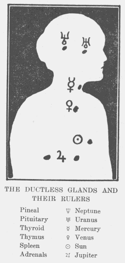

<h1 id="astrology-and-the-ductless-glands">Astrology and the Ductless Glands</h1>

by Augusta Foss Heindel

With an Introduction by Manly P. Hall

### <h3 id="contents">Contents</h3>

- [Introduction by Manly P. Hall](#introduction)
- [Chapter I: Polarian Epoch](#chapter-1)
- [Chapter II: The Garden of Eden](#chapter-2)
- [Chapter III: Two Ductless Glands](#chapter-3)
- [Chapter IV: The Spinal Gas](#chapter-4)

### <h3 id="introduction">Introduction</h3>

Astrology was one of the seven sacred sciences cultivated by the initiates of the ancient world. It was studied and practiced by all the great nations of antiquity. The origins of astrological speculation are entirely obscured by the night of time which preceded the dawn of history. There are traditions to the effect that the astrological science was perfected by magician- philosophers of the Atlantean Period. One thing is evident, Astrology descends to this late day adorned with the discoveries and embellishments of a thousand cultures. The history of Astrology is indeed a history of human thought and aspiration. The readings for the planets as given in the cuneiform tablets of Sargon are still used by the astrologers of this generation. Only such modifications and changes have been made as the shifting foundations of cultural standards necessitated.

Two distinctive schools of Astrology have been recognized from the beginning of the historical period. With the decline of the late Atlantean and early Aryan priesthoods and the profaning of their mysteries, what are now called the sciences were separated from the parent body of religious tradition. Astrology and medicine were the first to establish independent institutions. The priests of the state religions no longer exercised a monopoly over the prophetic and medicinal arts. Beginning with Hippocrates new orders of soothsayers and healers arose who were entirely ignorant of the fundamental unity, yes, identity of the spiritual and physical sciences.

The division of essential learning into competitive, or at least non-cooperative, fragments destroyed the synthesis of knowledge. Frustrated by division and discord, the whole structure of education broke into innumerable discordant parts. The science of medicine divided from its spiritual source deteriorated into the quackery and leechcraft of the Dark Ages, a condition of affairs so sorry that the Hermetic physician Paracelsus was moved to say, "Fortunate is the man whose physician does not kill him." Astrology was likewise corrupted into horoscope mongering. Divorced from its divine purpose it drifted along, performing a halfhearted and pointless work which consisted for the most part of the bleating forth of dire predictions and the compounding of planetary salves against the itch.

A small group of enlightened and educated men preserved the esoteric secrets of medicine and astrology through those superstition ridden centuries we now call the Middle Ages. Of such mental stature were the Rosicrucians who honored Paracelsus as one of the chief of their "mind." Through Paracelsus and the Rosie Cross the spiritual secrets of nature were restored to the chief place among the ends of learning. Knowledge was interpreted mystically and the profane sciences were reflected as merely the outward forms of inward mysteries. The secrets of mystical interpretation were concealed from the vulgar and given only to those who yearned after things which are of the spirit. THE MYSTICAL DIVINITY of Dionysius the Arepagite became the textbook of an ever increasing number of devout and God-loving men and women who saw in all outer forms and institutions the shadows and semblances of inner truth.

The modern world which sacrificed so much for the right to think has grown wise in its own conceit. Educators have ignored those spiritual values which constitute the priceless ingredients in the chemical compound we call civilization. Material science has become a proud institution--an assemblage of pedagogues and demagogues. There is no place for mysticism in the canons of the over-schooled. Hypnotized by the strange fascination which matter exercised over the materialist, modern savants ignored the soul, that invisible reality upon which the illusions of the whole world hang.

It was Lord Bacon who said, "A little knowledge inclineth men's minds towards atheism, but greatness of knowledge bringeth men's minds back again to God." This wonderful quotation expresses the tempo of the modern age. A disillusioned world saddened over the failure of material things is crying out again for those mystical truths which alone explain and satisfy. The return of mysticism brings with it a new interest in astrology and healing.

Mysticism brings with it a new standard of interpretation. To live up to the exacting demands of a mystical interpretation all branches of learning must be purified and restated. To the mystic, astrology is not merely prediction or even giving of advice, it is a key to spiritual truths to be approached philosophically, to be studied for its own sake.

Although science has classified, tabulated, and named all the parts and functions of the body, it cannot describe or explain what man is, where he came from, why he is here, or where he is going. In the presence of ignorance concerning these vital subjects, it is difficult to appreciate an elaborate learning in secondary matters.

The initiates of antiquity were concerned primarily with man in his universal or cosmic aspect. Before a person can live well he must orient himself, he must know in part at least the plan of living. With this knowledge he can then cooperate with "the plan," and the philosophic life recommended by Pythagoras is merely to know the truth and to live it.

Scientists looking for the cause of those energies which motivate and sustain the world have decided by a process of elimination that these causes must lie in a subjective structure of the universe, the invisible sphere of vibrations. So the modern fancy is to ascribe to vibration all that cannot be explained in any other way. The moment we acknowledge the universe to be sustained by an invisible energy which manifests through the law of vibration, physics becomes super-physics, physiology becomes psychology, and astronomy becomes astrology. Astrology is nothing more nor less than the study of the heavenly bodies in the terms of the energies which radiate from them rather than merely an examination of their appearance and construction.

The original Rosicrucians held to a theory generally discarded by men of science and now known as the microcosmic theory. Paracelsus was the most prominent exponent of this concept of universal order and relationship. He said, "As there are stars in the heavens, so there are stars within man, for there is nothing in the universe which has not its equivalent in the microcosm." (the human body). In another place Paracelsus says, "Man derives his spirit from the constellations (fixed stars), his soul from the planets, and his body from the elements."

It is quite impossible for the most highly trained scientist to examine with any adequate appreciation of values the whole infinite diffusion of the cosmos with its island galaxies and incomprehensible vistas of immeasurable space. Yet the whole of the pageantry of worlds is evidently dominated by all- sufficient laws. Man himself is more compact though possibly in other ways hardly less difficult to analyze. The cells in the body of man are as countless as the stars of heaven. Countless races of living things, species, types, and genera are evolving in the flesh, muscle, bone and sinew of man's corporeal constitution. The dignity of the microcosm gives the scientist some sense of the sublimity of the macrocosm. By the use of astrology it is possible to discover the interplay of celestial forces between the macrocosm and the microcosm. The centers in the physical body through which the sidereal energies enter were discovered and classified by the ancient Greeks, Egyptians, Hindus, and Chinese. There is great opportunity for work in examining not only the physical body itself but the auras which extend from the body forming a splendid garment of cosmic light.

The last few years have witnessed exceptional progress in that branch of medical science which is called endocrinology or the study of the structure and function of the ductless glands with research into therapeutic methods of treating derangements thereof. These glands are now accepted as the regulators of the physical function, the governors and directors of bodily structure, profoundly significant not only in their physical reactions, but also their effect upon mentality, emotion, sensory reflexes, and the so-called spiritual or metaphysical functions. Nearly all endocrinologists admit that the pineal gland is the most difficult to understand and the most difficult to treat. It can now generally be reached only by treating the other glands over which it acts in the capacity of generalissimo. The physical functions of the glands are now fairly well classified but there will unquestionably be much revision of the present opinions. Physicians are willing to admit that the function of the glands does not end merely with their effect upon the body but scientists are not prepared to make any pronouncements beyond the field of material reaction.

It is especially significant therefore that through a combination of clairvoyance and astrology it is possible to examine the ductless glands and discover the metaphysical elements in their functioning. The modern clairvoyant uses the same method for his work as was used by the initiate priests of the ancient world, and like those older adepts he makes contributions to the sum of knowledge which are only discoverable to the materialist after centuries of ponderous experimentation.

The work which follows is a spiritual record of the function of the pituitary body and pineal gland. I feel that the researches carried on by Mrs. Max Heindel are a definite contribution to the subject of endocrinology that should be preserved for the use of all students of medicine and the occult sciences.

\- Manly P. Hall

<cite>Схема: Беспроводные (внутренней секреции) железы и их правители</cite>

<h2 id="astrology-and-the-ductless-glands-h2">Astrology and the Ductless Glands</h2>

### <h3 id="chapter-1">Chapter I: Polarian Epoch</h3>

So God created man in his own image, in the image of God created he him; male and female created he them.--Genesis 1:27. 

In the study of the origin of man and his prehistoric state we are constantly stumbling against unexplained mysteries and especially when we read from the materialistic viewpoint in the Old Testament, which is the most wonderful history of man. We are then forced to scale the most formidable rocks of doubt. When we read between the lines, however, or view the past with an open mind then this book of Genesis is a mine filled with gems of the rarest kind.

In THE ROSICRUCIAN COSMO-CONCEPTION we are taught that the world is divided into seven different states of consciousness. Beginning with the densest we have the physical matter of which man's physical body is made. Although it may not be visible to the physical senses yet we know and have positive proof that there is something within and about us of a subtle nature, finer than our physical yet interpenetrating it, which we cannot see even though we feel it. Electricity is a force which man can feel but cannot see. He knows that the atmosphere exists yet he cannot see it. And so we may sense and know that this subtle rarified life exists. We view the storm and we feel its force. We can see the raindrops as they descend to earth, and we are told by the scientists that this rain is drawn up by evaporation, causing the moisture in the clouds. We know that the wind blows; we feel its refreshing influence. Science has a reason for all these changes and explains these atmospheric phenomena from materialistic investigations.

The occultist explains these phenomena from the higher or spiritual viewpoint by telling the scientists that the great invisible regions from which the winds come are peopled with higher intelligences and that great spirits control the elements; that they have beings who carry out their orders; for instance, the spirit of water has its workers, the undines; the spirit controlling the winds works through the sylphs. So we have the elements which man must recognize as existing, all with their invisible leaders and workers who exist in God's great universe, as well as poor materialistic man who denies everything which he cannot see with his physical eyes, and who when he is asked to explain these great mysteries cannot do so.

Now, as stated before, THE ROSICRUCIAN COSMO-CONCEPTION recognizes seven different worlds. What shall we call them? Not matter, for we can only recognize as matter what man can see with his physical sight. But there are six higher states of consciousness; let us call them by the names which were given to Max Heindel by the great beings who saw fit to entrust him with this knowledge: the physical world, the desire world, the world of thought, the world of life spirit, the world of virgin spirits, and the world of God. Now, these are only names and they do not explain the conditions of these different states. Let us take for illustration a teakettle filled with water. if we place this kettle of water upon a cake of ice the water will become hardened and in a little while we hall have ice. But let us place this same teakettle of ice on a hot stove and in a short time the ice melts and we have steam which disappears into the atmosphere and is lost to the visible sight. Where has it gone? Some place where the incredulous eyes of the materialist cannot follow, but the occultist can trace it. He knows that nothing in God's universe is lost.

Man, who is God's most perfected work, is composed of every element found in these seven great worlds. Man as we find him today with his wonderfully developed and complex mind and body was not made, as many misread the first chapter of Genesis, out of clay and in one day, but his present stage is the outcome of ages and ages of growth. We follow him as he enters the arena of life as a virgin spirit, a thought, a spark from the divine Father, hurled into space with a force such as God alone can send. This thought-form has its birth in a world of virgin spirits where the divine flame commences its long pilgrimage through matter, gathering the material from each world, denser and denser, working its way through the mineral, the vegetable, the animal, and then into the human stage. Within this divine spark are enfolded all the potentialities of the divine Father. As a thought of a building which is generated by a man gradually takes form within his mind, and as he puts his plans upon paper and straightway procures material wherewith the building is to be erected, so was God's thought, the spark which was to become man, also made manifest, and we find it today expressing in a body for which David praised God in the 139th Psalm, saying, "I will praise thee; for I am fearfully and wonderfully made." Paracelsus says, "The physical body itself is the greatest of mysteries because in it are contained in a condensed, solidified, and corporeal state the very essences which go to make up the substance of the spiritual man, and this is the secret of the Philosopher's Stone."

There are mysteries within this human temple which man is unable to solve (which have baffled material science), and for the solution of which many lives have been sacrificed, both of the human and the animal kingdom. The vivisectors have jeopardized their very souls in their effort to solve these mysteries. Animals have been put through the most excruciating suffering by science in its endeavor to wrest these secrets from God. But material science can go just so far when it finds itself against a wall which its instruments and its scientific minds cannot penetrate and it is helpless. There is but one tool, which it cannot or will not recognize, and which alone will penetrate or break through, and that is THE HUMAN SPIRIT. The trained seer alone has access to the higher regions which, unfortunately, the materialist, because he cannot be given material proof, will not recognize. We must, however, give him credit for having accomplished wonders in his struggle to master and understand human ills. Materia medica has accomplished wonderful things.

There are two forces in nature which man recognizes and which he acknowledges as existing in every atom--the positive force (male), and the negative force (female). We find them in the metals which man is utilizing to generate his electricity, the copper, zinc, etc. In the plant we also find the same elements. The very tiniest atom in man's body is charged with these two forces. They are playing through his body, without the blending of which he could not hold the particles together. Although man, with a male body, may express the positive physical, yet his negative vital body helps to hold the positive physical particles together. Likewise, the woman expressing in the negative female body is balanced by a positive vital body.

The various forms and developments of man's body during antenatal life are recapitulations of his development during involution. In the Polarian Epoch his body was globular similar to the ovum, and also of a gelatinous substance. There was at the beginning but one organ which protruded from the top of his bag-like form. This organ was eyes, ears, in fact it was the nucleus through which the rest of the body was built, also the medium through which man received his life from the Father. This organ is today called the pineal gland--epiphysis. Man's energies at that time were, like those of the fetus, directed inward to build future organs, and as the prenatal life of the physical body of today is directed and helped by the mother, so was man assisted during his involutionary period by the Divine Hierarchies. He was in direct touch with the higher realms and not yet conscious of his physical environment. In the meantime, eyes, ears, and various organs were taking shape within this ovoid body, while the pineal gland, which is at present such a mystery to medical science, was its only means of communication with the outer world. This organ was much larger than it is today, and from its cone-shaped top there protruded a long, transparent, flexible tentacle which aided in locomotion and in feeling, and this appendage may yet be seen on the small end of the pineal gland. It has the appearance of a small piece of skin, the function of which will be taken up in another chapter.

### <h3 id="chapter-2">Chapter II: The Garden of Eden</h3>

Man's evolution and development up to the present time is divided into five periods or epochs by the Rosicrucian teachings. We have described his bodily development during the Polarian Epoch, and we will now make a study of it during the next period, the Hyperborean Epoch. In the former man was mineral- like, in the latter he developed a vital body and was plant-like. In the third period, the Lemurian Epoch, he developed a desire body and became animal-like. The earth had already become encrusted and hardened in some places, and the atmosphere was dense and fog-like. Man then lived in the densest vegetation to protect himself from the intense heat, while his body had grown to a giant- like size--long arms and hands, massive jaws, but no forehead, the top of the head being very close to where the eyebrows are today. The skeleton had partially formed but was yet of a soft cartilaginous nature; man was not yet able to walk upright. The blood, which had heretofore been cold, now received iron and developed red corpuscles, which in turn hardened the bodily structure, making it possible for man to walk upright.

We have now reached the period of man's development recorded in the second chapter of Genesis where the Lord gave Adam an helpmate, at the separation of the sexes. Heretofore man was hermaphrodite; but now we have arrived at the time mentioned in the story in the Bible of Adam and Eve when they were turned out of the Garden of Eden for their sins. The change in sex was not accomplished in a day as some may read from the Book of Genesis, but was accomplished slowly and be degrees. As the earth became more crystallized, man's evolution kept up with this change, and it became necessary that the Ego draw within the body in order to control it. To accomplish this it was necessary that a brain and larynx be added, and for this purpose man was required to sacrifice one-half of his creative force. He then became an individualized, thinking entity, a creator, and he was then able to begin his work with the minerals.

Man was at that time unconscious of the change in sex and was also unconscious of his outer surroundings, for his eyes had not yet been opened. Similar to the deep-water fish or the mole, he had no need of these organs, for the atmosphere was too dense and foggy. However, after the earth was thrown off from the central sun, the light which had theretofore been from within came from without; nature always supplies every need, hence man's eyes began slowly to develop. As the brain was growing by stages, likewise other organs which connected with the brain were built as man's development demanded.

As the sexes separated and man outwardly expressed one of the sexes only, the pineal gland, which in the Polarian, Hyperborean, and the early part of the Lemurian Epochs, protruded from the top of the head, now drew within the skull.

There is another tiny organ within the brain of man, the pituitary body, which has had much to do with his development, both mentally and physically, and which is as important as the epiphysis, the pineal gland. The pituitary body or hypophysis is very necessary to man's life and development; it appears in the fetus in the fourth week.

We may trace the development of man's body through all its stages from the very beginning up to that of its present wonderful mechanism in the life of the fetus; we first see it as a tiny speck of gelatinous matter, attracted to another speck of the opposite vibration. These are positive and negative. We follow the embryo through its development as it assumes the bag-like shape which is its first attempt at form as described in the preceding chapter, the globular, gelatinous form of the Polarian Epoch. This small embryonic sac has within it all the potentialities of the present perfected body with the two polarities, the positive and negative, the male and female, the pineal gland and the pituitary body. We follow this human embryo through its growth and changes, which, as in the case of prehistoric man, passes through the mineral- like stage, the plant stage, then the reptile stage with its well marked tail which at the ninth week disappears. Following this is the animal stage with its doglike face, with only a spot which later will become the eyes, ears, et cetera. At one stage of its development the pineal gland protrudes through the bag-like sac, and then the little form passes through the stage of the hermaphrodite as in the Hyperborean Epoch when no distinction of sex is shown outwardly. And so we may follow the evolution of man's body by the changes in the prenatal growth of the child in its mother's womb.

### <h3 id="chapter-3">Chapter III: Two Ductless Glands</h3>

The pineal gland and pituitary body are two organs which have not had to undergo extensive changes to bring them up to their present stage. These organs were both present in the bag-shaped body during the Polarian Epoch. Similar to the bud which contains both the stamen and pistil within its ovoid shape, the pineal gland and the pituitary body are the nuclei of the positive and negative forces by means of which our physical growth has developed.

These tiny organs were larger in primitive man than at present, and through them the creative hierarchies termed in the Rosicrucian Philosophy the Lords of Form, have been able to assist the Ego to build its body and bring it up to its present state of perfection.

#### <h4 id="the-pituitary-body">The Pituitary Body</h4>

The pituitary body was so named by medical science because it was formerly thought that the pituite or mucus of the nose came from this body. This idea, however, has been discarded, and although medical science affirms that the real functions of the pituitary body are speculative, still in the past few years it has gained much knowledge which is no longer speculative. This gland is situated in a saddle shaped depression of the sphenoid bone, between the eyes and directly back of the root of the nose, and at the junction of the two optic nerves. It is impossible to give its size, as it changes with age, temperament, and the morals of the person. Gray describes it as a meeting place in the life of the primitive embryo of the hypoblast, which is the innermost layer; the epiblast, the outermost layer, which later develops into the nervous system and the skin; and the mesoblast, which is the middle layer. Within these three layers are contained all the germinal organs of the body which are in formation. Consequently the pituitary body is directly associated with man's past, present, and future growth and development, for from these three primitive layers within the embryo, the body with its senses, brain, nervous system, and vital organs is developed, and the pituitary body is the central station through which all growth is directed. But the pineal gland is the real power behind it all, the formation of which we will take up later.

The pituitary is a small oval body, consisting of two lobes, the anterior or glandular portion, and the posterior or nerve portion, each having its separate function, also varying in color. The anterior lobe is of a yellowish gray substance intermingled with pink, while the posterior lobe is darker. Medical science has in the past few years made some noteworthy investigations; it claims that the pituitary body is smaller in man than in woman and that its size increases rapidly between birth and puberty; that the anterior lobe has control over the bony structure of the skeleton, while the posterior lobe has rule over the circulation and the fluids of the body. The latter regulates the assimilation of carbohydrates and other foods; renal secretions, body temperature, et cetera.

One of our students who is a doctor stated in a letter to the writer that that he would not think of leaving his office to attend an obstetrical case without having pituitary extract in his case, which when used at the proper time reduces labor pain from one to four hours. This extract, however, in improper hands is a two-edged sword.

The pituitary gland is connected directly with and has rule over the outer sheath of the brain and spinal column, the dura mater. This sheath embodies the great protective mother principle. It covers the brain and spinal cord, protecting them from outer impacts and also feeding the blood vessels and nerves.

#### <h4 id="the-pineal-gland">The Pineal Gland</h4>

The pineal gland is a tiny cone-shaped body varying in size according to the mental and spiritual status of the person. It is named after the pine cone, which it resembles in appearance. It is larger in a child than in an adult and larger in females than in males. Its functions are almost unknown to science. Some claim that it has direct rule over the generative organs and the brain. Extracts of it when injected into the circulation produce a slight dilation of the blood vessels. It is large at birth and is fully developed at puberty. Its structural evolution begins at the age of seven years. Dana and Berkeley in their investigations found this organ small and lacking in substance in children who were backward mentally. Science has also been able to connect this gland with the functions of the interstitial gland and of the brain, but these conclusions are only speculative.

The pineal gland is held in place by the pia mater, a thin membrane or sheath surrounding the brain and spinal column, from which the entire central nervous system is fed, and from which many little nerve roots branch off between the spinal vertebrae. The dura mater is the outermost sheath while the pia mater is the innermost. The pineal gland has the appearance of a small male organ and rests upon what is termed by science the quadrigeminae, four rounded eminences placed in two pairs. The two lower ones are called the buttocks, the two upper the testes, and the tiny pineal gland rests in the center of them. The pituitary body is connected with the dura mater, the mother principle, on the anterior side of the third ventricle. The pineal gland, the male or positive organ, is connected with the pia mater and is located at the posterior end of the third ventricle; consequently this tiny cavity or ventricle is of great importance to man as we shall see later.

### <h3 id="chapter-4">Chapter IV: The Spinal Gas</h3>

According to the Rosicrucian teachings the blood is a gas and not a liquid as affirmed by science. When the spinal column is observed by one with the spiritual sight developed, the spinal gas appears like a thin stream of light, the color of which differs according to the temperament and morals of the man. In the sensual man this spinal fire is a dull brick red, intermingled with a slight coloring of blue. As his aspirations rise and his love for others is awakened, this color becomes clearer, and the blue light with a slight coloring of pink is drawn upward. When one observes the spinal gas of the spiritually awakened man, who has purified his mind and body by high ideals and by a life of service, especially if observed while he is in meditation or prayer, there is seen a most wonderful sight. The spinal fire is of a most ethereal blue which is difficult to describe; the nearest color to it would be that of a blue gas flame with the softest tint of pink and yellow playing through it. From the lower part of the sacral to the upper part of the lumbar region the colors are still slightly clouded with red, but as the spinal gas rises upward, it becomes purer and more transparent. This spinal fire during meditation and prayer becomes more active, coursing more swiftly through the spine, and as it touches the spinal nerves, it emits a tiny spark at the beginning of each until it reaches the medulla oblongata, which seems to act as a transformer or separating station, where the color makes a change, the darker or murky colors again descending while the lighter and purified gas is drawn upward.

There is a sieve-like enclosure at the lower end of the fourth ventricle, which is connected with the medulla oblongata. In the latter this gas seemingly goes through a purifying process; thence it passes through the fourth ventricle into the third, where it passes through a golden furnace-like glow. It is then absorbed by the pineal gland.

The color of this flame, however, is different in an adult who is earthly, filled with passions and desires, whose body is fed on the flesh of slaughtered animals, and which is steeped in tobacco, liquor, et cetera. This man's spinal gas is of a murky rose color and has a tendency to cling to the lower part of the spinal column. It is with considerable effort that such a man may draw some of this gas to the brain for use in mental work; and its color is not the clear blue of that of the man with high aspirations.

The pineal gland of the sensual man who dissipates his vital fluids is very small, while in the child and the adult who lives a chaste life this organ is large.

Water when brought to a certain heat is turned into steam and may evaporate into the air, leaving a tiny residue of crystallized sediment in the kettle. Conversely, the blood while in the body is a gas, but when it comes in contact with the air, it condenses and becomes a liquid. Now how is it possible under similar conditions for science to investigate with its material instruments and clearly understand the functions of two such vital organs as the pineal gland and the pituitary body, whose inaccessibility makes it almost impossible to remove them without changing their shape?

When the man with the developed faculty of spiritual sight, however, investigates their physiological functions, he does not need to remove the organs but turns his X-ray sight upon them and observes their action.

#### <h4 id="spiritual-observation">Spiritual Observation</h4>

The writer has been privileged while under the direction of the Teacher to watch these two higher ductless glands in action. The time and opportunity were ideally prepared, and a living person was the subject. Both organs were much enlarged which gave marvelous clearness to our observations.

Let us observe this subject, a woman in spiritual meditation, one who has been living a pure and chaste life with high aspirations, and whose food for years has consisted of fruit, vegetables, and cereals. The pituitary body, through which these aspirations are first registered, is much enlarged. The posterior lobe is turned backward with its funnel shaped neck enlarged with a mouth opening at the end. From this open mouth exudes gas of a soft rose color, slightly intermingled with yellow and blue of the pale shades. The spinal column is filled with a pale blue ether, intermingled with soft pink and yellow. After this gas leaves the medulla oblongata and enters the pineal gland, it is of a wonderful blue color such as one sees clinging to the mountains after sundown. The pineal gland is enlarged with the point of the cone leaning forward toward the pituitary body. The tiny appendage of skin at the end of the former, which was mentioned in a previous chapter, is elongated and emits a small flame similar to the blue flame of a gas jet. These two organs vibrate at a most rapid rate and lean toward each other over the third ventricle. This ventricle is an oblong cavity lying between the optic thalami. When the life of the aspirant has been pure, the ventricle appears to the occultist like a tiny furnace with a golden glow. From this the vitality of the body is drawn.

The pineal gland as already stated, has the appearance of a tiny male organ, while the pituitary body with its open mouth is similar to the female organ. So we may see that science, which is trying to prove that these organs are directly connected with the functions of the brain and the generative organs, is right. They have direct influence upon man from the two ends of the spinal cord, for does not the sex pervert in time become a degenerate?

Conservation of the vital fluids and a chaste life strengthen the brain, and these two ductless glands become enlarged, but in the sensualist they atrophy. Science is correct in its assertion that these organs are larger in children and women than in men, even men who live a pure life.

#### <h4 id="astrologically-discerned">Astrologically Discerned</h4>

In an endeavor to further prove the above assertions astrologically, the writer has compared the horoscopes of patients who have been in touch with the Healing Department at Headquarters. She found ten horoscopes of young men and women who were afflicted with epilepsy. Four of these patients were found with the Moon in conjunction with Neptune in the sign of Taurus. This sign has rule over the throat and also indirectly over the generative organs. Here again we find, as Max Heindel has said, that Neptune is the higher octave of Mercury and not of Venus as some astrologers claim, for this planet, which has rule over the pineal gland, also has rule over the brain and the spiritual faculties. Two patients out of these ten have Neptune square to the Moon, while one has Neptune in conjunction with Mars and another Neptune in opposition to Saturn. In all of these cases we found that they had formed the secret habit of sex abuse during childhood, which had wasted the vital fluids necessary in building the brain, and there was a mental deficiency bordering upon idiocy. If the doctors could have opened the brains of these patients to examine the glands, they would have found them diseased according to the planetary afflictions, which might have taken the form of atrophy, tumor, or in the case of the pineal gland, inflammation.

Astrologers in the past have made the claim that Uranus was the higher octave of Mercury, and had rule over the higher mental qualities, and that Neptune was the higher octave of Venus. At the same time they have admitted that an afflicted Uranus in the angles caused separations in marriage, and that a square or conjunction of Uranus and Venus in a woman's horoscope would attract undue attention from the opposite sex, thereby endangering her morality. Uranus has always been associated with licentiousness and laxity in morals, and illicit love affairs, while Neptune has been connected with secret orders, deceptions, and frauds. The writer has wondered why these two higher spiritual planets were reversed by the astrologers when they represent opposite characteristics. Spiritual investigation shows the higher octaves to be as follows: Neptune, ruler of the pineal gland, is the higher octave of Mercury; Uranus, ruler of the pituitary body, is the higher octave of Venus.

The drunkard when under the influence of liquor has an over-stimulation of the pituitary body which causes reeling, hilarious conditions. This gland regulates the emotional nature and the circulation of the blood. Being ruled by Uranus, the higher octave of Venus, the ruler of music, the pituitary body is influenced by music and harmony which set it into vibration. The morphine or cocaine inebriate receives his stimulus through the pineal gland.

#### <h4 id="rejuvenation">Rejuvenation</h4>

We have read much in the papers about rejuvenation through the grafting of animal glands into man to restore his youth. Should this be carried to any great extent, the next generation would be liable to have many degenerate children and the institutions would be filled with mental perverts. The animals from which these glands are taken, the goat and monkey, multiply very rapidly, and naturally there would be a degenerating effect upon the man who is foolish enough to permit this grafting to be done upon his body. Furthermore, this rejuvenation is for a short time only. If the man continues to live the life of the senses, he will soon dissipate this new energy, which will have to be replenished from time to time.

There is but one fountain of youth, one elixir of life, and that is our food and our thoughts. If we live a pure and simple life of unselfishness, eating lightly of vegetables and fruit, keeping close watch over our desires, then we need not sacrifice the life of the animal to replenish our wasted energy. Ponce de Leon sought the fountain of perpetual youth in far-off lands, while he had two tiny cups within his own brain which, if he had only paid the price of making an exchange of the worldly life of the senses for a spiritual life of purity, would have given him the elixir of life.

End of: Astrology and the Ductless Glands