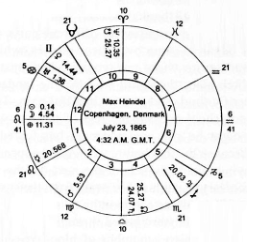

<h1 id="memoirs-about-max-heindel-and-the-rosicrucian-fellowship">Memoirs about Max Heindel and the Rosicrucian Fellowship</h1>

by Augusta Foss Heindel

[Note: Links to additional pictures not contained in the original
version of Memoirs may be found in the book’s text.]


<h2 id="part-1">Part I: Max Heindel - The Rosicrucian Order and The Rosicrucian Fellowship</h2>

Friends have entreated me for a number of years to write my
memoirs of Max Heindel and tell of the intimate associations
with him and of the beginning and the formation of The
Rosicrucian Fellowship. This has at last been made possible.
Hitherto, the pressure of time, the rapid growth of the movement,
and the work incident to and associated with the pioneering of
the work made this impossible. But at this writing, time is
beginning to bring some release from the heavy grind. The
surroundings of my new cottage into which I have at last become
settled are so pleasant, and the vibrations so harmonious and
pure, that thoughts flow freely and it is now possible to express
these thoughts on paper.

I shall in this writing go back to the very beginning of my
associations with Max Heindel. Although this will bring my
personality into the picture, it cannot be avoided, for the two
egos which have been known as Max Heindel and Augusta Foss
Heindel are so closely linked together that to endeavor to do
justice to the activities of one and leave the other out would be
impossible.

It was in the fall of the year 1901 while acting as usher at a
lecture delivered in Blanchard Hall, Los Angeles, California, by
C.W. Leadbeater, the late theosophical leader, that the writer
ushered a very pleasant-faced man to a seat; the next afternoon,
while she was assisting the librarian to serve the callers in the
theosophical rooms, this same pleasant man came into the room
and requested the loan of a book written by the man whose
lecture he had heard the day before. After a short visit with him,
it was found that he was a neighbor of the

??? MISSING TEXT???

him, it was found that he was a neighbor of the writer and
naturally he was invited to visit her elderly mother and herself.
This visit was followed by others and ended in a beautiful
friendship and cooperative studies. Max Heindel and Mother
became fast friends and he spent many hours talking with her
about the old philosophers, for Mother was a great reader.

Max Heindel became a member of the Los Angeles
Theosophical Lodge, and was one of the most enthusiastic
admirers of Madame Blavatsky and her Secret Doctrine,
although he was not entirely satisfied with the Eastern teachings
and was ever longing for a Christian Philosophy. In a short time
he was elected vice-president of the Lodge. During the three
years that he was the elected vice-president of the Lodge, a
group of the members became interested in the study of
astrology. Max Heindel was one of them, and the writer (a
student for some years) assisted them in their study of the stars,
for previous to that time the members of the Lodge were averse
to astrology and Miss Foss alone was interested. In a short time,
Max Heindel became very proficient; his keen mind grasped the
mathematical side of this science very quickly.

In the summer of 1905 he was taken seriously ill, and for a
number of months was at death's door with leakage of the heart.
After this illness he withdrew from the Theosophical Lodge, and
in April, 1906, he started for the northern part of the state. He
reached San Francisco on the morning of the 17th of April but
could not content himself; something urged him to leave at once
for Seattle, and he did so. On the 18th of April, 1906, San
Francisco was visited with a devastating earthquake and fire.

Upon reaching Seattle he began to teach classes in astrology,
rebirth, etc., but his health again broke. The poor heart would
not function. He again spent some time in the hospital, but an
indomitable will would at all times save him from becoming a
chronic invalid. Against his physician's will he again started his
work of lecturing and teaching. He taught classes in Portland,
Oregon; Seattle and Yakima, Washington; and Duluth,
Minnesota, in which he was very successful.

About this time a friend who was traveling in Germany had
contacted Dr. Rudolph Steiner and became greatly enamored of
the Doctor's teachings. In her letters she urged Max Heindel to
come to Germany to hear this man, but Heindel was very happy
in his work in the north, and furthermore he was not able
financially to take such a journey. But this friend was so
persistent that she came back to America to persuade him in
person to accompany her back to Germany to meet this teacher.
Her offer to pay his round-trip fare at last persuaded Heindel to
give up his classes and leave for Germany.

This journey was taken in the fall of 1907. After he had
attended some of Dr. Steiner's classes and lectures, he became
disheartened and restless, for what was being taught he already
knew; the teachings were similar to his own knowledge. When
he mentioned this to the friend, she greatly resented it, and this
broke up the friendship between them. He returned to his room
dejected and discouraged, feeling that he had given up a fertile
field of work in America and come over to Europe, only to learn
that he had not found what he expected. He forthwith made
preparation to return to America.

At this time the Teacher, an Elder Brother of the Rosicrucian
Order, one of the Hierophants of the Mysteries, came to him and
offered to impart to him the teachings which he desired,
provided that he kept them secret. Max Heindel had for years
searched and prayed that he might find something wherewith to
appease the soul hunger of the world. Having suffered and
known the longings of his own heart, he could not give the
promise to the Elder Brother, and refused to accept anything that
he could not be permitted to pass on to his soul-hungry brothers.
The Teacher left him.

Can one imagine the feeling that would naturally come over
a starving man, denied food for some time, to be offered a piece
of bread, but before he could taste it have it snatched away? His
last condition would be more wretched than the first. So it was
with Max Heindel. His disappointment, in going that long
distance to meet one who, he had been given to understand by
his friend, had much new occult knowledge to give him, and
finding that she had been mistaken, was intense.

He sat for hours as one stunned after the Teacher left him. In
his disappointment at having to return to America and start
where he left off, feeling that he had wasted time and money in
coming, he spent a number of unhappy days. Later, the Teacher
appeared in his room again and told him that he, Max Heindel,
had stood his test. If he had accepted the offer, namely, to keep
the teachings a secret from the world, he, the Elder Brother,
would not have returned. He was also told that the candidate
whom they had at first chosen, who had been under their
instruction for several years—and who by the way happened to
be the very one whom they had used as an attraction to bring Mr.
Heindel to Berlin, using his friend as a means of inducing him
to go—had failed to pass his test in 1905; also that he, Max
Heindel, had been under the observation of the Elder Brothers
for a number of years as the most fit candidate should the first
one fail. In addition, he was told that the teachings must be given
out to the public before the close of the first dec-ade of the
century, which would be the end of December, 1910.

At this last interview with the Teacher he was given
instructions as to how to reach the Temple of the Rose Cross. At
this Temple, Max Heindel spent a little over one month in direct
communication with and under the personal instructions of the
Elder Brothers, who imparted to him the greater part of the
teachings contained in The Rosicrucian Cosmo-Conception.

It had been his dream to become affiliated and to work with
a humanitarian order, but he had never aspired to leadership. But
if we believe in the language of the planets and look at Mr.
Heindel's horoscope [see below], noting the 6th degree of Leo
on the Ascendant with the Sun, Moon, Mercury, and the Part of
Fortune all positioned in the first house, we find the born leader,
one who cannot remain a follower, for his mentality and his
personality would bring him to prominence.



Max Heindel by nature was not domineering; nor was he one
who would push himself ahead of others, but he was always
regarded as one who knew, and as one to be trusted. Naturally,
such an one is ever pressed into positions of responsibility and
authority. The Sun and Moon conjoined to the Ascendant forced
this native to the front. Also Max Heindel had a well-aspected
Venus in the house of friends. This at all times brought him
faithful and loyal friends who were responsible for his
promotions. Especially does Venus indicate women friends; we
may see an example in this friend who insisted on helping him
to reach Germany, there most unexpectedly to contact the Elder
Brothers of the Rosicrucian Order.

Max Heindel's greatest handicap was a bruised and injured
physical body. At the age of eight years he suffered an accident
to the left leg, which was caused during a period of play with a
number of boys on their way to school. The city of Copenha-gen
(Denmark) had numbers of streams, or rather ditches, with banks
on each side, which were used to carry water for irrigation to
different parts of the city. The boys began to jump over these
ditches, which in some places were quite wide, and young Max
must scale this certain ditch also. The result was that he landed
heel first with a terrific thud, and was in dreadful pain. Though
late, he went to school and sat the rest of the day with painful
foot; all night he still suffered pain but feared to tell his mother,
because the day before when this happened, the boys were
playing truant. In school the next day he fainted and it was
necessary to cut his shoe away from the swollen foot.

Then followed sixteen months in a hospital in Copenhagen.
Three holes were bored through the bone of the leg below the
knee, also a number of blood vessels removed, making normal
circulation impossible. Therefore when he reached middle age,
after living a life of great activity and hard work, the heart could
not stand up under the strain and a leaking valve was the result.
Of course he suffered intensely, and every few months the body
would rebel and compel him to go to bed. Hence, much of his
time, after he had gone through the strenuous lecture tours and
classwork of the Fellowship, he was in bed, propped up on
pillows, where, with writing paper on a piece of cardboard, with
his fountain pen he would write the monthly letters and lessons,
which were so anxiously looked forward to by the many students
and probationers all over the world.

When he reached the Temple of the Rosicrucian
Brotherhood, as directed, he was strangely surprised, for in his
mind's eye he had pictured this headquarters as a massive and
beautiful structure, and it was quite otherwise. He was ushered
into what was apparently the modest but spacious home of a
country gentleman, a building which no one would ever take to
be the world headquarters of such an ancient and powerful group
of mystics. Hundreds of curious men and women have scoured
Germany in the hopes of finding this building, but they, like Max
Heindel, have ever pictured it as a grand and noble Temple. And
so he found it, when his eyes were opened to perceive the
spiritual Temple interpenetrating and enveloping the physical
structure.

There, as already stated, they imparted to him the teachings
of that wonderful book, The Rosicrucian Cosmo-Conception,
which was to be the textbook of the association which the
Brothers told Max Heindel he was expected to form—The
Rosicrucian Fellowship. They also told him that the 350 or more
pages of this manuscript would be enlarged and rewritten after
he reached the electrical atmosphere of America.

Max Heindel doubted this, for he was so elated over what he
had received from the Brothers that he could not imagine
rewriting it, but such was the case. He reached New York, with
very little money but in high spirits, and rented a small hall
bedroom on the upper floor of a tenement house. Here he sat
through the hot summer days, from early morning till late at
night, not even taking time for proper nourishment to keep him
in health. He bought a box of shredded wheat biscuits and had
the milkman leave a bottle of milk at his door; this constituted
his day's rations until late in the evening when he would take a
walk and eat his only square meal.

After a few weeks of the intense heat he left New York for
Buffalo, where he attempted to give his lectures in order to help
with his expenses, for his money was becoming low. In this city
he failed to receive encouragement so he went on to Columbus,
Ohio; there he was received very well and was able to arouse
much interest and attract the help which he needed to go on with
his book. He delivered his first lecture in that city on the evening
of November 14, 1908. An artist, Mrs. Mary Rath Merrill, and
her daughter, kindly offered to draw the diagrams needed to
explain certain topics which he had written.

It was in Columbus, Ohio that Max Heindel bought a second-
hand mimeograph machine and started to mimeograph the
twenty Rosicrucian Christianity Lectures. He spent hours,
working late into the night to make mimeographed copies of
each lecture, which he passed out at the close of the lecture to
each one who had attended. Here he also formed a Fellowship
Group which continued to give out the teaching after Max
Heindel had left for Seattle. His one prayer was to get his book,
The Rosicrucian Cosmo-Conception, on the press, but the small
contributions which were received at the lectures were merely
enough to supply him with his simple food and pay rent for a
cheap room. Finally he saved enough money to pay his railroad
fare, so he had to take the day coach, for he could not afford the
extra cost of a berth.

He had a very dear friend in Portland, Mrs. Mildred Kyle, to
whom he had been sending the manuscript of the book he was
writing. She was exultant over this wonderful work and started
using these teachings in her class. She had also procured two
experienced proofreaders to help her read and make all
corrections as the manuscript was received by her. It was she
who encouraged him to return to the West Coast. She had also
promised Max Heindel that when he had finished all of this
manuscript she would interest ten women friends who would
donate one hundred dollars towards the printing of this valuable
work.

Another friend of Max Heindel was William Patterson of
Seattle. When he read the manuscript his first thought was that
what was contained in it was too advanced for the world at that
time. He advised waiting for twenty years till the world was
more ready for it, but when he heard of the plan of the Portland
people, he at once offered to pay for the printing and also to take
Max Heindel with him to Chicago. This was done, and there
these two men spent some time while M. A. Donohue & Co.
printed the two thousand copies of the first edition.

Before the copy for this book could be given to the printers,
however, it was necessary that Max Heindel retype the entire
manuscript, for pencils of four different colors had been used by
those who so kindly helped in preparing the manuscript. Much
valuable work was done by Jessie Brewster and Kingsmill
Commander in the careful editing. Max Heindel retyped the
entire manuscript of 536 pages of this wonderful book. Indices
and some other material were added later. The Word List and
Topical Study Index were written by him to aid readers in
systematic study of each topic. The second as well as the first
copy of the massive manuscript was done by Max Heindel on a
little antiquated <a href="assets/blickensderfer_typewriter.jpg">Blickensderfer</a> typewriter.

In order to have a central distribution station, when the first
edition of two thousand copies of the Cosmo-Conception were
completed in November, 1909, they were stored with a woman
who conducted a Theosophical publishing house in Chicago; she
offered to fill all orders which might be sent in. Both the first
and second editions of this wonderful book were sold for the
small price of one dollar. Eastern publishing houses had become
much interested in it and the orders came in quite freely. Max
Heindel in his big and honest heart never mistrusted this woman;
to him each man or woman was honest until proven otherwise.
The unhappy awakening came to Max Heindel when, after about
six months, he found that the entire first edition was exhausted,
although he himself had received only about five hundred copies
all told.

Unfortunately, the truth as finally learned was that this
woman with whom he had stored his five hundred copies was
indebted to every publisher who trusted her with books. When
pressed to pay these numerous bills she offered in payment of
each debt the corresponding amount in The Rosicrucian Cosmo-
Conception books, and this soon exhausted the first edition.
Then when Max Heindel desired to fill his orders in the
northwestern part of America from Chicago, she was unable to
fill the orders.

It was now necessary to place a rush order for another
printing, and to finance this was a real problem. The writer was
able to supply a small sum to help to meet the first payments on
this second edition. This loss, which at the beginning seemed a
calamity, turned out to be a blessing in disguise, for the publisher
who accepted these books as payments for a debt became
interested in selling them. This was the means of opening a
wonderful field and getting the books before the public in a
much more rapid manner than Max Heindel through his lectures
and his small membership could have done, so it was an ill wind
which turned into a blessing.

After Max Heindel had finished his part of the work with the
publisher in Chicago, he gave a course of lectures and classes in
Seattle and North Yakima, Washington, and in Portland,
Oregon, where he found a fertile field and attracted many
members. He then rewrote the first edition of Simplified
Scientific Astrology (1910) which was a forty-page paper
pamphlet. But his heart was longing to turn back to the southern
part of California where he had made his first contact with
occultism.

In Los Angeles he had made many good friends during the
three years in which he had worked in Theosophy, and the one
close friend and companion in his studies was his most cherished
one. He returned to Los Angeles in the early part of November,
1909, and his footsteps led him directly to the home of this
friend, Augusta Foss, and her lovely aged mother whom he had
learned to love as his own mother. He had been away from these
friends for two years, had not corresponded with them, nor were
they even aware of the wonderful contacts he had made and the
literary work he had done.

Augusta Foss had, during these two years, also been through
many hard trials; one, a very severe illness of double pneumonia,
had taken her to the very jaws of death and left her in a weakened
condition with affected lungs. She had dropped her affiliation
with the Theosophical Society as she was unable to be out in the
night air. However, when her friend Max Heindel made the
statement that he intended to give a course of lectures in Los
Angeles, she defied the wishes of her mother and offered to help
Max Heindel with these lectures.

Now began a very busy period of writing as well as lecturing.
Max Heindel lectured to packed houses, holding 800 or more,
three nights each week, and the other nights he formed classes
and taught both philosophy and astrology. His first astrological
class in Los Angeles consisted of one hundred and twenty-five
pupils. A very enthusiastic group was formed into a Fellowship
Center and teachers were prepared to carry on the work when
Max Heindel should leave, for he had promised the friends in
Seattle and Portland that he would return to them as soon as his
work was finished in Los Angeles.

In order to save the high cost of advertising and to get as
much publicity as possible, Max Heindel would order hundreds
of cardboard signs, eight inches by ten, and have printed on them
the addresses of the halls, the dates of the lectures, and the titles.
Then he would start out with these cards, a box of tacks and a
tack hammer in his pocket; he would walk miles, tacking these
cards in places where they would attract the attention of the
public. They seemed to bring results, for at no time did he give
a lecture when the hall was not filled. Especially after his first
lecture, friends would bring friends until the hall would not hold
them, so he began to issue tickets, handing them out to each one
as he entered the door. These tickets would then admit them to
the next lecture and assure them a seat.

I cannot resist sharing with my readers what I observed of
the marvelous change in this man after he had contacted the
Elder Brothers of the Rose Cross, during the two years he spent
away from Los Angeles.

I had been a student of astrology about four years when I
converted Max Heindel to belief in this ancient science; and one
day when he was spending the afternoon at my home, he asked
if his horoscope indicated that he would make a lecturer. At this
early date he spoke with a decided Danish accent, and I felt that
this would be a great handicap, so replied to his question that he
would make a splendid writer but perhaps lecturing was not his
forte. Now to observe the change in him after two years of
traveling and lecturing, and to hear him deliver most inspiring
lectures, was indeed a surprise. And the most wonderful thing
was that, after each lecture, he would easily answer questions of
the most abstruse and technical kind. The writer asked him one
evening, after a lecture during which he had replied to very
difficult questions, where he had obtained all the knowledge he
displayed in the lectures? He smiled and said: "Well, I just
answer what my higher self dictates."

There is an old saying, "Man proposes but God disposes,"
and this was truly the case of Max Heindel's future when, on
Wednesday evening, June 1, 1910, he gave his last class in Los
Angeles in astrology. His philosophy class he had turned over
the night before to Mrs. Clara Giddings, a dear little friend who
had worked with him while he was in Los Angeles in days gone
by. On this Wednesday evening he made the announcement that
Augusta Foss would take over the astrological class; he also
explained that she had been his own astrology teacher, and this,
of course, held the class together.

But here is where fate stepped in to hold Max Heindel in Los
Angeles until a certain work was to be effected, which was to
change his entire plan; for on the following morning, June 2nd,
he was taken seriously ill with leakage of the heart, so ill that the
doctors diagnosed his case as hopeless. Three doctors stood by
his bedside in the Angelus Hospital in Los Angeles, thinking he
was unconscious, and discussed his case, all declaring that he
could not live through another night. Max Heindel was not
unconscious; he heard every word spoken by the doctors, heard
them pronounce his doom. Realizing that he had been entrusted
by the Elder Brothers to carry their beautiful message to the
world, and feeling the responsibility, he then and there declared
that he would not die, that he would fool the doctors.

The following day was a beautiful, sunshiny day, an ideal
California day. His friend Augusta Foss called on him about two
o'clock and he asked her if she would take him onto the lawn in
a wheel chair. This was four stories down. They were sitting in
the shade of one of the beautiful magnolia trees before
passersby; they stopped and stared as if they had seen a ghost.
To see their erstwhile patient smiling and seemingly on the mend
was truly a surprising sight.

After three days Max Heindel telephoned the writer asking
her if she would please rent him a room in the neighborhood
where she and her mother lived; which she did. The next
morning, only four days after he had been, according to the
doctors, at death's door, he was as well as ever; he climbed a
flight of stairs to his room and later walked a half block to the
Foss home to have lunch with his friends. He surprised them by
making the announcement that he was going to write another
book; that he had collected many questions and answers into
book form, which would then explain many problems of life.

His intention was to hire a stenographer and dictate this book
to her in the Los Angeles Rosicrucian Fellowship rooms, but
when he arrived in the rooms the people were so elated over his
coming that he could find no privacy. The result was that this
book was dictated in the home of Miss Foss. As the room where
he worked was close to the street, with his clear voice he often
attracted a crowd on the front sidewalk. Passersby were amazed
to see a man talking and walking the floor with a paper in his
hand, which contained a question written by someone who had
attended one of his lectures. He answered these questions
offhand without a moment's hesitancy. The writer's elderly
mother, who was one of his most ardent listeners, said that in all
her years she had never met a man with such a mentality.

This book, The Rosicrucian Philosophy in Questions and
Answers, published in 1910, is truly a mine of information. It
unlocks the Bible as no other book can. Max Heindel worked on
this book some weeks, then again the call to the north was so
urgent that he began to arrange for his steamer ticket to Seattle.
He could get the ticket but the berths were all filled and he had
to wait until there was a vacancy. There was, however, an
unfulfilled mission delaying his departure. Destiny had him in
her hands, and a powerful planetary aspect of a progressed
Venus conjunct radical Moon on the Ascendant must be
considered; and so arose the idea of marriage between these two
friends and students, who had shared their knowledge and
spiritual interests for over nine years, to form a permanent
spiritual tie.

I feared to leave my eighty-four-year-old mother who had
already suffered a slight stroke, so the marriage was secretly
performed August 10, 1910, in Santa Ana, California, in the
hope that this dear one would not suffer for fear of losing a
daughter who had been her companion and who had had the care
of her for many years. Max Heindel left for Seattle, Washington,
the day after the ceremony, but Mrs. Heindel remained in Los
Angeles to fulfill her mission to her aged mother.

The writer, after bidding her husband goodbye at the
steamer, boarded a car to return to Los Angeles. In thought she
began to realize what she had entered into; she had become the
wife of a public figure whose work would also become her work,
and so she stopped off at a typewriter agency and ordered a
typewriter sent to her home, a second-hand rented Underwood.
The next day she sat down to learn to type, and what a time she
had. Without a single lesson she sat down to write her loved one
his first letter from her. But something was wrong; she was sure
that they had sent her the wrong machine for she could not find
a single capital letter, in spite of the most careful examination.
So she just wrote the letter anyway, for she would not let any
machine interfere with this very special letter—the first to her
new husband, to whom she told her trouble with the machine
minus the capital letters.

What a joke! His reply reached her by special delivery the
next day, for her letter greeted him as he left the steamer. What
a laugh he had on her, but his instructions told her how to find
those dreadful CAPITAL LETTERS. These efforts at typing
proved to be a godsend, for when Max Heindel returned from
the north so very ill, his helper could carry on the
correspondence and the work could continue in spite of illness.

Max Heindel had not consulted the Teacher regarding the
marriage, and later when he reached his stateroom in the steamer
which was taking him north, he wondered if there might be any
displeasure, but the Teacher appeared to him and greeted him
with a smile; he told him that Augusta Foss had been under their
observation and even their guidance, though unknown to her, for
a number of years and that marriage was to be most fruitful
spiritually, and a safeguard to his health on account of the
protection which this soul would bring to him. Mrs. Augusta
Foss Heindel was from that time the southern representative of
The Rosicrucian Fellowship.

Max Heindel's intentions were to travel to the northern
country and thence work east over the northern route, but here
fate was again the master. After lecturing in Seattle and North
Yakima, Washington, and in Portland, Oregon, for about six
weeks his poor heart again refused to work, and he must give up
the lecture trip, and rest. But now he had someone to come to,
and Augusta Heindel prepared one of her small beach bungalows
in Ocean Park for the homecoming of her sick husband. She
placed her mother in the care of a sister, for Mother was greatly
concerned and willing to share her daughter with the sick but
wonderful son-in-law; for she had learned to love Max Heindel
as a son.

This tiny little three-room cabin was remodeled and made
ready for the homecoming—fortunately, for as Max Heindel
stepped across the threshold into the room he swooned, ill unto
death. Then for three months Mrs. Heindel was up with him day
and night. He had paid the price exacted of every public
character. The Public, through its admiration of the truly great,
will draw on them and in time often kill.

This time the public could find him by way of a Post Office
Box only, and these two souls were then really free to enjoy their
companionship. This was a strange but sweet honeymoon, for
their interests were bound up in one great work.

Even with the illness of Max Heindel they did not allow the
work to stop, for while in Seattle he had bought a small Writer
Press, a printing press which would reproduce the typewritten
letter. It was run by pushing the lever over the type after it was
set and locked up as any printing press requires. When the press
was received it was set up by the man who delivered it from the
express company. Next Augusta received her instruction as to
how to run it by sitting at the bedside of her sick husband. Being
naturally mechanical, she was an apt pupil but her greatest
problem was to set type, which must be done reversely so that
the impression on the paper would be readable. Well, Augusta
had to set the chase (which is the form into which the type must
be locked up) on a chair beside the bed and take her first lessons
in typesetting. Then she must be instructed how to lock the type
in the chase, take it into the little kitchen and place it in the press;
adjustments must be made on the ribbon; this press was
antiquated enough to require the use of ribbons.

Now we are ready: and what a mess! At the first attempt to
slide the lever over the locked-up chase, the type not being
locked tightly enough, the first pressure on the top of machine
put the type all "off its feet" as a printer would term it. The
students who received these first lessons sent out in November,
1910, could note that the print on one side of the letter was darker
than on the other; the writer has some of them still in her
possession and can call to mind this first most trying attempt to
send out these beautiful teachings.

Before Max Heindel left Seattle for the south, the secretary
of the Seattle Center, A. E. Partridge, had sent out the following
letter to the friends in Columbus, Ohio; Seattle and Yakima,
Washington; Duluth, Minnesota; Portland, Oregon; and Los
Angeles, California, and all others on Max Heindel's
correspondence list, announcing that Max Heindel would start a
correspondence course and open permanent headquarters in
Ocean Park, California, under Post Office Box 866.

```

Letter to Members 20-A - November 1910

Dear Friend:

We are about to start an important extension of the activities of the Rosicrucian
Fellowship. It will be an effort to meet a want, long felt by many of our students,
particularly by those who are isolated and not connected with any of our Study
Centers.

We have published a remarkably complete literature during the last year, a
literature that has been grasped with such avidity that we are already preparing a
third edition of the Rosicrucian Cosmo-Conception. Nevertheless, or perhaps just
because of the way our literature appeals to the public, there has been a keen desire
upon the part of many students to get into a still closer and more personal touch
with Mr. Heindel. The appeals which have been made to him have found a ready
response in his heart, and a plan has been formulated to meet the demand. Mr.
Heindel will largely curtail his activity in the lecture field and devote most of his
time to correspondence with those who are studying the Rosicrucian teachings and
trying to live the life.

In order that he may direct their efforts most effectually, the letters will
probably be graded differently to "Students," "Probationers" and "Disciples."

The interest which you have already manifested has led us to believe that
perhaps you may be anxious to take advantage of this opportunity to have your
name placed upon Mr. Heindel's correspondence list. If we are correct, and you are
really anxious, please fill out the enclosed blank and mail to General Secretary, Box
1802, Seattle, Wash. You will then receive the first letter in due season and others
will follow from time to time. Several letters may sometimes be issued in a month
and at times more than a month may intervene between.

The Rosicrucian Fellowship

```

The response was good from both students and probationers:
they were ready for the lessons. But can the reader pause for a
moment to realize what this would mean to one lone woman with
a sick man on her hands; to cook the meals, make the beds,
sweep the rooms, set the type, run the press, and then address all
the envelopes for both these classes of corresponding members,
and also answer numbers of letters which were coming in from
students (who appealed to Max Heindel for help in solving their
problems); and lastly, carry the mail to and from the Post Office,
six blocks away? Well, the writer would retire at night with head,
arms, and feet aching so badly that she tossed most of the night
when not up and ministering to this suffering but determined
man. He had so much to give despite being disabled physically,
but never a word of complaint; his only grief was that the woman
he loved must carry so many burdens.

In this way the infant headquarters came into existence, in
November, 1910—a headquarters which was to feed the soul-
hungry in all lands, in all climes, and in all languages. Little did
these two heavily burdened souls realize then what would be the
results of their labors of love and devotion as they toiled to bring
into being a wonderful infant, The Rosicrucian Fellow-ship,
which Max Heindel often called their spiritual child.

A doctor who was called in at this time to examine Max
Heindel told the writer that he could not live to the end of another
year, but she would not accept this discouraging report. She felt
in her heart that, with her devoted care, her loved one would not
pass out until his work had been accomplished. She had faith in
the Elder Brothers, feeling that this illness was a lesson to a great
soul who was to meet another, his third, Initiation; and with one
who had such a vital, ambitious nature, he must be brought to
the very gates of the beyond before these higher teachings could
be imparted to him. He had already, through previous illnesses,
received two Initiations, and she had the faith that the Brothers
would again restore him to health as soon as his response to their
higher teachings had been accomplished.

For about three months he suffered under this weakened
heart, but gradually there came days when he could don a
dressing gown and sit up to do his writing. But he could not
content himself unless he was doing something constructive, so
as he gained strength he was again planning to write his fifth
book. He advertised for a stenographer who came each day to
take his dictation, and The Rosicrucian Mysteries, an element-
ary treatise of the Rosicrucian Philosophy, was dictated. This
again was a work which he did not need to prepare for—just
walked the floor and talked it to the stenographer. (It was
published in 1911.) Until now no one in Ocean Park was aware
of who Max Heindel was, but his loud dictation could be heard
by people on the street and especially by those next door. Here
there lived a doctor who did not know his neighbor, but having
read the Cosmo-Conception he then became most sociable.
However, it was not convenient to have to visit with neighbors
when the work was so pressing. The dictating of this book did
not take very long and Max Heindel was ever the happiest when
he could be at work with manuscript or lessons which would
carry the work to the world.

After about three months his health improved so that he
could again be actively about his Father's business.

Hereafter Mr. and Mrs. Heindel had been free from all
visitors, but a very cherished old friend of Max Heindel's,
William Patterson, of Seattle, Washington, the man who assisted
him financially to publish the Cosmo-Conception and the twenty
Rosicrucian Christianity Lectures, visited Ocean Park with his
wife. He was then the acting secretary of the work and he began
to urge the buying of land for a future Headquarters, in which he
was willing to assist financially. After searching for some time,
a piece of land of forty acres was found through an agency. This
land was on a hillside in Westwood, a fashionable district and
adjoining what is today the noted moving-picture town of
Hollywood. Mr. Patterson was to retain thirty acres and donate
ten for the Headquarters; the rest he intended to sell to members
for their homes.

Somehow this was not the right location, for after the first
hundred dollars had been paid down, it was necessary for three
absent heirs of this estate to sign. In the meantime the story had
leaked out that an institution was to be erected on the hill back
of Westwood. Naturally our own deposit on the land was
responsible. The result was that nearby real estate doubled in
price. This reached the ears of the heirs in the eastern states, who
then refused to sign the deed. Hollywood was at that time but a
small suburb of Los Angeles and we have often wondered if the
Brothers were not aware of the lively future of this small village
which has now grown into the world's film capital.

The search for a headquarters was resumed, and it was
decided to slip into the next town unknown to the citizens and
procure the land incognito. The writer, in passing through the
town of Oceanside a number of years before, had been impressed
by its beautiful trees and surroundings; and now this picture
returned to her mind and was the means of leading them there.

Proof of the strange destiny surrounding the work which
these two souls were to accomplish, and in the very city and tract
of land awaiting this work, is shown by the manner in which they
were led to their destination. In buying the round-trip ticket to
San Diego and return, our two sojourners asked for a stop-over
at San Juan Capistrano where an old Mission was located, and
also for a stop-over at Oceanside, for they had expected to seek
for land in both these towns. No stopover at Capistrano was
allowed by the railroad, but one for Oceanside was procured. It
was on a Sunday morning they stepped off the train, and not a
soul but the trainmen in sight. Soon they were met by a small
freckled-faced boy named Tommy Draper about ten years of
age.

"Hello, what d'ye want?" was the smiling greeting.

Max Heindel had a weakness for children and he answered
this small urchin by telling him that he wanted to buy some land;
could he sell us some?

"Well," the surprising answer was a finger pointing to a grey-
haired man coming across the vacant lot, "there comes the man
who can sell you some."

The outcome was that Mr. Chauncey Hayes, who was the
only real estate agent in the little burg, when told what we
wanted, waved his hand to a man standing at the door of a livery
stable a short distance away and as the man approached, Mr.
Hayes directed Mr. Couts to take us to the "reservoir land."

In a short time this man appeared with two lively horses
hitched to a two-seated surrey, and in about twenty minutes we
arrived at the edge of a hill—and the view over the San Luis Rey
Valley was wonderful! But where we stood was on a barren field
of forty acres; not a green sprig anywhere, but the tops of two
unsightly reservoirs were to be seen off to the northwest. They
were the source from which Oceanside received its water.

These reservoirs were situated on the forty acres upon which
the Heindel's and their agent were standing, but in spite of this,
and of the barrenness of the surrounding land, we viewed a
panorama that was awe-inspiring, with the mountains to the
northeast and the ocean to the southwest—just as Max Heindel
had often described the instructions received from the Teacher.
Mr. Heindel at once remarked, "OH, THIS IS THE PLACE!"
Thus this barren bean field which had been in the hands of the
Oceanside Bank for twenty-five years, had awaited its destiny:
to become the world headquarters of The Rosicrucian
Fellowship; a place of beauty to which one will come for the
healing of the body as well as the soul.

After the travelers had concluded to buy forty acres, it was
decided to spend the night in San Diego, but Max Heindel was
so enthused with his find that he wanted to seek out one of the
bankers at once and place a deposit on the land. The writer had
quite a time persuading him to leave this for the following
Monday morning, for he feared that someone would suddenly
appear who might buy this land which had been listed for sale
by the Oceanside Bank for twenty-five years without a buyer.

In 1886 California had a great boom, which is today called
the Paper Boom. The reason is that much real estate exchanged
hands "on paper" but never in reality, because the boom
collapsed within a year or two. And the buyers paid little more
than deposits. The land which we had decided to purchase was
one of these boom real estate tracts, on which streets were laid
out but no houses built, and the bank had acquired this land on
unpaid contracts. Oceanside was dead and had no means of ever
selling this land because of the water shortage; the entire district
was at a standstill. The writer at once observed the safety of our
choice and realized that no one would think of buying in this
forsaken, dry country town where there was no market for the
sale of anything which might be produced on the land.

We took the afternoon train to San Diego and the writer
persuaded Max Heindel to go to a picture show to fill in the
evening. During the show Max Heindel would whisper, "I
wonder if that land will still be sold," or "If we had only placed
a deposit on this land so we would be sure of it."

On Monday morning the wayfarers took the first train to
Oceanside and paid their $100 on the land to hold it till the order
for the papers could be drawn up. This was done because Max
Heindel had promised his friend William Patterson that he
should help with the actual buying; which was consummated on
May 3, 1911, at 3:30 P.M., when William Patterson paid the first
thousand dollars and ordered the papers to be signed.

In September 1911, Mr. Heindel and I took a tour up the
western coast and Mr. Heindel lectured in San Francisco and
Sacramento, California; Portland, Oregon; Seattle and North
Yakima, Washington. He was happy to make the announcement
from the platform that the Fellowship had bought a piece of land
in Oceanside which was to be its permanent headquarters and
that William Patterson, who had so kindly financed the printing
of the first edition of the Cosmo-Conception had again come
forward and paid the first thousand dollars on the forty acres.
The rest of the payment of four thousand dollars was to be paid
in yearly installments.

The money for the forthcoming buildings was not in sight. It
was at first thought that it might take some years before building
could be started from the slender contributions, but a work such
as The Rosicrucian Fellowship was to become could not be held
back on account of a few thousand dollars, and so fate stepped
in and made it possible for the building to go forward. A month
after our return from this northern lecture tour, an unusual
opportunity was presented: the little bungalow in which the
headquarters was conducted had belonged to Mrs. Heindel for a
number of years, which with another small one in the rear of the
lot had been a very lucrative source of income to her.

One day while Max Heindel was in Los Angeles eighteen
miles distant from Ocean Park, the writer had several callers,
two women and a man who had taken a fancy to the little cottage
and desired to purchase it. At first she was loath to sell, not
knowing where the many books and manuscripts could be stored
which had accumulated in the eleven months since they had
started in this home; also, she did not want to accept the offer
unless Max Heindel could be consulted. The price which they
offered was so tempting and so far above her valuation of the
property that she asked these buyers to let her think it over until
her husband returned. Within an hour he entered the door and
the first words which he spoke were, "Well, you had an
opportunity to sell and what was the offer?" When he heard of
the enticing price he at once spoke up, "Why, dear, this is the
very opportunity we have been waiting for. It will give us the
wherewithal to build at Oceanside."

The sale was consummated and the buyers paid the sum of
two thousand dollars in cash and gave a mortgage for the rest,
but we must give the new owners possession within ten days.
With the assistance of Mrs. Ruth E. Beach from Portland,
Oregon, and Rachel M. Cunningham from Los Angeles, we at
once began to pack and get ready to move to Oceanside. Mr.
Heindel must in the meantime take a journey to Oceanside and
rent a house where we could live during the time that a building
was being erected.

On the morning of October 27, 1911, we were all ready to
move; the two women were sent by train to Oceanside while Mr.
and Mrs. Heindel were to drive in a small two-seater Franklin
automobile which Max Heindel bought rebuilt for the small sum
of $300, taken from the money received from the sale of the
property.

The back of the car was filled to overflowing with
typewriters and suitcases and at the early hour of five A.M., Mr.
and Mrs. Heindel were ready to start.

On arriving at Whittier, which is about thirty miles from
Ocean Park, a terrific thunderstorm overtook them. The car was
an open one but the two travelers were fortunate enough to drive
under a large-leafed palm tree for shelter. After this storm abated
they again started. The time was close to noon, and they were
horrified to find the road between Whittier and Fullerton had
been freshly plowed and no detour. They were compelled to
drive with their heavily loaded car over this fresh ground which
had now been soaked by the rainstorm. They drove a few miles
with great difficulty when all of a sudden Bedalia (which was
the name Max Heindel had given the car) refused to go, she
absolutely balked, and no starting her.

The result was that Mrs. Heindel walked about a mile up the
road to the first farmhouse and hired the farmer with his machine
to tow them to Fullerton. They must get to Oceanside that day,
for notices had been sent out and the turning of the ground for
the Headquarters was scheduled for the following day at 12:40
P.M.

What were they to do if they could not catch the next train
which passed through Fullerton at 2:45 P.M.? Well, the little car
was attached to the farmer's larger automobile and the two
wayfarers were towed into Fullerton just in time to place the
disabled car in a garage and rush to the train which was flagged
and waiting. Can you imagine what this troublesome day must
do to a man with a leaking valve of the heart? After they were
seated in the train, Max Heindel in his wonderful hopeful way
pointed out the window to the most gorgeous double rainbow.
"Look," he said, "what our future will bring us in spite of these
troubles."

They reached Oceanside after dark and were ushered into a
small cottage of four rooms very simply furnished with cots, and
the floors covered with matting. The rooms had not been
occupied for some time and naturally the fleas and mice were in
possession.

The next day was the banner day for the Fellowship. The
train arrived at twelve noon and brought four of our loyal
members: Mr. William Patterson of Seattle, Washington;
George Cramer of Pittsburgh, Pennsylvania; John Adams and
Rudolph Miller, active members of the Los Angeles Fellowship
Center; and Mrs. Anne R. Attwood from San Diego. These five
added to our group which consisted of Mrs. Ruth Beach and
Rachel Cunningham and ourselves, making in all nine souls,
drove out to the barren bean field in two carriages, for Oceanside
was a small village of only 600 inhabitants, with very ancient
livery stables. Automobiles were a rare thing, so the group drove
in carriages to perform what was later to be recognized as a most
vital ceremony—to turn the first spadeful of earth, erect a cross
and plant a rose bush on the spot which was to become the
central focusing point of a great work.

A World Headquarters was started which was to grow and
expand over the entire world; Mount Ecclesia came to life in a
dusty and barren bean field where neither a tree nor a green sprig
was to be seen. A black cross with the letters CRC on the three
arms was brought from Ocean Park and a spade wherewith the
first ground was to be turned. The following address was
delivered by Max Heindel to the nine present in the physical
body and the three Elder Brothers who were present in their vital
bodies.

"The Christ said, ‘Where two or three are gathered together in my
name, there will I be among them’; and as always when He spoke this
utterance was an expression of the most profound divine wisdom. It rests
upon a law of nature which is as immutable as God Himself. When the
thoughts of two or three are centered upon any certain object or being, a
powerful thought form is generated as a definite expression of their minds,
and is instantly projected towards its goal. Its further effects depend upon
the affinity between the thought and whosoever is to receive it, as to
generate a vibratory response to a note sounded by a tuning fork requires
another fork of identical pitch.

"If thoughts and prayers of a low, selfish nature are projected, only
low and selfish creatures respond. That kind of prayer can never reach the
Christ any more than water can run up a hill. It gravitates toward demons
and elementals, which remain totally unresponsive to the lofty aspirations
engendered by such as congregate in the name of Christ.

"As we are today gathered upon this spot to break ground for the
Headquarters of a Christian Association, we may rest assured that as surely
as gravity draws a stone toward the center of the earth, the fervor of our
united aspirations will provide attention from the Founder of our faith
(Christ), who will thus be with us. As certainly as forks of identical pitch
vibrate in sympathy, so must the august Head of the Rosicrucian Order
(Christian Rose-Cross) lend his presence upon this occasion when the
home of the Rosicrucian Fellowship is being started. The Elder Brother
who has been the inspiration of this movement is present and visible to
some among us at least. There are present upon this momentous occasion
and directly interested in the proceedings the perfect number—12. That is
to say, there are three invisible leaders who are beyond the state of ordinary
humanity, and nine members of the Rosicrucian Fellowship. Nine is the
number of Adam, or man. Of these, five, an odd, masculine number, are
men, and four, an even feminine number, are women, while the number of
invisible leaders, three, aptly represents the sexless Divine. Neither has the
number attending been arranged for by the speaker. Invitation to take part
in these exercises was extended to many individuals, but only nine
responded. And as we cannot believe in chance, the attendance must have
been regulated in accordance with the design of our invisible leaders, and
may be taken as an expression of the spiritual power behind this
movement, if further proof were needed than the phenomenal spread of the
Rosicrucian teachings, which have penetrated to every country on earth in
the last few years and provoked assent, admiration, and love in the hearts
of all classes and conditions of people, particularly among men.

"We emphasize this as a noteworthy fact, for while all other religious
organizations are composed largely of women, men are in the majority
among the members of the Rosicrucian Fellowship. It is also significant
that our doctor members outnumber those from all other professions, and
that the ministers come next. It proves that those whose privilege it is to
care for the ailing body are alive to the fact that spiritual causes generate
physical weaknesses, and that they are seeking to understand so that they
may give more efficient aid to the infirm. It demonstrates also that those
whose office it is to minister to the ailing spirit are endeavoring to meet
inquiring minds with a reasonable explanation of the spiritual mysteries,
thus strengthening their flagging faith and cementing their tie to the
church, instead of responding with dictum and dogma not supported by
reason, which would open wide the floodgates to the seething sea of
skepticism and sweep the searcher for light away from the haven of the
church into the darkness of materialistic despair.

"It has already been the blessed privilege of the Rosicrucian
Fellowship to rescue many a sincere seeker, anxious but unable to believe
what seemed contrary to reason. Given reasonable explanation of the
underlying harmony between the dogmas and doctrines propounded by the
church and the laws of nature, such ones have been sent back into the
church fold rejoicing in the fellowship there, stronger and better members
than before they left.

"Any movement that is to endure must possess three divine qualities:
Wisdom, Beauty, and Strength. Science, Art, and Religion each possess
one of these attributes in a measure. It is the purpose of The Rosicrucian
Fellowship to unite and harmonize each with the other by teaching a
religion that is both scientific and artistic, and to gather all churches into
one great Christian Brotherhood. Just now the clock of destiny marks an
auspicious moment for the commencement of building activities to erect a
visible center whence the Rosicrucian teachings may radiate their
beneficent influence to further the well-being of all who are physically,
mentally, or morally infirm.

"Therefore we now lift one shovelful of earth from the corner of the
building site with a prayer for Wisdom to guide this great school along the
right lines. We turn up the ground a second time with a supplication to the
Master Artist for the faculty of presenting the Beauty of the higher life in
such a manner as to render it attractive to all mankind. We break the ground
for the third and last time in connection with these exercises as we breathe
a prayer for Strength patiently and diligently to continue the good work so
that it may endure and become a greater factor for upliftment than any of
its predecessors.

"Having thus broken ground for the site of the first building, we will
now proceed to plant the wonderful symbol of life and being, the
composite emblem of the Western Mystery School. This consists of the
cross, representing matter, and the climbing rose that twines around its
stem, representing the verdant evolving life climbing to greater and greater
heights by this crucifixion. Each of us nine members will take part in
excavating for this, the first and greatest ornament to Mt. Ecclesia. We will
plant it in such a position that the arms point east and west, while the
meridian sun projects it bodily towards the north. Thus it will be directly
in the path of the spiritual currents that vitalize the forms of the four
kingdoms of life: mineral, plant, animal, and man.

"Upon the arms and upper limb of this cross you notice three golden
letters "C.R.C.", the initials of our august Head, Christian Rosenkreuz, or
Christian Rose-Cross. The symbolism of this cross is partly explained here
and there in our literature, but volumes would be required to give a full
explanation. Let us look a little further into the meaning of this wonderful
object lesson.

"When we lived in the dense water-laden atmosphere of early
Atlantis, we were under entirely different laws than govern us today. When
we shed the body we felt it not, for our consciousness was focused more
in the spiritual world than in the denser conditions of matter. Our life was
an unbroken existence; we felt neither birth nor death.

"With our emergence into the aerial conditions of Aryana, the world
of today, our consciousness of the spirit world waned, and form became
most prominent. Then a dual existence commenced, each phase sharply
differentiated from the other by the events of birth and death. One of these
phases is a free spirit life in celestial realms; the other an imprisonment in
a terrestrial body, which is virtually death to the spirit, as symbolized in
the Greek myth of Castor and Pollux, the heavenly twins.

"It has been elucidated in various places in our literature how the free
spirit became enmeshed in matter through the machinations of the Lucifer
spirits, which Christ referred to as false lights. That was in fiery Lemuria.
Lucifer may therefore be called the Genius of Lemuria.

"The full effect of his misguidance did not become fully apparent until
the Noachian Age, comprising the periods of later Atlantis and our present
Aryana. The rainbow, which could not have existed under previous
atmospheric conditions, stood painted upon the cloud as a mystic scroll
when mankind entered the Noachian Age, where the law of alternating
cycles brings ebb and flow, summer and winter, birth and death. During
this age the spirit cannot permanently escape from the body of death
generated by the satanic passion first inculcated by Lucifer. Its repeated
attempts to escape to its celestial home are frustrated by the law of
periodicity, for when it has freed itself from one body by death, it is
brought to rebirth when the cycle has been run.

"Deceit and illusion cannot be allowed to endure forever, and so the
Redeemer appeared to cleanse the passion-filled blood, to preach the truth
which shall set us free from this body of death, to inaugurate the
immaculate conception along lines most crudely indicated in the science
of eugenics, to prophesy a new age, a new heaven, and a new earth, of
which He, the true Light, will be the Genius, an age wherein will dwell the
righteousness and love for which all the world is sighing and seeking.
"All of this and the way of attainment are symbolized in the rose cross
before us. The rose, in which the sap of life is dormant in winter and active
in summer, illustrates aptly the effect of the law of alternating cycles. The
color of the flower, its generative organ, resembles our blood, yet the sap
which courses within is pure, and the seed is generated in an immaculate,
passionless manner.

"When we attain to the purity of life there symbolized, we shall have
freed ourselves from the cross of matter, and the ethereal conditions of the
millennium will be here. It is the aim of the Rosicrucian Fellowship to
hasten that glad day when sorrow, pain, sin, and death shall have ceased,
and we shall have been redeemed from the fascinating, enthralling
illusions of matter and awakened to the supreme truth of the reality of
Spirit. May God speed and prosper our efforts."

The weather was ideal as it usually is in southern
California, and after the services the five men and four women
returned to the small cottage in Oceanside which was to be the
home of Mr. and Mrs. Heindel with their two women helpers
during the erection of the first building. Here a light lunch was
prepared and the visitors returned to their various homes
leaving the four tired but hopeful souls to their night's rest, and
their battle with the fleas and mice.

The next morning, bright and early, Max Heindel rounded
up his carpenters and had the livery man take him to the grounds,
one and one-half miles distant, where the work of building was
to begin. The following day appeared the first member of the
Fellowship to offer to help in the building. Rollo Smith, who had
been on the healing list for some months with affected lungs,
now offered to assist in the building work and a room was rented
for him in the neighborhood. So Max Heindel and Rollo Smith
were kept busy all day long at the Headquarters' grounds while
the three women working in the cottage were rushed to the limit
to take care of the many letters and book orders.

To add to the heavy burdens at this very particular time the
bills of lading were forwarded from Ocean Park where the first
edition of The Rosicrucian Mysteries, and the second edition of
the Cosmo-Conception had arrived; these books had gone on to
Los Angeles and from there transferred to Ocean Park and must
now be shipped back to Los Angeles and from there transferred
to Oceanside. The books had been delayed at the publishers and
orders had accumulated for three months; how to handle four
thousand volumes of bound books in a four-room house
occupied by four individuals was the problem which faced Mrs.
Heindel.

When these heavy cases of books arrived they were stored in
a shed a block away which could be reached through an alley
connected with the cottage. So the cases were opened by the
women and the books carried for one block as fast as they were
packed for mailing. After wrapping a large amount of books it
was necessary to have them carted to the express office or post
office in an express wagon, one of those old fashioned high-
seated wagons with one old horse to haul same.

Express parcels were loaded up one day and Mrs. Heindel
must needs go with the old man (the driver) to the express office,
riding on this high seat. After all of these parcels were unloaded
at Santa Fe Railroad Express office, the poor clerk, who had
never handled so many parcels before, became so disturbed and
excited that Mrs. Heindel was forced to do his work entering the
parcels in his Express Book for fear of the miscarriage of the
parcels.

These books were the means of exciting the Oceanside
citizens as to the work that was to be done in their city.
Heretofore no one had even hinted at the type of work which
was to be started, but when the Post Office and Express Office
began to be flooded with outgoing and incoming mail then the
curious ones must investigate, for strangers in Oceanside were
very few and these were not welcome. The town had grown
around a few families who married and intermarried and when
one had no connection with them, why, they just were not
welcome in the town. This spirit was expressed one day when a
newcomer made the remark to one of the partners of one of the
foremost business houses, "Well, isn't it fine to have strangers
come in and settle?" The businessman replied, "Oh, no; we do
not want strangers in our midst; it was so lovely when everybody
knew everybody else, it made us feel like one great family." So
this was the town in which Max and Augusta found themselves,
unwelcome and outsiders.

The three women continued to carry on the work in
Oceanside while Max Heindel (who now had Bedalia in running
order again) and Rollo Smith, with their lunch packed in a bag
would wend their way to that barren bean field to engineer the
building of a World Headquarters of an outpost of the Ancient
Rosicrucian Brotherhood.

Max Heindel, clothed in a cheap brown corduroy suit which
had cost him the sum of ten dollars, worked with the carpenters
as a regular laborer. It was fortunate that at this particular time
his heart was not giving him much trouble, but this was also the
time when his great energy and ambition would get the best of
him and he was apt to overwork. He was so full of happiness and
ambition that he worked with the carpenters, painters, and ditch
diggers eight hours each day, and at night he would return
hungry and tired but full of happiness. A wonderful part of Max
Heindel's nature was that he at all times radiated happiness and
good nature; no matter how tired he felt he could sing with his
wonderful musical voice.

In twenty-eight working days the first building was ready for
the five workers to move in. Much of the furniture was made by
Rollo Smith. He built tables and desks for the office and the
dining room; even the tables in Max and Augusta Heindel's
rooms were made of redwood boards. It was almost a year before
finances would permit them to buy real furniture but much of the
old must be retained for a number of years. These five workers
were happy that it was possible for them to move into the
partially finished, but clean house, free from mice and fleas.

The day before Thanksgiving Day (1911, the
woodwork was yet unpainted and the windows were put
into only the rooms where the workers slept; the rest of the
building was still open—doorless and windowless. The
bright moonlight would shine into the curtainless rooms,
and on moonlight nights we would be serenaded by a pack
of coyotes; there would at times be from fifteen to twenty
of these animals howling at the moon. These are a small
species of wolf of western North America; they rarely
attack humans but are very destructive to the small
domestic animals.

From now on the leaders of the Rosicrucian Fellowship must
begin their actual [or spiritual] building, and like making the
foundation of a building, they must dig down deeply into the
hardships of real pioneering. The house which they must occupy
is only partially finished, because Mr. Smith could remain only
long enough to do part of the actual finishing. When the
windows and doors were all in and some crude furniture had
been made out of redwood lumber for the office, kitchen, and
dining room it was necessary for him to leave. A sick wife was
the duty which called him back to Los Angeles.

One long room had been built which was to be used for the
office, and the eastern part of the building was arranged for a
two-room apartment with a large clothespress and linen closet
between. Disappearing beds were built by using springs and
mounting them on homemade four-inch-high posts to which
rollers were attached. These low beds could then be rolled under
this large closet from two sides. At night these rooms were used
by Mr. and Mrs. Heindel as sleeping rooms, and during the day
they were the living room and studio where they received
visitors and did much of their writing.

A bathroom was connected with Mr. Heindel's room, with a
door leading to it from the dining room also. But in this out-of-
the-way country place there was neither gas nor electricity, and
so the water must be warmed on a gasoline stove and carried
from the kitchen through the dining room to the bathroom each
time that one of the residents of this newly erected Headquarters
desired to take a bath.

The central part of this long building was occupied by a
dining room and kitchen, and the upper floor was divided into
five unfinished rooms each with a bed, a homemade washstand,
and a cheap dresser. The office furniture, which had been made
of redwood by Mr. Smith, was given a brown stain from some
leftover stain used to cover the outside of the building.

This building was occupied on the day before Thanks-giving.
The two helpers, Mrs. Ruth Beach and Rachel Cunningham, left
on the morning of Thanksgiving to be with their friends and
relatives for Thanksgiving dinner while Mr. and Mrs. Heindel
remained to eat a vegetable soup, for food was at that time quite
scarce. This was because the automobile Bedalia was again laid
up for repairs, and the groceryman refused to deliver groceries
so far into the country; so at times we were greatly restricted in
our choice of food.

Thanksgiving Day was spent by these two energetic people
painting woodwork and arranging the homemade office
furniture so that the actual work could be started on Monday
morning at the return of the two helpers.

<h2 id="part-2">Part II: The Rosicrucian Fellowship Headquarters</h2>


Echoes from Mount Ecclesia

No. 1 June 1913

Though the student body of the R. F. is scattered over the, world,
unfettered by oath or promise so far as their connection with the
Rosicrucian Fellowship is concerned, the titanic power of ardent aspiration
unites all in a common purpose: to build, "without sound of hammer,” the
temple of the soul which is the true Ecclesia. Therefore they look to Mount
Ecclesia as the physical focus of forces which aim to levitate all to the
stature of Christ, the Friend of Man, and all are eager for news of activities
at headquarters, particularly in respect to the School of Philosophy and
Healing now about to open. There is scarcely space in the letters and
lessons to contain the teachings; hence this little sheet will be devoted to
‘news.’ Keep it! Years hence when we have large newspapers and
pretentious magazines, it will have value as a reminder of ‘the early days.'

Many think that all who engage in spiritual pursuits are parasites who do
nothing but float 'in cloudland and meditate. If such people could hear the
puff of our engine, the clang of the presses, the click of the typewriters,
with the added sound of carpenter's hammer, they would soon see that the
earthly phase of 'Temple building is incompatible with both sloth and
silence. Mount Ecclesia is the last place in the world for a lazy dreamer.
Everybody, from Mr. H. to the latest arrival, works hard from sun to sun.
We labor physically as well as mentally, and there is no escape from 'noise';
therefore we named our little news sheet the “Echo”. One day it may
become an important fac-tor in the uplift of the world, for Mr. H. intends
to publish a paper which shall give the news of the world, good and bad,
with the moral lesson contained in each item, but without seeming to
preach, and without the label of ‘religion’ so obnoxious so obnoxious to
most people. It is thought that by clothing the spiritual viewpoint in a garb
of ‘common sense’ we may awaken the ‘Echo of assent’ in thousands of
hearts. This plan, of course. Requires both men, money, and time to mature,
but it will be realized.


<h3 id="part-2-h3">Part II: The Rosicrucian Fellowship Headquarters</h3>

#### <h4 id="the-first-driveway">THE FIRST DRIVEWAY</h4>

During this time when carpenters and various workmen were
on the place, Max Heindel hired a man with several teams of
horses and scrapers to cut and grade the drive which led from the
main highway up to the new building. A fifty-foot wide
driveway was graded and the man hauled a number of loads of
nice clean white sand from the river bed. This was quite a long
haul, and how this man did play at his work! Whenever his
teamsters were out of Max Heindel's sight they just loafed.

The completed drive looked beautiful, and the circle road
around the emblem was also finished with this white sand. The
appearance was most gratifying, but during the drought of this
first winter when everything was so dry, there were also severe
wind storms. What did they do to our beautiful white sand but
carry it all over into the field where we later planted the orchard;
and our drive was soggy and muddy when the spring rains did
come.

This road which led from the main highway to the first
building, which is now the Library, is about one hundred and
twenty feet long. Today this is a most beautiful entrance; the old
bleak, muddy trail is now bordered with yellow African daisies
and palms, and a beautiful star pine is in the center of the triangle
where the driveway parts to encircle the emblem, and where it
skirts a triangular bed of roses. The star pine has now reached a
great height and each Christmas this tree is trimmed with
electrical globes and is truly an inspiring sight to welcome
members, friends, and newcomers to our Christmas festivities.
(This first roadways later extended into a beautiful curved
driveway.)

There were various preliminary arrangements to be made at
this time, each of which we found to be a problem.

The telephone company was solicited to install a line, but we
could only get connection through what was termed a farmer's
line. We were obliged to erect our poles and pay for the wire,
and then be on a party line of four farmers. Here we struck our
first snag: one of the farmers was a strict Catholic and rebelled
against our being permitted to be on the line. We had
considerable trouble in overcoming this prejudice, but were
thankful to have a telephone at last, although each time our bell
rang four pairs of ears were on the line.

Another obstacle which met us now was how to get our mail
to and from the town. An old stagecoach drawn by two horses
passed the grounds each day carrying the mail to and from Pala,
Fallbrook, and Bonsall. The old gentleman who drove was hired
to pick up our locked mailbag at the entrance of our drive, take
it to the post office and return with the incoming mail once each
day.

The next difficulty that faced us was how we were to get our
groceries and our vegetables from the town. Bedalia remained
out of commission and we persuaded Max Heindel to leave her
in storage under the house, for she had no self-starter and for
Max Heindel to crank a worn-out old car each time was too hard
on his poor overworked body. Well, Mrs. Heindel then became
the errand boy; she would walk the mile and one-half to
Oceanside and buy as many groceries as she could pack into a
shopping bag, then pay the old stage driver ten cents to take her
back with her load when he delivered the mail. It was possible
to get our milk from a neighbor.

#### <h4 id="our-vegetable-garden">OUR VEGETABLE GARDEN</h4>

To get our proper vegetarian food was a problem, so to help
out, Mrs. Heindel bought melon, cucumber, and various
vegetable seeds and planted them in every shady and moist
corner where the soil would not dry out too fast. She was so
ambitious and worked very hard to get the seeds to sprout, but
she had not lived in this dry climate long enough to understand
the weather and the seasons with no rain for months. California
usually has its winter rains during the time that the sun is passing
through Capricorn, Aquarius, and Pisces, but this year of the
winter 1911-1912, California suffered a drought, and no seeds
sprouted, the ground was baked.

The City of Oceanside had its reservoirs in the northwest end
of the Headquarters grounds, but even these big tanks rarely
contained enough water to give Headquarters water for bathing.
Max Heindel pondered over this problem for a number of days.
Then, to meet the emergency a fifty-gallon tank was installed
under the house with a pipe running from the water main pipe
which connected with the meter, and a shut-off valve was
installed which would stop the flow of water when the tank was
full. Another twenty-five gallon tank must be installed up under
the roof and connected with this lower tank, and a pump installed
on the first floor which would pump the water from the tank in
the basement up into the tank under the roof.

It was Mr. and Mrs. Heindel's job each morning to pump
water into the tank so that household needs could be met.
Ofttimes the plumbing, which was installed by a third rate
plumber, would not work, and the tank valves failed to shut off.
If, as frequently happened, the women helpers were careless and
did not see to it that the tank of the lavatory worked properly,
then in a few minutes all of the water in the upper tank would
flush out, and the hand pump must again be put into action to
refill it.

But something must be done to get vegetables, so Mrs.
Heindel bought the second lot of seeds in an attempt to get
cabbage and tomato plants. She prepared a small corner where
the richest soil was to be found and planted her seeds; this was
early in 1912. After some heavy rains the seeds came up but, the
weeds—they just crowded the little plants so that she must make
an effort to eliminate them. She had worked so hard with typing,
scrubbing, and packing books that her right hand was badly
swollen and lame, so she had to pull weeds with her left hand.

One day Mr. Heindel came along while she was making this
lame left-handed effort, and it made him quite unhappy, so he
offered to help; and, he sat down on a small box. Then the
question was, "Tell me, dear, which is a cabbage plant and which
is a weed?" (Max Heindel was a city bred man who had never
had this type of training.) Well, he would pull up a cabbage plant
or a tomato plant more often than a weed, and at last he gave up
in despair remarking that he thought he was more of a nuisance
than a help. But help was at hand at last; our Secretary, Charles
Swigert, arrived from North Yakima, Washington, to pay us a
visit, and the weeds were then pulled.

The next problem was to get the seedlings set out. We hired
a neighbor to spade the ground where there was a gradual slope
downhill; the plants were put in and watered and we went to bed.
But alas! in the morning upon observing our handiwork of the
day before we found just two lone cabbage plants left—the
rabbits had eaten the rest. Then there was erected a three-foot
wire fence around our precious vegetable patch, and the garden
was beginning to grow. The moisture shortage was overcome by
planting on the side hill and permitting the water to drip slowly
and run down between the rows during the night, and the green
peas, turnips, carrots, and numbers of vegetables were the result
of our strenuous effort.

BUT our troubles were not ended. Mr. Heindel's room
overlooked the garden and the San Luis Rey Valley, so early one
morning Mr. Heindel called me to come into his room, and on
looking out of the window, we beheld a large jackrabbit in the
garden. This rabbit is much larger than the small cottontail
rabbits and not as plentiful, so we had not expected this visitor.
Rabbits do love cabbages best of all, and again our cabbages
were a loss. What to do next? Well, Mrs. Heindel started down
the back stairs and procured a shingle from under the house, and
did she paddle Mister Rabbit! He was too frightened to jump
over the fence, and so he got a good spanking in the hope that he
would learn his lesson and stay away, but the following morning
he was back in the vegetable patch. The next thing was to
procure a dog who would watch our garden.

Here again these pioneers found fate at work and two small
nephews of Mrs. Heindel picked up a stray dog on the streets of
Los Angeles. He was a homely little white dog, but what eyes!
They could melt the heart of anyone who looked into them. The
dog was named Smart and the name fitted him; he would chase
the rabbits down into the brush on the side hill, but would never
catch one; then he would return full of wood ticks which he
could not pick off, so the job would come to Mrs. Heindel to
bathe and clean him. His greatest fun which he never missed was
to take his evening walk with his master and mistress. However,
later, Smart became a nuisance instead of a help, and in 1913
one of the summer school students, Mrs. Kittie Cowen, adopted
him and took him back with her to Mountain Home, Idaho, and
so we leave Smartie until a later time.

In March 1912 it was decided that we must look forward to
raising our own fruit and vegetables; therefore we hired a
gardener. He set out an orchard of fruit trees and began to plant
the garden, and during the year 1912 much constructive work
was accomplished. Roses were planted, and some beautiful
vines over the front veranda, a row of small eucalyptus trees was
started and growing nicely, and things began to take on a
friendly appearance. The barren bean field began to look as if
there were really human beings living there.

The gardener continued planting seeds and some small
annual flowers were beginning to grace the walks and the circle
in which the emblem had been erected at the groundbreaking. A
row of geraniums grew beautifully and some were even in
bloom, for California geraniums will grow almost as readily as
weeds.

After the strenuous time these pioneers had had to start a
garden and a few flowers, they were encouraged by these results.
A very fine crop of tomatoes had developed and as the winter
months advanced Mrs. Heindel picked the green as well as the
ripe fruit and placed them very carefully on the bank under the
house, thinking that there would be ripe tomatoes throughout the
greater part of the winter. The garden was also quite well filled
with various green vegetables which would have supplied the
family needs for the entire winter. (See Echoes Feb. 1914, p. 3,
also Oct. 1919, p. 204.)

This was the situation until late in the evening of January 2,
1913, when Mr. and Mrs. Heindel noticed that the thermometer
was dropping considerably. But who could dream of the
devastation that could be caused by a visit from Jack Frost in a
few hours? California suffered one of the greatest frosts in 65
years. Next morning, what a sight! Water frozen in the sink and
bath! The green vegetables all gone!—with the exception of one
row of green peas which were also in bloom; they were the only
green thing left. Vines, roses, geraniums—everything was gone;
even those luscious tomatoes under the house were a mass of ice.
Well, the barrenness of the bean field again made its appearance;
everything had to be replanted, and with so little water it was a
most disheartening situation. Even the rows of small eucalyptus
trees were all drooping and apparently dead.

#### <h4 id="our-tomato-vine">OUR TOMATO VINE</h4>

Shortly after the frost the country was visited with some very
heavy rains which prepared the soil for another planting. Then a
very strange thing happened; a little plant made its appearance,
the first green thing to appear. Where the beautiful bougainvillea
vine was drooping, at the edge of the front veranda—there, at its
root, a tomato vine came up as a volunteer. It grew so rapidly
that soon it covered the trellis where the bougainvillea had
grown, and by the end of six months this vine reached the second
story and was loaded with small but most luscious fruit. We
wondered sometimes if the spirit of those frozen tomatoes had
not entered into this vine to help to compensate us for our loss.

#### <h4 id="our-first-printing-press">OUR FIRST PRINTING PRESS</h4>

(Early 1912. See resumé in Echoes Nov. 1914 p. 3.)

Special difficulties would meet us from time to time, and a
most serious situation arose when the printer in Oceanside, who
published a weekly paper, could no longer print our monthly
lessons, because the folding and stapling were too much labor;
and he was the only printer in this small town. We ourselves
were setting and printing the monthly letters on our old writer
press, but Max Heindel had the wonderful faculty of being able
to meet each emergency. At no time did this energetic and wide-
awake man permit conditions to master him, and his keen mind
could ever find some way out.

This emergency necessitated a journey to Los Angeles,
where he bought a small Gordon job press by contracting to pay
for it on monthly installments. After a few days the expressman
from Oceanside delivered the press, which was to be set up in
the general offices and run by foot power, which Max Heindel
supplied. Well, when the press was placed on the front veranda
it was too wide for the door. The expressman and Max Heindel
worked over the press for some time but failed to accomplish
their aim of finding some way to get it indoors, and the press
remained out on the veranda overnight.

If we believe in miracles, then we must admit that a miracle
happened the next morning. During the time that the writer (who
was still the cook) was getting breakfast, Max Heindel sat out on
the veranda in contemplation of how he was to get the press
inside. He had thought it would be necessary to send for a
carpenter from Oceanside to take out the doorjamb and remove
the door during this operation, but fate stepped in and helped to
solve this problem.

At this moment a tramp came limping up the long drive from
the road, and as he approached he asked if we could
accommodate him with a breakfast. When told to sit down on
the veranda until the cook had breakfast ready, he noticed the
press. "Oh," he said, "you've got a new Gordon jobber. Why, I
used to work for the factory that turns out these presses." Then
Max Heindel told him his trouble and the man smiled. "Why,"
he replied, "that's easy. Just remove this screw and pull out that
lever and the machine will go through the door as easy as
nothing." After breakfast this man helped Max Heindel to place
the press and to start it to run.

With the acquisition of this press the Heindels were faced
with another job—that of keeping it busy. Their multitudinous
duties already included setting the type for the students' monthly
lessons, also the printing, folding and stitching. Now with this
press Max Heindel must also write and print pamphlets, and
produce other literature for the furthering of the work.

#### <h4 id="a-black-and-white-visitor">A BLACK AND WHITE VISITOR</h4>

After a few months of this foot-treading of the press, which
ofttimes fell to the writer when Max Heindel's heart was not
working well, a young man came who could remain with us a
few months and offered to work for his board and room. Soon
Martin Hill and Max Heindel decided to install a small electric
motor under the press in the basement, cut a hole through the
floor of the office under the press and run a pulley from motor
to press. We then could go under the house and start the
generator whenever we decided to run the press.

One day while these two men were under the house and the
writer was working in the office, she heard them calling as if to
a kitten. Then Max Heindel called to us in the office to come and
see the pretty kitten. Well, as soon as the writer reached the
opening to the basement, she at once saw what kind of a kitten
had visited the two men. It was a skunk!—but it had not yet made
itself known! The scramble from the basement by the two
workmen was truly laughable. Such "kittens" later became quite
a nuisance at Mount Ecclesia. The first few years we were
troubled considerably by the perfumed visitors who would slip
under the house in the small hours of the night.

#### <h4 id="the-end-of-our-bedalia">THE END OF OUR BEDALIA</h4>

The automobile (Bedalia), which had been stored under the
house, must now be overhauled and a self-starter installed. A
mechanic was employed for a number of days to do this work at
Headquarters. A few days later, more work was done by an
employee from Los Angeles. Then the Heindels started for Los
Angeles with this seemingly new car to do the necessary
shopping. They started at daybreak, but trouble again arose with
the mechanism of Bedalia and the greater part of the day was
spent on the road.

There were no paved roads between Los Angeles and San
Diego in those early days; all dirt roads and only two cars wide.
Naturally, the traveling time between these two cities was much
longer. Finally they arrived in Los Angeles late in the afternoon
and after a night's rest much shopping was accomplished. About
two o'clock the next afternoon, the travelers started for home,
the car filled to overflowing with groceries, vegetables, and
many little accessories needed in the print shop.

As they came within twenty miles of Mount Ecclesia,
Bedalia began to give trouble, then stopped. Max Heindel
worked over her for some time but could not start her. Then a
large tourism car came by and offered to tow us to Oceanside.
Bedalia was hitched to the back of this car to steer, but the driver
of the large car did not realize that this small car could not turn
the curves as fast as the larger one with the larger wheels, and
the road consisted of a number of curves. The result was that
Bedalia with Max Heindel landed off the side of the road, where
the car was wedged tightly between two small hillocks. As the
car had an open top Max Heindel was thrown a few feet from
the car onto a pile of dried grass which softened his fall and
saved him from a very dangerous accident. He was unconscious
for about a half hour, then in a short time was able to walk to the
larger car and we arrived home after dark, thankful that we were
alive. Max Heindel had a bruised arm and was compelled to
remain in bed for several days. The next day Mrs. Heindel took
the train to Capistrano to dispose of the wreck of Bedalia, and so
ends the chapter of our hoodoo which had almost cost the life of
our dear leader.

#### <h4 id="the-teachers-call-for-a-summer-school">THE TEACHER'S CALL FOR A SUMMER SCHOOL</h4>

One morning late in the fall of 1912, Max Heindel surprised
Mrs. Heindel with the statement that the Teacher had requested
that we open a Summer School during the summer of 1913. The
news almost stunned his companion, who could not see how
such a thing could be accomplished with but one building
comprising in all but seven rooms for sleeping. But Max Heindel
made the reply that if the Teacher desired it we would have to
find the ways and means to do it.

After the day's toil, these two workers spent their evenings
planning how this stupendous task was to be accomplished—no
room, no money, only five helpers, with Mrs. Alice Gurney of
Sacramento who had been added to our band.

Notices were sent out with the next student's monthly lesson
that a summer school was to be opened June 4, 1913, and that all
who desired to attend were to register at once and send in a
registration deposit of five dollars. Word went out that all were
to be accommodated in tents, and forty-one students responded
at once. My! what a shock! What was to be done? How could all
these people be taken care of with no bathing facilities, no
electricity, no gas, and very little water?

But these two both had the Sun and Moon on the Ascendant
in Leo, and the helpmate had the Sun and Moon in Aquarius; so
they made a most excellent team for work. What one did not
think of, the other did. Again, our faithful friend Rollo Smith
was the first to volunteer to come and help with the building. But
how to buy all of the supplies was a puzzle.

There were but eighty-five dollars in the bank, and with this
sum, and the five-dollar deposits requested from each
prospective student, the two leaders must buy tents, cots,
mattresses, and bedding. A kitchen must be set up to prepare the
meals for forty-one students and the few workers, five in number
at that time. Naturally, the heaviest part of this work must fall on
the woman.

Mrs. Heindel lay awake a number of nights to plan how to
buy all that was needed to make forty-six people even partially
comfortable. She finally suggested a scheme which might work.
She had a relative who was the window trimmer in a tent and
awning store in Los Angeles, and he was prevailed upon to
guarantee payment to the firm to allow us sixty days' credit on
twenty tents, forty army cots and mattresses, and fifty folding
chairs. Mrs. Heindel also had a very dear friend who had charge
of the mailing department in a large department store, and she
used her influence to get sixty days' credit on sheets, blankets,
and pillows. The comforters were homemade. Some of the Los
Angeles members came to Headquarters several weeks ahead of
the school and helped to knit comforters. The cloth and the
cotton fillings were bought from the department store. Dishes
and cooking utensils were also procured at the department store.

In this way the most vital part of the problem was solved.
But the Heindels were never accustomed to run into debt; they
made it a rule to "pay as you go" and to do without things until
they could pay for them. This time, however, they depended on
the students' promptness in paying the small sum of $25.00 each
for their first month's board and room, and from these payments
they met the bills.

The original first building was placed on the side of an
incline, a small hill, leaving a large roomy basement under part
of the house. This space Rollo Smith constructed of rough
lumber, and a second-hand oil range was secured, upon which to
cook the meals for these forty-six hungry students and workers.

The most joyful news came when Fred Carter, a young man
who had learned nursing and had also taken a course in
vegetarian cooking in the Battle Creek Sanatorium, offered to
come and do the cooking free of charge. Well, everything was
working out fine, except for the drawbacks already mentioned:
that Mount Ecclesia was a mile and a half from Oceanside, and
there was no ice, no gas, no electricity. Coal oil was used for our
lights and distillate for fuel in the kitchen range.

#### <h4 id="tent-city">TENT CITY</h4>

It was a wonderful opening of Mount Ecclesia's first Summer
School. The students, many of whom were accustomed to
luxuries at home, fitted into this rough life happily, everybody
ready to give a helping hand. Students took turns to clear the
dining room and wash and wipe dishes. Two cots were placed in
each tent, and a little homemade stand with a small mirror, an
oil lamp, and two camp stools completed the furnishing. There
was less discontent and more real helpful joyousness at this first
school than we have ever had since. When the students desired
to take a bath they walked a mile and one-half over dusty roads
to the ocean, and these swimming parties were the most joyful
of all pleasures.

#### <h4 id="a-picnic-party">A PICNIC PARTY</h4>

On May 11, 1913, seventy-five members from the Los
Angeles Center chartered a coach on the Santa Fe Railroad at the
reduced fare of $1.00 each for the round trip. With baskets full
of lunch they called at the new Headquarters and picnicked on
the grounds. At that time there was a lack of shade trees for their
picnic; nevertheless they were all thrilled to be able to be on the
grounds of the coming Rosicrucian Fellowship Headquarters.
Max Heindel entertained them in the new office with a talk on
self-reliance and made them happy by announcing a lecture in
the Los Angeles Center the following Sunday.

#### <h4 id="first-probationers-meeting">FIRST PROBATIONERS' MEETING</h4>

On May 25, 1913, just a week before the opening of the
summer school, Max Heindel remarked to his helper that the
Teacher had made the wish that Probationers' meetings should
be started at once, and Max Heindel asked if she could have the
emblem ready that night. A carpenter had cut out two crosses
and Mrs. Heindel had painted one of them black with a white
border, and on the reverse, white with a black border. But now
Max Heindel said that we would need a pure white cross,
together with the seven red roses and white roses; so she painted
the extra cross pure white. She had everything ready, even to
three white roses which she had found in bloom on one of the
rose bushes.

She arranged this emblem in her office and early in the
evening fastened the three half-blown white roses in the center
of the wreath of red roses. At seven o'clock that evening, the
following Probationers were present, some of whom had come
to help us prepare for the opening: Mrs. M. Mason, Alice
Gurney, Flora Kyle, Phillip Grell, Sr., Rollo Smith, Fred Carter,
Eugene Muller, Max Heindel and Augusta Foss Heindel. Again
was the number nine represented as at the turning of the ground,
and "The Rosicrucian Fellowship" according to numerology also
adds up to nine.

The above nine Probationers were sitting silently in
meditation when, all of a sudden, the three white roses began to
move; one slipped down slowly, but in falling was caught by a
leaf and hung suspended, leaving only one white rose in the
center of the wreath of red roses. To say that the nine members
were astounded at this occurrence would state it lightly. The
vibrations in the room became so high that some of those present
were spellbound—a presence was powerful. Max Heindel, after
a time, attempted to rise in order to speak but was overcome, his
voice failed him and tears streamed from his eyes. All present
were assured of the presence of the Thirteenth Brother (who is
Christian Rosenkreuz) in his vital body, and we feel assured that
none who were present will ever forget this meeting. After a few
words from Max Heindel they disbanded in silence, not a word
was spoken; all felt that they had been in the presence of a Holy
One.

#### <h4 id="classes">CLASSES</h4>

The classes were held in the afternoons and evenings. Alice
Gurney assisted Max Heindel in teaching the philosophy classes,
Miss Elizabeth MacDuffey of Philadelphia taught the class in
English, and Mrs. Fannie Rockwell the preliminary astrology.
Max Heindel taught the advanced philosophy and astrology
classes and conducted a most interesting question class. Mrs.
Heindel was head gardener, office manager, chief cook, and
jack-of-all-trades—too busy to assume class work, or even to
attend classes as a rule. As all classes were held in the large tent
dining room, before each session the homemade tables had to be
shoved back against the wall to make room for the students, who
usually filled this room. And oh, were they interested! They
really did hard work, and applied themselves as no students do
these days.

#### <h4 id="tent-dining-hall">TENT DINING HALL</h4>

A great drawback was encountered in that the light sheeting
with which the dining room was "roofed" would not protect the
eyes from the glare of the intense light of the California sun, and
the sea breeze which started each day at about eleven A.M.
would cause the sheeting to flap and make such a noise that it
was deemed necessary to build a real roof over this room.

#### <h4 id="shingled-roofing">SHINGLED ROOFING</h4>

The spirit of service was so strong among these first students
that they were ever ready to turn to and do the most menial or
difficult labor. When Rollo Smith had erected the framework of
this roof there were so many volunteers to help nail on the
shingles that they had to be chosen in relays, for there were not
enough hammers to permit them all to help. Women as well as
men climbed to the top of this roof and shingled. The picture
comes to mind of a woman who is today prominent as a lecturer
and an osteopathic physician, also a dapper young attorney, who
donned his old clothes and climbed onto this roof to help nail on
the shingles.

This former attorney recently visited Headquarters. He is
Doctor Benjamin Hayman, now a popular and successful
osteopathic physician in Galveston, Texas. Though the doctor
changed vocations he, is still following the Rosicrucian
Teachings and hopes someday to buy a residence in the state of
California when he retires from practice.

#### <h4 id="a-ghost-walked">A GHOST WALKED</h4>

These memoirs would not be complete if we did not tell
about some of the funny things which happened from time to
time. One especially stands out as unique. On a very bright
moonlit night, the group of students had a corn bake down on
the shore of the Pacific Ocean. Mr. and Mrs. Heindel and an
elderly housekeeper were the only ones left at Headquarters and
the tent city, where the students slept, was some distance from
the one building which was then on the grounds. This good
housekeeper came to the kitchen for something rather late in the
evening and upon returning alone she walked slowly along the
path which led to the tents. All of a sudden she was confronted
with a mystery—just ahead of her she saw a shadowy something
walking the same path she was taking. It kept a certain distance
ahead of her, and she was dreadfully frightened.

As the group returned from the beach, the lady told her
strange experience. The next morning the dining room was
buzzing with the stories of this strange phenomenon—a ghost
walked—and what or who was it? Max Heindel was asked if this
could have been the Teacher. He at once saw the joke—the moon
was to her back and as she walked it threw the shadow of her
body before her. So, it proved that she was her own ghost!

But, as stories will spread, it was noised down in Oceanside
that ghosts were walking around the grounds of "those queer
cultists on the hill." Some little time later another mysterious
whispering leaked out: the upstairs of our one building was
haunted; noises were heard by those who were domiciled on the
upper floor. When the story came to Mrs. Heindel she explained
it by telling them that the large leaves of a banana tree which
was planted outside of her window scraped against the east side
of the building in the early morning hours when the wind came
in from the mountains.

#### <h4 id="no-water">NO WATER</h4>

A troublesome thing happened during the first month of the
summer school, when the hot days of July were upon us. Our
water supply was procured from the Oceanside city reservoir,
located in the northern section of the Mount Ecclesia grounds.
Day after day when we needed water to cook with, or for keeping
the plants alive, the flow of water would stop. The Oceanside
Board of Trustees repeatedly refused to have the man who
attended the pumps keep this reservoir full enough so that the
Rosicrucian Fellowship could get its supply of water. So one day
forty students led by our young attorney wended their way in a
body to Oceanside to attend the Board of Trustees and to make
an appeal for more water. It was successful temporarily, but the
spirit of antagonism towards all strangers which was also with
the members of the Board of Trustees, was not lessened. In their
opinion, Oceanside was a lovely place to live when everybody
knew and was related to everybody else.

#### <h4 id="a-new-pumping-plant">A NEW PUMPING PLANT</h4>

The growing seriousness of the water situation made it
necessary for Mount Ecclesia to try to install its own water
system. One of our Probationers, Mr. F. W. Kennedy, who was
the Pacific Coast manager of the Moline Plow Company in
Stockton, California, offered to procure the engine wherewith to
pump the water after a well was dug; so Max Heindel procured
a well digger who at once set to work to dig the well. Water was
found at the very shallow depth of 28 feet, which was a great joy
to Mr. Heindel. However, the most difficult part was yet to
come, as the well was down in the valley over two hundred feet
below. A reservoir was made on top of the hill and the walls
cemented, into which the water had to be pumped for storage.
Next, the water out of this large reservoir must again be pumped
and forced into another tank set up in a tank house about twenty
feet high. This, then, gave us the power needed to force the water
into kitchen and bathrooms. Naturally this was a very heavy
drain on our meager finances, but we now had all the water we
needed.

Now, can one imagine a man with a leaking valve of the heart
making that dreadful trip down and up those two hundred and
thirty-five feet to and from the valley? This he would do
sometimes three times a day, and the pitiful part of it was that
during the time he was struggling with these engines, students
would be thoughtless enough to follow him down into the valley
for the purpose of plying him with questions, not thinking to
offer to relieve him from these arduous duties.

Our happiness over having our own water plant was short
lived. Because of the shallowness of the well and the nearness
of the Pacific Ocean, the water was charged very heavily with
alkali, and the vegetation suffered. In a few months the lettuce,
strawberries, and all delicate vegetation withered and died, so
we were in a dilemma. This water was usable only for the bath
and the washing of dishes and for a few coarse vegetables.
Therefore it was eventually necessary that we make a demand
on the City Council for a better supply of city water.

The water question dragged on and became a serious
controversy with the City Trustees, who were of a type that did
not consider the rights of the citizens. They insisted on keeping
the Mount Ecclesia gate open which led to their reservoir.
Through this gate the old man with his one-horse buckboard
must pass each morning to see how much water was in the
reservoir. In order to keep stray cattle from roaming over our
land and destroying our trees and vegetables, Max Heindel
would insist that the gate be closed, but the man each morning
would leave the bars down.

This difficulty went on for a number of years. Finally, in
1918, the City Trustees swore out an injunction to restrain us
from closing and nailing the gate. Max Heindel did not desire to
go to court, as he had shown by his long patience, but now it
could not be avoided.

The injunction was sworn out late on a Saturday afternoon,
and contained a notice to be in court on the following Monday
morning. Max Heindel telephoned his lawyer in San Diego to
represent us, and at ten o'clock on Monday morning we were in
the courtroom, but no lawyer appeared. Max Heindel had to go
to the lawyer's office to call him, and as he entered he heard the
lawyer's voice in the next room but was told by the attendant that
Mr. Adam Thompson was out of town. Max Heindel returned to
the courtroom and was urged by his companion to represent
himself at the trial. The Judge was aware that Thompson was in
town and when the case was called this was in favor of Heindel
who won this suit against the City of Oceanside. The Trustees
were berated by the Judge for having interfered with the
opponent's lawyer.

The closing of abandoned streets, which had been laid out on
the grounds during the old real estate boom previously
mentioned, and the closing of the gates and roads leading to this
reservoir, were not completely settled until we were again
blessed with help—that of Hiram Graves, who came to
Headquarters to help us in the office and who had been at one
time a detective. His association with friends in Oceanside soon
revealed many things regarding the Trustees which were most
unethical. He procured the proof and exposed them with the
result that they were forced to resign and a new set of Trustees
were elected who were very willing to settle all differences out
of court. Thus it was late in November 1918 when the case was
settled, and Max Heindel passed into the great beyond January
6, 1919.

#### <h4 id="the-pro-ecclesia">THE PRO-ECCLESIA</h4>

The material part of the work was now (1913) going on very
successfully, in spite of the stumbling blocks which we were
always able to overcome. Classes were well-attended and the
social part of the work was also most satisfying, but the aim and
object of the Rosicrucian Fellowship work was to help
spiritualize the world, to strengthen the peoples' faith in the
Christian religion.

This was the next work which must be taken up; heretofore
the spiritual services were conducted in what was the first dining
room, and as this room was in the front of the building, it was
turned into a general office and reception room. It was only
twelve by fourteen feet in size, but this was where the morning
services were conducted. Not only had this room become too
crowded during the summer school, but the Teacher had
informed Max Heindel that the time had come for a structure
used only for spiritual services.

When the word went out for this next move, the students
were all of one accord and the plans were drawn up by one of
our New York members, Frances Lyon, who had had some
training along artistic and architectural lines. Frances Lyon
remained for the entire term; she even bought a lot in the
neighborhood and built a house for herself and her mother, who
was the widow of an Episcopalian minister. This little mother
was dreadfully opposed to her daughter's coming to such a
dangerous place as Headquarters, and to protect her daughter,
the mother must come also. In less than a month, little Mother
Lyon was one of our most ardent students and was willing to
spend the rest of her life at Oceanside. More will be said about
our little Mother.

The thought had hardly gone out that such a building was to
be erected when a contractor from San Francisco, Mr. William
Koenig, arrived on the scene. He proved just the man needed for
managing the erection of this small Chapel. The enthusiasm
displayed by the member students was catching, and each and
every one lent his or her labor in order to finish this Chapel so
that it could be dedicated on December 24, 1913, Holy Night.

This was accomplished, and on the night of its dedication,
Christmas Eve, it was filled to the doors by visiting members
from nearby towns. This little Chapel—the Pro-Ecclesia—has
become a most popular spiritual center. From the time of its
dedication there has been a morning and an evening service.
These two daily services have never been omitted, although
there were times in the early days when Max and Augusta
Heindel were the only attendants. Then one would read and the
other play the organ and the two of them constituted the choir.

The following quotation comes from the "Echoes" of
January 1914 and was dictated by Max Heindel himself:

```

The acoustic properties of the Pro-Ecclesia are very
fine, every word spoken, in even the lowest voice, is plainly
heard by everyone. And the resonance of the organ is thus
added to, in a manner which must be heard to be
appreciated. The ceiling is a very light cream, the walls are
tan; and all the woodwork is finished natural. Thus the color
scheme is most beautifully unobtrusive, and therefore,
restful to the senses. The system of lighting is indirect light
thrown toward the ceiling and thence reflected into the hall,
diffusing itself softly and without that glare which is so
trying in the ordinary method.

The rostrum is situated in the West, and an alcove, in
the center of the west wall, contains the Rosicrucian
emblem, consisting of the blazing star upon a blue
background; the white cross with its black rim and the blood
red roses. This is only exposed during the services; at all
other times, a curtain hides it. This curtain bears the
following inscription: 'God is Light; if we walk in the Light,
as He is in the Light, we have Fellowship one with another.'
During the services, the hall is darkened, and the alcove with
its emblem is most beautifully illuminated by concealed
lights, arranged on all sides thereof.

In front of the curtain, spoken of above, there is a stand
with a handsome Bible, sent by a student in one of the
central states. And over the alcove is the inscription
‘Christian Rose-Cross.’ On the left side of this alcove hangs
a copy of Hoffman's ‘Youthful Christ,’ most artistically
executed by Gertrude Jarrett, one of our valued workers in
the office. Over this picture is inscribed, 'Ye Are My
Friends.' On the right, is another copy of Christ kneeling in
Gethsemane—at the commencement of His Passion. And
above this picture, we see the inscription, 'Awaiting the Day
of Liberation.' This beautiful picture is by Stewart Vogt, a
noted artist, and a student of the Fellowship. Both pictures
are thus expressions of love on the part of students. It should
also be noted, that a very considerable amount of the
construction work on the building itself was done by
students at Headquarters. Thus, this building was built for
love, in a very large measure, and is therefore much more
precious than if the work had been done entirely by help
hired on a commercial basis. Surely, it will be more easy to
build the unseen spiritual temple around this nucleus, on
that account.

```

You who have been at Headquarters in earlier years may
have observed that the ceiling of this precious little Chapel was
cream and the walls tan and all of the woodwork finished in
natural color, all of which was Max Heindel's own choice.
However, the color scheme was changed by members who did
not understand this; and while the writer was east on a lecture
tour in 1936, these members, wishing to surprise the writer with
a freshly tinted Chapel, had the ceiling changed to a very pale
blue, also the floor covering on the platform from a green to a
tan color, and the curtain which was a moss green was changed
to a dark blue. We hope these few changes will someday again
be returned to the colors which Max Heindel had chosen, for the
Pro-Ecclesia (Chapel) is the only building left on Mount
Ecclesia which remains as it was when Max Heindel was among
us.

It is hoped, yes, even implored, by the writer that these
unique and original settings which were the pride of Max
Heindel in the days when dollars were scarce but the spirit of
service strong, shall be restored, and then kept as he planned
them. When the time comes that the writer is called by her Maker
to join her beloved in the heaven world, may those who are left
to carry on the work see to it that this little homey and beloved
Chapel shall ever be held sacred, and nothing changed. Let the
love of these first sincere pioneers under the guidance of their
beloved leader be held sacred; let this one building remain in
memory of the struggles of that little band of workers and
students and members of the First Summer School—and of Max
Heindel.

#### <h4 id="the-first-cottages">THE FIRST COTTAGES</h4>

The first summer school was started June 4, 1913, and when
the fall weather began to approach, numbers of these students
stayed on and even desired to remain indefinitely. What to do
for the elderly people and children of whom there were several?
As usual, Max Heindel's engineering mind would find ways and
means. When the tents were planned, it had been decided to
make the floors of regular tightly fitted flooring in order to
protect the occupants from the cold of the usual tent flooring,
and these floors were made twelve by fourteen feet in size. This
gave Mr. Heindel the idea of placing two of the floors together
and building small cottages on them.

The idea was pleasing to the students, who, as usual, were
ready to help with the building. At once, foundations were built
and the floors carried over to the sidehill and fitted into them.
Then, with the help of a real carpenter who, again, was our loyal
Rollo Smith, the two-room cottages were erected in a very short
time and without the expense of hired labor. Three such cottages
were built, making six comfortable rooms suitable for the winter
months; and would you believe it, there were also students who
lived all winter in tents, even through the heavy winter rains!

#### <h4 id="max-heindels-classes">MAX HEINDEL'S CLASSES</h4>

How the students did enjoy Max Heindel's classes, and oh,
did they make of him a prisoner with all their love and
enthusiasm! He could not walk across the grounds with any
comfort for the questioners were ever at his heels. The students
were so enthusiastic and so hungry for knowledge that they
forgot that Max Heindel sometimes needed to be left
undisturbed, especially when he had a monkey wrench in his
hand and was on his way to do some repair job, for he was
electrician and plumber as well as printer and writer. In fact, he
was even the handy man for he would do any and every thing
even to the washing of dishes and sweeping of floors.

#### <h4 id="josie-and-josephine">JOSIE AND JOSEPHINE</h4>

We must not forget one most laughable event of this
interesting pioneering life. Mount Ecclesia at the opening of the
first summer school owned one gentle cow named Josie, but
when the crowd became larger it was necessary that another one
be added. Cows were scarce in or near Oceanside and it was
necessary that Mr. and Mrs. Heindel rent a livery rig and scour
the back country, going from farm to farm in order to locate a
cow.

The second search was much harder than the finding of Josie
had been, and it was near sundown when the two weary hunters
at last found a cow that was for sale. She was a heavy Holstein,
an animal which had been the pet of the woman of the house,
and she was much opposed to leaving home. To entice her to
follow them on their homeward journey, Mr. and Mrs. Heindel
must have the back of their carriage filled with hay. When they
had covered half of the twelve miles on their homeward journey,
the hay was gone and she refused to follow the carriage. She was
such a weighty animal that each time she balked it stopped the
horse and carriage, so one had to stay in the carriage and drive
the horse while the other followed behind to "shoo" the cow on.
They arrived at Mount Ecclesia tired and travel-worn after dark.
(Note: she was named Josephine.)

#### <h4 id="he-met-the-plumber">HE MET THE PLUMBER</h4>

Another amusing incident happened at the very beginning of
the school, at the time when Max Heindel was busy installing
the pump in the valley. It was close to the noon hour and Max
Heindel, clothed in his brown corduroy suit, much spotted with
printers' ink and oil from the machinery, was just turning the
corner of the tank house when a young stranger met him. He
asked for Mr. Heindel and was told to go to the front door and
ask for Mrs. Heindel. The young man was of the impression that
he had talked with the plumber. Frank English registered to
remain as a student, and in the dining room when Max Heindel
appeared in his old suit, Mr. English asked the name of the man
sitting at the table with Mrs. Heindel. When told that that was
Max Heindel, the poor young man remarked, "Oh, my goodness!
I took him for the plumber." Later it proved that this young man
was to be a godsend to Max Heindel, for he was by trade a well
digger.

#### <h4 id="new-dining-room">NEW DINING ROOM</h4>

The most uncomfortable part of this early pioneering
concerned the makeshift kitchen and dining room. Here the first
trouble arose, for it is usually the food question which is the most
trying part of community work. It was necessary therefore, that
a convenient kitchen and dining room be built. This new
building, erected in October, 1914, was spacious and modern
and met our needs for many years. Then again, in 1939, to
accommodate the greater numbers who live here or who come
to Mount Ecclesia from time to time, this building was
remodeled, enlarged, and brought up to present day
requirements in the preservation of foods by electric
refrigeration, etc., and in increased seating capacity.

#### <h4 id="our-whole-wheat-bread-and-buns">OUR WHOLE WHEAT BREAD AND BUNS</h4>

Our bread and buns were baked in our own kitchen. We had
procured a wheat grinder which, by the way, had to be run by
hand, and each day someone volunteered to grind the wheat.
This wheat, roughly ground, would be soaked overnight and in
the morning the shortening and other ingredients would be
added. When this mixture was poured into hot gem pans and
baked about twenty minutes it made the most delicious muffins
and at the same time a very healthful breakfast food. This entire
wheat was used for a number of years; however, after the crowds
became larger and members no longer had the same desire to
help, Mount Ecclesia was forced to abandon its wheat grinding
and even its bread baking. The original pioneer spirit usually
wears off and people are all too prone to forget that the leaders
have sacrificed their time and money so that the Headquarters
could be built and made comfortable. The first servers and
summer school students felt it a privilege to serve and help to
build.

#### <h4 id="administration-building">ADMINISTRATION BUILDING</h4>

Our next problem arose when the offices became so
congested that it was necessary to plan to build a regular
administration building. On April 7, 1917, we turned the ground
for the beginning of our new Administration Building, which
was to house the printshop and general offices. When this
building was about half finished, Max Heindel found that
finances would not permit him to go on and complete this two-
story brick building, unless the Fellowship could borrow several
thousand dollars. We had, up to this time, kept the financial end
well in hand, going just as far as monies would permit without
going into debt. We now made a very strenuous attempt to
borrow on our notes in San Diego, but money lenders refused
positively to lend any monies to churches, ministers, and
spiritual organizations. We were greatly surprised to hear this,
and sadly became aware that sometime and somewhere those
engaged in spiritual work had failed in their financial obligations
and thus had placed a ban on those who were truly living up to
the spiritual laws.

It was again up to the writer to find ways and means to
forward this work. Her own bank account had reached its lowest
ebb, so her last hope was to try to borrow from her mother's
estate of which she was the administrator. This naturally
required the consent of her sisters, which she procured, and this
solved the problem. The Administration Building was finished,
and it was possible to move the printshop out of the cramped
quarters under the house in that damp and unhealthy basement.
Max Heindel was greatly relieved, for it was ever his work to
adjust and keep the presses and the linotype in order. From the
time that we opened this new office building, the work began to
speed up in spite of the warring conditions in Europe.

#### <h4 id="workers">WORKERS</h4>

Workers were scarce; the members were not ready to come
and help us to carry the load. We had to go to Los Angeles to
hire our cooks, dishwashers, gardeners, stenographers, and
printers. Not a member came to help; no matter how often we
would announce in our magazine that we needed help, members
were not ready.

It was very hard for us to take weekly or semi-monthly trips
to Los Angeles, pay our car fare or gasoline, and hotel bills,
while we advertised for workers in the newspapers or sought
them in employment agencies. People whom we hired in this
manner never were permanent, because the country life was
lonely to them and the vegetarian diet unfavorable. We seemed
forever in that time-and-money-wasting state of seeking for
workers. Mrs. Heindel had to break in a new cook to the
vegetarian methods every month or two. Max Heindel was
having the same difficulties with printers, who would either
bring liquor to the grounds and go on a spree, or they would miss
the pleasures of the city life.

What a pity that the students out in the world could not be
awakened to the real needs of this wonderful work. But as soon
as the news reached the world that Max Heindel had passed into
the great beyond, then a number of members began to write in
and offer their services. The pity of it is that the one great spirit
who was chosen to impart these teachings to the world must be
left to struggle and to sacrifice his very life that we might have
this spiritual bread to eat.

As a good description of the multitudinous duties which had
to be performed on Mount Ecclesia, we insert a part of an article
on the "Echoes" page of the Magazine for August, 1916. It was
written by Eva G. Taylor who was on a visit and gave her
impressions.

```

...In order to get even a faint conception of the
magnitude of the service which is being rendered to
humanity from the Headquarters of the Fellowship, it is
not enough to drive up in a car in time for dinner, then
after taking a hasty and cursory glance through the
buildings and grounds whirl away to the next point of
interest....

And the work! I hardly know how to begin to tell
of its magnitude. There are piles of letters from all over
the world to be answered; there are messages of cheer
and hope to be sent to patients who have applied for
healing; there are horoscopes to be set up for diagnosis
of disease; there are letters to be written in response to
appeals for instruction and light and help. All this
requires thought, and not only thought, but heart
sympathy and personal interest. Then there is the routine
office work in connection with the manifold activities.
These consist in part of the monthly lessons for
Students, the Probationers' letters, and the editing of the
magazine—'Rays from the Rose Cross'. As the teaching
is spreading rapidly the proportions of the work at
Headquarters have assumed a magnitude undreamed of
by those who do not see the inside of the movement.

```

#### <h4 id="first-healing-service">FIRST HEALING SERVICE</h4>

The first healing meeting was held on Tuesday evening, June
23, 1914, when the Moon was in the cardinal sign Cancer.
Thereafter, healing services were held in the new Pro-Ecclesia
each week when the Moon was in a cardinal sign. This was done
to make all possible use of this spiritual center—the Pro-
Ecclesia.

A correspondence course in Astrology had been started, and
to help the students in this work, Mr. and Mrs. Heindel wrote the
first edition of The Message of the Stars, an advanced book in
the science of reading a horoscope. This first edition was a small
96-page, paper-covered pamphlet.

A new book, Christ or Buddha?, written by Annet Rich, was
now off the press, and it was printed on our little Gordon jobber.
This book was followed shortly by one written by Max Heindel,
How Shall We Know Christ at His Coming? Both these books
are paper covered.

#### <h4 id="ecclesia-drive">ECCLESIA DRIVE</h4>

In December, 1913, a main road was made through the
grounds, and named Ecclesia Drive. Mr. Stewart Louis Vogt, our
artist member from Cincinnati, Ohio, laid out this road and
bought four palms as a starter to beautify it. Then Mr. E.W.
Ogden, another member, visiting Headquarters from Knoxville,
Tennessee, presented seventy-four more lovely palms.

The palms were from six to ten feet high and holes had to be
blasted for them with dynamite. In all, seventy-eight palms were
in place by December 9th, and what a difference they made in
the appearance of Mount Ecclesia. These palms are still
gracefully waving their welcome to the many strangers who are
now attracted to Mount Ecclesia on account of its beauty.

#### <h4 id="children">CHILDREN</h4>

During the first semester of the summer school we were happy
to have with us two children, one a tiny curly-haired girl, Ruthie
Rockwell, whose parents and elder brother Donald came from the
state of Massachusetts. The other child was a little motherless boy,
Herman Miller, whose father was one of our Probationers in San
Francisco. One was a brunette and the other a decided blond.
These two little urchins added much to the life of the group of
elders. Max Heindel was one of the most devoted admirers of
these tiny children and he insisted that they must attend Chapel
service twice each day. The interesting part of their attendance at
the Chapel services was the rivalry between the two as to who was
to sit with Max Heindel.

After the administration building was finished and the
offices moved from the temporary building, the work was
speeded up and the workers were much more contented. Among
the many workers whom we had tried from the general market,
there remained one man, past middle age, who had had much
business experience, but on account of ill health it was no longer
easy for him to secure employment in the city. Mr. Alfred
Adams was suave, agreeable, and a willing and efficient worker
along all lines of office work. His health improved and he
became greatly interested in the Rosicrucian Teachings. He was
employed in 1915 for general office work and remained with us
as bookkeeper, stenographer, office manager, and later general
manager. After the death of Max Heindel in 1919, this man was
the pillar of the work, and relieved the writer of much of the
general management. Alfred Adams passed out suddenly of
heart trouble, March 17, 1931, at the age of 72 years.

#### <h4 id="first-magazine">FIRST MAGAZINE</h4>

In 1913 the Fellowship started the nucleus of a magazine. It
was called "ECHOES from Mount Ecclesia." The first issue was
sent out in June 1913 and thereafter until April 1915, inclusive,
without charge. In May 1915 this was changed and a regular
subscription price placed on it. It now became a real Rosicrucian
magazine of forty pages and the name was changed to "Rays
From the Rose Cross, a magazine of Mystic Light." In May 1916
the magazine was changed to a larger size, and in May 1924, to
its present size.

Max Heindel's first ideal was eventually to make of this
magazine a Rosicrucian daily newspaper, but in 1914 the War
broke out. Many of our members were sent to the front, some
even losing their lives. Prices rose for printing machinery, paper,
etc. Printers' wages were very high and no members could be
contacted who were ready to throw themselves into the work; so
his ideal remained unfulfilled.

In 1915 it became necessary that Max Heindel and his
companion vacate their apartments, which had been purposely
built for them, as this building had become too noisy and too
easily approached. Mr. Heindel's time must be preserved for his
deeper work, and so they moved their sleeping quarters and Max
Heindel's study to a small three-room cottage down on a side of
the hill away from all interference, and strangers were not
permitted to know where they might find Mr. Heindel. So Max
Heindel remained quietly away from unnecessary disturbances
and free to do his writing.

#### <h4 id="their-brain-child">THEIR BRAIN CHILD</h4>

His dictaphone was ever at hand for his use. The two
Heindels must then get busy enlarging and rewriting the small
paper covered booklet, The Message of the Stars, of which there
had been two printings. During the daytime, while the writer was
busy up on the hill meeting the strangers, looking after the
general office work, the cooks and gardeners, Max Heindel was
sitting up in bed talking into the dictaphone. The writer would
bring his meals down to the cottage. At night he would play back
to Mrs. Heindel what he had dictated for the enlarged Message.
She would then assist him with her knowledge, which he would
again dictate into the machine, making their combined work in
this book what Max Heindel called their brain child.

The manuscript for this third edition of The Message of the
Stars (1917-1918) was produced thus in this tiny cabin on the
side of the hill and worked over each evening after Mrs.
Heindel's day's work was done in the general offices, grounds,
and kitchen. Now there were eight employees, all from the
employment market, for none had at this time come from the
membership. These people, who were not familiar with the
Rosicrucian Philosophy, had to be looked after and instructed
most carefully. This naturally took the writer's entire day, so the
only time which she could find to assist her partner in the writing
of this book must be after working hours.

The dictaphone was a wonderful help in that Max Heindel
could do all of the dictating and then send the records up to the
office to have them transcribed by the stenographers. These
workers were aware he was at these times engaged on his
spiritual investigations; hence the dictaphone was a wonderful
protection, saving Max Heindel from the need of having
secretaries in his room to take dictations direct. About this time
also Max Heindel planned the enlargement of Simplified
Scientific Astrology as a work which we both must share.
Heretofore this was a paper-covered booklet which Max Heindel
had written while in Seattle and before the Headquarters had
been started. Now, however, this must have the attention of both
of us, and the enlarged and cloth-bound Simplified, of 198 pages,
was the result of our evenings' work after the classes and office
work were over.

#### <h4 id="a-great-flood">A GREAT FLOOD</h4>

In the San Luis Rey Valley, which is about two hundred feet
lower than Mount Ecclesia, the Santa Fe Railroad had built a
track. It also ran trains to Fallbrook and Bonsall. Also, the entire
valley was planted in sugar beets, with spur tracks where the
beets were loaded into cars and hauled to the sugar beet factories.
At the time of the flood early in 1916, this railroad track with all
of its spur tracks was washed away, leaving a barren sandy
valley.

This flood washed out farm buildings and the entire growth
of trees and vegetation for miles up the valley. It was truly a
tragic sight to stand at the window of our little cabin high up on
the hillside and see the barns, chicken coops, horses, cows, and
even small cottages swirling down this mad stream which had
swollen until it covered the entire valley between the
surrounding hills. As far as the eyes could see there was water,
flowing down to the ocean. Five lives were lost.

Mount Ecclesia was high and safe from all danger, and
strange as it may seem, the old San Luis Rey Mission—although
down in the valley—stood out on a knoll safe from the flood
which washed away everything near it. At this flood every
bridge between Los Angeles and San Diego was swept out and
Oceanside was as if it were an island. Nothing could come in,
nor could a message be sent out, for every telephone and
telegraph line was down and it was three weeks before any mail
was received at Headquarters.

Mr. and Mrs. Heindel continued to occupy the three-room
bungalow until the new administration building was finished.
Then, to save Max Heindel's strength and free him from
climbing the hill, a part of the new building was arranged for
sleeping rooms for these two heavily burdened leaders. These
temporary sleeping quarters consisted of a large room
partitioned off making two rooms, which were without running
water. It was necessary to cross the reception room to get to the
lavatory, and cross the grounds to the dining room building to
get baths. But these two were contented and happy in that they
were now close to the work and were saved many extra steps.
Now Max Heindel need only go down one flight of stairs to the
printshop, and he could again attend the dining room and chapel
services.

The move to this new and roomy administration building was
a wonderful step forward, for now we could have all our work
centered in this place and the printshop could also expand. A
larger press was procured, which made it possible to enlarge our
Magazine and also print some of our paper-covered books.
There were stock rooms where our books could now be taken
care of without crowding and damaging the covers, for we had
at this time accumulated a goodly stock of books for the filling
of orders. And best of all, the shipping room was now arranged
so that the clerk could have a place for everything and everything
in its place.

#### <h4 id="the-electric-plant">THE ELECTRIC PLANT</h4>

In November 1914, Mr. F. H. Kennedy, the same man who
presented Mount Ecclesia with the engine for the pumping plant,
again came forward with a gift of an engine and dynamo so that
we could install our own electric plant. Oceanside had a small
civic-owned plant, but the authorities were not inclined to run
the wires out to those queer Rosicrucians. Therefore Mount
Ecclesia was still using old-fashioned lamps for the lighting of
its rooms and offices.

Max Heindel was an experienced electrician, he was at one
time consulting engineer of an electric plant in New York. Our
new electric plant was installed in what had once been the old
dining room, a cheaply constructed building made of up and
down board sidings, now used as a store room. Mr. Heindel,
naturally, was again faced with much extra work, because wiring
must now be done for the electricity.

The new administration building had been wired and
prepared for this emergency, but besides the store room, there
was the old first building which had been used as our first
headquarters. It had now been turned into sleeping quarters, and
the old office room was used as a social hall and library, and is
still, at this writing, used as a classroom and library. This old
building required wiring and who should do it? Again this job
fell to Max Heindel, for financially we were not in a position to
hire an electrician from San Diego, and Oceanside had but one
amateur electrician.

Max Heindel with his lame leg was seen to crawl up under
the roof and stand on stepladders. The writer will never forget a
pitiful picture she saw as she wandered over to the library
building one afternoon during the hot weather. She found Max
Heindel up on a stepladder, the perspiration streaming from his
face, wiring the electricity into the rooms; his face was drawn,
and that night he suffered the greater part of the night with his
heart.

This home-installed engine required starting and stopping,
therefore another responsibility was placed on the one pair of
shoulders. The large wheel which started the engine was too
heavy for the writer to handle, so it became Max Heindel's job
to start the electric plant, which was then kept running until ten
o'clock at night. Then it was Mrs. Heindel's job to go down to
the engine room and shut off the engine, returning through the
dark grounds from the plant to the administration building,
which was about one hundred feet.

#### <h4 id="the-rosicrucian-emblem-flag">THE ROSICRUCIAN EMBLEM FLAG</h4>

Students out in the world were impatient and were urging
Max Heindel to begin building the Temple of Healing (THE
ECCLESIA). Some small donations had already been sent in,
and George Wiggs, one of our Chicago members, started a fund
among his friends. This naturally made it necessary that
Headquarters respond in some manner, and on Thanksgiving
Day, November 19, 1914, we celebrated a double event. The Los
Angeles Fellowship members presented Mount Ecclesia with a
beautiful emblem flag, which was raised at this occasion. The
second event was the making of the cornerstone for the Ecclesia
and we will use Max Heindel's own words as they were included
in the "Echoes" (now out of print) to describe it:

It was a beautiful day and at eleven o'clock we all
gathered in front of the new dining hall, ready to hoist the
Fellowship emblem," and Mr. Heindel then said, in part:

Although numerically we are but few, the eyes that are
upon this place this morning are many, and an epoch-making
event is about to take place. Six hundred years before the
beginning of the Christian era a wave of spiritual endeavor
was started upon the eastern shores of Asia; Confucianism
then began to shed its light upon the problems of the people
who lived there at that time. It became to them a steppingstone
to further attainment, for it was suited to their race, and thence
under another guise it swept westward over Hindustan and
Persia into Galilee where it took on the present garb of the
Christian religion, and as such it has been promulgated over
the Western world.

But there has always been a hidden side in all religions;
milk for the babes, meat for the strong was everywhere the
rule in ancient as well as modern days, and the mystic symbols
which gave this deeper teaching moved along with the wave
on its path westward. Six hundred years ago the westernmost
outpost of the mysteries was fixed in Germany and the
Rosicrucian Order commenced to teach the few who were
then ready. Today the outpost then established has nearly
accomplished its work so far as it is possible in that place. It
is now sending a further outpost to the shores of the Pacific
Ocean; here upon the western edge of our western continent
The Rosicrucian Fellowship has been established as the
exoteric center to prepare the way of the Rosicrucian Order,
and someday, we know not when, but probably when the Sun
enters Aquarius, the Brotherhood itself will follow and be
located somewhere in this vicinity.

#### <h4 id="the-end-of-the-cycle">THE END OF THE CYCLE</h4>

This then is the last change in the present continents, and
whatever spiritual movements may be inaugurated will have
their inception in a new cycle on other continents to be raised
to the west and to the south of this present location; therefore
we stand now at the end of an old cycle, and at the beginning
of a new. We are now about to raise the flag of The
Rosicrucian Fellowship which is the highest spiritual emblem
upon earth: the beautiful white cross, with its red roses, its
golden star, and with that heavenly blue background. The
primary colors in their unique relation signifying the Father,
Son, and Holy Spirit shall float over this place henceforth
until its work is done and a higher vehicle found. God grant
that a great host may rally to the flag to war against the lower
nature, to exalt the higher life, to bring light and healing to the
world that is now groaning in pain and suffering.

#### <h4 id="making-the-ecclesia-cornerstone">MAKING THE ECCLESIA CORNERSTONE</h4>

The flag was then raised and Mr. Heindel continued:

```

But while we have faith that in due time the darkness, the
sorrow and the suffering will cease, the glorious Millennium,
the Kingdom of Christ, spoken of in the Bible, will in time
become a reality; faith without works is dead, and it behooves
all true temple builders to do our work in order that we may
make these ideals which we hope for a reality; therefore we
have gathered today for the momentous purpose of making
the cornerstone, the first block of concrete for the last material
temple to be raised upon the continent now inhabited by men;
mark, I say the last material temple, for it is necessary for our
present undeveloped condition to have the concrete building
before we can build about it the true temple made up of human
hearts, of which we have spoken so many times.

Sometime, as has been stated previously, at a future date,
probably when the Sun has entered Aquarius, the Order of the
Rose Cross will follow. They will also build a Temple here, a
Temple of far greater potency than we can ever hope to make
ours; and in it the work now done in the Temple of the Rose
Cross that is now located in Germany will be continued;
perhaps that Temple may be moved. The writer does not know
definitely, but that structure is entirely etheric. We who are
unable to even see the church as it appears to the spiritual
vision are, of course, obliged to first build physical structures
as skeleton framework of a truly spiritual edifice, which then
becomes a force in the world. And if we make this concrete
material building beautiful and inspiring, the inspiration
which we gain from this visible building will reflect itself in
our unseen spiritual church. Thus the concrete structure is the
handmaid of the spiritual work.

Did we understand the lines of Cosmic force, were we
able to see as the Elder Brothers are, we should not have the
need of thus building a concrete structure, of waiting a long
time until the materials are placed in their proper positions,
but we might begin the work of building right away; we would
at once be a force for great good in the world, for the speedy
liberation of Christ; now, however, that we are not that we
must do the best we can—that is, to make a material structure,
embodying cosmic lines and principles, so that everyone who
enters within its portals may be inspired, and thus we shall aid
everyone to build the invisible living temple which is the true
church.

This morning we have gathered for the purpose of
making the first stone, the stone which shall contain all the
letters, and all the documents, together with the writings and
literature as at present we have them in the Rosicrucian
Fellowship; this will give to the future ages the reason for the
building of this structure and why it endured. May God grant
that this first stone may speedily be followed by other stones
and that soon we may commence the work, and be ready to
establish the real Headquarters upon Mount Ecclesia.

The Bible tells of the visit of the Wise Men at the birth
of our Savior and the legend completes the story by telling us
that Caspar, Melchior, and Balthazar, which were the names
of these sages, belonged to the three races on earth. It is very
peculiar, to say the least, that on this momentous occasion
there are also present on Mount Ecclesia representatives of
the Lemurian and Atlantean and Aryan races. To the open
mind the presence of representatives of the different races at
the birth of Christ must certainly have been illuminative of the
fact that the religion which He came to establish was to be
universal. Likewise the present unexpected, and to the present
moment unnoticed, presence of the three great races at Mount
Ecclesia seems an augur that this great movement will also
become a universal vehicle of glad tidings, of deeper
understanding, and a true feeling of fellowship to all who live
upon earth.

```

The members then started toward the place where sand and
cement had been piled up, and each one, both ladies and
gentlemen, took part in mixing the cement, in wheeling it to
the waiting form which had been decorated with palm leaves,
and in making the stone which will form the corner of the
Ecclesia, when that is started.

#### <h4 id="erection-of-new-cottage">ERECTION OF NEW COTTAGE</h4>

Before we were moved to our now almost finished new
administration building, our most loyal friend Mr. F. H.
Kennedy called to pay us a visit, and as he stepped to the front
door of the office, he asked where Mr. Heindel could be found
and was directed to the printshop. The linotype was as usual out
of order and as Mr. Kennedy entered the old printshop which at
that time was under the house, he found Max Heindel lying on
his back under this machine, the perspiration running off his
face. He greeted his friend with a smile but a pitifully tired
looking face.

Mr. Kennedy after talking with him for a time returned to the
upper office and the writer has never seen greater distress on the
face of any human being than was on this man's face. He actually
shed tears over the state in which he found Max Heindel—to
think of a man with his great mind and his ability being forced
to lie under a dirty, oily machine in order to make the
adjustments necessary, for the only helper he had was a young
man who had but a slight knowledge of typesetting but was not
familiar with the mechanical end of it; so the adjustments had
always to fall to Max Heindel's lot.

Mr. Kennedy pleaded with the writer to give him the name
of someone of the membership who could be brought to
Headquarters to help in the printshop work. She knew of only
one man who had some knowledge of book-binding, but he was
a poor man with a family of five children. Mr. Kennedy took his
address and at once began to make plans to send this man with
his family to help. First he must build him a cottage, and then he
also guaranteed this man's wages for one year. Mr. Phillip Grell
with his family arrived in time to help us move into the new
administration building and get the printing machinery installed,
but his knowledge of the real work of printing and the care of
the machinery was very meager; also things did not work as
smoothly as they should, and after eight months this man left the
Headquarters and Max Heindel was again under the presses and
linotype.

Between 1914 and 1918, while the war was raging in Europe,
Headquarters had quite a struggle financially. Many of our
students in England and the European countries were forced to
stop their contributions. The book sales dropped off, prices
became higher, and in many ways the condition became quite
serious. We were, however, able to meet all of our bills, but were
forced to do without many needed comforts and improvements.

During this time there came to us two most faithful workers.
The first member who offered to help was a lovely Scotch
woman, Elizabeth Graham, who offered to come to
Headquarters and make a few clothes for Mrs. Heindel, whose
wardrobe had been shamefully neglected. Well, Lizzie, as we
called her, saw the need and remained with us for years, until her
health broke on account of age. She then returned to her sister's
home in Los Angeles. The other faithful one was our dear Alfred
Adams, whom we have mentioned before. He fitted most
wonderfully into the general work and management, and
remained with us until his death.

#### <h4 id="printing-ephemerides">PRINTING EPHEMERIDES</h4>

During the year 1917, on account of the war, it became
impossible for astrologers to procure the English Ephemerides,
and numerous complaints came to Headquarters. One evening
Max Heindel and the writer were having their usual review of
the day's work, as was their custom while sitting in his study.
While discussing the work in general, Max Heindel spoke up,
"Why dear, what is the matter with you and me? With our
knowledge of mathematics and astrology, and our printshop,
why cannot you and I issue an American Ephemeris?"

So much extra work upon the shoulders of two already
burdened people frightened the writer, but never at any time did
she interfere with the ambitions and the desires of this wonderful
man. The result was that we procured the American and the
French Nautical Almanacs and spent our evenings calculating
this Ephemeris. Max Heindel took the longitudes and his
companion struggled with the mathematics of the declinations.
In the February 1916 Rays from the Rose Cross appeared the
announcement that the Rosicrucian Fellowship could now
supply the American trade. In this issue was also the statement
that on February 10th, Tables of Houses for Latitudes 37 to 48
would be ready. Max Heindel and the writer also calculated and
issued two other Tables of Houses for Latitudes 25 to 36 degrees,
and 49 to 60 degrees—three volumes, taking in Latitudes 25 to
60 inclusive. This new work also stimulated the sales of our
enlarged edition of Simplified Scientific Astrology, and
astrologers and students of astrology began to become interested
in the Rosicrucian literature.

Max Heindel said he felt that this step would be the most
successful and productive of all works started on Mount
Ecclesia, for he predicted that our touch with the astrological
field would in time have a most spiritualizing effect upon the
public's feeling toward this divine science. His prediction has
indeed come true.

Since January 1912, the Rosicrucian Fellowship has sent out
its astrological lessons, written by Max Heindel as a
correspondence course which is now known as the Junior
Astrology course.

Later, he wrote the Senior Astrology course of twelve
lessons to give "instruction in the method of reading a horoscope
from the spiritual point of view." Hence Max Heindel's
prediction continues to come true, and we are proud to believe
that the Rosicrucian Fellowship is looked up to by the world for
its promulgation of Astrology as a divine science.

While the writer was present at an astrological convention in
1936 she was pleased indeed to hear one of the foremost
American astrologers tell his hearers from the platform that the
Heindels' method of Astrology was the simplest and most
reliable of any system. We are proud to say that the astrological
correspondence lessons and the books of the Fellowship have
caused many materially inclined astrologers to become
interested in the Mystical teachings.

#### <h4 id="christmas-and-easter">CHRISTMAS AND EASTER</h4>

The Christmas and Easter services at Mount Ecclesia became
the high points of the year. Special midnight services were (and
are) conducted in the Pro-Ecclesia (Chapel) on Christmas Eve,
or Holy Night, and on Easter the early sunrise services soon
became popular. It is the custom of many students to pay a visit
to Headquarters for the purpose of attending these spiritual
feasts. With the passing years these two spiritual periods attract
an overflowing house, and rooms are engaged far ahead of these
dates. Before Easter sunrise we may hear the cars which have
brought crowds arriving long before daylight—those who come
to attend the sunrise services from nearby towns.

During the four years in which the war was on in Europe, the
summer school was discontinued, and the usual activities outside
of the social side were also discontinued.

The following story of our first Easter Sunrise Service, April
12, 1914, is taken from the Echoes of May 1914:

#### <h4 id="easter-services-on-mount-ecclesia">EASTER SERVICES ON MOUNT ECCLESIA</h4>

Easter morning, all on Mount Ecclesia made it a point to rise
before the Sun. We then all repaired to the Pro-Ecclesia, where we
held the usual morning service, the reading appropriate to the
occasion, telling again the Bible story of the Resurrection. After
the services in the Pro-Ecclesia, we repaired to the circle in front
of the administration building, where the cross had been planted
three years earlier before anything else was started on Mount
Ecclesia. The cross had been repainted, and was beautiful in its
white garb. Fresh roses from our abundance were gathered also
and made into a wreath which was hung about our emblem, and
the five-pointed star in the circle was resplendent with Egyptian
daisies, forming the yellow background to make the symbol
complete. The rose that had been planted at the same time as the
cross was also in bloom, and everything was ready for the
occasion, so we proceeded at once to replant the cross, which had
been taken out for painting, and when this ceremony had been
completed, Mr. Heindel spoke as follows:

According to an ancient legend, Adam took with him three
cuttings from the tree of life when he was forced to leave Paradise,
and Seth, his son, planted these three cuttings and they grew. One of
them was later used to make the staff of Aaron, wherewith he
performed miracles before Pharaoh; the other was taken to Solomon's
temple, with the intention of making it a pillar, or fitting it in
somewhere but no place whatever could be found for it; it would not
fit, so it was used as a bridge across the brook which was outside the
temple; the third of the cuttings was used for the cross of Christ, and
upon it he suffered for our sakes, and was finally liberated, drawing
into the earth and becoming the planetary spirit of our globe, in which
he is now groaning and travailing until the day of liberation.

There is a very great significance in this ancient legend. The first
cutting represents the spiritual power wielded by the Divine Hierarchs
in the days when mankind was in its infancy, wielded then for our
benefit by others. The second cutting was to be used in Solomon's
temple. No one could appreciate it except the Queen of Sheba. No
place could be found for it, for Solomon's temple is the consummation
of the arts and crafts, and in a material civilization nothing spiritual is
appreciated. The sons of Cain are working out their salvation along
material lines, and therefore they have no use for spiritual Powers. So
'it was used as a bridge across the brook.’ There are always souls, the
real, true Mystic Masons, who have been able to make use of that
bridge, which leads from the visible to the invisible, who were able to
return to the Garden of Eden, to Paradise, across that bridge. It was
the third cutting from the tree of life which formed the cross of Christ.
By climbing that cross, He gained liberation from this physical
existence, and entered into the higher spheres; likewise we also, when
we take up our cross and follow him, shall develop our soul power
and enter a larger sphere of usefulness in the invisible world.

May we all strive so that day by day we shall be found kneeling
and overcome, clinging to the cross of Christ, so that one day not far
distant, we shall climb our own cross and from this attain the glorious
liberation, the Resurrection of life, of which the Christ was and is the
first fruits for every believing soul.

This is the real, the true Easter message, and every one of us
should realize that we are Christ's in the making, and that when the
Christ is really and truly born within, that Christ will show us the way
to the cross, where we may attain and advance from the tree of
knowledge, which brought death, to the tree of Life in the vital body,
which brings immortality.

At Camp Kearney, only twenty miles from Headquarters, we
centered our efforts in trying to help and guide the soldiers who
were training. Several of our stenographers were the wives of
soldiers in this camp. We held classes and at times gave socials
for the entertainment of these boys, a number of whom became
members of the Fellowship.

In spite of the unhappiness and the unrest all over the world,
during this period the Fellowship made wonderful strides, and
the work grew at a most astonishing rate. Max Heindel and the
writer were kept busy evenings in finishing the enlarged 700
page Message of the Stars, and the yearly Ephemeris was
calculated, besides the back numbers of the Ephemeris to the
year 1860. The time of the two leaders was surely filled to
overflowing; they did not even dare to think of taking a day's
rest. Sundays and weekdays were all alike to them, they were
engaged in God's Work and God never stops; if He were to do
so, why, then the world would fall into chaos.

The printshop was working nights in order to get out the
many years of Ephemerides and during the year 1918 the large,
clothbound Message of the Stars was linotyped and printed on
our own presses. It was announced as ready in the November
1918 Rays. The enlarged Simplified Scientific Astrology (fourth
edition) was started before Max Heindel passed into the great
beyond, but the press work, folding, and binding were not
completed. This book was announced in the November 1919
magazine.

#### <h4 id="the-book-bindery">THE BOOK BINDERY</h4>

In June 1918, Max Heindel began to make plans to install a
book bindery. To procure the machinery he planned to drive in
the automobile to San Francisco where he could visit the second-
hand dealers and procure the machinery at a much reduced rate.
We had at that time bought a used car, a seven passenger Paige
which was large and roomy, so we invited two very dear old
ladies, special friends of Max Heindel's, to drive with us. They
were Doctor Ruth Woods and Mrs. Mary L. Lyon who, with the
two Heindels, made up a very agreeable party, Max Heindel doing
the driving. He would never permit the writer to learn to run the
machine, fearing she would be injured, so he drove the car all the
way to San Francisco in spite of his weakened heart, but he
enjoyed the journey every mile.

We returned after a week's time, having bought the binding
machinery at a much reduced rate. Then Max Heindel set up the
equipment with the help of Phillip Grell, who was at Headquarters
during eight months in 1918 and had inspired Max Heindel to buy
the machinery. Mr. Grell was an experienced book binder, but
remained at Headquarters only long enough to get the bindery
machinery installed before he left.

This put us in somewhat of a tight place, but Max Heindel
was a very fine mechanic, and he studied these machines until
he thoroughly learned the mechanism. Then from the latter part
of November 1918 he worked these machines until he had
become quite efficient in the use of them. He was beginning to
be encouraged, when again the printer quit, and it was necessary
that we drive to Los Angeles and advertise for one. What a time
we had—it seemed that skilled men had either been killed or
disabled in the war, so we had to take what we could get.

#### <h4 id="max-heindels-transition">MAX HEINDEL'S TRANSITION</h4>

Max Heindel and the writer, therefore, left Mount Ecclesia
on Wednesday, January 1, 1919, and went to Los Angeles for
the purpose of advertising for and hiring a printer. We found a
man and wife; the man had experience in linotyping and printing
and the wife had some knowledge of book binding. We returned
on Friday, loaded with vegetables and various other things
needed in a fast-growing institution located away from cities.
We had started at five A.M. to give us time to stop at the market,
where we filled the back of the large passenger car with
vegetables; we arrived at noon tired and hungry. At that time we
were blessed with a man and wife in the kitchen who were
seemingly satisfied to carry on the work of cooking and dish
washing.

Saturday evening, January 4, we had our delayed New Year's
celebration. Some of our friends from nearby towns were present
to celebrate with us and the Library was filled with happy faces.
On that evening Max Heindel was the most cheerful of all, and
he sang several songs in his deep musical voice, one song of
which he was very fond was "Ben Bolt." On Sunday and
Monday he was most thoughtful and quiet, working much in the
arranging of his papers in his desk. He was also most desirous
of having his partner remain with him in his office. Several times
during the last day of his life (January 6, 1919) he asked the
writer to sit down and talk with him. When told that she feared
she would interfere with his work, he replied, "But I do love to
have you with me and visit with me." At a few minutes after four
P.M. he came into her office with a letter which he had written
to the Postmistress, containing a request for a delivery system to
Mount Ecclesia once each day. He was ever solicitous of having
his partner's opinion on anything which he attempted.

While Mrs. Heindel was reading this letter, he stood near her
with his hand on the edge of her desk. All of a sudden he slipped
to the floor by her side, a strange fall which appeared as if unseen
hands were holding him and letting him down softly. As she
leaned over him, his last words were, "I'm all right, dear." He
became unconscious and was carried to his room which adjoined
the offices. The workers held a healing meeting for him in the
Pro-Ecclesia (Chapel). The writer remained with him, and close
to eight o'clock he opened his eyes and smiled at her and
departed from his earthly house for one in God's home.

The strangest part of his passing was that his physical vehicle
kept its perfect appearance even without ice. It was left in his
study without ice (and of course without embalming fluid) for
the three and one-half days, and remained so natural that some
friends feared that he was not dead, for his cheeks retained their
high color as in life. The writer had decided that unless there was
a change after the body reached the crematory in San Diego they
would store it in the vault for several days, but this was not
necessary, for while the ceremony was being read in the Chapel,
Max Heindel appeared to the writer and assured her that all was
right. The body was then cremated and the ashes were deposited
around the roots of the rose tree at the foot of the Cross of the
Emblem.

The question has been asked by friends, "Was it not possible
that Max Heindel was aware of his coming death?” For several
weeks previous to this time, we were calculating the 1920
Ephemeris. Heretofore, we had divided the work—he
calculating the longitudes and the writer calculating the
declinations—but Max Heindel at this time urged the writer to
work out the entire Ephemeris. One evening she asked him the
question, "Dear, why do you want me to do this work alone? Do
you think you are going to leave me?" He replied, "No, dear; I
just want to be able to tell people that you did this Ephemeris all
alone. I want them to be proud of you." This solicitude and the
careful preparations continued for several weeks before he was
called, and all his papers were carefully listed and filed. Two
months before he died, he went to San Diego to see his lawyer
about some papers, and while there and without mentioning that
he desired to do this, he had all of the Copyrights as well as the
plates, which were in his name, transferred by deed of gift to the
writer; this was in later years to be the saving of Mount Ecclesia
and The Rosicrucian Fellowship work.

When his will was probated, it was found that the land had
been bought by him before the Fellowship was incorporated. In
the deed he had stated that he held this land as trustee for the
Fellowship, but when the deed was discussed and the will
probated the Judge stated that as there had been no corporation
at the time of the issuing of the deed, that the Fellowship land
would go to Mrs. Heindel as the heir.

The will was probated in 1919, and in 1920 the writer deeded
this land to The Rosicrucian Fellowship and today the
Fellowship is in possession legally of all of the fifty acres
constituting the Headquarters (Mount Ecclesia).

There had always been a lot of speculation regarding the
carrying on of the work after Max and Augusta Heindel passed
into the great beyond. Numbers of efforts had been made during
the life of Max Heindel to get the control of the books as well as
the Fellowship; and when Max Heindel was asked who would
be the leader at Mount Ecclesia when both the Heindels passed
on, he would ever reply that there would be no leaders, that the
Board of Trustees would then have charge of all the work, which
would be under their direct leadership.

<h2 id="part-3">Part III: The Work at Mount Ecclesia and the New Buildings</h2>

PART III PICTURE INDEX

Laying of Temple Cornerstone........................................................ III-B
Temple Construction with Work Crew (Architect supervising)...... III-B
Temple Construction Post Card....................................................... III-C
Lester A. Cramer, Architect / Temple Near Completion................. III-C
Ecclesia from Grounds / Ecclesia (Temple) and Pro-Ecclesia........ III-D
Ecclesia (Temple) and Pro-Ecclesia................................................. III-E
Temple Interior................................................................................. III-F
Ecclesia / Ecclesia and Pro-Ecclesia................................................ III-G
Ecclesia Cottage (formerly Grell Cottage, later Women's Dorm)... III-H
Ecclesia Drive, Temple.................................................................... III-H
The Emblem, Christmas Day 1920 Ecclesia.................................... III-I
Rose Cross Lodge / Gum Grove and 3-Room House...................... III-J
Administration Building with Annex.............................................. III-K
Summer School, Fellowship Banner............................................... III-L
Cactus Garden & Library Building (Original First Building)......... III-M
Children's School / Class Room in Library Building...................... III-N
Healing Department / Mount Ecclesia Sanitarium.......................... III-O
East and West Entrances to Mount Ecclesia................................... III-P
Aerial View of Mount Ecclesia....................................................... III-Q
Lion at Entrance...............................................................................III-Q
Electric Emblem and Newly Painted Library Building.................. III-R
Interior of Healing Chapel.............................................................. III-R
Ecclesia Cottage / Rose Cross and Emblem................................... III-S
Decorated Star Pine........................................................................ III-T
Mount Ecclesia Cross and Emblem................................................ III-U
1930's Easter Service...................................................................... III-V
Collage of Mount Ecclesia Buildings............................................ III-W
Collage of Mount Ecclesia Buildings............................................. III-X
Augusta Foss Heindel......................................................................III-Y

III – B July 23, 1920 Laying of Temple Cornerstone
Mrs. Heindel Trueing Temple Cornerstone (Architect on Left)
Temple Under Construction (Upper Left)—Mt. Ecclesia
Rosicrucian Fellowship, Oceanside, Calif
III C Temple in Early Construction – Postcard
Lester A. Cramer, Architect / Temple Near Completion
III – D Ecclesia (Temple) – Postcard
Ecclesia and Pro-Ecclesia – Postcard
III – E Ecclesia and Pro-Ecclesia
III – F Temple Interior
III – G Ecclesia
Ecclesia and Pro-Ecclesia
III – H Ecclesia Cottage (formerly Grell Cottage, later Women’s Dorm)
Ecclesia Drive, Meditation Path and Temple
III – I The Emblem, Christmas Day 1920 Ecclesia
III – J Rose Cross Lodge
Gum Grove and 3-Room House Seen from Meditation Walk
III – K Administration Building with Annex
(Note Star Pine)
III – L Summer School Class with Fellowship Banner
III – M Cactus Garden and Library Building
Library Building – Postcard
III – N Children’s School
Class Room in Library Building
(Originally the First Administration Building – Postcard
III - O Healing Department
Mount Ecclesia Sanitarium (later Guest House) and Gardens
III – P East Gate Entrance to Mount Ecclesia – Postcard
West Gate Entrance to Mount Ecclesia – Postcard
III – Q Aerial View of Mount Ecclesia Showing Both Entrances
(See left and right at bottom of top photograph)
Lion at East Entrance
III – R Electric Emblem and Newly Painted Library Building
Interior of Healing Department Chapel
III – S Ecclesia Cottage
Rose Cross Circle & Emblem
III – T Decorated Star Pine
III – U Mount Ecclesia Cross, Electric Emblem, Dining Fall, Pro-Ecclesia and Ecclesia
III – V 1930’s Easter Sunrise Service at Rose Cross CircleIII – V 1930’s Easter Service
III – X Collage of Mount Ecclesia Buildings
III – X Collage of Mount Ecclesia Buildings
III – Y Augusta Foss Heindel

### <h3 id="part-3-h3">Part III: The Work at Mount Ecclesia and the New Buildings</h3>


Returning again to our printshop in 1918, the man and wife
whom we had brought with us from Los Angeles were very good
workers and they helped considerably in the linotype work and
book bindery, but the poor man was a periodical drinker, and
again after a few months this man must leave us for the world.
This put us in somewhat of a dilemma, necessitating our
advertising again for a printer-linotype operator. The writer had
a sister in Los Angeles whose address was used in the
advertising. Here Max Heindel met and hired a reliable printer,
N. W. Caswell. There was already in the shop a young woman
apprentice, Ethel Lanning, whom Max Heindel had started on
the linotype, feeding press, etc., for there was great need of help
in all departments. Now the work went forward on linotyping of
the enlarged Message of the Stars, also the enlarged Simplified
Scientific Astrology. Some years later these two were married,
and at this writing Mr. and Mrs. Caswell are again numbered
among our workers.

#### <h4 id="after-the-change">AFTER THE CHANGE</h4>

There was a time back in 1913, shortly before the opening of
the first summer school, when Max Heindel had a trying time
with some visitors, and after they had gone he passed into a very
serious heart attack. The writer feared at first that he had left her
for good, but after she had worked over him for some time he
recovered, and her first remark to him was, "Oh, dear, if you had
left me, what would I have done?" He looked at her with such a
sweet smile and replied, "My dear, if I had gone you would have
carried on, but if you had left me, I could not have carried on
without you." And so it was; after the demise of our dear one the
work went on as ever. In fact, it took on new life, because of
Max Heindel's work on its behalf from the inner planes.

After a few months several old members who had been in
the work a number of years came to Headquarters. W. J. Darrow,
from the New York Center, who was a building engineer, came
to help erect a septic tank, later assisting in the office and
magazine departments. Mrs. Nettie Lytle, from Seattle, also
came and relieved the writer from the responsibility of the
kitchen, and later became Esoteric Secretary. Mrs. Mary B.
Roberts, from New York, arrived and relieved the writer from
the housekeeping department. At this time Mrs. Margaret Wolff
had charge of the Healing Department. After her death, Mrs.
Roberts became head of that department. There was no one to
drive the car until later when a young man, a member from
Chicago, Joseph Hoheisel, reached Oceanside. This young man
was a good automobile mechanic and a very sincere student.

Trouble arose in the bindery with the newly installed binding
machinery. The folder especially, was most troublesome to
adjust for folding the magazine. As our dear mechanic Max
Heindel was no longer with us to attend this work, the writer
(who, by the way, was clever with machinery for a woman),
spent an entire Sunday at this folder until at last she had the
adjustments in order, so that the workman could go ahead on
Monday morning with the folding of the magazine, which was
printed but was held over for folding.

Next, trouble materialized with the book-sewing machine
and no mechanic in Oceanside was familiar with this
complicated machine. Again the writer spent her Sunday
tinkering and working with this machine until she had mastered
it and put it into working order. The reason she used Sunday was
that then she had no men about her who would make suggestions
and offer to do this work, thus taking them away from their own
vital and much needed work. On Sunday she could be alone and
concentrate her entire thought on her work.

Things began to adjust themselves in the print shop and other
departments, and experienced and loyal workmen came to us.
Strange as it may seem, as much as Max Heindel had done and
as valuable as his presence had been, the work went on smoothly
and in every department new helpers came who entered into the
work with the greatest love and interest, and thus this great soul's
work was carried on. So we may all see how God's work goes
on, and men may be likened to the waves of the great ocean, as
one wave breaks and passes on into the great waters, another
wave takes its place. No matter how valuable we may be, others
will step into our places, and the work will go on.

From "Echoes From Mount Ecclesia," March 1919:

```

“Mount Ecclesia has been my home for over five years and I have
had every opportunity to verify my first impressions.

“To the world at large, Max Heindel was the Student and Teacher
of Mysticism. Many all over the world have received their first
impression of Occultism from him. To those in his correspondence
courses, both Students and Probationers, he was our Leader—
authorized by the Elder Brothers to lead us into the higher mysteries of
the Rosicrucian Philosophy—but to those of us who were privileged to
live at Headquarters, who saw the man as well as the Lay Brother, he
was a living example of his teachings.

“Unassuming, he shunned the crowd who came with curious
questions, yet to those who sought assistance he was ever kind and a
tower of strength—a man of few words—but we who needed help
received an answer which carried conviction and satisfied. He taught
us to serve by his own example. He was one of us and loved his home,
was most considerate of all, and whenever needed he served.

“This has been hard Pioneer work; sagebrush and weeds covered
the ground when bought eight years ago. We never lacked for money
for what was necessary, but, alas, the workers who came—sent by our
Elder Brothers, for none come who are not sent—often failed him. It
was their test and they were not ready. Was the pump in the valley out
of order, he climbed down with the lame foot and impaired circulation,
a distance of 235 feet, and repaired it, that Mount Ecclesia might have
water! Was anything out of order in the automobile, he was on his back
under the car to fix it. Lately he found it necessary to be the mechanic
of our Press Room, as competent mechanics on the Linotype were
scarce on account of the War.

“Five years ago, I saw him come into the old tent which then served
as a Dining Room and seated over fifty people, with pail and mop to
clean the room, for every male Probationer thought it too menial a work
for them and he would not let a woman do it so long as there were men
around. He was the architect of our many buildings and often when
workmen failed, could be seen handing up the tiles to those above. His
heart has grieved that so many whom he thought he could trust had
failed him.

“And so the frail body gave way under the strain when he might
have been saved to this great work if all had done their duty.

“He loved these mountains and hills, snow-capped Baldy and San
Jacinto, and the wide sweep of the Pacific Ocean with its ever-
changing sunsets.

“Always the gentleman, he was not afraid to show his loving
consideration for his companion, for they were one in Soul and Spirit.
A strong tie binds all of us who have had the privilege of knowing the
man as well as the Leader. We cannot forget his strong voice as he led
us in singing in the Pro-Ecclesia, or the happy, beaming smile with
which he greeted those in whom he had confidence.

“Can any of us who were here at Christmas time forget the
Christmas dinner and the afternoon that followed? How happy and
cheery and witty Mr. Heindel was, the songs he sang in his rich bass
voice, and the stories he told, the jokes that passed. And again at our
little New Year's party, he was one of the merriest there, applauding
heartily the efforts of the others, and ever ready to do his part in adding
to the enjoyment of all. None can forget his singing us the sailor's
version of 'Where are you going, my pretty maid' to the old time
melody which he did with appropriate action.

“We miss the bodily presence, but he is yet our Leader, and we still
hear his voice as he repeated that favorite poem, 'There is no Death'"—
Mary L. Lyon.

```

#### <h4 id="the-ecclesia-temple-of-healing">THE ECCLESIA—TEMPLE OF HEALING</h4>

Attempts had been made by students during the life of Max
Heindel to collect the monies wherewith to build the Ecclesia
(Temple). The students who were interested in this, however,
seemed to give up their efforts after a time and when only a few
thousand dollars had been collected, but in May 1920 at a
suggestion from the Teacher the word went out from
Headquarters that the time was ripe for the building of this
spiritual edifice. Heretofore the impulse came from the students,
but at no time did the word come from the Teacher, until in May
1920. As this message reached the students, it awoke a
marvelous response, and contributions poured in, in small
amounts but at such a rate that we were encouraged to begin our
plans, and Lester Cramer was sent for from New York. This
architect had been at Headquarters several years before and had
drawn the plans according to the directions which he received at
that time from Max Heindel. On June 29th at noon the ground
was turned and thus the first work was started toward building
our Ecclesia, and on July 23rd, at noon, in order to
commemorate a double event by celebrating on Max Heindel's
birth date, we laid the cornerstone (which had been prepared and
dedicated by Max Heindel in November 1914), and the work
proceeded.

A number of experienced men who had knowledge of
building and contracting were among this group of workers, and
again we find our willing server, Rollo Smith, with us. The work
progressed rapidly, and during the building the contributions
also came in at such a rate that we could pay our bills for material
and also pay for the labor of the cement men, for they, with their
tools and cement mixers, had to be hired. It was required that
this building be dedicated before the end of December 1920,
which was the end of the second decade, and how everyone
worked! They were all determined to finish the Ecclesia so that
the dedication service could be held at midnight on Holy Night,
December 24, 1920. And they did.

The work was going forward at a most rapid rate. The
following will show our readers how the work had grown in a
little over one year after Max Heindel left the physical body.
During this dear soul's struggles in the physical, only three
faithful members of the Fellowship were ready to help—dear
little Mother Lyon who, was past seventy-five years of age but
most active, Lizzie Graham, and our faithful Alfred Adams. The
rest of the workers were non-members, but as soon as Max
Heindel left us, members were ready to do their best. The work
grew so fast that it was necessary to employ numbers of workers
in all departments; new life began to appear in every department.

We will reprint a section from the "Echoes" printed in the
Magazine of September 1920, written by Mrs. Cramer, one of
our workers. It will give you an idea of the activities of the busy
workers who were building that greatest of all, the Rosicrucian
Temple of the western hemisphere—a building which is to
become the central focusing point of the Rosicrucian Method of
Healing.

```

At the foot of the cross in front of the library there is a large star
laid out in lippia, a plant lying close to the ground and bearing a pretty
little flower that seems to be a veritable honey mine for the bees. All
day long the buzz of hundreds of bees fills the air, while across the way
there is another buzz from the print shop, as linotype machine, press,
folders, stitching machines, cutting machines, and binders unite in their
separate noises in a composite rhythm that is not at all unpleasant.
Upstairs in the administration building there is a clicking of
typewriters, a constant going and coming of swift, silent feet upon
errands of service in the work. Upon the wind, ever blowing coolness
in the sunshine, comes the subdued roar of the ocean.

And now there is another strong buzz in this hive, for over on
Ecclesia Point the concrete mixer turns and turns all day long, mixing
stones, sand, cement and water for the waiting wheel-barrows that
carry it to the trenches and forms, where gradually the Ecclesia is
growing up out of the ground.

It is all so wonderful and stimulating, this busy place, the center
of a great work in the world. It is such a swift moving panorama: First
the ground breaking, then the trench digging, then the filling in with
concrete and finally our red letter day, July 23rd, 1920, the Laying of
the Cornerstone. It was glorious!

```

In order to take care of all our extra workers at this time we
bought tents. We were able to procure several large army tents
and we erected floors and built standard doors to these large
tents, and our members were able to live in them all during the
winter. My! how we were crowded, and what activity was
everywhere! Classes were held almost every evening—Mrs.
Arline Cramer presided over the Cosmo Class, Margaret Wolff
over the Astro-Diagnosis. Expression classes and Astrology
classes were also held.

In the Magazine we read in the November 1920 "Echoes"
that the print shop and book bindery were finishing 5500 copies
of The Rosicrucian Cosmo-Conception, 5000 copies of
Simplified Scientific Astrology, and 4000 copies of The Web of
Destiny.

The prices of labor and paper had gone up so dreadfully after
the war that in order to save, we concluded to print our principal
books in our own printshop. Later this was discontinued on
account of the loss of time, etc. At this writing (1941), we are
again having our Cosmo-Conception, Message of the Stars, and
Simplified Scientific Astrology printed in Chicago for the reason
that our print shop is too small and the present machinery
inadequate to handle the many thousand copies necessary to
supply our present trade.

In 1920 we started reprinting Max Heindel's monthly lessons
arranged appropriately for printing in book form. At this time
The Web of Destiny [see also here] and The Mystical
Interpretation of Christmas were ready for distribution, while
Freemasonry and Catholicism was also ready for the press. In
regard to prices of paper: In 1918 we paid 11¾ cents per pound
and in the fall of 1920 the price had risen to 31¼ cents. Also in
1918 we paid 7 cents for each book cover; in 1920 the price was
20 cents. You can now realize what a tremendous expense was
incurred in printing and binding our books.

#### <h4 id="the-dedication-of-the-ecclesia">THE DEDICATION OF THE ECCLESIA</h4>

This wonderful event which took place on Holy Night, the
24th of December, 1920, can best be described by quoting from
the 'Echoes' as written by Arline Cramer in the magazine of
February 1921:

```

“The completion of the Temple was delayed because of the impossibility
of getting the interior finish or trim from the mills, although the order had
been placed in September. However, all necessary things came along a few
days before Christmas. The beautiful colored glass windows were set, and
the central ceiling light arrived and was placed by loving hands so that the
twelve sided room of the temple is flooded with a golden radiance. Chairs
had to be secured by loan. A driveway had to be made from the
administration grounds out to the Temple. The narrow footpath had to be
widened and set with posts, wired for lanterns. Committees were appointed
at a probationers' meeting to take charge of decorating the dining hall, the
library building, the little Pro-Ecclesia, and the Temple. Loads of greens
were gathered to make these places sweet and beautiful. ...The marguerites
on their great globular bushes, many of them four feet high, danced before
us, nodding and smiling, coaxing to be taken into the Temple. What a joy
to see these flowers, so abundant here in the winter time....

“The regular duties and the special work for the great event, the
dedication of the Temple, swept us swiftly onward to Holy Night.... The
mist lifted and hovered over us in a silvery dome, illumined from above by
the full moon, as though to veil "the birth of the Babe" from all who should
not see....

Dedication Service

“At 10:30 P.M. the probationers and disciples assembled in the Temple
for the dedication and the Full Moon Meeting,
the two events awakening vibrations within us that can lift us to the throne
of the Father to bring down blessings upon those who will receive. At
11:45 the choir was heard singing “Oh, Come All Ye Faithful” as they
marched from the Pro-Ecclesia to the Temple. Their sweet voices in the
still night rang out with a call that swept us all into a great wave of
adoration.

“Mrs. Frances Ray was at the organ in the Temple, and played from
"Parsifal" that wonderful march of the Knights of the Holy Grail. How we
wish we might have had a fine pipe organ for that grand masterpiece. Then
we all sang "Holy Night" with the beautiful words that Max Heindel wrote
to the melody. This was followed by a most impressive reading of the
Scriptures concerning the Immaculate Conception and the Birth of Christ.
During the reading, stereopticon views were thrown upon the screen over
the little organ. Many of the pictures are reproductions of paintings of the
great masters, and they are very, very inspiring. In a rich, full contralto
voice, Mme. Louise

“Then Mrs. Heindel addressed us upon the purpose of the work and the
necessity of personal consecration, arousing in all a hearty resolution to
press on in spiritual achievement for Christ and humanity. As she told us
of the soul hunger of the world for Truth, many of us felt that dedication
of the life to the Teaching. Mrs. Heindel spoke in a clear, low tone which
brought out the fine quality of the acoustics of the Temple. There was no
echo, yet every word carried to all parts of the twelve-sided room.

“Mr. D. Moro then played a beautiful selection upon the flute as we
prepared ourselves for the Silent Prayer, for which we were called by the
sweet tones of a zither solo, rendered by Mr. Eugene Muller. This method
of going into the Silence, accompanied by soft music and being recalled
by the same, is particularly harmonizing and uplifting when we cease all
care for self and flow into that union of all who love, in the service of those who suffer.

“We sang “O Little Town of Bethlehem,” after which Mrs. Heindel gave
us the parting admonition. Then we silently withdrew while Mrs. Ray
played an organ “Recessional.”

“At eleven o'clock on the following Christmas Day, another service was
held in the Temple. All during that day the exercises and spiritual services
continued. It was a day long to be remembered by those who were present.”

```

#### <h4 id="ecclesia-cottage">ECCLESIA COTTAGE</h4>

Mount Ecclesia was suffering for room and the monies were
not available for the erection of buildings, but there was much
scrap lumber, left from the forms used to build the concrete walls
for the new Ecclesia (Temple). A number of the men who
donated their labor to build the Temple were so in love with
Mount Ecclesia that they were desirous of remaining longer, so
this lumber was used to build a second story to Ecclesia Cottage
which had been built for Mr. Grell and his family in 1918. The
lower floor was well built with a good foundation, so this scrap
lumber came in very handy. The inside walls were finished with
wall board, and the outer walls were sided with shingles, which
covered much of the patching which had been necessary. These
men were also able to put in all the plumbing, and this house
today, with its twelve rooms with lavatories in each room, and
two bathrooms, is a dormitory for part of our force of women
workers. The seven rooms which were added on the upper floor
were much needed for our women workers.

#### <h4 id="ecclesia-pictures">ECCLESIA PICTURES</h4>

One of our loyal members in Paris, Mr. Camille Lambert, a
noted artist, offered to paint twelve oil paintings for the Ecclesia,
to be placed in the twelve sections above the colored glass
windows, each representing one sign of the Zodiac. When they
appeared you cannot conceive of the joy that was expressed by
the members and workers at Headquarters, for these oil paintings
were original interpretations of the twelve signs of the Zodiac.
For instance, the sign Leo which was placed above the altar, is a
glowing sunrise with a stately and peaceful lion lying at
attention; Taurus shows a bull grazing in a pasture of spring
blossoming trees, etc. These twelve murals are beautifully
colored and act as a border joining the walls and the domed
ceiling, truly a wonderful finish to this twelve-sided,
immaculately white Temple. The sign Aquarius is over the
entrance of the Ecclesia. The pews are pure white and have the
proper sign of the zodiac marked in gold letters on the outer end
and in the center aisle. As the Probationers enter each takes a
seat in the row on which his sun sign is printed. These seats
remain their regular places as long as they are at Headquarters.
The large armchair in which the reader is seated has the sign Leo
in gold lettering on the top of the back.

The floor covering was formerly a green linoleum, but this
was changed in 1939 to a new tan linoleum covering. Rostrum
and aisles are now covered with tan carpet.

A small organ was the only musical instrument which
Headquarters could afford at the beginning but this gave us the
harmony and the lead for our songs, until a date of which we will
write later.

The long and muddy footpath which followed the contour of
the hill from the Chapel to the Temple was later made into a
cement walk, beside which electric lights were strung. Our first
lighting on the night of the dedication was a row of Japanese
lanterns. The Ecclesia drive was graded and carried over to the
new building and around a sunken garden. This drive is very
popular with visitors who come to stand on the edge of Ecclesia
hill and admire the wonderful view of the San Luis Rey Valley
with its famous old Mission which was erected in 1798.

#### <h4 id="our-dog-smart">OUR DOG SMART</h4>

The little white dog Smart, which the Heindels had adopted
to keep the rabbits out of the vegetable patch and which was later
adopted by one of the summer school students, returned to
Headquarters in the latter part of 1919. His new mistress, Mrs.
Kittie Cowen, whose husband passed into the great beyond
during that year, returned to make her permanent home at Mount
Ecclesia and Smart returned with her.

He divided his time between the rooms of Mrs. Cowen and
the writer. He was always loyal to his first mistress, especially
after an experience he had during Mrs. Cowen's absence for
several weeks. A neighbor had a very vicious bulldog tied up in
his yard, and Smart attempted to help himself to some of this
dog's food. Well, the poor little fellow was dreadfully torn and
bruised after the big dog got through with him, and he was
brought to the writer's rooms a mass of blood. A visiting nurse
helped to dress the wounds of this poor little dog, and set his
hind legs, both of which were broken. Then the writer nursed
him, even having him in a basket by the side of her bed during
the nights. Well, Smart ran around in the rooms of the writer for
some time on his two front feet, a wonderful stunt, and in a short
time he was again as well as ever, but he never forgot his friend
in need. Smart remained with us for a number of years and
passed out of the picture suddenly. Mrs. Kittie Cowen is still
among our workers at Headquarters.

#### <h4 id="a-mortuary">A MORTUARY</h4>

The Rosicrucian method of caring for the dead is coming into
quite general use, for cremation is now preferred by many as a
method of disposing of the body and thereby helping the spirit
to free itself more quickly from its body of clay. An important
part of our teaching is the preservation of the body (without
embalming) for three and one-half days after death. Then the
silver cord is entirely severed. This method has been practiced
at Headquarters since the year 1925. During the time that Mr.
Charles Swigert was superintendent he arranged for the erection
of a mortuary, an airtight cement vault-like building where the
bodies of our departed ones may be kept on ice during the three
and one-half days before cremation.

#### <h4 id="rose-cross-lodge">ROSE CROSS LODGE</h4>

With the enlarged crew of workers and the interest displayed
by the visitors who were attracted here by the building of the
new Temple, the Mount Ecclesia accommo-dations were most
inadequate. Many were not able to remain for any length of time
on account of the cramped and uncomfortable quarters and so it
became necessary that we build a larger building, and a twenty-
room hotel was planned. At first we feared we were not
financially able to meet this expenditure, but the Oceanside
Bank was most helpful and made us a loan on the writer's note
for the sum of $7000, which we paid off within two years.

Plans for this new modern building were drawn by Mr.
Lester A. Cramer, and the ground-breaking was on Tuesday,
August 7, 1923, at 4:26 P.M. The usual Mount Ecclesia luck was
again at hand, this time in the person of Mr. Paul Glick, from
Milwaukee. Though not a member, he was much interested in
our work and was experienced as a builder of railway stations.
Mr. Glick offered to remain and superintend this building merely
for room and board, and the work was beautifully done. The Los
Angeles Center women members embroidered a double set of
dresser scarves and table covers, and made pin cushions for all
the rooms. The building was finished and ready for occupancy
for the Easter crowd in 1924.

During its construction, this building was referred to as the
Dormitory, then as the Guest Hall, and was finally named Rose
Cross Lodge. It was built with a sun room above the second story
which was large and roomy and often served us as an assembly
hall where the larger meetings could be held. Heretofore the
dining hall had been used for such meetings, and on special
occasions when the crowds were very large this made it very
difficult for those employed in the kitchen.

Mount Ecclesia was now supplied with electricity from the
San Diego Gas & Electric Co., and at this time our water, gas,
and electric troubles were over. New firms had come into
Oceanside and new members on the City Board of Trustees
made it possible for Mount Ecclesia to be served with all of these
modern conveniences; yes, the ice company and the grocery
stores, as well as the bakeries, were now ready to deliver to
Headquarters, even the highway which passes the grounds also
was paved and the dreadful mud and dust were things of the past.

#### <h4 id="extra-acreage-acquired">EXTRA ACREAGE ACQUIRED</h4>

The first plot of land bought by Max Heindel consisted of
forty acres, but it did not possess complete frontage on the main
highway. Around 1920 a new land owner came as a neighbor;
he needed money and was willing to sell us a parcel of four acres
which lay just between our land and the highway and this gave
us full frontage on the highway, thus protecting Mount Ecclesia
from having small cottages or other unsuitable buildings erected
between our Headquarters and the main highway. Today the
grounds have a continuous frontage for several hundred feet
along the "Highway to the Stars" leading to the world-famous
Palomar Observatory which is now installing the largest
telescope lens in the world.

#### <h4 id="the-gum-grove-and-new-cabins">THE GUM GROVE AND NEW CABINS</h4>

In 1923 a neighbor on the east side of the grounds sold land
to a new owner who began to sell in small plots. To protect
Mount Ecclesia from too close neighbors on this side we bought
at a very low price a beautiful grove of eucalyptus trees of four
and one-half acres directly adjoining us on the east. In this lovely
grove there were erected two cottages [here shown 80 years (!)
later] of two rooms each, with a separate bathhouse for the men's
quarters.

At the edge of this grove we had built a very nicely finished
barn where we kept our horse and cows, which, by the way, are
no longer with us; neither do we keep laying hens as was our
habit during the years of Max Heindel's presence. Today the
milkman and farmer supply us with milk and eggs. But returning
to the barn: the upper part which had been the hay loft, was
converted into four very comfortable rooms for the use of the
gardeners and other male workers. The lower part of this barn
was made into a garage. During the shortage of rooms while we
were building the Ecclesia, the pump house which covered our
first pump was moved up onto the level of the grounds, sealed
inside and painted, and is now a comfortable three-room house
in which some of our male workers are domiciled.

#### <h4 id="enlargement-of-administration-building">ENLARGEMENT OF ADMINISTRATION BUILDING</h4>

The printshop and offices were becoming very congested
and in order to find room for the large book stock it was decided
to enlarge the Administration Building by adding a wing. The
lower floor of this new wing was to be made into a room for the
watchman, one for the stock room, and one for a work room for
the bookbinder. The upper floor of this wing was an apartment
for the writer. Up to this time, Mrs. Heindel had remained in the
temporary room opening off from the general offices which had
been arranged for her and Max Heindel. Now a small kitchenette
and bath with a sleeping room and an office were built for her;
she was still connected with the offices and the work in general,
and enjoyed comforts which she had not had heretofore. The
office which she had occupied was now turned over to the
bookkeeping department.

About this time two very loyal and interested couples, who
had been most helpful in the Fellowship Center work, came to
Mount Ecclesia as workers. Mr. Charles Swigert and wife, Pearl,
came to us from North Yakima, Washington; Mr. Swigert
became general manager and Mrs. Swigert assisted in the
Healing department. A few months previously another man and
wife, Harry and Verna Wilson, joined our staff, Mr. Wilson
taking charge of the finance department and Mrs. Wilson acting
as Center Secretary. Mr. Swigert passed into the great beyond in
November, 1928, and Mr. Wilson in 1939. Mrs. Swigert, now
Mrs. Ackemann, and again widowed, besides being a member
of the Board of Trustees, still works with the Long Beach Center.
Mrs. Wilson is engaged in business in Long Beach and is also
assisting with the center work in that city.

To make the Swigerts and Wilsons comfortable a stucco
cottage of six rooms, three rooms on each side, with a garage
underneath, was erected over on the point just northwest of the
Temple. This is known as the Temple Cottage. Again, in 1927,
two summer cottages were built to take care of the overflow in
the summer of the students who desired to have cheaper quarters
than the rooms in the Rose Cross Lodge. These cottages were
built along a secluded path off Ecclesia Drive which led around
the sunken garden.

```

[Building update reprinted from our 1996 Edition of The
Rosicrucian Cosmo-Conception, Addendum D, pp 716-717:

“The work at Headquarters was begun toward the end of 1911.
To date (1997) numerous buildings have been erected, some of
which now no longer exist. The Pro-Ecclesia, or Chapel, in which
two morning and afternoon services have been held daily since its
dedication in December, 1913, was thoroughly renovated in 1962.
A devotional service with lecture continues to be given on Sundays.
A two-story Administration Building was completed in 1917,
renovated in 1962, with an addition to the Shipping Department
completed in 1976. The second floor provides offices for the
Esoteric and Education Departments as well as Foreign Language
and Astrology sections. In the earlier days, this floor served as Mr.

and Mrs. Heindel's living quarters. On the first floor are the
Shipping Department, photography room, bindery and print shop,
where monthly lessons, the "Rays" magazine, pamphlets, and some
books are printed.

“The Dining Hall was built in 1914, added to in the late 30's,
renovated in 1962, with a sprouting room added in 1978. Here
vegetarian meals are served to the workers and general public. In
the Healing Temple, or Ecclesia, a healing service has been
conducted each evening since the day of its dedication on Holy
Night, December 24, 1920. The Sanitarium Building was opened in
1939 and used for a number of years to treat patients suffering from
non-contagious diseases. It is now called the Guest House and is
used by workers and Fellowship members as living quarters and
visitor accommodations. Numerous cottages have been built and
renovated over the years to provide worker residences, the most
recent structure being a two-level Six-Plex completed in 1976.
“The Healing Department Building was erected in 1938. Built
in the shape of a cross, it contains offices for the secretaries, who
respond to requests for spiritual healing, and a healing Chapel in
which a healing service is held at 8:45 A.M. Monday through
Friday.

“Adjacent to the Administration Building is a one-story
structure containing the Business Offices, which include the
Editorial Office for the Rays from the Rose Cross magazine (which
was published for the first time in 1911 by Mr. Heindel), the
Accounting Office, Retail and Dealer Book Sales, and the
Rosicrucian Fellowship BBS.”]

```

We must not forget to mention another dear and faithful
worker, Mrs. Mary Lang; she came to us in 1918 and was with
us as housekeeper all during the building of the Temple; she
passed into the higher life in 1922. These dear departed ones
served faithfully here and are still serving faithfully with the
Invisible Helpers over there.

#### <h4 id="progress-of-the-extension-work">PROGRESS OF THE EXTENSION WORK</h4>

A member from the Long Beach Center, Mrs. Lida West,
started in 1923 to transcribe our books in the Braille and today
these books are being sent through the mails free to every part
of America. There is also free distribution of hundreds of our
books and subscriptions to "The Rosicrucian Magazine" in
libraries. Members wishing to donate the books or subscriptions
to public libraries may at any time purchase them for half price
for this purpose. We have been told that in some cities the
Rosicrucian Fellowship books have a waiting list; also that in the
Los Angeles branch libraries readers often have to wait some
time before their requests are filled for the Cosmo-Conception.

Our books have now been translated and printed in most
foreign languages. In the Latin American countries there are two
publishers who are printing and selling large numbers of
Rosicrucian Fellowship books.

In July, 1939, the Center in Merida, Mexico, with the
authorization of Headquarters, started La Revista Rosacruz,
which is a translation of the articles and departments of "The
Rosicrucian Magazine," even including a faithful reproduction
of the magazine cover.

#### <h4 id="foreign-correspondence-lessons">FOREIGN CORRESPONDENCE LESSONS</h4>

As the Cosmo and other books began to be printed in
foreign languages this opened a new field of inquiry. Foreign
letters began to arrive, necessitating translations, and requests
began to come in for a correspondence course in the
Rosicrucian Philosophy. We first started with the German
students, as members came to Headquarters who could do the
translating and answer the letters in this language. Then the
French people began to cry for attention, and so, in time,
Mme. Jeanne Bigorne, formerly of Paris, came to us as French
secretary. This was in 1929. In the eleven years that she has
been with us she has translated all the English courses and a
number of books into the French language and also has built
up a large group of French students. However, the two largest
and most active foreign classes at this writing are the Spanish
and the Dutch, and they are increasing at a wonderful rate.
The books are printed in these languages in numbers which
indicate that these two groups of foreign-speaking people will
eventually honeycomb their entire nations with our
Teachings. Fellowship centers have been formed and
lecturers are in the field; in fact, we hope they will soon catch
up in numbers with the English-speaking people.

In February 1929, Headquarters sent a lecturer into the
foreign field to contact the German-speaking people, Mr.
Ortwin Schaumburg, a young man who was a student in the
1928 summer school. He had attended a German
ecclesiastical college and was proficient in the German
language. Mr. Schaumburg also traveled to England and
delivered lectures, and while there he was joined in marriage
with one of our center leaders, Miss Mary Josephine Smith,
who came back to America with him.

Our foreign work grew so rapidly that in 1939 we had five
foreign secretaries, two for Spanish, one each for French,
German, and Dutch. These students receive the lessons of
both Astrology and Rosicrucian Philosophy courses. Many
also make application for spiritual healing. In addition to this
necessary correspondence, these secretaries translate the
monthly lessons and letters sent out from Headquarters.

#### <h4 id="a-pipe-organ">A PIPE ORGAN</h4>

In the November 1924 magazine, a letter was published from
the secretary of the Los Angeles Fellowship Center, Mr. Charles
D. Cooper, saying that a check for one hundred dollars was
enclosed to start the fund for a Pipe Organ for the Temple, and
inviting members and friends everywhere to join in this
purchase. It was not long before the amount was available and
Mrs. Frances Ray, an organist, was instrumental in helping us
choose a beautiful little pipe organ which has been most
beneficial in building high spiritual vibrations in our Temple, for
no music has as much spiritual charm as that of an organ.

Mr. Charles D. Cooper rounded out his years of service to
the Fellowship as General Manager at Mount Ecclesia from
March 1, 1937, to November 22, 1940. Because of a heart
ailment, he had returned to his home in Los Angeles on a month's
leave of absence, but death called him on December 11, 1940.

#### <h4 id="summer-school">SUMMER SCHOOL</h4>

Each year after the Ecclesia was built more workers and
visitors came and better facilities were available to make them
comfortable. Summer school sessions, which had been
suspended for several years, were resumed and have become
deservedly popular, so that Mount Ecclesia is a specially busy
place from the beginning of July until September. Headquarters
has become a summer vacationing place for many who prefer
the clean and quiet life of the spirit. During the balance of the
year there are classes for our own workers and guests, and
efficient teachers are ever available. Social events are held from
time to time and life on Mount Ecclesia is filled with activity and
study.

#### <h4 id="our-literature">OUR LITERATURE</h4>

Since the passing of Max Heindel, there have been helpers
on Mount Ecclesia who have been interested in seeing the
Rosicrucian Fellowship literature attain the widest possible
circulation. The following compilations of Max Heindel's
monthly lessons and various other writings have been printed in
book form: The Web of Destiny [see First Edition], Ancient and
Modern Initiation, Mysteries of the Great Operas, Freemasonry
and Catholicism, Gleanings of a Mystic [see First Edition],
Teachings of an Initiate [for First Edition], The Mystical
Interpretation of Christmas, The Mystical Interpretation of
Easter, Letters to Students, Nature Spirits and Nature Forces,
The Rosicrucian Principles of Child Training, and Occult
Principles of Health and Healing. [See First Edition.]

The Rosicrucian Cosmo-Conception has also been given a
Topical Index of 56 pages, while the 1997 hardback edition of
the Cosmo includes a 100-page Alphabetical Index. Astro-
Diagnosis, A Guide to Healing, by Max Heindel and Augusta
Foss Heindel, although not published until 1928 [see Second
Edition Title Page], was placed under joint authorship because
it was prepared with much of Max Heindel's astrological work
of diagnosis and delineation, combined with later knowledge
and many additional horoscopes used for astro-diagnosis by the
writer. This book is a worthwhile supplement to the knowledge
contained in The Message of the Stars.

#### <h4 id="philosophy-correspondence-courses">PHILOSOPHY CORRESPONDENCE COURSES</h4>

In 1916, Max Heindel and the writer realized the need of a
study course in the basic truths taught in the Rosicrucian Cosmo-
Conception, but the pressure of work was so great that neither
could take up this task. Therefore Max Heindel wrote to Mrs.
Kittie S. Cowen, of Mountain Home, Idaho, who was
contributing fine articles on Cosmo subjects to our magazine,
and asked her to work out such a course of twelve lessons, with
questions for the student to answer. This she did, and it was just
what Max Heindel wanted. Beginning in the spring of 1917, this
"Preliminary Philosophy Course", as it is called, was sent out,
and when the student completed the twelve lessons, he or she
became a member of the Fellowship. This continues to be the
method of joining The Rosicrucian Fellowship.

As time went on, students asked for deeper studies in the
Philosophy and in 1925 a Supplementary Philosophy Course of
fourteen lessons was prepared by faithful workers at
Headquarters; some years later seven more lessons were added.

Max Heindel's writings on Bible interpretation have given
renewed faith to thousands of readers. Through the years we
have received many requests for a correspondence course
dealing with the Book of books. After months of careful
compiling of Max Heindel's teaching as found in the Cosmo and
other of his books, issuance of the Western Wisdom Bible
Teachings, a course of twenty-eight lessons, was begun in March
1937.

#### <h4 id="lectures-in-the-field">LECTURERS IN THE FIELD</h4>

The writer has traveled across country and up into Canada a
number of times delivering lectures in the larger cities where
Fellowship centers were established. During the years between
1928 and 1940, among those in the lecture field from time to
time, were: Mrs. Arline Cramer, W. J. Darrow, Dr. Franziska
Lash, Ortwin Schaumburg, Alfred Johnson, and Theodore
Heline. And field workers were Mr. and Mrs. Frederic Jones,
Mr. Lynn Vivian, and Mr. Irving MacArthur.

Fellowship centers have been established in many cities in
America, Canada, Holland, England, Germany, Spain, France,
India, and the Latin American countries as well as in Africa,
Australia, and New Zealand.

#### <h4 id="new-cactus-bed">NEW CACTUS BED</h4>

In the spring of 1926, one of our members, Mr. E. W. Ogden,
presented the Headquarters with a beautiful cactus bed. He and
our superintendent, Mr. Charles Swigert, drove to Pasadena and
brought back some most valuable cacti; these cacti today form
one of our show places. The cactus bed is now directly in front
of the new west entrance gate with the name Rosicrucian
Fellowship in neon lights.

Another feature of Mount Ecclesia is the winding Palm
Drive, which starts from the old first gate (East Gate), past the
Administration and Library buildings, the dining hall, Chapel,
and Ecclesia cottage, on past the new Mount Ecclesia Sanitarium
and Healing Department building to the circle near the Temple
of Healing, the Ecclesia. Here many leave their cars and walk
over to the edge of Ecclesia hill to admire the wonderful view of
San Luis Rey Valley with its famous old Mission [as it appears
today], erected in 1798.

The entire grounds are now so beautifully laid out in gardens
and drives with pine and palm trees, and inviting benches under
their shade, that one can no longer recognize the old dusty and
barren bean field. The Rosicrucian Fellowship has truly "made
the desert bloom"—and its gates are ever open in welcome to
all.

In 1939 we had the gift from Mr. Lynn Vivian of one
hundred orange and grapefruit trees, and one of our last summer
school students, Mr. Karl Stebinger, has done the work of
planting them as a gift to the Fellowship.

#### <h4 id="the-childrens-school">THE CHILDREN'S SCHOOL</h4>

On September 7, 1926, Mount Ecclesia dedicated the
Children's School. The building was beautifully arranged and
equipped for a school for children from two and one-half to
seven years of age. Mr. and Mrs. J. C. Jenssen traveled
extensively with a school in view; their experience added to
their generous contribution made this school possible. For
two and one-half years, Mount Ecclesia made a great effort in
this direction. We had experienced teachers and nurses, and
the school for a time went on very successfully, but as the
depression neared, the parents began to take advantage of this
and the pay for the tuition dropped off. Some parents
demanded that we keep their children even though they
refused to pay. With these and other complications and
disappoint-ments, in the fall of 1930, the Board of Trustees
voted that the school be closed.

Since the erection of the Sanitarium, the school building
has been remodeled and turned into a nurses' dormitory. It is
now called West Hall and has twelve lovely sleeping rooms,
a sitting room, laundry and baths, which make this building a
most comfortable dormitory.

The ideal of a Children's School, however, is still in the
ethers, for it was one of Max Heindel's firm hopes that
eventually the Rosicrucian Fellowship would teach the young
and develop future lecturers and teachers right here at
Headquarters. This ideal will be the next step which must
come, and we feel that some individual with vision will come
forward and make this ideal a reality by a generous
endowment which will then make continuance possible, and
not leave it to the smaller donations to carry on this much
needed work. As we have completed more than forty years of
the twentieth century, we are in the early part of the fifth
decade of the century, and before this ten-year cycle passes
this hope should become a reality.

While the Rosicrucian Fellowship work was growing and
had reached its most successful period, the harmony of the
Headquarters was beginning to be much disturbed. The
writer, who, in this book, has at all times dwelt on the good
and the constructive, feels now that it will also be necessary
to give the readers a glimpse of some of the tests and trials
which come to the people who congregate together for the
carrying out of a great work. Among them there will
frequently slip in those who have come with an ulterior
motive, to endeavor to get control of the movement;
sometimes these are curiosity seekers from other
organizations; and, of course, our gates are open to the world.

When Max Heindel incorporated The Rosicrucian
Fellowship, he took the advice of an attorney and organized a
corporation with five trustees. It was what one may term a
closed corporation: no one was to own any stock; no one was
at any time to have any interest in anything pertaining to the
Fellowship properties; all was to be used for the perpetuation
of the Rosicrucian Fellowship teachings. The papers were
drawn up and signed by Max Heindel here at Mount Ecclesia,
on December 13, 1912, and the official document with its
proper seal and signatures is dated January 10, 1913. After the
corporation was formed Max Heindel was the president of the
Board of Trustees until his death, at which time the Board
consisted of Mrs. Mary L. Lyon, Mr. F. H. Kennedy, Mrs.
Verna Wilson, and the writer. Then Mr. Alfred Adams was
elected to serve as the fifth trustee, and the writer was elected
president. This office she held until the year 1931.

At the death of Mr. Kennedy and Mrs. Lyon, others were
elected in their place. With the election of the new members,
misunderstandings arose and dominating spirits broke into
the harmony of Mount Ecclesia workers. By 1931, this
became quite serious and a division began to take place. The
disturbing element had gained the controlling vote on the
Board of Trustees. Two members were added to the Board,
making it seven, in the hope of bringing peace, but to no avail.

Eventually the writer resigned as President of the Board.
These two factions became very much divided and the result
was that the work suffered greatly. Letters were sent to the
students out in the field and many things were said and done
which in later years were deeply regretted.

The writer became seriously ill, so ill that for four days
her life was despaired of, and after a month in which to
recuperate she did not return to Mount Ecclesia, but with a
group of her loyal workers she rented a home in the town of
Oceanside and for three and one-half years carried on the
spiritual work away from Mount Ecclesia. In 1933 she
traveled all over the United States and Canada and lectured in
thirty-three cities, carrying the message of the beloved
Rosicrucian Teachings into the field. During this period those
who had been instrumental in creating the inharmony at
Headquarters were eliminated, and in 1934 the writer was
again installed as the leader at the Headquarters. Since that
time, everything has been going on most harmoniously, all
feeling that that unhappy time has, through its sorrows, made
us all stronger and more loving. All who remained loyal
during these trying times have become stronger and more
spiritual and have also been drawn closer to the work, and so
we who suffered can truthfully say that we "bless the rod that
smote us."

The Fellowship has ever carried on its work by paying its
bills monthly, and when the monies were not available
improvements had to wait. However, the work was never
handicapped to such an extent that we could not go forward,
even though we often had to do without needed machinery, or
use old and antiquated instruments and second-hand desks
and tables. In spite of these things the workers were ever
willing to do their best with the least expense.

The Heindels never took any monies out of the work,
except for their frequent trips to Los Angeles for the hiring of
employees; these were the only expenditures which were ever
taken out of the Fellowship funds. Never at any time did they
take one penny out of the work to buy their meager
wardrobes. The writer's personal funds were ever used for
personal expenditures, and at Max Heindel's death he had no
monies to his account. The probating of the will was
necessary because of a few hundred dollars in Germany, a
legacy from an aunt, and because of the deed to the
Fellowship land, which the court decided would be entrusted
to the writer, since Max Heindel signed the legal documents
as "Max Heindel, Trustee," (Echoes). As stated previously,
she later deeded it to the Fellowship. From August 10, 1910,
when she became Mrs. Heindel, until August 1931, the writer
put in her entire time and considerable of her own funds to
carry on the work. She has never received a penny of salary,
nor any royalty on her books; all went freely and lovingly to
the cause of humanity.

In 1931, due to conditions caused by certain members at
Headquarters which made it necessary that the writer sever
her connections with the work there, all of her private monies
had dwindled to the last nineteen hundred dollars. She moved
to Oceanside with this small personal account, but she
possessed the last gift of Max Heindel, the copyrights of the
books which we had both written and which the Fellowship
had had free use of, for years, with no royalties ever being
exacted.

After a time, the Fellowship began to suffer, for those at
Headquarters could not print from either the plates or type and
replenish their dwindling book stock; they came of their own
free will and made an offer of a modest monthly annuity if the
writer would permit them to print the copyrighted books.
Permission was then freely given and today these books are
going out as usual and papers are drawn up assigning these
copyrights to the Fellowship to be used exclusively for the
forwarding of the Fellowship work. No heirs, no member can
at any time use them for personal gain. And the writer, after
all these years of loving service, is also protected financially
for the rest of her life, on account of the annuity.

From her savings, she has built for herself on the
Fellowship grounds a small four-room bungalow in which she
may now also remain undisturbed until she is ready to join
her beloved husband in the great beyond.

#### <h4 id="mount-ecclesia-sanitarium">MOUNT ECCLESIA SANITARIUM</h4>

In 1936, Mrs. Gertrude Smith of Canandaigua, New York,
passed out and left the Fellowship a goodly legacy to be used
entirely for a Sanitarium. This generous-hearted woman was a
Probationer who had received great benefit from our spiritual
healing department, and in gratitude she wished to make
possible the realization of Max Heindel's plan to establish a large
sanitarium at Headquarters for the benefit of humanity. She met
death in an auto accident September 5, 1936. Over a year elapsed
before the estate was settled and the funds turned over to the
Fellowship. This money has now been used to erect a beautiful
and modern 40-room building which has been named Mount
Ecclesia Sanitarium. Its doors were opened to receive patients
right after its dedication Christmas Day, 1938. It takes care of
patients through the latest methods of hydro-therapy, fever
therapy, physical therapy, color therapy, short wave diathermy,
vegetarian diet, colonics and massage. Resident dietitian and
registered nurses, as well as a medical man are in attendance.

#### <h4 id="healing-department-building">HEALING DEPARTMENT BUILDING</h4>

The Fellowship Healing Department has been given a
beautiful new building, built twelve-sided and with twelve
rooms for secretaries who are assigned according to the twelve
signs of the zodiac. The patients on the correspondence list are
also assigned to these according to their sun signs.

The year 1940 opened the fifth decade of the century for the
Fellowship with wonderful prospects. The Board of Trustees, of
which there are twelve, have full charge of all of the work. Six
of these members are resident workers at Headquarters and
comprise the Executive Committee. All business between the
monthly board meetings is taken care of by this Executive
Committee, three of whom constitute the Finance Committee.
The departments are presided over by experienced Probationers,
and in every way the work is now protected and the future of the
Rosicrucian Fellowship is assured.

Much field work was accomplished in 1940, and the
beautiful assurance is that a number of young lecturers are
preparing for the field. As the finances are available and these
are ready, they will step out into the field and carry this great
message to the world. We remember Max Heindel's prediction
given in his student's lesson of June 1912, which is reprinted in
the Teachings of an Initiate, page 155: "I saw our headquarters
and a procession of people coming from all parts of the world to
receive the teachings. I saw them issuing thence to carry balm to
afflicted ones near and far." And this prophecy is fast coming
true, for the teachings may be said to have covered the globe,
and the visitors who are attracted to the Headquarters are also
coming from all parts of the globe.

#### <h4 id="plato">PLATO</h4>

We have told you of our little dog Smart, but we must not
forget to write about another canine, one who is still with us, for
the Rosicrucian students are lovers of animals, and the dog is
one to be classed among man's most faithful friends. Mount
Ecclesia today is proud of "Plato," as wise in his way as the great
philosopher after whom he is named. Plato's time dates back to
1935 when our little hostess, Mary Hanscom, in walking through
the grounds met a strange acting animal, a dog which stood as
still in the center of the road as if petrified. His eyes were
bloodshot, his body tense with fear. Mary had to speak coaxingly
to this frightened animal several times before he dared respond
to kindness. Then he was taken to the back of the dining room
and fed. Hungrily, he gulped the food, for the poor creature was
starved. He was bathed and his hair smoothed, and he emerged
as a handsome dog. He seems part Police dog and part Airedale.
Today, Plato is a beloved and most faithful watchdog—so wise
that one need but think to impress the thought upon the
consciousness of this dog.

#### <h4 id="yellow-flowers">YELLOW FLOWERS</h4>

Visitors often ask why it is that the flowers on Mount
Ecclesia are so much more beautiful than in other gardens, and
why the color of yellow is so prevalent, for truly three-fourths of
all the blossoms are yellow. The five-pointed star which was laid
out by Max Heindel and which surrounds the cross is planted
solidly with African daisies which bloom the greater part of the
year and form a brilliant orange-yellow star. The main drive
which leads from the original or East Gate is also bordered with
these yellow daisies.

#### <h4 id="our-entrance-gates">OUR ENTRANCE GATES</h4>

Speaking of the gate, we must tell you that, when the
building of the Sanitarium started, a new drive was laid out
which enters the grounds from the west and is now called the
West Gate. This new entrance is laid out like the first one, with
two large white lions placed one at each side. Thus, both gates
have this same Leo mark, for the Rosicrucian Fellowship work
in this and in the coming Aquarian Age is to lay the foundation
upon which the new age religion will be built.

The Fellowship message and mission is under the signs Leo-
Aquarius, and the strangest of all is Max Heindel was born under
the sign Leo, with both the Sun and Moon on the Ascendant in
Leo, and his companion, the writer, has Leo rising with the Sun
and Moon in the sign Aquarius, while the members who have
contributed the most in service during the pioneer years are also
under these two signs. For instance, F. H. Kennedy had Leo on
the Ascendant, Charles Swigert and Judge Carl A. Davis were
born on the 23rd of July (the same birth date as Max Heindel);
Mrs. Mary Lyon and daughter Frances were both born under the
sign Leo; Alfred Adams was a double Aquarian; and we could
go on mentioning names of faithful workers who were born
under these two fixed signs.

A movement which is to become so powerful a world
influence—preaching and teaching the Christian religion,
working hand in hand with the Churches, teaching the deeper
mysteries which are contained in the Bible—naturally must be
governed by, and work under these two signs, and the gateposts
of both of our entrances, which lead to the Rosicrucian
Headquarters, will eventually be decorated with the symbols of
Aquarius and the Lion. Both will welcome all who enter the
grounds of the Rosicrucian Fellowship at Mount Ecclesia, the
Mount of the Churches. Or, literally, a "company called out."

The Rosicrucian Teachings are now honeycombing the
world, and the beautiful part of the work is that its message is
encouraging the people to go back to their churches, is leading
them back to their Bible, and in every way is fulfilling its
mission.

In closing this book, the writer gives to the world a history
of the struggles and the victories of a great movement, a
movement which gives the essence around which the new forms
of the Aquarian religion will be shaped. We have been told by
the Teacher of the Ancient Rosicrucian Order that the teachings
which they transmitted to Max Heindel will someday become
the foundation of the Aquarian religion. They will not wean the
masses away from the Christian Religion, but will strengthen the
faith of the coming generation in the divine truths as contained
in the Bible. They will explain the many mysteries and make
clear the things which on account of the lack of understanding
have sent numbers to seek for eastern or medieval religions. The
teachings of the Rosicrucians give to the world an exalted Christ,
encouraging men and women back to the Bible, for they claim
that the Christian Religion has come to stay and that the Christ
is truly the SON OF GOD, the greatest teacher to appear in a
physical body.

The writer is penning these lines at the age of seventy-six,
is enjoying the best of health, and hoping to be with you all for
a number of years, but she desires, as soon as qualified workers
appear, to retire from active management. Today she is already
partly free from the executive work, and as soon as members
appear who are ready to take care of the editing of the
Magazine and the writing of the letters and lessons, she wishes
that these duties also may be lifted from the shoulders which
have helped to carry on this work for thirty-two years. Her
desire is to see the work carried on by experienced and reliable
workers, who are younger and more able to carry the
responsibility of helping to spread these teachings, making
them a living factor in the world. After these sad and sorrowful
days, men through their very sufferings will reach out for what
the Rosicrucian Fellowship has to give—comfort to those who
have lost their loved ones, satisfaction to those who are
spiritually hungry, and a balm to the brokenhearted.

**A SANE MIND, A SOFT HEART, A SOUND BODY**

MOUNT ECCLESIA 1997

INDEX
MOUNT ECCLESIA PICTURES 1997
Map of Mount Ecclesia................................................. A
Main Entrance Archway................................................ B
Pro-Ecclesia Chapel....................................................... C
Ecclesia Temple............................................................. D
Healing Department....................................................... E
Guest House................................................................... F
Cafeteria......................................................................... G
Administration Building, housing Esoteric and
Education Departments, Print Shop, Bindery
and Shipping Departments........................................ H
Chapel, West Wall........................................................... I
INDEX - A Map of Mount Ecclesia
INDEX - B MAIN ENTRANCE ARCHWAY
INDEX - C PRO-ECCLESIA CHAPEL
Index - D ECCLESIA TEMPLE
INDEX - E HEALING DEPARTMENT
INDEX - F GUEST HOUSE
INDEX - G CAFETERIA
INDEX - H ADMINISTRATION BUILDING – HOUSING ESOTERIC AND
EDUCATION DEPARTMENTS, PRINT SHOP, BINDERY AND SHIPPING
INDEX - I CHAPEL, WEST WALL
CAFETERIA