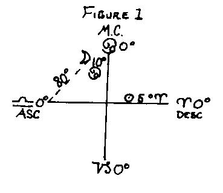
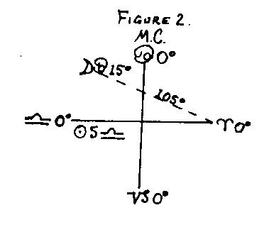
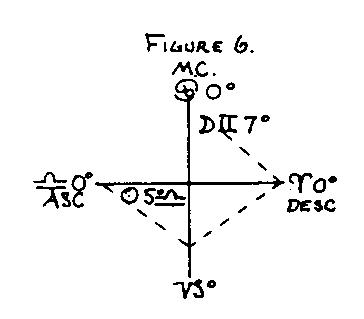
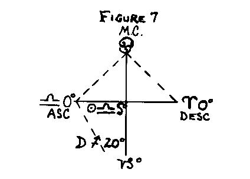
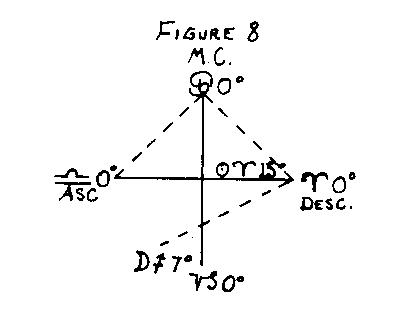

<h1 id="the-prenatal-epoch">Pamphlet №34: The Prenatal Epoch</h1>

### <h3 id="the-prenatal-epoch">The Prenatal Epoch</h3>

The primary principle of the Prenatal Epoch has been stated by Max Heindel in <em><a href="www.rosicrucian.com/mos/moseng01.html">The Message of the Stars</a></em>, where he says that the body is the product of lunar forces and that the position of the Ascendant, or its opposite, at birth, is the Moon’s position at conception. The keyword of the Moon is fecundation or fertility, and it is Jehovah and the lunar Angels that preside at the birth of a child. This is stated in the <em><a href="www.rosicrucian.com/rcc/rcceng00.html">Cosmo-Conception</a></em> and other works of the Rosicrucian Philosophy. We thus see that the Moon has primary influence over the formation of the physical body, and that the Ascendant represents merely the transference of the Moon’s position from conception to birth.

This law was known to the ancients as the “Truitine of Hermes,” from Hermes Trismegistus, who first correctly formulated and stated the law as follows: “The place of the Moon at conception becomes the birth ascendant or its opposite point.”

“But this proved to be but one-half of a very important law, for while the Ascendant at birth was the place of the Moon at a certain Epoch, the Ascendant or its opposite point at this Epoch was the place of the Moon at birth – <em>a very remarkable interchange of factors</em>.” –E.H. Bailey.

According to the Ancient Wisdom, “The World-Breath has a definite and periodic pulsation, a systole and diastole action, whereby birth and death are controlled.” This idea of periodicity, well established by modern science, furthers the idea that birth can take place only in respect to any single locality at intervals, that these intervals are in accord with lunar motion, and that only every seventh impulse of the World-Breath permits of human births.

The modern version of the Prenatal Epoch we first established by the English astrologer known to the astrological world as Sepharial, in the year 1886. It was published by him in 1890. In this he had the collaboration of a trained and veteran scientist, a doctor, who helped him to establish the primary laws of the Prenatal Epoch by years of painstaking research and actual experiments. This doctor was an expert obstetrician and proved the laws of the Prenatal Epoch by actual firsthand data.

These laws have been further verified, extended, and complemented by the painstaking researches of E.H. Bailey, to whom great credit is due for his many and exact proofs of the Prenatal Epoch. His book upon this subject is considered standard authority, and we are in the main following his very worthy contribution to the subject and are extending him full credit.

One of the primary uses of the Prenatal Epoch is the correction or rectification of the birth time when only the approximate time is given. Another is its utility in determining correctly the sex of the native. Finally, it gives sidelights on the character and inner nature of the individual as fundamental as those of the birth chart.

“As births are brought about in exact harmony with lunar laws, it is shown that intrauterine life is in direct relation with the sidereal world without, that the great fact of maternity is capable of purely astronomical measurement and rule …. The law is nothing less than a mathematical measurement of human life, a stupendous natural fact; nothing more exactly mathematical and matter of fact is to be found in the records of scientists than this record of intra- uterine life, for only through its study will the laws of generation be fully understood.” – <em>Sepharial</em>.

“In the measurement of the intra-uterine period we actually measure the whole future of the individual; alter this one fact – the moment of conception (or its spiritual counterpart, the Epoch) – and you change the whole course of the progeny’s destiny. If we accept the occult theory that the Prenatal Epoch is the descent of the Ego to the Desire World, then it must show the inherent character of the Ego about to incarnate. It may be stated that the Epoch has a more intimate relationship with the individual than the horoscope at birth, the latter appearing to reject the personality and its heredity and environment. In other words, the Epoch represents the man about to manifest in the flesh, the horoscope denotes actual personal conditions and environments into which he is born. Every birth is directly connected with the Epoch, and every authentic natural birth will, within the limits of an error of observation, yield an Epoch in accordance with the rules to be given.”– <em>Bailey</em>.

For summary, let us restate the fundamental principle of the Prenatal Epoch known as the <em>Truitine of Hermes</em>: “The Ascendant at birth is the place of the Moon at a certain Epoch, ant the Ascendant or its opposite point at Epoch was the place of the Moon at birth.”

This yields the:

### <h3 id="four-laws-of-the-epoch">Four Laws of the Epoch</h3>

When the Moon at birth increases in light, it will be on the ascending degree of Epoch, and the Moon at Epoch will be on the ascending degree at birth.

When the Moon at birth decrease in light, it will be on the decreasing degree at Epoch, and the Moon at Epoch will be on the descending degree at birth.

When the Moon at birth is (a) increasing in light and below the horizon, or (b) decreasing in light and above the horizon, the period of gestation is longer than the norm.

When the Moon at birth is (a) increasing in light and above the horizon or (b) decreasing in light and below the horizon, the period of gestation is shorter than the norm.

From these four laws we deduce the following:

### <h3 id="four-orders-of-epoch">Four Orders of Epoch</h3>

1\. Moon above horizon and increasing in light - 273 days minus x.

2\. Moon above horizon and decreasing in light - 273 days plus x.

3\. Moon below horizon and increasing in light - 273 days plus x.

4\. Moon below horizon and decreasing in light - 273 days minus x.

It is to be understood that the 273 days referred to in the above table is the normal period of gestation, or nine solar or ten lunar months. This normal period is increased or decreased in accordance with the distance of the Moon from either the Ascendant or Descendant, and “x” is a certain number of days corresponding to this distance obtained by dividing the distance in degrees by thirteen degrees, the latter being the average daily motion of the Moon.

When making the count, count to the Ascendant (AC) when the Moon is increasing in light, and to the Descendant (DC) when the Moon is decreasing in light. Another more definite way of stating this would be: In orders Nos. 1 and 4 the distance in degrees of the Moon from <em>the horizon last crossed</em> (AC or DC), divided by thirteen, gives “x”, or the number of days by which this period is decreased; and in orders Nos. 2 and 3 the distance of the Moon in degrees from the <em>horizon which it is approaching</em>, divided by thirteen, gives the number of days by which this period is increased. These rules are illustrated by the following examples:

### <h4 id="order-no-1">Order No. 1</h4>

Moon above the horizon and increasing in light. Period of gestation is 273 days minus “x”.

Increasing – hence “count” to AC.

Subtracting longitude of moon from longitude of AC gives 80 degrees, as follows:

|      |          |   |          |         |          |                                      |
| ---- | -------- | - | -------- | ------- | -------- | ------------------------------------ |
| AC   | ________ | 7 | ________ | 0       | ________ | 0                                    |
| Moon | ________ | 4 | ________ | 10      | ________ | 00                                   |
|      | ________ | 2 | ________ | 20 deg. | ________ | equals 2 signs plus 20 deg = 80 deg. |

80 degrees divided by 13 gives 6 days by which the period is decreased.

“Index date” falls 6 days previous to “Epoch date.”

#### <h4 id="order-no-2">Order No. 2</h4>

Moon above the horizon and decreasing in light.

Period of gestation is 273 days plus “x”.

Decreasing-hence “count” to D.C.

Subtracting longitude of Moon from longitude of DC gives 105 degrees.

Dividing 105 degrees to 13 gives 8 days, by which the period is increased. Hence “Epoch date” falls 8 days previous to “Index Date.”

#### <h4 id="order-no-3">Order No. 3</h4>

Moon below the earth and increasing in light.

Period of gestation is 273 days plus “x”.

“Count is to AC, because increasing and is 115 degrees. This divided by 13 equals 9 days the period is lengthened. Hence”Epoch Date” falls 9 days before “Index Date.”

#### <h4 id="order-no-4">Order No. 4</h4>

Moon below the horizon and decreasing in light.

Period of gestation is 273 days minus “x”.

“Count” to DC because decreasing, and is equal to 113 degrees. This divided by 13 equals 9 days, by which the period is decreased, placing “Epoch Date” 9 days later than “Index Date.”

#### <h4 id="order-no-1-variation-of-count">Order No. 1 (Variation of count)</h4>

Period of gestation 273 days minus “x”.

Moon above and increasing.

The “count” is here made from the Moon to the AC and below the horizon to the DC, decreasing the period by 14 days, less than the regular Epoch count.

#### <h4 id="order-no-2-variation-of-count">Order No. 2 (Variation of count)</h4>

Moon above and decreasing.

Period of gestation 273 days plus “x”.

“Count” is made to DC as in rule but continued below the horizon to the AC, increasing the period of gestation by 14 days, plus the count of regular Epoch.

#### <h4 id="order-no-3-variation-of-count">Order No. 3 (Variation of count)</h4>

Moon below and increasing.

Period of gestation 273 days plus “x”.

“Count” is made to the AC, according to rule, and continued above the horizon to the descendant, increasing the period of gestation by 14 days.

Increasing: “Count” to AC and extend over and around. This will be 80 degrees plus 180 degrees, equals 260 degrees. This divided by 13 equals 20 days by which period is increased, and will bring “Epoch Date” 20 days earlier than “Index Date.”

#### <h4 id="order-no-4-variation-of-count">Order No. 4 (Variation of count)</h4>

Moon below and decreasing.

Period of gestation is 273 days minus “x”.

“Count” is made to the DC, according to rule, and continued above the horizon to the AC, decreasing the period of gestation by 14 days.

Moon decreasing, hence “count” to DC and extend over and around.

Full “count” is 180 degrees plus 118 degrees equals 298 degrees. This, divided by 13 is 28 days which the period is decreased, bringing the “Epoch Date” 28 days later than “Index Date.”

Since the Moon travels the entire zodiac in 28 days, or one lunar month, in 14 days it will have gone one-half the way, or from one sign to its opposite. Hence to “vary” the “count” do not reverse, but continue around, either above or below the horizon, and either increase or decrease the period of gestation by 14 days.

### <h3 id="law-of-sex">Law of Sex</h3>

It is very easy to reach a fictitious Epoch. One of the most important things to be observed in the Prenatal figure is that it must determine the sex of the native. Unless the Epoch conforms to this fundamental condition, that is, defines the sex of the subject, it is not correct.

Every Epoch must conform to four separate and distinct conditions, viz:

1\. It must confirm the time of birth within the limits of an ordinary observation.

2\. It must define the sex of the subject according to certain rules.

3\. It must show the general character and fortunes of the individual.

4\. It must furnish directions in accord with the events of life.

Unless, therefore, an Epoch conforms strictly to these four conditions, it may be regarded as a fictitious one.

The law of sex is based upon the Hindu subdivision of the zodiac into twenty-eight mansions or “asterisms” of 12 6/7 degrees each, which gives the following:

### <h3 id="sex-or-critical-degrees">Sex or “Critical” Degrees</h3>

These sex or “critical” degrees are used to confirm the sex of the subject or native. They are the central points of their respective orbs, which extend both ways to the end of orb.

It will be noticed, therefore, that when one degree of a certain sign is in one sex, the opposite sign and degree are in the opposite sex. Hence all that is necessary in order to place one of the factors in the proper sex position is to vary the count by fourteen days, making the period of gestation either shorter or longer, which will bring the proper ascending degree.

The application of these sex or “critical” degrees is as follows: “Allow the proper orb of influence for the Moon and Ascendant in the natal chart. This will show at once whether a masculine or feminine degree is rising, also the sex position of the Moon. It will be noticed that no matter in what degree the Ascendant falls, it will always occupy a position within orb of one of these sex points, either masculine or feminine; but the Moon’s position may fall outside of the orb of influence, and this gives what is termed a negative position of the Moon. If the Moon is negative in the birth chart, we have either a strictly regular or irregular Epoch.

Orb (in natal figure)

for Ascendant is 6 3/7 degrees equals 6d 26’.

for Moon is 4 2/7 degrees equals 4d 17’.

Important: Always remember that since the Moon at birth becomes AC or DC at Epoch and vice versa, the orbs of influence of the Moon and AC in the Epoch Chart will change places so that the orb of the Moon at Epoch will be 6d 26’, while the orb of the AC will be 4d 17’. “If, however, the Moon is within orb of one of these sex points it is termed a sex Epoch.” – Bailey.

Therefore, to determine the sex of the subject from the figure of the Prenatal chart, note:

1\. When the Ascendant is negative (as in strictly regular and irregular Epochs), the sex of the area occupied by the Moon is the sex of the subject.

2\. When both the Moon and the AC are within their respective orbs of a degree of the same sex, the sex of the subject is the same as the sex of the area so occupied.

3\. When the Moon and the AC are placed within their respective orbs of a degree of the opposite sex (the Moon in a female and the AC in a male or vice versa) the sex of the subject is determined by the quadrant held by the Moon at Epoch. There will then be two points of one sex and one of the other, and whichever sex predominates will be the sex of the subject.

The term “quadrant” means quarter. The first quarter of the chart from AC to nadir is female, the second quarter from nadir to DC is male, the third quarter from DC to MC is female, and the fourth quarter from MC to AC is male. Thus if the sex position of one of the factors, either AC or Moon, is in an opposite sex from that of the other factor, the sex of the quadrant in which the Moon is placed at Epoch determines the sex of the native.

### <h3 id="irregular-epochs">Irregular Epochs</h3>

Up to this time we have been dealing with the regular Epoch, that is, when there is an interchange of the two factors, the Moon with the AC or DC when increasing in light or the DC when decreasing in light, and the AC with the Epochal Moon. These interchanges are not always Regular and may vary, first, because the Epochal chart does not define the time of birth, and second, because the Epochal chart does not correctly define the sex of the native. It is therefore necessary to make variations from the regular order of Epoch. We have 3 of these variations which can be applied to each of the 4 orders:

(1) Taking the “count” from the AC or DC according to rule, but reversing the rising and setting of the Moon at birth, making its place set when increasing and rise when decreasing.

(2) Taking the “count” from the Moon to the DC when increasing and from the Moon to the AC when decreasing, but making the Moon’s place rise or set according to rule.

(3) Taking the “count” from the Moon to the DC when increasing and from the Moon to the AC when decreasing, and reversing the rising and setting of the Moon as in variation (1).

### <h3 id="table-of-variations">Table of Variations</h3>

| Variation I     | Birth        | Epoch |
| --------------- | ------------ | ----- |
| Moon increasing | AC becomes   | Moon  |
| Moon increasing | Moon becomes | DC    |
| Moon decreasing | DC becomes   | Moon  |
| Moon decreasing | Moon becomes | AC    |

| Variation II    | Birth        | Epoch |
| --------------- | ------------ | ----- |
| Moon increasing | DC becomes   | Moon  |
| Moon increasing | Moon becomes | AC    |
| Moon decreasing | AC becomes   | Moon  |
| Moon decreasing | Moon becomes | DC    |

| Variation III   | Birth        | Epoch |
| --------------- | ------------ | ----- |
| Moon increasing | DC becomes   | Moon  |
| Moon increasing | Moon becomes | DC    |
| Moon decreasing | AC becomes   | Moon  |
| Moon decreasing | Moon becomes | AC    |

“It must be properly understood that this irregularity or variation from the main postulate of the Epoch is in no sense arbitrary or fortuitous. The variation must be made in order that the Epoch conform to the four prime conditions. It should be borne in mind that in all regular and irregular Epochs the Moon at birth holds a negative sex area, and therefore its rising or setting does not affect the sex, and the variation of this point is for the purpose of requiring the Epoch to confirm the birth time. In the second and third variations it is the sex of the area held by the AC which requires a deviation from the main law. Thus the”count” is made from the Moon to the AC and if that point is an area in the opposite sex of the subject, the “count” must be continued round to the opposite horizon, which will bring it into an area of the required sex. The Moon’s place may rise according to rule, but it may also be necessary to reverse the process.” – Bailey.

A third class of Epochs comprises those which are more strictly designated “Sex Epochs.” Here the interchange of the two factors is wholly and exclusively governed by the sex of the areas in which both the Moon and the Ascendant are placed, taken in conjunction with the sex of the subject. Sometimes the interchange will be regular, but in others either of the three irregular methods will obtain, while the sex of the quadrant of the Moon held at Epoch is brought into use in a very large number of cases. This class includes the large majority of cases where the period of gestation is increased or decreased by periods longer than the usual fourteen days.” – Bailey.

All that is now necessary in order to compute the actual date of Epoch is to find the class of Epoch required to fit each given case. This is done according to the following rules and gives us, Six Classes of Epochs

### <h4 id="six-classes-of-epochs">Six Classes of Epochs</h4>

1\. Moon negative (a) Increasing - AC same sex (as person) Decreasing - AC opposite sex (to that of person) This class is either regular or irregular, variation (1).

2\. Moon negative (a) Increasing - AC opposite sex Decreasing - AC same sex. This class is either of the second or third variations, irregular. It will never be regular.

3\. Moon increasing: AC and Moon same sex (as person) Moon decreasing: AC and Moon opposite sex (to that of person) This class is regular or irregular, variation 1 and 2.

4\. Moon increasing: AC same sex, Moon opposite sex (to that of person) Moon decreasing: AC opposite sex, Moon same sex (as person)  Thisclass is regular or irregular, variations 1 and 3.

5\. Moon increasing: AC opposite sex, Moon same sex (as person) Moon decreasing: AC same sex, Moon opposite sex (to that of person) This class is regular or irregular, variation 2 and 3.

6\. Moon increasing: AC and Moon in opposite sex (to that of person) Moon decreasing: AC and Moon in same sex (or person) This class will never be regular, but irregular, variation 1, 2, and 3.