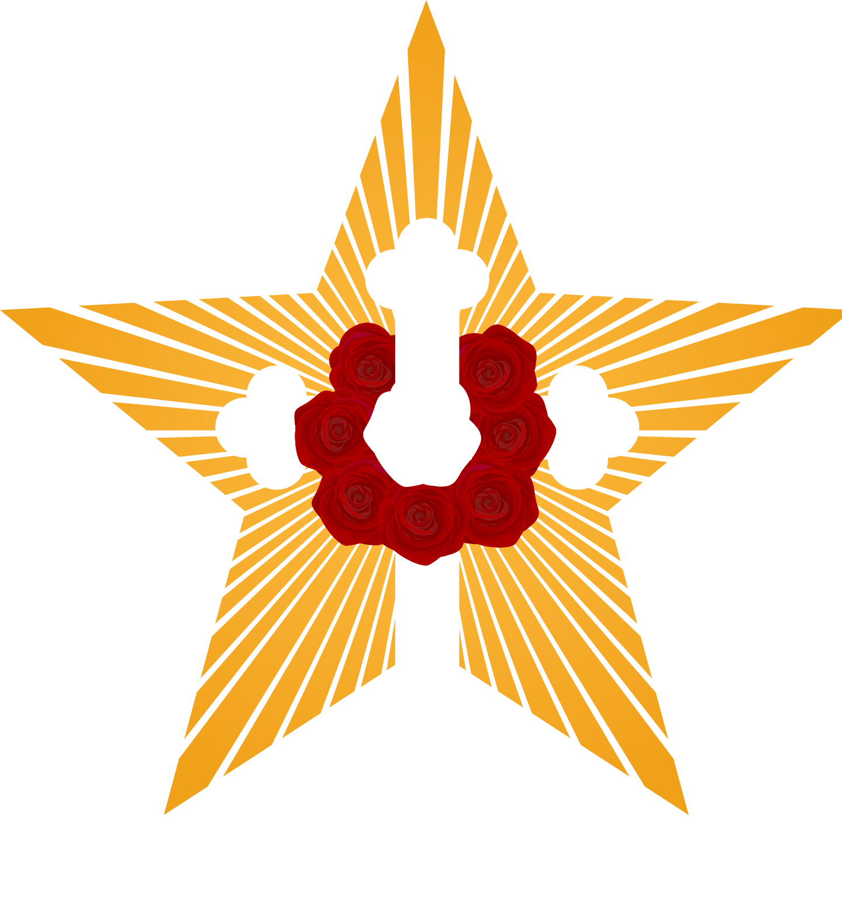

# El Concepto Rosacruz del Cosmos

o Ciencia Oculta Cristiana

Título Original: "The Rosicrucian Cosmo-Conception"

Tratado elemental sobre la evolución pasada del hombre, su constitución actual y su futuro desarrollo


por Max Heindel [1865-1919]

Lema y misión rosacruz:

```
Una mente pura  
    Un corazón noble  
        Un cuerpo sano  
```



THE ROSICRUCIAN FELLOWSHIP  
P.O. Box 713  
Oceanside, CA. 92049-0713 USA  

Copyright by The Rosicrucian Fellowship

## Índice de Materias

- [Credo o Cristo](#creed-or-christ)
- [Una palabra al sabio](#a-word-to-the-wise)
- [PRIMERA PARTE: Constitución actual del hombre y método de su desarrollo](#part-1)
  - [Introducción](#introduction)
  - [Capítulo I - Los mundos visibles e invisibles](#chapter-1)
    - [Región Química del Mundo Físico](#chemical-region-of-the-physical-world)
    - [Región Etérica del Mundo Físico ](#etheric-region-of-the-physical-world)
    - [El Mundo del Deseo](#the-desire-world)
    - [El Mundo del Pensamiento](#the-world-of-thought)
    - [Diagrama 1 (Permanencia relativa de los Mundos visibles e invisibles)](#diagram-1-the-material-world-a-reverse-reflection-of-the-spiritual-worlds)
    - [Diagrama 2 (Los Siete Mundos)](#diagram-2-the-seven-worlds)
  - [Capítulo II - Los cuatro reinos](#chapter-2)
    - [Diagrama "Los Cuatro Reinos]()
    - [Diagrama de las Corrientes del Cuerpo de Deseos en el Hombre Ordinario]()
    - [Diagrama de las Corrientes del Cuerpo de Deseos en el Clarividente Voluntario]()
    - [Diagrama de las Corrientes del Cuerpo de Deseos en el Clarividente Involuntario]()
    - [Diagrama 3 (Vehículos de cada Reino)](#diagram-3-the-vehicles-of-the-four-kingdoms)
    - [Diagrama 4 (Estados de Conciencia en cada Reino)](#diagram-4-the-consciousness-of-the-four-kingdoms)
  - [Capítulo III: El Hombre y el Método de Evolución ](#chapter-3)
    - [Actividades de la vida; memoria y crecimineto anímico ](#activities-of-life-memory-and-soul-growth)
    - [Diagrama "Constitución séptuple del Hombre"]()
    - [Diagama 5 (Constitución décuple del Hombre)]()
    - [Muerte y Purgatorio](#death-and-purgatory)
    - [Diagrama 5a (El Cordón Plateado)](#diagram-5-1-2-the-silver-cord)
    - [La Región Fronteriza](#the-borderland)
    - [El Primer Cielo](#the-first-heaven)
    - [El Segundo Cielo](#the-second-heaven)
    - [El Tercer Cielo](#the-third-heaven)
    - [Preparativos para el nacimiento](#preparations-for-rebirth)
    - [Nacimiento del cuerpo denso](#birth-of-the-dense-body)
    - [Nacimiento del cuerpo vital](#birth-of-the-vital-body)
    - [Nacimiento del cuerpo de deseos](#birth-of-the-desire-body)
    - [Nacimiento de la mente](#birth-of-the-mind)
    - [La Sangre: el vehículo del Ego](#the-blood-the-vehichle-of-the-ego)
    - [Diagrama "Un ciclo de vida"](#diagram-a-life-cycle)
  - [Capítulo IV: Renacimiento y Ley de Consecuencia](#chapter-4)
    - [El vino como factor de la evolución](#wine-as-a-factor-in-evolution)
    - [Una historia notable](#a-remarkable-story)
- [SEGUNDA PARTE: Cosmogénesis y Antropogénesis](#part-2)
  - [Capítulo V: La Relación del Hombre con Dios](#chapter-5)
    - [Diagrama 6 (El Ser Supremo, los Planos Cósmicos y Dios)](#diagram-6-the-supreme-being-the-cosmic-planes-and-god)
  - [Capítulo VI: Esquema de la evolución ](#chapter-6)
    - [El Principio](#the-beginning)
    - [Los Siete Mundos](#the-seven-worlds)
    - [Los Siete Períodos](#the-seven-periods)
    - [Nombres de los Siete Périodos]()
  - [Capítulo VII: El Camino de la Evolución](#chapter-7)
    - [Revoluciones y Noches Cósmicas](#revolutions-and-cosmic-nights)
    - [Diagrama 7 (El Período de Saturno)](#diagram-7-the-saturn-period)
    - [Diagrama 8 (Los Siete Mundos, los Siete Globos y los Siete Períodos)](#diagram-8-the-seven-worlds-seven-globes-and-seven-periods)
  - [Capítulo VIII: La obra de la evolución](#chapter-8)
    - [El hilo de Ariadna](#ariadnes-thread)
    - [El Período de Saturno](#the-saturn-period)
    - [Recapitulación](#recapitulation)
    - [El Período Solar](#the-sun-period)
    - [El Período Lunar](#the-moon-period)
    - [Diagrama 9 (Las Doce Grandes Jerarquías Creadoras)](#diagram-9-twelve-creative-hierarchies)
  - [Capítulo IX: Rezagados y Principiantes](#chapter-9)
    - [Clases de seres al principio del Período Lunar](#classes-of-beings-at-the-beginning-of-the-moon-period)
    - [Diagrama 10 (Clases al principio del Período Terrestre)](#diagram-10-classes-at-the-beginning-of-earth-period)
  - [Capítulo X: El Período Terrestre](#chapter-10)
    - [La revolución de Saturno del Período Terrestre](#the-saturn-revolution-of-the-earth-period)
    - [La revolución Solar del Período Terrestre](#the-sun-revolution-of-the-earth-period)
    - [La revolutión Lunar del Período Terrestre](#the-moon-revolution-of-the-earth-period)
    - [Períodos de reposo entre revoluciones](#rest-periods-between-revolutions)
    - [La cuarta revolución del Período Terrestre](#the-fourth-revolution-of-the-earth-period)
  - [Capítulo XI: Génesis y evolución de nuestro Sistema Solar](#chapter-11)
    - [Caos](#chaos)
    - [Diagrama 11 (Los 1, 3, 7 y 10 Aspectos de Dios y del Hombre)](#diagram-11-aspects-of-god-and-man)
    - [Nacimiento de los planetas](#the-birth-of-the-planets)
    - [Diagrama 12 (Forma pasada, actual y futura del hombre)](#diagram-12-a-mans-past-present-and-future-form)
  - [Capítulo XII: Evolución de la Tierra](#chapter-12)
    - [La Época Polar](#the-polarian-epoch)
    - [La Época Hiperbórea](#the-hyperborean-epoch)
    - [La Luna: la octava esfera](#the-moon-the-eighth-sphere)
    - [La Época Lemúrica](#the-lemurian-epoch)
    - [Nacimiento del individuo](#birth-of-the-individual)
    - [Diagrama (Tabla de vibraciones)]()
    - [Separación de los sexos](#separation-of-the-sexes)
    - [Influencia de Marte](#influence-of-mars)
    - [Las razas y sus guías](#the-races-as-their-leaders)
    - [Influencia de Mercurio](#influence-of-mercury)
    - [La raza Lemúrica](#the-lemurian-race)
    - [La caída del hombre](#the-fall-of-man)
    - [Los Espíritus Luciferes](#the-lucifer-spirits)
    - [La Época Atlante](#the-atlantean-epoch)
    - [La Época Aria](#the-aryan-epoch)
    - [Los Dieciseis Senderos de Destrucción](#the-sixteen-paths-to-destruction)
  - [Capítulo XIII: Hacia la Biblia ](#chapter-13)
  - [Capítulo XIV: Análisis oculto del Génesis](#chapter-14)
    - [Limitaciones de la Biblia](#limitations-of-the-bible)
    - [En el Principio](#in-the-beginning)
    - [La Teoría Nebular](#the-nebular-theory)
    - [Las Jerarquías Creadoras](#the-creative-hierarchies)
    - [El Período de Saturno](#the-saturn-period)
    - [El Período Solar](#the-sun-period)
    - [El Período Lunar](#the-moon-period)
    - [El Período Terrestre](#the-earth-period)
    - [Jehová y su Misión](#jehovah-and-his-mission)
    - [Involución, Evolución y Epigénesis](#involution-evolution-and-epigenesis)
    - [¿Un Alma viviente?](#a-living-soul)
    - [La Costilla de Adan](#adams-rib)
    - [Los Angeles Guardianes](#guardian-angels)
    - [La mezcla de sangre en el Matrimonio](#mixing-blood-in-marriage)
    - [La Caída del Hombre](#the-fall-of-man)
    - [Diagrama 13 (El principio y el fin de los sexos)](#diagram-13-the-beginning-and-end-of-sex)
- [TERCERA PARTE: Futuro Desarrollo e Iniciación del Hombre](#part-3)
  - [Capítulo XV: Cristo y su Misión](#chapter-15)
    - [Evolución de la Religión](#the-evolution-of-religion)
    - [Diagrama "Los siete Días de la Creación"](#diagram-the-seven-days-of-creation)
    - [Jesús y Cristo-Jesús](#jesus-and-christ-jesus)
    - [Inciados Más Elevados de los Períodos]()
    - [Diagrama 14 (Los Vehículoss de los Iniciados)](#diagram-14-the-father-the-son-and-the-holy-spirit)
    - [No Paz, sino Guerra](#not-peace-but-a-sword)
    - [La Estrella de Belén](#the-star-of-bethlehem)
    - [El Corazón es una anomalía](#the-heart-as-an-anomaly)
    - [El misterio del Gólgota](#the-mystery-of-golgotha)
    - [La Sangre Purificadora](#the-cleansing-blood)
    - [Diagrama 15 Caduceo o Cetro de Mercurio (Los siete Días de la Creación y las cuatro Grandes Iniciaciones)](#diagram-15-the-symbolism-of-the-caduceus)
  - [Capítulo XVI: Desarrollo Futuro e Iniciación](#chapter-16)
    - [Los Siete Días de la Creación](#the-seven-days-of-creation)
    - [Diagrama "Como arriba es abajo"](#diagram-15-the-symbolism-of-the-caduceus)
    - [Radiados y Moluscos, Articulados y Vertebrados](#radiates-mollusks-articulates-and-vertebrates)
    - [Espirales dentro de espirales](#spirals-within-spirals)
    - [Períodos y Consciencia correspondiente]()
    - [Alquimia y Crecimiento del Alma](#alchemy-and-soul-growth)
    - [La Palabra Creadora](#the-creative-word)
  - [Capítulo XVII: Método para adquirir el Conocimiento Directo](#chapter-17)
    - [Los Primeros Grados](#the-first-steps)
    - [Métodos Occidentales para los Occidentales](#western-methods-for-western-people)
    - [La Ciencia de la Nutrición](#the-science-of-nutrition)
    - [Calorías que se necesitan según la índole de trabajo]()
    - [Tabla de Valores Alimentarios](#table-of-food-values-part-1)
    - [Tabla de contenido de fósforo](#table-of-food-values-part-2)
    - [La Ley de la Asimilación](#the-law-of-assimilation)
    - [Vivid y dejad vivir](#live-and-let-live)
    - [El Padre Nuestro](#the-lords-prayer)
    - [Diagrama 16 (El Padre Nuestro)](#diagram-16-the-lords-prayer)
    - [El voto de Castidad ](#the-vow-of-celibacy)
    - [Diagrama 17 (Transmutación de las corrientes sexuales)](#diagram-17-path-of-the-unused-sex-currents)
    - [El Cuerpo Pituitario y la Glándula Pineal](#the-pituitary-body-and-the-pineal-gland)
    - [Educación Esotérica](#esoteric-training)
    - [Como se organizan los vehículos internos](#how-the-inner-vehicle-is-built)
    - [Concentración](#concentration)
    - [Meditación](#meditation)
    - [Observación](#observation)
    - [Discernimiento](#discrimination)
    - [Contemplación](#contemplation)
    - [Adoración](#adoration)
  - [Capítulo XVIII: Constitución de la Tierra y Erupciones Volcánicas](#chapter-18)
    - [El Número de la Bestia](#the-number-of-the-beast)
    - [Diagrama 18 (La Constitución de la Tierra)](#diagram-18-the-constitution-of-the-earth)
  - [Capítulo XIX: Cristián Rosenkreuz y la Orden de los Rosacruces](#chapter-19)
    - [Antiguas Verdades en Ropajes Modernos](#ancient-truths-in-modern-dress)
    - [Iniciación](#initiation)
    - [La Fraternidad Rosacruz](#the-rosicrucian-fellowship)
    - [La Sede de la Fraternidad Rosacruz]()
    - [El Simbolismo de la Rosa Cruz](#symbolism-of-the-rose-cross)
- [Ejercicios Matutinos y Vespertinos para el aspirante Rosacruz](#addendum-a)
- [¿Que es la Verdad?]()


### CREDO o CRISTO

Ningún hombre ama a Dios si aborrece a sus semejantes,  
Quien pisotea el corazón o el alma de su hermano;  
Quien busca encadenar, nublar o ensombrecer la mente  
Con miedos del infierno, no ha percibido nuestra meta.  

Dios nos envió todas las religiones benditas;  
Y Cristo, el Camino, la Verdad y la Vida,  
Para dar descanso al de pesada carga  
Y paz para el dolor, el pecado y la lucha.  

Contemplad al Espíritu Universal que ha llegado  
A todas las iglesias, no a una solamente;  
En la mañana de Pentecostés una lengua de fuego  
Rodeando a cada apóstol como un halo brilló.  

Desde entonces como buitres famélicos y voraces,  
Hemos combatido a menudo por un nombre sin sentido,  
Y buscado dogmas, edictos o credos,  
Para enviarnos los unos a los otros a la hoguera.  

¿Está Cristo dividido entonces? ¿Fue Pedro o Pablo,  
Para salvar al mundo, clavado al madero?  
Si no, ¿por qué, entonces, tales divisiones?  
El amor de Cristo abarca tanto a vosotros como a mí  

Su puro delcísimo amor no está confinado  
Por credos que segregan y levantan una muralla.  
Su amor envuelve y abraza a toda la humanidad,  
No importa lo que nosotros nos llamemos de Él.  

Entonces, ¿por qué no acceptar Su palabra?  
¿Por qué sostenemos credos que nos separan?  
Solo una cosa importa ser oída;  
Que el amor fraterno llene todos los corazones.  

Solo hay una cosa que el mundo necesita saber,  
Solo hay un bálsamo para todos los dolores humanos,  
Solo hay un camino que conduce hacia los ciclos,  
Este camino es: humana compasión y amor.  

-- Max Heindel  

### <h3 id="a-word-to-the-wise">UNA PALABRA AL SABIO</h3>

El fundador de la Religión Cristiana emitió una máxima oculta cuando dijo: "Cualquiera que no reciba el reino de Dios como un niño pequeño no entrará en él." (San Mateo X:15). Todos los ocultistas reconocen la inmensa importancia de esta enseñanza de Cristo y tratan de vivirla de día en día. 

Cuando una filosofía nueva se presenta al mundo es acogida de diferente manera por las diferentes personas. 

Una persona se apodera con avidez de cualquier nuevo esfuerzo filosófico tratando de ver en qué proporción sostiene sus propias ideas. Para tal persona la filosofía en si misma es de poca importancia. Tendrá valor si vindica sus propias ideas. Si la obra satisface sus esperanzas en ese respecto, la adoptará entusiastamente y se adherirá a ella con el más irrazonable partidismo; si no, probablemente arrojará el libro con disgusto, como si el autor le hubiera hecho una injuria personal. 

Otro adopta una actitud escéptica tan pronto como descubre que la obra contiene algo de lo que él no había leído u oído hablar anteriormente o sobre lo que aún no se le había ocurrido pensar. Y probablemente rechazaría como extremadamente injustificable la acusación de que su actitud mental es el pináculo de la satisfacción e intolerancia propias; tal es el caso,sin embargo, y de esa manera cierra su mente a toda verdad que posiblemente puede estar contenida en lo que su mano rechaza. 

Ambas personas se mantienen en su propia luz. Sus ideas petrificadas las hacen inasequibles a los rayos de la Verdad. Un "niño pequeño" es precisamente lo opuesto de los grandes en ese respecto. No está imbuido por abrumador sentimiento de superioridad, ni se siente inclinado a aparentar ser sabio o a ocultar su ignorancia sobre cualquier asunto con una sonrisa o burla. Es francamente ignorante, no tiene opiniones preconcebidas ni prejuicios y es, por lo tanto, eminentemente enseñable o instruible. Toma todo con esa hermosa actitud de confianza que hemos designado con el nombre de "fe infantil", en la que no hay ni sombra de duda. Allí conserva el niño las instrucciones o enseñanzas que recibe hasta que comprueba su certeza o falsedad. 

En las escuelas ocultistas se enseña al discípulo a olvidar todo cuando se le da una nueva enseñanza, no permitiendo el predominio ni del prejuicio ni de la preferencia, conservando la mente en un estado de calma y digna expectativa. Así como el escepticismo nos ciega a la verdad en la forma más efectiva, así también esa calma, esa actitud confiada de la mente, permitirá a la intuición o "sabiduría interna" el apoderarse de la verdad contenida en la proposición. Esa es la única manera de cultiva una percepción absolutamente cierta de la verdad. 

No se pide al discípulo que admita a priori que un objeto dado que ha observado es blanco, sea realmente negro, ni tal afirmación se hace; pero debe cultivar una actitud mental tal, que "admita todas las cosas" como posibles. Esto le permitirá dejar de lado por el momento hasta lo que se considera generalmente como un "hecho establecido" e investigar si existe algún otro punto de vista desde el cual el objeto de referencia pueda aparecer negro. Ciertamente, no se permitirá considerar nada como un hecho establecido, porqué comprenderá perfectamente la importancia de que hay que mantener la mente en el estado fluídico de adaptabilidad que caracteriza al niño. Comprende con todas las fibras de su ser que "ahora ve las cosas como a través de un cristal empañado" y como Ayax, está siempre alerta, anhelando "Luz, más luz." 

La gran ventaja de tal actitud mental cuando se estudia un asunto, idea u objeto dados, es evidente. Afirmaciones que parecían positivamente contradictorias (y que han causado discusiones interminables entre sus respectivos partidarios) pueden, no obstante, conciliarse, como se demuestra en un ejemplo mencionado en esta obra. La mente abierta es la única que descubre la concordia, sin embargo, y aunque se encuentre que esta obra difiere de otras, el autor demostraría a un auditorio imparcial las bases del juicio subsiguiente. Si se "pesa" este libro y se encuentra "falto de peso", el autor no se lamentará. Lo único que teme el autor es el juicio prematuro basado en la falta de conocimiento del sistema por el que aboga; que se diga que la obra no tiene fundamento, por no haberle dedicado antes una atención imparcial. Y debe decir además que la única opinión digna de tenerse en cuenta es la que está basada en el conocimiento. 

Hay una razón más para que se tenga mucho cuidado al emitir un juicio, y que para muchos les es sumamente difícil retractarse de cualquier opinión expresada atolondrada o prematuramente. Por lo tanto se ruega al lector suspenda sus opiniones, sean de elogio o de crítica, hasta que el estudio de la obra lo haya satisfecho razonablemente sobre su mérito o demérito. 

El Concepto Rosacruz del Cosmos no es dogmático, ni apela a autoridad alguna que no sea la propia razón del estudiante. No es una controversia, sino que se publica con la esperanza de que pueda ayudar a esclarecer algunas de las dificultades que asedian continuamente a los estudiantes de las profundas filosofías del pasado. Con objeto de evitar equívocos graves, debe tenerse siempre muy presente, sin embargo, que no hay revelación infalible alguna sobre este complicado asunto, que abarque a todo cuanto está bajo el sol, y también todo lo que está por encima de él. 

Decir que esta es una exposición infalible sería lo mismo que pretender que el autor fuera omnisciente, y aún hasta los Hermanos Mayores nos dicen que a veces se equivocan en sus juicios, así que un libro que pretenda decir la última palabra sobre e misterio del mundo, está fuera de toda discusión, y el autor no pretende dar sino las enseñanzas más elementales de los Rosacruces. 

La Fraternidad Rosacruz tiene la concepción más lógica y amplia sobre el misterio del mundo del que el autor a adquirido algún conocimiento durante los muchos años que ha dedicado exclusivamente al estudio de este asunto. En lo que ha podido investigar por si mismo, sus enseñanzas (Las de la Fraternidad) están de acuerdo con los hechos, tal como él los conoce. Pero, sin embargo, está convencido de que el Concepto Rosacruz del Cosmos está lejos de ser la última palabra sobre el asunto; que conforme avanzamos nuevas vistas se van desplegando ante nuestros ojos y se iluminan muchas cosas que antes solo veíamos como a través de un "cristal empañado." Al mismo tiempo cree firmemente que todas las demás filosofías del futuro seguirán las lineas principales de esta filosofía, pues parecen ser absolutamente ciertas. 

En vista de lo antedicho se comprenderá claramente que el autor no considera esta obra como el Alfa y la Omega, el último conocimiento oculto, ya aunque se titula Concepto Rosacruz del Cosmos, el autor desea hacer constar que no debe tomarse como una "creencia entregada de una vez para siempre" por los Rosacruces. Debe tenerse en cuenta que esta obra encierra solamente la comprensión que el autor tiene de las enseñanzas rosacruces respecto del misterio del mundo, fortalecidas, además, por sus investigaciones personales en los mundos internos y sobre los estados ante natal y post- mortem del hombre, etcétera. El autor tiene plena conciencia de la responsabilidad en que incurre todo aquel que bien o mal guía intencionadamente a los demás y desea resguardarse a si mismo de tal contingencia, así como también el resguardar a los demás de caminar en falso inadvertidamente. 

Lo que se dice en esta obra debe ser aceptado o rechazado por el lector de acuerdo con su propio criterio. Se a puesto todo lo necesario para comprender las enseñanzas; ha costado muchos trabajos expresarlas en trabajos que sean fácilmente comprensibles. Por esta razón se ha usado el mismo término para expresar la misma idea en toda la obra. La misma palabra tiene el mismo significado en cualquiera parte que se emplee. Cuando se emplea por vez primera una palabra que describe determinada idea, se da la definición más clara que es posible dar al autor. No se han empleado sino palabras castizas de las más sencillas y claras. El autor ha tratado constantemente de dar definiciones tan exactas y definidas como el asunto que se esté considerando lo permita, eliminando toda la ambigüedad y poniendo todo en claro. Hasta que punto lo ha conseguido es cosa que debe estimarlo el estudiante; pero habiéndose esforzado todo lo posible para sugerir las ideas verdaderas, se ve también obligado a resguardarse contra la posibilidad de que se tome esta obra como una exposición al pie de la letra de las enseñanzas Rosacruces. El olvidar esto podría dar más peso a esta obra para algunos estudiantes. Y eso no convendría ni a la Fraternidad, ni al lector. Tendrían entonces cierta tendencia a echar toda la responsabilidad sobre la Fraternidad debido a los errores que deben haberse deslizado en esta como en toda obra humana, de ahí la advertencia expuesta. 

Hay un relato indio que dice que cualquiera que tenga dos lineas semicirculares en la palma de la mano, en la juntura exterior del pulgar, "lleva consigo un grano de arroz." Esto quiere decir que será bien recibido y hospitalariamente tratado donde quiera que vaya. El autor tiene la marca mencionada y ese pronóstico se ha cumplido maravillosamente en su caso. Ha encontrado amigos por todas partes y ha sido tratado por ellos en forma tal que ha sido literalmente abrumado por sus atenciones. Y lo mismo ha sucedido con este libro. El Dr. von Brandis le facilitó los medios para ponerse en contacto por vez primera con las enseñanzas Rosacruces. El comandante Kingsmill y Jessie Brewster lo ayudaron lealmente en la parte literaria; Mrs. M. E. Rath Merrill y Miss Allene Merrill ejecutaron cierto número de dibujos, y en cuanto a William M. Patterson no solamente prestó al autor servicios personales, sino que le prestó su ayuda monetaria para que pudiera publicar el libro al precio de costo. Esta obra ha sido pues, producida por amor. Nadie relacionado con ella ha recibido ni recibirá ni un céntimo de recompensa, todos han dado desinteresadamente su tiempo y su dinero. Por lo tanto, el autor desea expresar a todos ellos su gratitud, y espera que encuentren otras y más grandes oportunidades para ejercer sus servicios desinteresados. 

Durante los cuatro años que han transcurrido desde que los párrafos anteriores fueron escritos, el autor ha continuado sus investigaciones de los mundos invisibles y experimentado la expansión de la conciencia relacionada con tales reinos de la naturaleza, lo cual se consigue por medio de la práctica de los preceptos enseñados por la Escuela de Misterios del Occidente. Otros que han seguido también el método de desarrollo espiritual descripto aquí, como especialmente adaptado a los pueblos occidentales, han sido capaces, de igual modo, de comprobar por si mismos muchas cosas de las dichas en este libro. De este modo, la comprensión del autor de lo que le fue dictado por los Hermanos Mayores, ha tenido alguna corroboración, y parece que fue sustancialmente apropiada; por lo tanto, cree como un deber explicar esto, para dar con ello estímulo a los que todavía no son capaces de ver por si mismos. 

Si hubiéramos dicho que el cuerpo vital está hecho de prismas en lugar de puntos, hubiera sido más exacto, pues es por la refracción a través de estos diminutos prismas que el fluido solar incoloro cambia en rosáceo según ha sido indicado por otros escritores además del autor. 

Se han hecho otros nuevos e importantes descubrimientos; por ejemplo, ahora sabemos que el cordón plateado nace uno nuevo en cada renacimiento, que una parte del mismo brota del átomo-simiente del cuerpo de deseos en el gran vórtice del hígado; que la otra parte nace del átomo simiente del cuerpo denso en el corazón, que las dos partes se unen con el átomo-simiente del cuerpo vital en el plexo solar, y que esta unión de los vehículos superiores e inferiores produce el despertar del feto. El desarrollo ulterior del cordón, entre el corazón y el plexo solar durante los primeros siete años, tiene una importante relación con el misterio de la infancia, así como su más amplio desarrollo desde el hígado al plexo solar que tiene lugar en el segundo período septenario de la vida del niño, contribuye a la adolescencia. La realización total del cordón plateado marca el final de la vida infantil, y desde tal momento, la energía solar que entra por el bazo y que se tiñe por la refracción del átomo simiente prismático del cuerpo vital situado en el plexo solar, comienza ha dar n distintivo e individual colorido al aura que observamos en los adultos. 

-- Max Heindel 

## <h2 id="primera-parte">PRIMERA PARTE: CONSTITUCIÓN ACTUAL DEL HOMBRE Y MÉTODO DE SU DESARROLLO</h2>

### <h3 id="introduction">INTRODUCCIÓN</h3>

El mundo occidental forma, indudablemente, la vanguardia de la raza humana, y, por razones que se indicarán más adelante, los rosacruces sostienen, que ni el Judaísmo ni el "Cristianismo popular", sino el verdadero Cristianismo Esotérico, será la Religión del mundo. 

Buda, grande y sublime, podrá haber sido la "Luz del Asia" pero puede afirmarse que Cristo será la "Luz del Mundo." Así como la luz del Sol desvanece la de las más brillantes estrellas y borra todo vestigio de oscuridad iluminando y vivificando a todos los seres, así también, en un futuro no muy lejano, la verdadera religión de Cristo sobrepasará y anulará todas las otras religiones para eterno beneficio de la humanidad. 

En nuestra civilización, el abismo que se interpone entre la mente y el corazón se hace más grande cada día, y, mientras la mente vuela de un descubrimiento a otro en los dominios de la ciencia, el vacío se hace más grande y oscuro, y el corazón se ve dejado atrás cada vez más. La mente pide a gritos y se satisface solamente con explicaciones materialmente demostrables acerca del hombre y de los demás seres que forman el mundo fenomenal. 

El corazón siente instintivamente que hay algo más grande y aspira hacia aquello que siente ser una verdad de orden tan elevado, que la mente sola no puede alcanzar. El alma humana desearía remontarse sobre las etéreas alas de la intuición, desearía bañarse en la fuente de la luz y amor espirituales; pero los puntos de vista científicos modernos han cortado sus alas y permanece encadenada y silenciosa, y las aspiraciones insatisfechas la devoran como el buitre a Prometeo. 

¿Es esto necesario? ¿No habrá algún terreno común en el cual puedan encontrarse la cabeza y el corazón, ayudándose la una al otro, haciéndose así más efectivos mutuamente en su investigación por la verdad universal, satisfaciéndose ambos por igual? 

Tan seguramente como que la luz preexistente creó el ojo que pudiera verla; tan seguramente como que el deseo primordial de crecimiento creó el sistema digestivo y asimilativo para la realización de aquel fin; tan seguramente como que el pensamiento existió antes que el cerebro, y lo construyó y está aún construyéndolo para su expresión; tan seguramente como que la mente está ahora tratando de arrancar sus secretos a la Naturaleza por la sola fuerza de su audacia, así también el corazón encontrará un medio de gratificar sus anhelos y satisfacer sus aspiraciones. Actualmente se encuentra encadenado por el cerebro dominador. Más, algún día adquirirá la fuerza necesaria para destrozar sus grilletes y se convertirá en un poder aún mayor que la mente. 

Es igualmente cierto que no puede haber contradicciones en la Naturaleza, y, por lo tanto, el corazón la mente pueden unirse. Indicar el medio de unirlos es precisamente nuestro objeto: enseñar como y donde puede penetrar la mente ayudada por la intuición del corazón en los misterios del ser, mucho más profundamente que lo que hubiera podido penetrar sola; mostrar como el corazón unido a la mente puede ser resguardado contra el error; como cada poder puede tener plena libertad de acción sin ejercer el uno violencia sobre el otro y satisfaciendo ambos sus aspiraciones. 

Unicamente cuando se alcanza y perfecciona esta cooperación se puede llegar al conocimiento más elevado y verdadero de sí mismo y del mundo del que forma parte. Este conocimiento puede proporcionarlo únicamente una mente amplia y un corazón grande. 

Cada cosa o ser que nace, parece una vida nueva que viene a existir entre nosotros. Vemos como crece y y vive la pequeña forma, convirtiéndose paulatinamente en un factor de nuestras vidas durante días, meses, años. Por último llega un momento en el que la forma decae, muere y se disgrega. La vida que vino, ignorando nosotros de donde, ha pasado al invisible más allá y con tristeza nos preguntamos: ¿De dónde vino? ¿Por que estuvo aquí? ¿Adonde fue? 

La forma esquelética de la Muerte arroja su sombra horrenda sobre todos los umbrales. Viejos o jóvenes, sanos o enfermos, ricos o pobres, todos, todos debemos pasar a través de esa sombra, y en todas las edades se ha escuchado el agonizante grito, la angustiosa pregunta sobre la solución del secreto de la vida: esto es, el secreto de la muerte. 

Por lo que respecta a la gran mayoría de la humanidad, las tres grandes preguntas: ¿De dónde venimos? ¿Por qué estamos aquí? ¿A dónde vamos?, permanecen incontestadas. Y desgraciadamente se ha hecho ya una opinión, aceptada por la mayoría, de que nada podemos conocer definitivamente acerca de estos asuntos tan obscuros y que tanto interesan a la humanidad. Nada más erróneo que semejante idea. Todos y cada uno, sin excepción, pueden capacitarse para obtener informaciones directas y definidas sobre el asunto; todos pueden investigar el estado del espíritu humano antes del nacimiento y después de la muerte. No hay favoritismos ni se requieren dones especiales. Todos tenemos la facultad inherente de conocer todo eso; pero... Sí, hay un "pero", y un "pero" notable. Esa facultad está en todos, si bien latente en la mayoría. Se necesita para despertarla un esfuerzo persistente, y esto parece algo así como un poderoso "disuasivo", si se nos permite la palabra. Si su despertar pudiera conseguirse por dinero, aún cuando el precio fuera muy elevado, muchos lo pagarían sin vacilar para conseguir semejante ventaja sobre sus semejantes; pero son muy pocos, ciertamente, los que se prestan a vivir la vida que se necesita vivir para despertar aquella facultad. Este despertar se produce únicamente mediante un esfuerzo paciente y perseverante. No puede comprarse; no hay caminos fáciles para llegar a ese despertar. 

Todos convenimos en que para llegar a tocar bien el piano es necesaria la práctica, y en que sería inútil pensar en ser relojeros si antes no nos sometiéramos al aprendizaje. Pero cuando se trata del alma, de la muerte, del más allá, de las grandes causas, del ser o de cuestiones análogas, muchos creen saber tanto sobre ello como cualquier otro y creen también tener el mismo derecho para emitir una opinión, aún cuando no hayan dedicado a esas cuestiones ni una hora de estudio. 

Es evidente que nadie puede dictaminar seriamente sobre un asunto si no está versado en él. En los casos legales, cuando se necesitan peritos para dictaminar sobre cualquier materia en litigio, se examina en primer lugar su competencia. Su testimonio no valdría nada si no prueban su proficiencia y sus conocimientos sobre el asunto objeto de peritaje. 

Si se encuentran en las condiciones requeridas, mediante el estudio y la práctica, para emitir un dictamen experto, este será recibido con toda deferencia y respeto; y si el testimonio de un perito es corroborado por el de otros igualmente idóneos, el valor y la veracidad de lo afirmado por el primero aumenta inmensamente. 

El testimonio irrefutable de un tal experto vale machismo más que el de una docena o el de un millón de hombres que no saben de lo que están hablando, porque nada, aún multiplicado por un millón, sigue siendo siempre nada. Esto es tan cierto matemáticamente como con referencia a cualquier otro asunto. 

Como ya hemos dicho, reconoceremos estos hechos con toda facilidad en los asuntos de la vida material; pero cuando se discute sobre las cosas que están más allá de los sentidos o sobre los mundos suprafísicos, cuando hay que probar las relaciones entre Dios y el hombre y los misterios más íntimos de la chispa inmortal de la divinidad que encierra el alma, entonces todos piden que se escuchen sus opiniones, que se preste toda consideración a sus ideas sobre las cosas espirituales y se les conceda igual valor que a las emitidas por el sabio que, mediante una vida de paciencia y laboriosa investigación, ha adquirido sabiduría en esas cosas elevadas. 

Y aún más; muchos no se contentarán solamente con pedir igual valor para sus propias opiniones, sino que se mofarán y burlarán de las palabras del sabio, tratando de impugnar su testimonio como fraude, y, con la suprema confianza de la más profunda ignorancia, aseverarán que como ellos no saben nada sobre la materia, es imposible que cualquier otro pueda saber algo. 

El hombre que comprende su ignorancia ha dado el primer paso hacia el conocimiento. 

El sendero hacia el conocimiento directo no es fácil. Nada realmente valioso se obtiene sin esfuerzo. Nunca se repetirá demasiado que no existen cosas tales como "dones" o suerte. Todo lo que uno tiene es el resultado del esfuerzo. Lo que a uno le falta en comparación con el otro, está latente en sí mismo y puede desarrollarse empleando los medios apropiados. 

Si aquel que ha comprendido bien este concepto preguntara qué es lo que debe hacer para obtener el conocimiento directo, el siguiente relato le dará la idea fundamental del ocultismo. 

Un joven fue a ver un sabio cierto día y le preguntó: señor, ¿qué debo hacer para convertirme en un sabio? El sabio no contestó. El joven, después de haber repetido su pregunta cierto número de veces con parecido resultado, lo dejó y volvió al siguiente día con la misma demanda. No obtuvo tampoco contestación alguna, y entonces volvió por tercera vez y repitió su pregunta: señor, ¿qué debo hacer para convertirme en un sabio? 

Finalmente el sabio lo atendió y se dirigió a un río que por allí corría. Entro en el agua llevando al joven de la mano. Cuando alcanzaron cierta profundidad, el sabio se apoyó en los hombros del joven y lo sumergió en el agua, a pesar de sus esfuerzos para desasirse de él. Al fin lo dejó salir, y cuando el joven hubo recuperado el aliento, el sabio interrogó: 

Hijo mío, cuando estabas bajo el agua, ¿que era lo que más deseabas? 

Sin vacilar contestó el joven: aire, quería aire. 

¿No hubieras preferido mejor riquezas, placeres, poderes o amor? ¿No pensaste en ninguna de esas cosas? 

No señor, deseaba aire y solo pensaba en el aire que me faltaba - fue la inmediata respuesta. 

Entonces - dijo el sabio -, para convertirte en un sabio debes desear la sabiduría con la misma intensidad conque deseabas el aire. Debes luchar por ella y excluir todo otro fin de tu vida. Debe ser tu sola y única aspiración, día y noche. Si buscas la sabiduría con ese fervor, seguramente te convertirás en un sabio. 

Este es el primer requisito fundamental que todo aspirante al conocimiento oculto debe poseer: un deseo ardiente, una sed abrazadora de conocimiento oculto; pero debe ser con un deseo intenso de ayudar a la humanidad, un olvido completo de sí mismo para trabajar para los demás. A menos de ser impulsado por tal motivo, el estudio del ocultismo es peligroso. 

Si no se poseen estas cualidades, especialmente la última, en parte por lo menos, cualquier tentativa para seguir el arduo sendero del ocultismo es peligrosa. Otro requisito para poder aspirar al conocimiento directo es el estudio del ocultismo indirectamente o de segunda mano. Para la investigación directa son necesarios ciertos poderes ocultos que permiten estudiar los asuntos relacionados con los estados prenatal y post mortem del hombre; pero nadie debe desesperar de adquirir tal conocimiento directo sobre esos asuntos, porque esos poderes ocultos no se los haya desarrollado todavía. Así como un hombre puede conocer el Africa, bien yendo allí personalmente, o bien leyendo las descripciones hechas por los viajeros que han estado en ella, así también uno puede visitar los reinos suprafísicos si es que ya está calificado para ello, o bien puede estudiar lo que otros que ya se calificaron a sí mismos, dicen como resultado de sus investigaciones. 

Cristo dijo: "la verdad os libertará"; pero la verdad no se encuentra en seguida y para siempre. La verdad es eterna y su investigación debe ser eterna también. El ocultismo sabe que no se puede dar una creencia de una ves para siempre. Hay ciertas verdades básicas que permanecen siempre las mismas, pero que pueden ser miradas desde muchos puntos de vista, dando cada uno su aspecto particular que complementa los anteriores; por lo tanto, en lo que por el momento se nos alcanza, no hay tal acabamiento posible de arribar a la última verdad. 

Aunque este trabajo difiera de otras obras filosóficas, las variaciones son debidas al diferente punto de vista, y respetuosamente nos inclinamos ante las conclusiones y las ideas emitidas por otros investigadores. Nuestro mayor deseo es que estos conocimientos amplíen y engrandezcan las ideas de los estudiantes y las complementen y ensanchen.

### <h3 id="chapter-1">CAPÍTULO I: LOS MUNDOS VISIBLES E INVISIBLES</h3>

El primer paso en ocultismo es el estudio de los mundos invisibles. Estos mundos son invisibles para la mayoría de los hombres, debido a que los sentidos sutiles y elevados, por los cuales pueden percibirse, están dormidos. Estos sentidos sutiles permitirán observar aquellos mundos de la misma manera que percibimos el Mundo Físico por medio de nuestros sentidos físicos. La mayoría de los hombres se encuentran respecto a los mundos suprafísicos en parecidas condiciones a las que el que ha nacido ciego se encuentra en este mundo de los sentidos: aunque la luz y el color estén en torno suyo, es incapaz de percibirlos. Para el no existen y son incomprensibles, simplemente porque carece del sentido de la vista que le permitiera verlos. Los objetos que puede tocar le parecen reales, pero la luz y el color están mas allá de su alcance. 

Así sucede con la mayor parte de la humanidad. Tocan y ven objetos y oyen sonidos en el Mundo Físico, pero los otros reinos y planos que el clarividente llama mundos superiores son tan incomprensibles para la humanidad como la luz y el color lo son para los ciegos. El que el hombre ciego no pueda ver ni el color ni la luz no es argumento contra su existencia y realidad. Ni es tampoco argumento el que porque la mayoría de los hombres no puedan ver los mundos suprafísicos nadie pueda verlos. Si el ciego recobra su vista, verá la luz y el color. Si los sentidos superiores de los que actualmente son ciegos para los mundos suprafísicos, se despiertan por medios apropiados, podrán ver también los mundos que ahora están ocultos para ellos. 

A la vez que muchas personas cometen el error de ser escépticas respecto a la existencia o realidad de los mundos suprasensibles, hay otras que se van al otro extremo y, habiéndose convencido de la verdad de los mundos invisibles, creen que cuando una persona es clarividente toda verdad le es asequible en seguida, que en cuanto puede "ver" conoce inmediatamente todo cuanto se refiera a esos mundos superiores. 

Es éste un gran error. Muy pronto se reconocerá la falacia de tal concepto, comparándolo con los asuntos de la vida diaria. Nadie puede creer que un hombre que nació ciego y que obtuvo ola vista después, adquiera por ese solo hecho y de golpe el conocimiento de todo el Mundo Físico. Aún más: Sabremos sobradamente que aún los que hemos podido ver durante toda la vida, estamos muy lejos de conocer todo lo referente a este mundo físico. Años enteros de aplicación y de arduos estudios nos son necesarios aún para conocer una parte infinitesimal de las cosas que nos rodean en nuestra vida y siguiendo el aforismo hermético " como arriba es abajo, como abajo es arriba", comprenderemos en seguida que lo mismo debe suceder en los mundos superiores, si bien es cierto que hay muchas más facilidades para adquirir conocimientos en los mundos suprafísicos que en nuestra condición física actual, pero no tan grande como para poder eliminar la necesidad de un estudio concentrado y la posibilidad humana de equivocarse en sus observaciones. En realidad el testimonio sincero y calificado de los observadores ocultistas prueba que debe prestarse allí mucho más cuidado a la observación que aquí. 

Los clarividentes deben ejercitarse antes de que su observación tenga un valor real, y cuanto más proficientes se hacen tanto más modestos son al manifestar lo que ven, tanto más deferentes para las versiones de los otros, sabiendo cuanto hay que aprender y realizar y cuan poco puede avanzar un solo investigador de todos los incidentes y detalles de las cosas investigadas. 

Esto se aplica también a las diferentes versiones que se dan, lo que la gente superficial cree es un argumento contra la existencia de los mundos superiores. Dicen que si esos mundos existen, los investigadores debieran dar idénticas descripciones de ellos. Si tomamos un ejemplo sacado de la vida diaria, la falacia de tal argumentación se hace evidente. 

Supongamos que un gran periódico envía veinte reporteros a una ciudad para que escriban sobre ella. Los reporteros son o deben ser observadores sutiles y ejercitados. Su misión es verlo todo y deben ser capaces de dar tan buenas descripciones de un asunto, como es justo y dable esperar. Y, sin embargo, con toda seguridad, de los veinte reporteros, ni dos darán una descripción idéntica o parecida sobre el mismo asunto. Lo más probable es que todas sean diferentes. Aunque algunas de ellas puedan contener hechos salientes en común, otras serán únicas en cantidad y calidad. 

¿Es acaso un argumento contra la existencia de la ciudad el que esas descripciones sean diferentes? Ciertamente que no. Y se comprende fácilmente, porque cada uno ve la ciudad desde su punto de vista particular, y esas diferencias y diversidades en las descripciones, en vez de ser confusas y perjudiciales para el conjunto, puede afirmarse sin temor, que la lectura de todas ellas facilitará una comprensión más amplia y mejor de la ciudad que si se leyera una solamente y se arrojaran las demás al canasto. Cada reportaje complementaría y ampliaría los demás. 

Esto es aplicable a los que investigan y observan los mundos superiores. Cada investigador tiene su manera peculiar para observar las cosas y describirlas únicamente desde su punto de vista particular. El relato que uno haga puede diferir del que hagan otros, pero todos serán igualmente verídicos desde el punto de vista del observador individual. 

A veces se pregunta: ¿para que investigar esos mundos? ¿No sería mejor estudiar uno solo a la vez y contentarnos por el momento con las lecciones que podamos aprender en el Mundo Físico, y si existen realmente esos mundos invisibles, esperar hasta que lleguemos a ellos sin tomarnos desde ahora el trabajo de investigarlos?. ¿Para que molestarnos? 

Si supiéramos, sin duda alguna, que, en un día más o menos remoto, seremos transportados a un país donde debemos vivir durante muchos años bajo nuevas y extrañas condiciones, ¿no sería razonable creer que si se nos presenta una oportunidad de saber algo sobre aquel país, por adelantado, la aprovecharíamos gustosamente? Ese conocimiento nos facilitaría el poder acomodarnos a las nuevas condiciones de vida que encontraremos en aquél. 

Hay solamente una cosa cierta en la vida, y esa cosa es la Muerte. Cuando pasemos al más allá y nos encontremos frente a nuevas condiciones de existencia, el conocimiento que de estas tengamos nos será indudablemente, de gran ayuda. 

Pero no es esto todo. Para comprender el Mundo Físico, que es el mundo de los efectos, es necesario comprender el mundo suprafísico, que es el mundo de las causas. Podemos ver como corren los automóviles por las calles y caminos; podemos escuchar el tictac de los instrumentos telegráficos; pero la fuerza misteriosa que causa esos fenómenos permanece invisible para nosotros. Decimos: "es electricidad", pero el nombre no da la explicación. Nada sabemos de la fuerza en sí misma; vemos y oímos únicamente sus efectos. 

Si se coloca en una atmósfera de temperatura suficientemente baja una copa llena de agua, empezarán a formarse cristales de hielo y podremos ver el proceso de su formación. Las lineas a lo largo de las cuales se cristaliza el agua fueron durante todo el tiempo lineas de fuerza, invisibles hasta que el agua se congeló. Los dibujos que la escarcha forma en los cristales de las ventanas son manifestaciones visibles de las corrientes de los mundos superiores que siempre están obrando sobre nosotros, y si bien desconocidos por la mayoría, no por eso son menos poderosas. 

Los mundos superiores son, pues, los mundos de las causas de las fuerzas, y no podremos comprender bien este mundo inferior sin conocer los otros y sin estudiar las fuerzas y causas de las que todas las cosas materiales no son sino efectos. 

En cuanto a la realidad de esos mundos superiores comparada con la del mundo físico, por extraño que parezca, esos mundos superiores que para la mayoría son como espejismos o, por lo menos, menos sustanciales, son, en verdad, mucho más reales, y los objetos que en ellos se encuentran son mucho más permanentes e indestructibles que los objetos del Mundo Físico. 

Si tomamos un ejemplo comprenderemos esto fácilmente. Un arquitecto no empieza a construir una casa procurándose los materiales necesarios y contratando obreros para que coloquen piedras sobre piedras al azar, sin pensarla o hacer un plan previo. Primero empieza a pensar en una casa. Gradualmente este pensamiento toma forma en su mente y, finalmente, adquiere una idea clara de la casa, tal como debe ser, una imagen de la casa. 

Esta casa permanece por el momento, invisible para todos, menos para el arquitecto que la concibió. La hace objetiva al dibujarla en el papel. Dibuja el plan, y por medio de esa imagen objetiva de la forma de pensamiento o ideación, los obreros construyen la casa de madera, de hierro, de piedra, siguiendo las indicaciones de la forma de pensamiento creada por el arquitecto. 

De esta manera, la ideación se convierte en una realidad. El materialista afirmará que la casa construida es mucho más real, permanente y sustancia que la imagen creada en la mente del arquitecto. Pero analicemos. La casa no podría haber sido construida sin ese pensamiento. El objeto material puede ser destruido por la dinamita, por un terremoto, por el fuego, pero la forma de pensamiento subsistirá. Subsistirá tanto tiempo como viva el arquitecto y por medio de aquel pensamiento podrán construirse innumerables casas iguales a la destruida. Ni el arquitecto mismo puede destruir su pensamiento. Aún después de su muerte ese pensamiento puede ser utilizado por cualquiera que esté suficientemente desarrollado como para poder leer en la Memoria de la Naturaleza. 

Habiendo visto, pues, lo razonable de la existencia de tales mundos, que existen en torno nuestro y habiéndonos satisfecho sobre su realidad, permanencia y utilidad de conocerlos, los examinaremos distinta y separadamente, empezando por el Mundo Físico. 

#### <h4 id="chemical-region-of-the-physical-world">REGIÓN QUÍMICA DEL MUNDO FÍSICO.</h4>

En la Doctrina Rosacruz el universo se divide en siete mundos o estados de materia diferentes, como sigue: 

```
1 - El Mundo de Dios.  
2 - El Mundo de los Espíritus Virginales.  
3 - El Mundo del Espíritu Divino.  
4 - El Mundo del Espíritu de Vida.  
5 - El Mundo del Pensamiento.  
6 - El Mundo del Deseo.  
7 - El Mundo Físico.  
```

Esta división no es arbitraria, sino necesaria, porque la substancia de cada uno de esos mundos está sujeta a leyes que prácticamente no obran en los otros. Por ejemplo: En el Mundo Físico, la materia está sujeta a la gravedad, contracción y dilatación. En el Mundo del Deseo no existe ni frío ni calor, y los cuerpos ascienden o descienden con toda facilidad. La distancia y el tiempo son también factores predominantes en el Mundo Físico, mientras que casi no existen en el Mundo del Deseo. 

La materia en estos mundos varía además en densidad, siendo el Mundo Físico el más denso de los siete. 

Cada mundo se subdivide en siete regiones o subdivisiones de la materia que lo compone. En el Mundo Físico, los sólidos, líquidos y gases forman las tres subdivisiones más densas, siendo las cuatro restantes, éteres de diversa densidad. En los otros mundos son necesarias subdivisiones similares, porque la materia de que se componen no es de densidad uniforme. 

Hay todavía dos distinciones más que hacer. Las tres subdivisiones densas del Mundo Físico - sólidos, líquidos y gases - constituyen lo que se llama la Región Química. La substancia de esta región es la base de todas las formas densas. 

El éter es también materia física. No es homogéneo, como dice la ciencia moderna, sino que existe en cuatro estados diferentes. Constituye el medio de acceso para el espíritu viviente, que imparte vitalidad a las formas de la Región Química. Las cuatro subdivisiones más sutiles o etéricas del Mundo Físico constituyen lo que se conoce como Región Etérica. 

En el Mundo del Pensamiento, las tres subdivisiones superiores son las bases del pensamiento abstracto y, por lo tanto, se llaman en conjunto la Región del Pensamiento Abstracto. Las cuatro subdivisiones más densas suministran la materia en la que se forman las ideas concretas y, por lo tanto, se denominan la Región del Pensamiento Concreto. 

El estudio cuidadoso que el ocultista presta a las características del Mundo Físico podría parecer superfluo si no mirara todas las cosas desde un punto de vista muy diferente al del materialista. El último solo reconoce tres estados de materia: sólido, líquido y gaseoso. Estos estados de materia son todos químicos porque derivan de los componentes de la Tierra. De esta materia química se han formado todos los cuerpos y formas, minerales, vegetales y animales, y, por lo tanto, esos cuerpos son tan químicos como las substancias que comúnmente se denominan así. Bien sea que consideremos la montaña o la nube que corona su cima, la savia de la planta o la sangre del animal, la telaraña, el ala de la mariposa o los huesos del elefante, el aire que respiramos o el agua que bebemos, todo está compuesto de las mismas substancias químicas. 

¿Qué es, pues, lo que determina la conformación de esta substancia básica en las múltiples variedades de cuerpos y formas que vemos en torno nuestro? Es el Espíritu Uno Universal, expresándose a Sí mismo, en el mundo invisible, como cuatro grandes corrientes de vida en varios grados de desarrollo. El cuádruple impulso espiritual moldea la materia química de la Tierra en la variedad de formas de los cuatro reinos: mineral, vegetal, animal y humano. Cuando una forma o cuerpo ha llenado su propósito como vehículo de expresión para las tres corrientes superiores de vida, las fuerzas químicas desintegran esa forma de manera que la materia pueda volver a su estado primordial, haciéndose así apta para la formación de nuevos cuerpos. El espíritu o vida que moldea la forma como medio de expresión es, por lo tanto, tan extraño al material que usa, como extraño y personalmente independiente es el carpintero de la casa que construye para ocuparla. 

Como que todas las formas minerales, vegetales, animales y humanas son químicas, deben ser, lógicamente, tan muertas y desprovistas de percepción como lo es la materia química en su estado primitivo, y los rosacruces afirman que en efecto es así. 

Algunos hombres de ciencia dicen que hay percepción en todo tejido, muerto o vivo, perteneciente a cualquiera de los cuatro reinos. Incluyen en ello las substancias ordinariamente clasificadas como minerales en su categoría, como objetos capaces de percepción; y para probar esta afirmación exponen diagramas con curvas de energía que han obtenido en sus experimentos. Otros investigadores dicen que no hay tal percepción, ni aún en el cuerpo humano, salvo en el cerebro, que es el asiento de la percepción. Afirman que es el cerebro y no el dedo el que sufre cuando este último es herido. Los hombres de ciencia están,pues, divididos contra si mismos, en éste como en otros puntos. La afirmación de cada contendiente es parcialmente cierta. Depende de lo que se entienda por percepción o sentimiento. Si significamos con ello una simple respuesta a los choques o impactos, tales como el rebote de una pelota de goma arrojada contra el suelo, es correcto, por supuesto, el atribuir tal percepción o sentimiento al mineral, a la planta y a los tejidos animales; pero si queremos indicar placer y dolor, amor y odio, alegría y tristeza, sería absurdo atribuir tales cosas a las formas inferiores de la vida, a un tejido orgánico suelto, a los minerales en estado nativo o al cerebro, porque tales sentimientos son expresiones del espíritu inmortal consciente de sí mismo y el cerebro es únicamente el teclado del magnifico instrumento en el cual toca el espíritu humano la hermosa y admirable sinfonía de la vida, de la misma manera que el músico se expresa en su violín. 

Así como hay personas que son incapaces de comprender que deben existir mundos superiores, así también hay otros que habiéndose relacionado ligeramente con los reinos superiores adquieren el hábito de menospreciar este Mundo Físico. Tal actitud es tan errónea como la del materialista. Los grandes y sabios seres que ejecutan la voluntad y el designio de Dios nos colocaron en este Mundo Físico para que aprendiéramos grandes e importantísimas lecciones, lecciones que no pueden aprenderse bajo otras condiciones, y es deber nuestro el emplear nuestro conocimiento de los mundos superiores para aprender lo mejor posible las lecciones que este mundo material puede enseñarnos. 

En un sentido, el Mundo Físico es una especie de escuela modelo o un laboratorio de experimentación para enseñarnos a trabajar correctamente en los otros, conozcamos o no su existencia, lo que prueba la gran sabiduría de los creadores de ese plan. Si no conociéramos más que los mundos superiores, cometeríamos muchos errores, errores que solo se harían patentes cuando las condiciones físicas se manifestaran ante nuestros ojos. Para ilustrar esto, imaginemos el caso de un inventor pensando en una nueva máquina. Primero la construye mentalmente, y la ve completa en su imaginación, realizando perfectamente el trabajo para el que está destinada. Luego la dibuja, y al hacerlo, quizás encuentre que es necesario modificar algo. Cuando después de dibujarla ha quedado satisfecho y cree su idea viable, procede a construir su máquina con los materiales apropiados. 

Es casi seguro que habrá necesidad de nuevas modificaciones antes de que la máquina pueda realizar el trabajo requerido. Puede hasta ser necesario variarla totalmente, o comprobarse de que en su forma actual es completamente inútil; y entonces habría necesidad de hacer otros planos nuevos y mejores. Pero nótese esto, porque aquí esta lo importante: el nuevo plan se hará para eliminar los defectos de la máquina inútil primitiva. Si no se hubiera construido una máquina material que hiciera evidentes los defectos de la ideación o concepción mental, la segunda idea apropiada no se habría conocido. 

Esto se aplica igualmente a todas las condiciones de la vida, sociales, mercantiles o filantrópicas. Muchos proyectos parecen excelentes a los que los conciben, y muchos siguen pareciendo buenos después de llevarlos al papel; pero cuando se experimentan en el terreno de la práctica, también son muchos los que fracasan. Esto, sin embargo, no debe desanimarnos. Es muy cierto que "nosotros aprendemos más de nuestros errores que de nuestros éxitos" y la verdadera luz a través de la cual debemos contemplar el Mundo Físico es considerarlo como una valiosa escuela experimental, en la que aprendemos lecciones de la mayor importancia. 

#### <h4 id="the-etheric-region-of-the-physical-world">LA REGIÓN ETÉRICA DEL MUNDO FISICO</h4>

Tan pronto como entramos en este reino de la Naturaleza, nos encontramos en el mundo invisible e intangible, donde ya no sirven nuestros sentidos ordinarios y, por consiguiente, esta parte del Mundo Físico está prácticamente inexplorada por la ciencia material. 

El aire es invisible, pero la ciencia sabe que existe. Por medio de instrumentos apropiados puede medirse la velocidad del viento, por la compresión puede hacerse visible bajo la forma de aire líquido. Sin embargo, ya no es tan fácil hacer algo semejante con el éter. La ciencia material sabe que es necesario para la transmisión de la energía eléctrica con conductores o sin ellos. Se ve obligada así a emitir, como postulado, la existencia de laguna substancia más sutil que la más sutil que conoce, a la que llama "eter." Pero no sabe realmente que el éter exista, porque la ingenuidad de los científicos no ha encontrado aún recipiente alguno en el cual se pueda confinar esa substancia; substancia que, por otra parte, es demasiado inestable para el análisis del zahorí de laboratorio. No puede medirlo, pesarlo ni analizarlo con los aparatos que actualmente tiene a su disposición. 

Ciertamente los medios de la ciencia moderna son maravillosos. Pero la mejor manera de aprender a conocer los secretos de la Naturaleza no es el inventar instrumentos, sino desarrollar al investigador mismo. El hombre tiene dentro de sí mismo facultades que eliminan la distancia y abarcan un radio de acción, muchísimo mayor que el poderoso telescopio o microscopio. Esos sentidos o facultades son los medios de investigación que emplean los ocultistas. Es, por así decirlo, el "ábrete sésamo" para los buscadores de la Verdad. 

Para el clarividente ejercitado, el éter es tan tangible como los sólidos, líquidos y gases de la Región Química lo son para el hombre corriente. Aquel ve que las fuerzas vitales que prestan vida a las formas minerales, vegetales, animales y humanas fluyen en ellas por medio de los cuatro estados de materia etérica. Los nombres y funciones específicas de esos cuatro éteres son los siguientes: 

1 - Eter Químico. Este es, a la vez, positivo y negativo en sus manifestaciones. Las fuerzas que producen la asimilación y excreción trabajan por medio de esta clase de éter. LA asimilación es el proceso por el cual los diferentes elementos nutritivos del alimento se incorporan al cuerpo de la planta, del animal o del hombre. Esta operación se produce por intermedio de fuerzas de las que hablaremos más adelante. Trabajan sobre el polo positivo del Eter Químico y atraen los elementos necesarios, modelándolos en formas apropiadas. Estas fuerzas no obran ciega o mecánicamente, sino en forma selectiva (muy conocida de los hombres de ciencia por sus efectos), realizando así su propósito, que es el crecimiento y mantenimiento del cuerpo. 

La excreción se efectúa por las fuerzas de la misma índole, pero que obran sobre el polo negativo del Eter Químico. Por medio de este polo expelen del cuerpo los materiales que encierra el alimento y que no servirán para el uso de aquel, o bien se expelen los que ya han prestado toda su utilidad posible y que, por lo tanto, deben expurgarse del sistema. Estos procesos, como todos los que son independientes de la voluntad, son sabios, selectivos y no mecánicos meramente en su operación, como se puede ver, por ejemplo, en la acción de los riñones, a través de los cuales solo se filtra la orina cuando los órganos gozan de plena salud; pero se sabe que cuando esos órganos no están sanos, la albúmina se escapa junto con la orina, no habiendo entonces selección debido a esa condición de anormalidad. 

2 - El Eter de Vida. Así como el Eter Químico es el conductor o medio de operación de las fuerzas que tienen por objeto el mantenimiento de la forma individual, así también el Eter de Vida es el conductor o agente de operación de las fuerzas que tienen por objeto el mantenimiento de la especie, la fuerza de propagación. 

Como el Eter Químico, el Eter de Vida tiene sus polos positivo y negativo. Las fuerza que trabajan sobre el polo positivo, son las que actúan sobre la hembra durante el período de gestación, capacitándola así para el trabajo positivo y activo de crear un nuevo ser. Por otro lado, Las fuerzas que trabajan sobre el polo negativo del Eter de Vida capacitan al macho para producir el semen. 

En la operación de la impregnación del óvulo del animal y del hombre o sobre la simiente de la planta, las fuerzas que laboran sobre el polo positivo del Eter de Vida producen plantas, animales y seres machos, mientras que las fuerzas que se expresan sobre el polo negativo generan hembras. 

3 - El Eter Luminoso. Este éter es también positivo y negativo, y las fuerzas que obran sobre su polo positivo son las que generan ese calor de la sangre de los animales superiores y del hombre, las que los convierten en fuentes individuales de calor. Las fuerzas que obran sobre el polo negativo del éter luminoso son las que operan a través de los sentidos, manifestándose como funciones pasivas de visión, oído, tacto, olfato, gusto. También son las que construyen y nutren los ojos. 

En los animales de sangre fría, el polo positivo del Eter Luminoso es el conductor de las fuerzas que hacen circular la sangre, mientras que las fuerzas negativas tienen la misma función respecto a los ojos, como en el caso de los animales superiores o del hombre. Cuando los ojos no existen, las fuerzas que trabajan sobre el polo negativo del éter luminoso construyen o nutren otros órganos de sensación. 

En las plantas, las fuerzas que trabajan sobre el polo positivo del éter luminoso producen la circulación de los jugos vegetales. En invierno, cuando el éter luminoso no está cargado de luz solar como en verano, la savia deja de fluir hasta el estío en que el sol vuelve de nuevo a cargarlo de fuerza. Las fuerzas que trabajan sobre el polo negativo del éter luminoso depositan la clorofila, la substancia verde de las plantas, y también los colores de las flores. En una palabra, todos los colores, en cualquier reino de la Naturaleza, se depositan mediante la acción del polo negativo del Eter Luminoso. Por lo tanto, los animales tienen el color más marcado en la espalda y las flores en el lado que mira al sol o a la luz. En las regiones polares de la Tierra donde los rayos del Sol son débiles, todos los colores son débiles también, y en algunos casos están tan superficialmente depositados, que en invierno desaparecen y los animales se ponen blancos, como sucede por ejemplo con el armiño. 

4 - Eter Reflector. Indicamos anteriormente que la imagen mental de una casa generada por la mente del arquitecto puede ser recobrada tomándola de la Memoria de la Naturaleza, aún después de muerto el arquitecto. Todo acontecimiento deja tras sí un recuerdo indeleble en ese Eter Reflector. Así como los seres gigantescos de la infancia de la tierra dejaron huellas en el carbón petrificado, así como la marcha de un alud de nieve puede señalarse por los trazos que deja sobre las rocas, así también los pensamientos y todos los actos de los hombres dejan un recuerdo indeleble en la Memoria de la Naturaleza y en el Eter Reflector, donde el vidente ejercitado puede leer su historia con una facilidad proporcional a su capacidad y ejercitamiento. 

El Eter Reflector tiene este nombre por más de una razón, por que los recuerdos o imágenes que hay en él no son sino reflejos de la Memoria de la Naturaleza. La memoria real de la naturaleza se encuentra en un reino mucho más elevado. Ningún clarividente desarrollado se pone a contemplar ese éter, porque las imágenes y recuerdos de él son borrosos y vagos comparados con los que se encuentran en el reino superior. Los que leen en este éter son aquellos que no tienen elección, quienes en realidad no saben lo que están leyendo o viendo. Por regla general, los psicómetras y los mediums obtienen sus informaciones de este éter. En determinado grado, el alumno de las escuelas ocultistas, en sus primeros pasos de desenvolvimiento, observa también este éter reflector, pero su Instructor le advierte siempre la insuficiencia de este éter, como medio de adquirir informaciones directas y ciertas, a fin de que no se aventure a emitir conclusiones erróneas. 

Este éter es también el agente por el cual el pensamiento impresiona el cerebro humano. Está íntimamente ligado con la cuarta subdivisión del Mundo del Pensamiento, que es la más elevada de las cuatro subdivisiones contenidas en la Región del Pensamiento Concreto y la patria de la mente humana. Allí se encuentra una visión mucho más clara de la Memoria de la Naturaleza, que la que existe en el Eter Reflector. 

#### <h4 id="the-desire-world">EL MUNDO DEL DESEO</h4>

Como el Mundo Físico y cualquier otro reino de la Naturaleza, el Mundo del deseo tiene siete subdivisiones denominadas "regiones" ; pero no tiene, como el Mundo Físico, las grandes divisiones correspondientes a las Regiones Química y Etérica. La materia pasional o de deseos es la que persiste a través de siete subdivisiones o regiones como material para la "incorporación" o para formar el cuerpo del deseo. Sí como la Región Química es el reino de la forma, así como la Región Etérica es el dominio de las fuerzas que producen las actividades de la vida y de las formas, permitiendo a estas vivir, moverse y propagarse, así también las fuerzas del Mundo del Deseo, trabajando activamente en el cuerpo denso, lo impelen a moverse en tal o cual dirección. 

Si existiesen solamente las actividades de las Regiones Química y Etérica del Mundo Físico, habría formas vivientes, capaces de moverse, pero sin incentivo alguno para hacerlo. Este incentivo lo proporcionan las fuerzas cósmicas activas en el Mundo del Deseo, y sin esta actividad que obra en todas las fibras del cuerpo vitalizado, impulsando a la acción en tal o cual dirección, no habría experiencia ni crecimiento moral. Las funciones de las diversas clases de éteres impulsarían el crecimiento de la forma, pero no habría tal crecimiento anímico. La evolución sería un imposible, tanto para la vida como para la forma, porque estas últimas solo evolucionan hacia grados superiores, respondiendo a las sucesivas exigencias del crecimiento espiritual. Vemos, pues, la gran importancia de este reino de la Naturaleza. 

Deseos, anhelos, pasiones y sentimientos se expresan en la materia del las diferentes regiones del Mundo del Deseo, como las formas en la Región Química del Mundo Físico. Aquellos toman formas compuestas de material emocional, que duran más o menos tiempo, de acuerdo con la intensidad del deseo, aspiración o sentimiento que encierran. En el Mundo del Deseo, la distinción entre fuerza y materia no es tan fácil como en el Mundo Físico. Puede decirse que en el primero las ideas de fuerza y materia son idénticas e inmutables. No es así en absoluto ciertamente, pero podemos afirmar que, en cierto grado, el Mundo del Deseo se compone de fuerza - materia. Cuando hablamos de la materia del Mundo del Deseo, si bien es cierto que es un grado menos densa que la del Mundo Físico, no debemos imaginarnos absolutamente, por eso, que esa materia sea materia física sutilidad. Este concepto, sostenido por algunos que han estudiado las filosofías ocultistas, es completamente erróneo. Y esto es debido a la gran dificultad que existe para dar una descripción completa y clara que permita una comprensión fácil de los mundos superiores. Desgraciadamente, nuestro idioma se ha hecho para describir cosas materiales y, por lo tanto, es completamente inadecuado para describir las condiciones de los reinos suprafísicos y, por consiguiente, todo lo que se dice sobre esos reinos debe tomarse como símiles, más bien que como descripciones exactas. 

Aunque la montaña y la margarita, el hombre, el caballo y el hierro están compuestos de una substancia atómica última, no por eso podemos decir que la margarita sea una forma o clase de hierro más fina o sutil. Similarmente, es imposible explicar con palabras el cambio o diferencia que sufre la materia física cuando se convierte en materia emotiva o de deseos. Si no hubiera diferencias, las leyes del Mundo Físico obrarían en aquella, lo que no sucede. 

La ley que rige la materia de la Región Química es la inercia, la tendencia a permanecer en statu quo. Se necesita cierta suma de energía para vencer esa inercia, para hacer que un cuerpo que está en reposo se mueva o para detener a uno que está en movimiento. No sucede así, si embargo, con la materia que compone el Mundo del Deseo. Esa materia, en si misma, es casi viviente, está en un movimiento incesante, fluídico que puede tomar todas las formas imaginables e inimaginables con inconcebible facilidad y rapidez, brillando al mismo tiempo con millares de cambiantes colores, no comparables a nada de lo que conocemos en este Mundo Físico. Las irradiaciones iridiscentes y policromas de una concha de nácar en movimiento, sobre la que cayera la luz del sol, daría quizá una idea levísima de aquella. 

El Mundo del deseo es luz y color siempre cambiantes, en el que las fuerzas animales y espirituales se entremezclan con las fuerzas de innumerables jerarquías de seres espirituales, que no aparecen en nuestro Mundo Físico, pero que son tan activos en el Mundo del Deseo como lo somos nosotros aquí. De algunos de ellos hablaremos más adelante, así como de su relación con la evolución del hombre.

Las fuerzas emitidas por esta variada y vasta hueste de seres, moldea la materia cambiante del Mundo del Deseo en formas innumerables y diferentes de mayor o menor durabilidad, de acuerdo con la fuerza o impulso que les dio nacimiento. 

De esta ligera descripción puede deducirse cuan difícil no ha de ser para el neófito que acaba de abrir sus ojos internos al encontrar su equilibrio en el Mundo del Deseo. El verdadero clarividente deja bien pronto de prestar atención a las descripciones imposibles dadas por los mediums. Podrán ser estos perfectamente sinceros, pero ante las dificultades de conseguir un foco perfecto de visión, lo maravilloso sería que esos mediums pudieran dar alguna descripción correcta. Todos nosotros tenemos que aprender a ver en nuestra infancia, como podemos comprobarlo observando un niño. Se verá que a este le parece tan lejano un objeto situado en la habitación, como si estuviera en la calle o en la Luna. Es completamente incapaz de apreciar la distancia. El ciego que recupera su vista cierra a menudo los ojos para ir de un lado a otro, antes de que se haya acostumbrado, declarando que le es más fácil guiarse por el tacto que por la vista. De la misma manera, el que ha vivificado sus órganos internos de percepción debe ejercitarse para usar debidamente las nuevas facultades. Al principio, el neófito tratará de aplicar al Mundo del Deseo los conocimientos derivados de su experiencia en el Mundo Físico, pues que aún no ha aprendido las leyes del mundo en el que está penetrando. Y esto se hace una fuente de un gran número de turbaciones y perplejidades. Antes de que pueda aprender debe volverse como un niño pequeño, el cual asimila el conocimiento sin referencia a ninguna experiencia previa. 

Para arribar a una compresión exacta del Mundo del Deseo, es necesario comprender que ése es el Mundo de los Sentimientos, Deseos y Emociones, los que se encuentran dominados por dos grandes leyes o fuerzas: Atracción y Repulsión, que actúan de diferente manera en las tres regiones más densas del Mundo del Deseo que en las tres superiores, siendo la región central la que podríamos llamar neutral. 

Esta región central es la región del sentimiento o percepción. Aquí, el interés o la indiferencia por un objeto o idea produce el desequilibrio en favor de una u otra de las fuerzas ya mencionadas, ligando así el objeto o idea a una de las tres regiones superiores o inferiores del Mundo del Deseo, o expeliéndola de él. Ahora veremos como se verifica ese proceso. 

En la substancia más fina y sutil de las tres regiones superiores del Mundo del Deseo, La fuerza de Atracción es la sola que allí obra; pero se halla también presente en cierto grado en la materia más densa de las regiones inferiores, actuando entonces contra la de Repulsión, que es la fuerza dominante en ellas. La fuerza desintegrante de repulsión destruiría cualquier cosa que entrase en esas tres regiones inferiores, si la otra no la equilibrase un tanto. En la más densa y baja Región, donde ella es más poderosa, esa fuerza de Repulsión agita y quebranta violentamente las formas construidas allí, si bien no es, por así decirlo, una fuerza vandálica, por que nada hay en la Naturaleza que lo sea. Todo lo que parece que es así, está trabajando para el bien. Y así también sucede con esa fuerza y su obra en la región más baja del Mundo del Deseo. Las formas que se encuentran en ella son creaciones demoníacas, construidas por las más brutales pasiones y deseos del hombre y de las bestias. 

La tendencia de todas las formas del Mundo del Deseo es atraer hacia sí a todas las que son de naturaleza semejante, para crecer por consiguiente. Si esta tendencia atractiva fuera la que predominara en las regiones inferiores, el Mal crecería como la espuma y la anarquía predominaría en el Cosmos en vez del orden. Esto se evita por la fuerza de Repulsión, predominante en esa región. Cuando la forma creada por un deseo brutal es atraida por otra de la misma naturaleza, como hay inarmonia en sus respectivas vibraciones, cada una tiene un efecto desintegrante sobre la otra. Y así. En vez de amalgamarse el mal con el mal, se destruyen mutuamente y de esta manera el Mal se conserva en el mundo dentro de límites razonables. Cuando comprendemos el efecto de estas dos fuerzas en su acción, comprendemos también la máxima oculta que dice: "una mentira es a la vez asesino y suicida en el Mundo del Deseo." 

Todo cuanto sucede en el Mundo Físico se refleja en todos los otros reinos de la Naturaleza y, como hemos visto, crea una forma apropiada en el Mundo del Deseo. Cuando se hace un relato exacto de un suceso, se produce otra forma (en el Mundo del Deseo) exactamente igual a la primera. Entonces una atrae a la otra, se juntan y se fortifican mutuamente. Sin embargo, si se da una versión distinta o falsa, se produce una forma diferente antagónica de la primera o verdadera. Como se relacionan con el mismo asunto, se unen; pero, como sus vibraciones son diferentes, obran la una sobre la otra con mutuo impulso destructivo. Por lo tanto el mal y las mentiras maliciosas pueden destruir lo que es bueno si son aquellas bastante fuertes y repetidas a menudo. Pero recíprocamente: tratando de buscar en el mal, el bien, con el tiempo lo malo se transmutará en bueno. Si la forma que se construye para disminuir el mal es débil, no tendrá efecto alguno, y será destruido por la forma maligna; pero si es fuerte y se repite frecuentemente, su acción destruirá el mal y lo substituirá por el bien. Este resultado, si se comprende bien, no se produce luchando contra el mal negándolo, o mintiendo, sino buscando el bien. El ocultista científico practica rápidamente el principio de buscar el bien en todas las cosas, porque sabe la fuerza que este principio tiene para anular el mal. 

Se cuenta algo de Cristo que ilustra este punto. Una vez, paseando con sus discípulos, pasaron junto al cadáver de un perro en putrefacción. Los discípulos se volvieron con disgusto, comentando el nauseabundo espectáculo, pero Cristo miró el cadáver y dijo: "Las perlas no son tan blancas como sus dientes." El quiso buscar lo bueno en aquello, porque el sabía el beneficioso efecto que eso produciría en el Mundo del Deseo al darle expresión. 

La Región más baja del Mundo del Deseo se llama la "Región de la Pasión y del Deseo Sensual." La segunda se denomina "Región de la Impresionabilidad." Aquí el efecto de las fuerzas gemelas de Atracción y Repulsión está a veces equilibrado. Esta es una región neutral y, por lo tanto, todas nuestras impresiones formadas por materia de esa Región son neutrales. Unicamente cuando los dos sentimientos mellizos que encontraremos en la cuarta región se ponen en juego, aquellas fuerzas gemelas comienzan a obrar. La simple impresión o percepción de algo, es en sí mismo completamente independiente y separada del sentimiento que engendra. Las impresiones son neutrales y son una actividad de la segunda Región del Mundo del Deseo, en la que se forman las imágenes mentales por medio de las fuerzas de los sentidos perceptores del cuerpo vital del hombre. 

En la tercera Región del Mundo del Deseo, la fuerza de Atracción, integrante y constructora, sobrepasa a la fuerza de repulsión con su tendencia destructiva. Si comprendemos que la esencia de esta fuerza de Repulsión es la auto aserción, el repeler o arroja r afuera a los demás para acomodarse, comprenderemos fácilmente que abre el camino a los deseos para otras cosas, así que la substancia de la tercera Región del Mundo del Deseo está especialmente dominada por la fuerza de Atracción hacia otras cosas, pero de una manera egoísta, y, por lo tanto, es la Región de los Deseos. 

La Región de los Deseos groseros puede compararse a los sólidos en el Mundo Físico; la Región de la Impresionabilidad a los fluidos y la Región fluctuante y de naturaleza evanescente de los Deseos puede compararse con la porción gaseosa del Mundo Físico. Estas tres regiones suministran la substancia para las formas destinadas para la experiencia, el crecimiento anímico y la evolución, eliminando, además, las destructivas y reteniendo los materiales que pueden emplearse para el progreso. 

La cuarta Región del Mundo del Deseo es la "Región del Sentimiento." De él surgen los sentimientos concernientes a las formas ya descritas; y de los sentimientos engendrados por ellas depende la vida que tengan para nosotros y también el efecto que sobre nosotros ejercerán. El que los objetos o ideas sean buenos o malos no tiene importancia en este estado. Es nuestro sentimiento de Interés o Indiferencia el factor determinante del destino de tal objeto o idea. 

Si el sentimiento que nos produce la impresión de un objeto o de una idea es de interés, tiene el mismo efecto sobre esa impresión que la luz solar sobre la planta. Esa idea crecerá y florecerá en nuestras vidas. Si por otro lado, el sentimiento producido por una percepción es de Indiferencia, se marchitará como una planta puesta en un sótano obscuro. 

Así que desde esta Región Central del Mundo del Deseo viene el incentivo para la acción o la decisión para refrenarla, porque esto último es también una acción a los ojos del ocultista, y en el presente estado de nuestro desarrollo los dos sentimientos gemelos, Interés e Indiferencia, suministran el incentivo para la acción y son los resortes que mueven al mundo. En un estado ulterior de desarrollo, esos sentimientos cesarán de existir. Entonces, el factor determinante de la acción será el deber. 

El Interés provoca las fuerzas de Atracción o Repulsión. La Indiferencia simplemente marchita el objeto o idea contra el cual se dirige, por lo menos en lo que concierne a nuestra relación con ellos. 

Si nuestro interés por un objeto o por una idea genera Repulsión, nos hace, naturalmente, eliminar de nuestras vidas toda conexión con tal objeto o idea que provocó la repulsión. Pero existe una gran diferencia entre la acción de la Fuerza de Repulsión y el simple sentimiento de Indiferencia. Quizás una ilustración haga más clara la actuación de esos dos Sentimientos mellizos y de esas dos fuerzas gemelas. 

Supongamos tres hombres que van por un camino y se encuentran con un perro enfermo, todo cubierto de llagas, sufriendo intensamente de dolor y sed. Esto es, por supuesto, evidente para los tres hombres; sus sentidos se lo dicen. Ahora viene el Sentimiento. Dos de dichos hombres se "interesan" por el animal, pero en el tercero se produce un sentimiento de "Indiferencia." Sigue de largo y abandona al perro a su destino. Los otros dos se detienen; ambos están interesados pero de diferente manera. El interés del uno es de simpatía y de socorro, impeliéndolo a ayudar al pobre animal, a calmar su dolor y sanarlo. En él el sentimiento de interés ha despertado la fuerza de Atracción. El otro hombre se interesa de distinta manera. No ve más que un espectáculo repugnante que lo revuelve, y desea desembarazarse y desembarazar al mundo de él lo más pronto posible. Aconseja matar al animal y enterrarlo. En este, el interés genera la fuerza destructiva de Repulsión. 

Cuando el sentimiento de interés despierta la fuerza de Atracción, y cuando esta se dirige hacia objetos y deseos inferiores, éstos obran en las regiones inferiores del Mundo del Deseo, donde las fuerzas reactivas de Repulsión operan en la forma indicada. De la batalla que se entabla entre ambas fuerzas gemelas - Atracción y Repulsión - resultan todos los incidentes de dolor y sufrimiento del obrar erróneo y de los esfuerzos mal dirigidos, intencionales o no. 

Bien podemos ver, pues, cuan importante es el sentimiento que nos produce cualquier cosa, porque de ello depende la naturaleza de la atmósfera que creamos para nosotros mismos. Si amamos el bien resguardaremos y nutriremos, cual ángeles custodios, todo lo que es bueno en torno nuestro; y si sucede lo contrario poblaremos nuestro sendero con creaciones demoníacas creadas por nosotros mismos. 

Los nombres de las tres Regiones superiores del Mundo del Deseo son: la "Región de la Vida Anímica", la "Región de la Luz Anímica" y la "Región del Poder Anímico." En estas regiones habitan el arte, el altruismo, la filantropía y todas las actividades superiores de la vida del alma. Cuando imaginamos estas Regiones como irradiando las cualidades indicadas por sus nombres en las tres Regiones Inferiores, comprenderemos correctamente las actividades superiores e inferiores. El Poder anímico, sin embargo, puede emplearse durante algún tiempo con propósitos maléficos, así como puede emplearse para el bien, pero eventualmente la fuerza de Repulsión destruye el vicio y la fuerza de atracción edifica la virtud sobre sus desoladas ruinas. Todas las cosas, como fin último, trabajan juntas para el bien. 

Los mundos Físico y del Deseo, no están separados uno del otro por el espacio. Están tan bien "unidos" como las manos y los pies. No es necesario moverse para ir del uno al otro, ni para ir de una Región a la próxima. De igual manera que los sólidos, líquidos y gases se encuentran juntos en nuestros cuerpos, interpenetrándose unos a otros, así también están las diferentes Regiones del Mundo del Deseo, dentro de nosotros mismos. Podemos comparar nuevamente las líneas de fuerza que los cristales de hielo forman en el agua, con las causas invisibles que se originan en el Mundo del Deseo y que aparecen en el Mundo Físico y nos dan el incentivo para la acción, en cualquier dirección que sea. 

El Mundo del Deseo con sus habitantes innumerables compenetra el Mundo Físico - como las lineas de fuerza del agua -, invisibles, pero presentes por doquier y potentes como causas de todo lo del Mundo Físico. 

#### <h4 id="the-world-of-thought">EL MUNDO DEL PENSAMIENTO</h4>

El Mundo del Pensamiento también se compone de siete Regiones de cualidades diversas y de diferente densidad, y, semejantemente al Mundo Físico, el Mundo del Pensamiento se divide en dos grandes divisiones: la Región del pensamiento Concreto, que comprende las cuatro subdivisiones más densas, y la Región del Pensamiento Abstracto, que comprende las tres subdivisiones superiores y más sutiles. El Mundo del pensamiento es el mundo central de los cinco de donde el hombre obtiene sus vehículos. En el se encuentran y unen el espíritu y el cuerpo. Este Mundo es también el más elevado de los tres en los que progresa actualmente la evolución humana, siendo los otros dos Mundos superiores prácticamente como una esperanza realizable en el futuro, en cuanto concierne al hombre en general. 

Sabemos que los materiales de la Región Química se emplean para construir todas las formas físicas. Estas formas tienen la vida y el poder de movimiento que les prestan las fuerzas que obran en la Región Etérica, y algunas de esas formas vivientes son impulsadas a la actividad por los dos Sentimientos del Mundo del Deseo. La Región del Pensamiento Concreto suministra el material en que se envuelven las ideas generadas en la Región del Pensamiento Abstracto, manifestándose como pensamientos - formas o imágenes mentales, actuando como reguladores o balancines de los impulsos engendrados en el Mundo del Deseo por los impactos que recibe el Mundo fenomenal. 

Vemos, pues, como los tres Mundos en los que el hombre está evolucionando actualmente, se complementan uno a otro, formando un todo que muestra la Suprema Sabiduría del Gran Arquitecto del sistema al que pertenecemos, y que reverenciamos con el santo nombre de Dios. 

Tomando un punto de vista más detallado de la Región del Pensamiento Concreto, encontramos que los arquetipos de las formas físicas de cualquier reino se encuentran en su subdivisión inferior, o sea la Región Continental. En esta Región Continental se encuentran los arquetipos de los continentes y de las islas del mundo, los que son moldeados de acuerdo con esos arquetipos. Las modificaciones de la corteza terrestre deben producirse primeramente en la Región Continental. Hasta que el modelo arquetipo no ha sido modificado, las inteligencias que, para cubrir nuestra ignorancia, llamamos "Leyes de la Naturaleza", no pueden producir las condiciones físicas que alteren la conformación de la Tierra, de acuerdo con las modificaciones designadas por las jerarquías que guían la evolución. Estas planean los cambios como el arquitecto proyecta las alteraciones en un edificio antes de que los obreros produzcan su expresión concreta. De la misma manera se efectúan los cambios en la flora y fauna, los que son debidos a las metamorfosis de sus respectivos arquetipos. 

Cuando hablamos de los arquetipos de las diferentes formas del Mundo Físico, no debe creerse que esos arquetipos son simplemente modelos, en el mismo sentido que hablamos de un objeto hecho en miniatura o de otro material que el apropiado para su uso final. No son simples dibujos o modelos de las formas que vemos en torno nuestro, sino que son arquetipos creadores; esto es, son los que modelan las formas del Mundo Físico a su propia imagen o imágenes, porque a menudo muchos trabajan juntos para producir ciertas especies, dando cada arquetipo la parte de sí mismo que se necesita para construir la forma requerida. 

La segunda subdivisión de la Región del Pensamiento Concreto se denomina la Región Oceánica. Podríasela describir como vitalidad fluyente y vibrante. Todas las fuerzas que trabajan sobre los cuatro éteres de la región Etérica se ven aquí como arquetipos. 

Es una corriente de vida que fluye, vibrando, en todas las formas como la sangre circula en el cuerpo, la misma vida en todas las formas. En esta región todo clarividente desarrollado puede comprobar cuán cierto es aquello de que "toda la vida es una." 

La "Región Aérea" es la tercera subdivisión de la Región del Pensamiento Concreto. En esta encontramos los arquetipos de los deseos, pasiones, sentimientos y emociones, tales como los que vemos en el Mundo del Deseo. En la Región Aérea todas las actividades del Mundo del Deseo parecen como condiciones atmosféricas, como el beso de las brisas estivales llegan los sentimientos del placer y de alegría a los sentidos del clarividente; las aspiraciones del alma semejan el canto del viento en la fronda de los árboles, y el zigzag del relámpago, las pasiones de las naciones en guerra. En esta atmósfera de la Región del Pensamiento Concreto se encuentran también las imágenes de las emociones del hombre y de los animales. 

La "Región de las Fuerzas Arquetípicas" es la cuarta subdivisión de la Región del Pensamiento Concreto. Es la Región central la más importante de los cinco Mundos en los que se efectúa la evolución toda del hombre. A un lado de esta región se encuentran las tres Regiones superiores del Mundo del Pensamiento, el Mundo del Espíritu de Vida y el Mundo del Espíritu Divino. Por el otro lado de esta Región de las fuerzas Arquetípicas están las tres Regiones inferiores del Mundo del Pensamiento, el Mundo del Deseo y el Mundo Físico. Así que esta región es una suerte de "cruz" limitada por un lado por los Reinos de los Espíritus, y por el otro, por los Mundos de las Formas. Es el punto focal por donde el Espíritu se refleja en la materia. 

!(diagrama1)[/diagramas/diagrama1]

Como su nombre lo indica, esta región es la de las fuerzas arquetípicas que dirigen la actividad de los Arquetipos en la región del Pensamiento Concreto. Desde esta Región trabaja el espíritu en la materia de una manera formativa, el diagrama Número 1 muestra esta idea en forma esquemática, siendo las formas de los mundos inferiores, reflejos del espíritu de los mundos superiores. La quinta región, que es la más próxima al punto focal por el lado del espíritu, se refleja en la tercera región, que es la más próxima al punto focal por el lado de la forma. La sexta Región se refleja en la segunda y la séptima en la primera. 

Toda la región del Pensamiento Abstracto se refleja en el Mundo del Deseo; el Mundo del Espíritu de Vida, en la Región Etérica del Mundo Físico; y el Mundo del Espíritu Divino, en la región Química del Mundo Físico. 

El diagrama 2 dará una idea comprensiva de los siete Mundos que forman la esfera de nuestro desarrollo; pero debemos fijar bien en la mente que esos mundos no están colocados unos arriba de los otros, como indica el diagrama, sino que se interpenetran, esto es, que las relaciones del Mundo Físico con el del Deseo son como las lineas de fuerza en que se hiela el agua. Podemos imaginarnos esos mundos como siendo esas lineas de fuerza cada uno de ellos, y el agua de nuestro ejemplo equivaldría al Mundo próximo más denso de la escala. Quizás otro ejemplo hará más claro esto. 

Tomemos una esponja esférica que represente la Tierra densa, en la Región Química. Imaginemos que la arena compenetra esta esponja y también cubre toda su parte externa de una capa de arena. Esa arena representaría la Región Etérica que similarmente compenetra la Tierra densa y se extiende más allá de la atmósfera. 

Coloquemos esta esponja con la arena dentro de un vaso esférico, lleno de agua limpia, y un poco más voluminoso que la esponja y la arena. Coloquemos éstas precisamente en el centro del vaso esférico, como la yema de un huevo. El agua representará el Mundo del Deseo, porque de la misma manera que el agua se cuela entre los granos de arena y a través de toda la esponja y de todos sus poros y forma una región más clara, así también el Mundo del Deseo compenetra la Tierra densa y el éter se extiende más allá de ambos. 

!(diagrama2)[/diagramas/diagrama2]

Sabemos que en el agua existe aire; si pensamos en el aire contenido en aquella agua como representando el Mundo del Pensamiento, podemos obtener una imagen mental de como el Mundo del Pensamiento, siendo más sutil y fino que los otros dos, interpenetra a estos. Finalmente, imaginemos que el vaso que contiene la esponja, la arena y el agua se coloca en el centro de otro vaso esférico mayor; entonces, el aire comprendido entre ambos vasos representará la parte del Mundo del Pensamiento que se extiende más allá del Mundo del Deseo. 

Cada uno de los planetas de nuestro sistema solar tiene tres Mundos que se interpenetran; y si nos imaginamos cada uno de esos planetas compuesto por tres mundos como esponjas individuales, el cuarto mundo, el Mundo del Espíritu de Vida, como el agua en un vaso grande donde esas tres esponjas triples separadas nadan, comprenderemos que así como el agua del vaso llena el espacio comprendido entre las esponjas y las compenetra, así también el Mundo del Espíritu de Vida compenetra los espacios interplanetarios de los planetas individuales. Forma un límite o lazo común entre ellos, y de la misma manera que es necesario para ir de América a Africa el tener un barco y poder gobernarlo, también es necesario tener un vehículo correlativo al Mundo del Espíritu de Vida, bajo nuestro dominio consciente, para poder viajar de un planeta a otro. 

De parecida manera a la que nos relaciona el Mundo del Espíritu de Vida con los otros planetas de nuestro sistema solar, el Mundo del Espíritu Divino nos correlaciona con los otros sistemas solares. Podemos considerar los sistemas solares como esponjas separadas, sumergidas en el Mundo del Espíritu Divino, y entonces comprenderemos que para viajar de un sistema solar a otro es necesario poder actuar conscientemente en el vehículo más elevado del hombre, el Espíritu Divino. 

### <h3 id="chapter-2">CAPÍTULO II: LOS CUATRO REINOS</h3>

Los tres mundos de nuestro planeta son actualmente el campo donde se desarrolla la evolución para cierto número de reinos de vida, en varios grados de desarrollo. Unicamente cuatro de estos nos interesan por el momento: el mineral, el vegetal, el animal y el humano. 

Estos cuatro reinos están relacionados con los tres mundos de diferente manera, de acuerdo con el progreso que esos grupos de vidas evolucionantes han hecho en la escuela de la experiencia. En lo que concierne a las Formas, los cuerpos densos de todos los reinos están compuestos de las mismas sustancias químicas: sólidos, líquidos y gases de la Región Química. El cuerpo denso del hombre es tan compuesto químico como la piedra, si bien esta última solo está ocupada por la Vida mineral. Pero cuando hablamos puramente desde el punto de vista físico, dejando a un lado toda otra consideración, hay varias diferencias importantes si consideramos el cuerpo denso del ser humano con el mineral de la Tierra. El hombre se mueve, crece y propaga su especie; pero el mineral en su estado nativo, no hace nada de eso. 

Comparando el hombre con los vegetales, nos encontramos con que ambos tienen un cuerpo denso; capaces de crecer y de propagarse; pero el hombre tiene facultades que no posee la planta, pues aquel siente y tiene el poder de moverse y de percibir las cosas exteriores a él. 

Cuando comparamos al hombre con los animales, vemos que ambos sienten, se mueven, crecen, se propagan y perciben. Pero el hombre tiene además la facultad del lenguaje, una estructura cerebral superior y las manos, que son realmente una ventaja física. Débese notar especialmente el desarrollo del pulgar, que hace la mano muchísimo más útil que la del antropoide. El lenguaje humano es definido y expresa sentimientos y pensamientos, todo lo cual coloca a su cuerpo en una clase aparte, más allá de los tres reinos inferiores. 

DIAGRAMA!!!!!!!!!!!!!!!!!!!!!!!!!!!

Para comprender estas diferencias de los cuatro reinos, debemos ir a los mundos invisibles y buscar las causas que dan a un reino lo que a otros les es negado. 

Para funcionar en cualquier mundo y expresar las cualidades peculiares a él, debemos poseer, ante todo, un vehículo compuesto de su materia. Para funcionar en el Mundo Físico denso es necesario tener un cuerpo denso, adaptado a nuestro ambiente. En caso contrario, seríamos fantasmas, como se les llama generalmente a los que son invisibles para la mayoría de los seres físicos. Además tenemos necesidad de un cuerpo vital para poder expresar vida y crecimiento, o exteriorizar las otras cualidades pertenecientes a la Región Etérica. 

Para manifestar sentimiento y emoción, es necesario tener un vehículo compuesto por materia del Mundo del Deseo y una mente formada por la substancia de la Región del Pensamiento Concreto para que el pensamiento nos sea posible. 

Cuando examinamos los cuatro Reinos con relación a la Región Etérica, nos encontramos con que el reino mineral no posee un cuerpo vital separado, y en seguida comprendemos por qué no puede crecer, propagarse o mostrar vida sensible. 

Como hipótesis necesaria para explicar otros hechos, la ciencia material sostiene que en el sólido más denso, así como en el gas más sutil, ni siquiera se tocan dos átomos, sino que los rodea una envoltura de éter y que esos átomos flotan en el universo en un océano de éter. 

El ocultista sabe que eso es cierto en la Región Química, y que el mineral no posee un cuerpo vital de éter separado. Y como que el éter planetario es el único que envuelve los átomos del mineral, se comprende entonces con toda facilidad la diferencia. Es necesario, como ya hemos dicho, el tener un cuerpo vital, un cuerpo de deseos, etc., separados para poder expresar las cualidades correspondientes de los diferentes Reinos, porque los átomos del Mundo del Deseo, del Mundo del Pensamiento y de los mundos superiores interpenetran el mineral lo mismo que el cuerpo humano, y si la interpenetración del éter planetario, que es éter que envuelve los átomos del mineral, fuera suficiente para permitirle el sentimiento y la propagación, su interpenetración por el Mundo del Pensamiento sería también suficiente para permitirle pensar, lo que no puede hacer porque carece de un vehículo separado. Esta penetrado solamente por el éter planetario y, por lo tanto, es incapaz de crecimiento "individual." Unicamente el éter más inferior de los cuatro, el Químico, está activo en el mineral, siendo debidas a éste las fuerzas químicas en los minerales. 

Cuando consideramos la planta, el animal y el hombre con relación a la Región Etérica notamos que cada uno tiene un cuerpo vital separado, además de estar compenetrados por el éter planetario que forma la Región Etérica. Existe, sin embargo, una diferencia entre el cuerpo vital de la planta, el de los animales y el del hombre. En el cuerpo vital de la planta, únicamente están en plena actividad el éter Químico y el Eter de Vida. Por lo tanto, la planta puede crecer por la acción del Eter Químico, y puede propagar su especie, por medio de la actividad del Eter de Vida del cuerpo vital separado que posee. El Eter Luminoso está también presente, pero es parcialmente latente, y el Eter Reflector falta por completo. Es evidente, por lo tanto, que las facultades perceptivas y la memoria, que son cualidades de estos éteres, no pueden manifestarse en el reino vegetal. 

Si dirigimos nuestra atención sobre el cuerpo vital del animal, nos encontraremos conque en él, los éteres Químico, de Vida y Luminoso son dinámicamente activos. Por consiguiente, el animal posee las facultades de asimilación y crecimiento, originadas por las actividades del Eter Químico, y la facultad de propagarse por medio de la acción del Eter de Vida, los que son comunes al reino vegetal y animal. Pero el animal tiene además la acción del Eter Luminoso, y, por lo tanto, posee la facultad de generar calor interno y sentidos de percepción. El cuarto éter, sin embargo, es inactivo en el animal y, por lo tanto, carece de pensamiento y de memoria. Lo que parece ser tal se demostrará más adelante que es de naturaleza bien diferente. 

Cuando analizamos al ser humano, vemos que en él los cuatro éteres son dinámicamente activos en su bien organizado cuerpo vital. Por medio de las actividades del Eter Químico asimila el alimento y crece; las fuerzas del Eter de Vida lo capacitan para propagar su especie, las del Eter luminoso producen el calor interno del cuerpo, obran sobre los nervios y músculos, y le abren las puertas de comunicación con el mundo externo por medio de los sentidos, en tanto que el Eter Reflector habilita a su espíritu para gobernar su vehículo por medio del pensamiento. Este éter archiva, además, la experiencia pasada en la memoria. 

El cuerpo vital de la planta, del animal y del hombre se extiende más allá de la periferia del cuerpo denso, como sucede con la Región Etérica, que no es más que el cuerpo vital del planeta, la que se extiende más allá de la parte densa de éste, mostrando una vez más la veracidad del axioma hermético "como es arriba es abajo." La extensión del cuerpo vital del hombre más allá del cuerpo físico es poco más o menos de una pulgada y media. La parte que está fuera del cuerpo denso es muy luminosa y tiene el color parecido al de una flor de melocotonero recién abierta. Ciertas personas que poseen ligeras ráfagas de clarividencia suelen verla, pero no creen ver nada especial y no saben generalmente, que es lo que pasa ante su visión. 

El cuerpo denso se construye en la matriz de este cuerpo vital durante la vida antenatal, y, con una sola excepción, es la copia exacta, molécula por molécula, del cuerpo vital. Así como las lineas de fuerza en el agua son los conductores para la formación de los cristales de hielo, así también las lineas de fuerza en el cuerpo vital determinan la forma del cuerpo denso. En todo el mundo, el cuerpo vital es el constructor y restaurador de las formas densas. Si así no fuera, si el corazón etérico no restaurara el corazón físico, bien pronto se rompería este bajo la presión de la corriente que continuamente fluye de él. Todos los abusos que cometemos con el cuerpo denso hacen reaccionar el cuerpo vital, en lo que está en su poder, y siempre se encuentra luchando contra la muerte del cuerpo denso. 

La única excepción arriba indicada es que el cuerpo vital del hombre es femenino o negativo, mientras que el de la mujer es masculino y positivo. En este sentido tenemos la clave de numerosos problemas intrincados de la vida. La mujer da salida a sus emociones por la polaridad indicada, porque su cuerpo vital genera un exceso de sangre y la obliga a trabajar bajo una presión interna enorme que rompería las aberturas del cuerpo físico si no hubiera una válvula de seguridad, el flujo periódico, y otra válvula que son las lágrimas, y que limitan la presión en ocasiones especiales, pues las lágrimas son realmente una "hemorragia blanca." El hombre puede tener, y tiene, emociones tan fuertes como las de las mujeres, pero generalmente puede suprimirlas sin lágrimas porque su cuerpo vital negativo no genera más sangre que la que puede dominar fácilmente. 

Contrariamente a lo que sucede con los vehículos superiores de la humanidad, el cuerpo vital, excepto bajo ciertas circunstancias, que explicaremos cuando lleguemos al asunto de la "Iniciación", no abandona ordinariamente al cuerpo denso, hasta la muerte de este último. Entonces las fuerzas químicas del cuerpo denso no están ya más bajo el dominio de la vida evolucionante y proceden a restaurar la materia a su condición primitiva desintegrándola, haciéndola así apta para la formación de otros cuerpos en la economía de la Naturaleza. La desintegración es, pues, debida a la actividad de las fuerzas planetarias en el Eter Químico. La contextura del cuerpo vital puede compararse hasta cierto punto con una de esas pinturas formadas por cientos de piezas de madera y que presentan innumerables efectos de óptica al observador. El cuerpo vital presenta millones de puntitos al observador. Estos puntos entran en los centros huecos de los átomos densos, y al imbuirles fuerza vital vibran mucho más intensamente que los de los minerales de la Tierra que no han sido acelerados así. Cuando una persona se desmaya, o se cae de una altura, o se hiela, el cuerpo vital abandona el cuerpo denso, cuyos átomos se vuelven momentáneamente inertes por consecuencia; pero cuando resucita o vuelve en sí, los "puntitos" tornan a insertarse en los átomos densos. La inercia atómica hace que se resistan un tanto a volver a vibrar como antes, lo que es causa de esa sensación de fatiga y aniquilamiento que se nota en tales ocasiones, pero no ordinariamente, por la misma razón de que estamos conscientes de cuando se para o se pone a andar un reloj; pero no nos fijamos en su tictac cuando sigue marchando. 

Hay ciertos casos en los que el cuerpo vital deja parcialmente el cuerpo denso, como cuando se nos "duerme un brazo", por ejemplo. Entonces la mano etérea del cuerpo vital puede verse flotando sobre el brazo denso, como un guante, y los "puntitos" producen ese cosquilleo especial que se siente cuando penetra nuevamente en el brazo físico. En algunos casos de hipnosis la cabeza del cuerpo vital se divide y cuelga de la cabeza densa por fuera, la mitad sobre cada hombro o permanece en torno del cuello como un collar. La ausencia de cosquilleo al despertar en tales casos es debida a que durante la hipnosis parte del cuerpo vital de la víctima ha sido substituido por el del hipnotizador. 

Cuando se emplean los anestésicos, el cuerpo vital es expulsado parcialmente del cuerpo físico, junto con los demás vehículos, y si la aplicación es demasiado fuerte, se produce la muerte. El mismo fenómeno puede observarse en el caso de los mediums materializadores. En realidad, la diferencia entre un médium de esa clase y un hombre y una mujer cualquiera es: en el hombre o mujer corrientes, el cuerpo vital y el cuerpo denso están, en el estado actual de la evolución, estrechamente relacionados, mientras que en el médium esa relación es débil. No ha sido siempre así, y un tiempo vendrá en que el cuerpo vital podrá abandonar normalmente al cuerpo físico, lo que al presente no se efectúa. Cuando un médium permite que su cuerpo vital sea empleado por entidades del Mundo del Deseo que quieren materializarse, el cuerpo vital sale del lado izquierdo, a través del bazo, que es "puerta" particular. Entonces, las fuerzas vitales no pueden fluir en el organismo como lo hacen generalmente y el médium se queda exhausto y algunos de ellos se ven obligados a hacer uso de estimulantes, por lo que, con el tiempo, se convierten en incurables bebedores. 

La fuerza vital del Sol que nos rodea como un fluido incoloro es absorbida por el cuerpo vital por medio de la contraparte etérica del bazo, donde sufre una curiosa transformación de color. Se hace pálido-rosada y circula por los nervios a través del cuerpo denso. Es, respecto a los nervios, lo que la electricidad es al telégrafo. Aunque haya alambres, aparatos y telegrafistas, si falta la electricidad no pueden enviarse los mensajes. El Ego, el cerebro y el sistema nervioso pueden estar en perfecto orden; pero si falta la fuerza vital que pueda llevar los mensajes del Ego a través de los nervios y de los músculos, el cuerpo denso permanecerá inerte. Esto es, precisamente, lo que sucede cuando una parte del cuerpo se paraliza. El cuerpo vital se ha enfermado y la fuerza vital ya no puede fluir. 

En tales casos, como la mayoría de las enfermedades, la perturbación es de los vehículos invisibles y sutiles. El reconocimiento consciente o inconsciente de este hecho hace que los médicos más afamados empleen la sugestión -que obra sobre los vehículos superiores - como un auxiliar de la medicina. Cuanta más fe y esperanza pueda imbuir el médico a su paciente, tanto más pronto se desvanecerá la enfermedad dando lugar a una salud perfecta. 

Durante la salud, el cuerpo vital especializa una superabundancia de fuerza vital, la que, después de pasar por el cuerpo denso, irradia en líneas rectas en todas direcciones, desde la periferia de aquel, como los radios de un círculo irradian desde el centro; pero en casos de enfermedad, cuando el cuerpo vital se atenúa, no puede absorber la misma suma de fuerza y, además, el cuerpo denso la necesita. Entonces las líneas de fluido vital que se exteriorizaban antes, se curvan y caen, mostrando la falta de fuerza o debilidad que se ha producido. En estado de salud estas irradiaciones se llevan los gérmenes y microbios enemigos de la sanidad del cuerpo denso; pero en la enfermedad, cuando la fuerza vital es débil, esas emanaciones no eliminan tan fácilmente los gérmenes nocivos. 

Por lo tanto, el peligro de contraer una enfermedad es mucho mayor cuando las fuerzas vitales son escasas, que cuando se está en robusta salud. 

En los casos en que se amputa parte del cuerpo, el éter planetario es el único que acompaña a la parte separada. El cuerpo vital separado y el cuerpo denso se desintegran sincrónicamente después de la muerte. Y así sucede con la contraparte etérica del miembro o parte amputada. Se irá desintegrando conforme lo haga la parte densa, y puede probarse que el hombre conserva la parte etérica, porque si se trata de una mano amputada, puede sentirse dolor y sufrimiento en ella durante algún tiempo. Existe cierta relación entre el miembro amputado y la parte etérica, independiente de la distancia. Se sabe de un caso en que un hombre sintió un fuerte dolor, como si se le hubiera clavado un clavo en la pierna que le habían amputado, dolor que persistió hasta que dicho miembro fue exhumado y se encontró que, efectivamente, se había clavado en el un clavo cuando lo encajonaron para enterrarlo. Sacóse el clavo y el dolor cesó. De acuerdo con esto están todos los casos en los que hay personas que sufren en el miembro amputado durante dos o tres años después de la operación. Después el dolor cesa. Esto es debido a que la enfermedad es aún efectiva en la parte etérica no amputada; pero en cuanto la parte densa amputada se desintegra, se desintegra también la etérea y el dolor cesa. 

Habiendo notado las relaciones de los cuatro Reinos con la Región Etérica del Mundo Físico, estudiaremos su relación con el Mundo del Deseo. 

Aquí nos encontramos con que, tanto los minerales como las plantas, carecen de cuerpos de deseos separado. Están compenetrados únicamente con el cuerpo de deseos planetarios, o sea el Mundo del Deseo. Careciendo de vehículo separado, son incapaces de sentir, de desear, de emocionarse, que son facultades que pertenecen al Mundo del Deseo. Cuando se rompe una piedra, ésta no siente; pero sería erróneo deducir que no hay sentimiento alguno relacionado con tal acto. Esta es la teoría del materialista y la de la multitud incapaz de comprender. Pero el ocultista sabe que no hay acto alguno, grande o pequeño, que no sea sentido a través de todo el universo; y si bien la piedra no puede sentir por carecer de cuerpo de deseos individual, sí lo siente el Espíritu de la Tierra, porque es Su cuerpo de deseos el que compenetra la piedra. Cuando un hombre se corta un dedo, como éste no posee cuerpo de deseos separado, tampoco siente la pena o el dolor, pero sí lo siente el hombre, porque es su cuerpo de deseos el que compenetra el dedo. Si se arranca de raíz una planta, el Espíritu de la Tierra siente lo mismo que si al hombre le arrancaran un cabello. La tierra es cuerpo viviente y sensitivo, y todas las formas que carezcan de un cuerpo de deseos separado por medio del cual pueda el espíritu sentir, están incluidas en el cuerpo de deseos de la Tierra, y ese cuerpo siente. El romper una piedra o cortar una flor produce placer a la Tierra, mientras que arrancar una planta de raíz le produce dolor. Esto se explicará en la última parte de esta obra, porque ahora toda explicación sería incomprensible para la generalidad. 

El Mundo de Deseos planetario vibra a través de los cuerpos denso y vital del animal y del hombre, de la misma manera que compenetra el animal y la planta; pero además de esto, el animal y el hombre tienen cuerpos de deseos separados que los capacitan para tener deseos, emociones y pasiones. Existe una diferencia, sin embargo. El cuerpo de deseos del animal está formado enteramente por materia de las regiones más densas del Mundo del Deseo, mientras que aún en el caso de las razas humanas más bajas, entra un poco de materia de las regiones superiores en la composición de su cuerpo de deseos. Los sentimientos de los animales y los de las razas humanas inferiores se refieren por completo a la gratificación de los deseos y pasiones más inferiores que encuentran su expresión en las regiones inferiores del Mundo del Deseo. Y de aquí que para que puedan tener tales emociones y educarlas para algo superior, es necesario que tengan los materiales correspondientes en su cuerpo de deseos. Conforme un hombre progresa en la escuela de la vida, sus experiencias le enseñan y sus deseos se hacen más puros y mejores. Y de esta manera, por grados sucesivos, su cuerpo de deseos sufre el cambio correspondiente. La materia pura y brillante de las regiones superiores del Mundo del Deseo reemplaza los colores sombríos de la parte inferior. El cuerpo de deseos crece además en tamaño, de tal modo que el de un santo es un objeto glorioso, siendo su transparencia luminosa y pureza de colores incomparables e imposibles de describir. Es necesario verlo para poder apreciarlo. 

Actualmente, la materia de las regiones superiores e inferiores entra en la composición del cuerpo de deseos de la mayoría de la humanidad. Ningún hombre es tan malo que no tenga algún rasgo bueno, y este rasgo se expresa en la materia de las regiones superiores que se encuentra en su cuerpo de deseos. Por otro lado, son muy pocos los que son tan buenos que no empleen alguna materia de las regiones inferiores. 

De la misma manera que los cuerpos vitales y de deseos planetarios interpenetran la materia densa de la Tierra, como vimos en la ilustración de la esponja, arena y agua, así también los cuerpos vital y de deseos interpenetran el cuerpo denso de la planta, del animal y del hombre. Pero durante la vida del hombre, su cuerpo de deseos no tiene la misma forma que su cuerpos denso y vital. Después de la muerte es cuando asume esa forma, mientras que durante la vida tiene la apariencia de un ovoide luminoso que en las horas de vigilia rodea completamente al cuerpo denso como la clara envuelve a la yema. Se extiende de doce a dieciséis pulgadas más allá del cuerpo denso. En ese cuerpo de deseos existe cierto número de centros sensoriales; pero en la gran mayoría de los hombres solo están latentes. El despertar de estos centros de percepción correspondería al despertar de los ojos del ciego de nuestro ejemplo anterior. La materia del cuerpo de deseos humanos está en un movimiento incesante de increíble rapidez. Ningún átomo de ella permanece en reposo ni por un solo instante. La materia que se encuentra sobre la cabeza en determinado momento puede encontrarse a los pies en el instante siguiente, y volver de nuevo a ocupar su sitio primitivo. No existe órgano alguno en el cuerpo de deseos como en los cuerpos vital o físico; pero hay centros de percepción que, cuando están en actividad, parecen vórtices, permaneciendo siempre en la misma posición con relación al cuerpo denso, encontrándose la mayoría de ellos alrededor de la cabeza. En la generalidad de la raza humana esos centros son simples remolinos y no tienen utilidad alguna como centros de percepción. Pueden ser despertados en todos, sin embargo, pero hay que tener en cuenta que según los métodos son los resultados que se consiguen. 

LOS TRES DIAGRAMAS DEL CUERPO DE DESEOS!!!!!!!!!!!!!!!!!!!!!!!!!!!!!!!!!!!!!!!!!!!

En el clarividente involuntario, desarrollado en sentido negativo e inapropiado, estos vórtices giran de derecha a izquierda, o sea en dirección opuesta a las manecillas de un reloj. En el cuerpo de deseos de un clarividente voluntario, debidamente desarrollado, giran en la misma dirección que las manecillas de un reloj, fulgurando esplendorosamente y sobrepasando en mucho a la brillante luminosidad del cuerpo de deseos ordinario. 

Estos centros son los medios de percepción en el Mundo del Deseo, pudiendo aquel ver e investigar a voluntad por su intermedio, mientras que en la persona cuyos centros giran de derecha a izquierda son como espejos que reflejan lo que pasa ante ella. Tal persona es incapaz de obtener conocimientos reales. La razón de esto se indicará más adelante; pero lo mencionado es una de las diferencias fundamentales entre un médium y un clarividente desarrollado convenientemente. Para la mayoría resulta casi imposible distinguir entre ambos; pero existe una regla de oro que todo el mundo puede seguir con toda confianza: ningún vidente genuinamente desarrollado empleará su facultad por dinero o su equivalente, ni la empleará tampoco para satisfacer la curiosidad, sino únicamente para ayudar a la humanidad. 

Nadie capaz de enseñar el método apropiado para el desarrollo de esa facultad cobrará jamás por ello, ni siquiera por una sola lección. Los que piden dinero por ejercitarla o por dar lecciones como hacerlo no tienen nada que valga la pena pagar. La regla mencionada es una guía segurísima que puede ser seguida por todos con absoluta confianza. 

En un futuro bastante lejano, el cuerpo de deseos del hombre se organizará definitivamente como lo están al presente los cuerpos vital y denso. Cuando hayamos llegado a ese estado, tendremos el poder de funcionar en el cuerpo de deseos tal como lo hacemos ahora en el cuerpo denso, que es el más antiguo y más organizado de los cuerpos del hombre, siendo el de deseos el más joven, por así decirlo. 

El cuerpo de deseos está radicado en el hígado así como el vital lo está en el bazo. 

En todos los seres de sangre caliente, que son los más altamente desarrollados y que poseen sentimientos, pasiones y emociones, puede decirse que realmente viven, en todo el sentido de la palabra, ya que no vegetan meramente. En tales seres repetimos, las corrientes del mundo del deseo fluyen hacia el exterior por el hígado. La materia de deseos está continuamente fluyendo en lineas curvas que viajan hacia todos los puntos de la periferia del ovoide, y entonces vuelven al hígado a través de cierto número de vórtices, de la misma manera que el agua hirviente fluye continuamente hacia arriba para volver hacia abajo una vez completado su ciclo. 

Las plantas carecen de este principio impulsivo vigorizante y, por lo tanto, no pueden manifestar vida y movimiento en la forma en que lo hacen los organismos más desarrollados. 

Donde hay vitalidad y movimiento, pero no sangre roja, no existe tampoco cuerpo de deseos separado. El ser se encontrará simplemente en estado de transición de la planta al animal y, por lo tanto, solo se mueve bajo el impulso del espíritu-grupo. 

En los animales de sangre fría que tienen hígado y sangre roja, existe un cuerpo de deseos separado y el espíritu-grupo dirige las corrientes hacia adentro, porque en su caso el espíritu separado (del pez o reptil individual, por ejemplo) está completamente fuera del vehículo denso. 

Cuando el organismo ha evolucionado hasta el punto que el espíritu separado puede empezar a entrar dentro de sus vehículos, entonces comienza - el espíritu individual - a dirigir las corrientes hacia fuera, y vemos el principio de la existencia pasional y de la sangre caliente. La sangre roja caliente del hígado suficientemente desarrollado como para contener un espíritu es lo que fortalece las corrientes que se lanzan hacia fuera, lo que es causa de que el hombre y el animal manifiesten deseos y pasiones. En los animales, el espíritu no está aún completamente dentro de sus vehículos. Esto no se verifica hasta que los puntitos del cuerpo vital y del deseo se correspondan, como se explica en el Capítulo XII. Por esta razón, el animal no es un ser completamente "vivo", es decir, no vive tan completamente como el hombre, ni es capaz de tener deseos y emociones tan sutiles como las de éste, porque no tiene plena conciencia. Los mamíferos actuales se encuentran en un plano superior a aquél en el que se encontraba el hombre en su estado animal de su evolución, porque aquellos tienen sangre roja y caliente, cosas que el hombre no tuvo en aquel grado. Esta diferencia de estados es debida al sendero en espiral de la evolución, lo que también es causa de que el hombre sea ahora un tipo de humanidad superior a la que formaron los ángeles actuales cuando se encontraban en estado humano. Los mamíferos de hoy que han alcanzado en su estado animal la sangre roja y caliente y que, por lo tanto, son capaces de experimentar deseo y emoción hasta cierto grado, serán en el Período de Júpiter un tipo de humanidad más pura y mejor que lo que somos nosotros ahora, mientras que habrá algunos de los que componen nuestra actual humanidad que aún en el Período de Júpiter serán franca y abiertamente malvados. Sin embargo, entonces no podrán satisfacer sus pasiones como ahora, pues serán consumidos por sus propias fechorías. 

A la luz de esta exposición sobre las relaciones entre el hígado y la vida del organismo, es de notar que en varias lenguas europeas :inglés, alemán y escandinavo, la misma palabra indica el citado órgano del cuerpo (The "liver", el hígado) y también "uno que vive." 

Cuando dirigimos nuestra atención a los cuatro Reinos en su relación con el Mundo del Pensamiento, encontramos que los minerales, las plantas y los animales carecen de un vehículo correlacionado a ese mundo. Sabemos, sin embargo, que algunos animales piensan; pero esos animales son los más domesticados, que han permanecido durante generaciones enteras en estrecho contacto con el hombre y han desarrollado así facultades no poseídas por los otros animales que no han tenido esa ventaja. Esta se basa sobre el mismo principio de que un alambre cargado de electricidad "induce" una corriente más débil en otro alambre próximo a él, o que un hombre de fuerte moralidad inducirá una tendencia en una naturaleza más débil, mientras que uno moralmente débil, será arrastrado por la influencia de vigorosos caracteres malignos, si se pone en contacto con ellos. Todo cuanto hacemos, decimos o somos, se refleja en torno nuestro. Esta es la razón de porqué piensan los animales domésticos. Son los más elevados de su clase, casi a punto de individualizarse, y las vibraciones mentales del hombre han "inducido" en ellos una actividad similar de orden inferior. Salvo esta excepción, el reino animal no ha adquirido aún la facultad de pensar. No están todavía individualizados. Esta es la gran y cardinal diferencia entre el hombre y los demás reinos. El hombre es un individuo. Los animales y vegetales se dividen en especies; no están individualizados en el mismo sentido en que lo está el hombre. 

Es cierto que dividimos la humanidad en razas, tribus y naciones: notamos la diferencia entre los caucásicos, los negros, los indios, etc.; pero no es ésa la cuestión. Si queremos estudiar las características del león o del elefante o de cualquier otra especie de animales inferiores, todo lo que nos es necesario es tomar un ejemplo o espécimen de ellos con ese propósito. Cuando aprendemos las características de un animal, conocemos también todas las características de la especie a la que pertenece. Todos los ejemplares de la misma tribu animal son iguales. Este es el punto. Un león o su padre, o su hijo, todos son iguales; no hay diferencia alguna en cuanto a como obrarán bajo las mismas condiciones. Todos tienen iguales semejanzas y desemejanzas; el uno es lo mismo que el otro. 

No sucede así, sin embargo, con los seres humanos. Si queremos conocer las características de los negros, no es suficiente con que examinemos un solo individuo. Sería necesario examinar a cada uno individualmente, y aún entonces no llegaríamos a conocimiento real alguno respecto a los negros "como un todo" simplemente porque lo que es una característica del individuo no puede aplicarse a la colectividad o a toda la raza. 

Si quisiéramos conocer el carácter de Abraham Lincoln, de nada nos serviría el estudiar a su padre, a su abuelo o a su hijo, porque diferirían por completo. Cada uno tiene sus propias peculiaridades, completamente distintas de las idiosincracias de Abraham Lincoln. 

Por otro lado, los minerales, vegetales y animales pueden describirse si dedicamos nuestra atención a describir cada especie, mientras que en la raza humana hay tantas especies como individuos. Cada persona, cada individuo, es una "especie", es una ley en si mismo, separada y aparte de cualquier otro individuo, tan diferente de sus conciudadanos como diferentes son dos especies del reno animal. Podremos escribir la biografía de un hombre, pero un animal no puede tenerla. Esto es debido a que en cada hombre existe un espíritu individual, interno, que dicta los pensamientos y acciones de cada ser humano individual mientras que solo existe un "espíritu -grupo" común a todos los diferentes animales o plantas de la misma especie. El espíritu-grupo trabaja en todos ellos desde afuera. El tigre que se mueve en los matorrales de la jungla de la India y el tigre encerrado en la jaula de un parque son ambos expresiones del mismo espíritu-grupo. A ambos se influye de parecida manera desde el Mundo del Deseo, estando la distancia casi suprimida en los Mundos Internos. 

Los espíritus-grupos de los tres Reinos inferiores se encuentran diversamente situados en los mundos superiores, como veremos cuando estudiemos la conciencia de los diferentes Reinos; pero ara comprender convenientemente las posiciones de estos espíritus-grupos en los mundos internos es necesario recordar y comprender con claridad lo que ya se ha dicho sobre todas las formas que están en el mundo visible, como cristalizaciones de los modelos o ideas de los mundos superiores, a cuyo efecto se mencionó el ejemplo del arquitecto y del inventor de máquinas. Así como los jugos del cuerpo blando y viscoso del caracol se cristalizan en una costra dura que luego lleva sobre la espalda, así también los espíritus-grupos de los mundos superiores han cristalizado similarmente, fuera de sí mismos, los cuerpos materiales, densos, de los diferentes Reinos. 

Así que los llamados "cuerpos superiores" tan finos y sutiles que son invisibles, no son, en manera alguna, "emanaciones" del cuerpo denso, sino que los vehículos densos de todos los reinos corresponden a la cáscara del caracol, que es una cristalización de sus jugos, representando el caracol al espíritu, y sus jugos, en vías de cristalización, a la mente, al cuerpo de deseos y al cuerpo vital. 

DIAGRAMA 3! !!!!!!!!!!!!
DIAGRAMA 4 !!!!!!!!!!!!!!1

Los diversos vehículos fueron emanados por el espíritu de sí mismo, con el propósito de adquirir experiencia por su intermedio. Es el espíritu el que mueve el cuerpo denso a voluntad, como el caracol mueve su cáscara, y no el cuerpo el que gobierna los movimientos del espíritu. Cuanto más estrechamente puede ponerse en relación el espíritu con su vehículo, mejor puede dominarlo y expresarse por su intermedio, y viceversa. Esta es la clave de los diferentes estados de conciencia en los diferentes reinos. El estudio de los diagramas 3 y 4 dará una clara idea de los vehículos de cada reino y de la manera en que están correlacionados a los diferentes mundos y los resultantes estados de conciencia. 

Por el diagrama 3 aprenderemos que el Ego separado es segregado definitivamente del Espíritu Universal en la Región del Pensamiento Abstracto. Muestra que únicamente el hombre posee la cadena completa de vehículos que lo correlacionan a todas las divisiones de los tres Mundos. El animal carece de un eslabón de esa cadena: la mente; la planta carece de dos: la mente y el cuerpo de deseos; y el mineral carece de tres para funcionar conscientemente en el Mundo Físico: la mente, el cuerpo de deseos y el cuerpo vital. 

La razón de las varias diferencias es que el reino mineral es la expresión de la última corriente de vida evolucionante; el reino vegetal es sostenido por una corriente de vida que es más antigua en el sendero de la evolución; la corriente de vida del reino animal tiene un pasado más antiguo aún, mientras que el hombre, es decir, la vida que se expresa actualmente a través de la forma humana, tiene el pasado más antiguo de todos los cuatro reinos y, por lo tanto, va a la cabeza. A su debido tiempo las tres oleadas de vida que ahora animan los reinos inferiores alcanzarán el estado humano, pero entonces nosotros habremos pasado a un estado de desarrollo superior. 

Para comprender el grado de conciencia que resulta de la posesión de los vehículos empleados por la vida evolucionante en los cuatro reinos, dirijamos nuestra atención al cuatro diagrama, que muestra que el hombre, el Ego o Pensador, ha descendido a la Región Química del Mundo Físico. En ella ha empezado a dirigir sus vehículos, consiguiendo así el estado de conciencia de vigilia. Está aprendiendo a dominarlos. Ni los órganos del cuerpo de deseos, ni los de la mente, se han desarrollado todavía. El último no es aún ni siquiera un cuerpo. Actualmente no es más que un eslabón, un material para uso del Ego como punto focal. Es, por otra parte, el último de los vehículos que se han formado. El espíritu trabaja gradualmente de la substancia más sutil a la más densa, construyéndose también los vehículos, primero en substancia sutil y después en substancia cada vez más densa. El cuerpo denso fue construido primeramente y ha llegado ahora a su cuarto grado de densidad; el cuerpo vital se encuentra en su tercer estado y el cuerpo de deseos en el segundo; y, por lo tanto, es parecido a una nube; en tanto que la mente se encuentra todavía en su primer grado. Como que esos vehículos no han desarrollado aún órganos, es evidente que ellos solos serían inútiles como vehículos de conciencia. Sin embargo el Ego penetra dentro del cuerpo denso y conecta esos vehículos sin órganos con los centros físicos de los sentidos, y así obtiene el estado de conciencia de vigilia en el Mundo Físico. 

El estudiante debe notar que debido a su conexión con el cuerpo denso, tan espléndidamente organizado, esos vehículos superiores pueden ser de algún valor al presente. De este modo, no cometerá el error tan frecuente en muchas personas que en cuanto saben que existen cuerpos superiores, que creen independientes del cuerpo denso, hablan de este como de una cosa grosera y vil, y dirigen sus ojos al cielo y desean dejar prontamente esta existencia terrestre para volar en sus vehículos superiores. 

Estas personas no comprenden generalmente la diferencia entre "Superior" y "Perfecto." Ciertamente el cuerpo denso es el vehículo inferior en el sentido de que es el más pesado y relaciona al hombre con el mundo de los sentidos, con todas las limitaciones que esto implica. Como ya indicamos, tiene tras sí un enorme período evolutivo; está en su cuarto grado de desarrollo, y ha alcanzado ahora un maravilloso y grandioso grado de perfección y de eficiencia. Llegará un tiempo en el que alcanzará la perfección; pero, así y todo, actualmente es el vehículo mejor organizado de los que posee el hombre. El cuerpo vital está en su tercer grado evolutivo y menos organizado aún que el cuerpo denso. El cuerpo de deseos y la mente son todavía simples nubes, casi inorganizados por completo. En los seres humanos más inferiores, estos vehículos no son ni siquiera ovoides definidos; son más o menos indefinidos en su forma. 

El cuerpo denso es un instrumento admirablemente construido y debe reconocerlo así cualquiera que pretenda conocer la constitución del hombre. Obsérvese el fémur, por ejemplo. Este hueso soporta todo el peso del cuerpo. En su parte externa está formado por una delgada capa de hueso compacto, fortalecido en su parte interna por fibras entrecruzadas de hueso celular, en forma tan maravillosa que el puente más perfecto o la obra de ingeniería más bien hecha nunca pueden llegar a formar un pilar de igual fortaleza con tan poco peso. Los huesos del cráneo están construidos de parecida manera, empleándose siempre el mínimo de material y obteniéndose el máximum de fortaleza. Obsérvese la sabiduría manifestada en la construcción del corazón y dígase después si este soberbio mecanismo puede ser despreciado. El hombre sabio aprecia en lo que vale su cuerpo denso, y lo cuida lo mejor posible porque sabe que es el más valioso de sus actuales instrumentos. 

El espíritu animal ha alcanzado en su descenso únicamente el Mundo del Deseo: No se ha desarrollado todavía hasta el punto en que pueda "entrar" en un cuerpo denso. Por lo tanto, el animal no tiene espíritu "interno", sino un espíritu-grupo que lo dirige desde afuera. l animal tiene cuerpo denso, cuerpo vital y cuerpo de deseos; pero el espírtu grupo que lo rige se halla externamente. El cuerpo vital y el cuerpo de deseos del animal no están completamente dentro del cuerpo denso, especialmente en lo que concierne a su cabeza. Por ejemplo, la cabeza etérica de un caballo sobresale a distancia de la cabeza densa. Cuando, como ocurre en contados casos, la cabeza etérica de un caballo penetra en la cabeza de su cuerpo denso, el caballo puede aprender a leer, a contar y a ejecutar operaciones elementales de aritmética. A esto es también debido el que los caballos, perros, gatos y otros animales domésticos perciban el Mundo del Deseo, aunque no siempre distingan la diferencia entre éste y el Mundo Físico. Un caballo se espantará ante una figura invisible para el jinete; el gato se frotará contra unas piernas invisibles. El gato puede ver un fantasma sin comprender, por consiguiente, que sus piernas no son utilizables para menesteres de fricción. El perro más sabio que el caballo o que el gato, siente a menudo que hay algo que no comprende al ver aparecer a su difunto dueño y no poder lamer sus manos. Huirá asustado y confuso a acostarse en un rincón, con la cola entre las patas. La siguiente ilustración podrá quizás mostrar la diferencia entre el hombre con su espíritu individual interno y el animal con su espíritu-grupo externo. 

Imaginemos una habitación dividida por medio de una cortina y que una parte representa el Mundo del Deseo y la otra el Mundo Físico. Hay un hombre en cada división; no pueden verse mutuamente ni pueden estar e la misma división. Sin embargo en la cortina hay diez agujeros, y el hombre que se encuentra en la división que representa el Mundo del Deseo puede meter sus diez dedos por esos agujeros hasta la otra habitación que representa el Mundo Físico. Esto puede dar una excelente representación del espíritu-grupo que está en el Mundo del Deseo. Los dedos representan los animales pertenecientes a una especie. Puede moverlos a su gusto, pero no puede emplearlos tan libre e inteligentemente como el hombre que se encuentra en la división Física puede mover su cuerpo. Este último ve los dedos que atraviesan la cortina y observa que todos se mueven, pero no puede ver la relación que hay entre ellos. Ante él se aparecen como si estuvieran separados y distintos unos de otros. No puede ver que son los dedos del hombre que está detrás de la cortina y que gobierna sus movimientos con su inteligencia. Si hiere a uno de estos dedos, no es solamente el dedo herido, sino también el hombre que está detrás de la cortina. Si se hiere a un animal, éste sufre pero no en el grado que sufre el espíritu-grupo. El dedo no tiene conciencia individualizada; se mueve según quiere el hombre, y así también los animales se mueven a voluntad del espíritu-grupo. Se oye hablar del "instinto animal" y del "instinto ciego." No existe absolutamente esa cosa indefinida y vaga como ser un instinto "ciego." No hay nada "ciego" en la manera como el espíritu-grupo guía a sus miembros: hay Sabiduría, escrita con mayúscula. El clarividente ejercitado cuando funciona en el Mundo del Deseo puede comunicarse con los espíritus-grupo de las especies animales y encuentra que son mucho más inteligentes que un gran porcentaje de seres humanos. Puede observar la maravillosa inteligencia que despliegan al dirigir a los animales que no son más que cuerpos físicos. 

Es el espíritu-grupo el que arrastra a sus bandadas de aves en el otoño y las impulsa a emigrar hacia el Sur, ni demasiado pronto ni demasiado tarde, para escapar a las brisas heladas del invierno; quien dirige su vuelta en la Primavera, haciéndolas volar a la altura necesaria, altura que difiere según las especies. 

Es el espíritu-grupo del castor el que le enseña a construir sus represas a lo largo de la corriente con el ángulo exactamente necesario, considera la rapidez de la corriente y todas las demás circunstancias, precisamente como lo haría un ingeniero experimentado. Es también la sabiduría del espíritu-grupo la que dirige la construcción de la célula hexagonal de la abeja con tan admirable perfección y belleza; el que enseña al caracol a construir y formar su casa en preciosa espiral; el que enseña al molusco oceánico el arte de decorar su concha iridiscente. Sabiduría, sabiduría por doquier, tan hermosa y grande, que el que observe con penetrante mirada no puede menos que sentirse lleno de veneración y respeto. 

En este punto es muy fácil que se nos ocurra el pensamiento de que si el espíritu-grupo es tan sabio, considerado el corto período de evolución del animal comparado con el del hombre, ¿porqué no despliega este último una sabiduría superior y porqué debe enseñársele al hombre a construir represas y geometrizar cuando todo eso lo hace el espíritu grupo sin que se le haya enseñado? 

La respuesta a tal pregunta está relacionada con el descenso del Espíritu Universal en materia de densidad siempre creciente. En los mundos superiores, en los que sus vehículos son pocos y sutiles; está en estrecho contacto con la sabiduría cósmica que brilla de una manera inconcebible para el Mundo Físico, pero conforme el espíritu desciende, la luz de la sabiduría se hace temporalmente más y más oscura, hasta que, en el más denso de todos los mundos, está casi desvanecida. 

Una ilustración hará más claro esto. La mano del hombre es su sirviente más valioso; su destreza le permite responder al más ligero contacto. En algunas profesiones, tales como en las de empleados pagadores de bancos, el tacto de las manos se hace tan sensitivo, que puede distinguir una moneda falsa de una genuina, y tan maravillosamente, que uno creería imposible que la mano pudiera llegar a tener tal inteligencia. 

Su mayor eficiencia se despliega en la música. Es capaz de producir las más hermosas melodías que conmueven el alma. El tacto delicado y acariciante de la mano hace hablar el lenguaje del alma al instrumento, y habla de sus tristezas, de sus alegrías, de sus esperanzas y aspiraciones, de la manera como la música sola puede hacerlo. Es el lenguaje del mundo celeste, el verdadero hogar del espíritu, que fluye de la chispa divina aprisionada en la carne como un mensaje de la patria ausente, de la tierra nativa. la música se dirige a todos, sin distinción de razas, credos o cualquier otra institución mundana. Cuanto más elevado y espiritual es el individuo, más claro habla aquella, y aún el salvaje se conmueve oyéndola. 

Imaginemos ahora que un profesor de música se colocara unos guantes muy finos y tratara de tocar su violín. Notaríase en seguida que su tacto delicado se ha hecho menos sutil; el alma de la música se ha ido. Si se pone otro par de guantes, más gruesos, sobre el primer par, su mano se encontrará inhibida hasta tal punto que podrá ocasionalmente, producir disonancias en vez de los primitivos melodiosos acordes. Y si por último se pusiera aún otro par de guantes sobre los ya puestos, más gruesos todavía, se encontraría temporalmente inhabilitado para tocar, y el que no lo hubiera oído tocar sin guantes previamente, diría que era imposible que tal profesor pudiera tocar hermosas melodías, especialmente si aquel ignoraba que éste se había puesto los guantes. 

Así sucede también con el Espíritu; cada paso hacia abajo, cada descenso hacia la materia más densa, es para el lo que para el músico el ponerse unos guantes. Cada paso hacia abajo limita su poder de expresión hasta que se acostumbra a esas limitaciones y encuentra su foco, así como el ojo encuentra su foco después de entrar en un luminoso día de verano, en una casa oscura. La pupila del ojo se contrae hasta su límite bajo el brillo del Sol, y al entrar en la casa no ve nada; pero conforme la pupila se ensancha y admite más luz, el hombre puede ver también como a la luz meridiana. 

El objeto perseguido con la evolución del hombre aquí es capacitarlo para encontrar su foco en el Mundo Físico, donde actualmente la luz de la sabiduría parece oscurecida. Pero cuando a su debido tiempo hayamos "encontrado la luz", la sabiduría del hombre brillará fuertemente en sus acciones y sobrepasará a la sabiduría expresada por el espíritu-grupo del animal. 

Además debe hacerse una distinción entre el espíritu-grupo y los espíritus virginales de la oleada de vida que actualmente se expresan como animales. El espiritu-grupo pertenece a una evolución diferente, y es el guardían de los espíritus animales. 

El cuerpo denso en el que funcionamos está compuesto de numerosas células, teniendo cada una su conciencia celular separada, aunque de orden inferior. Mientras estas células forman parte de nuestro cuerpo, están sujetas y dominadas por nuestra conciencia. Un espíritu- grupo animal funciona en un cuerpo espiritual, que es su vehículo inferior. Ese vehículo consiste en un número variable de espíritus virginales imbuidos durante ese tiempo con la conciencia del espíritu-grupo. Este último dirige los vehículos construidos por los espíritus virginales a su cargo, cuidándolos y ayudándolos a desarrollar sus cuerpos. Conforme aquellos evolucionan, el espíritu-grupo también evoluciona, sufriendo una serie de metamorfosis, de manera parecida al modo en el cual nosotros adquirimos experiencia introduciendo en nuestros cuerpos las células del alimento que comemos, y elevando, por consiguiente, su conciencia al envolverlas con la nuestra por el momento. 

Así que mientras que un Ego separado y consciente de sí mismo se encuentra dentro de cada ser humano y dirige las acciones de su vehículo particular, el espíritu del animal separado no está aún individualizado ni consciente de sí, sino que forma parte del vehículo de una entidad consciente de sí, perteneciente a otra evolución distinta: el espíritu-grupo. 

Este espíritu-grupo dirige las acciones de los animales de acuerdo con la ley cósmica, hasta que los espíritus puros o virginales a su cargo hayan adquirido conciencia de sí y se conviertan en seres humanos. Entonces empezarán a manifestar gradualmente voluntad propia, libertándose más y más del espíritu-grupo y haciéndose responsables de sus propios actos. El espíritu-grupo los influirá, sin embargo, aunque en grado decreciente, como espíritu de raza, de tribu, de comunidad o de familia, hasta que cada individuo sea capaz de obrar en plena armonía con la ley cósmica. Hasta entonces no se libertará e independizará el Ego por completo del espíritu-grupo, quien entonces entrará en una fase superior de evolución. 

La situación del espíritu-grupo en el Mundo del Deseo da al animal una conciencia diferente de la del hombre, quien tiene una conciencia clara y definida en estado de vigilia. El hombre ve las cosas fuera de sí mismo, nítida y distintamente. Debido al sendero en espiral de la evolución, los animales domésticos superiores, especialmente el perro, el caballo, el gato y el elefante, ven los objetos en una forma un tanto diferente o, por lo menos, no tan definidos. Todos los otros animales tienen una "conciencia pictórica" interna, parecida al estado de ensueño del hombre. Cuando uno de esos animales se pone frente a un objeto, percibe inmediatamente dentro de sí una imagen, acompañada de una fuerte impresión de si el objeto es maléfico o benéfico para él. Si el sentimiento es de miedo, este se asocia con una sugestión del espíritu-grupo para que escape del peligro inminente. Este estado de conciencia negativo facilita al espíritu-grupo guiar los cuerpos densos de sus subordinados por medio de la sugestión, pues los animales no tienen voluntad propia. 

El hombre no puede ser manejado tan fácilmente desde afuera, sea o no con su consentimiento. Conforme progresa la evolución y la voluntad del hombre se desarrolla más y más, menos accesible se hace a la sugestión externa y se liberta y obra a su gusto sin tener en cuenta la sugestión de los demás. esta es la diferencia capital entre el hombre y los otros reinos. Estos obran de acuerdo con la ley y con los dictados del espíritu-grupo, que llamamos instinto, mientras que e hombre se está convirtiendo cada vez más en una ley en sí mismo. No preguntamos al animal si se cristalizará o no, ni a la flor si se abrirá o no, ni al león si cesará o no de devorar. Todos ellos están, así en lo grande como en lo pequeño, bajo la sugestión y bajo el dominio absoluto del espíritu-grupo, sin la iniciativa ni la libre voluntad que en algún grado posee todo ser humano. Todos los animales de la misma especie tienen igual aspecto, porque emanan del mismo espíritu-grupo, mientras que entre los quince centenares de millares de hombres que pueblan la Tierra ni dos parecen exactamente iguales, ni siquiera cuando son adolescentes, porque el sello que pone sobre cada uno su Ego individual interno produce la diferencia tanto en la apariencia como en carácter. 

Todos los bueyes pastan la hierba y todos los leones comen carne, mientras "que lo que es alimento para un hombre es veneno para otro", lo que es una ilustración de la absoluta influencia del espíritu-grupo que contrasta con el Ego que hace que cada ser humano necesite una porción de alimento diferente de la que precisa otro. Los médicos notan la misma peculiaridad al administrar medicinas. Estas actúan diferentemente sobre cada individuo, mientras que la misma medicina produce siempre efectos idénticos en dos animales de la misma especie debido a que todos los animales de la misma especie siguen los dictados del mismo espíritu-grupo y de la Ley Cósmica, y obran siempre similarmente bajo circunstancias idénticas. Unicamente el hombre puede, en cierto grado, seguir sus propios deseos dentro de los límites determinados. El que sus errores sean muchos y graves es cierto, y por ello a muchos les parecería mejor que se viera obligado a seguir el camino recto, pero si así fuera no aprendería nunca la rectitud. Las lecciones de discernimiento entre el bien y el mal no pueden aprenderse a menos que haya elección libre para escoger el camino propio, y así se aprende a rechazar el error como una verdadera fuente de dolores. Si obrara con rectitud debido a no tener elección y no tuviera oportunidad de obrar de otra manera, sería un autómata y no un Dios evolucionante. 

Así como el constructor aprende por sus errores y los corrige en sus futuras construcciones, así también el hombre por medio de sus faltas y por el dolor que ellas le producen, alcanza una sabiduría superior a la del animal, por que él es consciente de sí, mientras que el último actúa bajo el impulso del espíritu-grupo. A su debido tiempo el animal se convertirá en hombre, tendrá libertad de elección y cometerá errores, aprendiendo de ellos tal como a nosotros nos sucede actualmente. 

El diagrama 4 muestra que el espíritu-grupo del reino vegetal tiene su vehículo inferior en la Región del Pensamiento Concreto. Está dos grados más allá de su vehículo denso y, por lo tanto, las plantas tienen una conciencia que corresponde a un sueño sin ensueños. El espíritu-grupo del mineral tiene su vehículo inferior en la Región del Pensamiento Abstracto y está, por lo tanto, tres grados más allá de su cuerpo denso; en consecuencia, se encuentra en un estado de conciencia oscura, parecida a la conciencia de "trance." 

Hemos mostrado, pues, que el hombre es un espíritu individual interno, un Ego separado de toda otra entidad, dirigiendo y trabajando cierto número de vehículos desde adentro y que los vegetales y animales son dirigidos desde afuera por un espíritu-grupo que tiene jurisdicción sobre cierto número de animales o vegetales en nuestro Mundo Físico. Están "separados" únicamente en apariencia. 

Las relaciones de las plantas, de los animales y del hombre con las corrientes de vida en la atmósfera terrestre se representan simbólicamente por una cruz. El Reino Mineral no está representado porque, según hemos visto, no posee cuerpo vital individual y, por lo tanto, no puede ser el vehículo de corrientes que pertenecen a los reinos superiores. Platón, que era un Iniciado, emitió a menudo verdades ocultas. Y decía: "El Alma del Mundo está crucificada." 

El madero inferior de la cruz indica a la planta con sus raíces, en la Tierra química, mineral. Los espíritus-grupo de las plantas están en el centro de la Tierra. Están, debemos recordarlo, en la Región del Pensamiento Concreto, que interpenetra la Tierra como la interpenetran los otros mundos. De estos espíritus-grupos fluyen corrientes en todas direcciones hacia la periferia de la Tierra, pasando hacia afuera a lo largo de las plantas o de los árboles. 

La parte superior de la cruz representa al hombre: Es una planta invertida. La planta saca su alimento de las raíces. El hombre lo toma por su cabeza. La planta dirige sus órganos de generación hacia el Sol. El hombre, la planta invertida, vuelve los suyos hacia el centro de la Tierra. La planta es sostenida por las corrientes espirituales del espíritu-grupo que se encuentra en el centro de la Tierra y que penetran en aquella a través de sus raíces. Más tarde mostraremos que la influencia espiritual más elevada le llega al hombre del Sol, el que envía sus rayos a través del hombre, la planta invertida, desde la cabeza hacia abajo. La planta inhala el venenoso dióxido de carbono exhalado por el hombre, y exhala, en cambio, el oxígeno vivificante empleado por aquel. 

El animal, que está simbolizado por el madero horizontal de la cruz, está entre la planta y el hombre. Su espina dorsal es horizontal y a través de ella pasan las corrientes del espíritu-grupo que circulan en torno de la Tierra. 

Ningún animal puede permanecer constantemente en posición recta vertical, porque en ese caso las corrientes del espíritu-grupo no pueden guiarlo, y si no estuviera suficientemente individualizado como para soportar las corrientes espirituales que penetran a través de la médula espinal humana, moriría. Es necesario que el vehículo para la expresión de un Ego individual posea tres cosas: marcha en posición vertical, a fin de que pueda ponerse en contacto con las corrientes mencionadas; laringe vertical, porque únicamente tal laringe es capaz de hablar (los loros y estorninos son ejemplos del efecto de laringe vertical); y debido a las corrientes solares, debe tener sangre caliente. Esto último es de la mayor importancia para el Ego y será explicado más tarde. Estos requisitos se mencionan aquí simplemente como punto final sobre los cuatro reinos en sus relaciones con los diversos Mundos entre sí. 

### <h3 id="chapter-3">CAPÍTULO III: EL HOMBRE Y EL MÉTODO DE EVOLUCIÓN</h3>

#### <h4 id="activities-of-life-memory-and-soul-growth">ACTIVIDADES DE LA VIDA; MEMORIA Y CRECIMIENTO ANÍMICO</h4>

El estudio que hemos hecho de los siete Mundos o estados de materia nos ha mostrado que cada uno sirve para realizar un propósito definido en la economía de la Naturaleza y que Dios, el Gran Espíritu, en quien efectivamente y en "realidad vivimos, nos movemos y tenemos nuestro ser", es el Poder que compenetra y sustenta todo el Universo con Su Vida; pero en tanto que esa vida fluye y es inmanente en cada uno de los seis Mundos inferiores y todo lo contenido en ellos, en el séptimo, el más elevado, el Dios Trino solo ES. 

El próximo reino superior, el sexto, es el de los Espíritus Virginales. Esas chispas de la "Llama" divina tienen aquí su ser, antes de que comiencen su larga peregrinación a través de los cinco Mundos más densos con el propósito de desarrollar las posibilidades latentes en poderes dinámicos. Así como la semilla desarrolla sus secretas fuerzas cuando es sembrada en la tierra, así esos espíritus puros se convertirán, a su tiempo, cuando hayan pasado a través de la materia (la escuela de la experiencia), en "Llamas" también, capaces de crear universos de sí mismas. 

Los cinco Mundos constituyen el campo de la evolución humana, siendo los tres inferiores o más densos la escena de la presente fase de desarrollo. Consideraremos ahora al hombre en su relación con esos cinco mundos por medio de sus apropiados vehículos, recordando las dos grandes divisiones en las que se dividen dos de esos mundos, y que el hombre tiene un vehículo por cada una de esas divisiones. 

En estado de vigilia esos vehículos están todos juntos. Se interpenetran unos a otros, así como se interpenetran la sangre, la linfa y los otros jugos del cuerpo. En esta forma el Ego puede actuar en el Mundo Físico. 

Nosotros mismos, como Egos, funcionamos directamente en la sutil substancia de la Región del Pensamiento Abstracto, que hemos especializado dentro de la periferia de nuestra aura individual. De allí obtenemos las impresiones que nos produce el mundo externo sobre el cuerpo vital a través de los sentidos, junto con los sentimientos y emociones generados por ellas en el cuerpo de deseos y reflejadas en la mente. 

De estas imágenes mentales formamos nuestras conclusiones en la Región del Pensamiento Abstracto, concernientes a los asuntos a que se refieren. Esas conclusiones son ideas. Por el Poder de la voluntad proyectamos las ideas a través de la mente, donde toma forma concreta como pensamiento-forma o imagen mental tomada de la Región del Pensamiento Concreto. 

La mente es como los lentes proyectores de un estereoscopio. Proyecta la imagen en una de las tres direcciones, de acuerdo con la voluntad del pensador, la que anima al pensamiento-forma. 

1) Puede proyectarse contra el cuerpo de deseos con el fin de despertar el sentimiento que impela a la acción inmediata.

    a. Si el pensamiento produce Interés, se despertará una de las dos fuerzas gemelas:
    
    Atracción o Repulsión. Si la Atracción, la fuerza centrípeta se despierta, toma el pensamiento, lo impulsa hacia el cuerpo de deseos, presta vitalidad a la imagen y la envuelve en materia de deseos. Entonces el pensamiento puede obrar sobre el cerebro etérico e impulsar la fuerza vital hacia los apropiados centros cerebrales, nervios y músculos que ejecutarán la acción necesaria. En esta forma se gasta la fuerza del pensamiento y la imagen subsiste en el éter del cuerpo vital como memoria del acto y del sentimiento causado por él. 

    b. La Repulsión es la fuerza centrífuga, y si esta es despertada por el pensamiento, habrá una lucha entre la fuerza espiritual (la voluntad humana), dentro del pensamiento-forma y el cuerpo de deseos. Esa batalla es la que se entabla entre la conciencia y el deseo; entre la naturaleza superior y la inferior. La fuerza espiritual, a pesar de la resistencia, tratará de envolver el pensamiento-forma en la materia del cuerpo de deseos necesaria para manipular el cerebro y los músculos. La Fuerza de Repulsión tratará de dispersar la materia apropiada y expulsarla del pensamiento. Si la energía espiritual es fuerte, puede abrirse camino hasta los centros cerebrales y mantener su envoltura de materia de deseos mientras manipula la fuerza vital, compeliéndola así a la acción, y entonces dejará sobre la memoria una impresión vívida de la batalla y de la victoria. Si la energía espiritual se gasta antes de que se haya producido el acto, será sobrepasada por la fuerza de Repulsión y será archivado en la memoria como todos los demás pensamientos-formas cuando han agotado su energía. 

    c. Si la forma de pensamiento produce el sentimiento neutral de indiferencia, depende de la energía espiritual contenida en aquella el compeler a la acción o dejar simplemente una impresión débil sobre el éter reflector del cuerpo vital, después de haber agotado su fuerza cinemática. 

2) Cuando las imágenes mentales o los impactos del exterior no provocan una acción inmediata, entonces aquellas imágenes pueden proyectarse directamente sobre el éter Reflector, junto con los pensamientos originados por las mismas, para ser empleados en el futuro. El espíritu que trabaja a través de la mente tiene acceso instantáneo al archivo de la memoria consciente y puede resucitar en cualquier tiempo cualquiera de las imágenes que allí se encuentran, y vigorizarlas con nueva fuerza espiritual y proyectarlas contra el cuerpo de deseos compeliéndolo a la acción. Cada vez que tales imágenes se emplean, ganan en fuerza, eficiencia y nitidez, y compelerán a la acción en el sentido apropiado más eficientemente que en las ocasiones previas, porque abre canales en el cerebro, por así decirlo, y produce el fenómeno del crecimiento y vigorización del pensamiento por la repetición. 

3) La tercera forma de emplear el pensamiento es cuando el pensador lo proyecta hacia otra mente para que actúe como sugestión para proporcionarle informaciones, etc., como en la telepatía, por ejemplo; o puede ser dirigido contra el cuerpo de deseos de otra persona para compelerla a la acción, como en el caso de un hipnotizador que influye sobre su víctima a distancia. Entonces obrará precisamente de la misma manera como si fuera el propio pensamiento de la víctima. Si está de acuerdo con la idiosincracia de ésta, obrará en la misma forma que en párrafo 1. Si es contrario a su naturaleza, obrará como se describió en el párrafo 1b o 1c. 

Cuando el acto designado por esa forma de pensamiento ha sido realizado o se ha agotado su energía en vanas tentativas para realizar su objeto, gravita nuevamente en torno de su creador, llevando consigo el recuerdo indeleble de la jornada. Su éxito o fracaso se imprime en los átomos negativos del éter Reflector del cuerpo vital de su creador, donde forma esa parte de la memoria de la vida del pensador que se denomina algunas veces la mente subconsciente. 

Este recuerdo es mucho más importante que la memoria a la que tenemos acceso consciente, porque esta última está formada por percepciones de los sentidos, imperfectas e ilusorias, y es la memoria voluntaria o consciente. 

La memoria involuntaria o mente subconsciente se forma de otra manera, estando fuera de nuestro dominio actualmente. Así como el éter lleva a la placa sensible de la cámara oscura una impresión fidelísima del paisaje, hasta en sus menores detalles, sin tener en cuenta si el fotógrafo los ha observado o no, así también el éter contenido en el aire que inspiramos, lleva consigo una pintura fiel y detallada de todo nuestro alrededor. Y no solamente de las cosas materiales, sino también de las condiciones que existen en cada momento en nuestra aura. El más fugaz sentimiento, pensamiento y emoción se transmite a los pulmones, donde se inyecta en la sangre. La sangre es uno de los productos más elevados del cuerpo vital, porque es el vehículo que lleva el alimento a todas las partes del cuerpo y es también el vehículo directo del Ego. Las imágenes que contiene se imprimen sobre los átomos negativos del cuerpo vital, para servir como árbitros del destino del hombre en el estado postmortem. 

La memoria (o la llamada mente), consciente y subconsciente, se refiere completamente a las experiencias de esta vida, y se compone de las impresiones de los acontecimientos archivados en el cuerpo vital. Dichas impresiones pueden ser modificadas o borradas, como se indica en la explicación referente al olvido de los pecados que se da un poco más adelante, cuyo cambio o exterminio depende de la eliminación de esas impresiones del éter del cuerpo vital. 

Hay también una memoria supraconsciente. Es, por así decirlo, el archivo o almacén de todas las facultades adquiridas y conocimientos conseguidos en las vidas anteriores, aunque quizás latentes en la presente encarnación. Este recuerdo está grabada indeleblemente en el Espíritu de Vida. Se manifiesta ordinariamente, aunque no en toda su extensión, como la conciencia y el carácter que animan a todos los pensamientos-forma, algunas veces como consejero, otras compeliendo a la acción con irresistible fuerza y hasta contradiciendo a la razón y al deseo. En muchas mujeres, en las que el cuerpo vital es positivo, según hemos dicho, y en las personas avanzadas de cualquier sexo, cuyos cuerpos vitales se han sensibilizado por una vida pura y santa, por la oración y por la concentración, esta memoria supraconsciente, inherente al Espíritu de Vida, está ocasionalmente por encima de la necesidad de envolverse en materia mental o de deseos para compeler a la acción. No siempre necesita correr el riesgo de verse sujetada y hasta sometida por el proceso de razonamiento. Algunas veces, en forma de intuición o de enseñanza interna, se imprime directamente sobre el éter reflector del cuerpo vital. Cuanto más dispuestos nos encontremos para recoger y seguir dictados, tanto más a menudo hablará para nuestro eterno beneficio. 

Por sus actividades durante las horas de vigilia el cuerpo de deseos y la mente están constantemente destruyendo el vehículo denso. Cada pensamiento, cada movimiento, destruye tejidos. Por otro lado, el cuerpo vital se dedica de lleno a restaurar la armonía y reconstruir lo que los otros vehículos están destruyendo. Sin embargo, no puede siempre contrabalencear completamente los estragos causados por los impulsos, sentimientos y pensamientos. Gradualmente va perdiendo terreno y por último llega un tiempo en que se paraliza. Sus "puntitos" se salen, por así decirlo. El fluido vital cesa de circular por los nervios en la cantidad necesaria; el cuerpo se hace pesado; el pensador se encuentra cohibido por su pesadez y se ve obligado a salir de él, llevándose el cuerpo de deseos consigo. Esta salida de los vehículos superiores deja al cuerpo denso interpenetrado por el cuerpo vital en el estado sin sentido que llamamos sueño. 

El sueño, sin embargo, no es en manera alguna un estado inactivo, como se supone generalmente. Si así fuera no habría diferencia en el cuerpo al despertar por la mañana; su fatiga sería igualmente grande. Por el contrario, el sueño es un período de intensa actividad, y cuanto más intensa es ésta, tanto más grande es su valor, porque elimina los venenos resultantes de los tejidos  destruidos por las actividades físicas y mentales del día. Los tejidos son así reconstruidos y el ritmo del cuerpo se restablece. Cuanto más perfectamente se realiza este trabajo, tanto mayor es el beneficio que el sueño aporta. 

DIAGRAMA 4 A !!!!!!!!!!!!!!!!!!!!!!!!!!!!!!!!!!!!!!!!!!!!!!!!!!!!

El Mundo del Deseo es un océano de sabiduría y de armonía. A ese mundo lleva el Ego la mente y el cuerpo de deseos cuando los vehículos inferiores quedan dormidos. Allí el primer cuidado del Ego es la restauración del ritmo y armonía de la mente y del cuerpo de deseos. Esta restauración se realiza gradualmente conforme las armoniosas vibraciones del Mundo del Deseo fluyen a través de ellos. Hay una esencia en el Mundo del Deseo correspondiente al fluido vital que compenetra el cuerpo denso por medio del cuerpo vital. Los vehículos superiores, por decirlo así, se sumergen en ese elixir de vida. Cuando se han fortalecido comienzan a trabajar sobre el cuerpo vital que han dejado con el cuerpo denso dormido. Entonces el cuerpo vital empieza a especializar la energía solar de nuevo, reconstruyendo el cuerpo denso y empleando particularmente el éter químico como medio en ese proceso de restauración. 

Esta actividad de los diferentes vehículos durante el sueño es la que forma las bases de la actividad a desplegarse en el día siguiente. Sin ello no habría despertar, pues el Ego se vio forzado a abandonar sus vehículos, porque la debilidad de éstos los hacía inútiles. Si el trabajo de remover esa fatiga no se hiciera, los cuerpos permanecerían dormidos, como ocurre generalmente en el "trance " natural. Debido precisamente a esa actividad armonizadora y recuperadora, es por lo que el sueño es mucho mejor que los doctores y las medicinas para preservar la salud. El simple descanso no es nada comparado con el sueño. Unicamente cuando los vehículos superiores están en el Mundo del Deseo es cuando se produce una suspensión total del desgaste y el flujo de fuerza restauradora. Si bien es cierto que durante el simple descanso el cuerpo vital no ve obstaculizado su trabajo por los tejidos que se rompen por el movimiento y la tensión muscular, todavía tiene que luchar con la energía devastante del pensamiento y no recibe la fuerza exterior recuperadora del cuerpo de deseos, como sucede en el sueño. 

Ocurre, sin embargo, que el cuerpo de deseos no se sale del todo, así que una parte de el permanece con el cuerpo vital, el vehículo de la percepción sensorial y de la memoria. 

DIAGRAMA 5 !!!!!!!!!!!!!!!!!!!!!!!!!!!!!!!!!!!!!!!!!!!!!!

El resultado es que la restauración se realiza únicamente en parte y que las escenas y acciones del Mundo del Deseo llegan a la consciencia física como ensueños. Por supuesto, la mayoría de los ensueños son confusos porque el eje de la percepción esta torcido, debido a la relación impropia entre uno y otro cuerpo. La memoria es también confusa por la incongruente relación de los vehículos, y uno de los resultados de la fuerza restauradora en un sueño lleno de ensueños, es la fatiga y que el cuerpo se sienta muy cansado al despertar. 

Durante la vida, el triple espíritu, el Ego, trabaja sobre y en el cuerpo triple, al que está conectado por la mente. Este trabajo trae al alma triple a ser. El alma es el producto espiritualizado del cuerpo. 

Así como el alimento apropiado nutre al cuerpo en sentido material, así también la actividad del espíritu en el cuerpo denso que se manifiesta como rectitud, estimula el crecimiento del Alma Consciente. Así como las fuerzas solares circulan y obran en el cuerpo vital y lo nutren, de manera que pueda actuar en el cuerpo denso, así también la memoria de las acciones hechas en el cuerpo denso (los deseos, sentimientos y emociones del cuerpo de deseos y los pensamientos e ideas de la mente) producen el crecimiento del Alma Intelectual. De parecida manera los más elevados deseos y emociones del cuerpo de deseos forman el Alma Emocional. 

El alma triple a su vez, aumenta la conciencia del triple espíritu. 

El Alma Emocional, que es el extracto del cuerpo de deseos, aumenta la eficiencia del Espíritu Humano, que es la contraparte espiritual del cuerpo de deseos. 

El Alma Intelectual aumenta el poder del Espíritu de Vida, porque el Alma Intelectual se extrae del cuerpo vital, que es la contraparte material del Espíritu de Vida. 

El Alma Consciente aumenta la conciencia del Espíritu Divino, porque aquélla es el extracto del cuerpo denso, y este último es la contraparte del Espíritu Divino. 

#### <h4 id="death-and-purgatory">MUERTE Y PURGATORIO</h4>

En esa forma construye y siembra el hombre hasta el momento en que la muerte llega. Entonces, la hora de la siembra y los períodos de crecimiento y madurez han pasado. Cuando viene el espectro esquelético de la Muerte ha llegado el tiempo de la recolección. La forma de la Muerte con su guadaña y su reloj de arena es un buen símbolo. El esqueleto simboliza la parte relativamente permanente del cuerpo. La guadaña representa el hecho de que esa parte permanente que está a punto de ser recolectada por el espíritu es el fruto de la vida que ahora termina. El reloj de arena en su mano indica que la hora no sonará hasta que todo el curso haya pasado en armonía con leyes invariables. Cuando llega ese momento, los vehículos se separan. Como su vida en el Mundo Físico ha terminado por ahora, ya no es necesario para el hombre el retener su cuerpo denso. El cuerpo vital, que como ya explicamos, pertenece al Mundo Físico, se retira por la cabeza, dejando al cuerpo denso inanimado. 

Los vehículos superiores -- vital, de deseos y mental -- pueden verse abandonando al cuerpo denso con un movimiento de espiral, llevando consigo el alma de un átomo denso. No el átomo en sí mismo, sino las fuerzas que obraban a través de él. El resultado de las experiencias pasadas en el cuerpo denso durante la vida que acaba de terminar se ha impreso sobre ese átomo especial. Mientras que todos los demás átomos del cuerpo denso se han ido renovando de vez en cuando, este átomo permanente ha subsistido. Y a permanecido estable, no solamente a través de una sola vida, sino que ha formado parte de todos los cuerpos densos empleados por un Ego particular. A la muerte, dicho átomo es retirado únicamente para despertar de nuevo en la aurora de otra vida física, sirviendo así como núcleo en torno del cual se construirá el nuevo cuerpo denso para ser empleado por el mismo Ego. Por lo tanto, se le llama, el "átomo simiente." Durante la vida, "el átomo simiente" está situado en el ventrículo izquierdo del corazón, cerca del ápice. Al ocurrir la muerte, dicho átomo simiente sube al cerebro por medio del nervio pneumogástrico abandonando el cuerpo denso, junto con los vehículos superiores, por medio de la comisura de los huesos parietal y occipital. 

Cuando los vehículos superiores han dejado el cuerpo denso, permanecen todavía conectados con él por medio de una serie de cordón o hilo, vibrante, plateado, muy parecido a dos números 6 unidos y puestos al revés, el uno en posición vertical y el otro horizontal, conectado ambos por las extremidades de sus horquillas. (Véase el diagrama 5A.) Un extremo está unido al corazón por medio del átomo-simiente y la rotura de aquél produce la paralización del corazón. El cordón no se rompe hasta que el panorama de la pasada vida, contenido en el cuerpo vital, ha sido contemplado. 

DIAGRAMA 5a !!!!!!!!!!!!!!!!!!!!!!!!!!!!!!!!!!!!!!!!!!!!!!!!!!!11

Debe tenerse mucho cuidado, sin embargo, de no quemar o embalsamar el cuerpo hasta que hayan pasado tres días, por lo menos, después de la muerte; porque mientras el cuerpo vital está con los vehículos superiores, y éstos permanezcan unidos aún al cuerpo denso por medio del cordón plateado, cualquier examen post-mortem o herida que se haga al cuerpo denso será sentida, en cierto grado, por el hombre. 

La cremación debe ser abolida especialmente en los tres primeros días después de la muerte, porque tiende a desintegrar el cuerpo vital, cuerpo que debe permanecer intacto hasta que el panorama de la vida que acaba de terminar se haya impreso en el cuerpo de deseos. 

El cordón plateado se rompe en el punto donde los 6 se unen, permaneciendo la mitad con el cuerpo denso y la otra mitad con los vehículos superiores. En cuanto se rompe ese cordón, el cuerpo denso está completamente muerto. 

A principios de 1906 el doctor Mac Dougall hizo una serie de experimentos en el Hospital General de Massachusetts, para determinar si era posible, si algo invisible de ordinario dejaba el cuerpo al morir. Con este propósito construyó una balanza capaz de registrar hasta un décimo de onza. 

La persona agonizante, metida en su lecho, fue colocada en uno de los platillos de la balanza, la que fue equilibrada colocando pesas en el platillo opuesto. En todos los casos se notó que en el preciso momento en que la persona agonizante exhalaba su último aliento, el platillo que contenia las pesas descendía súbitamente, elevándose, por consiguiente, el lecho con el cuerpo situado en el otro platillo, mostrando así que algo invisible, pero ponderable y pesado, había dejado el cuerpo. En seguida los diarios anunciaron a todo viento que el doctor Mac Dougall había "pesado el alma." 

El ocultismo acoge alegremente los descubrimientos de la ciencia moderna, porque invariablemente corrobora lo que aquel había ya promulgado mucho tiempo antes. Los experimentos del doctor Mac Dougall mostraron concluyentemente que invisible a la vista ordinaria abandonaba el cuerpo al morir, como lo ven los clarividentes desarrollados y como se ha indicado en conferencias y obras literarias muchos años antes del descubrimiento del doctor Mac Dougall. 

Pero ese "algo" invisible no es el alma. Hay una gran diferencia. Los reporteros hicieron conclusiones prematuras cuando aseguraron que los científicos habían "pesado el alma." El alma pertenece a reinos superiores y no puede pesarse en balanzas físicas aunque estas pudieran registrar la millonésima parte de un gramo en vez de un décimo de onza. 

Lo que los científicos pesaron fue el cuerpo vital. Está formado por los cuatro éteres y pertenece al Mundo Físico. 

Como hemos visto, cierta cantidad de ese éter está "superpuesto" sobre el éter que envuelve cada partícula del cuerpo humano y permanece confinado allí durante la vida del cuerpo físico, aumentando ligeramente el peso del cuerpo denso de las plantas, de los animales y del hombre. A la muerte se escapa; y de ahí la disminución de peso notada por el doctor citado, cuando morían las personas con quienes experimentaba. 

El doctor Mac Dougall también utilizó sus balanzas para pesar animales agonizantes. No se notó disminución alguna aunque uno de aquellos animales era un perro de San Bernardo. entonces se afirmó que los animales no tenían alma. Un poco más tarde, sin embargo, el profesor La V. Twining, jefe del Departamento Científico de la Escuela Politécnica de Los Angeles, hizo experimentos con ratones y gatitos, que encerró en frascos de cristal herméticamente cerrados. Sus balanzas fueron las más sensibles que se pudieron conseguir, y el todo fue metido dentro de una gran caja de cristal de la que se había sacado toda la humedad. Se vio que todos los animales perdían peso al morir. Una ratita que pesaba 12 gramos 886, perdió súbitamente 3,1 miligramos al morir. 

Un gatito empleado en otro experimento perdió cien miligramos al agonizar, y al lanzar el último aliento perdió sesenta miligramos más. Después de eso siguió perdiendo peso muy lentamente debido a la evaporación. 

Así que las enseñanzas de la ciencia oculta respecto a la posesión de cuerpos vitales por los animales fueron también vindicadas, cuando se emplearon balanzas suficientemente sensibles, y en el caso mencionado en primer término, en el que las balanzas no-sensibles no indicaron disminución alguna al morir el perro de San Bernardo, muestra que el cuerpo vital de los animales es proporcionalmente más ligero que el del hombre. 

Cuando el cordón plateado se rompe en el corazón, y el hombre se ha liberado de su cuerpo denso, llega el momento de la mayor importancia para el Ego, y nunca se repetirá suficientemente a las personas de la familia de un agonizante que es un crimen contra el alma del que se va el entregarse a manifestaciones y lamentaciones de dolor, porque precisamente entonces aquella alma está enfrente a un asunto de suprema importancia, y la mayor parte del valor de su vida pasada depende de la atención que pueda prestar en ese acto. Esto se aclarará más cuando describamos la vida del hombre en el Mundo del Deseo. 

Es también un crimen contra el agonizante el administrarle estimulantes que tienen el efecto de forzar a los vehículos superiores a entrar nuevamente en el cuerpo denso como un alud produciendo un choque enorme en el hombre.. No es tortura ni dolor alguno el pasar al más allá; la tortura es obligar al alma a entrar de nuevo en el cuerpo para seguir sufriendo. Algunos de los que fallecieron han dicho a los investigadores, "que en ese modo los habían tenido sufriendo varias horas y que rogaban a sus familiares que cesaran en su mal entendido cariño y los dejaran morir." 

Cuando el hombre está libre del cuerpo denso que fue el más pesado obstáculo para su poder espiritual (parecido a los guantes gruesos en la mano del músico de nuestro ejemplo anterior), su poder espiritual vuelve a él de nuevo, en cierto grado, y puede leer las imágenes en el polo negativo del éter reflector de su cuerpo vital, que es el asiento de la memoria subconsciente. 

Su vida pasa toda ante su vista como un panorama, presentándose los sucesos en orden inverso. Los incidentes de los días que precedieron a la muerte se presentan primero y así hacia atrás a través de la virilidad, juventud, niñez e infancia. Todo se registra. 

El hombre permanece como espectador ante ese panorama de su vida pasada. Ve las cosas conforme pasan y se van imprimiendo en sus vehículos superiores, pero no le afectan, se siente impasible ante ellas en aquellos momentos. Eso está reservado para cuando llegue la hora de entrar en el Mundo del Deseo, que es el mundo del sentimiento y de la emoción. Durante el proceso mencionado se encuentra en la Región Etérica del Mundo Físico. 

Este panorama dura desde unas cuantas horas, hasta varios días, dependiendo del tiempo que una persona pueda mantenerse despierta, cuando es necesario. Algunos pueden mantenerse despiertos únicamente doce horas, o menos aún; otros pueden hacerlo así, según la ocasión, por cierto número de días, pero tanto tiempo como el hombre pueda permanecer despierto, permanece también el panorama. 

Este hecho de la vida que sigue a la muerte es parecido al que tiene lugar cuando uno se ahoga o se cae de una altura. En tales casos el cuerpo vital abandona también el cuerpo denso y el hombre ve su vida en un relámpago, porque pierde la conciencia en seguida. Por su puesto, el "cordón plateado" no se rompe, pues de lo contrario no habría resurrección posible. 

Cuando la resistencia del cuerpo vital ha llegado a su límite, se paraliza en la forma descripta cuando consideramos el fenómeno del sueño. Durante la vida física, cuando el Ego gobierna sus vehículos, esta paralización termina las horas de vigilia; después de la muerte esa paralización del cuerpo vital termina el panorama y fuerza al hombre a entrar en el Mundo del Deseo. El cordón plateado se corta en el sitio donde los dos "6" se unen (Véase el diagrama 5A), y la misma división se efectúa durante el sueño, pero con esta diferencia importante: que aunque el cuerpo vital vuelve hacia el cuerpo denso, ya no lo interpenetra más, sino que simplemente flota sobre él, permanece flotando sobre el cadáver, disgregándose sincrónicamente con el vehículo denso. De aquí que para el clarividente desarrollado, un cementerio sea un espectáculo nauseabundo y bastaría conque algunas personas más pudieran verlo, para que no se necesitara mayor argumentación para inducirnos a cambia el malsano antihigiénico método de enterrar a los muertos, por el más racional de la cremación, que devuelve los elementos a su condición primordial, sin que ocurra ninguna cosa objetable y los desagradables incidentes del proceso de disgregamiento lento. 

Al dejar el cuerpo vital el proceso es muy parecido al que se verifica al dejar el cuerpo denso. Las fuerzas de vida de un átomo se llevan para ser empleadas como núcleo del cuerpo vital en la futura encarnación. En esta forma, al entrar el hombre en el Mundo del Deseo lleva consigo los átomos- simiente de los cuerpos vital y denso, además del cuerpo de deseos y la mente. 

Si el difunto pudiera dejar tras sí todos sus deseos, se desprendería bien pronto del cuerpo de deseos, quedando así libre para entrar en el Mundo Celeste; pero no sucede así generalmente. La mayoría de los hombres, especialmente si mueren en la primavera de su vida, tienen muchos lazos y mucho interés por la vida de la tierra. Al perder su cuerpo físico, no por eso han alterado sus deseos. Y, en realidad, muy a menudo sus deseos son aumentados por un anhelo intensísimo de volver. Y esto obra sujetándolos más al Mundo del Deseo en una forma poco agradable, aunque desgraciadamente no lo comprendan así. Por otra parte, las personas viejas y decrépitas, y todos los que han sido debilitados por una larga enfermedad y están cansados en la vida, pasan por el rápidamente. 

Esto se comprenderá mejor por la siguiente ilustración: una semilla se separa fácilmente del fruto maduro, pues la pulpa no se adhiere a ella, mientras que en una fruta verde la semilla se aferra con tenacidad a la carne. Compréndese entonces que es muy duro para las personas el verse privadas de su cuerpo por un accidente, mientras se encuentran en la plenitud de sus fuerzas y salud físicas, embarcadas bajo muchos aspectos en las actividades de la vida física, ligadas por los lazos matrimoniales, de familia, de relaciones, de amigos y parientes y en la realización de negocios y placeres. 

El suicida, que trató de huir de la vida, únicamente encuentra que está más vivo que nunca, y en el más lastimoso estado. Puede observar a aquellos a quienes ha perjudicado quizás por su acto y lo que es peor de todo, es que tiene un inexpresable sentimiento de "vacuidad", de estar "ahuecado" o "vacío." La parte del aura ovoide en la que generalmente está el cuerpo denso, está vacía, y aunque el cuerpo de deseos ha tomado la forma del cuerpo denso perdido, se siente como si fuera una cáscara vacía, porque el arquetipo creador del cuerpo en la Región del Pensamiento Concreto persiste como molde vacío, por decirlo así, durante tanto tiempo como debió vivir el cuerpo denso. Cuando una persona muere de muerte natural, aunque sea en los albores de su vida, la actividad del arquetipo cesa y el cuerpo de deseos se ajusta por sí mismo como para ocupar la forma por completo; pero en el caso del suicida, el espantoso sentimiento de "vacío" permanece hasta que llega el tiempo en el que, por el curso natural de los acontecimientos, debió ocurrir su muerte. 

Mientras el hombre mantenga deseos relacionados con la vida terrestre, debe permanecer en su cuerpo de deseos; y como el progreso del individuo requiere que éste pase por las Regiones Superiores, la existencia en el Mundo del Deseo debe ser forzosamente purgadora, tendiendo a purificarlo de las cadenas de sus deseos. El como se efectúa, será bien comprendido tomando algunos ejemplos definidos. 

El avaro que ama su oro en la vida terrestre lo sigue amando igual después de la muerte; pero en primer lugar, no puede adquirir más, porque no tiene cuerpo denso a su disposición para adquirirlo y, lo que es peor de todo, ya no puede guardar lo que acumuló durante su vida. Probablemente irá y rondará su caja de caudales y observará sus queridos tesoros y sus sacos de dinero, pero sus herederos aparecerán quizás y con expansiones de alegría hablarán del "loco avaro" (a quien no ven, pero que son vistos y oídos por este último), abrirán su caja, y aún cuando aquel se arroje sobre aquella para protegerla, ellos echarán mano al dinero, sin imaginarse siquiera que el avaro anda por allí, y lo gastarán a pesar de los sufrimientos y la imponente rabia del que lo atesoró. 

Sufrirá intensamente, sus sufrimientos serán tanto más terribles porque no son completamente mentales, pues el cuerpo denso obstaculiza el sufrimiento hasta cierto punto. En el Mundo del Deseo este sufrimiento tiene amplia expansión y el mísero sufrirá hasta que aprenda que el oro puede ser una calamidad o un azote. En esta forma se va contentando gradualmente con su suerte y se liberta, por último, de su cuerpo de deseos y puede seguir adelante. 

Tomemos el caso de un bebedor Tiene tanto gusto por los licores después de su muerte como antes de ella. No es el cuerpo denso el que le pide la bebida. Se ha enfermado por el alcohol y no puede pasar sin él. Vanamente protestará de maneras diversas, pero el cuerpo de deseos del bebedor exigirá la bebida y obligará al cuerpo denso a tomarla, apara que así resulte una sensación de placer, pues aquel producto aumenta la vibración. Este cuerpo de deseos subsiste después de la muerte del cuerpo denso; pero el bebedor que se encuentra en su cuerpo de deseos no tiene ni boca ni estómago capaces de contener licores físicos. Puede, y así lo hace, ir a los bares o cafés donde interpola su cuerpo dentro del de los bebedores para aprovecharse así un tanto de sus vibraciones por inducción; pero esto es demasiado débil como para darle satisfacción. Puede meterse en un tonel de aguardiente; pero esto tampoco le da resultado porque en un barril no se producen vapores que solo se generan en los órganos digestivos del bebedor. No tienen el menor efecto sobre él y se encuentra en parecidas circunstancias a las que se encuentra el hombre que en un barquichuelo estuviera en medio del océano: "agua, agua por doquier, pero ni una sola gota para beber", y, en consecuencia, sufre intensamente. Con el tiempo, aprende, sin embargo, la inutilidad de desear bebidas que no puede saborear. De la misma manera como sucede con muchos de nuestros deseos en la vida terrestre, todos los deseos en el Mundo del Deseo mueren por falta de oportunidad para satisfacerlos. Cuando el bebedor ha sido así purgado, está pronto, en lo que concierne a esa costumbre, para dejar el estado de "purgatorio" y ascender al mundo celeste. 

Vemos pues que no hay tal Deidad vengativa que ha hecho el purgatorio o el infierno para nosotros, sino que los creadores de estos han sido nuestros propios actos y malos hábitos. De acuerdo con la intensidad de nuestros deseos será el tiempo que tengamos que sufrir para su purificación. En los casos mencionados no hubiera habido el menor sufrimiento para el bebedor por haber perdido sus posesiones materiales. Si hubiera tenido algunas, no se hubiera cuidado de ellas. Ni tampoco le habría causado el menor sufrimiento al avaro al encontrarse privado de alcoholes embriagantes. Podríase afirmar que nada le hubiera importado que no existiera ni una sola gota de licor en el mundo. Pero sí se preocupó por su oro y el borracho por su bebida, así la inconmovible ley da a cada uno lo que necesita para purificarse de sus intensos deseos y malos hábitos. 

Esta es la ley que está señalada por la guadaña de la gran segadora, la Muerte; la ley dice: " aquello que el hombre siembre, eso mismo recogerá." Esta es la ley de la Causa y Efecto que regula todas las cosas, restableciendo el equilibrio, aún donde el menor acto haya producido una perturbación, desequilibrio que todos los actos producen. El resultado puede manifestarse inmediatamente o puede ser demorado durante años o vidas enteras; pero algún día en alguna parte se hará la justa y equivalente retribución. El estudiante debe notar muy especialmente que el trabajo de la ley es completamente impersonal. En el universo no existe ni recompensa ni castigo. Todo es el resultado de la ley invariable. La acción de esta ley se dilucidará completamente en el próximo capítulo, donde la veremos asociada a otra Gran Ley del Cosmos, que también opera en la evolución del hombre. La ley que estamos considerando ahora es la ley de Consecuencia. 

En el Mundo del Deseo obra purificando o purgando al hombre de sus deseos inferiores, corrigiendo las debilidades y vicios que obstaculizan su progreso, haciéndolo sufrir de la manera más adaptada a ese propósito. Si ha hecho sufrir a otros o se ha portado injustamente con ellos, tendrá que sufrir de idéntica manera. Pero debe notarse, sin embargo, que si una persona ha estado sujetada por sus vicios o ha hecho mal a otros, pero a conseguido al fin dominar aquéllos o se ha arrepentido y en lo posible remediado el mal causado, tal arrepentimiento, reforma y restitución, lo ha purificado de esos vicios y malas acciones. 

El equilibrio se ha restablecido, y la lección se ha aprendido durante esa encarnación y, por lo tanto, no causará sufrimiento después de la muerte. 

En el Mundo del Deseo se vive tres veces más rápidamente que en el Mundo Físico. Un hombre que haya vivido cincuenta años en el Mundo Físico viviría los mismos sucesos en el Mundo del Deseo en unos dieciséis años. Esto es, por supuesto, generalmente hablando. Hay personas que permanecen en el Mundo del Deseo mucho más tiempo del que pasaron en su vida física. Otras, por el contrario, que han abandonado la vida con muy pocos deseos groseros, pasan por ese Mundo en un período de tiempo mucho más corto, pero el tiempo indicado es el usual en lo que se refiere al hombre corriente del día. 

Debe recordarse que conforme el hombre deja el cuerpo denso al morir, su vida pasada se despliega ante él en imágenes, pero que entonces no siente nada por ellas. 

Mas, durante su vida en el Mundo del Deseo estas imágenes de Vida se despliegan hacia atrás, como antes; pero ahora tiene el hombre todos los sentimientos que le es posible tener conforme las escenas van pasando una por una ante él. Cada incidente de su pasada vida vuelve a ser vivido de nuevo. Cuando ha llegado al punto en que se ha injuriado a alguien, el mismo sufre el dolor que sufrió la persona injuriada. Vive toda la aflicción y el sufrimiento que causó a los demás y aprende cuan dura de soportar fue la herida o aflicción que el causó. Además, existe el hecho ya mencionado de que el sufrimiento es mucho más intenso, porque ya no hay cuerpo denso que lo mitigue un tanto. Quizá por eso está disminuida la duración de la vida a un tercio allí. El sufrimiento pierde en duración lo que gana en intensidad. Las medidas de la Naturaleza son maravillosamente justas y ciertas. 

Hay otra característica peculiar a esa fase de la existencia post-mortem que está íntimamente relacionada con el hecho ya mencionado de que la distancia está casi suprimida en el Mundo del Deseo. Cuando un hombre muere, le parece que surge en su cuerpo vital; que crece inmensamente hasta adquirir proporciones colosales. Este sentimiento es debido, no a que el cuerpo crezca realmente, sino a que las facultades perceptivas reciben tantas impresiones de tantas fuentes que parece que todas están a mano. Y lo mismo sucede con el cuerpo de deseos. Al hombre le parece que está presente ante todos aquellos con los cuales sus relaciones en la tierra fueron de manera tal que necesitan corrección. Si ha injuriado a un hombre en San Francisco y a otro en Nueva York, sentirá como si una parte de su ser estuviera en cada una de esas ciudades. Esto le produce un sentimiento inexplicable de estar hecho pedazos. 

El estudiante comprenderá ahora la importancia del panorama de la vida pasada durante la existencia purgatorial, en la que este programa se realiza en sentimientos definidos. Si se le dejara tranquilo, sin perturbarlo, al morir, la impresión de aquel se realizará en toda su plenitud, clara y profundamente, en el cuerpo de deseos, lo que haría la vida en el Mundo del Deseo mucho más vívida y consciente, y la purificación sería más perfecta que sí, debido a los lamentos por parte de de los que rodean su lecho de muerte durante el período de tres días mencionado, el hombre solo pudiera tener una impresión vaga de su vida pasada. El espíritu que ha grabado en su cuerpo de deseos un recuerdo claro y profundo comprenderá los errores de su vida pasada mucho más clara y definidamente que si las imágenes fuesen borrosas, debido a que la atención individual ha sido distraída por los lamentos y sufrimientos de los que lo rodeaban. Sus sentimientos concernientes a las cosas que causan su sufrimiento actual en el Mundo del Deseo serán mucho más definidos si se graban profundamente por medio de una impresión panorámica clara y distinta que si la duración de aquel proceso fuera corta. 

Este sentimiento agudo, preciso, es de un valor inmenso en las vidas futuras. Estampa sobre el átomo-simiente del cuerpo de deseos una impresión imborrable. Las experiencias se olvidarán en las vidas futuras, pero el sentimiento subsistirá. Cuando se presenten nuevas oportunidades para repetir los errores de nuestras vidas pasadas, este sentimiento nos hablará con toda claridad y de manera inequívoca. Es "esa voz perenne y constante" que nos quema aunque no sepamos por qué; pero cuanto más claro y definido haya sido el panorama de nuestras vidas pasadas, tanto más a menudo, fuerte y clara oiremos esa voz. Vemos pues, cuan importante es que permitamos al espíritu agonizante morir con toda calma y quietud. Haciéndolo así ayudarémosle a recoger el más grande beneficio de la vida que acabó, a suprimir en el futuro los mismos errores; en tanto que nuestras lamentaciones egoístas e histéricas pueden privarlo de gran parte del valor de la vida que acaba de concluir. 

El objeto del purgatorio es el borrar los malos hábitos haciendo imposible su gratificación. El individuo sufre exactamente lo que ha hecho sufrir a otros con su deshonestidad, crueldad, intolerancia o lo que fuere. Por este sufrimiento aprende a obrar cariñosa, honesta y benévolamente y con toda paciencia para los demás en el futuro. como consecuencia de este beneficioso estado, el hombre aprende el valor de la virtud y de la acción justa y recta. Cuando renace está libre de malos hábitos, o, por lo menos, las malas acciones que cometa son producto de su voluntad libre. 

La tendencia a repetir el mal de sus vidas pasadas subsiste, porque debemos aprender a obrar con rectitud, conscientemente y por propia voluntad. Ocasionalmente estas tendencias nos tientan, proporcionándonos así oportunidades de dominarnos a nosotros mismos e inclinarnos hacia la virtud y la compasión, y oponernos a la crueldad y al vicio. Pero para indicarnos la rectitud en el obrar y ayudarnos a resistir los sofismas e impulsos de la atención tenemos el sentimiento que resulta de la purificación de los malos hábitos y la expiación de los malos actos de nuestras vidas pasadas. Si escuchamos esa voz y nos abstenemos del mal que nos tentaba, la tentación cesa. Nos liberamos de ella para siempre. Si caemos de nuevo, experimentaremos un sufrimiento aún mucho más agudo que antes, hasta que aprendamos a vivir la Regla de Oro, porque el destino de los transgresores es muy duro. Y aún así no hemos llegado todavía al fin. Hacer el bien a los demás porque deseamos que ellos nos lo hagan a nosotros es esencialmente egoísta. A su debido tiempo deberemos aprender a hacer el bien sin mirar como nos tratan los demás; como Cristo dijo, debemos amar a nuestros enemigos. 

Hay un beneficio inestimable en conocer el método y objeto de esta purificación, porque así nos es posible adelantarnos a ella viviendo nuestro purgatorio aquí y ahora, día a día, avanzando mucho más a prisa que lo que sería posible de otra manera. Se aconseja un ejercicio(*) en la última parte de esta obra, cuyo objeto es la purificación como ayuda para el desarrollo de la visión espiritual. Consiste en meditar sobre los acontecimientos del día al retirarse por la noche. Contémplese cada incidente del día en orden inverso, fijándose especialmente en su aspecto moral, considerando dónde y cuándo se obró con rectitud o erróneamente en cada caso particular, en pensamiento, palabra y obra. Juzgándonos así cada día, tratando de corregir los errores y las malas obras, acortaremos materialmente y quizás hasta suprimiremos la necesidad del purgatorio y podremos pasar directamente al primer cielo después de la muerte. Si de esta manera nos sobreponemos a nuestras debilidades, también hacemos un adelanto material en la escuela de la evolución. Aunque fracasemos en corregir nuestras acciones derivaremos, sin embargo, un enorme beneficio en juzgarnos, generando aspiraciones hacia el bien, las que a su debido tiempo se traducirán en rectitud de obrar. 

(*) Este ejercicio tambien se encuentra ampliamente detallado en la instrucción IX de la obra "Cristianismo Rosacruz." (N. del T.) 

Al examinar los sucesos del día y lamentarnos de lo mal hecho, no debemos olvidar el aprobar impersonalmente el bien que hayamos hecho y determinarnos a obrar aún mejor. De esta manera fortificamos el bien por la aprobación, así como debilitamos el mal por la reprobación. 

El arrepentimiento y la reforma son también factores poderosos para acortar la existencia en el purgatorio, porque la Naturaleza nunca gasta esfuerzos en procesos inútiles. Cuando comprendemos el error de ciertos hábitos o actos de nuestra vida pasada y nos determinamos a borrarlos o a deshacer el mal hecho, expurgamos las imágenes de ellos de nuestra memoria subconsciente y ya no estarán allí para juzgarnos después de la muerte. Aun cuando no podamos restituir o recompensar el mal hecho, la sinceridad de nuestro dolor bastará. La Naturaleza no tiene por fin el desquite. Puede recompensarse a nuestra víctima en otra forma. 

Muchos progresos ordinariamente reservados para las vidas futuras serán hechos por el hombre que se tome el trabajo de examinar y juzgarse a sí mismo, desalojando los vicios y reformando su carácter. Esta práctica es muy recomendable. Es quizás la enseñanza más importante de esta obra. 

#### <h4 id="the-borderland">LA REGION FRONTERIZA</h4>

El purgatorio ocupa las tres regiones inferiores del Mundo del Deseo. El primer cielo está en las tres regiones superiores. La Región central es una especie de territorio neutral o limítrofe, ni cielo, ni infierno. En esta región encontramos personas rectas y honestas que no injuriaron a nadie, pero que estaban tan sumergidas en los negocios que nada pensaron sobre la vida superior. Para ellos el Mundo del Deseo es un estado de la más indescriptible monotonía. No hay ningún "negocio" en ese mundo, ni hay allí, para un hombre de esa clase, nada que pueda substituirlo. Y pasa un tiempo muy penoso hasta que aprende a pensar en otras cosas que no sean sus letras de cambio o sus cheques. El hombre que ha pensado sobre el problema de la vida y llega a la conclusión de que "todo acaba con la muerte", que niega la existencia de las cosas que están más allá de los sentidos materiales, ese hombre sentirá también esa espantosa monotonía. Ha esperado la aniquilación de la conciencia, pero en vez de eso se encuentra con una percepción aumentada de las personas y cosas que están en torno suyo. Se ha acostumbrado a negar esas cosas tan vehementemente que muy a menudo cree que el Mundo del Deseo es una alucinación y se les puede oír exclamando con la más profunda desesperación: ¿Cuándo acabará esto? ¿Cuándo acabará esto? 

Tales personas se encuentran realmente en un estado lastimoso. Están más allá de todo socorro y de toda ayuda y sufren mucho más que cualquier otro. Además, tienen muy poca vida en el Mundo Celeste, donde se efectúa la construcción de los cuerpos para futuros usos, así que ponen todos sus pensamientos cristalizantes en los cuerpos que construyen para la vida siguiente. y así se forma un cuerpo que tiene las terribles tendencias que vemos, por ejemplo, en la consunción. Algunas veces el sufrimiento de tales cuerpos decrépitos tornará los pensamientos de las almas que los animan hacia Dios, y entonces pueden seguir su evolución; pero en la mente materialista yace el peligro de perder todo contacto con el espíritu y convertirse en un rezagado. Por lo tanto, los Hermanos Mayores se han visto seriamente obligados a intervenir en el destino del Mundo occidental durante la última centuria, y si no hubiera sido por su ayuda benefactora, hubiéramos tenido un cataclismo social, comparado con el cual la Revolución francesa hubiera sido un juego infantil. El clarividente desarrollado puede ver cuán dificultosamente se ha escapado la humanidad de desastres tan devastadores, que continentes enteros hubieran sido barridos al mar. Se encontrará una exposición más detallada de la relación del materialismo con las erupciones volcánicas en el Capítulo XVIII, en el que la lista de las erupciones del Vesubio parece corroborar dicha relación, a menos de que se atribuyan a simples "coincidencias", como generalmente lo hacen los escépticos cuando se encuentran frente a hechos y números que no pueden explicar. 

#### <h4 id="the-first-heaven">EL PRIMER CIELO</h4>

Cuando la existencia en el purgatorio ha terminado, el espíritu se eleva hasta el primer cielo, que está situado en las tres regiones más elevadas del Mundo del Deseo, donde los resultados de su sufrimiento se incorporan en el átomo- simiente del cuerpo de deseos, impartiéndole así la cualidad de la rectitud, la que actuará como impulso para el bien y repulsión para el mal en el futuro. Aquí, nuevamente el panorama del pasado se desarrolla hacia atrás; pero en este caso las buenas obras de la vida son las bases del sentimiento. Cuando llegamos a escenas en las que ayudamos a otros, comprendemos de nuevo toda la alegría que esto nos proporcionó, y además sentimos toda la gratitud emitida por aquel a quien ayudamos, y cuando vemos de nuevo escenas en las que fuimos ayudados por otros, volvemos a sentir toda la gratitud que emitimos hacia nuestro bienhechor. Y de esta manera vemos la importancia de apreciar los favores que nos han hecho, porque la gratitud produce crecimiento anímico. Nuestra dicha en el cielo depende de la felicidad que hayamos proporcionado a otros y al valor que demos a lo que otros han hecho por nosotros. 

Debe siempre recordarse que el poder de dar no reside exclusivamente en el hombre adinerado. El dar dinero sin discernimiento puede ser malo. Es bueno dar dinero para un propósito que estamos convencidos es benéfico, pero un servicio vale un millar de veces más. Como dice Whitman: 

"¡Mirad! No me limito a dar discursos o a una pequeña caridad. Cuando doy, me doy yo mismo." 

Una mirada cariñosa, expresiones de confianza, la simpatía, la ayuda benévola, estas cosas pueden ser dadas por todos sin que importe nada la fortuna. Sin embargo, debemos tratar de ayudar al necesitado de manera que él pueda ayudarse a sí mismo, sea física, financiera, moral o mentalmente, para no dar origen a que quede dependiendo de nosotros o de los demás. 

La ética de dar, con el efecto sobre el dador como una lección espiritual, está hermosísimamente descripta en la "Visión de Sir Launfal", de Lowells. El joven y ambicioso caballero Sir Launfal, envuelto en una brillante armadura y llevando lujosos vestidos, parte de su castillo para buscar el "Santo Grial." En su estandarte lleva la cruz, el símbolo de la benignidad y de la ternura de nuestro Salvador, el amante y humilde, pero el corazón del caballero está lleno de orgullo y desdén para el pobre y necesitado. Y encuentra a un leproso, y desdeñosamente le arroja una moneda de oro como si arrojara un hueso a un perro hambriento. 

```
"El leproso no alzó el oro del polvo (y dijo):  
Mejor para mí es la corteza del pan del pobre;  
Mejor la bendición de este,  
Aunque tenga que retirarme de su puerta con las manos vacías.  
No son verdaderas limosnas las que solo pueden tomarse con la mano.  
Es inútil el oro despreciable  
De aquel que da solo porque le parece un deber hacerlo;  
Pero aquel que parte de su pobreza,  
Y da para quien no está al alcance de su vista -  
Ese hilo de Belleza, sostenedor universal,  
Que todo lo penetra y lo une, -  
La mano no puede abarcar toda su limosna,  
El corazón ansioso extiende sus brazos,  
Porque un dios acompaña y provee  
al alma que antes estaba pereciendo en la obscuridad."  
```

A su regreso Sir Launfal encuentra a otro en posesión de su castillo y se dirige hacia la puerta. 

```
"Ya viejo y doblegado, gastado y débil  
Volvió de su busca del Santo Grial;  
Poco caso hacía de la pérdida de su señorío;  
Ya no lucía en su capa la cruz,  
Pero en lo profundo de su corazón llevaba el signo,  
La divisa del pobre y del que sufre."  
```

De nuevo encuentra al leproso, quien nuevamente le pide una limosna. Esta vez el caballero responde diferentemente. 

```
"Y Sir Launfal dijo: "veo en ti  
La imagen de Aquel que murió en el madero;  
Tú también has tenido tu corona de espinas,  
Tu también has sufrido los escarnios y desprecios del mundo, 

Y a tu vida no faltaron  
Las heridas en las manos, en los pies, y en el costado;  
!Hijo de la clemente María, reconóceme;  
Mira, por Él te doy a ti!."  
```

Mira al leproso y sus ojos le traen recuerdos y le reconoce, y 

```
"El corazón se le hizo ceniza y polvo;  
Partió e dos su única corteza de pan,  
Rompió el hielo en la orilla del arroyuelo,  
Y dio de comer y de beber al leproso.  
```

Y una transformación se opera: 

```
"El leproso no estaba ya acurrucado a su lado  
Glorioso estaba ante él  
. . . . . . . . . . . . . . . . . . . . . . . . . .  
Y la Voz aún más dulce que el silencio dijo:  
"¡Mira, soy yo, no temas!  
En muchas tierras gastaste tu vida sin provecho  
Buscando al Santo Grial;  
¡Mira, aquí está! - Esta taza que acabas  
De llenar en el arroyo para mí;  
Esa corteza es mi cuerpo partido para ti,  
Esta agua la sangre que por ti derramé en el madero;  
La Sagrada Cena se efectúa ciertamente,  
En cualquier cosa cuando participamos de las necesidades de otro.  
Pues la dádiva sin el dador es estéril;  
El que da su propio ser, alimenta a tres con sus limosnas:  
A sí mismo, a su prójimo hambriento y a mí."  
```

El primer cielo es un lugar de alegría sin mezcla alguna de amargura. El espíritu está más allá de la influencia de las condiciones materiales y terrestres, y asimila todo el bien contenido en su vida pasada conforme lo revive de nuevo. Todos los designios nobles a los que el hombre aspiró se realizan aquí ampliamente. Es un lugar de reposo, y cuanto más dura ha sido la vida, tanto más intenso será el descanso de que se gozará. La enfermedad, la tristeza y el dolor son cosas desconocidas. Esta es, por decirlo así, la tierra de veraneo de los espiritualistas, la tierra de promisión. Los pensamientos del devoto cristiano han construido allí la nueva Jerusalén. Hermosas casas, flores, etc., son el premio de los que a ellas aspiraron: ellos las construyen por medio del pensamiento en la sutilísima materia de deseos. Sin embargo, estas cosas son tan reales y tangibles como lo son para nosotros nuestras casas materiales. Todos obtienen aquí la satisfacción de que carecieron en su vida terrestres. 

Hay una clase que lleva especialmente una vida hermosísima: los niños. Si pudiéramos verlos siquiera, cesarían todas nuestras penas. Cuando un niño muere antes del nacimiento de su cuerpo de deseos, lo que tiene lugar alrededor de los catorce años, no va más allá del primer cielo, porque no es responsable de sus actos, como tampoco es responsable el aún n nacido del dolor que causa a su madre moviéndose o saliendo de la matriz. Por lo tanto el niño no tiene existencia en el purgatorio. Lo que no ha sido vivificado no puede morir; por lo tanto, el cuerpo de deseos de un niño, junto con su mente, persistirá hasta el nuevo nacimiento, y por tal razón esos niños son muy aptos para recordar las encarnaciones anteriores, como se indica en el caso citado en otro lugar. 

Para tales niños, el primer cielo es una sala de espera donde permanecen desde uno hasta veinte años, hasta que se presenta una nueva oportunidad para renacer. Sin embargo, es algo más que una sala de espera sencillamente, porque se progresa mucho durante la estada en ella. 

Cuando un niño muere hay siempre alguno de su familia que lo está esperando, o, en su defecto, hay quienes les gustaba adoptar maternalmente a los niños en su vida terrestre y que tendrán sumo placer en hacerlo aquí. La extrema plasticidad de la materia de deseos hace muy fácil el formar los más exquisitos juguetes vivientes para los niños, y su vida es un hermoso juego; sin embargo, no queda descuidada su instrucción. A los niños s eles agrupa en clases, de acuerdo con sus respectivos temperamentos, pero sin tener en cuenta para nada su edad. En el Mundo del Deseo es muy fácil dar lecciones objetivas de la influencia del bien y del mal, de la conducta y de la felicidad. Estas lecciones se imprimen indeleblemente sobre el sensitivo y emotivo cuerpo de deseos del niño y lo acompañan después de su nacimiento, así que muchos de los que llevan una vida noble lo deben a que han estado sometidos a ese desarrollo. A menudo, cuando nace un espíritu débil, los Seres Compasivos (los invisibles Guías que dirigen nuestra evolución) lo hacen morir en edad temprana para que pueda gozar de ese desarrollo extra, ayudándolo así a soportar lo que pudiera haber sido para él una vida muy dura. Este parece ser el caso, especialmente cuando la impresión en el cuerpo de deseos fue débil debido a que las personas que rodeaban el moribundo lo perturbaron con sus lamentaciones o por haber muerto por accidente o en un campo de batalla. Bajo esas circunstancias el muerto no ha experimentado la intensidad de sentimientos apropiada en su estado post-mortem, y, por lo tanto, cuando renace y muere en edad temprana, aquella pérdida se recobra en la forma indicada más arriba. Muy a menudo el deber de cuidar a ese niño en la vida celeste recae sobre aquellos que fueron la causa de esa anomalía. Se les proporciona así una oportunidad para reparar su falta y aprender a obrar mejor. O tal vez pueda tocarles ser los padres del recién nacido y cuidarlo durante los pocos años que viva. Entonces nada importará que se lamenten histéricamente cuando el niño muera, porque en el cuerpo vital infantil no hay recuerdos o imágenes de ninguna consecuencia. 

Este cielo es también un lugar de progreso para todos los que han sido estudiosos, artistas o altruistas. El filósofo y el estudiante tienen acceso instantáneo a todas las librerías del mundo. El pintor observa con inefable delicia los colores siempre cambiantes. Muy pronto aprende que su pensamiento forma y moldea esos colores a voluntad. Sus creaciones viven y brillan con una vida imposible de comprender para los que trabajan con los pesados y densos materiales terrestres. Está, por así decirlo, pintando con materiales vivientes y puede ejecutar sus ideas con una facilidad que lo llena de deleite. El músico no ha llegado aún al lugar en el que su arte se expresará a si mismo en toda su extensión. El Mundo Físico es el Mundo de la forma. El Mundo del Deseo, donde esta el purgatorio y el primer cielo, es especialmente el mundo del color; pero el Mundo del Pensamiento, donde están los cielos segundo y tercero, es la esfera del sonido. La música celeste es un hecho y una mera figura del lenguaje. Pitágoras no se equivocaba cuando hablaba de la música de las esferas, porque cada una de las estrellas tiene su tono definido y juntas forman la sinfonía celestial que Goethe también menciona en el prólogo de su "Fausto", en la escena que se desarrolla en el cielo. El Arcángel Rafael dice: 

```
El sol canta su cántico antiguo  
Canto suave y rival de las esferas hermanas  
Su curso prescrito él cruza veloz  
En atronadora carrera por los años de los años.  
```

Los ecos de esta música celeste nos llegan hasta este Mundo Físico. Son nuestra posesión más preciosa, aunque son tan fugaces como la espuma y no pueden crearse permanentemente, como pueden crearse otras obras de arte: una estatua, un cuadro, un libro. En el Mundo Físico el sonido muere tan pronto como nace. En el Primer cielo los ecos son, por supuesto, mucho más hermosos y más permanentes, así que allí los oídos del músico gozan de melodías que nunca oyeron en su vida terrestre. 

Las experiencias del poeta son parecidas a las del músico, porque la poesía es la expresión de los más íntimos sentimientos del alma, en palabras que se ordenan de acuerdo con las mismas leyes de armonía y ritmo que rigen la expresión del espíritu en la música. Además, el poeta encuentra una inspiración magnífica en las imágenes y colores que son las características principales del Mundo del Deseo. De allí tomará los materiales para usarlos en su próxima encarnación. De parecida manera acumula el autor materiales y facultades. El filántropo produce sus planes altruistas para el mejoramiento de la raza humana. Si estos fallaron en una vida, verá la razón de los fracasos, en el primer cielo, y a aprenderá a sobrepasar los obstáculos y a omitir los errores que hicieron impracticables sus ideas y sus planes. 

Con el tiempo se llega a un punto en el que el resultado del dolor y sufrimiento del purgatorio, junto con el goce extraído, de las buenas acciones de la vida pasada, se ha grabado en el átomo-simiente del cuerpo de deseos. Todo esto constituye lo que llamamos conciencia, esa fuerza impelente que nos pone en guardia contra el mal como productor de sufrimientos y nos inclina hacia el bien como productor de felicidad y alegría. Entonces el hombre abandona su cuerpo de deseos para que se desintegre, en la misma forma que abandonó sus cuerpos vital y denso. Se lleva consigo únicamente las fuerzas del átomo-simiente, que formarán el núcleo de los futuros cuerpos de deseos, así como fue la partícula persistente de sus pasados vehículos de sensación. 

Como ya se indicó, las fuerzas del átomo-simiente se reabsorben. Para el materialista la fuerza y la materia son inseparables. El ocultista ve las cosas diferentemente. Para él no son dos conceptos separados y distintos, sino los dos polos de un solo espíritu. 

La materia es espíritu cristalizado. 

La fuerza es el mismo espíritu no cristalizado aún. 

Esto ya se ha dicho anteriormente, pero no puede recalcarse demasiado en la mente. La ilustración del caracol ayudará mucho a comprender eso. La materia que es espíritu cristalizado corresponde a la concha del caracol, cuya concha es la babosa misma cristalizada. La fuerza química que mueve la materia, haciéndola apta para la construcción de la forma, y el caracol que mueve su casa, se corresponden también. Lo que actualmente es la babosa en un tiempo será materia, cuando se haya cristalizado. El proceso inverso de resolver la materia en espíritu se produce también de continuo. La fase más grosera de este proceso que vemos como decaimiento, es cuando un hombre abandona sus vehículos tras sí y entonces el espíritu de un átomo se puede separar fácilmente del espíritu más denso que ha estado manifestándose como materia. 

#### <h4 id="the-second-heaven">EL SEGUNDO CIELO</h4>

Por último, el hombre, el Ego, el triple espíritu, penetra en e segundo cielo. Está envuelto en su cuerpo mental que contiene los tres átomos-simientes, la quintaescencia de los tres vehículos abandonados. 

Cuando el hombre muere y pierde sus cuerpos vital y denso, se encuentra en las mismas condiciones que cuando uno está dormido. 

El cuerpo de deseos, según ya se explicó, no tiene órganos a propósito para ser empleado. Ahora se transforma de un ovoide, en una figura que se parece al cuerpo denso que ha sido abandonado. Podemos fácilmente comprender que debe haber un intervalo de inconsciencia parecida al sueño y después el hombre despierta en el Mundo del Deseo. No sin cierta frecuencia ocurre que tales personas permanecen durante largo tiempo inseguras de lo que les está ocurriendo. No comprenden que han muerto. Ven que pueden pensar y moverse. Y algunas veces cuesta mucho trabajo conseguir hacerles creer que están realmente "muertos." Comprenden que hay algo diferente, pero no entienden qué es lo que es. 

No sucede así, sin embargo, cuando el cambio se hace desde el primer cielo, que está en el Mundo del Deseo, al segundo cielo, que está en la Región del Pensamiento Concreto. Entonces el hombre abandona su cuerpo de deseos. Está perfectamente consciente. Pasa a una gran paz. Durante ese intervalo todo parece desvanecerse. No puede pensar. Ninguna de sus facultades está viva, pero él siente que es. Tiene un inexplicable sentimiento de encontrarse en el "Gran Siempre", de hallarse completamente solo, si bien sin temor, y su alma se inunda de una paz inefable, "que sobrepasa toda comprensión." 

La ciencia oculta lo llama "El Gran Silencio". 

Entonces viene el despertar. El espíritu está ahora en su patria-hogar, el cielo. Aquí el primer despertar trae al espíritu el sonido de "la música de las esferas." En nuestra vida terrestre estamos tan abstraídos en los pequeños ruidos y sonidos de nuestro restringido alrededor, que somos incapaces de oír la música de las esferas en marcha, pero el ocultista la oye. Sabe que los doce signos del Zodiaco y los siete planetas forman la caja y las cuerdas de la lira de Apolo. Y sabe también que un solo desacorde e esa armonía celestial ocasionada por ese Gran Instrumento produciría "una explosión de la materia y una colisión de mundos." 

El poder de vibración rítmica es bien conocido de todos los que hayan dedicado al asunto el más ligero estudio. Por ejemplo: se ordena a los soldados que rompan el compás de marcha cuando cruzan un puente porque de otra manera su paso rítmico podría destruir la construcción más fuerte. Los relatos de la Biblia sobre el efecto del sonido de las trompetas alrededor de los muros de la ciudad de Jericó no es una cosa sin sentido para el ocultista. En algunos casos han ocurrido cosas semejantes sin haber provocado esa sonrisa mundial de supercelosa incredulidad. Hace años una banda de música estaba practicando en un jardín cercano a los muros de un sólido y antiguo castillo. Sucedió en cierto momento que la música dio un sostenido y un tono muy penetrante. Cuando sonó esa nota, el muro del castillo se derrumbó súbitamente. Los músicos habían tocado la nota-clave del muro y la prolongaron suficientemente para hacerlo caer. 

Cuando se habla de que este es el mundo del sonido no debe creerse por ello que no hay color. Muchos saben que hay una relación muy íntima entre el color y el sonido y que cuando se toca cierta nota aparece simultáneamente el color correspondiente. Así es también en el mundo celeste. El color y el sonido están presenten a la vez, pero el sonido es el que origina el color. Por lo tanto se dice que este es especialmente el mundo del sonido, y este sonido es el que construye todas formas del Mundo Físico. El músico puede oír ciertos sonidos en diferentes partes de la naturaleza, tales como el viento en el bosque, el rumor del océano y el canto de las aguas. Estos sonidos combinados forman un todo que es la nota tónica de la Tierra, su "tono." Así como se forman figuras geométricas pasando un arco de violín sobre el borde de un cristal plano cubierto de arena fina, así también, las formas que vemos en torno nuestro son las figuras cristalizadas de los sonidos de las fuerzas arquetípicas que obran en los arquetipos en el Mundo Celeste. 

El trabajo que realiza el hombre en el Mundo Celeste es múltiple. No es una existencia inactiva, soñadora o ilusoria la que lleva, sino que, por el contrario, es de la más intensa e importante actividad, preparándose para la próxima vida, así como el sueño es una preparación activa para el trabajo de día siguiente. Aquí se absorbe la quintaesencia de los tres cuerpos en el triple espíritu. Tanto como haya sido trabajado por el hombre durante su vida el cuerpo de deseos, purificándolo de sus pasiones y emociones, será lo que absorba el Espíritu Humano como beneficio, proporcionando así al hombre una mente mejorada para el futuro. 

Tanto como haya sido trabajado el cuerpo vital por el Espíritu de Vida, transformándolo y espiritualizándolo, salvándolo así del decaimiento a que está sujeto el cuerpo vital, se amalgamará con el Espíritu de Vida para asegurarle un cuerpo vital y un temperamento mejor en las vidas subsiguientes. 

Tanto el cuerpo denso como el Espíritu Divino haya salvado por la rectitud en el obrar, se reabsorberá en él y proporcionará un ambiente mejor y mejores oportunidades en el futuro. 

La espiritualización del vehículo se realiza por medio del cultivo y desarrollo de las facultades de observación, discernimiento, devoción a los elevados ideales, concentración, perseverancia y justo empleo de las fuerzas vitales. 

El segundo cielo es el verdadero hogar del hombre, el Ego el pensador. Aquí permanece durante siglos enteros, asimilando el fruto de su última vida terrestre y preparando las condiciones terrestres más apropiadas para su próximo paso de progreso. El sonido que compenetra esta región y que se hace aparente por doquier como color, es su instrumento, por decirlo así. Esa vibración armoniosa y sonora es la que, cual elixir de vida, disuelve en el triple espíritu la quintaesencia del triple cuerpo de quien depende su crecimiento. 

La vida en el segundo cielo es una vida extraordinariamente activa, variada en numerosos sentidos. El Ego asimila los frutos de su última vida terrestre y prepara el ambiente que lo rodeará en una nueva existencia física. No basta con indicar que las nuevas condiciones estarán determinadas por la conducta y los actos de la última vida. Es necesario que los frutos del pasado sean trabajados y realizados en el mundo que será el próximo campo de actividad, mientras que el Ego está adquiriendo nuevas experiencias físicas frescas y obteniendo nuevos frutos. Por lo tanto todos los habitantes del mundo celeste trabajan sobre los modelos de la Tierra, los que se encuentran en la Región del Pensamiento Concreto. Son ellos los que alteran las formas físicas de la Tierra y producen los cambios graduales que varían su aspecto, de manera que en cada nueva venida a la vida física se han preparado un nuevo ambiente en el cual podrán adquirir nuevas experiencias. El clima, la flora y la fauna son alterados por el hombre bajo la dirección de elevados Seres que se describirán más tarde. Así que el Mundo es exactamente lo que nosotros mismos, individual y colectivamente, le hemos hecho; y será lo que lo hagamos. El ocultista ve en todo cuanto ocurre, una causa de naturaleza espiritual manifestándose, sin omitir el alarmante aumento de las perturbaciones sísmicas, producidas por el pensamiento materialista de la ciencia moderna. 

Es cierto que causas físicas puramente pueden producir perturbaciones, pero, ¿es ésa la última palabra sobre el asunto? ¿Podemos explicarnos ampliamente las cosas con solo registrar lo que aparece en su superficie? Seguramente, ¡no! Vemos dos hombres discutiendo en la calle y súbitamente uno golpea al otro, haciéndolo caer. Un observador podrá deducir que un pensamiento de odio fue la causa original del golpe. En cambio, otro puede sostener que el vio el brazo tendido, contraidos los músculos hasta ponerse en contacto con la víctima. Esto es también cierto, pero es obvio añadir que si no hubiera habido un pensamiento de odio de por medio, el bofetón no se habría producido. De parecida manera, dice el ocultista, que si no fuera por el materialismo, las convulsiones sísmicas no se producirían. 

La obra del hombre en el mundo celeste no está confinada únicamente a la alteración de la superficie de la Tierra, que será el campo de acción de sus futuras luchas para dominar el Mundo Físico. Está también ocupado muy activamente en aprender a construir un cuerpo que sea un medio mejor de expresión. El destino del hombre es convertirse en una Inteligencia Creadora y está haciendo su aprendizaje para conseguirlo durante todo este tiempo. Durante su vida celeste está aprendiendo a construir toda clase de cuerpos, el humano inclusive. 

Hemos hablado de las fuerzas que trabajan sobre los polos positivo y negativo de los diferentes éteres. El hombre mismo es una parte de esas fuerzas. Aquellos que llamamos muertos son los que nos ayudan a vivir. Ellos, a su vez, son ayudados por los llamados "espíritus de la Naturaleza", a quienes mandan. El hombre es dirigido en su trabajo por Instructores de las más elevadas jerarquías creadoras, los que le ayudan a construir sus vehículos antes de que alcance la conciencia de sí mismo, de la misma manera que él construye actualmente sus vehículos durante el sueño. En el transcurso de su vida celeste ellos le ayudan conscientemente. Al pintor se le indica como construir un ojo sutil, capaz de tomar perspectivas perfectas y de distinguir los colores y las sombras hasta un grado inconcebible para los que no se interesan en el color y en la luz. 

El matemático tiene que tratar sobre el espacio, y la facultad para la percepción de este espacio está relacionada con el delicado ajuste de los tres canales semicirculares que están situados dentro del oído, apuntando cada uno a una de las tres dimensiones del espacio. La lógica y la habilidad matemática están en proporción directa al ajuste de esos canales semicirculares. La habilidad musical depende también del mismo factor, pero además de la necesidad del debido ajuste de dichos canales semicirculares, el músico precisa que las "Fibras de Corti" sean extremadamente delicadas y de las cuales hay cerca de diez mil en el oído humano y son capaces de interpretar cada una alrededor de veinticinco gradaciones de tonalidad. En los oídos de la mayoría de los hombres esas fibras no responden más que de tres a diez de las gradaciones posibles. 

Entre los músicos ordinarios, el mayor grado de eficiencia es alrededor de quince sonidos por cada fibra; pero el maestro de música que puede atraer e interpretar la música del mundo celeste requiere un mayor grado de eficiencia para poder distinguir entre las diferentes notas y notar la más ligera disonancia en las más complicadas melodías. Las personas que requieren órganos de tan extremada delicadeza para la expresión de sus facultades deben prestarles el mayor cuidado, como lo requiere su elevado grado de desarrollo. Ningún otro es tan elevado como el músico, lo que es muy razonable si consideramos que mientras el pintor atrae fácilmente la inspiración del mundo del color --el más próximo al Mundo del Deseo--, el músico evoca y nos ofrece la atmósfera de nuestro hogar celeste, al que como espíritus pertenecemos, y nos la traduce en sonidos de nuestra vida terrestre. Su misión es la más elevada, porque como medio de expresión del alma viviente, la música es reina suprema. El que la música sea diferente y más elevada que las otras artes se comprende si consideramos que una estatua o un cuadro, una vez creado, es permanente. Estos son evocados del Mundo del Deseo y por lo tanto se cristalizan más fácilmente, mientras que la música, siendo del mundo celeste, es más evasiva y debe reproducirse cada vez que la queremos oír. No puede ser aprisionada, como lo demuestran las tentativas infructuosas, para hacerlo parcialmente por medio de mecanismos tales como el fonógrafo y los autopianos. La música sí reproducida pierde mucho de la dulzura y grandeza que posee cuando viene fresca de su propio mundo, trayéndole añoranzas de su verdadera patria y hablándole en un lenguaje de bellezas tal, que ningún mármol ni ningún cuadro pueden expresar. 

El instrumento por el cual siente el hombre la música es el más perfecto sentido del cuerpo humano. El ojo no es, en manera alguna, verdadero, pero el oído es perfecto en el sentido de cualquier sonido que oye lo oye sin deformarlo, mientras que el ojo tergiversa muy a menudo lo que ve. 

Además del oído musical, el músico debe también aprender a construir una mano fina y delicada, con dedos ágiles y sensitivos nervios, pues en caso contrario no podría reproducir las melodías que oye. 

Es una ley de la naturaleza el que nadie pueda habitar un cuerpo más eficiente que el que sea capaz de construir. Se aprende primeramente a construir en cierto grado el cuerpo y después se aprende a vivir en él. De esta manera se descubren los defectos y se le enseña a corregirlos. 

Todos los hombres trabajan inconscientemente en la construcción de sus cuerpos durante la vida antenatal hasta llegar el momento en el que la quintaesencia de sus cuerpos anteriores -- esencia que han conservado-- debe ser edificada o encarnada. Entonces trabajan ya conscientemente. Se comprende, pues, que cuanto más avanza el hombre y más trabaja sobre sus vehículos, haciéndolos así inmortales, más poder tiene para la construcción de una nueva vida. El discípulo desarrollado en una escuela ocultista algunas veces comienza a construir él mismo tan pronto como se ha realizado el trabajo de las tres primeras semanas, que pertenece exclusivamente a la madre. Cuando ha pasado el período de construcción inconsciente, se le presenta al hombre una oportunidad para ejecutar su naciente poder creador, y entonces comienza el verdadero proceso creativo original: Epigénesis. 

Vemos, pues, que el hombre aprende a construir sus vehículos en el Mundo Celeste, y a usarlos en el Mundo Físico. La naturaleza suministra toda clase de experiencias de manera tan maravillosa y con tan consumada sabiduría, que cuanto más profundamente penetramos en sus secretos, vamos siendo cada vez más impresionados por nuestra insignificancia, creciendo nuestra reverencia hacia Dios, de Quien la Naturaleza es su símbolo visible. Cuanto más sabemos de sus maravillas, más comprendemos que este sistema mundial no es la vasta y perpetua máquina en movimiento, mecánica, que el materialismo nos ha hecho creer. Sería enteramente tan lógico como pensar que si arrojamos al aire una caja de tipos, los caracteres se arreglarían por si mismos formando un hermoso poema cuando llegaran al suelo. Cuanto más grande es la complejidad del plan, más poderoso es el argumento en favor de la teoría de un Autor Divino Inteligente. 

#### <h4 id="the-third-heaven">EL TERCER CIELO</h4>

Habiendo asimilado todos los frutos de su vida pasada y alterado la apariencia de la Tierra de tal manera que pueda proporcionarle el alrededor ambiente requerido para su próximo paso hacia la perfección; habiendo también aprendido por el trabajo en los cuerpos de otros, a construir un cuerpo apropiado a través del cual pueda manifestarse en el Mundo Físico, y habiendo, por último, disuelto la mente en la esencia que construye el triple espíritu, el espíritu puro individual asciende a la más elevado Región del Mundo del Pensamiento: el tercer cielo. Aquí, por medio de la armonía inefable de este mundo superior, se fortalece para su próxima inmersión en la materia. 

Después de algún tiempo viene el deseo de nuevas experiencias y la contemplación de un nuevo nacimiento. Esto evoca una serie de cuadros ante la visión del espíritu, un panorama de la vida nueva que nos espera. Pero nótese esto bien: este panorama contiene solo los acontecimientos principales. El espíritu tiene plena libertad en cuanto a los detalles. Es como si un hombre que fuera a una ciudad distante tuviere un billete de tiempo limitado, con punto de partida a su elección. Después de haber elegido y comenzado el viaje ya no puede cambiar de camino durante la jornada. Puede detenerse en tantos lugares como quiera, dentro del tiempo límite, pero no puede volver atrás. Así, conforme avanza más y más en su viaje se encuentra más y más limitado por su pasada elección. Si eligió viajar en un vapor carbonero seguramente llegará a su destino sucio y manchado. Si hubiera elegido en cambio un buque hermoso llegaría más limpio. Así sucede con el hombre en cada nueva vida. Puede tener ante sí una vida muy dura, pero puede elegir entre vivirla limpiamente o revolcarse en el barro. Otras condiciones están también bajo su gobierno, sujetas sí, a las limitaciones de sus elecciones a obras pasadas. 

Los cuadros del panorama de su próxima vida, de la que acabamos de hablar, empiezan en el nacimiento y terminan en el sepulcro. Se suceden en opuesta dirección a la en que se desarrollan en el panorama que sigue a la muerte, ya explicado, que pasa ante la visión del espíritu apenas ha abandonado su cuerpo denso. La razón de esta diferencia radical entre ambos panoramas es que en el antenatal el objeto es mostrar al Ego renaciente como ciertas causas o actos producen siempre determinados efectos. En el caso del panorama post-mortem el objeto es al revés: mostrar como cada acontecimiento de la vida que acaba de pasar era el efecto de alguna causa anterior de la vida. La Naturaleza o Dios no hacen nada sin una razón lógica, y cuanto más investiguemos más evidente se nos hace el que la Naturaleza es una madre muy sabia, empleando siempre los mejores medios para la realización de sus fines. 

Pero puede preguntarse: ¿Por qué debemos renacer? ¿Por qué debemos volver a esta existencia terrestre limitada y miserable? ¿Por qué no podemos adquirir experiencia en esos reinos superiores, sin necesidad de venir a la Tierra? 

¡¡Estamos cansados de esta vida terrestre fastidiosa y agotadora!! 

Tales quejas están basadas en malentendidos de varias clases. En primer término debemos comprender y grabar profundamente en los anales de nuestra memoria que el propósito de la vida no es la felicidad sino la experiencia. La tristeza y el dolor son nuestros maestros más benévolos, mientras que las alegrías de la vida no son sino cosas fugaces. 

Esto parece ser una doctrina muy dura y el corazón grita apasionadamente y protesta ante la posibilidad de que ese pensamiento sea cierto. Sin embargo, así es, y si lo examinamos comprenderemos que no hay tal dureza en esa doctrina después de todo. 

Consideremos las bendiciones del dolor. Si pudiéramos colocar nuestra mano sobre una estufa caliente y no sintiéramos dolor, la mano podría quedarse allí probablemente hasta que el brazo se quemara, sin que nosotros nos diéramos cuenta de ello a tiempo para salvarlo. El dolor que resulta del contacto de la mano con la estufa caliente es lo que nos hace retirar aquella rápidamente, antes de que produzca ningún daño serio. En vez de perder la mano escapamos con una ligera quemadura que bien pronto se cura. Esta es una ilustración de lo del Mundo Físico. Y encontraremos que el mismo principio obra en los mundos del Pensamiento y Moral. Si ultrajamos la moralidad, el remordimiento que nuestra conciencia nos produce, provoca un dolor, dolor que nos impedirá repetir el acto, y si no aprendemos a la primera lección, la Naturaleza nos proporcionará experiencias cada vez más duras hasta que por último penetrará en nuestra conciencia el hecho de que "el sendero del transgresor es muy duro." Y eso continuará hasta que nos veamos forzados a tomar una nueva dirección y dar un paso más hacia una vida mejor. 

La experiencia es "el conocimiento de las causas que producen los actos." Este es el objeto de la vida, junto con el desarrollo de la "Voluntad", que es la fuerza con la que aplicamos el resultado de la experiencia. La experiencia debe adquirirse, pero podemos elegir entre adquirirla por el escabroso y duro camino de la experiencia personal o por la observación de los actos ajenos razonados y reflexionando sobre ellos, guiados por la luz de cualquier experiencia que hayamos tenido. Este es el método por el cual el estudiante de ocultismo debe aprender, en vez de necesitar el látigo de la adversidad y del dolor. Cuanto más deseosos estemos de aprender en esa forma, menos sentiremos las punzantes espinas del "sendero del dolor" y tanto más pronto obtendremos el "sendero de la paz." 

La elección es nuestra, pero en tanto no aprendamos todo lo que hay que aprender en este mundo, debemos volver a él. No podemos permanecer en los mundos superiores y aprender allí hasta que hayamos dominado las lecciones de la vida terrestre. Esto sería tan sensible como enviar a un niño al kindergarten un día y a la universidad al siguiente. El niño debe volver al kindergarten un día y otro y pasar años enteros, antes de que el estudio haya desarrollado en él la capacidad suficiente, para que pueda comprender las enseñanzas que se dan en la universidad. 

El hombre también está en la escuela: la escuela de la experiencia. Y debe volver a ella muchas veces antes de que pueda esperar el dominar todo el conocimiento del mundo de los sentidos. No existe una vida terrestre sola, por rica que haya sido en experiencia, que pueda suministrar todo ese conocimiento, y por eso la Naturaleza decreta que el hombre debe volver a la Tierra, después de intervalos de reposo, para proseguir su trabajo donde lo dejó, de igual manera que un niño sigue su estudio en la escuela cada día, después del intervalo de una noche de sueño. No es argumento contra esta teoría el decir que el hombre no recuerda sus vidas anteriores. No recordamos los ejercicios y trabajos que hicimos al aprender a escribir y, sin embargo, poseemos el arte de escribir, que prueba que lo hemos aprendido. Todas as facultades que poseemos demuestran que las hemos adquirido alguna vez y en alguna parte. Algunos recuerdan su pasado, sin embargo, como se relata en un ejemplo notable al final del capítulo siguiente y, que al fin y al cabo, es uno de tantos. 

Y además, si no hubiera vuelta a la Tierra, ¿qué utilidad tendría la vida? ¿Por qué luchar por nada? ¿Por qué una vida de felicidad en un cielo eterno debería ser la recompensa de una buena vida? ¿Qué beneficio podría producir una buena vida en un cielo donde todo el mundo es ya feliz? Seguramente en un lugar donde todo el mundo es feliz y está contento no hay necesidad alguna de simpatía, de sacrificios ni de buenos consejos. Nadie los precisaría; pero en la Tierra hay muchos que los necesitan y esas cualidades humanitarias y altruistas son de la mayor utilidad para la humanidad que lucha. Por lo tanto, la Gran Ley que trabaja para el bien, hace que el hombre vuelva al mundo para beneficio de sí mismo y de los demás, con sus tesoros adquiridos, en vez de permitir que se estropeasen o desperdiciasen en el cielo, donde nadie los necesita. 
 
#### <h4 id="preparations-for-rebirth">PREPARATIVOS PARA EL RENACIMIENTO</h4>

Habiendo visto, pues, la necesidad del renacimiento repetido, consideremos ahora el método bajo el cual se cumple este propósito. 

Antes de sumergirse en la materia el triple espíritu está desnudo, teniendo solamente las fuerzas de los cuatro átomos-simiente (que son el núcleo del triple cuerpo y de la mente). Su descenso es semejante al ponerse varios pares de guantes de creciente grosor, como se ilustró previamente. Las fuerzas de la mente de la última encarnación son despertadas de su estado latente en el átomo simiente. Este empieza entonces a atraer hacia sí materiales de la más elevada subdivisión de la Región del Pensamiento Concreto, de parecida manera a la que en el imán atrae hacia sí las limaduras de hierro. 

Si pasamos un imán sobre un montón revuelto de limaduras de estaño, plata, oro, hierro, latón y otros metales, veremos que aquél selecciona únicamente las limaduras de hierro y que aún entre ellas no tomará más que las que pueda atraer con su fuerza. Su poder atrayente es de cierta clase y está limitado a cierta cantidad de esa clase. Y esto es igualmente cierto respecto al átomo simiente. Puede tomar, en cada Región, nada más que el material por el que tiene esta afinidad. De esta manera, el vehículo construido en torno de este núcleo es la exacta contraparte del correspondiente vehículo de la última encarnación, menos el mal que ha sido expurgado y más la quintaesencia de bien que ha sido incorporada al átomo simiente. 

El material elegido por el triple espíritu se agrupa en forma de una gran campana, abierta en su base y con el átomo-simiente en la cúspide. Si concebimos esto espiritualmente podemos compararlo a una campana de buzo descendiendo aún mar compuesto de fluidos de creciente densidad. Estos fluidos corresponderían a las diferentes subdivisiones de cada mundo. La materia atraida a la contextura del cuerpo en forma de campana, lo hace más pesado y así va cayendo a la subdivisión inferior y toma de ésta el material apropiado. Entonces se hace aún más pesado y se sumerge más profundamente hasta que ha pasado a través de las cuatro subdivisiones de la Región del Pensamiento Concreto, y, entonces, se completa la forma de la nueva mente del hombre. Inmediatamente se despierta el átomo-simiente del cuerpo de deseos. Sitúase en la cúspide de la campana, por dentro. y los materiales de la séptima Región del Mundo del Deseo se agrupan en torno suyo hasta que se sumerge en la sexta región, adquiriendo allí materiales, y este proceso continúa hasta que alcanza la primera Región del Mundo del Deseo. La campana tiene ahora dos capas: la forma de la mente por fuera y la del nuevo cuerpo de deseos por dentro. 

El átomo simiente del cuerpo vital se pone entonces en actividad, pero aquí el proceso de formación no es tan sencillo como en el caso de la mente y del cuerpo de deseos, porque debe recordarse que esos vehículos están comparativamente inorganizados, mientras que el cuerpo vital y el denso están más organizados y son muy complicados. El material en cantidad y calidad determinadas, es atraído de la misma manera y bajo la operación de la misma ley que en caso de los cuerpos superiores, pero la construcción del nuevo cuerpo y el colocarlo en el alrededor conveniente se hace por cuatro Grandes Seres de inconmensurable sabiduría, que son los Angeles Archiveros, los Señores del Destino. Ellos imprimen el éter reflector del cuerpo vital de tal manera, que las escenas de la vida que seguirán se reflejen en él. El cuerpo vital es construido por los habitantes del Mundo Celeste y por los espíritus elementales, de tal manera, que forme un tipo especial de cerebro. Pero nótese esto: El Ego reencarnante mismo, incorpora en él la quintaesencia de sus primitivos cuerpos vitales, y, además, hace un pequeño trabajo original. Esto tiene lugar para que en la vida venidera pueda haber sitio para la expresión individual original, expresión que no esté determinada por las acciones pasadas. 

Es muy importante recordar ese hecho. Existe una gran tendencia a pensar que todo lo que ahora existe es el resultado de algo que existió previamente, pero si fuera éste el caso no habría margen para esfuerzos nuevos y originales que evocaran nuevas causas. La cadena de causas y efectos no es una repetición monótona. Hay un influjo continuo de causas nuevas y originales. Esa es la base real de la evolución, la única cosa que le da significado y la que la convierte en algo más que un simple desdoblamiento o desarrollo de cualidades latentes. Esto es Epigénesis, el libre albedrío que supone la libertad de inaugurar algo completamente nuevo, y no una simple elección entre dos cursos de acción. Este es el importante factor que solo puede explicar el sistema al que pertenecemos de manera satisfactoria. Involución y Evolución en sí mismas son insuficientes; pero acopladas con la Epigénesis se tiene una tríada completa que proporciona también una explicación completa. 

El destino de un individuo generado bajo la ley de consecuencia, es de gran complejidad e involucra la asociación con Egos en y fuera de encarnación en todo tiempo. Aun los encarnados en un tiempo dado pueden no estar viviendo en la misma localidad, así que es imposible para el destino de un individuo el que pueda ser cumplido en una sola vida o en un solo lugar. El Ego es llevado, por lo tanto, a un cierto alrededor ambiente y a cierta familia con la que esté en alguna forma relacionado. Por lo que atañe al destino que debe cumplirse, como a veces las condiciones necesarias son indecisas en alguno de los alrededores ambientes en los que se encarna el Ego, se le permite elegir, en lo posible, pero una vez que el Ego ha elegido, los agentes de los Señores del Destino los vigilan invisiblemente, a fin de que ningún acto de su libre voluntad frustre el cumplimiento de la porción de destino que haya elegido. Si obramos de tal manera que nuestros actos vayan encaminados a eludirlo, nos harán ejecutar otro movimiento que forzosamente nos obligará al cumplimiento de nuestro destino. Nunca se repetirá demasiado, sin embargo, que esto no convierte al hombre en un prisionero, sin ayuda. La misma ley gobierna esto, que la que rige cuando disparamos un tiro. Una vez disparado no podemos detener la bala ni desviarla de su camino de ninguna manera. Su dirección fue determinada por la posición en que mantuvimos la pistola al hacer fuego. Pudimos haber cambiado esa posición en cualquier momento antes de apretar el gatillo, y hasta ese instante teníamos pleno dominio. Y esto se aplica igualmente a las nuevas acciones que producen el nuevo destino. Podemos, hasta cierto punto, modificar y hasta contrabalancear ciertas causas ya puestas en movimiento, pero una vez lanzadas, sin tomar otras medidas o ejecutar otro acto, llegará un tiempo en que se pondrán fuera de nuestro alcance. A esto se le llama destino " maduro" y es al destino de esta clase al que nos referimos al decir que los Señores del Destino gobiernan para evitar tentativas que lo eludan. Respecto a nuestro pasado estamos desamparados en gran extensión, pero en cuanto a los actos futuros tenemos pleno dominio, salvo en lo que nos hayamos limitado por nuestras acciones anteriores. Poco a poco, sin embargo, conforme aprendemos que somos la causa de nuestras aflicciones y alegrías, vamos también comprendiendo la necesidad de ordenar nuestras vidas mas en armonía con las leyes divinas, y de esta manera nos elevamos sobre las leyes del Mundo Físico. Esta es la clave de la emancipación. Como dice Goethe: 

```
El hombre se libera de todos los poderes que encadenan al mundo
cuando adquiere el dominio de si mismo.
```

El cuerpo vital, habiendo sido modelado por los Señores del Destino, proporcionará la forma del cuerpo denso órgano por órgano. Este patrón o molde es colocado entonces en la matriz de la futura madre. El átomo-simiente para el cuerpo denso está en la cabeza triangular de uno de los espermatozoides del semen del padre. Este espermatozoide únicamente, hace posible la fecundación y en esto está la explicación de por qué son estériles muchas veces las uniones sexuales. Los constituyentes químicos del fluido seminal y del óvulo son los mismos de siempre, y si fueran éstos los únicos requisitos requeridos, la explicación de la esterilidad no se encontraría buscándola solamente en el mundo físico, material y visible. Se explica claramente, sin embargo, cuando comprendemos que así como las moléculas del agua se hielan a lo largo de lineas de fuerza que en ella se encuentran, manifestándose como cristales de hielo en vez de congelarse como una masa homogénea, como sería el caso si no hubiera líneas de fuerza previas a la coagulación, así tampoco puede formarse cuerpo denso alguno hasta que haya un cuerpo vital en el cual pueda construirse el material físico. También debe haber un átomo simiente para el cuerpo denso, para que actúe como determinador de la cantidad y calidad de la materia con la que se forma el cuerpo físico. Aunque en el presente estado de desarrollo no hay nunca armonía en los materiales del cuerpo, porque eso significaría un cuerpo perfecto, sin embargo, la inarmonía no debe ser tan grande como para que sea un disolvente del organismo. 

De este modo, mientras que la herencia en primer término solo es positiva en cuanto al material del cuerpo denso, y no con respecto a las cualidades anímicas, que son individuales por completo, el Ego renaciente también ejecuta cierta clase suma de trabajo en su cuerpo denso, incorporando a él la quintaesencia de sus cualidades físicas pasadas. Ningún cuerpo es una mezcla exacta de las cualidades de sus padres, si bien el Ego está restringido a usar los materiales tomados de los cuerpos del padre y de la madre. De aquí que el músico reencarna donde pueda conseguir el material necesario para una mano delicada y un oído sutil con sus sensitivas fibras de Corti y el debido ajuste de los tres canales semicirculares. El arreglo de estos materiales es, sin embargo, en cierta extensión, efectuado bajo la dirección del Ego. Es lo mismo que cuando a un carpintero se le da una pila de maderas para que las emplee en construir una casa para vivir en ella, si bien se deja a su propio criterio la clase de casa que desee construir. 

Salvo en el caso de un ser de elevado desarrollo, este trabajo del Ego es casi nulo en el presente estado de evolución del hombre. El margen mayor se le da en la construcción del cuerpo de deseos, muy poco en la del cuerpo vital y casi ninguna en la de su cuerpo denso; si bien este poco es suficiente para hacer de cada individuo una expresión de su propio espíritu, diferente al de sus padres. 

Cuando la impregnación del óvulo ha tenido lugar, el cuerpo de deseos de la madre trabaja sobre él durante un período de dieciocho a veintiún días, permaneciendo el Ego fuera, en su cuerpo de deseos y concha mental. Al expirar ese tiempo el Ego entra en el cuerpo de la madre. Los vehículos en forma de campana se absorbe a través de la cabeza del cuerpo vital, y la "campana" se cierra por la parte inferior. Desde entonces el Ego incuba su cuerpo venidero hasta el nacimiento del niño y entonces comienza la nueva vida terrestre. 

#### <h4 id="birth-of-the-dense-body">NACIMIENTO DEL CUERPO DENSO</h4>

Los vehículos del recién nacido no se hacen activos inmediatamente. El cuerpo denso está completamente desamparado durante largo tiempo después del nacimiento. Y razonando por analogía podemos ver fácilmente que lo mismo debe suceder con los vehículos superiores. El ocultista científico lo ve, pero aún sin necesidad de la clarividencia, la razón nos demostrará que debe ser así. Así como el cuerpo de denso se prepara lentamente para la vida separada e individual dentro de la cubierta protectora de la matriz, así también los demás cuerpos van naciendo gradualmente y puestos en actividad, poco a poco, y si bien los tiempos dados en la descripción que seguirá no son sino aproximados, son, sin embargo, bastante exactos como para servir los propósitos generales de probar la relación entre el individuo y el mundo. 

En el período que sigue inmediatamente al nacimiento, los diferentes vehículos se interpenetran unos a otros, así como, en nuestra ilustración anterior, la arena compenetraba a la esponja y el agua a ambas. Pero aún cuando todos ellos estén presentes igual que en la edad adulta, están meramente presentes. Ninguna de sus facultades positivas es activa. El cuerpo vital no puede utilizar las fuerzas que operan a lo largo del polo positivo del éter. La asimilación que obra a lo largo del polo positivo del éter químico vital "macrocósmico" cuyos éteres actúan como matriz para el cuerpo vital del niño hasta el séptimo año, durante cuyo período va gradualmente madurando. La facultad de propagarse que obra sobre el polo positivo del Eter de Vida está también latente. La calefacción del cuerpo -- producida por el polo positivo del Eter Luminoso -- y la circulación de la sangre, son debidas al cuerpo vital macrocósmico, actuando como éteres sobre el niño y desarrollándolo lentamente hasta el punto en que pueda gobernar por sí mismo esas funciones. Las fuerzas que obran sobre el polo negativo de los éteres son mucho más activas. La excreción de los sólidos, producida por el polo negativo del Eter Químico (correspondiente a la subdivisión sólida de la Región Química) está demasiado desembarazada, como también la función de excreción de fluidos, producida por el polo negativo del Eter de Vida (correspondiente a la segunda subdivisión, la fluídica, de la Región Química). La función pasiva de percepción sensorial, que es debida a las fuerzas negativas del Eter Luminoso, es también extraordinariamente notable. El niño es muy impresionable y "es todo ojos y oídos." 

Durante los primeros años las fuerzas que operan sobre el polo negativo del Eter Reflector son también extremadamente activas. En esos años los niños pueden "ver" los mundos superiores y muy a menudo hablan de lo que ven, hasta que los castigos o ridículos que les imponer sus mayores por "andar con cuentos", les hace desistir de hablar de ello. 

Es deplorable que los niños se vean obligados a mentir o por lo menos a negar la verdad debido a la incredulidad de sus "sabios" mayores. Hasta las investigaciones de la Sociedad de Investigaciones Psíquicas han probado que los niños tiene muy a menudo compañeros de juego invisibles que los visitan con frecuencia hasta que tienen varios años de edad. Durante esos años la clarividencia de los niños es del mismo carácter negativo que la de los mediums. 

Sucede lo mismo con las fuerzas que trabajan en el cuerpo de deseos. La sensación pasiva del dolor físico está presente mientras que el poder de sentir emociones está ausente casi por completo. La voluntad infantil muestra, por supuesto, emoción a la más ligera provocación, pero la duración de esa emoción es momentánea. Todo está en la superficie. El niño posee también mente, pero es casi por completo incapaz de actividad mental individual. Es extraordinariamente sensible a las fuerzas que obran sobre el polo negativo y por consiguiente el niño es eminentemente imitador y enseñable. 

Todas las cualidades negativas son activas en el recién nacido, pero antes de que pueda usar sus diferentes vehículos deben madurar sus cualidades positivas. 

Cada vehículo va madurando gradualmente por la actividad del correspondiente vehículo macrocósmico, que actúa como matriz para el vehículo individual para alcanzar el grado necesario de madurez. 

Desde el principio hasta el séptimo año, el cuerpo vital va creciendo y madurando lentamente dentro de la matriz del cuerpo vital macrocósmico y debido a la gran sabiduría de este vehículo macrocósmico, el cuerpo vital del niño está mejor formado y mejor organizado que en el resto de la vida. 

#### <h4 id="birth-of-the-vital-body">NACIMINETO DEL CUERPO VITAL</h4>

Mientras el cuerpo vital macrocósmico guía el crecimiento del cuerpo del niño, lo protege de los peligros que posteriormente lo acecharán cuando el ignorante cuerpo vital individual haga su obra solo. Esto ocurre el séptimo año, cuando comienza el período de crecimiento excesivo y peligroso, crecimiento que continúa así en los siguientes siete años. Durante ese intervalo el cuerpo de deseos macrocósmico desempeña la función de matriz para el cuerpo de deseos individual. 

Si el cuerpo vital continuara en libertad, sin restricción, como sucede en el vegetal, el hombre alcanzaría un tamaño enorme. Hubo un tiempo en el pasado en el que el hombre estuvo constituido semejantemente a las plantas, teniendo solamente un cuerpo denso y un cuerpo vital. Las tradiciones de la mitología y las leyendas de todo el mundo respecto a los gigantes de antiquísimos tiempos son absolutamente ciertas, pues entonces los hombres crecían tanto como los árboles, por las razones expuestas. 

#### <h4 id="birth-of-the-desire-body">NACIMIENTO DEL CUERPO DE DESEOS</h4>

El cuerpo vital de la planta va formando hoja tras hoja, creciendo el tronco cada vez más. Si no fuera por el cuerpo de deseos macrocósmico, continuaría así indefinidamente, pero el cuerpo de deseos macrocósmico lo restringe en cierto punto y gobierna todo crecimiento ulterior. La fuerza que ya no se necesita para el crecimiento, es entonces utilizable con otros propósitos para construir la flor y formar la simiente. De parecida manera el cuerpo vital humano, cuando comienza a obrar libremente, después del séptimo año, hace crecer el cuerpo rápidamente, pero a los catorce años nace el cuerpo de deseos individual; entonces, puede trabajar libremente en el cuerpo denso. El crecimiento excesivo es gobernado entonces, y la fuerza utilizada anteriormente con aquel objeto se puede utilizar para la propagación, para que la planta humana pueda florecer y producir fruto. De ahí que el nacimiento del cuerpo de deseos personal marque el período de la pubertad. Desde entonces comienza a sentirse la atracción por el sexo opuesto atracción que obra especialmente desenfrenada y activa en el tercer período septenario de la vida -- desde los catorce hasta los veintiún años --, debido a que la mente refrenadora no ha nacido aún. 

#### <h4 id="birth-of-the-mind">NACIMIENTO DE LA MENTE</h4>

Después de los catorce años, la mente empieza a ser nutrida por la mente macrocósmica, desarrollando sus posibilidades latentes y haciéndola capaz de generar pensamientos originales. Las fuerzas de los diferentes vehículos individuales no han madurado hasta el punto que puedan emplearse todas en su evolución, y por lo tanto solamente a los veintiún años es cuando el Ego toma posesión de su vehículo completo. Esto lo efectúa por medio del calor de su sangre y desarrollando sangre individual; cosa que se realiza mediante el pleno desarrollo del Eter Luminoso. 

#### <h4 id="the-blood-the-vehicle-of-the-ego">LA SANGRE: EL VEHICULO DEL EGO</h4>

Desde la infancia hasta los catorce años, la médula de los huesos no forma todos los corpúsculos sanguíneos. La mayoría de ellos los suministra la glándula thymus, que es mayor en el feto, y gradualmente va disminuyendo conforme se va desarrollando la facultad individual del producir sangre, al crecer el niño. La glándula thymus contiene, por así decirlo, cierta existencia de corpúsculos proporcionados por los padres y, por consiguiente, el niño toma la sangre de esa fuente que comprende su individualidad. Hasta que el niño mismo no haga su sangre, no pensará de sí mismo como que es un "yo", pero cuando la glándula thymus desaparece a los catorce años, entonces el sentimiento del "yo" se expresa completamente, pues entonces la sangre es producida y dominada enteramente por el Ego. Lo siguiente hará clara esta idea del cuerpo vital, y que dicho cuerpo vital se liberta a los siete años, y su lógica. 

Debe recordarse que la asimilación y el crecimiento dependen de las fuerzas que obran sobre el polo positivo del Eter Químico cuando ya está formado y maduro. Unicamente el Eter Químico es el que está completamente maduro en ese entonces, debiendo las otras partes madurar más. A los catorce años el Eter de Vida del cuerpo vital, que es el que efectúa la propagación, madura por completo. En el intervalo de los siete a los catorce años la asimilación excesiva ha almacenado cierta cantidad de fuerza que se dirige a los órganos sexuales y que está dispuesta cuando nace o se libera el cuerpo de deseos. 

Esta fuerza sexual se almacena en la sangre durante el tercer período de siete años, y entonces es cuando el Eter Luminoso, que es el productor de la sangre caliente, se desarrolla y gobierna el corazón, de manera que el cuerpo no esté demasiado frío ni demasiado caliente. En la infancia la sangre alcanza a veces temperaturas anormales. Durante el período de crecimiento excesivo se produce frecuentemente lo contrario, pero en el joven cuya cabeza esté demasiado caliente, la pasión y el temperamento pueden muchas veces arrojar fuera al Ego, debido al excesivo calor de la sangre. Con mucha propiedad decimos generalmente que tal temperamento es hirviente y describímosle así como si la persona referida hubiera "perdido la cabeza", es decir, que se ha hecho incapaz de pensar. Esto es exactamente lo que ocurre cuando la pasión, la ira o la ansiedad sobrecalientan la sangre, lo que arroja al Ego fuera de sus cuerpos. Cuando decimos de una persona en tal estado que "ha perdido todo dominio de sí misma" la descripción es completamente exacta. El Ego está realmente fuera de sus vehículos, los que se mueven, sin ton ni son, independientes de la guía del pensamiento, parte de cuya tarea es refrenar los impulsos. El gran y terrible peligro de tal suceso es que antes de que su propio poseedor penetre nuevamente dentro de su cuerpo, alguna entidad desencarnada puede tomar posesión de él y conservarlo. Esto es lo que se llama obsesión. Solo el hombre que se mantiene frío, que no permite que un calor excesivo de su sangre lo arroje de sus vehículos, es el que puede pensar propiamente. Como prueba de que el Ego no puede obrar en el cuerpo cuando la sangre está demasiado caliente o demasiado fría, llamamos la atención al bien conocido hecho de que el calor excesivo produce somnolencia y si pasa de cierto límite arroja al Ego fuera de su cuerpo, quedándose éste dormido e inconsciente. El frío excesivo tiene también la misma tendencia. Unicamente cuando la sangre tiene la temperatura normal puede emplearla el Ego como vehículo de consciencia. 

Para mostrar más la conexión del Ego con la sangre, puede mencionarse el calor producido cuando uno se ruboriza o avergüensa, lo que evidencia que la sangre sube a la cabeza, sobrecalentando al cerebro y paralizando el pensamiento. El miedo es el estado en que el Ego trata de defenderse contra algún peligro exterior. Entonces atrae la sangre al centro y por consiguiente empalidece, debido a que la sangre ha abandonado la periferia del cuerpo y ha perdido calor, paralizando esto también el pensamiento. Su sangre se "hiela", tiembla y los dientes castañetean, en la misma forma que cuando la temperatura ha bajado debido a condiciones atmosféricas. La fiebre, el exceso de calor, produce el delirio. 

DIAGRAMA 5B!!!!!!!!!!!!!!!!!!!!!!!!!!!!!!!!!!!!!!!!!!!!!!!!!!!

La persona sanguínea, cuando la sangre no es demasiado caliente, es activa mental y corporalmente, mientras que la persona anémica es displicente. En la una el Ego tiene mayor dominio; en la otra, menor. Cuando el Ego necesita pensar, atrae sangre con la temperatura necesaria al cerebro. Cuando una comida copiosa o pesada centraliza la actividad del Ego en los órganos digestivos, el hombre no puede pensar: está soñoliento. 

Los antiguos escandinavos y escoceses reconocían que el Ego estaba en la sangre. Ningún extranjero podía asociarse con ellos hasta que había "mezclado su sangre" con la de ellos, haciéndose así uno de los suyos. Goethe, que era un iniciado, también lo dice en su "Fausto." Fausto va a firmar un pacto con Mefistófeles y pregunta: "¿Por qué no firmar con tinta ordinaria? ¿Por qué usar sangre?" Y Mefistófeles contesta: "La sangre es una esencia muy especial." El sabe que quien tiene la sangre tiene al hombre; que sin sangre caliente el Ego no puede expresarse. 

El calor apropiado para la expresión real del Ego no está presente hasta que la mente ha nacido de la Mente Concreta Macrocósmica, cuando el individuo tiene unos veintiún años. La ley lo reconoce así también desde el momento en que fija la mayoría de edad como mínimo a los veintiún años. 

En el presente estado de desarrollo de la humanidad, el hombre atraviesa esos diversos grados en cada ciclo de vida, de un nacimiento al siguiente. 

### <h3 id="chapter-4">CAPÍTULO IV: RENACIMIENTO Y LEY DE CONSECUENCIA</h3>

Unicamente tres teorías de valor se han emitido para resolver el enigma de la vida y de la muerte. 

En el capítulo anterior hemos explicado una de esas teorías hasta cierto punto: la del Renacimiento, junto con su compañera, la ley de Consecuencia. No está fuera de lugar el comparar la teoría del Renacimiento con las otras dos teorías emitidas, con objeto de buscar su relativo fundamento. Para el ocultista no puede haber cuestión. El no dice que "cree" en ello, salvo en el sentido en que nosotros decimos que "creemos" en que el capullo se abre, o que el agua del río fluye, o que creemos en la operación de cualquier otra cosa del mundo material de las que se van y vienen continuamente ante nosotros. No decimos de esas cosas que "creemos"; simplemente afirmamos que "conocemos" porque las vemos. Así también el ocultista puede decir que "yo se" respecto al Renacimiento, la Ley de consecuencia y sus corolarios. El ve al Ego y puede señalar su sendero desde que ha dejado su cuerpo denso hasta que reaparece en la Tierra naciendo de nuevo. Por tanto él no necesita "creer." Para satisfacción de los demás, sin embargo, es conveniente examinar esas tres teorías sobre la vida y la muerte con el objeto de arribar a una conclusión razonable. 

Cualquier gran ley de la naturaleza debe estar necesariamente en armonía con todas las demás leyes suyas. Por lo tanto, será conveniente para el investigador examinar esas teorías en su relación con lo que se admite por todos como "leyes reconocidas de la Naturaleza", observadas en esa parte del Universo que nos es más familiar. Con este objeto indicaremos primeramente esas tres teorías. 

1. La Teoría Materialista sostiene que la vida es un viaje de la cuna a la tumba; que la mente es el resultado de ciertas correlaciones de la materia; que el hombre es la más elevada inteligencia del Cosmos; y que su inteligencia perece cuando el cuerpo se desintegra después de la muerte. 

2. La Teoría Teológica afirma que a cada nacimiento un alma recién creada por las manos de Dios entra en la arena de la vida, pasando a un estado invisible, a través del nacimiento, a esta existencia visible; que al fin del corto período de la vida en el mundo material pasa, a través de las puertas de la muerte, al invisible más allá, de donde no vuelve más; que su felicidad o desdicha quedará determinada por toda la eternidad por las obras que haya hecho durante el infinitesimal período comprendido entre el nacimiento y la muerte. 

3. La Teoría del Renacimiento enseña que cada alma es una parte integrante de Dios, y que está desarrollando todas las posibilidades divinas, así como la semilla desarrolla una planta; que por medio de existencias repetidas en un cuerpo terrestre, que va mejorando la calidad gradualmente, esas posibilidades latentes se van desarrollando en poderes dinámicos; que nadie se pierde por este proceso, pues toda la humanidad alcanzará la meta de la perfección y la reunión con Dios. 

La primera de estas teorías es monística. Trata de explicar todos los hechos de la existencia como un proceso del mundo material. Las otras dos teorías son dualísticas, esto es, que atribuyen ciertos hechos y fases de la existencia a estados suprafísicos e invisibles, si bien difieren grandemente en otros puntos. 

Comparando la teoría materialista con las leyes conocidas del Universo, encontramos que la continuidad de la fuerza está tan bien establecida, como la continuidad de la materia, y ambas están más allá de toda necesidad de dilucidación. También sabemos que la fuerza y la materia son inseparables en el Mundo Físico. Esto es contrario a la teoría materialista que sostiene que la mente perece al ocurrir la muerte. Si nada puede ser destruido, debe incluirse también a la mente. Además, sabemos que la mente es superior a la materia, puesto que modifica el rostro, convirtiéndolo en un espejo de la mentalidad. Hemos descubierto además que las partículas de nuestros cuerpos cambian constantemente; que por lo menos cada siete años cambia cada átomo de los que se componen aquellos. Si la teoría materialista fuera cierta, la conciencia debiera sufrir también un cambio completo, sin conservar memoria de lo anterior, así que en cualquier tiempo ningún hombre podría recordar más que los sucesos habidos en los últimos siete años. Y así sabemos que no es ése el caso. Recordamos los sucesos de nuestra infancia. Muchos incidentes triviales, completamente olvidados en la consciencia ordinaria, se han recordado distinta y claramente de nuevo por personas que han estado a punto de perecer ahogadas y que luego han relatado esa experiencia. Experiencias similares en estado de trance son también muy comunes. El materialismo no puede explicar estas fases de sub y supraconsciencia. Las ignora sencillamente. En el grado actual de investigación científica en el que los hombres de ciencia han establecido más allá de toda duda la existencia de estos fenómenos, tratar de ignorarlos es un serio inconveniente para poder resolver el grandioso problema de la vida, la Vida misma. 

Podemos, pues, pasar tranquilos de la teoría materialista a la próxima teoría, en el orden expuesto, por ser la primera completamente inadecuada para resolver el misterio de la vida y de la muerte. 

Una de las más grandes objeciones que se le hacen a la doctrina teológica ortodoxa, tal como se expone, es su completa y evidente injusticia. De las miríadas de almas que han sido creadas y que han habitado este globo desde su principio, aún suponiendo que ese principio no sea anterior a seis mil años, el número que se salvaría es insignificante: !¡ciento cuarenta y cuatro mil!"(*) El resto está destinado a ser torturado para siempre. El mal tiene siempre la mejor parte. Y uno puede decir con Buda: "si Dios permite tales miserias no puede ser bueno, y si El no tiene el poder de impedirlas, no puede ser Dios." 

No hay nada en la Naturaleza análogo a tal método de creación con objeto de que pueda destruirse a continuación. Se dice que Dios desea que TODOS se salven y que no le agrada la destrucción de ninguno, habiendo dado por su salvación a "Su único 

(*) La refutación de la doctrina de la salvación de 144.000 almas no es correcta, toda vez que como se indica en el Cap. XVIII de esta misma obra, el Nø 144.000 (1 - 4- 4 - 4 - 000 = 9) es el número de la humanidad, y significa que prácticamente se salvará ésta en su totalidad. No obstante, creemos que fácilmente puede refutarse la Teoría Teológica, por no ser razonables ni misericordiosas algunas de sus afirmaciones. (N. del T.) 

Hijo", y, sin embargo, ese "glorioso plan de salvación" falla por su base. 

Si un vapor trasatlántico, llevando a bordo dos mil pasajeros, enviara un cablegrama diciendo que se está hundiendo en un banco de arena, ¿se consideraría un "plan" glorioso de salvación el que se enviara en su socorro un pequeño bote automóvil capaz de salvar únicamente a dos o tres personas? Ciertamente que no. Sería más bien denunciado como un "plan de destrucción" el no enviar los socorros necesarios para salvar por lo menos a la mayoría de los pasajeros en peligro. 

Pero el plan de salvación de los teólogos es mucho pero que eso, porque dos o tres sobre dos mil es una proporción intensamente mayor que el plan teológico de salvar únicamente 144.000 entre todas las miríadas de almas creadas. Podemos, pues, desechar también esa teoría como falsa, porque es irrazonable. Si Dios es omnisciente tendría un plan mejor y más eficaz. El teólogo dice que Dios es omnisciente y que la teoría expuesta es cierta. Pero las enseñanzas de la Biblia son muy diferentes, como veremos más tarde. 

Consideraremos ahora la teoría del Renacimiento, que postula la doctrina de un lento desarrollo, efectuado persistentemente por medio de repetidas encarnaciones en formas de creciente eficiencia, por cuyo intermedio llegará un tiempo en el que todos alcanzarán la cumbre del esplendor espiritual, inconcebible para nosotros al presente. No hay nada irrazonable ni difícil de aceptar en tal teoría. Conforme miramos en torno nuestro, observamos esa lucha de la naturaleza por alcanzar la perfección, lenta pero persistentemente. No encontramos ningún proceso de creación súbita o destrucción, tal como postula el teólogo, y en cambio encontramos por doquier a la "Evolución." 

La Evolución es la "historia del progreso del Espíritu en el Tiempo." En todas partes, conforme miramos los variados fenómenos del Universo, vemos que el sendero evolutivo es una espiral. Cada vuelta de la espiral es un ciclo. Cada ciclo se sumerge en el próximo, y las espirales son continuas, siendo cada ciclo el producto mejorado del precedente y el creador de los más desarrollados estados que le siguen. 

Una linea recta no es sino la extensión de un punto. Ocupa una sola dimensión en el espacio. La teoría materialista y la teológica serían semejantes a esa linea. El materialista dice que la linea de la vida parte en el nacimiento y que la hora de la muerte la termina. El teólogo comienza su linea son la creación del alma inmediatamente al nacimiento. Después de la muerte el alma vive indefinidamente, estando su destino determinado por lo que sembró en el corto periodo de unos cuantos años. No puede volver atrás para corregir los errores. La línea sigue siempre recta, implicando una cantidad limitada de experiencia, y no habiendo elevación alguna para el alma después de la muerte. 

El progreso natural no sigue una línea recta como implican esas teorías; ni siquiera un camino circular, porque eso significaría dar vueltas continuamente sin llegar nunca al fin., que sería lo mismo que emplear solo dos dimensiones del espacio. Todas las cosas se mueven en ciclos progresivos de manera que puedan gozar de todas las ventajas y de todas las oportunidades de desarrollo que el universo de tres dimensiones pueda ofrecerles, siendo necesario que la vía evolucionante tome el sendero de tres dimensiones: la espiral que siempre va adelante y hacia arriba. 

Bien sea que miremos la más modesta plantita de nuestro jardín, o que examinemos uno de los gigantescos árboles de California, con sus treinta pies de diámetro en el tronco, es siempre lo mismo; cada rama, tallo u hoja se verá que brota siguiendo una espiral simple o doble, o en pares opuestos, que equilibra el uno al otro, análogo al flujo y reflujo, al día y a la noche, a la vida y a la muerte y otras actividades alternativas de la Naturaleza. 

Examinemos el arco del cielo y obsérvese la inmensa nebulosa o el sendero de nuestro Sistema Solar; por todas partes el ojo ve la espiral. En la primavera la Tierra sacude su manto blanco y despierta de su período de descanso, el sueño invernal. Todas las actividades tienen por objeto el producir nueva vida por doquier. El tiempo pasa. El trigo y las uvas maduran y se recogen. De nuevo el activo verano sigue al silencio y reposo del invierno. Nuevamente el manto blanco de nieve envuelve a la Tierra. Pero su sueño no es para siempre; de nuevo volverá a despertarse al oír el canto de la primavera, que marcará para ella un pequeño progreso más en el sendero del tiempo. 

Y así sucede con el Sol. Se levanta en la mañana de cada día, pero cada mañana ha progresado o adelantado más en su jornada anual. 

Por todas partes se encuentra la espiral: ¡hacia arriba y adelante, para siempre! 

¿Sería posible que esta ley, tan universal en todos los otros reinos, no rigiera también en la vida humana? ¿Debería despertar la Tierra cada año de su sueño invernal; debería el árbol y la flor vivir de nuevo y el hombre morir para siempre? ¡No puede ser! La misma ley que despierta la vida en la planta para que crezca de nuevo, trae al hombre para que adquiera nuevas experiencias y progrese más hacia la meta de la perfección. Por lo tanto la teoría del Renacimiento, que afirma la encarnación repetida en vehículos de creciente perfección, está de perfecto acuerdo con la evolución y los fenómenos de la Naturaleza, con la que no están de acuerdo las otras dos teorías. 

Mirando la vida desde el punto de vista ético, encontramos que la ley del Renacimiento junto con la de Consecuencia, su compañera, es la única teoría que satisface la justicia y está en armonía con los hechos de la vida que vemos en torno nuestro. 

No es fácil comprender para la mente lógica, como un Dios "justo y amante" puede exigir las mismas virtudes de los millares de seres que El mismo ha "colocado bajo diferentes circunstancias" sin regla ni plan alguno aparente, porque sí, de acuerdo con su capricho. Uno vive lujosamente; el otro tiene que roer su pobre mendrugo. El uno posee una buena educación moral y un ambiente de elevados ideales; el otro es colocado en un ambiente mezquino y enseñado a mentir y a engañar, y cuanto más bien lo hace más éxito tiene. ¿Es justo exigir de ambos lo mismo? ¿Es justo recompensar al uno por vivir honestamente cuando ha sido colocado en un ambiente tal que es sumamente difícil que peque, o castigar al otro que se encuentra tan constreñido que apenas puede tener idea de lo que constituye la verdadera moralidad? Seguramente no. Es más lógico que nosotros hayamos interpretado mal la Biblia, que imputar a Dios tan monstruoso proceder. 

Es inútil decir que no debemos investigar los misterios de Dios; que están más allá de todo nuestro entendimiento. Las desigualdades de la vida pueden ser explicadas satisfactoriamente por medio de las leyes del Renacimiento y de Consecuencia, que armonizan perfectamente con nuestra concepción de un Dios justo y amante, tal como dijo Cristo mismo. 

Además, mediante esas leyes, vemos que podemos emanciparnos de nuestra poco deseable condición actual, y adquirir determinado grado de desarrollo por muy imperfectos que actualmente seamos. 

Lo que somos, lo que tenemos, todas nuestras buenas cualidades, son el resultado de nuestras propias acciones. Lo que nos falta física, moral o mentalmente puede ser nuestro en el futuro. 

Así como no podemos más que volver a vivir todas las mañanas, después del sueño de la noche precedente, así también por nuestras obras en las vidas anteriores hemos creado las condiciones de nuestras futuras vidas. En vez de lamentarnos de la falta de ésta o de aquella facultad que deseamos, debemos poner los medios para adquirirla. 

Si un niño toca con toda facilidad un instrumento musical sin mayor esfuerzo aparente, mientras que otro a pesar del persistente esfuerzo toca con dificultad, esto muestra sencillamente que el primero empleó sus esfuerzos en alguna vida anterior y por lo tanto posee esa virtud en la música, mientras que los esfuerzos del otro comienzan ahora en esta vida, y por consiguiente tiene que esforzarse mucho más. Pero si el último persiste, podrá, aún en su vida presente, llegar hasta ser superior al primero, a menos que éste continúe ejercitándose y perfeccionándose. 

El hecho de que no recordemos los esfuerzos destinados a adquirir una facultad por medio de un trabajo tenaz, no tiene valor; no puede alterar nada el hecho, porque la facultad permanece con nosotros. 

El genio es la marca de toda alma avanzada, la que por medio de esforzado trabajo en muchas de sus vidas anteriores, se ha desarrollado en alguna dirección mucho más allá que el término medio de la raza. El genio es un vislumbre del grado de adelanto que poseerá por término medio la Raza venidera. Esto no puede explicarse por la herencia que solo tiene que ver en parte con el cuerpo denso y no con las cualidades del alma. Si el genio pudiera ser explicado por la herencia, ¿por qué no hay una larga línea mecánica de antecesores previos a Thomás Edison, siendo cada uno de ellos más capaz que su predecesor?, ¿por qué no se propaga el genio a sí mismo?, ¿por qué no es Sigfried el hijo, más grande que Ricardo Wagner el padre? 

En los casos en que la expresión del genio depende de la posesión de órganos especialmente construidos, que requieran edades de desarrollo, el Ego encarna naturalmente en una familia de Egos que hayan trabajado durante generaciones enteras para construir un organismo semejante. Esta es la razón de por qué veintinueve músicos, más o menos geniales, encarnaron en la familia de Bach durante un período de doscientos cincuenta años. Que el genio es una expresión del alma y no del cuerpo queda demostrado por el hecho de que la personalidad de Juan Sebastián Bach no fue el florecimiento de la perfección creciente de sus antecesores, porque el talento de aquel estaba muy por encima, no solo de sus antecesores, sino del de sus sucesores. 

El cuerpo es simplemente el instrumento cuyo trabajo depende del Ego que lo guíe, así como la calidad de una melodía depende del sentimiento del músico, ayudado por el timbre o temple de su instrumento. Un buen músico no puede expresarse plenamente en un pobre instrumento, y aún más, sobre el mismo instrumento no todos los músicos pueden tocar igual. El que un Ego encarne como hijo de un gran músico no implica necesariamente que deba ser un genio mayor que su padre, como debería ser forzosamente si la herencia física fuera la que produjera el genio, en vez del alma. 

La "Ley de Atracción" explica de una manera completamente satisfactoria los hechos que atribuimos a la herencia. Sabemos sobradamente que las personas de gustos análogos se buscan. Si sabemos que un amigo nuestro vive en cierta ciudad, pero ignoramos su dirección, nos servirá de gran auxilio en nuestros esfuerzos para encontrarle, la ley de asociación. Si aquel es músico, es muy probable encontrarlo en los sitios donde se reúnan los músicos; si es estudiante, deberemos investigar en las librerías, bibliotecas o salas de lectura, y si es un deportista, lo encontraremos probablemente en el hipódromo, campo de polo o estadios. No es probable que el estudiante o el músico frecuenten los lugares mencionados en el último término,, y también se puede afirmar que nuestra busca por el deportista tendría poco éxito si la hiciéramos en las librerías o en un concierto clásico. 

Y de parecida manera, el Ego gravita ordinariamente en torno de las asociaciones que congenian con él. Está impelido a ello por una de las fuerzas del Mundo del Deseo: la Fuerza de Atracción. 

Puede hacerse la objeción de que hay algunas personas de gustos completamente opuestos, y aún enemigos, en la misma familia, y que si la ley de Atracción es la que gobierna, ¿por qué los atrajo a ambos allí? 

La explicación de tales casos es que durante la vida o vidas terrestres del Ego, éste ha entablado relaciones con numerosas personas. Estas relaciones pudieron haber sido agradables o no, implicando en un caso obligaciones que no se liquidaron entonces y en el otro injurias y odio contra el agraviado. La ley de Consecuencia exige un ajuste exacto de cuentas. La muerte "no lo paga todo"; así como por mudarnos a otra ciudad no liquidamos nuestras deudas monetarias. El día llegará en que los dos enemigos deban encontrarse de nuevo. El antiguo odio los ha llevado a ambos a la misma familia, porque el propósito de Dios es que nos amemos los unos a los otros; por lo tanto el odio debe transformarse en amor, y aunque se necesiten muchas vidas de luchas, llegará un momento en el que aprenderán la lección y se harán amigos mutuos en vez de enemigos. En tales casos el interés que se tienen mutuamente pone en actividad a la fuerza de Atracción, la que los junta. Si hubieran sido indiferentes uno al otro nunca se hubieran encontrado asociados. Así que las dos leyes, del Renacimiento y de Consecuencia, resuelven en forma razonable todos los problemas de la vida humana conforme el hombre avanza hacia su próximo estado: el super hombre. El rumbo que sigue el progreso humano es hacia arriba y adelante siempre, dice esta teoría; no como algunos creen, que han confundido la doctrina del Renacimiento con las disparatadas enseñanzas de algunas tribus indias que creen que el hombre se reencarna en los animales o vegetales. Eso sería una retrogradación. Ni en la Naturaleza ni en los libros sagrados de la India se puede encontrar nada que sostenga semejante doctrina. En uno (uno solo) de los libros religiosos indios se toca ese punto. En el Kathopanishad (capítulo V, vers. 9), se dice: "Algunos hombres, de acuerdo con sus deudas (obras) van a la matriz y los otros al "sthanu." "Sthanu" es una palabra sánscrita que significa "un pilar", y esto ha sido interpretado como que algunos hombres, debido a sus pecados, han retrocedido al inmóvil, reino vegetal. 

Los espíritus encarnan solamente con objeto de adquirir experiencia; para conquistar al mundo; para sobreponerse a su yo inferior y conquistar el dominio de sí mismos. Si comprendemos esto, comprenderemos también que llegará un tiempo en el que no habrá ya más necesidad de renacer porque se habrán aprendido todas las lecciones. Las enseñanzas del Kathopanishad indican que, en vez de permanecer ligado a la rueda de nacimientos y muertes, el hombre llegará alguna vez a ese estado de inmutable "Nirvana." 

En el libro de la Revelación encontramos estas palabras: "al que venciere le haré un pilar del templo de mi Dios y él no saldrá más", refiriéndose a la completa liberación de toda existencia concreta. En parte alguna se encuentra afirmación autorizada sobre esa doctrina de la transmigración de las almas. Un hombre que se haya desarrollado hasta el punto de que tenga un alma separada e individual, no puede retroceder hasta llegar a ocupar un cuerpo animal o vegetal, puesto que estos se encuentran bajo un espíritu- grupo. El espíritu individual es una evolución superior a la del espíritu-grupo y lo menor no puede contener a lo mayor. 

Oliver Wendell Holmes, en su hermosísimo poema "The Chambered Nautilus" ("El caracol en su concha") ha encerrado esa idea de constante progresión en vehículos cada vez mejores y la final liberación. El caracol construye su concha espiral con departamentos seccionales y va abandonando constantemente los más pequeños para ocupar el último de los que ha construido. 

```
"Año tras año contempló su labor silenciosa  
Que desplegó su lustrosa espiral;  
Más al crecer la espiral,  
Abandonó la que fue su morada en los años pasados, por la nueva,   deslizándose bajo el brillante arco con suave paso,  
Y construye una puerta innecesaria,  
Y se amolda a su nuevo hogar, sin conocer más el antiguo,  

Gracias por el celestial mensaje que me traes,  
Hijo del inquieto mar,  
Expulsado de tus orígenes los olvidas.  
De tus mudos labios sale una nota más elocuente  
Que las emitidas por el cuento enroscado de Tritón;  
Mientras suena en mis oidos  
A través de las profundas grutas del pensamiento, yo oigo una voz que canta:

"Construye mansiones más duraderas ¡alma mía!  
Según las veloces estaciones ruedan.  
Abandona tus criptas ya surcadas.  
Haz que cada templo nuevo sea más noble que el pasado,  
Abarca un espacio celeste más ancho  
Hasta que por fin te liberes  
Arrojando tu concha subterrána, por el océano movedizo de la vida."  
```

La necesidad ya mencionada de obtener organismos de naturaleza específica trae a la mente una frase muy interesante de las leyes de Renacimiento y de Consecuencia. Estas leyes están relacionadas con el movimiento de los cuerpos cósmicos, el Sol, los planetas y los signos del Zodiaco. Todos se mueven en armonía con esas leyes, guiados en sus órbitas por sus Inteligencias Espirituales internas: los Espíritus Planetarios. 

Debido a la Precesión de los Equinoccios, el Sol se mueve hacia atrás a través de los doce signos del Zodiaco a la velocidad aproximada de un grado de espacio cada 72 años, y a través de cada signo (30 grados de espacio) en unos 2.100 años, y en torno de todo el círculo en unos 26.000 años. 

Esto es debido a que la Tierra no gira sobre un eje estacionario. Su eje tiene un movimiento lento, oscilante, parecido al de un trompo que ha perdido parte de la fuerza con que fue lanzado, describiendo así un círculo en el espacio, por lo que una estrella tras otra se convierten en Estrella Polar sucesivamente. 

Debido a este movimiento oscilante, el Sol no cruza el Ecuador por el mismo sitio todos los años, sino un poco más atrás, y de ahí el término de "precesión de los equinoccios", porque el equinoccio "precede": viene demasiado pronto. 

Todos los acontecimientos de la Tierra están relacionados con los otros cuerpos cósmicos, y sus habitantes están también relacionados con estos y otros movimientos cósmicos. Y así sucede también con las leyes de Consecuencia y del Renacimiento. 

Conforme el Sol pasa a través de los diferentes signos en el curso del año, el clima y otros cambios afectan al hombre en sus actividades de varias maneras. Similarmente al pasaje del Sol, por la precesión de los equinoccios, a través de los doce signos del Zodíaco, que se llama un Año Mundial, produce condiciones en la Tierra de la más grande variedad. En realidad, como hemos visto, el hombre mismo produce esas condiciones mientras se encuentra en el Mundo Celeste entre dos encarnaciones. Por lo tanto, cada Ego nace dos veces durante el tiempo en que el Sol está pasando a través de un signo del Zodiaco, y como el alma es en sí misma necesariamente bisexual, con objeto de adquirir toda la experiencia, encarna alternativamente en un cuerpo masculino y femenino. Esto es debido a que la experiencia de un sexo difiere ampliamente de la del otro. Al mismo tiempo, las condiciones externas no se alteran mayormente en un millar de años y por lo tanto permite a la entidad el recibir experiencia en un alrededor ambiente idéntico al del punto de partida, como hombre o como mujer. 

Estos son los términos generales en los cuales trabaja la ley del Renacimiento, pero como no es una ley ciega, está sujeta a frecuentes modificaciones, determinadas por los Señores del Destino, los Angeles Archiveros, como, por ejemplo, en el caso en que un Ego precise un ojo sensitivo o un oído especial y haya alguna oportunidad de proporcionarle el instrumento requerido en una familia con la que haya establecido relaciones previas. El tiempo para la encarnación del Ego en cuestión puede quizás estar falto de madurez, en unos doscientos años, de acuerdo con el período general, pero los Señores del Destino ven que a menos que se aproveche esa oportunidad el Ego gastaría cuatro o cinco centenares de años más del tiempo necesario en el cielo antes de que se presente otra oportunidad. Por lo tanto, el Ego es atraído a encarnarse antes de cumplir el tiempo fijado, por decirlo así, y lo que le falta de reposo en el tercer cielo le será dado de más en otra ocasión. Vemos, pues, que no solamente ejecutamos el trabajo necesario para nosotros desde el Mundo Celeste, sino que también trabajamos sobre los demás, atrayéndolos o repeliéndolos. Una oportunidad favorable para conseguir un instrumento apropiado puede atraer a un Ego encarnante. Si no hubiera instrumento alguno aprovechable, permanecería más tiempo en el cielo y el exceso se le deduciría de sus siguientes vidas celestes. 

La Ley de Consecuencia también obra en armonía con las estrellas, así que el hombre nace cuando la posición de los cuerpos del sistema solar proporciona las condiciones necesarias para su experiencia y desarrollo en la escuela de la Vida. Esta es la razón del porqué la astrología es una ciencia completamente cierta, si bien el mejor astrólogo puede equivocarse al interpretarla, debido a que como todos los demás hombres, es falible. Las estrellas muestran exactamente el tiempo de la vida de un hombre que hayan elegido los Señores del Destino para que aquel pague alguna deuda, y evadirlo está fuera del poder del hombre. Si, indican el día exacto, si bien no podemos siempre leerlo correctamente. 

El ejemplo más notable, que conozca el escritor, de esta imposibilidad de escapar a lo que han escrito las estrellas, ocurrió en Los Angeles, California, en 1906. Se dieron algunos detalles e instrucciones sobre Astrología al bien conocido conferenciante Mr. L. Se hizo el horóscopo de Mr. L., porque el alumno se interesaría más en el suyo que en el de un extraño. Y además, podía comprobar más fácilmente la exactitud de los signos que se le indicaran. El horóscopo revelaba una propensión a sufrir accidentes, y a Mr. L. se le indicó la forma en que algunas desgracias y otros sucesos en relación con el pasado figuraban en la fecha de la ocurrencia. Además, el horóscopo mostraba que sucedería otro accidente en el futuro, el 21 de julio próximo, o a los siete días subsiguientes, el 28 del mismo mes, siendo el último día el que parecía más peligroso., El horóscopo indicaba que los sitios heridos serían el pecho, las espaldas, los brazos, y la parte inferior de la cabeza. Como estaba plenamente convencido del peligro, se prometió quedarse en casa tal día. 

El que esto escribe fue por aquel entonces el norte de Seattle, y unos cuantos días antes del tiempo crítico escribió a Mr. L. y le recomendó cuidado. Mr. L. contestó que se acordaba perfectamente y que obraría en consecuencia. 

Las primeras noticias sobre el asunto se obtuvieron de un amigo mutuo, quien manifestó que el 28 de julio Mr. L. había ido a Sierra Madre en un tranvía eléctrico que chocó contra un tren, sufriendo las mismas heridas anunciadas previamente y habiéndose cortado, además un tendón de la pierna izquierda. 

La cuestión era averiguar como es que teniendo Mr. L. completa fe en la predicción, se había olvidado de ella. La explicación vino tres meses después, cuando se había repuesto lo suficiente para poder escribir. La carta decía: "Yo creía que el 28 era el 29." 

No hay duda alguna que se trataba de una parte del destino "maduro", imposible de eludir, tal como lo mostraban claramente las estrellas. 

Las estrellas pueden ser llamadas, por lo tanto, el Reloj del Destino." Los doce signos del Zodiaco corresponden a la esfera; el Sol y los planetas a la manecilla de las horas, que indica el año; y la Luna al minutero, que indica los meses del año en los que los diferentes lotes de destino maduro de cada vida deben cumplirse. 

Nunca se explicará bastante que si bien hay algunos casos que no pueden eludirse, el hombre tiene hasta cierto punto el poder de modificar ciertas causas ya puestas en movimiento. Como dijo el poeta: 

```
"Un barco zarpa para el Este y otro para el Oeste  
Con el mismísimo viento para los dos.  
Es la posición de la vela (el rumbo) y no el viento  
El que determina el camino que llevan.  

Y como los vientos del mar son los caminos del destino  
Así navegamos durante toda la vida.  
Es el obrar del alma lo que determina la victoria,  
Y no la calma o la tempestad."  
```

Lo importante de comprender es que nuestras obras actuales son las que determinan las condiciones futuras. 

Los religiosos ortodoxos y aún hasta los que no profesan religión alguna, exponen como uno de sus más fuertes argumentos contra la Ley del renacimiento, el de que se enseña en la India a la "masa ignara" que cree en ella. Si es una ley natural, sin embargo, no puede haber objeción alguna, por fuerte que sea, que la invalide o le impida obrar. Antes de que hablemos de "masas ignaras" o enviemos misioneros allá, sería conveniente que examináramos un poco nuestros conocimientos. Los maestros se quejan siempre de la superficialidad de nuestros estudiantes. El profesor Wilbur L. Cross, de Yale, menciona entre otros asombrosos casos de ignorancia el hecho de que en una clase de cuarenta alumnos, ni uno solo pudo indicar el sitio de Judas Iscariote. 

Quizás produjese ventajas el que los esfuerzos de los misioneros terminasen cerca de los paises idólatras, y en los barrios bajos de nuestras ciudades, para llevarnos a iluminar a la juventud estudiantil de nuestras propias naciones, siguiendo el principio de que la "caridad empieza por casa" y que "como Dios no permitirá a las masas ignaras el perecer" sería mejor dejarlas en su ignorancia con la que se tiene un cielo seguro, mientras que al iluminarlas se les proporcionan muchas oportunidades para que se vayan por legiones al infierno. Seguramente éste es el caso aquel de "donde la ignorancia es una bendición, es locura ser sabio." Nos prestaríamos un señalado servicio a nosotros mismos y a las razas atrasadas si los dejáramos solos y buscásemos al cristiano ignorante más cerca de casa para ilustrarlo. 

Además, por llamarla doctrina idólatra no se comprueba su falsedad. Y el que tenga prioridad en Oriente no es tampoco argumento contra ella, así como la exactitud de la solución de un problema matemático no pierde nada porque no nos sea simpática la persona que lo resolvió primero. La cuestión única está en esto: ¿es o no verdad? Sí, sí, no importa nada absolutamente de donde haya venido la solución. 

Todas las demás religiones no han hecho más que conducir a la religión cristiana. Ha habido religiones básicas que contienen únicamente en parte lo que el Cristianismo tiene en mayor grado. El verdadero Cristianismo Esotérico no ha sido enseñado todavía públicamente, ni lo será tampoco hasta que la humanidad haya pasado del estado materialista en que se encuentra ahora y esté mejor preparada para recibirlo. Las leyes del Renacimiento y de Consecuencia han sido enseñadas secretamente en todo tiempo; pero por orden del mismo Cristo, como veremos, esas dos leyes no han sido enseñadas públicamente durante los últimos dos mil años. 

#### <h4 id="wine-as-a-factor-in-evolution">EL VINO COMO FACTOR DE LA EVOLUCIÓN</h4>

Para comprender la razón de esta omisión y de los medios empleados para obscurecer sus enseñanzas, debemos ir hasta el principio de la historia humana y ver como, para su bien, ha sido guiada por el Gran Instructor de la humanidad. 

La enseñanza de la ciencia oculta divide los estados de desarrollo de la Tierra en períodos llamados "Épocas." Ha habido cuatro de estas épocas, las que se denominan como sigue: La Polar, la Hiperborea, la Lemúrica, la Atlante. La Época actual es la llamada Época Aria. 

En la primera, la Época Polar, lo que hoy es humanidad no tenía entonces más que cuerpo denso, tal como lo tienen actualmente los minerales, y por lo tanto era semejante al mineral. 

En la segunda, la Época Hiperbórea, tenía además un cuerpo vital, y el hombre en formación poseía un cuerpo constituido como el de las plantas. No era planta, sino análogo a ellas. 

En la tercera, o Época Lemúrica, el hombre tuvo un cuerpo de deseos y estaba constituido análogamente al animal, un hombre-animal. 

En la cuarta, o Epoca Atlante, se desarrolló la mente y, en lo que concernía a sus principios, comenzó a hollar el grado de la vida física como HOMBRE. 

En la época presente, la Aria, el hombre desarrollará en algún grado el aspecto tercero o más inferior de su triple espíritu: El Ego. Se ruega al estudiante fije firmemente en su mente que en el proceso evolutivo hasta que el hombre adquirió la conciencia de sí mismo, no se dejó nada al azar absolutamente. 

Después de obtener la conciencia de sí mismo ya hay cierta libertad para el ejercicio de la propia libertad individual humana, de manera que pueda empezar a desarrollar sus poderes divinos- espirituales. 

Los Grandes Guías de la humanidad toman en consideración todo, el alimento inclusive. Esto tiene mucho que ver con su desarrollo. "Dime lo que comes y te diré quién eres", no es un dicho absurdo, sino una gran verdad de la Naturaleza. 

El hombre de la primera época era etérico. Esto no contradice en manera alguna la afirmación ya hecha de que era análogo al mineral, porque todos los gases son minerales. La tierra era blanda aún, no habiéndose solidificado todavía. En la Biblia se llama al hombre Adán y se dice que fue hecho de tierra. Se describe a Caín como un agricultor. Caín simboliza al hombre de la segunda época. Tenía un cuerpo vital análogo al de las plantas que lo sustentaban. En la tercera época el alimento se obtenía de animales vivientes, que sustituyó al alimento vegetal. La leche fue el medio que se empleó para desarrollar el cuerpo de deseos, lo que hizo a la humanidad análoga al animal. Esto es lo que se quiere significar en la Biblia cuando se dice que "Abel era un pastor." Pero en ninguna parte dice que el matara animales. En la cuarta época el hombre se desarrolló más allá del animal: tuvo mente. El pensamiento destruye células nerviosas, mata y produce decaimiento. Por lo tanto el alimento de los Atlantes era, por analogía, cadáveres. Ellos mataban para comer, y ésta es la razón por la cual la Biblia dice que "Nimrod era un cazador poderoso." Nimrod representa a l hombre de la cuarta época. Entre tanto el hombre había descendido cada vez más profundamente en la materia. Su primer cuerpo etérico formó el esqueleto interno y se hizo sólido. También fue perdiendo por grados su percepción espiritual que poseyó en las primeras épocas. Así estaba escrito. Estaba destinado a bajar para luego subir a un grado más elevado, obteniendo la consciencia de sí mismo que antes no poseía. Tenía sin embargo, en las primeras cuatro épocas, un conocimiento mayor del mundo espiritual. Sabía que no podía morir, así que cuando un cuerpo se había gastado era lo mismo que cuando cae una hoja seca de un árbol en otoño: otro cuerpo nacía y ocupaba su lugar. Por lo tanto, no apreciaba realmente las ventajas y oportunidades de esta vida terrestre de existencia concreta. 

Pero era necesario que despertara completamente a la gran importancia de esta existencia concreta, de manera que pudiera aprender todo lo que ella podía enseñarle. Mientras sintió que era un habitante de los mundos superiores y sabía con certeza que la vida física no era sino una parte de la existencia real, no la tomaba bastante en serio. No se aplicaba a desarrollar y aprovechar las oportunidades de crecimiento que se encuentran únicamente en la presente fase de la existencia. Pasaba el tiempo sin desarrollar los recursos del mundo, tal como lo hace actualmente el pueblo de la India, por la misma razón. 

Y el único medio de conseguir que el hombre apreciara debidamente la existencia física concreta era privarlo de la memoria de su existencia espiritual superior, durante unas cuantas encarnaciones. Y en esta forma, durante su vida terrestre, el hombre no tuvo ningún conocimiento positivo de ninguna otra vida excepto la física, y de esta manera se vio impelido a vivirla lo mejor posible y a aprovecharse de ella. 

Ha habido religiones anteriores al Cristianismo que han enseñado el Renacimiento y la ley de Consecuencia, pero llegó un tiempo en que el conocimiento de esas doctrinas no era conducente al desarrollo humano, y se consideró la ignorancia de ellas como un signo de progreso. Por lo tanto encontraremos que la religión Cristiana, tal como se enseña públicamente, no comprende las leyes de Consecuencia y del Renacimiento. Sin embargo, como el Cristianismo es la religión de la raza más avanzada, debe ser la religión más avanzada también, y debido a la eliminación de esas doctrinas de sus enseñanzas públicas, la conquista del mundo material ha sido hecha por los anglosajones y teutones, en los que esta fase de desarrollo ha sido llevada a su más alto grado. 

Como en cada época se ha agregado o cambiado el alimento del hombre con objeto de que se realizaran las condiciones y propósitos requeridos, encontramos que al alimento de las épocas anteriores se agregó un nuevo artículo: el VINO. Era necesario debido a su efecto coercitivo sobre el principio espiritual del hombre, porque ninguna religión podría haberle hecho olvidar su naturaleza espiritual o haberlo obligado a pensar que era "un gusano del polvo" o hacerle creer que "caminamos con la misma fuerza con que pensamos", si bien no intentó que fuera tan lejos como eso. 

Anteriormente, solo se había usado el agua como bebida y en las ceremonias y los servicios del Templo, pero después de la inmersión de la Atlántida --un continente que existió en Europa y América, en el sitio que ahora ocupa el Océano Atlántico-- los que escaparon a la destrucción empezaron a cultivar la vid y a hacer vino, tal como lo narra la Biblia en la historia de Noé. Noé simboliza el remanente de los atlantes, que se convirtieron en el núcleo de la quinta raza y son por lo tanto nuestros progenitores. 

El principio activo del alcohol es un "espíritu" y como la humanidad de las primeras épocas usó los artículos alimenticios más apropiados a sus vehículos, así también ese espíritu fue agregado en la quinta época a los elementos anteriormente usados por la humanidad. Actúa sobre el espíritu del hombre de la quinta época paralizándolo temporalmente, de manera que pueda conocer, estimar y conquistar el mundo físico y valuarlo en su justo valor. En esta forma olvida el hombre, por un tiempo, su naturaleza espiritual, apegándose a esta forma de existencia, a la que había despreciado anteriormente, con toda tenacidad nacida de la creencia de que esto es todo lo que hay, o por lo menos prefiriendo la certeza de este mundo a lo problemático de un cielo que, en su estado obscuro actual, no puede comprender. 

El agua era la que se había empleado antes en los Templos, pero después se hizo en otra forma. "Baco", el dios del vino, apareció, y bajo su égida, las naciones más avanzadas olvidaron que había una vida superior. Nadie que ofrezca tributo al espíritu mistificador del vino o de cualquier otro licor alcohólico (el producto de la fermentación y putrefacción) podrá conocer nada del Yo superior; el verdadero espíritu que es la única fuente de toda vida. 

Todo esto fue preparatorio de la venida de Cristo, y es muy significativo el que su primer acto fue cambiar "el agua en vino" (San Juan II:11). 

Reservadamente Cristo enseñó el Renacimiento a sus discípulos. Y no solamente se lo enseñó con palabras, sino que se los llevó "a la montaña." Este es un término místico que significa un lugar de iniciación. En el curso de la iniciación los discípulos vieron por sí mismos que el Renacimiento era un hecho, porque entonces Elias apareció entre ellos, a quienes se les había dicho antes también que era también Juan el Bautista. Cristo ya se lo había dicho en términos inequívocos, cuando hablando de Juan el Bautista manifestó: "Mas os digo que ya vino Elías y no le conocieron; antes hicieron de él todo lo que quisieron." Y después de esto se dice que "los discípulos entonces entendieron que les hablaba de Juan el Bautista" (Mateo, XVII:12-13). En esta ocasión y también cuando Cristo y sus discípulos discutieron el Renacimiento. Él les dijo que algunos pensaban que Él era Elías, y otros, que era uno de los profetas que habían reencarnado. Y les ordenó que "no se lo dijeran a nadie" (Mateo, XVII:9; Lucas, IX:21). Esto debía debía ser durante miles de años una enseñanza esotérica, únicamente conocida por los pocos precursores de la raza que se habían preparado para ese conocimiento, elevándose hasta el estado de desarrollo en que esas verdades serán conocidas por el hombre nuevamente. 

Que Cristo enseñó el Renacimiento y también la ley de Consecuencia se evidencia claramente en el caso del hombre que había nacido ciego, cuando sus discípulos le preguntaron: "¿quién pecó, éste o sus padres, para que naciese ciego?" (San Juan, IX: 2.) 

Si Cristo no hubiese enseñado las leyes del Renacimiento y de Consecuencia, la respuesta hubiera sido naturalmente: "Es un absurdo, como pudo haber pecado un hombre antes de nacer, y cuyo pecado le hubiera producido como resultado la ceguera?" Pero Cristo no contestó en esa forma. Ni se sorprende por la pregunta, ni la trata como si fuera extemporánea, mostrando así que estaba en completa armonía con sus enseñanzas. Y explica: "Ni éste pecó, ni sus padres: sino para que las obras de Dios se manifiesten en él" (Juan, IX:3). 

La interpretación ortodoxa es que aquel hombre había nacido ciego para que Cristo hubiera podido tener una oportunidad de realizar un milagro mostrando su poder. Sería, en efecto, una manera muy rara para Dios el tratar de obtener gloria caprichosamente, condenando a un hombre a muchos años de ceguera y miseria para poder "mostrar" en el futuro su poder. Consideraríamos a un hombre que obrara en tal forma como un monstruo de crueldad. 

¡Cuánto más lógico no es pensar que debe haber otra explicación! Imputar a Dios lo que en un ser humano calificaríamos con palabras muy duras, está completamente fuera de razón. 

Cristo distinguía entre la ceguera física del hombre en cuestión y del Dios interno en él, que es el Yo Superior. 

El cuerpo físico no había cometido pecado alguno. El Dios interno habría cometido algún acto que se manifestó después como ese sufrimiento especial. Y no es forzar la cuestión al llamar Dios a un hombre. San Pablo dijo: ¿No sabéis que sois Dioses?, y refiriéndose al cuerpo humano lo llamó el "templo de Dios", del espíritu interno. 

Finalmente, aunque la mayoría de la gente no recuerda sus vidas pasadas, hay algunos que las recuerdan, y todos pueden conocerlas si viven la vida necesaria para obtener ese conocimiento. Esto requiere una gran energía de carácter, porque tal conocimiento implicaría el conocer también el destino inminente que puede estar suspendido sobre nuestras cabezas, negro y siniestro, manifestándose como horrendo desastre. La Naturaleza ha ocultado graciosamente el pasado y el futuro, para no robarnos la paz de la mente impidiendo la pena anticipada de lo que tuviéramos por delante. Conforme vamos adquiriendo mayor desarrollo, aprendemos a dar la bienvenida a todas las cosas con ecuanimidad, viendo en todo dolor el resultado del mal pasado y sintiéndonos gozosos de haber pagado las obligaciones en que habíamos incurrido, sabiendo que nos queda menos por delante y que el día de la liberación de la rueda de nacimientos y muertes se acerca. 

Cuando una persona muere en la infancia de una vida, recuerda frecuentemente su vida en la próxima encarnación, porque los niños menores de catorce años no pasan por todo el ciclo completo de vida y por lo tanto no precisan un nuevo juego de vehículos completo. Simplemente pasan a las regiones superiores del Mundo del Deseo y allí esperan una nueva encarnación, la que generalmente tiene lugar dentro de los veinte años después de la muerte. Cuando renacen llevan consigo los antiguos cuerpos mental y de deseos, y si escucháramos la charla de los niños muy a menudo podríamos reconstruir y descubrir historias tales como la que sigue: 

#### <h4 id="a-remarkable-story">UNA HISTORIA NOTABLE</h4>

Un día, en Santa Bárbara, California, un hombre llamado Roberts fue a ver a un clarividente que es también conferenciante teosófico y le pidió ayuda para un caso muy intrincado. Mr. Roberts se encontraba paseando por la calle el día anterior cuando una nena de unos tres años se abrazó a él llamándolo papá. Mr. Roberts se indignó, creyendo que alguien trataba de atribuirle la paternidad de la nena a él. Pero la madre de ésta, que vino rápidamente, se extrañó tanto como Mr. Roberts y trató de llevársela. La nena, sin embargo, insistía en ir con Mr. Roberts, diciendo que era su padre. Debido a las circunstancias que se mencionarán más tarde, Mr. Roberts no pudo quitarse esa escena de la cabeza y fue en busca del clarividente, en cuya compañía fue a casa de los padres de la niña. Esta, al verlo corrió nuevamente hacia él tornando a llamarlo papá. El clarividente, que llamaremos X, tomó primeramente a la niña y la llevó junto a la ventana para notar si el iris de su pupila se distendía o contraía conforme la retiraba o acercaba a la luz, con objeto de comprobar si alguna otra entidad que no fuera su propio poseedor estaba en posesión del cuerpo de la nena, puesto que el ojo es la ventana del alma y ninguna entidad "obsesora" puede dominar esa parte del cuerpo. Mr. X comprobó que la nena era normal y en seguida procedió a hacer preguntas a la pequeña, cuidadosamente. Después de un paciente trabajo efectuado con intermitencias durante la tarde, para no fatigar a la niña, contestó esta lo siguiente: 

Ella había vivido con su papá Mr. Roberts, y otra mamá en una casita solitaria, desde la que no se veía ninguna otra casa; próxima a ella había un arroyuelo en cuyas orillas crecían algunas flores (la nena corrió afuera entonces y volvió con algunos amentos - sauce americano-) y que había una tabla sobre el arroyo, y le habían ordenado que no la cruzara de miedo a que se cayera. Un día su papá las abandonó a ella y a su madre y no volvió más. Cuando se les acabaron los alimentos su mamá se acostó enferma. Y después agregó: "Yo también morí, pero no morí, puesto que vine aquí." 

Entonces Mr. Roberts contó su historia. Dieciocho años antes vivía en Londres, donde su padre era cervecero. Se enamoró de la joven sirvienta. Y su padre se opuso, pero el se escapó con ella a Australia, después de haberse casado. Allí se fueron al bosque y construyeron una pequeña granja, edificando una casita junto al arroyo, exactamente como decía la niña. Tuvieron allí una hija y cuando ésta tendría unos dos años él dejó la casa y fue a alguna distancia de ella; en ese entonces un hombre armado de un rifle corrió hacia él diciéndole que quedaba arrestado en nombre de la ley por un robo cometido la noche en que Mr. Roberts dejó a Inglaterra. El oficial había seguido sus huellas hasta allí creyéndolo criminal. Mr. Roberts pidió que se le permitiera ir antes a ver a su mujer y a su hijita, pero creyendo el oficial que ese ruego era una astucia para hacerlo caer en manos de los confederados, rehusó y lo obligó a dirigirse hacia la costa. De allí se le envió a Inglaterra y sometido a prueba comprobó su inocencia. 

Antes de que las autoridades hicieran caso de sus constantes ruegos para que fuera a buscar a su esposa e hija, tuvo que pasar algún tiempo allí. Posteriormente se envió una expedición en su busca, la que no encontró más que los esqueletos de ambas. el padre de Mr. Roberts había muerto en el interín y aunque había desheredado de aquel, sus hermanos dividieron su herencia con él y éste volvió a América muy descorazonado. 

Mr. Roberts proporcionó entonces algunas fotografías de su esposa e hija, las que por consejo de Mr. X fueron mezcladas con cierto número de otros retratos y mostrados todos a la nena, la que sin vacilar señaló las fotografías de sus antiguos padres, aunque éstas diferían mucho del aspecto actual de Mr. Roberts. 

## <h2 id="part-2">SEGUNDA PARTE: COSMOGENESIS Y ANTROPOGENESIS</h2>

### <h3 id="chapter-5">CAPÍTULO V: LA RELACION DEL HOMBRE CON DIOS</h3>

En los capítulos precedentes hemos considerado al hombre en sus relaciones con los tres mundos que forman el campo de su evolución. Hemos descrito parcialmente esos mundos y señalado los diferentes vehículos de conciencia por medio de los cuales está correlacionado a ellos. Hemos estudiado también su relación con los otros tres reinos -- mineral, vegetal y animal -- indicando las diferencias de sus vehículos y la consiguiente diferencia de conciencia entre el hombre y cada uno de sus reinos. Hemos seguido al hombre a través de todo un ciclo de vida en los tres mundos y examinado la operación de las leyes de Consecuencia y Renacimiento en su acción sobre la evolución humana. 

Con objeto de poder comprender los demás detalles del progreso humano, se hace ahora necesario que estudiemos su relación con el Gran Arquitecto del Universo, con Dios, y con las jerarquías de Seres Celestiales que están sobre los diferentes peldaños de la escala de Jacob, escalera que va del hombre hasta Dios y aún más allá de EL. 

Esta es una tarea de la mayor dificultad, más aún teniendo en cuenta las concepciones definidas que de Dios tiene la mayoría de los lectores de literatura sobre este asunto. Es muy cierto que los nombres en sí mismos no son importantes, pero sí importa, y mucho, el que sepamos lo que queremos significar con un nombre; de lo contrario, nos equivocaremos, y si los escritores e instructores no se determinan a emplear una nomenclatura común, la confusión actual al respecto se hará todavía peor. Cuando se emplea el nombre de "Dios", casi siempre es dudoso si se quiere indicar al Absoluto, la Existencia Una, o al Ser Supremo, que es el Gran Arquitecto del Universo, o a DIos, que es el arquitecto de nuestro Sistema Solar. 

La división del Dios Supremo en "Padre", "Hijo" y "Espíritu Santo" es también confusa. Aunque los seres designados por esos nombres están inconmensurablemente más allá del hombre y merecen toda la reverencia y adoración de que sea capaz de rendir a la más elevada concepción de la Divinidad. Sin embargo, Ellos son diferentes uno de otro. 

Los diagramas 6 y 11 aclararán quizá más este asunto. Débese recordar que los Mundos y Planos Cósmicos no están unos arriba de los otros en el espacio, sino que los siete planos cósmicos se interpenetran unos a otros e interpenetran a todos los siete mundos. Son estados de espírtu-materia, compenetrándose unos a otros; así que Dios y los otros Grandes Seres mencionados no están muy lejos en el espacio. Ellos compenetran todas y cada una de las partes de sus propios reinos y aún reinos de mayor densidad que la suya propia. Ellos están todos presentes en nuestro mundo y están actualmente y de hecho "más próximos a nosotros que nuestros pies y manos", porque ninguno de nosotros puede existir fuera de esas Grandes Inteligencias que interpenetran y sostienen nuestros mundos con su Vida. 

Ya se indicó que la Región Etérica se extiende más allá de la atmósfera de nuestra Tierra densa; que el Mundo del Deseo se extiende en el espacio más allá de la Región Etérica; y que el Mundo del Pensamiento se extiende aún más en el espacio interplanetario que los otros. Por supuesto, los mundos de substancia más sutil ocupan mayor espacio que los más densos, los que se han cristalizado y condensado ocupando así menos espacio. 

El mismo principio opera en los Planos Cósmicos. El más denso de ellos es el séptimo (contando de arriba abajo). Está representado en el diagrama como el más grande de todos, debido a que con este plano es con el que estamos más relacionados y se deseaba indicar sus principales subdivisiones. En realidad, sin embargo, ocupa un espacio menor que el ocupado por cualquiera de los otros planos cósmicos, si bien debemos, fijar en la mente que aún con esa restricción es inconmensurablemente grande y vasto, mucho más de lo que la mente humana puede concebir, comprendiendo en su extensión millones de sistemas solares parecidos al nuestro, que son los campos de evolución de muchos grados de seres que aproximadamente se encuentran en nuestro propio estado. 

De los seis planos cósmicos superiores al nuestro no sabemos  nada. Se nos ha dicho que son el campo de actividad de grandes Jerarquías de Seres de indescriptible esplendor. 

DIAGRAMA 6 !!!!!!!!!!!!!!!!!!!!!!!!!!!!!!!!!!!!!!!!!!!!!!

Procediendo desde nuestro Mundo Físico hacia los mundos internos más sutiles y a través de lo Planos Cósmicos, encontramos que Dios, el Arquitecto de nuestro Sistema Solar, la fuente y la meta de nuestra existencia, se encuentra en la más elevada división del séptimo plano Cósmico. Este es Su Mundo. 

Su reino incluye los sistemas de evolución que se efectúan en los otros planetas que pertenecen a nuestro sistema: Urano, Saturno, Júpiter, Marte, la Tierra, Venus, Mercurio y sus satélites. 

Las grandes Inteligencias Espirituales denominadas Espíritus Planetarios, que guían estas evoluciones, se llaman "los Siete Espíritus que se encuentran ante el Trono." Son Sus Ministros, presidiendo cada uno un departamento del Reino de Dios, que es nuestro Sistema Solar. El Sol es también el campo de evolución de los más elevados Seres de nuestro Cosmos. Unicamente ellos pueden soportar y progresar en aquellas tan terribles vibraciones solares. El Sol es lo más próximo que tenemos como símbolo visible de Dios, si bien no es más que un velo para aquel que está detras. Lo que es s Aquél es no puede decirse públicamente. 

Cuando tratamos de descubrir el origen del Arquitecto de nuestro Sistema Solar, encontramos que debemos pasar al más elevado de los siete Planos Cósmicos. Estamos entonces en los dominios del Ser Supremo, emanado del Absoluto. 

El Absoluto está más allá de toda comprensión. Ninguna expresión o símil de los que somos capaces de concebir, puede expresar la verdadera idea. La manifestación implica limitación. Por lo tanto, podemos caracterizar mejor al Absoluto diciendo que es un Ser Ilimitado: La Raíz de toda Existencia. 

De esta Raíz de la existencia - lo Absoluto -- procede el Ser Supremo, en la aurora de la manifestación. Este es EL UNO. 

En el primer capítulo de San Juan este gran ser es llamado Dios. De este Ser Supremo emanó la palabra, el Fíat Creador "sin el que no se hace nada", y esta Palabra es el bien amado Hijo, nacido de su Padre (el Ser Supremo) antes que todo; pero positivamente no es Cristo. Grande y Glorioso como es Cristo, elevándose inmensamente sobre la mera naturaleza humana; no es ese Gran Ser. Ciertamente "la Palabra se hizo carne", pero no en el sentido limitado de la carne de un cuerpo, sino la carne de todo lo que es, en éste y en millones de otros Sistemas Solares. 

El primer aspecto de este Ser Supremo puede ser caracterizado como Poder. De este procede el segundo aspecto, el Verbo; y de éstos procede el tercer aspecto: Moción (movimiento). 

De este Ser Supremo Triple proceden los siete Grandes Logos. Estos contienen en sí mismos todas las grandes Jerarquías que se diferencian más y más conforme van difundiéndose a través de los varios Planos Cósmicos. (Véase el diagrama 6.) Hay cuarenta y nueve Jerarquías en el Segundo Plano Cósmico; en el tercero hay otras 343; cada una de estas puede tener divisiones y subdivisiones septenarias, así que en el Plano Cósmico inferior, en el que se manifiestan los Sistemas Solares, el número de divisiones y subdivisiones es casi infinito. 

En el Mundo más elevado del séptimo Plano Cósmico está el Dios de nuestro sistema solar y los dioses de todos los otros sistemas solares del Universo. Estos Grandes seres son también triples en su manifestación, similarmente al Ser Supremo. Sus tres aspectos son Voluntad, Sabiduría y Actividad. 

Cada uno de los siete Espíritus Planetarios que proceden de Dios y tienen a su cargo la evolución de la vida en cada uno de los siete planetas es también triple y diferencian dentro de sí mismos Jerarquías Creadoras que siguen una evolución septenaria. La evolución producida por uno de los Espíritus Planetarios difiere de los métodos de desarrollo empleados por cada uno de los otros. 

Puede agregarse, además, que por lo menos en el esquema planetario al que pertenecemos, las entidades más desarrolladas en los primeros grados, que alcanzado un elevado grado de perfección en evoluciones anteriores, asumen las funciones de los Espíritus Planetarios originales y continúan la evolución, retirándose el Espíritu Planetario original es y continuan la evolución, retirándose el Espíritu Planetario original de toda participación activa, dejándola al cuidado de sus Regentes. 

Lo que sigue son las enseñanzas relativas a todos los Sistemas Solares, pero referidas especialmente al Sistema particular al que pertenecemos. Son las enseñanzas que todo clarividente suficientemente desarrollado puede obtener por sí mismo, mediante la investigación personal, en la memoria de la Naturaleza. 

### <h3 id="chapter-6">CAPÍTULO VI: ESQUEMA DE LA EVOLUCION</h3>

#### <h4 id="the-beginning">El Principio</h3>

En armonía con el axioma hermético: "Como arriba es abajo" y viceversa, los Sistemas Solares nacen, mueren y tornan a nacer nuevamente, siguiendo ciclos de actividad y reposo, semejante al hombre. 

Hay constante flujo y reflujo de actividad en todos los dominios de la Naturaleza, correspondientes a las alteraciones de día y noche, verano e invierno, vida y muerte. 

Es el principio de un Día de Manifestación, se dice que cierto Gran Ser (llamado en Occidente Dios, pero con otros nombres en otros países), se aísla a Sí Mismo en cierta porción de espacio, en la que se crea un Sistema Solar para la evolución y aumento de su propia conciencia. (Véase el diagrama 6). 

Incluye en su propio Ser huestes de gloriosas Jerarquías, de para nosotros, inconmesurables poder y esplendor espiritual. Esas jerarquías son el fruto de las pasadas manifestaciones de ese mismo Ser y también de otras Inteligencias, de decrecientes grados de desarrollo hasta las que aún no han adquirido un estado de conciencia tan elevada como el de nuestra humanidad actual. Por lo tanto, estas últimas no podrán acabar su evolución en este sistema. En Dios - ese Gran Ser colectivo- existen seres inferiores de toda clase de inteligencias y de estados de conciencia, desde la omnisabiduría hasta la inconsciencia, más profunda aún que la del trance profundo. 

Durante el período de manifestación con el que estamos relacionados, esos seres de varios grados están trabajando para adquirir más experiencia que la que poseían al principio de este período de existencia. Aquellos que, en manifestaciones anteriores, habían alcanzado el más alto grado de desarrollo, obran sobre los que aún no han desarrollado conciencia alguna. Inducen en ellos un estado de conciencia propia, con la cual pueden seguir trabajando en lo sucesivo. Los que ya habían principiado su evolución en un Día de Manifestación anterior, pero que no han progresado hasta llegar a un grado superior cuando aquél terminó, prosiguen ahora su tarea nuevamente, de igual manera que nosotros proseguimos nuestro trabajo cada mañana después de la noche de reposo anterior. 

Todos estos seres, sin embargo, no continúan su tarea desde el primer momento de manifestación. Algunos deben esperar hasta que los seres que les preceden hayan creado las condiciones que son necesarias para su progreso ulterior. No hay ningún proceso instantáneo en la Naturaleza. Todo es un desarrollo extraordinariamente lento, un desenvolvimiento que, aunque lentísimo es absolutamente seguro y alcanzará la suprema perfección. De igual manera que hay estados progresivos en la vida humana: Infancia, adolescencia, virilidad y decrepitud, así también en el macrocosmos existen los diferentes estados correspondientes a los varios períodos de vida microcósmica. 

Un niño no puede hacerse cargo de los deberes del padre o de la madre. Su adormecida mente y su condición física lo hacen incapaz de ejecutar semejante trabajo. Y lo mismo es cierto en esos seres poco desarrollados al principio de la manifestación. Tienen que esperar hasta que los más desarrollados hayan creado las condiciones necesarias para ello. Cuanto más inferior es el grado de inteligencia de un ser evolucionante, tanto más depende de la ayuda externa. 

En el Principio, los seres más elevados -los que han progresado más- obran sobre los que tienen mayor grado de inconsciencia. Más tarde, los guían hacia algunas entidades menos desarrolladas, las que pueden llevar ese trabajo un poco más adelante. Por último se despierta la conciencia de sí, del yo. La vida evolucionante se ha convertido en humana. 

Desde el punto en que la propia conciencia individual del Ego se manifiesta, debe seguir adelante para extender y expansionar su conciencia sin ayuda exterior alguna. La experiencia y el pensamiento tienen que tomar entonces el lugar de los instructores externos, y la gloria, poder y esplendor que puede adquirir son ilimitados. 

El período de tiempo dedicado a la adquisición de la conciencia de sí, del yo, y a la construcción de los vehículos por cuyo intermedio se manifiesta el espíritu del hombre, se denomina "Involución." 

El subsiguiente período de existencia, durante el cual el ser humano desarrolla su conciencia propia hasta convertirla en divina omnisciencia, se llama "Evolución." 

La Fuerza interna del ser evolucionante que hace de la evolución lo que es y no un simple desenvolvimiento de posibilidades latentes, en germen; la que hace que la evolución de cada individuo difiera de la de los demás; la que suministra el elemento de originalidad y da lugar a la facultad que el ser evolucionante debe cultivar para convertirse en un Dios, esa Fuente se llama "Genio" y, según ya se indicó, su manifestación es la "Epigénesis." 

Muchas de las filosofías avanzadas de los tiempos modernos reconocen la involución y la evolución. La ciencia solo reconoce la última, porque la ciencia trata únicamente de la línea de manifestación de la forma. La involución pertenece a la línea de la Vida; pero los hombres de ciencia más avanzados consideran la Epigénesis como un hecho demostrable. El Concepto Rosacruz del Cosmos combina las tres, pues son necesarias para comprender bien el pasado, el presente y el futuro desarrollo del sistema al que pertenecemos. 

#### <h4 id="the-seven-worlds">Los Mundos</h4>

Podemos emplear un buen ejemplo para ilustrar la construcción de un Cosmos. Supongamos un hombre que desea hacer una casa para habitarla. En primer término elegirá un sitio apropiado, y entonces procederá a construir la casa, dividiéndola en varias habitaciones destinadas a ciertos propósitos. Hace una cocina, un comedor, dormitorios y curto de baño, y las arregla de manera que sirvan para el objeto a que están destinadas. 

Cuando Dios desea crear, busca un sitio apropiado en el espacio, el que llena con su propia aura, compenetrando cada átomo de la Substancia-Raíz Cósmica de esa porción particular de espacio con Su vida, despertando de esa manera las actividades latentes en cada átomo indivisible. 

Esta Substancia-Raíz Cósmica es una expresión del polo negativo del Espíritu Universal, mientras que el Gran Ser Creador que llamamos Dios (de quien, como espíritus, formamos parte) es una expresión de la energía positiva del mismo Espíritu Universal Absoluto. Todo cuanto vemos en torno nuestro en el Mundo Físico es el resultado de la acción mutua de esos dos polos. Los océanos, la tierra, todo cuanto vemos manifestándose como formas minerales, vegetales, animales y humanas, son espacio cristalizado, emanados de esa Substancia Espiritual negativa, que es lo que únicamente existía en la aurora del Nuevo Día de Manifestación. Tan seguramente como la concha dura y silícea del caracol son los jugos solidificados de su blando cuerpo, así también todas las formas son cristalizaciones en torno al polo negativo del Espíritu. 

Dios extrae de la Substancia-Raíz Cósmica su esfera inmediata, y de esta manera la substancia comprendida dentro del Cosmos naciente se hace más densa que la que está en el Espacio Universal entre Sistemas Solares. 

Cuando Dios ha preparado así el material para su Habitación, lo pone en orden. Cada parte del sistema queda compenetrado por su Conciencia, pero con una modificación diferente de esa conciencia en cada parte o división. 

La Substancia-Raíz Cósmica es puesta en vibración a diversos grados de intensidad y, por lo tanto, está diferentemente constituida en las distintas divisiones o regiones. 

Lo que antecede sirve para enseñarnos la forma en la que los Mundos vienen a la existencia y su ajuste para servir a los diferentes propósitos de la evolución, exactamente lo mismo que cuando arreglamos una casa para que se adapte a las necesidades de nuestra vida física diaria. 

Hemos visto ya que hay siete Mundos. Estos Mundos tienen cada uno una medida" y clase diferente de vibración. En el más denso, en el Físico, la intensidad vibratoria (incluso las ondas luminosas que vibran centenares de millones de veces por segundo), es, sin embargo, infinitesimal cuando se compara con la rapidísima vibración del Mundo del Deseo, que es el más próximo al Físico... Para poder concebir algo acerca de la rapidez vibratoria, quizá lo más fácil es observar las vibraciones calóricas que surgen de una estufa muy caliente o de un radiador de vapor que esté próximo a una ventana. 

Debe recordarse constantemente que estos Mundos no están separados por el espacio o la distancia, como lo está la Tierra de los demás planetas. Estos mundos son estados de materia, de distinta densidad y vibración, como lo son los sólidos, líquidos y gases de nuestro Mundo Físico. Estos mundos no son creados instantáneamente al principio de un Día de Manifestación, ni duran hasta el fin, sino que así como la araña construye su tela hilo por hilo, así también Dios va diferenciando un mundo tras otro dentro de Sí Mismo, conforme a las necesidades van exigiendo nuevas condiciones en el plan de evolución en el que El está ocupado. En esta forma se han ido diferenciando gradualmente los siete Mundos hasta el estado en que actualmente están. Los Mundos superiores son creados primeramente, y como la involución tiene por objeto el infundir la vida en materia de creciente densidad para la construcción de las formas, los Mundos sutiles se van condensando gradualmente y se van diferenciando otros nuevos dentro de Dios, para suministrar los eslabones necesarios entre El mismo y los mundos que se han consolidado. A su debido tiempo se alcanza el punto de su mayor densidad, el nadir de la materialidad. Desde ese punto comienza entonces la vida a ascender hacia los mundos superiores en el transcurso evolutivo. La evolución va dejando despoblados los mundos más densos uno por uno. Cuando un Mundo ha realizado el objeto para el que fue creado, Dios termina su existencia que ya era superflua, cesando en él la actividad particular que lo trajo a la existencia y lo sustentó en ella. 

Los Mundos Superiores (más sutiles, finos y etéreos) son los que se crean primero y los últimos que se eliminan, mientras que los tres mundos más densos, en los que se efectúa nuestra actual fase de evolución, son, comparativamente hablando, fenómenos fugaces, simples incidentes de la inmersión del Espíritu en la materia. 

#### <h4 id="the-seven-periods">Los Siete Períodos</h4>
  
El esquema evolutivo se lleva a cabo a través de esos cinco Mundos en siete grandes Períodos de Manifestación, durante los cuales los espíritus virginales o vidas evolucionantes se convierten primero en hombres, y después en dioses. 

Al principio de la Manifestación, Dios diferencia dentro de Sí Mismo (no de sí mismo) esos espíritus virginales, como chispas de una Llama, de la misma naturaleza que ésta, capaces de expandirse hasta convertirse ellas también en Llamas. La Evolución es el proceso que realiza ese fin. En los espíritus virginales están contenidas todas las posibilidades de su Divino Padre, incluso el germen de la voluntad independiente, lo que los hace capaces de originar nuevas fases no latentes en ellos. Las posibilidades latentes se transforman en poderes dinámicos y facultades aprovechables durante la evolución, mientras que la voluntad independiente produce puntos de partida nuevos y originales, o sea Epigénesis. 

Antes del principio de su peregrinación a través de la materia, los espíritus virginales se encontraban en el Mundo de los Espíritus Virginales, el próximo al más elevado de los siete mundos. Ellos tienen Conciencia Divina, pero no la conciencia de sí, del yo. Esta conciencia, el poder anímico y la mente creadora son las facultades que se adquieren en la evolución. 

Cuando los espíritus virginales están sumergidos en el Mundo del Espíritu Divino quedan ciegos e inconscientes en ese estado de materia. Están ya ajenos a las condiciones exteriores como lo está el hombre sumergido en trance profundo. Este estado de inconsciencia prevalece en el primer período. 

En el segundo período adquiere la conciencia del sueño sin ensueños; en el tercero alcanza el estado de sueño con ensueños, y a la mitad del cuarto período, al que hemos llegado ahora nosotros se adquiere la plena conciencia de vigilia humana. Esta conciencia pertenece únicamente a la más inferior de los siete mundos. Durante el restante medio período actual y los tres períodos completos subsiguientes el hombre debe expandir su conciencia hasta comprender los seis mundos superiores a este Mundo Físico. 

Cuando el hombre pasó a través de estos mundos en su descenso, sus energías eran dirigidas por los Seres Superiores que lo ayudaron a enviar la energía inconsciente hacia adentro para construir los vehículos apropiados. Por último, cuando había avanzado y equipándose suficientemente con su triple cuerpo, instrumento necesario, entonces esos elevados seres "le abrieron los ojos" y le hicieron dirigir su mirada hacia afuera, sobre la Región Química del Mundo Físico, para que sus energías pudieran conquistarla. 

Cuando el hombre se haya preparado por su trabajo en la Región Química, su próximo paso de progreso será la expansión de su conciencia, hasta incluir la Región Etérica; después el Mundo del Deseo, etcétera. 

En terminología rosacruz, los nombres de los siete períodos son los siguientes: 

1. El Período de Saturno
2. El Período Solar
3. El Período Lunar
4. El Período Terrestre
5. El Período de Júpiter
6. El Período de Venus
7. El Período de Vulcano

Estos períodos son renacimientos sucesivos de nuestra Tierra. 

No debe creerse que los períodos arriba mencionados tengan algo que ver con los planetas que giran alrededor del Sol como nuestra Tierra. En realidad, nunca se repetirá lo suficiente que no hay relación alguna entre esos planetas y los períodos nombrados. Los períodos son simplemente las encarnaciones pasadas, presentes y futuras de nuestra Tierra, "condiciones" a través de las cuales ha pasado, está pasando y pasará en el futuro. 

Los tres primeros períodos mencionados (de Saturno, Solar y Lunar) pertenecen al pasado. Estamos actualmente en el cuarto o período Terrestre. Cuando este período de nuestro globo se haya completado, éste y nosotros pasaremos a las condiciones de Júpiter, Venus y Vulcano antes de que el gran Día septenario de Manifestación concluya, cuando todo lo que ahora es, se sumerja una vez más en el Absoluto durante un período de descanso y asimilación de los frutos de nuestra evolución, para reemergir nuevamente para ulterior y más elevado desarrollo en la aurora de otro Gran Día. 

Los tres períodos y medio ya pasados han sido empleados en la adquisición de nuestros vehículos y conciencia actual. Los tres períodos y medio restantes se dedicarán a perfeccionar esas vehículos y a expansionar nuestra conciencia hasta un punto equivalente a la omnisciencia. 

El peregrinaje hecho por los espíritus virginales desde la inconsciencia hasta la omnisciencia, desarrollando sus posibilidades latentes en energías dinámicas, es un proceso de maravillosa complejidad y únicamente damos, por ahora, un ligerísimo bosquejo de él. Conforme progresemos en nuestro estudio se irán añadiendo más detalles hasta que la descripción sea tan completa como el autor es capaz de hacerla. Llamamos la atención del estudiante para que se fije bien en las definiciones de los términos que se emplean, porque estamos presentando ideas nuevas. Rogásmole, simplificar el asunto, empleando únicamente nombres o palabras simples y familiares para designar las mismas ideas en toda la obra. Los nombres serán tan descriptivos de la idea encerrada como sea posible, esperando poder así anular muchas de las confusiones que las múltiples terminologías han producido. Dedicando estricta atención a la definición de los términos, no será difícil, para las personas de mediana inteligencia, el adquirir por lo menos un conocimiento general, aunque no sea más que un bosquejo esquemático de la evolución. 

Que tal conocimiento es de la mayor importancia, creemos que será reconocido por cualquier individuo inteligente. Vivimos en este mundo regidos por las leyes de la Naturaleza. Bajo esas leyes debemos vivir y trabajar, y no podemos modificarlas. Si las conocemos y cooperamos inteligentemente con ellas, estas fuerzas por ejemplo, la electricidad y el vapor. Si, por el contrario, no las comprendemos y en nuestra ignorancia trabajamos contra ellas, éstas se convertirán en nuestros más peligrosos enemigos, capaces de destrucciones terribles. 

Por lo tanto, cuanto más conozcamos los métodos de trabajo de la Naturaleza, que en último término no es sino un símbolo del invisible Dios, mejor podremos aprovecharnos de las oportunidades y ventajas que se nos pueden ofrecer para nuestro crecimiento y poder: Para la emancipación de todo límite y para la elevación al dominio y poder. 

### <h3 id="chapter-7">CAPÍTULO VII: EL CAMINO DE LA EVOLUCION</h3>

No estará de más aquí una recomendación respecto a los diagramas empleados con el propósito de ilustración. El estudiante debe recordar que todo lo que se refiere a otra dimensión no puede ser nunca exacto. El dibujo de una casa significaría poco o nada para nosotros si nunca hubiéramos visto una casa. En este caso no veríamos en el dibujo nada más que líneas y manchas. No nos sugeriría significado alguno. Y los diagramas empleados para ilustrar las cosas suprafísicas son representaciones mucho menos verdaderas que en el caso del dibujo citado, por la sencilla razón de que en el caso del dibujo la casa de tres dimensiones ha sido reducida solo a dos, mientras que en el caso de los diagramas sobre períodos, mundos y globos, las realidades poseen de cuatro a siete dimensiones, y los diagramas de dos dimensiones, por medio de los cuales se ha intentado representar a aquéllos, están mucho más lejos de la realidad que lo citado en primer término. Debemos mantener siempre en la mente la verdad de que esos mundos se interpenetran, y que en la forma en que aparecen en los diagramas, es algo parecido a haber sacado todas las ruedas de un reloj, colocándolas una al lado de las otras con el fin de mostrar su modo de indicar la hora. Si estos diagramas han de ser de alguna utilidad para el estudiante, es necesario que los conciba espiritualmente. En caso contrario, solo servirán para confundir más bien que para iluminar. 

#### <h4 id="revolutions-and-cosmic-nights">REVOLUCIONES Y NOCHES COSMICAS</h4>

El período de Saturno es el primero de los siete períodos, y en este primer estado los espíritus virginales dieron su primer paso hacia la evolución de la conciencia y de la forma. Refiriéndonos al diagrama 7, se verá que este impulso evolutivo da siete vueltas alrededor de los siete globos, A, B, C, D, E, F y G, mostrando la espiral la dirección. 

Primeramente, una parte de la evolución se realiza en el globo A, situado en el Mundo del Espíritu Divino, el más sutil de los cinco Mundos que forman el campo de la evolución. Entonces, muy gradualmente, la vida evolucionante se va transfiriendo al globo B, que está situado en el Mundo del Espíritu de Vida, un tanto más denso. Aquí se realiza un nuevo grado de evolución. A su debido tiempo la vida evolucionante está pronta para entrar en el Globo C, que está situado y compuesto de la aún más densa substancia de la Región del Pensamiento Abstracto. Después de aprender las lecciones correspondientes a este estado de existencia, la oleada de vida sigue hasta el globo D, que está situado y formado por la substancia de la Región del Pensamiento Concreto. Este es el grado más denso de materia alcanzado por la oleada de vida durante el período de Saturno. 

De este punto la oleada de vida es llevada hacia arriba al globo E, que está situado en la Región del Pensamiento Abstracto, como lo está también el globo C. Este es el estado involucionario, y la substancia de los mundos se hace cada vez más densa durante todo el tiempo. La tendencia en todo es la de hacerse más y más denso y más sólido conforme va pasando el tiempo; y además, como el sendero evolutivo es en espiral, es claro que aunque se pase por los mismos puntos, las condiciones no son nunca las mismas, sino que están en un plano superior y más avanzado. 

Cuando se ha completado el trabajo en el globo E, se efectúa el siguiente grado en el globo F, que está situado en el Mundo del Espíritu de Vida, lo mismo que el globo B; de allí se asciende hasta el globo G. Cuando se ha efectuado este trabajo, la oleada de vida ha dado una vuelta en torno de los siete globos; una vez hacia abajo y vuelto hacia arriba a través de los cuatro mundos, respectivamente. Esta jornada de la oleada de vida se denomina una Revolución, y siete Revoluciones forman un período. Durante un Período, la oleada de vida da siete vueltas a través de los cuatro mundos. 

DIAGRAMA 7 !!!!!!!!!!!!!!!!!!!!!!!!!!!!!!!!!!!!!!!!!!!!!!!!

Cuando la oleada de vida ha hecho por completo sus siete vueltas en torno de los siete globos, o sean siete Revoluciones, termina el primer Día de Creación y a continuación sigue una Noche Cósmica de reposo y asimilación, después de la cual alborea el Período Solar. 

Similarmente a la noche de sueño entre dos días de la vida humana y el intervalo de reposo entre dos vidas terrestres, esta Noche Cósmica de reposo, después del período de Saturno, no es un intervalo de reposo pasivo, sino el tiempo de preparación para la actividad que debe desarrollarse en el próximo Período Solar, en el que el hombre naciente debe sumergirse más profundamente en la materia. Por lo tanto, se hacen necesarios nuevos globos, cuyas posiciones en los siete mundos sean diferentes de las ocupadas por los mundos del Período de Saturno. El proveer esos globos nuevos y las demás actividades subjetivas ocupan a los espíritus evolucionantes durante el intervalo entre Períodos: la Noche Cósmica. La forma en que se procede es la siguiente: 

Cuando la oleada de vida ha dejado el globo A en el Período de Saturno, por última vez, ese globo comienza a desintegrarse lentamente. Las fuerzas que lo formaron son transferidas entonces del Mundo del Espíritu Divino (en el que se encuentra el globo A durante el Período de Saturno) al Mundo del Espíritu de Vida (en el que se encuentra el globo A en el Período Solar). Esto podrá verse en el diagrama 8. 

Cuando la oleada de vida ha dejado el globo B, en el Período de Saturno, por última vez, también empieza a disgregarse, y sus fuerzas, similarmente al átomo-simiente de los vehículos humanos, se emplean como núcleo para el globo B en el Período Solar, estando situado entonces ese globo en la Región del Pensamiento Abstracto. 

De parecida manera, las fuerzas del globo C son transferidas a la Región del Pensamiento Concreto que absorben de esa Regíon la substancia necesaria para la construcción del nuevo globo C en el venidero Período Solar. El globo D es transmutado y colocado análogamente en el Mundo del Deseo. Los globos E, F y G, en el orden que se indican, son transferidos en forma semejante. 

El resultado de todo esto es que, como se ve en el diagrama 8, en el Período Solar todos los globos están situados un grado más abajo, en materia densa, que en el Período de Saturno, de manera que la oleada de vida, después de surgir de la Noche Cósmica de Reposo entre la última actividad del Globo G del Período de Saturno y la primera actividad del globo A del Período Solar se encuentra con un nuevo alrededor ambiente, lo que le da facilidades para nuevas experiencias. 

La oleada de vida circula ahora siete veces en torno de los siete globos durante el Período Solar, bajando y subiendo siete veces a través de los cuatro mundos o regiones en los que están situados esos globos. Y se efectúan siete Revoluciones en el Período Solar, lo mismo que en el de Saturno. 

Cuando la oleada de vida abandona el globo A en el Período Solar, por última vez, ese globo comienza a disgregarse. Sus fuerzas son transferidas a la Región del Pensamiento Abstracto, más densa, donde forman un planeta que será utilizado en el Período Lunar. De la misma manera, las fuerzas de los demás globos son transferidas y sirven de núcleos para los globos del Período Lunar, tal como lo muestra el diagrama 8, siendo el proceso el mismo exactamente que cuando los globos pasaron de sus sitios del Período de Saturno a las posiciones ocupadas durante el Período Solar. De esta manera los globos del Período Lunar se encuentran un grado más abajo en la materia que en el Período Solar, estando situado el globo más inferior (el D) en la Región Etérica del Mundo Físico. 

Después del intervalo de Noche Cósmica entre el Período Solar y Período Lunar, la oleada de vida comienza su curso en el globo A de la última, completando a su debido tiempo sus siete revoluciones, como anteriormente. Entonces hay otra Noche Cósmica, durante la cual quedan los globos transferidos un grado más abajo, y entonces el globo más denso está situado en la Región Química del Mundo Físico, como lo muestra el citado diagrama 8. 

Este es el Período Terrestre y el globo inferior y más denso (el D) es nuestra Tierra actual. 

La oleada de vida parte también del globo A, después de la Noche Cósmica que sucedió al Período Lunar. En el actual Período Terrestre ha circulado ya tres veces en torno de los siete globos y está actualmente en el globo D, en su cuarta revolución. 

DIAGRAMA 8 !!!!!!!!!!!!!!!!!!

Aquí en la Tierra, en la actual cuarta revolución, se alcanzó la mayor densidad de materia, el nadir de la materialidad, hace unos cuantos millones de años. Desde entonces la tendencia es hacia la sutilización. Durante las tres revoluciones y media que faltan para completar este período, la condición de la Tierra se irá haciendo cada vez más etérea, y en el próximo -- el Período de Júpiter -- el globo D volverá a encontrarse situado en la Región Etérica, como estaba en el Período Lunar, elevándose los demás globos, también, correspondientemente. 

En el Período de Venus se situarán en los mismos Mundos que cuando se estaba en el Período Solar. Los globos del Período de Vulcano tendrán la misma densidad y estarán situados en los mismos Mundos en que estaban los globos del Período de Saturno. Todo esto se detalla en el diagrama 8. 

Cuando la oleada de vida haya completado su trabajo en el Período Terrestre, y cuando haya pasado la Noche Cósmica que le seguirá, aquella dará sus siete Revoluciones en torno de los globos del Período de Jupiter. A continuación seguirá la correspondiente Noche Cósmica con sus actividades subjetivas; después de ellas las siete revoluciones del Período de Venus; después de otro descanso, el que será sucedido por el último de los Períodos de nuestro esquema actual de evolución: el Período de Vulcano. La oleada de vida también hará sus siete revoluciones en ese período, y al fin de la última Revolución todos los globos se disolverán y la oleada de vida será reabsorbida por Dios durante un período de tiempo igual en duración al empleado por todos los siete Períodos de actividad. Dios Mismo se sumerge entonces en el Absoluto durante la Noche Universal de asimilación y preparación para otro Gran Día. 

Otras evoluciones más grandes seguirán entonces, pero solo podemos hablar de los siete Períodos ya descriptos. 

### <h3 id="chapter-8">CAPÍTULO VIII: LA OBRA DE LA EVOLUCION</h3>

#### <h4 id="ariadnes-thread">El Hilo de Ariadna</h4>

Habiendo estudiado los Mundos, los Globos y las Revoluciones que constituyen el sendero de la evolución durante los siete Períodos, podemos ahora considerar la obra efectuada en cada Período, así como los métodos empleados para realizarla. 

El hilo de Ariadna nos guiará a través de esa masa de Globos, Mundos, Revoluciones y Períodos, y lo encontramos, si recordamos claramente que los espíritus virginales que constituyen la oleada de vida evolucionante se hicieron completamente inconscientes cuando comenzaron su peregrinaje evolutivo a través de los cinco mundos de substancia más densa que el Mundo de los Espíritus Virginales. El propósito de la evolución es hacerlos plenamente conscientes y capaces de dominar la materia de todos los mundos, y, por lo tanto, las condiciones de los diversos globos, Mundos, Revoluciones y Períodos están ordenadas teniendo en cuenta tal finalidad. 

Durante los Períodos de Saturno, Solar y Lunar, y la pasada mitad del actual Período Terrestre, los espíritus virginales habían construido inconscientemente sus diferentes vehículos, bajo la dirección de exaltados Seres que guiaron su progreso y despertándolos gradualmente hasta que adquirieron su estado actual de conciencia de vigilia. Este período se llama "Involución." 

Desde los tiempos actuales, hasta el fin del Período de Vulcano, los espíritus virginales, que forman ahora nuestra humanidad, perfeccionarán sus vehículos y expandirán su conciencia a los cinco Mundos por sus propios esfuerzos y genios. Este período se denomina "Evolución." 

Lo anterior es la clave para comprender lo que sigue. 

El comprender perfectamente el esquema de la evolución planetaria, que ha sido bosquejado en las páginas precedentes, es de valor importantísimo para el estudiante. Aunque algunos creyentes en las leyes de Consecuencia y Renacimiento parecen pensar que la posesión de tales conocimientos no es esencial, y, además, de poca utilidad, diremos, por el contrario, que es de la mayor importancia para el diligente estudiante de esas dos leyes, el comprender dicho esquema. Ejercita la mente por medio de pensamientos abstractos y la eleva sobre las cosas de la existencia concreta, ayudando a la imaginación a remontarse sobre los enmarañados afanes del propio interés. Como ya se indicó al estudiar el Mundo del Deseo, el Interés es lo que impulsa a la acción, si bien en nuestro presente grado de progreso el Interés se despierta generalmente por egoísmo. Algunas veces es de naturaleza muy sutil, pero aguijonea la acción de varias maneras. Toda acción inspirada por el interés genera ciertos efectos que actúan sobre nosotros, y, en consecuencia, nos rozamos con las acciones que tienen que ver con los mundos concretos. Pero si nuestras mentes están ocupadas con asuntos tales como las matemáticas o el estudio de las fases planetarias de la evolución, estamos en la Región del Pensamiento puramente Abstracto, más allá de la influencia del sentimiento, y la mente se dirige hacia arriba, a los dominios espirituales, a la liberación. Cuando estamos extrayendo raíces cúbicas, o multiplicando números, o meditando sobre los períodos, revoluciones, etc., no sentimos nada sobre ellos. No peleamos porque dos veces dos hagan cuatro. Si se mezclaran nuestros sentimientos, quizá trataríamos de convertirlos en cinco y nos pelearíamos con todo aquel que, por razones personales, quisiera que solo fueran tres; pero en matemáticas la Verdad es clara y palpable, y, por lo tanto, elimina todo sentimiento. Por esto, para el hombre corriente, deseoso de vivir en sus emociones, las matemáticas son cosas áridas y sin interés. Pitágoras ordenaba a sus discípulos que vivieran en el Mundo del Espíritu Eterno y exigía a los que deseaban instrucciones, que estudiaran en primer lugar las matemáticas. Una mente capaz de comprender las matemáticas está por encima de lo corriente y es capaz de elevarse hasta el Mundo del Espíritu, porque no está sujeta al Mundo de la Emoción y del Deseo. Cuánto más nos acostumbremos a meditar sobre los Mundos Espirituales, más fácilmente podremos remontarnos sobre las ilusiones que nos rodean en esta existencia concreta, donde los sentimientos de Interés y de Indiferencia obscurecen la Verdad y nos sugestionan, así como la refracción de los rayos luminosos en las capas atmosféricas de la Tierra nos hace concebir ideas acerca de la posición ocupada por la luminaria que lo emite. 

Por tanto, el estudiante que desea conocer la Verdad; que quiere penetrar e investigar los dominios del Espíritu; que anhela liberarse de los afanes de la carne tan rápidamente como lo permita su salvaguardia, seguridad y crecimiento conveniente, debe estudiar lo que sigue tan perfectamente como le sea posible, y debe también asimilar y fijar bien en su mente esas concepciones de los Mundos, Globos y Períodos. Si desea progresar en esta forma, el estudio de las matemáticas y de la obra "The Fourth Dimension" ("La Cuarta Dimensión"), de Hinton, son ejercicios admirables de pensamiento abstracto. Esa obra de Hinton (aunque básicamente errónea, porque el Mundo del Deseo de cuatro dimensiones no puede ser encontrado por métodos de tres dimensiones) ha abierto los ojos de muchas personas que la han estudiado y las ha hecho clarividentes. Y, además, recordando que la lógica es el mejor maestro en cualquier Mundo, es muy cierto que el individuo que consiga entrar en los mundos suprafísicos por medio de tales estudios, no se encontrará aturdido, sino que podrá estar en perfecto dominio de sí, bajo cualquier circunstancia. 

Un bosquejo estupendo es el que estamos desarrollando, y cuando se van agregando más y más detalles, su complejidad se hace casi inconcebible. Cualquiera que sea capaz de comprenderlo, será bien recompensado por grande que sea el trabajo que tenga que hacer para ello. Por lo tanto, el estudiante deberá leer con lentitud, repetir muy a menudo y meditar mucho y profundamente. 

Este libro, y especialmente este capítulo, no puede leerse así a la ligera. Cada sentencia tiene su valor y es el sostén de la que le sigue, al mismo tiempo que presupone el conocimiento de lo que antecede. Si no se estudia el libro a fondo sistemáticamente, se irá haciendo cada vez más incomprensible y confuso. Si por el contrario, se estudia y medita bien conforme se va leyendo, se encontrará que cada página queda iluminada por el conocimiento adquirido con el estudio de las precedentes. 

Ninguna obra de esta clase, que trate de los aspectos más profundos del Gran Misterio del Mundo que la mente humana en su estado actual de desarrollo es capaz de comprender, puede escribirse de manera tal que sea posible leerla ligeramente. Y aún así, las fases más profundas que podemos comprender por el momento no son más que el abecé del esquema, como se nos revelará cuando nuestras mentes sean capaces de comprender más, en los posteriores estados de desarrollo, como superhombres. 

#### <h4 id="the-saturn-period">EL PERÍODO DE SATURNO</h4>
  
Los globos del período de Saturno estaban formados por substancia mucho más fina y sutil que nuestra Tierra, como se evidenciará estudiando los diagramas 7 y 8, que el estudiante debiera tener muy a mano, como referencia mientras estudia el asunto. El Globo más denso de ese período estaba situado en la misma porción del Mundo del Pensamiento, ocupada por los globos más sutiles del período actual, la Región del Pensamiento Concreto. Estos globos no tenían consistencia, tal como generalmente podemos sentir. El "Calor" es lo que más se aproxima a la verdadera idea de lo que era el antiguo Período de Saturno. Era muy obscuro; y si una persona hubiera podido penetrar en el espacio ocupado por él no hubiera visto nada. En torno suyo, suyo todo hubiera sido obscuridad, pero hubiera podido sentir su calor. 

Para el materialista será, por supuesto, locura el llamar a cosa semejante un "Globo" y afirmar que era el campo de evolución de la vida y de la forma. Sin embargo, cuando estudiamos la teoría nebular, comprendemos fácilmente que la nebulosa debió haber sido obscura antes de iluminarse y que debió estar caliente antes de poder ser ígnea. Ese calor debió haberse producido por el movimiento, y el movimiento es vida. 

Los espíritus virginales, que debían desarrollar conciencia y forma, fueron colocados en ese globo, o mejor dicho, todo el globo estaba compuesto por espíritus virginales, así como la frambuesa está compuesta de un gran número de pequeñas frambuesas. Fueron incorporadas al Globo en la misma forma que la vida que anima al mineral está incorporada en la Tierra. Por lo tanto, se dice, entre los ocultistas científicos, que en el Período de Saturno el hombre atravesó el estado mineral. 

Fuera de ese "Globo de Calor" -en su atmósfera, por decirlo así estaban las grandes Jerarquías Creadoras, que ayudaban a los espíritus virginales; pero por el momento nos referiremos a los principales únicamente, a aquellas que realizaron el trabajo más importante en el Período de Saturno. 

En terminología rosacruz, esas jerarquías son denominadas los "Señores de la Llama", debido a la brillante luminosidad de sus cuerpos y a sus grandes poderes espirituales. En la Biblia se las llama "Tronos", y ayudaron al hombre por su libre voluntad. Estaban tan avanzadas que esta manifestación evolutiva no podía proporcionarles nuevas experiencias, y por lo tanto, ninguna sabiduría más; y lo mismo podríamos decir de dos Jerarquías de orden más elevado aún, que se nombrarán más tarde. Las restantes jerarquías creadoras, con objeto de completar su propia evolución, se vieron impelidas a trabajar en y con el hombre. 

Estos Señores de la Llama estaban fuera del obscuro globo de Saturno, y sus cuerpos emitían una luz fortísima, y proyectaban, por así decirlo, sus imágenes sobre la superficie de ese antiguo globo, que era tan poco impresionable que reflejaba múltiplemente, como un eco, todo cuanto se ponía en contacto con él, reflejando las imágenes multiplicadas. Esto es lo que en el mito griego se quiere significar cuando se habla de que Saturno devoraba a sus propios hijos. 

Sin embargo, por repetidos esfuerzos durante la primera evolución, los Señores de la Llama consiguieron implantar en la vida evolucionante el germen que ha desarrollado nuestro cuerpo físico. Este germen se desarrolló un tanto durante el resto de las seis primeras revoluciones, obteniendo la capacidad de desarrollar los órganos de los sentidos, especialmente el del oído. Por lo tanto, el oído es el órgano más desarrollado que poseemos. Es el instrumento que conduce con la mayor exactitud todas las impresiones que recibe del exterior hasta la conciencia. Está menos sujeto a las ilusiones del Mundo Físico que cualquier otro sentido. 

La conciencia de la vida evolucionante de ese período era semejante a la del mineral actual -un estado de inconsciencia análoga a la de los médiums en trance profundo-, si bien durante las primeras seis revoluciones la vida evolucionante trabajó el germen del cuerpo denso bajo la dirección y con ayuda de las diversas jerarquías creadoras. A la mitad de la séptima revolución los Señores de la Llama, que habían permanecido inactivos desde el momento en que proporcionaron el germen del cuerpo denso en la primera revolución, se hicieron activos nuevamente, esta vez con objeto de despertar el principio espiritual más elevado, y produjeron la actividad inicial del espíritu divino en el hombre. 

Así que el hombre debe su vehículo más elevado y el más inferior -el espíritu divino y el cuerpo denso- a la evolución del Período de Saturno. Estos Señores de la Llama ayudaron a esa manifestación voluntariamente, sin que nada los obligara, en manera alguna, a hacerlo. 

La obra de las varias jerarquías creadoras no comienza en el globo A al principio de un Período o de una Revolución, sino que empieza a la mitad de una revolución, creciendo en fuerza y alcanzando su mayor eficacia en la mitad de la Noche Cósmica, la que tiene lugar lo mismo entre las revoluciones que entre los períodos. Entonces empieza a declinar gradualmente, y la oleada de vida va desapareciendo hasta la mitad de la próxima revolución. 

Así que la obra de los Señores de la Llama con objeto de despertar la conciencia germinal, fue más activa y eficiente durante el período de reposo entre los períodos de Saturno y Solar. 

Repetimos nuevamente que una Noche Cósmica no debe ser considerada como un período de inactividad. No es una existencia inerte, según ya vimos al estudiar la vida de un individuo desde su muerte hasta el próximo nacimiento. Y así sucede igualmente después de la gran muerte de todos los globos de un Período. Es una cesación de manifestación activa, con objeto de que pueda desarrollarse una actividad subjetiva proporcionalmente más aguda. 

Quizá la mejor idea de la naturaleza de esta actividad nos la puede proporcionar la observación de lo que ocurre cuando una fruta madura cae bajo tierra. La fermentación y la desintegración es lo que se presenta primero; pero de todo ese caos brota la nueva planta, surgiendo hacia el aire y a la luz del Sol. Y así, también, cuando termina un período, todo se resuelve en un caos conglomerado, a primera vista imposible de ordenarlo. Pero a su debido tiempo, sin embargo, se forman los globos de un nuevo período y se convierte en Mundos habitables por el hombre. Después la vida evolucionante se transfiere a los cinco globos obscuros que atraviesa durante la Noche Cósmica, para comenzar las actividades de un nuevo día creador, pero en medio de un ambiente distinto, preparado y exteriorizado durante el transcurso y por medio de las actividades desplegadas en la Noche Cósmica. Así como las fuerzas producidas por la fermentación de la fruta estimulan la semilla y fertilizan la tierra en la que crece, así también los Señores de la Llama estimulan el germen del espíritu divino, especialmente durante la Noche Cósmica entre los períodos de Saturno y Solar, continuando en su actividad hasta la mitad de la primera revolución del Período Solar. 

#### <h4 id="recapitulation">RECAPITULACION</h4>

Antes de comenzar la actividad en cualquier período, se hace una recapitulación de todo lo que ya se ha hecho antes. Debido al sendero en espiral de la evolución esta actividad tiene lugar cada vez en un grado más elevado que el estado de progreso que se está recapitulando. Esta necesidad se comprenderá cuando se describa el trabajo actual de esa recapitulación. 

La primera revolución de cualquier Período es una recapitulación del trabajo, hecha sobre el cuerpo denso en el Período de Saturno, y entre los rosacruces se la denomina "Revolución de Saturno." 

El segundo período es el Período Solar y, por lo tanto, la segunda revolución de cualquier período subsiguiente al Período Solar, sería la "Revolución Solar." 

El tercer período es el Período Lunar; por lo tanto, la tercera revolución de cualquier período siguiente será una recapitulación de la obra efectuada en el Período Lunar, y se llama "Revolución Lunar." 

El período no empieza hasta que las revoluciones recapitulatorias han terminado debidamente su trabajo. Por ejemplo, en el actual Período Terrestre se han efectuado ya tres revoluciones y media. Esto significa que en la primera, o Revolución de Saturno del Período Terrestre, se repitió el trabajo efectuado en el Período de Saturno, pero en grado superior. En la segunda, o Revolución Solar, se repitió la obra ejecutada en el Período Solar. En la tercera, o Revolución Lunar, se repitió el trabajo efectuado en el Período Lunar; y únicamente en la cuarta -la Revolución actual- se comenzó el verdadero trabajo del Período Terrestre. 

En el último de los siete períodos -el Período de Vulcano- únicamente la última revolución será la dedicada realmente a la obra de ese período. En las seis revoluciones anteriores solo se recapitulará el trabajo efectuado en los seis períodos precedentes. 

Y, además (y esto ayudará muy especialmente la memoria del estudiante), la Revolución de Saturno en cualquier período se refiere siempre al desarrollo de algún rasgo nuevo del cuerpo denso, pues éste comenzó su desarrollo en una primera revolución; y cualquier séptima revolución, o Revolución de Vulcano, desarrolla especialmente alguna actividad relacionada con el espíritu divino, cuyo desarrollo comenzó en una séptima revolución. De la misma manera veremos que hay siempre una relación entre las diferentes revoluciones y todos los vehículos humanos. 

#### <h4 id="the-sun-period">EL PERIODO SOLAR</h4>

Las condiciones del Período Solar difieren radicalmente de las del Período de Saturno. En vez de los "Globos de Calor" del último, los globos del Período Solar eran esferas luminosas de gran brillo y de consistencia análoga a la de los gases. Estas grandes esferas gaseosas contenían todo lo que se había desarrollado en el Período de Saturno, y análogamente a éste, las Jerarquías creadoras estaban en su atmósfera. 

En vez de la cualidad reflectora del Período de Saturno, esos globos tenían la cualidad de absorber y obrar sobre cualquier luminosidad o sonido que se proyectara sobre sus superficies. Eran por así decirlo, cosas "sensibles." La Tierra no se parece a esto, y el materialista se reiría de semejante idea, si bien el ocultista sabe que la Tierra siente todo lo que está sobre o en ella. Esos globos sutiles eran mucho más sensitivos que la Tierra, porque no estaban limitados por la materia tan dura y densa como la de nuestra habitación actual. 

La vida era diferente, por supuesto, porque no podían existir allí formas tales como las que conocemos. Pero la vida puede expresarse en formas gaseosas ígneas, así como -y aún mejor que- en formas compuestas por materia química sólida y dura, como las formas densas de los minerales, vegetales, animales y hombres. 

Cuando la vida evolucionante apareció en el globo A en la primera, o Revolución de Saturno del Período Solar, estaba todavía a cargo de los Señores de la Llama, quienes a mediados de la última revolución del Período de Saturno habían despertado en el hombre el germen del espíritu divino. 

Ya habían dado anteriormente el germen del cuerpo denso, y en la primera mitad de la Revolución de Saturno del Período Solar, tuvieron que hacer algunas mejoras en él. 

En el Período Solar se comenzó la formación del cuerpo vital, con todas las cualidades consiguientes de asimilación, crecimiento, propagación, glándulas, etcétera. 

Los Señores de la Llama incorporaron al germen del cuerpo denso únicamente la capacidad de desarrollar los órganos de los sentidos. En el intervalo que estamos considerando se hizo necesario cambiar el germen de tal manera, que permitiera su interpenetración por un cuerpo vital y la capacidad de evolucionar glándulas y el canal alimentario. Eso se efectuó por la acción conjunta de los Señores de la Llama, que proporcionaron el germen original, y los Señores de la Sabiduría, que se hicieron cargo de la evolución material en el Período Solar. 

Los Señores de la Sabiduría, que no estaban tan desarrollados como los Señores de la Llama, trabajaron para completar su propia evolución; por lo tanto recibieron ayuda de un orden de exaltadísimos Seres, quienes análogamente a los Señores de la Llama, lo hicieron voluntaria y libremente. En lenguaje esotérico, se les llama "Querubines." Estos exaltados seres no comenzaron su actividad hasta que fue necesario despertar el germen del segundo principio espiritual del hombre naciente, porque los Señores de la Sabiduría eran capaces de ejecutar el trabajo relacionado con el cuerpo vital que se agregó a la constitución del hombre en el Período Solar, pero no podían despertar el segundo principio espiritual. 

Cuando los Señores de la Llama y los Señores de la Sabiduría hubieron reconstruido conjuntamente el cuerpo denso en germen, en la Revolución de Saturno del Período Solar, los Señores de la Sabiduría, en la segunda revolución, iniciaron el trabajo correspondiente en realidad al Período Solar, irradiando de sus propios cuerpos el germen del cuerpo vital, haciéndolo así capaz de interpenetrar al cuerpo denso y dándole el germen y la capacidad para ulterior crecimiento y propagación, excitando los centros de los sentidos del cuerpo denso y obligándolo a moverse. En una palabra, aquéllos proporcionaron, en germen, al cuerpo vital, todas las facultades que se están ahora desarrollando para convertirlo en un instrumento flexible para uso del espíritu. 

Esta obra ocupó la segunda, tercera, cuarta y quinta revoluciones del Período Solar. En la sexta revolución entraron en acción los Querubines y despertaron el germen del segundo aspecto del triple espíritu humano: El espíritu de vida. En la séptima y última revolución, el recién despertado germen del espíritu de vida fue ligado al espíritu divino germinal y éste siguió siendo manipulado más ampliamente. Recordemos que en el Período de Saturno nuestra conciencia era semejante a la del trance. Por medio de las actividades desplegadas en el Período Solar, esa conciencia fue gradualmente modificada, hasta convertirse análogamente a la conciencia del sueño sin ensueños. 

La evolución en el Período Solar agregó a la constitución del hombre en embrión el próximo superior y el próximo inferior de sus vehículos actuales. Como resultado del Período de Saturno el hombre poseía un cuerpo denso y un espíritu divino en germen. Al final del Período Solar, poseía en germen el cuerpo denso, el cuerpo vital, el espíritu divino y el espíritu de vida, es decir, un doble espíritu y un doble cuerpo. 

Debemos hacer notar también que, como la primera revolución, o de Saturno, de cualquier período, está relacionada con el trabajo del cuerpo denso (porque comenzó en una primera revolución), así también, la segunda, o Revolución solar, de cualquier período está relacionada con el mejoramiento del cuerpo vital, que comenzó en una segunda revolución. De parecida manera, la sexta revolución de cualquier período está dedicada a trabajar el espíritu de vida, y cualquier séptima revolución está relacionada particularmente con los asuntos concernientes al espíritu divino. 

En el Período de Saturno, el hombre en embrión atravesó una existencia de un estado mineral. Esto es, tuvo un cuerpo denso solamente en el sentido en que lo tiene el mineral. Su conciencia era también parecida a la que tienen los minerales actuales. 

De la misma manera, y por razones análogas, puede decirse que, en el Período Solar, el hombre atravesó la existencia vegetal. Tenía un cuerpo denso y un cuerpo vital, como lo tienen las plantas, y su conciencia, como la de éstas, era la del sueño sin ensueños. El estudiante comprenderá plenamente esta analogía estudiando el diagrama 4, que está en el capítulo titulado "Los Cuatro Reinos", en el que se muestran esquemáticamente los vehículos de conciencia que poseen los minerales, las plantas, los animales y el hombre, con la conciencia particular que resulta de su posesión en cada caso. 

Cuando terminó el Período Solar hubo otra Noche Cósmica de asimilación junto con la actividad subjetiva necesaria para la iniciación del Período Lunar. Aquélla fue de igual duración que el período de manifestación objetiva que la había precedido. 

#### <h4 id="the-moon-period">EL PERIODO LUNAR</h4>

Así como la característica principal de los obscuros globos del Período de Saturno fue descripta por el término "Calor" y la de los globos del Período Solar como "Luz" o calor resplandecientes, así también la característica principal de los globos lunares puede describirse como "humedad." No existía el aire tal como lo conocemos. En el centro estaba la costra ígnea ardiente. Próxima a ella, y en consecuencia en contacto también con el frío del espacio exterior, había una humedad densa. Por el contacto con la costra ígnea central, esa humedad densa se transformó en vapor caliente, que ascendía hasta la periferia enfriándose y tornaba al centro nuevamente. Por lo tanto, los ocultistas llaman a los globos Período Lunar "Agua" y describen su atmósfera como si fuera de "Niebla Ignea." Este fue el escenario del próximo paso de la vida evolucionante. 

El objeto del Período Lunar era la adquisición del germen del cuerpo de deseos y conservar la actividad germinal del tercer aspecto del triple espíritu del hombre, el espíritu humano, el Ego. A mediados de la séptima Revolución del Período Solar, los Señores de la Sabiduría se hicieron cargo del espíritu de vida en germen, proporcionado por los Querubines en la sexta revolución del Período Solar. E hicieron esto con el objeto de unirlo o conexionarlo al espíritu divino. Su mayor grado de actividad se desplegó en la Noche Cósmica, habida entre los Períodos Solar y Lunar. Al alborear el Período Lunar, conforme la oleada de vida partió para su nuevo peregrinaje, reaparecieron los Señores de la Sabiduría, trayendo consigo los vehículos germinales del hombre en embrión. En la primera revolución, o de Saturno, del Período Lunar, aquéllos cooperaron con los "Señores de la Individualidad", que se hicieron cargo especialmente de la evolución material del Período Lunar. Y juntos reconstruyeron el germen del cuerpo denso, traído desde el Período Solar. Este germen había desarrollado órganos embrionarios de los sentidos y órganos digestivos, glándulas, etcétera, también en embrión, y fue interpenetrado por el injerto de un cuerpo vital, que difundió cierto grado de vida en el denso cuerpo embrionario. Por supuesto, éste no era sólido y visible tal como lo es ahora, aunque hasta cierto punto estaba un tanto organizado y era perfectamente visible y distinto para el clarividente desarrollado, o para el investigador competente que estudia la memoria de la Naturaleza, para conocer ese lejanísimo pasado. 

En el Período Lunar fue necesario reconstruir el cuerpo denso para hacerlo capaz de ser interpenetrado por un cuerpo de deseos y para que pudiera evolucionar un sistema nervioso, muscular y cartilaginoso, así como también un esqueleto rudimentario. Esta obra de reconstrucción fue la que se efectuó en la Revolución de Saturno, en el Período Lunar. 

En la segunda Revolución, o Solar, el cuerpo vital fue también modificado con objeto de darle la capacidad de ser interpenetrado por un cuerpo de deseos, así como también para que pudiera acomodarse por sí mismo al sistema nervioso, muscular, esquelético, etc. Los Señores de la Sabiduría, que fueron los originadores del cuerpo vital, también ayudaron a los Señores de la Individualidad en ese trabajo. En la tercera revolución se comenzó el trabajo propio del Período Lunar. Los Señores de la Individualidad emitieron de sí mismos la substancia con la que ayudaron al hombre rudimentario e inconsciente a construir y a adaptarse a un cuerpo de deseos germinales. Y también lo ayudaron a incorporar este cuerpo de deseos germinal a sus cuerpos vital y denso que ya poseía. Este trabajo fue efectuado durante la tercera y cuarta revoluciones del Período Lunar. 

Como con los Señores de la Sabiduría sucedió también con los Señores de la Individualidad; si bien muy superiores al hombre, aquéllos trabajaron en y sobre éste para completar su propia evolución (la de ellos). Y si bien eran capaces de obrar sobre el vehículo inferior, no tenían poder alguno sobre el superior. No podían proporcionar el impulso espiritual necesario para el despertar del tercer aspecto del triple espíritu humano. Por lo tanto, otra clase de Seres que estaban mucho más allá de la necesidad de manifestarse en una evolución como la que estaba desarrollándose (y que también obraron voluntaria y libremente, como los Señores de la Llama y los Querubines), vinieron durante la quinta revolución del Período Lunar para ayudar al hombre. A esos seres se les llama "Serafines." Ellos fueron los que despertaron el germen del tercer aspecto del espíritu: El espíritu humano. 

En la sexta revolución del Período Lunar reaparecieron los Querubines y cooperaron con los Señores de la Individualidad, para eslabonar el recién adquirido germen del espíritu humano, con el espíritu de vida. 

En la séptima revolución del Período Lunar, los Señores de la Llama vinieron nuevamente para ayudar al hombre, cooperando con los Señores de la Individualidad para eslabonar el Espíritu Humano con el Espíritu Divino. En esta forma, el Ego separado -el triple espíritu- vino a la existencia. 

Antes del principio del Período de Saturno, los espíritus virginales, que son actualmente hombres, estaban en el Mundo de los Espíritus Virginales, y eran "Omniconscientes" como Dios, en Quien (no de quien) se diferenciaron. Pero no estaban conscientes de sí mismos sin embargo. La realización de esa facultad es parte del objeto de la evolución que sumerge a los espíritus virginales en un océano de materia gradual y creciente densidad, lo que momentáneamente los priva de la omniconsciencia. 

De esta manera, en el Período de Saturno, los espíritus virginales fueron sumergidos en el Mundo del Espíritu Divino y encerrados en la sutilísima película de esa substancia, la que penetraron parcialmente por medio de la ayuda que prestaron los Señores de la Llama. 

En el Período Solar, los espíritus virginales fueron sumergidos en el más denso Mundo del Espíritu de Vida, y quedaron más cegados aún para la omniconsciencia, por el segundo velo con que quedaron envueltos por la substancia del Mundo del Espíritu de Vida. Sin embargo, con la ayuda dada por los Querubines consiguieron penetrar parcialmente ese segundo velo también. El sentimiento de Unidad con todo no se había perdido todavía allí, porque el Mundo del Espíritu de Vida es un mundo universal que interpenetra y es común a todos los planetas de un Sistema Solar. 

En el Período Lunar, sin embargo, los espíritus virginales dieron un paso más hacia la materia aún más densa de la Región del Pensamiento Abstracto, y aquí se les agregó el más opaco de sus velos, el espíritu humano. Desde entonces, los espíritus virginales perdieron su omniconsciencia. Ya no pudieron penetrar sus velos, ni mirar hacia afuera o percibir otros; así que se vieron forzados a dirigir su conciencia hacia adentro, y allí encontraron a su yo como Ego, separado y aparte de todos los demás. 

En esa forma los espíritus virginales se encontraron encerrados dentro de un triple velo, siendo el velo externo del espíritu humano, el que efectivamente cierra la conciencia al sentimiento de la Unidad de la Vida y se convierte en un Ego, manteniendo la ilusión de la separatividad obtenida durante la involución. La evolución irá disolviendo gradualmente la ilusión, devolviéndoles la omnicosnciencia, y la conciencia de sí mismos será añadida. 

Vemos, pues, que al terminar el Período Lunar el hombre poseía un cuerpo triple, en varios grados de desenvolvimiento, y también el germen de un triple espíritu. Tenía los cuerpos denso, vital y de deseos, y los espíritus divino, de vida y humano. Todo lo que le faltaba era el eslabón que los uniera. 

Se explicó ya que el hombre atravesó el estado mineral en el Período de Saturno; a través del vegetal en el Período Solar y su peregrinaje a través de las condiciones del Período Lunar corresponden a la fase de existencia animal, por las mismas razones por las que aplicamos los otros dos símiles. El hombre tenía entonces los cuerpos denso, vital y de deseos, como los tienen los animales actuales, y su conciencia era una conciencia pictórica interna, así como la tienen los animales inferiores hoy en día. Dicha conciencia es parecida a la del sueño como ensueños en el hombre, salvo que es perfectamente racional, pues es dirigida por el Espíritu-Grupo de los animales. Remitimos nuevamente al estudiante al diagrama 4 en el capítulo sobre Los Cuatro Reinos, donde se muestra lo antedicho. 

Esos seres lunares ya no eran simplemente germinales, como en los períodos anteriores. Ante el clarividente desarrollado aparecen como suspendidos por cordones en la atmósfera de niebla ígnea, así como el embrión cuelga de la placenta por el cordón umbilical. Las corrientes (comunes a todos ellos) que suministraban cierta especie de nutrición, fluían de y desde la atmósfera a través de esos cordones. Esas corrientes eran, hasta cierto punto, parecidas en sus funciones a la sangre actual. Si se aplica el nombre de "sangre" a esas corrientes se emplea únicamente con objeto de sugerir una analogía, porque los Seres del Período Lunar no poseían nada semejante a nuestra actual sangre roja, que es una de las últimas adquisiciones del hombre. 

Hacia el final del Período Lunar hubo una división en el globo que era el campo de nuestra y de otra evolución, que, para mayor simplicidad, no habíamos mencionado antes, pero sobre la que hablaremos ahora. 

Parte de ese gran globo fue tan cristalizada por el hombre, debido a su incapacidad para conservar la parte que habitaba, en el elevado grado de vibración sostenido por los demás seres de allí, y cuando esa parte se hizo más inerte, la fuerza centrífuga del globo la arrojó al espacio, donde comenzó a girar en torno de la brillantísima porción ígnea central. 

Las razones espirituales que hubo para expulsar esas cristalizaciones son las de que los más elevados seres de tal globo requerían para su evolución las intensísimas vibraciones del fuego. La condensación los limitaba y cohibía, aunque fuera necesario para la evolución de otros y menos avanzados seres que necesitaban un grado de intensidad vibratoria menor. Por lo tanto, cuando parte de un globo se cristaliza por los esfuerzos de ciertos seres en detrimento de otros, esa parte es expulsada, exactamente a la distancia necesaria de la masa central, para que circule en torno a ésta como satélite. Las vibraciones calóricas que llegan hasta éste son exactamente del grado e intensidad necesarios para la evolución de los seres que se encuentran en aquel satélite. Por supuesto, la ley de gravitación explica perfectamente ese fenómeno desde el punto de vista físico. Pero siempre hay una causa más profunda que proporciona o requiere una explicación más completa, y que encontraremos si consideramos el aspecto espiritual de todas las cosas. Así como toda acción física no es más que la manifestación de un pensamiento invisible que debe precederla, así también la expulsión de un planeta, de un Sol central, no es más que el efecto visible y necesario de las condiciones espirituales invisibles. 

El planeta más pequeño arrojado en el Período Lunar se condensó con relativa rapidez y formó el campo de nuestra evolución hasta el fin de ese período. Era como una luna girando en torno de su planeta-padre, en la misma forma en que nuestra Luna gira en torno de la Tierra, pero no mostraba fases como lo hace nuestro satélite. Giraba de tal manera, que una mitad estaba siempre iluminada y la otra siempre obscura, como sucede con Venus. Uno de sus polos apuntaba directamente al inmenso Globo ígneo, así como uno de los polos de Venus apunta directamente al Sol. 

En este satélite del Período Lunar había corrientes que circulaban en torno del mismo, como las corrientes del Espíritu-Grupo circulan en torno de la Tierra. Los seres Lunares siguieron esas corrientes instintivamente, desde el lado luminoso hacia el obscuro de tal antigua Luna. En ciertas épocas del año, cuando se encontraba con el lado luminoso, tenía lugar una especie de propagación. Como residuo atávico de esos viajes lunares para propagarse, tenemos las emigraciones de las aves de paso que, actualmente, siguen las corrientes del espíritu-grupo en torno de la Tierra en ciertas estaciones del año, con propósitos idénticos. Y hasta los viajes de la luna de miel de los seres humanos prueban que hasta el hombre mismo no se ha libertado aún del todo de aquel impulso relacionado con la fecundación. 

Los seres lunares, en aquel grado, eran también capaces de emitir sonidos o gritos. Pero eran sonidos Cósmicos, y no expresiones individuales de alegría o de dolor, porque entonces no había individuos. El desarrollo de la individualidad vino después, en el Período Terrestre. 

Al final del Período Lunar vino un nuevo intervalo de reposo, la Noche Cósmica. Las partes en que se había dividido se disolvieron y reabsorbieron en el Caos general que precedió a la reorganización del globo para el Período Terrestre. 

Los Señores de la Sabiduría habían ya evolucionado tanto, que eran capaces de hacerse cargo, como primera y más elevada Jerarquía, de la evolución. Se encargaron, pues, especialmente, del espíritu divino del hombre durante el Período Terrestre. 

Los Señores de la Individualidad estaban también suficientemente desarrollados, como para obrar sobre el espíritu del hombre y, por lo tanto, se puso a su cargo el espíritu de vida. 

DIAGRAMA 9 !!!!!!!!!!!!!!!!!!!!!!!!!!!!!!!!!!!!!!!!!!

Otra Jerarquía creadora cuidó especialmente de los tres gérmenes del cuerpo denso, vital y de deseos, conforme evolucionaban. Aquélla fue la que, bajo la dirección de otras Ordenes más elevadas, hizo el trabajo principal en esos cuerpos, empleando la vida evolucionante como una especie de instrumento. Esta Jerarquía es llamada los "Señores de la Forma." Y habían ya evolucionado tanto, que pudieron tomar a su cargo el tercer aspecto del espíritu del hombre -el espíritu humano- en el próximo Período: El Terrestre. 

Había doce Grandes Jerarquías activando el trabajo de la evolución al principio del Período de Saturno. Dos de esas Jerarquías ejecutaron algunos trabajos al principio. No se ha dado información alguna sobre lo que hicieron, ni se ha dicho nada sobre ellas, salvo que actuaron libre y voluntariamente, y después se elevaron de la existencia limitada a la liberación. 

Tres Jerarquías Creadoras más le siguieron al principio del Período Terrestre -los Señores de la Llama, los Querubines y Serafines-, dejando solamente siete Jerarquías en servicio activo cuando empezó el Período Terrestre. (El diagrama 9 dará una idea clara de las doce Jerarquías Creadoras y de sus estados). 

Los Señores de la Mente se hicieron especialistas en la construcción de cuerpos de materia mental, así como nosotros nos estamos especializando actualmente en la construcción de cuerpos de materia química, por razones similares: La Región del Pensamiento Concreto era el estado más denso de materia alcanzado durante el Período de Saturno, cuando ellos eran humanos, y la Región Química es el estado más denso con el que puede estar en contacto nuestra humanidad. 

En el Período Terrestre los Señores de la Mente alcanzaron el estado Creador, y emitieron de sí mismos dentro de nuestro ser el núcleo de material del cual estamos tratando de construir una mente organizada. A aquéllos se les llama los "Poderes de las Tinieblas", nombre que les dio San Pablo por haber surgido del obscuro Período de Saturno, y son considerados malos, debido a su tendencia separatista que pertenece al plano de la razón, la que contrasta con las fuerzas unificadoras del Mundo del Espíritu de Vida: El reino del Amor. Los Señores de la Mente trabajan con la humanidad, pero no con los tres reinos inferiores. 

Los Arcángeles se especializaron en la construcción del cuerpo de deseos: La materia más densa del Período Solar. Por lo tanto, pueden enseñar y guiar a seres menos evolucionados, tales como el hombre y los animales, a modelar y emplear el cuerpo de deseos. 

Los Angeles están perfectamente experimentados para construir el cuerpo vital, porque en el Período Lunar, en el que ellos eran humanos, el éter era el estado más denso de la materia. Debido a esta capacidad, son los instructores apropiados del hombre, animales y vegetales respecto a sus funciones vitales: Propagación, nutrición, etcétera. 

### <h3 id="chapter-9">CAPÍTULO IX: REZAGADOS Y PRINCIPIANTES(*)</h3>

(*) En la edición original en inglés, el título que lleva este capítulo es: Stragglers and Newcomers, que literalmente significa "Rezagados y y recién venidos." El texto esclarecerá el título. (N. del T.) 

Al seguir, en el capítulo anterior, la evolución de la vida, de la consciencia y de la forma - la triple fase de manifestación del espíritu virginal -- que es la vida que, juntándose a la forma, obtiene conciencia por su intermedio, hemos hablado como si solo hubiera una clase de éstos; como si todos los espíritus virginales, sin excepción, hubieran hecho un progreso constante y uniforme. 

Hicimos esto en razón de la simplicidad, porque hubo retrasados, como los hay en cualquier gran corporación o compañía. 

En la escuela existen todos los años algunos que no pueden adelantar lo necesario para pasar a un grado superior. Y análogamente, en cada período de evolución existen los que se quedan atrás, porque no pueden alcanzar el desarrollo necesario para pasar al próximo grado superior. 

Ya en el Período de Saturno hubo algunos que no pudieron alcanzar el desarrollo necesario para pasar al próximo grado. En aquel estado, los Seres Superiores estuvieron trabajando con la vida, que era inconsciente en sí misma, pero cuya inconsciencia no era óbice para el retardamiento de algunos de los espíritus virginales que no eran ni tan flexibles y ni tan adaptables como los demás. 

En esa palabra, "Adaptabilidad", tenemos el gran secreto del retraso o del progreso. Todo adelanto depende de la flexibilidad y adaptabilidad del ser evolucionante, de que sea capaz de acomodarse por sí mismo a las nuevas condiciones o de que se cristalice y estacione, haciéndose incapaz de toda alteración. La adaptación es la cualidad que hace progresar, sea en un grado superior o inferior de la evolución. La falta de ella es causa de retraso para el espíritu y de retrogradación para la forma. Esto se aplica al pasado, al presente y al futuro, y la calificación o descalificación se exacta e impersonalmente, con toda justicia, por la ley de Consecuencia. Nunca ha habido ni habrá una distinción arbitraria entre las "ovejas" y las "cabras."

La obtusa condición receptora de algunos de los seres de Saturno impidió el despertar del espíritu divino en ellos, y, por lo tanto, permanecieron como simples minerales, pues todo lo que tenían era el cuerpo denso en germen. 

Así que entonces hubo dos clases o reinos en el Período Solar: la de los rezagados del Período de Saturno, que eran minerales aún, y la de los adelantados del mismo período, quienes eran capaces de recibir el germen del cuerpo vital y hacerse análogos a las plantas. 

Además de esos dos reinos, hubo también un tercero, una nueva oleada de vida, que precisamente comenzó su actividad al principio del Período Solar. Esta es la oleada de vida que actualmente anima a los animales. 

La materia en la que entró la nueva oleada de vida, junto con los rezagados del Período de Saturno, compusieron el reino mineral del Período de Saturno, compusieron el reino mineral del Período de Saturno. Había, sin embargo, una gran diferencia entre esas dos clases o subdivisiones del segundo reino. Era posible para los rezagados el dar un "empuje" o hacer un esfuerzo y sobrepasar a los adelantados - que forman actualmente nuestra humanidad --, pero la nueva oleada de vida del Período Solar estaba imposibilitada para hacerlo. Esta alcanzará un estado correspondiente para hacerlo. Esta alcanzará un estado correspondiente al humano, bajo muy diferentes condiciones. 

La división entre rezagados y adelantados tuvo lugar en la séptima revolución del Período de Saturno, cuando los Señores de la Llama despertaron el espíritu divino. Entonces se encontró que algunas de las entidades evolucionantes se encontraban en condiciones de cristalización tal, que era imposible despertarlas. Por lo tanto, aquellas se quedaron sin la chispa de espíritu de la que dependería su progreso y se vieron obligadas a permanecer al mismo nivel, siendo incapaces de seguir a las otras en las que se había despertado esa chispa espiritual. Con certeza se afirma que todo lo que somos o todo lo que no somos es el resultado de nuestro propio esfuerzo o de nuestra propia inacción. 

Esos rezagados y la oleada de vida recién llegada formaron manchas obscuras en la brillante esfera gaseosa que era el globo más denso del Período Solar, y las manchas solares actuales no son más que un residuo atávico de aquello. 

En la sexta revolución del Período Solar, los Querubines despertaron al espíritu de vida, y nuevamente se encontró que algunos que habían pasado felizmente el punto crítico en el Período de Saturno fracasaron en el Período Solar y eran incapaces de tener vivificado el segundo aspecto del espíritu. Y ésta fue una clase de rezagados que cayeron de la cresta de la ola evolutiva. 

En la séptima revolución del Período Solar, los Señores de la Llama reaparecieron con objeto de despertar el espíritu divino en los que habían fracasado a fines del Período de Saturno, pero que habían ya alcanzado el punto en el cual podían recibir el impulso espiritual en el Período Solar. Los Señores de la Llama despertaron, también, el germen del espíritu divino en tantas entidades de la nueva oleada de vida como había capaces de ello, pero aquí también hubo rezagados. 

Así que al principio del Período Lunar existían las siguientes clases: 

1. Los Adelantados que habían pasado con éxito a través de los Períodos de Saturno y Solar. Tenían cuerpos denso y vital, y también espíritus de vida y divino, germinalmente activos. 

2. Los Rezagados del Período Solar, quienes tenían cuerpos denso y vital, y también espíritu divino, pero todos en germen. 

3. Los Rezagados del Período de Saturno, que fueron promovidos en la séptima revolución del Período Solar. Poseían el germen del cuerpo denso y del espíritu divino. 

4. Los Adelantados de la nueva oleada de vida, que tenían los mismos vehículos que los de la clase 3, pero que pertenecen a un esquema de evolución diferente al nuestro.. 

5. Los Rezagados de la nueva oleada de vida, que tenían solamente el germen para el cuerpo denso. 

6. Una nueva oleada de vida que comenzó su evolución al principio del Período Lunar, que es la vida que anima a las plantas actualmente. 

Es necesario recordar que la Naturaleza camina muy despacio y no efectúa cambios súbitos en las formas. Para la Naturaleza, el tiempo nada significa, sino que el alcance de la perfección lo significa todo. Un mineral no evoluciona a planta de un salto, sino por grados casi imperceptibles. Una planta no se convierte en animal en una noche. Millones de años son necesarios para producir el cambio. Así que en todo tiempo podremos encontrar toda clase de estados y gradaciones en la Naturaleza. La escala del Ser se eleva sin discontinuidad, desde el protoplasma hasta Dios. 

Por lo tanto, nosotros tenemos que tratar, no con seis reinos diferentes correspondientes a las seis clases que entraron en la arena de la evolución al principiar el Período Lunar, sino con tres reinos únicamente: mineral, vegetal y animal. 

La clase mas inferior del periodo Lunar compuso la nueva corriente que comenzó allí su evolución. Formo la parte mineral más dura, si bien debe quedar muy entendido que no era, en manera alguna, tan dura como lo son nuestros minerales actuales, sino que su densidad era análoga a la de nuestra madera presente esta afirmación no contradice las anteriores que describían a la Luna como acuosa, ni esta en conflicto tampoco con el diagrama 8, que muestra al globo más denso del Período Lunar situado en la región Etérica y que era etérico. Como se indicó anteriormente, el que el sendero de la evolución sea en espiral, impide que se sucedan condiciones idénticas. Habrá analogías o similaridades, pero nunca se reproducirán condiciones o estados idénticos. No siempre es posible describir éstos en términos exactos. El término más apropiado es el que empleamos para sugerir la verdadera idea de los estados o condiciones existentes en la época que estamos considerando. 

La clase 5 de nuestra lista era casi mineral, si bien debido a que habían pasado más allá del mineral durante el Período Solar, poseía algunas caracteríticas vegetales. 

La clase 4 era casi vegetal y continuaron evolucionando como plantas hasta antes de la terminación del Período Lunar. Estaba aliada, sin embargo, más al reino mineral que las dos clases inmediatas que formaban el reino superior. Podemos, por lo tanto, agrupar las clases 4 y 5 juntas, como formando un grado intermedio, un reino "vegetal-mineral", que formaba la superficie del antiguo planeta del Período Lunar. Era algo semejante a la turba, que es también un estado intermedio entre el vegetal y el mineral. Era muy húmedo, lo que concuerda con la afirmación ya hecha de que el Período Lunar era vaporoso o acuoso. 

De manera que la cuarta, quinta y sexta clases componían las diversas gradaciones del reino mineral en el Período Lunar, estando la más elevada próxima al vegetal y la inferior al mineral más denso de aquel entonces. 

Las clases 2 y 3 formaban el reino vegetal, y si bien eran realmente algo más que plantas, no eran del todo animales. Crecían sobre el suelo mineral- vegetal; eran estacionarias, como las plantas; pero no hubieran podido crecer ni desarrollarse sobre un terreno puramente mineral, como lo hacen nuestras plantas actuales. Un buen ejemplo de esto lo podemos encontrar en las plantas parasitarias, que no pueden desarrollarse sobre un terreno puramente mineral, sino que buscan su alimento ya especializado en un arbusto o árbol. 

La clase 1 estaba compuesta por los adelantados de las oleadas de vida de espíritus virginales. En el Período Lunar estaban pasando una especie de existencia análoga a la animal. Pero eran parecidos a los animales de nuestros tiempos únicamente porque tenían los mismos vehículos y porque estaban bajo el gobierno de un espíritu-grupo que comprendía a toda la familia humana. En apariencia eran muy diferentes de nuestros animales actuales, según se vio por la descripción que parcialmente dimos en el capítulo anterior: No hollaban la superficie del planeta, sino que flotaban suspendidos por una especie de cordones umbilicales. En vez de pulmones tenían unas como branquias, por medio de las cuales respiraban el vapor caliente de la neblina ígnea. Esos rasgos de la existencia lunar se están recapitulando todavía, durante el período de gestación, por el embrión en desarrollo. En cierto punto de su desarrollo tiene branquias. Los seres lunares de ese tiempo tenían también la espina dorsal horizontal de los animales. 

Durante el Período Lunar se sucedieron varias divisiones más de clases que en los períodos precedentes, porque también hubo, por supuesto, rezagados que fracasaron en mantenerse a la vanguardia de la ola evolutiva. Resultado de ello fue que al principiar el Período Terrestre había 5 clases, conteniendo algunas de ellas varias divisiones, como lo muestra el diagrama 10. Esas divisiones se sucedieron en las épocas y por las razones siguientes: 

A mediados de la quinta revolución del Período Lunar, cuando los Serafines dieron el germen del espíritu humano a los adelantados que estaban preparados para seguir adelante, se encontró que a algunos les faltaba algo y, por lo tanto, no podían recibir todavía el impulso espiritual que despertara en ellos al triple espíritu. 

En la sexta revolución del Período Lunar, los Querubines reaparecieron y vivificaron al espíritu de vida de aquellos que habían quedado atrás en el Período Solar, pero que desde entonces habían alcanzado el grado de desarrollo necesario para ello (la clase 2 de nuestra lista anterior), y también lo vivifcaron en aquellos rezagados del Período Solar que no habían desarrollado el cuerpo vital durante su existencia vegetal en el Período Lunar. Estos últimos son los de la clase 3 de dicha lista. 

La clase 4 de esta lista, había estado atravesando un grado inferior de existencia vegetal; sin embargo, la mayoría de ellos había desarrollado el cuerpo vital lo suficiente como para permitir el despertar del espíritu de vida. 

Así que los tres últimos poseían todos los mismos vehículos al principio del Período Terrestre, aunque únicamente los dos primeros (clases 3 a y 3 b del diagrama 10) pertenecen a nuestra oleada de vida, y tienen la posibilidad aún de sobrepasarnos si pasan el punto crítico que tendrá lugar en la próxima revolución del Período Terrestre. Los que no puedan pasar ese punto quedarán reservados hasta que alguna evolución futura llegue al grado en el que puedan unirse a ella y proseguir su desarrollo en un nuevo período humano. Serán excluidos y no podrán seguir con nuestra humanidad porque ésta se habrá desarrollado dejándolos tan lejos, que serían una verdadera traba para el progreso nuestro si tuviéramos que remolcarlos. No serían destruidos, en manera alguna, sino que quedarán a la espera de otro período evolutivo. 

El progreso con nuestra oleada evolutiva actual, es lo que quiere significarse cuando se habla de "salvación" en la religión cristiana; y esa salvación debe procurarse con toda diligencia, porque aunque la "condenación eterna" de los que no se salven no significa ni destrucción ni sufrimiento sin fin, es sin embargo, algo muy serio el encontrarse en un estado de inercia durante inconcebibles millares de años, antes de que una nueva evolución haya llegado al estado en el que los que aquí fracasaron puedan unírsele y proseguir su tarea. El espíritu no es consciente de ese lapso, pero no por eso es una pérdida menos seria, porque se tendrá un sentimiento inexplicable de incomunidad, de no estar en su hogar cuando dichos espíritus se encuentran por último en una evolución nueva. 

DIAGRAMA 10!!!!!!!!!!!!!

En lo que concierne a nuestra humanidad actual, tal posibilidad es tan pequeña, que es casi desatendible. Sin embargo, se dice que del número total de espíritus virginales que comenzaron la evolución en el Período de Saturno, únicamente las tres quintas partes pasarán el punto crítico de la próxima revolución y continuará hasta el fin. 

La mayor aprensión que tienen los ocultistas es el materialismo, que si se lleva demasiado lejos, no solo impedirá todo progreso, sino que llegará hasta destruir los siete vehículos del espíritu virginal, dejándolo completamente desnudo. El que se encuentre en un caso semejante tendrá que comenzar nuevamente la evolución desde el principio. Toda obra que haya efectuado desde el principio del Período de Saturno, la habrá perdido por completo. Por tales razones el período presente es para nuestra humanidad el más crítico de todos. En consecuencia, los ocultistas nos hablan de las dieciséis razas, de las que la germano-anglosajona es una de ellas, como de las "dieciséis posibilidades de destrucción." Pueda el lector pasarlas todas porque ello es mucho peor que el retardarse en la revolución próxima. 

Hablando en general, la clase 5 de la lista anterior obtuvo el germen del espíritu divino en la séptima revolución, cuando reaparecieron los Señores de la Llama. Por lo tanto, eran los adelantados o precursores de la última oleada de vida que entró en la evolución al principio del Período Lunar. Allí pasaron su existencia mineral. Los rezagados de esa oleada de vida quedaron, pues, únicamente con el germen del cuerpo denso. 

Además de las nombradas, hubo también una nueva oleada de vida (el reino mineral actual) que entró en la evolución al principio del período Terrestre. 

Al final del Período Lunar, esas clases poseían los vehículos indicados en el diagrama 10, y con ellos partieron al principio del Período Terrestre. Durante el tiempo transcurrido desde aquel entonces, el reino humano ha estado desenvolviendo el eslabón de la mente, y ha desarrollado, en consecuencia, la plena conciencia de vigilia. Los animales han obtenido un cuerpo de deseos; las plantas un cuerpo vital; los rezagados de la oleada de vida que comenzó su evolución en el Período Lunar han escapado a la dura y pesada condición pétrea, y ahora sus cuerpos densos los componen nuestras tierras blandas y suaves; en tanto que la oleada de vida que comenzó su evolución aquí, en el Período Terrestre, forma las rocas y piedras duras. 

En esta forma han adquirido las diferentes clases los vehículos indicados para ellos en el diagrama 3, al que remitimos nuevamente al lector. 

### <h3 id="chapter-10">CAPÍTULO X: EL PERIODO TERRESTRE</h3>

Los globos del Período Terrestre están situados en los cuatro estados más densos de materia: La Región del Pensamiento Concreto, el Mundo del Deseo y las Regiones Química y Etérica (Veáse el diagrama 8). El globo más denso (D) es nuestra Tierra actual. 

Cuando hablamos de "los Mundos más densos" o de los "estados más densos de materia", debe tomarse el término en el sentido relativo de la palabra. En caso contrario ello implicaría una limitación para el Absoluto, lo que sería absurdo. Densidad y sutilidad, lo mismo que arriba y abajo, este y oeste, pueden aplicarse solo relativamente a nuestro propio estado o posición. Así como hay mundos superiores y sutiles sobre los que abarca nuestra oleada de vida, así también hay estados más densos de materia que forman el campo de evolución de otras clases de seres. Ni debemos imaginarnos, tampoco, que esos mundos más densos están repartidos en el espacio; esos mundos están interpenetrados por nuestra Tierra, análogamente como los mundos superiores interpenetran a esta última. La solidez aparente de la Tierra y de las formas que vemos en torno nuestro no pueden impedir el paso de un cuerpo más denso aún, así como el más sólido muro que construyamos no puede evitar el paso de un ser humano que viaje en su cuerpo de deseos. La solidez no es tampoco sinónimo de densidad, y buen ejemplo de ello es el aluminio, sólido que es mucho menos denso que el mercurio, lo que no impide que este último, a pesar de su densidad, se evapore y exude a través de muchos sólidos. Como que estamos en el cuarto período, tenemos actualmente cuatro elementos. En el Período de Saturno no había más que un elemento: El Fuego, o calor, que no es más que fuego incipiente. En el segundo Período, o Solar, había dos elementos: Fuego y Aire. En el Tercer Período, o Lunar, había tres, con el Agua que se agregó. En el cuarto, el Terrestre, se añadió un cuarto elemento: La Tierra. Vemos, pues, que en cada período hay un elemento más, En el Período de Júpiter se agregará un elemento de naturaleza espiritual, el que se unirá al lenguaje, de manera que las palabras llevarán siempre consigo la verdadera comprensión, sin dar lugar a equívocos como sucede tan frecuentemente ahora. Por ejemplo, cuando uno dice: "Casa", puede querer dar a entender una choza, mientras que el interlocutor puede entender que se habla de un gran edificio. 

Las clases mencionadas en el diagrama 10 fueron traídas a este ambiente de cuatro elementos por las Jerarquías que las tenían a su cargo. Recordaremos que, en el Período Lunar, estas clases formaban tres reinos: Animal, animal- vegetal y vegetal-mineral. Aquí, en la Tierra, sin embargo, son tales las condiciones existentes que ya no puede haber clases intermedias. Sólo pueden existir cuatro reinos distintos y diferentes. En esta fase cristalizada de la existencia, la diferencia entre ellos debe ser mucho más precisa que lo que era en los primeros períodos, en el que cada reino se esfumaba en el siguiente. Por lo tanto, algunas de las clases nombradas en el diagrama 10 avanzaron medio grado, mientras que otras retrocedieron otro medio. 

Algunos de los minerales-vegetales avanzaron completamente hasta el reino vegetal y formaron la verdura de los campos. Otros retrocedieron y se convirtieron en el suelo puramente mineral en el que crecen las plantas. De los vegetales-animales, algunos se desarrollaron hasta el reino animal, y esas especies tienen todavía la sangre incolora de los vegetales; y otras tales como las estrellas de mar, conservan aún las cinco puntas, semejantes a los pétalos de una flor. 

Aquellos de la clase 2, cuyos cuerpos de deseos pudieron ser divididos en dos partes (en cuyo caso estaban todos los de la clase 1), podían actuar en vehículo humanos, y por lo tanto, se desarrollaron en el grupo humano. 

Debemos recordar cuidadosamente que en los párrafos anteriores nos hemos referido a la forma, no a la vida que anima a las formas. El instrumento está graduado para que sirva a la vida que lo anima. Aquellos de la clase 2, en quienes se podía efectuar la división mencionada, se elevaron hasta el reino humano, pero se le dio el espíritu interno un poco más tarde que a los de la clase 1. Por lo tanto, no están tan desarrollados como los de la clase 1 y forman, en consecuencia, las razas humanas inferiores. 

Aquellos cuyos cuerpos de deseos eran incapaces de división, fueron colocados en la misma división que las clases 3a y 3b, y constituyen nuestros presentes antropoides. Sin embargo, podrán seguir con nuestra evolución si alcanzan un grado de desarrollo suficiente antes del punto crítico ya mencionado, que vendrá a mediados de la quinta revolución. Si no lo consiguen hasta ese entonces, perderán todo contacto con nuestra evolución. 

Dijimos que el hombre había construido su triple cuerpo con la ayuda que le prestaron otros seres superiores a él; pero en los primeros períodos no había poderes coordinados: El triple espíritu, el Ego, estaba separado y aparte de sus vehículos. Pero ahora había llegado ya el tiempo en el que el cuerpo y el espíritu debían unirse. 

Cuando se podía dividir el cuerpo de deseos, entonces la parte superior se convertía, en cierta forma, en el señor o dominador de la parte inferior del mismo y de los cuerpos vital y denso. Formaba algo así como un alma-animal con la que se podía unir el espíritu por medio del eslabón de la mente. Cuando no había división del cuerpo de deseos, este vehículos e entregaba a las pasiones y deseos sin ningún freno y, por lo tanto, no podía ser empleado como vehículo interno en el cual pudiera existir el espíritu. Así que, entonces se le puso bajo el gobierno de un espíritu grupo, quien lo guiaba desde fuera, y se convirtió en un cuerpo animal, y esa clase es la que ahora ha degenerado y convertídose en el cuerpo de los antropoides. 

Conforme el cuerpo de deseos admitía la división, así el cuerpo denso iba adquiriendo gradualmente la posición vertical, sacando así su espina dorsal del alcance de las corrientes del Mundo del Deseo por medio de las cuales obra el espíritu-grupo sobre el animal, a través de la espina dorsal horizontal. El Ego podía entonces entrar dentro, obrando y expresándose a sí mismo por medio de la espina dorsal vertical y construir la laringe vertical, así como el cerebro para su expresión adecuada en el cuerpo denso. La laringe horizontal está también bajo el dominio del espíritu-grupo. Si bien es cierto que algunos animales, tales como los estorninos, cotorras, loros, etc., ya mencionados, pueden emitir palabras, por poseer laringe vertical, no pueden emitirlas inteligentemente. El emplear palabras para expresar el pensamiento es el más alto privilegio de la humanidad, y solo puede ser efectuado por una entidad que piense y razone, análoga al hombre. Si el estudiante fija bien esto en su mente, le será muy fácil seguir los diferentes grados que conducen a ese resultado. 

#### <h4 id="the-saturn-revolution-of-the-earth-period">LA REVOLUCION DE SATURNO DEL PERIODO TERRESTRE</h4>

Esta es la revolución durante la cual se reconstruye el cuerpo denso en cualquier período. Esta vez se le dio la capacidad de formar un cerebro, convirtiéndose así en vehículo para el germen mental que se le dio posteriormente. Este agregado constituyó la reconstrucción final del cuerpo denso, haciéndolo capaz de alcanzar la mayor eficiencia posible. 

Una inexpresable sabiduría ha sido empleada en su construcción. Es una maravilla. Nunca se le inculcará lo suficiente al estudiante todas las inconmensurables facilidades para adquirir el conocimiento que contiene ese instrumento, y qué gran beneficio constituye para el hombre; cuánto debe estimarlo, y cuán agradable debiera encontrarse por poseerlo. 

Ya se dieron algunos ejemplos de la perfección de su construcción; pero, para hacer más evidente al estudiante esta gran verdad, no estará fuera de lugar el ilustrar aún más esa sabiduría y también el trabajo del Ego en la sangre. 

Se sabe generalmente, aunque de manera vaga, que el jugo gástrico actúa sobre el alimento para producir la asimilación; pero muy pocos, salvo los médicos, están familiarizados con el hecho de que haya muchas clases de jugos gástricos, siendo cada uno de ellos apropiado para tratar determinada clase de alimento. Las investigaciones de Pavloff, sin embargo, han establecido ese hecho más allá de toda duda: Que hay una clase de jugo para la digestión de la carne, otro para la leche, otro para las frutas ácidas, etc. Debido a esto es que no todas las mezclas hacen bien. La leche, por ejemplo, necesita un jugo gástrico completamente diferente del que se necesita para cualquier otro alimento, excepción hecha de los almidones, y no puede digerirse con facilidad si se mezcla con otros alimentos que no sean cereales. Unicamente esto mostraría una sabiduría maravillosa: Que el Ego obrando subconscientemente pueda seleccionar los diferentes jugos, cada uno de ellos apropiado a los diversos alimentos que se introducen en el estómago, teniendo cada uno también la energía y cantidad necesarias para digerir. Pero lo que maravillas más aún, sin embargo, es que el jugo gástrico se filtra en el estómago antes de que el alimento entre en él. 

Este proceso de mezclar los jugos no lo hacemos conscientemente. La gran mayoría no sabe nada del metabolismo o de cualquier otra fase de la química. Así que no es suficiente el decir que cuando probamos lo que estamos comiendo dirigimos el proceso por medio de señales dadas por el sistema nervioso. 

Cuando se descubrió esa selección de los jugos gástricos, los hombres de ciencia se encontraron muy embarazados para comprender o explicar como se seleccionaba el jugo necesario y que éste se filtraba en el estómago antes que el alimento. Pero se demostró también más allá de toda duda que el jugo apropiado se filtraba en el estómago aunque el sistema nervioso estuviera inhibido. 

Por último, Starling y Bayliss, en una serie de brillantes experiencias, probaron que la sangre tomaba partes infinitesimales del alimento tan pronto como éste penetraba en la boca, y las llevaba directamente a las glándulas digestivas, lo que causaba el flujo del jugo gástrico requerido. 

Pero esto no es más que el aspecto físico del fenómeno. Para comprenderlo por completo, debemos acudir a la ciencia oculta. Unicamente ésta explica por qué la sangre lleva esa señal. 

La sangre es una de las más elevadas expresiones del cuerpo vital. El Ego guía y controla su instrumento denso por medio de la sangre, y, por lo tanto, la sangre es también el medio empleado para obrar sobre el sistema nervioso. Durante parte de la digestión, actúa parcialmnete a través del sistema nervioso, pero (especialmente al comenzar el proceso digestivo) actúa directamente sobre el estómago. Cuando en las experiencias específicas citadas se inhibieron los nervios, el camino directo fue la sangre, la que estaba bajo el dominio del Ego y de la que derivaba la información necesaria en aquella forma. 

También se verá que la sangre se acumula en cualquier parte del organismo en la que el Ego esté desplegando su mayor actividad. Si en cierta situación se precisa pensar y obrar rápidamente, la sangre se dirige bien pronto al cerebro. Si hay que digerir una comida copiosa, la sangre abandona la cabeza para concentrarse en los órganos digestivos. Y el Ego concentra sus esfuerzos para librar al cuerpo de todo alimento inútil. Por lo tanto, un hombre no puede meditar bien después de haber comido copiosamente. Está soñoliento debido a que la mayor parte de la sangre ha abandonado el cerebro y la que queda es insuficiente para producir las funciones necesarias a la plena conciencia de vigilia; y, además, casi todo el fluido o energía solar especializada por le bazo es absorbida por la sangre que pasa a través de ese órgano después de la comida, en mayor volumen que entre comidas. Así que también el resto del sistema se encuentra privado de fluido vital en gran extensión durante el proceso digestivo. Es el Ego quien impele la sangre del cerebro. Cuando quiera que el cuerpo se va a dormir, la sangre abandona el cerebro, como puede probarse colocando a un hombre sobre un tablón balanceado. Cuando se duerme, bajará la tabla por los pies y subirá por la cabeza. Durante el coito, la sangre se agolpa en los órganos sexuales, etc. Todos estos ejemplos tienden a probar que durante las horas de vigilia, el Ego obra y controla su cuerpo denso por medio de la sangre. Y la mayor porción de ella se dirige siempre a la parte del cuerpo que, en un tiempo dado, sea el sitio donde el Ego esté desplegando su actividad. 

La reconstrucción del cuerpo denso en la Revolución de Saturno del Período Terrestre tuvo por objeto el hacerlo capaz de quedar interpenetrado por la mente. Y se le dio el primer impulso para la construcción de la parte frontal del cerebro y, además, la división incipiente del sistema nervioso que, desde entonces, comenzó a hacerse aparente en sus subdivisiones: El sistema voluntario y el simpático. Este último fue el único que se obtuvo en el Período Lunar. El sistema nervioso voluntario no se obtuvo sino en el actual Período Terrestre, y por su intermedio el cuerpo se transformó de un mero autómata que era, obrando solo bajo el estímulo exterior, en un instrumento extraordinariamente adaptable, capaz de ser guiado y gobernado por el Ego desde adentro. 

El trabajo principal de tal reconstrucción fue ejecutado por los Señores de la Forma. Esta Jerarquía Creadora es la más activa en el actual Período Terrestre, así como las más activas del Período de Saturno fueron los Señores de la Llama, los Señores de la Sabiduría en el Período Solar y los Señores de la Individualidad en el Período Lunar. 

El Período Terrestre es eminentemente el Período de la Forma, porque aquí es donde la forma, o la parte material de la evolución está en su grado más elevado o en un estado más pronunciado. Aquí es donde el espíritu está más abandonado y cohibido, y la forma es el factor más dominante. Y de aquí el predominio de los Señores de la Forma. 

#### <h4 id="the-sun-revolution-of-the-earth-period">LA REVOLUCION SOLAR DEL PERIODO TERRESTRE</h4>
 
Durante esta revolución se reconstruyó el cuerpo vital con objeto de acomodarlo a la mente germinal. El cuerpo vital tomó una forma más parecida al cuerpo denso, de manera que se encontrara en las condiciones necesarias para poder ser empleado como el más denso vehículo durante el Período de Júpiter, cuando el cuerpo denso se haya espiritualizado, como se explicará más tarde en esta obra. 

Los Angeles, que eran la humanidad del Período Lunar, fueron ayudados por los Señores de la Forma en su reconstrucción. La organización del cuerpo vital es ahora, en su eficacia, el más próximo al cuerpo denso. Algunos que han escrito sobre este asunto afirman que solo es un eslabón, y sostienen que no es más que el molde del cuerpo denso y no un vehículo separado. 

Si bien no deseamos criticarlos, y si bien admitimos también que esa formación parecer ser justificada por el hecho de que el hombre, en su estado actual de evolución, no puede ordinariamente emplear su cuerpo vital como un vehículo independiente -porque siempre permanece con el cuerpo denso y extraerlo de él en total causaría la muerte de éste-, consta, sin embargo, que hubo un tiempo en el que no estaba tan firmemente incorporado con el último, como veremos muy pronto. 

Durante las épocas de la historia de la Tierra, que han sido llamadas Lemúrica y Atlántida, el hombre era un clarividente involuntario, y precisamente la falta de conexión entre el cuerpo denso y el vital era lo que producía ese fenómeno. Los iniciadores de ese tiempo ayudaban al candidato a perder esa conexión aún más marcadamente, como en el clarividente voluntario. 

Desde entonces el cuerpo vital se entretejió mucho más firmemente con el cuerpo denso en la mayoría de los hombres, pero no en los sensitivos. Esa falta de conexión es lo que constituye la diferencia entre el psíquico y el hombre corriente que está inconsciente de todo lo que no sean impresiones de sus cinco sentidos. Todos los seres humanos tienen que pasar a través de ese período de estrecha relación entre sus vehículos y experimentar la consiguiente limitación de conciencia. Hay, por lo tanto, dos clases de sensitivos: Los que aún no se han sumergido firmemente en la materia, como por ejemplo, la mayoría de los hindúes, los indios, etc., que poseen cierto grado de clarividencia o que son sensibles a los sonidos de la Naturaleza, y aquellos que van a la vanguardia de la evolución. Estos últimos están surgiendo del pináculo de la materialidad, y pueden dividirse en dos clases, una de las cuales se desarrolla de una manera pasiva, sin energías. Por medio de la ayuda de los otros vuelven a despertar el plexo solar u otros órganos relacionados con el sistema nervioso involuntario. Por lo tanto, son clarividentes involuntarios, médiums que no tienen gobierno alguno sobre su facultad. Han retrocedido. La otra clase está compuesta por los que voluntariamente desarrollan los poderes vibratorios de los órganos relacionados actualmente con el sistema nervioso voluntario, y de esta manera se convierten en ocultistas ejercitados, que dominan sus propios cuerpos y ejercen la facultad de la clarivisión a su propia voluntad. En consecuencia, se les denomina clarividentes voluntarios. 

En el Período de Júpiter, el hombre funcionará en su cuerpo vital de igual manera como funciona ahora en su cuerpo denso; y como ningún desarrollo es súbito en la Naturaleza, el proceso de separar los dos cuerpos ha comenzado ya. El cuerpo vital alcanzará un grado mucho mayor de eficiencia que el que tiene actualmente el cuerpo denso. Como que es un vehículo mucho más flexible, el espíritu podrá, entonces, usarlo de una manera imposible de realizar con nuestro vehículo denso actual. 

#### <h4 id="the-moon-revolution-of-the-earth-period">LA REVOLUCION LUNAR DEL PERIODO TERRESTRE</h4>

En él se recapituló el Período Lunar y muchas de sus condiciones prevalecen (aunque en grado superior) como las obtenidas en el globo D de aquel período. Hubo la misma neblina ígnea como atmósfera; el mismo centro ardiente; la misma división del globo en dos partes, con objeto de permitir que los seres más altamente evolucionados tuvieran una oportunidad para progresar al paso y calidad apropiados, que seres como nuestra humanidad no hubieran podido igualar. 

En esa revolución los Arcángeles (la humanidad del Período Solar) y los Señores de la Forma se hicieron cargo de la reconstrucción del cuerpo de deseos, pero no hicieron solos ese trabajo. Cuando se verificó la separación del Globo en dos partes, hubo una división semejante en los cuerpos de deseos de algunos de los seres evolucionantes. Hemos ya indicado que cuando tuvo lugar esta división, la forma estaba pronta para convertirse en vehículo de un espíritu interno, y con objeto de llevar más adelante este propósito, los Señores de la Mente (la humanidad del Período de Saturno) tomaron posesión de la parte más elevada del cuerpo de deseos e implementaron en él el yo individual, sin el cual el hombre actual, con todas sus gloriosas posibilidades, no hubiera podido existir. 

Así que en la última parte de la Revolución Lunar, el primer germen de la personalidad individual quedó implantado en la parte superior del cuerpo de deseos por los Señores de la Mente. 

Los Arcángeles continuaron obrando sobre la parte inferior del cuerpo de deseos, dándole los deseos puramente animales. Fueron ellos también los que trabajaron sobre el cuerpo de deseos cuando no había división alguna sobre él. Algunos de esos Arcángeles se convirtieron en los vehículos del espíritu-grupo animal, que trabajan en ellos desde fuera, y nunca penetran del todo dentro de las formas animales, como el espíritu individual lo hace dentro del cuerpo humano. 

Durante el Período Terrestre se reconstruyó el cuerpo de deseos con objeto de hacerlo capaz de quedar interpenetrado por la mente germinal, cosa que se efectuó en todos aquellos cuerpos de deseos que admitían la división ya mencionada. Como se explicó ya anteriormente, el cuerpo de deseos es un ovoide inorganizado que tiene el cuerpo denso en su centro como una mancha oscura, así como la clara del huevo rodea a la yema. Hay cierto número de centros sensoriales (perceptores) que han ido apareciendo desde el principio del Período Terrestre. En el hombre ordinario esos centros parecen remolinos en una corriente, y no están despertados, y, por consiguiente, su cuerpo de deseos no tiene utilidad alguna para él como vehículo independiente o separado de conciencia; pero cuando esos órganos sensoriales (perceptores) se despiertan, entonces brillan como vórtices en rapidísima rotación. 

#### <h4 id="rest-periods-between-revolutions">PERIODO DE REPOSO ENTRE REVOLUCIONES</h4>

Anteriormente hemos hablado únicamente de las Noches Cósmicas, que tienen lugar entre los Períodos. Sabemos que hubo un intervalo de reposo y asimilación entre los Períodos de Saturno y Solar; otra Noche Cósmica entre los Períodos Solar y Lunar, etc. Pero además de éstas hay también intervalos de reposo entre revoluciones. 

Podemos comparar los períodos con las diferentes encarnaciones del hombre; la Noche Cósmica que tiene lugar entre ellos a los intervalos entre la muerte y el nuevo nacimiento; y el intervalo de reposo entre Revoluciones, al período de reposo del sueño de cada noche, es decir, entre dos días. 

Cuando la Noche Cósmica llega, todas las cosas manifestadas se resuelven en una masa homogénea; el Cosmos se convierte nuevamente en Caos. 

Este retorno periódico de la materia a la substancia primordial es lo que habilita al espíritu para evolucionar. Si el proceso de cristalización de la manifestación activa continuara indefinidamente, ofrecería un obstáculo insuperable al progreso del espíritu. Cada vez que la materia se ha cristalizado hasta el punto en que se hace demasiado pesada y dura para que el espíritu pueda obrar en ella, éste se retira para recuperar su energía, ya exhausta, así como un taladro que haya estado agujereando metales muy duros llega a pararse, y entonces se guarda durante algún tiempo para que se recupere. 

Libre ya de la energía cristalizante del espíritu evolucionante, las fuerzas químicas de la materia convierten el Cosmos en Caos, restaurando a la materia a su estado primitivo, de manera que nuevamente puedan comenzar la obra los espíritus virginales regenerados, cuando llegue la aurora de un nuevo Dia de Manifestaciones. Las experiencias obtenidas en los primeros Períodos y Revoluciones capacitan al espíritu para reconstruir hasta el punto últimamente alcanzado, con relativa rapidez, y, además, facilita el progreso ulterior haciendo las alteraciones que sus experiencias acumuladas le dictan. 

Así que al final de la Revolución Lunar del Período Terrestre todos los globos y toda la vida volvieron al Caos, remergiendo de allí al comenzar la Cuarta Revolución. 

#### <h4 id="the-fourth-revolution-of-the-earth-period">LA CUARTA REVOLUCION DEL PERIODO TERRESTRE</h4>

En la siempre creciente complejidad del esquema evolutivo, hay siempre espirales dentro de espirales, ad infinitum. Así que no debe sorprendernos el saber que en cada revolución el trabajo de recapitulación y reposo se aplica a los diferentes globos. Cuando la oleada de vida reapareció en el Globo A, en esta Revolución, recapituló el desarrollo del Período de Saturno; después de un reposo que, sin embargo, no implicó la destrucción completa del Globo, sino únicamente una alteración, apareció en el Globo B, donde se recapituló la obra del Período Solar. Después de otro reposo, la vida pasó al Globo C, y se repitió el trabajo del Período Lunar. Finalmente, la oleada de vida llegó al Globo D, que es nuestra Tierra actual, y hasta entonces no comenzó el verdadero trabajo del Período Terrestre. 

Aún entonces, las espirales dentro de espirales, impidieron que principiara inmediatamente después de la llegada de la oleada de vida del Globo C, porque el germen de la mente nos e obtuvo hasta la cuarta época, siendo las tres primeras épocas ulteriores recapitulaciones de los Períodos de Saturno, Solar y Lunar, pero siempre en grado superior. 

### <h3 id="chapter-11">CAPÍTULO XI: Y EVOLUCION DE NUESTRO SISTEMA SOLAR</h3>

#### <h4 id="chaos">CAOS</h4>

En las páginas anteriores no hemos dicho nada sobre nuestro Sistema Solar y sobre los diferentes planetas que lo componen, porque hasta que se llegó al Período Terrestre no se hizo la diferenciación actual. El Período Terrestre es el pináculo de la diversificación, y aunque solo hemos hablado de una sola clase de espíritus virginales - aquellos que en sentido más estricto y limitado están relacionados con la evolución terrestre - existen en realidad siete "Rayos" o corrientes de vida; todas éstas prosiguen diferentes evoluciones, si bien perteneciendo a la clase original de espíritus virginales a la que también pertenece nuestra humanidad. 

En los períodos anteriores, todas esas diferentes subclases o Rayos encontraron un ambiente apropiado para su evolución en el mismo planeta. Pero en el Período Terrestre las condiciones eran tales que, con objeto de facilitar a cada clase el grado de calor y de vibración necesarios a su fase particular de evolución, fueron segregados en varios planetas, a diferentes distancias del Sol: el manantial central de la Vida. Esta es la razón de ser de nuestro Sistema y de todos los demás Sistemas Solares del Universo. 

Antes de proceder a describir la evolución de nuestra humanidad en el Período Terrestre, después de su separación del Sol Central, es necesario, para mantener el debido orden, explicar la causa que produjo o arrojó los planetas de nuestro Sistema en el espacio. 

La manifestación activa - particularmente en el Mundo Físico - depende de la separatividad, de la limitación de la vida por la forma. Pero durante el intervalo entre Períodos y Revoluciones, cesa la distinción entre la vida y la forma. Esto se aplica no solamente al hombre y a los reinos inferiores, sino también a los Mundos y Globos que son las bases de la forma para la vida evolucionante. Unicamente subsisten los átomos simientes y el núcleo o centro de los Globos o Mundos; todo lo demás es una substancia homogenea. No hay más que un solo espíritu compenetrando todo el Espacio. La Vida y la forma, sus polos positivo y negativo son uno. 

Este estado es lo que la mitología griega llamó "Caos." La antigua mitología escandinava y teutónica lo llama "Ginnungagap", que estaba limitado por el norte con el frío y nebuloso "Niflheim" - la tierra de la humedad y de la neblina -, y por el sus por el ardiente "Muspelheim." Cuando el calor y el frío penetraron en el espacio que ocupaba el Caos o Ginnungagap, produjeron la cristalización del Universo visible. 

La Biblia también emite esa idea del espacio infinito como predecesora de la actividad del Espíritu. 

En nuestros tiempos presentes de materialismo, hemos perdido desgraciadamente la idea de todo lo que está detrás de esa palabra: Espacio. Nos hemos acostumbrado a hablar del espacio "vacío" o de la "gran nada" del espacio, y hemos perdido completamente el inmenso y santo significado de aquella palabra y, en consecuencia, somos incapaces de la reverencia que esa idea de Espacio y Caos debiera inspirar en nuestros pechos. 

Para los rosacruces, lo mismo que para cualquiera otra escuela oculta, no existe nada semejante a eso del "vacío" o la nada del espacio. Para ellos, el espacio es Espíritu en su forma atenuada, mientras que la materia es espacio cristalizado o Espíritu. El espíritu manifestado es dual; lo que vemos como forma es la manifestación negativa del Espíritu, cristalizado e inerte. El polo positivo del Espíritu se manifiesta como Vida, galvanizando la forma negativa y llevándola a la acción; pero ambos, la Vida y la Forma, son originarios del Espíritu, del Espacio, del Caos. 

Para darnos una idea tomemos de la vida diaria, como aclaración, el ejemplo de la incubación de un huevo. El huevo está lleno con un fluido moderadamente viscoso. Este fluido está sujeto al calor, y de esa substancia fluídica, blanda, al incubarse, sale un pollo, con sus huesos duros y su carne relativamente dura también, cubierto de plumitas duras hasta cierto punto. 

Y si un pollo vivo puede surgir de un fluido inerte, de un huevo, sin que se le agregue la menor substancia exterior, ¿es absurdo pretender que el universo es Espacio cristalizado o Espíritu? No hay duda alguna de que esta afirmación parecerá absurda a muchas personas; pero, por otra parte, esta obra no ha sido escrita para convencer al mundo en general de que esas cosas son. Ha sido escrita para aquellos que instintivamente sienten que esas cosas deben ser así y para ayudarles a ver la luz en ese Gran Misterio del Mundo, que el autor le ha sido permito mirar, El objeto especial por el momento es demostrar que el Espíritu es activo en todo el tiempo, en una forma durante la manifestación y en otra durante el Caos. 

La ciencia moderna se sonreirá ante la idea de que la vida pudiera existir sobre un globo en formación. Esto es debido a que la ciencia no puede concebir la Forma, salvo sólida y tangible, conocible por alguno de nuestros cinco sentidos. 

El ocultista, de acuerdo con las definiciones dadas sobre la Vida y la Forma, sostiene que la Vida puede existir independientemente de la Forma Concreta; pueden existir Formas no perceptibles a nuestros actuales sentidos limitados, independientes de las leyes que rigen el estado actual, concreto, de la materia. 

Es cierto que la Teoría Nebular sostiene que toda existencia (es decir, todas las formas, mundos del espacio y cualquier cosa que pueda haber en ellos) ha surgido de la nebulosa ígnea, pero no reconoce el hecho ulterior sostenido por la ciencia oculta: que la nebulosa ígnea es Espíritu. Y tampoco reconoce que toda la atmósfera que nos rodea, que el espacio interplanetario, es Espíritu, y que existe un intercambio constante en todo momento: la Forma disolviéndose en Espacio y el Espacio cristalizándose en Forma. 

El Caos no es un estado que haya existido en el pasado y que ahora haya desaparecido completamente. El es todo cuanto nos rodea actualmente. Si no existiera, esas formas viejas -que han prestado ya toda su utilidad- y que están resolviéndose constantemente en ese Caos, el que, a su vez está dando nacimiento a nuevas formas constantemente, no podría haber progreso alguno; la obra de la evolución cesaría y el estancamiento impediría toda posibilidad de desarrollo. 

Es axiomático que "cuanto más a menudo morimos, tanto mejor vivimos." El Poeta-Iniciado, Goethe, dijo: 

``` 
Quien no ha experimentado esto--  
De morir y nacer a la vida sin interrupción--  
Siempre será un huésped sombrío  
Sobre este valle de lágrimas terrestre.  
```

Y San Pablo dijo: "Yo muero diariamente." 

Por lo tanto, como estudiantes de ciencia oculta, es necesario comprender que aún durante la manifestación activa, el Caos es la base de todo progreso. Nuestra vida durante el Caos esta basada sobre nuestra vida en la manifestación activa, y viceversa, esto es, que lo que somos capaces de realizar y de progresar durante la manifestación activa es el resultado de la existencia en el Caos. El intervalo entre los Períodos y Revoluciones es, en realidad, mucho más importante para el crecimiento del alma que la existencia concreta, si bien esta última es la base de la primera, y, por lo tanto, no podemos pasarnos sin ella. La importancia del intervalo Caótico, reside en el hecho de que durante ese período, las entidades evolucionantes de todas clases están tan estrechamente unidas, que en realidad son Una; en consecuencia, las que tienen poco desarrollo durante la manifestación están en estrecho contacto con los seres más altamente desarrollados, y de esta manera experimentan y se benefician de una vibración superior a la suya propia. Eso les permite sobrevivir y asimilar sus pasadas experiencias de una manera imposible cuando estaban limitados por la forma. 

Ya vimos el beneficio que reporta al espíritu del hombre el intervalo entre la muerte y el nuevo nacimiento. Allí existe todavía la forma, si bien mucho más atenuada que la del cuerpo denso; pero en la Noche Cósmica y en los intervalos de reposo entre Períodos y Revoluciones, en los que hay entera liberación de toda forma, el beneficio resultante de todas las experiencias pasadas puede asimilarse más eficazmente. 

Tenemos una palabra que originalmente se empleó para expresar la idea del estado de las cosas entre manifestaciones. Esta palabra, sin embargo, ha sido tan usada en sentido material que ha perdido su significado primitivo. Dicha palabra es Gas. 

Podrá creerse que ésta es una palabra muy antigua, y que casi siempre se ha empleado como sinónimo de un estado de materia más ligero que los líquidos. Pero este no es el caso. Esa palabra fue empleada por primera vez en "Física", obra aparecida en 1633, escrita por Comenius, un rosacruz. 

Comenius no se denominaba a sí mismo un rosacruz; ningún verdadero hermano lo hace públicamente. Unicamente los rosacruces conocen al hermano Rosacruz. Ni aún los más íntimos amigos o familia conocen la relación de un hombre con la Orden. Unicamente los Iniciados conocen a los escritores del pasado que fueron rosacruces, porque siempre a través de sus obras brillan las inconfundibles palabras, frases y signos indicativos del profundo significado que permanecía oculto para los no iniciados. La Fraternidad Rosacruz está compuesta por estudiantes de las enseñanzas de la Orden, que se están dando ahora públicamente, debido a que la inteligencia del mundo está desarrollándose hasta un punto necesario para su comprensión. Esta obra es uno de los primeros fragmentos de los conocimientos rosacruces que se dan públicamente. Todo cuanto se ha impreso como tal, antes de unos cuantos años pasados ha sido la obra de charlatanes o de traidores. 

Los rosacruces tales como Paracelso, Comenius, Bacon, Hellmond y otros, han dado vislumbres en sus obras y han influido en otros. La gran controversia sobre las obras de Shakespeare (que ha hecho ensuciar tantas plumas de ganso y gastar tanta tinta que hubiera sido mejor empleada con otros propósitos) nunca se hubiera producido si se supiera que la similaridad entre Shakespeare y Bacon es debida a que ambos estaban influidos por el mismo Iniciado, quien influyó también sobre Jacobo Boheme y sobre un pastor de Ingolstadt, Jacobo Baldus, quien vivió después de morir el Bardo de Avon y escribió versos líricos en latín. Si el primer poema de Jacobo Baldus se lee con cierta clave, se encontrará que leyendo las lineas de abajo arriba aparecerá la siguiente sentencia: "Anteriormente hablé al otro lado del mar por medio del drama; ahora me expresaré líricamente." 

En su "Física", Comenius, el rosacruz, escribió "Ad huc spiritum incognitum Gas voco", esto es: "A este espíritu desconocido yo lo llamo Gas." Más adelante dice en la misma obra: "Ese vapor que yo he llamado Gas no hace mucho tiempo que ha sido sacado del Caos de que hablaban los antiguos." 

DIAGRAMA 11 !!!!!!!!!!!!!!!!!!!!!!!!!!!!!!!!!!!!!!!!!!!!!!!!!!!!!!!!!!!!!!!!!!

Debemos aprender a pensar en el Caos como si fuera Espíritu de Dios, que compenetra todo el infinito; y según la máxima oculta, se verá entonces con su verdadera luz que "el Caos es el semillero del Cosmos", y ya no volveremos a admirarnos de que "se pueda sacar algo de la nada. Mantiene en si mismo los gérmenes de todo cuanto existe durante una manifestación física, si bien, no completamente todo; porque del maridaje del Caos con el Cosmos se produce cada vez algo nuevo que no existía antes; algo que anteriormente no se veía, que estaba latente. El nombre de ese algo es Genio; la causa de la Epigénesis. 

En todos los reinos aparece. Es la expresión del espíritu progresivo del hombre, del animal, de la planta. El Caos es, por lo tanto, un nombre santo; un nombre que significa la causa de todo lo que vemos en la naturaleza e inspira un sentimiento de devoción a todo ocultista probado, desarrollado, sincero. El contempla el mundo visible de los sentidos como una revelación de las potencialidades ocultas del Caos. 

#### <h4 id="the-birth-of-the-planets">NACIMIENTO DE LOS PLANETAS</h4>

Para que el hombre pudiera expresarse en el Mundo Físico denso, era necesario desarrollar un cuerpo denso apropiado. En un mundo como éste, su cuerpo debe tener piernas, órganos diversos y un sistema muscular que le permita moverse, así como un cerebro que dirija y coordine sus movimientos. Si las condiciones hubieran sido diferentes, el cuerpo se hubiera modificado en armonía con ellas. 

Es necesario, para todos los seres, elevados o inferiores en la escala de la existencia, el poseer vehículos para expresarse en cualquier mundo en el que deseen hacerlo. Hasta los siete Espíritus ante el Trono deben poseer esos apropiados vehículos, que, por supuesto, son diferentes para cada uno de ellos. Colectivamente, Ellos son Dioses y forman la Trinidad Suprema, manifestándose ésta de diferentes maneras a través de cada uno de aquellos. 

No existe contradicción alguna en atribuir diferentes números a Dios. No pecamos contra la "unidad" de la luz por el hecho de que distingamos los tres colores primarios en los que se divide aquella. La luz blanca del Sol contiene los siete colores del espectro. Los ocultistas distinguen hasta doce colores, habiendo cinco entre el rojo y el violeta- marchando en una dirección alrededor del círculo-, además del rojo, anaranjado, amarillo, verde, etc., del espectro visible. Cuatro de esos colores son indescriptibles, pero el quinto - el que está en medio de esos cinco - es parecido en su tinte al de una flor de melocotonero recién abierta. En realidad, es del color del cuerpo vital. Los clarividentes que tratan de describirlo como "gris azulado" o "gris-rojizo" están tratando de describir un color que no tiene equivalente alguno en el Mundo Físico y se ven obligados, en consecuencia, a emplear los términos más aproximados que les proporciona nuestro lenguaje. 

Quizás el color mejor que otra cosa cualquiera nos permita concebir la unidad de Dios con los siete Espíritus delante del Trono. Véase por lo tanto, el diagrama 11. 

Vemos en él un triángulo blanco rodeado de un fondo negro. El blanco es sintético, conteniendo todos los colores en sí mismo, así como Dios contiene dentro de Sí Mismo todas las cosas de nuestro Sistema Solar. 

Dentro del triángulo hay tres círculos: azul, rojo y amarillo, respectivamente. Todos los demás colores son simples combinaciones de esos tres colores primarios. Esos círculos corresponden a los tres aspectos de Dios, que no tienen principio y que terminan en Dios. si bien solo se exteriorizan durante la manifestación activa. 

Cuando se entremezclan esos tres colores, según se ve en el diagrama, aparecen cuatro colores adicionales, los tres colores secundarios - siendo cada uno la mezcla de dos colores primarios- y un color (índigo) que contiene toda la gama de colores, formando en total los siete colores del espectro. Esos colores representan los siete Espíritus que están ante el Trono. Los colores son diferentes, como lo son también los Siete Espíritus, y tiene cada uno una misión diferente en el Reino de Dios: nuestro Sistema Solar. 

Los Siete Planetas que giran en torno del Sol son los cuerpos densos de los Siete Genios Planetarios. Sus nombres son: Urano, con un satélite; Saturno, con ocho lunas; Júpiter, con cuatro lunas; Marte, con dos lunas; la Tierra con su Luna; Venus y Mercurio. 

Los cuerpos son siempre apropiados para el propósito que tiene que servir, y de ahí que los cuerpos densos de los Siete Espíritus Planetarios sean esféricos, siendo esa forma la que se adapta mejor a la enorme velocidad con la que viajan en el espacio. La Tierra, por ejemplo, viaja a una razón de 66.000 millas (106.194 kilómetros) por hora en su órbita. 

El cuerpo humano tuvo en el pasado diferente forma de la que tiene actualmente, y también distinta de la que tendrá en el futuro. Durante la involución era, aproximadamente esférico, como lo es todavía durante la vida antenatal, porque su desarrollo intrauterino es una recapitulación de los pasados estados evolutivos. En ese estado organismo se desarrolla como esfera, porque durante la involución las energías del hombre eran dirigidas hacia adentro, para la construcción de sus propios vehículos, así como el embrión se desarrolla dentro de la esfera del útero. 

Los cuerpos denso y vital del hombre se han hecho rectos; pero sus vehículos superiores retienen todavía su forma ovoide. En el cuerpo denso del cerebro director y coordinador está situado en una extremidad. Esa es la posición menos favorable para tal órgano. Se precisa demasiado tiempo para que los impulsos de una extremidad a otra - de la cabeza a los pies o viceversa - lleguen al cerebro. En caso de quemaduras, la ciencia ha demostrado que se pierde mucho tiempo, quedando el cutis afectado antes de que que el mensaje pueda llegar a la parte afectada hasta el cerebro y volver de nuevo. 

Esta imperfección quedaría disminuida grandemente si el cerebro estuviera en el centro del cuerpo. Las sensaciones y sus respuestas correspondientes podrían recibirse y transmitirse mucho más rápidamente. En los planetas esféricos, el Espíritu Planetario dirige los movimientos de su vehículo desde el centro. El hombre futuro se redondeará nuevamente, como se ve en el diagrama 12. Se convertirá en una esfera, lo que le proporcionará muchas facilidades para moverse en todas direcciones y, por supuesto, para combinar movimientos simultáneos. 

El Concepto Rosacruz del Cosmos afirma que existe una evolución ulterior en reserva para los planetas. 

Cuando los seres de un planeta han evolucionado hasta un grado suficiente, el planeta se convierte en un Sol --el centro fijo de un Sistema Solar-- Cuando los seres que en el se encuentran han evolucionado en mayor grado aún, y, por consiguiente, cuando ha llegado aquél (el Sol), a alcanzar el máximum de esplendor, se transforma en un Zodiaco, convirtiéndose, por así decirlo, en matriz de un nuevo Sistema Solar. 

DIAGRAMA 12 !!!!!!!!!!!!!!!!!!!!!!!!!!!!!!!!!!!!!!!!!!!!!!!!!!!!!!!!!!!!!!!!!!

En esa forma, las grandes huestes de Seres Divinos que, hasta entonces, estaban confinadas en el Sol, adquieran libertad de acción sobre un número mayor de estrellas, desde las cuales pueden afectar de diversas maneras al sistema que está dentro de su propia esfera de influencia. Los planetas o mundos que llevan humanidad, dentro del Zodiaco, están sufriendo constantemente la acción de esas fuerzas, pero en varias maneras, de acuerdo con el estado que hayan alcanzado en su evolución. 

Nuestro Sol no pudo convertirse en un Sol hasta que arrojó de sí a todos los seres que no estaban suficientemente evolucionados como para soportar el elevado grado de vibración y la gran luminosidad de los seres que estaban calificados para aquella evolución. Todos los demás seres que se encuentran sobre los diversos planetas habrían sido consumados si se hubieran quedado en el Sol. 

Este Sol visible, aunque es el campo de evolución de seres muy por encima del hombre, no es, sin embargo, de ninguna manera, el Padre de los otros Planetas, como lo supone la ciencia. Al contrario, él mismo es una emanación del Sol Central, que es la fuente invisible de todo lo que es nuestro Sistema Solar. Nuestro Sol visible no es sino un espejo en el que se reflejan los rayos de energías del Sol Espiritual. El Sol real es tan invisible como el hombre real. 

Urano fue el primer planeta arrojado de la nebulosa cuando comenzó su diferenciación en el Caos, al alborear el Período terrestre. No había luz alguna, excepto la luz confusa del Zodiaco. La vida que partió con Urano sigue más bien un camino hacia atrás, y se dice que evoluciona, pero muy lentamente. 

Saturno fue el planeta que se expulsó después. Es el campo de evolución para la vida que está en el estado de evolución correspondiente al Período de Saturno. Este planeta se diferenció antes de la ignición de la nebulosa y (como todas las nebulosas que pasan a través del Período de Saturno evolutivo) no era fuente de luz sino únicamente un reflector. 

Poco después se diferenció Júpiter, cuando la nebulosa estaba ya en ignición. El calor de Júpiter no es tan grande como el del Sol, Venus o Mercurio; pero, debido a su inmenso volumen, puede retener su calor, y, por lo tanto, es un campo de evolución muy conveniente para seres muy desarrollados. Corresponde al estado que alcanzará la Tierra en el Período de Júpiter. 

Marte es un misterio y solamente pueden darse muy ligeras informaciones sobre él. Podemos decir, sin embargo, que la vida de Marte es de una naturaleza muy atrasada, y que los llamados "canales" no son excavaciones de la superficie del planeta. Son corrientes semejantes a las que pasaban sobre el planeta nuestro en la época Atlante, y los residuos de ellas pueden observarse en las Auroras Boreales y Australes. El cambio de los canales marcianos observados por los astrónomos queda así explicado. Si fueran realmente canales, no podrían de ningún modo estar cambiando, pero si pueden derivar las corrientes que emanan de los polos de Marte. 

La Tierra, incluyendo a la Luna, fue arrojada después desde el Sol; por último, Venus y Mercurio. A estos y a Marte nos referiremos más tarde al tratar de la evolución del hombre sobre la Tierra, y no necesitan mayores consideraciones por el momento. 

Cuando un planeta tiene Lunas, indica que hay algunos seres en la oleada de vida que están evolucionando en ese planeta, que están demasiado rezagados para continuar en la evolución de la oleada de vida principal, y han tenido que ser arrojados del planeta para evitar que estorben el progreso de los adelantados o precursores. Y tal es el caso con los seres que habitan nuestra Luna. En el caso de Júpiter, se supone probable que los habitantes de tres de sus cuatro Lunas podrán eventualmente reunirse a la evolución de su planeta padre; pero se cree seguro que la cuarta Luna es una octava esfera, análoga a nuestra propia Luna, en la que la retrogradación y la desintegración de los vehículos ya adquiridos son debidas a la demasiada adherencia a la existencia material por parte de los mismos seres evolucionantes que se han llevado a sí mismos a tan deplorable fin. 

Neptuno y sus satélites no pertenecen propiamente a nuestro Sistema Solar. Los demás planetas --o mejor dicho, sus Espíritus-- ejercen influencia sobre toda la humanidad; pero la influencia de Neptuno está restringida a una clase especial: los astrólogos. El autor, por ejemplo, ha sentido varias veces su influencia de manera muy marcada. 

Cuando los rezagados que han estado evolucionando desterrados en alguna Luna han alcanzado su puesto correspondiente, y han vuelto al planeta paterno, o cuando una retrogradación continuada ha causado la completa desintegración de sus vehículos, la Luna abandonada comienza también a disolverse. El impulso inicial del elemento espiritual que la lanzó a una órbita fija por milenios también después de haber sido abandonada, y desde el punto de vista físico o material, puede parecer aún un satélite del planeta que rodea. No obstante, según transcurra el tiempo y la fuerza de atracción ejercida por el planeta padre disminuya, su órbita se ensanchrá hasta alcanzar el límite del sistema solar. Entonces estalla en el espacio interplanetario y se disuelve en el Caos. La expulsión de tales mundos, que son semejantes a la escoria, es análoga a la manera en que un cuerpo extraño y duro introducido en el sistema humano, se escurre y sale a través de los músculos hacia la piel. Los asteroides ilustran este punto. Son fragmentos de Lunas que un día rodearon a Venus y Mercurio. Los seres confinados un día sobre ellos son conocidos esotéricamente con los nombres de "Señores de Venus" y "Señores de Mercurio", y han alcanzado su perdido desarrollo en su mayor parte por el servicio efectuado con la humanidad, como después será relatado, y ahora se hallan salvos en su planeta progenitor, mientras que las Lunas que ellos habitaron provisionalmente han sido desintegradas parcialmente y se hallan ya fuera de la órbita de la Tierra. Hay otras lunas aparentes en nuestro sistema; pero el Concepto Rosacruz del Cosmos no las tiene en cuenta, por hallarse más allá del campo de la evolución. 

### <h3 id="chapter-12">CAPÍTULO XII: EVOLUCION DE LA TIERRA</h3>

#### <h4 id="la-epoca-polar">LA EPOCA POLAR</h4>

Mientras el material que ahora forma la Tierra era todavía parte del Sol, se encontraba, por supuesto, en estado ígneo, ardiente; pero como el fuego no quema el espíritu, la evolución humana comenzó en seguida, estando confinada especialmente a la Región Polar del Sol. 

Los seres más desarrollados, que debían convertirse en hombres, fueron los primeros en aparecer. Las substancias que ahora componen la Tierra estaban en fusión y la atmósfera era gaseosa. Sin embargo, el hombre recapituló su estado mineral nuevamente. 

De esa sustancia sutil, química, del Sol, construyó el hombre su primer cuerpo mineral, ayudado por los Señores de la Forma. Si se objetara que el hombre no puede construir nada inconscientemente, el caso de maternidad puede servir de respuesta. ¿Está la madre consciente de la construcción el cuerpo del niño en su seno? Y, sin embargo, nadie se atrevería a decir que no interviene en ella. La única diferencia es que la madre construye el cuerpo para el niño inconscientemente, mientras que el hombre lo construía para sí mismo. 

El primer cuerpo denso del hombre no se parecía ni remotamente a su actual vehículo tan espléndidamente organizado. Tal perfección ha sido conseguida al cabo de miríadas de años. El primer cuerpo denso era un objeto enorme y pesado con una abertura en la parte superior por el que salía o se proyectaba un órgano. Era una especie de órgano de orientación y dirección. En el transcurso del tiempo el cuerpo denso y el órgano se unieron más estrechamente, y éste se condensó un tanto. Si se acercaba demasiado a sitios de mayor calor que el que podía soportar, se dilataba. Con el tiempo, el órgano se fue haciendo sensitivo hasta el punto que señalaba el peligro, y entonces el cuerpo denso se movía automáticamente a un lugar más seguro. 

Este órgano ha degenerado ahora en lo que se llama glándula pineal. Algunas veces se le llama el "tercer ojo"; pero éste es un error, porque nunca fue un ojo, sino más bien el órgano en el que estaba localizada la percepción del calor y del frío, facultad que actualmente está distribuida por todo el cuerpo. Durante la Epoca Polar, dicho sentido estaba localizado en esa forma, así como la visión lo está actualmente en los ojos y el del oído en el órgano del mismo nombre. La extensión del sentido perceptivo (de sensación) desde aquel tiempo, indica la manera como el cuerpo denso total se desarrolla. Y llegará un tiempo también en el que cualquier parte del cuerpo podrá percibir todas las cosas. Los sentidos de la vista y del oído se extenderán a todo el cuerpo, como lo está actualmente el tacto. El hombre será entonces todo ojos y oídos. Los sentidos especializados indican limitación. La percepción sensorial de todo el cuerpo, en comparación, será una perfección. 

En los primeros grados, de los que estamos hablando ahora, había una especie de propagación. Aquellas inmensas y abotagadas criaturas se dividían por la mitad, de modo muy semejante a la división de las células, por escisión, pero las porciones separadas no crecían, permaneciendo cada mitad tan grande como la forma original. 

#### <h4 id="the-hyperborean-epoch">LA EPOCA HIPERBOREA</h4>

En diferentes puntos del globo incandescente comenzaron a formarse con el transcurso del tiempo costras o islas en medio del mar de fuego. 

Entonces aparecieron los Señores de la Forma y los Angeles (la Humanidad del Período Lunar), y envolvieron la forma densa del hombre en un cuerpo vital. Aquellos cuerpos abotagados comenzaron entonces a crecer en tamaño, absorbiendo materiales del exterior por ósmosis, por decirlo así. Cuando se propagaban ya no se dividían en dos mitades, sino en dos partes desiguales. Ambas crecían hasta adquirir el tamaño original del padre. 

Como la Epoca Polar era realmente una recapitulación del Período de Saturno, puede decirse que durante ese tiempo el hombre pasó a través del estado mineral; tenía el mismo vehículo -el cuerpo denso- y una conciencia semejante a la del estado del trance. Por razones análogas, atravesó el estado vegetal durante la Epoca Hiperbórea, pues el hombre tenía entonces un cuerpo denso y uno vital, y una conciencia semejante a la del sueño sin ensueños. 

El hombre comenzó su evolución en la Tierra después de que Marte fue arrojado de la masa central, y lo que ahora es la Tierra no se había desprendido todavía del Sol; pero al finalizar la Europa Hiperbórea, la incrustación había progresado tanto, que se había convertido en un verdadero obstáculo para el progreso de algunos de los más elevados seres solares. El estado incandescente, por otra parte, obstaculizaba la evolución de algunas criaturas de grado inferior, tales como el hombre, que en este estado necesitaba un mundo más denso para su futuro desarrollo. Por lo tanto, la parte que ahora es la Tierra fue arrojada del Sol al finalizar la Europa Hiperbórea y comenzó a girar en torno del cuerpo de su padre, siguiendo una órbita un tanto distinta de la que ahora sigue. Poco después fueron arrojados Venus y Mercurio, por razones análogas. 

La cristalización siempre comienza en el polo del planeta en el cual el movimiento es lento. La parte solidificada va avanzando gradualmente hacia el Ecuador, obedeciendo a la fuerza centrífuga. Si esta fuerza es más fuerte que la tendencia cohesiva, la masa solidificada es arrojada al espacio. 

Cuando el globo terrestre fue separado de la masa central, incluía la parte que actualmente es nuestra luna. En este gran globo estaba evolucionando la oleada de vida que ahora está pasando a través del reino humano, así como las oleadas de vida que comenzaron su evolución en los Períodos Solar, Lunar y Terrestre, y que están evolucionando actualmente a través de los reinos animal, vegetal y mineral. 

Ya hicimos mención de los rezagados de varios períodos, que en estos últimos tiempos pudieron subir un escalón en la evolución. Había algunos, sin embargo, que no dieron ese paso. No evolucionaban y, en consecuencia, fueron dejados cada vez más atrás, hasta que llegaron a convertirse en un pesado obstáculo e impedimento para los que progresaban. Y se hizo necesario el expulsarlos para que la evolución de los demás no se retardase. 

Al principio de la Epoca Lemúrica, esos "fracasados" (nótese que eran fracasados y no meramente rezagados) habían cristalizado la parte de la Tierra ocupada por ellos hasta tal punto que ésa formaba como una inmensa escoria sobre la Tierra blanda e ígnea. Habíanse convertido, pues, en un obstáculo y una obstrucción, y entonces, ellos, junto con la parte de la Tierra que habían cristalizado, fueron arrojados al espacio. Esa es la génesis de la Luna. 

#### <h4 id="the-moon-the-eighth-sphere">LA LUNA: LA OCTAVA ESFERA</h4>

Los siete Globos, del A al G, ambos inclusive, son el campo de la evolución. La luna es el campo de la desintegración. 

Si la Tierra no hubiese sido desprendida del globo original que ahora es el Sol, la rapidez de la intensidad vibratoria habría disgregado los vehículos humanos. Estos hubieran crecido con una rapidez tal que el crecimiento de los hongos hubiera sido lentísimo, en comparación. Hubiera sido viejo antes de tener tiempo para ser joven. Que ése es el efecto de demasiado sol, se ve en la rapidez con que se crece en los trópicos, en los que se alcanza la madurez y la decrepitud antes que en el norte. Por otra parte, si la Luna se hubiera quedado con la Tierra, el hombre se habría cristalizado hasta convertirse en una estatua. La separación de la Tierra del Sol, quien ahora envía sus rayos desde una enorme distancia, permite al hombre vivir en un grado de vibración apropiada y desarrollarse lentamente. Las fuerzas lunares le llegan de la distancia necesaria, para permitirle construir el cuerpo con densidad conveniente. Pero aún cuando estas últimas fuerzas son activas en la construcción del cuerpo, pueden también ocasionar la muerte si su obra continuada acaba por cristalizar los tejidos orgánicos. 

El Sol obra sobre el cuerpo vital, y es la fuerza que trabaja por la vida, y lucha contra las fuerzas lunares que trabajan por la muerte. 

#### <h4 id="the-lemurian-epoch">LA EPOCA LEMURICA</h4>

En esta Epoca aparecieron los Arcángeles (la humanidad del Período Solar) y los Señores de la Mente (humanidad del Período de Saturno). Los Señores de la Forma, que tenían a su cargo el Período Terrestre, ayudaron a aquellas jerarquías. Además ayudaron al hombre a construir su cuerpo de deseos, y los Señores de la Mente les dieron el germen mental a la mayor parte de los adelantados o precursores que formaban la clase 1, de acuerdo con la clasificación del diagrama 10. 

Los Señores de la Forma vivificaron el espíritu humano en todos los rezagados del Período Lunar que habían hecho el progreso necesario en las tres revoluciones y media que habían transcurrido desde el comienzo del Período Terrestre; pero en aquel entonces los Señores de la Mente no pudieron darles el germen mental. En esta forma quedó una gran parte de la humanidad naciente sin ese eslabón de unión entre el triple cuerpo. 

Los señores de la Mente se hicieron cargo de la parte superior del cuerpo de deseos y de la mente germinal, impregnándolos con la cualidad de la personalidad separatista, sin la cual no hubieran podido existir seres separados, contenidos en sí mismos, como los que hoy conocemos. 

Debemos a los Señores de la Mente la personalidad individual con todas las posibilidades de experiencia y crecimiento que ella puede proporcionarnos. Este punto marca el nacimiento del individuo. 

#### <h4 id="birth-of-the-individual">NACIMIENTO DEL INDIVIDUO</h4>

El diagrama 1 mostrará el hecho de que la personalidad es la imagen reflejada del Espíritu, siendo la mente el espejo o foco. 

Así mismo en las aguas de un estanque los árboles aparecen invertidos, pareciendo que el follaje se halla en lo más profundo del agua, así también el aspecto más elevado del espíritu (el Espíritu Divino) encuentra su contraparte en el más inferior de los tres cuerpos (el cuerpo denso). El espíritu inmediato inferior (el cuerpo vital). El tercer espíritu (el Espíritu Humano) y su reflexión, el tercer cuerpo (el de deseos), aparecen más próximos al espejo reflector, que es la mente, correspondiendo ésta a la superficie del lago, el medio reflector de nuestra analogía. 

El espíritu descendió de los mundos superiores durante la involución, y por acción concurrente los cuerpos se elevaron en el mismo período. El encuentro de estas dos corrientes en el foco o mente es lo que marca el punto en el que nace el individuo, el ser humano, el Ego; cuando el Espíritu toma posesión de sus vehículos. 

DIAGRAMA 11A !!!!!!!!!!!!!!!!!!!!!!!!!!!!!!!!!!!!!!!!!!!!!!!!!!!!!!!!!!!!!!!!!!!!!!!!!!

Sin embargo no debemos imaginarnos que una vez alcanzado esto el hombre llegó a su estado actual de evolución haciéndose consciente de sí, ser pensante, etc., como lo es hoy. Antes de que alcanzara ese punto tuvo que recorrer un largo y pesado camino, porque en ese entonces los órganos estaban en su estado más rudimentario y no había cerebro alguno que pudiera emplearse como medio de expresión. De aquí que la conciencia fuera entonces lo más pequeña imaginable. En una palabra, el hombre de aquel entonces estaba lejos de ser tan inteligente como nuestros animales actuales. El primer paso hacia el mejoramiento fue la construcción del cerebro para usarlo como instrumento de la mente en el Mundo Físico. Y esto se realizó separando a la humanidad en sexos. 

#### <h4 id="separation-of-the-sexes">SEPARACION DE LOS SEXOS</h4>

Contrariamente a la idea generalmente aceptada, el Ego es bisexual. Si el Ego fuera asexual, el cuerpo sería necesariamente asexual también, porque el cuerpo no es más que el símbolo externo del espíritu interno. 

El sexo del Ego no se manifiesta, por supuesto, como tal en los mundos internos, sino como dos cualidades distintas: Voluntad e Imaginación. La Voluntad es la fuerza masculina y está aliada a las fuerzas solares; la Imaginación es el poder femenino y está siempre unida a las fuerzas lunares. Esto explica el predominio de la imaginación en la mujer y el poder especial que la Luna ejerce sobre el organismo femenino. 

Cuando la materia con que se formaron después la Tierra y la Luna era todavía parte del Sol, el cuerpo del hombre naciente era aún plástico y las fuerzas de la parte que después se convirtió en Sol y las de la parte que ahora es la Luna obraban fácilmente en todos los cuerpos, así que el hombre de la Epoca Hiperbórea era hermafrodita, capaz de producir otro ser de sí mismo, sin la intervención de ningún otro. 

Cuando la Tierra se separó del Sol y poco después de haber arrojado a la Luna, las fuerzas de las dos luminarias no encontraron modo de expresarse con igualdad, como anteriormente. Algunos cuerpos se hicieron mejores conductores de las unas y otros de las otras. 

#### <h4 id="influence-of-mars">INFLUENCIA DE MARTE</h4>

En la parte del Período Terrestre que precedió a la separación de los sexos - durante las tres revoluciones y media que tuvieron lugar entre la diferenciación de Marte y el comienzo de la Epoca Lemúrica- Marte viajaba siguiendo una órbita distinta de la que ahora sigue, y su aura (esa parte de los vehículos sutiles que se extiende más allá del planeta denso) compenetró el cuerpo del planeta central y polarizó el hierro que en él había. 

Como el hierro es esencial para la producción de sangre roja y caliente, todas las criaturas eran de sangre fría, o mejor dicho, la parte fluídica de sus cuerpos tenía la misma temperatura que la atmósfera que las rodeaba. 

Cuando la Tierra fue arrojada del Sol Central, ese acontecimiento modificó las órbitas de los planetas y de esta manera disminuyó la influencia de Marte sobre el hierro. El Espíritu Planetario de Marte reabsorbió el resto de esa influencia, y aunque los cuerpos de deseos de la Tierra y de Marte aún se penetraban, el poder dinámico de Marte sobre el hierro (que es un metal marciano) cesó, y el hierro fue entonces utilizable para emplearlo en nuestro planeta. 

El hierro es, en realidad, la base de toda existencia separada. Sin el hierro, la sangre roja y productora de calor sería una imposibilidad, y el Ego no tendría asidero alguno en el cuerpo. Cuando se desarrolló la sangre roja -en la última parte de la Epoca Lemúrica- el cuerpo se enderezó, y entonces pudo el Ego penetrar dentro de su cuerpo y gobernarlo. 

Pero el entrar en el cuerpo no es ni el fin ni el objeto de la evolución. Es, sencillamente, un medio para que el Ego pueda expresarse mejor a través de su instrumento, para que pueda manifestarse en el Mundo Físico. Con ese fin debe construir los órganos de los sentidos, la laringe y, sobre todo, el cerebro, perfeccionándolos después. 

Durante la primera parte de la Europa Hiperbórea, mientras la Tierra estaba todavía unida al sol, las fuerzas solares suministraban al hombre el sustento que necesitaba e inconscientemente éste irradiaba el exceso fuera de sí mismo con el propósito de propagarse. 

Cuando el Ego entró en posesión de sus vehículos, se hizo necesario emplear parte de esa fuerza en la construcción del cerebro y de la laringe, que originalmente eran una parte del órgano creador. La laringe se formó mientras el cuerpo denso tenía la forma de saco, abotagada, ya descrita, cuya forma es la que todavía tiene el embrión humano. Conforme el cuerpo denso se fue enderezando, parte del órgano creador permaneció con la parte superior del cuerpo denso y la última se convirtió en laringe. 

En esta forma, la fuerza dual creadora que ya había trabajado anteriormente en una sola dirección, con objeto de crear otro ser, se dividió. Una parte se empleó y dirigió hacia arriba para la construcción del cerebro y de la laringe, por cuyo intermedio el Ego fue capaz de pensar y de comunicar sus pensamientos a los demás seres. 

Como resultado de este cambio, únicamente una parte de la fuerza esencial para la creación de otro ser era utilizable para cada individuo, y así se hizo necesario para cada ser individual el buscar la cooperación de otro que poseyera la parte de fuerza pro-creadora que a él le faltaba. 

En esta forma, la entidad evolucionante obtuvo la conciencia cerebral del mundo externo a costa de la mitad de su poder creador. Antes de entonces el individuo usaba en sí las dos partes de ese poder para exteriorizar otro ser. Como resultado de esa modificación, adquirió, sin embargo, el poder de crear y de expresar pensamientos. Antes de ello era un creador en el Mundo Físico solamente; después obtuvo la capacidad de crear en los tres mundos. 

#### <h4 id="the-races-and-their-leaders">LAS RAZAS Y SUS GUIAS</h4>

Ante se entrar a considerar en detalle la evolución de los lemures, será conveniente dar un vistazo general a las Razas y sus Guías. 

Algunas obras muy estimables sobre Ocultismo, que han traído al público las enseñanzas de la Sabiduría Oriental, contienen, sin embargo, ciertos errores, debido a haber interpretado mal las enseñanzas los que tuvieron la felicidad de recibirlas. Todos los libros no escritos directamente por los Hermanos Mayores están sujetos a tales errores. Considerando las muchas y extremadas complicaciones del asunto, lo maravilloso no es que se cometan errores, sino que se cometan con tan poca frecuencia. Por lo tanto, el autor no tiene la menor intención de criticar, reconociendo que más numerosos y más graves errores pueden haberse deslizado en esta obra, debido a su concepción errónea de la enseñanza. Simplemente, indica el autor en los siguientes párrafos lo que ha recibido, lo que muestra como pueden conciliarse las diferentes (y aparentemente contradictorias) enseñanzas, de obras tan valiosas como La Doctrina Secreta, de H. P. Blavatsky, y El Buddhismo Esotérico, de A. P. Sinnett. 

Esa parte de la evolución humana que debe ser realizada durante la jornada actual de la oleada de vida en nuestra Tierra puede dividirse en siete grandes estados o Epocas; pero en realidad no puede llamárselas propiamente razas. Nada a lo que propiamente pueda aplicarse ese nombre apareció hasta el final de la Epoca Lemúrica. Desde aquel entonces, diferentes razas se sucedieron las unas a las otras a través de las Epocas Atlante y Aria, y se extenderán ligeramente en la gran Sexta Epoca. 

El número total de razas -pasadas, presentes y futuras- en nuestro esquema evolutivo, es dieciséis: Una al final de la Epoca Lemúrica, siete durante la Epoca Atlante, siete más en nuestra actual Epoca Aria, y otra más al comenzar la Sexta Epoca. Después de ella no habrá nada que pueda denominarse propiamente raza. 

Las razas no han existido en los períodos que han precedido al Período Terrestre y no existirán tampoco en los períodos subsiguientes. Unicamente aquí, en el nadir de la materialidad, pueden existir tan grandes diferencias entre hombre y hombre como para producir distinciones de razas. 

Los Guías inmediatos de la humanidad (aparte de las Jerarquías Creadoras) que han ayudado al hombre a dar los primeros pasos en la Evolución, después de haberle dado sus vehículos durante la Involución, son Seres mucho más desarrollados en el sendero de la evolución que el hombre. Han venido a realizar esa obra de amor desde los dos planetas que están situados entre la Tierra y el Sol: Venus y Mercurio. 

Los Seres que habitan Venus y Mercurio no están tan avanzados como aquellos cuyo actual campo de evolución es el Sol, pero están mucho más desarrollados que nuestra humanidad. Por lo tanto, aquellos permanecieron durante algún tiempo más en la masa central que los habitantes de la Tierra; pero en cierto punto de su desarrollo necesitaron campos de evolución separados y, en consecuencia, fueron arrojados sucesivamente esos dos planetas; Venus primero y después Mercurio. Y cada uno quedó en la proximidad necesaria para asegurar la intensidad vibratoria conveniente a su evolución. Los habitantes de Mercurio son los más avanzados y, por lo tanto, están más próximos al Sol. 

Algunos de los habitantes de cada planeta fueron enviados a la Tierra para ayudar a la naciente humanidad, y los ocultistas los conocen bajo el nombre de "Señores de Venus" y "Señores de Mercurio." 

Los Señores de Venus fueron los Guías de la masa de nuestro pueblo. Eran seres inferiores de la evolución de Venus, los que aparecieron entre los hombres y fueron reconocidos como "mensajeros de los Dioses." Para el bien de la humanidad se prestaron a guiarla y conducirla, grado por grado. No hubo rebelión alguna contra su autoridad, porque el hombre no había desarrollado aún voluntad independiente. Con objeto de llevarlo hasta el grado en que pudiera manifestarse su voluntad y juicio, lo guiaron hasta que el hombre se capacitara para guiarse a sí mismo. 

Se reconoció que estos mensajeros eran iguales a los Dioses. Se les reverenciaba profundamente y sus órdenes eran obedecidas sin discusión. 

Cuando bajo la dirección de esos Seres llegó la humanidad a cierto grado de progreso, los más avanzados fueron colocados bajo la dirección de los Señores de Mercurio, quienes los iniciaron en las verdades más elevadas con el propósito de convertirlos en guías o caudillos del pueblo. Estos iniciados fueron entonces exaltados a la dignidad de reyes y fueron los fundadores de las dinastías de Legisladores Divinos, quienes eran ciertamente reyes "por la gracia de Dios", es decir, por la gracia de los Señores de Venus y Mercurio, que eran como Dioses para la infante humanidad. Ellos guiaron e instruyeron a los reyes para beneficio del pueblo y no para que se engrandecieran o se arrogaran derechos a expensas de aquél. 

En ese tiempo un Regente era como una verdad sagrada para educar y ayudar a su pueblo, para aliviar y sostener la equidad y el bienestar. De ahí que mientras reinaron esos reyes todo prosperaba y fuera ciertamente una Edad de Oro. Sin embargo, conforme sigamos la evolución del hombre en detalle, veremos que la fase o período presente de desarrollo, aunque no puede llamarse una edad de oro como no sea en sentido material, es, sin embargo, necesaria, con objeto de llevar al hombre hasta el punto en el que pueda guiarse a sí mismo, porque el dominio de sí mismo es el fin y el objeto de toda reglamentación. Ningún hombre puede subsistir seguro y salvo sin gobierno si no ha aprendido a dominarse a sí mismo, y en el actual grado de desenvolvimiento ésta es la tarea más fuerte que se le puede proporcionar. Es muy fácil ordenar a los otros o dominarlos; lo difícil es obligarse a obedecer así mismo. 

#### <h4 id="influence-of-mercury">INFLUENCIA DE MERCURIO</h4>

El propósito de los Señores de Mercurio durante todo este tiempo, así como el objeto de todos los Hierofantes de los Misterios desde entonces y el de todas las escuelas ocultistas y el de nuestros días, era y es el de enseñar al candidato el arte de dominarse a sí mismo. En proporción directa a la capacidad que el hombre tenga para dominarse a sí mismo, únicamente en esa proporción, estará calificado para gobernar a los demás. Si nuestros actuales legisladores o directores de las masas pudieran dominarse a sí mismos, tendríamos nuevamente el Milenio o Edad de Oro. 

Así como los Señores de Venus obraron sobre las masas de edades antiquísimas, así también los Señores de Mercurio están trabajando actualmente sobre el Individuo, capacitándolo para el dominio de sí mismo e, incidentalmente sólo, no principalmente, para el dominio de los demás. Este trabajo de su parte no es más que el principio de lo que será una influencia mercurial creciente durante el resto de las tres revoluciones y media que quedan del Período Terrestre. 

Durante las tres revoluciones y media primeras Marte hizo su obra, polarizando el hierro, previniendo la formación de la sangre roja y obstaculizando la entrada del Ego en el cuerpo hasta que este último hubiera adquirido el conveniente grado de desenvolvimiento. 

Durante las últimas tres revoluciones y media, Mercurio obrará con objeto de librar al Ego de sus vehículos más densos por medio de la Iniciación. Incidentalmente puede notarse que así como Marte polarizó el hierro, así también Mercurio ha polarizado el metal que lleva su nombre, y la obra de ese metal mostrará muy bien esa tendencia de sacar al espíritu del cuerpo; de librar al primero del segundo. 

Esa terrible enfermedad, la sífilis, es un ejemplo del estado en que se encuentra el Ego emparedado en demasiada extensión en su cuerpo. Mercurio suficiente destruye ese estado, hace perder la adherencia del cuerpo sobre el Espíritu o Ego y permite al último la relativa libertad de que goza en las personas normales. Pero por otra parte una dosis exagerada de mercurio causa la parálisis, por libertar al hombre demasiado del cuerpo denso impropiamente. 

Los Señores de Mercurio enseñaron al hombre a abandonar y penetrar en el cuerpo a voluntad; a funcionar en sus vehículos superiores independientemente del cuerpo denso, de manera que este último se convirtió en una casa confortable y alegre en vez de ser una oscura prisión, un útil instrumento en vez de una cárcel. 

Por lo tanto, la ciencia oculta habla del Período Terrestre como Marte- Mercurio, y, en realidad, puede decirse en verdad que hemos estado en Marte y que vamos hacia Mercurio, según se dice en una de las obras ocultistas mencionada anteriormente. Es también cierto, sin embargo, que nunca hemos habitado el planeta Marte, ni estamos viviendo ahora en la Tierra, para ir a vivir en el futuro al planeta Mercurio, como otra de las obras mencionadas indica, con la intención de corregir un error de la primera. 

Estando Mercurio actualmente postergado, ejerce muy poca influencia sobre nosotros, pero está emergiendo del período de reposo planetario, y conforme vaya pasando el tiempo, su influencia se irá haciendo más y más evidente como factor de nuestra evolución. Las razas venideras obtendrán mucha ayuda de los mercurianos, y los pueblos que las sigan en Epocas y Revoluciones posteriores obtendrán aún más. 

#### <h4 id="the-lemurian-race">LA RAZA LEMURICA</h4>

Nos encontramos ahora en condiciones de comprender las indicaciones que siguen referentes a las entidades humanas que vivieron en la última parte de la Epoca Lemúrica, a quienes podemos llamar la Raza Lemúrica. La atmósfera de la Lemuria era todavía muy densa, un tanto parecida a la niebla ígena del Período Lunar, pero más densa. La corteza terrestre entonces comenzaba a adquirir dureza y solidez en algunas partes, mientras que en otras todavía estaba en fusión, y entre esas islas de corteza dura había un mar de agua en ebullición. Erupciones volcánicas y cataclismos marcaron el tiempo en el que los fuegos ardientes luchaban contra la formación de la corteza que los rodeaba y que los iba aprisionando. 

Y sobre las partes más duras y relativamente enfriadas vivió el hombre rodeado por bosques gigantescos y por animales de enorme tamaño. Las formas de los animales y hombres eran todavía muy plásticas. El esqueleto ya se había formado, pero el hombre tenía gran poder para modificar o moldear la carne de su cuerpo y la de los animales que lo rodeaban. 

Cuando el hombre nació podía oír y tenía tacto, pero su visión o percepción de la luz no vino hasta más tarde. Tenemos actualmente casos análogos en animales tales como los gatos y perros, cuyos cachorritos reciben el sentido de la vista algún tiempo después de nacer. Los lemures no tenían ojos. Tenían dos especies de manchitas o puntos sensibles que eran afectados por la luz solar que atravesaba confusa y vagamente la atmósfera de fuego de la antigua Lemuria, pero hasta casi al final de la Epoca Atlante no tuvieron la vista tal como hoy la conocemos. Desde aquel momento progresó la construcción del ojo. Mientras el Sol estaba adentro -es decir, mientras la Tierra formaba parte de esa masa luminosa- el hombre no precisaba ninguna iluminación externa: El mismo era luminoso. Pero cuando la Tierra obscura fue separada del Sol, se hizo necesario el poder que pudiera percibir la luz, y por lo tanto, al llegar sus rayos hasta el hombre, éste los percibía. La Naturaleza construyó el ojo como perceptor de luz únicamente en respuesta a la función ya existente, cuyo caso es invariable según lo demostró hábilmente el profesor Huxley. La amiba no tiene estómago, y sin embargo, digiere. Es toda estómago. La necesidad de digerir el alimento fue la que formó el estómago con el transcurso del tiempo, pero la digestión tuvo lugar antes de que se formara el canal digestivo. Y de análoga manera la percepción de la luz produjo los ojos. La luz misma es la que mantiene el ojo y la que lo creó. Donde no hay luz alguna no puede tampoco existir el ojo. En ciertos casos en los que algunos animales han sido metidos en cavernas -privándolos de toda luz- los ojos se han degenerado y hasta atrofiado, pues no había luz alguna para sostenerlos y porque en cavernas obscuras no se necesitan ojos. Los lemures necesitaban ojos; tenían percepción de la luz y la luz comenzó a construir el ojo como respuesta a aquella percepción. 

Su lenguaje estaba formado por sonidos, análogos a los de la Naturaleza. El murmullo del viento en los bosques inmensos, que crecían lujuriantes en aquel clima supertropical, el aullido de la tempestad, el susurro del arroyuelo, el ruido de las cataratas, el rugido de los volcanes, todos esos sones eran para el hombre de entonces como las voces de los Dioses de quienes sabía que él mismo descendía. 

Del nacimiento de su cuerpo no supo nada. No podía ni ver a éste ni a otras cosas, pero percibía a sus semejantes. Era, sin embargo, una percepción interna, un tanto semejante a cuando en sueños percibimos personas o cosas, pero con esta diferencia importantísima, que sus percepciones internas eran claras y racionales. 

Así que no sabía nada sobre su cuerpo, ni sabía siquiera que tenía un cuerpo, así como tampoco sentimos nosotros que tenemos un estómago cuando éste está en buena salud. Nos acordamos de su existencia únicamente cuando nuestros abusos nos lo recuerdan con dolores en él. Bajo condiciones normales estamos completamente inconscientes de sus procesos. Y análogamente el cuerpo de los lemures les prestaba excelentes servicios aún cuando no estuvieran seguros de su existencia. El dolor fue el medio de hacerles sentir el cuerpo y el mundo externo. 

Todo cuanto se relacionaba con la propagación de la raza y el nacimiento fue ejecutado bajo la dirección de los Angeles guiados a su vez por Jehová, el regente de la Luna. La función procreadora se llevaba a cabo en determinadas épocas del año, cuando las líneas de fuerza de planeta a planeta formaban el ángulo apropiado. Y como la fuerza creadora no encontraba obstrucción alguna, el parto era sin dolor. El hombre era inconsciente del nacimiento, pues en aquel entonces estaba tan inconsciente del Mundo Físico como lo estamos ahora nosotros durante el sueño. Unicamente mediante el íntimo contacto de las relaciones sexuales sintió el espíritu la carne, y el hombre "conoció" a su esposa. A esto se refieren varios pasajes de la Biblia, como cuando dice que "Adán conoció a Eva y ella concibió a Seth"; "Elkanah conoció a Hannah y ella concibió a Samuel"; y la pregunta de María: "¿Cómo podré concebir si no conozco a hombre alguno?" Eso es también la clave del "Arbol del Conocimiento", cuyo fruto abrió los ojos de Adán y de Eva de manera que pudieran conocer el bien, pero cuando comenzaron a ejercer la función creadora independientemente, ignorando las influencias estelares (o astrales) al igual que sus descendientes, y la supuesta maldición de Jehová, no era maldición en manera alguna, sino una sencilla indicación del resultado que inevitablemente produciría el empleo de la fuerza generadora, sin tomar en consideración el efecto de las influencias estelares para traer a la vida un nuevo ser. 

De manera que el empleo ignorante de la fuerza generadora es el responsable del dolor, de la enfermedad y de la tristeza. 

El lemur no conocía la muerte porque, cuando en el transcurso de largas edades se inutilizaba su cuerpo, entraba en otro, completamente inconsciente del cambio. Su conciencia no estaba enfocada en el mundo físico, y, en consecuencia, abandonar su cuerpo para tomar otro, para él no era más que como la caída de una hoja seca del árbol, la que es substituida en seguida por un nuevo brote. 

El lenguaje era para los lemures algo santo. No era, como el nuestro, un simple arreglo de sonidos. Cada sonido emitido por los lemures tenía poder sobre sus semejantes, sobre los animales y hasta sobre la Naturaleza que los rodeaba. Por lo tanto, bajo la dirección de los Señores de Venus, quienes eran los mensajeros de Dios -emisarios de las Jerarquías Creadoras-, el poder del lenguaje fue empleado con gran reverencia, como algo extraordinariamente santo. 

La educación de los niños difería grandemente de la de las niñas. Los métodos educativos de los lemures parecerían chocantes para nuestra más refinada sensibilidad. Para no herir los sentimientos del lector, únicamente hablaremos del menos cruel de todos ellos. Por inhumano en extremo que pueda parecer, débese recordar que el cuerpo de los lemures no estaba tan altamente sensibilizado como los cuerpos humanos de nuestros días, y que únicamente mediante prácticas durísimas podía llegarse a su conciencia extremadamente obscura y pesada. En el transcurso del tiempo, conforme la conciencia se iba despertando, esas prácticas crueles fueron abandonándose por innecesarias, pero en aquel entonces eran indispensables para despertar las adormecidas fuerzas del espíritu a la conciencia del mundo externo. 

La educación de los niños estaba especialmente encaminada a desarrollar la Voluntad. Se les hacía luchar unos contra otros, y esas luchas eran extremadamente brutales. Se les empalaba, pero dejándolos de manera que pudieran desempalarse a voluntad, para ejercitar el poder de la voluntad debían quedarse allí, a pesar del dolor. Aprendían a mantener sus músculos en tensión y a llevar inmensas cargas para ejercitar la voluntad. 

La educación de las niñas estaba encaminada al desarrollo de la facultad imaginativa. Y también se les sujetaba a prácticas inhumanas y severas. Se las metía en los bosques inmensos, para que el sonido del viento entre la fronda les hablara, y se las abandonaba en medio de la furia de las tempestades y de las inundaciones. De esta suerte aprendían a no temer esos paroxismos de la Naturaleza y a percibir únicamente la grandeza de los elementos en lucha. La frecuencia de las erupciones volcánicas era también de gran valor como medio educativo, conducente muy especialmente al despertar de la memoria. 

Tales métodos educacionales estarían completamente fuera de lugar en nuestros días, pero no perjudicaron a los lemures porque no tenían memoria. No importaba cuán dolorosas o aterrorizantes fueran las experiencias soportadas; una vez pasadas se olvidaban inmediatamente. Las terribles experiencias citadas tenían por objeto despertar la memoria, imprimir en el cerebro esos impactos violentos y repetidos constantemente, porque la memoria es necesaria para que las experiencias del pasado puedan emplearse como guía de la acción. 

La educación de las niñas desarrollaba la memoria germinal y vacilante. La primera idea de Bien y Mal fue formulada por ellas debido a sus experiencias, que obraron fuertemente sobre su imaginación. Las experiencias que producían el resultado esperado se consideraban como "buenas", mientras que las que no producían el tan anhelado resultado eran consideradas "malas." 

Así que la mujer fue el precursor de la cultura, siendo la primera en desarrollar la idea de una "buena vida", por lo que la mujer se hizo un exponente muy estimado entre los antiguos, y en este respecto ella ha estado a la vanguardia noblemente desde entonces. Por supuesto, como todos los Egos encarnan alternativamente como machos y como hembras, no hay en realidad preeminencia alguna. Es simplemente que los que encarnan en un cuerpo denso del sexo femenino tienen un cuerpo vital positivo y, por lo tanto, son más sensibles a las cosas espirituales que cuando el cuerpo vital es negativo como en el varón. 

Como hemos visto, el lemur era un mago de nacimiento. Se sentía a sí mismo descendiente de los Dioses, un ser espiritual; en consecuencia, su línea de desarrollo no era la obtención de conocimientos espirituales sino materiales. Los Templos de Iniciación para los más avanzados no necesitaban revelar al hombre ese elevado origen ni educarles para realizar cosas mágicas o instruirles para funcionar en el Mundo del Deseo o en los reinos superiores. Tales instrucciones son hoy necesarias porque el hombre corriente no tiene conocimiento del mundo espiritual, ni puede funcionar en los reinos suprafísicos. El lemur, sin embargo, poseía ese conocimiento y podía ejercer esas facultades; pero, por otro lado, ignoraba las Leyes del Cosmos y los hechos relacionados con el Mundo Físico, que son cosas y conocimientos comunes a todos actualmente. Por lo tanto, en las Escuelas Iniciáticas se le enseñaba el arte, las leyes de la Naturaleza y los hechos relacionados con el universo físico. Se fortalecía su voluntad, despertando su imaginación y memoria, de manera que pudiera correlacionar las experiencias e inventar medios de acción cuando sus experiencias pasadas no servían para indicar el procedimiento apropiado. Así que los Templos de Iniciación de los tiempos lemúricos eran Escuelas Superiores para el desarrollo del poder de la voluntad y de la imaginación con cursos posteriores graduados sobre Arte y Ciencia. 

Sin embargo, aún cuando el lemur era un mago nato, nunca empleó mal sus poderes, porque se sentía relacionado a los Dioses. Bajo la dirección de los Mensajeros de Dios, de quienes ya hablamos, sus fuerzas fueron dirigidas hacia la construcción de formas para los mundos vegetal y animal. Para el materialista puede ser muy difícil comprender como pudieron efectuar esa obra si no podían ver el mundo en torno de ellos. Es cierto que no podían "ver" tal como comprendemos esa palabra o como vemos actualmente los objetos exteriores con nuestros ojos físicos. Sin embargo, así como los niños, en su pureza, son clarividentes hoy día mientras permanecen en su inocencia inmaculada, sin pecado, así también los lemures, que entonces eran puros e inocentes, poseían una percepción interna que les proporcionaba solamente una vaga idea de la forma externa de cualquier objeto, pero muy iluminada en su naturaleza interna, en su calidad anímica, por una percepción espiritual nacida de la pureza de su inocencia. 

La inocencia, sin embargo, no es sinónima de Virtud. La inocencia es la infancia de la Ignorancia y no puede conservarse en un universo en el que el propósito de la evolución es la adquisición de la Sabiduría. Para llegar a ese fin, el conocimiento del bien y del mal, de lo justo y de lo injusto, es esencial, así como también la libertad de elección en el obrar. 

Si poseyendo el conocimiento y la libertad de elección el hombre se coloca del lado del Bien y de lo Justo, cultiva la Virtud y la Sabiduría. Si sucumbe a la tentación y hace el mal con conocimiento, desarrolla el vicio. 

Pero el plan de Dios no puede ser llevado a la nada, sin embargo. Cada acto es una semilla para la ley de consecuencia. Recogemos lo que sembramos. La cizaña de las malas acciones lleva en sí flores de tristeza y sufrimiento, y cuando sus semillas han caído en el corazón castigado, cuando han sido humedecidas por las lágrimas del arrepentimiento, la Virtud florecerá después en él definitivamente. ¿No es una verdadera bendición la seguridad de que a pesar del mal que hagamos el Bien triunfará al fin, porque en el Reino de nuestro Padre solo el Bien triunfará al fin, porque en el Reino de nuestro Padre solo el bien puede perdurar? 

Por lo tanto, la "Caída" con su consiguiente dolor y sufrimiento no es sino un estado temporal que vemos como a través de un cristal empañado, pero pronto nos encontraremos frente a frente con Dios, a quien perciben los puros de corazón, dentro y fuera de sí mismos. 

#### <h4 id="the-fall-of-man">LA CAIDA DEL HOMBRE</h4>

Esta es, cabalísticamente descripta, la experiencia de una pareja, la que, por supuesto, representa a la humanidad. La clave se encuentra en el versículo en el que el Mensajero de los Dioses dice a la mujer: "Parirás a tus hijos con dolor"; la misma se encuentra en la sentencia de morir que fue pronunciada al mismo tiempo. 

Se observará que, anteriormente a la Caída, la conciencia no estaba enfocada en el Mundo Físico. El hombre estaba inconsciente de la propagación, del nacimiento y de la muerte. Los Angeles que tenían a su cargo y trabajaban el cuerpo vital (el medio de propagación) regulaban la función procreadora y juntaban los sexos en ciertas estaciones del año, empleando las fuerzas solares y lunares cuando podían producir las condiciones más propicias para la fecundación, realizándose la unión inconscientemente de parte de los participantes al principio, pero más tarde produjo un conocimiento físico momentáneo. Entonces el período de la gestación no ocasionaba molestia alguna y el parto de hacía sin dolor, estando sumergidos los padres en un sueño profundo. El nacimiento y la muerte no implicaban soluciones de continuidad en la conciencia y, por lo tanto, no existían para los lemures. 

Su conciencia estaba dirigida directamente hacia adentro. Percibía las cosas físicas de una manera espiritual, como cuando las percibimos en sueños, en cuyo momento todo lo que vemos está dentro de nosotros mismos. 

Cuando "sus ojos fueron abiertos" y su conciencia fue dirigida hacia afuera, a los hechos del Mundo Físico, se alteraron esas condiciones. La propagación fue dirigida no por los Angeles, sino por el hombre, quien ignoraba la operación de las fuerzas solares y lunares. Y también abuso de la función sexual, empleándola para gratificar sus sentidos, siendo el resultado de todo esto que el dolor acompañó el proceso de la gestación y nacimiento. Entonces su conciencia se localizó en el Mundo Físico, si bien todas las cosas no se le aparecieron con nitidez hasta la última parte de la Epoca Atlante. Sólo entonces comenzó a conocer la muerte debido a la solución de continuidad que se producía en su conciencia cuando pasaba a los mundos superiores después de morir y cuando retrocedía al Mundo Físico para renacer. 

La apertura de sus "ojos" se efectuó de la siguiente manera: Recordaremos que cuando se separaban los sexos, el macho se convirtió en una expresión de la Voluntad, que es una parte de la doble fuerza anímica (del alma); expresando la hembra, por su parte, la Imaginación. Si la mujer no fuera imaginativa, no podría construir el nuevo cuerpo en su matriz y los espermatozoides no serían tampoco la concentración de la voluntad humana, no pudiéndose por lo tanto, realizar la impregnación y comenzar la germinación, la que resulta de la continuada segmentación del óvulo. 

Esas dos fuerzas, Voluntad e Imaginación, son ambas necesarias para la propagación de los cuerpos. Desde la separación de los sexos, una de esas dos fuerzas permanece, sin embargo, con cada individuo, y únicamente la parte que se da es utilizable para la generación. De ahí la necesidad para el ser unisexual que expresaba una sola clase de fuerza anímica, de unirse a otro que expresara la fuerza anímica complementaria. Esto ya fue explicado anteriormente. Además, la parte de fuerza anímica no utilizada en la propagación es utilizable para el crecimiento interno. Mientras el hombre empleara totalmente la doble fuerza sexual para la generación, no podría realizar nada en el sentido de crecimiento anímico propio. Pero desde entonces la parte no empleada mediante los órganos sexuales ha sido apropiada por el espíritu para construir el cerebro y la laringe para su expresión. 

Así seguía construyendo el hombre durante la última parte de la Epoca Lemúrica y los primeros dos tercios de la Epoca Atlánte, hasta que, por medio del ya mencionado empleo de la mitad de su fuerza sexual, se convirtió en un ser pensante, razonador, completamente consciente. 

En el hombre, el cerebro es el eslabón entre el espíritu y el mundo externo. No puede saber nada acerca del mundo externo sino por intermedio del cerebro. Los órganos de los sentidos son simples conductores que llevan al cerebro los choques del exterior, y el cerebro es el instrumento que interpreta y coordina esos impactos, choques o impresiones. Los Angeles pertenecen a una evolución diferente y no han estado nunca aprisionados en un cuerpo tan denso y pesado como el nuestro. Aprendieron a obtener conocimiento sin necesidad de cerebro físico. Su vehículo inferior es el cuerpo vital. La Sabiduría vino a ellos como un don, sin necesidad de laborioso pensamiento a través de un cerebro físico. 

El hombre, sin embargo, tuvo que "caer en la generación" y trabajar para su conocimiento. El espíritu, por medio de una parte de la fuerza sexual dirigida hacia adentro, construye el cerebro para ir atesorando el conocimiento del Mundo Físico, y la misma fuerza se sigue empleando para alimentar y seguir construyendo el cerebro hoy en día. La fuerza estará mal empleada mientras el hombre la conserve, pues debería salir para procrear, pero el hombre la retiene con propósitos egoístas. No sucede así con los Angeles. Estos no han experimentado división alguna de sus poderes anímicos, y, por lo tanto, pueden exteriorizar su doble fuerza anímica sin reservarse nada egoístamente. 

La fuerza que se exterioriza con el propósito de crear otro ser es Amor. Los Angeles exteriorizan todo su amor sin egoísmo o deseo de compensación, fluyendo así la Sabiduría en ellos. 

El hombre exterioriza únicamente parte de su amor: El resto lo guarda egoístamente y lo emplea para construir sus órganos internos de expresión, para mejorarse a sí mismo; de suerte que su amor es egoísta y sensual. Con una parte de su poder anímico creador, ama interesadamente a otro ser porque desea la cooperación en la procreación. Con la otra parte de su poder anímico creador, piensa (también por razones egoístas), porque desea conocimientos. 

Los Angeles aman sin deseo, pero el hombre tuvo que pasar por el egoísmo. Debe desear y trabajar interesadamente para adquirir sabiduría, a fin de que pueda alcanzar en un escalón más elevado, el desprendimiento de todo interés. 

Los Angeles lo ayudaron a propagarse aún después de la subversión de parte de la fuerza anímica. Lo ayudaron también a construir el cerebro físico, pero no tenían conocimiento alguno que pudiera ser transmitido por su intermedio, porque no sabían como usar tal instrumento y no podía hablar directamente a un ser con cerebro. Todo lo que ellos podían hacer era dirigir la expresión física del amor del hombre y guiarlo a través de las emociones de una manera amante e inocente, salvando así al hombre del dolor y sufrimiento incidental que el ejercicio de las funciones sexuales podía producirle haciéndolo sin sabiduría. 

Si este régimen hubiera subsistido, el hombre hubiera seguido siendo un autómata guiado por Dios, y nunca se habría convertido en una personalidad, un individuo. El que se haya convertido en individuo ha sido debido a una clase de entidades mucho más malignas, llamadas los Espíritus Luciferes. 

#### <h4 id="the-lucifer-spirits">LOS ESPIRITUS LUCIFERES</h4>

Estos espíritus eran una clase de rezagados de la oleada de vida de los Angeles. En el Período Lunar se encontraban mucho más allá de la gran masa de aquellos que actualmente son nuestra más avanzada humanidad. No han progresado tanto como los Angeles, que eran la humanidad adelantada de la Luna; pero, sin embargo, estaban mucho más avanzados que nuestra humanidad actual, y, por lo tanto, era imposible para ellos tomar un cuerpo denso como el que hemos tomado nosotros; no obstante, no podían tener conocimiento sin un órgano interno, un cerebro físico. Estaban, por decirlo así, a mitad de camino entre el hombre, que tiene cerebro, y los Angeles, que no necesitan nada. En una palabra, eran semidioses. 

Se encontraban, pues, en una situación muy seria. El único camino que podían encontrar para expresarse a sí mismos y adquirir conocimientos era usar el cerebro físico del hombre, pues podían hacerse comprender por un ser físico, dotado de cerebro, lo que no podían hacer los Angeles. 

Como ya dijimos, en la última parte de la Epoca Lemúrica el hombre no podía ver el Mundo Físico tal como lo vemos actualmente nosotros. Para él el Mundo del Deseo era mucho más real. Tenía la conciencia de sueño con ensueños del Período Lunar: Una conciencia pictórica interna; pero estaba inconsciente del mundo exterior. Los Luciferes no encontraban dificultad alguna en manifestarse a esa conciencia interna y llamar su atención hacia su forma exterior, la que antes no había percibido. Le enseñaron como podía dejar de seguir siendo simplemente el esclavo de los poderes exteriores, y como podría convertirse en su propio dueño y señor y parecerse a los dioses "conociendo el mal y el bien." También le hicieron comprender que no debía tener aprensión de que su cuerpo muriera, ya que en sí mismo poseía la capacidad de formar nuevos cuerpos sin necesidad de que los Angeles mediaran. Todas estas cosas se las dijeron con el propósito de que dirigiera su conciencia hacia el exterior para la adquisición del conocimiento. 

Esto lo hicieron los Luciferes con el objeto de aprovecharse y adquirir conocimientos conforme el hombre los fuera obteniendo. Y le proporcionaron dolor y sufrimiento, cuando antes no tenía ninguno de los dos; pero también le dieron la inestimable bendición de la emancipación de las influencias y la dirección externa, comenzando entonces el hombre el camino de la evolución de sus poderes espirituales, una evolución que algún día le permitirá construir por sí mismo con tanta sabiduría como los Angeles y los otros Seres que lo guiaron antes de que ejercitara su voluntad. 

Antes de que el hombre fuera iluminado por los Espíritus Luciferes, aquél no había conocido ni la enfermedad, ni el dolor, ni la muerte. Todas estas cosas fueron el resultado del empleo ignorante de la facultad procreadora y su abuso para la gratificación de los sentidos. Los animales en estado salvaje están libres de enfermedades y dolores, porque su propagación se efectúa bajo el cuidado y dirección de los sabios espíritus-grupo únicamente en esas épocas del año que son propicias para tal objeto. La función sexual tiene por único objeto la perpetuación de las especies, y bajo ningún concepto la gratificación de los deseos sexuales. 

Si el hombre hubiera continuado siendo un autómata guiado por Dios, no habría conocido ni la enfermedad, ni el dolor, ni la muerte, hasta hoy; pero tampoco habría obtenido la conciencia cerebral y la independencia resultante de la iluminación por los Espíritus Luciferes, los "dadores de luz", quienes le abrieron el entendimiento y le enseñaron a emplear su entonces confusa visión para obtener conocimientos del Mundo Físico, que estaba destinado a conquistar. 

Desde ese entonces había dos fuerzas obrando en el hombre. Una fuerza es la de los Angeles, quienes formaban nuevos seres en la matriz por medio del Amor, que se dirigía hacia abajo para la procreación; son, por lo tanto, los perpetuadores de la raza. 

La otra fuerza es la de los Espíritus Luciferes, quienes son los instigadores de todas las actividades mentales, por medio de la otra parte de la fuerza sexual, que se dirige hacia arriba para el trabajo cerebral. 

Los Luciferes son llamados también "serpientes", y están representados así en las diversas mitologías. Diremos más sobre ellos, cuando lleguemos al análisis del Génesis. Por el momento ya hemos dicho bastante para encaminarnos en nuestra investigación que nos guiará a través del progreso evolutivo del hombre aún más allá, a través de las Epocas Atlante y Aria, hasta nuestros días. 

Lo que hemos dicho acerca de la iluminación de los Lemures se aplica únicamente a la menor parte de aquellos que vivieron en la última parte de aquella Epoca, quienes fueron la simiente de las siete razas atlantes. La mayor parte de los Lemures eran análogos a los animales, y las formas ocupadas por ellos han degenerado en la de los salvajes y antropoides actuales. 

Recomendamos al estudiante que se fije cuidadosamente en que fueron las Formas las que degeneraron. Hay una distinción importantísima, que debe siempre recordarse, entre los cuerpos (o formas) de una raza, y los Egos (o vida) que encarna en esos cuerpos de la raza. 

Cuando nace una raza, las formas son animadas por cierto grupo de espíritus que tienen la capacidad inherente de evolucionar hasta cierto grado, pero no más allá. No puede haber estancamientos de ninguna clase en la Naturaleza; por lo tanto, cuando se ha llegado al límite de tal grado, los cuerpos o formas de esa raza comienzan a degenerar, cayendo cada vez bajo, hasta que la raza se extingue. 

La razón no hay que ir a buscarla muy lejos. Nuevos cuerpos de raza aparecen, particularmente flexibles y plásticos, proporcionando gran margen a los Egos que en ellos encarnen para mejorar esos vehículos y progresar en consecuencia. Los Egos más avanzados nacen en esos cuerpos y los van mejorando lo mejor que pueden. Esos Egos son, sin embargo, únicamente aprendices y, en consecuencia, no pueden evitar que esos cuerpos vayan cristalizándose lentamente hasta llegar al límite de perfección que ese cuerpo sea capaz de adquirir. Entonces se crean formas para una nueva raza, para proporcionar a los Egos mayor margen aún, a fin de que puedan aumentar su experiencia y desarrollo. Y los cuerpos antiguos se descartan, convirtiéndose en las habitaciones de Egos menos avanzados, que a su vez los emplean como jalones, a lo largo del sendero de progreso. De esta suerte los antiguos cuerpos de una raza van siendo empleados por Egos de creciente inferioridad, degenerando gradualmente, hasta que por último ya no hay Egos suficientemente inferiores como para poder obtener algún provecho al encarnar en tales cuerpos. Las mujeres se hacen estériles y los cuerpos de la raza mueren. 

Podemos fácilmente trazar ese proceso con ciertos ejemplos. La raza teutónico-anglosajona (especialmente de rama americana) tiene un cuerpo más blando y flexible y un sistema nervioso más sensible que cualquier otra raza de la Tierra de los tiempos actuales. Los indios y los negros tienen cuerpos mucho más duros, y debido a su grosero sistema nervioso son mucho menos sensibles a las heridas. Un indio continúa luchando después de recibir heridas cuyo solo choque hubiera postrado o matado a un blanco, en tanto que el indio se restablece inmediatamente. Los aborígenes australianos son un ejemplo notable de la muerte de una raza, debido a su esterilidad, a pesar de todos los esfuerzos que el gobierno británico está haciendo para perpetuarles. 

Se ha dicho contra los de la raza blanca que dondequiera que ellos van desaparecen las otras razas. Los blancos han sido acusados de haber ejercido terribles opresiones sobre las otras razas, habiendo, en muchos casos, masacrado a multitudes de nativos indefensos e insospechables -como lo prueba la conducta de los españoles con los antiguos peruanos y mejicanos, si hemos de concretar uno entre tantos ejemplos-. Las obligaciones resultantes de tales abusos de confianza y de la inteligencia y poder superior se pagarán, ¡oh sí!, hasta el último grano, por los que en ello incurrieron. Más es igualmente cierto, sin embargo, que aún cuando los blancos no hubieran masacrado, esclavizado, martirizado y maltratado a las antiguas razas, estas últimas hubieran muerto por sí solas, si bien más lentamente, porque tal es la Ley de la Evolución, el orden de la Naturaleza. En el futuro, los cuerpos de las razas blancas cuando sean habitados por Egos que actualmente tienen cuerpos de raza roja, negra, amarilla o morena, habrán degenerado tanto que también desaparecerán, para tomar en su lugar otros y mejores vehículos. 

La ciencia habla únicamente de la evolución. Pero no considera las líneas de Degeneración, que, con lentitud pero seguramente, están destruyendo los cuerpos que se han cristalizado tanto que no pueden ya mejorarse. 

#### <h4 id="the-atlantean-epoch">LA EPOCA ATLANTE</h4>

Los cataclismos volcánicos destruyeron la mayor parte del continente lemúrico, y en su lugar surgió el continente Atlántico, en el sitio que actualmente ocupa el océano del mismo nombre. 

La ciencia materialista, intrigada por la historia de Platón, hizo investigaciones respecto a los atlantes, quedando demostrado que hay más de una base seria en esa historia, y que dicho continente puede haber existido. Los ocultistas no solo saben que existió, sino que también conocen su historia, que ahora describiremos. 

La antigua Atlántida difería de nuestro mundo actual en muchas cosas, pero su mayor diferencia se encontraba en la constitución de su atmósfera y del agua de aquella época. 

De la parte austral del planeta venía el aliento ardiente de los volcanes, que se encontraban aún muy activos. Del norte llegaban los bloques de hielo de la región boreal. El continente Atlántico era el punto donde se juntaban esas dos corrientes, y, por consiguiente, su atmósfera estaba siempre sobrecargada de una neblina espesa y pesada. El agua no era tan densa como ahora, pues contenía una proporción mucho mayor de aire. Había, además, mucha agua en suspensión en la pesada y nebulosa atmósfera de la Atlántida. 

Al través de esa atmósfera nunca brillaba el Sol con claridad. Aparecía como rodeado de una aura de luz vaga, como sucede con los faroles de las calles en tiempo de neblina. Entonces solo se podía ver a una distancia de unos cuantos pies en cualquier dirección, y las líneas de los objetos distantes se veían borrosas e inciertas. El hombre se guiaba más por su percepción interna que por su visión externa. 

Y no solamente la tierra de entonces, sino también el hombre, eran muy diferentes a los actuales. El hombre de entonces tenía cabeza, pero casi nada de frente; su cerebro no tenía desarrollo frontal. Su cabeza era huida casi desde arriba de los ojos hacia atrás. Comparados con nuestra humanidad, eran gigantes; sus brazos y piernas eran mucho más largos, proporcionalmente a su semejantes a los del canguro. Tenía pequeños ojos parpadeantes, y su cabello era de sección redonda. Esta última peculiaridad, si no otras, distinguen a los descendientes de los atlantes que existen actualmente entre nosotros. Su cabello era recto, lacio, negro, de sección redonda, mientras que el de los arios, si bien puede diferir en color, tiene siempre la sección oval. Las orejas de los atlantes se separaban mucho más de la cabeza que las de los arios. 

Los vehículos superiores de los atlantes primitivos no estaban en posición concéntrica con relación al cuerpo denso, como lo están los nuestros. El espíritu no era aún del todo un espíritu interno; estaba parcialmente fuera, y, por lo tanto, no podía dominarlo tan fácilmente como cuando está completamente dentro. La cabeza del cuerpo vital estaba fuera y se mantenía mucho más arriba que la del cuerpo físico. Hay un punto entre los arcos superciliares a una media pulgada bajo el cutis que tiene un punto correspondiente en el cuerpo vital. Ese punto no es el cuerpo pituitario, que está mucho más adentro de la cabeza del cuerpo denso. Puede llamársele la raíz de la naríz." Cuando esos dos puntos del cuerpo vital y del físico se ponen en correspondencia, como sucede en el hombre actual, el clarividente los ve como una manchita negra, o mejor dicho, como un espacio vacío, semejante a la parte invisible de la llama del gas. Este es el asiento del espíritu interno del hombre, el Santuario de los Santuarios (Sancta Sanctorum) del Templo del cuerpo humano, creado para todo lo que no sea el espíritu interno del hombre, el Ego, cuyo hogar es. El clarividente puede ver con mayor o menor claridad, de acuerdo con su capacidad y ejercitamiento, todos los diferentes cuerpos que forman el aura humana. Unicamente ese punto, ese sitio, está oculto para él. Esto es otra "Isis" cuyo velo nadie puede descorrer. Ni aún el ser más evolucionado puede descorrer el velo del Ego de la más humilde o menos desarrollada criatura. Eso, y únicamente eso, sobre la Tierra, es tan sagrado, que está completamente a salvo de toda intrusión. 

Esos dos puntos de los que acabamos de hablar -uno en el cuerpo denso y en su contraparte del cuerpo vital- estaban muy separados en el hombre de los primitivos tiempos de la Atlántida, como está en los animales actuales. La cabeza del cuerpo vital del caballo está muy separada de la de su cuerpo denso. Esos dos puntos están más próximos en el perro que en cualquier otro animal, salvo quizá en el elefante. Si llegan a juntarse, se da el caso de animales prodigios que pueden contar, deletrear, etcétera. 

Debido a la distancia entre esos dos puntos, el poder de percepción del Atlante era mucho más fino en los mundos internos que en el Mundo Físico, oscurecido además por esa atmósfera de neblina densa y pesada. Con el tiempo, sin embargo, la atmósfera se fue haciendo gradualmente más clara; al mismo tiempo, los puntos citados se fueron acentuando poco a poco. Conforme se iban aproximando, el hombre iba perdiendo su contacto con los mundos internos, haciéndose éstos más oscuros conforme el físico se aclaraba. Finalmente, en el último tercio de la Epoca Atlante, el punto del cuerpo vital se unió al del cuerpo físico correspondiente. Hasta ese momento no estaba el hombre plenamente consciente del Mundo Físico; pero al mismo tiempo que se obtuvo la plena visión y percepción del Mundo Físico, se perdió la capacidad de percibir los mundos superiores, capacidad que se fue perdiendo gradualmente en la mayoría. 

En los primeros tiempos el atlante no percibía claramente las líneas de un objeto o persona, pero veía su alma y en seguida conocía sus atributos, ya éstos fueran beneficiosos para él o no. Sabía enseguida si el hombre o animal a quien estaba mirando se encontraba en disposiciones amigables o agresivas para él. Sabía prontamente, por medio de su percepción espiritual, como debía tratar a los demás, y como podía escapar a los peligros, y, en consecuencia, cuando perdió la visión de los Mundos Espirituales, sufrió muchas tristezas por ello. 

La Rmoahals fue la primera de las razas atlantes. Tenían muy poca memoria, y ésta poca estaba relacionada únicamente con la sensación. Recordaban los colores y los sonidos, y de esta suerte desenvolvieron hasta cierto punto el sentimiento. El lemur no tenía sentimiento alguno, en la más sutil acepción de la palabra. Poseía el sentido del tacto, podía sentir las sensaciones físicas de dolor, de comodidad y confort, pero no las sensaciones espirituales o mentales, como la alegría, la tristeza, la simpatía o la antipatía. 

Con la memoria obtuvieron los atlantes los primeros rudimentos del lenguaje. Entonces crearon palabras y ya no hicieron más uso de los simples sonidos que hacía el lemur. Los Rmoahals empezaron a dar nombre a muchas cosas. Eran todavía una raza espiritual y sus poderes anímicos eran análogos a las fuerzas de la Naturaleza; y no solamente daban nombres a las cosas que los rodeaban, sino que sus palabras poseían poder sobre las cosas denominadas. Similarmente a los últimos lemures, sentían que eran espíritus y nunca se causaron entre sí el menor daño. Para ellos el lenguaje estaba santificado, pues lo consideraban como una expresión directa del espíritu. Y nunca abusaron o degradaron este poder charlando o hablando de nimiedades. Por medio del empleo del lenguaje, el alma de esta raza pudo por primera vez ponerse en contacto con el alma de las cosas del mundo externo. 

La segunda raza atlante fue la de los Tlavatlis. Y ya empezaron a sentir su valor como seres humanos separados. Se hicieron ambiciosos; pedían que se recompensaran sus obras. La memoria se convirtió en un verdadero factor en la vida de la comunidad. El recuerdo de las proezas hechas por alguno de ellos hizo que el pueblo eligiera por Guía al que hubiera efectuado cosas más grandes. Este fue el germen de la realeza. 

Ese recuerdo de las obras meritorias de algún hombre se mantenía después aún de su muerte. La humanidad comenzó a honrar la memoria de sus antepasados y a adorar en ellos y en otros que hubieran mostrado algún gran mérito. Este fue el principio de cierta forma de adoración que aún es practicada hoy en día por algunos asiáticos. 

Los Toltecas fueron la tercera raza atlante. Llevaron aún más adelante esas ideas de sus predecesores, inaugurando la monarquía y la sucesión hereditaria. Los Toltecas originaron la costumbre de honrar a los hombres por las proezas de sus antecesores; pero entonces había muy buenas razones para hacerlo así, pues debido al ejercitamiento peculiar de aquellos tiempos, el padre tenía el poder de impartir sus cualidades a sus hijos, de una manera imposible para la humanidad actual. 

La educación se efectuaba evocando ante el alma del niño cuadros de las diversas fases de la vida. La conciencia de los primitivos atlantes era todavía principalmente una conciencia interna pictórica. El poder del educador para evocar esos cuadros ante el alma del niño era el factor determinante del que dependían las cualidades anímicas que poseería el hombre ya maduro. Lo que se despertaba era el instinto y no la razón, y por este método de educación el hijo, en la mayoría de los casos, absorbía realmente las cualidades de su padre. Es, pues, evidente que en aquel entonces había muy buenas razones para rendir honores a los descendientes de grandes hombres, porque los hijos heredaban siempre la mayor parte de las buenas cualidades de su padre. Desgraciadamente, no es ese el caso en nuestros tiempos actuales, aunque seguimos siempre con la misma costumbre de honrar a los hijos de los grandes hombres, si bien ahora no tenemos razón alguna para hacerlo. 

Entre los Toltecas se consideraba de gran valor la experiencia. El hombre que había obtenido las más variadas experiencias era el más honrado y buscado. La memoria era entonces tan grande y exacta que la de nuestra humanidad actual no es nada en comparación. En cualquier emergencia, un Tolteca de grande experiencia y práctica hubiera recordado muy probablemente los casos similares que le hubiesen ocurrido en el pasado, deduciendo lo que debiera hacerse en seguida. De esta suerte se convertía en un inestimable consejero para la comunidad cuando se producía alguna situación que ningún miembro de aquélla hubiera experimentado antes, siendo, por lo tanto, éstos incapaces de pensar o deducir por analogía lo que debía hacerse en esa emergencia. Y cuando en la comunidad no había individuos de aquella especie, se veían obligados a experimentar para encontrar lo mejor que pudiera hacerse. 

A mediados del último tercio de la Atlántida encontramos el comienzo de las naciones separadas. Grupos de personas que habían descubierto entre sí gustos y costumbres similares abandonaban sus antiguos hogares y fundaban una colonia nueva. Pero recordaban sus antiguas costumbres y las seguían en sus nuevos hogares en lo posible, creando otras nuevas que se armonizaban con sus ideas y necesidades particulares. 

Los Guías de la humanidad iniciaron a grandes Reyes en ese entonces para que dirigieran al pueblo, sobre el cual se les dio gran poder. Y las masas honraban a esos reyes con toda la reverencia debida a los que ciertamente eran reyes "por la gracia de Dios." Este feliz estado de cosas, sin embargo, llevaba en sí el germen de la desintegración, porque los reyes con el tiempo se ensoberbecieron con el poder. Olvidaron que éste había sido puesto en sus manos por la gracia de Dios como una cosa sagrada, que habían sido hecho reyes con el objeto de que obraran con justicia y ayudaran al pueblo. Y empezaron a emplear sus poderes para la corrupción, con fines egoístas de engrandecimiento personal, en vez de usarlos para el bien común, y se arrogaron privilegios y autoridad que nunca se les había concedido. La ambición y el egoísmo los dominaron y abusaron de sus poderes derivados de la divinidad para oprimir y vengarse. Esto fue así no solamente con los reyes, sino también con los nobles y las clases más elevadas, y si uno considera los poderes que ellos poseían sobre sus súbditos de clase inferior, es bien fácil comprender que esos abusos tenían que producir terribles condiciones. 

Los Turanios originales fueron la cuarta raza Atlante. Eran especialmente viles en su abominable egoísmo. Erigieron templos en los que los reyes eran adorados como dioses y oprimían muchísimo a las clases inferiores desamparadas. La magia negra de la clase pero y más nauseabunda floreció entonces, y todos los esfuerzos estaban encaminados a la gratificación de la vanidad y a la ostentación externa. 

Los Semitas originales fueron la quinta y más importante raza de las siete razas atlantes, porque en ellos encontramos el primer germen de esa cualidad refrenadora: El pensamiento. Por lo tanto, la raza Semítica original se convirtió en la "simiente de raza" de las siete razas de nuestra Epoca Aria. 

En la Epoca Polar el hombre adquirió el cuerpo denso como instrumento de acción. En la Epoca Hiperbórea se agregó el cuerpo vital, que dio la fuerza del movimiento necesaria para la acción. En la Epoca Lemúrica el cuerpo de deseo suministró el incentivo para la acción. 

La mente de le dio al hombre en la Epoca Atlante para que tuviera propósito en la acción; pero como el Ego era excesivamente débil y la naturaleza pasional (de deseos) muy fuerte, la mente naciente se unió al cuerpo de deseos; y de ahí resultó la astucia, causa de todas las debilidades de mediados del último tercio de la Epoca Atlante. 

En la Epoca Aria comenzó a perfeccionarse la mente y la razón, por medio del trabajo del Ego para encadenar al cuerpo de deseos y conducirle a la realización de la perfección espiritual, que es el objeto de la evolución. Esta facultad de pensar y formar ideas la consiguió el hombre a expensas del gobierno sobre las fuerzas vitales, esto es, a expensas de su poder sobre la Naturaleza. 

La mente y el pensamiento permiten al hombre actual ejercitar su poder sobre los minerales y las substancias químicas, únicamente, porque su mente está todavía en su primer estado, o mineral, de su evolución, como se encontraba su cuerpo denso en el Período de Saturno. Y no puede ejercer el menor poder sobre la vida animal o vegetal. El hombre utiliza en sus industrias maderas y diversas substancias vegetales, así como ciertas partes del animal. Estas substancias, en último análisis, son todas materia química animada por la vida mineral, de la que se componen todos los cuerpos, según ya se explicó. Sobre todas esas variedades de combinaciones químico-minerales puede tener dominio actualmente el hombre; pero hasta que haya llegado al Período de Júpiter, no podrá extender su dominio hasta la vida. En ese Período tendrá el poder de obrar y trabajar con la vida vegetal, como lo hacen los Angeles actualmente, en este Período Terrestre. 

Los científicos materialistas han trabajado durante largos años para "crear" vida; pero no obtendrían el menor éxito hasta que hayan aprendido a aproximarse a la mesa del laboratorio con la más profunda reverencia, como si estuvieran frente al altar de un Templo, con pureza de corazón y con manos santificadas, desprovistas de todo egoísmo y ambición. 

Tal es la decisión de los Hermanos Mayores, que guardan éste y otros profundos secretos de la Naturaleza hasta que el hombre se encuentre en condiciones de emplearlos para el mejoramiento de la raza, para la gloria de Dios y no para aprovecharse o engrandecerse personalmente. 

Esta pérdida de su poder sobre las fuerzas vitales fue, sin embargo, la que hizo posible que el hombre pudiera seguir evolucionando. Después de eso no importaba cuán grande se hiciera su egoísmo, porque no podría ser destructor de sí mismo ni de la Naturaleza, como hubiera sido el caso si su egoísmo creciente hubiera estado acompañado por el gran poder que poseía el hombre en su primitivo estado de inocencia. El pensamiento que obra solamente en el hombre no tienen poder alguno sobre la Naturaleza y nunca puede poner en peligro a la humanidad, como hubiera sido posible si las fuerzas de la Naturaleza estuvieran bajo el dominio del hombre. 

Los Semitas originales regulaban sus deseos hasta cierto punto por medio de la mente, y en vez de simples deseos mostraban astucia y malicia, medios por los cuales este pueblo trataba de realizar sus fines egoístas. Si bien era un pueblo muy turbulento, aprendieron a refrenar sus pasiones en gran extensión y a realizar sus propósitos por medio de la astucia, más sutil y potente que la simple fuerza bruta. Y descubrieron por vez primera que el cerebro es superior al músculo.(*) 

(*) En Inglés: that "brain" is superior to "brawn." 

En el transcurso de la existencia de esta raza, la atmósfera de la Atlántida comenzó a aclararse definitivamente, y el punto ya mencionado del cuerpo vital se puso en correspondencia con su compañero del cuerpo denso. La combinación de los sucesos dio al hombre la capacidad de ver los objetos con claridad y nitidez, con contornos bien definidos; pero esto también se obtuvo a expensas de su visión de los mundos internos. 

Así que podemos ver y es bueno definir la siguiente ley: Nunca se puede hacer el menor progreso sino a costa de alguna facultad que se poseía previamente, la que se re-obtiene de nuevo después en una forma más elevada. 

El hombre construyó su cerebro a costa temporal de su poder de generar sólo, por sí mismo. Con el objeto de adquirir el instrumento con el cual pudiera guiar su cuerpo denso, se sujetó a todas las dificultades, tristezas y dolores que involucran la cooperación necesaria para la perpetuación de la raza; y obtuvo su poder de razonar a costa de la pérdida temporal de su visión espiritual. 

Mientras que la razón le benefició de muchas maneras, arrojó de él su visión del alma de las cosas que antes le hablaba, y la adquisición del intelecto, que es ahora la más preciosa posesión del hombre, era contemplada con tristeza por los Atlantes, que lamentaban la pérdida de su visión y poder espirituales, pérdida que marcaba su adquisición. 

Sin embargo, era necesario el cambio de los poderes espirituales por facultades físicas, para que el hombre pudiera funcionar, independiente de toda guía externa, en el Mundo Físico, que debía conquistar. A su debido tiempo esos poderes serán obtenidos nuevamente, cuando por medio de sus experiencias y de su jornada a través del Mundo Físico más denso, haya aprendido a usarlos apropiadamente. Cuando los poseía no tenía conocimientos acerca de su empleo, y eran demasiado peligrosos y preciosos para usarse como juguetes y para hacer experiencias con ellos. 

Bajo la dirección de una Gran Entidad, la raza semítica original fue llevada hacia el este del continente Atlántico, por Europa, hacia la gran extensión esteparia del Asia Central, que actualmente denomínase el Desierto de Gobi. Allí fueron preparados para convertirse en la simiente de las siete razas de la Epoca Aria, imbuyéndoles potencialmente las cualidades que debían ser evolucionadas por sus descendientes. 

Durante las edades anteriores --desde el comienzo del Período de Saturno y a través de los períodos Solar y Lunar hasta las tres evoluciones y media del Período Terrestre (Epocas Polar, Hiperbórea, Lemúrica y primera parte de la Atlante)-- el hombre fue guiado por elevados Seres sin que él pudiera hacer la menor elección. En esos tiempos era incapaz de guiarse a sí mismo, no habiendo aún desarrollado una mente propia; pero, por último, llegó el día en que se hizo necesario, para su futuro desarrollo, el que comenzara a guiarse a sí mismo. Debía aprender la independencia y asumir la responsabilidad de sus propios actos. Anteriormente se había visto impulsado a obedecer las órdenes de su Señor; pero ahora sus pensamientos debían separarse de los visibles guías, los Señores de Venus, a quienes había adorado como mensajeros de Dios, y dirigirse a la idea del verdadero Dios, el Creador invisible del Sistema. El hombre debía aprender a adorar y a obedecer las órdenes de un Dios a quien no podía ver. 

Su Guía llamó, pues al pueblo y lo reunió, dándole una oración que puede expresarse así: 

"Anteriormente habéis visto a Aquellos que os guiaban, pero hay Guías de varios grados de esplendor, superiores a aquéllos, a quienes no habéis visto, pero que os guiaron siempre, grado por grado, en la evolución de la conciencia. 

"Exaltado y por encima de todos esos Señores gloriosos está el Dios invisible, que ha creado el cielo y la tierra sobre la que estáis. El ha querido daros dominio sobre toda esta tierra, para que podáis fructificar y multiplicaros en ella. 

"A este Dios invisible lo debéis adorar, pero debéis adorarlo en Espíritu y en Verdad, y no hacer ninguna imagen de El, ni tratar de pintarlo semejante a vosotros, porque El está presente en todas partes y está más allá de toda comparación o similitud. 

"Si seguís sus preceptos, El os bendecirá abundantemente y os colmará de bienes. Si os apartáis de sus caminos, os vendrán males. La elección es vuestra. Sois libres; pero debéis sufrir las consecuencias de vuestros propios actos." 

La educación del hombre se efectúa en cuatro grandes grados. Primero se obra sobre él desde fuera, inconscientemente. Entonces se le coloca bajo la dirección de los Mensajeros de Divinos y Reyes a quienes ve, y cuyas órdenes debe obedecer. Después se le enseña a reverenciar las órdenes de un Dios a quien no ve. Finalmente, aprende a elevarse sobre toda orden; a convertirse en una ley en sí mismo; y, conquistándose así mismo voluntariamente, a vivir en armonía con el Orden de la Naturaleza, que es la Ley de Dios. 

Cuádruple es también el grado que el hombre sigue hasta Dios. Primero, por medio del miedo, adora a Dios a quien empieza a sentir, sacrificándole para propiciarlo, como hacen los fetichistas. 

Después aprende a mirar a Dios como al Dador de todas las cosas y a esperar recibir de El beneficios materiales, ahora y siempre. Sacrifica por avaricia, esperando que el Señor le dará ciento por uno, o para librarse del castigo inmediato, como plagas, guerras, etc. 

Luego se le enseña a adorar a Dios con oraciones y a vivir una buena vida; y a cultivar la fe en un Cielo en el que será recompensado en el futuro; y abstenerse del mal para que pueda librarse de un castigo futuro en el Infierno. 

Por último llega a un punto en el que puede obrar bien sin pensar en la recompensa o castigo, sino sencillamente porque "es justo el obrar con rectitud." Ama al bien por sí mismo y trata de ordenar su conducta en consecuencia, sin tener en cuenta su beneficio o desgracia presente o los resultados dolorosos de algún tiempo futuro. 

Los semitas originales habían llegado al segundo de estos grados. Se les enseñó a adorar a un Dios invisible y a esperar ser recompensados con beneficios materiales o castigados con aflicciones y dolores. 

El Cristianismo Popular es el tercer grado. El Cristianismo Esotérico y los alumnos de todas las escuelas de ocultismo están tratando de alcanzar el grado superior, el que generalmente se conseguirá en la Sexta Epoca, la Nueva Galilea, cuando la religión Cristiana unificadora abra los corazones de los hombres, así como sus entendimientos están ya abiertos. 

Los Akadios fueron la sexta y los Mogoles la séptima de las razas atlantes. Estos evolucionaron aún más la facultad de pensar, pero siguieron líneas de razonamiento que los desviaron más y más de la corriente principal de la vida en desarrollo. Los chinomogoles sostienen hasta hoy en día que esos medios anticuados son los mejores. El progreso requiere constantemente nuevos métodos y adaptabilidad que conserve las ideas en un estado fluídico, y, en consecuencia, esas razas decayeron y degeneraron junto con el remanente de las razas atlantes. 

Conforme las pesadas neblinas de la Atlántida se condensaban más y más, la creciente cantidad de agua fue inundando gradualmente ese continente, destruyendo la mayor parte de la población y las evidencias de su civilización. 

Pero un gran número se salvó del continente que se sumergía bajo las inundaciones y ganaron la Europa. Las Razas mogólicas son las descendientes de esos refugiados atlantes. Los negros y las razas salvajes de pelo duro y motoso son los últimos remanentes de los lemures. 

#### <h4 id="the-aryan-epoch">LA EPOCA ARIA</h4>

El Asia Central fue la patria de las razas arias, descendientes de los semitas originales. De estos partieron todas ellas. Es innecesario describirlas aquí, pues las investigaciones históricas han revelado suficientemente sus principales rasgos. 

En la época presente (la quinta o Aria), el hombre conoció el uso del fuego y de otras fuerzas, cuyo divino origen se le ocultó intencionalmente, a fin de que pudiera emplearlo libremente para los más elevados propósitos de su propio desenvolvimiento. Por lo tanto tenemos en la actual época dos clases: La una que mira a la Tierra y al hombre como siendo de origen divino; la otra que ve todas las cosas desde un punto de vista puramente utilitario. 

Los más avanzados de nuestra humanidad obtuvieron al principio de la Epoca Aria las Iniciaciones superiores, para que pudieran ocupar el lugar de los Mensajeros de Dios, o sean los Señores de Venus. Tales Iniciados humanos fueron desde ese tiempo los únicos mediadores entre el hombre y Dios. Aunque no aparezcan públicamente ni muestren signos o maravillas, son, sin embargo, los Guías y Maestros. El hombre quedó en completa libertad de buscarlos o no, según deseara. 

Al final de nuestra Epoca actual el más elevado Iniciado aparecerá públicamente, cuando un número suficiente de humanidad ordinaria lo desee, y nos someteremos voluntariamente a ese Guía. Formaráse así, entonces, el núcleo para la última raza que aparecerá al principio de la Sexta Epoca. Después de aquel momento, las razas y naciones cesarán de existir. La humanidad formará entonces una Fraternidad Espiritual como antes del fin de la Epoca Lemúrica. 

Los nombres de las razas que han aparecido sobre la Tierra, durante la Quinta Epoca hasta ahora, son los siguientes: 

1. La Aria, que fue hacia el sur de la India.
2. La Babilonio-Asirio-Caldea.
3. La Perso-Greco-Laina.
4. La Céltica.
5. La Teutónico-Anglo-Sajona (a la que pertenecemos).(*)

(*) Así dice el original Inglés, refiriéndose sin duda el autor al área racial en la cual se difundió primeramente esta obra. (N. del T.). 

De la mezcla de las diferentes nacionalidades que actualmente tiene lugar en los Estados Unidos, vendrá la "simiente" para la última raza, al comenzar la Sexta Epoca. 

Dos razas más se desarrollarán en nuestra Epoca actual, siendo una de ellas la Eslava. Cuando en el transcurso de centenares de años, el Sol (debido a la precesión de los equinoccios) haya entrado en el signo de Acuario, el pueblo ruso y las razas eslavas en general alcanzarán un grado de desarrollo espiritual que los llevará mucho más allá de su condición actual. La música será el factor principal para llevarlo a cabo, porque en alas de la música el alma, que es por ella afectada, puede volar hasta el mismo Trono de Dios, adonde no puede llegar el intelecto. El desarrollo obtenido de esa manera no es, sin embargo, permanente, por ser unilateral y no estar, por lo tanto, en armonía con la ley de la evolución, la que exige que, para que el desenvolvimiento sea permanente, debe ser equilibrado; o en otras palabras, que la espiritualidad debe evolucionar a través, o por lo menos igualmente, con el intelecto. Por esta razón la civilización eslava será de vida corta, pero será grande y feliz mientras dure, porque ha nacido del dolor y de sufrimiento sin cuento, y la ley de Consecuencia le llevará lo contrario a su debido tiempo. 

De los eslavos descenderá un pueblo que formará la última de las siete razas de la Epoca Aria; y del pueblo de los Estados Unidos descenderá la última de todas las razas de este esquema evolutivo, que comenzará su curso al principio de la Sexta Epoca. 

#### <h4 id="the-sixteen-paths-to-destruction">LOS DIECISEIS SENDEROS DE DESTRUCCION</h4>

Las dieciséis razas son llamadas los "dieciséis senderos de destrucción", porque siempre hay en cada raza el peligro de que el alma pueda adherirse demasiado a la raza; de que se sumerja tanto en las características raciales que no pueda sobrepasar la idea de raza, y fracasaría entonces en su progreso; hay el peligro de que se cristalice tanto en esa raza que se confine a los cuerpos de la misma, cuando éstos comiencen a degenerar, como sucedió con los judíos. 

En los Períodos, Revoluciones y Epocas en los que no hay razas, hay mucho más tiempo y la probabilidad de fosilizarse no es tan grande ni tan frecuente. Pero las dieciséis razas nacen y mueren en un tiempo tan relativamente corto, que existe el peligro muy grave de adherirse demasiado a condiciones que deben dejarse atrás. 

Cristo es el Gran Guía Unificador de la Sexta Epoca, y enunció esta ley cuando emitió esas poco comprendidas palabras: "Si alguien viene a mí y no odia a su padre y a su madre y a sus hijos, y a sus hermanos, y a sus hermanas, y hasta su propia vida también, no puede ser mi discípulo." 

"Y cualquiera que no lleve su cruz y venga tras mí, no puede ser mi discípulo"

". . . quienquiera que no abandone todo lo que tenga, no puede ser mi discípulo." 

Esto no quiere decir que debemos dejar o desestimar los lazos familiares, sino que debemos elevarnos más allá de ellos. Padre y madre son "cuerpos"; todas las relaciones son parte de la raza que pertenece a la Forma. Las almas deben reconocer que no son cuerpos ni razas, sino Egos que están luchando por la perfección. Si un hombre se olvida de esto y se identifica con la raza -adhiriéndose a ella con patriotismo fanático- es lo mismo que fosilizarse en ella cuando sus compañeros hayan pasado a otras alturas del Sendero de Realización. 

### <h3 id="chapter-13">CAPÍTULO XIII: HACIA LA BIBLIA</h4>

En nuestros tiempos el espíritu misionero es muy fuerte. La Iglesias occidentales están enviando continuamente misioneros a todo el mundo para convertir a los pueblos de todas las naciones a sus credos; ni son ellos solos tampoco en sus esfuerzos de proselitismo. El Oriente ha comenzado también con una fuerte invasión en los campos occidentales, y muchos cristianos que estaban descontentos con los credos y dogmas de los clérigos y que estaban buscando la verdad que satisficiera las ansias de su inteligencia por una explicación adecuada de los problemas de la vida, se han familiarizado y en muchos casos han aceptado las enseñanzas orientales del Budismo, Hinduismo, etc. 

Desde el punto de vista oculto, estos esfuerzos misioneros, sean de oriente o del occidente, no son deseables, pues son contrarios al tren de la evolución. Los grandes-Guias de la humanidad, que están a cargo de nuestro desarrollo, nos prestan la ayuda necesaria en ese sentido. La religión es una de esas ayudas, y hay muy buenas razones para que la Biblia que contiene no solo una sino dos religiones, la Cristiana y la Judía, haya sido dada solamente al occidente. Si buscamos diligentemente la luz, veremos la Suprema Sabiduría que nos ha dado esa doble religión y como ninguna otra religión actual, es apropiada para nuestras necesidades especiales. Con este fin tocaremos en este capítulo algunos puntos ya tratados antes en varios sitios. 

Durante las Épocas Polar, Hiperborea y Lemúrica, la tarea de guiar a la humanidad era comparativamente fácil, porque el hombre no tenía mente; pero cuando obtuvo ese elemento perturbador, durante la primera parte de la Época Atlante desarrolló la astucia, que es el producto de la mente no gobernada por el espíritu. La astucia obra ayudando al deseo, sin tener en cuenta si éste es bueno o malo, o de si puede traer alegría o dolor. 

A mediados de la Época Atlante el espíritu entró completamente dentro de sus vehículos y comenzó a trabajar en la mente, produciendo el pensamiento y la razón; la capacidad de deducir una causa dado el efecto inevitable que aquella produce. Esta facultad de razonamiento o lógica se desarrolló más completamente en la Época Aria, y, por lo tanto, los semitas originales (la quinta raza de la Época Atlante) eran un "pueblo elegido" para llevar esa facultad germinal a tal madurez, que impregnara completamente las mismas fibras de sus descendientes, quienes así se convirtieron en una nueva raza. 

La transmutación de la astucia en razón no fue una tarea fácil. Los primeros cambios en la naturaleza humana se efectuaron fácilmente. Podía entonces ser guiada sin dificultad porque no tenía deseos conscientes ni mente para guiarse, pero en el tiempo de los semitas originales se había hecho suficientemente astuta para sentir las limitaciones de su libertad y para evitar repetidas veces las medidas que se tomaban para mantenerla en linea. La tarea de guiarla fue entonces sumamente difícil, porque era necesario que tuviera alguna libertad de elección, para que a su debido tiempo pudiera aprender el dominio propio. Por lo tanto, se hizo una ley que decretaba recompensa inmediata por la obediencia y castigo instantáneo por la violación de aquella. Y de esta suerte se enseñó al hombre a razonar y a comprender de limitada manera que "el camino del transgresor es muy duro" y que debía "temer a Dios" o al Guía que lo conducía. 

De todos los que fueron elegidos como "simiente" para la nueva raza, solo unos pocos permanecieron fieles. La mayoría de ellos se rebelaron y, en lo que a ellos mismos concernía, frustraron completamente el propósito de su Guía, casándose con miembros de otras razas atlantes, dando así sangre inferior a sus descendientes. Esto es lo que quiere significar la Biblia cuando se habla de que los hijos de Dios se casaron con las hijas de los hombres. Por ese acto de desobediencia fueron abandonados y "perdidos." Aun los mismos fieles murieron en lo que respecta al cuerpo en el Desierto de Gobi (el Desierto) en el Asia Central, la patria de nuestra raza actual. Y reencarnaron, como sus propios descendientes, por supuesto, y de esta manera heredaron la "Tierra de Promisión", la Tierra como es ahora. Son las razas arias en las que la razón está desarrollándose a perfección. 

Los rebeldes abandonados fueron los Judíos, la mayoría de los cuales están gobernados todavía más por la facultad atlante de la astucia que por la razón. En ellos, el sentimiento de raza es tan fuerte que únicamente distinguen dos clases de pueblos: Judios y Gentiles. Ellos desprecian a las demás naciones y a su vez son despreciados por ellas, por su astucia, egoísmo y avaricia. No se niega que hagan caridades; pero es principalmente, si no exclusivamente, entre su propio pueblo y rara vez internacionalmente, como sucedió en el caso de los desastres ocurridos en Italia a consecuencia de los Terremotos, en el que todas las barreras de credos, razas, y nacionalidades se olvidaron ante el sentimiento de simpatía humana. 

En tales casos, como en el desastre de San Francisco, la naturaleza interna del hombre se hace más evidente que bajo cualesquiera otras circunstancias, y el observador atento puede entonces discernir la tendencia de la evolución. Entonces se manifiesta el hecho de que aunque en medio de las luchas de nuestra vida ordinaria lo olvidamos, sentimos en el corazón y reconocemos esa gran verdad de que todos somos hermanos y que la desgracia de uno es realmente sentida por todos. Tales incidentes determinan, por lo tanto, la dirección de la evolución. El dominio del hombre por la razón será sucedido por el del Amor, que actualmente obra independientemente y a veces hasta contrariamente a los dictados de la razón. Esta anomalía se produce porque el Amor actualmente es muy rara vez altruista y nuestra razón no siempre es cierta. En la "Nueva Galilea", la próxima Sexta Época, el Amor se hará altruista y la razón aprobará sus dictados. La Fraternidad Universal se realizará entonces plenamente, y cada uno trabajará para el bien de todos, porque el egoísmo será una cosa del pasado. 

Para que este anhelado fin pueda realizarse, será necesario seleccionar otro "pueblo escogido" de los actuales linajes de reserva, como núcleo del cual pueda surgir la nueva raza. Esta selección no se hará contra la voluntad de los escogidos. Cada hombre debe elegir por sí mismo; debe entrar voluntariamente en las filas. 

Las razas no son sino rasgos evanescentes de la evolución. Antes de la terminación de la Época Lemúrica, hubo un pueblo elegido diferente de la humanidad ordinaria de aquel tiempo, que fue el antecesor de las razas atlantes. De la quinta raza de éstas, otro "pueblo elegido" se seleccionó, del cual descienden las razas arias, de las cuales ha habido ya cinco y habrá dos más. Pero antes del comienzo de una nueva Época deberá haber, sin embargo, "un nuevo cielo y una nueva tierra"; los rasgos físicos de la Tierra se cambiarán y disminuirá también su densidad. Habrá otra raza al principio de la próxima Época, pero después de ella desaparecerá todo pensamiento o sentimiento de raza. La humanidad constituirá entonces una vasta fraternidad, sin tener para nada en cuenta la menor distinción. Las razas son simplemente gradaciones de la evolución que deben atravesarse, pues en caso contrario no habría progreso alguno para los espíritus que en ellas se encarnan. Pero, aunque grados necesarios, son extremadamente peligrosos, y son, por lo tanto, causa de que los Guías de la humanidad tengan que obrar con mucho cuidado. Ellos llaman a esas dieciséis razas los "dieciséis senderos de destrucción", porque mientras en las épocas precedentes los cambios solo se efectuaban después de enormes intervalos, era más fácil que la mayoría de las entidades estuvieran prontas para ello; pero no sucede así con las razas. Éstas son comparativamente fugaces y, en consecuencia, hay que obrar con sumo cuidado, a fin de impedir que los espíritus se adhieran demasiado a las características de raza. 

Esto fue exactamente lo que sucedió con los espíritus que encarnaron en los cuerpos de la raza Judía. Se adhirieron tan firmemente a esa raza que siempre encarnan en la misma. "una vez Judío, siempre Judío", es su lema. Han olvidado completamente su naturaleza espiritual, y se glorían del hecho material de ser la "simiente de Abraham." Por lo tanto, ni son "carne ni pescado." No han tomado parte alguna en el desarrollo de la raza aria y, sin embargo, están más allá de los remanentes de los pueblos atlante y lemúrico que aún tenemos entre nosotros. Se han convertido en un pueblo sin patria, una anomalía en la humanidad. 

Debido a su limitación a esa idea de raza, el Guía de su tiempo se vio obligado a a abandonares y se "perdieron." Con objeto de que pudieran cesar de considerarse a sí mismos como separados de otros pueblos, los Guías dirigieron contra ellos a otras naciones en diversas ocasiones y fueron llevados como cautivos y arrancados del país donde se habían asentado, pero en vano. Se negaron abiertamente a amalgamarse con los otros. Una y otra vez volvían como un solo hombre a sus áridas tierras. Profetas de su propia raza surgieron y les predicaron por amor y predijeron el desastre, pero sin resultado. 

Como esfuerzo final, para persuadirlos de que debían echar a un lado la adherencia a la raza, hemos visto la anomalía de que el Guía de la raza siguiente, el Gran Instructor Cristo, apareció entre los Judíos. Esto muestra además la compasión y la sabiduría de los Grandes Seres que guían la evolución. Entre todas las razas de la Tierra no había ninguna otra "perdida" en el mismo sentido que los judíos; ninguna otra necesitaba tanta ayuda. El haberles enviado a un extranjero, uno que no fuera de su propia raza, hubiera sido manifiestamente inútil. Anticipadamente se sabía que lo hubieran rechazado. Así como el gran espíritu conocido por el nombre de Booker T. Washington encarnó entre los negros y éstos le recibieron como uno de los suyos, habitándolo así para iluminarlos en manera tal que ningún blanco pudiera haberlo hecho, así también los Grandes Guías esperaban que la aparición de Jesús, como uno de los suyos, pudiera hacerlos aceptar sus enseñanzas y salir así de su adhesión a los cuerpos de su raza. Pero es muy triste ver como prevalecen los prejuicios humanos. "El vino entre Su propia sangre", y ellos eligieron a Barrabás. No glorificó a Abraham ni a ninguna otra de sus antiguas tradiciones. El habló de "otro mundo", de una nueva Tierra de Amor y Olvido, y repudió la doctrina de "ojo por ojo." No les incitó a armarse contra el Cesar; si lo hubiera hecho, hubiera sido vitoreado como un libertador. Aun en ese respecto, fue mal comprendido hasta por sus discípulos, quienes lamentaron tanto su perdida esperanza de un reino terrestre, como lloraban a su Amigo muerto a manos de los romanos. 

El rechazo de Cristo por los judíos fue la prueba suprema de su adherencia a la raza. Desde entonces, todos los esfuerzos para salvarlos como conjunto dándoles profetas especiales e instructores, se abandonaron, y como se probó la futilidad de aislarlos en bloque, como último expediente se les mezcló con todas las naciones de la tierra. A pesar de todo, no obstante, la extrema tenacidad de este pueblo ha prevalecido hasta nuestros días y la mayoría continúan siendo ortodoxos. En América, sin embargo, está perdiéndose ligeramente. Las generaciones más jóvenes están comenzando a casarse fuera de la raza. A su tiempo se irá proveyendo un número de cuerpos siempre crecientes con cada vez menos características de raza para los espíritus judíos que se encarnen. Y de esta manera se salvarán, a pesar de ellos mismos. Se "perdieron" casándose con razas inferiores, y serán salvados amalgamándose con las más avanzadas. 

Como las actuales razas arias son seres humanos más racionales, capaces de aprovecharse de la experiencia del pasado, el medio más lógico de ayudarlas es decirles los estados de crecimiento pasados y el destino que cayó sobre los desobedientes judíos. Esos rebeldes tienen un recuero escrito de como los trataron sus Guías. En el se dice como fueron elegidos, rebelados, castigados; pero aún están llenos de esperanzas de una última redención. Esos escritos pueden ser aprovechables por nosotros para aprender como no debemos obrar. No tiene importancia el que, en el transcurso de las edades, se hayan mutilado, y que los judíos de hoy tengan la ilusión de ser un "pueblo elegido"; la lección que podemos tomar de sus experiencias no es por eso menos estimable. Podemos aprender como un "pueblo elegido" puede desobedecer a su Guía, frustrar sus planes y limitarse a una raza durante edades. Su experiencia debe ser una buena recomendación para cualquier futuro "pueblo elegido." Y esto lo dice San Pablo en términos inequívocos. (Heb. II:3-4). "Porque si la palabra de los ángeles era firme y cada transgresión y desobediencia recibía una justa recompensa, ¿cómo escaparemos a ella si descuidamos tan gran salvación?" Y San Pablo estaba hablando a los cristianos, pues los Hebreos a quienes escribió esto, eran "conversos" y habían aceptado a Cristo; eran gente de la que él, San Pablo, esperaba que en alguna vida futura, hubiera podido contarse entre el nuevo "pueblo elegido", que voluntariamente siguiera a su Guía y desarrollara la facultad de la percepción espiritual y el Amor, la intuición, que sucederá a la propia investigación y a la razón. 

Las enseñanzas cristianas del Nuevo Testamento pertenecen particularmente a las razas adelantadas del mundo occidental. Está implantándose especialmente entre el pueblo de los Estados Unidos, porque como el objeto de la nueva raza de la Sexta Época será la unificación de todas las razas, los Estados Unidos (*) se están convirtiendo en un lugar donde todo se mezcla, donde todas las naciones de la tierra se están amalgamando, y de esta amalgama se derivará el próximo "pueblo elegido." 

(*) Algo semejante ocurre en América del Sur. (N. del T.)

Esos espíritus, de todos los países de la tierra, que se han esforzado en seguir las enseñanzas de Cristo, conscientemente o no, encarnarán allí, con el propósito de dárseles las condiciones apropiadas para ese desarrollo. De ahí que el judío nacido en América sea diferente de los judíos de otros países. El mismo hecho de que hayan nacido en el Mundo Occidental prueba que se está emancipando el espíritu de su raza y, por consiguiente, que se ha adelantado a los judíos ortodoxos del viejo mundo cristiano, como eran sus padres, pues de lo contrario no habrían concebido la idea de romper sus lazos antiguos y venir a América. Por lo tanto, el judío nacido en América es el precursor que preparará el sendero que seguirán sus compatriotas más tarde. 

Vemos, pues, que la Biblia contiene las enseñanzas que necesitan especialmente los pueblos occidentales, quienes pueden aprender una lección del ejemplo horrendo de la raza judía, tal como se relata en el Antiguo Testamento, y pueden aprender a vivir las enseñanzas que Cristo da en el Nuevo Testamento, ofreciendo voluntariamente sus cuerpos como un sacrificio viviente sobre el altar de la Fraternidad y del Amor. 

### <h3 id="chapter-14">CAPÍTULO XIV: ANALISIS OCULTO DEL GENESIS</h3>

#### <h4 id="limitations-of-the-bible">LIMITACIONES DE LA BIBLIA</h4>

En nuestro trabajo anterior al Capítulo XIII hemos hecho relativamente pocas referencias a la Biblia, pero ahora dedicaremos nuestra atención a ella en el resto del trabajo. No intentamos vindicarla (en la forma en la que comúnmente se conoce actualmente) como la única, verdadera e inspirada palabra de Dios; pero, sin embargo, es muy cierto que contiene muchos conocimientos ocultos inestimables. Este conocimiento está oculto, en gran extensión, debido a las interpolaciones y confusiones, y por haberse separado ciertas partes arbitrariamente, pretendiendo que eran "apócrifas." Los ocultistas, que saben lo que se quiso significar, pueden, por supuesto, ver fácilmente qué proporciones son originales y cuáles las que han sido interpoladas. Aún así, si tomamos el primer capítulo del Génesis tal como está en las mejores traducciones que poseemos, encontraremos que desarrolla el mismo esquema evolutivo que hemos aplicado en la porción anterior de esta obra y que armoniza perfectamente con las enseñanzas ocultistas respecto a los Períodos, Revoluciones, Razas, etc. El bosquejo que allí se da es necesariamente condensado y brevísimo, mencionándose un Período en unas cuantas palabras; pero, sin embargo, el bosquejo subsiste. 

Antes de proceder al análisis, es necesario decir que las palabras del lenguaje Hebreo, especialmente el estilo antiguo, se suceden unas en otras y no están separadas o divididas como las de nuestro lenguaje. Añádese a esto que existía la costumbre de sacar las vocales de la escritura, de manera que su lectura depende mucho de donde se inserten aquéllas, y se verá cuán grandes son las dificultades que hay que sortear para acertar con el significado original. Un ligerísimo cambio puede alterar casi completamente el significado de cualquier sentencia. 

Además de esas grandes dificultades debemos también saber que de los cuarenta y siete traductores de la versión del Rey Jaime (la más comúnmente usada en Inglaterra y Norte América) únicamente tres eran eruditos del Hebreo, y de esos tres, dos murieron antes de que se tradujeran los Salmos. Debemos tener en cuenta, además, que el acta que autorizaba la traducción prohibía a los traductores todo párrafo que pudiera desviar grandemente las creencias ya existentes o perturbarlas. Es evidente, por lo tanto, que las probabilidades de conseguir una traducción correcta eran bien escasas. 

Ni esas condiciones fueron tampoco más favorables en Alemania, porque allí fue Martín Lutero el único traductor y hasta no la tradujo del texto original Hebreo, sino simplemente de un texto latino. La mayoría de las versiones empleadas por los protestantes continentales de los diversos países son simples traducciones a diferentes idiomas de la traducción de Lutero. 

Ciertamente, ha habido revisiones, pero no han mejorado grandemente la materia. Además, hay gran número de personas en este país que insisten en que el texto inglés de la versión del Rey Jaime es absolutamente exacto desde la primera hasta la última letra, como si la Biblia hubiera sido escrita originalmente en inglés y la versión del Rey Jaime hubiera sido una copia fidedigna del manuscrito original. Así que, los antiguos errores subsisten, a pesar de los esfuerzos que se han hecho para quitarlos. 

Débese notar también que los que originalmente escribieron la Biblia no intentaron dar la verdad de una manera que todo el que quisiera pudiera leerla. Nada estaba tan lejos de su mente que escribir "un libro abierto sobre Dios." Los grandes ocultistas que escribieron el Zohar son muy categóricos en este punto. Los secretos del Thorah no podían ser comprendidos por todos, como lo mostrará la cita siguiente: 

"!Ay del hombre que ve en el Thorah (la ley) solo simples recitados y palabras ordinarias! Porque, si en verdad, la contuvieran éstas, podríamos escribir aún hoy un Thorah mucho más digno de admiración. Pero no es así. Cada palabra del Thorah tiene un elevado significado y un misterio sublime... Los recitados del Thorah son los vestidos del Thorah. !Ay de aquel que tome esas vestiduras del Thorah por el Thorah mismo!... Los simples solo notan los ornamentos y los recitados del Thorah. No saben nada más. No ven lo que está encerrado en estas vestiduras. El hombre más instruido no presta atención alguna a las vestiduras, sino al cuerpo que encierran." 

Las palabras que anteceden dan a entender claramente la significación alegórica. San Pablo también dice inequívocamente que la leyenda de Abraham y de los dos hijos que tuvo de Sara y de Hagar, es puramente alegórica (Gal, IV: 22-26). Muchos pasajes están velados; otros deben entenderse al pie de la letra; y nadie que no posea la clave oculta puede descifrar las profundas verdades encubiertas en lo que muy a menudo aparentan ser feísimas vestiduras. 

El secreto respecto a esas materias profundas y el uso invariable de alegorías cuando se permitía a las masas el ponerse en contacto con verdades ocultas se hará también patente en las prácticas de Cristo, quien siempre se dirigió a las multitudes con parábolas, explicando después privadamente a sus discípulos el profundo significado en ellas contenido. En varias ocasiones El les impuso el secreto sobre esas enseñanzas privadas. 

Los métodos de San Pablo están también en armonía con esto, pues da "leche" o las enseñanzas más elementales, a los "niños" en fe, reservando la "carne", o las enseñanzas más profundas para los "fuertes", esto es para aquellos que se han capacitado para comprenderlas y recibirlas. 

La Biblia judía fue escrita originalmente en Hebreo, pero no poseemos ni una sola línea de escritura original. Ya en el año 280 antes de Jesucristo se hizo una traducción al griego, la Septuagésima.(*) Aún en tiempos de Cristo, había ya una confusión tremenda y diversidad de opiniones respecto a lo que debía admitirse como original y a lo que había sido interpolado. 

Hasta después de la vuelta del destierro en Babilonia, no comenzaron los escribas a recopilar las diferentes escrituras, y alrededor del año 500 D. C. apareció el Talmud, con el primer texto semejante al actual, el que, en vista de los hechos mencionados, no puede ser perfecto. 

(*) Se llama "Septuagésima" a la versión griega del Antiguo Testamento, porque para efectuar ese trabajo se ocuparon setenta o más bien setenta y dos traductores. (N. del T.). 

El Talmud estuvo en posesión de la escuela Masorética, la que desde el año 590 hasta el 800 D. C. estuvo principalmente en Tiberias. Después de enorme y pacientísima labor se escribió un Antiguo Testamento Hebreo, que es el más próximo al original que tenemos actualmente. 

Este texto masotérico es el que usaremos en la siguiente dilucidación del Génesis, y no confiando sobre la obra de un solo traductor, será complementada con una traducción alemana, obra de tres eminentes literatos Hebreos: H. Arnheim, M. Sachs y Jul Furst, quienes cooperaron con un cuarto, y el Dr. Zunz, que fue también el editor. 

#### <h4 id="in-the-beginning">EN EL PRINCIPIO</h4>

La primera sentencia del Génesis es un buen ejemplo de lo que ya se ha indicado acerca de la interpretación del texto Hebreo, interpretación que no puede cambiarse colocando diferentemente las vocales y dividiendo las palabras de otra manera. 

Hay dos métodos bien conocidos para leer esa sentencia. El uno es: "En el principio creó Dios los cielos y la tierra"; el otro es: "Tomando de la siempre-existente esencia (del espacio) la doble energía formó el doble cielo." 

Mucho se ha dicho y escrito acerca de cuál de estas dos interpretaciones es correcta. La dificultad está en que el pueblo necesita algo firme y definido. Y afirman que si cierta explicación es verdadera, todas las demás tienen que ser falsas. Pero, evidentemente, no es éste el camino para llegar a la verdad, la cual tiene muchos aspectos y es múltiple. Cada verdad oculta requiere que se la examine de muy diferentes puntos de vista; cada uno de ellos presenta cierta fase de la verdad, y todos ellos son necesarios para arribar a una concepción completa y definida de lo que se esté considerando. 

El mismo hecho de que esta sentencia, así como muchas otras del Thorah, puedan tener muchos significados, si bien es confundible para el no iniciado, es por el contrario iluminadora para aquel que tiene la clave, y mediante ella se ve la sabiduría trascendental y la maravillosa inteligencia de los que inspiraron el Thorah. Si se hubieran insertado las vocales y se hubieran dividido las palabras, hubiera habido únicamente una sola manera de leerlo, y estos grandes y sublimes misterios no hubieran podido ser ocultados en ellas. Esa hubiera sido la forma más natural de escribir, si los autores se hubieran propuesto escribir un libro "abierto" sobre Dios, pero no fue ése su propósito. Fue escrito únicamente para los iniciados, y únicamente puede ser bien comprendido por ellos. Se hubiera necesitado mucha menos destreza para escribir un libro claramente, que para encubrir su significado. Pero ningún trabajo es mal empleado, sin embargo, para dar informaciones, a su debido tiempo, a aquellos que están capacitados para ellas, al mismo tiempo que se ocultan a aquellos que aún no han ganado el derecho de poseerlas. 

#### <h4 id="the-nebular-theory">LA TEORÍA NEBULAR</h4>

Considerada bajo esta nueva fase la génesis y evolución de nuestro sistema, es bien claro que ambas interpretaciones de la primera sentencia del Libro del Génesis son necesarias para al comprensión del asunto. La primera nos dice que hubo un comienzo de nuestra evolución en el que fueron creados los cielos; la otra interpretación complementa la primera, añadiendo que los cielos y la tierra fueron creados de la "siempre existente esencia", no sacada de la "nada", como indica burlonamente el materialista. La Substancia-Raíz Cósmica se mantiene unida y puesta en movimiento. Los círculos formados por la inercia de las masas en revolución se separan de la parte central, formando planetas, etc., tal como la ciencia moderna lo ha imaginado. La ciencia oculta y la ciencia moderna están completamente de acuerdo en lo que respecta al modus operandi. En estas afirmaciones no hay nada en desacuerdo con las dos teorías, como se demostrará. La ciencia oculta enseña que Dios originó el proceso de formación y está constantemente guiando al Sistema por un sendero definido. La ciencia moderna, para refutar lo que ella llama idea absurda y para demostrar que no es necesario Dios, toma una vasija con agua y echa un poco de aceite en ella. El agua y el aceite representan el espacio y la masa ígnea, respectivamente. Entonces se comienza a hacer girar el aceite por medio de una aguja, hasta que toma la forma de una esfera. Esto, según dice ella, representa al Sol Central. Conforme el aceite va girando más y más rápido, se curva más por el ecuador y despide un anillo; el anillo se rompe y los fragmentos se juntan, formando un globito pequeño, que gira en torno de la masa central así como un planeta gira alrededor del Sol. Entonces la ciencia pregunta piadosamente al ocultista: ¿No veis como se hace? No hay la menor necesidad de Dios, ni de ninguna fuerza sobrenatural. 

El ocultista conviene en seguida que un Sistema Solar puede formarse aproximadamente de la manera detallada. Pero se maravilla de que un hombre poseyendo tan clara intuición que le permite percibir correctamente la operación del proceso cósmico, y con una inteligencia que conciba esa brillante demostración de su teoría monumental, sea incapaz, al mismo tiempo de ver que en su demostración, él mismo juega el papel de Dios. Suyo fue el poder extraño que colocó el aceite en el agua, donde habría permanecido inerte y sin forma durante toda la eternidad, si él no hubiera suministrado la fuerza necesaria para ponerlo en movimiento, obligando al aceite a tomar forma y representar al Sol y a los planetas. Luego fue el pensamiento que combinó el experimento, empleando el aceite, el agua y la fuerza, ilustrando así espléndidamente al Dios Triuno, trabajando con la substancia cósmica para formar un Sistema Solar. 

Los atributos de Dios son Voluntad, Sabiduría y Actividad. (Véase el diagrama 6. Nótese cuidadosamente lo que el nombre Dios significa en esta terminología). El hombre de ciencia tuvo Voluntad para hacer el experimento. Tuvo también la ocurrencia de encontrar maneras y medios para la demostración. Esta ocurrencia corresponde a la Sabiduría, el segundo atributo de Dios. Tuvo también la fuerza muscular necesaria para realizar la acción, la que corresponde a la Actividad, que es el tercer atributo de Dios. 

Además, el universo no es una máquina en perpetuo movimiento, que una vez puesta en marcha continúa en ella, sin causa alguna interna o fuerza directriz. Esto también lo prueba el experimento del hombre de ciencia, porque desde el momento en que cesa de hacer girar el aceite, la moción ordenada de sus planetas en miniatura, también cesa y vuelve a ser la masa informe de aceite flotante en el agua. De parecida manera, el universo se disolvería inmediatamente en "sutilísimo espacio" si Dios dejara por un momento de ejercer su actividad y cuidado que todo lo abarca. 

La segunda interpretación del Génesis es maravillosamente exacta en su descripción de una energía formativa doble. No indica específicamente que Dios es triunfo. El conocimiento del lector sobre este hecho se da por entendido. Indica la exacta verdad cuando dice que únicamente dos fuerzas son activas en la formación del universo. 

Cuando se manifiesta como Voluntad de crear el primer aspecto del Dios Triuno, se despierta el segundo aspecto (la Sabiduría), para planear el futuro universo. Después de que esa fuerza primaria de Imaginación ha concebido la idea de un universo, el tercer aspecto (la Actividad), obrando sobre la substancia cósmica, produce la moción (movimiento). Esta es la segunda manifestación de la Fuerza. El movimiento, sin embargo, no es suficiente. Para formar un sistema de mundos, debe haber un movimiento ordenado. La Sabiduría es, pues, necesaria para guiar la moción de una manera inteligente que produzca resultados definidos. 

Por lo tanto vemos que la primera sentencia del libro del Génesis nos dice que en el principio el movimiento ordenado, rítmico, en la Sabiduría-Raíz Cósmica, formó el Universo. 

#### <h4 id="the-creative-hierarchies">LAS JERARQUÍAS CREADORAS</h4>

La segunda interpretación de la primera sentencia también nos da una idea completa de Dios cuando habla de la doble energía", indicando las fases positiva y negativa del Espíritu Uno de Dios en manifestación. De acuerdo con las enseñanzas de la ciencia oculta, se representa a Dios como un Ser compuesto. Esto se acentúa aún más en los siguientes versículos del capítulo. 

Además de las jerarquías creadoras que trabajaron voluntariamente en nuestra evolución, hay otras siete que pertenecen a nuestra evolución y cooperan con Dios en la formación del universo. En el primer capítulo del Génesis se llama a esas jerarquías "Elohim." Ese nombre significa una hueste de Seres dobles o bisexuales. La primera parte del nombre es Eloh, que es un nombre femenino, indicando la letra "h", el género. Si se hubiera querido indicar un Ser femenino se hubiera empleado la palabra Eloh. El femenino plural es "oth", así que si se hubiera querido indicar cierto número de Dioses de género femenino, la palabra correcta hubiera sido "Eloth." En vez de cualquiera de esas dos formas nos encontramos, sin embargo, con el plural masculino que termina con "im" añadido al nombre femenino "Eloh", indicando una hueste masculino-femenina, bisexual, de Seres, expresiones de la energía creadora dual, positivo-negativa. 

Se alude nuevamente a la pluralidad de Creadores en la última parte del capítulo, cuando se atribuyen las siguientes palabras a los Elohim: "Hagamos al hombre a nuestra imagen", después de lo cual se dice incosncientemente: "El los hizo varón y hembra." 

Los traductores han interpretado la enigmática palabra "Elohim" (que decididamente no solo era una palabra en plural, sino también un nombre masculino-femenino) como si fuera equivalente de la palabra en singular, neutra, "Dios." ¿Podían aquéllos haber traducido en otra forma aún cuando hubieran sabido? Les estaba prohibido perturbar las ideas ya existentes. No era la verdad a todo precio, sino la paz a todo precio lo que deseaba el Rey Jaime, siendo su único anhelo evitar toda controversia que pudiera crear perturbaciones en su reino. 

El plural "ellos" se usa también cuando se menciona la creación del hombre, indicando claramente que la referencia es a la creación de ADM, la humana especie, y no a Adam, el individuo. 

Hemos ya indicado que seis jerarquías creadoras (además de los Señores de la Llama, los Querubines, Serafines, y las dos Jerarquías sin nombre que ya han pasado a la liberación) estaban en actividad ayudando a los espíritus virginales, que forman una séptima Jerarquía por sí mismos. 

Los Querubines y Serafines no tienen nada que ver con la creación de la Forma; en consecuencia, no se mencionan en el capítulo que estamos considerando, que trata especialmente del aspecto Forma de la Creación. Vemos aquí que solo se mencionan las siete Jerarquías creadoras que hicieron el trabajo efectivo de llevar al hombre donde pudiera adquirir una forma física densa, por medio de la cual pudiera trabajar el espíritu interno. 

Después de describir cada parte del trabajo de la creación, se dice: "y Elohim vio que era bueno." Esto se dice siete veces, la última vez en el sexto día, cuando ha sido creada la forma humana. 

Se indica después que en el séptimo día "Elohim descansó." Esto está completamente de acuerdo con nuestras enseñanzas ocultas sobre la parte que cada jerarquía efectuó en el trabajo de la evolución hasta el Período actual. También se dice que en la Epoca actual los Dioses y las Jerarquías creadoras se han retirado de toda participación activa, para que el hombre pueda trabajar por su propia salvación, dejando la dirección o guía necesaria de la humanidad ordinaria en manos de los "Hermanos Mayores", que son ahora los mediadores entre el hombre y los Dioses. 

#### <h4 id="the-saturn-period">EL PERIODO DE SATURNO</h4>

Habiendo visto, pues, que el principio de nuestro sistema y la obra de las Jerarquías creadoras, tal como lo describe la ciencia oculta, armoniza con las enseñanzas de la Biblia, examinaremos ahora las enseñanzas de la Biblia sobre los diferentes "Días de la Creación" y veremos como concuerdan con las enseñanzas ocultistas relativas a los Períodos de Saturno, Solar y Lunar; las tres y media revoluciones del Período Terrestre, y las Epocas Polar, Hiperbórea, Lemúrica y Atlante, que han precedido a la presente Epoca Aria. 

Naturalmente, no puede darse una descripción detallada en pocas líneas como en el primer capítulo del Génesis, pero los puntos principales están en orden sucesivo allí, muy semejante a una fórmula algebraica de la Creación. 

En el segundo versículo dice: "La Tierra era vasta y deshabitada, y la obscuridad era sobre la faz del abismo y los Espíritus de los Elohim flotaban sobre el abismo." Al principio de la manifestación, lo que actualmente es la Tierra, estaba en el Período de Saturno, exactamente en la condición descrita, como puede verse apelando a la descripción ya dada sobre ese Período. No era "vacía e informe", como dice la versión del Rey Jaime. Era caliente, y por lo tanto bien definida y separada del abismo del espacio, que era frío. Es cierto que era obscura, pero podía ser obscura y al mismo tiempo caliente, porque el calor "obscuro" precede necesariamente al calor brillante y visible. Sobre esa Tierra obscura del Período de Saturno flotaban las Jerarquías creadoras. Obraron sobre ella desde afuera y la moldearon. Y la Biblia, refiriéndose a ellas, las llama los "Espíritus de los Elohim." 

#### </h4 id="the-sun-period">EL PERIODO SOLAR</h4>

El Período Solar está bien descrito también en el tercer versículo que dice: "Y los Elohim dijeron: Hágase la luz; y la luz fue hecha." Este pasaje se ha prestado a muchas burlas, lo más ridículamente absurdas. Se ha hecho la siguiente pregunta: ¿Cómo pudo haber luz en la Tierra cuando el Sol no fue creado hasta el cuarto día? El narrador de la Biblia no está hablando de la Tierra solamente. Está hablando de la "masa ígnea" central, de la que se formaron los planetas de nuestro sistema, incluso la Tierra. Así que cuando la nebulosa alcanzó el estado de fuego brillante y luminoso, como en el Período Solar, no había la menor necesidad de una iluminación externa: La luz estaba dentro. 

En el cuarto versículo se lee: "Los Elohim separaron la luz de la obscuridad." Necesariamente, porque el espacio exterior era obscuro, distinguiéndose de la brillantísima nebulosa que existió en el Período Solar. 

#### </h4 id="the-moon-period">EL PERIODO LUNAR</h4>

El Período Lunar es descrito en el sexto versículo como sigue: "Y los Elohim dijeron: Haya una expansión (traducido "Firmamento" en otras versiones) en las aguas, para que el agua se divida del agua." Esto describe exactamente las condiciones del Período Lunar cuando el calor de la masa ígnea brillante y el frío del espacio exterior formaron una cubierta de agua en torno del centro radiante. El contacto del fuego con el agua generó el vapor, que es agua en expansión, como lo describe el versículo. Era diferente del agua relativamente fría, que constantemente gravitaba hacia el centro ígneo, ardiente, para reemplazar el vapor que surgía. Por lo tanto había una circulación constante del agua en suspensión, y también una expansión, como el vapor, que surgía hacia afuera, formando una neblina ardiente que se condensaba al ponerse en contacto con el espacio externo, volviendo nuevamente al centro para volverse a calentar y realizar otro nuevo ciclo. Así que había dos clases de agua y una división entre ellas, como lo describe la Biblia. El agua más densa estaba más próxima al centro incandescente; el agua en expansión o vapor estaba fuera. 

Esto también concuerda con la teoría científica de los tiempos modernos. Primero calor obscuro; después nebulosa brillantísima; por último, humedad externa y calor interno; y finalmente, solidificación. 

#### <h4 id="the-earth-period">EL PERIODO TERRESTRE</h4>

El Período Terrestre está descrito a continuación. Pero antes de hacer su descripción, debemos, sin embargo, tratar de las recapitulaciones. Los versículos citados, así como las descripciones hechas, también corresponden a los períodos recapitulatorios. Así que lo que dice del Período de Saturno describe también la condición del Sistema cuando emerge de cualquiera de los períodos de reposo. Las descripciones de los Períodos de Saturno, Solar y Lunar, corresponderían, por lo tanto, a las tres primeras revoluciones de nuestro presente Período Terrestre y lo siguiente correspondería a las condiciones de la Tierra en nuestra actual revolución. 

En el versículo noveno leemos: "Y Elohim dijo: Sepárense las aguas de la tierra seca... y Elohim llamó a la tierra seca Tierra." Esto se refiere a la primera solidificación firme. El calor y la humedad habían engendrado el cuerpo sólido de nuestro globo actual. 

La Epoca Polar: El versículo noveno que describe el Período terrestre en su cuarta Revolución (en la que comenzó el verdadero trabajo del Período Terrestre), también describe la formación del reino mineral y la recapitulación del hombre en su estado mineral en la Epoca Polar. Cada Epoca es también una recapitulación del estado anterior. Así como hay recapitulaciones de Globos, Revoluciones y Períodos, así también hay en cada Globo recapitulaciones de todo lo hecho. Estas recapitulaciones no tienen fin. Hay siempre espirales dentro de espirales: En el átomo, en el Globo, en todas las otras fases de la evolución. 

Por complicado y confuso que esto pueda parecer, no es en realidad difícil de comprender. Hay un método ordenado que todo lo rige y a su debido tiempo uno es capaz de percibirlo y seguir la obra de aquél como la lanzadera que pasa a través de la trama. La analogía es una de las mejores ayudas para comprender la evolución. 

La Epoca Hiperbórea queda descrita en los versículos 11 al 19, como el trabajo efectuado en el cuarto día. Se dice aquí que Elohim creó el reino vegetal, el Sol, la Luna y las estrellas. 

La Biblia concuerda con la ciencia moderna al decir que las plantas siguieron a los minerales. La diferencia entre ambas enseñanzas está en el tiempo en que la Tierra fue arrojada de la masa central. La ciencia afirma que fue expulsada antes de la formación de la costra sólida, que pudiera llamarse mineral o vegetal. Si con esto entendemos los minerales y las plantas como los que tenemos hoy día, entonces aquella afirmación es correcta. No había substancia material densa, pero, sin embargo, la primera incrustación o solidificación que tuvo lugar en el Sol, era mineral. El narrador de la Biblia indica solamente los incidentes principales. No se dice que la costra sólida se fundiera cuando fue arrojada de la masa central como un anillo, ni que rompiéndose ése, después se unieran sus pedazos. En un cuerpo tan pequeño como nuestra Tierra, el tiempo requerido para cristalizarse fue comparativamente corto, y por lo tanto esa historia no lo menciona así, como tampoco relata el hecho subsidiario de la disolución que se produjo nuevamente cuando la Luna fue arrojada por la Tierra. Probablemente se hizo así razonando que todo aquél que está intitulado para la enseñanza oculta, debía estar ya en posesión de los detalles menores como los mencionados. 

Las plantas de la incrustación (solidificación) de la masa ígnea central eran etéreas y, en consecuencia, el proceso de fundición no las destruyó. Así como las líneas de fuerzas en las que se cristaliza el hielo están presentes en el agua, así también cuando la Tierra se cristalizó, esas plantas etéricas estaban presentes en ella. Eran los moldes en torno de los cuales se agrupó el material necesario para formar los cuerpos vegetales de la actualidad y también los del pasado, que se encuentran enterrados en los estratos geológicos de nuestro globo terrestre. 

Estas formas vegetales etéricas fueron ayudadas en su formación cuando el calor vino de fuera, después de separarse la Tierra del Sol y de la Luna. Ese calor les proporcionó la fuerza necesaria para agrupar en torno suyo una substancia más densa. 

La Epoca Lemúrica queda descrita en la obra del día quinto. Como esta Epoca es la tercera, es en cierto sentido una recapitulación del Período Lunar, y en la narración bíblica encontramos descritas las condiciones que existieron en el Período Lunar: Agua, neblina ardiente y las primeras tentativas de movimiento de respiración vital. 

Los versículo 20 y 21 dicen que "Elohim dijo: Que las aguas tengan cosas respirantes... y aves...; y Elohim formó los grandes anfibios y todas las cosas respirantes, de acuerdo con sus especies, y todas las aves con alas." 

Esto también concuerda con las enseñanzas de la ciencia material de que los anfibios precedían a las aves. 

Invitamos a los estudiantes a notar particularmente que las cosas que fueron formadas no eran Vida. No se dice que se creó la Vida, sino "cosas" que respiraban o inhalaban vida... La palabra hebrea para aquello que se inhala es nephesh, y debe notarse cuidadosamente, porque la encontraremos más tarde bajo un nuevo ropaje. 

La Epoca Atlante queda descrita por el trabajo efectuado el día sexto. En el versículo 24 se menciona la creación de los mamíferos y vuelve a notarse nuevamente allí la palabra nephesh, explicando que los mamíferos "inhalaban vida." "Elohim dijo: Que la Tierra produzca cosas que respiren vida... mamíferos...", y en el versículo 27 "Elohim formó al hombre a su semejanza", es decir, les hicieron macho y hembra; como ellos (los Elohim). 

La historia bíblica ha omitido aquí los estados humanos de asexualidad y hermafroditismo y llega a los dos sexos separados, tal como ahora los conocemos. Y no podía ser de otra manera, está describiendo la Epoca Atlante y en el tiempo en que se alcanzó, porque en este estado de evolución ya no había hombres asexuales ni hermafroditas, habiendo tenido lugar la diferenciación de los sexos antes, en la Epoca Lemúrica. Lo que después se convirtió en hombre, apenas se podía llamarlo hombre en sus primeros grados de desenvolvimiento, porque difería escasamente de los animales. Por lo tanto, la Biblia no violenta los hechos cuando afirma que el hombre fue formado en la Epoca Atlante. 

En el versículo 28 (de todas las versiones) encontramos un pequeño prefijo, con un gran significado: "Elohim dijo: Fructificad y RE-llenad la Tierra." Esto muestra claramente que el escriba que lo escribió, conocía perfectamente las enseñanzas ocultas sobre la oleada de vida que había evolucionado aquí, en el Globo D, del Período Terrestre, en las revoluciones anteriores. 

La Epoca Aria corresponde al séptimo día de la Creación, cuando los Elohim descansaron de su trabajo como Creadores y Guías, y la humanidad quedó a su propio cuidado. 

Así termina la historia de la manera en que se produjeron las formas. En el capítulo siguiente se cuenta la historia desde un punto de vista que trata algo más del aspecto de la Vida de la creación. 

#### <h4 id="jehovah-and-his-mission">JEHOVA Y SU MISIÓN</h4>

Ha habido muchas discusiones eruditas respecto a la discrepancia (y especialmente de sus autores) entre la historia de la creación del primer capítulo y lo que se dice en el cuarto versículo del segundo capítulo. Se afirma que los dos relatos han sido escritos por diferentes hombres, porque el Ser o Seres, cuyo nombre han traducido los traductores por "Dios" en el primer y segundo capítulos de la versión Inglesa, se denominan, en el texto Hebreo, Elohim en el primer capítulo y "Jehová" en el segundo. Se arguye al efecto que el mismo narrador no hubiera nombrado a Dios de dos maneras distintas. 

Si hubiera querido significar a Dios en ambos casos, no lo habría hecho, pero el autor no era monoteísta. Sabía algo mucho mejor que pensar en Dios como un simple Superior del hombre, empleando el cielo como trono y la tierra como escabel. Cuando habla de Jehová quiere indicar al Guía a cuyo cargo estuvo la parte especial del trabajo de la Creación que entonces se describe. Jehová era y es, uno de los Elohim. El era y es el Guía de los Angeles que fueron la humanidad de la Luna y él es el Regente de nuestra Luna actual. Remitimos al lector al diagrama 14 para que comprenda fácilmente la posición y constitución de Jehová. 

Como Regente de nuestra Luna, El tiene a su cargo a los Seres degenerados y malignos que hay allí, y también dirige a los Angeles. Con El están también algunos Arcángeles que fueron la humanidad del Período Solar. Estos son denominados los "Espíritus de las Razas." 

El trabajo a cargo de Jehová es el de construir cuerpos o formas concretas, por medio de las fuerzas lunares cristalizantes y endurecidas. Por lo tanto, El es el dador de los niños, y los Angeles son sus mensajeros en esta obra. Los fisiólogos saben muy bien que la Luna está relacionada con la gestación; o por lo menos han observado que dirige y gobierna los períodos de vida intrauterina y otras funciones fisiológicas. 

Los Arcángeles, como Espíritus y Guías de una Raza, se sabe que luchan por o contra algún pueblo, conforme las exigencias de la evolución de esa raza lo requieren. En el libro de Daniel, X: 20, un Arcángel, hablando con Daniel, dice: "Y ahora volveré a luchar con el príncipe de Persia; y cuando yo me haya ido, ved que el príncipe de Grecia vendrá." 

El Arcángel Miguel es el Espíritu de la Raza Judía (Daniel XII: I), pero Jehová no es el Dios de los judíos solamente; El es el Autor de todas las religiones de las Razas que conducen al cristianismo. Sin embargo, es cierto que se tomó un interés especial por los progenitores de los actuales judíos degenerados: Los Semitas originales, la "simiente de raza" para las siete razas de la Epoca Aria. Jehová tiene especial cuidado, por supuesto, por cualquier "simiente de raza", en la que inculca las facultades embrionarias de la humanidad de una nueva época. Por esa razón estuvo muy relacionado con los semitas originales. Estos eran su "pueblo elegido", elegido para ser la simiente de una nueva raza que debía heredar la "Tierra Prometida"; no la simple e insignificante Palestina, sino toda la Tierra, tal como es actualmente. 

El no los guió fuera de Egipto. Esa historia la originaron sus descendientes y es un relato confuso de su jornada hacia el Este, a través de las inundaciones y desastres que acabaron con la sumergida Atlántida, hasta el Desierto (el de Gobi del Asia Central), para esperar allí los cabalísticos cuarenta años antes de entrar en la Tierra Prometida. Hay un doble y peculiar significado en esa palabra "Prometida" con relación a esto. Se llamó la "Tierra Prometida" porque, como no existía en aquel entonces tierra apropiada para ser ocupada por los hombres, el pueblo elegido fue llevado al Desierto. Parte de la Tierra había sido sumergida por las inundaciones y otras partes cambiadas por las erupciones volcánicas de manera que fue necesario esperar durante un período de tiempo hasta que la nueva Tierra estuviera en condiciones de convertirse en posesión de la raza aria. 

Los semitas originales fueron aislados y se les prohibió casarse con otras tribus o pueblos; pero era un pueblo testarudo y terco, que se dejaba guiar casi exclusivamente por el deseo y la astucia, y, por lo tanto, desobedecieron la orden. Su Biblia habla de que los hijos de Dios se casaron con las hijas de los hombres: Los compatriotas de grado inferior de la Atlántida. Frustraron, pues, así los designios de Jehová y fueron expulsados, siendo el fruto de tales cruzamientos completamente inútil como simiente de la nueva raza. 

Los nacidos de esos cruzamientos fueron los primogénitores de los judíos del presente, que ahora hablan de "tribus perdidas." Saben que algunos de los componentes del número original, les abandonaron y se fueron a otra parte, pero no saben que éstos fueron precisamente los que quedaron fieles. La historia de las diez tribus perdidas es una fábula. La mayoría de ellos perecieron, pero los fieles sobrevivieron y de ese remanente fiel descienden las actuales razas arias. 

La ciencia oculta conviene, con los que dicen que eso es una mera mutilación de las escrituras originales de la Biblia. Muchas partes de ella se asegura que son completamente invenciones y no se hace la menor tentativa para probar su autenticidad como conjunto, en la forma en que actualmente la poseemos. Nuestro esfuerzo actual es una simple tentativa para exhumar algunos pedazos de verdad oculta de esa masa de malentendidos e interpretaciones incorrectas bajo las cuales han sido enterradas, por los diversos traductores y revisores. 

#### <h4 id="involution-evolution-and-epigenesis">INVOLUCION, EVOLUCION Y EPIGENESIS</h4>

Habiendo desenmarañado en los párrafos anteriores de entre la confusión general la identidad y misión de Jehová, puede ser que consigamos ahora armonizar esos dos relatos aparentemente contradictorios sobre la creación del hombre, según se cuenta en el primero y en el segundo capítulo del Génesis. En el primero se dice que él fue el último, en tanto que en el segundo se afirma que fue creado antes que todas las demás cosas vivientes. 

Notamos que el primer capítulo trata únicamente de la creación de la Forma y el segundo capítulo está dedicado a la consideración de la Vida, mientras que el quinto trata de la Conciencia. La clave para comprenderlo es, entonces, que debemos distinguir bien entre la Forma Física y la Vida que construye esa forma para su expresión. Aunque el orden de la creación de los otros reinos no está tan correctamente relatado en el segundo capítulo como en el primero, es muy cierto que si consideramos al hombre desde el punto de vista de la Vida, éste fue creado primero, pero si lo consideramos desde el punto de vista de la Forma, como se hace en el capítulo primero, fue creado el último. 

En todo transcurso de la evolución -a través de los períodos, globos, revoluciones y razas- aquellos que no mejoran formando nuevas características se quedan atrás y comienzan inmediatamente a degenerar. Unicamente los que permanecen plásticos, flexibles y adaptables para moldear nuevas formas, apropiadas para la expresión de la conciencia que se expande, únicamente la vida que es capaz de cultivar las posibilidades de mejoramiento inherentes en la forma que anima, puede evolucionar con los adelantos de cualquier oleada de vida. Todos los demás quedan rezagados. 

Esta es la médula del ocultismo. El progreso no es un simple desarrollo, ni simplemente tampoco Involución y Evolución. Hay un tercer factor que completa la tríada: Involución, Evolución y Evolución de la Forma. 

Las primeras dos palabras son familiares a todos los que han estudiado la Vida y la Forma; pero mientras que se admite generalmente que la involución del espíritu en la materia tiene lugar con objeto de que pueda construirse la forma, no se reconoce tan comúnmente que la Involución del Espíritu corre pareja con la Evolución del Forma. 

Desde el mismo principio del Período de Saturno hasta la Epoca Atlante, cuando "los ojos del hombre fueron abiertos" por los Espíritus Luciferes y, como consecuencia, las actividades del hombre -o de la Fuerza-vital que se ha convertido en hombre- estaban dirigidas principalmente hacia adentro; esa misma fuerza que ahora el hombre emplea o irradia fuera de sí mismo para construir ferrocarriles y vapores, se empleaba internamente para construir un vehículo, a través del cual pudiera manifestarse. Este vehículo es triple, análogamente al espíritu que lo construyó. 

El mismo poder que ahora emplea el hombre para mejorar las condiciones externas, fue empleado durante la Involución, con propósitos de crecimiento interno. 

La Forma fue construida por Evolución; el Espíritu lo construyó y entró en ella por Involución; pero el medio para inventar los mejoramientos o perfeccionamientos es Epigénesis. 

Hay una fuerte tendencia a considerar todo lo que es, como el resultado de algo que ha sido. Se mira la Evolución como un simple desarrollo de perfectibilidades germinales. Tal concepción excluye la Epigénesis del esquema evolutivo. No concede posibilidad alguna de construir algo nuevo, ningún margen para la originalidad, su educación, y si durante su progreso, está simplemente desenvolviendo cualidades latentes, ¿dónde aprende a crear? 

El ocultista cree que el propósito de la evolución es el desarrollo del hombre de un Dios estático a un Dios dinámico: Un Creador. Si el desarrollo que está efectuándose actualmente fuera su educación, y si durante su progreso está simplemente desenvolviendo cualidades latentes, ¿dónde aprenderá a CREAR?. 

Si el desenvolvimiento del hombre consistiera únicamente en aprender a construir formas cada vez mejores, de acuerdo con los modelos ya existentes en la mente de su Creador, puede convertirse, en el mejor de los casos, únicamente en un buen imitador, nunca un creador. 

Con objeto de que pueda convertirse en un Creador original e independiente, es necesario que su ejercitamiento incluya suficiente margen para el ejercicio de la originalidad individual que distingue la creación de la imitación. En tanto que ciertos rasgos de la forma antigua puedan necesitarse para el progreso se conservan; pero en cada nueva encarnación, la Vida evolucionante añade tantos perfeccionamientos originales como sean necesarios para su expresión ulterior. 

La vanguardia de la ciencia está constantemente encontrándose frente a frente con la Epigénesis como un hecho real en cualquier dominio de la Naturaleza. Ya en 1756, Gaspar Wolff publicó su "Theoria Generationis", en la que demuestra que en el óvulo humano no hay la menor traza del organismo en perspectiva; que su evolución se compone de la adición de nuevas formaciones; la construcción de algo que no está latente en el óvulo. 

Haeckel (ese grande y valeroso estudiante de la naturaleza tal como él la analiza, y que está muy próximo al conocimiento de la verdad completa sobre la evolución) dice de la "Theoria Generationis": "A pesar de su pequeño alcance y de la difícil terminología, es una de las más valiosas obras de la literatura biológica." 

Las propias opiniones de Haeckel las encontramos indicadas en su "Antropogénesis": En nuestros días está plenamente injustificado el llamar a la Epigénesis una hipótesis, porque estamos plenamente convencidos de que es un hecho, y podemos demostrarlo en cualquier momento con la ayuda del microscopio." 

Un constructor sería un triste artífice si su habilidad se limitara a construir casas según un modelo determinado, el que, en su aprendizaje, le enseñó su maestro a imitarlo, pero que no pudiera alerarlo para satisfacer nuevas exigencias. Para que pueda obtener éxito debe ser capaz de dibujar casas nuevas y mejores, mejorando todo aquello que su experiencia le indique no era útil en los edificios construidos primeramente. La misma fuerza que el constructor dirige ahora hacia afuera para construir casas, cada vez más adaptadas a las nuevas condiciones y exigencias, fue empleada en los pasados Períodos para construir vehículos nuevos y mejores para la evolución del Ego. 

Partiendo del más simple organismo, la Vida que es ahora Hombre construyó la forma apropiada a sus necesidades. A su debido tiempo, como entidad progresante, se le harán evidentes nuevos perfeccionamientos que deben ser añadidos y que estarán en conflicto con las líneas seguidas anteriormente. Una nueva partida debe darse a cada nueva especie, en la que puede evitar sus errores anteriores, cuya experiencia le dice que impediría su futuro desenvolvimiento si se siguiera adhiriendo a los modelos antiguos, y de esta manera la vida evolucionante se encuentra capacitada para seguir evolucionando en nuevas especies. Cuando las últimas experiencias prueban que la nueva forma es también inadecuada, en tanto no puedan adaptársele algunos mejoramientos necesarios para el progreso de la vida evolucinante, también se abandona y se parte de nuevo con una forma adaptable a los perfeccionamientos requeridos. 

De esta manera, por grados sucesivos, la vida evolucionante va perfeccionando sus vehículos, y este perfeccionamiento sigue y sigue siempre adelante. El hombre, que está a la vanguardia del progreso, ha construido sus cuerpos, desde algo semejante a la amiba hasta la forma humana del salvaje, y desde aquí aún más arriba a través de sucesivos grados hasta las razas más avanzadas, que están usando ahora los cuerpos más elevadamente organizados de la Tierra. Entre las muertes y nacimientos estamos constantemente construyendo cuerpos para funcionar en nuestras vidas, y todavía se alcanzará un mayor grado de eficiencia que el que se tiene actualmente. Si cometemos errores en la construcción durante las encarnaciones, se harán evidentes cuando empleemos el cuerpo en la vida terrestre, y es sumamente conveniente para nosotros el que podamos así percibir y comprender nuestros errores, para que podamos evitarlos, vida tras vida. 

Pero así como el constructor de casas fracasaría comercialmente sino estuviera mejorando de continuo sus métodos para llenar las exigencias de su negocio, así también aquellos que se adhieren persistentemente a las formas antiguas fracasan y no pueden elevarse sobre la especie, y se quedan atrás como rezagados; ocupan las formas abandonadas por los adelantos, como se explicó ya, y componen las razas inferiores o las especies también inferiores del reino en el que estén evolucionando. Entonces tomaron las formas abandonadas por los adelantados y las usaron como estriberones por medio de los cuales trataron de alcanzar a los otros, pero las formas avanzadas no estaban ya allí. En el progreso de la Evolución no hay sitios de espera. En la Vida que evoluciona, al igual que en el comercio, no hay nada que sea meramente "conservar lo propio." Progresar o retroceder, es la Ley. La forma que no es capaz de perfeccionamiento debe degenerar. 

Por lo tanto, hay una sola dirección de formas perfectibles animadas por los adelantados de la vida evolucionante, y otra dirección de formas en degeneración, abandonadas por los adelantos, pero animada por los rezagados, mientras los haya en esa oleada de vida particular a la que pertenecieron originalmente esas formas. 

Cuando ya no hay más rezagados, la especie muere gradualmente. Las formas se cristalizan más allá de toda posibilidad de ser mejoradas por poseedores de creciente incapacidad. Por lo tanto, vuelven al reino mineral, se fosilizan y se agregan a los diferentes estratos de la costra terrestre. 

La afirmación de la ciencia materialista que dice que el hombre ha ascendido gradualmente a través de los diferentes reinos vegetal y animal, hasta llegar a los antropoides y después al hombre, no es completamente exacta. El hombre nunca ha habitado formas idénticas a la de los animales actuales, ni a las de los antropoides de hoy en día, sino que ha habitado en formas que eran similares, pero superiores a las de nuestros presente antropoides. 

El hombre de ciencia ve que hay un parecido anatómico entre le hombre y el mono; y como el proceso evolutivo siempre trabaja por la perfección, deduce que el hombre debe descender del mono; pero siempre se encuentra burlado en sus esfuerzos para encontrar el "eslabón" que una a ambos. 

Desde el punto en el que los adelantados de nuestra oleada de vida (las razas arias) ocuparon formas parecidas a las de los monos antropoides, han progresado hasta el presente estado de desarrollo, mientras que las Formas (que eran el "eslabón de unión") han degenerado y están ahora animadas por los últimos rezagados del Período de Saturno. 

Los monos inferiores, en vez de ser los progenitores de las especies superiores, son rezagados que ocupan los ejemplares más degenerados de lo que fue forma humana. En vez de haber ascendido el hombre de los antropoides, es al revés: Los antropoides han degenerado del hombre. La ciencia materialista que trata solo de la Forma, se ha extraviado y ha deducido conclusiones erróneas sobre el asunto. 

Las mismas condiciones relativas se encontrarán en el reino animal. Los adelantados de la oleada de vida que comenzó la evolución en el Período Solar son los mamíferos actuales. Los diferentes grados corresponden a los pasos ya dados una vez por el hombre, pero todas las formas están degenerando bajo el dominio de los rezagados. Similarmente, los adelantados de la oleada de vida que entró en evolución en el Período Lunar se encuentran entre los árboles frutales, mientras que los rezagados de esa oleada de vida animan todas las otras formas vegetales. 

Cada oleada de vida permanece, sin embargo, definidamente confinada dentro de sus propios límites. Los antropoides pueden alcanzarnos y convertirse en seres humanos, pero ningún otro animal podrá alcanzar nuestro estado de desenvolvimiento particular. Alcanzarán un estado análogo, pero bajo condiciones diferentes, en el Período de Júpiter. Los vegetales actuales serán la humanidad del Período de Venus, bajo condiciones aún más diferentes y nuestros minerales alcanzarán el estado humano bajo las condiciones del Período de Vulcano. 

Se notará que la teoría moderna evolucionará, especialmente la de Haeckel, sería, si se invirtiera completamente, casi perfecta y de acuerdo con los conocimientos de la ciencia oculta. 

El mono es un hombre degenerado. 

Los pólipos son la última degeneración, dejada atrás por los mamíferos. 

Los musgos son las últimas degeneraciones del reino vegetal. 

El reino mineral es la meta final de todos los reinos cuando han alcanzado el pináculo de la degeneración. 

Esto se encuentra corroborado por el carbón, que en un tiempo fue una forma vegetal; y también en la madera petrificada y en los restos fosilizados de varias formas animales. La piedra común o roca, cosa que ningún hombre de ciencia admitiría, proviene de otro reino; para el investigador oculista es tan vegetal como el carbón mismo. El mineralogista erudito explicará que está compuesta de blenda, feldespato y mica; pero el clarividente desarrollado que puede leer la memoria de la Naturaleza millones de años atrás podrá completar esta afirmación diciendo: "Sí, y lo que llamáis blenda y feldespato no es más que las hojas y tallos de flores prehistóricas, y la mica es todo lo que queda de sus pétalos." 

Las enseñanzas ocultas sobre la evolución son también corroboradas por la ciencia embriológica de que la vida antenatal es una recapitulación de todos los estados pasados de desenvolvimiento. Las diferencias entre el óvulo de un ser humano y de algunos mamíferos superiores, y aún de los vegetales más elevados de su reino, son indistinguibles hasta para el microscopio. Los prácticos no pueden decir si el óvulo examinado es animal o humano. Y aún después de haberse sucedido varios estados iniciales antenatales, los especialistas tampoco pueden indicar la diferencia entre un embrión animal o humano. 

Pero si el óvulo animal se estudia en todo su período de gestación, se observará que pasa a través de los estados mineral y vegetal solamente, y que nace cuando llega al estado animal. Esto es debido a que el alma que anima ese óvulo pasó a través de su evolución mineral en el Período Solar, su vida vegetal en el Período Lunar y ahora se ve forzada a detenerse en el grado animal del Período Terrestre. 

Por otro lado, la Vida que emplea el óvulo humano tuvo su existencia mineral en el Período de Saturno, su existencia vegetal en el Período Solar, pasando por el estado animal en el Período Lunar, y como tiene algún margen para ejercer la Epigénesis después de haber alcanzado el estado animal, sigue adelante hasta llegar al estado humano sin detenerse antes. El padre y la madre dan la substancia de sus cuerpos para construir el cuerpo del niño; pero especialmente en las razas superiores, la Epigénesis hace posible se agregue algo, lo que hace al niño diferente de sus padres. 

Cuando la Epigénesis no actúa o se hace inactiva en el individuo, la familia, la nación o la raza cesa la evolución y comienza la degeneración. 

#### <h4 id="a-living-soul">¿UN ALMA VIVIENTE?</h4>

De suerte que los dos relatos sobre la Creación, armonizan perfectamente. 

El uno trata de la Forma, que fue construida a través de la existencia mineral, vegetal, animal y hasta llegar al hombre por último. 

La otra nos dice que la Vida que ahora anima las formas humanas se manifestó antes que la Vida que anima las formas de los demás reinos. 

Uno solo de esos dos relatos sobre la Creación, no hubiera sido suficiente. Hay particulares muy importantes ocultos en la narración de la creación del hombre, en el segundo capítulo, donde dice: "Entonces Jehová formó al hombre del barro de la Tierra y sopló en sus narices el aliento (nephesh), y el hombre se convirtió en una criatura que respiraba (nephesh chayim)." 

En otras partes de la versión del Rey Jaime, la palabra "nephesh" se traduce como "vida"; pero en este ejemplo particular (Gen. II: 7) se tradujo como "alma viviente" para sugerir la idea de que hay una distinción que hacer entre la vida que animal la forma humana y la que anima las creaciones inferiores. No hay autoridad alguna para sostener esa diferencia de traducción, que es puramente arbitraria. El aliento de vida (nephesh) es el mismo en el hombre que en la bestia. Esto puede demostrarse aún a aquellos que se basan firmemente sobre la Biblia como autoridad porque aún en la versión del Rey Jaime se dice bien claramente: (Eccles. III: 19,29)... "así como uno muere, muere el otro; todos tienen un aliento (nephesh); así que un hombre no tiene preeminencia alguna sobre la bestia;... Todos van al mismo sitio." 

Los animales no son sino nuestros "hermanos menores" y aunque no están actualmente tan sutilmente organizados, en su tiempo alcanzarán un estado tan elevado como el nuestro, pero entonces nosotros habremos ascendido mucho más allá. 

Se arguye que el hombre recibió su alma en la forma descrita en el versículo séptimo del segundo capítulo del Génesis, y que no la pudo recibir de otra manera. Es pertinente preguntar ¿dónde y cuándo recibió la mujer la suya? 

El significado del capítulo y de la insuflación del aliento de vida por Jehová es muy claro y sencillo cuando se emplea una clave oculta, y tiene además la inmensa ventaja de ser lógico. 

El hecho de que el Regente de la Luna (Jehová), con sus Angeles y Arcángeles, fueron los principales en esa obra, fija el tiempo en el que se efectuó esa creación. Fue entre el principio y la mitad de la Epoca Lemúrica, y debe de haber sido después de que la Luna fue arrojada de la Tierra, porque Jehová no tenía a su cargo la generación de los cuerpos antes de que la Luna fuera arrojada. Las formas eran entonces más etéreas. No había cuerpos densos y concretos. Es posible hacer tales cuerpos únicamente mediante las fuerzas lunares endurecedoras y cristalizantes. Debe de haberse realizado en la primera mitad de la Epoca Lemúrica, porque la separación de los sexos, que se produjo después, tuvo lugar a mediados de esa época. 

En ese entonces el hombre naciente no había comenzado aún a respirar por medio de pulmones. Tenía un aparato semejante a las branquias que aún se encuentran presentes en el embrión humano, mientras pasa los estados antenatales correspondientes a esa Epoca. No tenía sangre roja y caliente, porque en ese estado no había espíritu individual, siendo toda la forma blanda y flexible, así como el esqueleto, que era blando como los cartílagos. Cuando se hizo necesario separar la humanidad en sexos, el esqueleto se hizo firme y sólido. 

La obra de Jehová fue construir huesos duros y densos dentro de la substancia blanda de los cuerpos ya existentes. Anteriormente a este tiempo, es decir, durante las Epocas Polar e Hiperbórea, ni el hombre ni el animal tenían huesos. 

#### <h4 id="adams-rib">LA COSTILLA DE ADAN</h4>

La manera grotesca e imposible en que se dice se realizó la separación de los sexos (tal como se describe en las versiones comunes de la Biblia, y, en este caso particular, en el texto masorético también) es otro ejemplo de lo que puede hacerse cambiando las vocales en el antiguo texto Hebreo. Leído de una manera, la palabra es "costilla"; pero leído en otra, que merece muy bien el ser considerada, con la ventaja de que tiene sentido común, dice "lado." Si interpretamos esto como queriendo significar que el hombre era macho-hembra y que Jehová hizo que un lado o sexo de cada ser se hiciera latente, no violentaremos nuestra razón si aceptamos la historia de la costilla. 

Las enseñanzas ocultas armonizan con las de la Biblia en lo que concierne a esta alteración y al tiempo en que se efectuó, y ambos convienen con las doctrinas de la ciencia moderna que dicen que el hombre fue en un tiempo bisexual hasta cierto punto de su desarrollo; después empieza a predominar un sexo, mientras que el otro subsiste rudimentario, así que todos tienen los órganos sexuales opuestos en forma germinal o embrionaria y, por lo tanto, son realmente bisexuales, como lo era el hombre primitivo. 

Aparentemente el narrador de la Biblia no deseó dar en ese segundo relato de la creación una ilustración sencilla del conjunto de la evolución, sino que más bien se particularizó un poco más sobre lo que ya había dicho en el primer capítulo. Nos dice que el hombre no respiró siempre como ahora; que hubo un tiempo en que no estaban separados los sexos; y que Jehová fue quien efectuó ese cambio, fijando así el tiempo del acontecimiento. Conforme sigamos, veremos que ulteriormente se da mucha más información. 

#### <h4 id="guardian-angels">LOS ANGELES GUARDIANES</h4>

Durante las primeras Epocas y Períodos, las grandes Jerarquías trabajaron sobre la humanidad conforme ésta evolucionaba inconscientemente. Había entonces únicamente una conciencia común a todos los seres humanos; un espíritu-grupo para toda la humanidad, por así decirlo. 

En la Epoca Lemúrica se dio un nuevo paso. Los cuerpos se habían formado definidamente, pero debían tener sangre roja, caliente, antes de que pudieran tener un alma y convertirse en templos de espíritus internos. 

La Naturaleza nunca procede súbitamente. Nos equivocaríamos si imagináramos que un simple aliento soplado en la nariz pudiera introducir un alma y galvanizar el cuerpo, convirtiéndose en un ser sensible y pensante. 

El espíritu individual era muy débil e impotente y completamente incapaz de guiar su vehículo denso. Y en ese respecto no es aún muy fuerte. Para cualquier observador calificado es evidente que el cuerpo de deseos guía a la personalidad mucho más que el espíritu, aún en nuestro estado de desenvolvimiento. Pero a mediados de la Epoca Lemúrica, cuando la personalidad inferior -el triple cuerpo- debía contener el Ego, éste último, abandonado a sí mismo, hubiera sido completamente impotente para guiar su instrumento. 

Por lo tanto, era necesario que alguien mucho más evolucionado ayudara al espíritu individual y gradualmente le prepara el camino para la unión completa con sus instrumentos. Era algo análogo a lo que sucede con una nueva nación, sobre la cual, hasta que se haga capaz de crearse un gobierno estable por sí misma, estará bajo el protectorado de una nación más poderosa, resguardándola de los peligros exteriores, así como de las disensiones internas. Un protectorado semejante fue ejercido sobre la humanidad naciente por un Espíritu de la Raza, y es ejercido sobre los animales por el Espíritu-Grupo, en una forma un tanto diferente. 

Jehová es el más elevado. El es el Dios de Raza, por así decirlo, teniendo dominio sobre todas las Formas. El es el legislador en Jefe y el Poder más elevado en el mantenimiento de la forma y en el ejercicio de un gobierno ordenado sobre ella. Los Arcángeles son los Espíritus de Raza, teniendo cada uno de ellos dominio sobre cierto grupo de gente o pueblo. También tienen dominio sobre los animales, mientras que los Angeles lo tienen sobre las plantas. 

Los Arcángeles tienen dominio sobre las razas o grupos de pueblos o personas y también sobre los animales, porque esos dos reinos tienen cuerpos de deseos, y los Arcángeles son arquitectos prácticos de la materia de deseos, debido a que en el Período Solar el globo más denso estaba compuesto de ese material, y la humanidad de ese Período, que son ahora los Arcángeles, aprendió a construir sus vehículos más densos de materia de deseos, así como nosotros estamos aprendiendo ahora a construir nuestros cuerpos con los elementos químicos que componen nuestro globo terrestre. Así que, podemos comprender perfectamente que los Arcángeles están calificados especialmente para ayudar a oleadas de vidas posteriores, a través del estado en que ellos aprenden a construir y dominar un cuerpo de deseos. 

Por razones análogas los Angeles obran en los cuerpos vitales del hombre, de los animales y de las plantas. Sus cuerpos más densos están formados por el éter, pues de él estaba compuesto el Globo D del Período Lunar cuando ellos eran humanos. 

Jehová y sus Arcángeles juegan, por lo tanto, un papel semejante respecto a las razas como el espíritu-grupo con los animales. Cuando los miembros individuales de una raza han desarrollado completamente el dominio y gobierno de sí mismos, se emancipan de la influencia de los Espíritus de la Raza y seres afines. 

Como hemos visto, el punto de adherencia del espíritu-grupo, como el de cualquier Ego, está en la sangre del cuerpo denso. El texto masorético muestra que el autor del Levíticus poseía ese conocimiento. En el versículo décimocuarto del capítulo decimoséptimo se prohíbe a los judíos comer sangre, porque "...el alma de toda carne está en la sangre..."; y en el versículo undécimo del mismo capítulo encontramos estas palabras: "...porque el alma de la carne está en la sangre..., la misma es el mediador del alma", lo que indica que esto se aplica al hombre y a la bestia, porque la palabra empleada aquí en Hebreo es neshamah, que significa "alma", no "vida", como se traduce en la versión del Rey Jaime. 

El Ego trabaja directamente por la sangre. Los Espíritus de Raza guían a las razas obrando sobre la sangre, así como el espíritu-grupo dirige a los animales de su especie por medio de la sangre. Y así también gobierna el Ego su vehículo, pero con una diferencia. 

El Ego opera por medio del calor de la sangre, mientras que el Espíritu de Raza (esto es, de la tribu o familia) obra por medio del aire, conforme éste penetra en los pulmones. Esta es la razón del por qué Jehová o sus Mensajeros "soplaron su aliento en la nariz del hombre", asegurando así la admisión del Espíritu de Raza, de los Espíritus de la Comunidad, etc. 

Las diferentes clases de Espíritus de Raza guiaron a sus pueblos a los varios climas y diversas partes de la Tierra. El clarividente ve al Espíritu de la Tribu como una nube que envuelve y compenetra toda la atmósfera de la tierra, habitada por el pueblo que está bajo su dominio. De esta suerte se producen los diferentes pueblos y naciones, San Pablo habla del "Príncipe del Poder del Aire"; de "principalidades y poderes", etc.; demostrando así que conocía a los Espíritus de las Razas, pero ni aún ahora se trata de comprender lo que ellos significan, aunque se sienta su influencia muy fuertemente. El patriotismo es uno de los sentimientos emanados de Ellos. Y ya no tiene tanto poder como antes sobre el pueblo. Hay ya algunos que se van liberando del Espíritu de la Raza, y pueden decir con Tomás Paine: "El mundo es mi patria." Hay algunos que no pueden abandonar a su padre y a su madre y mirar a todos los hombres como hermanos. Se están liberando del Espíritu de Familia, o Casta, que es, diferente del Espíritu de Raza, una entidad etérica. Otros, que aún están profundamente sumergidos en la influencia del Espíritu de Raza o de Familia, sufrirán la más terrible depresión si abandonan su hogar o país y respiran el aire de otro Espíritu de Raza o Familia. 

Cuando el Espíritu de Raza entró en los cuerpos humanos del Ego individualizado, comenzó a ejercer un ligero dominio sobre sus vehículos. Cada entidad humana se fue haciendo más y más consciente de ser una entidad separada y distinta de cualquier otro hombre, aunque durante edades no pensara en sí mismo primariamente como un individuo, sino como perteneciente a un a tribu o familia. El sufijo "son"(*) de muchos apellidos de ahora es un resto de ese sentimiento. Un hombre no era simplemente "Juan" o "Jaime", sino que era Juan Robertson o Jaime Williamson. En algunos países la mujer no era "Mary" o "Martha", sino Mary Marthasdaughter o Marta Marysdaugbhter(**). Esta costumbre se continuó en algunos países de Europa desde unas cuantas generaciones hasta ahora, y el sufijo "son" permanece todavía con nosotros y el nombre de familia es aún muy venerado. 

(*)"Son" en inglés significa "hijo." 

(**)"Daughter" significa "hija." (N. del T.). 

Entre los Judíos, aún en tiempo de Cristo, el Espíritu de Raza era más fuerte que el espíritu individual. Cada judío pensaba de sí mismo primeramente como perteneciente a cierta tribu o familia. Su mayor honra era ser "la simiente de Abraham." Todo esto era la obra del Espíritu de la Raza. 

Anteriormente al advenimiento de Jehová, cuando la Tierra era todavía parte del Sol, había un espíritu-grupo común, compuesto por todas las Jerarquías creadoras, que gobernaba a toda la familia humana; pero como se quería que cada cuerpo fuera el templo y el instrumento flexible y adaptable de un espíritu interno, ello significaba una división infinita de guiadores. 

Jehová vino con sus Angeles y Arcángeles e hizo la primera gran división en Razas, dando a cada grupo, como guía, la influencia de un Espíritu de Raza, un Arcángel. Y destinó para cada Ego un Angel para que actuara como guardián hasta que el espíritu individual fuera suficientemente fuerte para emanciparse de toda influencia externa. 

#### <h4 id="mixing-blood-in-marriage">LA MEZCLA DE SANGRES EN EL MATRIMONIO</h4>

Cristo vino para preparar el camino de la emancipación de la humanidad, libertándola de la influencia de los Espíritus de Raza o de Familia y para unir a todo el género humano en Una Fraternidad Universal. 

El enseñó que la "semilla de Abraham" se refería únicamente a los cuerpos y llamó su atención sobre el hecho de que antes de que Abraham viviera, el "Yo" -el Ego- ya existía. El espíritu individual triple tuvo su ser antes que todas las Tribus y Razas, y subsistirá hasta cuando éstas hayan pasado y aún hasta cuando no quede ni la memoria de ellas. 

El triple espíritu individual del hombre, el Ego, es el Dios interno, que el hombre corporal, personal, debe aprender a seguir. Por lo tanto, Cristo dijo que, para ser un discípulo, el hombre debía abandonar todo lo que tenía. Su enseñanza se dirige a la emancipación del Dios interno. Incita al hombre a ejercer su prerrogativa como individuo y a elevarse sobre la familia, la tribu y la nación. No enseñó que debían considerar su clase y su país. El hombre debe cumplir todos sus deberes, pero debe cesar de identificarse con una parte y debe reconocer su igualdad con todo el mundo. Este es el ideal dado a la humanidad por el Cristo. 

Bajo la dirección del Espíritu de Raza, la nación, tribu o familia se consideraba en primer lugar y el individuo en último. La familia debía conservarse intacta. Si cualquier hombre moría sin sucesión que perpetuara su nombre, su hermano debía "fecundar" a la viuda, para que no muriera (la familia) (Deu, XXV: 5,10). El casarse fuera de la familia producía horror en aquellos tiempos. Un miembro de una tribu no podía casarse con uno de otra sin perder su propia casta. No era nada fácil hacerse miembro de otra familia. Y no solamente entre los judíos y otras naciones de la tierra se insistía en conservar la integridad de la familia, sino también en los tiempos modernos. Como ya se mencionó, los escoceses se adherían tenazmente a su propia familia, y los antiguos escandinavos Vikings, no admitían a nadie en sus familias si no habían "mezclado la sangre" primero con ellos, para los efectos de la hemolisis espiritual, hecho que es desconocido para la ciencia materialista, pero que conocían los antiguos. 

Todas estas costumbres eran el resultado de la obra de los Espíritus de Raza y de los Espíritus de Tribu sobre la sangre común. Admitir como miembro a uno que no tenía la sangre común, hubiera producido una "confusión de casta." Cuanto más pura era la genealogía (en ese sentido), mayor era el poder del Espíritu de Raza, y más fuertes eran los lazos que ligaban al individuo a la tribu, porque la fuerza vital del hombre está en su sangre. La memoria está íntimamente relacionada con la sangre, que es la más alta expresión del cuerpo vital. 

El cerebro y el sistema nervioso son las más elevadas expresiones del cuerpo de deseos. Evocan escenas del mundo externo, pero al imaginar algo, la sangre aporta el material para esas escenas; por lo tanto, cuando el pensamiento está en actividad, la sangre fluye a la cabeza. 

Cuando la misma corriente de sangre sin mezcla fluye en las venas de una familia durante generaciones, las mismas imágenes mentales hechas por el bisabuelo, abuelo y padre son reproducidas en el hijo por el Espíritu de Familia que vive en la hemoglobina de la sangre. El hijo se ve a sí mismo como la continuación de una larga línea de antecesores, quienes viven en él. Ve todos los sucesos de las vidas pasadas de la familia como si él hubiera estado presente, no comprendiendo, por lo tanto, que él es un Ego. No es él simplemente "David", "el hijo de Abraham"; no "José" sino "el hijo de David." 

Por medio de esta sangre común, se dice que los hombres vivían durante muchas generaciones, porque a través de la sangre sus descendientes tenían acceso a la memoria de la Naturaleza, en la que se conservaban esos recuerdos. Esta es la razón por la que se dice en el quinto capítulo del Génesis que los patriarcas vivieron durante centurias enteras. Adán, Matusalén y los otros patriarcas no alcanzaron personalmente tan gran edad, sino que vivieron en la conciencia de sus descendientes, quienes veían las vidas de sus antecesores como si ellos mismos las hubieran vivido. Después del período indicado, los descendientes no pensaron de sí mismos como siendo Adán o Matusalén. La memoria de esos antecesores se borró, y por eso se dice que murieron. 

La "segunda vista" de los Escoceses Highlanders(*) demuestra que por medio de la endogamia se retiene la conciencia de los mundos internos. Ellos han practicado el matrimonio dentro de la familia hasta tiempos recientes, así como los gitanos, quienes siempre se casan en la tribu. Cuanto más pequeña es la tribu y más pura la generación, más pronunciada es la "vista." 

Las razas primitivas no desobedecieron la orden emanada del Dios de la Tribu de no casarse fuera de ella, ni tampoco tenían inclinación alguna para hacerlo, debido a que no tenían mente propia. 

Los semitas originales fueron los primeros en desarrollar la Voluntad, y en seguida se casaron con las hijas de los hombres de otras tribus, frustrando temporalmente el designio de sus Espíritus de Raza, y fueron rechazados inmediatamente como malhechores que "habían adorado a dioses extraños", haciéndose así incapaces de ser la "semilla" de las siete razas de nuestra presente Epoca Aria. Los semitas originales fueron, en aquel entonces, la última raza que el Espíritu de Raza mantuvo separada. 

Más tarde, le fue dado al hombre libre albedrío. Había llegado el tiempo en el que debía prepararse para la individualización. La primitiva conciencia "común", la clarividencia involuntaria o segunda-vista que constantemente mantenía ante los hombres de la tribu los sucesos de las vidas de sus antecesores, visión que los hacía sentirse íntimamente identificados con su tribu o familia, debía ser reemplazada entonces por una conciencia estrictamente individual, confinada al mundo material, para deshacer así las naciones en individuos, para que la Fraternidad Humana pudiera establecerse sin tener en cuenta las circunstancias exteriores.

(*) Highlander: Es el que vive en las montañas o sitios elevados. (N. del T.). 

Esto es lo mismo que si tuviéramos cierto número de edificios y quisiéramos convertirlos en uno mucho más grande; sería necesario que deshiciéramos aquéllos, ladrillo por ladrillo. Unicamente entonces podríamos edificar el otro. 

Con objeto de realizar esta operación de naciones en individuos, se dictaron leyes que prohibían la endogamia o matrimonio en familia y desde entonces los casamientos incestuosos comenzaron a mirarse con horror. Así se fue introduciendo la sangre extraña en las familias de la Tierra, y esto fue cohibiendo gradualmente la clarividencia involuntaria que inhibió el sentimiento de familia y dividió a la humanidad en grupos. El Altruismo está sustituyendo al patriotismo, y la fidelidad a la familia está desapareciendo como resultado de esa mezcla de sangres. 

La ciencia ha descubierto últimamente que la hemolisis resultante de la inoculación de la sangre de un individuo en las venas de otro de diferente especie produce la muerte del inferior de los dos. De manera que un animal a quien se le inocule la sangre de un hombre, muere. La sangre de un perro inoculada en las venas de un ave, mata a ésta; pero no causará daño al perro el que se le inocule sangre de ave. La ciencia expone el hecho simplemente, el oculista lo explica. La sangre es el agente del espíritu, como ya se indicó. El Ego humano obra en sus vehículos por medio del calor de la sangre; el Espíritu de Raza, de familia, de comunidad, obra en la sangre por medio del aire que aspiramos. En los animales, el espíritu separado del animal y el espíritu-grupo de la especie a que pertenece están presentes; pero el espíritu del animal no está individualizado y no trabaja conscientemente en sus vehículos como el Ego, y de ahí que esté todavía dominado por el espíritu- grupo que trabaja en ese caso sobre la sangre. 

Cuando se inocula la sangre de un animal en las venas de otro de especie inferior, el espíritu en la sangre del animal superior es, por supuesto, más fuerte que el espíritu menos desarrollado. De ahí que cuando trata de afirmarse a sí mismo, mata a la forma que lo aprisiona y se libera. Por el contrario, cuando la sangre de un animal de especie inferior se inocula en las venas de uno de especie superior, el espíritu de éste es capaz de expulsar al menos evolucionado de la sangre extraña y se asimila ésta para sus propios propósitos, no produciéndose catástrofe alguna visible. 

El espíritu-grupo siempre trata de preservar la integridad de su dominio en la sangre de la especie a la que pertenece. Análogamente el Dios de la Raza humana se resiente del matrimonio de sus súbditos con otras especies y arroja los pecados de los padres sobre sus hijos, como vemos en los casos de seres híbridos. Cuando un caballo y una burra producen una mula, por ejemplo, la mezcla de sangres extrañas destruye la facultad propagadora, de manera que el híbrido no pueda perpetuarse porque es una abominación desde el punto de vista del espíritu-grupo, porque la mula no está definitivamente bajo el dominio del espíritu-grupo de los caballos ni del espíritu-grupo de los burros, si bien no está (la mula) tan alejada de ambos que pueda evitar su influencia. Si dos animales mulares pudieran procrear, su cría estaría aún menos influida por el dominio de esos espíritus-grupos, y entonces resultaría una especia nueva sin espíritu-grupo. Esto sería una anomalía en la Naturaleza, una imposibilidad hasta que los espíritus-animales se hubiesen desarrollado hasta el punto de bastarse a sí mismos. Tal especie, si pudiera producirse, carecería del instinto guiador, que no es en realidad sino la impulsión del espíritu-grupo; se encontraría en situación análoga a una camada de gatitos arrancada a la matriz de su madre aún antes de nacer. No podrían, indudablemente, basarse a sí mismos y morirían. 

Por lo tanto, como el espíritu-grupo de los animales es quien envía éstos a nacer, simplemente impide que el átomo-simiente fertilizante obre cuando se ayuntan dos animales de especies muy diferentes. Pero permite a algunos de los que están a su cargo el aprovechar una oportunidad para encarnarse cuando se ayuntan dos animales de especies análogas, si bien se niega a permitir que los híbridos se perpetúen. De manera que vemos que la infusión de sangre extraña debilita la influencia del espíritu-grupo, y éste, por lo tanto, destruye la forma o la facultad procreadora, cuando puede. 

El espíritu humano está individualizado, es un Ego, desarrollando voluntad libre y responsabilidad. Se ve impelido a renacer por la irresistible ley de Consecuencia, así que está más allá del poder del Espíritu de Raza, de Comunidad o de Familia, preservándose de volver a las primeras etapas del desenvolvimiento humano, y por la mezcla de sangres, por el matrimonio de individuos de diferentes tribus o naciones, los guías de la humanidad van ayudándole gradualmente a desprenderse de los Espíritus de Familia, de Tribu o de Nación, sacándolos de la sangre, pero con ellos se va también la clarividencia involuntaria, que era debida a la obra de aquellos espíritus en la sangre, lo que además borra las tradiciones de las familias que estaban a su cargo. Vemos, pues, que también en el caso del hombre, la mezcla de sangres destruyó una facultad. Esta pérdida fue, sin embargo, una ventaja porque concentró las energías del hombre en el mundo material, de manera que pudiera aprender mucho mejor sus lecciones que si estuviera distraído aún por la visión de los reinos superiores. 

Conforme el hombre comienza a emanciparse, cesa gradualmente de pensar en sí mismo, como "la Semilla de Abraham" o como de la "Familia de Stewart", o "Brahmin", o "Levita"; está aprendiendo a pensar de sí mismo más bien como un "Yo." Cuanto más cultive ese "Yo" más se liberta del Espíritu de Familia o Nacional que está en la sangre, más se basta a sí mismo como habitante del mundo. Se han dicho muchas tonterías y hasta cosas peligrosas acerca de sacrificar el "yo" al "no-yo"; únicamente cuando hemos cultivado un "yo" es cuando podemos sacrificarlo y dar el yo al todo. Mientras seamos capaces de amar solamente a nuestra propia familia o nación, seremos incapaces de amar a los demás. Estamos limitados por los lazos del cariño y de la patria. Cuando hayamos roto los lazos de la sangre y nos hayamos afirmado nosotros mismos y nos bastemos, podremos convertirnos en servidores desinteresados de la humanidad. Cuando el hombre ha llegado a ese estado, encuentra que, en vez de perder a su propia familia, ha obtenido todas las familias del mundo, porque todos serán para él sus hermanos, sus padres, sus madres, a quienes debe cuidar y ayudar. 

Entonces volverá a adquirir nuevamente el punto de vista espiritual que perdió con la mezcla de sangres, pero será entonces una facultad más elevada, una clarividencia voluntaria e inteligente, con la que podrá ver lo que quiera, en vez de una facultad negativa, impresa en su sangre por el espíritu de familia, que lo limitaba a ésta con exclusión de todas las demás familias. Su punto de vista será entonces universal y lo empleará para el bien universal. 

Por las razones antes mencionadas, los matrimonios entre tribus y entre naciones fueron considerados gradualmente como preferibles a los matrimonios entre parientes. 

Conforme el hombre atravesó esos estados y perdió gradualmente su contacto con los mundos internos, lamentó su pérdida y deseó la vuelta de su visión "interna." Pero por grados fue olvidándose, y el mundo material fue haciéndose paulatinamente ante sus ojos la única cosa real, hasta que llegó a concebir la idea de que tales mundos internos no existían y a considerar toda creencia en ella como una estúpida superstición. 

Las cuatro causas que contribuyeron a esto, fueron: 

1. La aclaración de la atmósfera de neblinas del continente Atlántico. 

2. La entrada del cuerpo vital en el físico, de manera que el punto que se encuentra en la raíz de la nariz, correspondiera con el mismo punto del cuerpo vital. 

3. La eliminación de la endogamia y su consiguiente substitución por el matrimonio entre tribus o familias. 

4. El empleo de estimulantes tóxicos. 

Los Espíritus de Razas existen aún y trabajan con el hombre, pero cuanto más avanzada es una nación, más libertad tiene el individuo. En los países en los que el pueblo está más atrasado, el Espíritu de Raza es más fuerte. Cuanto más en armonía está el hombre con la ley del Amor, cuanto más elevados son sus ideales, más se liberta a sí mismo del Espíritu de Raza. El patriotismo, si bien es bueno en sí mismo, es una cadena del Espíritu de Raza. El ideal de Fraternidad Universal, que no se identifica con ningún país ni raza, es el único camino que conduce a la emancipación. 

Cristo vino para reunir las diferentes razas en paz y buena voluntad, de manera que todos voluntaria y conscientemente siguieran la ley de Amor. 

El Cristianismo actual no es ni siquiera una sombra de la verdadera religión de Cristo. Y aquél permanecerá así hasta que todo el sentimiento de raza se haya borrado. En la Sexta Epoca no habrá más que una Fraternidad Universal bajo la dirección del Cristo que habrá vuelto, pero el día y hora en que volverá no lo sabe ningún hombre, porque aún no se ha fijado, pues depende del tiempo en que un número suficiente de hombres haya comenzado a vivir una vida de fraternidad y de amor, que será la señal de la nueva dispensación. 

#### <h4 id="the-fall-of-man">LA CAIDA DEL HOMBRE</h4>

Relacionado con el análisis del Génesis, podemos agregar algunas palabras más sobre "La Caída", que es la base del Cristianismo popular. si no hubiera habido caída alguna, no hubiera hecho falta ningún "plan de salvación." 

Cuando a mediados de la Epoca Lemúrica, se efectuó la separación de los sexos (en lo que trabajaron Jehová y los Angeles), el Ego comenzó a obrar ligeramente en su cuerpo denso, creando órganos internos. El hombre no tenía en aquel entonces la plena conciencia de vigilia que hoy posee, pero por medio de la mitad de la fuerza sexual construyó el cerebro para la expresión de su pensamiento, en la forma ya indicada. Estaba más despierto en el Mundo Espiritual que en el físico; apenas podía ver su cuerpo y estaba inconsciente del acto de la propagación. La afirmación de la Biblia de que Jehová durmió al hombre en ese acto, es correcta. No había dolor ni perturbación alguna relacionada con el parto; ni (debido a su conciencia tan obscura de su alrededor físico) se enteraba de la pérdida de su cuerpo denso al morir, o de su nueva instalación en otro cuerpo denso al renacer. 

Debe recordarse que los Espíritus Luciferes eran una parte de la humanidad del Período Lunar; eran los rezagados de la oleada de vida de los Angeles, demasiado avanzados para tomar un cuerpo denso físico, pero que, sin embargo, necesitaban un "órgano" para la adquisición del conocimiento. Además, ellos podían trabajar a través de un cerebro físico, cosa que los Angeles o Jehová no podían hacer. 

Esos espíritus entraron en la columna espinal y en el cerebro y hablaron a la mujer, cuya imaginación, según se explicó ya, había sido despertada por las prácticas de la Raza Lemúrica. Como su conciencia era principalmente interna, pictórica, la mujer vio a aquellos espíritus como serpientes, porque habían entrado en su cerebro por medio de la médula espinal serpentina. 

El entretenimiento de la mujer incluía la asistencia y observación de las peligrosas peleas y hechos de los hombres que se ejercitaban en desarrollar la Voluntad, en cuyas luchas, muy a menudo, morían los cuerpos. La obscura conciencia de algo extraño hacía que la mujer se admirara al ver esas cosas tan raras. Estaba consciente de los espíritus que habían perdido sus cuerpos, pero su percepción imperfecta del Mundo Físico no le permitía revelar a los amigos que sus cuerpos físicos habían sido destruidos. 

Los Espíritus Luciferes resolvieron el problema para ella (la mujer), "abriéndole los ojos." Le revelaron a ella su propio cuerpo y el del hombre, y le enseñaron como podía conquistar la muerte creando nuevos cuerpos. De suerte que la muerte no podía con ellos porque, como Jehová, tenían el poder de crear a voluntad. 

Lucifer abrió los ojos de la mujer. Ella vio y ayudó entonces al hombre a abrir los suyos. De esta manera, en una forma real, si bien confusa, empezaron a "conocer" o a percibirse unos a otros y también al Mundo Físico. Se hicieron conscientes de la muerte y del dolor, y mediante este conocimiento aprendieron a diferenciar entre el hombre interno y el ropaje externo que lleva y que renueva cada vez que es necesario dar un nuevo paso en la evolución. Entonces la pareja cesó de ser autómata, y se convirtió en seres que podían pensar libremente a costa de su inmunidad de dolores, enfermedades y muerte. 

El que la interpretación de comer el fruto como símbolo del acto generativo no es una idea absurda queda demostrado por la declaración de Jehová (que no es un capricho, sino la simple declaración de las consecuencias que produciría el acto) de que morirían y de que la mujer pariría con dolor y sufrimiento. El sabía que como la atención del hombre se había fijado ahora en su ropaje físico, percibiría la muerte. Y también sabía que el hombre no tenía aún sabiduría para refrenar sus pasiones y para regular el comercio sexual por las posiciones de los planetas y, en consecuencia, el parto deba producirse con dolor, debido a ese abuso ignorante de la función. 

Ha sido siempre un jeroglífico para los comentadores de la Biblia como podía relacionarse el comer una fruta con el nacimiento de un niño, pero si comprendemos que el comer la fruta es símbolo del acto generativo, por el cual el hombre se convierte en algo semejante a Dios, en tanto que conoce su clase y se capacita así para generar nuevos seres, la solución es bien fácil. 

En la última parte de la Epoca Lemúrica, cuando el hombre se arrogó la prerrogativa de realizar el acto generador cuando quisiera, su entonces poderosa voluntad fue la que le permitió realizarlo. "Comiendo del árbol del conocimiento" en todo tiempo, fue como se capacitó para crear un nuevo cuerpo cada vez que había perdido su antiguo vehículo. 

Consideramos generalmente la muerte como algo temible. Si el hombre hubiera también "comido del árbol de la vida" habría aprendido el secreto de vitalizar perpetuamente su cuerpo, lo que hubiera sido peor aún. Sabemos que nuestros cuerpos no son perfectos hoy en día, y en esos tiempos antiquísimos esos cuerpos eran extremadamente imperfectos. Por lo tanto, el que las Jerarquías creadoras impidieron al hombre "comer del árbol de la vida" también impidiéndole así renovar su cuerpo vital, estaba bien fundado. De hacerlo se habría hecho inmortal, ciertamente, pero no hubiera nunca podido progresar. La evolución del Ego depende de la de sus vehículos, y si no hubiera podido obtener nuevos y más perfectos vehículos por medio de las sucesivas muertes y renacimientos, se hubiera estancado. En una máxima oculta, que cuanto más a menudo morimos mejor podemos vivir, porque cada nacimiento nos proporciona una oportunidad nueva. 

Hemos visto que el conocimiento cerebral, con su egoísmo concomitante, lo obtuvo el hombre a costa de su poder de crear él solo. Adquirió su voluntad libre a costa del dolor y de la muerte; pero cuando el hombre aprenda a emplear su inteligencia para el bien de la humanidad, adquirirá poder sobre la vida y, además, será guiado por un conocimiento innato muy superior a la actual conciencia cerebral, tan superior a ésta como la conciencia actual a la conciencia animal. 

La caída en la generación fue necesaria para construir el cerebro, pero ésa es, a lo sumo, únicamente una forma indirecta de adquirir conocimiento, y será sucedida por el contacto directo con la Sabiduría de la Naturaleza, la que el hombre, sin cooperación alguna, podrá utilizar para la generación de nuevos cuerpos. La laringe hablará nuevamente "la Palabra perdida" el "Fiat creador", la que, bajo la dirección de los grandes Instructores, fue empleada por los antiguos lemures para la creación de los vegetales y animales. 

DIAGRAMA 13 !!!!!!!!!!!!!!!!!!!!!!!!!!!!!!!!!!!!!!!!!!!!!!!!!!!!!!!!!!!!!!!!!!!!!!!!!!!!!!!!!!!!

El hombre será entonces un creador en verdad. No en la forma relativa y convencional del presente, sino que por el empleo de la palabra apropiada o fórmula mágica es como podrá crear un nuevo cuerpo. 

Todo cuanto se manifestó durante el período descendente de la involución subsiste hasta que se alcanza el punto correspondiente del arco descendente. Los actuales órganos de generación degenerarán y se atrofiarán. Los órganos femeninos fueron los primeros en existir como unidad separada y, de acuerdo con la ley de que "los últimos serán los primeros" y de que los "primeros serán los últimos", serán los últimos en atrofiarse. Los órganos masculinos comenzaron a diferenciarse después, y aún ahora ya comienzan a dividirse del cuerpo. El diagrama 13 ilustrará este punto. 

## <h2 id="part-3">TERCERA PARTE: FUTURO DESARROLLO E INICIACIÓN DEL HOMBRE</h2>

### <h3 id="chapter-15">CAPÍTULO XV: CRISTO Y SU MISION</h3>

#### <h4 id="the-evolution-of-religion">EVOLUCION DE LA RELIGION</h4>

En las dos partes anteriores de esta obra nos hemos familiarizado con el plan, bajo el cual nuestro actual mundo externo vino a la existencia y como desarrolló el hombre su complicado organismo mediante el cual se relaciona con las condiciones exteriores. Hemos también estudiado, hasta cierto punto, la Religión de la Raza Judía. Consideraremos ahora la más grande y divina medida tomada para la salvación de la humanidad, esto es, el Cristianismo, que será Religión Universal del futuro. 

Es un hecho notable que el hombre y sus religiones han evolucionado paralelamente en igual grado. La religión más primitiva de cualquiera raza se verá que es tan salvaje como el pueblo gobernado por ella, y conforme el segundo se hace más y más civilizado, su religión se hace más y más humana y se armoniza con más elevados ideales. 

De este hecho han deducido los materialistas que la religión nunca ha tenido un origen superior al del hombre mismo. Sus investigaciones de la historia primitiva les dieron la convicción de que, conforme el hombre progresaba, civilizaba también a su Dios, modelándolo a su propia imagen. 

Este razonamiento es defectuoso, porque no tiene en cuenta que el hombre no es el cuerpo, sino un espíritu interno, un Ego que utiliza el cuerpo con creciente facilidad conforme progresa la evolución. 

No hay duda alguna de que la ley para el cuerpo es la "supervivencia de los más aptos." La ley de la evolución del espíritu pide "Sacrificio." Mientras el hombre crea que la "fuerza es un derecho", la Forma prosperará y se hará fuerte, porque derrumbará todos los obstáculos sin tener en cuenta para nada a los demás. Si el cuerpo fuera todo, esa manera de vivir sería la única posible para el hombre. Sería además incapaz de la menor consideración para los demás, y se resistiría por la fuerza contra cualquier tentativa de usurpación de lo que el considerará sus derechos: el derecho del más fuerte, que es el único tipo de justicia bajo la ley de la "supervivencia de los más aptos." No tendría para nada en cuenta a los demás; sería absolutamente insensible a cualquier fuerza externa que tendiera a impulsarlo a ejecutar algún acto que no le condujera a la satisfacción de su momentáneo placer. 

Es pues, manifiesto, entonces, que cuando quiera que el hombre se inclina hacia un modo de conducta más elevado en su trato con los demás, el impulso debe venir de dentro, y de una fuente que no es idéntica a la del cuerpo, pues de lo contrario no lucharía contra éste haciendo prevalecer ese impulso sobre los intereses más obvios del cuerpo. Además tiene que ser una fuerza más fuerte que la del cuerpo, o no podría triunfar y sobreponerse a los deseos impulsando al sacrificio en beneficio de aquellos que físicamente son más débiles. 

Que tal fuerza existe, seguramente no lo negará nadie. Hemos llegado a tal estado de desarrollo que en vez de considerar la debilidad física como un medio de asegurarnos una buena y fácil presa, reconocemos en esa misma debilidad una buena razón para proteger al débil. El egoismo va siendo corroído lenta pero seguramente por el Altruismo. 

La Naturaleza es muy segura en la realización de sus propósitos. Si bien lento, su progreso es ordenado y cierto. En el pecho de todos los hombres esa fuerza Altruista está trabajando como una palanca. Está transformando al salvaje en un civilizado y a su debido tiempo transformará a éste en un Dios. 

Si bien nada que sea verdaderamente espiritual puede ser comprendido perfectamente, puede por lo menos ser entendido por medio de una ilustración. 

Si tenemos dos diapasones templados con el mismo tono exactamente y golpeamos uno de ellos, el sonido inducirá la misma vibración en el otro, el que empezará a vibrar débilmente al principio, pero si continuamos golpeando al primero, el segundo diapasón   emitiendo un sonido cada vez más claro, hasta que por último emitirá un volumen de sonido igual al primero. Y esto ocurrirá aún cuando los diapasones se encuentren a varios pies de distancia, o aunque uno de ellos se encierre en una caja de cristal. El sonido del uno penetrará a través del cristal y hará emitir un sonido igual al instrumento encerrado. 

DIAGRAMA 13A !!!!!!!!!!!!!!!!!!!!!!!!!!!!!!!!!!!!!!!!!!!!!!!!!!!!!!!!!!!!!!!!!!!!!!

Esas vibraciones sonoras invisibles tienen gran poder sobre la materia concreta. Pueden destruir o crear. Si se coloca una pequeña cantidad de polvo finísimo sobre una placa de cristal plana y se pasa un arco de violín por un borde de la misma, las vibraciones producidas harán que el polvo asuma hermosas formas geométricas. La voz humana es también capaz de producir esas figuras y siempre la misma figura para el mismo tono. 

Si se toma una nota después de otra en un instrumento musical - un piano o preferiblemente un violín, pues en éste pueden obtenerse más gradaciones de tonos-, se encontrará finalmente una tonalidad que producirá en el escuchante una vibración clara y distinta en la parte inferior de la cabeza. Cada vez que se toque esa nota, será sentida en tal parte la misma vibración. Esa nota o tono es la "nota-clave" de la persona a quien afecta. Si se toca lenta y dulcemente descansa y reposa al cuerpo, tonifica los nervios y restaura la salud. Si por otro lado se toca fuertemente y se prolonga más y más, matará a la persona con la misma seguridad que un pistoletazo. 

Si recordamos ahora lo que ya se dijo sobre la música y el sonido con referencia al problema de como se despierta esa fuerza interna fortificándola, quizá podamos comprender el asunto mejor. 

En primer lugar, nótese particularmente que los dos diapasones templados eran del mismo tono. Si no hubiera sido así, podríamos haber golpeado uno de ellos hasta romperlo, pero el otro hubiera permanecido mudo. Comprendamos esto claramente: la vibración puede ser inducida en otro diapasón por uno del mismo tono únicamente. Asimismo, cualquiera cosa, o ser, solo puede ser afectado, como dejamos dicho, por la nota-clave que le es peculiar. 

Sabemos que esa fuerza Altruista existe. Sabemos también que es menos pronunciada en un pueblo no civilizado que entre gente en un elevado nivel social, y casi falta en las razas inferiores. 

La conclusión lógica es que hubo un tiempo en que faltaba por completo. Consecuentemente con esta conclusión, surge la naturalísima pregunta: ¿quién o qué la indujo? 

La personalidad material no tiene nada que ver, seguramente, con ello; en realidad, esa parte de la naturaleza humana está mucho más confortable sin ella que lo que está o ha estado después que se despertó. El hombre ha de haber tenido esa fuerza del Altruismo latente y dentro, pues de otra manera no pudo haberse despertado. Aún más: debe haber sido despertada por una fuerza de la misma clase - una fuerza similar que ya estuviera activa - a medida que el segundo diapasón empezó a vibrar inducido por el primero, después que éste fue tañido. 

Hemos visto también que las vibraciones del segundo diapasón se hacían cada vez más fuertes bajo los continuos golpes que se daban al primero, y que la caja de cristal no era obstáculo alguno a la inducción del sonido. Bajo continuados impactos de una fuerza similar a la que tenía dentro, el Amor de Dios al hombre ha despertado esta fuerza del Altruismo y está aumentando continuamente su potencia. 

Es, por lo tanto, razonable y lógico convenir que, primeramente, fue necesario dar al hombre una religión apropiada a su ignorancia. Hubiera sido inútil haberle hablado en ese estado de un Dios que era todo amor y ternura. Desde su punto de vista, esos atributos eran de debilidad y no se habría podido esperar que reverenciaran a un Dios que poseía cualidades para ellos despreciables. El Dios a Quien el hombre de entonces reverenciaría sería a un Dios fuerte, a un Dios temible, a un Dios que tuviera en su poder el rayo y el trueno para fulminar. 

De esta manera el hombre se vio impelido primeramente a temer a Dios, y se le dieron religiones de una naturaleza tal como para su bienestar espiritual bajo el látigo del miedo. 

El segundo grado fue inducirle a cierta clase de desinterés, obligándole a dar parte de sus mejores bienes en sacrificio. Esto fue conseguido dándole el Dios de Raza o Tribu, que era un Dios celoso, que exigía la más estricta reverencia y sometimiento y el sacrificio de la fortuna, que el hombre naciente valuaba en mucho. Pero, a su vez, este Dios de Raza era un amigo todopoderoso que ayudaba a los hombres en sus batallas devolviéndoles multiplicados los carneros y granos que le sacrificaban. El hombre no había llegado aún al estado en el que le sería posible comprender que todas las criaturas son semejantes; pero el Dios de la Tribu le enseñó a tratar benévolamente a sus hermanos de tribu y dictar leyes equitativas y amplias para los hombres de la misma raza. 

No debemos imaginarnos que estos pasos sucesivos se dieron fácilmente, sin rebeliones o desobediencias del hombre primitivo. El egoísmo está arraigado en la naturaleza inferior, aún en nuestros días, y debe haber habido muchos fracasos y retrocesos. En la Biblia Judía podemos encontrar buenos ejemplos de como el hombre olvidó sus deberes, y de como el Espíritu de Tribu tuvo que encaminarlo paciente y persistentemente una y otra vez. Unicamente los largos sufrimientos del Espíritu de Raza fueron suficientes para encaminarlos a la ley, esa ley que tan poca gente ha aprendido a conocer y obedecer. 

Hay siempre, sin embargo, avanzados que necesitan algo más elevado. Cuando son suficientemente numerosos, se da un nuevo paso en la evolución, así que siempre existen varias gradaciones. Llegó un tiempo, unos dos mil años hace, cuando los más avanzados de la humanidad estaban prontos para dar un paso más y aprender la religión de vivir una buena vida para asegurarse una recompensa futura en un estado de existencia, en el que debían tener fe. 

Este fue un paso largo y trabajoso. Era comparativamente fácil llevar una oveja o un novillo al tiempo para ofrecerlo como sacrificio. Si un hombre llevaba a sacrificar los primeros frutos de sus graneros, de sus viñas, de sus huertas, sabía que tendría aún más y sabía, también que el Dios de la Tribu volveríale a llenar sus almacenes abundantemente a su vez. Pero en este nuevo paso ya no se hacía cuestión sacrificar los bienes. Se le pidió que se sacrificara el mismo. Ya no era un solo sacrificio que debía hacerse en el supremo esfuerzo de resistir el martirio; eso hubiera sido comparativamente fácil. En vez, se le pedía que día a día, desde la mañana hasta la noche, debía obrar misericordiosamente con todos. Debía desprenderse del egoísmo, y amar a su prójimo, como se había estado amando a sí mismo. Además, no se prometía ninguna recompensa visible e inmediata, sino que se debía tener fe en una felicidad futura. 

¿Es raro que el pueblo encuentre difícil realizar este elevado ideal de obrar bien continuadamente, cosa doblemente difícil por el hecho de que hay que relegar completamente el interés propio? Se pide sacrificio sin aseguramiento alguno positivo de recompensa. Seguramente es mucho crédito para la humanidad el que se practique tanto el altruismo y el que éste, esté siempre aumentando. La sabiduría de los Guías, conociendo las fragilidades del espíritu y su tendencia a unirse con los egoístas instintos del cuerpo y los peligros del despotismo frente a tal forma de conducta, dieron, además, otro impulso beneficioso cuando incorporaron a la nueva religión la doctrina del perdón de los pecados. 

Esta doctrina es rechazada por algunos filósofos muy avanzados que colocan a la ley de "Consecuencia" como suprema ley. Si sucediera que el lector estuviera de acuerdo con ellos, le rogamos que espere la explicación que aquí se dará, demostrando que ambas forman parte del esquema de mejoramiento o perfeccionamiento. Baste decir, por el momento, que esta doctrina de reconciliación da a tantas almas fervorosas la fuerza necesaria para luchar, a pesar de los repetidos fracasos, por conseguir la subyugación de la naturaleza inferior. Recordamos que, por las razones ya indicadas, cuando hemos discutido las leyes del Renacimiento y de Consecuencia, la humanidad occidental no conocía nada prácticamente de esas leyes. Con un ideal tan grande ante ella como el de Cristo, y creyendo que no tenía más que un corto número de años para realizar tan elevado grado de desenvolvimiento, ¿no hubiera sido la mayor crueldad imaginable dejar la humanidad sin esa ayuda? Por lo tanto, el gran sacrificio del Calvario si bien ha servido para otros propósitos que se indicarán - se convirtió ciertamente en el áncora de la Esperanza para todas las almas fervorosas que luchaban para realizar lo imposible: para efectuar en una sola y corta vida le perfección exigida por la religión Cristiana. 

#### <h4 id="jesus-and-christ-jesus">JESUS Y CRISTO-JESUS</h4>

Para obtener algún ligero vislumbre del Gran Misterio del Gólgota, y para comprender la Misión de Cristo como fundador de la Religión Universal del futuro, es necesario que reconozcamos primero su naturaleza exacta, e incidentalmente con la de Jehová, que es la cabeza de tales religiones de raza como el Taoísmo, Budismo, Hinduismo, Judaísmo, etc.; así como también la identidad de "El Padre" a Quien Cristo entregará el reino a su debido tiempo. 

En el credo cristiano se encuentra esta sentencia: "Jesucristo el único bien amado Hijo de Dios." Por esto se entiende generalmente que cierta persona que apareció en la Palestina unos 2000 años ha, de quien se habla como Jesucristo - un individuo solamente -, era el único bien amado Hijo de Dios. 

Ése es un gran error. Hay tres seres bien distintos y muy diferentes caracterizados en esa sentencia. Es de la mayor importancia que el estudiante comprenda claramente la naturaleza exacta de esos tres Grandes y Exaltados Seres, que difieren enormemente en gloria; aunque todos ellos merecen nuestra más profunda y devota adoración. 

Rogamos al estudiante observe el diagrama 6, y notará que el "Unico Hijo" (el Verbo de que habla San Juan) es el segundo aspecto del Ser Supremo. 

Este "Verbo", únicamente él, fue "engendrado por su Padre (el primer aspecto) antes que todos los Mundos." Sin Él no fue hecho nada de cuanto ha sido hecho", ni aún el tercer aspecto del Ser Supremo que procede de los dos aspectos anteriores. Por lo tanto, el "único engendrado" es el exaltado Ser que está más allá de todo el Universo, salvo únicamente el aspecto Poder del que lo creó. 

El primer aspecto del Ser Supremo concibe o imagina el Universo antes del comienzo de la manifestación activa, incluyendo los millones de Sistemas Solares y las grandes Jerarquías que habitan los Planos Cósmicos de existencia sobre el séptimo, que es el campo de nuestra evolución. (Véase el diagrama 6.) Ésta es también la fuerza que disuelve todo lo que se ha cristalizado más allá de toda posibilidad de ulterior crecimiento, y, por último, la que cuando ha llegado el final de la manifestación activa, reabsorbe en sí misma todo lo que es, hasta el alborear de otro nuevo Período de manifestación. 

El segundo aspecto del Ser Supremo es el que se manifiesta en la materia como fuerza de atracción y cohesión, dándole así la capacidad de combinarse en varias clases de formas. Ése es el "Verbo", el "Fiat Creador" que moldea la Substancia-Raíz Cósmica primordial, en una manera semejante a la formación de figuras por medio de vibraciones musicales, como se indicó antes, formando el mismo tono siempre las mismas figuras. Así que ese gran y primordial Verbo trajo a ser, en sutilísima materia, a todos los diferentes mundos, con todas sus miríadas de formas, que desde entonces han sido copiadas y trabajadas en detalle por las innumerables Jerarquías creadoras. 

Sin embargo, el "Verbo" no pudo haber hecho eso hasta que el tercer aspecto del Ser Supremo hubiera preparado la Substancia-Raiz Cósmica y la hubiera despertado de su estado normal de inercia, poniendo los innumerables átomos inseparables girando sobre sus ejes, colocando esos ejes en diferentes ángulos unos de otro, dando así a cada uno, diferente "grado de vibración." 

Esa variedad en los ángulos de inclinación de los ejes y las intensidades vibratorias habilitaron a la Substancia-Raíz Cósmica para formar diferentes combinaciones; combinaciones que son las bases de los siete grandes Planos Cósmicos. Hay en cada uno de esos Planos, diferente inclinación de los ejes y también diferente intensidad vibratoria, y, por consiguiente, las condiciones y combinaciones de cada uno de ellos son diferentes de las de cualquier otro debido a la actividad del Unico Engendrado." 

El diagrama 14 muestra que: 

"El Padre" es el más elevado Iniciado de la humanidad del Período de Saturno. La humanidad ordinaria de aquel Período son ahora los "Señores de la Mente." 

"El Hijo" (Cristo) es el más elevado Iniciado del Período Solar. La humanidad ordinaria de aquel Período son ahora los Arcángeles. 

"El Espíritu Santo" (Jehová) es el más elevado Iniciado del Período Lunar. La humanidad ordinaria de este Período son ahora los Angeles. 

Este diagrama muestra, además, cuales son los vehículos de esos diferentes órdenes de seres, y comparándolos con el diagrama 8 se verá que sus cuerpos o vehículos (indicados por rectángulos en el diagrama 14) corresponden a los globos del período en el que ellos fueron humanos. Este es siempre el caso por lo menos en lo que concierne a las humanidades ordinarias; porque al fin del período en el cual cualquier oleada de vida se individualiza como seres humanos, esos seres retienen cuerpos correspondientes a los globos en que han funcionado. 

DIAGRAMA 14 !!!!!!!!!!!!!!!!!!!!!!!!!!!!!!!!!!!!!!!!!!!!!!!!!!!!!!!!!!!!!!!!!!!!!!!!!!!!!!!!!!!!!!!!!!!!!!!!!!!!!!!!!!!!!!!!

Por otra parte, los Iniciados han progresado y desarrollado vehículos superiores para ellos mismos, abandonando el uso ordinario del vehículo inferior, cuando han obtenido la capacidad de emplear un vehículo nuevo y superior. Ordinariamente, el vehículo inferior de un Arcángel es el cuerpo de deseos; pero Cristo, que es el más alto Iniciado del Período Solar, ordinariamente emplea el espíritu de vida como vehículo inferior, funcionando tan conscientemente en el Mundo del Espíritu de Vida como nosotros en el Mundo Físico. Rogamos al estudiante note este punto particularmente, porque el Mundo del Espíritu de Vida es el primer Mundo Universal, según explicamos en el capítulo que hablaba de los Mundos. Es el mundo en el que cesa la diferenciación y la unidad comienza a ser manifiesta, por lo menos en lo que concierne a nuestro sistema solar. 

Cristo tiene el poder de construir y funcionar en un vehículo tan inferior como el cuerpo de deseos, como el que usan los Arcángeles, pero no pueden descender más. El significado de esto se verá ahora. 

Jesús pertenece a nuestra humanidad. Cuando el hombre, Jesús, se estudia en la memoria de la Naturaleza, puede seguirse hacia atrás vida tras vida, en las que vivió bajo diversas circunstancias, bajo varios nombres, en diferentes encarnaciones, lo mismo, en ese respecto, que cualquier otro ser humano. Esto no puede hacerse con el Ser Cristo. En su caso, solo puede encontrarse una sola encarnación. 

No debe suponerse, sin embargo, que Jesús fue un individuo corriente. Era un tipo singularmente puro de mente, muy superior a la gran mayoría de nuestra presente humanidad. A través de muchas vidas estuvo recorriendo el Sendero de Santidad, preparándose así para el mayor honor que haya podido tener un ser humano. 

Su madre, la Virgen María, era también un tipo de la más elevada pureza humana, y debido a ello fue elegida para ser la madre de Jesús. Su padre era un elevado Iniciado, virgen, capaz de realizar el acto de la formación como un sacramento, sin ningún deseo o pasión personal. 

De esta manera, el hermoso, puro y amante espíritu que conocemos bajo el nombre de Jesús de Nazareth nació en un cuerpo puro y sin pasiones. Este cuerpo era el mejor que podía producirse en la Tierra, y la tarea de Jesús en esa encarnación, era la de cuidar y desarrollar hasta el mayor grado de eficiencia posible a su cuerpo, preparándolo para el gran propósito que debía servir. 

Jesús de Nazareth, nació más o menos, en el tiempo indicado por la Historia, y no en el año 105 antes de Cristo, según se dice en algunas obras ocultistas. El nombre de Jesús era común en el Oriente, y un Iniciado llamado Jesús vivió en el año 105 A.C., pero obtuvo la Iniciación egipcia y no fue Jesús de Nazareth, con el que estamos nosotros relacionándonos. 

El individuo que más tarde encarnó bajo el nombre de Cristián Rosenckreuz ya estaba en una encarnación muy elevada cuando nació Jesús de Nazareth, y está encarnado actualmente. Su testimonio, así como el resultado de las investigaciones directas de otros rosacruces, concuerdan en que el nacimiento de Jesús de Nazareth tuvo lugar al principio de la Era Cristiana, en la fecha que se atribuye generalmente. 

Jesús fue educado por los Esenios y alcanzó un elevado grado de desarrollo espiritual durante los treinta años en que usó su cuerpo. 

Podemos decir aquí, como paréntesis, que los Esenios eran una secta que existía en Palestina, además de las dos mencionadas en el Nuevo Testamento: Los Fariseos y los Saduceos. Los Esenios eran una orden extremadamente devota, muy diferente de los materialísticos Saduceos y completamente opuesta a los hipócritas y vanidosos Fariseos. Evitaban toda mención de sí mismos, así como de sus métodos de estudio y de adoración. A esta última particularidad se debe el que nada se sepa de ellos y de que no estén mencionados en el Nuevo Testamento. 

Es una ley del Cosmos el que ningún Ser, por elevado que sea, pueda funcionar en cualquier mundo sin tener un vehículo construido con el material de ese mundo. (véase los diagramas 8 y 14) Por lo tanto, el cuerpo de deseos era el vehículo inferior del grupo de espíritus que habían alcanzado el estado humano en el Período Solar. 

Cristo era uno de esos espíritus y era, por consiguiente, incapaz de construir para Sí Mismo un cuerpo vital y un cuerpo denso. Podía haber trabajado sobre la humanidad con un cuerpo de deseos, como lo hicieron sus hermanos más jóvenes, los Arcángeles, como Espíritus de Raza. Jehová les había abierto el camino para entrar en el cuerpo denso por medio del aire que el hombre inhalaba. Todas las religiones de las razas fueron religiones de ley y creadoras del pecado por la desobediencia a esa ley. Estaban bajo la dirección de Jehová, cuyo vehículo inferior es el Espíritu Humano, que lo correlaciona al Mundo del Pensamiento Abstracto, donde todo es separatista y, por lo tanto, conducente al beneficio propio. 

Esta fue, precisamente, la razón que hizo necesaria la intervención de Cristo. Bajo el régimen de Jehová la unidad era imposible. Por lo tanto, el Cristo que poseía como vehículo inferior el unificante espíritu de vida, debía entrar en un cuerpo humano denso. Debía aparecr como un hombre entre los hombres y entrar en ese cuerpo, porque únicamente desde adentro es posible conquistar la Religión de Raza, que influye en el hombre desde afuera. 

Cristo no podía nacer en un cuerpo denso, porque nunca había pasado por una evolución semejante el Período Terrestre, y por lo tanto, tenía que adquirir primero la capacidad de construir un cuerpo denso como el nuestro. Pero aunque hubiera poseído esa capacidad hubiera sido inconveniente que un ser tan elevado empleara con ese propósito la energía necesaria para construir el cuerpo durante la vida antenatal, infancia y juventud, hasta llevarlo a la madurez necesaria para su uso. Él había cesado de usar ordinariamente vehículos tales como el espíritu humano, cuerpo mental y cuerpo de deseos, aunque había aprendido a construirlos en el Período Solar y retuviera la capacidad de construirlos y funcionar en ellos cuando quiera que fuese requerido. Él usó todos sus vehículos propios, tomando únicamente el cuerpo vital y denso de Jesús. Cuando el último tenía treinta años de edad, Cristo entró en esos cuerpos y los empleó hasta el final de Su Misión en el Gólgota. Después de la destrucción del cuerpo denso, Cristo apareció entre sus discípulos en el cuerpo vital, en el que funcionó aún durante algún tiempo. El cuerpo vital es el vehículo que Él empleará cuando aparezca nuevamente, porque nunca tomará otro cuerpo denso. 

Con esto se relaciona un asunto del que hablaremos más tarde, el que el objeto de todo ejercitamiento esotérico es el trabajar sobre el cuerpo vital para construir así el espíritu de vida y acelerar su desarrollo. Cuando tratemos de la Iniciación nos será posible dar algunos detalles más; pero no podemos decir nada más sobre el asunto ahora. Al relatar los sucesos incidentales a la existencia post-mortem, se trató parcialmente este punto, y rogamos al estudiante tenga en cuenta que se supone que el hombre ha conquistado ya en gran extensión su cuerpo de deseos antes de entrar en el esoterismo. Su ejercitamiento esotérico y las primeras iniciaciones están destinados a trabajar con el cuerpo vital, cuyo resultado es la organización del espíritu de vida. Cuando Cristo penetró en el cuerpo de Jesús, éste era un discípulo de grado elevado, y, por consiguiente, su espíritu de vida estaba bien organizado. Por lo tanto, el vehículo inferior en el que funcionó Cristo y el vehículo mejor organizado de los vehículos superiores de Jesús, eran idénticos; y Cristo, cuando tomó el cuerpo vital y el denso de Jesús, se encontró con una cadena completa de vehículos desde el Mundo del Espíritu de Vida hasta el Mundo Físico. 

El significado de que Jesús pasara varias iniciaciones es debido al efecto que estas tienen sobre el cuerpo vital. Jesús ya había alcanzado las más elevadas vibraciones del Espíritu de Vida. El cuerpo vital de un hombre ordinario se habría paralizado instantánamente bajo las terribles vibraciones del Gran Espíritu que entró en el cuerpo de Jesús. Aún ese cuerpo, purísimo y extrasensible como era, no podía soportar del todo los tremendos impactos durante muchos años, y cuando leemos que ciertas veces se separó Cristo de sus discípulos, o cuando caminó sobre el mar para ir en busca de ellos, el esoterista sabe que Cristo había abandonado momentáneamente los vehículos de Jesús para darles un descanso, dejándolos al cuidado de los Hermanos Esenios, que sabían mejor que Cristo como había que tratar tales vehículos. 

Este cambio fue consumado con el pleno y libre consentimiento de Jesús, quien supo durante esa encarnación entera que estaba preparando un vehículo para Cristo. Y se sometió alegremente para que la humanidad pudiera recibir el gigantesco ímpetu que se le daría en su desenvolvimiento por el misterioso sacrificio del Gólgota. 

De esta manera (como se ve en el diagrama 14), Cristo Jesús poseía los doce vehículos que forman una ininterrumpida cadena desde el Mundo Físico hasta el mismo Trono de Dios. Por lo pronto, Él es el único ser del Universo que está en contacto a la vez con Dios y con el hombre, capaz de mediar entre ellos, porque Él ha experimentado, personal e individualmente, todas las condiciones y conoce todas las limitaciones incidentales a la existencia física. 

Cristo es único entre todos los Seres en los Siete Mundos. Unicamente Él posee los doce vehículos. Nadie, salvo Él, es capaz de sentir tal compasión ni comprender tan ampliamente la situación y las necesidades de la humanidad; nadie, salvo Él, está calificado para traer el remedio que satisfaga todas nuestras necesidades. 

Así, pues, ya conocemos la naturaleza de Cristo. Él es el Iniciado más elevado del Período Solar, que tomó los cuerpos vital y denso de Jesús para poder funcionar directamente en el Mundo Físico y aparecer como un hombre entre los hombres. Si hubiera aparecido de una manera milagrosa hubiera sido contrario al plan evolutivo, porque al final de la Época Atlante la humanidad obtuvo la libertad de obrar bien o mal. Para que aprendiera a dominarse a sí misma no podía emplearse coerción alguna. Antes de entonces la humanidad había sido conducida voluntariamente o no; pero después se les dio a los hombres la libertad, bajo las diferentes Religiones de Raza, estando cada religión adaptada a las necesidades de su Tribu o Nación particular. 

#### <h4 id="not-peace-but-a-sword">NO PAZ, SINO GUERRA</h4>

Todas las Religiones de Raza son del Espíritu Santo. Son insuficientes, porque están basadas en la ley, lo que produce el pecado y acarrea la muerte, el dolor y la tristeza. 

Todos los espíritus de Raza saben esto y comprenden que sus religiones son simplemente pasos necesarios hacia algo mejor. Esto queda demostrado por el hecho de que todas las Religiones de Raza, sin excepción, indican a Uno que vendrá. La religión de los persas indica a Mithras; la de los caldeos a Thammuz. Los antiguos dioses del norte preveían la aproximación de la "luz de los dioses" cuando el brillante Sol-Espiritual les sucediera y un más hermoso y nuevo orden se estableciera en "Gimle", la Tierra regenerada. Los egipcios esperaban a Horus, el nuevo nacido del Sol. Mithras y Tammuz estaban también simbolizados como órbitas solares y todos los templos principales estaban construidos mirando al Este, para que los rayos del Sol naciente pudieran brillar directamente a través de las puertas abiertas; aún el templo de San Pedro en Roma está edificado así. Todos estos hechos demuestran que se sabía generalmente que el que vendría sería un Sol-Espiritual para salvar a la humanidad de las influencias separatistas necesariamente contenidas en todas las religiones de raza. 

Esas religiones eran pasos necesarios para la humanidad a fin de prepararse para el advenimiento de Cristo. El hombre debe primeramente cultivar un "yo" (una "individualidad") antes de que pueda llegar a ser realmente desinteresado y comprender el aspecto superior de la Fraternidad Universal - unidad de propósitos e intereses - de la que Cristo echó las primeras bases en su primera venida, y cuya fraternidad será una realidad tangible cuando el vuelva. 

Como el principio fundamental de toda religión de raza es la separación, inculcando la investigación propia a expensas de otros hombres y naciones, es evidente que si ese principio se lleva a sus últimas conclusiones debe tener necesariamente una tendencia destructiva que finalmente frustraría la evolución, a menos que fuera sucedida por una religión más constructora. 

Por lo tanto, las religiones separatistas del Espíritu Santo deben dar lugar a la unificante religión del Hijo, que es la religión cristiana. 

La ley debe hacer lugar al Amor, y las razas y naciones separadas deben unirse en una Fraternidad Universal, con el Cristo como Hermano Mayor. 

La religión Cristiana no ha tenido aún el tiempo necesario para realizar ese gran objetivo. El hombre está aún bajo la influencia del espíritu de raza dominante, y los ideales del Cristianismo son aún demasiado elevados para él. la inteligencia puede ver alguna de sus bellezas, y fácilmente admite que debemos amar a nuestros enemigos; pero las pasiones del cuerpo de deseos son aún demasiado fuertes. Siendo la ley del Espíritu de Raza "ojo por ojo", el sentimiento dice "me vengaré." El corazón anhela Amor: el cuerpo de deseos espera la venganza. La inteligencia ve en abstracto, la belleza de amar a nuestros enemigos, pero en casos concretos se alía con los sentimientos vengativos del cuerpo de deseos con la excusa de hacer justicia porque el "organismo social debe ser protegido." 

Es de congratularse, sin embargo, que la sociedad se sienta impulsada a criticar los métodos empleados. Los métodos correctivos y la misericordia se van haciendo cada vez más notables en la administración de las leyes, como se demostró por la favorable acogida que se acordó a esa institución moderna: los Tribunales para Niños. Otras manifestaciones de esta tendencia pueden notarse en la frecuencia con que se dejan a prueba prisioneros de guerra en los tiempos actuales. Esta es la vanguardia del sentimiento de Fraternidad Universal, que está haciendo sentir su influencia lenta, pero seguramente. 

Sin embargo, aunque el mundo está avanzando y aún cuando, por ejemplo, le haya sido comparativamente fácil al autor asegurarse una concurrencia en sus visitas a las diversas ciudades en que ha dado conferencias, dedicando los diarios páginas enteras a ellas (y hasta primeras páginas), mientras se ha limitado a hablar de los mundos superiores y de los estados post-mortem, ha podido comprobar que tan pronto como el tema de la Fraternidad Universal se trataba, sus artículos han ido a parar siempre al canasto. 

El mundo en general no gusta de considerar cosas que el cree son "demasiado" altruistas. Debe haber "algo en ello." No mira nada como norma de conducta completamente natural si no ofrece alguna oportunidad de "conseguir algo de" sus semejantes. Las empresas comerciales se planean y conducen según ese principio, y, ante la mente de esos que están esclavizados por el deseo de acumular riquezas inútiles, la idea de la Fraternidad Universal conjura las terribles visiones de la abolición del capitalismo y su inevitable consecuencia, la explotación de los demás, con el inevitable naufragio también de los "intereses del negocio." La palabra "esclavizados" describe exactamente ese estado. De acuerdo con la Biblia, el hombre debería tener dominio sobre todo el mundo, pero en la mayoría de los casos es cierto lo inverso: es el mundo quien tiene dominio sobre el hombre. Cada hombre que tenga intereses propios admitirá, en sus momentos de lucidez, que constituyen para el una fuente inagotable de fastidios; que se ve constantemente obligado a hacer planes con sus posesiones o, por lo menos, a cuidarlas para evitar ser desposeído de ellas, pues sabe por "dura experiencia" que los demás están siempre tratando de conseguir ese fin. El hombre es esclavo de todo lo que, por inconsciente ironía, llama "mis posesiones", cuando en realidad son éstas las que lo poseen a él. Bien dijo el Sabio: "Las cosas son las que van en la montura y cabalgan sobre la humanidad." 

Este estado es el resultado de las religiones de raza con sus sistemas de ley; por lo tanto, todas señalan a "Aquel que debe venir." La religión Cristiana es la única que no espera a Aquel que debe venir, sino a a Aquel que debe volver. Su vuelta depende de cuando se libere la Iglesia del Estado. La Iglesia, especialmente en Europa, está ligada al Carro del Estado. Los ministros de aquella se encuentran cohibidos por consideraciones económicas y no se atreven a proclamar las verdades que sus estudios les han revelado. 

Un viajero recientemente asistió en una Iglesia de Copenhague (Dinamarca) a una ceremonia de confirmación. La Iglesia está allí bajo el dominio del Estado y todos los ministros de aquélla están bajo el poder temporal. Los feligreses no tienen nada que decir sobre el asunto. Pueden asistir a la Iglesia o no, como gusten, pero están obligados a pagar las tarifas que mantienen a la institución. 

Además de efectuar los oficios bajo el gobierno del Estado, el pastor de la Iglesia visitada estaba condecorado con varias órdenes conferidas por el rey, siendo el brillo de las bandas un silencioso pero elocuente testimonio de la gran esclavitud de la Iglesia ante el Estado. Durante la ceremonia el pastor rogó por el rey y los legisladores para que estos pudieran regir al país sabiamente. Mientras duren los reyes y los legisladores, esa oración será muy apropiada; pero es muy chocante oírlo exclamar al final: "...y, Todopoderoso Dios, protege y fortifica nuestro ejercito y armada." 

Una oración semejante solo demuestra claramente que el Dios adorado es el Dios de la Tribu o Nacional, el Espíritu de Raza, porque el último acto de Cristo Jesús fue arrancar la espada de manos del amigo que quería protegerle con ella. Aunque Él dijo que no había venido a traer la paz, sino la guerra, era porque preveía los mares de sangre que producirían las naciones "cristianas" militantes en su mala imterpretación de sus enseñanzas, pues sus elevados ideales no podían ser inmediatamente alcanzados por la humanidad. Los asesinatos, guerras y otras atrocidades semejantes cometidas, son terribles, pero son también potentes ilustraciones de lo que el Amor abolirá. 

Existe aparentemente una contradicción aparente entre las palabras y los actos de una mujer que dice: "Voy a limpiar toda la casa y arreglarla", y entonces saca las alfombras, apila las sillas unas sobre otras, produciendo un desorden general en la antes ordenada casa. El que observara únicamente ese aspecto del asunto, podría exclamar justificadamente: "está poniendo las cosas peor que antes"; pero cuando se comprende el propósito de su trabajo, se comprende también el desorden momentáneo, sabiendo que la casa quedará mejor después de ello. 

Análogamente, debemos tener presente que el tiempo transcurrido desde la venida de Cristo Jesús no es más que un momento comparado con la duración de un solo Día de Manifestación. Debemos aprender a conocer, como Whitman, "la amplitud del tiempo" y mirar más allá de las pasadas y presentes crueldades y de los celos de las sectas en guerra hacia la edad de la Fraternidad Universal, que marcará el gran nuevo paso del progreso humano en su larga y gloriosa jornada desde el barro hasta Dios, desde el protoplasma hasta la consciente unidad con el Padre, ese 

```
...one far-off divine event 
To which the whole creation moves(*) 
```

(*) Ese acontecimiento lejano hacia el que se mueve la creación entera. (N. del T.). 

Podemos agregar que el pastor mencionado, durante la ceremonia de recibir a sus discípulos en la iglesia, les dijo que Jesús Cristo era un individuo compuesto; que Jesús era la parte humana mortal, mientras que Cristo era el Espíritu inmortal y divino. Creemos que si el asunto se le hubiera discutido, no habría sostenido la afirmación, a pesar de que al afirmarlo emitió un hecho oculto. 

#### <h4 id="the-star-of-bethlehem">LA ESTRELLA DE BELÉN</h4>

La unificante influencia del Cristo ha sido simbolizada en la hermosa leyenda de la adoración de los tres magos o "sabios del Oriente", tan hermosamente descriptos por el general Lew Wallace en su encantador relato "Ben Hur." 

Los tres sabios - Gaspar, Melchor y Baltasar - son los representantes de las razas blanca, amarilla y negra y simbolizan al pueblo de Europa, Asia y Africa, siendo guiados por la Estrella del Salvador del Mundo, ante Quien "toda rodilla se doblaría" y a Quien "toda lengua lo alabaría"; Aquel que uniría a todas las naciones bajo la bandera de la Paz y de la buena voluntad; Aquel que impulsaría a los hombres a "convertir sus lanzas en arados y sus espadas en hoces." 

Se dice que la Estrella de Belén apareció al nacer Jesús y guió a los tres sabios hacia el Salvador. 

Muchas especulaciones se han hecho sobre la naturaleza de esa estrella. La mayoría de los hombres de ciencia materialista la han declarado un mito, en tanto que otros han dicho que si fuera algo más que un mito, solo sería una simple coincidencia": dos soles muertos que al chocar hubieran producido una conflagración. No obstante, todo místico conoce la "Estrella" - si, y la "Cruz" también - no solamente como símbolos relacionados con la vida de Jesús y de Cristo, sino en sus experiencias personales. San Pablo dijo: "Hasta que Cristo nazca en vosotros..."; y el místico Angelus Silesius, escribe: 

```
Aunque Cristo naciere mil veces en Belén  
Si no nace en ti mismo tu alma será perdida.  
Mirarás en vano la cruz del Gólgota  
Hasta que se levante en tí mismo.  
```

Ricardo Wagner muestra su conocimiento intuitivo de artista cuando a la pregunta de Parsifal: "¿Quién es el Grial?", contesta Gurnemanz: 

```
Eso no lo decimos;  
Pero si tú has sido invitado por Él,  
La verdad no quedará oculta para ti.  
...Ningún sendero conduce por la campiña a Él,  
Y la búsqueda solo te aparta de Él a mayor distancia aún  
Si Él mismo no es el Guía.  
```

Bajo la "antigua dispensación" el sendero de la Iniciación no estaba abierto. Era únicamente para los pocos elegidos. Algunos podían buscar el sendero, pero únicamente los que eran guiados al Templo por los Hierofantes podían encontrar la entrada. Antes del advenimiento de Cristo no había invitación alguna parecida a la actual de que "Todo el que quiera puede venir." 

En el momento en el que la sangre fluyó en el Gólgota, "el velo del Templo se rasgó" (por razones que se explicaran ahora), y desde entonces, cualquiera que busque su admisión la encontrará. 

En los Templos del Misterio los hierofantes enseñaban a sus discípulos que en el Sol hay una fuerza espiritual, así como también una fuerza física. Esta última fuerza de los rayos solares es el principio fecundante de la Naturaleza. Produce el crecimiento de las plantas y, por lo tanto, sostiene y sustenta a los reinos animal y humano. Es la energía constructora, que es el manantial de toda la fuerza física. 

Esta energía solar, física, alcanza su más elevada expresión a mediados del verano, cuando los días son más largos y más cortas las noches, porque los rayos solares caen entonces directamente sobre el hemisferio boreal. En ese tiempo las fuerzas espirituales son las más inactivas. 

Por otro lado, en diciembre(*), durante las largas noches de invierno, la fuerza física solar estará adormecida y las fuerzas espirituales alcanzan su grado máximo de intensidad. 

(*) Téngase en cuenta que aquí se está hablando con referencia al hemisferio boreal. En el hemisferio austral quedan invertidos esos términos. (N. del T.). 

La Noche entre el 24 y el 25 de diciembre es la Noche Santa por excelencia de todo el año. El signo zodiacal de la inmaculada Virgen celestial está sobre el horizonte oriental hacia la medianoche, y el Sol del año nuevo entonces comienza su jornada desde el punto más austral, hacia el hemisferio norte, para salvar a esa parte de la humanidad (físicamente) de la oscuridad y del hambre que resultarían inevitablemente si permaneciera permanentemente al sur del ecuador. 

Para los pueblos del hemisferio norte, donde han nacido todas las religiones actuales, el Sol está directamente bajo la Tierra, y las influencias espirituales son fortísimas, en el norte, en la medianoche del 24 de diciembre. 

Siendo ese el caso, es indudable que entonces sería facilísimo para los que desearan dar un paso hacia la Iniciación el ponerse esta noche en contacto consciente con el Sol espiritual por vez primera. 

Por lo tanto, los discípulos que estaban preparados para la Iniciación eran llevados de la mano por los Hierofantes de los Misterios, y por medio de ceremonias que se realizaban en el Templo, se les elevaba a un estado de exaltación en el cual trascendía toda condición física. Para su visión espiritual, la Tierra se hacía transparente y ellos veían el Sol de medianoche: la "¡Estrella!" No era el Sol físico el que veían con sus ojos espirituales, sin embargo, sino el Espíritu del Sol - el Cristo-, su Salvador Espiritual así como el Sol físico era su Salvador Físico. 

Esa es la Estrella que brilló en esa Santa Noche y la que aún brilla para el místico en la obscuridad de la noche. Cuando el ruido y la confusión de la actividad física se aquietan, entonces él entra en su encierro y busca el sendero que conduce al Reino de la Paz. la Brillante Estrella está siempre allí para guiarlo y su alma escucha la canción profética: "Paz en la tierra a los hombres de buena voluntad." 

Paz y buena voluntad a todos sin excepción, sin dejar fuera a ningún enemigo o paria. ¿Es acaso maravillosos que cueste mucho educar a la humanidad hasta tan elevado tipo de moral? ¿Hay algún medio mejor de demostrar la belleza y la necesidad de la paz y de la buena voluntad y del amor, que al contrastarlos con el estado actual de guerras, egoísmos y odios? 

Cuanto más fuerte es la luz, tanto más profunda es la sombra que hace proyectar. Cuanto más altos son nuestros ideales, más claramente podemos ver nuestros defectos. 

Desgraciadamente, en nuestro presente estado de desenvolvimiento, la humanidad solo puede aprender por medio de durísimas experiencias. Como raza, tiene que sentirse absolutamente egoísta para que pueda probar las amarguras que le produce el egoísmo ajeno, así como uno debe conocer la enfermedad para apreciar lo que vale la salud. 

La religión mal llamada Cristiana ha sido la religión más sangrienta conocida, sin exceptuar al Mahometanismo, que en ese respecto es muy parecido a nuestro mal practicado Cristianismo. En los campos de batalla y en la Inquisición se han cometido atrocidades incalificables en nombre del dulce Nazareno. La espada y el vino -, es decir, la cruz y la comunión del cáliz pervertidas - han sido los medios de que se han valido las poderosas naciones que se llaman cristianas para dominar a los pueblos paganos, y aún para dominar a las naciones más débiles que profesaban la misma fe que sus conquistadores. La más ligera ojeada sobre la historia grecolatina o sobre la de las razas teutónico-anglosajona corroborará ampliamente esa afirmación. 

Mientras el hombre estuvo plenamente bajo el gobierno de las religiones de raza de cada nación, cada una de éstas era un conjunto unido. Los intereses individuales se subordinaban voluntariamente a los intereses de la comunidad. Todos estaban "en la ley." Todos eran miembros de sus respectivas tribus, en primer lugar, e individuos en segundo término. 

En los tiempos presentes existe la tendencia de irse al otro extremo, exaltando el "yo" sobre todo lo demás. El resultado es evidente en los problemas económicos e industriales que están produciéndose en todas las naciones y que exigen clamorosamente una pronta solución. 

El estado de desenvolvimiento en que el hombre siente que es una unidad absolutamente separada, un Ego, que persigue su camino independientemente, es un estado necesario. La unidad nacional, de tribu o de familia, debe romperse antes de que la Fraternidad Universal pueda ser un hecho. El régimen de la paternidad (o patriarcado) ha sido ya ampliamente sustituido por el reinado del Individualismo. Y estamos experimentando los males del último más y más, conforme nuestra civilización va avanzando. Nuestro desordenado método de distribuir los productos del trabajo, la rapacidad de los pocos y la explotación de las masas, son crímenes sociales, pues provocan consunción física, depresiones industriales y perturbaciones obreras que destruyen la paz interna. La guerra industrial de nuestros días es mucho peor y más destructiva que las guerras militares de las naciones. 

#### <h4 id="el-corazon-es-una-anomalia">EL CORAZON ES UNA ANOMALIA</h4>

Ninguna lección, aunque su verdad pueda fundarse superficialmente, es de valor real como principio activo de la vida hasta que el corazón la haya aprendido por la aspiración y la amargura, y la lección que el hombre debe aprender así, es que lo que no beneficia a todos, no beneficia realmente a nadie. Durante cerca de 2000 años hemos convenido con los sabios en que debemos gobernar y obrar en nuestra vida de acuerdo con la máxima "devolved bien por mal." El corazón pide benevolencia y amor, pero la Razón pide beligerancia y medidas punitorias, si no como venganza, como medio de prevenir una repetición de hostilidades. Este divorcio entre el corazón y la cabeza es el que impide el crecimiento del verdadero sentimiento de Fraternidad Universal y la adopción de las enseñanzas de Cristo: el Señor del Amor. 

La mente es el foco a través del cual percibe el Ego el mundo material. Como instrumento para la adquisición del conocimiento en ese dominio, la mente es inestimable; pero cuando se arroga el papel de dictador de la conducta del hombre para con el hombre, sería igual como si los lentes dijeran al astrónomo que estuviera fotografiando al Sol a través de un telescopio: "Estamos mal enfocados. No estamos mirando bien al Sol. No creemos que sea bueno fotografiar al Sol; preferimos que fotografies a Júpiter. Los rayos del Sol nos calientan demasiado y pueden dañarnos." 

Si el astrónomo emplea su voluntad y enfoca el telescopio como desea, diciendo a los lentes que solo se ocupen de transmitir los rayos que reciban, dejándole a él los resultados, la obra se efectuará debidamente; pero si los lentes tuvieran una voluntad más fuerte y el mecanismo del telescopio estuviera ligado a ellos, el astrónomo se vería seriamente cohibido y tendría que luchar para mantener el instrumento en debida forma, y el inevitable resultado sería que las imágenes saldrían borrosas, pequeñas o de ningún valor. 

Así sucede con el Ego. Trabaja con un triple cuerpo, que gobierna o que debería gobernar a través de la mente. Pero es triste decirlo: este cuerpo tiene una voluntad propia y es ayudado muy a menudo por la mente, frustrando así los propósitos del Ego. 

Esta "voluntad inferior" antagónica es la expresión de la parte superior del cuerpo de deseos. Cuando tuvo lugar la división del Sol, la Luna y la Tierra, la porción más avanzada de la humanidad naciente experimentó una división en el cuerpo de deseos, en dos partes: la superior y la inferior. El resto de la humanidad sufrió una división semejante en la primera parte de la Época Atlante. 

Esta parte superior del cuerpo de deseos se convirtió en una especie de alma-animal. Construyó el sistema nervioso cerebro-espinal y los músculos voluntarios, dominando por ese medio la parte inferior del triple cuerpo hasta que el eslabón de la mente fue agregado. Entonces la mente "se unió" a esa alma animal y se hizo co-regente. 

La mente está, pues, limitada por los deseos; está sumergida en la egoísta naturaleza inferior, haciendo difícil que el espíritu pueda gobernar el cuerpo. El foco, la mente, que debería aliarse a la naturaleza superior, está unida a la naturaleza inferior: esclava del deseo. 

La ley de las religiones de raza se dio para emancipar al intelecto del deseo. El "temor de Dios" fue puesto frente a los "deseos de la carne." Sin embargo, esto no bastaba para permitir el dominio del cuerpo, y asegurarse su cooperación voluntaria. Fue necesario que el espíritu encontrara en el cuerpo otro punto de apoyo, que no estuviera bajo el dominio del cuerpo de deseos. Todos los músculos son expresiones del cuerpo de deseos y forman un camino directo hasta el punto principal donde la mente traidora está pronta para reunirse al deseo y reinar suprema. 

Si los Estados Unidos estuvieran en guerra con Francia no desembarcarían sus tropas en Inglaterra, esperando así subyugar a Francia, sino que desembarcarían a sus soldados directamente en Francia para que lucharan allí. 

Como general sabio, el Ego sigue una conducta análoga. No comienza su campaña adquiriendo dominio sobre alguna de las glándulas, pues estas son expresiones del cuerpo vital y le es imposible adquirir dominio sobre los músculos voluntarios que están muy bien defendidos por el enemigo. El sistema muscular involuntario, que está bajo la dirección del sistema nervioso simpático, sería también inútil para ese objeto. El Ego debe conseguir un contacto más directo con el sistema nervioso cerebro-espinal. Para hacer esto y conseguirse una base de operaciones en el mismo campo enemigo, domina un músculo que es involuntario y que, no obstante, está relacionado con el sistema nervioso voluntario. Tal músculo es el corazón. 

Hemos ya hablado anteriormente do las dos clases de músculos:voluntarios e involuntarios. Estos últimos están estriados en sentido longitudinal y están relacionados con las funciones que no están bajo el dominio de la voluntad, como la digestión, respiración, excreción, etc. 

Los músculos voluntarios son los que están dominados por la voluntad por medio del sistema nervioso voluntario, como los músculos de la mano y de los brazos. Esos músculos están estriados longitudinalmente y al través o cruzados. 

Lo indicado es cierto en todos los músculos, menos el corazón, que es un músculo involuntario. Ordinariamente no podemos dominar la circulación. En condiciones normales, la cantidad de latidos del corazón es fija y, sin embargo, para confusión de los fisiólogos, el corazón está también estriado de través, como si fuera un músculo voluntario. Es el único órgano del cuerpo que exhibo esa peculiaridad; pero, como la esfinge, rehusa dar una compensación que resuelva el enigma a los científicos materialistas. 

El ocultista puede encontrar fácilmente la contestación en la memoria de la Naturaleza. De esa fuente sabe que cuando el Ego buscó por vez primera el hacerse fuerte en el corazón, éste estaba estriado solo longitudinalmente lo mismo que cualquier otro músculo involuntario; pero conforme el Ego fue adquiriendo más y más dominio sobre el corazón, fueron desarrollándose gradualmente las fibras cruzadas. No son ni tan numerosas ni tan definidas como los músculos que están bajo el pleno dominio del cuerpo de deseos; pero, conforme los principios altruísticos de amor y fraternidad vayan vigorizándose, y cuando gradualmente sobrepasen a la razón, que está basada en el deseo, esas fibras transversales se irán haciendo más y más numerosas y más marcadas. 

Como indicamos anteriormente, el átomo-simiente del cuerpo denso está situado en el corazón, al que abandona al ocurrir la muerte. La obra activa del Ego está en la sangre. 

Ahora bien, si exceptuamos a los pulmones, el corazón es el único órgano del cuerpo a través del cual pasa la sangre en cada ciclo. 

La sangre es la expresión más elevada del cuerpo vital, porque nutre a todo el organismo físico. Es también, en cierto sentido, el vehículo de la memoria subconsciente que está en contacto con la memoria de la Naturaleza, situada en la división más elevada de la Región Etérica. La sangre es la que lleva los recuerdos de la vida de los antecesores a los descendientes durante generaciones cuando es una sangre común, como la que se produce por la endogamia. 

Hay en la cabeza tres puntos, cada uno de los cuales es el asiento particular de cada uno de los tres aspectos del espíritu (véase el diagrama 17), teniendo el segundo y tercer aspectos puntos de sostén secundarios. 

El cuerpo de deseos es la expresión pervertida del Ego. Convierte la "individualidad" del espíritu en "egoísmo"(*). La individualidad no busca lo suyo a expensas de los demás. El egoísmo busca la adquisición sin tener en cuenta a los demás. El asiento del Espíritu Humano es primariamente la glándula pineal y secundariamente el cerebro y el sistema cerebro-espinal, que domina a los músculos voluntarios. 

(*) En inglés: It converts the "Selfhood" of the spirit into the "Selfishness" (N. del T.) 

El amor y la unidad en el Mundo del Espíritu de Vida encuentra su contraparte ilusoria en la Región Etérica, a la que está correlacionado por el cuerpo vital, siendo este último el que produce el amor y la unión sexual. El Espíritu de Vida tiene su asiento en el corazón, que es el regente de la sangre que nutre los músculos. 

El inactivo Espíritu Divino -El Obsevador Silencioso- encuentra su expresión material en el pasivo, inerte e insensible esqueleto del cuerpo denso, que es el obediente instrumento de los otros cuerpos, pero que tiene el poder de actuar por propia iniciativa. El Espíritu Divino tiene su fortaleza en el impenetrable punto de la raíz de la nariz. 

En realidad, no hay más que un solo espíritu: el Ego; pero, mirándolo desde el Mundo Físico, se refracta en tres aspectos, que obran en la forma indicada. 

Conforme la sangre pasa por el corazón, ciclo tras ciclo, hora tras hora, toda la vida, graba los recuerdos que lleva sobre los átomos- simientes, mientras están aquéllos aún frescos, haciendo así un archivo fidelísimo de la vida que se imprimirá después indeleblemente sobre el alma en su existencia post -mortem. Está siempre en estrecho contacto con el espíritu de vida, el espíritu del amor y de la unidad; por lo tanto, el corazón es el foco del amor altruista. 

Conforme esos recuerdos pasan al Mundo del Espíritu de Vida, en el que se encuentra la verdadera memoria de la Naturaleza, no pasan a través de los sentidos físicos inferiores, sino directamente a través del cuarto éter contenido en el aire que respiramos. En el mundo del Espíritu de Vida este espíritu puede ver mucho más claramente que en los mundos más densos. En su elevado hogar está en contacto con la Sabiduría Cósmica, y en cualquier situación sabe inmediatamente lo que hay que hacer y envía su mensaje de acción hacia el corazón, que instantáneamente lo retransmite al cerebro por medio del nervio pneumogástrico, resultando así las "primeras impresiones", los impulsos intuitivos, que son siempre buenos, porque emanan directamente de la fuente de la Sabiduría y del Amor Cósmicos. 

Esto se efectúa tan rápidamente que el corazón tiene tiempo de guiarlo antes de que la razón inferior tenga tiempo "para considerar la situación", por así decirlo. Se cree que el hombre "piensa en su corazón", y es cierto porque "así es él." El hombre es inherentemente un espíritu virginal, bueno, noble y verdadero en cualquier aspecto. Todo lo que no es bueno es de su naturaleza inferior, que es la reflexión ilusoria del Ego. El espíritu virginal está dando siempre sabios consejos. Si pudiéramos solamente seguir los impulsos del corazón - el primer pensamiento - La Fraternidad Universal sería realizada ahora mismo. 

Pero éste es, precisamente, el punto en el que comienzan las complicaciones. Después del buen consejo dado por la primera impresión, el cerebro comienza a razonar, con el resultado de que, en la gran mayoría de los casos, domina al corazón. El telescopio arregla su propio foco y apunta adonde él quiere, a pesar del astrónomo. La mente y el cuerpo de deseos frustran los designios del espíritu, tomando ellos la dirección y, como carecen de la sabiduría del espíritu y el cuerpo, sufren las consecuencias. 

Los fisiólogos notan que ciertas áreas del cerebro están dedicadas a determinadas actividades mentales, y los frenólogos han llevado esa rama de la ciencia aún más allá. Además se sabe que el pensamiento destruye tejidos nerviosos. Esto, así como cualquier otro desgaste del cuerpo, es restaurado por la sangre. Cuando el corazón se convierta en músculo voluntario, la circulación de la sangre quedará completamente bajo el dominio del unificante espíritu de vida - el Espíritu del Amor -, quien entonces tendrá el poder de impedir que la sangre afluya a esas partes del cerebro dedicadas a propósitos egoístas, siendo que esos centros mentales se irán atrofiando gradualmente. 

Por otro lado, le será posible a dicho espíritu el aumentar la sangre cuando las actividades mentales son altruistas; y de esta manera restaurará y vigorizará esos centros, así que a su debido tiempo la naturaleza pasional será conquistada y la mente emancipada del deseo por el Amor. Unicamente mediante la completa emancipación, por el Amor, podrá elevarse más allá de la ley y convertirse él mismo en una ley. Habiéndose conquistado a sí mismo, conquistará entonces a todo el Mundo. 

Las fibras latitudinales del corazón pueden formarse mediante ciertos ejercicios bajo el entrenamiento oculto; pero como algunos de esos ejercicios son peligrosos, deben ser llevados a cabo únicamente bajo la dirección de un instructor competente. Que ningún lector de esta obra pueda ser engañado por los impostores habilidosos y deseosos de atraerse aspirantes, es nuestro deseo, y para evitar eso volvemos a repetir muy seriamente que ningún verdadero ocultista se alaba nunca, anunciando sus poderes ocultos, ni vende lecciones a tanto cada una o a tanto el curso; ni consentirá jamás exhibiciones teatrales. Su obra la realiza lo más discretamente posible y únicamente con el propósito de ayudar legítimamente a los demás, sin pensar para nada en sí mismo. 

Como dijimos al principio de este capítulo, todas las personas deseosas del conocimiento superior pueden tener la más absoluta confianza de que si lo buscan encontrarán el camino abierto para llegar a él. El mismo Cristo preparó el camino para "cualquiera que quisiera." El ayudará y bendecirá a todo investigador verdadero, que esté deseoso de trabajar por la Fraternidad Universal. 

#### <h4 id="the-mystery-of-golgotha">EL MISTERIO DEL GÓLGOTA</h4>

Durante los últimos 2000 años mucho se ha escrito sobre la "sangre purificadora." La sangre de Cristo ha sido ensalzada desde el púlpito como el remedio soberano del pecado; el único medio de salvación y redención.

Pero si las leyes del Renacimiento y de Consecuencia obran de tal manera que los seres evolucionados recogen lo que han sembrado, y si el impulso evolutivo está constantemente elevando a la humanidad cada vez más alto hasta alcanzar por último la perfección ¿dónde está, pues, la necesidad de redención o de salvación? Y si aún la necesidad existiere, ¿cómo puede la muerte de un individuo ayudar al resto? ¿No será más noble que sufra las consecuencias de sus propios actos que ocultarse tras otro? Estas son algunas de las objeciones que se hacen a la doctrina de la reparación de los pecados por la substitución y redención por la sangre de Cristo Jesús. Trataremos de contestarlas antes de demostrar la armonía lógica que existe entre la operación de la ley de Consecuencia y la expiación de Cristo. 

En primer lugar, es absolutamente cierto que el impulso evolutivo trabaja para realizar la suprema perfección en todos; sin embargo, hay algunos que están constantemente quedándose atrás. Actualmente, estamos acabando de pasar al punto extremo de materialidad y estamos pasando a través de las dieciseis razas. Estamos recorriendo los "dieciséis senderos de destrucción", y estamos por consiguiente, en grave peligro de rezagarnos, mucho más que en cualquier otra parte de la jornada evolutiva. 

En abstracto, el tiempo no es nada. Cierto número puede quedar tan rezagado que haya que dejarlos abandonados para que prosigan su evolución en otro plan evolutivo, en el cual puedan continuar su larga jornada hacia la perfección. Sin embargo, no fue esa la evolución originalmente proyectada para ellos, y es razonable suponer que las exaltadas Inteligencias que tienen a su cargo nuestra evolución emplean todos los medios posibles para conducir a través de ella, victoriosamente, tantas entidades a su cargo como puedan. 

En la evolución ordinaria, las leyes del Renacimiento y de Consecuencia son perfectamente adecuadas para conducir a la mayor parte de la oleada de vida hasta la perfección; pero no bastan en el caso de los rezagados que han quedado atrás de las varias razas. Durante el estado de individualismo, que es el pináculo de la ilusión de la separatividad, toda humanidad necesita ayuda extra; pero los rezagados necesitan una ayuda especial. 

Con objeto de darles esa ayuda especial, para redimirlos, fue la misión de Cristo. Él dijo que había venido a buscar y a salvar a los que estaban perdidos. Y abrió el camino de la Iniciación para todos los que quieran buscarlo. 

Los objetadores de la doctrina de la expiación dicen: es cobarde esconderse tras de otro; cada hombre debe afrontar las consecuencias de sus propios actos. 

Consideremos un castigo análogo. Las aguas de los Grandes Lagos afluyen al río Niágara. Este enorme volumen de agua corre rápidamente hacia las cataratas durante veinte millas. El lecho del río está cubierto de rocas, y si una persona va más allá de cierto punto y no pierde su vida en los remolinos vertiginosos, la perderá indudablemente al caer a la catarata. 

Supongamos a un hombre que lleno de piedad por las víctimas de la corriente, colocara una cuerda sobre la catarata, aunque supiera que las condiciones eran tales que si hacía eso no podría escapar con vida después. Aún así, gustosa y libremente, sacrifica su vida y coloca la cuerda, modificando el estado de cosas primitivo, de manera que las víctimas abandonadas puedan sujetarse a la cuerda y salvarse. 

¿Que pensaríamos de un hombre que hubiera caído al agua debido a su falta de cuidado y que estuviera luchando furiosamente con la corriente, si exclamara?: "¡Qué!, ¿salvarme y tratar de eludir el castigo que mi falta de cuidado merece, amparándome tras la fuerza de otro, que sufrió sin culpa alguna que expiar de su parte y dio su vida para que otros pudieran salvarse? ¡No, nunca! ¡Eso no sería de "hombres"! ¡Afrontaré las consecuencias de mis actos!" ¿No convendríamos todos en que ese hombre estaría loco? 

No todos necesitan salvación. Cristo sabía que había un gran número que no requería salvarse de esa manera, pero con tanta seguridad como que hay el noventa y nueve porciento que se deja llevar por las Leyes de Renacimiento y Consecuencia, alcanzando la perfección en esa forma, así también hay los "pecadores" que se han sumergido tanto en la corriente de la materia que no podrían escapar de ella sin aquella cuerda. Cristo vino para salvar a esos pecadores y para traer paz y buena voluntad a todos, elevándoles al punto necesario de espiritualidad, produciendo un cambio en sus cuerpos de deseos que hará más fuertes las influencias del espíritu de vida en su corazón. 

Sus hermanos menores (de Cristo), Los Espíritus Solares, los Arcángeles, habían trabajado como Espíritus de Raza en el cuerpo de deseos del hombre, pero su obra había sido efectuada desde afuera. eran simplemente una fuerza solar reflejada proveniente de la Luna, pues la luz lunar es el reflejo de la luz solar. Cristo, el Jefe de los Iniciados de los espíritus solares, entró directamente en el cuerpo denso de la Tierra llevando consigo la fuerza solar directa, lo que le permitió influir en nuestros cuerpos de deseos desde adentro. 

El hombre no puede mirar al Sol mucho tiempo sin quedarse ciego, pues sus vibraciones son tan fuertes que destruyen la retina del ojo. Pero puede mirar sin temor a la Luna pues sus vibraciones son muy inferiores; sin embargo, son también luz solar, pero las vibraciones más fuertes han sido absorbidas por la Luna, la cual refleja entonces el residuo sobre nosotros. 

Así sucede también con los impulsos espirituales que ayudan al hombre en su evolución. La Tierra fue arrojada del Sol porque nuestra humanidad no podía soportar los tremendos impulsos físicos y espirituales del Sol. Aun después de estar a tan gran distancia de aquél, el impulso espiritual sería todavía demasiado fuerte si no se enviara primero a la Luna, para beneficio del hombre. Cierto número de Arcángeles (espíritus solares ordinarios) fueron con Jehová como ayudantes para reflejar esos impulsos del Sol sobre la humanidad de la Tierra, en forma de religiones de Jehová o de raza. 

El vehículo inferior de los Arcángeles es el cuerpo de deseos. Nuestro cuerpo de deseos se obtuvo en el Período Lunar, en el que Jehová era el Iniciado más elevado. Por lo tanto Jehová puede manipular el cuerpo de deseos humanos. El vehículo inferior de Jehová es el espíritu humano (véase el diagrama 14), y su contraparte es el cuerpo de deseos. Los Arcángeles son sus ayudantes, pues tienen el poder de administrar las fuerzas espirituales del Sol, siendo el cuerpo de deseos su vehículo inferior. Así que pueden trabajar y preparar a la humanidad para cuando llegue el tiempo en el que reciba los impulsos espirituales directamente del Sol, sin intervención de la Luna. 

Cristo, el Iniciado más elevado del Período Solar, es quien tiene a su cargo la tarea de enviar ese impulso. El impulso que refleja Jehová fue emitido por Cristo, quien preparó así a la Tierra y a la humanidad para su admisión directa. 

La expresión "preparó la Tierra" significa que toda la evolución de un planeta es acompañada por la evolución del planeta mismo. Si algún observador dotado de visión espiritual hubiera contemplado la evolución de la Tierra desde alguna estrella distante, hubiera notado un cambio gradual en el cuerpo de deseos de la Tierra. 

Bajo la antigua dispensación, el cuerpo de deseos humanos era mejorado mediante la ley. Y este trabajo se sigue efectuando así aún en la mayoría, la que está preparándose de ese manera para la vida superior. 

La vida superior (iniciación) no comienza hasta que empieza el trabajo en el cuerpo vital. El medio empleado para ponerle en actividad es el Amor. o mejor dicho, el Altruismo. Se ha abusado tanto de la primera palabra, que ésta ya no sugiere el significado requerido aquí. 

Durante la antigua dispensación, el Sendero de la Iniciación no estaba abierto para todos, sino para unos pocos. Los Hierofantes de los Misterios elegían cierto número de familias, las llevaban al Templo y las ponían aparte de todas las demás. Esas familias elegidas guardaban rigurosamente ciertos ritos y ceremonias. Sus casamientos y comercio sexual eran regulados por los Hierofantes. 

El resultado de esto fue la producción de una raza que tenía el grado apropiado de laxitud entre los cuerpos vital y denso; y también el poder de despertar al cuerpo de deseos de su estado de letargia durante el sueño. En esta forma se pusieron a unos pocos en condiciones para la Iniciación y se les daban oportunidades que no podían concederse a todos. Encontramos ejemplos de esto entre los Judíos, cuya tribu de Leví fue la elegida como Templarios; y también en la casta de los Brahmanes, que son la única clase sacerdotal entre los hindúes. 

La misión de Cristo, además de la de salvar a los perdidos, fue la de hacer posible la Iniciación para todos; por lo tanto, Jesús no fue un levita, clase para quien era una herencia el sacerdocio. 

El surgió del pueblo común, y aunque no de una clase de instructores, sus enseñanzas fueron superiores a las de Moisés. 

Cristo Jesús no negó a Moisés, la ley, ni a los profetas. Por el contrario, confirmó a todos ellos, demostrando al pueblo que ésos eran sus predecesores, pues indicaban a Aquel que debía venir. Dijo al pueblo que esas cosas habían servido sus propósitos ya, y que en adelante el Amor debía suceder a la Ley. 

Cristo Jesús fue matado. En relación con este hecho, llegamos a la diferencia fundamental y suprema entre Él y los instructores anteriores, en los que encarnaban los Espíritus de Raza. Todos ellos murieron y debieron renacer una y otra vez para ayudar a sus pueblos a cumplir sus destinos. El Arcángel Miguel (El Espíritu de Raza de los judíos) arrebató a Moisés, siendo este conducido al Monte Nebo, donde debía morir. Renació como Elias. Elias volvió como Juan el Bautista; Buda murió y renació como Shankaracharla: Shri Krishna dijo: "Donde quiera que decae el Dharma... y ...una exaltación de Adharma, entonces Yo Mismo vengo para proteger el bien, para destruir a los que hacen mal, para salvaguardia y firme establecimiento del Dharma. Yo nazco edad tras edad." 

Cuando llegó la muerte, el rostro de Moisés brilló y el cuerpo de Buda se iluminó. Todos ellos habían llegado al estado en el que el espíritu empieza a brillar desde dentro; pero entonces murieron. 

Cristo Jesús llegó a ese estado en el Monte de la Transfiguración. Es sumamente significativo el que Su obra real tuvo lugar después de ese acontecimiento. El sufrió; fue matado y resucitó. 

Ser matado es muy diferente de morir. La sangre que había sido el vehículo del Espíritu de Raza debía fluir y ser purificada de toda influencia contaminadora. El amor al padre y a la madre con exclusión de todos los demás padres y madres debía abandonarse, pues de otra manera la Fraternidad Universal y el Amor altruista que todo lo abarca no podrían nunca convertirse en hechos reales. 

#### <h4 id="the-cleansing-blood">LA SANGRE PURIFICADORA</h4>

Cuando el Salvador, Cristo Jesús, fue crucificado, su cuerpo fue herido en cinco sitios: en los cinco centros en los que fluyen las corrientes del cuerpo vital; y la presión de la corona de espinas produjo un flujo en el sexto centro también. (Esto es un vislumbre para los que ya conocen esas corrientes. Una dilucidación amplia de esto no puede darse públicamente por ahora.) 

Cuando la sangre fluyó de esos centros, el gran Espíritu Solar, Cristo, se liberó del vehículo físico denso de Jesús y se encontró en la Tierra con sus vehículos individuales. Los vehículos planetarios ya existentes fueron compenetrados por Sus propios vehículos, y en un abrir y cerrar de ojos Él difundió su propio cuerpo de deseos en el planeta, lo que le permitió desde entonces trabajar sobre la Tierra y sobre la humanidad desde adentro. 

En aquel momento, una oleada tremenda de luz espiritual solar inundó la Tierra. El velo del Templo se rompió, ese velo que el Espíritu de Raza había colgado ante el Templo para resguardarlo de todos menos de los pocos elegidos. Y desde entonces el Sendero de la Iniciación quedó abierto para todo el que quisiera entrar el él. Por lo menos en lo que concierne a los Mundos Espirituales, esa oleada transformó las condiciones de la Tierra como un relámpago; pero las condiciones densas y concretas son, por supuesto, afectadas mucho más lentamente. 

Como toda vibración rápida e intensísima de luz, esa gran oleada de luz cegó al pueblo por su brillantes fulgurante y, por lo tanto, se dijo que el "Sol se había obscurecido." Lo opuesto fue precisamente lo que sucedió. El Sol no se había obscurecido, sino que brillaba con glorioso esplendor. Fue el exceso de luz lo que cegó al pueblo, y únicamente cuando la Tierra absorbió el cuerpo de deseos del brillante Espíritu Solar, la vibración bajo a una intensidad más normal. 

La expresión "La sangre purificada de Cristo Jesús" significa que la sangre que fluyó en el Calvario está ligada al Gran Espíritu Solar, Cristo, quien por ese medio se aseguró su admisión en la Tierra misma, y desde aquel momento es su Regente. El difundió su propio cuerpo de deseos por todo el planeta, purificándolo así de todas las viles influencias que habíanse desarrollado bajo el régimen del Espíritu de Raza. 

Bajo la ley todos pecaban; aún más: no podían ser ayudados. No habíanse desarrollado hasta el punto en el que pudieran obrar con rectitud por el Amor. La naturaleza pasional era tan fuerte, que para ellos era una imposibilidad el dirigirla; por lo tanto, sus deudas, engendradas bajo la de Consecuencia, habían adquirido proporciones colosales. La evolución se hubiera demorado terriblemente y muchos habrían quedado perdidos para nuestra oleada de vida si no se les hubiera prestado alguna ayuda. 

Por lo tanto, Cristo vino para "buscar y salvar a los que estaban perdidos." El limpió los pecados del mundo con su sangre purificadora, lo que le permitió entrar en la Tierra y en la humanidad. Él purificó esas condiciones y a Él le debemos el que podamos atraer hacia nuestros cuerpos de deseos materia emocional más pura que antes, y Él continua trabajando para ayudarnos, haciendo nuestro alrededor un ambiente cada vez más puro. 

Que esto lo efectuó y lo está haciendo a expensas de un gran sufrimiento para Él mismo, es cosa que nadie puede dudarlo si es capaz de formarse la más mínima concepción sobre las limitaciones soportadas por ese Gran Espíritu al entrar en las coercitivas condiciones de la existencia física, así como su actual limitación como Regente de la Tierra no es menos dolorosa. Ciertamente Él es, también Regente del Sol y, por lo tanto, solo está confinado parcialmente a la Tierra; pero, sin embargo, las limitaciones producidas por las lentísimas vibraciones de nuestro planeta denso deben ser casi insoportables. 

Si hubiera Cristo Jesús muerto simplemente, hubiera sido imposible para Él el ejecutar esa obra; pero los cristianos tienen un Salvador resucitado; uno que está siempre presente para ayudar a todos los que invoquen su nombre. Habiendo sufrido como nosotros en todo y conociendo plenamente todas nuestras necesidades, olvida todos nuestros errores y fracasos mientras continuemos luchando y tratando de vivir una buena vida. Debemos tener siempre muy presente que el único fracaso verdadero es cesar de luchar. 

Después de la muerte del cuerpo cuerpo denso de Cristo Jesús, los otros vehículos fueron devueltos a su poseedor primitivo, Jesús de Nazareth, quien, durante algún tiempo después, funcionando en su cuerpo vital que había recobrado temporalmente, instruyó al núcleo de la nueva fe que Cristo había formado. Jesús de Nazareth ha tenido desde entonces la dirección de las logias esotéricas o sociedades secretas que hubo en toda Europa. 

En muchos lugares, los Caballeros de la Mesa Redonda fueron altos iniciados de los Misterios de la Nueva Dispensación. Así sucedió también con los Caballeros del Grial, a quienes finalmente se confió el cáliz de José de Arimatea, que fue empleado por Cristo Jesús en la Ultima Cena. Después se les entregó además la lanza que había herido su costado y el receptáculo que recibió la sangre de la herida. 

Los Druidas de Irlanda y los Trottes del norte de Rusia fueron también escuelas esotéricas en las cuales trabajó Jesús en la llamada "Edad Media"; pero, aunque bárbaro, el impulso espiritual seguía fluyendo y, desde el punto de vista oculto, era en realidad "Edad Brillante", comparada con el creciente materialismo de los últimos trescientos años, que han aumentado los conocimientos físicos inmensamente, pero casi han extinguido la Luz del Espíritu. 

Los relatos del Santo Grial, los Caballeros de la Mesa Redonda, etc., son considerados ahora como supersticiones, y todo lo que no puede ser demostrado materialmente se mira como indigno de ser creído. Gloriosos como son los descubrimientos de la ciencia moderna, han sido comprados al terrible precio de aplastar la intuición espiritual, y, desde el punto de vista espiritual, nunca han amanecido días más tenebrosos que los actuales. 

Los Hermanos Mayores, Jesús entre ellos, han luchado y luchan por equilibrar esta terrible influencia, que es semejante a los ojos de la serpiente que obligan al pajarillo a caer en sus fauces. Cada tentativa para iluminar al pueblo y para despertar en él el deseo de cultivar el lado espiritual de la vida es una evidencia de la actividad de los Hermanos Mayores. 

Puedan sus esfuerzos ser coronados por el éxito y apresurar el día en el que la ciencia moderna se haya espiritualizado y encamine sus investigaciones sobre la materia, desde el punto de vista del espíritu, porque entonces, y no antes, comprenderemos el verdadero conocimiento del mundo. 

DIAGRAMA 15 !!!!!!!!!!!!!!!!!!!!!!!!!!!!!!!!!!!!!!!!!!!!!!!!!!!!!!!!!!!!!!!!!!!!!!!!!!!!!!!!!!!!!!!!!!!!!!!!!!!!

### <h3 id="chapter-16">CAPÍTULO XVI DESARROLLO FUTURO E INICIACIÓN</h3>

#### <h3 id="the-seven-days-of-creation">LOS SIETE DIAS DE LA CREACIÓN</h3>

Los rosacruces llaman al Período Terrestre, Marte-Mercurio. Los Grandes Días de Manifestación creadores están significados en los nombres de los días de la semana, porque éstos han sido denominados según los estados evolutivos por los que han pasado los espíritus virginales en su peregrinación a través de la materia. 

| DIA       | CORRESPONDE AL                      | ESTA REGIDO POR |
| --------- | ----------------------------------- | --------------- |
| Sábado    | Período de Saturno                  | Saturno         |  
| Domingo   | Período Solar                       | El Sol          |
| Lunes     | Período Lunar                       | La Luna         |
| Martes    | Primera mitad del Período Terrestre | Marte           |
| Miércoles | Segunda mitad del Período Terrestre | Mercurio        |
| Jueves    | Período de Júpiter                  | Júpiter         |
| Viernes   | Período de Venus                    | Venus           |

El Período de Vulcano es el último Período de nuestro plan evolutivo. La quintaesencia de todos los períodos precedentes es extraída por la recapitulación, espiral tras espiral. Ningún nuevo trabajo se realiza hasta la última Revolución en el último Globo, y entonces únicamente en la Séptima Epoca. Por lo tanto, el Período de Vulcano puede decirse que corresponde a la semana, que incluye todo lo de los siete días. 

La afirmación de los astrólogos de que los días de la semana están regidos por el planeta particular que indican está bien fundada. Los antiguos estaban familiarizados con esos conocimientos ocultos, como lo demuestran sus mitologías, en las que los nombres de los dioses estaban asociados con los días de la semana: 

Saturday (sábado) es sencillamente el día de Saturno; Sunday (domingo) está relacionado al Sol, y Monday (lunes), a la Luna (Moon). Los latinos llamaban al martes "Dies Martis", que muestra claramente su relación con Marte, el dios de la guerra. El nombre Tuesday (martes) se deriva de "Tirsdag", "Tir" o "Tyr", que es el nombre del dios escandinavo de la guerra. Wednesday (miércoles) era "Wotensday", de Woten, también un dios del norte; los latinos denominábanlo "Dies Mercurii", demostrando así su relación con Mercurio, según indicábamos en nuestra lista. 

Thursday (jueves) o "Thorsdag" se llama así porque "Thor" era el dios del trueno, y los latinos denominábanlo "Dies Jovis" como el día del dios del trueno "Jove" o "Júpiter." 

Friday (viernes) se llamaba así porque la diosa del norte, de la belleza, se llama "Freya", y por análogas razones llamábanlo los latinos "Dies Veneris" o el Día de Venus. 

Estos nombres de los Períodos no tienen nada que ver con los planetas físicos, sino que se refieren a las encarnaciones pasadas, presentes y futuras de la Tierra; porque si como dice el axioma hermético "como arriba es abajo", el macrocosmo debe tener sus encarnaciones como las tiene el hombre, el microcosmo. 

La ciencia oculta nos dice que hay 777 encarnaciones, pero no quiere significar que la Tierra sufra 777 metamorfosis. Lo que significa es que la vida evolucionante hace: 

```
7 Revoluciones en torno de los  
7 Globos de los  
7 Períodos Mundiales.
```  

Este peregrinaje de la involución y de la evolución, incluyendo el camino recto de la Iniciación, está significado en el Caduceo o "Cetro de Mercurio" (véase el diagrama 15), así llamado porque ese símbolo oculto indica el sendero de la Iniciación, que quedó abierto únicamente desde el principio de la mitad-mercurial del Período Terrestre. Algunos de los misterios menores les fueron dados a los primitivos lemures y atlantes, pero no las Cuatro Grandes Iniciaciones. 

La serpiente negra del diagrama 15 indica el sendero cíclico y tortuoso de la Involución, comprendiendo los Períodos de Saturno, Solar y Lunar, y la mitad- marciana del Período Terrestre, durante cuyo intervalo la vida evolucionante construyó sus vehículos, no haciéndose plena y claramente consciente del mundo externo hasta la última parte de la Epoca Atlante. 

La serpiente blanca representa el sendero que la raza humana seguirá a través de la mitad-mercurial del Período Terrestre y de los Períodos de Júpiter, de Venus, y Vulcano, durante cuyo peregrinaje la conciencia humana se expandirá hasta la omnisciencia, la Inteligencia Creadora. 

El sendero serpeante es el sendero seguido por la gran mayoría, pero el Cetro de Mercurio, en torno del cual se arrollan las serpientes, muestra "el estrecho y recto camino", el sendero de la Iniciación, que permite a los que por él viajan el realizar en pocas vidas lo que requiere millones de años para la mayoría de la humanidad. 

Apenas necesitamos decir que no puede darse descripción alguna de las ceremonias iniciáticas, puesto que el primer voto del Iniciado es el silencio, pero aunque fuera permitido no sería importante. En lo que a nosotros concierne, para conseguir dar una ojeada general al sendero evolutivo, basta con indicar los resultados de tales ceremonias. 

El resultado en conjunto de la iniciación, es dar al aspirante espiritual una oportunidad para desarrollar sus facultades y poderes superiores en corto tiempo por medio de un ejercitamiento muy severo, con el que adquiere la expansión de la conciencia que toda la humanidad poseerá en un lejano futuro, pero cuya gran mayoría la realizará siguiendo el lento proceso de la evolución ordinaria. Podemos conocer los estados de conciencia y los poderes correspondientes alcanzados por el candidato conforme pasa a través de las sucesivas grandes iniciaciones, los que serán poseídos por la humanidad en general en el futuro. Algunos vislumbres hemos dado ya, pero otros más cabe deducir de la ley de Consecuencia, los que pueden darnos una visión de conjunto de la evolución frente a nosotros y de la magnitud de los grandes grados iniciáticos. Con ese objeto quizá pueda ayudarnos el contemplar el pasado y los grados de conciencia por los que ya atravesó la humanidad en los Períodos precedentes. 

Recordemos que durante el Período de Saturno la inconsciencia del hombre era semejante a la del cuerpo denso cuando queda sumergido en el estado de trance profundo; esta consciencia fue sucedida, en el Período Solar, por la consciencia del sueño sin ensueños. En el Período Lunar se obtuvo la primera vislumbre de la actual consciencia de vigilia, pero como una consciencia pictórica interna de las cosas externas. Toda la consciencia cnsistía en representaciones internas de los objetos, colores y sonidos externo. Por último, en la segunda parte de la Epoca Atlante, esa consciencia imaginativa dio lugar a la consciencia plena de vigilia actual, con la que los objetos pueden ser observados fuera, distintos y definidos. Cuando se obtuvo esa consciencia objetiva el hombre percibió la realidad del mundo exterior y por vez primera vislumbró la diferencia entre el "yo" y el "no yo", los otros. El hombre comprendió entonces su separativdad y desde entonces la consciencia del "yo" el egoísmo, predomina. Anteriormente no había habido ni pensamiento ni ideas sobre ese mundo externo, y por consiguiente no había tampoco memoria de los sucesos. 

DIAGRAMA 14A !!!!!!!!!!!!!!!!!!!!!!!!!!!!!!!!!!!!!!!!!!!!!!!!!!!!!!!!!!!!!!!!!!!!!!!!!!!!!!!!!!!!

Ese cambio de la consciencia pictórica interna a la consciencia objetiva del yo fue efectuado muy lentamente, con una lentitud proporcional a su magnitud, desde la permanencia en el Globo C de la tercera Revolución del Período Lunar hasta la última parte de la Epoca Atlante. 

Durante ese tiempo la vida evolucionante pasó a través de cuatro grandes estados de desenvolvimiento análogo al animal antes de alcanzar el estado humano. Esos grados del pasado corresponden a los cuatro estados no pasados aún y a las cuatro iniciaciones. 

Dentro de esos cuatro estados de conciencia ya pasados hay trece grados, y desde el estado actual del hombre hasta la última de las Grandes Iniciaciones hay trece iniciaciones: Los nueve grados de los misterios menores y las Cuatro Grandes Iniciaciones. 

Hay una división similar entre nuestros animales actuales, la que puede distinguirse en su Forma, porque como la forma es la expresión de la vida, cada grado de desarrollo de ésta debe corresponder necesariamente a un desarrollo de consciencia. 

Cuvier fue el primero que dividió el reino animal en cuatro clases primarias, pero no supo dividir esas clases en subclases. El embriologista Karl Ernst von Baer, el Profesor Agassiz y otros científicos, clasifican el reino animal en cuatro divisiones primarias y trece subdivisiones, como sigue: 

DIAGRAMA 15A !!!!!!!!!!!!!!!!!!!!!!!!!!!!!!!!!!!!!!!!!!!!!!!!!!!!!!!!!!!!!!!!!!!!!

Las primeras tres divisiones corresponden a las tres Revoluciones remanentes de la mitad-mercurial del Período Terrestre y sus nueve grados corresponden a los nueve grados de los misterios menores, que habrán sido obtenidos por la humanidad en general cuando haya llegado a la mitad de la última revolución del Período Terrestre. 

La cuarta división de la lista de los animales avanzados del reino tiene cuatro subdivisiones: Peces, reptiles, aves y mamíferos. Los grados de consciencia así indicados corresponden a estados análogos de desarrollo que alcanzará la humanidad al final de los Períodos Terrestres, de Júpiter, de Venus y de Vulcano, y que cualquier individuo calificado puede obtener actualmente por medio de la iniciación. La primera de las Grandes Iniciaciones da el estado de consciencia que alcanzará la humanidad ordinaria al final del Período Terrestre; la segunda el que alcanzará aquélla al final del Período de Júpiter, la tercera da la extensión de consciencia que se alcanzará al finalizar el Período de Venus; y la cuarta da al iniciado el poder y la omnisciencia que alcanzará la humanidad únicamente al final del Período de Vulcano. 

La consciencia objetiva con la que obtenemos conocimientos del mundo externo dependen de lo que percibamos por nuestros sentidos. A esto lo llamamos "real", en contradistinción de nuestros pensamientos e ideas que llegan a nosotros a través de nuestra consciencia interna; su realidad no es aparente para nosotros, en la misma forma que un libro o una mesa o cualquier otro objeto visible en el espacio. Los pensamientos o ideas nos parecen confusos e irreales, y en consecuencia hablamos de ellos como de un "mero" pasatiempo y de "solo" una idea. 

Las ideas y pensamientos actuales, tienen, no obstante, una evolución ante ellos; están destinados a convertirse en tan reales, claros y tangibles como cualquier otro de los objetos del mundo externo que ahora percibimos por intermedio de nuestros sentidos. Actualmente, cuando pensamos en una cosa o en un color, el cuadro o color presentado por la memoria a nuestra consciencia interna no es sino obscuro y sombrío comparado con la cosa en que pensábamos. 

En el Período de Júpiter se producirá un cambio marcado en ese respecto. Entonces las imágenes internas ensoñativas del Período Lunar volverán, pero estarán sujetas a la voluntad del pensamiento y no serán simples reproducciones de los objetos exteriores. Así que habrá una combinación de las imaginaciones del Periódo Lunar y de los pensamientos e ideas desarrollados conscientemente durante el Período Terrestre, esto es, que será una consciencia pictórica consciente de sí. 

Cuando un hombre del Período de Júpiter diga "rojo" o exprese el nombre de un objeto, se presentará a su visión interna una reproducción exacta y clara del tono particular de rojo en que esté pensando o del objeto de que se esté hablando, cuya reproducción será también visible para el interlocutor. No habrá malentendido alguno en cuanto a lo que quiere significarse por las palabras emitidas. Los pensamientos e ideas serán visibles y vivos; por lo tanto, la hipocresía y la adulación quedarán completamente eliminadas. Los hombres se verán exactamente como son. Habrá buenos y malos, pero esas dos cualidades no se encontrarán mezcladas en la misma persona. Habrá hombres perfectamente buenos o perfectamente malvados, y uno de los problemas más serios de entonces será la manera de obrar con estos últimos. Los Maniqueos, una Orden de espiritualidad aún superior a los rosacruces, están actualmente estudiando ese problema. Puede obtenerse una idea anticipada de esas condiciones con un corto resumen de su leyenda. Todas las órdenes místicas tienen una leyenda simbólica de sus ideales y aspiraciones). 

La leyenda de los Maniqueos dice que hay dos reinos -el de los Luminosos y el de los Sombríos-. Estos últimos atacan a los primeros y quedan derrotados, debiendo ser castigados. Pero como los Luminosos son perfectamente buenos y los Sombríos son perfectamente malos, aquéllos no pueden infligir a éstos ningún mal, así que tienen que castigarlos haciéndoles Bien. Por lo tanto, una parte del reino de los Luminosos se incorpora al de los Sombríos y de esta manera el mal queda vencido con el tiempo. El Odio no será sometido por el odio, sino que sucumbirá ante el Amor. 

Las imágenes internas del Período Lunar eran la expresión del alrededor externo del hombre. En el Período de Júpiter esas imaginaciones serán expresadas desde dentro; serán una facultad de la vida interna del hombre. Poseerá además la facultad que cultivó en el Período Terrestre de ver las cosas fuera de sí mismo, en el espacio. En el Período Lunar no veía las cosas concretas, sino sus cualidades anímicas. En el Período de Júpiter verá ambas y tendrá por lo tanto una comprensión perfecta de todo cuanto lo rodee. En un estado posterior a éste, del mismo Período, dicha capacidad perceptiva será substituida por una fase superior aún. Su poder de formar concepciones mentales claras de colores, objetos o tonalidades, le permitirá ponerse en contacto con seres suprasensibles de diversos órdenes y asegurarse su obedicencia, empleando sufuerza de voluntad. Podrá admitir de sí mismo las fuerzas necesarias para ejecutar sus designios, pero dependerá, sin embargo, de la ayuda de esos seres suprafísicos, quienes estarán entonces a su servicio. 

Al finalizar el Período de Venus, podrá emplear su propia fuerza para dar vida a sus imaginaciones y para arrojarlas como objetos en el espacio. Entonces poseerá una consciencia objetiva, consciente y creadora. 

Muy poco podemos decir acerca de la elevada consciencia espiritual que será alcanzada al finalizar el Período de Vulcano; estaría mucho más allá de nuestra comprensión actual. 

#### <h4 id="spirals-within-spirals">ESPIRALES DENTRO DE ESPIRALES</h4>

No debe suponerse que esos estados de consciencia comienzan al principio de los Períodos a los que pertenecen y que duran hasta su final. Hay siempre la recapitulación, y por lo tanto deben existir los correspondientes estados de consciencia en escala ascendente. La Revolución de Saturno de cualquier Período, la estada en el Globo A y la primera Epoca de cualquier Globo es una repetición de los estados de desenvolvimiento del Período de Saturno. La Revolución Solar, la estada en el Globo B y la segunda Epoca de cualquier Globo son recapitulaciones de los estados de desarrollo del Período Solar, y así sucesivamente, durante todo el sendero. Se comprenderá, pues, que la consciencia que deba ser el resultado especial y peculiar de cualquier Período no comienza a desarrollarse hasta que se han efectuado todas las recapitulaciones. La consciencia de vigilia del Período Terrestre no comenzó hasta la cuarta revolución, cuando la oleada de vida había llegado al cuarto globo (D) y estaba en la cuarta o Epoca Atlante en ese globo. 

La consciencia de Júpiter no comenzará a desarrollarse en el Período de Júpiter hasta la quinta revolución, cuando el quinto globo (E) haya sido alcanzado y cuando comience al quinta Epoca de ese globo. 

Por consiguiente, la consciencia de Venus no comenzará hasta la sexta revolución, cuando se haya llegado a la sexta Epoca y último globo y Epoca, un poco antes de que finalice el Día de Manifestación. 

El tiempo requerido para pasar a través de esos respectivos Períodos varían grandemente. Cuanto más sumergidos en la materia están los espíritus virginales, tanto más lentos son sus progresos y tanto más numerosos son sus grados o estados de desarrollo. Después que se ha pasado el nadir de la existencia material, conforme la vida va ascendiendo a condiciones o estados más sutiles y movibles, el progreso se va acelerando gradualmente. El Período Solar es de duración algo mayor que el Período de Saturno y el Período Lunar de mayor duración aún que el Solar. La Mitad-Marciana (o primera mitad) del Período Terrestre es la más larga mitad de cualquier período. Entonces comienza el tiempo a acortarse nuevamente, así que la Mitad-Mercurial del Período Terrestre, las últimas tres revoluciones y media, ocuparán menos tiempo que la Mitad-Marciana; el Período de Júpiter será más corto que el Lunar; el Período de Venus más corto aún que el correspondiente Período Solar, y el Período de Vulcano será el más corto de todos. 

Los diversos estados de consciencia de los diferentes períodos son los siguientes: 

| PERIODOS  | CONSCIENCIA CORRESPONDIENTE                                 |
| --------- | ----------------------------------------------------------- |
| Saturno   | Inconsciencia, correspondiente al trance profundo           |
| Solar     | Inconsciencia, correspondiente al sueño sin ensueños        |  
| Lunar     | Consciencia pictórica correspondiente al sueño con ensueños |  
| Terrestre | Consciencia de vigilia, objetiva                            |  
| Júpiter   | Consciencia propia y de imágenes conscientes                |  
| Venus     | Consciencia objetiva, yo-consciente, creadora               | 
| Vulcano   | La más elevada Consciencia Espiritual                       |

Habiendo estudiado en general los estados de consciencia que se desarrollarán en los tres Períodos y medio restantes, estudiaremos ahora los medios de conseguirlos. 

#### <h4 id="alchemy-and-soul-growth">ALQUIMIA Y CRECIMIENTO DEL ALMA</h4>

El cuerpo denso comenzó a desarrollarse en el Período de Saturno, pasando a través de varias transformaciones en los Períodos Solar y Lunar, y alcanzará su mayor grado de desenvolvimiento en el Período Terrestre. 

El cuerpo vital germinó en la segunda revolución del Período Solar, fue reconstruido en los Períodos Lunar y Terrestre, y alcanzará la perfección en el Período de Júpiter, que es su cuarto grado, así como la Tierra es el cuarto grado para el cuerpo denso. 

El cuerpo de deseos partió en el Período Lunar, fue reconstruido en el Período Terrestre, será nuevamente modificado en el Período de Júpiter y de Venus y alcanzará la perfección en el Período de Vulcano. 

Examinando el diagrama 8 se verá que el globo inferior del Período de Júpiter está situado en la Región Etérica. Sería por lo tanto imposible emplear un vehículo físico allí, pues únicamente el cuerpo vital puede usarse en la Región Etérica. Pero no debe suponerse que después de haber transcurrido tanto tiempo desde que comenzó el Período de Saturno hasta el final del Período Terrestre, empleado en completar y perfeccionar el cuerpo denso, sea abandonado completamente para que el hombre pueda funcionar en un vehículo "más elevado." 

La Naturaleza no malgasta nada. En el Período de Júpiter las fuerzas del cuerpo denso serán superimpuestas sobre el cuerpo vital completado. Ese vehículo poseerá entonces los poderes del cuerpo denso además de sus propias facultades, y será por lo tanto un instrumento mucho más útil para la expresión del triple espíritu, que si estuviera constituido por sus solas fuerzas únicamente. 

Similarmente, el Globo D del Período de Venus está situado en el Mundo del Deseo (véase diagrama 8), y allí no puede emplearse ni un cuerpo vital ni el denso como instrumento de conciencia, y en consecuencia, las esencias de los cuerpos vital y denso perfeccionados serán incorporadas allí al completo cuerpo de deseos, convirtiéndose así el último en un vehículo de cualidades trascendentales, maravillosamente adaptado y sensibilísimo a la menor impulsión del espíritu interno, tan superior a nuestras presentes limitaciones, que está más allá de nuestra más elevada concepción. 

Aun así la eficiencia de este espléndido vehículo será trascendida cuando en el Período de Vulcano su esencia, junto con las de los vehículos vital y denso, se agreguen al cuerpo mental, que se convertirá en la más elevada expresión de los vehículos humanos, conteniendo en sí mismo la quintaesencia de lo mejor que había en sus vehículos. Si el vehículo del Período de Venus está más allá de nuestra comprensión actual, !cuánto más no lo estará el vehículo que estará al servicio de los divinos seres del Período de Vulcano! 

Durante la involución las jerarquías creadoras ayudaron al hombre a despertar a la actividad el triple espíritu, el Ego, para construir el triple cuerpo y adquirir el eslabón de la mente. Ahora no obstante, para emplear el lenguaje de la Biblia, en el día séptimo Dios descansa. El hombre debe trabajar por su propia salvación. El triple espíritu debe completar la obra del plan comenzado por los Dioses. 

El espíritu humano, que fue despertado durante la Involución en el Período Lunar, será el más prominente de los tres aspectos del espíritu en la evolución del Período de Júpiter, que es el Período correspondiente del arco ascendente de la espiral. El espíritu de vida, cuya actividad comenzó en el Período Solar, manifestará principalmente su actividad en el correspondiente Período de Venus y las influencias particulares del Espíritu Divino serán las más fuertes en el Período de Vulcano, puesto que fue vivificado en el correspondiente Período de Saturno. 

Esos tres aspectos del espíritu están en actividad mientras dura la evolución, pero la actividad principal de cada aspecto de desarrollará en esos Períodos particulares, porque la obra a ejecutarse allí es su obra especial. 

Cuando el triple espíritu ha desarrollado el triple cuerpo y obtenido el dominio de ellos por medio del foco mental, comienza a desarrollar la triple alma, trabajando desde dentro. La mayor o menor alma que el hombre tenga depende de la cantidad de trabajo hecho por el espíritu en sus cuerpos. Esto ha sido explicado en el capítulo que describe la experiencia post-mortem. 

Todo cuanto del cuerpo de deseos haya sido trabajado por el Ego queda transmutado en el Alma Emocional, la que al fin es asimilada por el espíritu humano, cuyo vehículo especial es el cuerpo de deseos. 

Todo cuanto del cuerpo vital haya sido trabajado por el espíritu de vida se convierte en Alma Intelectual, que construye al espíritu de vida, porque ese aspecto del triple espíritu tiene su contraparte en el cuerpo vital. 

Todo cuanto del cuerpo denso haya sido trabajado por el Espíritu Divino se llama Alma Consciente, la que últimamente se sumerge en el Espíritu Divino, porque el cuerpo denso es su emananción material. 

El Alma Consciente crece por la acción, los impactos externos y la experiencia. 

El Alma Emocional crece por los sentimientos y emociones generadas por las acciones y la experiencia. 

El Alma Intelectual es un mediador entre las otras dos, y crece por el ejercicio de la memoria, por la que liga las experiencias pasadas a las presentes y los sentimientos engendrados por ellas, creando así la simpatía y la antipatía, que no pueden existir aparte de la memoria, porque los sentimientos resultantes de la sola experiencia serían evanescentes. 

Durante la involución del espíritu progresó formando y mejorando cuerpos, pero la evolución depende del crecimiento del alma: La transformación de los cuerpos en alma. El alma, es por así decirlo, la quintaesencia, el poder o fuerza del cuerpo, y cuando un cuerpo ha sido completamente construido y ha alcanzado la perfección a través de los diversos estados y Períodos, en la forma descrita: El alma se extrae de ellos y es absorbida por uno de los tres aspectos del espíritu que generó el cuerpo en primer lugar; así: 

El Alma consciente será absorbida por el Espíritu Divino en la séptima revolución del Período de Júpiter; 

El Alma Intelectual será absorbida por el Espíritu de Vida en la sexta revolución del Período de Venus; 

El Alma Emocional será absorbida por el Espíritu Humano en la quinta revolución del Período de Vulcano. 

#### <h4 id="the-creative-word">LA PALABRA CREADORA</h4>

La mente es el instrumento más importante de los poseídos por el espíritu, es un instrumento especial en la obra de la creación. La laringe espiritualizada y perfecta hablará la Palabra Creadora, pero la mente perfeccionada decidirá en cuanto a la forma particular y volumen de vibraciones, y será por lo tanto el factor determinante. La Imaginación será la facultad espiritualizada que dirigirá la creación. 

Existe actualmente una fuerte tendencia a considerar la facultad de la imaginación ligeramente, si bien es uno de los factores más importantes en nuestra civilización. Si no fuera por la imaginación seríamos todavía salvajes. La imaginación es quien proyecta nuestras casas, planea nuestros vestidos o nuestras facilidades de transporte o trasmisión. Si los inventores de esos mejoramientos no hubieran poseído la mente ni la imaginación capaz de formar imágenes mentales, dichos mejoramientos no se hubieran convertido nunca en realidades concretas. En nuestra edad de materialismo, apenas si se hace esfuerzo alguno para anular aquella tendencia, y nadie siente más los efectos de esto que los inventores. Son clasificados generalmente como "chiflados", y sin embargo, han sido los factores esenciales en la subyugación del Mundo Físico y en convertir nuestro alrededor social en lo que es hoy en día. Cualquier perfeccionamiento, tanto en lo físico como en lo espiritual, debe ser imaginado primeramente como una posibilidad que puede convertirse en una cosa real. 

Si el estudiante examina el diagrama 1 comprenderá claramente ese hecho. En la comparación dibujada allí, entre las funciones de los diferentes vehículos humanos y las partes de un estereoscopio, la mente corresponde a la lente. Es el foco mediante el cual las ideas producidas por la imaginación del espíritu se proyectan sobre el unvierso material. Primero son solo pensamientos-forma (imaginaciones), pero cuando el deseo de realizar las posibilidades imaginadas ha puesto al hombre en acción en el Mundo Físico, se convierten en lo que llamamos "realidades" concretas. 

Actualmente, sin embargo, la mente no está enfocada de manera que pueda dar una imagen cierta y clara de lo que el espíritu imagina. No está enfocada. Da cuadros confusos y borrosos. Y de ahí las necesidades de la experimentación, que demuestre los defectos de la primera concepción y produzca nuevas imaginaciones e ideas, hasta que la imagen producida por el espíritu en substancia mental se haya producido en substancia física. 

A lo sumo, solo somos capaces de formar en la mente imágenes que tengan relación con el Forma, porque la mente humana no se desarrolló hasta el Período Terrestre, y por lo tanto está ahora en su estado de forma o "mineral", y en consecuencia, en nuestras operaciones, nos encontramos limitados a las formas, los minerales. Podemos imaginar maneras o medios de trabajar en las formas minerales de los tres reinos inferiores, pero no podemos hacer sino muy poco o nada en los cuerpos vivientes. Podemos ciertamente injertar un árbol con una rama viviente, o una parte viviente de un animal al hombre, pero no es con la vida con lo que estamos trabajando sino con la forma únicamente. Estableceremos diferentes condiciones, pero la vida que ya habitó la forma continúa haciéndolo aún. Crear la vida está más allá del poder del hombre y lo estará así, hasta que su mente no sea una cosa viviente. 

En el Período de Júpiter la mente se vivificará hasta cierto punto y el hombre podrá entonces imaginar formas que vivirán y crecerán como las plantas. 

En el Período de Venus, cuando su mente haya adquirido "Sentimiento", podrá crear cosas vivientes, sensibles y con capacidad de crecer. 

Cuando alcance la perfección, al final del Período de Vulcano, podrá "imaginar" la creación de criaturas que vivirán, crecerán, sentirán y pensarán. 

La oleada de vida que actualmente forma la humanidad comenzó su evolución en el Período de Saturno. Los Señores de la Mente eran entonces humanos. Ellos manipularon al hombre en ese Período, cuanto éste era mineral. Ahora ya no tienen nada que hacer con los reinos inferiores, pues están relacionados únicamente con el desarrollo humano nuestro. 

Los animales actuales comenzaron su existencia mineral en el Período Solar, en cuyo tiempo los Arcángeles eran humanos, y, por consiguiente, los Arcángeles son los directores y guías de la evolución que ahora es animal, pero no tiene nada que hacer con los minerales ni con las plantas. 

Los vegetales actuales comenzaron su existencia en el Período Lunar. Los Angeles eran entonces humanos y, por consiguiente, están relacionados especialmente con la vida que actualmente ocupa el reino vegetal, para guiarla hasta el estado humano; pero no tienen jurisdicción alguna en los minerales. 

Nuestra humanidad actual tendrá a su cargo la oledada de vida que comenzó su evolución en el Período Terrestre y que ahora anima a los minerales. Estamos actualmente trabajando con ellos por medio de la imaginación, dándoles forma, haciendo con ellos barcos, puentes, ferrocarriles, casas, etcétera. 

En el Período de Júpiter guiaremos la evolución del reino vegetal, porque lo que actualmente es mineral tendrá entonces una existencia análoga a las plantas y deberemos obrar con ellos allí, así como aquí lo están haciendo ahora los Angeles con las plantas. Nuestra facultad imaginativa estará tan desarrollada, que, no solo tendremos la capacidad de crear formas por su intermedio, sino también el poder de animar esas formas con vitalidad. 

En el Período de Venus nuestra actual oleada de vida mineral habrá avanzado un nuevo grado y tendremos entonces que dirigir a los animales de ese Período, como lo hacen actualmente los Arcángeles con los animales presentes, dándoles vitalidad y formas sensibles. 

Por último, en el Período de Vulcano será privilegio nuestro el darles una mente germinal, como los Señores de la Mente lo hicieron con nosotros. Los minerales de hoy serán la humanidad del Período de Vulcano, y nosotros habremos pasado a través de estados análogos a los recorridos por los Angeles y Arcángeles. Habremos alcanzado entonces un punto en la evolución un poco superior al de los presentes Señores de la Mente, porque, recuérdese, no se produce nunca una reproducción exacta en parte alguna, sino siempre un perfeccionamiento progresivo, debido a la espiral. 

El Espíritu Divino absorbrá al espíritu humano al finalizar el Período de Júpiter; al espíritu de vida al finalizar el Período de Venus; y la Mente perfeccionada, encerrando todo lo adquirido en los siete Períodos, será absorbida por el Espíritu Divino al finalizar el Período de Vulcano. (No hay contradicción alguna en esa afirmación con la hecha en otro lugar de que el Alma Emocional será absorbida por el espíritu humano en la quinta revolución del 

Período de Vulcano, porque el último estará entonces dentro del Espíritu Divino). 

Entonces seguirá un largo intervalo de actividad subjetiva, durante el cual los espíritus virginales absorberán todos los frutos del Período septenario de Manifestación. Pasado este intervalo se sumergirán en Dios, de Quien vinieron, para re-emerger al alborear otra Gran Día, como Uno de sus Gloriosos Colaboradores. Durante la pasada evolución sus posibilidades latentes fueron transmutadas en poderes dinámicos. Habrán adquirido Poder de Alma y Mente Creadora, como fruto de su peregrinaje a través de la materia. Habrán avanzado de la impotencia a la Omnipotencia, de la nesciencia a la Omnisciencia. 

### <h3 id="chapter-17">CAPÍTULO XVII: METODO PARA ADQUIRIR EL CONOCIMIENTO DIRECTO</h3>

#### <h4 id="the-first-steps">Los Primeros Grados</h4>

Ha llegado el tiempo de que indiquemos los medios para que cada individuo pueda investigar por sí mismo todos los hechos que estudiamos anteriormente. Como indicamos al principio, no se hacen a nadie "dones" especiales. Todos pueden saber por sí mismos las verdades relacionadas con el peregrinaje del alma, la evolución pasada y el destino futuro del mundo, sin necesitar depender de la veracidad de otro. Hay un método mediante el cual puede adquirirse esa facultad inestimable, y capacitarse para investigar esos dominios suprafísicos; un método por el cual, si se sigue persistentemente, pueden desarrollarse los poderes de un Dios. 

Una sencilla ilustración puede indicar los primeros grados. El mejor mecánico no podría hacer nada sin las herramientas de su taller. La característica de todo buen artesano es que es muy escrupuloso en cuanto a las herramientas que usa, porque sabe que el trabajo depende tanto de su propio conocimiento del oficio como de las herramientas que emplee. 

El Ego tiene varios instrumentos: Un cuerpo denso, un cuerpo vital, un cuerpo de deseos y una mente. Estos son sus instrumentos y de su calidad y estado depende la obra que pueda realizar para adquirir experiencia. Si los instrumentos son pobres y sin flexibilidad, habrá muy poco crecimiento espiritual y será una vida casi perdida, por lo menos en lo que concierne al espíritu. 

Generalmente estimamos el "éxito" de una vida, a juzgar por la cuenta corriente que se tenga en el banco, la posición social adquirida o por la facilidad resultante de una vida sin cuidados y de un ambiente conveniente. 

Cuando se mira la vida de esa manera, las cosas principales que existen permanentemente quedan olvidadas: El individuo está cegado por lo fugaz e ilusorio. La cuenta del banco parece un éxito real, olvidando el hecho de que cuando el Ego abandona su cuerpo, ya no vale para él nada ni el oro ni cualquier otro tesoro terrestre. Y puede ser que hasta tenga que responder de los medios empleados para acumular su tesoro, y sufrir terriblemente viendo a los demás gastarlo. También se olvida de que toda posición social queda perdida desde el momento en que se corta el cordón plateado. Los que antes fueron adulados, después pueden ser encarnecidos, y aún aquellos que tenían fe en la vida pueden estremecerse al solo pensamiento de gastar una hora en pensar en la muerte. Todo cuanto pertenece solo a la vida es vanidad. Lo único de verdadero valor es aquello que podemos llevarnos con nosotros más allá del umbral de la muerte como tesoro del espíritu. 

Las plantas de un invernáculo podrán parecer preciosas con sus flores tras su jaula de cristal; pero si se sacara la estufa que las calienta, se helarían y morirían, mientras que las plantas que han crecido bajo la lluvia y el Sol, bajo la calma y la tormenta, sobrevivirán al invierno y florecerán nuevamente cada año. Desde el punto de vista del alma, la felicidad y el ambiente confortable son generalmente circunstancias desgraciadas. El mimado perrito faldero está sujeto a enfermedades que el can sin hogar ni dueño, que tiene que luchar por conseguirse algún hueso, no conoce. La vida del segundo es muy dura, pero obtiene experiencias que lo tienen alerta, vivo y lleno de recursos. Su vida es rica en experiencias y recoge una gran cosecha, mientras que el mimado falderillo pierde su tiempo en una espantosa monotonía. 

En el caso de un ser humano sucede también algo análogo. Debe ser muy duro el tener que luchar con la pobreza y con el hambre; pero desde el punto de vista del alma es infinitamente preferible a una vida ociosa en lujo. Cuando la fortuna no es más que un medio para pensar filantrópicamente, para ayudar a los demás hombres a perfeccionarse, puede ser una gran bendición para su poseedor; pero cuando se utiliza con propósitos egoístas y de opresión, no puede considerarse sino una terrible desgracia. 

El alma está aquí para adquirir experiencia por intermedio de sus instrumentos. Esas son las herramientas que le suministra cada nacimiento, y son buenas, malas o indiferentes de acuerdo con lo que se haya aprendido en las experiencias pasadas para construirlas. Debemos trabajar con ellas tales como son, si es que queremos hacer algo ventajoso. 

Si hemos despertado de la letargia corriente y estamos deseosos de progresar, naturalmente surge la pregunta ¿qué debo hacer?. 

Sin buenas herramientas no puede el mecánico ejecutar ningún trabajo efectivo; similarmente, los instrumentos del Ego deben purificarse y afilarse; una vez hecho eso, podemos comenzar a trabajar para realizar nuestro propósito. Conforme va uno trabajando con esos maravillosos instrumentos, ellos mismos se mejoran con el uso apropiado y se hacen más y más eficientes para ayudarnos en nuestra obra. El objeto de esa obra es la unión con el Yo Superior. 

Hay tres grados mediante los cuales conquista la obra a la naturaleza inferior, pero no se siguen completamente los unos a los otros. En cierto sentido van juntos, así que en el estado actual el primero es el que recibe mayor atención, menos el segundo, y menos aún el tercero. A su debido tiempo, cuando se haya dado completamente el primer paso, se prestará mayor atención, naturalmente, a los otros dos. 

Hay tres ayudas para realizas esos tres grados. Pueden verse en el mundo externo, donde los grandes Guías de la humanidad los han colocado. 

La primera ayuda es la Religión de la Raza, con la cual la humanidad puede dominar su cuerpo de deseos, preparándolo para la unión con el Espíritu Santo. 

La plena oración de ésta puede verse en el Día de Pentecostés. Como el Espíritu Santo es el Dios de la Raza, todos los idiomas son expresiones de él. Esa es la razón por la cual los apóstoles, cuando estaban plenamente unidos y sumergidos en el Espíritu Santo, hablaban diferentes lenguas y podían convencer a sus oyentes. Sus cuerpos de deseos habían sido suficientemente purificados para producir la anhelada unión, y este es una vislumbre de lo que el discípulo alcanzará algún día: El poder de hablar todos los idiomas. Puede citarse como un ejemplo histórico moderno, que el conde de Saint Germain (quien era una de las últimas encarnaciones de Cristian Rosenkreuz, el fundador de nuestra sagrada Orden) hablaba todos los idiomas, así que todos aquellos a quienes él dirigía la palabra creían que era la misma nacionalidad que ellos. El también había realizado la unión con el Espíritu Santo. 

En la Epoca Hiperborea, antes de que el hombre poseyera el cuerpo de deseos, no había sino un modo universal de comunicación, y cuando el cuerpo de deseos se haya purificado suficientemente, todos los hombres podrán nuevamente comprenderse unos a otros, porque entonces la diferenciación separatista de las razas habrá pasado. 

La segunda ayuda que la humanidad tiene ahora, es la Religión del Hijo: La Religión Cristiana, cuyo objeto es la unión con Cristo por la purificación y gobierno del cuerpo vital. 

San Pablo se refiere a ese estado cuando dice: "Hasta que el Cristo nazca de vosotros", y exhorta a sus Seguidores como a atletas en una carrera, a desembarazarse de toda traba. 

El principio fundamental para la construcción del cuerpo vital es la repetición. Las experiencias repetidas obran sobre él y crean la memoria. Los Guías de la humanidad, que deseaban prestar ayuda inconsciente por medio de ciertos ejercicios, les indicaron la oración como medio de producir pensamientos dulces y puros para que trabajaran en el cuerpo vital, y les recomendaron que "oraran sin cesar." Los burlones han preguntado insidiosamente con frecuencia por qué era necesario orar siempre, pues si Dios era Omnisciente, debería conocer todas nuestras necesidades; y si no lo es, nuestras oraciones probablemente no llegarían hasta El. No podría se Omnipotente tampoco, en este caso, y, por lo tanto, no podría contestar a las oraciones. Muchos cristianos han creído que era malo estar importunando continuamente a Dios con sus oraciones. 

Tales ideas están basadas en una mala comprensión de los hechos. El verdadero Dios es omnisciente y no necesita que nadie le recuerde nuestras necesidades; pero si oramos debidamente nos encaminamos nosotros mismos hacia El, obrando y purificando así nuestros cuerpos vitales. Si oramos debidamente... pero ahí está la gran cuestión. Estamos generalmente mucho más sumergidos en las cosas temporales que en elevarnos espiritualmente. En las iglesias se celebran reuniones especiales para pedir lluvias o para pedir el triunfo del propio ejército y armada sobre el enemigo... 

Esa es la oración al Dios de la Raza, que libra las batallas de su pueblo, el que aumenta sus rebaños y llena sus graneros y cuida de sus necesidades materiales. Pero esas oraciones no siempre purifican. Surgen del cuerpo de deseos, y pueden resumirse así: "Ahora, Señor, estoy guardando todos tus mandamientos lo mejor que puedo y espero que tú harás tu parte en cambio." 

Cristo dio a la humanidad una oración que, como El mismo, es única y universal. En ella hay siete oraciones distintas y separadas: Una para cada uno de los siete principios del hombre: El triple cuerpo, el triple espíritu y el eslabón de la mente. Cada oración está particularmente adaptada para provocar el progreso de aquella parte del hombre a la que se refiere. 

El propósito de la oración relativa al triple cuerpo es la espiritualización de esos vehículos y la extracción de la triple alma de ellos. 

Las oraciones relativas al triple espíritu preparándolo para recibir la esencia extraída: El alma triple. 

La oración por la mente es para conservarla en su debida relación como lazo de unión entre lo superior y lo inferior. 

La tercera ayuda que se dará a la humanidad será la Religión del Padre. Podemos escasamente comprender lo que será, salvo que su Ideal será superior aún al de la Fraternidad y que, por su intermedio, el cuerpo denso se espiritualizará. 

Las Religiones del Espíritu Santo, o sea las Religiones de Raza, tuvieron por objeto la elevación de la raza humana por medio del sentimiento del reinado limitado a un grupo: Familia, tribu o nación. 

El propósito de la Religión del Hijo, Cristo, es elevar aún más a la humanidad formando una Fraternidad Universal compuesto de individuos separados. 

El Ideal de la Religión del Padre será la eliminación de toda separatividad, sumergiéndose en el Uno, así que no habrá ya más "yo" ni "tú", sino que todos serán uno en realidad. Pero esto no sucederá mientras habitemos la Tierra física, sino en un futuro estado en el que comprenderemos nuestra unidad con todo, teniendo cada uno acceso a todos los conocimientos adquiridos por cada individuo separado. Así como una sola faceta de un diamante tiene acceso a toda la luz que se filtra por cada una de las demás facetas, siendo una con ellas, si bien limitada por líneas que le dan cierta individualidad sin separatividad, así también el espíritu individual retendrá la memoria de sus experiencias particulares, dando a los demás también los frutos de su existencia individual. 

Estos son los grados y estados a través de los cuales se guía la humanidad inconscientemente. 

En las edades pasadas el Espíritu de Raza era el único que reinaba. El hombre estaba limitado por un gobierno patriarcal, en el cual no tomaba parte alguna. Pero ahora en todo el mundo, vemos inequívocas señales del derrumbe de esos antiguos gobiernos. El sistema de castas, que fue lo que constituyó el poder de Inglaterra en la India, está viniéndose abajo. En vez de continuar separado en pequeños grupos, el pueblo se está uniendo y pide al opresor que se vaya y lo deje vivir libremente bajo un gobierno por, para y del pueblo. Rusia está trastornada por las luchas internas que quieren derrumbar al gobierno autocrático y dictador. Turquía se despertó y ha dado un gran paso hacia la libertad, estamos, como los demás, luchando por ella y no estamos aún satisfechos. Vamos aprendiendo que hay otras opresiones además de las monarquías autocráticas. Vemos que aún nos resta ganar la libertad industrial. Nos encontramos aplastados bajo el yugo de los Monopolios y de la loca competencia. Vamos encaminándonos hacia la cooperación, que actualmente está practicándose por los mismos Monopolios dentro de sus propios confines para su beneficio privado. Estamos deseando ardientemente una sociedad en la cual "todos los hombres se sentarán cada uno bajo su viña y bajo su higuera, y nada los atemorizará." 

Así que todos los sistemas de gobierno patriarcales están cambiando en todo el mundo. Las naciones, como tales, han tenido ya su vida y están trabajando por la Fraternidad Universal de acuerdo con los designios de nuestros Guías invisibles, que no son, por cierto, los menos poderosos en precipitar los acontecimientos, aunque no se sienten oficialmente en los consejos de las naciones. 

Estos son los medios por los cuales se purifican a la larga los diferentes cuerpos de la humanidad; pero el aspirante al conocimiento superior trabaja conscientemente para alcanzar esos fines, por métodos bien definidos, de acuerdo con su constitución. 

#### <h4 id="western-methods-for-western-people">METODOS OCCIDENTALES PARA LOS OCCIDENTALES</h4>

En la India se emplean diversos métodos bajo los diferentes sistemas de Yoga. Yoga significa Unión, y, como en el Occidente, el objeto del aspirante es la unión con el Yo Superior; pero, para ser eficaces, los métodos de buscar esa unión deben ser diferentes. Los vehículos de un hindú están diferentemente constituidos de los de un caucásico. Los hindúes han vivido durante muchos años en un ambiente y clima totalmente diferente del nuestro. Han perseguido diferentes métodos de pensamiento, y su civilización, aunque de orden muy elevado, es diferente de la nuestra en sus efectos. Por lo tanto, sería inútil para nosotros adoptar sus métodos, que son producto de los más elevados conocimientos ocultos y perfectamente conveniente para ellos, pero de todo punto inadaptables al occidental, como una comida de avena para un león. 

Por ejemplo, en algunos sistemas se pide que el yogui se siente en ciertas posiciones, para que ciertas corrientes cósmicas puedan influir a través de su cuerpo de cierta manera, produciendo así resultados definidos. Esa instrucción sería completamente inútil para un caucásico, porque éste es completamente insensible a esas corrientes, debido a su manera de vivir. Si tiene que obtener algún resultado práctico, debe trabajar en armonía con la constitución de sus propios vehículos. Esta es la razón por la que los "Misterios" fueron establecidos en diversas partes de Europa en la Edad Media. Los alquimistas eran profundos estudiantes de la ciencia oculta superior. La creencia popular de que el objeto de sus estudios y experiencias era el transmutar los metales inferiores en oro fue debida a que aquéllos eligieron esa manera simbólica de describir su verdadero trabajo, que era la transmutación de la naturaleza inferior en espíritu. Y fue descripta así para desviar las sospechas de los celosos sacerdotes, pero sin decir una falsedad. La afirmación de que los rosacruces eran una sociedad dedicada a descubrir y a usar la fórmula para hacer la "Piedra Filosofal" es cierta. Es también verdad que muchas personas han tenido en sus manos y tienen con frecuencia esa piedra maravillosa. Es muy común, pero de ningún valor para nadie, salvo para el individuo que la hace por sí mismo. Esa fórmula se da en el ejercitamiento oculto, y un rosacruz no se diferencia en ese respecto del ocultista de cualquier otra escuela. Todos están dedicados a construir la codiciada piedra, empleando cada uno, sin embargo, sus propios métodos, porque no hay dos individuos iguales y, por consiguiente, el trabajo realmente efectivo es siempre individual en su esfera de acción. 

Todas las escuelas de ocultismo pueden dividirse en siete, como son los "Rayos" de Vida, los espíritus virginales. Cada escuela u orden pertenece a uno de esos siete Rayos, así como también cada unidad de la humanidad. Por lo tanto, cualquier individuo que busque unirse a uno de esos grupos ocultos, cuyos "Hermanos" no pertenezcan a su rayo, no puede hacerlo con beneficio para sí mismo. Los miembros de esos grupos son hermanos en un más íntimo sentido que el resto de la humanidad. 

Quizás se comprenda mejor la relación de cada uno de esos rayos con los demás comparándolos con los colores del espectro. Por ejemplo, si un rayo rojo se alía con un rayo verde, se producirá una inarmonía. El mismo principio se aplica a los espíritus. Cada uno debe proceder con los del grupo al que pertenece durante la manifestación, si bien todos son Uno. Así como todos los colores están contenidos en la luz blanca, siendo la cualidad refractora de nuestra atmósfera lo que parece dividirla en siete colores, así también las ilusorias condiciones de la existencia concreta hacen que los espíritus parezcan agruparse y que estas aparentes agrupaciones sean muy diferentes mientras permanecemos en ese estado. 

La Orden de los Rosacruces fue fundada especialmente para aquellos cuyo elevado grado de desarrollo intelectual les obliga a repudiar al corazón. La inteligencia pide imperiosamente una explicación lógica para todo, para el misterio del mundo, para el problema de la vida y de la muerte. Las razones y el modus operandi de la existencia no fueron explicados por el precepto sacerdotal "no tratéis de conocer los misterios de Dios." 

Para todo hombre o mujer que tiene la fortuna, o lo que sea, de poseer una mente escudriñadora, es de suprema importancia el recibir todas las informaciones que anhele, para que, cuando la cabeza esté satisfecha, pueda hablar el corazón. El conocimiento intelectual no es más que el medio que lleva al fin, pero no es el fin en sí mismo. Por lo tanto, el propósito de los rosacruces es satisfacer primeramente al aspirante, probándole que todo es razonable en el universo, triunfando así sobre el rebelde intelecto. 

Cuando ha cesado de criticar y está a pronto para aceptar provisionalmente, como verdad probable, las afirmaciones que no puede comprobar inmediatamente, entonces, y no hasta entonces, desarrollará el ejercitamiento esotérico las facultades superiores mediante las cuales pasa el hombre de la fe al conocimiento directo. Aún así, el discípulo verá, conforme progresa en el conocimiento directo y se habilita para investigar por sí mismo, que siempre hay verdades que están más allá de él y que sabe que son verdades, aún cuando todavía no esté lo suficientemente avanzado como para poder investigarlas. 

El discípulo haría bien en recordar siempre que nada que no sea lógico puede existir en el universo y que la lógica es el guía más seguro en todos los mundos; pero no debe olvidar tampoco que sus propias facultades son limitadas y que se necesitan, a veces, más poderes razonadores que los suyos para poder resolver algunos problemas, aún cuando puedan, sin embargo, ser susceptibles de amplia explicación; pero solo por razonamientos que están mucho más allá de la capacidad del discípulo en ese estado de desarrollo. Otro punto que debe tenerse siempre presente es que la más firme confianza en el maestro es absolutamente necesaria. 

Lo antedicho se recomienda muy particularmente a todos los que tengan la intención de dar sus primeros pasos hacia el conocimiento superior. Si se siguen las indicaciones dadas, débese depositar en ellas toda confianza, como medios de realizar sus propósitos. Seguirlas a medias no produciría el menor resultado. La duda mataría hasta la más hermosa flor que pudiera producir el espíritu. 

El entrenamiento sobre los diferentes vehículos del hombre se hace sincrónicamente. Un cuerpo no puede ser influido sin que a la vez sean afectados los otros, pero el trabajo principal o definido puede hacerse en cualquiera de ellos. 

Si se presta la estricta atención a la higiene y a la dieta, el cuerpo denso es el más principalmente afectado; pero al mismo tiempo se produce también un efecto sobre el cuerpo vital y el de deseos, porque cuanto más puros y mejores materiales se empleen en la construcción del cuerpo denso, las partículas se encuentran envueltas en éter planetario y materia de deseos más pura, y todos esos cuerpos se purifican y mejoran. Si la atención se dedica únicamente a la higiene y al alimento, los cuerpos vital y de deseos personales podrán permanecer tan impuros como antes; pero, sin embargo, se habrá hecho un poco más fácil el ponerse en contacto con el bien que si se hubieran empleado alimentos groseros. 

Por otro lado, si a despecho de las incomodidades se cultiva un temperamento ecuánime y también nuestros gustos literarios y artísticos, el cuerpo vital producirá un efecto de delicadeza en los asuntos físicos y engendrará sentimientos nobles y exquisitas emociones en el cuerpo de deseos. 

El tratar de cultivar las emociones también reacciona sobre los otros vehículos y los mejora. 

#### <h4 id="the-science-of-nutrition">LA CIENCIA DE LA NUTRICION</h4>

Si comenzamos con el vehículo denso y consideramos los medios físicos para mejorarlo y convertirlo en el mejor instrumento posible del espíritu, y después estudiamos los medios espirituales conducentes al mismo fin, comprenderemos en nuestro estudio a todos los demás vehículos, y por lo tanto, será éste el método que seguiremos. 

El primer estado visible del embrión humano es una substancia pequeña, globular, gelatinosa, parecida a la albúmina o clara de huevo. En ese glóbulo gelatinoso aparecen partículas de materia más sólida. Estas partículas aumentan gradualmente de tamaño y densidad hasta que se ponen en contacto unas con otras. Los diferentes puntos de contacto se convierten lentamente en articulaciones y coyunturas; y de esta manera se va formando gradualmente un armazón de materia sólida, el esqueleto. 

Durante al formación de este armazón, la materia gelatinosa que le rodea se acumula y cambia de forma, hasta que por último ese grado de organización desarrolla lo que se conoce como feto. Este comienza a hacerse cada vez más grande, firme y organizado, hasta que llega el tiempo de nacer. 

El mismo proceso de consolidación que comenzó en primer grado visible de existencia, continúa todavía. El ser pasa a través de los diferentes estados de la infancia, adolescencia, juventud, virilidad y vejez y, por último, llega a ese cambio que se llama muerte. 

Cada uno de esos estados está caracterizado por un creciente grado de dureza y solidez. 

Hay un aumento gradual de densidad y firmeza de los huesos, tendones, cartílagos, ligamentos, tejidos, membranas, cutis y hasta de las substancias estomacales, hígado, pulmones y otros órganos. Las coyunturas se ponen rígidas y secas. Comienzan a crujir cuando se mueven debido a que el fluído sinovial que las lubrica y ablanda disminuye en cantidad y se hace demasiado viscoso y gelatinoso para servir a sus propósitos. 

El corazón, el cerebro, y todo el sistema muscular, la médula espinal, nervios, ojos, etc., participan del mismo proceso de solidificación, haciéndose cada vez más rígidos. Millones y millones de diminutos vasos capilares que se ramifican, como las ramas de un árbol, a través del cuerpo entero se van cerrando gradualmente y se transforman en fibras sólidas, no llegando la sangre a ellos. 

Los vasos sanguíneos más grandes, arterias y venas, se endurecen, pierden su elasticidad, empequeñecen y se hacen incapaces de llevar la cantidad necesaria de sangre. Los fluídos del cuerpo se tornan viscosos y pútridos, cargados de materia terrosa. El cutis vuélvese amarillento y se pone seco y áspero. El cabello cae por falta de aceite. Los dientes se carían y caen por falta de gelatina. Los nervios motores empiezan a secarse y los movimientos se hacen pesados y lentos. Los sentidos se debilitan; la circulación de la sangre se retarda, se estanca, y hasta se coagula en los vasos. El cuerpo pierde cada vez más su poder anterior. Después de ser elástico, lleno de salud, flexible, activo, sensitivo, se hace rígido, taro e insensible. Finalmente muere de vejez. 

Y la pregunta surge naturalmente: ¿Qué es lo que ocasiona esa oscilación paulatina del cuerpo, produciendo la rigidez, la decrepitud y la muerte? 

Desde el punto de vista puramente físico la opinión de los químicos es unánime y dicen que es debida principalmente a un creciente aumento de fosfato de calcio (substancia ósea), carbonato de calcio (comúnmente cal) y sulfato de calcio, y ocasionalmente un poco de magnesia y una cantidad insignificante de otras materias terrosas. 

La única diferencia entre el cuerpo infantil y el decrépito es la mayor densidad de éste y su mayor dureza y rigidez causada por el aumento de materias terrosas, calcáreas, que entran en la composición del segundo. Los huesos del niño están compuestos de tres partes de gelatina por una parte de materia terrosa. En el viejo esta proporción está invertida. 

¿Cuál es la fuente de esa acumulación de materias que producen la muerte? 

Es axiomático que todo el cuerpo está nutrido por la sangre y que cualquier cosa que aquél contenga debe haber estado primeramente en la segunda. El análisis muestra que la sangre tiene substancias terrosas de la misma clase que los agentes de solidificación -y nótese- la sangre arterial contiene más substancias terrosas que la sangre venosa. 

Esto es sumamente importante, pues demuestra que en cada ciclo la sangre deposita substancias terrosas. Es, por lo tanto, el vehículo común que destruye el sistema. Pero su existencia de materias terrosas debe ser renovada, pues de lo contrario no podría continuar siempre haciéndolo. ¿En dónde renueva su mortífera carga? No puede haber sino una sola respuesta: Del alimento y de la bebida; absolutamente no hay otra fuente de donde pueda tomarla. 

El alimento y la bebida que nutren el cuerpo deben ser, al mismo tiempo, la fuente primaria de las materias terrosas, calcáreas, que luego son depositadas por la sangre en todo el sistema, produciendo la decrepitud primero y después la muerte. Para sustentar la vida física, es necesario lo que comemos y bebemos; pero como hay muchas clases de alimentos y bebidas, es conveniente conocer qué clase de alimentos es la que contiene menos substancias destructivas. Si podemos encontrar tal alimento prolongaremos nuestra vida, y, desde el punto de vista oculto, es deseable el vivir todo lo que podamos en cada cuerpo denso, especialmente después de haber comenzado a dirigirnos hacia el "Sendero." Como se requieren tantos años para educar, en la infancia y juventud, cada cuerpo que habitamos, hasta que el espíritu pueda obtener algún dominio sobre él, es bien claro que cuanto más podamos retener un cuerpo que ya está dirigido por el espíritu, tanto mejor será para nuestro progreso. Por lo tanto, es sumamente importante que el discípulo tome la alimentación y bebida que tengan menos substancias destructivas, y que al mismo tiempo mantengan siempre activos los órganos de excreción. 

El cutis y el sistema urinario son los que salvan al hombre de una muerte prematura. Si no fuera por ellos, que eliminan la mayor parte de las substancias terrosas que absorbemos con el alimento, no viviríamos ni diez años. 

Se estima que el agua ordinaria, no destilada, contiene tanto carbonato y otros compuestos de calcio que la cantidad corriente que usa una persona en forma de té, café, sopa, etc., sería suficiente en cuarenta años para formar un bloque de calcio sólido o de mármol de un tamaño igual al del hombre. Es también muy significativo el hecho de que aunque se encuentre siempre fosfato de calcio en la orina de los adultos no se encuentra en la orina de los niños, porque en éstos, la rápida formación de los huesos requiere que esa sal se retenga. Durante el período de gestación hay muy poca substancia calcárea en la orina de la madre, puesto que aquélla se emplea para la construcción del feto. En circunstancias ordinarias, sin embargo, la substancia calcárea es muy evidente en la orina de los adultos, y a ello debemos el que podamos vivir tanto como vivimos. 

El agua no destilada, cuando se toma al interior, es el peor enemigo del hombre; pero usada externamente, es su mejor amigo. Mantiene los poros de la piel abiertos, estimula la circulación de la sangre y evita los estancamientos que producirían una oportunidad para que se depositaran las substancias calcáreas, fosfatos, etcétera, que a la larga acarrean la muerte. 

Harvey, el descubridor de la circulación de la sangre, dijo que la salud denota una circulación de la sangre libre, y que la enfermedad es el resultado de una obstrucción en esa misma circulación. 

El baño de pila es de gran valor como medio de conservar la salud del cuerpo, y debe ser usado con frecuencia por el aspirante a la vida superior. La transpiración, sensible o insensible, arroja fuera del cuerpo mucha más substancias calcáreas que cualquier otra función. 

Mientras se vaya echando combustible al fuego y se lo mantenga libre de cenizas, seguirá ardiendo. Los riñones son muy importantes porque arrojan fuera del cuerpo a las cenizas; pero, a pesar de la gran cantidad de materias calcáreas que salen con la orina, en muchos casos queda dentro bastante como para formar cálculos o piedras en la vejiga, produciendo inexpresables agonías y hasta la muerte. 

No se debe creer que el agua contiene menos cal por haberla hervido. La costRa calcárea que se forma en el fondo de la cadera ha sido abandonada allí por el agua evaporada que salía de la caldera como vapor. Si condensamos el vapor tendremos agua destilada, que es importantísima para mantener joven al cuerpo. 

En el agua destilada no hay absolutamente substancia terrosa alguna, ni en el agua de lluvia, nieve o granizo (salvo la que pueda pegársele por el contacto con el suelo o los tejidos, etc); pero el café, el té o la sopa, hechos con agua ordinaria, no están libres de substancias terrosas por más que se hayan hervido; al contrario, cuanto más hierva, tanto más se carga de ellas. Los que sufren de enfermedades urinarias no deberían beber nunca sino agua destilada. 

En términos generales, puede decirse de los alimentos sólidos que los vegetales frescos y las frutas maduras contienen la mayor proporción de substancias nutritivas y la menor de substancias terrosas. 

Como que estamos escribiendo estas líneas para el aspirante a la vida superior y no para el público en general, podemos decir además que los alimentos animales deben abolirse completamente, si es posible. Ninguno que mate puede llegar muy arriba en el sendero de santidad. Pero obramos peor aún que si matásemos realmente, porque para evitarnos el cometer personalmente esas matanzas, y recoger, sin embargo, el producto, obligamos a un semejante, por medio de las necesidades económicas, a dedicar su vida entera al asesinato, brutalizándolo en consecuencia en tal extensión, que la ley no le permite actuar como jurado en los juicios por crímenes capitales, porque su trabajo lo ha familiarizado demasiado con la matanza. 

Los iluminados saben que los animales son sus hermanos más jóvenes y que serán humanos en el Período de Júpiter. Entonces les ayudaremos como los Angeles, que eran hombres en el Período Lunar, nos están ayudando actualmente a nosotros; y, para un aspirante a los ideales elevados, el matar -sea personalmente o por delegación- está completamente fuera de toda cuestión. 

Pueden usarse, sin embargo, varios productos animales muy importantes, tales como la leche, el queso y la manteca. Esos productos son el resultado del proceso de la vida y no se necesita tragedia alguna para convertirlos en alimentos. La leche, que es un factor importantísimo para el estudiante ocultista, no contiene substancias terrosas y, por consiguiente, tiene una influencia sobre el cuerpo que no posee ningún otro alimento. 

Durante el Período Lunar, el hombre fue alimentado con la leche de la Naturaleza. El alimento universal fue absorbido por él, y el empleo de la leche tiende a ponerlo en contacto con fuerzas cósmicas que lo capacitarán para curar a los demás. 

Se cree generalmente que el azúcar u otras substancias sacarinas son perjudiciales para la salud en general, y especialmente para los dientes produciendo las caries y los dolores de muelas. Unicamente puede ser bajo ciertas circunstancias. Es perjudicial en ciertas enfermedades como la biliosidado la dispepsia, o si se mantiene largo tiempo en la boca como el azúcar cande; pero si se emplea discretamente durante la buena salud y se va aumentando gradualmente la dosis conforme el estómago se vaya acostumbrando a ella, se encontrará que es muy nutritiva. La salud de los negros se mejora enormemente durante la zafra, a pesar de que entonces es cuando más trabajan. Esto se atribuye a que entonces se alimentan con el dulce jugo de la caña. Lo mismo puede decirse de los caballos, vacas y otros animales de esas localidades, a quienes le agrada extraordinariamente la melaza y residuos con los que se los alimenta. Se ponen gordos en poco tiempo y el pelo se torna suave y brillante. Los caballos alimentados con zanahorias hervidas durante unas cuantas semanas, adquieren un pelo como la seda, debido a los jugos sacarinos de ese vegetal. El azúcar es un artículo nutritivo y benéfico para la alimentación y no contiene cenizas de clase alguna. 

Las frutas son una dieta ideal. Los árboles las producen con objeto de inducir al hombre y a los animales a comerlas, de manera que las semillas se diseminen, así como las flores atraen a las abejas con propósitos análogos. 

La fruta fresca contiene agua de las clase más pura y mejor, capaz de penetrar en el sistema de una manera maravillosa. El jugo de uvas es particularmente un admirable disolvente. Purifica y estimula la sangre, abriéndole el camino por los capilares ya secos y endurecidos, siempre que este proceso no haya ido demasiado lejos. Mediante el tratamiento por el jugo de uvas sin fermentar, las personas de ojos cansados, pálidas, de pobre complexión, se harán fuertes, vigorosas y llenas de vida. La creciente permeabilidad permite al espíritu manifestarse con más libertad y con renovada energía. La tabla siguiente, que, con excepción de la última columna, está tomada de las publicaciones del Departamento de Agricultura de los Estados Unidos, dará al aspirante alguna idea de la cantidad necesaria que debe comerse, según los diferentes grados de actividad, así como los constituyentes de los diversos alimentos que se indican. 

Considerando al cuerpo desde un punto de vista puramente físico, es lo que pudiéramos llamar un horno químico, siendo el alimento el combustible. Cuanto más ejercicio hace el cuerpo, tanto más combustible necesita. Sería una locura que un hombre cambiara su método de alimentación ordinario que haya usado durante años para seguir otro método, sin meditar debidamente cuál sería el mejor para servir sus propósitos. La simple eliminación de la carne de la alimentación ordinaria de los carnívoros, produciría, indudablemente, desarreglos en la salud de la mayoría de las personas. La única manera segura es la de experimentar y estudiar el asunto primeramente, con el discernimiento debido. No pueden establecerse reglas fijas, siendo la alimentación una cosa tan individual como cualquier otra característica. Todo lo que puede hacerse es dar la tabla de valores alimentarios y describir la influencia general de cada elemento químico, dejando que cada aspirante se haga su propio método. 

No debemos permitir tampoco que la apariencia de una persona influya en nuestro juicio acerca de la condición o estado de su salud. Se aceptan comúnmente ciertas ideas generales de como dictaminar la salud de una persona, pero no hay razones de peso para ese juicio. Las mejillas sonrosadas pueden ser una indicación de salud en un individuo y de enfermedad en otro. No hay regla particular alguna por la cual pueda conocerse la salud, excepto el sentimiento del confort y bienestar que goce del mismo individuo, sin tener para nada en cuenta las apariencias. 

La tabla de valores alimentarios que damos trata de los cinco componentes químicos. 

El agua es el gran disolvente. 

El nitrógeno o proteína es el factor esencial en la formación de la carne, pero contienen algunas substancias terrosas. 

Los hidratos de carbono o azúcar son los principales productores de energía. 

Las grasas son las que producen el calor y son las que conservan las fuerzas de reserva. 

Las cenizas son minerales, calcáreas, terrosas y endurecen todo el sistema. No debemos temer el que no obtengamos la cantidad suficiente para formar los huesos; al contrario, debemos ser sumamente cuidadosos para absorber solo el mínimum posible. 

La caloría es la simple unidad de calor, y la tabla muestra el número que de ellas contiene cada artículo alimenticio cuando se compra en el mercado. En una libra de nueces del Brasil, por ejemplo, el 49,6 por ciento es desecho (cáscaras), pero el 50,4 por ciento restante contiene 1.485 calorías. Esto significa que cerca de la mitad de lo comprado es desecho, pero que el resto contiene el número de calorías indicado. Para que podamos conseguir la mayor suma de energía de nuestro alimento, debemos prestar atención al número de calorías que contiene, porque de ellas obtenemos la energía requerida por nuestro trabajo cotidiano. 

El número de calorías necesarias para sustentar al cuerpo bajo las distintas condiciones, se muestra la tabla siguiente: 

|                                                     |                |
| --------------------------------------------------- | -------------- |
| El hombre con trabajo muscular muy fuerte           | 5.500 calorías |
| El hombre con trabajo muscular moderadamente fuerte | 4.150 "        |
| El hombre con trabajo muscular moderadamente activo | 3.400 "        |     
| El hombre con trabajo moderadamente liviano         | 3.050 "        |
| El hombre con trabajo sedentario                    | 2.700 "        |
| El hombre que no hace ejercicio muscular            | 2.450 "        |
| La mujer con trabajo manual liviano o moderado      | 2.450 "        |

De acuerdo con la Tabla de Valores Alimentarios, es evidente que el chocolate es el alimento más nutritivo que tenemos, así como el cacao en polvo es el más peligroso de todos los alimentos, conteniendo tres veces más cenizas que la mayoría de los demás, y diez veces más que muchos de ellos. Es un alimento poderoso y también un veneno poderoso; porque endurece el sistema mucho más rápidamente que cualquier otra substancia. 

Por supuesto, requerirá algún estudio el que podamos asegurarnos un buen método alimentario; pero queda ampliamente compensado por la salud y la longevidad que producirá y que asegurará el libre ejercicio del cuerpo, haciendo posible el estudio y la dedicación a las cosas superiores. Después de algún tiempo, el aspirante se familiarizará tanto con el asunto que no necesitará dedicarle atención alguna. 

TABLA DE VALORES ALIMENTARIOS!!!!!!!!!!!!!!!!!!!!!!!!!!!!!!!!!!!!!!!!!!!!!!!!!!!!!!!!!!!!!!!

Aunque la tabla anterior muestra la proporción de substancias químicas contenidas en cada artículo alimenticio nombrado, debe recordarse que no todos ellos son aprovechables por el sistema, pues hay ciertas porciones que el cuerpo se rehusa a asimilar. 

De los vegetales digerimos solamente el 83% de los proteicos, 90% de las grasas y el 95% de los hidratos de carbono. 

De las frutas asimilamos el 85% de los proteicos, 90% de las grasas y 90% de los hidratos de carbono. 

El cerebro es el mecanismo coordinador que domina los movimientos del cuerpo y expresa nuestras ideas. Esta construido por las mismas substancias que las demás partes del cuerpo, teniendo además el fósforo, que es peculiar solamente al cerebro. 

La conclusión lógica es que el fósforo es el elemento particular mediante el cual el Ego puede expresar pensamientos e influir sobre el cuerpo denso físico. Es también un hecho que la proporción y variación de esta substancia corresponde al estado y grado de inteligencia del individuo. Los idiotas tienen muy poco fósforo, los profundos pensadores tienen mucho; y en el reino animal el grado de consciencia y de inteligencia está en proporción directa con la cantidad de fósforo contenida en el cerebro. 

Es por lo tanto, de la mayor importancia que el aspirante que quiera usar su cuerpo para trabajos mentales y espirituales facilite a su cerebro la substancia necesaria con ese propósito. La mayoría de los vegetales y de las frutas contienen cierta cantidad de fósforo; pero debe notarse especialmente que la mayor cantidad de aquél se encuentra siempre en las hojas, las que generalmente son desechadas. Se encuentran en cantidades considerables en las uvas, cebollas, salvias, judías, ajos, ananás, y en los hojas y tallos de muchos vegetales, como también en el jugo de la caña de azúcar, pero no en el azúcar refinado. 

La siguiente tabla muestra la proporción de ácido fosfórico en unos cuantos artículos: 

| 100.000 partes de                   | contienen de ácido fosfórico |
| ----------------------------------- | ---------------------------- |
| Cebada seca.                        | 210 partes                   |
| Alubias (porotos, fríjoles, judías) | 292 "                        |
| Remolacha                           | 167 "                        |
| Remolacha, hojas de                 | 690 "                        |
| Alforfón (trigo sarraceno)          | 170 "                        |
| Zanahorias secas                    | 395 "                        |
| Zanahorias, hojas de                | 963 "                        |
| Linaza                              | 880 "                        |
| Lino, tallos de                     | 118 "                        |
| Chirivía                            | 111 "                        |
| Chirivía, hojas de                  | 1.784 "                      |
| Guisantes                           | 190 "                        |

La substancia de las indicaciones precedentes puede resumirse así: 

1) El cuerpo está sujeto durante toda la vida a un proceso de solidificación. 

2) Este proceso se efectúa por el depósito que la sangre hace de substancias terrosas, principalmente fosfatos y carbonatos de calcio, con el que las diversas partes se osifican, convirtiéndose en huesos o materia endurecida. 

3) Esta transformación en huesos destruye la flexibilidad de los vasos, músculos y otras partes del cuerpo sujetas a movimientos. Pone viscosa a la sangre y obstruye completamente los diminutos capilares, así que la circulación de los fluídos y la acción del sistema disminuye generalmente, siendo la terminación de ese proceso solidificativo la muerte. 

4) Este proceso de solidificación puede ser retardado, y por ende, puede prolongarse la vida desechando todo alimento que contenga muchas cenizas y empleando agua destilada al interior, y promoviendo la excreción a través del cutis por medio de frecuentes baños. 

Lo anterior explica por qué algunas religiones prescriben abluciones frecuentes como ejercicios religiosos, puesto que fomentan la salud y purifican el cuerpo denso. Los ayunos estaban también prescriptos con análogos fines, pues proporcionan al estómago un bien necesitado y merecido descanso, permitiendo que el cuerpo elimine las substancias gastadas; y de esa manera, si no son frecuentes o demasiado prolongados provocan la salud; pero generalmente es mejor dar al cuerpo los alimentos apropiados, que son las mejores de todas las medicinas. 

El primer cuidado del médico es siempre comprobar si las excreciones se efectúan debidamente, siendo ellas el medio principal que emplea la Naturaleza para desembarazar al cuerpo de los venenos que contienen los alimentos. 

En conclusión, el aspirante debe elegir el alimento que pueda digerir mejor, porque cuanto más fácilmente se efectúe esa función, tanto mayor es la energía extraída del alimento y tanto más tiempo tendrá el sistema para recuperarse antes de que sea necesario comer de nuevo. La leche no debe beberse nunca como si uno bebiera un vaso de agua. Debe tomarse a sorbitos, como el té o el café. Entonces formará muchos glóbulos pequeños en el estómago que serán fácilmente asimilados. Tomada debidamente, es uno de los mejores artículos posibles de la dieta. Las frutas cítricas(*) son poderosos antisépticos; y los cereales, especialmente el arroz, son antitoxinas de gran eficacia. 

(*) Limones, naranjas, etc. (N. del T.) 

Habiendo explicado, pues, lo que es necesario al cuerpo denso desde el punto de vista material, puramente físico, consideraremos ahora el asunto desde el punto de vista oculto, tomando en consideración el efecto que se produce sobre los dos cuerpos invisibles que interpenetran al cuerpo denso. 

El punto de asidero especial del cuerpo de deseos está en los músculos y en el sistema nervioso cerebroespinal, como dijimos anteriormente. La energía desplegada por una persona cuando trabaja bajo una excitación u odio, es un buen ejemplo de ello. En tales ocasiones, todo el sistema muscular está en tensión y ninguna labor, por dura que sea, es tan extenuante como un "acceso de ira." Este puede a veces dejar al cuerpo extenuado durante semanas enteras. Puede, pues, verse la imprescindible necesidad de mejorar el cuerpo denso gobernando el carácter, evitando así los sufrimientos que resultan de la acción desordenada del cuerpo de deseos. 

Mirando el asunto desde el punto de vista oculto, toda conciencia del Mundo Físico es el resultado de la guerra constante entre los cuerpos de deseos y vital.

La tendencia del cuerpo vital es la de ablandar y construir. Su expresión principal se encuentra en la sangre y en las glándulas, así como en el sistema nervioso simpático, habiendo obtenido ingreso en la plaza fuerte del cuerpo de deseos (los sistemas muscular y nerviosos voluntarios), cuando comenzó a convertir el corazón en músculo voluntario. 

La tendencia del cuerpo de deseos es endureciente, y a su vez ha invadido los dominios del cuerpo vital, tomando posesión del bazo y haciendo los corpúsculos blancos sanguíneos, que no son los "policías del sistema", como cree actualmente la ciencia, sino destructores de todo el cuerpo. Dichos corpúsculos se filtran por las paredes de las venas y arterias dondequiera que se sienta la menor molestia y especialmente en momentos de cólera. Entonces el torbellino de las fuerzas del cuerpo de deseos permeabilizan las venas y arterias abriendo el camino a esos corpúsculos blancos a los tejidos del cuerpo, donde forman las bases para la agrupación de las materias terrosas que matan al cuerpo. 

Dándole la misma clase de alimento, la persona serena y jovial vivirá mucho más y gozará de mejor salud y será más activa que la persona melancólica que pierde el dominio de sí. La última hará y distribuirá más corpúsculos blancos destructores en su cuerpo que la primera. Si los hombres de ciencia analizan los cuerpos de esas dos personas, encontrarán que había una cantidad mucho menor de substancias terrosas en el cuerpo de la jovial que en el de la irascible. 

Esa destrucción efectúase constantemente y no es posible salvaguardarse de todos esos destructores, ni ésa es tampoco la intención. Si el cuerpo vital tuviera para ello ininterrumpido poder, construiría y reconstruiría, empleando todas las energías con ese propósito. No habría consciencia o pensamiento alguno. Debido a que el cuerpo de deseos obstruye y endurece las partes internas, es por lo que se desarrolla la consciencia. 

Hubo un tiempo muy lejano, mucho más antiguo que aquel en el que creamos las primeras concreciones, como los moluscos, en el que nos mantuvimos en cuerpos blandos, flexibles y sin huesos; pero en aquel entonces solo teníamos la consciencia obscurísima, vaga y confusa que tienen los moluscos actualmente. Antes de que pudiéramos avanzar era necesario que retuviéramos las concreciones, y se comprobará que el estado de conciencia de cualquier especie está en proporción directa al desarrollo del esqueleto interno. El Ego debe poseer sólidos huesos, con médula semifluídica y roja, a fin de poder formar corpúsculos sanguíneos rojos para su expresión. 

Ese es el mayor desarrollo del cuerpo denso. Esto no significa que los animales que tienen un esqueleto similar al hombre, en cuanto a perfección, posean espíritu interno. No lo tienen, pues pertenecen a una corriente diferente de evolución. 

#### <h4 id="the-law-of-assimilation">LA LEY DE ASIMILACION</h4>

La ley de asimilación no permite que ninguna partícula entre a formar parte de nuestro cuerpo si nosotros, como espíritus, no la hemos dominado y sujetado a nosotros mismos. Las fuerzas activa en ello, son, como recordaremos, principalmente nuestros "muertos", que ya han entrado en el "cielo" y que están allí aprendiendo a construir cuerpos para usarlos aquí; pero trabajan de acuerdo con ciertas leyes que no está en su poder tergiversar. En toda partícula de alimento que ingerimos hay vida, y antes de que podamos agrupar esa vida en nuestro cuerpo por el proceso de asimilación, es necesario que la dominemos y sujetemos a nosotros mismos. En caso contrario no podría haber armonía en el cuerpo. Cada parte obraría independientemente, como lo hace cuando la vida coordinadora se retira del cuerpo. Eso es lo que llamamos desintegración, que es, precisamente, lo opuesto de asimilación. Cuanto más individualizada está la partícula que hay que asimilar, tanta mayor energía se requiere para dirigirla y tanto menos tiempo permanecerá sin buscarle alguna salida para libertarse. 

Los seres humanos no están organizados de tal manera que puedan vivir de minerales sólidos. Cuando una substancia puramente mineral, como la sal, por ejemplo, es ingerida, pasa a través del cuerpo dejando muy poca cosa tras sí. Pero lo poco que de ella queda dentro es de naturaleza peligrosa. Si fuera posible para el hombre el emplear los minerales como alimento, serían ideales debido a su estabilidad y a la poca energía que se necesita para dominarlos y subyugarlos a la vida del cuerpo. Nos veríamos obligados a comer mucho menos en cantidad, y también menos a menudo que lo que ahora lo hacemos. Nuestros laboratorios nos suministrarán alguna vez alimentos químicos de calidad tal que sobrepasarán a cualquier otro, con la ventaja de que siempre estarán frescos. El alimento obtenido de las plantas superiores y todavía más de los animales superiores de su reino, es positivamente nauseabundo, debido a la rapidez de su desintegración. Este proceso es producido por los esfuerzos hechos por las partículas individuales para liberarse del compuesto en conjunto. 

El reino vegetal es el próximo superior al mineral. Tiene una organización capaz de asimilar los compuestos minerales de la Tierra. El hombre y el animal pueden asimilarse las plantas y obtener así los compuestos químicos necesarios para sustentar sus cuerpos, y como la consciencia del reino vegetal es la de un sueño sin ensueños, no ofrece resistencia alguna. Se requiere poquísima energía para asimilar esas partículas; y como tienen muy poca individualidad propia, la vida que anima a esas partículas no trata de escaparse de nuestro cuerpo tan pronto como las de los alimentos derivados de formas más desarrolladas, así que la fuerza que se obtiene de una dieta vegetal o frutal dura mucho más que la derivada de una dieta de carne, y el alimento vegetal ingerido no hay que reponerlo con tanta frecuencia, dando más energía proporcionalmente, puesto que se necesita menos energía para asimilárselo. 

El alimento obtenido de cuerpos animales se compone de partículas que han sido trabajadas e interpenetradas por un cuerpo de deseos individual, y se han individualizado así en tal extensión, que es mucho mayor que la de las partículas vegetales. Hay un alma individual en cada célula, la que es compenetrada por las pasiones y los deseos del animal, y se necesita una energía considerable para dominarla en primer lugar para que pueda ser asimilada, pero, sin embargo, nunca queda completamente incorporada al cuerpo como los constituyentes de la planta, que no tienen tendencias individuales tan fuertes. El resultado es que el carnívoro necesita comer una cantidad mayor de alimento que el frugívoro, y además debe comer con más frecuencia. Aun más, esa lucha interna de las partículas de la carne causa un desgaste y destrucción mayor del cuerpo en general, haciendo al carnívoro menos activo y menos paciente que el vegetariano, como lo han demostrado las pruebas aducidas por los partidarios de uno y otro método. 

Por lo tanto, si la carne obtenida de los hervíboros es una dieta tan inestable, es evidente que si tratáramos de emplear la carne de los animales carnívoros, en los que las células están más individualizadas aún, nos veríamos obligados a consumir cantidades enormes de alimento. El comer ocuparía la mayor parte de nuestro tiempo; y a pesar de ello, estaríamos siempre extenuados y hambrientos. Ese efecto puede verse en el lobo y en el buitre; su flacura y hambre son proverbiales. Los caníbales comen carne humana, pero solo a largos intervalos y como una golosina. Como que el hombre no se limita exclusivamente a la carne, su carne no es completamente igual a la de una bestia carnívora; pero, sin embargo, el hambre de los caníbales es también proverbial. 

Si la carne de un herbívoro fuera la esencia de lo bueno que tienen las plantas, entonces, lógicamente, la carne de los carnívoros sería la quintaesencia. La carne de los lobos y de los buitres sería pues, la crema de la crema, y mucho más deseable. Pero sabemos que no es ése el caso, sino al revés completamente. Cuanto más nos aproximamos al reino vegetal, tanta más energía derivamos de nuestro alimento. Si el reverso fuera el caso, la carne de los animales carnívoros sería muy buscada por otros animales de presa; pero ejemplos tales como de que "el perro que se coma al perro" son rarísimos en la Naturaleza. 

#### <h4 id="live-and-let-live">VIVID Y DEJAD VIVIR</h4>

La primera ley de la ciencia oculta es "no matarás", y esto debe tenerlo muy en cuenta el aspirante a la vida superior. No podemos crear ni siquiera una partícula de barro, y, por lo tanto, no tenemos derecho a destruir ni la más mínima forma. Todas las formas son expresiones de la Vida Una, de la Vida de Dios. No tenemos derecho a destruir la Forma por medio de la cual está la Vida adquiriendo experiencia y obligarla a construirse un nuevo vehículo. 

Ella Wheeler Wilcox con la verdadera compasión de todas las almas avanzadas, campeones de la máxima ocultista, escribió las siguientes hermosísimas palabras: 

```
"Yo soy la voz de los que no hablan  
Y por mí hablarán los que son mudos  
Y mi voz resonará en los oidos del mundo hasta el cansancio  
Hasta escuche y sepa los errores que comete con los débiles que carecen de palabra.  

El mismo poder formó el gorrión  
El hombre, y el rey.  
El Dios del todo dio  
Una chispa anímica  
A todos los seres de pelo o pluma.  

Yo soy el guardían de mi hermano;  
Y yo libraré su batalla  
Y hablaré en defensa  
Del animal y del ave,  
Hasta que el mundo haga las cosas como se debe.
``` 

Algunas veces se objeta que también tomamos la vida cuando comemos vegetales y frutas; pero esta objeción está basada sobre una mal entendida comprensión de los hechos. Cuando la fruta está madura, ya ha realizado su propósito, que es como matriz para la simiente. Si no se come se pudre y pierde. Además, está destinada a servir de alimento del animal y al hombre, proporcionando así a la simiente una oportunidad para crecer al caer en un suelo fértil. Además, de igual manera que el óvulo y el semen de los seres humanos es estéril sin el átomo-simiente del Ego reencarnante y sin la matriz del cuerpo vital, así también cualquier huevo o semilla en sí misma está desprovista de vida. Si se le proporcionan las condiciones necesarias de incubación o tierra, la vida del espíritu-grupo entra en ella, aprovechando así la oportunidad para asegurarse la producción de un cuerpo denso. Si al huevo o a la se les aplasta, se cocinan o no se les proporcionan las condiciones necesarias para la vida, la oportunidad se pierde, y eso es todo. 

En el estado actual de nuestra jornada evolutiva, todos sabemos ya que está mal el matar, y el hombre protege y ama a los animales en todos los casos en los que sus gustos y egoístas intereses no le ciegan en sus derechos. La ley protege hasta a los gatos o a los perros contra toda crueldad desenfrenada. Salvo en el deporte (la más desenfrenada de todas nuestras crueldades contra el reino animal), siempre se mata a los animales para ganar dinero. Pero los devotos del deporte matan a esas pobres criaturas indefensas con el solo objeto de crear una falsa idea de sus proezas cinegéticas. Es muy difícil de comprender como ciertas personas que parecen ser sanas y cariñosas puedan, durante un momento, desprenderse de todos sus instintos caballerescos y saciar su salvaje sed de sangre matando para satisfacer su lujuria de sangre y gozar en la destrucción. Ello es, ciertamente, una regresión a los más inferiores instintos salvajes y nunca puede dignificarse absolutamente y ser considerado como "superior" aun, cuando sea practicado y defendido por las naciones más poderosas y en otro sentido humanas. 

¡Cuánto más hermoso no sería para el hombre el jugar su papel de amigo y protector del débil! ¿A quién no le agrada visitar el Parque Central de Nueva York y acariciar y dar de comer a los centenares de ardillas que corren de un lado para otro, teniendo la seguridad de que no serán molestadas? ¿Y quién no se alegra al ver el letrero que dice: "Se matará a todo perro que se encuentre persiguiendo a las ardillas" (*) Esto es duro para los perros, pero es una evidencia del creciente sentimiento de favorecer y proteger al débil contra la fuerza irracional y egoísta del fuerte. Nada se dice en aquel letrero sobre si las ardillas pudieran ser molestadas por los hombres, porque eso sería imposible. Tan fuerte es la influencia de la confianza de los pequeños y alegres animalitos en la bondad del hombre, que éste no la violaría. 

(*) "Dogs found chasing the squirrels will be shot." (N. del T.) 

#### <h4 id="the-lords-prayer">EL PADRE NUESTRO</h4>

Volviendo a nuestra consideración de las ayudas espirituales para el progreso humano, podemos considerar al Padre Nuestro como una fórmula algebraica, abstracta, para el mejoramiento y la purificación de todos los vehículos del hombre. La idea de prestar el cuidado necesario al cuerpo denso está expresada en las palabras: "El pan nuestro de cada día dánosle hoy." 

La oración que se refiere a las necesidades del cuerpo vital es: "Perdónanos nuestras deudas, así como nosotros perdonamos a nuestros deudores." 

El cuerpo vital es el asiento de la memoria. En él están archivados todos los recuerdos subconscientes de todos los acontecimientos pasados, buenos o malos, incluyendo toda injuria hecha a otros, así como los beneficios hechos o recibidos. No olvidemos que esos recuerdos de la vida se toman de esos cuadros inmediatamente después de abandonar el cuerpo denso al morir, y que todos los sufrimientos de la existencia post-morten son los resultados de los acontecimientos fotografiados en esas imágenes. 

Si, por la oración continua, obtenemos el perdón u olvido de las injurias que hayamos hecho a otros, y si tratamos de hacer toda la restitución posible, purificamos nuestros cuerpos vitales, olvidando y perdonando a aquellos que han obrado mal con nosotros, eliminando así todos los malos sentimientos y salvándonos de los sufrimientos post-morten, además de preparar el camino para la Fraternidad Universal, que depende muy especialmente de la victoria del cuerpo vital sobre el cuerpo del deseo. El cuerpo de deseos imprime, en forma de memoria, sobre el cuerpo vital, la idea de venganza. Un temperamento ecuánime en medio de las incomodidades y molestias de la vida, indica que se ha obtenido esa victoria, y, por consiguiente, el aspirante debe cultivar el gobierno de sí, puesto que tiene un efecto sobre ambos cuerpos. La Oración del Señor comprende esto también, porque cuando vemos que estamos injuriando a otros, miramos en torno nuestro y tratamos de encontrar la causa. Perder el dominio de sí es una de las causas, la que es originada por el cuerpo de deseos. 

La mayoría de los hombres dejan la vida física con el mismo temperamento con que vinieron a ella; pero el aspirante debe conquistar sistemáticamente todos los arrebatos del cuerpo de deseos y asumir su propio dominio. Esto puede efectuarse por la concentración sobre elevados ideales, lo que vigoriza al cuerpo vital, y es mucho más eficaz que las oraciones de la iglesia. El ocultista científico emplea la concentración con preferencia a la oración, porque la primera se realiza con ayuda de la mente, que es fría e insensible, mientras que la oración está dictada generalmente por la emoción. Cuando es dictada por una devoción pura e impersonal hacia elevados ideales, la oración es muy superior a la fría concentración. Nunca podrá ser fría, porque lleva sobre las alas del Amor las emanaciones del místico hacia la Deidad. 

DIAGRAMA 16 !!!!!!!!!!!!!!!!!!!!!!!!!!!!!!!!!!!!!!!!!!!!!!!!!!!!!!!!!!!!!!!!!!!!!!!!!!!!!!!!!!!!!!!!!

La oración para el cuerpo de deseos es: "No nos dejes caer en la tentación." El deseo es el gran tentador de la humanidad. Es el gran incentivo para toda acción; y mientras ésta cumple los propósitos del espíritu es buena; pero cuando el deseo es para algo degradante, para algo que rebaja la Naturaleza, debemos ciertamente, rogar para no caer en la tentación. 

¡El Amor, la Fortuna, el Poder, la Fama! Esos son los cuatro grandes motivos de toda acción humana. El deseo de alguna o varias de estas cosas es el motivo por qué hace el hombre algo o deja de hacerlo. Lo grandes Guías de la humanidad han obrado sabiamente dándole tales incentivos para la acción, para que pudiera obtener experiencias y aprender por ellas. Son necesarios, y el aspirante puede continuar usándolos seguramente como motivos para la acción, pero debe transmutarlos en algo superior. Debe saber sobrepasar con nobles aspiraciones ese amor egoísta que busca la posesión de otro cuerpo, así como todos los deseos de fortuna, poder y fama por egoístas razones personales. 

El Amor por el que debe aspirar es únicamente por el del alma que abarca a todos los seres, elevados bajos, y que aumenta en proporción directa a las necesidades del que lo recibe. 

La Fortuna por la que debe afanarse, es únicamente la abundancia de oportunidades para servir a sus semejantes. 

El Poder que debe desear es únicamente aquel que actúa para mejorar la humanidad. 

La Fama que debe anhelar, es la que aumente su capacidad para transmitir la nueva buena, para que todos los que sufren puedan encontrar así prestamente el descanso para el dolor de su corazón. 

La oración de la mente es: "Líbranos del mal." Hemos visto que la mente es el eslabón que une a la naturaleza superior e inferior. A los animales se les permite seguir sus deseos sin ninguna restricción. En su caso, no hay nada bueno ni malo, porque carecen de mente, la facultad del discernimiento. El método de protegernos que empleamos respecto de los animales que roban y matan es muy diferente del que empleamos con relación a los seres humanos que hacen esas cosas. Y aún cuando un hombre que sea de mente anormal haga algo, ni se le tiene en cuenta. Se reconoce el hecho de que obró mal porque no sabía lo que hacía: Por consiguiente, solo se le aisla. 

Unicamente cuando sus ojos mentales se abrieron conoció el hombre el bien y el mal. Cuando ese eslabón mental se une al Yo Superior y no se desprende, nos encontramos con una persona de elevado entendimiento. Por el contrario, la coalición de la mente con la naturaleza emocional inferior produce la persona de mentalidad inferior; por lo tanto, el significado de esa oración es que se nos libre de la experiencia resultante de la alianza de la mente con el cuerpo de deseos, con todo lo que ello implica. 

El aspirante a la vida superior realiza la unión entre las naturalezas, superior e inferior por medio de la Meditación sobre asuntos elevados. Esa unión queda más cimentada después por la contemplación, y ambos estados son trascendidos por la adoración, que guía al espíritu hasta el mismo Trono. 

El Padre Nuestro, dado para su uso general en la iglesia, pone la adoración en primer lugar, a fin de alcanzar la exaltación espiritual necesaria para elevar una petición que represente las necesidades de los vehículos inferiores. Cada aspecto del triple espíritu, comenzando por el inferior, se pone en adoración acerca del aspecto correspondiente de la Deidad. Cuando los tres aspectos del espíritu se han colocado ante el Trono de la Gracia, cada uno expresa la oración apropiada para las necesidades de su contraparte material, y los tres se unen para decir la oración de la mente. 

El espíritu humano adora a su contraparte, el Espíritu Santo (Jehová), diciendo "Santificado sea Tu Nombre." 

El espíritu de vida se postra ante su contraparte, el Hijo (Cristo), diciendo: "Venga a nos el tu reino." 

El espíritu divino se arrodilla ante su contraparte, el Padre y dice: "Hágase Tu Voluntad..." 

Entonces el más elevado, el espíritu divino, pide al más elevado aspecto de la Divinidad, el Padre, para su contraparte, el cuerpo denso: "El pan nuestro de cada día, dánosle hoy." 

El próximo inferior, el espíritu e vida, ruega a su contraparte, el Hijo, por su contraparte de la naturaleza inferior, el cuerpo vital: "Perdónanos nuestras deudas así como nosotros perdonamos a nuestros deudores." 

El aspecto inferior del espíritu, el espíritu humano, ofrece entonces su petición al aspecto inferior de la Deidad para el más elevado de los tres cuerpos, el de deseos: "No nos dejes caer en la tentación." 

Por último, al unísono, los tres aspectos del triple espíritu se juntan para la más importante de las oraciones, el ruego por la mente, diciendo: "Líbranos del mal." 

La introducción, "Padre nuestro que estás en los cielos", es, sencillamente, como la dirección de un sobre. El aditamiento "Porque tuyo es el Reino, y el Poder y la Gloria por siempre. Amén" no fue dado por Cristo; pero es muy apropiado como parte de la oración del triple espíritu, pues encierra la dirección directa hacia la Deidad. 

El diagrama 16 ilustrará la explicación antecedente de una forma fácil y sencilla, mostrando la relación entre las diferentes oraciones y los vehículos correspondientes. 

#### <h4 id="the-vow-of-celibacy">EL VOTO DE CASTIDAD</h4>

La perversión sexual, o la erotomanía, es una prueba de la afirmación que hacen los ocultistas de que una parte de la fuerza sexual construye el cerebro. El erotómano se convierte en un idioma, incapaz de pensar, debido a que exterioriza no solamente la parte negativa o positiva de la fuerza sexual (según sea macho o hembra) que se emplea normalmente por los órganos sexuales para la generación, sino que además exterioriza parte de la fuerza que organizaría el cerebro, haciéndolo apto para pensar; y de ahí las deficiencias mentales de aquél. 

Por otro lado, si la persona se entrega a pensamientos espirituales, la tendencia a emplear la fuerza sexual para la propagación es muy débil y cualquier parte de ella que no se use puede ser transformada en fuerza espiritual. 

Por esta razón, el Iniciado, en cierto grado de desenvolvimiento, hace el voto de castidad. No es un voto fácil de hacer ni puede ser hecho a la ligera por cualquiera que anhele desarrollo espiritual. Muchos hombres que no están todavía maduros para la vida superior se han encadenado a sí mismos sujetándose a una vida ascética. Son tan peligrosos para la comunidad por un lado, como lo son los erotómanos imbéciles por el otro. 

En el estado actual de la evolución humana, la función sexual es el medio por el cual se forman cuerpos a través de los cuales pueda el espíritu obtener experiencia. Las personas que son más prolíferas y que siguen los impulsos creativos sin reservas, son las de clase inferior; así que es muy difícil, para las entidades en vías de renacer, el encontrar buenos ambientes que les permitan desarrollar sus facultades de tal manera que se beneficien ellas mismas y también el resto de la humanidad, porque entre las clases pudientes que podrían suministrar condiciones más favorables, la mayoría de las familias tienen pocos hijos o ninguno. No es porque vivan una vida abstemia, sexualmente hablando, sino debido a razones completamente egoístas, para estar más cómodas y poderse entregar a la pasión sexual ilimitadamente, sin cargar con el peso de una familia. Entre la clase media las familias están también restringidas, pero en su caso es especialmente por razones económicas, para poder educar a uno o dos niños y darles otras ventajas que no podrían proporcionarles si tuvieran cinco o seis. 

De esta manera ejercita el hombre su prerrogativa divina de producir el desorden en la Naturaleza. Los Egos a punto de renacer tienen que aprovechar las oportunidades que se les ofrecen y a veces bajo condiciones desfavorables. Otros Egos que no pueden hacer otro tanto, tienen que esperar hasta que la ocasión favorable se les presente. De esta suerte nos afectamos unos a otros con nuestros actos, y también así los pecados de los padres caen sobre los hijos, porque como el Espíritu Santo es la energía creadora de la Naturaleza, la energía sexual es su reflexión en el hombre, y el mal uso o el abuso de su poder es un pecado que no se olvida, sino que debe expiarse en menoscabo de la eficiencia de los vehículos, a fin de enseñarnos que la fuerza creadora es santa. 

Los aspirantes a la vida superior, ardiendo en deseos de vivir una noble vida espiritual, miran muy a menudo la función sexual con horror, debido a las miserias que su abuso ha proporcionado a la humanidad. Se vuelven con disgusto ante lo que consideran una impureza, olvidando el hecho de que precisamente los hombres como ellos (que han puesto sus vehículos en buenas condiciones por medio de una apropiada alimentación, elevados y bondadosos pensamientos y vida espiritual) son los que están en mejores condiciones para generar los cuerpos densos necesarios al desarrollo de las entidades que están esperando su renacimiento. Todos los ocultistas saben que, en perjuicio de la raza, muchos Egos elevados no pueden reeencarnarse actualmente, debido a que no pueden encontrar padres lo suficientemente puros como para proporcionarles los vehículos físicos necesarios. 

Las personas que, por las razones ya mencionadas, se abstienen de cumplir sus deberes para con la humanidad, están aumentando tanto las manchas del sol que se olvidan de ver al Sol mismo. La función sexual tiene su lugar en la economía del mundo. Cuando se emplea debidamente, no hay mayor bendición para el Ego, porque entonces suministra cuerpos fuertes y llenos de salud, tales como los que el hombre necesita para su desarrollo; pero recíprocamente, cuando se abusa, no hay mayor desgracia, porque entonces se convierte en un verdadero manantial de todos los males que son la herencia de la carne. 

Es una gran verdad la de que "ningún hombre vive dentro de sí mismo." Con nuestras palabras y obras estamos afectando constantemente a los demás. Obrando debidamente, o descuidando nuestros deberes, podemos ayudar o frustrar las vidas, primero de aquellos que están en nuestro contacto inmediato, y en segundo término de todos los habitantes de la Tierra y quizá más allá. Nadie tiene el derecho de buscar la vida superior sin haber cumplido antes sus deberes para con su familia, su país y la raza humana. El dejar a un lado egoístamente todo lo demás y vivir únicamente para el propio desarrollo espiritual es tan reprensible como el no preocuparse para nada de la vida espiritual. Aun más: Es peor; porque quienes cumplen sus deberes en la vida ordinaria lo mejor que pueden, dedicándose al bienestar de aquellos que dependen de ellos, están cultivando la facultad esencial del deber. Y avanzarán ciertamente hasta tal punto que despertarán a las llamadas de la vida superior, y entonces encontrarán una gran ayuda en su trabajo, en el deber cumplido anteriormente. El hombre que deliberadamente vuelve la espalda a sus presentes deberes para dedicarse a la vida espiritual, se verá forzado seguramente a volver al sendero del deber, del que se ha separado equivocadamente, y no podrá escapar entonces hasta que haya aprendido la lección que ello encierra. 

Ciertas tribus de la India hacen la siguiente división excelentísima de su vida. Los primeros 20 años los dedican a obtener la educación; de los 20 a los 40 se dedican a crear una familia; y el resto lo dedican al desarrollo espiritual, sin tener ningún cuidado físico que incomode o distraiga su mente. 

Durante el primer período el niño es mantenido por sus padres; durante el segundo período, el hombre, además de sustentar a su propia familia, cuida de sus padres, mientras éstos están dedicando su atención a las cosas elevadas, y durante el resto de su vida es a su vez mantenido por sus hijos. 

Este es un muy sensato método, y completamente satisfactorio en un país en el que todos, desde la cuna hasta la tumba, sienten necesidades espirituales, en tal extensión, que equivocadamente descuidan el desarrollo material, excepto cuando se ven impelidos por el látigo de la necesidad, y donde los niños son substentados cariñosamente por sus padres, teniendo éstos la seguridad de que serán a su vez sostenidos por aquéllos y podrán dedicarse por completo a la vida superior, después de haber cumplido sus deberes para con su propio país y para con la humanidad. En el mundo occidental, sin embargo, donde no se sienten necesidades espirituales, pues el hombre corriente está desarrollándose solo materialmente, tal norma de vida sería imposible de realizar. 

El deseo espiritual no llega nunca hasta que el tiempo está maduro y siempre que se obtengan las condiciones particulares bajo las cuales debemos buscar su gratificación. Hay que soportar entonces cualquier deber que parezca una restricción. Si el cuidado de la familia le impide a uno el consagrarse completamente a lo deseado; no estaría justificado que el aspirante descuidara sus deberes y dedicara todo su tiempo y energías a sus propósitos espirituales. Débense hacer esfuerzos para satisfacer tales aspiraciones, pero sin interferirles con los deberes de familia. 

Si el deseo de castidad nace en una persona que mantiene relaciones matrimoniales con otra, las obligaciones de tales relaciones no pueden echarse al olvido. Sería un grave error el hacer vida casta bajo tales circunstancias, tratando así de rehuir el apropiado cumplimiento del deber. En cuanto a lo que constituye un deber respecto al coito, sin embargo, hay una línea de conducta para los aspirantes a la vida superior diferente de la del hombre ordinario. 

La mayoría de la humanidad considera el matrimonio como la sanción de una licencia desenfrenada para gratificar sus deseos sexuales. A los ojos de las leyes humanas, puede ser que así sea; pero a la luz de la verdadera Ley no es así, pues ninguna ley hecha por el hombre puede regir ese asunto. La ciencia oculta afirma que la función sexual no debe usarse nunca para gratificar los sentidos, sino para la propagación solamente. Por lo tanto, el aspirante a la vida superior debe negarse justificadamente al coito con su cónyuge, a menos que el objeto de él sea el crear un niño; y con todo y eso, cuando ambos gocen de perfecta salud -física, moral y mentalmente-, pues en caso contrario, la unión produciría un cuerpo débil o degenerado. 

Cada persona posee su propio cuerpo y es responsable ante la ley de Consecuencia de cualquier mal uso resultante del abandono, por falta de voluntad, de su cuerpo a otro. 

A la luz de lo precedente y contemplando el asunto desde el punto de vista de la ciencia oculta, es a la vez un deber y un privilegio (que debe ejercitarse con gratitud por la oportunidad) por toda persona sana de cuerpo y mente, el crear vehículos para tantas entidades como sea compatible con su salud y con su capacidad para cuidar de ellas. Y, como indicamos anteriormente, los aspirantes a la vida superior tienen esa obligación más particularmente debido a la purificación que sus vidas puras han producido en sus cuerpos, estando así más calificado que la humanidad ordinaria para generar vehículos puros. Haciéndolo así permiten que entidades elevadas encuentren vehículos apropiados, pudiendo entonces ayudar a la humanidad facilitando a esos Egos las oportunidades necesarias para renacer y ejercer su influencia más pronto que lo que sería posible en caso contrario. 

Si la fuerza sexual se emplea en la forma indicada, el coito tendrá lugar muy pocas veces en la vida y, prácticamente, la fuerza sexual entera podrá ser empleada con fines espirituales. No es el uso sino el abuso el que produce todas las perturbaciones y se interfiere con la vida espiritual, así que no hay necesidad alguna de abandonar la vida superior porque no se puede ser casto. No es necesario ser estrictamente casto para pasar por las Iniciaciones menores. El voto de absoluta castidad solo tiene aplicación en las Grandes Iniciaciones, únicamente, y aún entonces un solo acto de fecundación puede ser necesario algunas veces como acto de sacrificio, como sucedió cuando se proveyó el cuerpo para Cristo. 

DIAGRAMA 17 !!!!!!!!!!!!!!!!!!!!!!!!!!!!!!!!!!!!!!!!!!!!!!!!!!!!!!!!!!!!!!!!!!!!!!!!!!!!!!!!!!

Puede añadirse, además, que es peor estar sufriendo el hálito abrasador del deseo y estar pensando constantemente y vívidamente en la gratificación de los sentidos que el vivir la vida matrimonial con moderación. Cristo enseñó que los pensamientos impuros son tan malos, y quizás peores, que los actos impuros, porque los pensamientos pueden repetirse indefinidamente, mientras que en los actos siempre hay algún límite. 

El aspirante a la vida superior puede triunfar solamente en proporción directa a la subyugación de su naturaleza inferior, pero debe guardarse muy bien de irse al otro extremo. 

#### <h4 id="the-pituitary-body-and-the-pineal-gland">EL CUERPO PITUITARIO Y LA GLANDULA PINEAL</h4>

En el cerebro, aproximadamente en la posición indicada en el diagrama 17, existen dos pequeños órganos llamados el cuerpo pituitario y la glándula pineal. La ciencia médica no sabe casi nada acerca de ellos, así como tampoco de otras glándulas del cuerpo. Aquélla denomina a la glándula pineal "el tercer ojo atrofiado", pero, sin embargo, ni la una ni el otro están atrofiándose. Esto es manantial de perplejidades para los científicos, pues la Naturaleza no conserva nada inútil. En todo el cuerpo encontramos órganos que están desarrollándose o atrofiándose, siendo éstos algo así como piedras milenarias en el sendero que el hombre ha seguido hasta llegar a su estado actual de desenvolvimiento, indicando éstas los futuros perfeccionamientos y desarrollos. Por ejemplo, los músculos que los animales emplean para mover las orejas se hallan también en el hombre, pero como se están atrofiando, muy pocas personas pueden moverlas. El corazón pertenece a la clase de los que prometen desarrollo futuro, y como ya indicamos, se está convirtiendo en un músculo voluntario. 

El cuerpo pituitario y la glándula pineal pertenecen a otra clase de órganos, que actualmente ni degeneran ni se desarrollan, sino que está en letargo. En un pasado lejanísimo, cuando el hombre estaba en contacto con los mundos "internos", esos órganos eran el medio de ingreso a ellos y tornaran a servir con igual propósito en un estado ulterior. Estaban relacionados con el sistema nervioso simpático o involuntario. El hombre veía, entonces, los mundos internos, como en el Período Lunar y última primera parte de las Epocas Lemúricas y Atlante. Las imágenes se le presentaban completamente independientes de su voluntad. Los centros de los sentidos de su cuerpo de deseos giraban en dirección contraria a las manecillas de un reloj (siguiendo negativamente el movimiento de la Tierra, que giraba en torno de su eje en esa dirección) como actualmente giran los de los médiums. En la mayoría de los hombres esos centros son inactivos, pero el desenvolvimiento apropiado los pondrá en movimiento, en la misma dirección que las manecillas de un reloj, como se explicó anteriormente. Este es el detalle difícil en el desarrollo de la clarividencia positiva. 

El desarrollo de la mediumnidad es mucho más fácil, porque es sencillamente una revivificación de la función negativa que poseía el hombre del antiquísimo pasado, función que se retuvo por medio de la endogamia. En nuestros médiums actuales esa facultad es intermitente, lo que explica por qué pueden "ver" algunas veces y otras no, sin razón alguna aparente para ello. Ocasionalmente, el intenso deseo del cliente le permite ponerse en contacto con la fuente de información que está buscando, en cuyas ocasiones el médium ve correctamente, pero no siempre se portan honestamente. Sus gastos de local y otros han de pagarse, así que cuando el poder (sobre el cual no tienen el menor dominio consciente) les falta, acuden al fraude y dicen cualquier absurdo que se les ocurra, para satisfacer a su cliente y no perder su dinero, desacreditando en esa forma lo que ve realmente en otras ocasiones. 

El que aspira a la verdadera visión y discernimiento espiritual debe, ante todo, dar pruebas de desinterés, porque el clarividente idóneo no tiene "días libres." No es de ningún modo, negativo, dependiente de los reflejos que puedan caer sobre él en cualquier forma. Puede mirar en cualquier momento hacia donde quiera y ver los pensamientos y planes de los demás, siempre que dirija su atención especialmente a ello, y no en caso contrario. 

Los grandes peligros que entrañarían para la sociedad el uso indiscreto de ese poder si estuviera en manos de cualquier individuo son fácilmente comprensibles. Con él se pueden leer los más secretos pensamientos. Por lo tanto, el iniciado está ligado por el voto más solemne a no emplear jamás ese poder para servir sus intereses individuales, ni siquiera en grado mínimo, ni para salvarse a sí mismo de ningún dolor o tormento. Puede dar de comer a quinientas personas si lo desea, pero no debe convertir una piedra en pan para aplacar su propia hambre. Puede curar a los demás de la parálisis o lepra, pero por Ley del Universo no puede curarse sus propias heridas mortales. Porque está ligado por un voto de absoluto desinterés, y por eso es siempre cierto que el Iniciado, aunque pueda salvar a otros, no puede salvarse a sí mismo. 

Así que el clarividente entrenado que realmente tiene algo que dar, no aceptará jamás ninguna donación o muestra de ofrecimiento por ejercer su facultad, sino que dará, y lo dará desinteresadamente, todo lo que él considere necesario o compatible con el destino generado ante la ley de Consecuencia por la persona a quien vaya a ayudar. 

La clarividencia disciplinada es la que se usa para investigar los hechos ocultos y es la única que sirve realmente con ese objeto. Por lo tanto, el estudiante debe sentir, no el deseo de satisfacer una tonta curiosidad, sino un deseo santo y desinteresado de ayudar a la humanidad. Hasta que ese deseo no exista, no puede hacerse progreso alguno para alcanzar la clarividencia positiva. 

En las edades transcurridas desde la Epoca Lemúrica, la humanidad ha ido construyendo gradualmente el sistema nervioso cerebroespinal, que está bajo el gobierno de la voluntad. En la última parte de la Epoca Atlante, dicho sistema estaba ya tan desarrollado que hizo posible que el Ego tomara plena posesión del cuerpo denso. Esto se efectuó en el tiempo (ya descrito), cuando el punto del cuerpo vital se puso en correspondencia con el punto que está en la raíz de la nariz del cuerpo denso, y quedó el espíritu interno despierto en el Mundo Físico; pero, en lo que concernía a la mayor parte de la humanidad, se perdió la conciencia de los mundos internos. 

Desde entonces, la conexión entre la glándula pineal y el cuerpo pituitario con el sistema nervioso cerebroespinal se ha ido realizando lentamente, y ya está completa. 

Para volver a obtener el contacto con los mundos internos, todo lo que hay que hacer es despertar de nuevo el cuerpo pituitario y la glándula pineal. Cuando se realiza esto, el hombre posee nuevamente la facultad de percibir los mundos superiores, pero en mayor escala que antes, porque ahora estará en relación con el sistema nervioso y voluntario y, por consiguiente, bajo el dominio de la voluntad. Por medio de esa facultad perceptora se le abrirán todas las fuentes del conocimiento y tendrá a su servicio un medio para adquirirlo, comparado con el cual, todos los demás métodos de investigación no son más que juguetes de niños. 

El despertar de esos órganos se efectúa mediante la educación o entrenamiento esotérico, que describiremos ahora, en lo que puede hacerse públicamente. 

#### <h4 id="esoteric-training">EDUCACION ESOTERICA</h4>

En la mayoría de los hombres, la mayor parte de la fuerza sexual que legítimamente puede usarse por los órganos de generación se emplea para la gratificación de los sentidos; por lo tanto, en esos hombres hay muy poca corriente ascendente a la que hace referencia el diagrama 17. 

Cuando el aspirante a la vida superior comienza a dominar esos excesos más y más y a dedicar su atención a pensamientos y esfuerzos espirituales, el clarividente educado puede ver como comienza entonces a ascender la fuerza sexual no utilizada. Surge hacia arriba, en volumen cada vez mayor, siguiendo el sendero indicado por las flechas en el diagrama 17, atravesando el corazón y la laringe o directamente entre el cuerpo pituitario y la glándula pineal hacia el punto obscuro de la raíz de la nariz, donde "El Silencio Vigilante", el más elevado espíritu, tiene su templo. 

Esas corrientes no siguen generalmente uno de los caminos indicados en el diagrama con exclusión del otro, sino que, generalmente, un volumen mayor de corriente sexual pasa por uno de ellos, de acuerdo con el temperamento del aspirante. En uno que esté buscando la iluminación siguiendo líneas puramente intelectuales, la corriente sexual pasa especialmente sobre la médula espinal y únicamente la parte más pequeña sigue el camino que pasa por el corazón. En el místico que más bien "siente" que "conoce", esas corrientes siguen preferentemente el camino que pasa por el corazón. 

Ambos se están desenvolviendo anormalmente y cada uno de ellos tendrá que dedicar su atención a desarrollar lo que antes descuidó, para redondearse así plenamente. Por lo tanto, el objeto de los rosacruces es dar enseñanzas que satisfagan a ambas clases, si bien sus esfuerzos principales se dirigen a la mente muy desarrollada, puesto que su necesidad es la mayor. 

Esa corriente en sí misma, sin embargo, aún cuando asumiera las proporciones de un Niágara y fluyera hasta la señal del juicio final, sería inútil. Pero como no es solamente un acompañamiento necesario, sino un requisito previo para el trabajo consciente en los mundos internos, debe cultivarse en alguna extensión antes de que el verdadero ejercitamiento esotérico pueda comenzar. Se verá, pues, que una vida moral dedicada a pensamientos espirituales es indispensable para el aspirante, durante cierto tiempo, antes de que sea posible comenzar la obra que le proporcionará el conocimiento directo de los dominios suprafísicos y que le habilite para convertirse, en el sentido más elevado, en un auxiliar de la humanidad. 

Cuando el candidato ha vivido tal vida durante el tiempo suficiente para establecer la corriente de fuerza espiritual, y se le encuentra apto y capacitado para recibir instrucciones esotéricas, se le dan algunos ejercicios para poner en vibración al cuerpo pituitario. Esa vibración hace que el cuerpo pituitario choque y desvíe ligeramente a la línea de fuerza más próxima (véase el diagrama 17). Esta, a su vez, choca con la próxima a ella, y así continúa el proceso hasta que la fuerza de la vibración se agota. Esto es similar a la forma en que se producen cierto número de armónicos en un piano al tocar una nota y vibrar otras cuerdas afinadas al mismo intervalo. 

Cuando, por la vibración creciente del cuerpo pituitario, las líneas de fuerza han quedado suficientemente desviadas como para alcanzar la glándula pineal, entonces se ha realizado el objeto perseguido, estableciéndose un puente entre ambos órganos. Ese es el puente entre el Mundo de los Sentidos y el Mundo del Deseo. Desde entonces queda construido, el hombre se hace clarividente y puede dirigir su mirada a voluntad. Los objetos sólidos pueden verse a la vez por dentro y por fuera. Para él, el espacio y la densidad, como obstáculos para la observación, han cesado de existir. 

No es aún un clarividente entrenado o educado, pero es clarividente a voluntad, un clarividente voluntario. La suya es una facultad muy diferente de la que posee el médium, el que generalmente es un clarividente involuntario que puede ver solo lo que viene; o que, en el mejor de los casos, solo tiene algo más que la facultad negativa simple. Pero la persona en quien se ha construido ya ese puente, está siempre segura de poderse poner en contacto con los mundos internos, estableciendo o interrumpiendo la conexión con ellos a voluntad. El observador aprende gradualmente a gobernar la vibración del cuerpo pituitario de manera que pueda ponerse en contacto con cualquiera de las regiones de los mundos internos que desee investigar. La facultad está completamente bajo el dominio de su voluntad. No es necesario ya para él el ponerse en trance o hacer algo anormal para elevar su conciencia hasta el Mundo del Deseo. Le basta con querer ver simplemente, y ve. 

Como ya indicamos en el comienzo de esta obra, el neófito debe aprender a ver en el Mundo del Deseo, o mejor dicho, debe aprender a interpretar o comprender lo que allí ve. En el Mundo Físico los objetos son densos, sólidos y no cambian instantáneamente. En el Mundo del Deseo cambian de la manera más fugaz e inestable. Esto es manantial de confusiones sin cuento para el clarividente involuntario o negativo y aún para el neófito que penetra en él bajo la dirección de un instructor, pero sus instrucciones colocan bien pronto al discípulo en un punto tal desde el cual la Forma puede cambiar todo lo que quiera, pero puede percibir la Vida que produce ese cambio, y sabe por qué es, a pesar de todos los cambios posibles que la alteren. 

Hay también otra distinción importantísima que hacer. El poder que le permite a uno percibir los objetos de un mundo no es idéntico al poder de entrar en ese mundo y funcionar en él. El clarividente voluntario, aún cuando haya recibido algún entrenamiento y pueda distinguir lo verdadero de lo falso en el Mundo del Deseo, está prácticamente en la misma relación como un prisionero tras la enrejada ventana que los separa del mundo externo; puede verlo, pero no puede funcionar en él. Por lo tanto, la educación o ejercitamiento esotérico no solamente abre la visión interna del aspirante, sino que a su debido tiempo se le dan ejercicios que le suministran un vehículo en el cual puede funcionar en los mundos internos de una manera perfectamente consciente. 

#### <h4 id="how-the-inner-vehicle-is-built">COMO SE ORGANIZAN LOS VEHÍCULOS INTERNOS</h4>

En la vida corriente, la mayoría de la gente vive para comer, beben, satisfacen su pasión sexual de la manera más desenfrenada y pierden la cabeza a la más ligera provocación. Aunque exteriormente esa gente pueda ser muy "respetable", están produciendo casi todo el día la mayor confusión en su organismo. El período todo del sueño lo necesitan los cuerpos vital y de deseos para reparar los estragos producidos en el día, no quedando tiempo alguno para trabajar internamente en nada. Pero conforme el individuo comienza a sentir las necesidades de la vida superior, a dominar la fuerza sexual y el carácter y a cultivar una disposición serena, se producen menos perturbaciones en los vehículos durante las horas de vigilia; por consiguiente, entonces se requiere menos tiempo para reparar los desgastes durante el sueño. Y entonces es posible abandonar el cuerpo denso durante largos períodos, en las horas dedicadas al sueño, pudiendo funcionar en los mundos internos con sus vehículos superiores. Como el cuerpo de deseos y la mente no están organizados todavía, no pueden emplearse como vehículos separados a consciencia. Y como el cuerpo vital no puede abandonar tampoco el cuerpo denso porque eso produciría la muerte de ese último, es evidente que habrá algún medio para proporcionar un vehículo organizado que sea fluídico y construido en forma tal que satisfaga las necesidades del Ego en los mundos internos, así como el cuerpo denso las satisface en el Mundo Físico. 

El cuerpo vital es un vehículo organizado así, y si se encontrara algún medio para poder separarlo del cuerpo denso sin producir la muerte de éste, el problema quedaría resuelto. Además, el cuerpo vital es el asiento de la memoria, sin el cual sería imposible traer nuevamente a nuestra conciencia física los recuerdos de las experiencias suprafísicas y obtener así de ellas el pleno beneficio. 

Recordemos que los Hierofantes de los antiguos Templos de los Misterios aislaban a ciertos grupos en castas y tribus, tales como los brahmanes y los levitas, con objeto de proveer los cuerpos necesarios para los Egos que estaban prontos para la Iniciación. Esto se efectuaba de tal manera que el cuerpo vital se separaba en dos partes, como lo era el cuerpo de deseos de toda la humanidad al comenzar el Período Terrestre. Cuando el Hierofante sacaba a sus discípulos de sus cuerpos, dejaba una parte del cuerpo vital, que comprendía al primer y segundo éteres, para que realizara las funciones puramente animales (las únicas que son activas durante el sueño), y el discípulo llevaba consigo un vehículo capaz de percepción, debido a su conexión con los centros sensoriales del cuerpo denso y también capaz de memoria. Poseía estas capacidades porque estaba compuesto del tercer y cuarto éteres, que son los elementos de la percepción sensorial y de la memoria. 

En una palabra, ésa es la parte del cuerpo vital que el aspirante retiene vida tras vida y que inmortaliza como Alma intelectual. 

Desde que Cristo vino y "lavó los pecados del Mundo" (no del individuo), purificando el cuerpo de deseos de nuestro planeta, la relación, o conexión mejor dicho, entre todos los cuerpos humanos densos y vitales se ha perdido en tal proporción que, por el ejercitamiento, son capaces de separarse en la forma más arriba descrita. Por lo tanto, la Iniciación está abierta para todos. 

La parte más sutil del cuerpo de deseos, que constituye el Alma Emocional, es capaz de separación en la mayoría de los hombres (y en realidad poseían esa capacidad aún antes de que Cristo viniera), y en esa forma, por medio de la concentración y del empleo de la fórmula apropiada, las partes sutiles de los vehículos se separan para ser empleadas durante el sueño o en cualquier otra oportunidad, dejando las partes inferiores de los cuerpos vital y de deseos para que efectúen el proceso restaurativo en el vehículo denso, la parte animal meramente. 

Esa parte del cuerpo vital que sale, está altamente organizada, como hemos visto. Es la exacta contraparte del cuerpo denso. El cuerpo de deseos y la mente, no estando organizados, son útiles únicamente porque están conectados con el cuerpo denso altamente organizado. Separados de él, son muy pobres instrumentos y, por lo tanto, antes de que el hombre pueda separarse del cuerpo denso es necesario despertar los centros sensoriales del cuerpo de deseos. 

En la vida corriente el Ego está dentro de sus cuerpos y sus fuerzas se dirigen directamente al exterior. Toda la voluntad y la energía humana se emplean en el mundo externo. No puede librarse de las impresiones de su alrededor ambiente y obrar libremente en sí mismo durante las horas de la vigilia. Durante el sueño, cuando se presenta esa oportunidad, debido a que el cuerpo denso ha perdido la consciencia del mundo, el Ego está fuera de sus cuerpos. Si el hombre puede obrar en sus vehículos de algún modo, debe ser cuando el mundo externo esté ajeno a él, como en el sueño, y que el espíritu permanezca, sin embargo dentro y con pleno dominio de sus facultades como en las horas de vigilia. Hasta que no se obtenga ese estado es imposible que el Espíritu obre internamente y sensibilice propiamente sus vehículos. 

La concentración es ese estado. Cuando se sumerge uno en ella, los sentidos se cierran y la persona se encuentra respecto al mundo externo en la misma condición que en el sueño profundo, si bien el espíritu permanece dentro plenamente consciente. La mayoría de los hombres han experimentado ese estado en algún grado, como cuando se queda uno absorbido en la lectura de algún libro. En tales ocasiones se vive en las escenas pintadas por el autor y pierde uno toda noción de lo que le rodea. Cuando se les habla, muéstranse insensibles a todo sonido, así como de todo cuanto tienen en torno, si bien son plenamente conscientes de lo que están leyendo, del mundo invisible creado por el autor, viviendo en él y sintiendo todos los latidos del corazón de los personajes de la novela. No son independientes, sino que están limitados por la vida que el escritor ha creado para ellos en el libro. 

El aspirante a la vida superior cultiva la facultad de absorberse a voluntad en cualquier asunto que elija, o más bien no en un asunto general, sino en un simple objeto que él mismo imagina. De esta manera, cuando la condición o estado apropiado de absorción se obtiene, cuando los sentidos están completamente cerrados, se concentra el pensamiento sobre los diferentes centros sensoriales del cuerpo de deseos, y entonces éstos comienzan a girar. 

Al principio su movimiento es lento y trabajoso, pero gradualmente los centros sensoriales del cuerpo de deseos se harán lugar a sí mismos dentro de los cuerpos denso y vital, los que aprenderán entonces a acomodarse por sí mismos a esa nueva actividad. Entonces, un buen día, cuando la vida apropiada haya desarrollado la requerida inadherencia entre las partes superior e inferior del cuerpo vital, se produce un supremo esfuerzo de la voluntad; un movimiento en espiral tiene lugar en muchas direcciones y el aspirante se encuentra fuera de su cuerpo denso. Lo mira como si mirara a otra persona. La puerta de su casa-prisión se ha abierto. Ahora puede ir y venir libremente lo mismo en los mundos internos que en el Mundo Físico, funcionando a voluntad en los unos y en los otros, para ayudar a todos los que lo necesiten en cualquiera de esos mundos. 

Antes de que el aspirante aprenda a dejar voluntariamente el cuerpo, debe haber trabajado el cuerpo de deseos durante el sueño, porque en algunas personas el cuerpo de deseos queda organizado aún antes de que pueda producirse la separación citada en el cuerpo vital. Bajo esas circunstancias es imposible traer experiencias subjetivas a la conciencia de vigilia, pero generalmente en tales casos se notará, como primer signo en ese desarrollo, que todos los sueños confusos cesan. Entonces, después de cierto intervalo, los sueños ser irán haciendo más vívidos y perfectamente lógicos. El aspirante soñará, entonces, el estar en lugares con gente (conocida o no de él, esto importa poco) en los que se habrá conducido en forma razonable como si estuviera despierto. Si el lugar con el que ha soñado le es accesible en las horas de vigilia, podrá comprobar fácilmente la realidad de su sueño si toma nota de algún detalle físico de la escena, pudiendo verificarlo al día siguiente. 

Después verá que puede, durante el sueño, visitar cualquier lugar que desee sobre la superficie de la Tierra y estudiarlo mucho mejor que si hubiera ido a él con su cuerpo denso, porque en su cuerpo de deseos puede ir a cualquier parte, no sirviendo para nada ni los cerrojos ni las rejas. Si persiste en sus esfuerzos, llegará un tiempo en el que ya no necesitará esperar al sueño para disolver la conexión entre sus vehículos, sino que podrá separarse de ellos conscientemente. 

No se pueden dar promiscuamente indicaciones específicas para libertar a los vehículos superiores. Esta separación se efectúa no por medio de un juego de palabras, sino más bien por un acto de voluntad, si bien la manera en que debe dirigirse la voluntad es individual y solo puede ser indicada por un instructor competente. Como cualquiera otra información esotérica, jamás se vende ésta, y no es más que el resultado de haberse calificado el discípulo a sí mismo para recibirla. Todo lo que podemos hacer aquí es dar algunas indicaciones sobre los primeros pasos que conducen a la adquisición de la clarividencia voluntaria. 

El tiempo más favorable para ejercitarla es al despertar por la mañana, antes de que las molestias y cuidados de la vida diaria hayánse apoderado de la mente. En ese momento acaba uno de dejar los mundos internos y, por lo tanto, puede volver a ponerse en contacto con ellos con más facilidad que en cualquier otra hora del día. No esperéis a vestiros o sentaros en la cama, sino relájese el cuerpo perfectamente, y que el ejercicio sea el primer pensamiento del día. La relajación o laxación no significa simplemente una posición confortable; es posible mantener todos los músculos tensos con expectación, y ese solo hecho frustra el objeto, porque en ese estado el cuerpo de deseos está presionando a los músculos. No puede ser de otra manera hasta que calmemos la mente. 

#### <h4 id="concentration">CONCENTRACIÓN</h4>

Lo primero que hay que practicar es mantener los propios pensamientos sobre un ideal y mantenerlos así sin permitir que se desvíen. Es una tarea sumamente difícil, pero debe ser realizada en alguna extensión, por lo menos, antes de que pueda hacerse algún progreso ulterior. El pensamiento es el poder que empleamos para formar imágenes mentales, pensamientos-forma o idea-ciones, de acuerdo con nuestras ideas internas. Es nuestro poder principal y tenemos que aprender mantenerlo bajo nuestro absoluto dominio, de manera que lo que produzcamos no sean fugaces ilusiones inducidas por las circunstancias exteriores, sino verdaderas imaginaciones generadas por el espíritu desde el interior (Véase el diagrama 1.) 

Los escépticos dirán que todo eso son imaginaciones, pero, como ya indicamos, si el inventor no hubiera podido imaginar el teléfono, etc., no poseeríamos hoy esas cosas. Sus imaginaciones no fueron, generalmente, correctas o ciertas al principio, pues en caso contrario todos los inventos hubieran realizado su objeto con todo éxito desde el principio, sin los fracasos ni los experimentos inútiles que han precedido siempre a la producción de todo instrumento o máquina servicial y práctica. Tampoco es la imaginación lo que los ocultistas nacientes corrigen al principio. La única manera de hacerla cierta y segura es manteniendo el pensamiento enfocado sobre un asunto, objeto o idea, excluyendo todo lo demás. El pensamiento es un gran poder que nos hemos acostumbrado a malgastar. Se le permite fluir sin objeto alguno, así como se deja que el agua caiga a un precipicio sin utilizarla antes para que mueva una turbina. 

(*) La detallada descripción del ejercicio de la mañana o "concentración" y del ejercicio de la noche o "retrospección" aquí referida, puede hallarse en la Instrucción XI del libro "Cristianismo Rosacruz", editada en Español. 

Los rayos del sol difundidos sobre la superficie de la Tierra producen solamente un calor moderado, pero si se concentran solo unos pocos, por medio de un cristal de aumento, son capaces de producir fuego en el punto focal. 

La fuerza del pensamiento es el medio más poderoso para la adquisición del conocimiento. Si se concentra sobre un asunto, se abrirá camino a través de cualquier obstáculo y resolverá el problema. Si se posee la cantidad necesaria de energía mental no hay nada que esté más allá de la humana comprensión. Mientras la malgastamos, la energía mental es de muy escasa utilidad para nosotros, pero tan pronto como estamos preparados para tomarnos el trabajo necesario para dominarla, todo el conocimiento es nuestro. 

Muy a menudo oímos a la gente exclamar petulantemente: "!Oh, yo no puedo pensar en cien cosas a la vez!", cuando en realidad eso es exactamente lo que han estado haciendo, lo que les ha causado ya la molestia misma de la que se están quejando. La gente está pensando constantemente en cien otras cosas que aquella que tienen entre manos. Todo triunfo, todo éxito se ha conseguido por medio de la concentración persistente en el fin deseado. 

Esto es algo que el aspirante a la vida superior debe aprender positivamente a hacerlo. No hay otro camino. Al principio se encontrará pensando en todo cuanto exista bajo el Sol, en vez de pensar sobre el Ideal en el cual ha decidido concentrarse, pero esto no debe desanimarlo. A su tiempo verá que ya le es más fácil cerrar sus sentidos y mantener claramente sus pensamientos. Persistencia, persistencia y siempre persistencia, y ganará al fin. Sin ella, es imposible obtener un resultado fructífero o alentador. No tiene utilidad alguna al realizar el ejercicio dos o tres mañanas o semanas y abandonarlo otro tanto tiempo. Para que sea efectivo, es necesario hacerlo fielmente una mañana tras otra, sin descuidarlo nunca. Puede elegirse cualquier asunto, de acuerdo con el temperamento o convicciones del aspirante, siempre que sea puro y mejore la mente por su tendencia. Unos se concentrarán en Cristo; otros, a quienes les gusten las flores especialmente, pueden tomarlas como asunto de concentración. El objeto importa poco, pero cualquiera que él sea, debemos imaginarlo viviente y con todos sus detalles. Si es Cristo, debemos imaginarnos un Cristo real, con rasgos movibles, llenos de vida sus ojos con una expresión viviente que no sea la de un crucifijo. Debemos construir un ideal viviente y no una estatua. Si es una flor, debemos imaginativamente, plantar la semilla en la tierra, fijando bien nuestra mente sobre ella. Después miresmola desarrollarse, echando raicillas que penetren en la Tierra en forma de espiral. De las raíces principales miremos como salen miríadas de pequeñas raicillas, ramificándose en todas direcciones. Entonces comienza a surgir el tallito de un color deliciosamente verde. Crece; sale una yema; dos pequeñas ramitas que brotan del tallito principal. Sigue creciendo: otro juego de ramitas aparece; de éstas brotan pedúnculos con hojitas. Entonces surge un capullo en la punta; crece hasta que llega un momento en el que se abre y sale una hermosa rosa roja entre la verdura de las hojas. Se desarrolla en el aire emitiendo un perfume delicioso, que sentimos perfectamente, como cuando llega hasta nosotros la embalsamada brisa estival, todo ello hermosamente creado por nuestros ojos mentales. 

Unicamente cuando "imaginamos" en forma tan clara y tan distintamente como lo expresado, penetramos ciertamente en el espíritu de la concentración. No debe haber sombras ni apariencias. 

Los que han viajado por la India nos hablan de faquires que les han mostrado una semilla, la que plantada crecía rápidamente ante sus atónitos ojos, produciendo flores y frutas que el viajero gustaba. Eso se efectuaba por una concentración tan intensa, que la imaginación se hacía visible, no solamente para el mismo faquir, sino también para los espectadores. Recordamos un caso en el que los miembros de un comité científico vieron esas cosas maravillosas ante sus mismos ojos, bajo condiciones tales en las que todo juego de manos era imposible, pero las fotografías obtenidas mientras se efectuaban las experiencias, no arribaban a nada. No había la menor impresión en las placas, porque no había habido tampoco objetos materiales. 

Al principio las imaginaciones producidas por el aspirante serán obscuras y de pobre parecido, pero al fin podrá, por medio de la concentración, evocar imágenes más reales y vivientes que las cosas del Mundo Físico. 

Cuando el aspirante puede formar tales imaginaciones y cuando ha conseguido mantener su mente sobre las imágenes así creadas, puede tratar de hacer desaparecer súbitamente la imagen y mantener la mente firme, sin pensamiento alguno, esperando lo que venga a ese vacío. 

Durante largo tiempo puede no aparecer nada y el aspirante debe guardarse cuidadosamente de crearse visiones él mismo, pero si guarda esa actitud puntual y pacientemente todas las mañanas, vendrá un día que en el momento de desaparecer aquella imagen en algo así como un relámpago, se desplegará el Mundo del Deseo de su alrededor ante su visión interna. Al principio puede ser nada más que una vislumbre, pero es una vislumbre de lo que vendrá más tarde. 

#### <h4 id="meditation">MEDITACIÓN</h4>

Cuando el aspirante ha practicado la concentración durante algún tiempo, enfocando la mente sobre un mismo objeto, construyendo un pensamiento-forma viviente por medio de la facultad imaginativa, aprenderá, por medio de la Meditación, todo lo referente al objeto así creado. 

Suponiendo que el aspirante haya evocado, por medio de la concentración, la imagen de Cristo, es muy fácil reproducir meditativamente todos los incidentes de su vida, sus sufrimientos y su resurrección, pero mucho más allá de todo eso es lo que puede aprenderse por la meditación. Un conocimiento jamás soñado fluirá en el alma llenándola de gloriosa luz. Sin embargo, algo que carezca de interés y no sugiera por sí mismo nada interesante o maravilloso, es mejor para la práctica. Tratad de descubrir todo lo referente a un fósforo o a una mesa, por ejemplo. 

Cuando la imagen de la mesa se ha formado claramente en la mente, tratad de pensar de qué clase de madera es y de dónde ha venido. Retrocédase hasta el tiempo en el que, como pequeña y delicada simiente, el árbol de cuya madera está formada la mesa, cayó por primera vez en la tierra del bosque. Obsérveselo año tras año, cubierto por las nieves del invierno o calentado por el Sol estival, creciendo continuamente, mientras sus raíces van constantemente penetrando en la tierra. Primeramente es un tierno vástago, mecido por la brisa; después un arbolito que gradualmente va creciendo cada vez más alto, dirigiendo su copa al aire y hacia los rayos del Sol. Conforme los años pasan, su fronda y su tronco se van haciendo cada vez más grandes, hasta que por último viene el leñador, con el hacha y el serrucho que brillan bajo los rayo del Sol. Cae el árbol y queda despojado de sus ramas, dejando solo el tronco; éste es luego cortado en tablones, los que son luego arrastrados hasta el río, donde tendrán que esperar hasta la primavera, a fin de que la nieve derretida no obstaculice la corriente. Más tarde se hace un gran atado con los tablones, entre los cuales están los de aquel árbol. Conocemos todas las pequeñas peculiaridades de aquél y lo reconoceremos instantáneamente entre millares de otros; !tan claramente lo hemos observado mentalmente! Seguimos a la balsa en su curso por la corriente, observando los paisajes por los que pasamos y familiarizándonos con los hombres que cuidan de la balsa o jangada y que duermen sobre pequeñas hamacas sobre la carga flotante. Por último llegamos a un aserradero. Uno por uno los tablones son tomados por una cadena sin fin y extraídos fuera del agua. Aquí viene uno de nuestros tablones, cuya parte más ancha servirá de tablero a nuestra mesa. Se saca del agua para llevarla al galpón. Oímos el ansioso chirrido de las grandes sierras circulares que giran tan rápidamente que parecen torbellinos borrosos. Nuestro tablón queda colocado sobre un carro que lo conduce a una de esas sierras, la que en un momento muerde con sus dientes a la madera y la divide en tableros y planchas. Algunas maderas se apartan para formar parte de algún edificio, pero las mejores son llevadas a las fábricas de muebles, donde se meten en una estufa, en la que quedan secas por medio del vapor, para que no se tuerzan después de que se ha hecho el mueble. Entonces se las mete en una gran máquina plana, provista de muchas cuchillas afiladas que las suavizan. Después quedan cortadas en pedazos de diversos tamaños, pegándolas para formar los tableros de las mesas. Las patas se sacan de los troncos más finos y se colocan en la armazón que soporta el tablero; siendo nuevamente pulimentado entonces todo el mueble con papel de lija, barnizado y suavizado, quedando así completa la mesa en todos sus detalles. Después se la envía a otra mueblería, para que quede en existencia hasta su venta, y nosotros la seguimos hasta ese lugar en el que la compramos y la llevamos a casa, dejándola en el comedor. 

De esta manera, por medio de la meditación, nos hemos familiarizado con varias ramas de la industria, necesarias para convertir un árbol del bosque en una pieza de moblaje. Hemos visto todas las máquinas y hombres y observado las peculiaridades de los diferentes lugares visitados. Hemos seguido además el proceso de la vida por el cual surgió el árbol de la delicada semilla, y hemos aprendido que tras toda apariencia, por común que sea, hay una historia interesante en sumo grado. Un alfiler; el fósforo con el que encendemos el gas; el gas mismo; y la habitación en la que encendemos ese gas, todos tienen historias muy interesantes que bien vale la pena de aprender. 

#### <h4 id="observation">OBSERVACIÓN</h4>

Uno de los más poderosos auxiliares del aspirante en sus esfuerzos es la observación. La mayoría de los hombres van por el mundo casi ciegos. De ellos es literalmente cierto el que "tiene ojos y no ven... tienen oídos y no oyen." En la mayor parte de la humanidad hay una falta deplorable de observación. 

Muchas personas pueden excusarse, en cierto grado, porque su vista no es normal. La vida urbana ha causado grandes daños a los ojos. En el campo el niño aprende a usar los músculos del ojo en toda su extensión, relajándolos o contrayéndolos, según sea necesario, para ver objetos muy distantes o cercanos. Pero el hijo de las ciudades ve prácticamente todas las cosas a mano y los músculos de sus ojos apenas se emplean para observar objetos a gran distancia, y por consiguiente, se pierde esa facultad en gran parte, resultando de ello que prevalece la visión para las cosas próximas (miopía) y otras perturbaciones del ojo. 

Es muy importante para el aspirante a la vida superior el que pueda ver todas las cosas en torno suyo de una manera clara, nítida y distinta, y en todos sus detalles. Para uno que sufre de la vista, el empleo de los lentes es lo mismo que se abriera ante él un mundo nuevo. En vez de perfiles borrosos, todo se ve claro y definido. 

Si el estado de la vista requiere el empleo de dos focos, no debe contentarse con tener dos pares de anteojos, uno para las cosas próximas y otro para las lejanas, porque eso necesita cambios muy frecuentes. Y no solamente se necesita cambiarlos con frecuencia, sino que puede olvidárselos uno en casa al salir. Pueden tenerse los dos focos en un par de lentes bifocales, y éstos son los que deben usarse para facilitar la observación en los menores detalles. 

#### <h4 id="discernimiento">DISCERNIMIENTO</h4>

Cuando el aspirante ha atendido ya a su vista, debe observar sistemáticamente todas las cosas y a todo el mundo, deduciendo conclusiones de los actos, para cultivar la facultad de razonamiento lógico. La lógica es el mejor instructor en el Mundo Físico, así como el guía más seguro en cualquier mundo. 

Cuando se practica este método de observación, es absolutamente necesario tener bien presente que solo debe emplearse para agrupar hechos y no con propósitos de crítica o por lo menos de crítica malévola. La crítica constructiva, que señala los defectos y el modo de remediarlos, es la base del progreso; pero la crítica destructiva, que salvajemente destruye todo cuanto toca, bueno o malo, sin ir en pos de ninguna realización superior, es una úlcera del carácter que debe desaparecer. La charla y las conversaciones triviales son obstáculos y barreras. Si bien no es necesario que digamos que lo blanco es negro y hacer como que no se ve la mala conducta ajena, la crítica debe siempre hacerse con propósitos de ayudar y no para agriar el carácter a nuestro prójimo porque hayamos encontrado en él alguna manchita. Si recordamos la parábola de la pajita y la viga, volveremos de motu propio nuestra crítica contra nosotros mismos. Ninguno es tan perfecto que no necesite mejorarse. Cuanto mejor es un hombre, menos encuentra faltas en los demás y menos se atreve a arrojar a nadie la primera piedra. Si señalamos alguna falta e indicamos el medio de corregirla, debemos hacerlo sin el menor sentimiento personal. Debemos siempre buscar lo bueno que está oculto en todo. El cultivo de esta actitud discernidora es especialmente importante. 

Cuando el aspirante al conocimiento directo ha practicado los ejercicios de concentración y de meditación, durante algún tiempo, y cuando ya se ha hecho proficiente en ellos, debe dar un paso más. 

Hemos visto que la concentración consiste en enfocar el pensamiento sobre un solo objeto. Es el medio por el cual construimos una imagen clara, objetiva y viviente de la forma sobre la que deseamos adquirir conocimiento. 

La meditación es el ejercicio por el cual seguimos la historia del objeto y nos ponemos en relación con todos los detalles del mismo con respecto al mundo en general. 

Esos dos ejercicios mentales se refieren en la más profunda manera imaginable a las cosas. Y conducen a un estado más elevado, penetrante y sutil, de desarrollo mental, que se refiere al alma de las cosas. 

El nombre de este estado es Contemplación. 

#### <h4 id="contemplation">CONTEMPLACIÓN</h4>

En la contemplación no se necesita imaginar o pensar para conseguir la información deseada, como en la meditación. Aquélla consiste simplemente en mantener el objeto ante la visión mental y dejar que el alma de aquél nos hable. Reposamos tranquilamente sobre el lecho -no negativamente, sino perfectamente alerta- esperando la información que vendrá con toda seguridad si hemos ya alcanzado el debido grado de desenvolvimiento. Entonces la Forma del objeto parece desvanecerse y vemos únicamente a la Vida en trabajo. La contemplación nos enseñará todo lo referente al aspecto vital, así como la meditación nos enseñó lo referente a la forma. 

Cuando llegamos a este estado y tenemos ante nosotros por ejemplo a un árbol del bosque, perdemos de vista a la forma por completo y solo vemos la Vida, que en ese caso es un espíritu-grupo. Nos encontraremos entonces, para nuestro asombro, con que el espíritu-grupo del árbol comprende también a los diversos insectos que de él se alimentan; que el parásito y su presa son emanaciones del mismo espíritu-grupo, porque cuanto más ascendemos en los dominios de lo invisible, hay menos formas separadas y distintas, y la Vida Una predomina más completamente, imprimiendo sobre el investigador el hecho supremo, de que no hay sino Una vida -la Vida Universal de Dios, en Quien en realidad "vivimos, nos movemos y tenemos nuestro Ser"-. Los minerales, las plantas, los animales y el hombre -todos sin excepción- son manifestaciones de Dios, y este hecho suministra las bases de la Fraternidad, una fraternidad que lo incluye todo, desde el átomo hasta el Sol, porque todos son emanaciones de Dios. El concepto de fraternidad que se basa sobre otra fundación cualquiera, tal como las distinciones de clases, afinidades de raza, ocupación similar, etc., fracasarían, porque el ocultista comprende claramente que la Vida Universal fluye en todo lo que existe. 

#### <h4 id="adoration">ADORACIÓN</h4>

Cuando se ha alcanzado esa altura por medio de la contemplación, cuando el aspirante ha comprendido que es verdad que Dios sustenta toda vida penetrando en todas las cosas, hay que dar aún el paso más elevado, la Adoración, por medio de la cual se unirá él mismo con la Fuente de todas las cosas, alcanzando por ese acto la mayor altura posible de realización para el hombre, hasta que llegue el tiempo en el que esa unión permanente tenga lugar al final del gran Día de Manifestación. 

Cree el autor que ni las alturas de la contemplación, ni de la adoración, pueden realizarse sin la ayuda de un instructor. El aspirante no debe temer nunca, sin embargo, que por falta de aquél se demore en su progreso, ni necesita molestarse en buscar al Maestro. Todo lo que necesita es comenzar a mejorarse a sí mismo y continuar diligente y persistentemente en ello. De esa manera purificará sus vehículos. Comenzará entonces a brillar en los Mundos internos, lo que no podrá menos que atraer la atención de los instructores, que están siempre vigilantes y que muy gustosamente ayudan a todos aquellos que, por sus vigorosos esfuerzos en purificarse a sí mismos, han adquirido el derecho de ser ayudados. La humanidad necesita muchos auxiliares que puedan trabajar desde los mundos internos por lo tanto: "Buscad y encontraréis, pero no vayamos a imaginarnos que por ir de un instructor a otro estamos buscando. "Buscar" en ese sentido, no significaría nada para este mundo de tinieblas. Nosotros mismos debemos encender la luz, la luz que invariablemente irradia de los vehículos de todo aspirante diligente. Esa es la estrella que nos conducirá hasta el instructor, o mejor dicho, la que conducirá al instructor hasta nosotros. 

El tiempo requerido para producir resultados por medio de los diversos ejercicios, varía con cada individuo, dependiendo de su aplicación, de su estado de desarrollo y el destino pendiente; por consiguiente, no puede establecerse un tiempo general. Algunos, que están ya casi prontos, obtienen resultados en pocos días o semanas; otros tienen que trabajar durante meses, años y quizás durante una vida entera sin obtener resultados visibles, pero no obstante los resultados están allí y el estudiante que persiste fielmente obtendrá algún día, en esta o en otra futura vida, la recompensa de su paciencia y de su perseverancia y los mundos internos se abrirán ante sus ojos, encontrándose morador en esos dominios en los que las oportunidades son inmensamente mayores que en el Mundo Físico sólo. 

Desde entonces -despierto o dormido, a través de todo lo que el hombre vida y de lo que llama muerte- su conciencia será ininterrumpida. Llevará una existencia continua consciente, beneficiándose de todas las condiciones que permiten un avance más rápido hacia puestos de mayor responsabilidad, para ser empleados en beneficio de la humanidad. 

### <h3 id="chapter-18">CAPÍTULO XVIII: CONSTITUCIÓN DE LA TIERRA Y ERUPCIONES VOLCANICAS</h3>

Aun entre los ocultistas se considera como uno de los más difíciles problemas el investigar la misteriosa construcción de la Tierra. Todo ocultista sabe que es mucho más fácil investigar el Mundo del Deseo y la Región del Pensamiento Abstracto y traer los resultados de dicha investigación al Mundo físico, que el investigar completamente los secretos de nuestro planeta Físico, porque para hacer eso plenamente, debe uno haber pasado por las nueve Iniciaciones o Misterios menores y la primera de las Grandes Iniciaciones. 

El científico moderno sabe muy poco sobre este asunto. En lo que concierne a los fenómenos sísmicos, cambia muy a menudo sus teorías, porque constantemente está descubriendo nuevas razones que hacen insostenibles sus hipótesis anteriores. Han investigado, con su minucioso y espléndido cuidado, la costra externa, pero solo hasta una profundidad insignificante. En cuanto a las erupciones volcánicas, tratan de comprenderlas como tratan de comprender cualquier otra cosa, de una manera puramente mecánica, diciendo que el centro de la Tierra está en ignición y concluyendo con que las erupciones volcánicas son producidas por la entrada incidental de agua en él, o de manera semejante. 

En cierto sentdido, sus teorías tienen alguna base, pero en este caso siempre dejando a un lado las causas espirituales, que son para el ocultista las únicas reales. Para él, el mundo está muy lejos de ser una cosa "muerta." Por el contrario, todo está compenetrado por el espíritu, que es la palanca que produce los cambios en y sobre el planeta. 

Las diferentes clases de cuarzos, los metales, la disposición de los varios estratos, todo tiene un significado mucho mayor que lo que el investigador materialista puede comprender. Para el ocultista, la forma en que están colocados es sumamente significativa. En esta materia como en cualquier otra, la ciencia oculta está frente a la ciencia moderna en la misma relación que la fisiología frente a la anatomía. La anatomía indica minuciosamente la posición de cada hueso, músculo, ligamento, nervio, etc., sus posiciones relativas de unos con otros, ya sí sucesivamente, pero no da explicación alguna respecto a como funcionan las diferentes partes de que está compuesto el cuerpo. La fisiología, por otra parte, no solamente indica la posición y estructura de todas las partes del cuerpo, sino que también indica su empleo y fucnionamiento. 

El conocer los diversos estratos de la Tierra y las posiciones relativas de los planetas en el firmamento sin conocer su empleo y significado en la vida y el objeto del Cosmos, es tan inútil como conocer únicamente las posiciones de los huesos, músculos, nervios, etcétera, sin comprender las funciones que desempeñan en la economía del cuerpo. 

#### <h4 id="the-number-of-the-beast">EL NÚMERO DE LA BESTIA</h4>

Ante la visión educada del clarividente, iniciado en los varios grados de Misterios, la Tierra se presenta como compuesta de estratos, semejante a una cebolla, estando cada capa o estrato sobre otro. Hay nueve estratos y la costra central; diez en total. Cada estrato se le va haciendo accesible con cada iniciación, así que al final de las nueve iniciaciones, domina todas las capas, pero no tiene acceso a los secretos del corazón central. 

En el habla antigua, esos nueve grados se llaman los "Misterios Menores." Llevan al neófito conscientemente a través de todo el relato de la evolución pasada, a través de todas las actividades de la existencia involuntaria, de manera que entonces es capaz de comprender la manera y el significado de la obra que entonces efectúo incoscientemente. Se le muestra como se produjo la constitución nónupla actual (el triple cuerpo, la triple alma y el triple espíritu); como trabajaron las Jerarquías creadoras sobre los espíritus virginales despertando en ellos al Ego, ayudando a éste a formar el cuerpo; y también el trabajo que él mismo efectuó para extraer del triple cuerpo tanta triple alma como posee actualmente. Y se le conduce un grado cada vez a través de los nueve que componen los misterios menores, los nueve estratos. 

El número nueve, es el número raíz del estado actual de nuestra evolución. Tiene un significado en nuestro sistema que ningún otro número tiene. Es el número de Adám, la vida que comenzó su evolución como Hombre, que alcanzó el estado humano, durante el Período Terrestre. En Hebreo, así como en griego, no hay números porque cada letra tiene un valor númerico. En hebrero "Adam" se llama "ADM." El valor de la "A" es 1; el de la "D", 4 el y de la "M", 40. Si sumamos estos números: 1 + 4 + 4 + 0 = 9, encontraremos el número de Adam o de la humanidad. 

Si dejamos el Libro del Génesis, que trata de la creación del hombre en un antiquísimo pasado, por el Libro de la Revelación, que trata de su desarrollo futuro, encontraremos que el número de la bestia es 666. Sumando esos números: 6 + 6 + 6 = 18 y 1 + 8 = 9, encontraremos nuevamente el número de la humanidad, que en sí misma es la causa del mal que obstaculiza su progreso. Y más aún, donde se indica el número de los que se salvarán, encontramos 144.000. Sumando como antes 1 + 4 + 4 + 000 = 9, nuevamente el número de la humanidad, mostrando que prácticamente se salvará en su totalidad; siendo el número incapaz de progresar en nuestra evolución actual, despreciable en comparación con el gran total, y aún los pocos que fracasen no estarán perdidos del todo, pues progresarán en otro plan futuro. 

La consciencia de los minerales y vegetales es realmente inconsciencia. El primer vislumbre de consciencia empieza en el reino animal. Hemos visto también que de acuerdo con la más moderna clasificación, hay trece grados en el reino animal: Tres clases de radiados, tres clases de moluscos, tres clases de articulados y cuatro clases de vertebrados. 

Si consideramos al hombre ordinario como un grado en sí mismo, y recordamos que hay trece iniciaciones desde el hombre hasta Dios, o desde el tiempo en el que comenzó a capacitarse para convertirse en una Inteligencia Creadora Consciente de Sí, tenemos nuevamente el mismo número (nueve): 13 + 1 + 13 = 27; 2 + 7 = 9. 

El número 9 está también oculto en la edad de Cristo Jesús 33; 3 x 3 = 9, y de esta manera análoga en los 33 grados de la masonería. En los tiempos antiguos, la masonería era un sistema de iniciación en los misterios menores, los que como hemos visto, tienen nueve grados, pero los iniciados los escriben, generalmente, como 33. Similarmente leemos grado 18o de la Rosacruz, que no es más que un velo para el no iniciado, porque nunca hay más de nueve grados en ningún misterio menor, y los masones de hoy en día conservan muy poca cosa de los rituales ocultos contenidos en sus grados. 

Tenemos también los nueve meses de gestación, durante el cual va construyéndose el cuerpo hasta su eficiencia actual; y hay nueve perforaciones en el cuerpo: Dos ojos, dos fosas nasales, dos oídos, una boca, y dos orificios inferiores. 

Cuando el hombre ha pasado a través de las nueve iniciaciones menores, consiguiendo la entrada en todos los estratos de la Tierra, debe obtener el acceso al corazón central. Este se abre a él meidante la primera de las cuatro Grandes Iniciaciones, en la que aprende a conocer el secreto de la mente, esa parte de su ser que comenzó en la Tierra. Cuando está pronto para la primera Gran Iniciación ha desarrollado su mente hasta un grado que todos los hombres obtendrán al final del Período Terrestre. En esa Iniciación se le da la clave del nuevo estado, y todo el trabajo por él efectuado después de ella, será el mismo que la humanidad en general efectuará en el Período de Júpiter, que no nos concierne actualmente a nosotros. 

Después de esta Gran Iniciación es un Adepto. La segunda, tercera y cuarta Grandes Iniciaciones pertenecen a estados de desarrollo que obtendrá la humanidad ordinaria en los Períodos de Júpiter, Venus y Vulcano. 

Esas trece iniciaciones están representadas simbólicamente en Cristo y sus doce Apóstoles. Judas Iscariote representa a las traidoras tendencias de la naturaleza inferior del neófito. El amado Juan es la iniciación de Venus, y Cristo en sí mismo simboliza al Divino Iniciado del Período de Vulcano. 

En las diversas escuelas de ciencia oculta, los ritos iniciáticos varían así como el número de iniciados que indican; pero esto es sencillamente cuestión de clasificación. Se observará que las vagas descripciones que pueden darse son mucho más vagas cuanto más elevadas son. Aun cuando se hable de siete o más grados, casi nada se dice ya de la sexta Iniciación, y nada absolutamente de las que están más allá. Esto es debido a otra división: Los seis grados de "preparación" y las cuatro iniciaciones que conducen al candidato al final del Período Terrestre, al Adeptado. Entonces debe de haber siempre tres más, si la filosofía de la escuela o sociedad van tan lejos. El autor no conoce, sin embargo, otra escuela que la Rosacruz que tenga algo que decir sobre los tres Períodos que precedieron al Período Terrestre, salvo la simple afirmación de que existieron esos períodos. No se los pone en relación con nuestra fase actual de existencia. Similarmente, otras enseñanzas ocultistas enseñan que habrá tres esquemas evolutivos más, pero no se dan detalles sobre ellos. Por supuesto, bajo esas circunstancias, las tres últimas iniciaciones no se mencionan siquiera. 

El diagrama 18 dará una idea de la posición de los estratos terrestres, omitiéndose indicar el corazón central, para mostrar más claramente la formación de corrientes en forma de 8 en el noveno estrato. En el diagrama, esos estratos están representados como si tuvieran igual espesor, aunque en realidad unos son mucho más delgados que otros. Empezando con el más exterior, aparecen en el orden siguiente: 

(1) Tierra Mineral: Esa es la cubierta o costra externa de la Tierra, de la que trata la Geología en todo lo que ha podido penetrarla. 

(2) Estrato Fluídico: La materia de este estrato es más fluídica que la de la costra exterior, pero no es líquida, sino más bien parecida a una pasta viscosa y espesa. Tiene la cualidad de expansión, como la de un gas excesivamente explosivo, y queda mantenida en su lugar por la enorme presión de la corteza exterior. Si ésta se quitara, todo el estrato fluídico desaparecería en el espacio produciendo una explosión formidable. Esos estratos corresponden a las Regiones Química y Etérica del Mundo Físico. 

(3) Estrato Vaporoso: En los estratos primero y segundo, no hay realmente vida consciente. Pero en este estrato existe siempre una corriente de vida fluyendo continuamente, vibrante, como en el Mundo del Deseo, rodeando e interpretando nuestra Tierra. 

(4) Estrato Acuoso: En este estrato están todas las posibilidades germinales de todo lo que existe sobre la superficie de la Tierra. Aquí están las fuerzas arquetípicas que se ocultan tras los espíritus-grupo, así como las fuerzas arquetípicas de los minerales, porque ésta es la expresión física directa de la Región del Pensamiento Concreto. 

(5) Estrato Germinal: Los científicos materialistas se han visto burlados en sus esfuerzos para descubrir el origen de la vida, como surgieron cosas vivientes de la materia antes muerta. En realidad, de acuerdo con la explicación oculta de la evolución, la cuestión debería ser: Cómo se originaron las cosas "muertas." La Vida fue anterior a las Formas muertas. Ella construyó sus cuerpos de la substancia vaporosa y sutil, mucho antes de condenarse en la corteza sólida de la Tierra. Unicamente cuando la Vida ha abandonado a las formas pueden éstas cristalizarse, endurecerse y morir. 

El carbón de piedra no es nada más que cuerpos vegetales cristalizados; el coral es también la cristalización de formas animales. La vida abandona a las formas y las formas mueren. La vida nunca entra en una forma para despertarla a la vida. La vida salió de las formas y las formas murieron. De esta manera es como las cosas "muertas" vinieron a ser. 

En este quinto estrato yace la fuente primordial de la vida, de la que vino el ímpetu que construyó todas las formas de la Tierra. Corresponde a la Región del Pensamiento Abstracto. 

(6) Estrato Igneo: Por extraño que parezca, este estrato posee sensación. El placer y el dolor, la simpatía y la antipatía, tienen aquí su efecto sobre la Tierra. Generalmente se supone que la Tierra no puede tener sensación alguna bajo ninguna circunstancia. El ocultista, sin embargo, cuando ve segar el grano maduro o arrancar las frutas de los árboles en el otoño, o el cortar las flores, sabe el placer que experimenta la Tierra misma en ello. Es parecido al placer que siente la vaca cuando el ternero vacía sus ubres repletas. La Tierra experimenta un gran placer por haber nutrido a su progenie de Formas, alcanzando ese placer su mayor grado en el tiempo de la siega.

Por otro lado, cuando se arrancan las plantas de raíz, es evidente que el ocultista que la Tierra siente un dolor. Por esa razón aquél no come los alimentos vegetales que crecen bajo la Tierra. En primer lugar, están llenos de fuerza terrestre y carecen de fuerza solar, además de estar envenenados por haber sido extraídos por las raíces. La única excepción a esta regla es la patata, de la que come con prudencia, porque originalmente crecía en la superficie de la Tierra y solo en tiempos relativamente recientes comenzó a crecer bajo el suelo. Los ocultistas tratan de alimentar sus cuerpos con los frutos que crecen bajo el Sol, porque contienen más fuerza solar y de calidad superior, y no causan sufrimiento alguno a la Tierra con ello. No debe creerse que los trabajos de labranza produzcan dolor alguno a la Tierra, pues es al revés. Toda desintegración de la corteza dura de ella le produce un sentimiento de libertad, de comodidad, como cuando a uno le sacan un peso de encima, y toda solidificación es fuente de dolor. Cuando en una montaña el torrente lava el suelo y lo lleva a la llanura, la Tierra se siente más libre. Cuando la materia desintegrada se deposita de nuevo, como en la barra que se forma frente a la boca de los ríos, se produce un sentimiento de incomodidad. 

Así como la sensación de los animales y del hombre es debida a sus cuerpos vitales separados, así también los sentimientos de la Tierra están especialmente activos en el sexto estrato, que corresponde al Mundo del Espíritu de Vida. Para comprender el sentimiento de placer que experimenta cuando se rompe una roca y el dolor que se produce cuando hay adherencias, debemos recordar que la Tierra es el cuerpo denso de un Gran Espíritu, y para facilitarnos un medio adecuado y conveniente en el que podamos vivir y obtener experiencia, ha tenido que cristalizar su cuerpo hasta el estado de solidez actual. 

Conforme prosiga la evolución y el hombre aprenda las lecciones pertenecientes a este pináculo de concreción, entonces la Tierra se irá haciendo más blanda y su espíritu se irá liberando. A esto se refiere San Pablo cuando habla de que toda la creación está moviéndose y gimiendo, esperando por el día de la liberación. 

(7) Estrato Reflector: Esta parte de la Tierra corresponde al Mundo del Espíritu Divino. Existen en la ciencia oculta lo que se conoce bajo el nombre de "Los Siete Secretos Indecibles." Para aquellos que no están familiarizados con esos secretos, o que no tengan por lo menos un vislumbre de su importancia, las propiedades de este estrato les parecerán particularmente absurdas y grotescas. En él, todas las fuerzas que conocemos como "Leyes de la Naturaleza", existen como fuerzas morales o, más bien, inmorales. Al principio de la marcha consciente del hombre, esas fuerzas eran peores que ahora. Pero parece que conforme la humanidad progresa moralmente, esas fuerzas mejoran en proporción, y además cualquier falla en moral tiene tendencia a aguijonear esas fuerzas de la Naturaleza, produciendo perturbaciones sobre la Tierra; mientras que la lucha por elevados ideales hace a esas fuerzas menos enemigas del hombre. 

Las fuerzas de este estrato son, pues, un reflejo exacto del estado moral de la humanidad. Desde el punto de vista oculto, la "mano de Dios" que castigó a Sodoma y Gomorra no es una tonta superstición, porque así como hay una responsabilidad individual ante la Ley de Consecuencia que acarrea a cada persona el justo resultado de sus obras, buenas o malas, así también hay una responsabilidad comunal o nacional que acarrea sobre los grupos colectivos de hombres resultados equivalentes a sus actos colectivos. Las fuerzas naturales son los agentes generales de tal justicia retributiva, produciendo inundaciones o terremotos o la beneficiosa formación de aceites y carbones de varias clases, de acuerdo con sus merecimientos. 

(8) Estrato Atómico: Este es el nombre dado por los rosacruces al octavo estrato de la Tierra, que es la expresión del Mundo de los Espíritus Virginales. Parece tener la propiedad de multiplicar todas las cosas que están en él; esto se aplica, sin embargo, únicamente a las cosas que ya han sido formadas definitivamente. Una pieza informe de madera o piedra no tiene exitencia allí, pero cualquier cosa que haya sido formada, que tenga forma o vida, como una flor o un cuadro, queda multiplicada en este estrato en grado maravilloso. 

(9) Expresión Material del Espíritu Terrestre: Hay allí corrientes en forma de 8 que están íntimamente relacionadas con el cerebro, corazón y órganos sexuales de la raza humana. Corresponde al Mundo de Dios. 

(10) Centro del Ser del Espíritu Terrestre: Nada puede decirse sobre él actualmente, salvo que es la última simiente de todo cuanto está en o sobre la Tierra y corresponde al Absoluto. 

Desde el sexto estrato, el ígneo, hasta la superficie de la Tierra, hay cierto número de orificios o agujeros en diferentes lugares. Su extremo exterior se llama "cráter volcánico." Cuando las fuerzas de la Naturaleza del séptimo estrato son aguijoneadas, pueden expresarse a través de los cráteres volcánicos, poniendo en movimiento al sexto estrato, el ígneo, exteriorizándose la agitación en forma de erupciones, en la boca del volcán. El material explosivo se toma de la substancia del segundo estrato, porque éste es la contraparte densa del sexto estrato, así como el cuerpo vital, el segundo vehículo del hombre, es la contraparte del Espíritu de Vida, el sexto principio. Este estrato fluídico, de calidad expansiva y sumamente explosivo, asegura un suministro ilimitado de material en el punto de la erupción. El contacto con la atmósfera exterior endurece la parte que no se volatiza en el espacio, formando así la lava y el barro, de la misma manera que la sangre que fluye de una herida se coagula y restaña, y esa misma lava cierra el camino a las partes internas de la Tierra. 

DIAGRAMA 18 !!!!!!!!!!!!!!!!!!!!!!!!!!!!!!!!!!!!!!!!!!!!!!!!!!!!!!!!!!!!!!!!!!!!!!!!

Como puede deducirse fácilmente del hecho de que las tendencias reflejadas de inmoralidad y antiespiritualidad de la humanidad son las que despiertan esas fuerzas de la naturaleza del séptimo estrato a una actividad destructora, puede comprobarse generalmente que los pueblos degenerados son los que sucumben en esas catástrofes. Esos pueblos, juntos con otros cuyo destino generado bajo la Ley de Consecuencia, por varias razones, entraña una muerte violenta, son llevados desde los diferentes países por fuerzas suprahumanas, hasta el sitio donde debe ocurrir la erupción. Para todo pensador, las erupciones volcánicas del Vesubio, por ejemplo, serían una corroboración de la afirmación que acabamos de hacer. 

La lista de esas erupciones furante los últimos 2000 años muestra que su frecuencia ha aumentado en proporción directa al crecimiento del materialismo. En los últimos sesenta años especialmente, en los que el radio de la ciencia materialista se enganchó tanto, y con creciente arrogancia y absoluto desprecio negaba todo lo espiritual, han aumentado también las erupciones volcánicas. Mientras que solo hubo seis erupciones en los primeros 1000 años después de Cristo, las últimas cinco han tenido lugar en un período de 51 años, como se verá. 

La primera erupción de la Era Cristiana fue la que destruyó las ciudades de Herculano y Pompeya, en la que pereció Plinio el Mayor, en el año 79 D.C. Las otras erupciones tuvieron lugar en los años 203, 472, 512, 652, 982, 1036, 1158, 1500, 1631, 1737, 1794, 1822, 1855, 1872, 1885, 1891, 1906. 

En los primeros mil años hubo seis erupciones; en el segundo millar de años ha habido doce, ocurriendo las últimas cinco en un período de 51 años, como acabamos de indicar. 

Del número total de 18 erupciones, las nueve primeras ocurrieron en la llamada "Edad Media", esto es, los 1600 años durante los cuales el Mundo Occidental fue dominado por los llamados "gentiles" o "idólatras" o por la Iglesia Romana. El resto tuvo lugar en los últimos trescientos años, durante los cuales el advenimiento y desarrollo de la Ciencia Moderna, con sus tendencias materialistas, ha borrado casi todo vestigio de espiritualidad, especialmente en la última década del siglo XIX. Por lo tanto, las erupciones de ese período comprenden casi un tercio del número total de erupciones que tuvieron lugar en nuestra Era. 

Para contrabalancear esa influencia desmoralizante, los Hermanos Mayores han estado dando durante ese tiempo muchas enseñanzas ocultas, pues están siempre trabajando para el bien de la humanidad. Se pensó que dando esos conocimientos y educando a los pocos que los recibieran, sería posible contrarrestar la ola de materialismo, que en caso contrario podría producir muy serias consecuencias para sus partidarios, quienes, habiendo negado durante tanto tiempo lo espiritual, no podrán encontrar su equilibrio cuando descubran que existe, aunque vivan aún, pero se encuentren privados de su cuerpo denso. Tales personas pueden encontrarse con un destino demasiado triste para que pueda contemplarse con ecuanimidad. Una de las causas de la terrible "peste blanca", la tuberculosis, es el materialismo, que quizá no haya existido en la actual encarnación, pero que es el resultado de anteriores creencias y afirmaciones materialistas. 

Hemos hablado de la muerte de Plinio el Mayor y del tiempo de la destrucción de Pompeya. Es muy interesante seguir el destino de tal científico, no tanto por el individuo en sí, sino por la luz que arroja sobre la forma en que el ocultista lee la memoria de la Naturaleza, como se imprimen las cosas en ella, y el efecto de las características pasadas sobre nuestras tendencias actuales. 

Cuando un hombre muere, su cuerpo denso se desintegra; pero la suma total de sus fuerzas puede encontrarse en el séptimo, o el estrato reflector de la tierra, del que puede decirse que es como un almacén en el que, como fuerzas, quedan en existencia las formas pasadas. Si conociendo el tiempo de la muerte de un hombre, buscamos en ese almacén, es posible encontrar allí su forma. Y no solamente está almacenada en este estrato séptimo, sino que el octavo estrato, el atómico, multiplica esa forma, así que cualquier tipo puede ser reproducido y modificado por otros cuerpos. Las tendencias cerebrales de un hombre tal como Plinio el Mayor pueden haberse reproducido millares de años después, y han sido parcialmente la causa de la actual tendencia de los científicos materialistas. 

Queda todavía mucho que aprender y desaprender a los hombres de ciencia materialista actuales. Aunque luchen hasta el último momento contra lo que califican burlonamente de "ideas ilusorias" de los ocultistas, están siendo compelidos a reconocer sus verdades y a aceptarlas una por una, y es solo cuestión de tiempo el que se vean sean obligados a aceptarlas todas. 

Mesmer, que les fue enviado por los Hermanos Mayores, fue más que ridiculizado; pero cuando los materialistas cambiaron el nombre de la fuerza descubierta por aquél y la llamaron "hipnotismo" en vez de mesmerismo, en seguida se hizo "científico." 

Veinte años hace, la señora Blavatsky, fidelísima discípula de los Maestros Orientales, dijo que la Tierra tenía un tercer movimiento, además de los dos que producen el día y la noche y las estaciones. Indicó, además, que la inclinación del eje de la Tierra es producida por un movimiento que, a su debido tiempo, llevará el polo norte adonde actualmente está el ecuador, y más tarde aún lo llevará al sitio ocupado ahora por el polo sur. Esto, decía ella, era conocido por los antiguos egipcios, mostrando el famoso planisferio de Dendera, que tenía inscripciones de tales revoluciones. Esas indicaciones, junto con toda su insuperable obra, "La Doctrina Secreta", solo merecieron la burla y el sarcasmo. 

Pocos años hace, un astrónomo, Mr. G. E. Sutcliffe, de Bmbay, descubrió y demostró matemáticamente que Laplace se había equivocado en sus cálculos. Por ese descubrimiento y la rectificación de dicho error, se confirmó con demostraciones matemáticas la existencia del tercer movimiento de la Tierra, tal como lo indicaba la señora Blavatsky. Esto se explica también por el hecho maravilloso de que se encuentran plantas tropicales y fósiles en las regiones polares, pues tal movimiento produciría, necesariamente, a su tiempo, períodos tropicales y glaciales en todas las partes de la Tierra, correspondientes a un cambio de posición respecto del Sol. Mr. Sutcliffe envió su carta y demostraciones a Nature; pero esa revista rehusó publicarlas; y cuando el autor hizo público su descubrimiento por medio de un folleto, se levantó contra él una tremenda tormenta de vituperios. Sin embargo, Mr. Sutcliffe es un profundo estudiante de "La Doctrina Secreta" y eso explica la recepción hostil que mereció su descubrimiento con todos sus corolarios inevitables. 

Más tarde, sin embargo, un francés, que no era astrónomo, sino un simple mecánico, construyó un aparato que demostraba la amplia posibilidad de la existencia de tal movimiento. El aparato fue exhibido en la Louisiana Purchase Exhibition, de Saint Louis, y fue recomendado calurosamente por Camilo Flammarión, como digno de investigación. Aquí ya había algo concreto, "mecánico" y el editor de The Monist, aunque describía al autor como a un hombre que trabajó bajo "místicas ilusiones" (debido a que creía que los antiguos egipcios conocían ese tercer movimiento), olvidó, no obstante magnánimamente el hecho y dijo que no había perdido la fe en la teoría de M. Beziau por ello. Y publicó una explicación y un ensayo de M. Beziau, en los que se describían el movimiento y sus efectos sobre la superficie de la Tierra, en términos análogos a los empleados por la señora Blavatsky y Mr. Sutcliffe. Como M. Beziau no está enrolado definitivamente como ocultista, su descubrimiento ha sido considerado aceptable. 

Muchos ejemplos pueden mencionarse de como las enseñanzas ocultas han sido más tarde corroboradas por la ciencia. Una de ellas es la teoría atómica, que es sostenida por las filosofías griegas y, por último, en "La Doctrina Secreta." Dicha teoría fue "descubierta" en 1897 por el profesor Thompson. 

En la inestimable obra de A. P. Sinnett, "The Growth of the Soul", publicada en 1896, el autor indicaba que hay dos planetas más allá de la órbita de Neptuno, uno de los cuales únicamente creía él que se descubriría por los astrónomos modernos. En Nature, de agosto de 1906, afirmael profesor Barnard que, por medio de un reflector Lick de 36 pulgadas, había descubierto dicho planeta en 1892. No hay error alguno en ello, pero... esperó catorce años para anunciar su descubrimiento. No queremos plantear ninguna cuestión por ello. El punto principal es que el planeta está allí, y que el libro de Mr. Sinneth lo decía diez años antes de que el profesor Barnard afirmara públicamente su descubrimiento. !Probablemente, antes de 1906, el anuncio de haber descubierto un nuevo planeta podría haber perturbado alguna teoría aceptada popularmente!... 

Hay muchas teorías semejantes. La teoría de Copérnico no es del todo exacta, y hay otros muchos hechos que no pueden ser explicados por la elogiada Teoría Nebular solamente. Tycho Brahe, el famoso astrónomo danés, rehusó aceptar la teoría de Copérnico. Tenía muy buenas razones para permanecer fiel a la teoría de Ptolomeo, porque, como él decía, por su intermedio, los movimientos de los planetas se ven correctamente, mientras que en la teoría de Copérnico es necesario emplear una tabla de correcciones. El sistema de Ptolomeo es correcto desde el punto de vista del Mundo del Deseo, y tiene muchos detalles que se necesitan en el Mundo Físico. 

Para muchos, las afirmaciones hechas en las páginas anteriores serán consideradas como fantásticas. Sea así. Tiempo vendrá en el que todos poseerán los conocimientos que aquí se han dado. Este libro es solamente para los pocos que, habiendo liberado sus mentes de las garras de la ciencia o de la religión ortodoxa, están prontos para aceptarlo provisionalmente hasta que comprueben su verdad o mentira. 

### <h3 id="chapter-19">CAPÍTULO XIX: CRISTIAN ROSENKREUZ Y LA ORDEN DE LOS ROSACRUCES</h3>

#### <h4 id="ancient-truths-in-modern-dress">ANTIGUAS VERDADES CON ROPAJES MODERNOS</h4>

Habiendo encontrado entre el público un gran deseo de saber algo sobre la Orden de los Rosacruces, y como en nuestra civilización occidental, y quizás hasta entre nuestros estudiantes, no se comprende bien el importante lugar ocupado por los Hermanos de la Rosa Cruz, es conveniente dar algunas informaciones auténticas sobre el asunto. 

Todo el mundo está sujeto a la ley, y toda nuestra evolución progresó espiritual y físicamente a la par. El Sol es el dador de la luz física, tal como lo conocemos, y aparentemente marcha del Este al Oeste llevando luz y vida a todas las partes de la Tierra unas después de otras. Pero el Sol visible, es únicamente una parte del Sol, así como el cuerpo visible es solo una pequeña parte del hombre. Hay un Sol invisible y espiritual cuyos rayos estimulan el crecimiento del alma en unas partes de la Tierra tras otras, así como el Sol visible promueve el crecimiento de la forma, y este impulso espiritual también viaja en la misma dirección: del Este al Oeste. 

Seiscientos o setecientos años A.C., una nueva oleada de espiritualidad brotó en las costas occidentales del Océano Pacífico para iluminar a la nación china, y la religión de Confucio la profesan hoy en día muchos millones de habitantes del Celeste Imperio. Más tarde vemos el efecto de esta oleada en la religión de Buda, enseñanza que tuvo por objeto iluminar las aspiraciones de millones de hindúes y de chinos occidentales. En su curso hacia el Oeste, aparece después entre los griegos intelectuales en las filosofías de Pitágoras y Platón, y por último, pasa al mundo occidental, entre los precursores de la raza humana, donde tomó la excelsa forma de la Religión Cristiana. 

La Religión Cristiana se ha ido abriendo camino hacia el Oeste, hasta las costas del Océano Pacífico, y allí se han ido amasando y concentrando las aspiraciones espirituales. Allí alcanzarán su punto culminante, antes de seguir de nuevo su camino del Océano e inaugurar un despertar más elevado y más sublime en el Oriente, mucho más de lo que existe actualmente en esa parte de la Tierra. 

Así como el día y la noche, el verano y el invierno, el reflujo y el flujo, se siguen los unos a los otros en ininterrumpida sucesión, de acuerdo con la ley de ciclos alternativos, así también la aparición de una oleada de espiritualidad en cualquier parte del mundo va seguida de un período de reacción material, para que nuestro desarrollo no se unilateralice. 

La Religión, el Arte y la Ciencia son los tres medios más importantes de educación humana y son una trinidad en una unidad que no puede separarse sin torcer el punto de vista de cualquier cosa que investiguemos. La verdadera Religión comprende a la vez la ciencia y el arte, porque enseña una vida hermosa en armonía con las leyes de la Naturaleza. 

La verdadera Ciencia es artística y religiosa en el más elevado sentido, por que nos enseña a reverenciar y conformarnos con las leyes que gobiernan nuestro bienestar y explica porqué la vida religiosa conduce a la salud y a la belleza. 

El verdadero Arte es tan educacional como la ciencia y tan perfeccionante, en su influencia, como la religión. En la Arquitectura encontramos la más sublime presentación de las líneas cósmicas de fuerza en el Universo. Llena al contemplador espiritual de una poderosa devoción y adoración, nacida de la concepción de la grandeza y majestad de la Divinidad. La escultura y la pintura, la música y la literatura, nos llenan de un trascendental amor de Dios, la fuente inmutable y la meta de todo este hermoso mundo. 

Nada, excepto esta enseñanza integral, podrá responder permanentemente a las necesidades humanas. Hubo un tiempo ya entre los griegos en el que Religión, Arte y Ciencia se enseñaban juntas en los Templos de Misterios. Pero hízose necesario, para el mejor desenvolvimiento de cada una de ellas, el que se separaran durante algún tiempo. 

La Religión reinó suprema en las llamadas "edades negras", la Edad Media. Durante ese tiempo esclavizó a la Ciencia y al Arte, atándoles de pies y manos. Luego vino el período del Renacimiento y el Arte floreció en todos sus dominios. La Religión era muy fuerte todavía, y el Arte se prostituyó bien pronto, poniéndose al servicio de la Religión. Por último le llegó el tiempo a la Ciencia moderna, la que con mano de hierro ha subyugado a la Religión. 

Fue en detrimento del mundo que la Religión oprimió a la Ciencia. La Ignorancia y la Superstición produjeron males sin cuento; pero, no obstante, el hombre abrigaba elevados ideales espirituales y esperaba una vida mejor. Es muchísimo más desastroso el que la Ciencia esté matando a la Religión, porque ahora, hasta la Esperanza, el único dón que los dioses han dejado en la caja de Pandora, puede desvanecerse ante el Materialismo y el Agnosticismo. 

Tal estado de cosas no puede continuar. Tiene que producirse la reacción. Si así no fuera, la Anarquía rendiría al Cosmos. Para prevenir tal calamidad, la Religión, la Ciencia y el Arte deben reunirse en una expresión más elevada de lo Bueno, lo Verdadero y lo Bello, que lo que había sido antes de su separación. 

Los sucesos futuros proyectan sus sombras anticipadamente, y cuando los Grandes Guías de la humanidad ven cierta tendencia hacia el ultramaterialismo, que repunta ahora en el mundo occidental, tomaron ciertas medidas para contrarrestarla y transmutarla a su debido tiempo. No deseaban, en manera laguna, matar a la Ciencia floreciente como ésta ha tratado de hacerlo con la Religión, porque ellos ven que el bien, en definitiva, resultará cuando una Ciencia avanzada se haya convertido nuevamente en colaboradora de la Religión. 

Una Religión espiritual no puede, sin embargo, unirse a una Ciencia materialista, así como el aceite no puede mezclarse con el agua. Por lo tanto, oportunamente se tomaron medidas para espiritualizar la Ciencia y hacer científica a la Religión. 

En el siglo XIII, un gran instructor espiritual, que tenía por nombre el simbólico de Cristian Rosenkreuz - Cristiano, Rosa, Cruz - apareció en Europa para comenzar ese trabajo. Fundó la misteriosa Orden de los Rosacruces con el objeto de arrojar luz oculta sobre la mal entendida Religión Cristiana, y para explicar el misterio de la Vida y del Ser, desde un punto de vista científico, en armonía con la Religión. 

Muchas centurias han transcurrido desde la encarnación, como Cristian Rosenkreuz, del fundador de la Escuela de Misterios Rosacruz, y muchos han considerado su existencia como un mito. Pero su nacimiento como Cristian Rosenkreuz ha marcado el principio de una nueva época de vida espiritual en el mundo occidental. Ese Ego particular ha estado en continuas existencias físicas desde entonces, en uno u otro de los países europeos. Tomaba un cuerpo nuevo cada vez que sus sucesivos vehículos habían perdido su utilidad, o si las circunstancias hacían necesario que cambiara el campo de sus actividades. Más aún: hoy está encarnado, siendo un Iniciado de grado superior, potente y activo factor en los asuntos del Occidente, si bien desconocido para el mundo. 

Trabajó con los Alquimistas durante varios siglos antes del advenimiento de la ciencia moderna. El fue quien valiéndose de un intermediario inspiró las ahora mutiladas obras de Bacon. También Jacobo Boheme y otros recibieron de él la inspiración que iluminaron sus obras tan espiritualmente. En los escritos del inmortal Goethe y en las obras maestras de Wagner, encontramos la misma influencia. Todos los espíritus inquietos que rehusan alimentarse de la ciencia o la religión ortodoxa, que huyen de las esclavitudes, tratan de penetrar los dominios espirituales, sin miras de gloria o vanidad, sacan sus inspiraciones de la misma fuente, como lo hizo y lo hace el gran espíritu que animó a Cristian Rosencreuz. 

Su mismo nombre es la encarnación de la manera como el hombre actual se transformará en Divino Superhombre. Ese símbolo, 

```
"Cristian Rosen Kreuz"
Cristián (o) Rosa Cruz 
```

muestra el fin y objeto de la evolución humana, el sendero que debe recorrer y los medios por los cuales se alcanzará. La Cruz blanca, los tallitos gemelos, verdes, de la planta, que enroscan la cruz, las espinas y las rosas rojo-sangre, ocultan la solución del Misterio del Mundo: la evolución pasada, la constitución presente y especialmente el secreto del futuro desarrollo del Hombre. 

La oculta del profano, pero la revela al Iniciado, tanto más claramente, cuanto más trabaja un día tras otro labrando para sí la más preciosa de todas las gemas, la Piedra Filosofal, mucho más preciosa que el Vellocinio; más preciosa aún que todas las riquezas terrestres. Recuerda como la humanidad está malgastando ahora, en su ignorancia, el material concreto que podría emplear en la formación de ese tesoro inestimable. 

Para mantenerlo firme y seguro en todas las adversidades, la Rosa-Cruz se mantiene ante él como una inspiración, como la gloriosa consumación que le espera en el porvenir, e indica al Cristo, la Estrella de la Esperanza, el "primer fruto", que trajo esa maravillosa piedra cuando se encarnó en el cuerpo de Jesús. 

Por medio de investigaciones, se ha encontrado que en todos los sistemas religiosos había una enseñanza reservada para los elegidos, que no se daba a la multitud, en parábolas, pero explicó su oculto significado a sus discípulos, dándoles así una comprensión más profunda y más apropiada a sus mentes desarrolladas. 

San Pablo daba "leche" a los niños o hermanos más jóvenes de la comunidad, reservando la "carne" para los fuertes que había ya estudiado profundamente. Así que siempre ha habido una enseñanza oculta o interna y otra externa, y esas enseñanzas ocultas se daban en las Escuelas de Misterior que cambian de vez en cuando para adaptarse a las necesidades de los pueblos en los que están trabajando. 

La Orden de los Rosacruces no es simplemente una sociedad secreta, es una de las Escuelas de Misterios, y los Hermanos son Hierofantes de los Misterios Menores: Custodios de las Sagradas Enseñanzas que tienen un Poder Espiritual mucho más potente en la vida del Mundo Occidental que cualquier gobierno visible, si bien ellos no se interponen con la humanidad hasta el punto de privarla de su libre albedrío. 

Como el sendero de desarrollo, en todos los casos, depende del temperamento del aspirante, hay generalmente dos: el místico y el intelectual. El místico está desprovisto de conocimientos intelectuales; sigue simplemente los dictados de su corazón y trata de hacer la voluntad de Dios como el la siente, elevándose sin estar consciente de ninguna meta definida, y al fin alcanza el conocimiento. En la Edad Media la gente no era tan intelectual como lo es ahora, y los que sentían el llamado hacia la vida superior, generalmente seguían el sendero místico. Pero durante los últimos centenares de años, desde el advenimiento de la ciencia moderna, una humanidad más intelectual ha poblado la Tierra; la cabeza ha vencido completamente al corazón, el materialismo ha dominado todo impulso espiritual y la mayoría de la gente pensante no cree en nada que no pueda tocar, gustar o manipular. Por lo tanto, es necesario que se haga un llamado a su intelecto para que el corazón pueda creer lo que el intelecto haya sancionado. Respondiendo a esta demanda, las Enseñanzas de Misterios de los Rosacruces tratan de correlacionar los hechos científicos con las verdades espirituales. 

En el pasado, esas enseñanzas han sido mantenidas en secreto para todos, excepto para los pocos Iniciados; y aún hoy en día, son una de las más misteriosas y secretas del mundo occidental. Todos los llamados "hallazgos " del pasado, que parecían revelar los secretos de los rosacruces, han sido o fraudulentos o resultado de traiciones de parte de algún profano que accidentalmente o de otra manera ha escuchado fragmentos de conversaciones, ininteligibles para todos menos para los poseedores de la clave. Es posible vivir bajo el mismo techo y en estrecha intimidad con un Iniciado de cualquier escuela, pero su secreto permanecerá siempre oculto en su pecho hasta que el amigo haya llegado al punto en el que pueda convertirse en un Hermano Iniciado. El revelar los secretos no depende de la Voluntad del Iniciado, sino de las calificaciones del aspirante. 

Como cualquier otra Orden de Misterios, la de los Rosacruces está formada siguiendo líneas cósmicas; si tomamos esferas de cualquier tamaño y tratamos de ver cuantas son necesarias para cubrir a una de ellas, encontraremos que se requieren doce para cubrir a la decimotercera. La última división de la materia física, el átomo verdadero, que se encuentra en el espacio interplanetario, está agrupada así: doce en torno de uno. Los doce signos del Zodiaco que envuelven nuestro sistema solar, los doce semitonos de la escala musical que comprende la octava, los doce apóstoles que se reunieron en torno de Cristo, etc., son otros tantos ejemplos de esta agrupación de doce en torno de uno. La Orden de los Rosacruces está también compuesta de doce Hermanos más un décimotercero. 

Hay otras divisiones que deben notarse. Hemos visto que de las Huestes Celestiales de doce Jerarquías Creadoras que estuvieron en actividad en nuestro sistema evolutivo, cinco se han retirado a la liberación, dejando únicamente a siete de ellas para que se ocupen de nuestro progreso ulterior. En armonía con este hecho, el hombre actual, el Ego interno, el microcosmo, trabaja externamente por medio de siete orificios visibles del cuerpo: dos ojos, dos oídos, dos fosas nasales y una boca, estando los cinco restantes total o parcialmente cerrados: las mamas, el ombligo y los órganos excretorios. 

Las siete rosas que adornan nuestro hermoso emblema y la radiante estrella que está detrás simbolizan las doce Grandes Jerarquías Creadoras, que han asistido al espíritu humano, evolucionante a través de los estados, mineral, vegetal y animal anteriores, cuando no tenía conciencia y era incapaz de cuidarse a sí mismo, aún en el más mínimo grado. De estas doce Huestes de Grandes Seres, tres clases trabajaron con el hombre por propia voluntad, sin tener la menor obligación de hacerlo. 

Estas huestes están simbolizadas por los tres puntos de la estrella de nuestro emblema que apuntan hacia arriba. Dos más de estas Grandes Jerarquías están a punto de retirarse, y están simbolizadas por los dos puntos de la estrella que irradian hacia abajo. Las siete rosas simbolizan el hecho de que aún hay siete Grandes Jerarquías en actividad en el desarrollo de los seres de la Tierra, y como todas estas diversas clases, desde la más pequeña hasta la más grande, no son sino parte del Unico Gran Todo que llamamos Dios, todo el emblema es un símbolo de Dios en manifestación. 

El axioma hermético dice: "como es arriba es abajo", y los instructores menores de la humanidad están también agrupados según las mismas líneas cósmicas de 7, 5 y 1. Hay sobre la Tierra siete escuelas de Misterios Menores, cinco de Misterios Mayores, y el total está agrupado en torno de una Cabeza Central que se llama el Liberador. 

En la Orden Rosacruz, siete Hermanos van al mundo cada vez que la ocasión lo requiere, apareciendo como hombres entre los hombres o trabajando en sus vehículos invisibles con o sobre los demás, según sea necesario; sin embargo, debe tenerse bien presente que más influyen en nadie contra su voluntad o contra sus deseos, sino que únicamente fortalecen el bien dondequiera que lo encuentren. 

Lo cinco Hermanos restantes nunca abandonan el templo; y aunque poseen cuerpos físicos, ejecutan todo su trabajo desde los mundos internos. 

El décimotercero es el Jefe de la Orden, un eslabón con el Consejo Central Superior, que está compuesto por los Hierofantes de los Misterios Mayores, los que no tratan con la humanidad ordinaria absolutamente, sino solo con los graduados en los Misterios Menores. 

La cabeza de la Orden está oculta al mundo externo por los doce Hermanos como la décimotercera esfera de nuestro reciente ejemplo ilustrativo. Aún los discípulos de la escuela nunca lo ven, pero en los servicios nocturnos del Templo, todos sienten su presencia cualquiera que sea el momento que él entre, y es señal para que comience la ceremonia. 

Alrededor de los Hermanos de la Rosa Cruz, como discípulos suyos, hay cierto número de "hermanos legos", quienes viven en diversas partes del mundo occidental, pero que pueden dejar sus cuerpos conscientemente, atender a los servicios y participar en la obra espiritual del Templo, habiendo sido "iniciados" todos y cada uno de ellos por alguno de los Hermanos Mayores. La mayoría puede recordar todo cuanto les sucede, pero hay algunos casos en los que la facultad de dejar el cuerpo se adquirió en alguna encarnación anterior y ahora alguna enfermedad o el hábito de tomar drogas ha inhabilitado al cerebro para recibir impresiones del trabajo ejecutado por el Ego fuera del cuerpo. 

#### <h4 id="initiation">INICIACIÓN</h4>

La idea general que se tiene sobre la iniciación es que esta no es más que una ceremonia que convierte a uno en miembro de una sociedad secreta, cosa que puede conferirse con tal de que se pague cierto precio, una suma de dinero en la mayoría de los casos. 

Si bien es cierto que en la llamada "iniciación" en las órdenes fraternales o en la mayoría de las seudo-ocultas, sucede así, es completamente erróneo cuando se aplica a las iniciaciones en los varios grados de las verdaderas Fraternidades Ocultas, como lo aclarará un poco de comprensión de los requisitos realmente exigidos. 

En primer lugar, el oro no es en manera alguna la llave del Templo; el mérito cuenta, pero no el dinero. El mérito no se adquiere en un día; es el producto acumulado de las buenas acciones pasadas. El candidato para iniciación generalmente está inconsciente de que es el candidato, y vive su vida en la comunidad sirviendo a su prójimo durante días y años sin ningún pensamiento ulterior, hasta que un buen día aparece en su vida un instructor, un Hierofante de los Misterios Menores, apropiado al país en el que resida el candidato. Hasta este momento éste ha venido cultivando en sí ciertas facultades y acumulando ciertos poderes para servir y ayudar, de los que está generalmente inconsciente o los que no sabe como usar debidamente. La tarea del iniciador es entonces muy sencilla: muestra al candidato sus facultades latentes, los poderes adormecidos, y lo inicia en su empleo; le explica o demuestra por vez primera como puede despertar esa energía estática convirtiéndola en poderes dinámicos. 

La iniciación puede realizarse con una ceremonia o no, pero obsérvese particularmente que siendo la Iniciación la culminación inevitable de prolongados esfuerzos espirituales, sean conscientes o no, por parte del candidato, no puede positivamente tener lugar hasta que el desenvolvimiento interno haya acumulado los poderes latentes que la Iniciación enseña a emplear dinámicamente, así como el apretar el gatillo de un revolver descargado, no puede producir explosión alguna. 

Tampoco hay miedo alguno de que el instrucción no se fije en alguno que haya alcanzado el grado de desarrollo requerido. Toda acción buena y desinteresada aumenta la luminosidad y el poder vibrante del aura del candidato enormemente, y tan seguramente como que el imán atrae la aguja, así también la brillantez del aura luminosa atraerá el instructor. 

Por supuesto, es imposible describir en un libro dado al público en general los estados de la iniciación rosacruz. Hacerlo así sería una falta de lealtad y sería además imposible por falta de palabras para expresar los hechos. Pero está permitido dar un bosquejo general y mostrar el propósito de la iniciación. 

Los Misterios Menores tratan únicamente con la evolución de la humanidad durante el Período Terrestre. En las tres revoluciones y media primeras de la oleada de vida en torno de los siete globos, los Espíritus Virginales no habían adquirido la consciencia de sí mismos. Debido a esto ignoramos como hemos llegado a ser lo que somos. Tiene, pues, que iluminarse al candidato sobre el asunto, así que bajo el impulso del Hierofante, durante el primer período de iniciación en el primer grado, su consciencia se dirige hacia la página de la Memoria de la Naturaleza que contiene los recuerdos de la primera revolución, en la que recapitulamos el desarrollo del Período de Saturno. el está aún en plena posesión de su consciencia diaria; sabe y recuerda perfectamente los hechos de la vida del siglo XX, pero está ahora observando conscientemente los progresos de la evolucionante hueste de espíritus virginales, de la que era una unidad en la Revolución de Saturno. En esa forma aprende como se dieron los primeros pasos en el Período Terrestre, hacia la meta de realización, la que le será revelada en un grado superior. 

Habiendo aprendido la lección prácticamente, tal como se describe en el capítulo X, el candidato ha adquirido conocimiento directo sobre el asunto y se ha puesto en contacto con las Jerarquías creadoras en su obra sobre el hombre; puede, por lo tanto, apreciar su valor beneficioso en el mundo y hasta cierto punto puede ponerse en línea con ellas, convirtiéndose de hecho en colaborador suyo. 

Cuando llega el tiempo, para él, de pasar al segundo grado, se le facilita el que dirija su atención a las condiciones de la segunda Revolución del Período Terrestre, tal como están registrados en la Memoria de la Naturaleza; entonces observa con plena consciencia los progresos hechos en ese tiempo por los Espíritus Virginales, así como Peter Ibetson (el héroe de la obra "Peter Ibetson" de Jorge du Maurier, que recomendamos se lea por ser una descripción muy gráfica de ciertas fases de subconsciencia) observaba su vida infantil durante las noches en que "soñaba de verdad." En el tercer grado el discípulo estudia la evolución de la Tercera Revolución o Lunar, y en el cuarto grado ve los progresos hechos en la mitad de la Revolución que acabamos de pasar. 

Además hay otro paso en cada grado; el discípulo ve, además de la labor ejecutada en cada revolución, la obra realizada en la Época correspondiente durante nuestra actual estada en el globo D, de la Tierra. 

Durante el primer grado, estudia la obra de la Revolución de Saturno y su última consumación en la Época Polar. 

En el segundo grado, la obra de la Revolución Solar y su réplica: la Época Hiperborea. 

Durante el tercer grado observa la obra realizada en la Revolución Lunar, y ve como fue la base de la vida en la Epoca Lemúrica. 

Durante el cuarto grado ve la evolución de la última media revolución con su correspondiente período de tiempo en nuestra estada sobre la Tierra; la primera mitad de la Época Atlante que terminó cuando la densa niebla de la atmósfera desapareció y el Sol comenzó a brillar sobre la tierra y el mar; entonces terminó también la noche de inconsciencia, los ojos del Ego interno se abrieron por completo y pudo dirigir la luz de su razón sobre el problema de conquistar al Mundo. Ese fue el tiempo en que nació el hombre tal como hoy le conocemos. 

Cuando en los antiguos sistemas de iniciación se oye hablar de que se sumerge en trance al candidato durante un período de tres días y medio, esto no es más que una referencia a esa parte de la iniciación que acabamos de describir, y los tres días y medio se refieren a estados pasados y no son, en manera alguna, días de venticuatro horas; varía el tiempo usado con cada candidato, pero en cualquier caso se le conduce a través del desarrollo inconsciente de la humanidad durante las Revoluciones pasadas, y cuando se dice que despierta al nacer el sol del cuarto día, es la forma mística de expresar que su iniciación es la obra de la carrera involucionaria del hombre que cesó cuando el Sol se levantó sobre la atmósfera aclarada de la Atlántida. Entonces se proclama al candidato "primogénito." 

Habiéndose familiarizado con el camino que hemos transitado en el pasado, el quinto grado lleva al candidato al final del Período Terrestre, en el que una humanidad gloriosa está recogiendo los frutos de este Período y llevándoselos consigo de los siete globos sobre las cuales evolucionamos en cada Día de Manifestación, al primero de los cinco globos obscuros que son nuestra habitación durante las Noches Cósmicas. El más denso de ellos está situado en la Región del Pensamiento Abstracto, y en realidad el "Caos" de que se habla en la página 214 y siguientes. Este globo es también el Tercer Cielo, y cuando San Pablo habla de haber sido llevado al Tercer Cielo, donde vio cosas que no podía decir, se refería a las experiencias equivalente a las del quinto grado de los Misterios Rosacruces actuales. 

Una vez que se la mostrado el fin del quinto grado, el candidato queda familiarizado con los progresos que se lograrán durante las tres revoluciones y media restantes del Período Terrestre; los cuatro grados restantes están dedicados a iluminarle sobre el asunto. 

Por medio de la percepción así adquirida puede cooperar inteligentemente con los Poderes que trabajan para Dios, pudiendo, entonces, ayudar a apresurar el día de nuestra emancipación. 

Con el objeto de rebatir un malentendido muy común, deseamos advertir a los estudiantes que no somos rosacruces por el hecho de estudiar sus enseñanzas, ni aún nuestra admisión en el templo nos califica para darnos ese nombre. El autor, por ejemplo, es únicamente un hermano lego, y bajo ninguna circunstancia se denominaría a sí mismo Rosacruz. 

Sabemos sobradamente, que cuando un muchacho se ha graduado en gramática en una escuela, no por eso está en condiciones de enseñarla. Antes debe asistir a la escuela superior y a la facultad, y aún entonces puede muy bien no sentirse llamado a ser profesor en gramática. Similarmente en la escuela de la vida, no porque un hombre se haya graduado en la escuela de Misterios Rosacruces puede llamarse Rosacruz. Los graduados en las varias escuelas de misterios menores pasan a las cinco escuelas de misterios mayores. En las cuatro primeras, pasan por las cuatro Grandes Iniciaciones, y por último llegan al Liberador, en donde reciben conocimientos concernientes a otras evoluciones, y se les da la elección de quedarse aquí para asistir a sus hermanos o entrar en otras evoluciones como auxiliares. A los que eligen quedarse aquí como auxiliares, se les dan diversas tareas, de acuerdo con sus gustos e inclinaciones naturales. Los Hermanos de la Rosa Cruz, están entre esos compasivos, y es un sacrilegio usar indebidamente su nombre aplicándoselo uno a sí mismo, cuando no somos más que estudiantes de sus hermosas doctrinas. 

Durante las últimas centurias los Hermanos han trabajado por la humanidad en secreto; cada noche, a media noche, hay un servicio en el Templo, en el que los Hermanos Mayores, asistidos por los hermanos legos que pueden dejar su trabajo en el mundo (puedes muchos de ellos residen en lugares en los que aún es de día cuando es medianoche en el lugar donde está situado el Templo de la Rosa Cruz), atraen de todas partes del Mundo Occidental los pensamientos de sensualidad, avaricia, egoísmo y materialismo. Entonces tratan de transmutarlos en puro amor, benevolencia, altruismo y aspiraciones espirituales, enviándolos de nuevo al mundo para el mejoramiento y vigorización del bien. Si no fuera por este potente manantial de vibraciones espirituales, el materialismo habría ya concluido con todo esfuerzo espiritual, porque nunca ha habido edad más negra, desde el punto de vista espiritual, que los últimos trescientos años de materialismo. 

Ahora ha llegado el tiempo, sin embargo, en el que los esfuerzos secretos deben sustituirse por un esfuerzo más directo, para promulgar una enseñanza definida, lógica y consecuente, respecto al origen, evolución y desarrollo futuro del mundo y del hombre, mostrando, a la vez, los aspectos espiritual y científico; una enseñanza tal, que no haga enseñanza alguna irreconciliable con la razón o la lógica; una enseñanza que satisfaga a la mente dando una explicación razonable a todos los misterios, enseñanza que no pide ni elude preguntas, siendo sus explicaciones a la vez lúcidas y profundas. 

Pero, y éste es un "Pero" muy importante, los Rosacruces no consideran la comprensión intelectual de Dios y del Universo como un fin en sí mismo; lejos de ello: cuanto mayor es el intelecto, tanto mayor es el peligro de su mal uso. Por lo tanto, esta enseñanza científica, lógica y completa se da para que el hombre pueda creer en su corazón, lo que su cabeza ha sancionado, y para que comience a vivir una vida religiosa. 

#### <h4 id="the-rosicrucian-fellowship">LA FRATERNIDAD ROSACRUZ</h4>

Con el objeto de promulgar esta enseñanza, se ha formado la Fraternidad Rosacruz, y cualquiera puede inscribirse como estudiante escribiendo al Secretario General, siempre que no sea hipnotista, medium, vidente, quiromántico o astrólogo profesional. No hay cuotas iniciales, ni compromisos. El dinero no puede comprar esas enseñanzas; el avance depende del mérito. 

Cuando el estudiante de las enseñanzas rosacruces se ha compenetrado de la verdad de ella y está ya preparado para cortar toda relación con cualquier otra orden oculta o religiosa (excepto las Iglesias Cristianas y las Ordenes Fraternales) puede asumir la obligación que lo admite en el grado de Probacionista. 

No queremos insinuar en manera alguna, con la cláusula anterior, que las demás escuelas de ocultismo no sirvan - lejos de ello -; muchos caminos conducen a Roma, pero llegaremos con menos esfuerzos si seguimos uno solo de ellos, que si zigzagueamos de un sendero a otro. Nuestro tiempo y energía son limitados, en primer término, y están aún más escatimados por nuestros deberes de familia y sociales, que no debemos descuidar para atender al propio desenvolvimiento. Con el objeto de malgastar al mínimum las energías que tenemos a nuestra disposición, y para evitar el perder los pocos momentos de que disponemos, los Guías insisten en que cortemos la relación con las demás órdenes. 

El mundo es un agregado de oportunidades, pero para aprovecharnos de ellas es necesario que tengamos suficiencia en cualquier línea de esfuerzos. El desarrollo de nuestros poderes espirituales nos capacitará para ayudar o perjudicar a nuestros hermanos más débiles. Cuando el objeto es únicamente el Servir a la humanidad, esa eficiencia es justificable. 

El método de realización rosacruz difiere de otros sistemas en un punto especial: persigue, desde el mismo comienzo, emancipar al discípulo de toda dependencia de los demás, hacerlo confiado en sí mismo en el más alto grado, de manera que pueda permanecer solo en todas las circunstancias y luchar con todas las condiciones. Unicamente el que está tan bien equilibrado puede ayudar al débil. 

Cuando cierto número de personas se reúnen en una clase o círculo con objeto de desarrollo, siguiendo métodos "negativos" se obtienen resultados en poco tiempo, porque es más fácil dejarse llevar por la corriente que luchar contra ella. Sin embargo, el medium, no es dueño de sus actos, sino el esclavo del espíritu que lo domina. De ahí que esas reuniones deban ser rehuidas por los Probacionistas. 

Aun las reuniones en que se mantenga una actitud mental positiva no son aconsejadas por los Hermanos Mayores, porque los poderes latentes de todos los miembros están mezclados y a veces se obtienen visiones de los mundos internos, debidas en parte a las facultades de los demás. El calor de un carbón en el centro de una hoguera queda aumentado por el de los carbones que lo rodean, y el clarividente producido en un círculo, aunque sea positivo, es una planta de invernadero, demasiado sumiso el mismo como para que se le confíe el cuidado de los demás. 

Por lo tanto todo Probacionista de la Fraternidad Rosacruz ejecuta sus ejercicios(*) en la soledad de su habitación. Los resultados se obtendrán más lentamente siguiendo este sistema, pero cuando aparezcan, se manifestarán como poderes cultivados por uno mismo empleables independientemente de los demás. Además los métodos Rosacruces construyen el carácter al mismo tiempo que desarrollan las facultades espirituales, y de esta manera resguardan al discípulo de la tentación de prostituir sus poderes divinos por prestigios mundanos. 

(*) Véase la Instrucción XI del libro "Cristianismo Rosacruz."

Cuando el Probacionista ha cumplido con los requisitos exigidos y completado el término de prueba, puede solicitar instrucciones individuales de los Hermanos Mayores por medio del Secretario General. 

#### <h4 id="the-international-headquarters-of-the-rosicrucian-fellowship">LA SEDE INTERNACIONAL DE LA FRATERNIDAD ROSACRUZ</h4>

Habiéndose constituido THE ROSICRUCIAN FELLOWSHIP (La Fraternidad Rosacruz) con el propósito de promulgar las enseñanzas impartidas en este libro y ayudar a los aspirantes en el sendero de realización, se hizo necesario hallar una residencia permanente y facilitar los medios para efectuar la labor. Con este objeto fue comprado un amplio solar en la ciudad de Oceanside (California), situado a noventa millas al sur de Los Angeles y a cuarenta millas al norte de San Diego, la ciudad más al sudoeste de los Estados Unidos. 

Dicho terreno ocupa un sitio prominente, teniendo por el lado oeste una de las más maravillosas vistas del Océano Pacífico y al este hermosas montañas de nevadas cimas. 

La parte sur de California es una región que ofrece excepcionales oportunidades para el desarrollo espiritual debido a que el éter de su atmósfera es más denso que en ninguna otra parte del mundo, y Mount Ecclesia, como se denomina la sede central de la Fraternidad Rosacruz, está particularmente favorecida e este respecto. 

#### <h4 id="our-buildings">EDIFICIOS</h4>

La labor fue iniciada al finalizar el año 1911. Desde entonces se ha construido un Santuario, donde se realizan las ceremonias Rosacruces, un Templo de Curación y un edificio administrativo de dos pisos. Este último dispone en el segundo piso de oficinas para los diversos ejecutivos, una espaciosa oficina general y los departamentos de publicaciones y editorial. En el primer piso se encuentra ubicada una gran y bien instalada imprenta que posee una linotipo, máquinas de impresión a cilindro y prensa, plegadora mecánica, cortadora de papel y equipo completo de encuadernación, todo lo cual nos permite preparar nuestras publicaciones desde su composición hasta el acabado final. En este departamento se imprime la revista mensual "Rays from The Rose Cross" y también todas las otras publicaciones de la Fraternidad Rosacruz. 

Se dispone de un moderno comedor con capacidad para ciento veinte comensales a un tiempo. En el mismo se sirve un nutritivo menú exento de carne para los empleados y visitantes. Existe también un dormitorio para damas con un cómodo salón de clase y hall social, y numerosos cottages para hospedar al exceso de visitantes durante el período de vacaciones. 

El lugar se hermosea año tras año, pues cientos de palmeras y profusión de flores, tales como se ven únicamente en California, coayudan a la inspiración y hacen maravillosamente atractivo este lugar. 

#### <h4 id="curso-por-correspondencia">CURSO POR CORRESPONDENCIA</h4>

Entre otras actividades, la Fraternidad Rosacruz mantiene un curso por correspondencia de cartas e instrucciones mensuales, para los estudiantes. Estas lecciones van en forma de pequeños folletos. Además se edita en inglés una revista de mérito excepcional, titulada The Rosicrucian Magazine. En las cartas se consideran y desarrollan algunos puntos de la instrucción, la que, de esta manera, se imprime perfectamente en la mente del estudiante. 

Hay también un curso avanzado por correspondencia para los probacionistas, para ayudarles a obtener el mayor beneficio posible de sus ejercicios y para apresurar su marcha en el sendero hacia el discipulado. 

El secretario General de la Fraternidad Rosacruz, enviará a quien lo pida un formulario solicitud para el curso por correspondencia elemental. Una vez llenado debidamente dicho formulario y devuelto, su nombre y dirección se escribirán en la lista de correspondencia de estudiantes y se recibirán las cartas e instrucciones a su debido tiempo. 

Estas lecciones no se venden; es contrario a los principios rosacruces dar auxilios materiales en cambio de valores espirituales; pero se confía en que aquellos que reciben esta ayuda, enseñanza o dirección, esperando que contribuirán, en la medida de sus posibilidades, a sufragar los gastos que se originan. Y en la misma proporción en que cumplan con esa obligación moral, se beneficiarán moralmente de nuestros esfuerzos en su favor. 

La correspondencia debe dirigirse a:

General Secretary
The Rosicrucian Fellowship
Mount Ecclesia P.O. Box 713
Oceanside, CA. 92049-0713 U.S.A.

ICONO ROSACRUZ !!!!!!!!!!!!!!!!!!!!!!!!!!!!!!!!!!!!!!!!!!!!!!!!!!!!!!!!!!!!!

#### <h4 id="the-symbolism-of-the-rose-cross">EL SIMBOLISMO DE LA ROSA CRUZ</h4>

Cuando se busca el significado de cualquier mito, leyenda o símbolo de valor oculto, es de absoluta necesidad que comprendamos que, como cualquier otro objeto del mundo tridimensional, puede, o mejor dicho, debe ser considerado desde todos los puntos de vista para obtener una comprensión plena y completa de él, porque todo símbolo tiene cierto número de aspectos. Cada punto de vista revela un aspecto diferente de los demás, y todos tienen el mismo derecho a que se los tenga en cuenta. 

Visto en toda su plenitud, este símbolo maravilloso contiene la clave de la evolución pasada, constitución presente y desarrollo futuro del hombre, junto con el método de realización. Cuando se presenta con una sola rosa en el centro, simboliza el espíritu irradiando de sí mismo los cuatro vehículos: los cuerpos denso, vital y de deseos, más la mente; cuando el espíritu ha entrado en sus instrumentos y convirtiéndose en espíritu humano interno. Pero hubo un tiempo en el que no se había alcanzado aún ese estado, cuando el triple espíritu estaba fuera de sus vehículos y no podía aún entrar en ellos. Entonces la cruz se erguía sola, sin la rosa, simbolizando las condiciones que prevalecieron en el primer tercio de la Atlántida. Todavía hubo un tiempo en el que el madero superior de la cruz faltaba, y la constitución del hombre se representaba por la Tau (T); eso era en tiempos de Lemuria, cuando el hombre solo tenía los cuerpos denso, vital y de deseos, faltando la mente. Entonces la naturaleza animal era la que predominaba. El hombre gratificaba sus deseos, sin reserva. Anteriormente aún, en la Época Hiperbórea, el hombre solo poseía los cuerpos denso y vital, faltando el de deseos. Entonces el hombre naciente era análogo a las plantas: casto y sin deseos. En ese tiempo su constitución no podía representarse por una cruz, y por lo tanto se le simbolizaba por una columna (I). 

Este símbolo ha sido considerado fálico, emblema de libertinaje del pueblo que lo adoraba. Ciertamente, es un símbolo de la generación, pero la generación no es, en manera alguna, sinónima de degradación - lejos de ello - ; la columna o pilar es el madero inferior de la cruz, símbolo del hombre naciente cuando era análogo a las plantas. La planta es inconsciente de toda pasión, pura, tan casta, que apropiadamente comprendido, es un modelo para la decaída y apasionada humanidad, la que debía adorarla como cuando se les dio a las razas primitivas con ese objeto. El Falo y el Yona, empleados en los Templos de Misterios de Grecia, los dieron los Hierofantes con ese espíritu, y sobre el templo se colocaban las enigmáticas palabras "Hombre, conócete a ti mismo", las que si se comprenden, son sinónimas de la Rosa Cruz, porque muestran las razones de la caída del hombre en el deseo, en la pasión y en el pecado, y da la clave de su liberación, de la misma manera que las rosas que están sobre la cruz indican el sendero de su liberación. 

La planta es inocente, pero no virtuosa; no tiene ni deseos ni elección. El hombre tiene ambas cosas. Puede seguir sus deseos o no, como quiera, para que aprenda a ser señor de sí mismo. 

Mientras fue como las plantas, un hermafrodita, podía generar por sí mismo, sin ayuda de otro, pero aunque era tan inocente y tan casto como las plantas, también era como ellas, inconsciente e inerte. Para que pudiera avanzar, necesitaba que los deseos lo arrastrasen, y que una mente lo guiara, y por consiguiente se retuvo la mitad de sus fuerzas creadoras con el propósito de construir un cerebro y una laringe. Tenía en aquel entonces una forma redonda, semejante a la de un embrión, y la laringe actual era una parte del órgano creador que se adhirió a la cabeza cuando el cuerpo tomó la línea recta. La relación entre las dos, se ve hoy en día en el hecho de que el hombre que expresa el polo positivo de la fuerza generadora, cambia su voz al llegar a la pubertad. Que la misma fuerza que construye otro cuerpo cuando se envía afuera es la que construye el cerebro cuando se retiene, es muy claro cuando consideramos que el erotismo conduce a la locura, mientras que el pensador profundo se siente muy poco inclinado a las prácticas amorosas. Él emplea todas sus fuerzas generadoras en crear pensamientos, en vez de malgastarlas en gratificar sus sentidos. 

Cuando el hombre comenzó a retener la mitad de su fuerza creadora con el objeto arriba mencionado, su conciencia se dirigió hacia adentro para construir los órganos. Era capaz de ver esos órganos y empleaba la misma fuerza creadora entonces, bajo la dirección de las Jerarquías Creadoras, en planear y ejecutar los diseños de los órganos, que la que actualmente emplea para construir aeroplanos, casas, automóviles, teléfonos, etc. Pero entonces estaba inconsciente de como la mitad de dicha fuerza salía al exterior para generar otro cuerpo. 

La generación se efectuaba bajo la dirección de los Angeles en ciertas épocas del año éstos agrupaban a los hombres en grandes templos, donde se realizaba el acto creador. Pero el hombre era inconsciente de ello. Sus ojos no se habían abierto todavía, y aún cuando le era necesaria la colaboración de un ser que tuviera el otro polo o mitad de fuerza creadora necesaria para engendrar, al principio no conoció a su esposa. En la vida ordinaria el hombre estaba encerrado dentro de sí mismo, por lo menos en lo que al Mundo Físico concernía, pero esto comenzó a cambiar cuando se le puso en tan íntimo contacto con otro, como en el caso del acto generador. Entonces, por el momento, el espíritu desgarraba el velo de la carne y Adán conoció a su esposa. Había cesado de conocerse a sí mismo. Así que su consciencia fue concentrándose cada vez más en el mundo externo y perdiendo correspondientemente su percepción interna. Esta no puede readquirirse nuevamente hasta que haya pasado el estado en el que necesita otro ser para engendrar y haya llegado al punto en el que pueda utilizar de nuevo toda su fuerza creadora a voluntad. Entonces tornará a conocerse a sí mismo como cuando atravesaba el estado análogo al vegetal, pero con esta importantísima diferencia: que entonces usará su facultad creadora conscientemente, y no se verá restringido a emplearla únicamente en la generación o procreación de su propia especie, sino para crear lo que quiera. Tampoco empleará sus actuales órganos de generación, sino la laringe que hablará la palabra creadora dirigida por el espíritu, por medio del mecanismo coordinador del cerebro. Así que los dos órganos formados por la fuerza creadora serán a su debido tiempo los medios por los cuales el hombre se convertirá en un creador independiente y consciente de sí mismo. 

Aun en el actual grado de desarrollo, el hombre modela la materia por su voz y por su pensamiento a la vez, como se vio en los experimentos científicos en los que los pensamientos crearon imágenes en placas fotográficas y en los que la voz humana creó figuras fotográficas en la arena, etc. En proporción directa a lo desinteresado que sea, el hombre podrá dar salida a la fuerza creadora que contiene. Esto le dará más poder mental y le permitirá utilizarlo para el mejoramiento de los demás, en vez de degradarlos y sujetarlos a su voluntad. Aprenderá entonces a dominarse a sí mismo y cesará en su intento de dominar a los demás salvo cuando lo haga para su bien, pero jamás con fines interesados o egoístas. Unicamente el que se ha dominado a sí mismo está calificado para dominar a los demás y para juzgar competentemente cuándo debe hacerse así y qué es lo mejor para ellos. 

Vemos, pues, que, a su debido tiempo, el actual modo apasionado de generación será seguido por un método más puro y eficiente que el presente, y esto está también simbolizado en la Rosa Cruz cuando la rosa se coloca en el centro entre los cuatro brazos. El madero más largo, representa al cuerpo; los dos horizontales, a los dos brazos, y el madero corto, superior, a la cabeza. La rosa está colocada en el lugar de la laringe. 

La rosa, como cualquier otra flor, es el órgano generador de la planta. Su verde tallito lleva la sangre vegetal incolora y sin pasión. La rosa rojo- sangre muestra la pasión que llena la sangre de la raza humana, pero en la rosa el fluido vital no es sensual, es casto y puro. Así que es un excelente símbolo de los órganos generadores en estado purísimo y santo, estado que el hombre alcanzará cuando haya limpiado y purificado su sangre de todo deseo, cuando se haya hecho casto, puro, análogo a Cristo. 

Por lo tanto, los Rosacruces esperan ardientemente el día en el que las rosas florezcan sobre la cruz de la humanidad, y los Hermanos Mayores saludan al alma anhelante con las palabras de la Bienvenida Rosacruz: "Que las Rosas florezcan sobre vuestra Cruz." Por consiguiente, este saludo se emplea en las reuniones de las Fraternidades locales por el lector, quien lo dirige a la asamblea de estudiantes, probacionistas y discípulos, quienes responden al saludo diciendo: "Y sobre la vuestra también." 

San Juan habla de su purificación (1a epíst., III,9), y dice que aquel que nace de Dios no puede pecar, porque guarda dentro de él su semilla. Es una necesidad absoluta para progresar que el aspirante sea casto. Debe tenerse muy presente que la castidad absoluta no se le exige al hombre hasta que a alcanzado la preparación necesaria para las grandes iniciaciones, y que es un deber que tenemos para con el todo el perpetuar la raza. Si somos capaces mental, moral, física y financieramente, podemos ejecutar el acto de la generación como un santo sacrificio ofrecido en el altar de la humanidad, pero no para gratificar el placer sensual. Y tampoco debe realizarse austeramente, en una repulsiva disposición mental, sino gustosamente, dándonos a nosotros mismos y haciendo uso del privilegio de suministrar a algún amigo, que esté deseando renacer, un cuerpo apropiado para su desarrollo. De esta manera también lo ayudaremos a que florezcan las rosas sobre su cruz. 


ÍNDICE DE DIAGRAMAS Y TABLAS


(1)- Permanencia relativa de los mundos visibles e invisibles - 45 
(2)- Los Siete Mundos - 47 
Los cuatro Renios y su relación con los tres Mundos Inferiores - 50 
Corrientes del Cuerpo de Deseos en el Hombre Ordinario - 58a 
Corrientes del Cuerpo de Deseos en el Clarividente Voluntario - 58b 
Corrientes del Cuerpo de Deseos en el Clarividente Involunario - 58c 
(3)- Vehículos de los cuatro Reinos - 64 
(4)- Consciencia de los cuatro Reinos - 65 
Constitución céptuple del hombre - 82 
(5)- Constitución décuple del hombre - 84 
5a)- El cordón plateado - 87 
Un ciclo de vida - 127 
(6)- El Ser Supremo, los Planos Cósmicos y Dios - 157 
(7)- El Período de Saturno - 170 
(8)- Los Siete Mundos, los Siete Globos y los Siete Períodos - 173 
(9)- Las Doce Grandes Jerarquías Creadoras - 191 
Clases de seres al principio del Período Lunar - 196 
10)- Clases de seres (oleadas de vida) al comenzar el Período Terrestre - 200 
11)- Los 1, 3, 7 y 10 Aspectos de Dios y del Hombre - 218a 
12)- Forma corporal del Hombre, pasada, presente y futura - 222 
Tabla de Vibraciones - 231 
Las cuatro causas que cerraron al Hombre la visión de los mundos internos - 306 
[472] 

13)- El principio y el fin de los sexos - 310 
Los siete días de la Creación - 317 
Iniciados más elevados de los Períodos - 323 
14)- Los vehículos de los inciados más elevados: Padre, Hijo y Espíritu Santo, y estado en el Universo - 324 
15)- Caduceo o Cetro de Mercurio (Los siete Días de la Creación y las cuatro Grandes Iniciaciones) - 352 
Los días y su correspondencia - 353 
Como arriba es abajo - 356 
Clasificación del Reino Animal - 357 
Períodos y consciencia correspondiente - 361 
Calorías que wse necesita según la índole de trabajo - 385 
Tabla de Valores Alimentarios - 386 
Tabla del contenido de fósforo - 389 
16)- El Padre Nuestro - 398 
17)- Transmutación de las corrientes sexuales - 406 
18)- La Constitución de la Tierra - 435 
[473] 

  

### EJERCICIOS MATUTINO Y VESPERTINO PARA EL ASPIRANTE ROSACRUZ.

#### EL EJERCICIO VESPERTINO

(Mencionado en la pagina 97) El ejercicio vespertino, la retrospección es de mayor eficacia que cualquier otro método para que el aspirante avance en el sendero de la realización. Tiene tan gran efecto que le permite a uno aprender ahora, no ya las lecciones de esta vida, sino también lecciones ordinariamente reservadas para las vidas futuras. 

Después de acostarse por la noche, se relaja el cuerpo y el aspirante comienza a examinar los sucesos del día en orden invertido, empezando por los sucesos de la noche, siguiendo con los de la tarde, del mediodía y de la mañana. Debe tratar de imaginarse cada escena con la mayor fidelidad posible, tratar de reproducir ante su ojo mental todo cuanto tuvo lugar en cada escena, con el objeto de juzgar sus actos y comprobar si sus palabras significaban lo que él quería o si dieron impresiones falsas, si exageró o se reprimió al relatar experiencias a los otros. Debe examinar su actitud moral en relación con cada escena. En las comidas: ¿comió para vivir o vivió para comer? ¿o lo hizo para gratificar su paladar? Debe juzgarse a sí mismo criticándose si así lo merece y alabándose si lo hecho fuera digno de elogio. 

Los probacionistas encuentran a veces difícil permanecer despiertos hasta que hayan acabado el ejercicio. En tales casos puede permitirse el que se sienten en el lecho, hasta que les sea posible ,seguir el método ordinario. 

El valor de la retrospección es enorme, inmenso, más allá de todo lo imaginable. En primer lugar, nosotros realizamos el trabajo de restauración y armonización conscientemente y en menos tiempo de lo que el cuerpo de deseos precisaría para hacerlo durante el sueño, quedando así una mayor porción de la noche aprovechable para trabajar fuera. En segundo lugar se vive en el Purgatorio y el Primer Cielo cada noche disolviendo en el Espíritu el sentimiento de rectitud, como esencia de las experiencias del día. De esta manera se elude al Purgatorio después de la muerte y también se ahorra el tiempo que se gasta en el Primer Cielo, y por último (pero no menos importante) habiendo extraído día por día la esencia de sus experiencias que producen el crecimiento anímico, y habiendo disuelto aquella esencia en el Espíritu, está viviendo en una actitud mental y desarrollándose a lo largo de líneas que estaban reservadas para vidas futuras. Realizando fielmente ese ejercicio expulsamos diariamente los sucesos desagradables de nuestra memoria subconsciente así que nuestros pecados quedan borrados y nuestras auras comienzan a brillar con el oro espiritual extraído mediante la retrospección de las experiencias de cada día, y en esa forma atraemos sobre nosotros la atención Maestro. 

"Los puros verán a Dios" dijo Cristo, y el instructor abrirá prontamente nuestros ojos cuando estemos preparados para entrar en el "Templo del Saber", el Mundo del Deseo, donde obtendremos nuestras primeras experiencias de vida consciente sin el cuerpo denso. 

#### EL EJERCICIO MATINAL

(Mencionado en la pagina 417) La concentración, el segundo ejercicio, se realiza por la mañana apenas se despierta el aspirante. No hay necesidad de levantarse ni de ejecutar ningún otro acto innecesario. Si el cuerpo se siente confortable, debe inmediatamente laxarlo y comenzarse a concentrar. Esto es muy importante porque como el Espíritu acaba recién de venir del Mundo del Deseo en el momento de despertarse, entonces puede obtenerse contacto consciente con ese, mundo con mucha mayor facilidad que en cualquier otro momento del día. 

Si el cuerpo no está confortable el aspirante debe levantarse para librarse de lo que le incomode en su ejercicio, pero con esa demora se pierde buena parte su eficacia. 

En la Instrucción IV dijimos que durante el sueño las corrientes del cuerpo de deseos fluyen y sus vórtices se mueven girando con enorme rapidez. Pero tan pronto como entra en el cuerpo denso sus corrientes y vórtices casi se paran y detienen por la materia densa y por las corrientes nerviosas del cuerpo vital que traen y llevan mensajes de y hacia el cerebro. El objeto de este ejercicio es calmar al cuerpo denso hasta el mismo grado de inercia en insensibilidad que se adquiere durante el sueño, pero manteniendo el espíritu dentro perfectamente despierto, alerta y consciente. De esta manera nos ponemos en condiciones tales que los órganos de los sentidos del cuerpo de deseos puedan comenzar a girar dentro cuerpo denso. 

Concentración es una palabra enigmática para los muchos y solo significa algo para los pocos, así que trataremos de dilucidar su significado. El diccionario da varias definiciones aplicables a nuestra idea. Una dice: "fluir hacia un centro", química, dice: "reducir algo a su extrema pureza y fuerza sacando todas las impurezas". Aplicando a nuestro problema una de las mencionadas definiciones, veremos que si dirigimos nuestros pensamientos hacia un centro, un punto, aumentamos su poder, así como el poder de los rayos solares se aumentan cuando se enfocan en un punto por medio de un vidrio de aumento. Eliminando de nuestra mente, en ese entonces, todos los demás asuntos, todo nuestro poder mental es aprovechable para la realización del objeto o para la resolución del problema sobre el que estemos concentrados. Y llegaremos a absorbemos tanto en nuestro asunto que si se disparara un cañón sobre nuestras cabezas no lo oiríamos. Hay personas que pueden quedarse tan absortas con un libro que no tienen conciencia de nada más y el aspirante a la visión espiritual debe adquirir la facultad de absorberse en la idea sobre la que está concentrado, de manera que pueda impedir la entrada del mundo de los sentidos en su conciencia y prestar toda su atención al mundo espiritual. Cuando aprende a hacerlo así, verá el lado espiritual de un objeto o idea iluminado por la luz espiritual y de esta manera obtendrá el conocimiento de la naturaleza íntima de las cosas, conocimiento con el que no ha soñado siquiera el hombre de mundo. 

Cuando ha llegado a ese punto de abstracción, los centros de los sentidos del cuerpo de deseos comienzan a girar lentamente dentro del cuerpo denso, y poco a poco se irán haciendo sitio por sí mismos. Esto se irá haciendo con el tiempo más y más definido y se necesitarán cada vez menos esfuerzos para producir tal estado. 

El asunto de la concentración puede ser un dulce y elevado ideal pero preferiblemente debiera ser de naturaleza tal que saque al aspirante de las cosas ordinarias y lo lleve más allá del tiempo y del espacio; no hay quizás mejor fórmula que los primeros cinco versículos del Evangelio de San Juan. Tomándolos como base, sentencia por sentencia, una mañana tras otra, a su debido tiempo darán al aspirante una percepción admirable del principio de nuestro universo y del mérito de la creación; una percepción que está más allá de cuanto podamos aprender en los libros. 

Después de algún tiempo, el aspirante ha aprendido a mantener ante sí sin vacilaciones, durante aproximadamente cinco minutos, la idea sobre la cual está concentrado, puede tratar de arrojarla de improviso fuera de la mente y dejar ésta en blanco. No se piense en nada, espérese simplemente a ver si entra algo en el vacío. Cuando el aspirante ha llegado ese punto, puede querer que tal o cual cosa se presente ante él. Y ésta vendrá y entonces él podrá investigarla y examinarla. 

El punto esencial, sin embargo, es que siguiendo las mencionadas instrucciones el aspirante se va purificando a sí mismo y su aura comienza a brillar, lo que infaliblemente atraerá hacia él la atención del Maestro, quien prestará la ayuda necesaria para dar el próximo paso de desarrollo cuando llegue el momento. Aun cuando pasen meses o años sin producir ningún resultado visible, estemos seguros de que nos hemos esforzado en vano, y de que los Grandes Instructores están viendo y apreciando nuestros esfuerzos. Están tan deseosos de ayudarnos como nosotros de trabajar. Pero pueden ver que hay ciertas razones que impidan que nosotros emprendamos ese trabajo por la humanidad en esta vida o en ese entonces. Pero tan pronto como las condiciones obstaculizantes pasen seremos admitidos en la luz desde la cual podremos ver por nosotros mismos. 

Una antigua leyenda dice: "el que busca tesoros debe hacerlo en la calma de la noche y en perfecto silencio; hablar una palabra antes de haber encontrado el tesoro, lo hará desaparecer". Esta es una parábola mística que tiene referencia a la adquisición de iluminación espiritual. Si charlamos o contamos a otros las experiencias de nuestros momentos de concentración, las perdemos, pues no pueden soportar expresiones verbales y se disolverán en la nada, hasta que por medio de la meditación hayamos extraído de ellas un conocimiento completo sobre las leyes cósmicas subyacentes. Entonces la experiencia en sí misma no se tendrá en cuenta, porque se verá que no era más que la cáscara que ocultaba la nuez. La ley es de valor universal, y esto se hace evidente enseguida, porque explica los hechos de la vida y nos enseña a aprovechamos de determinadas condiciones así como evitar otras, la ley puede comunicarse libremente de acuerdo con la discreción de su descubridor para beneficio de la humanidad. La experiencia que revelaba la ley aparecerá entonces en su verdadera luz como una cosa pasajera que no merece tenerse en cuenta. Por lo tanto el aspirante debe mirar todo cuanto le ocurre durante la concentración como sagrado y debe guardarlo estrictamente para sí mismo. 

Finalmente guardémonos de mirar esos ejercicios como tarea fastidiosa, y estimémoslos en su verdadero valor, pues son nuestros privilegios más elevados. Únicamente cuando se consideran así podemos hacerles justicia y recoger todo el beneficio que ellos pueden darnos. 

### ¿QUE ES LA VERDAD?

Pilatos preguntó: ¿Que es la verdad? y siendo incapaz de sabelo por sí mismo, no recibió respuesta. 

Cristo dijo: "La Verdad os hará libres," y Plató con intuició mística dijo: "Dios es la Verdad la Luz es su Sombra." San Juan dijo: "Dios es Luz," y como estaba má unido al Maestro que los otros discipulos, indudablemente recibió enseñanzas má elevadas de las que los otros estaban en capacidad de recibir. 

Tenemos que recordar que no importa cuanta verdad haya, ella no está disponible para nosotros a menos que la podamos recibir. Cualquiera puede ver la belleza de los numerosos matices de luz y color que nos rodean, excepto aquellos que están ciegos. Aquel que no puede percibir el mundo de color que le rodea es ciertamente desdichado. Así ocurre con la Verdad. Ella está en todas partes y puede ser hallada si somos papaces de percibirla. En los ejercicios de la Fraternidad Rosacruz (Retrospección y Concentración), nos han sido dados espléndidos medios para entrar en contacto con la Verdad. 

Platón y San Juan dijeron: "Dios es Luz," y si vamos a uno de los grandes observatorios astronómicos y miramos a través de sus telescopios hacia el espacio, veremos que no hay límites para la luz. Está en todas partes y con el símbolo de luz allí manifestado, sobreviene la idea de omnipresencia y agrandeza del Dios que adoramos. San Juan, en los cinco primeros versículos de su Evangelio dice: "En el principio era la Palabra," y ahí es donde tenemos una maravillosa solución del problema, pues cuando retrocedemos al principio, estamos en el reino de la Verdad. 

En la actualidad estamos profundamente inmersos en la materia y somos incapaces de llegar a entrar en contacto con la verdad directamente. Pero cuando regresamos en pansamiento al comienzo de las cosas, entonces esamos en pensamiento con Dios y somos más capaces de reconocer la Verdad. Platón habló de un tiempo en el que "había oscuridad." La Biblia -Antiguo Testamento- habló de un tiempo en el que había oscuridad, ese estado de materia primordial, o "Arché,"`forma dada por Dios, el Gran Arquitecto y Constructor del universo. 

Cuando pensamos en Aquel que construyó las cosas en el principio, nos ponemos en contacto con El, con Dios, con ese "Arché" del primer versículo de los cinco que tomamos para meditar. Las siguiente palabras nos llevan a: la Palabra. El término "Palabra" está mal traducido en nuestra Biblia presente, pues no es solamente "Palabra" sino también el pensamiento, la palaba Griega "Logos" usada en ese versículo, significando la palabra y el pensamiento lógico que la respalda. Antes de que pudiera haber una palabra, debió existir un pensador; de modo que San Juan usó las palabras en "Arché" y "Logos." Ambos términos expresan aqauello que nosotros deseamos entender, es decir: que en el principio habí una masa homogénea de materia y que en esa materia homogénea estaba Dios; y Dios era la "Palabra," el sonido rítmico que se difunde en el universo y forma todas las cosas. 

Más adelante en los cinco primeros versículos de San Juan leemos: "La vida era la luz." En el principio había oscuridad; es decir, ninguna vibración había sido enviada a esa materia primordial y necesariamente debía haber habido oscuridad. Pero la primera cosa qaue llegó a la existencia, nos dijeron, es luz, y luz y sonido son sinónimos desde el punto de vista superior. Es un hecho que hay personas que son tan sensitivas que nunca oyen un sonido sin percibir un destello de luz y nunca ven un destello de luz sin oir un sonido al mismo tiempo. Así escribe San Juan místicamente cuando dice: "En el principio -en la materia primaria- "estaba Dios" y "Dios era la palabra" y "en El estaba la vida y la vida era la luz de los hombres." 

Ahí tenemos la verdad abstracta del problema de la creación, que nos permite aproximarnos a ella tanto como podamos. Dentro del cuerpo humano resplandece esa luz hasta este día, la luz que brilla en la oscuridad, la luz que está oculta por el velo de Isis y alrededor de nosotros están los Espíritus morando en la oscuridad, a menos que a través de la ventana del alma, las glorias del universo les sean reveladas. Entonces percibimos que Dios es luz y que todo lo que es bueno se ve como luz, y que lo opuesto se revela como tinieblas. 

Ahora bien, la luz no es de un color ya que son siete los Espíritus delante del Trono, siendo cada uno el portador de un rayo particular. Cada uno de nosotros está relacionado con un rayo de luz, y cada uno puede responder mejor a uno de esos rayos. De este mode vemos la verdad diferentemente, aunque todos estamos dirigiéndonos gradualmente hacia el mismo manantial que es Dios, tenemos, no obstante, en diferentes ocasiones, diferentes puntos de vista. Aunque parezca que estamos en contradicción con otros, en esos cinco versículos del Evangelio de San Juan se revela que todos somos hijos de la luz. Cada uno tiene dentro de sí mismo el divino espíritu de la luz; aprendiendo gradualmente a conocer ese luz, y con la ayuda de los ejercicios, a expresar más esa luz. 

El místico, viendo la luz de la aurora cada dí, llega a sentir dentro de su alma el primordial y credativo "Fiat," "Hágase la Luz," y como la Luz del día progresa y gradualmente declina en el oeste del cielo, él ve en el tapiz glorioso de la puesta del Sol, algo que la lengua humana no puede describir, algo que solo puede ser sentido por el alma. Si dejamos que los cinco primeros versículos de San Juan vivan en nosotros, de la misma manera como lo hacen en el místico, nosotros también conoceremos la luz y la verdad, como ninguna otra cosa en este mundo. 

Todos hemos hollado las diferentes sendas de la vida en alguna ocasión. En determinado momento recorrimos la senda de la Vida bajo el rayo de Marte con su actividad y pasión sin preocuparnos por los sufrimientos de otros o de lo qaue a ellos pudiera pasar. En otra vida estuvimos bajo el rayo suave del color de Venus y recorrimos la senda de la vida a lo largo del lado amoroso de este rayo. Más tarde incluso pasamos por la senda del azul produndo del rayo de Saturno y en otra ocasión por el suave azul del rayo de Júpiter. Todos estamos esperando ansiosamente percibir la alta influencia que llega desde el rayo amarillo de Urano, aunque pocos de nosotros actualmente pueden lograrlo, deben contentarse por ahora con el amarillo más oscuro del rayo de Mercurio. Todos estamos trabajando gradualmente hacia la luz blanca que viene del Sol, que es la unión de todos los colores. A esto debemos todos aspirar ya que la luz de cualquier otro rayo es una luz secundaria. Desde la gran Fuente central vienen todas las cosas. 

"Y ahora, ¿qué hay acerca de la oscuridad?" alguien pregunta, "¿es esto el mal?" No, no hay nada malo en el universo de Dios. Durante el día percibimos la luz del Sol, la gloria de esa pequeña Tierra, que gira en el espacio, y si hubiera solamente luz, no divisaríamos nada más allá de esa Tierra y permaneceríamos ignorantes de que existe algo más que el Sol y la Luna. Pero cuando llega la noche y las glorias del día se han desvanecido, cuando el Sol no ilumina más el cielo, podemos darnos cuenta, hasta cierto punto, por lo menos, de la inmensidad del espacio. Podemos ver mjundos que están a millones y millones de millas de distancia, y el Espíritu es inducido a una devoción maravillosa, mientras pesistimos sobre la Verdad de que DIOS ES TODO EN TODO. - Max Heindel 

### CONCERNIENTE AL ORIGEN DE LA FRATERNIDAD ROSACRUZ

Aunque la palabra "Rosacruz" es usada por varias organizaciones, la Fraternidad Rosacruz (The Rosicrucian Fellowship) no tiene conexiones con ninguna de ellas. 

En los años 1907-1908, después de haber sido probado sobre la sinceridad de intención y deseo desinteresado de ayudar a sus semejantes, Max Heindel fue seleccionado por los Hermanos de la Rosa Cruz para divulgar públicamente las Enseñanzas de la Sabiduría Occidental y así preparar a la humanidad para la venidera Era de Hermandad Universal. Por medio de intensa autodisciplina y devoción para el servicio, logró el estado de Hermano Lego (Iniciado) en la exaltada Orden Rosacruz. 

Bajo la dirección de los Hermanos de la Rosa Cruz, gigantes espirituales de la raza humana, Max Heindel escribió El Concepto Rosacruz del Cosmos, un libro trascendental, que ahora ha llegado a ser, en ocultismo, el libro de texto más importante del Mundo Occidental. Por medio de su propio desarrollo espiritual, él estuvo capacitado para verificar mucho de lo que fue dado en El Concepto Rosacruz del Cosmos, así como de adquirir conocimiento adicional que posteriormente fue incorporado en sus numerosos libros. 

Una de las condiciones básicas sobre las que las Enseñanzas de la Sabiduría Occidental fueron dadas a Max Heindel, era que no se les debía poner precio. Esta condición fue fielmente observada por él hasta el fin de su vida, y ha sido desde entonces cuidadosamente observada por aquellos que dirigen los asuntos de la Fraternidad Rosacruz. Aunque los libros de la Fraternidad sedan vendidos, los Curfsos por Correspondencia y el servicio de nuestro Departamente de Curación han sido mantenidos sobre la base de contribuciones voluntarias. No existen cuotas para ser miembro. 

Fin