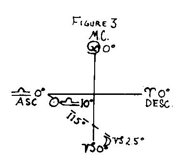
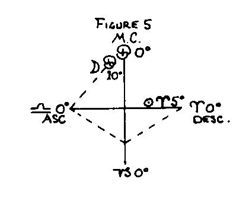
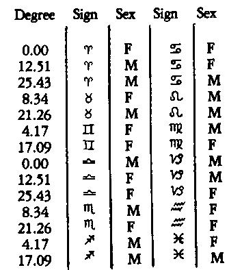
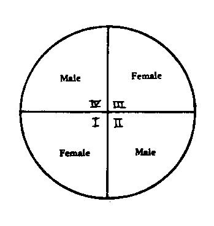

<h1 id="the-prenatal-epoch">Folleto №34: La época prenatal</h1>

### <h3 id="the-prenatal-epoch">La época prenatal</h3>

El principio fundamental de la Época Prenatal ha sido expuesto por Max Heindel en el *Mensaje de las Estrellas*, donde afirma que el cuerpo es producto de las fuerzas lunares y que la posición del Ascendente, o su opuesto, en el nacimiento, es la posición de la Luna en la concepción. La palabra clave de la Luna es fecundación o fertilidad, y son Jehová y los Ángeles lunares quienes presiden el nacimiento de un niño. Esto se declara en el *Concepto Rosacruz del Cosmos* y otras obras de la Filosofía Rosacruz. Vemos así que la Luna tiene una influencia primaria sobre la formación del cuerpo físico, y que el Ascendente representa simplemente la transferencia de la posición de la Luna desde la concepción hasta el nacimiento.

Esta ley era conocida por los antiguos como la “Truitina de Hermes”, de Hermes Trismegisto, quien primero formuló y enunció correctamente la ley de la siguiente manera: “El lugar de la Luna en la concepción se convierte en el ascendente del nacimiento o en su punto opuesto.”

“Pero esto resultó ser solo la mitad de una ley muy importante, pues mientras el Ascendente en el nacimiento era el lugar de la Luna en cierta Época, el Ascendente o su punto opuesto en esta Época era el lugar de la Luna en el nacimiento – <em>un intercambio de factores verdaderamente notable.</em>” – E.H. Bailey

Según la Sabiduría Antigua, “El Aliento del Mundo tiene una pulsación definida y periódica, una acción de sístole y diástole, mediante la cual se controlan el nacimiento y la muerte.” Esta idea de periodicidad, bien establecida por la ciencia moderna, refuerza la idea de que el nacimiento solo puede tener lugar, respecto a cualquier localidad, a intervalos; que estos intervalos están en armonía con el movimiento lunar, y que solo cada séptimo impulso del Aliento del Mundo permite los nacimientos humanos.

La versión moderna de la Época Prenatal fue establecida por primera vez por el astrólogo inglés conocido en el mundo astrológico como Sepharial, en el año 1886. Fue publicada por él en 1890. En esto contó con la colaboración de un científico entrenado y veterano, un médico, quien lo ayudó a establecer las leyes primarias de la Época Prenatal mediante años de minuciosa investigación y experimentos reales. Este médico era un obstetra experto y probó las leyes de la Época Prenatal con datos directos de primera mano.

Estas leyes han sido verificadas, ampliadas y complementadas por las meticulosas investigaciones de E.H. Bailey, a quien se le debe gran reconocimiento por sus numerosas y precisas demostraciones de la Época Prenatal. Su libro sobre este tema se considera una autoridad estándar, y en lo esencial seguimos su valiosa contribución al asunto y le otorgamos pleno crédito.

Uno de los usos principales de la Época Prenatal es la corrección o rectificación de la hora de nacimiento cuando solo se conoce una hora aproximada. Otro es su utilidad para determinar correctamente el sexo del nativo. Finalmente, ofrece indicios sobre el carácter y la naturaleza interna del individuo tan fundamentales como los de la carta natal.

“Así como los nacimientos se producen en exacta armonía con las leyes lunares, se demuestra que la vida intrauterina está en relación directa con el mundo sideral exterior, que el gran hecho de la maternidad es susceptible de una medición y regulación puramente astronómicas… La ley no es nada menos que una medición matemática de la vida humana, un hecho natural asombroso; nada más exactamente matemático y concreto se encuentra en los registros de los científicos que este registro de la vida intrauterina, pues solo mediante su estudio se comprenderán plenamente las leyes de la generación.” – <em>Sepharial</em>.

“En la medición del período intrauterino medimos en realidad todo el futuro del individuo; altera este único hecho — el momento de la concepción (o su contraparte espiritual, la Época) — y cambias todo el curso del destino de la progenie. Si aceptamos la teoría oculta de que la Época Prenatal es el descenso del Ego al Mundo del Deseo, entonces debe mostrar el carácter inherente del Ego que está a punto de encarnar. Puede afirmarse que la Época tiene una relación más íntima con el individuo que el horóscopo de nacimiento, este último pareciendo reflejar la personalidad y su herencia y entorno. En otras palabras, la Época representa al hombre a punto de manifestarse en la carne, el horóscopo denota las condiciones personales y los ambientes reales en los que nace. Todo nacimiento está directamente conectado con la Época, y todo nacimiento natural auténtico, dentro de los límites de un error de observación, producirá una Época de acuerdo con las reglas que se darán.” – <em>Bailey</em>.

Para resumir, volvamos a expresar el principio fundamental de la Época Prenatal conocido como la <em>Truitina de Hermes</em>: “El Ascendente en el nacimiento es el lugar de la Luna en cierta Época, y el Ascendente o su punto opuesto en la Época era el lugar de la Luna en el nacimiento.”

Esto produce lo siguiente:

### <h3 id="four-laws-of-the-epoch">Las cuatro leyes de la época</h3>

Cuando la Luna en el nacimiento aumenta en luz, estará en el grado ascendente de la Época, y la Luna en la Época estará en el grado ascendente del nacimiento.

Cuando la Luna en el nacimiento disminuye en luz, estará en el grado descendente de la Época, y la Luna en la Época estará en el grado descendente del nacimiento.

Cuando la Luna en el nacimiento está (a) aumentando en luz y por debajo del horizonte, o (b) disminuyendo en luz y por encima del horizonte, el período de gestación es más largo de lo normal.

Cuando la Luna en el nacimiento está (a) aumentando en luz y por encima del horizonte, o (b) disminuyendo en luz y por debajo del horizonte, el período de gestación es más corto de lo normal.

De estas cuatro leyes deducimos lo siguiente:

### <h3 id="four-orders-of-epoch">Cuatro órdenes de la época</h3>

1\. Luna sobre el horizonte y aumentando en luz: 273 días menos x.

2\. Luna sobre el horizonte y disminuyendo en luz: 273 días más x.

3\. Luna bajo el horizonte y aumentando en luz: 273 días más x.

4\. Luna bajo el horizonte y disminuyendo en luz: 273 días menos x.

Debe entenderse que los 273 días mencionados en la tabla anterior constituyen el período normal de gestación, o nueve meses solares o diez meses lunares. Este período normal se incrementa o disminuye de acuerdo con la distancia de la Luna respecto al Ascendente o al Descendente, y “x” es un cierto número de días correspondiente a esta distancia, obtenido dividiendo la distancia en grados entre trece grados, siendo estos últimos el movimiento diario promedio de la Luna.

Al realizar el cálculo, cuente hacia el Ascendente (AC) cuando la Luna está aumentando en luz, y hacia el Descendente (DC) cuando la Luna está disminuyendo en luz. Otra forma más precisa de expresarlo sería: En los órdenes núms. 1 y 4, la distancia en grados de la Luna desde el horizonte que cruzó por última vez (AC o DC), dividida entre trece, da “x”, o el número de días en que este período se reduce; y en los órdenes núms. 2 y 3, la distancia de la Luna en grados desde el horizonte hacia el cual se está aproximando, dividida entre trece, da el número de días en que este período se incrementa. Estas reglas se ilustran con los siguientes ejemplos:

### <h4 id="order-no-1">Orden No. 1</h4>

Luna sobre el horizonte y aumentando en luz. El período de gestación es de 273 días menos “x”.

Aumentando — por lo tanto se “cuenta” hacia el AC.

Restar la longitud de la Luna de la longitud del AC da 80 grados, como sigue:

|      |          |   |          |            |          |                                                |
| ---- | -------- | - | -------- | ---------- | -------- | ---------------------------------------------- |
| AC   | ________ | 7 | ________ | 0          | ________ | 0                                              |
| Luna | ________ | 4 | ________ | 10         | ________ | 00                                             |
|      | ________ | 2 | ________ | 20 grados. | ________ | equivale a 2 signos más 20 grados = 80 grados. |

80 grados divididos entre 13 dan 6 días, en los cuales el período se reduce.

La “fecha índice” cae 6 días antes de la “fecha de la Época”.

#### <h4 id="order-no-2">Orden No. 2</h4>

Luna sobre el horizonte y disminuyendo en luz.

El período de gestación es de 273 días más “x”.

Disminuyendo — por lo tanto se “cuenta” hacia el D.C.

Restar la longitud de la Luna de la longitud del D.C. da 105 grados.

Dividir 105 grados entre 13 da 8 días, en los cuales el período se incrementa. Por lo tanto, la “fecha de la Época” cae 8 días antes de la “Fecha Índice”.

#### <h4 id="order-no-3">Orden No. 3</h4>

Luna bajo la Tierra y aumentando en luz.

El período de gestación es de 273 días más “x”.

Se cuenta hacia el AC, porque está aumentando, y la distancia es de 115 grados. Esto dividido entre 13 equivale a 9 días en que el período se alarga. Por lo tanto, la “Fecha de la Época” cae 9 días antes de la “Fecha Índice”.

#### <h4 id="order-no-4">Orden No. 4</h4>

Luna bajo el horizonte y disminuyendo en luz.

El período de gestación es de 273 días menos “x”.

Se “cuenta” hacia el D.C. porque está disminuyendo, y la distancia es igual a 113 grados. Esto dividido entre 13 equivale a 9 días, en los cuales el período se reduce, situando la “Fecha de la Época” 9 días después de la “Fecha Índice”.

#### <h4 id="order-no-1-variation-of-count">Orden No. 1 (variación de la cuenta)</h4>

Período de gestación: 273 días menos “x”.

Luna sobre el horizonte y aumentando.

La “cuenta” se hace aquí desde la Luna hacia el AC y, por debajo del horizonte, hacia el DC, disminuyendo el período en 14 días, menos que el cómputo regular de la Época.

#### <h4 id="order-no-2-variation-of-count">Orden No. 2 (variación del cálculo)</h4>

Luna sobre el horizonte y disminuyendo.

Período de gestación: 273 días más “x”.

La “cuenta” se hace hacia el D.C. según la regla, pero se continúa por debajo del horizonte hasta el A.C., aumentando el período de gestación en 14 días, además del cómputo regular de la Época.

#### <h4 id="order-no-3-variation-of-count">Orden No. 3 (variación del cálculo)</h4>

Luna debajo del horizonte y aumentando.

Período de gestación: 273 días más “x”.

La “cuenta” se hace hacia el AC, según la regla, y se continúa por encima del horizonte hasta el descendente, aumentando el período de gestación en 14 días.

Aumentando: se “cuenta” hacia el AC y se extiende por encima y alrededor. Esto será 80 grados más 180 grados, igual a 260 grados. Esto dividido entre 13 equivale a 20 días en que el período se incrementa, y situará la “Fecha de la Época” 20 días antes de la “Fecha Índice”.

#### <h4 id="order-no-4-variation-of-count">Orden No. 4 (variación del cálculo)</h4>

Luna debajo del horizonte y disminuyendo.

El período de gestación es de 273 días menos “x”.

La “cuenta” se hace hacia el D.C., según la regla, y se continúa por encima del horizonte hasta el A.C., disminuyendo el período de gestación en 14 días.

La Luna está disminuyendo, por lo tanto se “cuenta” hacia el D.C. y se extiende alrededor.

La “cuenta” total es 180 grados más 118 grados, igual a 298 grados. Esto, dividido entre 13, da 28 días en que el período se reduce, situando la “Fecha de la Época” 28 días después de la “Fecha Índice”.

Dado que la Luna recorre todo el zodíaco en 28 días, o un mes lunar, en 14 días habrá recorrido la mitad del camino, o de un signo a su opuesto. Por lo tanto, para “variar” la “cuenta”, no se debe invertir, sino continuar alrededor, ya sea por encima o por debajo del horizonte, y aumentar o disminuir el período de gestación en 14 días.

### <h3 id="law-of-sex">La ley del sexo</h3>

Es muy fácil llegar a una Época ficticia. Una de las cosas más importantes que deben observarse en la figura Prenatal es que debe determinar el sexo del nativo. A menos que la Época se ajuste a esta condición fundamental, es decir, que defina el sexo del sujeto, no es correcta.

Toda Época debe ajustarse a cuatro condiciones separadas y distintas, a saber:

1\. Debe confirmar la hora de nacimiento dentro de los límites de una observación ordinaria.

2\. Debe definir el sexo del sujeto de acuerdo con ciertas reglas.

3\. Debe mostrar el carácter general y las fortunas del individuo.

4\. Debe proporcionar direcciones acordes con los acontecimientos de la vida.

Por lo tanto, a menos que una Época se ajuste estrictamente a estas cuatro condiciones, puede considerarse ficticia.

La ley del sexo se basa en la subdivisión hindú del zodíaco en veintiocho mansiones o “asterismos” de 12 6/7 grados cada una, lo que da lo siguiente:

### <h3 id="sex-or-critical-degrees">El sexo o grados "críticos"</h3>

Estos grados de sexo o “críticos” se utilizan para confirmar el sexo del sujeto o nativo. Son los puntos centrales de sus respectivos orbes, los cuales se extienden en ambas direcciones hasta el límite del orbe.

Se observará, por lo tanto, que cuando un grado de cierto signo pertenece a un sexo, el signo y grado opuestos pertenecen al sexo contrario. De ahí que todo lo necesario para colocar uno de los factores en la posición del sexo adecuada sea variar la cuenta en catorce días, haciendo el período de gestación más corto o más largo, lo cual traerá el grado ascendente apropiado.

La aplicación de estos grados de sexo o “críticos” es la siguiente: “Permita el orbe de influencia adecuado para la Luna y el Ascendente en la carta natal. Esto mostrará de inmediato si un grado masculino o femenino está ascendiendo, así como la posición del sexo de la Luna. Se observará que, sin importar en qué grado caiga el Ascendente, siempre ocupará una posición dentro del orbe de uno de estos puntos sexuales, ya sea masculino o femenino; pero la posición de la Luna puede caer fuera del orbe de influencia, y esto da lo que se denomina una posición negativa de la Luna. Si la Luna es negativa en la carta natal, tenemos una Época estrictamente regular o irregular.”

Orbe (en la figura natal)

Para el Ascendente es 6 3/7 grados, equivalente a 6° 26’.

Para la Luna es 4 2/7 grados, equivalente a 4° 17’.

Importante: recuerde siempre que, dado que la Luna en el nacimiento se convierte en AC o DC en la Época y viceversa, los orbes de influencia de la Luna y del AC en la Carta de la Época intercambian posiciones, de modo que el orbe de la Luna en la Época será de 6° 26’, mientras que el orbe del AC será de 4° 17’. “Si, sin embargo, la Luna está dentro del orbe de uno de estos puntos de sexo, se denomina Época de sexo.” – Bailey.

Por lo tanto, para determinar el sexo del sujeto a partir de la figura de la carta Prenatal, observe:

1\. Cuando el Ascendente es negativo (como en las Épocas estrictamente regulares e irregulares), el sexo del área ocupada por la Luna es el sexo del sujeto.

2\. Cuando tanto la Luna como el AC están dentro de sus respectivos orbes de un grado del mismo sexo, el sexo del sujeto es el mismo que el del área así ocupada.

3\. Cuando la Luna y el AC están situados dentro de sus respectivos orbes de un grado del sexo opuesto (la Luna en un grado femenino y el AC en uno masculino, o viceversa), el sexo del sujeto se determina por el cuadrante ocupado por la Luna en la Época. Entonces habrá dos puntos de un sexo y uno del otro, y el sexo que predomine será el del sujeto.

El término “cuadrante” significa cuarto. El primer cuarto de la carta, desde el AC hasta el nadir, es femenino; el segundo cuarto, desde el nadir hasta el DC, es masculino; el tercer cuarto, desde el DC hasta el MC, es femenino; y el cuarto cuarto, desde el MC hasta el AC, es masculino. Así, si la posición del sexo de uno de los factores, ya sea el AC o la Luna, está en un sexo opuesto al del otro factor, el sexo del cuadrante en el que se ubica la Luna en la Época determina el sexo del nativo.

### <h3 id="irregular-epochs">Épocas irregulares</h3>

Hasta este punto hemos estado tratando con la Época regular, es decir, cuando existe un intercambio de los dos factores: (1) - La Luna con el AC cuando aumenta en luz, o con el DC cuando disminuye en luz. (2) - El AC con la Luna de la Época. Estos intercambios no siempre son regulares y pueden variar por dos razones principales: Porque la carta de la Época no define correctamente la hora de nacimiento. Porque la carta de la Época no define correctamente el sexo del nativo. Por lo tanto, es necesario introducir variaciones al orden regular de la Época. Existen tres variaciones, y cada una puede aplicarse a cualquiera de los cuatro órdenes:

(1) Tomar la “cuenta” desde el AC o el DC según la regla, pero invertir el hecho de que la Luna nazca o se ponga en el nacimiento: Hacer que la Luna se ponga cuando está aumentando. Hacer que la Luna nazca cuando está disminuyendo.

(2) Tomar la “cuenta” desde la Luna: Desde la Luna hacia el DC cuando está aumentando. Desde la Luna hacia el AC cuando está disminuyendo.Pero mantener la condición normal de si la Luna nace o se pone según la regla original.

(3) Tomar la “cuenta” desde la Luna igual que en la variación (2): Desde la Luna hacia el DC cuando aumenta. Desde la Luna hacia el AC cuando disminuye. Y además invertir el hecho de que la Luna nazca o se ponga, tal como se hace en la variación (1).

### <h3 id="table-of-variations">Tabla de variaciones</h3>

| Variación I    | Nacimiento     | Época  |
| -------------- | -------------- | ------ |
| Luna creciente | AC se vuelve   | Luna   |
| Luna creciente | Luna se vuelve | DC     |
| Luna menguante | DC se vuelve   | Luna   |
| Luna menguante | Luna se vuelve | AC     |

| Variación II   | Nacimiento     | Época  |
| -------------- | -------------- | ------ |
| Luna creciente | DC se vuelve   | Luna   |
| Luna creciente | Luna se vuelve | AC     |
| Luna menguante | AC se vuelve   | Luna   |
| Luna menguante | Luna se vuelve | DC     |

| Variación III  | Nacimiento     | Época  |
| -------------- | -------------- | ------ |
| Luna creciente | DC se vuelve   | Luna   |
| Luna creciente | Luna se vuelve | DC     |
| Luna menguante | AC se vuelve   | Luna   |
| Luna menguante | Luna se vuelve | AC     |

“Debe entenderse correctamente que esta irregularidad o variación del postulado principal de la Época no es en ningún sentido arbitraria o fortuita. La variación debe hacerse para que la Época se ajuste a las cuatro condiciones fundamentales. Debe tenerse presente que en todas las Épocas regulares e irregulares la Luna en el nacimiento ocupa un área sexual negativa y, por lo tanto, su ascenso o puesta no afecta el sexo; la variación de este punto tiene como propósito exigir que la Época confirme la hora de nacimiento. En la segunda y tercera variación, es el sexo del área ocupada por el AC lo que requiere una desviación de la ley principal. Así, la “cuenta” se hace desde la Luna hacia el AC, y si ese punto se encuentra en un área del sexo opuesto al del sujeto, la “cuenta” debe continuarse alrededor hasta el horizonte opuesto, lo que lo llevará a un área del sexo requerido. La posición de la Luna puede ascender según la regla, pero también puede ser necesario invertir el proceso.” – Bailey.

Una tercera clase de Épocas comprende aquellas que se designan más estrictamente como “Épocas del Sexo”. Aquí el intercambio de los dos factores está gobernado total y exclusivamente por el sexo de las áreas en las que se encuentran tanto la Luna como el Ascendente, considerado en conjunto con el sexo del sujeto. A veces el intercambio será regular, pero en otros casos se aplicará alguno de los tres métodos irregulares, mientras que el sexo del cuadrante ocupado por la Luna en la Época se utiliza en un gran número de casos. Esta clase incluye la gran mayoría de los casos en los que el período de gestación se incrementa o disminuye por lapsos mayores que los catorce días habituales.” – Bailey.

Ahora, todo lo que se necesita para calcular la fecha real de la Época es encontrar la clase de Época que corresponde a cada caso particular. Esto se hace de acuerdo con las siguientes reglas y nos da Seis Clases de Épocas.

### <h4 id="six-classes-of-epochs">Seis clases de épocas</h4>

1\. Luna negativa (a) Creciente – el AC es del mismo sexo que la persona Menguante – el AC es del sexo opuesto al de la persona Esta clase es regular o irregular, variación (1).

2\. Luna negativa (a) Creciente – el AC es del sexo opuesto Menguante – el AC es del mismo sexo Esta clase corresponde a la segunda o tercera variación, siempre irregular. Nunca será regular.

3\. Luna creciente: AC y Luna del mismo sexo que la persona Luna menguante: AC y Luna del sexo opuesto al de la persona Esta clase es regular o irregular, variaciones 1 y 2.

4\. Luna creciente: AC del mismo sexo, Luna del sexo opuesto al de la persona Luna menguante: AC del sexo opuesto, Luna del mismo sexo que la persona Esta clase es regular o irregular, variaciones 1 y 3.

5\. Luna creciente: AC del sexo opuesto, Luna del mismo sexo que la persona Luna menguante: AC del mismo sexo, Luna del sexo opuesto al de la persona Esta clase es regular o irregular, variaciones 2 y 3.

6\. Luna creciente: AC y Luna en sexo opuesto al de la persona Luna menguante: AC y Luna en el mismo sexo que la persona Esta clase nunca será regular, sino irregular, variaciones 1, 2 y 3.