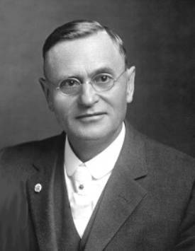

<h1 id="the-rosicrucian-cosmo-conception">Ruusuristiläinen Maailmankatsomus</h1>

Eli Mystinen Kristinoppi

Ihmisen mennyt kehitys, nykyinen rakenne sekä tuleva kehitys



Kirjoittanut Max Heindel

Sen sanoma ja tehtävä: 

```
Terve Järki
    Hyvä Sydän
        Terve Ruumis
```

THE ROSICRUCIAN FELLOWSHIP  
International Headquarters  
Mt. Ecclesia  
Oceanside, California, 91054, USA  

### <h3 id="list-of-contents">Sisällysluettelo</h3>

- [Usko – Kristus, runo](#creed-or-christ)
- [Muutama sana viisaile](#a-word-to-the-wise)
- [I Osa: Ihmisen nykyinen rakenne ja kehitysmenetelmä](#part-1)
  - [Neljä luontokuntaa, kaavio](#diagram-the-four-kingdoms)
  - [Johdanto](#introduction)
  - [I Luku: Näkyvä ja näkymätön maailma](#chapter-1)
    - [Fyysisen maailman kemiallinen taso](#chemical-region-of-the-physical-world)
    - [Fyysisen maailman eetteritaso](#etheric-region-of-the-physical-world)
    - [Tunnemaailma](#the-desire-world)
    - [Ajatusmaailma](#the-world-of-thought)
    - [Näkyvän ja näkymättömän maailman ilmiöiden suhteellinen kestävyys, kaavio 1](#diagram-1-the-material-world-a-reverse-reflection-of-the-spiritual-worlds)
    - [Seitsemän maailmaa, kaavio 2](#diagram-2-the-seven-worlds)
  - [II Luku: Neljä luontokuntaa](#chapter-2)
    - [Eri luontokuntien käyttövälineiden esittely, kaavio 3](#diagram-3-the-vehicles-of-the-four-kingdoms)
    - [Eri luontokunnissa vallitseva tajunnantila, kaavio 4](#diagram-4-the-consciousness-of-the-four-kingdoms)
  - [III Luku: Ihminen ja kehitysmenetelmä](#chapter-3)
    - [Elämän toiminnat, muisti ja sielunkasvu](#activities-of-life-memory-and-soul-growth)
    - [Ihmisen seitsenkertainen rakenne, taulukko](#constitution-of-the-seven-fold-man)
    - [Ihmisen kymmenkertainen rakenne, kaavio 5](#diagram-5-the-three-fold-spirit-the-three-fold-body-and-the-three-fold-soul)
    - [Kuolema ja kiirastuli](#death-and-purgatory)
    - [Hopealanka, kaavio 5 a](#diagram-5-1-2-the-silver-cord)
    - [Raja-alue](#the-borderland)
    - [Ensimmäinen taivas](#the-first-heaven)
    - [Toinen taivas](#the-second-heaven)
    - [Kolmas taivas](#the-third-heaven)
    - [Valmistautuminen jälleensyntymiseen](#preparations-for-rebirth)
    - [Fyysisen ruumiin syntymä](#birth-of-the-dense-body)
    - [Elollisruumiin syntymä](#birth-of-the-vital-body)
    - [Tunneruumiin syntymä](#birth-of-the-desire-body)
    - [Järjen syntymä](#birth-of-the-mind)
    - [Veri, egon käyttöväline](#the-blood-the-vehicle-of-the-ego)
    - [Elämänkierros, kaavio 5 b](#diagram-a-life-cycle)
  - [IV Luku: Jälleensyntyminen ja seuraamuksen laki](#chapter-4)
    - [Viinin vaikutus kehityksessä](#wine-as-a-factor-in-evolution)
    - [Ihmeellinen kertomus](#a-remarkable-story)
- [II Osa: Maailman synty ja ihmisen synty](#part-2)
  - [V Luku: Ihmisen suhde Jumalaan](#chapter-5)
    - [Korkein Olento, Kosmiset tasot ja Jumala, kaavio 6](#diagram-6-the-supreme-being-the-cosmic-planes-and-god)
  - [VI Luku: Kehityssuunnitelma](#chapter-6)
    - [Alku](#the-beginning)
    - [Seitsemän maailmaa](#the-seven-worlds)
    - [Seitsemän aikakautta](#the-seven-periods)
    - [Saturnuskausi, kaavio 7](#diagram-7-the-saturn-period)
  - [VII Luku: Kehityksen tie](#chapter-7)
    - [Kierrokset ja kosmiset yöt](#revolutions-and-cosmic-nights)
    - [Seitsemän maailmaa, seitsemän palloa ja seitsemän aikakautta, kaavio 8](#diagram-8-the-seven-worlds-seven-globes-and-seven-periods)
  - [VIII Luku: Kehitystyö](#chapter-8)
    - [Ariadnen lanka](#ariadnes-thread)
    - [Saturnuskausi](#the-saturn-period)
    - [Yhteenveto](#recapitulation)
    - [Aurinkokausi](#the-sun-period)
    - [Kuukausi](#the-moon-period)
    - [Kaksitoista suurta luovaa hierarkiaa, kaavio 9](#diagram-9-twelve-creative-hierarchies)
  - [IX Luku: Jälkeenjääneet ja vastatulleet](#chapter-9)
    - [Olentoluokat Kuukauden alussa, luettelo](#classes-of-beings-at-the-beginning-of-the-moon-period)
    - [Olentoluokat Maakauden alussa, kaavio 10](#diagram-10-classes-at-the-beginning-of-earth-period)
  - [X Luku: Maakausi](#chapter-10)
    - [Maakauden Saturnuskierros](#the-saturn-revolution-of-the-earth-period)
    - [Maakauden Aurinkokierros](#the-sun-revolution-of-the-earth-period)
    - [Maakauden Kuukierros](#the-moon-revolution-of-the-earth-period)
    - [Kierrosten väliset lepoajat](#rest-periods-between-revolutions)
    - [Maakauden neljäs kierros](#the-fourth-revolution-of-the-earth-period)
  - [XI Luku: Meidän aurinkojärjestelmämme synty ja kehitys](#chapter-11)
    - [Kaaos](#chaos)
    - [Planeettojen synty](#the-birth-of-the-planets)
    - [Jumalan ja ihmisen olemuspuolet, kaavio 11](#diagram-11-aspects-of-god-and-man)
    - [Table of Vibrations](#table-of-vibrations)
    - [Ihmisruumiin muoto, kaavio 12](#diagram-12-a-mans-past-present-and-future-form)
  - [XII Luku: Maanpäällinen evoluutio](#chapter-12)
    - [Polaarinen ajanjakso](#the-polarian-epoch)
    - [Hyperborealainen ajanjakso](#the-hyperborean-epoch)
    - [Kuu, kahdeksas piiri](#the-moon-the-eighth-sphere)
    - [Lemurialainen ajanjakso](#the-lemurian-epoch)
    - [Yksilön synty](#birth-of-the-individual)
    - [Sukupuolten erottaminen](#separation-of-the-sexes)
    - [Marsin vaikutus](#influence-of-mars)
    - [Rodut ja niiden johtajat](#the-races-and-their-leaders)
    - [Merkuriuksen vaikutus](#influence-of-mercury)
    - [Lemurialainen rotu](#the-lemurian-race)
    - [Ihmisen lankeemus](#the-fall-of-man-1)
    - [Lucifer-henget](#the-lucifer-spirits)
    - [Atlantislainen ajanjakso](#the-atlantean-epoch)
    - [Arjalainen ajanjakso](#the-aryan-epoch)
    - [Kuusitoista häviön tietä](#the-sixteen-paths-to-destruction)
  - [XIII Luku: Takaisin Raamattuun](#chapter-13)
  - [XIV Luku: Ensimmäisen Mooseksen kirjan salatieteellinen selitys](#chapter-14)
    - [Raamatun rajoitukset](#limitations-of-the-bible)
    - [Alussa](#in-the-beginning)
    - [Tähtisumuteoria](#the-nebular-theory)
    - [Luovat hierarkiat](#the-creative-hierarchies)
    - [Saturnuskausi](#the-saturn-period)
    - [Aurinkokausi](#the-sun-period)
    - [Kuukausi](#the-moon-period)
    - [Maakausi](#the-earth-period)
    - [Jehova ja hänen tehtävänsä](#jehovah-and-his-mission)
    - [Involuutio, evoluutio ja epigeneesi](#involution-evolution-and-epigenesis)
    - [Elävä sielu?](#a-living-soul)
    - [Adamin kylkiluu](#adams-rib)
    - [Suojelusenkelit](#guardian-angels)
    - [Veren sekoittaminen avioliitossa](#mixing-blood-in-marriage)
    - [Ihmisen lankeemus](#the-fall-of-man-2)
    - [Sukupuolten esiintymisen alku ja loppu, kaavio 13](#diagram-13-the-beginning-and-end-of-sex)
- [III Osa: Ihmisen tuleva kehitys ja vihkimys](#part-3)
  - [Seitsemän luomispäivää, kaavio](#diagram-the-seven-days-of-creation)
  - [XV Luku: Kristus ja hänen tehtävänsä](#chapter-15)
    - [Uskonnon kehitys](#the-evolution-of-religion)
    - [Jeesus ja Kristus-Jeesus](#jesus-and-christ-jesus)
    - [Isä, Poika ja Pyhä Henki, kaavio 14](#diagram-14-the-father-the-son-and-the-holy-spirit)
    - [Ei rauhaa vaan miekan](#not-peace-but-a-sword)
    - [Betlehemin tähti](#the-star-of-bethlehem)
    - [Sydän, poikkeuksellinen elin](#the-heart-as-an-anomaly)
    - [Golgatan mysteerio](#the-mystery-of-golgotha)
    - [Puhdistava veri](#the-cleansing-blood)
    - [”Niin ylhäällä kuin alhaalla”, kaavio 14 a](#diagram-as-above-so-below)
  - [XVI Luku: Tuleva kehitys ja vihkimys](#chapter-16)
    - [Seitsemän luomispäivää](#the-seven-days-of-creation)
    - [Merkuriuksen sauvan symboliikka, kaavio 15](#diagram-15-the-symbolism-of-the-caduceus)
    - [Radiates, Mollusks, Articulates and Vertebrates](#radiates-mollusks-articulates-and-vertebrates)
    - [Spiraalit spiraaleissa](#spirals-within-spirals)
    - [Alkemia ja sielun kasvu](#alchemy-and-soul-growth)
    - [Luova sana](#the-creative-word)
  - [XVII Luku: Kokemusperäisen tiedon hankkiminen](#chapter-17)
    - [Ensimmäiset askeleet](#the-first-steps)
    - [Länsimaisia keinoja länsimaisille kansoille](#western-methods-for-western-people)
    - [Ravitsemustiede](#the-science-of-nutrition)
    - [Ravintoainetaulukko](#table-of-food-values-part-1)
    - [Ravintoainetaulukko](#table-of-food-values-part-2)
    - [Imeytymisen laki](#the-law-of-assimilation)
    - [Elä ja anna elää](#live-and-let-live)
    - [Herran rukous](#the-lords-prayer)
    - [Herran rukous, kaavio 16](#diagram-16-the-lords-prayer)
    - [Selibaattilupaus](#the-vow-of-celibacy)
    - [Aivolisäke ja käpyrauhanen](#the-pituitary-body-and-the-pineal-gland)
    - [Käyttämättömien sukupuolivirtausten reitti, kaavio 17](#diagram-17-path-of-the-unused-sex-currents)
    - [Esoteeriset harjoitukset](#esoteric-training)
    - [Kuinka sisäinen käyttöväline muodostetaan](#how-the-inner-vehicle-is-built)
    - [Keskittyminen](#concentration)
    - [Mietiskely](#meditation)
    - [Havainnoiminen](#observation)
    - [Erottelukyky](#discrimination)
    - [Kontemplaatio](#contemplation)
    - [Palvominen](#adoration)
  - [XVIII Luku: Maapallon rakenne ja tulivuorten purkaukset](#chapter-18)
    - [Pedon luku](#the-number-of-the-beast)
    - [Maan rakenne, kaavio 18](#diagram-18-the-constitution-of-the-earth)
  - [XIX Luku: Christian Rosenkreutz ja Ruusuristiläinen järjestö](#chapter-19)
    - [Ikivanhoja totuuksia nykyaikaisissa vaatteissa](#ancient-truths-in-modern-dress)
    - [Vihkimys](#initiation)
    - [Ruusuristiläinen veljeskunta](#the-rosicrucian-fellowship)
    - [Correspondence Courses](#correspondence-courses)
    - [Ruusuristin symboliikka](#symbolism-of-the-rose-cross)
- [Topical Index]()
  - [Addendum A: Ruusuristiläisen kokelaan aamu- ja iltaharjoitukset](#addendum-a)
  - [Concerning the Origin of the Fellowship Teachings]()
  - [Addendum B: Footnote to Chapter III](#addendum-b)
  - [Addendum C: Footnote to Chapter XIII (Regarding Race)](#addendum-c)
  - [Addendum D: Footnote to "Our Buildings"](#addendum-d)

### <h3 id="creed-or-christ">Usko - Kristus</h3>

```
Ei Luojaa rakasta, ken vihaa toista,    
ken murhaa veljen sielun, sydämen,    
ken pauhaa helveteistä, tuomioista,    
– ei tarkoitusta tunne ihmisen.    

Jumala siunas joka uskontomme,    
on Kristus tie ja totuus, elämä.    
Hän levon suo, kun uupuneet me oomme    
tuo rauhan taisteluista, synneistä.    

Kaikkeuden henki korkeudestaan koitti    
jokaiseen kirkkoon, eikä yhteen vain.    
Jokainen apostoli lahjan voitti    
tulisten kielten ensi helluntain.    

Sen jälkeen korppikotkain kiivaudella    
taisteltiin tähden tyhjäin nimien.    
Tahdoimme dogmein, oppein oikeudella    
veljemme syöstä pätsiin kauhujen.    

Jaatko Kristuksen? Vai Paulus, Simon    
synteimme vuoksi ristiinnaulittiin?    
Vain erehdystä eri kirkot niin on;    
– Kristuksen rakkaus onhan rajaton.    

On rakkautensa ylivuotavainen;    
ei vangiks’ uskon muurit sitä saa.    
Liet kristitty, tai outo muukalainen,    
– Hän koko ihmiskuntaa rakastaa.    

Miks’ emme seuraa Hänen jälkiänsä,    
annamme muotoin meitä erottaa?    
Pääasia on täyttää käskyjänsä:    
Te toisianne, oi, rakastakaa!    

Yks tärkeä on tietää ihmisyyden,    
yks lääke lieventää voi itsekkyyden,    
vain yksi tie vie täältä taivaaseen:    
Se perustuupi veljesrakkauteen.    

- Max Heindel
```

### <h3 id="a-word-to-the-wise">Muutama sana viisaile</h3>

Kristinuskon perustaja lausui okkulttisen totuuden sanoessaan: ”Joka ei ota vastaan Jumalan valtakuntaa niin kuin lapsi, hän ei pääse sinne sisälle.” (Mark. 10:15) Kaikki salatieteilijät tunnustavat tämän Kristuksen lausuman tärkeän totuuden ja yrittävät yhä enemmän to teuttaa sitä elämässään. 

Kun uusi filosofinen ajatussuunta tuodaan esiin maailmassa, ih miset suhtautuvat siihen eri tavalla. 

Yksi ottaa innolla vastaan uuden filosofisen näkemyksen tutki akseen, missä määrin se tukee hänen omia käsityksiään. Hänelle filo sofia itsessään ei merkitse paljoa. Sen tärkein arvo on pääasiallisesti siinä, tukeeko se hänen omia käsityksiään. Jos jokin kirja tässä suh teessa vastaa odotuksia, hän omaksuu innolla siinä esitetyt mieli piteet ja ajaa niitä liioitellun puolueellisesti, mutta jos se ei tue hänen mielipiteitään, hän panee teoksen todennäköisesti syrjään tuntien suurta vastenmielisyyttä ja pettymystä, ikään kuin tekijä olisi tehnyt vääryyttä häntä kohtaan. 

Toinen ihminen asettuu skeptiselle kannalle huomatessaan esi tettävän sellaista, mitä HÄN itse ei ennemmin ole lukenut, kuullut tai edes ajatellut. Todennäköisesti hän pitäisi epäoikeudenmukaise na syytöstä, että hänen suhtautumisensa on omahyväinen ja suvait sematon. Kuitenkin asia on näin ja hän sulkee mielensä näkemästä totuutta, jonka hän mahdollisesti voisi löytää tästä umpimähkään hylkäämästään filosofiasta. 

Molemmat edellä mainitut ihmisluokat peittävät itseltään valon. Ennakkokäsitykset estävät heitä näkemästä totuutta. ”Pieni lapsi” on tässä suhteessa vanhempien ihmisten vastakohta. Häntä ei vaivaa ylitsepääsemätön korkeamman viisauden paine. Hän ei pidä velvol lisuutenaan näyttää viisaalta ja peittää tietämättömyyttään jostain asiasta hymyyn tai ivanauruun. Hän on rehellisesti tietämätön ja vailla ennakkomielipiteiden kahleita ja siitä syystä valmis ottamaan vastaan opetusta. Hän ottaa kaiken vastaan luottamuksella, jota sa notaan ”lapsenuskoksi” ja jota epäilyksen varjot eivät pimitä. Opetus jää sellaisenaan lapsen mieleen, kunnes hän toteaa sen oikeaksi tai vääräksi. 

Kaikissa salatieteellisissä kouluissa oppilasta opetetaan unohta maan ensin kaikki muu ja olemaan uutta opetusta annettaessa vail la ennakkoasenteita ja -luuloja. Mieli on pidettävä rauhallisena ja luottavaisesti odottavassa tilassa. Skeptisismi ehdottomasti sokaisee näkemästä totuutta, kun taas rauhallinen ja luottavainen mielentila saattaa meidät intuition tai sisältäpäin tulevan opetuksen kautta ha vaitsemaan esitetyssä asiassa piilevän totuuden. Tämä on ainoa tapa kehittää ehdottoman varmaa totuuden havaitsemiskykyä. 

Oppilasta ei vaadita umpimähkään uskomaan, että esine, jonka hän on havainnut valkoiseksi, itse asiassa onkin musta, vaikka tätä tahdottaisiinkin opettaa hänelle. Sen sijaan hänen täytyy kehittää sellaista mielentilaa, joka ”uskoo kaiken” mahdolliseksi. Hän voi jopa joksikin aikaa syrjäyttää asian, jota yleensä pidetään totena, ja tutkia, olisiko mahdollista, että jostain häneltä ennen huomaamatta jää neestä näkökohdasta katsottuna mainittu asia voisi näyttää mustalta. Hän ei enää pidä mitään ”tunnustettuna tosiasiana”, sillä hän ym märtää, kuinka tärkeää on pitää mieli lapselle ominaisessa vastaan ottavassa tilassa. Hän tuntee jo kaikissa ruumiinsa säikeissä todeksi sen, että ”nyt näemme peilissä hämärästi”, ja Aiaksen tavoin hän on aina valppaana kaivaten ”valoa, ja yhä enemmän valoa”. 

Tällaisesta mielentilasta on selvästi suunnaton hyöty tutkittaes sa jotakin aihetta, asiaa tai aatetta. Lausunnot, jotka näyttävät aivan ehdottomasti ristiriitaisilta ja joiden kannattajat ovat kiihkeästi ol leet toisiaan vastaan, voidaan kuitenkin täydellisesti sovittaa. Eräästä tällaisesta tapauksesta tullaan tässä kirjassa kertomaan. Ainoastaan avoimella mielellä voidaan saavuttaa sopusointuinen yhteyden side. Vaikka tämän teoksen huomattaisiin eroavan muista, tekijä pyytää, että arvostelu lausuttaisiin vasta tutkimusten ja puolueettoman har kinnan jälkeen. Jos teos on arvioitu ja havaittu puutteelliseksi, teki jällä ei ole mitään valittamista. Hän pelkää ainoastaan ennenaikaista arvostelua, joka johtuu puuttuvasta tiedosta käsiteltävänä olevasta järjestelmästä, – arvostelua, joka tuomitsee teoksen puutteelliseksi ilman puolueetonta arviointia. Hän tahtoisi tehdä selväksi, että ar vostelulla on todellista merkitystä ainoastaan siinä tapauksessa, että se perustuu tietoon. 

On olemassa vielä toinenkin syy, miksi tulisi olla varovainen ar vosteluja lausuttaessa. Monille on erittäin vaikea peruuttaa pikaises ti lausumiaan mielipiteitä. Sen tähden pyydetään lukijaa pidättäy tymään kaikista kiitoksen tai moitteen ilmaisuista, kunnes teoksen rauhallinen tutkiminen on saattanut hänet järkevästi joko tunnusta maan sen ansiot tai huomaamaan puutteet. 

Ruusuristiläinen maailmankatsomus ei ole dogmaattinen, eikä myöskään vetoa muuhun auktoriteettiin kuin opiskelijan järkeen. Sen tarkoituksena ei ole aiheuttaa väittelyä, vaan se julkaistaan siinä toivossa, että sen avulla selviäisivät jotkin vaikeudet, jotka ovat vai vanneet syvemmän filosofian opiskelijoiden mieliä menneisyydes sä. Vakavan väärinkäsityksen välttämiseksi tekijä haluaa painottaa opiskelijoiden mieleen, että erehtymätön ilmoitus ei ole mahdollinen tästä monimutkaisesta aiheesta, joka käsittää kaiken auringon alla ja myös sen yläpuolella. 

Erehtymätön esitys edellyttäisi, että tekijä olisi kaikkitietävä, ja jopa vanhemmat veljet sanovat, että hekin toisinaan erehtyvät arvioinneis saan. Sen tähden ei voi olla puhettakaan kirjasta, joka lausuisi viimei sen sanan maailmanmysteeristä, ja tämän teoksen kirjoittaja tietää esittävänsä vain perustavinta laatua olevat ruusuristiläiset opetukset. 

Ruusuristiläisen veljeskunnan opetus maailman mysteeriosta on laajin ja loogisin, minkä tekijä on tavannut niiden monien vuosien aikana, jotka hän tähän tutkimukseen on uhrannut. Heidän opetuk sensa ovat olleet sopusoinnussa hänen omien tutkimustensa kanssa, joita hän on kyennyt tekemään. Kuitenkin hän on täysin selvillä siitä, ettei Ruusuristiläinen maailmankatsomus suinkaan lausu viimeistä sanaa kysymyksessä olevista asioista. Kehityksemme edistyessä sil miemme eteen avautuu yhä uusia totuuden näköaloja ja monet asiat, jotka nyt ”näemme peilissä hämärästi”, selviävät. Kuitenkin hän us koo varmasti, että tulevaisuuden filosofiset tutkimussuunnat tulevat pääasiassa kulkemaan samoja linjoja pitkin, sillä ne näyttävät ehdot tomasti oikeilta. 

Edellä sanotusta selviää, ettei tekijä pidä kirjaansa alfana ja omega na, eikä lopullisena salatieteellisenä totuuden esityksenä, vaikka hän on antanut sille nimeksi Ruusuristiläinen maailmankatsomus. Hän haluaa voimakkaasti painottaa, että se ei sisällä uskontunnustusta, jonka järjestön perustaja tai joku muu henkilö kerta kaikkiaan olisi ruusuristiläisille julistanut. Yhä uudelleen hän painottaa, että tämä teos sisältää ainoastaan sen, minkä kirjoittaja itse on ruusuristiläisten opetusten mukaan maailman mysteeriosta ymmärtänyt. Tätä käsitys tä tukevat hänen omakohtaiset tutkimuksensa sisäisistä maailmoista sekä ihmisen tilasta ennen syntymää ja kuoleman jälkeen jne. Tekijä on täysin selvillä siitä, mikä vastuu on ihmisellä, joka joko tietoisesti tai tietämättään johtaa toisia harhaan ja sen tähden hän yrittää, mi käli mahdollista, omasta puolestaan välttää tätä ja samalla suojella muita ottamasta harha-askelia. 

Lukijan tulee siis oman arvostelukykynsä perusteella joko omak sua tai hylätä tässä teoksessa esitetyt opetukset. Erityisesti on pyritty saamaan sanoma ymmärrettävään muotoon ja käyttämään helpos ti tajuttavia sanoja. Siitä syystä on käytetty vain yhtä sanaa kutakin käsitettä ilmaisemaan ja jokaisessa yhteydessä sillä on aina sama merkitys. Kun jotakin tiettyä käsitettä kuvaavaa sanaa ensi kerran käytetään, tekijä on yrittänyt määritellä sen mahdollisimman sel västi. Yksinomaan englanninkielisiä (3) sanoja on käytetty, ja kieli on yritetty saada mahdollisimman yksinkertaiseksi. Tekijä on pyrkinyt selittämään käsiteltävänä olevia aiheita niin tarkasti ja selvästi kuin mahdollista ja välttämään kaksinaisen merkityksen mahdollisuutta. Missä määrin hän on tässä onnistunut, jääköön opiskelijan itsensä arvosteltavaksi. Samalla kun hän on käyttänyt kaikki mahdolliset keinot tuodakseen opetukset esille selvästi, hän näkee myös velvol lisuudekseen puolustautua sitä mahdollisuutta vastaan, että teosta pidettäisiin täydellisesti sanasta sanaan ruusuristiläisoppina. Jos hän laiminlyö tämän varoituksen, tämä teos voi joidenkin tutkijoiden mielessä saada liian suuren painoarvon. Tämä olisi epäoikeudenmu kaista sekä ruusuristiläisten veljeskuntaa että lukijaa kohtaan. Tämä panisi vastuun veljeskunnalle niistä erehdyksistä, joita tässä teoksessa, samoin kuin muissakin ihmiskätten töissä ilmenee. Tässä syy edellä olevaan varoitukseen. 

() - (3) Käännöksessä suomenkielisiä. – Suom. huom. 

Viimeisen neljän vuoden aikana, jotka ovat kuluneet siitä, kun tekijä kirjoitti tässä esitetyt opetukset, hän on jatkanut näkymättö miä maailmoja koskevia tutkimuksiaan. Hän on kokenut myös ta junnan laajentumista, jota mainitut luontokunnat edellyttävät ja joka saavutetaan länsimaisen mysteerikoulun harjoitusten avulla. Muut kin tutkijat, jotka ovat seuranneet tässä esitettyjä, erityisesti länsi maalaisille sopivia harjoituksia laajemman tajunnan saavuttami seksi, ovat kyenneet omaperäisesti todistamaan useita tässä esitet tyjä asioita. Täten on se käsitys, jonka tekijä on saanut vanhempien veljien saamistaan opetuksista, tullut vahvistetuksi ja osoittautunut oleellisesti oikeaksi. Hän katsoo velvollisuudekseen tuoda tämän esille rohkaisuksi niille, jotka eivät vielä itse kykene näkemään. 

Olisi ollut parempi sanoa elollisruumiin muodostuvan prismoista eikä pisteistä, sillä taittuessaan näitä pikku prismoja vastaan muut tuu väritön auringon elämänvoima ruusunpunaiseksi, kuten monet tutkijat, niin kuin tämänkin kirjan tekijä, ovat huomanneet. 

Muitakin uusia ja tärkeitä havaintoja on tehty. Tiedämme nyt esi merkiksi, että hopealanka kasvaa uudelleen jokaisen elämän aika na. Yksi haara versoo esille tunneruumiin siemenatomista maksan kohdalla olevasta suuresta pyörteestä, toinen haara kasvaa kiinteän ruumiin sydämessä olevasta siemenatomista. Molemmat haarat yh tyvät elollisruumiin siemenatomissa solar plexuksessa. Tämä korke ampien ja alempien käyttövälineiden yhtyminen aiheuttaa heräämi sen. Hopealangan kehittymisellä sydämen ja solar plexuksen välillä ensimmäisen seitsemän vuoden aikana on erittäin tärkeä merkitys lapsen elämän mysteerissä. Samoin sen kasvaminen edelleen mak sasta solar plexukseen seuraavan seitsemän vuoden aikana aiheut taa nuoruuden kehityksen. Hopealangan valmistuminen ilmentää lapsuuselämän loppumista. Siitä lähtien pernan kautta virtaava au ringon energia antaa yksilöllisen värin aikuisen auraan heijastut tuaan elollisruumiin prismaattisessa siemenatomissa, joka sijaitsee solar plexuksessa. 

<h2 id="part-1">I Osa: Ihmisen nykyinen rakenne ja kehitysmenetelmä</h2>

### <h3 id="introduction">Johdanto</h3>

Länsimaailma on epäilemättä ihmisrodun etuvartijajoukko. Tässä kirjassa valaistaan syitä, joiden mukaan ruusuristiläiset eivät pidä juutalaisuutta eivätkä ”kansanomaista kristillisyyttä” vaan esoteeris ta kristinuskoa tulevana maailman uskontona. 

Suuri ja ylevä Buddha on ollut ”Aasian valo”, mutta kerran tul laan tunnustamaan Kristus ”maailman valoksi”. Samoin kuin aurin gon valo himmentää kirkkaimmankin tähden taivaalla ja haihduttaa kaikki pimeyden varjot jakaen elämää ja valoa kaikille olennoille, samoin Kristuksen todellinen uskonto lähitulevaisuudessa syrjäyttää kaikki muut uskonnot ihmiskunnan ikuiseksi siunaukseksi. 

Sivistyneessä maailmassamme järjen ja sydämen välinen kuilu ammottaa syvänä ja laajana. Kun järki lentelee keksinnöstä keksin töön tieteen alalla, kuilu tulee yhä syvemmäksi ja laajemmaksi ja sy dän jää yhä kauemmaksi taakse. Järki lausuu äänekkäästi vaatimuk sensa, eikä sitä tyydytä muu kuin aineellisesti esitettävät todisteet ihmisestä ja hänen kanssaan luoduista, joista tämä näkyvä maailma muodostuu. Sydän tuntee vaistomaisesti, että jotakin korkeampaa on olemassa ja tätä korkeampaa se kaipaa. Se tuntee, että on ole massa korkeampi totuus kuin se, minkä järki yksin kykenee käsittä mään. Mielellään ihmissielu liitelisi intuition eetterisiivillä, mielel lään se kylpisi henkisen valon ja rakkauden iäisessä lähteessä, mutta nykyajan tieteelliset mielipiteet ovat katkaisseet siltä siivet, ja se lojuu toimettomana, kahlehdittuna ja mykkänä. Tyydyttämätön kaipaus kalvaa sielun kärhiä kuin korppikotka Prometeuksen maksaa. 

Onko tämä välttämätöntä? Eikö ole yhteistä maaperää, jolla järki ja sydän voisivat yhtyä auttaakseen toisiaan ja päästäkseen toistensa avulla yhä suurempiin tuloksiin pyrkimyksissään iäistä totuutta koh ti? Tästä koituisi kummallekin yhtä paljon hyötyä. 

Niin kuin alkuvalo loi silmän näkemään valoa ja alkuperäinen kasvamisen halu loi sulatus- ja erittämisjärjestelmän omia tarkoituk siaan tyydyttämään ja ajatus oli olemassa ennen aivoja ja loi – kuten se yhä vieläkin tekee – aivot itselleen ilmaisuvälineeksi ja niin kuin järki etevämmyytensä nojalla tunkeutuu eteenpäin pakottaen luon toa ilmaisemaan salaisuuksiaan, samoin sydän tulee vielä kerran löy tämään keinot, joilla se katkaisee kahleensa ja pääsee tyydyttämään kaipaustaan. Vielä se on hallitsevan järjen kahleissa, mutta jonakin päivänä se kokoaa kaikki voimansa, särkee vankilan salvat ja kasvaa järkeäkin suuremmaksi voimaksi. 

Varmaa on myös, ettei luonnossa ole ristiriitoja, ja tästä syystä täytyy myös sydämen ja järjen yhtyä. Tämän kirjan tarkoituksena on osoittaa yhteinen pohja. Se haluaa osoittaa, missä ja millä tavalla järki, sydämessä piilevän intuition auttamana, voi tunkeutua syvem mälle olemisen salaisuuksiin kuin mihin kumpikaan yksinään kyke nisi. Se osoittaa, kuinka sydän järkeen yhtymällä estyy kulkemasta harhaan, miten molemmilla on täydellinen toiminnan vapaus, eikä kumpikaan ole toisen tiellä ja molemmat saavat tyydytyksen. 

Vasta sitten, kun yhteistoimintaan on päästy ja se on tullut täy delliseksi, voi ihminen saada korkeampaa ja todellista ymmärrystä itsestään ja siitä maailmasta, jonka osa hän on. Ainoastaan tämä voi antaa hänelle avaran mielen ja suuren sydämen. 

Jokaisessa syntymässä näyttää uusi elämä heräävän joukkoom me. Katselemme tuota pientä muotoa, joka elää, kasvaa ja jää osak si elämäämme päivien, kuukausien ja vuosien ajaksi. Mutta kerran tulee päivä, jolloin tuo muoto kuolee ja hajoaa. Elämä, joka saapui luoksemme tuntemattomista maailmoista, on jälleen hävinnyt näky mättömään tuonpuoleiseen olotilaan ja surullisina kysymme: ”Mistä se tuli? Miksi se oli täällä? Ja mihin se on mennyt?” 

Joka kynnykselle luo kuoleman luuranko kaamean varjonsa. Vanhan ja nuoren, hyvän ja pahan, rikkaan ja köyhän, kaikkien täy tyy lähteä tuon varjon mukana, ja kautta aikakausien on kaikunut surkea huuto, joka vaatii ratkaisua elämän arvoitukseen ja ratkaisua kuoleman arvoitukseen! 

Ihmisten suuri enemmistö hakee vielä tänä päivänä vastausta noihin kolmeen kysymykseen: ”Mistä olemme tulleet? Miksi olem me täällä? Mihin menemme?” Valitettavasti yleinen mielipide on, että näistä asioista, jotka ih miselle merkitsevät niin paljon, ei voida tietää mitään varmaa. Kui tenkin tällainen ajatus on aivan väärä. Jokainen ihminen voi poik keuksetta saada varmaa ja ensi käden tietoa näistä asioista. Hän voi persoonallisesti tutkia ihmishengen tilaa ennen syntymää ja sen jäl keen. Minkäänlaista suositusta ei tarvita eikä erikoisia lahjoja. Meillä jokaisella on synnynnäinen mahdollisuus oppia tuntemaan nuo asi at. Mutta! – Niin, on olemassa mutta-sana ja vieläpä MUTTA isoilla kirjaimilla kirjoitettuna. Jokaisella ihmisellä on tämä kyky, kuitenkin se on useimmilla uinuvassa tilassa. Sen herättäminen vaatii kestävää ponnistelua, ja tämä näyttää olevan suuri este. Jos tuon tietoisuu den kyky voitaisiin hankkia rahalla, monet maksaisivat korkeankin hinnan ollakseen etulyöntiasemassa kanssaihmisiinsä nähden. Har vat ovat halukkaita elämään sillä tavalla, että tällainen kyky heräisi. Tämä saavutetaan vain kärsivällisellä ja kestävällä ponnistelulla. Sitä ei voi rahalla hankkia, eikä siihen pääse valtatietä kulkemalla. 

Myönnetään, että pianon soiton oppiminen vaatii suurta harjoi tusta. Myönnetään, että kellosepäksi ei voi päästä oppilasaikaa suo rittamatta. Mutta kun kysymyksessä on sielu, kuolema ja sen jälkeiset asiat sekä olemassaolon suuret syyt, niin jokainen arvelee tietävänsä niistä yhtä paljon kuin muut ja olevansa yhtä oikeutettu lausumaan niistä mielipiteensä, vaikka hän ei ole uhrannut hetkeäkään niiden tutkimiseen. 

Kenenkään ei pitäisi vaatia kunnioitusta mielipiteelleen, jos hän ei ole tutkimusten perusteella tehnyt itseään kelvolliseksi lausumaan arvostelua asiasta. Kun asiantuntijaa pyydetään todistajaksi laki asiassa, tutkitaan ensin hänen pätevyytensä. Jos häntä ei havaita täysin päteväksi sillä alalla, jossa hänen näke mystään pyydetään, niin todistuksella ei ole mitään arvoa. 

Jos huo mataan, että hän tutkimusten ja kokemuksen perusteella on saavutta nut tarvittavan pätevyyden, niin hänen asiantuntijana lausumalleen todistukselle annetaan erittäin suuri arvo ja merkitys. Jos vielä tuon asiantuntijan todistusta vahvistavat toiset yhtä pätevät todistajat, sen arvo kasvaa suuresti jokaisen lisätodistuksen seurauksena. 

Sellaisen ihmisen kumoamaton todistus mitätöi helposti yhden, tusinan tai miljoonan asiasta tietämättömän ihmisen lausunnot. Sillä ei mitään kerrottuna miljoonalla on edelleen ei mitään. Matematii kan lisäksi sama pitää paikkansa muissakin asioissa. 

Kuten edellä on osoitettu, tunnustamme mielellämme kaiken tä män, kun aineelliset asiat ovat kysymyksessä. Mutta kun on kysy mys aistimaailman ulkopuolella olevista asioista, ylifyysisistä maail moista, Jumalan suhteesta ihmiseen ja kuolemattoman jumalallisen kipinän, jota arkikielessä sanotaan sieluksi, sisäisistä salaisuuksista, niin jokainen ihminen vaatii yhtä suurta arvoa mielipiteilleen ja aja tuksilleen. Hän pitää henkisissä asioissa lausumiaan ajatuksia yhtä tärkeinä kuin viisas, joka koko elämän kestäneiden kärsivällisten ja ahkerien tutkimusten avulla on saavuttanut tietoa korkeammista asioista. 

Mitä vielä. Monet eivät edes tyydy siihen, että saisivat omille mie lipiteilleen yhtä suurta arvoa, vaan he ivaavat ja pilkkaavat viisaan sanoja yrittäen todistaa hänen väitteensä petoksiksi. He väittävät syvässä tietämättömyydessään, että koska he eivät tiedä mitään nois ta asioista, on ehdottomasti mahdotonta, että kukaan muukaan voisi mitään tietää. 

Ihminen, joka tunnustaa oman tietämättömyytensä, on astunut ensimmäisen askeleen kohti tietoa. 

Kokemusperäiseen tietoon johtavaa tietä ei ole helppo kulkea. Mitään todella arvokasta ei saavuteta ilman kestävää ponnistusta. Kyllin usein ei muistuteta, että erikoiskykyjä tai ”onnea” ei ole ole massa. Kaikki, mitä ihminen on ja mitä hänellä on, on pyrkimys ten tulosta. Jos häneltä puuttuu jokin ominaisuus, joka toisilla on, niin se on hänessä uinuvana ja hän voi kehittää sen itsessään oikealla menettelyllä. 

Jos lukija on käsittänyt tämän ajatuksen täydellisesti ja kysyy, mitä hänen tulisi tehdä voidakseen saavuttaa kokemusperäistä tietoa, niin seuraava kertomus tuo esiin sen, mikä on keskeisintä salatieteessä. 

Eräänä päivänä nuori mies tuli viisaan luo ja kysyi: ”Herra, mitä minun tulisi tehdä tullakseni viisaaksi?” Viisas ei vastannut mitään. Nuorukainen toisti kysymyksen useita kertoja yhtä huonolla menes tyksellä. Vihdoin hän meni pois ja palasi seuraavana päivänä toistaen taas saman kysymyksen. Vieläkään hän ei saanut vastausta. Nuoru kainen palasi vielä kolmantena päivänä yhä toistaen kysymyksensä: ”Herra, mitä minun tulisi tehdä tullakseni viisaaksi?” 

Vihdoin viisas kääntyi ja meni läheiselle joelle, astui veteen ja pyysi nuorukaista seuraamaan itseään. Päästyään kyllin syvälle viisas tarttui nuorukaista olkapäistä ja painoi tämän veden alle vastustuk sesta välittämättä. Vihdoin viisas päästi nuorukaisen, ja kun tämä taas hengitti, kysyi viisas häneltä: 

”Poikani, mitä eniten halusit ollessasi veden alla?” 

”Ilmaa, ilmaa”, vastasi nuorukainen empimättä. ”Halusin ilmaa.” 

”Etkö mieluummin olisi halunnut rikkautta, nautintoja, valtaa tai rakkautta, poikani? Etkö olisi halunnut mitään sellaista?” tiedusteli viisas. 

”En, herra, halusin ilmaa ja ajattelin vain ilmaa”, tuli välitön vastaus. 

”Hyvä”, sanoi viisas, ”tullaksesi viisaaksi sinun täytyy haluta vii sautta yhtä kiihkeästi kuin äsken halusit ilmaa. Sinun täytyy taistella sen puolesta jättämällä kaikki muut tavoitteet elämästäsi. Sen tulee olla ainoa pyrkimyksesi päivällä ja yöllä. Jos näin kiihkeästi pyrit sii hen, poikani, tulet varmasti viisaaksi.” 

Salaiseen tietoon pyrkivän ensimmäinen ja keskeisin edellytys on – horjumaton halu, palava tiedon jano ja into, joka ei taivu vastuk sienkaan edessä. Korkeimpana vaikuttimena salaiseen tietoon pyrki essä täytyy olla kiihkeä halu toimia ihmiskunnan hyväksi, ja täytyy unohtaa kokonaan itsensä ollakseen avuksi toisille. Jos tämä ei ole etsijän motiivi, on salainen tieto vaarallista. 

Ilman näitä ominaisuuksia, varsinkin viimeksi mainittua, on sangen vaarallista yrittää kulkea salatieteen vaikeaa polkua. Ennen omakohtaiseen tietoon pyrkimistä voidaan saada tietoa opiskelemal la toisten tutkijoiden opetuksia. Tietyt henkiset voimat ovat tarpeen, jotta voi omakohtaisesti tutkia ihmisen tilaa ennen syntymää ja kuole man jälkeen. Kuitenkaan kenenkään ei tarvitse pelätä jäävänsä ilman näitä tietoja, vaikka nämä kyvyt eivät ole vielä kehittyneet. Samoin kuin ihminen voi saada tietoa Afrikasta joko käymällä siellä henkilö kohtaisesti tai lukemalla siellä käyneiden kertomuksia, samoin hän voi joko itse tutkia ylifyysisiä tasoja hankittuaan siihen vaadittavat kyvyt tai lukea kuvauksia, joita siihen kykenevät ovat tutkimustensa nojalla kirjoittaneet. 

Kristus sanoi: ”Totuus tekee teidät vapaiksi.” Totuutta ei kui tenkaan löydetä yhdellä kertaa ja lopullisesti. Totuus on iäinen ja samoin on totuuden etsintäkin iäistä. Salatiede ei tunne ”uskoa, joka ratkaisee kerralla kaiken”. On tiettyjä perustotuuksia, jotka ovat aina samoja ja niitä voidaan tarkastella eri näkökulmista, jolloin eri puo let täydentävät toisiaan. Siksi äärimmäistä totuutta sellaisena, kuin sen nyt ymmärrämme, on mahdoton saavuttaa. 

Siinä, missä tämä kirja eroaa muista filosofisista teoksista, on asiaa katsottu eri näkökulmasta. Täysi kunnioitus annetaan toisten tutkijoiden johtopäätöksille ja käsityksille. Tekijän harras toive on, että seuraavien sivujen tutkiminen auttaisi etsijää selkiyttämään ja tarkentamaan aiempia käsityksiään. 

### <h3 id="chapter-1">I Luku: Näkyvä ja näkymätön maailma</h3>

Ensimmäinen askel salatieteessä on näkymättömien maailmojen tutkiminen. Nämä maailmat ovat näkymättömiä suurimmalle osalle ihmisiä, koska hienommat aistit, joilla nämä maailmat voidaan ta juta, ovat heillä vielä uinuvassa tilassa. Niin kuin fyysinen maailma tajutaan fyysisillä aisteilla, näkymätön maailma tajutaan korkeam milla aisteilla. Useimmat ihmiset suhtautuvat näkymättömään maa ilmaan samalla tavalla kuin sokeana syntynyt aistimaailmaamme. Vaikka valo ja värit ympäröivät häntä, hän ei kykene niitä näkemään. Ne ovat hänelle olemattomia ja käsittämättömiä siitä yksinkertaises ta syystä, että häneltä puuttuu aisti, joka tekee niiden havaitsemisen mahdolliseksi. Esineet ovat käsin kosketeltavia, siksi ne ovat hänel le todellisia, mutta valo ja värit ovat hänen havaintokykynsä ulko puolella. 

Sama koskee useimpia ihmisiä. He tuntevat ja näkevät fyysisen maailman esineitä ja kuulevat sen ääniä, mutta ne tasot, joita selvä näkijä sanoo korkeammiksi maailmoiksi, ovat heille yhtä käsit tämättömiä kuin valo ja värit sokealle. Se, että sokea ei voi nähdä värejä ja valoa, ei ole todistus niiden olemassaoloa ja todellisuutta vastaan. Yhtä vähän se, etteivät useimmat ihmiset voi nähdä yli fyysisiä maailmoja, on todistus siitä, ettei kukaan voi nähdä niitä. Jos sokea saa näkönsä, hän näkee valon ja värit. Jos korkeammat ais tit herätetään sopivien keinojen avulla ihmisissä, jotka ovat sokeita ylifyysisissä maailmoissa, niin hekin oppivat näkemään maailmoja, jotka ovat heiltä nyt salattuja. 

Monet tekevät sen virheen, etteivät usko yliaistillisten maailmo jen olemassaoloon ja todellisuuteen. Toiset taas menevät toiseen ää rimmäisyyteen. Tultuaan vakuuttuneiksi näkymättömien maailmo jen olemassaolosta he luulevat, että jos ihminen on selvänäkijä, koko totuus on hänelle avoinna. Jos hän voi ”nähdä” näihin korkeampiin maailmoihin, hän heti ”tietää kaiken”, mitä niistä voidaan tietää. 

Tämä on suuri erehdys. Jokapäiväisen elämän asioissa tunnustai simme heti vääräksi tällaisen väitteen. Emme ajattele, että sokeana syntynyt ihminen saatuaan näkönsä tietäisi heti kaiken, mikä kos kee fyysistä maailmaa. Eikä siinä kaikki, ymmärrämme sen, että mekään, vaikka aina olemme nähneet ympärillämme olevat asiat, emme tiedä niistä lähimainkaan kaikkea. Tiedämme kuinka paljon opiskelua ja kokemusta vaaditaan, ennen kuin opimme tuntemaan edes äärettömän pienen osan niistä asioista, jotka muodostavat joka päiväisen elämämme. Jos käännämme toisin päin hermeettisen väit tämän ”niin ylhäällä kuin alhaalla”, käsitämme, että samoin täytyy olla muissakin maailmoissa. On totta, että on paljon helpompaa saavuttaa tietoa ylifyysisissä maailmoissa kuin nykyisessä kiinteässä olotilassamme. Kuitenkin myös siellä on tarkka tutkimus välttämä töntä virheellisten havaintojen välttämiseksi. Uskottavat ja pätevät selvänäkijät todistavat, että siellä vaaditaan paljon huolellisempaa tarkkaavaisuutta kuin täällä. 

Selvänäkijöiden täytyy olla oppineita, ennen kuin heidän havain noillaan on minkäänlaista arvoa, ja mitä kehittyneempiä he ovat, sitä vaatimattomampia he ovat kertoessaan näkemistään asioista ja sitä useammin he vetoavat toisten havaintoihin tietäen, kuinka paljon on opittavaa ja kuinka vähän yksityinen tutkija kykenee käsittämään kaikkia yksityiskohtia, jotka vaikuttavat hänen päätelmiinsä. 

Tämä osoittaa, miksi selvänäkijöiden kertomukset ovat niin eri laisia, mitä pintapuoliset ihmiset pitävät todistuksena korkeampien maailmojen olemassaoloa vastaan. He ajattelevat, että jos näitä maa ilmoja todella on, tutkijoiden täytyy ehdottomasti palatessaan sieltä tuoda samanlaisia kuvauksia. Jos otamme esimerkin jokapäiväisestä elämästä, tämä virheellinen käsitys ilmenee heti. 

Kuvitelkaamme, että sanomalehti lähettää kaksikymmentä report teria kaupunkiin tekemään yksityiskohtaisen kuvauksen siitä. Report terit ovat – tai heidän pitäisi olla – koulutettuja tekemään havaintoja. Heidän tehtäväänsä kuuluu huomioida kaikki, ja sen tähden heiltä voisi odottaa parasta mahdollista kuvausta. Kuitenkin on varmaa, että näistä kahdestakymmenestä kuvauksesta ei löydy kahta samanlaista. On todennäköistä, että ne kaikki ovat aivan erilaisia. Vaikka pääpiir teet saattavat olla yhtenäisiä, monet ovat ainutlaatuisia sekä kuvaus tavaltaan että sisällöltään. 

Todistaako näiden selontekojen erilaisuus, että kyseessä ole vaa kaupunkia ei ole olemassa? Varmasti ei! Asia selitetään yksin kertaisesti niin, että jokainen reportteri on katsonut kaupunkia omalta yksilölliseltä kannaltaan. Kuvausten erilaisuus ei haittaa kau pungista saamaamme kuvaa, vaan päinvastoin on selvää, että saam me täydellisemmän ja tarkemman kuvan lukemalla kaikki raportit kuin jos tutustumme vain yhteen ja muut heitettäisiin paperikoriin. Jokainen raportti täydentää toistaan. 

Sama koskee myös korkeampien maailmojen tutkijoiden kuva uksia. Jokaisella on oma erikoinen katsantokantansa, ja hän kuvaa sitä, mitä hän itse näkee omasta näkökulmastaan. Hänen antamansa kuvaus voi kyllä erota muista, mutta kaikki kuvaukset ovat kuitenkin yhtä tosia kunkin havainnontekijän kannalta katsottuna. 

Joskus kysytään, miksi tutkia näitä maailmoja? Eikö olisi parasta tutkia yhtä maailmaa kerrallaan, tyytyä tällä hetkellä niihin opetuk siin, joita fyysinen maailma tarjoaa. Jos näkymättömiä maailmoja on olemassa, emmekö voisi odottaa, kunnes pääsemme niihin, sen sijaan että tutkisimme niitä etukäteen. ”Jokaisella päivällä on omat murheensa.” Miksi haluaisimme lisää huolia? 

Jos tietäisimme varmasti, että ennemmin tai myöhemmin jou dumme muuttamaan kaukaiseen maahan, jossa meidän täytyisi vie raissa oloissa elää useita vuosia, niin eikö olisi uskottavaa, että ennen muuttoa mielellämme käyttäisimme jokaisen tilaisuuden tutustuak semme uuden maan oloihin? Tämä tieto tekisi sopeutumisen uusiin oloihin paljon helpommaksi. 

Vain yksi on varmaa elämässä ja se on – kuolema. Kun muutam me toiselle puolelle uusiin olosuhteisiin, tieto niistä olisi varmasti suurena apuna. 

Mutta ei siinä kaikki. Ymmärtääksemme fyysistä maailmaa, seurausten maailmaa, meidän täytyy myös ymmärtää ylifyysistä maailmaa, syiden maailmaa. Näemme raitiovaunut liikkeessä, ja kuulemme niiden sähkölaitteiden äänen, mutta se mystinen voima, joka nämä ilmiöt aiheuttaa, on näkymätön. Sanomme sitä sähköksi, mutta nimi ei anna selitystä. Emme opi mitään itse voimasta, ainoas taan näemme ja kuulemme sen vaikutukset. 

Jos astiallinen vettä asetetaan kyllin alhaiseen lämpötilaan, alka vat jääkiteet heti muodostua ja voimme selvästi nähdä niiden ilmes tymisen. Linjat, joiden mukaan vesi kiteytyy, olivat siinä koko ajan, mutta näkymättömissä kunnes vesi jäätyi. Kauniit jääkukat ikkuna lasilla ovat korkeammissa maailmoissa liikkuvien virtausten näkyviä tuloksia, virtausten, jotka alati toimivat ympärillämme. Useimmat eivät niitä tunnista, mutta siitä huolimatta ne toimivat täydellisesti. 

Korkeammat maailmat aiheuttavat toiminnan, emmekä voi to della ymmärtää tätä alempaa maailmaa, ennen kuin tunnemme mui ta ja ymmärrämme niitä voimia ja syitä, joiden seurauksia aineelliset ilmiöt ovat. 

Kun vertaamme korkeampien maailmojen todellisuutta fyysisen maailman todellisuuteen, niin oudolta kuin se tuntuukin, nämä kor keammat maailmat, joita useimmat ihmiset pitävät vain kangastuk sina tai jopa epätodellisina, ovat itse asiassa paljon todellisempia, ja luomukset niissä ovat paljon kestävämpiä ja rikkoutumattomampia kuin fyysisen maailman kohteet. Ottamalla esimerkin huomaamme tämän helposti. Arkkitehti ei aloita rakennustyötä hankkimalla ai neksia ja lähettämällä työmiehet latomaan umpimähkään kiveä ki ven päälle ilman johtavaa ajatusta tai suunnitelmaa, vaan hän ensin ”ajattelee rakennuksen valmiiksi”. Vähitellen se muodostuu hänen ajatuksissaan, ja vihdoin hänen mielessään on selkeä rakennuksen idea – ajatuskuva rakennuksesta. 

Tämä rakennus on vielä näkymätön muille paitsi arkkitehdille. Hän piirtää luomuksensa paperille, ja tämän ajatuskuvan suunta viivojen mukaan työmiehet rakentavat puusta, raudasta tai ki vestä rakennuksen, joka täydellisesti vastaa arkkitehdin luomaa ajatusmuotoa. 

Näin tulee ajatuskuvasta aineellinen todellisuus. Materialisti pitää sitä paljon todellisempana, kestävämpänä ja aineellisempana kuin arkkitehdin mielessä olevaa kuvaa. Mutta tarkastelkaamme asiaa. Rakennusta ei olisi voitu rakentaa ilman ajatuskuvaa. Maanjäristys, dynamiitti, tuli tai rappeutuminen voi tuhota fyysisen luomuksen, mutta ajatusmuoto jää jäljelle. Se elää niin kauan kuin arkkitehti elää, ja sen mukaan voidaan rakentaa monta tuhoutuneen kaltaista ra kennusta. Ei edes arkkitehti itse voi sitä hävittää. Hänen kuolemansa jälkeen voi tuon ajatusmuodon löytää ihminen, joka kykenee luke maan luonnonmuistia. Käsittelemme sitä myöhemmin. 

Kun näin olemme tulleet vakuuttuneiksi korkeampien ja näky mättömien maailmoiden mahdollisuudesta ympärillämme ja kun olemme käsittäneet niiden todellisuuden ja kestävyyden sekä ym märtäneet, mitä hyötyä niiden tutkimisesta on, niin käymme nyt tar kastelemaan niitä erikseen ja yksitellen alkaen fyysisestä maailmasta. 

#### <h4 id="chemical-region-of-the-physical-world">Fyysisen maailman kemiallinen taso</h4>

Ruusuristiläiset opettavat maailmankaikkeuden jakautuvan seitse mään eri maailmaan eli ainetilaan seuraavalla tavalla: 

```
1. Jumalan maailma    
2. Neitseellisten henkien maailma    
3. Jumalallisen hengen maailma    
4. Elämänhengen maailma    
5. Ajatusmaailma    
6. Tunnemaailma    
7. Fyysinen maailma    
```

Tämä jako ei ole mielivaltainen vaan välttämätön, koska kunkin maailman aines noudattaa lakeja, jotka eivät ole lähes poikkeuk setta voimassa muissa maailmoissa. Fyysisen tason ainetta esimer kiksi hallitsee painovoima, kokoon puristuminen ja laajeneminen. Tunnemaailmassa ei ole kuumuutta eikä kylmyyttä, ja siellä muodot nousevat ylöspäin yhtä helposti kuin laskeutuvat alaspäin. Paikka ja aika hallitsevat niin ikään fyysisessä maailmassa, mutta niillä ei ole juuri lainkaan vaikutusta tunnemaailmassa. 

Näiden maailmojen ai neksilla on myös erilainen tiheys. Fyysisen maailman aine on kaikis ta seitsemästä aineksesta tiheintä. 

Jokainen maailma jakautuu seitsemään alatasoon. 

Fyysisen maa ilman aineista kiinteät, nestemäiset ja kaasumaiset muodostavat kol me tiheintä alatasoa, muut neljä tasoa ovat eri tiheysasteen eetteriä. Myös toisissa maailmoissa on samanlainen alatasoihin luokittelu tarpeellista, koska niissä on tiheydeltään erilaisia aineita. 

Vielä on huomattava kaksi erityistä jakoa. Fyysisen maailman kolme tiheintä alatasoa – kiinteät, nesteet ja kaasut – muodostavat niin sanotun kemiallisen tason. Tämän tason aine on kaikkien kiin teiden muotojen perusta. 

Eetteri on myös fyysistä ainetta. Se ei ole tasakoosteinen, niin kuin materialistinen tiede väittää, vaan ilmenee neljässä eri muodossa. Se on väliaine elävöittävälle hengelle, joka antaa elinvoimaa kemiallisel la tasolla oleville muodoille. Fyysisen maailman neljä hienompaa eli eetterisempää alatasoa muodostavat niin sanotun eetteritason. 

Ajatusmaailmassa kolme korkeampaa alatasoa muodostavat abstraktin ajattelun perustan, siksi niitä kutsutaan yhteisellä nimellä abstraktin ajattelun tasoksi. Neljä tiheämpää alatasoa käsittävät sen ajatusaineen, jossa muodostamme ajatuksemme ja annamme niille konkreettisen muodon. Sen tähden nimitämme sitä konkreettisen ajattelun tasoksi. 

Salatieteilijän esittämät tarkat näkökohdat fyysisen maailman ominaispiirteistä saattavat tuntua turhilta, sillä hän tarkastelee asi oita aivan eri näkökannalta kuin materialisti. Materialisti tunnus taa kolme ainetilaa – kiinteän, nestemäisen ja kaasumaisen. Nämä ovat kaikki kemiallisia, koska ne muodostuvat maan kemiallisesta koostumuksesta. Tästä kemiallisesta aineesta on rakennettu kaikki kivennäisten, kasvien, eläimien ja ihmisten muodot, ja sen tähden ne ovat yhtä lailla kemiallisia kuin kaikki ne aineet, joita yleensä kemi allisiksi luonnehditaan. Ajatelkaamme vaikka vuorta tai pilveä joka peittää sen huipun, kasvin nestettä, eläimen verta, hämähäkin lan kaa, perhosen siipeä, elefantin luita, ilmaa jota hengitämme tai vettä jota juomme – kaikki tämä on kokoonpantu samoista kemiallisista aineista. 

Mikä siis saattaa alkuaineen muodostumaan näihin moniin muotoihin, jotka meitä ympäröivät? Se on Universaali Henki, joka ilmaisee itsensä näkyvässä maailmassa neljänä suurena elämän vir tauksena eri kehitysasteilla. Tämä nelinkertainen henkinen vaiku tin muodostaa maan kemiallisen aineen neljän luontokunnan, kivi-, kasvi-, eläin- ja ihmiskunnan moninaisiin muotoihin. Kun muoto on täyttänyt tehtävänsä kolmen korkeamman elämänvirran ilmaisu välineenä, kemialliset voimat hajottavat ruumiin, jotta sen aineet voisivat palata alkuperäiseen tilaansa ja olla jälleen uusien muotojen rakennusaineena. Henki eli elämä, joka muovailee muodon ilmen tyäkseen sen kautta, on toista kuin aine, jota se siihen käyttää, sa moin kuin rakentaja on toista kuin huone, jonka hän rakentaa asuin sijakseen ja on persoonallisesti siitä riippumaton. 

Koska kaikki kivennäis-, kasvi-, eläin- ja ihmismuodot ovat muo dostuneet kemiallisesta aineesta, loogisesti ajatellen niiden täytyy olla aivan yhtä kuolleita ja vailla tunnetta kuin kemiallinen aine alku peräisessä tilassaan, ja näin ruusuristiläiset sanovatkin asian olevan. 

Jotkut tiedemiehet väittävät, että kaikissa kudoksissa, elävissä ja kuolleissa, on tunnetta, kuuluivatpa ne mihin luontokuntaan tahan sa. He lukevat jopa sellaisetkin aineet kuin mineraalit tunteilla va rustettujen aineiden luokkaan. Todistaakseen väitteensä he esittävät kaavioita, joihin on piirretty kokeiden perusteella saatuja energia käyriä. Toiset tutkijat taas opettavat, että ihmisruumiissakaan ei ole tunnetta paitsi aivoissa, jotka ovat tunteiden keskus. He väittävät, että kun sormi loukkaantuu, ei kipu tunnu siinä vaan aivoissa. Täten tie teen mielipiteet jakautuvat toisiaan vastaan tässä, samoin kuin mo nessa muussakin asiassa. Kummankin osapuolen mielipide on osak si oikea. Asia riippuu kokonaan siitä, mitä ”tunteella” tarkoitamme. Jos tarkoitamme sillä yksinkertaisesti vastausta johonkin sysäyk seen, kuten esimerkiksi maahan viskatun kumipallon kimpoamista takaisin, niin on aivan oikein väittää, että kivennäis-, kasvi- ja eläin kudoksissa on tunnetta. Mutta jos tunteella tarkoitamme nautintoa ja tuskaa, rakkautta ja vihaa, iloa ja surua, on väite järjetön. Olisi mieletöntä sanoa, että alemmilla elämänmuodoilla, rikkirevityillä kudoksilla, luonnollisessa tilassa olevilla kivennäisillä tai edes aivoil la olisi tunteita, jotka ovat itsetietoisen kuolemattoman hengen oma kohtaisen tajunnan ilmauksia. Aivot ovat vain kaikupohjana siinä ihmeellisessä soittimessa, jolla ihmishenki kaiuttaa elämänsä sinfo niaa, niin kuin soittaja ilmaisee itseään viululla. 

On ihmisiä, jotka eivät voi ymmärtää korkeampien maailmojen olemassaoloa, ja taas toisia, jotka opittuaan jonkin verran tuntemaan näitä maailmoja alkavat aliarvostaa fyysistä maailmaa. Tällainen suhtautuminen on yhtä väärä kuin materialistin käsitys. Ne suuret ja viisaat olennot, jotka palvelevat Jumalan tahtoa ja täyttävät hänen suunnitelmansa, ovat asettaneet meidät näihin fyysisiin olosuhteisiin saamaan niistä suuria ja tärkeitä opetuksia, joita emme olisi voineet oppia muissa olosuhteissa. Siksi velvollisuutemme on käyttää tietoa korkeammista maailmoista oppiaksemme parhaan kykymme mu kaan niitä läksyjä, joita aineellinen maailma meille opettaa. 

Eräässä mielessä fyysinen maailma on ikään kuin mallikoulu tai tutkimusasema, jossa meitä opetetaan työskentelemään oikealla tavalla toisissa maailmoissa. Tämä tapahtuu siitä huolimatta, tie dämmekö itse toisten maailmojen olemassaolosta vai emme, mikä todistaa suunnitelman laatijoiden suuresta viisaudesta. Jos tuntisim me vain nuo korkeammat maailmat, tekisimme paljon erehdyksiä, jotka tulisivat ilmi vasta fyysisen elämän koetuksissa. Kuvitelkaam me esimerkiksi keksijää, joka suunnittelee konetta mielessään. Ensin hän luo koneen ajatuksissaan. Hän näkee sen mielessään valmiina ja täydellisesti toimimassa siinä tehtävässä, johon se on tarkoitettu. Seuraavaksi hän piirtää luonnoksen suunnitelmastaan ja näin teh den hän ehkä huomaa, että ensimmäiseen luonnokseen täytyy tehdä muutoksia. Kun hän on tyytyväinen piirustukseensa ja tullut siihen tulokseen, että sellainen kone on mahdollinen, niin hän jatkaa työ tään rakentamalla sen sopivista materiaaleista. 

On kuitenkin melko varmaa, että vielä on tehtävä parannuksia ennen kuin kone toimii tarkoituksenmukaisesti. Voi käydä niinkin, että se täytyy rakentaa uudelleen eli että nykyisessä muodossaan se on toimimaton. Silloin se on hylättävä ja on tehtävä uusi malli. Tässä tulee esille asian ydin: uusi suunnitelma tehdään siinä tarkoituksessa, että kaikki puutteet poistettaisiin toimimattomasta koneesta. Jos ko netta ei olisi tehty materiaaliseen muotoon, jossa suunnitteluvirheet tulivat näkyviin, niin ei uutta ja korjattua suunnitelmaa olisi tehty. 

Tämä koskee kaikkia elämän olosuhteita – yhteiskunnallisia, kaupallisia tai hyväntekeväisyyteen liittyviä. Monet suunnitelmat näyttävät sangen onnistuneilta laatijoiden mielestä ja voivat vielä pa perillakin näyttää hyvältä, mutta ne voivat olla aivan mahdottomia soveltaa käytäntöön. Tämän ei kuitenkaan pitäisi lannistaa meitä. On totta, että opimme enemmän virheistä kuin menestyksestämme. Sen tähden meidän tulee katsella fyysistä maailmaa oikeassa valossa ja ymmärtää, että se on koulu, jossa kokemusten kautta saamme ar vaamattoman tärkeitä opetuksia. 

#### <h4 id="the-etheric-region-of-the-physical-world">Fyysisen maailman eetteritaso</h4>

Astuttuamme tälle luomakunnan tasolle olemme joutuneet näky mättömään ja tuntemattomaan maailmaan, jossa tavalliset aisti memme ovat riittämättömiä. Siten tämä fyysisen maailman taso on tieteen kannalta käytännössä tutkimaton. 

Ilma on näkymätöntä, mutta tiede tunnustaa kuitenkin sen olemassaolon. Tuulen voimakkuus voidaan mitata, ja kova paine muuttaa ilman näkyväksi nesteeksi. Eetterin suhteen se ei ole yhtä helppoa. Materialistinen tiede olettaa, että se on jollakin tavalla vält tämätön sähkön liikkumisessa. Sen on pakko olettaa, että on jotakin hienompaa sille tuntematonta ainetta kuin mitä se voi havainnoida, ja se nimittää sitä ”eetteriksi”. Tiede ei todellisuudessa tiedä, että eet teriä on olemassa, sillä se ei vielä ole kyennyt kehittämään säiliötä, johon tämä aine voitaisiin sulkea. Siitä on liian vaikea tehdä havain toja ”tieteen laboratorioissa”. Sitä ei voida mitata eikä punnita, eikä tutkia minkään käytettävissä olevan laitteen avulla. 

Nykyajan tieteen saavutukset ovat todella ihmeellisiä. Laitteilla tutkiminen ei ole paras keino päästä selville luonnon salaisuuksista, vaan tutkijan täytyy kehittää itseään. Ihmisessä itsessään on kyky jä, joita kehittämällä voidaan poistaa etäisyyden ja koon rajoitukset niin, että hänen näkökykynsä voi ylittää kaukoputket ja mikros koopit. Nämä aistit tai kyvyt ovat niitä tutkimusvälineitä, joita sala tieteilijät käyttävät. Ne ovat ne ”seesam aukene” sanat, joita he käyt tävät totuutta etsiessään. 

Harjaantuneelle selvänäkijälle eetteri on yhtä konkreettinen kuin kiinteät, nestemäiset ja kaasumaiset aineet tavalliselle ihmiselle. Hän näkee, että elinvoimat, jotka antavat elämän kasvien, eläinten ja ih misen mineraaliosalle, virtaavat niihin neljän eetterin välityksellä. Näiden neljän eetterin nimet ja erikoistoiminnat ovat seuraavat: 

(1) Kemiallinen eetteri. – Tämä eetteri ilmenee sekä positiivisena että negatiivisena. Sulatus- ja eritysvoimat toimivat sen kautta. Sulat taminen on se toiminta, jonka kautta ravinnon erilaiset hyötyaineet sulautuvat kasvin, eläimen ja ihmisen ruumiiseen. Tämä tapahtuu voimien avulla, joihin tutustumme myöhemmin. Ne toimivat kemi allisen eetterin positiivisen navan kautta vetäen luokseen tarvittavia aineksia, joita ne sitten liittävät kysymyksessä oleviin muotoihin. Nämä voimat eivät toimi sokeasti tai mekaanisesti, vaan valikoiden, kuten tiedemiehet hyvin tietävät. Sen avulla ne täyttävät tarkoituk sensa, joka on ruumiin kasvu ja ylläpitäminen. 

Erittäminen tapahtuu samanlaisten voimien vaikutuksesta, mut ta ne toimivat kemiallisen eetterin negatiivisen navan kautta. Tämän navan kautta poistuu ruumiista kaikki käytettäviksi kelpaamattomat ruuassa olevat aineet sekä ne, jotka jo ovat tehneet tehtävänsä ruu miissa ja sen tähden poistuvat elimistöstä. Tämä toiminto on vii sas ja valikoiva eikä ainoastaan mekaaninen, niin kuin ovat kaikki muutkin ihmisen tahdosta riippumattomat toiminnot. Esimerkiksi munuaisissa vain virtsa siivilöityy niiden läpi, kun ne ovat kunnossa, mutta jos ne eivät ole kunnossa, poistuu arvokas valkuaisaine virtsan mukana. Epänormaaleista olosuhteista johtuen kunnon erottelua ei tapahdu. 

(2) Elämäneetteri. – Niin kuin kemiallinen eetteri on kulkutie voi mille, jotka ylläpitävät yksilöllisiä muotoja, samoin elämäneetteri on tie niille voimille, joiden tehtävänä on lajien ylläpito ja lisääntyminen. 

Kuten kemiallisella eetterillä, elämäneetterilläkin on positiivinen ja negatiivinen napa. Positiivisen navan voimat vaikuttavat naisessa raskauden aikana. Näin hän kykenee aktiivisesti suorittamaan uuden elämän luomisen. Mies muodostaa siemennestettä elämäneetterin negatiivisen navan välityksellä. 

Eläimen tai ihmisen hedelmöittyneessä munasolussa ja kasvin siemenessä toimivat elämäneetterin positiiviset voimat aikaansaavat urospuolisia kasveja, eläimiä ja ihmisiä, ja negatiivisen navan kautta toimivat voimat luovat naaraspuolisia yksilöitä. 

(3) Valoeetteri. – Myös tässä eetterissä on positiivinen ja negatiivi nen puoli. Positiivisen navan kautta toimivat voimat synnyttävät veren lämmön korkeimmissa eläimissä ja ihmisessä. Tämä tekee niistä yksi löllisiä lämmön lähteitä. Valoeetterin negatiivisen navan kautta toimi vat voimat vaikuttavat aisteissa näön, kuulon, tunnon, maun ja hajun passiivisina toimintoina. Ne myös kehittävät ja ravitsevat silmää. 

Kylmäverisissä eläimissä valoeetterin positiivisen navan kaut ta toimivat voimat, jotka panevat veren kiertämään. Negatiivisel la voimalla on sama tehtävä silmään nähden kuin korkeammissa eläimissä ja ihmisessä. Silmien puuttuessa valoeetterin negatiivisen navan kautta toimivat voimat voivat kehittää ja vahvistaa muita aisti elimiä. 

Kasveissa valoeetterin positiivisen puolen kautta toimiva voima aikaansaa nesteen kierron. Talvella, kun valoeetteri ei saa voimaa auringonvalosta kuten kesällä, lakkaa mahla virtaamasta kasveis sa, kunnes kesäaurinko taas lisää valoeetterin voimaa. Valoeetterin negatiivisen puolen kautta toimiva voima erittää klorofylliä, kas vin vihreää ainesta, ja myös antaa värin kukille. Kaikki värit koko luomakunnassa välittyvät valoeetterin negatiivisen puolen kautta. Siksi eläimillä on tummin väri selkäpuolella ja kukilla syvin väri auringonvalon puolella. Maapallon napaseuduilla, jossa auringon sä teet ovat heikkoja, ovat väritkin vaaleita ja toisinaan jopa niin vähäi siä, että ne haihtuvat kokonaan talvella ja eläimet tulevat valkeiksi. 

(4) Heijastava eetteri. – Edellä kerrottiin, että rakennuksen idea voidaan löytää luonnonmuistista arkkitehdin kuolemankin jälkeen. Kaikki, mitä koskaan on tapahtunut, on jättänyt häviämättömän kuvan heijastavaan eetteriin. Niin kuin jättiläissananjalat maailman lapsuuden ajoilta ovat painaneet kuvansa kivihiilikerroksiin, samoin kuin muinaisen jäätikön jälkiä voidaan seurata merkkien mukaan, joita se on jättänyt kallioihin, samoin ovat ihmistenkin ajatukset ja teot piirretty häviämättömästi luonnonmuistiin heijastavassa eette rissä. Sieltä selvännäkijä voi lukea kaiken niin tarkasti kuin hänen kykynsä sallivat. 

Heijastava eetteri on saanut nimensä useammastakin syystä. Sen kuvat ovat vain heijastuksia luonnonmuistista. Luonnon todellinen muisti on paljon korkeammalla tasolla. Todella harjaantunut selvä näkijä ei mielellään tutki kuvia heijastavasta eetteristä, koska kuvat siinä ovat epäselviä ja himmeitä verrattuna korkeammalla tasolla oleviin kuviin. Heijastavasta eetteristä lukevat yleensä ne, joilla ei ole valinnanvaraa eivätkä itse tiedä, mitä lukevat. Tavalliset psyko metrikot ja meediot saavat yleensä tietonsa heijastavan eetterin kaut ta. Harjoitusaikansa ensimmäisillä asteilla salatieteiden oppilas tut kii jonkin verran heijastavaa eetteriä, mutta opettaja varoittaa häntä luottamasta siihen, ettei hän tarkan tiedon saamiseksi tekisi vääriä johtopäätöksiä. 

Tämä eetteri on myös välittäjä, jonka kautta ajatus saa aikaan vaikutuksen ihmisen aivoihin. Se on hyvin läheisessä yhteydessä ajatusmaailman neljännen alatason kanssa. Tämä on korkein niistä neljästä alatasosta, jotka muodostavat konkreettisen ajattelun tason ja josta ihmisäly on kotoisin. Siellä luonnonmuistiin painuneet kuvat ovat paljon selvempiä kuin heijastavassa eetterissä. 

#### <h4 id="the-desire-world">Tunnemaailma</h4>

Kuten fyysinen maailma ja kaikki muut luomakunnan tasot, tunne maailmakin on jakautunut seitsemään alajaotukseen, joita sanotaan tasoiksi. Se eroaa kuitenkin siinä suhteessa fyysisestä maailmasta, ettei siinä ole niitä suuria alajaotteluja, jotka vastaisivat kemiallista ja eetteritasoa. Tunnemaailman tunneaine on tunteiden verhona sa manlaista kaikilla seitsemällä alajaotuksella tai -tasolla. Kemiallinen taso on muodon taso. Eetteritaso on niiden voimien asumus, jotka hoitavat muotojen elintoimintoja ja saavat ne elämään, liikkumaan ja lisääntymään. Tunnemaailman voimat taas työskentelevät eläh dyttäjinä kiinteässä ruumiissa ja saavat sen liikkumaan eri suuntiin. 

Jos fyysisessä maailmassa olisi toimintaa vain kemiallisella ja eetteritasolla, olisi olemassa muotoja, joilla on elämä ja jotka kyke nisivät liikkumaan, mutta niillä ei olisi mitään kannustinta näiden tehtävien suorittamiseksi. Tunnemaailman kosmiset voimat saavat aikaan tämän kannustimen. Ilman tämän kannustimen toimintaa elävän ruumiin jokaisessa säikeessä vaatimassa sitä eri toimintoihin, meillä ei olisi minkäänlaisia kokemuksia, emmekä pääsisi siveellises ti kasvamaan. Eri eetterilajeissa vaikuttavat toiminnat aiheuttaisivat kyllä muodon kasvamisen, mutta siveellistä kasvua ei tapahtuisi lainkaan. Sekä muodon että elämän kehitys olisi mahdotonta, koska henkisen kasvun edistymiseksi on välttämätöntä, että myös muodot kehittyvät korkeammille asteille. Tästä huomaamme selvästi tämän tason tärkeän merkityksen. 

Halut, toiveet, intohimot ja tunteet ilmaisevat itsensä tunne maailman aineessa, sen eri tasoilla, niin kuin muodot ja piirteet ku vastuvat fyysisen maailman kemiallisella tasolla. Ne tekevät muo toja, jotka säilyvät lyhemmän tai pitemmän ajan riippuen halun, toivomuksen tai tunteen voimakkuudesta. Tunnemaailmassa voi man ja aineen ero ei ole yhtä selvä ja ilmeinen kuin fyysisessä maail massa. Voitaisiin miltei sanoa, että täällä voiman ja aineen ideat ovat samoja tai merkitsevät samaa. Asia ei ole aivan niin, mutta voimme sanoa, että tunnemaailma on jossakin määrin muodostunut voima aineesta. 

On totta, että aine tunnemaailmassa on yhden asteen vähem män tiheää kuin fyysisen maailman aine, mutta on aivan väärä käsi tys, että se on hienompaa fyysistä ainetta. Tämä käsitys, jota monet salatieteen filosofiaa tutkineet kannattavat, on täysin virheellinen. Virheellinen kuva johtuu siitä, että on äärettömän vaikea antaa niin täydellisiä ja täsmällisiä selityksiä kuin korkeampien maailmojen ymmärtämiseksi olisi välttämätöntä. Valitettavasti kielemme on luo tu kuvaamaan vain aineellisia asioita ja on aivan riittämätön kuvaa maan ylifyysisten tasojen olosuhteita. Sen tähden kaikki, mitä näis tä tasoista on sanottu, täytyy ottaa varauksella, vertauskuvina eikä tarkkoina kuvauksina. 

Vaikka vuori ja kukka, ihminen, hevonen ja rautakappale ovat atomaarisesti samaa ainetta, emme kuitenkaan sano, että kukka on raudan hienompi muoto. Samalla tavalla on mahdotonta sanoin se littää, mikä ero tai muutos on tapahtunut fyysisessä aineessa, kun se muuttuu tunnemaailman aineeksi. Jos mitään eroa ei olisi, tunneaine olisi fyysisen maailman lakien alainen, mitä se ei kuitenkaan ole. 

Kemiallisella tasolla vaikuttaa aineessa hitauden laki, taipumus pysyä status quossa (4). Hitauden voittamiseksi tarvitaan voimaa, saa maan levossa oleva ruumis liikkeeseen tai liikkeessä oleva pysäh tymään. Näin ei ole tunnemaailmassa, vaan siellä aine on itsessään miltei elävää. Se on lakkaamattomassa, nestemäisessä liikkeessä, ottaen kaikenlaisia kuviteltavissa olevia ja arvaamattomia muotoja uskomattoman helposti ja nopeasti, säkenöiden ja välkkyen samalla tuhansissa alati muuttuvissa värisävyissä. Sitä ei voi verrata mihin kään täällä fyysisessä tajunnantilassamme. Tämän aineen toimintaa ja edestakaista värileikkiä muistuttaa hämärästi abalonisimpukan värihohde auringonvalon heijastuksessa. 

() - (4) Muuttumattomana. – Suom. huom. 

Sellainen on tunnemaailma – alati muuttuvaa valoa ja väriä. Sii nä sekoittuvat eläinten ja ihmisten voimat lukemattomien henkisten hierarkioiden olentoihin, jotka eivät esiinny fyysisessä maailmassa, mutta toimivat tunnemaailmassa, kuten me täällä. Myöhemmin käsitellään joitakin noista olentoluokista ja selitetään niiden suh detta ihmisen kehitykseen. 

Tämän hyvin suuren ja moninaisen olentojoukon säteilemät voi mat muovaavat tunnemaailman alituiseen muuttuvaa materiaa luke mattomiin erilaisiin pysyviin tai lyhytaikaisiin muotoihin riippuen niiden synnyttäneiden impulssien energiasta. 

Tästäkin pintapuolisesta selityksestä voimme jo jonkin verran ymmärtää, kuinka vaikeaa on vasta-alkajan, jonka sisäiset silmät ovat juuri auenneet, pysyä tasapainossa tunnemaailmassa. Harjaan tunut selvänäkijä lakkaakin pian ihmettelemästä niitä mahdottomia selityksiä, joita meediot toisinaan antavat. Vaikka he olisivat täysin luotettavia ihmisiä, erehtymisen mahdollisuus on suunnaton tällä ta solla. On todella ihme, jos kukaan pystyy tarkasti välittämään oikeita tietoja. Lapsuuden aikana meidän kaikkien täytyy oppia näkemään oikein, kuten helposti huomaamme pientä lasta tarkastellessamme. Lapsi tavoittelee esineitä toiselta puolelta huonetta tai katua – tai kuuta taivaalta. Hän on täysin kykenemätön arvioimaan etäisyyksiä. Sokea, joka on saanut näkönsä, sulkee silmänsä usein aluksi liikku essaan paikasta toiseen, kunnes hän on oppinut käyttämään silmi ään, selittäen että hänen on helpompi liikkua tunnustellen kuin näön avulla. Samoin henkilön, jonka sisäinen näkökyky on juuri herännyt, täytyy harjoittaa vasta saamaansa kykyä. Aluksi vasta-alkaja yrittää soveltaa tunnemaailmaan tietoa, joka on peräisin kokemuksista fyy sisessä maailmassa, koska hän ei ole vielä oppinut niitä lakeja, jotka toimivat tässä hänelle uudessa maailmassa. Tästä aiheutuu paljon sekaannusta ja hämmennystä. Ennen kuin hän voi todella ymmär tää, täytyy hänen tulla ”lapsen” kaltaiseksi, joka ottaa vastaan tietoa vertaamatta sitä aikaisemmin oppimiinsa kokemuksiin. 

Voidaksemme täysin ymmärtää tunnemaailmaa meidän täy tyy käsittää, että se on tunteiden, halujen ja intohimojen tasolla. Kaikkia näitä hallitsee kaksi suurta voimaa – puoleensavetävä voima ja hylkimisvoima. Ne toimivat eri tavalla tunnemaailman kolmella alemmalla ja tiheämmällä tasolla kuin kolmella ylemmäl lä ja hienommalla. 

Keskimmäistä tasoa voimme pitää neutraalina. Se on varsinaisten tunteiden taso. Täällä mielenkiinto tai välinpitämättömyys kohdetta tai ajatusta kohtaan kääntää tasapainon jommankumman edellä mainitun voiman puoleen lähettäen sen joko kolmeen ylempään tai kolmeen alempaan tunnemaailman tasoon, tai muuten nämä voimat karkottavat sen. Seuraavassa näemme, kuinka se tapahtuu. 

Puoleensavetävä voima hallitsee yksin tunnemaailman kolmen korkeamman tason hienoimmissa aineissa. Se toimii myös jossakin määrin kolmen alemman tason karkeammassa aineessa, jossa se toi mii tällä tasolla hallitsevaa hylkimisvoimaa vastaan. Hylkimisvoima hajottaisi kaikki muodot, jotka tulevat näihin kolmeen alempaan tasoon, ellei puoleensavetävä voima sitä ehkäisisi. Tiheämmällä eli alimmalla tasolla, missä hylkimisvoima on suurin, se repii rikki ja särkee rakentuneet muodot niin kauhealla tavalla, että sitä on vai kea katsella. Kuitenkaan se ei ole tuhoava voima, sillä luonnossa ei ole mitään tarkoituksellista ilkivaltaa. Kaikki näennäisesti sellainen toimii kuitenkin hyvän eteen. Niin tekee tämäkin voima toimiessaan tunnemaailman alimmalla tasolla. Siellä olevat muodot ovat demo nisia luomuksia, jotka ovat muodostuneet ihmisten ja eläinten kar keimmista himoista ja haluista. 

Jokaisella tunnemaailman muodolla on taipumus vetää luokseen kaikki, mikä on samanlaatuista sen itsensä kanssa, kasvaakseen si ten. Jos puoleensavetävä voima hallitsisi alemmilla tasoilla, paha kasvaisi kuin rikkaruoho. Maailmankaikkeudessa vallitsisi sekasorto järjestyksen sijaan. Tämä vältetään niin, että hylkimisvoima on etu alalla. Kun alhainen himomuoto vetää luokseen toisen samanlaisen, niiden välille jää kuitenkin epäsointuista värähtelyä ja ne vaikutta vat toisiinsa hajottavasti. Sen sijaan että paha sulautuisi pahaan, ne hävittävät toinen toisensa, ja tällä tavalla paha pysyy maailmassa kohtuullisissa rajoissa. Kun ymmärrämme näiden kaksoisvoimien toiminnan, meille selviää myös okkulttinen väite, että ”valhe on sekä murha että itsemurha tunnemaailmassa”. 

Kaikki, mitä fyysisessä maailmassa tapahtuu, heijastuu mui hin luomakunnan osiin, ja kuten olemme huomanneet, se tekee vastaavan muodon tunnemaailmassa. Kun esitetään totuudenmu kainen selitys jostakin tapahtumasta, uusi muoto muodostuu täs mälleen samanlaiseksi kuin ensimmäinen. Ne vetäytyvät ja sulau tuvat silloin yhteen, toinen toistaan vahvistaen. Mutta jos asia esite tään totuudesta eriävästi, syntyy muoto, joka on toisenlainen kuin alkuperäinen ja toimii sitä vastaan. Koska ne käsittelevät samaa ta pahtumaa, ne vetäytyvät yhteen, mutta koska niiden värähtely on erilainen, ne vaikuttavat toisiinsa tuhoavasti. Siksi pahat ja vihamie liset valheet voivat tappaa kaiken hyvän, jos ne ovat kyllin vahvoja ja niitä kyllin usein toistetaan. Mutta vastaavasti, jos pahasta haetaan hyvää, muuttuu se aikanaan hyväksi. Jos muoto, joka luodaan mini moimaan pahaa, on heikko, sillä ei ole mitään vaikutusta, ja pahan voima hajottaa sen. Mutta jos se on voimakas ja se kerrataan kyllin usein, se hajottaa pahan tuoden hyvän sen tilalle. Täytyy ymmärtää, että tätä vaikutusta ei saada aikaan valehtelulla, eikä pahaa kieltämäl lä, vaan ainoastaan hyvää etsimällä. Salatieteilijä elää tarkasti tämän periaatteen mukaan, etsien hyvää kaikesta, koska hän tietää sen voi man, jolla paha pidetään kahleissa. 

Kristuksesta on olemassa kertomus, joka valaisee tätä asiaa. Ker ran hänen kävellessään opetuslastensa kanssa he ohittivat mätänevän ja pahalta haisevan koiran raadon. Opetuslapset kääntyivät inhoten pois huomauttaen toisilleen tuosta iljettävästä näystä. Mutta Kristus katseli kuollutta muotoa ja sanoi: ”Sen hampaat ovat helmiäkin val koisemmat.” Hän oli päättänyt löytää tästäkin jotakin hyvää, sillä hän tiesi, kuinka suotuisasti se vaikuttaisi tunnemaailmassa. 

Tunnemaailman alinta tasoa sanotaan ”himojen ja aistillisten halujen tasoksi”. Toista alatasoa kuvaa parhaiten nimi ”vaikutelmi en taso”. Täällä kaksoisvoimat – puoleensavetävä ja hylkimisvoima – ovat tasapainossa. Koska tämä taso on neutraali, kaikki tällä tasol la luomamme vaikutelmat ovat neutraaleja. Ainoastaan silloin kun kaksoistunteet, jotka tapaamme neljännellä tasolla, heräävät toi mintaan, alkavat kaksoisvoimat vaikuttaa. Jokainen ilmaisu itses sään on erillinen, täysin riippumaton tunteesta, joka sen aiheuttaa. Se on myös neutraali ja kuuluu tunnemaailman toisen tason toi mintaan, missä kuvat muodostuvat ihmisen elollisruumiin aistien vaikutuksesta. 

Tunnemaailman kolmannella tasolla puoleensavetävä voima, jo ka on yhdistävä ja rakentava, on saanut ylivallan tuhoavan hylkimis voiman yli. Kun ymmärrämme, että hylkimisvoiman tärkein pyr kimys on itsekorostus, kaiken muun torjumisen raivattaessa itselle tilaa, niin voimme ymmärtää, että se antaa periksi helpoimmin, kun halutaan muita asioita. Tunnemaailman kolmatta tasoa pääasialli sesti hallitseva, muihin asioihin kohdistuva puoleensavetävä voima toimii itsekkäästi, siksi tätä tasoa kutsutaan toiveiden tasoksi. 

Himojen ja halujen tasoa voidaan verrata fyysisen maailman kiin teään tasoon, vaikutelmien tasoa nestemäiseen, ja toivomusten tason vaihteleva ja alati muuttuva luonne tekee sen verrattavaksi fyysisen maailman kaasumaiseen tasoon. Nämä kolme tasoa antavat aineen muodoille, joiden tehtävänä on välittää kokemuksia sekä edistää sie lun kasvua ja kehitystä poistamalla hajottavat ainekset ja jättämällä jäljelle ne, joista on hyötyä kehitykselle. 

Tunnemaailman neljäs taso on ”tunteiden taso”. Siitä lähtevät edellä mainittuihin muotoihin liittyvät tunteet, ja näistä tunteista riippuu niiden elämä meissä ja vaikutus meihin. Tässä vaiheessa ei ole merkitystä sillä, ovatko esillä olevat kohteet tai ajatukset itsessään hyviä tai pahoja. Tunteemme niitä kohtaan, mielenkiinto tai vasten mielisyys, määrää niiden kohtalon. 

Kun jokin kohde tai ajatus aiheuttaa meissä mielenkiintoa, täl lä tunteella on siihen sama merkitys kuin auringonvalolla ja ilmalla kasviin. Tällöin tämä ajatus kasvaa ja kukoistaa elämässämme. Jos taas kohtelemme vaikutelmaa tai ajatusta välinpitämättömästi, se kuihtuu kuin kasvi, joka jätetään pimeään kellariin. 

Tästä tunnemaailman keskimmäisestä tasosta tulee kannustin toimintaan tai päätös siitä pidättymiseen. Salatieteilijän mieles tä tämä viimeksi mainittu on myös toimintaa. Nykyisellä kehitys asteellamme mielenkiinto ja välinpitämättömyys ovat toiminnan kannustimia, jotka pitävät maailman liikkeessä. Myöhemmin näi den tunteiden merkitys lakkaa ja määräävänä tekijänä tulee olemaan velvollisuudentunto. 

Mielenkiinto herättää puoleensavetävän ja hylkimisvoiman toimintaan. 

Välinpitämättömyys yksinkertaisesti saa kohteen tai ajatuksen kuihtumaan. 

Jos mielenkiintomme jotakin kohdetta tai ajatusta kohtaan aihe uttaa vastenmielisyyttä, se saattaa meidät luonnollisesti poistamaan elämästämme kaiken, mikä on yhteydessä tuon kohteen tai ajatuk sen kanssa. Mutta hylkimisvoiman ja pelkän välinpitämättömyyden välillä on suuri ero. Ehkäpä seuraava kuvaus selittää näiden kaksois tunteiden ja kaksoisvoimien toimintaa. 

Kolme miestä kulkee tiellä. He näkevät tien vieressä sairaan koi ran, joka on täynnä haavoja ja aivan ilmeisesti kärsii kovia tuskia ja on janoissaan. Tämä on heille kaikille selvä – heidän aistiensa välityksel lä, mutta nyt liittyy tunne aistihavaintoon. Kahdessa miehessä herää mielenkiinto koiraa kohtaan, kolmas jää välinpitämättömäksi. Hän menee pois jättäen koiran oman onnensa nojaan. Toiset kaksi jäävät. He kumpikin tuntevat kiinnostusta koiraa kohtaan, mutta osoittavat sen aivan eri tavalla. Toisen miehen kiinnostus on myötätuntoinen ja auttavainen, mikä saa hänet huolehtimaan eläinraukasta, lieven tämään sen tuskia ja hoitamaan sen uudelleen terveeksi. Hänessä mielenkiinto on herättänyt puoleensavetävän tunteen. Mutta toisen miehen mielenkiinto on aivan toisenlainen. Hän näkee koiran aino astaan vastenmielisenä ja inhottavana, ja hän haluaa, että hän ja koko maailma pääsisi siitä eroon niin pian kuin mahdollista. Hän kehottaa heti tappamaan koiran ja hautaamaan sen. Hänessä on siis mielen kiinto herättänyt toimintaan tuon hävittävän hylkimisvoiman. 

Kun kiinnostuksen tunne herättää puoleensavetävän voiman ja suuntaa sen alempiin asioihin ja himoihin, ne asettuvat tunne maailman alempiin tasoihin, jossa työntövoima asettuu niitä vastusta maan, kuten edellä on kerrottu. Näiden kaksoisvoimien – puoleensa vetävän ja hylkimisen – taistelusta johtuu kaikki tuska ja kärsimys, joka seuraa vääriä tekoja ja harhaan suunnattuja ponnistuksia, niin tahallisia kuin tahattomiakin. 

Tästä voimme nähdä, kuinka tärkeä on tunne, jonka kohdistam me asioihin. Sen avulla luomme ilmapiirin, joka ympäröi meitä. Jos rakastamme hyvää, hoidamme ja pidämme luonamme suojelus enkeleinä kaikkea sitä hyvää, mitä ympärillämme on. Jos päin vastainen on totta, kansoitamme tiemme itse synnyttämillämme pa hoilla hengillä. 

Tunnemaailman kolme korkeinta tasoa ovat ”sielunelämän taso”, ”sielun valon taso” ja ”sielun voiman taso”. Näistä löydämme taiteen, lähimmäisenrakkauden, ihmisystävällisyyden sekä kaiken muun korkeamman sielunelämän. Kun ymmärrämme, että ominaisuu det, joihin nuo nimet viittaavat, säteilevät näistä tasoista kolmen alemman tason muotoihin, niin meille selviää ylempien ja alempien toimintojen suhde. Sielun voimaa voidaan kuitenkin käyttää jon kin aikaa niin hyviin kuin pahoihin tarkoituksiin, mutta aikanaan hylkimisvoima hajottaa paheen ja puoleensavetävä voima muodos taa hyveen paheen särkyneille raunioille. Loppujen lopuksi kaikki työskentelee HYVÄN eteen. 

Fyysinen ja tunnemaailma eivät ole avaruudellisesti erossa toi sistaan. Ne ovat toisiinsa läheisemmässä suhteessa kuin jalat ja kädet keskenään. Ei tarvitse liikkua paikaltaan siirtyäkseen maail masta tai tasosta toiseen. Niin kuin kiinteät, nestemäiset ja kaasu maiset aineet ovat yhdessä ruumiissamme läpäisten toisiaan, samoin tunnemaailman eri tasot läpäisevät meissä toisiaan. Voimme verra ta sitä energiaa, joka aiheuttaa jääkiteiden muodostumisen veteen, niihin näkymättömiin vaikutuksiin, jotka syntyvät tunnemaailmassa ja ilmenevät fyysisessä maailmassa antaen sysäyksen kaikkeen toi mintaan täällä. 

Tunnemaailman eri tasot ja lukemattomat vaikutteet läpäisevät fyysisen maailman niin kuin energiavirrat veden – näkymättöminä, mutta aina läsnä olevina ja vaikuttavana. Näissä piilee syy kaikkeen, mitä fyysisessä maailmassa tapahtuu. 

#### <h4 id="the-world-of-thought">Ajatusmaailma</h4>

Myös ajatusmaailma on muodostunut seitsemästä tasosta, jotka ero avat laadultaan ja tiheydeltään. Samoin kuin fyysinen maailma, se jakautuu kahteen pääosaan, konkreettisen ajattelun tasoon, joka kä sittää neljä tiheintä alatasoa, sekä abstraktin ajattelun tasoon, joka käsittää kolmen hienoimman aineen tasot. Ajatusmaailma on kes kimmäinen niistä viidestä maailmasta, joista ihminen saa käyttö välineensä. Täällä henki ja ruumis tapaavat toisensa. Se on myös korkein niistä kolmesta maailmasta, joilla ihmisen kehitys nykyisellä asteella etenee. Kahden korkeamman maailman vaikutus ihmisen nykyisellä kehitysasteella on melkein olematon. 

Tiedämme, että kaikkien fyysiset muodot on muodostettu kemi allisen tason aineksista. Eetteritason voimat antavat näille muodoille elämän ja energian liikkumiseen. Tunnemaailman kaksoistunteet saavat jotkut näistä elävistä muodoista aktiivisiksi. 

Konkreettisen ajattelun taso antaa järkiaineen ajatuksille, jotka syntyvät abstraktin ajattelun tasolla pukeutuen ajatusmuotoihin, jotka toimivat säännös telijöinä ja tasapainottajina tunnemaailman yllykkeille ja ympäristön vaikutteille. 

Tästä huomaamme, kuinka nämä kolme maailmaa, joissa ihmi nen tällä asteella kehittyy, täydentävät toinen toistaan. Ne muodos tavat kokonaisuuden, joka osoittaa järjestelmämme Suuren Arkki tehdin ylevää viisautta – arkkitehdin, jota kunnioitamme pyhän Jumalan nimellä. 

Tutkiessamme tarkemmin konkreettisen ajattelun tason eri osia huomaamme, että kaikki luomakunnan fyysisten muotojen arkki tyypit ovat tavattavissa alimmassa osassa. Tätä alatasoa sanotaan ”mannertasoksi”, jossa on myös maailman mannerten ja saarien arkkityypit. Kaikki maapallon pinnalla tapahtuvat muutokset saavat ensin muotonsa mannertasolla. Ennen kuin uudet arkkityypit ovat muodostuneet, eivät älyolennot, joita me (salataksemme tietämät tömyyttämme) kutsumme ”luonnonlaeiksi”, voi saada aikaan niitä tilanteita, jotka muuttavat maan fyysiset ääriviivat sen mukaan kuin evoluutiota johtavat hierarkiat ovat ne suunnitelleet. He suunnit televat muutokset, samoin kuin arkkitehti suunnittelee muutokset rakennukseen ennen kuin työmiehet antavat tälle suunnitelmalle konkreettisen muodon. Samalla tavalla kasvistossa ja eläimistössä tapahtuvat muodonmuutokset johtuvat vastaavien arkkityyppien muutoksista. 

Puhuessamme kiinteässä maailmassa ilmenevien muotojen arkkityypeistä emme saa pitää niitä malleina tavallisessa merki tyksessä. Emme saa ajatella niitä pienoiskoossa tehtyinä malleina tai malleina, jotka on valmistettu muusta aineesta kuin mistä ne on tarkoitettu tehtäväksi. Ne eivät ole vain ympärillämme olevien muotojen malleja, vaan luovia arkkityyppejä. Sillä tarkoitetaan, että ne luovat fyysisen maailman muodot omiksi kuvikseen eli saman kaltaisiksi itsensä kanssa. Usein monet arkkityypit työskentelevät yhdessä muodostaakseen tietyn lajin, jolloin kukin arkkityyppi an taa osan itsestään vaadittavan muodon kehittämiseen. 

Konkreettisen ajattelun tason toista alatasoa sanotaan ”valta meren tasoksi”. Sitä voi parhaiten kuvata virtaavana sykkivänä elin voimana. Siellä ovat arkkityyppeinä kaikki ne voimat, jotka työsken televät eetteritason neljän eetterilajin kautta. Se on elämänvirta, joka sykkii kaikkien muotojen läpi, samoin kuin veri virtaa ruumiissa, sa mana elämänä kaikissa muodoissa. Täällä harjaantunut selvänäkijä huomaa todeksi sen väitteen, että kaikki elämä on yhtä. 

”Ilmatasoksi” sanotaan konkreettisen ajattelun tason kolmat ta alatasoa. Täällä ovat halujen, intohimojen, toivomusten, tuntei den ja vaikutelmien arkkityypit sellaisina kuin koemme ne tunne maailmassa. Täällä ilmenevät kaikki tunnemaailman toiminnot il mastollisissa olosuhteissa. Selvänäkijä kokee aisteillaan nautinnon ja ilon tunteet kesätuulahduksen hyväilynä. Sielun kaipaus ilmenee siellä kuin tuulen huokaus puiden latvoissa. Sotivien kansakuntien intohimot näkyvät salaman välähdyksinä. Tässä konkreettisen ajat telun tason ilmapiirissä ovat myös ihmisten ja eläinten tunteiden kuvat. 

Konkreettisen ajattelun tason neljättä tasoa sanotaan ”arkkityyp pisten voimien tasoksi”. Se on keskimmäinen ja tärkein taso niistä viidestä maailmasta, joissa ihmisen kehitys etenee. Elämänhengen maailma, jumalallisen hengen maailma ja ajatusmaailman kolme korkeinta tasoa ovat yhdellä puolella arkkityyppisten voimien tasoa, ja toisella puolella ovat tunnemaailma, fyysinen maailma ja ajatus maailman kolme alinta tasoa. Siten tästä tasosta tulee eräänlainen ”ydin”, jossa toisiinsa sitoutuvat yhdellä puolella hengen valtakunnat ja toisella muodon maailmat. Se on kiintopiste, jossa henki heijastaa itseään aineessa. 

Kuten nimikin antaa ymmärtää, tämä taso on koti niille arkki tyyppisille voimille, jotka johtavat toimintaa konkreettisen ajattelun tason arkkityypeissä. Tältä tasolta henki toimii aineessa sitä kehit täen. Kaavio 1 osoittaa tämän ajatuksen kaavamaisesti esitettynä. Se kuvaa alemman maailman muodot heijastuksina korkeamman maailman hengestä. Viides taso, joka on lähinnä kiintopistettä hen gen puolella, heijastuu kolmannessa tasossa, joka on lähinnä kiinto pistettä muodon puolella. Kuudes taso heijastuu toisessa ja seitsemäs ensimmäisessä. 

Koko abstraktin ajattelun taso heijastuu tunnemaailmassa, elä mänhengen maailma fyysisen maailman eetteritasossa ja jumalalli sen hengen maailma fyysisen maailman kemiallisessa tasossa. 

Kaavio 2 antaa laajemman käsityksen seitsemästä maailmasta, jotka muodostavat kehityksemme piirin. Mutta meidän on huolel lisesti pidettävä mielessä, että nämä maailmat eivät todellisuudessa ole toistensa yläpuolella kuten kaaviossa, vaan ne läpäisevät toisensa. Vertasimme fyysisen maailman suhdetta tunnemaailmaan siten, että kuvasimme tunnemaailmaa voimavirroiksi jäätyneessä vedessä ja vettä fyysiseksi maailmaksi. Samoin voimme ajatella jokaisen seitse män maailman voimavirroista ja kuvauksessamme vesi vastaisi seu raavaksi tiheämpää maailmaa. Seuraava esimerkki tekee ehkä asian vielä selvemmäksi. 

Ottakaamme pyöreä pesusieni kuvaamaan kiinteää maata – sen kemiallista tasoa. Kuvitelkaamme, että hiekka läpäisee sienen jokai sen osan muodostaen vielä kerroksen sen ulkopuolellekin. Hiekka edustakoon eetteritasoa, joka samalla tavalla läpäisee kiinteän maan ja leviää sen ilmakehän ulkopuolellekin. 

Kuvitelkaamme edelleen, että hiekan läpäisemä sieni asetetaan vettä täynnä olevaan pallonmuotoiseen astiaan, joka on hiukan suu rempi kuin sieni ja sen ulkopinnalla oleva hiekkakerros. Asetamme hiekkaisen sienen keskelle astiaa samoin kuin keltuainen on munan keskellä. Astian ja hiekan väliin jää kirkkaan veden täyttämä tila. Astiassa oleva vesi kuvaa tunnemaailmaa. Niin kuin vesi tunkeutuu kaikkiin sienen huokosiin ja hiekkaan ja muodostaa vedellä täyte tyn tilan sen ympärille, samoin tunnemaailma läpäisee sekä kiinteän maankuoren että eetterimaailman leviten vielä jonkin verran niiden ulkopuolelle. 

Tiedämme, että vedessä on ilmaa. Jos kuvittelemme vedessä ole van ilman esittävän ajatusmaailmaa, saamme hyvän kuvan siitä, kuinka ajatusmaailma hienompana ja ohuempana läpäisee kaksi ti heämpää maailmaa. 

Kuvitelkaamme vielä lopuksi, että astia, joka sisältää sienen, hie kan ja veden, asetetaan vielä suurempaan pyöreään astiaan. Astioi den välissä oleva ilma kuvaa sitä ajatusmaailman osaa, joka leviää tunnemaailman ulkopuolelle. 

Jokaisella aurinkokuntamme planeetalla on kolme tällaista toi sensa läpäisevää maailmaa. Kuvitelkaamme jokainen planeetta edellä kuvatun sienen muodossa ja neljäs maailma, elämänhengen maailmaa, vedeksi suuressa säiliössä, jossa nämä erilliset kolminaiset sienet leijuvat. Silloin ymmärrämme, että samoin kuin vesi täyttää sienien välissä olevan tilan ja samalla läpäisee sienet, elämänhengen maailma täyttää planeettojen välillä olevan avaruuden ja samalla läpäisee yksilölliset planeetat. Se muodostaa yhteisen siteen niiden välille, niin kuin esimerkiksi meillä täytyy olla purjevene ja meidän täytyy osata myös käyttää sitä, jos haluamme purjehtia Amerikasta Afrikkaan. Samoin meillä täytyy olla elämänhengen maailmaa vas taava käyttöväline, jos haluamme tietoisina oleskella elämänhengen maailmassa ja liikkua planeetalta toiselle. 

Samalla tavalla kuin elämänhengen maailma yhdistää meidät toi siin planeettoihin, jumalallisen hengen maailma yhdistää meidät toi siin aurinkokuntiin. Voimme kuvitella aurinkokuntia sieninä, jotka uiskentelevat jumalallisen hengen maailmassa. Tästä ymmärrämme, että voidaksemme matkustaa yhdestä aurinkokunnasta toiseen, on välttämätöntä, että voimme tietoisesti toimia ihmisen korkeimmassa käyttövälineessä, jumalallisessa hengessä. 

### <h3 id="the-four-kingdoms">II Luku: Neljä luontokuntaa</h3>

Tällä hetkellä planeettamme kolmen maailman lukuisissa luonto kunnissa tapahtuu kehitystä eri asteilla. Meidän on tarpeen tällä ker taa käsitellä vain neljää näistä: kivi-, kasvi-, eläin- ja ihmiskuntaa. 

Nämä neljä luontokuntaa ovat erilaisissa suhteissa kolmeen maa ilmaamme riippuen niistä kokemuksista, joita kehittyvällä ryhmällä on ollut elämän koulussa. Kaikki luontokunnissa esiintyvät muodot, kiinteät ruumiit, ovat muodostuneet samoista kemiallisista aineista, kemiallisen tason kiinteistä, nestemäisistä ja kaasumaisista aineis ta. Ihmisen kemiallinen ruumis on kemiallinen yhdistelmä samoin kuin kivi, vaikka viimeksi mainittua elävöittää ainoastaan kivennäi sen elämä. Vaikka katselisimme asiaa puhtaasti fyysiseltä kannalta syrjäyttämällä hetkeksi kaikki muut näkökannat, huomaamme san gen tärkeitä eroavuuksia ihmisen kiinteän ruumiin ja kivennäisten välillä. Ihminen liikkuu, kasvaa ja lisääntyy – mineraali alkuperäises sä tilassaan ei voi suorittaa näitä toimintoja. 

Verratessamme ihmistä kasvikunnan muotoihin huomaamme, että kasveilla ja ihmisellä on kiinteä ruumis, joka kykenee kasva maan ja lisääntymään. Ihmisellä on kuitenkin kykyjä, jotka kasveilta puuttuvat. Ihminen tuntee, hän kykenee liikkumaan ja havaitsee ul konaisia asioita. 

Kun vertaamme ihmistä ja eläintä, näemme, että kumpikin kyke nee tuntemaan, liikkumaan, kasvamaan, lisääntymään ja tekemään aistihavaintoja. Ihmisellä on näiden lisäksi puhekyky, korkeammin kehittynyt aivorakenne sekä kädet – mikä on erittäin suuri fyysinen etu. Huomatkaamme erityisesti peukalon kehitys, joka tekee kädes tämme apinankin kättä täydellisemmän. Ihminen on myös kehittä nyt puheen, jonka avulla hän voi ilmaista ajatuksiaan ja tunteitaan. Kaikki nämä asettavat ihmisen kiinteän ruumin erikoisasemaan ja kolmen muun luontokunnan yläpuolelle. 

Löytääksemme syyt neljän luontokunnan eroihin, meidän täytyy tutkia näkymättömiä maailmoja. Sieltä löytyy syy siihen, miksi toiset luontokunnat ovat saaneet kykyjä, jotka toisilta puuttuvat. 

Voidaksemme toimia jossakin maailmassa ja ilmaista sen maa ilman erikoisominaisuuksia meillä täytyy olla sen aineesta muo dostettu käyttöväline. Voidaksemme toimia fyysisessä maailmassa meillä täytyy olla siihen ympäristöön sopiva kiinteä ruumis. Ilman sitä olisimme vain haamuja ja näkymättömiä useimmille fyysisille olennoille. Siten meillä täytyy olla elollisruumis, ennen kuin voim me ilmentää elämää, kasvaa ja antaa ulkoinen muoto muille ominai suuksille, jotka ovat luonteenomaisia eetteritasolla. 

Kokeaksemme tunteita ja vaikutteita meillä täytyy olla tunne maailman aineesta muodostettu ruumis. Kyetäksemme ajattelemaan mielemme täytyy olla muodostunut konkreettisen ajattelun tason aineesta. 

Tutkiessamme neljän luontokunnan suhdetta eetteritasoon huo maamme, että mineraaleilla ei ole elollisruumista. Tästä syystä ne eivät voi kasvaa, lisääntyä eikä ilmentää tietoista elämää. 

Tiedämme tieteen tutkimusten perusteella, että tiheimmissä kiinteissä aineissa sekä hienoimmissa ja ohuimmissa kaasuissa ato mit eivät kosketa toisiaan. Oletetaan, että jokaisen atomin ympärillä on eetterikuori ja täten kaikki maailmankaikkeuden atomit uisken televat eetterimeressä. 

Salatietieteilijä tietää, että asia on näin kemiallisella tasolla ja että mineraaleilla ei ole erillistä eetteristä muodostunutta elollis ruumista. Kivennäisatomia ympäröi vain planeettaeetteristä muo dostunut kuori, joka aiheuttaa edellä mainitun eroavaisuuden. Ku ten olemme osoittaneet, meillä täytyy olla kunkin tason vaatimat käyttövälineet, elollisruumis, tunneruumis jne., voidaksemme toi mia näillä tasoilla. Tunnemaailman, ajatusmaailman ja myös kor keampien maailmojen atomit läpäisevät kivennäisen, samoin kuin ihmisen kiinteän ruumiin. Jos siis planeettaeetteri läpäistessään ja ympäröidessään kivennäisatomit voisi antaa tunteen ja lisääntymis kyvyn kivennäiselle, ajatusmaailma läpäistessään sen antaisi sille kyvyn ajatella jne. Tämä on kuitenkin mahdotonta, koska kivennäi seltä puuttuu vastaava käyttöväline. Planeettaeetteri, joka läpäisee sen, ei anna sille yksilöllistä kykyä kasvaa. Ainoastaan kemiallinen eetteri, joka on alin eetteri, toimii kivikunnassa. Tästä johtuvat kivi kunnan kemialliset voimat. 

Selvittäessämme kasvin, eläimen ja ihmisen suhdetta eetteri tasoon huomaamme, että niillä kaikilla on erillinen elollisruumis. Tämän lisäksi planeettaeetteri läpäisee ne kaikki muodostaen yh tenäisen eetteritason. Kuitenkin on olemassa eroavaisuus kasvin, eläimen ja ihmisen elollisruumiiden välillä. Kasvin elollisruumiissa toimivat täydellisesti ainoastaan kemiallinen ja elämäneetteri. Se kasvaa kemiallisen eetterin vaikutuksesta ja lisääntyy elämäneetterin toiminnan vaikutuksesta. Kasvissa on myös valoeetteriä, mutta se on uinuvassa tilassa. Heijastava eetteri puuttuu kokonaan. Tämän vuok si havainnoiminen ja muisti eivät voi toimia kasvikunnassa, koska ne ovat näiden puuttuvien eettereiden ominaisuuksia. 

Kääntäessämme huomiomme eläimen elollisruumiiseen huo maamme, että kemiallinen eetteri, elämäneetteri ja valoeetteri ovat siinä dynaamisessa toiminnassa. Eläimessä toimivat sulattaminen ja kasvaminen kemiallisen eetterin vaikutuksesta. Elämäneetteri aiheuttaa lisääntymisen. Nämä kyvyt ovat samat kasveilla. Mutta eläimessä toimii lisäksi kolmas eetteri, valoeetteri, joka antaa sille kyvyn tuottaa sisäistä lämpöä ja tehdä aistihavaintoja. Neljäs eetteri on kuitenkin toimeton eläimessä, ja siksi sillä ei ole kykyä ajatella tai muistaa. Ilmiöt, jotka muistuttavat näitä, ovat toista laatua ja myö hemmin tulemme osoittamaan sen. 

Tutkiessamme ihmistä huomaamme, että kaikki neljä eetteriä toi mivat dynaamisesti hänen korkealle kehittyneessä elollisruumiissaan. Kemiallisen eetterin vaikutuksesta hän sulattaa ruokansa ja kasvaa, elämäneetteri antaa hänelle kyvyn lisääntyä, valoeetteri synnyttää ruumiinlämmön ja toimii hermoissa ja lihaksissa avaten kyvyn kommunikoida aistien välityksellä ulkomaailman kanssa. Heijastava eetteri antaa kyvyn hallita käyttövälineitään ajatuksen avulla. Tämä eetteri myös säilyttää menneet kokemukset muistissa. 

Kasvin, eläimen ja ihmisen elollisruumiit leviävät kiinteän ruu miin ulkopuolelle samalla tavalla kuin eetteritaso, joka on planeetan elollisruumis ja leviää sen kiinteän tason ulkopuolelle. Tässä osoit tautuu jälleen todeksi hermeettinen aksiooma ”niin ylhäällä kuin al haalla”. Elollisruumis leviää noin neljä senttimetriä kiinteän ruumiin ulkopuolelle, ja se on hyvin loistava ja muistuttaa väriltään juuri auennutta persikan kukkaa. Monet ihmiset, joilla on jonkin verran vaistomaista selvänäkökykyä, näkevät sen. Tekijä on huomannut kes kustellessaan sellaisten ihmisten kanssa, että nämä eivät useinkaan huomaa näkevänsä mitään epätavallista eivätkä tiedä, mitä näkevät. 

Elollisruumis on muotti, johon kiinteä ruumis muodostetaan raskauden aikana, ja yhtä poikkeusta lukuun ottamatta se on jokaista molekyyliä myöten tarkka jäljennös siitä. Samalla tavalla kuin jää tyvän veden voimavirrat aiheuttavat jääkiteiden muodostumisen, elollisruumiin voimavirrat määräävät kiinteän ruumiin muodon. Koko elämän ajan elollisruumis on kiinteän muodon rakentaja ja restauroija. Ellei eetterisydäntä olisi, kiinteä sydän tuhoutuisi nope asti sen valtavan taakan alla, joka sillä on. Elollisruumis korjaa mah dollisuuksiensa mukaan väärinkäyttöä, jota aiheutamme kiinteälle ruumiille taistellen kaiken aikaa kiinteän ruumiin kuolemaa vastaan. 

Kuten aiemmin mainitsimme kiinteä ja elollisruumis ovat erilai sia siinä, että miehen elollisruumis on naisellinen eli negatiivinen ja naisen elollisruumis on miehinen eli positiivinen. Tässä on avain lukemattomiin hämmentäviin elämänkysymyksiin. Syy siihen, että nainen ilmentää tunteitaan helpommin, johtuu tästä polariteetista, sillä hänen positiivinen elollisruumiinsa muodostaa ylimääräistä verta aiheuttaen sisäistä painetta, joka hajottaisi fyysisen kuoren, ellei purkautumistietä olisi kuukautisten muodossa. Kyyneleet ovat toinen tapa vähentää painetta tietyissä tilanteissa, sillä kyyneleet ovat ”valkoista verenvuotoa”. 

Miehellä saattaa olla ja onkin yhtä vahvat tunteet kuin naisella, mutta tavallisesti hänellä on voimaa voittaa ne ilman kyyneleitä, kos ka hänen negatiivinen elollisruumiinsa ei muodosta enempää verta kuin minkä hän voi hallita. 

Toisin kuin ihmisen korkeammat käyttövälineet, elollisruumis ei tavallisesti jätä fyysistä ruumista ennen kuin kuolemassa (ainoastaan poikkeuksellisissa olosuhteissa elollisruumis voi jättää fyysisen ruu miin, mitä selitetään vihkimyksistä puhuttaessa). Kuoleman jälkeen fyysisen ruumiin kemialliset voimat eivät enää toimi tässä kehitty vässä elämässä, vaan ne auttavat aineita palautumaan takaisin alku peräiseen muotoon hajottamalla niitä, niin että ne kelpaavat käy tettäväksi uusissa muodoissa luonnon taloudessa. Hajaantuminen johtuu siis planeettavoimien toiminnasta kemiallisessa eetterissä. 

Karkeasti sanottuna elollisruumiin kudosrakenne muistut taa taulun kehystä, joka on tehty sadoista yhteen liitetyistä puun palasista, jotka näyttävät muodostuneen lukemattomista pisteistä. Nämä pisteet yhtyvät atomin ontossa keskuksessa tuoden niihin energiaa. Tämä panee ne värähtelemään astetta korkeammalle kuin maan kivennäiset, joita ei tällä tavalla kiihdytetä ja elvytetä. 

Kun ihminen on hukkumaisillaan, putoamassa korkealta tai paleltumistilassa, elollisruumis jättää kiinteän ruumiin. Atomit tule vat toimettomiksi vähäksi aikaa, mutta elollisruumiin palatessa kiin teään ruumiiseen sen pisteet yhtyvät atomien kanssa ja ruumis elpyy. Koska atomit ovat jääneet vähäksi aikaa ilman elollisruumiin elvy tystä, ne vastustavat värähtelyn uudelleenalkamista, ja tästä johtuu pistelevä kipu, jonka huomaamme tällaisissa tapauksissa. Tavallisesti emme huomaa tätä värähtelyä, aivan kuten huomaamme kellon tiki tyksen alkamisen ja loppumisen, mutta kellon käydessä emme huo maa tikitystä. 

Joskus elollisruumis jättää kiinteän ruumiin osittain, esimerkik si käden puutuessa. Silloin voimme nähdä elollisruumiin eetteri käden riippuvan kiinteän käden alapuolella kuin hansikkaan. Pisteet aiheuttavat sen merkillisen pistävän tunteen, jonka koemme, kun eetterikäsi pyrkii takaisin kiinteään käteen. Hypnoottisessa tilassa elollisruumiin pää jää toisinaan riippumaan kiinteän pään ulko puolelle. Toisinaan toinen puoli riippuu toisella olkapäällä ja toinen toisella. Hypnoosista herätessä tuota pistelevää tunnetta ei tunnu, koska osa hypnotisoijan elollisruumiista on ollut hypnoosissa ole vassa henkilössä. 

Nukutuksessa elollisruumis ajetaan osittain pois kiinteästä ruu miista korkeampien käyttövälineiden mukana. Jos nukutus on liian voimakas, niin että elämäneetteri poistuu kokonaan, seurauksena on kuolema. Tämä voi tapahtua meediossakin aineellistumisen ai kana. Meedion ja tavallisen ihmisen ero on yksinkertaisesti se, että nykyisellä kehitysasteella tavallisen ihmisen elollisruumis ja kiinteä ruumis ovat kiinteästi yhteen liittyneet, kun taas meediossa ne ovat hyvin löysästi yhdessä. Näin ei ole aina ollut, ja jälleen tulee aika, jolloin elollisruumis voi normaalisti jättää kiinteän ruumiin, mutta tällä hetkellä se ei ole mahdollista. Kun meedio sallii aineellistumis ta haluavien tunnemaailman olentojen käyttää elollisruumistaan, nämä tihkuvat tavallisesti ulos vasemmalta puolelta – pernan kaut ta, joka on se tietty ”portti”. Tässä tilassa elinvoimat eivät voi virrata ruumiiseen, kuten tavallisissa oloissa, ja sen tähden meedio uupuu nopeasti. Jotkut käyttävät piristysaineita ehkäistäkseen tätä ja tulevat usein riippuvaisiksi niistä. 

Meitä aina ympäröivä nestemäinen ja väritön auringon elin voima imeytyy elollisruumiiseen eetterisen pernan kautta, jossa se läpikäy ihmeellisen värinmuutoksen. Se muuttuu vaalean ruusun väriseksi ja leviää hermoja pitkin ympäri ruumista vaikuttaen hermo järjestelmässä samalla tavalla kuin sähkövirta lennätinjärjestelmässä. Vaikka langat ja laitteet olisivat kunnossa ja sähköttäjä paikalla mut ta sähkö puuttuisi, niin viestiä ei voitaisi lähettää. Vaikka ego, aivot ja hermosto näyttäisivät olevan täydellisesti kunnossa, jää kiinteä ruumis liikkumattomaksi, jos elinvoima, joka välittää egon sanomat hermoja pitkin lihaksiin, puuttuu. Näin käy silloin, kun osa kiinte ästä ruumiista halvaantuu, koska elollisruumis ei ole kunnossa, eikä elinvoima voi siinä enää vapaasti liikkua. Kuten useimmissa muissa kin sairaustapauksissa, vika on hienoimmissa käyttövälineissä. Tie toisina tai tiedostamattaan tästä monet etevimmät lääkärit käyttävät apunaan suggestiota, joka lääkkeiden lisäksi vaikuttaa korkeampiin käyttövälineisiin. Mitä enemmän lääkäri kykenee herättämään poti laassaan uskoa ja toivoa, sitä nopeammin potilas paranee ja sairaus väistyy terveyden tieltä. 

Terveessä tilassa elollisruumis erittää yltäkylläisesti elinvoimaa. Kuljettuaan kiinteän ruumiin läpi se leviää suorina säteinä joka suuntaan ulospäin keskuksesta, kuten ympyrän säteet keskipisteestä. Mutta sairauden aikana, kun elollisruumis ei ole kunnossa, se ei kykene imemään itseensä samaa voimamäärää, ja lisäksi fyysinen ruumis kuluttaa sitä toimintoihinsa. Ruumiista leviävät elinvoiman säteet ovat silloin kasaan painuneita ja taipuneita osoittaen, että elävöittävä voima on puutteellinen. Terveyden aikana nämä säteet poistavat kaikki terveydelle haitalliset bakteerit ja sairauden aiheut tajat ruumiista, mutta sairauden aikana, kun elinvoima on heikkoa, tämä säteily ei kykene poistamaan tautien aiheuttajia. Sairastumisen vaara on paljon suurempi silloin, kun elinvoima on heikko, kuin jos terveys on hyvä. 

Kun kiinteästä ruumiista leikataan osa pois, ainoastaan planeetta eetteri seuraa leikattua osaa. Elollisruumis ja kiinteä ruumis hajoa vat samanaikaisesti kuoleman jälkeen. Samoin leikatun ruumiin osan eetterinen puoli hajoaa vähitellen sitä mukaa kuin kiinteä jä sen mätänee. Koska ihmisellä on yhä jäljellä leikatun ruumiinosan eetterinen puoli, hän voi yhä tuntea leikatun ruumiinosan ja kärsiä siinä kipua. Olemme aina yhteydessä haudatun jäsenemme kanssa välimatkasta huolimatta. Kerrotaan miehestä, joka tunsi kovaa kipua leikatussa jäsenessä ikään kuin naula olisi pistetty siihen. Kipu kesti, kunnes jäsen kaivettiin haudasta ja huomattiin, että naula oli lyöty siitä läpi laatikkoa suljettaessa. Kun naula poistettiin, kipu lakkasi silmänräpäyksessä. Tämä on sopusoinnussa sen kanssa, että ihmiset usein vielä pari kolme vuotta leikkauksen jälkeen tuntevat kipua lei katussa jäsenessä. Vahingoittunut kohta eetterijäsenessä on siis yhä paikoillaan. Vasta kun leikattu jäsen on hajonnut ja eetteriosa sen mukana haihtunut, kipu lakkaa. 

Olemme tarkastelleet neljän luontokunnan suhdetta fyysisen maailman eetteritasoon. Nyt käännymme tarkastelemaan niiden suhdetta tunnemaailmaan. 

Huomaamme, että sekä kivennäisiltä että kasveilta puuttuu eril linen tunneruumis. Niitä läpäisee vain planeetallinen tunneruumis, tunnemaailma. Koska niiltä siis puuttuu erillinen käyttöväline, ne eivät kykene kokemaan tunteita ja intohimoja, sillä nämä kyvyt ovat tunnemaailman ominaisuuksia. 

Kun kivi murskataan, se ei tunne sitä, mutta olisi väärin päätellä, ettei tuohon tekoon liittyisi lainkaan tunnetta. Se on materialistien ja ymmärtämättömän enemmistön näkökanta. Salatieteilijä tietää, että jokainen teko, kuinka vähä pätöinen tahansa, tuntuu kautta koko maailmankaikkeuden. Koska kivellä ei ole erillistä tunneruumista, se ei voi tuntea, mutta maa henki tuntee, koska sen tunneruumis läpäisee kiven. Kun ihminen leikkaa sormeensa, sormi ei tunne kipua, koska sillä ei ole erillis tä tunneruumista. Ihminen tuntee kivun, koska hänen tunne ruumiinsa läpäisee sormen. Kun kasvi revitään maasta juurineen, maahenki tuntee sen, samoin kuin ihminen tuntee, jos hius vedetään hänen päästään. Maapallo on elävä, tunteva ruumis. Kaikki muodot vailla erillistä tunneruumista, jonka kautta niitä hallitseva henki voisi tunnetta kokea, kuuluvat maan tunneruumiiseen, ja sen tunne ruumiilla on tunteet. Kiven murskaaminen ja kukan poimiminen tuottavat maalle nautintoa, mutta kukkien repiminen maasta juuri neen aiheuttaa tuskaa. Myöhemmin kerromme, mistä tämä johtuu. Tällä tutkimusasteella ei tavallinen lukija ymmärtäisi selitystä. 

Planeetallinen tunnemaailma sykkii eläimen ja ihmisen tunne ruumiin läpi samalla tavalla kuin kasvien, mutta lisäksi eläimellä ja ihmisellä on erillinen tunneruumis, joka saa heidät kokemaan tun teita, haluja ja intohimoja. Näiden välillä on kuitenkin olemassa ero. Eläimen tunneruumis on kokonaan muodostettu tunnemaailman alempien tason aineista, sitä vastoin alimmissakin ihmisroduissa liittyy tunneruumiin koostumukseen jonkin verran korkeampienkin tasojen aineita. Eläinten ja alempien ihmisrotujen tunteet koskevat melkein kokonaan alempien halujen ja intohimojen tyydyttämistä ja saavat ilmaisunsa tunnemaailman alempien tasojen aineessa. Kos ka niiden täytyy kokea näitä tunteita voidakseen kehittyä, on välttä mätöntä, että niiden tunneruumiissa on näitä vastaavia aineita. Sitä mukaa kuin ihminen edistyy elämän koulussa kokemusten avulla, hänen tunteensa tulevat paremmiksi ja puhtaimmiksi. Hänen tunne ruumiinsa aineet muuttuvat tällöin asteittain. Tunnemaailman kor keampien tasojen kirkkaampi ja puhtaampi aine muuttaa alempien tasojen synkkien aineiden värin. Tunneruumis kasvaa myös kool taan. Pyhimyksen tunneruumis on todella loistava ilmestys katsella. Siinä ilmenevien värien puhtautta ja kirkasta loistetta on mahdoton ta kuvata sanoin. Täytyy nähdä tällainen tunneruumis, jotta sen voisi ymmärtää. 

Nykyisellä kehitysasteellamme on useimpien ihmisten tunne ruumiissa sekä ylempien että alempien tasojen aineita. Kukaan ei ole niin paha, ettei hänessä olisi hyvääkin. Huomaamme tämän niistä kor keampien tasojen aineista, joita hänen tunneruumiissaan näemme. Mutta toisaalta on erittäin harvoja niin hyviä ihmisiä, etteivät he käyttäisi tunneruumiissaan jonkin verran alempien tasojen aineita. 

Esittäessämme kuvaustamme sienestä, hiekasta ja vedestä tote simme, että planeetalliset elollis- ja tunneruumiit läpäisevät maan kiinteän aineen. Samalla tavalla nämä elollis- ja tunneruumiit läpäi sevät eläimen ja ihmisenkin kiinteät ruumiit. Mutta elämän aikana ihmisen tunneruumis ei ole kiinteän ja elollisruumiin muotoinen. Vasta kuoleman jälkeen se saa tämän muodon. Elämän aikana se on ihmisen valveilla ollessa loistava, munanmuotoinen ja ympäröi ko konaan kiinteän ruumiin, kuten munavalkuainen ympäröi keltuai sen. Se leviää noin 30–40 cm kiinteän ruumiin ulkopuolelle. Tunne ruumiissa on joukko aistikeskuksia, mutta useimmissa ihmisissä ne ovat vielä uinuvassa tilassa. Näiden havaintokeskusten herääminen vastaa sokean ihmisen silmien avautumista, viitataksemme edellä käytettyyn kuvaan. Ihmisen tunneruumiin aine on lakkaamattomas sa ja äärettömän nopeassa liikkeessä. Siinä ei millään aineosasella ole tiettyä paikkaansa, kuten kiinteässä ruumiissa. Ainehiukkanen, joka yhdellä hetkellä on päässä, voi seuraavassa olla jalassa ja taas sitä seuraavalla hetkellä entisessä paikassaan. Tunneruumiilla ei ole elimiä, kuten elollisruumiilla ja kiinteällä ruumiilla, vaan sen sijaan mainitsemiamme havaintokeskuksia, jotka ollessaan toiminnassa näyttävät pyörteiltä. Ne jäävät aina samaan paikkaan kiinteään ruu miiseen nähden. Useimmat ovat pään kohdalla. Useimmissa ihmi sissä ne ovat vain pienten pyörrevirtojen kaltaisia ilman minkään laisia merkittäviä havainnon keskuksia, mutta jokaisessa ihmisessä ne voidaan herättää toimintaan. Erilaiset menetelmät saavat aikaan erilaisia tuloksia. 

Diagrams:

Vaistonvaraisessa selvänäkijässä nämä ovat kehittyneet väärien, negatiivisten menetelmien johdosta. Hänen tunneruumiissaan nämä pyörteet liikkuvat oikealta vasemmalle, siis vastapäivään. 

Oikealla tavalla harjaantuneen tahdonalaisen selvänäkijän tunne ruumiissa ne liikkuvat samaan suuntaan kuin kellon viisarit loistaen ihanissa väreissä ja paljon kirkkaampina kuin tavallisen ihmisen tunneruumiissa. Nämä keskukset ovat niitä välineitä, joiden avulla tahdonalainen selvänäkijä havaitsee tunnemaailman ilmiöt ja joiden kautta hän voi tutkia niitä tahtonsa mukaan, mutta sellainen ihmi nen, jonka pyörteet liikkuvat vastakkaiseen suuntaan kuin kellon vii sarit, on kuin peili, joka vain heijastaa niitä ilmiöitä, jotka kulkevat hänen ohitseen. Hän ei itse kykene tutkimaan tunnemaailmaa; tämä selitetään myöhemmässä luvussa. Tässä on ero meedion ja oikealla tavalla harjaantuneen selvänäkijän välillä. Useimmille on mahdo tonta tehdä eroa näiden välillä. On kuitenkin olemassa pettämätön sääntö, jota jokainen voi noudattaa. Oikealla tavalla kehittynyt nä kijä ei koskaan harjoita kykyjään rahasta tai omanvoitonpyynnöstä. Hän ei myöskään käytä niitä uteliaisuutta tyydyttääkseen vaan yksin omaan ihmiskunnan auttamiseksi. 

Salatieteilijä, joka kykenee opettamaan oikeata selvänäkökyvyn kehittämismenetelmää, ei koskaan ota maksua opetuksestaan. Henkilöillä, jotka pyytävät rahaa näiden kykyjen kehittämisestä tai niiden opettamisesta, ei ole mitään henkisesti arvokasta tietoa. Tämä sääntö on turvallinen ja varma opas, jota voi seurata ehdottomalla luottamuksella. 

Kaukaisessa tulevaisuudessa ihmisen tunneruumis tulee ole maan yhtä pitkälle kehittynyt kuin hänen elollis- ja kiinteä ruumiin sa nyt ovat. Kun olemme päässeet sille asteelle, voi jokainen toimia tunneruumiissa samalla tavalla kuin nyt kiinteässä ruumiissa. Kiin teä ruumis on ihmisen vanhin ja pisimmälle kehittynyt ruumis – tunneruumis on nuorin. 

Tunneruumiin juuret ovat maksassa ja elollisruumiin pernassa. 

Lämminveriset olennot ovat korkeimmalle kehittyneitä. Ne ko kevat tunteita, haluja ja himoja, jotka ne kohdistavat maailmaan. Ne elävät sanan todellisessa merkityksessä, eivätkä kasvin tavoin vain paikoillaan. Kaikissa näissä olennoissa tunneruumiin pyörteet sätei levät ulos maksasta ja tunneaine aaltoilee alati ulospäin pyörivinä virtoina, jotka kaarina leviävät kohti munanmuotoisen kehän jokais ta pistettä, ja ne palaavat maksaan lukuisina pyörteinä. Tämä toimin ta on samanlaista kuin kiehuvan veden kuohuminen ulospäin kuu muuden lähteestä ja sen palaaminen siihen kierroksensa tehtyään. 

Kasveilta puuttuu tämä elähdyttävä olemuspuoli, jonka vuoksi ne eivät voi liikkua kuten korkeammalle kehittyneet olennot. 

Olennoilla, jotka kykenevät liikkumaan mutta joilla ei ole punais ta verta, ei ole erillistä tunneruumista. Ne ovat kehityksessään kasvin ja eläimen väliasteella ja liikkuvat kokonaan ryhmäsielun voimalla. 

Kylmäverisillä eläimillä, joilla on maksa ja punainen veri, on eril linen tunneruumis. Ryhmäsielu johtaa niissä pyörteet sisäänpäin, koska niitä hallitseva henki (esimerkiksi kalayksilön tai matelijan henki) on kokonaan kiinteän käyttövälineen ulkopuolella. 

Kun eliö on kehittynyt sille asteelle, että erillinen henki voi toi mia sen käyttövälineissä, se (yksilöllinen henki) alkaa johtaa pyör teitä ulospäin ruumiista. Tässä kehitysvaiheessa ilmaantuu punainen veri ja tunne-elämä alkaa kehittyä. Kun elimistö on kehittynyt sille asteelle, että henki voi siinä asustaa, niin elähdyttää maksan lämmin punainen veri ulospäin säteileviä tunneaineen pyörteitä ja saattaa eläimen ja ihmisen tuntemaan haluja ja tunteita. Eläimessä ei henki vielä voi kokonaan asua ruumiin sisäpuolella. Se ei tapahdu ennen kuin elollisruumiin ja kiinteän ruumiin tietyt pisteet sattuvat vas takkain, kuten XII luvussa tullaan selittämään. Tästä syystä eläin ei ole ”eläjä”, se ei elä niin täydellisesti kuin ihminen. Se ei myöskään kykene tuntemaan niin hienostuneita haluja ja tunteita kuin ihmi nen, koska sen tajunta ei ole yhtä laaja. Nykyajan nisäkkäät ovat kor keammalla kehitysasteella kuin ihmiset eläinasteella ollessaan. Niillä on lämmin, punainen veri, jota ihmisellä ei sillä asteella ollut. Tämä eroavaisuus johtuu kehityksen spiraalikulusta. Samasta syystä joh tuu myös se, että ihminen edustaa korkeampaa ihmistyyppiä kuin enkelit ihmisasteella ollessaan. Nykyajan nisäkkäät, jotka nyt ovat kyllin kehittyneitä erittämään lämmintä punaista verta ja jotka sen johdosta kykenevät kokemaan jossakin määrin haluja ja tunteita, tu levat Jupiterkaudella edustamaan puhtaampaa ja korkeampaa ihmis tyyppiä kuin me. Jotkut nykyisistä ihmiskunnan yksilöistä tulevat vielä Jupiterkaudellakin olemaan avoimesti ja tunnustetusti paho ja. He eivät edes kykene salaamaan intohimojaan, mikä vielä nyt on mahdollista, eivätkä häpeä pahoja tekojaan. 

Tutkiessamme maksan ja elimistömme välistä yhteyttä huo maamme, että monissa Euroopan kielissä (englannissa, saksassa, skandinaavisissa kielissä) käytetään samaa sanaa merkitsemään maksaa ja ”sitä, joka elää”. 

Kun tarkastelemme neljän luontokunnan suhdetta ajatusmaail maan, huomaamme, että kivennäisiltä, kasveilta ja eläimiltä puut tuu käyttöväline, joka voisi yhdistää ne ajatusmaailmaan. Tiedämme kuitenkin, että jotkin eläimet, nimittäin korkeimmanasteiset koti eläimet, osaavat ajatella. Se johtuu siitä, että ne ovat monen suku polven aikana olleet läheisessä kosketuksessa ihmisen kanssa. Tämän edullisen tilanteen avulla niissä on kehittynyt kyky, jota ei toisilla eläimillä ole. Tässä vaikuttaa sama periaate kuin korkeajännitteisen sähköjohdon indusoidessa heikon virran sen läheisyydessä olevaan johtoon. Samoin korkealla siveellisellä asteella oleva ihminen vai kuttaa samanlaisten ominaisuuksien kehittymiseen heikommassa luonteessa. Pahojen luonteiden vaikutuksesta siveellisesti heikko ih minen taas huononee. Kaikki mitä teemme, puhumme tai vaikutam me, heijastuu ympäristössämme. Tästä syystä korkeimmanasteiset kotieläimemme osaavat ajatella. Ne ovat lajinsa korkeimpia ja ovat melkein yksilöitymisen asteella. Ihmisen ajatusvärähtelyt ovat vai kuttaneet niihin ja ”aiheuttaneet” niissä samanlaatuista joskin alempi asteista toimintaa. Tätä poikkeusta lukuun ottamatta ajatuskyky ei ole eläinkunnassa kehittynyt. Eläimet eivät ole yksilöllistyneitä. Tässä on ihmisen ja toisten luontokuntien jäsenten suuri ja perusteellinen ero. Ihminen on yksilö. Eläimet, kasvit ja kivennäiset on jaettu lajei hin. Ne eivät ole yksilöllistyneet samassa suhteessa kuin ihminen. 

Tosin ihmiskuntakin jakautuu rotuihin, heimoihin ja kansa kuntiin. Huomaamme eroavaisuuden kaukasialaisen, tummaihoisen ja intiaanin välillä, mutta tämä ei ole asian ydin. Jos tahdomme tut kia leijonan, elefantin tai jonkin muun eläinlajin ominaisuuksia, on tarpeellista tutkia vain yhtä sen lajin jäsentä. Kun tunnemme yhden eläimen ominaisuudet, tunnemme koko lajin, johon se kuu luu. Kaikki saman eläinlajin jäsenet ovat samanlaisia. Tässä on asian ydin. Leijonat, täysikasvuiset tai pennut, näyttävät kaikki samanlai silta, ja samoissa tilanteissa ne toimivat samalla tavalla. Niillä kaikilla on samat mieltymykset, ja ne pitävät vastenmielisinä samoja asioita. Kaikki lajin jäsenet ovat tavoiltaan samanlaisia. 

Näin ei ole ihmisten suhteen. Jos tahdomme tutkia mustien ominaisuuksia, ei riitä, että tutkimme vain yhtä yksilöä. Olisi vält tämätöntä tutkia joka yksilöä erikseen, emmekä silloinkaan pääsisi tuntemaan ”koko rotua”. Yhden jäsenen ominaisuudet eivät ole koko rodun ominaisuuksia. 

Jos tahdomme oppia tuntemaan Abraham Lincolnin luonnetta, ei hyödytä tutkia hänen isäänsä, hänen isoisäänsä tai hänen poikaansa, sillä he kaikki ovat erilaisia. Jokaisella on omat erikoisominaisuutensa, jotka täysin eroavat Abraham Lincolnin ominaisuuksista. 

Toisaalta opimme tuntemaan kivennäiset, kasvit ja eläimet tutki malla yhtä kuhunkin lajiin kuuluvaa yksilöä, mutta ihmisiä on yhtä monta lajia kuin on yksilöitä. Jokainen ihmisyksilö on oma ”lajin sa” ja seuraa omaa lakiaan. Jokainen ihmisyksilö on kokonaan eril lään toisesta ihmisestä samoin kuin jokin alempi eläin- tai kasvilaji on erillään toisesta. Voimme kirjoittaa ihmisen elämäkerran, mut ta eläimellä ei ole yksilöllistä elämäkertaa. Tämä johtuu siitä, että jokaisen ihmisen sisällä asuu henki, joka sanelee ajatukset ja teot. Sitä vastoin jokaisella eläin- ja kasvilajilla on yhteinen ”ryhmäsielu”. Se toimii kaikissa yksilöissä ulkoapäin. Tiikeri, joka vaeltaa Intian viidakoissa, ja tiikeri, joka on suljettuna eläintarhan häkkiin, ovat kummatkin saman ryhmäsielun ilmauksia. Se vaikuttaa tunnemaa ilmasta samalla tavalla kumpaankin, sillä sisäisissä maailmoissa väli matka ei merkitse mitään. 

Kolmen alemman luontokunnan ryhmähenget asuvat eri tasoil la korkeammissa maailmoissa, kuten tulemme näkemään tutkies samme eri valtakuntien tajuntaa. Ymmärtääksemme oikein ryhmä henkien aseman sisäisissä maailmoissa meidän täytyy muistaa ja ymmärtää selvästi, mitä on kerrottu näkyvän maailman muodoista. Ne ovat kiteytyneitä kuvia sisäisten maailmojen malleista ja ideois ta, kuten osoitimme esimerkeillä arkkitehdistä ja hänen rakennuk sestaan sekä keksijästä ja hänen koneestaan. Etanan pehmeän ruu miin nesteet kiteytyvät kuoreksi, jota se kantaa selässään. Samalla tavalla korkeampien maailmojen henget ovat kiteyttäneet itsensä eri luontokunnissa esiintyviin aineellisiin ruumiisiin. 

Vaikka siis niin sanotut ”korkeammat” ruumiit ovat niin hienoja ja pilvimäisiä ettemme voi nähdä niitä, ne eivät missään tapauksessa ole saaneet alkuaan ”kiinteästä ruumiista”. Eri luontokuntien kiinteät käyttövälineet vastaavat etanan kuorta, joka on kiteytynyt sen nes teistä. Etana esittää henkeä, ja nesteet, jotka ovat kovettumassa, esit tävät älyä sekä tunne- ja elollisruumista. Eri käyttövälineet ovat läh töisin hengestä, jotta se niiden kautta saavuttaisi kokemuksia. Henki johtaa kiinteää ruumista tahtonsa mukaan, kuten etana koteloaan, eikä ruumis hengen liikkeitä. Mitä lähemmäksi henki pääsee käyt tövälineitään, sitä paremmin se voi hallita niitä ja ilmaista itseään niiden kautta, ja päinvastoin, sitä paremmin ne ilmaisevat henkeä. Tässä on avain, joka selittää eri luontokunnissa esiintyvät erilaiset tajunnantilat. Kaavioiden 3 ja 4 tutkiminen antaa selvän kuvan eri luontokuntien käyttövälineistä ja niiden suhteesta eri maailmoihin sekä selittää niitä vastaavat tajunnantilat. 

Kaavio 3 osoittaa, että erillinen ego on ehdottomasti yksilöllinen kaikkiallisessa hengessä abstraktin ajattelun tasolla. Se osoittaa, että vain ihmisellä on sellainen sarja täydellisiä käyttövälineitä, että hän voi olla yhteydessä kaikkien kolmen maailman eri jaotteluiden kans sa. Eläimeltä puuttuu yksi rengas tästä sarjasta, äly. Kasvilta puut tuu kaksi, äly ja tunneruumis. Kivennäiseltä puuttuu kolme käyttö välinettä, äly, tunneruumis ja elollisruumis, jotka kaikki ovat välttä mättömiä itsetietoista toimintaa varten fyysisessä maailmassa. 

Kivikunnan vajavuus johtuu siitä, että se on viimeisin ilmaus elä män kehityksessä. Kasvikuntaa elähdyttää pitempään kehitystiellä ollut elonaalto. Eläinkunnassa toimiva elonaalto on vieläkin van hempi. Ihminen tai elämä, joka nyt ilmentää itseään ihmismuodossa, on kulkenut pitemmän matkan kuin muut luontokunnan jäsenet ja sen tähden ihmiskunta on muita edistyneempi. Joskus tulevaisuu dessa ihmisasteen saavuttavat ne kolme elonaallonilmausta, jotka nyt elähdyttävät kolmea alempaa luontokuntaa, ja me nousemme silloin yhä korkeammalle kehitysasteelle. 

Ymmärtääksemme tajunnan asteet elämän eri kehitysasteilla nel jässä luontokunnassa tutkimme kaaviota 4. Se osoittaa, että ihminen, ego, ajattelija, on laskeutunut fyysisen maailman kemialliselle tasolle asti. Täällä hänen kaikki käyttövälineensä ovat järjestyneet ja hänen tajuntansa on sen tähden kokonaan valveilla. Hän opettelee käyttä mään käyttövälineitään. Tunneruumiin ja älyn elimet eivät vielä ole kehittyneet. Mieli ei ole vielä ruumis, vaan se on yhdysside egon käy tössä ja viimeisenä kehittynyt käyttövälineemme. Henki työskente lee asteittain hienommasta karkeampaan aineeseen. Samoin käyttö välineemme ovat muodostuneet ensin hienommasta aineesta ja muuttuvat asteittain karkeammiksi. Kiinteä ruumis on ensin muo dostettu ja on nyt kehittynyt neljännen asteen tiheyden tilaan; elollis ruumis on kolmannen ja tunneruumis toisen asteen tilassa, sen täh den se on vielä pilvimäinen, ja älyn käyttöväline on sitäkin utuisem pi. Koska nämä käyttövälineet eivät ole kehittäneet minkäänlaisia elimiä, on selvää, että ne eivät yksin voi olla tajunnan välineitä. Mutta kun ego astuu sisälle kiinteään ruumiiseen, se yhdistää nämä elimet tömät käyttövälineet fyysisiin aistikeskuksiin ja saavuttaa siten valve tajunnan fyysisessä maailmassa. 

Opiskelijan on erityisesti ymmärrettävä, että korkeampien käyttövälineiden suuri merkitys nykyisin johtuu siitä, että ne ovat yhteydessä kiinteän ruumiin erinomaisesti muodostettuun sys teemiin. Ymmärtämällä tämän hän välttää väärinkäsityksen, joka on hyvin tavallinen, kun ihmiset tulevat tuntemaan korkeampien ruumiiden olemassaolon. He saattavat helposti halveksia kiinte ää ruumista pitäen sitä ”alhaisena” ja ”häpeällisenä” – he kääntävät silmänsä kohti taivasta ja toivovat pian saavansa jättää tuon savi möhkäleen päästäkseen lentämään pois ”korkeampiin käyttö välineisiin” puettuina. 

Ihmiset eivät yleensä ymmärrä eroa ”korkeamman” ja ”täydelli sen” välillä. Kiinteä ruumis on tosin alin käyttöväline siinä merkityk sessä, että se on kömpelöin ja yhdistää ihmisen aistimaailmaan ja sen rajoituksiin. Mutta, kuten jo sanottiin, sillä on takanaan äärettömän pitkä kehitysjakso. Se on neljännellä kehitysasteellaan, ja sen käyttö kelpoisuus on suuri ja ihmeellinen. Aikanaan se tulee täydelliseksi, mutta jo nyt se on parhaiten järjestäytynyt ihmisen käyttövälineistä. Elollisruumis on kolmannella kehitysasteella, eikä se ole niin ke hittynyt kuin kiinteä ruumis. Tunneruumis ja mieli ovat vielä kuin pelkkää pilveä – melkein kokonaan järjestäytymättömiä. Kaikista alimmilla ihmisillä ei näillä käyttövälineillä ole edes munanmuotoa, vaan ne ovat muodoltaan epämääräisiä. 

Kiinteä ruumis on ihmeellisesti muodostettu väline, se on tun nustettava jokaisen, joka sanoo tietävänsä edes jotakin ihmisen ra kenteesta. Tarkastelee esimerkiksi reisiluuta. Tämä luu kantaa koko ruumiin painon. Sen ulkopinta on muodostunut ohuesta kiinteän luun kerroksesta, vahvistettuna sisäpuolelta hohkaluupalkeilla niin ihmeellisellä tavalla, ettei taidokkainkaan silta- tai rakennusinsinööri voisi saada aikaan yhtä vahvaa pylvästä, joka painaa niin vähän. Pää kallon luut ovat samalla tavalla muodostetut. Pienintä mahdollista ainemäärää käyttäen on saatu suurin mahdollinen kestävyys. Ajat tele, mikä viisaus ilmenee sydämen rakenteessa, ja vastaa sitten ky symykseen, onko tätä mallikelpoista koneistoa halveksittava. Viisas ihminen on kiitollinen kiinteästä ruumiistaan ja pitää siitä mahdol lisimman hyvää huolta, koska hän tietää sen arvokkaimmaksi nykyi sistä käyttövälineistään. 

Eläimen henki on laskeutunut vain tunnemaailmaan asti. Se ei vielä ole kehittynyt niin pitkälle, että se voisi ”astua sisään” kiinte ään ruumiiseen. Sen tähden ei eläimellä ole yksilöllistä sisässä asuvaa henkeä, vaan sitä johtaa ryhmähenki ulkoapäin. Eläimellä on kiinteä, elollis- ja tunneruumis, joita kaikkia ryhmähenki johtaa ulkoapäin. Eläimen tunne- ja elollisruumis eivät ole kokonaan kiinteän ruumiin sisäpuolella. Tämä pitää paikkansa erityisesti pään kohdalla. Hevo set, koirat, kissat ja muut kotieläimet voivat aistia tunnemaailmaa, vaikkeivät aina tunne eroa sen ja fyysisen maailman välillä. Hevonen voi pelätä jotakin, jota ajaja ei näe. Kissa voi näyttää hierovan itseään näkymättömiä jalkoja vasten. Kissa näkee haamun, mutta ei ymmär rä, etteivät jalat ole kiinteitä ja ettei se voi hieroa itseään niitä vasten. Koira, joka on viisaampi kuin kissa tai hevonen, huomaa usein jota kin ihmeellistä ja käsittämätöntä kuolleen isäntänsä ulkomuodossa, isännän, jonka kättä hän ei voi enää nuolla. Se ulvoo surullisesti ja hiipii nurkkaan häntä koipien välissä. Seuraava kuvaus auttaa ehkä selittämään ihmisen ja hänen sisässään asuvan henkensä eroa eläi meen ja sen ryhmähenkeen. 

Ajatelkaamme verholla kahtia jaettua huonetta. Toinen puoli huonetta kuvaa tunnemaailmaa, toinen fyysistä maailmaa. Huo neessa on kaksi ihmistä, yksi kummallakin puolella huonetta. He ei vät voi nähdä toisiaan, eivätkä voi päästä samalle puolelle huonetta. Verhossa on kuitenkin kymmenen reikää ja ihminen, joka oleskelee tunnemaailmaa kuvaavalla puolella, voi pistää kymmenen sormea näiden reikien läpi fyysisen maailman puolelle. Hän ilmentää silloin havainnollisella tavalla ryhmähenkeä, joka elää tunnemaailmassa. Sormet kuvaavat eläimiä, jotka kuuluvat samaan lajiin. Hän kyke nee liikuttamaan niitä mielin määrin, mutta ei niin vapaasti ja yk silöllisellä tavalla kuin ihminen, joka voi käyttää fyysisellä puolella koko ruumistaan. Ihminen näkee verhon läpi pistetyt sormet, hän näkee niiden liikkuvan, mutta ei näe, mikä niitä yhdistää. Hänen mielestään ne kaikki ovat erillään ja erillisiä. Hän ei voi nähdä, että ne ovat verhon takana olevan ihmisen sormia ja että ihminen ohjaa niiden liikkeitä. Jos hän vahingoittaa yhtä sormea, hän ei vahingoita vain sitä vaan etupäässä verhon toisella puolella olevaa ihmistä. Kun eläin vahingoittuu, se tuntee tuskaa, mutta ei samassa määrässä kuin ryhmähenki. Sormella ei ole yksilöllistä tajuntaa, vaan se liikkuu ihmisen määräyksestä – samoin eläin liikkuu ryhmähengen mää räysten mukaan. Kuulemme puhuttavan ”eläimellisestä vaistosta” ja ”sokeasta vaistosta”. Mitään sellaista epämääräistä, epätäsmällistä käsitettä kuin ”sokea vaisto” ei ole olemassa. Ryhmähenki ei johda jäseniään ”sokeasti”, vaan suurella viisaudella. Harjaantunut selvä näkijä voi tunnemaailmassa toimiessaan tulla yhteyteen näiden eläinten lajihenkien kanssa, ja tällöin hän huomaa niiden olevan pal jon älykkäämpiä kuin useimmat ihmiset. Hän näkee, millä ihmeelli sellä taidolla ne ohjaavat eläimiä, jotka ovat näiden henkien fyysisiä ruumiita. 

Ryhmähenki kokoaa muuttolinnut laumoihin ja määrää ne len tämään etelään, ei liian aikaisin eikä liian myöhään, vaan ajoissa pa koon talven kylmää viimaa. Se johtaa niiden paluuta keväällä ja ohjaa ne lentämään oikealla korkeudella, joka vaihtelee eri lajien mukaan. 

Majavan ryhmähenki opettaa sitä rakentamaan padon virran yli juuri oikeissa kulmissa. Se laskee virranjuoksun nopeuden ja ottaa huomioon kaikki olosuhteet aivan kuin taitava insinööri, osoittaen olevansa ajan tasalla ammattitietoudessa yhtä hyvin kuin yliopis tollisen tai teknillisen koulutuksen saanut ihminen. Ryhmähengen viisaus johtaa mehiläistä rakentamaan kuusikulmaisen solun geo metrisen tarkasti. Se opettaa etanaa rakentamaan kotelonsa kauniin spiraalin muotoon. Se opettaa valtameren nilviäisiä koristamaan kuorensa taiteellisesti taivaankaaren värivivahduksin. Viisautta, vii sautta kaikkialla! Suurta viisautta, joka täyttää tarkan havainnoijan mielen ihmetyksellä ja kunnioituksella! 

Tässä herää luonnollisesti kysymys, kuinka eläimen ryhmähen ki on niin viisas ottaen huomioon, että sillä on ihmistä lyhyempi evoluutiokausi takanaan. Miksi ihminen ei osoita suurempaa viisaut ta, miksi ihmisen täytyy opetella rakentamaan patoja ja tekemään laskelmia, kun ryhmähenki voi tehdä kaiken tämän opettelematta? 

Vastaus tähän kysymykseen löytyy tavasta, jolla kaikkiallinen henki laskeutuu yhä tiheämpään aineeseen. Korkeimmissa maail moissa, missä hengen käyttövälineitä on vähemmän, ne ovat hienom pia ja läheisessä kosketuksessa kosmisen viisauden kanssa, joka lois taa ihmeellisellä tavalla fyysiseen maailmaan. Hengen laskeutuessa alempiin maailmoihin viisauden valo himmenee ja fyysisessä maail massa valo on melkein kokonaan kadonnut. 

Seuraava kuvaus selventää asiaa. Käsi on ihmiselle mitä hyödylli sin palvelija. Sen rakenne antaa sille mahdollisuuden vastata ihmisen pienimpäänkin käskyyn. Joillakin virkailijoilla, esimerkiksi pankin rahastonhoitajalla, kehittyy kosketuksen herkkyys niin suureksi, että sen avulla väärän rahan voi erottaa oikeasta niin ihmeellisellä tavalla, että melkein voisi uskoa kädellä olevan yksilöllinen äly. 

Ehkä käden suurin taito tulee esille musiikin esittämisessä. Se ky kenee tuomaan esille ihania, sielua sävähdyttäviä säveliä. Käden hie non hieno ja hellä kosketus houkuttelee soittimesta sielun puhetta, joka kertoo surusta, ilosta, toiveista, pelosta ja tuskasta. Käden avulla musiikki kertoo sielun syvimmästä kaipauksesta. Se puhuu taivas maailman kieltä, taivaan, joka on hengen todellinen koti ja tuo lihaan vangitulle jumalkipinälle tervehdyksen sen synnyinmaasta. Musiik ki vaikuttaa kaikkiin, huolimatta rodusta, uskonnosta tai muista maallisista eroavaisuuksista. Mitä korkeampi ja henkisempi yksilö, sitä lähemmin musiikki puhuttelee häntä, eikä ”villi-ihmisenkään sydän” ole tuntematta liikutusta sen tähden. 

Kuvitelkaamme, että mestarisoittaja pukee käsiinsä hienot han sikkaat ja yrittää soittaa viuluaan. Huomaamme heti, että herkkä kosketus on kadonnut, musiikin sielu on tipotiessään. Jos hän panee toiset ja paksummat entisten päälle, kädet tulevat yhä kömpelöm miksi niin suuressa määrin, että hän luo silloin tällöin epäsointuja entisten ihanien sävelien sijaan. Jos hän sitten vielä pukisi entisten lisäksi paksut lapaset käsiinsä, hän olisi täysin kykenemätön soitta maan. Jos ei olisi kuullut hänen soittavan ennen kuin hän puki han sikkaat ja lapaset käsiinsä, voisi luulla, ettei hän osaakaan soittaa, etenkin jos olisi tietämätön hansikkaista ja lapasista. 

Sama koskee henkeä. Jokainen askel alaspäin, aleneminen kar keampaan aineeseen vaikuttaa henkeen samoin kuin hansikkaiden pukeminen viuluniekan käsiin. Jokainen askel rajoittaa hengen ilmaisukykyä, kunnes se on tottunut rajoituksiinsa ja on päässyt sopusointuun, samoin silmiemme täytyy etsiä polttopiste, kun kirk kaana kesäpäivänä astumme sisään huoneeseen. Silmäterä on sopeu tunut rajoituksiinsa auringon huikaisevassa valossa, ja astuessamme huoneeseen kaikki näyttää pimeältä. Mutta kun silmäterä laajenee laskeakseen sisään valon, ihminen kykenee taas näkemään yhtä hy vin himmeässä valossa kuin ulkona auringonpaisteessa. 

Ihmisen kehityksen tarkoituksena on löytää polttopiste fyysisessä maailmassa, vaikka siinä viisauden valo näyttääkin tällä hetkellä hä märtyneen. Kun tulevaisuudessa ”olemme löytäneet valon”, ihmisen viisaus loistaa hänen teoistaan ja silloin se kohoaa paljon sen viisau den yläpuolelle, jota eläimen ryhmähenki ilmentää. 

Samalla on huomautettava erosta ryhmähengen ja neitseellisten henkien välillä siinä elonaallossa, joka nyt ilmentää itseään eläimis sä. Ryhmähenki kuuluu toiseen kehityssarjaan ja on eläinten henki en suojelija. 

Kiinteä ruumiimme on kokoonpantu lukemattomista soluista, joilla jokaisella on oma solutajuntansa, vaikkakin hyvin alhaista laa tua. Nämä solut ovat ruumiimme osia ja oma tajuntamme hallitsee ja ohjaa niitä. Eläimen ryhmähenki toimii henkisessä ruumiissa, joka on sen alin käyttöväline. Tämä on muodostunut lukuisista neitseellisistä hengistä, jotka ovat toistaiseksi sulautuneet ryhmähengen tajuntaan. Ryhmähenki johtaa käyttövälineitä, jotka neitseelliset henget ovat sen toimeksiannosta muodostaneet. Se huolehtii neitseellisistä hen gistä ja auttaa niitä kehittämään omia käyttövälineitään. Sitä mukaa kuin suojatit kehittyvät, kehittyy myös ryhmähenki. Se käy läpi sa manlaisen muutoksien sarjan kuin mekin, kun kasvamme ja saamme kokemuksia ottaessamme ruumiiseen uusia soluja nauttimastamme ravinnosta. Me kohotamme samalla niiden tajuntaa sulattaessamme ne joksikin ajaksi omaamme. 

Eristetty, itsetietoinen ego asuu jokaisessa ihmisessä ja hallitsee eri käyttövälineiden toimintaa. Yksityisen eläimen henki sitä vastoin ei vielä ole yksilöitynyt eikä itsetietoinen, vaan muodostaa osan toi seen kehitysjärjestelmään kuuluvan, itsetietoisen olennon – ryhmä hengen – käyttövälineestä. 

Ryhmähenki johtaa eläimien toimintaa kosmisen lain mukaan, kunnes sen huolenpidossa olleet neitseelliset henget saavuttavat itse tietoisuuden ja tulevat ihmisen asteelle. Silloin nämä henget alka vat vähitellen ilmentää omaa tahtoaan vapautuen yhä enemmän ryhmähengestä tullen vastuullisiksi omista teoistaan. Ryhmähenki vaikuttaa tosin vähenevässä määrin niiden kuuluessa jäseninä rotui hin, heimoihin, yhteiskuntiin ja perheisiin, kunnes vähitellen kukin yksilö kykenee itsenäisesti toimimaan sopusoinnussa kosmisen lain kanssa. Vasta silloin ego vapautuu kokonaan ja tulee riippumatto maksi ryhmähengestä nousten korkeampaan kehitysvaiheeseen. 

Asema, joka ryhmähengellä on tunnemaailmassa, vaikuttaa niin, että eläimellä on toisenlainen tajunta kuin ihmisellä, jolla on selvä, täysin valveilla oleva tajunta. Ihminen näkee ulkopuolellaan olevat esineet tarkoissa ja tietyissä ulkopiirteissä. Riippuen kehityksen spiraalikulusta näkevät korkeammat kotieläimet, varsinkin koira, hevonen, kissa ja elefantti, kaikki kappaleet jokseenkin samalla ta valla, vaikka ehkä ei niin selvästi. Kaikilla muilla eläimillä on ”sisäi nen kuvatajunta”, samanlainen kuin ihmisen unitajunta. Kun jokin objekti asetetaan eläimen eteen, se näkee heti kuvan sisässään, mitä seuraa voimakas vaikutelma siitä, onko objekti vihamielinen vai hy vää tekevä sitä kohtaan. Jos tuo vaikutelma on pelkoa, seuraa samalla ryhmähengestä tuleva opastava tunne siitä, kuinka uhkaavaa vaaraa on päästävä pakoon. Tällaisesta negatiivisesta tajunnasta johtuu, että ryhmähenki voi helposti suggestion avulla johtaa suojattiensa kiin teitä ruumiita, koska eläimellä ei ole omaa tahtoa. 

Ihmistä ei niin helposti voi johtaa ulkoapäin vastoin hänen tah toaan tai edes hänen suostumuksellaan. Kehityksen mukana kehit tyy ihmisen tahtokin, niin ettei siihen vaikuta ulkonainen suggestio, vaan hän toimii oman mielensä mukaan toisten vaikutuksesta huo limatta. Tässä piilee pääeroavaisuus ihmiskunnan ja toisten luonto kuntien välillä. Ne toimivat lakien ja ryhmähengen käskyjen mukaan (kutsumme sitä vaistoksi). Ihminen sen sijaan tulee yhä enemmän laiksi itselleen. Emme kysy kivennäiseltä, haluaako se kiteytyä, ku kalta, haluaako se kukkia, tai leijonalta, haluaako se saalistaa. Kaikki nuo oliot, pienimmästä suurimpaan, ovat täysin ryhmähengen hal littavina ilman vapaata tahtoa ja aloitekykyä, joita jokaisella ihmisel lä on jossakin määrin. Kaikki saman eläinlajin yksilöt ovat melkein samannäköisiä, koska ne ovat lähtöisin samasta ryhmähengestä. Mutta niistä tuhannestaviidestäsadasta miljoonasta (5) ihmisestä, jot ka maailmaa kansoittavat, ei ole kahta tarkalleen samannäköistä, ei edes kaksosia nuoruuden aikana, sillä sisässä asuva yksilöllinen ego on painanut niihin oman leimansa, joka aiheuttaa erilaisuutta sekä ulkomuotoon että luonteeseen. 

() - (5) Teos on kirjoitettu 1900-luvun alussa. – Suom. huom. 

Kaikki härät syövät ruohoa, leijonat lihaa, mutta ”yhden ihmisen ruoka voi olla myrkkyä toiselle”. Tämäkin kuvaa ryhmähengen kaik kialle ulottuvaa vaikutusta vastakohtana ihmiselle. Jokaisen ihmisen ego vaatii yksilöllisen ruokavalion. Lääkärit huomaavat saman omi naisuuden lääkkeitä jakaessaan. Ne vaikuttavat eri tavalla eri ihmi siin. Sama lääke aiheuttaa samoja seurauksia kahdessa samaan lajiin kuuluvassa eläimessä. Se johtuu siitä, että kaikki eläimet seuraavat ryhmähengen käskyjä ja kosmista lakia, – toimien aina samalla ta valla samoissa olosuhteissa. Ihminen yksin kykenee jonkin verran ja tietyissä rajoissa seuraamaan omia halujaan. On itsestään selvää, että hänen erehdyksensä ovat suuria ja vaikeita ja monen mielestä olisi parempi, että hänet pakotettaisiin oikealle tielle, mutta silloin hän ei koskaan oppisi tekemään oikein omasta tahdostaan. Ihminen ei voi oppia erottamaan hyvää ja pahaa, jos hän ei saa vapaasti valita ja jos hän ei itse opi näkemään pahaa ”tuskan kohtuna”. Jos hän tekisi oikein vain siksi, ettei muuta mahdollisuutta ole eikä hänellä olisi valtaa menetellä toisin, niin hänestä tulisi vain kone eikä koskaan kehittyvä jumala. Samoin kuin rakentaja oppii erehdyksistään, jot ka hän uusia rakennuksia tehdessään korjaa, niin ihminenkin op pii erehdyksistään ja niistä tuskista, joita ne aiheuttavat. Ihminen saavuttaa (koska hän on itsetietoinen) korkeamman viisauden kuin eläin, joka puolestaan toimii viisaasti ryhmähengen vaikutuksesta. Ennen pitkää eläin saavuttaa ihmisasteen, saa valinnanvapauden, tekee erehdyksiä ja oppii niiden välityksellä niin kuin ihminen nyt. 

Kaaviosta 4 näemme, että kasvikunnan ryhmähengen alin käyttö väline on konkreettisen ajattelun tasolla. Se on kahta astetta kauem pana kiinteästä käyttövälineestä, ja sen tähden kasvin tajunta vastaa unetonta nukkumista. Kivennäisen ryhmähengen alin käyttöväline on abstraktin ajattelun tasolla, minkä vuoksi se on kolmea astetta kauempana kiinteästä käyttövälineestään. Siksi kivennäinen on sy vässä tiedottomuuden tilassa, joka vastaa transsitilaa. 

Olemme nyt osoittaneet, että ihminen on yksilöllinen, sisässä asuva henki, ego, joka on erotettu kaikista muista olennoista ja joka sisältä käsin johtaa käyttövälineitään ja työskentelee niiden avulla. Kasveja ja eläimiä taas johtaa ulkoapäin ryhmähenki, jonka hallitta vana on fyysisessä maailmassa useita eläimiä ja kasveja. Ne eroavat toisistaan vain ulkonäöltään. 

Vertauskuvallisesti risti esittää kasvin, eläimen ja ihmisen suh teet maan ilmakehän elämänvirtauksiin. Kivikunta ei ole siinä edus tettuna, koska kuten olemme huomanneet sillä ei ole yksilöllistä elollisruumista, jossa korkeampien tasojen elämänpyörteet voisivat ilmaantua. Platon, joka oli vihitty, lausui usein salaisia totuuksia. Niinpä hän sanoi ”maailmansielun olevan ristiinnaulittu”. 

Ristin alempi osa esittää kasvia, jonka juuri on kemiallisessa kivennäisperustassa. Kasvien ryhmähenget elävät maan keskustas sa. Ne elävät (se on muistettava) konkreettisen ajattelun tasolla, joka läpäisee maan samoin kuin muutkin maailmat. Nämä ryhmähenget vuodattavat virtoja ja pyörteitä kaikkiin suuntiin maan kehää koh den, ja ne nousevat ulospäin pitkin kasvin tai puun runkoa. 

Ihminen edustaa ylintä haaraa ja on kuin ylösalaisin oleva kas vi. Kasvi saa ravintonsa juuren kautta. Ihminen ottaa ravintonsa pään kautta. Kasvi ojentaa lisääntymiselimensä aurinkoa kohtaan. Ihminen sitä vastoin kääntää omansa kohti maan keskustaa. Kasvia kannattavat ryhmähengen henkiset voimavirrat, jotka nousevat sii hen maan keskuksesta juurten kautta. Myöhemmin osoitetaan, että ihmiseen tulee korkein henkinen vaikutus auringosta, joka lähettää säteensä ihmisen eli ylösalaisin käännetyn kasvin läpi päästä alas päin. Kasvi hengittää sisäänsä hiilidioksidia, jota ihminen hengittää ulos, ja kasvi vuorostaan hengittää ulos elämää antavaa happea, jota ihminen käyttää hyväkseen. 

Eläin, jota ristin vaakasuora haara edustaa, on kasvin ja ihmisen välillä. Sen selkäranka on vaakasuorassa asennossa, ja sitä pitkin vir taavat eläimen ryhmähengen voimapyörteet, jotka kiertävät maata. Mikään eläin ei voi jäädä pystysuoraan asentoon pysyvästi, koska ryhmähengen voimavirrat eivät siinä tapauksessa voisi sitä johtaa. Jos se ei olisi kyllin yksilöitynyt voidakseen kestää henkisiä virtoja, jotka laskeutuvat pystysuoraan ihmisen selkärankaan, niin se kuolisi. Kol me seikkaa on välttämätöntä yksilöllisen egon ilmaisuksi ruumiis sa: pystysuora käynti, jotta se voisi päästä yhteyteen yllämainittujen virtojen kanssa, pystysuora kurkunpää, koska vain sellainen kyke nee puhumaan (huomaamme pystysuoran kurkunpään vaikutuksen papukaijassa ja kottaraisessa), ja aurinkovirroista johtuen lämmin veri on välttämätön. Tämä seikka on äärettömän tärkeä egolle, ja se selitetään ja kuvataan loogisesti myöhemmin. Nämä edellytykset on tässä mainittu ainoastaan loppusanoina selitykseemme neljän luontokunnan suhteesta toisiinsa ja maailman tasoihin. 

### <h3 id="chapter-3">III Luku: Ihminen ja kehitysmenetelmä</h3>

#### <h4 id="activities-of-life-memory-and-soul-growth">Elämän toiminnat, muisti ja sielunkasvu</h4>

Tutkittuamme seitsemää maailmaa eli ainetilaa olemme huoman neet, että kukin niistä täyttää tietyn tehtävän luonnon taloudessa. Olemme huomanneet, että Jumala, Suuri Henki, jossa me todella ”elämme, liikumme ja olemme”, on se voima, joka läpäisee ja yllä pitää elämällään koko maailmankaikkeutta. Tämä elämä asustaa ja virtaa kuuden alemman maailman jokaisessa atomissa ja kaikessa, mikä näihin maailmoihin sisältyy, mutta ainoastaan kolmiyhteinen Jumala on – korkeimmassa – seitsemännessä maailmassa. 

Seuraava, kuudes taso, on neitseellisten henkien maailma. Tääl lä ovat jumalallisen ”liekin” kipinät, ennen kuin ne aloittavat pitkän pyhiinvaellusmatkansa viiden tiheämmän maailman läpi kehittääk seen piilevät mahdollisuutensa dynaamisiksi voimiksi. Samoin kuin siemen ilmentää piilevät mahdollisuutensa, kun se kylvetään maa han, neitseelliset hengetkin ajan tullen ja kuljettuaan aineen (koke musten koulun) läpi, tulevat jumalallisiksi ”liekeiksi”, jotka kykene vät luomaan maailmankaikkeuksia omasta itsestään. 

Viisi alempaa maailmaa muodostaa ihmisen kehityskentän, ja niistä kolme alinta ja tiheintä ovat hänen nykyisen kehityksensä näyttämönä. Tarkastelemme, kuinka hän on yhteydessä viiteen maa ilmaan sopivien käyttövälineidensä kautta. Muistamme, että kaksi näistä maailmoista on jaettu kahteen suureen alatasoon ja että ihmi sellä on sopiva käyttöväline näille jokaiselle tasolle. 

Valveilla oltaessa kaikki käyttövälineet ovat yhdessä. Ne läpäise vät toinen toisensa kuten veri, imuneste ja muut nesteet läpäisevät ruumiin. Siten ego kykenee toimimaan fyysisessä maailmassa. 

Me ihmiset toimimme egoina abstraktin ajattelun tason hienossa aineessa, jota olemme kehittäneet yksilöllisen auramme ympärille. Siinä näemme vaikutelmat, jotka ulkomaailman sysäykset aistiem me kautta ovat tehneet elollisruumiiseen. Nämä yhdessä tunteiden ja halujen kanssa vaikuttavat tunneruumiiseen ja kuvastuvat mieleen. 

Näistä mentaalisista kuvista teemme johtopäätökset vastaavista asi oista abstraktin ajattelun tason aineeseen. Nämä johtopäätökset ovat ideoita. Tahdonvoimalla heijastamme idean mieleemme, jossa se saa konkreettisen muodon ajatuskuvana vetäen ympärilleen järkiainetta konkreettisen ajattelun tasolta. 

Mieli on kuin diaprojektorin linssi. Se heijastaa mielikuvan yh teen kolmesta eri kohteesta riippuen ajattelijasta, joka elävöittää ajatusmuodon. 

1\. Se voidaan heijastaa tunneruumiiseen pyrkimällä herättämään tunnetta, jolloin se aiheuttaa välittömän toiminnan. 

a. Jos ajatus herättää mielenkiintoa, joko puoleensavetävä tai hylkimisvoima alkaa toimia. 

Jos puoleensavetävän voiman keskihakuinen voima herää, se tart tuu ajatukseen, lennättää sen tunneruumiiseen, antaa mielikuvalle lisää elinvoimaa ja pukee sen tunneaineeseen. Näin ajatus vaikuttaa eetteriaivoihin ja johtaa eetterivoiman vaadittavien aivokeskusten ja hermojen kautta niihin liikkuviin lihaksiin, jotka suorittavat välttä mättömän toiminnan. Täten ajatuksen voima on tullut käytetyksi ja kuva jää elollisruumiin eetteriin muistiin siitä teosta ja tunteesta, joka sen aiheutti. 

b. Hylkimisvoima on keskipakoinen, ja jos ajatus herättää sen toimintaan, ajatusmuodossa syntyy taistelu henkisen voiman (ihmi sen tahdon) ja tunneruumiin välillä. Tämä on taistelua omantunnon ja halun välillä, korkeamman ja alemman luonnon välillä. Vastus tuksesta huolimatta henkinen voima koettaa pukea ajatusmuodon tunneaineeseen, jota se tarvitsee voidakseen vaikuttaa aivoihin ja lihaksiin. Hylkimisvoima pyrkii hajottamaan kokoontuvat aineet ja karkottaa ajatuksen. Jos henkinen energia on kyllin vahva, se saat taa päästä aivokeskuksiin tunneaineeseen puettuna, ja vaikuttamal la eetterivoimaan se voi saada aikaan toiminnan. Muistiin jää elävä kuva taistelusta ja voitosta. Jos henkinen energia haihtuu ennen kuin toimintaa on tapahtunut, hylkimisvoima voittaa sen ja se painetaan muistiin kuten muutkin ajatusmuodot, jotka ovat kuluttaneet ener giansa loppuun. 

c. Jos ajatusmuoto kohtaa kuihduttavaa välinpitämättömyyttä, riippuu sen sisältämän henkisen energian voimakkuudesta, kyke neekö se aiheuttamaan toimintaa vai jättääkö se liike-energian haih duttua yksinkertaisesti vain heikon kuvan elollisruumiin heijasta vaan eetteriin. 

2\. Jos ulkoapäin tulevat sysäykset mentaalisina kuvina eivät vaadi välitöntä toimintaa, nämä ajatuskuvat voidaan painaa heijastavaan eetteriin yhdessä mielikuvan luomien ajatusten kanssa käytettävik si tulevaisuudessa. Hengellä on aina älyn kautta vapaa pääsy tietoi sen muistin lokeroihin. Se voi milloin tahansa herättää eloon siellä olevan kuvan johtamalla siihen uutta henkistä voimaa ja suuntaa malla sen tunneruumiiseen vaatimaan toimintaa. Aina kun samaa ajatuskuvaa käytetään, se voimistuu elinvoimaisuudessaan ja käyttö kelpoisuudessaan vaatien toimintaa kiihkeämmin kuin ennen, koska kertauksen kautta ajatusilmiö luo syvät urat itselleen näin kasvaen ja voimistuen. 

3\. Kolmas tapa käyttää ajatusvoimaa on antaa tietoa suggestiolla toisen ihmisen mieleen jne., kuten esimerkiksi ajatuksensiirrossa ta pahtuu. Se voidaan myös suunnata toisen ihmisen tunneruumiiseen vaatimaan toimintaa kuten hypnotisoija vaikuttaa uhriinsa. Hyp notisoijan ajatusvoima toimii niin, että se tuntuu uhrin omalta aja tukselta. Jos sillä on yhtäläisyyttä hypnotisoitavan omien ajatusten kanssa, se toimii kuten edellä on selitetty kohdassa 1a. Jos se taas on vastoin hänen omaa luontaista ajatustapaansa, se toimii kuten kerro taan kohdissa 1b ja 1c. 

Kun tietyn ajatusmuodon tehtävä on täytetty tai sen energia on kulunut loppuun sen yritettyä turhaan suorittaa tehtäväänsä, se pa laa takaisin lähettäjälleen tuoden mukanaan häviämättömän kuva uksen matkastaan. Sen menestys tai epäonnistuminen on painettuna ajatuksen luojan elollisruumiin heijastavan eetterin negatiivisiin ato meihin, joissa se muodostaa osan siitä ajattelijan elämän ja toimin nan kuvasarjasta, jota sanotaan alitajunnaksi. 

Tämä alitajuinen muisti on paljon tärkeämpi kuin se muisti, jo hon meillä on tietoinen pääsy, koska tietoinen muisti perustuu epä täydellisille ja harhaanjohtaville aistihavainnoille. Tämä muistivaras to on vapaaehtoinen muisti tai tietoinen mieli. 

Tahdosta riippumaton muisti eli alitajunta syntyy eri tavalla ja on nykyisellä kehitystasolla kokonaan hallintamme ulkopuolella. Eet teri painaa herkkään valokuvauslevyyn tarkan kuvan ympäröivästä maisemasta, se ottaa huomioon pienimmänkin yksityiskohdan ko konaan välittämättä siitä, onko valokuvaaja huomannut sen. Samoin eetteri, joka sisältyy hengittämäämme ilmaan, kantaa mukanaan tar kan ja yksityiskohtaisen kuvan kaikesta, mikä meitä ympäröi. Tämä ei koske ainoastaan aineellisia asioita, vaan myös kaikkia olemisen tiloja, jotka joka hetki ovat aurassamme. Pieninkin ajatus, tunne tai halu painautuu keuhkoihimme, joista se imeytyy vereen. Veri on yksi elollisruumiin korkeimpia saavutuksia, koska se kantaa ravin non jokaiseen ruumiin osaan ja on egon suoranainen käyttöväline. Kaikki siihen sisältyvät kuvat on painettu elollisruumiin negatiivi siin atomeihin ja toimivat tuomarina kuolemanjälkeisessä selvitte lyssä ihmisen kohtaloa määrättäessä. 

Muisti (tai niin sanottu mieli), sekä tietoinen että alitajuinen, kä sittelee kokonaan tämän elämän kokemuksia. Se koostuu vaikutteis ta, jotka tapahtumat luovat elollisruumiiseen. Nämä vaikutukset voi daan muuttaa ja kokonaan hävittääkin, kuten huomaamme syntien anteeksiannosta puhuttaessa muutamia sivuja myöhemmin. Tämä saadaan aikaan vaikutteiden poistamisella elollisruumiin eetteristä. 

On myös olemassa ylitajuinen muisti. Se on arkisto, joka sisäl tää kaiken edellisissä elämissä kerätyn tiedon ja ominaisuudet, jotka ehkä tässä elämässä ovat uinuvina. Menneisyys on häviämättömästi tallennettu elämänhenkeen. Se ilmenee tavallisesti, joskaan ei täy dellisesti, omanatuntona tai luonteena. Se elähdyttää jokaisen ajatus muodon toisinaan neuvoja antaen, toisinaan taas vastustamattomal la voimalla vaatien toimintaa, joka tuntuu olevan vastoin järkeä ja omaa halua. 

Tämä elämänhengessä oleva ylitajuinen muisti voi joskus aiheut taa suoranaisesti toimintaa verhoutumatta äly- tai tunneaineeseen. Tämä tapahtuu usein naisissa, joiden elollisruumis on positiivinen, sekä kehittyneissä mies- ja naispuolisissa yksilöissä, joiden elollis ruumis on herkistynyt puhtaan ja pyhän elämän, rukouksen ja kehi tyksen avulla. Silloin sen ei aina tarvitse alistua järjen hallittavaksi ja ehkä sen voittamaksi. Intuition tai sisäisen opetuksen muodossa se joskus vaikuttaa suoraan elollisruumiin heijastavaan eetteriin. Mitä nopeammin huomaamme sen ja opimme seuraamaan sen käskyjä, sitä useammin se puhuu iäiseksi hyödyksemme. 

Valveilla ollessamme tunneruumis ja mieli hävittävät toimintan sa seurauksena alituisesti fyysistä ruumista. Jokainen ajatus ja liike särkevät sen kudoksia. Elollisruumis pyrkii uskollisesti luomaan so pusointua, uudistaen sen minkä toiset käyttövälineet ovat repineet rikki. Se ei kuitenkaan kykene kokonaan pitämään puoliaan voi makkaasti hyökkääviä ajatuksia ja mielijohteita vastaan. Vähitellen se väsyy ja tulee aika, jolloin se painuu kasaan. Sen ”pisteet”, niin sa noaksemme, kuihtuvat kokoon. Elämänneste ei enää virtaa hermo jen läpi riittävästi, ruumis väsyy, uupumus hämmentää ajattelijan, ja sen on pakko poistua ruumiista vieden tunneruumiin mukanaan. Korkeampien käyttövälineiden poistuessa jää fyysinen ruumis elol lisruumiin läpäisemänä siihen tajuttomuuden tilaan, jota sanomme nukkumiseksi. 

Nukkuminen ei kuitenkaan ole toimettomuutta, joksi ihmiset yleensä sitä luulevat. Jos niin olisi, ruumis olisi aamulla samanlai sessa tilassa kuin illalla nukkumaan mennessä, väsymys olisi aivan yhtä suuri. Päinvastoin, nukkuminen on kiihkeän toiminnan aikaa, ja mitä vilkkaampaa toiminta on, sitä suurempi arvo nukkumisella on. Sen aikana kudokset puhdistuvat myrkyistä, jotka mentaalinen ja fyysinen toiminta ovat päivän aikana aiheuttaneet. Kudokset ra kentuvat uudelleen, ja ruumiin rytmi asettuu ennalleen. Mitä huolel lisempaa tämä työ on, sitä suurempi hyöty nukkumisesta on. 

Tunnemaailma on viisauden ja sopusoinnun valtameri. Unen ai kana ego vie mielen ja tunneruumiin sinne jättäen alemmat käyttö välineensä uneen. Egon ensimmäinen työ siellä on älyn ja tunne ruumiin rytmin uudelleen virittäminen. Tämä tapahtuu vähitellen tunnemaailman sopusointuisten värähtelyjen virratessa niiden läpi. Tunnemaailmassa on ainetta, joka vastaa elämännestettä, ja se lä päisee fyysisen ruumiin elollisruumiin kautta. Korkeammat käyttö välineet tavallaan upottautuvat tähän elämännesteeseen. Voimis tuttuaan ne alkavat työskennellä elollisruumiissa, joka on jäänyt nukkuvan fyysisen ruumiin yhteyteen. Elollisruumis alkaa jälleen välittää aurinkoenergiaa uudistaen fyysistä ruumista, käyttäen var sinkin kemiallista eetteriä tähän tarkoitukseen. 

Tämä unen aikana tapahtuva käyttövälineidemme toiminta on perustana seuraavan päivän toiminnalle. Ilman tätä uudistavaa työ tä unesta herääminen ei olisi mahdollista, koska egon olisi pakko jättää väsymyksestä käyttökelvottomiksi tulleet käyttövälineensä. Jos väsymystä poistavaa työtä ei tapahtuisi, jäisivät ruumiit unitilaan, kuten joskus transsissa tapahtuu. Nukkumisen aikana tapahtuva käyttövälineiden uudelleen elvyttäminen tekee unen paremmaksi terveyden ylläpitäjäksi kuin lääkäri tai lääkkeet. Pelkkä lepääminen ei voi korvata unta. Ainoastaan silloin, kun korkeammat käyttö välineet ovat tunnemaailmassa, lakkaa kuluminen ruumiissa ko konaan ja uudistavan voiman sisään virtaaminen on mahdollista. On totta, että levon aikana elollisruumiin työtä ei häiritse fyysisen ruumiin toiminnasta aiheutuva kudosten vioittuminen, mutta sen täytyy kuitenkin vastustaa ajatusten kuluttavaa energiaa, eikä se voi ottaa vastaan tunneruumiin ulkopuolelta tulevaa elvyttävää voimaa, joka siihen nukkumisen aikana voi virrata. 

Joskus kuitenkin tapahtuu niin, ettei tunneruumis vetäydy koko naan pois, vaan jää osittain yhteyteen elollisruumiin kanssa, joka on aistinhavaintojen ja muistin käyttöväline. Siitä seuraa, että uudistus jää osittaiseksi, ja tunnemaailman näyt ja toiminnot tulevat fyysi seen tajuntaan unien muodossa. Useimmat unet ovat sekavia, kos ka havaintokykymme on epätäydellinen. Tämä johtuu siitä, etteivät ruumiit ole oikeassa suhteessa toisiinsa. Tämä käyttövälineiden vää rä suhde hämmentää myös muistin. Uudistava voima ei voi toimia kunnolla tässä tilassa, ja seurauksena on rauhaton, unien täyttämä nukkuminen, josta ihminen herää väsyneenä. 

Kolminaishenki, ego elää ja toimii elämän aikana kolminaisruu miissa, johon se mielen siteellä on yhdistynyt. Tämä toiminta syn nyttää kolminaissielun. Sielu on henkevöitynyt luomus ruumiista. 

Sopiva ruoka ravitsee ruumista aineellisessa merkityksessä, ja sa malla tavalla hengen työ fyysisessä ruumiissa, kun sen tuloksena on oikea toiminta, edistää itsetietoisen sielun kasvua. Auringon voimat vaikuttavat elollisruumiiseen ja ravitsevat sitä, jotta se vuorostaan vaikuttaisi fyysiseen ruumiiseen. Samalla tavoin muisti fyysisessä ruumiissa tehdystä toiminnasta – halujen ja tunteiden toiminnasta tunneruumiissa sekä ajatusten ja aatteiden toiminnasta älyruumiissa – aiheuttaa älysielun kasvamisen. Tunneruumiin korkeampien halu jen ja tunteiden toiminta taas muodostaa tunnesielun. 

Tämä kolminaissielu vuorostaan tehostaa kolminaishengen tajuntaa. 

Tunnesielu, tunneruumiin luomus, lisää ihmisen hengen käyttö kelpoisuutta, joka on tunneruumiin henkinen vastapuoli. 

Älysielu lisää elämänhengen voimaa, koska älysielu on lähtöisin elollisruumiista, joka taas on elämänhengen aineellinen vastapuoli.

Tietoinen sielu lisää jumalallisen hengen tajuntaa, koska tietoi nen sielu on fyysisen ruumiin luoma ja fyysinen ruumis on jumalal lisen hengen vastapuoli. 

#### <h4 id="death-and-purgatory">Kuolema ja kiirastuli</h4>

Ihminen rakentaa ja kylvää, kunnes kuoleman hetki saapuu. Kylvön, kasvun ja hedelmöinnin ajat ovat ohi. Elonkorjuun aika on saapunut, kun kuoleman luuranko tulee viikatteineen ja tiimalaseineen. Tämä on hyvä vertauskuva. Luuranko kuvaa ruumiimme suhteellisesti pysyvintä osaa. Viikate osoittaa, että tämä pysyvä osa, jonka henki juuri on korjaamaisillaan, on loppuun kuluneen elämän hedelmä. Tiimalasi hänen kädessään osoittaa, ettei hetki lyö, ennen kuin täysi matka on kuljettu muuttumattomien lakien mukaisesti. Kun tämä hetki saapuu, käyttövälineet eroavat toisistaan. Ihmisen elämä fyy sisessä maailmassa on tällä kertaa päättynyt, eikä hän enää tarvitse fyysistä ruumista. Elollisruumis, kuten olemme selittäneet, kuuluu fyysiseen maailmaan ja on vetäytynyt pois pään kautta jättäen fyysi sen ruumiin elottomaksi. 

Korkeampien käyttövälineiden – elollisruumiin, tunneruumiin ja mielen – nähdään jättävän spiraaliliikkeellä fyysisen ruumiin vieden mukanaan yhden tietyn kiinteän atomin sielun. Ne eivät ota itse ato mia, vaan voimat, jotka ovat sen kautta toimineet. Kaikki kokemuk set, jotka on koettu vasta loppuun kuluneen elämän aikana, ovat pai nautuneet juuri tähän atomiin. Ruumiin muut atomit ovat aika ajoin uusiutuneet, mutta tämä permanentti atomi on aina jäänyt samaksi. Se on ollut stabiili – ei vain yhden elämän ajan, vaan se on ollut osana jokaisessa fyysisessä ruumiissa, jota ego elämiensä aikana on käyttä nyt. Kuolemassa se vedetään pois ja herätetään jälleen uuden fyysi sen elämän alkaessa palvelemaan taas ytimenä, jonka ympärille fyy sinen ruumis muodostetaan saman egon käytettäväksi. Sen tähden tätä atomia sanotaan ”siemenatomiksi”. Elämän aikana siemenatomi sijaitsee sydämen vasemmanpuoleisessa lohkossa lähellä sen kärkeä. Kuolemassa se nousee aivoihin pneumogastrisen hermon kautta ja jättää korkeampien käyttövälineiden mukana fyysisen ruumiin päälaki- ja takaraivoluiden välisen sauman kautta. 

Kun korkeammat käyttövälineet ovat jättäneet fyysisen ruumiin, ne ovat vielä siihen yhdistetyt hienon, välkkyvän hopealangan väli tyksellä, joka muistuttaa muodoltaan kahta kuutosta, jotka yhtyvät hakasten kohdalla. Katso kaaviota 5 a. 

Toinen pää on kiinnitetty sydämeen siemenatomin kautta, ja vas ta siemenatomin irtautuminen pysäyttää sydämen. Lankaa ei kat kaista, ennen kuin kuluneen elämän elollisruumissa oleva kuvasarja on eletty uudelleen. 

On tärkeää, ettei ruumista polteta tai palsamoida ennen kuin kuolemasta on kulunut kolme päivää. Koska elollisruumis on vielä yhteydessä korkeampien käyttövälineiden kanssa ja ne kaikki ovat vielä hopealangalla yhdistettyinä fyysiseen ruumiiseen, voi ihmi nen jossakin määrin tuntea ruumiinavauksesta tai muusta fyysiselle ruumiille tehdystä vahingosta johtuvan tuskan. 

Etenkin tulee välttää ruumiinpolttoa kolmena ensimmäisenä päivää kuoleman jälkeen, koska se yleensä hajottaa elollisruumiin, joka olisi pidettävä vahin goittumattomana kunnes kuluneen elämän kuvasarja on muistona painettu tunneruumiiseen. 

Hopealanka katkeaa kohdasta, jossa ”kuutoset” yhtyvät. Toinen puoli jää fyysiseen ruumiiseen, toinen seuraa korkeampia käyttövä lineitä. Sillä hetkellä, kun hopealanka katkeaa, fyysinen ruumis on ehdottomasti kuollut. 

Vuoden 1906 alkupuolella tohtori McDougall teki sarjan kokeita Massachusettsin yleisessä sairaalassa päästäkseen – jos mahdollista – selville siitä, jättääkö jokin tavallisissa oloissa näkymätön osa ruu miin sen kuollessa. Tätä tarkoitusta varten hän rakensi vaa’an, joka reagoi kolmen gramman painoeroon. 

Kuolemaisillaan oleva henkilö ja hänen vuoteensa asetettiin vaa’an toiselle lavalle, toiselle pantiin niin paljon painoja, että lavat pysyivät tasapainossa. Jokaisessa tapauksessa tehtiin sama huomio, että juuri sillä hetkellä, jolloin kuoleva henkilö veti viimeisen hen käyksensä, putosi se lava, jolla painot olivat, hämmästyttävällä nope udella alas nostaen sekä vuoteen että ruumiin. Tämän jälkeen sano malehdet ilmoittivat ympäri maan etusivun otsikoissa, että tohtori McDougall oli ”punninnut sielun”. 

Salatiede tervehtii ilolla nykyaikaisen tieteen keksintöjä, sillä ne toteavat aina samaa, mitä salatiede kauan ennen on opettanut. Toh tori McDougallin kokeet osoittavat lopullisesti, että jokin tavalliselle silmälle näkymätön osa jättää ruumiin kuolemassa. Harjaantuneet selvänäkijät ovat sen havainneet, ja se on esitetty sekä esitelmä tilaisuuksissa että kirjallisuudessa monia vuosia ennen tohtori McDougallin tutkimusta. 

Mutta tämä näkymätön ”joku”, jonka tiedemiehet punnitsivat, ei ole sielu. Siinä on suuri ero. Sanomalehdentoimittajat tekivät johto päätöksensä liian hätäisesti ilmoittaessaan, että tiedemiehet ovat ”punninneet sielun”. Sielu kuuluu korkeampiin tasoihin, eikä sitä voi koskaan punnita fyysisillä vaaoilla, vaikka niillä pystyisi punnitse maan painon muutokset miljoonasosa gramman tarkkuudella. 

Se, minkä tiedemiehet punnitsivat, oli elollisruumis, joka on muo dostettu neljästä eetteriaineesta ja kuuluu fyysiseen maailmaan. 

Kuten olemme huomanneet, eetteriainetta on jonkin verran eet terissä, joka peittää ruumiin osat. Se on osa fyysistä ruumista elämän aikana lisäten hiukan kasvin, eläimen ja ihmisen fyysisen ruumiin painoa. Kuolemassa se irtautuu, ja siitä johtui painon väheneminen, jonka tohtori McDougall havaitsi tehdessään kokeilujaan kuolin hetkellä. 

Tohtori McDougall punnitsi myös kuolevia eläimiä. Niissä hän ei kuitenkaan havainnut painon vähentymistä, vaikka kerran kokei lun kohteena oli suuri bernhardinkoira. Sen arveltiin todistavan, et tei eläimillä ole sielua. Vähän myöhemmin professori La V. Twining Los Angelesin Polyteknillisen Koulun tiedeosaston johtaja teki ko keita hiirillä ja kissoilla, jotka hän pani ilmatiiviisti suljettuihin lasi pulloihin. Hänen vaakansa olivat erittäin herkät, ja ne suljettiin lasi rasioihin, joista kosteus oli poistettu. Silloin huomattiin, että kaik kien eläimien paino väheni niiden kuollessa. Suurehko hiiri, joka painoi 12,886 grammaa, keveni äkkiä 3 milligrammaa kuollessaan. 

Kissanpoikanen, jota toisessa kokeessa käytettiin, keveni 100 mg ollessaan kuolemaisillaan ja vetäessään viimeistä hengenvetoaan yhtäkkiä vielä 60 mg. Sen jälkeen sen paino väheni vähitellen haih tumisen vuoksi. 

Täten vahvistettiin salatieteen opetus, että eläimilläkin on elollis ruumis, kun käytettiin tarpeeksi herkkiä vaakoja. Koe, jossa suhteel lisesti epätarkempi vaaka ei näyttänyt kuolevan bernhardinkoiran painonvähennystä, osoittaa, että eläinten elollisruumiit ovat suhteel lisesti kevyempiä kuin ihmisten. 

Kun ”hopealanka” on irtautunut sydämestä ja ihminen on va pautunut fyysisestä ruumiistaan, egolla on erittäin tärkeä kokemus edessään. Kyllin vakavasti ei voida painottaa kuolevan omaisille, että on suuri rikos poistuvaa sielua kohtaan antaa valta äänekkäille surun valituksille. Kuolevan huomio on sillä hetkellä kiintynyt tärkeään tehtävään, ja hyöty, jonka sielu saa menneestä elämästään, riippuu suureksi osaksi siitä, kuinka paljon hän voi tähän asiaan keskittyä. Tämä selitetään tarkemmin, kun kuvailemme ihmisen elämää tunne maailmassa. 

On rikos kuolevaa kohtaan käyttää lääkkeitä, jotka pakottavat yhtäkkisesti korkeammat käyttövälineet palaamaan fyysiseen ruu miiseen aiheuttaen hengelle suuren järkytyksen. Ruumiista lähte minen ei ole tuskallista, mutta on kidutusta pakottaa henki takaisin ruumiiseen kärsimään lisää tuskaa. Jotkut poismenneet ovat kerto neet tutkijoille, että heitä oli pidetty kuoleman rajalla tuntikausia, vaikka he olivat rukoilleet sukulaisiaan lopettamaan väärinkäsitetyn rakkaudenteon ja antamaan heidän kuolla. 

Kun ihminen on vapautunut fyysisestä ruumiista, joka oli suu rin este hänen henkisille kyvyilleen (kuten muistamme kuvauksen soittajasta lapaset käsissään), niin henkiset voimat palaavat jossakin määrin takaisin, ja hän kykenee lukemaan kuvasarjat elollisruumiinsa heijastavan eetterin negatiivisessa navassa, jossa alitajuinen muisti sijaitsee. 

Koko entinen elämä kulkee hänen silmiensä ohi kuvasarjana, mutta tapaukset näkyvät päinvastaisessa järjestyksessä. Kuolemaa lä himpien päivien tapaukset tulevat ensimmäisinä, ja sen jälkeen ku vaus etenee taaksepäin aikuisikään, nuoruuteen, lapsuuteen ja vasta syntyneen tilaan. Kaikki palaa mieleen. 

Ihminen katselee menneen elämänsä kuvia. Hän näkee kuvien kulkevan ohi, ja ne tekevät vaikutuksensa hänen korkeampiin käyttö välineisiinsä, mutta hänellä ei ole tunteita niitä kohtaan sillä hetkel lä. Se tapahtuu vasta hänen astuessaan tunnemaailmaan, joka on tunteiden ja halujen maailma. Nyt hän on vielä fyysisen maailman eetteritasolla. 

Kuvasarjan pituus vaihtelee muutamista tunneista useisiin päi viin, riippuen siitä, kuinka kauan ihminen jaksaa pysyä valveilla. Jotkut pysyvät valveilla vain kaksitoista tuntia tai vieläkin vähem män, silloin tällöin jotkut voivat valvoa useita päiviä, mutta kuva sarjan näyttäminen kestää koko valvomisen ajan. 

Tämä kuolemanjälkeinen panoraama on samanlainen kuin se, joka tapahtuu, kun ihminen on hukkumaisillaan tai putoaa kor kealta. Silloinkin elollisruumis jättää fyysisen ruumiin ja ihminen näkee koko elämänsä välähdyksenä, sillä hän menettää tajuntansa. ”Hopealanka” ei tietenkään ole katkennut, koska siinä tapauksessa häntä ei voitaisi elvyttää. 

Kun elollisruumiin kestokyky on kulunut loppuun, se painuu kasaan samalla tavalla kuin selitettiin unesta puhuessamme. Fyy sisen elämän aikana, jolloin ego hallitsee käyttövälineitään, elollis ruumiin väsähtäminen lopettaa valveillaolon. Kuoleman jälkeen elollisruumiin luhistuminen lopettaa menneen elämän panoraa man näkemisen ja pakottaa ihmisen vetäytymään tunnemaailmaan. Hopealanka katkeaa siltä kohdalta, jossa kuutoset yhtyvät (ks. kaa viota 5 a). Tämä käyttövälineiden erottuminen on samanlainen kuin se mikä nukkuessakin tapahtuu, kuitenkin sillä tärkeällä erotuksella, että vaikka elollisruumis palaakin fyysisen ruumiin luo, se ei enää läpäise sitä, vaan leijailee sen yläpuolella. Se jää leijumaan haudan päälle ja hajoaa samanaikaisesti fyysisen ruumiin kanssa. Sen täh den harjaantuneelle selvänäkijälle hautausmaa on kauhea näky. Jos muutkin ihmiset näkisivät saman kuin hän näkee, olisi helppoa vaihtaa nykyinen epähygieeninen tapa haudata kuolleet paljon jär kevämpään polttohautaukseen. Tämä menetelmä palauttaa alku aineet alkuperäiseen tilaansa ilman epämiellyttäviä vaikutuksia, jot ka johtuvat hitaasta hajoamisesta. 

Elollisruumiista poistuminen on samantapainen tapahtuma kuin fyysisestä ruumiista poistuminen. Yhden atomin elinvoimat otetaan talteen käytettäväksi seuraavan elämän elollisruumiissa. Astuessaan tunnemaailmaan ihmisellä on tunneruumiin ja älyn lisäksi muka naan myös fyysisen ja elollisruumiin siemenatomit. 

Jos kuoleva voisi jättää taakseen kaikki halunsa, tunneruumiskin jättäisi hänet pian, ja hän olisi vapaa astumaan taivasmaailmaan, mut ta näin ei yleensä tapahdu. Useimmat ihmiset, varsinkin jos he kuo levat elämän kukoistuksessa, ovat hyvin kiintyneet maanpäälliseen elämään monilla siteillä. He eivät ole jättäneet halujaan ja himo jaan, vaikka ovat menettäneet fyysisen ruumiinsa. Usein ruumiiseen palaamisen kaipuu jopa lisää heidän halujaan. Tämä sitoo heidät tunnemaailmaan hyvin epämiellyttävällä tavalla, vaikka valitettavas ti he eivät sitä käsitä. Mutta vanhuuden heikentämät ja pitkällisen taudin kuluttamat ihmiset ovat elämään väsyneitä ja etenevät hyvin nopeasti. 

Tämä asia voidaan kuvata vertaamalla sitä siemenen irtoami seen hedelmästä. Kypsän hedelmän siemen irtoaa helposti viemättä mukanaan yhtään hedelmälihaa. Kypsymättömän hedelmän siemen sitä vastoin on sitkeästi kiinni hedelmässä. Sen tähden kuolema on erityisen vaikea ihmisille, jotka kuolevat tapaturmaisesti silloin, kun he ovat fyysisen kuntonsa ja terveytensä huipulla ja monella taval la kiinni elämän toimissa. Heitä sitovat perhe, sukulaiset, ystävät, elämäntyö ja nautinnot. 

Itsemurhaaja, joka yrittää päästä elämästään, huomaa, että hän on elävämpi kuin aikaisemmin ja on joutunut sangen surkuteltavaan tilaan. Hän voi nähdä ne, jotka hän on teollaan ehkä häpäissyt, mutta kaikista pahinta on, että häntä vaivaa selittämätön ”tyhjyyden” tun ne. Munanmuotoisessa aurassa oleva kohta, jossa fyysinen ruumis sijaitsi, on nyt tyhjä, ja vaikka tunneruumis onkin asettunut fyysi sen ruumiin tilalle, tuntuu se vain tyhjältä kuorelta. Ruumiin luo va arkkityyppi konkreettisen ajattelun tasolla jää tyhjäksi malliksi niin pitkäksi aikaa kuin fyysinen ruumis olisi luonnollisesti elänyt. Kun ihminen kuolee luonnollisesti, vaikka parhaassa iässäkin, niin lakkaa arkkityypin toiminta, ja tunneruumis täyttää koko muodon. Itsemurhaaja tuntee tuon kaamean ”tyhjyyden” tunteen, kunnes tu lee aika, jolloin hän olisi kuollut luonnollisesti. 

Niin kauan kuin ihminen tuntee maanpäällistä elämää koskevia himoja, hänen täytyy pysyä tunneruumiissa. Mutta koska yksilön ke hitys vaatii nousua korkeammille tasoille, täytyy tunnemaailmassa olon olla puhdistava, niin että hän pääsisi kahlitsevista himoistaan. Tätä tapahtumaa selvittää parhaiten muutama hyvä esimerkki. 

Saituri, joka rakasti kultaansa maan päällä ollessaan, rakastaa sitä aivan yhtä paljon kuolemankin jälkeen. Mutta koska hänellä ei ole fyysistä ruumista, hän ei voi enää hankkia lisää omaisuutta ja mikä surkeinta, hän ei voi edes pitää sitä, minkä hän elämänsä aikana ko kosi. Voimme kuvitella hänen istuvan kassakaappinsa ääressä suo jelemassa rakasta kultaansa ja aarteitaan. Perilliset tulevat ja mah dollisesti pilkkaavat pistävästi puhuen ”vanhasta hassusta saiturista” (jota he eivät näe, mutta joka näkee ja kuulee heidät). He avaavat kassakaapin, ja vaikka hän heittäytyy kultansa päälle sitä suojele maan, niin he hänestä tietämättä pistävät kätensä hänen lävitseen vieden hänen aarteensa ja tuhlaavat sen. Hän kärsii suruissaan voi matonta raivoa. 

Hän kärsii armottomasti, ja hänen kärsimyksensä ovat sitä vai keampia, koska ne ovat täysin mentaalisia. Fyysinen ruumis vaimen taisi jonkin verran tuskaa. Tunnemaailmassa kärsimyksillä on täysi valta, ja saituri tuntee tuskaa, kunnes hän oppii, että kulta voi olla kirous. Siten hän vähitellen tyytyy kohtaloonsa, vapautuu tunne ruumiistaan ja on valmis kulkemaan eteenpäin. 

Tai ottakaamme esimerkiksi alkoholisti. Kuoleman jälkeen hän on mieltynyt nautintoaineisiin aivan yhtä paljon kuin ennen kuo lemaansa. Fyysinen ruumis ei himoitse juomista, vaan alkoholi te kee sen sairaaksi, ja se olisi mieluummin ilman sitä ja yrittää tur haan monin tavoin vastustaa alkoholia. Alkoholistin tunneruumis himoitsee alkoholia ja pakottaa fyysisen ruumiin vastaanottamaan sitä, jotta tunneruumis saisi nauttia kiihtyneistä värähtelyistä. Tämä halu jää jäljelle fyysisen ruumiin kuoltua, mutta alkoholistin tunne ruumiissa ei ole suuta juomiseen eikä vatsaa, joka voisi sisältää fyy sistä juomaa. Hän menee kapakoihin ja sulautuu siellä juopuneiden ruumiisiin saadakseen niistä johdetuksi itseensä heidän värähtely jään, mutta ne ovat liian heikkoja tyydyttämään häntä. Hän pyrkii jopa viskitynnyrin sisään, mutta siitäkään ei ole hyötyä, sillä tynnyrin sisällä ei ole samanlaisia höyryjä kuin ne, jotka syntyvät ryypiskelijän sulatuselimissä. Ne eivät vaikuta häneen, ja hän jää samaan tilaan kuin ihminen, joka on valtamerellä avoveneessä. ”Vettä, vettä kaik kialla, mutta ei pisaraakaan juotavaksi.” Tästä syystä hänen kärsi myksensä ovat kauheat. Ennen pitkää hän oppii, kuinka turhaa on kaivata juomaa, jota on mahdoton saada. Monet maalliset halut sam muvat elämän aikana tyydyttämisen puutteesta, mutta kaikki halut kuolevat tunnemaailmassa, koska siellä ei ole mahdollista tyydyttää niitä. Kun juoppo on puhdistunut tästä tavastaan, hän on valmis sen puolesta jättämään ”kiirastulen” ja nousemaan taivasmaailmaan. 

Tästä näemme, ettei kostava jumala tee meille kiirastulta tai hel vettiä, vaan omat yksilölliset pahat tapamme ja tekomme luovat sen. Halujemme kiihkeydestä riippuu aika ja kärsimys, joka niiden puhdistamiseen vaaditaan. Viitataksemme vielä edellä mainittuihin tapauksiin, juopottelijalle ei olisi tuottanut kärsimystä, jos hän olisi kadottanut maallisen omaisuutensa. Jos hänellä jotakin olikin, hän ei ollut siihen takertunut. Saiturille ei olisi tuottanut vähintäkään tuskaa, jos hän olisi jäänyt osattomaksi nautintoaineista. Tuskin hän olisi välittänyt, vaikka maailmassa ei olisi ollut tippaakaan alkoho lia. Mutta hän välitti kullastaan ja juoppo välitti juomisistaan, ja niin erehtymätön laki antoi kummallekin sen kärsimyksen, jota he tarvit sivat puhdistuakseen tyhjistä haluistaan ja pahoista tavoistaan. 

Viikatemies kuvaa kuolema lakia, joka sanoo: ”Mitä ihminen kylvää, sitä hän myös niittää.” Se on syyn ja seurauksen laki, joka hallitsee kaikkialla kolminkertaisessa maailmassa ja kaikilla luonnon tasoilla – fyysisellä, siveellisellä ja mentaalisella. Se toimii kaikkial la vääjäämättömästi sovittaen kaikki asiat ja palauttaen tasapainon kaikkialle, missä pieninkin teko on saanut aikaan häiriötä. Seurauk sen voi nähdä heti tai se voi viipyä vuosia tai useiden elämien ajan, mutta joskus tai jossakin vaaditaan vastaava korvaus. Opiskelijan tu lee erityisesti huomata, että tämä laki toimii täysin persoonattomasti. 

Maailmankaikkeudessa ei anneta palkintoa eikä rangaistusta. Kaikki on muuttumattoman lain tulosta. Mainitun lain toimintaa tullaan tarkemmin valaisemaan seuraavassa luvussa, jossa kerromme sen toiminnasta toisen suuren kosmisen lain yhteydessä, joka vaikuttaa ihmisen kehityksessä. Laki, jota nyt käsittelemme, on seuraamuksen laki. 

Tunnemaailmassa tämä laki saa ihmisen kärsimään tavalla, joka parhaiten puhdistaa hänet alemmista haluista ja korjaa heikkouksia ja paheita, jotka estävät hänen edistymistään. Jos hän on aiheuttanut kärsimystä ja kohdellut toisia epäoikeudenmukaisesti, hän joutuu kärsimään samalla tavalla. On kuitenkin tärkeää huomata, että jos ihminen on ollut paheiden vallassa tai on tehnyt vääryyttä toisille, mutta on voittanut paheensa, katunut tekojaan ja niin paljon kuin mahdollista hyvittänyt virheensä, ovat katumus, uudistuminen ja sovitus puhdistaneet hänet näistä paheista ja pahojen tekojen seura uksista. Näin tasapaino on palautettu ja läksy opittu jo elämän aika na, eivätkä nämä voitetut paheet enää aiheuta kärsimystä kuoleman jälkeen. 

Elämä etenee kuoleman jälkeen tunnemaailmassa kolminker taisella nopeudella fyysiseen maailmaan verrattuna. Ihminen, joka on fyysisessä maailmassa elänyt 50 vuoden ikäiseksi, käy samojen elämäntapausten läpi tunnemaailmassa noin 16 vuodessa. Tämä on kuitenkin vain yleinen mitta. Jotkut jäävät tunnemaailmaan paljon pitemmäksi aikaa kuin heidän maallinen elämänsä kesti. Toiset taas ovat elämänsä aikana kokeneet vain harvoin alempia haluja ja kul kevat silloin tunnemaailman läpi paljon lyhemmässä ajassa, mutta useimpien ihmisten kohdalla tämä kolminkertainen ajan kuluminen pitää paikkansa. 

Muistamme, että kun ihminen jättää fyysisen ruumiin kuolemas sa, hän näkee kuluneen elämänsä kulkevan ohitseen kuvasarjana, mutta tällä kertaa hänellä ei ole mitään tunnetta sitä kohtaan. 

Tunnemaailmassa vietetyn elämän aikana hän näkee elämänsä kuvasarjan samalla tavalla päinvastaisessa järjestyksessä, mutta tällä kertaa hän tuntee kaikki mahdolliset tunteet kuvien tullessa yksi tellen hänen eteensä. Jokainen menneen elämän tapaus eletään uu delleen. Kun hän tulee kohtaan, jossa on vahingoittanut toista, niin hän tuntee tuskan sellaisena kuin hänen loukkaamansa ihminen sen tunsi. Hän kokee kaikki ne surut ja kärsimykset, jotka hän on aiheut tanut muille ja oppii tarkalleen tietämään, kuinka tuskallinen kärsi mys oli ja kuinka vaikea hänen aiheuttamansa suru oli kantaa. On jo huomautettu, että tuska on paljon voimakkaampi sen johdosta, ettei fyysinen ruumis ole sitä lieventämässä. Ehkä juuri tästä johtuu, että elämän nopeus siellä on kolminkertainen – kärsimyksen pituus on lyhyempi, mutta sen tunteminen on voimakkaampaa. Luonnonlait ovat ihmeellisen oikeudenmukaisia ja tosia. 

On olemassa toinen kuolemanjälkeisen ajanjakson erikoinen ominaispiirre, joka läheisesti liittyy siihen (aikaisemmin mainit tuun) totuuteen, että tunnemaailmassa välimatka on miltei olema ton. Kun ihminen kuolee, hän näyttää paisuvan elollisruumiissaan ja hän tuntee kasvavansa suunnattoman suureksi. Tämä ei johdu hänen ruumiinsa todellisesta kasvamisesta, vaan siitä että hänen havainto kykynsä vastaanottaa niin paljon uusia vaikutelmia eri kohteista ja ne kaikki tuntuvat olevan aivan lähellä. Sama pitää paikkansa tunne ruumiissa. Ihminen tuntee lähellään kaikki ne ihmiset, joiden kans sa hänellä on jotakin sovittamista. Jos hän on loukannut San Fran ciscossa asuvaa ihmistä ja toista, joka asuu New Yorkissa, hänestä tuntuu kuin osa häntä olisi molemmissa paikoissa. Tämä aiheuttaa merkillisen tunteen, aivan kuin hänet olisi jaettu palasiin. 

Tästä opiskelija ymmärtää, kuinka tärkeää on kokea menneen elä män kuvasarja kiirastulessa, jossa kaikki koetaan tarkkoina tunteina. Jos ihminen saa katsella sitä tulematta häirityksi niin että selvä ja syvä vaikutus painautuu hänen tunneruumiiseensa, hänen elämän sä tulee tunnemaailmassa eläväksi ja tietoiseksi ja puhdistus perin pohjaisemmaksi. Mutta jos sukulaisten äänekkäät valitukset kuolin vuoteella ja sen jälkeisen kolmipäiväisen panoraaman kuluessa häm mentävät häntä, jää häneen vain hämärä muisto menneestä elämäs tä. Henki, joka on saanut painettua selvän kuvan menneen elämän tapahtumista tunneruumiiseensa, ymmärtää tekemänsä erehdykset paljon selvemmin ja tarkemmin kuin jos hänen huomionsa kuolles sa olisi kiintynyt ympäröivien ihmisten suruun ja kärsimyksiin. Hä nen tunteensa asioista, jotka aiheuttavat nykyiset kärsimykset tunne maailmassa, tulevat paljon tarkemmiksi, jos hän on saanut lukea ne tarkasti panoraamasta, kuin jos tämä tapahtuma on jäänyt lyhyeksi. 

Tällä tarkalla, selväpiirteisellä tunteella on suunnaton arvo tule vissa elämissä. Se painaa tunneruumiin siemenatomiin häviämät tömän leiman itsestään. Kokemukset ovat unohtuneet seuraavissa elämissä, mutta tunne on jäljellä. Kun myöhemmissä elämissä tulee tilaisuuksia toistaa virhe, tämä tunne puhuu meille selvästi ja ereh tymättömästi. Se on ”omantunnon ääni”, joka varoittaa meitä, vaikka emme tiedä miksi. Mitä selvemmät ja tarkemmat menneiden elämi en kuvasarjat ovat olleet, sitä useammin, sitä voimakkaammin ja sitä selvemmin kuuluu tuo ääni. Näemme tästä, kuinka tärkeää on jät tää pois lähtevä henki täydelliseen rauhaan kuoleman jälkeen. Näin autamme häntä saamaan suurimman mahdollisen siunauksen juuri päättyneestä elämästä ja estämme häntä tekemästä samoja virheitä tulevissa elämissä. Sitä vastoin itsekkäät, hysteeriset valitukset voivat riistää häneltä suuren osan päättyneen elämän arvosta. 

Kiirastulen tehtävä on poistaa huonot tapamme tekemällä niiden tyydyttämisen mahdottomaksi. Ihminen kärsii samalla tavalla kuin mitä hän on aiheuttanut toisille epärehellisyytensä, julmuutensa, su vaitsemattomuutensa tai muun vikansa tähden. Kärsimyksen väli tyksellä ihminen oppii tulevaisuudessa olemaan ystävällinen, rehel linen ja suvaitsevainen toisia kohtaan. Tämä tila opettaa häntä myös hyveelliseen ja oikeamieliseen toimintaan. Syntyessään uudelleen maan päälle hän on vapautunut pahoista tavoistaan ja jokainen uusi paha teko on vapaasta tahdosta tehty. Taipumus toistaa menneen elämän pahuuksia on jäljellä, sillä meidän on opittava toimimaan oikein tietoisesti ja omasta halustamme. Silloin tällöin taipumuk semme viettelevät meitä, mutta tarjoavat samalla meille mahdolli suuden tällä kertaa asettua armeliaisuuden ja hyveellisyyden puolelle vastustamaan pahuutta ja julmuutta. Omatunto, joka syntyi meissä puhdistuessamme pahoista tavoista ja sovittaessamme menneiden elämien pahoja tekoja, on osoittamassa meille oikeaa toimintaa ja auttaa meitä vastustamaan pahuuden ansoja ja kavalia kiusauksia. Jos noudatamme omantunnon ääntä ja pidätymme pahasta, kiusa us lakkaa ja vapaudumme voittamastamme kiusauksesta ikiajoiksi. Mutta jos antaudumme pahaan, seuraa entistä kiihkeämpi kärsimys, kunnes kuljettuamme väärintekijän kovaa polkua olemme oppineet elämään kultaisten sääntöjen mukaisesti, koska synnintekijän tie on raskas. Mutta emme vielä silloinkaan ole saavuttaneet päämäärää. Hyvän tekeminen toisille siinä toivossa, että hekin tekisivät meille hyvää, on itsekästä. Aikaa myöten meidän on opittava tekemään hy vää huolimatta siitä, kuinka muut meitä kohtelevat, ja meidän tulee, kuten Kristus käski, rakastaa vihollisiammekin. 

Tieto puhdistusmenetelmästä ja sen tarkoituksesta on suunna ton siunaus, koska sen kautta voimme ennakolta päivä päivältä elää kiirastuliaikamme ja täten edistymme paljon nopeammin kuin muu ten olisi mahdollista. Myöhemmin tässä kirjassa annetaan harjoi tus, jonka tarkoituksena on puhdistuminen ja joka auttaa henkisen näkökyvyn kehityksessä. Siihen sisältyy päivän tapahtumien miet timinen levolle mennessä. Tarkastelemme uudestaan päivän jo kaista tapahtumaa, mutta päinvastaisessa järjestyksessä kuin ne on eletty kiinnittäen erityisesti huomiota asian moraaliseen puoleen ja miettimällä, olemmeko toimineet oikein vai väärin, arvioiden myös henkisen asenteemme ja tapamme. Kun näin arvostelemme itseäm me joka päivä ja pyrimme korjaamaan erehdykset ja pahat tekomme, lyhennämme aikaamme kiirastulessa, ehkä poistamme kokonaan sen tarpeellisuuden ja voimme päästä kuoleman jälkeen suoraan ensim mäiseen taivaaseen. Jos tällä tavalla tietoisesti taistelemme heikko uksiamme vastaan, edistymme huomattavasti kehityksen koulussa. Vaikka emme onnistuisi korjaamaan tekojamme, koituu tästä itsem me arvostelusta meille ääretön siunaus, sillä se synnyttää kaipauksen hyvään ja aikanaan kantaa hedelmää oikeaan toimintaan. 

Kun näin tarkastelemme päivän tapahtumia ja moitimme itseäm me tekemästämme pahasta, meidän tulee myös muistaa antaa arvoa sille hyvälle, mitä olemme tehneet ja pyrkiä toimimaan aina parem min. Tällä tavalla lisäämme hyvää antamalla arvoa sille, yhtä paljon kuin poistamme pahaa itsestämme paheksumalla sitä. 

Katumus ja parannus ovat myös voimakkaita tekijöitä kiirastulen lyhentämiseksi, sillä luonto ei koskaan tuhlaa ponnistuksia hyödyt tömään toimintaan. Kun huomaamme väärät tapamme ja tekomme elämässämme ja päätämme voittaa ne ja sovittaa tekomme, pyyhim me niiden kuvat alitajunnastamme, eivätkä ne enää ole tuomitse massa meitä kuoleman jälkeen. Vaikka emme täysin kykenisi kor vaamaan rikkomuksiamme, vilpitön katumuksemme huomioidaan. Elämä ei pyri ”tasoitukseen” tai kostoon. Loukattu voi saada hyvityk sen toisella tavalla. 

Saavutetaan huomattavaa edistystä, joka tavallisesti jäisi tuleviin elämiin, kun ihminen näin arvostelee itseään, poistaa paheitaan ja uudistaa luonnettaan. Tätä harjoitusta suositellaan vakavasti. Se on kenties tärkein opetus tässä kirjassa. 

#### <h4 id="the-borderland">Raja-alue</h4>

Kiirastuli sisältää tunnemaailman kolme alinta tasoa. Ensimmäinen taivas muodostuu kolmesta ylimmästä tasosta. Keskimmäinen taso on jonkinlainen raja-alue, joka ei ole taivasta eikä helvettiä. Tällä ta solla löydämme kunniallisia ja rehellisiä ihmisiä, jotka eivät tehneet kenellekään pahaa, mutta olivat syvästi kiintyneet jokapäiväiseen elämään, eivätkä ajatelleet henkisiä asioita. Heille tunnemaailma on kuvaamattoman yksitoikkoinen tila, koska siellä ei ole ”maallista elämää” eikä mitään, mikä tällaiselle ihmiselle vastaisi jokapäiväistä työtä. Hänellä on erittäin vaikeaa, kunnes hän oppii ajattelemaan korkeampia asioita kuin tilikirjoja ja maksuosoituksia. Myös ihmi set, jotka ajattelivat elämän arvoitusta ja tulivat siihen tulokseen, että ”kuolema on kaiken loppu”, ja jotka kielsivät kaiken olemassa olon materiaalisen maailman ulkopuolella, kokevat kauheaa yksi toikkoisuutta. He olivat varustautuneet tajunnan täydelliseen haih tumiseen kuolemassa, mutta sen sijaan huomaavat havaintokykynsä olevan entistäkin tarkemman. He olivat tottuneet kieltämään tällais ten asioiden mahdollisuuden niin kiihkeästi, että he vieläkin luulevat tunnemaailman olevan aistiharhaa. Heidän kuullaan huutavan sy vimmässä epätoivossa: ”Milloin tämä loppuu? Milloin tämä loppuu?” 

Nämä ihmiset ovat todella säälittävässä tilassa. Heitä on yleen sä mahdotonta auttaa, ja he kärsivät kauemmin kuin monet muut. Heillä tuskin on minkäänlaista taivaselämää, jossa uusien ruumiiden muodostamista opetetaan tulevaisuutta varten. He kiteyttävät ajatuk sensa tulevan ruumiin muodostamiseen ilman minkäänlaista ope tusta. Tällä tavalla muodostunut ruumis on taipuvainen sairauksiin. Raihnaisen ruumiin aiheuttama kärsimys saattaa kuitenkin kään tää ihmisen ajatukset kohti Jumalaa, jolloin hänen kehityksensä voi edistyä, mutta materialistisen mielentilan vakavin seuraus on yhtey den kadottaminen hengen kanssa ja syrjäytetyksi joutuminen tästä kehitysaallosta. Sen tähden vanhemmat veljet ovat viimeisten vuosi satojen aikana olleet hyvin huolissaan läntisen maailman kohtalos ta. Ilman heidän siunauksellisesta toimintaansa emme olisi voineet välttää yhteiskunnallista hirmumyrskyä, johon verrattuna Ranskan vallankumous oli leikin tekoa. Harjaantunut selvänäkijä voi näh dä, kuinka täpärästi ihmiskunta on välttynyt tuhoisista luonnon mullistuksista, joissa mantereet olisivat vaipuneet mereen. XVIII lu vussa annetaan laajempi ja seikkaperäisempi kuvaus aineellisuuden ja tulivuortenpurkausten välillä, jossa oleva luettelo Vesuviuksen pur kauksista näyttää tukevan näiden asioiden yhteyttä toisiinsa. Epäilijä kuitenkin sanoo näitä asioita ”sattumaksi”, niin kuin tavallisesti käy, kun on kysymys sellaisesta tapahtumasta, jota hän ei voi selittää. 

#### <h4 id="the-first-heaven">Ensimmäinen taivas</h4>

Kun aika kiirastulessa on ohi, nousee puhdistunut henki ensimmäi seen taivaaseen, joka sijaitsee tunnemaailman kolmella korkeim malla tasolla. Kärsimysten seuraukset painautuvat tunneruumiin siemenatomiin antaen omantunnon, joka vaikuttaa sysäyksenä hyvään ja varoittaa pahasta tulevassa elämässä. Menneen elämän kuvasarja nähdään jälleen päinvastaisessa järjestyksessä, mutta täl lä kertaa tunteet perustuvat elämän hyviin tekoihin. Kun tulemme kohtauksiin, joissa autoimme toisia, niin tunnemme uudestaan kai ken auttamisen ilon ja lisäksi sen kiitollisuuden, jonka auttamam me lähimmäinen meille osoitti. Kun tulemme kohtaan, jossa joku auttoi meitä, tunnemme jälleen samaa kiitollisuutta, jota tunsimme hyväntekijäämme kohtaan. Tästä huomaamme, kuinka tärkeää on osoittaa kiitollisuutta toisilta saamastamme hyvästä, koska kiitolli suuden tunne edistää sielun kasvua. Taivasonnemme riippuu siitä ilosta, jota tuotimme muille sekä siitä arvosta, jonka itse annoimme toisten tekemälle hyvälle. 

On aina muistettava, ettei antamiskyky kuulu yksinomaan rik kaille. Umpimähkäinen rahan antaminen voi olla pahaksi. On hyvä antaa rahaa tarpeelliseksi katsomaamme hyvään tarkoitukseen, mut ta palveleminen on tuhat kertaa suurempiarvoista. Whitman sanoo: 

```
Katso! En pidä esitelmiä, en harjoita hyväntekeväisyyttä;        
Kun annan, niin annan itseni!    
```

Ystävällinen katse, luottamuksen osoitus, myötätuntoinen ja ra kastava avunanto – näitä voi antaa varallisuudesta riippumatta. Eri tyisesti meidän pitäisi yrittää, että apua tarvitseva oppisi auttamaan itse itseään sekä fyysisesti, rahallisesti, siveellisesti että mentaalisesti, ettei hän tulisi riippuvaiseksi meistä tai muista. 

Runoilija Lowell esittää runoelmassaan ”The Vision of Sir Launfal” (Ritari Launfalin näky) hyvin kauniilla tavalla antamisen etiikkaa, jolloin antamisen seurauksena on henkinen opetus. Nuori, kunnian himoinen ritari, Sir Launfal, lähtee loistaviin varustuksiin puettuna mainion ratsunsa selässä hakemaan Pyhää Graalia. Hänen kilves sään loistaa risti, siunatun ja lempeän Vapahtajamme, nöyrän ja rakastavan Herramme vertauskuva, mutta ritarin sydän on täynnä ylpeyttä ja ylimielisyyttä köyhiä ja tarvitsevia kohtaan. Hän tapaa tiellään spitaalisen, joka pyytää almua. Halveksivasti nenäänsä nyr pistäen ritari heittää hänelle rahan kuin luun nälkäiselle koiralle. 

```
Ei koskenut kultaan spitaalinen.    
”On parempi kannikka köyhien,    
parempi köyhältä siunaus ois,    
vaikka käyn tyhjänä oveltaan pois.    
Tosi almu ei ole kädessä vain!    
Ken jakelee kurjia kultiaan,    
voi velvollisuuttaan täyttää kyllä.    
Joka antavi ainoosta vähästään,    
ja sille, mi ei ole näkyvissään –    
on kauneus se kaikkea pitävä yllä,    
sama olemus osalla, yhdistetyllä –    
sitä ropoa ottamaan käsi ei riitä,    
saa sydän myös täyden osansa siitä,    
jokin jumala seuraa mukana sen,    
sillä ruokkivi sieluja nälkäisten.”    
```

Matkalta palattuaan ritari Launfal huomaa linnansa valloitetuksi ja hänet käännytetään portilta pois. 

```
Mies köyryssä kulkien vanhuuttaan,    
Pyhän Graalin etsintämatkaltaan.    
Vähät siitä, on linnansa toisen nyt oma,    
Ei loista rinnalla risti nyt soma;    
mutta sydämessä syvällä merkki on yhä,    
joka köyhien, kärsiväin pantti on pyhä.    
```

Hän tapasi taas spitaalisen, joka kerjäsi häneltä almua. Tällä ker taa ritari vastasi toisella tavalla. 

```
Näin ritari haastoi: ”Sinussa nään    
minä Hänet, mi kuollut on ristillään;    
oot sinäkin ohdakeseppeleen saanut,    
häväistynä, lyötynä maassa oot maannut;   

maailman katkerat kärsimyshaavat    
sun kätesi jalkasi, kylkesi saavat;    
Pyhä Maarian Poika, armahda mua!    
– Hänen kauttaan, veljeni, autan mä sua.    
```

Hän katsahti spitaalisen silmiin ja hän muisti ja hän tunsi: 

```
Sydän rinnassa hällä on nöyrtynyt, vakaa.    
Hän leipänsä aineen kahtia jakaa,    
ja reunalta virran murtaen jään    
hän syötti ja juotteli ystävätään.    
```

Ja tapahtui muutos: 

```
Ei varsi oo enää vaivainen tällä,    
pään ympäri loistava kehä on hällä.    
– – – – – – – – – – – – – – – –   

Ja äänensä kuiskeena värähteli:    
”Minä se olen! Älä pelkää, veli!    
Monessa maassa sä harhailla sait,    
kun Graalin maljaa turhaan hait:    
Oi katso! Se sulla on kädessäsi,    
mulle täytetty vedellä vierestäsi.    
Tämä leipä on ruumiini, kuollut sen vuoksi,    
tämä vesi on veri, joka ristillä juoksi.    
Näin ehtoollisatrian siellä me saamme,    
missä me autamme heikompaamme;    
vain antamisessa on lahjan arvo,    
sitä ilman almu vain pelkkä varjo.    
Kera antimes aina jos itsesi jaat,    
sua, köyhää ja minua ruokkia saat.”    
```

Ensimmäisessä taivaassa vallitsee ilo ilman ainuttakaan katkeruu den pisaraa. Henki on siellä aineellisten ja maallisten olosuhteiden ja vaikutusten ulkopuolella sulattaen siellä kaiken hyvän, mikä sisältyi menneeseen elämään. Kaikki ihmisen jalot pyrkimykset täyttyvät täällä täydessä mitassaan. Tämä on levon tila, ja mitä kovempi elämä oli maan päällä, sitä syvemmin ihminen nauttii levosta. Tämä on spi ritualistien kesämaa. Tänne hartaiden kristittyjen ajatukset ovat ra kentaneet Uuden Jerusalemin. Kauniit rakennukset, kukat ja kaikki kauneus, mitä he kaipasivat, on täällä heidän osanaan. Omilla aja tuksillaan he ovat muodostaneet ne hienosta tunneaineesta. Kaikki tämä on yhtä todellista ja käsin kosketeltavaa heille kuin aineelliset rakennukset meille. Kaikki ihmiset saavat täällä tyydytyksen siinä, missä se heiltä maan päällä puuttui. 

On olemassa eräs ryhmä, joka viettää täällä erityisen kaunista elämää – lapset. Jos voisimme nähdä heidät, lakkaisimme suremasta heitä. Kun lapsi kuolee ennen kuin tunneruumis on syntynyt, mikä tapahtuu noin 14 vuoden iässä, niin hän jää ensimmäiseen taivaa seen. Lapsi ei ole vastuullinen teoistaan sen enempää kuin synty mätön lapsikaan kivuista, joita hän kääntyessään ja ponnistellessaan äidin kohdussa aiheuttaa. Sen tähden lapsella ei ole kiirastulen aikaa. Se, mikä ei koskaan ole herännyt, ei voi kuolla, vaan lapsen tunne ruumis ja mieli säilyvät uuteen syntymään. Tästä syystä tällaiset lap set usein muistavat entisen elämänsä, kuten myöhemmin kerrotaan. 

Tällaisille lapsille ensimmäinen taivas on odotuspaikka, jossa he odottavat 1–20 vuotta tilaisuutta uuteen syntymään. Kuitenkin se on enemmän kuin pelkkä odotuspaikka, koska siellä saadaan paljon edistystä aikaan. 

Kun lapsi kuolee, joku sukulainen on aina häntä vastassa. Jos ei niin sattuisi, siellä on aina ihmisiä, jotka maan päällä rakastivat lapsia ja mielellään huolehtivat pienestä orvosta. Tunneaineen suuri joustavuus tekee mahdolliseksi mitä merkillisimpien elävien leikki kalujen muodostamisen, ja sen tähden lasten elämä siellä onkin jat kuvaa kaunista leikkiä. Opetusta ei kuitenkaan laiminlyödä. Lapset on jaettu luokkiin, ei kuitenkaan iän vaan luonteenlaadun mukaan. Tunnemaailmassa on helppo antaa havainto-opetusta hyvän ja pa han vaikutuksesta ihmisen käytökseen ja menestymiseen elämässä. Nämä opetukset painautuvat häviämättömästi lapsen herkkään ja vastaanottavaiseen tunneruumiiseen, ja ne pysyvät siellä syntymän jälkeen. Tästä saamastaan opetuksesta moni saa kiittää jaloa elä määnsä. Usein, kun heikko henki on syntynyt, säälin herrat (näky mättömät kehityksemme ohjaajat) saattavat hänet aikaiseen kuole maan vain sen vuoksi, että hän saisi tämän ylimääräisen opetuksen harjaantuakseen ehkä hyvinkin vaikeaan elämään. Tämä näyt tää usein tapahtuvan, kun kuvasarjan painuminen tunneruumii seen häiriintyi kuolevan sukulaisten valituksesta tai kun hän kuoli tapaturmaisesti tai taistelukentällä. Näiden olosuhteiden vallitessa ihminen ei kokenut asianmukaisen intensiivisesti kuolemanjälkeistä elämää. Sen tähden hän kuolee pian uuden syntymän jälkeen ja tämä epäonnistuminen korjataan mainitulla tavalla. Usein huolehtiminen lapsen taivaselämästä lankeaa niille, jotka olivat hämmingin aiheut taneet. Siten heille annetaan tilaisuus korjata virhe ja oppia menette lemään toisin. Tai ehkä heistä tulee vanhemmat sille sielulle, jota he olivat vahingoittaneet, ja he saavat huolehtia hänestä ne muutamat vuodet, jotka hän elää. Mutta silloin ei ole vaarallista, vaikka he sure vat hysteerisesti hänen kuolemaansa, sillä lapsen elollisruumiissa ei tällä kertaa ole mitään tärkeitä kuvia. 

Tämä ensimmäinen taivas on myös edistymisen paikka tiedon haluisille, taiteilijoille ja epäitsekkäille ihmisille. Tutkijoilla ja filoso feilla on aina vapaa pääsy kaikkiin maailman kirjastoihin. Maalari saa lakkaamatta nauttia alati vaihtuvista väriyhdistelmistä. Hän op pii ajatuksellaan sekoittamaan värejä tahtonsa mukaan muodoiksi. Hänen taideteoksensa säteilevät ja värähtelevät elämää tavalla, jota maan hämärillä väreillä ei voi saada aikaan. 

Hän ikään kuin maalaa elävillä, liekehtivillä aineilla ja saa kuvansa valmiiksi niin helposti, että hänen sielunsa täyttyy nautinnolla. Muusikko ei vielä ole tul lut maailmaan, jossa hänen taiteensa saa täyden ilmaisun. Fyysinen maailma on muodon maailma. Tunnemaailma, jossa kiirastuli ja en simmäinen taivas ovat, on erikoisominaisuudeltaan värin maailma. Ajatusmaailma, jossa toinen ja kolmas taivas sijaitsevat, on säveli en aluetta. Taivaallinen soitto on tosiasia eikä vain kuvaannollinen puhetapa. Pythagoras ei kertonut satuja puhuessaan taivaankannen soitosta, sillä kullakin taivaankappaleella on oma nuottinsa, ja ne kaikki yhdessä soittavat taivaallista sinfoniaa. Siitä puhuu Goethekin ”Faustin” prologissa, joka esitetään taivasmaailmassa. Arkkienkeli Rafael sanoo: 

```
Aurinkos soipi niinkuin ennen        
Kilvassa siskomailmojen,        
Rataansa säätämääsi mennen        
Se pauhaa halki taivasten. (6)    
```

() - (6) Suom. Kaarlo Forsman 

Taivaallisen soiton kaiku kuuluu tänne fyysiseenkin maailmaan. Tuo kaiku on kalleimpia aarteitamme, vaikka se haihtuu kuin varjo kuva, eikä sitä voi luoda pysyvään muotoon kuten muita taiteen luo muksia – veistoksia, maalauksia tai kirjoja. Fyysisessä maailmassa ääni kuolee ja katoaa miltei heti syntymänsä jälkeen. Ensimmäisessä taivaassa äänet ovat paljon kauniimpia ja kestävät kauemmin, sii tä syystä muusikko kuulee siellä kauniimpia sointuja kuin koskaan maan päällä. 

Runoilijan kokemukset ovat samanlaisia kuin muusikon, sillä ru nous on sielun sisäisimpien tunteiden ilmausta sanoilla, jotka on jär jestetty samojen harmonian ja rytmin lakien mukaan kuin hengen vuodatus musiikissa. Runoilija saa sen lisäksi ihmeellistä inspiraatio ta kuvista ja väreistä, jotka ovat tunnemaailman pääominaisuuksia. Näin hän ammentaa aineksia käytettäväkseen seuraavassa ruumiil listumassaan. Samoin kirjailija kokoaa aineistoa ja kykyjä. Hyvän tekijä luo jaloja suunnitelmia ihmiskunnan auttamiseksi. Jos hän tässä epäonnistui yhdessä elämässä, hän näkee syyn siihen ensim mäisessä taivaassa. Siellä hän oppii voittamaan esteet ja välttämään ne erehdykset, jotka tekivät hänen suunnitelmansa mahdottomaksi toteuttaa. 

Ajan mittaan tuskista ja kärsimyksistä seuranneet opetukset yh dessä menneen elämän hyvistä teoista johtuvan ilon kanssa painau tuvat tunneruumiin siemenatomiin. Yhdessä ne muodostavat sen, mitä sanomme omaksitunnoksi. Tämä pakottava voima varoittaa meitä pahasta tuskan aiheuttajana ja kehottaa hyvään onnen ja ilon tuojana. Tämän jälkeen ihminen jättää tunneruumiin hajoamaan, kuten hän aiemmin jätti fyysisen ja elollisruumiin. Hän vie muka naan ainoastaan siemenatomin voimat, jotka muodostavat seuraa vien tunneruumiiden ytimen, joka aina on ollut pysyvä osa hänen tunneruumiissaan. 

Kuten edellä osoitettiin, siemenatomin voimat otetaan mukaan. Materialistille voima ja aine ovat erottamattomia, mutta salatieteilijä tietää toisin. Hänelle ne eivät ole täysin erilaisia ja erillään olevia kä sitteitä, vaan ne ovat saman hengen kaksi napaa. 

Aine on kiteytynyt henki. 

Voima on samaa henkeä, mutta ei ole vielä kiteytynyt. 

Tätä on käsitelty ennenkin, mutta sitä ei voi liikaa painottaa. Täs sä yhteydessä kuvaus etanasta on hyödyllinen. Aine, joka on kitey tynyt henki, vastaa etanan kuorta, joka on kiteytynyttä etanaa. Ke miallinen voima, joka liikuttaa ainetta valmistaen sen eri muotojen käyttöön sopivaksi, ja etana, joka liikuttaa kuortaan, kuvaavat hyvin aineen ja voiman suhdetta toisiinsa. Se, mikä nyt on etana, tulee aika naan kuoreksi, ja se, mikä nyt on voimaa, kiteytyy aikanaan aineek si. Päinvastainen prosessi, joka muuttaa aineen takaisin hengeksi, on myös toiminnassa jatkuvasti. Karkeampi jakso tässä prosessissa on nähtävissä mätänemisessä. Kun ihminen jättää käyttövälineensä kuolemassa, atomin henki irtoaa helposti karkeammasta hengestä, joka on ilmennyt aineena. 

#### <h4 id="the-second-heaven">Toinen taivas</h4>

Vihdoin ihminen, ego, kolminaishenki, astuu toiseen taivaaseen. Hän on pukeutunut älyn kilpeen, joka sisältää kolme siemenatomia – hylättyjen käyttövälineiden ydinolemukset. 

Kun ihminen kuollessaan menettää fyysisen ja elollisruumiinsa, hän on tilassa, joka muistuttaa uneen vaipumista. Kuten edellä on selitetty, tunneruumiilla ei ole käyttövalmiita elimiä. Sen muoto on muuttunut munanmuotoisesta hahmoon, joka muistuttaa hylättyä kiinteää ruumista. Voimme helposti ymmärtää, että tarvitaan unta muistuttava tiedottomuuden ajanjakso, ennen kuin ihminen herää tunnemaailmassa. Usein kuitenkin käy niin, että pitkään aikaan ih miset eivät tiedä, mitä heille on tapahtunut, eivätkä huomaa olevansa kuolleita. He ovat kykeneviä liikkumaan ja ajattelemaan, mutta jos kus on erittäin vaikeaa saada heitä uskomaan itseään ”kuolleiksi”. He huomaavat, että jokin on toisin, mutta he eivät ymmärrä, mikä se on. 

Toisin on silloin, kun ihminen muuttaa ensimmäisestä taivaasta, joka on tunnemaailmassa, toiseen taivaaseen, joka on konkreettisen ajattelun tasolla. Silloin ihminen jättää tunneruumiinsa, ja hän on täysin tajuissaan. Hän astuu nyt suureen hiljaisuuteen. Kaikki näyt tää haihtuvan hänen ympäriltään. Hän ei voi ajatella. Mitkään hä nen kykynsä eivät ole elossa, mutta kuitenkin hän tietää, että hän on. Hän tuntee olevansa ”suuressa ikuisuudessa” ja olevansa täysin yksin, mutta hän ei tunne pelkoa. Hänen sielunsa täyttää ihmeelli nen rauha, ”rauha, joka käy yli kaiken ymmärryksen”. 

Salatiede kutsuu tätä tilaa ”Suureksi Hiljaisuudeksi”. 

Sen jälkeen tapahtuu herääminen. Henki on nyt kotimaailmas saan – taivaassa. Täällä ensimmäisen heräämisen myötä henki kuu lee ”taivaallista musiikkia”. Maanpäällisessä elämässä olemme niin uppoutuneet rajoitetun ympäristömme pikkuääniin ja meluun, et temme kuule liikkuvien taivaankappaleiden musiikkia, mutta sala tieteilijä kuulee sen. Hän tietää, että eläinradan kaksitoista merkkiä ja seitsemän planeettaa muodostavat ”Apollon seitsenkielisen lyy ran” kaikupohjan ja kielet. Hän tietää, että pienikin soraääni tässä valtavassa soittimessa pilaisi taivaallisen harmonian ja siitä seuraisi ”aineen tuho ja maailmojen romahtaminen”. 

Rytmillisten värähtelyjen voima on tuttu kaikille, jotka ovat vä hänkään näitä asioita tutkineet. Esimerkiksi sotilaita komennetaan keskeyttämään tahti siltaa ylitettäessä, sillä heidän rytmillinen mars sinsa voisi särkeä lujimmankin rakenteen. Salatieteilijä ei pidä mah dottomana Raamatun kertomusta siitä, kuinka Jerikon muurit kaatui vat, kun hyökkääjät puhalsivat oinaan sarviin marssiessaan kaupun gin ympäri. Samanlaisia asioita on tapahtunut ilman, että maailma on niille ylimielisesti hymyillyt. Muutamia vuosia sitten muuan soitto kunta harjoitteli puutarhassa lähellä vanhan linnan vahvaa muu ria. Yhdessä kohtaa musiikkia sattui olemaan hyvin pitkä ja terävä sävel. Sen soidessa linnan muuri sortui. Muusikot olivat sattuneet soittamaan muurin perussävelen, joka soi riittävän pitkään murtaak seen sen. 

Kun sanomme toista taivasta sävelten maailmaksi, emme saa luulla, ettei siellä olisi värejäkin. Monet tietävät, että värin ja sävelen välillä on läheinen yhteys, niin että tietty väri ilmenee tietyn sävelen soidessa. Sama tapahtuu taivasmaailmassa. Väri ja ääni ovat siellä ole massa, ja sävel saa aikaan värin. Siitä syystä tätä maailmaa kutsutaan erityisesti sävelten maailmaksi. Sävel luo kaikki muodot fyysisessä kin maailmassa. Muusikko kuulee joitakin säveliä eri puolilla luon toa, kuten tuulen huminassa metsässä, aaltojen loiskeessa rantaa vas taan, valtameren kuohussa ja purojen solinassa. Kaikki nämä äänet muodostavat kokonaisuuden, maan perussävelen – maan ”sävelen”. Voimme aikaansaada geometrisiä kuvioita vetämällä viulun jousta hiekalla päällystetyn lasilevyn reunaa vastaan. Samoin muodot, joita näemme ympärillämme, ovat taivasmaailman arkkityyppisten voi mien kiteytyneitä äänimuotoja. 

Ihmisen työ taivasmaailmassa on hyvin monipuolista. Se ei suin kaan ole toimetonta, unelmoivaa ja harhailevaa oleilemista. Se on kaikkein tärkeintä toiminnan aikaa valmistautuessamme seuraavaan elämään, samoin kuin uni valmistaa meitä seuraavan päivän työhön. 

Täällä kolminaisruumiiden ydinolemus liittyy kolminaishenkeen. Ihmishenkeen painetaan tulos siitä työstä, jonka ihminen on elä mänsä aikana tehnyt puhdistaessaan tunneruumistaan himoista ja haluista. Näin ihminen saa kehittyneemmän järjen tulevaisuudessa. 

Se elollisruumiin osa, jonka elämänhenki toiminnallaan on uu distanut ja henkevöittänyt ja siten pelastanut tuhoutumasta, yhdis tetään elämänhenkeen. Näin varmistetaan parempi elollisruumis ja luonne tulevissa elämissä. 

Se fyysisen ruumiin osa, jonka jumalallinen henki on pelastanut oikean toiminnan avulla, lisätään nyt siihen edesauttamaan parem pia olosuhteita ja tilaisuuksia tulevaisuudessa. 

Käyttövälineidemme henkevöittäminen saadaan aikaan kehittä mällä muistiamme, havainto- ja arvostelukykyämme, omistautumal la yleville aatteille, harjoittamalla rukousta, keskittymistä, kestävyyt tä ja oikeaa elämänvoimien käyttöä. 

Toinen taivas on ihmisen – egon, ajattelijan – todellinen koti. Hän oleskelee siellä vuosisatoja sulattaen viimeisen elämänsä he delmiä ja valmistaen maallisia oloja, jotka parhaiten sopivat hänen uutta kehitysaskeltaan varten. Ääni tai sävel, joka läpäisee tämän tason ja ilmenee kaikkialla värinä, on se väline, jota henki käyttää työssään. Tämä sopusointuinen äänivärähtely, kuin elämänvesi, luo kolminaishenkeen sen kolminaisruumiiden ydinolemuksen, josta sen kasvu riippuu. 

Elämä toisessa taivaassa on erittäin toimeliasta ja vaihtelevaa monella eri tavalla. Ego sulattaa viimeisen maanpäällisen elämän sä hedelmiä ja valmistaa olosuhteita seuraavaa fyysistä elämää var ten. Uudet olosuhteet eivät johdu ainoastaan ihmisen käytöksestä ja toiminnasta vasta loppuneen elämän aikana. On tarpeellista, että menneen elämän tulokset sopeutetaan tulevaan maailman aikaan, joka on oleva seuraavan fyysisen elämän näyttämö, jolloin ego taas hankkii itselleen uusia kokemuksia ja kokoaa uutta satoa. Sen tähden kaikki taivasmaailman asukkaat muovailevat maapallon olosuhtei den malleja, jotka ovat konkreettisen ajattelun tasolla. He muuttavat maan fyysisiä ominaisuuksia aiheuttaen siinä vähitellen ilmenevät muutokset, niin että erilainen ympäristö olisi valmistettu jokaista uutta elämää ja sen kokemuksia varten. Näin ihmiset ovat saaneet aikaan ilmaston, kasviston ja eläimistön muutokset korkeampien henkiolentojen johdolla. Sen tähden maailma on juuri sellainen kuin me itse yksilöinä ja kaikki yhdessä olemme sen tehneet, ja se tulee olemaan tulevaisuudessa sellainen, joksi me sen teemme. Sala tieteilijä näkee kaikissa tapahtumissa henkisen olemuksen ilmene misen. Hän myös huomioi, kuinka huolestuttavasti maanjäristykset ovat lisääntyneet jäljittäen syyn nykyisen tieteen materialistiseen suuntaukseen. 

On totta, että puhtaasti fyysiset syyt voivat aiheuttaa tällaisia häi riöitä, mutta onko tämä viimeinen sana tähän asiaan? Saammeko täydellisen selityksen asioista, jos huomioimme vain sen, miltä asiat näyttävät ulkoapäin? Varmasti emme! Näemme esimerkiksi kahden miehen keskustelevan kadulla. Yhtäkkiä toinen lyö toista kaataen hänet maahan. Joku voi sanoa, että vihainen ajatus kaatoi miehen. Toinen pilkkaa tällaista selitystä. Hän näki, kuinka mies nosti käten sä, lihakset jännittyivät ja käsivarsi heilahti iskien uhria kaataen tä män maahan. Tämäkin selitys on tosi, mutta voimme väittää, että jos vihaista ajatusta ei olisi ollut ensin, ei iskuakaan olisi tullut. Samoin salatieteilijä väittää, että ellei materialismia olisi, ei maanjäristyksiä kään sattuisi. 

Ihmisen työ taivaissa ei rajoitu yksinomaan muokkaamaan ym päristöä, joka tulee olemaan hänen tulevien ponnistelujensa näyttä mönä fyysisen maailman kukistamisessa. Hän myös opettelee ahke rasti muodostamaan uutta ruumista, jolla voisi paremmin ilmaista itseään. Ihmisen päämäärä on kehittyä luovaksi älyksi, ja tätä hän on kaiken aikaa oppimassa. Taivaselämän aikana hän oppii muodosta maan kaikenlaisia ruumiita – myös ihmisruumiita. 

Olemme puhuneet voimista, jotka toimivat eri eettereiden posi tiivisissa ja negatiivisissa navoissa. Ihminen itse on osa näitä voimia. Ne, joita sanomme kuolleiksi, auttavat meitä elämään. Heitä auttavat vuorostaan niin sanotut ”luonnonhenget”, jotka ovat heidän käsky jensä alaisia. Tässä työssä ihmistä ohjaavat korkeampiin luoviin hie rarkioihin kuuluvat opettajat, jotka auttoivat ihmistä muodostamaan käyttövälineensä ennen kuin hän tuli itsetietoiseksi, samalla tavalla ihminen itse nyt rakentaa ruumiitaan unen aikana. Taivaselämän aikana nämä opettajat ohjaavat ihmistä tietoisesti. Taiteilijalle ope tetaan, miten muodostetaan silmä, niin että hän kykenee huomioi maan mittasuhteet ja erottamaan värivivahdukset niin tarkasti, että se on käsittämätöntä sellaiselle, joka ei ole kiinnostunut väreistä ja valosta. 

Matemaatikko käsittelee tilavuussuhteita. Kyky ymmärtää ma temaattisia suhteita riippuu korvassa olevien kolmen kaarikäytävän rakenteesta, jotka kukin osoittavat yhteen kolmesta ulottuvuudesta. Looginen ajattelukyky ja matemaattiset taipumukset riippuvat näi den kaarikäytävien täsmällisestä sopusuhteesta. Musikaaliset taipu mukset riippuvat samoista korvan rakenteen tekijöistä, mutta näi den lisäksi muusikolla täytyy olla erikoisen herkkä ”Cortin elin”, joka sisältää noin kymmenen tuhatta aistinsolua, ja kukin niistä kykenee erottamaan noin 25 eri ääniaskelta. Useimpien ihmisten korvissa ne eivät reagoi kuin kolmesta kymmeneen kaikista mahdollisista ääni vivahteista. 

Musikaalisilla ihmisillä vastaanottokyky on noin 15 ään tä aistisolua kohden. Mestarisoittaja, joka kykenee tulkitsemaan taivasmaailman musiikkia ja tuomaan sen maan päälle, tarvitsee laajemman äänialan voidakseen erottaa erilaiset nuotit ja havaita pienen epävireen kaikista vaikeimmissakin soinnuissa. Henkilöistä, joiden elimet ovat näin hienoa rakennetta, pidetään erikoista huol ta, kuten heidän korkea kehityksensä ansaitsee ja vaatii. Taiteilijois ta muusikkoa arvostetaan korkeimmalle. Tämä on ymmärrettävää, kun otamme huomioon, että taidemaalari ottaa inspiraationsa pää asiassa värien maailmasta – lähellä olevasta tunnemaailmasta – kun taas muusikko pyrkii luomaan meille taivaallisen kotimaamme ilma piiriä (jonka kansalaisia me henkinä olemme) ja yrittää tulki ta taivaallista musiikkia maan päälle sopiviksi ääniksi. Muusikon tehtävä on korkein, koska musiikki on korkein ilmaisumuoto ilmen tämään sielunelämää. Ymmärrämme musiikin erilaisuuden ja korke amman luonteen, kun vertaamme sitä veistokseen tai maalaukseen, jotka ovat pysyviä taideteoksia. Ne ovat kotoisin tunnemaailmasta ja kiteytyvät sen tähden helpommin. Musiikki taas on kotoisin taivas maailmasta ja on vaikeammin tavoitettavissa. Se on aina luotava uudestaan, kun haluamme kuulla sitä. Sitä ei voida vangita, vaikka sitä on yritetty vangita fonograafeihin tai automaattipianoihin. Näin toistettu musiikki kadottaa suurimman osan sen taivaallisesta, sielua liikuttavasta kauneudesta, joka sillä on tullessaan raikkaana omasta maailmastaan, kun se tuo sielulle muistoja kotimaasta ja puhuu kiel tä, jonka kauneudelle ei vedä vertoja marmoriin tai kankaalle tehty luomus. 

Väline, jolla ihminen aistii musiikkia, on hänen ruumiinsa täydel lisin aistinelin. Silmä voi erehtyä, mutta korva kuulee jokaisen äänen ilman vääristymää. Silmä sitä vastoin usein vääristää näkemänsä. 

Musikaalisen korvan lisäksi muusikon täytyy oppia muodosta maan pitkä, hieno käsi ja hoikat sormet herkkine hermoineen, muu ten hän ei kykene tuomaan esille kuulemiaan säveliä. 

Luonnonlakien mukaan kukaan ei voi omistaa parempaa ruu mista kuin minkä hän on itse kyennyt muodostamaan. Ensin hän oppii muodostamaan tietynlaisen ruumiin, ja sen jälkeen hän oppii elämään siinä. Näin hän huomaa sen puutteet, ja hänelle opetetaan, millä tavalla ne voidaan parantaa. 

Kaikki ihmiset muodostavat ruumiitaan ennen syntymää tiedot tomasti, kunnes he ovat valmiit muodostamaan edellisten ruumii den – tallennetun – ydinolemuksen uuteen ruumiiseensa. Sen jäl keen he työskentelevät tietoisesti. Mitä enemmän ihminen edistyy ja muokkaa käyttövälineitään tehdäkseen ne kuolemattomiksi, sitä enemmän hän saa voimaa uuden elämän luomiseen. Salatieteellisen koulun edistynyt oppilas aloittaa tietoisen rakennustyön heti kun en simmäiset kolme viikkoa (jotka kuuluvat yksinomaan äidille) ovat kuluneet. Kun itsetiedottoman rakennustyön aika on päättynyt, ih miselle tarjoutuu tilaisuus harjoittaa kehittyvää luomiskykyään, ja silloin todellinen alkuperäinen luomistyö, epigeneesi alkaa. 

Ihminen oppii muodostamaan käyttövälineitään taivasmaailmas sa ja käyttämään niitä fyysisessä maailmassa. Elämä järjestää kaikki kokemuksiemme vaiheet ihmeellisellä tavalla ja sellaisella täydel lisellä viisaudella, että mitä syvemmin opimme näkemään sen sa laisuuksia, sitä paremmin tunnemme oman vähäpätöisyytemme ja kunnioituksemme Jumalaa kohtaan kasvaa, Jumalaa, jonka näkyvä vertauskuva luonto on. Mitä enemmän opimme tuntemaan sen ih meitä, sitä paremmin ymmärrämme, ettei maailmankaikkeus ole suuri ikiliikkuja, niin kuin ajattelemattomat ihmiset tahtoisivat mei dän uskovan. Yhtä järjetöntä olisi ajatella, että heittämällä rasiallisen kirjaimia ilmaan niistä muodostuisi maahan pudotessa ihana runo elma. Mitä monimutkaisempi suunnitelma, sitä suuremman paino arvon saa teoria jumalallisesta luojasta. 

#### <h4 id="the-third-heaven">Kolmas taivas</h4>

Kun ihminen on sulattanut kaikki edellisen elämänsä hedelmät, muovaillut maan ulkomuotoa sopivaksi ympäristöksi uuden edistys askeleen ottamista varten kohti täydellisyyttä ja on oppinut, työs kenneltyään toisten hyväksi, muodostamaan itselleen sopivan ruu miin ilmaisuvälineeksi fyysiseen maailmaan ja vihdoin lisännyt siihen älyn muodostaen kolminaishengen, niin yksilöllinen henki nousee ajatusmaailman korkeimmalle tasolle – kolmanteen taivaa seen. Täällä korkeamman maailman sanoin kuvaamattomassa sopu soinnussa se vahvistuu seuraavaa maanpäällistä elämää varten. 

Jonkin ajan kuluttua herää kaipaus uusiin kokemuksiin ja alkaa suunnitelma uutta syntymää varten. Tämä loihtii hengen silmien eteen panoraaman, joka esittää häntä odottavaa uutta elämää. Mutta on pidettävä tarkasti mielessä, että tämä kuvasarja esittää vain pää tapahtumat. Hengellä on vapaa tahto yksityiskohtien esittämisessä. Asia on sama kuin jos ihminen hankkisi itselleen matkalipun kaukai seen kaupunkiin ja saisi itse valita reitin. Kun hän on valinnut reitin ja lähtenyt taipaleelle, ei ole varmaa, että hän voi vaihtaa toiselle rei tille matkan aikana. Hän voi määrätyn ajan puitteissa pysähtyä niin monessa paikassa kuin haluaa, mutta ei voi palata takaisin. Mitä pi temmälle matka etenee, sitä enemmän häntä rajoittavat aikaisemmat valinnat. Jos hän on valinnut höyrykoneella liikkuvan matkustus välineen, jossa käytetään hienoa hiiltä, niin hänen täytyy varautua lian ja pölyn varalle. Jos hän sitä vastoin on valinnut kulkuvälineen, jossa käytetään antrasiittihiiltä tai sähköä, niin hän voi pysyä puh taampana. Sama pitää paikkansa uudessa elämässä. Ihmisellä on ehkä kova elämä edessä, mutta hän voi vapaasti valita, haluaako hän elää puhtaana vai ryömiä liassa. Myös muut olosuhteet ovat hänen itsensä määrättävissä entisten valintojen ja tekojen rajoissa. 

Edessä olevan elämän panoraama, kuvasarja, alkaa kehdosta ja päättyy hautaan. Siinä järjestys on päinvastainen kuin kuoleman jälkeisen elämän panoraamassa. Näiden kuvasarjojen peruseroa vaisuus on se, että ennen syntymää esitetyn kuvasarjan tarkoitus on osoittaa palaavalle egolle, kuinka tietyt syyt tai teot aiheuttavat aina tiettyjä seurauksia. Kuolemanjälkeisen käänteisen kuvasarjan tarkoi tus on osoittaa esimerkiksi, kuinka jokainen tapaus edellisessä elä mässä oli seuraus jostain aiemmin aiheutuneesta syystä. Elämä eli Jumala ei tee mitään ilman järkevää syytä. Mitä pitempään sitä tut kimme, sitä selvemmäksi tulee, että elämä on viisas äiti, joka käyttää aina parhaimpia keinoja tarkoitustensa täyttämiseen. 

Voimme kuitenkin kysyä, miksi meidän täytyy syntyä uudestaan. Miksi meidän täytyy palata tähän rajoitettuun ja surkeaan olotilaan? Miksi emme voisi koota kokemuksia korkeammilla tasoilla tulemat ta takaisin maan päälle? Olemme väsyneitä tähän synkkään, kylläs tyttävään maaelämään. 

Tällaiset kysymykset johtuvat monista väärinkäsityksistä. Kaik kein tärkeintä meidän on ymmärtää ja painaa syvälle mieleemme, että elämän tarkoitus ei ole onni, vaan kokemus. Suru ja tuska ovat kaikkein hyväntahtoisimpia opettajiamme, mutta elämän ilot ovat vain ohimeneviä. 

Tämä tuntuu ankaralta opilta, ja sydän valittaa kiihkeästi sitä mahdollisuutta, että se olisi totta. Se on kuitenkin totta, ja kun tut kimme sitä, huomaamme, ettei se olekaan niin ankara oppi. 

Ajatelkaamme tuskan siunausta. Jos emme tuntisi kipua, voisim me jättää kätemme kuumalle liedelle, jolloin se voisi palaa kokonaan huomaamattamme. Kivun ansiosta tempaisemme kätemme nopeas ti pois liedeltä, ennen kuin se ehtii vahingoittua vakavasti. Sen sijaan että olisimme kokonaan polttaneet kätemme, pääsemme pienellä ra kolla, joka paranee pian. Tämä on esimerkki fyysisestä maailmasta. Sama periaate pitää paikkansa sekä moraalisessa että mentaalisessa maailmassa. Jos emme seuraa moraalista lakia, omantunnon tuskat tuottavat meille kärsimystä, joka estää meitä toistamasta samaa te koa. Jos emme tottele opetusta, elämä lähettää tiellemme yhä uusia ja kovempia kokemuksia, kunnes tajuntaamme on painettu tieto, että ”rikoksentekijän tie on kova”. Tämä jatkuu, kunnes lopulta olemme pakotettuja kääntymään uudelle tielle ja ottamaan askeleen kohti pa rempaa elämää. 

Kokemus on ”tietoa seurauksista, jotka aiheutuvat teoista”. Tä män tiedon saavuttaminen on elämän päämäärä yhdessä ”tahdon” kehittämisen kanssa, jonka voiman avulla panemme käytäntöön ko kemuksemme. Kokemus täytyy saavuttaa. Voimme itse valita joko vaikean henkilökohtaisten kokemusten tien tai toisen tien, jossa otamme oppia muiden ihmisten toiminnasta, ajattelemalla ja miet timällä niitä ja ohjaamalla itseämme sillä ymmärryksellä, jota aikai semmat kokemuksemme ovat meille antaneet. 

Salatieteen opiskelijan tulisi oppia mieluummin tämän menetel män kuin vastoinkäymisten ja kärsimyksen kautta. Mitä enemmän haluamme oppia tällä tavalla, sitä vähemmän tunnemme orjan tappuroiden pistoksia ”kärsimyksen tiellä” ja sitä nopeammin saavu tamme ”rauhan tien”. 

Valinta on meidän, mutta niin kauan kuin emme ole oppineet kaikkea, mitä tässä maailmassa on opittavaa, meidän täytyy palata tänne. Emme voi jäädä oppimaan korkeampiin maailmoihin, ennen kuin olemme oppineet täysin maanpäällisen elämän opetukset. Olisi järjetöntä lähettää lapsi yhtenä päivänä lastentarhaan ja seuraavana päivänä yliopistoon. Lapsen täytyy palata lastentarhaan päivästä toi seen, sitten jatkaa koulussa alaluokilla ja edelleen yläluokilla, kunnes hänen tietonsa ovat kyllin laajat ymmärtämään yliopistossa annetta via opetuksia. 

Samoin ihminen on koulussa – kokemusten koulussa. Hänen täy tyy palata maan päälle monta kertaa, ennen kuin hän on oppinut kaiken tiedon aistimaailmassa. Yksi elämä maan päällä, vaikka kuin ka kokemusrikas, ei varusta häntä tyydyttävillä tiedoilla. Sen tähden elämä määrää, että ihmisen on palattava takaisin levon jälkeen jatka maan työtään siitä kohdasta, mihin hän jäi, samoin kuin lapsi jatkaa koulutyötään seuraavana päivänä yön levon jälkeen. Tätä teoriaa ei voida kumota sillä, ettei ihminen muista edellisiä elämiään. Emme hän muista edes kaikkia tämän elämän tapahtumia. Emme muistele ponnisteluja, joita meillä oli opetellessamme kirjoittamaan. Kuiten kin meillä on kirjoittamisen taito, joka osoittaa, että olemme sen op pineet. Kaikki omistamamme kyvyt osoittavat, että joskus ja jossakin olemme ne itsellemme hankkineet. Jotkut ihmiset muistavat kuiten kin menneisyytensä, kuten seuraavan luvun lopussa oleva ihmeelli nen kertomus osoittaa. Tämä tapaus on kuitenkin vain yksi monista. 

Mitä varten eläisimme täällä, ellemme palaisi takaisin maan päälle? Miksi yrittäisimme mitään? Miksi onnellinen elämä ikuises sa taivaassa olisi hyvän elämän palkka? Mitä siunausta hyvä elämä tuottaisi taivaassa, jossa kaikki jo ovat onnellisia? Onhan selvää, ettei paikassa, jossa kaikki ovat onnellisia ja tyytyväisiä, tarvita myötä tuntoa, uhrautuvaisuutta tai hyviä neuvoja. Siellä kukaan ei niitä tarvitse, mutta maan päällä monet tarvitsevat juuri niitä ja sen täh den ovat tällaiset inhimilliset ja ihmisystävälliset ominaisuudet suu reksi hyödyksi ihmiskunnalle elämäntaistelussa. Siksi jumalallinen laki, joka toimii hyvän puolesta, lähettää meidät saavuttamiemme aarteiden kanssa takaisin maan päälle siunaukseksi sekä itsellemme että muille, sen sijaan että tuhlaisimme avujamme taivaassa, jossa kukaan ei niitä tarvitse. 

#### <h4 id="preparations-for-rebirth">Valmistautuminen jälleensyntymiseen</h4>

Kun olemme nyt huomanneet uudistuvien syntymien välttämättö myyden, tutkimme kuinka se tapahtuu. 

Ennen laskeutumista aineeseen kolminaishenki on alaston. Se sisältää vain neljän siemenatomin voimat (jotka ovat kolminais ruumiin ydin ja älyn runko). Sen laskeutuminen aineeseen muis tuttaa pukeutumista useisiin yhä paksumpiin hansikkaisiin, kuten edellä on kuvattu. Edellisen elämän älyvoimat herätetään uinuvas ta tilastaan siemenatomissa, jolloin se alkaa vetää itseensä ainetta konkreettisen ajattelun tason korkeimmalta alatasolta. Tapa, jolla se tekee sen, muistuttaa tapaa, jolla magneetti vetää rautahiukkasia itseensä. 

Jos pidämme magneettia metallijauhekasan päällä, jossa on kupa ria, hopeaa, kultaa, tinaa ja muita metalleja, näemme sen valitsevan ainoastaan rautahiukkaset ja niitäkin vain sen verran kuin sillä on voimaa nostaa. Sen vetovoima on tiettyä laatua ja rajoittuu tiettyyn voimamäärään. Sama koskee siemenatomia. Se voi ottaa jokaiselta tasolta vain niitä aineita, joiden kanssa se on sukulaisuussuhteessa, ja niitäkin vain tietyn määrän. Näin käyttöväline, joka on muodos tettu keskuksen ympärille, on tarkalleen samanlainen kuin vastaava käyttöväline edellisessä elämässä. Siitä puuttuu paha, joka on puh distettu, ja lisänä siinä on siemenatomiin liitetty hyvän ydinolemus. 

Kolminaishengen valitsema aine on muodostunut suureksi kellon muotoiseksi hahmoksi, joka on avoin alapäästä, ja siemen atomi on sen yläpäässä. Voimme hengessämme kuvitella tätä muo toa sukelluskelloksi, joka laskeutuu meren yhä tiheämpiin nesteisiin, jotka vastaisivat eri maailmojen alatasoja. Näiltä tasoilta koottu aine tekee sen yhä raskaammaksi, joten se laskeutuu alemmalle alatasolle ottaen sieltä sopivan osuuden ainetta. Näin se tulee yhä raskaam maksi ja laskeutuu syvemmälle, kunnes se on kulkenut konkreetti sen ajattelun tason neljän alatason läpi, jolloin uusi älyn runko on valmis. Sen jälkeen heräävät tunneruumiin siemenatomin voimat, jotka asettuvat kellon sisäpuolelle sen yläpäähän. Tunnemaailman seitsemännen alatason aineet vetäytyvät sen ympärille, kunnes se saapuu kuudennelle alatasolle. Täältä se saa lisää ainetta, ja sama menetelmä jatkuu, kunnes se on laskeutunut tunnemaailman ensim mäiselle alatasolle. Kellossa on nyt kaksi kerrosta – älyn runko, joka on ulkopuolella, ja uusi tunneruumis sisäpuolella. 

Seuraavaksi elollisruumiin siemenatomi herää toimintaan. Muo toutumisprosessi ei enää olekaan niin yksinkertainen kuin älyä ja tunneruumista muodostettaessa, koska muistamme, että äly ja tunneruumis ovat verrattain järjestäytymättömiä, kun taas elollis ruumis ja fyysinen ruumis ovat paremmin organisoituneita ja hy vin monimutkaisia. Sopiva määrä tietynlaista ainetta vetäytyy sa malla tavalla ja saman lain mukaisesti kuin korkeampia ruumiita muodostettaessa. Neljä viisasta olentoa, kaiken maailmassa tapahtu van kirjaavat enkelit eli ”kohtalon herrat” muodostavat uuden ruu miin ja asettavat sen sopiviin olosuhteisiin. Ne vaikuttavat elollis ruumiin heijastavaan eetteriin painamalla siihen tulevan elämän kuvat. Mainitut taivasmaailman asukkaat ja elementaalihenget muodostavat elollisruumiin siten, että tietynlainen aivotyyppi saa daan aikaiseksi. On huomattava, että jälleensyntyvä ego itse liittää ruumiiseensa edellisten elollisruumiiden ydinolemuksen ja sen lisäk si tekee siinä jonkin verran omakohtaista työtä. Tämä tehdään siinä tarkoituksessa, että seuraavassa elämässä hänellä olisi mahdollisuus omakohtaiseen, yksilölliseen ilmaisuun, eikä toiminta olisi rajoitettu kokonaan entisen toiminnan perustalle. 

On erittäin tärkeää muistaa tämä tosiseikka. Olemme taipuvaisia ajattelemaan, että kaikki, mitä nyt on olemassa, on seurausta josta kin, joka on ollut aiemmin olemassa, mutta jos niin olisi, ei olisi si jaa itsenäisille aloitteille ja uusille toiminnoille. Syyn ja seurauksen rengas ei ole yksinomaan entisen kertaamista. Siihen liitetään uusia vaikutteita ja alkuperäisiä toimintoja koko ajan. Tämä on kehityksen todellinen selkäranka ja ainoa asia, joka antaa sille merkityksen ja tekee siitä muuta kuin vain piilevien kykyjen uudelleen avaamista. Tämä on ”epigeneesi” – vapaa tahto, joka sisältää vapauden aloittaa jotakin täysin uutta, eikä ainoastaan valintaa kahden vaihtoehdon välillä. Tämä on tärkeä tekijä, joka voi yksistään tyydyttävällä tavalla selittää järjestelmän, johon kuulumme. Involuutio ja evoluutio eivät itsessään ole riittäviä selityksiä, mutta kun epigeneesi lisätään, saam me kolmiulotteisen selityksen. 

Syyn ja seurauksen lain alaisena syntyneen yksilön kohtalo on hyvin monimutkainen yhdistelmä, joka samalla kertaa käsittää yh teyden egoihin, jotka ovat fyysisessä maailmassa tai täältä poissa. Monet ovat samaan aikaan fyysisessä ruumiissa, mutta eivät elä sa massa paikassa. Siksi ihmisen kohtalon on mahdoton tulla täytetyksi yhden elämän aikana tai yhdessä paikassa. Ego johdetaan tiettyyn ympäristöön ja perheeseen, jonka kanssa se tavalla tai toisella on yhteydessä. Joskus on merkityksetöntä, minkä eri vaihtoehdoista ego valitsee. Tällaisessa tapauksessa ihmiselle annetaan suuri valin nan vapaus, mutta kohtalon herrat vartioivat näkymättöminä, ettei vapaa tahto tee tyhjäksi sitä osaa kohtalosta, jonka on määrä täyttyä. Jos valintamme tekee kohtalon täyttymisen mahdottomaksi, kohta lon herrat tekevät uuden toimenpiteen, niin että tietty kohtalo täyt tyy. Ei voida kyllin usein vakuuttaa, että tämä asioiden järjestely ei tee ihmistä avuttomaksi. Tämä on sama laki, joka toimii esimerkiksi pistoolilla ammuttaessa. Emme voi pysäyttää luotia tai muuttaa sen suuntaa millään tavalla. Luodin suunta määräytyi pistoolin asennos ta laukaisuhetkellä. Suuntaa olisi voitu muuttaa milloin tahansa en nen laukaisua, koska siihen saakka meillä oli täysi kontrolli. Sama koskee uusia tekoja, jotka aiheuttavat kohtalomme. Voimme tiettyyn pisteeseen asti muuttaa osittain tai kokonaan toiminnan suuntaa, mutta kun jokin asia on pantu alulle, emme voi sitä enää kumota. Tätä kutsutaan ”kypsyneeksi” kohtaloksi ja sitä tarkoitetaan, kun sa notaan, että kohtalon herrat estävät yrityksemme välttää kohtaloam me. Menneisyyden suhteen olemme sidottuja, mutta tulevia tapah tumia voimme vapaasti valita, elleivät entiset tekomme sitä estä. Kun vähitellen huomaamme, että olemme itse aiheuttaneet surumme ja ilomme, heräämme ymmärtämään, kuinka välttämätöntä on järjes tää elämämme sopusointuun taivaallisten lakien mukaan ja nousta fyysisen maailman lakien yläpuolelle. Tämä on avain, joka johtaa meidät vapauteen. Kuten Goethe sanoo: 

```
Ihminen vapautuu kaikista maailmaa kahlehtivista voimista,     
niin pian kuin hän oppii itseänsä hallitsemaan. 
```

Elollisruumis, jonka kohtalon herrat ovat muovailleet, on fyysi sen ruumiin mallina jokaista elintä myöten. Tämä malli eli muotti asetetaan tulevan äidin kohtuun. Fyysisen ruumiin siemenatomi pii lee yhden isässä olevan siittiön kolmiomaisessa päässä. Tämä tekee hedelmöittymisen mahdolliseksi, ja tässä on selitys, miksi niin moni sukupuoliyhdyntä jää hedelmättömäksi. Siemennesteen ja muna solun kemiallinen rakenne on aina sama. Jos se olisi ainoa edellytys hedelmöitymiseen ja jos hedelmättömyyden syytä haettaisiin vain aineellisesta maailmasta, ei sitä koskaan löytyisi. Kuitenkin asia tulee selväksi, kun ymmärrämme, että vesimolekyylit jäätyvät jääkiteiksi ainoastaan vedessä olevien voimavirtausten mukaisesti eivätkä yh denmukaiseksi jäämassaksi, mikä tapahtuisi, mikäli voimavirtoja ei jäätymisen aikana olisi vedessä. Samoin fyysistä ruumistakaan ei voi muodostaa ennen elollisruumista, jonka mukaan fyysinen keho muodostetaan. Ruumiin muodostamiseen tarvitaan myös siemen atomi, joka määrää siihen tulevien aineiden laadun ja määrän. Ny kyisellä kehitysasteella aineet ruumiissamme eivät ole täydellisessä sopusoinnussa, sillä jos niin olisi, ruumiimme olisi täydellinen, mut ta epäsointu ei saa olla niin suuri, että se häiritsisi elimistöä. 

Perinnöllisyyden laki pitää siis paikkansa yksinomaan fyysisen ruumiin aineisiin nähden, eikä koske sielun ominaisuuksia, jot ka ovat kokonaan yksilöllisiä. Maan päälle syntyvä ego tekee työtä jonkin verran ruumiinsa muodostamisessa ja liittää siihen entisten ruumiillistumiensa ydinolemuksen. Ihmisruumis ei siis ole tarkka sekoitus vanhempien fyysisistä ominaisuuksista, vaikka ego on si dottu käyttämään isän ja äidin ruumiista otettuja aineita. Sen tähden muusikko syntyy perheeseen, jossa hän saa ainekset muodostaak seen notkean käden ja herkän korvan, tarkan Cortin elimen tarkasti sovitettuine kaarikäytävineen. Ego itse järjestelee nämä aineet, kuten edellä olemme maininneet, aivan samoin kuin jos rakennusmiehelle annetaan rakennustarpeet asunnon rakentamiseen, mutta hän itse saa määrätä millaiseksi talonsa rakentaa. 

Lukuun ottamatta hyvin korkealle kehittyneitä henkilöitä egon osallistuminen tähän työhön nykyisellä kehitysasteella on melko vähäistä. Suurin toimintavapaus on tunneruumiin muotoilemi sessa, jonkin verran elollisruumiin kehittämisessä ja vähiten fyy sisen ruumiin muodostamisessa, mutta tämä vähäinenkin työ riit tää tekemään yksilön oman henkensä ilmaisuksi ja erilaiseksi kuin vanhempansa. 

Sen jälkeen kun munasolu on hedelmöitynyt, äidin tunneruumis työskentelee siinä 18–21 päivän ajan. Ego, tunneruumis ja äly ovat ulkopuolella, mutta kuitenkin läheisessä yhteydessä äitiin. Tämän ajan päätyttyä ego liittyy äidin ruumiissa olevaan sikiöön. Kellon muotoiset käyttövälineet vetäytyvät alas elollisruumiin pään yli ja kello sulkeutuu alapäästä. Tästä lähtien ego ikään kuin hautoo tu levaa käyttövälinettään, kunnes lapsi syntyy ja palaavan egon uusi maaelämä alkaa. 

#### <h4 id="birth-of-the-dense-body">Fyysisen ruumiin syntymä</h4>

Vastasyntyneen lapsen käyttövälineet eivät ala toimia heti. Fyysinen ruumis on avuton kauan aikaa syntymän jälkeen. Vertailevalla ajat telulla voimme havaita, että tämä täytyy olla samoin korkeammis sakin käyttövälineissä. Salatieteilijä näkee sen, mutta ilman selvä näköisyyttäkin järki osoittaa, että näin täytyy olla. Niin kuin fyysistä ruumista valmistetaan yksilöllistä elämää varten vähitellen kohdun suojaavassa verhossa, samoin muutkin ruumiit syntyvät ja kehittyvät vähitellen toimintaan. Seuraavassa mainitut ajankohdat ovat vain liki määräisiä, mutta kuitenkin kyllin tarkkoja yleistä esitystä varten ja osoittavat suhteen makrokosmoksen ja mikrokosmoksen – maail man ja yksilön – välillä. 

Heti syntymän jälkeen eri käyttövälineet läpäisevät toisensa sa malla tavalla kuin edellä olemme kuvanneet hiekan läpäisevän sie nen ja veden läpäisevän sekä sienen että hiekan. Vaikka kaikki käyt tövälineet ovat olemassa, kuten täysikasvuisessa ihmisessä, ne ovat ainoastaan läsnä mutta eivät vielä toiminnassa. Elollisruumis ei voi käyttää voimia, jotka toimivat eetterien positiivisten napojen kaut ta. Ruoansulatus, joka toimii kemiallisen eetterin positiivisen navan kautta, on hyvin heikko lapsuuden aikana, ja se mikä on toiminnas sa, johtuu makrokosmisesta elollisruumiista. Sen eetterit ovat lapsen elollisruumiin kohtuna seitsemänteen ikävuoteen asti ja kypsyttävät sitä vähitellen tämän ajan kuluessa. Samoin lisääntymiskyky, joka toi mii eloeetterin positiivisessa navassa, on uinuvassa tilassa. Ruumiin lämpö – joka toimii valoeetterin positiivisessa navassa – sekä veren kierto ovat myös makrokosmisen elollisruumiin vaikutuksen alaisia. Sen eetterit vaikuttavat lapseen ja kehittävät hänen elollisruumistaan vähitellen, kunnes se voi hallita näitä toimintoja itse. Negatiivisten eetterin napojen kautta toimivat voimat työskentelevät voimakkaasti tässä kehitysvaiheessa. Kiinteiden aineiden poistaminen ruumiista, mikä tapahtuu kemiallisen eetterin negatiivisen navan kautta (vas taten kemiallisen eetterin fyysistä alatasoa), on hallitsematon. Sama koskee nesteiden poistoa, mikä tapahtuu eloeetterin negatiivisen navan kautta (vastaten kemiallisen eetterin nestemäistä alatasoa). Passiivinen aistinhavaintokyky, joka johtuu valoeetterin negatiivisis ta voimista, on myös erittäin hyvin kehittynyt. Lapsi on täysin vaiku tuksille altis, ”pelkkiä silmiä ja korvia”. 

Voimat, jotka varhaisina lapsuusvuosina toimivat negatiivisten napojen kautta heijastavaan eetteriin, toimivat erittäin vilkkaasti. Silloin lapset usein ”näkevät” korkeampiin maailmoihin ja kertovat näkemisistään, kunnes vanhempien pilkka ja rangaistukset ”satujen kertomisesta” viimein opettavat heidät vaikenemaan. 

On surkuteltavaa, että lapset pakotetaan täten valehtelemaan – tai ainakin kieltämään totuus – ”viisaampien” vanhempien epäuskon tähden. Society for Psychical Research [Psyykkisten tutkimusten seu ra] on niin ikään osoittanut tutkimuksillaan, että lapsilla käy nä kymättömiä leikkitovereita tapaamassa heitä usean varhaisvuoden ajan. Mutta näiden vuosien aikana lasten selvänäköisyys on negatii vista kuten meedioilla. 

Sama pitää paikkansa tunneruumiin suhteen. Passiivinen fyysi sen tuskan tunne on olemassa, mutta tunteiden ilmaiseminen puut tuu melkein kokonaan. Lapsi osoittaa tietysti tunnetta vähimmästä kin syystä, mutta se kestää vain hetken ja on aivan pinnallista. 

Lapsella on myös älyn yhdysside, mutta hän ei juuri kykene yksi lölliseen ajatteluun. Koska lapsi on hyvin herkkä negatiivisten napo jen kautta toimiville voimille, hän oppii helposti matkimaan ja ottaa vastaan opetusta. 

On siis osoitettu, että kaikki negatiiviset kyvyt toimivat vasta syntyneessä lapsessa, mutta ennen kuin hän kykenee käyttämään käyttövälineitään, positiivisten kykyjen täytyy kehittyä. 

Sen tähden kutakin käyttövälinettä kasvatetaan tiettyyn kypsyy den tilaan makrokosmoksen vastaavan käyttövälineen avulla, joka toimii sen kohtuna, kunnes kypsyys on saavutettu. 

Ensimmäisten seitsemän ikävuoden aikana elollisruumis kas vaa vähitellen kypsyen makrokosmisen elollisruumiin kohdussa, ja makrokosmisen käyttövälineen suuresta viisaudesta johtuu, että lapsen ruumis on pyöreämpi ja voimakasrakenteisempi kuin täysi kasvuisen henkilön ruumis. 

#### <h4 id="birth-of-the-vital-body">Elollisruumiin syntymä</h4>

Makrokosminen elollisruumis ohjaa lapsen ruumiin kasvua ja suo jelee sitä vaaroilta, jotka uhkaavat sitä myöhemminkin, kun ymmär rykseltään vielä heikko yksilö ottaa elollisruumiin omaan hallin taansa. Se tapahtuu seitsemännellä ikävuodella, ajanjaksona, jolloin kiihkeä, vaarallinen kasvuaika alkaa, jatkuen seuraavat seitsemän vuotta. Tänä aikana makrokosminen tunneruumis toimii yksilön tunneruumiin kohtuna. 

Jos elollisruumiin kasvu ihmiskunnassa olisi jatkuvaa ja hillitse mätöntä kuten kasveissa, ihminen kasvaisi valtavan suureksi. Kau kaisessa menneisyydessä ihminen oli kasvin kaltainen, ja hänellä oli vain fyysinen ja elollisruumis. Kaikkialla maailmassa mytologi set perinnetarut ja kansanperinne kertovat entisaikojen jättiläisistä. Nämä kertomukset ovat tosia, koska edellä mainitusta syystä ihmiset ennen kasvoivat yhtä suuriksi kuin puut. 

#### <h4 id="birth-of-the-desire-body">Tunneruumiin syntymä</h4>

Kasvin elollisruumis kasvattaa lehden toisensa jälkeen kohottaen rungon yhä pitemmäksi. Jos makrokosminen tunneruumis ei vai kuttaisi kasviin, se jatkaisi tällä tavalla äärettömiin, mutta nyt makro kosminen tunneruumis estää kasvun tietyllä kohdalla. Voima, jota ei enää tarvita kasvuun, käytetään kukan ja siemenen muodostami seen. Ihmisen fyysinen ruumis kasvaa hyvin nopeasti seitsemännen ikävuoden jälkeen, kun se tulee elollisruumiin vaikutuksen alaisek si. Ihmisen ollessa noin 14-vuotias syntyy yksilöllinen tunneruumis makrokosmisen tunneruumiin kohdusta ja alkaa vapaasti vaikuttaa fyysisessä ruumiissa. Näin ehkäistään liiallinen kasvu ja siihen käy tetty voima suuntautuu suvunjatkamiskyvyn kehittymiseen, jotta ihmiskasvi voisi kukkia ja kantaa hedelmää. Yksilöllisen tunne ruumiin syntyminen osoittaa murrosiän alkamisen. Tästä ajan kohdasta lähtien ihminen tuntee vetovoimaa toista sukupuolta koh taan. Tämä tunne kehittyy erittäin voimakkaaksi ja toimivaksi kol mannessa ihmiselämän seitsenjaksossa, 14–21 ikävuoden välillä, koska hillitsevä järki ei ole vielä syntynyt. 

#### <h4 id="birth-of-the-mind">Järjen syntymä</h4>

Seuraavaksi 14 ikävuoden jälkeen makrokosminen järki hoitaa ja ravitsee yksilöllisen järjen kehitystä ja sen uinuvia kykyjä tehden omakohtaisen ajattelun mahdolliseksi. Ihmisen eri käyttövälineissä toimivat voimat ovat nyt kehittyneet sille tasolle, että hän voi käyt tää niitä kehityksessään, ja sen tähden ego saa 21-vuotiaana valmiin käyttövälineen käyttöönsä. Tämä tapahtuu veren lämmön ja yksilöl lisen veren välityksellä. Samassa yhteydessä valoeetteri kehittyy täy teen mittaansa. 

#### <h4 id="the-blood-the-vehicle-of-the-ego">Veri, egon käyttöväline</h4>

Lapsuudessa noin neljääntoista ikävuoteen saakka punainen luuydin ei muodosta kaikkia verisoluja, vaan suurimman osan muodostaa kateenkorvarauhanen (lat. thymus), joka on suurimmillaan sikiös sä ja pienenee vähitellen sitä mukaa kuin kyky veren muodostami seen kehittyy lapsessa. Kateenkorvarauhanen sisältää vanhempien antaman verisoluvaraston, josta lapsi saa verisolunsa, ja tästä syystä lapsi ei ymmärrä yksilöllisyyttään. Lapsi ei tajua minuuttaan, ennen kuin hän kehittää oman verensä, ja kun kateenkorvarauhanen kato aa kokonaan noin neljätoistavuotiaana, ”minuuden” tunto saavuttaa täyden ilmaisunsa, sillä silloin ego muodostaa veren ja hallitsee sitä. Seuraavaksi selitämme, mistä tämä johtuu. 

Muistamme, kuinka sulattaminen ja kasvaminen ovat riippuvaisia elollisruumiin kemiallisen eetterin positiivisessa navassa toimivista voimista. Ne vapautuvat seitsemäntenä ikävuotena, jolloin elollis ruumiskin tulee tasapainoon. Ainoastaan kemiallinen eetteri on tänä aikana täydellisesti kehittynyt, muut voimat ovat vielä kehitystilassa. Neljännellätoista ikävuodella lisääntymiskykyä ohjaava eloeetteri on täysin kehittynyt. Seitsemännen ja neljännentoista ikävuoden välise nä aikana ylimääräinen sulatusvoima on kerääntynyt voimaksi, joka suuntautuu nyt sukupuolielimiin ollen valmiina tunneruumiin käyt töön sen vapauduttua. 

Sukupuolivoima on varastoitunut vereen kolmannen seitsen kauden aikana. Silloin valoeetteri, joka on veren lämmön kanava, on kehittynyt ja hallitsee sydäntä, niin ettei se ole liian kuuma eikä liian kylmä. Lapsuudessa veren lämpö nousee usein liian korkeak si. Nopean kasvun aikana se taas on usein liian alhainen. Mutta kuumaverisessä, hillittömimmässä nuoruudessa intohimot ja kiih keys saattavat usein ylikuumenemisen kautta ajaa egon ulos ruu miista. Sanomme tällaista osuvasti mielen kuohumiseksi, mistä seu raa ”maltin menettäminen”, toisin sanoen kyky ajatella katoaa. Juuri näin tapahtuu, kun intohimo, raivonpuuska tai kiivaus lämmittää verta liiaksi, jolloin ego ajautuu ulos ruumiista. Kuvaus on aivan paikallaan, kun sanomme, että ihminen on ”kadottanut kontrollin itsestään”. Ego on käyttövälineidensä ulkopuolella ja menettää itse hillinnän, eikä enää ohjaa ajatusvoimaa, jonka tehtävänä on suurek si osaksi toimia yllykkeiden jarruna. Tällainen äkillinen kiihko voi aiheuttaa suuren vaaran: sinä aikana, kun oikea omistaja on pois sa ruumiistaan, joku ruumiiton olio saattaa ottaa sen hallintaansa, eikä oikea omistaja pääse siihen takaisin. Tätä sanotaan ”riivattuna olemiseksi”. Ainoastaan ihminen, joka pysyy rauhallisena eikä salli verensä kuumentua liikaa, voi hallita ajatuksiaan. Ego ei voi toimia ruumiissa, jos veri on liian kuumaa tai liian kylmää. Tiedetään hy vin, että liika lämpö tekee henkilön väsyneeksi ja jos lämpö nousee yli tietyn rajan, ego poistuu ruumiista ja ihminen pyörtyy, so. menet tää tajuntansa. Liiallinen kylmyys tekee ruumiin uniseksi tai tajutto maksi. Vain silloin, kun veren lämpö on normaalissa lämpötilassa tai lähellä sitä, ego voi käyttää sitä tajunnan käyttövälineenä. 

Egon ja veren yhteyttä osoittaa myös punastuminen, joka ajaa ve ren päähän saaden aivot lämpenemään liikaa lamauttaen ajatukset. Pelkotilassa ego suojelee itseään ulkopuolista vaaraa vastaan. Siinä tapauksessa ego ajaa veren ruumiin keskukseen, jolloin ihminen kalpenee. Veri poistuu ruumiin reuna-alueilta, sen lämpötila laskee ja siitä syystä ajatus lamautuu. Ihmisen veri ”jäätyy”, hän vapisee ja hampaat kalisevat, samoin kuin jos lämpötila olisi laskenut. Kuu meessa liikalämpö aiheuttaa hourailemista. 

Elinvoimainen ihminen, jonka veri on luonnollisessa lämpöti lassa, on toimelias sekä ruumiillisesti että älyllisesti, kun taas anee minen ihminen on unelias. Terveessä ruumiissa egolla on parempi valta, sairaassa huonompi. Kun ego haluaa ajatella, se ohjaa oikeassa lämpötilassa olevan veren aivoihin. Raskaan aterian jälkeen egon toiminta keskittyy ruoansulatukseen, ihminen ei jaksa ajatella ja hän on uninen. 

Entisajan norjalaiset ja skotlantilaiset tiesivät, että ego piilee ve ressä. He eivät sallineet vieraan liittyä sukuunsa ennen kuin olivat ”sekoittaneet verensä” hänen kanssaan, ja näin hän oli tullut yh deksi heistä. Goethe, joka oli vihitty, osoittaa saman ”Faustissaan”. Faust aikoo juuri kirjoittaa nimensä Mefistofeleen kanssa tekemänsä sopimuskirjan alle ja kysyy: ”Miksi ei sitä saa kirjoittaa tavallisella musteella? Miksi täytyy käyttää verta?” Mefistofeles vastaa: ”Veri on sangen merkillinen neste.” Hän tiesi, että se, jolla on veri hallussaan, hallitsee ihmistä ja että ilman lämmintä verta ego ei voi ilmetä. 

Egon todelliseen ilmaisuun vaadittava veren oikea lämpötila saa vutetaan vasta kun järki syntyy makrokosmoksen konkreettisesta älystä. Tämä tapahtuu ihmisen ollessa noin 21 vuoden ikäinen. Ylei nen lakikin tunnustaa, että tämä ikä on aikaisin ajankohta, jolloin ihmistä pidetään riittävän kypsänä käyttämään äänioikeuttaan. 

Nämä ovat tärkeimmät kehitysasteet, joiden läpi ihminen ny kyisessä kehityskaudessa kulkee jokaisen elämänkierroksen aikana matkallaan yhdestä syntymästä toiseen. 

### <h3 id="chapter-4">IV Luku: Jälleensyntyminen ja seuraamuksen laki</h3>

Ainoastaan kolme käsittelemisen arvoista teoriaa on esitetty elämän ja kuoleman arvoituksen ratkaisemiseksi. 

Yhtä näistä kolmesta teoriasta – nimittäin jälleensyntymistä ja siihen liittyvää kaksoislakia, seuraamuksen lakia, olemme käsitelleet jo edellisessä luvussa. Lienee syytä verrata oppia jälleensyntymisestä kahteen muuhun teoriaan päästäksemme selville, onko niillä vas taavuutta elämässä. Salatieteilijällä ei ole mitään epäilyksiä, hän ei sano ”uskovansa” oppiin jälleensyntymisestä, samoin kuin meidän ei tarvitse sanoa ”uskovamme” kukan puhkeamiseen, virran juoksuun tai muuhun luonnonilmiöön, jonka aina näemme silmiemme edes sä. Emme sano ”uskovamme” niihin, me ”tiedämme” niiden olevan tosia, koska näemme niiden tapahtuvan. Samoin salatieteilijä sanoo ”tietävänsä” jälleensyntymisen, seuraamuksen lain ja niistä johtuvi en toimintojen olevan tosia. Hän näkee egon ja voi seurata sen kul kua hetkestä, jolloin se kuolemassa jättää kiinteän ruumiin, siihen saakka, jolloin se uuden syntymän kautta ilmestyy maan päälle. Sen tähden ”uskominen” ei ole hänelle tarpeellista. Mutta toisten tähden on hyvä, että tutkimme näitä kolmea eri oppia elämästä ja kuolemas ta päästäksemme sen kautta järjelliseen lopputulokseen. 

Suurten luonnonlakien täytyy toimia sopusoinnussa muiden luonnon lainalaisuuksien kanssa. Sen tähden tutkijan on hyvä tar kastella ja verrata näitä teorioita suhteessa niihin, joita eri oppien kannattajat pitävät ”tunnettuina luonnonlakeina” siinä maailman kaikkeuden osassa, josta meillä on havaintoja. Siinä tarkoituksessa määrittelemme nuo kolme eri teoriaa. 

1\. Materialistinen teoria esittää, että elämä on kulkua kohdusta hautaan, että äly on tiettyjen aineyhdisteiden tulos, että ihmi nen on korkein älyolento kosmoksessa ja että hänen älynsä haihtuu ruumiin hajotessa kuolemassa. 

2\. Teologia esittää, että jokaisessa ihmissyntymässä uusi vasta luotu sielu astuu Jumalan kädestä elämän näyttämölle. Hän saapuu näkymättömästä olotilastaan syntymän portin kautta näkyvään olotilaan, ja kuljettuaan loppuun lyhyen elämän matkansa ainemaailmassa hän astuu kuoleman portin kautta näkymättömään olotilaan. Sieltä hän ei enää palaa, ja hänen iankaikkinen onnellisuuden tai kärsimyksen tilansa riippuu hänen teoistaan sinä äärettömän pienenä ajanhetkenä, joka kestää syntymästä kuolemaan. 

3\. Oppi jälleensyntymisestä opettaa, että jokainen sielu on olen nainen osa Jumalaa sisältäen kaikki jumalalliset mahdollisuu det samoin kuin siemen sisältää kasvin. Nämä uinuvat mah dollisuudet kehittyvät vähitellen uudistuvien maanpäällisten elämien kautta dynaamisiksi voimiksi. Tämän kehitysmene telmän mukaan kukaan ei joudu kadotukseen, vaan kaikki ih miset saavuttavat lopulta täydellisyyden ja yhtyvät Jumalaan. 

Ensimmäinen teoria on monistinen. Se pyrkii selittämään kaikki olemassaoloon liittyvät asiat ainemaailman ilmiöiksi. Kaksi muu ta teoriaa ovat dualistisia. Ne ovat yhtäpitäviä siinä, että jotkut olemassaolon ilmiöt ja toiminnot tapahtuvat ylifyysisellä, näkymät tömällä tasolla, mutta ne eroavat suuresti muissa asioissa. 

Verratessamme materialistista teoriaa maailmankaikkeuden tun nettuihin lakeihin huomaamme, että voiman jatkuvuus on tunnus tettu tosiasia samoin kuin aineenkin jatkuvuus. Kumpaakaan ei siis tarvitse sen enempää valaista. Tiedämme myös, että aine ja voima ovat aineellisessa maailmassa erottamattomia. Tämä on vastoin ma terialistista teoriaa, joka sanoo, että järki häviää kuolemassa. Koska mitään ei tuhoudu, järjenkin täytyy olla saman lain alainen. Lisäk si tiedämme, että järki on ainetta korkeampaa, koska se muotoilee kasvot, niin että niistä tulee järjen heijastus tai sen peili. Olemme saaneet selville, että ruumiimme hiukkaset vaihtuvat jatkuvasti – vä hintään kerran seitsemässä vuodessa ruumiimme jokainen atomi vaihtuu. Jos materialistinen teoria pitää paikkansa, tulisi tajunnankin täydellisesti muuttua ja kadottaa muistot eletystä ajasta, emmekä voisi muistaa tapahtumia pitemmältä kuin seitsemän vuoden ajalta. Tiedämme, että näin ei tapahdu. Muistamme lapsuutemme tapah tumat. Mitättömimmätkin tapaukset, jotka ovat unohtuneet joka päiväisestä tajunnasta, tulevat tarkasti muistiin hukkumaisillaan olevan henkilön näkemässä pikaisessa näyssä koko elämästään. Tä män he ovat kertoneet sen jälkeen kun heidät on elvytetty. Saman laiset kokemukset ovat tavallisia transsitiloissakin. Materialismi ei pysty selittämään näitä yli- ja alitajunnan ilmiöitä. Se jättää ne huo mioimatta. Nykyisellä tieteen tutkimustasolla johtavat tiedemiehet ovat kieltämättä todenneet näiden totuuksien todenperäisyyden. Näiden totuuksien huomiotta jättäminen on suuri puute teoriassa, joka yrittää ratkaista elämän ongelman – elämän itsensä. 

Voimme siis turvallisesti sivuuttaa materialistisen teorian, sillä se ei pysty tyydyttävästi ratkaisemaan elämän ja kuoleman salaisuutta, ja siirtyä tutkimaan seuraavaa teoriaa. 

Yksi suurin vastaväite oikeaoppista teologista oppia kohtaan on sen tunnustettu täydellinen riittämättömyys. Siitä suunnattomasta määrästä sieluja, jotka on luotu ja jotka ovat asuttaneet maapalloa sen luomisesta saakka – vaikka maapallo olisi ollut olemassa vain kuusi tuhatta vuotta – tulee vain mitätön määrä, 144 000 henkeä pe lastumaan! Loput joutuvat ikuisesti kidutettaviksi! Paholainen vie voiton kaiken aikaa. Ei voi muuta kuin todeta kuten Buddha: ”Jos Jumala sallii tällaisen kurjuuden olemassaolon, Hän ei voi olla hyvä. Ja jos Hän on voimaton sitä estämään, Hän ei voi olla Jumala.” 

Mikään luonnossa ei viittaa sellaiseen luomisjärjestelmään, jos ta seurauksena on tuho. On sanottu, että Jumala tahtoo KAIKKIEN ihmisten pelastuvan, eikä Hän tahdo kenenkään joutuvan kado tukseen. Sen tähden hän on ”antanut meille ainokaisen Poikansa”, mutta kuitenkin tämä ”loistava pelastussuunnitelma” epäonnistuu pelastamaan! 

Jos Atlanttia ylittävä laiva, jossa on 2000 ihmistä, lähettää säh keen ilmoittaen olevansa uppoamaisillaan Sandy Hookin kohdalla, niin pidettäisiinkö loistavana pelastussuunnitelmana lähettää sen avuksi pieni moottorivene, joka pystyisi pelastamaan vain kaksi tai kolme henkeä? Varmasti ei! Pikemminkin se tuomittaisiin ”tuhon suunnitelmaksi”, jos ei käytetty kaikkia keinoja suurimman osan pelastamiseksi. 

Teologinen pelastussuunnitelma on vieläkin julmempi, koska kak si tai kolme henkeä kahdesta tuhannesta on suhteessa paljon suu rempi määrä pelastettuja kuin teologian usko, että lukemattomista luoduista sieluista pelastuisi vain 144 000 henkeä. Voimme siis hy lätä tämänkin opin epätodellisena, koska se on aivan kohtuuton. Jos Jumala on kaikkiviisas, Hän olisi kehittänyt paremman pelastus suunnitelman. Sen Hän on tehnytkin, ja edellä mainittu teoria on vain teologien kehittämä. Raamatun opetus on aivan toisenlainen, kuten myöhemmin selviää. 

Siirrymme nyt tarkastelemaan oppia jälleensyntymisestä, jonka mukaan kehitys on hidas prosessi, joka jatkuu vääjäämättömällä kär sivällisyydellä yhä uusiutuvissa ja kerta kerralta paranevissa ruumiil listumissa. Tämän kehityksen kautta me kaikki saavutamme henki sen loiston, joka tällä hetkellä on meille käsittämätön. Tässä opissa ei ole mitään kohtuutonta eikä vaikeasti käsitettävää. Kun katselemme ympärillemme, huomaamme kaikkialla luonnossa pyrkimyksen täy dellisyyteen hitaalla ja peräänantamattomalla varmuudella. Emme löydä äkillistä luomisen prosessia tai hävitystä, jollaista teologit esit tävät, mutta löydämme ”kehitystä”. 

Kehitys on ”historia hengen edistymisestä ajassa”. Tarkastelles samme maailmankaikkeuden ilmiöitä, huomaamme, että kehityk sen kulku on spiraalimainen. Jokainen spiraalin kierros vastaa aika kautta. Jokainen aikakausi sulautuu seuraavaan samalla tavalla kuin spiraalin kierrokset jatkuvat. Seuraava aikakausi on edellistä parem pi ja luo kehittyneemmät olosuhteet sitä seuraaville aikakausille. 

Suora viiva on vain tulos pisteen liikkeestä. Se käsittää vain yh den ulottuvuuden. Materialistista teoriaa ja teologian oppia voidaan verrata viivaan. Materialistin elämänviiva alkaa syntymähetkellä, ja ollaksemme johdonmukaisia, sen täytyy päättyä kuolemaan. Teolo gin viiva alkaa sielun luomisesta juuri ennen syntymää. Kuoleman jälkeen sielu elää edelleen, ja sen kohtalo määräytyy peruuttamat tomasti muutaman lyhyen vuoden aikana tehtyjen tekojen mukaan. Ei ole paluuta takaisin korjaamaan erehdyksiä. Viiva kulkee suoraan eteenpäin sisältäen kokemusten laadusta koituvat tulokset, eikä sie lulla ole mahdollisuutta nousuun kuoleman jälkeen. 

Luonnollinen etenemisen suunta ei ole suora viiva, kuten nämä molemmat opit esittävät. Se ei ole edes ympyrä, koska se merkitsisi lakkaamatonta samojen kokemusten uudistumista ja käsittäisi vain kaksi ulottuvuutta. Kaikkialla eteneminen tapahtuu spiraalissa. Voi dakseen käyttää hyväksi kaikkia niitä mahdollisuuksia, joita kolmi ulotteinen maailmankaikkeus tarjoaa, on välttämätöntä, että kehit tyvä elämä etenee kolmiulotteisesti – spiraalin tapaan – jatkuen aina eteenpäin ja ylöspäin. 

Katsellessamme pientä vaatimatonta kasvia puutarhassamme tai Luoteis-Kaliforniassa kasvavaa jättiläismäistä punapuuta, joka on läpimitaltaan kymmenen metriä, tulemme aina samaan tulokseen – haarat, oksat ja lehdet kasvavat aina joko yksin- tai kaksinkertaisessa spiraalissa tai vastakkaisina pareina pitäen toisiaan tasapainossa, ku ten vuoksi ja luode, päivä ja yö, elämä ja kuolema sekä kaikki muut keskenään vaihtelevat luonnontoiminnot. 

Tarkastelkaamme kaareutuvaa taivaankantta, tulisia tähtisumu ja tai aurinkojärjestelmien kiertokulkua – kaikkialla silmä kohtaa spiraaliliikkeen. Keväällä maa riisuu valkean peitteensä ja nousee levolta – talviunestaan. Luonnontoiminnot ponnistelevat herättääk seen kaikkialla uutta elämää. Aika kuluu. Vilja ja rypäleet kypsyvät, ja ne korjataan. Sen jälkeen kiireinen kesä vaipuu talven hiljaisuu teen ja toimettomuuteen. Taas kietoutuu maa lumivaippaan. Mutta sen uni ei ole ainaista, maa herää jälleen uuden kevään lauluun, joka merkitsee uuden askeleen ottamista kehityksen polulla. 

Sama koskee aurinkoa. Se nousee jokaisen päivän alkaessa, mutta joka aamu se on askelta pitemmällä matkallaan vuoden ympäri.

Kaikkialla näemme spiraalin – eteenpäin, ylöspäin, ikuisesti! 

Onko mahdollista, että tämä laki, joka toimii kaikilla muilla elä män alueilla, olisi toimimatta ihmiselämässä? Maa, puut ja kukatko vain joka vuosi heräävät talviunestaan ja elävät uudelleen, mutta ih misenkö täytyisi kuolla? Näin ei voi olla! Sama laki, joka herättää kasvin uuteen kasvuun, herättää myös ihmisen uusiin kokemuksiin, jatkuvaan kehitykseen kohti täydellisyyttä. Oppi jälleensyntymisestä, joka opettaa syntymistä uusiin ruumiisiin yhä paranevissa käyttö välineissä, on täydellisessä sopusoinnussa kehityksen ja luonnon ilmiöiden kanssa, toisin kuin kaksi muuta teoriaa. 

Kun tarkastelemme elämää eettiseltä kannalta, huomaamme, että jälleensyntymisen ja seuraamuksen lait yhdessä muodostavat aino an järjestelmän, joka tyydyttää oikeudentuntoa ja on samalla sopu soinnussa elämän totuuksien kanssa. 

Loogisesti ajattelevan ihmisen on vaikea ymmärtää, kuinka ”oi keamielinen ja rakastava” Jumala voi vaatia samanlaista hyveelli syyttä kaikilta niiltä miljardeilta ihmisiltä, ”jotka hän on suvainnut asettaa erilaisiin olosuhteisiin” mielivaltaisesti ilman minkäänlaista näkyvää sääntöä. Yksi elää ylellisyydessä, toinen ”syrjittynä järsien leivänkannikkaa”. Yksi saa siveellisen kasvatuksen, ja häntä ympäröi ylevillä aatteilla kyllästytetty ilmapiiri. Toinen on joutunut rähjäiseen ympäristöön, häntä opetetaan valehtelemaan ja varastamaan, ja mitä paremmin hän näitä opetuksia seuraa, sitä paremmin hän menes tyy elämässä. Onko oikeus vaatia samaa molemmilta? Onko oikein palkita toinen hyvästä elämästä, kun hänet oli asetettu ympäristöön, jossa oli melkein mahdoton joutua harhaan, ja toinen saa rangais tuksen, vaikka hän oli saanut rajalliset mahdollisuudet hyvään, niin ettei hänellä ollut aavistustakaan todellisesta siveellisyydestä? Toti sesti ei! Eikö ole loogisempaa ajatella, että olemme tulkinneet väärin Raamattua kuin syyttää Jumalaa tällaisen kauhean suunnitelman ja järjestelmän laatimisesta? 

On turha sanoa, ettemme saa tutkia Jumalan salaisuuksia ja että meidän on mahdotonta selvittää niitä. Jälleensyntymisen ja seuraa muksen kaksoislaki selittää tyydyttävällä tavalla elämän epätasaisesti jaetut osat ja saattaa ne sopusointuun oikeamielisen ja rakastavan Jumalan kanssa, niin kuin Kristus opetti. 

Nämä kaksoislait osoittavat tien vapautumiseen nykyisestä epä täydellisestä tilasta ja ympäristöstä osoittaen keinot, joiden avulla voimme saavuttaa minkä kehitysasteen tahansa nykyisestä epä täydellisyydestämme huolimatta. 

Se, mitä olemme, mitä meillä on ja kaikki hyvät ominaisuutemme ovat menneissä elämissä tekemiemme töiden tulosta. Sen, mitä meil tä puuttuu fyysisesti, siveellisesti tai mentaalisesti, voimme saavuttaa tulevaisuudessa. 

Niin kuin meidän on jatkettava elämäämme joka aamu siitä, mihin edellisenä iltana jäimme, samoin olemme edellisissä elämissämme 131jälleensyntyminen ja seuraamuksen laki luoneet olosuhteet, joissa nyt elämme ja työskentelemme, ja tällä hetkellä luomme tulevien elämiemme olosuhteita. Sen sijaan että va litamme jonkin haluamamme ominaisuuden puutetta, meidän tulee työskennellä sen saavuttamiseksi. 

Jos yksi lapsi osaa soittaa musiikkia kauniisti vain vähäisellä harjoituksella ja toinen lapsi, suurista ponnisteluista huolimatta, huomattavasti heikommin, niin se osoittaa vain, että ensimmäinen ponnisteli edellisessä elämässä ja saavuttaa helposti taitonsa takaisin. Jälkimmäinen sen sijaan on aloittanut pyrkimyksensä vasta tässä elä mässä, ja siitä syystä hänen työnsä näyttää vastamäkeen kiipeämisel tä. Mutta jos hän työskentelee peräänantamattomasti, hän saattaa jo tässä elämässä tulla taitavammaksi kuin edellinen soittaja, ellei tämä jatkuvasti kehitä kykyjään. 

Se, ettemme muista työtä ja ponnistuksia, joita teimme hankkies samme kykyä itsellemme, on epäolennainen seikka, eikä muuta sitä tosiasiaa, että hankittu taito pysyy meillä. 

Nerous on kehittyneen sielun tunnusmerkki ja osoittaa, että hän on edellisten elämien aikana kehittänyt itsensä suurilla ponnistuk silla jollakin tavoin rodun normaaliasteen yläpuolelle. Näemme hä nessä välähdyksen niistä saavutuksista, jotka tulevat kerran olemaan rodun yhteistä omaisuutta. Tämä ei voi johtua perinnöllisyydestä, joka koskee vain osaksi fyysistä ruumista, eikä lainkaan sielun omi naisuuksia. Jos nerous riippuisi perinnöllisyydestä, miksi Thomas Edisonilla ei ole pitkää sarjaa mekaniikan alalla kehittyneitä esi isiä, kukin edeltäjäänsä etevämpi? Miksi nerous ei lisäänny? Miksi Richard Wagnerin poika Siegfried Wagner ei ole suurempi säveltäjä kuin isänsä? 

Siinä tapauksessa, että nerouden ilmeneminen on riippuvainen erikoisesti muodostetuista elimistä, joiden kehittyminen vaatii pal jon aikaa, syntyy ego luonnollisesti perheeseen, johon ruumiillis tuneet egot ovat työskennelleet jo sukupolvien ajan noiden saman laisten elinten muodostamiseksi. Sen tähden Bach-suvussa on 250 vuoden kuluessa syntynyt 29 enemmän tai vähemmän lahjakasta muusikkoa. Se, että nerous on sielun, eikä ruumiin ilmaisu, näkyy siinä, ettei nerous tässä suvussa lisääntynyt asteittain puhjetakseen kukkaan John Sebastian Bachissa, vaan taito joka sai korkeimman ilmaisunsa hänessä, oli paljon ylempänä kuin kenenkään hänen esi isänsä tai jälkeläisensä. 

Ruumis on ainoastaan välikappale, ja työ, jonka se suorittaa, riip puu egosta, joka sitä ohjaa, samoin kuin musiikkiesitys riippuu soit tajan taidosta sekä käytetyn instrumentin soinnista. Hyvä soittaja ei voi täysin ilmaista itseään huonolla soittimella, eikä jokainen muu sikko samallakaan soittimella soita tai kykene soittamaan samalla ta valla. Se, että ego pyrkii ruumiillistumaan jonkin suuren muusikon poikana, ei välttämättä tarkoita, että hän olisi taitavampi kuin edel täjänsä. Se pitäisi paikkansa, jos nerous johtuisi fyysisestä perinnöl lisyydestä, eikä olisi sielun ominaisuus. 

Vetovoiman laki selittää tyydyttävällä tavalla ne seikat, jotka yleensä luetaan perinnöllisyydestä johtuviksi. Tiedämme, että ih miset, joilla on samanlaiset mieltymykset, hakeutuvat toistensa seu raan. Jos tiedämme ystävämme olevan kaupungissa, mutta emme tiedä hänen osoitettaan, niin luonnollisesti yrittäessämme etsiä häntä huomiomme kohdistuu hänen kiinnostuksensa kohteisiin. Jos hän on muusikko, todennäköisin mahdollisuus on löytää hänet sieltä, missä muusikot kokoontuvat. Jos hän on opiskelija, etsimme häntä kirjastoista, lukusaleista ja kirjakaupoista. Jos hän on urheilija, etsisimme häntä urheilukentiltä ja kilparadoilta. Ei ole luultavaa, että muusikko tai opiskelija oleskelisi näissä paikoissa, ja voimme var muudella sanoa, ettemme onnistuisi, jos etsisimme urheilijaa kirjas tosta tai klassisen musiikin konsertista. 

Samalla tavalla ego vetäytyy tavallisesti samaa harrastavien pii riin. Egoa pakottaa siihen toinen tunnemaailman kaksoisvoima – puoleensavetävä voima. 

Tähän voidaan esittää vastaväite, koska usein saman perheen jä senillä on aivan vastakkaiset mieltymykset, ja he saattavat olla hyvin vihamielisiä toisilleen. Jos mieltymyksen voima on heitä ohjannut, niin miksi heidät on saatettu yhteen? 

Tällaiset tapaukset saavat selityksen siitä, että ego on maan päällisten elämiensä aikana kokenut monenlaisia ihmissuhteita. Nämä suhteet ovat olleet miellyttäviä tai vastenmielisiä. Jossakin ta pauksessa velka on aikanaan jäänyt suorittamatta, tai toisessa tapa uksessa on tapahtunut väärinteko, josta johtuu ankara viha loukatun ja hänen vihollisensa välillä. Seuraamuksen laki vaatii täsmällistä velan suorittamista. Kuolema ei ”sovita kaikkea” sen enempää kuin, että saisimme velan maksettua muuttamalla toiseen kaupunkiin. Tu lee aika, jolloin vihamiehet jälleen tapaavat toisensa. Vanha viha on vetänyt heidät samaan perheeseen, koska Jumalan tarkoitus on, että kaikki ihmiset rakastaisivat toisiaan. Sen tähden vihan täytyy muut tua rakkaudeksi. On mahdollista, että he tarvitsevat monta elämää päästäkseen ”taistelunsa loppuun”, mutta he oppivat kuitenkin jos kus läksynsä ja tulevat kerran ystäviksi ja toistensa hyväntekijöiksi sen sijaan että olisivat vihamiehiä. Mielenkiinto, joka näillä ihmisillä oli toisiaan kohtaan, pani liikkeelle puoleensa vetävän voiman, joka yhdisti heidät. Jos he olisivat olleet täysin välinpitämättömiä toisiaan kohtaan, he eivät olisi joutuneet yhteen. 

Näin jälleensyntymisen ja seuraamuksen kaksoislait selittävät järkevällä tavalla kaikki ihmiselämän arvoitukset ihmisen jatku vassa kehityksessä seuraavalle asteelle – yli-ihmiseksi. Tämä teoria osoittaa, että ihmiskunnan kehitys kulkee ainiaan eteenpäin ja ylös päin – eikä kuten uskovat ne, jotka ovat sekoittaneet opin jälleen syntymisestä jonkin intialaisen heimon järjettömään opinkappalee seen, että ihminen syntyisi uudelleen eläimiin tai kasveihin. Tämä olisi taaksepäin menoa. Sen enempää luonnossa kuin minkään us konnon pyhissä kirjoissa ei ole pohjaa tällaiselle opille. Yhdessä ja (ainoastaan yhdessä) intialaisessa pyhässä kirjassa on siihen viitattu. Katha Upanishadissa (V luku, 9. runo) sanotaan: ”Riippuen ihmis ten teoista toiset menevät kohtuun, toiset sthanu’un.” ”Sthanu” on sanskritinkielinen sana, joka tarkoittaa ”liikkumatonta”, mutta se merkitsee myös ”pilaria”, ja tämän on tulkittu tarkoittavan, että toiset ihmiset menevät syntiensä tähden takaisin liikkumattomaan tilaan, kasvikuntaan. 

Henget syntyvät ruumiiseen ainoastaan saadakseen kokemuksia, valloittaakseen maailman, voittaakseen alemman itsensä ja päästäk seen itsensä herraksi. Kun käsitämme tämän, ymmärrämme, että tulee aika, jolloin meidän ei enää tarvitse syntyä ruumiiseen, kos ka kaikki läksyt on opittu. Katha Upanishadin opetus siis tarkoittaa, että tulee aika, jolloin ihminen ei enää ole sidottu syntymän ja kuole man pyörään, vaan menee liikkumattomaan tilaan ”nirvanaan”. 

Ilmestyskirjasta löydämme nämä sanat ”Siitä, joka voittaa, minä teen pylvään Jumalani temppeliin, eikä hän joudu milloinkaan läh temään sieltä”, jotka tarkoittavat täydellistä vapautumista konkreet tisesta olemassaolosta. Mistään ei löydy vahvistusta sielunvaellus opille. Ihminen, joka on kehittynyt niin pitkälle, että hänellä on yk silöllinen sielu, ei voi kääntyä takaisin kehityksessään ja astua ryhmä hengen alaisen eläimen tai kasvin käyttövälineeseen. Yksilöllinen henki on korkeammalle kehittynyt kuin ryhmähenki, eikä alempi voi sulkea sisäänsä korkeampaa. 

Oliver Wendell Holmes ilmentää tämän idean jatkuvasta kasvusta kehittyneemmissä käyttövälineissä sekä lopullisesta vapautumisesta kauniissa runossaan ”Kahlehdittu merenkulkija”. Simpukka raken taa spiraalinmuotoisen kuorensa osina jättäen taakseen pienemmän kuoren kasvettuaan siitä ulos ja muuttaa viimeksi rakentamaansa: 

```
Vuodesta vuoteen hän ahersi hiljaa,    
kierukkaa loistavaa rakentaen;    
Kun kasvoi spiraali yhä,    
jätti hän asunnon vanhan muuttaen uuteen,    
pehmein askelin kuin varkain astui läpi hohtavan holvikäytävän,    
Turhaan rakensi hän oven,    
Laajenneena kodissaan uudessa, vanhaa tuntenut hän ei.    

Kiitokset viestistä taivaallisesta sä jonka toit,    
Laps’ vellovan meren,    
Joka heitti sut sylistä unohtaen!    
Selvempi sävel sun kuolleilta huulilta soi,    
Kuin koskaan meren jumalan torvesta seppelöidystä!    
Kun korvaani se soittaa,    
Läpi syvien ajatuskuilujen kuulen äänen joka laulaa:    

Rakenna kammiot mahtavammat, oi sieluni!    
Kun ohi kiitävät vuodenajat!    
Jätä taakse menneet holvit matalat,    
Anna jokaisen uuden temppelin jalompi olla kuin entinen,    
Sulje itsesi taivaasta kupolilla mahtavimmalla,    
kunnes lopulta olet vapaa    
jättämään pieneksi käyneen kuoresi elämän meren rantaan!    
```

Kuten aiemmin on mainittu, tarve saada tietynlainen elimistö tuo mieleen erään mielenkiintoisen kohdan jälleensyntymisen ja seuraamuksen kaksoislakien toiminnassa. Nämä lait ovat yhteydessä kosmisten taivaankappaleiden, auringon, planeettojen ja eläinradan liikkeiden kanssa. Ne kaikki liikkuvat näiden lakien mukaan, ja nii den kiertokulkua johtavat niiden sisässä asuvat henkiset älyolennot – planeettahenget. 

Päiväntasauspisteiden prekessioliikkeen (7) johdosta aurinko siirtyy taaksepäin eläinradan kahdentoista merkin kautta, edeten noin yh den asteen 72 vuodessa, siis jokaisen merkin läpi (30 astetta) noin 2100 vuodessa ja koko eläinradan läpi noin 26 000 vuodessa. 

() - (7) Tähtitieteessä prekessiolla tarkoitetaan Maan tai muun taivaankappaleen ak selin kaltevuussuunnan muuttumista pitkän ajan kuluessa. – Suom. huom. 

Tämä johtuu siitä, että maapallo ei pyöri paikallaan olevan ak selin ympäri. Sen akselilla on oma hidas liikkeensä, joka muistut taa pysähtymäisillään olevan hyrrän hoippuvaa kiertoliikettä. Tästä syystä se ikään kuin piirtää ympyrää avaruuteen, jonka myötä tähti toisensa jälkeen tulee pohjantähdeksi. 

Tästä hoippuvasta liikkeestä johtuu, ettei aurinko kulje joka vuosi päiväntasaajan yli samasta kohdasta vaan muutamia satoja metrejä myöhemmin. Siitä taas johtuu nimitys ”päiväntasauspisteiden pre kessio”, koska päiväntasauspiste ”on aikaisemmin”. 

Kaikki tapahtumat maan päällä ovat yhteydessä toisiin kosmisiin kappaleisiin ja niillä asuviin olentoihin ja ovat riippuvaisia maan ja muiden kosmisten kappaleiden liikkeistä. Sama koskee jälleen syntymisen ja seuraamuksen lakeja. 

Auringon kulkiessa eläinradan eri merkkien ohi vuoden kulu essa vaikuttavat ilmastolliset ja muut vaihtelut ihmiseen ja hänen toimintaansa monella tavalla. Sama tapahtuu kun aurinko päivän tasauskohtien taaksepäin siirtymisen johdosta kulkee eläinradan kahdentoista merkin läpi. Tätä ajanjaksoa kutsutaan maailman vuodeksi, ja sinä aikana tapahtuu suuria muutoksia maapallon olosuhteissa. Kasvaakseen sielun täytyy kokea niitä kaikkia. Kuten olemme huomanneet, ihminen itse muokkaa olosuhteensa olles saan taivasmaailmassa syntymiensä välillä. Ihminen syntyy kaksi kertaa auringon kulkiessa yhden eläinradan merkin kautta. Ja koska sielussa itsessään on molemmat sukupuolet, voidakseen saavuttaa kaikki mahdolliset kokemukset ego syntyy vuoroin mies- ja naisruu miiseen. Tämä on välttämätöntä, koska eri sukupuolien kokemukset eroavat hyvin suuresti toisistaan. Tuhannen vuoden kuluessa ulkoi set olosuhteet eivät muutu paljoakaan. Näin yksilö kokee sekä mie hen että naisen kokemukset verrattain samanlaisessa ympäristössä. 

Jälleensyntymisen laki toimii näiden ehtojen mukaan, mutta koska se ei ole mikään sokea laki, kohtalon herrat eli tapahtumia kirjaavat enkelit voivat tehdä siihen tarvittaessa muutoksia. Näin tapahtuu esimerkiksi jos ego tarvitsee herkän silmän tai korvan ja sillä on tilaisuus syntyä perheeseen, jossa tarvittavat ominaisuudet ovat saatavissa ja johon egolla on yhteyksiä edellisten elämien pe rusteella. Egon oikea aika syntyä saattaa olla vielä 200 vuoden pääs sä, mutta kohtalon herrat kykenevät näkemään, että jollei tilaisuutta nyt käytetä, ego joutuu odottamaan taivasmaailmassa ehkä neljä- tai viisisataa vuotta yli määräajan ennen kuin tulee seuraava mahdolli suus syntyä sopiviin olosuhteisiin. Siksi egon annetaan syntyä ennen määräaikaa, ja käyttämättä jäänyt lepoaika kolmannessa taivaassa jää hänelle käytettäväksi toisella kertaa. Näemme siis, etteivät aino astaan ennemmin pois muuttaneet työskentele puolestamme taivas maailmassa, vaan mekin työskentelemme heidän puolestaan ve täen heitä luoksemme tai työntäen heitä luotamme. Suotuisa tilai suus sopivan käyttövälineen saamiseen voi siis vetää egon jälleen syntymään. Jos sopivaa käyttövälinettä ei olisi ollut saatavilla, hän olisi jäänyt pitemmäksi aikaa taivaaseen ja ylimääräinen aika olisi vähennetty hänen tulevista taivaselämistään. 

Seuraamuksen laki toimii sopusoinnussa myös tähtien kanssa, niin että ihminen syntyy sillä hetkellä, jolloin taivaankappaleiden asennot antavat oikeat olosuhteet henkilön kokemuksille ja kehityk selle elämän koulussa. Siksi astrologia on ehdottomasti todellinen tiede, mutta paraskin astrologi voi erehtyä selityksessään, koska ku ten kaikki ihmiset hänkin on erehtyväinen. Tähdet osoittavat tarkal leen, milloin velka, jonka kohtalon herrat ovat määränneet makset tavaksi, on suoritettava, eikä sen välttäminen ole ihmisen vallassa. Tähdet näyttävät hetkenkin, vaikka emme aina kykene niitä oikein tulkitsemaan. 

Erikoisin tämän teoksen kirjoittajan tielle osunut tapaus, joka osoittaa, kuinka mahdotonta on päästä pakoon tähtiin kirjoitettuja asioita, vaikka niistä olisi edeltä käsin tietoinen, tapahtui Los Ange lesissa, Kaliforniassa vuonna 1906. Herra L., tunnettu luennoitsija, sai opetusta astrologiassa. Hänen oma horoskooppinsa oli käsiteltävänä, koska oppilas on aina kiinnostunut enemmän omastaan kuin jonkun toisen ihmisen horoskoopista. Sen mukaan hän voi myös tarkemmin tutkia, missä määrin annettujen merkkien selitykset vastaavat todel lisuutta. Herra L:n horoskooppi näytti, että hän oli tapaturmille altis. Hänelle osoitettiin, kuinka menneisyydessä sattuneet tapaturmat ja muut tapaukset vastasivat tähtien osoittamia aikoja. Tämän lisäksi hänelle kerrottiin, että onnettomuus oli odotettavissa heinäkuun 21. päivänä tai seitsemän päivää myöhemmin 28. päivänä, joka oli näistä vaarallisempi. Häntä varoitettiin liikkumasta minnekään, ja hänelle osoitettiin, että onnettomuus uhkaisi rintaa, olkapäitä, käsivarsia ja pään alaosia. Hän oli täysin vakuuttunut uhkaavasta vaarasta ja lupa si pysyä kotona koko päivän. 

Kirjoittaja matkusti Seattleen, ja muutama päivä ennen kriittistä aikaa hän kirjoitti herra L:lle varoittaen häntä jälleen. Herra L. vasta si muistavansa varoituksen ja lupasi toimia sen mukaan. 

Seuraava tiedonanto tästä asiasta tuli eräältä yhteiseltä ystävältä, joka kertoi, että Herra L. oli heinäkuun 28. pnä matkustanut Sier ra Madrelle raitiovaunulla, joka törmäsi junaan. Herra L. oli saanut vammoja juuri niihin kohtiin, joista oli ollut puhetta ja sen lisäksi vasemmasta jalasta oli katkennut jänne. 

Ihmettelin, miksi herra L., joka täydellisesti uskoi ennustukseen, ei ollut ottanut sitä huomioon. Selityksen sain kolme kuukautta myöhemmin, kun hän oli parantunut kylliksi voidakseen kirjoittaa. Kirjeessä sanottiin: ”Luulin, että 28. päivä oli 29:s.” 

Kirjoittajalla ei ole epäilystäkään, etteikö tässä olisi ollut kysy myksessä ”kypsä” kohtalo, jota ei voinut päästä pakoon ja joka oli selvästi tähtiin kirjoitettu. 

Näin ollen tähtiä voidaan nimittää ”kohtalon kelloksi”. Eläinrata ja sen kaksitoista merkkiä vastaavat kellotaulua: aurinko ja planeetat ovat tuntiviisari, joka osoittaa vuotta; kuu on minuuttiviisari, osoit taen kuukautta, jolloin kypsän kohtalon asiat tulevat kohdattaviksi. 

Tarpeeksi ei voida korostaa sitä tosiasiaa, että vaikka joitakin asi oita elämässä ei voi välttää, ihminen voi jonkin verran käyttää vapaa ta tahtoaan muuttamaan jo alkuun pantuja asioita. Runoilija (8) esittää sen näin: 

() - (8) Ella Wheeler Wilcox: “Winds of Fate”. 

```
Yksi laiva purjehtii länteen, toinen itään,    
sama tuuli molempia kuljettaa.    
Ei tuuli vaan asento purjeiden määrää,    
mihin suunta laivalla on.    

On kohtalon tie kuin merellä tuuli    
kun matkamme läpi elämän käy.    
Teko sielun määrää tien,    
eikä elon tyyneys tai taistelu.    
```

Tärkeintä on pitää mielessä, että nykyiset tekomme määräävät tulevat olosuhteemme. 

Oikeaoppiset kristityt ja uskonnottomat esittävät vahvimpana vastaväitteenä jälleensyntymisoppia vastaan sen, että sitä opetetaan Intiassa ”tietämättömille pakanoille”, jotka uskovat siihen. Mutta jos se on johdonmukainen laki, ei ole niin voimakasta vastaväitettä, että se kumoaisi sen tai tekisi sen toimimattomaksi. Ennen kuin puhum me ”tietämättömistä pakanoista” tai lähetämme lähetyssaarnaajia heidän luokseen, olisi hyvä tutkia vähän tarkemmin omaa tietout tamme. Kaikkialla opettajat valittavat oppilaittensa pintapuolisuutta. Professori Wilbur L. Cross Yalen yliopistosta mainitsee muiden hämmästyttävien tietämättömyyden ilmiöiden ohella sen, että 40 oppilaan luokassa kukaan ei tuntenut Juudas Iskariotia nimeltä! 

Näyttää siltä kuin voisimme täydellä syyllä kutsua lähetyssaarnaa jat pois ”pakanamaista” ja slummityöstä valaisemaan oman maamme korkeakoulusivistystä saaneita noudattamalla periaatetta, että ”arme liaisuus alkaa kotoa”. Koska ”Jumala ei salli tietämättömien pakanoi den joutua tuhoon”, olisi parempi jättää heidät tietämättömyyteen, jolloin taivas olisi varma heille, kuin valaista heitä ja näin antaa heille mahdollisuus joutua helvettiin. Varmasti on niin, että ”missä tietä mättömyys on autuutta, on hullua tulla viisaaksi”. Tekisimme itsel lemme ja pakanoille suuren palveluksen, jos jättäisimme heidät rau haan ja hoitaisimme tietämättömiä kristittyjä ympärillämme. 

Sitä paitsi tämän opin nimittäminen pakanaopiksi ei osoita sitä vääräksi. Se, että tämän opin otaksuttu vaikutuspiiri on idässä, ei ku moa sitä sen enempää kuin että matemaattisen ongelman ratkaisu tulisi pätemättömäksi sillä, ettemme satu pitämään ihmisestä, joka ratkaisi sen ensimmäisenä. Jos ratkaisu on oikein, on täysin saman tekevää, mistä ratkaisu tuli ensin. 

Kaikki muut uskonnot ovat johtaneet vähitellen kristinuskoon. Ne olivat rotu-uskontoja ja sisälsivät vain osittain sen, mikä sisältyy kristinuskoon täydellisempänä. Todellista esoteerista kristinuskoa ei vielä ole julkisesti opetettu, eikä sitä opeteta ennen kuin ihmis kunta on ohittanut materialistisen kauden ja kypsynyt vastaanotta maan sen. Kuten tulemme näkemään, Kristuksen määräyksen mu kaan jälleensyntymisoppia ja seuraamuksen lakia ei ole opetettu jul kisesti länsimailla kuluneiden 2000 vuoden aikana, vaan näitä kahta oppia on opetettu salaisesti kaikkina aikoina. 

#### <h4 id="wine-as-a-factor-in-evolution">Viinin vaikutus kehityksessä</h4>

Ymmärtääksemme syyn näiden opetusten poisjättämiseen ja nii den hämärryttämiseen meidän täytyy palata takaisin ihmishistorian alkuaikoihin ja nähdä, miten ihmiskunnan Suuri Opettaja on johta nut ihmistä hänen omaksi parhaakseen. 

Salatiede opettaa, että kehityksen vaiheet maan päällä on jaettu ajanjaksoihin. Näitä ajanjaksoja on ollut neljä, ja ne on nimetty seu raavasti: polaarinen, hyperborealainen, lemurialainen ja atlantislai nen ajanjakso. Nykyinen ajanjakso on nimeltään arjalainen. 

Ensimmäisen, polaarisen ajanjakson aikana nykyisellä ihmiskun nalla oli vain kiinteä ruumis, kuten kivennäisillä nykyisin. Sen täh den ihminen oli kivennäisen kaltainen. 

Toisen, hyperborealaisen ajanjakson aikana siihen lisättiin elollis ruumis, jonka kautta kehittyvällä ihmisolennolla oli samantapainen ruumis kuin kasvilla. Hän ei ollut kasvi, mutta oli kasvin kaltainen. 

Kolmannen, lemurialaisen ajanjakson aikana hän sai tunneruu miin ja tuli siis rakenteeltaan eläimen kaltaiseksi – eläinihmiseksi. 

Neljännen, atlantislaisen ajanjakson aikana kehittyi järki, ja näin ihminen perusolemuksineen astui fyysisen elämän näyttämölle IHMISENÄ. 

Nykyisen, viidennen eli arjalaisen ajanjakson aikana ihminen ke hittää jossakin määrin kolminaishengen alinta olemuspuolta – egoa. 

Opiskelijaa kehotetaan vakavasti painamaan mieleensä tämä tosiasia, että kehityksen kulussa ennen sitä aikaa, kun ihminen tuli itsetietoiseksi, ehdottomasti mitään ei jätetty sattuman varaan. 

Kun ihminen tuli itsetietoiseksi, hänelle annettiin tietty toimin tavapaus kehittää oman tahtonsa mukaan jumalallisia henkisiä kykyjään. 

Ihmiskunnan suuret johtajat ottavat huomioon kaiken, ihmis kunnan ravinnonkin, koska sillä on suuri merkitys hänen kehityk sessään. ”Sano, mitä syöt, niin sanon, mikä olet!” Tämä sananparsi ei ole mielivaltainen ajatus, vaan sisältää suuren elämän totuuden. 

Ensimmäisen ajanjakson aikana ihminen oli eetterinen. Tämä ei kumoa sitä väitettä, että hän oli kivennäisen kaltainen, sillä kaikki kaasut ovat laadultaan kivennäisiä. Maa oli pehmeä, eikä se ollut vie lä jähmettynyt. Raamatussa ihmistä nimitetään Adamiksi ja sano taan, että hänet oli maasta tehty. 

Kain kuvataan maanviljelijäksi. Hän kuvaa toisen ajanjakson ih mistä. Hänellä oli elollisruumis, kuten kasveilla, jotka ravitsivat häntä. 

Kolmannen ajanjakson aikana kasvisravinnon lisäksi ravintoa saatiin elävistä eläimistä. Maito edesauttoi tunneruumiin kehit tymistä, ja sen avulla tämän ajanjakson ihminen tuli eläimen kal taiseksi. Tätä tarkoittaa Raamatun lausunto, että ”Abel oli paimen”. Missään ei sanota, että hän tappoi eläimiä. 

Neljännen ajanjakson aikana ihminen kehittyi eläintason yläpuo lelle – hänellä oli järki. Ajatus hävittää hermosoluja, se tappaa, särkee ja aiheuttaa rappeutumista. Sen tähden vertauskuvallisesti atlantis laisen ravintona olivat kuolleet eläimet. Hän tappoi syödäkseen, niin kuin Raamattu sanoo: ”Nimrod oli suuri metsästäjä.” Nimrod esittää neljännen ajanjakson ihmistä. 

Tänä aikana ihminen oli laskeutunut yhä syvemmälle aineeseen. Hänen entinen eetterinen ruumiinsa oli jähmettynyt ja kiteytynyt muodostaen luurangon. Ihminen oli myös asteittain kadottanut hen kisen havaintokykynsä, joka hänellä oli ollut entisten ajanjaksojen aikana. Näin oli tarkoitettukin. Tarkoitus oli, että hän saisi sen ta kaisin korkeammalla tasolla, jolloin siihen liittyisi itsetietoisuus, jota hänellä ei aikaisemmin ollut. Neljän ensimmäisen ajanjakson aikana hänellä oli enemmän tietoa henkisistä maailmoista. Hän tie si, ettei hän kuollut, vaan hänelle tapahtuisi samoin kuin kuolleelle puun lehdelle syksyllä – yhden ruumiin kuluttua loppuun toinen kasvaisi sen tilalle. Sen tähden hän ei osannut arvostaa oikein maan päällisen elämän mahdollisuuksia ja etuja. 

Oli kuitenkin välttämätöntä, että hän oppisi täysin ymmärtä mään konkreettisen olemassaolon suuren merkityksen voidakseen sen kautta saada kaikki mahdolliset opetukset. Niin kauan kuin hän tunsi olevansa korkeampien maailmojen kansalainen ja oli varma, että fyysinen elämä oli vain pieni osa todellista olemassaoloa, hän ei suhtautunut siihen kyllin vakavasti. Hän ei käyttänyt hyväkseen niitä kehityksen mahdollisuuksia, joita vain nykyinen olotila voi tarjota. Hän kulutti aikansa hyödyntämättä tämän maailman mahdollisuuk sia, kuten monet tekevät Intiassa vielä tänäkin päivänä aivan samasta syystä. 

Ainoa keino, millä ihminen saatiin arvostamaan fyysisen, konk reettisen elämän merkitystä, oli se, että häneltä otettiin pois muu tamien elämien ajaksi muisti korkeammasta, henkisestä olotilasta. Siten hänellä ei maaelämän aikana ollut varmaa tietoa muusta kuin nykyisestä, fyysisestä elämästä, ja sen tähden hänet pakotettiin suh tautumaan siihen vakavasti. 

Ennen kristinuskoa oli uskontoja, jotka opettivat jälleensynty mistä ja seuraamuksen lakia, mutta nyt oli tullut aika, jolloin ihmi sen kehityksen etenemiselle ei ollut eduksi niiden tunteminen, ja tie tämättömyyttä siinä suhteessa pidettiin edistyksen merkkinä. Tätä yhtä ainutkertaista elämää oli pidettävä tärkeimpänä. Sen tähden nä emme, ettei kristinusko sellaisena kuin sitä yleisesti opetetaan, tun nusta jälleensyntymisen ja seuraamuksen lakeja. Kuitenkin koska kristinusko on kehittyneimmän rodun uskonto, sen täytyy myös olla kehittynein uskonto. Näiden opetusten poistaminen kristinuskon julkisista opeista vaikutti sen, että anglosaksiset ja teutoniset rodut ovat tulleet ainemaailman herroiksi päästen siinä pisimmälle. 

Jokaisella ajanjaksolla ihmisen ravintoon on lisätty uusi aine tai tehty jokin muutos, joka on sopiva sen ajan olosuhteisiin ja tarkoi tuksiin. Nyt tämä uusi aine on – VIINI. Se tarvittiin ihmisen henkisen olemuksen turruttamiseen, koska uskonto sinänsä ei olisi voinut saa da häntä unohtamaan henkistä puoltaan ja pitämään itseään ”maan matosena” tai saattanut häntä uskomaan ”että liikumme samalla voi malla kuin ajattelemme”. Koskaan ei silti ollut tarkoitus, että hän va joaisi näin syvälle. 

Ennen oli käytetty vain vettä juomana sekä temppelin jumalan palvelusmenoissa. Sen jälkeen kun Atlantis – Euroopan ja Ameri kan välissä sijainnut maanosa – tuhoutui, alkoivat sieltä pelastuneet ihmiset viljellä ja valmistaa viiniä, kuten Raamatun kertomuksessa kerrotaan Nooasta. Nooa kuvaa atlantislaisen ajanjakson jälkeläistä, josta tuli viidennen rodun ydin – siis esi-isämme. 

Alkoholin toiminnan perustana on ”henki”, ja kuten entisten ajanjaksojen ihmiset käyttivät ravintoa, joka parhaiten sopi heidän käyttövälineilleen, niin viidennellä ajanjaksolla viinin henki lisättiin ravintoaineisiin, joita kehittyvä ihmiskunta ennen oli käyttänyt. Al koholi lamauttaa väliaikaisesti viidennen ajanjakson ihmisen henki sen puolen, jotta hän oppisi antamaan oikean arvon fyysiselle maa ilmalle ja valloittamaan sen. Näin ihminen unohtaa joksikin aikaa henkisen kotinsa ja kiintyy materiaaliseen olemukseen, jota hän en nen halveksi sillä itsepintaisuudella, että tässä on kaikki todellisuus – tai ainakin hän pitää tätä maailmaa varmempana kuin toivoa tai vaasta, joita hän nykyisessä hämmentyneessä tilassaan ei ymmärrä. 

Temppelipalveluksissa oli käytetty vain vettä, mutta sitten tapah tuu muutos. Viinin jumala ”Bacchus” ilmestyy, ja hänen vallassaan olevat kehittyneimmät kansakunnat unohtavat, että korkeampaa elä mää on olemassa. Ei kukaan, joka palvelee viinin tai jonkin muun alkoholipitoisen nesteen epäaitoa henkeä (sillä se on käymisen ja pi laantumisen tulosta), voi koskaan saada mitään tietoa korkeammas ta itsestä – todellisesta hengestä, joka on elämän lähde. 

Kaikki tämä oli valmistautumista Kristuksen tulemiseen, ja hy vin tärkeä merkitys on siinä, että Hänen ensimmäinen ihmeensä oli muuttaa ”vesi viiniksi”. (Joh. 2:11) 

Yksityisesti hän opetti opetuslapsilleen oppia jälleensyntymi sestä. Hän ei opettanut heitä vain puhumalla, vaan hän vei heidät ”vuorelle”. Se on mystinen nimitys, joka merkitsee vihkimyksen paikkaa. Vihkimyksen tiellä he näkevät, että jälleensyntyminen on tosiasia, sillä Elias ilmestyy heille, ja heille osoitetaan, että hän oli Johannes Kastaja. Kristus oli ennenkin selvin sanoin kertonut heille puhuessaan Johannes Kastajasta, että ”hän oli Elias, joka oli tuleva”. Kirkastusvuorella hän toistaa tämän saman sanoessaan, että ”Elias on jo tullut, mutta he eivät häntä tunteneet ja tekivät hänelle mitä tahtoivat”. Tämän jälkeen sanotaan: ”...ja he ymmärsivät hänen pu huneen Johannes Kastajasta.” (Matt. 17:12–13) Tässä tilanteessa ja aina, kun hän keskusteli opetuslastensa kanssa jälleensyntymisestä, he kertoivat toisten ihmisten sanovan, että hän on Elias, ja toisten, että hän on joku profeetoista, joka oli syntynyt uudelleen. Hän kielsi heitä ”puhumasta kenellekään”. (Matt. 17:9, Luuk. 9:21) Tämän piti vuosituhansien ajaksi jäädä esoteeriseksi opetukseksi, jonka tunsivat vain muutamat pioneeri-ihmiset, jotka olivat ponnistelujensa avulla kehittyneet sille asteelle, jolloin nämä totuudet taas tehdään ihmisille tunnetuksi. 

Se, että Kristus opetti jälleensyntymisen ja seuraamuksen lakeja, näkyy ehkä kaikista selvimmin kertomuksessa sokeana syntyneestä. Opetuslapset kysyivät: ”Kuka on tehnyt syntiä, tämä mies vai hänen vanhempansa, että hän on sokeana syntynyt?” (Joh. 9:2) 

Jos Kristus ei olisi opettanut jälleensyntymisen ja seuraamuk sen lakeja, olisi hänen luonnollinen vastauksensa ollut: ”Järjetöntä, kuinka ihminen olisi voinut tehdä syntiä ennen syntymäänsä ja sen tuloksena tullut sokeaksi.” Mutta Kristus ei vastannut näin. Hän ei ollut yllättynyt tästä kysymyksestä, eikä suhtautunut siihen niin kuin se olisi ollut epätavallinen kysymys, vaan osoitti, että se oli täysin sopusoinnussa hänen opetustensa kanssa. Hän selittää: ”Ei tämä mies tehnyt syntiä eivätkä hänen vanhempansa, vaan tämä tapahtui, jotta Jumalan teot tulisivat hänessä ilmi.” 

Kirkollinen selitys on, että tämä mies syntyi sokeana sen vuoksi, että Kristus saisi osoittaa voimansa tällä ihmetyöllä. Olisi Jumalalta todella ihmeellinen tapa hankkia kunniaa – jos Hän mielivaltaisesti tuomitsisi ihmisen monta vuotta kestävään sokeuteen ja kurjuuteen, että Hän voisi ”ylvästellä” tulevaisuudessa. Pitäisimme tällä tavalla käyttäytyvää ihmistä julmana hirviönä. 

Kuinka paljon järkevämpää on ajatella, että tähän voi olla toinen selitys. On järjetöntä ajatella Jumalan käyttäytyvän tavalla, jonka ih misen kohdalla tuomitsisimme erittäin ankarasti. 

Kristus tekee eron ihmisen fyysisen ruumiin sokeuden ja sisäisen jumalan, korkeamman itsen, välillä. 

Fyysinen ruumis ei ole tehnyt syntiä. Ihmisen sisäinen jumala on tehnyt jotakin, joka nyt ilmenee hänen kärsimässään vaivassa. Ei ole liioiteltua kutsua ihmistä jumalaksi. Paavali sanoo: ”Ettekö tiedä, että olette jumalia?” Ja hän kutsuu ihmisen ruumista ”Jumalan temppe liksi”, joka on sisäisen hengen asumus. 

Vaikka useimmat ihmiset eivät muista edellisiä elämiään, on joi takin, jotka muistavat, ja se on mahdollista kaikille, jos he elävät ta valla, joka vaaditaan sen tiedon saavuttamiseksi. Tämä vaatii vahvaa luonnetta, koska se valaisee tulevaa kohtaloa, joka voi olla pelotta va ja näkyä hirvittävän tuhoisana. Elämä on armollisesti salannut meiltä sekä menneisyyden että tulevaisuuden, ettemme menettäisi mielenrauhaamme, kun edeltäpäin murehtisimme odotettavissa ole via kärsimyksiä. Kun etenemme kehityksessämme, opimme tyynin mielin vastaanottamaan kaiken ja näemme vaikeutemme seurauk sena entisestä pahuudestamme. Tunnemme kiitollisuutta siitä, että vanhat velat tulevat maksetuiksi, ja tiedämme, että sitä nopeammin vapaudumme syntymän ja kuoleman pyörästä. 

Kun henkilö kuolee lapsena, hän usein muistaa sen elämän seu raavassa ruumiillistumassaan, koska alle 14-vuotiaat eivät mene ympäri koko elämänkierrosta ja siten heidän ei tarvitse muodostaa uudelleen käyttövälineitään. He pääsevät tunnemaailman ylemmil le tasoille odottamaan seuraavaa ruumiillistumista, joka tavallises ti tapahtuu 10–20 vuoden kuluessa kuoleman jälkeen. Palatessaan syntymään he tuovat mukanaan entisen älynsä ja tunneruumiinsa. Jos kuuntelisimme tarkemmin lasten puheita, voisimme löytää niistä seuraavanlaisia kertomuksia: 

#### <h4 id="a-remarkable-story">Ihmeellinen kertomus</h4>

Santa Barbarassa, Kaliforniassa Roberts-niminen herrasmies tuli eräänä päivänä pyytämään apua vaikeassa tilanteessa selvänäkijältä, joka oli myös teosofinen luennoitsija. Kävellessään edellisenä päivänä kadulla pieni kolmevuotias tyttö juoksi hänen luokseen, kiersi käten sä hänen polviensa ympäri ja kutsui häntä isäkseen. Närkästyneenä herra Roberts ajatteli, että joku tahallaan tahtoi tehdä hänet lapsen isäksi. Lapsen äiti oli yhtä harmistunut tilanteesta ja yritti saada lap sen mukaansa. Lapsi kuitenkin piti edelleen kiinni herra Robertsista ja väitti häntä isäkseen. Herra Roberts ei saanut asiaa pois mieles tään, vaan pyysi selvänäkijän mukaansa lapsen vanhempien luo. Jäl leen tyttö juoksi herra Robertsin luo ja kutsui häntä isäksi. Selvä näkijä vei lapsen ikkunan luo tarkastaakseen, vetäytyikö silmäterä kokoon valon vaikutuksesta. Jos toinen olento olisi hallinnut lapsen ruumista, selvänäkijä olisi nähnyt sen, koska silmää, joka on sielun ikkuna, ei vieras olento voi saada haltuunsa. Selvänäkijä huomioi, että lapsi oli terve, ja hän teki varovaisesti kysymyksiä pienokaiselle. Iltapäivän kuluessa hän vähitellen ja kärsivällisesti haastatteli lasta, ettei tämä väsyisi, ja sai kootuksi seuraavan kertomuksen. 

Lapsi oli asunut isänsä, herra Robertsin, ja toisen äidin kanssa pienessä talossa, paikassa, missä muita taloja ei ollut näkyvissä. Pieni puro virtasi aivan talon vieressä, ja siinä kasvoi kukkia (tässä koh dassa lapsi juoksi ulos ja toi sisään pajunkissoja). Puron poikki oli asetettu lankku, mutta häntä oli varoitettu ylittämästä sitä, ettei pu toaisi puroon. Eräänä päivänä isä oli lähtenyt, eikä enää palannut takaisin. Kun ruokavarasto oli loppunut, äiti meni sänkyyn ja tuli ai van liikkumattomaksi. Vihdoin hän sanoi omituisella äänellä: ”Sitten minäkin kuolin, mutta en kuollutkaan. Minä tulin tänne.” 

Sen jälkeen herra Roberts kertoi oman tarinansa. Kahdeksan toista vuotta sitten hän asui Lontoossa, jossa hänen isällään oli olut panimo. Hän rakastui heidän palvelustyttöönsä. Kun isä vastusti tätä liittoa, hän pakeni tytön kanssa Australiaan mentyään ensin naimi siin tämän kanssa. Hän meni harvaan asutulle seudulle ja raivasi sinne maapalan ja rakensi mökin puron rannalle, aivan kuten pik ku tyttö oli selittänyt. Siellä heille syntyi tytär, ja kun hän oli noin kahden vuoden ikäinen, isä eräänä päivänä lähti raivaustöihin vähän matkan päähän talosta. Siellä eräs mies tuli aseen kanssa ja pidätti hänet pankkivarkaudesta, joka oli tapahtunut Lontoossa samana il tana, jolloin herra Roberts oli sieltä lähtenyt. Poliisi oli jäljittänyt hä net tänne uskoen hänen olevan rikoksen tekijä. Herra Roberts pyysi lupaa käydä vaimonsa ja lapsensa luona, mutta poliisi peläten tätä kepposeksi, jonka avulla hän yrittäisi päästä pakoon liittolaistensa joukkoon, kielsi sen häneltä ja vei hänet rannikolle aseella uhaten. Roberts vietiin Englantiin oikeudenkäyntiin, jossa hänen syyttö myytensä todistettiin. 

Vasta silloin viranomaiset ottivat huomioon hänen alituiset pu heensa vaimosta ja lapsesta, joiden hän luonnollisesti tiesi kuolleen nälkään yksinäisessä erämaassa. Retkikunta lähetettiin hänen mökil leen, josta löydettiin vain vaimon ja lapsen luurangot. Herra Robert sin isä oli tällä välin kuollut, ja vaikka isä oli jättänyt herra Robertsin perinnöttömäksi, jakoivat veljet omaisuuden hänen kanssaan. Hän muutti Amerikkaan murtuneena miehenä. 

Hän näytti oman ja vaimonsa valokuvan, ja selvänäkijän keho tuksesta ne sekoitettiin toisten kuvien joukkoon ja näytettiin tytölle. Hän tunnisti epäröimättä molempien vanhempiensa kuvat, vaikka herra Roberts oli tuolloin erinäköinen kuin nykyisin. 

<h2 id="part-2">II Osa: Maailman synty ja ihmisen synty</h2>

### <h3 id="chapter-5">V Luku: Ihmisen suhde Jumalaan</h3>

Edellisissä luvuissa olemme tutkineet ihmisen suhdetta kolmeen niis tä viidestä maailmasta, jotka muodostavat hänen kehityskenttänsä. Olemme osittain kuvailleet näitä maailmoja ja huomioineet tajunnan eri käyttövälineet, joilla ihminen on yhdistetty niihin. Olemme tut kineet hänen suhdettaan kolmeen luontokuntaan, – kivi-, kasvi- ja eläinkuntaan – ja huomioineet niiden käyttövälineiden erilaisuuden ja siitä johtuvan tajunnan erovaisuuden ihmisen ja näiden toisten luontokuntien välillä. Olemme seuranneet ihmistä yhden elämän jakson ajan hänen kulkiessaan kolmen maailman läpi, ja olemme tarkastelleet seuraamuksen ja jälleensyntymisen kaksoislakien toi mintaa ihmisen kehityksessä. 

Ymmärtääksemme tarkemmin ihmisen kehitystä koskevia yksityiskohtia on välttämätöntä tutkia hänen suhdettaan maailman kaikkeuden Suureen Arkkitehtiin – Jumalaan ja taivaallisten olen tojen hierarkioihin, jotka kansoittavat Jaakobin tikapuiden kehitys askeleet ihmisestä Jumalaan ja tuolle puolen. 

Tämä on äärimmäisen vaikea tehtävä, ja sitä edelleen vaikeuttaa valtaosan tätä aihetta käsittelevää kirjallisuutta lukevien ihmisten epämääräinen käsitys Jumalasta. On totta, että nimet sinänsä eivät ole tärkeitä, mutta on erittäin tärkeää, että tiedämme, mitä nimi tar koittaa, muuten syntyy jatkuvasti väärinkäsityksiä, ja jos kirjoittajat ja opettajat eivät käytä samaa nimistöä, saadaan yhä enemmän häm mennystä aikaan. Kun käytetään nimitystä ”Jumala”, on aina epävar maa tarkoitetaanko Absoluuttia, Ainoaa Olemassaoloa vai Korkeinta Olentoa, maailmankaikkeuden Suurta Arkkitehtia, vai onko kysy myksessä se Jumala, joka on meidän aurinkokuntamme arkkitehti. 

Jumaluuden jakaminen ”Isään”, ”Poikaan” ja ”Pyhään Henkeen” on myös hämmentävää. Vaikka kaikki näillä nimillä määritellyt olennot ovat äärettömän paljon korkeammalla ihmistä ja vaativat osakseen kaikkea sitä kunnioitusta ja palvontaa, jonka ihminen ky kenee antamaan korkeimmalle jumalakäsitteelleen, niin ne eroavat kuitenkin oleellisesti toinen toisestaan.  

Kaaviot 6 ja 11 ehkä tekevät asian selväksi. On pidettävä mieles sä, että maailmat ja kosmiset tasot eivät sijaitse toinen toisensa ylä puolella avaruudessa, vaan seitsemän kosmista tasoa läpäisevät toi nen toisensa ja kaikki seitsemän maailmaa. Ne ovat erilaisia henki aineen tiloja, jotka läpäisevät toinen toisensa, joten Jumala sekä muut edellä mainitut korkeat olennot eivät ole jossakin kaukana ava ruudessa. Ne läpäisevät oman tasonsa jokaisen osan ja kaikki niitä tiheämmät tasot. Ne ovat siis kaikki läsnä meidän maailmassamme ja ovat itse asiassa ja de facto (9) ”lähempänä kuin kädet ja jalat”. On kirjaimellisesti totta, kun sanomme ”Hänessä me elämme, olemme ja liikumme”, sillä kukaan meistä ei voi elää ulkopuolella näitä suu ria älyolentoja, jotka läpäisevät ja ylläpitävät maailmamme omalla elämällään. 

9 Käytännössä, yleisesti. – Suom. huom. 

On osoitettu, että eetteritaso leviää kiinteän maapallon ilmakehän ulkopuolelle, että tunnemaailma ulottuu laajemmalle avaruuteen kuin eetteritaso ja vielä että ajatusmaailma leviää laa jemmalle planeettojen väliseen avaruuteen kuin mikään edellisistä. On luonnollista, että ohuemmasta aineesta muodostuneet maailmat vaativat laajemman tilan kuin tiheämpi maailma, joka kiteytyneenä ja tiivistyneenä tarvitsee vähemmän tilaa. 

Sama periaate toimii kosmisilla tasoilla. Tihein niistä on seitse mäs (ylhäältä alaspäin laskien). Kaaviossa se on tehty laajemmaksi, koska olemme tämän tason kanssa lähimmin kosketuksissa ja halu amme näyttää sen tärkeimmät alatasot. Todellisuudessa se kuiten kin vaatii vähemmän tilaa kuin mikään muu kosminen taso. Täytyy pitää mielessä, että vaikka se on kuvattu verrattain rajoittuneesti, se on kuitenkin laajuudeltaan mittaamattoman suuri ja huomattavasti ihmisymmärryksen yläpuolella pitäen sisällään miljoonia saman tapaisia aurinkojärjestelmiä kuin omamme, jotka ovat kehitys kenttänä monille eriasteisille olennoille, jotka ovat suunnilleen meidän tasollamme. 

Kuudesta yläpuolellamme olevasta kosmisesta tasosta emme tie dä mitään, mutta meille on kerrottu, että ne ovat toimintakenttänä suurille äärettömän loistaville hierarkioille. 

Siirtyessämme omasta fyysisestä maailmastamme sisempiin ja hienompiin maailmoihin ja niiden kautta vielä ylöspäin kosmisille tasoille, huomaamme, että Jumala, aurinkojärjestelmämme arkki tehti, olemassaolomme lähde ja päämäärä, asustaa seitsemännen kosmisen tason korkeimmalla alatasolla. Se on Hänen maailmansa. 

Hänen valtakuntansa käsittää kaiken kehityksen, joka tapahtuu aurinkokuntamme planeetoilla – Uranuksella, Saturnuksella, Jupi terilla, Marsilla, Maalla, Venuksella, Merkuriuksella – sekä niiden kuilla. 

Ne suuret älyolennot, joita nimitämme planeettahengiksi ja jot ka johtavat näitä kehitysjärjestelmiä, ovat ”seitsemän valtaistuimen edessä olevaa henkeä”. Ne ovat Hänen ministereitään, joista kukin johtaa omaa osastoaan Jumalan valtakunnassa – joka on meidän aurinkojärjestelmämme. Aurinko on myös kehityskenttänä kosmok semme korkeimmille hengille. Ne ovat ainoat olennot, jotka voivat kestää valtavia aurinkovärähtelyjä ja kehittyvät niiden avulla. Aurin ko on lähin näkyvä vertauskuva Jumalasta, mutta sekin on vain ver ho siitä, mitä kaikkeus on, ja sitä ei voida julkisesti ilmaista. 

Kun tahdomme tutkia aurinkojärjestelmämme arkkitehdin alku perää, meidän täytyy nousta seitsemän kosmisen tason korkeimmal le alatasolle. Olemme silloin Korkeimman Olennon valtakunnassa. Tämä on lähtöisin Absoluutista. 

Absoluutti on käsityskykymme yläpuolella. Mikään ilmaisumuoto tai vertauskuva, jonka voimme ymmärtää, ei voi antaa siitä riittävää käsitystä. Ilmaisukykymme on rajallinen. Paras mihin pystymme, on luonnehtia Absoluutin olevan ääretön, olemassaolon juuri. 

Olemassaolon juuresta – Absoluutista – lähtee Korkein Olento luomispäivän sarastaessa. Tämä on SE YKSI. 

Johanneksen evankeliumin ensimmäisessä luvussa tätä suurta olentoa kutsutaan Jumalaksi. Tästä Korkeimmasta Olennosta läh tee Sana, Luova Fiat, ”jota ilman ei mitään ole tehty”, ja tämä Sana on ennen kaikkia maailmoja Isästä, ”Korkeimmasta Olennosta” eli yhdestä syntynyt (10), ainosyntyinen Poika – mutta ehdottomasti se ei ole Kristus. Kristus on suuri ja loistava, paljon ihmisten yläpuolella, mutta Hän ei ole tämä ylhäinen olento. Todellakin ”Sana on tullut lihaksi”, mutta ei vain yhden ruumiin lihaksi, vaan lihaksi kaikessa, mikä on tässä ja miljoonissa muissa aurinkojärjestelmissä. 

() - (10) Monogenesis [muinaiskreikkaa]. – Suom. huom. 

Tämän korkean olennon ensimmäisen ominaisuuden voidaan ilmaista olevan VOIMA. Tästä lähtee toinen olemuspuoli, SANA, ja näistä molemmista lähtee kolmas, LIIKE. 

Tästä kolminaisesta Korkeimmasta Olennosta lähtee seitsemän suurta logosta. Ne pitävät sisällään kaikki suuret hierarkiat, jotka eriytyvät sitä mukaa kuin ne sulautuvat eri kosmisiin tasoihin. (Kat so kaaviota 6.) Toisella kosmisella tasolla on 49 hierarkiaa, kolman nella 343 hierarkiaa. Kukin näistä kykenee jakautumaan seitsemään tasoon ja alatasoon, niin että alimmalla kosmisella tasolla, jossa aurinkokunnat ilmenevät, on tasojen ja alatasojen lukumäärä miltei loputon. 

Aurinkokuntamme Jumala ja maailmankaikkeuden kaikkien muiden aurinkokuntien jumalat asuvat seitsemännen kosmisen tason korkeimmassa maailmassa. Nämä suuret olennot ovat myös kolminaisia olemukseltaan, kuten Korkein olento. Niiden kolme olemuspuolta ovat tahto, viisaus ja toiminta. 

Kaikki seitsemän planeettahenkeä ovat lähtöisin Jumalasta, ja ku kin niistä johtaa kehitystä yhdellä seitsemästä planeetasta. Ne ovat myös kolminaisia ja erottavat itsestään luovia hierarkioita, jotka käy vät läpi seitsenkertaisen kehityskauden. Jokaisen planeettahengen käyttämät kehitysmenetelmät eroavat toinen toisistaan. 

Voimme vielä todeta, että ainakin tässä meidän planeettajärjes telmässämme edellisillä kehitysasteilla pisimmälle päässeet olennot, jotka ovat saavuttaneet korkean täydellisyyden, ottavat alkuperäi sen planeettahengen toimen ja jatkavat kehitystyötä. Alkuperäinen planeettahenki vetäytyy pois aktiivisesta osallisuudesta, kuitenkin edelleen ohjaten sen sijaishallitsijaa. 

Tämä edellä kerrottu opetus koskee kaikkia aurinkojärjestelmiä. Aurinkojärjestelmässä, johon me kuulumme, kyllin harjaantunut selvänäkijä voi henkilökohtaisesti tutkien saada luonnonmuistista seuraavassa kerrotut opetukset. 

### <h3 id="chapter-6">VI Luku: Kehityssuunnitelma</h3>

#### <h4 id="the-beginning">Alku</h4>

Sopusoinnussa hermeettisen aksiooman kanssa ”niin ylhäällä kuin alhaalla” ja vice versa (11) aurinkokunnat syntyvät, kuolevat ja syntyvät uudelleen toiminnan ja levon kiertokulussa kuten ihminenkin. 

() - (11) Päinvastoin, toisinpäin. – Suom. huom. 

Kaikilla luonnon alueilla tapahtuu jatkuvaa elämän toiminnan leimahtamista ja sammumista vastaten luoteen ja vuoksen vaihtelua, päivää ja yötä, kesää ja talvea, elämää ja kuolemaa. 

On opetettu, että luomispäivän alussa tietty suuri olento (jota länsimaissa kutsutaan Jumalaksi ja toisilla nimillä muissa osissa maailmaa) ottaa haltuunsa tietyn osan avaruudesta, johon hän päät tää luoda aurinkokunnan itsetietoisuuden kehittämiseksi. (Katso kaaviota 6.) 

Hän sisällyttää omaan olemukseensa muita loistavia luovia hie rarkioita, rajattomilla henkisillä voimilla ja loistolla varustettuja olentoja, jotka ovat tämän saman olennon entisten ilmennysten he delmiä, samoin kuin muita älyolentoja laskevassa kehitysasteikossa aina sellaisiin asti, jotka eivät vielä ole saavuttaneet meidänkään ihmiskuntamme tajunnanastetta. Siksi nämä viimeksi mainitut ei vät voi lopettaa kehitystään tässä järjestelmässä. Jumalaan – suureen kollektiiviseen olemukseen – sisältyy alempia olentoja, jotka ovat älyltään ja tajunnaltaan eri tasoilla, kaikkitietoisista sellaisiin, joiden tajuttomuudentila on syvempi kuin syvin transsi. 

Kysymyksessä olevan aikakauden kuluessa näiden eri olentojen tarkoituksena on saavuttaa enemmän kokemuksia kuin mitä heillä oli tämän kauden alkaessa. Ne, jotka edellisten aikakausien kuluessa olivat saavuttaneet korkeimman kehitysasteen, työskentelevät niiden hyväksi, jotka eivät vielä ole kehittäneet tajuntaansa. Ne herättävät kehittymättömissä olennoissa sellaisen itsetietoisuuden asteen, jos ta ne voivat itse työskennellä eteenpäin. Ne, jotka olivat aloittaneet kehityskautensa edellisen aikakauden alkaessa, mutta eivät päässeet pitkälle sen kuluessa, jatkavat nyt työtään uudelleen, samoin kuin me aamulla jatkamme päivän työtä siitä, mihin sen edellisenä iltana jätimme. 

Kaikki erilaiset olennot eivät kuitenkaan jatka kehitystään heti uuden ilmennyskauden alkaessa. Joidenkin täytyy odottaa, kunnes edellä olevat ovat valmistaneet olosuhteet, jotka ovat välttämättö miä niiden kehitykselle. Luonnossa ei tapahdu äkillistä kehitystä. Kaikki edistyminen on erittäin hidasta, ja vaikka kehitys tapahtuu hyvin hitaasti, korkein täydellisyys saavutetaan ehdottoman var masti. Samoin kuin ihmiselämässä on eteneviä kehitysasteita – lap suus, nuoruus, miehuus ja vanhuus – niin makrokosmoskin sisältää eri kehitysvaiheet, jotka vastaavat näitä elämän aikakausia mikro kosmoksessa. 

Lapsi ei kykene kantamaan isyyden tai äitiyden velvollisuuksia. Lapsen mentaalinen ja fyysinen kehittymättömyys tekee sen mah dottomaksi. Sama pitää paikkansa vähemmin kehittyneissä olen noissa aikakauden alussa. Niiden täytyy odottaa, kunnes kehitty neemmät olennot ovat valmistaneet niille sopivat olosuhteet. Mitä alempi kehittyvän olennon järki on, sitä enemmän se on riippuvai nen ulkopuolisesta avusta. 

Alussa korkeimmat olennot – ne, jotka ovat pisimmälle kehitty neet – työskentelevät niiden hyväksi, joilla on suurin tiedottomuu den aste. Myöhemmin ne antavat nämä vähemmän kehittyneiden huostaan, jotka voivat viedä työtä jonkin verran eteenpäin. Lopuksi itsetietoisuus herää. Kehittyvästä elämästä on tullut ihminen. 

Sen jälkeen kun yksilöllisen egon itsetietoisuus on syntynyt, hä nen täytyy jatkaa tajuntansa laajentamista ilman ulkopuolista apua. Kokemukset ja ajatustoiminta tulevat ulkopuolisten opettajien tilal le, ja hänen mahdollisuutensa saavuttaa suuruutta, voimaa ja loistoa ovat rajattomat. 

Sitä ajanjaksoa, joka käytetään itsetietoisuuden saavuttamiseksi ja käyttövälineiden muodostamiseen hengen ilmaisuvälineiksi, kut sutaan ”involuutioksi”. 

Seuraavaa olemassaolon ajanjaksoa, jonka kuluessa yksilöl linen ihminen kehittää itsetietoisuutensa jumalalliseksi kaikki tietoisuudeksi, kutsutaan ”evoluutioksi”. 

Kehittyvässä olennossa on voima, joka tekee evoluution siksi, mitä se on, eikä pelkästään uinuvien mahdollisuuksien kehittämi seksi. Se saa jokaisen yksilön evoluution eroamaan kaikista muista ja varustaa hänet omintakeisuudella ja luovalla kyvyllä, jota hänen tulee harjoittaa niin, että hän voi kehittyä Jumalaksi. Sitä voimaa kut sutaan ”nerokkuudeksi”, ja kuten edellä on selitetty, sen ilmenemis muoto on ”epigeneesi”. 

Monet nykyajan edistyneemmät filosofiat tunnustavat involuu tion ja evoluution. Tiede tunnustaa vain viimeksi mainitun, koska se (tiede) käsittelee ainoastaan ilmennyksen muotopuolta. Involuutio liittyy elämään, mutta edistyneemmät tiedemiehet pitävät epigenee siä toteen näytettävänä asiana. Ruusuristiläinen maailmankatsomus pitää näiden kolmen ilmiön yhdistelmää välttämättömänä ymmär tääksemme täysin järjestelmämme menneisyyden, nykyisyyden ja tulevaisuuden. 

#### <h4 id="the-worlds">Seitsemän maailmaa</h4>

Voimme käyttää jokapäiväisestä elämästä otettua esimerkkiä kuvaa maan kosmosta. Olettakaamme, että ihminen haluaa rakentaa ko din. Ensin hän valitsee sopivan paikan ja ryhtyy rakentamaan taloa jakaen sen tarkoituksenmukaisuussyistä eri huoneisiin. Hän tekee keittiön, ruokailu-, makuu- ja kylpyhuoneen kalustaen ne kaikki tiettyjä tarkoituksia varten. 

Kun Jumala haluaa luoda, Hän etsii sopivan paikan avaruudes sa, jonka Hän täyttää aurallaan läpäisten jokaisen tässä tilassa olevan kosmisen juuriolemuksen atomin omalla elämällään, siten herättäen uinuvan toiminnan, joka piilee jokaisessa erottamattomassa atomissa. 

Tämä kosminen juuriolemus on kaikkiallisen hengen negatii visen navan ilmaisu. Suuri luova olento, jota kutsumme Jumalaksi (jonka osia me henkiolentoina olemme) on saman kaikkiallisen ab soluuttisen hengen positiivisen energian ilmaisu. Näiden keskinäi sestä työskentelystä on syntynyt kaikki, mitä näemme ympärillämme fyysisessä maailmassa. Valtameret, maa, kaikki, mikä ilmenee ki vennäisenä, kasvina, eläimenä ja ihmismuotona – on kiteytynyttä avaruutta, lähtöisin tästä negatiivisesta henkiaineesta, joka yksin oli olemassa aikojen aamuna. Niin kuin etanan kivikova kuori on muo dostunut sen pehmeän ruumiin kiinteytyneistä nesteistä, yhtä lailla kaikki muodot ovat kiteytyneet hengen negatiivisen navan ympärille. 

Jumala vetää lähiympäristöstään kosmista juuriainetta. Näin aine, joka on muodostuvan kosmoksen sisäpuolella, muodostuu tiheäm mäksi kuin aurinkojärjestelmien välillä oleva kaikkiallinen avaruus. 

Kun Jumala on näin koonnut asuinpaikkansa aineen, seuraavaksi Hän asettaa ne järjestykseen. Järjestelmän jokainen osa on Hänen ta juntansa läpäisemä, mutta jokaisessa eri osassa tai luokassa vallitsee erilainen tajunnantila. Kosminen juuriolemus on asetettu värähtele mään vaihtelevilla nopeuksilla, ja sen tähden se on eri tavalla muo dostunutta eri alatasoilla ja tasoilla. 

Maailmat syntyvät edellä kuvatulla tavalla ja asetetaan palvele maan eri tarkoituksia kehityssuunnitelmassa, samoin kuin raken nuksen eri huoneet kalustetaan palvelemaan erilaisia jokapäiväisen elämän tarkoituksia fyysisessä maailmassa. 

Olemme jo todenneet, että on olemassa seitsemän maailmaa. Näi den jokaisen maailman värähtely on erilaista ”pituudeltaan” ja nope udeltaan. Vaikka esimerkiksi valoaaltojen värähtelynopeus on sata miljoonaa kertaa sekunnissa, silti tiheimmän maailman (fyysinen) värähtelynopeus on mitättömän pieni verrattuna tunnemaailman värähtelyyn, joka on fyysisestä maailmasta seuraava. Saadaksemme jonkinlaisen käsityksen värähtelyiden tarkoituksesta ja nopeudesta, on ehkä helpointa tarkastella lämpöaaltoja kuuman lieden päällä tai lämpöpatterista tulevia värähtelyjä ikkunaa vasten. 

Aina on pidettävä mielessä, että näitä maailmoja ei erota toisis taan tila tai etäisyys, kuten maata ja planeettoja. Nämä maailmat ovat aineen olomuotoja, tiheydeltään ja värähtelyltään eriasteisia, niin kuin kiinteät, nesteet ja kaasut ovat fyysisessä maailmassa. Näitä maailmoja ei ole luotu välittömästi ilmenemispäivän alussa, eivät kä ne pysy samanlaisina loppuun saakka, vaan niin kuin hämähäk ki kutoo verkkoaan lanka langalta, Jumala erottaa sisästään maail man toisensa jälkeen sitä mukaa kuin kehityssuunnitelma, jota Hän johtaa, vaatii uusia olosuhteita. Näin kaikki seitsemän maailmaa on vähitellen eristetty sellaisiksi kuin ne nyt ovat. 

Korkeimmat maailmat luotiin ensin. Koska involuution tarkoi tus on vähitellen siirtää elämä yhä tiheämpään aineeseen muotojen rakentamista varten, hienommat maailmat tiivistyvät vähitellen ja uusia maailmoja erottuu Jumalassa välttämättömäksi siteeksi Hänen ja tiivistyneiden maailmojen välille. Aikaa myöten saavutetaan suu rin tiheys, aineellisuuden huippu. Tästä lähtien kehityksen edistyes sä elämä alkaa taas kohota korkeampiin maailmoihin. Tiheämmät maailmat jäävät toinen toisensa jälkeen asumattomiksi. Kun tietty maailma on täyttänyt tarkoituksensa, jota varten se oli luotu, niin Jumala lopettaa tarpeettomaksi käyneen maailman olemassaolon lakkauttamalla itsessään sen toiminnan, joka synnytti ja ylläpiti sitä. 

Korkeimmat (hienoimmat, harvinaisimmat, eetterisimmät) maa ilmat luotiin ensin ja ne katoavat viimeiseksi. Kolme tiheintä maa ilmaa, joissa nykyinen kehityksemme tapahtuu, ovat suhteellisesti katoavaisia ilmiöitä hengen laskeutuessa aineeseen. 

#### <h4 id="the-seven-periods">Seitsemän aikakautta</h4>

Kehityssuunnitelma toteutuu näiden viiden maailman avulla seitse män suuren aikakauden jaksossa, joiden kuluessa neitseelliset hen get, kehittyvä elämä, tulee ensin ihmiseksi – sitten Jumalaksi. 

Ilmenemispäivän alussa Jumala erottaa itsessään (ei itsestään) nämä neitseelliset henget, kuten kipinät liekistä, ja koska ne ovat samanluonteisia, ne voidaan myös lietsoa liekeiksi. Kehitys on se menetelmä, jonka avulla tämä toteutuu. Neitseelliset henget sisältä vät kaikki jumalallisen Isän kehitysmahdollisuudet mukaan lukien itsenäisen tahdon siemenen, joka antaa niille kyvyn aloittaa uusia vaiheita, sellaisia, jotka eivät ole heissä piileviä. Nämä piilevät mah dollisuudet muunnetaan kehityksen kuluessa dynaamisiksi voimiksi ja saatavilla oleviksi kyvyiksi. Itsenäinen tahto tekee uusia ja oma peräisiä aloitteita – eli uuden luomista (epigeneesi). 

Ennen kuin neitseellinen henki lähtee pyhiinvaellusmatkalle ai neen läpi, se asuu neitseellisten henkien maailmassa, joka on seit semästä maailmasta toiseksi korkein. Siellä vallitsee jumalallinen tietoisuus, mutta ei itsetietoisuus. Tämä, samoin kuin sielunvoima ja luova äly, ovat ominaisuuksia tai kykyjä, jotka saavutetaan kehityk sen avulla. 

Kun neitseellinen henki on vaipunut jumalallisen hengen maa ilmaan, tämän maailman aine tekee sen sokeaksi ja täysin tiedotto maksi. Se on yhtä tietämätön ulkoisista olosuhteista kuin syvimmäs sä transsissa oleva ihminen. Tämä tajuttomuudentila jatkuu koko ensimmäisen aikakauden. 

Toisella aikakaudella tajunta kohoaa unta näkemättömään nukkumisen tilaan, kolmannella aikakaudella se saavuttaa unen näkemisen tilan, ja neljännen aikakauden keskivaiheilla, jossa me nyt olemme, ihminen saavuttaa täyden tajunnan. Tämä tajunta kä sittää vain alimman seitsemästä maailmasta. Tämän ajanjakson toi sella puoliskolla sekä muiden jäljellä olevien aikakausien aikana ih misen täytyy laajentaa tajuntansa käsittämään kaikki kuusi fyysisen maailman yläpuolella sijaitsevaa maailmaa. 

Kun ihminen kulki näiden maailmojen läpi laskeutuessaan ainee seen, korkeammat olennot ohjasivat hänen energiaansa. Ne auttoivat häntä muuntamaan tiedostamattoman energiansa sisäänpäin sopi vien käyttövälineiden rakentamiseksi. Viimein kun hän oli edisty nyt tarpeeksi pitkälle ja varustautunut välttämättömällä kolminais ruumiilla, korkeammat olennot ”avasivat hänen silmänsä” ja käänsi vät hänen katseensa ulospäin fyysisen maailman kemialliselle tasolle, että hän suuntaisi energiansa sitä valloittamaan. 

Työskentelemällä kemiallisessa maailmassa hän on tullut kykene väksi ottamaan seuraavan edistysaskeleen tajuntansa laajentamisek si. Tämä sisältää eetteritason, sitten tunnemaailman jne., jne. 

Ruusuristiläisessä sanastossa seitsemällä aikakaudella on seuraa vat nimet: 

1. Saturnuskausi    
2. Aurinkokausi    
3. Kuukausi    
4. Maakausi    
5. Jupiterkausi    
6. Venuskausi    
7. Vulkanuskausi    

Nämä aikakaudet ovat Maan peräkkäisiä ruumiillistumia. 

Ei tule ajatella, että näillä ajanjaksoilla on mitään tekemistä niiden planeettojen kanssa, jotka kiertävät radoillansa kuten Maa Auringon ympäri. Emme voi tarpeeksi korostaa sitä, että näiden planeettojen ja näiden aikakausien välillä ei ole mitään yhtyettä. Mainitut aika kaudet ovat yksinkertaisesti Maan entisiä, nykyisiä ja tulevia ruu miillistumia, ”olosuhteita”, joiden läpi se on kulkenut, parhaillaan kulkee ja tulee tulevaisuudessa kulkemaan. 

Kolme ensin mainittua aikakautta (Saturnus-, Aurinko- ja Kuu kaudet) olemme jo käyneet läpi. Elämme nyt neljännellä eli Maa kaudella. Kun maapallomme Maakausi on päättynyt, me ja Maa yhdessä käymme Jupiter-, Venus- ja Vulkanus-tilojen läpi ennen ilmenemispäivän loppua, jolloin kaikki mitä on olemassa jälleen su lautuu Absoluuttiin, lepäämään ja sulattelemaan kehityksen hedel miä. Tämän jälkeen kaikki herää jälleen uuden suuren luomispäivän sarastaessa jatkuvaa, korkeampaa kehitystä saavuttaakseen. 

Niiden kolmen ja puolen aikakauden aikana, joiden läpi olemme kulkeneet, olemme kehittäneet nykyiset käyttövälineemme ja nykyi sen tajuntamme. Jäljellä olevan kolmen ja puolen aikakauden kulu essa meidän on täydennettävä käyttövälineitämme ja laajennettava tajuntamme kaikkitietoisuuden kaltaiseksi. 

Neitseellisten henkien matka tiedottomuudesta kaikkitietoisuu teen, kun ne kehittävät uinuvia mahdollisuuksiaan liike-energiaksi, on uskomattoman monimutkainen, ja aluksi se esitetään vain pää piirteittäin. Jatkaessamme tutkimusta tuodaan esille lisää yksityis kohtia, kunnes kuva lopulta on niin täydellinen kuin kirjoittaja ky kenee sen tekemään. Opiskelijaa kehotetaan huomioimaan esitetyt määritelmät, kun uusia ajatuksia tuodaan esille. Häntä kehotetaan perusteellisesti tutustumaan niihin, koska tarkoitus on tehdä esitys niin yksinkertaiseksi kuin mahdollista käyttämällä yhtä tiettyä eng lanninkielistä [suomenkielistä] sanaa vastaamaan tiettyä käsitettä koko ajan. Jokainen nimitys on niin kuvaava kuin on mahdollista kä sitteen selittämiseksi. Toivomme näin välttävämme hämmennystä, jota monimutkainen nimistö usein aiheuttaa. Huomioimalla tarkasti nimien määritelmät voi normaaliälyinen henkilö helposti saada sel vän kuvan ainakin kehityssuunnitelmamme ulkopiirteistä. 

Tämän tiedon ymmärtäminen on äärettömän tärkeää, ja uskoi simme jokaisen järkevän ihmisen myöntävän sen. Elämme tässä maailmassa luonnonlakien alaisina. Meidän täytyy elää ja työsken nellä näiden lakien alaisina, emmekä voi niitä muuttaa. Jos tunnem me ne ja toimimme järkevästi yhteistyössä niiden kanssa, niistä tulee arvokkaita palvelijoita kuten esimerkiksi sähköstä ja höyryvoimasta on tullut. Ja toisaalta jos emme ymmärrä niitä ja tietämättömyydes sämme työskentelemme niitä vastaan, niistä tulee vaarallisimpia vi hollisia, jotka voivat aiheuttaa suurta tuhoa. 

Siitä syystä mitä paremmin tunnemme luonnon toimintaa, joka on näkyvä symboli näkymättömästä Jumalasta, sitä paremmin voimme käyttää hyväksemme luonnon tarjoamia tilaisuuksia kasva miseen ja voimaan, vapautuaksemme rajoituksista ja kohotaksemme mestariuteen. 

### <h3 id="chapter-7">VII Luku: Kehityksen tie</h3>

Lienee tarpeellista esittää varoitus kaavioiden käytöstä. Opiskelijan tulee pitää mielessä, ettei mikään, mikä muutetaan ylemmästä ulot tuvuudesta alempaan voi koskaan olla täsmällinen. Maalaus talosta merkitsisi meille hyvin vähän tai ei mitään, jos emme koskaan oli si nähneet taloa. Näkisimme vain viivoja ja väriläiskiä, jotka eivät merkitsisi meille mitään. Vielä vähemmän täsmällisiä ovat kaaviot, joita käytetään selittämään ylifyysisiä asioita. Kuva talosta esittää kolmiulotteista taloa muutettuna kaksiulotteiseksi, mutta kaaviot, jotka esittävät aikakausia, maailmoja ja palloja, kuvaavat neli- ja jopa seitsenulotteisia asioita kaksiulotteisina. Tästä syystä on vielä vähemmän mahdollista selittää asioita täsmällisesti. Meidän tulee aina pitää mielessä, että maailmat läpäisevät toisensa ja pallot ovat sisäkkäin. Kaavioilla kuvaaminen on samantapaista kuin jos irrot taisimme kellosta kaikki rattaat ja asettaisimme ne vierekkäin ku vaamaan kellon käyntiä. Saadakseen kaavioista jotakin hyötyä täytyy opiskelijan ymmärtää ne henkisesti, tai niistä on enemmän haittaa kuin hyötyä. 

#### <h4 id="revolutions-and-cosmic-nights">Kierrokset ja kosmiset yöt</h4>

Saturnuskausi on seitsemästä aikakaudesta ensimmäinen, ja tällä alkuasteella neitseelliset henget ottavat ensimmäiset askeleensa kohti kehitystä, tajuntaa ja muotoa. Kuten kaavio 7 osoittaa, kehitysvirta kiertää seitsemän kertaa seitsemää palloa – A, B, C, D, E, F ja G – nuolen osoittamaan suuntaan. 

Ensimmäinen kehitysaste tapahtuu A-pallolla, jumalallisen hen gen maailmassa, hienoimmassa meidän kehityskenttämme viidestä maailmasta. Sen jälkeen kehittyvä elämä siirtyy vähitellen B-pallolle, joka on jonkin verran tiheämmässä elämänhengen maailmassa. Sii nä eletään toinen kehitysjakso. Aikanaan kehittyvä elämä on valmis astumaan C-pallon areenalle, joka on muodostettu vieläkin tiheäm mästä abstraktin ajattelun tason aineesta. Opittuaan tämän tason ominaisuudet, elämänaalto siirtyy edelleen D-pallolle, joka on muo dostettu konkreettisen ajattelun tason aineesta. Tämä taso on tihein, jonka elämänaalto saavuttaa Saturnuskauden aikana. 

Tästä elämänaalto nousee uudelleen ylöspäin E-pallolle, joka on abstraktin ajattelun tasolla samoin kuin C-pallo, mutta olosuhteet eivät ole samat kuin C-pallolla. Tämä on involuutiota, ja siksi maa ilmojen aine yhä tiivistyy. Kaikki pyrkii tiivistymään ja tulemaan tiheämmäksi kehityksen kuluessa. Koska kehitys etenee spiraalin ta voin, on selvää, etteivät olosuhteet koskaan ole samanlaisia samojen kohtien ohi kuljettaessa, vaan ne ovat entistä korkeammalla ja kehit tyneemmällä tasolla. 

Kun työ E-pallolla on suoritettu, astutaan seuraava askel F-pal lolle elämänhengen maailmaan, jossa B-pallokin on. Siitä noustaan G-pallolle. Kun työ on suoritettu tällä pallolla, on elonaalto kiertä nyt yhden kerran seitsemän pallon ympäri laskeutuen neljän edellä mainitun maailman läpi ja nousten niiden kautta ylös. Tätä elon aallon kulkemaa matkaa sanotaan kierrokseksi, ja seitsemän kierros ta muodostaa aikakauden. Yhden aikakauden aikana elämänaalto kulkee seitsemän kertaa neljän maailman kautta alas- ja ylöspäin. 

Kun elämänaalto on kulkenut täyden matkansa seitsemän kertaa seitsemän pallon ympäri ja tehnyt seitsemän kierrosta, loppuu en simmäinen luomispäivä ja seuraa kosminen yö, levon ja sulattami sen aikakausi, jonka jälkeen Aurinkokauden aamu sarastaa. 

Niin kuin yön uni ihmiselämässä tai väliaika maaelämien vä lillä ei ole toimetonta levon aikaa, ei myöskään kosmisen yön lepo Saturnuskauden loputtua ole toimettomuutta, vaan silloin valmis taudutaan uuteen työhön tulevalla Aurinkokaudella, jolloin kehitty vän ihmisen on astuttava askel syvemmälle aineeseen. Sen tähden tarvitaan uusia palloja, joiden sijainti on erilainen kuin Saturnus kaudella. Näiden uusien pallojen valmistamiseen ja muihin subjek tiivisiin toimintoihin kehittyvät henget käyttävät aikansa aikakausien välillä – kosmisena yönä. Menetelmä on seuraava. 

Kun elämänaalto Saturnuskaudella viimeisen kerran jättää A-pal lon, se alkaa hitaasti hajota alkuosiinsa. Voimat, jotka muodostivat sen, siirtyvät jumalallisen hengen maailmasta (jossa A-pallo sijaitsi Saturnuskauden aikana) elämänhengen maailmaan (jossa A-pallo tulee olemaan Aurinkokauden aikana). Tämä näkyy kaaviosta 8. 

Kun elämänaalto Saturnuskaudella viimeisen kerran jättää B pallon, se myös alkaa hitaasti hajota alkuosiinsa. Sen voimat käyte tään, samoin kuin ihmisen käyttövälineiden siemenatomi, ytimeksi Aurinkokauden B-palloon, joka sijaitsee abstraktin ajattelun tasolla. 

Samalla tavalla C-pallon voimat siirtyvät konkreettisen ajattelun tasolle kokoamaan ainetta tulevan Aurinkokauden uudeksi C-pal loksi. D-pallo muuttuu samalla tavalla ja siirtyy tunnemaailmaan. Pallot E, F ja G muuttuvat samoin kukin vuorollaan. Tästä seuraa (kuten kaavio 8 esittää), että Aurinkokaudella kaikki pallot ovat siirtyneet askelta alemmaksi tiiviimpään aineeseen kuin missä ne Saturnuskaudella olivat. Kun elämänaalto uudelleen ilmenee kosmi sen yön jälkeen, joka on Saturnuskauden G-pallon lakanneen toi minnan ja Aurinkokauden A-pallolla heränneen uuden toiminnan välillä, niin sitä on vastassa uusi ympäristö, jossa sille annetaan mah dollisuudet uusiin kokemuksiin. 

Aurinkokaudella elämänaalto kiertää jälleen seitsemän kertaa seitsemän pallon ympäri kulkien seitsemän kertaa ylös ja alas nii den neljän maailman tai tason kautta, jossa pallot sijaitsevat. Se tekee seitsemän kierrosta Aurinkokaudella niin kuin Saturnuskaudellakin. 

Kun elämänaalto viimeisen kerran Aurinkokaudella jättää A pallon, se alkaa hajota. Sen voimat siirretään abstraktin ajattelun tiheämmälle tasolle, jossa ne muodostavat Kuukauden aikana käyt töön tulevan planeetan. Samalla tavalla siirretään toistenkin pallojen voimat, jotka tulevat ytimeksi Kuukauden palloille, kuten kaavio 8 osoittaa. Menetelmä on aivan sama kuin pallojen siirtyessä Saturnus kauden aikaisilta paikoiltaan uusille paikoilleen Aurinkokaudella. Kuukaudella kaikki pallot siirtyvät askelta syvemmälle aineeseen kuin mitä ne olivat Aurinkokaudella. Alin pallo (D) sijaitsee fyysisen maailman eetteritasolla. 

Aurinko- ja Kuukausien välisen kosmisen yön jälkeen elämän aalto suuntaa kulkunsa Kuukauden A-pallolle tehden aikanaan seit semän kierrosta kuten ennenkin. Tätä seuraa uusi kosminen yö, jon ka aikana pallot muutetaan jälleen askelta alemmaksi, ja tällä kertaa tihein pallo sijaitsee fyysisen maailman kemiallisella tasolla, kuten kaavio 8 osoittaa. 

Olemme nyt Maakaudessa, jonka alin ja tihein pallo (D) on ny kyinen maamme. 

Elämänaalto lähti liikkeelle, kuten ennenkin, A-pallolta Kuu kautta seuranneen kosmisen yön jälkeen. Nykyisellä Maakaudella se on kiertänyt kolme kertaa seitsemän pallon ympäri ja liikkuu nyt D-pallolla neljännessä kierroksessaan. 

Aineen suurin tiiviysaste – aineellisuuden nadiiri – saavutet tiin maan päällä tässä neljännessä kierroksessa muutama miljoona vuotta sitten. Tästä lähtien kehityksen suunta on ylöspäin kohti hie nompaa ainetta. Niiden kolmen ja puolen kierroksen aikana, jotka ovat jäljellä Maakaudesta maapallon olosuhteet tulevat yhä eette risemmiksi ja seuraavalla kaudella – Jupiterkaudella – D-pallo tulee sijaitsemaan eetteritasolla, kuten se oli Kuukaudella, ja muut pallot nousevat samassa suhteessa. 

Venuskaudella ne tulevat olemaan samoilla paikoilla kuin Aurinkokauden pallot. Vulkanuskauden pallot tulevat olemaan yhtä tiiviitä ja sijaitsemaan samoissa maailmoissa kuin Saturnuskauden pallot. Kaikki tämä ilmenee kaaviossa 8. 

Kun elämänaalto on täyttänyt matkansa Maakaudella ja sitä seu raava kosminen yö on päättynyt, se siirtyy kulkemaan seitsemän kierrosta Jupiterkauden pallojen ympäri. Sen jälkeen seuraa tavan mukainen kosminen yö subjektiivisine toimintoineen. Sen jälkeen seuraa Venuskauden seitsemän kierrosta, sitten taas on lepoaika ja vihdoin seuraa nykyisen kehitysjärjestelmän viimeinen aikakausi – Vulkanuskausi. Elämänaalto tekee jälleen seitsemän kierrosta, ja viimeisen kierroksen jälkeen kaikki pallot hajoavat ja elämänaalto sulautuu takaisin Jumalaan niin pitkäksi ajaksi kuin näiden seitse män aikakauden toiminta kesti. Sitten Jumala sulautuu Absoluuttiin universaalisen yön aikana, jolloin tapahtuu yhtenäistäminen ja uu den suuren ilmentymispäivän valmistelu. 

Sitten seuraa toisia vielä suurempia kehitysjärjestelmiä, mutta me voimme keskittyä vain näihin seitsemään käsiteltävänä olevaan aikakauteen. 

### <h3 id="chapter-8">VIII Luku: Kehitystyö</h3>

#### <h4 id="ariadnes-thread">Ariadnen lanka</h4>

Nyt kun olemme perehtyneet maailmoihin, palloihin ja kierroksiin, jotka muodostavat kehitystien seitsemällä aikakaudella, voimme ryhtyä tutkimaan, minkälaista työtä kullakin aikakaudella on tehty, sekä työmenetelmiä, joita on käytetty. 

”Ariadnen lanka” opastaa meidät pallojen, maailmojen, kierros ten ja aikakausien sokkeloiden läpi, ja löydämme sen, kun muistam me pitää mielessä, että neitseelliset henget, jotka muodostavat ke hittyvän elämänaallon, olivat täysin ilman tietoisuutta aloittaessaan kehityksensä läpi viiden maailman, jotka ovat aineeltaan tiheämpiä kuin neitseellisten henkien maailma. Kehityksen tarkoitus on tehdä ne täysin tietoisiksi ja kykeneviksi hallitsemaan kaikkien maailmo jen aineita. Sen tähden kaikki olosuhteet eri palloilla, maailmoissa ja aikakausina, on järjestetty tätä päämäärää silmällä pitäen. 

Saturnus-, Aurinko- ja Kuukausina sekä nykyisen Maakautem me puolikierroksen aikana neitseelliset henget ovat itsetiedottomas ti muodostaneet käyttövälineitään korkeampien olentojen johdol la, jotka ovat ohjanneet niiden kehitystä ja herättäneet ne vähitel len nykyiseen valvetajunnan tilaan. Tätä kehitysjaksoa sanotaan ”involuutioksi”. 

Nykyisestä ajasta Vulkanuskauden loppuun saakka neitseelliset henget, jotka ovat nykyinen ihmiskunta, täydentävät käyttövälineensä ja laajentavat tajuntansa omien ponnistustensa ja älykkyytensä avul la, kunnes tajunta käsittää kaikki viisi maailmaa. Tätä ajanjaksoa sa notaan ”evoluutioksi”. 

Edellä esitetty on avain siihen, mitä seuraavaksi käsittelemme. 

Opiskelijalle on erittäin tärkeää ymmärtää hyvin planeetta järjestelmien kehitys, joka on edellä esitetty pääpiirteittäin. Jotkut, jotka uskovat jälleensyntymiseen ja seuraamuksen lakiin, pitävät tätä tietoa melko turhana ja hyödyttömänä. Kuitenkin sen merkitys on var sin suuri näiden lakien vakaville opiskelijoille. Se kehittää mieltämme abstraktissa ajattelussa ja nostattaa mielemme ikävien maallisten asi oiden yläpuolelle ja auttaa mielikuvitusta kohoamaan haitallisen itse keskeisyyden yläpuolelle. Tunnemaailmaa tutkiessamme huomasim me, että mielenkiinto on toiminnan kannustin. Kuitenkin nykyisellä kehitysasteellamme mielenkiinto on yleensä itsekkyyden herättä mä. Se on toisinaan hyvinkin aavistuksenomainen, mutta kannus taa silti kaikenlaiseen toimintaan. Kaikki mielenkiinnon aiheuttama toiminta aikaansaa tiettyjä seurauksia, jotka vaikuttavat meihin, ja sen tähden olemme toiminnallamme sidottuja konkreettiseen maa ilmaan. Mutta jos mielessämme pohdiskelemme matematiikkaa tai opiskelemme planeettojen kehitysjaksoja, olemme puhtaasti abst raktin ajattelun tasolla, tunteiden vaikutuksen ulkopuolella ja mie lemme on suunnattu ylöspäin henkisille tasoille ja vapautumiseen. Laskiessamme neliöjuuria, kertoessamme lukuja tai ajatellessamme aikakausia ja kierroksia jne., meillä ei ole tunteita niistä. Emme rii tele siitä, että kaksi kertaa kaksi on neljä. Jos sekoittaisimme siihen tunteita, saattaisimme ehkä väittää sen olevan viisi ja joutuisimme riitaan henkilön kanssa, joka ehkä persoonallisista syistä väittäisi sen olevan kolme. Matematiikassa totuus on selvä ja ilman tunteita. Tästä syystä tavalliselle ihmiselle, joka haluaa elää tunteissa, matematiikka on kuivaa ja vailla mielenkiintoa. Pythagoras opetti oppilaitaan elä mään ikuisen hengen maailmassa, ja hän vaati oppilaikseen pyrkiviä ensin tutkimaan matematiikkaa. Mieli, joka kykenee ymmärtämään matematiikkaa, on keskitason yläpuolella ja kykenee nousemaan hengen maailmaan, koska se ei ole kahlehdittu tunteiden ja halujen maailmaan. Mitä enemmän totutamme itsemme ajattelemaan hen kisten maailmojen ehdoilla, sitä helpommin voimme nousta niiden harhojen yläpuolelle, jotka ympäröivät meitä konkreettisessa olo tilassamme, jossa kaksoistunteet, kiinnostus ja välinpitämättömyys, sumentavat totuuden ja vääristävät näköämme samoin kuin valon säteiden heijastus maan ilmakehän läpi antaa väärän käsityksen valolähteen sijainnista. 

Siksi opiskelijaa, joka haluaa tietää totuuden ja joka haluaa as tua hengen tasoille, tutkia niitä ja vapauttaa itsensä lihallisesta työstä niin pian kuin se on mahdollista turvallisuuden ja oikean kasvun puitteissa, kehotetaan tutkimaan seuraavia opetuksia niin huolelli sesti kuin mahdollista, sulattamaan ne ja luomaan itselleen tarkka mentaalinen kuva maailmoista, palloista ja aikakausista. Jos hän haluaa edistyä tällä tiellä, matematiikan opiskelu ja Hintonin ”The Fourth Dimension” (12) -niminen kirja ovat erinomaisia harjoituksia abstraktissa ajattelussa. Tämä Hintonin teos (vaikka oleellises ti virheellinen, koska neliulotteista maailmaa ei voi kuvata kolmi ulotteisen maailman menetelmillä) on kuitenkin avannut monen siihen syventyneen tutkijan silmät ja tehnyt heidät selvänäköisiksi. Lisäksi kun muistamme, että logiikka on paras opettaja kaikissa maailmoissa, on varmaa, että henkilö, joka onnistuu menemään ylifyysiseen maailmaan tällaisten abstraktien tutkimusten kautta, ei hämmenny, vaan suoriutuu hyvin kaikissa olosuhteissa. 

() - (12) ”Neljäs ulottuvuus”. – Suom. huom. 

Tässä on esitetty vaikuttava suunnitelma, ja kun siihen lisätään yksityiskohtia, sen monimutkaisuus tulee melkein käsittämättömäk si. Jokainen, joka kykenee sitä ymmärtämään, saa vaivastaan suuren palkan. Opiskelijan tulee lukea hitaasti, kerrata luettua usein, ajatella syvästi ja paljon. 

Tätä kirjaa, ja varsinkaan tätä lukua, ei voi lukea ylimalkaises ti. Jokainen lause sisältää merkityksen, ja se on perustana seu raavalle, samoin kuin se edellyttää tietoa edellä olevasta. Jos tätä kirjaa ei tutkita huolellisesti ja järjestelmällisesti, se tulee yhä vaikea tajuisemmaksi ja hämmentävämmäksi sivu sivulta. Mutta toisaalta jos sitä tutkitaan tarkasti ja hyvin ajatellen, opiskelija tulee huomaa maan, että jokaista uutta sivua on selitetty aiemmin tutkitusta saa dulla lisääntyvällä tiedolla. 

Ei mikään tämän kaltainen teos, joka käsittelee syvimpiä suuren maailman mysteereitä, joita ihmisäly nykyisellä kehitysasteellaan saattaa tajuta, voi olla kirjoitettu siten, että se olisi kevyttä luetta vaa. Kuitenkin syvimmätkin asiat, joita nyt ymmärrämme, ovat vain aakkosia siitä järjestelmästä, joka meille paljastuu, kun järkemme kykenee myöhemmillä kehitysasteilla ymmärtämään enemmän yli ihmisen tilaan kehittyessämme. 

#### <h4 id="the-saturn-period">Saturnuskausi</h4>

Saturnuskaudella pallot olivat paljon hienompaa ja ohuempaa ai netta kuin maapallo nyt on. Tämä selviää tutkiessamme kaavioita 7 ja 8. Opiskelijaa kehotetaan pitämään kaaviot saatavilla voidakseen perehtyä niihin opiskellessaan näitä asioita. Tuon aikakauden tihein pallo oli samalla ajatusmaailman tasolla, jossa nykyisen aikakauden hienoimmat pallot sijaitsevat – konkreettisen ajattelun tasolla. Näillä palloilla ei ollut sellaista kokoonpanoa, jota me voimme aistia. ”Läm pö” on ainoa sana, joka likimäärin kuvaa muinaista Saturnuskautta. Oli pimeää, ja jos ihminen olisi voinut mennä sellaiseen tilaan, hän ei olisi nähnyt mitään. Kaikki olisi ollut pimeää hänen ympärillään, mutta hän olisi aistinut sen lämmön. 

Materialistin mielestä on järjetöntä kutsua tuollaista tilaa ”pal loksi” ja uskoa, että se olisi muotojen ja elämän kehityskenttä. Mutta kun mietimme tähtisumuteoriaa, voimme ymmärtää tähtisumun ol leen pimeä, ennen kuin se alkoi hehkua valoa, ja että sen täytyi olla kuuma ennen kuin se saattoi tulla tuliseksi. Kuumuuden on täytynyt syntyä liikkeestä, ja liike on elämää. 

Voimme sanoa, että neitseelliset henget, joiden oli määrä kehittää tajuntaa ja muotoa, olivat uppoutuneet tähän palloon, tai ehkä pa remminkin, että koko pallo oli koottu neitseellisistä hengistä, kuten vadelma koostuu useasta pienestä marjasta. Ne oli yhdistetty tuo hon palloon, samoin kuin kivennäisiä elähdyttävä elämä on yhtey dessä maahan. Sen tähden salatieteilijät sanovat, että ihminen kulki Saturnuskauden aikana kivennäisasteen läpi. 

Tämän ”lämpöpallon” ulkopuolella – niin sanoaksemme sen ilmakehässä – oli suuria luovia hierarkioita, jotka auttoivat neitseel lisiä henkiä kehittämään muotoa ja tajuntaa. Hierarkioita oli useita, mutta tällä kertaa käsittelemme vain merkittävimpiä – niitä, jotka tekivät tärkeintä työtä Saturnuskauden aikana. 

Ruusuristiläiset nimittävät heitä ”liekin herroiksi”. Nimitys johtuu niiden olemusten kirkkaasta loistosta ja niiden suurista henkisistä voimista. Raamatussa niitä kutsutaan ”valtaistuimiksi”. Ne työsken telivät omasta vapaasta tahdostaan ihmisten hyväksi. Ne olivat kehit tyneet niin pitkälle, että tämä kehitysvaihe ei tarjonnut niille uusia kokemuksia eikä uutta viisautta. Sama koskee vieläkin korkeampia hierarkioita, jotka nimetään myöhemmin. Muiden hierarkioiden täytyi työskennellä ihmisessä ja hänen kanssaan täydentääkseen omaa kehitystään. 

Liekin herrat olivat pimeän Saturnus-pallon ulkopuolella, ja nii den ruumiit levittivät itsestään voimakasta valoa. Ne, niin sanoak semme, heijastivat kuvansa muinaisen Saturnus-pallon pinnalle, joka oli niin vaikutuksille altis, että se moninkertaisesti ja kaikumai sella tavalla heijasti itsestään kaiken, mikä tuli sen kanssa kosketuk siin antaen kuvat takaisin monistettuina. (Tämä kuvataan kreikka laisessa tarussa, joka kertoo Saturnuksen hävittävän lapsensa.) 

Kuitenkin monien ponnistusten kautta liekin herrat onnistuivat ensimmäisen kierroksen aikana istuttamaan kehittyvään elämään idun, josta kehittyi nykyinen kiinteä ruumiimme. Tämä siemen ke hittyi jonkin verran seuraavan kuuden kierroksen aikana, ja sille annettiin kyky kehittää aistinelimiä, erityisesti korvaa. Tästä syystä korva on kehittynein aistimme. Se on välikappale, joka välittää ta juntaamme ulkoiset vaikutelmat suurimmalla tarkkuudella. Fyysi sen maailman illuusiot vaikuttavat siihen vähemmän kuin muihin aisteihin. 

Kehittyvän elämän tajunta tällä kaudella oli samanlainen kuin ki vennäisten tajunta nykyisin. Tämä tajunta muistuttaa meedion tilaa syvimmän transsin aikana. Kehittyvä elämä toimi ensimmäisen kuu den kierroksen aikana kiinteän ruumiin idussa luovien hierarkioiden avulla. Seitsemännen kierroksen keskivaiheilla liekin herrat alkoivat jälleen toimia, tällä kertaa herättääkseen eloon korkeamman hen kisen olemuksen ne olivat pysyneet toimettomina siitä lähtien, kun ne olivat ensimmäisen kierroksen aikana antaneet kiinteän ruumiin idun. Nyt ne herättivät ihmisessä toimintaan jumalallisen hengen. 

Ihminen saa siis kiittää Saturnuskauden kehitystä korkeimmasta ja alimmasta käyttövälineestään – jumalallisesta hengestä ja kiinte ästä ruumiista. Liekin herrat auttoivat ihmistä omasta vapaasta tah dostaan, mikään ei velvoittanut heitä siihen. 

Kaikkien luovien hierarkioiden työ ei ala A-pallolla aikakauden tai kierroksen alussa. Se alkaa kunkin kierroksen keskivaiheilla voi mistuen ja saavuttaa korkeimman vaikutusvaltansa keskellä kosmis ta yötä – joka on kierrosten ja aikakausien välillä. Tämän jälkeen hierarkioiden vaikutus vähitellen heikkenee elonaallon kulkiessa eteenpäin seuraavan kierroksen keskivaiheille. 

Herättäessään idulla olevaa tajuntaa liekin herrojen toiminta oli voimakkainta ja tehokkainta Saturnus- ja Aurinkokausien välisen le pokauden aikana. 

Painotamme jälleen, että kosminen yö ei ole toimetonta aikaa. Se ei ole toimetonta olemista, kuten huomasimme tutkiessamme yksi lön olotilaa kuoleman ja uuden syntymän välillä. Sama koskee aika kauden kaikkien pallojen suurta kuolemantilaa. Se on toiminnalli sen ilmennyksen lakkauttamista niin, että suhteellisesti kiihkeämpi subjektiivinen toiminta voisi kehittyä. 

Saamme ehkä parhaan käsityksen subjektiivisesta toiminnasta seuraamalla, mitä tapahtuu kypsälle hedelmälle, kun se haudataan maahan. 

Hedelmän käyminen ja mätäneminen alkaa, mutta kaa oksesta syntyy uusi kasvi, joka tunkeutuu ylös ilmaan ja auringon paisteeseen. Samalla tavalla aikakauden loputtua kaikki hajoaa kaa okseen, jonka palautuminen järjestykseen näyttää mahdottomalta. Kuitenkin ajallaan muodostetaan uuden aikakauden pallot, jotka valmistetaan ihmisille sopiviksi maailmoiksi. Kehittyvä elämä siir retään tänne viidestä pimeästä pallosta. Kosmisen yön aikana se on kulkenut niissä aloittaakseen toiminnan uuden luomispäivän ympä ristössä, joka on valmistettu ja saanut ulkoisen muodon kosmisen yön kuluessa. Samoin kuin hedelmän käymisvoimat voimistavat siementä ja hedelmöittävät maapohjan, jossa se kasvaa, liekin her rat antavat voimaa jumalallisen hengen idulle erityisesti Saturnus- ja Aurinkokausien välisen kosmisen yön aikana, jatkaen toimintaansa, kunnes saavutaan Aurinkokauden ensimmäisen kierroksen keski vaiheille. 

#### <h4 id="recapitulation">Yhteenveto</h4>

Ennen kuin toiminta voi alkaa kullakin kierroksella, kerrataan kaik ki, mitä aiemmin on menty läpi. Kehityksen spiraaliliikkeestä johtuu, että kertaustoiminta tapahtuu joka kerta yhtä astetta korkeammalla kuin kerrattavana oleva jakso oli. Miksi tämä on välttämätöntä, sel viää, kun kertausmenetelmä selitetään. 

Jokaisen aikakauden ensimmäisellä kierroksella kerrataan Saturnuskaudella tehty työ kiinteässä ruumiissa, ja ruusuristiläiset kutsuvat sitä ”Saturnuskierrokseksi”. 

Toinen aikakausi on Aurinkokausi, ja sen tähden jokaisen aika kauden toista kierrosta kutsutaan Aurinkokauden mukaan ”Aurinko kierrokseksi”. 

Kolmas aikakausi on Kuukausi, ja sen tähden tulee jokaisen seu raavan aikakauden kolmas kierros olemaan kertaus Kuukaudella tehdystä työstä, ja siksi sitä kutsutaan ”Kuukierrokseksi”. 

Vasta kerrattujen kierrosten jälkeen alkaa aikakauden varsinai nen työ. Esimerkiksi nykyisellä Maakaudella olemme menneet läpi kolme ja puoli kierrosta, mikä tarkoittaa, että ensimmäisellä Maa kauden kierroksella kerrattiin Saturnuskauden työ ylemmällä ta solla. Toisella eli Aurinkokierroksella kerrattiin Aurinkokauden työ uudelleen. Kolmannella eli Kuukierroksella kerrattiin Kuukauden työ, ja vasta neljännellä – nykyisellä kierroksella – alkoi Maakauden varsinainen työ. 

Seitsemästä aikakaudesta viimeisellä – Vulkanuskaudella – aloi tetaan Vulkanuskauden varsinainen työ vasta viimeisen kierroksen aikana. Edellisen kuuden kierroksen aikana kerrataan kuuden edel lisen aikakauden työ. 

Tämän lisäksi (tämä erityisesti auttaa opiskelijaa muistamaan) jo kaisen aikakauden Saturnuskierroksella kiinteään ruumiiseen kehit tyy jokin uusi piirre, koska sen muodostaminen alkoi ensimmäisellä kierroksella, ja aina seitsemännellä eli Vulkanuskierroksella erikois tehtävä liittyy jumalalliseen henkeen, koska se luotiin seitsemännellä kierroksella. Samoin huomaamme, että on olemassa yhteys eri kier rosten ja ihmisen kaikkien käyttövälineiden välillä. 

#### <h4 id="the-sun-period">Aurinkokausi</h4>

Aurinkokauden olosuhteet olivat täysin erilaiset kuin Saturnuskau den. Aurinkokauden pallot olivat Saturnuskauden ”lämpöpalloihin” verrattuna rakenteeltaan kaasumaisia hehkuvia valopalloja. Näihin suuriin kaasupalloihin sisältyi kaikki Saturnuskauden kehitys, ja sa moin luovat hierarkiat sisältyivät niiden ilmakehään. 

Saturnuskauden pallojen kaiun tapaisen heijastavuuden sijasta Aurinkokauden palloissa tapahtui jonkin verran imeytymistä, ja jo kaisella niiden pintaan suunnatulla näkymällä ja äänellä oli vaikutus ta. Niin sanoaksemme ne ”aistivat” asioita. Maapallo ei näytä aistivan ja materialisti pilkkaisi sellaista käsitystä, mutta salatieteilijä tietää, että maapallo tuntee kaiken, mitä tapahtuu sekä sen pinnalla että sen sisällä. Tämä Aurinkokauden kevyempi pallo oli paljon herkkätun toisempi kuin maa, koska se ei ollut rajoitettu eikä sidottu kovaan ja kiinteään aineellisuuteen niin kuin nykyinen elinympäristömme. 

Elämä oli tietenkin erilaista, koska sellaisia muotoja, joita me tunnemme, ei voinut olla siellä olemassa. Elämä voi ilmaista itseään myös tulisen kaasun muodossa yhtä hyvin – tai oikeastaan parem min – kuin kiinteissä kemiallisissa muodoissa kuten kivennäisissä, kasveissa, eläimissä ja ihmisissä. 

Kun kehittyvä elämä ilmeni A-pallolla Aurinkokauden ensim mäisellä eli Saturnuskierroksella, se oli yhä liekin herrojen johdossa, jotka Saturnuskauden viimeisen kierroksen keskivaiheilla herättivät ihmisessä jumalallisen hengen idun. 

Ne olivat aikaisemmin antaneet kiinteän ruumiin idun. Aurinko kaudella Saturnuskierroksen ensimmäisellä puoliskolla ne tekivät siinä vaadittavia parannuksia. 

Elollisruumiin muodostuminen, sulattamis-, kasvamis-, siittämis ja rauhastoimintoineen, alkoi Aurinkokaudella. 

Liekin herrat antoivat kiinteän ruumiin idulle ainoastaan aistien kehittämismahdollisuuden. Aurinkokaudella kävi välttämättömäksi muuttaa alkion olemusta niin, että elollisruumis voi läpäistä sen ja mahdollistaa rauhastoiminnan ja ruoansulatuskyvyn kehittymisen. Liekin herrat antoivat alkuperäisen idun ja toimivat nyt yhdessä vii sauden herrojen kanssa, jotka ottivat johdon materialistisesta kehi tyksestä Aurinkokauden aikana. 

Viisauden herrat, jotka eivät olleet niin pitkälle kehittyneitä kuin liekin herrat, työskentelivät täydentääkseen omaa kehitystään. Nii den apuna oli korkeampien olentojen järjestö, joka toimi vapaasta tahdostaan samoin kuin liekin herrat. Esoteerisessa kielessä nii tä nimitetään kerubeiksi. Nämä korkeat olennot eivät kuitenkaan aloittaneet aktiivista toimintaa ennen kuin oli välttämätöntä herät tää kehittyvän ihmisen toisen henkisen olemuspuolen itu. Viisau den herrat olivat täysin kykeneviä työhön, joka liittyi elollisruumiin muodostamiseen. Elollisruumiin lisäämisen ihmisen rakenteeseen tuli tapahtua Aurinkokauden aikana, mutta ne eivät voineet herättää toimintaan ihmisen toista henkistä olemuspuolta. 

Liekin herrat ja viisauden herrat olivat Aurinkokauden Saturnus kierroksen aikana yhdessä muodostaneet kiinteän ruumiin idun. Toisella kierroksella viisauden herrat aloittivat Aurinkokauden var sinaisen työn säteillen omista ruumiistaan elollisruumiin alkion, jolla oli kyky läpäistä kiinteä ruumis, ja antoivat sille kasvamis- ja lisääntymiskyvyn. Ne kiihdyttivät myös kiinteän ruumiin aisti keskuksia antaen sille kyvyn liikkua. Lyhyesti sanoen, ne antoivat idun elollisruumiin kaikille niille kyvyille, joita se nyt kehittää, että siitä tulisi täydellinen hengen välikappale. 

Tämä työ tapahtui Aurinkokauden toisen, kolmannen, neljännen ja viidennen kierroksen aikana. Kuudennella kierroksella kerubit aloittivat työn ja herättivät ihmisen kolminaishengen toisen olemus puolen idun – elämänhengen. Seitsemännen ja viimeisen kierroksen aikana yhdistettiin vastaherätetty elämänhengen itu orastavaan ju malalliseen henkeen, ja tätä työtä jatkettiin edelleen eteenpäin. 

Muistamme, että Saturnuskauden aikana tajuntamme oli transsi tilan kaltainen. Aurinkokauden aikana sitä muunneltiin muistutta maan unta näkemättömän nukkumisen tilaa. 

Aurinkokauden kehitys lisäsi sikiömäisen ihmisolemuksen ra kenteeseen seuraavaksi korkeimman ja seuraavaksi alimman hänen nykyisistä käyttövälineistään. Saturnuskauden työn tuloksena hänel lä oli kiinteän ruumiin ja jumalallisen hengen idut. Aurinkokauden lopussa hänellä oli kiinteän ruumiin, elollisruumiin, jumalallisen hengen ja elämänhengen idut. Hänellä oli siis kaksinkertainen henki ja kaksinkertainen ruumis. 

Huomaamme, että kunkin aikakauden ensimmäisen eli Saturnus kierroksen työ koskee kiinteää ruumista (koska sen perustus lasket tiin ensimmäisellä kierroksella). Jokaisen aikakauden toinen kierros eli Aurinkokierros on tekemisissä elollisruumiin edistymisen kans sa, koska sen muodostaminen aloitettiin toisen kierroksen aikana. Samoin kunkin aikakauden kuudes kierros on omistettu jollekin elämänhengen yhteydessä toimivalle tehtävälle ja seitsemäs kierros koskee erityisesti jumalallista henkeä koskevia asioita. 

Saturnuskauden aikana kehittyvä ihminen kulki kivennäistilan kautta. Hänellä oli kiinteä ruumis vain siinä merkityksessä kuin ki vennäisellä. Hänen tajuntansa oli myös samanlainen kuin nykyisillä kivennäisillä. 

Samalla tavalla ja samoista syistä ihminen kulki Aurinkokauden aikana läpi kasviasteen. Hänellä oli, kuten kasvilla, kiinteä ruumis ja elollisruumis, ja hänen tajuntansa oli kuin kasvilla, unetonta nukku mista. Opiskelija voi täysin ymmärtää näiden vastaavuudet tutkies saan kaaviota 4 luvussa, jossa käsitellään neljää luontokuntaa. Siinä esitetään kaavamaisesti ne käyttövälineet, joita kivennäisellä, kasvil la, eläimellä ja ihmisellä on, ja selitetään, mikä tajunnantila johtuu kunkin omistamisesta. 

Aurinkokauden päätyttyä alkoi toinen kosminen yö, jonka aikana tapahtuva sulatustoiminta ja subjektiivinen työ olivat välttämättö miä ennen Kuukauden alkamista. Tämä oli yhtä pitkä kuin edellinen objektiivinen ilmennyksen aikakausi. 

#### <h4 id="the-moon-period">Kuukausi</h4>

Pimeiden Saturnus-pallojen pääominaisuus kuvattiin termillä ”läm pö” ja Aurinkokauden pallojen ominaisuutta sanalla ”valo” tai heh kuva kuumuus. Kuukauden pallojen pääominaisuutta kuvataan sanalla ”kosteus”. Ilmaa, sellaisena kuin me sitä ajattelemme, ei ol lut. Pallon sisällä oli kuuma, tulinen ydin. Sitä seuraavana ja koske tuksessa ulkopiirin kylmyyden kanssa oli tiheä kosteus. Kun se tuli kosketukseen tulisen ytimen kanssa, se muuttui kuumaksi höyryksi, joka ryöppysi ulospäin jäähtyen ja laskeutui jälleen kohti keskustaa. Sen tähden salatieteilijä nimittää Kuukauden palloja ”vedeksi” ja nimittää sen ajan ilmakehää ”tulisumuksi”. Tällainen oli kehittyvän elämän seuraavan edistysaskeleen näyttämö. 

Kuukauden aikana tehtävänä oli hankkia tunneruumiin itu ja aloittaa alkiotoiminta ihmisen kolminkertaisen hengen kolmannella puolella – ihmishengellä – egolla. 

Aurinkokauden seitsemännen kierroksen keskivaiheilla viisau den herrat alkoivat johtaa itävää elämänhenkeä, jonka kerubit olivat luoneet Aurinkokauden kuudennella kierroksella. Ne tekivät tämän liittääkseen sen jumalalliseen henkeen. Tämä toiminta oli voimak kaimmillaan Aurinko- ja Kuukauden välisen kosmisen yön aikana. Kuukauden aamunsarastuksessa, elonaallon lähtiessä uudelle py hiinvaellusmatkalle, ilmestyivät viisauden herrat uudelleen ja toivat mukanaan kehittyvän ihmisen käyttövälineiden aiheet. Kuukauden ensimmäisellä, Saturnuskierroksella ne tekivät yhteistyötä ”yksilöl lisyyden herrojen” kanssa, joiden erikoistehtävä oli Kuukauden ai neellinen kehitystyö. Yhdessä ne herättivät Aurinkokaudelta peri tyn kiinteän ruumiin idun. Tässä idussa oli kehittynyt aistielimien, sulatuselimien, rauhasten jne. aiheita. Orastava elollisruumis läpäisi ne ja antoi jonkin verran elämää kiinteän ruumiin sikiölle. Tieten kään se ei ollut kiinteä ja näkyvä kuten nykyinen ruumiimme, mut ta kuitenkin se oli karkeasti organisoitu. Harjaantunut selvänäkijä, joka samalla on pätevä tutkija, voi näitä menneiden aikojen asioita luonnonmuistista katsellessaan erottaa sen täydellisesti. 

Kuukaudella oli välttämätöntä muodostaa kiinteä ruumis uudel leen niin, että tunneruumis voisi sen läpäistä ja että se oppisi kehit tämään hermojärjestelmän, lihakset, rustot ja alkeellisen luurangon. Tämä jälleenrakennus tapahtui Kuukauden Saturnuskierroksella. 

Toisella eli Aurinkokierroksella elollisruumis muunnettiin sellai seksi, että tunneruumis voisi läpäistä sen ja että hermojärjestelmä, lihakset, luuranko jne. voisivat sisältyä siihen. Viisauden herrat, jot ka olivat elollisruumiin luojia, auttoivat yksilöllisyyden herroja tässä työssä. 

Kolmannen kierroksen aikana alkoi varsinainen Kuukauden työ. Yksilöllisyyden herrat säteilivät itsestään ainetta, joka auttoi taju tonta, kehittymässä olevaa ihmistä omaksumaan ja muodostamaan tunneruumiin idun. Ne myös auttoivat häntä liittämään tämän tunneruumiin idun elollisruumiin ja kiinteään ruumiin yhdistel mään, joka hänellä jo oli. Tämä työ jatkui Kuukauden kolmannen ja neljännen kierroksen ajan. 

Viisauden herrat, samoin kuin yksilöllisyyden herratkin, työs kentelivät ihmisessä täydentääkseen omaa kehitystään, vaikka ne olivatkin paljon ihmisen yläpuolella. Niille oli mahdollista käsitellä alempia käyttövälineitä, mutta ylempiin niillä ei ollut valtaa. Ne ei vät voineet antaa sitä henkistä sysäystä, joka oli välttämätön kolmin kertaisen hengen kolmannen osan herättämiseksi. Sen tähden Kuu kauden viidennellä kierroksella tuli uusi ryhmä olentoja auttamaan ihmisen kehitystä. Ne eivät enää tarvinneet sellaista kehitystä, jota me käymme läpi, vaan olivat sen yläpuolelle, mutta antoivat apua omasta vapaasta tahdostaan, kuten liekin herrat ja kerubit. Niitä sa notaan ”serafeiksi”, ja ne herättivät hengen kolmannen osan idun – ihmisen hengen. 

Kuukauden kuudennen kierroksen aikana kerubit ilmestyivät uudelleen toimien yhteistyössä yksilöllisyyden herrojen kanssa yh distääkseen vastasyntyneen ihmishengen idun elämänhenkeen. 

Kuukauden seitsemännen kierroksen aikana tulivat liekin herrat uudestaan auttamaan ihmistä yksilöllisyyden herrojen kanssa yh distämään ihmishengen jumalalliseen henkeen. Näin erillinen ego – kolminaishenki – ilmestyi. 

Ennen Saturnuskauden alkua neitseelliset henget, jotka nyt muo dostavat ihmiskunnan, olivat neitseellisten henkien maailmassa. Ne olivat ”kaikkitajuisia” kuten Jumala, jossa (eikä josta) ne oli eristetty. Ne eivät kuitenkaan olleet ”itse”tietoisia. Tämän ominaisuuden saa vuttaminen on yksi kehityksen tarkoituksista. Se painaa neitseelli set henget asteittain tiheämpään aineeseen, joka lopulta sulkee ne kaikkitietoisuudesta. 

Siksi Saturnuskaudella neitseelliset henget upotettiin jumalallisen hengen maailmaan, jossa ne ympäröitiin ohueen tästä aineesta teh tyyn kalvoon, jonka ne liekin herrojen avulla voivat osittain läpäistä. 

Aurinkokaudella neitseelliset henget sukeltautuivat tiheämpään elämänhengen maailmaan, ja ne sokaistiin kaikkitietoisuudesta vielä tehokkaammin toisella elämänhengen maailman aineesta tehdyllä verholla. Kerubien avulla ne kuitenkin jonkin verran saattoivat lä päistä tämän toisenkin verhon. Ykseyden tunnetta ei kuitenkaan ollut kokonaan menetetty, sillä elämänhengen maailma on vielä kaikkial linen ja yhteinen läpäisten kaikki aurinkojärjestelmämme planeetat. 

Kuukaudella neitseelliset henget kuitenkin astuvat askelta syvem mälle vielä tiheämpään aineeseen. Ne tulevat abstraktin ajattelun tasolle, ja täällä lisätään niiden verhoista läpinäkymättömin, ihmis henki. Tämän jälkeen on neitseellisen hengen kaikkitietoisuus ka donnut. Se ei enää voi läpäistä verhojaan eikä nähdä ulospäin havai takseen toisia, vaan se pakotetaan kääntämän tajuntansa sisäänpäin löytääkseen itsensä, egon, erotettuna ja eristettynä kaikista muista. 

Tällä tavalla neitseellinen henki on suljettu kolminkertaiseen verhoon. Uloimpana näistä verhoista on ihmishenki, joka sokaisee neitseellisen hengen täydellisesti näkemästä elämän yhteyttä. Eris täytyneisyyden harha, joka on saanut alkunsa involuution aikana, kehittää siinä egon. Evoluutio häivyttää vähitellen harhan tuoden takaisin kaikkitietoisuuden ja lisäten siihen itsetietoisuuden. 

Kuukauden lopussa huomaamme, että ihmisellä on kolminker tainen, eri kehitysasteilla oleva ruumis sekä kolminaishengen itu. Hänellä on kiinteä ruumis, elollisruumis ja tunneruumis, ja hänellä on jumalallinen henki, elämänhenki ja ihmishenki. Häneltä ei enää puutu muuta kuin niitä yhdistävä side. 

On sanottu, että ihminen kulki kivennäisasteen läpi Saturnus kaudella, kasvitilan läpi Aurinkokaudella ja että hänen pyhiin vaellusmatkansa Kuukauden olosuhteiden läpi vastasi eläinkunnan kehitystä ja niiden samankaltaisuus on verrattavissa toisiinsa – hä nellä oli kiinteä ruumis, elollisruumis ja tunneruumis, kuten nykyi sillä eläimillä, ja hänen tajuntansa oli sisäinen kuvatajunta, joka on nyt alemmilla eläimillä. Se muistuttaa ihmisen unitajuntaa, vaikka onkin täysin ulkokohtainen ollen eläinten ryhmäsielun johdettava na. Opiskelijaa kehotetaan tutustumaan kaavioon 4, joka on neljää luontokuntaa käsittelevässä luvussa. 

Kuu-olennot eivät olleet niin puhtaasti alkiomaisia kuin edellis ten aikakausien olennot. Harjaantuneelle selvänäkijälle näyttää kuin ne riippuisivat säikeillä ilmakehän tulisumussa, kuten sikiö on kiin ni napanuoralla istukassa. Voimavirrat (jotka ovat kaikille yhteisiä) antoivat jonkinlaista ravintoa kulkiessaan sisään ja ulos ilmakehästä näiden säikeiden läpi. Nämä virtaukset toimivat jossakin määrin samalla tavalla kuin veri meidän päivinämme. Nimitystä ”veri”, jota käytetään puhuttaessa näistä virroista, on käytetty ainoastaan vertauskuvallisessa mielessä, koska Kuukaudella ei ollut mitään sel laista kuin nykyinen veremme, joka on yksi ihmisen viimeisimpiä ominaisuuksia. 

Kuukauden loppupuolella jakautui pallo, joka oli meidän ja muun kehityksen kenttänä. Yksinkertaisuuden vuoksi emme ole mainin neet tätä aikaisemmin, mutta käsittelemme sitä nyt. 

Osa tästä suuresta pallosta oli kiteytynyt, koska ihminen ei kyen nyt pitämään aluetta, jossa hän asui samassa korkeassa värähtelyssä kuin muut olennot omaansa. Tämän alueen liike hidastui vähitellen, ja keskipakovoima lähetti sen pyörimään avaruuteen, jossa se alkoi kiertää hehkuvaa, tulista keskusta. 

Henkinen syy tällaisten kiteytymien erottamiseen on se, että pal lolla asuvat korkeammat olennot vaativat kehittyäkseen erityisen nopeita tulivärähtelyjä. Tiivistyminen kahlehtii heidän kehitystään, mutta sellainen tila on välttämätön toisten, vähemmän kehittynei den, hitaampaa värähtelynopeutta vaativien olentojen edistymiseksi. Sen vuoksi, kun kehittyvä olentojoukko on tiivistänyt osan pallosta vahingolliseksi toisille, tämä osa heitetään tarkalleen oikean matkan päähän keskusmassasta, jossa se kiertää satelliittina lähtökohtansa ympärillä. Lämpövärähtelyt, jotka osuvat siihen, vastaavat nopeu deltaan ja voimaltaan siellä kehittyvien olentojen vaatimuksia. Tie tenkin painovoimalaki selittää tämän ilmiön tyydyttävästi fyysiseltä näkökannalta, mutta aina on olemassa syvempikin syy, joka vaatii täydellisemmän selityksen. Tämän löydämme vain asian henkistä puolta tutkimalla. Fyysinen toiminta on vain näkymättömän, aiem min tapahtuneen ajatuksen näkyvä ilmaisu. Samoin planeetan erot taminen auringosta on vain näkymättömien henkisten olosuhteiden tuottama näkyvä ja välttämätön tulos. 

Pienempi planeetta, joka erottautui Kuukaudella, tiivistyi verrat tain nopeasti ja jäi kehityskentäksemme kyseisen aikakauden lop puun. Se oli emäplaneettansa kuu ja kiersi sen ympärillä, kuten mei dän kuumme kiertää maata, mutta sillä ei ollut vaiheita niin kuin meidän kuullamme. Se kiersi siten, että toinen puoli oli aina valoisa ja toinen pimeä kuten Venuksella. Toinen napa osoitti suoraan koh ti suurta tulipalloa, samoin kuin toinen Venuksen navoista osoittaa suoraan kohti aurinkoa. 

Energiavirtaukset kiersivät Kuukauden satelliittia, niin kuin ryhmäsielujen energiavirtaukset kiertävät maata. Silloiset Kuu olennot seurasivat näitä virtauksia vaistomaisesti kuun valoisalta puolelta sen pimeälle puolelle. Tiettyinä vuodenaikoina, niiden ol lessa valoisalla puolella, tapahtui jonkinlainen lisääntyminen. Näistä Kuukauden lisääntymistarkoituksessa tehdyistä matkoista on vielä tänäkin päivänä jäänteenä muuttolintujen matkat. Lisääntymis tarkoituksessa nekin seuraavat joukkohengen virtauksia maapallon ympäri tiettyinä vuodenaikoina. Samoin ihmisten tapa tehdä hää matka osoittaa, ettei hän itsekään ole vielä vapautunut yhtymiseen liittyvästä matkasysäyksestä. 

Kuu-olennot kykenivät tällä viimeisellä asteella päästämään jon kinlaisia ääniä tai huutoja. Nämä äänet olivat kuitenkin kosmisia – eivätkä yksilöllisiä ilon tai surun ilmaisuja, sillä yksilöä ei vielä silloin ollut. Yksilön kehitys alkoi vasta myöhemmin – Maakaudella. 

Kuukauden loputtua tuli jälleen levon aika, kosminen yö. Erote tut osat hajosivat, ja ne sulatettiin yhteiseen kaaokseen, joka oli vält tämätön ennen uuden pallon muodostamista Maakauden työhön. 

Viisauden herrat olivat kehittyneet niin pitkälle, että ne korkeim pana luovana hierarkiana kykenivät huolehtimaan Maakauden ai kana ihmisen jumalallisen hengen kehityksestä, joka annettiin niille tehtäväksi. 

Yksilöllisyyden herrat olivat myös tarpeeksi kehittyneitä työs kennelläkseen ihmisen hengen kanssa, ja niille annettiin tehtäväksi elämänhengen kehittäminen. 

Toisilla luovilla hierarkioilla oli tällä kehityksen asteella tehtävänä huolehtia kiinteän, elollis- ja tunneruumiin iduista. Ne tekivät kor keimpien järjestöjen johdolla varsinaisten ruumiiden rakentamis työn ja käyttivät kehittyvää elämää jonkinlaisena välikappaleena. Tätä hierarkiaa kutsutaan ”muodon herroiksi”. Ne olivat kehittyneet niin pitkälle, että niille annettiin tehtäväksi ihmisen kolmannen hen kisen olemuspuolen – ihmisen hengen – kehittäminen Maakauden aikana. 

Kaksitoista suurta luovaa hierarkiaa toimi kehitystyössä Saturnus kauden alussa. Alussa kaksi näistä oli apuna tässä työssä. Ei niistä eikä niiden työstä ole annettu mitään tietoa paitsi, että ne toimivat vapaasta tahdostaan ja vetäytyivät sitten rajoitetusta olemassaolosta vapauteen. 

Kolme luovaa hierarkiaa seurasi niitä Maakauden alussa, liekin herrat, kerubit ja serafit, ja seitsemän hierarkiaa jäi varsinaiseen työhön Maakauden alussa. 

(Kaavio 9 antaa selvän kuvan näistä kahdestatoista luovasta hierarkiasta ja niiden asemasta.) 

Järjen herroista tuli taitavia muodostamaan ruumiita ”järkiai neesta”, samoin meistä tulee taitavia muodostamaan ruumiita ke miallisesta aineesta. Samasta syystä konkreettisen ajattelun taso oli tihein aineen tila Saturnuskaudella järjen herrojen ollessa ihmisiä. Kemiallinen taso on tihein aineen tila, jonka nykyinen ihmiskunta saavuttaa.  

Maakauden aikana järjen herrat nousivat luoja-asteelle. Ne säteili vät itsestään meihin materiaalin ytimen, josta me nyt pyrimme muo dostamaan järjestäytyneen mielen. Paavali nimittää niitä ”Pimeyden voimiksi”, koska ne tulivat pimeältä Saturnuskaudelta. Niitä pidetään pahoina niiden erottavien taipumusten tähden, jotka kuuluvat jär jen tasolle vastakohtana elämänhengen maailman, rakkauden valta kunnan yhdistäville voimille. Järjen herrat työskentelevät ihmis kunnan kanssa, mutta eivät kolmen alemman luontokunnan kanssa. 

Arkkienkeleistä tuli taitavia muodostamaan ruumiita tunne aineesta, joka oli Aurinkokauden tihein aine. Siksi ne voivat opettaa ja neuvoa vähemmän kehittyneitä olentoja, kuten ihmisiä ja eläimiä, tunneruumiin muotoilussa ja käyttämisessä. 

Enkelit ovat todella taitavia elollisruumiin muodostamisessa, koska niiden ollessa ihmisiä Kuukauden aikana eetteri oli tihein ainetila. Siitä johtuu, että ne voivat asianmukaisesti opettaa ihmisiä, eläimiä ja kasveja kaikessa, mikä koskee elintoimintoja, kuten lisään tymistä, ravitsemusta jne. 

### <h3 id="chapter-9">IX Luku: Jälkeenjääneet ja vastatulleet</h3>

Olemme edellisissä luvuissa seuranneet elämän kehitystä tajunnassa ja muodoissa – neitseellisten henkien kolminkertaisessa ilmennys vaiheessa – joka on se elämä, joka rakentaa ympärilleen muodon ja saavuttaa sen kautta tajunnan. Olemme puhuneet ikään kuin olisi vain yksi neitseellisten henkien luokka, jonka kehitys on ollut poik keuksetta jatkuva ja yhdenmukainen. 

Tämä tehtiin asian yksinkertaistamiseksi. Kuitenkin heidän jou kossaan oli jälkeenjääneitä, kuten aina on suuressa ryhmässä. 

Jokaisen vuoden lopussa kouluissakin on oppilaita, jotka eivät ole saavuttaneet vaadittavaa tietomäärää korkeammalle asteelle pääs täkseen. Samoin kaikilla kehityskausilla on yksilöitä, jotka jäävät jälkeen, koska he eivät ole saavuttaneet vaadittavaa kehitysastetta päästäkseen eteenpäin seuraavalle, korkeammalle tasolle. 

Jopa niinkin aikaisin kuin Saturnuskaudella oli niitä, jotka eivät edistyneet kylliksi voidakseen ottaa seuraavan askeleen eteenpäin. Tällä asteella korkeammat olennot työskentelivät johtaen elämää, joka itsessään oli tajutonta, mutta tämä tiedottomuus ei estänyt joi takin neitseellisiä henkiä jäämästä jälkeen, koska ne eivät olleet tar peeksi joustavia eivätkä yhtä mukautuvia kuin muut. 

Sanassa ”mukautuminen” piilee suuri edistymistä tai taantumista koskeva salaisuus. Kaikki edistyminen riippuu siitä, onko kehittyvä olento joustava ja sopeutuva, niin että kykenisi mukautumaan uu siin olosuhteisiin, vai onko se kiteytynyt, jähmettynyt ja mukautu maton muutoksiin. Mukautuminen on ominaisuus, joka saa aikaan kehityksen, olkoon kysymyksessä korkealla tai alhaisella kehitys asteella oleva olento. Sen puute aiheuttaa hengen jälkeenjäämistä ja muodon taantumista. Tämä koskee sekä menneisyyttä, nykyisyyttä että tulevaisuutta, ja sen tähden jako kelvollisiin ja kelpaamattomiin tapahtuu seuraamuksen lain tarkan ja persoonattoman oikeus tuomion mukaan. Koskaan ei ole tehty eikä koskaan tulla tekemään mielivaltaista eroa ”lammasten” ja ”vuohien” välillä. 

Jotkut Saturnus-olennot olivat niin vastaanottamattomia ja ko vettuneita, ettei jumalallinen henki voinut herätä niissä, ja siksi ne yksinkertaisesti jäivät kivennäisiksi. Ne olivat kehittäneet vain kiin teän ruumiin idun. 

Aurinkokaudella oli siis kaksi olentoluokkaa eli luontokuntaa, Saturnuskaudella jälkeenjääneet, jotka yhä olivat kivennäisiä, sekä Saturnuskauden uranuurtajat, jotka saattoivat ottaa vastaan elollis ruumiin idun ja muuttua kasvin kaltaiseksi. 

Näiden kahden luontokunnan lisäksi oli myös kolmas – uusi elonaalto, jonka toiminta alkoi Aurinkokauden alussa. (Tämä elon aalto vaikuttaa nyt eläimissä.) 

Aine, johon uusi elonaalto laskeutui yhdessä Saturnuskauden jälkeenjääneiden kanssa, muodosti Aurinkokauden kivikunnan. Toisessa luomakunnassa oli kuitenkin suuri ero näiden kahden ala jaoston välillä. Jälkeenjääneillä oli mahdollisuus vielä tehdä ”ponnis tus” ja saavuttaa uranuurtajat, jotka nyt muodostavat ihmiskunnan, mutta Aurinkokauden uuden elonaallon on mahdoton tehdä sitä. Se tulee saavuttamaan ihmistä vastaavan asteen, mutta aivan erilaisissa olosuhteissa. 

Jälkeenjääneiden ja uranuurtajien ero tapahtui Saturnuskauden seitsemännen kierroksen aikana, jolloin liekin herrat herättivät ju malallisen hengen. Silloin havaittiin, että jotkut kehittyvistä olen noista olivat niin vastaanottamattomia ja kovettuneita, että niitä oli mahdoton herättää. Ne jäivät osattomaksi jumalallisesta kipinästä, josta niiden kehitys riippui. Niiden täytyi jäädä jälkeen, koska ne ei vät kyenneet seuraamaan niitä, joissa jumalallinen kipinä oli herätet ty. Todellakin kaikki se, mitä olemme tai emme ole, on tulos omista ponnistuksistamme tai toimettomuudestamme. 

Jälkeenjääneet ja uusi elonaalto muodostivat pimeitä pilkkuja sii hen hehkuvaan kaasupiiriin, joka muodosti Aurinkokauden tiheim män pallon. Nykyiset auringonpilkut ovat alkukantainen jäännös tästä. 

Aurinkokauden kuudennen kierroksen aikana kerubit herät tivät elämänhengen ja jälleen ilmeni, että jotkut niistä, jotka olivat turvallisesti ohittaneet Saturnuskauden kriittisen kohdan, olivat jääneet jälkeen Aurinkokaudella ja olivat siten sopimattomia toi sen henkisen vaiheen herättämiseen. Näin muodostui uusi jälkeen jääneiden luokka, joka oli jäänyt kehityksen aallonharjan taakse. 

Liekin herrat ilmestyivät jälleen Aurinkokauden seitsemännen kierroksen aikana herättämään jumalallisen hengen niissä, jotka ei vät olleet voineet ottaa sitä vastaan Saturnuskauden lopulla, mutta olivat nyt saavuttaneet kohdan, jossa ne voivat ottaa vastaan tämän Aurinkokauden henkisen sysäyksen. Liekin herrat herättivät juma lallisen hengen idun myös kaikissa niissä uuden elonaallon olen noissa, jotka olivat siihen valmiita, mutta heidänkin joukossaan oli jälkeenjääneitä. 

Seuraavat luokitukset olivat olemassa Kuukauden alkaessa: 

1\. Uranuurtajat, jotka olivat menestyksellisesti kulkeneet Saturnus- ja Aurinkokausien läpi. Niillä oli kiinteä ruumis, elollisruumis ja juma lallinen henki sekä elämänhenki itämässä.  

2\. Aurinkokauden jälkeenjääneet, joilla oli kiinteä ruumis, elollis ruumis ja jumalallinen henki – kaikki idulla.    

3\. Saturnuskauden jälkeenjääneet, jotka oli korotettu Aurinkokauden seitsemännen kierroksen aikana. Niillä oli kiinteän ruumiin ja ju malallisen hengen idut.    

4\. Uuden elonaallon uranuurtajat, joilla oli samat käyttövälineet kuin luokalla, mutta jotka kuuluvat eri kehitysjärjestelmään.    

5\. Uuden elonaallon jälkeenjääneet, joilla oli vain kiinteän ruumiin itu.    

6\. Uusi elonaalto, joka aloitti kehityksensä Kuukauden alussa. Tämä on se elämä, joka elävöittää nykyiset kasvit.    

On tärkeää muistaa, että elämä kiiruhtaa hitaasti. Se ei tee kos kaan äkkipikaisia muodon muutoksia. Sille aika ei merkitse mitään, täydellisyyden saavuttaminen on kaikki kaikessa. Kivennäinen ei muutu kasviksi yhdellä hyppäyksellä, vaan vähitellen, melkein huo maamattomin astein. Kasvista ei tule eläintä yhdessä yössä. Vaadi taan miljoonia vuosia sen muutoksen aikaansaamiseksi. Sen tähden tapaamme luonnossa kaikenlaisia asteita ja ala-asteita. Olemassa olon portaat nousevat keskeytymättä protoplasmasta Jumalaan. 

Tästä syystä meidän ei tarvitse käsitellä kuutta eri luomakun nan osaa, jotka vastaavat yllämainittuja luokkia ja jotka astuivat kehityksen areenalle Kuukauden alussa, vaan ainoastaan kolmea luomakuntaa – kivi-, kasvi- ja eläinkuntaa. 

Kuukauden alimman luokan muodosti uusi elonaalto, joka alkoi silloin kehittyä. Se oli kivikunnan karkein osa, mutta on pidettävä mielessä, ettei se ollut läheskään niin kovaa ainetta kuin nykyinen kivi, vaan vastasi suunnilleen nykyistä puuta. 

Tämä väite ei ole ristiriidassa sen kanssa, että Kuu kuvataan ve simäisenä, eikä ristiriidassa kahdeksannen kaavion kanssa, joka osoittaa Kuukauden tiheimmän pallon olevan eetteritasolla, joka on eetterinen. Niin kuin aiemmin on kerrottu, kehityksen tie on spiraa limainen, ja sen tähden mikään tila ei koskaan toistu. Yhtäläisyyksiä on olemassa, mutta samoja olosuhteita ei koskaan kerrata. Aina ei ole mahdollista selittää olosuhteita täsmällisillä termeillä. Parasta mah dollista termiä käytetään kuvaamaan tiettyjä olosuhteita eri aikoina. 

Viides luokka listassamme muistuttaa kivennäistä, mutta koska se oli Aurinkokauden aikana kulkenut kivennäistilan läpi ja noussut sen yläpuolelle, sillä on joitakin kasvien ominaisuuksia. 

Neljäs luokka oli melkein kasvi ja kehittyi kasviksi ennen Kuu kauden loppua. Se oli kuitenkin lähempänä kivikuntaa kuin seuraa vat kaksi luokkaa, jotka muodostivat korkeamman luontokunnan. Tästä syystä voimme yhdistää neljännen ja viidennen luokan jonkin laiseksi puoliaskeleeksi, ”kivennäis-kasvikunnaksi”, joka peitti mui naisen Kuukauden planeetan pinnan. Se oli nykyisen turpeen kal taista, joka niin ikään on kiven ja kasvin välistä ainetta. Se oli märkää ollen yhtäpitävä sen kanssa, että Kuukausi oli vesimäinen. 

Siten neljäs, viides ja kuudes luokka muodostivat kivikunnan eri asteet Kuukaudella – korkein luokka oli lähes kasvi ja alin oli sen ajan kovinta kivennäisainetta. 

Toinen ja kolmas luokka muodostivat kasvikunnan, vaikka ne molemmat tosin olivat kasvia korkeammalla, mutta eivät kuitenkaan eläimen tasolla. Ne kasvoivat kivennäis-kasvipohjassa ja olivat pai kallaan pysyviä, kuten kasvit. Ne eivät kuitenkaan olisi voineet kas vaa puhtaassa kivennäismaaperässä kuten meidän kasvimme. Hyvän esimerkin niistä saamme ajatellessamme aikamme loiskasveja, jotka eivät voi kasvaa pelkässä kivennäismaaperässä, vaan hakevat ravin toa, jonka oikea kasvi tai puu jo on muuntanut sille sopivaksi. 

Ensimmäisen luokan muodostivat neitseellisten henkien elon aallon uranuurtajat. Kuukaudella ne menivät eläimen tapaisen olo tilan läpi. Ne muistuttivat meidän aikamme eläimiä ainoastaan sii nä, että niillä oli samat käyttövälineet ja niitä hallitsi ryhmähenki, johon koko ihmisperhe sisältyi. Muodoltaan ne olivat aivan toisen laisia kuin meidän aikamme eläimet, mikä ilmenee edellisissä luvuis sa annetusta osittaisesta selityksestä. Ne eivät koskettaneet planeetan pintaa, vaan kelluivat vapaina köydentapaisista säikeistä. Keuhkojen sijasta niillä oli kidusten kaltainen elin, jonka kautta ne hengittivät kuumaa, höyrymäistä ”tulisumua”. Kuukauden olotila kertautuu yhä sikiössä raskauden aikana. Tietyllä kehitysasteella silläkin on kiduk set. Tämän ajan Kuu-olennoilla oli vaakasuora selkäranka, kuten eläimellä nyt. 

Kuukaudella ilmeni jälleen uusia alaluokkia niin kuin aikaisem pina aikakausina, koska taas oli jälkeenjääneitä, jotka eivät olleet jaksaneet pysyä kehityksen mukana. Sen seurauksena Maakauden alussa oli viisi olentoluokkaa, joista muutamat olivat vuorostaan ja kautuneet 10. kaavion osoittamalla tavalla. Nämä jaotukset tapahtui vat seuraavina aikoina ja seuraavista syistä: 

Kuukauden viidennen kierroksen puolivälissä, kun serafit pai noivat ihmisen hengen idun niihin uranuurtajiin, jotka olivat val miita astumaan eteenpäin, todettiin joidenkin olevan puutteellisia ja sen tähden kykenemättömiä vastaanottamaan henkistä sysäystä, joka herättää kolminaishengen. 

Kerubit ilmestyivät jälleen Kuukauden kuudennen kierroksen ai kana herättämään elämänhengen niissä, jotka olivat jääneet jälkeen Aurinkokaudella mutta jotka olivat sen jälkeen saavuttaneet vaa dittavan kehitysasteen (toinen luokka edellisessä taulukossa), sekä Aurinkokauden jälkeenjääneissä, jotka olivat nyt kehittäneet elollis ruumiin Kuukauden kasvin kaltaisen olotilan aikana. (Nämä vii meksi mainitut olivat saman luettelon kolmas luokka.) 

Luettelon neljännen luokan olennot olivat kulkeneet alemman kasviolotilan läpi. Kuitenkin suurimmalla osalla elollisruumis oli tarpeeksi kehittynyt, että elämänhenki voitiin niissä herättää. 

Maakauden alussa oli kaikilla kolmella viimeksi mainitulla luo kalla samat käyttövälineet, vaikka vain kaksi ensimmäistä (luokat 3 a ja 3 b kaaviossa 10) kuuluvat meidän elonaaltoomme. Niillä on vielä mahdollisuus saavuttaa meidät, jos ne edistyvät sen kriittisen kohdan ohi, joka tulee Maakauden seuraavalla kierroksella. Ne, jotka eivät pääse siitä ohi, jäävät odottamaan, kunnes jokin tuleva kehitys aalto saavuttaa tilan, johon ne voivat liittyä jatkaakseen kehitystään ihmisen uudella kehityskaudella. Niitä estetään kulkemasta eteen päin meidän ihmiskuntamme mukana, koska se tulee nousemaan niin paljon niiden yläpuolelle, että niistä tulisi liian raskas paino ja este meille. Niitä ei hävitetä, mutta niiden sallitaan odottaa uutta kehityskautta. 

Kun kristinuskossa puhutaan ”pelastuksesta”, sillä tarkoite taan nykyisen kehitysaallon mukana pysymistä. Siihen tulee to sissaan pyrkiä, sillä vaikka pelastumattomien ”ikuinen kadotus” ei merkitsekään tuhoutumista tai ikuista kidutusta, niin on kuitenkin vakava asia jäädä pysähtyneisyyden tilaan lukemattomien miljoo nien vuosien ajaksi, kunnes uusi kehitysaalto on saavuttanut asteen, jonka mukana nämä jälkeenjääneet saavat mahdollisuuden edistyä. Henki ei tajua ajan kulumista, mutta se on kuitenkin vakava mene tys. Nämä henget tulevat myös kokemaan kodittomuuden tunnetta päästyään vihdoin uusiin kehitysoloihin. 

Sikäli kuin nykyinen ihmiskunta on kysymyksessä, tämä mah dollisuus on niin pieni, että sitä tuskin kannattaa ottaa huomioon. On kuitenkin sanottu, että koko siitä neitseellisten henkien mää rästä, joka alkoi kehityksensä Saturnuskaudella, vain noin kolme viidesosaa pääsee yli kriittisen kohdan tulevassa kierroksessa ja pää see jatkamaan loppuun asti. 

Salatieteilijöiden suurin huoli on materialismi. Jos se menee liian pitkälle, se ei ole ainoastaan kehityksen esteenä, vaan hävittää neitseellisen hengen kaikki seitsemän käyttövälinettä jättäen sen alastomaksi. Silloin sen täytyy aloittaa kehitys aivan alusta. Kaikki Saturnuskauden alusta lähtien tehty työ on mennyt täysin hukkaan. Sen tähden nykyinen kehityskausi on kaikista ratkaisevin ihmis kunnallemme. Siksi salatieteilijät puhuvat kuudestatoista rodusta, joista anglosaksinen on yksi ”kuutenatoista tuhoutumisen mahdolli suudesta”. Kulkekoon lukija turvallisesti niiden kaikkien ohitse, sillä niiden ote on vaarallisempi kuin seuraavan kierroksen taantuminen. 

Yleisesti sanoen edellisen luettelon viides luokka sai jumalallisen hengen idun seitsemännen kierroksen aikana, kun liekin herrat il mestyivät uudelleen. Ne olivat edellisen elämänaallon uranuurtajia ja olivat alkaneet kehityksensä Kuukauden aikana, jolloin ne meni vät kivennäiskauden läpi. 

Tämän elonaallon jälkeenjääneille jäi niin muodoin vain kiinteän ruumiin itu. 

Yllämainittujen lisäksi astui Maakauden alkaessa uusi elonaalto (nykyinen kivikunta) kehityksen tielle. 

Kuukauden lopussa ja Maakauden alussa oli näillä olentoluokilla ne käyttövälineet, jotka on lueteltu kaaviossa 10. Sen jälkeen ihmis kunta on kehittänyt järjen yhdyssidettä ja on siten saavuttanut täy dellisen valvetajunnan. Eläimet ovat saaneet tunneruumiin, kasvit elollisruumiin, ja Kuukaudella kehityksen aloittaneet ja siitä jälkeen jääneet ovat päässeet kalliomuodostusten kovista ja kiinteistä oloista ja nyt niiden kiinteät ruumiit muodostavat meidän pehmeämmän maaperämme. Se elonaalto, jonka kehitys alkoi Maakaudella, muo dostaa kovat kalliot ja kivet. 

Täten eri olentoluokat ovat saavuttaneet ne käyttövälineet, jotka kuvataan kaaviossa 3, johon lukijaa kehotetaan tutustumaan. 

### <h3 id="chapter-10">X Luku: Maakausi</h3>

Maakauden pallot sijaitsevat neljässä tiheimmässä aineen tilassa – konkreettisen ajattelun tasolla, tunnemaailmassa, eetterisellä ja ke miallisella tasolla (Katso kaaviota 8.). Tihein pallo (D) on nykyinen maamme. 

Puhuessamme ”tiheimmistä maailmoista” tai ”tiheimmistä aineen tiloista” niitä tulee käsitellä suhteellisina, muuten se merkitsisi abso luutin rajoittamista, mikä on mahdotonta. Tiheä ja ohut, ylös ja alas, itä ja länsi, ovat käsitteitä, jotka soveltuvat vain suhteellisesti omaan asemaamme tai tilaamme. Samoin kuin on olemassa korkeampia ja hienompia maailmoja kuin ne, joita meidän elonaaltomme kos kettaa, on olemassa myös tiheämpiä tiloja muiden olentoluokkien kehityskenttänä. Ei tule ajatella, että nämä tiheämmät maailmat ovat muualla avaruudessa. Ne läpäisevät meidän maailmamme sa malla tavalla kuin korkeammat maailmat läpäisevät maapallon. Maapallon ja sillä näkemiemme muotojen kuviteltu kiinteys ei ole esteenä vielä tiheämmän muodon läpikulkuun, sen enempää kuin seinät estävät tunneruumiissa liikkuvan ihmisen kulkua. Kiinteys ja tiheys eivät tarkoita samaa. Esimerkiksi alumiini on kiinteä aine, joka on vähemmän tiheä kuin nestemäinen elohopea, mutta kuiten kin viimeksi mainittu tiheydestään huolimatta voi haihtua tai tihkua monen kiinteän aineen läpi. 

Koska tämä on neljäs aikakausi, on olemassa myös neljä element tiä. Saturnuskaudella oli vain yksi elementti, tuli – toisin sanoen oli lämpöä tai kuumuutta, mikä johtuu tulesta. Toisella eli Aurinko kaudella oli kaksi elementtiä, tuli ja ilma. Kolmannella eli Kuu kaudella oli kolme elementtiä, vesi entisten lisäksi, ja neljännellä eli Maakaudella lisättiin vielä neljäs elementti, maa. Huomaamme siis, että jokaisella aikakaudella lisättiin uusi elementti. 

Jupiterkaudella lisätään henkistä laatua oleva elementti, joka liit tyy puheeseen niin, että sanojen mukana ehdottomasti seuraa nii den ymmärtäminen – ei väärinymmärtäminen niin kuin nyt usein tapahtuu. Joku puhuu esimerkiksi talosta ja tarkoittaa mökkiä, kun taas kuulija voi käsittää hänen tarkoittavan rivitaloa. 

Vastuussa olevat hierarkiat toivat tähän neljän edellä mainitun elementin muodostamaan olotilaan kaaviossa 10 mainitut olento luokat. Muistamme, että Kuukaudella nämä luokat muodostivat kol me luontokuntaa – eläin-, eläin-kasvikunnan ja kasvi-kivikunnan. Täällä maan päällä olosuhteet ovat kuitenkin sellaisia, että mitään suurempia väliluokkia ei voi muodostua. Täytyy olla neljä täysin erilaista luontokuntaa. Tässä kiteytyneessä olotilassa luontokuntien välisten rajojen täytyy olla selvemmät kuin aikaisempina ajan jaksoina, jolloin eri luokat vähitellen sulautuivat toisiinsa. Sen täh den toiset kaaviossa 10 mainituista luokista edistyivät puoliaskeleen, kun taas toiset taantuivat saman verran. 

Jotkin kivennäis-kasvit kohosivat kokonaan kasvikuntaan, ja niis tä tuli ruohokenttien vihreys. Toiset palasivat taaksepäin, ja niistä tuli se kivennäismaaperä, jossa kasvit kasvavat. Kasvi-eläimistä toiset kohosivat eläinkuntaan ennen aikojaan, ja noilla lajeilla on vieläkin väritön kasviveri. Toisilla, niin kuin meritähdillä, on jäljellä vielä vii si haaraakin, kuten kukalla terälehdet. 

Kaikki toisen luokan olennot, joiden tunneruumiit voitiin jakaa kahteen osaan (niin kuin kaikkien ensimmäisessä luokassa olevien), olivat soveliaita tulemaan ihmisiksi ja kohosivat sen tähden ihmis ryhmään. 

Meidän täytyy muistaa, että edellisissä kappaleissa käsittelem me muotoja emmekä muotojen sisässä asuvaa elämää. Käyttöväline muokataan sopivaksi elämälle, joka tulee siihen asumaan. Toisen luokan jäsenet, joissa edellä mainittu jako oli mahdollinen, koho sivat ihmiskuntaan, mutta henki laskeutui niihin myöhemmin kuin ensimmäisen luokan jäseniin. Siksi he eivät ole kehittyneet yhtä pit källe kuin ensimmäinen luokka ja muodostavat ihmiskunnan alem mat rodut. 

Olennot, joiden tunneruumis ei kyennyt jakautumaan, asetettiin samaan osastoon kuin luokat 3 a ja 3 b. Nämä ovat nykyiset ihmisen kaltaiset apinat. Niillä on vielä mahdollisuus saavuttaa meidän kehi tysasteemme, jos ne etenevät kyllin pitkälle ennen edellä mainittua kriittistä ajankohtaa viidennen kierroksen keskivaiheilla. Jos ne eivät saavuta meitä siihen mennessä, ne kadottavat kokonaan kosketuk sensa meidän kehitysjärjestelmämme kanssa. 

On sanottu, että ihminen muodosti kolminaisruumiinsa itseään korkeampien olentojen avulla, mutta edellisellä aikakaudella ei ollut yhdistävää voimaa, vaan kolminaishenki, ego, oli erillinen ja erillään sen käyttövälineistä. Nyt oli tullut aika yhdistää henki ja ruumis. 

Kun tunneruumis jakautui, sen korkeammasta osasta tuli jolla kin tavalla alemman puolen sekä kiinteän ja elollisruumiin herra. Se muodosti jonkinlaisen eläinsielun, johon henki älyn siteen avul la saattoi yhdistyä. Niissä olennoissa, joiden tunneruumis ei voinut jakautua, joutui käyttöväline esteettä tunteiden ja himojen valtaan, ja sen tähden sitä ei voitu käyttää sisäisen hengen käyttövälineenä. Siksi tämä luokka asetettiin ryhmähengen hallintaan, joka johtaa si tä ulkopuolelta. Siitä muodostui eläinruumis, ja se on nyt taantunut ihmisapinoiden ruumiiksi. 

Olennoissa, joiden tunneruumis jakautui, kiinteä ruumis omak sui vähitellen pystyasennon ottaen selkärangan pois tunnemaailman pyörteiden vaakasuorasta asennosta, jonka kautta ryhmähenki vai kuttaa eläimeen vaakasuoran selkärangan kautta. Ego sai silloin mahdollisuuden toimia ja ilmaista itseään pystysuoran selkärangan kautta, muodostaa pystyn kurkunpään ja aivot ilmaisemaan itseään kiinteässä ruumiissa. Vaakasuora kurkunpää on joukkohengen vai kutuksen alainen. Vaikka jotkin eläimet, kuten kottarainen, korp pi, papukaija ym., niin kuin edellä jo mainittiin, kykenevät pystyn kurkunpäänsä avulla huudahtamaan sanoja, eivät ne kuitenkaan ymmärrä niiden merkitystä. Sanojen käyttäminen ajatusten ilmaisi joina on ihmisen korkein etuoikeus, ja sitä voi harjoittaa vain järkeä käyttävä, ajatteleva olento kuten ihminen. Jos opiskelija pitää tämän mielessään, hänen on helpompi seurata niitä askeleita, jotka johtavat tähän saavutukseen. 

#### <h4 id="the-saturn-revolution-of-the-earth-period">Maakauden Saturnuskierros</h4>

Jokaisen aikakauden Saturnuskierroksella muodostetaan kiinteä ruumis uudelleen. Tällä kertaa sille annettiin kyky rakentaa aivot ja tulla käyttövälineeksi älyn idulle, joka lisättiin siihen myöhemmin. Tämä lisäys päätti kiinteän ruumiin uudelleen muodostamisen ja antoi tälle käyttövälineelle mahdollisuuden saavuttaa korkein mah dollinen suorituskyky. 

Ihmisen ruumiin muodostamiseen on käytetty selittämätöntä viisautta. Se on ihme. Oppilaan mieleen ei voi koskaan kyllin painot taa, mitkä määräämättömät mahdollisuudet tiedon saavuttamiseen kätkeytyvät tähän välikappaleeseen ja mikä suuri lahja se on ihmisel le. Kuinka paljon hänen tulisikaan sitä arvostaa, ja kuinka kiitollinen hänen tulisi olla siitä. 

Muutamia esimerkkejä sen täydellisestä rakenteesta ja viisaasta mukautuvaisuudesta on jo aiemmin mainittu, mutta painottaaksem me vielä lisää tätä oppilaan mieleen on ehkä paikallaan kuvata vielä täydellisemmin tätä viisautta ja mainita myös egon työskentelystä veressä. 

Yleisesti tiedetään, että vatsahapot vaikuttavat ravintoon ja edis tävät sen sulamista, mutta vain harvat lääketieteen ulkopuolella tie tävät, että on olemassa monia erilaisia vatsahappoja ja että jokainen niistä on tarpeellinen tietyn ravinnon sulattamiseksi. Pavlovin tut kimukset ovat epäilyksettä todistaneet, että vaaditaan erilainen hap po sulattamaan lihaa kuin maitoa tai happamia hedelmiä jne. Tästä syystä kaikenlaiset ruuat eivät sovi hyvin yhteen. Maito esimerkiksi vaatii aivan erilaisen vatsahapon kuin mikään muu ruoka tärkkelys pitoisia ruokia lukuun ottamatta, eikä se sula helposti muiden kuin viljatuotteiden kanssa. Yksistään tämä osoittaa ihmeellistä viisautta, että ego alitajuisesti työskennellen osaa valita erilaisille vatsaan jou tuville ruokalajeille vatsahappoja oikean määrän ja laadun, joka ruo an sulamiseen tarvitaan. Mutta ihmeellisempää on, että vatsahappo virtaa vatsaan ennen kuin ruoka saapuu sinne. 

Emme tietoisesti ohjaa näiden nesteiden sekoittumista. Useim mat ihmiset eivät tiedä mitään ruoansulatuksesta tai muustakaan kemiasta. Asiaa ei voi selittää ainoastaan sillä, että kun maistamme ruokaa, me ohjaamme tätä toimintaa hermojärjestelmän kautta kul kevilla signaaleilla. 

Kun tämä nesteiden valinta tuli todistetuksi, olivat tiedemiehet ymmällään ja koettivat ratkaista, miten oikea neste valittiin ja saa pui vatsaan ennen ruokaa. He arvelivat, että merkki kulki hermojen kautta. Mutta myöhemmin osoitettiin, että oikea neste tuli vatsaan silloinkin, kun hermojärjestelmää oli estetty toimimasta. 

Lopulta englantilaiset fysiologit Starling ja Bayliss saivat nerokkai den koesarjojen avulla osoitetuksi, että heti kun ruoka pannaan suu hun, erittäin pieniä osia siitä joutuu vereen ja ne kulkeutuvat edeltä päin ruoansulatusrauhasiin aiheuttaen oikean nesteen virtaamisen vatsaan. 

Tämä on vain ilmiön fyysinen puoli. Ymmärtääksemme tämän koko ihmeellisen menetelmän meidän täytyy kääntyä salatieteen puoleen. Ainoastaan se pystyy selittämään, minkä tähden viestintä tapahtuu veren kautta. 

Veri on yksi elollisruumiin korkeimpia ilmaisuja. Ego johtaa ja hallitsee kiinteää välikappalettaan veren välityksellä. Sen tähden veri on myös keino, jonka avulla voidaan vaikuttaa hermojärjestelmään. Sulattamisen aikana veri toimii osaksi hermojen kautta (varsinkin sulatuksen alussa), jolloin se vaikuttaa suoraan vatsaan. Kun hermot mainittujen tieteellisten kokeiden aikana oli estetty toimimasta, suo ranainen yhteys veren kautta toimi kuitenkin edelleen ja ego johti vaadittavat tiedot sen kautta. 

Tulemme huomaamaan, että veri johdetaan aina siihen ruumiin osaan, jossa ego kullakin hetkellä toimii vilkkaimmin. Jos tilanne vaatii äkillistä ajatusta ja toimintaa, veri virtaa heti päähän. Jos ras kas ateria on sulatettavana, suurin osa verestä poistuu pään alueelta ja keskittyy sulatuselimien ympärille. Ego keskittää ponnistuksensa ylimääräisen ruoan poistamiseen ruumiista. Sen tähden ihminen ei jaksa ajatella selvästi raskaan aterian jälkeen. Hän on uninen, koska paljon verta on virrannut pois aivoista, ja jäljellä oleva veri ei rii tä ylläpitämään täyden valvetajunnan vaatimia tehtäviä. Sitä pait si melkein kaikki pernan eristämä elollisneste eli aurinkoenergia imeytyy vereen, joka virtaa runsaammin pernan läpi aterian jälkeen kuin niiden välillä. Tämän vuoksi muukin elimistö saa vähemmän elollisnestettä ruoansulatuksen aikana. Ego johtaa veren aivoihin. Kun ihminen nukahtaa, veri poistuu aivoista. Tämä voidaan todistaa asettamalla ihminen tasapainotetulle pöydälle. Kun hän nukahtaa, pöytä painuu alaspäin jalkopäästä ja pääpuoli kohoaa. Sukupuoli yhteyden aikana veri keskittyy sukupuolielimiin jne. Kaikki nämä esimerkit osoittavat, että valveaikana ego toimii ja hallitsee kiinteää ruumista veren avulla. Suurin osa kokoontuu siihen ruumiinosaan, missä ego kullakin hetkellä suorittaa erikoistehtävää. 

Maakauden Saturnuskierroksen aikana tapahtuneen kiinteän ruumiin uudelleen muodostamisen tarkoituksena oli tehdä se älyn läpäisemäksi. Tämä antoi ensimmäisen herätteen aivojen otsan puo leisen osan muodostamiseen. Silloin alkoi myös hermojärjestelmän jakautuminen, joka on toteutunut tahdonalaisen ja sympaattisen hermoston erottumisena. Ainoastaan sympaattinen hermosto toi mi Kuukaudella. Tahdonalainen hermosto (joka muutti ruumiin pelkästä automaattisesti toimivasta, ulkoisista vaikutteista riippu vasta kappaleesta egon sisältä päin johdettavaksi ja hallittavaksi väli kappaleeksi) heräsi toimintaan vasta nykyisen Maakauden aikana. 

Pääasiallisen osan tässä jälleenrakentamistyössä tekivät muodon herrat. Nämä luovat hierarkiat toimivat aktiivisimmin Maakauden aikana kuten liekin herrat toimivat Saturnuskaudella, viisauden her rat Aurinkokaudella ja yksilöllisyyden herrat Kuukaudella. 

Maakausi on pääasiassa muodon aikakausi, ja tänä aikakautena muoto tai aineellinen kehitys saavuttaa korkeimman ja ilmeisimmän asteen. Tällä ajalla henki on avuttomampi ja sorretummassa tilassa ja muoto on voimakkain tekijä – siitä syystä muodon herroilla on nyt huomattavin asema. 

#### <h4 id="the-sun-revolution-of-the-earth-period">Maakauden Aurinkokierros</h4>

Tämän kierroksen aikana elollisruumis muodostettiin uudelleen so pivaksi ottamaan vastaan älyn itu. Elollisruumis muokattiin enem män kiinteän ruumiin kaltaiseksi, niin että se voisi paremmin toimia tiheimpänä käyttövälineenä Jupiterkaudella, jolloin kiinteästä ruu miista on tullut henkinen. 

Tässä uudelleen rakentamisessa muodon herrat auttoivat en keleitä, jotka olivat Kuukauden ihmiskunta. Tällä hetkellä elollis ruumis on rakenteeltaan kiinteän ruumiin jälkeen käyttökelpoisin käyttöväline. Jotkut tätä asiaa käsittelevät kirjailijat kutsuvat edellä mainittua vain yhdyssiteeksi ja päättelevät sen olevan vain kiinteän ruumiin muotti eikä erillinen käyttöväline. 

Emme halua kritisoida tätä kantaa ja myönnämme, että tämä kä sitys on oikeutettu siinä mielessä, ettei ihminen nykyisellä kehitysas teellaan tavallisesti voi käyttää elollisruumistaan varsinaisena käyttö välineenä – koska se pysyy aina kiinteän ruumiin yhteydessä. Jos se erotettaisiin siitä in toto (13), siitä aiheutuisi kiinteän ruumiin kuolema. Oli kuitenkin aika, jolloin se ei ollut niin tiukasti yhdistynyt kiinte ään ruumiiseen, kuten tulemme näkemään. 

() - (13) Kokonaisuudessaan, täysin. – Suom. huom. 

Maapallon historian aikoina, joita olemme nimittäneet lemu rialaiseksi ja atlantislaiseksi ajanjaksoiksi, ihminen oli vaistonvarai nen selvänäkijä, ja tämä johtui kiinteän ruumiin ja elollisruumiin löysästä yhteydestä. (Sen ajan vihkijät auttoivat pyrkijää irrottamaan yhteyttä yhä enemmän samanlaiseksi kuin tahdonalaisella selvä näkijällä.) 

Sen jälkeen suurimmalla osalla ihmiskuntaa elollisruumis on pu noutunut paljon tiukemmin kiinteään ruumiiseen, mutta herkkä tuntoisilla yhteys on löysempi. Tämä väljä yhteys aiheuttaa eron psyykkisesti kehittyneen ja tavallisen ihmisen välillä, joka on tie doton kaikista muista värähtelyistä paitsi niistä, jotka tulevat hänen tajuntaansa viiden aistin kautta. Kaikkien ihmisolentojen täytyy kul kea tämän tilan kautta, jolloin käyttövälineet ovat lujasti toisiinsa yh tyneinä, ja kokea siitä johtuva tajunnan rajoittuneisuus. On olemassa kahdenlaisia herkkätuntoisia ihmisiä: niitä, jotka eivät ole vielä täy sin kiinnittyneet aineeseen, kuten useimmat hindut, intiaanit ym., jotka ovat jonkin verran selvänäköisiä tai kuulevat herkästi luonnon ääniä, ja toisia, jotka ovat kehityksen kärkijoukko. He ovat koho amassa aineellisuuden vallasta ja jakaantuvat jälleen kahteen lajiin. Toisella näistä on heikko tahdonvoima, ja kehitys tapahtuu passiivi sesti. He herättävät toisten avulla uudelleen toimintaan solar plexuk sen tai jonkin muun elimen, joka on yhteydessä keskushermoston kanssa. Sen tähden he ovat vaistonvaraisia selvänäkijöitä, meedioita, jotka eivät hallitse omia kykyjään. He ovat taantuneet. Toisen lajin muodostavat ihmiset, jotka omasta vapaasta tahdostaan kehittävät niiden elimien värähtelyjä, jotka ovat nyt yhteydessä tahdonalaiseen hermostoon ja tulevat sen seurauksena harjaantuneiksi selvänäki jöiksi. He hallitsevat ruumiitaan ja käyttävät selvänäköisyyden kykyä tahtonsa mukaan. Heitä kutsutaan tahdonalaisiksi eli harjaantuneik si selvänäkijöiksi. 

Jupiterkaudella ihminen toimii elollisruumiissaan samalla ta valla kuin nyt kiinteässä ruumiissa. Koska kehitys elämässä ei kos kaan tapahdu äkillisesti, näiden kahden käyttövälineen erottuminen on jo alkanut. Elollisruumis tulee saavuttamaan paljon suuremman suorituskyvyn kuin nykyinen kiinteä ruumis, ja koska se on paljon taipuisampi käyttöväline, henki voi tulevaisuudessa käyttää sitä ta valla, joka nykyiselle kiinteälle ruumiille olisi mahdotonta. 

#### <h4 id="the-moon-revolution-of-the-earth-period">Maakauden Kuukierros</h4>

Tänä aikana Kuukauden toiminta kerrattiin olosuhteissa, jotka muistuttivat Kuukauden D-pallolla olleita olosuhteita (mutta edis tyneemmällä tasolla). Ilma oli samanlaista tulisumua, samanlainen tulikeskus. Samoin pallo jakaantui kahteen osaan, jotta kehitty neemmät olennot voisivat edistyä oikealla tavalla ja nopeudella, joka ihmiskuntaa vastaaville olennoille ei vielä ollut mahdollista. 

Tässä kierroksessa arkkienkelit (Aurinkokauden ihmiskunta) ja muodon herrat ottivat tehtäväkseen tunneruumiin uudelleen rakentamistyön, mutta ne eivät tehneet tätä työtä yksin. Kun pallo jakaantui kahteen osaan, tapahtui samanlainen jakaantuminen joi denkin kehittymässä olevien olentojen tunneruumiissa. Olemme jo huomauttaneet, että olennoissa, joissa tämä jako tapahtui, muoto oli kyllin kehittynyt voidakseen tulla sisässä asuvan hengen käyttö välineeksi. Tämän tarkoituksen täyttämiseksi järjen herrat (Saturnus kauden ihmiskunta) ottivat huolehtiakseen korkeamman tunne ruumiin kehittämisen. Ne istuttivat siihen erillisen olemuksen, jota ilman nykyinen ihminen loistavine mahdollisuuksineen ei voisi olla olemassa. 

Siten Kuukierroksen toisella puoliskolla järjen herrat istuttivat tunneruumiin korkeampaan osaan erillisen persoonallisuuden en simmäisen idun. 

Arkkienkelit olivat aktiivisia tunneruumiin alemman osan kehit tämisessä antaen sille puhtaasti eläimelliset halut. Ne toimivat myös tunneruumiiden kanssa, joissa jakoa ei ollut tapahtunut. Jotkut näis tä tulivat käyttövälineiksi eläinten ryhmähengille, jotka toimivat niissä ulkoapäin, eivätkä mene eläinten sisään, kuten yksilöllinen henki astuu ihmiseen. 

Tunneruumis muodostettiin uudelleen niin, että älyn itu voisi lä päistä sen. Maakauden aikana se tullaan istuttamaan kaikkiin niihin tunneruumiisiin, joissa edellä mainittu jako oli voitu suorittaa. 

Kuten aikaisemmin on selitetty, tunneruumis on järjestäytymä tön ja muodoltaan munan kaltainen. Kiinteä ruumis on sen keskellä tummana pisteenä, kuten keltuainen on munanvalkuaisen ympä röimänä. Tässä munanmuodossa on joukko aistikeskuksia, jotka ovat siihen muodostuneet Maakauden kuluessa. Tavallisessa ihmi sessä nämä keskukset esiintyvät vain heikkoina pyörteinä, eivätkä ole vielä heränneet toimintaan. Tästä syystä tunneruumiista ei ole minkäänlaista hyötyä erillisenä tietoisena käyttövälineenä, mutta kun nämä aistikeskukset herätetään toimintaan, ne näyttävät voi makkailta pyörteiltä. 

#### <h4 id="rest-periods-between-revolutions">Kierrosten väliset lepoajat</h4>

Olemme tähän asti huomioineet ainoastaan aikakausien väliset kos miset yöt. Huomasimme, että Saturnus- ja Aurinkokausien välillä oli levon ja sulattamisen aika ja että toinen kosminen yö vallitsi Aurinko ja Kuukauden välillä jne. Mutta näiden lisäksi oli samanlaisia lepo aikoja kierrosten välillä. 

Voimme verrata aikakausia ihmisen eri ruumiillistumiin, kosmi sia öitä kuoleman ja uuden syntymän välisiin aikoihin. Kierrosten välillä olevia lepoaikoja voidaan samalla tavalla verrata kahden päi vän väliseen lepoaikaan. 

Kosmisen yön alkaessa kaikki ilmennystilassa olleet muodot sula tetaan taas yhtenäiseksi massaksi – kosmoksesta tulee jälleen kaaos. 

Aineen ajoittainen paluu alkuolemukseensa tekee hengen kehit tymisen mahdolliseksi. Jos olemassaolon kiteytyminen saisi jatkua äärettömiin, siitä tulisi ylitsepääsemätön este hengen edistymiselle. Aina kun aine on kiteytynyt niin kovaksi, ettei henki voi työskennel lä sen sisässä, se vetäytyy pois uudistaakseen ehtyneet voimansa. Se toimii saman periaatteen mukaan kuin pora, joka lakkaa etenemästä kovaa metallia porattaessa ja vedetään pois uudistamaan voimansa, minkä jälkeen se voi jatkaa uudelleen työtään syvemmälle metalliin. 

Päästyään vapaaksi kehittyvien henkien kiteyttävästä vaikutuk sesta aineen kemialliset voimat voivat muuttaa kosmoksen takai sin kaaokseksi palauttaen aineen sen alkuperäiseen tilaan, niin että uudistuneet neitseelliset henget voivat tehdä uuden aloitteen uuden ilmenemispäivän sarastaessa. Edellisillä ajanjaksoilla saavutetut ko kemukset mahdollistavat sen, että henki verrattain helposti saavut taa saman pisteen, jonka se on ennemmin saavuttanut, ja entisten kokemusten perusteella henki myös kykenee tekemään vaadittavia muutoksia edelleen kehittyessään. 

Täten Maakauden Kuukierroksen päätyttyä kaikki pallot ja kaikki niillä asuva elämä palasivat kaaokseen ilmestyäkseen uudelleen nel jännen kierroksen alkaessa. 

#### <h4 id="the-fourth-revolution-of-the-earth-period">Maakauden neljäs kierros</h4>

Kehitysjärjestelmän äärettömän monimutkaisessa kokoonpanossa spiraalit kiertävät aina spiraalien sisässä ad infinitum (14). Ei siis ole yllättävää huomata, että eri palloilla jokaisen kierroksen aikana ta pahtuu kertaus ja lepoajat toistuvat. Kun elonaalto saavutti uudel leen A-pallon tämän kierroksen aikana, se kertasi Saturnuskauden kehityksen. Lepoajan jälkeen, jolloin pallo ei kuitenkaan täydellisesti hävinnyt vaan muuttui, se ilmestyi B-pallolla, jolla Aurinkokauden työ kerrattiin. Lepoajan jälkeen kulki elonaalto edelleen C-pallolle, jossa Kuukauden työ kerrattiin. Lopulta elonaalto saapui D-pallolle, joka on meidän maamme, ja vasta täällä alkoi Maakauden varsinai nen työ. 

() - (14) Ikuisesti, loputtomasti. – Suom. huom. 

Mutta silloinkin spiraali spiraalin sisässä esti Maakauden todel lisen työn alkamista heti C-pallolta saapumisen jälkeen. Älyn itu annettiin varsinaisesti vasta neljännen ajanjakson aikana, ja kolmen ensimmäisen ajanjakson aikana kerrattiin Aurinko-, Saturnus- ja Kuukausien työ, vaikkakin joka kerralla korkeammalla tasolla. 

### <h3 id="chapter-11">XI Luku: Meidän aurinkojärjestelmämme synty ja kehitys</h3>

#### <h4 id="chaos">Kaaos (15)</h4>

() - (15) Kaaos-sanalla on myös merkitys ”maailmankaikkeuden järjestymätön alku tila”. – Suom. huom. 

Edellisillä sivuilla ei ole mainittu mitään meidän aurinkojärjestelmäs tämme eikä niistä planeetoista, jotka sen muodostavat, siitä syys tä että nykyinen järjestely tapahtui vasta Maakauden aikana. Maa kausi on monipuolisuuden huippu, ja vaikka tähän asti olemmekin puhuneet vain yhdenlajisista neitseellisistä hengistä – niistä, jotka täsmällisimmässä ja rajoitetuimmassa merkityksessä liittyvät maan kehitykseen – itse asiassa on olemassa seitsemän eri ”sädettä” eli ryh mää. Jokainen näistä seuraa eri kehitysjärjestelmää, mutta ne kuulu vat kuitenkin alkuperäiseen neitseellisten henkien luokkaan, johon ihmiskunta kuuluu. 

Edellisten aikakausien aikana kaikki eri alaluokat eli säteet saivat sopivan ympäristön kehitykselleen samalla planeetalla. Kuitenkin Maakauden aikana olosuhteet muuttuivat, ja jotta kullekin luokalle voitiin tarjota niiden kehitykselle tarvittavat lämpötila ja värähtely aste, ne oli pakko sijoittaa eri planeetoille eri etäisyyksien päähän auringosta – elämän keskuslähteestä. Tämä on raison d’étre (16) meidän aurinkokunnallemme ja kaikille muille aurinkokunnille maailman kaikkeudessa. 

() - (16) Olemassaolon oikeutus. – Suom. huom. 

Ennen kuin jatkamme kuvausta ihmiskuntamme kehityksestä maan päällä sen erottua keskusauringosta, on välttämätöntä oikean järjestyksen ylläpitämiseksi selittää se erottelu, jonka mukaan järjes telmämme planeetat hajaantuivat avaruuteen. 

Toiminnallinen ilmennys – varsinkin fyysisessä maailmassa – riippuu erillisyydestä, muodon aiheuttamasta rajoittuneisuudesta elämässä. Aikakausien ja kierrosten välisinä ajanjaksoina merkittävä ero elämän ja muodon välillä lakkaa. Tämä ei koske ainoastaan ih misiä ja alempia luontokuntia vaan myös maailmoja ja palloja, jotka ovat muodon perusta kehittyvälle elämälle. Ainoastaan maailman pallojen siemenatomit ja ydin eli keskus jäävät entiselleen – kaikki muu sulautuu yhdeksi yhtenäiseksi aineolemukseksi. On olemassa vain yksi henki, joka täyttää avaruuden. Elämä ja muoto, sen positii vinen ja negatiivinen napa, ovat yhtä. 

Tällaista tilaa kreikkalainen mytologia kutsui ”kaaokseksi”. Mui naiset skandinaavit ja teutonilainen mytologia kutsuvat sitä nimellä ”Ginnungagap”. Sitä rajoitti pohjoisessa kylmä ja sumuinen ”Nifl heim” – sumun ja usvan maa – eteläpuolella taas ”Muspelheimin” tuli. Kun kuumuus ja kylmyys tulivat avaruuteen, jossa oli kaaos eli ”Ginnungagap”, ne aiheuttivat siinä näkyvän maailmankaikkeuden kiteytymisen. 

Myös Raamattu viittaa äärettömään avaruuteen, joka oli olemassa ennen hengen aloittamaa toimintaa. 

Nykyisellä aineellisella ajalla olemme valitettavasti kadottaneet käsityksen kaikesta siitä, mikä sisältyy sanaan avaruus. Olemme niin tottuneet puhumaan ”tyhjästä” avaruudesta, että olemme kokonaan unohtaneet tuon sanan suuren ja pyhän merkityksen. Sen tähden emme enää tunne sitä kunnioitusta, jota käsitteiden avaruus ja kaaos pitäisi sisässämme herättää. 

Ruusuristiläiset ja muut salaiset koulukunnat eivät tunne sellaista käsitettä kuin tyhjä avaruus. Heille avaruus on henki sen hienoim massa muodossa. Aine sen sijaan on kiteytynyttä avaruutta eli hen keä. Henki ilmennyksessään on kaksijakoinen. Se, minkä näemme muotona, on hengen negatiivinen ilmennys – kiteytynyt ja toimeton. Hengen positiivinen napa ilmenee elämänä, joka herättää negatiivi sen muodon toimintaan, mutta sekä elämä että muoto ovat synty neet hengestä, avaruudesta, kaaoksesta. 

Ottakaamme esimerkki jokapäiväisestä elämästä, kuten munan kuoriutuminen, mikä kuvaa tätä seikkaa. Munan täyttää tahmea neste. Tämä neste tai kosteus joutuu lämmön vaikutuksen alaiseksi, ja pehmeästä, juoksevasta aineesta kehittyy elävä kananpoikanen, jolla on kovat luut ja verrattain kovat lihakset sekä höyhenet, joissa on suhteellisen kova sulka jne. 

Kun siis elävä kananpoika voi syntyä munan toimettomasta nes teestä ilman minkäänlaisen kovettavan aineen lisäystä ulkoapäin, niin onko kaukaa haettu ajatus väittää, että maailmankaikkeus on kiteytynyttä avaruutta eli henkeä? Ei ole epäilystäkään, että tämä aja tus tuntuu monelle järjettömältä, mutta tämän kirjan tarkoituksena ei olekaan vakuuttaa maailmaa näiden asioiden olemassaolosta. Sen tarkoituksena on auttaa niitä, jotka jo luonnostaan tietävät asian ole van näin, näkemään se loiste tässä suuressa maailmanmysteeriossa, jota tämän teoksen kirjoittajan on sallittu nähdä. Tällä hetkellä tär kein tarkoitus on osoittaa, että henki on toiminnassa koko ajan – yhdellä tavalla ilmenemisen aikana ja toisella kaaoksen aikana. 

Nykyajan tiede halveksisi ajatusta, että muodostuvalla pallolla olisi elämää. Tämä johtuu siitä, että tiede ei voi erottaa elämää ja muotoa ja että se ei voi käsittää muotoa muuten kuin kiinteänä ja kosketeltavana – viiden aistimme tunnistettavissa olevana. 

Salatieteilijä, joka on sopusoinnussa edellä mainittujen elämää ja muotoa koskevien määritelmien kanssa, uskoo, että elämää voi esiintyä ilman konkreettista muotoa. Se voi esiintyä muodoissa, joita nykyiset rajalliset aistimme eivät tajua, eikä se tottele niitä lakeja, joi den alaisena nykyinen konkreettinen aine on. 

Tosin tähtisumuteoria toteaa, että kaikki olemassaolo (kaikki muoto, kaikki avaruuden maailmat ja ne muodot, joita niissä saat taa olla) on syntynyt tulisesta tähtisumusta. Mutta se ei tunnusta sitä tosiasiaa, jota salatiede pitää ehdottomana: että hehkuva tähtisumu on henkeä. Se ei myönnä, että koko ympäröivä ilmakehä, maailmo jen välinen avaruus on henkeä ja että koko ajan tapahtuu muutosta – muodot sulautuvat avaruuteen ja avaruus kiteytyy muodoiksi. 

Kaaos ei ole tila, joka on ennen ollut olemassa ja on nyt täydelli sesti kadonnut. Se ympäröi meitä tälläkin hetkellä. Jos ei olisi niin, että vanhat muodot – jotka ovat tulleet tarpeettomiksi – sulautuvat jatkuvasti takaisin kaaokseen, joka myös koko ajan synnyttää uusia muotoja, niin ei voisi olla kehitystä. Kehitystyö loppuisi, ja pysähty minen estäisi edistymisen mahdollisuuden. 

On selvää, että ”mitä useammin kuolemme, sitä paremmin eläm me”. Vihitty runoilija Goethe sanoo: 

```
Hän, joka ei tunne tätä –    
Aina kuolla ja syntyä uudelleen –    
Tulee olemaan murheellinen vieras    
Tämän synkän maan päällä. (17)    
```

() - (17) Ote runosta ”Siunattu kaipaus” [Selige Sehnsucht]. – Suom. huom. 

ja Paavali sanoo: ”Minä kuolen päivittäin.” 

Sen tähden salatieteen oppilaan on tarpeellista ymmärtää, että myös aktiivisen ilmennyksen aikana kaaos on kaiken edistyksen pe rusta. Elämämme kaaoksen aikana riippuu elämästämme aktiivisen ilmennyksen aikana ja vice versa. Toisin sanoen se, mitä kykenem me saavuttamaan aktiivisen ilmennyksemme aikana, ja kykymme yleensä kehittyä on tulos olemassaolostamme kaaoksessa. Aika kausien ja kierrosten välinen aika on itse asiassa paljon tärkeämpi sie lun kasvulle kuin konkreettinen olemassaolo, vaikka jälkimmäinen on perustana edelliselle, eikä sen tähden voi olla olematta. Väliajalla vallitsevan kaaoksen merkitys on siinä, että sen aikana kaikilla asteil la kehittyvät olennot ovat yhdistyneet niin läheisesti, että ne todella ovat yhtä. Sen vuoksi ilmennyksen aikana alemmalla kehitysasteella olleet olennot ovat nyt läheisimmässä yhteydessä korkeammin ke hittyneiden kanssa. Näin ne tuntevat paljon korkeampaa värähtelyä kuin niiden oma ja hyötyvät siitä. Tämä antaa heille mahdollisuuden elää uudelleen ja sulattaa menneet kokemuksensa tavalla, joka muo don rajoittamana on mahdoton. 

Olemme nähneet, minkä hyödyn ihmisen henki saa kuoleman ja uuden syntymän välisestä ajanjaksosta. Muoto on yhä olemassa, vaikka paljon hienommassa muodossa kuin kiinteä ruumis, mutta kosmisen yön aikana sekä aikakausien ja kierrosten välisinä lepo aikoina elämä on täysin vapaa muodosta, ja siksi menneiden koke musten hyödylliset tulokset voidaan sulattaa paljon paremmin. 

On olemassa sana, jolla alun perin pyrittiin ilmaisemaan olotilaa ilmennyksien välisinä aikoina. Tätä sanaa on kuitenkin käytetty ai neellisessa tarkoituksessa niin paljon, että se on kadottanut alkupe räisen merkityksensä. Tämä sana on kaasu (18). 

() - (18) Englanniksi ”gas”. – Suom. huom. 

Voidaan ajatella, että tämä sana on hyvin vanha ja että sitä on melkein aina käytetty tarkoittamaan ainetta, joka on kevyempää kuin neste, mutta asia ei ole näin. Sanaa käytettiin ensimmäisen ker ran ”Physica”-nimisessä teoksessa, joka ilmestyi vuonna 1633 ja jon ka kirjoittaja oli ruusuristiläinen Helmont. 

Helmont ei kutsunut itseään ruusuristiläiseksi. Kukaan todellinen veli ei sitä julkisesti tee. Vain ruusuristiläinen tuntee toisen ruusu ristiläisveljen. Edes kaikkein lähimmät ystävät tai sukulaiset eivät tiedä henkilön suhteesta järjestöön. Vain ne, jotka itse ovat vihittyjä, tietävät, ketkä entisajan kirjailijat olivat ruusuristiläisiä, koska hei dän teoksissaan loistavat erehtymättöminä sanat, lauseet ja merkit, jotka ilmaisevat vihkimättömältä salaiseksi jäävää syvää totuutta. Rosicrucian Fellowship muodostuu järjestön opetusten opiskelijois ta. Näitä opetuksia annetaan nyt julkisesti, koska älykkyys maail massa on kehittynyt tasolle, joka tekee niiden ymmärtämisen mah dolliseksi. Tämä kirja on yksi ensimmäisiä julkisuuteen annettuja teoksia ruusuristiläisestä opista. Kaikki, mikä sellaisena on painettu ennen viime vuosia, on ollut joko huijareiden tai pettureiden työtä. 

Ruusuristiläiset kuten Paracelsus, Comenius, Bacon, Helmont ym. antoivat vihjeitä teoksissaan ja vaikuttivat toisiin. Pitkäaikaista kiistaa, jota on käyty Shakespearen teoksien tekijästä (ja joka on turhaan kuluttanut monta sulkakynää ja paljon hyvää mustetta, jot ka olisivat voineet palvella hyödyllisempiäkin tarkoituksia), ei olisi koskaan syntynyt, jos olisi tiedetty, että Shakespearen ja Baconin sa mankaltaisuus johtuu siitä tosiasiasta, että molemmat olivat saman vihityn, Jacobus Baldusin, inspiroimia. Baldus vaikutti myös Jacob Böhmeen ja ”Ingoltadtin pastoriin”. Jacobus Baldus eli heti Avonin Bardin kuoleman jälkeen ja kirjoitti latinalaisia lyyrisiä runoja. Jos Balduksen ensimmäistä runoelmaa luetaan tietyllä avaimella, huo mataan lukemalla rivit alas ja ylös, saadaan seuraava lause: ”Tähän saakka olen puhunut meren yli draaman avulla, nyt tulen ilmaise maan itseäni lyyrisessä runoudessa.” 

Physica-nimisessä teoksessaan ruusuristiläinen Helmont kirjoit taa: ”Ad huc spiritum incognitum Gas voco”, se on: ”Tätä tähän asti tuntematonta henkeä nimitän kaasuksi.” Myöhemmin samassa teok sessa hän sanoo: ”Tämä höyry, jota olen kutsunut kaasuksi, ei ole kaukana siitä kaaoksesta, josta muinaiset kansat puhuivat.” 

Meidän tulee oppia ajattelemaan kaaosta Jumalan henkenä, joka läpäisee jokaisen kohdan avaruudessa. Silloin ymmärrämme sen oi keassa valossa, kuten salatieteellinen sanonta sen ilmaisee: ”Kaaos on kosmoksen kasvualusta”, emmekä enää ihmettele, kuinka ”jota kin voi syntyä tyhjästä”, koska avaruus ei ole sama kuin ”tyhjyys”. Se pitää sisällään idun kaikesta, mitä fyysisen ilmennyksen aikana on olemassa, ei kuitenkaan aivan kaikkea, koska kaaoksen ja kos moksen yhtymässä luodaan joka kerta jotakin uutta, jota ennen ei ole ollut olemassa, sellaista, joka edeltäpäin ei ollut nähtävissä tai piilevänä. Tämän jonkin nimi on Luova Kyky – uuden luomisen aikaansaaja. 

Se ilmenee kaikissa luontokunnissa. Se on ihmisen, eläimen ja kasvin edistyvän hengen ilmaus. Sen tähden kaaos on pyhä nimi, joka ilmaisee syyn kaikkeen, mitä näemme luonnossa ja herättää hartauden tunteen jokaisessa harjaantuneessa, koetellussa ja todel lisessa salatieteilijässä. Hän pitää näkyvää aistimaailmaa kaaoksen salattujen mahdollisuuksien ilmennyksenä. 

#### <h4 id="the-birth-of-the-planets">Planeettojen synty</h4>

Voidakseen ilmaista itseään fyysisessä maailmassa ihmisen täytyi ke hittää sopiva kiinteä ruumis. Tällaisessa maailmassa hänellä täytyy olla ruumis, jossa on liikkumista mahdollistamassa jäsenet, elimet ja lihakset sekä aivot, jotka ohjaavat ja hallitsevat hänen liikkeitään. Jos olosuhteet olisivat olleet erilaiset, ruumis olisi muodostunut niiden mukaisesti. 

On välttämätöntä, että kaikilla kehitystasoilla olevilla olennoil la on käyttövälineet kaikissa niissä maailmoissa, missä ne tahtovat ilmentää itseään. Jopa valtaistuimen edessä olevalla seitsemällä hen gellä täytyy olla vaadittavat käyttövälineet, ja tietenkin nämä omi naisuudet ovat erilaiset näillä jokaisella. Yhdessä ne muodostavat Ju malan, kolmiyhteisen jumaluuden, ja Hän ilmenee eri tavalla kunkin kautta. 

Ei ole mitään ristiriitaa siinä, että Jumala kuvataan useampana olentona. Emme loukkaa valon ”ykseyttä”, vaikka erotamme siinä kolme perusväriä, joihin se jakaantuu. Auringon valkoinen valo sisältää kaikki spektrin seitsemän väriä. Salatieteilijä näkee jopa kaksitoista väriä. Näkyvän spektrin punaisen, oranssin, keltaisen ja vihreän jne. lisäksi hän näkee punaisen ja violetin välillä viisi väriä samaan suuntaan kehän ympärillä. Näistä väreistä neljää on melkein mahdoton kuvata, mutta viides – keskimmäinen niistä – muistut taa hiukan vastapuhjenneen persikankukan väriä. Tämä on elollis ruumiin väri. Kun harjaantunut selvänäkijä kuvaa sitä ”siniharmaa na” tai ”punaharmaana” jne., hän pyrkii kuvaamaan väriä, jota ei ole fyysisessä maailmassa, ja sen tähden hänen on pakko käyttää kieles sämme sitä lähinnä kuvaavaa sanaa. 

Ehkäpä värit auttavat meitä ymmärtämään paremmin kuin mi kään muu Jumalan ja valtaistuimen edessä olevan seitsemän hengen ykseyden. Sen tähden tutkikaamme kaaviota 11. 

Näemme siinä valkoisen kolmion mustaa taustaa vasten. Valkoi nen väri on yhdistelmä ja sisältää itsessään kaikki muut värit, samoin kuin Jumala sisältää itsessään kaiken aurinkokunnassamme. 

Valkoisen kolmion sisällä on sininen, punainen ja keltainen ym pyrä. Kaikki muut värit ovat vain yhdistelmiä näistä kolmesta perus väristä. Ympyrät vastaavat Jumalan kolmea olemuspuolta, jotka ovat ilman alkua ja loppua Jumalassa, mutta ulospäin suuntautuneita ai noastaan toiminnallisen ilmenemisen aikana. 

Näiden kolmen värin sekoittuessa keskenään, kuten kaavio 11 osoittaa, ilmenee neljä lisäväriä, kolme toisen luokan väriä – joista kukin muodostuu kahden perusvärin sekoituksesta – ja neljäs (in digo), joka sisältää kaikki asteikon värit ja siis spektrin kaikki seit semän väriä. Nämä värit edustavat seitsemää valtaistuimen edessä olevaa henkeä. Värit ovat erilaisia samoin kuin nuo seitsemän hen keäkin, joilla jokaisella on oma tehtävänsä Jumalan valtakunnassa – aurinkojärjestelmässämme. 

Seitsemän planeettaa, jotka kiertävät aurinkoa, ovat seitsemän planeettahengen kiinteät ruumiit. Ne ovat Uranus sekä sen yksi kuu, Saturnus ja sen kahdeksan kuuta, Jupiter ja sen neljä kuuta, Mars ja sen kaksi kuuta, Maa ja sen kuu sekä Venus ja Merkurius.* 

*Tämän kirjan kirjoittamisen jälkeen on todettu Uranuksella olevan 27, Sa turnuksella 62 ja Jupiterilla 67 kuuta. [2015] – Suom. huom. 

Kiinteät ruumiit soveltuvat aina siihen tarkoitukseen, johon ne on valmistettu. Seitsemän planeettahengen kiinteät ruumiit ovat pallonmuotoisia, koska tämä muoto parhaiten soveltuu nopeuteen, jolla ne liikkuvat avaruudessa. Esimerkiksi Maa kulkee radallaan noin yli 100 000 kilometriä tunnissa. 

Ihmisen ruumis oli ennen muodoltaan erilainen kuin nykyisin ja erilainen kuin mitä se tulevaisuudessa tulee olemaan. Involuution aikana se oli lähes pallomainen, niin kuin se on vieläkin sikiötilassa, koska kohdun sisällä tapahtuva kehitys kertaa menneet kehitys vaiheet. Tällä asteella elimistö kehitti pallonmuotoa, koska ihmisen voimat involuution aikana olivat kohdistuneet sisäänpäin omien käyttövälineiden muodostamiseen, kuten sikiö kehittyy kohdussa ollessaan. 

Ihmisen kiinteä ruumis ja hänen elollisruumiinsa ovat nyt suo ristuneet, mutta korkeimmilla käyttövälineillä on vieläkin munan muoto. Koordinoivat ja hallitsevat aivot sijaitsevat kiinteän ruumiin toisessa päässä. Tämä on hyvin epäedullinen asema tällaisen elimen paikaksi. Kestää kovin kauan, ennen kuin impulssit kulkevat toises ta päästä toiseen – aivoista jalkoihin tai tieto jalkoja kohdannees ta vahingosta päähän. Tiede on osoittanut, että esimerkiksi palo vammojen sattuessa paljon arvokasta aikaa menee hukkaan ja iho ehtii nousta rakoille, ennen kuin sanoma sattuneesta vahingosta on kulkenut aivoihin ja takaisin. 

Tämä tehottomuus korjautuisi, jos aivot olisivat keskellä ruumis ta. Impulssit ja vastaukset välittyisivät paljon nopeammin. Pallon muotoisissa planeetoissa planeettahenki johtaa keskuksesta käyttö välineidensä liikkeitä. Tulevaisuudessa ihmisruumis tulee taipumaan taaksepäin, kuten kaavio 12 osoittaa. Se taipuu kehän muotoon ja voi sen tähden kohdistaa voimansa ulospäin, koska kehämuoto sallii joustavimman liikkumisen kaikkiin suuntiin ja tekee mahdolliseksi myös samanaikaiset liikkeet. 

Ruusuristiläinen maailmankatsomus opettaa, että planeetat jatka vat kehitystään edelleen. 

Kun planeetalla kehittyvät olennot ovat päässeet tarpeeksi pitkäl le, planeetasta tulee aurinko – aurinkojärjestelmän kiinteä keskus. Kun sillä asuvat olennot ovat kehittyneet vieläkin korkeammalle ja planeetta saavuttaa suurimman kirkkautensa, se hajoaa ja sulautuu eläinrataan, ja siitä tulee niin sanoaksemme uuden aurinkokunnan kohtu. 

Siten suuri joukko jumalallisia olentoja, jotka siihen asti olivat kuuluneet siihen aurinkoon, saavat nyt vapauden toimia useilla muilla tähdillä, ja ne voivat eri tavoin vaikuttaa siihen järjestelmään, joka on kehittymässä niiden vaikutuspiirissä. Nämä voimat vaikut tavat jatkuvasti monella tavalla eläinradan piirissä oleviin ihmisten asuttamiin planeettoihin sen mukaan, millä asteella olennot ovat kehityksessään. 

Meidän aurinkomme ei voinut tulla auringoksi, ennen kuin se oli poistanut itsestään kaikki ne olennot, jotka eivät olleet kehittyneet kyllin pitkälle kestääkseen korkeat värähtelyt ja kirkkaan valon, jota korkealle kehittyneet olennot säteilivät. Kaikki ne olennot, jotka nyt asuttavat eri planeettoja, olisivat tuhoutuneet, jos ne olisivat pysy neet auringossa. 

Tämä näkyvä aurinkomme, vaikka se onkin kehityskenttänä paljon ihmistä korkeammille olennoille, ei missään tapauksessa ole planeettojen isä, kuten materialistinen tiede arvelee. Päinvastoin se on itsekin vapautunut keskusauringosta, joka on kaiken aurinko järjestelmässämme ilmenevän näkymätön lähde. Näkyvä aurin komme on vain peili, joka heijastaa henkisestä auringosta lähteviä voimansäteitä. Todellinen aurinko on näkymätön, kuten todellinen ihminenkin. 

Uranus oli ensimmäinen planeetta, joka erotettiin tähtisumusta, kun sen eristyminen kaaoksesta alkoi Maakauden alussa. Silloin ei ollut muuta valoa kuin eläinradan himmeä loisto. Elämänmuoto, joka lähti liikkeelle Uranuksen kanssa, oli jossakin määrin taantuva. Sen tähden sen sanotaankin kehittyvän hyvin, hyvin hitaasti. 

Sen jälkeen eristettiin Saturnus. Siinä toimii elämänmuoto, jonka kehitysaste vastaa Saturnuskauden elämää. Tämä planeetta eristettiin ennen kuin tähtisumu alkoi hehkua. Kuten kaikki Saturnuskauden kautta kulkevat tähtisumut, se ei ollut valonlähde, vaan valon heijastaja. 

Jupiter eristettiin pian tähtisumun syttymisen jälkeen. Jupiterin lämpö ei ole yhtä suuri kuin auringon, Venuksen tai Merkuriuksen, mutta sen suunnaton koko pidättää lämpöä, ja sen tähden se sovel tuu hyvin korkeiden olentojen kehityskentäksi. Se vastaa sitä tilaa, jonka maa saavuttaa Jupiterkaudella. 

Mars on mysteeri, ja siitä voidaan antaa tietoa vain rajoitetusti. Voimme kuitenkin sanoa, että siinä kehittyvä elämä on hyvin taan tuvaa ja että sen niin sanotut ”kanavat” eivät ole planeetan pinnalla olevia leikkauksia. Ne ovat sellaisia pyörteitä, joita Atlantiksen aika na levisi yli meidän planeettamme ja jonka jäänteitä ovat edelleen aurora borealis ja aurora australis (20). Marsin ”kanavien” muutokset, joita tähtitieteilijät ovat havainneet, aiheutuvat tästä. Jos ne olisivat tavallisia kanavia, eivät ne voisi liikkua, mutta Marsin navoista lähte vät pyörteet voivat liikkua. 

() - (20) Pohjoisen ja eteläisen napapiirin lähistöllä tavattavat revontulet. – Suom. huom. 

Seuraavaksi erotettiin Auringosta Maa ja sen kuu, sen jälkeen Venus ja Merkurius. Myöhemmin käsittelemme näitä sekä Mars planeettaa puhuessamme ihmisen kehityksestä maan päällä, sen täh den emme tällä kertaa tarkastele niitä sen enempää. 

Kun planeetalla on kuu, se osoittaa, että kehittyvässä elonaallossa on olentoja, jotka ovat liian hitaita voidakseen pysyä pääasiallisen elonaallon kehityksen mukana. Ne on siten erotettu emäplaneetasta, eivätkä ne näin ole uranuurtajien kehityksen tiellä. Sama koskee meidän kuullamme asuvia olentoja. Oletetaan, että Jupiterin neljän kuun asukkaista mahdollisesti kolmen kuun olennot tulevat saavut tamaan emäplaneetan kehityksen, mutta pidetään melkein varmana, että neljännen kuun piiri, samoin kuin meidän kuumme, on se piiri, jossa jo hankitun käyttövälineen taantuminen ja hajoaminen tapah tuu. Tämä valitettava lopputulos, johon nämä olennot ovat itsensä saattaneet, on seuraus liian läheisestä kiintymisestä materiaan. 

Neptunus ja sen kuut eivät varsinaisesti kuulu meidän aurinko järjestelmäämme. Muut planeetat – tai oikeastaan niiden henget – vaikuttavat ihmiskuntaan kokonaisuudessaan, mutta Neptunuksen vaikutus on erityisesti rajoittunut yhteen erityiseen ihmisluokkaan, nimittäin astrologeihin. Kirjoittaja esimerkiksi on useita kertoja ai van tietyllä tavalla tuntenut sen voimakasta vaikutusta. 

Kun ne jälkeenjääneet, jotka ovat asuttaneet kuun, saavat takaisin asemansa ja palaavat emäplaneetalle tai kun jatkuva taantuminen ai heuttaa niiden käyttövälineiden täydellisen hajoamisen, niin alkaa hylätty planeettakin hajota. Henkinen sysäys, joka saattoi sen kier tämään tiettyä rataa aikakausien ajoiksi, voi kestää vielä miljoonia vuosia sen jälkeen, kun se on jäänyt tyhjäksi ja fyysisesti se näyt tää edelleen olevan sen planeetan kuu, jota se kiertää. Ajan kuluessa kuitenkin vetovoima, joka lähtee emäplaneetasta, heikkenee, ja kuun rata laajenee, kunnes se saavuttaa aurinkokuntamme äärirajat. Silloin se poistetaan planeettojen väliseen avaruuteen ja se sulautuu kaaok seen. Menetelmä, joka poistaa kuolleet, hiiltyneen kaltaiset maail mat, muistuttaa tapaa, joka työntää ihmisruumiiseen uppoutuneet kovat ja vieraat kappaleet ihon pintaan. Asteroidit kuvaavat hyvin tätä asiaa. Ne ovat jäänteitä kuista, jotka kerran kiersivät Venusta ja Merkuriusta. Olennot, jotka kerran asuivat niillä, tunnetaan esotee risessa kirjallisuudessa nimillä ”Venuksen herrat” ja ”Merkuriuk sen herrat”. Ne paransivat huomattavasti menettämäänsä kehitys tilaa työskennellessään ihmiskunnan hyväksi, kuten myöhemmin osoitetaan. Ne ovat nyt turvassa emäplaneetallaan, mutta kuut, joilla ne asuivat, ovat osaksi hajonneet ja ovat jo kaukana maamme radan ulkopuolella. Aurinkojärjestelmässämme on muitakin ”näennäisiä” kuita, mutta ruusuristiläinen maailmankatsomus ei käsittele niitä, koska ne ovat kehityksen piirin ulkopuolella. 

### <h3 id="chapter-12">XII Luku: Maanpäällinen evoluutio</h3>

#### <h4 id="the-polarian-epoch">Polaarinen ajanjakso</h4>

Kun aine, joka muodostaa maapallomme, oli osa Aurinkoa, se luon nollisesti oli tulisessa tilassa. Mutta koska tuli ei polta henkeä, alkoi ihmiskuntamme kehitys välittömästi ja rajoittui pääasiassa Aurin gon napaseuduille. 

Korkeimmalle kehittyneet henget, joista oli tulossa ihmiskunta, ilmestyivät ensin. Kaikki aineet, jotka muodostavat nykyisen Maan, olivat nestemäisessä tilassa, ilmakehä oli kaasumainen, ja ihminen kertasi kivennäisasteen uudelleen. 

Tästä Auringon ohuesta kemiallisesta aineesta ihminen rakensi muodon herrojen avulla ensimmäisen kivennäisruumiinsa. Jos tätä vastustetaan sillä, ettei ihminen kykene rakentamaan tiedottomassa tilassa, niin voimme esimerkkinä mainita äidin. Muodostaako hän tietoisesti lapsensa ruumista kohdussaan? Kuitenkaan kukaan ei voi väittää, että hänellä ei ole mitään tekemistä sen kanssa. Ainoa ero on siinä, että äiti muodostaa tiedottomasti lapselleen ja ihminen muo dosti tiedottomasti itselleen. 

Ihmisen ensimmäinen kiinteä ruumis ei muistuttanut vähääkään hänen nykyistä erinomaisesti organisoitua käyttövälinettään, joka on kehittynyt lukemattomien vuosituhansien kuluessa nykyiseen ti laansa. Ensimmäinen kiinteä ruumis oli ison pussin kaltainen, jonka yläpäässä oli aukko, josta kohosi elin. Tämä oli jonkinlainen paikal listumisen ja suuntavaiston elin. Ajan kuluessa kiinteä ruumis vetäy tyi yhä enemmän kokoon ja tiivistyi. Jos se joutui liian lähelle kuu muutta, jota se ei voinut kestää, niin se hajosi. Vähitellen tämä elin herkistyi niin, että se pystyi varomaan tilaa, jossa ruumista uhkasi tuho, ja niin se automaattisesti siirtyi turvallisempaan paikkaan. 

Tämä elin on nyt surkastunut niin sanotuksi käpyrauhaseksi. Jos kus sitä kutsutaan ”kolmanneksi silmäksi”, mutta tämä on harhaan johtava nimitys, koska se ei koskaan ole ollut silmä, vaan paikallinen elin, joka erotti kuuman ja kylmän. Nyt tämä kyky on jakaantunut yli koko kiinteän ruumiin. Polaarisen ajanjakson aikana tämä kyky oli paikallistunut, kuten näkökyky on nykyisin silmään ja kuulo kor vaan. Tuntoaistin laajeneminen koko ruumiiseen osoittaa, kuinka koko ruumis tulevaisuudessa tulee kehittymään niin, että se pystyy kokonaisuudessaan havaitsemaan kaiken. Näkö- ja kuuloaistit laa jenevat koko ruumiiseen, samoin kuin tuntoaisti on nyt laajentu nut. Ihminen tulee olemaan kokonaan silmää ja korvaa. Paikalliset aistinelimet osoittavat rajoittuneisuutta. Koko ruumiilla aistiminen osoittaa suhteellista täydellisyyttä. 

Tässä aikaisessa kehitysvaiheessa, josta nyt puhumme, tapahtui jonkinlaista lisääntymistä. Nämä mahdottoman suuret pussimaiset olennot jakaantuivat kahtia samoin kuin solut nykyisin jakautuvat. Mutta siten syntyneet osat eivät kasvaneet, vaan säilyttivät jakaantu neen kokonsa, joka oli puolet alkuperäisestä. 

#### <h4 id="the-hyperborean-epoch">Hyperborealainen ajanjakso</h4>

Eri paikoissa tässä tulisessa pallossa alkoi aikojen kuluessa muodos tua kovapintaisia saaria. 

Muodon herrat ja enkelit (Kuukauden ihmiskunta) ilmestyivät ja liittivät ihmisen kiinteään muotoon elollisruumiin. Nuo pussimaiset ruumiit alkoivat kasvaa vetämällä itseensä ainetta ulkopuolelta os moosin avulla. Kun ne lisääntyivät, ne eivät enää jakautuneet tasan kahtia vaan kahteen erisuuruiseen osaan. Molemmat osat kasvoivat, kunnes ne olivat saavuttaneet emonsa alkuperäisen koon. 

Koska polaarinen ajanjakso oli oikeastaan Saturnuskauden ker taamista, voidaan sanoa, että sen aikana ihminen kulki kivennäis asteen läpi. Hänellä oli sama käyttöväline – kiinteä ruumis – ja hä nen tajuntansa oli transsin kaltainen. Kasvia vastaava kehityskausi kuljettiin hyperborealaisen ajanjakson aikana. Ihmisellä oli kiinteä ja elollisruumis, ja hänen tajuntansa muistutti unta näkemätöntä nukkumista. 

Ihmisen kehitys Maan päällä alkoi sen jälkeen, kun Mars oli ero tettu keskusmassasta ja nykyinen Maa oli vielä Auringon yhteydessä. Hyperborealaisen ajanjakson lopulla kovettuminen oli kuitenkin jat kunut niin pitkälle, että se oli tullut esteeksi korkeammille Auringos sa kehittyville olennoille. Tämä tulinen tila myös esti alempien olen tojen, kuten ihmisen, kehitystä, joka tarvitsi tällä asteella tiheämpää maailmaa kehityksensä edistymiseksi. Sen tähden osa, joka on ny kyinen Maa, poistettiin Auringosta hyperborealaisen ajanjakson lo pussa ja alkoi kiertää emäplaneettaansa vähän erilaista rataa pitkin kuin nykyään. Vähän sen jälkeen Venus ja Merkurius erotettiin sa moista syistä. 

Kiteytyminen alkaa aina planeetan navoilla, missä liike on hidasta. Kiteytynyt osa kulkeutuu vähitellen päiväntasaajaa kohti keskipako voiman vaikutuksesta. Jos tämä voima on suurempi kuin koossa pi tävän voiman vaikutus, heittäytyy kiteytynyt massa ulos avaruuteen. 

Kun maapallo erotettiin alkumassasta, siihen sisältyi sekin osa, joka nyt on Kuumme. Tällä suurella pallolla kehittyi elonaalto, joka nyt on ihmiskunta, samoin kuin ne elonaallot, jotka alkoivat kehi tyksensä Aurinko-, Kuu- ja Maakausilla, ja jatkavat nyt sitä eläin-, kasvi- ja kivikunnissa. 

Aikaisemmin on mainittu, että eri aikakausien jälkeenjääneet sai vat myöhempinä aikakausina tilaisuuden astua askeleen eteenpäin kehityksen tiellä. Oli muutamia, jotka eivät tätä askelta ottaneet. Ne eivät kehittyneet ja sen tähden jäivät yhä enemmän toisista jälkeen tullen esteeksi pitemmälle kehittyneille. Tuli tarpeelliseksi poistaa ne joukosta, ettei toisten edistyminen hidastuisi. 

Lemurialaisen ajanjakson aikana nämä ”epäonnistuneet” olennot – ne olivat epäonnistuneita, eivätkä ainoastaan jälkeenjääneitä – olivat kiteyttäneet asuttamansa osan maapalloa siinä määrin, että siitä muodostui valtava tuhka tai kuonamainen osa muuten pehmeään ja tuliperäiseen maahan. Ne tulivat haitaksi ja esteeksi, ja sen tähden ne poistettiin samoin kuin se osa Maata, jonka ne olivat kiteyttäneet, ja heitettiin peruuttamattomasti ulos avaruuteen. Näin syntyi Kuu. 

#### <h4 id="the-moon-the-eighth-sphere">Kuu, kahdeksas piiri</h4>

Seitsemän palloa, A-pallosta G-palloon, muodostavat kehityskent tämme. Kuu on hajoamisen alue. 

Jos Maa ei olisi irronnut alkuperäisestä pallosta, joka nyt on Au rinkomme, niin sen värähtelyjen nopeus olisi hävittänyt ihmisen käyttövälineet. Hän olisi kasvanut niin nopeasti, että sienen kasvu on hidasta siihen verrattuna. Hänestä olisi tullut vanha jo ennen kuin hän oli ohittanut nuoruusiän. Tämän Auringon liiallisen vai kutuksen huomaamme nopeasta kasvusta trooppisissa maissa, missä kypsyys ja vanhuus saavutetaan paljon nopeammin kuin pohjoi sessa. Toisaalta jos Kuu olisi jäänyt Maan yhteyteen, olisi ihminen kiteytynyt patsaaksi. Maan erottuminen Auringosta, joka nyt pit kän välimatkan päästä lähettää säteitään, sallii ihmisen elää hänelle sopivassa värähtelyssä kehittyäkseen hitaasti. Kuun voimat tulevat juuri oikean matkan päästä, jotta ihminen voi muodostaa ruumiinsa sopivan tiiviiksi. Vaikka nämä Kuun voimat ovat aktiivisia muodon rakentamisessa, ne aiheuttavat myös kuoleman, kun niiden jatkuva toiminta kiteyttää lopulta ruumiin kudokset. 

Aurinko toimii elollisruumiissa ja on se voima, joka saa aikaan elämän taistellen kuolemaa aiheuttavaa kuuvoimaa vastaan. 

#### <h4 id="the-lemurian-epoch">Lemurialainen ajanjakso</h4>

Tämän ajanjakson aikana ilmestyivät arkkienkelit (Aurinkokauden ihmiskunta) sekä järjen herrat (Saturnuskauden ihmiskunta). Näi tä luovia hierarkioita auttoivat muodon herrat, joiden huostaan oli annettu Maakauden kehitys. Ne auttoivat ihmistä tunneruumiin muodostamisessa, ja järjen herrat antoivat järjen idun suurimmalle osalle niitä uranuurtajia, jotka muodostivat kaaviossa 10 mainitun 1. luokan. 

Muodon herrat elävöittivät ihmisen hengen kaikissa Kuu kaudella jälkeenjääneissä, jotka olivat kehittyneet tarpeeksi Maa kauden ensimmäisien kolmen ja puolen kierroksen aikana, mutta tänä aikana järjen herrat eivät vielä voineet antaa järjen itua. Siten suuri osa orastavaa ihmiskuntaa oli vielä ilman sidettä, joka yhdistää kolminaishengen ja kolminaisruumiin toisiinsa. 

Järjen herrat ottivat huolehtiakseen tunneruumiin korkeamman osan ja älyn idun hedelmöittäen ne erillisen yksilöllisyyden ominai suudella, jota ilman ei olisi mahdollista olla yksilöllisiä ja tietoisia olentoja niin kuin me olemme. 

Olemme kiitollisuuden velassa järjen herroille erillisestä persoo nallisuudestamme ja kaikista kokemusten ja kasvun mahdollisuuk sista, joita se tarjoaa. Tämä vaihe osoittaa yksilön synnyn. 

#### <h4 id="birth-of-the-individual">Yksilön synty</h4>

Kaavio 1 tekee selväksi, että persoonallisuus on hengen heijastunut kuva ja että äly on peili eli polttopiste. 

Samoin kuin puut heijastuvat veteen ylösalaisin, niin että lehvistö näyttää olevan vedessä syvimmällä, niin myös hengen korkeimmalla puolella (jumalallisella hengellä) on vastineensa kolminaisruumiin alimmassa osassa (kiinteässä ruumiissa). Seuraavaksi korkein henki (elämänhenki) heijastuu seuraavaksi alimpaan ruumiiseen (elollis ruumiiseen). Kolmas henki (ihmisen henki) ja sen heijastus, kolmas ruumis (tunneruumis), näkyy kaikkein lähimpänä heijastavaa peiliä, älyä joka vertauskuvassamme vastaa veden pintaa heijastavana väli kappaleena. 

Involuution aikana henki laskeutui alas korkeammista maailmois ta, ja saman ajanjakson aikana ruumiit rakennettiin ylöspäin. Näiden kahden kehitysvirran yhtyminen keskipisteessä, mielessä, merkitsee ajankohtaa, jolloin yksilö, ihminen, ego syntyy – tällöin henki ottaa käyttövälineet haltuunsa. 

Emme saa kuitenkaan luulla, että ihminen tämän seurauksena het kessä kohosi nykyiselle kehitysasteelleen ja tuli itsetietoiseksi, ajattele vaksi olennoksi, joka hän nyt on. Ennen kuin tämä vaihe saavutettiin, oli kuljettava pitkä ja vaivalloinen matka, koska elimet olivat vielä ai van alkeellisessa tilassa, eikä ilmaisun välikappaleena ollut aivoja. Sen tähden tajunta oli erittäin hämärä. Lyhyesti sanoen sen ajan ihminen oli kaukana nykyisten eläinten älykkyydestä. Ensimmäinen askel edis tymisen suuntaan fyysisessä maailmassa oli aivojen muodostaminen järjen välikappaleeksi. Tämä saavutettiin erottamalla ihmiskunta kah teen sukupuoleen. 

#### <h4 id="separation-of-the-sexes">Sukupuolten erottaminen</h4>

Päinvastoin kuin yleensä luullaan ego on kaksineuvoinen. Jos egolla ei olisi sukupuolta, silloin ruumiskin olisi sukupuoleton, sillä ruumis on vain sisässä asuvan hengen ulkoinen kuva. 

Egon sukupuoli ei tietenkään ilmennä itseään sellaisena sisäisissä maailmoissa. Siellä se ilmenee kahtena erilaisena ominaisuutena – tah tona ja mielikuvituksena. Tahto on miehinen voima ja liittyy aurinko voimaan; mielikuvitus on naisellinen voima ja on aina yhteydessä kuuvoimien kanssa. Tästä johtuu naisen taipumus mielikuvitukselli suuteen ja Kuun erityinen vaikutus naisen elimistöön. 

Kun se aine, josta Maa ja Kuu myöhemmin muodostettiin, oli osa Aurinkoa, kehittyvän ihmisen ruumis oli vastaanottavainen, ja ne voimat, joista myöhemmin tuli Aurinko ja Kuu, työskentelivät vapaasti kaikissa ruumiissa, joten hyperborealaisen ajanjakson ih minen oli kaksineuvoinen – kykeni lisääntymään yhtymättä toiseen. 

Kun Maa erosi Auringosta ja Kuu poistettiin siitä myöhemmin, voimat näistä kahdesta valonlähteestä eivät enää vaikuttaneet samal la tavalla kaikissa kuten aikaisemmin. Toiset ruumiit tulivat enem män vastaanottavaisiksi Auringon voimille ja toiset Kuun voimille. 

#### <h4 id="influence-of-mars">Marsin vaikutus</h4>

Sen Maakauden aikana, joka kului ennen sukupuolten erottamista – kolmen ja puolen kierroksen aikana, joka kului Marsin irrottami sen ja lemurialaisen ajanjakson alkamisen välillä –, Mars kiersi toista rataa kuin nykyään. Sen aura (se osa hienompia käyttövälineitä, joka ulottuu kiinteän planeetan ulkopuolelle) läpäisi keskusplaneetan ja muodosti magneettiset navat siinä olevaan rautaan. 

Koska rauta on välttämätön lämpimän punaisen veren muodos tumiseen, olivat kaikki olennot kylmäverisiä, tai oikeammin nii den nestemäiset osat eivät olleet sen lämpimämpiä kuin ympäröivä ilmakehä. 

Kun Maa vapautettiin keskusauringosta, tämä aiheutti planeet tojen ratoihin muutoksia ja sen vuoksi Marsin vaikutus Maassa ole vaan rautaan tuli vähäiseksi. Viimein Marsin planeettahenki poisti lopunkin vaikutuksensa, ja vaikka Maan ja Marsin tunneruumiit vielä läpäisevät toisensa, Marsin dynaaminen vaikutus rautaan (joka on Marsin metalli) on lakannut, ja raudan käyttö tuli mahdolliseksi myös meidän planeetalla. 

Todellisuudessa rauta on erillisen olemassaolon perusta. Ilman rautaa ei voisi olla lämmintä, punaista verta, eikä ego voisi vaikuttaa ruumiiseen. Kun punainen veri kehittyi – lemurialaisen ajanjakson loppupuolella – niin ruumis muuttui pystysuoraan asentoon. Silloin tuli aika, jolloin ego saattoi asua ruumiin sisällä ja hallita sitä. 

Mutta ruumiin sisällä asuminen ei ole kehityksen loppu ja pää määrä. Se on vain keino, jolla ego voi paremmin ilmaista itseään tämän välineen kautta ja ilmetä fyysisessä maailmassa. Tätä tarkoi tusta varten aistinelimet, kurkunpää ja ennen kaikkea aivot on muo dostettava ja saatava täydellisiksi. 

Hyperborealaisen ajanjakson alkupuoliskolla Maan ollessa vielä Aurinkoon liittyneenä aurinkovoima antoi ihmiselle kaiken, mitä hän tarvitsi, ja tiedottomasti ihminen säteili ylimääräisen aurinko voiman lisääntymistä varten. 

Kun ego alkoi hallita käyttövälineitään, oli välttämätöntä käyttää osa tästä voimasta muodostamaan aivot ja kurkunpää, joka alku aan oli luovan elimen osa. Kurkunpää muodostettiin, kun ruumis oli vielä taipunut kehäksi pussimaiseen muotoon, jota on aikaisem min kuvattu, ja sikiöllä on tämä muoto vieläkin. Kun kiinteä ruumis suoristui ja nousi pystyasentoon, jäi osa luovista elimistä yläruumiin yhteyteen ja niistä muodostui myöhemmin kurkunpää. 

Täten kaksinainen luova voima, joka tähän asti oli toiminut vain yhteen suuntaan toisen olennon luomisessa, jakaantui. Yksi osa suunnattiin ylöspäin muodostamaan aivot ja kurkunpää, joiden avulla ego tuli kykeneväksi ajattelemaan ja kommunikoimaan tois ten olentojen kanssa. 

Tämän muutoksen seurauksena ainoastaan osa voimasta, joka oli välttämätön toisen olennon luomiseen, oli yhden yksilön käytettä vissä. Sen tähden tuli tarpeelliseksi hankkia yhteistoimintaan ihmi nen, jolla oli se osa luovaa voimaa, joka toiselta puuttui. 

Täten kehittyvä olento saavutti tietoisuuden ulkopuolisesta maa ilmasta aivojen avulla ja sen kustannuksena menetti toisen puolen luovasta voimastaan. Ennen tätä aikaa hänellä itsellään olivat nämä molemmat voimat käytössä uuden olennon luomiseksi. Kuitenkin tämän muutoksen seurauksena hän on oppinut luomaan ja ilmai semaan ajatuksia. Ennen tätä hän kykeni luomaan ainoastaan fyy sisessä maailmassa, tämän jälkeen hän tuli kykeneväksi luomaan kolmessa maailmassa. 

#### <h4 id="the-races-and-their-leaders">Rodut ja niiden johtajat</h4>

Ennen kuin ryhdymme tarkemmin tutkimaan lemurialaisten kehi tystä, on hyvä luoda yleissilmäys rotuihin ja niiden johtajiin. 

Jotkut hyvin arvokkaat salatieteelliset teokset, jotka tuovat jul kisuuteen itämaista viisautta, sisältävät kuitenkin joitakin virheitä, mikä johtuu siitä, että henkilö, joka onnistui saamaan näitä opetuk sia, käsitti ne väärin. Kaikki kirjat, joita vanhemmat veljet eivät ole itse kirjoittaneet, voivat sisältää erehdyksiä. Ottaen huomioon aiheen vaikeuden ja monipuolisuuden ei ole ihme, että erehdyksiä tapahtuu, vaan se että niitä ei tapahdu enempää. Sen tähden kirjoittaja ei roh kene kritisoida noita kirjoja ymmärtäen, että tässäkin kirjassa voi olla enemmän ja vakavampiakin virheitä johtuen opetuksien väärin ymmärtämisestä. Hän yksinkertaisesti tuo esille muutamissa seuraa vissa vastaanottamissaan kappaleissa, kuinka erilaiset (ja näennäi sesti ristiriitaiset) opetukset kahdessa arvokkaassa teoksessa H. P. Blavatskyn ”Salainen Oppi” ja A. P. Sinnettin ”Esoteric Buddhism” voidaan saada keskenään sopusointuun. 

Se osa ihmisen kehitystä, joka suoritetaan loppuun nykyisen elämänaallon aikana maapallolla, jakautuu seitsemään suureen ajan jaksoon. Niitä ei voi asianmukaisesti nimittää roduiksi. Ennen le murialaisen ajanjakson loppua ei ollut mitään, jota sopivasti voisi kutsua sillä nimellä. Siitä ajasta lähtien eri heimot seurasivat toinen toistaan läpi atlantislaisen ja arjalaisen ajanjakson jatkuen hieman myös kuudenteen suureen ajanjaksoon. 

Rotujen kokonaisluku – mennyt, nykyinen ja tuleva – meidän kehitysaallossamme on kuusitoista. Yksi lemurialaisen ajanjakson lopussa, seitsemän atlantislaisella ajanjaksolla, seitsemän lisää ny kyisellä arjalaisen ajanjaksollamme ja yksi kuudennen ajanjakson alkaessa. Tämän jälkeen ei ole mitään, mitä voidaan kutsua roduksi. 

Rotuja ei ollut olemassa Maakautta edeltävinä aikakausina, eikä niitä tule olemaan sitä seuraavina. Ainoastaan täällä, aineellisen olemassaolon pohjassa, jossa ihmisten välinen ero on kovin suuri, ihmiskunnan rotuihin erottaminen on tarpeellista. 

Ihmiskunnan läheiset johtajat (lukuun ottamatta luovia hierarki oita), jotka auttoivat ihmistä ottamaan ensimmäisiä hoipertelevia as keleita kehityksen tiellä sen jälkeen, kun involuutio oli kehittänyt hä nelle käyttövälineet, olivat paljon ihmistä korkeammalle kehittyneitä olentoja. Ne tulivat täyttämään tätä rakkauden tehtävää kahdelta pla neetalta, jotka ovat Maan ja Auringon välissä – Venus ja Merkurius. 

Ne olennot, jotka asuttavat Venuksen ja Merkuriuksen, eivät ole niin kehittyneitä kuin ne, joiden tämänhetkinen kehityskenttä on Aurinko, mutta ne ovat paljon pitemmälle kehittyneet kuin ih miskunta. Siksi ne pysyivät jonkin verran kauemmin keskusmassan yhteydessä kuin Maan asukkaat, mutta tietty kehityksen vaihe vaati niille erillisiä kenttiä, joten kaksi planeettaa erotettiin, Venus ensin ja Merkurius seuraavaksi. Kumpikin asetettiin sellaisen matkan pää hän keskuspallosta, jota niiden kehityksen värähtelytaso vaati. Mer kuriuksen asukkaat ovat kehittyneempiä, ja sen tähden se on lähem pänä Aurinkoa. 

Muutamia olentoja kummaltakin planeetalta lähetettiin Maan päälle auttamaan syntyvää ihmiskuntaa. Salatieteilijöiden keskuu dessa ne tunnetaan nimillä ”Venuksen herrat” ja ”Merkuriuksen herrat”. 

Venuksen herrat olivat ihmiskunnan suurten joukkojen johtajia. Ne olivat Venuksen kehityksen alempia olentoja, jotka ilmestyivät ihmisten keskuuteen, ja ne tunnettiin ”Jumalan lähettiläinä”. Ne toi mivat ihmiskunnan hyväksi johtaen ja ohjaten sitä askel askeleelta. Niiden arvovaltaa vastaan ei ollut kapinointia, koska ihminen ei ollut vielä kehittänyt itsenäistä tahtoa. Niiden päämääränä oli oh jata ihminen sille tasolle, jolla hän voisi ilmentää omaa tahtoaan ja arvostelukykyään, kunnes hän osaisi johtaa itseään. 

Oli tunnettua, että nämä lähettiläät seurustelivat jumalien kans sa. Heitä kunnioitettiin suuresti ja heidän käskyjään noudatettiin epäilemättä. 

Kun ihmiskunta oli näiden olentojen ohjauksessa saavuttanut tietyn kehitysasteen, annettiin kehittyneimmät Merkuriuksen her rojen ohjattaviksi. Nämä vihkivät heidät korkeampiin totuuksiin, jotta heistä tulisi kansan johtajia. Vihityt tulivat sitten kuninkaiksi ja olivat niiden jumalallisten hallitsijasukujen perustajia, joiden jäsenet todella olivat kuninkaita ”Jumalan armosta”, toisin sanoen Venuk sen ja Merkuriuksen herrojen armosta, ja jotka olivat kuin jumalia alkuihmiskunnalle. He johtivat ja opettivat kuninkaita työskentele mään ihmisten hyväksi eikä itsensä kohottamiseksi tai vaatimaan oikeuksia kansan kustannuksella. 

Tähän aikaan hallitsijalla oli pyhä velvollisuus opettaa ja auttaa kansaansa, tuoda helpotusta sekä edistää tasa-arvoa ja hyvinvoin tia. Jumalan valo antoi hänelle viisautta ja ohjasi hänen päätöksiään. Siksi näiden kuninkaiden hallitessa kaikki menestyi, ja se oli todella kulta-aikaa. Jos kuitenkin tarkemmin seuraamme ihmisen kehitystä, huomaamme, että nykyinen vaiheemme eli kehityskautemme, vaik ka sitä ei voi kutsua kulta-ajaksi muuten kuin ainoastaan materiaali sessa mielessä, on kuitenkin aivan välttämätön ihmisen nousemisek si asteelle, jolla hän pystyy hallitsemaan itseään. Itsensä hallitseminen on kaiken hallinnan tarkoitus ja päämäärä. Yhtäkään ihmistä, joka ei ole oppinut hallitsemaan itseään, ei voi turvallisesti jättää ilman ulko puolista hallintaa. Nykyisellä kehitysasteella tämä on vaikein tehtävä, mikä hänelle voidaan antaa. On helppo käskeä toisia, mutta on vai kea vaatia kuuliaisuutta itseltään. 

#### <h4 id="influence-of-mercury">Merkuriuksen vaikutus</h4>

Siihen aikaan Merkuriuksen herrojen ja siitä lähtien kaikkien mys teerien hierofanttien sekä nykyisten salatieteellisten koulujen tar koitus oli ja on opettaa pyrkijöille itsensä hallitsemisen taitoa. Siinä määrin ja ainoastaan sen verran kuin ihminen hallitsee itseään, hän on oikeutettu hallitsemaan muita. Jos kansojen nykyiset hallitsi jat kykenisivät hallitsemaan itseään, meillä olisi taas tuhatvuotinen valtakunta eli kulta-aika. 

Niin kuin Venuksen herrat muinaisina aikoina työskenteli vät kansan joukkojen kehittämiseksi, niin Merkuriuksen herrat työskentelevät nykyään yksilöiden hyväksi opettaen itsensä hallitse mista ja (ainoastaan ohimennen, ei ensisijaisesti) hallitsemaan toisia. Tämä työ heidän osaltaan on vain alkua siitä lisääntyvästä vaikutuk sesta, joka Merkuriuksella tulee olemaan Maakauden jäljellä olevien kolmen ja puolen kierroksen aikana. 

Mars hallitsi ensimmäisen kolmen ja puolen kierroksen aikana ja polarisoi raudan estäen siten punaisen veren muodostumisen, niin että ego ei voinut liittyä ruumiiseen ennen kuin se oli kyllin kehittynyt. 

Viimeisen kolmen ja puolen kierroksen aikana Merkurius toimii vapauttaakseen egon sen tiheimmästä käyttövälineestä vihkimysten avulla. 

Huomautettakoon, että samoin kuin Mars erotti raudan, niin Merkurius on erottanut metallin, joka kantaa sen nimeä (21). Tämän metallin toiminta kuvaa hyvin selvästi pyrkimystä erottaa kiinteä ruumis hengestä – vapauttaa viimeksi mainittu edellisestä. 

() - (21) Merkurius englanniksi, ’mercury’ = elohopea. – Suom. huom. 

Eräs kauhea tauti, kuppa, on esimerkki tilanteesta, jossa ego on erityisen kouristavalla tavalla kahlehdittu ja teljetty ruumiiseen. Oi kea määrä elohopeaa lievittää tilaa, vähentää ruumiin otetta egosta ja jättää sille saman suhteellisen vapauden ruumiissa, joka terveellä ihmisellä on. Toisaalta liiallinen määrä elohopeaa aiheuttaa halvaan tumisen riistäen siten ihmiseltä kiinteän ruumiin väärällä tavalla. 

Merkuriuksen herrat opettivat ihmistä jättämään ruumiinsa ja palaamaan siihen takaisin tahtonsa mukaan opettaen häntä toimi maan korkeimmissa käyttövälineissä riippumatta kiinteästä ruu miista, niin että siitä tulisi miellyttävä asuinsija eikä lujasti suljettu vankila – hyödyllinen käyttöväline eikä painava kahle. 

Sen tähden salatiede puhuu Maakaudesta Marsin ja Merkuriuk sen aikakautena, niin että voidaan todella sanoa, että olemme olleet Marsissa ja menemme Merkuriukseen, kuten yhdessä aikaisemmin mainituissa salatieteellisissä teoksissa on mainittu. On totta, ettem me koskaan ole asuneet Mars-planeetalla, emmekä myöskään tule vaisuudessa jätä Maata ja muuta Merkuriukselle, kuten toinen mai nituista teoksista opettaa yrittäen oikaista edellisen erehdystä. 

Merkurius on nykyään syrjäinen ja vaikuttaa meihin hyvin vä hän, mutta se on heräämässä planeetallisesta levosta ja aikaa myö ten sen vaikutus tulee huomattavasti kasvamaan tärkeänä tekijänä kehityksessämme. Tulevat rodut saavat paljon apua Merkuriuksen olennoilta ja myöhempien ajanjaksojen ja kierrosten ihmiset vielä enemmän. 

#### <h4 id="the-lemurian-race">Lemurialainen rotu</h4>

Olemme nyt siinä asemassa, että voimme paremmin ymmärtää sitä tietoa, jota seuraavassa käsitellään ihmisistä, jotka elivät lemurialai sen ajanjakson viimeisellä puoliskolla ja joita voimme kutsua lemu rialaiseksi roduksi. 

Lemurian ilmakehä oli vielä hyvin tiheä – jonkin verran muistut taen Kuukauden tulisumua, kuitenkin tiheämpää. Maan kuori alkoi muuttua kovaksi ja kiinteäksi jossakin kohdin, mutta toiset paikat olivat vielä tulisia, ja kovettuneiden saarien välillä oli kiehuvaa, kuo huvaa vettä. Tulivuorenpurkaukset ja rajuilmat olivat yleisiä tähän aikaan, kun alla oleva tuli voimakkaasti taisteli ympärille muodostu vaa seinämää vastaan, joka tuli sitä vangitsemaan. 

Ihminen eli kovemmilla ja verrattain viileillä paikoilla jättiläis mäisten saniaisten ja suunnattoman suurten eläinten ympäröimänä. Ihmisten ja eläinten muodot olivat vielä melko pehmeitä. Luuran ko oli muodostunut, mutta ihminen saattoi suuresti muotoilla lihaa omassa ruumiissaan sekä ympärillä olevien eläinten ruumiissa. 

Syntyessään hänellä oli kyky kuulla ja tuntea, mutta valoa hän oppi havaitsemaan myöhemmin. Meillä on vastaavia esimerkke jä eläimissä, kuten kissat ja koirat, joiden poikaset saavat näkönsä vasta jonkin aikaa syntymänsä jälkeen. Lemurialaisella ei ollut sil miä. Hänessä oli kaksi herkkää kohtaa, joihin auringon valo vaikutti paistaessaan himmeästi vanhan Lemurian tulisen ilmakehän läpi. Vasta atlantislaisen ajanjakson lopulla ihmisellä oli sellainen näkö kuin meillä nyt on. Siihen asti silmä oli kehittymässä. Kun Aurin ko oli sisällä – kun Maa oli osa valoa jakavaa massaa –, ihminen ei tarvinnut ulkoista valonlähdettä, hän oli itseloistava. Kun pimeä Maa erotettiin Auringosta, tuli välttämättömäksi nähdä valoa. Sen vuoksi, kun valon säteet kohdistuivat ihmiseen, hän näki ne. Luonto muodosti silmän valon havaitsijaksi, vastaukseksi jo olemassa ole van toiminnan vaatimukseen, kuten professori Huxley on taitavas ti osoittanut. Ameballa ei ole vatsaa, kuitenkin se sulattaa ruokan sa. Se on pelkkää vatsaa. Ruoansulattamisen tarve muodosti aikaa myöten vatsan, mutta ruoansulatusta tapahtui jo ennen kuin ruoan sulatuskanava oli olemassa. Samalla tavalla valon havaitseminen ai heutti silmän syntymisen. Valo itse loi silmän ja ylläpitää sitä. Missä valoa ei ole, siellä ei voi olla silmääkään. Tapauksissa, joissa eläimet ovat vetäytyneet elämään luolissa – pysyen pois valosta – niiden sil mät ovat rappeutuneet ja surkastuneet, koska valonsäteet eivät ole ylläpitäneet niitä, eikä silmiä tarvittu pimeissä luolissa. Lemurialai nen tarvitsi silmiä. Hänellä oli valon aistimus, ja valo alkoi muodos taa silmää tarpeen vaatimuksesta. 

Lemurialaisen kieli käsitti ääniä, jotka muistuttivat luonnonääniä. Tuulen humina äärettömissä metsissä, jotka kasvoivat rehevinä yli trooppisessa ilmastossa, puron solina, myrskyn ulvonta – sillä Le muria oli hyvin myrskyinen – vesiputousten kohina, tulivuorten jylinä – kaikki nämä olivat hänelle ääniä jumalilta, joista hän tiesi polveutuvansa. 

Ruumiinsa syntymisestä hän ei tiennyt mitään. Hän ei voinut nähdä sitä enempää kuin mitään muutakaan, mutta hän aisti muut olennot. Tämä oli kuitenkin sisäinen aistimus, niin kuin on meidän tapamme nähdä ihmisiä ja asioita unessa, mutta kuitenkin sillä suu rella erolla, että hänen unihavaintonsa oli selvä ja järjellinen. 

Hän ei siis tiennyt mitään omasta ruumiistaan, itse asiassa hän ei edes tiennyt, että hänellä oli ruumis yhtä vähän kuin me tiedäm me vatsastamme sen ollessa terveenä. Muistamme sen olemassaolon vain silloin kun väärinkäyttömme aiheuttaa meille siinä tuskaa. Ta vallisissa olosuhteissa emme tiedä sen toiminnoista mitään. Samalla tavalla ruumis palveli lemurialaista erinomaisesti, vaikka hän oli tie tämätön sen olemassaolosta. Tuska oli keino, joka teki hänet tietoi seksi ruumiistaan ja ympäröivästä maailmasta. 

Kaikki, mikä koski rodun lisääntymistä ja syntymistä, tapahtui enkelien ohjauksella ja Jehovan, Kuun hallitsijan, johdolla. Siittä minen tapahtui tiettyinä vuodenaikoina, kun planeetalta toisille kulkevat voimavirrat olivat oikeissa kulmissa. Sen tähden luova voima ei kohdannut esteitä ja synnytys oli kivuton. Ihminen oli tiedoton syn tymisestä, koska siihen aikaan hän oli yhtä tiedoton fyysisestä maail masta kuin hän nyt on unen aikana. Ainoastaan sukupuoliyhteyden läheisessä kosketuksessa henki havaitsi lihan ja mies ”tunsi” vaimon sa. Tämä ilmenee sellaisissa Raamatun lauseissa kuin ”Adam tunsi Evan, ja hän kantoi Sethin”, ”Elkanah tunsi Hannan, ja hän kantoi Samuelin” sekä Marian kysymyksessä ”Kuinka tämä voi tapahtua, kun minä en miehestä mitään tiedä?” Tämä on myös avain ”hyvän ja pahan tiedon puun” merkitykseen. Sen hedelmä avasi Adamin ja Evan silmät, niin että he tulivat tietämään hyvän ja pahan. Tähän saakka he olivat tunteneet ainoastaan hyvän, mutta kun he alkoivat harjoittaa luovaa toimintaa itsenäisesti, he tekivät sen tietämättä mi tään tähtivaikutuksista, samoin tekevät heidän jälkeläisensä. Jehovan oletettu kirous ei ollut kirous ollenkaan, vaan yksinkertainen ilmoi tus siitä, mikä välttämättä seuraa, kun ei oteta huomioon tähtien vai kutusta lapsen syntymässä. 

Sukupuolivoiman tietämätön käyttö on tärkein syy tuskaan, sai rauteen ja suruun. 

Lemurialainen ei tiennyt mitään kuolemasta, koska pitkän iän saavutettuaan hän kadotti ruumiinsa ja siirtyi toiseen ja oli jokseen kin tietämätön muutoksesta. Hänen tajuntansa ei kohdistunut fyysi seen maailmaan. Sen tähden vanhan ruumiin jättäminen ja uuteen astuminen oli hänelle samaa kuin puulle on lehden tai oksan kuivu minen ja putoaminen uuden kasvaessa tilalle. 

Lemurialaisille puhekieli oli jollakin tavalla pyhää. Se ei ollut kuollut kieli kuten omamme – pelkkää äänten järjestelemistä. Jokai nen ääni, jonka lemurialainen lausui, vaikutti voimakkaasti toisiin ihmisiin, eläimiin sekä myös ympäröivään luontoon. Venuksen her rat, jotka olivat Jumalan lähettiläitä – luovien hierarkioiden asiamie hiä – ohjasivat lemurialaisia, käyttämään puheen voimaa suurella kunnioituksella kuin jotakin erittäin pyhää. 

Poikien ja tyttöjen kasvatus erosi suuresti toisistaan. Lemurialais ten kasvatusmenetelmät näyttävät järkyttäviltä nykyisille herkille tunteillemme. Lukijan tunteita säästääksemme kerromme vain vä hemmän julmista keinoista. Vaikka ne näyttävätkin kovin ankarilta, on muistettava, että lemurialaisen ruumis ei ollut läheskään niin herkkä kuin nykyinen ihmisruumis. Sen lisäksi vain kovimpien kei nojen avulla voitiin vaikuttaa heidän äärimmäisen hämärään tajun taansa. Ajan kuluessa ja tajunnan yhä enemmän herätessä nämä ää rimmäiset keinot tulivat turhiksi, ja ne ovat poistuneet, mutta siihen aikaan ne olivat välttämättömiä herättämään hengen uinuvia voimia tajuamaan ympärillä olevaa maailmaa. 

Poikien kasvatus kohdistui varsinkin tahdon kehittämiseen. Hei tä ohjattiin taistelemaan keskenään, ja nämä taistelut olivat äärim mäisen julmia. Heidät lävistettiin seipäillä, ja vaikka heillä oli täysi mahdollisuus pelastaa itsensä, tahdonvoiman avulla heidän tuli py syä paikallaan tuskasta huolimatta. Tahdonvoimaa harjoittamalla he oppivat tekemään lihaksensa vahvoiksi ja kantamaan valtavan suuria taakkoja. 

Tyttöjen kasvatuksen tarkoitus oli mielikuvituksen kehittäminen. He joutuivat myös raskaan ja ankaran kohtelun alaisiksi. Heidät pan tiin suuriin metsiin, missä tuulen suhina puiden latvoissa puhui heil le, ja he joutuivat kuuntelemaan tulvien ja myrskyjen raivonpuuskia. Siten he oppivat olemaan pelkäämättä luonnonoikkuja ja ymmärtä mään sotivien elementtien suurta ylevyyttä. Usein tapahtuvia tuli vuorenpurkauksia pidettiin erittäin arvokkaana opetusmenetelmänä, koska ne vaikuttivat etenkin muistin herättämiseen. 

Meidän aikanamme tällaiset kasvatusmenetelmät eivät voisi tulla kysymykseenkään, mutta ne eivät masentaneet lemurialaista, koska hänellä ei ollut muistia. Ei ollut mitään merkitystä, kuinka tuskalli sia ja kauheita kokemuksia hän oli kestänyt, koska kaikki unohtui heti, kun se oli ohi. Näiden ankarien harjoitusten tarkoituksena oli kehittää muistia, painaa aivoihin ulkoapäin tulevat, rajut ja jatku vasti toistuvat voimakkaat vaikutelmat, koska muisti on välttämätön ominaisuus, jotta menneet kokemukset voidaan käyttää ohjaamaan toimintaa. 

Tyttöjen kasvatus herätti ensimmäisen lepattavan muistin kipi nän. Näiden kokemusten vuoksi, jotka vaikuttivat pääasiassa mieli kuvitukseen, he muodostivat ensimmäisen käsityksen hyvästä ja pa hasta. Kokemusten, jotka varmimmin jäivät muistiin, ajateltiin ole van ”hyviä”, ja niiden, jotka eivät tuottaneet toivottua tulosta, katsot tiin olevan ”pahoja”. 

Näin naisesta tuli sivistyksen uranuurtaja, koska hänessä ensik si heräsi ajatus ”hyvästä elämästä”, jonka kunnioitettuna edustajana häntä pidettiin antiikin kansojen keskuudessa. Tässä suhteessa hän on siitä lähtien jalosti johtanut sivistyksen etujoukkoa. Koska egot ruumiillistuvat vuorotellen miehenä ja naisena, todellisuudessa ei ole paremmuutta. Vaan yksinkertaisesti ne, jotka nyt ovat naisen ruumiissa, omaavat positiivisen elollisruumiin, joka on herkem pi vastaanottamaan henkisiä vaikutteita kuin miehen negatiivinen elollisruumis. 

Kuten olemme huomanneet, lemurialainen oli synnynnäinen maagikko. Hän tunsi olevansa jumalien jälkeläinen, henkinen olento. Sen tähden hänen kehityksensä päämäärä oli aineellisen eikä henki sen tiedon saavuttaminen. Vihkimystemppeleissä ei ollut tarpeellista osoittaa kaikkein kehittyneimmille heidän korkeaa alkuperäänsä, opettaa maagisia urotöitä tai antaa ohjausta, kuinka toimia tunne maailmassa ja korkeammissa maailmoissa. Nykyään tämä opetus on välttämätöntä, koska tavallisella ihmisellä ei ole tietoa henkisistä maailmoista eikä hän osaa liikkua ylifyysisillä tasoilla. Lemurialai sella kuitenkin omalla tavallaan oli tämä tieto, ja hän saattoi käyttää näitä kykyjä, mutta toisaalta hän oli tietämätön maailmankaikkeuden laeista ja fyysisen tason asioista, jotka ovat meille tuttuja ja joka päiväisiä. Sen tähden vihkimyskouluissa hänelle opetettiin taiteita, luonnonlakeja sekä fyysistä maailmaa koskevia asioita. Hänen tah tonsa voimistui, ja hänen mielikuvituksensa ja muistinsa heräsivät niin, että hän pystyi yhdistämään kokemuksia ja keksimään uusia toimintatapoja, kun menneet kokemukset eivät osoittaneet oikeaa menettelytapaa. Täten lemurialaisen ajanjakson vihkimystemppelit olivat tahdonvoiman ja mielikuvituksen kehittämisen oppilaitoksia, joissa annettiin ”yliopistokursseja” tieteissä ja taiteessa. 

Vaikka lemurialainen oli synnynnäinen maagikko, hän ei käyt tänyt taitojaan väärin, koska hän tunsi olevansa jumalten sukua. Aikaisemmin mainittujen jumalten lähettien avulla häntä ohjattiin eläinten ja kasvien muotojen muokkaamiseen. Materialistin voi olla vaikea ymmärtää, kuinka ihminen kykeni tällaiseen työhön, kun hän ei voinut nähdä ympärillään olevaa maailmaa. On totta, että hän ei ”nähnyt” sillä tavalla kuin me näkemisen ymmärrämme tai niin kuin hän nyt näkee ympärilleen fyysisillä silmillä. Mutta ku ten vielä nykyisinkin puhtaimmat lapsistamme ovat selvänäköisiä, niin kauan kuin he ovat synnittömässä viattomuuden tilassa, niin lemurialaisillakin, jotka olivat vielä puhtaita ja viattomia, oli sisäinen havaintokyky. Tämä antoi heille vain hämärän käsityksen kappa leiden ulkoisesta muodosta, mutta valaisi sitä kirkkaammin sisäistä luonnetta, sielunlaatua, henkisellä viattomasta puhtaudesta synty neellä näöllä. 

Viattomuus ei kuitenkaan ole samaa kuin hyve. Viattomuus on tietämättömyyden lapsi, eikä se voinut säilyä maailmankaikkeudessa, jonka tarkoituksena on viisauden saavuttaminen. Tämän päämäärän saavuttamiseksi tieto hyvästä ja pahasta, oikeasta ja väärästä, on vält tämätön, kuten myös toiminnan valitseminen. 

Kun ihminen, jolla on tieto ja valinnan mahdollisuus, toimii hy vän ja oikean puolesta, niin hän viljelee hyveitä ja viisautta. Mutta jos hän lankeaa kiusaukseen ja tekee tietoisesti pahaa, hän vaalii paheita. 

Jumalan suunnitelma ei kuitenkaan raukea tyhjiin. Jokainen teko on seuraamuksen lain siemen. Niitämme sitä, mitä olemme kylvä neet. Väärän toiminnan rikkaruohot tuottavat surun ja kärsimyksen kukkia. Kun niiden siemenet lankeavat puhdistettuun sydämeen ja kun niitä kastellaan katumuksen kyynelillä, hyve lopulta puhkeaa kukkaan. Mikä siunattu varmuus, että kaikesta tekemästämme pa hasta koituu lopulta hyvää, koska Isämme valtakunnassa ei mikään muu kuin hyvä voi kestää. 

Sen tähden ”lankeemus” ja siitä johtuva tuska ja kärsimys on vain väliaikainen tila, jossa näemme kuin kuvastimesta arvoituksen ta voin, mutta pian tulemme näkemään Jumalan sisäisesti ja ulkoisesti kasvoista kasvoihin, niin kuin puhdassydämiset ovat aina nähneet. 

#### <h4 id="the-fall-of-man">Ihmisen lankeemus</h4>

Kabbalistisesti tämä on kuvattu kahden ihmisen kokemuksena, vaikka luonnollisesti he edustavat koko ihmiskuntaa. Avain tähän annetaan siinä lauseessa, jossa jumalien lähettiläs sanoo vaimolle: ”Kivulla sinä olet synnyttävä lapsesi.” Johtolanka löytyy myös siinä kuolemaa koskevassa lauseessa, joka lausuttiin samalla kertaa.

Huomaamme, että ennen lankeemusta ihmisen tajunta ei ollut suuntautunut fyysiseen maailmaan. Hän oli tietämätön lisääntymi sestä, syntymästä ja kuolemasta. Enkelit, jotka huolehtivat elollis ruumiin toiminnasta (lisääntymisen välikappale), säätivät lisään tymistoiminnan johtaen sukupuolet toistensa yhteyteen tiettyinä vuodenaikoina. Käyttäen Auringon ja Kuun voimia he saivat aikaan suotuisimmat olosuhteet hedelmöittymiselle. Aluksi osapuolet olivat tietämättömiä tästä, mutta myöhemmin se aiheutti hetkellisen fyy sinen havainnon. Silloin raskauden aika ei tuottanut mitään vaivaa ja synnyttäminen oli tuskaton synnyttäjän ollessa syvässä unessa. Syntymä ja kuolema eivät aiheuttaneet tajunnan katkeamista, eivät kä lemurialaiset sen tähden niitä huomanneet. 

Heidän tajuntansa oli sisäänpäin suuntautunut. He havaitsivat fyysiset asiat henkisellä tavalla, samoin kuin me havaitsemme ne unissamme – jolloin kaikki, mitä näemme, on sisäpuolellamme. 

Kun heidän ”silmänsä avautuivat” ja heidän tajuntansa suuntau tui ulospäin näkemään fyysisen maailman asioita, myös olosuhteet muuttuivat. Enkelit eivät enää johtaneet lisääntymistä, vaan ihminen itse, joka oli tietämätön Aurinko- ja Kuuvoimien toiminnasta. Hän myös käytti sukupuolitoimintaa väärin käyttäen sitä aistinautinnoksi sillä seurauksella, että kipu liittyi lasten synnyttämiseen. Hänen tajuntansa keskittyi fyysiseen maailmaan, vaikka hänen näkönsä ei erottanut selviä ääriviivoja ennen kuin atlantislaisen ajanjakson lopulla. Kuitenkin hän tuli vähitellen tuntemaan kuoleman, koska hänen tietoisuutensa katkesi silloin, kun hän siirtyi korkeampiin maailmoihin kuolemassa ja laskeutui takaisin fyysiseen maailmaan jälleensyntymässä. 

”Silmien avautuminen” tapahtui seuraavalla tavalla. Kun suku puolet erotettiin, miehestä tuli tahdon ilmaisuväline, joka on kaksi osaisen sielunvoiman yksi ilmentäjä, ja nainen tuli ilmaisemaan tois ta puolta, mielikuvitusta. Jos naisella ei olisi mielikuvitusta, hän ei voisi muodostaa uutta ruumista kohdussaan. Jos siittiö ei olisi keski tetyn ihmistahdon ilmentymä, se ei voisi toteuttaa hedelmöitymistä, josta itäminen alkaa, ja sen seurauksena munasolun jakautuminen jatkuu. 

Nämä kaksoisvoimat, tahto ja mielikuvitus, ovat välttämättömiä ihmisten lisääntymiselle. Kuitenkin sukupuolten erottamisen jäl keen kullekin yksilölle jäi yksi näistä voimista ja vain se osa, joka an netaan ulos, on käytettävissä lisääntymiseen. Sen tähden sukupuolen edustajan, joka ilmentää vain yhdenlaista sielunvoimaa, täytyy yhtyä toiseen sukupuoleen, joka täydentää puuttuvan sielunvoiman. Tämä on jo aikaisemmin selitetty, kuten sekin että se osa sielunvoimaa, jota ei käytetä lisääntymiseen, voidaan käyttää sisäiseen kehitykseen. Niin kauan kuin ihminen kaksineuvoisena käytti kaiken sukupuoli voimansa lisääntymiseen, hän ei voinut saavuttaa sielunkasvua it selleen. Myöhemmin sitä osaa sukupuolivoimasta, jota ei käytetty sukupuolielinten kautta, ohjasi sisäinen henki aivojen ja kurkunpään muodostamiseen ilmaisuvälineeksi itselleen. 

Näin ihminen kehittyi lemurialaisen ajanjakson loppupuolen sekä atlantislaisen ajanjakson kahden ensimmäisen kolmanneksen aikana käyttäen sukupuolivoimansa tätä osaa edellä mainitulla ta valla ja tuli sen kautta täysin tietoiseksi, ajattelevaksi, järkeään käyt täväksi olennoksi. 

Aivot ovat ihmisen yhdysside hengen ja ulkoisen maailman välillä. Hän ei tiedä mitään ulkopuolisesta maailmasta muuten kuin aivojen välityksellä. Aistit ainoastaan välittävät aivoille ulkoisia vaikutteita, ja aivot ovat näiden sysäysten tulkitsija ja järjestäjä. Enkelit kuuluvat toiseen kehitysjärjestelmään, eivätkä ole koskaan olleet vangittui na sellaiseen kiinteään ja kömpelöön käyttövälineeseen kuten mei dän ruumiimme on. He olivat oppineet saamaan tietoa ilman fyy sisiä aivoja. Elollisruumis on heidän alin käyttövälineensä. Viisaus tuli heille lahjana ilman fyysisten aivojen välityksellä tapahtuvaa työlästä ajattelua. 

Kuitenkin ihmisen täytyi ”langeta kehittymiseen” ja tehdä työtä tiedon saavuttamiseksi. Sillä osalla sukupuolivoimaa, joka suunnat tiin sisäänpäin, henki muodosti aivot kokoamaan tietoa fyysisestä maailmasta, ja tämä sama voima ravitsee ja muodostaa aivoja tänä kin päivänä. Tämän voiman käyttö on poikennut alkuperäisestä tar koituksesta, koska se oli tarkoitettu luomistyöhön, mutta ihminen käyttää sitä itsekkäisiin tarkoituksiin. Enkelit eivät tee näin. Heidän sielunvoimansa ei ollut jakautunut, ja siksi he kykenivät lähettämään ulospäin kaiken kaksinaisen sielunvoimansa pidättämättä itselleen mitään. 

Voima, joka suuntautuu ulospäin toisen olennon luomiseksi, on rakkautta. Enkelit antavat kaiken rakkautensa ilman itsekkyyttä tai himoa, ja sen vuoksi kosminen viisaus virtaa heihin. 

Ihminen antaa vain osan rakkaudestaan, osan hän pitää itsek käästi ja käyttää sitä sisäisen ilmaisunsa muodostamiseen, itsensä hyväksi. Täten hänen rakkaudestaan tulee itsekästä ja aistillista. Yh den osan luovasta sielunvoimasta hän käyttää toisen ihmisen rakas tamiseen, koska hän haluaa yhteistoimintaa suvun jatkamiseen. Toi sen osan hän käyttää ajattelemiseen (myös itsekkäistä syistä), koska hän haluaa tietoa. 

Enkelit rakastavat ilman himoa, mutta ihmisen täytyi kulkea it sekkyyden kautta. Hänellä täytyi olla itsekäs halu tehdä työtä viisau den saavuttamiseksi, niin että hän myöhemmin korkeammalla as teella voisi saavuttaa epäitsekkyyden. 

Enkelit auttoivat ihmistä lisääntymisessä senkin jälkeen kun osa hänen sielunvoimaansa oli jakautunut. Ne auttoivat häntä muodos tamaan fyysiset aivot, mutta niillä ei ollut tietoa, jota niiden kautta voitaisiin välittää. He eivät osanneet käyttää tällaista välinettä, eivät kä voineet puhua suoraan olennolle, jolla oli aivot. Ne saattoivat ai noastaan hallita ihmisen fyysistä rakkauden ilmaisua ja ohjata sitä tunteiden avulla rakastavalla ja viattomalla tavalla pelastaen siten ih misen siitä tuskasta ja vaikeudesta, jonka sukupuolitoiminnan har joittaminen ilman viisautta aiheuttaa. 

Jos tämä järjestelmä olisi jatkunut, ihminen olisi jäänyt yksin kertaisesti Jumalan johtamaksi automaatiksi, eikä hän olisi koskaan tullut persoonallisuudeksi – yksilöksi. Se, että hänestä on tullut sel lainen, johtuu paljon parjatusta olentoluokasta, joka tunnetaan ni mellä Lucifer-henget. 

#### <h4 id="the-lucifer-spirits">Lucifer-henget</h4>

Nämä henget ovat enkelien elämänaallosta jälkeenjääneiden jouk ko. Kuukaudella ne edistyivät huomattavasti edelle nykyisen ihmis kunnan kehittyneintä joukkoa. He eivät olleet kehittyneet niin pitkäl le kuin enkelit, jotka olivat Kuukauden ihmiskunnan uranuurtajia, mutta he olivat kuitenkin niin paljon edellä nykyistä ihmiskuntaa, että heidän oli mahdoton ottaa käyttöön kiinteää ruumista kuten me teimme. He eivät kuitenkaan voineet saada tietoa ilman sisäisen eli men, aivojen, käyttöä. Nämä henget olivat ihmisten, joilla on aivot, ja enkeleiden, jotka eivät niitä tarvinneet, välillä – lyhyesti sanoen he olivat puolijumalia. 

Näin ollen he olivat vakavassa tilanteessa. Ainoa tapa, jolla he saattoivat ilmaista itseään ja saavuttaa tietoa, oli käyttää ihmisen fyysisiä aivoja, koska he kykenivät saamaan itsensä ymmärretyik si sellaisen olennon välityksellä, jolla on aivot, mihin enkelit eivät kyenneet. 

Kuten aiemmin on mainittu, lemurialaisen ajanjakson loppu puolella ihminen ei nähnyt fyysistä maailmaa samalla tavalla kuin me näemme. Hänelle tunnemaailma oli paljon todellisempi. Hänellä oli Kuukauden unitajunta – sisäinen kuvatajunta; hän oli tiedoton ulkopuolisesta maailmasta. Lucifer-hengillä ei ollut mitään vaike uksia vaikuttaa ihmisen sisäiseen tajuntaan ja kääntää hänen huo mionsa ulkonaiseen muotoon, jota hän ei ollut aiemmin havainnut. He sanoivat ihmiselle, kuinka hän voisi lopettaa pelkästään ulkoisten voimien palvelemisen ja voisi tulla omaksi herrakseen kuten jumalat ja tulisi ”tietämään hyvän ja pahan”. He tekivät myös hänelle selväksi, ettei hänen tarvinnut välittää ruumiinsa kuolemasta, koska hänellä oli sisässään luova kyky muodostaa uusia ruumiita ilman enkelien apua. Tämä tieto annettiin ainoastaan siinä tarkoituksessa, että ihmi nen oppisi kääntämään tajuntansa ulospäin tiedon hankkimiseksi. 

Lucifer-henget tekivät tämän hyötyäkseen siitä itse – että he sai sivat tietoa samalla kun ihminen hankki sitä. He toivat ihmiselle tus kan ja kärsimyksen, jota aikaisemmin ei ollut. He myös toivat hänel le mittaamattoman siunauksen vapauttamalla hänet ulkopuolisesta vaikutuksesta ja ohjauksesta tällä tavoin lähettäen ihmisen hänen omien henkisten voimiensa kehityksen tielle. Tämä kehitys antaa ih miselle mahdollisuuden saavuttaa sellaisen viisauden kuin enkeleillä ja muilla olennoilla, jotka ohjasivat häntä, kunnes hän käytti omaa vapaata tahtoaan. 

Ennen kuin Lucifer-henget valaisivat ihmistä, hän ei ollut tun tenut sairautta, tuskaa eikä kuolemaa. Kaikki nämä olivat seurausta sukupuolivoiman väärästä käyttämisestä ja sen alentamisesta aisti nautinnoiksi. Villissä tilassa olevat eläimet ovat vapaat sairaudesta ja tuskasta, koska niiden lisääntyminen tapahtuu viisaan ryhmä hengen ohjauksessa ja vain sellaisina vuodenaikoina, jotka ovat edullisia tähän tarkoitukseen. Sukupuolitoiminta on tarkoitettu käy tettäväksi ainoastaan suvun jatkamiseen, eikä missään tapauksessa aistillisten himojen tyydyttämiseksi. 

Jos ihminen olisi jäänyt Jumalan johtamaksi automaatiksi, hän ei olisi tuntenut sairautta, tuskaa eikä kuolemaa tähän päivään saakka, mutta häneltä puuttuisi myös aivotajunta ja riippumattomuus, jotka ovat Lucifer-henkien, ”valontuojien”, valaistuksen ansiota. He ava sivat hänen ymmärryksensä ja opettivat häntä käyttämään silloista hämärää näköään saamaan tietoa fyysisestä maailmasta, joka hänen oli määrä valloittaa. 

Tästä ajasta lähtien ihmisessä on vaikuttanut kaksi voimaa. Yksi on enkelien voima, joka muodostaa rakkauden avulla uusia olentoja kohdussa, joka on suunnattu alaspäin synnyttämiseen. He ovat sen tähden suvun ylläpitäjiä. 

Toinen voima on Lucifer-henkien, jotka ovat kaiken mentaalisen toiminnan elähdyttäjiä. He tekevät sen sukupuolivoiman toisen osan avulla, joka on suunnattu ylöspäin työskentelemään aivoissa. 

Lucifer-henkiä sanotaan myös ”käärmeiksi”, ja niitä on kuvattu monin tavoin eri mytologioissa. Tulemme puhumaan heistä enem män, kun analysoimme Ensimmäistä Mooseksen kirjaa. Tämä riittää nyt pysyäksemme tutkimuksemme päälinjassa, joka johtaa meidät seuraamaan ihmisen kehitystä yhä edelleen atlantislaisen ja arjalai sen ajanjaksojen läpi aina nykypäiviin asti. 

Se, mitä on sanottu lemurialaisten valaistumisesta, koski vain pientä osaa niistä, jotka elivät tämän ajanjakson lopulla ja joista tuli seitsemän atlantislaisen rodun siemen. Suurin osa lemurialaisista oli eläinten kaltaisia, ja ne muodot, joita he käyttivät, ovat degeneroitu neet meidän päiviemme villikansoiksi ja ihmisapinoiksi. 

Tutkijaa pyydetään tarkasti huomioimaan, että ainoastaan muo tojen kehitys vajosi taaksepäin. On pidettävä mielessä se erittäin tär keä ero, joka on rodun ruumiilla (eli muodolla) ja egolla (eli elämäl lä), joka jälleensyntyy näissä roturuumiissa. 

Kun uusi rotu syntyy, tietty henkiryhmä elävöittää sen muodot. Niillä on luontainen kyky kehittyä tietylle valmistumisen asteelle, mutta ei sen pitemmälle. Elämässä ei mikään voi pysyä paikallaan. Siksi kun kehityksen raja on saavutettu, rodun muodot eli ruumiit alkavat rappeutua ja huononevat, kunnes rotu lopulta kuolee. 

Syytä ei ole vaikea löytää. Uusien rotujen ruumiit ovat erikoi sen mukautuvia ja joustavia antaen niihin syntyville egoille suuren vapauden kehittää käyttövälineitään ja kasvaa niiden mukana. Ke hittyneimmät egot ohjataan syntymään tällaisiin ruumiisiin ja ke hittämään niitä parhaan kykynsä mukaan. Nämäkin egot ovat vielä oppilasasteella ja aiheuttavat vähitellen näiden ruumiiden kiteyty misen ja kovettumisen, kunnes kysymyksessä olevan ruumislajin kehitysraja on saavutettu. Jälleen luodaan uuden rodun muodot, että edistyvät egot saisivat lisää mahdollisuuksia laajemmassa kokemus piirissä ja jatkavat suurempaan kehitykseen. He jättävät vanhan ro dun ruumiit ja pukeutuvat uusiin. Heidän jättämänsä ruumiit tu levat asunnoiksi vähemmän kehittyneille egoille, jotka vuorostaan käyttävät niitä portaina kehityksen tiellä. Tällä tavalla asteittaisesti alenevat egot käyttävät vanhoja roturuumiita, jotka vähitellen tur meltuvat niin, ettei enää ole kyllin alhaisia egoja, jotka voisivat hyö tyä jälleensyntymisestä näihin ruumiisiin. Naiset tulevat hedelmät tömiksi ja rotumuodot kuolevat. 

Voimme helposti seurata tätä prosessia tiettyjen esimerkkien avulla. Teutonilais-anglosaksilainen rotu (varsinkin sen amerik kalainen haara) on keholtaan pehmeämpi, taipuisampi ja hermo järjestelmältään herkempi kuin mikään muu maan päällä nykyaikana elävä rotu. Intiaaneilla ja tummaihoisilla on paljon kovempi ruumis, ja vaimeamman hermostonsa ansiosta he eivät ole niin herkkiä haa voille. Intiaani voi jatkaa taistelua saatuaan vamman, josta johtuva sokki lamauttaisi tai tappaisi valkoisen miehen, mutta josta intiaa ni toipuu nopeasti. Australian aboriginaalit tai Afrikan bushmannit edustavat rotua, joka on kuolemaisillaan hedelmättömyyden joh dosta huolimatta kaikista brittiläisen hallituksen toimenpiteistä sen säilyttämiseksi. 

Valkoinen mies on itse sanonut omaa rotuaan vastaan, että siel lä missä valkoinen rotu elää, muut rodut kuolevat. Valkoiset ovat sortaneet kauhealla tavalla muita rotuja ja ovat tuhonneet veri löylyissä joukoittain puolustuskyvyttömiä ja pahaa aavistamattomia alkuasukkaita – esimerkiksi espanjalaiset tekivät niin muinaisille perulaisille ja meksikolaisille, mainitaksemme vain yhden monista tapauksista. Luottamuksen pettämisestä sekä korkeamman älyn ja voiman väärinkäyttämisestä aiheutunut velka on niiden, jotka ovat sen saaneet aikaan, maksettava viimeiseen ropoon asti! Samoin on kuitenkin totta, että vaikka valkoiset eivät olisikaan surmanneet, näännyttäneet nälkään, alistaneet orjuuteen, ajaneet maanpakoon tai muuten kohdelleet huonosti noita vanhempia rotuja, niin ne olisivat kuitenkin kuolleet sukupuuttoon, joskin hitaammin, koska sellainen on kehityksen laki – luonnonjärjestys. Tulevaisuudessa, kun egot, jotka nyt asuvat punaisissa, mustissa, keltaisissa tai ruskeaihoisissa muodoissa, muuttavat valkoisiin ruumiisiin, niin nekin huonontu vat niin paljon, että ne häviävät antaen tilan uusille ja paremmille käyttövälineille. 

Tiede puhuu ainoastaan kehityksestä. Se ei ota huomioon degene raatiota, rappeutumista, joka hitaasti mutta varmasti hävittää sellai set ruumiit, jotka ovat kiteytyneet kehitysmahdollisuuksien rajojen ulkopuolelle. 

#### <h4 id="the-atlantean-epoch">Atlantislainen ajanjakso</h4>

Tulivuorenpurkaukset hävittivät suurimman osan Lemurian mante reesta, ja sinne, missä nyt on Atlantin valtameri, kohosi Atlantiksen manner. 

Materialistiset tiedemiehet, jotka Platonin kertomuksen perusteel la ovat päättäneet tutkia Atlantista, ovat osoittaneet, että on olemas sa runsaasti perusteita sille, että sellainen manner on ollut olemassa. Salatieteilijät tietävät, että se on ollut olemassa, ja he myös tuntevat Atlantiksella vallinneet olosuhteet, joita kuvaillaan seuraavaksi. 

Muinainen Atlantis erosi nykyisestä maailmasta monella tavalla, mutta suurin ero oli tuon aikakauden ilmakehässä ja vedessä. 

Planeetan eteläosasta tuli kuuma ja tulinen henkäys, joka joh tui tulivuorista, jotka toimivat vielä vilkkaasti. Pohjoisesta virta si polaarisen alueen jäinen viima. Nämä kaksi ilmavirtaa yhtyivät Atlantiksen mantereella, ja siksi sen ilmakehä oli aina paksun ja synkän sumun vallassa. Vesi ei ollut niin tiivistä kuin nykyään, vaan sisälsi enemmän ilmaa. Atlantiksen raskas ja sumuinen ilmakehä si sälsi myös runsaasti vettä. 

Aurinko ei koskaan paistanut kirkkaasti tämän sumuisen ilma kehän läpi. Se näytti olevan sumuisen valokehän ympäröimä, kuten katuvalot raskaassa sumussa. Sen tähden oli mahdollista nähdä ym pärilleen ainoastaan muutaman jalan päähän ja vähänkin kauempa na olevat esineet näyttivät hämäriltä, epäselviltä ja epämääräisiltä. Ihminen oli enemmän sisäisen havaintokyvyn kuin ulkoisen näke misen ohjaama. 

Ei ainoastaan maa vaan myös sen ajan ihminen oli aivan erilai nen kuin nykyään. Hänellä oli pää, mutta ei otsaa juuri ollenkaan. Hänen aivojensa etupuoli ei ollut kehittynyt, pää laski melko jyrkästi taaksepäin heti silmien yläpuolelta. Verrattuna nykyiseen ihmiseen hän oli jättiläinen, hänen käsivartensa ja jalkansa olivat hänen var taloonsa verrattuna paljon pitemmät kuin meidän. Hän ei kävellyt, vaan liikkui eteenpäin jonkinlaisten puoleksi lentävien hyppäysten avulla melkein kuin kenguru. Hänellä oli pienet vilkuilevat silmät, ja hänen hiuksensa olivat pyöreitä läpileikkaukseltaan. Tämä viimeksi mainittu ominaisuus, jos ei mikään muu, erottaa atlantislaisten ro tujen jälkeläiset, jotka ovat vielä keskuudessamme. Heidän tukkansa oli suora, kiiltävä, musta ja hius pyöreä läpileikkaukseltaan. Arja laisten hiukset, vaikka ne ovat väriltään vaihtelevia, ovat kuitenkin läpileikkaukseltaan aina soikeita. Atlantislaisten korvat olivat paljon kauempana takana päässä kuin arjalaisilla. 

Varhaisten atlantislaisten korkeammat käyttövälineet eivät ol leet yhteisen keskipisteen ympärillä kiinteässä ruumiissa kuten meillä. Henki ei asunut kokonaan sisällä, vaan se oli osittain ruu miin ulkopuolella, minkä tähden se ei voinut hallita käyttövälineitä yhtä helposti kuin jos se olisi asunut kokonaan sisäpuolella. Elollis ruumiin pää oli ulkopuolella ja huomattavasti fyysisen pään ylä puolella. Kulmakarvojen välissä noin 12 mm ihon alla on paikka, jolla on vastaava kohta elollisruumiissa. Tämä kohta ei ole aivolisäke, joka on paljon syvemmällä päässä. Tätä kohtaa voitaisiin kutsua ”ne nän juureksi”. Kun nämä kaksi kohtaa kiinteässä ja elollisruumiissa yhdistyvät, kuten ne ovat ihmisessä nykyään, niin harjaantunut selvänäkijä näkee ne yhtenä mustana pisteenä tai paremminkin tyh jänä kohtana, kuten kaasuliekin näkymätön keskus. Tämä on ihmi sen sisässä asuvan hengen koti – ihmisruumiin temppelin kaikkein pyhin, suljettu kaikelta muulta paitsi siltä ihmisen egolta, jonka koti se on. Harjaantunut selvänäkijä voi nähdä enemmän tai vähemmän selvästi riippuen hänen kyvystään ja koulutuksestaan kaikki eri ruu miit, jotka muodostavat ihmisen auran. Vain tämä kohta on häneltä salattu. Tämä on ”Isis”, jonka verhoa ei kukaan saa nostaa. Korkein kaan olento maan päällä ei kykene paljastamaan vähäpätöisimmän ja vähimmin kehittyneen olennon egoa. Tämä ja vain tämä kohta maan päällä on niin pyhä, että se on täysin turvassa tunkeilulta. 

Nämä kaksi kohtaa, joita olemme juuri käsitelleet – yksi kiinte ässä ruumiissa ja toinen elollisruumiissa – olivat kaukana toisistaan Atlantiksen ajanjakson alussa, niin kuin ne nyt ovat eläimissä. Hevo sen eetteripää on kaukana sen kiinteän ruumiin ulkopuolella. Nämä kaksi pistettä ovat koirassa lähempänä toisiaan kuin missään muus sa eläimessä, mahdollisesti elefanttia lukuun ottamatta. Kun nämä kohdat yhtyvät eläimessä, meillä on ihme-eläin, joka kykenee laske maan, tavaamaan jne. 

Näiden kahden pisteen etäisyydestä johtuen atlantislaisen havaintokyky tai näkö sisäisissä maailmoissa oli paljon tarkempi kuin kiinteässä fyysisessä maailmassa, jossa paksu, raskas sumu oli esteenä. Ajan myötä ilmakehä tuli vähitellen selvemmäksi. Samaan aikaan tämä kohta elollisruumiissa, josta olemme puhuneet, tuli yhä lähemmäksi vastaavaa kohtaa kiinteässä ruumiissa. Sitä mukaa kuin nämä kaksi pistettä lähenivät toisiaan, ihminen kadotti kosketuksen sisäisiin maailmoihin, jotka tulivat hämärämmiksi kiinteän fyysinen maailman tullessa ääriviivoiltaan selvemmäksi. Lopulta atlantislai sen ajanjakson viimeisen kolmasosan aikana yhdistettiin elollis ruumiin mainittu piste kiinteän ruumiin vastaavaan pisteeseen. Vas ta sen jälkeen ihminen oli täysin valveilla kiinteässä fyysisessä maa ilmassa, mutta samalla kun täysi näkö- ja havaintokyky fyysisessä maailmassa saavutettiin, näkökyky sisäisiin maailmoihin vähitellen katosi useimmilta ihmisiltä. 

Aikaisemmin atlantislainen ei nähnyt selvästi esineen tai ihmisen ääriviivoja, mutta hän näki tämän sielun ja tiesi heti sen ominaisuuk sista, olivatko ne hänelle hyödyllisiä vai ei. Hän tiesi, oliko ihminen tai eläin häntä kohtaan ystävällinen vai vihamielinen. Henkinen havaintokyky opetti hänelle tarkasti, kuinka hänen oli suhtaudutta va toisiin ja kuinka hänen tuli varjeltua vahingolta. Sen vuoksi, kun henkiset maailmat vähitellen katosivat hänen tajunnastaan, tämän menetyksen johdosta hänen surunsa oli suuri. 

Rmoahalsit olivat ensimmäinen atlantislaisista roduista. Heillä oli vain hyvin vähän muistia ja sekin vähä liittyi pääasiassa aisti havaintoihin. He muistivat värejä ja ääniä, ja siten he jossakin mää rin kehittivät tunteitaan. Lemurialaiselta puuttui kokonaan tunne sa nan hienommassa merkityksessä. Hänellä oli tuntoaistimuksia sekä fyysisen kivun ja hyvän olon tuntemuksia, mutta ei henkisiä tai men taalisia tunteita, kuten iloa, surua, myötätuntoa tai vastenmielisyyttä. 

Muistin mukana atlantislaisille kehittyi puheen alkeet. He kehit tivät sanoja, eivätkä käyttäneet ainoastaan ääniä kuten lemurialaiset. Rmoahalsit alkoivat antaa esineille nimiä. He olivat vielä henkinen rotu ja heidän sielunvoimansa olivat luonnonvoimien kaltaisia. He eivät ainoastaan nimenneet ympäröiviä esineitä, vaan heidän sa noissaan oli voima niiden esineiden yli, jotka he olivat nimenneet. Samoin kuin viimeisiä lemurialaisia, rmoahalsseja inspiroi henkinä olemisen tunne, eikä kukaan koskaan tehnyt pahaa toiselle. Puhe kieli oli heille pyhä, hengen korkein ja suora ilmaisukeino. Tätä ky kyä ei koskaan käytetty väärin tai alennettu juoruamiseen tai turhan puhumiseen. Tässä rodussa sielu pääsi puheen avulla ensi kertaa yh teyteen ulkomaailmassa olevien esineiden sielun kanssa. 

Tlavatlilaiset olivat toinen atlantislainen rotu. He alkoivat jo tun tea arvonsa erillisinä inhimillisinä olentoina. Heistä tuli kunnian himoisia, ja he vaativat, että heidän tekonsa muistetaan. Muistista tuli tekijä yhteiskunnan elämässä. Muistelemalla tiettyjen ihmisten tekoja kansa valitsi johtajakseen yksilön, joka oli tehnyt suuria teko ja. Tämä oli kuninkuuden itu. 

Suurten miesten ansiokkaiden tekojen muisteleminen jatkui hei dän kuoltuaankin. Ihmiskunta alkoi kunnioittaa esi-isien muistoa ja palvoa heitä samoin kuin muitakin ansiokkaita yksilöitä. Tämä oli alku palvomismuodolle, jota vieläkin harjoitetaan joidenkin aasia laisten heimojen keskuudessa. 

Tolteekit muodostivat kolmannen atlantislaisen rodun. He kehit tivät edeltäjiensä aatteita yhä edelleen ja perustivat yksinvallan ja pe rinnöllisen hallintajärjestelmän. Tolteekit ottivat tavaksi kunnioittaa ihmisiä heidän esi-isiensä tekojen ansiosta, mutta silloin siihen oli hyvä syy. Sen ajan erityisen harjoituksen johdosta isällä oli kyky siir tää ominaisuutensa pojalle tavalla, joka nykyaikana on mahdoton. 

Tämä opetus tapahtui siten, että lapsen sielun eteen asetettiin ku via eri elämänvaiheista. Aikaisemman atlantislaisen tajunta olikin etupäässä sisäistä kuvatajuntaa. Kasvattajan kyky luoda näitä kuvia lapsen sielun eteen oli määräävä tekijä muovailtaessa sielunkykyjä, jotka ihmisellä täysikasvuisena tuli olla. Tällä kasvatusmenetelmällä vaikutettiin ja vedottiin vaistoon, ei järkeen, ja useimmissa tapauk sissa poika tällä tavalla omaksui helposti isänsä ominaisuudet. Täs tä syystä on selvää, että siihen aikaan oli hyvä syy osoittaa kunniaa suurten miesten jälkeläisille, koska poika melkein aina peri useim mat isänsä hyvät ominaisuudet. Valitettavasti näin ei enää tapahdu meidän päivinämme. Vaikka me vieläkin noudatamme samaa tapaa kunnioittaa suurten miesten poikia, meillä ei ole siihen mitään syytä. 

Tolteekkien keskuudessa ruvettiin kokemuksia pitämään suu ressa arvossa. Ihminen, joka oli saavuttanut hyvin monenlaisia kokemuksia, oli kaikkein kunnioitetuin ja suuriarvoisin. Heillä oli silloin niin hyvä ja tarkka muisti, että nykyinen muistimme ei ole mitään siihen verrattuna. Hätätilassa paljon kokenut tolteekki todennäköisesti muisti entisiä samanlaisia tapauksia ja neuvoi, kuin ka tulisi toimia. Täten hänestä tuli arvokas neuvonantaja, kun yh teisössä sattui tilanteita, joita kukaan läsnä olevista ei ennen ollut kokenut, eivätkä he kyenneet järkeilemällä ratkaisemaan nopeasti, kuinka hätätilassa oli toimittava. Kun tällaista henkilöä ei ollut saa tavilla, täytyi heidän kokeilemalla saada selville paras toimintatapa. 

Atlantislaisen ajanjakson kolmanneksen keskivaiheilla eri kansa kunnat saavat alkunsa. Ihmisryhmät, jotka huomasivat toisissaan samanlaisia mieltymyksiä ja tapoja, jättivät entisen kotinsa ja perus tivat uuden siirtokunnan. He muistivat vanhat tapansa ja pitivät ne uusilla kotiseuduilla sen mukaan kuin ne olivat sopivia ja loivat uu sia vastaamaan heidän omia erityisiä aatteitaan ja tarpeitaan. 

Ihmiskunnan johtajat vihkivät tänä aikana suuria kuninkaita hal litsemaan kansaa, jonka suhteen heille annettiin suuri valta. Kansa kunnioitti näitä kuninkaita kaikella sillä kunnioituksella, joka kuu lui kuninkaille, jotka todella olivat kuninkaita ”Jumalan armosta”. Tämä onnellinen tila kuitenkin piti sisässään hajoamisen idun, sillä aikaa myöten valta huumaannutti kuninkaat. He unohtivat, että se oli annettu heidän käsiinsä Jumalan armosta pyhänä velvollisuutena. Heistä oli tehty kuninkaita siinä tarkoituksessa, että he auttavat kan saa ja johtavat sitä oikeudenmukaisesti. He alkoivat käyttää valtaansa häikäilemättömästi itsekkäisiin tarkoituksiin yhteisen hyvän sijasta hankkien itselleen etuja ja vaikutusvaltaa, joita ei koskaan ollut heille tarkoitettu. Kunnianhimo ja itsekkyys ohjasivat heitä, ja he käytti vät hyväkseen korkeita, jumalallisia kykyjään muiden sortamiseen ja kostoon. Tätä eivät tehneet ainoastaan kuninkaat, vaan myös aateli set ja ylempi luokka, ja kun ottaa huomioon, mikä valta heillä oli vä hemmän kehittyneisiin ihmisveljiinsä nähden, on helppo ymmärtää, kuinka tämä väärinkäyttö saattaa aiheuttaa hirvittävät olosuhteet. 

Alkuperäiset turanilaiset olivat neljäs atlantislainen rotu. He oli vat erityisen halpamaisia iljettävässä itsekkyydessään. He pystyttivät temppeleitä, joissa kuninkaita palvottiin kuin jumalia, ja he sorti vat suunnattomasti avuttomia alempia kansanluokkia. Kauhein ja inhottavin musta magia kukoisti, ja he suuntasivat kaikki voimansa turhuuden ja ulkonaisen loiston tyydyttämiseen. 

Alkuperäiset seemiläiset olivat viides ja kaikkein tärkein Atlan tiksen seitsemästä rodusta, koska heissä alkaa orastaa paranevan ajatuskyvyn itu. Sen tähden alkuperäinen seemiläinen rotu on ny kyisen arjalaisen ajanjakson seitsemän rodun ”siemenrotu”. 

Polaarisen ajanjakson aikana ihminen sai kiinteän ruumiin toi minnan välikappaleeksi. Hyperborealaisen ajanjakson aikana siihen lisättiin elollisruumis antamaan toimintaan tarvittavaa voimaa. Le murialaisen ajanjakson kuluessa tunneruumis tuli antamaan toimin taan tarvittavan alkusysäyksen. 

Järki annettiin ihmiselle Atlantiksen ajanjaksolla antamaan tar koituksen toimintaan, mutta koska ego oli hyvin heikko ja halut oli vat voimakkaat, syntyvä järki yhtyi tunneruumiiseen. Tästä syntyi viekkaus, joka oli Atlantiksen aikakauden keskimmäisellä kolmas osalla vallitsevan suuren paheellisuuden syy. 

Arjalaisen ajanjakson aikana ajattelun ja harkintakyvyn tuli ke hittyä egon toiminnan ansiosta mielessä ohjaamaan halut sellaiseen suuntaan, joka johtaa kohti henkistä täydellisyyttä, mikä on kehityk sen päämäärä. Ihminen sai kyvyn ajatella ja luoda käsitteitä sillä hin nalla, että hän menetti vallan elollisvoimien ts. luonnonvoimien yli. 

Ajatuksen ja järjen avulla ihminen voi nykyään hallita ainoas taan kemikaaleja ja mineraaleja, koska hänen järkensä on nyt en simmäisellä mineraaliasteella kehityksessään, kuten hänen kiinteä ruumiinsa oli Saturnuskaudella. Hän ei voi hallita kasvi- tai eläin elämää. Ihminen käyttää puuta ja monenlaisia kasviaineksia sekä erilaisia eläinten osia teollisuudessaan, mutta loppujen lopuksi nämä kaikki ovat mineraalin elävöittämää kemiallista ainetta, josta kaikki en luontokuntien ruumiit on muodostetut, kuten edellä on selitetty. Ihminen voi hallita kaikkia näitä kemiallisia kivennäisyhdistelmiä nykyisellä asteellaan, mutta hän ei tule saamaan valtaa vaikuttaa elä mään ennen kuin Jupiterkaudella. Silloin hän tulee saamaan vallan toimia kasvielämässä, kuten enkelit tekevät nykyisellä Maakaudella. 

Materialistiset tiedemiehet ovat ponnistelleet vuosia yrittäessään luoda ”elämää”, mutta he eivät tule onnistumaan siinä, ennen kuin he oppivat lähestymään työpöytäänsä yhtä hartaalla kunnioituksella kuin temppelin alttaria – puhtain sydämin ja pyhitetyin käsin, ilman ahneutta ja itsekästä kunnianhimoa. 

Tällaisen viisaan ratkaisun ovat tehneet vanhemmat veljet, jotka vartioivat tätä sekä kaikkia elämän syviä salaisuuksia, kunnes ihmi nen on kelvollinen käyttämään niitä rodun kohottamiseksi – Juma lan kunniaksi, ei henkilökohtaisen hyödyn tai itsensä korostamisen tarkoituksessa. 

Kuitenkin juuri siksi että atlantislaiset menettivät valtansa luonnonvoimien yli, ihminen sai mahdollisuuden kehittyä pitem mälle. Tämän jälkeen, vaikka hänen itsekkyytensä kasvaisi kuinka suureksi tahansa, hän ei voi täydellisesti hävittää itseään eikä luon toa, kuten olisi käynyt, jos hän kasvavan itsekkyytensä lisäksi olisi omistanut sen suuren vallan, joka hänellä oli aikaisemmalla viatto muuden asteella. Ajatus, joka vaikuttaa ainoastaan ihmisen sisässä, on voimaton hallitsemaan luontoa, eikä se voi koskaan vaarantaa ihmiskuntaa niin kuin olisi mahdollista, jos luonnonvoimat olisivat hänen vallassaan. 

Alkuperäiset seemiläiset säätelivät jonkin verran tunteitaan älyn avulla, ja pelkkien halujen sijaan kehittyivät viekkaus ja oveluus – ominaisuudet, joiden avulla he yrittivät saavuttaa itsekkäitä tarkoi tusperiään. Vaikka tämä kansa oli hyvin levotonta, se oppi kuitenkin hallitsemaan himojaan suuressa määrin ja saavuttamaan tarkoituk sensa viekkaudella, joka vaikuttaa taitavammin ja voimallisemmin kuin pelkkä raaka voima. He olivat ensimmäiset, jotka huomasivat, että ”aivot” ovat voimakkaammat kuin ”lihakset”. 

Tämän rodun aikana Atlantiksen ilmakehä alkoi selvästi kirkas tua ja aiemmin mainittu elollisruumiin piste yhtyi vastaavaan pis teeseen kiinteässä ruumiissa. Nämä tapahtumat antoivat ihmiselle kyvyn nähdä esineet selvästi tietyin ääriviivoin, mutta siitä seurasi myös se, että hän kadotti kyvyn nähdä sisäisiin maailmoihin. 

Tästä näemme ja voimme määritellä sen laiksi, että edistystä ei koskaan tapahdu ilman että menetetään jokin aikaisemmin omistettu kyky, joka myöhemmin saadaan takaisin korkeammassa muodossa. 

Ihminen muodosti aivonsa kadottamalla väliaikaisesti kyvyn syn nyttää yksin itsestään jälkeläisiä. Saadakseen välikappaleen, jonka avulla hän kykeni ohjaamaan kiinteää ruumistaan, hänen osakseen tuli kaikki ne vaikeudet, suru ja tuska, joka liittyy yhteistoimintaan, joka on välttämätöntä suvun jatkamiseksi. Järkensä hän sai kadotta malla väliaikaisesti henkisen näkökykynsä. 

Vaikka järki oli ihmiselle hyödyksi monella tavalla, se esti häntä näkemästä olemuksen sielua, joka sitä ennen oli hänelle puhunut. Aluksi atlantislainen mietiskeli viisauden saavuttamista, joka nyt on ihmisen suurin aarre, hyvin surullisena mielellä, sillä hän suri enti sen henkisen näkönsä ja siihen liittyvän voiman kadottamista. 

Henkisten voimien vaihtuminen fyysisiin kykyihin oli kuitenkin välttämätöntä, jotta ihminen voisi toimia itsenäisesti ilman ulko puolista ohjausta fyysisessä maailmassa, joka hänen tuli valloittaa. Aikanaan hän tulee saamaan takaisin korkeammat kykynsä, kun hän kokemusten kautta kiinteässä fyysisessä maailmassa on oppinut käyttämään niitä oikein. Silloin kun hänellä oli nämä kyvyt, hänellä ei ollut tietoa niiden oikeasta käytöstä, ja ne olivat liian arvokkaita ja vaarallisia käytettäviksi leikkikaluina ja kokeilun välineinä. 

Korkean olennon ohjauksessa alkuperäinen seemiläisrotu joh datettiin itään päin Atlantiksen mantereelta läpi Euroopan Keski Aasian suureen autiomaahan, joka nyt tunnetaan Gobin autio maana. Siellä heistä valmistettiin arjalaisen ajanjakson seitsemän rodun siemen ja heihin istutettiin niiden ominaisuuksien mahdolli suudet, joita heidän jälkeläistensä tuli kehittää. 

Kaikkien edellisten aikakausien aikana – Saturnuskauden alusta Aurinko- ja Kuukausien läpi ja Maakauden kolmen ja puolen kier roksen ajan (polaarisen, hyperborealaisen ja lemurialaisen sekä at lantislaisen ajanjakson alun) – olivat korkeammat olennot ohjanneet ihmistä ilman pienintäkään valinnan mahdollisuutta. Siihen aikaan hän oli kykenemätön ohjaamaan itseään, koska hän ei ollut vielä ke hittänyt omaa järkeään, mutta vihdoin tuli aika, jolloin hänen kehi tykselleen oli välttämätöntä, että ihminen alkaisi itse ohjata itseään. Hänen täytyy oppia olemaan itsenäinen ja ottaa vastuu omista teois taan. Tähän saakka hänen oli ollut pakko totella hallitsijansa käsky jä. Nyt hänen tuli kääntää ajatuksensa pois näkyvistä johtajista, Ve nuksen herroista, joita hän palveli Jumalan lähettiläinä – todelliseen Jumalaan, järjestelmämme näkymättömään Luojaan. Ihmisen tuli oppia palvomaan ja tottelemaan Jumalaa, jota hän ei nähnyt. 

Sen tähden heidän johtajansa kutsui kansan koolle ja piti sydäntä liikuttavan puheen, joka voitaisiin ilmaista seuraavaan tapaan: 

Tähän saakka te olette nähneet ne, jotka teitä ohjasivat, mutta on olemas sa muita loistossaan eriasteisia johtajia ja korkeampia kuin ne, joita te ette ole nähneet ja jotka ohjasivat jokaista horjuvaa askeltanne tajunnan kehityksessä. 

Yläpuolella kaikkia näitä loistavia olentoja on näkymätön Jumala, joka on luonut taivaan ja maan, jossa te asutte. Hän on antanut valtanne alaiseksi kaiken tämän maan, jotta tulisitte hedelmällisiksi ja täyttäisitte sen. 

Ainoastaan tätä näkymätöntä Jumalaa tulee teidän palvella, ja teidän täy tyy palvella Häntä hengessä ja totuudessa, ettekä saa tehdä Hänestä min käänlaista epäjumalaa tai käyttää mitään kuvaamaan Häntä, koska Hän on kaikkialla läsnä oleva ja kaiken arvostelun ja muodon yläpuolella. 

Jos seuraatte Hänen käskyjään, Hän siunaa teitä runsaasti kaikella hyväl lä. Jos poikkeatte Hänen tieltään, siitä seuraa pahaa. Valinta on teidän. Olette vapaita, mutta teidän täytyy itse kantaa tekojenne seuraukset. 

Ihmisen kehittyminen kulkee neljän suuren askeleen kautta. En sin häneen vaikutetaan ulkoapäin hänen tietämättään. Sitten hänet asetetaan näkyvien jumalallisten lähettien ja kuninkaiden vallan alaiseksi, joiden käskyjä hänen on toteltava. Seuraavaksi hänet ope tetaan kunnioittamaan ja palvomaan hallitsevaa Jumalaa, jota hän ei näe. Lopuksi hän oppii nousemaan käskyvallan yläpuolelle, hän tulee laiksi itselleen ja voittaa itsensä omasta vapaasta tahdostaan oppien elämään sopusoinnussa luonnonjärjestyksen kanssa, joka on Jumalan laki. 

Nelinkertaiset ovat myös ne portaat, joita pitkin ihminen nousee Jumalan luo. 

Ensin hän palvelee tajuamaansa Jumalaa pelosta uhraamalla le pyttääkseen häntä, kuten taikauskoiset palvojat tekevät. 

Sitten hän oppii pitämään Jumalaa kaiken antajana ja toivoo saa vansa Häneltä aineellista hyvää tässä ja nyt. Hän uhraa ahneudesta odottaen, että Jumala palkitsee hänet satakertaisesti tai päästäkseen tekojensa välittömistä seurauksista, vaivoista, sodista jne. 

Seuraavaksi hänet opetetaan palvomaan Jumalaa rukoilemalla ja elämällä hyvää elämää ja että hänen tulee harjoittaa uskoa taivaa seen, jossa hänet palkitaan tulevaisuudessa, ja pidättymään pahasta välttääkseen tulevaa rangaistusta helvetissä. 

Lopulta hän tulee siihen pisteeseen, että hän voi tehdä oikein ilman mitään ajatusta hyvityksestä, lahjuksesta tai rangaistuksesta, vaan yksinkertaisesti koska ”on oikein tehdä oikein”. Hän rakastaa oikeaa sen itsensä tähden ja yrittää hallita käytöstään sen mukaan välittämättä senhetkisestä palkasta tai vaivasta tai tuskallisista seura uksista tulevaisuudessa. 

Alkuperäiset seemiläiset olivat saavuttaneet toisen näistä askelis ta. Heidät oli opetettu palvelemaan näkymätöntä Jumalaa ja odotta maan saavansa aineellista menestystä tai tuskallisia koettelemuksia rangaistukseksi. 

Yleinen kristillisyys on kolmannella askelmalla. Esoteeriset kris tityt ja kaikkien salaisten koulujen oppilaat pyrkivät saavuttamaan korkeimman askelman, joka yleisesti tullaan saavuttamaan kuuden nella ajanjaksolla, Uudessa Galileassa, kun yhdistävä kristinusko avaa ihmisten sydämet, niin kuin heidän ymmärryksensä avataan nyt. 

Akkadialaiset olivat kuudes ja mongolit seitsemäs atlantislaisista roduista. He kehittivät ajattelukykyä eteenpäin, mutta he käyttivät järkeä tavalla, joka poikkesi yhä enemmän kehittyvän elämän pää suunnasta. Kiinan mongolit ovat vakuuttuneita vielä tänäkin päivä nä siitä, että vanhat tavat ovat parhaat. Kehitys vaatii jatkuvasti uusia menetelmiä ja mukautumiskykyä pitämällä aatteet vakiintumatto massa tilassa. Siitä syystä nämä rodut jäivät jälkeen ja huononevat muiden atlantislaisten rotujen jäänteiden mukana. 

Kun Atlantiksen paksu usva tiivistyi enemmän, lisääntynyt vesi määrä peitti vähitellen mantereen hävittäen suurimman osan asuk kaista ja todisteet heidän kulttuuristaan. 

Tulvat ajoivat suuret määrät ihmisiä pakoon tuomitulta mante reelta, ja he vaelsivat Euroopan läpi. Mongolit ovat näiden atlantis laisten pakolaisten jälkeläisiä. Mustat ja kiharatukkaiset villikansat ovat lemurialaisten viimeisiä jälkeläisiä. 

#### <h4 id="the-aryan-epoch">Arjalainen ajanjakso</h4>

Keski-Aasia oli kehtona arjalaiselle rodulle, joka polveutui alkupe räisistä seemiläisistä. Sieltä ovat eri rodut lähtöisin. Tässä on tarpee tonta kuvata niitä, koska historiantutkijat ovat kyllin tarkoin kuvail leet niiden erikoispiirteet. 

Nykyisen (viidennen eli arjalaisen) ajanjakson aikana ihminen oppi käyttämään tulta ja muita voimia, joiden jumalallinen alkuperä oli tarkoituksella häneltä salattu, jotta hän voisi vapaasti käyttää nii tä korkeampiin tarkoituksiin tai omaan kehitykseensä. Sen tähden meillä on nykyisellä ajanjaksolla kaksi luokkaa: yksi, joka uskoo maan ja ihmisen olevan jumalallista alkuperää, ja toinen, joka katsoo kaikkea puhtaasti hyödyn kannalta. 

Pisimmälle kehittyneet saivat korkeampia vihkimyksiä arjalaisen ajanjakson alussa, jotta he voisivat astua Jumalan lähettiläiden ts. Ve nuksen herrojen paikalle. Tästä lähtien vihkimyksen saaneet ihmiset olivat ainoat välittäjät Jumalan ja ihmisten välillä. Mutta he eivät esiintyneet julkisesti, eivätkä tehneet mitään ihmeitä todistaakseen, että he olivat johtajia ja opettajia. Ihmiselle annettiin täysi vapaus etsiä heitä tai olla etsimättä, kuten hän halusi. 

Nykyisen ajanjaksomme lopussa korkein vihitty tulee ilmes tymään julkisesti, kun riittävä määrä ihmiskunnasta sitä haluaa ja vapaaehtoisesti tahtoo alistua johtajan hallittavaksi. Täten he muo dostavat ytimen viimeiselle rodulle, joka syntyy kuudennen ajan jakson alussa. Tämän jälkeen rodut ja kansakunnat lakkaavat ole masta. Ihmiskunta tulee muodostamaan yhden henkisen veljeskun nan, kuten oli ennen lemurialaisen ajanjakson loppua. 

Seuraavaksi rodut, jotka ovat levinneet ympäri maailman viiden nellä ajanjaksolla ja sen jälkeen tähän päivään asti: 

1\. Arjalainen, joka vaelsi Intiaan    
2\. Babylonialais-assyrialais-kaldealainen    
3\. Persialais-kreikkalais-latinalainen    
4\. Kelttiläinen    
5\. Teutoni-anglosaksinen (mihin me kuulumme)    

Näiden rotujen sekoituksesta, joka nykyään tapahtuu Yhdys valloissa, syntyy viimeisen rodun ”siemen” kuudennen ajanjakson alussa. 

Vielä kaksi rotua tulee kehittymään nykyisen ajanjaksomme ku luessa, yksi niistä on slaavilainen. Kun Aurinko muutaman sadan vuoden kuluessa päiväntasausten etenemisen tähden siirtyy Vesi miehen merkkiin, tulevat Venäjän kansa ja slaavilaiset rodut ylipään sä saavuttamaan henkisen kehityksen, joka vie heidät huomattavasti heidän nykyisen tilansa yläpuolelle. Musiikki tulee olemaan tärkein tekijä, joka tuo tämän esille, sillä musiikin siivillä viritetty sielu voi lentää aina Jumalan valtaistuimelle asti, jonne pelkkä äly ei voi ko hota. Tällä tavalla saavutettu kehitys ei kuitenkaan ole pysyvä, koska se on yksipuolinen, eikä sen tähden ole sopusoinnussa kehityksen lain kanssa, joka vaatii, että kehityksen, ollakseen kestävä, tulee olla täydellisesti tasapainossa – toisin sanoen, että henkisyyden tulee kehittyä joko älyn avulla tai ainakin yhdenmukaisesti sen kanssa. Tästä syystä slaavilainen sivistyskausi tulee olemaan lyhytaikainen mutta suuri ja riemukas. Sillä se on syntynyt syvästä surusta ja sa nomattomasta kärsimyksestä, minkä tähden hyvityksen laki tulee tuottamaan korvauksen aikanaan. 

Slaavilaisista polveutuu arjalaisen ajanjakson seitsemäs ja viimei nen rotu. Kuudennen ajanjakson alussa Yhdysvaltojen kansasta tulee polveutumaan tämän kehitysjärjestelmän kaikista viimeisin rotu. 

#### <h4 id="the-sixteen-paths-to-destruction">Kuusitoista häviön tietä</h4>

Kuuttatoista rotua sanotaan ”kuudeksitoista häviön tieksi”, koska aina jokaisessa rodussa on vaara, että sielu voi takertua liiaksi ro tuun. Se saattaa kietoutua rotuominaisuuksiin niin, ettei se voi nous ta rotukäsitteen yläpuolelle, eikä siksi kykene edistymään. Se voi niin sanoaksemme kiteytyä rotuun ja olla sidottuna roturuumiisiin nii den alkaessa turmeltua, kuten juutalaisille on käynyt. 

Aikakausien, kierrosten ja ajanjaksojen aikana, jolloin rotuja ei ole olemassa, aikaa on paljon enemmän, eikä kivettymisen vaara ole niin suuri eikä niin yleinen. Mutta nämä kuusitoista rotua syntyvät ja kuolevat niin suhteellisen lyhyessä ajassa, että on olemassa suuri jälkeenjäämisen vaara sellaiselle, joka liiaksi kiintyy olosuhteisiin. 

Kristus on suuri yhdistävä johtaja tällä kuudennella ajanjaksolla. Hän julisti tämän lain lausuessaan nuo hyvin vähän ymmärretyt sanat: ”Jos joku ihminen tulee luokseni eikä vihaa isäänsä ja äitiään ja vaimoaan ja lapsiaan ja veljiään ja sisariaan ja omaa elämäänsä, ei hän voi tulla minun opetuslapsekseni.” 

”Ja joka ei ota ristiänsä ja seuraa minua, hän ei voi tulla opetus lapsekseni.” 

”...se teistä, joka ei jätä kaikkea mitä hänellä on ja seuraa minua, ei voi tulla minun opetuslapsekseni.” 

Ei niin, että meidän tulisi jättää perhe tai aliarvioida perhe siteitä, mutta meidän tulee nousta niiden yläpuolelle. Isä ja äiti ovat ”ruumiita”. Kaikki ihmissuhteet ovat osa rotua – joka kuuluu muo toon. Sielujen täytyy ymmärtää, että he eivät ole ruumiita eivätkä rotuja, vaan egoja pyrkimässä täydellisyyteen. Jos ihminen unohtaa tämän ja samaistaa itsensä rotuun – takertuen siihen fanaattisel la isänmaanrakkaudella –, niin hän mahdollisesti kietoutuu siihen ja uppoaa sen mukana, kun hänen vertaisensa ovat jo saapuneet korkeammille alueille saavutusten poluilla. 

### <h3 id="chapter-13">XIII Luku: Takaisin Raamattuun</h3>

Nykyisin into tehdä lähetystyötä on kova. Länsimaiset kirkot lähettä vät lähetyssaarnaajia ympäri maailmaa käännyttämään kaikkia kan soja omaan uskoonsa, eivätkä he ole ainoita tässä käännytystyössä. Itä on aloittanut voimakkaan hyökkäyksen länteen, ja monet kris tityt, jotka ovat tulleet tyytymättömiksi papiston opettamiin uskon kappaleisiin, ovat järkensä tyydyttämiseksi olleet pakotettuja etsi mään totuutta, joka selittäisi tyydyttävästi elämän kysymykset. He ovat perehtyneet Idän opetuksiin ja monessa tapauksessa ottaneet vastaan buddhalaisuuden, hindulaisuuden jne. 

Salatieteelliseltä kannalta katsottuna lähetystyö, on se sitten idäs tä länteen tai vice versa, ei ole suositeltavaa, koska se on vastoin ke hityksen kulkua. Ihmiskunnan suuret johtajat, jotka johtavat kehi tystämme, antavat meille kaiken tarvitsemamme avun. Uskonto on yksi näistä avuista, ja on olemassa tärkeitä syitä siihen, miksi länteen annettiin Raamattu, joka ei sisällä ainoastaan yhden uskonnon vaan sekä juutalaisuuden että kristinuskon. Jos vakavasti etsimme valoa, tulemme näkemään sen ylimaallisen viisauden, joka on annettu meille tässä kaksoisuskonnossa ja kuinka mikään muu nykyinen uskonto ei ole sopiva meidän erikoistarpeisiimme. Tulemme tässä kappaleessa käsittelemään uudelleen tiettyjä kohtia, joita jo aiemmin on käsitelty eri yhteyksissä. 

Polaarisella, hyperborealaisella ja lemurialaisella aikakaudella ihmiskunnan johtaminen oli suhteellisen helppoa, koska ihmisellä ei silloin ollut järkeä, mutta kun tämä häiritsevä olemus heräsi at lantislaisen ajanjakson ensimmäisellä puoliskolla, kehittyi ihmises sä viekkaus, joka on järjen tulos ja jonka toimintaa ei henki rajoita. Viekkaus toimii halujen apuna huolimatta siitä, onko halu hyvä vai paha eli tuoko se iloa vai surua. 

Atlantislaisen ajanjakson keskivaiheilla henki oli vetäytynyt ko konaan käyttövälineisiinsä ja aloittanut työnsä mielessä, saadakseen aikaan ajatuksen ja ymmärryksen, kyvyn seurata tiettyä asiaa sen väistämättömään tulokseen ja päätellä tietystä tuloksesta syy, joka sen aiheutti. Järkeilyn eli loogisen ajattelun tuli kehittyä täydellisem mäksi arjalaisella ajanjaksolla, ja sen tähden alkuperäiset seemiläiset (atlantislaisen ajanjakson viides rotu) olivat se ”valittu kansa”, jonka tehtävänä oli tuoda orastava kyky sellaiseen kypsyyteen, että se he delmöittäisi jokaisen säikeen jälkeläisissään, joista sitten tulee uusi rotu. 

Viekkauden muuntaminen järjeksi ei ollut helppo tehtävä. Ai kaisemmin ihmisen luonteen muuttaminen oli ollut helppoa. Häntä voitiin johtaa ilman vaikeuksia, koska hänellä ei ollut tietoisia haluja eikä järjen ohjausta, mutta alkuperäisten seemiläisten aikana hänestä oli tullut tarpeeksi viekas vastustamaan vapautensa rajoittamista, ja yhä uudelleen hän pyrki pakoon toimenpiteitä, jotka pyrkivät rajoit tamaan häntä. Vielä vaikeampaa oli hänen opastamisensa, koska oli välttämätöntä, että hänellä oli jonkinlainen valinnan vapaus ja että hän oppisi aikaa myöten hallitsemaan itseään. Sen tähden säädet tiin laki, joka antoi välittömän korvauksen kuuliaisuudesta ja välittö män rangaistuksen asetusten rikkomisesta. Näin ihmistä opetettiin, houkuteltiin ja pakotettiin järkeilemään rajoitetusti sillä tavalla, että ”pahantekijän tie on vaivalloinen” ja että hänen täytyy ”pelätä Juma laa” eli johtajaansa. 

Kaikista niistä, jotka oli valittu ”siemeneksi” uudelle rodulle, vain muutamat pysyivät uskollisina. Useimmat olivat kapinallisia ja teki vät tyhjäksi johtajansa tarkoituksen avioitumalla toisten atlantislais ten rotujen kanssa tuomalla siten huonompaa verta jälkeläisiinsä. Tätä tarkoitetaan Raamatun kohdassa, jossa sanotaan, että jumalan pojat naivat ihmisten tyttäriä. Tämän tottelemattomuuden tähden heidät hylättiin ja he joutuivat ”hukkaan”. Uskollisetkin kuolivat Gobin autiomaassa (erämaavaelluksen aikana) Keski-Aasiassa, ny kyisen rotumme kehdossa. He jälleensyntyivät omille jälkeläisilleen täten perien ”luvatun maan” eli maapallon sellaisena kuin se nyt on. Nämä ovat arjalaiset rodut, joissa järki kehittyy täydellisyyteen. 

Juutalaiset olivat ne kapinalliset, jotka hylättiin, ja useimpia heis tä hallitsee vieläkin atlantislainen viekkaus voimakkaammin kuin järki. Heissä rotuhenki on niin vahva, että he tunnustavat vain kak si ihmisryhmää, juutalaiset ja ei-juutalaiset. He eivät arvosta muita kansoja, ja muut vuorostaan eivät arvosta heitä heidän viekkautensa, itsekkyytensä ja ahneutensa vuoksi. Ei voida kieltää, etteivätkö he tee hyväntekeväisyyttä, mutta pääasiassa, ellei aivan kokonaan, vain oman rotunsa keskuudessa ja harvoin kansainvälisesti, kuten tapah tui Italian maanjäristyksessä, jossa kaikki uskonnolliset, rodulliset ja kansalliset rajat unohdettiin inhimillisen myötätunnon vallitessa. 

Tässä tapauksessa, samoin kuin San Franciscon onnettomuudes sa, ihmisen sisäinen henkinen luonne tulee näkyviin paremmin kuin missään muissa olosuhteissa, ja hyvä tarkkailija voi silloin päätellä kehityksen suunnan. Silloin ilmenee se tosiasia, että vaikka tekomme jokapäiväisen elämän taistelussa sen kieltäisivätkin, kuitenkin me tunnemme sydämissämme ja tunnustamme sen suuren totuuden, että olemme veljiä ja että yhden tuska tuntuu kaikissa. Tällaisista tapauksista voimme nähdä kehityksen suunnan. Järjen hallitseman ihmisen täytyy sen jälkeen tulla rakkauden hallitsemaksi. Nykyään rakkaus vielä toimii itsenäisesti ja joskus jopa järkeä vastaan. Tämä säännöttömyys johtuu siitä, että rakkaus on nykyään harvoin epä itsekästä, ja järkeilymme ei aina ole yhtä totuuden kanssa. Tulevan kuudennen ajanjakson aikana ”Uudessa Galileassa” rakkaus tulee olemaan epäitsekästä ja järki hyväksyy sen ohjauksen. Yleismaail mallinen veljeys toteutuu silloin täydellisesti ja jokainen toimii yh teiseksi hyväksi, koska itsekkyys on jäänyt menneisyyteen. 

Jotta tämä ihanteellinen päämäärä saavutettaisiin, on välttämä töntä valita ihmiskunnasta uusi ”valittu kansa” ytimeksi, josta uusi rotu nousee. Tätä valintaa ei tehdä vastoin henkilön tahtoa. Jokaisen ihmisen täytyy tehdä oma valintansa, hänen täytyy vapaaehtoisesti ottaa paikkansa. 

Rodut ovat vain hetkellinen kehityksen ilmiö. Ennen lemurialai sen ajanjakson loppua oli olemassa ”valittuja ihmisiä”, jotka olivat eri laisia kuin tavallinen kansa siihen aikaan, ja heistä tuli atlantislaisten rotujen esi-isiä. Tämän kansan viidennestä rodusta erotettiin uusi ”valittu kansa”, josta arjalaiset rodut polveutuvat. Ennen kuin uusi ajanjakso tulee alkamaan, täytyy olla ”uusi taivas ja uusi maa”. Maan fyysinen ulkomuoto tulee muuttumaan, ja sen kiinteys vähenee. Tu levan ajanjakson alussa tulee esiintymään vielä yksi rotu, mutta sen jälkeen kaikki ajatukset ja tunteet rodusta häviävät. Ihmiskunta on jälleen yksi suuri veljeskunta kaikista eroavuuksista huolimatta. Ro dut ovat vain tarpeellisia kehitysaskeleita, jotka täytyy ottaa, koska muuten niihin syntyneet henget eivät edistyisi. Vaikka nämä ovatkin tarpeellisia askeleita, ne ovat myös erittäin vaarallisia ja sen tähden huolenaihe ihmiskunnan johtajille. He kutsuvat näitä kuuttatois ta rotua ”kuudeksitoista tuhon poluksi”. Koska aikaisempina ajan jaksoina muutokset tapahtuivat erittäin pitkien aikojen kuluessa, oli helpompi saada suurin osa olentoja pysymään kehityksen mukana, mutta näin ei ole rotujen suhteen. Ne ovat verrattain lyhytaikaisia. Sen tähden on erityisesti huolehdittava, että mahdollisimman harvat henget kietoutuvat rodun kahleisiin. 

Juuri tämä tapahtui niille hengille, jotka jälleensyntyivät juutalai sen rodun ruumiisiin. He kiintyivät niin voimakkaasti rotuun, että he palaavat siihen takaisin seuraavissakin elämissä. ”Kerran juuta lainen, aina juutalainen”, on heidän tunnuslauseensa. He ovat täysin unohtaneet henkisen luonteensa ja loistonsa sen tosiasian edessä, että he ovat ”Abrahamin siemen”. Sen tähden eivät he ole ”ei lintu eikä kala”. Heillä ei ole osaa edistyvässä arjalaisessa rodussa. He ovat kuitenkin edellä lemurialaisten ja atlantislaisten kansojen jäännök siä, jotka vielä ovat mukanamme. Heistä on tullut kansa ilman maa ta, poikkeus ihmiskunnan keskuudessa. 

Koska he olivat kahliutuneet rotukäsitteeseen, yksi heidän joh tajansa oli pakotettu hylkäämään heidät, ja he joutuivat ”hukkaan”. Koska heidän täytyi lakata pitämästä itseään erillisinä muista kan soista, ihmiskunnan johtajat vaikuttivat muihin kansoihin niin, että ne kääntyivät juutalaisia vastaan, ja heidät vietiin vankeina maasta, johon he olivat asettuneet, mutta turhaan. Itsepäisesti he kieltäytyi vät sekoittumasta toisiin kansoihin. Yhä uudelleen ja uudelleen he palasivat hedelmättömään maahansa. Heidän oman kansansa pro feetat nousivat säälimättömästi nuhtelemaan heitä ja ennustamaan kauheita onnettomuuksia, mutta tuloksetta. 

Viimeisenä yrityksenä saada heidät irrottautumaan rotukahleis taan huomaamme näennäisesti poikkeuksellisen tapahtuman, että tulevan rodun suuri opettaja, Kristus, ilmestyi heidän keskuuteensa. Tämä edelleen osoittaa valtavaa sääliä ja viisautta niiltä suurilta olen noilta, jotka johtavat kehitystä. Mikään muu ihmisrotu ei ollut ”ka dotettu” samassa merkityksessä kuin juutalaiset, eikä kukaan muu niin kipeästi tarvinnut apua kuin he. Olisi ollut aivan hyödytöntä lähettää heidän joukkoonsa vieras, joka ei kuulunut heidän rotuun sa. Oli edeltäpäin selvää, että he olisivat hylänneet hänet. Kuten suuri henki, joka tunnetaan nimellä Booker T. Washington, jälleensyntyi mustien keskuuteen, jotta hänet otettaisiin vastaan yhtenä heistä. Siten hän voisi valistaa heitä, mitä valkoinen mies ei koskaan olisi voinut tehdä. Samoin suuret johtajat toivoivat, että Kristuksen ilmes tyminen juutalaisten joukkoon yhtenä heistä saisi heidät vastaanot tamaan hänet ja hänen opetuksensa ja että siten juutalaiset pääsisi vät irti rotunsa kahleista. Mutta on murheellista huomata, kuinka ennakkoluulot pääsevät voitolle. ”Hän tuli omiensa luo”, mutta he valitsivat Barrabbaan. Hän ei kunnioittanut Abrahamia eikä heidän muita ikivanhoja perinteitään. Hän puhui ”toisesta maailmasta”, uu desta maasta, rakkaudesta ja anteeksiannosta ja torjui opin, joka vaa ti ”silmän silmästä”. Hän ei käskenyt heitä aseisiin keisaria vastaan. Jos hän sen olisi tehnyt, he olisivat tervehtineet häntä vapahtajana. Tässä suhteessa hän oli väärinymmärretty, jopa opetuslastensakin keskuudessa, jotka surivat yhtä suuresti kadonnutta toivoaan maal lisesta kuningaskunnasta kuin ystäväänsä, joka oli saanut surmansa roomalaisten käsissä. 

Kristuksen hylkääminen oli juutalaisten suurin todistus heidän rotuorjuudestaan. Tämän jälkeen kaikki yritykset pelastaa heidät kokonaisuutena lähettämällä heille erityisiä profeettoja ja opetta jia hylättiin. Koska oli myös todettu hyödyttömäksi lähettää heitä maanpakoon kokonaisena kansana, viimeisenä keinona heidät hajo tettiin kaikkien maailman kansojen joukkoon. Kaikesta huolimatta tämän kansan erityisen luja itsepintaisuus on kestänyt tähän päivään saakka ja suurin osa siitä on vielä oikeaoppisia. Amerikassa havaitaan kuitenkin vähäistä luopumista. Nuorempi sukupolvi alkaa avioitua rodun ulkopuolelle. Aikaa myöten kasvaa niiden ruumiiden määrä, joissa on vähemmän ja vähemmän juutalaisia rotuominaisuuksia ja joihin juutalaisille hengille annetaan mahdollisuus jälleensyntyä. Tällä tavalla he tahtomattaan tulevat pelastetuiksi. He tulevat ”kado tetuiksi” avioitumalla alempien rotujen kanssa; he pelastuvat sulau tumalla pitemmälle kehittyneisiin. 

Koska nykyiset arjalaiset rodut ovat järkeä käyttäviä ihmis olentoja, jotka kykenevät oppimaan menneistä kokemuksista, on loogista auttaa heitä kertomalla entisistä kehitysasteista ja siitä koh talosta, joka tuli tottelemattomien juutalaisten osaksi. Näillä kapi noitsijoilla oli muistiinpanoja siitä, kuinka johtajat olivat heitä koh delleet. Niistä selviää, kuinka he olivat valittuja, kuinka he kapinoivat ja kuinka heitä rangaistiin, mutta silti he toivoivat lopullista pelastu mista. Näitä muistiinpanoja voimme käyttää hyväksemme, että op pisimme, kuinka ei tule toimia. On epäolennaista, että aikojen kulu essa ne ovat tulleet tärvellyiksi ja että juutalaiset vielä tänä päivänä ovat siinä harhauskossa, että he ovat ”valittu kansa”. Se, mitä voimme oppia heidän kokemuksistaan, on siitä huolimatta voimassa. Voim me oppia, kuinka ”valittu kansa” voi ahdistaa johtajaansa, tehdä tur haksi hänen suunnitelmansa ja kahlita itsensä rotuun pitkiksi ajoiksi. Heidän kokemuksensa pitäisi olla varoituksena jokaiselle tuleval le ”valitulle kansalle”. 

Tämän Paavali ilmaisee vakuuttavin sanoin (Hepr. 2:2–3): ”Sillä jos enkelien kautta puhuttu sana pysyi lujana ja jokainen rikkomus ja tottelemattomuus saivat oikeudenmukaisen palkkansa, kuinka me voimme päästä pakoon, jos emme välitä tuos ta suuresta pelastuksesta, jonka Herra alkuaan julisti ja joka niiden vahvistamana, jotka olivat sen kuulleet, saatettiin meille.” Paavali puhui kristityille, sillä heprealaiset, joille hän kirjoitti, oli käänny tetty. He olivat vastaanottaneet Kristuksen ja olivat ihmisiä, joiden hän tulevaisuudessa toivoi olevan uuden ”valitun kansan” joukossa, kansan joka vapaaehtoisesti tulee seuraamaan johtajaansa ja kehittä mään rakkauden ja henkisen näkemisen kykyä, intuitiota, joka tulee voittamaan itsekkyyden ja järjen. 

Uuden testamentin kristillinen opetus kuuluu erityisesti länsi maiden uranuurtajaroduille. Se on istutettu varsinkin Yhdysvalloissa asuvien ihmisten mieliin, koska kuudennen ajanjakson uuden rodun tehtävänä tulee olemaan kaikkien rotujen yhdistäminen ja Yhdys vallat tulee olemaan se ”sulatusuuni”, jossa kaikki maailman kansat yhdistetään, ja siitä pääasiassa polveutuu seuraava ”valittu kansa”. 

Ne kaikkiin maailman kansoihin kuuluvat henget, jotka ovat pyr kineet seuraamaan Kristuksen opetuksia joko tietoisesti tai muuten, jälleensyntyvät siellä saadakseen tälle kehitykselle sopivat olosuh teet. Sen tähden Amerikassa syntynyt juutalainen on erilainen kuin juutalaiset muissa maissa. Jo se seikka, että hän on syntynyt läntises sä maailmassa osoittaa, että hän on vapautumaisillaan rotuhengestä ja on sen tähden edistynyt pitemmälle, kuten myös hänen vanhem pansa, kuin vanhan maailman kiteytynyt, oikeaoppinen juutalainen, joka ei olisi suostunut katkaisemaan vanhoja siteitään muuttamalla Amerikkaan. Sen tähden Amerikassa syntynyt juutalainen on uran uurtaja valmistamassa tietä maanmiehilleen, jotka seuraavat myö hemmin. 

Täten huomaamme Raamatun sisältävän opetuksia, joita eri tyisesti länsimaalaiset kansat tarvitsevat, jotta heille voidaan opet taa esimerkkinä siitä hirvittävästä kohtalosta, joka on kirjoitettu muistiin Vanhassa testamentissa juutalaisista, ja jotta he oppisivat elämään Kristuksen Uudessa testamentissa ilmoittaman opetuksen mukaan antamalla ruumiinsa vapaaehtoisesti elävänä uhrina veljey den ja rakkauden alttarille. 

### <h3 id="chapter-14">XIV Luku: Ensimmäisen Mooseksen kirjan salatieteellinen selitys</h3>

#### <h4 id="limitations-of-the-bible">Raamatun rajoitukset</h4>

Tähänastisissa tutkimuksissamme ennen XIII lukua olemme verrat tain vähän viitanneet Raamattuun, mutta nyt kiinnitämme huomion siihen joksikin aikaa. Tarkoituksemme ei ole todistaa, että Raamattu (siinä muodossa missä se nykyään tunnetaan) olisi ainoa oikea ja inspiroitu Jumalan sana, mutta on totta, että se sisältää paljon arvo kasta salaista tietoa. Suurelta osin se on piiloutunut lisäyksien jouk koon ja sumentunut, koska tiettyjä osia on mielivaltaisesti poistettu ”epäilyttävinä”. Salatieteilijä, joka ymmärtää todellisen tarkoituksen, huomaa helposti, mitkä osat ovat alkuperäisiä ja mitkä lisättyjä. Jos otamme Ensimmäisen Mooseksen kirjan ensimmäisen luvun sel laisena kuin se on parhaissa käännöksissämme, huomaamme, että se sisältää saman kehitysjärjestelmän, jonka olemme selittäneet ai kaisemmin tässä kirjassa ja joka on sopusoinnussa salatieteen kier roksia, aikakausia, rotuja jne. koskevien opetusten kanssa. Mainitut pääpiirteet ovat pakostakin lyhimmässä ja tiiveimmässä muodossa. Kokonainen aikakausi kuvataan muutamalla sanalla – kuitenkin pääpiirteet ovat siellä. 

Ennen kuin jatkamme analysointia, on tarpeellista mainita, että heprean kielessä, etenkin sen vanhassa muodossa, sanat ovat yhdes sä eivätkä erillään kuten meidän kielessämme. Lisäksi kirjoituksesta on tapana jättää vokaalit pois, joten luettaessa paljolti riippuu siitä, mihin ne lisätään. Tästä huomaamme, kuinka suurista vaikeuksis ta täytyy selviytyä saadakseen selvää alkuperäisestä merkitykses tä. Pieni muutos voi muuttaa täydellisesti miltei jokaisen lauseen merkityksen. 

Näiden suurten vaikeuksien lisäksi meidän täytyy pitää mielessä, että neljästäkymmenestäseitsemästä kuningas Jaakon version Raa matun kääntäjästä (yleisin Englannissa ja Amerikassa käytetty kään nös) ainoastaan kolme oli hepreankielen tutkijoita ja heistä kaksi kuoli ennen kuin psalmit oli käännetty! Tämän lisäksi meidän täytyy ottaa huomioon, että laki, joka valtuutti käännöksen, kielsi kääntäjiä tekemästä mitään tulkintoja, jotka huomattavasti poikkeaisivat tai hämmentäisivät jo olemassa olevaa uskoa. Sen tähden on selvää, että oli hyvin pieni todennäköisyys saada täysin oikea käännös. 

Olosuhteet Saksassa eivät olleet juuri paremmat, koska Mart ti Luther oli ainoa kääntäjä, eikä hänkään kääntänyt alkuperäisestä heprean kielestä vaan latinasta. Useimmat käännökset protestantti sissa maissa nykyään ovat käännöksiä Lutherin käännöksestä. 

Käännöksiin on tosin tehty korjauksia, mutta ne eivät ole juuri parantaneet asiaa. Lisäksi Amerikassa on paljon ihmisiä, jotka väit tävät, että kuningas Jaakon englanninkielinen versio pitää ehdotto masti paikkansa kannesta kanteen, ikään kuin Raamattu olisi alun perin kirjoitettu englanniksi ja kuningas Jaakon versio olisi todis tettu kopio alkuperäisestä käsikirjoituksesta. Niinpä vanhat virheet ovat siellä edelleen huolimatta ponnistuksista, joita niiden korjaami seksi on tehty. 

On myös huomattava, että ne, jotka alkuaan kirjoittivat Raama tun, eivät aikoneetkaan ilmaista totuutta niin yksinkertaisessa muo dossa, että kuka tahansa voisi sitä ymmärtää. Heidän tarkoituksensa ei ollut kirjoittaa ”avointa Jumalan kirjaa”. Suuret salatieteilijät, jotka kirjoittivat Zoharin, painottavat voimakkaasti tätä asiaa. Tooran sa laisuuksia ei ollut tarkoitettu kaikkien ymmärrettäväksi, kuten seu raava lainaus osoittaa. 

”Voi sitä ihmistä, joka Toorassa (laissa) näkee vain lauseparsia ja tavallisia sanoja. Jos se todellisuudessa ei muuta käsittäisi, voisim me tänäkin päivänä luoda paljon ihailtavamman Tooran. Mutta niin ei ole. Jokainen Tooran sana sisältää ylevän merkityksen ja suuren salaisuuden... Tooran lauseet ovat Tooran puku. Voi sitä, joka pitää Tooran pukua Toorana itsenään... Yksinkertaiset ihmiset huomaavat ainoastaan Tooran vaatteet ja lauseet. He eivät muusta tiedä. He eivät näe, mitä vaatteiden sisään on kätketty. Ymmärtäväiset ihmiset eivät kiinnitä huomiota vaatteisiin, vaan siihen minkä ne peittävät.” 

Edellä mainitussa tekstissä vertauskuvallinen merkitys ilmenee selvästi. Paavali myös sanoo selvästi, että kertomus Abrahamista ja hänen kahdesta pojastaan, jotka hänellä oli Sarahin ja Hagarin kans sa, on puhtaasti vertauskuvallinen (Gal. 4:22–26). Monet lauseet ovat salattuja, toiset voidaan ymmärtää kirjaimellisesti, mutta kukaan, jolla ei ole salatieteellistä avainta, ei voi löytää sitä syvää totuutta, joka on kätketty usein hyvinkin vastenmielisten vaatteiden alle. 

Salaperäisyys, joka koskee näitä syvällisiä asioita, ja säännöllinen vertauskuvien käyttäminen, silloin kun kansanjoukkojen sallittiin tulla kosketukseen salaisten totuuksien kanssa, oli ilmeistä myös Kristuksen toiminnassa. Hän puhui aina kansalle vertauksilla selit täen jälkeenpäin yksityisesti opetuslapsilleen niihin sisältyvän sy vemmän merkityksen. Useissa tapauksissa hän käski heitä pitämään salassa nämä yksityiset opetukset. 

Myös Paavalin menetelmät ovat harmoniassa tämän kanssa, sillä hän antaa ”maitoa” eli alkeellisempaa opetusta ”lapsille” säästäen ”li han” eli syvällisemmät opetukset ”vahvoille” – niille, jotka ovat teh neet itsensä päteviksi ymmärtämään ja vastaanottamaan niitä. 

Juutalaisten Raamattu oli alun perin kirjoitettu hepreaksi, mut ta meillä ei ole hallussamme ainoatakaan riviä alkuperäistä tekstiä. Niin aikaisin kuin vuonna 280 eKr. oli tehty kreikkalainen käännös, Septuaginta. Jo Kristuksen aikana oltiin erittäin hämmentyneitä ja erimielisiä siitä, mitä voitiin pitää alkuperäisenä ja mikä oli lisätty. 

Vasta palattuaan maanpaosta Babyloniasta kirjanoppineet al koivat koota yhteen kirjoituksia, ja noin 500 jKr. ilmestyi Talmud, ensimmäinen teksti, joka muistuttaa nykyaikaista tekstiä eikä edellä mainituista seikkojen vuoksi voi olla täydellinen. 

Masoreettinen koulukunta, joka toimi pääasiassa Tiberiassa, otti huostaansa Talmudin vuodesta 590 noin vuoteen 800 jKr. Heprean kielinen Vanha testamentti saatiin kootuksi suurella vaivalla ja työl lä, ja nykyisin käsillä olevista se on lähimpänä alkuperäistä. 

Tätä masoreettista tekstiä tullaan käyttämään seuraavassa En simmäisen Mooseksen kirjan selvittämisessä, ja ettemme turvautuisi vain yhteen kääntäjään, tullaan apuna käyttämään kolmen kuului san hepreankielen tutkijan, H. Arnheimin, M. Sachsin ja J. Furstin, saksalaista käännöstä. He toimivat yhteistyössä neljännen, tohtori Zunzin kanssa, joka myös toimi kustantajana. 

#### <h4 id="in-the-beginning">Alussa</h4>

Raamatun ensimmäinen lause on erittäin hyvä esimerkki heprean kielisen tekstin tulkinnasta, joka voidaan muuttaa sijoittamalla vo kaalit eri paikkoihin ja jakamalla sanat eri tavalla. 

On olemassa kaksi yleisesti hyväksyttyä tapaa tulkita tämä lause. Ensimmäinen on: ”Alussa loi Jumala taivaan ja maan”. Toinen on: ”Aina olemassa olevasta [avaruuden] olemuksesta kaksiosainen voi ma muodosti kaksinkertaisen taivaan.” 

Paljon on puhuttu ja kirjoitettu siitä, kumpi näistä kahdesta tul kinnasta on oikea. Vaikeus on siinä, että ihmiset vaativat jotakin var maa ja tiettyä. He ovat sitä mieltä, että jos yksi selitys on oikea, täytyy kaikkien muiden olla vääriä. Kuitenkin on aivan varmaa, että näin ei päästä totuuteen, joka on monipuolinen ja moninkertainen. Kaik kia salatieteellisiä totuuksia on tutkittava monelta eri näkökannalta. Jokainen näkökanta edustaa tiettyä totuuden vaihetta, ja kaikki ovat tarpeellisia täydellisen ja selvän käsityksen saamiseksi kysymyksessä olevasta asiasta. 

Jo se tosiseikka, että tämä lause ja monet muut Tooran puvus sa voivat ilmaista monta eri merkitystä, hämmentää vihkimätöntä, mutta on valaiseva niille, joilla on avain hallussaan. Siitä näkyy nii den loistavien järkiolentojen yliluonnollinen viisaus, jotka innoitti vat Tooran. Jos vokaalit olisivat olleet paikoillaan ja sanat erillään, olisi ollut vain yksi tapa lukea sitä, eikä näitä suuria ja yleviä mystee reitä olisi voitu siihen kätkeä. Tämä olisi ollut oikea kirjoitustapa, jos tekijöiden tarkoituksena olisi ollut kirjoittaa ”avoin” kirja Jumalasta, mutta se ei ollut heidän tarkoituksensa. Se oli kirjoitettu ainoastaan vihityille, ja vain he voivat sitä ymmärryksellä lukea. Paljon vähem män taitoa olisi tarvittu, jos kirja olisi kirjoitettu avoimesti, eikä sen sanomaa olisi salattu. Ponnistuksia ei koskaan säästetä tiedon anta miseksi niille, jotka ovat valmiita sen vastaanottamaan, mutta sitä ei anneta niille, jotka eivät ole vielä sitä ansainneet. 

#### <h4 id="the-nebular-theory">Tähtisumuteoria</h4>

Jos tässä valossa tutkimme Raamatun alkulausetta ja järjestelmäm me kehitystä, on selvää, että molemmat tulkinnat ovat välttämättö miä asian ymmärtämiseksi. Ensimmäinen kertoo, että kehityksen alussa taivaat luotiin, ja toinen tulkinta lisää ensimmäiseen, että kaikki on luotu ”aina olemassa olevasta aineesta” eikä ”tyhjästä”, ku ten materialisti ivaten väittää. Kosminen juuriaine on koottu yhteen ja pantu liikkeeseen. Renkaat, jotka muodostuvat kiertävän massan liikkeestä, irtautuvat keskuksesta planeetoiksi jne. kuten nykyajan tiedemiehet erikoisen kekseliäästi ovat huomanneet. Salatiede ja nykyajan tiede ovat täydellisessä sopusoinnussa modus operandin (22) suhteen. Nämä lausunnot eivät ole mitenkään ristiriidassa näiden kahden teorian kanssa, kuten nyt tulemme osoittamaan. Salatiede opettaa, että Jumala pani alulle luomisjärjestelmän ja että Hän jatku vasti johtaa tämän järjestelmän kulkua. Nykyajan tiedemies hylkää tämän muka järjettömän ajatuksen hullutuksena ja todistaakseen, ettei Jumalan olemassaolo ole välttämätön. Hän kaataa vesiastiaan hiukan öljyä. Vesi ja öljy esittävät avaruutta ja tulisumua. Hän pyö rittää öljyä neulalla muodostaen siitä pallon. Hän selittää, että tämä esittää keskusaurinkoa. Kiertäessään öljypalloa yhä nopeammin se pullistuu reunalta ja siitä irtoaa rengas, joka hajoaa ja muodostaa uuden pallon, joka kiertää Aurinkoa. Sitten hän säälien kysyy sala tieteilijältä: ”Etkö näe, kuinka se tapahtuu? Ei tarvita sinun Jumalaasi tai muuta yliluonnollista voimaa.” 

() - (22) Toimintatapojen. – Suom. huom. 

Salatieteilijä myöntää auliisti, että aurinkojärjestelmä voidaan luoda suunnilleen edellä kuvatulla tavalla. Mutta hän ihmettelee suuresti, että ihminen, jolla on näin selvä intuitio, joka auttaa häntä näin tarkasti ymmärtämään kosmisen prosessin toiminnan ja jonka äly näin nerokkaalla tavalla voi kuvata tätä mahtavaa teoriaa, samalla kertaa on täysin kykenemätön näkemään, että hän itse esittää kuva uksessaan Jumalan osaa. Hän edustaa sitä ulkopuolista voimaa, joka asetti öljyn veteen. Se olisi jäänyt ikuisesti paikoilleen ja muodotto maksi, ellei hän olisi antanut siihen liikkeellepanevaa voimaa, joka muodosti Auringon ja planeettoja esittävän järjestelmän. Hänen aja tuksensa suunnitteli kokeen, jossa vettä, öljyä ja voimaa käytettiin ja joka esittää suurenmoisella tavalla kolmiyhteistä Jumalaa muodosta massa aurinkojärjestelmää kosmisesta aineolemuksesta. 

Jumalan olemuspuolet ovat tahto, viisaus ja toiminta. (Katso kaa viota 6. Huomaa tarkasti, mitä nimi ”Jumala” tässä sanastossa mer kitsee.) Tiedemiehellä on tahto kokeen tekemiseen. Hän on kyllin järkevä keksimään tavat ja keinot, millä asiaa kuvata. Tämä järke vyys vastaa viisautta, joka on Jumalan toinen olemuspuoli. Hänellä on myös lihasvoimaa, joka on tarpeellinen liikkeen aikaansaamiseksi ja joka vastaa toimintaa, Jumalan kolmatta olemuspuolta. 

Edelleen, maailmankaikkeus ei ole laaja ikiliikkuja, joka kerran liikkeelle pantuna jatkaa ilman sisäistä syytä tai johtavaa voimaa. Myös tiedemiehen koe todistaa tämän, koska sillä hetkellä, kun hän lakkaa pyörittämästä öljypalloa, lakkaa myös hänen pienois planeettojensa järjestelmällinen liike ja kaikki palaa takaisin muo dottomaksi kelluvaksi öljymassaksi veden pinnalla. Vastaavalla ta valla maailmankaikkeuskin haihtuisi heti ”tyhjään avaruuteen”, jos Jumala hetkeksikään lopettaisi kaikkea käsittävän huolenpitonsa ja elävöittävän toimintansa. 

Toinen luomiskertomuksen tulkinta on ihmeellisen tarkka ku vatessaan kaksinkertaista muotoilevaa energiaa. Se ei nimenomaan mainitse, että Jumala on kolmiyhteinen. Oletetaan, että lukija tietää sen. Se esittää täsmällisen totuuden sanoessaan, että vain kaksi voi maa toimii maailmankaikkeuden luomisessa. 

Kun kolmiyhteisen Jumalan ensimmäinen olemuspuoli ilmenee tahtona luoda, se herättää toimintaan toisen olemuspuolen (joka on viisaus) muodostamaan tulevan maailmankaikkeuden suunnitel man. Voiman ensimmäinen ilmennys on mielikuvitus. Sen jälkeen kun alkuperäinen mielikuvitusvoima on synnyttänyt maailman kaikkeuden idean, kolmas olemuspuoli (joka on toiminta) saa kos misessa aineolemuksessa aikaan liikkeen, joka on voiman toinen ilmennysmuoto. Kuitenkaan liike yksin ei riitä. Jotta järjestäytyneet maailmat voitaisiin luoda, liikkeen täytyy olla järjestelmällistä. On välttämätöntä, että viisaus ohjaa liikettä järkevällä tavalla tiettyjen tulosten saavuttamiseksi. 

Täten huomaamme Raamatun alkulauseen kertovan meille, että alussa järjestelmällinen, rytminen liike kosmisessa juuriaineessa muodosti maailmankaikkeuden. 

#### <h4 id="the-creative-hierarchies">Luovat hierarkiat</h4>

Alkulauseen toinen tulkinta antaa meille myös täydellisemmän käsi tyksen Jumalasta, kun se kertoo kaksinkertaisesta energiasta ja viit taa yhden Jumalan Hengen positiiviseen ja negatiiviseen olemukseen ilmennyksen aikana. Harmoniassa salatieteellisten oppien kanssa Ju mala esitetään yhdistettynä olentona. Tätä painotetaan saman luvun myöhemmissä jakeissa. 

Niiden luovien hierarkioiden lisäksi, jotka vapaaehtoisesti toimi vat kehityksessämme, on olemassa seitsemän muuta, jotka kuulu vat meidän kehitykseemme ja työskentelevät Jumalan työtovereina maailmankaikkeuden muodostamisessa. Raamatun ensimmäisessä luvussa näitä hierarkioita kutsutaan ”elohimiksi”. Nimi merkitsee kaksineuvoisten olentojen joukkoa. Sanan ensimmäinen osa on ”Eloh”, naissukuinen nimisana, jossa h-kirjain määrää sukupuolen. Jos olisi tarkoitettu yhtä ainoata naispuolista olentoa, olisi käytetty sanaa ”Eloh”. Naissukuinen monikkopääte on ”oth”, ja jos olisi tah dottu ilmaista naissukuisten jumalien joukkoa, olisi käytetty sanaa ”Elooth”. Ei kuitenkaan ole käytetty kumpaakaan näistä muodoista, vaan näemme miessukuisen päätteen ”im” lisättynä naissukuiseen nimisanaan ”Eloh”, jolla tahdotaan määritellä miesnaisellisten, kaksi neuvoisten olentojen joukko, jotka edustavat kaksinaista, positiivis negatiivista, luovaa energiaa. 

Luojien monikkomuotoon on taas viitattu saman luvun myöhem mässä osassa, jossa seuraavat sanat liittyvät elohimiin: ”Tehkäämme ihminen omaksi kuvaksemme”, minkä jälkeen epäjohdonmukaisesti sanotaan: ”Hän teki heidät mieheksi ja naiseksi.” 

Kääntäjät ovat tulkinneet tämän hämmentävän sanan elohim (joka ei ole ainoastaan monikkosana vaan samalla sekä maskulii ninen ja feminiininen) vastaamaan yksikkösanaa, sukupuoletonta sanaa ”Jumala”. Mutta olisivatko he voineet muuta tehdäkään, vaik ka olisivat tienneetkin? Heitä oli kielletty sekoittamasta vallitsevia käsitteitä. Kuningas Jaakko ei vaatinut totuutta mistä hinnasta hyvän sä, vaan rauhaa, sillä hän halusi niin paljon kuin mahdollista välttää ristiriitoja, jotka voisivat aiheuttaa häiriötä hänen valtakunnassaan. 

Monikkomuotoa ”he” on siis käytetty ihmisen luomisesta puhut taessa, jolla selvästi tarkoitetaan, että on kysymyksessä ADM:n, ih mislajin luominen, eikä Adamin, yksilön luominen. 

Olemme kertoneet, että kuusi luovaa hierarkiaa (lukuun ottamat ta liekin herroja, kerubeja, serafeja ja kahta nimeämätöntä vapauteen siirtynyttä hierarkiaa) auttoivat neitseellisiä henkiä, jotka itse muo dostivat seitsemännen hierarkian joukon. 

Kerubeilla ja serafeilla ei ollut mitään tekemistä muodon luomi sessa. Sen tähden heitä ei mainita kysymyksessä olevassa luvussa, joka etupäässä käsittelee luomisen muotopuolta. Näemme tässä mai nittuna ainoastaan seitsemän luovaa hierarkiaa, jotka suoranaisesti ohjasivat ihmisen sille asteelle, missä hän sai kiinteän fyysisen muo don, jonka välityksellä sisässä asuva henki voi toimia. 

Jokaisen luomisosan kuvauksen jälkeen sanotaan ”ja elohim näki, että se oli hyvä”. Tämä on sanottu seitsemän kertaa, viimeisen kerran kuudentena päivänä, kun ihmismuoto oli luotu. 

Sanotaan, että seitsemäntenä päivänä ”Jumala lepäsi”. Tämä on sopusoinnussa sen salaisen opetuksen osan kanssa, joka käsittelee sitä, mitä jokainen luova hierarkia teki nykyiseen ajanjaksoon saak ka. Opetetaan myös, että tämän ajanjakson aikana jumalat ja luovat hierarkiat ovat vetäytyneet pois suoranaisesta toiminnasta, jotta ih minen itse työskentelisi omaksi pelastuksekseen. He ovat jättäneet ihmiskunnan enemmistön välttämättömän johdon vanhemmille veljille, jotka nyt ovat jumalien ja ihmisten välittäjiä. 

#### <h4 id="the-saturn-period">Saturnuskausi</h4>

Kun olemme nyt vakuuttuneet siitä, että järjestelmämme alku ja luo vien hierarkioiden työ sellaisena kuin salainen tiede sen esittää, on sopusoinnussa Raamatun opetusten kanssa, ryhdymme nyt tutki maan Raamatun ”luomispäiviä” ja sitä, miten ne ovat sopusoinnussa salaisten opetusten kanssa koskien Saturnus-, Aurinko- ja Kuu kausia sekä Maakauden kolmea ja puolta kierrosta eli polaarista, hyperborealaista, lemurialaista ja atlantislaista ajanjaksoa, jotka ovat olleet ennen nykyistä arjalaista ajanjaksoa. 

Luonnollisestikaan tarkkaa selvitystä asiasta ei voida antaa muu tamissa riveissä kuten Ensimmäisen Mooseksen kirjan ensimmäi sessä luvussa, mutta pääkohdat ovat siinä oikeassa järjestyksessä niin kuin algebran kaava luomisesta. 

Neljännessä jakeessa sanotaan: ”Maa oli autio ja asumaton, ja pi meys lepäsi syvyyden edessä, ja elohimin henget leijuivat syvyyden päällä.” (23) Ilmennyksen alussa nykyinen Maa oli Saturnuskaudessa ja täsmälleen sellaisessa tilassa, jollaiseksi se on jo aiemmin kuvattu. Se ei ollut ”ilman muotoa ja tyhjä”, niin kuin sanotaan kuningas Jaakon käännöksessä. Se oli kuuma ja tarkkarajainen ja erottui avaruuden syvyydestä, joka oli kylmä. Tosin se oli pimeä, mutta se voi olla pimeä ja silti kuuma, koska ”pimeä” kuumuus on välttämätön ennen heh kuvaa tai näkyvää kuumuutta. Luovat hierarkiat leijuivat Saturnus kauden pimeän maan yllä. He työskentelivät ja muokkasivat sitä ul koa päin. Raamattu nimittää heitä ”elohimin hengiksi”. 

() - (23) Englanninkielisen käännöksen mukaan. – Suom. huom. 

#### <h4 id="the-sun-period">Aurinkokausi</h4>

Aurinkokausi on hyvin kuvattu kolmannessa jakeessa. ”Ja elohim sanoi: ’Tulkoon valo’, ja valo tuli.” Tätä lausetta on ivattu nauretta vimpana hulluutena. Pilkallisesti on kysytty, kuinka maan päällä oli valoa, kun aurinko luotiin vasta neljäntenä päivänä. Raamatun kertoja ei kuitenkaan puhu yksinomaan maasta. Hän puhuu keskuk sessa olevasta ”tulisumusta”, josta järjestelmämme planeetat luotiin, Maa mukaan lukien. Kun tähtisumu saavutti hehkuvan kuumuuden, joka tapahtui Aurinkokaudella, niin ei enää tarvittu ulkopuolista valonlähdettä, koska valo oli sisäinen. 

Neljännessä jakeessa sanotaan: ”Elohim erotti valon pimeydes tä.” Tämä oli tarpeellista, koska ulkopuolinen avaruus oli pimeä vastakohtana hehkuvalle tähtisumulle, joka Aurinkokaudella oli olemassa. 

#### <h4 id="the-moon-period">Kuukausi</h4>

Kuukausi selitetään kuudennessa jakeessa seuraavasti: ”...ja elohim sa noi: ’Tulkoon laajeneminen [”taivaankansi” muissa käännöksissä] ve sien väliin erottamaan vedet toisistaan.’” Tämä kuvaa tarkalleen Kuu kauden olosuhteita, jolloin hehkuvan tulisumun kuumuus ja ulko puolisen avaruuden kylmyys olivat muodostaneet vesikuoren tuli sen sydämen ympärille. Tulen ja veden yhtymä synnytti höyryä, joka on laajentunutta vettä, kuten jakeessa sanotaan. Se oli erilaista kuin se verrattain kylmä vesi, joka jatkuvasti pyrki kohti kuumaa, tulista sydäntä, siitä ulospäin purkautuvan höyryn tilalle. Täten vesi kiersi alituiseen sekä tiivistyvässä että laajenevassa tilassa, kun höyry, joka syöksyi ulos tulisesta keskuksesta, muodosti tiivistetyn ”tulisumun” yhtyessään ulkopuoliseen avaruuteen. Se palasi taas keskukseen tul lakseen uudelleen kuumennetuksi ja tehdäkseen uuden kierroksen. Täten oli kahdenlaista vettä ja ne olivat erillään, kuten Raamattu il moittaa. Tiheä vesi oli lähimpänä tulista sydäntä, laajentunut vesi eli höyry ulkopuolella. 

Tämä on sopusoinnussa myös nykyajan tieteellisten teorioiden kanssa. Ensin oli pimeä kuumuus, sitten hehkuva tähtisumu, sitten ulkopuolella oleva kosteus ja sisäpuolinen kuumuus ja lopuksi kuo ren kovettuminen. 

#### <h4 id="the-earth-period">Maakausi</h4>

Seuraavaksi kuvataan Maakausi. Kuitenkin ennen kuin alamme ku vata sitä, meidän on käsiteltävä kierrosten kertautumista. Siteeratut jakeet ja kuvaukset vastaavat myös kertausjaksoja. Se, mikä on sa nottu Saturnuskaudesta, kuvaa myös järjestelmämme olosuhteita, kun se herää jokaisen lepokauden jälkeen. Siksi Saturnus-, Aurinko ja Kuukauden kuvaukset vastaavat nykyisen Maakautemme kolmea ensimmäistä kierrosta, ja seuraava kuvaus vastaa Maan olosuhteita nykyisen kierroksen aikana. 

Yhdeksännestä jakeesta luemme: ”Ja elohim sanoi: ’Erottukoot vedet kuivasta maasta...’ ja elohim nimitti kuivan kamaran maaksi.” Tämä viittaa ensimmäiseen kovaan maankamaraan. Kuumuus ja kosteus synnyttivät nykyisen kiinteän maapallon. 

Polaarinen ajanjakso: Yhdeksäs jae kuvaa Maakauden neljättä kierrosta (jolloin varsinainen Maakauden työ alkoi). Se kuvaa myös kivikunnan muodostumista ja ihmisen kivennäistilan kertaamista polaarisen ajanjakson aikana. Kukin ajanjakso on siten edellisen vai heen kertautumista. Samoin kuin pallot, kierrokset ja kaudet ker tautuvat, niin myös kullakin pallolla kaikki ennen eletty kertautuu. Tämä kertautuminen on loputonta. Aina on olemassa spiraali spi raalissa – atomissa, palloissa ja kaikissa muissa kehitysvaiheissa. 

Aluksi tämä saattaa näyttää monimutkaiselta ja hämmentävältä, mutta kuitenkaan sitä ei ole kovin vaikea ymmärtää. Kaikki toimii järjestelmällisen menetelmän mukaan, ja aikanaan opimme ymmär tämään ja seuraamaan tämän menetelmän toimintaa kuten ulos vie vää johtolankaa labyrintissa. Analogia on yksi parhaita keinoja ym märtää kehityksen kulku. 

Hyperborealainen ajanjakso on kuvattu jakeissa 11–19, neljännen päivän työnä. Siinä kerrotaan, että Jumala loi kasvikunnan, Aurin gon, Kuun ja tähdet. 

Raamattu on sopusoinnussa nykyajan tieteen kanssa siinä, että kasvikunta seurasi kivikuntaa. Nämä opetukset eroavat vain siinä, mihin aikaan Maa erotettiin keskusmassasta. Tiede esittää sen ta pahtuneen ennen mitään kovettumista, jota voitaisiin sanoa kivek si tai kasviksi. Jos tarkoitamme sellaisia kiviä ja kasveja, joita meillä nyt on, niin väite on oikea. Ei ollut olemassa kiinteää materiaalista ainetta, mutta kuitenkin ensimmäinen kovettuminen, jota keskus auringossa tapahtui, oli kivennäistä. Raamatun kertoja mainitsee ainoastaan päätapahtumat. Ei ole kerrottu, että kovettumat sulivat, kun osa heitettiin pois keskusmassasta renkaana, joka katkesi ja jonka osat yhtyivät myöhemmin. Aika, jonka niin pieni pallo kuin meidän Maamme vaati uudestaan kiteytymiseen, oli suhteellisesti niin lyhyt, ettei historioitsija sitä mainitse, eikä sitäkään toisarvoista asiaa, että sulautuminen tapahtui myös silloin, kun Kuu erotettiin Maasta. Hän luultavasti arvelee, että henkilö, joka on oikeutettu saa maan salatieteellistä tietoa, tietää jo tällaiset pikkuseikat. 

Keskuksessa olevan tulisumun kovettumien kasvit olivat eette risiä, mistä syystä sulamisprosessi ei hävittänyt niitä. Niin kuin ve dessä on voimavirrat, joiden mukaan jääkiteet muodostuvat, samalla tavalla, kun Maa tiivistyi, eetteriset kasvimuodot olivat jo siinä. Ne olivat muotteja, jotka vetivät itseensä kiinteää ainetta muodostaen nykyiset kasvimuodot ja myös menneiden aikojen kasvimuodot, jot ka ovat peittyneet maapallon geologisiin kerroksiin. 

Näiden eetteristen kasvimuotojen muodostumista auttoi ulkoa päin tuleva kuumuus sen jälkeen, kun Maa oli irrotettu Auringosta ja Kuusta. Tämä kuumuus antoi niille eetterivoiman, jonka avulla ne vetivät itseensä tiheämpää ainetta. 

Lemurialainen ajanjakso kuvataan viidennen päivän työssä. Tä mä ajanjakso, joka oli kolmas, on jossakin mielessä Kuukauden ker tausta. Raamatun kertomuksesta näemme, että olosuhteet olivat sel laiset kuin Kuukauden aikana – vettä, tulisumua ja ensimmäiset yri tykset liikkuvaan ja hengittävään elämään. 

Jakeista 20 ja 21 luemme: ”Elohim sanoi: ’Viliskööt vedet eläviä olentoja, ja linnut siipineen...’ Ja elohim loi suuret merieläimet ja kaikki erilaiset elävät olennot, vesissä vilisevät elävät olennot, kunkin lajinsa mukaan, ja kaikkinaiset siivekkäät linnut.” 

Tämä on myös sopusoinnussa materialistisen tieteen kanssa, että vesieläimet olivat ennen lintuja. 

Opiskelijaa pyydetään erityisesti huomioimaan, että olennot, jotka muodostettiin, eivät olleet elämää. Ei sanota, että elämä luo tiin, vaan ”olennot”, jotka hengittävät eli vetävät sisäänsä elämää... Hepreankielinen sana nephesh, joka tarkoittaa sisään hengittämistä, on huomioitava tarkasti, koska tulemme kohtaamaan sen myöhem min uudessa asussa. 

Atlantislaista ajanjaksoa käsitellään kuudennen päivän työssä. Ja keessa 24 mainitaan nisäkkäiden luominen ja sana nephesh esiintyy siinä uudelleen selittäen, että nisäkkäät ”hengittävät elämää”. ”Elo him sanoi: ’Tuottakoon maa eläviä olentoja... nisäkkäitä...’” Ja jakees sa 27 sanotaan: ”Ja elohim loi ihmisen kaltaisekseen, mieheksi ja nai seksi hän [elohim] loi heidät.” 

Raamatunkirjoittaja sivuuttaa tässä yksisukuisen ja kaksineuvoi sen ihmisasteen ja käsittelee kahta eri sukupuolta sellaisina kun me ne tunnemme. Hän ei voinut tehdä toisin, koska hän kuvaa atlan tislaista ajanjaksoa, kun se kehityskohta oli jo saavutettu, jolloin ei enää ollut sukupuolettomia tai kaksineuvoisia olentoja. Sukupuolten 271ensimmäisen mooseksen kirjan salatieteellinen selitys erottaminen oli tapahtunut aikaisemmin – lemurialaisella ajan jaksolla. Olentoa, josta ihminen kehittyi, tuskin voitiin aikaisemmil la asteillaan pitää ihmisenä, koska hän erosi hyvin vähän eläimistä. Sen tähden raamatunkirjoittaja ei väärennä totuutta sanoessaan, että ihminen luotiin atlantislaisella ajanjaksolla. 

Jakeessa 28 (kaikissa engl. käännöksissä) on etuliite, jolla on suuri merkitys: ”Elohim sanoi, olkaa hedelmällisiä ja täyttäkää maa uudel leen.” Tämä osoittaa selvästi, että kirjanoppinut, joka tämän kirjoitti, tunsi sen salatieteellisen opetuksen, että Maakauden D-pallolla elon aalto oli kehittynyt entisissä kierroksissa. 

Arjalainen ajanjakso vastaa luomisen seitsemättä päivää, jolloin jumalat lepäsivät töistään luojina ja johtajina ja ihmiskunta päästet tiin itsenäiselle elämäntaipaleelle. 

Tähän loppuu kertomus siitä, kuinka muodot luotiin. Seuraavas sa luvussa käsitellään asiaa hiukan enemmän elämän näkökulmasta. 

#### <h4 id="jehovah-and-his-mission">Jehova ja hänen tehtävänsä</h4>

Oppineiden kesken on paljon keskusteltu siitä ristiriidasta, joka on ensimmäisen luvun luomiskertomuksen ja toisen luvun neljännestä jakeesta alkavan luomiskertomuksen välillä, ja etenkin niiden kir joittajasta. On väitetty, että näiden kertomusten kirjoittajat ovat kak si eri henkilöä, koska olento tai ne olennot, joiden nimen kääntäjät ovat tulkinneet sanalla ”Jumala” englantilaisen käännöksen ensim mäisessä ja toisessa luvussa, ovat heprealaisessa tekstissä ensimmäi sessä luvussa mainittu nimellä ”Elohim” ja toisessa luvussa nimellä Jehova. Väitetään, ettei sama kirjoittaja olisi nimittänyt Jumalaa kah della eri nimellä. 

Jos hän olisi tarkoittanut samaa Jumalaa molemmissa tapa uksissa, hän ei luultavasti olisi niin menetellyt, mutta hän ei ollut monoteisti (24). Hän tiesi enemmän. Hän ei pitänyt Jumalaa vain kor keampana ihmisenä, jolla oli taivaankansi valtaistuimenaan ja Maa astinlautanaan. Kirjoittaessaan Jehovasta hän tarkoitti johtajaa, jolla oli johdossaan tietty osa luomistyöstä, joka sen jälkeen kuva taan. Jehova oli ja on yksi jumalista. Hän on niiden enkelien johtaja, jotka olivat ihmiskunta Kuukaudella, ja hän on nykyisen Kuumme hallitsija. Lukijaa kehotetaan tutkimaan kaaviota 14 saadakseen tar kan käsityksen Jehovan asemasta ja rakenteesta. 

() - (24) Yksijumalaisuuden kannattaja. – Suom. huom. 

Kuun hallitsijana hän johtaa siellä olevia turmeltuneita ja pahoja olentoja; hän on myös enkelien johtaja. Hänen kanssaan työskente levät muutamat arkkienkelit, jotka kuuluivat Aurinkokauden ihmis kuntaan. Näitä sanotaan ”rotuhengiksi”. 

Jehovan työnä on rakentaa kiinteitä ruumiita ja muotoja kovet tamalla ja kiteyttämällä Kuun voimia. Tästä syystä hän on lasten antaja, ja enkelit ovat hänen lähettejään tässä työssä. Fysiologit tie tävät hyvin, että kuulla on yhteys raskauden tilaan. Ainakin he ovat huomioineet, että se vaikuttaa kohdunsisäiseen elämään ja muihin fysiologisiin toimintoihin. 

Arkkienkelien, jotka ovat rotujen henkiä ja johtajia, tiedetään taistelevan kansojen puolesta tai niitä vastaan sen mukaan kuin ky symyksessä olevan rodun kehitys vaatii. Danielin kirjassa (10:20) arkkienkeli puhuu Danielille: ”Nyt minä palaan taistelemaan Per sian enkeliruhtinasta vastaan. Ja kun olen lähtenyt luotasi, Kreikan enkeliruhtinas tulee.” 

Arkkienkeli Mikael on juutalaisten rotuhenki (Dan. 12:1), mut ta Jehova ei ole yksin juutalaisten Jumala. Hän on perustanut kaikki rotu-uskonnot, jotka johtavat kristinuskoon. Kuitenkin on totta, että hän osoitti erityistä mielenkiintoa nykyisten turmeltuneiden juu talaisten esi-isiä – alkuperäisiä seemiläisiä – kohtaan, jotka olivat seitsemän arjalaisen rodun ”siemenrotu”. Jehova pitää luonnollisesti erityistä huolta siemenrodusta, johon istutetaan uudella ajanjaksolla kehittyvät ihmisen sielullisten kykyjen idut. Siitä syystä hän varsi naisesti huolehti alkuperäisistä seemiläisistä. He olivat hänen ”valittu kansansa”, valittu siemeneksi uudelle rodulle, jonka oli määrä periä ”luvattu maa” – ei ainoastaan tuo vähäpätöinen Palestiina, vaan koko maapallo sellaisena kuin se nykyään on. 

Hän ei johtanut heitä pois Egyptistä. Tämä taru on peräisin hei dän jälkeläisiltään ja on sekava kertomus matkasta itään päin. He tu livat tulvien ja tuhon läpi pois tuomitusta Atlantiksesta ”erämaahan” (Gobin autiomaa Keski-Aasiassa) vaeltaen siellä kabbalistiset 40 vuotta, kunnes he pääsivät luvattuun maahan. Sanalla ”luvattu” on 273ensimmäisen mooseksen kirjan salatieteellinen selitys tässä yhteydessä kaksinainen ja erikoinen merkitys. Maata sanottiin ”luvatuksi maaksi” siitä syystä, että maapallolla ei ollut vielä sellais ta maata tai maaperää, joka olisi ollut sovelias ihmisen asuttavak si silloin, kun ”valittu kansa” johdettiin ”erämaahan”. Osa maata oli tulvien hävittämä, osa taas tulivuorten purkausten muuttama, ja sen tähden oli välttämätöntä, että kuluisi aikaa, ennen kuin uusi maa oli siinä tilassa, että arjalainen rotu voi ottaa sen haltuunsa. 

Alkuperäiset seemiläiset oli eristetty, ja heitä kiellettiin mene mästä naimisiin toisten kansojen ja heimojen kanssa, mutta he oli vat itsepäisiä ja tottelemattomia ja melkein kokonaan himojen ja viekkauden vallassa, eivätkä sen tähden totelleet käskyä. Raamattu kertoo, että Jumalan pojat naivat ihmisten tyttäriä – atlantislaisen kansan alempien rotujen jäseniä. Siten he tekivät tyhjäksi Jehovan suunnitelman ja tulivat hylätyiksi, koska sellaiset ristisiitokset eivät olleet soveliaita tulevan rodun siemeneksi. 

Nämä ristisiitokset olivat nykyisten juutalaisten esi-isiä, heidän, jotka nyt puhuvat ”hyljätyistä heimoista”. He tietävät, että osa alku peräisestä heimosta jätti heidät ja meni toista tietä, mutta he eivät tiedä, että juuri nämä olivat harvoja uskollisia. Kertomus kymme nestä kadotetusta sukukunnasta on taru. Suurin osa heistä tuhoutui, mutta muutamat, jotka pelastuivat, ovat niitä uskollisia, joista pol veutuvat nykyiset arjalaiset rodut. 

Salatiede yhtyy kernaasti Raamatun vastustajien mielipiteeseen siinä, että se on vain kokoelma alkuperäisten kirjoitusten muunnel mia. Myönnetään, että kokonaiset osat ovat tekaistuja, eikä yrite täkään todistaa niiden todenperäisyyttä sen nykyisessä muodossa. Käsillä olevan tutkimuksemme tarkoituksena on vain tuoda esille muutamia salaisen totuuden jyviä siitä hämmentävien ja väärien tulkintojen joukosta, johon useat kääntäjät ja tarkastajat ovat ne haudanneet. 

#### <h4 id="involution-evolution-and-epigenesis">Involuutio, evoluutio ja epigeneesi (25)</h4>

() - (25) Involuutio = sisäänkehitys (hengen laskeutuminen aineeseen), evoluutio = kehitys, epigeneesi = kyky luoda uutta. – Suom. huom. 

Kun olemme edellisissä kappaleissa päässeet selville niistä yleisistä epäselvyyksistä, jotka koskevat Jehovan todellista olemusta ja hänen tehtäväänsä, niin voimme kenties nyt löytää selityksen ihmisen luo mista koskevien kertomusten ristiriitaan, joka on kirjoitettu Ensim mäisen Mooseksen kirjan ensimmäisessä ja toisessa luvussa. En simmäisessä luvussa sanotaan, että ihminen luotiin viimeiseksi, ja toisessa, että hänet luotiin ensimmäisenä kaikista elävistä olennoista. 

Huomaamme, että ensimmäinen luku etupäässä käsittelee muo don luomista, toinen on omistettu kuvaamaan elämää ja viides luku käsittelee tajuntaa. Avain tämän ymmärtämiseen on siinä, että täy tyy tarkasti erottaa fyysinen muoto ja elämä, joka rakentaa muodon omaksi ilmaisukeinokseen. Vaikka muiden luomakunnan olentojen luomisjärjestystä ei olekaan toisessa luvussa kerrottu samalla tavoin kuin ensimmäisessä, on totta, että jos ajattelemme ihmistä elämän kannalta, hänet luotiin ensimmäiseksi, mutta jos käsittelemme häntä muodon kannalta, kuten ensimmäisessä luvussa on tehty, hänet luo tiin viimeiseksi. 

Kaiken evoluution kuluessa – aikakausien, pallojen, kierrosten ja rotujen aikana – ne, jotka eivät edisty kehittämällä uusia luonteen ominaisuuksia, jäävät jälkeen ja alkavat välittömästi rappeutua. Ainoastaan se, mikä pysyy vastaanottavaisena, sopeutuvana ja mu kautuvana muodostuakseen uusiin muotoihin sopivaksi ja ilmen tääkseen laajenevaa tajuntaa, ja ainoastaan elämä, joka kykenee kas vamaan eteenpäin, ulos niistä kehittymisen mahdollisuuksista, jotka sillä luonnostaan on näissä muodoissa, voi edistyä kunkin elonaallon uranuurtajien mukana. Kaikkien muiden täytyy jäädä jälkeen. 

Tämä on salaisen opetuksen ydin. Edistyminen ei ole yksinker taisesti vanhan uudistumista, ei ainoastaan involuutiota ja evoluutio ta. On kolmas tekijä, joka muodostaa kolminaisuuden – involuutio, evoluutio ja – epigeneesi. 

Kaksi ensimmäistä sanaa ovat tuttuja kaikille, jotka ovat tutkineet elämää ja muotoa. Vaikka yleisesti myönnetään, että hengen invo luutio aineeseen tapahtuu siksi, että voitaisiin rakentaa muoto, niin ei ole yleisesti tunnettua, että hengen involuutio tapahtuu samaan ai kaan muodon kehittymisen kanssa. 

Saturnuskauden alusta lähtien aina siihen saakka atlantislaisel la ajanjaksolla, jolloin Lucifer-henget ”avasivat ihmisen silmät”, ih misen – eli sen elämänvoiman, josta oli tullut ihminen – toiminta oli suunnattu pääasiassa sisäänpäin. Se sama voima, jonka hän nyt lähettää itsestään ulos rakentamaan rautateitä, höyrylaivoja jne., käytettiin yksinomaan sisäisesti rakentamaan käyttövälinettä, jolla ilmaista itseään. Tämä käyttöväline on kolminainen, samoin kuin henki, joka sen muodosti. 

Sama voima, jonka avulla ihminen nyt parantaa ulkoisia olo suhteita, käytettiin involuution aikana sisäiseen kasvuun. 

Muoto rakentui evoluutiossa; henki rakensi sen ja astui sii hen involuution kautta, mutta parannukset tapahtuvat epigeneesin vaikutuksesta. 

Yleisesti on vahva taipumus pitää kaikkea, mikä on, seurauksena jostain, joka on aina ollut olemassa. Ja kaikkia parannuksia aikai semmin oleviin muotoihin pidetään jo niissä olevina piilevinä mah dollisuuksina ja kehitystä vain iduillaan olevien mahdollisuuksien esille tulemisena. Tällainen käsitys sulkee pois epigeneesin kehitys järjestelmästä. Se ei salli mahdollisuutta muodostaa mitään uutta, eikä anna tilaa omaperäisyydelle. 

Salatieteilijä uskoo, että kehityksen tarkoitus on ihmisen kehit tyminen staattisesta tilasta dynaamiseksi Jumalaksi – luojaksi. Jos hänen nykyinen kehittymisensä on hänen koulutustaan ja hän sen kuluessa tuo esille vain piileviä kykyjään, niin milloin hän oppii LUOMAAN? 

Jos ihmisen kehitys käsittää vain yhä parempien muotojen raken tamista mallien mukaan, jotka ovat jo hänen Luojansa mielessä, niin parhaimmillaankin hänestä voi tulla vain hyvä jäljittelijä – ei kos kaan luojaa. 

Jotta hänestä voisi tulla itsenäinen, omaperäinen luoja, on välttä mätöntä, että hänen koulutuksensa sisältää tarpeellisen toiminnan vapauden yksilölliseen omaperäisyyteen, joka erottaa luomisen jäl jittelystä. Niin kauan kuin tietyt ominaisuudet vanhassa muodossa täyttävät edistymisen vaatimukset, ne säilytetään, mutta jokaisessa jälleensyntymässä kehittyvä elämä lisää sellaisia omaperäisiä paran nuksia, jotka ovat tarpeellisia sen ilmenemiselle. 

Tieteen uranuurtajat joutuvat jatkuvasti kaikilla elämän alueilla kasvotusten epigeneesin kanssa. Jo niin aikaisin kuin vuonna 1759 Caspar Wolff julkaisi teoksensa ”Theoria Generationis”, jossa hän osoittaa, että ihmisen munasolussa ei ole piirrettäkään tulevasta elimistöstä, että sen kehitys käsittää uusien muotojen lisäyksen, sel laisen rakentamista, joka ei ole piilevänä munasolussa. 

Haeckel – tuo suuri, peloton luonnontutkija, joka katsanto kannassaan tulee hyvin lähelle täydellistä tietoa kehityksen salai suudesta – sanoo, että ”Theoria Generations” on suppeudestaan ja vaikeatajuisesta sanastostaan huolimatta yksi arvokkaimpia teoksia biologisessa kirjallisuudessa. 

Haeckel lausuu oman näkökantansa teoksessaan ”Anthropogenie”: ”Nykyään tuskin voimme olla oikeutettuja pitämään epigeneesiä otaksumana, sillä olemme täysin todistaneet sen olevan TOTTA ja voimme milloin tahansa osoittaa sen mikroskoopin avulla.” 

Rakentaja olisi huono ammattimies, jos hän kykenisi rakenta maan taloja vain sen yhden tietyn mallin mukaan, jonka mestari opetti hänelle oppilasaikana ja jota hän ei osaisi muuttaa uusien vaa timusten mukaan. Menestyäkseen alallaan hänen täytyy oppia suun nittelemaan uusia ja parempia rakennuksia ja tekemään parannuksia sen mukaan kuin kokemukset ovat häntä opettaneet. Sama voima, jonka rakentaja nyt suuntaa ulospäin rakentamaan parempia taloja vastaamaan uusia olosuhteita, käytettiin edellisinä aikakausina ra kentamaan uusia ja parempia käyttövälineitä egon kehitystä varten. 

Se elämä, joka nyt on ihminen, rakensi alkaen yksinkertaisim mista organismeista muodon, joka sopi sen tarpeisiin. Aikaa myö ten olennon kehittyessä oli tarpeen tehdä parannuksia, jotka olivat ristiriidassa aiemmin seuratun suunnan kanssa. Oli siis annettava uusi alku uudessa lajissa, jossa tulisi mahdolliseksi korjata entiset virheet, joista kokemus oli opettanut, että tuleva kehitys estyisi, jos entistä suuntaa noudatettaisiin. Sen tähden kehittyvä elämä voi edis tyä pitemmälle ainoastaan uudessa lajissa. Kun myöhempi kokemus osoitti, että myös uusi muoto oli puutteellinen, koska se ei voinut mukautua kaikkiin uudistuksiin, jotka olivat välttämättömiä elämän kehittymiselle, niin sekin hylättiin, ja jälleen uusi suunta sai alkunsa uudessa muodossa, joka oli sopiva tarpeellisille muutoksille. 

Näin kehittyvä elämä askel askeleelta kohentaa käyttövälineitään, ja kehitys jatkuu edelleen. Ihminen, joka on kehityksen eturivissä, on muodostanut ruumiinsa ameban kaltaisuudesta villi-ihmiseksi ja siitä eri asteissa eteenpäin, kunnes kaikista kehittyneimmät rodut 277ensimmäisen mooseksen kirjan salatieteellinen selitys käyttävät parhaita ja korkeimmalle kehittyneitä ruumiita maan pääl lä. Kuoleman ja jälleensyntymän välillä jatkuvasti muodostamme ruumiita, joissa tulemme toimimaan elämiemme aikana ja tulem me saavuttamaan paljon paremman tehokkuuden kuin nykyisin on mahdollista. Jos teemme virheitä muodostaessamme ruumiita elä mien välillä, ne tulevat esille käyttäessämme ruumista maan päällä. On hyvä, jos huomaamme ja ymmärrämme virheemme, silloin väl tämme tekemästä niitä yhä uudelleen seuraavissa elämissä. 

Talojen rakentaja menestyisi liikemiehenä huonosti, ellei hän jatkuvasti parantaisi menetelmiään täyttääkseen liiketoimintansa vaatimukset. Samoin ne, jotka itsepintaisesti pitävät kiinni vanhoista menettelytavoista, epäonnistuvat pysymään lajinsa mukana ja jäävät jälkeen. Nämä jälkeenjääneet ottavat käyttöönsä pioneerien jälkeen jättämät muodot, kuten aiemmin on selitetty. Ne muodostavat alem mat rodut ja lajit jokaisessa luomakunnan osassa, jossa ne kehittyvät. Kun elämä, joka nyt on ihminen, kulki niiden asteiden läpi, jotka vastaavat kivi-, kasvi- ja eläinkuntia sekä alempia ihmisrotuja, niin ne, jotka eivät kyenneet saavuttamaan kehitysaallon mukana py symiseen vaadittavaa tasoa, jäivät jälkeen. Ne käyttivät pioneerien hylkäämiä muotoja astinlautoinaan pyrkiessään saavuttamaan muut, mutta edellä kehittyvät muodot eivät pysyneet paikoillaan. Kehityk sen kulussa ei ole pysähdyksiä. Kehittyvässä elämässä, niin kuin liike-elämässäkään, ei ole pelkkää ”paikallaan olemista”. Edistyminen tai taantuminen on laki. Muodon, joka ei kykene edistymään, täytyy rappeutua. 

Siitä syystä on olemassa yksi sarja jalostuvia muotoja, joissa ke hittyvän elämän pioneerit elävät, ja toinen sarja rappeutuvia muoto ja, jotka pioneerit ovat jättäneet ja jotka jälkeenjääneet ottavat käyt töönsä niin pitkäksi aikaa kuin jälkeenjääneitä on siinä elonaallossa, johon ne alkujaan kuuluivat. 

Sitten kun jälkeenjääneitä ei enää ole, koko laji kuolee vähitel len sukupuuttoon. Muodot ovat kiteytyneet niin, että niissä asuvi en henkien kykenemättömyys tekee mahdottomaksi parantaa niitä. Sen tähden ne palaavat takaisin kivikuntaan, kivettyvät ja sulautuvat maakuoren kerroksiin. 

Materialistisen tieteen väite, että ihminen on kohonnut sellai sen kasvi- ja eläinkunnan kautta, jotka meitä nykyisin ympäröivät, ensin ihmisen kaltaiseksi apinaksi ja siitä ihmiseksi, ei ole täysin oi kea. Ihminen ei ole koskaan käyttänyt samanlaisia muotoja kuin ny kyisin elävät eläimet käyttävät, eikä myöskään ole ollut nykypäivän ihmisapinan muodossa, vaan hän on asunut muodoissa, jotka olivat samankaltaisia mutta korkeampia kuin nykyisten ihmisapinoiden muodot. 

Tiedemies huomaa, että on olemassa anatomista yhtäläisyyttä ihmisen ja apinan välillä, ja koska kehitysimpulssit aina parantavat muotoja, hän tekee sen johtopäätöksen, että ihminen on polveutunut apinasta, mutta hän on aina ymmällään yrittäessään löytää ”puuttu vaa rengasta”, joka ne yhdistäisi. 

Siitä ajasta lähtien, jolloin elonaaltomme pioneerit (arjalaiset ro dut) elivät apinan kaltaisissa ruumiissa, ne ovat kohonneet nykyiselle kehitysasteelle, jota vastoin muodot (jotka olivat ”puuttuva rengas”) ovat turmeltuneet ja Saturnuskauden viimeiset jälkeenjääneet nyt elävöittävät niitä. 

Alemmat apinat eivät ole korkeampien lajien esi-isiä, vaan jäl keenjääneitä, jotka käyttävät kaikista turmeltuneimpia ihmisen muotoja. Sen sijaan, että ihminen olisi polveutunut ihmisapinoista, totuus on päinvastainen – ihmisapinat ovat ihmisen turmeltuneita muotoja. Materialistinen tiede, joka käsittelee vain muotoa, on siten joutunut harhaan ja tehnyt erehdyttäviä johtopäätöksiä tässä asiassa. 

Näemme vastaavia tapauksia eläinkunnassa. Pioneerit siitä elon aallosta, joka aloitti kehityksensä Aurinkokaudella, muodostavat ny kyiset nisäkkäät. Eläinkunnan eri asteet vastaavat askeleita, jotka ih minen kerran on ottanut, mutta kaikki muodot ovat turmeltuneita jälkeenjääneiden vaikutuksesta. Samoin pioneerit siitä elonaallosta, joka aloitti kehityksensä Kuukaudella, löytyvät hedelmäpuistamme, ja tämän elon-aallon jälkeenjääneet elävöittävät muita kasvimuotoja. 

Jokainen elonaalto kuitenkin pysyy tarkalleen omien rajojen sa sisäpuolella. Ihmisapinat voivat saavuttaa meidät ja tulla ihmis olennoiksi, mutta mitkään muut eläimet eivät voi päästä meidän kehitysasteellemme. Ne saavuttavat samankaltaisen vaiheen Jupiter kaudella, mutta erilaisissa olosuhteissa. Nykyisistä kasveista tu lee Venuskauden ihmiskunta, mutta vielä erilaisempien olosuhtei den vallitessa, ja meidän kivennäisemme pääsevät ihmisasteelle Vulkanuskaudella. 

On huomattava, että nykyinen kehitysoppi, erityisesti Haeckelin mukaan, olisi melkein täydellisessä sopusoinnussa salatieteen kans sa, jos se käännettäisiin toisin päin. 

Apina on rappeutunut ihmisestä. 

Polyypit ovat nisäkkäiden rappeutunein muoto. 

Sammaleet ovat kaikkein rappeutuneimpia kasvikunnan muotoja.

Kivikunta on viimeinen määränpää, kun kaikkien luontokuntien muodot ovat saavuttaneet rappeutumisen huipun. 

Vahvistuksen tähän löydämme hiilestä, joka ennen on ollut kasvi samoin kuin kivettynyt puu, ja fossiilit ovat eri eläinten jäänteitä. Ku kaan tiedemies ei myönnä, että tavallisen kiven tai kallion alkuperä olisi jostain muusta luontokunnasta, mutta salatieteen tutkijan kan nalta katsoen se on todella kivettynyttä kasvikuntaa kuten hiilikin. Kivennäistutkija selittää oppineesti, että se on kokoonpantu sarveis välkkeestä, maasälvästä ja kiilteestä, mutta harjaantunut selvänäki jä, joka voi seurata sen kehitystä luonnonmuistissa miljoonia vuo sia taaksepäin, voi täydentää tuota lausuntoa lisäämällä seuraavaa: ”Niin kyllä, mutta se, mitä sanotte sarveisvälkkeeksi ja maasälväksi on esihistoriallisten kukkien lehtiä ja runkoja, ja kiille on kaikki, mitä on jäljellä niiden terälehdistä.” 

Myös embryologia, sikiöoppi, tukee salatieteen opetusta kehityk sen kulusta osoittaessaan aikaisempien kehitysasteiden toistumisen sikiössä ennen syntymää. Ihmisen munasolun ja joidenkin korke ampien nisäkkäiden ja jopa kasvikunnan korkeimpien muotojen sie menten välinen ero on huomaamaton, jopa mikroskoopilla katsottu na. Asiaintuntijakin on kykenemätön sanomaan, mikä on eläimen ja mikä ihmisen munasolu. Eivät edes muutaman raskaudenaikaisen alkuvaiheen jälkeen asiantuntijat voi erottaa eläin- ja ihmissikiötä toisistaan. 

Jos eläimen munasolua seurattaisiin läpi koko eläimen tiineys ajan, kävisi ilmi, että se kehittyy ainoastaan kivennäis- ja kasvi tilojen läpi ja syntyy saavuttuaan eläinasteelle. Tämä johtuu siitä, että eläimen munasolua elävöittävä elämä kehittyi kivennäisasteensa läpi Aurinkokaudella, kasvielämänsä läpi Kuukaudella ja nyt sen on pak ko pysähtyä eläinasteella Maakaudella. 

Toisaalta se elämänmuoto, joka käyttää ihmisen munasolua, eli kivennäistilansa Saturnuskaudella, kasvitilansa Aurinkokaudella ja ruusuristiläinen maailmankatsomus280 eläinasteensa Kuukaudella. Mutta koska se voi vielä luoda uutta saa vuttuaan eläinvaiheeseen, se menee eteenpäin ihmisasteeseen – eikä se pysähdy siihenkään. Isä ja äiti antavat ainetta omasta ruumiistaan lapsen ruumiin muodostamiseen, mutta varsinkin korkeammissa roduissa uuden luominen (epigeneesi) antaa mahdollisuuden lisätä jotakin, mikä tekee lapsesta erilaisen kuin vanhemmat. 

Siellä, missä uuden luominen (epigeneesi) on passiivista yksilös sä, suvussa, kansassa tai rodussa, kehitys pysähtyy ja rappeutuminen alkaa. 

#### <h4 id="a-living-soul">Elävä sielu?</h4>

Täten nämä kaksi luomiskertomusta ovat harmoniassa keskenään. 

Yksi käsittelee muotoa, joka rakennettiin kivi-, kasvi- ja eläin kuntien kautta ja saavutti ihmisen viimeiseksi. 

Toinen kertoo, että elämä, joka nyt ilmenee ihmisen muodossa, oli olemassa aikaisemmin kuin elämä, joka elävöittää toisten luonto kuntien muotoja. 

Ainoastaan yksi luomiskertomus ei olisi ollut tarpeeksi. Ihmisen luomista koskevaan kertomukseen on salattu tärkeitä yksityiskohtia, esimerkiksi toisessa luvussa sanotaan: ”Sitten Jehova muovasi ih misen maan tomusta ja puhalsi hänen sieraimiinsa henkäyksen [nephesh] ja niin tuli ihmisestä elävä olento [nephesh chayim].” 

Toisissa kohdissa kuningas Jaakon käännöksessä on sana nephesh käännetty sanaksi ”elämä”, mutta tässä kohdassa (I Moos. 2:7) se on käännetty ”elävä sielu”, joka ilmaisee ajatuksen, että oli olemassa ero ihmisessä olleen elämän ja alemmissa olennoissa asuneen elämän välillä. Tällainen tulkinta on mielivaltainen ja vailla perustaa. Elä mänhenki [nephesh] on sama ihmisessä ja eläimessä. Tämä voidaan näyttää niillekin, jotka pitävät Raamattua täysin oikeana, sillä ku ningas Jaakonkin käännöksessä (26) sanotaan selvästi (Saarn. 3:19–20) ”samalla tavoin kuolevat molemmat, yhtäläinen henki [nephesh] on kaikilla. Ihmisillä ei ole etusijaa eläimiin nähden... Kaikki menee sa maan paikkaan.” 

() - (26) Myös suomalaisessa Raamatussa. – Suom. huom. 

Eläimet ovat vain ”nuorempia veljiämme” ja vaikka ne eivät ole niin hienorakenteisia, ne tulevat saavuttamaan yhtä korkean tason kuin mikä meillä on, ja silloin me olemme nousseet korkeammalle. 

Jos pidetään varmana, että mies sai sielun sillä tavalla kuin se ku vataan Ensimmäisen Mooseksen kirjan toisen luvun seitsemännessä jakeessa ja ettei hän olisi voinut saada sitä millään muulla tavalla, niin on asiallista kysyä, missä ja miten nainen sai sielunsa? 

Tämän luvun merkitys ja Jehovan innoittama elämä on hyvin yk sinkertainen ja selvä, kun käytämme salatieteellistä avainta, jolla on myös se suuri etu, että se on looginen. 

Se, että Kuun hallitsija (Jehova) enkeleineen ja arkkienkeleineen oli tärkein tekijä tässä työssä, määrää luomisen ajan. Se tapahtui le murialaisen ajanjakson alku- ja keskiosan välillä, ja sen on täytynyt tapahtua sen jälkeen, kun Kuu erotettiin Maasta, koska Jehovalla ei ollut mitään tekemistä ruumiiden kehittämisen kanssa ennen Kuun erottamista. Muodot olivat silloin enemmän eetterisiä. Kiinteitä ja konkreettisia ruumiita ei ollut. Sellaisia muotoja ei voida luoda il man Kuun kovettavaa ja kiteyttävää voimaa. Sen on täytynyt ta pahtua lemurialaisen ajanjakson alkupuoliskolla, koska sukupuol ten erottaminen, josta myöhemmin kerrotaan, tapahtui ajanjakson keskivaiheilla. 

Tähän aikaan kehittyvä ihminen ei vielä ollut alkanut hengittää keuhkojen avulla. Hänellä oli kiduksen kaltainen elin, joka on vielä ihmissikiöllä sen kehittyessä vastaavan vaiheen läpi ennen syntymää. Hänellä ei ollut lämmintä, punaista verta, koska tällä asteella ei ol lut yksilöllistä henkeä, vaan koko muoto oli joustava ja luuranko oli pehmeä kuin rusto. Myöhemmin, kun kävi välttämättömäksi erottaa sukupuolet, luuranko oli kasvanut lujaksi ja kiinteäksi. 

Jehovan tehtävänä oli liittää kiinteää, kovaa luuainetta pehmeisiin ruumiisiin. Ennen tätä aikaa, polaarisella ja hyperborealaisella ajan jaksolla, ei eläimillä eikä ihmisillä ollut luita. 

#### <h4 id="adams-rib">Adamin kylkiluu</h4>

Se karkea ja mahdoton tapa, jonka sukupuolten erottamisen (ta vallisissa raamatunkäännöksissä ja myös masoreettisessa tekstissä) kerrotaan tapahtuneen, on jälleen esimerkki siitä, mitä vanhassa heprealaisessa tekstissä voidaan tehdä vokaaleja vaihtamalla. 

Yhdel lä tavalla luettuna sana on ”kylkiluu”, mutta toisella tavalla, joka on ainakin yhtä hyvin perusteltu ja jota käyttämällä asia sitä paitsi tulee järjelliseksi, se on ”puoli”. Jos tulkitsemme tämän niin, että ihminen oli miesnaisellinen ja että Jehova teki toisen puolen eli sukupuolen kummassakin olennossa uinuvaksi, niin emme loukkaa järkeämme yhtä paljon kuin uskomalla ”kylkiluu”-tarinaan. 

Kun tehdään tämä muutos, aikaisemmin esitetty salainen opetus on sopusoinnussa Raamatun opetusten kanssa ja molemmat sopivat nykyisen tieteen ymmärrykseen, että ihminen oli aikanaan kaksi neuvoinen ennen kuin hän kehitti yhtä sukupuolta toisen kustan nuksella. Tätä tukee sekin, että sikiö on tietylle kehitysasteelle saakka kaksineuvoinen, minkä jälkeen toinen sukupuoli saa vallan ja toi nen surkastuu. Jokaisella ihmisellä on siten vastakkaisen sukupuolen sukuelimet alkeistilassa, ja sen tähden hän todella on kaksineuvoinen, kuten alkuperäinen ihminen. 

Nähtävästi raamatunkirjoittaja ei tässä toisessa luomiskertomuk sessa halua antaa tarkkaa kuvaa koko kehityksestä vaan pikemmin hieman täsmentää ensimmäisessä luvussa kerrottuja asioita. Hän kertoo meille, että ihminen ei aina hengittänyt samalla tavalla kuin nyt, että oli aika, jolloin häntä ei vielä ollut erotettu sukupuoliin, ja että Jehova sai tämän muutoksen aikaan määräten tapahtuman ajan kohdan. Kun menemme eteenpäin, tulemme huomaamaan, että pal jon lisää tietoa tulee esille. 

#### <h4 id="guardian-angels">Suojelusenkelit</h4>

Aikaisempien aikakausien ja ajanjaksojen aikana suuret luovat hie rarkiat työskentelivät ihmiskunnan hyväksi, kun se tiedottomasti kehittyi eteenpäin. Silloin oli KAIKILLA ihmisillä vain yksi yleinen tajunta, yksi yhteinen joukkohenki koko ihmiskunnalla. 

Lemurialaisella ajanjaksolla otettiin uusi askel eteenpäin. Ruu miit olivat tarkalleen muodostuneet, mutta niissä täytyi olla lämmin punainen veri, ennen kuin ne voitiin elävöittää ja niistä saattoi tulla sisäisen hengen asuntoja. 

283ensimmäisen mooseksen kirjan salatieteellinen selitys Edistyminen elämässä ei tapahdu nopeasti. Saisimme asiasta väärän käsityksen, jos kuvittelisimme, että sieraimiin puhallettu ilma antaisi savipatsaalle sielun ja tekisi siitä tuntevan, ajattelevan olennon. 

Yksilöllinen henki oli hyvin heikko ja avuton ja täysin kykene mätön ohjaamaan kiinteää käyttövälinettä. Siinä suhteessa se ei ole kovin vahva vieläkään. Jokaiselle pätevälle tarkkailijalle on selvää, että vielä nykyiselläkin kehitysasteella tunneruumis ohjaa persoo nallisuutta enemmän kuin henki. Mutta lemurialaisen ajanjakson keskivaiheilla, jolloin alempi persoonallisuus – kolminaisruumis – sai lahjaksi egon valon, se olisi yksin jätettynä ollut täysin voimaton ohjaamaan välikappalettaan. 

Sen tähden on välttämätöntä, että joku paljon korkeammalle ke hittynyt olento auttaisi yksilöllistä henkeä saavuttamaan täydellisen yhteyden välikappaleidensa kanssa. Tätä voidaan verrata uuden val tion perustamiseen. Ennen kuin tuo valtio kykenee muodostamaan itselleen vakaan hallituksen, se tarvitsee voimakkaamman vallan varjelemaan sitä sekä ulkoisia että sisäisiä vaikeuksia vastaan. Rotu henki harjoitti tällaista holhousta kehittyvän ihmiskunnan hyväksi, ja joukkohenki tekee sitä eläinkunnassa, vaikka vähän eri tavalla. 

Jehova on kaikista korkein. Hän on rotujumala, ja kuten voisi odottaakin, hän hallitsee muotoja. Hän on hallitsija, korkein voima, joka ylläpitää muotoja ja pitää ne järjestyksessä. Arkkienkelit ovat rotuhenkiä, ja kukin niistä hallitsee tiettyä kansanryhmää. Ne hallit sevat myös eläimiä, kun taas enkelit hallitsevat kasveja. 

Arkkienkelit hallitsevat rotuja tai kansanryhmiä ja myös eläimiä, koska näillä kahdella luontokunnalla on tunneruumiit ja arkkienkelit ovat eteviä arkkitehtejä tunneaineen alalla. Aurinkokaudella näet ti hein pallo oli muodostunut tästä aineesta ja sen kauden ihmiskunta, nykyiset arkkienkelit, oppivat muodostamaan tiheimmät ruumiinsa tunneaineesta, kuten me nyt opimme muodostamaan ruumiimme niistä kemiallisista aineista, joista maapallomme on muodostunut. Täten ymmärrämme helposti, että arkkienkelit ovat erityisen sopivia auttamaan myöhempiä elonaaltoja siinä vaiheessa, jolloin ne oppivat muodostamaan ja hallitsemaan tunneruumista. 

Samoista syistä enkelit työskentelevät ihmisen, eläimen ja kasvin elollisruumiin muodostamisessa. Niiden tiheimmät ruumiit ovat eetterisiä, kuten Kuukauden D-pallo, jolloin ne olivat ihmisiä. 

Jehovalla ja hänen arkkienkeleillään on samanlainen suhde rotui hin kuin joukkohengillä on eläimiin. Kun rodun yksilöt ovat kehit tyneet täyteen itsehillintään ja -hallintaan, heidät vapautetaan rotu hengen ja muiden sen kaltaisten vaikutuksesta. 

Kuten olemme todenneet, ryhmähengen, samoin kuin jokaisen kiinteässä ruumiissa asuvan egon kiinnekohta on veressä. Masoreet tinen teksti osoittaa, että kolmannen Mooseksen kirjan kirjoittajalla oli tämä tieto. Seitsemännentoista luvun neljännessätoista jakeessa juutalaisia kielletään syömästä verta koska ”...kaiken lihan sielu on veressä”. Ja yhdennessätoista luvussa näemme sanat ”...sillä lihan sie lu on veressä... veri itsessään välittää sielun”, mikä osoittaa, että tämä koskee sekä ihmistä että eläintä. Tässä käytetty heprealainen sana on neshamah ja merkitsee ”sielu” – eikä ”elämä” kuten se on kuningas Jaakon käännöksessä. 

Ego toimii suoraan veren kautta. Rotuhenget johtavat rotuja toi mien veressä, kuten ryhmähenget johtavat lajinsa eläimiä veren vä lityksellä. Niin myös ego hallitsee omia käyttövälineitään, mutta eri tavalla. 

Ego toimii veren lämmön avulla, kun taas rotu- eli heimohenki (tai sukuhenki) toimii ilman välityksellä, kun sitä vedetään keuh koihin. Sen tähden Jehova tai hänen lähettiläänsä ”puhalsivat ih misen sieraimiin” valmistaen siten tietä rotuhengelle, yhteiskunta hengelle jne. 

Eri luokkien rotuhenget johtivat kansansa erilaisiin ilmastoi hin ja eri maapallon osiin. Harjaantunut selvänäkijä näkee heimo hengen pilvenä, joka ympäröi ja läpäisee ilmakehän siinä maassa, jonka ihmiset kuuluvat sen herruuden alle. Tällä tavoin muodos tuvat eri kansat ja kansakunnat. Paavali puhuu ”ilman valtakunnan hallitsijoista” eli ”valtaistuimista ja valloista” jne. osoittaen, että hän tunsi rotuhenget mutta ei edes yritä selvittää, mitä rotuhengillä tarkoitetaan, vaikka pitää niiden vaikutusta tärkeänä. Isänmaan rakkaus on yksi niitä tunteita, jotka lähtevät rotuhengistä ja joita ne ylläpitävät. Sillä ei enää ole samaa valtaa kansoihin kuin ennen. 285ensimmäisen mooseksen kirjan salatieteellinen selitys Toiset ovat vapautuneet rotuhengestä ja voivat sanoa Thomas Pai nen tavoin: ”Maailma on isänmaani.” On myös ihmisiä, jotka voivat jättää isänsä ja äitinsä ja pitää kaikkia ihmisiä veljinään. He ovat va pautuneet suku- eli klaanihengestä, joka on erilainen eetterinen olio kuin rotuhenki. Toisaalta ne, joita sitoo voimakkaasti rotu- tai suku henki, kärsivät vaikeasta masennuksesta, jos he jättävät kotinsa ja maansa ja joutuvat hengittämään toisen rotu- tai sukuhengen ilmaa. 

Kun rotuhenki astui ihmisruumiisiin, alkoi yksilöllinen ego saa da hiukan valtaa käyttövälineissään. Ihmisyksilö tuli yhä enemmän tietoiseksi itsestään erillisenä ja selvästi toisista ihmisistä erottuvana. Kuitenkaan hän ei vielä pitkiin aikoihin ajatellut itseään etupäässä yksilönä, vaan johonkin heimoon tai sukuun kuuluvana jäsenenä. Lisäys ”poika” on jäännös nykypäivien sukunimissä tästä tunteesta. Yksilö ei ollut ainoastaan Juho tai Jaakko. Hän oli Juho Rekonpoika tai Jaakko Viljaminpoika. Joissakin maissa nainen ei ollut vain Maria tai Martta, vaan hän oli Maria Martantytär tai Martta Mariantytär. Tämä tapa on jatkunut joissakin Euroopan maissa melkein nyky päiviin saakka: ”poika”-liite esiintyy vieläkin ja sukunimeä pidetään edelleen suuressa arvossa. 

Juutalaisten keskuudessa aina Kristuksen päiviin asti rotuhenki oli vahvempi kuin yksilön henki. Jokainen juutalainen ajatteli itse ään ensin heimoon tai sukuun kuuluvana. Hänen ylpeyden kohteena oli, että hän on ”Abrahamin siementä”. Kaikki tämä oli rotuhengen vaikutusta. 

Ennen Jehovan tuloa maapallon ollessa vielä osa Aurinkoa oli olemassa yksi yleinen rotuhenki, joka muodostui kaikista luo vista hierarkioista. Se hallitsi koko ihmiskuntaa, mutta tarkoitus oli, että jokaisesta ruumiista tulisi sisässä asuvan hengen temppeli ja mukautuvainen välikappale, ja tämä merkitsi loputonta vallan jakautumista. 

Jehova tuli enkeleineen ja arkkienkeleineen ja teki ensimmäi sen suuren jaon rotuihin antaen jokaiselle joukolle johtavan rotu hengen – arkkienkelin. Jokaiselle egolle hän määräsi enkelin suojeli jaksi, kunnes yksilöllinen henki kasvaisi kyllin voimakkaaksi vapau tuakseen ulkopuolisesta vaikutuksesta. 

#### <h4 id="mixing-blood-in-marriage">Veren sekoittaminen avioliitossa</h4>

Kristus tuli valmistamaan tietä ihmiskunnan vapautumiseksi erilli syyttä aiheuttavasta rotu- ja sukuhengen ohjauksesta ja yhdistämään koko ihmissukua yhdeksi yleismaailmalliseksi veljeskunnaksi. 

Hän opetti ”Abrahamin siemenen” viittaavan vain ruumiisiin ja kiinnitti ihmisten huomion siihen, että ennen kuin Abraham eli, ”minä” – ego – oli olemassa. Yksilöllinen kolminaishenki oli olemas sa ennen kaikkia rotuja ja heimoja, ja se tulee säilymään, kun ne ovat hävinneet, eikä niistä ole enää muistoakaan jäljellä. 

Ihmisen kolminaishenki, ego, on hänen sisässään asuva Jumala, jota persoonallisen, ruumiillisen ihmisen täytyy oppia seuraamaan. Sen tähden Kristus sanoi, että tullakseen hänen opetuslapsekseen ihmisen täytyy luopua kaikesta, mitä hänellä oli. Hänen opetuksen sa tarkoittaa ihmisen sisäisen Jumalan vapauttamista. Hän kehottaa ihmistä käyttämään omaa etuoikeuttaan yksilönä ja nousemaan su vun, heimon ja kansan yläpuolelle. Hänen ei suinkaan tule halveksia kansaansa ja maataan. Hänen tulee täyttää kaikki velvollisuutensa, mutta hänen on lakattava samaistamasta itseään vain osaan ihmis kuntaa ja hänen täytyy tuntea tasavertaista yhteyttä koko ihmiskun taan. Tämä on se ihanne, jonka Kristus antoi ihmiskunnalle. 

Rotuhengen vallan alaisena kansa, heimo ja suku otettiin huo mioon ensimmäisenä – yksilö viimeisenä. Suku täytyi pitää koske mattomana. Jos mies kuoli jättämättä jälkeläistä jatkamaan nimeään, hänen veljensä täytyi ”kantaa siemen” leskelle, ettei suku kuolisi. (V Moos. 25:5–10) Avioitumista suvun ulkopuolelle katsottiin kau hulla menneinä aikoina. Heimon jäsen ei voinut liittyä toiseen hei moon menettämättä asemaansa omassa heimossaan. Ei ollut help poa tulla toisen suvun jäseneksi. Eivät ainoastaan juutalaiset ja muut vanhat kansat pitäneet välttämättömänä heimonsa puhtautta, vaan sitä harjoitetaan vielä nykyaikanakin. Kuten aikaisemmin on mai nittu, skotlantilaiset ovat aivan näihin päiviin saakka pitäneet lujasti kiinni klaanistaan, eivätkä vanhat pohjoisen viikingit ottaneet ketään sukuunsa, ennen kuin he ”sekoittivat veren” hänen kanssaan saadak seen aikaan hemolyysin (27) henkiset vaikutukset, joita nykyinen mate rialistinen tiede ei tunne mutta jotka olivat vanhojen tiedossa. 

() - (27) Punasolujen hajoaminen. – Suom. huom. 

Kaikki nämä tavat johtuivat rotu- ja heimohengen toiminnasta veressä. Jos olisi hyväksytty jäseneksi henkilö, jolla ei ollut samaa verta, olisi aiheutettu ”sekaannusta kastissa”. Mitä läheisemmin jat kettiin sukua lähisukulaisten kesken, sitä suuremmaksi tuli rotu hengen voima ja sitä lujemmiksi tulivat siteet, jotka liittivät yksilön heimoon, sillä ihmisen elinvoima on hänen veressään. Muisti on lä heisesti yhteydessä vereen, joka on elollisruumiin korkein ilmaisu muoto. 

Aivot ja hermosto ovat tunneruumiin korkeimmat ilmaisu muodot. Ne kokoavat kuvia ulkomaailmasta, mutta mentaalisessa kuvien luomisessa, esim. mielikuvituksessa, veri tuo aineen kuviin, ja siksi kun ajatus on toiminnassa, veri virtaa päähän. 

Kun sekoittumaton veri virtaa saman suvun suonissa monessa sukupolvessa, samat mentaaliset kuvat, joita isoisän isä, isoisä ja isä ovat luoneet, uudistuvat pojassa sukuhengen vaikutuksesta, joka eli veren hemoglobiinissa, solujen punaisessa väriaineessa. Poika pitää itseään pitkän hänessä elävän esi-isien sarjan jatkona. Hän näkee kaikki sukunsa entisten elämien tapahtumat, ikään kuin hän itse oli si ollut mukana, ja sen tähden poika ei pidä itseään egona. Hän ei ole vain ”David”, vaan ”Abrahamin poika”, ei ainoastaan ”Josef ”, vaan ”Davidin poika”. 

Tämän yhteisen veren johdosta ihmisten sanotaan eläneen mon ta sukupolvea, koska veren kautta heidän jälkeläisillään oli pääsy luonnonmuistiin, jossa esi-isien elämäkertomukset säilytettiin. Sen tähden Ensimmäisen Mooseksen kirjan viidennessä luvussa sano taan, että patriarkat elivät vuosisatoja. Adam, Methusalem ja muut patriarkat eivät persoonallisesti saavuttaneet niin korkeaa ikää, mutta he elivät jälkeläistensä tajunnassa, ja nämä näkivät esi-isiensä elämät kuin ominaan. Tietyn ajan kuluttua jälkeläiset eivät enää ajatelleet it seään Adamina tai Methusalemina. Näiden esi-isien muisto hälveni, ja sanotaan, että he kuolivat. 

Skotlannin ylämaalaisten ”toinen näkö” osoittaa, että endoga mian (28) johdosta tietoisuus sisäisistä maailmoista säilyy. He ovat avioituneet oman klaaninsa sisällä aivan viimeisiin aikoihin asti, sa moin mustalaiset, jotka aina avioituvat oman heimonsa sisällä. Mitä pienempi heimo ja mitä läheisemmin avioidutaan, sitä selvempi tämä ”näkö” on. 

() - (28) Avioituminen lähisukulaisten kesken. 

Varhaisemmat rodut eivät olisi uskaltaneet olla tottelematta heimojumalan määräystä olla avioitumatta heimon ulkopuolelle. Tä hän heillä ei olisi ollut haluakaan, koska heillä ei ollut omaa älyä. 

Alkuperäiset seemiläiset olivat ensimmäiset, jotka kehittivät tah don. He avioituivat heti toisten heimojen tyttärien kanssa hämmen täen siten hetkellisesti rotuhengen suunnitelman, ja heidät hylättiin välittömästi pahantekijöinä, jotka olivat ”harjoittaneet huoruutta vieraiden jumalien kanssa” ja näin tehneet itsensä sopimattomik si antamaan ”siementä” nykyisen arjalaisen ajanjakson seitsemälle rodulle. Alkuperäiset seemiläiset olivat toistaiseksi viimeinen rotu, jonka rotuhenki halusi pitää erillisenä. 

Myöhemmin ihmiselle annettiin vapaa tahto. Oli tullut aika, jolloin häntä alettiin valmistaa yksilöitymistä varten. Aikaisempi ”yhteinen” tajunta, vaistonvarainen selvänäköisyys eli kuudes aisti, joka alituisesti piti heimon jäsenen silmissä esi-isien elämien kuvat ja saattoi hänet pitämään itseään läheisesti liittyneenä heimoon ja sukuun, korvattiin joksikin aikaa tarkasti yksilöityneellä tajunnalla, joka rajoittui aineelliseen maailmaan. Täten kansa jakautui yksilöi hin, jotta ihmisten veljeskunta toteutuisi huolimatta ulkoisista olo suhteista. Tässä toimii se periaate, jos meillä on monta tiilirakennus ta, jotka tahdomme rakentaa yhdeksi suureksi rakennukseksi, niin on välttämätöntä purkaa entiset rakennukset erillisiksi tiiliksi. Vasta sen jälkeen voidaan rakentaa isompi rakennus. 

Jotta olisi saavutettu kansojen erottaminen yksilöiksi, tehtiin la keja, jotka kielsivät endogamian. Vähitellen suvun sisäisiä avioliitto ja alettiin katsoa kammoksuen. Täten vierasta verta on sekoittunut kaikkiin sukuihin maan päällä, ja se on vähitellen hävittänyt vais tonvaraisen selvänäköisyyden. Se piti yllä klaanitunnetta ja jakoi ihmiskunnan ryhmiin. Epäitsekkyys tulee korvaamaan isänmaan rakkauden ja uskollisuus sukua kohtaan tulee häviämään veren se koittumisen kautta. 

Tiede on viime aikoina huomannut, että veren siirtäminen tois ta lajia olevan olennon suoniin aiheuttaa veren myrkyttymisen ja 289ensimmäisen mooseksen kirjan salatieteellinen selitys aiheuttaa alemman olennon kuoleman. Niinpä eläin, johon siirre tään ihmisen verta, kuolee. Koiran veren siirtäminen linnun suoniin tappaa linnun, mutta koiraa ei vahingoita linnun veren siirtäminen sen suoniin. Tiede ainoastaan toteaa asian, salatieteilijä antaa sii hen syyn. Kuten aikaisemmin on todettu, veri on hengen toiminta kenttä. Ihmisen ego toimii hänen käyttövälineissään veren lämmön avulla; rotu-, suku- ja yhteiskuntahenki siirtyy vereen ilman kautta, jota hengitämme. Eläimissä toimii sekä eläimen oma henki että la jin joukkohenki, mutta eläimen henki ei ole yksilöitynyt eikä toimi itsetietoisesti käyttövälineissä kuten ego, vaan sitä hallitsee koko naan veressä toimiva joukkohenki. 

Kun korkeamman eläimen verta siirretään alemman lajin eläimen suoniin, kehittyneemmän eläimen veressä asuva henki on tietenkin voimakkaampi kuin vähemmän kehittyneen henki, ja kun se yrittää ilmaista itseään, se tappaa rajoittavan muodon ja vapauttaa itsensä. Toisaalta jos alemman lajin eläimen verta siirretään korkeamman lajin suoniin, jälkimmäisen henki kykenee karkottamaan vieraassa veressä olevan alemman hengen ja sulattaa veren omiin tarkoituk siinsa, ja siitä syystä seurauksena ei ole mitään havaittavaa vahinkoa. 

Joukkohenki pyrkii aina säilyttämään valtansa eheänä johdossaan olevien lajien veressä. Samoin kuin ihmisten rotujumala, se pahek suu alamaistensa yhtymistä toisiin lajeihin ja kostaa esi-isien synnit lapsille, kuten näemme sekamuodoissa. Kun esimerkiksi hevosen ja aasin yhtyminen tuottaa muulin, vieraan veren sekoitus hävittää suvunjatkamiskyvyn, ettei se voisi jatkaa sekamuotojen syntymistä, mikä on joukkohengen kannalta kauhistus. Muuli ei ole kokonaan hevosten joukkohengen eikä myöskään aasien joukkohengen vaiku tuksen alaisena, niin kuin puhdassyntyinen eläin on, mutta silti se ei ole niin kaukana, että se olisi kokonaan niiden vaikutuksen ul kopuolella. Jos kaksi muulia kykenisi lisääntymään, niiden jälkeläi nen olisi vielä vähemmän kummankaan joukkohengen alaisena ja siten syntyisi uusi laji ILMAN JOUKKOHENKEÄ. Tämä olisi epä säännöllisyys luonnossa ja mahdotonta, ennen kuin eläinhenget ovat kehittyneet tarpeeksi ollakseen itseriittoisia. Jos tällainen laji voisi syntyä, se olisi ilman niin sanottua ohjaavaa vaistoa, joka itse asias sa on joukkohengen aikaansaannosta. Ne olisivat samassa asemassa kuin kissanpennut, jos ne otetaan emänsä kohdusta ennenaikaisesti. Ne eivät mitenkään voisi toimia itsenäisesti, vaan kuolisivat. 

Koska siis eläinten joukkohenki lähettää eläinten henget ruu miillistumaan, se yksinkertaisesti pidättää hedelmöittävän siemen atomin, kun täysin erilajiset eläimet yhtyvät. Se sallii yhden hol hokeistaan käyttää hyväkseen ruumiillistumiseen tarjoutuvaa tilai suutta, kun kaksi samantapaista lajia yhtyy, mutta se ei salli seka muotojen lisääntyä. Tästä näemme, että vieraan veren lisääminen heikentää joukkohengen valtaa ja se joko tuhoaa muodon tai hävittää suvunjatkamiskyvyn, johon sillä on valta. 

Ihmisen henki on yksilöllistynyt ego, joka kehittää vapaata tahtoa ja vastuullisuutta. Seuraamuksen vastustamaton laki johdattaa sitä syntymään, niin että rotu-, yhteiskunta- tai sukuhengellä ei ole valtaa estää sitä ruumiillistumasta ihmisen nykyisellä kehitysasteella. Vie raan veren sekoittumisen ja eri heimoihin ja kansoihin kuuluvien yksilöiden avioitumisen seurauksena ihmiskunnan johtajat autta vat ihmistä vähitellen poistamaan verestään suku-, heimo- ja kan sallishengen. Siksi ihmisen täytyi menettää vaistonvarainen selvä näköisyys, jota se piti yllä toimimalla veressä, minkä avulla se piti yllä perinnäistapoja suojateissaan. Tästä siis näemme, että myös ih misen kohdalla tuhoutui eräs kyky veren sekoittamisen vuoksi. Tämä vahinko oli kuitenkin voitto, sillä sen avulla ihminen on keskittänyt energiansa aineelliseen maailmaan ja hän kykenee paremmin oppi maan läksynsä kuin jos häntä yhä hämmentäisi korkeampien maa ilmojen näyt. 

Kun ihminen vapautuu ja lakkaa pitämästä itseään ”Abrahamin siemenenä”, ”Stewart-klaanin” jäsenenä, ”bramiinina” tai ”leviittana”, hän oppii ajattelemaan itseään yksilönä, ”minänä”. Mitä enemmän hän vahvistaa tätä ”itseä”, sitä enemmän hän vapauttaa itseään ve ressä asuvasta suku- ja kansallishengestä itsenäistyen yhä enemmän riippumattomaksi maailmankansalaiseksi. 

On kovin typerää, jopa vaarallistakin, puhua itsensä uhraami sesta persoonattomuudelle. Vasta sitten kun olemme kehittäneet ”yksilöllisyyden”, voimme uhrata ja luovuttaa itsemme KOKONAI SUUDELLE. Niin kauan kuin voimme rakastaa ainoastaan omaa sukuamme tai kansaamme, olemme kyvyttömiä rakastamaan mui ta. Olemme sukulaisuus- tai kansallisuussiteiden kahlitsemia. Kun 291ensimmäisen mooseksen kirjan salatieteellinen selitys olemme katkaisseet veren siteen puolustaen itseämme ja tulleet it senäisiksi, voimme tulla epäitsekkäiksi ihmiskunnan auttajiksi. Kun ihminen on saavuttanut tämän asteen, hän tulee huomaamaan, että oman sukunsa kadottamisen sijasta hän onkin voittanut kaikki maa ilman suvut, sillä niistä on tullut hänelle sisaria ja veljiä, isiä ja äitejä, joista huolehtia ja joita auttaa. 

Silloin hän saa takaisin henkisen maailman näkökyvyn, jonka hän kadotti veren sekoittumisen johdosta. Mutta se tulee olemaan korkeampi kyky, älykäs, tahdonalainen selvänäköisyys, niin että hän näkee, mitä hän tahtoo nähdä, eikä tämä kyky ole vain sukuhengen vereen painama negatiivinen kyky, joka sitoi hänet sukuun erottaen hänet kaikista muista suvuista. 

Edellä mainituista syistä heimojen välisiä ja myöhemmin kansain välisiä avioliittoja alettiin pitää suositumpina ja toivotumpina kuin sukulaisten välisiä avioliittoja. 

Kun ihminen kehittyi näiden asteiden läpi ja vähitellen kadotti kosketuksensa sisäiseen maailmaan, hän suri menetystään ja kaipasi takaisin ”sisäistä” näköään. Mutta vähitellen hän unohti sen, ja ai neellinen maailma tuli hänen mielessään ainoaksi todellisuudeksi, kunnes hän lopulta alkoi pilkata ajatusta, että sellaisia sisäisiä maail moja olisi olemassa ja alkoi pitää niihin uskomista taikauskona. 

Neljä syytä, jotka edesauttoivat tätä tapahtumaa: 

1\. Atlantiksen mantereen sumuisen ilmakehän kirkastuminen.  

2\. Elollisruumiin vetäytyminen sisään, niin että nenän juuressa oleva piste tuli vastaamaan samaa pistettä elollisruumiissa.   

3\. Läheisten sukulaisten välisen lisääntymisen poistaminen ja sen korvaaminen heimon ja suvun ulkopuolisilla avioliitoilla.  

4\. Päihdeaineiden käyttö.    

Rotuhenget ovat yhä olemassa ja toimivat ihmisessä, mutta mitä kehittyneempi kansa, sitä enemmän vapautta sen yksilöille anne taan. Niissä maissa, joissa ihmiset ovat lujimmin kahlehdittu, rotu henki on voimakkain. Mitä enemmän ihminen on sopusoinnussa rakkauden lain kanssa ja mitä ylevämmät hänen aatteensa ovat, sitä enemmän hän vapautuu rotuhengestä. Isänmaallisuus, joka sinän sä on hyvä, on rotuhengen kahle. Yleismaailmallisen veljeyden aate, joka ei yhdistä itseään maahan eikä rotuun, on ainoa tie vapauteen. 

Kristus tuli yhdistämään erotetut rodut rauhan ja hyväntahdon liittoon, jossa kaikki vapaaehtoisesti ja tietoisesti seuraavat rakkau den lakia. 

Nykyinen kristillisyys ei ole edes varjo todellisesta Kristuksen uskonnosta, joka pysyy salattuna niin kauan kunnes kaikki rotu tunne on voitettu. Kuudennella ajanjaksolla tulee olemaan vain yksi yleismaailmallinen veljeskunta takaisin tulleen Kristuksen johtama na, mutta päivää ja tuntia, milloin se tapahtuu, kukaan ei tiedä, vaan se määräytyy sen mukaan, kuinka pian riittävän suuri määrä ihmisiä on alkanut elää veljeydessä ja rakkaudessa, jotka ovat uuden liiton tunnusmerkit. 

#### <h4 id="the-fall-of-man">Ihmisen lankeemus</h4>

Ensimmäisen Mooseksen kirjan tutkimuksen johdosta on vielä li sättävä muutama sana ihmisen ”lankeemuksesta”, joka on yleisen kristinuskon ydin ja selkäranka. Jos ”lankeemusta” ei olisi ollut, ”pelastussuunnitelmaakaan” ei olisi tarvittu. 

Kun sukupuolten erottaminen tapahtui lemurialaisen ajanjakson keskivaiheilla (Jehovan ja hänen enkeliensä toimesta), ego alkoi vä hitellen vaikuttaa kiinteässä ruumiissa muodostaen sisäelimiä. Sii hen aikaan ihminen ei ollut täysin valveilla eikä niin tietoinen kuin nykyään, mutta sukupuolivoiman toisen puolen avulla hän muodosti aivonsa ajatusten ilmaisuvälineeksi, kuten aikaisemmin on selitetty. Hän oli enemmän tietoinen henkisestä kuin fyysisestä maailmasta. Hän tuskin näki omaa ruumistaan, eikä ollut tietoinen lisääntymis tapahtumasta. Raamatun ilmaus, että Jehova piti ihmisen unessa lisääntymisen aikana, pitää paikkansa. Lapsen syntyminen ei aihe uttanut kipua eikä vaivaa, ja (koska ihmisellä oli erittäin heikko taju fyysisestä ympäristöstään) hän ei tiennyt mitään kiinteän ruumiin sa menettämisestä kuolemassa tai asettumisesta uuteen ruumiiseen syntymässä. 

On muistettava, että Lucifer-henget olivat osa Kuukauden ihmis kuntaa. Ne ovat enkelien elämänaallon jälkeenjääneitä ja liian kehit tyneitä voidakseen elää kiinteässä ruumiissa, mutta ne tarvitsivat ”si säisen” elimen tiedon hankkimiseksi. Lisäksi ne pystyivät toimimaan fyysisten aivojen kautta, mitä eivät enkelit eikä Jehova voineet tehdä. 

Nämä henget menivät selkäytimeen ja aivoihin ja puhuivat nai selle, jonka mielikuvitus, kuten muualla on selitetty, oli kehittynyt lemurialaisen rodun harjoitusten avulla. Koska hänen tajuntansa pääasiallisesti oli sisäinen, hän näki kuvatajunnassaan ne käärmei nä, koska ne olivat kulkeneet hänen aivoihinsa käärmemäisen selkä ytimen kautta. 

Naisten koulutukseen kuului seurata miesten tahdonvoiman ke hittämiseen valmentavia vaarallisia urotekoja ja taisteluja, ja näissä taisteluissa ruumis kuoli usein pakostakin. Näiden erikoisten asioi den hämärä tajuaminen herätti hänen mielikuvituksensa ihmettele mään, miksi hän näki näitä outoja asioita. Hän tiedosti niiden hen get, jotka olivat menettäneet ruumiinsa, mutta hänen epätäydellinen tietoisuutensa fyysisestä maailmasta ei sallinut hänen tunnistaa näitä ystäviä, joiden kiinteä ruumis oli tuhoutunut. 

Lucifer-henget ratkaisivat tämän ongelman ”avaamalla hänen sil mänsä”. Ne paljastivat hänelle hänen oman ruumiinsa sekä hänen miehensä ruumiin, ja ne opettivat hänelle, kuinka he yhdessä saat toivat voittaa kuoleman luomalla uusia ruumiita. Siten kuolema ei voisi koskea heitä, koska he voisivat, kuten Jehova, luoda tahtonsa mukaan. 

Lucifer avasi naisen silmät, ja tämä etsi miehen apua ja avasi myös hänen silmänsä. Näin todellisella, vaikkakin hämärällä tavalla, he ensin ”tunsivat” toisensa eli tulivat tietoisiksi toisistaan ja myös fyysisestä maailmasta. He tulivat tuntemaan kuoleman ja tuskan, ja tämän tiedon avulla he oppivat erottamaan sisäisen ihmisen ulko naisesta puvusta, joka hänellä on ja jonka hän uudistaa joka kerran, kun on tarpeellista ottaa uusi askel kehityksen tiellä. He lakkasivat olemasta automaatteja ja heistä tuli vapaita ajattelevia olentoja ki vun, sairauden ja kuoleman hinnalla. 

Hedelmän syömisen tulkitseminen lisääntymistapahtuman sym boliksi ei ole kaukaa haettu ajatus – mikä selviää Jehovan ilmoituk sesta (joka ei itse asiassa ensinkään ole kirous, vaan yksinkertaisesti selostus tuon toiminnan seurauksista), – että he kuolevat ja nainen synnyttää lapset kivulla ja tuskalla. Hän tiesi, että koska ihmisen huo mio on nyt kiintynyt hänen fyysiseen pukuunsa, hän tulisi tietoiseksi sen menetyksestä kuolemassa. Hän tiesi myös, että koska ihmisellä ei vielä ollut viisautta hillitä himojaan ja säädellä sukupuoliyhteyttä ruusuristiläinen maailmankatsomus294 planeettojen asentojen mukaan, tämän toiminnan tietämättömyy destä johtuvan väärinkäytön seurauksena tulisi lasten synnyttämi nen kivuliaaksi. 

Raamatun tulkitsijoille on aina ollut vaikeata tietää, mikä yhte ys mahdollisesti voisi olla hedelmän syömisen ja lasten kantamisen välillä. Mutta jos ymmärrämme, että hedelmän syöminen on sym boli suvunjatkamisesta, jonka kautta ihmisestä tulee ”kuin Jumala” siinä mielessä, että hän tuntee oman lajinsa ja kykene synnyttämään uusia olentoja, niin ratkaisu on helppo. 

Lemurialaisen ajanjakson loppupuoliskolla ihminen otti itselleen oikeuden lisääntymistoiminnan suorittamiseen silloin kun häntä ha lutti. Hänen silloinen voimakas tahtonsa antoi mahdollisuuden tä hän. ”Syömällä tiedon puusta” hän kykeni milloin tahansa luomaan uuden ruumiin kadottaessaan vanhan käyttövälineen. 

Ajattelemme tavallisesti kuolemaa pelottavana tapahtumana. Jos ihminen olisi myös ”syönyt elämänpuusta”, hän olisi oppinut salai suuden, kuinka jatkuvasti elävöittää ruumiinsa, ja silloin tilanne olisi ollut huonompi. Tiedämme, että ruumiimme eivät nykyään ole täy dellisiä ja muinaisina aikoina ne olivat erittäin alkeellisia. Sen tähden luovien hierarkioiden pelko siitä, että ihminen ”söisi myös elämän puusta” ja kykenisi uudistamaan elollisruumiinsa, oli hyvin perustel tu. Jos hän olisi sen tehnyt, hän olisi todella ollut kuolematon, mutta hän ei koskaan olisi voinut kehittyä eteenpäin. Egon kehitys riippuu sen käyttövälineistä, ja jos hän ei olisi voinut saada uusia ja parempia kuoleman ja uuden syntymän kautta, olisi seurauksena ollut pysäh tyneisyys. Salatieteellisen sananparren mukaan mitä useammin kuo lemme, sitä paremmin voimme elää, sillä jokainen syntymä antaa uuden mahdollisuuden. 

Olemme nähneet, että ihminen kehitti älykkyyden ja siihen liit tyvän itsekkyyden kadottamalla kyvyn luoda yksin. Hän osti vapaan tahtonsa tuskan ja kuoleman hinnalla, mutta kun ihminen oppii käyttämään järkeään ihmiskunnan hyväksi, hän tulee saavuttamaan henkisen kyvyn elämän yli, ja sen lisäksi häntä johtaa synnynnäinen tietoisuus, joka tulee olemaan niin paljon korkeammalla nykyistä aivotajuntaa kuin se tällä hetkellä on yläpuolella alimman eläimen tajunnasta. 

Lankeaminen tietoiseen lisääntymistoimintaan oli välttämätöntä aivojen muodostamiseksi, mutta se on parhaimmillaankin vain epä suora keino tiedon saavuttamiseen, ja sitä tulee seuraamaan suora yhteys elämän viisauden kanssa, minkä ansiosta ihminen kykenee ilman mitään yhteistoimintaa luomaan uusia ruumiita. Kurkunpää tulee uudelleen lausumaan ”kadotetun sanan”, ”luovan fiat-sanan”, jota suurten opettajien johdolla käytettiin muinaisessa Lemuriassa kasvien ja eläinten luomiseksi. 

Ihmisestä tulee silloin todellinen luoja. Ei nykyajan hitaassa ja vaivalloisessa merkityksessä, vaan oikeita sanoja tai maagisia lauseita käyttämällä hän kykenee luomaan ruumiin. 

Kaikki, mikä ilmeni involuutiossa laskeutuvan ajanjakson kulu essa, pysyy, kunnes vastaava kohta evoluution nousevalla kaarella on saavutettu. Nykyiset lisääntymiselimet tulevat rappeutumaan ja sur kastumaan. Naisen elin heräsi ensin toimintaan erillisenä elimenä, ja sen lain mukaan, että ”ensimmäinen tulee olemaan viimeinen”, se surkastuu viimeiseksi. Miehen elin eriytyi viimeiseksi ja on jo nyt alkanut erota pois ruumiista. Kuvio 13 selvittää tämän. 

<h2 id="part-3">III Osa: Ihmisen tuleva kehitys ja vihkimys</h2>

### <h3 id="chapter-15">XV Luku: Kristus ja hänen tehtävänsä</h3>

#### <h4 id="the-evolution-of-religion">Uskonnon kehitys</h4>

Teoksen edellisessä osassa olemme perehtyneet siihen, kuinka ny kyinen maailma syntyi ja kuinka ihminen kehitti monimutkaisen elimistön, jolla hän on yhteydessä ympäristönsä kanssa. Olemme myös jossakin määrin tutkineet juutalaisten rotu-uskontoa. Seu raavaksi tutustumme viimeisimpään ja suurimpaan jumalalliseen toimenpiteeseen ihmiskunnan kohottamiseksi, ts. kristinuskoon, joka tulee olemaan yleismaailmallinen uskonto. 

On huomattava asia, että ihminen ja hänen uskontonsa ovat kehit tyneet rinnakkain ja samalla tasolla. Kaikkien rotujen varhaisimmat uskonnot ovat yhtä alkukantaisia kuin kansat, joita ne hallitsevat, ja kun kansat sivistyvät, heidän uskontonsa tulee humaanimmaksi ja harmoniseksi korkeampien aatteiden kanssa. 

Tästä materialistit ovat tehneet sen johtopäätöksen, ettei min kään uskonnon alkuperä ole sen korkeampi kuin ihminen itse. Tut kiessaan varhaishistoriaa he ovat tulleet siihen tulokseen, että ihmi nen edistyessään sivisti jumalansa ja muovaili hänet oman mallinsa mukaan. 

Tämä johtopäätös on puutteellinen, koska se ei ota huomioon, että ihminen ei ole fyysinen ruumis vaan sisäinen henki, ego, joka käyttää fyysistä ruumista yhä tehokkaammin kehityksen edetessä. 

Ei ole epäilystäkään, että fyysisen ruumiin suhteen on olemas sa laki ”kyvykkäämpien eloonjäämisestä”. Mutta hengen kehityksen laki vaatii ”uhrausta”. Niin kauan kuin ihminen uskoo ”vahvemman valtaan”, muoto kukoistaa ja vahvistuu, koska kaikki esteet poiste taan sen tieltä toisten oikeuksista välittämättä. Jos fyysinen ruumis olisi kaikki, mitä on olemassa, tämä elämäntapa olisi ihmiselle ainoa mahdollinen. Hänen olisi mahdotonta ottaa huomioon muita, ja hän vastustaisi häikäilemättömästi jokaista yritystä loukata sitä, mitä hän pitää oikeutenaan, – vahvemman oikeus, joka on ainoa oikeuden käytäntö vahvemman vallan vallitessa. Hän olisi täysin välittämättä kanssaihmisistä ja välinpitämätön ulkopuolisia vaikutteita kohtaan, jotka yrittävät saada häntä toimimaan toisin kuin hänen nautinnon halunsa. 

On selvää, että mikä ikinä kannustaa ihmistä pyrkimään kor keammalle tasolle ollessaan tekemisissä toisten ihmisten kanssa, sen täytyy tulla sisältä ja lähteestä, joka ei ole sama kuin fyysinen ruumis; muuten se ei taistelisi fyysisen ruumiin haluja vastaan ja pääsisi niis tä voitolle. Sen lisäksi tämän vaikutteen täytyy olla voimakkaampi kuin fyysinen ruumis, koska muuten se ei voisi voittaa sen haluja ja pakottaa sitä uhrauksiin fyysisesti heikompien puolesta. 

Kukaan ei varmaan kiellä tällaisen voiman olemassaoloa. Olem me tulleet sille tasolle kehityksessämme, että sen sijaan että näkisim me fyysisesti heikomman ihmisen helppona saaliina, ymmärrämme, että juuri toisen avuttomuus on pätevä syy ottaa hänet suojeluk seemme. Epäitsekkyys tulee hitaasti mutta varmasti nujertamaan itsekkyyden. 

Elämä toteuttaa varmasti tarkoituksensa. Sen kehitys on hitau destaan huolimatta järjestelmällistä ja varmaa. Jokaisen ihmisen sy dämessä epäitsekkyys toimii kuin hapate. Se muuntaa villi-ihmisen sivistyneeksi ja tämän ajan mittaan lopulta jumalaksi. 

Vaikka mitään todella henkistä asiaa ei voi täydellisesti ymmär tää, siitä voi saada vertauskuvan avulla jonkinlaisen käsityksen. 

Jos kahdesta täysin samassa vireessä olevasta ääniraudasta toista lyödään, tämä ääni aiheuttaa saman värähtelyn toisessa. Aluksi se on heikkoa, mutta jos lyömistä jatketaan, toistaa toinen rauta äänen yhä kovemmin, kunnes siitä tulee yhtä voimakas kuin ensimmäises tä. Tämä tapahtuu, vaikka ääniraudat olisivat useiden metrien pääs sä toisistaan ja vaikka niistä toinen olisi suljettu lasin sisään. Ääni raudan ääni tunkeutuu lasin läpi, ja sen sisällä oleva rauta vastaa sa malla äänellä. 

Näillä näkymättömillä äänivärähtelyillä on voimakas vaikutus konkreettiseen aineeseen. Ne voivat sekä rakentaa että tuhota. Jos pieni määrä hienoa jauhetta sirotellaan messinki- tai lasilevylle ja viulun jousta vedetään sen reunaa vasten, muodostaa värähtely kau niita geometrisiä kuvioita jauheeseen. Myös ihmisen ääni kykenee muodostamaan näitä kuvioita, ja sama ääni muodostaa aina saman kuvion. 

Jos instrumentilla soitetaan yksittäisiä nuotteja tai kieliä – pia nolla tai mieluummin viululla, koska siitä saadaan useampia sävy asteikkoja –, niin lopulta saadaan aikaan ääni, joka saa kuulijan tun temaan selvää värähtelyä takaraivon alaosassa. Aina tätä nuottia soi tettaessa värähtely tuntuu. Tämä nuotti on sen ihmisen ”perussävel”, johon se näin vaikuttaa. Kun ääntä soitetaan hitaasti ja pehmeästi, se rakentaa ja rauhoittaa ruumista, vahvistaa hermoja ja palauttaa ter veyden. Toisaalta jos sitä soitetaan jatkuvasti, kovaa ja kyllin kauan, se tappaa yhtä varmasti kuin pistoolin luoti. 

Jos nyt sovellamme sitä, mitä on sanottu musiikista tai äänestä, ongelmaan, kuinka tämä sisäinen voima voidaan herättää ja vahvis taa, niin ehkä ymmärrämme asian paremmin. 

Ensiksikin huomioikaamme erityisesti se seikka, että molem mat ääniraudat olivat samalla sävelkorkeudella. Jos niin ei olisi ollut, olisimme saaneet lyödä yhtä äänirautaa aina tuomiopäivään asti ja toinen olisi sittenkin jäänyt mykäksi. Ymmärtäkäämme tämä täydel lisesti: värähtely voi siirtyä ääniraudasta toiseen, vain mikäli niillä on sama ominaisvärähtelytaajuus. Ei mihinkään eikä kehenkään voi da vaikuttaa, kuten yllä on kerrottu, muulla äänellä kuin sen omalla perussävelellä. 

Tiedämme, että epäitsekkyyttä on olemassa. Tiedämme myös, että sitä huomataan esiintyvän vähemmän sivistymättömissä ihmi sissä kuin sivistyneissä ja että kaikista alimpien rotujen keskuudessa sitä ei esiinny juuri lainkaan. Luonnollinen johtopäätös on, että on ollut aika, jolloin sitä ei ollut ollenkaan. Tästä johtopäätöksestä taas seuraa luonnollisesti kysymys: ”Mikä sen synnytti?” 

Aineellisella persoonallisuudella ei ollut mitään tekemistä epä itsekkyyden kanssa; tosiasiassa se osa ihmisen olemusta on paljon luonnollisempi ilman sitä kuin koskaan sen saavuttamisen jälkeen. Ihmisellä on täytynyt olla epäitsekkyyden voima sisällään uinuva na, muuten sitä ei olisi voitu herättää. Sen herättämisen on täytynyt aiheuttaa samankaltainen – ja jo toiminnassa oleva – voima, koska yksi äänirauta sai toisen ääniraudan värähtelemään vasta sen jälkeen, kun ensimmäistä oli lyöty. 

Totesimme myös, että toisen ääniraudan värähtelyt tulivat voi makkaammiksi sitä mukaa kuin ensimmäisestä jatkuvasti lähetettiin ääniaaltoja ja että lasikotelo ei ollut esteenä äänen siirtymiselle. Ol lessamme jatkuvasti Jumalan rakkauden vaikutuksen alaisena, sel laisen, joka hänellä on ihmiseen, tämä rakkaus on herättänyt epä itsekkyyden ja sen vaikutuksesta se jatkuvasti vahvistuu. 

On siis järkevää ja loogista päätellä, että ensin oli välttämätön tä antaa ihmiselle uskonto, joka oli oikeassa suhteessa hänen tietä mättömyyteensä. Tässä vaiheessa olisi ollut turhaa puhua hänelle Jumalasta, joka on täynnä lempeyttä ja rakkautta. Hänen kannaltaan tällaiset ominaisuudet olisivat osoittaneet heikkoutta, eikä häntä oli si voitu vaatia kunnioittamaan Jumalaa, jolla hänen kannaltaan oli halveksuttavia ominaisuuksia. Jumalan, jolle hän voi olla kuuliainen, täytyi olla voimakas ja pelättävä Jumala, sellainen joka saa aikaan ukkosen ja salaman. 

Näin ihminen pakotettiin ensin pelkäämään Jumalaa, ja hänelle annettiin luonnonuskonnot, jotka edistivät hänen henkistä hyvin vointiaan pelon ruoskan edessä. 

Seuraava askel oli pyrkimys herättää hänessä tietynlaista epä itsekkyyttä: häntä vaadittiin antamaan pois osa maallisesta omaisuu destaan – uhraamaan. Tämä saavutettiin antamalla hänelle heimo eli rotujumala, mustasukkainen jumala, joka vaati häneltä ehdotonta kuuliaisuutta ja varallisuuden uhraamista, joita kehittyvä ihminen sillä asteella arvosti suuresti. Vastapalveluksena tästä rotujumala oli ystävä ja mahtava liittolainen, joka taisteli ihmisen puolesta ja an toi moninkertaisesti takaisin lampaat, härät ja viljan, jotka hän oli uhrannut. Hän ei ollut vielä saavuttanut sitä tasoa, jossa hänen oli mahdollista ymmärtää, että kaikki luodut ovat samanarvoisia. Rotu jumala opetti, että hänen tuli olla armelias heimoveljiään kohtaan ja antoi lakeja, jotka ohjasivat häntä käyttämään oikeutta ja kohtuutta saman rodun ihmisiä kohtaan. 

Ei pidä ajatella, että nämä askeleet olisivat olleet helppoja tai että primitiiviset ihmiset tottelivat niitä ilman kapinaa ja lankeamatta. Vielä tänäkin päivänä itsekkyys on juurtunut ihmisen alempaan luontoon, ja monia hairahduksia ja lankeemuksia on täytynyt ta pahtua. Juutalaisten Raamatussa on hyviä esimerkkejä siitä, kuinka ihminen unohti, ja häntä täytyi heimojumalan kärsivällisesti ja hel littämättä työntää eteenpäin. Joskus ainoastaan kärsivällisen rotu hengen ilmestyminen oli kyllin vahva keino palauttamaan hänet ta kaisin lainkuuliaisuuteen – lain, jota harvat ovat vieläkään oppineet tottelemaan. 

Kuitenkin aina on uranuurtajia, jotka vaativat jotakin korkeam paa. Kun heidän lukumääränsä tulee kyllin suureksi, otetaan uusi as kel kehityksessä, niin että aina on olemassa useita eri kehitysasteita. Noin kaksituhatta vuotta sitten tuli aika, jolloin ihmiskunnan kehit tyneimmät yksilöt olivat valmiit ottamaan askeleen eteenpäin oppi malla elämään hyvän elämisen uskontoa tulevan palkkion toivossa, elämisen muodossa, joka vaati uskoa. 

Tämä askel oli pitkä ja vaikea ottaa. Oli suhteellisen helppoa viedä lammas tai mullikka temppeliin uhrattavaksi. Jos ihminen toikin en simmäiset antimet aitastaan, viinitarhastaan sekä esikoiset lammas laumastaan ja karjastaan, niin hänelle jäi vielä paljon jäljelle, ja hän tiesi, että heimojumala täyttäisi hänen varastonsa ja antaisi ylen palttisen palkan. Tässä suunnanmuutoksessa ei ollut kysymys omai suuden uhraamisesta. Ihmistä vaadittiin uhraamaan itsensä. Eikä ollut edes kysymys oman henkensä uhraamisesta marttyyrinä, sekin olisi ollut suhteellisen helppoa. Sen sijaan vaadittiin, että hänen täy tyi päivästä päivään, aamusta iltaan toimia armeliaasti kaikkia koh taan. Hänen täytyi luopua itsekkyydestä ja rakastaa lähimmäistään, niin kuin hän oli ennen rakastanut itseään. Sitä paitsi hänelle ei lu vattu mitään välitöntä tai näkyvää palkkaa, vaan hänen täytyi uskoa tulevaan onneen. 

Onko ihmeteltävää, että ihmisten on vaikea toteuttaa tätä korkeaa aatetta, jatkuvaa hyvän tekemistä, joka on vielä kaksin verroin vai keampaa, koska oman edun tavoittelu jätetään kokonaan huomiot ta? Uhrautumista vaaditaan ilman varmaa takuuta mistään palkasta. Ihmiskunnalle on totisesti annettava arvo siitä, että niin paljon ihmisrakkautta harrastetaan ja että se jatkuvasti lisääntyy. Viisaat johtajat ymmärsivät hengen heikkouden tulla toimeen ruumiin itsekkäiden halujen kanssa ja sen vaaran, että nämä korkeat vaati mukset saattavat johtaa ihmisen epätoivon valtaan, ja antoivat uu den kohottavan virikkeen, kun he lisäsivät uuteen uskontoon opin ”sijaissovituksesta”. 

Jotkut hyvin edistyneet filosofit hylkäävät tämän opin ja pitävät seuraamuksen lakia tärkeimpänä. Jos lukija on samaa mieltä näiden filosofien kanssa, pyydämme häntä odottamaan selitystä, joka täs sä annetaan ja joka osoittaa, että kummatkin opit kuuluvat kehitys suunnitelmaan. Sanottakoon vain tältä erää, että sijaissovitusoppi antaa monelle hartaalle ihmiselle voimaa pyrkiä eteenpäin ja lankee muksista huolimatta auttaa saamaan alemman luonnon hallintaan sa. Muistettakoon, että syistä, jotka mainittiin jälleensyntymisen ja seuraamuksen lakeja tutkittaessa, länsimaalaiset eivät tienneet näistä juuri mitään. Nähdessään tämän valtavan Kristus-ihanteen silmien sä edessä ja uskoen, että heillä oli vain muutamia lyhyitä vuosia tuon korkean kehitysasteen saavuttamiseksi, eikö olisi ollut suurinta jul muutta jättää heidät ilman apua? Sen tähden Golgatan SUURI UHRI – joka palveli muitakin tarkoituksia, kuten tullaan näkemään – tulee totisesti toivon kipinäksi jokaiselle vakavalle sielulle, joka pyrkii saa vuttamaan mahdottoman, saavuttamaan Kristuksen uskonnon vaati man täydellisyyden yhdessä lyhyessä elämässä. 

#### <h4 id="jesus-and-christ-jesus">Jeesus ja Kristus-Jeesus</h4>

Päästäksemme edes jossakin määrin ymmärtämään suurta Golgatan mysteeriä ja Kristuksen tehtävää tulevan yleismaailmallisen uskon non perustajana on tarpeellista, että me ensin tutustumme hänen todelliseen luonteeseen ja samalla myös Jehovaan, joka on taolaisuu den, buddhalaisuuden, hindulaisuuden, juutalaisuuden ym. rotu uskontojen johtaja. Lisäksi sekä tulemme tuntemaan ”Isän”, jolle Kristus aikanaan antaa valtakunnan. 

Kristillisessä uskontunnustuksessa esiintyy seuraava lause: ”Jee sus Kristus, Jumalan ainokainen Poika.” Tämän yleisesti ymmärre tään tarkoittavan, että tietty henkilö, joka esiintyi Palestiinassa noin 2000 vuotta sitten ja jota kutsutaan Jeesukseksi Kristukseksi, – yksi erillinen henkilö – oli ainoa Jumalan poika. 

Tämä on suuri erehdys. Tässä kuvataan kolmea tiettyä ja täysin erillistä olentoa. On erittäin tärkeää, opiskelija ymmärtää selvästi näiden kolmen suuren ja korkean olennon todellisen luonteen – jotka eroavat suuresti kirkkaudessaan, mutta joista jokainen ansait see meidän syvimmän ja hartaimman palvontamme. 

Opiskelijaa kehotetaan tutustumaan kaavioon 6 ja kiinnittämään huomiota siihen, että ”ainosyntyinen” (”Sana”, josta Johannes pu huu) on Korkeimman Olennon toinen olemuspuoli. 

Tämä ”sana”, ja ainoastaan se, on ”Isästä (ensimmäisestä olemus puolesta) syntynyt, ennen kaikkia maailmoja”. ”Ilman Häntä ei ole syntynyt mitään, mikä syntynyt on” ei edes Korkeimman Olennon kolmas olemuspuoli, joka on lähtöisin kahdesta edellisestä olemus puolesta. Sen tähden tuo ainosyntyinen korkea olento on kaiken muun yläpuolella maailmankaikkeudessa lukuun ottamatta sitä voi maa, joka hänet loi. 

Korkeimman Olennon ensimmäinen olemuspuoli ”ajattelee” maailmankaikkeuden ”valmiiksi” ennen toiminnan alkua mukaan lukien miljoonat aurinkokunnat ja suuret luovat valtiaat, jotka asu vat seitsemännen kosmisen tason – meidän kehityskenttämme – yläpuolella (ks. kaaviota 6). Tämä on myös se voima, joka hajottaa kaiken mikä on kiteytynyt niin pitkälle, ettei se voi enää kehittyä, ja lopulta, kun toiminnallinen ilmennys lakkaa, se ottaa kaiken olemassa olevan takaisin itseensä uuden ilmenemisjakson aamun sarastukseen saakka. 

Korkeimman Olennon toinen olemuspuoli ilmenee aineessa veto- ja kiinnevoimana antaen sille kyvyn yhdistyä erilaisiksi muo doiksi. Tämä on se ”Sana”, luova ”fiat”, joka muovaa alkuperäistä kosmista juuriainesta samalla tavalla kuin musiikin värähtelyt luovat kuvioita, kuten aikaisemmin mainittiin, niin että sama ääni aina luo samanlaisen kuvion. Näin tämä suuri alkuperäinen ”SANA” toi eli ”puhui” esiin hienoimmalla tavalla eri maailmat kaikkine monine muotoineen, joita lukemattomat luovat valtiaat ovat sen jälkeen jäl jentäneet ja yksityiskohtaisesti viimeistelleet. 

”Sana” ei kuitenkaan olisi voinut tehdä tätä ennen kuin Korkeim man Olennon kolmas olemuspuoli oli ensin valmistanut kosmisen juuriolemuksen, herättänyt sen luonnollisesta unitilastaan ja saat tanut lukemattomat, erottamattomat atomit kiertämään akseliensa ympärillä asettaen ne keskenään erilaisiin kulmin antaen jokaiselle lajille oman ”värähtelynsä”. 

Näiden akselien eri kaltevuuskulmat ja niiden värähtely saivat kosmisen juuriolemuksen muodostamaan erilaisia yhdistelmiä, jot ka ovat seitsemän suuren kosmisen tason perusta. Jokaisella tasolla on erilainen akselikaltevuus ja värähtelynopeus, sen tähden jokaisel la tasolla vallitsee toisistaan eroavat olosuhteet ja yhdistelmät ”aino syntyisen” toiminnan johdosta. 

Kaavio 14 näyttää, että: 

”Isä” on Saturnuskauden ihmiskunnan korkein vihitty. Sen aikakauden ihmiset ovat nyt järjen herroja. 

”Poika” (Kristus) on Aurinkokauden korkein vihitty. Sen aikakauden ihmiset ovat nyt arkkienkeleitä. 

”Pyhä Henki” (Jehova) on Kuukauden korkein vihitty. Sen aikakauden ihmiset ovat nyt enkeleitä. 

Tämä kaavio näyttää eri olentoluokkien käyttövälineet, ja verra tessamme sitä kaavioon 8 huomaamme, että heidän ruumiinsa eli käyttövälineensä (ilmaistu suorakulmioina kaaviossa 14) vastaavat sen aikakauden palloja, missä he olivat ihmisiä. Tämä pitää aina paikkansa tavallisten ihmiskuntien kohdalla, koska sen aikakauden lopussa, jolloin elonaalto yksilöityy ihmisiksi, nämä säilyttävät ne ruumiit, jotka vastaavat niitä palloja, joilla he ovat olleet. 

Toisaalta vihityt ovat edistyneet ja kehittäneet itselleen korkeam pia käyttövälineitä lopettaen alempien käyttövälineidensä tavallisen käytön sen jälkeen, kun kyky käyttää uutta, korkeampaa käyttöväli nettä on saavutettu. Tavallisesti arkkienkelien alin käyttöväline on tunneruumis, mutta Kristus, joka on Aurinkokauden korkein vihitty, käyttää tavallisesti elämänhenkeä alimpana käyttövälineenään toi mien siten yhtä tietoisesti elämänhengen maailmassa kuin me fyy sisessä maailmassa. Opiskelijaa kehotetaan erityisesti huomioimaan tämä asia, koska elämänhengen maailma on ensimmäinen kosminen maailma, kuten maailmoja käsittelevässä luvussa selitettiin. Tässä maailmassa eristäytyminen lakkaa, ja ykseys alkaa toteutua siinä, mikä koskee meidän aurinkojärjestelmäämme. 

Kristus kykenee rakentamaan ja toimimaan niinkin alhaisessa käyttövälineessä kuin tunneruumis, jota arkkienkelit käyttävät, mut ta hän ei voi laskeutua alemmaksi. Tulemme kohta huomaamaan tä män merkityksen. 

Jeesus kuuluu meidän ihmiskuntaamme. Kun Jeesusta, ihmistä, tutkitaan luonnonmuistista, voidaan hänen elämiään seurata taakse päin elämästä toiseen, missä hän eli eri olosuhteissa, eri nimisenä, eri ruumiissa aivan samalla tavalla kuin ketä tahansa ihmistä. Tätä ei voi tehdä Kristuksen kohdalla. Hänellä on ollut vain yksi ruumiillistuma. 

Ei kuitenkaan saa kuvitella, että Jeesus oli tavallinen ihminen. Hän oli erityisen puhdas sielu, huomattavasti nykyistä ihmiskuntaa ylempänä. Hän oli kulkenut pyhyyden tiellä monen elämän ajan ja siten valmistautunut suurimpaan kunniaan, mikä koskaan on tullut ihmisolennon osaksi. 

Myös hänen äitinsä, Neitsyt Maria, edusti korkeinta inhimillis tä puhtautta, ja sen tähden hänet valittiin Jeesuksen äidiksi. Hänen isänsä Joosef oli korkea vihitty, sukupuolisesti koskematon, ja kykeni suorittamaan hedelmöittämisen sakramenttina ilman persoonallista halua tai himoa. 

Täten tuo loistava, puhdas ja ihana henki, jonka tunnemme Jee sus Nasaretilaisena, syntyi puhtaaseen ja himottomaan ruumiiseen. Tämä oli paras fyysinen ruumis, mikä maan päällä voitiin muo dostaa, ja Jeesuksen tehtävä tässä ruumiissa oli pitää siitä huolta ja kehittää se mahdollisimman käyttökelpoiseksi suuren tarkoituksen täyttämiseen. 

Jeesus Nasaretilainen oli syntynyt suunnilleen niihin aikoihin, jonka historialliset tutkimukset toteavat, eikä vuonna 105 eKr. kuten joissakin salatieteellisissä teoksissa todetaan. Jeesus-nimi on hyvin tavallinen itämailla, ja eräs Jeesus-niminen vihitty eli vuonna 105 eKr., mutta hän oli saanut egyptiläisen vihkimyksen, eikä ollut se Jeesus Nasaretilainen, josta tässä on kysymys. 

Henkilö, joka myöhemmin syntyi Christian Rosenkreutz -nimi senä ja joka nykyisinkin on fyysisessä ruumiissa, oli korkealle kehit tynyt olento silloin kun Jeesus Nasaretilainen syntyi. Hänen todis tuksensa, niin kuin myös myöhempien ruusuristiläisten ensi käden tutkimusten tulokset, on sopusoinnussa sen käsityksen kanssa, että Jeesus Nasaretilainen syntyi kristillisen ajanjakson alkaessa suunnil leen yleisesti tunnettuun aikaan. 

Jeesus sai essealaisen kasvatuksen ja saavutti hyvin korkean hen kisen kehitysasteen niiden kolmenkymmenen vuoden aikana, jol loin hän käytti ruumistaan. 

Sanottakoon tässä selitykseksi, että essealaiset oli kolmas Pales tiinassa toimiva uskonryhmä niiden kahden lisäksi, jotka Uudessa testamentissa on mainittu – fariseukset ja saddukeukset. Essea laiset olivat erittäin hurskaita, aivan erilaisia kuin materialistiset saddukeukset, ja ulkokultaisten, julkisuutta hakevien fariseusten täydellisiä vastakohtia. He karttoivat huomion herättämistä opetus tapoihinsa ja jumalanpalvelusmenoihinsa. Tästä syystä heistä ei tie detä juuri mitään, eikä heitä mainita Uudessa testamentissa. 

Kosmisen lain mukaan mikään olento, olipa hän kuinka kor kea tahansa, ei voi toimia missään maailmassa ilman sen maailman aineesta muodostettua käyttövälinettä. (Ks. kaavioita 8 ja 14.) Sen tähden tunneruumis oli alin käyttöväline niillä hengillä, jotka olivat saavuttaneet ihmisasteen Aurinkokaudella. 

Kristus oli yksi näistä hengistä, eikä sen tähden kyennyt muo dostamaan itselleen elollisruumista, eikä kiinteää fyysistä käyttö välinettä. Hän olisi voinut toimia ihmiskunnan hyväksi tunne ruumiissa rotuhenkenä, kuten tekivät hänen nuoremmat veljensä, arkkienkelit. Jehova oli avannut heille tien ihmisen kiinteään ruu miiseen ilman avulla, jota ihminen hengitti. Kaikki rotu-uskonnot olivat lakiuskontoja ja lain tottelemattomuuden vuoksi synnin aihe uttajia. Niitä johti Jehova, jonka alin käyttöväline on ihmisen hen ki, joka saattaa Jehovan vastaavuussuhteeseen abstraktin ajattelun maailmaan, missä kaikki on erillistä ja sen tähden johtaa oman edun tavoitteluun. 

Juuri tämä oli se syy, miksi Kristuksen väliintulo oli välttämätön. Jehovan hallinnon alaisena yhtenäisyys on mahdotonta. Sen tähden Kristuksen, jonka alin käyttöväline on yhdistävä elämänhenki, täy tyi tulla kiinteään ihmisruumiiseen. Hänen täytyi ilmestyä ihmisenä ihmisten joukkoon ja asua fyysisessä ruumiissa, koska ainoastaan sisältäpäin on mahdollista voittaa rotu-uskonto, joka vaikuttaa ih miseen ulkoapäin. 

Kristus ei voinut syntyä kiinteään ruumiiseen, koska hän ei ollut koskaan kulkenut Maakauden kehityksen läpi. Siksi hänen olisi ensin täytynyt oppia muodostamaan sellainen kiinteä ruumis kuin meil lä on. Vaikka se olisikin ollut mahdollista hänelle, olisi ollut turhaa näin korkean olennon käyttää energiaa ruumiin muodostamiseen raskaus-, lapsuus- ja nuoruusaikojen läpi. Hän oli yleisesti lakannut käyttämästä käyttövälineitä, jotka vastaavat ihmisen elämänhenkeä, älyä ja tunneruumista. Aurinkokauden aikana hän oli oppinut muo dostamaan ne, ja hänellä oli vieläkin kyky muodostaa ne ja myös tar peen tullen toimia niissä. Hänellä oli käytössään kaikki omat käyttö välineet, ja hän otti Jeesukselta vain elollis- ja kiinteän ruumiin. Kun Jeesus oli 30 vuoden ikäinen, Kristus astui näihin ruumiisiin ja käytti niitä toimintansa huippukohtaan asti Golgatalla. Kiinteän ruumiin tuhoutumisen jälkeen hän ilmestyi opetuslapsilleen elollisruumiissa, jossa hän toimi jonkin aikaa. Hän tulee käyttämään elollisruumista käyttövälineenään ilmestyessään uudelleen, sillä hän ei koskaan enää ilmaannu kiinteään ruumiiseen. 

Mainitsemme alustavasti asiasta, jota tulemme käsittelemään myöhemmin, kun sanomme, että kaikkien esoteeristen harjoitusten ruusuristiläinen maailmankatsomus310 päämäärä on vaikuttaa elollisruumiiseen niin, että elämänhenki he rää ja elävöityy. Kun tulemme käsittelemään vihkimystä, on mahdol lista antaa tarkempi selitys, mutta tällä hetkellä asiasta ei voida sanoa enempää. Opiskelija kehotetaan huomioimaan – kuolemanjälkeistä elämää käsiteltäessä tämä asia tuli osittain esille –, että ennen kuin ihminen pyrkii esoteeriselle tielle, hänen olisi pitänyt suurimmak si osaksi saada tunneruumis hallintaansa. Esoteeristen harjoitusten ja aikaisempien vihkimysten on tarkoitus toimia elollisruumiissa ja muodostaa elämänhenki. Kun Kristus otti käyttöönsä Jeesuksen ruu miin, Jeesus oli korkealla asteella oleva opetuslapsi ja hänen elämän henkensä oli hyvin organisoitunut. Siksi Kristuksen alin käyttöväline ja Jeesuksen korkeimmista käyttövälineistä parhaiten kehittynyt oli vat täysin samanlaisia, ja näin ollen kun Kristus otti käyttöönsä Jee suksen elollis- ja fyysisen ruumiin, hänellä oli käytössään täydellinen käyttövälineketju elämänhengen maailmasta fyysiseen maailmaan. 

Se merkitys, joka on Jeesuksen monilla vihkimyksillä, näkyy niiden vaikutuksista hänen elollisruumiissaan. Jeesuksen elollis ruumis oli jo ennestään viritetty kestämään elämänhengen korkeita värähtelyjä. Tavallisen ihmisen elollisruumis olisi hajonnut silmän räpäyksessä näin valtavien värähtelyjen vaikutuksesta, jotka sillä suurella hengellä oli, joka astui Jeesuksen ruumiiseen. Ei tämäkään ruumis, niin puhdas ja korkealle viritetty kuin se olikin, voinut mon taa vuotta kestää näitä mahtavia sysäyksiä. Kun luemme, kuinka Kristus toisinaan vetäytyi joksikin aikaa pois opetuslastensa seurasta ja kuinka hän myöhemmin tuli veden päällä heidän luokseen, niin tästä salatieteilijä ymmärtää, että hän jätti Jeesuksen käyttövälineet lepäämään essealaisveljien huostaan, jotka osasivat hoitaa tällaisia käyttövälineitä paremmin kuin Kristus. 

Tämä vaihdos tapahtui Jeesuksen täydellä ja vapaaehtoisella suos tumuksella, sillä hän oli koko elämänsä ajan tiennyt valmistavansa käyttövälinettä Kristukselle. Hän antoi itsensä ilomielin tähän, jotta hänen veljistään koostuva ihmiskunta voisi saada sen suunnattoman kehityssysäyksen, jonka Golgatan mystinen uhri antoi. 

Kuten kaaviosta 14 näkyy, Kristus Jeesuksella oli kaksitoista käyttövälinettä, jotka muodostivat katkeamattoman ketjun fyysi sestä maailmasta aina Jumalan valtaistuimelle asti. Sen tähden hän on ainoa olento maailmankaikkeudessa, joka on kosketuksessa sekä Jumalan että ihmisen kanssa ja on kykenevä toimimaan välittäjänä näiden välillä, koska hän on sekä yksilöllisesti että persoonallisesti kokenut kaikki olosuhteet ja tuntee ne rajoitukset, jotka ovat omi naisia fyysiselle elämälle. 

Kristus on ainoalaatuinen olento kaikissa seitsemässä maailmas sa. Ainoastaan hänellä on kaksitoista käyttövälinettä. Kukaan muu ei kykene tuntemaan sellaista myötätuntoa ihmiskuntaa kohtaan eikä niin täydellisesti ymmärtämään sen asemaa ja tarpeita, eikä anta maan apua, joka täydellisesti vastaa tarpeitamme. 

Tunnemme nyt Kristuksen luonteen. Hän on Aurinkokauden korkein vihitty ja otti Jeesuksen elollis- ja kiinteän ruumiin käyt töönsä voidakseen toimia suoraan fyysisellä tasolla ja olla ihmisenä ihmisten joukossa. Jos hänen ilmaantumisensa oli ollut suoranainen ihme, se olisi ollut vastoin kehitysjärjestelmää, koska atlantislaisen ajanjakson lopussa oli ihmiskunnalle annettu vapaus tehdä oikein tai väärin. Jotta ihmiset voisivat oppia hallitsemaan itseään, ei mitään pakkokeinoja voitu käyttää. Heidän täytyi tuntea hyvä ja paha ko kemuksen avulla. Tätä ennen heitä oli johdettu tahtomattaan, mutta nyt rotu-uskontojen alaisina he olivat saaneet vapauden, koska kukin uskonto soveltui tietyn heimon ja kansan tarpeisiin. 

#### <h4 id="not-peace-but-a-sword">Ei rauhaa vaan miekan</h4>

Kaikki rotu-uskonnot ovat Pyhän Hengen antamia. Ne ovat puut teellisia, koska ne perustuvat lakiin, joka aiheuttaa syntiä ja tuottaa kuolemaa, kärsimystä ja surua. 

Kaikki rotuhenget tietävät tämän ja ymmärtävät, että heidän us kontonsa ovat ainoastaan askeleita johonkin parempaan. Tämä näkyy siitä, että kaikki rotu-uskonnot poikkeuksetta viittaavat häneen, joka on tuleva. Persialaisten uskonto viittasi Mithraan, kaldealaisten Tam muziin. Muinaisskandinaavien jumalat ennustivat ”Aamunkoiton Jumalan” tuloa, jolloin Sutr, kirkas aurinkohenki tulee syrjäyttä mään heidät ja uusi, oikeudenmukaisempi järjestys perustetaan ”Gimlessä”, uudistetussa maassa. Egyptiläiset odottivat Horusta, uudestisyntynyttä aurinkoa. Mithras ja Tammuz on myös kuvattu auringon vertauskuvina. Monet tärkeimmät temppelit oli rakennettu itään päin, jotta nousevan auringon säteet voisivat paistaa suoraan avonaisista ovista sisään, mm. Pyhän Pietarin kirkko Roomassa on tällä tavalla sijoitettu. Kaikki tämä osoittaa, että oli yleisesti tunnet tua, että hän, joka oli tuleva, on aurinkohenki ja hänen tuli pelastaa ihmiskunta rotu-uskontojen erottavista vaikutuksista. 

Nämä uskonnot olivat askeleita, jotka ihmiskunnan täytyi ottaa valmistuakseen Kristuksen tuloa varten. Ihmisen täytyy kehittää ”it seään”, ennen kuin hän voi todella tulla epäitsekkääksi ja ymmärtää universaalin veljeyden korkeamman asteen, tarkoituksen ja osalli suuden ykseyden, jolle Kristus loi perustan ensimmäisessä tulemises saan ja josta hän tekee elävän todellisuuden, kun hän tulee takaisin. 

Koska rotu-uskontojen perusperiaate on erillisyys, joka teroittaa oman edun tavoittelua toisten ihmisten ja kansojen kustannuksella, niin on luonnollista, että äärimmäisyyteen vietynä se välttämättä ai heuttaa lisääntyvää tuhoa ja lopulta tekee tyhjäksi koko kehityksen, ellei sitä seuraa rakentavampi uskonto. 

Sen tähden eristävien Pyhän Hengen uskontojen on annettava si jaa yhdistävälle Pojan uskonnolle, joka on kristinusko. 

Lain täytyy antaa sijaa rakkaudelle ja eri rotujen ja kansojen täy tyy yhdistyä yhteen yleismaailmalliseen veljeyteen, jossa Kristus on vanhimpana veljenä. 

Kristinuskolla ei vielä ole ollut aikaa saavuttaa tätä suurta pää määrää. Ihminen on yhä hallitsevan rotuhengen pauloissa, ja kristin uskon aatteet ovat hänelle vielä liian korkeita. Järki näkee jotakin sen kauneudesta ja myöntää, että meidän tulisi rakastaa vihamiehiämme, mutta tunneruumiin intohimot ovat vielä liian voimakkaita. Rotu hengen laki on ”silmä silmästä” ja sen tunne ”vaatii kostoa”. Sydän rukoilee rakkautta, tunneruumis toivoo kostoa. Järki ymmärtää abstraktisti vihamiesten rakastamisen kauneuden, mutta todellisuu dessa se liittoutuu tunneruumiin kostonhalun kanssa puolustukse naan ”kostolle”, että ”yhteiskunnan järjestys täytyy turvata”. 

On kuitenkin huomionarvoista, että yhteiskunta tuntee tarvetta pyytää anteeksi kostotoimia, joita on käytetty. Ojennuskeinot ja arme liaisuus saavat yhä enemmän valtaa lainkäytössä, minkä osoittaa ny kyaikaisen nuorisotuomioistuimen saama myönteinen vastaanotto. Samaa suuntausta on huomattavissa siinäkin, että yhä useammin rikolliset saavat ehdonalaisen tuomion. Laajemmassa mittakaavassa tämä näkyy siinä, kuinka sotavankeja on alettu kohdella viime aikoi na. Tämä on yleismaailmallisen veljeyden tunteen sarastusta, jonka vaikutus hitaasti mutta varmasti tulee tunnetuksi. 

Maailma edistyy, ja esimerkiksi tämän teoksen kirjoittajan on ol lut verrattain helppo saada kuulijakuntaa näkökannoilleen eri kau pungeissa, joissa hän on luennoinut. Lisäksi päivälehdet ovat joskus uhranneet kokonaisia sivuja – jopa etusivujakin – hänen puheilleen, kun kysymyksessä ovat olleet korkeammat maailmat ja kuoleman jälkeiset olotilat. Tästä kaikesta huolimatta on ollut merkille panta vaa, että niin pian kuin aiheena on ollut yleismaailmallinen veljeys, hänen kirjoituksensa ovat aina päätyneet roskakoriin. 

Maailma yleensä on erittäin haluton sallimaan mitään sellaista, mitä se pitää ”liian” epäitsekkäänä. Siinä täytyy olla ”jotakin takana”. Mitään ei pidetä luonnollisena, jos siinä ei ole ”hyötymisen mahdol lisuutta” lähimmäisten kustannuksella. Liiketoiminta on suunniteltu ja sitä johdetaan tämän periaatteen mukaan. Niiden mielissä, jotka haluavat koota turhaa rikkautta, aate yleismaailmallisesta veljeydes tä herättää kauheita kuvia kapitalismin ja siihen väistämättä liitty vän toisten hyväksikäytön loppumisesta, mistä seuraisi tuho ”liike maailman intresseille”. Sana ”orjuutettu” kuvaa tarkasti tätä tilaa. Raamatun mukaan ihmisen tulisi hallita maailmaa, mutta useim missa tapauksissa totuus onkin päinvastainen – maailma hallitsee ihmistä. Jokainen ihminen, jolla on omaisuutta, myöntää, että siitä on hänelle ainaista huolta ja että hänen täytyy aina miettiä, kuinka hän voisi säilyttää omaisuutensa tai edes huolehtia siitä niin, ettei sitä häneltä riistettäisi ”petoksella”. Sillä hän tietää, että myös toiset jatkuvasti laativat suunnitelmia ajaakseen omaa etuaan. Ihminen on sen orja, jota hän tietämättömyyden ironiassa kutsuu ”omaisuudek seen”, kun todellisuudessa se omistaa hänet. Concorden viisas (29) sanoi osuvasti: ”Asiat ovat satulassa ja ratsastavat ihmiskunnalla.” 

() - (29) Ralph Waldo Emerson – Suom. huom. 

Tämä tilanne on rotu-uskontojen ja niiden lakijärjestelmän tulos ta, sen tähden ne kaikki odottavat häntä, ”joka on tuleva”. AINOAS TAAN kristinusko ei odota häntä, joka tulee, vaan häntä, joka tulee uudestaan. Toisen tulemisen aika riippuu siitä, milloin kirkko pääsee vapautumaan valtiosta. Varsinkin Euroopassa kirkko on sidottu val tion rattaisiin. Papit ovat kahlittuja taloudellisiin ratkaisuihin eivätkä he uskalla julistaa niitä totuuksia, joita heidän tutkimuksensa ovat heille paljastaneet. 

Esimerkiksi Tanskassa kirkko on valtion alainen ja maallinen val ta nimittää papit. Seurakuntalaisilla ei ole siihen mitään sanomista. He voivat käydä kirkossa tai olla käymättä, miten vain haluavat, mut ta joka tapauksessa heidän täytyy maksaa veroja sen ylläpitämiseksi. 

Sen lisäksi, että pappi on valtion palkkaama, häntä koristavat monet kuninkaan antamat kunniamerkit, jotka osoittavat sanatonta mutta paljon puhuvaa todistusta hänen alamaisuudestaan valtiolle. Jumalanpalveluksessa hän rukoilee kuninkaan ja hallituksen puoles ta, että he hallitsisivat maata viisaasti. Tämä rukous saattaa olla hy vin sopiva niin kauan kuin on kuninkaita ja lainsäätäjiä, mutta häm mästys on suuri, kun pappi lisää: ”...ja kaikkivaltias Jumala, suojaa ja vahvista sotajoukkojamme ja merivoimiamme.” 

Tällainen rukous osoittaa selvästi, että Jumala, jota palvellaan, on rotuhenki. Viimeinen teko, jonka lempeä Kristus Jeesus osoitti, oli estää ystävänsä miekan käyttö, jolla tämä tahtoi häntä puolustaa. Hän sanoi, ettei hän ollut tullut tuomaan rauhaa vaan miekan, koska hän näki edeltäpäin sen verimäärän, jonka taistelevat kristityt valtiot tulisivat vuodattamaan ymmärrettyään väärin hänen opetuksensa, ja koska ihmiskunta ei voi hetkessä saavuttaa näitä korkeita ihanteita. Sotien joukkomurhat ja sen kaltaiset julmuudet ovat kauheita, mutta ne ovat voimakkaita kuvauksia siitä, mitä rakkaus tahtoisi poistaa. 

Tässä on näennäinen selvä ristiriita Kristus Jeesuksen sanoilla ”Minä en tullut tuomaan rauhaa, vaan miekan” ja niillä taivaallisen laulun sanoilla, jotka kaikuivat Jeesuksen syntyessä: ”Maassa rauha ja ihmisille hyvä tahto.” Tämä ristiriita on kuitenkin vain näennäinen. 

Näennäinen ristiriita on myös naisen sanojen ja hänen toimiensa välillä, kun hän sanoo: ”Aion siivota talon.” Sen jälkeen hän ottaa matot paikoiltaan, nostaa tuolit lattioilta ja aiheuttaa sekasorron jär jestyksessä olleeseen kotiin. Jos nähdään vain tämä vaihe, on oikeu tettua sanoa: ”Hän tekee asiat entistä huonommiksi eikä paremmik si.” Mutta jos ymmärrämme hänen työnsä tarkoituksen, käsitämme, että väliaikaisen epäjärjestyksen jälkeen koti on entistä paremmassa kunnossa. 

Samoin on pidettävä mielessä, että aika, joka on kulunut siitä, kun Kristus Jeesus tuli, on vain hetki verrattuna yhteenkään luomis päivään. Niin kuin Whitman meidän täytyy oppia ”tuntemaan ajan vaihteluväli” ja suunnata katse sotivien lahkojen menneiden ja ny kyisten julmuuksien ja kademielen ohi kohti loistavaa yleismaail mallista veljeyttä, joka on seuraava suuri askel ihmisen kehitykses sä tällä pitkällä, ihmeellisellä matkalla savikokkareesta Jumalaksi, protoplasmasta itsetietoiseen yhteyteen Isän kanssa, siihen 

```
...kaukaiseen jumalalliseen tapahtumaan,    
jota kohti koko luomakunta liikkuu.    
```

Voidaan lisätä, että edellä mainittu pappi, ottaessaan oppilaansa kirkon yhteyteen, opetti heille, että Jeesus Kristus oli yhdistetty olen to, että Jeesus oli kuolevainen, inhimillinen osa, mutta Kristus oli jumalallinen, kuolematon henki. Oletettavasti, jos asiasta olisi kes kusteltu hänen kanssaan, tuskinpa hän olisi itse kannattanut lausun toaan. Joka tapauksessa hän lausui salatieteellisen totuuden. 

#### <h4 id="the-star-of-bethlehem">Betlehemin tähti</h4>

Kristuksen yhdistävä vaikutus Jumalan palvontaan on kuvattu kau niisti tarussa Itämaan tietäjistä, ja sama tarina on taitavasti punottu kenraali Lew Wallacen lumoavassa kirjassa ”Ben Hur”. 

Idän kolme viisasta – Kaspar, Melkior ja Balthasar – edustavat valkoista, keltaista ja mustaa rotua ja kuvaavat Euroopan, Aasian ja Afrikan kansoja, joita kaikkia tähti johtaa maailman pelastajan luokse. Hänen edessään tulee kerran ”jokainen polvi notkistumaan ja jokainen kieli tulee hänet tunnustamaan”. Hän tulee yhdistämään kaikki hajotetut kansat rauhan ja hyväntahdon lipun alle, ja hän saa ihmiset ”takomaan miekkansa auroiksi ja keihäänsä vesureiksi”. 

Betlehemin tähden on sanottu ilmestyneen Jeesuksen syntymän aikaan ja johtaneen kolme viisasta miestä Vapahtajan luo. 

On paljon esitetty arveluja tuon tähden luonteesta. Useimmat materialistiset tiedemiehet pitävät sitä myyttinä. Toiset sanovat, että jos se on jotakin muuta kuin myytti, se on saattanut olla ”sattuma” – kaksi kuollutta aurinkoa olisi voinut törmätä yhteen ja aiheuttaa valoilmiön. Jokainen mystikko kuitenkin tietää, että ”tähti” ja ”risti” eivät ole ainoastaan vertauskuvia Jeesuksen ja Kristus Jeesuksen elä mästä, vaan ovat hänen omia persoonallisia kokemuksiaan. Paavali sanoo: ”Kunnes Kristus saa muodon teissä” – ja mystikko Angelus Silesius: 

Jos Kristus tuhat kertaa Betlehemiin sais,    
mut ei sun sydämees, se sua ei vapahtais;    
luot katseesi turhaan kohti Golgataa,    
tuo risti itsessäsi ellei nousta saa. (30)    

() - (30) Suom. Jussi Snellman. 

Richard Wagner ilmaisee taiteilijan intuitiivista tietoa, kun Gur nemanz vastaa Parsifalin kysymykseen ”Kuka on Graal” seuraavasti: 

```
On salaisuus;    
Vaan kuullut jos oot kutsuansa,    
saat täyden tiedon aikanansa.    
Ja kas! Mä sinut tunnen tosiaan:    
Ei luokseen vie tie ainutkaan,    
ei sitä kenkään käydä voisi,    
Hän itse ellei opas oisi. (31)    
```

() - (31) Suom. Jussi Snellman. 

”Vanhan liiton” aikana vihkimyksen tie ei ollut avoin. Se oli va rattu vain harvoille ja valituille. Jotkut saattoivat etsiä tietä, mutta vain ne, joita hierofantit johtivat temppeleihin, pääsivät sisälle. En nen Kristuksen tuloa ei lausuttu sellaista yleistä kutsua kuin ”kuka ikinä haluaa saa tulla”. 

Sillä hetkellä, kun veri virtasi Golgatalla, ”temppelin esirippu re pesi kahtia” – syistä jotka tullaan selittämään –, ja siitä lähtien jokai nen, joka etsii pääsyä temppeliin, löytää sen. 

Mysteeritemppeleissä hierofantti opetti oppilailleen, että aurin gossa on sekä henkinen että fyysinen voima. Viimeksi mainittu on auringonsäteiden luonnossa vaikuttava hedelmöittävä voima. Se aikaansaa kasvun kasvikunnassa ja tällä tavoin pitää yllä eläin- ja ihmiskuntaa. Se on rakentava energia, joka on kaiken fyysisen voi man lähde. 

Tämä fyysinen aurinkoenergia on korkeimmillaan keskikesällä, kun päivät ovat pisimmät ja yöt lyhimmät, sillä auringon säteet lan keavat silloin suoraan pohjoiselle pallonpuoliskolle. Silloin henkiset voimat ovat heikoimmillaan. 

Toisaalta joulukuussa pitkinä talviöinä auringon fyysinen voi ma on uinuvassa tilassa ja henkiset voimat saavuttavat suurimman toimintavaiheen. 

Joulukuun 24. ja 25. päivien välinen yö on koko vuoden pyhin yö. Eläinradan puhdas, taivaallinen Neitsyt on silloin itäisellä taivaalla lähellä keskiyötä. Uuden vuoden aurinko syntyy ja lähtee matkalleen eteläisimmästä kohdastaan kohti pohjoista pallonpuoliskoa pelas taakseen tämän osan ihmiskuntaa fyysisestä pimeydestä ja nälästä, jotka ehdottomasti olisivat seurauksena, jos se jäisi pysyvästi päivän tasaajan eteläpuolelle. 

Pohjoisella pallonpuoliskolla, missä kaikki nykyiset uskonnot ovat saaneet alkunsa, henkiset vaikutukset ovat voimakkaimpia keski yöllä joulukuun 24. päivänä, kun aurinko on maapallon vastakkai sella puolella. 

Näin ollen on luonnollista, että tämä aika on otollisin niille, jotka haluavat ottaa tietyn askeleen, varsinkin ensimmäistä kertaa, koh ti vihkimystä päästäkseen tietoiseen yhteyteen henkisen auringon kanssa. 

Sen tähden vihittäviksi valmiit oppilaat otettiin mysteerien hie rofanttien huostaan. Temppeleissä toimitettavien seremonioiden avulla heidän tietoisuutensa korotettiin fyysisen olotilan yläpuolelle. Henkisen näkökyvyn ansiosta maapallo tuli läpinäkyväksi ja he nä kivät auringon – ”tähden” – keskiyöllä. Se ei ollut fyysinen aurinko, jonka he näkivät hengen silmillä, vaan auringon henki – Kristus – heidän henkinen pelastajansa, samoin kuin fyysinen aurinko oli hei dän fyysinen pelastajansa. 

Tämä on se tähti, joka loisti sinä pyhänä yönä ja joka yhä vieläkin loistaa mystikolle yön pimeydessä. Kun ulkoisen toiminnan melu ja hämmennys hiljenee, astuu mystikko kammioonsa ja hakee tietä rauhan kuninkaan luo. Tämä loistava tähti on aina häntä ohjaamassa ja hänen sielunsa kuulee profeetallista laulua: ”Maassa rauha ja ih misille hyvä tahto.” 

Rauha ja hyvä tahto kaikille, poikkeuksetta – ei ole ainoatakaan vihollista tai hylättyä! Onko mikään ihme, että on vaikeaa kasvat taa ihmiskuntaa näin korkeaan ihanteeseen. Onko mitään parempaa tapaa näyttää tarvetta rauhaan ja hyvään tahtoon kuin vertaamalla niitä vastakohtina nykyisen ajan sodalle, itsekkyydelle ja vihalle? 

Mitä kirkkaampi valo, sitä syvemmän varjon se aiheuttaa. Mitä korkeammat ihanteemme, sitä selvemmin näemme vikamme. 

Valitettavasti tällä kehitysasteella ihmiskunta on halukas oppi maan ainoastaan kovimpien kokemusten kautta. Ihmisrotuna sen täytyy tulla täysin itsekkääksi voidakseen tuntea niitä katkeria tus kia, joita toisten itsekkyys aiheuttaa, ja kokea paljon sairautta voi dakseen olla täysin kiitollinen terveydestä. 

Uskonto, jota virheellisesti kutsutaan kristinuskoksi, on ollut verisin tuntemamme uskonto, joka tunnetaan lukuun ottamatta muhamettilaisuutta, joka tässä mielessä muistuttaa väärin tulkit tua kristinuskoamme. Taistelutantereilla ja inkvisitiossa on tehty suunnatonta julmuutta lempeän nasaretilaisen nimessä. Miekka ja viinimalja – vääristelty risti ja ehtoollismalja – ovat olleet ne keinot, joiden avulla voimakkaammat niin sanotut kristilliset valtiot ovat saaneet ylivallan pakanoista ja jopa muista heikommista kansois ta, jotka tunnustavat samaa uskoa kuin heidän valtaajansa. Pinta puolisinkin kreikkalais-latinalaisen, teutonilaisen ja anglosaksisen rodun historian tunteminen vahvistaa tämän. 

Silloin kun ihminen oli täysin rotu-uskontojen vallan alaisena, jokainen kansa oli yhtenäinen kokonaisuus. Yksilön edut annettiin mielellään yhteiskunnan hyväksi. Kaikki olivat ”lain alla”. Kaikki oli vat ensin heimojensa jäseniä ja vasta toiseksi yksilöitä. 

Nykyisin on pyrkimys toiseen äärimmäisyyteen – korottaa ”it sensä” yli kaiken muun. Seuraukset näkyvät selvästi taloutta ja teol lisuutta koskevina vaikeuksina kaikkien kansojen keskuudessa, ja ne vaativat ratkaisua. 

Kehitysvaihe, jossa jokainen ihminen tuntee itsensä ehdottomasti erilliseksi yksiköksi, egoksi, joka riippumattomana voi seurata omaa tietään, on välttämätön vaihe. Kansallis-, heimo- ja sukuyhteys on ensin hajotettava ennen kuin yleismaailmallinen veljeys voi toteu tua. Yksilön oma valta on enimmäkseen syrjäyttänyt valtiollisen holhousvallan. Näemme tästä johtuvia vahingollisia seurauksia sitä enemmän, mitä pitemmälle sivistyksemme edistyy. Epäjärjestelmäl linen tapamme jakaa työn tulokset harvojen saaliinhimoisten käsiin toisten kustannuksella on niitä yhteiskunnallisia rikoksia, jotka aihe uttavat puutetta, teollisuuden lamaa, työselkkauksia ja sisäisen rau han hajoamista. Nykyinen kauppasota on paljon kauaskantoisempi ja tuhoisampi kuin kansojen väliset aseelliset sodat. 

#### <h4 id="the-heart-as-an-anomaly">Sydän, poikkeuksellinen elin</h4> 

Ei mikään opetus, vaikka sen totuudenmukaisuus pintapuolisesti hyväksytäänkin, ole minkään arvoinen toimivana elämänohjeena, ennen kuin sydän on oppinut sen kaipauksen ja kyynelien kautta. Totuus, joka ihmisen täytyy näin oppia, on se, että mikä ei ole hyö dyllinen kaikille, ei koskaan voi todella olla hyödyksi kenellekään. Lähes 2000 vuotta olemme heikosti huulillamme tunnustaneet, että elämäämme tulisi hallita sellaiset ohjeet kuten ”palkitse paha hyväl lä”. Sydän kehottaa myötätuntoon ja rakkauteen, mutta järki vaatii sotaisia ja kostavia toimenpiteitä, tai vaikka ei suoranaista kostoa, niin ainakin keinoja uusien hyökkäysten estämiseksi. Tämä järjen ja sydämen ero toisistaan estää todellisen yleismaailmallisen veljeyden kasvua ja Kristuksen – rakkauden herran – opetusten omaksumista. 

Mieli on kiintopiste, jonka kautta ego tulee tietoiseksi aineellises ta maailmankaikkeudesta. Tiedonhankinnan välikappaleena mieli on korvaamaton näillä alueilla, mutta kun se vaatii itselleen diktaat torin aseman ollessaan ihmisten kanssa tekemisissä, tapahtuu sama kuin jos linssi sanoisi aurinkoa valokuvaamassa olevalle astronomil le: ”Olet tarkentanut minut väärin. Et näe aurinkoa oikein kauttani. Minun mielestäni ei ole syytä valokuvata aurinkoa ensinkään, vaan haluan, että suuntaat minut Jupiteria kohti. Auringon säteet kuu mentavat minua liikaa ja voin vahingoittua niistä.” 

Jos astronomi asettaa linssin niin kuin hän haluaa ja pyytää sitä välittämään säteet, jotka kohtaavat sen jättäen tulokset hänen vas tuulleen, niin työ sujuu hyvin, mutta jos linssillä on voimakkaampi tahto ja kaukoputken koneisto on sen vallassa, tämä uppiniskainen koje on astronomille suurena esteenä ja työn tuloksena on himmeitä, arvottomia kuvia. 

Sama koskee egoa. Se toimii kolminaisruumiissa, jota se hallitsee tai jota sen pitäisi hallita mielen avulla. Valitettavasti tällä ruumiilla on oma tahtonsa, jota mieli usein auttaa ja yllyttää tehden tyhjäksi egon suunnitelmat. 

Vastustava ”alempi tahto” on tunneruumiin korkeamman osan ilmennys. Kun Aurinko, Kuu ja Maa lemurialaisen ajanjakson alku puoliskolla erosivat, kehittyvän ihmiskunnan edistyneimmissä yksi löissä tapahtui tunneruumiin jakautuminen korkeampaan ja alem paan osaan. Muu osa ihmiskuntaa koki tämän atlantislaisen ajan jakson alussa. 

Tunneruumiin korkeammasta osasta tuli jonkinlainen eläin sielu. Se muodosti aivo-selkäranka-hermosysteemin ja tahdonalaiset lihakset, joiden avulla se hallitsi kolminaisen ruumiin alempaa osaa, kunnes yhdysside mieleen syntyi. Tämän jälkeen mieli ”sulautui” yh teen eläinsielun kanssa ja siitä tuli sen liittolainen. 

Mieli on näin sitoutunut yhteen halun kanssa. Se on sekoittunut itsekkääseen, alempaan luonteeseen tehden hengen toiminnan ruu miissa vaikeaksi. Keskittynyt mieli, jonka pitäisi olla korkeamman luonteen tukena, on vieraantunut ja liittoutunut alemman luonteen kanssa – antautunut halujen orjaksi. 

Rotu-uskontojen lakien tarkoitus oli vapauttaa järki haluista. ”Ju malan pelko” asetettiin vastustamaan ”lihan himoja”. Tämä ei kuiten kaan ollut tarpeeksi tekemään ihmistä ruumiin herraksi ja saamaan se halukkaaksi yhteistoimintaan. Oli välttämätöntä, että hengen täytyi löytää ruumiissa toinen tukikohta, joka ei ollut tunneruumiin vallassa. Kaikki lihakset ovat tunneruumiin ilmauksia, ja niillä on suora tie pääkaupunkiin, jossa petollinen mieli haluihin yhtyneenä pitää ylivaltaa. 

Jos Yhdysvallat olisi sodassa Ranskan kanssa, se ei sijoittaisi jouk koja Englantiin toivoen sillä tavalla kukistavansa Ranskan, vaan se lähettäisi sotilaansa taistelemaan Ranskaan. 

Ego käytti samanlaista menettelytapaa kuin viisas kenraali. Se ei aloittanut taistelua yrittämällä valloittaa joitakin rauhasia, sillä ne ovat elollisruumiin ilmauksia. Ei ollut myöskään mahdollista kont rolloida tahdonalaisia lihaksia, koska ne ovat liian hyvin vartioituja. Osa tahdosta riippumatonta lihasjärjestelmää, joka on sympaattisen hermoston hallinnassa, olisi myös hyödytön tähän tarkoitukseen. Sen täytyy päästä välittömämpään kosketukseen selkäydinhermoston kanssa. Saavuttaakseen tämän ja varmistaakseen aseman vihollisen alueella sen täytyy hallita lihasta, joka on tahdosta riippumaton, mutta joka kuitenkin on yhteydessä tahdonalaiseen hermostoon. Sydän on tällainen lihas. 

Olemme aikaisemmin käsitelleet kahdenlaisia lihaksia – tahdon alaisia ja tahdosta riippumattomia. Viimeksi mainitut ovat muo dostuneet pitkittäisistä lihassäikeistä ja suorittavat toimintoja, jotka eivät ole tahdon alaisia, kuten esimerkiksi ruoansulatus, hengitys, ulostus jne. Tahdonalaisia lihaksia ovat ne, joita ihminen ohjaa tah tonsa mukaan tahdonalaisen hermojärjestelmän kautta, kuten käden ja käsivarren lihakset. Niissä on molempia sekä pitkittäisiä että poi kittaisia lihassäikeitä. 

Edellä mainittu pitää paikkansa kaikkien muiden lihasten koh dalla sydäntä lukuun ottamatta, joka on tahdosta riippumaton lihas. Yleisesti ottaen me emme voi ohjata verenkiertoa. Luonnollisessa tilassa sydämenlyönneillä on tietty nopeus. Fysiologian tutkijoi ta kuitenkin hämmentää se seikka, että sydän on ristisäikeinen sa moin kuin tahdonalaiset lihakset. Se on ainoa ruumiin elin, jolla on tämä erikoisuus, mutta sfinksin tavoin se kieltäytyy antamasta tiede miehille vastausta tähän arvoitukseen. 

Salatieteilijä löytää helposti vastauksen tähän luonnonmuistista. Sieltä hän saa selville, että kun ego haki tukikohtaa sydämessä, se oli ainoastaan pitkittäissäikeinen, kuten muutkin tahdosta riippumat tomat lihakset, mutta kun ego saavutti enemmän valtaa sydämes sä, poikittaissäikeet kehittyivät vähitellen. Ne eivät ole niin lukuisia eivätkä niin selviä kuin niissä lihaksissa, jotka ovat tunneruumiin täyden hallinnan alaisia, mutta sitä mukaa kuin ihmisystävyyden ja veljeyden periaatteet kasvavat ja pääsevät voitolle tunteeseen perus tuvasta järjestä, niin ristisäikeet tulevat lukuisemmiksi ja selvem miksi. 

Kuten aikaisemmin on mainittu, kiinteän ruumiin siemenatomi sijaitsee elämän aikana sydämessä ja poistuu sieltä vasta kuolemassa. Egon aktiivinen toiminta tapahtuu veressä. Keuhkoja lukuun otta matta sydän on ainoa ruumiin elin, jonka kautta veri virtaa jokaisen kierroksen aikana. 

Veri on elollisruumiin korkein ilmaisumuoto, sillä se ravitsee koko fyysistä elimistöä. Se on myös jossakin mielessä alitajuisen muistin käyttöväline ja kosketuksissa luonnonmuistin kanssa, joka sijaitsee eetteritason korkeimmalla alatasolla. Veri kuljettaa esi-isien elämänkuvat jälkipolville sukupolvien ajan, kun yhteinen veri on säi lynyt sukukeskeisen lisääntymisen ansiosta. 

Päässä on kolme kohtaa, joissa kussakin sijaitsee yksi hengen kol mesta olemuspuolesta (ks. kaaviota 17). Sen lisäksi kahdella näistä on muitakin vaikutusalueita. 

Tunneruumis on egon vääristynyt ilmaisumuoto. Se muuttaa hengen ”itseyden itsekkyydeksi”. Itseys ei etsi omaansa toisten kus tannuksella. Itsekkyys hakee hyötyä välittämättä muista. Ihmisen hengen koti on etupäässä käpyrauhasessa ja sen lisäksi aivoissa sekä aivo-selkäydinhermostossa, joka ohjaa tahdonalaisia lihaksia. 

Elämänhengen maailman sisältämät rakkaus ja ykseys löytävät näennäiset vastineensa eetteritasolla, joka meissä edustaa elollisruu mista ja joka vaikuttaa sukupuolirakkauteen ja -yhteyteen. Elämän hengen koti on etupäässä aivolisäkkeessä ja toissijaisesti sydämessä, joka välittää lihaksia ravitsevaa verta. 

Toimeton jumalallinen henki – hiljainen vartija – löytää aineel lisen ilmaisumuotonsa passiivisessa, liikkumattomassa ja tunteet tomassa kiinteän ruumiin luurangossa, joka on tottelevainen väli kappale, mutta sillä ei ole voimaa toimia omasta aloitteesta. Juma lallisen hengen tukikohta on läpitunkemattomassa kohdassa nenän juuressa. 

Todellisuudessa on olemassa vain yksi henki, ego, mutta tarkas tellessamme sitä fyysisen maailman näkökannalta se jakautuu kol meen osaan, jotka toimivat edellä mainitulla tavalla. 

Kun veri virtaa sydämen läpi kierros kierroksen perään, tunti tunnin jälkeen koko elämän läpi, se painaa kuljettamansa kuvat vie lä tuoreina siemenatomiin tehden siitä luotettavan kokoelman, joka häviämättömästi painautuu sieluun kuoleman jälkeen. Se on aina hyvin läheisessä yhteydessä elämänhengen kanssa, joka on rakkau den ja ykseyden henki. Sen tähden sydän on epäitsekkään rakkau den asuinpaikka. 

Kun nämä kuvat menevät sisään elämänhengen maailmaan, joka on todellinen luonnonmuisti, ne eivät kulje hitaiden fyysisten aistien välityksellä, vaan suoraan neljännen eetterin kautta, joka on hengittä mässämme ilmassa. Elämänhengen maailmassa henki näkee paljon selvemmin kuin tiheämmissä maailmoissa. Korkeassa kodissaan se on kosketuksissa kosmisen viisauden kanssa, ja siksi se joka tilantees sa tietää heti, kuinka on toimittava, ja lähettää nopeasti oikean tiedon ja toiminnan sanoman sydämeen, joka taas vuorostaan yhtä nopeasti ilmoittaa asian aivoille pneumogastrisen hermon kautta. Tästä syn tyy ”ensivaikutelma” – intuitiivinen sysäys, joka aina on hyvä, koska se tulee suoraan kosmisen viisauden ja rakkauden lähteestä. 

Tämä tapahtuu niin nopeasti, että sydämellä on kontrolli, ennen kuin hitaampi järki on ehtinyt päästä tilanteen tasalle. On totta, että ”mitä ihminen ajattelee sydämessään, sitä hän on”. Ihminen on syn tyjään neitseellinen henki, hyvä, jalo ja aito joka suhteessa. Kaikki, mikä ei ole hyvää, johtuu alemmasta luonteesta, egon harhakuvista. Neitseellinen henki antaa aina oikean neuvon. Jos voisimme seura ta sydämen neuvoa – ensi ajatusta –, niin yleinen veljeys toteutuisi tässä ja nyt. 

Mutta juuri tästä vaikeudet saavat alkunsa. Heti kun ensi ajatuk sen hyvä neuvo on saatu, alkaa mieli tehdä johtopäätöksiä sillä seura uksella, että useimmissa tapauksissa se hallitsee sydäntä. Kaukoputki määrää oman kiintopisteensä ja suuntautuu siihen astronomista vä littämättä. Mieli ja tunneruumis hämmentävät hengen suunnitelmat ottamalla vallan käsiinsä, ja koska niiltä puuttuu hengen viisaus, sekä henki että ruumis kärsivät. 

Fysiologit ovat huomanneet, että tietyt aivojen alueet toimitta vat tiettyjä ajatuksia. Frenologit ovat kehittäneet tätä tieteenhaaraa vieläkin pitemmälle. Nyt tiedetään, että ajatus rikkoo ja hävittää hermokudoksia. Veri uusii tämän ja muun ruumiin tuottaman kuo nan. Sen jälkeen, kun sydän on kehittynyt tahdonalaiseksi lihakseksi, verenkierto tulee lopullisesti yhdistävän elämänhengen – rakkauden hengen – täydelliseen hallintaan. Silloin hengellä on valta pidättää veri niistä aivojen alueista, jotka palvelevat itsekkäitä tarkoituksia. Sen seurauksena nämä ajatuskeskukset vähitellen surkastuvat. 

Toisaalta, hengen on mahdollista lisätä veren määrää, kun hen kinen toiminta on epäitsekästä ja näin vahvistaa niitä alueita, jotka ovat omistautuneet epäitsekkyydelle. Aikaa myöten halut voitetaan ja mieli vapautetaan rakkauden avulla halujen kahleista. Ainoastaan täydellisen vapautumisen kautta, rakkauden avulla, ihminen voi nousta lain yläpuolelle ja tulla laiksi itselleen. Voitettuaan itsensä hän on voittanut koko maailman. 

Sydämen poikkisäikeitä voidaan muodostaa tietyillä henkisillä harjoituksilla, mutta koska jotkin näistä harjoituksista ovat vaaralli sia, niitä tulee harjoittaa ainoastaan pätevän opettajan johdolla. Jotta kukaan tämän kirjan lukijoista ei joutuisi uhriksi petkuttajille, jotka vakuuttavat kykyjään ja tarjoutuvat korvauksesta opettamaan pyrki jöitä, painotamme yhä uudelleen: Todellinen salatieteilijä ei koskaan kersku eikä mainosta henkisiä kykyjään, eikä myy henkistä tietoa tai oppia maksusta, eikä hän suostu panemaan niitä näytteille. Hän toi mii mahdollisimman vaatimattomasti ja ainoastaan tarkoituksenaan auttaa toisia, ajattelematta itseään. 

Kuten tämän luvun alussa sanottiin, kaikki, jotka vakavasti halu avat korkeampaa tietoa, voivat olla varmoja siitä, että jos he todella etsivät, he löytävät tien avoinna edessään. Kristus itse valmisti tien ”jokaiselle joka haluaa”. Hän auttaa ja lausuu tervetulleeksi jokaisen todellisen etsijän, joka haluaa työskennellä yleismaailmallisen vel jeyden puolesta. 

#### <h4 id="the-mystery-of-golgotha">Golgatan mysteerio</h4>

Kuluneiden 2000 vuoden aikana on puhuttu paljon ”puhdistavasta verestä”. Saarnatuoleista Kristuksen veri on julistettu varmimmaksi parannuskeinoksi syntiä vastaan, ainoaksi lunastuksen ja vapahduk sen lunnaaksi. 

Mutta jos jälleensyntymisen ja seuraamuksen lait toimivat sillä tavalla, että jokainen kehittyvä yksilö niittää sitä, mitä hän on kylvä nyt, ja jos kehitysaalto nostaa ihmiskuntaa yhä korkeammalle lopul ta saavuttaen täydellisyyden, niin missä sitten tarvitaan lunastusta ja pelastusta? Vaikka se olisikin tarpeen, kuinka yhden yksilön kuolema voisi auttaa muita? Eikö olisi jalompaa kärsiä tekojensa seuraukset kuin piilottautua toisen taakse? Nämä ovat joitakin vastaväitteitä sijaissovitusta ja Kristus Jeesuksen veren kautta tapahtuvaa lunastus ta vastaan. Yritämme vastata niihin ennen kuin tuomme esille sen loogisen sopusoinnun, joka vallitsee seuraamuksen lain ja Kristuk sen sovitustyön välillä. 

Ensinnäkin on aivan varmaa, että kehitysjärjestelmä toimii siten, että kaikki lopulta pääsevät täydellisyyteen, mutta kuitenkin aina on niitä, jotka kulkevat jäljessä. Olemme juuri sivuuttaneet aineel lisuuden syvimmän kohdan ja kuljemme kuudentoista rodun läpi. Taivallamme ”kuuttatoista tuhon polkua” ja olemme sen tähden paljon vakavammassa vaarassa langeta tieltä kuin koskaan muulloin kehitysmatkallamme. 

Teoriassa aika ei merkitse mitään. Jotkut voivat jäädä jälkeen niin paljon, että heidät täytyy jättää toiseen järjestelmään, missä he voivat jatkaa matkaansa täydellisyyteen. Tämä ei alun perin kuiten kaan ollut kehityksen tarkoitus heidän suhteensa ja on todennäköis tä, että ne korkeat olennot, jotka ohjaavat kehitystämme, käyttävät kaikkia keinoja saadakseen holhokeistaan turvaan niin monta kuin mahdollista. 

Tavallisessa kehityksessä jälleensyntymisen ja seuraamuksen lait ovat täysin riittävät tuomaan suurimman osan elonaallosta täydel lisyyteen, mutta ne eivät ole riittäviä auttamaan eri rotujen jälkeen jääneitä. Yksilöllisyyden vaiheen aikana, jolloin erillisyyden harha on huipussaan, koko ihmiskunta tarvitsee ylimääräistä apua, mutta jälkeenjääneille on annettava vielä erityistä lisäapua. 

Kristuksen tehtävänä oli antaa tämä erikoisapu jälkeenjääneille, pelastaa heidät. Hän sanoi tulleensa etsimään ja pelastamaan kado tetut. Hän avasi tien vihkimykseen kaikille, jotka halusivat sitä etsiä. 

Sijaissovituksen vastustajat tähdentävät, että on pelkurimaista piiloutua toisen taakse ja että jokaisen ihmisen pitäisi vapaaehtoisesti ottaa vastuu teoistaan. 

Ottakaamme esille vertauskuvallinen tapaus. Suurten järvien ve det kapenevat Niagara-jokeen. Kahdenkymmenen mailin matkan tämä suunnaton vesimäärä virtaa nopeasti vesiputouksia kohden. Joen-uoma on täynnä kiviä, ja jos ihminen joutuu virtaan eikä me netä henkeään näissä kuohuissa ennen vesiputousta, hän varmasti tekee sen viimeistään putouksessa. 

Olettakaamme, että ihminen säälistä virtaan joutuneita kohtaan asetti köyden putouksen poikki, vaikka hän tiesi, että näin tehdes sään hänellä ei ollut mitään mahdollisuutta välttää kuolemaa. Kui tenkin hän vapaaehtoisesti ja ilomielin uhrasi elämänsä ja kiinnitti köyden muuttaen tilanteen sellaiseksi, että muuten avuttomat uhrit köyteen tarttumalla voisivat pelastua eikä sen jälkeen kenenkään tar vitse tulla kadotetuksi. 

Mitä ajattelisimme ihmisestä, joka omaa huolimattomuuttaan on joutunut veteen ja yrittää kaikkensa päästäkseen rantaan, jos hän sa noisikin: ”Mitä! Pelastaisinko itseni ja pyrkisin pakoon omaa huo limattomuuttani hakemalla turvaa toiselta, joka kärsi viattomasti ja antoi elämänsä, jotta sellaiset kuin minä, saisivat elää? Ei koskaan! Se ei olisi ’miehekästä’. Minä kannan tekoni seuraukset.” Emmekö kaikki olisi samaa mieltä, että hän on typerys? 

Kaikki eivät tarvitse pelastusta. Kristus tiesi, että on suuri joukko, joka ei tarvitse pelastusta tällä tavalla, mutta niin varmasti kuin on olemassa nämä 99, joista jälleensyntymisen ja seuraamuksen lait pi tävät huolen ja jotka sillä tavalla saavuttavat täydellisyyden, niin on myös ”syntisiä”, jotka ovat ”uponneet” aineeseen, eivätkä voi pelastua ilman köyttä. Kristus tuli heitä pelastamaan ja tuomaan rauhaa ja hyvää tahtoa kaikille ja nostamaan heidät vaadittavalle henkisyyden tasolle saaden näin aikaan muutoksen heidän tunneruumiissaan voi mistaen elämänhengen vaikutusta sydämessä. 

Hänen nuoremmat veljensä, auringon henget, arkkienkelit, olivat rotuhenkinä vaikuttaneet ihmisen tunneruumiiseen, mutta heidän vaikutuksensa on tullut ulkoapäin. Se oli yksinkertaisesti heijastu nutta henkistä aurinkovoimaa, joka tuli kuun kautta – niin kuin kuun valo on heijastunutta auringonvaloa. Kristus, aurinkohenkien korkein vihitty, astui suoraan maan kiinteään ruumiiseen ja toi mu kanaan varsinaista aurinkovoimaa, jonka ansiosta hänellä on mah dollisuus vaikuttaa tunneruumiisiimme sisältäpäin. 

Ihminen ei voi katsoa aurinkoa kovin kauaa tulematta sokeak si, koska sen värähtelyt ovat niin nopeita, että ne tuhoavat silmän verkkokalvon. Mutta hän voi katsoa kuuta ilman vahingollisia seura uksia, koska sen värähtelyt ovat hitaampia. Myös ne ovat auringon valoa, mutta kuu on vastaanottanut nopeat värähtelyt ja heijastaa ylijäämän meille. 

Sama koskee henkisiä sysäyksiä, jotka auttavat ihmistä kehitty mään. Maa irrotettiin auringosta, koska ihmiskunta ei voinut kes tää auringon valtavia fyysisiä ja henkisiä värähtelyjä. Vielä senkin jälkeen kun Maa ja Aurinko oli asetettu näin kauaksi toisistaan, olisi henkinen värähtely ollut liian voimakas, jos sitä ei ensin olisi lähetetty kuuhun Jehovan, kuun hallitsijan käytettäväksi ihmiskun nan hyväksi. Jehova sai avukseen joukon arkkienkeleitä – tavallisia aurinkohenkiä – heijastamaan näitä henkisiä vaikutuksia auringosta maan ihmisiin Jehovan rotu-uskontojen muodossa. 

Arkkienkeleiden alin käyttöväline on tunneruumis. Meidän tunneruumiimme lisättiin Kuukaudella, jolloin Jehova oli korkein vihitty. Sen tähden Jehova voi käsitellä ihmisen tunneruumista. Je hovan alin käyttöväline on ihmisen henki ja sen vastapuoli on tunne ruumis (ks. kaaviota 14.) Arkkienkelit ovat hänen avustajiaan, koska he voivat käsitellä henkisiä aurinkovoimia. Koska tunneruumis on heidän alin käyttövälineensä, he voivat työskennellä ihmisten mu kana ja valmistaa heitä vastaanottamaan henkisiä sysäyksiä suoraan auringosta ilman kuun välitystä. 

Aurinkokauden korkeimman vihityn, Kristuksen, tehtäväksi an nettiin tämän sysäyksen lähettäminen. Vaikutus, jota Jehova heijasti, oli Kristuksen lähettämää. Näin hän valmisti maailmaa ja ihmis kuntaa tuloaan varten. 

Tämä ilmaisu ”valmisti Maata”, tarkoittaa sitä, että kaikki planee talla tapahtuva kehitys sisältää myös planeetan itsensä kehittymisen. Jos joku henkisen näkökyvyn omistava henkilö olisi seurannut Maan kehitystä kaukaiselta tähdeltä, hän olisi nähnyt asteittaisen muutok sen tapahtuvan Maan tunneruumiissa. 

Vanhan liiton aikana ihmisten tunneruumiit kehittyivät tavalli sesti lain avulla. Tämä tapahtuu vieläkin useimmissa ihmisissä, jotka siten valmistavat itseään korkeampaan elämään. 

Korkeampi elämä – vihkimys – ei kuitenkaan ala ennen kuin työ alkaa elollisruumiissa. Rakkaus tai pikemmin epäitsekkyys on keino tehdä se aktiiviseksi. Sana rakkaus on niin väärinkäytetty, että se ei enää vastaa tässä tarkoitettua merkitystä. 

”Vanhan liiton” aikana vihkimyksen tie ei ollut vapaa ja avoin, paitsi muutamille harvoille ja valituille. Mysteerien hierofantit kokosivat tiettyjä sukuja temppeliensä yhteyteen erottaen heidät kai kista muista ihmisistä. Näitä valittuja sukuja suojeltiin huolellisesti mitä tulee tiettyihin rituaaleihin ja seremonioihin. Heidän avioliit tonsa ja sukupuolinen yhtymisensä olivat hierofanttien säätelemiä. 

Tarkoituksena oli kehittää rotu, joiden jäsenten kiinteä ja elollis ruumis olisivat sidottu toisiinsa sopivan löyhästi. Toinen tarkoitus oli herättää tunneruumis unenaikaisesta horrostilasta. Näin muutamia valittuja valmistettiin vihkimykseen ja heille annettiin mahdollisuuk sia, joita kaikille ei voitu antaa. Näemme esimerkkejä tästä järjes telmästä juutalaisten keskuudessa, missä Leevin sukukunta oli va littu temppelipalvelijoiksi, ja hindujen keskuudessa, missä bramiini kasti oli ainut pappisluokka. 

Kristuksen tehtävänä oli kadotettujen pelastamisen lisäksi vih kimyksen tekeminen kaikille mahdolliseksi. Sen tähden Jeesus ei kuulunut siihen kansanluokkaan, leeviläisiin, joka sai pappisarvon sa perintönä. Hän kuului tavalliseen kansaan, ja vaikka hän ei kuu lunut opettajaluokkaan, hänen opetuksensa oli korkeampaa kuin Mooseksen. 

Kristus Jeesus ei kieltänyt Moosesta, lakia eikä profeettoja. Päin vastoin hän tunnusti ne kaikki ja osoitti kansalle, että ne kaikki to distivat hänestä, koska ne kaikki viittasivat häneen, joka oli tuleva. Hän opetti kansalle, että nuo asiat olivat täyttäneet tarkoituksensa ja että siitä lähtien rakkauden täytyy korvata laki. 

Kristus Jeesus surmattiin. Tämän asian yhteydessä havaitsemme suuren ja perusteellisen eron hänen ja edellisten opettajien välillä, joiden kautta rotuhenget olivat syntyneet. He kaikki kuolivat, ja heidän täytyy syntyä yhä uudelleen ja uudelleen auttamaan kanso jaan kantamaan kohtalonsa. Arkkienkeli Mikael – juutalaisten rotu henki – nosti Mooseksen Nebon vuorelle kuolemaan. Hän syntyi uu destaan Eliaksena. Elias palasi Johannes Kastajana. Buddha kuoli ja syntyi uudestaan Shankaracharyana. Sri Krishna sanoo: ”Aina kun hyvyys on ihmiskunnassa kuihtunut... ja... pahuus saanut ylivallan, minä tulen uudelleen suojelemaan hyvää pahan tukahduttamiseksi, rakentamaan totista hyvyyttä. Minä synnyn ajasta aikaan.” 

Kuoleman koittaessa Mooseksen kasvot loistivat ja Buddhan ruu mis tuli kirkkaaksi. He saavuttivat asteen, jolloin henki alkaa loistaa sisältäpäin – mutta sitten he kuolivat. 

Kristus Jeesus saavutti tämän asteen Kirkastusvuorella. Kaikkein merkittävintä on, että hänen työnsä alkoi tuon tapauksen jälkeen. Hän kärsi, hänet surmattiin – ja hän nousi kuolleista. 

Tulla surmatuksi on aivan eri asia kuin kuoleminen. Veren, joka on ollut rotuhengen käyttöväline, täytyi virrata ja puhdistua tästä saastuttavasta vaikutuksesta. Sellainen rakkaus omaan isään ja äitiin, joka erottaa kaikki muut isät ja äidit, täytyy hävitä – muuten ei yleis maailmallinen veljeys ja kaikkia käsittävä epäitsekäs lähimmäisen rakkaus voi koskaan tulla todellisuudeksi. 

#### <h4 id="the-cleansing-blood">Puhdistava veri</h4>

Kun Vapahtaja, Kristus Jeesus ristiinnaulittiin, hänen ruumiinsa lä vistettiin viidestä kohdasta, joissa elollisruumiin pyörteet virtaavat, ja orjantappurakruunun piikit aiheuttivat verenvuodon kuudennes ta keskuksesta. (Tämä viittaus annetaan niille, jotka jo tuntevat nämä pyörteet. Täyttä selitystä ei vielä voida antaa julkisesti.) 

Kun veri virtasi näistä keskuksista, suuri aurinkohenki Kristus vapautui Jeesuksen fyysisestä käyttövälineestä ja huomasi olevansa Maan sisässä yksilöllisine käyttövälineineen. Hän läpäisi olemas sa olevat planeettakäyttövälineet omilla käyttövälineillään ja levitti silmänräpäyksessä oman tunneruumiinsa planeetan yli, minkä ansi osta hän on tämän jälkeen voinut kehittää Maata ja sen ihmiskuntaa sisältä päin. 

Sillä hetkellä valtava henkinen auringonvalo tulvi maahan. Se repäisi kahtia verhon, jonka rotuhenki oli ripustanut temppelin eteen pitämään loitolla kaikki muut paitsi harvat ja valitut, ja tämä teki vihkimyksen mahdolliseksi kaikille sitä haluaville. Siksi koski en henkistä maailmaa tämä aalto muutti salaman nopeudella olo suhteet maan päällä, mutta vaikutus kiinteisiin, konkreettisiin olo suhteisiin on tietenkin paljon hitaampaa. 

Kuten kaikki nopeat ja korkeat valovärähtelyt, tämä suuri virta sokaisi ihmisten silmät säteilevällä loistollaan, ja sen tähden sanot tiin, että ”aurinko pimeni”. Todellisuudessa tapahtui aivan päin vastoin. Aurinko ei pimentynyt, vaan loisti valtavalla kirkkaudella. Valon kirkkaus sokaisi ihmiset, ja vasta kun maapallo oli imenyt itseensä säteilevän aurinkohengen tunneruumiin, värähtelyt asettui vat luonnollisempaan nopeuteen. 

Ilmaus ”Jeesuksen Kristuksen puhdistava veri” tarkoittaa, että kun veri vuoti Golgatalla, se kantoi mukanaan suuren aurinkohenki Kristuksen, joka tällä tavalla pääsi yhteyteen maapallon kanssa ja on ollut siitä hetkestä lähtien sen hallitsija. Hän levitti tunneruumiinsa koko planeetan yli puhdistaen sen kaikista pahoista vaikutuksista, jotka olivat kasvaneet rotuhengen hallinnon alaisena. 

Lain alla kaikki tekivät syntiä – he eivät voineet sille mitään. He eivät olleet kehittyneet siihen pisteeseen, että voisivat tehdä oikein rakkaudesta. Haluluonne oli niin voimakas, että oli aivan mahdo tonta hallita sitä kokonaan. Siksi velka, joka oli kasvanut syyn ja seu rauksen lain alla, oli kasvanut valtaviin mittasuhteisiin. Kehitys olisi hidastunut valtavasti ja monet elonaaltomme hengistä olisivat koko naan tulleet kadotetuiksi, jos apua ei olisi annettu. 

Sen tähden Kristus tuli ”etsimään ja pelastamaan sitä, mikä ka donnut on”. Hän otti pois maailman synnin puhdistavalla verellään, mikä antoi hänelle pääsyn maahan ja sen ihmiskuntaan. Hän puh disti olosuhteet ja saamme kiittää häntä siitä, että voimme nyt saada tunneruumiisiimme puhtaampaa tunneainetta kuin aikaisemmin. Hän työskentelee edelleen hyväksemme tehden ulkoista ympäristö ämme jatkuvasti puhtaammaksi. 

Se, joka vähimmässäkin määrin ymmärtää ne rajoitukset, joihin tämä suuri henki asetti itsensä tulemalla vaikeisiin fyysisiin olo suhteisiin, ei voi epäillä, että hän teki ja edelleen tekee tämän suur ten kärsimysten hinnalla, vaikka hän saikin käyttöönsä parhaan ja puhtaimman mahdollisen käyttövälineen, eikä hänen nykyinen ra joittunut asemansa Maan hallitsijana ole yhtään vähemmän tuskal linen. On totta, että hän on myös Auringon hallitsija ja siten vain osittain kahlittu Maahan. Silti rajoitusten, jotka aiheutuvat kiinteän planeettamme kahlitsevan hitaista värähtelyistä, täytyy olla miltei sietämättömiä. 

Jos Kristus Jeesus olisi vain yksinkertaisesti kuollut, hänen oli si ollut mahdoton suorittaa tätä tehtävää, mutta kristityillä on ylös noussut Vapahtaja, joka on aina valmiina auttamaan niitä, jotka rukoilevat hänen nimeensä. Koska hän on joka suhteessa kärsinyt samoin kuin me ja tietää täydellisesti tarpeemme, hän tuntee myötä tuntoa erehdyksiämme ja lankeemuksiamme kohtaan niin kauan kuin pyrimme elämään hyvää elämää. Meidän tulee aina pitää mie lessämme, että ainoa todellinen lankeemus on lakata yrittämästä. 

Kristus Jeesuksen kiinteän ruumiin kuoleman jälkeen siemen atomi palautettiin takaisin sen alkuperäiselle omistajalle, Jeesus Nasaretilaiselle, joka toimi vielä jonkin aikaa elollisruumiissa, jon ka hän piti koossa tilapäisesti opettaen uuden uskon ydintä, jonka Kristus oli jättänyt jälkeensä. Jeesus Nasaretilainen on sen jälkeen ohjannut esoteerisia haaroja, jotka levisivät kaikkialle Eurooppaan. 

Monessa paikassa Pyöreän pöydän ritarit olivat uuden liiton mys teerioiden korkeita vihittyjä. Vihittyjä olivat myös Graalin ritarit, joiden haltuun lopullisesti uskottiin Josef Arimatialaisen Graalin malja, jota Kristus käytti viimeisellä ehtoollisella. Myöhemmin hei dän haltuunsa uskottiin myös keihäs, joka lävisti hänen kylkensä, ja se kulho, johon koottiin veri hänen haavoistaan. 

Irlannin druideilla ja Pohjois-Venäjän drotteneilla oli esoteerisia kouluja, joiden kautta Mestari Jeesus vaikutti niin sanotun ”pimeän aikakauden” kuluessa. Vaikka aika oli pimeä, levisi henkinen sysäys, ja salatieteilijän kannalta ne olivat ”kirkkaita aikoja” verrattuna sii hen kasvavaan materialismiin viimeisten 300 vuoden aikana, jolloin fyysinen tieto on lisääntynyt valtavasti, mutta hengen valo on mel kein kokonaan sammuttanut. 

Tarinoita ”Graalista” ja ”Pyöreän pöydän ritareista” ym. pide tään nyt taikauskona, ja kaikkea, mitä ei aineellisella tavalla voida todistaa, ei pidetä uskomisen arvoisena. Niin valtavia kuin nyky ajan tieteen saavutukset ovatkin, ne on ostettu hirvittävällä hinnalla murskaamalla henkinen intuitio, ja henkiseltä kannalta katsottuna pimeämpiä aikoja kuin nykyisin ei ole koskaan ollut. 

Vanhemmat veljet, Jeesus heidän joukossaan, ovat yrittäneet ja yrittävät yhä toimia tätä kauheaa vaikutusta vastaan, joka on kuin käärmeen silmissä se, mikä saa linnun putoamaan sen kitaan. Jo kainen yritys valistaa ihmisiä ja herättää heissä halua viljellä elämän henkistä puolta on osoitus vanhempien veljien työstä. 

Olkoon heidän ponnistelunsa kruunattu hyvillä tuloksilla ja tul koon pian se päivä, jolloin nykyajan tiede tulee henkistymään ja al kaa tutkia ainetta henkiseltä kannalta, koska silloin ja vasta silloin se saavuttaa todellisen ymmärryksen maailmasta. 

### <h3 id="chapter-16">XVI Luku: Tuleva kehitys ja vihkimys</h3>

#### <h4 id="the-seven-days-of-creation">Seitsemän luomispäivää</h4>

Ruusuristiläiset sanovat Maakautta Mars-Merkuriuskaudeksi. Tämä suuri luomisen päivä on sisällytetty viikonpäivien nimiin, sillä viikonpäivämme on nimetty kehitysvaiheiden mukaan, joiden kaut ta neitseelliset henget kulkevat pyhiinvaellusmatkallaan aineessa. 

| Päivä (32)              | Vastaa                   | Sitä hallitsee |
| ----------------------- | ------------------------ | -------------- |
| Saturday (lauantai)     | Saturnuskautta           | Saturnus       |
| Sunday (sunnuntai)      | Aurinkokautta            | Aurinko        |
| Monday (maanantai)      | Kuukautta                | Kuu            |
| Tuesday (tiistai)       | Maakauden alkupuoliskoa  | Mars           |
| Wednesday (keskiviikko) | Maakauden loppupuoliskoa | Merkurius      |
| Thursday (torstai)      | Jupiterkautta            | Jupiter        |
| Friday (perjantai)      | Venuskautta              | Venus          |

() - (32) Viikonpäiville on jätetty englanninkieliset nimet, koska ne muistuttavat useissa muissa eurooppalaisissa kielissä käytettyjä. Jotkut suomenkielisistä ni mistä ovat toisten kielten johdannaisia. – Suom. huom. 

Vulkanuskausi on viimeinen aikakausi kehitysjärjestelmässämme. Kaikkien edellisten aikakausien olennaisin osa irrotetaan, ja se tois tuu spiraali spiraalin jälkeen. Uutta työtä ei aloiteta ennen kuin vii meisen pallon viimeisen kierroksen aikana, ja silloinkin vasta seit semännellä aikakaudella. Vulkanuskauden voidaan sanoa vastaavan viikkoa, joka sisältää kaikki seitsemän päivää. 

Astrologien väite, että viikonpäiviä hallitsee tietty planeetta, jonka mukaan ne ovat saaneet nimensä, on hyvin perusteltu. Antiikin kan soille nämä salatieteelliset asiat olivat tuttuja, kuten ilmenee heidän jumaltaruistaan, joissa jumalten nimet yhdistetään viikonpäiviin. Saturday (lauantai) on yksinkertaisesti Saturnuksen päivä. Sunday (sunnuntai) vastaa aurinkoa ja monday (maanantai) kuuta. Latinaksi tiistai on ”Dies Martis”, joka selvästi viittaa Marsiin, sodan jumalaan. Tuesday (tiistai) on peräisin sanasta ”Tirsdag”, ”Tir” eli ”Tyr”, joka oli pohjan kansojen sodanjumalan nimi. Wednesday (keskiviikko) oli ”Wotensdag” Wotenista, joka myös oli pohjan kansojen jumala; latinaksi sitä kutsutaan ”Dies Mercurii”, josta ilmenee yhteys Merku riukseen, kuten listasta näkyy. 

Thursday (torstai) eli ”Thorsdag” on omistettu ”Thorille”, Poh jolan kansojen ukkosen jumalalle. Latinaksi sitä kutsutaan ”Dies Jovis” ukkosen jumalan, ”Jovesin eli Jupiterin”, mukaan. 

Friday (per jantai) on nimetty pohjan kansojen kaunottaren ”Freyan” mukaan, ja samoista syistä latinalaiset kutsuvat sitä ”Dies Veneris”, Venuksen päivä. 

Aikakausien nimillä ei ole mitään tekemistä fyysisten planeetto jen kanssa, vaan ne viittaavat menneisiin, nykyisiin ja tuleviin Maan inkarnaatioihin. Käyttäen hermeettistä aksiomaa ”niin ylhäällä kuin alhaalla” täytyy makrokosmoksellakin olla ruumiillistumansa sa moin kuin mikrokosmoksella, ihmisellä. 

Salatiede opettaa, että on olemassa 777 ruumiillistumaa, mutta tämä ei tarkoita, että maapallo menee läpi 777 muodonvaihdosta. Se tarkoittaa, että kehittyvä elämä tekee 

```
7 kierrosta    
7 pallolla   
7 Maan aikakaudella.   
```

Tämä pyhiinvaellusmatka, involuutio ja evoluutio sekä vihki myksen ”oikotie”, kuvataan Caduceuksessa eli ”Merkuriuksen sau vassa” (ks. kaavio 15), joksi sitä kutsutaan, koska tämä salatieteel linen symboli kuvaa vihkimysten tietä, joka on ollut avoin ihmisille vasta Maakauden Merkurius-puoliskon alusta. Joitakin pienempiä mysteerioita opetettiin muinaisille lemurialaisille ja atlantislaisille lukuun ottamatta neljää suurta vihkimystä. 

Musta käärme kaaviossa 15 kuvaa kiemurtelevaa aaltomaista in voluution polkua sisältäen Saturnus-, Aurinko- ja Kuukaudet sekä Maakauden Mars-puoliskon, joiden aikana kehittyvä elämä muodosti käyttövälineensä. Se ei ollut täysin hereillä eikä selvästi tietoinen ulkoisesta maailmasta ennen kuin vasta atlantislaisen ajanjakson loppupuolella. 

Valkoinen käärme kuvaa sitä tietä, jota ihmiskunta kulkee Maakauden Merkurius puoliskon aikana sekä Jupiter-, Venus- ja Vulkanuskausien kuluessa, joiden aikana ihmisen tajunta laajenee kaikkitietäväksi luovaksi älyksi. 

Suurin osa ihmiskunnasta kulkee kiemurtelevaa tietä, mutta ”Merkuriuksen sauva”, jonka ympärille käärmeet kiertyvät, näyttää ”suoran ja kaidan tien”, vihkimyksen tien, joka tekee mahdolliseksi sitä kulkeville muutamien lyhyiden elämien aikana saavuttaa sen, mihin ihmiskunnan enemmistö tarvitsee miljoonia vuosia. 

Tuskin tarvitsee sanoa, että vihkimysmenoista ei voida antaa mi tään kuvausta, koska vihityn ensimmäinen vala on vaitiololupaus, mutta vaikka se olisikin sallittua, se ei olisi tärkeää. Se, mikä meitä koskee, on saada näkymä lintuperspektiivistä kehityksen polusta, jotta voisimme ymmärtää, mitä seremonioiden avulla saavutetaan. 

Vihkimyksen tarkoituksena on antaa henkisyyteen pyrkiville ih misille tilaisuus kehittää korkeampia kykyjä ja voimia lyhyessä ajassa ankaran kasvatuksen avulla ja siten saavuttaa tajunnan laajenemi nen, jonka koko ihmiskunta tulee saavuttamaan, mutta jonka suuri enemmistö saavuttaa normaalin hitaan kehityksen avulla. Me voim me päästä tuntemaan nämä laajemmat tajunnantilat ja ne voimat, jotka niihin liittyvät pyrkiessämme osallisiksi peräkkäisistä suurista vihkimyksistä, jos tiedämme, millaisina nämä tajunnantilat ja voi mat yleisesti tulevat ilmenemään ihmiskunnassa. Joitakin viittauksia tähän suuntaan voidaan tehdä ja toisia voidaan päätellä loogisesti vastaavuuksien lain avulla, joten niin muodoin voimme saada ver rattain selvän kuvan siitä kehitysmäärästä, joka on tarkoitettu meillä kaikille, ja samalla voimme määritellä vihkimysten suuret askeleet. 

Muistamme, että ihmisen tajuttomuuden tila Saturnuskaudella oli sellainen kuin fyysisen ruumiin tila syvimmän transsin aikana. Sitten seurasi Aurinkokaudella unetonta nukkumista muistuttava tajunnan tila. Kuukauden aikana näkyivät ensimmäiset ulkoisten kappaleiden ulkopiirteet sisäisten kuvien hämärässä valaistuksessa. Tajunta käsitti koottuja kuvia kappaleista, väreistä ja äänistä. Vih doin atlantislaisen ajanjakson loppupuoliskolla tämän kuvatajunnan syrjäytti nykyinen valvetajunta, joka ihmisen havaitsemaan ympä röivien kappaleiden piirteet selvästi ja täsmällisesti. Kun ihminen oli voittanut valvetajunnan, hän alkoi nähdä ulkomaailmaa ympärillään ja kykeni ensi kerran tekemään täydellisen eron ”itsensä” ja ”mui den” välillä. Hän huomasi oman eristyneisyytensä, ja siitä lähtien ”minä”-tajunta, itsekkyys, pääsi etualalle. Tätä ennen hän ei ollut liittänyt minkäänlaisia ajatuksia tai käsitteitä ulkomaailmaan, joten hän ei voinut muistaa tapahtumia. 

Sisäisen kuvatajunnan muuttuminen objektiiviseksi itsetietoisuu deksi oli erittäin hidas tapahtumasarja ottaen huomioon sen valta van laajuuden. Se kesti C-pallolla Kuukauden kolmannelle kierrok selle myöhäiseen Atlantiksen ajanjaksoon saakka. 

Tämän ajan kuluessa elämä kehittyi neljän suuren eläimen kal taisen tilan kautta ennen kuin se saavutti ihmisasteen. Nämä men neisyyden neljä astetta vastaavat neljää tulevaa astetta sekä neljää vihkimystä. 

Nämä neljä ennemmin läpikäytyä tajunnantilaa sisältävät yhteen sä 13 astetta, ja ihmisen nykyisestä kehitysasteesta viimeiseen suu reen vihkimykseen on 13 astetta – yhdeksän pienempien mysteerioi den ja neljä suurempien mysteerioiden astetta. 

Nykyisessä eläinkunnassa on samankaltainen jaottelu, jota voi daan seurata muodossa, koska muoto on elämän ilmaus, joten jo kaisessa muodon kehitysvaiheessa täytyy välttämättä näkyä askel eteenpäin tietoisuudessa. 

Eläintieteilijä Georges Cuvier oli ensimmäinen, joka jakoi eläin kunnan neljään pääluokkaan, mutta ei oikein onnistunut alaluo kittelussaan. Embryologi Karl Ernst von Baer ja professori Agassis sekä eräät muut tiedemiehet jakavat eläinkunnan neljään pää- ja kolmeentoista alaluokkaan seuraavasti: 

I Piikkinahkaiset    
    1\. Polyypit, merivuokot ja korallit    
    2\. Likoeläimet eli meduusat    
    3\. Meritähdet, meripiikkiäiset    
II Nilviäiset    
    4\. Simpukat ym.    
    5\. Kotilot    
    6\. Mustekalat    
III Niveljalkaiset    
    7\. Madot    
    8\. Äyriäiset ym.    
    9\. Hyönteiset    
IV Selkärankaiset    
    10\. Kalat    
    11\. Matelijat    
    12\. Linnut    
    13\. Nisäkkäät    

Kolme ensimmäistä luokkaa vastaavat Maakauden kolmea jäljellä olevaa Merkurius-puoliskon kierrosta ja niiden 9 askelta vastaavat pienempien mysteerien 9 astetta, jotka ihmiskunta kokonaisuu dessaan saavuttaa Maakauden tultua viimeisen kierroksensa keski vaiheille. 

Luettelon neljäs luokka käsittää kehittyvän eläinkunnan neljä ala luokkaa: kalat, matelijat, linnut ja nisäkkäät. Nämä tajunnassa saavu tetut askeleet vastaavat samankaltaisia edistysaskeleita, jotka ihmis kunta tulee saavuttamaan Maa-, Jupiter-, Venus- ja Vulkanuskausien aikana ja jotka vaatimukset täyttävä yksilö voi jo nyt saavuttaa vihki mysten avulla. Ensimmäisessä suuressa vihkimyksessä saadaan tie toisuus, jonka tavallinen ihmiskunta saavuttaa Maakauden lopulla. Toisessa vihkimyksessä saadaan se, minkä muut saavuttavat Jupiter kauden lopulla, kolmannessa saavutetaan tajunnantila, jonka suurin osa saavuttaa Venuskauden lopulla, ja neljäs, viimeinen vihkimys antaa ihmisille kaikkitietoisuuden, jonka tavallinen ihmiskunta saa vuttaa Vulkanuskauden lopussa. 

Objektiivinen tietoisuus, jonka avulla saamme tietoa ulkomaail masta, riippuu siitä mitä me aistiemme välityksellä havaitsemme. Tätä kutsumme ”todeksi”, vastakohtana ajatuksille ja mielikuville, jotka tulevat meille sisäisen tietoisuuden kautta. Niiden todellisuus ei ole meille yhtä selvä kuin kirja, pöytä tai jokin muu näkyvä tai käsin kosketeltava esine. Ajatukset ja mielikuvat vaikuttavat hämä riltä ja epätodellisilta ja tästä syystä puhumme ”pelkistä” ajatuksista ja ”vain” mielikuvista. 

Tämän päivän mielikuvat ja ajatukset tulevat kuitenkin kehitty mään. Niistä tulee yhtä todellisia, selviä ja kosketeltavia kuin mikä tahansa esine, jonka nyt havaitsemme fyysisillä aisteillamme. Ny kyään, kun ajatellaan esinettä tai väriä, muistikuva siitä tuo mie leemme vain hämärän heijastuksen siitä, mitä todella ajateltiin. 

Niin varhain kuin Jupiterkaudella tulee tässä suhteessa tapah tumaan selvä muutos. Kuukauden unikuvat palautuvat, mutta ne tulevat olemaan ajattelijan määräysten alaisia, eivätkä ole vain ul koisten kohteiden kopioita. Silloin Kuukauden aikaiset kuvat ja Maakauden aikana tietoisesti kehitetyt ajatukset ja mielikuvat yh distyvät, ja meillä tulee olemaan itsetietoinen kuvatajunta. 

Kun Jupiterkauden ihminen sanoo ”punainen” tai lausuu esi neen nimen, niin selvä ja tarkka kuva siitä punaisen vivahduksesta tai siitä kohteesta, jota ajatus koskee, ilmenee hänen sisäisessä nä össään, ja samalla se tulee kuulijalle täysin selväksi. Ei voi erehtyä siitä, mitä lausutuilla sanoilla tarkoitetaan. Ajatukset ja mielikuvat tulevat eläviksi ja näkyviksi ja sen tähden teeskentely ja imartelu tulevat täysin häviämään. Ihmiset nähdään aivan tarkalleen sellai sina kuin he ovat. Tulee olemaan sekä hyviä että pahoja ihmisiä, mutta nämä ominaisuudet eivät sekoitu samassa henkilössä. Silloin on kaksi ihmistyyppiä, täydellisesti hyviä ja täydellisesti pahoja, ja sen ajan yksi suurimpia ongelmia tulee olemaan, kuinka suhtautua viimeksi mainittuihin. Manikealaiset, henkisesti vielä ruusuristiläi siäkin merkittävämpi veljeskunta, tutkivat juuri tätä kysymystä. Tä mä asia voidaan ymmärtää ennalta, kun luetaan osa heidän pyhi mystarustaan. (Kaikilla mystisillä järjestöillä on legenda, joka il mentää symbolisesti niiden ihanteita ja pyrkimyksiä.) 

Manikealaisten tarussa on kaksi kuningaskuntaa, valokeijut ja yökeijut. Yökeijut hyökkäävät valokeijujen valtakuntaan, mutta hä viävät ja niitä täytyy rangaista. Koska valokeijut ovat läpikotaisin hyviä, eivät ne voi aiheuttaa vihollisilleen mitään pahaa, vaan nii den on pakko niitä rangaista hyvällä. Sen tähden osa valokeijujen valtakuntaa on yhdistetty yökeijujen valtakuntaan, ja tällä tavalla paha voitetaan aikanaan. Vihan, joka ei alistu vihalle, täytyy antau tua rakkaudelle. 

Kuukauden sisäiset kuvat olivat ulkoisen ympäristön ilmennyk siä. Jupiterkaudella kuvat tulevat ihmisen sisältä ja ovat ihmisen sisäisen elämän tulosta. Tämän lisäksi hänellä tulee olemaan Maa kaudella kehittämänsä kyky nähdä ulkopuolellaan olevia asioita. Kuukauden aikana hän ei nähnyt konkreettisia esineitä, ainoastaan niiden henkisiä ominaisuuksia. Jupiterkaudella hän näkee nämä molemmat, ja sen tähden hänellä on täydellinen havaintokyky ja ymmärrys ympäristöstään. Myöhemmin tällä aikakaudella tämä havaintokyky kehittyy vielä korkeammalle. Ihmisen kyky saada selvä henkinen käsitys väreistä, esineistä tai äänistä auttaa häntä ottamaan yhteyden ja vaikuttamaan eriasteisiin yliaistillisiin olen toihin. Hän saa ne kuuliaisiksi itselleen ja kykenee ohjaamaan niitä tahtonsa mukaan. Hän ei voi lähettää itsestään ulos voimia, jotka toteuttaisivat hänen suunnitelmiaan, ja siksi hän on riippuvainen näiden yliaistillisten olentojen antamasta avusta. 

Venuskauden lopussa hän osaa käyttää omia voimiaan antaak seen kuvilleen elämän ja kykenee lähettämään ne itsensä ulko puolelle. Hänellä tulee silloin olemaan ulkokohtainen tajunta, itse tietoisuus ja luova tajunta. 

Hyvin vähän voidaan sanoa korkeasta henkisestä tajunnasta, joka saavutetaan Vulkanuskauden aikana. Se on täysin nykyisen käsityskykymme yläpuolella. 

#### <h4 id="spirals-within-spirals">Spiraalit spiraaleissa</h4>

Ei tule olettaa, että nämä tajunnan asteet alkavat sen aikakauden alussa, johon ne kuuluvat, ja kestävät sen loppuun. Kertaamista ta pahtuu koko ajan ja siksi on oltava vastaavia tajunnan tiloja ylene vässä asteikossa. Jokaisen aikakauden Saturnuskierros, joka tapahtuu A-pallolla, ja jokaisen pallon ensimmäinen ajanjakso ovat Saturnus kauden kehitysasteiden kertaamista. Aurinkokierros, joka tapahtuu B-pallolla, ja jokaisen pallon toinen ajanjakso ovat Aurinkokauden kertaamista ja niin edelleen jokaisella aikakaudella. Tästä näemme, että jokaisen aikakauden erityisominaisuus ei ala kehittyä ennen kuin kaikki kertaamiset ovat tapahtuneet. Maakauden valvetajunta alkoi kehittyä neljännellä pallolla (D) sen neljännellä kierroksella eli atlantislaisella ajanjaksolla. 

Jupiter-tajunta ei ala kehittyä Jupiterkaudella ennen sen viidettä kierrosta, jolloin on saavutettu E-pallo, eikä ennen tämän pallon viidettä ajanjaksoa. 

Vastaavasti Venus-tajunta ei ala kehittyä, ennen kuin kuudes kierros on saavutettu kuudennella pallolla ja sen kuudennella ajanjaksolla. Varsinainen Vulkanus-työ on rajoittunut viimeisim män pallon viimeiselle ajanjaksolle, juuri ennen ilmenemispäivän loppua. 

Aika, joka vaaditaan näiden aikakausien läpi kulkemiseen, vaihtelee suuresti. Mitä syvemmälle aineeseen neitseellinen hen ki laskeutuu, sitä hitaammin se edistyy ja sitä lukuisammiksi tule vat kehityksen asteet eli askeleet. Sen jälkeen kun henki on ohitta nut aineellisuuden aallonpohjan ja elonaalto nousee hienompiin ja helpommin liikkuviin olosuhteisiin, edistyminen tulee vähitellen nopeammaksi. Aurinkokausi kestää jonkin verran kauemmin kuin Saturnuskausi ja Kuukausi kauemmin kuin Aurinkokausi. Mars kausi eli Maakauden ensimmäinen puolisko on kaikkein pisin puo lisko. Sen jälkeen palloilla käytetty aika alkaa jälleen lyhentyä, niin että Maakauden Merkurius-puolisko ja seuraavat kolme ja puoli kier rosta ovat lyhyempiä kuin Mars-puolikas. Jupiterkausi on lyhyempi kuin Kuukausi, Venuskausi on lyhempi kuin sitä vastaava Aurinko kausi ja Vulkanuskausi tulee olemaan kaikista lyhin. 

Eri aikakausien tajunnantilat voidaan taulukoida seuraavasti: 

| Ajanjakso | Vastaava tajunnantila                         |
| --------- | --------------------------------------------- |
| Saturnus  | Tajuttomuus, vastaa syvää transsitilaa        |
| Aurinko   | Tajuttomuus, muistuttaa unetonta nukkumista   |
| Kuu       | Kuvatajunta, vastaa meidän unitajuntaamme     |
| Maa       | Valvetajunta, ulkokohtainen tajunnantila      |
| Jupiter   | Itsetietoinen kuvatajunta                     |
| Venus     | Objektiivinen, itsetietoinen ja luova tajunta |
| Vulkanus  | Korkein henkinen tajunta                      |

Olemme nyt yleisluonteisesti käyneet läpi tajunnan tilat, jotka tullaan kehittämään seuraavien kolmen ja puolen aikakauden aika na. Seuraavaksi tutkimme, kuinka ne saavutetaan. 

#### <h4 id="alchemy-and-soul-growth">Alkemia ja sielun kasvu</h4>

Kiinteä ruumis sai alkunsa Saturnuskaudella. Aurinko- ja Kuu kausien aikana siinä tapahtui useita muutoksia, ja korkeimman kehitysasteensa se tulee saavuttamaan Maakaudella. 

Elollisruumis alkoi kehittyä Aurinkokauden toisella kierroksella, uudistui Kuu- ja Maakausien aikana ja tulee saavuttamaan täydelli syyden Jupiterkaudella, joka on sen neljäs aste, kuten Maakausi on kiinteän ruumiin neljäs aste. 

Tunneruumis alkoi kehittyä Kuukaudella, uudistui Maakaudella, kehittyy edelleen Jupiterkaudella saavuttaen täydellisyyden Venus kaudella. 

Järki alkoi kehittyä Maakaudella, sitä muokataan Jupiter- ja Venus kausien aikana ja se saavutti täydellisyyden Vulkanuskaudella. 

Tarkastellessamme kaaviota 8 huomaamme, että Jupiterkauden alin pallo on eetteritasolla. Siitä voimme päätellä, että siellä ei ole mahdollista käyttää kiinteää ruumista, koska eetteritasolla voidaan käyttää ainoastaan elollisruumista. Ei kuitenkaan voida olettaa, että kiinteä ruumis, jonka kehittämiseen ja täydelliseksi hiomiseen on käytetty paljon aikaa Saturnuskauden alusta aina Maakauden lop puun saakka, yksinkertaisesti hylättäisiin, että ihminen pääsisi toi mimaan ”korkeammassa” käyttövälineessä! 

Elämässä mikään ei joudu hukkaan. Jupiterkaudella kiinte än ruumiin voimat liitetään valmiiseen elollisruumiiseen. Tässä käyttövälineessä on sen omien kykyjen lisäksi kiinteän ruumiin voimat, ja se on näin ollen paljon arvokkaampi työkalu kolminais hengen käytettäväksi kuin jos se olisi muodostettu vain elollis ruumiin voimista. 

Samalla tavalla Venuskauden D-pallo sijaitsee tunnemaailmassa (ks. kaaviota 8), minkä tähden siellä ei voi käyttää kiinteää eikä elol lisruumista tajunnan ilmaisijoina. Sen tähden täydellinen kiinteän ja elollisruumiin ydinolemus liitetään valmiiseen tunneruumiiseen. Jälkimmäisestä tulee näin käyttöväline, jolla on sanomattoman kor keita ominaisuuksia. Siten se on täysin taipuvainen ja vastaanotta vainen sisäisen hengen pienemmillekin toiveille tavalla, joka meidän nykyiselle rajoitetulle käsityskyvyllemme on mahdoton ymmärtää. 

Tämänkin ihmeellisen käyttövälineen tehokkuus kasvaa edelleen Vulkanuskaudella, kun sen ydinolemus yhdessä kiinteän ja elollis ruumiin ydinolemuksen kanssa liittyy älyruumiiseen, josta tulee ih misen korkein käyttöväline sisältäen olennaisen kaikesta, mikä oli parasta näissä käyttövälineissä. Kun jo Venuskauden käyttöväline on yläpuolella nykyisen käsityskykymme, niin kuinka paljon kehitty neempi lieneekään se käyttöväline, joka tulee palvelemaan jumalal lista henkeä Vulkanuskauden aikana! 

Involuution aikana luovat hierarkiat auttoivat ihmistä herättä mään kolminaishengen, egon, toimintaan, muodostamaan kolmi naisruumiin ja hankkimaan yhdyssiteen järkeen. Nyt, seitsemäntenä päivänä – käyttääksemme Raamatun ilmaisua – Jumala lepää. Ih misen täytyy saavuttaa oma pelastuksensa. Kolminaishengen täytyy kulkea loppuun saakka se suunnitelma, jonka jumalat ovat panneet alkuun. 

Ihmisen henki, joka herätettiin Kuukaudella involuution aikana, tulee olemaan Jupiterkaudella merkittävin hengen kolmesta olemus puolesta, koska Jupiterkausi vastaa Kuukautta ylenevässä spiraalissa. Elämänhenki, joka heräsi toimintaan Aurinkokaudella, tulee teke mään tärkeimmän työnsä sitä vastaavalla Venuskaudella, ja juma lallisen hengen tärkein vaikutus tulee olemaan voimakkaimmillaan Vulkanuskaudella, koska se herätettiin sitä vastaavalla Saturnus kaudella. 

Hengen kolme olemuspuolta ovat toiminnassa kaiken aikaa ke hityksen kuluessa, mutta jokaisen olemuspuolen pääasiallinen toi minta kehittyy tietyllä aikakaudella, koska niiden erityistehtävänä kulloinkin on juuri sen aikakauden työ. 

Kun kolminaishenki oli kehittänyt kolminaisruumiin ja saa nut sen hallintaansa mielen keskittämisen avulla, se alkoi kehittää kolminaissielua sisältäpäin. Se, missä määrin sielu ihmisessä on kehittynyt, riippuu siitä, kuinka paljon henki on tehnyt työtä näis sä ruumiissa. Tämä on selitetty luvussa, jossa kuvataan kuoleman jälkeisiä kokemuksia. 

Se osa, jossa ego on tehnyt työtä tunneruumiissa, muuttuu tunne sieluksi ja sulautuu lopulta ihmisen henkeen, jonka erityiskäyttö väline tunneruumis on. 

Se osa, jossa elämänhenki on tehnyt työtä elollisruumissa, tulee älysieluksi ja muodostaa elämänhengen, koska tämä puoli vastaa kolminaishengessä elollisruumista. 

Sitä osaa, jossa jumalallinen henki on tehnyt työtä kiinteässä ruu miissa, kutsutaan tietoiseksi sieluksi. Se yhdistyy lopulta jumalalli seen henkeen, koska kiinteä ruumis on sen aineellinen ilmaisu. 

Tietoinen sielu kasvaa tekojen, ulkonaisten vaikutusten ja koke musten ansiosta. 

Tunnesielu kasvaa toiminnan ja kokemusten aiheuttamien tun teiden ja mielialojen avulla. 

Älysielu, joka on näiden kahden välittäjä, kasvaa muistin avulla yhdistämällä menneet ja nykyiset kokemukset ja niistä johtuneet tunteet sekä luo siten ”sympatiaa” tai ”antipatiaa”. Ne eivät voisi säilyä ilman muistia, koska yksin kokemuksista aiheutuvat tunteet olisivat ohimeneviä. 

Involuution aikana henki edistyi muodostamalla ruumiita, mut ta kehityksen edistyminen riippuu sielun kehittymisestä – ruumii den muuttumisesta sieluksi. Sielu on niin sanoaksemme ruumiin ydinolemus, sen voima ja kyvyt. Kun ruumis on rakennettu täydel liseksi näiden vaiheiden ja aikakausien aikana, sielu irrotetaan siitä kokonaan ja se sulautetaan yhteen hengen kolmesta osasta, hengen, joka sen alkujaan loi, joten: 

Tietoinen sielu sulautuu jumalalliseen henkeen Jupiterkauden seitsemännellä kierroksella. Älysielu sulautuu elämänhenkeen Venuskauden kuudennella kier roksella. Tunnesielu sulautuu ihmisen henkeen Vulkanuskauden viiden nellä kierroksella. 

#### <h4 id="the-creative-word">Luova sana</h4>

Järki on hengen tärkein välikappale ja luomistyössä sen käyttämä erikoistyöväline. Henkevöitynyt ja täydellinen kurkunpää ilmaisee luovan Sanan, mutta täydellinen järki päättää värähtelyjen muodon ja määrän ollen siten ratkaiseva tekijä. Mielikuvitus tulee olemaan henkevöitynyt kyky, joka ohjaa luomistyötä. 

Vaikka nykyään ollaan taipuvaisia suhtautumaan mielikuvi tukseen halveksivasti, se on yksi tärkeimpiä tekijöitä sivistykses sämme. Jos mielikuvitusta ei olisi, olisimme vieläkin alastomia villi-ihmisiä. Mielikuvitus suunnitteli talomme, vaatteemme, kulku välineemme sekä tiedon- ja energiansiirron. Jos keksijöillä, jotka tekevät parannuksia, ei olisi käytettävänään älyä ja mielikuvitusta, joilla luoda mentaalisia kuvia, niin ei parannuksista koskaan tuli si konkreettisia. Nykyisenä materialistisena aikanamme ei ilmene pienintäkään yritystä kätkeä sitä halveksuntaa, joka mielikuvituk seen yleensä kohdistuu. Kukaan ei koe tätä ilmiötä voimakkaam min kuin keksijät. Heitä tavallisesti pidetään ”omituisina”, ja kui tenkin he ovat päätekijöitä fyysisen maailman voittamisessa sekä yhteiskunnallisten olosuhteidemme nostamisessa nykyiseen tilaan. Jokainen henkinen tai aineellinen parannus on ensin kuviteltava mahdollisuutena ennen kuin siitä voi tulla todellisuutta. 

Tutkimalla kaaviota 1 tämä asia tulee selväksi. Siinä verrataan ihmisen eri käyttövälineiden toimintaa diakuvaan, jossa mieli vas taa linssiä. Se on se kokoava polttopiste, jonka kautta hengen mieli kuvituksen muotoilemat ajatukset heijastuvat aineelliseen maail maan. Ensin ne ovat vain ajatusmuotoja, mutta kun ihmisen halu toteuttaa kuvitellut mahdollisuudet saattaa hänet toimimaan fyysisessä maailmassa, niistä tulee niin sanottuja konkreettisia ”tosiasioita”. 

Nykyään mieli ei ole niin keskittynyt, että se kykenisi selvästi ja täsmällisesti toteuttamaan hengen esittämää kuvaa. Se ei ole tark ka, vaan antaa himmeitä ja hämäriä kuvia. Sen tähden on välttä mätöntä löytää ensimmäisten luonnosten puutteellisuudet ja luoda uusia mielikuvia ja ajatuksia, kunnes hengen ajatusaineessa esitetty kuva on muodostettu fyysiseen aineeseen. 

Parhaimmillaan kykenemme järkemme avulla muodostamaan sellaisia kuvia, jotka koskevat muotoa, koska ihmisen henki aloit ti kehityksensä vasta Maakaudella, joten se on nyt muodon tasol la eli ”kivennäisasteella”. Sen tähden toimintamme on rajoittunut muotoihin, kivennäisiin. Mielikuvituksemme avulla voimme kek siä tapoja ja keinoja, joilla muokata kivennäismuotoja kolmessa alimmassa luontokunnassa, mutta voimme vaikuttaa vähän, jos ollenkaan, eläviin muotoihin. Voimme kyllä oksastaa elävää puu ta tai siirtää elävän osan elävästä ihmisestä tai eläimestä toiseen, mutta se ei ole elämä, jota käsittelemme; se on ainoastaan muoto. Muutamme olosuhteita, mutta elämä, joka jo asui muodossa, jatkaa toimintaansa edelleen. Ihminen ei kykene luomaan elämää, ennen kuin järki tulee eläväksi. 

Jupiterkaudella järki elävöityy siinä määrin, että ihminen voi kuvitella muotoja, jotka elävät ja kasvavat kuten kasvit. 

Venuskaudella, kun hänen järkensä on saanut ”tunnetta”, hän voi luoda eläviä, kasvavia ja tuntevia olentoja. 

Kun hän Vulkanuskauden lopussa saavuttaa täydellisyyden, hä nen on mahdollista ”kuvitella” olentoja, jotka elävät, kasvavat, tun tevat ja ajattelevat. 

Elonaalto, joka on nyt ihminen, alkoi kehityksensä Saturnus kaudella. Järjen herrat olivat silloin ihmisiä. Ne työskentelivät ih misen kanssa tällä aikakaudella, kun ihminen oli kivennäistilassa. Niillä ei enää ole mitään tekemistä alempien luontokuntien kanssa, vaan niiden koko työ kohdistuu ihmisen kehitykseen. 

Eläinten kivennäiselämä alkoi Aurinkokaudella. Arkkienkelit olivat silloin ihmisiä ja sen tähden ne ohjaavat eläinkuntaa sen ke hityksessä, mutta niillä ei ole mitään tekemistä kasvien ja kiven näisten kanssa. 

Kasvien kivennäiselämä alkoi Kuukaudella. Enkelit olivat sil loin ihmisiä, ja siksi ne ohjaavat kasvikunnan elämää saavutta maan ihmisasteen, mutta niillä ei ole mitään tekemistä kivennäis ten kanssa. 

Nykyinen ihmiskunta työskentelee sen elonaallon auttamisessa, joka alkoi kehittyä Maakauden aikana ja joka nyt elävöittää kiven näiset. Työskentelemme nykyisin sen hyväksi mielikuvituksemme avulla antamalla sille muodon. Näin tapahtuu valmistaessamme laivoja, siltoja, rautateitä, taloja jne. 

Jupiterkaudella ohjaamme kasvikunnan kehitystä, koska ny kyinen kivikunta tulee silloin olemaan kasvikunnan kaltainen, ja meidän täytyy silloin työskennellä sen hyväksi niin kuin enkelit ny kyisin työskentelevät kasvikunnassa. Mielikuvituksemme on silloin niin kehittynyt, että kykenemme sekä luomaan muotoja, että myös antamaan niille elinvoimaisuuden. 

Venuskaudella nykyinen kivennäiselonaalto on kehittynyt as keleen eteenpäin ja silloin me työskentelemme eläinten hyväksi niin kuin arkkienkelit tekevät nyt – antavat niille eläviä ja tuntevia muotoja. 

Vihdoin Vulkanuskaudella on etuoikeutenamme antaa niille järjen itu samoin kuin järjen herrat antoivat sen meille. Nykyiset kivennäiset tulevat olemaan Vulkanuskauden ihmiskunta. Ihmis kunta on kulkenut enkelien ja arkkienkelien kehitysten läpi ja saa vuttanut asteen, joka on hieman korkeammalla kuin nykyiset muo don herrat, sillä kuten muistamme, mikään ei koskaan ole tarkkaa entisen kertaamista, vaan spiraalikulusta johtuen progressiivista paranemista. 

Ihmisen henki sulautuu jumalalliseen henkeen Jupiterkauden lo pussa, elämänhenki Venuskauden lopussa ja täydellistynyt järki, joka käsittää kaiken seitsemän aikakauden aikana kootun olemuksen, su lautuu jumalalliseen henkeen Vulkanuskauden lopussa. (Tämä ei ole ristiriidassa sen aikaisemmin sanotun kanssa, että tunnesielu sulau tuu ihmisen henkeen Vulkanuskauden viidennellä kierroksella, kos ka silloin se on yhtä jumalallisen hengen kanssa.) 

Tämän jälkeen seuraa pitkä subjektiivisen toiminnan aika, jol loin neitseellinen henki omaksuu kaikkien seitsenkertaisten aika kausien ilmennysten hedelmät. Sitten se liittyy Jumalaan, josta se on lähtöisin ilmestyäkseen taas uudelleen yhtenä Hänen loistavista auttajistaan uuden luomispäivän aamuna. Menneen kehityskauden aikana uinuvat mahdollisuudet ovat muuttuneet dynaamisiksi voi miksi. Neitseellinen henki on saavuttanut sielunvoiman ja luovan järjen tuloksena aineen läpi kulkevasta pyhiinvaellusmatkastaan. Se on kehittynyt kykenemättömyydestä kaikkivaltiuteen ja tietämät tömyydestä kaikkitietoisuuteen. 

### <h3 id="chapter-17">XVII Luku: Kokemusperäisen tiedon hankkiminen</h3>

#### <h4 id="the-first-steps">Ensimmäiset askeleet</h4> 

Aika on nyt kypsynyt, jolloin jokainen voi itse tutkia kaikkia näitä asioita, joita olemme opiskelussamme käsitelleet tähän saakka. Kuten alussa sanottiin, kenellekään ei ole suotu mitään erityisiä ”lahjoja”. Kaikki voivat löytää omakohtaisesti totuuden sielun pyhiinvaellus matkasta, menneistä kehityskausista ja maailman tulevasta kohta losta, eikä kenenkään ole pakko turvautua toisten näkemyksiin. On olemassa menetelmä, jonka avulla tämä arvokas kyky voidaan saa vuttaa ja jonka kautta vilpitön tutkija voi tehdä omia tutkimuksiaan yliaistillisissa maailmoissa. Tämän menetelmän avulla, jos sitä kärsi vällisesti seurataan, voidaan kehittää jumalallisia voimia. 

Yksinkertainen esimerkki osoittaa ensimmäiset askeleet. Paras kin mekaanikko on avuton ilman ammattiinsa kuuluvia työkaluja. Todella hyvän ammattilaisen merkki on, että hän on erittäin tarkka työkalujensa laadusta ja kunnosta, koska hän tietää, että työn tulos riippuu yhtä paljon työkalujen laadusta kuin hänen taidostaan. 

Egolla on useita välineitä – fyysinen ruumis, elollisruumis, tunne ruumis ja järki. Nämä ovat sen työvälineitä, ja niiden ominaisuuk sista sekä niiden tilasta riippuu, missä määrin ego voi täyttää tehtä vänsä kootessaan kokemuksia kunkin elämän aikana. Jos työvälineet ovat huonoja ja vaillinaisia, on henkinen kasvu hyvin vähäistä ja elä mä jää hedelmättömäksi hengen kannalta. 

Tavallisesti määrittelemme ”menestyksellisen” elämän pankki tilin suuruuden ja yhteiskunnallisen aseman mukaan tai huolet tomien olojen ja turvallisen ympäristön tarjoaman onnellisuuden perusteella. 

Kun elämää tarkastellaan tällä tavalla, kaikki tärkeät asiat, jotka ovat kestäviä, unohdetaan, ja ihminen sokaistuu siitä, mikä on het kellistä ja haihtuvaa. Pankkitili näyttää suurta rahallista menestys tä, mutta kokonaan unohdetaan, että siitä hetkestä lähtien, kun ego jättää ruumiin, sillä ei ole mitään osuutta kultaan eikä mihinkään muihin maallisiin rikkauksiin. Hän voi jopa joutua vastaamaan siitä, millä tavalla hän on omaisuutensa kerännyt, ja voi joutua suures ti kärsimään nähdessään toisten tuhlaavan sitä. Unohdetaan, että myös korkea yhteiskunnallinen asema katoaa samalla hetkellä, kun hopealanka katkeaa. Ne, jotka kerran mielistelivät häntä, voivat nyt pilkata, ja jopa niitä, jotka elämän aikana olivat hänelle uskollisia, voi puistattaa ajatuskin siitä, että heidän pitäisi viettää hetki yksin tuollaisen kuolleen henkilön kanssa. Kaikki, mikä koskee pelkästään tätä elämää, on turhaa. Vain sillä on todellista arvoa, mikä voidaan viedä hengen aarteena kynnyksen toiselle puolelle. 

Kasvihuoneessa kasvatettu kasvi saattaa näyttää ihmeen kau niilta kukkiessaan suojatussa lasihuoneessa. Jos lämmitysuunin tuli kuitenkin sammuisi, se pian kuihtuisi ja kuolisi, mutta kasvi, joka on kasvanut sateessa ja auringon paisteessa, myrskyssä ja tyvenessä, elää yli talven ja kukkii joka vuosi uudestaan. Onnellisuus ja suojat tu ympäristö ovat tavallisesti sielun kannalta katsoen epäedullisia. Hemmoteltu ja hyväilty sylikoira on altis sairauksille, joista koditon, jokaisesta ruokapalasta kamppailemaan joutuva kulkukoira ei tiedä mitään. Kulkukoiran elämä on kovaa, mutta se kerää kokemuksia, jotka antavat sille valppautta, selviytymiskykyä ja neuvokkuutta. Sen elämä on tapahtumarikasta, ja se kerää paljon kokemuksia, jota vastoin hemmoteltu sylikoira vetelehtii tuhlaten aikansa yksi toikkoisuudessa. 

Ihmisen kohdalla tilanne on jokseenkin samanlainen. Saattaa olla raskasta taistella köyhyyttä ja nälkää vastaan, mutta sielun kan nalta katsoen se on paljon suotavampaa kuin ylellisyydessä vietetty elämä. Silloin kun rikkautta käytetään hyvin suunnitellun hyvän tekeväisyyden apuna sillä tavalla, että se todella auttaa ihmiskuntaa kohoamaan, niin se saattaa olla suurena siunauksena ja auttaa omis tajaansa kasvamaan, mutta kun se käytetään itsekkäisiin tarkoituk siin ja toisten sortamiseen, sitä ei voi pitää muuna kuin pelkkänä kirouksena. 

Sielu on täällä kokoamassa kokemuksia työvälineidensä avulla. Nämä ovat työkalut, jotka jokainen syntyessään saa. Ovatko ne hy viä, huonoja vai keskinkertaisia, riippuu siitä, mitä olemme oppineet menneistä kokemuksista muodostaessamme niitä. Meidän täytyy tulla toimeen niillä sellaisina kuin ne ovat. 

Jos olemme heränneet totutusta välinpitämättömyydestämme ja olemme innokkaita etenemään, luonnollisesti eteemme nousee kysymys: mitä minun on tehtävä? 

Ilman hyväkuntoisia työkaluja mekaanikko ei voi tehdä hyvää työtä. Samalla tavalla egon työkalut täytyy puhdistaa ja teroittaa; vasta silloin voimme aloittaa työn jonkin tarkoituksen saavuttami seksi. Työskennellessämme näillä ihmeellisillä työkaluilla ne tulevat oikeassa käytössä aina vain paremmiksi ja yhä hyödyllisemmiksi apulaisiksi työssämme. Tämän työn tarkoituksena on yhtyminen korkeampaan itseen. 

Alemman luonnon voittaminen käsittää kolme askelta, mutta nii tä ei oteta täysin toinen toisensa jälkeen. Jossakin mielessä ne kuulu vat yhteen, niin että nykyisellä asteella ensimmäinen saa eniten huo miota, toinen vähemmän ja kolmas kaikkein vähiten. Ajan mittaan, kun ensimmäinen askel on kokonaan otettu, voidaan luonnollisesti kiinnittää enemmän huomiota seuraaviin askeliin. 

Näiden kolmen asteen saavuttamiseksi on annettu kolme apu keinoa. Voimme nähdä ne ympärillämme, minne suuret ihmis kunnan johtajat ovat ne asettaneet. 

Ensimmäinen keino on rotu-uskonnot, jotka auttavat ihmis kuntaa voittamaan tunneruumiin ja valmistamaan sen yhtymistä Pyhään Henkeen. 

Sen täydellinen toiminta ilmeni helluntaina. Koska Pyhä Henki on rotujumala, kaikki kielet ovat sen ilmaisua. Sen tähden ollessaan täysin yhtyneinä Pyhään Henkeen ja täyttyneinä Pyhällä Hengellä apostolit puhuivat eri kielillä ja kykenivät saamaan kuulijansa va kuuttuneiksi. Heidän tunneruumiinsa olivat riittävästi puhdistuneet, mikä sai aikaan suuresti kaivatun yhdistymisen Pyhään Henkeen. Se on osoitus siitä, mitä opetuslapsi tulee jonakin päivänä saavut tamaan: kyvyn puhua kaikilla kielillä. Nykyajan historiallisena esi merkkinä mainittakoon (pyhän järjestömme perustajan Christian Rosenkreutzin yksi myöhemmistä inkarnaatioista) kreivi de Saint Germain, joka puhui kaikkia kieliä, niin että kaikki kuulijat luulivat hänen kuuluvan heidän kansallisuuteensa. Hän oli saavuttanut yh teyden Pyhään Henkeen. 

Hyperboreaalisen ajanjakson aikana, ennen kuin ihmisellä oli tunneruumis, oli olemassa vain yksi tapa kommunikoida. Kun tunne ruumis on tullut kyllin puhtaaksi, kaikki ihmiset oppivat jälleen ym märtämään toisiaan, koska silloin erottavat rotuominaisuudet ovat hävinneet. 

Toinen apukeino ihmiskunnalle on Pojan uskonto – kristinusko. Sen tarkoitus on yhtyminen Kristukseen, joka saavutetaan elollis ruumiin puhdistamisella ja hallitsemisella. 

Paavali viittaa tähän tulevaan tilaan sanoessaan ”kunnes Kristus on syntynyt teissä” ja kehottaa seuraajiaan, kuin ihmisiä, jotka juok sevat kilpaa, vapautumaan kaikista taakoista. 

Perusperiaate elollisruumiin muodostamisessa on kertaaminen. Toistuvat kokemukset ovat apuna muistin kehittymiselle. Ihmis kunnan johtajat, jotka halusivat antaa meille tiedostamatonta apua tiettyjen harjoitusten avulla, asettivat rukouksen keinoksi tuoda puhtaita ja hartaita ajatuksia toimimaan elollisruumiin hyväksi ja kehottivat meitä ”rukoilemaan lakkaamatta”. Pilkkaajat ovat usein ivaillen kysyneet, minkä tähden on tarpeellista rukoilla, sillä jos Ju mala on kaikkitietävä, Hän tietää tarpeemme, ja jos Hän ei ole sitä, niin tuskinpa rukouksemme saavuttavat häntä. Ja jos Hän ei ole kaikkitietävä, ei Hän myöskään voi olla kaikkivoipa, eikä kaikissa ta pauksissa voi vastata rukouksiimme. Moni tosikristitty saattaa myös pitää vääränä vaivata jatkuvasti Jumalan armoistuinta. 

Tällaiset ajatukset johtuvat asioiden väärinkäsittämisestä. Todel lakin Jumala on kaikkitietävä, eikä Häntä tarvitse muistuttaa tar peistamme, mutta jos rukoilemme oikealla tavalla, kohotamme it semme Hänen luokseen samalla puhdistaen elollisruumistamme. Rukoilemmeko oikealla tavalla – se on kuitenkin suuri ongelma. Ta vallisesti olemme paljon enemmän kiinnostuneita maallisista asiois ta kuin henkisestä kehityksestä. Kirkot pitävät erityisiä rukoustilai suuksia sateen saamiseksi, ja kenttäpapit molemmilla puolilla jopa rukoilevat juuri ennen taistelua, että heidän armeijansa menestyisi! 

Tämä on rukousta rotujumalalle, joka taistelee kansalaistensa puolesta, lisää heidän karjaansa, täyttää heidän vilja-aittansa ja pois taa heidän aineelliset puutteensa. Sellaiset rukoukset eivät vaikuta edes puhdistavasti. Ne ovat lähtöisin tunneruumiista, joka ilmaisee asian seuraavasti: ”Herra, olen parhaani mukaan täyttänyt käskysi ja haluan, että sinä puolestasi teet oman osasi.” 

Kristus antoi ihmiskunnalle rukouksen, joka on niin kuin Hän itsekin, ainutlaatuinen ja kaiken käsittävä. Siihen sisältyy seitsemän selvästi erotettua rukousta, joista jokainen kohdistuu yhteen ihmi sen seitsemästä olemuspuolesta, kolminaisruumiiseen, kolminais henkeen ja järjen yhdyssiteeseen. Kukin näistä rukouksista kehittää sitä ihmisrakenteen osaa, johon se kohdistuu. 

Kolminaisruumiiseen kohdistuvan rukouksen tarkoituksena on sen käyttövälineiden henkistäminen ja kolminaissielun irrottaminen. 

Kolminaishenkeen kohdistuva rukous valmistaa sitä vastaanotta maan irrotetun kolminaissielun olemuksen. 

Järjen yhdyssiteeseen kohdistuva rukous auttaa sitä täyttämään tehtävänsä oikealla tavalla korkeamman ja alemman luonnon välillä. 

Kolmas apuväline, joka tullaan antamaan ihmiskunnalle, on Isän uskonto. Meillä on hyvin heikko käsitys siitä, minkälainen se tulee olemaan. Tiedämme ainoastaan, että sen ihanne on vieläkin korke ampi kuin yleismaailmallinen veljeys ja että fyysinen ruumis henkis tyy sen ansiosta. 

Pyhän Hengen uskonnot, rotu-uskonnot, kohottivat ihmiskuntaa sukulaisuuden avulla, joka rajoittui ryhmän jäseniin – sukuun, hei moon tai kansaan. 

Pojan, Kristuksen, uskonnon tarkoituksena on kohottaa ihmis kuntaa edelleen eteenpäin muodostamalla yksilöiden välille yleis maailmallinen veljeys. 

Isän uskonnon ihanteena on tulla poistamaan kaikki erottelu, yhdistämällä kaikki yhteen, niin että enää ei ole ”minä” tai ”sinä”, vaan että kaikki on yhtä todellisuudessa. Tämä ei tapahdu olles samme tämän fyysisen maapallon asukkaita, vaan tulevaisuudessa kun käsitämme ykseytemme kaikkien kanssa. Silloin jokainen tulee osalliseksi kaikesta eri yksilöiden hankkimasta tiedosta. Niin kuin timantin jokainen pinta tulee osalliseksi kaikesta valosta, joka tulee muiden pintojen kautta ja on yhtä niiden kanssa, vaikka pinnat ovat eri puolilla antaen niille tietyn yksilöllisyyden ilman erotusta, samoin yksilöllinen henki säilyttää muistin omista yksilöllisistä ko kemuksistaan, mutta antaa samalla kaikille persoonallisen olemassa olonsa hedelmät. 

Nämä ovat ne asteet ja askeleet, joiden kautta ihmiskuntaa johde taan tiedottomasti. 

Menneinä aikoina rotuhenki hallitsi yksinään. Ihminen oli tyyty väinen patriarkaaliseen, holhoavaan hallintaan, johon hänellä itsel lään ei ollut mitään osaa. Näemme nykyään ympäri maailmaa van han järjestelmän luhistuvan. Kastijärjestelmä, joka oli englantilaisen vallan perustana Intiassa, on sortumassa. Sen sijaan että kansa jakau tuisi eri ryhmiin, se yhtyy vaatimaan sortajien poistumista maasta ja vapauden antamista kansalle sen itsensä valitseman hallituksen alaisena, joka toimii sen puolesta. Venäjä on repaleinen ja riitainen taistelussa vapautuakseen diktatorisesta ja autoritaarisesta hallituk sesta. Turkki on herännyt ja ottanut pitkän askeleen kohti vapautta. Yhdysvalloissa, jossa meidän tulisi nauttia todellisesta vapaudesta, josta muut kansat vasta haaveilevat ja taistelevat, ei olla tyytyväisiä. Olemme oppimassa, että on olemassa muutakin sortoa kuin auto ritaarinen yksinvalta. Näemme, että meidän täytyy vielä saavuttaa elinkeinoelämän vapauttaminen. Kamppailemme trustien ikeen alla ja järjettömän kilpailujärjestelmän kanssa. Pyrimme yhteistyöhön, jota nyt trustit keskuudessaan omaksi hyödykseen harjoittavat. Kai paamme yhteiskunnallista tilaa, jolloin ”jokainen saa istua mitään pelkäämättä oman viiniköynnöksensä ja viikunapuunsa alla”. 

Ympäri maailmaa vanhat holhoushallitusten järjestelmät ovat muuttumassa. Kansat sellaisinaan ovat aikansa eläneet ja etenevät tietämättään kohti yleismaailmallista veljeyttä näkymättömien joh tajien suunnitelman mukaisesti, johtajien joiden valta ei ole yhtään sen vähäisempi, vaikka he eivät olekaan virallisesti kansojen halli tuksissa. 

Nämä ovat ne hitaat keinot, joilla ihmiskuntaa puhdistetaan, mutta henkilö joka pyrkii korkeampaan tietoon, työskentelee tietoi sesti saman päämäärän saavuttamiseksi tiettyjen harjoitusten avulla, rakenteensa mukaan. 

#### <h4 id="western-methods-for-western-people">Länsimaisia keinoja länsimaisille kansoille</h4>

Intiassa käytetään tiettyjä menetelmiä eri joogajärjestelmien mu kaan. Jooga merkitsee yhtymistä, ja niin kuin lännessäkin kokelaan pyrkimyksenä on yhtyminen korkeampaan itseen, mutta mene telmien täytyy olla erilaisia, jotta ne olisivat tehokkaita. Hindujen käyttövälineet ovat aivan eri tavoin muodostuneet kuin valkoihois ten. Hindut ovat eläneet monien tuhansien vuosien ajan erilaisessa ympäristössä ja ilmastossa kuin me. He ovat noudattaneet toisen laista ajattelutapaa ja kulttuuria, jotka huolimatta hyvin korkeas ta asteestaan ovat vaikutukseltaan aivan erilaisia kuin meidän. Sen tähden meidän on hyödytöntä omaksua heidän menetelmiään, jotka tosin ovat korkeimpien salatieteen tietojen mukaisia ja heille täysin sopivia, mutta yhtä sopimattomia länsimaalaisille kuin kauraruoka leijonalle. 

Esimerkiksi joissakin järjestelmissä vaaditaan, että joogi istuu tietyissä asennoissa, niin että erityiset kosmiset virtaukset kulkevat hänen ruumiinsa läpi ja tuottavat tiettyjä tuloksia. Nämä ohjeet ovat aivan hyödyttömiä kaukasialaiselle, koska hän elämäntavassaan ei voi ottaa vastaan näitä virtauksia. Saavuttaakseen tuloksia hänen täytyy työskennellä harmoniassa omien käyttövälineidensä kanssa. Sen tähden Euroopan eri osissa perustettiin keskiajalla mysteerio kouluja. Alkemistit olivat korkeamman salatieteen syvällisiä tutki joita. Yleinen usko, että heidän tutkimustensa ja kokeidensa pää määränä oli alempien metallien muuttaminen kullaksi, johtuu siitä, että he valitsivat tämän vertauskuvallisen tavan ilmaista pyrkimyk siään muuttaa alempi luonto henkiseksi. Tämä kuvaustapa valittiin hälventämään papiston epäilyksiä, ilman että olisi valehdeltu. Lau sunto, että ruusuristiläiset olivat seura, joka oli omistautunut kek simään ja käyttämään kaavaa ”viisasten kiven” tekemiseen, oli ja on edelleen totta. On myös totta, että useimmat ihmiset ovat käsitelleet ja käsittelevät usein tätä ihmeellistä kiveä. Se on yleinen, mutta hyö dytön kenellekään muulle kuin henkilölle, joka tekee sen itselleen. Tämä kaava annetaan esoteerisessa opetuksessa, ja tässä mielessä ruusuristiläinen ei millään tavalla eroa minkään muun mysteerio koulun salatieteilijästä. Jokainen on antautunut tämän halutun kiven luomiseen, kuitenkin jokainen käyttäen omaa menetelmäänsä, kos ka ei ole kahta samanlaista henkilöä. Sen tähden todella tehokas työ tehdään aina yksilötasolla. 

Kaikki okkulttiset koulut jakautuvat seitsemään ryhmään, kuten elämän ”säteet”, neitseelliset henget. Jokainen koulu tai järjestö kuu luu yhteen näistä seitsemästä säteestä, kuten jokainen ihmiskunnan yksilökin. Sen tähden jos joku etsii yhteyttä johonkin mystiseen ryh mään, jonka ”veljet” eivät kuulu hänen säteeseensä, niin siitä ei ole hänelle hyötyä. Näiden ryhmien jäsenet ovat keskenään läheisempiä veljiä kuin muu ihmiskunta. 

Ehkäpä jos vertaamme näitä seitsemää sädettä seitsemään sateen kaaren väriin, niiden suhde toisiinsa voidaan ymmärtää paremmin. Jos esimerkiksi punainen säde yhtyisi vihreään, syntyisi epäsointu. Sama periaate pätee henkisyydessä. Jokaisen täytyy kulkea sen ryhmän kanssa, johon hän kuuluu, ja kuitenkin kaikki ovat yhtä. Valkoinen valo sisältää kaikki värit, mutta ilmakehämme erottava ominaisuus näyttää jakavan sen seitsemään väriin. Samalla tavalla konkreettisen olemassaolon illuusio näyttää jakavan neitseelliset hengetkin eri ryhmiin, ja tämä ryhmitys jatkuu niin kauan kuin olemme tässä tilassa. 

Ruusuristiläinen järjestö perustettiin erityisesti niitä varten, jotka korkean älyllisen kehityksensä johdosta torjuivat sydämen tien. Jär ki vaatii ehdottomasti loogisen selityksen kaikkeen – olemassaolon mysteeriin, elämän ja kuoleman kysymyksiin. Olemassaolon syyt ja modus operandi (33), jäivät vaille selitystä, sillä kirkko määräsi, että ”Jumalan salaisuuksia ei saa tutkia”. 

() - (33) Toiminnan tapa. – Suom. huom. 

Jokaiselle henkilölle, joka on siunattu tällaisella kyselevällä mielellä, on arvaamattoman tärkeää saada kaikki se tieto, jota hän kaipaa, jotta sydän voisi puhua pään ollessa hiljaa. Älyllinen tieto on vain keino päämäärän saavuttamiseen, ei itse päämäärä. Niin pä ruusuristiläisyyden tarkoitus on ennen kaikkea tyydyttää tietoa janoavan mieli sillä tiedolla, että kaikki maailmankaikkeudessa on järkeenkäypää, ja näin voittaa puolelleen kapinoiva järki. Kun se on lakannut arvostelemasta ja on valmis pitämään väliaikaisesti tiettyjä selityksiä todennäköisinä, vaikka niitä ei välittömästi voidakaan to distaa, niin silloin ja vasta silloin voidaan esoteerisella valmennuk sella kehittää menestyksellisesti korkeampia kykyjä, joiden avulla ihminen nousee uskosta ensi käden tietoon. Vielä senkin jälkeen, kun oppilas kehittyy ensi käden tiedossa ja voi itse tutkia asioita, hän huomaa, että on edelleen asioita, joiden hän tietää olevan tosia mutta joiden tutkimiseen hän ei ole vielä kyllin kehittynyt. 

Oppilaan on hyvä muistaa, ettei maailmankaikkeudessa voi ilme tä mitään, mikä ei ole loogista, ja että logiikka on varmin opas kaikis sa maailmoissa. Hänen täytyy myös pitää mielessä, että hänen kykyn sä ovat rajallisia ja että mahdollisesti tarvitaan enemmän kuin hänen omaa loogista ajattelukykyään jonkin ongelman ratkaisemiseksi. Tuollainen ongelma on kuitenkin mahdollista ratkaista ajattelu tavalla, jota oppilas ei vielä hallitse kehitystasollaan. Vielä tulee muis taa, että horjumaton luottamus opettajaan on täysin välttämätön. 

Kaikkia, jotka aikovat ottaa ensimmäisiä askeleita korkeamman tiedon tiellä, kehotetaan erityisesti ottamaan huomioon edellä mai nittu. Jos annettuja ohjeita yleensä seurataan, täytyy niihin ehdotto masti luottaa tehokkaina keinoina päämäärän saavuttamiseksi. Nii den seuraaminen puolella sydämellä on hyödytöntä. Epäusko tappaa kauneimmankin kukan, jonka henki on luonut. 

Työ kaikissa ihmisen ruumiissa tapahtuu samanaikaisesti. Yh teen ei voida vaikuttaa ilman, ettei se myös vaikuttaisi toisiin, mutta pääasiallisin työ voidaan suorittaa missä hyvänsä niistä. 

Jos terveydestä ja ravinnosta pidetään hyvää huolta, pääasialli nen hyöty tulee fyysiselle ruumiille, mutta samalla vaikutus heijas tuu myös elollis- ja tunneruumiisiin, koska puhtaampaa ja parempaa ainetta kerääntyy fyysiseen ruumiiseen, jonka hiukkasia ympäröi puhtaampi planeettaeetteri ja tunneaine, ja siten elollis- ja tunne ruumiiden planeetalliset osat tulevat puhtaammiksi. Jos huomio kohdistuu ainoastaan ravintoon ja terveydenhoitoon, elollis- ja tunneruumiit saattavat jäädä melkein yhtä epäpuhtaiksi kuin ennen, mutta tulee kuitenkin hiukan helpommaksi saada kosketus hyvään kuin epäpuhdasta ravintoa käytettäessä. 

Toisaalta jos kaikista esteistä huolimatta kehitämme tasapainoista mielenlaatua sekä kirjallista ja taiteellista makua, elollisruumis saa aikaan hienotunteisen ja valikoivan suhteen materiaalisia asioita kohtaan ja vaikuttaa tunneruumiin tunteiden jalostumiseen. 

Tunteiden kehittäminen vaikuttaa myös muihin käyttövälineisiin ja auttaa niiden kehittämisessä. 

#### <h4 id="the-science-of-nutrition">Ravitsemustiede</h4>

Jos alamme tutkia fyysistä ruumista ja keinoja sen kehittämiseksi mahdollisimman käyttökelpoiseksi hengen käyttövälineeksi ja sen jälkeen tarkastelemme henkisiä keinoja saman päämäärään saa vuttamiseksi, niin sisällytämme tähän tarkasteluun kaikki muutkin käyttövälineet. Siksi noudatamme tätä menetelmää. 

Sikiön ensimmäinen näkyvä muoto on pieni, pallomainen, peh meä ja hyytelömäinen solu, joka muistuttaa munanvalkuaista. Tähän hyytelömassaan kehittyy tiheämpiä osia, joiden koko ja tiiviys kas vavat vähitellen, kunnes ne koskettavat toisiaan. Eri kosketuskohdat muodostuvat hitaasti sidoksiksi tai saranoiksi, ja siten erillinen kiin teän aineen runko, luuranko, alkaa vähitellen syntyä. 

Tämän rungon muodostuessa ympärillä oleva hyytelömäinen aine muuttaa muotoaan, kunnes se saavuttaa kehitysasteen, jota sa nomme sikiöksi. Tämä kasvaa, tulee kiinteämmäksi ja muodostuu yhä täydellisemmäksi, kunnes on syntymän aika, jolloin lapsuus alkaa. 

Tämä samanlainen kiinteytymisprosessi, joka alkoi ensimmäis ten näkyvien elämän merkkien ilmetessä, jatkuu yhä. Elämä kulkee näiden eri asteiden läpi, vauvaiästä lapsuuteen, nuoruuteen, aikui suuteen ja vanhuuteen, ja lopulta tapahtuu se muutos, jota sanomme kuolemaksi. 

Jokaiselle vaiheelle on tunnusomaista lisääntynyt kovettumisen ja tiiviyden tila. 

Vähitellen tiiviys ja kiinteys lisääntyvät kudoksissa, luissa, jän teissä, rustoissa, nivelissä, kalvoissa, ihossa ja myös vatsan, maksan, keuhkojen ja muiden elimien kudoksissa. Nivelet tulevat jäykiksi ja kuiviksi. Ne alkavat narista ja ratista, koska neste, joka niitä kostuttaa ja pehmittää, vähenee ja siitä tulee liian paksua ja tahmeaa voidak seen täyttää tarkoitustaan. 

Sydämessä, aivoissa ja lihaksistossa, selkärangassa, hermojärjes telmässä, silmissä jne. tapahtuu samanlaista kovettumista. Miljoonat ja miljoonat hiussuonet, jotka ovat levittäytyneet ympäri ruumista kuin puun oksisto, tukkeutuvat vähitellen, eikä veri voi enää kiertää niissä. 

Suuremmat verisuonet, valtimot ja laskimot kovettuvat kadotta en joustavuutensa, tulevat ahtaammiksi eivätkä kykene kuljettamaan vaadittavaa määrää verta. Ruumiin nesteet tulevat paksummiksi saasteiden vaikutuksesta. Iho kuihtuu tullen ryppyiseksi ja kui vaksi. Hiukset harvenevat öljyaineen puutteesta. Hampaisiin tulee hammasmätää, ja ne lähtevät irti gelatiinin puutteesta. Liikehermot kuivuvat, ja ruumiin liikkeet tulevat kömpelöiksi ja hitaiksi. Ais tit kadottavat tarkkuutensa, verenkierto suonissa hidastuu, ja yhä enemmän ja enemmän ruumis kadottaa entiset kykynsä. Kerran se oli joustava, terve, vilkas, toimelias ja herkkä, ja vähitellen siitä tulee jäykkä ja hidas. Lopuksi se kuolee vanhuuttaan. 

Nyt nousee esiin kysymys: mikä on syynä ruumiin asteittai seen kangistumiseen, joka aiheuttaa jäykkyyden, raihnaisuuden ja kuoleman? 

Puhtaasti fyysiseltä näkökannalta katsoen kemistit näyttävät ole van yksimielisiä siitä, että syy tähän on etupäässä kalsiumfosfaatin (luuaine), kalsiumkarbonaatin (tavallinen kalkki) ja kalsiumsulfaatin (kipsi) ja vähemmässä määrin magnesiumin ja muiden kivennäis aineiden lisääntyminen ruumiissa. 

Ainoa ero vanhan ihmisen ja lapsen ruumiin välillä on van hemman suurempi tiiviys, sitkeys ja taipumattomuus, joka johtuu kalkinsekaisten, maaperäisten aineiden kasvavasta suhteesta ruu miin kokoonpanossa. Lapsen luut koostuvat kolmesta osasta gela tiinia ja yhdestä osasta maa-ainesta. Vanhuudessa suhde on päin vastainen. Mikä on syy tähän kuolemaa tuottavan kiinteän aineen lisääntymiseen? 

Näyttää olevan selvää, että veri ravitsee koko ruumiin ja että kaik ki ruumiissa, olkoon se mitä tahansa, on ensin ollut veressä. Tutki mus osoittaa, että veri sisältää samanlaisia maaperäisiä aineita kuin kiinteyttävät aineet – ja huomatkaamme – valtimoveri sisältää enem män maaperäisiä aineksia kuin laskimoveri. 

Tämä on erittäin tärkeää. Se osoittaa, että jokaisella kierroksel la veri jättää jälkeensä maaperäisiä aineita. Sen tähden tämä on se yleinen tekijä, joka tukkii systeemin. Näitä aineita täytyy jostain tul la lisää, muuten tämä toiminta ei voi jatkua. Mistä tämä kuolettava kuorma tulee? Tähän kysymykseen on vain yksi vastaus – ruuasta ja juomasta, muuta lähdettä ei voi olla olemassa. 

Ruoka ja juoma, joka ravitsee ruumista, täytyy myös olla kalkki pitoisten maa-ainesten lähde, jota veri levittää joka puolelle ruu mista ja joka lopuksi aiheuttaa vanhuudenheikkouden ja kuoleman. Fyysisen elämän ylläpitämiseksi meidän on välttämätöntä syödä ja juoda, mutta koska on monenlaista ruokaa ja juomaa, meidän tu lee yllä mainittujen tosiasioiden valossa, mikäli mahdollista, saada selville, mikä ravinto sisältää mahdollisimman vähän tuhoisia ainei ta. Jos nautimme sellaista ravintoa, voimme pitkittää elämäämme, ja salatieteen näkökannalta on toivottavaa, että elämme mahdolli simman kauan kussakin kiinteässä ruumiissa, varsinkin sen jälkeen kun on käännytty kulkemaan oikeaan suuntaan. Koska jokaisessa elämässä kestää kovin monta vuotta kasvattaa ruumis läpi lapsuuden ja kiihkeän nuoruuden siihen vaiheeseen, että henki voi saada siinä edes jonkinlaista hallintaa, niin mitä kauemmin voimme säilyttää ruumiin, joka on tullut vastaanottavaiseksi hengen vaikutukselle, sitä parempi. Sen tähden on hyvin tärkeää, että oppilas käyttää vain sellaista ruokaa ja juomaa, joka jättää jälkeensä mahdollisimman vähän kovettavaa ainesta ja samalla kuitenkin pitää ulostavat elimet toiminnassa. 

Iho ja virtsaelimistö pelastavat ihmisen ennenaikaisesta haudas ta. Jos ne eivät poistaisi suurinta osaa maaperäisistä aineista, joita ravintomme mukana tulee, niin ei kukaan eläisi kymmentä vuotta kauempaa. 

Arvioidaan, että tavallinen, puhdistamaton lähdevesi sisältää karbonaattia ja muita kalkkiaineita niin paljon, että se määrä, minkä tavallinen ihminen saa päivittäin teessä, kahvissa, keitoissa jne. riit täisi neljässäkymmenessä vuodessa muodostamaan suuren ihmisen kokoisen kiinteän kalkki- tai marmoripatsaan. Merkille pantavaa on, että vaikka kalkkifosfaattia on aina aikuisten virtsassa, sitä ei ole lasten virtsassa, koska heidän luustonsa nopea kasvu tarvitsee tätä suolaa. Raskauden aikana äidin virtsassa on hyvin vähän maaperäi siä aineita, koska niitä käytetään sikiön muodostamiseen. Tavallisis sa oloissa näitä maaperäisiä aineita kuitenkin on aina aikuisten virt sassa, ja sen ansiosta fyysinen elämämme saavuttaa edes nykyisen pituutensa. 

Tislaamaton vesi sisäisesti nautittuna on ihmisen suurin vihol linen, mutta ulkoisesti käytettynä siitä tulee hänen paras ystävänsä. Se pitää ihon huokoset avoimina, parantaa verenkiertoa ja ehkäisee tukkeutumista ja edesauttaa maaperäisten, kuolemaa tuottavien fos faattien poistumista. 

Englantilainen lääkäri William Harvey, joka selvitti verenkierron, totesi, että terveys osoittaa vapaata verenkiertoa ja että sairaus on tulos verenkierron estymisestä. 

Kylpyamme on suuri apu ruumiin terveyden ylläpitämisessä ja korkeampaan elämään pyrkijän tulisi käyttää sitä ahkerasti. Hikoile minen, sekä tietoinen että tiedostamaton, poistaa maaperäisiä ainei ta ruumiista enemmän kuin mikään muu. Tuli palaa niin kauan kuin sille annetaan polttoainetta ja se pide tään vapaana tuhkasta. Munuaiset ovat tärkeät elimet tuhkan pois tajina ruumiista. Vaikka virtsan mukana poistuu paljon maaperäisiä aineita, usein niitä jää vielä sen verran, että muodostuu kiviä, jotka aiheuttavat sietämätöntä kipua ja jopa kuoleman. 

Älköön kukaan luulko, että keitetty vesi sisältää vähemmän kiveä. Teekattilan pohjalle jää kiveä vedestä, joka on höyrynä poistunut kattilasta. Jos vesihöyry tiivistetään, siitä saadaan tislattua vettä, joka on tärkeä tekijä ruumiin nuorena pitämisessä. 

Tislatussa vedessä ei ole yhtään maaperäisiä aineita kuten ei myöskään sadevedessä, lumessa tai rakeissa (paitsi mitä mahdolli sesti voi tulla rakennusten katoista yms.). Kahvi, tee tai keitto tavalli seen veteen tehtynä, olkoon se kuinka kauan tahansa keitettyä, sisäl tää maaperäisiä aineita. Niiden, jotka kärsivät virtsateiden taudeista, ei tulisi juoda muuta kuin tislattua vettä. 

Yleisenä sääntönä ravinnostamme voidaan sanoa, että tuoreet vi hannekset ja kypsät hedelmät sisältävät suurimman määrän ravitse via aineita ja vähiten maaperäisiä aineita. 

Koska kirjoitamme henkisen tien kulkijalle, emmekä tavallisel le kansalle, niin voidaan myös mainita, että liharuokaa tulisi vält tää kokonaan, jos mahdollista. Ei kukaan, joka tappaa, voi päästä kovin pitkälle pyhyyden tiellä. Suojellessamme itsemme teurastus työstä teemme vieläkin pahempaa kuin jos itse tappaisimme, kun käytämme hyväksemme sen seurauksia. Laitamme lähimmäisemme taloudellisen välttämättömyyden pakosta uhraamaan kaiken aikan sa murhaajana olemiseen, niin ettei edes laki salli hänen olla vala miehenä murhaoikeudenkäynneissä, koska hänen työnsä on totutta nut hänet riistämään elämän toiselta. 

Valaistuneet tietävät, että eläimet ovat heidän nuorempia velji ään, jotka tulevat olemaan ihmisiä Jupiterkaudella. Tulemme silloin auttamaan heitä, kuten nyt meitä auttavat enkelit, jotka olivat ih misiä Kuukaudella. Korkeampaan elämään pyrkijälle tappaminen – henkilökohtaisesti tai toisten välityksellä – on mahdotonta. 

Useita tärkeitä eläinkunnan tuotteita, kuten maitoa, juustoa ja voi ta, voidaan käyttää. Ne ovat seurausta luonnollisesta elämästä, eivät kä vaadi murhenäytelmää, kun niitä valmistetaan ravinnoksi. Maito on salatieteen opiskelijalle tärkeä ravintoaine, eikä juuri sisällä maa peräisiä aineita. Se vaikuttaa ruumiiseen eri tavalla kuin mikään muu ravintoaine. 

Kuukaudella ihmistä ravittiin luonnon maidolla ja hän imi it seensä tätä ravintoa. Maidon käyttäminen auttaa häntä saamaan kosketuksen kosmisten voimien kanssa ja antaa hänelle kyvyn pa rantaa toisia. 

Yleensä oletetaan, että sokeri ja sokeripitoiset aineet ovat haital lisia terveydelle ja varsinkin hampaille aiheuttaen hammasmätää ja siitä johtuvaa särkyä. Tietyissä olosuhteissa tämä pitääkin paikkan sa. Se on vahingollista tietyissä sairauksissa, kuten sappitaudissa ja vatsasairauksissa, ja jos sitä karamellin tavoin pidetään suussa pit kään. Mutta jos sitä käytetään varovasti hyvän terveydentilan valli tessa ja sen käyttöä lisätään vähitellen, niin että vatsa tottuu siihen, se huomataan sangen terveelliseksi. Tummaihoisten terveydentila paranee huomattavasti sokeriruo’on korjuun aikana suuremmasta työtaakasta huolimatta. Tämä johtuu yksinomaan heidän nauttimas taan sokeriruokomehusta. Sama voidaan todeta hevosista, lehmistä ja muista eläimistä jotka pitävät sokeriruokosiirapista, jolla niitä ravitaan. Ne lihovat korjuuajan kuluessa ja niiden karva tulee peh meäksi ja kiiltäväksi. Kun hevosia ruokitaan keitetyillä porkkanoilla muutaman viikon ajan, niiden karva tulee silkin kaltaiseksi tämän vihanneksen sokeripitoisen mehun ansiosta. Sokeri on ravitseva ja terveellinen ravintoaine eikä sisällä yhtään tuhkaa. 

Hedelmät ovat ihanteellista ruokaa. Puut kasvattavat niitä hou kutellakseen ihmisiä ja eläimiä syömään niitä, jotta siemenet siten leviäisivät. Samasta syystä kukat houkuttelevat mehiläisiä luokseen. 

Tuoreet hedelmät sisältävät puhtainta ja parasta nestettä, joka imeytyy ruumiiseen ihmeellisellä tavalla. Käymätön rypälemehu on erikoisen ihmeellinen neste. Se ohentaa ja stimuloi verta aukaisten tien kuivuneisiin ja tukkeutuneisiin hiussuoniin – jos tiivistyminen ei ole vielä mennyt liian pitkälle. Rypälemehukuurilla sairaat, joiden silmät ovat kuopalla, iho on huono ja rypistynyt, tulevat lihaviksi, punaposkisiksi ja eloisiksi. Mitä enemmän ravinnon imeytyminen lisääntyy sitä helpommin, vapaammin ja lisääntyneellä energialla henki voi ilmaista itseään. 

Katsoessamme ruumista puhtaasti fyysiseltä kannalta, voisim me kutsua sitä kemialliseksi sulatusuuniksi, jossa ravintoa käytetään polttoaineena. Mitä enemmän ruumista käytetään, sitä enemmän se vaatii polttoainetta. Henkilön, joka vuosien ajan on tottunut tiettyyn ravintojärjestelmään, olisi järjetöntä muuttaa äkkiä tapansa ajattele matta, onko se hänelle sillä hetkellä sopivaa. Useimpien liharuokaan tottuneiden terveys kärsii melko varmasti, jos he yksinkertaisesti jät tävät lihan pois ravinnostaan. Ainoa turvallinen tapa on ensin tutkia ja kokeilla asiaa käyttäen tervettä järkeä. Mitään tarkkoja sääntöjä ei voida antaa, koska ruokavalio on yhtä yksilöllinen kuin luonteen ominaisuudetkin. Voimme ainoastaan esittää ravintoaineluettelon ja selittää, kuinka kemialliset aineet yleensä vaikuttavat, ja antaa koke laan itse kehittää oma menettelytapansa. 

Emme saa antaa ihmisen ulkomuodon vaikuttaa arvosteluum me hänen terveydestään. Siihen ei ole mitään pätevää syytä, vaikka on tiettyjä yleisesti hyväksyttyjä käsityksiä siitä, millaiselta terveen ihmisen tulisi näyttää. Punertavat posket voivat yhdessä ihmises sä osoittaa terveyttä ja toisessa sairautta. Ei ole olemassa erityistä sääntöä, jonka mukaan hyvää terveyttä voidaan arvostella, paitsi se levon ja hyvinvoinnin tunne, jonka henkilö itse kokee ulkonäöstä riippumatta. 

The table of foods here given deals with five chemical compounds. 

Water is the great solvent. 

Nitrogen or protein is the essential builder of flesh, but contains some earthy matter. 

Carbohydrates or sugars are the principal power-producers. 

Fats are the producers of heat and the storers of reserve force. 

Ash is mineral, earthy, and chokes the system. We need have no fear of not obtaining it in sufficient quantities to build the bones; on the contrary, we cannot be too careful to get as little as possible. 

Kalori on energian perusyksikkö, ja taulukko osoittaa kuin ka paljon kukin ravintoaine niitä sisältää. Esimerkiksi puoli kiloa parapähkinöitä sisältää 49,6 % koko määrästä kuorta, mutta jäljellä oleva 50,4 % sisältää 1688 kaloria. Tämä merkitsee, että noin puo let niiden painosta on tyhjää kuorta, mutta jäljelle jäävä osa sisältää mainitun määrän kaloreita. Saadaksemme mahdollisimman paljon energiaa ravinnostamme meidän tulee kiinnittää huomiota siihen, kuinka paljon kaloreita se sisältää, koska ne tuottavat energian, jon ka tarvitsemme jokapäiväisen työmme tekemiseen. Seuraava luettelo osoittaa kalorimäärän, joka on välttämätön ruumiin ylläpitämiseksi eri olosuhteissa (päivässä) (34): 

() - (34) Alkuperäistekstissä esitetty taulukko kuvaa 1900-luvun alun raskasta työtä tekevälle ja melko karkeissa olosuhteissa asuvalle ihmiselle tyypillistä energian kulutustasoa ja joka näin ollen ei ole käyttökelpoinen arvioitaessa nyky ihmisen energiankulutusta. Siksi alkuperäinen taulukko on korvattu taulu kolla, joka kuvaa paremmin tämän päivän länsimaalaisen ihmisen päivittäistä energiankulutusta. Päivittäinen energian tarve riippuu sukupuolesta, iästä (iän myötä energian kulutus pienenee), painosta, työn raskaudesta ja muun liikun nan määrästä. – Suom. huom. 

|                         |                |
| ----------------------- | -------------- |
| Mies, raskas työ        | 3500–5300 kcal |
| Mies, kohtalainen työ   | 2700–4800 kcal |
| Mies, kevyt työ         | 2400–4400 kcal |
| Nainen, raskas työ      | 2400–4000 kcal |
| Nainen, kohtalainen työ | 2100–3700 kcal |
| Nainen, kevyt työ       | 1800–3400 kcal |

Ravintoainetaulukosta käy ilmi, että suklaa on ravitsevin ruoka, mikä meillä on, ja että kaakaojauhe on kaikkein haitallisin, koska se sisältää tuhkaa yli kaksinkertaisen määrän verrattuna useimpiin muihin ravintoaineisiin ja jopa yli kymmenkertaisen määrän ver rattuna muutamiin muihin ravintoaineisiin. Myös kaakaojauhe on ravitseva ruoka, mutta samalla myrkyllinen, sillä se tukkii elimistön nopeammin kuin mikään muu aine. 

Vaaditaan tietenkin jonkin verran tutkimista löytääksemme par haan ravinnon, mutta terveys, pitkä ikä ja hyvä kunto palkitsevat sen tehden opiskelun ja pyrkimyksen korkeampaan elämään mahdolli seksi. Jonkin ajan kuluttua pyrkijä oppii tuntemaan aiheen niin hy vin, ettei hänen tarvitse kiinnittää siihen erityistä huomiota. 

Vaikka ravintoainetaulukko osoittaa kemiallisten aineiden mää rän kussakin ravintoaineessa, niin on muistettava, että koko määrä ei ole elimistömme saatavissa, koska ruumis ei pysty sulattamaan kaikkea. 

Vihanneksista sulatamme ainoastaan noin 83 % proteiineista, 90 % rasvoista ja 95 % hiilihydraateista. 

Hedelmistä imeytyy noin 85 % proteiineista, 90 % rasvoista ja 90 % hiilihydraateista. 

Aivot ovat koordinoiva mekanismi, joka hallitsee ruumiin liik keitä ja ilmaisee ajatuksiamme. Se koostuu samoista aineista kuin muu ruumiimme, mutta sen erikoisaine on fosfori, jota aivoissa on enemmän kuin muualla ruumiissa. 

Looginen päätelmä on, että fosfori on erityinen aine, jonka avul la ego voi ilmaista ajatuksia ja vaikuttaa fyysiseen ruumiiseen. On myös totta, että tämän aineen määrän ja vaihtelun on huomattu vai kuttavan yksilön älykkyyteen. Vajaamielisillä on hyvin vähän fos foria aivoissaan, syvällisillä ajattelijoilla on paljon, ja eläinkunnassa tajunta ja äly riippuvat fosforin määrästä aivoissa. 

Siksi on erittäin tärkeää, että pyrkijä, joka aikoo käyttää ruumis taan älylliseen ja henkiseen työhön, antaa sille tarvittavan määrän tätä aivojen tarvitsemaa ainetta. Useimmat vihannekset ja hedelmät sisältävät jonkin verran fosforia, mutta erikoista on, että eniten sitä on lehdissä, jotka tavallisesti heitetään pois. Sitä on melko paljon viini rypäleissä, sipulissa, pavuissa, salviassa, neilikassa, ananaksessa, useiden vihannesten lehdissä ja varsissa sekä sokeriruo’on mehussa, mutta ei jalostetussa sokerissa. 

Seuraava taulukko osoittaa fosforihappojen määrän muutamissa ravintoaineissa: 

| 100,000 Parts of:   | contain, of phosphoric acid, |
| ------------------- | ---------------------------- |
| Barley, dry,        | 210 parts                    |
| Beans               | 292 parts                    |
| Beets               | 167 parts                    |
| Beets, Leaves of    | 690 parts                    |
| Buckwheat           | 170 parts                    |
| Carrots, dry        | 395 parts                    |
| Carrots, Leaves of  | 963 parts                    |
| Linseed             | 880 parts                    |
| Linseed, Stalks of  | 118 parts                    |
| Parsnips            | 111 parts                    |
| Parsnips, Leaves of | 1784 parts                   |
| Peas                | 190 parts                    |

Edellä olevan asian ydin voidaan ilmaista ytimekkäästi seuraa valla tavalla: 

(1) Ruumiissa tapahtuu kovettumista koko elämän ajan. 

(2) Tämä tapahtuu, kun veri jättää jälkeensä maaperäisiä ainei ta, etenkin fosfaattia ja kalsiumia, jotka kovettavat ja luuduttavat ruumiinosia. 

(3) Tämä kovettuminen tuhoaa suonten, lihasten ja liikkuvien ruumiinosien joustavuuden. Veri paksunee ja pienemmät hiussuonet tukkeutuvat täysin, niin että nesteiden virtaaminen ja koko elimis tön toiminta heikkenee, minkä seurauksena on kuolema. 

(4) Kovettumista voidaan hidastaa ja elämää pidentää välttämällä tuhkaa sisältäviä ravintoaineita, käyttämällä tislattua vettä sisäisesti ja edistämällä hikoilemista kylpemällä usein. 

Edellä mainittu selittää, miksi joissakin uskonnoissa uskonnol lisiin harjoituksiin kuuluu usein tapahtuva peseytyminen, koska se edistää terveyttä ja puhdistaa ruumista. Samasta syystä määrättiin paastoamaan, koska se antaa vatsalle tarpeellista lepoa sekä sallii ruumiin poistaa loppuun kuluneita aineita. Ja jos paastoa ei käytetä liian usein eikä liian pitkään, se edistää terveyttä. Tavallisesti kui tenkin on yhtä hyödyllistä ja suotuisampaa antaa ruumiille oikeaa ravintoa, joka on parasta lääkettä. 

Lääkärin ensimmäinen tehtävä on aina ottaa selvää, toimiiko erityselimistö kunnolla, sillä se on luonnon paras keino poistaa myr kyt, joita kaikki ruoka sisältää. 

Tästä päätellen pyrkijän tulee valita helposti sulavaa ruokaa, sillä mitä helpommin energia on saatavilla ruuasta, sitä enemmän elimis töllä on aikaa toipua ennen kuin on tarpeellista täydentää varastoa. Maitoa ei koskaan saisi juoda niin kuin vettä. Jos niin tehdään, vat saan muodostuu iso juustopallo, jota vatsanesteiden on hyvin vaikea sulattaa. Sitä on juotava siemauksin kuten kahvia tai teetä. Silloin vatsaan muodostuu joukko pieniä palloja, jotka sulavat helpos ti. Oikein käytettynä maito on yksi parhaita ravintoaineita. Sitrus hedelmissä on voimakkaita antiseptisiä aineita, ja viljatuotteet, var sinkin riisi, sisältävät tehokkaita vasta-aineita. 

Olemme selittäneet puhtaasti aineelliselta kannalta, mikä on vält tämätöntä kiinteälle ruumiille. Seuraavaksi tarkastelemme asiaa sa latieteen kannalta keskittyen etenkin kahteen näkymättömään ruu miiseen, jotka läpäisevät kiinteän ruumiin. 

Tunneruumiin varsinainen tyyssija on lihaksissa ja selkäydin hermostossa. Energia, joka näkyy henkilöstä, joka on suuren kiih kon tai vihan vallassa, on esimerkki tästä. Siinä tilassa koko lihak sisto on jännittynyt, eikä mikään kova työ ole niin väsyttävää kuin ”raivokohtaus”. Joskus se vie voimat ruumiista viikoiksi. Tämä osoit taa, kuinka välttämätöntä on parantaa tunneruumista hillitsemällä itsensä ja näin säästää kiinteää ruumista kärsimyksistä, jotka seuraa vat tunneruumiin hillittömästä toiminnasta. 

Salatieteen näkökannalta katsottuna kaikki tajunta fyysisessä maailmassa on tulosta jatkuvasta taistelusta tunneruumiin ja elollis ruumiin välillä. 

Elollisruumiilla on taipumus pehmittää ja rakentaa. Sen pääasial liset toiminta-alueet ovat veri, rauhaset ja keskushermosto. Saatuaan yhteyden tunneruumiin tukikohtaan (lihaksisto ja tahdonalainen hermosto) se alkoi kehittää sydäntä tahdonalaiseksi lihakseksi. 

Tunneruumiilla on taipumus kovettaa, ja se on tunkeutunut elollisruumiin tasolle ottaen valtaansa pernan ja valkosolujen muo dostamisen. Valkosolut eivät ole elimistön ”poliiseja”, kuten tiede ny kyisin päättelee, vaan sen tuhoajia. Tunneruumis levittää näitä pieniä tuhoajia veren mukana joka puolelle ruumista. Ne tunkeutuvat valti moiden ja laskimoiden ulkopuolelle aina kun hermostumme ja var sinkin silloin kun vihastumme. Tunneruumiin tunteenpurkaukset aiheuttavat valtimoiden ja laskimoiden turpoamisen avaten valko soluille pääsyn kudoksiin, joissa ne antavat maaperäisille aineille mahdollisuuden tuhota ruumista. 

Rauhallinen ja iloluontoinen ihminen elää kauemmin ja on ter veempi ja toimeliaampi kuin murehtiva ja malttinsa menettävä ihmi nen, vaikka molemmat syövät saman määrän ja samanlaista ruokaa. Viimeksi mainittu tekee ja levittää ruumiissaan enemmän tuhoavia valkosoluja kuin toinen. Jos tiedemies analysoisi näiden kahden ih misen ruumiit, hän huomaisi, että hyväntahtoisen ihmisen ruumiis sa on vähemmän maaperäisiä aineita kuin äkäisellä ihmisellä. 

Tätä tuhoutumista tapahtuu jatkuvasti, eikä ole mahdollista pitää kaikkia näitä hävittäjiä kurissa, eikä se ole tarkoituskaan. Jos elollis ruumiilla olisi esteetön valta, se rakentaisi loputtomasti ja kaikki energia kuluisi siihen tarkoitukseen, joten ei olisi tajuntaa eikä aja tusta. Tajunta kehittyy sen ansiosta, että fyysinen ruumis hillitsee ja kovettaa sisäisiä osiaan. 

Kauan, kauan sitten menneisyydessä oli aika, jolloin työnsimme ulos kovettumat niin kuin nilviäiset nykyään tekevät. Ruumis pysyi pehmeänä, joustavana ja luuttomana, mutta silloin meillä oli vain samea tajunta niin kuin nilviäisillä nykyään. Voidaksemme kehittyä eteenpäin tuli välttämättömäksi pitää itsessämme nämä kovettumat. Tullaan huomaamaan, että kunkin lajin tajunnan aste on suhteessa sen sisäisen luuston kehittymiseen. Egolla täytyy olla kiinteät luut ja niissä virtaava punainen ydinneste voidakseen muodostaa punaiset verisolut ilmaisuvälineekseen. 

Tämä on kiinteän ruumiin korkein kehitysaste. Tässä yhteydessä ei merkitse mitään, että korkeimmilla eläinluokilla on samanlainen sisäinen luunmuodostus kuin ihmisellä. Niillä ei ole vielä sisäistä henkeä, ja ne kuuluvat eri kehitysaaltoon. 

#### <h4 id="the-law-of-assimilation">Imeytymisen laki</h4>

Imeytymisen laki ei salli ruumiimme osaksi mitään sellaista, mitä me henkenä emme ole voittaneet ja tehneet hallittavaksemme. Voi mat, jotka tässä toimivat, ovat niitä, jotka ovat ”kuolleet” ja menneet ”taivaaseen”. Siellä he oppivat muodostamaan maan päällä käytettä viä ruumiita, mutta he työskentelevät tiettyjen lakien alaisina, joita he eivät voi muuttaa. Jokaisessa ravintohiukkasessa, jonka otamme ruumiiseemme, on elämää, ja ennen kuin voimme liittää tämän elä män ruumiiseemme imeytymisen avulla, meidän täytyy voittaa ja tehdä se alamaiseksemme; muuten ei ruumiissa voi olla sopusointua, vaan jokainen osa toimisi toisistaan riippumatta. Tätä kutsutaan rap peutumiseksi, hajoamisprosessiksi, joka on imeytymisen vastakohta. Mitä yksilöityneempää ruoka on, sitä enemmän energiaa tarvitaan sen sulattamiseen ja sitä nopeammin ruumis tarvitsee uutta energiaa. 

Ihmisiä ei ole organisoitu sillä tavalla, että he voisivat elää mine raaleilla. Kun syödään puhdasta mineraalia, kuten suolaa, se menee ruumiin läpi jättäen jälkeensä vain hyvin vähän jätettä. Mitä se jättää jälkeensä, on kuitenkin hyvin vahingollista. Jos ihmisen olisi mah dollista käyttää ravinnokseen kivennäisiä, ne olisivat ihanteellisia tähän tarkoitukseen, koska ne ovat stabiileja ja niiden hyödyntämi seen vaadittaisiin vain vähän energiaa. Voisimme syödä paljon vä hemmän ja harvemmin kuin nyt. Tulevaisuudessa laboratoriomme valmistavat kemiallista ravintoa, joka on laadultaan paljon parempaa kuin nykyinen ruokamme ja joka on aina tuoretta. Kasvikunnasta ja erityisesti eläinkunnasta saamamme ravinto on suorastaan kuvot tavaa sen nopean pilaantumisen tähden. Tämä johtuu siitä, että eri osaset pyrkivät vapautumaan kokonaisuudesta. 

Seuraava luontokunta kivikunnan yläpuolella on kasvikunta. Sen elimistö kykenee sulattamaan maan kivennäisyhdisteet. Ihmi set ja eläimet pystyvät sulattamaan kasveja ja siten saavat kemialli sia yhdisteitä, jotka ovat välttämättömiä ruumiin ylläpitämiseen, ja koska kasvikunnan tajunta on unettoman unen kaltaista, se ei tee vastusta. Tämän ravinnon imeytymiseen tarvitaan vain vähän ener giaa, ja koska sen osasilla on vain hyvin vähän yksilöllisyyttä, elä mä niissä ei pyri pois ruumiistamme niin nopeasti kuin enemmän kehittyneessä eläinravinnossa. Sen tähden hedelmä- ja vihannes ravinnosta saatu energia kestää kauemmin kuin eläinravinnosta saa tu, eikä täydennyksen tarvetta ole niin usein. Sitä paitsi kasvisravinto antaa suhteellisesti enemmän energiaa, koska sen imeytymiseen ku luu vähemmän energiaa. 

Ruoka, joka on valmistettu kuolleen eläimen ruumiista, sisältää osia, joissa eläimen tunneruumis on toiminut. Sen tähden se on pal jon enemmän yksilöitynyt kuin kasveista tehty ruoka. Eläimillä on yksilöllinen solusielu, jossa niiden himot ja halut toimivat. Vaaditaan paljon energiaa sen voittamiseen, että liharuuasta saatu ravinto voi imeytyä ruumiiseen. Silti se ei koskaan sulaudu ruumiin järjestel mään niin hyvin kuin kasvisravinto, jossa ei ole niin voimakkaita yk silöllisiä taipumuksia. Tästä syystä lihansyöjän täytyy syödä enem män ja useammin kuin kasvissyöjän. Lisäksi tämä lihassa tapahtuva sisäinen taistelu kuluttaa ruumista enemmän tehden lihansyöjästä vähemmän toimeliaan ja kestävän kuin kasvissyöjä, kuten tutkimuk set näiden kahden ruokavalion välillä ovat osoittaneet. 

Koska kasveja syövistä eläimistä saatu ravinto on näin epävakaa ta, on selvää, että jos käyttäisimme lihaa syövien eläinten lihaa, jossa solut ovat vielä enemmän yksilöityneitä, niin meidän olisi pakko syö dä aivan suunnattomia määriä ruokaa. Syöminen veisi suurimman osan ajastamme, mutta siitä huolimatta olisimme laihoja ja nälkäisiä. Tämä vaikutus voidaan nähdä sudessa ja korppikotkassa, jotka ovat tunnettuja laihuudesta ja nälkäisyydestä. Ihmissyöjät syövät ihmisen lihaa, mutta vain hyvin harvoin ja ylellisyytenä. Koska ihminen ei ole täysin lihansyöjä, hänen lihansa ei ole samanlaista kuin lihansyöjä eläimen, mutta silti ihmissyöjienkin nälästä on syntynyt sananparsia. 

Jos kasveja syövien eläinten liha sisältäisi kaiken parhaan kasveis ta, silloin loogisesti lihaa syövien eläinten liha sisältäisi kaiken olen naisen. Susien ja korppikotkien liha olisi siis crème de la crème (36) ja hyvin haluttua. Tiedämme, että asia ei ole näin, vaan aivan päinvas toin. Mitä lähemmäs pääsemme kasvikuntaa, sitä enemmän voimaa saamme ravinnostamme. Jos asia olisi päinvastoin, lihaa syövien eläinten lihaa haluaisivat muutkin petoeläimet, mutta luonnossa on hyvin harvoja esimerkkejä siitä, että ”koira söisi koiraa”. 

() - (36) Paras parhaista. – Suom. huom. 

#### <h4 id="live-and-let-live">Elä ja anna elää</h4>

Salatieteen ensimmäinen käsky on ”Älä tapa”, ja tämän tulisi olla tär kein ohjenuora korkeampaan elämään pyrkijälle. Emme voi luoda tomuhiukkastakaan, kuinka meillä siis olisi oikeutta hävittää vähäi sintäkään muotoa? Kaikki muodot ovat ilmausta yhdestä elämästä – Jumalan elämästä. Meillä ei ole oikeutta hävittää muotoa, jonka kautta elämä etsii kokemusta, ja siten pakottaa sitä muodostamaan uutta käyttövälinettä. 

Ella Wheeler Wilcox, kaikkien kehittyneiden sielujen myötätun nolla, lausuu tämän salatieteellisen elämänohjeen seuraavin ihanin sanoin: 

```
Olen ääni äänettömyyden;    
mykkä suullani haastelee,    
kunnes kuuro maailma tää,    
korvin kuulee ja ymmärtää,    
mikä vääryys kauttansa vallitsee.    

Myös varpusen muodosti voima sama,    
joka ihmisen loi, tuon kuninkaan.    
Jumala suuren kaikkeuden     
antoi kipinän ikuisen     
niin siivekkäälle kuin madolle maan.    

Minä veljeni olen puolustaja;    
minä taistelen hänen taisteluaan,    
minä huudan ja huhun,    
pedon, linnun puolesta puhun,    
kunnes kaikki on oikein päällä maan. (37)    
```

() - (37) Suom. Jussi Snellman 

Toisinaan väitetään, että elämä riistetään myös silloin, kun syö dään vihanneksia ja hedelmiä, mutta tämä johtuu asioiden väärin käsittämisestä. Kun hedelmä on kypsä, se on täyttänyt tarkoituk sensa ollen kohtuna kypsyvälle siemenelle. Jos sitä ei syödä, se ha joaa ja menee hukkaan. Sen lisäksi hedelmä on tarkoitettu eläin- ja ihmiskunnan ruoaksi, ja sitä kautta siemen saa kasvumahdollisuu den, kun se pääsee hedelmälliseen maaperään. Aivan kuten ihmi sen munasolu ja siemenneste ovat tehottomia ilman jälleensyntyvän egon siemenatomia ja elollisruumiin kasvupohjaa, samoin jokainen munasolu tai siemen yksin on vailla elämää. Jos sille annetaan sopi vat olosuhteet, joukkohengen elämä virtaa siihen ja silloin se käyttää hyväkseen tarjottua tilaisuutta kiinteän ruumiin valmistamiseen. Jos munasolu tai siemen keitetään, muserretaan tai sille ei suoda elä mään tarvittavia olosuhteita, tilaisuus on menetetty, siinä kaikki. 

Nykyisellä kehitysasteellamme jokainen luonnollisesti ym märtää, että tappaminen on väärin, ja ihminen rakastaa ja suoje lee eläimiä niin kauan kuin ahneus ja itsekkyys eivät sokaise hän tä näkemästä niiden oikeuksia. Laki suojelee jopa kissaa ja koiraa mielivaltaista julmuutta vastaan. Eläimiä tapetaan ja kasvatetaan tapettavaksi aina ansiomielessä paitsi ”urheilumetsästyksessä”, joka on kaikkein järjettömintä julmuutta eläimiä kohtaan. ”Urheilumet sästyksen” harrastajat ampuvat avuttomia eläimiä ainoastaan tuke akseen keinotekoisesti väärää ajatusta metsästäjän urhoollisuudesta. On vaikea ymmärtää, kuinka ihmiset, jotka muuten näyttävät ter vejärkisiltä ja ystävällisiltä, voivat joksikin aikaa polkea jalkoihinsa kaikki jalommat vaistonsa ja antautua raakuuteen surmaten pelkästä verenhimosta ja tappamisen ilosta. Tämä on todellakin palaamista alimpiin raakoihin eläinvaistoihin, eikä sitä voida milloinkaan pitää vähäisimpänäkään ”miehuuden” osoituksena, vaikka sitä harjoittai si ja puolustaisi muissa suhteissa inhimillinen ja arvokas suurvallan päämies. 

Kuinka paljon ihanampaa olisi ihmiselle olla heikkojen ystä vä ja suojelija? Kukapa ei mielellään käy New Yorkin kaupungin Keskuspuistossa silittämässä ja syöttämässä oravia, jotka siellä juok sentelevat turvassa tietäen, ettei kukaan kiusaa niitä? Varmaankin kaikki iloitsevat oravien puolesta kyltistä, jossa lukee: ”Koirat, jot ka tavataan hätyyttämästä oravia, ammutaan.” Tämä on tylyä koi ria kohtaan, mutta sitä on pidettävä osoituksena sellaisen yleisen mielipiteen vahvistuminen, joka suosii heikompien suojelemista järjettömiltä tai säälimättömiltä ja voimakkaammilta. Kyltissä ei ole kieltoa ihmisille oravien vahingoittamisesta, koska sellainen ei tulisi kysymykseenkään. Noilla pienillä eläimillä on niin vahva luottamus ihmisen hyvyyteen, ettei kukaan halua rikkoa sitä. 

#### <h4 id="the-lords-prayer">Herran rukous</h4>

Palaamme käsittelemään ihmisen kehitykseen annettuja henkisiä apukeinoja. Herran rukousta voidaan pitää kuin abstraktina algeb ran kaavana ihmisen käyttövälineiden kohottamiseksi ja puhdista miseksi. Ajatus pitää huolta fyysisestä ruumiista ilmaistaan sanoilla: ”Anna meille tänä päivänä meidän jokapäiväinen leipämme.” 

Elollisruumiin tarpeita käsittelevä rukous on: ”Anna meille mei dän syntimme anteeksi, niin kuin mekin annamme anteeksi niille, jotka ovat meitä vastaan rikkoneet.” 

Elollisruumis on muistin sijaintipaikka. Se sisältää kaikki alitajui set muistiinpanot elämämme tapahtumista, hyvät ja pahat, käsittäen kaikki itse aiheuttamamme tai meihin kohdistuneet väärät teot sekä kaiken hyvän, mitä olemme tehneet tai osaksemme saaneet. Muis tamme, että elämän muistiinpanot kirjataan näistä kuvista heti kuo leman jälkeen, ja kaikki kuolemanjälkeisen elämän kärsimykset ovat seurausta tapahtumista, joita nämä kuvat esittävät. 

Jos jatkuvalla rukouksella saamme anteeksiannon vahingoista, joita olemme aiheuttaneet toisille, ja jos korvaamme kaiken mah dollisen ja puhdistamme elollisruumiimme antamalla anteeksi niille, jotka ovat meitä vastaan rikkoneet, ja eliminoimme kaiken kaunan, niin säästymme paljolta kuolemanjälkeiseltä kärsimyksel tä. Sen lisäksi valmistamme tietä yleismaailmalliselle veljeydelle, mikä on erityisen riippuvainen siitä, että elollisruumis pääsee voi tolle tunneruumiista. Tunneruumis juurruttaa muistumista elollis ruumiiseen koston ajatusta. Tasapainoinen mielentila jokapäiväisen elämän vaivoissa on merkkinä sellaisesta voitosta, sen tähden pyr kijän tulisi harjoittaa itsehillintää, sillä se vaikuttaa molempiin ruu miisiin. Herran rukous sisältää myös tämän, sillä kun huomaamme loukkaavamme toisia, yritämme hakea syytä siihen. Suuttuminen on yksi tällainen syy, ja se saa alkunsa tunneruumiissa. 

Useimmilla ihmisillä on sama luonteenlaatu fyysisen elämänsä loputtua kuin sen alkaessa, mutta pyrkijän täytyy järjestelmällises ti voittaa kaikki tunneruumiin pyrkimykset päästä vallalle. Tämä voidaan saavuttaa ylläpitämällä korkeita ihanteita, mikä vahvistaa elollisruumista ja on paljon tehokkaampaa kuin tavalliset kirkko rukoukset. Salatieteilijät käyttävät mieluummin keskittymistä kuin rukousta, koska se toimii järjen avulla, joka on kylmä ja vailla tun netta, kun taas rukousta ohjaa tavallisesti tunne. Silloin kun rukous on puhdasta ja epäitsekästä omistautumista korkeille ihanteille, se on paljon ylevämpää kuin tunteeton keskittyminen. Rukous ei kos kaan voi olla kylmä, vaan kantaa rakkauden siivillä mystikon vuoda tukset Jumalan luo. 

Tunneruumiille kuuluva rukous on: ”Äläkä saata meitä kiusa ukseen.” Halu on ihmiskunnan suuri kiusaaja. Se on suuri yllyke kaikkeen toimintaan, ja niin kauan kuin toiminta palvelee hengen tarkoitusperiä, se on hyvää, mutta kun halu suuntautuu johonkin halventavaan, sellaiseen, mikä alentaa luonnetta, on totisesti tarpeel lista rukoilla, ettemme joutuisi kiusaukseen. 

Rakkaus, rikkaus, valta ja kunnia ovat neljä suurta ihmisen toi minnan motiivia. Jokin tai useampi näistä haluista on yllykkeenä siihen, mitä ihminen tekee tai jättää tekemättä. Ihmiskunnan suuret johtajat ovat viisaudessaan antaneet ne yllykkeeksi toimintaan, että ihminen saisi kokemusta ja oppisi niiden avulla. Ne ovat välttämät tömiä, ja pyrkijä voi turvallisesti jatkaa niiden käyttämistä toimin nan vaikuttimina, mutta hänen täytyy muuntaa ne ylevämmiksi. Hänen täytyy jalommilla pyrkimyksillä voittaa itsekäs rakkaus, joka tavoittelee toisen ihmisen omistamista, ja kaikki persoonallisista syistä johtuvat halut, jotka liittyvät rikkauteen, valtaan ja kunniaan. 

Hänen täytyy kaivata rakkautta, joka on lähtöisin sielusta ja joka sulkee piiriinsä kaikki olennot, ylhäiset ja alhaiset, kasvaen samassa suhteessa vastaanottajan tarpeiden mukaan. 

Hänen on tavoiteltava rikkautta yksinomaan siksi, että se suo runsaasti mahdollisuuksia toisten palvelemiseen, 

Ja ainoastaan sellaista valtaa, mitä käytetään ihmiskunnan kohottamiseksi, 

Sekä sellaista kunniaa, mikä lisää hä nen kykyään levittää hyvää sanomaa, niin että kaikki kärsivät saavat lohdutusta sydämensä suruihin. 

Mielen rukous on: ”Päästä meidät pahasta.” Tiedämme, että mie li on yhdysside korkeamman ja alemman luonnon välillä. Eläimet saavat seurata halujaan ilman minkäänlaisia rajoituksia. Niiden elä mässä ei ole hyvää tai pahaa, koska niiltä puuttuu järki, kyky ajatella. Tapa, jolla suojelemme itseämme petoeläimiä vastaan, on erilainen kuin se, miten suhtaudumme ihmisiin, jotka tappavat ja ryöstävät. Emme pidä sellaista ihmistäkään, joka on menettänyt järkensä, vastuunalaisena teoistaan. Yleisesti hyväksytään, että hän ei itse ym märrä tehneensä mitään väärää, ja sen tähden hänet yksinkertaisesti eristetään hoitoon. 

Vasta kun ihmisen henkiset silmät avautuivat, hän oppi erotta maan hyvän ja pahan. Sitten kun järki yhdistää meidät korkeampaan tietoisuuteemme ja tottelee sen käskyjä, meistä tulee ylevämielisiä ihmisiä – ja päinvastoin – mielen yhtyminen alempaan tunneluon toon aiheuttaa luonteeltaan alhaisen ihmisen. Sen tähden tämän rukouksen tarkoituksena on vapauttaa meidät kokemuksista ja kai kesta siitä, mikä johtuu mielen yhteydestä tunneruumiiseen ja liittyy siihen. 

Korkeampaan elämään pyrkijä saavuttaa korkeamman ja alem man luonnon yhtymisen mietiskelemällä korkeita ihanteita. Tätä liittoa vahvistaa mietiskely ja molempien näiden yläpuolelle kohoaa kontemplaatio, joka nostattaa hengen todellisen valtaistuimen eteen. 

Herran rukous, joka on annettu kirkolle yleisesti käytettäväksi, asettaa palvomisen etusijalle siksi, että siten saavutettaisiin vaadit tava henkinen haltioitumistila ja voitaisiin esittää pyyntö alempien verhojen tarpeiden täyttämiseksi. Jokainen kolminaishengen ole muspuoli alimmasta alkaen kohoaa palvonnassa vastaavaa juma luuden olemuspuolta kohti. Kun kaikki kolme hengen olemuspuolta ovat yhdessä nousseet armonistuimelle asti, kukin esittää rukouksen, joka vastaa sen aineellisen vastineen tarpeita, ja rukouksen lopussa nuo kolme yhdistyvät. 

Ihmisen henki nousee vastineensa Pyhän Hengen (Jehovan) luo sanoen: ”Pyhitetty olkoon Sinun nimesi.” 

Elämänhenki kumartuu vastineensa Pojan (Kristuksen) eteen sanoen: ”Tulkoon Sinun valtakuntasi.” 

Jumalallinen henki polvistuu vastineensa Isän eteen rukoillen: ”Tapahtukoon Sinun tahtosi.” 

Sitten kaikkein korkein, jumalallinen henki, rukoilee jumaluuden korkeinta olemuspuolta Isää, vastineensa kiinteän ruumiin puolesta, sanoen: ”Anna meille tänä päivänä meidän jokapäiväinen leipämme.” 

Seuraavaksi korkein, elämänhenki, rukoilee vastinettaan Poi kaa, alemman luontonsa vastineen elollisruumiin puolesta, sanoen: ”Anna meille meidän syntimme anteeksi niin kuin mekin annamme anteeksi niille, jotka ovat meitä vastaan rikkoneet.” 

Hengen alin olemuspuoli, ihmisen henki, rukoilee jumaluuden alinta olemuspuolta kolminaisruumiin korkeimman, tunneruumiin puolesta, sanoen: ”Äläkä johdata meitä kiusaukseen.” 

Lopuksi kaikki ihmisen kolminaishengen osapuolet yhtyvät kaik kein tärkeimpään rukoukseen, pyyntöön mielen puolesta: ”Päästä meidät pahasta.” 

Johdanto ”Isä meidän, joka olet taivaissa” on ainoastaan kuin osoite kuoressa. Lisäys ”Sillä Sinun on valtakunta, voima ja kunnia iankaikkisesti. Amen.” ei ollut Kristuksen sanelema, mutta se on hy vin sopiva kolminaishengen palvonnan osoitus sen lopettaessa suo ran puheensa Jumalalle. 

Kaavio 16 valaisee edellä olevan selityksen yksinkertaisella ja hel posti muistettavalla tavalla osoittaen värien avulla yhteyden eri ru kousten ja niitä vastaavien käyttövälineiden välillä. 

#### <h4 id="the-vow-of-celibacy">Selibaattilupaus</h4>

Seksimaanikko tai perverssi osoittaa oikeaksi salatieteen väitteen, että osa sukupuolivoimasta käytetään aivojen muodostamiseen. Täl laisesta henkilöstä tulee tylsämielinen, kykenemätön ajattelemaan, koska hän vetää puoleensa ja säteilee normaalisti lisääntymiseen käytettävää (riippuen siitä, onko hän mies tai nainen) negatiivista tai positiivista osaa sukupuolivoimasta ja lisäksi kuluttaa osan ener giasta, joka tulisi käyttää aivojen kehittämiseen, jotta ne pystyisivät tuottamaan ajatuksia. 

Toisaalta, jos ihminen on suuntautunut henkiseen ajatteluun, taipumus käyttää sukupuolivoimaa lisääntymiseen on vähäinen, ja näin ollen se osa, jota ei käytetä tähän tarkoitukseen, voidaan muun taa henkiseksi voimaksi. 

Tästä syystä vihitty tekee tietyllä kehitysasteella selibaattivalan. Tämä ei ole helppo lupaus, eikä henkistä kehitystä haluavan henki lön tule antautua siihen kevytmielisesti. Monet ihmiset, jotka eivät vielä ole kypsiä korkeampaan elämään, mutta ovat tietämättömyy dessään sitoutuneet askeettiseen elämään, ovat toisaalta yhtä vaaral lisia yhteiskunnalle ja itselleen kuin vähämieliset seksimaanikot. 

Nykyisellä kehitysasteellamme sukupuolitoiminta tuottaa uusia ruumiita, joiden kautta henki kerää kokemuksia. Ihmiset, jotka käyt tävät sukupuoliviettiä runsaimmin ja rajattomasti, kuuluvat alimpiin kansanluokkiin. Maan päälle pyrkivien sielujen on vaikea löytää hy viä käyttövälineitä sellaisissa olosuhteissa, että he kykenisivät kehit tämään ominaisuuksiaan hyödyksi itselleen ja koko ihmiskunnalle, sillä ylemmissä kansanluokissa, jotka voisivat tarjota suotuisammat olosuhteet, on lapsia vain vähän tai ei ollenkaan. Se ei tarkoita sitä, että heidän sukupuolielämänsä olisi pidättyvämpää, vaan se voi johtua siitä täysin itsekkäästä syystä, että vailla perheen taakkaa on helpompaa ja mukavampaa ja voi antautua sukupuolivietin tyydyt tämiseen ilman rajoituksia. Myös vähävaraisemmassa keskiluokassa rajoitetaan perheen kokoa, pääasiassa taloudellisista syistä, koska he pystyvät antamaan koulutuksen ja muun huolenpidon yhdelle tai kahdelle lapselle mutta ei suuremmalle lapsimäärälle. 

Ihminen käyttää näin jumalallista etuoikeuttaan aiheuttaen epä järjestystä luonnon toimintaan. Maan päälle pyrkivien egojen täytyy toisinaan ottaa vastaan tarjottuja tilaisuuksia epäedullisissakin olo suhteissa. Niiden, jotka eivät voi sitä tehdä, täytyy odottaa, kunnes tulee suotuisampi tilaisuus. Täten vaikutamme toinen toisiimme toiminnallamme ja näin isien pahat teot periytyvät lapsille. Koska Pyhä Henki on luonnon luova energia ja sukupuolivoima sen heijas tus ihmisessä, sen väärinkäyttö on anteeksiantamaton synti, joka on sovitettava käyttövälineidemme heikentyneellä elinvoimaisuudella, että oppisimme täysin ymmärtämään luovan voiman pyhyyden. 

Korkeampaa henkistä elämää tavoittelevat suhtautuvat usein sukupuolielämään kauhulla, koska sen väärinkäyttö on aiheuttanut ihmiskunnalle paljon kurjuutta. Se herättää heissä vastenmielisyyttä, koska he pitävät sitä epäpuhtaana eivätkä huomaa, että juuri sellai set ihmiset kuin he (jotka ovat saattaneet käyttövälineensä hyvään kuntoon terveellisen ravinnon, korkeiden ja ylevien ajatusten sekä puhtaan ja henkisen elämän avulla) sopivat parhaiten luomaan fyy sisiä ruumiita, joita ruumiillistumista etsivät olennot kehitykseen sä tarvitsevat. Salatieteilijöiden keskuudessa tiedetään yleisesti, että ihmissuvun vahingoksi monet pitkälle edistyneet egot joutuvat nyky ään odottamaan ruumiiseen syntymistä ainoastaan siksi, ettei löydy kyllin puhtaita vanhempia tarjoamaan heille fyysisiä käyttövälineitä. 

Henkilöt, jotka edellä mainituista syistä kieltäytyvät täyttämäs tä velvollisuuttaan ihmiskuntaa kohtaan, paisuttavat auringonpilkut niin suuriksi, että he unohtavat katsella itse aurinkoa! Sukupuoli toiminnalla on suuri tehtävä maailmanjärjestyksessä, oikein käytet tynä ei ole suurempaa siunausta, joka egolle voidaan antaa, koska silloin se tuottaa puhtaan ja terveen ruumiin, jonka ihminen tarvit see kehittyäkseen – ja päinvastoin – väärin käytettynä ei ole olemassa suurempaa kirousta, sillä siitä johtuvat suurimmat vaivat, mitä liha voi periä. 

On itsestään selvää, ”että kukaan ei elä vain itselleen”. Sanoillamme ja teoillamme vaikutamme toisiimme jatkuvasti. Joko täyttämällä tai laiminlyömällä velvollisuutemme vaikutamme toistemme elämään, ensi kädessä kaikkein läheistemme, mutta myös koko maailman ihmisten elämään ja vielä enemmänkin. Kukaan ei ole oikeutettu pyrkimään korkeampaan elämään, ennen kuin hän on täyttänyt vel vollisuutensa perhettään, maataan ja ihmiskuntaa kohtaan. Itsek käästi kaiken muun syrjäyttäminen ja eläminen ainoastaan oman henkisen kehityksensä hyväksi on yhtä väärin kuin eläisi välittämät tä lainkaan henkisestä elämästä. Se on vieläkin pahempaa, koska henkilöt, jotka täyttävät velvollisuutensa jokapäiväisessä elämässä parhaan kykynsä mukaan uhraten itsensä niiden hyväksi, jotka ovat heistä riippuvaisia, kehittävät välttämätöntä uskollisuuden ominai suutta. Varmasti aikaa myöten he etenevät siihen pisteeseen, missä he heräävät henkisen elämän välttämättömyyteen. Silloin he tuovat mukanaan tähän työhön sen uskollisuuden, jonka he ovat aikai semmin kehittäneet. Ihminen, joka tietoisesti hylkää nykyiset vel vollisuutensa kääntäen huomionsa henkiseen elämään, pakotetaan varmasti vielä kääntymään takaisin velvollisuuden tielle, josta hän oli erehdyksessä poikennut, eikä hänellä ole mitään mahdollisuutta paeta sitä ennen kuin läksy on opittu. 

Intiassa muutamat heimot jakavat elämän hienosti seuraaval la tavalla. Kaksikymmentä ensimmäistä vuotta elämästä käytetään kasvamiseen ja koulutukseen, ikävuodet 20–40 omistetaan perheen kasvattamiseen, ja loppuelämä käytetään henkiseen kehitykseen il man rasittavia ja häiritseviä ruumiillisen työn huolia. 

Ensimmäisen vaiheen aikana lapsi saa huolenpidon vanhemmil taan. Seuraavan ajanjakson aikana hän huolehtii oman perheensä elättämisen ohella omista vanhemmistaan, jotka kääntävät huo mionsa korkeampiin asioihin, ja hänen elämänsä lopussa lapset taas vuorostaan pitävät huolta hänestä. 

Tämä järjestelmä näyttää hyvin järkevältä, ja se onkin tyydyttävä siellä, missä kaikki ihmiset tuntevat kehdosta hautaan asti tarvetta henkiseen elämään siinä määrin, että he laiminlyövät aineellisen kehityksen, paitsi äärimmäisen pakon sanelemana. Siellä lapset ilo mielin huolehtivat vanhemmistaan varmoina siitä, että heistä taas vuorostaan pidetään huolta, niin että he saavat kokonaan antautua korkeammalle elämälle täytettyään velvollisuutensa maataan ja ih miskuntaa kohtaan. Tällainen järjestelmä olisi kuitenkin täysin mah doton toteuttaa länsimaissa, missä keskivertoihminen ei nykyisin ole kiinnostunut henkisestä elämästä vaan aineellisesta kehityksestä. 

Henkinen kaipuu ei tule koskaan ennen kuin aika on kypsä. Se tulee – jos on tullakseen – vasta sitten, kun on olemassa suotuisat olosuhteet, joiden vallitessa meidän täytyy etsiä sille tyydytystä. Mei dän tulee täyttää kaikki velvollisuutemme, jotka näennäisesti ovat esteenä. Jos huolehtiminen perheestä estää täydellisen antautumisen henkiseen elämään, pyrkijällä ei ole oikeutta laiminlyödä velvolli suuksiaan voidakseen käyttää kaiken aikansa ja energiansa henkisiin tarkoituksiin. Hänen on ponnisteltava pyrkimyksissään niin, ettei hän laiminlyö velvollisuuksiaan perhettään kohtaan. 

Jos avioliitossa oleva henkilö alkaa kaivata elämää selibaatissa, se ei vapauta avioliiton velvollisuuksista. Olisi hyvin väärin elää sellai sissa olosuhteissa selibaatissa, pyrkien välttämään velvollisuuksien täyttämistä oikealla tavalla. Korkeampaan elämään pyrkijälle suku puoliyhdynnän velvollisuus on kuitenkin toisenlainen kuin tavalli sen miehen ja naisen. 

Useimpien ihmisten mielestä avioliitto lupaa rajattoman vapau den sukupuolihimon tyydyttämiseen. Lain silmin katsottuna se ehkä onkin niin, mutta millään ihmisen tekemällä lailla tai tavalla ei ole mitään oikeutusta määrätä tätä asiaa. Salatiede opettaa, että sukupuolitoimintoa ei koskaan saa harjoittaa aistinautintona, vaan ainoastaan suvun lisäämiseksi. Sen tähden korkeampaan elämään pyrkijällä on oikeus kieltäytyä aviollisesta yhdyselämästä puolisonsa kanssa, paitsi silloin kun tarkoituksena on lapsen saaminen ja mo lemmat vanhemmat ovat täysin terveitä – fyysisesti, siveellisesti ja henkisesti – koska muuten yhdynnän seurauksena voi syntyä heikko tai sairas lapsi. 

Jokainen ihminen omistaa oman ruumiinsa ja on seuraamuk sen lain alaisuudessa vastuussa sen väärinkäytöstä, mikäli heikko tahtoisena antautuu toisen vieteltäväksi. 

Edellä esitetyn valossa ja salatieteelliseltä kannalta asiaa katsoen jokaisen mieleltään ja ruumiiltaan terveen henkilön velvollisuus ja etuoikeus on antaa käyttöväline niin monelle uudelle sielulle kuin hänen terveytensä ja taloudellinen tilanteensa sallii (ja se tulisi tehdä kiitollisena tästä mahdollisuudesta). Kuten aikaisemmin mainittiin, erityisesti korkeampaan elämään pyrkivät ovat velvollisia tässä suh teessa, koska puhtaampi elämä on voimistanut heidän ruumiinsa, niin että he ovat kelvollisempia kuin tavallinen ihmiskunta luomaan puhtaita käyttövälineitä. Näin he suovat kehittyneille hengille tilai suuden löytää sopivia käyttövälineitä ja jouduttavat ihmiskunnan kehitystä antamalla näille odottaville egoille tilaisuuden tulla ruu miiseen ja vaikuttaa ihmiskunnan hyväksi aikaisemmin kuin muu ten olisi mahdollista. 

Jos sukupuolivoimaa käytetään tällä tavalla, sukupuoliyhdyntä tapahtuu vain muutamia kertoja elämässä ja käytännössä koko sukupuolivoima voidaan käyttää henkisiin tarkoituksiin. Ei sen käyt täminen vaan sen väärinkäyttö aiheuttaa vaikeuksia ja on esteenä henkiselle elämälle, joten kenenkään ei tarvitse jättää henkistä elä mää sen vuoksi, ettei hän voi elää selibaatissa. Ei ole välttämätöntä elää täydellisessä selibaatissa silloin, kun käy alempien vihkimysten läpi. Ehdoton selibaattilupaus kuuluu ainoastaan korkeampiin vih kimyksiin, ja silloinkin satunnainen hedelmöittäminen voi olla vält tämätön uhritoimituksena, kuten tapahtui valmistettaessa ruumis Kristukselle. 

Voidaan myös sanoa, että on vahingollisempaa kärsiä palavasta himosta ja jatkuvasti ajatella sen tyydyttämistä kuin elää kohtuullista avioelämää. Kristus opetti, että epäpuhtaat ajatukset ovat yhtä paho ja, jopa pahempiakin kuin epäpuhtaat teot, koska ajatuksia voidaan jatkuvasti kerrata, mutta teoilla on ainakin jokin raja. 

Korkeampaan elämään pyrkivä onnistuu vain suhteessa siihen, kuinka paljon hän kykenee hallitsemaan alempaa luontoaan, mutta tulee varoa myös toista äärimmäisyyttä. 

#### <h4 id="the-pituitary-body-and-the-pineal-gland">Aivolisäke ja käpyrauhanen</h4>

Kaavio 17 osoittaa suunnilleen, missä kohtaa aivoja sijaitsee kaksi pientä rauhasta, aivolisäke ja käpyrauhanen. Lääketiede tietää niistä sangen vähän, kuten muistakin umpirauhasista. Se sanoo käpyrau hasta ”surkastuneeksi kolmanneksi silmäksi”. Se ei kuitenkaan ole surkastunut sen enempää kuin aivolisäkekään. Tämä on hyvin häm mentävää tiedemiehille, sillä luonto ei säilytä mitään hyödytöntä. Joka puolella ruumista löytyy elimiä, jotka ovat joko surkastumassa tai kehittymässä. Edelliset ovat virstanpylväitä tiellä, jonka ihminen on kulkenut saavuttaessaan nykyisen kehitysasteensa, ja viimeksi maini tut osoittavat tulevan edistymisen ja kehityksen suunnan. Esimerkik si ihmisellä on vielä jäljellä lihakset, joita eläin käyttää liikuttamaan korviaan, mutta koska ne ovat ihmisellä surkastumaisillaan, vain harvat osaavat käyttää niitä. Sydän kuuluu siihen ryhmään, joka viit taa tulevaan kehitykseen; kuten on osoitettu, siitä on tulossa tahdon alainen lihas. 

Aivolisäke ja käpyrauhanen kuuluvat sellaisten elinten ryhmään, joka ei tällä hetkellä kehity eikä surkastu, vaan on uinuvassa tilassa. Kaukaisessa menneisyydessä, kun ihminen oli vielä kosketuksissa ”sisäisten” maailmojen kanssa, nämä elimet olivat noihin maailmoi hin pääsemisen välikappaleina, ja ne tulevat uudelleen palvelemaan samaa tarkoitusta myöhemmin. Ne olivat yhteydessä tahdosta riip pumattoman eli sympaattisen hermoston kanssa. Silloin ihminen näki sisäisiin maailmoihin, niin kuin Kuukaudella sekä lemurialaisen ajanjakson myöhemmällä ja atlantislaisen ajanjakson aikaisemmalla puoliskolla. Kuvat ilmestyivät täysin riippumatta hänen tahdostaan. Tunneruumiin aistikeskukset kiersivät vastapäivään (seuraten nega tiivista maan pyörintää akselinsa ympäri tähän suuntaan) niin kuin ”meedioiden” aistikeskukset pyörivät vieläkin. Useimmilla ihmisillä nämä aistikeskukset ovat toimettomia, mutta oikea henkinen kehi tys panee ne pyörimään myötäpäivään, kuten aiemmin on selitetty. Tämä positiivisen selvänäköisyyden kehittäminen on vaikeaa. 

Meedioksi kehittyminen on paljon helpompaa, koska se on ku vastimen kaltaisen toiminnan uudelleen herättämistä – ominai suus, joka ihmisellä oli kaukaisessa menneisyydessä ja jonka kaut ta ulkomaailma heijastui ihmisessä hänen tahdostaan riippumatta. Tämä ominaisuus säilyi suvun sisällä tapahtuneen lisääntymisen avulla. Nykyisin meedioilla tämä kyky on ajoittainen, mistä joh tuu, että he joskus voivat ”nähdä” ja toisinaan, ilman näkyvää syytä, epäonnistuvat täydellisesti. Silloin tällöin asiakkaan voimakas toive tekee meediot mahdollisiksi saada tietoa asiasta, jota asiakas etsii, jolloin he näkevät oikein mutta eivät aina ole rehellisiä. Toimisto kulut ja muut maksut on maksettava, ja kun voima (jota meediot ei vät tietoisesti voi ohjata) pettää heidät, jotkut sortuvat petkutukseen ja kertovat, mitä mieleen tulee, tyydyttääkseen asiakasta ja saadak seen palkkion. Näin he luovat epäluottamusta siihen, mitä he toisi naan todella näkevät. 

Todellista henkistä näkökykyä ja tietoa tavoittelevan täytyy ennen kaikkea osoittaa epäitsekkyyttä, siksi harjaantuneella selvänäkijällä ei ole ”sokeita päiviä”. Hän ei ole lainkaan kuvastimen kaltainen eikä riippuvainen heijastuksista, joita sattuu tulemaan hänen kohdalleen. Hän pystyy käyttämään kykyään milloin vain ja mihin suuntaan ta hansa niin, että hän lukee toisten ajatuksia ja aikomuksia, kunhan hän vain kääntää huomionsa niihin – ei muulloin. 

Voidaan helposti ymmärtää, mikä suuri vaara yhteiskunnalle olisi tämän voiman harkitsemattomasta käytöstä henkisesti kehittymättö män henkilön käsissä. Hän kykenisi lukemaan toisten salaisimmat kin ajatukset. Sen tähden vihitty on sitoutunut kaikkein pyhimmin lupauksin olla koskaan käyttämättä tätä voimaa vähimmässäkään määrin persoonallisen mielenkiinnon vuoksi, vaikka se olisi tus kallista. Hän saattaa ravita viisi tuhatta ihmistä niin halutessaan, mutta hän ei saa muuttaa kiveä leiväksi vain tyydyttääkseen omaa nälkäänsä. Hän voi parantaa rampoja ja spitaalisia, mutta maailman kaikkeuden laki kieltää häntä pelastamasta itseään kuoleman tau dista. Koska vihitty on sitoutunut ehdottomaan epäitsekkyyden va laan, on tosiasia, että vaikka hän pelastaa muita, itseään hän ei voi pelastaa. 

Sen tähden harjaantunut selvänäkijä, jolla todella on jotakin an nettavaa, ei koskaan tarjoa kykyjään käytettäväksi rahasta vaan an taa apuaan vapaaehtoisesti silloin, kun hän näkee sen olevan jonkun henkilön kohdalla sopusoinnussa seuraamuksen lain kanssa. 

Harjaantuneella selvänäköisyydellä tutkitaan salatieteellisiä asioi ta, ja se on ainoa tapa tutkia noita asioita. Sen tähden pyrkijän ei tule tehdä tätä tarpeettomasti tyydyttääkseen uteliaisuuttaan, vaan hänen täytyy tuntea pyhää ja epäitsekästä halua ihmiskunnan auttamiseen. Ennen kuin sellainen halu on olemassa, ei voi edistyä positiivisen selvänäköisyyden saavuttamisessa. 

Lemurialaisen ajanjakson jälkeen ihmiskunta on vähitellen muo dostanut tahdonalaista selkäydinhermostoa. Atlantislaisen ajan jakson loppupuolella se oli kehittynyt niin pitkälle, että egolle tuli mahdolliseksi ottaa fyysinen ruumis kokonaan hallintaansa. Tämä oli se jo aikaisemmin kuvattu aika, jolloin elollisruumis yhtyi fyy siseen ruumiiseen nenän juuressa olevassa yhtymäkohdassa. Täten sisäinen henki tuli tietoiseksi fyysisestä maailmasta, mutta samalla suurin osa ihmiskuntaa kadotti kosketuksen sisäisiin maailmoihin. 

Sen jälkeen käpyrauhasen ja aivolisäkkeen yhteyden rakentumi nen selkäydinhermostoon on tapahtunut hitaasti, ja se on jo melkein valmis. 

Saadaksemme jälleen yhteyden sisäisiin maailmoihin on tar peellista herättää uudelleen toimintaan aivolisäke ja käpyrauhanen. Kun tämä toteutuu, ihmisellä on jälleen kyky nähdä korkeampiin maa ilmoihin, mutta vielä suuremmassa mittakaavassa kuin aikaisemmin, koska tämä kyky tulee olemaan yhteydessä tahdonalaisen hermo järjestelmän kanssa ja on täten ihmisen tahdon alainen. Sisäisen havaitsemiskyvyn ansiosta kaikki tiedon kanavat avautuvat ihmisel le, ja hänen käytössään tulee olemaan tiedonhankkimiskeinoja, joi hin verrattuna kaikki muut tutkimusmenetelmät ovat pelkkää lasten leikkiä. 

Nämä elimet herätetään esoteeristen harjoitusten avulla, joita ku vailemme seuraavaksi siinä määrin kuin julkisesti on mahdollista. 

#### <h4 id="esoteric-training">Esoteeriset harjoitukset</h4>

Suurin osa ihmisistä käyttää aistinautintoihin valtaosan siitä suku puolivoimasta, joka voitaisiin oikeutetusti antaa luovien elinten käyttöön. Sen tähden näillä ihmisillä nähdään hyvin vähän nousevaa voimaa, joka on kuvattu kaaviossa 17. 

Kun korkeampaan elämään pyrkijä alkaa hillitä aistinautintoja yhä enemmän ja uhraa huomionsa henkisiin ajatuksiin ja tekoihin, harjaantunut selvänäkijä havaitsee käyttämättä jääneen sukupuoli voiman alkavan kohota ylöspäin. Se kohoaa ylöspäin yhä voimak kaammin nuolten osoittamassa suunnassa, kuten kaavio 17 osoittaa, läpäisten sydämen ja kurkunpään tai selkäytimen ja kurkunpään tai ne kaikki ja kulkien sitten suoraan käpyrauhasen ja aivolisäkkeen välistä kohti nenän juuressa olevaa pimeää kohtaa, jossa ”hiljainen tarkkailija”, korkein henki sijaitsee. 

Yleensä nämä sukupuolivirtaukset eivät kulje ainoastaan yhtä reittiä käyttämättä myös toista, vaan ne kulkevat tavallisesti voimak kaammin toisessa pyrkijän luonteenlaadun mukaan. Henkilöllä, joka etsii valaistusta puhtaasti älylliseltä kannalta, virtaus kulkee etu päässä selkäytimen kautta ja vain pieni osa kulkee sydämen kautta. Mystikolla, jolle tunne on tärkeämpää kuin tieto, virtaus kulkee ylös sydämen kautta. 

Molemmat kehittyvät yksipuolisesti, ja tullakseen täydellisek si kummankin täytyy jossakin vaiheessa kehittää itsessään se osa, jonka hän on laiminlyönyt. Sen tähden ruusuristiläiset pyrkivät antamaan opetusta, joka tyydyttää molempia luonnetyyppejä, vaik ka tärkeintä on yrittää tavoittaa älyllisesti painottuneet, koska heidän tarpeensa on suurempi. 

Kuitenkin tämä virtaus olisi yksinään aivan hyödytön, vaikka sil lä olisi Niagaran putouksen mittasuhteet ja se virtaisi tuomiopäivään asti. Mutta koska se ei ole ainoastaan välttämätön lisä vaan ehdo ton edellytys itsetietoiseen työhön sisäisissä maailmoissa, sen tulee olla jonkin verran kehittynyt, ennen kuin todellinen esoteerinen koulutus voi alkaa. On siis selvää, että on välttämätöntä harjoittaa siveellistä elämää ja uhrautumista henkisten ajatusten viljelemiseen jonkin aikaa, ennen kuin on mahdollista aloittaa sellainen työ, joka antaa pyrkijälle omakohtaista tietoa ylifyysisistä maailmoista ja te kee hänet sanan todellisimmassa merkityksessä kykeneväksi ihmis kunnan auttajaksi. 

Kun pyrkijä on elänyt tällaista elämää niin kauan, että hänen hen kiset voimansa ovat vahvistuneet ja hänet on havaittu kelvolliseksi ja päteväksi saamaan esoteerista opetusta, hänelle opetetaan tiettyjä harjoituksia, jotka saavat aivolisäkkeen värähtelemään. Sen värähte leminen koskettaa ja tekee vaikutuksen sitä lähimpänä olevaan virta ukseen. (Katso kaaviota 17.) Tämä vuorostaan vaikuttaa sitä seuraa vaan ja näin jatkuu, kunnes koko värähtelyvoima on käytetty. Tämä tapahtuma on samantapainen kuin pianolla soitettu yksittäinen sä vel, joka aiheuttaa yläsävelten soimisen saamalla aikaan värähtelyä muissa kielissä, jotka on viritetty sopiviin sävelkorkeuksiin. 

Kun aivolisäkkeen lisääntynyt värähtely on saanut virtaukset muuttamaan suuntaa niin, että ne saavuttavat käpyrauhasen, pää määrä on saavutettu. Yhteys näiden kahden elimen välille on muo dostunut. Tämä on se silta, joka yhdistää aisti- ja tunnemaailman. Kun tämä yhteys on saavutettu, ihmisestä tulee selvänäkijä ja hän voi suunnata katseensa tahtonsa mukaan. Kiinteät kohteet voidaan nähdä sekä sisä- että ulkopuolelta. Välimatka ja kiinteys eivät enää ole hänelle havainnon tekemisen esteinä. 

Hän ei ole vielä harjaantunut selvänäkijä, mutta hän on tahdon alainen selvänäkijä. Hänen kykynsä on aivan erilainen kuin meedi on, joka tavallisesti on vaistonvarainen selvänäkijä ja näkee vain sen, mikä tulee hänen eteensä ja joka parhaimmassakin tapauksessa on vain negatiivinen kyky. Henkilö, joka on kerran rakentanut tämän sillan, säilyttää aina varman kosketuksen sisäisiin maailmoihin muo dostaen ja katkaisten yhteyden tahtonsa mukaan. Havainnontekijä oppii vähitellen hallitsemaan käpyrauhasen värähtelyä niin, että hän kykenee ottamaan yhteyden haluamaansa sisäisen maailman tasoon. Hänen ei tarvitse mennä transsiin tai tehdä mitään luonnotonta ko hottaakseen tietoisuutensa tunnemaailmaan. Hän yksinkertaisesti vain tahtoo nähdä ja hän näkee. 

Kuten selitimme aikaisemmin tässä teoksessa, aloittelijan täytyy oppia näkemään tunnemaailmaan, tai paremminkin, hänen täytyy oppia ymmärtämään, mitä hän siellä näkee. Fyysisen maailman kohteet ovat kiinteitä ja tiiviitä, eivätkä muutu hetkessä. Tunne maailmassa ne muuttuvat hyvin arvaamattomasti. Tämä aiheuttaa jatkuvaa sekaannusta negatiiviselle, vaistonvaraiselle selvänäkijälle ja jopa opettajan ohjauksessa olevalle aloittelijallekin, joka ottaa en simmäisiä askelia. Kuitenkin ohjauksen alaisena oppilas tulee hyvin pian siihen vaiheeseen, että vaikka muodot muuttuvat mielin mää rin, hän näkee sen elämän, joka aiheuttaa nämä muutokset, ja ym märtää, mikä on asianlaita huolimatta kaikista mahdollisista ja häm mentävistä muutoksista. 

On olemassa myös toinen ja kaikkein tärkeä eroavuus. Kyky, joka mahdollistaa näkemisen näkymättömässä maailmassa, ei ole saman lainen kuin kyky astua tähän maailmaan ja toimia siellä. Tahdon alainen selvänäkijä, joka on saanut jonkin verran opetusta ja kyke nee tunnemaailmassa erottamaan oikean väärästä, on käytännöl lisesti katsoen kuitenkin samassa asemassa kuin kalterien takana oleva vanki on ulkopuoliseen maailmaan – hän näkee sen, mutta ei voi toimia siellä. Sen tähden esoteerinen harjoitus ei ainoastaan avaa pyrkijän sisäistä näkökykyä, vaan otollisella ajalla hänelle annetaan uusia harjoituksia luomaan käyttövälinettä, jonka avulla hänen on mahdollista toimia sisäisissä maailmoissa täysin itsetietoisesti. 

#### <h4 id="how-the-inner-vehicle-is-built">Kuinka sisäinen käyttöväline muodostetaan</h4>

Tavallisessa elämässä useimmat ihmiset elävät syödäkseen, juo dakseen ja tyydyttääkseen sukupuolihimoaan rajattomasti, ja he menettävät malttinsa pienimmästäkin syystä. Vaikka ulkonaisesti nämä henkilöt saattavat olla hyvin ”kunniallisia”, melkein jokaisena elämänsä päivänä he saavat aikaan miltei täydellisen sekasorron eli mistössään. Koko nukkumisen ajan tunne- ja elollisruumis joutuvat korjaamaan vahinkoa, joka päivän aikana on tehty, eikä aikaa jää mi hinkään ulkopuoliseen työhön lainkaan. Kun ihminen alkaa tuntea tarvetta korkeampaan elämään, hallita sukupuolielämäänsä, hillitä itsensä ja kehittää rauhallista mielenlaatua, niin päivän aikana hänen käyttövälineissään tapahtuu vähemmän vahinkoa ja siksi nukkuessa tarvitaan vähemmän aikaa vahingon korjaamiseen. Näin tulee mah dolliseksi unen aikana jättää fyysinen ruumis pitkäksi aikaa ja toimia sisäisissä maailmoissa korkeampien käyttövälineiden avulla. Koska tunneruumis ja mieli eivät ole vielä jäsentyneitä, niistä ei ole hyö tyä erillisinä tajunnan käyttövälineinä. Elollisruumis ei myöskään voi jättää kiinteää ruumista, koska se aiheuttaisi kuoleman. On siis selvää, että on luotava jäsentynyt käyttöväline, joka on joustava ja niin konstruoitu, että se täyttää egon tarpeet sisäisissä maailmoissa samoin kuin kiinteä ruumis fyysisessä maailmassa. 

Elollisruumis on sellainen jäsentynyt käyttöväline, ja jos keksit täisiin keino, jonka avulla se voitaisiin irrottaa fyysisestä ruumiista aiheuttamatta kuolemaa, niin pulma olisi ratkaistu. Elollisruumis on myös muistin asuinsija, ja ilman sitä olisi mahdotonta tuoda si säisten maailmojen kokemusten muisto fyysiseen tajuntaan ja saada niistä täysi hyöty. 

Muistamme, että vanhojen mysteeritemppeleiden hierofantit erottivat osan ihmisistä kasteihin ja heimoihin, kuten bramiinit ja leviitat, siinä tarkoituksessa, että valmistettaisiin fyysisiä ruumiita sellaisten egojen käytettäväksi, jotka olivat kyllin kehittyneitä vihittä viksi. Tämä tapahtui niin, että elollisruumis jakautui kahteen osaan samoin kuin koko ihmiskunnan tunneruumiit olivat Maakauden alussa. Kun hierofantti irrotti oppilaansa ruumiista, hän jätti osan elollisruumista täyttämään puhtaasti eläimellisiä toimintoja sisältäen ensimmäisen ja toisen eetterin (ainoat unen aikana toimivat). Oppi las otti mukaansa käyttövälineen, jolla hän kykeni tekemään havain toja, koska se oli yhteydessä kiinteän ruumiin aistikeskuksiin ja pys tyi myös muistamaan. Se omasi nämä kyvyt, koska se oli koostunut kolmannesta ja neljännestä eetteristä, jotka ovat aistihavaintojen ja muistin välittäjiä. 

Tämä on itse asiassa se elollisruumiin osa, jonka pyrkijä säilyttää elämästä toiseen kuolemattomana älysieluna. 

Siitä lähtien kun Kristus tuli ja ”otti pois maailman (ei yksilöiden) synnit” puhdistaen planeettamme tunneruumiin, kaikilla ihmisillä kiinteän ja elollisruumiin välinen yhteys tuli niin paljon löyhem mäksi, että harjoitusten avulla ne voidaan erottaa edellä mainitulla tavalla. Sen tähden vihkimys on avoin kaikille. 

Tunneruumiin hienomman osan, joka sisältää tunnesielun, on mahdollista useimmilla ihmisillä irtaantua (tämä kyky oli olemassa jo ennen Kristusta). Keskittymällä ja käyttämällä sopivia harjoituk sia käyttövälineiden hienommat osat tulevat erotetuksi nukkuessa tai milloin tahansa muulloinkin. Tunneruumiin ja elollisruumiin alem mat osat jäävät jatkamaan uudistumistoimintaa kiinteässä käyttö välineessä, pelkässä eläimellisessä osassa. 

Kuten on osoitettu, se elollisruumiin osa, joka irtautuu ruumiis ta, on erittäin hyvin järjestäytynyt. Se on täysin kiinteän ruumiin vastine. Tunneruumis ja mieli, jotka eivät ole järjestäytyneet, ovat hyödyllisiä ainoastaan siitä syystä, että ne ovat yhteydessä hyvin ke hittyneen kiinteän ruumiin kanssa. Siitä erotettuina ne ovat huonoja työvälineitä. Sen tähden ennen kuin ihminen voi irrottautua kiinte ästä ruumiista, täytyy tunneruumiin aistikeskusten olla hereillä. 

Jokapäiväisessä elämässä ego on ruumiiden sisäpuolella ja sen voima johdetaan ulospäin. Koko ihmisen tahto ja energia on suun nattu ulkomaailman vaikutusten hillitsemiseen. Hän ei voi koskaan päästä pois ulkopuolisen ympäristön vaikutuksista, eikä siten valveil la ollessa ole vapaa työskentelemään itsessään. Unen aikana tähän on tilaisuus, koska fyysinen ruumis menettää tietoisuuden maailmasta ja ego on ruumiiden ulkopuolella. Jotta henki voisi ollenkaan muo dostaa käyttövälinettään, sen täytyy tapahtua ulkomaailman ollessa poissuljettu kuten unessa, mutta henki toimii sisäisesti halliten täy sin kaikkia toimintoja, kuten valveilla ollessa. Vasta kun sellaiseen tilaan päästään, tulee hengelle mahdolliseksi työskennellä sisäisesti ja herkistää käyttövälineet oikealla tavalla. 

Keskittyminen on sellainen tila, jossa aistit ovat hiljentyneet ja ul koisesti ihminen on samassa tilassa kuin syvässä unessa, mutta henki pysyy ruumiissa ja on täysin tietoinen. Monet ihmiset ovat kokeneet tätä ainakin jossakin määrin ollessaan täysin syventyneinä kirjaan. Sellaisina hetkinä he elävät tapahtumissa, joita tekijä kuvailee ja ovat täysin unohtaneet ympäristönsä. Kun heille puhutaan, he eivät kuu le ääntä ja he ovat tietämättömiä kaikesta, mitä heidän ympärillään tapahtuu. Kuitenkin he ovat täysin valveilla lukemansa, tekijän luo man näkymättömän maailman suhteen, eläen siinä ja kokien elävästi tarinan henkilöiden tuntemukset. He eivät ole itsenäisiä, vaan ovat sidoksissa elämään, jonka toinen henkilö on kirjassa heitä varten luonut. 

Korkeampaan elämään pyrkijä kehittää kykyä syventyä tahtonsa mukaan valitsemaansa kohteeseen, usein mieluummin hyvin yksin kertaiseen esineeseen, jonka hän kuvittelee mielessään. Kun tämä oikea syventymisen tila on saavutettu, niin että aistit ovat täysin rau hassa, hän keskittää ajatuksensa tunneruumiin eri aistikeskuksiin ja ne alkavat pyöriä. 

Aluksi liike on hidasta ja sitä vaikea saada aikaan, mutta vähitel len tunneruumiin aistikeskukset tekevät tilaa itselleen fyysisessä ja elollisruumiissa, jotka oppivat mukautumaan tähän uuteen toimin taan. Siten eräänä päivänä, kun oikeaa elämäntapaa seuraten on ke hitetty tarvittava jako elollisruumiin korkeamman ja alemman osan välille, suurella tahdonponnistuksella tapahtuu moneen suuntaan le viävä spiraaliliike ja pyrkijä on kiinteän ruumiinsa ulkopuolella. Hän katselee sitä kuin toista henkilöä. Hänen vankilansa ovi on avattu. Hän voi vapaasti tulla ja mennä ollen yhtä vapaa toimimaan sisäi sissä maailmoissa kuin fyysisessä maailmassa, toimien tahtonsa mu kaan sekä sisäisessä että ulkoisessa maailmassa auttamassa kaikkia, jotka kaipaavat hänen palveluksiaan. 

Ennen kuin pyrkijä oppii vapaaehtoisesti jättämään ruumiinsa, hän on saattanut työskennellä tunneruumiissaan unen aikana, kos ka monilla ihmisillä tunneruumis järjestäytyy ennen kuin irtautu minen elollisruumiissa tapahtuu. Tällöin ei ole mahdollista tuoda subjektiivisia kokemuksia päivätajuntaan, mutta tavallisesti ensim mäisenä kehityksen merkkinä tällaisissa tapauksissa huomataan, että kaikki sekavat unet lakkaavat. Jonkin ajan kuluttua unet tulevat elä vämmiksi ja täysin johdonmukaisiksi. Unessa pyrkijä kokee olevansa paikoissa ja ihmisten kanssa – tunsi hän nämä valvemaailmassa tai ei – käyttäytyen yhtä järkevästi kuin valveilla ollessaan. Jos unessa nähty paikka on sellainen, että hänen on mahdollista käydä siellä valveilla ollessaan, niin hän voi joskus saada todisteen unestaan pitä mällä mielessään jonkin yksityiskohdan unessa olevasta ympäristös tä tarkistaen öisen muistonsa seuraavana päivänä. 

Seuraavaksi hän huomaa, että nukkuessaan hän voi käydä missä tahansa paikassa maan päällä ja tutkia sitä paljon tarkemmin kuin jos hän menisi sinne fyysisessä ruumiissa, koska tunneruumiissa hä nellä on pääsy joka paikkaan lukoista ja esteistä huolimatta. Jos hän ei anna periksi, kerran tulee päivä, jolloin hänen ei tarvitse odot taa nukkumista katkaistakseen yhteyden käyttövälineidensä välillä, vaan hän voi tietoisesti vapauttaa itsensä. 

Korkeampien käyttövälineiden irrottamiseen tarvittavia ohjeita ei voida antaa umpimähkään. Irtaantuminen ei tapahdu sanallisen kaavan mukaan vaan tahdon toiminnan avulla. Kuitenkin koska tapa kohdistaa tahdonvoimaa on yksilöllistä, ohjeet annetaan ainoastaan pätevän opettajan toimesta. Kuten mitkään todelliset esoteeriset opetukset, ei tämäkään ole koskaan kaupan, vaan on saatavissa vasta sitten, kun oppilas on tehnyt itsensä kelvolliseksi vastaanottamaan sen. Kaikki, mitä tässä voidaan tehdä, on antaa ohjeita ainoastaan ensimmäisten askelten ottamiseen tahdonalaisen selvänäköisyyden saavuttamiseksi. 

Paras aika harjoitusten tekemiseen on aamulla heti heräämisen jälkeen, ennen kuin elämän huolet ja murheet tulevat mieleen. Sil loin ihminen on juuri tullut sisäisistä maailmoista, ja siksi hänen on helpompi päästä takaisin kosketuksiin niiden kanssa kuin muulloin päivän aikana. Älä pukeudu tai nouse istumaan, vaan rentoudu täy sin ja anna harjoitusten olla ensimmäisiä ajatuksiasi. Rentoutumi nen ei tarkoita ainoastaan mukavaa asentoa. Jos jokainen lihas on odotuksesta jännittyneenä, tämä tekee tyhjäksi harjoituksen, sillä tuossa tilassa tunneruumis ottaa lihakset valtaansa – muuta se ei voi tehdä ennen kuin rauhoitamme mielemme. 

#### <h4 id="concentration">Keskittyminen</h4>

Ensimmäinen asia, jota on harjoiteltava, on kiinnittää ajatukset jo honkin ihanteeseen ja pitää ne siinä antamatta niiden harhailla. Se on erittäin vaikea tehtävä, mutta siinä täytyy onnistua ainakin jonkin verran ennen kuin on mahdollista kehittyä eteenpäin. Ajatus on se voima, jota käytämme saadessamme aikaan imaginaatioita, kuvia ja ajatusmuotoja sisäisten ideoiden mukaan. Se on tärkein kykymme, ja meidän täytyy oppia hallitsemaan sitä täysin, niin että se, mitä saam me aikaan, ei ole ulkoisten olosuhteiden aikaansaamaa järjetöntä il luusiota, vaan todellista sisäisen hengen synnyttämää imaginaatiota. (Ks. kaaviota 1.) 

Skeptikot sanovat, että se on pelkää mielikuvitusta, mutta kuten aikaisemmin mainittiin, jos keksijän ei olisi ollut mahdollista kuvi tella puhelinta yms., meillä ei tänä päivänä voisi olla niitä. Tavallises ti hänen mielikuvituksensa luomat kuvat eivät aluksi olleet oikeita tai tosia, muuten keksinnöt olisivat toimineet alusta alkaen täydellisesti ilman niitä monia vikoja ja näennäisesti turhia kokeita, joita melkein aina joudutaan tekemään käytännöllisten ja hyödyllisten työkalujen tai koneiden valmistamisessa. Samalla tavalla alkavan salatieteilijän kään mielikuvitus ei heti aluksi ole erehtymätön. Ainoa tapa saada se toimimaan virheettömästi on jatkuva harjoittelu päivästä toiseen pitämällä ajatukset tahdonvoiman avulla suunnattuna tiettyyn asi aan, kohteeseen tai aatteeseen sulkien mielestä kaiken muun. Ajatus on suuri voima, jota olemme tottuneet tuhlaamaan. Sen on sallittu virrata vailla päämäärää, kuten vesi virtaa kuiluun ennen kuin se on pantu pyörittämään vesiratasta. 

Auringonsäteet levittäytyessään yli koko maan pinnan tuottavat ainoastaan jonkin verran lämpöä, mutta jos niistä edes osa keski tetään suurennuslasin avulla, ne voivat saada aikaan tulen poltto pisteessä. 

Ajatusvoima on kaikkein tehokkain keino tiedon saavuttamisek si. Jos se keskitetään johonkin asiaan, se polttaa tiensä läpi jokaisen esteen ja ratkaisee ongelman. Jos kyetään saamaan aikaan vaaditta va määrä ajatusvoimaa, mikään ei ole ihmisen käsityskyvyn ulko puolella. Niin kauan kuin hajotamme ajatusvoimaa, siitä on vain vähän hyötyä meille, mutta heti kun olemme valmiita näkemään tar peeksi vaivaa sen valjastamiseen, kaikki tieto on meillä. 

Kuulemme usein ihmisten kiukkuisesti huudahtavan: ”En voi ajatella sataa asiaa yhtaikaa”, kun he ovat olleet tekemässä juuri niin ja siten aiheuttaneet sen vaivan, josta he valittavat. Ihmiset ajattele vat jatkuvasti satoja muita asioita kuin sitä, mikä heillä on käsillä. Kaikki menestys on saavutettu keskittymällä sitkeästi haluttuun pää määrään. 

Korkeampaan elämään pyrkijän täytyy ehdottomasti oppia tämä, muuta keinoa ei ole. Aluksi hän huomaa ajattelevansa kaikkea muuta auringon alla paitsi sitä ihannetta, johon hän oli aikonut keskittyä, mutta hän ei saa antaa tämän masentaa itseään. Ennen pitkää hän huomaa, että hänen on helpompi rauhoittaa aistinsa ja pitää ajatuk sensa kurissa. Kärsivällisyys, kärsivällisyys ja aina vain KÄRSIVÄL LISYYS voittaa lopulta. Ilman sitä ei voida odottaa tuloksia. Ei ole mitään hyötyä tehdä harjoituksia kahtena tai kolmena aamuna tai muutaman viikon ajan ja sitten jättää ne pitkäksi aikaa. Ollakseen tehokkaita ne täytyy tehdä uskollisesti ja ehdottomasti joka aamu. 

Aiheeksi voidaan valita mikä tahansa asia pyrkijän luonteen ja mielenlaadun mukaan, kunhan se on puhdas ja henkisesti kohot tava. Joillekin Kristus on sopiva; toisille, jotka rakastavat erityisesti kukkia, ne auttavat parhaiten keskittymisessä. Kohteella ei ole juuri merkitystä, kunhan kuvittelemme sen todellisena kaikkine yksityis kohtineen. Jos se on Kristus, meidän on kuviteltava todellinen Kris tus, elävine luonteenpiirteineen, silmät elävinä ja ilme, joka ei ole kylmä ja kuollut. Meidän on luotava elävä ihanne, eikä kivipatsas. Jos se on kukka, kylvettyämme siemenen maahan meidän tulee mieliku vituksessamme keskittyä sen kasvamiseen. Ensin näemme siemenen halkeavan ja juurien alkavan tunkeutua maahan spiraalin tavoin. Näemme lukemattoman määrän pieniä sivujuuria leviävän pääjuu rista haarautuen joka puolelle. Sitten varsi alkaa nousta tunkeutuen maan pinnan läpi pienenä vihreänä oraana. Se kasvaa, ja seuraavaksi ilmaantuu pieni haarauma päävarresta. Se kasvaa ja haarautuu yhä uudelleen, uusia silmuja puhkeaa ja lehdet aukeavat. Pian ilmestyy nuppu, joka kasvaa suuremmaksi, kunnes se aukeaa hiljalleen ja pu naiset terälehdet ilmestyvät vihreän nupun sisältä. Ruusu puhkeaa levittäen ihanan tuoksunsa, jonka tunnemme selvästi kuin leudon kesäisen tuulahduksen, joka huojuttaa kevyesti kaunista luomusta sielumme silmien edessä. 

Ainoastaan kun ”kuvittelemme” näin, selvin ja täydellisin – ei epämääräisin tai hämärin – piirroin, pääsemme sisälle keskittymi sen henkeen. 

Intiassa matkustaneet ovat kertoneet fakiireista, jotka ovat näyt täneet heille siementä. Se kylvettiin maahan ja kasvoi hämmästy neiden katsojien silmien edessä, kantoi hedelmän, jota matkustajat maistoivat. Tämä saatiin aikaan niin intensiivisen keskittymisen avulla, että kuva tuli näkyväksi, ei vain fakiirille itselleen vaan myös katsojille. Kerrotaan tapauksesta, jolloin kaikki erään tieteellisen komitean jäsenet näkivät ihmeellisen asian olosuhteissa, joissa pet kuttaminen oli mahdotonta. Kuitenkaan valokuvissa, jotka otettiin toimituksen kuluessa, ei näkynyt mitään, koska todellista aineellista ilmentymää ei ollut tapahtunut. 

Aluksi kuvat, joita pyrkijä muodostaa, tulevat olemaan hämäriä ja vain vähän alkuperäisen näköisiä, mutta lopulta hän voi keskit tymisen avulla luoda kuvan, joka on todellisempi ja elävämpi kuin fyysisen maailman asiat. 

Kun pyrkijä on oppinut muodostamaan tällaisia kuvia ja onnis tuu pitämään tällä tavalla luodun kuvan mielessään, hän voi yrittää yhtäkkiä pudottaa kuvan mielestään, pitää mielensä tyhjänä ajattele matta mitään ja odottaa, mitä tyhjyyteen ilmaantuu. 

Pitkään aikaan ei ehkä tule mitään, ja pyrkijän on huolellisesti suojeltava itseään itse tehdyiltä näyiltä. Jos hän uskollisesti ja kärsi vällisesti jatkaa joka aamu, tulee aika, jolloin hän päästettyään mie lestään luomansa kuvan näkee ympäröivän tunnemaailman silmän räpäyksessä avautuvan hänen sisäisten silmiensä eteen. Ensiksi se voi olla vain vilaus, mutta se on esimakua siitä, mikä myöhemmin on mahdollista milloin vain tahtoo. 

#### <h4 id="meditation">Mietiskely</h4>

Kun pyrkijä on harjoittanut keskittymistä jonkin aikaa keskittä mällä mielensä johonkin yksinkertaiseen kohteeseen ja kun hän on muodostanut elävän ajatusmuodon mielikuvituksensa avulla, niin mietiskelemällä hän oppii tietämään kaiken tästä luomastaan ajatus kuvasta. 

Olettakaamme, että pyrkijä on keskittymisellä luonut kuvan Kristuksesta. On hyvin helppoa palauttaa mieleen Hänen elämän sä tapahtumat, kärsimys ja ylösnousemus, mutta mietiskelyn avulla voidaan oppia paljon enemmän. Tieto, josta ennen ei osattu unek siakaan, täyttää sielun loistavalla kirkkaudella. Kuitenkin harjoitte luun on parempi jokin asia, joka ei ole erityisen kiinnostava eikä tuo mieleen mitään ihmeellistä. Koeta saada selville kaikki – vaikkapa tulitikusta tai tavallisesta pöydästä. 

Kun kuva pöydästä on selkeästi luotu mieleen, ajattele minkälai sesta puusta se on tehty ja mistä puu on tullut. Palaa takaisin aikaan, jolloin pieni siemen putosi maahan, josta kasvoi puu, josta saatiin laudat pöytään. Seuraa sen kasvua vuodesta vuoteen, talvisin lumen peittämänä ja kesäisin auringon lämmittämänä, jatkuvasti kasvaen ylöspäin – juurten samalla levitessä maassa. Ensin se on hento tai mi, joka huojuu tuulessa. Sitten nuorena puuna se vähitellen koho aa ylemmäksi ja ylemmäksi kohti aurinkoa. Vuosien kuluessa sen runko tulee paksummaksi ja paksummaksi, kunnes eräänä päivänä puunkaataja tulee kirveineen ja sahoineen, jotka kiiltävinä heijasta vat talviauringon säteitä. Puu kaadetaan, oksat karsitaan ja jäljelle jää vain runko. Se katkaistaan tukeiksi, jotka viedään lumista tietä pitkin joen rannalle odottamaan kevättä, jolloin sulava lumi pai suttaa virrat. Tehdään suuri tukkilautta, jonka seassa meidänkin puumme osat ovat. Tiedämme jokaisen pienen erityispiirteen niis tä ja tunnistamme ne heti tuhansien joukossa, niin selvästi olemme painaneet ne mieleemme. Seuraamme lauttaa alas virtaa kiinnittäen huomiota ohi lipuviin maisemiin, tutustumme tukkimiehiin, jotka pitävät lautasta huolta ja nukkuvat pienissä lautalle rakennetuissa kopeissa. Lopulta näemme lautan saapuvan sahalle, missä se pure taan. Pyörivän ketjun koukut tarttuvat yhteen tukkiin kerrallaan ja vetävät sen ylös vedestä. Niin nousee yksi meidänkin tukeistamme, jonka leveimmästä osasta tulee pöydän kansi. Se nostetaan vedestä sahauskouruun, jossa miehet vierittävät sitä koukuillaan. Kuulem me sirkkelein nälkäisen ujelluksen niiden pyöriessä niin nopeasti, että tuskin näemme niitä. Tukkimme asetetaan liikkuvalle alustalle, joka vie sen sahanterään, jonka hampaat hetkessä tunkeutuvat sii hen ja katkaisevat sen laudoiksi. Osa laudoista valitaan rakennus materiaaliksi, mutta parhaat osat viedään huonekalutehtaaseen. Siellä ne kuivatetaan uunissa, niin etteivät ne kutistu huonekaluik si tehtynä. Seuraavaksi ne tuodaan kuivatusuunista höyläämöön, missä höylän terät tasoittavat ne. Sitten ne sahataan tietyn pituisiksi ja liimataan yhteen pöydän kanneksi. Jalat sorvataan paksummista lankuista ja asetetaan paikoilleen kannattamaan kantta. Seuraavaksi pöytä hiotaan hiekkapaperilla, lakataan ja kiillotetaan, minkä jäl keen pöytä on valmis. Sen jälkeen se lähetetään muiden huonekalu jen mukana kauppaan, josta sen ostimme, ja seuraamme sitä, kun se kuljetetaan kotiimme ja ruokailuhuoneeseen. 

Näin mietiskelyn avulla olemme perehtyneet eri teollisuuden haaroihin, joita tarvitaan metsän puun muuttamiseksi huonekaluksi. Olemme nähneet kaikki koneet ja työläiset ja panneet merkille monenlaisten paikkojen ominaisuuksia. Olemme jopa seuranneet puun elämän kulkua, aina sen kasvua pienestä siemenestä lähtien. Olemme oppineet, kuinka aivan tavallisten jokapäiväisten esineiden takana on huomattava ja kiintoisa historia. Neula, tulitikku, jolla sy tytämme kaasun, kaasu itsessään ja huone, jossa kaasua poltetaan – kaikilla niillä on mielenkiintoinen ja tutkimisen arvoinen historia. 

#### <h4 id="observation">Havainnoiminen</h4>

Havainnoiminen on yksi tärkeimpiä pyrkijän apukeinoja hänen ponnistuksissaan. Useimmat ihmiset kulkevat elämän läpi silmät ummessa. Heidän kohdallaan on kirjaimellisesti totta, että ”heillä on silmät, mutta he eivät näe... heillä on korvat, mutta he eivät kuule”. Suurin osa ihmiskunnasta kärsii valitettavaa huomiokyvyn puutetta. 

Useimmille ihmisille tämä on kuitenkin anteeksiannettavaa, kos ka heidän näkönsä ei ole normaali. Kaupunkielämä on aiheuttanut suunnatonta vahinkoa silmille. Maalla lapsi oppii käyttämään silmä lihaksiaan niiden täydessä määrässä laajentaen ja supistaen niitä tar peen mukaan nähdäkseen kaukana olevat kohteet ulkona ja lähellä olevat sisätiloissa. Kaupunkilaislapsi näkee miltei kaiken läheltä ja käyttää harvoin silmälihaksiaan katsomaan kauempana olevia koh teita. Tästä syystä kyky nähdä kauaksi on huonontunut aiheuttaen likinäköisyyden yleistymistä ja muita näköongelmia. 

Korkeampaan elämään pyrkivälle on hyvin tärkeää, että hän ky kenee näkemään kaikki ympärillään olevat kohteet selvästi, kaikki ne yksityiskohtineen. Henkilölle, jolla on huono näkö, silmälasien käyttö ikään kuin avaa uuden maailman. Sumeuden sijasta kaikki nähdään tarkasti ja selvästi. Jos henkilö tarvitsee lasit sekä liki- että kaukonäköön, ei tulisi tyytyä käyttämään kaksia eri laseja, yksiä likinäköön ja toisia kaukonäköön. Silmälasien vaihtaminen on ra sittavaa, ja ulos lähdettäessä toiset lasit unohtuvat helposti kotiin. Kaksiteholaseilla voidaan nähdä sekä kauas että lähelle, ja niitä tulisi käyttää helpottamaan pienimpien yksityiskohtien havainnointia. 

#### <h4 id="discrimination">Erottelukyky</h4>

Kun pyrkijä on huolehtinut siitä, että hänen näkönsä on kunnossa, hänen tulee järjestelmällisesti tarkkailla kaikkea ympärillään, tehdä siitä johtopäätöksiä ja kehittää loogista ajattelua. Logiikka on paras opettaja fyysisessä maailmassa ja turvallisin ja varmin opas muissa kin maailmoissa. 

Huomiointikykyä harjoitettaessa on tärkeää pitää mielessä, että sitä käytetään ainoastaan tosiasioiden huomioimiseen, eikä kritiik kiin, ei ainakaan mielivaltaiseen kritiikkiin. Rakentava arviointi, joka osoittaa puutteet ja niiden parannuskeinot, on perustus edis tykselle. Hajottava kritiikki, joka tuhoaa sekä hyvän että pahan pyr kimättä korkeampiin saavutuksiin, on mätäpaise luonteessamme, ja siitä tulee päästä eroon. Juoruaminen ja turha asioiden vatvominen ovat esteitä ja haittoja. Vaikka ei ole tarpeellista, että näemme mus tan valkoisena tai olemme huomaamatta ilmeisen väärää käytöstä, niin arvostelu tulisi tehdä auttamistarkoituksessa, ei kevytmielisesti lähimmäisemme loukkaamiseksi, ja vain jos olemme huomanneet hänessä pienen vian. Kuten vertaus roskasta ja hirrestä muistuttaa, tulisi meidän suunnata ankarin arvostelu itseämme kohtaan. Ku kaan ei ole niin täydellinen, ettei hänessä olisi parantamisen varaa. Mitä parempi ihminen itse on, sitä vähemmän hänellä on halua etsiä vikoja toisesta tai heittää tätä kivellä. Jos huomautamme virheistä ja ehdotamme parannuksia, se on tehtävä ilman persoonallisia tuntei ta. Meidän tulee aina etsiä hyvää, joka on kätkettynä kaikessa. Tällai sen erottelukykyisen asenteen kehittäminen on erittäin tärkeää. 

Kun omakohtaiseen tietoon pyrkivä ihminen on jonkin aikaa menestyksellisesti harjoittanut keskittymistä ja mietiskelyä, on jäl leen otettava askel eteenpäin. 

Olemme huomanneet, että keskittymisessä ajatus keskitetään yh teen asiaan. Sen avulla luomme selvän, objektiivisen ja elävän kuvan kohteesta, josta haluamme saada tietoa. 

Mietiskely on harjoitus, jossa seuraamme tutkimamme kohteen historiaa ja ikään kuin astumme siihen itseensä poimiaksemme siitä jokaisen yksityiskohdan, joka kuvaa sen suhdetta maailmaan yleensä. 

Nämä kaksi mentaalista harjoitusta ovat tekemisissä syvimmällä ja täydellisimmällä tavalla olioiden kanssa. Ne näyttävät tietä korke ampaan, syvempään ja vieläkin herkempään henkisen kehityksen vaiheeseen, joka käsittelee olioiden sielua. 

Tämän vaiheen nimi on kontemplaatio. 

#### <h4 id="contemplation">Kontemplaatio</h4>

Kontemplaatiossa ei pyritä ajatuksin tai mielikuvituksen avulla saa maan tietoa kuten mietiskelyssä. Siinä yksinkertaisesti pidämme kohdetta mentaalisen näkömme edessä ja annamme kohteen sielun puhua meille. Olemme hiljaa ja tyyniä – ilman negatiivisuutta ja täy sin valppaina – odottaen tietoa, joka varmasti tulee, mikäli olemme saavuttaneet oikean kehitysasteen. Silloin kohteen muoto näyttää ka toavan ja näemme ainoastaan siinä toimivan elämän. Kontemplaatio opettaa meitä elämästä, kun taas mietiskely opettaa meitä tuntemaan muotoa. 

Kun olemme saavuttaneet tämän vaiheen ja katselemme vaikka pa puuta metsässä, emme näe lainkaan muotoa, vaan ainoastaan elä män, joka tässä tapauksessa on ryhmähenki. Tulemme ihmeeksem me näkemään, että puun ryhmähenki pitää sisällään kaikki erilaiset hyönteiset, jotka siitä elävät, ja että loiset ja isäntäkasvi kuuluvat samaan ryhmähenkeen. Mitä korkeammalle nousemme näkymättö missä maailmoissa, sitä vähemmän muodot ovat erillään toisistaan ja sitä täydellisemmin yksi elämä hallitsee. Tämä juurruttaa tutkijan mieleen sitä korkeinta totuutta, että on olemassa vain yksi elämä – Jumalan kosminen elämä, jossa todella ”elämme, liikumme ja olem me”. Kivennäiset, kasvit, eläimet ja ihmiset ovat kaikki poikkeuksetta ilmennyksiä Jumalasta, ja tämä totuus antaa perustan todelliselle vel jeydelle – veljeydelle, joka käsittää kaiken atomista aurinkoon, kos ka kaikki on lähtöisin Jumalasta. Veljeyskäsitteet, jotka perustuvat muihin aatteisiin kuten luokkaeroihin, rotusukulaisuuteen, saman ammatin harjoittamiseen jne., ovat kaukana todellisesta yhteydestä, sillä salatieteilijä huomaa selvästi nähdessään universaalin elämän virtaavan kaikessa olemassa olevassa. 

#### <h4 id="adoration">Palvominen</h4>

Kun tämä aste on kontemplaation avulla saavutettu ja pyrkijä on ym märtänyt, että hän todella näkee Jumalan kaikkialla elämässä, niin vielä on otettava askel korkeammalle, palvomiseen. Sen avulla hän pääsee kosketuksiin kaiken alkulähteeseen ja saavuttaa ihmisen kor keimman mahdollisen päämäärän, kunnes pysyvä yhteenliittyminen tapahtuu suuren ilmestyspäivän lopussa. 

Kirjoittajan käsitys on, että ilman opettajan apua ei ole mahdol lista saavuttaa kontemplaation syvyyksiä, eikä päästä palvomisen viimeiselle asteelle. Pyrkijän ei kuitenkaan koskaan tarvitse pelätä, että opettajan puute viivyttäisi häntä ottamasta näitä askelia, eikä hänen myöskään tarvitse kantaa huolta opettajan etsimisestä. Kaik ki, mitä hänen on tarpeen tehdä, on alkaa kehittää itseään ja pysyä siinä vakaasti ja hellittämättä. Tällä tavalla hän puhdistaa käyttö välineitään. Ne alkavat loistaa sisäisissä maailmoissa, eivätkä voi olla herättämättä opettajien huomiota, jotka ovat aina odottamassa ja valmiita innolla ja ilolla auttamaan niitä, jotka vakain ponnistuksin ovat pyrkineet puhdistamaan itseään ja näin ansainneet apua. Ihmis kunta tarvitsee kipeästi auttajia, jotka kykenevät toimimaan sisäisis tä maailmoista käsin. Sen tähden ”etsikää, niin te löydätte”, mutta älkäämme kuvitelko, että kulkeminen yhdeltä itseään opettajaksi sanovalta toiselle on etsimistä. ”Etsiminen” tällä tavalla ei hyödytä mitään tässä pimeässä maailmassa. Meidän tulee itse sytyttää valo – valo, joka poikkeuksetta säteilee vakavan pyrkijän käyttövälineistä. Tämä on se tähti, joka johtaa meidät opettajan luo tai oikeastaan opettajan meidän luoksemme. 

Vaadittava aika tulosten saavuttamiseksi harjoitusten avulla vaihtelee kunkin yksilön kohdalla riippuen hänen ahkeruudestaan, kehitysasteestaan ja merkinnöistä kohtalon kirjassa, siksi yleis tä aikamäärää ei voida määritellä. Ne, jotka ovat melkein valmiita, saavat tuloksia muutamissa päivissä tai viikoissa, toisten on pak ko työskennellä kuukausia, vuosia, jopa koko elämänsä ajan ilman näkyviä tuloksia. Saavutukset ovat kuitenkin tallessa ja pyrkijä, joka on hellittämätön, saa kärsivällisyydestään ja uskollisuudestaan pal kan jonakin päivänä, tässä tai tulevassa elämässä. Sisäiset maailmat avautuvat hänen silmiensä eteen, ja hän huomaa olevansa kansalai sena maailmoissa, joissa mahdollisuudet ovat valtavan paljon suu rempia kuin fyysisessä maailmassa. 

Siitä hetkestä alkaen hänen tietoisuutensa on katkeamaton – he reillä tai unessa, läpi sen mitä ihmiset kutsuvat elämäksi ja läpi sen mitä ihmiset kutsuvat kuolemaksi. Hänen olemassaolonsa on elämää keskeytymättömässä tietoisuudessa, jossa hän hyödyntää ne kaikki olosuhteet, jotka edistävät yhä nopeampaa kehittymistä mihin ta hansa korkeampaan luottamustehtävään rodun kohottamiseksi. 

### <h3 id="chapter-18">XVIII Luku: Maapallon rakenne ja tulivuorten purkaukset</h3>

Jopa salatieteilijöiden keskuudessa pidetään maapallon mystisen ra kenteen tutkimista kaikkein vaikeimpana tehtävänä. Jokainen sala tieteilijä tietää, kuinka paljon helpompi on tutkia perin pohjin ja tar kasti tunnemaailmaa ja konkreettisen ajattelun tasoa ja tuoda tutki mustulokset sieltä tullessaan fyysiseen maailmaan kuin täydellises ti päästä selville fyysisen planeettamme salaisuuksista. Pystyäkseen tähän pyrkijän on täytynyt läpäistä yhdeksän pienempää mysteerio vihkimystä ja ensimmäinen suuri vihkimys. 

Nykyajan tiedemiehet tietävät sangen vähän tästä asiasta. Maan järistyksistä puheen ollen he muuttavat teorioita kovin usein, koska aina löydetään uusia syitä, jotka kumoavat entiset olettamukset. He ovat tutkineet huolella kaikista ulommaisinta maan kuorta ja sitäkin ainoastaan vähäiseltä syvyydeltä. Tulivuorenpurkauksia tutkiessaan he yrittävät ymmärtää niitä ainoastaan mekaanisella tavalla, samoin kuin kaikkea muutakin pitäen maan keskustaa tulisena lähteenä, ja he päättelevät siitä, että tulivuorenpurkaukset aiheutuvat satunnai sista tulvista ja muista samankaltaisista syistä. 

Tietyssä mielessä heidän teoriansa pitävät paikkansa, mutta täs sä tapauksessa, kuten aina, he jättävät ottamatta huomioon henkiset syyt, jotka ovat salatieteilijälle todellisia syitä. Hänelle maailma on kaikkea muuta kuin kuollut. Päinvastoin henki läpäisee jokaisen so pen ja raon ja on se hapate, joka aiheuttaa muutokset planeettamme sisällä ja sen pinnalla. 

Eri kvartsilajeilla ja metalleilla sekä maakerrosten järjestäytymi sellä on paljon suurempi merkitys kuin mitä materialistinen tutkija kykenee koskaan käsittämään. Salatieteilijälle on suuri merkitys sillä, miten nämä aineet ovat järjestäytyneet. Tässä asiassa kuten muissa kin salatieteilijä suhtautuu tieteeseen samalla tavalla kuin fysiologia suhtautuu anatomiaan. Anatomia määrittelee tarkasti pienimmän kin yksityiskohdan jokaisessa luussa, lihaksessa, jänteessä, hermossa jne. sekä niiden keskinäisen suhteen, mutta ei anna minkäänlaista selitystä ruumiinosien käytöstä. Fysiologia, sen lisäksi että se määrit telee ruumiinosien sijainnin ja rakenteen, kertoo myös niiden tehtä västä ruumiissa. 

On yhtä hyödytöntä tuntea maan eri kerrokset ja taivaan planeet tojen suhteelliset asemat toisiinsa nähden, jos samalla ei käsitetä nii den merkitystä kosmiseen elämään, kuin tuntea pelkästään luiden, hermojen ym. sijainti ymmärtämättä niiden käyttöä ja tehtäviä ruu miin rakenteessa. 

#### <h4 id="the-number-of-the-beast">Pedon luku</h4>

Useita vihkimyksiä saavuttanut mystikko näkee harjaantuneella selvä näköisyydellään maapallon rakentuneen kerroksista, jotka ovat toi nen toisensa päällä niin kuin sipulissa. Näitä kerroksia on yhdeksän ja keskus muodostaa kymmenennen. Kerrokset paljastetaan vihitylle vähitellen. Kussakin vihkimyksessä hänelle avautuu yksi kerros, niin että yhdeksän pienemmän vihkimyksen jälkeen hän on kaikkien ker rosten herra, mutta hänellä ei vielä ole pääsyä ytimen salaisuuksiin. 

Ikivanhassa mysteerikielessä näitä yhdeksää astetta kutsutaan ”pienemmiksi mysteereiksi”. Ne vievät kokelaan tietoisesti kaikkien entisten vaistonvarassa kuljettujen kehitysvaiheiden läpi niin, että hän kykenee ymmärtämään niiden esiintymistä ja merkitystä. Hänelle näytetään, miten nykyinen yhdeksänkertainen rakenne (kolminais ruumis, kolminaissielu ja kolminaishenki) muodostettiin, miten suuret luovat hierarkiat työskentelivät neitseellisen hengen hyväk si herättäen siinä egon ja auttaen sitä muodostamaan ruumiin ja minkä työn hän on itse tehnyt muodostaessaan kolminaisruumiista sen määrän kolminaissielua, joka hänellä nyt on. Askel kerrallaan hänet johdatetaan läpi pienempien mysteerien, läpi yhdeksän maa kerroksen. 

Luku yhdeksän on nykyisen kehitysasteemme perusluku. Se mer kitsee järjestelmässämme enemmän kuin mikään muu luku. Se on 405maapallon rakenne ja tulivuorten purkaukset Adamin luku, ihmisenä olemisen alku, joka saavutti ihmisasteen Maakauden aikana. Heprean kielessä ei, kuten ei kreikan kielessä kään ole numeroita, vaan kullakin kirjaimella on numeroarvo. Hep rean kielellä Adam merkitään ADM. A-kirjaimen arvo on 1, D-kir jaimen 4 ja M-kirjaimen 40. Jos laskemme yhteen nämä numerot, saamme 1 + 4 + 4 + 0 = 9, Adamin eli ihmiskunnan luvun. 

Jos siirrymme ensimmäisestä Mooseksen kirjasta, Genesikses tä, joka käsittelee ihmisen luomista hämärässä muinaisuudessa, Ilmestyskirjaan, joka käsittelee ihmisen tulevaa kehitystä, niin huo maamme, että esteiden aiheuttaja pedon luku on 666. Kun laskemme yhteen numerot 6 + 6 + 6 = 18 ja edelleen 1 + 8 = 9, saamme jäl leen ihmiskunnan luvun; siis ihmiskunta itse on kaiken pahan läh de ja esteenä omalle kehitykselleen. Jatkaessamme eteenpäin koh taan, missä pelastettujen luku mainitaan, huomaamme sen olevan 144 000. Laskemalla nämä yhteen 1 + 4 + 4 + 000 = 9 – jälleen ihmis kunnan luku, mikä osoittaa, että se pelastetaan käytännöllisesti kat soen kokonaisuudessaan. Niiden luku, jotka eivät kykene edisty mään nykyisellä kehityskaudellamme, on merkityksettömän pieni suhteessa kokonaisuuteen, ja nekään harvat, jotka epäonnistuvat, eivät tule kadotetuksi, vaan edistyvät myöhemmässä järjestelmässä. 

Kivennäisten ja kasvien tajunta on itse asiassa tajuttomuutta. En simmäinen himmeä tajunnansarastus alkaa eläinkunnassa. Nykyi sen jaottelun mukaan eläinkunta ryhmitellään kolmeentoista luok kaan seuraavasti: kolme piikkinahkaisten, kolme nilviäisten, kolme niveljalkaisten ja neljä selkärankaisten luokkaa. 

Ajatelkaamme, että ihminen edustaa yhtä luokkaa, ja muista kaamme, että kehityksessä ihmisestä jumalaksi on kolmetoista vih kimystä ja että sama luku tulee ajasta, joka kuluu siitä, kun hän alkoi kehittää itseään itsetietoiseksi luovaksi älyksi. Tällöin saamme taas saman luvun yhdeksän: 13 + 1 + 13 = 27 ja siitä edelleen 2 + 7 = 9. 

Numero 9 on myös salattu Jeesuksen Kristuksen ikään 33 vuot ta, 3 × 3 = 9, ja samoin se kuuluu vapaamuurarien 33. asteeseen. Entisaikoina vapaamuurarius oli vihkimysjärjestelmä pienempiin mysteereihin, joita oli 9 astetta, kuten olemme todenneet, mutta vi hityt merkitsivät ne usein luvulla 33. Samoin selitetään ruusuristi läisten 18. aste, joka oli vain ”silmänlumetta” vihkimättömille, koska pienemmissä mysteereissä ei koskaan ole enempää kuin 9 astetta. Tä män päivän vapaamuurareilla on kuitenkin hyvin vähän jäljellä sala tieteellisistä rituaaleista. 

Raskauden aika kestää myös yhdeksän kuukautta, jonka aikana ruumis muodostetaan nykyiseen käyttökelpoisuuteensa ja ruumiissa on yhdeksän aukkoa – kaksi silmää, kaksi sierainta, kaksi korvaa, yksi suu ja kaksi alempaa aukkoa. 

Sen jälkeen kun kehittyvä ihminen on kulkenut yhdeksän pie nemmän vihkimyksen läpi ja hankkinut siten pääsyn kaikkiin maan kerroksiin, on saavutettava vielä pääsy ytimeen. Tämä avataan hä nelle ensimmäisessä neljästä suuresta vihkimyksestä, jossa hän oppii tuntemaan järjen mysteerin, tuo osa hänen olemuksestaan sai al kunsa Maakaudella. Kun ihminen on valmis ensimmäiseen suureen vihkimykseen, hän on kehittänyt järkensä sille tasolle, jonka kaikki ihmiset tulevat saavuttamaan Maakauden lopussa. Tuossa vihki myksessä hänelle annetaan avain seuraavaa vaihetta varten, ja siitä lähtien hänen toimintansa on sellaista, jota ihmiskunta tulee yleisesti tekemään Jupiterkaudella, eikä se koske meitä nykyisin. 

Ensimmäisen suuren vihkimyksensä jälkeen ihminen on adepti. Toinen, kolmas ja neljäs vihkimys ovat kehitysasteita, jotka tavalli nen ihmiskunta saavuttaa Jupiter-, Venus- ja Vulkanuskausilla. 

Nämä kolmetoista vihkimystä kuvaavat symbolisesti Kristusta ja hänen kahtatoista apostoliaan. Juudas Iskariot kuvaa kokelaan alem man luonnon petollisia taipumuksia. Rakastettu Johannes kuvaa Venus-vihkimystä, ja Kristus kuvaa jumalallista Vulkanuskauden vihittyä. 

Eri salatieteellisissä kouluissa vihkimysmenot, kuten myös vih kimysten lukumäärä, vaihtelevat, mutta tämä ero on vain luokittelu tavassa. Huomaamme, että epämääräiset kuvaukset, joita annetaan, tulevat yhä epämääräisemmiksi, mitä ylemmäksi edetään. Puhutta essa seitsemästä tai useammasta vihkimyksestä kuudennesta vihki myksestä ei kerrota juuri mitään, eikä mitään sen jälkeisistä. Tämä johtuu toisenlaisesta luokittelusta – kuusi ”valmistautumisen” askelta ja neljä vihkimystä, jotka vievät pyrkijän Maakauden lopussa mesta riuteen. Sen jälkeen täytyy olla vielä kolme astetta, jos kysymyksessä olevan koulun tai yhdistyksen filosofia vie niin pitkälle. Kirjoittaja ei kuitenkaan tiedä muiden kuin ruusuristiläisten kertovan niistä kolmesta aikakaudesta, jotka edelsivät Maakautta, muut pelkästään mainitsevat, että sellaisia aikakausia on ollut. Niiden suhdetta nykyi seen kehitysasteeseemme ei kuitenkaan täsmällisesti määritellä. Sen lisäksi muut okkulttiset opetukset yksinkertaisesti vain mainitsevat, että vielä on jäljellä kolme kehitysjärjestelmää, mutta niiden yksityis kohtia ei kuvata. Näin ollen kolmesta viimeisestä vihkimyksestä ei tietenkään puhuta. 

Kaavio 18 antaa käsityksen maan kerrosten järjestäytymisestä jättäen pois keskuksen, joka selventää yhdeksännen kerroksen virta usten lemniskaattista (38) kulkua. Kaaviossa kerrokset on kuvattu yhtä paksuina, vaikka todellisuudessa jotkin ovat paljon muita ohuempia. Ulkokuoresta alkaen ne esiintyvät seuraavassa järjestyksessä: 

() - (38) Lemniskaatta on matematiikassa algebrallinen käyrä. Esimerkiksi Bernoul lin lemniskaatta on muodoltaan ∞. – Suom. huom. 

(1) Kivennäiskerros. Tämä on maapallon kivinen kuori, jota geolo gia käsittelee niin pitkälle kuin se kykenee. 

(2) Nestemäinen kerros. Tämän kerroksen aine on juoksevampaa kuin ulkokuoren, ei kuitenkaan vetistä, vaan paremminkin paksun taikinan tapaista. Se kykenee laajenemaan kuten herkästi räjähtävät kaasut ja pysyy paikoillaan ainoastaan ulkokuoren suunnattoman paineen ansiosta. Jos tämä poistettaisiin, koko nestekerrostuma häi pyisi avaruuteen valtavana räjähdyksenä. Tämä kerros vastaa fyysi sessä maailmassa fyysisen maailman kemiallista ja eetteristä tasoa. 

(3) Höyrykerros. Kahdessa ensimmäisessä kerroksessa ei oikeas taan ole tietoista elämää, mutta tässä kerroksessa on alati virtaavaa ja sykkivää elämää, kuten tunnemaailmassa, joka ympäröi ja läpäisee maapallon. 

(4) Vesikerros. Tämä kerros sisältää orastavat mahdollisuudet kaikkeen, mikä ilmenee maan pinnalla. Täällä ovat ryhmähenkien takana olevat arkkityyppiset voimat kuten myös kivennäisten arkki tyyppiset voimat, koska tämä on konkreettisen ajattelun tason fyysi nen ilmaisu. 

(5) Siemenkerros. Materialistiset tiedemiehet ovat etsiessään elä män alkuperää ymmällä siitä, kuinka ensimmäiset elävät oliot tulivat alun perin esiin kuolleesta aineesta. 

Itse asiassa sen mukaan, miten salatiede ymmärtää kehityksen kulun, olisi kysyttävä, kuinka ”kuollut” aine syntyi. Elämä oli olemas sa ennen kuolleita muotoja. Se muodosti ruumiinsa ohuesta, usvai sesta aineesta kauan ennen kuin se tiivistyi maan kiinteäksi kuoreksi. Vasta sitten kun elämä poistui muodoista, ne kykenivät kiteytymään ja tulemaan koviksi ja kuolleiksi. 

Hiili on vain kiteytynyttä kasvia, ja koralli on muodostunut kitey tyneistä eläimistä. Elämä jättää muodot, ja muodot kuolevat. Elämä ei koskaan tule muotoon herättääkseen sen elämään. Elämä lähti muo doista ja muodot kuolivat. Näin muodostui ”kuollut” aine. 

Tässä viidennessä kerroksessa on alkuperäinen elämänlähde. Sii tä lähti impulssi, joka rakensi kaikki muodot maan päällä. Se vastaa abstraktin ajattelun tasoa. 

(6) Tulikerros. Niin oudolta kuin tämä kuulostaakin, tämä kerros sisältää aistituntemukset. Nautinto ja tuska, sympatia ja antipatia 409maapallon rakenne ja tulivuorten purkaukset vaikuttavat täällä maapalloon. Yleinen käsitys on, että maapallo ei voi missään olosuhteissa tuntea mitään. Kuitenkin kun salatieteilijä seuraa kypsän viljan korjuuta ja hedelmien keräämistä syksyllä tai kukkien poimimista, hän pystyy erottamaan sen nautinnon, jonka maapallo kokee. Se on samanlainen kuin minkä lehmä tuntee va sikan imiessä maitoa pullottavista utareista. Maa tuntee mielihyvää annettuaan ravintoa maanpäällisen elämän jatkumiseen, ja tämä mielihyvä saavuttaa huipennuksen elonkorjuuaikana. 

Toisaalta kun kasvi repäistään juurineen maasta, salatieteilijälle on ilmiselvää, että maa tuntee tuskan piston. Siitä syystä hän ei syö maan pinnan alapuolella kasvanutta kasvisravintoa. Ensiksikin ne ovat täynnä maaenergiaa, eikä niissä ole riittävästi aurinkoenergiaa. Sen lisäksi ne myrkyttyvät, kun ne vedetään maasta juurineen. Aino ana poikkeus tähän sääntöön on, että hän voi käyttää jonkin verran perunaa, joka alkuaan kasvoi maan päällä ja on vain verrattain ly hyen ajan kasvanut maan pinnan alapuolella. Salatieteilijät pyrkivät ravitsemaan ruumistaan hedelmillä, jotka kasvavat kohti aurinkoa, koska ne sisältävät enemmän korkealaatuista aurinkovoimaa, eivät kä aiheuta maapallolle tuskaa. 

Voitaisiin otaksua, että kaivostyöt olisivat maapallolle hyvin tus kallisia, mutta asia on päinvastoin. Maan kovan pinnan rikkominen tuottaa helpotuksen tuntemuksen, ja kiinteytyminen tuottaa tuskaa. Kun kaatosade kuljettaa vuorilta maata tasangoille, maa tuntee va pautuvansa. Kun irronnut maa kasaantuu särkäksi virran uoman suulle, vastaava tunne on rauhattomuus. 

Kuten eläinten ja ihmisten tuntemukset johtuvat niiden erillises tä elollisruumiista, maan pinnan tunne on aktiivinen ennen kaik kea kuudennessa kerroksessa, joka vastaa elämänhengen maailmaa. Jotta voisimme ymmärtää maan tunteman nautinnon kaivostöiden rikkoessa kovaa kalliota ja sen tunteman tuskan kiinteytymisen yh teydessä, meidän tulee muistaa, että maa on suuren hengen kiinteä ruumis. Muodostaessaan meille olosuhteet, missä voimme elää ja koota kokemuksia, maan täytyi kiteyttää ruumiinsa nykyiseen tiivii seen tilaan. 

Sitä mukaa kuin kehitys etenee ja ihminen oppii poistamaan ne syyt, jotka aiheuttavat tämän kiinteytymisen, maa tulee pehmeäm mäksi ja sen henki vapautuu yhä enemmän. Tätä Paavali tarkoitti sanoessaan, että koko luomakunta huokaa synnytystuskissaan odot taessaan vapautumisen päivää. 

(7) Heijastava kerros. Tämä maapallon kerros vastaa jumalallisen hengen maailmaa. Täällä ovat ne ”seitsemän sanoin kuvaamatonta salaisuutta”, joista salainen tiede puhuu. Niille, jotka eivät tunne näi tä seitsemää salaisuutta tai joilla ei ole edes aavistusta niiden merki tyksestä, tämän kerroksen ominaisuudet tuntuvat hyvin omituisilta. Täällä kaikki ne voimat, jotka tunnemme nimellä ”luonnonlait”, ovat olemassa siveellisinä tai pikemmin epäsiveellisinä voimina. Ihmisen tietoisen kehityksen alussa ne olivat paljon pahempia kuin nykyisin. Näyttää siltä, että ihmiskunnan kehittyessä siveellisesti nämä energi at kehittyvät vastaavasti. Samoin jokainen moraalinen hairahtumi nen pyrkii päästämään nämä luonnonvoimat irti ja saa ne aiheutta maan tuhoa maan päällä. Kun taas pyrkiminen korkeampia ihanteita kohti tekee ne vähemmän vahingollisiksi ihmisille. 

Tämän kerroksen energiat ovat siten aina tarkka heijastus ihmis kunnan sen hetkisestä siveellisestä tasosta. Salatieteelliseltä kannal ta katsoen ”Jumalan käsi”, joka hävitti Sodoman ja Gomorran ei ole naurettavaa taikauskoa. Yhtä varmasti kuin on olemassa yksilöl linen vastuu seuraamuksen lain edessä – lain, joka antaa kullekin oikeudenmukaisen tuomion teoistaan, hyvistä ja pahoista – niin on myös olemassa yhteiskunnallinen ja kansallinen edesvastuu, joka aiheuttaa ihmisryhmille heidän yhteisten tekojensa seuraukset. Luonnonvoimat ovat tämän oikeuden yleismaailmallisia jakajia ai heuttaen tulvia ja maanjäristyksiä tai suunnaten öljy- tai hiilivaroja niille, jotka ovat ne ansainneet. 

(8) Atomikerros. Tämän nimen ruusuristiläiset ovat antaneet maapallon kahdeksannelle kerrokselle, joka on ilmennys neitseel listen henkien maailmasta. Sillä näyttää olevan ominaisuus monin kertaistaa sisältämänsä asiat. Tämä koskee kuitenkin vain sellaisia asioita, jotka ovat selvästi muodostuneet. Muotoutumaton puun pa lanen tai kivi ei ole olemassa siellä, mutta kaikkeen, missä on elämä ja muoto (kuten kukka tai kuva), tämä kerros vaikuttaa aivan häm mästyttävällä tavalla monistavasti. 

(9) Maan hengen aineellinen ilmenemismuoto. Täällä ilmenevät lemniskaatan muotoiset virtaukset, jotka ovat läheisessä yhteydessä ihmisen aivoihin, sydämeen ja sukupuolielimiin. Tämä vastaa Juma lan maailmaa. 

(10) Maan hengen olemuksen keskipiste. Tällä hetkellä tästä ei voi da sanoa muuta kuin että se on korkein siemenkota kaikelle, mitä maassa ja maan päällä on. Se vastaa Absoluuttia. 

Maan kuudennesta eli tulisesta kerroksesta aina maan pintaan saakka on useita kuiluja eri paikoissa. Niiden uloimpia aukkoja kut sutaan ”tulivuoren kraattereiksi”. Kun luonnonvoimat seitsemän nessä kerroksessa vapautetaan, niin että ne voivat ilmentää itseään tulivuorenpurkauksina, ne panevat kuudennen eli tulikerroksen liik keeseen, ja tämä kuohunta leviää ulospäin tulivuoren suulle. Aine otetaan toisen kerroksen materiaalista. Se on kuudennen kerrok sen tiheämpi vastapuoli, samoin kuin elollisruumis, ihmisen toinen käyttöväline, on elämänhengen, kuudennen olemuspuolen tiheämpi vastapuoli. Tämän nestemäisen kerroksen laajeneva ja herkästi rä jähtävä ominaisuus takaa rajoittamattoman määrän ainetta purka uksen aikana. Tullessaan kosketukseen ilmakehän kanssa se osa, joka ei haihdu avaruuteen, kovettuu muodostaen laavaa ja tuhkaa kunnes, kuten haavasta vuotava veri hyytyy ja pysäyttää vuodon, lo pulta laava sulkee maan sisältä tulevan aukon. 

Koska ihmiskunnan siveettömyys ja henkisyyttä vastustavat tai pumukset herättävät seitsemännen kerroksen luonnonvoimat tu hoavaan toimintaan, voidaan ymmärtää, että yleensä moraalittomat ja rappeutuneet kansat menehtyvät näissä mullistuksissa. He yhdes sä niiden kanssa, joiden kohtaloon kuuluu väkivaltainen kuolema johtuen eri syistä ja seuraamuksen laista, johdatetaan eri puolilta maailmaa yli-inhimillisten voimien avulla sinne, missä tuho tapah tuu. Esimerkiksi Vesuviuksen purkauksia tutkimalla voidaan saada vahvistus tähän asiaan. 

Viimeisen 2000 vuoden aikana tapahtuneet purkaukset osoitta vat, että niiden esiintymistiheys on kasvanut aineellisuuden kasvun mukana. Varsinkin viimeisten 60 vuoden aikana, jolloin aineellinen tiede on tullut niin ylimieliseksi, että se ehdottomasti kieltää kaiken henkisen olemassaolon, näitä purkauksia on tapahtunut useammin. Ensimmäisten 1000 vuoden aikana jälkeen Kristuksen tapahtui vain kuusi purkausta, mutta viisi viimeistä purkausta on tapahtunut vii meisten 51 vuoden aikana, kuten seuraavasta huomaamme. 

Ensimmäinen kristillisellä aikakaudella tapahtunut tulivuoren purkaus oli se, joka hävitti Herculanumin ja Pompeijin kaupungit ja jossa Plinius vanhempi sai surmansa vuonna 79 jKr. Seuraavat purkaukset tapahtuivat vuosina 203, 472, 512, 652, 982, 1036, 1158, 1500, 1631, 1737, 1794, 1822, 1855, 1872, 1885, 1891, 1906. 

En simmäisen 1000 vuoden aikana oli siis kuusi purkausta, seuraavan vuosituhannen aikana kaksitoista ja viimeiset viisi 51 vuoden aikana, kuten aiemmin mainittiin. (39) 

() - (39) Teoksen kirjoittamisen jälkeen Vesuvius on purkaantunut vuosina 1926, 1929 ja 1944. – Suom. huom. 

Kaikista 18 purkauksesta ensimmäiset yhdeksän tapahtuivat niin sanotun ”pimeän ajan” kuluessa, niiden 1600 vuoden aikana, jolloin länsimaailmaa hallitsi ”pakanallisuus” tai Rooman kirkko. Muut ovat tapahtuneet viimeisen kolmensadan vuoden kuluessa, jona aikana nykytieteen herääminen ja kasvami nen materialistisine taipumuksineen on hävittänyt melkein viimei sen henkisyyden pilkahduksenkin, etenkin 19. vuosisadan viimeisel lä puoliskolla. Sen tähden lähes yksi kolmasosa näistä purkauksista on tapahtunut sinä aikana. 

Kumotakseen tämän turmelevan vaikutuksen vanhemmat veljet, jotka aina työskentelevät ihmiskunnan hyväksi, ovat antaneet paljon salaista tietoa näinä aikoina. Tarkoitus on, että antamalla tätä tietoa ja opetusta muutamille harvoille, jotka vielä ottavat niitä vastaan, tulisi mahdolliseksi ehkäistä materialismin tulva, joka muuten aihe uttaisi hyvin vakavia seurauksia pitkään henkisyyden olemassaolon kieltäneille. Heille voi olla kuoltuaan mahdotonta löytää tasapaino huomatessaan, että he ovat vielä olemassa, vaikka ovat jättäneet kiinteän ruumiinsa. Näiden ihmisten kohtalo saattaa olla liian mur heellinen, että sitä voisi tarkastella tyynesti. Yksi syy tähän kauheaan ”valkoiseen vitsaukseen” on materialismi, joka ei ehkä johdu nykyi sestä inkarnaatiosta vaan aikaisemmista materialistisista uskomuk sista ja vakaumuksista. 

Olemme maininneet Plinius vanhemman kuolemasta Pompeijin tuhossa. On mielenkiintoista seurata tällaisen tiedemiehen kohtaloa, ei niinkään tuon tietyn yksilön takia, vaan koska se valaisee tapaa, millä salatieteilijä lukee luonnonmuistia, miten tapahtumat painau tuvat siihen ja miten menneisyyden luonteenpiirteet vaikuttavat ny kyisiin taipumuksiimme. 

Kun ihminen kuolee, hänen kiinteä ruumiinsa hajoaa, mutta sen voimien kokonaisuus on löydettävissä maapallon seitsemännestä eli heijastavasta kerrostumasta, jonka voidaan sanoa muodostavan varaston, missä entisten muotojen voimat säilytetään. Jos tiedämme ihmisen kuolinajan, tästä varastosta on mahdollista löytää hänen muotonsa. Se ei ole ainoastaan säilytettynä seitsemännessä kerrok sessa, vaan kahdeksas atominen kerros monistaa sen niin, että sitä voidaan jäljentää ja muuntaa. Siten sitä käytetään yhä uudelleen toisten ruumiiden muodostamiseen. Esimerkiksi sellaisia ajattelu taipumuksia, kuin Plinius vanhemmalla oli, on voitu jäljentää tuhan sia vuosia myöhemmin, ja ne voivat olla osittain syynä nykyiseen materialististen tiedemiesten paljouteen. 

Nykyajan materialistisilla tiedemiehillä on vielä paljon oppimis ta ja sellaista, josta tulisi päästä eroon. Vaikka he taistelevat viimei seen asti sellaista vastaan, jota he pitävät ivallisesti salatieteilijöiden ”harhakuvina”, niin heidän on pakko myöntää ne todeksi ja hyväk symään ne yhden kerrallaan. Ennen pitkää heidän täytyy todeta ja hyväksyä ne kaikki. 

Mesmeriä, joka oli vanhempien veljien lähettiläs, pidettiin enem män kuin naurunalaisena, mutta kun hänen keksimänsä voimaa alettiin nimittää ”hypnoosiksi” ”mesmerismin” sijasta, se muuttui heti ”tieteelliseksi”. 

Kaksikymmentä vuotta sitten itämaalaisten mestarien uskolli nen oppilas madame Blavatsky sanoi, että maapallolla oli kolmas kin liike niiden kahden lisäksi, jotka aiheuttavat päivän ja yön sekä vuodenajat. Hän osoitti, että maapallon akselin kallistuminen joh tuu liikkeestä, joka ennen pitkää siirtää pohjoisnavan päiväntasaajan kohtaan ja myöhemmin sinne missä etelänapa on nyt. Hän sanoi, että muinaiset egyptiläiset tiesivät tämän, koska kuuluisa Denderan taivaankartta osoitti heillä olevan merkinnät kolmesta tällaisesta kierroksesta. Näitä hänen selvityksiään, kuten myös hänen erin omaista teostaan ”Salainen Oppi”, pilkattiin. 

Muutamia vuosia sitten bombaylainen astronomi G. E. Sutcliffe huomasi, että Laplace oli tehnyt laskuvirheen. Tämä havainto- ja laskuvirheen korjaaminen todisti matemaattisesti tämän kolmannen liikkeen olemassaolon, niin kuin madame Blavatsky oli esittänyt. Se myös antoi selityksen hämmentävään havaintoon, että trooppisten kasvien ja eläinten jäännöksiä tavataan napaseuduilla. Aikaa myöten tämä liike aiheuttaa väistämättä trooppisia ja jäisiä aikakausia joka puolelle maapalloa. Sutcliffe lähetti artikkelin todisteineen Nature lehteen, joka kuitenkin kieltäytyi julkaisemasta sitä. Kun hän julkaisi tutkielmansa kirjasessa, hän joutui tyrmistyttävän solvauksen koh teeksi. Se, että hän oli vannoutunut ja syvällinen ”Salaisen Opin” tut kija, selittää tämän vihamielisen vastaanoton, joka luonnollisesti tuli hänen löytönsä osaksi. 

Kuitenkin myöhemmin eräs ranskalainen mekaanikko Pierre Beziau, joka ei ollut astronomi, rakensi koneen, joka selvästi osoit ti sellaisen liikkeen mahdollisuuden. Koje oli näytteillä Louisianan maailmannäyttelyssä Saint Louisissa ja Camille Flammarion piti sitä ehdottomasti tutkimisen arvoisena. Tämä oli jotakin konkreettista, jotakin ”mekaanista”, ja vaikka The Monist -lehden toimittaja kuvaili keksinnön tekijän miehenä, jolla oli taipumuksia ”mystiseen kuvit teluun” (koska hän uskoi muinaisten egyptiläisten tunteneen tämän kolmannen liikkeen), niin hän kuitenkin jalomielisesti sivuutti tämän seikan ja sanoi uskovansa Beziaun teoriaan. Hän julkaisi Beziaun kirjoituksen, joka selitti tämän liikkeen ja sen vaikutukset maan pin taan samalla tavalla kuin madame Blavatsky ja Sutcliffe olivat teh neet. Koska Beziauta ei ilman muuta pidetty salatieteilijänä, hänen tutkimuksensa voitiin hyväksyä. 

Voidaan esittää useita tapauksia, kuinka materialistinen tiede on myöhemmin vahvistanut salatieteen osoittamia tietoja oikeaksi. Yksi sellainen on atomiteoria, josta kreikkalainen filosofia puhui ja joka myöhemmin esitettiin ”Salaisessa Opissa”. Professori Thomson ”kek si” sen vuonna 1897. 

A. P. Sinnett esitti arvokkaassa kirjassaan ”Sielun kasvu”, joka julkaistiin vuonna 1896, että Neptunuksen radan ulkopuolella on kaksi planeettaa, joista hänen arvelunsa mukaan nykyajan tähtitiede tulee löytämään vain toisen. Vuoden 1906 elokuun Nature-lehdessä oli lausunto, että professori Barnard oli löytänyt sellaisen planeetan 36 tuuman kaukoputkella vuonna 1892. Kysymyksessä ei ollut vir he, mutta hän kuitenkin odotti neljätoista vuotta ennen kuin julkai si löytönsä! Tästä ei kuitenkaan kannata huolestua. Pääasia on, että planeetta on olemassa ja että Sinnettin kirjassa mainitaan siitä kym menen vuotta ennen kuin professori Barnard ilmoitti löytäneensä sen. Ehkäpä ennen vuotta 1906 tämän löydön ilmoittaminen olisi voinut sekoittaa jonkin yleisesti hyväksytyn teorian! 

Tällaisia teorioita on monia. Kopernikuksen teoria ei ole täysin oikea ja on monta seikkaa, joita tuo paljon puhuttu tähtisumuteo ria ei voi yksin ratkaista. Tunnettu tanskalainen tähtitieteilijä Tyko Brahe kieltäytyi tunnustamasta Kopernikuksen teoriaa. Hänellä oli hyvä syy pysyä uskollisena Ptolemaioksen teorialle, koska – kuten hän sanoi – sen mukaan planeettojen liikkeet voitiin laskea virheet tömästi, kun taas Kopernikuksen teoriaa sovellettaessa on pakko käyttää oikaisutaulukkoa. Ptolemaioksen järjestelmä pitää paikkan sa tunnemaailman suhteen, ja siinä on näkökohtia, joita tarvitaan fyysisessä maailmassa. 

Edellisillä sivuilla esitetyt asiat saattavat tuntua monen mielestä mielikuvituksellisilta. Olkoon niin. Aika tulee osoittamaan kaikille, että tässä esitetyt tiedot pitävät paikkansa. Tämä kirja on ainoas taan niitä harvoja varten, jotka ovat vapauttamalla mielensä oikea oppisen tieteen ja uskonnon kahleista valmiita hyväksymään sen, kunnes ovat osoittaneet sen vääräksi. 

### <h3 id="chapter-19">XIX Luku: Christian Rosenkreutz ja Ruusuristiläinen järjestö</h3>

#### <h4 id="ancient-truths-in-modern-dress">Ikivanhoja totuuksia nykyaikaisissa vaatteissa</h4>

Koska kansan keskuudessa on herännyt halu saada tietoa ruusu ristiläisjärjestöstä ja koska ruusuristiläisveljien merkitystä länsimai sessa sivistyksessä ei ymmärretä edes tutkijoidemme keskuudessa, saattaa olla paikallaan antaa jonkin verran luotettavaa tietoa asiasta. 

Maailmassa kaikki on lainalaista, jopa kehityksemmekin. Hen kinen ja fyysinen edistyminen käyvät käsi kädessä. Aurinko on fyy sinen valon tuoja, ja kuten tiedämme, se kulkee näennäisesti idästä länteen tuoden valoa ja elämää maapallon jokaiseen osaan toinen toisensa jälkeen. Mutta näkyvä aurinko on vain osa aurinkoa, kuten näkyvä ruumis on pieni osa ihmisen kokonaisuudesta. On olemassa näkymätön ja henkinen aurinko, jonka säteet edistävät sielun kas vua jokaisessa maapallon osassa, niin kuin fyysinen aurinko edistää muotojen kasvua. Tämä henkinen impulssi kulkee samaan suuntaan kuin fyysinen aurinkokin, idästä länteen. 

Kuusi tai seitsemän sataa vuotta eKr. uusi henkisyyden aalto syntyi Tyynenmeren länsirannikolla valaisemaan Kiinan kansaa, ja vielä tänäkin päivänä miljoonat kiinalaiset tunnustavat Konfutsen uskontoa. Myöhemmin huomaamme tämän virtauksen vaikuttavan buddhalaisuudessa, jonka opetusten tarkoitus on herättää miljoo nien hindujen ja länsikiinalaisten henkistä kaipuuta. Länteen päin kulkiessaan se ilmenee älyllisten kreikkalaisten keskuudessa Pytha goraan ja Platonin ylevissä filosofisissa opeissa, ja vihdoin se leviää yli läntisen maailman ihmiskunnan uranuurtajien joukkoon, jossa se saa kristinuskon jalon muodon. 

Kristinusko on vähitellen raivannut tiensä kohti länttä aina Tyynenmeren rannoille asti, jonne ihmiskunnan henkinen kaipuu on kasaantunut ja keskittynyt. Siellä se nousee huippuunsa ennen uut ta matkaansa yli valtameren kohottaakseen itämaat korkeampaan ja henkisempään tilaan kuin mikä siellä nykyään vallitsee. 

Niin kuin päivä ja yö, kesä ja talvi, vuoksi ja luode seuraavat toi siaan katkeamattomana ketjuna kiertokulun lain mukaan, niin myös henkisen heräämisen aaltoa kussakin maailman osassa seuraa ai neellinen aikakausi, niin että kehityksemme ei tulisi yksipuoliseksi. 

Kolme tärkeintä keinoa ihmiskunnan kasvattamiseksi ovat us konto, taide ja tiede. Ne muodostavat kolmiyhteyden, jota ei voida rikkoa vääristämättä käsitystämme tutkimastamme asiasta. 

Todellinen uskonto sisältää sekä tieteen että taiteen, sillä se opet taa kaunista elämää sopusoinnussa luonnonlakien kanssa. 

Todellinen tiede on taidetta ja uskontoa niiden korkeimmassa merkityksessä, koska se opettaa meitä kunnioittamaan ja sopeutu maan lakeihin, jotka ylläpitävät hyvinvointiamme, ja selittää, kuinka uskonnollinen elämä edistää terveyttä ja kauneutta. 

Todellinen taide on yhtä opettavaista kuin tiede ja yhtä kohotta vaa vaikutukseltaan kuin uskonto. Rakennustaide esittää mitä yle vimmällä tavalla maailmankaikkeuden kosmisia voimia. Se täyttää henkisen katsojan suurella hartaudella ja palvonnalla, joka syntyy Jumalan ylitsevuotavan suuruuden ja majesteettisuuden kunnioitta misesta ja ymmärtämisestä. Kuvanveisto ja maalaus, musiikki ja kir jallisuus inspiroivat meitä Jumalan – kauniin maailmamme muuttu mattoman lähteen ja päämäärän – ylivertaisella ihanuudella. 

Mikään muu kuin tällainen kaiken käsittävä opetus ei voi pysyvästi vastata ihmiskunnan tarpeisiin. Vielä niinkin myöhään kuin kreikkalaisuu den aikaan mysteeritemppeleissä opetettiin uskontoa, taidetta ja tie dettä yhdessä. Mutta oli välttämätöntä erottaa ne toisistaan joksikin aikaa, jotta ne pääsisivät kehittymään paremmin. 

Uskonnolla oli yksinvalta niin sanotulla ”pimeällä keskiajalla”. Silloin sekä tiede että taide oli sidottu sen kahleisiin. Sitten tuli re nessanssin aika, jolloin taide astui etualalle kaikissa muodoissaan. Kuitenkin uskonnon asema oli edelleen vahva, ja taidetta käytettiin hyvin usein palvelemaan uskontoa. Viimeiseksi tuli nykyisen tieteen aalto, ja se on alistanut uskonnon rautaisella kädellä valtaansa. 

Maailmalle oli vahingoksi, että uskonto kahlitsi tieteen. Tietämät tömyys ja taikausko aiheuttivat sanomatonta kärsimystä, siitä huoli matta ihminen vaali silloin korkeita henkisiä ihanteita ja hän toivoi korkeampaa ja parempaa elämää. Suunnattoman paljon vahingolli sempaa on, että tiede tappaa uskonnon, sillä nyt jopa toivo, ainoa lahja, jonka jumalat jättivät Pandoran lippaaseen, saattaa haihtua materialismin ja agnostisismin ansiosta. 

Sellainen tila ei voi jatkua. Vastavaikutuksen täytyy tapahtua. Jos niin ei käy, anarkismi repii kosmoksen. Välttyäkseen katastrofilta täytyy uskonnon, taiteen ja tieteen yhdistyä uudelleen hyvän, toden ja kauneuden ilmaisussa, mutta korkeammalla tasolla kuin ennen eroamistaan. 

Tulevat tapahtumat heittävät varjonsa edeltäkäsin, ja kun ihmis kunnan suuret johtajat näkivät tulevan suuntauksen kohti äärim mäistä materialismia, joka nyt on vallalla läntisessä maailmassa, niin he ryhtyivät suotuisaan aikaan tiettyihin toimenpiteisiin tehdäkseen sen tehottomaksi ja muuttaakseen sitä. He eivät tahtoneet tuhota orastavaa tiedettä, vaikka se olikin kahlehtinut uskonnon, sillä he näkivät sen äärimmäisen hyvän, joka tulisi koitumaan tieteen kehit tymisestä uudelleen uskonnon työtoveriksi. 

Henkinen uskonto ei kuitenkaan voi sekoittua materialistisen tieteen kanssa enempää kuin öljy voi sekoittua veteen. Sen tähden ryhdyttiin toimenpiteisiin tieteen henkistämiseksi ja uskonnon tieteellistämiseksi. 

1300-luvulla ilmaantui Euroopassa korkea henkinen opettaja, jolla oli vertauskuvallinen nimi Christian Rosenkreutz – kristillinen: ruusu: risti –, panemaan vireille tämän työn. Hän perusti mystisen ruusuristiläisten järjestön luodakseen salatieteellistä valoa väärin käsitettyyn kristinuskoon sekä selittääkseen elämän ja olemisen mysteeriä tieteelliseltä, uskonnon kanssa sopusoinnussa olevalta näkökannalta. 

Monta vuosisataa on kulunut siitä, kun ruusuristiläisen mysteeri koulun perustaja syntyi Christian Rosenkreutzina, ja monet pitä vät jopa hänen olemassaoloaan taruna. Mutta hänen syntymänsä Christian Rosenkreutzina merkitsi uuden henkisen elämän alka mista läntisessä maailmassa. Siitä saakka tämä tietty ego on ollut 419christian rosenkreutz ja ruusuristiläinen järjestö fyysisessä elämässä jossakin Euroopan maassa. Hän ottaa käyttöön uuden ruumiin, kun edellinen on kulunut käyttökelvottomaksi tai kun olosuhteiden vuoksi on tarkoituksenmukaista vaihtaa toiminta ympäristöä. Hän on fyysisessä ruumiissa tänäkin päivänä – korkea vihitty, toimiva ja huomionarvoinen vaikuttaja kaikissa länsimaiden asioissa – joskin maailmalle tuntematon. 

Hän työskenteli alkemistien kanssa satoja vuosia ennen nykyisen tieteen syntymistä. Hän inspiroi välillisesti Baconin nykyisin raa dellut teokset. Jakob Böhme ja monet muut saivat hänen kauttaan innoitusta, joka teki heidän teoksistaan henkisesti valaisevia. Koh taamme saman vaikutuksen Goethen ja Wagnerin mestariteoksis sa. Kaikki pelottomat sielut, jotka torjuvat oikeaoppisen tieteen tai oikeaoppisen uskonnon kahleet ja jotka huolimatta parjauksesta ja imartelusta heittävät pois kuoren ja tunkeutuvat hengen ytimeen, saavat inspiraation samasta lähteestä kuin tämä suuri henki, joka elävöitti Christian Rosenkreutzia. 

Jo hänen nimensä osoittaa tavan ja keinot, joiden avulla nykyajan ihminen muuttuu jumalalliseksi yli-ihmiseksi. Tämä vertauskuva ”Christian Rosen Kreutz” Kristillinen Ruusu-Risti, osoittaa ihmiskunnan kehityksen päämäärän ja tarkoituksen: tien, joka on kuljettava, ja keinot joiden avulla tuo päämäärä saavutetaan. Musta risti, kasvin vihreä punottu varsi, piikit ja verenpunainen ruu su – näihin on kätkettynä ratkaisu maailman mysteeriin – ihmisen aikaisempi kehitys, nykyinen rakenne ja erityisesti salaisuus hänen tulevaan kehitykseensä. 

Se kätkee tietämättömältä, mutta paljastaa vihitylle yhä selvem min, miten hänen on työskenneltävä päivästä päivään luodakseen itselleen tuon parhaimman kaikista aarteista, viisasten kiven – kal liimman kuin Kohinoor, vieläpä kalliimman kuin kaikki maailman rikkaus yhteensä! Se muistuttaa hänelle, kuinka ihmiskunta tuhlaa tietämättömyydessään kaiken aikaa sitä todellista ainesta, jota voi taisiin käyttää tuon kalliin aarteen muodostamiseen. 

Pitääkseen ihmisen päättäväisenä ja uskollisena läpi kaikkien vastoinkäymisten ruusuristi kannattelee korkealla, inspiraationa, loistavaa täydellisyyttä varastossa sitä varten, joka selviytyy voitta jana. Se viittaa Kristukseen toivon tähtenä, ”ensimmäisenä hedelmä nä”, joka sai aikaan tämän ihmeellisen kiven asuttaessaan Jeesuksen ruumiista. 

Tutkimuksissa on selvinnyt, että kaikissa uskonnoissa suunnat tiin joitakin opetuksia ainoastaan pappisluokalle antamatta niitä kansalle. Myös Kristus puhui kansalle vertauksin, mutta opetuslap silleen hän selitti näiden vertausten sisäisen merkityksen antaakseen lisää ymmärrystä heidän kehittyneelle mielelleen. 

Paavali antoi ”maitoa” seurakunnan lapsille eli nuoremmille jä senille mutta ”lihaa” vahvoille, jotka olivat tutkineet asioita syvem min. Täten on aina ollut sisäistä ja ulkoista opetusta. Sisäistä opetusta annettiin niin sanotuissa mysteerikouluissa, jotka ovat muuttuneet kaikkialla täyttämään sen kansan tarpeita, jonka keskuudessa niiden on ollut määrä toimia. 

Ruusuristiläinen järjestö ei ole ainoastaan salainen seura. Se on mysteerikoulu, jonka veljet ovat pienempien mysteerien hierofantte ja, pyhien opetusten vartijoita ja henkisen vallan vaalijoita. Tuo valta on suurempi länsimaailman elämässä kuin minkään näkyvän halli tuksen, mutta heidän ei sallita puuttua ihmiskunnan asioihin siten, että he riistäisivät ihmisiltä heidän vapaan tahtonsa. 

Koska kaikissa tapauksissa kehityksen tie riippuu pyrkijän luon teenlaadusta, on aina olemassa kaksi tietä, mystinen ja älyllinen. Mystikko on tavallisesti vailla älyllistä tietoa. Hän seuraa sydämensä ääntä ja pyrkii täyttämään Jumalan tahdon niin kuin hän sen tuntee, kohottaen itsensä ylemmäksi tietämättä tarkkaa päämääräänsä, ja lo pulta hän saavuttaa tiedon. Keskiajalla ihmiset eivät olleet älyllisesti niin kehittyneitä kuin nyt ja ne, jotka tunsivat korkeamman elämän kaipuuta, tavallisesti seurasivat mystikon tietä. Mutta viime vuosi satoina nykyajan tieteen ilmaantumisen myötä älyllisyys on levinnyt maailmaan. Pää on kokonaan syrjäyttänyt sydämen, materialismi on nujertanut kaikki henkiset sysäykset, ja sen tähden suurin osa ajatte levista ihmisistä ei usko mihinkään, mitä he eivät voi nähdä, maistaa tai kosketella käsin. Siksi on välttämätöntä vedota ihmisten älyyn, jotta sydän voisi uskoa siihen, minkä äly on hyväksynyt. Ruusu ristiläisjärjestön mysteeriopetukset pyrkivät vastaamaan tähän tar peeseen yhdistämällä tieteelliset tosiasiat henkisiin totuuksiin. 

Menneisyydessä nämä opetukset on pidetty salassa muilta kuin muutamilta harvoilta vihityiltä, ja vielä nykyäänkin ne ovat mysti simpiä ja salatuimpia opetuksia läntisessä maailmassa. Kaikki ai kaisemmat niin sanotut ”paljastukset”, joiden on väitetty tuoneen julki ruusuristiläisiä salaisuuksia, ovat olleet joko kavalluksia, johto päätöksiä tai petollisia ilmiantoja niiden ulkopuolisten taholta, jotka ovat mahdollisesti kuulleet sattumalta tai muuten osia keskusteluista, jotka ovat käsittämättömiä, jos ei omista avainta niiden ymmärtämi seen. On mahdollista elää saman katon alla salaisen koulun vihityn läheisimpänä ystävänä, ja kuitenkin hänen salaisuutensa pysyy aina kätkettynä hänen sydämessään, kunnes ystävä saavuttaa sen kehitys asteen, jolloin hänestäkin tulee vihitty. Salaisuuksien paljastaminen ei ole riippuvainen vihityn tahdosta vaan pyrkijän edellytyksistä. 

Niin kuin kaikki muutkin mysteerijärjestöt, ruusuristiläinenkin järjestö seuraa kosmisia suuntaviivoja: jos kokeilemme, kuinka mon ta samansuuruista palloa tarvitaan peittämään yhtä palloa, niin huo maamme, että siihen tarvitaan kaksitoista palloa. Fyysisen aineen ja kautuminen perusosiin, todellisiin atomeihin, on myös planeettojen välisessä avaruudessa ryhmittynyt samalla tavoin, eli 12 atomia on yhden ympärillä. Eläinradan kaksitoista merkkiä, jotka ympäröivät aurinkojärjestelmäämme, ääniasteikon kaksitoista puolisävelaskelta, jotka muodostavat oktaavin, kaksitoista apostolia Kristuksen ympä rillä jne. ovat myös esimerkkejä tästä ryhmityksestä 12 ja 1. Ruusu ristiläisjärjestö muodostuu samoin 12 veljestä 13:nnen ympärillä. 

On kuitenkin muitakin huomioonotettavia luokittelutapoja. Olemme nähneet, että taivaallisten joukkojen kahdestatoista luo vasta hierarkiasta, jotka ovat toimineet kehitysjärjestelmämme muodostamisessa, viisi on vetäytynyt vapaaksi jättäen ainoastaan seitsemän toimimaan edelleen kehityksemme hyväksi. Tämä on sopusoinnussa sen asian kanssa, että nykyinen ihminen, sisäinen ego, mikrokosmos, toimii ulospäin ruumiin seitsemän näkyvän au kon kautta: kaksi silmää, kaksi korvaa, kaksi sierainta, ja suu. Viisi muuta aukkoa, rinnat, napa ja kaksi ulostusaukkoa, ovat joko koko naan tai osittain suljettuna. 

Seitsemän ruusua, jotka koristavat kaunista symboliamme, ja nii den takana oleva viisisakarainen säteilevä tähti, kuvaavat kahtatoista suurta luovaa hierarkiaa, jotka ovat auttaneet kehittyvää ihmis henkeä kivennäis-, kasvi- ja eläintilojen läpi silloin, kun siltä puuttui itsetietoisuus ja se oli täysin kykenemätön huolehtimaan itsestään. Kolme ryhmää näistä kahdestatoista suurten olentojen joukosta työskenteli ihmisen hyväksi ja hänen kanssaan vapaasta tahdostaan ilman minkäänlaista velvoitetta. 

Symbolissamme näitä kuvaavat tähden kolme ylöspäin suuntau tuvaa kärkeä. Kaksi alaspäin suuntautuvaa tähden kärkeä kuvaavat kahta suurta hierarkiaa, jotka ovat vetäytymässä pois. Seitsemän ruusua osoittaa, että seitsemän suurta luovaa hierarkiaa toimivat vielä maan päällä olevien olentojen kehityksessä. Koska kaikki nämä eri ryhmät pienimmästä suurimpaan ovat vain osa sitä yhtä suur ta kokonaisuutta, jota nimitämme Jumalaksi, niin symbolimme on vertauskuva Jumalan ilmenemisestä. 

Hermeettinen aksiooma sanoo ”niin ylhäällä kuin alhaalla”, ja sen mukaan ihmiskunnan opettajat ovat myös ryhmittyneet samojen kosmisten suuntaviivojen mukaan 7, 5 ja 1. Maan päällä on seitse män pienempää ja viisi suurempaa mysteerikoulua, jotka ovat yhden keskuksessa olevan johtajan alaisia; häntä nimitetään Vapauttajaksi. 

Ruusuristiläisjärjestön seitsemän veljeä tulevat maailmaan aina kun tarve vaatii. He esiintyvät joko ihmisinä ihmisten joukossa tai työskentelevät näkymättömissä käyttövälineissään ihmisten avuksi ja vaikuttaen heihin tarpeen mukaan. Kuitenkin on ehdottomasti muistettava, että he eivät koskaan vaikuta ihmisiin vastoin heidän tahtoaan tai toiveitaan, vaan ainoastaan vahvistavat hyvää, missä iki nä sitä löytävät. 

Viisi jäljellä olevaa veljeä eivät koskaan jätä temppeliä, ja vaikka heillä on fyysiset ruumiit, he suorittavat työnsä sisäisistä maailmois ta käsin. 

Kolmastoista veli on järjestön johtaja, joka yhdistää heidät kor keampaan keskusneuvostoon, joka käsittää suurempien mysteerien hierofantin, joka ei ole tekemisissä tavallisen ihmiskunnan kanssa lainkaan vaan ainoastaan pienempien mysteerien vihittyjen kanssa. 

Kaksitoista veljeä pitää salassa järjestön johtajan ulkopuoliselta maailmalta, kuten kuvauksemme keskimmäinen pallo peittyi. Mys teerikoulun oppilaatkaan eivät näe häntä koskaan, mutta yöllisissä 423christian rosenkreutz ja ruusuristiläinen järjestö temppelipalveluksissa kaikki tuntevat hänen läsnäolonsa, kun hän saapuu, ja se on merkki seremonioiden alkamisesta. 

Ruusu-Ristin veljien ympärillä heidän oppilainaan on joukko ”maallikkoveljiä” – ihmisiä, jotka asuvat eri puolilla länsimaailmaa. He kykenevät tietoisesti jättämään ruumiinsa ja ottamaan osaa palvelusmenoihin sekä toimimaan temppelin henkisessä työssä, johon vanhemmat veljet ovat heidät kaikki ”vihkineet”. Useimmat muistavat kaiken, mitä tapahtuu, mutta on muutamia tapauksia, joissa ihminen on saavuttanut ruumiista poistumisen kyvyn edel lisen elämän ansioiden perusteella, mutta päihdyttävien aineiden käyttö tai sairaus tässä elämässä on tehnyt hänen aivonsa kykene mättömiksi vastaanottamaan vaikutelmia työstä, jota hän tekee ruu miista poissa ollessaan. 

#### <h4 id="initiation">Vihkimys</h4>

Yleisen käsityksen mukaan vihkimystä pidetään pelkästään sere moniana, jolla henkilö otetaan jäseneksi johonkin salaiseen seuraan, ja se voidaan myöntää jokaiselle, joka haluaa maksaa tietyn hinnan, useimmissa tapauksissa jonkin rahasumman. 

Vaikka tämä pitää paikkansa joidenkin veljeskuntien sekä useim pien pseudosalajärjestöjen niin sanottujen vihkimysten suhteen, se on täysin virheellinen käsitys, kun kysymyksessä ovat vihkimykset todellisiin salaisiin veljeskuntiin ja niiden eri asteisiin, mikä tulee helposti selväksi, kun vähänkin ymmärretään vihkimyksen todellisia vaatimuksia ja niiden merkitystä. 

Ensinkään ei ole mitään kultaista avainta temppeliin: ansio mer kitsee, raha ei. Ansiota ei saavuteta yhdessä päivässä, sillä se on ai kaisempien hyvien tekojen kasautuva seuraus. Pyrkijä on tavallisesti täysin tietämätön, että hän on kokelaana vihkimykseen. Hän elää tavallista elämäänsä yhteiskunnassa palvellen kanssaihmisiään päi viä ja vuosia sitä sen enempää ajattelematta, kunnes eräänä päivänä hänen elämäänsä ilmestyy opettaja, pienempien mysteerien hiero fantti, joka asuu samassa maassa kuin hänkin. Tällöin kokelas on jo kehittänyt tiettyjä ominaisuuksia ja kerännyt palvelemisen ja aut tamisen taitoja, joista hän tavallisesti on tietämätön tai joita hän ei osaa kunnolla käyttää. Vihkijän tehtävä on nyt yksinkertainen: hän osoittaa pyrkijälle tämän uinuvat kyvyt ja voimat ja vihkii pyrkijän niiden käyttämiseen. Hän selittää tai näyttää pyrkijälle ensimmäisen kerran, kuinka tämä voi herättää staattisen energian toiminnalliseksi voimaksi. 

Vihkiminen voidaan panna täytäntöön joko seremonian avulla tai ilman, mutta huomattakoon erityisesti, että koska vihkimys on pitkäaikaisen, tietoisen tai tietämättömän, henkisen pyrkimyksen väistämätön huipennus, niin se ei missään tapauksessa voi koskaan tapahtua ennen kuin vaadittava sisäinen kehitys on täydentänyt ui nuvat voimat, joita vihkimys opettaa käyttämään dynaamisesti. Se on yhtä mahdotonta kuin liipaisimen vetäminen voisi aiheuttaa pa mauksen aseessa, jota ei ole ladattu. 

Ei myöskään ole mitään vaaraa, että opettaja voisi olla huomaa matta ketään, joka on saavuttanut vaadittavan kehityksen. Jokainen hyvä ja epäitsekäs teko lisää kokelaan auran kirkkautta ja värähtely voimaa valtavasti, ja yhtä varmasti kuin magneetti vetää puoleensa neulan, samoin auran loisto saa aikaan opettajan saapumisen. 

On tietenkin mahdotonta selittää ruusuristiläisvihkimyksen as teita kirjassa, joka julkaistaan suurelle yleisölle. Se olisi valanrikko mista, ja lisäksi asiaa olisi mahdotonta ilmaista täsmällisesti sanojen puutteen vuoksi. Mutta on sallittua esittää vihkimyksen pääpiirteet ja sen tarkoitus. 

Pienemmät mysteerit käsittelevät ihmiskunnan kehitystä aino astaan Maakauden aikana. Elonaallon ensimmäisen kolmen ja puo len kierroksen aikana seitsemän pallon ympäri neitseelliset henget eivät vielä olleet saavuttaneet itsetietoisuutta. Tästä syystä olemme tietämättömiä siitä, kuinka kehityimme siihen, mitä nykyään olem me. Kokelaan täytyy saada valaistusta tässä asiassa, siksi hänen ta juntansa on kohdistunut hierofantin vaikutuksesta vihkimyskauden ensimmäisen asteen aikana siihen luonnonmuistin tasoon, missä sijaitsee Saturnuskauden kehityksen ensimmäisen kierroksen ker taamisen aikakirjat. Hän on täydessä päivätajunnassaan, hän tie dostaa ja muistaa meneillään olevan aikakauden elämän, mutta hän tarkastelee tietoisesti neitseellisten henkien kehitystä, joiden mu kana hän itse oli Saturnuskierroksen aikana. Näin hän oppii, miten Maakaudella otettiin ensimmäiset askeleet kohti sitä päämäärää, joka paljastetaan hänelle myöhemmällä asteella. 

Omaksuttuaan opetuksen, jota on kuvattu käytännölliseltä kan nalta X luvussa, kokelas on hankkinut omakohtaista tietoa tästä asi asta ja tullut välittömään kosketukseen luovien hierarkioiden kanssa niiden työssä ihmiskunnassa. Sen tähden hän osaa arvostaa niiden hyödyllistä työtä maailmassa ja kykenee itsekin jossakin määrin kuulumaan samaan joukkoon tullen siten niiden avustajaksi. 

Kun on tullut aika saada osakseen kolmas aste, hänen huomionsa käännetään Maakauden toisen kierroksen olosuhteisiin, niin kuin ne näkyvät luonnonmuistissa. Hän seuraa täydessä tajunnassaan kehi tystä, jonka neitseelliset henget tänä aikana saavuttivat, ikään kuin George du Maurierin kirjoittaman kirjan ”Peter Ibbetson” sankari. Tämä kirja kannattaa lukea, sillä se on havainnollinen kuvaus tie tyistä alitajuisista vaiheista. Kirjan päähenkilö katseli lapsuutensa elämää öisin, jolloin hän näki ”tosiunia”. Kolmannella asteella hän seuraa kolmatta eli Kuukierroksen kehitystä, ja neljännellä asteella hän näkee kehityksen, jonka olemme saavuttaneet neljännen kier roksen ensimmäisen puoliskon aikana. 

Jokaisella asteella otetaan uusia askelia, kullakin kierroksella teh dyn työn lisäksi oppilas näkee myös sitä vastaavalla aikakaudella saa vuttamamme työn ollessamme nykyisellä D-pallolla, maan päällä. 

Ensimmäisen asteen aikana hän seuraa Saturnuskierroksen työtä ja sen lopullista täydellistymistä polaarisella aikakaudella. 

Toisella asteella hän seuraa työtä Aurinkokierroksella ja sen toi sintoa, hyperboreaalista aikakautta. 

Kolmannen asteen aikana hän seuraa työtä, jota tehtiin Kuu kierroksella, ja hän näkee, kuinka se oli perustana elämälle Lemuri an aikakaudella. 

Neljännen asteen aikana hän seuraa kehitystä neljännen kierrok sen loppupuoliskolla ja sitä vastaavaa nykyistä olotilaamme maan päällä. Atlantislaisen ajanjakson ensimmäinen puolisko päättyi, kun tiheä, sumuinen ilmakehä haihtui ja aurinko pääsi ensimmäisen ker ran paistamaan maan ja meren yli. Silloin päättyi tiedottomuuden yö, sisäisen egon silmät aukenivat täydellisesti ja hän kykeni suun taamaan järkensä valon maailman voittamiseen. Tuona aikana ihmi nen kehittyi sellaiseksi kuin hän nyt on. 

Olemme kuulleet, että vanhojen vihkimyskaavojen mukaan ko kelaan tutkinto kesti kolme ja puoli päivää. Tämä on viittaus äsken kuvattuun vihkimyksen osaan, ja nämä kolme ja puoli päivää viittaa läpi käytyihin vaiheisiin, eivätkä suinkaan tarkoita 24 tunnin päiviä. Aika vaihtelee jokaisen kokelaan kohdalla, mutta jokainen johda tetaan näkemään ihmiskunnan tiedottoman kehityksen aika men neiden kierrosten läpi. Sanottaessa, että hän herää auringon nousun aikaan neljäntenä päivänä, ilmaistaan mystisellä tavalla, että hänen vihkimyksensä ihmisen itsetiedottomaan elämään lakkaa, kun au rinko nousi Atlantiksen kirkkaan ilmakehän ylle. Silloin kokelasta myös tervehditään ”esikoisena”. 

Perehdyttyään tiehen, jonka olemme menneisyydessä kulkeneet, viides aste johtaa kokelaan Maakauden loppuun saakka. Tuolloin loistelias ihmiskunta kokoaa tämän ajanjakson hedelmät ottaen ne mukanaan näiltä seitsemältä pallolta, joilla me ilmenemispäivien aikana olemme kehittyneet ja vieneet ne ensimmäiselle viidestä pi meästä pallosta, jotka ovat olinpaikkamme kosmisten öiden aikana. Tihein näistä sijaitsee abstraktin ajattelun tasolla ja on itse asiassa ”kaaos”, josta puhuttiin XI luvussa ja sitä seuraavilla sivuilla. Tämä pallo on myös kolmas taivas, ja kun Paavali kertoo tulleensa temma tuksi kolmanteen taivaaseen ja nähneensä siellä asioita, joita ei ollut luvallista ilmaista, niin hän viittaa kokemukseen, joka vastaa nykyis ten ruusuristiläismysteerien viidettä astetta. 

Kun kokelaalle on näytetty viides aste kokonaisuudessaan, hänet perehdytetään siihen, millä tavalla tämä saavutetaan Maakauden kolmen ja puolen jäljellä olevan kierroksen aikana. Neljä jäljellä ole vaa astetta käytetään hänen valistamisekseen tässä suhteessa. 

Näin saavutetun tiedon avulla hän kykenee älykkäästi tekemään yhteistyötä hyvää tarkoittavien voimien kanssa auttaen näin vapau tumisemme päivän jouduttamisessa. 

Välttääksemme yleistä väärinkäsitystä haluamme tehdä selväksi tutkijoille, ettei meitä tee ruusuristiläisiksi se, että opiskelemme hei dän opetuksiaan, eikä edes pääsy temppeliin anna meille oikeutta nimittää itseämme sillä nimellä. Esimerkiksi tämän teoksen kirjoit taja on vain maallikkoveli, oppilas, eikä missään tapauksessa nimitä itseään ruusuristiläiseksi. 

Tiedämme hyvin, että peruskoulun käynyt oppilas ei vielä ky kene opettamaan. Hänen on käytävä lukio ja korkeakoulu, eikä hän sittenkään ole aina sovelias opettajantoimeen. Samoin on elämän koulussa: vaikka henkilö on käynyt ruusuristiläisen mysteerikoulun läpi, hän ei silti vielä ole ruusuristiläinen. Erilaisten pienempien mysteerikoulujen tutkinnon suorittaneet jatkavat viidessä suurem massa mysteerikoulussa. Neljässä ensimmäisessä he käyvät läpi neljä suurta vihkimystä ja saavuttavat lopulta Vapauttajan aseman, jolloin he saavat tietoa, joka käsittelee toisia kehitysjärjestelmiä. Heille annetaan mahdollisuus valita, haluavatko he jäädä auttamaan veljiään vai ryhtyvätkö auttajiksi toisissa kehitysjärjestelmissä. Ne, jotka haluavat jäädä auttajiksi tänne, saavat tiettyjä tehtäviä omien mieltymystensä ja luontaisten taipumustensa mukaan. Ruusu-Risti veljet kuuluvat armollisten joukkoon, ja on pyhäinhäväistys käyttää ruusuristiläisnimeä määrittelemään itseämme, kun olemme pelkäs tään heidän ylevien opetustensa opiskelijoita. 

Muutamien viimeisten vuosisatojen aikana nämä veljet ovat sa laa työskennelleet ihmiskunnan hyväksi. Joka yö keskiyön hetkellä temppelissä pidetään palvelus, johon ottavat osaa vanhemmat veljet sekä heidän apunaan ne maallikkoveljet, jotka voivat jättää työnsä maailmassa (sillä monet asuvat alueilla, missä on vielä päivä, kun ruusuristiläisten temppelin sijaintipaikassa on yö). He keräävät ais tillisuuden, ahneuden, itsekkyyden ja materialismin ajatuksia kaik kialta länsimaailmasta ja yrittävät muuttaa ne puhtaaksi rakkaudeksi, hyvyydeksi, epäitsekkyydeksi ja henkisiksi pyrkimyksiksi lähettäen ne takaisin maailmaan kohottamaan ja rohkaisemaan kaikkea hyvää. Ilman tätä voimakasta henkisen värähtelyn lähdettä materialismi oli si aikoja sitten kokonaan tukahduttanut kaikki henkiset ponnistuk set, sillä koskaan ei ole ollut henkiseltä kannalta katsoen pimeämpää aikaa kuin viimeiset kolme materialismin vuosisataa. 

Nyt on kuitenkin tullut aika, jolloin salaisten ponnistelujen lisäk si otetaan käyttöön suorempi yritys tuoda esille tarkkoja, loogisia ja järjestelmällisiä opetuksia maailman ja ihmisen alkuperästä, evoluu tiosta ja tulevasta kehityksestä sekä henkiseltä että tieteelliseltä kan nalta. Tämä opetus ei esitä mitään, mitä järki ja logiikka ei tue, ja se on opetusta, joka tyydyttää järkeä, koska se tarjoaa järkeenkäyvän ratkaisun kaikkiin arvoituksiin. Se ei vältä eikä väistä kysymyksiä, ja sen selitykset ovat sekä perusteellisia että selkeitä. 

On kuitenkin olemassa erittäin tärkeä ”mutta”: Ruusuristiläiset eivät pidä älyllistä ymmärrystä Jumalasta ja maailmankaikkeudesta kaiken päämääränä, kaukana siitä! Mitä suurempi äly, sitä suurempi on vaara sen väärinkäyttämiseen. Tästä syystä tämä tieteellinen, loo ginen ja tyhjentävä opetus on annettu, jotta ihminen oppisi uskomaan sydämessään, minkä hänen järkensä on hyväksynyt, ja alkaisi elää uskonnollista elämää. 

#### <h4 id="the-rosicrucian-fellowship">Ruusuristiläinen veljeskunta (The Rosicrusian Fellowship)</h4>

Ruusuristiläinen veljeskunta on perustettu saattamaan julkisuuteen tätä opetusta. Kuka tahansa, joka ei ole HYPNOTISOIJA, ammat timainen MEEDIO, SELVÄNÄKIJÄ, KÄDESTÄENNUSTAJA tai ASTROLOGI, voi tulla valmistavan kurssin opiskelijaksi ottamalla yhteyttä Rosicrucian Fellowship -järjestöön. Vihkimys- tai jäsen maksuja ei ole. Opetuksiamme ei voi ostaa rahalla, edistyminen riip puu pyrkimysten tuloksista. 

Suoritettuaan valmistavan kurssin henkilö laitetaan tavallisten opiskelijoiden luetteloon kahdeksi vuodeksi, minkä jälkeen mikäli hän on tullut vakuuttuneeksi ruusuristiläisten opetuksista ja on siten valmis katkaisemaan siteensä kaikkiin muihin salaisiin ja uskonnol lisiin järjestöihin – lukuun ottamatta kristillisiä kirkkoja ja veljeskun tia –, hän voi tehdä valan, joka oikeuttaa hänet kokelaaksi. 

Emme tahdo edellä sanotulla ilmaista, että muilla salaisilla kouluilla ei olisi merkitystä – kaukana siitä – monet tiet johtavat Roomaan, mutta pääsemme sinne paljon vähemmällä vaivalla, jos seuraamme yhtä tietä emmekä poukkoile yhdeltä tieltä toiselle. En sinnäkin aikamme ja energiamme ovat rajallisia, ja lisäksi niitä ra joittavat perheeseen liittyvät ja yhteiskunnalliset velvollisuudet, joita itsensä kehittämisen vuoksi ei saa laiminlyödä. Voidaksemme käyt tää mahdollisimman säästäväisesti sen energiamäärän, jonka oikeu tetusti voimme käyttää itseämme varten ja välttääksemme harvojen käytettävänämme olevien hetkien tuhlaamista, vaativat johtajamme kieltäytymistä muista järjestöistä. 

Maailma on täynnä tilaisuuksia, mutta käyttääksemme hyväk semme yhdenkin niistä meidän täytyy olla tehokkaita pyrkimyksis sämme. Henkisten kykyjemme kehittäminen antaa meille mahdolli suuden auttaa tai vahingoittaa heikompia veljiämme. Sen tähden se on oikeutettua ainoastaan silloin, kun tarkoituksena on ihmiskun nan palveleminen. 

Ruusuristiläinen kehitysmenetelmä eroaa muista järjestelmistä eräässä tietyssä suhteessa. Se pyrkii aivan alusta lähtien vapautta maan oppilaan riippuvuudesta muihin ihmisiin ja luottamaan it seensä mitä suurimmassa määrin, niin että hän kykenee seisomaan yksin kaikissa tilanteissa ja selviytymään kaikista olosuhteista. Aino astaan se, joka on näin vahva ja tasapainoinen, voi auttaa heikompia. 

Kun joukko ihmisiä kokoontuu ryhmänä kehittämään itseään ne gatiiviseen suuntaan, tuloksia saadaan usein hyvinkin lyhyessä ajas sa, koska periaatteessa on helpompi kulkeutua virran mukana kuin ponnistella vastavirtaan. Meedio ei ole toimintansa herra vaan hen kien hallitsema orja. Sen tähden kokelaiden täytyy karttaa sellaisia kokoontumisia. 

Vanhemmat veljet eivät kehota ottamaan osaa sellaisiinkaan ryh miin, joissa toimitaan positiivisten suuntaviivojen mukaan, koska kaikkien osallistuvien jäsenten uinuvat kyvyt yhtyvät ja kunkin jä senen siellä näkemät kuvat sisäisistä maailmoista riippuvat osaksi toisten kyvyistä. Tulen keskellä olevien hiilten kuumuus lisääntyy ympärillä olevien hiilten kuumuudesta, ja selvänäkijä, joka on saa nut kykynsä ryhmässä, olkoon se kuinka positiivinen tahansa, on kasvihuonekasvi. Hän itse on liian riippuvainen ollakseen luotettava pitääkseen huolta toisista. 

Sen tähden jokainen ruusuristiläisen veljeskunnan kokelas tekee harjoituksensa itsenäisesti omassa huoneessaan. Tällä tavalla tu loksia saadaan ehkä hitaammin, mutta ilmettyään ne ovat henkilön itsensä kehittämiä kykyjä ja ovat käytettävissä muista riippumatta. Lisäksi ruusuristiläinen menetelmä jalostaa luonnetta kehittäessään henkisiä kykyjä, ja tällä tavalla se suojelee oppilasta kiusaukselta käyttää jumalallisia voimia maallisiin tarkoituksiin. 

Kun kokelas on täyttänyt asetetut vaatimukset ja pyrkijäaikansa, hän voi pyytää vanhempien veljien yksilöllistä opetusta Rosicrucian Fellowshipin kautta. 

#### <h4 id="the-international-headquarters-of-the-rosicrucian-fellowship">Ruusuristiläisen veljeskunnan yleismaailmallinen päämaja</h4>

Koska ruusuristiläinen veljeskunta oli perustettu levittämään tässä kirjassa annettuja opetuksia ja auttamaan pyrkijöitä edistymään tällä tiellä, tuli välttämättömäksi löytää vakituinen paikka ja tarpeelliset tilat tämän työn tekemiseen. Tätä tarkoitusta varten ostettiin maa pala Kaliforniasta Oceansiden kaupungista. Se sijaitsee 90 mailia Los Angelesista etelään ja 40 mailia pohjoiseen San Diegosta, joka on Yhdysvaltain lounaisin kaupunki. 

Tämä maa-alue on hyvin erikoisella paikalla ja siitä on erittäin kaunis näköala Tyynelle valtamerelle lännessä ja kauniille lumi huippuisille vuorille idässä. 

Etelä-Kalifornia tarjoaa poikkeuksellisen hyvät olosuhteet hen kiseen kasvuun, koska eetterinen atmosfääri on siellä sakeampaa kuin missään muualla maailmassa, ja Mount Ecclesia, millä nimellä Rosicrucian Fellowshipin keskuspaikka tunnetaan, on erittäin suo tuisa tässä suhteessa. 

#### <h4 id="our-buildings">Rakennukset</h4>

Työ aloitettiin vuoden 1911 lopulla. Vuoteen 1973 mennessä oli pystytetty useita rakennuksia, joista osa ei ole enää olemassa. Vuonna 1962 perus korjattiin kappeli, jossa on pidetty päivittäin kaksi 15 minuutin palvelusta siitä lähtien kun se vihittiin käyttöön joulukuussa 1913. Samoin siellä pide tään edelleen hartaustilaisuus ja luento joka sunnuntai. Kaksikerroksinen toimistorakennus valmistui 1917, ja se peruskorjattiin 1962. Sen toisessa kerroksessa sijaitsevat eri osastojen toimistotilat: esoteerinen, kirjekurssi-, toimitus-, vieraiden kielten ja kirjanpito-osasto. Ensimmäisessä kerrokses sa on postitusosasto ja kirjapaino, jossa painetaan Rays from the Rose Cross -lehti ja kaikki muut Ruusuristiläisen veljeskunnan julkaisut. 

Ruokala rakennettiin 1914, sitä suurennettiin 1930-luvun lopulla ja se peruskorjattiin 1962. Siellä tarjotaan kasvisruokaa. Parannustemppeli, jossa toimitetaan parannusseremonia joka ilta, valmistui 1920. Ruusu Risti-asuntola rakennettiin 1924 työntekijöitä ja vieraita varten. Parantola avattiin 1939, ja sitä käytettiin useita vuosia ei-tarttuvia tauteja sairastavi en hoitamiseen. Nykyisin siellä majoitetaan vieraita ja työntekijöitä. Vuo den 1962 jälkeen on rakennettu useita mökkejä, joissa työntekijät asuvat. Parannusosasto-rakennus pystytettiin 1940, josta käsin tehdään parannus työtä. 

#### <h4 id="the-correspondence-school">Kirjekurssit</h4>

Julkaisutyön lisäksi Rosicrucian Fellowship tarjoaa lahjoitusperiaatteella kolmea kirjekurssia: Ruusuristiläinen filosofia, Raamatun selitys ja Astrolo gia. Näistä saa lisätietoja pyydettäessä. 

#### <h4 id="the-symbolism-of-the-rose-cross">Ruusu-ristin symbolikka</h4>

Kun tutkitaan jonkin myytin, legendan tai mystisen vertauskuvan tarkoitusta, on ehdottoman välttämätöntä ymmärtää, kuten kolmi ulotteisessa maailmassakin, että asioita täytyy tarkastella kaikilta näkökulmilta saadaksemme täydellisen käsityksen, koska jokaisella vertauskuvalla on monta puolta. Jokainen näkökanta paljastaa jon kin puolen, ja ne on otettava huomioon tasavertaisesti. 

Kokonaisuudessaan tarkasteltuna tämä ihmeellinen symboli si sältää avaimen ihmisen menneeseen kehitykseen, nykyiseen raken teeseen, tulevaan kehitykseen ja sen saavuttamiseen. Kuvassa kes kellä oleva yksi ruusu kuvaa henkeä, josta säteilee sen neljä käyttö välinettä, kiinteä, elollis- ja tunneruumis sekä järki. Näihin henki on vetäytynyt sisällä asuvaksi ihmisen hengeksi. Oli aika, jolloin tilan ne ei ollut tällainen, vaan kolminaishenki leijaili käyttövälineidensä yläpuolella kykenemättä astumaan niihin. Silloin risti seisoi yksin ilman ruusua kuvaten atlantislaisen ajanjakson ensimmäistä kolmas osaa. Oli myös aika, jolloin rististä puuttui ylin haara. Tämä tau-risti (T) kuvasi ihmisen rakennetta lemurialaisen ajanjakson aikana, jol loin ihmisellä oli vain kiinteä, elollis- ja tunneruumis, mutta ei jär keä. Silloin eläimellinen luonto oli vielä vallalla. Ihminen seurasi ha lujaan rajoituksitta. Vielä aikaisemmin, hyperborealaisen ajanjakson aikana, ihminen oli ilman tunneruumista ja hänellä oli vain kiinteä ja elollisruumis. Silloin kehittyvä ihminen oli kasvin kaltainen, puh das ja vailla himoja. Tähän aikaan hänen rakennettaan ei olisi voinut kuvata ristillä. Vertauskuvana oli suora pylväs eli pilari (I). 

Tätä vertauskuvaa on pidetty fallossymbolina, joka kuvasi sitä palvovien ihmisten irstailua. Tosin se on lisääntymisen symboli, mutta se ei missään tapauksessa merkitse samaa kuin alennustila – kaukana siitä. Pylväs on ristin alempi haara ja symbolisoi kehittyvää ihmistä silloin kun hän oli kasvin kaltaisessa tilassa. Kasvi on ilman intohimoa ja halua, tietämätön pahasta. Se lisääntyy ja jatkaa lajiaan niin puhtaalla ja yksinkertaisella tavalla, että oikein ymmärrettynä se on ihanne, jota langenneen ja intohimoisen ihmiskunnan tulisi pal voa ja jota tarkoitusta varten se on annettu varhaisemmille roduille. Kreikkalaisissa mysteeritemppeleissä hierofantit käyttivät tässä tar koituksessa symboleina fallosta ja yonaa. Temppelin sisäänkäynnin yläpuolella oli arvoituksellinen kirjoitus: ”Ihminen, tunne itsesi” – tunnuslause, joka oikein ymmärrettynä merkitsi samaa kuin Ruusu Risti, sillä se kuvaa syyn ihmisen lankeamiseen haluun, himoon ja syntiin. Se antaa myös avaimen hänen vapautumiseen samalla taval la kuin ruusut ristillä osoittavat vapautumisen tien. 

Kasvi on viaton, mutta ei hyveellinen. Sillä ei ole halua eikä valinnanmahdollisuutta. Ihmisellä on kumpikin. Hän voi seurata tai olla seuraamatta halujaan mielensä mukaan, jotta hän siten oppisi hallitsemaan itseään. 

Ollessaan kasvin kaltainen, kaksineuvoinen, ihminen kykeni li sääntymään itsestään ilman toisen apua. Vaikka hän oli puhdas ja viaton kuin kasvi, hän oli myös yhtä tiedoton ja kykenemätön liik kumaan. Voidakseen edistyä hänellä täytyi olla halu kannustamassa häntä ja järki ohjaamassa häntä. Sen tähden puolet hänen luovasta voimastaan varattiin muodostamaan aivoja ja kurkunpäätä. Ihminen oli siihen aikaan ympyrän muotoinen kuten sikiö. Nykyinen kurkun pää oli luovan elimen osa ja sijaitsi päässä, kun ruumis suoristui. Näiden kahden elimen yhteys huomataan nykyäänkin murrosiässä äänenmurroksena pojalla, joka ilmentää lisääntymisvoimien posi tiivista napaa. Sama voima, joka muodostaa uuden ruumiin ulos päin suunnattuna, kehittää älyä sisäisesti käytettynä. Tässä valossa 433christian rosenkreutz ja ruusuristiläinen järjestö ymmärrämme, miten maaninen seksuaalisuus johtaa mielipuoli suuteen, mutta syvämietteinen ajattelija sitä vastoin tuntee hyvin vähän vetovoimaa rakkausseikkailuihin. Hän käyttää kaiken luo van voimansa ajatusten luomiseen tuhlaamatta sitä aistinautintojen tyydyttämiseen. 

Silloin kun ihminen alkoi pidättää puolet luovasta voimastaan edellä mainittua tarkoitusta varten, hänen tajuntansa oli suuntau tunut sisäänpäin elinten muodostamiseen. Hän kykeni näkemään nämä elimet ja käytti luovaa voimaansa luovien hierarkioiden joh dolla suunnitellessaan ja muodostaessaan elimiään. Hän käyttää nyt tätä samaa voimaa ulkoisesti maailmassa rakentaessaan lentokoneita, taloja, autoja, puhelimia jne. Silloin hän oli itse tietämätön, miten sitä puolta luovaa voimaa käytettiin, joka suunnattiin ulospäin luo maan uutta ruumista. 

Lisääntyminen suoritettiin enkelien ohjauksen alaisena. Tiettyyn aikaan vuodesta nämä kokosivat kehittyvät ihmisolennot suuriin temppeleihin, joissa hedelmöittyminen tapahtui. Ihminen ei ol lut tietoinen tästä tapahtumasta. Hänen silmänsä eivät olleet vielä auenneet, ja vaikka olikin välttämätöntä, että hänellä oli pari, jolla oli lisääntymiseen tarvittavan sisäisen luovan voiman toinen puo li eli vastakkainen napa, hän ei aluksi ollut tietoinen kumppanis taan. Tavallisessa olotilassaan fyysisessä maailmassa hän oli täysin sulkeutunut itseensä, mutta tilanne oli erilainen hedelmöittymis tapahtumassa, kun hänet johdettiin läheiseen ja intiimiin kosketuk seen toisen ihmisen kanssa. Silloin henki pääsi hetkeksi lihan verhon läpi ja Adam oli tietoinen vaimostaan. Hän oli lakannut olemasta tie toinen pelkästään itsestään – näin hänen tajuntansa suuntautui yhä enemmän ja enemmän hänen itsensä ulkopuolelle, ulkoiseen maail maan ja hän kadotti sisäisen havaintokykynsä. Sitä ei voi kokonaan saada takaisin, ennen kuin ihminen on kehittynyt niin, että hänen ei enää tarvitse toista osapuolta lisääntymisessä, ja hän on saavuttanut kehityksen, jolloin hän voi jälleen käyttää koko luovaa voimaansa tah tonsa mukaan. Sitten hän on taas tietoinen itsestään, kuten ollessaan kasvin kaltaisella asteella, mutta sillä ratkaisevalla erotuksella, että hän voi käyttää luovaa kykyään tietoisesti. Hän ei myöskään ole ra joittunut käyttämään sitä yksinomaan oman lajinsa synnyttämiseen, vaan hän voi luoda, mitä ikinä tahtoo. Hän ei käytä nykyisiä lisääntymiselimiään, vaan hengen ohjauksessa ja yhteistyössä aivo jen kanssa kurkunpää lausuu luovan sanan. Siten nuo kaksi elintä, jotka luovan voiman toinen puoli on muodostanut, tulevat olemaan ne välineet, joiden avulla ihmisestä tulee lopulta itsenäinen, itse tietoinen luoja. 

Jopa nykyisin ihminen muovailee ainetta sekä ajatuksilla että ää nellä, kuten tieteelliset kokeilut osoittavat. Ajatuksilla on luotu ku via valokuvauslevylle, ja ihmisääni on luonut geometrisiä kuvioita hiekkaan jne. Sitä mukaa kuin ihminen tulee epäitsekkäämmäksi, hän vapauttaa kahleissa olleen luovan voimansa. Tämä antaa hänelle lisää ajatusvoimaa ja kykyä käyttää sitä toisten kohottamiseen, eikä sen suunnittelemiseksi, miten orjuuttaa toisia ja saattaa heidät tah tonsa alaiseksi. Hän oppii hallitsemaan itseään ja lakkaa pyrkimästä hallitsemaan toisia, paitsi satunnaisesti heidän hyväkseen, mutta ei koskaan itsekkäin tarkoitusperin. Vain se, joka on oppinut hallitse maan itsensä, kykenee hallitsemaan muita ja on pätevä ymmärtä mään, milloin se on tehtävä ja mikä on heille parasta. 

Tästä ymmärrämme, että ennen pitkää puhdas ja tehokkaampi lisääntymistapa tulee syrjäyttämään nykyisen intohimoisen tavan. Tämä on kuvattu Ruusu-Risti-symbolissa, jossa ruusu on neljän haaran keskellä. Pitkä haara esittää ruumista, kaksi vaakasuoraa käsivarsia ja lyhyt ylempi haara kuvaa päätä. Ruusu on kurkunpään kohdalla. 

Ruusu, kuten kaikki muutkin kukat, on kasvin hedelmöittymis elin. Kasvin vihreä varsi kuljettaa väritöntä, himotonta kasviverta. Verenpunainen ruusu kuvaa ihmiskunnan himojen täyttämää verta, mutta ruusussa se ei ole aistillista, vaan siveää ja puhdasta. Siten se on erinomainen lisääntymiselinten vertauskuva puhtaassa ja pyhässä ti lassa, jonka ihminen tulee saavuttamaan puhdistettuaan verensä hi moista, kun hänestä on tullut siveä, puhdas ja Kristuksen kaltainen. 

Ruusuristiläiset odottavat innokkaasti päivää, jolloin ruusut kuk kivat ihmiskunnan ristillä. Sen tähden vanhemmat veljet tervehtivät korkealle pyrkivää sielua ruusuristiläisen tervehdyssanoilla: ”Kuk kikoot ruusut ristilläsi.” Ja siksi johtaja lausuu nämä tervehdyssanat veljeskunnan keskuksissa kokoontuneille tutkijoille, kokelaille ja op pilaille, jotka vastaavat sanoen: ”Niin myös sinun ristilläsi.” 

Omasta puhdistuksestaan puhuessaan Johannes sanoo (1. Joh. 3:9): ”Ei yksikään Jumalasta syntynyt tee syntiä, sillä Jumalan siemen pysyy hänessä.” Pyrkijän edistymiselle on ehdottoman välttämätöntä, että hän on puhdas. On kuitenkin pidettävä mielessä, että ihmisel tä ei vaadita ehdotonta selibaattia, ennen kuin hän on saavuttanut kehitysvaiheen, jolloin hän on valmis suuriin vihkimyksiin. Meidän velvollisuutemme ja velkamme maailmankaikkeudelle on säilyttää ihmisrotu. Jos olemme mentaalisesti, moraalisesti, fyysisesti ja ai neellisesti kykeneviä, me voimme lähestyä suvunjatkamista pyhä nä uhrina ihmiskunnan alttarille, eikä aistillisena nautintona. Sitä ei myöskään saa tehdä tylyllä, vastahakoisella mielellä, vaan tulee ilolla luovuttaa itsensä etuoikeudelle tuottaa ruumis ystävälle, joka etsii jälleensyntymistä ruumiiseen ja olosuhteisiin, joita hän tarvit see kehitykseensä. Näin autamme myös häntä viljelemään kukkivia ruusuja ristillään. 

## Topical Index: Alphabetical List of Words Indexed

The Topical Index is arranged with particular view to facilitate topical study, but at the same time alphabetical order has been adhered to as nearly as possible. We add an alphabetical list of the words indexed. 

Opposite each word in this list will be found a number, which refers to a page in the Index. On that page the word is grouped with others pertaining to the same topic. 

The student is particularly requested to note the consecutive arrangement of references. For instance, under the heading, "vital body," the first reference tells where that vehicle had its first inception, the last directs to a page which treats of its final spiritualization, and the intervening references point in orderly succession to the places where its gradual unfoldment is described. These references, in themselves, form an excellent syllabus of the vital body. 

By diligent and intelligent use of this index the Rosicrucian Cosmo-Conception will be found a most complete and exhaustive reference library, and we recommend students to study the Index as much as the book. The mere reading of references will often clear comprehension of a subject and reveal much that is hidden in a general reading of the book. 

[!!!!!!!!!!!!!!!!!!!!!!!!!!!!!!!!!!! ??? INDEX AND REFERENCES ??? CHECK TODO, NEED TO CONSIDER]

### <h3 id="addendum-a">Addendum A: Ruusuristiläisen kokelaan aamu- ja iltaharjoitukset</h3>

#### <h4 id="">Iltaharjoitus</h4>

Iltaharjoitus, ajatuksissa menneen päivän uudelleen kertaaminen, on kaikista suurin apu viemään pyrkijää eteenpäin saavutusten tiellä. Sillä on niin kauaskantoinen vaikutus, että sen avulla voidaan oppia, ei ainoastaan tämän elämän opetuksia, vaan jopa opetuksia, jotka muuten olisi varattu tulevia elämiä varten. 

Illalla sänkyyn mentyä tulisi ruumis rentouttaa. Sen jälkeen pyr kijä alkaa tarkastella päivän tapahtumia päinvastaisessa järjestykses sä aloittaen illan tapahtumista, sitten käyden läpi iltapäivän, keski päivän, aamupäivän ja lopulta aamun tapahtumat. Hän yrittää kuva ta itselleen jokaisen tapahtuman niin perusteellisesti kuin mahdol lista – pyrkien näkemään sielunsa silmien edessä uudelleen kaiken, mitä kussakin tilanteessa tapahtui arvostellakseen omaa toimintaan sa selvittäen, ilmaisivatko hänen sanansa sen, mitä hän tarkoitti, vai antoivatko ne väärän vaikutelman, liioitteliko tai vähättelikö hän asi oita kertoessaan kokemuksistaan toisille. Hän tarkastelee jälkeenpäin moraalista asennettaan jokaisen tapahtuman kohdalla. Söikö hän aterioiden aikana elääkseen vai elikö hän syödäkseen – söikö vain tyydyttääkseen makuaistia? Arvostelkoon hän itseään, moittien ja kiittäen itseään tarpeen tullen. 

Joillakin on vaikeuksia pysyä hereillä harjoituksen loppuun asti. Tällöin on luvallista istua sängyssä, kunnes on mahdollista tehdä harjoitus tavalliseen tapaan makuuasennossa. 

Tämä menneen päivän tapahtumien läpikäymisen arvo on suun naton – suurempi kuin osaamme kuvitellakaan. Ensinnäkin, suori tamme harmonian palauttamisen tietoisesti ja lyhyemmässä ajassa kuin nukkuessamme jättäen näin suuremman osan yöstä vapaaksi 437ruusuristiläisen kokelaan aamu- ja iltaharjoitukset muille tehtäville kuin muuten olisi mahdollista. Toiseksi, elämme tällä tavoin kiirastultamme ja ensimmäistä taivaastamme joka ilta, liittäen henkeemme oikean tunteen päivän tapahtumien olennaisesta osasta. Täten vältymme kiirastulelta kuoleman jälkeen ja säästäm me aikaa ensimmäisessä taivaassa. Ja vielä lopuksi eräs tärkeä seikka: kun näin erotamme päivittäin kokemustemme pääsisällön, joka saa aikaan sielun kasvua, ja liitämme sen henkeemme, elämme oikeas taan sellaisessa mielentilassa ja kehitymme tavalla, mikä olisi taval lisesti varattu tuleviin elämiin. Suorittamalla uskollisesti tätä harjoi tusta päivittäin me poistamme epämieluisat tapahtumat alitajuisesta muististamme, niin että synti pyyhkäistään pois ja auramme alkaa loistaa henkistä kullanväriä, joka saadaan jokaisen päivän kokemus ten läpikäymisen avulla. Näin myös vedämme opettajan huomion puoleemme. 

Kristus sanoi, että puhdassydämiset näkevät Jumalan. Opettaja avaa pikaisesti silmämme, kun olemme valmiit astumaan sisään ”op pimisen saliin”, tunnemaailmaan, jossa saamme ensimmäiset koke muksemme tietoisesta elämästä ilman kiinteää ruumista. 

#### <h4 id="">Aamuharjoitus</h4>

Toinen harjoitus, keskittyminen, suoritetaan aamulla mahdollisim man pian kokelaan herättyä. Hän ei saa nousta avaamaan verhoja eikä tehdä mitään muutakaan turhaa askaretta. Jos olo on ruumiil lisesti miellyttävä, tulisi heti rentoutua ja aloittaa keskittyminen. Tämä on erittäin tärkeää, koska heräämisen hetkellä henki on juuri palannut tunnemaailmasta ja silloin tietoinen kosketus tuohon maa ilmaan on helpompi saada takaisin kuin muulloin päivän aikana. 

Muistamme The Rosicrucian Christianity Lectures -teoksen 4. luennosta, että nukkumisen aikana tunneruumiin pyörrevirtaukset liikkuvat ja pyörivät valtavalla nopeudella. Mutta heti kun se palaa takaisin kiinteään ruumiiseen, kiinteä aine ja elollisruumiin hermo virtaukset, jotka kuljettavat viestejä ruumiin ja aivojen välillä, miltei pysäyttävät nämä virtaukset ja pyörteet. Tämän harjoituksen tar koitus on rauhoittaa kiinteä ruumis samanlaiseen rentouden ja tun nottomuuden tilaan kuin nukkuessa, sisäisen hengen ollessa täysin hereillä, valpas ja tietoinen. Näin luomme tilan, jossa tunneruumiin aistikeskukset voivat alkaa pyöriä kiinteän ruumiin sisällä. 

Keskittyminen on sana, joka aiheuttaa päänvaivaa monelle ja on vain harvojen ymmärrettävissä, joten pyrimme selventämään sen merkitystä. Sanakirja antaa useita määritelmiä, jotka kaikki ovat sopivia tarkoitukseemme. Yksi on ”vetäytyä keskukseen”; toinen – lainaus kemiasta – ”muuntaa äärimmäisen puhtaaksi ja vahvaksi poistamalla arvottomat aineosat”. Soveltamalla ensimmäistä edellä olevaa määritelmää huomaamme, että jos vedämme ajatuksemme keskukseen, yhteen pisteeseen, lisäämme niiden vahvuutta samalla tavalla kuin auringon valon voimakkuus vahvistuu kohdistamalla se suurennuslasin läpi yhteen pisteeseen. Poistamalla joksikin aikaa mielestämme kaikki muut asiat koko ajatusenergiamme on käytettä vissä siihen, mihin keskitymme: tietyn asian saavuttamiseen tai on gelman ratkaisemiseen. Voimme olla niin syventyneitä kohteeseem me, että vaikka tykillä ammuttaisiin päämme yläpuolella, emme kuulisi sitä. Ihmiset voivat olla niin syventyneinä lukemaansa kir jaan, että ovat tietämättömiä kaikesta muusta. Henkistä näkökykyä tavoittelevan on hankittava tällainen kyky syventyä keskittymään sä aiheeseen, niin että hän voi sulkea tietoisuudestaan koko aisti maailman ja suunnata kaiken huomionsa henkiseen maailmaan. Kun hän oppii tekemään tämän, hän alkaa nähdä henkisen valon kirkastamana kohteiden ja ideoiden henkisen puolen, ja näin hän onnistuu saamaan tietoa asioiden sisäisestä luonteesta, josta tavalli nen ihminen ei osaa uneksiakaan. 

Kun hän on saavuttanut tämän vaiheen abstraktiossa, tunne ruumiin aistikeskukset alkavat hitaasti pyöriä kiinteässä ruumiis sa tehden näin tilan itselleen. Aikaa myöten tämä tulee yhä sel vemmäksi ja energiaa tarvitaan yhä vähemmän niiden saamiseksi toimintaan. 

Keskittymisen kohde voi olla mikä tahansa korkea ja ylevä asia, mutta mieluiten sen tulisi olla sen luonteinen, että se vie pyrkijän pois arkipäiväisistä asioista, ajan ja paikan tuolle puolelle. Tähän ei ole parempaa kaavaa kuin Johanneksen evankeliumin viisi ensim mäistä jaetta. Ottamalla ne joka aamu kohteeksi jae jakeelta pyrki jä saa ennen pitkää ihmeellisen, syvän ymmärryksen maailman kaikkeutemme synnystä ja luomisesta – ymmärryksen, joka on pal jon enemmän kuin mikään kirjatieto. 

Jonkin aikaa sen jälkeen, kun pyrkijä on oppinut horjumatta pi tämään edessään viisi minuuttia asian, johon hän keskittyy, hän voi yrittää poistaa sen äkkiä mielestään ja jättää tilalle tyhjyyden. Pyrki jän ei pidä ajatella mitään muuta, ainoastaan odottaa, jotta voisi näh dä, ilmestyykö tyhjyyteen jotakin. Aikaa myöten tunnemaailman näyt ja näkymät täyttävät tyhjän tilan. Kun hän on tottunut tähän, hän voi pyytää mitä tahansa asiaa ilmestymään eteensä. Se tulee, ja hän pystyy tutkimaan sitä. 

Pääasia on kuitenkin, että seuraamalla edellä kuvattuja ohjeita pyrkijä puhdistaa itseään, hänen auransa alkaa loistaa ja hän vetää aivan varmasti puoleensa opettajan, joka lähettää apua, kun sitä tar vitaan seuraavilla edistysaskelilla. Vaikka kuluisi kuukausia ja vuosia ilman näkyviä tuloksia, voi olla aivan varma, että mikään ponnistelu ei ole mennyt hukkaan; suuret opettajat näkevät ja arvostavat pon nistelujamme. He ovat aivan yhtä innokkaita antamaan tukeaan kuin me olemme tekemään työtä. He voivat nähdä, miksi olemme vielä sopimattomia ottamaan vastaan työtä ihmiskunnan hyväksi tässä elämässä tai tällä hetkellä. Joskus esteenä olevat olosuhteet väistyvät ja meidät johdetaan valoon, missä voimme nähdä itse. 

Muinainen legenda kertoo, että aarteen etsiminen täytyy suorit taa yön hiljaisuudessa ja täydessä vaiteliaisuudessa. Jos yksikin sana lausutaan ennen kuin aarre on turvallisesti kaivettu esiin, se katoaa. Tämä on mystinen vertaus, joka viittaa henkiseen valaistumiseen. Jos kerromme keskittymishetkiemme kokemuksista toisille, mene tämme ne, sillä ne eivät kestä ääneen puhumista vaan muuttuvat ole mattomiksi. Mietiskelyn avulla meidän täytyy oppia ymmärtämään täysin perimmäistä kosmista lakia. Silloin itse kokemusta ei pidä ku vailla, sillä huomaamme, että se on vain kuori, joka peitti arvokkaan ytimen. Tämä laki on yleismaailmallinen ja samalla ilmeinen, sillä se selvittää elämän totuuksia ja opettaa meitä käyttämään hyväksemme tiettyjä olosuhteita ja välttämään toisia. Se, joka on saanut selville tämän lain, voi tuoda julki sitä vapaasti harkintansa mukaan hyö dyttääkseen ihmiskuntaa. Kokemus, jossa tämä laki paljastui, ilme nee sitten sen oikeassa valossa, kun kiinnostus siihen haihtuu eikä se enää pyöri mielessä. Sen tähden pyrkijän tulee pitää pyhänä kaikkea, mitä tapahtuu mietiskelyn aikana, ja pitää se ehdottomasti vain oma na tietonaan. 

Lopuksi, varo pitämästä näitä harjoituksia rasittavana tehtävänä. Anna niille niiden oikea arvo: ne ovat korkein etuoikeutemme. Aino astaan arvostamalla niitä tällä tavoin voimme tehdä niille oikeutta ja saamme niistä täyden hyödyn. 

### <h3 id="">VELJESKUNNAN OPETUSTEN ALKUPERÄ</h3>

Vaikka monet järjestöt käyttävät sanaa ”ruusuristi”, Ruusuristiläisellä veljes kunnalla (The Rosicrucian Fellowship) ei ole mitään yhteyttä niiden kanssa. 

Sen jälkeen kun vuosina 1907–08 Max Heindelin tarkoitusperien vil pittömyyttä ja hänen epäitsekkyyttään auttaa kanssaihmisiään oli koeteltu, ruusuristiveljet valitsivat hänet julkaisemaan läntisen viisausopin opetukset ja näin auttamaan ihmiskuntaa valmistautumaan tulevaa yleismaailmalli sen veljeskunnan aikakautta varten. Hänen ankaran itsekurinsa ja omistau tumisensa palvelemiseen johtivat hänet maallikkoveljen asemaan (vihki mykseen) Ruusu-Risti-järjestössä. 

Ruusuristiveljien ja ihmiskunnan hengen jättiläisten ohjauksessa Max Heindel kirjoitti Ruusuristiläisen maailmankatsomuksen (Rosicrucian Cosmo-Conception), käänteentekevän kirjan, josta on tullut läntisen maa ilman johtava teos salatieteiden alalla. Hän kykeni oman henkisen kehi tyksensä avulla todentamaan paljon siitä, mitä oli esitetty Ruusuristiläisessä maailmankatsomuksessa, ja saamaan lisää tietoa, joka myöhemmin sai il mauksensa hänen lukuisissa kirjoissaan. 

Yksi perusedellytys, jonka mukaan läntisen viisauden opetukset annet tiin Max Heindelille, oli, että niille ei saa asettaa hintaa. Hän piti uskolli sesti kiinni tästä periaatteesta koko elämänsä, ja sen jälkeen Rosicrucian Fellowshipin asioita hoitaneet ovat sittemmin tarkoin noudattaneet tätä sääntöä. Vaikka Veljeskunnan kirjat ovat myynnissä, kaikki kirjekurssit ja parannusosaston palvelukset ovat vapaaehtoisten lahjoitusten varassa. Mitään jäsenmaksuja ei ole. 

### <h3 id="">MIKÄ ON TOTUUS?</h3>

Pilatus kysyi: ”Mikä on totuus?”, ja koska hän ei kyennyt sitä itse ym märtämään, hän ei saanut vastausta. 

Jeesus Kristus sanoi: ”Totuus tekee sinut vapaaksi”, ja Platon sa noi mystisen intuition innoittamana: ”Jumala on totuus, ja valo on hänen varjonsa.” Johannes sanoi: ”Jumala on valo.” Ollen lähempänä Mestaria kuin toiset opetuslapset hän epäilemättä sai korkeampaa opetusta kuin mitä muut kykenivät vastaanottamaan. Meidän täytyy muistaa, että sillä ei ole mitään merkitystä, kuinka paljon totuutta on olemassa, se ei ole meidän ennen kuin kykenemme sitä vastaanot tamaan. Jokainen sokeita lukuun ottamatta voi nähdä lukuisten va lon ja värien vivahteiden kauneuden kaikkialla ympärillämme. Joka ei voi nähdä värien maailmaa ympärillään, on todella köyhä. Sama pätee totuuteen. Totuus on kaikkialla, ja se voidaan aina löytää, jos kykenemme näkemään sen. Ruusuristin veljeskunnan harjoituksis sa (menneen läpi käyminen ja mietiskely) meille annetaan loistava mahdollisuus päästä kosketuksiin totuuden kanssa. 

Platon ja Johannes sanoivat ”Jumala on valo”. Jos menemme jo honkin suureen observatorioon ja katsomme parhaan kaukoputken läpi avaruuteen, huomaamme, että valo on rajaton. Se on kaikkialla, ja näin esitettynä se ilmentää vertauskuvallisesti palvomamme Juma lan kaikkiallisuutta ja mahtavuutta. Johannes sanoo evankeliuminsa alkujakeissa: ”Alussa oli sana.” Tässä on ihmeellinen vastaus ongel maamme, sillä kun palaamme alkuun, olemme totuuden piirissä. 

Nykyisin olemme vajonneet materialismiin ja kykenemättömiä pääsemään suoraan kosketukseen totuuden kanssa, mutta kun pa laamme ajatuksissamme kaiken alkuun, olemme ajatuksin Jumalan yhteydessä ja kykenemme paremmin erottamaan totuuden. Platon puhui ajasta, jolloin ”pimeys vallitsi”. Vanha testamentti kertoo pi meydestä, alkukantaisen aineen alkutilasta eli ”archesta”, jolle Ju mala, maailmankaikkeuden Suuri Arkkitehti, maailmankaikkeuden alkuperäinen rakentaja, antoi muodon. 

Kun ensimmäisessä jakeessa keskitymme ajatuksin Yhteen, joka alussa loi kaiken, pääsemme Jumalan yhteyteen tässä ”arche” luomistilassa. Seuraavaksi kohtaamme ”sana”-käsitteen. Nykyisessä Raamatussamme ”sana” on käännetty virheellisesti, koska se ei mer kitse ainoastaan sanaa vaan myös ajatusta. Kreikkalainen sana ”lo gos,” jota tässä jakeessa on käytetty, tarkoittaa sekä sanaa että loogista ajatusta, joka on sen takana. Ennen kuin voi olla sana, täytyy sen takana olla looginen ajatus. Ennen kuin sana voi tulla eläväksi, täytyy olla ajattelija. Sen tähden Johannes käytti sanoja ”arche” ja ”logos”. Ne ilmaisevat sen, mitä haluamme ymmärtää: että alussa kaikki oli homogeenista ainetta, jossa Jumala oli, ja Jumalasta tuli ”sana,” se rytminen ääni, joka soi maailmankaikkeudessa ja muodostaa kaiken. 

Myöhemmin alkujakeissa sanotaan: ”Hänessä oli elämä.” Alussa oli pimeys. Alkukantaiseen aineeseen ei vielä ollut saapunut väräh telyä, ja sen tähden välttämättä vallitsi pimeys. Kerrotaan, että en simmäinen asia, joka sai alkunsa, oli valo, ja valo ja ääni tarkoittavat samaa korkeammalta näkökannalta katsoen. Jotkut herkät ihmiset eivät koskaan kuule ääntä ilman valonvälähdystä, eivätkä koskaan näe valonvälähdystä kuulematta samanaikaisesti ääntä. Johannes kirjoittaa salaperäisesti, että ”alussa” – aineen alkuperäistilassa – ”oli Jumala” ja ”Jumala oli Sana” ja hänessä ”oli elämä” ja elämä oli ”ih misten valo”. 

Tässä on koko luomisen ongelman abstrakti totuus niin hyvin kuin me voimme sen ymmärtää. Tämä valo loistaa ihmisen sisällä vielä nykyäänkin. Se on valo, joka loistaa pimeydessä ja jonka Isiksen huntu on kätkenyt. Kaikkialla ympärillämme on henkiä, jotka oles kelevat pimeydessä, ellei sielun ikkunan kautta paljastu maailman kaikkeuden loisto. Silloin havaitsemme Jumalan valona, kaikki hyvä on valoa ja vastakohta pimeydelle. 

Valo ei kuitenkaan koostu yhdestä väristä, sillä valtaistuimen edessä on seitsemän henkeä, joilla jokaisella on tietty säteensä. Jo kainen meistä kuuluu johonkin näistä valonsäteistä ja voi reagoida parhaiten yhteen niistä. Sen vuoksi näemme totuuden eri tavoin, ja vaikka olemme kaikki kulkemassa vähitellen kohti samaa pää määrää, joka on Jumala, meillä on kuitenkin eri aikoina eri näkö kulma. Vaikka näyttää, että olemme ristiriidassa toistemme kanssa, kuitenkin nuo Johanneksen evankeliumin viisi ensimmäistä jaetta sisältävät totuuden: olemme kaikki valon lapsia. Jokaisella on sisäl lään jumalallisen hengen valo. Vähitellen jokainen oppii tuntemaan tuon valon ja ilmentämään harjoitusten avulla enemmän tuota valoa. 

Kun mystikko näkee valon aamun sarastuksessa, hän katsoo sitä kuin jokapäiväisenä luovan voiman virtaamisena sieluunsa, ”tul koon valo”. Kun päivän valo etenee ja vähitellen heikkenee läntisellä taivaalla, hän näkee loistavassa auringonlaskun kuvakudoksessa jo takin ihmiselle sanoin kuvaamatonta, jotakin, jonka sielu voi tuntea. Jos annamme noiden viiden jakeen elää sisällämme samalla taval la kuin mystiikassa tehdään, myös me tulemme tuntemaan valon, tulemme tuntemaan totuuden kuin emme tietäisi mitään muuta maailmassa. 

Olemme kaikki kulkeneet elämässä eri polkuja eri aikoina. Jos kus olemme kulkeneet elämän läpi sotaisan säteen alla, kulkien toiminnanhalun ja kiihkon tietä välittämättä siitä, kuka kärsi tai mitä toisille tapahtui. Toisessa elämässä olemme tulleet kirkkaam man Venuksen värin säteen alla, kulkien rakkauden tietä. Joskus taas tiemme on kulkenut syvän sinisen Saturnuksen säteen alla ja toisen kerran vaaleamman sinisen Jupiterin säteen vaikutuksessa. Me kaik ki odotamme innolla Uranuksen keltaisesta säteestä tulevaa korke ampaa tietoisuutta. Kuitenkaan useimmat eivät kykene tällä hetkellä vastaanottamaan sitä, vaan heidän täytyy tyytyä Merkuriuksen alem paan, tummemman keltaiseen säteeseen. Me kaikki ponnistelemme vähitellen kohti auringosta tulevaa valkoista valoa, jossa kaikki värit yhdistyvät. Siihen meidän tulee pyrkiä, sillä kaikkien muiden sätei den valo on ainoastaan toissijaista. Suuresta keskuslähteestä tulee kaikki. 

”Entä sitten pimeys”, joku kysyy, ”onko se pahasta?” Ei, Jumalan maailmankaikkeudessa ei ole mitään pahaa. Päivällä näemme aurin gon valossa kaiken ihanuuden tällä pienellä avaruudessa pyörivällä maapallollamme. Jos olisi ainoastaan valoa, emme ehkä havaitsisi mitään maapallon ulkopuolelta ja pysyisimme tietämättöminä mis tään muusta kuin auringosta ja kuusta. Mutta kun ilta tulee ja päivän loiste on lakannut, eikä aurinko enää valaise taivasta, voimme tajuta ainakin jossakin määrin avaruuden valtavan suuruuden. Voimme nähdä miljoonien mailien päässä olevia maailmoja, ja henkemme yl tyy ihanaan antaumukseen, kun pysähdymme sen totuuden äärelle, että JUMALA ON KAIKKI JA KAIKESSA. – Max Heindel

### Addendum B: Footnote to Chapter III - REINCARNATION OR REBIRTH?

Question No. 31: Is it wrong to interfere with karma, or should we assert our divinity and rise above circumstances by affirmation of our Godhood?

Answer: A question like the above was asked Mr. Heindel at one of his recent lectures in Los Angeles and he answered about as follows: While all great religions are God-given, there is a Western religion for the Western people as well as Hinduism for the people of India and I can see no good reason why we should copy their terminology and force people here to learn Sanskrit when we have an excellent language of our own, with terms capable of explaining everything. To make the matter clear, we will take an instance which occurred a number of years ago. There was at that time a controversy in a certain society which makes the mistake of promulgating Eastern teachings and using their terms here in the West. The dispute was about the word "Avyaktam". 

Not even the Hindus are certain about the meaning of their terminology. Tons of paper and barrels of ink were used to settle the controversy and the following seems to be the definition upon which they finally compromised: "Avyaktam" is Parabraham clothed in Mulaprakriti, from which its UPAHHIS are made during the Manvantara and into which they are again resolved on arrival of the Arolaya." Mr. Heindel then said that he hoped the audience understood the meaning of "Avyaktam". When the audience laughed and shook their heads, the speaker expressed himself as being sorry for their lack of understanding of such a highly learned explanation, he would try the ordinary, garden variety of English and see if that would explain. "Avyaktam is Deity clothed in Cosmic Root Substance, from which its vehicles are made during the Day of Manifestation and into which they again resolve on arrival of the Cosmic Night." 

When the audience had declared they comprehended this explanation, Mr. Heindel said it is the same with the word "karma". Everybody in the U.S. and a large part of the world besides, knows what a "debt of destiny" is without explanation and there are a number of other English words which may be used with better effect than the Hindu word karma, which is meaningless to the majority of Westerners. The speaker also held that such words as "astral" and "incarnation" were out of place because they have been conceived to mean something not warranted. He was sorry that the word "incarnation" had been used in our earliest literature, notably in the Cosmo. The Elder Brothers who gave him the teaching in German always used the word "Wiedergeburt", which means rebirth, and there is a great deal of difference between the two terms which may not appear at first sight. 

It is possible for a Spirit to incarnate in an adult body by ousting the owner from his vehicle, by obsessing the body, but when we say rebirth, there is, and can be, only one meaning. In view of these facts he urges upon students never to use the term "incarnation" but always the word rebirth. 
_____________________

From The Rosicrucian Philosophy in Questions and Answers, Vol. 2, quoting an article by Mrs. Heindel in the March, 1915 "Echoes". 

### Addendum C: Footnote to Chapter XIII (Regarding Race)

The Rosicrucian Cosmo-Conception was published in 1909. Many of the examples used by Max Heindel were taken from his era using words and definitions from the early twentieth century. Some of the wording in this chapter raises concerns; however, we should not allow this to distract us from the underlying message. The Rosicrucian Teachings promote Universal Brotherhood. We have added this addendum in order to provide additional information relating to Races and Race-religions, and their relationship to spiritual development. Additional references are listed at the end. 

Growth never ceases. In the twenty-first century, we can look back and see the tremendous growth that has taken place in our world. These changes have taken place in accordance with spiritual principles outlined in this book. 

During the Lemurian Epoch, Jehovah came with His Angels and Archangels and made the first great division into Races, giving to each group the guiding influence of a Race-spirit-an Archangel. For each virgin spirit he appointed one of the Angels to act as guardian until the individual spirit had grown strong enough to become emancipated from all outside influence. There will be a total of sixteen races. (Cosmo-Conception, page 352) 

We must recognize that we are not bodies, or races, but virgin spirits striving for perfection. If, as a virgin spirit, we forget this and identify ourselves with our Race, clinging to it with fanatic patriotism, then there is a great likelihood that we will become enmeshed in and sink with it when our fellow virgin spirits have passed to greater heights on the Path of Attainment. (Cosmo-Conception, page 307) 

The reader is requested to note carefully that it is the Forms which degenerate. There is a very important distinction to be kept in mind between the bodies (or forms) of a race, and the spirit which is reborn in those race-bodies. (Cosmo-Conception, page 289) 

Max Heindel gives various examples of groups to whom the integrity of the race was insisted upon. He mentions the Jews, and other early nations, as well as the Scots, Vikings, and Germano-Anglo-Saxons. He points out that occult scientists refer to the Sixteen Races as "the sixteen paths to destruction"; and Max Heindel wishes that "the reader may safely pass them all, for their grip is worse than the retardation in the next revolution." (Cosmo-Conception, page 231) 

History is full of examples of "man's inhumanity to man". All Races have had individuals who have forgotten their spiritual heritage and have identified themselves with their Race and or Race-religion-"clinging to it with fanatic patriotism". Max Heindel gives the example of the white races who "have been guilty of fearful oppression against those other races, having in many cases massacred multitudes of the defenseless and unsuspecting natives-as witness the conduct of the Spaniards towards the ancient Peruvians and Mexicans, to specify but one of many instances". (Cosmo-Conception, page 290) 

Christ came to prepare the way for the emancipation of humanity from the guidance of the differentiating Race and Family spirits, and to unite the whole human family in One Universal Brotherhood. (Cosmo-Conception, page 352) 

Let us be mindful of Max Heindel's words to us: 

```
There's but one thing the world has need to know,
There's but one balm for all our human woe,
There's but one way that leads to heaven above.
That way is Human Sympathy and Love.
```

For further study:

Page 5, "A Word to the Wise"
Page 223, "Stragglers and Newcomers"
Page 386, "The Lucifer Spirits"
Page 306, "The Sixteen Paths to Destruction"
Page 347, "Guardian Angels"
Page 352, "Mixing Blood in Marriage"
Page 367, "The Evolution of Religion"
Page 383, "Not Peace But A Sword"

### Addendum D: Footnote to "Our Buildings"

The work at Headquarters was begun toward the end of 1911. To date (1998) numerous buildings have been erected, some of which now no longer exist. The Pro-Ecclesia, or Chapel, in which two morning and afternoon services have been held daily since its dedication in December, 1913, was thoroughly renovated in 1962. A devotional service with lecture continues to be given on Sundays. A two-story Administration Building was completed in 1917, renovated in 1962, with an addition to the Shipping Department completed in 1976. The second floor provides offices for the Esoteric and Education Departments as well as Foreign Language and Astrology sections. In the earlier days, this floor served as Mr. and Mrs. Heindel's living quarters. On the first floor are the Shipping Department, photography room, bindery and print shop, where monthly lessons, the "Rays" magazine, pamphlets, and some books are printed. 

The Dining Hall was built in 1914, added to in the late 30's, renovated in 1962, with a sprouting room added in 1978. Here vegetarian meals are served to the workers and general public. In the Healing Temple, or Ecclesia, a healing service has been conducted each evening since the day of its dedication on Holy Night, December 24, 1920. The Sanitarium Building was opened in 1939 and used for a number of years to treat patients suffering from non-contagious diseases. It is now called the Guest House and is used by workers and Fellowship members as living quarters and visitor accommodations. Numerous cottages have been built and renovated over the years to provide worker residences, the most recent structure being a two-level six-plex completed in 1976. 

The Healing Department Building was erected in 1938. Built in the shape of a cross, it contains offices for the secretaries, who respond to requests for spiritual healing, and a healing Chapel in which a healing service is held at 8:45 am Monday through Friday. Adjacent to the Administration Building is a one-story structure containing the Business Offices, which include the Editorial Office for the "Rays from the Rose Cross" magazine (which was published for the first time in 1911 by Mr. Heindel), the Accounting Office, and Retail and Dealer Sales. 

End of "The Rosicrucian Cosmo-Conception"