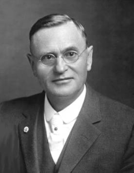

<h1 id="the-rosicrucian-cosmo-conception">O Conceito Rosacruz do Cosmos</h1>

ou Cristianismo Místico

Um tratado elementar sobre A Evolução Passada, a Constituição Presente e o Desenvolvimento Futuro do Ser Humano



Por Max Heindel

Sua Mensagem e Missão: 

```
Uma Mente Pura
    Um Coração Nobre
        Um Corpo São
```

THE ROSICRUCIAN FELLOWSHIP  
International Headquarters  
Mt. Ecclesia  
Oceanside, California, 91054, USA  

### <h3 id="list-of-contents">Índice</h3>

- [Credo ou Cristo?](#creed-or-christ)
- [Uma palavra ao sábio](#a-word-to-the-wise)
- [Primeira Parte – Constituição atual do ser humano e o método do seu desenvolvimento](#part-1)
  - [Diagram: The Four Kingdoms](#diagram-the-four-kingdoms)
  - [Introdução](#introduction)
  - [Capítulo I – Os Mundos: Visível e Invisíveis](#chapter-1)
    - [A Região Química do Mundo Físico](#chemical-region-of-the-physical-world)
    - [A Região Etérica do Mundo Físico](#etheric-region-of-the-physical-world)
    - [O Mundo do Desejo](#the-desire-world)
    - [O Mundo do Pensamento](#the-world-of-thought)
    - [Diagrama 1 – O Mundo Material: um reflexo reverso dos Mundos Espirituais](#diagram-1-the-material-world-a-reverse-reflection-of-the-spiritual-worlds)
    - [Diagrama 2 – Os Sete Mundos](#diagram-2-the-seven-worlds)
  - [Capítulo II – Os Quatro Reinos](#chapter-2)
    - [Diagrama 3 – Os Veículos dos Quatro Reinos](#diagram-3-the-vehicles-of-the-four-kingdoms)
    - [Diagrama 4 – A Consciência dos Quatro Reinos](#diagram-4-the-consciousness-of-the-four-kingdoms)
  - [Capítulo III – O Ser Humano e o Método de Evolução](#chapter-3)
    - [Atividades da Vida: Memória e Crescimento Anímico](#activities-of-life-memory-and-soul-growth)
    - [Diagrama – A Constituição Sétupla do Ser Humano](#constitution-of-the-seven-fold-man)
    - [Diagrama 5 – O Tríplice Espírito, o Tríplice Corpo e a Tríplice Alma](#diagram-5-the-three-fold-spirit-the-three-fold-body-and-the-three-fold-soul)
    - [Morte e Purgatório](#death-and-purgatory)
    - [Diagrama 5-A – O Cordão Prateado](#diagram-5-1-2-the-silver-cord)
    - [A Região Limítrofe](#the-borderland)
    - [O Primeiro Céu](#the-first-heaven)
    - [O Segundo Céu](#the-second-heaven)
    - [O Terceiro Céu](#the-third-heaven)
    - [Preparações para o Renascimento](#preparations-for-rebirth)
    - [Nascimento do Corpo Denso](#birth-of-the-dense-body)
    - [Nascimento do Corpo Vital e o Crescimento](#birth-of-the-vital-body)
    - [Nascimento do Corpo de Desejos e a Puberdade](#birth-of-the-desire-body)
    - [Nascimento da Mente e a Maioridade](#birth-of-the-mind)
    - [O Sangue – Veículo do Ego](#the-blood-the-vehicle-of-the-ego)
    - [Diagrama – Um Ciclo de Vida](#diagram-a-life-cycle)
  - [Capítulo IV – O Renascimento e a Lei de Consequência](#chapter-4)
    - [O Vinho como Fator da Evolução](#wine-as-a-factor-in-evolution)
    - [Uma História Notável](#a-remarkable-story)
- [Segunda Parte – Cosmogênese e Antropogênese](#part-2)
  - [Capítulo V – A Relação do Ser Humano com Deus](#chapter-5)
    - [Diagrama 6 – O Ser Supremo, os Planos Cósmicos e Deus](#diagram-6-the-supreme-being-the-cosmic-planes-and-god)
  - [Capítulo VI – O Esquema de Evolução](#chapter-6)
    - [O Princípio](#the-beginning)
    - [Os Sete Mundos](#the-seven-worlds)
    - [Os Sete Períodos](#the-seven-periods)
    - [Diagrama 7 – O Período de Saturno](#diagram-7-the-saturn-period)
  - [Capítulo VII – O Caminho de Evolução](#chapter-7)
    - [Revoluções e Noites Cósmicas](#revolutions-and-cosmic-nights)
    - [Diagrama 8 – Os 7 Mundos, os 7 Globos e os 7 Períodos](#diagram-8-the-seven-worlds-seven-globes-and-seven-periods)
  - [Capítulo VIII – A Obra de Evolução](#chapter-8)
    - [O Fio de Ariadne](#ariadnes-thread)
    - [O Período de Saturno](#the-saturn-period)
    - [Recapitulação](#recapitulation)
    - [O Período Solar](#the-sun-period)
    - [O Período Lunar](#the-moon-period)
    - [Diagrama 9 – As Doze Hierarquias Criadoras](#diagram-9-twelve-creative-hierarchies)
  - [Capítulo IX – Atrasados e Recém‑Chegados](#chapter-9)
    - [Classes of Beings at the Beginning of the Moon Period](#classes-of-beings-at-the-beginning-of-the-moon-period)
    - [Diagrama 10 – Classes no início do Período Terrestre](#diagram-10-classes-at-the-beginning-of-earth-period)
  - [Capítulo X – O Período Terrestre](#chapter-10)
    - [A Revolução de Saturno do Período Terrestre](#the-saturn-revolution-of-the-earth-period)
    - [A Revolução Solar do Período Terrestre](#the-sun-revolution-of-the-earth-period)
    - [A Revolução Lunar do Período Terrestre](#the-moon-revolution-of-the-earth-period)
    - [Período de Repouso entre Revoluções](#rest-periods-between-revolutions)
    - [A Quarta Revolução do Período Terrestre](#the-fourth-revolution-of-the-earth-period)
  - [Capítulo XI – Gênese e Evolução do Nosso Sistema Solar](#chapter-11)
    - [Caos](#chaos)
    - [O Nascimento dos Planetas](#the-birth-of-the-planets)
    - [Diagrama 11 – os 1, 3, 7 e 10 Aspectos de Deus e do Ser Humano](#diagram-11-aspects-of-god-and-man)
    - [Tabela das Vibrações](#table-of-vibrations)
    - [Diagrama 12 – Forma Corporal do Ser Humano no Passado, Presente e Futuro](#diagram-12-a-mans-past-present-and-future-form)
  - [Capítulo XII – Evolução da Terra](#chapter-12)
    - [A Época Polar](#the-polarian-epoch)
    - [A Época Hiperbórea](#the-hyperborean-epoch)
    - [A Lua – A Oitava Esfera](#the-moon-the-eighth-sphere)
    - [A Época Lemúrica](#the-lemurian-epoch)
    - [Nascimento do Indivíduo](#birth-of-the-individual)
    - [Separação dos Sexos](#separation-of-the-sexes)
    - [Influência de Marte](#influence-of-mars)
    - [As Raças e Seus Líderes](#the-races-and-their-leaders)
    - [Influência de Mercúrio](#influence-of-mercury)
    - [A Raça Lemúrica](#the-lemurian-race)
    - [A “Queda do Homem”](#the-fall-of-man-1)
    - [Os Espíritos Lucíferos](#the-lucifer-spirits)
    - [A Época Atlante](#the-atlantean-epoch)
    - [A Época Ária](#the-aryan-epoch)
    - [Os Dezesseis Caminhos para a Destruição](#the-sixteen-paths-to-destruction)
  - [Capítulo XIII – Retorno à Bíblia](#chapter-13)
  - [Capítulo XIV – Análise Oculta do Gênesis](#chapter-14)
    - [Limitações da Bíblia](#limitations-of-the-bible)
    - [No Princípio](#in-the-beginning)
    - [A Teoria Nebular](#the-nebular-theory)
    - [As Hierarquias Criadoras](#the-creative-hierarchies)
    - [O Período de Saturno](#the-saturn-period)
    - [O Período Solar](#the-sun-period)
    - [O Período Lunar](#the-moon-period)
    - [O Período Terrestre](#the-earth-period)
    - [Jeová e Sua Missão](#jehovah-and-his-mission)
    - [Involução, Evolução e Epigênese](#involution-evolution-and-epigenesis)
    - [Uma Alma Vivente?](#a-living-soul)
    - [A Costela de Adão](#adams-rib)
    - [Os Anjos da Guarda](#guardian-angels)
    - [A Mescla de Sangue no Casamento](#mixing-blood-in-marriage)
    - [A “Queda do Homem”](#the-fall-of-man-2)
    - [Diagrama 13 – O Princípio e o Fim dos Sexos](#diagram-13-the-beginning-and-end-of-sex)
- [Terceira Parte – Futuro Desenvolvimento e Iniciação do Ser Humano](#part-3)
  - [Diagrama – Os Sete Dias da Criação](#diagram-the-seven-days-of-creation)
  - [Capítulo XV – Cristo e Sua Missão](#chapter-15)
    - [A Evolução da Religião](#the-evolution-of-religion)
    - [Jesus e Cristo-Jesus](#jesus-and-christ-jesus)
    - [Diagrama 14 – O Pai, o Filho e o Espírito Santo](#diagram-14-the-father-the-son-and-the-holy-spirit)
    - [Não a Paz, mas uma Espada](#not-peace-but-a-sword)
    - [A Estrela de Belém](#the-star-of-bethlehem)
    - [O Coração, uma Anomalia](#the-heart-as-an-anomaly)
    - [O Mistério do Gólgota](#the-mystery-of-golgotha)
    - [O Sangue Purificador](#the-cleansing-blood)
    - [Diagrama – Como é em cima, é em baixo](#diagram-as-above-so-below)
  - [Capítulo XVI – Desenvolvimento Futuro e A Iniciação](#chapter-16)
    - [Os Sete Dias da Criação](#the-seven-days-of-creation)
    - [Diagrama 15 – O Simbolismo do Caduceu](#diagram-15-the-symbolism-of-the-caduceus)
    - [Radiates, Mollusks, Articulates and Vertebrates](#radiates-mollusks-articulates-and-vertebrates)
    - [Espirais dentro de Espirais](#spirals-within-spirals)
    - [Alquimia e Crescimento da Alma](#alchemy-and-soul-growth)
    - [A Palavra Criadora](#the-creative-word)
  - [Capítulo XVII – Método para Adquirir o Conhecimento Direto](#chapter-17)
    - [Os Primeiros Passos](#the-first-steps)
    - [Métodos Ocidentais para os Ocidentais](#western-methods-for-western-people)
    - [A Ciência da Nutrição](#the-science-of-nutrition)
    - [Table of Food Values, Part I](#table-of-food-values-part-1)
    - [Table of Food Values, Part II](#table-of-food-values-part-2)
    - [A Lei da Assimilação](#the-law-of-assimilation)
    - [Vivei e Deixai viver](#live-and-let-live)
    - [A Oração do Senhor](#the-lords-prayer)
    - [Diagrama 16 – O Pai Nosso](#diagram-16-the-lords-prayer)
    - [O Voto de Celibato](#the-vow-of-celibacy)
    - [O Corpo Pituitário e a Glândula Pineal](#the-pituitary-body-and-the-pineal-gland)
    - [Diagrama 17 – Caminho das Forças Sexuais não empregada](#diagram-17-path-of-the-unused-sex-currents)
    - [Treinamento Esotérico](#esoteric-training)
    - [Como os Veículos Internos são construídos](#how-the-inner-vehicle-is-built)
    - [Concentração](#concentration)
    - [Meditação](#meditation)
    - [Observação](#observation)
    - [Discernimento](#discrimination)
    - [Contemplação](#contemplation)
    - [Adoração](#adoration)
  - [Capítulo XVIII – A Constituição da Terra e Erupções Vulcânicas](#chapter-18)
    - [O Número da Besta](#the-number-of-the-beast)
    - [Diagrama 18 – A Constituição da Terra](#diagram-18-the-constitution-of-the-earth)
  - [Capítulo XIX – Christian Rosenkreuz e a Ordem dos Rosacruzes](#chapter-19)
    - [Antigas Verdades em Novas Roupagens](#ancient-truths-in-modern-dress)
    - [Iniciação](#initiation)
    - [A Fraternidade Rosacruz](#the-rosicrucian-fellowship)
    - [Correspondence Courses](#correspondence-courses)
    - [O Simbolismo da Rosacruz](#symbolism-of-the-rose-cross)
- [Topical Index]()
  - [Addendum A - Morning and Evening Exercises Performed by the Rosicrucian Aspirant](#addendum-a)
  - [Concerning the Origin of the Fellowship Teachings](#concerning-the-origin-of-the-fellowship-teachings)
  - [Addendum B: Footnote to Chapter III](#addendum-b)
  - [Addendum C: Footnote to Chapter XIII (Regarding Race)](#addendum-c)
  - [Addendum D: Footnote to "Our Buildings"](#addendum-d)

### <h3 id="creed-or-christ">Credo ou Cristo?</h3>

    Todas as Religiões são dádivas abençoadas de Deus  
    e Cristo é o Caminho, a Verdade e a Vida.  
    Por Deus mandado para aliviar o que leva pesado fardo  
    e dar paz ao triste, ao pecador e ao que luta.  

    Eis que o Espírito Universal veio  
    a todas as igrejas; não a uma apenas;  
    no dia de Pentecostes uma língua de chama,  
    como um halo, brilhou sobre todos os Apóstolos.  

    Desde então, quais abutres famintos e vorazes,  
    temos combatido por um nome sem sentido  
    e procurado, com dogmas, editos, cultos ou credos,  
    enviar uns aos outros às chamas da fogueira inextinguível.  

    Está Cristo dividido? Foi Cephas ou Paulo  
    crucificado para salvar o Mundo?  
    Então, por que tantas divisões?  
    O amor de Cristo nos envolve a ambos, a mim e a ti.  

    Seu puro e doce amor não está confinado pelos credos  
    que separam e elevam muralhas.  
    Seu amor envolve e abraça toda a humanidade.  
    Não importa o nome que a Ele ou a nós mesmos, dermos.  

    Então, por que não seguimos a Sua palavra?  
    Por que nos atermos em credos que desunem?  
    Só uma coisa importa, atentemos:  
    é que cada coração seja repleto de amor fraternal  

    Só uma coisa o Mundo necessita conhecer:  
    apenas um bálsamo existe para curar toda a humana dor;  
    apenas um caminho há que conduz, acima, aos céus:  
    Este caminho é: a COMPAIXÃO e o AMOR.  

    Max Heindel

### <h3 id="a-word-to-the-wise">Uma palavra ao sábio</h3>

O fundador da Religião Cristã emitiu uma máxima oculta quando disse: “Quem não receber o Reino de Deus como uma criança, não entrará nele” (Mc 10:15). Todos os ocultistas reconhecem a imensa importância desse ensinamento de Cristo, e tratam de “vivê-lo” dia a dia.

Quando uma nova filosofia se apresenta ao Mundo é encarada de forma diferente pelas mais diversas pessoas. Algumas se apoderam avidamente de qualquer novo esforço filosófico, procurando ver em que proporção ele serve de apoio às suas próprias ideias. Para essas a filosofia em si mesma é de pouca valia. Terá valor se reforçar as SUAS ideias. Se a obra os satisfizer a esse respeito, adotá-la-ão entusiasticamente, a ela aderindo com o mais desarrazoado partidarismo. Caso contrário, afastarão o livro, aborrecidos e desapontados como se o autor os tivesse ofendido pessoalmente.

Outras adotam uma atitude cética tão logo descobrem que a obra contém alguma coisa a cujo respeito nada leram nem ouviram anteriormente, ou sobre a qual ainda não lhes ocorrera pensar. E, provavelmente, repelirão como extremamente injustificável a acusação de que sua atitude mental é o cúmulo da autossatisfação e da intolerância. Contudo, esse é o caso, e desse modo fecham suas Mentes à verdade que eventualmente possa estar contida naquilo no que rejeitam.

Ambas as classes se mantêm na sua própria luz. Suas ideias pré-estabelecidas os tornam invulneráveis aos raios da Verdade. A tal respeito “uma criança” é precisamente o oposto dos adultos, pois não está imbuída do sentimento dominador de superioridade, nem inclinada a tomar aparência de sábio ou ocultar, sob um sorriso ou um gracejo, sua ignorância em qualquer assunto. É ignorante com franqueza, não tem opiniões preconcebidas nem julga antecipadamente, portanto é eminentemente ensinável. Encara todas as coisas com essa formosa atitude de confiança a que denominamos “fé infantil”, na qual não existe sombra de dúvida, conservando os ensinamentos que recebe até comprovar para si mesmo a certeza ou o erro.

Em todas as escolas ocultistas o aluno é primeiramente ensinado a esquecer de tudo o que aprendeu ao lhe ser ministrado um novo ensinamento, a fim de que não predomine o juízo antecipado nem o da preferência, mas para que mantenha a Mente em estado de calma e de digna expectativa. Assim como o ceticismo efetivamente nos cega para a verdade, assim também essa calma atitude confiante da Mente permitirá à intuição ou “sabedoria interna” se apoderar da verdade contida na proposição. Essa é a única maneira de cultivar uma percepção absolutamente certa da verdade.

Não se pede ao aluno que admita de imediato ser negro determinado objeto que ele observou ser branco, ainda que se lhe afirme. se pede a ele sim, que cultive uma atitude mental suscetível de “admitir todas as coisas” como possíveis. Isto lhe permitirá pôr de lado momentaneamente até mesmo aquilo que geralmente se considera um “fato estabelecido”, e investigar se existe algum outro ponto de vista até então não notado sob o qual o objeto em referência possa parecer negro. Certamente ele nada considerará como fato estabelecido, porque compreenderá perfeitamente quanto é importante manter a sua Mente no estado fluídico de adaptabilidade que caracteriza a criança. Compreenderá, com todas as fibras do seu ser, que “agora vemos como em espelho, obscuramente” e, como Ajax, estará sempre alerta, anelando por “luz, mais luz”.

A grande vantagem dessa atitude mental quando se investiga determinado assunto, ideia ou objeto, é evidente. Afirmações que parecem positivas e inequivocamente contraditórias, e que causam intermináveis discussões entre os respectivos partidários, podem, não obstante, se conciliar, conforme se demonstra em exemplo mais adiante. Só a Mente aberta descobre o vínculo da concordância. Embora essa obra possa parecer diferente das outras, o autor solicitaria um auditório imparcial, como base, para julgamento subsequente. Se, ao ponderar esse livro, alguém o considerasse de pouco fundamento, o autor não se lamentaria. Teme unicamente um julgamento apressado e baseado na falta de conhecimento do sistema que ele advoga, ou que diga que a obra não tem fundamento, sem, previamente, lhe dedicar atenção imparcial. E deve acrescentar, ainda: a única opinião digna de ser levada em conta precisa se basear no conhecimento.

Há mais uma razão para que se tenha muito cuidado ao emitir um juízo: muitas pessoas têm suma dificuldade em se retratar de qualquer opinião prematuramente expressa. Portanto, se pede ao leitor que suspenda suas opiniões, de elogio ou de crítica, até que o estudo razoável da obra convença do seu mérito ou demérito.

O Conceito Rosacruz do Cosmos não é dogmático nem apela para qualquer autoridade que não seja a própria razão do Estudante. Não é uma controvérsia. Publica-se com a esperança de que possa ajudar a esclarecer algumas das dificuldades que no passado assediaram a Mente dos Estudantes das filosofias profundas. Todavia, a fim de evitar equívocos graves, deve ser firmemente gravado na Mente do Estudante que não há, sobre esse complicado assunto, qualquer revelação infalível que abranja tudo quanto está debaixo ou acima do sol.

Dizer que essa exposição é infalível seria o mesmo que pretender que o autor fosse onisciente. Até os próprios Irmãos Maiores nos dizem que eles mesmos se enganam, às vezes, nos juízos que fazem. Assim, está fora de qualquer discussão um livro que queira proferir a última palavra sobre o mistério do mundo, e é intenção do autor dessa obra apresentar apenas os ensinamentos mais elementares dos Rosacruzes.

A Fraternidade Rosacruz tem a concepção mais lógica e ampla sobre o mistério do mundo, e a tal respeito o autor adquiriu algum conhecimento durante os muitos anos que consagrou exclusivamente ao estudo do assunto. Pelo que pôde investigar por si próprio, os ensinamentos desse livro estão de acordo com os fatos tais como ele os conhece. Todavia, tem a convicção de que o Conceito Rosacruz do Cosmos está longe de ser a última palavra sobre esse assunto e de que, à medida que avançamos, se apresentam aos nossos olhos novos aspectos e se esclarecem muitas coisas que, antes, só víamos “como em espelho, obscuramente”[1]. Ao mesmo tempo crê firmemente que todas as outras filosofias do futuro seguirão as linhas mestras dessa filosofia, por lhe parecerem absolutamente certas.

Ante o exposto, compreender-se-á claramente que o autor não considera essa obra como o Alfa e o Ômega, ou o máximo do conhecimento oculto. Embora tenha por título “O Conceito Rosacruz do Cosmos”, deseja o autor salientar com firmeza que essa filosofia não deve ser entendida como uma “crença entregue de uma vez para sempre” aos Rosacruzes pelo fundador da Ordem ou por qualquer outro indivíduo. Convém enfatizar que essa obra encerra apenas a compreensão do autor sobre os Ensinamentos Rosacruzes relativos ao mistério do mundo, revigorados por suas investigações pessoais nos mundos internos, a respeito dos estados pré-natal e pós-morte do ser humano, etc. O autor tem plena consciência da responsabilidade em que incorre quem, bem ou mal, guia intencionalmente a outrem, desejando ele se precaver contra tal contingência e, também, prevenir aos outros para que não venham a errar.

O que nessa obra se afirma deve ser aceito ou rejeitado pelo leitor segundo o seu próprio critério. se pôs todo o empenho em tornar compreensíveis os ensinamentos e foi necessário muito trabalho para poder expressá-los em palavras de fácil compreensão. Por esse motivo, em toda a obra se usa o mesmo termo para expressar a mesma ideia. A mesma palavra tem o mesmo significado em qualquer parte. Quando pela primeira vez o autor emprega uma palavra que expressa determinada ideia, apresenta a definição mais clara que lhe foi possível encontrar. Empregando as palavras mais simples e expressivas, o autor cuidou constantemente de apresentar descrições tão exatas e definidas quanto lhe permitia o assunto em apreço, a fim de eliminar qualquer ambiguidade e para apresentar tudo com clareza. O Estudante poderá julgar em que extensão o autor logrou o seu intento. Entretanto, tendo-se esforçado o possível para sugerir as ideias verdadeiras, se considera também na obrigação de se defender da possibilidade de a obra vir a ser considerada como uma exposição literal dos Ensinamentos Rosacruzes. Sem essa recomendação esse trabalho teria mais valor para alguns Estudantes, mas isto não seria justo nem para a Fraternidade nem para o leitor. Poder-se-ia manifestar certa tendência para atribuir à Fraternidade a responsabilidade dos erros que nesse trabalho, como em toda obra humana, possam ocorrer. Daí a razão dessa advertência.

Segundo uma narrativa hindu, aquele que tenha duas linhas semicirculares na palma da mão, na articulação exterior do polegar “leva consigo um grão de arroz”. Isto quer dizer que será bem recebido e hospitaleiramente tratado aonde quer que vá. O autor tem o sinal mencionado e, no seu caso, o prognóstico se cumpriu maravilhosamente. Em todos os lugares encontrou amigos, e por eles foi bem tratado. O mesmo aconteceu com o “Conceito Rosacruz do Cosmos”. A Dra. Alma Von Brandis facilitou os meios para a primeira aproximação com os Ensinamentos Rosacruzes. Comandante Kingsmill e Jessie Brewster auxiliaram-no lealmente na parte literária, Mrs. M. E. Rath Merril e Miss Allen Merril executaram certo número de desenhos, e quanto a Wm. M. Patterson não só prestou ao autor serviços pessoais, mas ainda prestou o seu auxílio financeiro para que esse livro pudesse ser oferecido pelo preço de custo. Esse trabalho foi, portanto, produzido com Amor. Ninguém, com ele relacionado, recebeu e deve receber um centavo de recompensa. Todos, desinteressadamente, deram tempo e dinheiro. Portanto, o autor deseja expressar todo o reconhecimento a eles, esperando que venham a encontrar outras e maiores oportunidades de exercerem os seus préstimos com igual desinteresse.

Max Heindel

Acréscimo nas Edições Posteriores: Durante os quatro anos decorridos, desde que foram escritos os parágrafos anteriores, o autor continuou suas investigações nos Mundos invisíveis e experimentou a expansão de consciência relativa a esses Reinos da natureza, o que se consegue mediante a prática dos preceitos ensinados pela Escola de Mistérios do Ocidente. Outros que também seguiram o método de desenvolvimento anímico aqui prescrito, e particularmente apropriado aos povos ocidentais, de igual modo foram capazes de constatar, por si mesmos, muitas das coisas expostas nessa obra. Desse modo o autor teve certa confirmação do que compreendera dos ensinamentos ditados pelos Irmãos Maiores, lhe parecendo que esses ensinamentos foram substancialmente corretos, pelo que se julga no dever de dar essa explicação para que sirva de estímulo aos que ainda não são capazes de ver por si próprios.

Seria mais exato dizer que o Corpo Vital é formado por prismas em vez de pontos, posto que, se refratando através desses minúsculos prismas é que o fluído solar incolor muda para um tom rosáceo, tal como outros escritores, além do autor, têm indicado.

Fizeram-se outras novas e importantes descobertas. Por exemplo: sabemos agora que em cada vida nasce um novo Cordão Prateado; que uma parte desse Cordão Prateado surge do Átomo-semente do Corpo de Desejos, situado no grande vórtice do fígado; que a outra parte surge do Átomo-semente do Corpo Denso, no coração; que as duas partes se encontram no Átomo-semente do Corpo Vital no Plexo Solar[2], e que essa união dos veículos superiores com os inferiores produz o despertar do feto. O desenvolvimento ulterior do Cordão entre o coração e o Plexo Solar, durante os primeiros sete anos, tem importante relação com o mistério da infância, assim como o seu maior desenvolvimento, do fígado ao Plexo Solar, que ocorre no segundo período setenário, é fator contribuinte para a adolescência. A formação total do Cordão Prateado marca o fim da vida infantil. A partir desse momento a energia solar que entra pelo baço, e que se cobre pela refração através do Átomo-semente prismático do Corpo Vital situado no Plexo Solar, começa a dar um colorido individual e característico à aura que observamos nos adultos.

[1] N.T.: ICor 13:12

[2] N.T.: Também chamado de Plexo Celíaco (vulgarmente conhecido como “boca do estômago”), um dos principais plexos responsáveis pela inervação de órgãos da porção retrodiafragmática do sistema digestório, principalmente do estômago, intestinos, glândulas anexas (fígado e pâncreas) e ainda contribui para a inervação do baço.

### <h3 id="introduction">Introdução</h3>

O mundo ocidental é, sem dúvida, a vanguarda da Raça humana e, por motivos que indicaremos nas páginas seguintes, os Rosacruzes sustentam que nem o Judaísmo nem o “Cristianismo Popular”, mas sim o verdadeiro Cristianismo Esotérico será a Religião mundial.

Buda, grande e sublime, pode ser a “Luz da Ásia”, mas Cristo ainda será reconhecido como a “Luz do Mundo”. Assim como o Sol ofusca a luz das mais brilhantes estrelas nos céus e dissipa todo o vestígio de trevas, iluminando e vivificando todos os seres, assim, em futuro não muito distante, a verdadeira Religião de Cristo há de superar e anular todas as outras Religiões, para eterno benefício da Humanidade.

Em nossa civilização, o abismo que se abre entre a Mente e o Coração se torna maior e mais profundo e, enquanto a Mente voa de uma à outra descoberta nos domínios da ciência, o abismo se aprofunda e se amplia ainda mais, ficando o Coração cada vez mais distante. A Mente busca com ansiedade e se satisfaz apenas com explicações materialmente demonstráveis acerca do ser humano e demais seres do Mundo fenomenal. O Coração sente instintivamente que algo de maior existe, e anela por aquilo que pressente como verdade de ordem tão elevada que só pode ser compreendida pela Mente. A Alma humana subiria nas asas etéreas da intuição e banhar-se-ia na eterna fonte de luz espiritual e amor; mas os modernos pontos de vista científicos lhe cortaram as asas, deixando-a acorrentada e silenciosa, atormentada por aspirações insatisfeitas, tal como o abutre em relação ao fígado de Prometeu[1].

É necessário que seja assim? Não haverá um terreno comum onde possam se encontrar “Cabeça” e “Coração”, a fim de que, se ajudando mutuamente, possam se tornar mais eficientes na investigação da verdade universal, se satisfazendo por igual?

Tão seguramente como a luz preexistente criou o olho que a pudesse ver; tão seguramente como o desejo primordial de crescimento criou o sistema digestivo e assimilador para a consecução daquele fim; tão seguramente como o pensamento existiu antes do cérebro, construiu-o e continua construindo-o para sua expressão; tão seguramente como agora a Mente procura arrancar os segredos da natureza unicamente pela força da audácia, assim também o coração há de encontrar um meio de romper suas cadeias e satisfazer suas aspirações. Atualmente ele se encontra sujeito ao cérebro dominador. No entanto, algum dia adquirirá a força necessária para despedaçar os grilhões e se converter em um poder maior que a Mente.

É igualmente certo que não pode haver contradição na natureza, portanto o coração e a Mente devem ser capazes de se unir. O objetivo desse livro é, precisamente, mostrar como e onde a Mente, ajudada pela intuição do coração, pode penetrar nos mistérios do ser, muito mais profundamente do que cada um poderia fazê-lo por si só; mostrar como o coração, unido à Mente, pode ser defendido do erro, e como cada um tem plena liberdade de ação sem se violentarem mutuamente, mas ambos satisfazendo suas aspirações.

Só quando essa cooperação for alcançada e aperfeiçoada poderá o ser humano chegar a mais elevada e verdadeira compreensão de si próprio e do mundo de que é uma parte. Somente isso lhe poderá dar uma Mente ampla e um grande coração.

A cada nascimento passa a existir entre nós o que parece ser uma vida nova. Vemos a pequena forma viver e crescer, e se converter pouco a pouco em fator de nossas vidas durante dias, meses ou anos. Chega por fim um dia em que a forma morre e se decompõe. A vida que veio, não sabemos de onde, passa ao invisível além, e então com tristeza indagamo-nos: De onde veio? Por que esteve aqui? Para onde foi?

A forma esquelética da morte projeta sua horrenda sombra em todos os umbrais. Velhos ou jovens, sãos ou enfermos, ricos ou pobres, todos, todos nós devemos passar através dessa sombra, do modo que em todas as idades se tem escutado o clamor de angústia pela solução do enigma da vida – do enigma da morte.

Para a grande maioria da Humanidade as três grandes perguntas: “De onde viemos?”, “Por que estamos aqui?” e “Para onde vamos?” permanecem sem resposta até hoje. Lamentavelmente se formou a opinião, aceita pela maioria, de que nada podemos conhecer definitivamente sobre tais assuntos do mais profundo interesse para a Humanidade. Nada mais errôneo do que semelhante ideia. Todos e cada um, sem exceção, podem se tornar aptos para obter informações diretas e definidas sobre o assunto; podem pessoalmente investigar o estado do espírito humano tanto antes do nascimento como depois da morte. Não há favoritismo nem se requerem dons especiais. Todos temos, inerente, a faculdade de conhecer tudo isso, mas! – Sim, há um “mas”, e um “MAS” que deve ser escrito em maiúsculo. Essa faculdade está presente em todos, mas latente na maioria das pessoas. Requer um esforço persistente para despertá-la, embora isto pareça um poderoso dissuasivo. Se estas faculdades de “despertar e conscientizar” pudessem ser obtidas por meio do dinheiro, ainda que por preço elevado, muitos pagariam sem hesitação só para desfrutar dessa imensa vantagem sobre os seus semelhantes. Todavia, bem poucos são realmente os que se prestam a viver a vida necessária para despertá-las. Só um esforço paciente e perseverante pode realizar esse despertar, que não pode ser comprado nem atingido por caminhos fáceis.

Todos admitem que seja necessária prática para se aprender a tocar piano, e que seria inútil se pretender ser relojoeiro sem antes se passar pelo aprendizado. No entanto, quando se trata da Alma, da morte, do além ou das origens do ser, muitos creem saber tanto quanto qualquer outro e se avocam o direito de emitir opinião, apesar de nunca terem consagrado a tais assuntos ao menos uma hora de estudo.

É evidente que ninguém pode esperar que sua opinião sobre um assunto fosse considerada, se nele não é versado. Em assuntos jurídicos, quando são chamados peritos a opinar, se examina em primeiro lugar a sua competência. Sua opinião de nada valerá se não ficarem comprovados sua proficiência e conhecimento sobre o assunto em causa.

Todavia, se pelo estudo e prática eles são considerados aptos a emitir parecer digno de crédito, esse será acatado com o maior respeito e consideração. E se o testemunho de um perito é corroborado pelo de outros igualmente capacitados, aumenta mais o valor e a veracidade do quanto foi evidenciado pelos primeiros.

O testemunho irrefutável de tal perito vale muitíssimo mais do que o de uma dezena ou o de um milhão de pessoas que nada sabem do assunto, posto que o nada mesmo quando multiplicado por um milhão, sempre resulta em nada. Isto é tão certo em matemática como em qualquer outro assunto.

Como já afirmamos, acatamos prontamente argumentos dessa natureza quando se referem a assuntos materiais, mas quando se discutem coisas acima do Mundo dos sentidos[2], coisas sobre os Mundos suprafísicos, ou quando se tem de demonstrar as relações entre Deus e o ser humano, e explicar os mistérios mais íntimos da divina centelha imortal impropriamente chamada Alma, todos esperam que suas opiniões sejam ouvidas, que se dê toda consideração às suas ideias sobre coisas espirituais. E que lhes conceda tanto valor como às emitidas pelo sábio o qual, mediante uma vida paciente e laboriosa investigação, adquiriu sabedoria de tão elevadas coisas.

Ainda mais, muitos não se contentarão em pedir igual mérito às próprias opiniões, mas tentarão até escarnecer e ridicularizar as palavras do sábio, buscando impugnar o seu testemunho como fraudulento e, com a suprema confiança da mais profunda ignorância, afirmarão que como eles nada sabem sobre tal assunto é também absolutamente impossível que qualquer outra pessoa o saiba.

O ser humano que se conscientiza de sua ignorância deu o primeiro passo na direção do conhecimento.

O caminho para o conhecimento direto não é fácil. Nada realmente valioso se obtém sem esforço persistente. Nunca será demasiado repetir que não existem coisas tais como “dons” e “sorte”. Tudo o que somos ou possuímos é resultado de esforço. O que falta a um, em comparação com outro, está latente em si mesmo e pode ser desenvolvido quando se empregam os meios apropriados.

Se o leitor, que compreendeu bem essa ideia perguntar o que deve fazer para obter o conhecimento direto, terá na seguinte história a ideia fundamental do ocultismo:

Certo dia um jovem foi visitar um sábio, a quem perguntou: “Senhor, o que devo fazer para tornar-me um sábio? “. O sábio não se dignou responder. Depois de repetir a pergunta certo número de vezes sem melhor resultado, o jovem foi embora, mas voltou no dia seguinte com a mesma pergunta. Não obtendo resposta ainda, voltou pela terceira vez e novamente fez a pergunta: “Senhor, o que devo fazer para tornar-me um sábio?”.

Finalmente o sábio lhe deu ouvidos, e então desceu a um rio próximo. Entrou na água convidando o jovem e levando-o pela mão. Quando eles alcançaram certa profundidade o sábio, pondo todo seu peso sobre os ombros do rapaz, submergiu na água, apesar dos esforços que esse fazia para se livrar. Por fim o sábio largou-o, e quando o jovem recuperou alento lhe perguntou:

“Meu filho, quando estavas debaixo d’água o que mais desejavas?”.

O jovem respondeu sem hesitar: “Ar, ar! Eu queria ar!”.

“Não terias antes preferido riquezas, prazeres, poder ou amor, meu filho? Não pensaste em nenhuma dessas coisas?” – Indagou o sábio.

“Não, senhor! Eu desejava ar, só pensava no ar que me faltava” – Foi a resposta imediata.

“Então”, disse o sábio, “para te tornares sábio deves desejar a sabedoria com a mesma intensidade com que desejavas o ar. Deves lutar por ela e excluir de tua vida qualquer outro objetivo. Essa e só essa deve ser, dia e noite, tua única aspiração. Se buscares a sabedoria com esse fervor, meu filho, certamente tornar-te-ás sábio”.

Esse é o primeiro e fundamental requisito que todo Aspirante ao conhecimento oculto deve possuir – um desejo firme, uma sede abrasadora de conhecimento, e um entusiasmo insuperável para conquistá-lo. No entanto, o motivo supremo para a busca desse conhecimento oculto deve ser um desejo ardente de beneficiar a Humanidade, se esquecendo inteiramente de si mesmo, a fim de trabalhar para os outros. A não ser por essa motivação, o estudo do ocultismo é perigoso.

Sem possuir tais qualificações – especialmente a última – em certa medida, qualquer tentativa para seguir o caminho árduo do ocultismo seria um empreendimento perigoso. Outro pré-requisito para aspirar ao conhecimento direto é o estudo do ocultismo indiretamente. A investigação direta requer certos poderes ocultos que permitem estudar os assuntos relacionados com os estados pré-natal e pós-morte do ser humano, mas ninguém deve se desesperar por não ter desenvolvido ainda poderes ocultos para adquirir conhecimento direto sobre esses assuntos. Assim como uma pessoa pode conhecer a África indo lá pessoalmente ou lendo as descrições de viajantes que ali estiverem, assim também, para conhecer os Mundos suprafísicos, visita-os, se estiver habilitado para fazê-lo, ou estuda o que outros já capacitados contam como resultado de suas investigações.

Cristo disse: “a Verdade vos libertará”, mas a Verdade não é encontrada de uma vez e para sempre. A Verdade é eterna e eterna deve ser a sua busca. O ocultismo desconhece qualquer “crença transmitida de uma vez e para sempre”. Há certas verdades básicas que permanecem, mas que podem ser encaradas sob diversos ângulos, cada um apresentando um aspecto diferente que complementa os anteriores. Portanto, naquilo que até o presente podemos saber, não há meio possível de se chegar a última Verdade. Embora essa obra seja diferente de outras obras filosóficas, as diferenças resultam de pontos de vista também diferentes. Contudo, respeitosamente nos inclinamos ante as ideias e conclusões emitidas por outros investigadores. É sincero desejo do autor que o estudo das páginas seguintes possa tornar as ideias dos Estudantes mais completas e amplas do que eram antes.

[1] N.T.: Segundo Hesíodo foi dada a Prometeu e a seu irmão Epimeteu a tarefa de criar os homens e todos os animais. Epimeteu se encarregou da obra e Prometheus se encarregou de supervisioná-la. Na obra, Epimeteu atribuiu a cada animal os dons variados de coragem, força, rapidez, sagacidade; asas a um, garras outro, uma carapaça protegendo um terceiro, etc. Porém, quando chegou a vez do homem, formou-o do barro. Mas como Epimeteu gastou todos os recursos nos outros animais, recorreu a seu irmão Prometeu. Este então roubou o fogo dos deuses e deu-o aos homens. Isto assegurou a superioridade dos homens sobre os outros animais. Todavia o fogo era exclusivo dos deuses. Como castigo a Prometeu, Zeus ordenou a Hefesto que o acorrentasse no cume do monte Cáucaso, onde todos os dias uma águia (ou abutre) dilacerava seu fígado que, todos os dias, regenerava-se. Esse castigo devia durar 30 000 anos.

[2] N.R.: Região Química do Mundo Físico

*********************************************************************

<h2 id="part-1">Primeira Parte – Constituição atual do ser humano e o método do seu desenvolvimento</h2>

### <h3 id="chapter-1">Capítulo I – Os Mundos: Visível e Invisíveis</h3>

O primeiro passo no Ocultismo consiste no estudo dos Mundos invisíveis. Estes Mundos são invisíveis para a maioria das pessoas pelo fato de estarem adormecidos os sentidos sutis e superiores que lhes poderiam servir de meios de percepção, da mesma maneira que percebemos o Mundo Físico por meio dos sentidos físicos. Em relação aos Mundos suprafísicos, a maioria dos seres humanos se encontra em circunstâncias análogas às de um cego de nascença nesse Mundo dos sentidos; embora esteja envolvido pela luz e pela cor, ele é incapaz de percebê-las. Para ele não existem e são incompreensíveis, simplesmente porque lhe falta o sentido da visão, por meio da qual poderia vê-las. Os objetos que pode tocar lhe parecem reais, mas a luz e a cor estão fora de seu alcance.

Assim acontece com a maioria da Humanidade; sente e vê os objetos e ouve os sons do Mundo Físico, mas os outros Reinos a que o Clarividente chama de Mundos superiores, são lhe tão incompreensíveis como a luz e a cor são para o cego. Que o cego não possa ver a cor nem a luz não é argumento contra a sua existência e realidade. Nem é argumento dizer que é impossível ver os Mundos suprafísicos só porque a maioria da Humanidade também não o consegue. Se o cego recuperar a sua visão verá a luz e a cor. Se os sentidos superiores daqueles que atualmente estão cegos para os Mundos suprafísicos forem despertados pelos meios apropriados, também eles poderão contemplar os Mundos que atualmente lhes estão ocultos.

Assim como muitas pessoas erram quando descreem da existência ou realidade dos Mundos suprassensíveis, há outras que vão ao extremo oposto; convencidas da realidade dos Mundos invisíveis julgam que toda verdade é rapidamente acessível a um Clarividente que, podendo “ver”, conhece de imediato tudo o que “diz respeito” a esses Mundos superiores.

Nada mais errado. Prontamente reconhecemos a falácia de tal argumento se compararmos o assunto com outros da vida diária. Ninguém acredita que um ser humano nascido cego, e que depois obteve a visão, adquira a seguir e de uma só vez, “todo o conhecimento” do Mundo Físico. Ainda mais; sabemos que mesmo aqueles que puderam ver as coisas durante toda a vida estão muito longe de ter um conhecimento total deles. Para conhecermos apenas uma parte infinitesimal das coisas que lidamos na vida diária requer anos inteiros de aplicação e árduos estudos, e invertendo o aforismo Hermético “assim como é em cima, é embaixo”, concluímos obviamente que o mesmo deve acontecer nos outros Mundos. É certo que há muito mais facilidade em se adquirirem conhecimentos nos Mundos suprafísicos do que na condição física atual, mas não tão grande que elimine a necessidade de um estudo concentrado e a possibilidade de algum erro nas observações. De fato, o testemunho dos pesquisadores ocultistas competentes e qualificados prova que se deve prestar muito mais cuidado a observação lá do que aqui.

Os Clarividentes devem primeiro se exercitar a fim de que sua observação tenha um real valor, e quanto mais eficientes se tornam, tanto mais modestamente se manifestam a respeito daquilo que veem e tantas maiores deferências lhes merecem as versões alheias, sabendo quanto há para aprender e compreendendo quão pouco um único observador pode captar de todos os detalhes das coisas investigadas.

Isto também se aplica as versões diferentes, e que as pessoas superficiais julgam ser um argumento contra a existência dos Mundos superiores. Se tais Mundos existem, alegam, os investigadores deveriam descrevê-los de forma idêntica. Tomando-se um exemplo do cotidiano, se torna evidente a falácia de semelhante argumento.

Suponhamos que um jornal envie vinte repórteres a uma cidade para que façam reportagens descritivas dela. Os repórteres são ou devem ser, observadores treinados. Sua missão é ver tudo, e devem ser capazes de fazer tão boas reportagens sobre o assunto, como é justo e cabível esperar. Todavia, o mais provável é que dos vinte repórteres, nem dois apresentem descrições exatamente iguais da cidade. O mais provável é que sejam totalmente diferentes. Embora algumas delas possam conter em comum as características mais relevantes da cidade, outras podem ser singulares na qualidade e na quantidade da descrição.

Seria argumento contra a existência da cidade o fato das reportagens serem diferentes? Certamente que não! Diferem porque cada um viu a cidade segundo o seu próprio ponto de vista. se pode, portanto, dizer sem receio que tais diferenças, ao invés de confundirem e prejudicarem, tornaria mais fácil, e melhor a compreensão da cidade do que se lêssemos uma só e desprezássemos as outras. Cada reportagem ampliaria e complementaria, por sua vez, as outras.

A mesma coisa é aplicável aos relatos daqueles que investigam os Mundos superiores. Cada investigador tem sua maneira peculiar de observar as coisas e descrevê-las sob o seu ponto de vista particular. O relato apresentado por um pode ser diferente dos relatos dos outros, mas todos serão igualmente verdadeiros sob o ponto de vista individual de cada observador.

Às vezes surge a pergunta: para que investigar esses Mundos? Não seria melhor investigar um de cada vez, contentando-nos por enquanto com as lições que possamos aprender no Mundo Físico? E se realmente existem esses Mundos invisíveis, não é preferível esperar até que cheguemos a eles, sem nos preocuparmos desde já em investigá-los? “Basta a cada dia o seu mal!”. Para que mais?

Se soubermos com absoluta certeza de que um dia, cedo ou tarde, cada um de nós será conduzido a um país distante onde deverá viver durante muitos anos sob novas e diferentes condições, não é razoável acreditar que aceitaremos com prazer a oportunidade de conhecer antecipadamente alguma coisa sobre tal país? O conhecimento facilitar-nos-á a adaptação às novas condições de vida.

Na vida só uma coisa é certa: a morte! Quando passarmos para o além e enfrentarmos novas condições, o conhecimento que possuirmos delas ser-nos-á, sem dúvida, de grande auxílio.

No entanto, isto não é tudo. Para se compreender o Mundo Físico que é o Mundo dos efeitos, é necessário compreender os Mundos suprafísicos, que é o Mundo das causas. Vemos os bondes em movimento pelas ruas, escutamos o tilintar dos aparelhos telegráficos, mas a força misteriosa que causa esses fenômenos permanece invisível para nós. Dizemos se tratar da eletricidade, mas o nome nada explica. Nada sabemos da força em si mesma: vemos e ouvimos unicamente os seus efeitos.

Se colocarmos um prato de água gelada numa atmosfera de baixíssima temperatura, logo começarão a se formar cristais de gelo e poderemos observar o processo da formação desses cristais. As linhas em que a água se cristaliza foram, durante todo o tempo, linhas de força invisíveis até o momento do congelamento da água. As maravilhosas “flores de gelo”[1] em uma vidraça são manifestações visíveis das correntes dos Mundos superiores que atuam constantemente sobre nós e, embora ignoradas pela maioria, nem por isso são menos poderosas.

Os Mundos superiores são, portanto, os mundos das causas, das forças, de forma que não poderemos compreender bem esse Mundo inferior[2] sem conhecer os outros e sem compreender as forças e as causas, das quais todas as coisas materiais são meros efeitos.

Tais Mundos superiores, comparada a sua realidade com a do Mundo Físico, são na verdade, por estranho que pareça muito mais reais, e embora para a maioria sejam miragens, ou pelo menos pouco substanciais, certo é serem os objetos que neles se encontram muito mais permanentes e indestrutíveis do que os objetos do Mundo Físico. Isto será facilmente compreendido por meio de um exemplo. Na construção de uma casa, o arquiteto não começa adquirindo ao acaso os materiais necessários, e contratando os trabalhadores para levantarem-na, sem previamente idealizar ou traçar um plano de construção. Primeiramente ele “idealiza a casa”, que gradualmente assume uma forma em sua Mente. Finalmente surge uma ideia clara da casa, isto é, um pensamento-forma da casa.

A casa é ainda invisível para todos, menos para o arquiteto, que a torna objetiva no papel. Ele desenha o plano, e por meio dessa imagem objetiva do seu pensamento-forma os trabalhadores constroem a casa de madeira, de ferro, ou de pedra, exatamente de acordo com esse pensamento-forma originado pelo arquiteto. Assim o pensamento-forma se converte em realidade material.

O materialista afirmará que a casa construída é muito mais real, durável e substancial que sua imagem criada na Mente do arquiteto. No entanto, vejamos: A casa não poderia ter sido construída sem esse pensamento-forma. O objeto material pode ser destruído pela dinamite, pelo terremoto, pelo fogo ou pelo tempo, mas o pensamento-forma subsistirá. Subsistirá enquanto o arquiteto viver, e por meio desse pensamento poderão ser construídas inúmeras casas iguais àquela que foi destruída. Nem mesmo o próprio arquiteto poderia destruí-lo, pois até depois de sua morte esse seu pensamento-forma pode ser recuperado por aquele que, suficientemente desenvolvido, seja capaz de ler na Memória da Natureza, da qual nos ocuparemos mais adiante. Visto, portanto quanto é razoável a existência de tais Mundos, que existem em volta e perto de nós, convencidos de sua realidade, de sua permanência e da utilidade de um conhecimento acerca deles, examinemo-los distinta e separadamente, começando pelo Mundo Físico.

[1] N.T.: também chamado de “flores de geada” são formações também são conhecidas como faces de gelo, castelos de gelo ou cristalofolia. Tipos de flores de geada incluem: gelo agulha, pilares de geada ou colunas de geada, extrudados de poros no solo e fitas de gelo, geada de coelho ou gelo de coelho, extrudados de fissuras lineares em caules de plantas. Embora o termo “flor de gelo” também seja usado como sinônimo de fitas de gelo, também pode ser usado para descrever o fenômeno não relacionado da geada da janela. são finas camadas (talvez da espessura de um cartão de crédito) de gelo que são extrudadas através de fendas dos caules de plantas brancas ou amarelas, entre outras. Sua formação requer temperatura do ar congelante, solo úmido ou úmido, mas não congelado, e caule de uma planta que não tenha sido previamente congelado. (Praticamente falando, um evento uma vez por ano, embora nem todos os indivíduos produzam flores de geada no primeiro dia de boas condições). A água no caule da planta é puxada para cima por ação capilar do solo. Ele se expande à medida que congela e divide o caule verticalmente e congela em contato com o ar. À medida que mais água é retirada do solo através da divisão, ela expeli uma camada de gelo fina como papel para mais longe do caule. O comprimento da divisão determina se a flor da geada é uma faixa estreita ou larga de gelo. Ele se enrola de forma imprevisível à medida que é extrudado, talvez por atrito desigual ao longo dos lados da divisão, para formar “pétalas”. Essas flores, não há duas iguais, são frágeis e duram apenas até sublimarem ou derreterem.

[2] N.T.: a Região Química do Mundo Físico

*******

#### <h4 id="chemical-region-of-the-physical-world">A Região Química do Mundo Físico</h4>

Nos Ensinamentos Rosacruzes, o Universo divide-se em sete diferentes Mundos ou estados de matéria, a saber:

1. Mundo de Deus

2. Mundo dos Espíritos Virginais

3. Mundo do Espírito Divino

4. Mundo do Espírito de Vida

5. Mundo do Pensamento

6. Mundo do Desejo

7. Mundo Físico

Essa divisão não é arbitrária, mas necessária, porque a substância de cada um desses Mundos está sujeita às leis que são praticamente inoperantes nos outros. Por exemplo, no Mundo Físico a matéria está sujeita à gravidade, à contração e à expansão. No Mundo do Desejo não existem frio nem calor, e as formas levitam tão facilmente como gravitam. Distância e tempo são fatores predominantes no Mundo Físico, mas quase inexistentes no Mundo do Desejo.

A matéria desses Mundos varia em densidade também, sendo o Mundo Físico o mais denso dos sete.

Cada Mundo subdivide-se em sete Regiões, ou subdivisões de matéria. No Mundo Físico os sólidos, os líquidos e os gases formam as três subdivisões mais densas, e as quatro restantes são constituídas por Éteres de densidades variadas. Nos outros Mundos são necessárias subdivisões idênticas porque a densidade da matéria de que são compostos não é uniforme.

Há ainda duas distinções a fazer. As três subdivisões densas do Mundo Físico (sólidos, líquidos e gases) constituem o que se chama de Região Química. A substância dessa Região é a base de todas as Formas densas.

O Éter também é matéria física. Não é homogêneo, como a ciência material afirma, mas existe em quatro estados diferentes. Constitui o meio de ingresso para o espírito vivificante, o qual infunde vitalidade às formas da Região Química. Essas quatro subdivisões mais sutis ou Etéricas do Mundo Físico constituem o que se conhece por Região Etérica.

No Mundo do Pensamento as três subdivisões superiores são a base do pensamento abstrato, daí o conjunto ser chamado Região do Pensamento Abstrato. As quatro subdivisões mais densas suprem a matéria mental com a qual incorporamos e concretizamos nossas ideias sendo, portanto, denominadas de Região do Pensamento Concreto.

A cuidadosa consideração dada pelo ocultista àquilo que caracteriza o Mundo Físico poderia parecer supérflua, não fosse o fato de ele encarar as coisas sob um ponto de vista amplamente diferente daquele do materialista. Esse reconhece apenas três estados de matéria: sólido, líquido e gases. Tais matérias são todas químicas, já que derivam dos componentes químicos da Terra. Dessa matéria química constituíram-se todas as formas: mineral, vegetal, animal e humana, daí serem esses Corpos tão químicos como as substâncias assim comumente chamadas. Portanto, quer consideremos a montanha, quer a nuvem que envolve o seu topo, a seiva da planta ou o sangue do animal, a teia de aranha, a asa de borboleta ou os ossos do elefante, o ar que respiramos ou a água que bebemos – tudo é composto da mesma substância química.

O que determina, pois, a conformação dessa substância básica nas múltiplas variedades de Formas que observamos ao nosso redor? É o Espírito Universal Uno, expressando-se a Si próprio no Mundo Visível sob a forma de quatro grandes correntes de Vida, em variados graus de desenvolvimento. Esse quádruplo impulso espiritual modela a matéria química da Terra na variedade de formas dos quatro Reinos: mineral, vegetal, animal e humano. Quando uma forma serviu ao seu propósito, como veículo de expressão para as três correntes superiores de vida, as forças químicas desintegram essa forma. Então a matéria pode voltar ao estado primordial, ficando assim em disponibilidade para a constituição de novas formas. Consequentemente, o espírito ou vida que modela a forma numa expressão de si mesmo é tão estranho ao material que usa como o carpinteiro é estranho e pessoalmente independente da casa que constrói para sua habitação.

Como todas as formas mineral, vegetal, animal e humana são químicas, logicamente deverão ser tão mortas e desprovidas de sensação como a matéria química no seu estado primitivo. Os Rosacruzes afirmam que sim.

Alguns cientistas sustentam haver sensação em toda a matéria, viva ou morta, pertencente a quaisquer dos quatro Reinos. Nessa afirmação incluem até, como capazes de sentir, as substâncias ordinariamente classificadas como minerais. E, como prova, apresentam diagramas com curvas de energia obtidas em experiências. Para outra classe de pesquisadores a sensação não existe nem mesmo no Corpo humano, excetuado o cérebro, que é a própria sede da sensação. Assim, dizem, se ferimos um dedo é o cérebro, não o dedo, que sente a dor. Dessa maneira, nesse como em outros pontos a casa da Ciência está dividida contra si mesma. A posição de cada oponente é parcialmente correta, dependendo do que se entenda por “sensação”. Se significar uma simples resposta aos impactos – tal como o rebote de uma bola de borracha atirada ao chão – é exato atribuir-se sensação ao mineral, à planta e aos tecidos animais. Contudo, se querem significar prazer e dor, amor e ódio, alegria e tristeza, seria absurdo atribuí-los às formas inferiores de vida, a um tecido orgânico solto, aos minerais em seu estado natural, ou mesmo ao cérebro, porque tais sentimentos são expressões do Espírito imortal autoconsciente. Já o cérebro é apenas o teclado do magnífico instrumento em que o espírito humano executa a sinfonia de sua vida, da mesma forma que um músico se expressa em seu violino.

Assim como há pessoas que são absolutamente incapazes de compreender a existência de Mundos superiores, outras há que, tendo-se relacionado com tais Reinos apenas superficialmente, habituam-se a menosprezar o Mundo Físico. Semelhante atitude é tão errônea quanto à do materialista. Os grandes e sábios Seres, que executam a vontade e os planos de Deus, colocaram-nos nesse Mundo Físico para aprendermos grandes e importantíssimas lições que só nestas condições seria possível aprender. É nosso dever, portanto, empregar o conhecimento que tenhamos dos Mundos superiores para aprender o melhor possível as lições que esse Mundo material tem para nos ensinar.

Em certo sentido, o Mundo Físico é uma espécie de Escola-Modelo ou um laboratório experimental, onde se aprende a trabalhar corretamente nos outros Mundos, conheçamos ou não a sua existência, o que prova a grande sabedoria dos criadores do plano. Se apenas conhecêssemos os Mundos superiores, cometeríamos muitos erros que só se revelariam quando as condições físicas fossem utilizadas como critério. Para ilustrar, imaginemos o caso de um inventor que idealiza uma máquina: primeiro ele a constrói em pensamento, mentalmente ele a vê completa e realizando com perfeição o trabalho para o qual foi planejada. Em seguida ele a desenha, e ao fazê-lo possivelmente julga necessária alguma modificação no modelo primitivo. Quando, a partir do desenho, dá-se por satisfeito ao ver sua ideia praticável, passa então a construir a máquina com o material apropriado.

Agora, é quase certo haver necessidade de novas modificações antes que a máquina funcione como se pretendia. Pode ainda ser necessário modificá-la totalmente, ou até mesmo concluir-se que o modelo, em seu todo e como se apresenta seja completamente inútil, deva ser rejeitado e um novo plano precise ser elaborado. Contudo, observe o seguinte, porque isto é importante: a nova ideia, ou plano, será reformulada para eliminar os defeitos da máquina primitiva. E se não fosse construída uma máquina material que evidenciasse os defeitos da primeira ideia, uma segunda e correta ideia não poderia ser formulada.

Isto se aplica, igualmente, a todas as condições da vida: sociais, comerciais e filantrópicas. Muitos projetos, parecendo excelentes a quem os concebe e continuando a parecer bons quando trasladados para o papel, ao serem experimentados na prática frequentemente falham. Isto, porém, não deve desanimar-nos. É certo que “aprendemos mais com os nossos erros do que com os nossos êxitos”. Devemos, pois contemplar o Mundo Físico através da luz apropriada; considerá-lo uma valiosa escola de experiências, onde aprendemos lições da mais alta importância.

*******

#### <h4 id="etheric-region-of-the-physical-world">A Região Etérica do Mundo Físico</h4>

Logo que entramos nesse Reino da Natureza, estamos num Mundo invisível e intangível, onde os nossos sentidos comuns são inoperantes. Daí ser essa parte do Mundo Físico praticamente inexplorável pela ciência material.

O ar é invisível, mas a ciência moderna sabe que existe. Por meio de instrumentos pode medir sua velocidade como vento, e pela compressão pode torná-lo visível como ar líquido. Com o Éter, porém, isto não é tão fácil. A ciência material admite-o como necessário de algum modo para a transmissão da energia elétrica com ou sem fios. Por isso se viu obrigada a enunciar como postulado a existência de uma substância mais sutil do que as conhecidas, à qual chamou “Éter”. Não sabe realmente que o Éter existe porque, até o momento, a engenhosidade dos cientistas não pôde ainda inventar um recipiente capaz de confinar essa substância, que é no seu todo demasiado esquivo aos “magos de laboratório” da atualidade. Com efeito, eles não podem medi-la, pesá-la ou analisá-la com os aparelhos de que dispõem atualmente.

Por certo são maravilhosas as conquistas da ciência moderna. Contudo, a melhor forma de conhecer os segredos da natureza não é inventar instrumentos, mas sim o investigador se aperfeiçoar a si mesmo. O ser humano tem em si faculdades que eliminam a distância, e em grau muito maior do que os mais potentes telescópios e microscópios podem consegui-lo em comparação com o olho nu. Esses sentidos ou faculdades são os meios de investigação usados pelos ocultistas, sendo também por assim dizer, o “abre-te Sésamo” na procura da verdade.

Para o Clarividente exercitado o Éter é tão tangível como os sólidos, os líquidos e os gases da Região Química o são para o ser humano comum. Ele vê as forças vitais – que dão vida às formas minerais, vegetais, animais e humanas – fluindo nestas formas por meio de quatro estados de Éter. Os nomes e funções específicas desses quatro Éteres são os seguintes:

-Éter Químico: Esse Éter é, simultaneamente, positivo e negativo em suas manifestações. As forças que produzem a assimilação e a excreção agem por seu intermédio. Assimilação é o processo por meio do qual os diferentes elementos nutritivos do alimento são incorporados no Corpo da planta, do animal ou do ser humano. Essa operação é levada a efeito por forças que conheceremos mais adiante. Elas agem pelo polo positivo do Éter Químico, atraindo os elementos necessários e modelando-os em formas apropriadas. Tais forças não atuam cega ou mecanicamente, mas de modo seletivo (muito conhecido dos cientistas por seus efeitos), realizando assim o seu propósito, que é o crescimento e a manutenção do Corpo. A excreção é efetuada por forças da mesma espécie, mas atuantes pelo polo negativo do Éter Químico. Por meio desse polo são expelidos do Corpo os materiais que, contidos no alimento, são impróprios para o seu uso ou que, tendo prestado toda a utilidade ao organismo, devem ser eliminados do sistema. Estes processos, como todos os independentes da vontade humana, são também sábios, seletivos e não exclusivamente mecânicos em sua atuação, o que se pode verificar, por exemplo, na ação dos rins. Quando estes órgãos estão sadios só a urina é filtrada, mas sabe-se que quando estão doentes a valiosa albumina escapa também com a urina. Assim, não há seleção apropriada em consequência dessa condição anormal.

-Éter de Vida: Assim como o Éter Químico é o meio que possibilita a ação das forças que mantêm a forma individual, assim também o Éter de Vida é o meio pelo qual atuam as forças de propagação, cujo objetivo é a manutenção das espécies.

Como o Éter Químico, esse Éter tem também seus polos positivo e negativo. As forças que trabalham pelo polo positivo são aquelas que atuam na fêmea durante o período de gestação, capacitando-a para o trabalho ativo e positivo de formação de um novo ser. Por outro lado, as forças que trabalham pelo polo negativo do Éter de Vida dão ao macho a capacidade de produzir o sêmen.

No trabalho de impregnação dos óvulos animal e humano, bem como no da semente da planta, as forças que atuam pelo polo positivo do Éter de Vida produzem plantas, animais e seres humanos do sexo masculino, enquanto as forças que se expressam pelo polo negativo geram fêmeas.

-Éter de Luz: Esse Éter é também positivo e negativo. As forças que atuam pelo seu polo positivo são as que geram o calor do sangue nos animais superiores e no ser humano, convertendo-os em fontes individuais de calor. As forças que atuam pelo seu polo negativo operam através dos sentidos, se manifestando como funções passivas de visão, audição, tato, olfato e paladar. São também as que constroem e nutrem os olhos.

Nos animais de sangue frio, o polo positivo do Éter de Luz é o veículo das forças que fazem circular o sangue. Quanto às forças negativas, estas atuam do mesmo modo que nos animais superiores ou no ser humano com relação aos olhos. Onde estes não existem, as forças que trabalham pelo polo negativo do Éter de Luz, possivelmente, constroem e nutrem outros órgãos sensoriais, conforme o faz em tudo o que possui tais órgãos.

Nas plantas, as forças que atuam pelo polo positivo desse Éter de Luz produzem a circulação da seiva. Portanto no inverno, quando o Éter de Luz carece de Luz solar, a seiva deixa de fluir, até que o Sol do verão volte a recarregá-lo com sua força. As forças que atuam pelo polo negativo do Éter de Luz formam a clorofila – a substância verde das plantas – e, também, cobrem as flores. Numa palavra, todas as cores de qualquer Reino da Natureza são criadas mediante a ação do polo negativo do Éter de Luz. Por esse motivo os animais têm as cores mais acentuadas no dorso, e as flores as têm no lado mais exposto à luz solar. Nas regiões polares da Terra, onde os raios do Sol são mais fracos, todas as cores são atenuadas. No caso de alguns animais elas se acham tão parcamente formadas que no inverno chegam a desaparecer, ficando brancos esses animais.

-Éter Refletor: Afirmamos, anteriormente, que a ideia de uma casa, que existia como imagem mental, pode ser recuperada da Memória da Natureza mesmo após a morte do arquiteto. Todo acontecimento deixa, depois de si, sua imagem indelével nesse Éter Refletor. Assim como os gigantescos fetos da infância da Terra deixaram suas marcas no carvão petrificado, e tal como a marcha de uma geleira de eras remotas pode ser determinada pelos sinais que deixou nas rochas, assim também os pensamentos e atos de todos os seres humanos são gravados indelevelmente pela Natureza nesse Éter Refletor, onde o vidente treinado pode ler a história de cada um com exatidão proporcional à sua habilidade.

Por mais de uma razão o Éter Refletor é assim denominado, pois as imagens nele encontradas são apenas reflexos da Memória da Natureza. A verdadeira Memória da Natureza se encontra em Reino muito mais elevado. Nenhum Clarividente muito desenvolvido se preocupa em ler esse Éter, que apresenta imagens nebulosas e vagas comparadas com as do Reino superior. Nesse Éter Refletor leem os que não têm escolha, os que na realidade não sabem em que estão lendo. Como de regra, os psicômetras e os médiuns obtêm suas informações nesse Éter. Até certo ponto o Estudante das escolas ocultistas, nos primeiros estágios do seu desenvolvimento, também investiga nesse Éter Refletor, mas é prevenido pelo instrutor da insuficiência do mesmo como meio de adquirir informações corretas, o que evita que ele venha a tirar conclusões erradas.

Esse Éter é também o meio pelo qual o pensamento impressiona o cérebro humano. Está intimamente relacionado com a quarta subdivisão do Mundo do Pensamento, a mais elevada das quatro subdivisões contidas na Região do Pensamento Concreto – a pátria da Mente humana. Ali se encontra uma versão muito mais clara da Memória da Natureza do que no Éter Refletor.

*******

#### <h4 id="the-desire-world">O Mundo do Desejo</h4>

Como o Mundo Físico e qualquer outro Reino da Natureza, o Mundo do Desejo tem sete subdivisões, denominadas “Regiões”, mas não tem como o Mundo Físico, as grandes divisões correspondentes às Regiões: Química e Etérica. A matéria de desejos no Mundo do Desejo persiste através das suas sete subdivisões ou regiões, como substância para a concretização dos desejos. Assim como a Região Química é o Reino da forma e assim como a Região Etérica é o lar das forças que conduzem as atividades vitais nessas formas, capacitando-as a viver, se mover e se propagar, assim também as forças do Mundo do Desejo, trabalhando no Corpo Denso despertado, impelem-na a se mover em tal ou qual direção.

Se ali existissem apenas as atividades das Regiões Química e Etérica do Mundo Físico, então haveria formas vivas capazes de se mover, mas sem qualquer incentivo para tal. Esse incentivo é proporcionado pelas forças cósmicas ativas no Mundo do Desejo, e sem essa atividade que atua em todas as fibras do corpo vitalizado, impelindo-o a agir nessa ou naquela direção, não haveria experiência nem crescimento moral. As funções dos diferentes Éteres cuidariam do crescimento da forma, mas o desenvolvimento moral ficaria totalmente omisso. A evolução seria impossível tanto para a vida como para as formas, porque estas últimas só evoluem para estágios superiores em razão das sucessivas exigências do crescimento espiritual. Vemos assim a grande importância desse Reino da natureza.

Desejos, aspirações, paixões e sentimentos se expressam na matéria das diferentes Regiões do Mundo do Desejo, como as formas e aspectos se expressam na Região Química do Mundo Físico. Tomam formas que duram mais ou menos tempo, de acordo com a intensidade do desejo, da aspiração ou do sentimento que encerram. No Mundo do Desejo a distinção entre força e matéria não é tão definida e aparente como no Mundo Físico. se pode dizer até que ali as ideias de força e matéria são idênticas ou permutáveis. Não é propriamente assim, mas podemos afirmar que até certo ponto o Mundo do Desejo se compõe de força-matéria.

Embora seja certo que a matéria do Mundo do Desejo é um grau menos densa do que a matéria do Mundo Físico, não devemos absolutamente imaginar que tal matéria seja matéria física sutilizada. Essa ideia, muito embora defendida por alguns que estudaram as filosofias ocultas, é absolutamente errônea, e é causada principalmente pela dificuldade em se dar descrições completas e claras, necessárias a uma perfeita compreensão dos Mundos superiores. Infelizmente nossa linguagem, feita para descrever as coisas materiais, é completamente inadequada para descrever as condições dos Reinos suprafísicos. Consequentemente, tudo o que se diz sobre esses Reinos deve ser tomado mais como semelhança do que como descrição exata.

Embora a montanha e a margarida, o ser humano, o cavalo e uma barra de ferro sejam compostos de uma única e final substância atômica, isto não quer significar que a margarida seja uma forma de ferro mais sutil. Semelhantemente, é impossível explicar com palavras a mudança ou diferença que ocorre na matéria física quando convertida em matéria de desejos. Se não houvesse tal diferença, a última estaria sujeita às leis do Mundo Físico, o que de fato não acontece.

A lei que rege a matéria da Região Química é a da inércia, ou seja, a tendência a permanecer em status quo. É necessária certa soma de força para se vencer essa inércia e se movimentar um Corpo em repouso, ou para se deter outro que esteja em movimento. Tal não acontece com a matéria do Mundo do Desejo. Essa matéria em si própria é quase vivente. Está em movimento incessante, fluídico, tomando todas as formas imagináveis e inimagináveis, com inconcebível facilidade e rapidez, brilhando ao mesmo tempo com milhares de cores coruscantes, sem termo de comparação com qualquer coisa que conhecemos nesse estado físico de consciência. As irradiações iridescentes de uma concha de nácar[1] em movimento sob a luz do Sol dar-nos-iam talvez uma pálida ideia dessa matéria.

Isto é o Mundo do Desejo: luz e cor sempre cambiantes, onde as forças do animal e do ser humano se misturam com as forças de inumeráveis Hierarquias de seres espirituais que não aparecem no Mundo Físico, mas que são tão ativas no Mundo do Desejo como nós o somos aqui. De algumas delas falaremos mais adiante, assim como de sua relação com a evolução do ser humano.

As forças emitidas por essa vasta e variada hoste de Seres modelam a matéria mutável do Mundo do Desejo em inúmeras e diferentes formas de maior ou menor durabilidade, de acordo com a energia cinética do impulso que lhes deu origem.

Como é difícil ao neófito que acaba de abrir os olhos internos encontrar seu equilíbrio no Mundo do Desejo. O Clarividente treinado logo deixa de se espantar com as descrições impossíveis fornecidas pelos médiuns. Esses podem ser perfeitamente honestos, mas as possibilidades de paralaxe e a dificuldade de conseguirem um foco perfeito de visão são tão grandes e de natureza tão sutil que seria surpreendente se pudessem apresentar uma descrição correta. Todos nós, na infância, tivemos que aprender a ver, conforme podemos comprovar observando um bebê: por ser totalmente incapaz de avaliar distâncias, ele tenta de igual modo alcançar objetos no outro lado da sala, na rua, ou na Lua. O cego que acaba de recuperar a visão, de início, muitas vezes, fecha os olhos para ir de um lugar a outro. E até que aprenda a usar seus olhos, lhe é mais fácil se guiar pelos outros sentidos do que pela visão. Da mesma forma aquele, cujos órgãos internos de percepção foram vivificados, deve se exercitar para usar com acerto a nova faculdade. A princípio o neófito tentará aplicar no Mundo do Desejo os conhecimentos derivados da sua experiência no Mundo Físico. Isso por não ter aprendido ainda as leis dos Mundos em que está penetrando, que é um manancial de toda espécie de perturbações e perplexidade. Portanto, antes que possa entender, deve se tornar como uma criança, que assimila o conhecimento sem se preocupar com experiências anteriores.

Para se chegar à compreensão exata do Mundo do Desejo é preciso compreender que esse é o Mundo dos Sentimentos, Desejos e Emoções, que estão sob o domínio de duas grandes forças: Atração e Repulsão. Essas forças atuam nas três Regiões mais densas do Mundo do Desejo de modo diferente daquele em que agem nas três Regiões mais sutis ou superiores. A Região Central pode ser chamada de neutra.

Essa Região Central é a Região do Sentimento. Aqui o interesse ou a indiferença por alguma ideia ou objeto produz o desequilíbrio em favor de uma ou outra das forças já mencionadas, relegando assim, o objeto ou ideia às três Regiões superiores ou às três Regiões inferiores do Mundo do Desejo, ou mesmo expulsando-as dali. Vejamos, agora, como isso se realiza.

Na substância mais fina e sutil das três Regiões superiores do Mundo do Desejo só a Força de Atração atua, embora ela também se encontre presente em certo grau na matéria mais densa das três Regiões inferiores, onde atua contra a força de Repulsão que ali domina. A desintegrante Força de Repulsão destruiria, de imediato, qualquer forma que entrasse nessas três Regiões inferiores, não fora a ação neutralizadora daquela. Na Região mais densa e mais inferior, onde é mais poderosa, a Força de Repulsão agita e dissolve violentamente as formas ali constituídas, ainda que não seja uma força vandálica. Nada é vandálico na Natureza. Tudo que assim parece trabalha apenas para o bem, o que sucede com essa força em sua ação na Região mais inferior do Mundo do Desejo. As formas que ali se encontram são criações demoníacas, construídas pelas paixões e desejos mais brutais dos animais e do ser humano.

A tendência de todas as formas no Mundo do Desejo é atrair para si as de natureza semelhante, e consequentemente crescer. Se esta tendência para a atração fosse predominante nas Regiões inferiores, o mal cresceria como o joio e, a anarquia, em vez da ordem, predominaria no Cosmos. Isso é evitado pela preponderante Força de Repulsão nessa Região. Quando uma forma criada por um desejo brutal é atraída para outra da mesma natureza, cada uma exerce sobre a semelhante um efeito desintegrante, produto da desarmonia existente nas respectivas vibrações. Assim, em vez de se fundirem mal com mal, mutuamente eles se destroem, e desse modo o mal no mundo se conserva dentro de limites razoáveis. Quando compreendemos o efeito destas duas forças gêmeas em ação, podemos também entender a máxima ocultista que diz: “uma mentira no Mundo do Desejo é, ao mesmo tempo, assassina e suicida”.

Tudo quanto sucede no Mundo Físico é refletido em todos os outros Reinos da Natureza e, como vimos, cria sua forma apropriada no Mundo do Desejo. Quando se descreve com exatidão um acontecimento, é construída no Mundo do Desejo uma forma exatamente igual à descrita. Uma atrai a outra, se juntam e mutuamente se fortificam. Todavia, se for dada versão diferente ou falsa, se produz uma forma diferente, contrária à primeira, ou seja, à verdadeira. Convergentes no mesmo assunto unem-se, mas como as vibrações são diferentes atuam uma sobre a outra de maneira mutuamente destruidora. Portanto, o mal e as mentiras maliciosas quanto mais fortes e amiúde repetidos podem destruir o que é bom. Contudo, pelo contrário, se buscarmos o bem no mal, com o tempo o mal acabará se transformando em bem. Se a forma que se constrói para diminuir o mal é fraca, não terá efeito algum e será destruída pela forma maligna; mas se é forte e repetida frequentemente, sua ação desintegrará o mal e substitui-lo-á pelo bem. Esse resultado, bem entendido, não se alcança lutando contra o mal, nem o negando ou mentindo, mas sim procurando o bem. O ocultista científico pratica rigidamente o princípio de procurar o bem em todas as coisas, por saber quanto poder tem esse princípio para reprimir o mal.

Conta-se algo de Cristo que ilustra esse ponto. Uma vez, caminhando com Seus Discípulos passaram pelo cadáver de um cachorro em estado de putrefação. Os Discípulos voltaram o rosto, comentando com aborrecimento o nauseante espetáculo, mas Cristo olhou o cadáver e disse: “As pérolas são menos alvas que seus dentes”. Ele estava determinado a encontrar o bem naquilo, pois sabia do benéfico efeito que produziria no Mundo do Desejo ao lhe dar expressão.

A Região mais inferior do Mundo do Desejo é chamada “Região da Paixão e do Desejo Sensual”. A segunda subdivisão é mais bem descrita por “Região da Impressionabilidade”. Aqui o efeito das forças gêmeas (Atração e Repulsão) é bem equilibrado. Essa é uma Região neutra, daí todas as nossas impressões, formadas por matéria dessa Região, serem também neutras. Somente quando os sentimentos gêmeos da quarta Região entram em ação, é que as forças gêmeas começam a atuar. A mera impressão de alguma coisa em si ou de si mesmo é inteiramente separada do sentimento gerado. Tais impressões são neutras e constituem uma atividade da segunda Região do Mundo do Desejo, onde as imagens se formam pelas forças de percepção sensorial do Corpo Vital do ser humano.

Na terceira Região do Mundo do Desejo a Força de Atração, integrante e construtiva, se sobrepõe à tendência destruidora da Força de Repulsão. Se compreendermos que a mola, o motivo da Força de Repulsão é a afirmação de si mesma, pelo que repele todas as demais, podemos entender por que a substância da terceira Região do Mundo do Desejo, dominada principalmente pela Força de Atração, abre caminho aos desejos de outras coisas, mas de uma maneira egoísta. Por isso é chamada “Região dos Desejos”.

A Região da Paixão e do Desejo Sensual pode se comparar aos sólidos do Mundo Físico; a Região da Impressionabilidade aos fluidos e a Região dos Desejos, de natureza flutuante e evanescente, pode se comparar à parte gasosa do Mundo Físico. Estas três Regiões proporcionam, para as formas, a substância necessária à experiência, ao crescimento anímico e à evolução, purificando-as completamente e retendo os materiais que podem ser utilizados para o progresso.

A quarta Região do Mundo do Desejo é a “Região do Sentimento”. Dela surgem os sentimentos relativos às formas já descritas e, dos sentimentos por elas gerados, depende a vida que terão e, também, o efeito que exercerão sobre nós. Nesse estágio não importa que os objetos ou ideias sejam bons ou maus. Nosso sentimento, seja de Interesse seja de Indiferença, é aqui o fator determinante do destino do objeto ou da ideia.

Se o sentimento produzido pela impressão de um objeto ou de uma ideia é de Interesse, tal sentimento tem sobre essa impressão o mesmo efeito que a luz solar e o ar sobre a planta. Tal ideia crescerá e florescerá em nossas vidas. Se, ao contrário, o sentimento produzido por uma impressão é de Indiferença, essa impressão murchará como uma planta posta em sótão escuro.

Assim, dessa Região Central do Mundo do Desejo vem o incentivo para a ação ou a deliberação para refreá-la (ainda que essa última seja também uma ação aos olhos do ocultista cientista), pois em nosso presente estágio de desenvolvimento, os sentimentos gêmeos Interesse e Indiferença proporcionam o incentivo para a ação e são as molas que movem o mundo. Em estágio ulterior de desenvolvimento esses sentimentos deixarão de ter importância. Então, o fator determinante será o dever.

O Interesse desperta as Forças de Atração ou as de Repulsão.

A Indiferença simplesmente enfraquece o objeto ou ideia aos quais se endereça, pelo menos no que tange à nossa ligação com ele.

Se nosso interesse por um objeto ou ideia gera a Repulsão, isso naturalmente leva-nos a cortar, de nossas vidas, qualquer conexão com esse objeto ou ideia que a despertou. Contudo, existe uma grande diferença entre a ação da Força de Repulsão e o simples sentimento de Indiferença. Talvez uma ilustração torne mais clara a atuação dos sentimentos gêmeos e das Forças gêmeas.

Suponhamos que três homens vão por um caminho e encontram um cachorro doente, coberto de chagas, sofrendo intensamente com dores e sede.  É uma evidência para os três homens – os seus sentidos assim o dizem. Agora, vem o sentimento. Dois desses homens têm “interesse” pelo animal, mas no terceiro se produz um sentimento de “indiferença”. Esse se afasta deixando o cão entregue ao seu destino. Os outros dois detêm-se: ambos estão interessados, mas cada um se manifesta de maneira bastante diferente. O interesse de um homem lhe desperta a simpatia e o desejo de socorrer, impelindo-o a ajudar o pobre animal, a lhe mitigar a dor, a curá-lo. Nele o sentimento de Interesse despertou a Força de Atração. O Interesse do outro homem é de natureza diferente: ele vê apenas um espetáculo repugnante que lhe provoca náuseas, dele desejando se livrar e livrar ao mundo o mais rapidamente possível. Aconselha, pois que matem o animal e o enterrem. Nesse o Interesse gera a força destrutiva da Repulsão.

Quando o sentimento de Interesse desperta a Força de Atração e é dirigido para objetos e desejos inferiores, estes atuam nas Regiões inferiores do Mundo do Desejo, onde a Força de Repulsão neutralizante se manifesta do modo já indicado. A luta travada entre essas duas forças gêmeas – Atração e Repulsão – produz todas as dores e sofrimentos resultantes das ações errôneas e dos esforços mal orientados, sejam ou não intencionais.

Por conseguinte, bem podemos ver quanto é importante o nosso sentimento em relação às coisas, porque dele depende a natureza do ambiente que criamos para nós mesmos. Se amarmos o bem, resguardaremos e alimentaremos tudo o que é bom em volta de nós quais “anjos da guarda”. Se fizermos o contrário povoaremos nosso caminho de demônios, criados por nós mesmos.

Os nomes das três Regiões Superiores do Mundo do Desejo são: “Região da Vida Anímica”, “Região da Luz Anímica” e “Região do Poder Anímico”. Nestas Regiões habitam a Arte, o Altruísmo, a Filantropia e todas as atividades superiores da vida anímica. Quando pensamos nessas Regiões como irradiando sobre as formas das Regiões inferiores as qualidades indicadas pelos seus nomes, podemos compreender de forma exata as atividades superiores e inferiores. Não obstante, o poder anímico pode ser empregado durante algum tempo com propósitos maléficos, assim como pode ser empregado para o bem. Contudo, finalmente a Força de Repulsão destrói o vício, e sobre as desoladas ruínas, a Força de Atração edifica a virtude. Todas as coisas, em última análise, trabalham em conjunto para o bem.

O Mundo Físico e o Mundo do Desejo não são separados um do outro pelo espaço. Estão “mais próximos do que as mãos e os pés”. Não é necessário se deslocar para ir de um a outro, nem para ir de uma Região a outra que lhe seja próxima. Assim como em nosso Corpo se encontram os sólidos, os líquidos e os gases, se interpenetrando uns aos outros, assim também estão as diferentes Regiões do Mundo do Desejo dentro de nós. Podemos, outra vez, comparar as linhas de força pelas quais os cristais de gelo se formam na água com as causas invisíveis originárias do Mundo do Desejo, as quais aparecem no Mundo Físico e dão-nos incentivo para agir em qualquer direção. O Mundo do Desejo, com seus inúmeros habitantes, compenetra o Mundo Físico como as linhas de força compenetram a água – invisível, mas presente e potente em toda parte como “causa” de tudo no Mundo Físico.

[1] N.R.: Madrepérola ou nácar é uma substância, dura, irisada, rica em calcário, produzida por alguns moluscos, no interior de sua concha.

*******

#### <h4 id="the-world-of-thought">O Mundo do Pensamento</h4>

O Mundo do Pensamento também se compõe de sete Regiões de diversas qualidades e densidades e, à semelhança do Mundo Físico, o Mundo do Pensamento é dividido em duas principais divisões: a Região do Pensamento Concreto, que compreende as quatro Regiões mais densas, e a Região do Pensamento Abstrato, que compreende as três Regiões de substâncias mais sutis. O Mundo do Pensamento é o Mundo central dos cinco Mundos onde o ser humano obtém seus veículos. Aqui se unem Espírito e Corpo. Esse Mundo é também o mais elevado dos três onde presentemente tem lugar a evolução humana. Os outros dois Mundos superiores, no que diz respeito ao ser humano em geral, são ainda praticamente uma esperança.

Sabemos que os materiais da Região Química são empregados para construir todas as formas físicas. A estas formas são dadas vida e o poder de movimento pelas forças que atuam na Região Etérica. Algumas dessas formas viventes são impelidas à ação pelos sentimentos gêmeos do Mundo do Desejo. A Região do Pensamento Concreto proporciona a matéria mental em que se envolvem as ideias geradas na Região do Pensamento Abstrato. Manifestando-se como pensamentos-formas, atuam como reguladores e equilibradores dos impulsos originados no Mundo do Desejo pelos impactos recebidos do Mundo dos fenômenos.

Vemos, pois, como os três Mundos em que o ser humano presentemente evolui se completam, formam um todo, o que demonstra a Suprema Sabedoria do Grande Arquiteto do Sistema Solar a que pertencemos e a Quem reverenciamos pelo santo nome de Deus.

Examinando mais minuciosamente as diversas divisões da Região do Pensamento Concreto, constatamos que os Arquétipos das formas físicas – não importam a qual Reino elas pertençam – se encontram na sua subdivisão mais inferior, ou seja, na “Região Continental”. Nessa Região Continental estão também os Arquétipos dos continentes e das ilhas do mundo, os quais são moldados de acordo com esses Arquétipos. As modificações da crosta terrestre devem se produzire primeiramente na Região Continental. Enquanto o Arquétipo-modelo não for modificado, as Inteligências, que para encobrir a nossa ignorância denominamos “Leis da Natureza”, não podem produzir as condições físicas que alteram a conformação da Terra e que são determinadas pelas Hierarquias que dirigem a evolução. Estas planejam as mudanças como o arquiteto projeta as alterações num edifício, antes que os operários lhe deem expressão concreta. Da mesma forma se efetuam mudanças na flora e na fauna, devido às metamorfoses dos respectivos Arquétipos.

Quando falamos dos Arquétipos de todas as diferentes formas do Mundo Físico, não devemos julgar que esses Arquétipos sejam simples modelos, no mesmo sentido em que falamos de um objeto feito em miniatura ou feito de outro material diferente do apropriado ao seu uso final. Não são simples semelhanças nem modelos das formas que vemos em torno de nós, mas são Arquétipos criadores, isto é, modelam as formas do Mundo Físico à sua própria semelhança ou semelhanças, porque, frequentemente, muitos trabalham em conjunto para produzir uma certa espécie, cada Arquétipo dando de si mesmo a parte necessária para a construção da forma requerida.

A segunda subdivisão da Região do Pensamento Concreto se denomina “Região Oceânica”. Poderia ser mais bem descrita como vitalidade fluente e pulsante. Todas as Forças que atuam pelos quatro Éteres que constituem a Região Etérica são vistas aqui como Arquétipos. É uma corrente de vida que flui através de todas as formas, assim como o sangue circula pelo Corpo – a mesma vida em todas as formas. Nessa Região o Clarividente treinado pode comprovar quanto é verdade que “toda vida é una”.

A “Região Aérea” é a terceira divisão da Região do Pensamento Concreto. Aqui encontramos os Arquétipos dos desejos, das paixões, dos sentimentos e das emoções, tais como os que experimentamos no Mundo do Desejo. Aqui todas as atividades do Mundo do Desejo parecem condições atmosféricas. Os sentimentos de prazer e de alegria chegam aos sentidos do Clarividente Voluntário e treinado como o beijo das brisas da estação do verão; as aspirações ou anseios da Alma se assemelham ao suspiro do vento nas copas das árvores; e as paixões das nações em guerra se assemelham aos lampejos dos relâmpagos. Nessa atmosfera da Região do Pensamento Concreto se encontram, também, as imagens das emoções do ser humano e dos animais.

A “Região das Forças Arquetípicas” é a quarta divisão da Região do Pensamento Concreto. É a Região Central e a mais importante dos cinco Mundos onde se efetua a evolução total do ser humano. De um lado dessa Região estão as três Regiões superiores do Mundo do Pensamento, mais o Mundo do Espírito de Vida e o Mundo do Espírito Divino. No lado oposto dessa Região de Forças Arquetípicas estão as três Regiões inferiores do Mundo do Pensamento, mais o Mundo do Desejo e o Mundo Físico. Portanto essa Região se torna uma espécie de “cruz”, limitada de um lado pelos Reinos do Espírito e do outro pelos Mundos da Forma. É o ponto focal por onde o Espírito se reflete na matéria.

Como seu nome indica, essa Região é o lar das Forças Arquetípicas que dirigem a atividade dos Arquétipos na Região do Pensamento Concreto. Dessa Região é que o espírito trabalha na matéria de maneira formativa. O Diagrama 1 demonstra essa ideia em forma esquemática: as formas, nos Mundos inferiores, sendo reflexos do Espírito nos Mundos superiores. A quinta Região, que é a mais próxima do ponto focal pelo lado do Espírito, se reflete na terceira Região, a mais próxima do ponto focal pelo lado da Forma. A sexta Região se reflete na segunda, e a sétima na primeira.

Diagrama 1 – O Mundo Material: um reflexo reverso dos Mundos Espirituais!!!!!!!!!!!!!!!!!!!!!!!!!!!!!!!!!!!!!!!!!!!!!

Toda a Região do Pensamento Abstrato é refletida no Mundo do Desejo; o Mundo do Espírito de Vida na Região Etérica do Mundo Físico e o Mundo do Espírito Divino na Região Química do Mundo Físico.

O Diagrama 2 dá uma ideia compreensível dos sete Mundos que formam a esfera do nosso desenvolvimento, contudo, devemos fixar cuidadosamente que esses Mundos não estão colocados uns acima dos outros, como o Diagrama sugere, mas se interpenetram. Isto é, relacionando o Mundo Físico ao Mundo do Desejo e comparando o Mundo do Desejo com as linhas de força na água em congelamento e a água em si mesma com o Mundo Físico, podemos, igualmente, imaginar essas linhas de força equivalendo a qualquer um dos sete Mundos e a água, segundo o nosso exemplo, correspondendo ao próximo Mundo mais denso na escala. Talvez outro exemplo torne esse assunto mais claro.

Diagrama 2 – Os Sete Mundos!!!!!!!!!!!!!!!!!!!!!!!!!!!!!!!!!!!!!!!!!!!!

Tomemos uma esponja esférica para representar a Terra densa – a Região Química – e imaginemo-la compenetrada por areia que ultrapasse um pouco toda sua periferia. Essa areia representaria a Região Etérica que, de modo semelhante, compenetrando a Terra densa, se estende além da atmosfera.

Imaginemos, em seguida, essa esponja com areia dentro de um vaso esférico cheio de água pura, um pouco maior que a esponja com a areia, mas, precisamente, no centro do vaso como a gema está no centro do ovo. Temos, então, um espaço de água limpa entre a areia e o vaso. A água representaria o Mundo do Desejo porque, da mesma forma que ela se insinuaria por entre os grãos de areia através de todos os poros da esponja formando uma camada mais limpa, assim também o Mundo do Desejo compenetra a Terra densa e o Éter e se estende além dessas substâncias.

Sabendo que na água existe ar, se imaginarmos o ar contido na água (do nosso exemplo) como representando o Mundo do Pensamento, podemos obter uma imagem mental mais clara da maneira como o Mundo do Pensamento, mais fino e sutil do que os outros dois, os interpenetra.

Finalmente, imaginando o vaso que contém a esponja, a areia e a água, colocado no centro de outro vaso esférico maior, o ar existente entre ambos os vasos representaria a parte do Mundo do Pensamento que se estende para além do Mundo do Desejo.

Cada um dos Planetas do nosso Sistema Solar tem esses três Mundos que se interpenetram. Se imaginarmos cada um desses Planetas consistindo em três Mundos como sendo esponjas individuais, e o quarto Mundo – o Mundo do Espírito de Vida – como sendo a água contida em um vaso maior, na qual nadem separadas, essas esponjas Tríplices, compreenderemos que, assim como a água do recipiente maior enche o espaço compreendido entre as esponjas e as compenetra, assim também o Mundo do Espírito de Vida se difunde pelos espaços interplanetários e interpenetra os Planetas individuais. Esse Mundo estabelece um vínculo comum entre os Planetas e do mesmo modo que para se ir da América à África é necessário se ter um barco e poder dirigi-lo, assim também se requer um veículo apropriado ao Mundo do Espírito de Vida, sob controle consciente, para se poder viajar de um a outro Planeta. De maneira semelhante àquela pela qual o Mundo do Espírito de Vida nos põe em relação com os outros Planetas do nosso Sistema Solar, o Mundo do Espírito Divino nos correlaciona com os outros Sistemas Solares. Podemos comparar os Sistemas Solares a esponjas separadas, submersas no Mundo do Espírito Divino. Compreenderemos assim que, para se poder viajar de um Sistema Solar a outro é necessária a capacidade de se atuar, conscientemente, no mais elevado dos veículos do ser humano, o Espírito Divino.

*******

### <h3 id="chapter-2">Capítulo II – Os Quatro Reinos</h3>

!!!!!!!!!!!!!!!!!!!!!!!!!!!!!!!!!!!!!!!!!!!!

Os três Mundos do nosso Planeta são atualmente o campo onde se processa a evolução de diversos Reinos de vida em vários graus de desenvolvimento. Destes, só quatro nos interessam presentemente, a saber: o Mineral, o Vegetal, o Animal e o Humano.

Estes quatro Reinos estão relacionados com os três Mundos de maneiras diferentes, de acordo com o progresso conseguido por esses grupos de vida em evolução na escola da experiência. No que diz respeito à forma, os Corpos Densos de todos os Reinos são compostos das mesmas substâncias químicas: sólidos, líquidos e gases da Região Química. O Corpo Denso do ser humano é um composto químico tanto quanto o da pedra, se bem que essa última esteja ocupada só pela vida mineral. Todavia, mesmo falando do ponto de vista puramente físico e deixando à margem qualquer outra consideração, notamos várias diferenças importantes se comparamos o Corpo Denso do ser humano com o do mineral da Terra. O ser humano move-se, cresce e propaga a sua espécie, mas o mineral, em seu estado natural, nada disso pode fazer.

Comparando o ser humano com os vegetais verificamos que ambos, planta e ser humano, têm um Corpo Denso, capaz de crescer e se propagar. Contudo, o ser humano tem faculdades que a planta não possui: sente, tem o poder de se mover e perceber as coisas que estão fora dele.

Quando comparamos o ser humano com os animais constatamos que ambos possuem as faculdades da sensação, do movimento, crescimento, da propagação e do senso de percepção. Contudo, o ser humano tem, ainda, a faculdade da linguagem, uma estrutura cerebral superior e as mãos, os quais são uma grande vantagem física. É de se notar especialmente o desenvolvimento do polegar que torna a mão humana muitíssimo mais útil do que a do antropoide. O ser humano desenvolveu, além disso, uma linguagem definida com a qual expressa seus pensamentos e sentimentos. Tudo, enfim, situa o Corpo Denso do ser humano em uma classe à parte, mais avançada do que as dos três Reinos inferiores.

Para compreender as diferenças entre os quatro Reinos é preciso buscar nos Mundos invisíveis as causas que dão a um Reino o que a outros é negado.

Para se funcionar em qualquer Mundo e expressar as qualidades que lhe são peculiares, é necessário antes de tudo, possuir um veículo formado de sua matéria. Para funcionarmos no Mundo Físico denso precisamos de um Corpo Denso adaptado ao nosso ambiente. Se assim não fosse seríamos fantasmas, como geralmente dizem, e seríamos invisíveis à maioria dos seres físicos. Assim, também precisamos de um Corpo Vital para poder expressar vida, crescimento ou externar as outras qualidades pertinentes à Região Etérica.

Para expressar sentimentos e emoções é necessário ter um veículo composto de matéria do Mundo do Desejo; e uma Mente, formada por substância da Região Concreta do Mundo do Pensamento é necessária para tornar o pensamento possível.

Ao examinarmos os quatro Reinos em relação à Região Etérica, constatamos que o mineral não possui Corpo Vital separado. Logo compreendemos a razão pela qual não pode crescer, nem se propagar ou nem mostrar vida com sensações.

Como hipótese necessária para sustentar outros fatos conhecidos, a ciência materialista admite que no sólido mais denso, tanto quanto no gás mais rarefeito e atenuado, não se tocam sequer dois átomos; que existe um envoltório de Éter ao redor de cada átomo; e que os átomos no universo flutuam em um oceano de Éter.

O cientista ocultista sabe que isso é exato na Região Química, e que o mineral não possui um Corpo Vital de Éter separado. E, como o Éter planetário é o único que envolve os átomos do mineral, então se compreende a diferença acima. Como já dissemos, é necessário ter um Corpo Vital, um Corpo de Desejos separados, etc., para poder expressar as qualidades correspondentes aos diferentes Reinos, porque os átomos do Mundo do Desejo, do Mundo do Pensamento e até dos Mundos superiores interpenetram o mineral, da mesma forma que interpenetram o Corpo Denso humano. Se a interpenetração do Éter planetário, o Éter que envolve os átomos do mineral, fosse bastante para lhe permitir sentir e se propagar, sua interpenetração pelo Mundo do Pensamento planetário seria também suficiente para lhe permitir pensar, o que não pode acontecer por lhe faltar um veículo separado. O mineral é penetrado somente pelo Éter planetário e é, portanto, incapaz de crescimento individual. Todavia, como o mais inferior dos quatro Éteres – o Químico – é ativo no mineral, a ele são devidas as forças químicas nos minerais.

Considerando agora o vegetal, o animal e o ser humano em relação à Região Etérica, notamos que cada um deles tem um Corpo Vital separado, além de serem compenetrados pelo Éter planetário que forma a Região Etérica. Existe, não obstante, uma diferença entre o Corpo Vital do vegetal e os Corpos Vitais do animal e do ser humano. No Corpo Vital do vegetal estão em plena atividade somente o Éter Químico e o Éter de Vida. Portanto, o vegetal pode crescer pela ação do Éter Químico e propagar a sua espécie mediante a atividade do Éter de Vida do Corpo Vital separado que possui. O Éter de Luz também está presente, embora parte latente, e falta o Éter Refletor, por completo. Portanto, é óbvio que as faculdades sensoriais e a memória, que são qualidades desses Éteres, não podem ser expressas pelo Reino Vegetal.

Se dirigirmos nossa atenção para o Corpo Vital do animal, constatamos que nele os Éteres Químico, de Vida e de Luz são dinamicamente ativos. Consequentemente, o animal possui as qualidades de assimilação e crescimento, originadas pelas atividades do Éter Químico, e a faculdade de se propagar por meio do Éter de Vida, comuns aos Reinos Vegetal e Animal. Contudo, além disso, e devido à ação do terceiro ou Éter de Luz, ele tem as faculdades de gerar calor interno e de percepção sensorial. O quarto Éter, todavia, é inativo no animal, pelo que carece de pensamento e de memória. O que a isso se assemelha, é de natureza diferente, como adiante demonstraremos. Esse Éter armazena, ainda, experiências passadas sob a forma de memória.

Quando analisamos o ser humano, vemos que os quatro Éteres são dinamicamente ativos em seu altamente organizado Corpo Vital. Por meio das atividades do Éter Químico ele é capaz de assimilar o alimento e crescer; as forças ativas no Éter de Vida capacitam-no a propagar sua espécie; as forças no Éter de Luz suprem seu Corpo Denso de calor, atuam sobre seu Sistema Nervoso e músculos, lhe abrindo assim as portas da comunicação com o Mundo externo por meio dos sentidos; e o Éter Refletor capacita o Espírito a controlar seu veículo por meio do pensamento. Esse Éter armazena, ainda, experiências passadas sob a forma de memória.

O Corpo Vital do vegetal, do animal e do ser humano se estende além da periferia do Corpo Denso, do mesmo modo que a Região Etérica, que é o Corpo Vital de um Planeta, se estende além da parte densa deste, o que demonstra, mais uma vez, a veracidade do axioma Hermético: “Como em cima, assim é embaixo”. A distância dessa extensão do Corpo Vital do ser humano é cerca de uma polegada e meia[1]. A parte que está fora do Corpo Denso é muito luminosa, e aparenta a cor da flor recém-aberta do pessegueiro. Ela é vista muitas vezes por pessoas que possuem certa Clarividência involuntária. O autor verificou, ao falar com tais pessoas, que as mesmas, não crendo se tratar de algo incomum, frequentemente não compreendem o que veem.

O Corpo Denso, construído na matriz do Corpo Vital durante a vida pré-natal, com uma exceção, é a cópia exata, molécula por molécula, do Corpo Vital. Assim como as linhas de força na água congelada são os condutores para a formação dos cristais de gelo, as linhas de força no Corpo Vital determinam a forma do Corpo Denso. Durante toda a vida o Corpo Vital é o construtor e restaurador da forma densa. Se não fosse pelo coração etérico, o coração denso romper-se-ia rapidamente em consequência da tensão que lhe impomos continuamente. Todos os abusos praticados com o Corpo Denso são neutralizados pelo Corpo Vital, tanto quanto é possível, o qual trava uma luta constante contra a morte do Corpo Denso.

A exceção referida consiste no fato de que o Corpo Vital do homem é feminino ou negativo, enquanto o da mulher é masculino ou positivo. Nisso reside a chave de numerosos e intrincados problemas da vida. A mulher dá vazão às suas emoções pela polaridade indicada devido ao seu Corpo Vital positivo que gera um excesso de sangue. Isso a obriga a trabalhar sob enorme pressão interna, a qual romperia o envoltório físico se não houvesse uma válvula de segurança. Essa válvula é, por um lado, o fluxo periódico e, por outro, as lágrimas que em ocasiões especiais limitam a pressão, posto que ambos: fluxo periódico e lágrimas são, realmente, uma “hemorragia branca”.

O homem pode ter – e tem – emoções tão fortes quanto às da mulher, mas geralmente ele é capaz de dominá-las sem lágrimas, pois seu Corpo Vital negativo não gera quantidade de sangue maior do que aquela que pode controlar com facilidade.

Contrariamente ao que sucede com os veículos superiores da Humanidade, o Corpo Vital (salvo em certas circunstâncias que explicaremos adiante, quando chegarmos ao assunto “Iniciação”) geralmente não abandona o Corpo Denso até o momento da morte. Então as forças químicas do Corpo Denso, já fora do domínio da vida evolutiva, tratam de restituir a matéria à sua condição primitiva, desintegrando-a e assim, tornando-a apta para a formação de outras formas na economia da Natureza. A desintegração, portanto, é devida à atividade das forças planetárias no Éter Químico.

A contextura do Corpo Vital pode ser, grosso modo, comparada a essas molduras de quadros formados por centenas de pequenas peças de madeira que se encaixam e apresentam inumeráveis pontos ao observador. O Corpo Vital apresenta, ao observador, milhões de pontos. Esses pontos se encaixam no interior dos átomos densos e, ao imbui-los de força vital, fazem-nos vibrar muito mais intensamente que os dos minerais da Terra ainda não submetidos a essa aceleração e animação.

Quando uma pessoa está se afogando, ou caindo de uma grande altura, ou se enregela, o Corpo Vital abandona o Corpo Denso. Em consequência, os átomos desse se tornam momentaneamente inertes. Quando a pessoa se reanima ou volta a si ele reentra no Corpo Denso, voltando os “pontos” minúsculos a se introduzir nos átomos densos. A inércia dos átomos causa neles certa resistência ao reinício da vibração, e essa é a causa da intensa sensação de formigamento que ocorre em tais ocasiões. Essa sensação normalmente não é notada pela mesma razão que temos consciência do parar ou começar a trabalhar de um relógio, mas não atentamos para o seu tique-taque enquanto trabalha.

Em certos casos o Corpo Vital deixa parcialmente o Corpo Denso como, por exemplo, quando a mão “adormece”. se pode ver então a mão etérica do Corpo Vital pendendo como uma luva, sob o braço denso. E os pontos, se introduzindo novamente na mão física, causam o mesmo formigamento peculiar já referido. Às vezes, na hipnose, a cabeça do Corpo Vital se divide e pende para os lados da cabeça do Corpo Denso, metade sobre cada ombro, ou permanece em volta do pescoço como a gola de um suéter. A ausência do formigamento ao despertar se deve ao fato de que, durante a hipnose, parte do Corpo Vital do hipnotizador substituiu parte do Corpo Vital da vítima.

Quando se usam anestésicos, o Corpo Vital é parcialmente expulso juntamente com os demais veículos superiores. Se a aplicação é excessiva, o Éter de Vida é expelido e a morte sobrevém. O mesmo fenômeno pode ser observado nos médiuns materializantes. Na realidade a diferença entre o médium materializante e as pessoas comuns é a seguinte: no homem ou mulher comum os Corpos: Vital e Denso, no atual estado da evolução, se acham firmemente interligados um no outro, enquanto no médium essa conexão é mais fraca. Nem sempre foi assim, e tempo virá novamente em que o Corpo Vital poderá abandonar normalmente o Corpo Denso, mas presentemente esse processo ainda não se completou. Quando um médium permite que seu Corpo Vital seja usado por entidades do Mundo do Desejo que querem se materializar, esse Corpo geralmente “sai” pelo lado esquerdo – pelo baço – a sua “porta” particular. Então, as forças vitais não podendo fluírem por todo o Corpo como habitualmente o fazem, o médium fica extenuado. Por isso alguns recorrem até ao uso de estimulantes para contrabalançar esses efeitos se convertendo, com o tempo, em beberrões incuráveis.

A força vital do Sol que nos rodeia como um fluido incolor é absorvida pelo Corpo Vital através da contraparte etérica do baço, onde passa por uma curiosa transformação de cor. se torna rosa-pálido e se espalha pelos nervos, percorrendo todo o Corpo Denso. Em relação ao Sistema Nervoso, a força vital é o mesmo que a eletricidade para o telégrafo. Embora haja fios, aparelhos e telegrafistas, tudo em boa ordem, se não houver eletricidade será impossível enviar mensagens.

O Ego, o cérebro e o Sistema Nervoso podem estar, aparentemente, em perfeita ordem, mas se falta força vital para levar a mensagem do Ego através dos nervos aos músculos, o Corpo Denso permanecerá inerte. É precisamente isto o que sucede quando se paralisa uma parte do Corpo Denso, o Corpo Vital adoeceu e a força vital já não pode fluir. Em tais casos, como na maioria das enfermidades, a perturbação está nos veículos invisíveis. O reconhecimento desse fato, consciente ou inconscientemente, dá motivos a que médicos, dos mais famosos, empreguem a sugestão – atuando sobre os veículos superiores – como medicação auxiliar. Quanto mais fé e esperança o médico possa incutir no paciente, tanto mais rapidamente poderá desaparecer a doença e dar lugar à perfeita saúde.

Durante a saúde o Corpo Vital especializa uma superabundância de força vital que, depois de atravessar o Corpo Denso, se irradia em linhas retas em todas as direções desde sua periferia, como os raios que se irradiam do centro de um círculo. Contudo, nos casos de doença, o Corpo Vital se atenua e, então, não pode absorver a mesma quantidade de força, para continuar alimentando o Corpo Denso. Então, as linhas do fluido vital que sobressaem do Corpo se curvam e decaem, mostrando a falta de força que se produziu. Em estado saudável, a grande força destas irradiações repele os germes e micróbios, inimigos da saúde do Corpo Denso, mas na enfermidade, quando a força vital é fraca, essas emanações não conseguem eliminar com a mesma facilidade os germes da doença. Portanto, é maior o perigo de contrair uma doença quando são baixas as forças vitais do que quando a saúde é robusta.

Nos casos de amputação de partes do Corpo Denso, o Éter planetário é o único a acompanhar a parte separada. O Corpo Vital, separado e o Corpo Denso, sofre uma decomposição sincronicamente após a morte. A mesma coisa sucede com a contraparte etérica do membro amputado: ir-se-á desintegrando gradualmente com o membro denso. Contudo, nesse ínterim o ser humano ainda conserva o membro etérico, daí sua asserção de que pode sentir seus dedos ou dores nos mesmos. Existe também uma conexão entre o membro sepultado e a sua contraparte etérica, independentemente da distância. Sabe-se do caso de um homem que sentiu uma dor aguda, algo assim como se lhe tivessem cravado um prego em sua perna amputada. A dor persistiu até que, exumada a perna, se verificou que efetivamente nela tinha sido cravado um prego no momento de a encaixotarem para enterrar. Removido o prego, a dor cessou instantaneamente. Nas mesmas circunstâncias estão as pessoas que continuam a sofrer dor no membro amputado, mesmo decorridos dois ou três anos após a operação. Depois desse tempo a dor cessa. Isto é devido à permanência da enfermidade na parte etérica, não amputada. Contudo, logo que a parte amputada se desintegra o membro etérico também se desintegra, e a dor desaparece.

Tendo observado as relações dos Quatro Reinos com a Região Etérica do Mundo Físico, estudemos agora sua relação com o Mundo do Desejo.

Tanto os minerais quanto os vegetais carecem de Corpo de Desejos separado. Estão compenetrados unicamente pelo Corpo de Desejos planetário, ou seja, pelo Mundo do Desejo. Não possuindo veículo separado, são incapazes de sentir, de desejar, de se emocionar, faculdades estas que pertencem ao Mundo do Desejo. A pedra nada sente quando é quebrada, mas seria errôneo se deduzir que não há qualquer sentimento relacionado com tal ato. Essa é a opinião do materialista e da massa incompreensiva. O cientista ocultista sabe que não há ato algum, grande ou pequeno, que não seja sentido através do universo. Embora por falta de um Corpo de Desejos individual a pedra não possa sentir, o Espírito da Terra sente, porque é o seu Corpo de Desejos que compenetra a pedra. Se um ser humano corta o dedo, esse não sente dor simplesmente por não ter Corpo de Desejos separado, mas o ser humano sente, porque seu Corpo de Desejos compenetra o dedo. Se uma planta é arrancada pela raiz, o Espírito da Terra sente de modo equivalente ao ser humano a quem arranquem um cabelo. A Terra é um Corpo vivo e sensível. Todas as formas sem Corpo de Desejos separado, por meio do qual o espírito pode sentir, estão inclusas no Corpo de Desejos da Terra, e esse Corpo de Desejos possui sensibilidade. Quebrar uma pedra ou cortar uma flor causa prazer à Terra, ao passo que arrancar uma planta pela raiz causa sofrimento. A razão disto será esclarecida na última parte dessa obra, pois nesse ponto qualquer explicação seria incompreensível para a maioria dos leitores.

O Mundo do Desejo planetário pulsa através dos Corpos Denso e Vital do animal e do ser humano, da mesma maneira que compenetra o mineral e a planta. Contudo, além disso, o animal e o ser humano possuem Corpos de Desejos separados que os capacitam a sentir desejos, emoções e paixões. Contudo, existe uma diferença entre eles: o Corpo de Desejos do animal é inteiramente formado por matéria das Regiões mais densas do Mundo do Desejo, enquanto no do ser humano, mesmo nas Raças mais inferiores, um pouco da matéria das Regiões superiores entra em sua composição. Os sentidos dos animais e das Raças humanas inferiores se focalizam quase inteiramente na satisfação dos desejos e paixões mais inferiores, cuja expressão se encontra na matéria das Regiões inferiores do Mundo do Desejo. Por isso e para que possam ter emoções mais elevadas, educá-las e dirigi-las para objetivos superiores, necessitam da matéria correspondente em seus Corpos de Desejos. À medida que o ser humano progride na escola da vida suas experiências ensinam-no, e seus desejos se tornam melhores, mais puros. Dessa forma, gradativamente, a matéria do Corpo de Desejos passa por uma correspondente modificação. A matéria mais pura e brilhante das Regiões superiores do Mundo do Desejo substitui as cores sombrias da parte inferior. O Corpo de Desejos aumenta de tamanho, de modo que o de um santo se torna verdadeiramente algo glorioso a ser observado, de transparência luminosa, e de uma pureza de cores incomparável, impossível de descrever. Só o vendo é possível apreciá-lo.

Atualmente, na composição do Corpo de Desejos da grande maioria dos seres humanos entra matéria das Regiões superiores e inferiores. Ninguém é tão mau que não tenha algo de bom. Isto é expressão da matéria das Regiões superiores que encontramos em seus Corpos de Desejos. Por outro lado, são muito poucos os tão bons que não empreguem alguma matéria das Regiões inferiores.

Do mesmo modo que os Corpos: Vital e de Desejos planetários interpenetram a matéria densa da Terra, como vimos no exemplo da esponja, da areia e da água, assim também os Corpos: Vital e de Desejos interpenetram o Corpo Denso do vegetal, do animal e do ser humano. Contudo, durante a vida, o Corpo de Desejos do ser humano não tem a mesma forma que seus Corpos Denso e Vital. Somente após a morte ele assume essa forma. Durante a vida tem simplesmente a aparência de um ovoide luminoso que, nas horas de vigília, envolve completamente o Corpo Denso, assim como no ovo a clara envolve a gema. Se estende de doze a dezesseis polegadas[2] além do Corpo Denso. Nesse Corpo de Desejos existe certo número de centros sensoriais que ainda se encontram em estado latente na maioria dos seres humanos. O despertar destes centros de percepção corresponde ao descerrar dos olhos no cego do nosso exemplo anterior. A matéria do Corpo de Desejos humano permanece em movimento contínuo de incrível rapidez. Nem há nele um lugar estável para qualquer partícula, como no Corpo Denso. A matéria que num determinado momento está na cabeça, se encontra nos pés ao instante seguinte, para voltar outra vez. Não há órgão algum no Corpo de Desejos, como nos Corpos Denso e Vital, mas há centros de percepção que ao entrarem em atividade parecem vórtices, sempre permanecendo na mesma posição em relação ao Corpo Denso. A maioria desses vórtices se encontra em volta da cabeça. Na maioria das pessoas esses centros não passam de simples remoinhos, sem utilidade como meios de percepção. Podem ser despertados, contudo, ainda que dos métodos usados dependam os resultados conseguidos.

No Clarividente involuntário, desenvolvido no sentido negativo e impróprio, estes vórtices giram da direita para a esquerda, ou seja, na direção oposta à dos ponteiros de um relógio.

No Corpo de Desejos do Clarividente voluntário, devidamente desenvolvido, os vórtices giram na mesma direção dos ponteiros de um relógio, fulgurando esplendorosamente e ultrapassam muito a brilhante luminosidade do Corpo de Desejos comum. Estes centros, como meios de percepção das coisas no Mundo do Desejo, permitem ao Clarividente voluntário ver e investigar à vontade, ao passo que as pessoas cujos centros giram da direita para a esquerda são como espelhos que refletem o que se passa em sua frente e, por isso mesmo, incapaz de obter informações reais. A razão disto será explicada mais adiante, mas o que ficou dito constitui uma das diferenças fundamentais entre um médium e um Clarividente desenvolvido de modo apropriado. Para muitas pessoas é quase impossível distinguir entre ambos, mas existe uma regra que todo mundo pode seguir com plena confiança: nenhum Clarividente genuinamente desenvolvido se utiliza de sua faculdade por dinheiro ou coisa equivalente, nem tampouco para satisfazer curiosidades, mas só e unicamente para ajudar a Humanidade.

Quem quer que seja capaz de ensinar o método apropriado para o desenvolvimento dessa faculdade nunca cobrará nada, nem sequer por uma só lição. Os que pedem ou recebem dinheiro para exercer essa faculdade ou dar lições sobre ela, nada possuem que valha a pena pagar. A regra mencionada é guia seguríssimo e pode ser seguida com absoluta confiança.

Num futuro bastante longínquo o Corpo de Desejos do ser humano será organizado definitivamente, conforme atualmente estão os Corpos: Vital e Denso. Quando esse estágio for alcançado todos nós teremos o poder de funcionar no Corpo de Desejos tal como funcionamos agora no Corpo Denso que, contrariamente ao Corpo de Desejos – mais novo, por assim dizer – é o mais antigo e mais bem organizado dos Corpos do ser humano.

O Corpo de Desejos está radicado no fígado, assim como o Corpo Vital está no baço.

Em todos os seres de sangue quente, que possuem sensações, paixões e emoções – os quais se expressam no mundo com desejos – são os mais altamente desenvolvidos e os que realmente vivem em toda a extensão do termo, não vegetam meramente; em tais criaturas as correntes do Corpo de Desejos fluem do fígado para o exterior. A matéria de desejos flui continuamente em correntes que circulam ao longo de linhas curvas por todos os pontos da periferia do ovoide, e retornam ao fígado através de certo número de vórtices, assim como a água em ebulição flui continuamente para fora da fonte de calor, a ela retornando uma vez completado o ciclo.

As plantas são carentes desse princípio impulsivo e energético. Daí elas não poderem manifestar vida e movimento, conforme os organismos mais altamente desenvolvidos.

Onde há vitalidade e movimento, mas não sangue vermelho, não existe Corpo de Desejos separado. O ser se encontra num estado de transição da planta para o animal e, portanto, se move totalmente sob o impulso do Espírito-Grupo.

Nos animais de sangue frio, que têm fígado e sangue vermelho existe um Corpo de Desejos separado, e o Espírito-Grupo dirige as correntes para dentro, porque nesse caso o espírito separado (do peixe ou do réptil individual, por exemplo) está completamente fora do veículo denso.

Quando o organismo evolui ao ponto de o espírito separado poder começar a entrar em seus veículos, então o espírito individual começa a dirigir as correntes para fora. É o princípio da existência passional e do sangue quente. O sangue vermelho e quente, no fígado do organismo suficientemente evoluído para ter um espírito interno, o qual energiza as correntes de matéria de desejo que se exteriorizam, é que leva o ser humano e o animal a manifestar desejos e paixões. Nos animais, o espírito não está completamente dentro dos seus veículos. Isto só ocorrerá quando os pontos do Corpo Vital e do Corpo Denso se corresponderem, como se explica no Capítulo XII. Por essa razão o animal não é um “ser vivente”, isto é, não vive tão completamente como o ser humano, nem é capaz de ter desejos e emoções tão sutis como as do ser humano, porque não tem plena consciência.

Os mamíferos atuais se encontram em plano superior ao do ser humano quando passou pela fase animal de sua evolução. Isto é devido a terem sangue vermelho e quente, o que naquele estágio o ser humano não possuía. Essa diferença de condição se deve ao caminho em espiral da evolução. Isto explica ainda por que o ser humano é agora um tipo de Humanidade superior à que formaram os Anjos atuais quando se encontravam no estágio chamado humano. Os mamíferos de hoje, que alcançaram sangue vermelho e quente e são capazes de, até certo ponto, experimentarem desejos e emoções, serão no Período de Júpiter um tipo de Humanidade melhor e mais pura do que essa que atualmente somos. Todavia, alguns da nossa Humanidade atual, mesmo no Período de Júpiter, serão abertamente malvados. Não poderão, como agora, ocultar suas paixões, mas serão desavergonhados em relação ao mal que farão.

À luz dessa exposição sobre as relações entre o fígado e a vida do organismo, é digno de nota o fato de que em várias línguas europeias (inglês, alemão e escandinavo) a palavra fígado (liver) significa tanto esse órgão do Corpo quanto “aquele que vive”.

Dirigindo a nossa atenção à relação dos quatro Reinos com o Mundo do Pensamento notamos que os minerais, os vegetais e os animais carecem de um veículo que os correlacione com esse Mundo. Todavia, sabemos que alguns animais pensam. Contudo, são os animais domésticos mais avançados que permaneceram gerações inteiras em estreito contato com o ser humano, despertando por isso mesmo faculdades que outros animais, desprovidos dessa vantagem, não possuem. Isto se baseia no mesmo princípio que faz com que um fio altamente carregado de eletricidade “induza” uma corrente mais fraca em outro que lhe esteja próximo, assim como um ser humano de forte moralidade pode despertar uma tendência parecida em outro de natureza mais débil, ou assim como esse pode ser dominado pela influência negativa de caracteres malignos. Tudo quanto fazemos, dizemos, ou somos, se reflete em torno de nós. Eis a razão por que pensam os mais avançados animais domésticos. Por serem os mais elevados de sua espécie, estão quase no ponto da individualização, e as vibrações da Mente do ser humano têm “induzido” neles uma atividade similar, de ordem inferior. Salvo essa exceção, o Reino Animal não adquiriu ainda a faculdade de pensar. Não estão ainda individualizados. Isto é o que constitui a grande e importante diferença entre o ser humano e os demais Reinos. O ser humano é um indivíduo. Os animais, os vegetais e os minerais se dividem em espécies. Não estão individualizados no mesmo sentido em que se encontra o ser humano.

Certo é que dividimos a Humanidade em Raças, tribos e nações, e que notamos a diferença entre os caucasianos, os negros, os indianos, etc. Contudo, a questão não é esta. Se quisermos estudar as características do leão, do elefante ou de qualquer outra espécie de animais inferiores, é necessário apenas tomar qualquer exemplar da espécie. Conhecidas as características de um animal, conheceremos as características da espécie a que pertence. Todos os membros da mesma tribo animal são semelhantes. Isto é um fato. Um leão, ou seu pai ou seu filho, todos se assemelham, não há diferença alguma na maneira como poderão agir sob as mesmas circunstâncias. Todos têm as mesmas preferências e aversões; um é igual ao outro.

No entanto isto não acontece com os seres humanos. Se quisermos conhecer as características dos negros, não basta examinar um só indivíduo. Seria necessário examinar cada um individualmente e, ainda assim, não chegaríamos a conhecer realmente aos negros “como um todo”. Isso simplesmente porque o que é uma característica do indivíduo não pode se aplicar à Raça coletivamente.

Se quisermos conhecer o caráter de Abraão Lincoln, de nada nos servirá estudar o caráter de seu pai, de seu avô, ou de seu filho, porque eles difeririam completamente entre si. Cada um tinha suas próprias peculiaridades totalmente distintas das idiossincrasias de Abraão Lincoln.

Por outro lado, podemos descrever os minerais, os vegetais e os animais se prestarmos atenção às características de um de cada espécie, enquanto nos seres humanos há tantas espécies quanto são os indivíduos. Cada indivíduo – cada pessoa, é uma espécie – é uma lei em si mesmo, inteiramente separado e distinto de qualquer outro indivíduo, tão diferente dos seus concidadãos como diferentes são duas espécies distintas do Reino inferior. Podemos escrever a biografia de um ser humano, mas não a de um animal, porque não a poderia ter. Isto resulta de existir em cada ser humano um espírito individual, interno, que dita os pensamentos e ações de cada ser humano individual, enquanto existe apenas um “Espírito-Grupo”, comum a todos os diferentes animais ou plantas da mesma espécie. O Espírito-Grupo atua sobre todos eles agindo de fora. Ambos, o tigre que perambula nas florestas da Índia e o tigre encerrado na jaula de um parque zoológico são expressões do mesmo Espírito-Grupo. Influencia a ambos, de maneira idêntica, a partir do Mundo do Desejo, um dos Mundos internos, onde a distância quase não existe.

Os Espíritos-Grupo dos três Reinos inferiores estão diferentemente situados nos Mundos superiores, como veremos quando investigarmos a consciência dos diversos Reinos. Contudo, para compreender, convenientemente, as posições desses Espíritos-Grupo nos Mundos internos, é necessário se recordar e compreender claramente o que foi dito sobre todas as formas do Mundo visível: são cristalizações de modelos e ideias dos Mundos internos, conforme os exemplos do arquiteto e do inventor de máquinas. Assim como os sucos do Corpo brando e viscoso do caracol se cristalizam na crosta dura que carrega sobre as costas, também os Espíritos nos Mundos superiores cristalizam semelhantemente, fora de si mesmos, os Corpos materiais, densos, dos diferentes Reinos.

Assim, os chamados Corpos “superiores”, tão refinados e sutis que chegam a ser invisíveis, não são, de maneira alguma, “emanações” do Corpo Denso. Os veículos densos de todos os Reinos correspondem à concha do caracol que é a cristalização dos seus sucos. O caracol representa o espírito, e seus sucos em via de cristalização representam a Mente, o Corpo de Desejos e o Corpo Vital. Estes diversos veículos foram emanados pelo espírito de si mesmo, com o propósito de adquirir experiência através deles. É o espírito que move o Corpo Denso à vontade, como o caracol move a sua concha, e não o Corpo que governa os movimentos do espírito. Quanto mais estreitamente pode o Espírito se pôr em contato com o seu veículo, mais pode dominá-lo e se expressar por seu intermédio, e vice-versa. Essa é a chave dos diferentes estados de consciência nos diferentes Reinos. O estudo dos Diagramas 3 e 4 dará uma compreensão clara dos veículos de cada Reino, da maneira como estão correlacionados com os diferentes Mundos e dos estados de consciência resultantes.

Diagrama 3 – Os Veículos dos Quatro Reinos!!!!!!!!!!!!!!!!!!!!!!!!!

O Diagrama 3 mostra que o Ego separado é segregado definitivamente dentro do Espírito Universal na Região do Pensamento Abstrato, e que unicamente o ser humano possui a cadeia completa de veículos que o correlaciona com todas as divisões dos três Mundos. O animal carece de um elo dessa cadeia: a Mente; a planta carece de dois elos: a Mente e o Corpo de Desejos; e o mineral carece de três dos elos da cadeia necessária para funcionar conscientemente no Mundo Físico: a Mente, o Corpo de Desejos e o Corpo Vital.

A razão das várias diferenças é que o Reino Mineral é a expressão da última corrente de vida evolutiva; o Reino Vegetal é animado por uma Onda de Vida mais antiga no Caminho de Evolução; a Onda de Vida do Reino Animal tem um passado mais antigo ainda; e o ser humano, isto é, a vida que se expressa atualmente através da forma humana, tem atrás de si, a mais longa jornada de todos os quatro Reinos, seguindo, portanto, na dianteira. Em seu devido tempo as três Ondas de Vida que agora animam os três Reinos inferiores alcançarão o estado humano, e nós teremos passado a um estado de desenvolvimento superior.

Para compreendermos o grau de consciência que resulta da posse dos veículos empregados pela vida evolutiva nos quatro Reinos, dirijamos nossa atenção ao Diagrama 4.

Diagrama 4 – A Consciência dos Quatro Reinos!!!!!!!!!!!!!!!!!!!!!!!!!!!!

O ser humano – o Ego, o Pensador – desceu à Região Química do Mundo Físico e, nela começando a dirigir os seus veículos, obteve o estado de consciência de vigília e continua aprendendo a controlar esses veículos. Os órgãos do Corpo de Desejos e os da Mente não se desenvolveram ainda. O último nem sequer é ainda um Corpo. Atualmente não é mais do que um simples elo, um envoltório, que o Ego usa como ponto focal. É o último dos veículos que se formaram. O espírito trabalha gradualmente da substância mais sutil a mais densa, construindo assim os veículos, primeiro em substância sutil e depois em substância cada vez mais densa. O Corpo Denso foi o primeiro a ser construído e chegou agora ao seu quarto grau de densidade; o Corpo Vital se encontra em seu terceiro estágio; o Corpo de Desejos está no segundo sendo, portanto, ainda como uma nuvem; e o envoltório mental é ainda mais sutil. Como esses veículos não desenvolveram ainda quaisquer órgãos fica evidente que isolados seriam inúteis como veículos de consciência. Entretanto, o Ego penetra dentro do Corpo Denso, liga tais veículos sem órgãos com os centros físicos dos sentidos, e assim obtém o estado de consciência de vigília no Mundo Físico.

O Estudante deve notar, de modo especial, que estes veículos superiores têm valor presentemente porque estão conectados com o Corpo Denso, cujo mecanismo é tão esplendidamente organizado. Desse modo não cometerá o erro, tão frequente em muitas pessoas, de menosprezar o Corpo Denso ao saber que existem Corpos superiores, dele falando como de coisa “grosseira” e “vil” e dirigindo os olhos ao céu ansioso por abandonar logo esse amálgama de barro terreno para voar nos seus “veículos superiores”.

Tais pessoas, geralmente, não compreendem a diferença entre “superior” e “perfeito”. Certamente o Corpo Denso é o veículo mais inferior no sentido de ser o mais pesado e por relacionar o ser humano com o Mundo dos sentidos, com todas as limitações que isso implica. Contudo, como já dissemos, tem atrás de si um enorme período evolutivo, está em seu quarto grau de desenvolvimento e atingiu presentemente um maravilhoso e grandioso grau de eficiência. É o veículo mais bem organizado de todos os que o ser humano possui agora e tempo virá em que alcançará a perfeição. O Corpo Vital está em seu terceiro grau evolutivo e menos organizado do que o Corpo Denso. O Corpo de Desejos e a Mente são ainda, como se disse, meras nuvens – quase completamente desorganizados. Nos seres humanos mais inferiores estes veículos nem mesmo são ovoides definidos, mas sim formas indefinidas.

O Corpo Denso é um instrumento admiravelmente construído, o que pode ser comprovado por todo aquele que tenha a pretensão de conhecer a constituição do ser humano. Observe-se, por exemplo, o fêmur, o osso que suporta todo o peso do Corpo. Sua parte externa é formada por uma delgada camada de osso compacto. A parte interna é fortalecida por feixes entrecruzados de osso celular, dispostos em maneira tão maravilhosa que a mais perfeita ponte ou obra de engenharia jamais poderiam chegar a formar um pilar de igual fortaleza com tão pouco peso. Os ossos do crânio são construídos de maneira semelhante, se empregando sempre o mínimo de material e se obtendo o máximo de fortaleza. Considere a sabedoria manifestada na construção do coração e diga, depois, se esse soberbo mecanismo pode ser menosprezado. O ser humano sábio é grato pelo seu Corpo Denso, e dele cuida da melhor maneira possível porque sabe que é, presentemente, o mais valioso dos seus instrumentos.

O espírito animal em sua descida alcançou somente o Mundo do Desejo. Não se desenvolveu ainda até o ponto de poder “entrar” em um Corpo Denso. Portanto, o animal não tem espírito interno individual, mas um Espírito-Grupo que o dirige de fora. O animal tem o Corpo Denso, o Corpo Vital e o Corpo de Desejos, mas o Espírito-Grupo que o dirige se encontra fora. O Corpo Vital e o Corpo de Desejos do animal não estão completamente dentro do Corpo Denso, especialmente no que concerne à cabeça. Por exemplo, a cabeça etérica de um cavalo sobressai muito além e acima da cabeça densa. Quando, em raros casos, acontece de a cabeça etérica de um cavalo penetrar na cabeça do seu Corpo Denso, esse cavalo pode aprender a ler, a contar e a executar operações elementares de aritmética. Devido a essa peculiaridade os cavalos, os cães, os gatos e outros animais domésticos percebem o Mundo do Desejo, ainda que nem sempre distingam a diferença entre esse e o Mundo Físico. Um cavalo pode se espantar ante uma figura invisível para o cavaleiro. Um gato pode tentar se esfregar em pernas invisíveis, pois, ainda que veja o fantasma, não percebe que as pernas não são densas, nas quais se poderia esfregar. O cão, mais sábio que o cavalo e o gato, sentirá, muitas vezes, que há alguma coisa que ele não compreende quando aparece seu dono já falecido e não pode lamber as mãos dele. Ele uivará pesarosamente esse se deitará em um canto com o rabo entre as pernas. A seguinte ilustração talvez possa mostrar a diferença entre o ser humano, com seu espírito individual interno, e o animal com seu Espírito-Grupo.

Imaginemos um quarto dividido ao meio por uma cortina, um lado representando o Mundo do Desejo e o outro o Mundo Físico. Dois homens, um em cada divisão, não podem se ver mutuamente. Contudo, na cortina há dez furos pequenos e o ser humano que se encontra na divisão que representa o Mundo do Desejo pode meter seus dez dedos por esses furos para o outro lado que representa o Mundo Físico. Isto pode dar uma excelente representação do Espírito-Grupo que está no Mundo do Desejo. Os dedos representam os animais pertencentes a uma espécie. Pode movê-los a seu gosto, mas não pode empregá-los tão livre e tão inteligentemente quanto o ser humano que se encontra na divisão física pode mover seu Corpo. Esse último vê os dedos que atravessam a cortina e observa que todos se movem, mas não pode ver a relação que existe entre eles. Para ele todos parecem separados e distintos uns dos outros. Não pode ver que são os dedos do ser humano que, atrás da cortina, governa seus movimentos com sua inteligência. Se fere um destes dedos, não é ferido somente o dedo, mas principalmente o ser humano que está por trás da cortina. Se um animal é ferido esse sofre, mas não tanto quanto o Espírito-Grupo. O dedo, não tendo consciência individualizada, se move conforme a vontade do ser humano assim como os animais se move sob os ditames do Espírito-Grupo. Ouve-se falar de “instinto animal” e de “instinto cego”. Não existe essa coisa indefinida e vaga como instinto “cego”. Não há nada “cego” na maneira como o Espírito-Grupo guia seus membros, mas há isto sim, Sabedoria escrita com a letra “S” maiúscula. O Clarividente treinado, quando funciona no Mundo do Desejo, pode se comunicar com esses Espíritos-Grupo das espécies animais e constatar que são muito mais inteligentes do que uma grande porcentagem de seres humanos. Pode observar o maravilhoso tino que demonstram ao dirigir os animais, que são os seus Corpos físicos.

É o Espírito-Grupo que reúne os bandos de aves no outono e os impele a emigrar para o sul, nem demasiado cedo nem demasiado tarde, para escapar ao sopro gelado do inverno. E é ele ainda quem os dirige de volta, na primavera, fazendo-os voar à altura adequada, altura que difere segundo as diferentes espécies.

O Espírito-Grupo do castor ensina-o a construir represas que cruzam a corrente no ângulo exatamente apropriado, considerando a velocidade da corrente e todas as demais circunstâncias, precisamente como faria um engenheiro experimentado, e demonstrando que está tão atualizado sobre cada particularidade do seu ofício quanto qualquer indivíduo tecnicamente preparado em universidade. É a sabedoria do Espírito-Grupo que dirige a construção da célula hexagonal da colmeia com tanta exatidão geométrica; que ensina o caracol a construir e formar sua casa em perfeita e bela espiral; que ensina o molusco do oceano a arte de decorar sua concha iridescente. Sabedoria, sabedoria por toda parte! Tão grande, tão imensa, que o observador atento não pode deixar de se sentir pleno de admiração e reverência.

Nesse ponto pode ocorrer naturalmente o pensamento: se o Espírito-Grupo é tão sábio, considerando o curto período de evolução do animal comparado com o do ser humano, por que não manifesta esse último uma sabedoria muito maior? Por que deve o ser humano ser ensinado a construir represas e geometrizar, enquanto o Espírito-Grupo faz tudo isso sem ter sido ensinado?

A resposta a tais perguntas está relacionada com a descida do Espírito Universal na matéria de densidade sempre crescente. Nos Mundos superiores, onde os seus veículos são poucos e mais sutis, ele se acha em estreito contato com a Sabedoria Cósmica, que se revela de modo tão sublime no Mundo Físico, porém, conforme o Espírito desce, a luz da sabedoria se torna temporariamente mais e mais empanada até quase se desvanecer totalmente no mais denso de todos os Mundos.

Uma ilustração tornará isto mais claro. A mão do ser humano é o seu servo mais valioso; sua destreza lhe permite responder a mais ligeira ordem. Em algumas profissões, tais como a de caixa de bancos, o delicado tato das mãos se torna tão sensível que ele é capaz de distinguir uma moeda falsa de uma verdadeira. Isto se processa tão maravilhosamente que quase se pode pensar que a mão foi dotada de inteligência individual.

Sua maior eficiência, porém, se revela talvez na reprodução da música, pois é capaz de reproduzir as mais formosas melodias que embevecem a Alma. O tato delicado e acariciante da mão extrai do instrumento os mais suaves acordes na linguagem da Alma, dizendo suas tristezas, alegrias, esperanças, temores e anseios, de uma maneira que só a música pode fazê-lo. É a linguagem dos Mundos Celestes, o verdadeiro lar do espírito, e se apresenta à chispa divina aprisionada na carne, como a mensagem de sua terra natal. A música impressiona a todos, sem levar em conta Raça, credo ou qualquer outra distinção mundana. E quanto mais elevado e espiritual é o indivíduo, tanto mais claro ela lhe fala. Mesmo o indivíduo mais rude não fica impassível ao ouvi-la.

Imaginemos agora um mestre de música que vestisse luvas muito finas e tentasse tocar seu violino. Notaríamos logo que seu tato delicado se tornar-se-ia menos sutil. A Alma da música ter-se-ia afastado. Se colocasse outro par de luvas mais grossas por cima do primeiro par, suas mãos ficariam tolhidas a tal ponto que, provavelmente, criariam uma desarmonia ao invés da harmonia original dos acordes. Se por último pusesse outro par de luvas mais pesadas sobre os já postos, ele ficaria total e temporariamente incapaz de tocar. Então aquele que não o tivesse ouvido, anteriormente, sem as luvas, diria, por certo, ser impossível que tal professor pudesse tocar formosas melodias, especialmente se ignorasse o empecilho nas mãos dele.

Ora, o mesmo acontece com o Espírito: cada passo para baixo, cada descida para a matéria mais densa é para ele o mesmo que para o músico seria vestir as luvas. Cada passo para baixo limita seu poder de expressão, mas se acostuma a essas limitações e encontra seu foco, do mesmo modo que o olho encontra seu foco depois de entrar numa casa escura em dia claro de verão. Ao brilho do Sol a pupila se contrai dentro dos seus limites. Assim, ao entrar na casa tudo parece escuro, mas conforme a pupila se dilata e admite a luz, o ser humano pode ver tão bem na escuridão da casa como via à luz do Sol.

O objetivo da evolução humana é capacitar o Espírito a encontrar seu foco no Mundo Físico, onde atualmente a luz da Sabedoria parece embaçada. Contudo, em seu devido tempo, quando tenhamos “encontrado a luz”, a sabedoria do ser humano brilhará francamente por meio de seus atos, ultrapassando em muito a sabedoria manifestada pelo Espírito-Grupo do animal.

Além disso, devemos fazer distinção entre o Espírito-Grupo e os Espíritos Virginais da Onda de Vida que atualmente se expressa como animais. O Espírito-Grupo pertence a uma evolução diferente e é o guardião dos espíritos animais.

O Corpo Denso em que funcionamos é composto de inúmeras células, tendo cada uma sua consciência celular separada, ainda que de ordem inferior. Enquanto essas células fazem parte do nosso Corpo estão sujeitas e dominadas por nossa consciência. Um Espírito-Grupo animal funciona num Corpo espiritual, que é seu veículo inferior. Esse veículo se compõe de um número variável de Espíritos Virginais, imbuídos durante esse tempo da consciência do Espírito-Grupo. Esse último dirige os veículos construídos pelos Espíritos Virginais, cuidando deles e ajudando-os a aperfeiçoar esses veículos. Conforme aqueles que estão ao seu cargo evoluem, o Espírito-Grupo também evolui. Sofre assim uma série de metamorfoses, de modo idêntico àquele pelo qual crescemos e ganhamos experiência por introduzirmos em nosso organismo as células do alimento que comemos, elevando também dessa maneira – e por indução temporária – a sua consciência.

Assim, o Ego separado e autoconsciente que se encontra em cada Corpo humano dirige as ações do seu veículo particular, enquanto o espírito do animal, separado, mas ainda não individualizado nem autoconsciente, forma parte do veículo de uma entidade com consciência própria pertencente a uma evolução diferente – o Espírito-Grupo.

Esse Espírito-Grupo dirige as ações animais em harmonia com a lei cósmica, até que os Espíritos Virginais a seu cargo tenham adquirido consciência própria e se tornado humanos. Então, gradualmente começarão a manifestar vontade própria, se libertando cada vez mais do Espírito-Grupo e se tornando responsáveis pelos seus próprios atos. Contudo, o Espírito-Grupo continua a influenciá-los (ainda que em grau decrescente) como Espírito de Raça, de tribo, de comunidade ou de família, até que cada indivíduo se torne capaz para agir em plena harmonia com a lei cósmica. Só então o Ego se libertará e se tornará inteiramente independente do Espírito-Grupo, que por sua vez entrará numa fase superior de evolução.

A posição ocupada pelo Espírito-Grupo no Mundo do Desejo fornece ao animal uma consciência diferente da do ser humano, que tem uma consciência de vigília clara e definida, pelo que vê as coisas fora de si nítida e distintamente. Devido ao caminho evolutivo em espiral, os animais domésticos mais avançados, particularmente o cão, o cavalo, o gato e o elefante, veem os objetos quase que da mesma maneira, embora não tão claramente definidos. Todos os outros animais têm uma “consciência pictórica” interna parecida ao sonho do ser humano. Quando um desses animais encara um objeto, percebe imediatamente dentro de si uma imagem, acompanhada de uma forte impressão de malefício ou benefício para ele. Se o sentimento é de medo, se associa a uma sugestão do Espírito-Grupo de como escapar ao perigo iminente. Esse estado de consciência negativo facilita ao Espírito-Grupo guiar, por sugestão, os Corpos Densos das espécies a seu cargo, já que os animais não têm vontade própria.

O ser humano não pode ser manejado tão facilmente de fora, seja ou não com o seu consentimento. Conforme a evolução progride e sua vontade se desenvolve de modo crescente, menos acessível ele se torna à sugestão externa e mais se liberta para agir a seu talante, sem levar em conta a sugestão alheia. Esta é a diferença capital entre o ser humano e os seres dos outros Reinos. Estes agem de acordo com a lei e sob os ditames do Espírito-Grupo (que chamamos instinto), enquanto o ser humano se converte gradativamente numa lei em si mesmo. Não perguntamos ao mineral se ele quer ou não se cristalizar, nem à flor se quer ou não florescer, nem ao leão se deixará ou não de devorar. Todos estão, tanto nas grandes quanto nas pequenas coisas, sob o domínio absoluto do Espírito-Grupo, pois carecem de iniciativa e livre arbítrio, o que em certo grau são atributos de todo ser humano. Todos os animais da mesma espécie aparentam ser quase iguais porque emanam do mesmo Espírito-Grupo, enquanto entre as quinze centenas de milhões de seres humanos que povoam a Terra não há dois que pareçam exatamente iguais; nem sequer os gêmeos quando adolescentes, porque a estampa que seu Ego individual interno põe sobre cada um produz a diferença, tanto na aparência quanto no caráter.

Todos os bois pastam erva e todos os leões comem carne, mas “aquilo que é alimento para um ser humano pode ser veneno para outro”. Isto é mais uma ilustração da absoluta influência do Espírito-Grupo. Tal influência contrasta com a do Ego, que faz cada ser humano necessitar de uma porção de alimento diferente da que precisa outro. Os médicos notam com perplexidade a mesma peculiaridade ao administrar medicamentos. O mesmo medicamento atua diferentemente sobre cada indivíduo, enquanto em dois animais da mesma espécie produz sempre efeitos idênticos. Isto se dá porque todos os animais seguem os ditames do Espírito-Grupo e da Lei Cósmica, agindo sempre semelhantemente, sob circunstâncias idênticas. Somente o ser humano pode, até certo ponto, seguir seus próprios desejos dentro de limites determinados. É certo que seus erros são muitos e graves, o que leva muitas pessoas a julgar que melhor seria que o ser humano fosse obrigado a seguir o caminho reto. Contudo, se assim fosse nunca aprenderia a retidão. As lições de discernimento entre o bem e o mal não podem ser aprendidas sem o exercício da livre escolha do próprio caminho, e sem que se aprenda a rejeitar o erro como uma verdadeira “matriz de dor”. Se agisse com retidão apenas por não ter uma alternativa nem oportunidade de agir diferentemente, ele seria um autômato e não um Deus em evolução. Como o construtor aprende pelos seus erros, corrigindo-os nas edificações futuras, assim também o ser humano, por meio de seus tropeços e das dores que produzem, alcança uma sabedoria superior à do animal (por ser autoconsciente) o qual só atua sabiamente porque a isso é impelido pelo Espírito-Grupo. No devido tempo o animal alcançará o estado humano, terá liberdade de escolha, cometerá erros e por eles aprenderá, tal como acontece atualmente conosco.

O Diagrama 4 mostra que o Espírito-Grupo do Reino Vegetal tem seu veículo inferior na Região do Pensamento Concreto. Estando a dois graus do seu veículo denso, a consciência das plantas corresponde ao sono sem sonhos. O Espírito-Grupo do mineral tem seu veículo inferior na Região do Pensamento Abstrato, estando, portanto, a três passos afastados do seu Corpo Denso. Consequentemente se encontra em estado de inconsciência profunda, parecida à condição de transe.

Acabamos de mostrar que o ser humano é um espírito individual interno, um Ego separado de qualquer outra entidade, que dirige e trabalha um conjunto de veículos de dentro. Mostramos também que os vegetais e animais são dirigidos de fora por um Espírito-Grupo que tem jurisdição sobre certo número de animais ou vegetais em nosso Mundo Físico. Estão, pois, separados somente na aparência.

As relações das plantas, dos animais e do ser humano com as correntes de vida na atmosfera terrestre são representadas, simbolicamente, pela cruz. O Reino Mineral não está representado porque, conforme vimos, não possui Corpo Vital individual e, portanto, não pode ser o veículo de correntes que pertencem aos Reinos superiores. Platão, que foi um Iniciado e, frequentemente, emitia verdades ocultas, disse: “A Alma do Mundo está crucificada”.

O madeiro inferior da Cruz indica a planta, que tem suas raízes no solo químico, mineral. Os Espíritos-Grupo das plantas estão no centro da Terra. Como devemos recordar, se encontram na Região do Pensamento Concreto que, assim como os outros Mundos, interpenetra a Terra. Destes Espíritos-Grupo emanam fluxos ou correntes em todas as direções para a periferia da Terra, se exteriorizando através e ao longo das plantas ou árvores.

O ser humano é representado pela haste superior da cruz: uma planta invertida. A planta absorve seus alimentos pelas raízes. O ser humano recebe-os pela cabeça. A planta dirige seus órgãos de geração para o Sol. O ser humano, a planta invertida, volve-os para o centro da Terra. Enquanto a planta é sustentada pelas correntes espirituais do Espírito-Grupo desde o centro da Terra, as quais nela penetram pela raiz, o ser humano, como mais tarde mostraremos, recebe do Sol a influência espiritual mais elevada pela cabeça, como planta invertida que é, já que o Sol lhe envia seus raios de cima para baixo. A planta absorve o venenoso dióxido de carbono expirado pelo ser humano e exala, em troca, o vivificante oxigênio que esse utiliza.

O animal, simbolizado pelo madeiro horizontal da cruz, está entre a planta e o ser humano. Sua espinha dorsal é horizontal, e através dela passam as correntes do Espírito-Grupo animal que circulam em torno da Terra.

Nenhum animal pode permanecer em posição vertical, porque nessa posição as correntes do Espírito-Grupo não podiam guiá-lo. Morreria por não estar suficientemente individualizado a ponto de suportar as correntes espirituais que penetram através da medula espinhal humana. O veículo de expressão de um Ego individual necessita possuir três coisas: a marcha em posição vertical, para se pôr em contato com as correntes mencionadas; a laringe vertical, por ser tal laringe a única capaz de falar (os papagaios e estorninhos são exemplos de laringe vertical); e, em virtude das correntes solares, deve ter sangue quente. Esse último é da maior importância para o Ego, o que, logicamente, será explicado e ilustrado mais adiante. Tais requisitos são aqui mencionados apenas como remate final sobre a posição dos quatro Reinos em relação um ao outro e aos diversos Mundos.

[1] N.R.: cerca de 3,8 centímetros

[2] N.R.: em torno de 31 a 41 centímetros

### <h3 id="chapter-3">Capítulo III – O Ser Humano e o Método de Evolução</h3>

#### <h4 id="activities-of-life-memory-and-soul-growth">Atividades da Vida: Memória e Crescimento Anímico</h4>

O estudo dos sete Mundos ou estados de matéria mostrou-nos que cada um deles serve a um propósito definido na economia da Natureza, e que Deus, o Grande Espírito em Quem na realidade e verdadeiramente “vivemos, nos movemos e temos o nosso ser” é o Poder que, com Sua Vida, compenetra e sustenta todo o Universo; mas ao mesmo tempo em que essa Vida é imanente e flui em cada átomo dos seis Mundos inferiores e em tudo quanto neles existe, no Sétimo Mundo – o mais elevado – unicamente o Deus Trino É.

O próximo mais elevado ou sexto Reino é o Mundo dos Espíritos Virginais. Essas centelhas da “Flama” Divina têm aqui seu ser, antes de começarem a longa peregrinação dos cinco Mundos mais densos com o propósito de desenvolver suas potencialidades latentes em poderes dinâmicos. Como a semente ao ser enterrada, desenvolve suas possibilidades ocultas assim também os Espíritos Virginais, quando tiverem passado através da matéria (a escola da experiência) se converter-se-ão em “Flamas”, capazes de criar universos por si próprios.

Os cinco Mundos constituem o campo da evolução humana, sendo os três inferiores, ou mais densos, o cenário da atual fase do seu desenvolvimento. Examinemos agora as relações do ser humano com esses cinco Mundos por meio dos seus veículos apropriados recordando que, para cada uma das duas grandes divisões em que dois desses Mundos estão divididos, o ser humano possui um veículo.

Diagrama – A Constituição Sétupla do Ser Humano!!!!!!!!!!!!!!!!!!!!!!!!

No estado de vigília esses veículos estão todos juntos. Interpenetram-se uns aos outros assim como o sangue, a linfa e outros sucos do Corpo se interpenetram. Desse modo capacita-se o Ego a atuar no Mundo Físico.

Nós mesmos, como Egos, funcionamos diretamente na substância sutil da Região do Pensamento Abstrato, que especializamos dentro da periferia da nossa aura individual. Dessa Região nós observamos, através dos sentidos, as impressões produzidas pelo Mundo exterior sobre o Corpo Vital, como também os sentimentos e emoções gerados por elas no Corpo de Desejos e refletidos na Mente.

Dessas imagens mentais formamos as nossas conclusões na substância da Região do Pensamento Abstrato relativas aos assuntos a que se referem. Tais conclusões são ideias. Pelo poder da vontade projetamo-las através da Mente quando então, se revestindo de matéria mental da Região do Pensamento Concreto, se concretizam como pensamento-forma.

A Mente é como as lentes projetoras de um estereoscópio. A imagem é projetada em uma das três direções de acordo com a vontade do pensador que anima o pensamento-forma.

1ª-Pode se projetar sobre o Corpo de Desejos a fim de despertar o sentimento que impele à ação imediata.

a)Se o pensamento desperta Interesse, uma das forças gêmeas – Atração ou Repulsão – deverá atuar.

a1) Se a Atração, a força centrípeta for a despertada, ela toma o pensamento, impele-o para o Corpo de Desejos, acrescenta vida à imagem e envolve-a em matéria de desejos. Então o pensamento está apto a atuar sobre o cérebro etérico impelindo através dos centros cerebrais apropriados e dos nervos, força vital aos músculos voluntários, os quais executarão a ação necessária. Desse modo se consome a força do pensamento, mas sua imagem fica impressa no Éter do Corpo Vital como memória do ato e do sentimento que o causou.

a2) Repulsão é a força centrífuga. Se despertada pelo pensamento haverá uma luta entre a força espiritual (a vontade do ser humano) dentro do pensamento-forma, e o Corpo de Desejos. Essa é a batalha entre a consciência e o desejo, entre a natureza superior e a inferior. Apesar da resistência, a força espiritual procurará envolver o pensamento-forma na matéria de desejos necessária para manipular o cérebro e os músculos. A força de Repulsão tentará dispersar essa matéria e expulsar o pensamento. Contudo, se a energia espiritual é forte, pode romper caminho através dos centros cerebrais e envolver o pensamento-forma em matéria de desejos enquanto põe em movimento a força vital, compelindo-a desse modo à ação. Então deixará na memória uma impressão bem vivida da batalha e da vitória. Se a energia espiritual se esgotar antes de produzir a ação, a força de Repulsão prevalecerá. Então será arquivada na memória, como todos os outros pensamento-formas quando esgotam sua energia.

b)Se o pensamento-forma depara com o deprimente sentimento de Indiferença, fica então na dependência de sua própria energia espiritual que tanto pode compeli-lo à ação como pode apenas deixar uma leve impressão sobre o Éter Refletor do Corpo Vital, após ter esgotado sua energia cinética.

2ª-Quando as imagens mentais dos impactos externos não provocam uma ação imediata, podem se projetar diretamente sobre o Éter Refletor, junto com os pensamentos por elas originados, para serem utilizadas no futuro. O Espírito, trabalhando através da Mente, tem acesso instantâneo ao arquivo da Memória Consciente, podendo, a qualquer instante, ressuscitar qualquer das imagens que ali se encontrem, lhes infundir nova força espiritual e projetá-la no Corpo de Desejos para compelir à ação. Cada vez que tais imagens são assim usadas, mais força, eficiência e nitidez elas ganham e mais prontamente podem compelir à ação apropriada à natureza de cada uma, do que nas ocasiões anteriores, porque abrem, por assim dizer, sulcos no cérebro e produzem o fenômeno do pensamento, “conquistando-nos” ou “crescendo” em nós pela repetição.

3ª-A terceira maneira de empregar o pensamento-forma é quando o pensador o projeta na direção de outra Mente, para atuar como sugestão, proporcionar informações, etc., como na telepatia. Se dirigido sobre o Corpo de Desejos de outra pessoa pode forçá-la à ação, como é o caso do hipnotizador que influencia sua vítima à distância. Nesse caso, o pensamento-forma atuará exatamente como se fosse o próprio pensamento da vítima. Se estiver de acordo com as tendências desta, atuará da maneira mencionada na alínea “a)” do lº parágrafo. Se for contrário à sua natureza atuará do modo como foi descrito nas alíneas “b)” ou “c)” do mesmo parágrafo.

Quando o ato correspondente a tal pensamento-forma tenha se realizado, ou esgotado sua energia em vãs tentativas de realização, gravitará de volta ao seu criador, trazendo consigo a recordação indelével da jornada. Seu êxito ou fracasso imprimir-se-á nos átomos negativos do Éter Refletor do Corpo Vital, onde, por vezes denominada Mente Subconsciente, formará parte do registro da vida e atos do pensador.

Esse registro é muito mais importante do que a memória a que temos acesso consciente, a chamada Memória Voluntária ou Mente Consciente[1], porque essa última é formada das imperfeitas e ilusórias percepções dos sentidos.

A Memória Involuntária ou Mente Subconsciente (ou Memória Subconsciente) se forma de uma maneira diferente, estando atualmente fora do nosso controle. Do mesmo modo que o Éter leva uma impressão da paisagem fidelíssima nos menores detalhes à sensível película de uma máquina fotográfica, sem ter em conta se o fotógrafo os observou ou não, assim o Éter, contido no ar que aspiramos, leva consigo uma imagem fiel e detalhada de tudo o que está em volta de nós. Não só das coisas materiais, mas também das condições existentes em nossa aura a cada momento. O mais fugaz pensamento, sentimento ou emoção é transmitido aos pulmões, de onde é injetado no sangue. O sangue é um dos produtos mais elevados do Corpo Vital, tanto por ser o condutor de alimento para todas as partes do Corpo quanto por ser o veículo direto do Ego. As imagens nele contidas se imprimem nos átomos negativos do Corpo Vital, para servirem como árbitros do destino do ser humano no estado pós-morte.

A Memória Consciente – ou Memória Voluntária – quanto a Memória Subconsciente se relaciona totalmente com as experiências dessa vida. Consiste das impressões dos acontecimentos no Corpo Vital. Tais impressões podem ser modificadas ou até apagadas, conforme veremos na explanação relativa ao Perdão dos Pecados, algumas páginas adiante. Tais modificações ou erradicações dependem da eliminação dessas impressões do Éter do Corpo Vital.

Há também a Memória Superconsciente. Esta é o repositório de todas as faculdades e conhecimentos adquiridos nas vidas anteriores, ainda que às vezes só latentes na presente vida. Esse registro é indelevelmente gravado no Espírito de Vida. Comumente se manifesta, embora não em toda extensão, como consciência e caráter, que anima todos os pensamentos-forma, umas vezes como conselheiro e outras compelindo à ação com força irresistível, mesmo contrariando a razão e o desejo.

Em muitas mulheres – cujo Corpo Vital é positivo – e em pessoas adiantadas de qualquer sexo, cujos Corpos Vitais foram sensibilizados por uma vida de pureza, santidade, oração e concentração, essa Memória Superconsciente, inerente ao Espírito de Vida, prescinde, eventualmente, da necessidade de se envolver em substância mental e matéria de desejos para compelir à ação. A Memória Superconsciente nem sempre necessita correr o risco de se ver submetida e talvez dominada pelo processo do raciocínio. Às vezes, como intuição ou conhecimento interno, se imprime diretamente sobre o Éter Refletor do Corpo Vital. Quanto mais dispostos estivermos a aprender a reconhecê-la e seguir sua orientação tanto mais frequentemente ela falará, para nosso permanente benefício.

Por suas atividades durante as horas de vigília, o Corpo de Desejos e a Mente estão, constantemente, destruindo o veículo denso. Cada pensamento, cada movimento, destrói os tecidos. Por outro lado, o Corpo Vital se dedica fielmente a restabelecer a harmonia e reconstruir aquilo que os outros veículos estão destruindo. Porém, nem sempre lhe é possível resistir completamente aos assaltos poderosos dos impulsos e pensamentos. Gradualmente perde terreno, e por fim chega a hora em que entra em colapso. Os seus “pontos”, por assim dizer, se encolhem. O fluido vital cessa de fluir ao longo dos nervos na quantidade necessária; o Corpo se torna pesado e o Pensador, coibido por esse peso, se vê obrigado a abandoná-lo, levando consigo o Corpo de Desejos. Esta retirada dos veículos superiores deixa o Corpo Denso interpenetrado, apenas, pelo Corpo Vital. A esse estado de insensibilidade chamamos de sono.

O sono, porém, não é um estado inativo, como as pessoas geralmente supõem. Se assim fosse, pela manhã, ao despertar, não apresentariam nenhuma diferença da condição que tinha ao se deitar à noite: sua fadiga seria a mesma. O sono, pelo contrário, é um período de intensa atividade e quanto mais intenso mais valioso, porque elimina os venenos resultantes dos tecidos destruídos pelas atividades físicas e mentais do dia. Restaurados os tecidos, se restabelece o ritmo do Corpo. Quanto mais perfeito é esse trabalho, maior o benefício resultante do sono.

O Mundo do Desejo é um oceano de sabedoria e de harmonia. O Ego leva a esse Mundo a Mente e o Corpo de Desejos, enquanto os veículos inferiores dormem. Ali, seu primeiro cuidado é a restauração do ritmo e harmonia da Mente e do Corpo de Desejos. Esta restauração se realiza gradualmente, na medida em que fluem através deles as vibrações harmoniosas do Mundo do Desejo. Há, no Mundo do Desejo uma essência correspondente ao fluido vital que, por meio do Corpo Vital, compenetra o Corpo Denso. Os veículos superiores mergulham, por assim dizer, nesse elixir de vida. E, após se fortalecerem, começam a trabalhar sobre o Corpo Vital deixado com o Corpo Denso, adormecido. Então, o Corpo Vital começa novamente a especializar energia solar, reconstruindo o Corpo Denso, e empregando especialmente o Éter Químico nesse processo de restauração.

Esta atividade dos diferentes veículos durante o sono constitui a base da atividade do dia seguinte. Sem ela não haveria despertar, posto que o Ego se viu obrigado a abandonar seus veículos, precisamente porque a debilidade os tornava inúteis. Se o trabalho de remoção dessa fadiga não tivesse sido feito, os Corpos permaneceriam adormecidos como, às vezes, acontece no transe natural. É devido a essa atividade harmonizadora e recuperadora que o sono se constitui em algo muito melhor que médicos e remédios para preservar a saúde. O simples descanso nada é comparado com o sono. A suspensão total do desgaste e o fluxo de força restauradora só se verificam quando os veículos superiores estão no Mundo do Desejo. É certo que durante o descanso o Corpo Vital não encontra oposição ao seu trabalho pelo desgaste de tecidos causado pelo movimento e pela tensão muscular, mas ainda tem de lutar contra a energia devastadora do pensamento, sem receber a força exterior recuperadora do Corpo de Desejos, como sucede durante o sono.

Contudo, acontece, às vezes, que o Corpo de Desejos não se retira totalmente, ficando assim uma parte ligada ao Corpo Vital, o veículo da percepção sensorial e da memória. Em consequência a restauração é parcial e as cenas e ações do Mundo do Desejo chegam à consciência física como sonhos. Naturalmente a maioria dos sonhos é confusa porque o eixo de percepção está torcido, e isto em virtude da relação imprópria entre um e outro Corpo. A recordação fica também confusa em virtude dessa incongruente relação dos veículos e, como resultado do não aproveitamento da força restauradora, o sono cheio de sonhos é inquieto e o Corpo se sente cansado ao despertar.

Durante a vida o Tríplice Espírito, o Ego, trabalha sobre e no Corpo Tríplice ao qual está ligado pelo elo da Mente. Esse trabalho traz à existência a Tríplice Alma. A Alma é, pois, o produto espiritualizado do Corpo.

Diagrama 5 – O Tríplice Espírito, o Tríplice Corpo e a Tríplice Alma!!!!!!!!!!!!!!!!!!!!!!!!!!!!!!!!!!!!!1

Como o alimento apropriado nutre o Corpo no sentido material, assim também a atividade do espírito no Corpo Denso, manifestada como reta ação, promove o crescimento da Alma Consciente. Como as forças solares atuam no Corpo Vital e o nutrem para que possa atuar no Corpo Denso, assim também a memória dos atos praticados no Corpo Denso; dos desejos, sentimentos e das emoções do Corpo de Desejos e dos pensamentos e das ideias na Mente produzem o crescimento da Alma Intelectual. Por forma semelhante, os desejos e as emoções mais elevados do Corpo de Desejos formam a Alma Emocional.

A Tríplice Alma, por sua vez, amplia a consciência do Tríplice Espírito.

A Alma Emocional é o extrato do Corpo de Desejos. Ela aumenta a eficiência do Espírito Humano, que é a contraparte espiritual do Corpo de Desejos.

A Alma Intelectual amplia o poder do Espírito de Vida porque a Alma Intelectual é extraída do Corpo Vital, que é a contraparte material do Espírito de Vida.

A Alma Consciente aumenta a consciência do Espírito Divino, pois (a Alma Consciente) é o extrato do Corpo Denso, que por sua vez é a contraparte do Espírito Divino.

[1] N.T.: também chamada Memória Consciente.

*******

#### <h4 id="death-and-purgatory">Morte e Purgatório</h4>

Assim, o ser humano constrói e semeia até que a morte chega. Então o tempo da sementeira e os períodos de crescimento e amadurecimento ficaram para trás. É chegado o tempo da colheita, quando o esquelético espectro da morte surge com sua foice e sua ampulheta. Esse é um bom símbolo. O esqueleto simboliza a parte do Corpo de relativa permanência; a foice representa o fato de que essa parte permanente a qual está prestes a ser colhida pelo espírito, é o fruto da vida que vai terminar; a ampulheta indica que a hora soará somente depois que todo o tempo da vida tenha decorrido, em harmonia com leis imutáveis. Quando chega esse momento os veículos se separam. Como a vida no Mundo Físico terminou o ser humano não necessita mais do seu Corpo Denso. O Corpo Vital que, conforme já explicado, também pertence ao Mundo Físico, se retira pela cabeça, deixando o Corpo Denso inanimado.

Os veículos superiores – Corpo Vital, Corpo de Desejos e Mente – podem ser vistos abandonando o Corpo Denso com um movimento em espiral, levando consigo a Alma de um átomo denso. Não o átomo em si, mas as forças que através dele atuavam. O resultado das experiências vividas no Corpo Denso durante a existência que acaba de terminar ficou impresso nesse átomo particular. Enquanto todos os demais átomos do Corpo Denso se renovam periodicamente, esse átomo continua subsistindo. E permanece estável não somente através de uma vida, mas das de todos os Corpos Densos já usados por qualquer Ego em particular. Esse átomo é retirado após a morte e despertará somente na aurora de uma próxima vida física para servir novamente como núcleo de mais um Corpo Denso, a ser usado pelo mesmo Ego, por isso é chamado “Átomo-semente”. Durante a vida o Átomo-semente se localiza no ventrículo esquerdo do coração, próximo do ápice. Ao ocorrer a morte sobe ao cérebro pelo nervo pneumogástrico, abandonando o Corpo Denso juntamente com os veículos superiores por entre as comissuras entre os ossos parietal e occipital[1].

Quando os veículos superiores abandonam o Corpo Denso, permanecem ainda ligados a ele por meio de um cordão delgado, brilhante, prateado, muito semelhante à figura de dois seis invertidos, um na vertical e outro na horizontal, ambos ligados pelas extremidades do gancho (veja o Diagrama 5-A).

Diagrama 5-A – O Cordão Prateado!!!!!!!!!!!!!!!!!!!!!!!!!!!!!!!!!!!!

Um extremo desse Cordão se prende ao coração por meio do Átomo-semente. É a ruptura do Átomo-semente que produz a paralisação do coração. O Cordão só se rompe depois que todo o Panorama da Vida passada, contido no Corpo Vital, foi contemplado.

Todavia, se deve ter muito cuidado em não cremar ou embalsamar o Corpo antes de decorridos, no mínimo, três dias e meio após a morte, porque enquanto o Corpo Vital e os Corpos superiores permanecerem unidos ao Corpo por meio do Cordão Prateado, o ser humano, em certa medida, sentirá qualquer exame pós-morteou ferimento no Corpo Denso. A cremação deveria ser evitada nos três primeiros dias e meio depois da morte porque tende a desintegrar o Corpo Vital, que deve permanecer intacto até que se tenha imprimido, no Corpo de Desejos, o Panorama da Vida que passou.

O Cordão Prateado se rompe no ponto de união dos dois seis, metade permanecendo com o Corpo Denso e a outra metade com os veículos superiores. A partir do momento que o Cordão se rompe o Corpo Denso fica completamente morto.

Em princípios de 1906 o Dr. McDougall[2] fez uma série de experiências no Hospital Geral de Massachusetts a fim de verificar se algo invisível abandonava o Corpo por ocasião da morte. Com esse propósito construiu uma balança capaz de registrar até um décimo de onça.

A pessoa agonizante foi colocada com seu leito num dos estrados da balança, e no outro puseram pesos até o equilíbrio. Em todos os casos notou-se, que no momento preciso em que a pessoa agonizante exalava o último suspiro, o estrado contendo os pesos descia subitamente, elevando o leito e o Corpo colocados no outro estrado. Demonstrava, pois, que alguma coisa invisível, mas ponderável tinha abandonado o Corpo. Os jornais logo anunciaram em letras garrafais, por todo o país, que o Dr. McDougall tinha “pesado a Alma”.

O ocultismo se regozija pelas descobertas da ciência moderna, já que elas invariavelmente corroboram o que a Ciência Oculta há muito vem ensinando. As experiências do Dr. McDougall demonstraram conclusivamente que alguma coisa, invisível à visão comum, abandonava o Corpo na ocasião da morte, como os Clarividentes treinados têm visto e já havia sido revelado em conferências e livros muitos anos antes da descoberta do Dr. McDougall.

Contudo, essa “alguma coisa invisível” não é a Alma. Existe uma grande diferença. Os repórteres se precipitaram ao tirar suas conclusões e ao afirmarem que os cientistas tinham “pesado a Alma”. A Alma pertence aos Reinos superiores, e nunca pode ser pesada em balanças físicas, ainda que possam acusar variações da milionésima parte da um grama em vez de um décimo de onça.

O que os cientistas pesaram foi o Corpo Vital, que é formado por quatro Éteres que pertencem ao Mundo Físico.

Como já vimos, há certa quantidade desse Éter “sobreposta” ao Éter que envolve as partículas do Corpo humano, aí permanecendo durante a vida do Corpo físico[3], o que aumenta ligeiramente o peso do Corpo Denso das plantas, dos animais e do ser humano. Pela morte, ele escapa. Daí a diminuição de peso observada pelo Dr. McDougall nas pessoas das suas experiências, quando expiravam.

O Dr. McDougall também experimentou pesar animais agonizantes. Contudo, nestes não notou qualquer diminuição de peso, embora um deles fosse um grande cão S. Bernardo. Afirmou-se então que os animais não tinham Alma. Pouco depois, porém, o professor La V. Twining, chefe do Departamento Científico da Escola Politécnica de Los Angeles, fez experiências com ratos e gatinhos, que encerrou em frascos de cristal hermeticamente fechados. Suas balanças eram as mais sensíveis que pôde encontrar, e foram colocadas dentro de uma grande caixa de vidro donde se extraiu toda a umidade. Observou-se então que todos os animais também perdiam peso quando morriam. Um rato que pesava 12,886 gramas perdeu subitamente 3,1 miligramas quando morreu.

Um gatinho usado em outra experiência perdeu 100 miligramas ao agonizar, e quando exalou seu último alento perdeu mais 60 miligramas. A seguir foi perdendo peso lentamente, devido â evaporação.

Desse modo os ensinamentos da Ciência Oculta relativos aos Corpos Vitais dos animais foram também comprovados quando se empregaram balanças suficientemente sensíveis. O caso mencionado – o das balanças que não acusaram qualquer diminuição de peso quando morreu o cão S. Bernardo – se deve ao fato de que o Corpo Vital dos animais é proporcionalmente mais leve que o do ser humano.

Quando o Cordão Prateado se desprende do coração e o ser humano se liberta do seu Corpo Denso, chega para o Ego o momento da mais alta importância. Nunca se repetirá suficientemente às pessoas da família de um agonizante, que é um grande crime contra a Alma que parte, se entregarem às lamentações e manifestações de sofrimento. Isso justamente porque naquele momento ele está entregue a um ato de suprema importância, já que o valor de sua vida passada depende, em grande parte, da atenção que a Alma possa prestar a esse ato. Isto será mais bem esclarecido quando descrevermos a vida do ser humano no Mundo do Desejo.

É também um crime contra o agonizante lhe ministrar estimulantes, cujo efeito é o de forçar os veículos superiores a entrarem, abruptamente, no Corpo Denso produzindo no ser humano um choque enorme. A passagem para o além não é tortura. Contudo, arrastar a Alma de volta ao Corpo para que continue sofrendo, isto sim é tortura. Há casos de mortos que contaram aos investigadores o quanto sofreram agonizando durante horas por esse motivo, rogando às famílias que cessassem seu mal-entendido carinho e os deixassem morrer.

Quando o ser humano se liberta do Corpo Denso, que era o mais considerável empecilho ao seu poder espiritual (como as luvas grossas nas mãos do músico, do exemplo anterior), tal poder lhe volta até certo ponto. Com isso ele pode ler as imagens contidas no polo negativo do Éter Refletor do seu Corpo Vital, que é o assento da Memória Subconsciente.

Toda sua vida passada desfila nesse momento ante sua visão como um panorama, apresentando os acontecimentos em ordem inversa. Os incidentes do dia que precedeu a morte vêm em primeiro lugar, e assim seguem para trás através da velhice, idade viril, juventude, meninice e infância. Tudo é revisto.

O ser humano permanece como espectador ante esse Panorama da Vida passada. Vê as cenas conforme se sucedem e que se vão imprimindo nos seus veículos superiores, mas nesse momento fica impassível ante elas. O sentimento está reservado para quando chegar a hora de entrar no Mundo do Desejo, que é o Mundo do sentimento e da emoção. Por enquanto ele se encontra apenas na Região Etérica do Mundo Físico.

Esse panorama perdura de algumas horas até vários dias, dependendo isso do tempo que o ser humano possa se manter desperto, se necessário. Algumas pessoas podem se manter assim somente doze horas, ou menos ainda; outras podem manter-se, segundo a ocasião, por certo número de dias. Contudo, enquanto o ser humano puder se manter desperto esse panorama prossegue.

Esse aspecto da vida depois da morte é semelhante ao que acontece quando alguém se afoga ou cai de uma grande altura. Em tais casos o Corpo Vital também abandona o Corpo Denso. Então o ser humano vê a sua vida num relâmpago, pois em seguida perde a consciência. Naturalmente não há rompimento do Cordão Prateado, porque se tal se desse não haveria ressurreição possível.

Quando a resistência do Corpo Vital alcança o seu limite máximo, entra em colapso na forma descrita no fenômeno do sono. Durante a vida física, quando o Ego controla os seus veículos, esse colapso termina as horas de vigília. Depois da morte, o colapso do Corpo Vital encerra o panorama e força o ser humano a entrar no Mundo do Desejo. O Cordão Prateado se rompe então no ponto onde se unem os “dois seis” (veja o Diagrama 5-A) se efetuando a mesma divisão como durante o sono, porém com esta diferença importante: ainda que o Corpo Vital volte para o Corpo Denso, não mais o interpenetra. Simplesmente fica flutuando sobre a sepultura e sofre uma decomposição sincronicamente com o veículo denso. Por isso o cemitério é um espetáculo repugnante para o Clarividente desenvolvido. Bastaria que algumas pessoas a mais pudessem vê-lo, e não seria preciso maior argumentação para convencer a trocar o mau e anti-higiênico método de enterrar os mortos pelo método mais racional da cremação, que restitui os elementos à sua condição primordial sem que o cadáver alcance os desagradáveis aspectos inerentes ao processo da decomposição lenta.

Quando o Espírito deixa o Corpo Vital, o processo é muito parecido ao que se verifica ao deixar o Corpo Denso. As forças vitais de um átomo são levadas para serem empregadas como núcleo do Corpo Vital na futura encarnação. Desse modo, ao entrar no Mundo do Desejo o ser humano leva os Átomos-sementes dos Corpos: Vital e Denso, além do Corpo de Desejos e da Mente.

Se o moribundo pudesse deixar todos os desejos para trás, descartaria logo o seu Corpo de Desejos, ficando livre para entrar nos Mundos Celestes, mas, isso geralmente não acontece. Muitas pessoas, principalmente quando morrem no vigor da vida, têm muitos laços e muitos interesses na vida terrena. Como perder o Corpo físico[4] não altera os desejos, pelo contrário, muitas vezes os aumenta, sentem um desejo intensíssimo de voltar. Isso produz o seu efeito: sujeita tais pessoas mais ao Mundo do Desejo de modo muito desagradável, embora desafortunadamente não possam compreender. Por outro lado, as pessoas idosas, decrépitas e todos aqueles debilitados por longa enfermidade e que estão cansados da vida passam por ele muito rapidamente.

A seguinte ilustração permite compreender melhor o assunto: uma semente se separa facilmente do fruto maduro porque a polpa não está aderente, enquanto numa fruta verde a semente se apega com tenacidade à polpa. Assim é especialmente difícil para as pessoas se verem privadas de seu Corpo por um acidente, quando se encontram na plenitude de suas forças e saúde física: comprometidas de várias maneiras com as atividades da vida física, presas por laços à esposa ou ao marido, à família, aos parentes, aos amigos, realizando negócios e em busca de prazeres.

O suicida, que procurou fugir da vida, apenas descobre que está mais vivo do que nunca, e que se encontra na mais lastimável condição. É capaz de observar aqueles a quem, com seu ato, talvez tenham prejudicado e, pior que tudo, tem uma inexplicável sensação de estar “oco”. A parte da aura ovoide, que geralmente contém o Corpo Denso, está vazia e, ainda que o Corpo de Desejos tenha tomado a forma do Corpo Denso descartado, ele se sente como uma concha vazia, pois o Arquétipo criador do Corpo persiste, por assim dizer, como um molde vazio na Região do Pensamento Concreto por tanto tempo quanto deveria viver o Corpo Denso. Quando uma pessoa morre de morte natural, mesmo no vigor da vida, a atividade do Arquétipo cessa e o Corpo de Desejos por si mesmo se ajusta para ocupar toda a forma. Contudo, no caso do suicida, o horrível sentimento de “vazio” permanece até o tempo em que deveria ocorrer a morte natural.

Enquanto mantiver desejos relacionados com a vida terrestre o ser humano deve permanecer no seu Corpo de Desejos; como o progresso do indivíduo requer a passagem às Regiões superiores, a existência no Mundo do Desejo deve ser forçosamente purgadora, tendendo a purificá-lo dos seus constrangedores desejos. O modo como isso se efetua pode ser bem compreendido por meio de alguns exemplos extremos.

A pessoa avarenta, que amava o seu ouro na vida terrena, continua amando-o igualmente depois da morte; no entanto, já não pode adquirir mais, porque não tem Corpo Denso para tomá-lo e, pior que tudo, nem pode defender o que acumulou durante a vida. Irá, talvez, se prostrar ao lado do seu cofre e vigiar seu amado ouro ou seus títulos. Seus herdeiros surgirão e, talvez com expansões de alegria, falarão do “velho ou da velha avarento e bobo ou boba” (a quem não veem, mas por quem são vistos e ouvidos), abrirão o cofre e ainda que ela se atire sobre o ouro para protegê-lo, meterão suas mãos através dela, não sabendo e nem se importando com ela que está ali. Esses herdeiros gastarão todo o ouro, não obstante o sofrimento e a raiva impotente daquele que o juntou.

Ela sofrerá intensamente e os sofrimentos serão mais terríveis, pois são inteiramente mentais, porque o Corpo Denso atenua o sofrimento, até certo ponto. Entretanto, no Mundo do Desejo esses sofrimentos se manifestam completamente e essa pessoa sofrerá até aprender que o ouro pode ser uma maldição. Então, gradualmente, ela se conforma com seu destino e, finalmente, irá se libertar do Corpo de Desejos, quando poderá prosseguir.

Consideremos o caso de uma pessoa alcoólatra. Ela é tão aficionada aos intoxicantes depois da morte como antes. Não é o Corpo Denso que anseia beber. Esse adoece em razão do álcool, de modo que preferiria passar sem ele. Pelas mais diversas maneiras pode até protestar, mas em vão: o Corpo de Desejos de uma pessoa alcoólatra exigirá a bebida e obrigará o Corpo Denso a tomá-la para que, pelo aumento de vibração, o primeiro possa desfrutar sensações de prazer. Esse desejo persiste depois da morte do Corpo Denso, mas a pessoa viciada já não dispõe de boca física para beber nem de estômago capaz de receber bebidas físicas. A pessoa alcoólatra pode – e assim o faz – entrar em bares e interpenetrar com o seu Corpo de Desejos, o Corpo de outros bebedores para se aproveitar um pouco de suas vibrações, por indução. Isso, contudo, é demasiado fraco para poder satisfazê-la. Pode também – e o faz muitas vezes – entrar em um tonel de aguardente, mas igualmente sem resultado, pois os vapores encontrados no barril não produzem o mesmo efeito daqueles que eram gerados nos seus órgãos digestivos. se encontra, pois, em circunstância idêntica à de um ser humano num barco no meio do oceano: “água, água por toda parte, porém nem sequer uma gota para beber”, consequentemente sofre intensamente. Com o tempo, aprende a inutilidade de ansiar pela bebida que não pode conseguir. Tal como sucede com muitos de nossos desejos na vida terrestre, no Mundo do Desejo todos os desejos morrem por falta de oportunidade para satisfazê-los. Assim, quanto à pessoa alcoólatra, expurgado do seu hábito, está pronta para deixar o estado “purgatorial” e ascender aos Mundos Celestes.

Vemos, assim, que não há nenhuma Deidade vingativa que tenha criado o Purgatório ou inferno para nós, mas sim que fomos nós próprios que os criamos com nossos maus atos e hábitos. Da intensidade dos nossos desejos depende o tempo e o sofrimento necessários para a sua expurgação. No caso acima, a pessoa alcoólatra nada sofreria se perdesse seus bens materiais, pois se os tinha, a eles não se apegou. Quanto à pessoa avara, tampouco lhe causaria o menor sofrimento se ver privado de bebidas alcoólicas. se pode até assegurar que não lhe importaria absolutamente se não existisse no mundo uma só gota de álcool. Contudo, ela se preocupou, isso sim, com o seu ouro, e a pessoa alcoólatra com a bebida. Assim, a infalível lei dá a cada um aquilo que necessita para se purificar de seus maus desejos e hábitos.

Esta é a lei que, simbolizada pela gadanha da segadora, a morte, diz: “o que o ser humano semear, isto também colherá”[5].  É a Lei de Causa e Efeito, que regula todas as coisas nos três Mundos e em cada Reino da natureza: físico, moral e mental. Por toda parte atua inexoravelmente, ajustando todas as coisas e restabelecendo o equilíbrio, onde quer que o menor ato tenha produzido um distúrbio. O resultado dessa atuação da Lei pode se manifestar imediatamente ou tardar anos ou vidas inteiras, porém, algum dia e em algum lugar, far-se-á justiça e a equivalente retribuição. O Estudante deve notar, de modo especial, que o trabalho da Lei é inteiramente impessoal. No universo não existe nem recompensa, nem castigo. Tudo é resultado da Lei invariável. A ação desta Lei será elucidada, completamente, no próximo capítulo, onde a veremos associada à outra grande Lei do Cosmos que também opera na evolução do ser humano. A Lei que agora consideramos é a Lei de Consequência.

No Mundo do Desejo ela age purificando ou purgando o ser humano de seus desejos inferiores, corrigindo as debilidades e vícios que retardam o seu progresso, fazendo-o sofrer da maneira mais conveniente a esse propósito. Aquele que fez outros sofrerem ou que com eles se comportou injustamente, sofrerá de maneira idêntica. se deve notar, porém que se uma pessoa domina os seus vícios, ou se arrepende e, tanto quanto possível, desfaz o mal causado a outrem, a reforma, o arrependimento e a restituição purgam-no desses vícios e más ações. Porque assim o equilíbrio é restabelecido e a lição aprendida durante esta encarnação, não mais podendo isso, portanto, causar sofrimento depois da morte.

No Mundo do Desejo se vive cerca de três vezes mais rapidamente do que no Mundo Físico. Um ser humano que tenha vivido cinquenta anos no Mundo Físico viveria os mesmos acontecimentos no Mundo do Desejo em uns dezesseis anos. Isto, naturalmente, generalizando. Há pessoas que permanecem no Mundo do Desejo muito mais tempo do que passaram na vida física. Outros, pelo contrário, que abandonam a vida com poucos desejos grosseiros, passam por esse Mundo em tempo muito mais curto. Contudo, o tempo acima indicado é a média no que se refere ao ser humano dos nossos dias.

Recordemos que quando o ser humano deixa o Corpo Denso, ao morrer, sua vida passada se lhe apresenta como imagens, as quais nesse momento não produzem nele nenhum sentimento.

Durante a sua vida no Mundo do Desejo, as imagens também se desenrolam para trás, como antes, mas agora o ser humano tem todo o sentimento que lhe é possível ter, conforme as cenas se sucedem uma a uma diante dele. Cada incidente de sua vida passada é revivido, quando chega o ponto em que tenha ofendido alguém, ele mesmo sofre a dor que a pessoa injuriada sofreu. Vive todas as tristezas e sofrimentos que causou aos outros, e aprende quão dolorosa é a mágoa e quão duro é suportar a tristeza que causou. Além disso, fato já mencionado, o sofrimento nesse Mundo é muito mais intenso porque ali o ser humano não tem Corpo Denso para atenuar a dor. Talvez por isso a duração da vida ali seja reduzida a um terço para que o sofrimento possa perder em duração o que ganha em intensidade. As medidas da Natureza são maravilhosamente justas e certas.

Há outra característica peculiar a essa fase da existência pós-morte, intimamente relacionada com o fato, já referido, de que a distância é quase nula no Mundo do Desejo. Quando um ser humano morre, lhe parece crescer imensamente em seu Corpo Vital até adquirir proporções colossais. Essa sensação não se deve ao fato de que esse Corpo cresça realmente. Na verdade, ele não cresce. As faculdades de percepção é que recebem tantas impressões de várias fontes que tudo parece estar ao seu alcance. O mesmo acontece com o Corpo de Desejos. Parece ao ser humano estar presente ante todas as pessoas de suas relações na Terra, e com as quais de algum modo tem uma dívida a corrigir. Se injuriou um ser humano em S. Francisco[6] e outro em Nova York[7], sentirá como se uma parte de si mesmo estivesse em cada uma dessas cidades. Isto lhe produz uma estranha sensação de estar sendo dividido em pedaços.

O Estudante pode, agora, compreender a importância do Panorama da Vida passada durante a existência purgatorial onde esse panorama se traduz em sentimentos definidos. Se ao morrer deixarem a pessoa tranquila, sem perturbação, a completa, profunda e clara impressão do panorama gravado como resultado no Corpo de Desejos fará que a vida no Mundo do Desejo seja muito mais vivida e consciente, e que a purificação seja mais perfeita. A expressão de desespero e as lamentações dos que rodeiam o leito de morte, dentro do período de três dias e meio mencionado, só podem resultar em que o ser humano obtenha uma impressão vaga da vida passada. O Espírito que tenha estampado uma gravação clara e profunda no seu Corpo de Desejos compreenderá os erros da vida passada muito mais clara e definidamente do que se as imagens gravadas resultarem indistintas, pelo fato de sua atenção ter sido desviada por lamentos e sofrimentos daqueles que o rodeavam. Os sentimentos relativos às coisas que causam sofrimento no Mundo do Desejo serão muito mais definidos se forem extraídos de uma impressão panorâmica bem distinta do que se a duração do processo fosse insuficiente.

Esse agudo e preciso sentimento será de valor imenso nas vidas futuras. Ele estampa no Átomo-semente do Corpo de Desejos uma impressão indelével de si mesmo. As experiências serão esquecidas nas vidas futuras, mas o Sentimento subsistirá, de modo que quando novas oportunidades para repetir os erros das vidas passadas se apresentarem, esse Sentimento falará com toda a clareza e de maneira inequívoca. Essa é “a pequenina voz silenciosa” que nos adverte, ainda que não saibamos por que, mas quanto mais claro e definido tenha sido o panorama das vidas passadas tanto mais amiúde, forte e claramente, ouviremos essa voz. Vemos assim quão importante é proporcionarmos ao espírito em transição um ambiente de absoluta quietude. Assim fazendo, ajudamo-lo a colher o máximo benefício da vida que terminou e a evitar a repetição dos mesmos erros em vidas futuras. Lamentações histéricas e egoístas podem privá-lo de grande parte do valor da vida que passou.

A missão do Purgatório é erradicar os hábitos prejudiciais, tornando impossível sua gratificação. O indivíduo sofre exatamente o que fez sofrer aos outros, com sua: desonestidade, crueldade, intolerância, ou, o que for. Em virtude desse sofrimento aprende a agir honesta, gentil e pacientemente com os demais no futuro. Assim, em razão da existência desse estado benéfico, o ser humano aprende a virtude e a reta ação. Quando renasce está livre de maus hábitos, ou pelo menos as más ações que venha a cometer serão frutos de sua livre vontade. A tendência a repetir o mal das vidas passadas subsiste, mas devemos aprender a agir com retidão, conscientemente, e por vontade própria. Tais tendências tentam-nos eventualmente, proporcionando-nos oportunidades de autodomínio e de inclinação para a virtude e a compaixão, opondo-nos à crueldade e ao vício. Contudo, para indicar a ação reta e ajudar-nos a resistir às ciladas e ardis da tentação, temos o sentimento resultante da purificação dos maus hábitos e da expiação dos maus atos das vidas passadas. Se ouvimos e atendemos sua voz e evitamos o mal que nos incita, a tentação cessa. Então nos libertamos dela para sempre. Se caímos, experimentamos um sofrimento mais agudo do que o anterior, porque o destino do transgressor é muito duro até que aprenda a viver pela Regra de Ouro. Mesmo assim não temos ainda chegado ao fim. Fazer o bem aos demais esperando que eles nos retribuam é essencialmente egoísta. No devido tempo aprenderemos a fazer o bem sem considerar como estamos sendo tratados pelos outros. Como disse Cristo, devemos amar até os nossos inimigos.

Há um benefício inestimável em conhecer o método e o objetivo da purgação, pois assim poderemos nos antecipar e começar a viver nosso Purgatório aqui e agora, dia a dia, avançando muito mais depressa dessa maneira. Na última parte desta obra é dado um exercício cujo objetivo é a purificação, como ajuda ao desenvolvimento da visão espiritual. Consiste em recordarmos os acontecimentos do dia ao nos recolhermos â noite. Contemplam-se, então, os acontecimentos do dia em ordem inversa, fixando-os especialmente em seu aspecto moral, e considerando onde e quando se agiu com retidão ou erroneamente em cada caso particular por pensamentos, atos e hábitos. Julgando-nos assim dia após dia, esforçando-nos por corrigir erros e más ações, podemos praticamente diminuir, talvez até suprimir, a necessidade do Purgatório, capacitando-nos passar diretamente ao Primeiro Céu depois da morte. Se dessa maneira sobrepomo-nos conscientemente às nossas debilidades, estamos também conseguindo um avanço material na escola da evolução. Ainda que fracassemos em corrigir nossas ações, fica-nos um enorme benefício em nos julgarmos. Esse autojulgamento gera aspirações para o bem, que no devido tempo frutificar-se-ão seguramente em ações retas.

Revendo os acontecimentos do dia e censurando-nos pelo malfeito, não devemos esquecer a aprovação impessoal do bem praticado, determinando-nos a agir ainda melhor. Desse modo fortificamos o bem pela aprovação, assim como debilitamos o mal pela reprovação.

O arrependimento e a reforma são fatores poderosos para encurtar a existência no Purgatório, pois a Natureza jamais despende esforços em processos inúteis. Quando compreendemos o erro de certos hábitos ou atos em nossa vida passada e nos determinamos a eliminá-los ou a desfazer o malfeito, expurgamos suas imagens da Memória Subconsciente, de modo que depois da morte já não estarão ali para julgar-nos. Ainda que não possamos dar compensação por um erro cometido, a sinceridade do nosso arrependimento bastará. A Natureza não visa desforra ou busca vingança. Pode ser dada à vítima uma recompensa em outra forma. Muitos progressos, normalmente reservados para vidas futuras, serão conseguidos pelo ser humano que aproveita uma oportunidade sem hesitação, se julgando a si mesmo e eliminando os vícios pela reforma do seu caráter. Essa prática é enfaticamente recomendada. É, talvez, o ensinamento mais importante dessa obra.

[1] N.R.: Também chamada de sutura lambdoide (é uma sutura entre os ossos parietal e occipital do crâneo), marca as bordas entre o osso parietal e o osso occipital.

[2] N.R.: Dr. Duncan “Om” MacDougall (c.1866-1920) – médico americano

[3] N.R.: que é o Corpo Denso

[4] N.R.: que é o Corpo Denso

[5] N.T.: Gl 6:7

[6] San Francisco – cidade do estado da Califórnia, EUA

[7] New York – cidade do estado de New York, EUA

*******

#### <h4 id="the-borderland">A Região Limítrofe</h4>

O Purgatório ocupa as três Regiões inferiores do Mundo do Desejo. O Primeiro Céu está nas três Regiões superiores. A Região Central é uma espécie de território neutro – nem céu nem inferno. Nesta Região encontramos as pessoas retas e honestas, que a ninguém injuriaram, mas que estiveram tão absorvidas pelos seus interesses que nada pensaram sobre a vida superior. Para elas, o Mundo do Desejo é um estado de uma enorme e indescritível monotonia. Não há nenhum “negócio” nesse Mundo, nem existe ali nada que para um ser humano de tal espécie possa substituí-lo. Passa um período mui penoso, até que aprende a pensar em outras coisas que não sejam escritas mercantis e contas correntes. Aqueles seres humanos que pensaram nos problemas da vida e chegaram à conclusão de que “tudo acaba com a morte”; que negaram a existência das coisas que estão além do Mundo material, esses sentirão também aquela terrível monotonia. Esperavam o aniquilamento da consciência, mas ao invés disso vão se achar com uma percepção maior das pessoas e das coisas que os circundarem. Habituaram-se a negar essas coisas tão veementemente que, amiúde, acreditarão que o Mundo do Desejo é uma alucinação. se pode ouvi-los exclamar com o mais profundo desespero: “Quando acabará isto? Quando acabará isto?”.

Tais pessoas se encontram realmente em estado lastimável. Estão além do alcance de qualquer auxílio, e sofrem por muito mais tempo do que qualquer outra. Além disso, dispõem de pouquíssima vida nos Mundos Celestes, onde se ensina a construção de Corpos para uso futuro; então elas concentram todos os seus pensamentos cristalizantes sobre o Corpo que constroem para a vida futura e, assim, é construído um Corpo que tem tendências endurecedoras, como a que observamos na consumpção (progressivo definhamento do organismo por doenças). Às vezes, o sofrimento incidente em tais Corpos assim decrépitos poderão direcionar os pensamentos dessas entidades que os animam para Deus ajudando-as a prosseguir em sua evolução; mas, a Mente materialista corre o terrível perigo de perder todo o contato com o Espírito, convertendo a pessoa se tornar um proscrito, um pária. Por isso os Irmãos Maiores se preocuparam seriamente com o destino do Mundo ocidental durante o último século, e se não fosse a sua ação benéfica e especial havia um cataclismo social, comparado com o qual a Revolução Francesa seria uma brincadeira de crianças. O Clarividente desenvolvido pode observar quão dificilmente a Humanidade tem escapado de desastres tão devastadores que os continentes ter-se-iam submergidos no mar. O leitor encontrará uma exposição mais detalhada da relação do materialismo com as erupções vulcânicas no Capítulo XVIII, onde a lista de erupções do Vesúvio[1] corrobora tal relação, a menos que se atribua isso a meras “coincidências”, atitude geralmente tomada pelos cépticos quando enfrentam fatos e números que não podem explicar.

[1] Vesúvio – vulcão localizado no golfo de Nápoles, Itália, a cerca de nove quilômetros a oeste de Nápoles.

*******

#### <h4 id="the-first-heaven">O Primeiro Céu</h4>

Quando termina a existência purgatorial, o espírito purificado ascende ao Primeiro Céu, que está situado nas três Regiões mais elevadas do Mundo do Desejo. Os resultados dos sofrimentos são incorporados ao Átomo-semente do Corpo de Desejos, o que lhe comunica a qualidade de reto sentimento que atuará, no futuro, como impulso para o bem e repulsão ao mal. Aqui o panorama do passado se desenrola de novo para trás, mas então as boas obras da vida são à base dos sentimentos. Ao chegarmos às cenas em que ajudamos a outrem, viveremos de novo toda a alegria que isto nos proporcionou, como também sentiremos toda a gratidão emitida por aqueles a quem ajudamos. Quando contemplamos de novo as cenas em que fomos ajudados por outros, voltamos a sentir toda a gratidão que emitimos ao nosso benfeitor. Desse modo vemos a importância de apreciar os favores com que outros nos cumularam, porque a gratidão produz crescimento anímico. Nossa felicidade nos céus depende do regozijo que tenhamos proporcionado a outros, e do valor que demos àquilo que outros fizeram por nós.

Deve-se sempre recordar que o poder de dar não pertence exclusivamente ao ser humano rico. Dar dinheiro sem discernimento pode ser até um mal. É um bem dar dinheiro para um propósito que consideremos benéfico, porém um serviço prestado vale mil vezes mais. Como disse Whitman[1]:

    “Atenção, não dou palestras nem faço um pouco de caridade,  
    Quando dou algo, dou-me por inteiro.”  

Um olhar carinhoso, expressões de confiança, uma simpática e amorosa ajuda são coisas que todos podem dar, seja qual for a fortuna de cada um. Todavia devemos ajudar o necessitado de maneira que ele possa ajudar a si próprio, seja física, financeira, moral ou mentalmente, para que não dependa mais de nós nem dos outros.

A ética de dar, produzindo uma lição espiritual sobre aquele que dá, foi descrita de forma belíssima em “Visão de Sir Launfal”, de Lowell[2]. O jovem e ambicioso cavaleiro, Sir Launfal, envergando brilhante armadura e vestido com luxuosas roupas, parte do seu castelo em busca do “Santo Graal”. No seu escudo resplandece a cruz, o símbolo da benignidade e ternura do Nosso Salvador, o Ser amoroso e humilde, mas o coração do cavaleiro está repleto de orgulho e desdém para com os pobres e necessitados. Ele encontra um leproso mendigando e com um gesto de desdém lhe atira uma moeda, como se atirasse um osso a um cão faminto. Porém…

    O leproso não ergueu o ouro do pó:  
    “Melhor para mim é a côdea de pão que o pobre me dá,  
    e melhor sua mão que me abençoará,  
    ainda que de mãos vazias de sua porta me deva afastar.  
    As esmolas que só com as mãos ofertadas,  
    não são as verdadeiras.  
    Inúteis são o ouro e as riquezas dadas  
    apenas como um dever a cumprir.  
    A mão, porém, não consegue a esmola abarcar,  
    quando vem daquele que reparte o pouco que tem,  
    que dá o que não é possível visualizar.  
    – esse fio de Beleza que tudo sabe unir,  
    que tudo sustenta, penetra e mantém –  
    o coração ansioso e estende a mão  
    quando Deus acompanha a doação,  
    alimentando a Alma faminta, que sucumbia só, na escuridão”.  

Ao regressar, Sir Launfal encontra seu castelo ocupado por outro, sendo impedido de entrar nele.

    Já velho, claudicante e alquebrado,  
    da busca do Santo Graal, ele voltou  
    pouco lhe importando o que para trás deixou.  
    Não mais luzia a cruz sobre seu manto,  
    mas fundo em seu coração a marca ficou:  
    a divisa do pobre e seu triste pranto.  

De novo encontra o leproso que, outra vez, lhe pede uma esmola. No entanto, o cavaleiro agora responde de outro modo.

    E Sir Launfal lhe disse: “Vejo em ti  
    a imagem d’Aquele que na cruz morreu.  
    Tu, também, tens a coroa de espinhos de quem padeceu,  
    muitos escárnios tens também sofrido  
    e o desprezo do mundo hás sentido.  
    As feridas em tua vida não faltaram  
    nos pés, nas mãos, no corpo, elas te machucaram.  
    Filho da clemente Maria reconhece quem eu sou  
    e vê que, através do pobre, é a Ti que eu dou.”  

Um olhar aos olhos do leproso lhe traz recordações e reconhecimento, e:

    Seu coração era só cinza e pó.  
    Ele partiu, em duas, sua única côdea de pão,  
    ele quebrou o gelo da beira do córrego  
    e ao leproso deu de comer e beber.  
    Uma transformação, enfim, ocorreu:  
    Não mais o leproso ao seu lado se curvava  
    Mas, à frente dele, glorioso se levantava.  

    (…)

    E a Voz, ainda mais doce que o silêncio:  
    “Vê, Sou Eu, não temas!  
    Na busca do Santo Graal, em muitos lugares  
    Gastaste tua vida, sem nada lucrares.  
    Olha! Ei-lo aqui: o cálice que acabaste de encher  
    com a límpida água do regato que Me desse de beber.  
    Esta côdea de pão é Meu Corpo  
    que foi para ti partido.  
    Esta água é Meu sangue  
    que na cruz para ti foi vertido.  
    A Santa Ceia é mantida, na verdade,  
    por tudo que ajudamos o outro em sua necessidade.  
    Pois a dádiva, só tem valor  
    Quando com ela vem o doador  
    e a três pessoas ela alimenta assim:  
    ao faminto, a si própria e a Mim.”  

O Primeiro Céu é um lugar de alegria, sem vestígios sequer de amargura. O espírito está além das influências materiais e terrestres e, ao reviver sua vida passada, assimila todo o bem nela contido. Aqui se realizam em toda amplitude todos os empreendimentos nobres a que o ser humano aspirou. É um lugar de repouso, e quanto mais dura tenha sido a vida, maior será o descanso que gozará. Enfermidade, tristeza e dor são coisas desconhecidas no Primeiro Céu. É a pátria de veraneio dos espiritualistas. Os pensamentos do devoto Cristão construíram ali a Nova Jerusalém. Formosas casas, flores, etc., são o prêmio dos que a elas aspiraram, e que eles mesmos construíram com o pensamento, se utilizando da sutilíssima matéria de desejos. Contudo são para eles tão reais e tangíveis como são para nós as casas materiais. Todos desfrutam ali a satisfação daquilo que não puderam alcançar na vida terrestre.

Há uma classe de seres que goza uma vida especialmente formosa no Primeiro Céu: as crianças. Se pudéssemos vê-las, logo cessariam nossos pesares. Quando uma criança morre antes do nascimento do Corpo de Desejos, isto é, antes dos catorze anos, não vai além do Primeiro Céu porque não é responsável pelos seus atos, do mesmo modo que o feto que se contorce no útero não é responsável pelo incômodo que causa à sua mãe. Portanto, a criança não tem existência purgatorial. O que não foi vivificado não pode morrer, portanto o Corpo de Desejos de uma criança, junto com a Mente, persistirá até o novo nascimento. Por essa razão, essas crianças são capazes de recordar suas vidas anteriores, como é o caso que se narra em outro lugar.

Para tais crianças o Primeiro Céu é uma sala de espera onde permanecem de um a vinte anos, até que se apresente uma nova oportunidade para renascerem. Entretanto, é algo mais do que uma simples sala de espera, porque, nesse ínterim se realiza ali um grande progresso.

Quando uma criança morre há sempre alguém da família à sua espera. No entanto, na falta disto, sempre existe quem a adote com sentimento maternal porque gostava também de fazê-lo em sua existência terrena, se satisfazendo em cuidar de um pequeno desamparado. A extrema plasticidade da matéria de desejos permite formar com a maior facilidade maravilhosos brinquedos viventes para as crianças, tornando suas vidas um formoso divertimento: contudo sua instrução não fica descuidada. Elas são agrupadas em classes de acordo com os seus temperamentos, sem se considerar a idade. No Mundo do Desejo é muito fácil ministrar lições objetivas da influência do bem e das más paixões sobre a conduta e a felicidade. Estas lições se imprimem, indelevelmente, sobre o sensitivo e emotivo Corpo de Desejos da criança e acompanham-na depois do renascimento. Assim, muitos dos que levam uma vida nobre devem-na ao fato de terem sido submetidos a esse treinamento. Quando nasce um espírito débil é comum os Seres Compassivos (os Líderes Invisíveis que dirigem nossa evolução) fazerem-no morrer em tenra idade para que possa ter esse treinamento extra, ajudando-o a se adaptar ao que talvez possa ser para ele uma vida dura. Parece ser esse o caso especialmente quando a impressão no Corpo de Desejos foi fraca, em decorrência de perturbações das lamentações dos parentes em volta do moribundo, ou por ter morrido em acidente ou num campo de batalha. Sob tais circunstâncias ele não pode experimentar, em sua existência pós-morte, a intensidade de sentimentos apropriados, por isso quando nasce e morre a seguir, em tenra idade, a perda se recobra na forma acima indicada. Muitas vezes, o dever de cuidar dessas crianças na vida celeste recai sobre aqueles que foram a causa dessas anomalias, pois assim lhe são proporcionadas oportunidades para repararem uma falta e aprenderem a agir melhor. Ou talvez venham a serem os pais daquele que prejudicaram, devendo cuidar dele nos poucos anos que viva. Nesse caso não importará que se lamentem histericamente por causa de sua morte, porque não há imagens no Corpo Vital infantil que produzam consequências.

Esse céu é também lugar de progresso para todos os estudiosos, para os artistas e para os altruístas. O Estudante e o filósofo têm acesso instantâneo a todas as bibliotecas do mundo. O pintor observa, com inefável delícia, as combinações de cores sempre cambiantes. Logo aprende que seus pensamentos formam e misturam essas cores à vontade. Suas criações brilham e cintilam com uma vividez impossível de ser conseguida pelos que trabalham com as monótonas cores da Terra. Está, por assim dizer, pintando com matéria viva, resplandecente, sendo por isso mesmo capaz de executar suas obras com uma facilidade que lhe inunda a Alma de deleite. O músico não chegou ainda ao lugar em que sua arte se expressa a si mesma em toda a extensão. O Mundo Físico é o mundo da Forma. O Mundo do Desejo, onde se acham o Purgatório e o Primeiro Céu, é especialmente o mundo da cor; mas, o Mundo do Pensamento, onde estão localizados o Segundo Céu e o Terceiro Céu, é a esfera do som. A música celeste é um fato e não mera figura de retórica. Pitágoras não fantasiava quando falou da música das esferas, porque cada um dos Corpos celestiais tem seu tom definido e, juntos, formam a sinfonia celestial que Goethe[3] também menciona no prólogo do seu “Fausto”[4], onde na cena do céu o Arcanjo Rafael diz:

    “Sol entoa sua velha canção  
    Entre os cânticos rivais das esferas irmãs,  
    Seu caminho predestinado vai trilhar  
    Através dos anos, em retumbante marchar”.  

Os ecos desta música celeste chegam até nós, aqui no Mundo Físico, e são o nosso bem mais precioso, ainda que fugazes como o fogo-fátuo[5]. A música não pode ser criada permanentemente, a exemplo de outras obras de arte – uma estátua, um quadro, ou um livro. No Mundo Físico, o som morre logo que nasce. No Primeiro Céu, porém, esses ecos são muito mais formosos e permanentes, daí o músico poder ouvir ali os mais doces acordes que jamais ouviu em toda sua vida terrena.

As experiências do poeta são semelhantes às do músico, pois a poesia é expressão dos mais íntimos sentimentos da Alma em palavras. Estas se ordenam consoante às mesmas leis de harmonia e ritmo que regem a expressão do espírito na música. Além disso, o poeta encontra uma inspiração magnífica nas imagens e cores, que são as características principais do Mundo do Desejo. Dali tomará os materiais para usá-los em seu próximo renascimento aqui. De maneira idêntica o escritor acumula material e faculdade. O filantropo concebe seus planos altruístas para a elevação do ser humano. Se falhou em uma vida, verá a razão do fracasso no Primeiro Céu, e aprenderá ali a superar os obstáculos e a evitar os erros que tornaram seus planos impraticáveis.

Com o tempo, se chega a um ponto em que o resultado da dor e do sofrimento no Purgatório, junto ao sentimento feliz extraído das boas ações da vida passada, se integram ao Átomo-semente do Corpo de Desejos. Juntos eles constituem o que chamamos consciência, essa força propulsora que nos põe em guarda contra o mal, o produtor de sofrimentos, e nos inclina para o bem, o gerador de felicidade e alegria. Tal como abandonou os Corpos Denso e Vital, assim o ser humano abandona seu Corpo de Desejos, que se desintegra. Dele, leva consigo unicamente as forças do Átomo-semente, que formarão o núcleo do futuro Corpo de Desejos, como o foi a partícula permanente de percepção dos seus veículos anteriores.

Como já foi relatado, as forças do Átomo-semente são retiradas. Para o materialista, força e matéria são inseparáveis. O ocultista vê as coisas diferentemente. Para ele não são dois conceitos totalmente distintos e separados, mas os dois polos de um só espírito.

Matéria é espírito cristalizado.

Força é o mesmo espírito ainda não cristalizado. Isto já foi dito antes, mas nunca será demais incutir na Mente. Nesta relação, a ilustração do caracol é muito proveitosa. A matéria, que é espírito cristalizado, corresponde à concha do caracol, que vem a ser cristalizada. Outra boa comparação: a força química que move a matéria, tornando-a apta para a construção da forma, corresponde ao caracol que move sua casa. Portanto, o que atualmente é caracol será concha daqui a algum tempo, e o que agora é força será matéria quando se cristalizar futuramente. O processo inverso de transmutação de matéria em Espírito também se processa continuamente. A fase mais elementar desse processo nós vemos na decomposição, quando o ser humano abandona seus veículos: o Espírito de um átomo se separa facilmente do Espírito mais inferior que se manifestava como matéria.

[1] N.R.: do poema Song of Myself, part 40 de Walt Whitman (1819-1892) – poeta, ensaísta e jornalista americano.

[2] N.R.: James Russell Lowell (1819-1891) – poeta romântico, crítico, satírico, escritor, diplomata e abolicionista americano.

[3] N.R.: Johann Wolfgang von Goethe (1749-1832) – autor e estadista alemão que também fez incursões pelo campo da ciência natural.

[4] N.R.: Ao mencionar o nome de Fausto, a maioria da gente culta pensa na adaptação teatral desta ópera, feita por Gounod. Alguns admiram a música, mas o argumento não parece impressionar ninguém, de modo particular. Tal como se apresenta nesta ópera, a história parece ser demasiadamente comum: um homem sensual atraiçoa uma donzela ingênua e abandona-a, depois, para que expie sua loucura e sofra o resultado do seu excesso de confiança. A magia e bruxaria de algumas cenas da obra são consideradas, pela maioria das pessoas, como fantasias de um autor, aí introduzidas para dar às ações sórdidas mais vigor e interesse. Quando Fausto é levado por Mefistófeles aos infernos e Margarida sobe ao céu nas asas angelicais, no final, as pessoas imaginam que esta é a moral que convém para concluir dignamente a obra. Todavia, pouca gente sabe que a ópera de Gounod está baseada no drama de Goethe (um poema trágico do escritor alemão Johann Wolfgang von Goethe, dividido em duas partes. Está redigido como uma peça de teatro com diálogos rimados, pensado mais para ser lido que para ser encenado. É considerado uma das grandes obras-primas da literatura alemã.). Os que estudaram esse drama, forma dele uma ideia muito diferente da que o argumento da ópera sugere. Somente os poucos místicos iluminados veem na obra de Goethe a mão inequívoca de um companheiro Iniciado e iluminado e reconhecem, perfeitamente, a grande significação cósmica da obra. É preciso compreender, claramente, que a história de Fausto é um mito, tão antigo como a Humanidade. Goethe apresentou-o numa forma mística apropriada, esclarecendo um dos mais antigos problemas da atualidade: a relação e a luta entre a Maçonaria e o Catolicismo, já examinada, sob outro ponto de vista, num livro anteriormente publicado “A Maçonaria e o Catolicismo-Max Heindel-Fraternidade Rosacruz”.

[5] N.R.: também chamado de fogo tolo ou, no interior do Brasil, fogo corredor, boitatá ou João-galafoice, é uma luz azulada que pode ser avistada em pântanos, brejos, etc. “Quando um corpo orgânico entra em decomposição, ocorre uma liberação de gás metano (CH4). Se em algum local houver condições de concentração do metano, o gás começará a concentrar, e se o clima estiver relativamente quente, ocorrerá uma explosão espontânea.”.

*******

#### <h4 id="the-second-heaven">O Segundo Céu</h4>

Finalmente o ser humano, o Ego, o Tríplice Espírito, entra no Segundo Céu. Está envolto na Mente, que contém os três Átomos-sementes – a quintessência dos três veículos abandonados.

Quando o ser humano, ao morrer, perde seus Corpos Denso e Vital, encontra-se nas mesmas condições de uma pessoa adormecida. O Corpo de Desejos, conforme explicado, não possui órgãos próprios para uso. De um ovoide transforma-se então numa figura parecida com o Corpo Denso abandonado. Facilmente se compreende que deve haver um intervalo de inconsciência semelhante ao sono antes de o ser humano despertar no Mundo do Desejo. Por conseguinte, não é raro acontecer a certas pessoas permanecerem, durante longo tempo, incertas do que se passou com elas. Notam que podem pensar e mover-se, mas não compreendem que morreram. Às vezes é até muito difícil conseguir fazê-las crer que estão realmente “mortas”. Compreendem, sim, que algo está diferente, mas não são capazes de entender o que seja.

Quando termina a existência purgatorial, o espírito purificado ascende ao Primeiro Céu, que está situado nas três Regiões mais elevadas do Mundo do Desejo. Os resultados dos sofrimentos são incorporados ao Átomo-semente do Corpo de Desejos, o que lhe comunica a qualidade de reto sentimento que atuará, no futuro, como impulso para o bem e repulsão ao mal. Aqui o panorama do passado se desenrola de novo para trás, mas então as boas obras da vida são à base dos sentimentos. Ao chegarmos às cenas em que ajudamos a outrem, viveremos de novo toda a alegria que isto nos proporcionou, como também sentiremos toda a gratidão emitida por aqueles a quem ajudamos. Quando contemplamos de novo as cenas em que fomos ajudados por outros, voltamos a sentir toda a gratidão que emitimos ao nosso benfeitor. Desse modo vemos a importância de apreciar os favores com que outros nos cumularam, porque a gratidão produz crescimento anímico. Nossa felicidade no céu depende da felicidade que tenhamos proporcionado a outros, e do valor que demos àquilo que outros fizeram por nós.

Deve-se sempre recordar que o poder de dar não pertence exclusivamente ao ser humano rico. Dar dinheiro sem discernimento pode ser até um mal. É um bem dar dinheiro para um propósito que consideremos benéfico, porém um serviço prestado vale mil vezes mais. Como disse Whitman[2]:

    “Atenção, não dou palestras nem faço um pouco de caridade,  
    Quando dou algo, dou-me por inteiro.”  

Um olhar carinhoso, expressões de confiança, uma simpática e amorosa ajuda são coisas que todos podem dar, seja qual for a fortuna de cada um. Todavia devemos ajudar o necessitado de maneira que ele possa ajudar a si próprio, seja física, financeira, moral ou mentalmente, para que não dependa mais de nós nem dos outros.

A ética de dar, produzindo uma lição espiritual sobre aquele que dá, foi descrita de forma belíssima em “Visão de Sir Launfal”, de Lowell[3]. O jovem e ambicioso cavaleiro, Sir Launfal, envergando brilhante armadura e vestido com luxuosas roupas, parte do seu castelo em busca do “Santo Graal”. No seu escudo resplandece a cruz, o símbolo da benignidade e ternura do Nosso Salvador, o Ser amoroso e humilde, mas o coração do cavaleiro está repleto de orgulho e desdém para com os pobres e necessitados. Ele encontra um leproso mendigando e com um gesto de desdém atira-lhe uma moeda, como se atirasse um osso a um cão faminto. Porém…

    O leproso não ergueu o ouro do pó:  
    “Melhor para mim é a côdea de pão que o pobre me dá,  
    e melhor sua mão que me abençoará,  
    ainda que de mãos vazias de sua porta me deva afastar.  
    As esmolas que só com as mãos ofertadas,  
    não são as verdadeiras.  
    Inúteis são o ouro e as riquezas dadas  
    apenas como um dever a cumprir.  
    A mão, porém, não consegue a esmola abarcar,  
    quando vem daquele que reparte o pouco que tem,  
    que dá o que não é possível visualizar.  
    – esse fio de Beleza que tudo sabe unir,  
    que tudo sustenta, penetra e mantém –  
    o coração ansioso e estende a mão  
    quando Deus acompanha a doação,  
    alimentando a Alma faminta, que sucumbia só, na escuridão”.  

Ao regressar, Sir Launfal encontra seu castelo ocupado por outro, sendo impedido de nele entrar.

    Já velho, claudicante e alquebrado,  
    da busca do Santo Graal, ele voltou  
    pouco lhe importando o que para trás deixou.  
    Não mais luzia a cruz sobre seu manto,  
    mas fundo em seu coração a marca ficou:  
    a divisa do pobre e seu triste pranto.  

De novo encontra o leproso que, outra vez, lhe pede uma esmola. No entanto, o cavaleiro agora responde de outro modo.

    E Sir Launfal lhe disse: “Vejo em ti  
    a imagem d’Aquele que na cruz morreu.  
    Tu, também, tens a coroa de espinhos de quem padeceu,  
    muitos escárnios tens também sofrido  
    e o desprezo do mundo hás sentido.  
    As feridas em tua vida não faltaram  
    nos pés, nas mãos, no corpo, elas te machucaram.  
    Filho da clemente Maria reconhece quem eu sou  
    e vê que, através do pobre, é a Ti que eu dou.”  

Um olhar aos olhos do leproso lhe traz recordações e reconhecimento, e:

    Seu coração era só cinza e pó.  
    Ele partiu, em duas, sua única côdea de pão,  
    ele quebrou o gelo da beira do córrego  
    e ao leproso deu de comer e beber.  
    Uma transformação, enfim, ocorreu:  
    Não mais o leproso ao seu lado se curvava  
    Mas, à frente dele, glorioso se levantava.  

    (…)  

    E a Voz, ainda mais doce que o silêncio:  
    “Vê, Sou Eu, não temas!  
    Na busca do Santo Graal, em muitos lugares  
    Gastaste tua vida, sem nada lucrares.  
    Olha! Ei-lo aqui: o cálice que acabaste de encher  
    com a límpida água do regato que Me desse de beber.  
    Esta côdea de pão é Meu Corpo  
    que foi para ti partido.  
    Esta água é Meu sangue  
    que na cruz para ti foi vertido.  
    A Santa Ceia é mantida, na verdade,  
    por tudo que ajudamos o outro em sua necessidade.  
    Pois a dádiva, só tem valor  
    Quando com ela vem o doador  
    e a três pessoas ela alimenta assim:  
    ao faminto, a si própria e a Mim.”  

O Primeiro Céu é um lugar de alegria, sem vestígios sequer de amargura. O espírito está além das influências materiais e terrestres e, ao reviver sua vida passada, assimila todo o bem nela contido. Aqui se realizam em toda amplitude todos os empreendimentos nobres a que o ser humano aspirou. E um lugar de repouso, e quanto mais dura tenha sido a vida maior será o descanso que gozará. Enfermidade, tristeza e dor são coisas desconhecidas no Primeiro Céu. É a pátria de veraneio dos espiritualistas. Os pensamentos do devoto Cristão construíram ali a Nova Jerusalém. Formosas casas, flores, etc., são o prêmio dos que a elas aspiraram, e que eles mesmos construíram com o pensamento, utilizando-se da sutilíssima matéria de desejos. Contudo são para eles tão reais e tangíveis como são para nós as casas materiais. Todos desfrutam ali a satisfação daquilo que não puderam alcançar na vida terrestre.

Há uma classe de seres que goza uma vida especialmente formosa no Primeiro Céu: as crianças. Se pudéssemos vê-las, logo cessariam nossos pesares. Quando uma criança morre antes do nascimento do Corpo de Desejos, isto é, antes dos catorze anos, não vai além do Primeiro Céu porque não é responsável pelos seus atos, do mesmo modo que o feto que se contorce no útero não é responsável pelo incômodo que causa à sua mãe. Portanto, a criança não tem existência purgatorial. O que não foi vivificado não pode morrer, portanto o Corpo de Desejos de uma criança, junto com a Mente, persistirá até o novo nascimento. Por essa razão, essas crianças são capazes de recordar suas vidas anteriores, como é o caso que se narra em outro lugar.

Para tais crianças o Primeiro Céu é uma sala de espera onde permanecem de um a vinte anos, até que se apresente uma nova oportunidade para renascerem. Entretanto, é algo mais do que uma simples sala de espera, porque, nesse ínterim realiza-se ali um grande progresso.

Quando uma criança morre há sempre alguém da família à sua espera. No entanto, na falta disto, sempre existe quem a adote com sentimento maternal porque gostava também de fazê-lo em sua existência terrena, satisfazendo-se em cuidar de um pequeno desamparado. A extrema plasticidade da matéria de desejos permite formar com a maior facilidade maravilhosos brinquedos viventes para as crianças, tornando suas vidas um formoso divertimento: contudo sua instrução não fica descuidada. Elas são agrupadas em classes de acordo com os seus temperamentos, sem considerar-se a idade. No Mundo do Desejo é muito fácil ministrar-se lições objetivas da influência do bem e das más paixões sobre a conduta e a felicidade. Estas lições imprimem-se indelevelmente sobre o sensitivo e emotivo Corpo de Desejos da criança e acompanham-na depois do renascimento. Assim, muitos dos que levam uma vida nobre devem-na ao fato de terem sido submetidos a esse treinamento. Quando nasce um espírito débil é comum os Compassivos Seres (os Líderes Invisíveis que dirigem nossa evolução) fazerem-no morrer em tenra idade para que possa ter esse treinamento extra, ajudando-o a adaptar-se ao que talvez possa ser para ele uma vida dura. Parece ser esse o caso especialmente quando a impressão no Corpo de Desejos foi fraca, em decorrência de perturbações das lamentações dos parentes em volta do moribundo, ou por ter morrido em acidente ou num campo de batalha. Sob tais circunstâncias ele não pode experimentar, em sua existência pós-morte, a intensidade de sentimentos apropriados, por isso quando nasce e morre a seguir, em tenra idade, a perda se recobra na forma acima indicada. Muitas vezes, o dever de cuidar dessas crianças na vida celeste recai sobre aqueles que foram a causa dessas anomalias, pois assim são-lhe proporcionadas oportunidades para repararem uma falta e aprenderem a agir melhor. Ou talvez venham a serem os pais daquele que prejudicaram, devendo cuidar dele nos poucos anos que viva. Nesse caso não importará que se lamentem histericamente por causa de sua morte porque não há imagens no Corpo Vital infantil que produzam consequências.

Esse céu é também lugar de progresso para todos os estudiosos, para os artistas e para os altruístas. O Estudante e o filósofo têm acesso instantâneo a todas as bibliotecas do mundo. O pintor observa, com inefável delícia, as combinações de cores sempre cambiantes. Logo aprende que seus pensamentos formam e misturam essas cores à vontade. Suas criações brilham e cintilam com uma vividez impossível de ser conseguida pelos que trabalham com as monótonas cores da Terra. Está, por assim dizer, pintando com matéria viva, resplandecente, sendo por isso mesmo capaz de executar suas obras com uma facilidade que lhe inunda a Alma de deleite. O músico não chegou ainda ao lugar em que sua arte se expressa a si mesma em toda a extensão. O Mundo Físico é o mundo da Forma. O Mundo do Desejo, onde se acham o Purgatório e o Primeiro Céu, é especialmente o mundo da Cor; mas, o Mundo do Pensamento, onde estão localizados o Segundo Céu e o Terceiro Céu, é a esfera do Som. A música celeste é um fato e não mera figura de retórica. Pitágoras não fantasiava quando falou da música das esferas, porque cada um dos Corpos celestiais tem seu tom definido e, juntos, formam a sinfonia celestial que Goethe[4] também menciona no prólogo do seu “Fausto”, onde na cena do céu o Arcanjo Rafael diz:

    “Sol entoa sua velha canção  
    Entre os cânticos rivais das esferas irmãs,  
    Seu caminho predestinado vai trilhar  
    Através dos anos, em retumbante marchar”.  

Os ecos desta música celeste chegam até nós, aqui no Mundo Físico, e são o nosso bem mais precioso, ainda que fugazes como o fogo-fátuo. A música não pode ser criada permanentemente, a exemplo de outras obras de arte – uma estátua, um quadro, ou um livro. No Mundo Físico, o som morre logo que nasce. No Primeiro Céu, porém, esses ecos são muito mais formosos e permanentes, daí o músico poder ouvir ali os mais doces acordes que jamais ouviu em toda sua vida terrena.

As experiências do poeta são semelhantes às do músico, pois a poesia é expressão dos mais íntimos sentimentos da Alma em palavras. Estas se ordenam consoante às mesmas leis de harmonia e ritmo que regem a expressão do espírito na música. Além disso, o poeta encontra uma inspiração magnífica nas imagens e cores, que são as características principais do Mundo do Desejo. Dali tomará os materiais para usá-los em sua próxima encarnação. De maneira idêntica o escritor acumula material e faculdade. O filantropo concebe seus planos altruístas para a elevação do ser humano. Se falhou em uma vida, verá a razão do fracasso no Primeiro Céu, e aprenderá ali a superar os obstáculos e a evitar os erros que tornaram seus planos impraticáveis.

Com o tempo, chega-se a um ponto em que o resultado da dor e do sofrimento no Purgatório, junto ao sentimento feliz extraído das boas ações da vida passada, integram-se ao Átomo-semente do Corpo de Desejos. Juntos eles constituem o que chamamos consciência, essa força propulsora que nos põe em guarda contra o mal, o produtor de sofrimentos, e nos inclina para o bem, o gerador de felicidade e alegria. Tal como abandonou os Corpos Denso e Vital, assim o ser humano abandona seu Corpo de Desejos, que se desintegra. Dele, leva consigo unicamente as forças do Átomo-semente, que formarão o núcleo do futuro Corpo de Desejos, como o foi a partícula permanente de percepção dos seus veículos anteriores.

Como já foi relatado, as forças do Átomo-semente são retiradas. Para o materialista, força e matéria são inseparáveis. O ocultista vê as coisas diferentemente. Para ele não são dois conceitos totalmente distintos e separados, mas os dois polos de um só espírito.

Matéria é espírito cristalizado.

Força é o mesmo espírito ainda não cristalizado. Isto já foi dito antes, mas nunca será demais incutir na Mente. Nesta relação, a ilustração do caracol é muito proveitosa. A matéria, que é espírito cristalizado, corresponde à concha do caracol, que vem a ser cristalizada. Outra boa comparação: a força química que move a matéria, tornando-a apta para a construção da forma, corresponde ao caracol que move sua casa. Portanto, o que atualmente é caracol será concha daqui a algum tempo, e o que agora é força será matéria quando se cristalizar futuramente. O processo inverso de transmutação de matéria em espírito processa-se também continuamente. A fase mais elementar desse processo nós vemos na decomposição, quando o ser humano abandona seus veículos: o espírito de um átomo separa-se facilmente do espírito mais inferior que se manifestava como matéria.

[1] Vesúvio – vulcão localizado no golfo de Nápoles, Itália, a cerca de nove quilômetros a oeste de Nápoles.

[2] N.R.: do poema Song of Myself, part 40 de Walt Whitman (1819-1892) – poeta, ensaísta e jornalista americano.

[3] N.R.: James Russell Lowell (1819-1891) – poeta romântico, crítico, satírico, escritor, diplomata e abolicionista americano

[4] N.R.: Johann Wolfgang von Goethe (1749-1832) – autor e estadista alemão que também fez incursões pelo campo da ciência natural

*******

#### O Segundo Céu

Finalmente o ser humano, o Ego, o Tríplice Espírito, entra no Segundo Céu. Está envolto na Mente, que contém os três Átomos-sementes – a quintessência dos três veículos abandonados.

Quando o ser humano, ao morrer, perde seus Corpos Denso e Vital, ele se encontra nas mesmas condições de uma pessoa adormecida. O Corpo de Desejos, conforme explicado, não possui órgãos próprios para uso. De um ovoide se transforma então numa figura parecida com o Corpo Denso abandonado. Facilmente se compreende que deve haver um intervalo de inconsciência semelhante ao sono antes de o ser humano despertar no Mundo do Desejo. Por conseguinte, não é raro acontecer a certas pessoas permanecerem, durante longo tempo, incertas do que se passou com elas. Notam que podem pensar e mover-se, mas não compreendem que morreram. Às vezes é até muito difícil conseguir fazê-las crer que estão realmente “mortas”. Compreendem, sim, que algo está diferente, mas não são capazes de entender o que seja.

Tal não acontece quando se efetua a passagem do Primeiro Céu – no Mundo do Desejo –, para o Segundo Céu, na Região do Pensamento Concreto. Abandonando seu Corpo de Desejos, o ser humano está, então, perfeitamente consciente. Passa a um grande silêncio, e durante esse intervalo tudo parece desvanecer-se, ele não pode pensar. Nenhuma das suas faculdades se acha ativa, mas sabe que é. Tem a sensação de se encontrar no “Eterno Agora”, de se achar completamente só, todavia sem temor, e sua Alma se inunda de uma paz inefável, “que excede toda compreensão[1]”.

A Ciência Oculta chama isso “O Grande Silêncio”.

Então, vem o despertar. O Espírito está agora em sua pátria, seu lar – os Mundos Celestes. E o despertar lhe traz ao Espírito o som da música das esferas.

Na existência terrena vivemos tão absorvidos pelos pequenos ruídos e sons do nosso restrito ambiente, que somos incapazes de ouvir a música dos Astros em movimento, mas o ocultista ouve-a. Ele sabe que os doze Signos do Zodíaco e os sete Planetas formam a caixa de ressonância e “as sete cordas da lira de Apolo”. Sabe também que um simples desacorde na harmonia celestial desse grande Instrumento poderia produzir “um aniquilamento da matéria e uma colisão de mundos”.

O poder da vibração rítmica é bem conhecido de todo àquele que já dedicou ao mesmo assunto um estudo superficial. Por exemplo: quando soldados atravessam uma ponte se ordena a eles que rompam o compasso da marcha, porque seu passo rítmico poderia destruir a estrutura mais forte. O relato bíblico do efeito das trombetas de chifre de carneiro, enquanto marchavam ao redor dos muros da cidade de Jericó não é coisa sem nexo para o ocultista. Em alguns casos semelhantes coisas já aconteceram sem provocar o riso geral de desdenhosa incredulidade. Há poucos anos uma banda de música estava ensaiando num jardim, junto ao sólido muro de um castelo antigo. Em dado momento, uma nota muito penetrante e demoradamente foi emitida e, então, o muro do castelo ruiu de súbito. Os músicos tinham tocado a nota-chave do muro com a intensidade e o prolongamento suficientes para derrubá-lo.

Quando se diz que o Segundo Céu é o mundo do som, não se deve pensar que nele não haja cores. Muita gente sabe que há relação muito íntima entre a cor e o som; que quando se toca certa nota se gera simultaneamente a cor que lhe corresponde. Assim é também nos Mundos Celestes: cor e som estão presentes ao mesmo tempo, mas o som é que origina a cor. Portanto, se diz que esse é especialmente o mundo do som, e esse som é que constrói todas as formas do Mundo Físico. O músico pode ouvir certos sons em diferentes partes da Natureza, tal como o do vento no bosque, o rumor das ondas quebrando nas praias, o bramido do oceano e o ruído sonoro das águas. A combinação de tais sons forma um todo que é a nota-chave da Terra, seu “tom”. Assim como um arco de violino que se passa pela borda de uma lâmina de vidro com pó fino gera figuras geométricas, assim também as formas que vemos em torno de nós são figuras cristalizadas de sons produzidos pelas forças arquetípicas que atuam nos Arquétipos nos Mundos Celestes.

O trabalho realizado pelo ser humano nos Mundos Celestes é múltiplo. Não é uma existência inativa, sonhadora ou ilusória. É o tempo da mais intensa e importante atividade, em que ele se prepara para a próxima vida, assim como o sono é uma preparação ativa para o trabalho do dia seguinte.

Aqui a quintessência dos três Corpos é assimilada pelo Tríplice Espírito. Tanto quanto o ser humano tenha trabalhado sobre o Corpo de Desejos durante a vida, purificando seus desejos e emoções, assim será a quintessência desse Corpo amalgamada ao Espírito Humano, que lhe proporcionará uma Mente aperfeiçoada no futuro.

Tanto quanto o Espírito de Vida tenha trabalhado sobre o Corpo Vital, transformando-o, espiritualizando-o e salvando-o, assim, do decaimento a que está sujeito, tanto lhe será amalgamado com o Espírito de Vida para assegurar um Corpo Vital e uma melhor reação aos impactos que provoca seu decaimento nas vidas subsequentes.

Tanto quanto o Espírito Divino tenha salvado do Corpo Denso pela reta ação, tanto lhe será amalgamado para proporcionar melhores ambientes e oportunidades no futuro.

Essa espiritualização dos veículos se realiza por meio do cultivo das faculdades da observação, do discernimento e da memória; da devoção a ideais elevados; da oração e concentração; da persistência e do reto emprego das forças vitais.

O Segundo Céu é o verdadeiro lar do ser humano – o Ego, o Pensador. Aqui ele permanece durante séculos, assimilando o fruto da última vida e preparando as condições terrenas mais apropriadas para o seu próximo passo no progresso. O som ou tom que permeia essa Região, se patenteando por toda parte como cor é, por assim dizer, o seu instrumento. Essa harmoniosa vibração sonora, qual elixir de vida, amalgama no Tríplice Espírito a quintessência do Tríplice Corpo, da qual depende o seu crescimento.

A vida no Segundo Céu é extraordinariamente ativa e variada em numerosos sentidos. O Ego assimila os frutos de sua última vida terrena e prepara o ambiente para uma nova existência física. Não basta dizer que as novas condições serão determinadas pela conduta e atos da última vida. É necessário que os frutos do passado sejam aplicados no Mundo Físico, que será o próximo campo de atividade do Ego, e onde esse adquirirá novas experiências físicas e colhendo mais frutos.

Portanto, todos os habitantes dos Mundos Celestes trabalham sobre os modelos da Terra – a totalidade dos quais se encontra na Região do Pensamento Concreto – lhe alterando as formas físicas e lhe produzindo mudanças graduais no aspecto. Assim, em cada retorno à vida física eles encontram um ambiente diferente onde podem adquirir novas experiências. O clima, a flora e a faunasão alterados pelo ser humano sob a direção de Seres elevados que mais tarde descreveremos. Por conseguinte, o mundo é exatamente o que nós próprios, individual e coletivamente, temos feito dele, e será tal e qual como o fizermos. Em tudo quanto ocorre, o ocultista vê uma causa de natureza espiritual se manifestando a si mesma, inclusive o alarmante aumento de frequência das perturbações sísmicas, que têm origem no pensamento materialista da ciência moderna.

É certo que causas puramente físicas podem produzir tais perturbações, mas tal explicação será a última palavra sobre o assunto? Podemos explicar, amplamente, as coisas só pela observação daquilo que aparentam, superficialmente? Certamente que não! Vejamos: dois homens discutem na rua. Subitamente um esmurra o outro, fazendo-o cair. Um observador poderá afirmar que um pensamento de ódio foi a causa original do golpe. Outro poderá sustentar que viu o braço se erguer, os músculos se contraírem, se seguindo ao soco que derrubou a vítima. Isto também é verdade, porém é mais certo se dizer que o golpe não teria sido desfechado se não houvera existido primeiramente um pensamento de ódio. De modo equivalente, diz o ocultista, se não houvesse como causa o materialismo não se produziriam as convulsões sísmicas.

O trabalho do ser humano nos Mundos Celestes não se limita apenas à alteração da superfície da Terra, que será o campo de suas futuras lutas para dominar o Mundo Físico. Ele se ocupa também, ativamente, em aprender como construir um Corpo que tenha os melhores meios de expressão. O destino do ser humano é se converter em Inteligência Criadora e para tal se aplica a sua aprendizagem todo o tempo. Durante a vida celeste aprende a construir toda classe de Corpos, inclusive o humano.

Falamos atrás das forças que trabalham pelos polos positivo e negativo dos diferentes Éteres. O ser humano mesmo é uma parte dessas forças. Aqueles a quem chamamos “mortos” são os que nos ajudam a viver. Por sua vez eles são ajudados pelos chamados “espíritos da natureza” aos quais governam. Instrutores das mais elevadas Hierarquias Criadoras dirigem o trabalho do ser humano. Ajudaram-no a construir seus veículos antes de ter alcançado consciência de si mesmo, do mesmo modo que ele próprio constrói atualmente seus veículos durante o sono. No entanto, no transcurso de sua vida celeste esses instrutores ensinam-no conscientemente.

Ao pintor, ensinam como construir um olho apurado, capaz de captar perspectivas perfeitas, e distinguir cores e matizes em um grau inconcebível para os que não se interessam por cor ou luz.

Ao matemático que tem de lidar com o espaço, ensinam o delicado ajuste dos três canais semicirculares[2], os quais estão situados dentro do ouvido interno, que apontando, cada um, em uma das três direções do espaço, dão a faculdade da percepção abstrata. O pensamento lógico e a habilidade matemática estão em proporção à precisão do ajuste desses canais semicirculares. A habilidade musical depende também do mesmo fator, mas além da necessidade do devido ajuste dos canais semicirculares, o músico precisa do órgão de Corti[3] extremamente delicado. Há no ouvido humano cerca de dez mil dessas fibras, e cada uma pode diferençar cerca de vinte e cinco gradações de tons. No ouvido da maioria das pessoas essas fibras não respondem senão de três a dez das gradações possíveis. Entre os músicos comuns o maior grau de eficiência é de uns quinze sons por fibra, mas um maestro, que é capaz de interpretar e traduzir a música dos Mundos Celestes requer maior grau de acuidade para distinguir entre as diferentes notas e perceber a mais ligeira desarmonia nos mais complicados acordes. Pessoas que requerem órgãos de tão extrema delicadeza para expressão de suas faculdades devem receber o maior cuidado, como exigem seu mérito e elevado grau de desenvolvimento. Nenhuma outra classe é tão elevada quanto à dos músicos, o que é muito lógico, pois enquanto o pintor atrai sua inspiração principalmente do mundo da cor – o mais próximo, o Mundo do Desejo – o músico tenta trazer-nos, traduzida em sons terrenos, a atmosfera do nosso lar celeste, a que, como espíritos, pertencemos. É sua a missão mais elevada, pois como meio de expressão da vida anímica, a música reina suprema. Compreende-se que a música seja diferente e a mais elevada de todas as artes se considerarmos que uma estátua ou um quadro, uma vez criado, são permanentes. Sendo evocações do Mundo do Desejo eles são, por conseguinte, mais facilmente cristalizados. Já a música, sendo dos Mundos Celestes, é mais evasiva e deve, portanto, ser recriada cada vez que a queiramos ouvir. Não pode ser aprisionada, conforme o demonstram as tentativas infrutíferas de fazê-lo parcialmente por meio de aparelhos mecânicos, tais como o fonógrafo[4] ou pianola[5]. A música assim reproduzida perde muito da comovente doçura e frescor do seu próprio mundo e que traz à Alma recordações de sua verdadeira pátria, lhe falando numa linguagem tal que nenhuma beleza expressa em mármore ou tela pode igualar.

O ser humano percebe a música através do mais perfeito órgão dos sentidos do Corpo humano. A visão pode não ser perfeita, mas a audição o é, no sentido de não deformar o som que ouve, enquanto o olho altera muitas vezes o que vê.

Além do ouvido musical, o músico deve também aprender a construir mãos finas e delicadas, dedos ágeis e nervos sensitivos. Caso contrário não poderia reproduzir as melodias que ouve.

É lei da natureza: ninguém pode habitar um Corpo mais eficiente do que aquele que é capaz de construir. Aprende-se, primeiramente, a construir uma determinada classe de Corpo e depois a viver nele. Desta maneira se percebem os defeitos e se aprende a corrigi-los.

Todos os seres humanos trabalham inconscientemente na construção dos seus Corpos durante a vida pré-natal, até chegar o momento em que a retida quintessência dos Corpos anteriores seja neles amalgamada. Então passam a trabalhar conscientemente. Compreende-se, pois, que quanto mais o ser humano avança e quanto mais trabalha em seus veículos, tornando-os assim imortais, mais poder tem de construí-los para uma nova vida. O discípulo avançado de uma escola oculta, às vezes, começa a construir por si mesmo tão logo se complete o trabalho das três primeiras semanas de vida pré-natal (que pertence exclusivamente à mãe). Assim, passado o período inconsciente, é apresentada ao ser humano uma oportunidade de exercer seu nascente poder criador, e aí começa o verdadeiro processo criativo, “original”, a “Epigênese”. Vemos, pois que o ser humano aprende a construir seus veículos nos Mundos Celestes e a usá-los no Mundo Físico. A Natureza fornece toda classe de experiências de maneira tão maravilhosa e com sabedoria tão consumada que, quanto mais profundamente penetramos nos seus segredos, mais impressionados ficamos com a nossa própria insignificância e mais cresce nossa reverência a Deus, cujo símbolo visível é a Natureza. Quanto mais aprendemos Suas maravilhas, mais compreendemos que esta estrutura universal não é a vasta e perpétua máquina em movimento, que os irrefletidos querem fazer crer. Seria tão pouco lógico como imaginar que, se atirando ao ar uma caixa de tipos[6], os caracteres se organizassem por si sós quando caíssem ao chão, formando um formoso poema. Quanto maior a complexidade do plano mais poderoso o argumento em favor da teoria de um Inteligente e Divino Autor.

[1] N.R.: Fp 4:7

[2] N.R.: são três tubos ósseos ocos dispostos perpendiculares entre si, interconectados e cheios de líquido, endolinfa, que fazem parte do aparelho vestibular da orelha. São 3 em cada ouvido: horizontal, superior e posterior. Os dutos semicirculares fornecem informações sensoriais para experiências de movimentos rotatórios. Eles são orientados ao longo dos eixos de inclinação, rotação e inclinação. Cada canal é preenchido com um fluido chamado endolinfa e contém sensores de movimento dentro dos fluidos.

[3] N.R.: ou “órgão espiral” é o órgão sensorioneural da cóclea, ou seja, é parte da cóclea, da orelha interna. É um composto de células sensoriais (células ciliadas) e fibras nervosas que fazem sinapse entre si, além de estruturas anexas e de suporte. O órgão foi nomeado em homenagem ao anatomista italiano Marquês Alfonso Giacomo Gaspare Corti (1822-1876), que conduziu a pesquisa microscópica do sistema auditivo dos mamíferos e o descobriu em 1850. Esse órgão é encontrado apenas em mamíferos. Nos humanos, o órgão de Corti se desenvolve da 9ª semana à 30ª semana de gestação. O órgão de Corti é a estrutura que transforma a energia mecânica, que chega da orelha média, para energia elétrica. As vibrações mecânicas se tornam ondas de pressão hidráulica que se propagam pela endolinfa, gerando um potencial de ação que é transmitido pela via auditiva para que se processe o som nos centros auditivos do tronco encefálico e do córtex cerebral.

[4] N.R.: O fonógrafo é um aparelho inventado em 1877 por Thomas Edison para a gravação e reprodução de sons através de um cilindro. Ele foi o primeiro aparelho capaz de gravar e reproduzir sons. A invenção do fonógrafo por Thomas Edison foi o ponto culminante de uma série de inventos que primeiro tentaram realizar a tarefa de gravar de forma mecânica em algum meio as vibrações sonoras. A grande inovação do fonógrafo se encontra em sua capacidade de também reproduzir os sons que gravava, abrindo novas possibilidades de utilização comercial do som.

[5] N.R.: A pianola, também chamada piano mecânico, é um piano que executa músicas automaticamente, por meio de motores a vácuo, mecanismos pneumáticos, ou eletromecânicos que operam o piano através de rolos de pianola, que são feitos de papel perfurado, ou, mais raramente, de metal. Versões mais modernas do instrumento podem incluir implementos usando música gravada em formato MIDI, que é armazenada em discos rígidos ou flexíveis, ou ainda em CDs. Frequentemente o instrumento permite determinadas regulações, que são executadas por um músico através de pedais e alavancas manuais.

[6] N.T.: Caixa de tipos é um conjunto de letras e elementos em metal utilizado na tipografia e se referem aos tipos de caracteres, símbolos e números e seus estilos únicos e padronizados e podemos classificá-los em diversas categorias como: Com serifa: possuem elementos como traços e extensões nas letras, facilitando a legibilidade

*******

#### <h4 id="the-third-heaven">O Terceiro Céu</h4>

Tendo assimilado todos os frutos de sua vida passada e alterado a aparência da Terra de maneira a lhe proporcionar o ambiente requerido em seu próximo passo em busca da perfeição; tendo também aprendido, pelo trabalho nos Corpos dos outros, a construir um Corpo apropriado à sua manifestação no Mundo Físico; e tendo, por último, dissolvido a Mente na essência do Tríplice Espírito, o Espírito individual sem envolturas ascende a mais elevada Região do Mundo do Pensamento – o Terceiro Céu. Aqui, pela harmonia inefável desse Mundo mais elevado, se fortifica para a próxima imersão na matéria.

Depois de algum tempo, vem o desejo de novas experiências e a contemplação de um novo nascimento. Isso evoca uma série de quadros ante a visão do Espírito – um panorama da nova vida que o espera. Contudo, note-se bem, esse panorama contém somente os acontecimentos principais. Quanto aos detalhes, o Espírito tem plena liberdade. É como se um ser humano, para ir a uma cidade distante, tivesse uma passagem com tempo determinado para lá chegar, mas com liberdade inicial de escolher o caminho. Depois de tê-lo escolhido e começado a viagem já não poderia mudar de caminho durante a jornada. Poderia se deter em todos os lugares que quisesse dentro do tempo marcado, mas não poderia voltar atrás. Assim, cada avanço na viagem limitaria ainda mais as condições da escolha feita. Se escolheu viajar numa embarcação a vapor movida à carvão betuminoso, seguramente chegará ao seu destino sujo e manchado. Se, ao contrário, tivesse escolhido uma embarcação a vapor movida à carvão antracite[1] ou uma movida à eletricidade, chegaria mais limpo. Assim acontece com o ser humano em cada nova vida. Talvez encontre pela frente uma vida muito dura, porém pode escolher entre vivê-la limpamente ou se chafurdar na lama. Outras condições estão também sob o seu arbítrio, embora igualmente sujeitas às limitações das escolhas e ações passadas.

Os quadros do panorama da próxima vida, que acabamos de mencionar, começam no berço e terminam na sepultura. Seguem em direção oposta àquelas do panorama que se segue à morte, como já foi explicada, imediatamente após o Espírito se libertar do Corpo Denso. A razão desta diferença radical entre os dois panoramas é que no panorama pré-natal o objetivo é mostrar ao Ego que regressa como certas causas ou atos produzem sempre certos efeitos. No caso do panorama pós-morte o objetivo é oposto, isto é, mostrar como cada acontecimento da vida que findou foi efeito de alguma causa anterior da vida. A Natureza, ou Deus, nada faz sem uma razão lógica, de modo que quanto mais investiguemos mais se evidencia que a Natureza é uma mãe sábia, empregando sempre os melhores meios para a realização dos seus fins.

Pode-se, porém, perguntar: por que devemos renascer? Por que devemos voltar a esta limitada e miserável existência terrena? Por que não podemos adquirir experiência nesses Reinos superiores sem necessidade de vir a Terra? Estamos cansados desta enfadonha e penosa vida terrena!

Tais queixas estão baseadas em mal-entendidos de várias classes. Em primeiro lugar, compreendamos e gravemos profundamente em nossa memória que o propósito da vida não é a felicidade, mas sim a experiência. A tristeza e a dor são nossos mais benévolos mestres. As alegrias da vida não são mais que coisas fugazes.

Isto pode parecer uma doutrina muito dura, de modo que o coração grita e protesta veementemente ante o pensamento de que essa ideia possa ser verdadeira. Todavia, essa é a verdade. Examinada, compreendemos que, apesar de tudo, a doutrina não é tão severa.

Consideremos as bênçãos da dor. Se, colocando a mão sobre uma estufa quente, não sentíssemos dor, a mão ficaria ali provavelmente até se queimar todo o braço, e sem que o percebêssemos a tempo de salvá-lo. A dor resultante do contato da mão com a estufa quente obriga-nos a retirá-la rapidamente antes de se produzir dano sério. Assim, ao invés de perdermos a mão escapamos com uma ligeira queimadura, que em breve sara. Isto é uma ilustração relativa ao Mundo Físico. Aprenderemos que o mesmo princípio se aplica aos mundos: mental e moral. Se ultrajarmos a moralidade, o remorso provoca dor em nossa consciência, a qual nos prevenirá para não repetirmos o ato. E se não aprendemos a lição da primeira vez a Natureza proporcionar-nos-á experiências cada vez mais duras, até gravarmos em nossa consciência que “o caminho do transgressor é muito duro”. Isto continuará até que sejamos forçados a tomar uma nova direção, e a dar um passo a mais para uma vida melhor.

A experiência é o conhecimento dos “efeitos que se seguem aos atos”. Isto é o objetivo da vida, junto ao desenvolvimento da “Vontade”, que é a força com a qual aplicamos o resultado da experiência. Devemos adquirir experiência, todavia podemos escolher: adquiri-la pelo duro caminho da experiência pessoal ou pela observação dos atos alheios, raciocinando e refletindo sobre eles, guiados pela luz de qualquer experiência que já tínhamos.

Esse é o método pelo qual o Estudante de ocultismo deve aprender, ao invés de necessitar do látego da adversidade e da dor. Quanto mais dispostos estivermos a aprender dessa forma, menos sentiremos os dolorosos espinhos do “caminho da dor”, e tanto mais depressa alcançaremos o “caminho da paz”.

A escolha é nossa, porém enquanto não aprendemos tudo o que nos cumpre aprender nesse mundo, nós devemos voltar. Não podemos permanecer e aprender nos Mundos superiores enquanto não tenhamos dominado as lições da vida terrena. Isto seria tão sem sentido como mandar uma criança ao jardim de infância num dia e à faculdade no dia seguinte. A criança deve voltar ao jardim de infância dia após dia, e frequentar anos inteiros as escolas de primeiro e segundo graus, antes que o estudo tenha desenvolvido nela a capacidade de compreender os ensinamentos da faculdade.

O ser humano também está numa escola – a escola da experiência. A ela deve voltar muitas vezes antes que possa conseguir dominar todo o conhecimento do Mundo dos sentidos. Não há vida terrena, por mais rica que seja de experiência, que forneça esse conhecimento. Por isso a Natureza decreta que terá de voltar à Terra depois de intervalos de repouso, a fim de prosseguir o trabalho no ponto em que o deixou, da mesma maneira que uma criança prossegue o estudo na escola a cada dia, após o intervalo de uma noite de sono. Não é argumento contra esta teoria dizer que o ser humano não recorda as vidas anteriores, uma vez que não podemos relembrar sequer todos os acontecimentos da nossa vida atual! Não recordamos das dificuldades que tivemos para aprender a escrever, contudo dominamos a arte de escrever, o que prova que a aprendemos. Todas as faculdades que possuímos demonstram que as adquirimos, alguma vez em algum lugar. Contudo, existem pessoas que se recordam do seu passado, conforme se relata num exemplo notável ao fim do capítulo seguinte, e que não é senão um entre tantos casos conhecidos. Além do mais, se não houvesse volta à Terra que utilidade teria a vida? Por que lutar por nada? Por que uma existência feliz num céu eterno deveria ser a recompensa de uma boa vida? Que benefício poderia produzir uma boa vida num céu onde todos são felizes? É fora de dúvida que num lugar onde todo mundo é feliz e contente não há necessidade alguma de simpatia, de sacrifícios, nem de bons conselhos! Ninguém ali precisaria disso. Contudo, na Terra há muitos que os necessitam e as qualidades humanitárias e altruísticas são da maior utilidade para a Humanidade que luta. Portanto, a Grande Lei[2] que trabalha para o bem traz o ser humano de volta ao mundo com os tesouros que adquiriu para benefício dele mesmo e dos demais, ao invés de permitir que tais tesouros se desperdicem no céu, onde ninguém deles necessita.

[1] N.R.: A antracite ou o antracito, é uma variedade compacta e dura do mineral carvão que possui elevado lustre. Difere do carvão betuminoso por conter pouco ou nenhum betume, o que faz com que arda com uma chama quase invisível. É o carvão mineral que apresenta o teor de carbono fixo mais alto (92% a 98%) e baixo conteúdo de substâncias voláteis. Os espécimes mais puros são compostos quase inteiramente por carbono. Possui alto poder calorífico.

[2] N.R.: As Leis gêmeas: Lei de Consequência (Lei de Causa e Efeito) e a Lei do Renascimento.

*******

#### <h4 id="preparations-for-rebirth">Preparações para o Renascimento</h4>

Tendo visto, pois, a necessidade de repetidas encarnações, consideraremos, agora, o método pelo qual esse objetivo é alcançado.

Antes de se submergir na matéria, o Tríplice Espírito está despido, tendo somente as forças dos quatro Átomos-sementes (núcleos do Tríplice Corpo e da Mente). Sua descida pode ser comparada ao efeito de se vestir vários pares de luvas de crescente espessura, conforme previamente exemplificado. As forças da Mente da última vida são despertadas do seu estado latente no Átomo-semente. Esse começa a atrair para si materiais de subdivisão mais elevada da Região do Pensamento Concreto, pelo mesmo modo que o ímã atrai a limalha de ferro.

Se passamos um ímã sobre uma mistura de limalhas de: latão, prata, ouro, ferro, chumbo e outros metais, veremos que ele seleciona unicamente as de ferro que, mesmo destas, só tomará as partículas que sua força possa atrair, porquanto seu poder de atração é específico e limitado a uma quantidade certa desse elemento. O mesmo acontece com o Átomo-semente: de cada Região pode tomar apenas o material com que tenha afinidade, e mesmo desse, nada além de uma determinada quantidade definida. Assim, o veículo formado em torno desse núcleo é: a contraparte exata do veículo correspondente da última vida, menos o mal expurgado e mais a quintessência do bem que é incorporado ao Átomo-semente.

O material selecionado pelo Tríplice Espírito toma a forma de um grande sino aberto na base, tendo no topo o Átomo-semente. Se concebermos a ilustração espiritualmente, podemos compará-la a um sino de mergulhador[1] descendo num mar composto de fluidos de crescente densidade. Tais fluidos correspondem às diferentes subdivisões de cada Mundo. A matéria atraída pelo Corpo em forma de sino torna-o mais pesado, e assim ele mergulha na próxima subdivisão inferior e toma desta a cota de material apropriado. se torna, então, ainda mais pesado, pelo que submerge mais profundamente, até atravessar as quatro subdivisões da Região do Pensamento Concreto. Então o invólucro da nova Mente do ser humano está completo. A seguir se despertam as forças no Átomo-semente do Corpo de Desejos, localizado no topo do sino, por dentro. Em sua volta se agrupam os materiais da sétima Região do Mundo do Desejo. Daí submerge na sexta Região, onde atrai mais materiais. Esse processo continua até que alcance a primeira Região do Mundo do Desejo. O sino tem agora duas camadas – o da Mente por fora e a do novo Corpo de Desejos por dentro.

O Átomo-semente do Corpo Vital é o próximo a entrar em atividade, porém aqui o processo de formação não é tão simples como no caso da Mente e do Corpo de Desejos, pois, como devemos recordar, estes veículos estão comparativamente desorganizados, enquanto o Corpo Vital e o Corpo Denso, além de mais organizados, são muito complexos. O material, em quantidade e qualidade determinadas, é atraído da mesma maneira e sob a ação da mesma lei que atuou nos Corpos superiores, mas a construção do novo Corpo e sua colocação no ambiente apropriado são executadas por quatro grandes Seres de incomensurável sabedoria, que são os Anjos Relatores – os “Senhores do Destino”. Eles incorporam o Éter Refletor no Corpo Vital de tal maneira, que as cenas da vida que vai começar nele se reflitam. O Corpo Vital é construído pelos habitantes dos Mundos Celestes e pelos espíritos elementais de modo a formar um tipo especial de cérebro. Contudo, observe bem: o próprio Ego renascente incorpora em si mesmo a quintessência de seus anteriores Corpos Vitais e, mais ainda, realiza um pequeno trabalho original. Assim é feito para que na vida futura haja lugar para a expressão original e individual, aquela não predeterminada por ações passadas.

É muito importante lembrar esse fato porque existe uma grande tendência para pensar que tudo o que atualmente existe é resultado de algo que existiu antes. Entretanto, se assim fosse não haveria margem para esforços novos e originais e para novas causas. A cadeia de causas e efeitos não é uma repetição monótona. Há sempre um influxo contínuo de causas novas e originais. Esta é a espinha dorsal da evolução – a única realidade que lhe dá sentido e a converte em algo mais que a simples expansão de qualidades latentes. É a “Epigênese” – o livre arbítrio, a liberdade para inaugurar algo inteiramente novo e não uma simples escolha entre dois cursos de ação. Esse importante fator é o único que pode explicar de modo satisfatório o sistema a que pertencemos. A Involução e Evolução por si mesmas são insuficientes, mas juntas com a Epigênese formam uma perfeita tríade de esclarecimento.

O destino de um indivíduo gerado sob a Lei de Consequência é de grande complexidade, e envolve associação com outros Egos, encarnados e desencarnados, de todos os tempos. Igualmente, os encarnados em um determinado tempo podem não estar vivendo na mesma localidade, o que torna impossível cumprir o destino de um indivíduo em uma só vida ou em um só lugar. Por isso o Ego é trazido a um ambiente e a uma família com que esteja de algum modo relacionado. Sobre o destino a ser cumprido, às vezes, é indiferente em qual dos diversos ambientes o Ego renasça. Em tal caso, e tanto quanto possível, lhe é permitido escolher; mas uma vez a escolha feita, os agentes dos Senhores do Destino vigiam-no invisivelmente, a fim de que nenhum ato de sua livre vontade frustre o cumprimento da porção do destino escolhido. Se por nossos atos buscamos esquivar-nos a esse destino, Eles efetuam outra mudança, de modo a forçar-nos ao cumprimento de nosso destino. Nunca é demais repetir, contudo, que isto não faz do ser humano um desamparado. Trata-se simplesmente da mesma lei que rege o disparo de uma arma: uma vez disparada não há como se deter a bala, ou mesmo desviá-la da sua trajetória. A direção foi determinada pela posição da arma em nossas mãos quando disparamos. Poderíamos ter mudado essa posição antes de apertar o gatilho. Até esse instante tínhamos o controle total. Isto se aplica igualmente a novas ações que produzem o destino futuro. Até certo ponto podemos modificar e até frustrar certas causas já posta em movimento, mas uma vez começadas, se outras medidas não forem tomadas, ficarão fora do nosso controle. Isso é chamado de destino “maduro” e é a esse tipo que se refere quando se diz que os Senhores do Destino restringem todas as tentativas de evitá-lo. Assim, estamos sujeitos ao passado em grande extensão, mas quanto ao futuro temos controle total sobre nossos atos, salvo naquilo em que estejamos limitados por nossas ações anteriores. Pouco a pouco, porém, aprendendo a nos conhecer como causadores de nossas próprias tristezas e alegrias; despertamos à necessidade de harmonizar nossas vidas com as leis de Deus, sobrepondo-nos, assim, às leis do Mundo Físico. Esta é a chave da emancipação; como disse Goethe:

    De todo o poder que mantêm todo o mundo agrilhoado,  
    o ser humano se liberta quando o autocontrole há conquistado.  

O Corpo Vital, tendo sido modelado pelos Senhores do Destino, proporcionará a forma do Corpo Denso, órgão por órgão. Esse molde ou matriz é então colocado no útero da futura mãe. O Átomo-semente do Corpo Denso está na cabeça triangular de um dos espermatozoides do sêmen paterno. Somente esse espermatozoide possibilita a fertilização, o que explica a esterilidade de muitas uniões sexuais. Os constituintes químicos do fluido seminal e do óvulo são sempre os mesmos, e se estes fossem os únicos requisitos necessários à fecundação não se encontraria, no Mundo Físico e visível, explicação para o fenômeno da esterilidade. Isto, porém se torna evidente quando compreendemos que as moléculas da água congelam somente segundo as linhas de forças nela existentes, formando cristais de gelo ao invés de uma massa homogênea, como seria o caso se não houvesse tais linhas de força. Assim, também, o Corpo Denso não poderia se formar se não houvesse um Corpo Vital para modelar a matéria física. Deve haver, também, um Átomo-semente do Corpo Denso que atue como determinador da quantidade e qualidade da matéria designada para construir esse Corpo Denso. Ainda que no presente estágio de desenvolvimento nunca haja completa harmonia entre os materiais do Corpo, o que resultaria num Corpo perfeito, contudo a desarmonia não deve ser tão grande que possa causar a desorganização do organismo.

A hereditariedade diz respeito unicamente ao Corpo Denso, não às qualidades anímicas, que são completamente individuais. Não obstante, o Ego renascente também executa certa soma de trabalho em seu Corpo Denso ao lhe incorporar a quintessência das qualidades físicas do passado. Assim, nenhum Corpo é mescla exata das características físicas dos pais, ainda que o Ego se veja restringido a usar os materiais tomados dos Corpos deles. Daí o músico renascer onde possa conseguir material para uma mão delicada e um ouvido apurado com Órgão de Corti suprassensíveis e esmerado ajuste dos três canais semicirculares. O aproveitamento desses materiais, porém, é executado, até certo ponto, sob o controle do Ego. É situação semelhante à de um carpinteiro a quem se dê uma pilha de madeiras para que construa sua casa, deixando, todavia a seu critério o tipo de casa a ser erguida.

Salvo no caso de um ser de muito elevado desenvolvimento, esse trabalho do Ego, no presente estágio evolutivo do ser humano, é quase insignificante. Maior margem lhe é dada na construção do Corpo de Desejos; muito pouca na do Corpo Vital e quase nenhuma na de seu Corpo Denso. Se bem que esse pouco seja suficiente para fazer cada indivíduo uma expressão do seu próprio Espírito e diferente dos pais. Fecundado o ovócito secundário[2], o Corpo de Desejos da mãe trabalha sobre ele durante um período de dezoito a vinte e um dias. Até aqui o Ego permanece fora, em seu Corpo de Desejos e sua Mente, embora em íntimo contato com a mãe. Terminado esse tempo o Ego entra no Corpo materno. Os veículos em forma de sino se juntam, então, sobre a cabeça do Corpo Vital, e o “sino” se fecha pela parte inferior. Daí em diante o Ego paira sobre seu futuro instrumento até o nascimento da criança e uma nova vida terrestre do Ego renascido começa.

[1] N.R.: um sino de mergulhador molhado que é uma câmara suspensa por cabo, aberta na parte inferior como uma estrutura que é submersa na água para funcionar como uma base ou um meio de transporte para mergulhadores.

[2] N.R.: também chamado de, simplesmente, óvulo.

*******

#### <h4 id="birth-of-the-dense-body">Nascimento do Corpo Denso</h4>

Os veículos do recém-nascido não se tornam ativos imediatamente. O Corpo Denso fica desamparado por longo tempo depois do nascimento. Raciocinando por analogia, podemos ver logo que o mesmo deve acontecer com os veículos superiores. O ocultista cientista sabe disso, mas mesmo sem a sua Clarividência, a razão pode demonstrar que assim deve sê-lo. Do mesmo modo que o Corpo Denso é preparado lentamente dentro da cobertura protetora do útero para a vida separada e individual, assim também os demais Corpos nascem gradualmente e vão entrando em atividade em tempos diferentes. Esses tempos, mencionados na descrição a seguir, sendo aproximados, são, contudo bastante exatos para servir ao propósito geral de provar a relação entre o microcosmo e o macrocosmo – o indivíduo e o mundo.

No período imediato ao nascimento os diferentes veículos se interpenetram uns aos outros, assim como em ilustração anterior a areia compenetrava a esponja e a água a ambas. Porém, ainda que todos ali se encontrem, tal como na idade adulta, meramente estão presentes. Nenhuma de suas faculdades positivas é ativa. O Corpo Vital não pode utilizar as forças que operam pelo polo positivo dos Éteres. A assimilação, agindo pelo polo positivo do Éter Químico, é muito fraca durante a infância e aquela que se efetua se deve apenas ao Corpo Vital macrocósmico, cujos Éteres atuam como matriz para o Corpo Vital da criança até o sétimo ano, amadurecendo-o, gradualmente, durante esse período. A faculdade de propagação, que age pelo polo positivo do Éter de Vida, também está latente. O calor do Corpo – que é produzido pelo polo positivo do Éter de Luz – e a circulação do sangue são obra do Corpo Vital macrocósmico. Seus Éteres atuam sobre a criança e lentamente desenvolvem-na, até que possa controlar, por si mesma, essas funções. Já as forças que agem pelo polo negativo dos Éteres são muito mais ativas. A excreção dos sólidos, produzida pelo polo negativo de Éter Químico (correspondente à subdivisão sólida da Região Química) se faz muito livremente, como também a função de excreção de fluidos, produzida pelo polo negativo do Éter de Vida (correspondente à segunda subdivisão ou fluídica, da Região Química). A função passiva da percepção sensorial, devida às forças negativas do Éter de Luz, é também extraordinariamente notável. A criança é muito impressionável, “é toda olhos e ouvidos”.

Durante os primeiros anos as forças que operam pelo polo negativo do Éter Refletor são também extremamente ativas. Nesses anos as crianças podem “ver” os Mundos superiores, e frequentemente, tagarelam sobre aquilo que veem, até que o ridículo ou castigos impostos, pelos mais velhos, “por contarem histórias” fazem-nas desistir de falar.

É deplorável que as crianças sejam obrigadas a mentir – ou pelo menos a negar a verdade – devido à incredulidade dos “sábios” mais velhos. Investigações da Sociedade de Pesquisas Psíquicas[1] provaram que as crianças dispõem, muitas vezes, de invisíveis companheiros de brinquedos, as quais visitam-nas, frequentemente, durante alguns anos. Nesse período, a Clarividência delas tem o mesmo caráter negativo da dos médiuns.

A mesma coisa se dá com as forças que atuam no Corpo de Desejos. A sensação passiva de dor física está presente, enquanto o poder de sentir emoções está ausente quase por completo. A criança pode, naturalmente, demonstrar emoção a mais leve provocação, mas a duração dessa emoção é apenas momentânea. Tudo está na superfície.

A criança possui também o elo da Mente, mas é quase incapaz de atividade mental individual. Sendo extremamente sensível às forças que agem pelo polo negativo e é, por isso mesmo, imitadora e ensinável.

Isto explica por que todas as qualidades negativas são ativas no ente recém-nascido, porém, antes que possa usar seus diferentes veículos, suas qualidades positivas devem ser amadurecidas.

Cada veículo é, portanto, levado a um determinado grau de maturidade pela atividade do correspondente veículo macrocósmico, o qual age como sua matriz até que esse grau seja alcançado. Desde o primeiro até o sétimo ano o Corpo Vital vai crescendo e amadurecendo lentamente dentro da matriz do Corpo Vital macrocósmico e, devido à grande sabedoria desse veículo macrocósmico, o Corpo da criança é mais bem formado e mais bem organizado nesse período do que no resto da vida.

[1] N.R.: Society for Psychical Research (SPR) é uma organização sem fins lucrativos que se iniciou no Reino Unido e depois se constituiu em outros países. O seu fim declarado é a compreensão dos “eventos e habilidades comumente descritas como psíquicas ou paranormais através da promoção e apoio a importantes pesquisas nesta área” e “examinar alegados fenômenos paranormais de maneira científica e imparcial.”

*******

#### <h4 id="birth-of-the-vital-body">Nascimento do Corpo Vital e o Crescimento</h4>

Enquanto o Corpo Vital macrocósmico guia o crescimento do Corpo da criança, esse é protegido contra os perigos que o ameaçarão posteriormente, quando o inexperiente Corpo Vital individual assumir sozinho a direção. Isto ocorre no sétimo ano, quando começa o período de crescimento excessivo e perigoso, e continuará pelos sete anos seguintes. Durante esse tempo o Corpo de Desejos macrocósmico exerce a função de matriz para o Corpo de Desejos individual.

Se o Corpo Vital dominasse irrestrita e continuamente no Reino Humano, como o faz no Reino Vegetal, o ser humano alcançaria um tamanho enorme. Houve um tempo, no passado remoto, em que o ser humano tinha constituição semelhante à das plantas, possuindo somente o Corpo Denso e o Corpo Vital. As tradições da mitologia e das lendas de todo o mundo a respeito de gigantes nos tempos antiquíssimos são absolutamente certas, porque, então, e pela razão exposta acima, o ser humano crescia tanto quanto as árvores.

*******

#### <h4 id="birth-of-the-desire-body">Nascimento do Corpo de Desejos e a Puberdade</h4>

O Corpo Vital da planta constrói folha após folha, elevando o tronco cada vez mais alto. Continuaria crescendo indefinidamente se, em certo ponto, o Corpo de Desejos macrocósmico não o limitasse, controlando todo o crescimento ulterior. A força não empregada no crescimento é então utilizada para outros propósitos: construir a flor e formar a semente. A mesma coisa sucede com o Corpo Vital humano: depois do sétimo ano quando o Corpo Denso fica sob sua influência, faz crescê-lo rapidamente até que, próximo aos catorze anos, o Corpo de Desejos individual nasce da matriz do Corpo de Desejos macrocósmico, ficando então livre para trabalhar no seu Corpo Denso. O crescimento excessivo é controlado e a força, até aí utilizada para tal propósito, pode ser agora empregada na propagação, no florescimento e na frutificação da planta humana. Por isso o nascimento do Corpo de Desejos pessoal marca o período da puberdade. Daí em diante começa a atração pelo sexo oposto, especialmente desenfreada e ativa nesse terceiro período setenário da vida – de catorze aos vinte e um anos – por não ter nascido, ainda, a Mente refreadora.

*******

#### <h4 id="birth-of-the-mind">Nascimento da Mente e a Maioridade</h4>

Depois dos catorze anos a Mente, envolvida e nutrida pela Mente macrocósmica, começa a desenvolver suas possibilidades latentes para se tornar capaz de emitir pensamentos originais. As forças dos diferentes veículos do indivíduo amadureceram, agora, a tal ponto que ele poderá empregá-las na sua evolução. Portanto, aos vinte e um anos é que o Ego toma posse completa dos seus veículos. Isso se efetua por meio do calor do sangue e pela produção individual desse sangue, o que se realiza simultaneamente com o pleno desenvolvimento do Éter de Luz.

*******

#### <h4 id="the-blood-the-vehicle-of-the-ego">O Sangue – Veículo do Ego</h4>

Da infância aos catorze anos a medula óssea vermelha não forma todos os corpúsculos sanguíneos. A maioria destes é suprida pela Glândula Timo. Essa Glândula, maior no feto, gradualmente diminui conforme aumenta na criança em desenvolvimento a faculdade individual de produzir sangue. A Glândula Timo contém, por assim dizer, certa quantidade de corpúsculos de sangue fornecidos pelos pais. Consequentemente a criança, recebendo o sangue dessa fonte, não compreende sua Individualidade. Enquanto ela própria não produzir o seu sangue não pensará de si mesma como eu. Quando essa glândula desaparece próximo aos catorze anos, o sentimento do “eu” alcança sua plena expressão, já que o sangue passa a ser inteiramente produzido e dominado pelo Ego. O seguinte esclarecerá a ideia e sua lógica:

Recordemos que a assimilação e o crescimento dependem das forças que agem pelo polo positivo do Éter Químico do Corpo Vital, cujo Éter é liberado aos sete anos, simultaneamente com o equilíbrio do Corpo Vital. Por esse tempo somente o Éter Químico está completamente maduro. Os outros Éteres precisam de mais tempo para amadurecer. Aos catorze anos o Éter de Vida do Corpo Vital – o Éter da propagação – amadurece por completo. No intervalo dos sete aos catorze anos a assimilação excessiva armazena certa quantidade de força que, acumulada nos órgãos sexuais, está pronta para atuar ao tempo do nascimento do Corpo de Desejos.

Esta força sexual fica armazenada no sangue durante o terceiro período setenário. Por esse tempo o Éter de Luz, que é o condutor do calor do sangue, se desenvolve e controla o coração, de modo que o Corpo não fique demasiado frio nem demasiado quente. Na infância o sangue alcança, às vezes, temperaturas anormais, e no período de crescimento excessivo acontece frequentemente o contrário. Contudo, na ardente e irrefreável juventude, a paixão e a cólera podem arrojar o Ego fora do Corpo, em razão do excessivo calor que provocam no sangue. Com muita propriedade chamamos a isto uma ebulição ou temperamento fervente, e que tal pessoa “perde a cabeça”, isto é, se torna incapaz de pensar. É exatamente o que acontece quando a paixão, a ira ou o temperamento superaquecem o sangue, expulsando, assim, o Ego dos seus Corpos. A descrição é exata quando dizemos que uma pessoa em tal estado “perdeu o domínio de si mesma”. O Ego está fora dos seus veículos e estes se movem em fúria cega, privados da influência orientadora do pensamento, cujo trabalho, em parte, é agir como freio dos impulsos. Há grande e terrível perigo em tal explosão: antes que o possuidor reentre em seu Corpo alguma entidade desencarnada pode se apossar dele e manter o Ego fora do seu Corpo. Isto é o que se chama “obsessão”. Somente o ser humano que se mantém frio, não permitindo ser arrojado fora dos seus veículos por um calor excessivo do sangue, pode pensar devidamente. Como prova de que o Ego não pode agir no Corpo quando o sangue é demasiado quente ou frio, há o conhecido fato de que o calor excessivo produz sonolência. E se o calor ultrapassa certo limite o Ego é expulso do Corpo, ficando esse inconsciente. O frio excessivo também tende a tornar o Corpo sonolento ou inconsciente. Só quando o sangue tem ou está próximo da temperatura normal é que o Ego pode usar o Corpo como veículo de consciência.

O rubor da vergonha é outro fato que mostra a ligação do Ego com o sangue: este, impelido à cabeça, esquenta demais o cérebro, paralisando o pensamento. O medo é um estado de autodefesa do Ego contra algum perigo externo. Em tal situação o Ego impele o sangue para o centro do Corpo; o rosto empalidece, pois, o sangue abandona a periferia do Corpo e perde calor; o pensamento paralisa-se; o sangue fica “gelado”; o Corpo treme e os dentes batem como quando a temperatura desce devido às condições atmosféricas. No estado febril o excesso de calor produz o delírio.

Quando o sangue não é demasiado quente, as pessoas vigorosas são mental e fisicamente ativas, enquanto as pessoas anêmicas são sonolentas. Em uma, o Ego tem maior controle, noutra menor. Quando o Ego necessita pensar, atrai sangue ao cérebro com a temperatura adequada. Contudo, quando uma alimentação copiosa ou pesada centraliza a atividade do Ego nos órgãos digestivos, o ser humano não pode pensar. Então fica sonolento.

Os antigos escandinavos e escoceses reconheciam que o Ego está no sangue. Nenhum estrangeiro podia se ligar a eles como parente enquanto não tivesse “misturado o seu sangue”, se tornando assim um dos seus. Goethe, que foi um Iniciado, se refere também a isso no seu “Fausto”. Quando Fausto vai firmar um pacto com Mefistófeles pergunta: “Por que não assinar com tinta comum? Por que usar sangue? “. Mefistófeles responde, “O sangue é uma essência mui peculiar”. Ele sabia que possuindo o sangue se possui o ser humano, e que sem sangue quente nenhum Ego pode expressar-se.

O calor apropriado para a expressão real do Ego não se manifesta enquanto a Mente não tenha nascido da Mente Concreta macrocósmica, quando o indivíduo atinge aproximadamente vinte e um anos. A lei também reconhece esta como a idade mínima para a maioridade do indivíduo, e para que esse possa exercer as suas prerrogativas de cidadão.

No presente grau de desenvolvimento humano o ser humano passa por esses diversos estágios em cada ciclo de vida, de um nascimento a outro.

Diagrama – Um Ciclo de Vida!!!!!!!!!!!!!!!!!!!!!!!!!!!!!!!!!!!!!!!

***************************************************************************************************************

### <h3 id="chapter-4">Capítulo IV – O Renascimento e a Lei de Consequência</h3>

Somente três teorias dignas de nota foram formuladas para resolver o enigma da vida e da morte.

No capítulo anterior apresentamos, até certo ponto, uma dessas três teorias: a do Renascimento, juntamente com sua companheira, a Lei de Consequência. Chegamos agora ao ponto em que convém comparar a teoria do Renascimento com as outras duas a fim de averiguar a relatividade de seus fundamentos na natureza. Para o ocultista não pode haver dúvidas. Ele não diz que “crê” nela, salvo no sentido de dizer: “crer” que o botão de uma flor se abre, ou a água do rio corre, ou na execução de qualquer outro trabalho visível no Mundo material que se processa continuamente diante de nossos olhos. Não dizemos que “cremos” nessas coisas. Nós dizemos que “conhecemos”, porque as vemos. Portanto, o cientista ocultista pode dizer “eu sei”, com respeito ao Renascimento, a Lei de Consequência e seus corolários. Ele vê o Ego, portanto pode seguir seu trajeto desde que deixa o Corpo Denso, ao morrer, até que reapareça na Terra em novo nascimento. Logo, não precisa “crer”. Contudo, para satisfazer aos demais, convém examinarmos essas três teorias sobre a vida e a morte, a fim de chegarmos a uma conclusão inteligente.

Qualquer grande lei da natureza deve estar, necessariamente, em harmonia com todas as demais. Portanto, é muito útil ao investigador examinar as relações dessas teorias com as admitidas “leis conhecidas da natureza”, observadas nesta parte do universo que nos é mais familiar. Para isso descrevemos, primeiramente, as três teorias:

1. Teoria Materialista: sustenta que a vida é uma viagem do berço ao túmulo; que a Mente é o resultado de certas correlações da matéria; que o ser humano é a mais elevada inteligência do Cosmos, e que a sua inteligência perece quando o Corpo se desintegra, após a morte.

2. Teoria Teológica: afirma que em cada nascimento uma Alma recém-criada por Deus entra na arena da vida, passando pelas portas do nascimento, a esta existência visível; que ao fim de um curto período de vida no Mundo material passa, através dos portais da morte, ao invisível além, de onde não volta mais; que sua felicidade ou desgraça ali é determinada para a toda eternidade pelas ações que tenha praticado durante o período infinitesimal que vai do nascimento à morte.

3. Teoria do Renascimento: ensina que cada Alma é uma parte integrante de Deus, contendo em si todas as potencialidades divinas, do mesmo modo que a semente contém a planta; que por meio de repetidas existências em Corpos terrestres de qualidade gradualmente melhor, as possibilidades latentes se convertem lentamente em poderes dinâmicos; que ninguém se perde nesse processo, mas que toda a Humanidade alcançará, por fim, a meta da perfeição e a união, novamente, com Deus.

A primeira destas teorias é monística. Procura explicar todos os fatos da existência como processos dentro do Mundo material. As outras duas teorias são dualísticas, isto é, atribuem certos fatos e fases da existência a estados suprafísicos e invisíveis, se bem que difiram amplamente em outros pontos.

Comparando a teoria materialista com as leis conhecidas do Universo, notamos que tanto a continuidade da força como as da matéria estão bem determinadas, além de qualquer necessidade de elucidação. Sabemos também que força e matéria são inseparáveis no Mundo Físico. Isto é contrário à teoria materialista, para a qual a Mente perece ao ocorrer a morte. Se nada pode ser destruído, também a Mente não o poderá. Ademais, sabemos que a Mente é superior à matéria, posto que ela modela a face tornando-a uma reflexão ou espelho da Mente. Sabe-se que as partículas dos nossos Corpos são continuamente trocadas e que, pelo menos uma vez em cada sete anos, todos os átomos do Corpo são substituídos.

Se a teoria materialista fosse verdadeira a consciência também deveria sofrer uma completa mudança, não podendo conservar a memória do passado, pelo que em qualquer tempo só poderíamos recordar os acontecimentos dos últimos sete anos. Contudo, bem sabemos que tal não acontece. Recordamos até os acontecimentos da nossa infância. Pessoas há que relatam incidentes dos mais triviais, esquecidos da consciência comum, recordados distintamente numa visão rápida e retrospectiva da vida quando estiveram a ponto de perecer afogadas. Experiências similares, em estado de transe, são também muito comuns. O materialismo não pode explicar essas fases de sub e supraconsciência. Simplesmente as ignora. Contudo, ignorar a existência desses fenômenos, quando a investigação científica moderna os tem comprovado fora de qualquer dúvida, é séria falha numa teoria que proclama poder resolver o maior problema da vida – a Vida em si mesma.

Podemos, pois passar tranquilamente da teoria materialista à teoria seguinte visto ser aquela inadequada à solução do mistério da vida e da morte.

Uma das maiores objeções que se faz à doutrina teológica ortodoxa, tal como se apresenta, é sua completa e reconhecida impropriedade. Das miríades de Almas que foram criadas e habitam esse Globo desde o princípio da existência, mesmo que esse princípio não vá além dos seis mil anos, é insignificante o número das que se salvariam: apenas “cento e quarenta e quatro mil”! As demais seriam torturadas para sempre! E assim o demônio teria sempre a melhor parte. De modo que até poderíamos dizer, como Buda: “Se Deus permite que tais misérias existam, Ele não pode ser bom, e se Ele não tem o poder de impedi-las, não pode ser Deus”.

Nada há na Natureza que se pareça a tal método: criar para, em seguida, destruir o que foi criado. Imagina-se que Deus deseja a salvação de TODOS, e que é contrário à destruição de qualquer um, tanto que para salvá-los “deu Seu Único Filho”. Assim sendo, esse “glorioso plano de salvação” falha pela base!

Se um transatlântico, com duas mil Almas a bordo enviasse uma mensagem sem fio de que estava afundando na saída de Sandy Hook[1], poder-se-ia considerar um “glorioso plano de salvação” enviar em seu socorro apenas um rápido barco a motor, capaz de salvar só duas ou três pessoas? Certamente que não! Pelo contrário, seria considerado um “plano de destruição” não providenciar meios adequados para salvar, pelo menos, a maioria dos passageiros em perigo.

O plano de salvação dos teólogos, porém é muitíssimo pior do que isso, uma vez que dois ou três em dois mil é uma proporção imensamente maior do que o plano teológico ortodoxo de salvar unicamente 144.000 dentre todas as miríades de Almas criadas. Podemos, pois, sem medo de errar, rejeitar esta teoria também, já que é inexata, porque é irrazoável. Se Deus é onisciente Ele deve ter desenvolvido um plano mais eficaz. E assim Ele o fez. O que ficou dito é apenas teoria dos teólogos. Os ensinamentos da Bíblia são, conforme veremos adiante, muito diferentes.

Consideremos agora a doutrina do Renascimento, que postula um processo de lento desenvolvimento, efetuado, persistentemente, por meio de repetidos renascimentos e em formas de crescente eficiência. Por intermédio destas formas, tempo virá em que todos alcançarão o cume do esplendor espiritual, presentemente, a nós, inconcebível. Nada há nesta teoria que seja irrazoável ou difícil de aceitar. Olhando ao redor, vemos por toda a parte o esforço lento e perseverante, na natureza, para atingir a perfeição. Não vemos nenhum processo súbito de criação ou mesmo de destruição, tal como postula o teólogo, mas nós vemos isto sim, “Evolução”.

Evolução é “a história do progresso do Espírito no Tempo”. Por toda a parte, observando os variados fenômenos do Universo, vemos que o Caminho de Evolução é uma espiral. Cada volta da espiral é um ciclo. Cada ciclo se funde com o seguinte e, como as espirais são contínuas, cada ciclo é o produto melhorado do precedente e o criador de estados sucessivos de maior desenvolvimento.

A linha reta não é mais que a extensão de um ponto. Tem apenas uma dimensão no espaço. A teoria materialista e a teológica seriam semelhantes a essa linha. O materialista diz que a linha da vida parte do nascimento e, para ser coerente, termina na hora da morte. O teólogo começa a sua linha com a criação da Alma pouco antes do nascimento. Depois da morte a Alma vive indefinidamente, mas seu destino foi determinado de modo irremediável pelos próprios atos no curto período de uns tantos anos. Não pode voltar atrás para corrigir os erros. A linha, seguindo sempre reta, implica numa experiência irrisória e em nenhuma elevação da Alma após a morte.

O progresso natural não segue uma linha reta, conforme está implícito nessas duas teorias. Nem mesmo segue um caminho circular, o que significaria uma infinidade de voltas nas mesmas experiências e o emprego de apenas duas dimensões do espaço. Todas as coisas se movem em ciclos progressivos para que possam aproveitar plenamente todas as oportunidades de progresso oferecidas pelo universo de três dimensões. É, pois, necessário à vida em evolução tomar o caminho de três dimensões – a espiral que segue continuamente para frente e para cima.

Quer na modesta plantinha do nosso jardim, quer nas gigantescas sequoias da Califórnia, com troncos de nove metros de diâmetro, sempre notamos a mesma coisa: cada ramo, talo ou folha brota segundo uma espiral simples ou dupla, ou em pares opostos que se equilibram mutuamente, análogos ao fluxo e refluxo, ao dia e à noite, à vida e à morte, e a outras atividades alternativas da Natureza.

Examinando a abóbada celeste, e observando as imensas Nebulosas Ígneas ou os caminhos dos Sistemas Solares, por toda a parte vemos a espiral. Na primavera a Terra sacode seu branco manto e desperta do período de descanso – seu sono invernal. Todas as atividades visam produzir vida nova por toda a parte. O tempo passa. O trigo e as uvas amadurecem e são colhidos. Outra vez, o verão ativo se desvanece no silêncio e na inatividade do inverno e, novamente, o manto branco da neve envolve a Terra. Seu sono, porém, não é eterno: despertará de novo ao canto da nova primavera, que marcará para ela um pouco mais de progresso no caminho do tempo.

Assim acontece com o Sol. Levanta-se todas as manhãs, mas a cada dia progride em sua jornada anual.

Por toda a parte se encontra a espiral: para frente, para cima, para sempre!

Será possível que esta lei, tão universal em todos os outros Reinos, não o seja também na vida do ser humano? Deverá a Terra despertar a cada ano do seu sono invernal; deverão a árvore e a flor viverem de novo e somente o ser humano morrer? Não é possível! A mesma lei que desperta a vida na planta para que cresça outra vez, traz o ser humano de volta para adquirir novas experiências e avançar ainda mais para a meta da perfeição. Portanto, a teoria do Renascimento, que ensina a necessidade de repetidas incorporações em veículos de crescente perfeição, está em perfeito acordo com a evolução e com os fenômenos da Natureza, o que não ocorre com as outras duas teorias.

Considerando a vida sob o ponto de vista ético, podemos inferir que a Lei do Renascimento e sua companheira, a Lei de Consequência, juntas constituem a única teoria que satisfaz o senso de justiça e está em harmonia com os fatos da vida, conforme os vemos ao nosso redor.

Não é fácil para a Mente lógica compreender como um Deus “justo e amoroso” pode exigir as mesmas virtudes dos milhares de seres que Ele mesmo “colocou a seu bel-prazer sob diferentes condições”, aparentemente sem regra nem plano algum, mas tão-só “quer queira quer não” e de acordo com Seu capricho. Um vive luxuosamente, outro vive em penúria total. Um tem boa educação moral e uma atmosfera de elevados ideais; outro é posto num ambiente mesquinho e ensinado a mentir e a roubar, de modo que quanto melhor o faça mais êxito pode ter! É justo exigir o mesmo de ambos? É certo recompensar um por viver uma boa vida, quando foi colocado num ambiente onde é sumamente difícil desencaminhar-se, ou castigar a outro por viver tão dificilmente que nem pode ter uma ideia do que constitui a verdadeira moralidade? Seguramente não! Não é mais lógico admitir que se tenha interpretado mal a Bíblia do que atribuir a Deus tão monstruoso plano e método de procedimento?

É inútil dizer que não devemos investigar os mistérios de Deus, que estão além do nosso entendimento. As desigualdades da vida podem ser explicadas, satisfatoriamente, pelas Leis gêmeas do Renascimento e de Consequência, que se harmonizam perfeitamente com a concepção de um Deus justo e amoroso, tal como Cristo o ensinou.

Além disso, é através dessas leis que podemos ver o modo de emancipar-nos das indesejáveis posições ou ambientes, e como alcançar qualquer grau de desenvolvimento, não importando quão imperfeitos sejamos presentemente.

O que somos, o que temos e todas as boas qualidades são o resultado das nossas próprias ações passadas. O que agora nos falta física, moral ou mentalmente, pode ser nosso no futuro.

Assim como não podemos fazer outra coisa senão continuar nossa vida a cada manhã desde o ponto onde a largamos na noite anterior, assim também, por nossas obras nas vidas passadas, criamos as condições sob as quais agora vivemos e trabalhamos. Do mesmo modo estamos criando, presentemente, as condições de nossas futuras vidas; ao invés de nos lamentarmos pela falta desta ou daquela cobiçada faculdade, devemos é nos esforçar para adquiri-la.

Se uma criança toca, admiravelmente, um instrumento musical sem nenhum esforço, e outra toca com dificuldade apesar de persistente esforço, isso mostra, simplesmente, que a primeira se esforçou nessa direção em vidas passadas e está facilmente readquirindo sua antiga proficiência, enquanto os esforços da outra começaram somente na presente vida, pelo que podemos ver a maior dificuldade que enfrenta. Contudo, se ela persistir poderá, talvez até na existência atual, se tornar superior a primeira, a menos que esta continue se aperfeiçoando.

Não tem significado o não recordar os esforços feitos para adquirir uma faculdade por meio de um trabalho tenaz, uma vez que isso não modifica a realidade de que a faculdade permanece conosco.

O gênio é um indício da Alma avançada que, por meio de duro esforço em muitas vidas anteriores, desenvolveu em si mesmo algo mais além das realizações normais da Raça. Ele revela um vislumbre do grau de realização que será posse comum da Raça futura. Ele não pode ser explicado pela hereditariedade, pois essa se relaciona apenas parcialmente com o Corpo Denso, não com as qualidades anímicas. Se o gênio pudesse ser explicado pela hereditariedade, por que não há uma longa linhagem comum de mecânicos entre os ancestrais de Thomas Edison[2], cada qual mais capacitado do que seu predecessor? Por que o gênio não se propaga? Por que não é Siegfried[3], o filho, maior que Richard Wagner[4], o pai?

Quando a expressão do gênio depende da posse de órgãos especialmente construídos, que requerem longo tempo de desenvolvimento, o Ego renasce naturalmente em uma família de Egos que tenham trabalhado gerações inteiras para construir organismos semelhantes. Esta é a razão de terem nascido, na família Bach[5], vinte e nove músicos, mais ou menos geniais, durante um período de duzentos e cinquenta anos. Que o gênio é uma expressão da Alma e não do Corpo é demonstrado pelo fato de que essa faculdade não se aperfeiçoou gradativamente, alcançando sua máxima expressão na pessoa de Johann Sebastian Bach. Antes, sua proficiência estava muito acima não só da dos antecessores como dos sucessores.

O Corpo é simplesmente um instrumento, cujo trabalho depende do Ego que o guia, assim como a qualidade de uma melodia depende da habilidade do músico e do timbre do instrumento. Um bom músico não pode se expressar plenamente num instrumento pobre, assim como nem todos os músicos podem tocar de modo igual o mesmo instrumento. Que um Ego procure renascer como filho de um grande músico não significa necessariamente que venha a ser um gênio maior que o pai, o que forçosamente sucederia se o gênio fosse herança física e não uma qualidade anímica.

A “Lei de Atração” explica, de maneira completamente satisfatória, os fatos que atribuímos à hereditariedade. Sabemos que as pessoas de gostos análogos se procuram. Se sabemos que um amigo vive em certa cidade, mas ignoramos o seu endereço, a lei de associação ser-nos-á guia natural no esforço para encontrá-lo. Se for músico estará provavelmente em lugares onde se reúnem os músicos; se é estudante, procuramo-lo pelas livrarias, bibliotecas ou salas de leitura; ou se ele é esportista, busquemo-lo no hipódromo, nos campos de polo ou nos estádios, etc. Não é provável que o Estudante ou o músico, habitualmente, frequentem os lugares mencionados em último lugar, podendo também se afirmar que a procura do esportista teria pouco êxito se feita nas livrarias ou em salões de música.

De modo semelhante, o Ego gravita ordinariamente em torno das associações de caráter semelhante ao seu. A isso ele é impelido por uma das forças do Mundo do Desejo – a Força de Atração.

Pode-se objetar: havendo na mesma família pessoas de gostos completamente opostos, e até inimigas ferrenhas, é a Lei de Associação que as reúne ali?

A explicação disso é a seguinte: durante as vidas terrenas o Ego estabelece relações com várias pessoas. Estas relações podem ter sido boas ou não, implicando de um lado em obrigações que não foram liquidadas na ocasião, e de outro em injúrias e ódio entre o agravado e seu desafeto. Contudo, a Lei de Consequência exige um exato ajuste de contas. A morte não “paga tudo”, assim como, mudar de cidade não liquida nossos débitos financeiros. No caso de dois inimigos, um dia encontrar-se-ão de novo: o antigo ódio se reúne na mesma família, pois o propósito de Deus é que nos amemos uns aos outros, devendo o ódio se transformar em amor. Assim, ainda que sejam talvez necessárias muitas vidas em contendas, chegará o momento em que os inimigos aprenderão a lição e far-se-ão amigos e mútuos benfeitores, ao invés de inimigos. Em tal caso o Interesse de ambos põe em atividade a Força de Atração, que os juntam. Se tivessem simplesmente permanecido indiferentes um ao outro não poderiam se achar associados.

Desta maneira as leis gêmeas – de Renascimento e de Consequência – resolvem de forma razoável todos os problemas incidentais à vida humana conforme o ser humano avança firmemente para o seu próximo estágio evolutivo – o de “super-homem”[6]. O rumo do progresso humano é sempre para frente e para cima, diz esta teoria – não como creem alguns que confundem a doutrina do Renascimento com disparatadas crenças de algumas tribos hindus, as quais acreditam que o ser humano renasce em Corpos animais ou vegetais. Isto seria um retrocesso. Nem na natureza, nem nos livros sagrados de qualquer Religião se encontra qualquer coisa que sustente semelhante doutrina retrógrada. Apenas em um (um somente) dos manuscritos religiosos da Índia se toca nesse ponto. No Kathopanishad[7] (capítulo V, versículo 9) lê-se: “Alguns homens, de acordo com suas ações, vão à matriz; os outros ao ‘Sthanu’”. “Sthanu” é uma palavra sânscrita que significa “imóvel”, mas também significa “um pilar”. Isto tem sido interpretado como indicando que alguns homens, devido a seus pecados, retrocedem ao imóvel Reino Vegetal.

Os espíritos encarnam somente para adquirir experiência, conquistar o mundo, se sobrepor ao “Eu inferior” e alcançar o domínio próprio. Quando nos conscientizarmos disso poderemos compreender que, futuramente, não haverá mais necessidade de renascer, porque então todas as lições terão sido aprendidas. Os ensinamentos do Kathopanishad indicam que, ao invés de permanecer ligado à roda de nascimentos e mortes, o ser humano chegará um dia ao estado de imobilidade a que chamam “Nirvana”.

No Livro da Revelação[8] encontramos estas palavras: “Ao vencedor, fá-lo-ei coluna no santuário do meu Deus, e jamais sairá”[9], que se referem à completa libertação da existência concreta. Em parte alguma se encontra afirmação autorizada para a doutrina da transmigração das Almas. O ser humano que evoluiu tanto a ponto de possuir uma Alma separada e individual não pode retroceder, em seu progresso, e ocupar um Corpo animal ou vegetal, uma vez que estes ainda estão subordinados a Espíritos-Grupo: O espírito individual é uma evolução superior à do Espírito-Grupo, e o menor não pode conter o maior.

Oliver Wendel Holmes[10], no seu formosíssimo poema “The Chambered Nautilus”[11], concretiza a ideia do constante progresso em veículos cada vez melhores e da final libertação. O náutilo constrói sua concha espiralada com seções ou compartimentos separados, abandonando constantemente o menor, que já não o comporta, para ocupar o último construído:

    Ano após ano, sempre no silêncio  
    prossegue na labuta de ampliar as suas reluzentes espirais;  
    e, à medida que elas crescem mais,  
    deixa a morada do ano que passou e na nova vai habitar.  
    Com suaves passadas deslizando através dos  
    umbrais construídos com vagar,  
    acomoda-se outra vez em novo lar  
    e não mais o anterior vai recordar.  
    Pela mensagem celeste que me trazes, graças te dou  
    filho do oceano, lançado do teu meio desolado!  
    Dos teus lábios mortos nasce uma nota mais clara  
    que quaisquer das que Tritão já tirou do seu corno espiralado!  
    Enquanto em meus ouvidos ela soar,  
    através das cavernas profundas do pensamento,  
    ouço uma voz a cantar:  
    “Constrói Alma minha, as mais belas mansões  
    Enquanto as estações se sucedem!  
    Deixa teu humilde passado!  
    Que cada novo templo, mais nobre que o anterior,  
    Te separe dos céus com um domo mais amplo,  
    Até que, por fim, possas ficar livre,  
    Abandonando tua pequena concha no revolto mar da vida!”  

A necessidade, já mencionada, de obter um organismo de natureza específica faz lembrar um aspecto interessante das leis gêmeas: do Renascimento e de Consequência. Estas leis estão relacionadas com o movimento dos Corpos Cósmicos, isto é, o Sol, os Planetas e os Signos do Zodíaco. Todos se movem em harmonia com estas leis, guiados em suas órbitas por suas inteligências espirituais internas – os Espíritos Planetários.

Devido à Precessão dos Equinócios, o Sol se move “para trás” através dos doze Signos do Zodíaco à razão aproximada de um grau de espaço a cada 72 anos; através de um Signo (30 graus de espaço) a cada 2.100 anos, aproximadamente, completando todo o círculo em cerca de 26.000 anos.

Isto é devido ao fato de que a Terra não gira em torno de um eixo estacionário. Seu eixo tem um movimento lento, oscilante, próprio, (semelhante ao de um pião que já perdeu parte da força) descrevendo assim um círculo no espaço, pelo que uma estrela após outra se converte em Estrela Polar.

Por causa desse movimento oscilante o Sol não cruza o Equador no mesmo ponto todos os anos, mas sempre um pouco antes, razão do termo “Precessão dos Equinócios”, isto é, o equinócio “precede” – chega mais cedo.

Todos os acontecimentos da Terra relacionados com os outros Corpos cósmicos e seus habitantes estão ligados a esse e a outros movimentos siderais. A mesma coisa se dá com as leis de Consequência e do Renascimento.

Conforme o Sol atravessa os diferentes Signos, no curso do ano, as mudanças climáticas e outras tais afetam o ser humano e suas atividades de várias maneiras. Semelhantemente, a passagem do Sol por Precessão dos Equinócios através dos doze Signos do Zodíaco, que é chamado Ano Mundial, produz na Terra as mais variadas condições. O crescimento da Alma exige que o ser humano experimente todas estas condições. De fato, conforme vimos, é ele mesmo quem as prepara enquanto se acha nos Mundos Celestes, entre nascimentos. Portanto, cada Ego nasce duas vezes durante o tempo em que o Sol, por precessão, passa através de um Signo do Zodíaco e, como a Alma é necessariamente bissexual, renasce, alternadamente, em Corpos masculinos e femininos a fim de adquirir toda espécie de experiências, posto que a experiência de um sexo difere amplamente da do outro. Ao mesmo tempo, como as condições externas não se alteram demais num milhar de anos, a entidade pode receber experiências em idêntico ambiente, tanto como homem quanto como mulher.

Nestes termos gerais atua a Lei do Renascimento. Contudo como não é uma lei cega, está sujeita a frequentes modificações, determinadas pelos Senhores do Destino – os Anjos Relatores. Exemplo disso é quando um Ego precisa de um olho ou de um ouvido muito sensitivo, e surge uma oportunidade para lhe proporcionar o instrumento requerido em uma família com que tenha estabelecido relações prévias, o renascimento do Ego em questão pode ser antecipado. O tempo para o renascimento desse Ego pode ser antecipado de uns 200 anos, em relação ao período médio de renascimento. Os Senhores do Destino preveem que no caso desta oportunidade não ser aproveitada, o Ego poderá gastar de quatro ou cinco centenas de anos, além do tempo necessário de permanência no céu antes de se apresentar outra oportunidade. Assim, o Ego renasce, antes do tempo programado, por assim dizer, mas o que vai lhe faltar de repouso ao Terceiro Céu ser-lhe-á compensado em outra ocasião. Vemos, portanto que não somente os que partiram atuam sobre nós desde os Mundos Celestes, mas também nós atuamos sobre eles atraindo-os ou repelindo-os. Uma oportunidade favorável de conseguir um instrumento adequado pode atrair um Ego ao renascimento. Se nenhum instrumento houvesse em disponibilidade, ele permaneceria mais tempo no céu, de modo que o excesso de tempo ser-lhe-ia deduzido das vidas celestes posteriores.

A Lei de Consequência também age em harmonia com as estrelas. Assim, um ser humano nasce quando as posições dos Corpos do Sistema Solar proporcionam condições necessárias para sua experiência e progresso na Escola da Vida. Por essa razão a Astrologia é uma ciência absolutamente verdadeira, se bem que o melhor astrólogo pode equivocar-se, por ser falível tanto quanto os demais seres humanos. As estrelas mostram acuradamente, e determinado pelos Senhores do Destino, o tempo exato na vida de um ser humano em que uma dívida deve ser paga. Fugir disso está fora do poder do ser humano. Sim, elas indicam até o dia exato, embora nem sempre sejamos capazes de lê-lo corretamente.

Dessa impossibilidade de se escapar daquilo que está escrito nas estrelas – apesar de cientes disso – talvez o mais notável exemplo conhecido pelo autor ocorreu em Los Angeles, Califórnia, em 1906. O conhecido conferencista Sr. L. recebia aulas de Astrologia. Seu próprio horóscopo foi utilizado porque um aluno se interessa mais pelo seu Tema do que pelo de um estranho. Além disso, pode comprovar mais facilmente a exatidão da interpretação de alguns pontos do Tema. O horóscopo revelou uma propensão a sofrer acidentes. Foram então mostradas ao Sr. L. o modo e as datas em que ocorreram alguns acidentes e outros acontecimentos do passado. Também lhe foi dito que outro acidente ocorreria no dia 21 de julho ou no sétimo dia após, parecendo esta última data ser a mais perigosa, isto é, o dia 28 do mesmo mês. Foi alertado ainda sobre qualquer meio de transporte, e indicadas as partes ameaçadas de ferimento: peito, espáduas, braços, e a parte inferior da cabeça. Como estava plenamente convencido do perigo, ele prometeu ficar em casa nesse dia.

O autor foi, por aquele tempo, ao norte de Seattle, e uns poucos dias antes da data crítica escreveu ao Sr. L., prevenindo-o novamente. O Sr. L. respondeu que haveria de se lembrar da recomendação e teria cuidado.

A seguinte comunicação sobre o caso veio de um amigo comum: no dia 28 de julho o Sr. L. fora à Sierra Madre[12] num bonde, o qual se chocou com um trem. O Sr. L. sofreu exatamente os ferimentos previstos e mais um que não lhe fora anunciado: o seccionamento de um tendão da perna esquerda.

A questão era averiguar porque o Sr. L., tendo completa fé na predição, não dera melhor atenção ao aviso. A explicação veio três meses após, quando se recompôs suficientemente para poder escrever. Na carta dizia: “Eu julguei que o dia 28 era 29”.

Nenhuma dúvida na opinião do autor: se tratava de uma parte do “Destino Maduro”, impossível de evitar, tal como fora prenunciado pelas estrelas.

As estrelas, portanto, podem ser chamadas de “O Relógio do Destino”. Os doze Signos do Zodíaco correspondem ao mostrador; o Sol e os Planetas ao ponteiro das horas, que indicam o ano; e a Lua o ponteiro dos minutos, indicando os meses em que os diversos acontecimentos do destino “maduro” de cada vida devem cumprir-se.

Nunca é demais insistir que, embora haja alguns casos que não podem ser evitados, o ser humano dispõe de certa margem de livre arbítrio para modificar algumas causas já postas em movimento. Como disse a poeta[13]:

    Um barco sai para Leste e um outro para Oeste  
    Com o mesmíssimo vento que sopra, numa única direção.  
    É a posição certa das velas e não a direção do vento  
    que determina o sentido que eles vão.  
    Os caminhos do destino são como os ventos do mar  
    conforme nós navegamos ao longo e através da vida.  
    É a ação da Alma que determina o objetivo  
    e não a calmaria ou o constante lutar.  
    O importante é compreender que nossas ações atuais determinam as condições futuras.  

Os religiosos ortodoxos, e até os que não professam Religião alguma, consideram como um dos mais fortes argumentos contra a Lei do Renascimento ser ela ensinada na Índia a “pagãos ignorantes” que nela creem. Não obstante, se é uma lei natural não pode haver nenhuma objeção, por mais forte que seja, que a invalide ou a impeça de atuar. Antes de falarmos de “pagãos ignorantes” ou de enviarmos missionários a eles, seria conveniente que examinássemos um pouco os nossos próprios conhecimentos. Os educadores queixam-se, por toda a parte, da superficialidade de conhecimento dos nossos Estudantes. O prof. Wilbur L. Cross[14], de Yale, menciona, entre outros casos de ignorância, o fato de, em uma classe de quarenta alunos, nenhum ser capaz de “localizar” Judas Iscariotes, no quadro da Santa Ceia.

Quer parecer para nós que seria mais proveitoso se os missionários, em vez de se esforçarem nos países “pagãos” e no trabalho em favelas, dirigissem esses esforços no sentido de levar iluminação à juventude estudantil de nosso próprio país. Seguindo os princípios de que a “caridade começa em casa” e como “Deus não permitirá que os pagãos ignorantes pereçam”, bem melhor seria deixá-los na ignorância que lhes assegura o céu do que, pretendendo esclarecê-los, lhes proporcionar muitas oportunidades de irem para o inferno em legiões. Seguramente esse é o caso em que “onde a ignorância é uma bênção, é loucura ser sábio”. Prestaríamos um notável serviço aos pagãos e a nós mesmos se os deixássemos entregues a si mesmos e fôssemos procurar um Cristão ignorante mais próximo de nossa casa.

Além disso, chamá-la de doutrina de pagãos não a compromete. Por outro lado, sua prioridade no Oriente não é argumento contra ela, da mesma forma que a solução exata de um problema matemático não é invalidada simplesmente por não simpatizarmos com a pessoa que o resolveu. A questão é apenas esta: a solução está certa? Se estiver, é absolutamente indiferente de onde ela tenha vindo.

Todas as demais Religiões não foram mais que condutoras à Religião Cristã. Eram Religiões de Raça e continham somente em parte o que o Cristianismo tem em maior grau. O verdadeiro Cristianismo Esotérico ainda não foi ensinado publicamente, nem o será enquanto a Humanidade não ultrapassar o estado materialista e esteja mais preparada para recebê-lo. As leis do Renascimento e da Consequência têm sido ensinadas secretamente em todos os tempos, mas por ordem direta do próprio Cristo; como veremos essas duas leis não foram publicamente ensinadas no Mundo Ocidental durante os dois mil anos passados.

[1] N.R.: uma península a leste de Nova Jersey, na entrada da baía de Nova York, NY, EUA.

[2] N.R.: Thomas Alva Edison (1847-1931) – inventor e empresário americano. Entre as suas contribuições mais universais para o desenvolvimento tecnológico e científico se encontra a lâmpada elétrica incandescente, o fonógrafo, o cinescópio ou cinetoscópio, o ditafone e o microfone de grânulos de carvão para o telefone. Edison é um dos precursores da revolução tecnológica do século XX. Teve também um papel determinante na indústria do cinema.

[3] N.R.: Siegfried Wagner (1869-1930) foi um compositor e maestro alemão, filho de Richard Wagner.

[4] N.R.: Wilhelm Richard Wagner (1813-1883) – maestro, compositor, diretor de teatro e ensaísta alemão.

[5] N.R.: Bach – A Família Bach foi de grande importância na história da música por cerca de duzentos e cinquenta anos, com mais de 50 músicos e vários compositores notáveis. Seu membro mais proeminente, e quiçá o mais notável compositor da história, foi Johann Sebastian Bach (1685-1750). A dinastia musical começou com o trisavô de Johann Sebastian, Veit Bach (nascido antes de 1545 e morto por volta de 1576), e se extinguiu com seu neto Wilhelm Friedrich Ernst Bach (1759-1845).

[6] N.R.: Homem, aqui, no sentido antropológico.

[7] N.R.: Livro onde narra a origem das tradições do Vedanta, do Yoga e do Samkhya; registra o pensamento de uma época quando estas ideias ainda não estavam rigidamente divididas em sistemas autônomos.

[8] N.R.: O Apocalipse

[9] N.R.: Ap 3:12

[10] N.R.: (1809-1894) – médico americano, professor, palestrante e autor.

[11] N.R.: O Náutilo Enclausurado

[12] N.R.: nome dado a várias cadeias montanhosas do México.

[13] N.R.: Ella Wheeler Wilcox

[14] N.R.: Wilbur Lucius Cross (1862-1942) – Crítico Literário americano

*******

#### <h4 id="wine-as-a-factor-in-evolution">O Vinho como Fator da Evolução</h4>

Para compreender a razão dessa omissão e os meios empregados para ocultar esse ensinamento, devemos retroceder ao princípio da história do ser humano e observar como, para seu próprio bem, ele tem sido guiado pelo Grande mestre da Humanidade.

Segundo os ensinamentos da Ciência Oculta, a evolução na Terra é dividida em períodos chamados “Épocas”. Até agora se passaram quatro Épocas, que são denominadas respectivamente: Polar, Hiperbórea, Lemúrica e Atlante. A atual é chamada Época Ária.

Na primeira, ou Época Polar, o que hoje é Humanidade possuía apenas Corpo Denso ativo, tal como atualmente os minerais. Daí ter sido semelhante ao mineral.

Na segunda, ou Época Hiperbórea, um Corpo Vital lhe foi ativado, e o ser humano em formação possuía um conjunto de Corpos constituídos semelhantes ao das plantas atuais. Não era uma planta, mas análogo a ela.

Na terceira, ou Época Lemúrica, o ser humano ativou o seu Corpo de Desejos, se tornou constituído analogamente ao animal – um ser humano-animal.

Na quarta, ou Época Atlante, a Mente foi recebida e revelada, e agora no que concerne aos princípios de um ser, ele sobe ao palco da vida física como SER HUMANO.

Na atual, a quinta ou Época Ária, o ser humano manifestará e revelará, até certo ponto, o terceiro ou mais inferior aspecto de seu Tríplice Espírito – o Ego.

É solicitado ao Estudante gravar, de modo indelével em sua Mente, que no processo evolutivo e até o ser humano adquirir consciência própria, nada absolutamente foi deixado ao acaso.

Após obter autoconsciência, há uma determinada margem para o exercício da vontade humana própria e individual que o capacita a manifestar e revelar seus poderes Divinos espirituais.

Os Grandes Líderes da Humanidade levam tudo em consideração, inclusive o alimento do ser humano. Isso tem muito a ver com o seu desenvolvimento. “Dizei-me o que comes e dir-te-ei quem és” não é um ditado absurdo, mas uma grande verdade na Natureza.

O ser humano da primeira Época era etéreo. Isto em nada contradiz a afirmação de que era análogo ao mineral, pois todos os gases são minerais. A Terra era inconsistente, não se havia solidificado ainda. Na Bíblia o ser humano é chamado de Adão, e se diz que foi feito da terra.

Caim é descrito como um agricultor. Ele simboliza o ser humano da Segunda Época. Ele tinha um Corpo Vital análogo ao das plantas, que o sustentavam.

Na Terceira Época o alimento era obtido de animais vivos para suplementar o antigo alimento vegetal. O leite foi o meio utilizado para desenvolver o Corpo de Desejos, o que tornou a Humanidade daquele tempo análoga ao animal. Esse é o significado da frase bíblica “Abel era um pastor”[1]. Contudo, em parte alguma se diz que ele matava animais.

Na Quarta Época o ser humano evoluiu além do estado animal – ele tinha a Mente. A atividade do pensamento esgota as células nervosas; mata, destrói e leva à decomposição. Por isso, o alimento do Atlante era, por analogia, constituído de carcaças mortas. Ele matava para comer e é por isso que a Bíblia afirma que “Nimrod era um caçador poderoso”[2]. Nimrod representa o ser humano da Quarta Época.

Nesse meio tempo o ser humano desceu mais profundamente na matéria. Seu primeiro Corpo etéreo formou o esqueleto interno que se tornou sólido. Perdeu também gradativamente a visão espiritual que possuía nas Épocas anteriores, pois assim estava determinado, isto é, ele estava destinado a recuperá-la num estágio superior, mais a consciência própria que até então não possuía. Tinha, porém, durante as primeiras quatro Épocas, um conhecimento maior dos Mundos espirituais. Sabia, por exemplo, que não morria e que quando seu Corpo se gastava era como as folhas secas sendo descartadas pela árvore no outono – outro Corpo nascia e ocupava seu lugar. Portanto ele não apreciava realmente as vantagens e oportunidades da existência concreta na vida terrena.

Era necessário, porém, que despertasse completamente para a grande importância desta existência concreta, a fim de que pudesse aprender tudo o que ela podia lhe ensinar. Enquanto se sentia como um habitante dos Mundos superiores, sabendo com certeza que a vida física não era senão uma pequena parte da existência real, não a levava suficientemente a sério. Não se aplicava ao aproveitamento das oportunidades de crescimento, próprias unicamente desta atual fase de existência. Desperdiçava seu tempo, não aproveitava os recursos do mundo, tal como, pela mesma razão, faz ainda o povo da Índia.

O único meio de conseguir do ser humano a devida apreciação da existência física concreta, foi privá-lo da recordação da existência espiritual superior durante umas poucas vidas. Desse modo, durante sua vida terrena, não teve mais conhecimento positivo de qualquer outra vida, o que o compeliu a se aproveitar dela e a vivê-la intensamente.

Religiões anteriores ao Cristianismo ensinaram o Renascimento e a Lei de Consequência, mas tempo chegou a que o conhecimento dessas doutrinas se tornou inoperante, deixando de convir ao desenvolvimento do ser humano. E ignorá-las passou até a ser considerado um sinal de progresso, pelo que a ideia de uma só vida terrena devia prevalecer. Por tais motivos, o ensino público da Religião Cristã não abarca as leis de Consequência e do Renascimento. Todavia, como o Cristianismo é a Religião da Raça mais desenvolvida, tem que ser também a Religião mais avançada. E por não ter incluído aquelas doutrinas nos seus ensinamentos públicos, a maior conquista do Mundo material foi realizada pelas Raças anglo-saxônicas e teutônicas, nas quais esse ponto de vista predominou.

Como vimos, em cada Época foi acrescentado ou modificado algo na alimentação do ser humano a fim de se obter as condições apropriadas para atingir certos propósitos. Assim, um novo produto, o VINHO, foi adicionado à alimentação das Épocas anteriores. Isto se fez necessário devido ao efeito entorpecedor dessa bebida sobre o princípio espiritual no ser humano. Pois nenhuma Religião seria capaz de lhe fazer esquecer de sua natureza espiritual e obrigá-lo a pensar que era “um verme do pó”, ou lhe fazer acreditar que “caminhamos com a mesma força com que pensamos”, embora não se pretendesse que ele pudesse ir tão longe assim.

Anteriormente só a água fora usada como bebida nas cerimônias e serviços do Templo, mas depois da imersão da Atlântida – continente que existiu entre a Europa e a América, no lugar ocupado agora pelo Oceano Atlântico – os que se salvaram da destruição começaram a cultivar a videira e a fazer vinho, conforme conta a Bíblia na história de Noé. Noé simboliza os remanescentes da Época Atlante, núcleo da quinta Raça e, portanto, nossos progenitores.

O princípio ativo do álcool é um “espírito” e como a Humanidade das primeiras Épocas usava os alimentos mais apropriados aos seus veículos, por isso mesmo esse “espírito” foi agregado na Quinta Época aos alimentos anteriormente usados pela Humanidade em evolução. Atuando sobre o espírito do ser humano da quinta Raça, paralisou-o temporariamente, a fim de que conhecesse, estimasse e conquistasse o Mundo Físico e pudesse avaliar seu justo valor. Assim o ser humano esqueceu por algum tempo sua origem espiritual e se apegou com tenacidade a esta forma de existência, que anteriormente desprezava, crente em que ela é tudo o que existe ou, pelo menos, é uma certeza preferível a um céu problemático que em seu estado atual não pode compreender.

A água vinha sendo usada somente nos Templos, mas agora isso mudou. “Baco”, o deus do vinho, apareceu, fazendo com que sob sua égide os povos mais avançados se esquecessem de que há uma vida superior. Ninguém que ofereça tributo ao espírito mistificador do “vinho” de qualquer licor alcoólico (produto da fermentação e putrefação) poderá conhecer alguma coisa do “Eu superior”, o verdadeiro Espírito, única fonte de toda vida.

Tudo foi uma preparação para a vinda de Cristo, portanto é da mais alta significação que o Seu primeiro ato tenha sido transformar “a água em vinho” (Jo 2:2-11).

Reservadamente Cristo ensinou o Renascimento aos seus Discípulos. E não somente os ensinou com palavras, mas levou-os “à montanha”, termo único místico que significa um lugar de Iniciação. No decurso da Iniciação, os Discípulos viam por si mesmos que o Renascimento é um fato: Elias, de quem se havia dito que era também João Batista, apareceu a eles. Cristo mesmo já o dissera anteriormente em termos inequívocos, ao falar de João Batista: “Esse é Elias que devia vir”. Repetiu esse ensinamento na cena da Transfiguração, dizendo: “Elias já veio e não o conheceram, mas fizeram dele tudo o que quiseram”. E “os Discípulos então entenderam que Ele lhes falava de João Batista” (Mt 17:12-13). Nesta ocasião, e noutra em que Cristo discutia o renascimento com os Discípulos, estes Lhe disseram que alguns pensavam que Ele era Elias, e outros que era um dos profetas reencarnado. Aí Ele lhes ordenou “que não dissessem isso a ninguém” (Mt 17:9; Lc 9:21). Era um ensinamento esotérico que devia permanecer assim por milhares de anos, somente sabido de uns poucos precursores que se preparavam para esse conhecimento, alcançando por antecipação o estágio de desenvolvimento em que essas verdades serão novamente conhecidas por todos.

Que Cristo ensinou o Renascimento e a Lei de Consequência talvez não se evidencie tão claramente em qualquer outro caso como no do ser humano que nasceu cego, quando os Discípulos lhe perguntaram: “Quem pecou: esse homem ou seus pais, para que nascesse cego?” (Jo 9:2).

Se Cristo não tivesse ensinado as leis do Renascimento e da Consequência, a resposta certamente teria sido: “É um absurdo! Como poderia ter pecado um ser humano antes de nascer, de modo a lhe resultar em cegueira? “. Entretanto, Cristo não respondeu dessa forma. Não se surpreendeu com a pergunta, nem a considerou estranha, mostrando assim que ela estava em completa harmonia com os Seus ensinamentos. Portanto explicou: “Nem esse homem pecou nem seus pais; mas isto é para que as obras de Deus se manifestem nele.” (Jo 9:3).

A interpretação ortodoxa diz que o ser humano nasceu cego para que Cristo tivesse uma oportunidade de realizar um milagre, mostrando Seu poder. Estranha e caprichosa maneira essa de Deus obter glória, condenando um ser humano a muitos anos de cegueira e miséria para no futuro, “mostrar” o Seu poder! Consideraríamos o ser humano que agisse de tal modo um monstro de crueldade.

Bem mais lógico é pensar que deve haver outra explicação. Atribuir a Deus uma conduta que, num ser humano, qualificaríamos com palavras muito duras, é totalmente irrazoável.

Cristo fazia distinção entre o Corpo do ser humano fisicamente cego e o Deus interno nele, o seu “Eu superior”.

O Corpo físico[3] não tinha cometido pecado algum. O Deus interno, sim, cometera algum ato que originou aquela forma de sofrimento. Não é forçar a questão chamar um ser humano de Deus. S. Paulo disse: “Não sabeis que sois Deuses? “[4]. E referiu-se ao Corpo humano como sendo o “Templo de Deus”, o templo do Espírito interno.

Finalmente, ainda que a maioria das pessoas não recorde suas vidas passadas, algumas há que recordam. E todos podem consegui-lo, desde que vivam de modo a poderem obter esse conhecimento. Requer grande fortaleza de caráter conhecer o destino iminente, que pode estar suspenso sobre nossas cabeças, negro e sinistro para alguns, se manifestando como horrendo desastre. A Natureza ocultou-nos bondosamente o passado e o futuro para não nos roubar a paz da Mente, impedindo o sofrimento antecipado daquilo que nos está reservado. Quando alcançamos maior desenvolvimento aprendemos a aceitar com equanimidade todas as coisas, vendo em todo infortúnio o resultado de nossos passados erros. Então, sentir-nos-emos gratos por termos pago obrigações contraídas, sabendo que delas restarão cada vez menos, até o dia da libertação da roda dos nascimentos e mortes.

Quando uma pessoa morre na infância frequentemente recorda essa vida no próximo renascimento, pois as crianças que morrem antes dos quatorze anos não percorrem a totalidade de um ciclo de vida, o que implicaria na construção da série completa de veículos novos. Simplesmente passam às Regiões superiores do Mundo do Desejo e ali esperam um novo renascimento, o que geralmente ocorre entre um e vinte anos depois da morte. Quando renascem trazem consigo a Mente e o Corpo de Desejos. Se prestássemos atenção à tagarelice das crianças, muitas vezes poderíamos descobrir e recompor histórias tais como a seguinte:

[1] N.R.: Gn 4:2

[2] N.R.: Também grafado como: Ninrode, Nemrod (Gn 10:9).

[3] N.R.: que é o Corpo Denso

[4] N.R.: ICor 3:16

*******

#### <h4 id="a-remarkable-story">Uma História Notável</h4>

Um dia em Santa Bárbara, Califórnia, um homem chamado Roberts procurou um Clarividente treinado e teósofo e, também, conferencista, para lhe pedir ajuda num caso muito invulgar. O Sr. Roberts passeava pela rua no dia anterior, quando uma menina de uns três anos correu para ele, lhe abraçou os joelhos, chamando-o “papai”. O Sr. Roberts indignou-se, julgando que alguém procurava lhe atribuir a paternidade da criança. Entretanto, a mãe da criança chegou rapidamente e, tão surpresa quanto o Sr. Roberts, tentou levá-la. Contudo, a menina não queria largá-lo, insistindo em que o Sr. Roberts era seu pai. Devido a circunstâncias que depois mencionaremos, o Sr. Roberts não pôde afastar essa cena do pensamento, resolvendo procurar o Clarividente, que o acompanhou até a casa dos pais da menina. Esta, ao vê-lo, correu novamente para ele, chamando-o outra vez de papai. O Clarividente, a quem chamaremos “X”, primeiramente conduziu a menina para perto da janela a fim de verificar se a íris do seu olho se dilatava e se contraia conforme se afastasse ou se aproximasse da luz. Isso comprovaria se alguma outra entidade que não fosse a legítima dona estava de posse do Corpo da menina, posto que o olho é a janela da Alma e nenhuma entidade “obsessora” pode controlar essa parte do Corpo. Concluindo que a menina era normal, o Clarividente passou cuidadosamente a inquirir a pequena. Depois de paciente trabalho efetuado durante a tarde, e com intermitência para não a cansar, eis o que ela contou:

Vivera com seu pai, o Sr. Roberts, e outra mamãe numa casinha solitária, de onde não se via nenhuma outra casa. Próximo havia um riacho, em cuja margem cresciam algumas flores (nesse momento a menina correu para fora, trazendo na volta umas pequenas flores de salgueiro) e havia uma tábua sobre esse riacho, tendo sido advertida para não o cruzar, pois havia o perigo de cair nele. Um dia o pai abandonou-as, a ela e à mãe, para não mais voltar. Quando acabaram os alimentos sua mãe se deitou na cama, onde ficou muito quieta. Por fim, disse singularmente: “então eu também morri, mas não morri. Eu vim para cá”.

Era a vez de o Sr. Roberts contar a sua história: há dezoito anos vivera em Londres, onde o pai era cervejeiro. Apaixonando-se pela jovem criada da casa, o pai se opôs, mas ele se casou e fugiu com ela para a Austrália. Ali rumaram para o campo, construíram uma pequena granja e edificaram uma casinha junto a um riacho, exatamente como dissera a menina. Então, eles tiveram uma filha. Um dia, quando ela tinha perto de dois anos, o pai saiu cedo com destino a uma clareira, algo distante da casa. Ali um homem armado lhe deu voz de prisão, alegando que ele fora o autor do roubo de um banco justamente na noite em que deixara a Inglaterra. O Sr. Roberts pediu, então, que lhe fosse permitido ver sua mulher e filhinha. O guarda recusou, julgando se tratar de uma armadilha para fazê-lo cair nas mãos dos confederados, e obrigou-o, de arma apontada, a caminhar até a costa. Dali foi enviado à Inglaterra e submetido a julgamento, quando pôde provar sua inocência.

Muito tempo se passou até que as autoridades atendessem seus constantes rogos para que fossem buscar sua esposa e filha, as quais já presumia quase mortas de fome naquele país selvagem e isolado. Mais tarde, uma expedição foi enviada à cabana e não encontraram mais que os esqueletos de ambas. Entrementes o pai do Sr. Roberts havia morrido e, embora o houvesse deserdado, seus irmãos dividiram com ele a herança. Então, completamente aniquilado, viajou para a América.

O Sr. Roberts exibiu na ocasião algumas fotos suas, de sua esposa e da filha. Por sugestão do Sr. “X” foram elas misturadas com certo número de outras e mostradas à menina, que sem vacilar assinalou as fotografias de seus antigos pais, mesmo tendo o Sr. Roberts mudado bastante em seu aspecto físico.

*************************************************************************************************************

<h2 id="part-2">Segunda Parte – Cosmogênese e Antropogênese</h2>

### <h3 id="chapter-5">Capítulo V – A Relação do Ser Humano com Deus</h3>

Nos Capítulos precedentes consideramos as relações do ser humano com três dos cinco Mundos que formam o seu Campo de Evolução. Descrevemos parcialmente esses Mundos e assinalamos os diferentes veículos de consciência por meio dos quais se relaciona com eles. Estudamos também sua relação com os outros três Reinos: Mineral, Vegetal e Animal assinalando as diferenças nos veículos e nos graus de consciência entre o ser humano e cada um desses Reinos. Seguimos o ser humano através de um ciclo de vida nos três Mundos e examinamos a atuação das leis gêmeas de Consequência e Renascimento, relacionadas com a evolução humana.

Para compreender maiores detalhes do progresso humano, se torna necessário estudar a relação do ser humano com o Grande Arquiteto do Universo, Deus, e com as Hierarquias de Seres Celestiais que se acham nos diferentes degraus da escada de Jacó, que vai do ser humano a Deus e mais além.

É uma tarefa das mais difíceis, tendo em vista os conceitos mal definidos sobre Deus e que existe na Mente da maioria dos leitores da literatura que trata desse assunto. É certo que os nomes em si mesmos não têm maior importância, mas importa muito que saibamos o que pretendemos significar com um nome, caso contrário os mal-entendidos continuarão. Se escritores e instrutores não empregarem uma nomenclatura comum, a atual confusão se tornar-se-á maior. Quando empregada a palavra “Deus” seu significado é sempre incerto: trata-se do Absoluto ou Existência Una; do Ser Supremo, que é o Grande Arquiteto do Universo; ou de Deus, que é o Arquiteto do nosso Sistema Solar?

A divisão da Divindade em “Pai”, “Filho” e “Espírito Santo” é também confusa. Ainda que os Seres designados por tais nomes estejam incomensuravelmente além do ser humano e mereçam toda reverência e adoração que sejamos capazes de prestar ao mais elevado conceito de Divindade. Eles, contudo, são na realidade diferentes uns dos outros.

Os Diagramas 6 e 11 talvez esclareçam melhor o assunto. Tenha-se, porém em mente que os Mundos e Planos Cósmicos não estão acima uns dos outros, no espaço, mas que os sete Planos Cósmicos se interpenetram uns aos outros e todos eles interpenetram os sete Mundos. São estados de espírito-matéria se compenetrando uns aos outros, pelo que Deus e os outros Grandes Seres mencionados não se encontram distantes no espaço. Eles permeiam cada parte dos seus próprios Reinos e até Reinos de maior densidade do que os seus próprios. Todos estão presentes em nosso Mundo, e de fato “mais próximos de nós do que os nossos pés e mãos”. É uma verdade literal que “n’Ele vivemos, nos movemos e temos o nosso ser”[1], porque nenhum de nós pode existir fora das Grandes Inteligências que, com Sua Vida, interpenetram e sustentam o nosso Mundo.

Conforme exposto, a Região Etérica se estende além da atmosfera da nossa Terra densa; o Mundo do Desejo se prolonga no espaço para além da Região Etérica; e o Mundo do Pensamento se estende no espaço interplanetário ainda mais que os outros. Naturalmente os Mundos de substâncias mais rarefeitas ocupam maior espaço do que os Mundos mais densos, que se condensaram e cristalizaram.

O mesmo princípio atua nos Planos Cósmicos. O mais denso deles é o sétimo (contando de cima para baixo). É representado no Diagrama como o maior de todos por ser o Plano com que estamos mais relacionados e, também, para indicar suas principais subdivisões. Contudo, na realidade ocupa menos espaço do que qualquer um dos outros Planos Cósmicos. Entretanto, apesar disso, devemos ter em mente que é incomensuravelmente vasto, para além de quanto a Mente humana possa conceber. Sua amplitude abarca milhões de Sistemas Solares semelhantes ao nosso, Campos de Evolução de muitas categorias de seres cujas condições são aproximadamente idênticas às nossas.

Diagrama 6 – O Ser Supremo, os Planos Cósmicos e Deus!!!!!!!!!!!!!!!!!!!!!!!!!!

Nada sabemos dos seis Planos Cósmicos superiores ao nosso. se diz que são os campos de atividade de grandes Hierarquias de Seres de indescritível esplendor.

Subindo do nosso Mundo Físico para os Mundos internos e mais sutis e através dos Planos Cósmicos, vemos que Deus, o Arquiteto do nosso Sistema Solar, Fonte e Meta da nossa existência, se encontra na mais elevada divisão do sétimo Plano Cósmico. É o Seu Mundo.

Seu Reino inclui os sistemas de evolução que se processam em todos os Planetas do nosso Sistema Solar – Urano, Saturno, Júpiter, Marte, Terra, Vênus e Mercúrio, bem como seus satélites.

As grandes Inteligências Espirituais designadas Espíritos Planetários, que guiam essas evoluções, são também chamadas “os Sete Espíritos diante do Trono”. São Ministros de Deus, cada qual presidindo um determinado departamento do Reino de Deus – o nosso Sistema Solar. O Sol é também o Campo de Evolução dos mais exaltados Seres do nosso Cosmos. Unicamente eles podem suportar as tremendas vibrações solares, e por meio delas progredir. O Sol é o mais aproximado símbolo visível de Deus de que dispomos, ainda que não seja senão um véu para Aquele que está por trás. O que seja esse “Aquele”, publicamente não se pode dizê-lo.

Para tentar descobrir a origem do Arquiteto do nosso Sistema Solar é preciso considerar o mais elevado dos sete Planos Cósmicos. Estamos, então, nos domínios do Ser Supremo, emanado do Absoluto.

O Absoluto está além de toda a compreensão. Nenhuma expressão ou símile daquilo que somos capazes de conceber pode dar uma ideia adequada. Manifestação implica limitação. Portanto, o melhor modo de podermos caracterizar o Absoluto é como Ser Ilimitado, ou Raiz da Existência.

Dessa Raiz da Existência – o Absoluto – procede o Ser Supremo, na aurora da Manifestação. Esse é o UNO.

No primeiro Capítulo de S. João, esse grande Ser é chamado Deus. Desse Ser Supremo emanou o Verbo, o Fiat Criador, “sem o qual nada do que foi feito se fez”[2]. Esse Verbo é o Filho unigênito nascido do Pai (o Ser Supremo) antes de todos os Mundos, mas positivamente não é o Cristo. Grande e glorioso como Cristo é, se elevando muito acima da mera natureza humana, Ele não é esse Exaltado Ser. Certamente o “Verbo se fez carne”[3], não no sentido limitado da carne de um Corpo, mas carne de tudo quanto existe nesse e em milhões de outros Sistemas Solares.

O primeiro aspecto do Ser Supremo pode ser caracterizado como PODER. Desse procede o segundo aspecto, o VERBO, e de ambos procede o terceiro aspecto, o MOVIMENTO.

Desse Tríplice Ser Supremo procedem os Sete Grandes Logos. Estes contêm, em si mesmos, todas as grandes Hierarquias, as quais se diferenciam mais e mais conforme vão se difundindo através dos vários Planos Cósmicos. (Veja o Diagrama 6). Há quarenta e nove Hierarquias no Segundo Plano Cósmico; no terceiro há trezentas e quarenta e três Hierarquias. Cada uma destas é, por sua vez, capaz de divisões e subdivisões setenárias. Desse modo, no Plano Cósmico inferior, em que se manifestam os Sistemas Solares, o número de divisões e subdivisões é quase infinito.

No Mundo mais elevado do sétimo Plano Cósmico habita o Deus do nosso Sistema Solar e os Deuses de todos os outros Sistemas Solares do Universo. Estes grandes Seres também são de manifestação Tríplice, semelhantemente ao Ser Supremo. Seus três aspectos são: Vontade, Sabedoria e Atividade.

Cada um dos sete Espíritos Planetários que procedem de Deus e têm a seu cargo a evolução da vida em um dos sete Planetas, é também Tríplice e diferencia em si mesmo Hierarquias Criadoras que seguem uma evolução setenária. O processo evolutivo originado por um dos Espíritos Planetários difere dos métodos de desenvolvimento empregados pelos outros.

Pode-se acrescentar que, pelo menos no particular esquema planetário ao qual pertencemos, as entidades mais evoluídas nos primeiros estágios, as que alcançaram elevado grau de perfeição em evoluções anteriores, assumem as funções do Espírito Planetário original e continuam a evolução.

O Espírito Planetário original se retira de toda participação ativa, mas continua guiando os seus Regentes.

Os ensinamentos que se seguem se referem a todos os Sistemas Solares, porém atendo-nos especialmente ao Sistema Solar particular a que pertencemos, o que vem a seguir o vidente suficientemente treinado pode comprovar por si mesmo mediante investigação pessoal na Memória da Natureza.

[1] N.R.: At 17:28

[2] N.R.: Joa 1:3

[3] N.R.: Joa 1:14

***************************************************************************************************************

### <h3 id="chapter-6">Capítulo VI – O Esquema de Evolução</h3>

#### <h4 id="the-beginning">O Princípio</h4>

De acordo com o axioma Hermético “como em cima, assim é embaixo” e vice-versa, os Sistemas Solares nascem, morrem e tornam a nascer, em ciclos de atividade e repouso, tal como acontece ao ser humano.

Há uma constante alternação de atividades em todos os domínios da Natureza, correspondentes às alternâncias do fluxo e refluxo do dia e da noite, do verão e do inverno, da vida e da morte.

No princípio de um Dia de Manifestação é ensinado que um Grande Ser (designado no Mundo Ocidental pelo nome de Deus e com outros nomes em outras partes da Terra), se limita a Si mesmo em certa porção do espaço no qual Ele decide criar um Sistema Solar para evoluir e dilatar a Sua própria consciência (veja o Diagrama 6).

Ele inclui em seu próprio Ser hostes de gloriosas Hierarquias, para nós, de incomensurável poder e esplendor espirituais. Elas são o fruto de passadas manifestações desse mesmo Ser e, também, de outras Inteligências, em graus decrescentes de desenvolvimento que chega a incluir as que não alcançaram um estado de consciência tão elevado como o de nossa Humanidade atual. Estas últimas, portanto, não serão capazes de terminar sua evolução nesse Sistema. Em Deus, esse grande Ser coletivo, estão contidos seres menores de todo grau de inteligência e estado de consciência, desde a onisciência até uma inconsciência mais profunda, ainda, que a condição do transe mais profundo.

Durante o período de manifestação com o qual estamos relacionados, esses vários graus de seres trabalham para adquirir mais experiência do que a que possuíam no começo desse período de existência. Aqueles que, em manifestações anteriores alcançaram um grau de desenvolvimento maior, ajudam os que ainda não desenvolveram consciência alguma, lhes induzindo um estado de consciência própria a partir do qual podem estes, por si mesmos, dar prosseguimento à obra. Quanto aos que principiaram sua evolução num anterior Dia de Manifestação, mas não tinham avançado bastante quando esse Dia findou, prosseguem agora a tarefa, do mesmo modo que continuamos com o nosso trabalho, a cada manhã, a partir do ponto em que o deixamos na noite anterior.

Todavia, nem todos esses diferentes Seres continuam sua evolução no início de uma nova manifestação. Alguns precisam esperar até que tenham sido criadas, pelos que os precederam, as condições necessárias ao seu progresso ulterior.

Não há nenhum processo instantâneo na Natureza. Tudo se desenvolve com extraordinária lentidão. Contudo, embora lentíssimo, esse progresso é absolutamente seguro e alcançará a suprema perfeição. Tal como existem estágios progressivos na vida humana – infância, adolescência, virilidade e velhice – assim também existem no macrocosmo diferentes estágios correspondentes a diversos períodos da vida microcósmica.

Uma criança não pode tomar a cargo os deveres da paternidade ou da maternidade. Suas pouco desenvolvidas condições físicas e mentais incapacitam-na para tal mister. O mesmo acontece com os seres menos desenvolvidos no princípio de manifestação. Precisam esperar até que os mais evoluídos criem para eles as condições apropriadas. Quanto menor o grau de inteligência de um ser que está evoluindo tanto maior a dependência de ajuda externa.

No princípio os seres mais avançados – aqueles que mais evoluíram – atuam sobre aqueles que estão num grau de menor consciência. Mais tarde entregam-nos a entidades menos evoluídas, que então podem levar esse trabalho um pouco mais adiante. Por último, a consciência própria é despertada, e a vida que está evoluindo se converte em Ser Humano.

A partir do momento em que o Ego individualizado manifesta consciência própria, deve ele prosseguir expandindo essa consciência sem ajuda externa. A experiência e o pensamento devem então tomar o lugar dos mestres externos. E a glória, o poder e o esplendor que pode alcançar são ilimitados.

O período dedicado à aquisição de consciência do “Eu” e à construção dos veículos, por cujo intermédio se manifesta o espírito do ser humano, é denominado “Involução”.

O período subsequente de existência, durante a qual o ser humano individual desenvolve consciência própria até convertê-la em divina onisciência, é chamada “Evolução”.

A força interna do ser que está evoluindo faz com que a evolução seja o que é: não apenas um mero desenvolvimento de possibilidades germinais latentes; ela faz com que a evolução de cada indivíduo difira da de qualquer outro; ela provê o elemento de originalidade e dá lugar à habilidade criadora que o ser, que esteja evoluindo, cultive para que possa se tornar um Deus. Essa força é chamada “Gênio” e, conforme já exposto, sua manifestação é a “Epigênese”. Muitas das filosofias avançadas dos tempos modernos reconhecem a involução e a evolução. A ciência só reconhece a última porque se dedica unicamente à Forma, a sua manifestação. A involução pertence à Vida. Os cientistas mais avançados, porém, consideram a Epigênese fato demonstrável. O Conceito Rosacruz do Cosmos combina as três, necessárias que são para se compreender plenamente o desenvolvimento passado, presente e futuro do Sistema a que pertencemos.

*******

#### <h4 id="the-seven-worlds">Os Sete Mundos</h4>

Podemos empregar um exemplo familiar para ilustrar a formação de um Cosmos. Suponhamos que um ser humano deseja construir uma casa para nela morar. Primeiramente escolherá um lugar apropriado. Depois procederá a construção, dividindo a casa em vários cômodos de finalidades específicas: cozinha, sala, dormitórios e banheiro, e mobília-os de maneira que sirvam ao particular propósito a que se destinam.

Quando Deus deseja criar, escolhe um lugar apropriado do espaço, que Ele preenche com Sua aura, permeando cada átomo da Substância-Raiz-Cósmica dessa porção particular do espaço com Sua Vida, despertando, desse modo, as atividades latentes em cada átomo não diferenciado.

Essa Substância-Raiz-Cósmica é uma expressão do polo negativo do Espírito Universal, enquanto o grande Ser Criador que nós chamamos Deus (do qual, como espíritos, somos partes) é uma expressão da energia positiva do mesmo Espírito Universal Absoluto. Tudo o que vemos em torno de nós no Mundo Físico é resultado da ação mútua desses dois polos. Os oceanos, a Terra, tudo quanto vemos se manifestando como formas minerais, vegetais, animais e humanas é espaço cristalizado, emanado dessa Substância Espiritual negativa, que era a única existente na aurora do Ser. Tão seguramente como a concha dura e empedernida do caracol é formada pelos sucos solidificados do seu brando Corpo, assim também todas as formas são cristalizações em torno do polo negativo do Espírito.

Deus atrai da Substância-Raiz-Cósmica externa a Sua esfera imediata. Desse modo, a substância compreendida pelo nascente Cosmos se torna mais densa do que a do espaço Universal, entre os Sistemas Solares.

Depois que Deus preparou o material para Sua Habitação, Ele o colocou em ordem. Cada parte do Sistema foi compenetrada por Sua consciência, mas com uma modificação: a consciência difere em cada parte ou divisão. A Substância-Raiz-Cósmica é posta diferentes taxas de vibração e, portanto, diferentemente constituída em suas várias divisões ou regiões.

O que vimos acima é o modo pelo qual os Mundos vêm à existência e são adaptados para servir aos diferentes propósitos no esquema evolutivo, da mesma maneira como os diferentes cômodos numa casa são equipados para servir os propósitos da vida diária no Mundo Físico.

Conforme vimos, existem sete Mundos. Cada um deles tem um grau, uma “medida” diferente, de vibração. No Mundo mais denso (o Físico) a medida vibratória, incluindo as ondas luminosas que vibram centenas de milhões de vezes por segundo, não obstante é infinitesimal quando comparada à rapidíssima vibração do Mundo do Desejo, o mais próximo do Físico. Para se ter uma ideia sobre o sentido e a rapidez vibratória talvez o mais fácil seja observar as vibrações caloríficas que irradiam de uma estufa muito quente ou de um radiador de vapor próximo de uma janela.

Tenha-se sempre em mente que esses Mundos não estão separados pelo espaço ou pela distância, como está a Terra dos demais Planetas. São estados de matéria, de distinta densidade e vibração, tal como são os sólidos, os líquidos e os gases do nosso Mundo Físico. Esses Mundos não são criados instantaneamente, no princípio de um Dia de Manifestação, nem duram até o fim dele, mas assim como a aranha tece sua teia fio por fio, Deus também vai diferenciando um Mundo após outro, dentro de Si Mesmo, conforme as necessidades exijam novas condições no Esquema de Evolução em que Ele está empenhado. Desse modo se diferenciaram, gradualmente, todos os sete Mundos, conforme se encontram atualmente.

Os Mundos superiores são criados em primeiro lugar, e como a involução objetiva infundir a vida em matéria de crescente densidade para a construção das formas, os Mundos mais sutis se condensam gradualmente e novos Mundos são diferenciados em Deus para estabelecer o elo entre Ele mesmo e os Mundos que se consolidam. No devido tempo o ponto de maior densidade, o nadir da materialidade, é atingido. Desse ponto começa a vida a ascender para os Mundos superiores, no decorrer da evolução. Isto vai deixando despovoados os Mundos mais densos, um a um. Quando um Mundo realizou o objetivo para o qual foi criado, Deus põe fim à sua existência, então supérflua, fazendo parar dentro de Si a atividade particular que trouxe à existência e sustentou esse Mundo.

Os Mundos superiores (mais sutis, mais etéreos, mais próximos da perfeição) são os primeiros a serem criados e os últimos a serem eliminados, enquanto os três Mundos mais densos em que se efetua nossa atual fase evolutiva são, comparativamente falando, fenômenos fugazes, inerentes à imersão do Espírito na matéria.

*******

#### <h4 id="the-seven-periods">Os Sete Períodos</h4>

O esquema evolutivo é realizado através desses cinco Mundos em sete grandes Períodos de Manifestação, durante os quais o Espírito Virginal, ou vida que está evoluindo, se converte primeiramente em um ser humano, depois em um Deus.

No princípio da Manifestação Deus diferencia dentro de Si mesmo (não de Si mesmo) esses Espíritos Virginais, como chispas de uma Chama da mesma natureza, capazes de se expandirem até se converterem, eles também, em Chamas. A evolução é o processo fomentador que conduz a tal fim. Nos Espíritos Virginais estão contidas todas as possibilidades do seu Divino Pai, inclusive o germe da Vontade independente. Essa Vontade que os torna capazes de originar novas fases, não latentes neles. As possibilidades latentes são transformadas em poderes dinâmicos e faculdades disponíveis durante a evolução, enquanto a Vontade independente institui novas e originais orientações ou Epigênese.

Antes do início de sua peregrinação através da matéria, o Espírito Virginal se encontra no Mundo dos Espíritos Virginais, o mais próximo ao mais elevado dos sete Mundos. Possui Consciência Divina, mas não consciência de si. A Consciência Divina, o Poder Anímico e a Mente Criadora são faculdades que se adquirem pela evolução.

Quando o Espírito Virginal ainda se encontra imerso no Mundo do Espírito Divino, está cego e totalmente inconsciente desse estado. Está tão alheio às condições exteriores como o ser humano quando em transe profundo. Esse estado de inconsciência prevalece durante o Primeiro Período.

No Segundo Período adquire a consciência do sono sem sonhos; no Terceiro alcança o estado de sonho e na metade do Quarto Período, a que agora chegamos, o ser humano adquire a plena consciência de vigília. Esta consciência é pertinente unicamente ao mais inferior dos sete Mundos. Durante a metade restante desse Período e os três Períodos completos subsequentes, o ser humano deverá expandir sua consciência a ponto de envolver ou abarcar todos os seis Mundos acima desse Mundo Físico.

Quando o ser humano passou através desses Mundos na sua descida, suas energias eram dirigidas por Seres Superiores que o assistiram a dirigir sua energia inconsciente para dentro, a fim de construir os veículos apropriados. Por último, quando avançou suficientemente, e já na posse do Tríplice Corpo como instrumento necessário, esses elevados Seres “abriram-lhe os olhos” e fizeram-no olhar para fora, para a Região Química do Mundo Físico, cujas energias poderia conquistar.

Um dia, quando tenha terminado seu trabalho da Região Química, seu próximo passo na senda do progresso será a expansão de sua consciência até incluir a Região Etérica; depois, o Mundo do Desejo, e assim por diante.

Na terminologia Rosacruz os nomes dos sete Períodos são os seguintes:

1. Período de Saturno

2. Período Solar

3. Período Lunar

4. Período Terrestre

5. Período de Júpiter

6. Período de Vênus

7. Período de Vulcano

Estes Períodos são Renascimentos sucessivos da nossa Terra

Não se deve pensar que os Períodos acima tenham algo a ver com os Planetas que se movem em suas órbitas em torno do Sol, juntamente com a Terra. De fato, nunca se repetirá suficientemente que não há relação alguma entre esses Planetas e esses Períodos. Os Períodos são, simplesmente, encarnações passadas, presentes ou futuras da nossa Terra, “condições” através das quais ela passou, está agora passando ou passará no futuro.

Os três primeiros Períodos mencionados (de Saturno, Solar e Lunar) pertencem ao passado. Nós estamos, agora, no quarto ou Período Terrestre. Quando esse Período Terrestre do nosso Globo se completar, a Terra e nós passaremos, sucessivamente, às condições de Júpiter, de Vênus e de Vulcano, até que finde o grande Dia de Manifestação setenário, momento então, em que tudo o que agora existe imergirá mais uma vez no Absoluto, para um período de descanso e assimilação dos frutos da evolução e, reemergirá para um posterior e mais elevado desenvolvimento, na aurora de outro Grande Dia.

Os três Períodos e meio já passados foram empregados na aquisição dos nossos atuais veículos e da consciência atual. Os três Períodos e meio restantes serão dedicados ao aperfeiçoamento desses diferentes veículos e à expansão da nossa consciência em algo semelhante à onisciência.

A peregrinação dos Espíritos Virginais desde a inconsciência até a onisciência, convertendo suas possibilidades latentes em energia cinética, é um processo de maravilhosa complexidade, de modo que, somente um esboço rudimentar pode ser dado aqui. Todavia, conforme progredirmos em nosso estudo, iremos acrescentando maiores detalhes, até que a descrição seja tão completa quanto o autor for capaz de fazê-la. Chamamos a atenção do Estudante para as definições dos termos empregados, pedimos que as fixe bem porque estamos apresentando ideias novas. E rogamos também que se familiarize com estas ideias, já que nossa intenção é simplificar o assunto, empregando nomes ou palavras simples e familiares para designar a mesma ideia em toda a obra. Os nomes descreverão tanto quanto possível estritamente a ideia encerrada, esperando assim poder evitar muitas das confusões que as múltiplas terminologias têm produzido. Dedicando estrita atenção à definição dos termos não será muito difícil, mesmo às pessoas de mediana inteligência, conhecer ao menos em linhas gerais o Esquema de Evolução.

Que tal conhecimento é da maior importância cremos que qualquer indivíduo inteligente pode admitir. Esse Mundo em que vivemos é governado por Leis da Natureza. Sob essas leis devemos viver e trabalhar, e somos impotentes para modificá-las. Por conseguinte, se as conhecermos bem e cooperarmos inteligentemente com elas, essas Forças da Natureza se tornarão nossas servidoras mais valiosas, como acontece, por exemplo, com a eletricidade ou a força expansiva do vapor. Se, pelo contrário, não as compreendermos, e em nossa ignorância agirmos contrariamente a elas, essas podem se converter nas mais perigosas inimigas nossas, capazes de destruições terríveis. Assim sendo, quanto mais conhecermos com os métodos de trabalho da natureza, que nada mais é do que o símbolo visível do Deus invisível, tanto mais seremos capazes em aproveitar as oportunidades que se oferecem para o crescimento e poder; para a emancipação das limitações e para a elevação ao entendimento completo de tudo.

### <h3 id="chapter-7">Capítulo VII – O Caminho de Evolução</h3>

Não será demais fazer aqui uma recomendação relativa aos diagramas empregados para ilustração. O Estudante deve recordar que nunca pode ser exato o que é reduzido das suas reais dimensões. O desenho de uma casa significaria pouco ou nada se nunca tivéssemos visto uma casa. Nada mais veríamos no desenho do que linhas e manchas, e não teria para nós significado algum. Os diagramas empregados para ilustrar assuntos suprafísicos são representações da realidade, muito menos verdadeiros pela simples razão de que, no caso do desenho, as três dimensões da casa foram reduzidas somente a duas, enquanto no caso de diagramas de Períodos, Mundos e Globos as realidades possuem de quatro a sete dimensões. Logo, os diagramas de duas dimensões, com que se intenta representá-los, estão muito longe de retratá-los corretamente. Tenhamos sempre em mente que esses Mundos se interpenetram, que os Globos se interpenetram e que o modo como aparecem nos diagramas é análogo ao retirar todas as engrenagens de um relógio, e dispô-las umas ao lado das outras para mostrar como ele indica as horas. Para que tais diagramas sejam de alguma utilidade para o Estudante, é necessário que esse tenha deles uma concepção espiritual. Caso contrário, servirão mais para confundir do que para iluminar.

#### <h4 id="revolutions-and-cosmic-nights">Revoluções e Noites Cósmicas</h4>

O Período de Saturno é o primeiro dos sete Períodos. Nesse primeiro estágio os Espíritos Virginais dão o primeiro passo na evolução da Consciência e da Forma. Conforme mostra o Diagrama 7, esse impulso evolutivo dá sete voltas ao redor dos sete Globos, A, B, C, D, E, F e G, na direção indicada pelas setas.

Diagrama 7 – O Período de Saturno!!!!!!!!!!!!!!!!!!!!!!!!!!!!!!!!!

Primeiramente uma parte da evolução se realiza no Globo A, situado no Mundo do Espírito Divino, o mais sutil dos cinco Mundos que formam o nosso Campo de Evolução. Então, gradualmente, a vida que está evoluindo é transferida ao Globo B, que se situa no Mundo do Espírito de Vida, algo mais denso, onde ela passa por outro estágio evolutivo. No devido tempo, a vida que está evoluindo está pronta para entrar na arena do Globo C, composto da substância ainda mais densa da Região do Pensamento Abstrato, onde está situado. Depois de aprender as lições correspondentes a esse estado de existência, a Onda de Vida segue até o Globo D, formado da substância da Região do Pensamento Concreto, onde também está situado. Esse é o grau mais denso de matéria alcançado pela Onda de Vida durante o Período de Saturno.

Desse ponto a Onda de Vida é levada para cima novamente, ao Globo E, situado na Região do Pensamento Abstrato tal como o Globo C, embora as condições não sejam as mesmas. Esse é o estágio involucionário de modo que a substância dos Mundos se faz cada vez mais densa. Ao longo do tempo tudo tende a se fazer cada vez mais denso e mais sólido. Entretanto, como o caminho evolutivo é uma espiral, é claro que, ainda que se passe pelos mesmos pontos, nunca mais se apresentam as mesmas condições, mas outras em plano superior e mais avançado.

Completado o trabalho no Globo E, se efetua o passo seguinte para o Globo F, situado no Mundo do Espírito de Vida como o Globo B, dali subindo ao Globo G. Quando se efetuou esse trabalho, a Onda de Vida deu uma volta em torno dos sete Globos; uma vez para baixo e outra para cima, através dos quatro Mundos, respectivamente. Esta jornada da Onda de Vida se denomina uma Revolução, e sete Revoluções formam um Período. Durante um Período a Onda de Vida dá sete voltas descendo e subindo através de quatro Mundos.

Quando a Onda de Vida deu sete voltas em torno dos sete Globos, completando as sete Revoluções, terminou o primeiro Dia da Criação. Seguiu-se uma Noite Cósmica de repouso e assimilação, depois da qual teve início o Período Solar.

Diagrama 8 – Os 7 Mundos, os 7 Globos e os 7 Períodos!!!!!!!!!!!!!!!!!!!!!!!!!

Como a noite de sono entre dois dias da vida humana e o intervalo de repouso entre duas vidas terrestres, esta Noite Cósmica, de repouso, depois de completado o Período de Saturno, não foi um tempo de inatividade, mas uma fase de preparação para a atividade a ser desenvolvida no próximo Período Solar, em que o ser humano em formação precisava submergir mais profundamente na matéria. Portanto, se fizeram necessários novos Globos, cujas posições nos sete Mundos tinham que ser diferentes das ocupadas pelos Mundos do Período de Saturno. A preparação desses Globos novos e as demais atividades subjetivas estiveram a cargo dos espíritos que estão evoluindo durante o intervalo entre os Períodos – a Noite Cósmica. Como isso se processa podemos ver a seguir:

Quando a Onda de Vida deixou o Globo A, no Período de Saturno, pela última vez, esse Globo começou a se desintegrar lentamente. As forças que o criaram foram transferidas do Mundo do Espírito Divino (em que se encontrava o Globo A no Período de Saturno) ao Mundo do Espírito de Vida (em que se encontrava o Globo A no Período Solar). Isto é mostrado no Diagrama 8.

Quando a Onda de Vida deixou o Globo B, no Período de Saturno, pela última vez, também começou ele a desintegrar-se. Então suas forças, tal como acontece ao Átomo-semente de um veículo humano, foram empregadas no Período Solar como núcleo para o Globo B, passando esse Globo a se situar na Região do Pensamento Abstrato.

Da mesma maneira, as forças do Globo C foram transferidas para a Região do Pensamento Concreto, atraindo dessa Região a substância necessária para a construção de um novo Globo C no próximo Período Solar. O Globo D foi semelhantemente transmutado e colocado no Mundo do Desejo. Os Globos E, F e G, na ordem indicada, foram transferidos analogamente. Como resultado (como mostra o Diagrama 8) no Período Solar todos os Globos estavam localizados um grau mais abaixo na matéria densa do que estavam no Período de Saturno, pelo que a Onda de Vida, depois de emergir da Noite Cósmica de repouso, entre a última atividade no Globo G do Período de Saturno e a nova atividade do Globo A do Período Solar, se achou em novo ambiente, com oportunidade para novas experiências.

A Onda de Vida agora circula sete vezes em torno dos sete Globos durante o Período Solar, descendo e subindo sete vezes através dos quatro Mundos ou Regiões em que esses Globos estão situados. Efetua sete Revoluções no Período Solar, da mesma forma que no de Saturno.

Quando a Onda de Vida abandonou o Globo A, no Período Solar, pela última vez, esse Globo começou a desintegrar-se. Suas forças foram transferidas à Região do Pensamento Abstrato, mais densa, onde formaram um Planeta para ser utilizado no Período Lunar. Da mesma maneira as forças dos demais Globos foram transferidas e serviram de núcleo para os Globos do Período Lunar, como mostra o Diagrama 8, sendo o processo exatamente o mesmo que se observou quando os Globos passaram dos lugares ocupados no Período de Saturno para as posições ocupadas no Período Solar. Desta maneira os Globos do Período Lunar ficaram um grau mais abaixo na matéria do que estavam no Período Solar, se situando o mais inferior (o Globo D) na Região Etérica do Mundo Físico.

Depois do intervalo da Noite Cósmica entre o Período Solar e o Período Lunar, a Onda de Vida começou seu curso no Globo A desse último, completando no devido tempo suas sete Revoluções, como anteriormente. Então, durante outra Noite Cósmica, os Globos foram novamente transferidos a um grau mais abaixo, ficando o Globo mais denso situado na Região Química do Mundo Físico, como mostra o Diagrama 8.

Esse é o Período Terrestre e o Globo inferior e mais denso (o Globo D) é nossa Terra atual.

A Onda de Vida aqui, como de costume, parte também do Globo A, depois da Noite Cósmica que se seguiu ao Período Lunar. No atual Período Terrestre já circulou três vezes em torno dos sete Globos e está agora no Globo D, em sua quarta Revolução.

Aqui na Terra, na atual quarta Revolução, há alguns milhões de anos atrás, se alcançou a maior densidade de matéria – o nadir da materialidade. Daqui para diante a tendência é se elevar para uma substância mais rarefeita. Durante as três Revoluções e meia que faltam para completar esse Período, as condições da Terra se tornar-se-ão gradualmente mais etéreas, de forma que no próximo Período – o de Júpiter – o Globo D voltará, de novo, a se localizar na Região Etérica, conforme estava no Período Lunar, se elevando os demais Globos de modo correspondente.

No Período de Vênus estarão situados nos mesmos Mundos em que os Globos estavam no Período Solar. Os Globos do Período de Vulcano terão a mesma densidade e estarão situados nos mesmos Mundos em que estavam os Globos do Período de Saturno. Tudo isso é mostrado no Diagrama 8.

Quando a Onda de Vida completar sua obra no Período Terrestre e a Noite Cósmica que se seguirá tenha passado, fará suas sete Revoluções em torno dos Globos do Período de Júpiter. Seguir-se-á então a costumeira Noite Cósmica com suas atividades subjetivas; depois virão as sete Revoluções do Período de Vênus seguidos de outro repouso, e finalmente o último dos Períodos do nosso esquema atual de evolução – o Período de Vulcano. A Onda de Vida também fará suas sete Revoluções aqui, e no fim da última Revolução todos os Globos dissolver-se-ão. A Onda de Vida será reabsorvida por Deus durante um período igual ao empregado por todos os sete Períodos de atividade. Deus mesmo imergirá então no Absoluto durante a Noite Universal de assimilação e preparação para outro Grande Dia.

Outras evoluções maiores seguir-se-ão, mas só podemos tratar dos sete Períodos mencionados.

***************************************************************************************************************

### <h3 id="chapter-8">Capítulo VIII – A Obra de Evolução</h3>

#### <h4 id="ariadnes-thread">O Fio de Ariadne</h4>

Tendo nos familiarizado com os Mundos, os Globos e as Revoluções que constituem o Caminho de Evolução durante os sete Períodos, estamos agora em condições de considerar a obra efetuada em cada Período e os métodos empregados para realizá-la.

O “Fio de Ariadne” que nos guiará através desse labirinto de Globos, Mundos, Revoluções e Períodos, será encontrado quando recordarmos e fixarmos na Mente que os Espíritos Virginais – a Onda de Vida que está evoluindo – se tornaram completamente inconscientes quando começaram sua peregrinação evolutiva através dos cinco Mundos de substância mais densa que a do Mundo dos Espíritos Virginais. O propósito da evolução é torná-los completamente conscientes e capazes de dominar a matéria de todos os Mundos, por isso as condições estabelecidas nos Globos, Mundos, Revoluções e Períodos estão ordenadas, tendo em vista tal finalidade.

Durante os Períodos de Saturno, Solar e Lunar e na metade passada do atual Período Terrestre, os Espíritos Virginais construíram inconscientemente seus diferentes veículos sob a direção de exaltados Seres, os quais guiaram seu progresso, despertando-os gradualmente até adquirirem seu estado atual de consciência de vigília. Esse período é chamado “Involução”.

Desde o tempo presente até o fim do Período de Vulcano, os Espíritos Virginais, que agora são a nossa Humanidade, aperfeiçoarão seus veículos e expandirão suas consciências nos cinco Mundos por seu próprio esforço e gênio. Esse período é chamado “Evolução”.

O que foi dito anteriormente é a chave para a compreensão do que segue.

A perfeita compreensão do Esquema de Evolução planetária bosquejado nas páginas precedentes é de imenso valor para o Estudante. Ainda que alguns crentes nas Leis de Consequência e Renascimento julguem que a posse de tais conhecimentos não é essencial e seja até de pouca utilidade, todavia eles são da maior importância para quem estuda seriamente essas duas Leis. Exercita a Mente em pensamentos abstratos e eleva-a acima das coisas sórdidas da existência concreta, ajudando a imaginação a se alçar sobre as traiçoeiras malhas do interesse próprio. Como já indicado no estudo do Mundo do Desejo, o Interesse é a mola da ação, se bem que no presente grau de desenvolvimento o Interesse é geralmente despertado pelo egoísmo. Algumas vezes é de natureza mui sutil, mas incita à ação de várias maneiras. Toda ação inspirada pelo Interesse gera certos efeitos que atuam sobre nós e, em consequência, estamos limitados pelas ações que se relacionam com os Mundos concretos. Entretanto, se ocuparmos as nossas Mentes com assuntos tais como a matemática, ou com esse estudo das fases planetárias da evolução, nós estamos laborando na Região do Pensamento puramente Abstrato, que fica além da influência do Sentimento, se dirigindo para o alto, rumo aos Reinos espirituais e à libertação. Extrair raízes cúbicas, multiplicar algarismos, ou meditar sobre Períodos, Revoluções, etc., não gera Sentimentos a tal respeito. Não brigamos para que duas vezes dois sejam quatro. Se envolvêssemos nisso os nossos sentimentos, talvez pretendêssemos que o produto fosse cinco, e questionaríamos com quem, por razões pessoais, quisesse talvez que fosse três. Contudo, em matemática a Verdade é clara, aparente, e o sentimento está eliminado. Por isso, ao comum dos seres humanos, desejosos de viver seus sentimentos, a matemática é árida e sem interesse. Pitágoras ensinava aos seus discípulos que vivessem no Mundo do Espírito Eterno, e exigia primeiramente dos que desejavam instrução, o estudo da matemática. Uma Mente capaz de compreender a matemática se coloca acima da mentalidade comum, e é capaz de se elevar ao Mundo do Espírito, porque não está presa ao Mundo do sentimento e do desejo[1]. Quanto mais nos acostumamos a pensar em termos dos Mundos Espirituais, tanto mais facilmente poderemos sobrepor-nos às ilusões que nos rodeiam nesta existência concreta, onde os sentimentos gêmeos de Interesse e Indiferença obscurecem a Verdade e nos sugestionam, assim como a refração de luz dos raios luminosos através da atmosfera da Terra nos dá uma ideia errônea sobre a posição ocupada pelo luminar que os emite.

Portanto, o Estudante que deseja conhecer a Verdade; que almeja penetrar e investigar os Reinos do Espírito; que anela se libertar das preocupações da carne tão rapidamente quanto seja possível fazê-lo com segurança e para o seu próprio crescimento, deve estudar o que segue com o máximo cuidado, a fim de assimilar e fixar bem as concepções mentais desses Mundos, Globos e Períodos. Se deseja progredir nesse caminho, o estudo da matemática e “A Quarta Dimensão” de Hinton[2] são, também, admiráveis exercícios de pensamento abstrato. Essa obra de Hinton (ainda que basicamente incorreta, visto que o Mundo do Desejo, de quatro dimensões, não pode realmente ser determinado por métodos tridimensionais) tem aberto os olhos de muitas pessoas que a tem estudado, levando-as à Clarividência. Além disso, recordando que a lógica é o melhor mestre em qualquer Mundo, certamente o indivíduo que consiga entrar nos Mundos suprafísicos por meio de tais estudos, por meio do pensamento abstrato, não ficará confuso, mas, antes, poderá permanecer em perfeito domínio próprio sob quaisquer circunstâncias.

Um estupendo esquema está aqui desenvolvido e, à medida que se lhe acrescentem mais e mais detalhes, sua complexidade far-se-á quase inconcebível. Quem for capaz de compreendê-lo será bem recompensado, por maior que seja o esforço feito. Portanto, o Estudante deverá ler lentamente, repetir a leitura com frequência, meditar muito e profundamente.

Esse livro, especialmente esse capítulo, não pode ser lido de maneira casual. Cada sentença tem seu valor e é o sustentáculo de tudo o que se segue, ao mesmo tempo em que pressupõe o conhecimento do que antecede. Se o livro não for estudado profunda e sistematicamente, se tornar-se-á a cada página mais incompreensível e confuso. Por outro lado, se ao longo da leitura se estuda e se medita bem, cada página será iluminada pelo acréscimo do conhecimento adquirido no estudo das precedentes.

Nenhuma obra desta classe, que trate dos aspectos mais profundos do Grande Mistério do Mundo e dirigida à compreensão da Mente humana em seu atual estado de desenvolvimento, pode ser escrita de maneira a ser assimilada numa ligeira leitura. Contudo, as fases mais profundas que possamos compreender no momento nada mais são do que o “abc” do esquema, o que nos será revelado quando nossas Mentes forem capazes de melhor compreender em posteriores estados de desenvolvimento, como super-homens.

[1] N.T.: ou Mundo do Desejo

[2] N.R.: Charles Howard Hinton (1853-1907) – matemático e escritor de ficção científica britânico.

*******

#### <h4 id="the-saturn-period">O Período de Saturno</h4>

Os Globos do Período de Saturno eram formados de substância muito mais rarefeita e sutil que a da nossa Terra, como se tornará evidente pelo estudo dos Diagramas 7 e 8, que o Estudante deverá ter à mão para referência, enquanto estuda esse assunto. O Globo mais denso desse Período estava situado na mesma parte do Mundo do Pensamento ocupada pelos Globos mais sutis do Período atual – a Região do Pensamento Concreto. Estes Globos não tinham consistência, no sentido atual da palavra. “Calor” é a única palavra que mais se aproxima da ideia do que era o antigo Período de Saturno. De tão escuro, uma pessoa que conseguisse entrar no seu espaço nada poderia ver. Tudo em torno dela seria escuridão, mas poderia sentir o seu calor.

Para o materialista, naturalmente, será loucura chamar tal condição um “Globo”, como também afirmar que se tratava de um Campo de Evolução da Vida e da Forma. Contudo, se considerarmos a Teoria Nebular podemos compreender que a Nebulosa deveria ter sido escura antes de iluminar-se, e ter sido quente antes de ser ígnea. Esse calor deve ter-se produzido pelo movimento, e movimento é vida.

Poderíamos dizer que os Espíritos Virginais, a fim de desenvolver consciência e forma, foram incrustados nesse Globo. Melhor dizendo: todo o Globo era composto de Espíritos Virginais, assim como a framboesa é composta de muitas pequenas framboesas. Foram incorporados ao Globo, assim como a vida que anima o mineral está incorporada à Terra. Portanto, se diz entre os cientistas ocultistas que no Período de Saturno o ser humano passou pelo estágio mineral.

Fora desse “Globo-calor” – em sua atmosfera, por assim dizer – estavam as grandes Hierarquias Criadoras que ajudavam os Espíritos Virginais a desenvolverem forma e consciência. Havia muitas Hierarquias, mas por enquanto ater-nos-emos só às principais, àquelas que realizaram o trabalho mais importante do Período de Saturno.

Na terminologia Rosacruz essas Hierarquias são denominadas Senhores da Chama, devido à brilhante luminosidade dos seus Corpos e aos seus grandes poderes espirituais. Na Bíblia são chamados “Tronos”, e se ocuparam com o ser humano por sua livre vontade. Eram tão avançados que essa manifestação evolutiva não podia lhes proporcionar novas experiências, portanto nenhuma sabedoria mais. A mesma coisa poder-se-ia dizer de duas Hierarquias de ordem ainda mais elevada, que mais tarde mencionaremos. As restantes Hierarquias Criadoras, com o objetivo de completar sua própria evolução, foram impelidas a trabalhar no ser humano, e com o ser humano.

Esses Senhores da Chama estavam fora do escuro Globo de Saturno. Emitindo de seus Corpos uma forte luz, eles projetaram, por assim dizer, suas imagens sobre a superfície desse antigo Globo, tão pouco impressionável que refletia, como eco, muitas vezes em imagens multiplicadas, tudo o que se punha em contato com ele. É isto que o mito grego quer significar quando diz que Saturno devorava os próprios filhos.

Entretanto, por repetidos esforços durante a primeira Revolução, os Senhores da Chama conseguiram implantar na vida que está evoluindo o germe do nosso atual Corpo físico[1]. Esse germe se expandiu um tanto durante o resto das seis primeiras Revoluções, obtendo a capacidade de desenvolver os órgãos dos sentidos, especialmente o ouvido. Portanto, o ouvido é o órgão mais altamente desenvolvido que possuímos. É o instrumento que conduz à consciência, com maior exatidão, todas as impressões que recebe do exterior. Está menos sujeito às ilusões do Mundo Físico do que qualquer outro órgão sensorial.

A consciência da vida que estava evoluindo nesse Período era semelhante à do mineral atual – um estado de inconsciência análogo ao dos médiuns no transe mais profundo – se bem que, durante as primeiras seis Revoluções, a vida que estava evoluindo trabalhasse no germe do Corpo Denso sob a direção e com ajuda das diferentes Hierarquias Criadoras. Na metade da sétima Revolução os Senhores da Chama, que estiveram inativos desde o momento em que proporcionaram o germe do Corpo Denso na primeira Revolução, se tornaram novamente ativos, desta vez com o objetivo de despertar no ser humano o princípio espiritual mais elevado. Assim, despertaram a atividade inicial do Espírito Divino no ser humano.

Portanto o ser humano deve o mais elevado e o mais inferior dos seus veículos – o Espírito Divino e o Corpo Denso – à evolução do Período de Saturno. Os Senhores da Chama prestaram a essa manifestação auxílio voluntário, sem que nada os obrigasse a fazê-lo.

A obra das várias Hierarquias Criadoras não começa no Globo A, no princípio de uma Revolução ou de um Período. Principia na metade de uma Revolução, crescendo em força e alcançando sua maior eficácia na metade da Noite Cósmica – que tem lugar tanto entre as Revoluções como entre os Períodos. Depois sua ação declina gradualmente, conforme a Onda de Vida alcança a metade da Revolução seguinte.

Assim, a obra dos Senhores da Chama, com objetivo de despertar a consciência germinal, foi mais ativa e eficiente durante o Período de repouso entre os Períodos de Saturno e Solar.

Reafirmamos que uma Noite Cósmica não deve ser considerada um período de inatividade. Não é uma existência inerte, conforme vimos no caso de um indivíduo desde sua morte até o novo nascimento. O mesmo acontece na grande morte de todos os Globos de um Período: há uma cessação da manifestação ativa, a fim de que se possa desenvolver proporcionalmente uma atividade subjetiva e mais intensa.

Talvez a melhor ideia da natureza dessa atividade subjetiva, nos seja proporcionada pela observação do que ocorre quando uma fruta madura é enterrada. Fermenta e desintegra-se, mas de todo esse caos brota a nova planta, que se eleva para o ar e para a luz do Sol. Assim também, ao fim de um Período, tudo se resume num conglomerado Caos aparentemente impossível de ser ordenado. Contudo, no devido tempo, se formam os Globos de um novo Período, que se convertem em Mundos habitáveis pelo ser humano. Depois a vida que está evoluindo se transfere dos cinco Globos escuros, nos quais atravessa a Noite Cósmica, para começar as atividades em um novo dia criador, em ambiente modificado, preparado e exteriorizado durante as atividades na Noite Cósmica. Assim como as forças produzidas pela fermentação da fruta estimulam a semente e fertilizam a terra em que ela cresce, assim também os Senhores da Chama estimularam o germe do Espírito Divino, especialmente durante a Noite Cósmica entre os Períodos de Saturno e Solar, continuando suas atividades até a metade da primeira Revolução do Período Solar.

[1] N.R.: que é o Corpo Denso

*******

#### <h4 id="recapitulation">Recapitulação</h4>

Antes de se iniciar a atividade em qualquer Período, é feita uma Recapitulação de tudo o que antes foi feito. Devido à espiral do caminho evolutivo, esta atividade processa-se, cada vez, em um grau superior daquele estado de progresso que se recapitula. Esta necessidade se tornar-se-á evidente ao descrevermos o trabalho dessa Recapitulação.

A primeira Revolução de qualquer Período é uma Recapitulação do trabalho efetuado sobre o Corpo Denso no Período de Saturno. Entre os Rosacruzes é denominada “Revolução de Saturno”.

O segundo Período é o Período Solar e, portanto, a segunda Revolução de qualquer Período subsequente ao Período Solar deve ser a “Revolução Solar”.

O terceiro Período é o Período Lunar, por isso a terceira Revolução de qualquer Período seguinte deve ser uma Recapitulação da obra efetuada no Período Lunar, chamando-se, pois, “Revolução Lunar”.

A atividade própria do Período só começa quando termina o trabalho de Recapitulação das respectivas Revoluções. Por exemplo, no atual Período Terrestre, já se efetuaram três Revoluções e meia. Isto significa que na primeira, ou Revolução de Saturno do Período Terrestre, se repetiu o trabalho efetuado no Período de Saturno, porém em grau superior. Na segunda, ou Revolução Solar, se repassou a obra executada no Período Solar. Na terceira, ou Revolução Lunar, se repetiu o trabalho efetuado no Período Lunar, e unicamente na quarta – a Revolução atual – começou o verdadeiro trabalho do Período Terrestre.

No último dos sete Períodos – o Período de Vulcano – somente a última Revolução será dedicada à obra real desse Período. Nas seis Revoluções anteriores será recapitulado o trabalho efetuado nos seis Períodos precedentes.

Além disso, (e isto ajudará a memória do Estudante de modo especial) a Revolução de Saturno em qualquer Período se refere sempre ao desenvolvimento de alguma nova parte do Corpo Denso, por ter esse começado seu desenvolvimento numa primeira Revolução. Também qualquer sétima Revolução, ou Revolução de Vulcano, desenvolve especialmente alguma atividade relacionada com o Espírito Divino, porque o seu desenvolvimento se iniciou numa sétima Revolução. De igual modo veremos que há uma relação entre as diferentes Revoluções e todos os veículos humanos.

*******

#### <h4 id="the-sun-period">O Período Solar</h4>

As condições durante o Período Solar diferiam radicalmente das do Período de Saturno. Em lugar dos “Globos-Calor” do último, os Globos do Período Solar eram esferas luminosas, brilhantes, de consistência análoga à dos gases. Estas grandes esferas gasosas continham tudo que havia sido desenvolvido no Período de Saturno e, analogamente, as Hierarquias Criadoras permaneciam em sua atmosfera.

Em vez da qualidade refletora, semelhante ao eco, do Período de Saturno, esses Globos tinham, até certo ponto, a qualidade de absorver e trabalhar sobre qualquer imagem ou som que se projetasse sobre suas superfícies. se pode dizer que eles eram coisas “captáveis”. A Terra sente, embora não o pareça, e o materialista poderá zombar de semelhante ideia, mas o ocultista sabe que a Terra sente tudo o que está em cima e dentro dela. Esse Globo luminoso era muito mais sensitivo que a Terra, porque não estava limitado e sujeitado por condições materiais tão duras e tão densas como as da nossa habitação atual.

A vida, naturalmente, era diferente, porque formas tais como as que conhecemos não podiam existir ali. A vida, porém, pode se expressar em formas gasosas ígneas tão bem, ou ainda melhor, do que em formas compostas por matéria química dura, tais como são, presentemente, os Corpos Densos do mineral, vegetal, animal e ser humano.

Quando a vida que está evoluindo apareceu no Globo A na Primeira ou Revolução de Saturno do Período Solar, estava, ainda, a cargo dos Senhores da Chama, que em meados da última Revolução do Período de Saturno tinham despertado no ser humano o germe do Espírito Divino.

Eles tinham dado anteriormente o germe do Corpo Denso e na primeira metade da Revolução de Saturno do Período Solar se incumbiram de fazer, nele, alguns melhoramentos.

No Período Solar se iniciou a formação do Corpo Vital, implícitas todas as possibilidades para assimilação, crescimento, propagação, glândulas, etc.

Os Senhores da Chama incorporaram no germe do Corpo Denso, unicamente, a capacidade de desenvolver os órgãos dos sentidos. No tempo que estamos considerando foi necessário alterar o germe de maneira a permitir sua interpenetração por um Corpo Vital e, também, a capacidade de desenvolver glândulas e o tubo digestivo. Esta alteração se efetuou graças à ação conjunta dos Senhores da Chama, que deram o germe original, e dos Senhores da Sabedoria, que tomaram a seu cargo a evolução material no Período Solar.

Os Senhores da Sabedoria, menos evoluídos que os Senhores da Chama, trabalharam para completar sua própria evolução. Por isso receberam ajuda de uma ordem de exaltados Seres que, como os Senhores da Chama, agiram voluntária e livremente. Na linguagem esotérica são chamados “Querubins”. Estes exaltados Seres, porém, não começaram sua atividade enquanto não foi necessário despertar o germe do segundo princípio espiritual do ser humano em formação, já que os Senhores da Sabedoria eram capazes de executar o trabalho relacionado com o Corpo Vital, que tinha de ser agregado à constituição do ser humano no Período Solar, mas não podiam despertar o segundo princípio espiritual.

Quando os Senhores da Chama e os Senhores da Sabedoria reconstruíram, conjuntamente, o Corpo Denso germinal na Revolução de Saturno do Período Solar, os Senhores da Sabedoria, na segunda Revolução, iniciaram o trabalho correspondente ao Período Solar: irradiaram de seus próprios Corpos o germe do Corpo Vital, se tornando capaz de interpenetrar o Corpo Denso e lhe dando a capacidade de ulterior crescimento, propagação e excitamento do centro dos sentidos do Corpo Denso para que esse se movimentasse. Em suma, proporcionaram ao Corpo Vital, em germe, todas as faculdades que estão agora se desenvolvendo a fim de convertê-lo num perfeito e maleável instrumento para o uso do espírito.

Esse trabalho ocupou as segunda, terceira, quarta e quinta Revoluções do Período Solar. Na sexta Revolução os Querubins entraram em ação e despertaram no ser humano o germe do segundo aspecto do Tríplice Espírito – o Espírito de Vida. Na sétima e última Revolução o recém-despertado germe do Espírito de Vida foi ligado ao Espírito Divino germinal, processo que se completou depois.

Recordemos que no Período de Saturno nossa consciência era semelhante à condição de transe. Por meio das atividades desenvolvidas no Período Solar, esta foi modificada até se converter em consciência análoga à do sono sem sonhos.

A evolução no Período Solar agregou à constituição do que está evoluindo ser humano embrionário, o imediatamente superior e o imediatamente inferior dos seus veículos atuais. Ao fim do Período de Saturno o ser humano possuía, em germe, um Corpo Denso e um Espírito Divino. Ao terminar o Período Solar possuía, em germe, o Corpo Denso, o Corpo Vital, o Espírito Divino e o Espírito de Vida, isto é, um duplo espírito e um duplo Corpo.

Notemos também que, estando a primeira Revolução de qualquer Período – ou Revolução de Saturno – relacionada com o trabalho feito no Corpo Denso (porque esse teve início em uma primeira Revolução), assim também a segunda de qualquer Período – ou Revolução Solar – se relaciona com o melhoramento do Corpo Vital, porque esse começou em uma segunda Revolução. De maneira análoga a sexta Revolução de qualquer Período é dedicada ao trabalho sobre o Espírito de Vida, e qualquer sétima Revolução diz respeito particularmente aos assuntos inerentes ao Espírito Divino.

No Período de Saturno o ser humano em formação atravessou a existência num estado equivalente ao mineral. Isto é, teve um Corpo Denso somente no sentido em que o tem o mineral. Sua consciência era também parecida à dos minerais atuais.

Da mesma maneira, e por análogas razões, se pode dizer que no Período Solar o ser humano atravessou a existência vegetal. Tinha um Corpo Denso e um Corpo Vital, identicamente às plantas. Sua consciência, como a destas, era a de sono sem sonhos. O Estudante compreenderá plenamente esta analogia estudando o Diagrama 4, no Capítulo intitulado “Os Quatro Reinos”. Nele se mostram, esquematicamente, os veículos de consciência que possuem os minerais, as plantas, os animais e o ser humano, e a consciência particular que resulta de sua posse em cada caso.

Quando terminou o Período Solar houve outra Noite Cósmica de assimilação, juntamente com a atividade subjetiva necessária, antes de se iniciar o Período Lunar. Foi de igual duração à do Período de manifestação objetiva que a precedeu.

*******

#### <h4 id="the-moon-period">O Período Lunar</h4>

Assim como a característica principal dos escuros Globos do Período de Saturno foi descrita pelo termo “Calor”, e a dos Globos do Período Solar como “Luz”, ou calor resplandecente, assim a característica principal dos Globos do Período Lunar pode ser descrita como “Umidade”. O ar, tal como o conhecemos, não existia então. No centro estava o núcleo ígneo, ardente. Próximo a ele e em consequência de contato com o frio do espaço exterior, havia umidade densa. Pelo contato com o núcleo ígneo central essa umidade densa se transformava em vapor quente, que se lançava para a periferia, esfriava e tornava ao centro novamente. Por isso os cientistas ocultistas chamam “Água” aos Globos do Período Lunar, e descrevem a atmosfera daquele tempo como “Névoa Ígnea”. Esse foi o cenário do novo passo da vida que está evoluindo.

No Período Lunar o objetivo era adquirir o germe do Corpo de Desejos e iniciar a atividade germinal do terceiro aspecto do Tríplice Espírito no ser humano – o Espírito Humano – o Ego.

Em meados da sétima Revolução do Período Solar os Senhores da Sabedoria se encarregaram do Espírito de Vida germinal, dado pelos Querubins na sexta Revolução do Período Solar. Fizeram isso com o objetivo de vinculá-lo ao Espírito Divino. Seu maior grau de atividade nessa obra foi alcançado na Noite Cósmica entre os Períodos Solar e Lunar. Ao iniciar o Período Lunar, quando a Onda de Vida partia para sua nova peregrinação, reapareceram os Senhores da Sabedoria, trazendo consigo os veículos germinais do ser humano em evolução. Na primeira Revolução, ou Revolução de Saturno, do Período Lunar, eles cooperaram com os “Senhores da Individualidade”, que se encarregaram especialmente da evolução material do Período Lunar. Juntos reconstruíram o germe do Corpo Denso, trazido do Período Solar. Esse germe havia desenvolvido órgãos sensoriais, digestivos, glândulas, etc., em estado embrionário, e estava interpenetrado por um Corpo Vital germinal que difundia certo grau de vida no Corpo Denso embrionário. Evidentemente não era sólido e visível tal como é agora, ainda que, até certo ponto, estivesse um tanto organizado, porém sendo perfeitamente visível e distinto para a Clarividência desenvolvida do investigador competente, o qual esquadrinha a Memória da Natureza com o objetivo de conhecer esse remoto passado.

No Período Lunar foi necessário reconstruir o Corpo Denso para capacitá-lo a ser interpenetrado por um Corpo de Desejos e, também, ser capaz de desenvolver um Sistema Nervoso, músculos, cartilagens e um esqueleto rudimentar. Esta obra de reconstrução foi efetuada na Revolução de Saturno do Período Lunar.

Na segunda, ou Revolução Solar, o Corpo Vital foi também modificado para capacitá-lo a ser interpenetrado por um Corpo de Desejos, bem como para acomodá-lo ao Sistema Nervoso, músculos, esqueleto, etc. Os Senhores da Sabedoria, que foram os originadores do Corpo Vital, ajudaram também aos Senhores da Individualidade nesse trabalho.

Na terceira Revolução começou o trabalho próprio do Período Lunar. Os Senhores da Individualidade irradiaram de si a substância com que ajudaram o inconsciente ser humano que está evoluindo a construir e se adaptar a um Corpo de Desejos germinal. Ajudaram-no também a incorporar esse Corpo de Desejos germinal ao conjunto Corpo Vital – Corpo Denso que já possuía. Esse trabalho foi todo efetuado durante a terceira e quarta Revoluções do Período Lunar.

Como antes os Senhores da Sabedoria procederam, assim agiram os Senhores da Individualidade: se bem que muito superiores ao ser humano, trabalharam nele e sobre ele, a fim de completarem sua própria evolução. Ainda que fossem capazes de lidar com o veículo inferior, eram impotentes em relação ao superior. Não podiam dar o impulso espiritual necessário para despertar o terceiro aspecto do Tríplice Espírito no ser humano. Por isso outra classe de Seres, que estava além da necessidade de se desenvolver numa evolução tal como a nossa – e que também agiu voluntária e livremente, como a dos Senhores da Chama e a dos Querubins – veio ajudar o ser humano durante a quinta Revolução do Período Lunar. São chamados “Serafins”, e despertaram o germe do terceiro aspecto do Espírito – o Espírito Humano.

Na sexta Revolução do Período Lunar reapareceram os Querubins, os quais cooperaram com os Senhores da Individualidade para vincular o recém-adquirido germe do Espírito Humano ao Espírito de Vida.

Na sétima Revolução do Período Lunar os Senhores da Chama voltaram a ajudar o ser humano, cooperando com os Senhores da Individualidade para vincular o Espírito Humano ao Espírito Divino. Dessa forma o Ego separado – o Tríplice Espírito – veio à existência.

Antes do princípio do Período de Saturno, os Espíritos Virginais, atualmente seres humanos, estavam no Mundo dos Espíritos Virginais. Eram “Todo-Conscientes” como Deus, em Quem (não de Quem), se diferenciavam. Contudo não eram autoconscientes. A aquisição dessa faculdade é, em parte, o objetivo da evolução, que submerge os Espíritos Virginais num oceano de matéria de crescente densidade, o que os priva por fim da consciência do Todo.

Dessa maneira, no Período de Saturno os Espíritos Virginais foram submersos no Mundo do Espírito Divino e encerrados em tênue envoltura da substância desse Mundo, no qual penetraram parcialmente por meio da ajuda dos Senhores da Chama.

No Período Solar os Espíritos Virginais foram submersos no Mundo do Espírito de Vida, ainda mais denso, ficando assim mais cegos para a consciência do Todo, envolvidos, como estavam, por um segundo véu da substância desse Mundo. E nesse segundo véu penetraram parcialmente ainda com a ajuda dos Querubins. O sentimento de Unidade com o Todo também não foi perdido porque o Mundo do Espírito de Vida é um Mundo universal, interpenetrando e sendo comum a todos os Astros de um Sistema Solar.

No Período Lunar, porém, os Espíritos Virginais se aprofundando mais em matéria ainda mais densa, entraram na Região do Pensamento Abstrato, onde se lhes agregou o mais opaco dos seus véus, o Espírito Humano. Daí em diante o Espírito Virginal perdeu a consciência do Todo. Não mais podendo descerrar seus véus para observar as coisas exteriores e perceber os outros, se viu forçado a dirigir sua consciência para o centro, ali encontrando a si próprio como Ego, separado e à parte de todos dos outros.

E assim o Espírito Virginal se viu encerrado num Tríplice véu, sendo o véu externo, o Espírito Humano, o que efetivamente o cegou a unidade da Vida, convertendo-o em um Ego e mantendo a ilusão de separatividade adquirida durante a Involução. A Evolução dissolverá gradualmente essa ilusão, trazendo de volta a consciência do todo, enriquecida pela consciência de si mesmo.

Vemos, pois, que ao terminar o Período Lunar o ser humano possuía um Tríplice Corpo em vários estágios de desenvolvimento e, também, o germe do Tríplice Espírito. Tinha os Corpos: Denso, Vital e de Desejos, e os Espíritos: Divino, de Vida e Humano. Tudo o que faltava era um elo que os unisse.

Já foi dito que o ser humano atravessou o estado mineral no Período de Saturno, e o do vegetal no Período Solar. Sua peregrinação através das condições do Período Lunar corresponde à fase de existência animal, pelas mesmas razões aplicáveis aos dois símiles anteriores. Portanto nesse Período ele tinha os Corpos: Denso, Vital e de Desejos, como os têm os nossos animais atuais, e sua consciência era uma consciência pictórica interna, análoga à dos animais inferiores de hoje. Era semelhante a uma consciência de sonhos do ser humano, salvo que era perfeitamente racional por ser dirigida pelo Espírito-Grupo dos animais. Chamamos novamente a atenção do Estudante para o Diagrama 4 no Capítulo sobre os Quatro Reinos, onde isso é mostrado.

Esses seres Lunares já não eram tão simplesmente germinais, como nos Períodos anteriores. Para o Clarividente desenvolvido aparecem como que suspensos por cordões na atmosfera de névoa ígnea, assim como o embrião está preso à placenta pelo cordão umbilical. As correntes (comuns a todos eles), que forneciam certa espécie de nutrição, fluíam para dentro e para fora da atmosfera através desses cordões. De certa forma, essas correntes eram similares em suas funções ao sangue atual. Se aplicarmos o nome de “sangue” a tais correntes é unicamente com o objetivo de sugerir uma analogia, porque os Seres do Período Lunar não possuíam nada semelhante ao nosso atual sangue vermelho, que é uma das mais recentes aquisições do ser humano.

Pelo final do Período Lunar houve uma divisão no Globo que era o campo da nossa e de outras evoluções, que não mencionamos antes para não confundir, mas com as quais nos familiarizaremos agora.

Parte desse grande Globo foi cristalizada pelo ser humano, dada a sua incapacidade de conservar a parte que habitava no elevado grau de vibração sustentada pelos demais seres dali. Quando essa parte alcançou certo grau de inércia, a força centrífuga do Globo em rotação arrojou-a ao espaço em rodopios, onde começou a circular em torno do brilhante e incandescente núcleo central.

A causa espiritual da expulsão dessa cristalização é que os mais elevados seres de tal Globo requerem, para sua evolução, as extremamente rápidas vibrações do fogo. A condensação, ainda que necessária à evolução de outros e menos avançados seres que necessitam de um grau mais baixo de intensidade vibratória, tolhe esses elevados seres. Por isso, quando parte de qualquer Globo se consolida pela atuação de um grupo de seres em detrimento de outros, essa parte é expelida à distância exatamente necessária para que circule em torno da massa central como um satélite. As vibrações caloríficas que alcançam esse satélite têm exatamente o grau e a intensidade convenientes às necessidades peculiares dos seres que estão evoluindo nele. É claro que a Lei da Gravidade explica perfeitamente esse fenômeno sob o ponto de vista físico. Contudo, sempre existe uma causa mais profunda, que proporciona uma explicação mais completa. É o que podemos descobrir quando consideramos as coisas sob o aspecto espiritual. Assim como ação física não é mais do que a manifestação visível de um pensamento invisível que a precede, do mesmo modo a expulsão de um Planeta de um Sol central não é mais do que o efeito visível e inevitável de condições espirituais invisíveis.

O menor Planeta que foi arrojado no Período Lunar se condensou com relativa rapidez e formou o campo de nossa evolução até o fim desse Período. Era como uma lua girando em torno do seu Planeta-pai, da mesma forma que a Lua gira em torno da Terra, porém não mostrava fases como a nossa Lua. Girava de tal maneira que uma metade estava sempre iluminada e a outra sempre obscura, como sucede com Vênus. Um de seus polos apontava diretamente para o imenso Globo ígneo, tal como um dos polos de Vênus aponta diretamente para o Sol.

Nesse satélite do Período Lunar havia correntes que circulavam em torno do mesmo como as correntes dos Espíritos-Grupo circulam em torno da Terra. Os seres Lunares seguiam essas correntes instintivamente, do lado luminoso para o lado obscuro dessa antiga Lua. Em certas épocas do ano, quando se encontravam no lado luminoso, se realizava uma espécie de propagação. Temos resíduos atávicos dessas viagens lunares de propagação nas migrações das aves, que até hoje seguem as correntes dos Espíritos-Grupo em torno da Terra em certas estações do ano, com propósitos idênticos. Mesmo as viagens de lua de mel dos seres humanos demonstram que o próprio ser humano não se libertou totalmente daquele impulso migratório relacionado com o acasalamento.

Os seres lunares naquele último estágio eram também capazes de emitir sons ou gritos. Eram sons cósmicos e não expressões individuais de alegria ou de dor, porque nesta época o indivíduo ainda não existia. O desenvolvimento da Individualidade veio depois – no Período Terrestre.

Ao final do Período Lunar houve de novo um intervalo de repouso, a Noite Cósmica. As partes divididas foram dissolvidas e submergidas no Caos geral que precedeu a reorganização do Globo para o Período Terrestre.

Os Senhores da Sabedoria, então evoluíram tanto que se tornaram capazes de se encarregar da evolução, já que era a Hierarquia Criadora mais elevada. Foram encarregados especialmente do Espírito Divino no ser humano, durante o Período Terrestre.

Os Senhores da Individualidade estavam, também, suficientemente desenvolvidos para poderem agir sobre o espírito no ser humano e por isso se encarregaram do Espírito de Vida.

Outra Hierarquia Criadora cuidou especialmente dos três germes dos Corpos: Denso, Vital e de Desejos, conforme evoluíam. Foram eles que, sob a direção de ordens mais elevadas, fizeram o principal trabalho nesses Corpos, empregando a vida que está evoluindo como uma espécie de instrumento. Essa Hierarquia é chamada “Senhores da Forma”. Tinham evoluído tanto que puderam se encarregar do terceiro aspecto do Espírito no ser humano – o Espírito Humano – no seguinte Período Terrestre.

Havia doze grandes Hierarquias Criadoras ativas no trabalho da evolução ao princípio do Período de Saturno. Duas dessas Hierarquias executaram, no início, alguns trabalhos. Não há informação sobre o que fizeram nem se fala coisa alguma sobre elas, salvo que agiram livre e voluntariamente, se retirando depois da existência limitada para a libertação.

Mais três Hierarquias Criadoras seguiram-nas no princípio do Período Terrestre: os Senhores da Chama, os Querubins e os Serafins, permanecendo sete Hierarquias em serviço ativo, quando começou o Período Terrestre. O Diagrama 9 dá uma ideia clara das doze Hierarquias Criadoras e de seus estados.

Diagrama 9 – As Doze Hierarquias Criadoras!!!!!!!!!!!!!!!!!!!!!!!!!!!!!!!!!!!!!!!!!!!!!!!!!!

Os Senhores da Mente se tornaram peritos na construção de Corpos de “matéria mental”, assim como nós estamos nos especializando na construção de Corpos de matéria química, e por uma razão similar: a Região do Pensamento Concreto era a mais densa condição de matéria alcançada no Período de Saturno, quando eles eram “humanos”, assim como a Região Química é o estado mais denso alcançado pela nossa Humanidade.

No Período Terrestre os Senhores da Mente alcançaram o estado Criador e emitiram de si, dentro do nosso ser, o núcleo do material com o qual estamos procurando agora construir uma Mente organizada. “Poderes das Trevas” foi o nome que lhes deu S. Paulo[1], por terem surgido do escuro Período de Saturno. São considerados maus devido à tendência separatista, pertinente ao plano da razão, em contraste com a força unificadora do Mundo do Espírito de Vida, o Reino do Amor. Os Senhores da Mente trabalham com a Humanidade. Não atuam nos três Reinos inferiores.

Os Arcanjos se tornaram peritos na construção de um Corpo de matéria de desejos, a mais densa do Período Solar. Portanto, são capazes de ensinar seres menos evoluídos, como o ser humano e o animal, ensinando-os a modelar e se utilizar do Corpo de Desejos. Os Anjos são perfeitamente aptos a construir o Corpo Vital porque no Período Lunar, quando eram humanos, o Éter era o estado mais denso da matéria. Esta capacidade habilita-os a serem Líderes apropriados do ser humano, dos animais e dos vegetais, relativamente às funções vitais de propagação, nutrição, etc.

[1] N.R.: Col 1:13

***************************************************************************************************************

### <h3 id="chapter-9">Capítulo IX – Atrasados e Recém‑Chegados</h3>

Ao acompanhar, no capítulo anterior, a evolução da vida, da consciência e da forma – Tríplice fase de manifestação do Espírito Virginal que é a vida se juntando à forma para, por seu intermédio, obter consciência expusemos o assunto como se houvesse apenas uma só classe de Espíritos Virginais, ou que estes, sem exceção, tivessem feito um progresso constante e uniforme.

Fizemos assim para simplificar o assunto, porque em realidade houve atrasados, como há em qualquer grande corporação ou coletividade.

Nas escolas, todos os anos, alguns alunos não conseguem alcançar a média necessária para promoção a um grau superior. Analogamente a cada Período de Evolução, há os que se atrasam porque não atingem a média necessária para passar ao próximo grau superior.

Já no Período de Saturno houve alguns que falharam em alcançar o desenvolvimento suficiente para mais um passo. Naquele estágio os Seres Superiores trabalharam com a vida que era inconsciente de si mesma, mas essa inconsciência não impedia o retardamento de alguns dos Espíritos Virginais menos flexíveis, menos adaptáveis que os demais.

Nessa única palavra: “Adaptabilidade”, temos o grande segredo do atraso ou do progresso. Todo adiantamento depende da flexibilidade e adaptabilidade do ser que está evoluindo, de ser capaz de se acomodar, por si, a novas condições ou estacionar e se cristalizar, se tornando incapaz de toda transformação. A adaptação é a qualidade que faz progredir, esteja a entidade num grau superior ou inferior de evolução. A falta de adaptação é a causa do atraso para o espírito e de retrocesso para a forma. Isso se aplica ao passado, ao presente e ao futuro, e a qualificação ou desqualificação é feita exata e impessoalmente, com toda justiça, pela Lei de Consequência. Nunca houve nem haverá uma distinção arbitrária entre as “ovelhas” e as “cabras”[1].

A endurecida receptividade, em alguns dos seres de Saturno, impediu o despertar do Espírito Divino, do que resultou permanecerem como simples minerais, pois só tinham o Corpo Denso, em germe.

No Período Solar houve duas classes ou Reinos: os atrasados do Período de Saturno, ainda minerais, e os pioneiros do mesmo período aptos a receberem o germe do Corpo Vital e se tornarem análogos às plantas.

Além destes, houve, ainda, um terceiro Reino, uma nova Onda de Vida. Começou sua atividade no princípio do Período Solar. É a Onda de Vida que atualmente anima nossos animais.

A matéria na qual entrou a nova Onda de Vida, junto com os atrasados do Período de Saturno, compôs o Reino Mineral do Período Solar. Havia, entretanto, uma grande diferença entre essas duas classes ou subdivisões do segundo Reino. É possível aos atrasados tomarem um “impulso” e alcançarem os pioneiros (que formam nossa atual Humanidade), porém, é impossível para a nova Onda de Vida do Período Solar fazer o mesmo. Alcançará um estado correspondente ao humano, mas sob condições muito diferentes.

A divisão entre atrasados e pioneiros ocorreu na sétima Revolução do Período de Saturno, quando os Senhores da Chama despertaram o Espírito Divino e verificaram que algumas entidades, que estão evoluindo, se encontravam em tais condições de insensibilidade, que era impossível despertá-las. Tiveram de continuar sem a chispa espiritual de que dependia seu progresso e se viram obrigadas a permanecer no mesmo nível incapazes de seguir as que tiveram a chispa espiritual despertada. É bem verdadeiro: tudo o que somos ou deixamos de ser é o resultado de nosso próprio esforço ou de nossa própria inação.

Esses atrasados e a vida recém-chegada formaram manchas obscuras na brilhante esfera gasosa do Globo mais denso do Período Solar. As manchas solares atuais são um resíduo atávico daquele fato.

Na sexta Revolução do Período Solar, os Querubins despertaram o Espírito de Vida. Novamente, fracassaram alguns dos que haviam ultrapassado o ponto crítico do Período de Saturno, mas ficaram incapazes de receber a vivificação do segundo aspecto do espírito, no Período Solar. Constituíram outra classe de atrasados que ficou para trás da crista da onda evolutiva.

Na sétima Revolução do Período Solar, os Senhores da Chama reapareceram para despertar o Espírito Divino nos que, tendo fracassado ao final do Período de Saturno, mas tinham atingido o ponto onde podiam receber o impulso espiritual no Período Solar. Os Senhores da Chama despertaram o germe do Espírito Divino nas entidades aptas da nova Onda de Vida, mas também houve atrasados.

No princípio do Período Lunar existiam as seguintes classes:

1. Os Pioneiros que passaram com êxito através dos Períodos de Saturno e Solar. Tinham os Corpos Vital e Denso, Espíritos de Vida e Divino, germinalmente ativos.

2. Os Atrasados do Período Solar que tinham Corpos Denso e Vital e, também, Espírito Divino, todos germinais.

3. Os Atrasados do Período de Saturno que tinham sido promovidos na sétima Revolução do Período Solar. Possuíam os germes do Corpo Denso e do Espírito Divino.

4. Os Pioneiros da nova Onda de Vida Solar que tinham os mesmos veículos que os da classe 3, mas pertenciam a um Esquema de Evolução diferente do nosso.

5. Os Atrasados da nova Onda de Vida Solar que tinham somente o germe do Corpo Denso.

6. Uma nova Onda de Vida que começou sua evolução ao princípio do Período Lunar e é a vida que anima atualmente as nossas plantas.

É bom recordar que a Natureza caminha muito devagar, não muda as formas subitamente. Para ela o tempo nada significa, o seu único objetivo é alcançar a perfeição. O mineral não chega ao estado vegetal de um salto, mas por gradações quase imperceptíveis. Uma planta não se converte em animal em uma noite. Milhões de anos são necessários para produzir a mudança. Em todos os tempos poderemos encontrar toda classe de estados e gradações na Natureza. A escala do ser eleva-se, sem descontinuidade, desde o protoplasma[2] até Deus.

Não vamos considerar seis Reinos diferentes por corresponderem às seis classes que entraram na arena da evolução ao princípio do Período Lunar. Trataremos somente de três Reinos: o Mineral, o Vegetal e o Animal.

A nova Onda de Vida do Período Lunar era constituída da classe inferior. Era a parte mais densa, o mineral, devendo ficar entendido que não era tão dura como os minerais atuais; sua densidade era análoga à da madeira.

Essa afirmação não contradiz as anteriores, que descreviam a Lua como aquosa, nem está em conflito com o Diagrama 8, que mostra o Globo mais denso do Período Lunar como um Globo etérico, situado na Região Etérica. Como se indicou anteriormente, a espiral do Caminho de Evolução impede a sucessão de condições idênticas. Haverá analogias ou semelhanças, mas nunca se reproduzirão condições iguais. Nem sempre é possível descrever em termos exatos. O melhor termo disponível é usado para expressar uma ideia sobre as condições existentes, na época que estamos considerando.

A classe 5 da nossa lista era mineral, mas por ter passado além do mineral durante o Período Solar, possuía algumas características vegetais.

A classe 4 era quase vegetal, evoluía para planta antes do término do Período Lunar. Todavia, pertencia mais ao Reino Mineral que as duas classes imediatas, que formavam o Reino superior. Podemos agrupar as classes 4 e 5 e formar um Reino de grau intermediário, um Reino “vegetal-mineral”, constituinte da superfície do antigo Planeta do Período Lunar. Era algo semelhante à turfa[3], um estado intermediário entre o vegetal e o mineral, e muito úmido o que concorda com a afirmação já feita de que o Período Lunar era aquoso.

Assim, as classes sexta, quinta e quarta formavam as diversas gradações do Reino Mineral no Período Lunar, estando a mais elevada próxima do vegetal e a inferior da substância mineral mais densa daquele tempo.

As classes terceira e segunda formavam o Reino Vegetal. Elas eram, realmente, algo mais do que plantas, mas não eram de todo animais. Cresciam sobre o solo mineral-vegetal e eram estacionárias como as plantas. Não teriam podido crescer nem se desenvolver sobre terreno puramente mineral, como fazem nossas plantas atuais. Podemos encontrar uma boa semelhança nas plantas parasitas: não podendo se desenvolver sobre um terreno puramente mineral procuram o alimento já especializado por um arbusto ou árvore.

A classe primeira era composta pelos pioneiros da Onda de Vida dos Espíritos Virginais. No Período Lunar passaram uma existência análoga à do animal. Assemelhavam-se aos animais dos nossos tempos por terem os mesmos veículos e por estarem sob a direção de um Espírito-Grupo, que abrangia toda a família humana. Sua aparência era muito diferente da dos animais atuais, conforme se viu pela descrição parcialmente dada no capítulo anterior. Não pousavam na superfície do Planeta, flutuavam suspensos por uma espécie de cordões umbilicais. Em vez de pulmões tinham brânquias e por elas respiravam o vapor quente da neblina ígnea. Tais condições de existência lunar ainda são recapituladas na atualidade, durante o período de gestação. Em certa altura do desenvolvimento, o embrião possui brânquias. Os seres lunares desse tempo tinham, como os animais, a espinha dorsal horizontal.

Durante o Período Lunar se subdividiram diversas classes, mais do que nos períodos precedentes, porque, como é de supor, houve também atrasados, fracassados, os que não puderam se manter na vanguarda da onda evolutiva. Resultado: ao principiar o Período Terrestre havia cinco classes, contendo algumas delas várias divisões, como mostra o Diagrama 10. Essas divisões se sucederam nas seguintes épocas e pelas razões expostas.

Diagrama 10 – Classes no início do Período Terrestre [4]!!!!!!!!!!!!!!!!!!!!!!!!!!!!!!!!!!!!!!!!

Em meados da quinta Revolução do Período Lunar, os Serafins forneceram o germe do Espírito Humano aos que se adaptaram para seguir avante, os pioneiros. Alguns não puderam receber o impulso espiritual que despertasse neles o Tríplice Espírito.

Na sexta Revolução do Período Lunar, os Querubins reapareceram e vivificaram o Espírito de Vida dos que tinham ficado atrás no Período Solar, aqueles que tinham alcançado o grau de desenvolvimento necessário para isso (a classe 2 da nossa lista anterior). Fizeram o mesmo nos atrasados do Período Solar que não desenvolveram o Corpo Vital durante a existência vegetal no Período Lunar. Estão representados na terceira classe da lista mencionada.

A quarta classe dessa lista atravessou um grau inferior de existência vegetal, mas a maioria desenvolveu suficientemente o Corpo Vital, de modo a permitir o despertar do Espírito de Vida.

Assim, as três últimas classes possuíam os mesmos veículos no princípio do Período Terrestre. Somente as duas primeiras (classes 3a e 3b do Diagrama 10 pertencem à nossa Onda de Vida e têm possibilidades de alcançar-nos, se vencerem o ponto crítico da próxima Revolução do Período Terrestre. Os que não puderam passar esse ponto ficarão apartados, até poderem entrar em alguma evolução futura e prosseguir seu desenvolvimento em novo período humano. Excluídos, não poderão seguir com a nossa Humanidade, porque esta ter-se-ia desenvolvido deixando-os distantes. Seria um verdadeiro obstáculo ao nosso progresso se tivéssemos de rebocá-los. Não serão destruídos, isso não, mas ficarão à espera de outro período evolutivo.

Progredir com a nossa atual onda de evolução é o que se pretende significar quando, na Religião Cristã, se fala em “salvação” e tal salvação é algo a ser procurada com toda diligência, ainda que a “condenação eterna” daqueles não que não “salvos” não significa a destruição e nem um sofrimento sem fim; entretanto, é algo muito sério um Espírito se encontrar num estado de inércia durante inconcebíveis milhares de anos antes que, numa nova evolução, chegue ao estado de se unir a nossa onda de evolução e prosseguir a partir daí. O espírito não é consciente desse lapso de tempo, mas nem por isso a perda é menos séria, e deve haver um sentimento inexplicável de desambientação, de não estar em seu lugar, quando finalmente tal Espírito se encontre em uma nova evolução.

No que diz respeito à Humanidade atual, tal possibilidade é tão pequena que está quase fora de cogitação. Entretanto, se diz que unicamente três quintas partes do número total de Espíritos Virginais que começaram a evolução no Período de Saturno passarão o ponto crítico da próxima Revolução e continuarão até o fim.

A maior apreensão dos ocultistas é o materialismo. Se for demasiadamente longe, não somente impedirá todo o progresso; chegará até a destruir os sete veículos do Espírito Virginal, deixando-o completamente nu. Quem se encontra em semelhante caso terá de recomeçar a evolução desde o princípio. Todo trabalho efetuado desde o princípio do Período de Saturno será uma perda completa. Por tais razões, o presente período é, para nossa Humanidade, o mais crítico de todos. Os cientistas-ocultistas falam das dezesseis Raças (das quais a germano-anglo-saxônica é uma delas), como de “dezesseis possibilidades de destruição”. Possa o leitor sobrepassar todas, porque não conseguir seria muito pior do que se atrasar na próxima Revolução.

Falando de modo geral, a quinta classe anteriormente mencionada, obteve o germe do Espírito Divino na sétima Revolução do Período Lunar, quando reapareceram os Senhores da Chama. Portanto, foram os pioneiros da última Onda de Vida, a que entrou em evolução no Período Lunar. Ali passaram sua existência mineral. Os atrasados dessa Onda de Vida ficaram somente com o germe do Corpo Denso.

Além das nomeadas, houve também uma nova Onda de Vida (o atual Reino Mineral) que entrou na evolução ao princípio do Período Terrestre.

Ao final do Período Lunar, essas classes possuíam os veículos indicados no Diagrama 10, com eles passando para as condições do Período Terrestre.

Durante o tempo transcorrido desde o princípio do Período Terrestre, o Reino Humano vem desenvolvendo o elo da Mente, despertando para a plena consciência de vigília. Os animais obtiveram um Corpo de Desejos; as plantas um Corpo Vital; os atrasados da Onda de Vida evolutiva começada no Período Lunar escaparam à dura e pesada condição pétrea e, agora, seus Corpos Densos formam nossas terras brandas; enquanto a Onda de Vida que começou a evolução no Período Terrestre forma as rochas e pedras mais duras.

Foi assim que as diferentes classes adquiriram os veículos indicados no Diagrama 3, ao qual remetemos novamente o leitor.

[1] N.R.: Mt 25:31-46

[2] N.R.: É um sistema físico-químico de natureza coloidal e pode passar facilmente do estado sólido ao líquido. Os principais constituintes químicos do protoplasma são as proteínas (ácidos aminados, polipeptídios, etc.), os carboidratos, os lipídios, as substâncias minerais e a água.

[3] N.R.: é um material de origem vegetal, parcialmente decomposto, encontrado em camadas, geralmente em regiões pantanosas e, também, sob montanhas (turfa de altitude). É formada principalmente por Sphagnum (esfagno, grupo de musgos) e Hypnum, mas também de juncos, árvores, etc. Sob condições geológicas adequadas, se transformam em carvão, através de emanações de metano vindo das profundezas e da preservação em ambiente anóxico. Por ser inflamável, é utilizada como combustível para aquecimento doméstico.

[4]

N.T.: Antropoides aqui se refere aos antropoides superiores ou primatas superiores (não possuem caudas): Orangotango, Gorila, Chimpanzé e Bonobo.

Árvores e Arbustos de Folhas Perenes são plantas que vive mais de dois anos. O termo é frequentemente usado para diferenciar uma planta de plantas anuais e bienais de vida mais curta. O termo também é amplamente utilizado para distinguir plantas com pouco ou nenhum crescimento lenhoso (crescimento secundário na circunferência) de árvores e arbustos, que também são tecnicamente perenes. Notavelmente, estima-se que 94% das espécies de plantas se enquadram na categoria de plantas perenes, ressaltando a prevalência de plantas com expectativa de vida superior a dois anos no mundo botânico.

Gramíneas, Relva e Ervas é um membro de uma grande família (Gramineae ou Poaceae) de plantas monocotiledôneas com folhas estreitas, caules ocos e cachos de flores muito pequenas, geralmente polinizadas pelo vento. As gramíneas incluem muitas variedades de plantas cultivadas para alimentação, forragem e cobertura do solo.

Solos macios é um tipo especial de solo subconsolidado (p.exe, como o amplamente distribuído nas áreas costeiras da China) e possui características de alto teor de água, baixa resistência e grande deformação; geralmente não é adequado para uso em engenharia de construção. Estão incluídos aqui a argilas normalmente consolidadas ou ligeiramente superconsolidadas, argilas siltosas, siltes argilosos e turfas.

**************************************************************************************************************

### <h3 id="chapter-10">Capítulo X – O Período Terrestre</h3>

Os Globos do Período Terrestre estão situados nos quatro estados mais densos de matéria: a Região do Pensamento Concreto, o Mundo do Desejo e as Regiões Química e Etérica do Mundo Físico (veja o Diagrama 8). O Globo mais denso, o D, é nossa Terra atual.

Quando falamos de “Mundos mais densos” ou de “estados mais densos de matéria”, se deve tomar o termo em sentido relativo. Em caso contrário implicará numa limitação do Absoluto, o que seria um absurdo. Densidade e subtilidade, acima e abaixo, leste e oeste são palavras de significação relativa ao nosso próprio estado ou posição. Assim como a nossa Onda de Vida se manifesta em Mundos superiores e sutis, assim também há estados mais densos de matérias que formam o Campo de Evolução de outras classes de seres. Não vamos imaginar estes Mundos mais densos em outras partes do espaço. Estão interpenetrados por nossos Mundos, analogamente como os Mundos superiores interpenetram a Terra. A solidez aparente da Terra e das formas nela existentes não pode impedir a passagem de um Corpo menos denso. O mais sólido muro não pode evitar a passagem de um ser humano que viaje em seu Corpo de Desejos. Aliás, a solidez não é sinônimo de densidade, como bem exemplifica o alumínio, sólido muito pouco denso. O fluido mercúrio tem bastante densidade, mas não impede que se evapore e escape através de muitos sólidos.

Nesse quarto Período temos, atualmente, quatro elementos. No Período de Saturno não havia mais do que um elemento: o Fogo, isto é, calor, o fogo incipiente. No segundo Período, o Solar, havia dois elementos, o Fogo e o Ar. No terceiro Período, o Lunar, com a Água que se acrescentou, havia três. No quarto, o Terrestre, se juntou um quarto elemento: a Terra. Portanto, em cada Período houve um elemento adicionado.

No Período de Júpiter será agregado um elemento de natureza espiritual. Unir-se-á com a linguagem, fazendo que as palavras levem consigo o verdadeiro significado. Não haverá equívocos ou ambiguidades como acontecem tão frequentemente agora. Por exemplo, quando alguém diz “casa” pode querer significar uma simples residência, mas um interlocutor pode entender que se trata de um compartimento, e outro de um grande edifício.

As classes mencionadas no Diagrama 10 foram trazidas a esse ambiente de quatro elementos pelas Hierarquias que as tinham a seu cargo. Recordemos que, no Período Lunar, estas classes formavam três Reinos: Animal, Animal-vegetal e Vegetal-mineral. Aqui, na Terra, as condições existentes já não permitem classe intermediária. Só podem existir quatro Reinos distintos e diferentes. Nesta fase de existência cristalizada das formas, se torna muito mais definida a diferença entre os Reinos, o que não acontecia nos primeiros Períodos, em que cada Reino imergia gradualmente no seguinte. Portanto, algumas das classes citadas no Diagrama 10 avançaram meia etapa, enquanto outras retrocederam outro tanto.

Alguns dos minerais-vegetais avançaram completamente para o Reino Vegetal e formaram a verdura dos campos. Outros retrocederam e se converteram no solo puramente mineral em que crescem as plantas. Alguns dos vegetais-animais se desenvolveram até o Reino Animal. Suas espécies têm ainda o sangue incolor dos vegetais, e outras, como as estrelas do mar, conservam ainda as cinco pontas semelhantes às pétalas de uma flor.

Os da classe 2, cujos Corpos de Desejos estavam em condições de serem divididos em duas partes (nesse caso, todos os da classe 1) e que podiam atuar em veículos humanos, avançaram para o grupo humano.

Convém reparar cuidadosamente que, nos parágrafos anteriores, se faz referência às formas, não à vida, que anima as formas. O instrumento está graduado para servir à vida que o anima.

Os da classe 2, em quem se podia efetuar a divisão mencionada, se elevaram ao Reino Humano, mas o Espírito interno lhes foi dado um pouco mais tarde do que aos da classe 1. Por consequência, não estão tão desenvolvidos como os da classe 1, e formam as Raças humanas inferiores.

Os que tinham seus Corpos de Desejos incapazes de divisão foram colocados nas mesmas condições das classes 3a e 3b; constituem os presentes antropoides. Entretanto, se alcançarem o suficiente grau de desenvolvimento antes do ponto crítico já mencionado, que virá a meados da quinta Revolução, poderão seguir com a nossa evolução. Caso não consigam, perderão todo contato com ela.

Como dissemos, nos três primeiros Períodos o ser humano construiu seu Tríplice Corpo com a ajuda que lhe prestaram outros seres superiores, mas não havia poder coordenador, pois o Tríplice Espírito, o Ego, estava separado dos seus veículos. Agora chegou o tempo próprio para unir o espírito e Corpo.

Feita a divisão do Corpo de Desejos, a parte superior, de certo modo, se tornou proeminente – dominante – não só da parte inferior do Corpo de Desejos, como também do Corpo Denso e do Corpo Vital. Formou algo como uma Alma-animal, à qual o Espírito podia se unir por meio do elo da Mente. Onde não houve divisão do Corpo de Desejos, o veículo se entregava desenfreadamente a paixões e desejos e não podia ser empregado como veículo interno capaz de ser usado para a morada do espírito. Por isso, ficou sob a direção de um Espírito-Grupo que o guiava de fora. Essa classe animal degenerou e se converteu nos antropoides.

Ao mesmo tempo em que o Corpo de Desejos se dividia, o Corpo Denso adquiria gradualmente a posição vertical, tirando a espinha dorsal do alcance das correntes do Mundo do Desejo, no qual o Espírito-Grupo age sobre o animal através da espinha dorsal horizontal. O Ego podia agora entrar, agir e se expressar por meio da espinha dorsal vertical, construir a laringe vertical bem como o cérebro, para sua expressão adequada no Corpo Denso. A laringe horizontal está também sob o domínio do Espírito-Grupo. Se for certo, como já mencionamos, que alguns animais, tais como os estorninhos, os periquitos, os papagaios, etc., podem emitir palavras, por possuírem laringe vertical, não podem pronunciá-las inteligentemente. Empregar palavras para expressar o pensamento é o mais alto privilégio da Humanidade e só pode ser efetuado por uma entidade que pense e raciocine como o ser humano. Se o Estudante fixar bem isso em sua Mente, ser-lhe-á fácil seguir as diferentes etapas do progresso humano no Período Terrestre.

#### <h4 id="the-saturn-revolution-of-the-earth-period">A Revolução de Saturno do Período Terrestre</h4>

Nesta Revolução, em qualquer Período, se reconstrói o Corpo Denso. Desta vez, lhe deu a possibilidade de formação de um cérebro, que se converteu em meio de expressão do germe mental, dado posteriormente. Com esta reconstrução final o Corpo Denso adquiriu capacidade e alcançou maior eficiência.

É impossível exprimir em palavras a maravilhosa sabedoria empregada na construção do Corpo Denso. Nunca ao Estudante se inculcarão suficientemente as incomensuráveis facilidades desse instrumento para adquirir conhecimentos, a grandeza do benefício que representa para o ser humano, o quanto deve estimá-lo, e quão agradecido deve se sentir por possuí-lo.

Já foram expostos alguns exemplos da perfeição de construção e de inteligente adaptabilidade nesse instrumento. Para tornar mais evidente esta grande verdade, vamos ilustrar essa sabedoria, mostrando o trabalho do Ego no sangue.

É geralmente sabido que o suco gástrico atua sobre o alimento para colaborar na assimilação. Contudo, muitos poucos, salvo os médicos, sabem da existência de muitos outros diferentes sucos gástricos, cada um deles apropriados a cada classe de alimentos. As investigações de Pavlov demonstraram além de toda a dúvida, que há uma classe de suco para a digestão da carne, outra para a do leite, outra para a das frutas ácidas, etc. Isso explica por que nem todas as misturas de alimento fazem bem. O leite, por exemplo, necessita de um suco gástrico completamente diferente daquele necessário para qualquer outro alimento, com exceção dos amidos que não podem ser digeridos com facilidade se forem misturados com outros alimentos além dos cereais. Bastaria isso para mostrar uma sabedoria maravilhosa. É o Ego que age subconscientemente e seleciona os diferentes sucos, cada qual apropriado a um ou diversos alimentos que se introduzem no estômago, e dotados da quantidade de energia necessária à digestão. Porém, ainda mais maravilhoso é o suco gástrico se filtrar no estômago antes do alimento ali chegar.

O mesclar dos sucos não é processo consciente. A grande maioria das pessoas nada sabe do metabolismo ou de qualquer outra fase da química. Logo, não é suficiente explicação dizer que, ao provarmos o que comemos, estamos realizando o processo digestivo por meio de influxos do Sistema Nervoso.

Quando se descobriu a seleção dos sucos gástricos, as pessoas que se dedicam à ciência ficaram embaraçadas para compreender ou explicar como era selecionado o suco necessário, e como esse se filtrava no estômago antes do alimento. Creram primeiramente que o impulso era dado através do Sistema Nervoso, mas, depois, se demonstrou afastando toda dúvida, que o suco apropriado se filtrava no estômago ainda que o Sistema Nervoso estivesse inibido.

Por último, Starling[1] e Bayliss[2], em uma série de brilhantes experiências, provaram que o sangue tomava partes infinitesimais do alimento que penetrava pela boca e, levando-as diretamente às glândulas digestivas, originava a secreção do suco gástrico requerido.

Porém, isto é somente o aspecto físico do fenômeno. Para compreendê-lo por completo, devemos recorrer à Ciência Oculta. Unicamente ela explica por que o sangue transporta esse sinal.

O sangue é uma das mais elevadas expressões do Corpo Vital. O Ego guia e controla o instrumento denso por meio do sangue, portanto, é também o meio empregado para agir sobre o Sistema Nervoso. Durante parte da digestão, atua parcialmente através do Sistema Nervoso, mas, especialmente ao começar o processo digestivo, atua diretamente sobre o estômago. Quando, nas experiências científicas citadas, os nervos foram inibidos, foi através do sangue que permaneceu aberto o caminho direto e, por esse modo, o Ego recebeu a informação necessária.

Outrossim, o sangue é dirigido a qualquer parte do organismo em que o Ego esteja desenvolvendo maior atividade. Quando em certa situação, é preciso pensar e agir rapidamente, o sangue se dirige rápido ao cérebro. Se temos de digerir uma comida copiosa, o sangue abandona a cabeça e outras partes do Corpo para se concentrar nos órgãos digestivos. O Ego concentra esforços para livrar o Corpo de todo excesso ou alimento inútil. Por isso, não é possível pensar bem depois de ter comido muito. Vem a sonolência, porque a maior parte do sangue é afastada do cérebro, e a que permanece é insuficiente para produzir as funções necessárias à plena consciência de vigília. Além disso, quase todo o fluido vital, energia solar especializada pelo baço, é absorvida pelo sangue que, depois das refeições, passa através desse órgão em maior volume. O resto do sistema também fica privado de fluido vital, em grande extensão, durante o processo digestivo.

É o Ego que impele o sangue para o cérebro. Toda vez que o Corpo vai adormecer, o sangue abandona o cérebro, como se pode provar colocando um ser humano sobre um plano horizontal em equilíbrio. Ao adormecer, baixará do lado dos pés e levantar-se-á do lado da cabeça. Durante o ato sexual o sangue se concentra nos órgãos respectivos, etc.

Estes exemplos tendem a provar que, durante as horas de vigília, o Ego controla o Corpo Denso por meio do sangue. A maior quantidade se dirige sempre ao ponto do Corpo em que, num determinado momento, o Ego desenvolve sua principal atividade.

A reconstrução do Corpo Denso, na Revolução de Saturno do Período Terrestre, teve a finalidade de torná-lo apto para ser interpenetrado pela Mente. Recebeu o primeiro impulso para construção do Sistema Nervoso. Desde então, começaram a se objetivar o Sistema Nervoso Voluntário[3] e o Simpático[4]. Esse último, o Sistema Nervoso Simpático, já fora obtido no Período Lunar, mas o Sistema Nervoso Voluntárionão se obteve senão no atual Período Terrestre. Por intermédio do Sistema Nervoso Voluntário, o Corpo Denso, que era um mero autônomo agindo somente em função de estímulos exteriores, se transformou num instrumento extraordinariamente adaptável, capaz de ser guiado e governado pelo Ego, de dentro.

O trabalho principal de tal reconstrução foi executado pelos Senhores da Forma. Esta Hierarquia é a mais ativa no atual Período Terrestre, assim como as mais ativas do Período de Saturno foram os Senhores da Chama; no Período Solar os Senhores da Sabedoria e no Período Lunar os Senhores da Individualidade.

O Período Terrestre é, eminentemente, o Período da Forma. Aqui, a parte material da evolução está em seu grau mais elevado, ou mais pronunciado. Em contrapartida, o espírito está mais abandonado e coibido. A forma é o fator mais dominante, daí o predomínio dos Senhores da Forma.

#### <h4 id="the-sun-revolution-of-the-earth-period">A Revolução Solar do Período Terrestre</h4>

Durante essa Revolução o Corpo Vital foi reconstruído para acomodar a Mente germinal. O Corpo Vital tomou forma parecida à do Corpo Denso, do qual assimila as condições necessárias para ser empregado como veículo mais denso durante o Período de Júpiter quando o Corpo Denso terá se tornado espiritualizado – como explicado anteriormente nesse livro.

Os Anjos, que foram a Humanidade do Período Lunar, foram ajudados pelos Senhores da Forma nessa reconstrução. A organização do Corpo Vital é, atualmente, a mais próxima em eficiência depois da do Corpo Denso. Alguns escritores, que tratam desse assunto, chamam o Corpo Vital de elo e afirmam que não é um veículo separado, mas sim somente uma ligação e que não passa de um molde do Corpo Denso.

Não desejando criticá-los, admitimos que essa afirmação parece ser justificada pelo fato do ser humano, em seu estado atual de evolução, não poder normalmente empregar o Corpo Vital como veículo separado – porque ele sempre permanece unido ao Corpo Denso e separá-lo totalmente causaria a morte desse Corpo – mas houve um tempo em que ele não estava tão firmemente incorporado ao Corpo Denso, como veremos a seguir.

Durante aquelas Épocas da história da nossa Terra, que já mencionamos, as chamadas de Época Lemúrica e Época Atlante, o ser humano era um Clarividente involuntário, e foi precisamente essa frouxidão da conexão entre o Corpo Denso e o Corpo Vital que o tornou assim (Os Iniciadores daquelas Épocas ajudavam o candidato a afrouxar ainda mais essa conexão, como no Clarividente voluntário).

Desde então, o Corpo Vital se ligou muito firmemente ao Corpo Denso na maioria das pessoas, mas não tanto nas chamadas sensitivas. É essa frouxidão que constitui a diferença entre a pessoa psíquica e a pessoa comum que está inconsciente de tudo que não sejam as vibrações contatadas por meio dos cinco sentidos. Todos os seres humanos têm que passar por esse período de estreita conexão dos seus veículos e experimentar a consequente limitação da consciência. Portanto, há duas classes de sensitivos: os que ainda não se submergiram firmemente na matéria, por exemplo, a maioria dos hinduístas, indianos, etc., que possuem certo baixo grau de Clarividência ou são sensíveis aos sons da Natureza, e aqueles outros que estão na vanguarda da evolução. Os vanguardeiros estão surgindo do pináculo da materialidade e podem ser divididos em duas classes: a primeira, que se desenvolve de maneira passiva e sem vontade própria. Com a ajuda de outros, novamente, despertam o Plexo Solar ou outros órgãos relacionados com o Sistema Nervoso involuntário. Esses são, portanto, os Clarividentes involuntários (como exemplo, os médiuns), que não tem controle sobre suas faculdades. Eles retrocederam. A outra classe é formada pelos que, por suas próprias vontades, desenvolvem os poderes vibratórios dos órgãos relacionados, atualmente, com o Sistema Nervoso voluntário e, assim, se convertem em ocultistas treinados, controlando seus próprios Corpos e exercendo a faculdade da Clarividência à sua vontade, como desejam. Eles são chamados de Clarividentes voluntários ou Clarividentes treinados. No Período de Júpiter, o ser humano funcionará em seu Corpo Vital, como funciona agora em seu Corpo Denso; e como nenhum desenvolvimento é súbito na Natureza, o processo de separação dos dois Corpos já começou. O Corpo Vital alcançará um elevado grau de eficiência muito maior do que tem agora o Corpo Denso. Por ser um veículo muito mais flexível, o Espírito poderá, então, utilizá-lo de uma forma que atualmente é impossível com o veículo denso.

#### <h4 id="the-moon-revolution-of-the-earth-period">A Revolução Lunar do Período Terrestre</h4>

Nela se recapitulou o Período Lunar e muitas de suas condições prevaleceram idênticas às do Globo D daquele Período, porém em grau superior. Houve uma atmosfera da mesma neblina ígnea, o mesmo centro ardente, a mesma divisão do Globo em duas partes, para que os seres mais altamente evolucionados tivessem oportunidade de progredir em ritmo e enriquecimento tais, que seres como nossa Humanidade não teriam podido igualar.

Nessa Revolução, os Arcanjos (a Humanidade do Período Solar) e os Senhores da Forma se encarregaram da reconstrução do Corpo de Desejos, mas não estavam sozinhos nesta tarefa. Quando se deu a separação do Globo em duas partes, houve uma divisão similar nos Corpos de Desejos de alguns dos seres que estão evoluindo. Já indicamos que, ao se dar essa divisão, a forma estava pronta para se converter em veículo de um Espírito interno. Com o objetivo de levar mais adiante esse propósito, os Senhores da Mente (a Humanidade do Período de Saturno) cuidaram da parte mais elevada do Corpo de Desejos e nela implantaram o “eu” separado, sem o qual o ser humano do presente nunca poderia existir, com suas gloriosas possibilidades.

Assim, na última parte da Revolução Lunar, o primeiro germe da Personalidade separada foi implantado na parte superior do Corpo de Desejos pelos Senhores da Mente.

Os Arcanjos foram ativos na parte inferior do Corpo de Desejos, lhe dando desejos puramente animais. Também trabalharam sobre o Corpo de Desejos dos que não estavam divididos. Alguns destes Arcanjos se converteram em Espíritos-Grupo dos animais, e agem sobre eles, de fora, nunca penetrando totalmente nas formas animais, como o espírito separado o faz de dentro do Corpo humano.

Durante o Período Terrestre foi reconstruído o Corpo de Desejos, a fim de torná-lo apto para ser interpenetrado pela Mente germinal. Esse trabalho se efetuou em todos os Corpos de Desejos que admitiram a divisão já mencionada.

Como se explicou anteriormente, o Corpo de Desejos é um ovoide desorganizado, tendo no centro o Corpo Denso qual uma mancha obscura, como a clara de ovo envolvendo a gema. Há certo número de centros sensoriais no ovoide, que foram aparecendo desde o princípio do Período Terrestre. Na média dos seres humanos, tais centros se assemelham a redemoinhos em uma corrente e não estão despertados. É, portanto, um Corpo de Desejos que não tem utilidade para ele como veículo de consciência independente, ou separado; mas quando esses órgãos sensoriais são despertados, parecem vórtices em rapidíssima rotação.

#### <h4 id="rest-periods-between-revolutions">Período de Repouso entre Revoluções</h4>

Anteriormente falamos das Noites Cósmicas entre os Períodos. Vimos que houve uma Noite Cósmica, intervalo de repouso e assimilação, entre os Períodos de Saturno e Solar, outra entre os Períodos Solar e Lunar, etc. Porém, além dessas, existem também intervalos de repouso entre as Revoluções.

Podemos comparar: os Períodos a diferentes encarnações do ser humano; a Noite Cósmica aos intervalos entre a morte e o novo nascimento e o intervalo de repouso entre Revoluções ao período de repouso, do sono de cada noite, isto é, entre dois dias.

Quando chega a Noite Cósmica, todas as coisas manifestadas se transformam numa massa homogênea. O Cosmos se converte novamente em Caos.

Esse retorno periódico da matéria à substância primordial habilita o espírito a evoluir. Se o processo cristalizante de manifestação ativa continuasse indefinidamente, ofereceria um insuperável obstáculo ao progresso do espírito. Quando a matéria se cristaliza a ponto de se tornar demasiada pesada e dura, o espírito, nela não podendo agir, se retira para recuperar a energia já exaurida. É como uma broca que vai furando metais duros: deve parar e ser guardada durante algum tempo para recuperar-se.

As forças químicas na matéria, livres da energia cristalizante do espírito em evolução, convertem o Cosmos em Caos, isto é, devolvem a matéria ao seu estado primordial, para que os Espíritos Virginais regenerados possam recomeçar o seu trabalho na aurora de um novo Dia de Manifestação. As experiências obtidas nos Períodos e Revoluções capacitam o espírito a reconstruir, com relativa rapidez, até o ponto ultimamente alcançado. Além disso, facilitam o progresso ulterior promovendo as alterações que as experiências acumuladas lhe ditam.

Desse modo, no final da Revolução Lunar do Período Terrestre, todos os Globos e toda a vida voltaram ao Caos, reemergindo ao começar a quarta Revolução.

#### <h4 id="the-fourth-revolution-of-the-earth-period">A Quarta Revolução do Período Terrestre</h4>

Na sempre crescente complexidade do esquema evolutivo, há sempre espirais dentro de espirais, ad infinitum. Portanto, não deve causar surpresa sabermos que em cada Revolução o trabalho de Recapitulação e repouso se aplica aos diferentes Globos. Quando a Onda de Vida reapareceu no Globo A, nesta Revolução, recapitulou o desenvolvimento do Período de Saturno; depois de um repouso que, entretanto, não implicou na desintegração do Globo, mas tão-só uma alteração nele, apareceu no Globo B, onde recapitulou a obra do Período Solar. Depois de outro repouso, a Onda de Vida passou ao Globo C e repetiu o trabalho do Período Lunar. Finalmente, a Onda de Vida chegou ao Globo D, nossa Terra atual, e aí começou realmente o verdadeiro trabalho do Período Terrestre.

Contudo, as espirais dentro de espirais impediram que esse trabalho principiasse imediatamente depois da chegada da Onda de Vida do Globo C, porque o germe da Mente só foi obtido na quarta Época. Nas três primeiras Épocas foram recapitulados os Períodos de Saturno, Solar e Lunar.

[1] N.R.: Ernest Henry Starling (1866-1927) – fisiologista inglês

[2] N.R.: William Bayliss (1860-1924) – fisiologista inglês

[3] N.R.: ou Somático é uma das duas partes do Sistema Nervoso Periférico – está relacionado com os movimentos voluntários; a outra parte é chamada de Sistema Nervoso Autônomo.

[4] N.R.: é uma das duas partes do Sistema Nervoso Autônomo. O Sistema Nervoso Simpático está relacionado com os movimentos involuntários dos músculos como não-estriado e estriado cardíaco, sistema endócrino e respiratório. De modo geral, estimulam ações que mobilizam energia, permitindo ao organismo responder a situações de estresse. Por exemplo, o sistema simpático é responsável pela aceleração dos batimentos cardíacos, pelo aumento da pressão sanguínea, pelo aumento da concentração de açúcar no sangue e pela ativação do metabolismo geral do corpo. a outra parte é chamada de Sistema Nervoso Parassimpático.

***************************************************************************************************************

### <h3 id="chapter-11">Capítulo XI – Gênese e Evolução do Nosso Sistema Solar</h3>

#### <h4 id="chaos">Caos</h4>

Nas páginas anteriores nada dissemos sobre o nosso Sistema Solar nem sobre os diferentes Planetas que o compõem porque, antes de chegar o Período Terrestre, não havia a diferenciação atual. O Período Terrestre é o pináculo da diferenciação.

Ainda que não tenhamos falado senão de uma classe de Espíritos Virginais – daqueles que, no sentido mais estrito e limitado, estão relacionados com a evolução terrestre – há, na realidade, sete “Raios” ou correntes de vida. Seguem, todos, evoluções diferentes, embora pertencendo à mesma classe original de Espíritos Virginais de que faz parte a nossa Humanidade.

Nos Períodos anteriores, todas essas diferentes subclasses ou raios encontraram um ambiente apropriado para sua evolução no mesmo Planeta. Porém, no Período Terrestre as condições se tornaram tais que, para facilitar a cada classe o grau de calor e de vibração necessários à sua fase particular de evolução, foram segregados em diferentes Planetas, a diferentes distâncias do manancial central da Vida, o Sol. Esta é a razão de ser do nosso Sistema e de todos os outros Sistemas Solares do Universo.

Antes de descrever a evolução da nossa Humanidade na Terra, depois de sua separação do Sol central, é necessário, para manter a devida ordem, explicar a causa do lançamento ao espaço dos Planetas de nosso Sistema.

A manifestação ativa, particularmente no Mundo Físico, depende da separatividade, da limitação da vida pela forma. Porém, durante o intervalo entre Períodos e Revoluções, cessa a distinção entre a vida e a forma. Isto se aplica não somente ao ser humano e aos Reinos inferiores, mas também aos Mundos e Globos, as bases da forma para a vida que está evoluindo. Nesse noturno intervalo, subsistem somente os Átomos-sementes e o núcleo ou centro dos Mundos-Globos – tudo mais é uma substância homogênea. Um só Espírito compenetra todo o espaço. Vida e Forma, seus polos positivo e negativo, são indivisíveis.

A esse estado a mitologia grega chamou “Caos”. A antiga mitologia escandinava e teutônica lhe chamava “Ginnungagap”, limitado ao norte pelo frio e nebuloso “Niflheim”, a terra da umidade e da neblina, e ao sul, pelo ardente “Muspelheim”. Quando o calor e o frio penetraram no espaço que ocupava o “Caos” ou “Ginnungagap”, eles produziram a cristalização do universo visível.

A Bíblia também emite essa ideia do espaço infinito, como predecessor da atividade do Espírito.

Em nossos atuais tempos de materialismo, lamentavelmente, perdemos a ideia de todo o significado dessa palavra “espaço”. Acostumamo-nos a falar de espaço “vazio” ou do “grande nada” do espaço, e perdemos completamente o imenso e santo significado daquela palavra. Em consequência, somos incapazes de sentir o respeito que essa ideia de espaço e Caos deveria fazer brotar em nossos corações.

Para os Rosacruzes, tal como para qualquer outra escola de ocultismo, não existe nada semelhante a esse vazio ou nada do espaço. Para eles o espaço é Espírito em atenuada forma, enquanto a matéria é o espaço ou Espírito cristalizado. O Espírito manifestado é dual: a Forma é a manifestação negativa do Espírito, cristalizado e inerte. O polo positivo se manifesta como Vida que galvaniza a forma negativa e a leva à ação, porém, ambos, Vida e Forma originada em: Espírito, espaço e Caos!

Para termos uma ideia esclarecedora, tomemos da vida diária o exemplo da eclosão de um ovo. O ovo é cheio de um fluido moderadamente viscoso. Submetido esse fluido ao calor, à incubação, dessa substância fluídica e branda, sai um pintinho vivo, com ossos duros e carne, relativamente, dura, coberto de peninhas, até certo ponto, rígidas, etc.

Pois bem, se um pintinho vivo pode surgir de um fluido inerte, de um ovo, sem que se lhe junte substância exterior, será absurdo pretender que o universo seja espaço ou Espírito cristalizado? Não há dúvida alguma, apesar desta afirmação poder parecer absurda a muitas pessoas, mas esta obra não foi escrita para convencer o mundo em geral de que estas coisas são assim. Foi escrita para os que, intuitivamente, sentem que essas coisas devem ser assim e para ajudá-los a ver a luz, como ao autor foi permitido, nesse grande Mundo-mistério. O objetivo especial do momento é demonstrar que o Espírito é ativo em todo tempo – de uma forma durante a Manifestação e de outra durante o Caos.

A ciência moderna sorriria ante a ideia de que a vida pudesse existir num Globo em formação. Isto é devido à ciência não poder dissociar a Vida da Forma, e só poder conceber a Forma quando se apresenta sólida, perceptível por algum dos nossos cinco sentidos.

O ocultista-cientista, de acordo com as definições dadas acima sobre a Vida e a Forma, afirma que a Vida pode existir independentemente da Forma concreta. Podem existir formas não perceptíveis aos nossos atuais sentidos limitados, e não sujeitas a nenhuma das leis que regem o estado atual, concreto, da matéria.

É verdade que a Teoria Nebular sustenta que toda existência (quer dizer: todas as formas, todos os Mundos no espaço e quaisquer formas que possa haver nesses Mundos) surgiu da Nebulosa Ígnea, mas não reconhece o fato ulterior sustentado pela Ciência Oculta: a Nebulosa Ígnea é Espírito. Também não reconhece que toda a atmosfera que nos rodeia e o espaço entre Mundos, é Espírito, e que existe um intercâmbio constante entre a Forma se dissolvendo em espaço e o espaço se cristalizando em Forma.

O Caos não é um estado que, tendo existido no passado, agora tenha desaparecido completamente. É tudo que atualmente nos rodeia. Não poderia haver progresso se as formas velhas, que já prestaram toda sua utilidade, não estivessem sendo dissolvidos constantemente no Caos, e se esse não desse nascimento também, continuamente, a novas formas. A Obra de Evolução cessaria e a estagnação impediria toda possibilidade de desenvolvimento.

É um axioma: “quanto mais nós morremos, melhor vivemos”. Goethe, o poeta Iniciado, disse:

    “Morra e nasça, sem cessar”: enquanto  
    Não cumpres esse destino,  
    És sobre a terra sombria  
    Qual sombrio peregrino.[1]  

E S. Paulo disse: “Eu morro todos os dias”[2].

Como Estudantes de Ciência Oculta, precisamos compreender que, mesmo durante a manifestação ativa, o Caos é a base de todo progresso. Nossa atividade durante o Caos decorre de nossa atuação na manifestação ativa. Vice-versa, tudo quanto somos capazes de realizar e de progredir durante a manifestação ativa é resultado da existência no Caos. A existência nos intervalos entre Períodos e Revoluções é muito mais importante para o crescimento da Alma do que a existência concreta, se bem que, sendo esta última a base da primeira, não poderíamos passar sem ela. A importância do intervalo Caótico advém, durante esse período, das entidades que estão evoluindo de todas as classes estarem tão estreitamente unidas que em realidade se unificam. Em consequência, estando em estreito contato com os seres mais altamente desenvolvidos, as classes que alcançaram pouco desenvolvimento durante a manifestação experimentam e se beneficiam de uma vibração superior à sua. Isto lhes permite reviver e assimilar as passadas experiências, o que era impossível enquanto estavam limitadas pela forma.

Já conhecemos os benefícios que traz ao espírito do ser humano o intervalo entre a morte e o novo nascimento. Nesse intervalo, depois da morte, se continua a empregar uma forma, mas muito mais atenuada do que o Corpo Denso. Nas Noites Cósmicas, nos intervalos de repouso entre Períodos e Revoluções há inteira libertação de toda forma, donde resulta que o benefício extraído de todas as experiências pode ser assimilado muito mais eficazmente.

Uma palavra foi empregada originalmente para expressar o estado das coisas entre manifestações. Entretanto, tem sido tão usada em sentido material que perdeu seu primitivo significado. Dita palavra é Gás.

Alguém julgará que esta palavra é muito antiga e tenha sido usada quase sempre como sinônimo de um estado de matéria mais sutil do que os líquidos. Não, esta palavra foi empregada pela primeira vez em “Physica”[3], obra que apareceu em 1663, escrita por Comenius[4], um Rosacruz.

Comenius não se intitulava a si mesmo Rosacruz; nenhum verdadeiro Irmão o faz publicamente. Só o Rosacruz conhece o irmão Rosacruz. Nem ainda os mais íntimos amigos ou a própria família conhecem as relações de um ser humano com a Ordem. Os Iniciados, e só eles, conhecem os escritores do passado que foram Rosacruzes porque, por meio de suas obras, brilham as inconfundíveis palavras, frases e sinais indicativos da significação profunda, oculta para os não Iniciados. A Fraternidade Rosacruz é composta de Estudantes dos ensinamentos da Ordem, os quais são agora fornecidos publicamente, porque a inteligência do mundo está crescendo a um ponto necessário para compreendê-los. Essa obra é um dos primeiros fragmentos públicos dos conhecimentos Rosacruzes. Tudo o que tem sido publicado como tal nos últimos anos, é obra de charlatões ou traidores.

Os Rosacruzes, tais como Paracelso[5], Comenius, Bacon[6], Helmont[7] e outros, deram vislumbres em suas obras e influenciaram a outros. A grande controvérsia sobre as obras de Shakespeare (que fez sujar tantas penas de ganso e gastar tanta tinta, muito melhor empregadas em outros propósitos) nunca teria vindo a lume se fosse conhecido que a semelhança entre Shakespeare e Bacon é efeito da influência exercida sobre ambos, por um mesmo Iniciado. Esse Iniciado também influenciou Jacob Böehme[8] e um pastor de Ingolstadt[9], Jacob Baldus, que viveu posteriormente à morte do “Bardo de Avon”[10] e escreveu versos líricos em latim. Lendo o primeiro poema de Jacob Baldus com certa chave, de baixo para cima, aparecerá a seguinte sentença: “Anteriormente falei do outro lado do mar, por meio do drama; agora me expressarei liricamente”.

Em sua “Physica”, o Rosacruz Comenius escreveu: “Ad huc spiritus incognitum Gas voco”, isto é: “A esse espírito desconhecido eu chamo Gás”. Mais adiante, diz na mesma obra: “Esse vapor a que chamo Gás, não faz muito tempo, foi tirado do Caos de que falavam os antigos”.

Devemos aprender a pensar no Caos como o Espírito de Deus que compenetra todo o infinito. Segundo a máxima oculta, se ver-se-á que, em sua verdadeira luz, “o Caos é a sementeira do Cosmos”. E não mais nos perturbaremos ante a assertiva de que “se possa tirar alguma coisa do nada”, porque espaço não é sinônimo de “nada”. Mantém em si os germes de tudo quanto existe durante a manifestação física, embora não contenha tudo completamente. Da fusão do Caos com o Cosmos há sempre e de cada vez, algo novo que antes não existia, que não se percebia, que permanecia latente. O nome desse algo é: Gênio, a causa da Epigênese.

Aparece em todos os Reinos e é a expressão do espírito progressivo no ser humano, no animal e na planta.

O Caos, portanto, é um nome santo, um nome que significa a causa de tudo o que vemos na Natureza. Inspira um grande sentimento de devoção a todo o ocultista experiente, verdadeiro e treinado, que contempla o Mundo visível dos sentidos como uma revelação das potencialidades ocultas do Caos.

#### <h4 id="the-birth-of-the-planets">O Nascimento dos Planetas</h4>

Para o ser humano poder se expressar no Mundo Físico denso era necessário desenvolver um Corpo apropriado. Esse Corpo deve ter órgãos diversos, membros, um sistema muscular que lhe permita mover-se, um cérebro que dirija e coordene os movimentos. Se as condições tivessem sido diferentes, o Corpo seria modificado em harmonia com elas.

Todos os seres na escala da existência, elevados ou inferiores, necessitam possuir veículos quando desejam se expressar em qualquer Mundo. Até os Sete Espíritos ante o Trono devem possuir apropriados veículos, aliás, diferentes para cada um deles. Coletivamente, Eles são Deus, formam a Trindade Divina, que, por meio de cada um, se manifesta de maneiras diferentes.

Não existe contradição alguma em atribuir multiplicidade a Deus. Não pecamos contra a “unidade” da luz por distinguirmos as três cores primárias em que se divide. A luz branca do Sol contém as sete cores do espectro.

O ocultista distingue até doze cores no espectro visível. Há cinco entre o vermelho e o violeta – fechando o círculo – além do vermelho, laranja, amarelo, verde, etc., de espectro visível. Quatro dessas cores são indescritíveis, mas a quinta, que está no meio dessas cinco, tem um tom parecido ao da flor de pessegueiro recém-aberta. É a cor do Corpo Vital. Os Clarividentes treinados, descrevendo-a como “cinza-azulado” ou “cinza-avermelhado”, procuram descrever uma cor que não tem equivalente no Mundo Físico, vendo-se, por conseguinte, obrigados a empregar os termos mais aproximados que lhes proporciona a linguagem comum.

A cor talvez nos permita conceber, melhor do que por outro modo qualquer, a unidade de Deus e dos Sete Espíritos ante o Trono. Veja o Diagrama 11, abaixo:

Diagrama 11 – os 1, 3, 7 e 10 Aspectos de Deus e do Ser Humano!!!!!!!!!!!!!!!!!!!!!!!!!!!1111

O branco de um triângulo surge de um fundo negro. O branco é uma síntese, contém todas as cores, como Deus contém em Si todas as coisas do nosso Sistema Solar.

Dentro do triângulo branco há três círculos: azul, vermelho e amarelo. Todas as outras cores são simples combinações dessas três cores primárias. Esses círculos correspondem aos três aspectos de Deus, que não tem princípio e que terminam em Deus, se bem que só se exteriorizam durante a manifestação ativa.

Tabela das Vibrações – Cujos efeitos são reconhecidos e estudados pela Ciência[11]!!!!!!!!!!!!!!!!!!!!!!!!!!!!!!!!

Quando se misturam essas três cores, conforme se vê no Diagrama 11, aparecem quatro cores adicionais: três cores secundárias, mistura de duas primárias, e uma cor, o índigo, que contém toda a gama de cores, formada das sete cores do espectro. Essas diferentes cores representam os Sete Espíritos ante o Trono. Diferentes são também os Sete Espíritos, que têm diferentes missões no Reino de Deus, o nosso Sistema Solar.

Os sete Planetas que gravitam em torno do Sol são os Corpos Densos dos Sete gênios Planetários. Seus nomes são: Urano, com um satélite; Saturno com oito luas; Júpiter, com quatro; Marte com duas; a Terra com uma Lua; Vênus e Mercúrio.

Como os Corpos são sempre ajustados ao propósito de servir, os Corpos Densos dos Sete Espíritos Planetários são esféricos. É a forma que melhor se adapta à enorme velocidade de sua viagem pelo espaço. A Terra, por exemplo, caminha na sua órbita à razão de 66.000 milhas[12] por hora.

O Corpo humano, no passado, teve formas diferentes da que tem atualmente. A do futuro será também distinta da forma presente. Durante a Involução era aproximadamente esférico, como ainda é durante a vida pré-natal. O desenvolvimento intrauterino é uma Recapitulação dos passados estados evolutivos. Nesse estado, o organismo se desenvolve em forma esférica porque, durante a Involução, as energias do ser humano eram dirigidas para dentro, para construção dos próprios veículos, assim como o embrião se desenvolve dentro da esfera do útero.

Os Corpos Denso e Vital do ser humano se tornaram eretos, mas os outros veículos superiores mantêm ainda a forma ovoide. No Corpo Denso, o cérebro – diretor e coordenador – está situado numa extremidade. É a posição menos favorável para tal órgão. Requer demasiado tempo para que os impulsos, percorrendo de uma extremidade a outra, dos pés à cabeça, cheguem ao cérebro. Em casos de queimadura, a ciência tem demonstrado que se perde bastante tempo para a sensação ir da parte afetada ao cérebro e voltar de novo, o que origina o aumento das lesões da pele.

Os prejuízos desta imperfeição ficariam grandemente diminuídos se o cérebro estivesse no centro do Corpo. As sensações e correspondentes respostas poderiam ser recebidas e transmitidas com muito maior rapidez. Nos Planetas esféricos, o Espírito Planetário dirige os movimentos de seu veículo a partir do centro. O ser humano do futuro se arredondará novamente, como se vê no Diagrama 12. se converter-se-á em esfera, o que lhe proporcionará muitas facilidades para se mover em todas as direções e, também, para combinar movimentos simultâneos.

Diagrama 12 – Forma Corporal do Ser Humano no Passado, Presente e Futuro!!!!!!!!!!!!!!!!!!!!!!!!!!!!!!!!!!!!!!!!!!

O Conceito Rosacruz do Cosmos ensina que está reservada aos Planetas uma evolução ulterior. Quando os seres de um Planeta se desenvolvem até certo grau, o Planeta se converte em Sol, o centro fixo de um Sistema Solar. Se esses seres evoluem em maior grau ainda, aquele Sol alcança o máximo de esplendor, se transforma em Zodíaco, se convertendo, por assim dizer, em matriz de um novo Sistema Solar.

Dessa maneira, as grandes Hostes de Seres Divinos confinadas no Sol adquirem liberdade de ação sobre um número maior de estrelas, podendo afetar, de diversas maneiras, o sistema que está crescendo dentro da sua própria esfera de influência.

Os Planetas, mundos portadores de seres humanos, dentro do Zodíaco, estão, constantemente, sendo trabalhados por essas forças, de várias maneiras, de acordo com o grau de evolução alcançado.

O nosso Sol não pôde converter que atualmente é enquanto não expulsou todos os seres insuficientemente evoluídos, incapazes de suportar o elevado grau de vibração e a grande luminosidade dos qualificados para aquela evolução. Todos os seres que O nosso Sol não pôde converter que atualmente é enquanto não expulsou todos os seres insuficientemente evoluídos, incapazes de suportar o elevado grau de vibração e a grande luminosidade dos qualificados para aquela evolução. se encontram nos diversos Planetas ter-se-iam consumidos se tivessem permanecido no Sol.

O Sol visível é o Campo de Evolução de seres muito superiores ao ser humano, porém, seguramente, não é o Pai dos outros Planetas, como supõe a ciência material. Ao contrário, é uma emanação do Sol Central que é a fonte invisível de tudo que é no nosso Sistema Solar. O nosso Sol visível é como um espelho em que se refletem os raios de energia do Sol Espiritual. O Sol real é tão invisível como o “ser humano real”.

Urano foi o primeiro Planeta arrojado da Nebulosa, quando começou a diferenciação no Caos, ao alvorecer do Período Terrestre. Não havia luz alguma, exceto a luz difusa do Zodíaco. A vida que partiu com Urano é de caráter moroso. Por isso, se diz, evoluciona mui lentamente.

Saturno foi o Planeta expulso depois. É o Campo de Evolução da vida no estado evolutivo correspondente ao Período de Saturno. Diferenciou-se antes da ignição da Nebulosa e, como todas as Nebulosas que passam através do Período de Saturno evolutivo, não era fonte de luz, mas somente um refletor.

Pouco depois se diferenciou Júpiter, quando a Nebulosa estava já em ignição. O calor de Júpiter não é tão grande como o do Sol, Vênus ou Mercúrio. Seu imenso volume lhe permite reter muito calor e, por isso, é um Campo de Evolução conveniente para seres muito desenvolvidos. Corresponde ao estado que a Terra alcançará no Período de Júpiter.

Marte é um mistério. Somente ligeiras informações podem ser dadas a seu respeito. Podemos dizer que a vida de Marte é de natureza pouco desenvolvida e que os chamados “canais” não são escavações na superfície do Planeta, mas correntes semelhantes à que passavam sobre o nosso Planeta da Época Atlante cujos resíduos podem ser observados nas Auroras Boreais e Austrais. Fica assim explicada a mutabilidade observada pelos astrônomos nos canais de Marte. Fossem realmente “canais” e não poderiam estar mudando, porém, como são correntes que emanam dos polos de Marte, estão sujeitos a tais desvios.

A Terra, incluindo a Lua, foi depois arrojada do Sol e, por último, aconteceu o mesmo a Vênus e a Mercúrio. A estes e a Marte nos referiremos mais tarde, ao falar da evolução do ser humano sobre a Terra. No momento não são necessárias maiores considerações.

A existência de luas em um Planeta indica que na Onda de Vida que está evoluindo naquele Planeta existem alguns seres demasiado atrasados para poderem continuar na evolução da Onda de Vida principal, e eles tiveram que ser afastados do Planeta para evitar que eles atrapalhassem o progresso dos pioneiros. Estão nesse caso os seres que habitam a nossa Lua. Quanto a Júpiter, é provável que os habitantes de três de suas luas possam se reunir à vida do Planeta-pai. Admite-se que uma delas, no mínimo, é uma oitava esfera, análoga à nossa própria Lua, onde se processa o retrocesso e a desintegração dos veículos adquiridos. É o resultado da demasiada aderência à existência material por parte de seres que estão evoluindo que chegaram a tão deplorável fim.

Netuno e seus satélites não pertencem propriamente ao nosso Sistema Solar. Os demais Planetas ou, melhor dito, seus Espíritos, exercem influência sobre toda a Humanidade. A influência de Netuno está restrita a uma classe especial, os astrólogos. O autor, por exemplo, tem sentido sua influência várias vezes, de maneira acentuada.

Quando os atrasados que, desterrados, evoluem em alguma lua alcançam seu posto e voltam ao Planeta paterno, ou quando um retrocesso continuado origina a completa desintegração dos seus veículos, a Lua abandonada começa a dissolver-se. O impulso espiritual inicial que a lançou a uma órbita fixa durante milênios pode, igualmente, durar milênios depois de abandonada a lua. Do ponto de vista físico, girando ao redor do Planeta, a Lua abandonada pode parecer ainda um satélite. Não obstante, no transcurso do tempo, conforme diminua a força de atração exercida pelo nosso Sistema Solar, será lançada no espaço interplanetário, se dissolvendo no Caos. Tais mundos mortos são como escória, e a expulsão é análoga à de um Corpo estranho e duro que, introduzido no corpo humano, caminha e passa através da carne em direção à pele. Os asteroides ilustram esse ponto. São fragmentos de luas que um dia rodearam Vênus e Mercúrio. Os seres nelas confinados no passado são conhecidos esotericamente pelos nomes de “Senhores de Vênus” e de “Senhores de Mercúrio”. Alcançaram seu perdido desenvolvimento, na maior parte, graças ao serviço prestado à nossa Humanidade, como adiante será descrito. Agora, salvos, estão no Planeta progenitor, enquanto as luas em que habitaram se desintegraram parcialmente, se achando já além da órbita da Terra. Há outras luas “aparentes” no nosso sistema, porém o Conceito não as considera por estarem além do Campo de Evolução.

[1] N.R.: quinta estrofe do poema: Selige Sehnsucht (Anelo), de Johann Wolfgang von Goethe, in: West-Östlicher Diwan, 1814-1819. Com tradução de Manuel Bandeira, Poemas traduzidos. Rio de Janeiro: Edições de Ouro, 1966, p. 25.

[2] N.R.: ICor 15: 31

[3] N.R.: Physicae Ad Lumen Divinum Reformatae Synopsis

[4] N.R.: John Amos Comenius ou Iohannes Amos Comenius (1592-1670) – bispo protestante da Igreja Moraviana, educador, cientista e escritor checo.

[5] N.R.: ou Paracelsus – Philippus Aureolus Theophrastus Bombastus von Hohenheim (1493-1521) – físico, botânico, alquimista, astrólogo e ocultista suíço-germânico.

[6]  N.R.: Francis Bacon (1561-1626) – filósofo, estadista, cientista, jurista, orador, ensaísta e autor inglês.

[7] N.R.: também escrito como Jan Baptista van Hellmond, Jan Baptista van Helmont (1579?-1644) – médico, químico e fisiologista belga. Na história da química ele é considerado o descobridor dos gases.

[8]  N.R.: por vezes grafado como Jacob Boehme (1575-1624) – filósofo e místico luterano alemão.

[9] N.R.: cidade ao sul da Alemanha atual.

[10] N.R.: nome dado a Shakespeare em homenagem aonde ele nasceu: Stratford-on-Avon e o que mais fazia: Bard, quer dizer: escrever poesias e contador de estórias.

[11] N.R.: William Crookes (1832-1919) foi um químico e físico britânico. Frequentou o Royal College of Chemistry em Londres, trabalhando em espectroscopia.

[12] N.R.: 106.194 quilômetros

**************************************************************************************************************

### <h3 id="chapter-12">Capítulo XII – Evolução da Terra</h3>

#### <h4 id="the-polarian-epoch">A Época Polar</h4>

Enquanto a matéria que forma a Terra ainda fazia parte do Sol, se encontrava em estado ígneo, ardente. Como o fogo não queima o espírito, a evolução humana começou naquele tempo, confinada especialmente à região polar do Sol.

Os primeiros a aparecer foram os mais desenvolvidos os que deviam se converter em humanos. As substâncias que agora compõem a Terra estavam em fusão e a atmosfera era gasosa. O ser humano recapitulou seu estado mineral.

Dessa substância química, atenuada, do Sol, o ser humano construiu seu primeiro Corpo mineral, auxiliado pelos Senhores da Forma. Alguém poderia objetar que o ser humano não pode construir nada inconscientemente. A resposta estaria no exemplo da maternidade: a mãe é consciente da construção do Corpo da criança em seu ventre? Entretanto, ninguém se atreveria a dizer que não intervém. Só há uma diferença: a mãe constrói o Corpo para a criança, enquanto o ser humano construía inconscientemente para si mesmo.

O primeiro Corpo Denso do ser humano não se parecia, nem remotamente, com o atual veículo, tão esplendidamente organizado. Tal perfeição foi conseguida ao cabo de miríades de anos. O primeiro Corpo Denso era um objeto enorme e pesado. Por uma abertura na parte superior saía ou se projetava um órgão. Era uma espécie de órgão de orientação e direção. No transcurso do tempo, o Corpo Denso e o órgão se uniram mais estreitamente e esse se condensou um tanto. Quando o ser humano se aproximava de lugares onde não podia suportar o calor, o seu Corpo se desintegrava. Com o tempo, o órgão se tornou sensitivo e assinalava o perigo. O Corpo Denso, automaticamente, se movia para um lugar mais seguro.

Esse órgão degenerou-se, se transformando no que agora conhecemos por Glândula Pineal[1]. Algumas vezes, essa Glândula é chamada o “terceiro olho”, mas é uma denominação imprópria, porque nunca foi um olho, mas sim, o órgão em que se localizava a percepção do calor e do frio, faculdade atualmente distribuída por todo o Corpo. Durante a Época Polar esse sentido estava localizado nesse órgão, assim como a visão está hoje localizada nos olhos e o sentido da audição nos ouvidos. A extensão da sensação do tato a todo Corpo, desde aquele tempo até hoje, indica a maneira como todo o Corpo Denso se desenvolverá. Os sentidos especializados indicam limitação, mas tempo chegará que qualquer parte do Corpo poderá perceber todas as coisas. Os sentidos da vista e da audição se estenderão por todo o Corpo, como acontece atualmente com o tato. O ser humano será todo “olhos e ouvidos”. Todavia, a percepção sensorial de todo o Corpo terá uma percepção relativa.

Nos primeiros estágios de que estamos falando havia uma espécie de propagação. Aquelas imensas e saciformes criaturas se dividiam pela metade, em forma muito semelhante à divisão das células por cissiparidade, porém as porções separadas não cresciam; cada metade permanecia no tamanho original.

#### <h4 id="the-hyperborean-epoch">A Época Hiperbórea</h4>

No transcurso do tempo, em diferentes pontos do Globo incandescente, começaram a se formarem crostas ou ilhas, no meio do mar de fogo.

Surgiram, então, os Senhores da Forma e os Anjos (a Humanidade do Período Lunar) que envolveram a forma densa do ser humano num Corpo Vital. Os dilatados Corpos cresceram ainda mais, incorporando por osmose, digamos assim, materiais do exterior. Quando se propagavam, já não se dividiam em duas metades, mas em duas partes desiguais. Ambas cresciam até adquirir o tamanho original do Corpo progenitor.

Como a Época Polar foi uma Recapitulação do Período de Saturno, se pode dizer que durante esse tempo o ser humano passou através do estado mineral: tinha o Corpo Denso e a consciência semelhante à do estado de transe. Por razões análogas, o ser humano atravessou o estado vegetal na Época Hiperbórea, durante a qual dispunha de Corpo Denso, de Corpo Vital e de consciência semelhante à do sono sem sonhos.

A evolução do ser humano na Terra começou depois de Marte ser arrojado da massa central. O que agora é a Terra ainda não se desprendera do Sol. Ao final da Época Hiperbórea, a incrustação tinha aumentado tanto que se converteu num verdadeiro obstáculo ao progresso de alguns dos mais elevados seres solares. Por outro lado, o estado incandescente era um obstáculo à evolução de algumas criaturas de grau inferior, tais como o ser humano. Nesse estado, precisavam de um mundo mais denso para seu futuro desenvolvimento. Por isso, a parte do Sol que agora é a Terra foi arrojada ao terminar a Época Hiperbórea e começou a girar em torno do Corpo do progenitor, seguindo uma órbita um tanto diferente da atual. Pouco depois, por razões análogas, foram expulsos Vênus e Mercúrio.

A cristalização sempre começa nos polos do Planeta onde o movimento é lento. A parte solidificada vai sendo arrastada aos poucos para o Equador. Se a força centrífuga da rotação planetária é mais forte que a tendência coesiva, a massa solidificada é arrojada ao espaço.

Quando o Globo terrestre foi separado da massa central incluía o que atualmente é a nossa Lua. Nesse grande Globo estava evolucionando a Onda de Vida que, tendo começado a evolução no Período de Saturno, agora anima o Reino Humano, assim como as Ondas de Vida que começaram sua evolução nos Períodos Solar, Lunar e Terrestre e atualmente estão evolucionando, através dos Reinos Animal, Vegetal e Mineral, respectivamente.

Já fizemos referência a alguns seres, os atrasados dos vários Períodos que, ao final desses mesmos Períodos, não podendo dar um passo mais na evolução, foram deixados cada vez mais para trás. Tendo chegado a ponto de se converterem em pesado obstáculo e empecilho, foi necessário expulsá-los, para não retardar a evolução dos demais.

Ao princípio da Época Lemúrica, esses “fracassados” (note-se que eram fracassados e não simplesmente atrasados), cristalizaram a parte da Terra por eles ocupada, a tal ponto que formava, digamos, uma imensa escória sobre a Terra branda e ígnea. Constituindo, pois, obstáculo e obstrução aos demais, foram arrojados ao espaço juntamente com a parte da Terra que tinham cristalizado. Essa é a gênese da Lua.

#### <h4 id="the-moon-the-eighth-sphere">A Lua – A Oitava Esfera</h4>

Os sete Globos, de “A” a “G”, são o campo da evolução. A Lua é o campo de desintegração.

A rapidez das vibrações do Globo original que é agora o Sol teria rapidamente desagregado os veículos humanos se a Terra não se desprendesse. Cresceriam com grande rapidez, comparado com a qual seria lentíssimo o crescimento dos cogumelos. Isto é, seriam velhos o tempo em que deveriam ser jovens.

Esse efeito de excessivo Sol se observa na rapidez de crescimento nos trópicos. Alcança-se a maturidade e a decrepitude muito antes do que nas zonas temperadas. Quanto à Lua, se tivesse ficado ligado à Terra, o ser humano ter-se-ia cristalizado até se converter numa estátua. A enorme distância percorrida pelos raios do Sol até a Terra permite, ao ser humano, viver no grau de vibração apropriado e se desenvolver lentamente. As forças lunares, por sua vez, chegam da distância necessária para que o Corpo seja construído com a densidade conveniente. Estas últimas forças são ativas na construção da forma. A continuidade da sua ação acaba por cristalizar os tecidos orgânicos e, até, por ocasionar a morte.

O Sol age sobre o Corpo Vital. É força que trabalha pela vida, e luta contra as forças lunares que trabalham para a morte.

#### <h4 id="the-lemurian-epoch">A Época Lemúrica</h4>

Nesta Época apareceram os Arcanjos (a Humanidade do Período Solar) e os Senhores da Mente (a Humanidade do Período de Saturno). Os Senhores da Forma, que tinham a seu cargo o Período Terrestre, ajudaram aquelas Hierarquias. Os primeiros ajudaram o ser humano a construir o Corpo de Desejos, e os Senhores da Mente deram o germe mental à maior parte dos pioneiros, que formavam a classe 1 na classificação do Diagrama 10.

Os Senhores da Forma vivificaram o Espírito Humano em todos os atrasados do Período Lunar que tinham progredido o necessário nas três Revoluções e meia, transcorridas desde o começo do Período Terrestre. Nesse tempo, os Senhores da Mente não puderam lhes dar o germe mental. Desta forma, uma grande parte da Humanidade nascente ficou sem esse laço de união entre o Tríplice Espírito e o Tríplice Corpo.

Os Senhores da Mente tomaram a seu cargo as partes superiores do Corpo de Desejos e da Mente germinal, impregnando-as do sentimento da Personalidade separada, sem a qual não poderiam existir seres separados, tal como hoje conhecemos.

Devemos aos Senhores da Mente a Personalidade individual e todas as possibilidades de experiência e crescimento que ela pode proporcionar-nos. Esse ponto marca o nascimento do indivíduo.

#### <h4 id="birth-of-the-individual">Nascimento do Indivíduo</h4>

O Diagrama 1 mostra que a Personalidade é a imagem refletida do Espírito, e a Mente é o espelho ou foco.

Assim como em um lago as imagens das árvores se invertem parecendo que a folhagem está no mais profundo das águas, assim também o aspecto mais elevado do Espírito (o Espírito Divino) encontra sua contraparte no mais inferior dos três Corpos (o Corpo Denso). O seguinte Espírito mais elevado (o Espírito de Vida) se reflete no Corpo imediato (o Corpo Vital). O terceiro espírito (o Espírito Humano) e seu reflexo, o terceiro Corpo (o de Desejos), aparece mais próximo ao espelho refletor, a Mente, correspondendo essa à superfície do lago, o meio refletor em nossa analogia.

O Espírito desceu dos Mundos superiores durante a Involução e, por ação recíproca, no mesmo período os Corpos se elevaram. O encontro dessas duas correntes no foco, ou Mente, marca o momento em que nasce o indivíduo, o ser humano, o Ego, quando o Espírito toma posse dos seus veículos.

Contudo, não imaginemos que, ao alcançar esse ponto, o ser humano se tornou consciente, pensante, tal como é hoje, no estado atual de sua evolução. Para alcançá-lo teve de percorrer um longo e penoso caminho. Os órgãos estavam, ainda, em estado rudimentar, não havia cérebro para empregar como instrumento de expressão e, por isso, a consciência era a menor que se possa imaginar. Numa palavra, o ser humano daquele tempo estava longe de ser tão inteligente como os animais atuais. O primeiro passo para melhorar foi a construção do cérebro, destinado a ser o instrumento da Mente no Mundo Físico. Isto se realizou separando a Humanidade em sexos.

#### <h4 id="separation-of-the-sexes">Separação dos Sexos</h4>

Ao contrário da ideia geralmente aceita, o Ego é bissexual. Se o Ego fosse assexual, o Corpo seria necessariamente assexual também, por ser o símbolo externo do espírito interno. Nos Mundos internos, o Ego manifesta os sexos diferentemente, como duas qualidades distintas: Vontade e Imaginação. A Vontade é a força masculina, aliada às forças solares. A Imaginação é o poder feminino, sempre unido às forças lunares. Isto explica o predomínio da Imaginação na mulher e o poder especial que a Lua exerce sobre o organismo feminino.

Quando na Época Hiperbórea, a matéria que depois formou a Terra e a Lua fazia ainda parte do Sol, o Corpo do ser humano nascente era plástico. As forças da parte que permaneceu como Sol e da parte que agora constitui a Lua agiam facilmente em todos os Corpos. O ser humano era hermafrodita, capaz de exteriorizar de si outro ser sem intervenção de qualquer outro.

Separada a Terra do Sol e, pouco depois, arrojada a Lua, as forças dos dois luminares não encontraram modo de se expressar como anteriormente. Alguns Corpos se tornaram melhores condutores de umas forças e outros de outras.

#### <h4 id="influence-of-mars">Influência de Marte</h4>

Na parte do Período Terrestre que precedeu à separação dos sexos – durante as três Revoluções e meia que ocorreram entre o momento em que Marte foi diferenciado e o começo da Época Lemúrica – Marte seguia uma órbita distinta da que agora percorre e sua aura (essa parte dos veículos sutis que se estende além do Planeta denso) permeou o Corpo do Planeta central polarizando o ferro dentro dele.

Como o ferro é essencial para a produção do sangue vermelho e quente, todas as criaturas eram de sangue frio, ou melhor dito, a parte fluídica dos seus Corpos não era mais quente que a atmosfera que as rodeava.

Quando a Terra foi arrojada do Sol Central, se modificaram as órbitas dos Planetas e, então, a influência de Marte sobre o ferro na Terra diminuiu. O Espírito Planetário de Marte, finalmente, retirou o restante desta influência e, embora os Corpos de Desejos da Terra e de Marte ainda se compenetrem, o poder dinâmico de Marte sobre o ferro (que é um metal marciano) cessou e o ferro se tornou disponível para o uso em nosso Planeta.

O ferro é, na realidade, a base de toda existência separada. Sem o ferro, não seria possível o sangue vermelho, produtor do calor e o Ego não poderia ter controle sobre o Corpo. Quando o sangue vermelho se desenvolveu, na última parte da Época Lemúrica, o Corpo se tornou ereto e, então, chegou o momento em que o Ego pôde penetrar no seu Corpo e governá-lo.

Porém, o fim e o objetivo da evolução não é somente entrar no Corpo. Isso é, simplesmente, um meio pelo qual o Ego pode se expressar melhor através desse seu instrumento no Mundo Físico. Para consegui-lo, ele teve que construir os órgãos dos sentidos, a laringe e, sobretudo, o cérebro, que depois foi aperfeiçoando.

Durante a primeira parte da Época Hiperbórea, enquanto a Terra ainda estava unida ao Sol, o ser humano recebia das forças solares o sustento de que necessitava e ele inconscientemente irradiava o excedente para fins de propagação.

Quando o Ego entrou na posse dos seus veículos, se tornou necessário empregar parte dessa força na construção do cérebro e da laringe, que era originariamente uma parte do órgão criador. A laringe se formou enquanto o Corpo Denso tinha a forma de saco dilatado, já descrita, forma ainda mantida no embrião humano. Conforme o Corpo Denso se verticalizou, se tornando ereto, parte do órgão criador permaneceu com a parte superior do Corpo Denso, se convertendo em laringe.

Desta forma, a dual força criadora que, até então trabalhara em uma só direção, com o objetivo de criar outro ser, foi dividida. Uma parte se dirigiu para cima, para construção do cérebro e da laringe, o meio para o Ego pensar e comunicar pensamentos a outros seres.

Como resultado dessa modificação somente uma parte da força essencial para a criação de outro ser estava disponível em cada indivíduo; portanto, se tornou necessário que cada indivíduo buscasse a cooperação de outro, que possuía a parte da força procriadora que lhe faltava. Assim, a entidade que está evoluindo obteve a consciência cerebral do Mundo externo à custa da metade do seu poder criador. Antes disso, ela usava dentro de si ambas as partes desse poder para externalizar outro ser. No entanto, como resultado dessa modificação ela evoluiu o poder de criar e de expressar o pensamento. Antes disso, ela era uma entidade criadora apenas no Mundo Físico; desde então, ela se tornou capaz de criar e de expressar pensamentos nos três Mundos.

#### <h4 id="the-races-and-their-leaders">As Raças e Seus Líderes</h4>

Antes de considerar em detalhes a evolução dos lemurianos, será conveniente dar uma vista geral às Raças e seus Líderes.

Algumas obras sobre Ocultismo, muito estimadas, trouxeram a público os ensinamentos da Sabedoria Oriental. Não obstante, contém certos erros, devidos à má interpretação dos que tiveram a felicidade de recebê-los e transmiti-los. Todos os livros não escritos diretamente pelos Irmãos Maiores estão sujeitos a tais erros. Todavia, considerando a extrema complexidade do assunto, são de admirar que os erros cometidos tenham sido tão poucos. Por isso, o autor não tem a menor intenção de criticar, reconhecendo que mais numerosos e mais graves erros podem ter sido incorporados nesta obra, devidos à errônea concepção do ensino recebido. O autor simplesmente indica, nos seguintes parágrafos, o que recebeu, e mostra como podem se conciliar os diferentes ensinamentos, aparentemente contraditórios, de obras tão preciosas como “A Doutrina Secreta”, de H. P. Blavatsky[2], e o “Budismo Esotérico” de A. P. Sinnett[3].

A parte da evolução humana a ser realizada durante a jornada atual da Onda de Vida na Terra se estende por sete grandes estados ou Épocas. Esses estados de evolução não podem ser chamados propriamente Raças. Até próximo do final da Época Lemúrica, nada apareceu a que se possa propriamente aplicar esse nome. Desde aquele tempo, se sucederam diferentes Raças através das Épocas Atlante e Ária, e prolongar-se-ão ligeiramente na grande Sexta Época.

O número total de Raças em nosso esquema evolutivo – passadas, presentes e futuras – é de dezesseis: uma ao final da Época Lemúrica; sete, durante a Época Atlante; mais sete em nossa atual Época Ária, e outra mais, ao começar a Sexta Época. Depois disso nada mais haverá que possamos denominar propriamente de Raça.

As Raças não existiram nos períodos que precederam o Período Terrestre, nem existirão nos períodos subsequentes. Unicamente aqui, no nadir da existência material, podem existir diferenças tão grandes entre os seres humanos e produzir distinções de Raças.

Além das Hierarquias Criadoras que deram aos seres humanos seus veículos durante a Involução e ajudaram-nos a dar os primeiros passos na Evolução, a Humanidade teve também, como Líderes da Humanidade imediatos, seres muito mais desenvolvidos. Para realizar essa obra de amor, esses Líderes vieram dos Planetas situados entre a Terra e o Sol: Vênus e Mercúrio.

Os seres que habitam Vênus e Mercúrio não estão tão avançados como os que têm por atual Campo de Evolução o Sol, mas estão muito mais desenvolvidos do que a nossa Humanidade. Portanto, permaneceram algum tempo mais na massa central do que os habitantes da Terra. Em certa altura do seu desenvolvimento, havendo necessidade de Campos de Evolução separados, foram arrojados esses dois Planetas: Vênus, primeiro, depois Mercúrio. Cada um ficou à necessária distância para assegurar a intensidade vibratória conveniente à sua evolução. Os habitantes de Mercúrio, mais próximos do Sol, são os mais avançados.

Alguns habitantes destes Planetas foram enviados à Terra para auxiliar a nascente Humanidade. Os ocultistas conhecem-nos pelos nomes de “Senhores de Vênus” e de “Senhores de Mercúrio”.

Os Senhores de Vênus foram os Líderes da massa do nosso povo. Eram seres inferiores da evolução de Vênus. Ao aparecerem entre os seres humanos foram conhecidos como “Mensageiros dos Deuses”. Para o bem da Humanidade, eles a guiou e a conduziu, passo a passo. Não houve rebelião alguma contra sua autoridade porque o ser humano ainda não tinha desenvolvido vontade independente. A fim de elevá-lo ao grau em que pudesse manifestar vontade e razão, guiaram-no até poder se dirigir a si próprio.

Reconhecendo que esses mensageiros se comunicavam com os Deuses, foram reverenciados profundamente e suas ordens obedecidas sem discussão.

Quando a Humanidade, sob a direção destes Seres, chegou a certo grau de progresso, os humanos mais avançados foram colocados sob a direção dos Senhores de Mercúrio. Iniciaram-nos nas verdades mais elevadas, a fim de convertê-los em Líderes ou chefes do povo. Estes Iniciados, guinados à dignidade de reis, foram os fundadores das dinastias dos Legisladores Divinos. Certamente, eram reis “pela graça de Deus”, isto é, pela graça dos Senhores de Vênus e de Mercúrio que, para a infantil Humanidade, eram como deuses. Guiaram e instruíram os reis para benefício do povo, não para se engrandecer e se arrogarem direitos a expensas deste.

Nesse tempo, um regente tinha o dever sagrado de educar e ajudar o seu povo, pacificar e promover a equidade e o bem-estar. Tinha a luz de Deus, que lhe dava sabedoria e guiava o seu julgamento. Enquanto reinaram esses Reis tudo prosperou, viveu-se, certamente, uma Idade de Ouro. Seguindo em detalhe a evolução do ser humano, veremos que a fase ou período presente de desenvolvimento não será uma idade de ouro, senão talvez no sentido material, mas é uma fase necessária para conduzir o ser humano a ponto de se guiar a si mesmo. O domínio próprio é o fim e objetivo de toda disciplina. Nenhum ser humano sem governo pode subsistir seguro e salvo se não aprendeu a se dominar. No atual grau de desenvolvimento esta tarefa é a mais difícil que se lhe pode proporcionar. É muito fácil dar ordens a outros ou dominá-los, difícil é impor obediência a si próprio.

#### <h4 id="influence-of-mercury">Influência de Mercúrio</h4>

O propósito dos Senhores de Mercúrio, em todo esse tempo, assim como o objetivo dos Hierofantes dos Mistérios, desde esse tempo, e o de todas as escolas de ocultismo, em nossos dias, era e é ensinar ao candidato a arte de se dominar. O ser humano estará qualificado para governar os outros na proporção, unicamente na proporção, em que seja capaz de domínio próprio. Se os nossos atuais legisladores ou dirigentes das massas pudessem se dominar a si próprios, teríamos novamente o Milênio, ou Idade de Ouro.

Em idades antiquíssimas, os Senhores de Vênus agiram sobre as massas. Atualmente, os Senhores de Mercúrio estão trabalhando sobre o indivíduo, capacitando-o para o domínio próprio (incidentalmente, não propriamente), para o domínio dos demais. Esse seu trabalho é somente o início da crescente influência mercuriana que ocorrerá nas três e meia Revoluções restantes do Período Terrestre.

Nas primeiras três e meia Revoluções, Marte polarizou o ferro, o que evitou a formação do sangue vermelho e impediu a entrada do Ego no Corpo até adquirir o conveniente grau de desenvolvimento.

Nas últimas três Revoluções e meia, Mercúrio agirá para libertar o Ego dos veículos densos, por meio da Iniciação.

É interessante notar que assim como Marte polarizou o ferro também Mercúrio polarizou o metal do mesmo nome. A ação desse metal demonstra muito bem essa tendência de retirar o espírito do Corpo.

Um exemplo é essa terrível enfermidade, a sífilis, em que o Ego fica demasiadamente aprisionado ao Corpo. Mercúrio, em doses convenientes, alivia essa condição, reduz a aderência do Corpo ao Ego, e permite a esse a liberdade que goza as pessoas sem essa doença. Em contrapartida, uma dose exagerada de mercúrio provoca paralisia, por libertar o Ego do Corpo Denso de uma maneira imprópria.

Os Senhores de Mercúrio ensinaram o ser humano a sair do Corpo e a voltar ao Corpo à vontade, e a funcionar nos veículos superiores independentemente do Corpo Denso. Assim, esse último se converteu numa casa confortável e alegre, em vez de uma prisão obscura – um instrumento útil, em vez de um cárcere.

A Ciência Oculta fala do Período Terrestre como de Marte-Mercúrio. Realmente, se pode dizer, temos estado em Marte e vamos para Mercúrio, conforme diz uma das obras ocultistas mencionadas anteriormente. Entretanto, se diga também, nunca habitamos o Planeta Marte, nem estamos vivendo na Terra para, futuramente, ir viver no Planeta Mercúrio, como outra das obras mencionadas indica, na intenção de corrigir um erro da primeira.

Na Época atual, Mercúrio está emergindo do período de repouso planetário. Exerce muita pouca influência no ser humano, mas conforme for passando o tempo, sua influência será mais preponderante na nossa evolução. As Raças futuras obterão muito maior ajuda dos mercurianos, e os povos das Épocas e Revoluções posteriores obterão ainda mais.

#### <h4 id="the-lemurian-race">A Raça Lemúrica</h4>

Encontramo-nos agora em condições de compreender as informações seguintes, referentes às entidades humanas que viveram na última parte da Época Lemúrica.

A atmosfera da Lemúria era ainda muito densa, parecida à névoa ígnea do Período Lunar, porém mais densa. A crosta terrestre começava a adquirir dureza e solidez em algumas partes, mas noutras estava ainda em fusão. Entre essas ilhas de crosta dura havia um mar de água em ebulição, erupções ardentes lutavam contra a formação da crosta que progredia e, rodeando, os aprisionava.

O ser humano vivia sobre as partes mais duras e relativamente resfriadas, entre bosques gigantescos e animais de enorme tamanho. As formas dos animais e dos seres humanos eram muito plásticas. Já se formava o esqueleto, mas havia no ser humano um grande poder de modelar a carne do seu Corpo e dos animais. Ao nascer podia ouvir e tinha sensibilidade tátil, mas a percepção da luz só veio mais tarde. Atualmente, há casos análogos em animais; os filhotes de cães e gatos recebem o sentido da visão algum tempo depois de nascer. Os lemurianos não tinham olhos. Eram dois pontos, duas manchas pequenas, sensíveis à luz solar que difusa e vagamente atravessava a atmosfera de fogo da antiga Lemúria. Desde então, a construção dos olhos progrediu, mas, até o final da Época Atlante, não havia o sentido da visão, como hoje o conhecemos.

Enquanto o Sol era interno e a Terra era parte do grande Globo luminoso o ser humano não precisava de nenhuma iluminação externa; ele era luminoso. Quando a Terra obscura foi separada do Sol, se tornou necessário poder perceber a luz e o ser humano a percebia quando os raios incidiam sobre ele.

A Natureza construiu os olhos para receberam a luz, em resposta à função já existente, segundo princípio invariável, demonstrado habilmente pelo professor Huxley. A ameba não tem estômago e, entretanto, digere. Ela é todo estômago. A necessidade de digerir o alimento formou o estômago no transcurso do tempo, porém, a digestão existiu antes da formação do canal digestivo. De maneira análoga, a percepção da luz produziu os olhos. A luz criou e mantém o olho. Onde não há luz alguma não podem existir olhos. Em experiências com alguns animais que, metidos em cavernas, foram privados de toda luz, os olhos degeneraram a até se atrofiaram por não haver luz alguma para sustentá-los, já que os olhos são desnecessários em cavernas escuras. Os lemurianos necessitavam de olhos, tinham percepção da luz, e a luz começou a construir os olhos, como resposta àquela exigência.

A linguagem era de sons análogos aos da Natureza. O murmúrio do vento nos bosques imensos, que cresciam luxuriantes naquele clima super-tropical, o ulular da tempestade, o ruído das cataratas, o rugido dos vulcões, todos esses sons eram para o ser humano de então como vozes dos Deuses, de quem sabia ter descendido.

Do nascimento do seu Corpo nada sabia. Não podia vê-lo, nem ver outras coisas, mas percebia os seus semelhantes. Era uma percepção interna, um tanto semelhante à quando percebemos pessoas ou coisas em sonhos. Todavia, com uma diferença importantíssima: estas percepções internas eram claras e racionais.

Nada conhecia, portanto, sobre o Corpo e nem sequer sabia que tinha um Corpo, do mesmo modo que não sentimos que temos estômago quando em boa saúde. Só nos lembramos da sua existência quando os abusos provocam dores. Em condições normais, não nos lembramos do estômago e somos completamente inconscientes dos seus processos. A mesma coisa acontecia com os lemurianos: os Corpos lhes prestavam excelentes serviços, embora inconscientes da sua existência. Foi a dor o meio de lhes fazer sentir o Corpo e o Mundo externo.

Tudo quanto se relacionava com a propagação da Raça e com o nascimento era executado sob a direção dos Anjos, por sua vez, guiados por Jeová, o Regente da Lua. A função procriadora era exercitada em determinadas épocas do ano, quando as linhas de força de Planeta para Planeta formavam ângulo apropriado. Como a força criadora não encontrava obstáculo algum, o parto se realizava sem dor. O ser humano era inconsciente do nascimento, porque sua inconsciência do Mundo Físico era análoga à nossa, agora, durante o sono. Só mediante o íntimo contato das relações sexuais o espírito sentiu a carne, e o ser humano “conheceu” sua esposa. A isto se referem várias passagens da Bíblia, por exemplo: “Adão conheceu Eva e ela concebeu Seth”[4]; “Elkanah conheceu Hanah e ela concebeu Samuel”[5]; e a pergunta de Maria: “Como poderia conceber se não conheço homem algum?”[6]. Está aqui, também, a chave para o significado da “Árvore do Conhecimento”[7], o fruto, que abriu os olhos de Adão e Eva, a fim de poderem conhecer o bem e o mal. Anteriormente, conheciam somente o bem, mas, quando começaram a exercer a função criadora independentemente, sem o conhecimento das influências Astrais, como tem sido característica dos seus descendentes, conheceram o sofrimento e o mal. A suposta maldição de Jeová não foi maldição, de maneira alguma. Foi uma clara indicação do efeito que, inevitavelmente, produziria a força criadora quando empregada na geração de um novo ser, sem tomar em conta as determinantes dos Astros.

Assim, o emprego ignorante da força geradora é o principal responsável pela dor, enfermidade e a tristeza.

O lemuriano não conhecia a morte porque, no transcurso de longas eras, quando o Corpo se tornava inútil, entrava noutro, completamente inconsciente da mudança. Como a consciência não estava focada no Mundo Físico, para ele, abandonar seu Corpo para tomar outro Corpo era como a queda de uma folha seca de árvore, logo substituída por novo broto.

A linguagem era algo santo, não, como a nossa, uma linguagem morta, um simples arranjo de sons. Cada som emitido pelos lemurianos tinha poder sobre os semelhantes, sobre os animais e sobre a Natureza circundante. Portanto, sob a orientação dos Senhores de Vênus, que foram os mensageiros de Deus – os agentes das Hierarquias Criadoras – o poder de expressão foi usado com grande reverência, como algo mais sagrado.

A educação dos meninos diferia muito da educação das meninas. Os métodos educativos dos lemurianos seriam chocantes para nossa mais refinada sensibilidade. Para não ferir os sentimentos do leitor, falaremos unicamente do menos cruel de todos eles. Cumpre recordar que não estando os Corpos dos lemurianos tão altamente sensibilizados como os Corpos humanos dos nossos dias, só mediante práticas duríssimas, por extremamente desumanas que pareçam, se podia compelir sua consciência extremamente obscura e pesada para que ela se voltasse ao Mundo exterior.

A educação dos meninos era especialmente encaminhada ao desenvolvimento da Vontade. Faziam-nos lutar uns contra os outros, em lutas extremamente brutais. Eram empalados em espetos, mas deixados de maneira que pudessem se desempalar à vontade. Para exercitarem o poder da vontade, deveriam permanecer assim, apesar da dor. No mesmo sentido, aprendiam a manter seus músculos em tensão e a transportar imensas cargas.

A educação das meninas se encaminhava ao desenvolvimento da faculdade imaginativa. Eram também sujeitas a práticas desumanas e severas: deixadas em bosques imensos para que o som do vento nas folhagens lhes falasse, abandonadas em meio à fúria das tempestades e de inundações. Dessa forma aprendiam a não temer os paroxismos da Natureza e a perceber, unicamente, a grandeza dos elementos em luta. A frequência das erupções vulcânicas era, também, de grande valor como meio educativo, especialmente para despertar a memória.

No transcurso do tempo, a consciência foi se despertando, e essas práticas cruéis abandonadas por se tornarem desnecessárias, porém, naqueles tempos, foram indispensáveis para despertar as adormecidas forças do espírito à consciência do Mundo externo.

Tais métodos educativos, que estavam completamente fora de sentido em nossos dias, não chocavam os lemurianos, desprovidos de memória. Não importava quão dolorosas ou aterrorizantes fossem as experiências suportadas. Uma vez passadas, eram imediatamente esquecidas. As terríveis experiências citadas acima imprimiam, no cérebro, impactos violentos e constantemente repetidos e tinham por objetivo despertar a memória, a necessária memória que, hoje, emprega as experiências do passado como guia da ação.

A educação das meninas desenvolvia a memória germinal, ainda débil. A primeira ideia de bem e do mal foi formulada por elas. As experiências agiram fortemente sobre sua imaginação: as que produziam o resultado esperado eram consideradas “boas”, enquanto as que apresentavam desfecho inesperado eram consideradas “más”.

Assim, a mulher foi a precursora da cultura e a primeira a desenvolver a ideia de uma “boa vida”. Por isso, a mulher se tornou um expoente mui estimado entre os antigos e a tal respeito tem, nobremente, estado na vanguarda desde aquela época. Certamente, encarnando os Egos alternadamente como homens e como mulheres, não há realmente superioridade alguma. Simplesmente os que encarnam em Corpos Densos do sexo feminino tem Corpos Vitais positivos e, portanto, são mais sensíveis aos impactos espirituais do que os varões, que têm Corpos Vitais negativos.

O lemuriano era um mago de nascimento, se reconhecia como um descendente dos Deuses, um ser espiritual. Sua linha de desenvolvimento, portanto, não era orientada para obtenção de conhecimentos espirituais, mas sim materiais. Para os mais avançados não era preciso revelar aos seres humanos essa elevada origem, nem os educar para a realização de coisas mágicas, ou instruí-los, nos Templos de Iniciação, para funcionarem no Mundo do Desejo ou nos Reinos superiores. Tais instruções são necessárias ao ser humano atual porque não tem conhecimento dos Mundos espirituais, nem pode funcionar nos Reinos suprafísicos. O lemuriano, possuía esse conhecimento e podia exercer essas faculdades. Contudo ignorava as Leis do Cosmos e os fatos relacionados com o Mundo Físico, coisas e conhecimentos, hoje, comuns a todos. Nas Escolas Iniciáticas se ensinava a arte, as leis da Natureza e os fatos relacionados com o universo físico, se fortalecia a vontade, despertava a imaginação e a memória, de maneira a correlacionar as experiências, e inventar meios de ação, quando as experiências do passado não indicavam o procedimento apropriado. Os Templos de Iniciação dos tempos lemúricos eram, por conseguinte, escolas superiores de desenvolvimento do poder da vontade e da imaginação, com graduados cursos posteriores sobre Arte e Ciência.

Embora o lemuriano fosse um mago nato, nunca empregou mal seus poderes, porque se sentia relacionado com os Deuses. Sob a direção dos Mensageiros de Deus, dos quais já falamos, suas forças foram dirigidas à construção de formas nos Reinos vegetal e animal. Para o materialista, pode ser mui difícil compreender como poderiam efetuar essa obra sem verem o mundo ambiente. É certo, eles não podiam ver, tal como compreendemos essa palavra ou como vemos atualmente os objetos exteriores com nossos olhos físicos. Não obstante, assim como as crianças, nos dias de hoje, são Clarividentes enquanto permanecem em inocência imaculada, sem pecado, assim também os lemurianos, que eram puros e inocentes, possuíam uma percepção interna que lhes proporcionava uma vaga ideia da forma externa de qualquer objeto, muito iluminada internamente, como qualidade anímica, por uma percepção espiritual nascida da pureza e da inocência.

Entretanto, Inocência não é sinônimo de Virtude. Inocência é filha da Ignorância e essa não pode se conservar num universo que tem como propósito evolutivo a aquisição da Sabedoria. Para chegar a esse fim, é essencial conhecer o bem e o mal, o certo e o errado e, também, ter a liberdade de agir. Se o ser humano, possuindo o conhecimento e a liberdade de agir, defende o Bem e o Justo, cultiva a Virtude e a Sabedoria. Se cai na tentação e, conscientemente, faz o mal, desenvolve o vício.

O plano de Deus não pode ser reduzido a nada. Cada ato é uma semente para a Lei de Consequência. Nós colhemos o que semeamos. As ervas daninhas das más ações trazem em si tristeza e sofrimento; e quando as sementes delas caírem no coração castigado e forem umedecidas pelas lágrimas do arrependimento, a Virtude florescerá, definitivamente. Se no Reino do nosso Pai só o Bem pode perdurar, não é uma verdadeira bênção a certeza de que apesar do mal que façamos, o Bem triunfará por fim?

A “Queda” e a consequente dor e o consequente sofrimento são um estado temporário, durante o qual vemos as coisas como através de um vidro embaciado. Depois, encontrar-nos-emos frente a frente com Deus, a quem os puros de coração percebem dentro e fora de si.

#### <h4 id="the-fall-of-man-1">A “Queda do Homem”</h4>

Cabalisticamente descrita, é a experiência de um casal que, certamente, representa a Humanidade. A chave se encontra nos versículos da Bíblia em que o Mensageiro dos Deuses, anuncia à mulher “conceberá teus filhos com dor”. Aqui está, também, implícita a sentença de morte que foi pronunciada, nesse mesmo contexto.

Antes da Queda, a consciência não estava enfocada no Mundo Físico. O ser humano estava inconsciente da propagação, do nascimento e da morte. Os Anjos, como se disse, trabalhavam no Corpo Vital (o meio de propagação), regulavam a função procriadora e juntavam os sexos em certas ocasiões do ano, empregando as forças solares e lunares, nos momentos e condições mais propícias para a fecundação. A união dos participantes, ao princípio, era inconsciente, porém, mais tarde, se produziu um conhecimento físico momentâneo. A gestação decorria sem incômodo algum e o parto se realizava sem dor. Estando os pais submersos em sono profundo, o nascimento e a morte não implicavam solução de continuidade da consciência, isto é, não existiam para os lemurianos.

A consciência era dirigida para dentro. Percebiam as coisas físicas de maneira espiritual, como quando as percebemos em sonhos, momentos em que tudo que vemos está dentro de nós.

Quando seus olhos foram abertos e a consciência foi dirigida para fora, para os fatos do Mundo Físico se alteraram as condições. A propagação foi dirigida não pelos Anjos, mas pelos seres humanos. Ignoravam a operação das forças solares e lunares e abusaram da função sexual, empregando-a para gratificar os sentidos. Daí resultou a dor que passou a acompanhar o processo da gestação e nascimento. A consciência se focalizou no Mundo Físico, se bem que as coisas não apareceram com nitidez até a última parte da Época Atlante. Só então começou a conhecer a morte como solução de continuidade que se produzia na consciência, ao passar para os Mundos superiores depois de morrer, e quando retrocedia ao Mundo Físico para renascer.

Recordemos como se processou a “abertura de seus olhos”. Quando os sexos foram separados, o macho se converteu em expressão da Vontade, uma parte da dual força anímica e a fêmea, por seu lado, expressou a Imaginação. Se a mulher não fosse imaginativa, não poderia construir o novo Corpo na matriz, e se os espermatozoides não fossem a ativa concentração da vontade humana, não seria possível realizar a impregnação e começar a germinação, resultante da continuada segmentação do óvulo.

Essas forças gêmeas, Vontade e Imaginação, são necessárias à propagação dos Corpos. Uma dessas duas forças se exalta em cada sexo e é essa parte a utilizável para a propagação. Daí a necessidade do ser que expressa uma só classe de força anímica, unissexual, se unir a outro que expresse a força anímica complementar. Isto já foi explicado anteriormente. Além disso, a parte da força anímica não utilizada na propagação é utilizável no crescimento interno. Enquanto o ser humano empregava totalmente a dual força sexual na geração, não podia realizar nada no sentido do próprio crescimento anímico. Depois, a parte não empregada através dos órgãos sexuais foi apropriada pelo espírito para construir o cérebro e a laringe, meios de expressão.

O cérebro e a laringe foram construídos durante a última parte da Época Lemúrica e os primeiros dois terços da Época Atlante, até que o ser humano se converteu em um ser pensante, que raciocina: completamente consciente.

No ser humano, o cérebro é o elo entre o espírito e o Mundo externo. Ele nada pode saber sobre o Mundo externo a não ser por meio do cérebro. Os órgãos dos sentidos são, meramente, condutores que levam ao cérebro os impactos do exterior, e o cérebro é o instrumento que interpreta e coordena esses impactos. Os Anjos pertencem à uma evolução diferente e nunca foram aprisionados em um veículo denso e lento como o nosso. Eles aprenderam a obter conhecimento sem necessidade de um cérebro físico. Seu veículo inferior é o Corpo Vital. A Sabedoria lhes foi concedida como uma dádiva, sem a necessidade de pensar laboriosamente por meio de um cérebro físico.

O ser humano, ao “cair na geração”,teve que trabalhar para obter o conhecimento. Por meio de uma parte da força sexual dirigida para dentro, o espírito construiu o cérebro, para ganhar o conhecimento do Mundo Físico. Essa mesma força continua a ser empregada para alimentar e construir o cérebro atual. A força é subvertida de seu próprio curso, considerando que deveria ser empregada para procriação. O ser humano a retém com propósitos egoístas. Os Anjos não experimentaram divisão alguma dos seus poderes anímicos e podem, portanto, exteriorizar sua dual força anímica sem reservar nada egoisticamente.

A força exteriorizada com o propósito de criar outro ser é Amor. Os Anjos exteriorizam todo o seu amor, sem egoísmo nem desejo e, em troca, a Sabedoria Cósmica flui neles.

O ser humano exterioriza unicamente parte do seu amor; guarda o restante egoisticamente e emprega-o para construir seus órgãos internos de expressão, para melhorar a si mesmo; de sorte que o seu amor é egoísta e sensual. Com uma parte do poder anímico criador ama egoisticamente a outro ser, porque deseja a cooperação na propagação, e com a outra parte pensa (também por razões egoístas), porque deseja conhecimento.

Os Anjos amam sem desejo, mas o ser humano teve de passar pelo egoísmo. Deve desejar e trabalhar para adquirir sabedoria egoisticamente, a fim de poder alcançá-la desinteressadamente, em estágio mais elevado.

Os Anjos ajudaram-no a se propagar ainda depois da subversão de parte da força anímica. Ajudaram-no, também, a construir o cérebro físico, mas não tinham conhecimento algum que pudesse ser transmitido por seu intermédio. Não sabendo como usar tal instrumento, não podiam falar diretamente a um ser com cérebro. Tudo o que eles podiam fazer era controlar a expressão física do amor do ser humano e guiá-lo, através das emoções, de um modo amoroso e inocente, para o salvarem da dor e do sofrimento decorrentes do exercício incorreto das funções sexuais.

Contudo, se esse regime tivesse permanecido o ser humano continuaria sendo um autômato guiado por Deus, e nunca se teria convertido numa Personalidade, num indivíduo.

A conversão em indivíduo se deve a uma classe, muito criticada pelo próprio ser humano, de entidades angélicas, chamada Espíritos Lucíferos[8].

#### <h4 id="the-lucifer-spirits">Os Espíritos Lucíferos</h4>

Esses espíritos eram uma classe de atrasados da Onda de Vida dos Anjos. No Período Lunar estavam muito além da grande massa que atualmente constitui os mais avançados da nossa Humanidade. Não progrediram tanto como os Anjos, que eram a Humanidade pioneira do Período Lunar, entretanto, estavam tão avançados do que a nossa Humanidade atual que era impossível para eles tomar um Corpo Denso como nós fizemos; ainda mais, eles não poderiam obter conhecimento sem o uso de um órgão interno, um cérebro físico. Estavam a meio caminho entre o ser humano, que tem cérebro, e os Anjos que não necessitam dele – em uma palavra, eram semideuses.

Eles estavam, assim, em uma situação muito séria. O único caminho que puderam encontrar para se expressarem e adquirir conhecimento foi usar o cérebro físico do ser humano. Através dele podiam se fazer compreender por um ser físico dotado de cérebro, o que os Anjos não podiam fazer.

Como dissemos, o ser humano, na última parte da Época Lemúrica, não podia ver o Mundo Físico, tal como nós o vemos atualmente, pois estava inconsciente do Mundo exterior. O Mundo do Desejo lhe era muito mais real. Tinha a consciência do sono com sonhos do Período Lunar, uma consciência pictórica interna. Os Lucíferos não encontraram dificuldade alguma em se manifestarem a essa consciência interna e lhe chamar a atenção para a forma exterior, que antes o ser humano não tinha percebido. Ensinaram-lhe como podia deixar de ser simplesmente o escravo dos poderes exteriores e como poderia se converter em seu próprio dono e senhor, se parecendo aos deuses, “conhecendo o bem e o mal”[9].

Outrossim, fizeram compreender que não devia ter apreensão quanto à morte do Corpo; que possuía em si a capacidade de formar novos Corpos, sem necessidade da intervenção dos Anjos. Todas essas coisas os Lucíferos disseram com o único propósito de que o ser humano dirigisse sua consciência ao exterior, para que eles aproveitassem e adquirissem conhecimentos conforme o ser humano os fosse obtendo.

Estas experiências resultaram em dor e sofrimento, o que, antes, o ser humano não conhecia, mas deram também a inestimável bênção da emancipação das influências e direção alheias e o ser humano iniciou a evolução de seus poderes espirituais. Essa evolução, um dia, permitir-lhe-á construir por si próprio, com tanta sabedoria como os Anjos e os outros Seres que o guiaram antes de exercitar sua vontade.

Antes dos seres humanos serem iluminados pelos Espíritos Lucíferos não conheciam enfermidades, nem dor, nem morte. Essas coisas foram o resultado do emprego ignorante da faculdade propagadora e de seu abuso na gratificação dos sentidos. Os animais em estado selvagem são livres de enfermidades e dores, porque se propagam sob o cuidado e direção dos sábios Espíritos-grupo, nas épocas do ano propícias a tal objetivo. A função sexual tem por única finalidade a perpetuação das espécies e não a gratificação dos desejos sensuais, seja qual for o prisma pelo qual se examine a questão.

Se o ser humano continuasse sendo um autômato guiado por Deus, não teria conhecido, até hoje, nem a enfermidade, nem a dor, nem a morte, mas também não teria obtido a consciência cerebral e a independência resultante da iluminação proporcionada pelos Espíritos Lucíferos, os “dadores da luz”. Eles abriram o entendimento e ensinaram a empregar a obscura visão para obter conhecimento do Mundo Físico, o qual estavam destinados a conquistar.

Desde esse tempo, duas forças agem no ser humano. Uma, a dos Anjos, se dirige para baixo, para a propagação e, por meio do Amor, forma novos seres na matriz. Os Anjos são, portanto, os perpetuadores da Raça. A outra força é a dos Espíritos Lucíferos, os investigadores de todas as atividades mentais. Dirige para cima, para o trabalho cerebral, a outra parte da força sexual.

Os Lucíferos são também chamados “serpentes”. Diversas mitologias assim os representam. Diremos mais sobre eles quando chegarmos à análise do Gênese. No momento já dissemos o bastante para encaminhar a investigação para o progresso evolutivo que trouxe o ser humano desde os tempos remotos, através das Épocas Atlante e Ária, até nossos dias.

O que temos dito acerca da iluminação dos lemurianos se aplica somente à minoria daqueles que viveram na última parte daquela Época, e foram a semente das sete Raças atlantes. A maior parte dos lemurianos era análoga aos animais, e as formas ocupadas por eles degeneraram para as dos selvagens e antropoides atuais.

Recomendamos ao Estudante gravar cuidadosamente que as formas é que degeneram. Devemos sempre recordar que há uma distinção importantíssima entre os Corpos (ou formas) de uma Raça, e os Egos (ou vidas) renascentes nesses Corpos de Raça.

Quando nasce uma Raça, as formas, animadas por certo grupo de espíritos têm a inerente capacidade de evoluir somente até certo grau. Na Natureza nada pode parar. Quando uma Raça atinge o limite de sua evolução, os Corpos ou formas dessa Raça começam a degenerar, caindo de forma para forma até a Raça extinguir-se.

A razão disso não se encontra longe. Novos Corpos de Raça aparecem flexíveis e plásticos, que proporcionam, aos Egos neles renascentes, grande margem de condições para melhorar esses veículos e, por consequência, eles mesmos progredirem. Os Egos mais avançados nascem nesses Corpos e melhoram-nos o mais que podem. Contudo, sendo esses Egos unicamente aprendizes, não podem evitar que esses veículos se cristalizem lentamente, até chegar ao limite mínimo de eficiência que esse Corpo seja capaz de proporcionar. Então, novas formas são criadas para proporcionar aos Egos de uma nova Raça maior margem de experiência e desenvolvimento. Os Corpos descartados se convertem em habitações de Egos menos avançados, que os aproveitam como degraus do largo caminho do progresso. Desta sorte, os antigos Corpos de uma Raça vão sendo empregados por Egos de crescente inferioridade, e degeneram gradualmente, até que já não haja Egos suficientemente inferiores que possam obter algum proveito do renascimento em tais Corpos. As mulheres se tornam estéreis e os Corpos da Raça morrem.

Podemos facilmente mostrar esse processo por meio de certos exemplos. A Raça teutônica-anglo-saxônica (especialmente o ramo americano) tem um Corpo mais brando e flexível e um Sistema Nervoso mais sensível do que qualquer outra Raça dos tempos atuais. Os indianos e os negros, por terem Corpos muito mais endurecidos e Sistema Nervoso mais rude, são muito menos sensíveis aos ferimentos. Um indiano continua lutando depois de receber ferimentos, cujo choque bastaria para derrubar ou matar um branco, enquanto o indiano se restabelece imediatamente. Os aborígines australianos (Bushmen[10]) são um exemplo palpável da morte de uma Raça, devido à esterilidade, apesar de todos os esforços que o governo britânico vem fazendo para perpetuá-los.

Diz-se que onde entra a Raça branca as outras Raças desaparecem. Os brancos têm sido acusados de terríveis opressões sobre as outras Raças, tendo massacrado multidões de nativos indefesos e desprevenidos, como prova a conduta dos espanhóis com os antigos peruanos e mexicanos, se temos que apontar um entre tantos exemplos. As obrigações resultantes de tais abusos de confiança, de inteligência e de poder serão pagas até o último centavo, por aqueles que neles incorreram. Todavia, ainda que os brancos não tivessem massacrado, escravizado, martirizado e maltratado as antigas Raças, elas desapareceriam, sem bem que mais lentamente. Tal é a Lei da Evolução, a ordem da Natureza. No futuro, quando os Corpos das Raças brancas forem habitados por Egos que atualmente ocupam Corpos das Raças vermelha, negra, amarela ou parda, terão degenerado tanto que também desaparecerão, para serem substituídos por outros e melhores veículos.

A Ciência fala unicamente de evolução. Porém, não considera as linhas de degeneração que, lenta, mas seguramente, estão destruindo os Corpos, levando-os a tal extremo de cristalização que já não podem ser utilizados.

#### <h4 id="the-atlantean-epoch">A Época Atlante</h4>

Os cataclismos vulcânicos destruíram a maior parte do continente da Lemúria e, em seu lugar, surgiu o continente Atlante, onde está atualmente o Oceano Atlântico.

A ciência materialista, intrigada pela história de Platão, fez investigações relativas à Atlântida. Ficou plenamente demonstrado que há base séria nessa história e que dito continente realmente existiu. Os cientistas ocultistas sabem dessa existência e conhecem sua história, que agora descreveremos.

A antiga Atlântida diferia do mundo atual em muitas coisas; a maior diferença estava na constituição da atmosfera e da água daquela época.

Da parte sul do Planeta vinha o alento ardente dos vulcões, ainda muito ativos. Do norte chegavam rajadas de ventos gelados da região polar. No continente Atlante se juntavam essas duas correntes, pelo que a atmosfera sempre estava sobrecarregada de uma neblina espessa e pesada. A água não era tão densa como agora, continha maior proporção de ar. A atmosfera da Atlântida, nebulosa e pesada, tinha muita água em suspensão.

Através dessa atmosfera nunca brilhava o Sol com claridade. Aparecia como que rodeado de uma aura de luz vaga, como acontece com as luzes das ruas, em tempo de neblina. O Atlante só podia ver a uma distância de poucos metros em qualquer direção, e os contornos de todos os objetos próximos pareciam indefinidos e incertos. O ser humano se guiava mais pela percepção interna do que pela visão externa.

Não somente a Terra, também os seres humanos eram muito diferentes dos atuais. Tinham cabeça, mas quase nada de testa, o cérebro não tinha desenvolvimento frontal. A cabeça era inclinada para trás, desde acima dos olhos.

Comparados com a atual Humanidade, eram gigantes. Em proporções aos Corpos, tinham braços e pernas muito maiores do que os nossos. Em vez de caminhar, avançavam por pequenos saltos, semelhantes aos do canguru. Os olhos eram pequenos e pestanejantes. Seu cabelo era reto, negro, de secção redonda, enquanto os da Época Ária, se bem que possa diferir na cor, tem sempre a secção oval. Está última particularidade, a secção redonda dos cabelos, define, além de outras, os descendentes de Atlantes atualmente existentes. As orelhas dos Atlantes estavam muito mais para cima e para trás da cabeça do que as orelhas dos da Época Ária.

Os veículos superiores dos Atlantes primitivos não estavam, em relação ao Corpo Denso, na posição concêntrica dos nossos. O espírito não era um espírito interno porque estava parcialmente fora, então, em virtude disso, não podia exercer um controle de seus veículos, e dominá-los tão facilmente como se estivesse inteiramente dentro. A cabeça do Corpo Vital estava fora, mais acima do que a do Corpo físico[11].

Há um ponto, colocado na “raiz do nariz”, entre os arcos supraciliares, a um centímetro e meio abaixo da pele, que tem um correspondente no Corpo Vital. Esse ponto não é o Corpo Pituitário[12], que está muito mais para dentro da cabeça do Corpo Denso. Quando esses dois pontos, do Corpo Vital e do Denso se põem em correspondência, como acontece no ser humano atual, o Clarividente treinado pode ver ali uma mancha preta, ou, em outras palavras, um como que espaço vazio, semelhante ao núcleo invisível da chama de gás. É o assento do espírito interno do ser humano, o Santo dos Santos no Templo do Corpo humano, fechado para todos menos para o espírito interno do ser humano, o Ego, que nele habita. O Clarividente treinado pode ver, com maior ou menor acuidade segundo sua capacidade e treinamento, todos os diferentes Corpos que formam a aura humana, mas esse ponto, esse lugar, está oculto para ele. É a “Isis”, cujo véu ninguém pode erguer. O ser mais evoluído não pode erguer o véu do Ego, nem mesmo da mais humilde e menos desenvolvida criatura. Sobre a Terra, isso e somente isso, é tão sagrado que está completamente a salvo de toda e qualquer intromissão.

Os dois pontos de que acabamos de tratar, um no Corpo Denso e outro na contraparte do Corpo Vital, estavam muito separados no ser humano dos primitivos tempos da Atlântida. Assim estão, atualmente, nos animais de nossos dias. A cabeça do Corpo Vital do cavalo está muito separada da cabeça de seu Corpo Denso. No cachorro estão mais próximos do que em qualquer outro animal, salvo talvez no elefante. Se chegarem a juntar-se, dão os casos de animais prodígios, que podem aprender a contar, reconhecer letras e palavras, etc.

A separação desses dois pontos dava à percepção do Atlante poder muito mais agudo nos Mundos internos do que no Mundo Físico, ainda obscurecido por essa atmosfera de neblina densa e pesada. Com o decorrer do tempo, a atmosfera se foi tornando mais clara, e os pontos citados se aproximaram pouco a pouco. No mesmo ritmo, o ser humano perdeu o contato com os Mundos internos, que lhe pareciam mais obscuros à medida que o Corpo físico[13] se delineava. Finalmente no último terço da Época Atlante, o ponto do Corpo Vital se uniu ao ponto correspondente do Corpo Denso. Desde esse momento obteve a plena visão e percepção do Mundo Físico. A maioria perdeu gradualmente a capacidade de perceber os Mundos superiores.

Nos primeiros tempos, o Atlante não percebia claramente as linhas de um objeto ou pessoa, mas via sua Alma e de uma vez percebia seus atributos, fossem ou não benéficos para ele. Sabia logo das disposições, amigáveis ou agressivas, do ser humano ou animal que o observava; se tornou conhecedor pela percepção espiritual; como devia tratar os demais e como podia escapar aos perigos. Portanto, quando os Mundos espirituais gradualmente se desvaneceram de sua consciência, grande foi sua tristeza e o seu embaraço pela perda da visão dos Mundos espirituais.

A Rmoahals foi a primeira Raça dos Atlantes. Tinham muita pouca memória, unicamente relacionada com a sensação. Recordavam-se das cores e dos sons e com isso desenvolveram, até certo ponto, o sentimento. Os lemurianos não tinham sentimento algum, na mais sutil expressão da palavra. Possuíam o sentido do tato, podiam sentir as sensações físicas de dor, de comodidade e conforto, mas não as sensações espirituais ou mentais, como a alegria, a tristeza, a simpatia ou antipatia.

Com a memória, obtiveram os Atlantes os primeiros rudimentos da linguagem. Criaram palavras, deixando de usar os simples sons emitidos pelos lemurianos. Os Rmoahals começaram a dar nomes às coisas. Eram, ainda, uma Raça espiritual, com poderes anímicos análogos aos das forças da Natureza. Não somente davam nomes às coisas que os rodeavam, mas por intermédio das palavras tinham poder sobre as coisas denominadas. Sentiam, como os últimos lemurianos, que eram espíritos. Nunca causaram o menor dano uns aos outros. Para eles a linguagem era santificada, pois a consideravam a mais elevada expressão direta do espírito. Nunca abusaram ou degradaram esse poder em palavras ociosas e vãs. Pelo emprego da linguagem, a Alma dessa Raça pôde, pela primeira vez, se pôr em contato com a Alma das coisas do Mundo externo.

A segunda Raça atlante foi a dos Tlavatlis. Começaram a sentir seu valor como seres humanos separados. se tornaram ambiciosos, pediam recompensa pelas suas obras. A memória se tornou um importante fator na vida da comunidade. A recordação das proezas de alguns fez o povo eleger, para Guia, o que tivesse realizado feitos mais importantes. Foi o germe da realeza.

A lembrança das obras meritórias de algum grande ser humano permanecia depois da morte. A memória dos antepassados começou a ser honrada. Não só os antepassados, também outros que tivessem alcançado algum grande mérito foram honrados e adorados. Foi o princípio de certa forma de adoração, ainda hoje praticada por alguns asiáticos.

Os Toltecas formaram a terceira Raça atlante. Levaram mais adiante essas ideias dos predecessores, inaugurando a monarquia e a sucessão hereditária. Nos Toltecas se originou o costume de honrar os homens em atenção às proezas de seus antecessores. Havia muito boas razões para isso porque, devido ao treinamento peculiar daqueles tempos, o pai tinha o poder de transmitir suas qualidades ao filho, de maneira impossível para a Humanidade atual.

A educação se efetuava evocando, ante a Alma do menino, os quadros de diversas fases da vida. A consciência dos primitivos Atlantes era predominantemente uma consciência interna pictórica. O poder do educador era preponderante para evocar esses quadros ante a Alma do menino. Dele dependiam as qualidades anímicas que possuíam o ser humano já maduro. Despertava-se o instinto e não a razão; por esse método de educação, o filho absorvia realmente as qualidades do pai. Portanto, se os filhos sempre herdavam a maior parte das boas qualidades de seus pais, havia fortes razões, naqueles tempos, para prestar honras aos descendentes de grandes homens. Infelizmente, não sucede isso nos tempos atuais, embora continuemos com o mesmo costume de honrar os filhos dos grandes homens. Agora não temos razão para fazê-lo.

Entre os Toltecas, a experiência era considerada de grande valor. O ser humano que obtivesse as mais variadas experiências era o mais honrado e procurado. A memória era tão grande e exata que a da Humanidade atual em comparação nada é. Em qualquer emergência, um Tolteca de grande experiência e prática recordar-se-ia provavelmente de casos semelhantes ocorridos no passado, deduzindo imediatamente o que fazer. Tornava-se um inestimável conselheiro para a comunidade.

Quando, em alguma situação, não tinham experiência anterior, ficavam incapazes de pensar ou deduzir por analogia o que deveriam fazer na emergência. E quando na comunidade não havia indivíduos daquela estirpe, se viam obrigados a experimentar para encontrarem a melhor solução.

Em meados do último terço da Época Atlante, começavam a surgir as nações separadas. Grupos de pessoas entre si notavam gostos e costumes semelhantes, abandonavam os antigos lugares e fundavam uma nova colônia. Porém, recordavam os antigos costumes e, no possível, seguiam-nos em seus novos lugares, criando ao mesmo tempo outros novos, em harmonia com novas ideias e necessidades particulares.

Os Líderes da Humanidade prepararam grandes Reis para o povo, revestidos de grande poder. As massas honravam esses reis com toda a reverência devida aos que, na verdade, eram reis “pela graça de Deus”. Tão feliz estado de coisas, entretanto, levava o germe da desintegração, porque os reis, com o decorrer do tempo, se tornaram soberbos. Esqueceram que o poder tinha sido posto em suas mãos pela graça de Deus, como coisa sagrada. Olvidaram que foram feitos reis para agir com justiça e ajudar o povo. Ao contrário, em vez de usarem os poderes para o bem comum, usaram-no para corrupção, com fins egoístas, para engrandecimento pessoal. Arrogavam-se privilégios e autoridade que nunca lhes tinham sido concedidos. À ambição e ao egoísmo sujeitaram-se. Abusaram dos poderes concedidos pela divindade, oprimindo e vingando-se. Assim procederam não só os reis, mas também os nobres e as classes mais elevados.

É fácil compreender que tais abusos tinham de produzir terríveis condições, considerando a magnitude dos poderes que uns e outros possuíam sobre os seus súditos.

Os Turânios originais foram a quarta Raça atlante. Seu abominável egoísmo fazia-os caracteristicamente vis. Oprimiam muitíssimo as classes inferiores desamparadas, e levantaram templos onde os reis eram adorados como deuses. Florescia a magia negra, da pior classe e a mais nauseabunda. Todos os esforços eram encaminhados à gratificação da vaidade e da ostentação externa.

Os Semitas Originais foram a quinta e mais importante das sete Raças atlantes. Nela encontramos o primeiro germe dessa qualidade corretiva, o pensamento. Por isso, a Raça Semítica original se converteu na “semente de Raça” das sete Raças de nossa atual Época Ária.

Na Época Polar o ser humano adquiriu o Corpo Denso como instrumento de ação. Na Época Hiperbórea foi agregado a ele o Corpo Vital, que lhe deu a força de movimento necessária para a ação e, na Época Lemúrica, o Corpo de Desejos que forneceu incentivo para agir.

Finalmente, na Época Atlante lhe foi dada a Mente, para que tivesse propósito na ação. Como o domínio do Ego era excessivamente débil e a natureza passional (de desejos) muito forte, a Mente nascente se uniu ao Corpo de Desejos, originando a astúcia, causa de todas as debilidades dos meados do último terço da Época Atlante.

Na Época Ária começou a se aperfeiçoar o pensamento e a razão, como resultado do trabalho do Ego sobre a Mente, a fim de conduzir o desejo a canais que conduzem à perfeição espiritual, o objetivo da evolução. A faculdade de pensar e formar ideias conseguiu-a o ser humano à custa da perda das forças vitais, isto é, poder sobre a Natureza.

Com o pensamento e a Mente, o ser humano exerce, presentemente, o seu poder, apenas sobre os minerais e as substâncias químicas porque sua Mente está ainda no primeiro estado de evolução, o mineral, estado em que se encontrava seu Corpo Denso no Período de Saturno. Não pode exercer o menor poder sobre a vida animal ou vegetal. Utilizam nas indústrias, madeiras, diversas substâncias vegetais, e certas partes do animal, substâncias que, em última análise, são todas matérias químicas animadas pela vida mineral, da qual se compõem todos os Corpos, conforme já se explicou. Atualmente, o ser humano pode ter domínio sobre todas essas variedades de combinações químico-minerais. Só quando chegar ao Período de Júpiter poderá estender seu domínio à vida. Nesse Período, terá o poder de agir e trabalhar com a vida vegetal, como fazem os Anjos atualmente, nesse Período Terrestre.

Há largos anos que os cientistas materialistas vêm trabalhando para “criar” vida. Não obterão o menor êxito enquanto não aprenderem a se aproximar da mesa do laboratório com a mais profunda reverência, como se estivessem diante do altar de um Templo, com pureza de coração e com as mãos santificadas, livres de todo egoísmo e ambição.

Tal é a sábia decisão dos Irmãos Maiores: guardam esse e outros profundos segredos da Natureza até que o ser humano se encontre em condições de empregá-los para melhoramento da Raça, para glória de Deus, e não para aproveitamento ou engrandecimento pessoal.

A perda do poder dos Atlantes sobre as forças vitais condicionou a continuidade da evolução do ser humano. Limitado esse poder, não importava a grandeza do seu egoísmo, porque já não podia se destruir e nem à Natureza, como teria sido o caso se o crescente egoísmo fosse acompanhado do grande poder que possuía no primitivo estado de inocência. O pensamento que age somente no ser humano não tem poder algum sobre a Natureza e nunca pode pôr em perigo a Humanidade, como teria sido possível se as forças da Natureza estivessem sob o domínio do ser humano.

Os Semitas Originais, por meio da Mente, regulavam até certo ponto seus desejos. Aliás, em vez de simples desejos, mostravam astúcia e malícia, pelos quais esse povo procurava atingir seus fins egoístas. Apesar de turbulentos, aprenderam a refrear as paixões em grande extensão e a realizar seus propósitos por meio da astúcia, mais sutil e mais potente do que a simples força bruta. Descobriam, pela primeira vez, que o cérebro é superior ao músculo.

No transcurso da existência dessa Raça, a atmosfera da Atlântida começou a se clarear definitivamente, e o ponto já mencionado do Corpo Vital se pôs em correspondência com o seu companheiro do Corpo Denso. A combinação dos acontecimentos deu a habilidade de ver os objetos com claridade e nitidez, com contornos bem definidos, porém, isto também se obteve com a perda da visão dos Mundos internos.

Assim, podemos comprovar, e é bom enunciar, a seguinte lei: nunca se pode fazer o menor progresso senão à custa de alguma faculdade que previamente se possuía, a qual se readquire em forma mais elevada, posteriormente.

O ser humano construiu o cérebro a expensas de perda temporária do seu poder de gerar sozinho (sem ajuda de uma outra parte). Para adquirir o instrumento com o qual pudesse guiar o seu Corpo Denso, se sujeitou a todas as dificuldades, tristezas e dores oriundas da cooperação no perpetuar da Raça, o mesmo acontecendo com o poder de raciocínio, que foi obtido à custa da perda temporária da visão espiritual.

Se é certo que a razão trouxe muitos benefícios, ela também lhe afastou a visão da Alma das coisas, que antes lhe falava. O crescimento do intelecto, agora a mais preciosa possessão do ser humano, era considerado com tristeza pelos Atlantes. Lamentavam a perda da sua visão e poderes espirituais que desapareciam na medida em que o intelecto se robustecia.

Entretanto, era necessária a troca dos poderes espirituais por faculdades físicas, para que o ser humano pudesse funcionar independentemente de guia externo, no Mundo Físico que devia conquistar. Em devido tempo, esses poderes serão readquiridos: quando, por meio das experiências, na jornada através do Mundo Físico mais denso, aprenda a usá-lo apropriadamente. Quando estavam em sua posse não tinha conhecimento sobre o seu emprego e eram muito preciosos e demasiado perigosos para serem usados como brinquedos, ou fazer experiências.

Sob a direção de uma grande Entidade, a Raça semita original foi levada para leste do continente Atlante, através da Europa, para a grande extensão das estepes da Ásia Central, atualmente denominada Deserto de Gobi. Ali ela foi preparada para se converter na semente das sete Raças da Época Ária, dando a ela, potencialmente, as qualidades que deviam ser desenvolvidas por seus descendentes.

Durante as idades anteriores (desde o começo do Período de Saturno e através dos Períodos Solar e Lunar, até as passadas três Revoluções e meia do Período Terrestre, Épocas Polar, Hiperbórea, Lemúrica e a primeira parte da Atlante) o ser humano foi guiado por Seres Superiores, sem que pudesse fazer a menor escolha. Isso porque, nesses tempos, era incapaz de se dirigir, não tinha ainda desenvolvido Mente própria. Por fim, chegou o tempo de começar a se guiar por si, a fim de prosseguir no desenvolvimento futuro. Devia aprender a ser independente e assumir a responsabilidade dos seus próprios atos. Anteriormente, era obrigado a obedecer às ordens do seu Senhor ou Regente; agora, devia separar seus pensamentos dos visíveis Líderes, os Senhores de Vênus, a quem adorou como mensageiros de Deus e dirigi-los à ideia do verdadeiro Deus, Criador invisível do Sistema. O ser humano devia aprender a adorar e a obedecer às ordens de um Deus a Quem não podia ver.

O Guia chamou o povo. Reunindo, lhe dirigiu a palavra de forma que assim podemos expressar:

“Anteriormente, vistes Aqueles que vos guiavam. Sabeis, porém, que há Líderes de maiores graus de esplendor, superiores aos primeiros, que nunca vistes, mas que vos guiaram sempre, grau a grau, na evolução da consciência. Exaltado e acima de todos esses Seres gloriosos está o Deus invisível, criador do Céu e da Terra sobre a qual estais. Ele quis dar-vos domínio sobre toda a Terra, para que possais frutificar e multiplicar-vos nela. Deveis adorar a esse Deus invisível, mas adorá-Lo em Espírito e Verdade, e não fazer nenhuma imagem d’Ele, nem procurar pintá-Lo semelhante a vós, porque ele está presente em todas as partes e além de toda comparação ou semelhança. Se seguirdes os Seus preceitos Ele vos abençoará abundantemente e vos cumulará de bens. Se vos afastardes dos Seus caminhos, os males virão sobre vós. A escolha é vossa. Sois livres, mas devereis sofrer as consequências de vossos próprios atos”.

A educação do ser humano se efetua em quatro grandes etapas. Na primeira se age sobre ele, de fora, enquanto permanece inconsciente. Depois, é colocado sob a direção dos Mensageiros Divinos e Reis, a quem vê, e a cujas ordens devem obedecer. Em terceira etapa se ensina a ele a reverenciar as ordens de um Deus a Quem não vê. Finalmente, aprende a se elevar sobre toda ordem, a se converter em uma lei em si mesmo. Conquistando-se a si, aprende a viver voluntariamente, em harmonia com a Ordem da Natureza, que é a Lei de Deus.

Quatro são também os graus que o ser humano segue até chegar a Deus.

No primeiro, por meio do temor, adora a Deus a Quem começa a pressentir, fazendo sacrifícios para agradá-Lo, como fazem os fetichistas.

Depois, aprende a olhar a Deus como um Doador de todas as coisas e a esperar d’Ele benefícios materiais, agora e sempre. Sacrifica por avareza, esperando que o Senhor lhe dê cem por um, ou para se livrar do castigo imediato, como pragas, guerras, etc.

Logo, se ensina ao ser humano a adorar a Deus com orações e a viver a vida em bondade; a cultivar a fé num Céu onde obterá recompensas no futuro, e a se abster do mal, para que possa se livrar do castigo futuro do Inferno.

Por último, chega a um ponto em que pode agir bem sem pensar na recompensa ou no castigo, simplesmente porque “é justo agir retamente”. Ama o bem por ser o bem e procura ordenar sua conduta de acordo com esse princípio, sem ter em conta seu benefício ou desgraça presente, ou os resultados dolorosos em algum tempo futuro.

Os Semitas Originais chegaram ao segundo destes graus. Foram ensinados a adorar um Deus invisível e a esperar recompensas em benefícios materiais ou castigos em aflições e dores.

O Cristianismo Popular é o terceiro grau. Por último grau, o Cristianismo Esotérico e os alunos de todas as escolas de ocultismo estão procurando alcançar o grau superior. De modo geral, esse será alcançado na Sexta Época, a Nova Galileia, quando a Religião Cristã unificadora abra os corações dos seres humanos, assim como o entendimento está agora sendo aberto.

Os Acádios foram a sexta e os Mongóis a sétima das Raças atlantes. Estes desenvolveram ainda mais a faculdade de pensar, mas seguiram linhas de raciocínio que os desviaram mais e mais da corrente principal da vida em desenvolvimento. Os Sino-Mongóis sustentam até hoje que esses meios antiquados são os melhores. O progresso requer constantemente novos métodos e adaptabilidade para conservar as ideias em estado fluídico. Em consequência dessa falta, essas Raças decaíram e degeneraram, junto com o restante das Raças atlantes.

Conforme as pesadas neblinas da Atlântida se condensavam cada vez mais, a crescente quantidade de água foi inundando gradualmente esse continente, destruindo a maior parte da população e os vestígios da sua civilização.

Muitos Atlantes salvaram-se. Afastando-se do continente que submergia nas inundações, alcançou a Europa. As Raças mongólicas são as descendentes desses refugiados Atlantes. Os negros e as Raças selvagens de cabelo duro e encarapinhado são os últimos descendentes dos lemurianos.

#### <h4 id="the-aryan-epoch">A Época Ária</h4>

A Ásia Central foi o berço das Raças Árias. Todas derivaram dos Semitas Originais. É desnecessário descrevê-las aqui. Suas características já são conhecidas através das investigações da história.

Na Época presente (a quinta, ou Ária) o ser humano conheceu o uso do fogo e de outras forças. A divina origem destas forças tem permanecido intencionalmente oculta, a fim de que só possa empregá-la quando for livre e para os mais elevados propósitos do próprio desenvolvimento. Há na atual época duas classes de pessoas: uma que olha a Terra e o ser humano como sendo de origem divina; outra, a que vê todas as coisas do ponto de vista puramente utilitarista.

Os mais avançados de nossa Humanidade obtiveram as Iniciações superiores ao princípio da Época Ária, para que pudessem ocupar o lugar dos Mensageiros de Deus, os Senhores de Vênus. Desde esse tempo tais Iniciados humanos têm sido os únicos mediadores entre o ser humano e Deus. Embora não apareçam publicamente nem mostrem sinais ou maravilhas são Líderes e Mestres. O ser humano ficou em completa liberdade de procurá-los ou não, conforme quisesse.

No final da nossa Época atual, o mais elevado Iniciado aparecerá publicamente, quando suficiente número de pessoas da Humanidade comum desejar se submeter voluntariamente a um Líder. Constituirão, dessa forma, o núcleo para a última Raça, que aparecerá no princípio da Sexta Época. Depois disso as Raças e nações, deixarão de existir, a Humanidade formará uma Fraternidade Espiritual, como antes do fim da Época Lemúrica.

Os nomes das Raças que apareceram sobre a Terra durante a Quinta Época, até agora, são os seguintes:

1. A Ariana, que se dirigiu para o sul da Índia

2. A Babilônica-Assíria-Caldaica

3. A Persa-Greco-Latina

4. A Céltica

5. A Teuto-Anglo-Saxônica, à qual pertencem os norte-americanos

Da mescla das diferentes nações, como atualmente acontece nos Estados Unidos, virá a “semente” para a última Raça, no início da Sexta Época.

Duas Raças mais se desenvolverão na nossa Época atual, sendo uma delas a Eslava. Quando, no transcurso de algumas centenas de anos, o Sol, devido à Precessão dos Equinócios, tenha entrado no Signo de Aquário, o povo russo e as Raças eslavas em geral alcançarão um grau de desenvolvimento espiritual que os levará muito além de sua condição atual. A música será o fator principal para que isso aconteça, pois nas asas da música a Alma, que está sintonizada com ela, pode voar para o próprio Trono de Deus, onde o mero intelecto não pode alcançar.

Entretanto, o desenvolvimento assim obtido não é permanente, porque é unilateral e, portanto, não está em harmonia com a lei da evolução, que demanda que o desenvolvimento, para ser permanente, deve ser uniformemente equilibrado – em outras palavras, a espiritualidade deve se desenvolver através do, ou pelo menos igualmente com o, intelecto. Por esse motivo, a civilização eslava será de vida curta, mas será grande e muito feliz enquanto durar, porque terá nascido da dor e do sentimento de tristeza, de pesar e de sofrimento sem conta, e a lei de Compensação lhe levará ao oposto, a seu devido tempo.

Dos eslavos descenderá um povo que formará a última das sete Raças da Época Ária. Do povo dos Estados Unidos descenderá a última de todas as Raças desse Esquema de Evolução, que começará seu curso ao princípio da Sexta Época.

#### <h4 id="the-sixteen-paths-to-destruction">Os Dezesseis Caminhos para a Destruição</h4>

As dezesseis Raças são chamadas os “dezesseis caminhos para a destruição”, devido ao perigo das Almas se aderirem demasiadamente às características de cada uma delas, a ponto de se tornarem incapazes de sobrepassar a ideia de Raça e obstar seu progresso. Há também o perigo das Almas se cristalizarem tanto na Raça, até que se aprisionem aos Corpos de Raça, mesmo quando estes comecem a degenerar, como sucedeu aos judeus.

Nos Períodos, Revoluções e Épocas em que não há Raças, há mais tempo, a probabilidade de se fossilizar não é tão grande nem tão frequente. Porém, as dezesseis Raças nascem e morrem em tempo tão relativamente curto que existe o perigo muito grave de adesão demasiada a condições que devem ser deixadas atrás.

Cristo é o Grande Unificador da Sexta Época e anunciou esta lei quando pronunciou estas palavras pouco compreendidas: “Se alguém vem a mim e não abandona seu pai, sua mãe, seus filhos, seus irmãos e irmãs, e até sua própria vida, não pode ser meu Discípulo”[14].

    “Quem quiser ser meu Discípulo, que tome sobre si a sua cruz e siga-me”[15].
    “… quem não abandonar tudo o que tenha não pode ser meu Discípulo”[16].

Isto não quer dizer que devemos deixar ou desprezar os laços familiares, mas que devemos elevar-nos acima deles. Pai e mãe são “Corpos” e todas as relações são questões da Raça, pertencentes à Forma. As Almas devem reconhecer que não são Corpos, nem Raças, mas sim Egos lutando pela perfeição. Se um ser humano se esquece disto e se identifica com a Raça – aderindo a ela com fanático patriotismo – é o mesmo que fossilizar-se, enquanto seus companheiros passam a outras alturas do Caminho da Realização.

[1] N.R.: também chamada de Epífise Neural

[2] Elena Petrovna Blavatskaya (1831-1891) – mais conhecida como Helena Blavatsky ou Madame Blavatsky, responsável pela sistematização da moderna Teosofia e cofundadora da Sociedade Teosófica.

[3] Alfred Percy Sinnett (1840-1921) – escritor e teósofo britânico

[4] N.R.: Gn 4:25

[5] N.R.: ISm 1:19

[6] N.R.: Lc 1:34

[7] N.R.: Gn 2:9

[8] N.R.: a crítica que se faz a eles é exagerada, já que eles também possuem boas qualidades. Veja mais no livro: Cristianismo Rosacruz – Conferência 14: Lúcifer – tentador ou benfeitor?

[9] N.T.: Gn 3:22

[10] N.R.: Ou bushman que vivem na região rural, inexplorada, conhecida como “bush” da Austrália.

[11] N.R.: que é o Corpo Denso

[12] N.R.: também chamada de Hipófise

[13] N.R.: que é o Corpo Denso

[14] N.R.: Mt 10:37

[15] N.R.: Mt 16:24

[16] N.R.: Lc 14:26

************************************************************************************************************

### <h3 id="chapter-13">Capítulo XIII – Retorno à Bíblia</h3>

Em nossos tempos, o espírito missionário é muito forte. As igrejas ocidentais enviam continuamente missionários ao mundo inteiro para converter aos seus credos os povos de todas as nações. Nesses esforços de proselitismo não estão sós; o Oriente iniciou também uma forte invasão dos campos ocidentais. Muitos Cristãos, descontentes com os credos e dogmas clericais, em busca da verdade que satisfizesse aos anseios de sua inteligência e de uma explicação adequada dos problemas da vida, se familiarizaram com os ensinamentos orientais do Budismo, Hinduísmo, etc., e muitos os aceitaram.

Do ponto de vista oculto, os esforços missionários, sejam do Oriente ou do Ocidente ou vice-versa, não são desejáveis. São contrários ao plano da evolução. Os grandes Líderes da Humanidade encarregados do nosso desenvolvimento prestam-nos a necessária ajuda nesse sentido. A Religião é um desses auxílios. Há muito boas razões para que a Bíblia – que contém não uma, mas duas Religiões, a Cristã e a Judaica – fosse dada ao Ocidente. Se procurarmos a luz diligentemente veremos a Suprema Sabedoria oferecida por esta dupla Religião, apropriada como nenhuma outra Religião atual, às nossas necessidades especiais. Esclarecendo melhor esse assunto tratemos, nesse capítulo, de alguns pontos já examinados em outras partes desse livro.

Durante as Épocas Polar, Hiperbórea e Lemúrica o ser humano ainda não possuía Mente. Era tarefa fácil guiar a Humanidade, comparativamente à Época atual. Quando essa perturbadora faculdade foi obtida, durante a primeira parte da Época Atlante, a astúcia foi desenvolvida, produto da Mente não governada pelo espírito. A astúcia se une ao desejo sem ter em conta se esse é bom ou mau, ou se pode trazer alegria ou dor.

Na metade da Época Atlante, o espírito penetrou completamente nos seus veículos e começou a trabalhar na Mente, produzindo o Pensamento e a Razão: a habilidade de deduzir uma causa pelo efeito da atividade do próprio pensamento. A faculdade de raciocínio ou lógica se desenvolveu mais completamente na Época Ária. Os Semitas Originais (a quinta Raça da Época Atlante) constituíram um “povo escolhido”, destinado a levar essa faculdade germinal a tal ponto de maturação que impregnasse completamente seus descendentes, para se converterem em uma Nova Raça.

A transmutação da astúcia em razão não foi tarefa fácil. As primeiras transformações na natureza humana, sim, se efetuaram facilmente. A Humanidade podia ser guiada sem dificuldades porque não tinha desejos conscientes nem a Mente para se dirigir. Contudo, os Semitas Originais se tornaram suficientemente astutos para sentir as limitações de sua liberdade e para escapar, repetidas vezes, das medidas tomadas para mantê-los na linha evolutiva. A tarefa se tornou sumamente difícil por ser necessário que tivessem alguma liberdade de escolha a fim de, em devido tempo, poderem aprender a se dominar. Nesse sentido, foi decretada uma lei de recompensa imediata para a obediência e de castigo instantâneo para a violação dela. Desse modo, o ser humano foi ensinado a raciocinar e a compreender, embora de limitada maneira, que “o caminho do transgressor é muito duro” e que devia “temer a Deus” ou ao Guia condutor.

De todos os escolhidos como “semente” da nova Raça só uns poucos permaneceram fiéis. A maioria se rebelou e, pelo que lhes tocava, frustraram completamente o propósito do Líder ao se casar com membros de outras Raças atlantes e ao transmitir, assim, sangue inferior aos seus descendentes. Isto é o que pretende significar a passagem da Bíblia, ao se referir aos “filhos de Deus” que se casaram com as “filhas dos homens”[1].

Em consequência dessa desobediência, foram abandonados e “perdidos”. Os que permaneceram fiéis também morreram, no que respeita ao Corpo, no Deserto de Gobi (o Deserto) na Ásia Central, o berço de nossa Raça atual e, renascendo como descendentes de si próprios, herdaram a “Terra Prometida”[2], a Terra, tal como é agora. Constituem as Raças árias, nas quais a razão se desenvolve para a perfeição.

Os rebeldes abandonados foram os judeus, cuja maioria ainda é governada mais pela faculdade atlante da astúcia do que pela razão. Nesse, o sentimento de Raça é tão forte que só distinguem duas classes de povos: judeus e gentios. Desprezam as demais nações que, por sua vez, em vista da sua astúcia, egoísmo e avareza os desprezam também. Não se nega caridade, mas fazem-na, principalmente, se não exclusivamente, entre seu próprio povo, e poucas vezes internacionalmente, como aconteceu no caso dos desastres ocorridos na Itália em consequência dos terremotos, em cuja ocasião todas as barreiras de credos, Raças e nacionalidades foram esquecidas ante o sentimento de simpatia humana.

Perante tais casos, como no desastre de S. Francisco[3], evidencia-se a natureza espiritual interna do ser humano, mais do que em quaisquer outras circunstâncias. O observador atento pode, então, discernir a tendência evolutiva. O coração sente e reconhece a grande verdade de que somos todos irmãos, e de que a desgraça de um é realmente sentida por todos, embora nos esqueçamos disso em meio das lutas de nossa vida diária. Tais incidentes são indicativos da direção evolutiva. Depois da razão o ser humano será dominado pelo amor que, atualmente, ainda age independentemente e, às vezes, até contrariando os ditados da razão. Essa anomalia ocorre porque atualmente, o amor é raras vezes altruísta e nem sempre nossa razão é certa. Na “Nova Galileia”, a próxima Sexta Época, o amor far-se-á altruísta e a razão aprovará seus ditames. A Fraternidade Universal realizar-se-á plenamente e cada um trabalhará para o bem de todos. O egoísmo será coisa do passado.

Para alcançar esse esperado fim, será necessário selecionar outro “povo escolhido” nas atuais linhagens de reserva. Será o núcleo donde possa surgir a nova Raça. Tal escolha não se fará contra a vontade dos escolhidos, cada ser humano deve se eleger e entrar voluntariamente nas fileiras.

As Raças são traços evanescentes da evolução. Antes de terminar a Época Lemúrica houve um povo eleito, o antecessor das Raças atlantes, diferente da Humanidade comum daquele tempo. Da quinta Raça atlante foi selecionado outro “povo escolhido”, de que descenderam as Raças árias. Cinco já passaram e haverá duas mais. Antes do começo de uma nova Época, haverá “um novo Céu e uma nova Terra”[4], isto é, mudar-se-ão os caracteres físicos da Terra. Sua densidade diminuirá também. Haverá uma Raça no princípio da próxima Época. Depois, desaparecerá todo o pensamento ou sentimento de Raça. A Humanidade constituirá uma vasta fraternidade sem qualquer distinção. As Raças são simples degraus evolutivos pelos quais devemos passar; caso contrário não haveria progresso algum para os espíritos que nelas renascem. Porém, embora necessários, são degraus extremamente perigosos e obrigam os Líderes da Humanidade a agir com muito cuidado. Eles chamam a essas dezesseis Raças “os dezesseis caminhos da destruição”, porque nas Épocas precedentes, quando não havia Raças, as mudanças só se efetivavam depois de enormes intervalos, o que permitia à maioria das entidades se prepararem com mais facilidade. As Raças, comparativamente, são fugazes. Por isso, se deve agir com muito cuidado a fim de impedir a aderência demasiada dos espíritos aos caracteres raciais.

Foi exatamente o que aconteceu com os espíritos renascidos nos Corpos da Raça judia. Ligaram-se a ela de modo tão firme que nela sempre renascem. “Uma vez judeu sempre judeu” é o seu lema. Esqueceram-se completamente de sua natureza espiritual e se gloriam do fato material de serem “sementes de Abraão”. Portanto, “não são carne nem peixe”. Não tomaram parte alguma do desenvolvimento da Raça Ária. Entretanto, são mais avançados do que os remanescentes dos povos Atlantes e Lemúricos, que ainda temos entre nós. Converteram-se num povo sem pátria, uma anomalia na Humanidade.

Limitados nessa ideia de Raça, o Líder do seu tempo se viu obrigado a abandoná-los e “perderam-se”. Para que pudessem cessar de se considerarem separados de outros povos, os Líderes dirigiram outras nações contra eles em diversas ocasiões e foram levados como escravos, arrancados do país em que se tinham localizado. Tudo foi em vão, negaram-se abertamente a se mesclarem com os outros e outras vezes voltavam como um só ser humano a suas áridas terras. Surgiram profetas de sua própria Raça que, por amor, os exortavam predizendo o desastre, mas sem resultado.

Como tentativa final para persuadi-los a pôr de lado a aderência à Raça, encarnou entre eles, parecendo uma anomalia, o Guia da Raça seguinte, o Grande instrutor Cristo. Isto mostra também a compaixão e a sabedoria dos Grandes Seres que guiam a evolução. Entre todas as Raças da Terra não havia nenhuma outra “perdida” no mesmo sentido que os judeus, e nenhuma outra necessitava de tanta ajuda. Enviar-lhes um estrangeiro, alguém que não fosse de sua própria Raça, teria sido manifestamente inútil. Antecipadamente se concluiria que o rejeitariam. Assim como o grande espírito conhecido com o nome de Booker T. Washington[5] encarnou entre os negros e estes o receberam como um dos seus, habilitando-o a iluminá-los de maneira tal como nenhum branco poderia tê-lo feito, assim também os grandes Líderes esperavam que a aparição de Cristo entre os judeus, como um de sua própria Raça, pudesse fazê-los aceitar Seus ensinamentos e sair de sua adesão aos Corpos de Raça. Contudo, é muito triste ver como prevalecem os preconceitos humanos! “Ele veio através do seu próprio sangue” e eles escolheram a Barrabás[6]. Não glorificou Abraão nem nenhuma das antigas tradições. Falou-lhes de “outro mundo”, de uma nova Terra de Amor e Perdão, e repudiou a doutrina do “olho por olho”[7]. Não os incitou a se armarem contra César; se o tivesse feito talvez fosse aclamado como um libertador. A esse respeito, até seus Discípulos mal O compreenderam quando, dominados pelos romanos, lamentavam a perdida esperança de um Reino terrestre.

A rejeição de Cristo pelos judeus foi a prova suprema da sua aderência à Raça. Daí por diante, todos os esforços para salvá-los em conjunto, lhes dando profetas especiais e instrutores, foram abandonados. Provada a inutilidade de mantê-los em bloco, foram, como último expediente, misturados entre todas as nações da Terra. Apesar de tudo, a extrema tenacidade desse povo prevaleceu até nossos dias e a maioria continua a ser ortodoxa. Na América vão perdendo ligeiramente esses sentimentos. As gerações mais novas estão começando a se casarem fora da Raça. Com o decorrer do tempo, prover-se-á um número sempre crescente de Corpos, com menores características de Raça, para os espíritos judeus que renasçam. Desta maneira salvar-se-ão, apesar deles mesmo. “Perderam-se” ao se casarem com Raças inferiores e serão salvos ao se amalgamarem com as Raças mais avançadas.

Como as atuais Raças Árias são formadas de seres humanos racionais, capazes de se aproveitarem da experiência do passado, o meio mais lógico de ajudá-las é lhes falar dos estados de crescimento passados e do destino que recaiu sobre os desobedientes judeus. Esses rebeldes têm um memorial escrito de como trataram seus Líderes. Nele se conta como foram escolhidos, como se rebelaram e foram castigados, mas ainda estão cheios de esperança numa última redenção. Esses escritos podem ser aproveitados por nós, para aprendermos como não devemos agir. Não importa que no transcurso de idades tenham sido mutilados, e que os judeus de hoje tenham ainda a ilusão de ser um “povo escolhido”; a lição que podemos tirar de suas experiências não é por isso menos estimável. Podemos aprender como um “povo escolhido” pode desobedecer a seu Líder, frustrar seus planos e se limitar a uma Raça durante idades. Sua experiência deve ser uma boa recomendação para qualquer futuro “povo escolhido”. S. Paulo diz isso em termos inequívocos: “Porque se a palavra dos Anjos era firme e cada transgressão e desobediência recebia uma justa recompensa, como escaparemos dela se descuidarmos de tão grande salvação?” (Hb 2:3-4). S. Paulo falava aos Cristãos. Se os hebreus, para os quais tinha escrito isso, tivessem aceitado Cristo, poderiam ter alguma esperança de que, em alguma encarnação futura, se encontrariam entre o “novo povo escolhido”, aquele que acompanhará seu Líder voluntariamente, desenvolverá a percepção espiritual, o Amor é o sucedâneo da investigação e da razão, o poder intuitivo.

Os Ensinamentos Cristãos do Novo Testamento pertencem particularmente às Raças pioneiras do mundo ocidental. Estão sendo implantados especialmente entre o povo dos Estados Unidos porque, sendo objetivo da nova Raça da Sexta Época a unificação de todas as Raças, os Estados Unidos estão se convertendo em um lugar onde tudo se mescla, onde todas as nações da Terra se misturam, e desta mistura sairá o próximo “povo escolhido”.

Os espíritos de todos os países da Terra que se esforçam em seguir os ensinamentos de Cristo, conscientemente ou não, renascem ali, no propósito de que as condições apropriadas ao seu desenvolvimento lhes serem dadas. Daí decorre a diferença entre os judeus nascidos na América dos judeus de outros países. Já o nascer no mundo ocidental prova que estão a se emanciparem do Espírito de Raça e se adiantaram aos judeus ortodoxos do velho mundo cristalizado, como eram seus pais. Caso contrário, não teriam admitido a ideia de romper seus laços antigos e virem para a América. Assim, o judeu nascido na América é o pioneiro e preparará o caminho que, mais tarde, seguirão seus compatriotas.

A Bíblia, portanto, contém os ensinamentos de que necessitam, especialmente, os povos ocidentais. No terrível exemplo da Raça judia podem aprender uma lição, tal como se relata no Antigo Testamento. Podem aprender também a viver os ensinamentos de Cristo fornecidos no Novo Testamento, oferecendo voluntariamente seus Corpos como um sacrifício vivo sobre o altar da Fraternidade e do Amor.

[1] N.T.: Gn 6:1-4

[2] N.R.: Gn 12: 7

[3] Cidade de São Francisco na Califórnia, Estados Unidos. Refere-se ao terremoto nessa cidade em 1906.

[4] N.R.: Ap 21: 1

[5] N.R.: Booker Taliaferro Washington (1856-1915) – educador, autor, orador e conselheiro americano

[6] N.R.: personagem bíblico identificado nos Evangelhos como “salteador” ou “assassino”

[7] N.R.: Ex 21:24

***************************************************************************************************************

### <h3 id="chapter-13">Capítulo XIV – Análise Oculta do Gênesis</h3>

#### <h4 id="limitations-of-the-bible">Limitações da Bíblia</h4>

Em nosso estudo, na parte anterior ao capítulo XIII, comparativamente, foram feitas poucas referências à Bíblia, mas agora, devemos nos dedicar nossa atenção a ela por algum tempo. Não pretendemos defendê-la (na forma atual comumente conhecida) como a única, verdadeira e inspirada Palavra de Deus, não obstante, ser verdade que ela contém muitos conhecimentos ocultos inestimáveis. Isso é, em grande extensão, escondidos sob interpolações e obscurecidos pela supressão arbitrária de certas partes julgadas “apócrifas”. O ocultista cientista que, claro, sabe o que se quis expressar pode ver facilmente quais as partes originais e quais as que foram interpoladas. Apesar disso, se examinarmos o primeiro capítulo do Gênesis, tal como aparece nas melhores traduções que possuímos, veremos que expõe o mesmo esquema evolutivo explicado na parte anterior desta obra, esquema que se harmoniza perfeitamente com as informações ocultistas relativas aos Períodos, às Revoluções, Raças, etc. O resumo que se encontra nesse capítulo é, necessariamente, condensado e brevíssimo, mencionando-se um Período inteiro numas poucas palavras – não obstante, o bosquejo subsiste.

Antes de proceder com uma análise, é necessário dizer que as palavras da língua hebraica, especialmente no estilo antigo, sucedem-se umas às outras sem a separação ou a divisão que é de uso em nossa língua. Acrescentando a isso, havia o costume de retirar as vogais da escrita, de maneira que sua leitura dependia muito donde fossem colocadas, se verá quão grandes são as dificuldades a vencer para apurar o significado original. Uma ligeiríssima mudança pode alterar inteiramente o significado de qualquer sentença.

Além dessas grandes dificuldades, devemos também saber que dos quarenta e sete tradutores da versão do Rei Jaime[1] (a mais comumente usada na Inglaterra e América) unicamente três conheciam bem o hebraico e, desses três, dois morreram antes da tradução dos Salmos. A ata que autorizava a tradução, tenhamos também em atenção, proibia aos tradutores todo o parágrafo que pudesse desviar grandemente ou perturbar as crenças já existentes. É evidente, portanto, que as probabilidades de se conseguir uma tradução correta eram bem escassas.

Tampouco foram mais favoráveis as condições na Alemanha. Lá, Martin Lutero[2], o único tradutor, mesmo ele não a traduziu do texto original hebraico, mas tão só de um texto latino. A maioria das versões empregadas pelos protestantes dos diversos países é simples traduções em diferentes idiomas da tradução de Lutero.

Certamente tem havido revisões, mas não tem melhorado grandemente a matéria. Além disso, há grande número de pessoas nesse país (EUA) que insiste em considerar o texto inglês da tradução do Rei Jaime como absolutamente exata, da primeira à última letra, como se a Bíblia tivesse sido escrita originalmente em inglês e a versão do Rei Jaime fosse uma cópia fidedigna do manuscrito original. Assim, os erros subsistem apesar dos esforços que se têm feito para eliminá-los.

Deve-se também notar que os que originalmente escreveram a Bíblia não pretenderam dar a verdade de maneira a poder tê-la quem quisesse. Nada estava mais distante de sua Mente do que a ideia de escrever “um livro aberto de Deus”. Os grandes ocultistas que escreveram o Zohar[3] são muito categóricos nesse ponto. Os segredos do Thorah não podem ser compreendidos por todos, como provará a citação seguinte:

“Ai do ser humano que vê no Thorah[4] (a lei) só um simples recitativo de palavras comuns! Porque, em verdade, se fosse só isso, poderíamos escrever, ainda hoje, um Thorah muito mais digno de admiração. Contudo, não é assim. Cada palavra do Thorah tem um elevado significado e um mistério sublime…. Os versos do Thorah são como as vestes do Thorah. Ai daquele que toma essas vestes do Thorah pelo próprio Thorah! Os simples só notam os ornamentos e os versos do Thorah. Nada mais percebem. Não veem o que está encerrado nessas vestiduras. O ser humano mais esclarecido não presta atenção alguma às vestes, mas sim ao Corpo que encerram”.

As palavras anteriores dão a entender claramente a significação alegórica. S. Paulo também diz, inequivocamente, que a lenda de Abraão e dos dois filhos (de Sara e Hagar) são puramente alegóricos (Gl 4: 22-26). Muitas passagens estão veladas; outras devem ser entendidas literalmente; e ninguém, que não possua a chave oculta, pode decifrar as profundas verdades encobertas em coisas que amiúde aparentam feíssimas vestiduras.

Nas práticas de Cristo está também patente o segredo relacionado a essas matérias profundas e o invariável uso de alegorias que permitiam às massas se pôr em contato com verdades ocultas. Sempre se dirigiu às multidões em parábolas e depois explicava reservadamente aos Discípulos o profundo significado nelas contido. Em várias ocasiões Ele impôs segredo sobre esses ensinos reservados.

Os métodos de S. Paulo também se harmonizam com isso, ao dar leite, os ensinamentos mais elementares, às crianças na fé, reservando a carne, os ensinamentos mais profundos, para os fortes, isto é, para aqueles que se capacitaram para compreendê-los e recebê-los (ICor 3:1-3).

Originalmente, a Bíblia Judaica foi escrita em hebraico, mas não possuímos nem uma só linha da escritura original. No ano 280 antes de Cristo foi feita uma tradução para o grego, a “Septuaginta”. Ainda em tempos de Cristo, havia já uma confusão tremenda e diversidade de opiniões relativas ao que se devia admitir como original e ao que tinha sido interpolado.

Só depois da volta do desterro da Babilônia, começaram os escribas a compendiar as diferentes escrituras. Pelo ano 500 D.C. apareceu o Talmud[5], com o primeiro texto semelhante ao atual. Em vista dos fatos mencionados, não pode ser perfeito.

O Talmud esteve em mãos da escola Massorética[6] que, desde o ano 590 até 800 D.C., permaneceu, principalmente, em Tiberíades[7]. Depois de enorme e pacientíssimo trabalho, um Antigo Testamento Hebreu foi escrito, o mais próximo ao original que temos atualmente.

Esse texto massorético será utilizado na elucidação seguinte sobre o Gênesis e, não confiando no trabalho de um único tradutor, será suplementado por uma tradução alemã de três eminentes estudiosos do hebreu: H. Arnheim[8], M. Sachs[9] e Jul. Furst[10] que cooperou com um quarto, Dr. Zunz[11], sendo esse último também o editor.

#### <h4 id="in-the-beginning">No Princípio</h4>

A primeira sentença do Gênesis é um bom exemplo do que já indicamos a respeito da interpolação do texto hebraico, interpretação que pode se mudar colocando diferentemente as vogais e dividindo as palavras de outra maneira.

Há dois métodos bem conhecidos para ler essa sentença. Por um deles, a tradução é: “No princípio criou Deus os céus e a terra”; pelo outro é: “Tomando da sempre existente essência (do espaço) a dupla energia formou o duplo céu”.

Para saber qual destas duas interpretações é correta muito se disse e escreveu. A dificuldade está na necessidade de algo concreto e definido para o povo. se diz que sendo uma explicação verdadeira todas as demais têm de ser falsas. Evidentemente, não é esse o caminho para chegar à verdade. Tendo muitos e múltiplos aspectos, cada verdade oculta requer exame de mui diferentes pontos de vista; cada um deles apresenta certa fase da verdade, e todos eles são necessários para se chegar a uma concepção completa e definida daquilo que se está considerando.

Esta sentença do Thorah, como muitas outras, poderá ter muitos significados e confundir o não esclarecido. Para o que tem a chave é iluminadora porque, por seu intermédio, se vê a sabedoria transcendental e a maravilhosa inteligência dos que inspiraram o Thorah.

Se tivessem sido colocadas as vogais e fossem divididas as palavras, haveria unicamente uma maneira de lê-las. Estes grandes e sublimes mistérios não poderiam ter sido ocultos nessas mesmas palavras. Essa teria sido a forma mais natural de redigir, se os autores tivessem resolvido escrever um livro “aberto” sobre Deus. Contudo, não foi esse o seu propósito, foi escrito unicamente para os Iniciados, e somente por eles pode ser bem compreendido. Muito menos habilidade seria necessária para escrever um livro claro do que para encobrir o seu significado. Porém, nenhum trabalho é mal-empregado para dar informações, em devido tempo, aos capazes de recebê-las, ao mesmo tempo em que permanecem ocultas para os que não alcançaram o direito de possuí-las.

#### <h4 id="the-nebular-theory">A Teoria Nebular</h4>

Considerando a gênese e a evolução do nosso sistema sob esse novo prisma, é bem claro serem ambas as interpretações da primeira sentença do Livro do Gênesis necessárias à compreensão do assunto. A primeira diz que a evolução teve um começo, quando foram criados os céus; a outra, completando a primeira, acrescenta que os céus e a terra foram criados da “sempre existente essência”, não tirados do “nada”, como afirma zombeteiramente o materialista. A Substância-Raiz-Cósmica se mantém unida e é posta em movimento. Os anéis formados pela inércia das massas em Revolução se separam da massa central, formando Planetas, etc., tal como a ciência moderna imaginava. A Ciência Oculta e a ciência moderna estão completamente de acordo no que diz respeito ao modus operandi. Nestas afirmações não há nada em desacordo com as duas teorias, como se demonstrará. A Ciência Oculta ensina que Deus foi a origem do processo de formação e, constantemente, guia o Sistema por um caminho definido. A ciência moderna, para refutar o que chama de ideia absurda, e para demonstrar que Deus não é necessário, toma um vaso com água e sobre ela coloca um pouco de azeite. A água e o azeite representam, respectivamente o espaço e a massa ígnea. Depois, por meio de uma agulha, começa a fazer girar o azeite até que tome a forma de uma esfera. Isto explica ele ser o Sol central. O azeite, girando cada vez mais rápido, se curva mais pelo equador e lança um anel que se rompe em fragmentos. Estes se reagrupam e formam um pequeno Globo que gira em torno da massa central, assim como um Planeta gira em torno do Sol. Então, ironicamente, o cientista diz ao ocultista: vê como se faz? Não há a menor necessidade de Deus, nem de qualquer força sobrenatural!

Perfeitamente, concorda o ocultista, um Sistema Solar pode formar-se, aproximadamente, da maneira ilustrada. E estranha muito que um ser humano na posse de tão clara intuição que lhe permite perceber corretamente a operação do processo cósmico, e tão inteligentemente no conceber a operação dessa brilhante demonstração de sua teoria monumental, seja ao mesmo tempo incapaz de perceber, na demonstração, que ele mesmo fez o papel de Deus. Com efeito, dele foi o poder externo que colocou o azeite na água; a ele pertencia a força necessária para pô-lo em movimento, força que tirou o azeite da inércia em que permaneceria por toda a eternidade e o obrigou a tomar forma e a representar o Sol e os Planetas; finalmente, do cientista foi o pensamento que concebeu a experiência e empregou o azeite, a água e a força. O exemplo ilustra esplendidamente a Trindade Divina que trabalha com a substância cósmica para formar um Sistema Solar.

Ora, os atributos de Deus são: Vontade, Sabedoria e Atividade. (Veja o Diagrama 6 e note cuidadosamente o que o nome de Deus significa nessa terminologia). O cientista teve Vontade de fazer a experiência e a oportunidade de encontrar maneiras e meios para a demonstração. Esta oportunidade corresponde à Sabedoria, o segundo atributo de Deus. Teve também a força muscular necessária para realizar a ação, que corresponde à Atividade, o terceiro atributo de Deus.

Além disso, o Universo não é uma máquina que, uma vez posta em marcha, continua em perpétuo movimento, sem causa alguma interna ou sem força diretriz. Também isto é provado na experiência do cientista: desde o momento em que deixar de fazer girar o azeite, também cessa a marcha ordenada dos seus Planetas em miniatura e volta a ser a massa informe de azeite flutuando na água. Da mesma maneira, o Universo dissolver-se-ia imediatamente em “sutilíssimo espaço” se Deus deixasse, por um momento, de exercer Sua atividade e cuidado.

A segunda interpretação do Gênesis é maravilhosamente exata ao descrever uma formadora energia dupla. Não indica especificamente que Deus é trino, mas o conhecimento do leitor é aqui tomado como garantia. Aponta exatamente a verdade quando diz que, na formação do universo, há só duas forças ativas.

Quando o primeiro aspecto do Deus Trino se manifesta como Vontade de criar, desperta o segundo aspecto, a Sabedoria, para planejar o futuro universo. Esta primeira manifestação da Força é Imaginação. Depois que essa força primária de Imaginação concebeu a ideia de um universo, o terceiro aspecto, a Atividade, agindo sobre a substância cósmica, produz o Movimento. Esta é a segunda manifestação da Força. O Movimento, por si só, não é suficiente para formar um sistema de Mundos, há de haver um movimento ordenado. A Sabedoria é necessária para dirigir o movimento, de maneira a produzir inteligentemente resultados definidos.

Portanto, a primeira sentença do livro do Gênesis diz que, no princípio, o movimento ordenado, rítmico, na Substância-Raiz-Cósmica, formou o Universo.

#### <h4 id="the-creative-hierarchies">As Hierarquias Criadoras</h4>

A segunda interpretação da primeira sentença dá uma ideia mais completa de Deus, quando fala da “dupla energia”. Indica as fases positiva e negativa do Espírito Uno de Deus em manifestação. De acordo com os ensinamentos da Ciência Oculta, se representa Deus como um Ser composto. Isto se acentua ainda mais nos versículos seguintes do capítulo.

Além das cinco Hierarquias Criadoras que voluntariamente nos ajudaram em nossa evolução, há outras sete que, pertencentes à nossa evolução, cooperaram com Deus na formação do Universo. No primeiro capítulo do Gênesis essas Hierarquias são chamadas Elohim. Esse nome significa uma hoste de Seres duplos ou bissexuais. A primeira parte do nome é Eloh, um nome feminino, em que a letra “h” indica o gênero. Se houvesse intenção de indicar um ser feminino ter-se-ia empregado a palavra Eloh. O feminino do plural é formado com o sufixo “oth”. Portanto, se houvesse intenção de indicar certo número de Deuses do gênero feminino, a palavra correta teria sido Elooth. Todavia, em vez de qualquer destas duas formas, encontramos o plural masculino terminado em “im”, acrescentado ao nome feminino “Eloh”, o que indica uma hoste de Seres bissexuais, masculino-femininos, expressões da energia criadora dual, positiva-negativa.

Na última parte do capítulo se alude novamente à pluralidade de Criadores, quando se atribuem as seguintes palavras aos Elohim: “Façamos o homem à nossa imagem”, depois do que é inconsistentemente acrescentado: “Ele os fez macho e fêmea”.

Os tradutores traduziram a embaraçante palavra Elohim (como vimos, não só uma palavra plural, mas também um nome masculino-feminino) fazendo-a equivaler à palavra no singular, neutra, Deus. Podiam ter traduzido doutra forma, mesmo que soubessem? Era-lhes proibido perturbar as ideias já existentes e o Rei Jaime não desejava a verdade a todo preço, mas a paz por qualquer preço. Seu único desejo era evitar toda controvérsia que lhe pudesse criar perturbações no Reino.

O plural “eles” também é usado quando se menciona a criação do ser humano, indicando claramente que a referência diz respeito à criação de ADM, a espécie humana, e não à de Adão, o Indivíduo.

Como já assinalamos, seis Hierarquias Criadoras (além dos Senhores da Chama, dos Querubins, dos Serafins e das duas Hierarquias sem nome que passaram à libertação) estavam em atividade ajudando os Espíritos Virginais. Estes, em si mesmos, formam uma sétima Hierarquia.

Os Querubins e os Serafins nada têm a ver com a criação da Forma; por isso, não são mencionados no capítulo que estamos considerando, que trata especialmente do aspecto Forma da Criação. São mencionadas somente as sete Hierarquias Criadoras que, em efetivo trabalho, levaram o ser humano até onde pudesse adquirir uma forma física densa para, por seu intermédio, poder trabalhar o espírito interno.

Após descrever cada parte do trabalho da Criação, disse-se: “e Elohim viu que era bom”. Isto se diz sete vezes, a última vez no sexto dia, quando foi criada a forma humana.

Depois, se indica que no sétimo dia “Elohim descansou”. Isto concorda perfeitamente com os ensinamentos ocultos sobre a parte de cada Hierarquia no trabalho da evolução até o Período atual. Também se diz que, na época atual, os Deuses e as Hierarquias Criadoras se retiraram da participação ativa no trabalho de salvação do ser humano para que ele a faça por si, sob a necessária orientação dos “Irmãos Maiores”, atualmente os mediadores entre o ser humano e os Deuses.

#### <h4 id="the-saturn-period">O Período de Saturno</h4>

Como vimos, o princípio de nosso Sistema Solar e o trabalho das Hierarquias Criadoras descrito pela Ciência Oculta se harmoniza com os ensinamentos da Bíblia. Examinando, doravante, os ensinamentos da Bíblia relativos aos diferentes “Dias da Criação”, veremos sua concordância com os ensinamentos ocultos relativos: aos Períodos de Saturno, Solar e Lunar; às três e meia Revoluções do Período Terrestre e às Épocas Polar, Hiperbórea, Lemúrica e Atlante, anteriores à presente Época Ária.

Não é possível dar uma descrição detalhada em poucas linhas, todavia, os pontos principais estão ali em ordem sucessiva muito semelhante a uma fórmula algébrica da criação.

O segundo versículo do Gênesis diz: “A Terra era agreste e desabitada, e a obscuridade pairava sobre a face do abismo e os Espíritos dos Elohim flutuavam sobre o abismo”. Ao princípio da manifestação, o que atualmente é Terra estava no Período de Saturno, exatamente na condição descrita, como se pode ver na descrição feita sobre o Período. Não era “vazia e informe”, como diz a versão do Rei Jaime. Era quente, portanto, bem definida e separada do frio abismo do espaço. É certo que era obscura e ao mesmo tempo quente, porque o calor “obscuro” precede necessariamente o calor brilhante visível. Sobre esse Globo obscuro do Período de Saturno pairavam as Hierarquias Criadoras. Agiram sobre o Globo de fora e moldaram-no. A Bíblia se referindo a Elas lhes chama: “Espíritos dos Elohim”.

#### <h4 id="the-sun-period">O Período Solar</h4>

O Período Solar está bem descrito também no terceiro versículo, que diz: “E os Elohim disseram: ‘Faça-se a luz, e a luz foi feita’”. Esta passagem se tem prestado a muitos gracejos, os mais ridículos e absurdos. Tem-se feito a seguinte pergunta: Como pôde haver luz na Terra se o Sol não foi criado senão no quarto dia? O narrador da Bíblia não fala somente da Terra, mas da massa ígnea central, da qual se formaram os Planetas do nosso Sistema Solar, inclusive a Terra. Quando a Nebulosa alcançou o estado de fogo brilhante e luminoso, no Período Solar não havia a menor necessidade de iluminação externa: a Luz estava dentro. No quarto versículo se lê: “Os Elohim separaram a luz das trevas”, isto porque o espaço exterior era obscuro, se distinguindo da brilhantíssima Nebulosa que existiu no Período Solar.

#### <h4 id="the-moon-period">O Período Lunar</h4>

O Período Lunar é descrito no sexto versículo, como segue: “e os Elohim disseram: haja uma expansão (traduzido como ‘firmamento’ em outras versões) nas águas, para que a água se separe da água.”. Isto descreve exatamente as condições do Período Lunar, quando o calor da massa ígnea brilhante e o frio do espaço exterior formaram uma coberta de água em torno do centro ígneo. O contato do fogo com a água gerou o vapor, que é água em expansão, conforme descreve o versículo. Era diferente da água relativamente fria que constantemente gravitava para o centro ígneo, ardente, para substituir o vapor que surgia. Desta sorte, havia uma circulação constante da água em suspensão e, também, uma expansão, porque o vapor, arremessado do centro ígneo formava uma atmosfera de neblina ardente que se condensava ao se pôr em contato com o espaço externo, volvendo novamente ao centro para tornar a se esquentar e realizar outro ciclo. Assim, havia duas classes de água e uma divisão entre elas, como se descreve na Bíblia. A água mais densa estava mais próxima do centro incandescente; a água em expansão ou vapor estava fora.

Isto também concorda com a teoria científica dos tempos modernos: primeiramente calor obscuro; depois Nebulosa brilhantíssima; por último, umidade externa e calor interno, e finalmente solidificação.

#### <h4 id="the-earth-period">O Período Terrestre</h4>

O Período Terrestre é descrito a seguir. Antes de fazer essa descrição tratemos das Recapitulações. Os versículos citados, assim como as descrições feitas, também correspondem aos Períodos que recapitulam. O que se diz do Período de Saturno descreve também as condições do Sistema Solar quando emerge de qualquer dos Períodos de Repouso. As descrições dos Períodos de Saturno, Solar e Lunar corresponderiam, portanto, às três primeiras Revoluções de nosso presente Período Terrestre, e o seguinte corresponderia às condições da Terra na presente Revolução.

No versículo nono, lemos: “E Elohim disse: ‘que as águas se separem da terra seca’… e Elohim chamou à terra seca, Terra”. Isto se refere à primeira solidificação. O calor e a umidade tinham formado o Corpo sólido de nosso atual Globo.

A Época Polar: o versículo nono, que descreve o Período Terrestre, a quarta Revolução (em que começou o verdadeiro trabalho do Período Terrestre), também descreve a formação do Reino Mineral e a Recapitulação do ser humano, em estado mineral, na Época Polar. Cada Época é também uma Recapitulação do estado anterior. Assim como há recapitulações de Globos, Revoluções e períodos, assim há também em cada Globo recapitulações do anteriormente feito. Estas recapitulações são infindas. Há sempre espirais dentro de espirais: no átomo, no Globo em todas as outras fases da evolução.

Por complicado e confuso que isso possa parecer, não é difícil de compreender. Há um método ordenado que tudo rege. Em devido tempo seremos capazes de percebê-lo e de acompanhar a obra desse método, como um fio que conduz através do labirinto. A analogia é um dos melhores auxiliares para compreender a evolução.

A Época Hiperbórea é descrita nos versículos 11 a 19, como trabalho efetuado no quarto dia. se diz ali que Elohim criou o Reino Vegetal, o Sol, a Lua e as estrelas.

A Bíblia concorda com a ciência moderna ao dizer que as plantas vieram depois dos minerais. A diferença entre os dois ensinamentos se refere ao tempo em que a Terra foi expelida da massa central. A ciência afirma que foi expelida antes da formação da crosta sólida que pudesse se chamar de mineral ou vegetal. Se queremos designar por tais minerais ou vegetais os que atualmente conhecemos, essa afirmação é verdadeira. Não havia substância material densa, todavia, a primeira incrustação ou solidificação que teve lugar no Globo era mineral. O narrador da Bíblia indica somente os incidentes principais. Não se diz que a crosta sólida se fundiu quando foi expelida da massa central, como um anel que se quebrou, se reunindo depois os pedaços. Num Corpo tão pequeno como a Terra, o tempo preciso para a cristalização foi comparativamente curto. Por isso, o historiador não o menciona, assim como não relata o desmembramento que se produziu novamente quando a Lua foi expelida da Terra.

Procedeu assim, provavelmente, pensando que todo o capacitado para os ensinamentos ocultos deve estar familiarizado com os detalhes menores.

Na condensação da massa ígnea central, as plantas, por serem etéreas, não foram destruídas pelo processo de fusão. Assim como as linhas de força que orientam a cristalização do gelo, estão presentes na água, assim também, quando a Terra se cristalizou, as plantas etéreas estavam presentes. Eram os moldes que agruparam a matéria necessária para formar os Corpos vegetais da atualidade, e os do passado, enterrados nos Estratos geológicos do Globo Terrestre.

A formação destas formas vegetais etéreas foi auxiliada pelo calor externo, depois da Terra se separar do Sol e da Lua. Esse calor lhes proporcionou a força vital para agrupar em sua volta uma substância mais densa.

A Época Lemúrica é descrita no trabalho do quinto dia. Como esta Época é a terceira, em certo sentido é uma Recapitulação do Período Lunar. Na narração bíblica estão descritas as condições existentes no Período Lunar: água, neblina ardente e as primeiras tentativas de vida com movimento e respiração.

Os versículos 20 e 21 descrevem que os “Elohim disseram: ‘que as águas tenham coisas que respirem vida… e aves…’ e os Elohim formaram os grandes anfíbios e todas as coisas viventes de acordo com as suas espécies e todas as aves com asas”.

Isto também concorda com os ensinamentos da ciência material que diz: que os anfíbios precederam as aves.

Convidamos o Estudante a notar particularmente que as coisas formadas não eram Vida. Não se diz que se criou a Vida, mas “coisas” que respiravam e inalavam vida… A palavra hebraica para a substância que se inala é nephesh, e se deve notar cuidadosamente isto, porque a encontraremos mais tarde sob uma nova roupagem.

A Época Atlante se refere ao trabalho do sexto dia. No versículo 24 é mencionada a criação dos mamíferos e a palavra nephesh aparece outra vez explicando que os mamíferos “inalavam vida”. Os Elohim disseram: ‘Que a Terra produza coisas que respirem vida’… mamíferos…” e no versículo 27 os Elohim formaram o ser humano à sua semelhança, isto é, fizeram-nos macho e fêmea como Eles (os Elohim). O historiador bíblico omitiu o estado humano assexual e hermafrodita e chega aos sexos separados tal como os conhecemos atualmente. Não podia ser doutra maneira porque está descrevendo aqui a Época Atlante, e no tempo desta Época que se alcançou esse estado de evolução já não havia homens assexuais nem hermafroditas. A diferenciação dos sexos ocorrera antes, na Época Lemúrica. Nos seus primeiros graus de desenvolvimento, o que depois se converteu em ser humano, mal se podia considerar como tal, diferia muito pouco dos animais. Portanto, a Bíblia não contradiz os fatos, quando afirma que o ser humano foi formado na Época Atlante.

No versículo 28 (de todas as versões) encontramos um pequeno prefixo de uma muito grande significação: “Os Elohim disseram: ‘frutificai e RE-povoai a Terra’”. Isto mostra claramente que o escritor conhecia perfeitamente os ensinamentos ocultos de que a Onda de Vida tinha evolucionado no Globo D, o do Período Terrestre, nas Revoluções anteriores.

A Época Ária corresponde ao sétimo dia da Criação, quando os Elohim, como Criadores e Líderes, descansaram do seu trabalho e a Humanidade foi deixada ao próprio cuidado.

Assim termina a história no que respeita à manifestação das formas. No capítulo seguinte se conta a história sobre o ponto de vista relativo especialmente ao aspecto Vida da Criação.

#### <h4 id="jehovah-and-his-mission">Jeová e Sua Missão</h4>

Tem havido muitas discussões eruditas a respeito da autoria e principalmente da discrepância entre a história da criação dada no primeiro capítulo e o que se diz no quarto versículo do segundo capítulo. se afirma que as duas descrições foram escritas por diferentes pessoas, porque o Ser ou Seres aos quais os tradutores deram o nome de “Deus”, no primeiro e segundo capítulos da versão inglesa, se denomina Elohim, no primeiro capítulo, e “Jeová” no segundo capítulo do texto hebraico. Argumenta-se, a esse respeito, que o mesmo narrador não teria nomeado Deus de duas maneiras diferentes.

Realmente, se quisesse se referir ao mesmo Deus em ambos os casos, não o teria feito, mas o autor não era monoteísta. Sabia alguma coisa mais para pensar em Deus como um simples ser humano “superior” que tivesse o Céu como trono e a Terra como escabelo. Quando escreveu de Jeová se reportava ao Líder a quem estava a cargo esse trabalho particular da Criação que se descreve.

Jeová era e é um dos Elohim. É o Líder dos Anjos, a Humanidade do Período Lunar e é o Regente da Lua atual. Remetemos o leitor ao Diagrama 14 para compreender facilmente a posição e natureza de Jeová.

Dirige os Anjos e, como Regente da Lua, Ele tem a seu cargo os seres degenerados e malignos que nela existem. Com Ele estão também alguns Arcanjos, que constituíram a Humanidade do Período Solar. Estes são chamados “Espíritos de Raça”.

O trabalho a cargo de Jeová é a construção de Corpos ou formas concretas, por meio das forças lunares cristalizantes e endurecedoras. Portanto, Ele é o dador de crianças, e os Anjos são seus mensageiros nesta obra. Os fisiólogos sabem muito bem que a Lua está relacionada com a gestação. Observam que dirige e governa os períodos de vida intrauterina e outras funções fisiológicas.

Sabe-se que os Arcanjos, como Espíritos e Líderes de uma Raça, lutam a favor ou contra algum povo, conforme as exigências da evolução dessa Raça requererem. No livro de Daniel, 10-20, um Arcanjo falando com Daniel, diz: “Agora, voltarei a lutar com o príncipe da Pérsia; e quando eu for, vede que o príncipe da Grécia virá”.

O Arcanjo Miguel é o Espírito da Raça Judia (Daniel 12-1) e Jeová não é o Deus dos judeus somente, é também o Autor de todas as Religiões de Raça, que conduzem ao Cristianismo. É certo que tomou um interesse especial pelos progenitores dos atuais judeus degenerados, os Semitas Originais, a “semente de Raça” para as sete Raças da Época Ária. Jeová cuida especialmente de qualquer “semente de Raça”, na qual inculca as faculdades embrionárias da Humanidade de uma nova época. Por essa razão, esteve muito relacionado com os Semitas Originais, seu “povo eleito”, o escolhido para ser a semente de uma nova Raça, a que devia herdar a “Terra Prometida”, não a simples e insignificante Palestina, mas sim toda a Terra, tal como é atualmente.

Ele não os guiou fora do Egito. Essa história, que posteriormente se originou entre os descendentes dos “Semitas Originais”, é um relato confuso da jornada para leste, através das inundações e desastres que acabaram com a submergida Atlântida, até chegarem ao Deserto (de Gobi, na Ásia Central). Ali, esperaram os cabalísticos quarenta anos, antes de entrar na Terra Prometida. Há duplo e peculiar significado nessa palavra “prometida”. Chamou-se “Terra Prometida” porque, não existindo, naquele tempo, terra apropriada para ser ocupada pelos seres humanos, o povo eleito foi levado ao Deserto. Como parte da Terra estava submersa pelas inundações e outras partes deslocadas e modificadas pelas erupções vulcânicas, foi necessário esperar um período até que a nova Terra estivesse em condições de se converter em possessão da Raça Ária.

Os Semitas Originais foram isolados e proibidos de se casarem com outras tribos ou povos, mas como povo teimoso e obstinado que se guiava quase exclusivamente pelo desejo e pela astúcia, desobedeceu à ordem. Sua Bíblia fala que os filhos de Deus se casaram com as filhas dos homens, os compatriotas de grau inferior da Atlântida.

Foram expulsos por terem frustraram os desígnios de Jeová, e o fruto de tais cruzamentos se tornou inútil como semente de nova Raça.

Os nascidos desses cruzamentos, que agora falam de “tribos perdidas”, foram os progenitores dos judeus dos tempos atuais. Sabem que alguns dos componentes do núcleo original os abandonaram e foram para outra parte, mas desconhecem que foram esses precisamente, os que ficaram fiéis. A história das dez tribos perdidas é uma fábula. A maioria delas pereceu, mas os fiéis sobreviveram. Desse remanescente fiel descendem as atuais Raças Árias.

A Ciência Oculta concorda com a opinião que diz ser isso mera mutilação das escrituras originais da Bíblia. Assevera-se que muitas partes dela são completas invenções, mas não se faz a menor tentativa de provar, como conjunto, a autenticidade do livro sagrado, na forma em que atualmente o possuímos. Nosso esforço atual é uma simples tentativa para exumar alguns pedaços da verdade oculta, e extraí-los dessa massa de mal-entendidos e interpretações incorretas em que foram enterrados pelos diversos tradutores e revisores.

#### <h4 id="involution-evolution-and-epigenesis">Involução, Evolução e Epigênese</h4>

Desemaranhadas, nos parágrafos anteriores, dentre a confusão geral, a identidade e a missão de Jeová, procuremos agora harmonizar os dois relatos aparentemente contraditórios sobre a criação do ser humano, segundo se narra no primeiro e segundo capítulos do Gênesis. No primeiro se diz que ele foi o último a ser criado, enquanto no segundo se afirma que foi criado antes de todas as demais coisas viventes.

Conforme notamos, o primeiro capítulo trata unicamente da criação da forma, o segundo capítulo é dedicado ao exame da Vida, enquanto o quinto trata da Consciência. A chave para compreender isto, está em saber distinguir a Forma Física da Vida que constrói essa forma para sua expressão. Ainda que o relato da sequência da criação dos outros Reinos não esteja tão correto no segundo capítulo como no primeiro, é muito certo que o ser humano, considerado do ponto de vista da Vida, foi criado em primeiro lugar. Contudo, se o considerarmos do ponto de vista da Forma, como acontece no primeiro capítulo, foi criado por último.

Em todo o transcurso da evolução, através dos períodos, Globos, Revoluções e Raças, aqueles que não melhoram, por não formarem novas características, ficam para trás e começam imediatamente a degenerar. Só os que permanecem plásticos, flexíveis e adaptáveis podem modelar novas formas, apropriadas à expressão da consciência que se expande. Só a vida capaz de cultivar as possibilidades de aperfeiçoamento, inerentes na forma que anima, pode evolucionar com os pioneiros de qualquer Onda de Vida. Todos os outros ficam atrasados.

É esse o cerne do ocultismo. O progresso não é um simples desenvolvimento nem, tampouco, Involução e Evolução. Há um terceiro fator, a Epigênese, que completa a tríade: Involução, Evolução e Epigênese.

As primeiras duas palavras são familiares a todos os que estudaram a Vida e a Forma. Admite-se, geralmente, que a involução do espírito na matéria tem o objetivo de construir a forma, mas não se reconhece tão comumente que a Involução do Espírito corre paralela à Evolução da Forma.

Desde o princípio do Período de Saturno até a Época Atlante, quando “os olhos do ser humano foram abertos”[12] pelos Espíritos Lucíferos, as atividades do ser humano (ou força-vital que se converteu em ser humano) eram dirigidas principalmente para dentro. Essa mesma força que o ser humano agora emprega ou irradia para construir estradas de ferro e vapores, se empregava internamente para construir um veículo através do qual pudesse manifestar-se. Esse veículo é Tríplice, analogamente ao Espírito que o construiu. A forma evoluiu, construída pelo espírito. Durante essa construção, o espírito involuiu até que, nela penetrando, partiu para a própria evolução. Os melhoramentos ou aperfeiçoamentos da forma são resultado da Epigênese.

Logo, o poder que o ser humano agora emprega para melhorar as condições externas foi empregado durante a Involução com propósitos de crescimento interno.

Há forte tendência em considerar tudo o que existe como resultado de algo que foi. Olha-se a Evolução como simples desenvolvimento de perfectibilidades germinais. Tal concepção exclui a Epigênese do esquema das coisas, não sucede possibilidade alguma de se construir algo novo, nenhuma margem para a originalidade.

O ocultista crê que o propósito da evolução é o desenvolvimento do ser humano desde um Deus estático a um Deus dinâmico, um Criador. Se o desenvolvimento que atualmente efetua constituísse a sua educação, e se o seu progresso representasse simplesmente a expansão de qualidades latentes, onde aprenderia a criar?

Se o desenvolvimento do ser humano consistisse unicamente em aprender a construir formas cada vez melhores, de acordo com os modelos já existentes na Mente do seu Criador, na melhor hipótese poderia se converter num bom imitador, mas nunca num criador.

Para se tornar um criador original e independente é necessário, no seu treinamento, que tenha suficiente margem de emprego de sua originalidade individual. É isso que distingue a criação da imitação. Conservam-se certas características da forma antiga necessária ao progresso, mas em cada novo renascimento, a Vida Evolucionante acrescenta tantos aperfeiçoamentos originais quantos sejam necessários para sua expressão ulterior.

A vanguarda da ciência se encontra a cada momento frente à Epigênese, como um fato em qualquer domínio da Natureza. Em 1759 Caspar Wolff[13] publicou sua “Theoria Generationis”, onde já demonstrava que no óvulo humano não há o menor traço do organismo em perspectiva, que sua evolução se traduz na adição de novas formações, enfim, na construção de algo que não está latente no óvulo.

Haeckel[14], grande e valoroso Estudante da Natureza, e que esteve muito próximo do conhecimento da verdade completa sobre a evolução, diz da “Theoria Generationis”: “Apesar do seu pequeno alcance e da difícil terminologia, é uma das mais valiosas obras da literatura biológica”.

Disse Haeckel em seu livro “Antropogênese”: “Em nossos dias é plenamente injustificado se chamar à Epigênese uma hipótese; estamos plenamente convencidos de que é um fato, e podemos demonstrá-lo, a qualquer momento, com auxílio do microscópio”.

Um construtor seria um pobre expoente de sua habilidade se construísse casas se limitando a seguir um determinado modelo aprendido do seu mestre, e não pudesse alterá-lo para satisfazer novas exigências. Para alcançar êxito, deve poder desenhar casas novas e melhores, aperfeiçoando o que a experiência mostre como inútil nos edifícios anteriormente construídos. A força que o construtor dirige agora para fora, para construir casas cada vez mais adaptadas às novas condições e exigências, nos Períodos passados, foi empregada na construção de veículos novos e melhores para evolução do Ego.

Partindo do mais simples organismo, a Vida, que é agora ser humano, construiu as Formas apropriadas às suas necessidades. Em devido tempo, à medida que as entidades progrediam, se tornou evidente que novos aperfeiçoamentos deveriam ser acrescentados às formas. Estes melhoramentos se tornaram incompatíveis com as linhas de construção anteriormente seguidas. Deveria ser iniciada a construção de novas formas, que não contivessem nenhum dos enganos anteriores. Conforme a experiência ensinou, tais enganos impediram o desenvolvimento posterior.

Dessa maneira, a vida que está evoluindo ficou apta a obter progressos posteriores em novas formas e por graus sucessivos vai aperfeiçoando seus veículos. Esse aprimoramento continua sem cessar, sempre adiante. Para estar na vanguarda do progresso, o ser humano construiu seus Corpos a partir de algo semelhante à ameba, daí até à forma humana do selvagem e, daí, através de sucessivos graus, até às Raças mais avançadas, as que estão usando atualmente os Corpos mais elevadamente organizados na Terra. Entre as mortes e nascimentos estamos constantemente construindo Corpos para funcionar em nossas vidas. Alcançarão um grau de eficiência maior do que o que tem atualmente. Se cometermos erros de construção, durante os nascimentos, far-se-ão evidentes quando empreguemos o Corpo na próxima vida terrestre. É de suma importância perceber e compreender nossos erros, para evitá-los vida após vida.

Assim como o construtor de casas fracassaria comercialmente se não melhorasse continuamente seus métodos para corresponder às exigências do seu negócio, assim também os que aderem persistentemente às formas antigas fracassam, não podem se elevar com a Onda de Vida e são deixados para trás, como atrasados. Esses atrasados ocupam as formas abandonadas pelos pioneiros, como já se explicou anteriormente, e formam as Raças e espécies inferiores de qualquer Reino em que estejam evolucionando. Como a Vida que agora é a Humanidade passou através de estados análogos ao Reino Mineral, vegetal e animal e através das Raças humanas inferiores, os atrasados foram deixados ao longo do caminho já que falharam em alcançar o tipo necessário para se conservarem na vanguarda da evolução. Tomaram as formas abandonadas pelos pioneiros e, usando-as como graus intermediários, procuraram alcançar os primeiros, mas as Formas não estavam mais no mesmo grau. No progresso da Evolução não há lugares de espera. Na Vida que evoluciona, tal como no comércio, nada há que seja simplesmente ‘conservar o seu”. Processo ou Retrocesso é a Lei. A Forma que não é capaz de se aperfeiçoar deve Degenerar.

Portanto, há uma linha de formas que se aperfeiçoam, animadas pelos pioneiros da vida que está evoluindo, e outra, a das formas em degeneração, abandonadas pelos pioneiros, mas animadas pelos atrasados. Estes são os que permaneceram na Onda de Vida particular a que pertenceram originalmente essas formas.

Quando não haja mais atrasados, a espécie morre gradualmente. As formas cristalizam porque os possuidores, cada vez de menor capacidade, não têm possibilidade de melhorá-las. Portanto, voltam ao Reino Mineral, são fossilizadas, e se amalgamam aos diferentes Estratos da crosta terrestre.

A afirmação da ciência materialista que diz ter o ser humano subido gradualmente, através dos diferentes Reinos Vegetal e Animal, até chegar aos antropoides e depois ao ser humano, não é perfeitamente correta. O ser humano nunca habitou formas idênticas às dos animais atuais, nem às dos antropoides de hoje, mas habitou em formas que, sendo semelhantes, eram superiores às dos nossos presentes antropoides.

As pessoas que se dedicam à ciência observam que há semelhança anatômica entre o ser humano e o mono e, como o processo evolutivo sempre trabalha pela perfeição, deduz que o ser humano deve descender do mono. Porém, os esforços para encontrar “o elo perdido” entre ambos são baldados.

Os pioneiros da nossa Onda de Vida (as Raças Árias) progrediram desde que ocuparam formas parecidas com as dos nossos monos antropoides até o presente estado de desenvolvimento, enquanto as Formas (que eram “o elo perdido”) degeneraram e estão agora animadas pelos últimos atrasados do Período de Saturno.

Os monos[15] não são os progenitores das espécies superiores, são atrasados que ocupam os exemplares mais degenerados daquilo que foi antes forma humana. Não foi o ser humano que ascendeu dos antropoides; aconteceu o contrário: os antropoides são uma degeneração do ser humano. A ciência materialista, que trata só da forma, se equivocou e tirou conclusões errôneas sobre o assunto.

As mesmas condições, relativamente, se encontram no Reino Animal. Os pioneiros da Onda de Vida que começou a evolução no Período Solar são os mamíferos atuais. Seus diferentes graus correspondem aos passos dados pelo ser humano, devendo notar que todas as formas, utilizadas pelos atrasados, estão degenerando. Semelhantemente, os pioneiros da Onda de Vida que entrou em evolução no Período Lunar se encontram entre as árvores frutíferas, enquanto os atrasados dessa Onda de Vida animam todas as outras formas vegetais.

Cada Onda de Vida permanece, definidamente, confinada dentro de seus próprios limites. Os antropoides podem alcançar-nos e se converterem em seres humanos. Dos outros animais nenhum poderá alcançar nosso estado de desenvolvimento particular. Alcançarão um estado análogo, sob condições diferentes, no Período de Júpiter. Os vegetais atuais serão a Humanidade do Período de Vênus, sob condições ainda mais diferentes, e os minerais alcançarão o estado humano no Período de Vulcano.

Notar-se-á que a moderna teoria da evolução, especialmente a de Haeckel, se fosse completamente invertida, seria quase perfeita e estaria de acordo com os conhecimentos da Ciência Oculta.

O mono é um ser humano degenerado.

Os pólipos são as últimas degenerações deixada pelos mamíferos. Os musgos são as últimas degenerações do Reino Vegetal.

O Reino Mineral é a meta final das formas de todos os Reinos quando alcançam o máximo de degeneração. O carvão de pedra exemplifica isto: resulta de madeira petrificada ou de restos fossilizados de várias formas animais. O próprio granito, coisa que nenhuma pessoa que se dedica à ciência admitirá, é originalmente tão vegetal como o próprio carvão. O mineralogista erudito explicará que está composto de blenda, feldspato e mica, porém o Clarividente desenvolvido, que pode ler a Memória da Natureza milhões de anos atrás, poderá completar esta afirmação dizendo: “Sim, e o que chamais de blenda e feldspato não são mais do que as folhas e pedúnculos de flores pré-históricas, e a mica é tudo quanto resta de suas pétalas”.

Os ensinamentos ocultos sobre a evolução estão corroborados pela ciência embriológica, que mostra a vida pré-natal como uma Recapitulação de todos os estados passados de desenvolvimento. Não é possível distinguir a diferença entre o óvulo de um ser humano, o de alguns mamíferos superiores e, até o dos vegetais mais elevados, nem mesmo ao microscópio. Não se pode dizer se o óvulo examinado é animal ou humano. Mesmo depois de se desenvolverem algumas fases iniciais do crescimento embrionário os especialistas não podem indicar a diferença entre um embrião animal e humano.

Estudando o óvulo do animal durante todo o período de gestação, se observa que somente passa através dos estados mineral e vegetal e nasce quando chega ao estado animal. A Vida que anima esse óvulo passou através da evolução mineral do Período Solar, da vida vegetal no Período Lunar e, agora, se vê forçada a se deter no grau animal do Período Terrestre.

Quanto à Vida que emprega o óvulo humano, teve existência mineral no Período de Saturno, vegetal no Período Solar e passou pelo estado animal no Período Lunar. Como tem alguma margem para exercer a Epigênese, alcançado o estado animal segue adiante até chegar ao estado humano. O pai e a mãe dão, de seus Corpos, a substância de que se constrói o Corpo da criança, mas especialmente nas Raças superiores, a Epigênese permite agregar algo, o que torna a criança diferente de seus pais.

Quando a Epigênese não atua, ou se torna inativa no indivíduo, na família, nação ou Raça, cessa a evolução e começa a degeneração.

#### <h4 id="a-living-soul">Uma Alma Vivente?</h4>

De sorte que as duas descrições bíblicas sobre a Criação se harmonizam perfeitamente.

Uma se refere à Forma, construída através da experiência mineral, vegetal e animal até, por último, chegar ao ser humano. A outra diz que a Vida, agora animando as formas humanas, se manifestou antes da Vida que anima as Formas dos demais Reinos.

Uma só das duas descrições sobre a Criação não teria sido suficiente. Há, no segundo capítulo, particularidades muito importantes, ocultas na narrativa da criação do ser humano: “Então, Jeová formou o ser humano do barro da Terra e soprou suas narinas o alento (nephesh) e o ser humano se converteu em uma criatura que respirava (nephesh chayim) “[16].

Em outros pontos da versão do Rei Jaime, a palavra “nephesh” se traduz por “vida”. Nesse exemplo particular (Gn 2:7) se traduziu como “alma Vivente”, para sugerir a ideia de que há uma distinção a fazer entre a vida que anima a forma humana e a que anima as criações inferiores. Não há autoridade alguma que sustente essa diferença de tradução, puramente arbitrária. O alento de vida (nephesh) é o mesmo no ser humano e no animal. Isto se pode demonstrar mesmo àqueles que se baseiam firmemente na autoridade da Bíblia. Com efeito, na versão do Rei Jaime ainda se diz claramente: “assim como morre um, morre o outro; todos têm um alento (nephesh); assim, o ser humano não tem superioridade alguma sobre o animal… todos vão para o mesmo lugar.” (Ecl 3:19-20).

Os animais apenas são nossos “irmãos mais jovens”. Não estão atualmente tão sutilmente organizados, mas em devido tempo alcançarão um estado tão elevado como o nosso, e nós teremos seguido muito mais além.

Argumenta-se que o homem recebeu sua Alma na forma descrita no versículo sétimo do segundo capítulo do Gênesis e que não poderia tê-la recebido doutra maneira. Vem a propósito perguntar: donde e quando recebeu a mulher a sua?

O significado do capítulo e da insuflação do alento de vida por Jeová, além de oferecer a imensa vantagem de ser lógico, é muito claro e simples quando se emprega uma chave oculta. O Regente da Lua (Jeová), seus Anjos e Arcanjos foram os principais nessa obra, o que define o tempo em que se efetuou essa criação: entre o princípio e a metade da Época Lemúrica e, provavelmente, depois que a Lua foi arrojada da Terra, porque Jeová não tinha a seu cargo a geração dos Corpos antes da Lua ser expulsa. As formas eram mais etéreas. Não havia Corpos Densos e concretos. Só é possível fazer tais Corpos mediante as forças lunares endurecedoras e cristalizantes. Deve se ter realizado na primeira metade da Época Lemúrica, repetimos, porque a posterior separação dos sexos teve lugar em meados dessa época.

Nesse tempo, o ser humano nascente não tinha começado a respirar por pulmões. Tinha um aparelho semelhante a brânquias, o que presentemente, ainda se encontra no embrião humano, quando passa pelos estados ante natais correspondentes a essa Época. Não tinha sangue vermelho e quente (porque nesse estado não havia espírito individual) e toda sua forma era branda e flexível. Mesmo o esqueleto era mole como as cartilagens. Quando foi necessário separar a Humanidade em sexos, o esqueleto se tornou firme e sólido.

A obra de Jeová foi construir ossos duros e densos dentro da substância branda dos Corpos já existentes. Antes desse tempo, isto é, durante as Épocas Polar e Hiperbórea, nem o ser humano nem o animal tinham ossos.

#### <h4 id="adams-rib">A Costela de Adão</h4>

A impossível e grotesca maneira de realizar a separação dos sexos (descrita nas versões comuns da Bíblia e, quanto a esse caso particular, no texto massorético também) é outro exemplo do que se pode fazer trocando as vogais no antigo texto hebraico. Lido de uma maneira, a palavra é “costela”, mas lido de outra, que merece mais cuidadosa atenção e tem a vantagem de apresentar um sentido comum, significa “lado”. Se a interpretação significar que o ser humano era macho-fêmea e que Jeová tornou latente um lado ou sexo de cada ser, não violaremos a razão nem aceitaremos a história da costela.

Os ensinamentos ocultos se harmonizam com a Bíblia quanto a esta alteração e quanto ao tempo em que se efetuou. Ambos concordam com a doutrina da ciência moderna que diz ter sido o ser humano bissexual em outro tempo e até certo ponto do seu desenvolvimento. Depois, começou a predominar um sexo, enquanto o outro passou a subsistir em forma rudimentar. Assim, toda a Humanidade tem, em forma germinal ou embrionária, os órgãos sexuais opostos. É realmente bissexual, como era o ser humano primitivo.

Aparentemente, nessa segunda descrição da obra criadora, o narrador da Bíblia não desejou dar uma ilustração simples do conjunto da evolução. Procurou, antes, particularizar um pouco mais sobre o que tinha dito no primeiro capítulo. Disse que o ser humano não respirou sempre como agora, que em certo tempo os sexos não estavam separados e que foi Jeová quem efetuou essa mudança, definindo assim, o tempo do acontecimento. Ao longo desse trabalho, encontraremos muitas outras informações.

#### <h4 id="guardian-angels">Os Anjos da Guarda</h4>

Durante as primeiras Épocas e Períodos, enquanto a Humanidade evolucionava inconscientemente, era dirigida pelas Grandes Hierarquias Criadoras. Havia, por assim dizer, uma consciência comum a todos os seres humanos, um Espírito-Grupo para toda a Humanidade.

Na Época Lemúrica foi dado um novo passo. Os Corpos se formaram definidamente, mas deviam ter sangue vermelho e quente para poderem conter uma Alma e converterem-se em templos de Espíritos internos.

A Natureza não age subitamente. Seria um equívoco imaginarmos que um simples alento soprado nas narinas pudesse introduzir uma Alma num Corpo de barro e galvanizá-lo em um ser vivo que sente e pensa.

O espírito individual era muito débil, impotente, completamente incapaz de guiar seu veículo denso. Nem, ainda hoje, é muito forte. Mesmo no nosso estado atual de desenvolvimento, o Corpo de Desejos dirige a Personalidade muito mais do que o espírito. Isto é evidente para qualquer observador qualificado. Em meados da Época Lemúrica, a Personalidade inferior, o Tríplice Corpo, estava para receber o Ego. Se esse fosse abandonado a si mesmo, teria sido completamente impotente para dirigir seu instrumento.

Portanto, era necessário que alguém, muito mais evoluído, ajudasse o espírito individual e, gradualmente, preparasse o caminho para uni-lo completamente aos seus instrumentos. Foi algo semelhante ao que se dá com uma nação nova; enquanto por si mesma não é capaz de criar um governo estável, é protetorado de uma nação mais poderosa que a resguarda dos perigos exteriores e das dissensões internas. Idêntica proteção foi exercida por um Espírito de Raça sobre a Humanidade nascente. Sobre os animais é exercida pelo Espírito-Grupo, mas de forma bastante diferente.

Jeová é o Altíssimo, o Deus de Raça. Tem, por assim dizer, domínio sobre todas as Formas. É o Legislador-Chefe, o Poder mais elevado na conservação da forma e no exercício de um governo ordenado. Os Espíritos de Raça são Arcanjos. Cada um deles tem domínio sobre grupos de pessoas, de povos, e sobre os animais, enquanto os Anjos têm-no sobre as plantas. Os Arcanjos exercem domínio sobre Raças ou grupos de pessoas e, também, sobre animais, porque estes Reinos têm Corpos de Desejos.

Os Arcanjos são hábeis arquitetos da matéria de desejo porque, no Período Solar, o Globo mais denso era composto dessa matéria. Eram a Humanidade desse Período, que aprendeu a construir seus veículos mais densos de matéria de desejos, como nós aprendemos agora a construir nossos Corpos com os elementos químicos que compõem o Globo Terrestre. Já podemos perfeitamente compreender que os Arcanjos estão qualificados para auxiliar especialmente as Ondas de Vida posteriores através do estado em que eles aprendem a construir e a dominar Corpos de Desejos.

Por razões análogas, os Anjos agem nos Corpos Vitais do ser humano, dos animais e das plantas. Seus Corpos mais densos são formados de Éter, pois dele estava composto o Globo D do Período Lunar, quando eles foram humanos.

Jeová e Seus Arcanjos assumem, portanto, em relação às Raças, um papel semelhante ao do Espírito-Grupo em relação aos animais. Quando os membros individuais de uma Raça desenvolvem completamente o domínio e governo de si, se emancipam da influência dos Espíritos de Raça e seres afins.

Está no sangue o ponto de aderência ao Corpo Denso, tanto do Espírito-Grupo como de qualquer Ego. O texto massorético mostra que o autor do Levítico possuía esse conhecimento. No versículo décimo-quarto do capítulo décimo sétimo se proíbe aos judeus comerem sangue, porque “… a Alma de toda carne está no sangue...”. No versículo décimo-primeiro do mesmo capítulo, estas palavras: “… porque a Alma da carne está no sangue, o mesmo é o mediador da Alma” indicam que isto se aplica tanto ao ser humano como ao animal, porque a palavra empregada é neshamah, que significa “alma”, não “vida”, como se traduz na versão do Rei Jaime.

Para guiar as Raças, os Espíritos de Raça agem sobre o sangue, assim como o Espírito-Grupo dirige os animais de cada espécie por meio do sangue.

O Ego governa o seu veículo por meio do sangue, mas com uma diferença: o Ego age por meio do calor do sangue, enquanto o Espírito de Raça (ou seja, tribal ou familiar) age por meio do ar, conforme esse penetra nos pulmões. Está é a razão de Jeová, ou Seus Mensageiros, terem “soprado seu alento nas narinas do ser humano”, assim assegurando a admissão do Espírito de Raça, dos Espíritos comunitários, etc.

As diferentes classes de Espíritos de Raça dirigiram seus povos a vários climas e a diversas partes da Terra. O Clarividente treinado vê o Espírito tribal como uma nuvem que envolve e permeando a atmosfera da terra habitada pelo povo que está sob seu domínio. Assim se formam os diferentes povos e nações. S. Paulo fala do “Príncipe do Poder do Ar”[17], de “principados e poderes”, etc., demonstrando conhecer os Espíritos das Raças. Todavia, ainda não se procura compreender o que eles significam, apesar de se sentir fortemente a sua influência. O patriotismo é um dos sentimentos deles emanados. Seu poder sobre o povo já não é tanto como dantes. Algumas pessoas vão se libertando do Espírito de Raça e podem dizer como Thomas Paine[18]: “O mundo é minha pátria”. Outros podem abandonar seu pai e sua mãe, considerando todos os seres humanos como irmãos. Estão a se libertar do Espírito de Família, ou de Casta, que são entidades etéricas, diferentes do Espírito de Raça, uma entidade de desejos. Quem permanece fortemente subjugado à influência do Espírito de Raça ou de Família, sofre a mais terrível depressão quando abandona seu país ou respira o ar de outro Espírito de Raça ou Família.

Quando o Espírito de Raça entrou nos Corpos humanos do Ego individualizado, começou a exercer ligeiro domínio sobre os seus veículos. Cada entidade humana foi se tornando cada vez mais consciente de ser uma entidade separada e distinta de qualquer outro ser humano. Contudo, durante muito tempo não pensou de si como de um Indivíduo. Em primeiro lugar, se sentia como pertencente a uma tribo ou família. O sufixo inglês de muitos sobrenomes atuais, “son” (filho) é um resto desse sentimento. Um ser humano não era simplesmente “João” ou “Jaime”, mas sim João Robertson ou Jaime Williamson. Em alguns países, a mulher não era “Mary” ou “Martha”, sim Mary Marthasdaughter ou Marth Marydaughter (daughter, em inglês: filha). Esse costume continua em alguns países da Europa, de algumas gerações até agora. O sufixo “son” ainda permanece e o nome de família é ainda muito considerado[19].

Entre os judeus, no tempo de Cristo, o Espírito de Raça era mais forte do que o espírito individual. Cada judeu pensava de si mesmo primeiramente como pertencente a certa tribo ou família. Sua maior honra era ser “semente de Abraão”. Tudo isso era obra do Espírito de Raça.

Antes do aparecimento de Jeová, quando a Terra era ainda parte do Sol, havia um Espírito-Grupo-comum, composto de todas as Hierarquias Criadoras, que governava toda a família humana. Porém, como se desejava fazer de cada Corpo o templo e o instrumento flexível e adaptável de um espírito interno, isso se traduzia numa divisão infinita de líderes.

Jeová veio com seus Anjos e Arcanjos e fez a primeira grande divisão em Raças, tornando influente em cada grupo, como guia, um Espírito de Raça, um Arcanjo. E destinou um Anjo a cada Ego para que agisse como guardião, até que o espírito individual fosse suficientemente forte e pudesse se emancipar de toda influência externa.

#### <h4 id="mixing-blood-in-marriage">A Mescla de Sangue no Casamento</h4>

A vinda de Cristo preparou o caminho da emancipação da Humanidade, para libertá-la da influência separatista dos Espíritos de Raça, ou de Família, para unir toda a família humana numa Fraternidade Universal.

Ele ensinou que a “semente de Abraão” se referia aos Corpos e afirmou que, antes que Abraão vivesse, “o EU” – o Ego, já existia. O espírito individual Tríplice iniciou sua existência antes de todas as Tribos e Raças, subsistirá até que estas passem e, ainda mais, até quando não reste delas nem memória.

O Tríplice Espírito no ser humano, o Ego, é o Deus interno que o ser humano corporal, pessoal, deve aprender a seguir. Por isso, Cristo disse que para ser seu Discípulo o ser humano devia abandonar tudo o que tinha. Seu ensinamento é dirigido à emancipação do Deus interno. Incita o ser humano a exercer sua prerrogativa como Indivíduo e a se elevar sobre a família, a tribo e a nação. Não que deva menosprezar a família ou a pátria. O ser humano deve cumprir todos os seus deveres, mas reconhecendo seu parentesco com o resto do mundo, deve cessar de se identificar com uma parte. Esse é o ideal dado à Humanidade por Cristo.

Sob a direção do Espírito de Raça, tanto a nação, como a tribo ou a família prevaleciam, eram consideradas em primeiro lugar, e o indivíduo por último. A família devia ser conservada intacta. Se qualquer homem morresse sem sucessão que perpetuasse o seu nome, seu irmão devia “fecundar” a viúva, para que a família não morresse (Dt 25:5-10)[20]. Casar-se fora da família era, naqueles tempos, uma coisa horrorosa. Um membro de uma tribo não podia se casar com alguém de outra, sem perder sua própria casta. Não era nada fácil se fazer membro de outra família. Não somente entre os judeus e outras nações antigas se insistia em conservar a integridade da família, também em tempos mais modernos. Até recentemente, como já se mencionou, os escoceses aderiam tenazmente ao seu clã. Os antigos escandinavos Vikings[21] não admitiam ninguém em suas famílias se não tivesse feito com eles a “mescla de sangue”. Os efeitos espirituais da hemólise são desconhecidos para a ciência materialista, mas eram conhecidos dos antigos.

Todos estes costumes eram o resultado do trabalho do Espírito de Raça e dos Espíritos de Tribo sobre o sangue comum. Admitir como membro alguém que não tivesse o sangue comum, teria produzido uma confusão de casta. Quanto mais pura era a genealogia (nesse sentido) maior era o poder do Espírito de Raça e mais fortes eram os laços que ligavam o indivíduo à Tribo, porque a força vital do ser humano está no sangue. A memória está intimamente relacionada com o sangue, a mais alta expressão do Corpo Vital.

O cérebro e o Sistema Nervoso são as mais elevadas expressões do Corpo de Desejos. São receptores das cenas do Mundo externo, mas para formar as imagens mentais dessas cenas, o sangue transporta o material. Por isso, quando o pensamento está em atividade, o sangue flui à cabeça.

Quando a mesma corrente de sangue sem mescla flui nas veias de uma família durante gerações, as mesmas imagens mentais feitas pelos avôs e pais são reproduzidas nos filhos pelo Espírito de Família, que vive na hemoglobina do sangue. O filho se vê a si mesmo como a continuação de uma longa linha de antecessores que vivem nele. Vê todos os acontecimentos das vidas passadas da família como se ele mesmo estivesse presente aos fatos, não compreendendo a si mesmo como um Ego. Não é ele simplesmente “Davi”, mas sim “o filho de Abraão”; não “José”, mas “o filho de Davi”.

Por meio desse sangue comum se diz que os seres humanos viviam durante muitas gerações. Através do sangue, os descendentes tinham acesso à Memória da Natureza, em que se conservavam essas recordações. Razão de se dizer, no quinto capítulo do Gênesis, que os patriarcas viveram durante centenas de anos. Adão, Matusalém e outros patriarcas não alcançaram pessoalmente tão grandes idades. Vivendo os antecessores na consciência dos descendentes, estes viam as vidas daqueles como se tivessem vivido suas vidas. Depois do período indicado, os descendentes não pensaram mais de si como sendo Adão ou Matusalém. A memória desses antecessores se apagou e por isso se diz que morreram.

A “segunda vista” dos Escoceses Highlanders[22] demonstra que por meio da endogamia se retém a consciência dos Mundos internos. Eles realizaram o casamento dentro do clã até tempos recentes, tal como os ciganos que sempre se casam na tribo. Quanto menor é a tribo e mais pura a geração, mais pronunciada é a “vista”.

As Raças primitivas não desobedeceram à ordem emanada do Deus de Tribo de não se casarem fora dela, nem tampouco tinham inclinação alguma para fazê-lo por não terem Mente própria.

Os Semitas Originais foram os primeiros a desenvolver a vontade. Depois, se casaram com as “filhas dos homens” de outras tribos, frustrando temporariamente o desígnio do seu Espírito de Raça. Foram desprezados, como malfeitores que “adoraram deuses estranhos”, se tornando incapazes de servir como “semente” das sete Raças de nossa presente Época Ária. Os Semitas Originais foram, desde aquele tempo, a última Raça que o Espírito de Raça manteve separada.

Mais tarde foi dado ao ser humano o livre arbítrio. Chegara o tempo de se preparar para a individualização. A primitiva consciência “comum”, a Clarividência involuntária, ou segunda vista, que constantemente mantinha ante os seres humanos da tribo os acontecimentos das vidas dos seus antecessores e os fazia se sentirem intimamente identificados com sua tribo ou família, devia ser substituída por uma consciência estritamente individual, limitada ao Mundo material, para desfazer as nações em indivíduos, para que a Fraternidade Humana pudesse se estabelecer sem ter em conta as circunstâncias exteriores. Comparativamente é o mesmo que pretender construir um edifício muito maior a partir de certo número de edifícios: seria necessário derrubar aqueles, tijolo por tijolo, para construir o outro.

Para realizar esta divisão de nações em indivíduos, se ditaram leis que proibiam a endogamia, ou matrimônio em família. Daí para diante, os casamentos incestuosos começaram a serem olhados com horror. Assim foi se introduzindo sangue estranho nas famílias da Terra, o que impediu gradualmente a Clarividência involuntária, restringiu o sentimento de família e dividiu a Humanidade em grupos. Como resultado dessa mescla de sangue, a aderência à família irá desaparecendo e o Altruísmo substituirá o patriotismo.

A ciência descobriu ultimamente que a hemólise resultante de inoculação do sangue de um indivíduo nas veias de outro de diferente espécie produz a morte do mais inferior dos dois. O animal no qual se inocule sangue de um ser humano morre. O sangue de um cachorro injetado nas veias de uma ave mata-a, mas não haverá dano algum no cão que receba sangue de ave. A ciência se limita a expor o fato, mas o ocultista-cientista explica-o. O sangue é o agente do Espírito, como já foi indicado. O Ego humano age nos veículos por meio do calor do sangue; o Espírito de Raça, de Família, de comunidade, age no sangue por meio do ar que respiramos. Nos animais, o espírito separado de cada um e o Espírito-Grupo da espécie a que pertencem estão presentes, mas o espírito do animal nem está individualizado nem trabalha conscientemente em seus veículos como o Ego. Está ainda dominado pelo Espírito-Grupo que trabalha no sangue.

O espírito no sangue do animal superior é mais forte do que o espírito do menos desenvolvido. Por isso, quando se injeta sangue de um animal superior nas veias de outro de espécie inferior, aquele, procurando afirmar-se, mata a forma que o aprisiona e liberta-se. Pelo contrário, quando o sangue de um animal de espécie inferior é injetado nas veias de um de espécie superior, o espírito desse é capaz de expulsar o espírito menos evoluído e assimila o sangue estranho para seus próprios propósitos, não se produzindo prejuízo algum visível.

O Espírito-Grupo sempre procura manter seu completo domínio sobre o sangue da espécie a que pertence. Tal como o Deus de Raça do ser humano, o Espírito-Grupo se ressente quando seus súditos cruzam com outras espécies. Então, atira os pecados dos pais sobre os filhos, como vemos nos seres híbridos. Quando um cavalo e uma jumenta produzem uma mula, por exemplo, a mescla de sangue estranho destrói a faculdade propagadora, de modo que o híbrido não pode perpetuar-se. É uma abominação do ponto de vista do Espírito-Grupo, pois a mula não está definitivamente sob o domínio do Espírito-Grupo dos cavalos nem do dos jumentos, se bem que não esteja tão afastado de ambos que possa evitar sua influência. Se dois muares pudessem procriar, sua cria estaria ainda menos influenciada pelo domínio desses Espíritos-Grupo. Resultaria uma espécie nova, sem Espírito-Grupo, mas seria uma anomalia na Natureza, aliás, impossível enquanto os espíritos-animais não tiverem evoluído ao ponto de se bastarem a si mesmos. Se tal espécie pudesse produzir-se, careceria do instinto guiador, o impulso que, em realidade, é do Espírito-Grupo. Encontrar-se-ia em situação análoga à de uma ninhada de gatinhos arrancada da matriz antes do tempo normal do nascimento. Indubitavelmente, não poderiam se bastar e morreriam.

Portanto, quando se juntam dois animais de espécies muito diferentes, o Espírito-Grupo dos animais que os envia ao nascimento, impede que o Átomo-semente fertilizante possa fecundar. Porém, se nega a perpetuação dos híbridos, permite que alguns a seu cargo aproveitem uma oportunidade para se encarnar quando se juntam dois animais de espécies análogas. Portanto, a infusão de sangue estranho debilita a influência do Espírito-Grupo, e este, em consequência, destrói a forma, ou a faculdade procriadora, que está sob seu domínio.

O espírito humano está individualizado, é um Ego desenvolvendo vontade livre e responsabilidade. Impelido a renascer pela irresistível Lei de Consequência, está além do poder do Espírito de Raça, de Comunidade ou de Família mantê-lo afastado da encarnação, no grau atual do desenvolvimento humano. Pela mistura de sangues obtida no matrimônio de indivíduos de diferentes tribos ou nações, os Líderes da Humanidade vão ajudando o Ego a se desprender gradualmente dos Espíritos de Família, de Tribo ou de Nação. Retirados esses espíritos do sangue, com Eles vai também a Clarividência involuntária. Consequentemente, se apagam as tradições das famílias que estavam a seu cargo. A mescla de sangue destruiu uma faculdade. Todavia, tal perda foi uma vantagem. Concentrou as energias do ser humano no Mundo material, onde aprende muito melhor suas lições do que aprenderia se continuasse distraído pela visão dos Reinos superiores.

Quando o ser humano começa a emancipar-se, deixa também de pensar em si como “a semente de Abraão”, ou como da “Família de Stewart”, ou “Brahmin” ou “Levita” e aprende a se ver como um “eu”. Quanto mais cultivar esse Eu mais libertará o sangue do Espírito de Família ou Nacional e mais se bastará como habitante do mundo. Muitas tolices e até coisas perigosas têm sido ditas a respeito de sacrificar o “eu” ao “não-eu”. Só quando tivermos cultivado um “eu” poderemos sacrificá-lo, dando-o ao todo. Enquanto amarmos somente a própria família ou nação, seremos incapazes de amar aos demais. Rompamos os laços do sangue, ainda limitados pelos laços de parentesco e da pátria, afirmemo-nos e bastemo-nos, e poderemos converter-nos em servidores desinteressados da Humanidade. Quando o ser humano chega a tal cume, descobre que, em vez de perder a própria família, obteve todas as famílias do mundo. Todos serão para ele seus irmãos, seus pais, suas mães, de quem deve cuidar e a quem deve ajudar.

Então, voltará a adquirir a visão dos Mundo espirituais que perdeu com a mescla de sangues, porém acrescida de uma faculdade mais elevada, uma Clarividência voluntária e inteligente, com a qual poderá ver o que quiser. Ela substituirá a faculdade negativa que, impressa em seu sangue pelo espírito de família, a esta o prendia e excluía de todas as demais famílias. Sua visão será universal e empregá-la-á para o bem de todos.

Pelas razões atrás mencionadas, os matrimônios entre tribos e entre nações passaram a serem considerados preferíveis aos matrimônios entre parentes.

Ao atravessar esses estados e perder gradualmente o contato com os Mundos internos, o ser humano lamentou a perda e desejou a volta da visão “interna”, mas gradualmente, foi se esquecendo, e o Mundo material se tornou, antes seus olhos, a única coisa real. Tão real que chegou a formar ideia de que tais Mundos internos não existiam, e a considerar a crença neles como uma estúpida superstição.

As quatro causas que contribuíram para isso foram:

1. O clareamento da neblina atmosférica do continente Atlântico.

2. A entrada do Corpo Vital no físico, pelo ajustamento do ponto da “raiz do nariz” com o mesmo ponto do Corpo Vital.

3. A eliminação da endogamia e a consequente substituição pelo matrimônio entre tribos ou famílias.

4. O emprego de estimulantes tóxicos.

Os Espíritos de Raça ainda existem e trabalham com o ser humano. Nos países em que o povo é mais atrasado o Espírito de Raça é forte. Quanto mais avançada é uma nação, mais liberdade tem o Indivíduo. Quanto mais o ser humano está em harmonia com a lei do Amor, e mais elevados são os seus ideais, mais se liberta do Espírito de Raça. O patriotismo, se bem que bom em si, é uma cadeia do Espírito de Raça. O ideal da Fraternidade Universal, que não se identifica com nenhum país ou Raça, é o único caminho que conduz à emancipação.

Cristo veio para reunir as diferentes Raças em paz e boa vontade, de maneira que todos os seres humanos, voluntária e conscientemente, sigam a lei do Amor.

O Cristianismo atual, que permanecerá até se apagar todo o sentimento de Raça, não é, sequer, uma sombra da verdadeira Religião de Cristo. Na Sexta Época haverá uma única Fraternidade Universal, sob a direção de Cristo que terá voltado. O dia e a hora da sua volta ninguém sabe. Ainda não foi fixado. O sinal da nova Dispensação depende do tempo em que um número suficiente de seres humanos tenha começado a viver uma vida de fraternidade e de amor.

#### <h4 id="the-fall-of-man-2">A “Queda do Homem”</h4>

Ainda sobre a análise do Gênesis, podemos juntar mais algumas palavras sobre “a Queda”, à base do Cristianismo popular. Se não tivesse havido queda não haveria necessidade de “plano de salvação”.

Quando em meados da Época Lemúrica se efetuou a separação dos sexos (na qual trabalharam Jeová e seus Anjos), o Ego começou a agir ligeiramente em seu Corpo Denso, criando órgãos internos. Naquele tempo, o ser humano não tinha plena consciência de vigília, tal como possui hoje, mas com metade da força sexual, construiu o cérebro para expressão de pensamento, na forma já indicada. Estava mais desperto no Mundo Espiritual do que no Físico, mal podia ver seu Corpo e era inconsciente do ato de propagação. A afirmação da Bíblia de que Jeová adormeceu o ser humano, nesse ato é correta. Não havia nem dor nem perturbação alguma relacionada com o parto. Sua obscura consciência do ambiente não o inteirava, ao morrer, da perda do Corpo nem, ao renascer, da entrada noutro Corpo Denso.

Recorde-se: os Espíritos Lucíferos eram uma parte da Humanidade do Período Lunar, os atrasados da Onda de Vida dos Anjos. Eram demasiado avançados para tomarem um Corpo Denso físico, mas necessitando de um “órgão interno” para aquisição de conhecimento podiam trabalhar por meio deum cérebro físico, coisa fora do poder dos Anjos ou de Jeová.

Esses espíritos entraram na coluna espinhal e no cérebro e falaram à mulher, cuja imaginação, conforme já se explicou, tinha sido despertada pelas práticas da Raça Lemúrica. Sendo a consciência predominantemente interna, pictórica, e porque tinham entrado em seu cérebro por meio da medula espinhal serpentina, a mulher viu aqueles espíritos como serpentes.

No preparo da mulher estava incluído assistir e observar as perigosas lutas e feitos dos seres humanos que se exercitavam no desenvolvimento da vontade. Muito frequentemente os Corpos morriam nas lutas.

A mulher se surpreendia ao ver essas coisas tão raras e tinha obscura consciência de que algo estranho acontecia. Embora consciente dos espíritos que perdiam seus Corpos, a imperfeita percepção do Mundo Físico não lhe dava poder para revelar aos amigos que seus Corpos físicos tinham sido destruídos.

Os Espíritos Lucíferos resolveram o problema “abrindo-lhe os olhos”. Fizeram-na ciente dos Corpos, o seu e o do homem, e ensinaram-na como podiam conquistar a morte, criando Corpos novos. A morte não poderia mais dominá-los porque, como Jeová, teriam o poder de criar à vontade.

Assim, Lúcifer abriu os olhos da mulher, e ela, vendo, ajudou o homem a abrir o seu. Desta maneira, de forma real, se bem que obscura, começaram a “conhecer” ou a se perceberem uns aos outros e, também, ao Mundo Físico. Fizeram-se conscientes da morte e da dor, aprendendo a diferenciar o ser humano interno da roupagem que usava e renovava cada vez que era preciso dar um novo passo na evolução. O ser humano deixou de ser um autômato. se converteu num ser que podia pensar livremente, à custa de sua imunidade à dor, às enfermidades e à morte.

Interpretar o comer do fruto como um símbolo do ato gerador não é uma ideia absurda, como demonstra a declaração de Jeová (que não é um capricho, mas a declaração formal das consequências que adviriam do ato): morreriam e a mulher teria seus filhos com dor e sofrimento. Jeová sabia que o ser humano, agora com a atenção fixada em sua roupagem física, perceberia a morte, e que, não tendo ainda sabedoria para refrear as paixões e regular a relação sexual pelas posições dos Astros, o abuso da função produziria o parto com dor.

Para comentadores da Bíblia sempre tem sido um enigma relacionar o comer de uma fruta com o nascimento de uma criança. A solução é bem fácil quando se compreende que o comer a fruta simboliza o ato gerador, ato pelo qual o ser humano se converte em algo “semelhante a Deus”, conhece sua espécie e se capacita para gerar novos seres.

Na última parte da Época Lemúrica, quando o ser humano se arrogou o direito de praticar sem peias o ato gerador, foi sua poderosa vontade que lhe permitiu realizá-lo. “Comendo da árvore do conhecimento” quando quisesse, se capacitou para, livremente, criar um Corpo novo ao perder o antigo veículo.

Geralmente, a morte é considerada algo temível. Se o ser humano também tivesse “comido da árvore da Vida” teria aprendido o segredo de vitalizar perpetuamente seu Corpo, o que teria sido ainda pior. Nossos Corpos atuais não são perfeitos, mas os desses tempos antiquíssimos eram excessivamente primitivos. Por isso, foi bem fundada a medida quando as Hierarquias Criadoras impediram o ser humano de “comer da árvore da vida”, impedindo de renovar o Corpo Vital. Se o tivesse conseguido ter-se-ia feito imortal, mas não poderia mais progredir. A evolução do Ego depende da evolução dos seus veículos. Se não pudesse obter novos e mais perfeitos veículos por meio de sucessivas mortes e renascimentos, ter-se-ia estagnado. É máxima oculta: quanto mais frequentemente morremos, melhor poderemos viver. Cada nascimento proporciona uma nova oportunidade.

Como vimos, o ser humano obteve o conhecimento por via cerebral, com o concomitante egoísmo, à custa do poder de criar sozinho, e a vontade livre à custa da dor e da morte. Quando aprender a empregar a inteligência para o bem da Humanidade, adquirirá poder espiritual sobre a vida, e se guiar-se-á por um conhecimento inato muito superior à atual consciência manifestada por via cerebral, tão superior a esta como a sua consciência de hoje é superior à consciência animal.

A queda na geração foi necessária à construção do cérebro, que é um meio indireto de adquirir conhecimento. Será sucedido pelo contato direto com a Sabedoria da Natureza. Então, sem cooperação alguma, o ser humano poderá utilizar esta Sabedoria na geração de novos Corpos. A laringe falará novamente a “Palavra perdida”, ou “Fiat Criador”, outrora empregada pelos antigos lemurianos sob a direção dos grandes instrutores, para criar vegetais e animais.

Será um criador de verdade e não na forma relativa e convencional do presente. Empregando a palavra apropriada ou a fórmula mágica poderá criar um Corpo novo.

Tudo que se manifestou durante a curva descendente da involução subsiste até alcançar o ponto correspondente do arco ascendente da evolução. Os atuais órgãos de geração degenerarão e atrofiar-se-ão. Os órgãos femininos foram os primeiros a existir como unidade separada. De acordo com a lei que diz que “o primeiro será o último”, serão os órgãos femininos os últimos a atrofiar-se. Os órgãos masculinos começaram a se diferenciar depois e, já agora, começam a se separar do Corpo. O Diagrama 13 ilustrará esse ponto.

Diagrama 13 – O Princípio e o Fim dos Sexos!!!!!!!!!!!!!!!!!!!!!!!!!!!!

[1] N.R.: Também conhecida como Versão Autorizada do Rei Jaime, é uma tradução inglesa da bíblia realizada em benefício da Igreja Anglicana, sob ordens do rei Jaime I, no início do século XVII.

[2] N.R.: ou Martinho Lutero (1483-1546) foi um monge agostiniano e professor de teologia germânico que se tornou uma das figuras centrais da Reforma Protestante.

[3] N.R.: É considerado como um dos trabalhos mais importantes da Cabalá, no misticismo judaico. E faz parte dos livros que seriam canônicos para os judeus.

[4] N.R.: Ou Torah, ou, ainda, Torá é o nome dado aos cinco primeiros livros do Antigo Testamento, o Pentateuco: Gênesis, Êxodo, Levítico, Números e Deuteronômio e que constituem o texto central do judaísmo.

[5] N.R.: ou Talmude é um livro sagrado dos judeus, um registro das discussões rabínicas que pertencem à lei, ética, costumes e história do judaísmo. É um texto central para o judaísmo rabínico.

[6] N.R.: dos massoretas ou massoréticos que eram escribas judeus que se dedicaram a preservar e cuidar das escrituras que, atualmente, constituem o Antigo Testamento.

[7] N.R.: Cidade ao norte de Israel.

[8] N.T.: Heymann Arnheim (1796–1869), tradutor e gramático alemão. Arnheim aprendeu sozinho alemão, francês, inglês, latim e grego, bem como um pouco de árabe.

[9] N.T.: Michael Sachs (1808-1864) foi um rabino alemão, tradutor, poeta, talmudista, professor de religião, advogado, linguista e um importante pregador de sua época.

[10] N.T.: Julius Fürst (1805-1873), nascido Joseph Alsari, era um orientalista judeu alemão. Fürst foi um distinto estudioso de línguas e literatura semíticas. Durante seus anos como professor no departamento de línguas orientais e literatura na Universidade de Leipzig (1864-1873), ele escreveu muitas obras sobre história literária e linguística.

[11] N.T.: Leopold Zunz (1794-1886) foi o fundador dos Estudos Judaicos acadêmicos (Wissenschaft des Judentums), a investigação crítica da literatura, hinologia e ritual judaicos. Zunz publicou uma nova tradução da Bíblia e escreveu muitos ensaios que foram coletados posteriormente como Gesammelte Schriften.  Editou “Os Vinte e Quatro Livros da Escritura: Baseado nos Textos Massoréticos”, traduzido por H. Arnheim, Dr. Julius Fürst, Dr. M. Sachs.

[12] N.R.: Gn 3: 7

[13] N.R.: Caspar Friedrich Wolff (1733-1794) – biólogo e fisiologista alemão e um dos fundadores da embriologia.

[14] N.R.: Ernst Heinrich Philipp August Haeckel (1834-1919) – biólogo, naturalista, filósofo, médico, professor e artista alemão.

[15] N.R.: primatas antropoides, sem cauda e de braços longos, como chimpanzé, orangotango, gorila e bonobo.

[16] N.R.: Gn 2:7

[17] N.R.: Ef 2:2

[18] N.R.: Thomas Paine (1737-1809) – político britânico, além de panfletário, revolucionário, radical, inventor, intelectual.

[19] N.R.: em espanhol a terminação “ez” era normalmente utilizada para a ideia de descendência; por exemplo: o sobrenome Rodríguez tem este significado, filho de Rodrigo. Marquez: “filho de Marcos” ou “filho de Marcus”. Diaz significa “filho de Diego”, “filho de Diogo”. Hernández, “filho de Fernando”. González, “filho de Gonçalo”. Pérez, “filho de Pedro”. Em português são geralmente os sobrenomes terminados em “es”. Por exemplo Rodrigues (filho de Rodrigo), ou Fernandes (filho de Fernando). Em dinamarquês seriam geralmente os terminado em “sen”, por exemplo Larsen (filho de Lars). Em alemão se tem os seguintes exemplos de sobrenomes patronímicos: Georgi (filho de Georg), Petry (filho de Peter), Stephani (filho de Steffen), Sebastiany (filho de Sebastian).

[20] N.R.: Quando dois irmãos moram juntos e um deles morre, sem deixar filhos, a mulher do morto não sairá para se casar com um estranho à família; seu cunhado virá até ela e a tomará, cumprindo seu de- ver de cunhado. O primogênito que ela der à luz tomará o nome do irmão morto, para que o nome deste não se apague em Israel. Contudo, se o cunhado recusa desposar a cunhada, esta irá aos anciãos, na porta, e dirá: “Meu cunhado está recusando suscitar um nome para seu irmão em Israel! Não quer cumprir seu dever de cunhado para comigo!”. Os anciãos da cidade o convocarão e conversarão com ele. Se ele persiste, dizendo: “Não quero desposá-la!”., então a cunhada se aproximará dele na presença dos anciãos, tirar-lhe-á a sandália do pé, cuspirá em seu rosto e fará esta declaração: “É isto que se deve fazer a um homem que não edifica a casa do seu irmão”; e em Israel o chamarão com o apelido de “casa do descalçado”.

[21] N.R.: Viking é o termo usado para se referir aos nórdicos que habitavam a Escandinávia em um período que abrange os anos de 793 d.C. a 1066 d.C, conhecido como Era Viking.

[22] N.R.: Povo e Cultura das Terras Altas na Escócia (zona montanhosa do norte da Escócia). Caracterizavam-se até o século XVIII por um sistema feudal de famílias – os famosos clãs escoceses.

**************************************************************************************************************

<h2 id="part-3">Terceira Parte – Futuro Desenvolvimento e Iniciação do Ser Humano</h2>

### <h3 id="chapter-15">Capítulo XV – Cristo e Sua Missão</h3>

Diagrama – Os Sete Dias da Criação!!!!!!!!!!!!!!!!!!!!!!!!!!!!!!!!!!

#### <h4 id="the-evolution-of-religion">A Evolução da Religião</h4>

Nas duas partes anteriores dessa obra nos familiarizamos com o plano pelo qual o nosso atual Mundo externo veio à existência e como o ser humano desenvolveu o complicado organismo com o qual ele está relacionado com as condições externas. Nós, também, em parte, estudamos a Religião da Raça Judaica. Consideraremos, agora, a última e a maior das medidas divinas tomadas para salvação da Humanidade, isto é, o Cristianismo, que será a Religião Universal do futuro.

É um fato notável que o ser humano e suas Religiões têm evoluído paralelamente, em estágios iguais. A Religião mais primitiva de qualquer Raça é tão selvagem como o povo por ela governado. Conforme o povo se civiliza, a Religião se torna mais humana, se harmoniza com ideais mais elevados.

Disto, os materialistas deduziram que a Religião nunca teve uma origem superior ao próprio ser humano. As investigações históricas das eras primitivas lhes deram a convicção de que o progresso do ser humano “civiliza” seu Deus e o modela à própria imagem.

É um raciocínio defeituoso. Não considera que o ser humano não é um Corpo, mas um Espírito interno, um Ego que utiliza o Corpo com crescente facilidade conforme evolui.

Não há dúvida alguma: a lei para o Corpo é a “sobrevivência do mais apto”[1]. Contudo, para o Espírito a lei de evolução pede “Sacrifício”. Enquanto o ser humano acreditar que a “força é um direito”[2], a Forma prosperará, far-se-á forte, e derrubará todos os obstáculos sem a menor consideração pelos demais. Se o Corpo fosse tudo, tal maneira de viver seria a única possível. Além disso, incapaz de sentir a menor consideração pelos outros, resistiria pela força a qualquer tentativa de usurpação do que considerasse seus direitos: o direito do mais forte, o único tipo de justiça condizente com a lei da “sobrevivência dos mais aptos”. Para coisa alguma teria em conta os demais. Seria absolutamente insensível a qualquer força externa que tentasse levá-lo a executar um ato contrário à satisfação de um momentâneo prazer.

É claro e manifesto: quando o ser humano se inclina para uma diretriz de conduta mais elevada no trato com os demais, o impulso deve vir de dentro, de uma fonte não idêntica à do Corpo. Do contrário não lutaria contra este, para fazer prevalecer esse impulso sobre os interesses mais óbvios do Corpo. Além disso, essa força tem que ser mais forte que a do Corpo, para triunfar e se sobrepor aos desejos, impelindo ao sacrifício em benefício dos fisicamente mais débeis.

Que tal força existe ninguém poderá negar. E chegou a tal estado de desenvolvimento que, em vez de considerarmos a debilidade física um meio de tornar a vítima presa fácil e proveitosa, reconhecemos nessa mesma debilidade uma boa razão para proteger o débil. O egoísmo vai sendo corroído lenta mais seguramente pelo Altruísmo.

A Natureza é muito segura na realização dos seus propósitos. O processo é lento, mas o progresso é ordenado e certo. Como um fermento, essa força altruística está trabalhando no peito de todos os seres humanos. Transforma o selvagem em civilizado e, com o decorrer do tempo, o transformará num Deus.

Por meios materiais não se pode compreender perfeitamente o que é verdadeiramente espiritual, mas uma ilustração facilitará esse entendimento.

Quando fazemos vibrar um de dois diapasões afinados exatamente no mesmo tom, o som induzirá a mesma vibração no outro. Esse vibrará fracamente, a princípio, mas continuando a golpear o primeiro, o segundo diapasão emitirá um som cada vez mais alto, até atingir um volume de som igual ao primeiro. Isto ocorre mesmo com os diapasões a vários metros de distância. Ainda que um deles esteja encerrado numa caixa de cristal, o som penetra através do vidro e faz o instrumento emitir um som igual.

As invisíveis vibrações sonoras têm grande poder sobre a matéria concreta. Podem destruir ou criar. Se colocarmos uma pequena quantidade de pó finíssimo sobre a placa de cristal plana e passarmos um arco de violino pela borda da placa, as vibrações produzidas farão o pó assumir belas formas geométricas. A voz humana também é capaz de produzir tais figuras, e sempre a mesma figura para o mesmo som.

Toquemos uma nota depois de outra em um instrumento musical, um piano, por exemplo, ou preferivelmente, um violino, em que se obtêm mais gradações de sons. se encontra um som que produz no ouvinte uma vibração clara e distinta na parte inferior da cabeça. Toda vez que se toque a nota, se sente nesse lugar a mesma vibração. Essa nota ou som é a “nota-chave” da pessoa a quem afeta. Se for tocada lenta e suavemente, descansa e repousa o Corpo, tonifica os nervos e restaura a saúde. Se, ao contrário, é tocada alto e longamente, matará a pessoa tão certamente quanto uma bala de uma pistola.

Recordemos o que acabamos de dizer sobre a música e o som, e relacionemo-lo com o problema do despertamento e fortalecimento da força interna do Altruísmo. Talvez possamos compreender melhor o assunto.

Em primeiro lugar, note: os dois diapasões estavam afinados no mesmo tom. Não fora assim, poderíamos golpear um deles até rompê-lo que o outro permaneceria mudo. Fixemos isto claramente: a vibração pode ser induzida em outro diapasão, mas só por um do mesmo tom. De modo semelhante, qualquer coisa ou ser só pode ser afetado, como foi dito, pela nota-chave que lhe é particular.

Sabemos que aquela força altruística existe; sabemos que tem menor expressão num povo pouco civilizado do que num de elevado padrão social; e que falta quase totalmente nas Raças inferiores. Logicamente, se conclui que em tempo recuado, faltava por completo. Desta conclusão surge a pergunta: que ou quem a induziu?

Sem dúvida, a Personalidade material nada tem a ver com ela. Essa parte da natureza humana se sente até mais à vontade sem a despertada força altruística. Logo, o ser humano devia possuir latente essa força do Altruísmo, dentro de si. De outra maneira não a poderia ter despertado. Ainda mais, deve ter sido despertada por uma força da mesma espécie – uma força similar que já estivesse ativa – tal como a do primeiro diapasão que, “depois” que foi tocado, induziu a vibração no segundo.

Além disso, as vibrações do segundo diapasão se tornavam cada vez mais fortes sob os contínuos golpes dados no primeiro, e a caixa de cristal que encerrava o segundo não era obstáculo algum à indução do som. Assim também, sob a continuidade do impacto do amor de Deus, dentro do ser humano, se desperta e aumenta a potência da força de igual natureza, o Altruísmo.

Portanto, é razoável e lógico admitir que, primeiramente, foi necessário dar ao ser humano uma Religião apropriada à sua ignorância. Teria sido inútil lhe ter falado, nesse estado, de um Deus todo amor e ternura. Consideraria esses atributos uma debilidade. Não se poderia esperar que reverenciasse um Deus possuidor de qualidades para ele desprezíveis. O Deus a quem reverenciaria seria um Deus forte, um Deus temível, um Deus que tivesse o raio, o trovão e o poder para fulminar.

Primeiramente, o ser humano se viu impelido a temer a Deus. Para seu próprio bem espiritual, lhe foram dadas Religiões que tinham como base o látego do temor.

Depois, em segundo grau, ele foi induzido a certa classe de desinteresse que o coagiu a dar parte dos seus melhores bens como sacrifício. Isto foi conseguido pelo Deus de Raça ou Tribo, um Deus zeloso que exigia a mais estrita reverência e obediência, além do sacrifício dos bens que o ser humano ciosamente apreciava. Contudo, esse Deus de Raça era um amigo todo poderoso, ajudava os seres humanos em suas batalhas, e lhes devolvia multiplicados os carneiros e cereais que lhe eram sacrificados. O ser humano não chegara ainda ao estado de compreender que todas as criaturas são semelhantes, mas o Deus de Tribo lhe ensinou a tratar benevolamente seus irmãos de tribo e a fazer leis equitativas e amplas para os seres humanos da mesma Raça.

Não imaginemos que estes progressivos passos do ser humano primitivo foram dados facilmente, sem rebeliões ou desobediências. Deve ter havido muitos fracassos e retrocessos sabendo como, até nossos dias, o egoísmo está enraizado na natureza inferior.

Na Bíblia judaica podemos encontrar bons exemplos de como o ser humano se esqueceu dos seus deveres e de como o Espírito de Tribo o encaminhou, persistentemente, uma e outra vez. Só os extensos sofrimentos ditados pelo Espírito de Raça é que foram suficientemente capazes de encaminhá-lo dentro da lei, essa lei que tão poucas pessoas aprenderam a conhecer e a obedecer.

Avançados há que necessitam de algo mais elevado. Quando são suficientemente numerosos, a evolução dá um novo passo. A evolução apresenta gradações diversas. Em certo tempo dos últimos dois mil anos, os mais avançados da Humanidade estavam aptos para mais um esforço e aprender a viver bem a vida, dentro de uma Religião que assegurasse uma recompensa futura, um estado de existência em que deviam ter fé.

Foi um grande e trabalhoso passo. Era fácil levar uma ovelha ou novilho ao templo e oferecê-lo em sacrifício. Ao levar os primeiros frutos de suas colheitas, de suas vinhas, de suas hortas, sabia que teria ainda mais e que o Deus da Tribo voltaria a encher seus depósitos abundantemente. Agora, nesse novo passo, já não era questão de sacrificar os bens. Pediu-se que ele próprio se sacrificasse. Não num único supremo sacrifício, como o de um mártir, o que teria sido comparativamente fácil, mas que, dia a dia, de manhã à noite, agisse misericordiosamente com todos. Devia se desprender do egoísmo e amar o próximo, como tinha amado a si mesmo. Outrossim, não lhe era prometida nenhuma recompensa visível e imediata, devia ter fé numa felicidade futura.

Será de admirar que o povo ache difícil realizar esse elevado ideal de agir bem continuamente? É coisa duplamente difícil porque exige que se relegue completamente o próprio interesse, e se pede a ele sacrifício sem positiva garantia de recompensa. É gratificante constatarmos a prática do altruísmo e quanto este, para dignificação da Humanidade, vem aumentando. A sabedoria dos Líderes, conhecendo a fragilidade do ser humano, a tendência a se unir com os instintos egoístas do Corpo e os perigos do desânimo diante de tal norma de conduta, deram outro impulso edificante, ao incorporarem na nova Religião a doutrina do Perdão dos Pecados.

Esta doutrina é desprezada por alguns filósofos muito avançados que têm a Lei de Consequência como suprema lei. Se acaso o leitor está de acordo com eles, rogamos que aguarde a explicação que adiante se dará, demonstrando que ambas formam parte do esquema de melhoramento e aperfeiçoamento. Por agora, basta dizer que esta doutrina de reconciliação fornece, às Almas fervorosas, força necessária para lutar, apesar dos repetidos fracassos, e para conseguir a subjugação da natureza inferior. Recordemos que, pelas razões já indicadas, ao falarmos das leis de Renascimento e Consequência, a Humanidade ocidental nada conhecia praticamente dessas leis. Tendo diante de si um ideal tão grande como o de Cristo, e crendo não ter mais do que curto número de anos de vida para realizar tão elevado grau de desenvolvimento, não teria sido a maior crueldade imaginável deixar a Humanidade sem essa ajuda? O grande sacrifício do Calvário, se bem que tenha servido para outros propósitos que serão indicados, se converteu na Luz de Esperança para todas as Almas fervorosas que estão se esforçando por realizar o impossível: efetuar numa única e curta vida a perfeição exigida pela Religião Cristã.

#### <h4 id="jesus-and-christ-jesus">Jesus e Cristo-Jesus</h4>

Para obter ligeiro vislumbre do grande Mistério do Gólgota e compreender a Missão de Cristo como fundador da Religião Universal do futuro, é necessário conhecer primeiramente a natureza exata dessa missão. Incidentalmente, conheceremos a natureza de Jeová, a cabeça das Religiões de Raça, como o Taoísmo, Budismo, Hinduísmo, Judaísmo, etc., e a identidade do “Pai”, a quem Cristo, em tempo próprio, entregará o Reino.

No credo Cristão se encontra esta sentença: “Jesus-Cristo, o unigênito Filho de Deus”. Para a generalidade dos seres humanos, estas palavras se reportam a certa pessoa, aparecida na Palestina há uns dois mil anos, de Quem se fala como Jesus-Cristo, um indivíduo somente, “o unigênito Filho de Deus”.

É um grande erro. Nessa sentença é caracterizado três Seres bem distintos e diferentes. É da maior importância que o Estudante compreenda claramente a natureza exata desses três Grandes e Exaltados Seres, enormemente diferentes em glória, mas que merecem nossa mais profunda e devotada adoração.

Rogamos ao Estudante que observe o Diagrama 6. Notará que “O Único Gerado” (o “Verbo” de que fala S. João) é o segundo aspecto do Ser Supremo.

Unicamente esse “Verbo” foi “engendrado por Seu Pai (o primeiro aspecto) antes de todos os Mundos”. “Sem Ele nada do que foi feito se fez”[3], nem mesmo o terceiro aspecto do Ser Supremo, que procede dos dois aspectos anteriores. Portanto, o “único engendrado” é o exaltado Ser que está além de todo o Universo, salvo unicamente o aspecto-Poder d’Aquele que O criou.

O primeiro aspecto do Ser Supremo concebe ou imagina o Universo antes do começo da manifestação ativa, incluindo os milhões de Sistemas Solares e as grandes Hierarquias que habitam os seis Planos Cósmicos de existência além do sétimo, o campo da nossa evolução (veja o Diagrama 6). Esta Força também dissolve tudo o que se tem cristalizado sem mais possibilidade de ulterior crescimento. Quando chega o final da manifestação ativa, ela reabsorve em Si mesma tudo que existe, até o alvorecer de outro novo Período de Manifestação.

O segundo aspecto do Ser Supremo se manifesta na matéria como forças de atração e coesão, lhe dando a capacidade de se combinar em várias classes de formas. Esse é o Verbo, o “Fiat Criador”. Modela a Substância-Raiz-Cósmica primordial de modo semelhante ao que produz as figuras geométricas por meio de vibrações musicais, como antes se indicou o mesmo som originando sempre as mesmas figuras. Assim, o grande e primordial “Verbo” trouxe a existência, em sutilíssima matéria todos os diferentes Mundos e suas miríades de formas que, desde esse tempo, foram copiadas e trabalhadas em pormenores pelas inúmeras Hierarquias Criadoras.

Entretanto, o “Verbo” não podia fazer isso antes do terceiro aspecto do Ser Supremo preparar e despertar do seu estado normal de inércia a Substância-Raiz-Cósmica, pondo os inumeráveis átomos inseparáveis a girar em seus eixos, colocando esses eixos em diferentes ângulos uns em relação aos outros, e dando a cada estrutura atômica diferente “grau de vibração”.

Os diferentes ângulos de inclinação dos eixos e as intensidades vibratórias permitem à Substância-Raiz-Cósmica formar diferentes combinações. Tais combinações constituem a base dos sete grandes Planos Cósmicos. Havendo diferentes inclinações dos eixos e diferentes intensidades vibratórias em cada um desses Planos, as condições e combinações de cada um dos planos são diferentes das de qualquer outro, em consequência da atividade do “Único Engendrado”.

Segundo o Diagrama 14:

Diagrama 14 – O Pai, o Filho e o Espírito Santo!!!!!!!!!!!!!!!!!!!!!!!

O “Pai” é o mais elevado Iniciado da Humanidade do Período de Saturno. À Humanidade ordinária daquele Período pertenciam os que são agora os Senhores da Mente.

O “Filho” (Cristo) é o mais elevado Iniciado do Período Solar. A Humanidade comum desse Período pertencia os que são agora os Arcanjos.

O “Espírito Santo” (Jeová) é o mais elevado Iniciado do Período Lunar. À Humanidade comum desse Período pertenciam os que são agora os Anjos.

Esse Diagrama 14 mostra também quais eram os veículos dessas diferentes ordens de Seres. Comparando com o Diagrama 8, se ver-se-á que seus Corpos ou veículos (indicados por retângulos em negro no Diagrama 14) correspondem aos Globos do Período em que foram humanos. É sempre assim, pelo menos no relativo às Humanidades ordinárias. Ao fim do Período em que uma Onda de Vida se individualiza em seres humanos, esses seres retêm Corpos correspondentes aos Globos nos quais funcionaram.

Por outra parte, os Iniciados desenvolvem veículos superiores, para eles mesmos. Deixam de usar os veículos inferiores quando obtém a capacidade de empregar um veículo novo e superior. Ordinariamente, o veículo inferior de um Arcanjo é o Corpo de Desejos. Cristo, o mais alto Iniciado do Período Solar, emprega geralmente o Espírito de Vida como veículo inferior. Funciona tão conscientemente no Mundo do Espírito de Vida como nós no Mundo Físico. Rogamos ao Estudante que note de modo particular esse ponto porque o Mundo do Espírito de Vida é o primeiro Mundo Universal, conforme explicamos no primeiro capítulo, sobre os Mundos. Nesse Mundo cessa a diferenciação e começa a se manifestar a unidade, pelo menos quanto ao nosso Sistema Solar.

Cristo tem o poder de construir e funcionar num veículo tão inferior como o Corpo de Desejos, o veículo usado pelos Arcanjos, mas não pode descer mais. O significado disso será agora examinado.

Jesus pertence à nossa Humanidade. Estudando o ser humano Jesus na Memória da Natureza, podemos segui-lo em suas vidas anteriores. Nelas viveu sob diversas circunstâncias, sob vários nomes, em diferentes encarnações, do mesmo modo que outro qualquer ser humano. Isto não sucede com o Ser Cristo. No Seu caso só pode se encontrar uma única encarnação.

Todavia, não se imagine que Jesus tenha sido um indivíduo comum. Era de Mente singularmente pura, muito superior à grande maioria da nossa presente Humanidade. Esteve percorrendo o Caminho da Santidade através de muitas vidas, se preparando para a maior honra que poderia ter recebido um ser humano.

Sua mãe, a Virgem Maria, possuía, também, a mais elevada pureza humana, por isso foi escolhida para ser a mãe de Jesus. O pai, José, era um elevado Iniciado, capaz de realizar o ato de fecundação como um sacramento, sem nenhum desejo ou paixão pessoal.

Em consequência, o formoso, puro e amoroso espírito conhecido pelo nome de Jesus de Nazaré veio ao mundo num Corpo puro e sem paixões. Esse Corpo era o melhor, o mais perfeito que se podia produzir na Terra. A tarefa de Jesus, nessa encarnação, era cuidar e desenvolver o seu Corpo até o maior grau de eficiência possível para o grande propósito a que devia servir.

Jesus de Nazaré nasceu mais ou menos no tempo indicado pela História, e não no ano 105 antes de Cristo, conforme indicam algumas obras ocultistas. O nome Jesus era comum no Oriente. Um Iniciado chamado Jesus viveu no ano 105 A.C. e obteve a Iniciação egípcia. Não foi Jesus de Nazaré, com quem estamos a relacionar-nos.

O indivíduo que mais tarde se encarnou sob o nome de Christian Rosenkreuz, já estava em grau de evolução muito elevado quando nasceu Jesus de Nazaré. Está encarnado, atualmente. Seu testemunho, assim como o resultado das investigações diretas de outros Rosacruzes, concorda em que o nascimento de Jesus de Nazaré teve lugar no princípio da Era Cristã, na data que geralmente se atribui.

Jesus foi educado pelos Essênios e alcançou um elevado grau de desenvolvimento espiritual durante os trinta anos de uso do seu Corpo.

Podemos dizer, num parêntese, que os Essênios constituíam uma terceira seita na Palestina, além das duas mencionadas no Novo Testamento, os Fariseus e os Saduceus. Os Essênios formavam uma ordem extremamente devota, muito diferente da dos materialistas saduceus e completamente oposta aos hipócritas e vaidosos fariseus. Evitavam toda menção de si e de seus métodos de estudo e de adoração. Esse particular explica por que nada se sabe deles nem são mencionados no Novo Testamento.

É Lei do Cosmos: por mais elevado que seja, nenhum ser pode funcionar em qualquer Mundo sem um veículo construído do material desse Mundo (Ver os Diagramas 8 e 14). Por esse motivo, o Corpo de Desejos era o veículo mais baixo do grupo de espíritos que alcançaram o estado humano no Período Solar.

Cristo, um desses espíritos, era incapaz de construir para Si um Corpo Vital e um Corpo Denso. Podia ter trabalhado sobre a Humanidade com um Corpo de Desejos, do modo que fizeram como Espíritos de Raça, seus irmãos mais jovens, os Arcanjos. Jeová Lhe teria aberto o caminho para entrar no Corpo Denso do ser humano. Todas as Religiões de Raça foram Religiões de leis, originadoras do pecado como consequência da desobediência a essas leis. Tais Religiões estavam sob a direção de Jeová que, tendo por veículo inferior o Espírito Humano, está correlacionado ao Mundo do Pensamento Abstrato, onde se origina o separatismo, conducente ao benefício próprio. A unidade era impossível. Precisamente por esta razão, foi necessária a intervenção de Cristo que possuía como veículo inferior o unificante Espírito de Vida. Por esse motivo, devia aparecer como um ser humano entre os seres humanos. Devia entrar num Corpo humano denso, porque unicamente de dentro é possível conquistar a Religião de Raça, que afeta o ser humano de fora.

Cristo não podia nascer num Corpo Denso. Não tendo nunca passado por uma evolução semelhante à do Período Terrestre, teria de adquirir, primeiramente, a capacidade de construir um Corpo Denso como o nosso. Porém, ainda que tivesse essa capacidade, seria inconveniente para um Ser tão elevado empregar energia na construção do Corpo durante a vida pré-natal, a infância, a juventude, e levá-lo até a maturidade indispensável.

Ele deixara de empregar ordinariamente o Espírito Humano, o Corpo Mental e o de Desejos, embora tivesse aprendido a construí-los no Período Solar e retivesse a capacidade de construí-los e de neles funcionar quando fosse necessário.

Cristo usou todos esses veículos próprios e só tomou de Jesus os Corpos Vital e Denso. Quando Jesus atingiu trinta anos de idade, Cristo penetrou nesses Corpos e empregou-os até o final de Sua Missão, no Gólgota. Depois da destruição do Corpo Denso, Cristo apareceu entre os Discípulos em Corpo Vital, no qual funcionou ainda durante algum tempo. O Corpo Vital é o veículo que Ele empregará quando aparecer novamente. Nunca tomará outro Corpo Denso.

Com isto se relaciona o objetivo de todo Treinamento Esotérico, de que falaremos mais tarde, que é trabalhar sobre o Corpo Vital, para construir o Espírito de Vida e acelerar seu desenvolvimento. Quando tratarmos da Iniciação, será possível dar outros pormenores. Agora não é possível dizer mais sobre o assunto. Esse ponto já foi parcialmente tratado ao descrever os acontecimentos relativos à existência pós-morte. Rogamos ao Estudante tenha em conta o seguinte: se supõe que o ser humano, antes de entrar no esoterismo, já deve ter conquistado em grande extensão o seu Corpo de Desejos. O Treinamento Esotérico e as primeiras Iniciações são destinados a preparar o Corpo Vital, a fim de ser organizado o Espírito de Vida. Jesus, quando Cristo tomou o seu Corpo, era um Discípulo de grau elevado e, por conseguinte, seu Espírito de Vida estava em organizado. Vemos, portanto, que o veículo inferior em que funcionou Cristo e o mais bem organizado dos veículos superiores de Jesus eram idênticos. Cristo, ao tomar os Corpo Vital e o Corpo Denso de Jesus, se encontrou com uma série completa de veículos, desde o Mundo do Espírito de Vida até o Mundo Físico.

Jesus já alcançara as mais elevadas vibrações do Espírito de Vida e passou por várias Iniciações para obter o necessário efeito sobre o Corpo Vital. O Corpo Vital de um ser humano comum ter-se-ia paralisado instantaneamente sob as intensíssimas vibrações do Grande Espírito que entrou no Corpo de Jesus. Até esse Corpo, puríssimo e ultrassensível como era, não podia suportar durante muitos anos os tremendos impactos vibratórios d’Aquele. Quando lemos que, em certa ocasião, Cristo se afastava dos seus Discípulos, ou caminhava sobre o mar em sua procura, o esoterista sabe que Cristo tinha abandonado, momentaneamente, os veículos de Jesus para lhes dar descanso, deixando-os ao cuidado dos Irmãos Essênios que, melhor que Cristo, sabia como deviam cuidar de tais veículos.

Esta cessão foi consumada com pleno e livre consentimento de Jesus. Ele soube que, durante a encarnação inteira, estava preparando um veículo para Cristo. Submeteu-se alegremente, para que o desenvolvimento da Humanidade pudesse receber o gigantesco impulso que lhe foi dado pelo misterioso sacrifício do Gólgota.

Como se vê no Diagrama 14, Cristo Jesus possuía os doze veículos que formam uma ininterrupta cadeia desde o Mundo Físico até o próprio Trono de Deus. Portanto, Ele é o único Ser do Universo que está em contato, ao mesmo tempo, com Deus e com o ser humano. É capaz desta mediação porque experimentou, pessoal e individualmente, todas as condições e conhece todas as limitações incidentais à existência física.

Cristo é único entre todos os Seres dos sete Mundos. Unicamente Ele possui os doze veículos. Ninguém, a não ser Ele, é capaz de sentir tão elevada compaixão e compreender tão amplamente a situação e as carências da Humanidade. Ninguém, só Ele, está qualificado para trazer o remédio que satisfaça todas as nossas necessidades.

Assim, ficamos conhecendo a natureza de Cristo, o Iniciado mais elevado do Período Solar, que tomou os Corpo Vital e Denso de Jesus para poder funcionar diretamente no Mundo Físico e aparecer como um ser humano entre os seres humanos. Se o seu aparecimento se desse de maneira milagrosa, estaria em desacordo com o plano evolutivo porque, ao final da Época Atlante, a Humanidade obteve a liberdade de agir bem ou mal. Para aprender a se dominar não podia ser empregada sobre ela nenhuma coação. Devia conhecer o bem e o mal por meio da experiência. Antes desse tempo, os seres humanos tinham sido conduzidos, voluntariamente ou não, mas, depois se deu a eles liberdade, sob diferentes Religiões de Raça, cada uma delas adaptada às necessidades de cada Tribo ou Nação.

#### <h4 id="not-peace-but-a-sword">Não a Paz, mas uma Espada</h4>

Todas as Religiões de Raça são do Espírito Santo. Baseadas na lei são insuficientes, porque produzem o pecado e acarretam a morte, a dor e a tristeza.

Todos os Espíritos de Raça sabem disso e compreendem que suas Religiões são, tão somente, passos necessários para atingir algo melhor. Todas as Religiões de Raça, sem exceção, indicam Alguém que virá, o que demonstra a assertiva anterior. A Religião dos persas indica a Mithras; a dos Caldeus, a Tammuz. Os antigos deuses do norte previam a aproximação da “Luz dos Deuses”, quando Surt, o brilhante Sol-Espiritual viesse substituí-los e uma nova e mais formosa ordem se estabelecesse em “Gimle”, a Terra regenerada.

Os egípcios esperavam a Horus, o Sol recém-nascido. Mithras e Tammuz são também simbolizados como órbitas solares e todos os templos principais eram construídos com frente para leste, para que os raios do Sol nascente pudessem brilhar diretamente através das portas abertas. O templo de S. Pedro, em Roma, foi assim edificado. Todos estes fatos demonstram que, geralmente, era sabido que Aquele que viria seria um Sol Espiritual, para salvar a Humanidade das influências separatistas das Religiões de Raça.

Essas Religiões foram os passos necessários à Humanidade a fim de prepará-la para a vinda de Cristo. O ser humano deve primeiramente cultivar um “eu”, antes de poder ser desinteressado e compreender o aspecto superior da Fraternidade Universal, que exprime unidade de propósitos e interesses. Cristo lançou as primeiras bases da Fraternidade Universal em sua primeira vinda. Tal Fraternidade será coisa verdadeiramente realizada quando Ele voltar.

Como o princípio fundamental de toda Religião de Raça é a separação, que indica o engrandecimento próprio a expensas de outros seres humanos e nações, é evidente que, levado às suas últimas consequências, esse princípio teria necessariamente uma tendência destrutiva e frustraria a evolução, a menos que a Religião de Raça fosse substituída por uma Religião mais construtiva.

As Religiões separatistas do Espírito Santo devem dar lugar à unificante Religião do Filho, a Religião Cristã.

A lei deve ceder lugar ao Amor, e as Raças e nações separadas devem se unir numa Fraternidade Universal, tendo Cristo como Irmão Maior.

A Religião Cristã não teve ainda o tempo necessário para realizar esse grande objetivo. Até agora o ser humano está sob a influência do dominante Espírito de Raça. Os ideais do Cristianismo ainda são demasiado elevados para ele. O intelecto pode ver nesses ideais algumas belezas e facilmente admite que devemos amar os nossos inimigos, mas as paixões do Corpo de Desejos permanecem demasiado fortes. Sendo a lei do Espírito de Raça “olho por olho”, o sentimento afirma: “hei de me vingar”. O coração pede Amor, mas o Corpo de Desejos anseia por vingança. O intelecto vê, em abstrato, a beleza de amar os nossos inimigos, mas nos casos concretos, se alia aos sentimentos vingativos do Corpo de Desejos com a desculpa de fazer justiça, porque “o organismo social deve ser protegido”.

É motivo de satisfação, não obstante, que a sociedade sinta desejo de criticar os métodos empregados. Os métodos corretivos e a misericórdia vão se tornando cada vez mais preponderantes na administração das leis, como demonstrou a favorável acolhida feita a essa instituição moderna, os Tribunais para Menores. Podemos notar outras manifestações desta tendência na frequência com que são suspensas as sentenças e deixados à prova prisioneiros convictos, e no espírito da Humanidade que nos tempos atuais se usa para com os prisioneiros de guerra. É a vanguarda do sentimento de Fraternidade Universal que está fazendo sentir sua lenta, mas segura influência.

Embora o mundo esteja progredindo e, por exemplo, tenha sido fácil ao autor assegurar boa assistência às conferências feitas em diversas cidades que visitou (havendo jornais que lhe dedicou páginas inteiras e até primeiras páginas) enquanto se limitou a falar dos Mundos superiores e dos estados pós-morte, pôde comprovar que tão logo era abordado o tema da Fraternidade Universal, seus artigos passavam sempre para o cesto de papéis.

Em geral, o mundo não gosta de considerar coisas que julga “demasiado” altruísta. Deve haver uma razão para isso. Não considera norma de conduta natural a que não ofereça uma oportunidade de “conseguir alguma coisa dos seus semelhantes”. As empresas comerciais são planejadas e conduzidas segundo esse princípio. Ante a Mente desses que estão escravizados ao desejo de acumular riquezas inúteis, a ideia da Fraternidade Universal evoca as terríveis visões da abolição do capitalismo e sua inevitável consequência, a exploração dos demais, e enfim, o fatal naufrágio dos “interesses de negócios”. A palavra “escravizados” descreve exatamente a condição. De acordo com a Bíblia, o ser humano deveria ter domínio sobre o mundo, mas na grande maioria dos casos, o inverso é a verdade: o mundo é que tem domínio sobre o ser humano. Cada ser humano que tenha interesses próprios admitirá, em momentos de lucidez, que as posses constituem uma fonte inesgotável de aborrecimentos, que se vê constantemente obrigado a traçar planos para conservar seus bens, ou pelo menos cuidar deles para evitar perdê-los, pois sabe “por dura experiência” que os outros estão sempre procurando tomá-los. O ser humano é escravo de tudo aquilo que, por inconsciente ironia, chama de “minhas posses” quando, em realidade, são elas que o possuem. Bem disse o Sábio de Concord[4]: “São as coisas que vão montadas e cavalgam sobre a Humanidade”.

Esse estado resulta das Religiões de Raça e seus sistemas de leis; por isso, todas elas assinalam “Aquele que deve vir”. A Religião Cristã é a única que não espera Aquele que deve vir, mas sim Aquele que deve voltar. Sua volta se fará quando a Igreja se liberte do Estado. A Igreja, especialmente na Europa, está atrelada ao carro do Estado. Os ministros de Igreja se encontram coibidos por considerações econômicas, não se atrevem a proclamar as verdades que seus estudos lhes têm revelado.

Recentemente, um viajante assistiu, em uma igreja de Copenhague (Dinamarca), a uma cerimônia de confirmação. Naquele país, a Igreja está sob o domínio do Estado e todos os seus ministros estão sob o poder temporal. Os fiéis nada têm a dizer sobre o assunto. Podem frequentar a igreja ou não, como queiram, mas são obrigados a pagar as taxas que sustentam a instituição.

Além de efetuar os ofícios sob a direção do Estado, o pastor da igreja visitada era condecorado com várias ordens conferidas pelo rei. O brilho das faixas oficiais era um silencioso, mas eloquente testemunho da grande escravidão a que está submetida a Igreja pelo Estado. Durante a cerimônia, o pastor rogou pelo rei e pelos legisladores, para que estes pudessem reger o país sabiamente.

Enquanto existirem reis e legisladores, essa oração será muito apropriada, mas foi muito chocante ouvi-lo exclamar ao final: “…e, o Todo-Poderoso Deus protege e fortifica nosso exército e armada”.

Uma oração semelhante só demonstra claramente que o Deus adorado é o Deus da Tribo ou Nacional, o Espírito de Raça. O último ato de Cristo Jesus foi arrancar a espada das mãos do amigo que queria protegê-lo, todavia, Ele disse que não tinha vindo para trazer a paz, mas uma espada. Disse-o por que previa os mares de sangue que as nações “cristãs” militantes provocariam, em consequência da má interpretação dos seus ensinamentos. Seus elevados ideais não podiam ser imediatamente alcançados pela Humanidade. São terríveis os assassínios nas guerras e outras atrocidades semelhantes, mas são também potentes ilustrações daquilo que o amor há de abolir.

É aparente a contradição entre as palavras de Cristo Jesus (“Eu não venho trazer a paz, mas uma espada”[5]) e as palavras do cântico celestial que anunciava o nascimento de Jesus: “Paz na Terra, e boa vontade entre os homens”[6].

É a mesma contradição aparente que existe entre as palavras e os atos de uma mulher que diz: “vou limpar toda a casa e arrumá-la”. E começa a tirar os tapetes, a empilhar as cadeiras, etc., produzindo uma desordem geral na casa anteriormente em ordem. Quem observasse unicamente esse aspecto, poderia exclamar justificadamente: “está pondo as coisas piores do que antes”. Contudo, quando compreender o propósito do trabalho, compreenderá também a momentânea desordem, sabendo que a casa ficará, depois, em melhores condições.

Analogamente, devemos ter presente que o tempo transcorrido desde a vinda de Cristo Jesus não é mais do que um momento, quando comparado com um só Dia de Manifestação. Aprendemos a conhecer, como Whitman[7], “a amplitude do tempo”, e a olhar além das passadas e presentes crueldades e dos zelos das seitas em guerra, a caminho da Fraternidade Universal. Essa marcará o grande novo passo do progresso humano em sua larga e gloriosa jornada desde o barro até Deus, desde o protoplasma até a consciente unidade com o Pai, esse

    “… distante e divino acontecimento,  
    para o qual se move a criação inteira.”[8]  

O pastor anteriormente mencionado, ao receber os fiéis na igreja lhes disse, durante a cerimônia, que Jesus-Cristo era um indivíduo composto: Jesus era a parte humana mortal, enquanto Cristo era o Espírito imortal e divino. Se o assunto fosse discutido, cremos, ele não sustentaria a afirmação, apesar de ter anunciado um fato oculto.

#### <h4 id="the-star-of-bethlehem">A Estrela de Belém</h4>

A unificante influência de Cristo foi simbolizada na formosa lenda da adoração dos três reis magos ou “sábios do Oriente”, tão maravilhosamente descrita pelo General Lew Wallace[9], em sua encantadora história “Ben Hur”.

Os três sábios, Gaspar, Melchior e Baltazar, representam as Raças branca, amarela e negra, e simbolizam os povos da Europa, Ásia e África guiados pela Estrela ao Salvador do Mundo, diante de Quem “todo joelho se dobraria”[10] e a Quem “toda língua louvaria”[11]. Aquele que uniria todas as nações debaixo da bandeira da Paz e da boa vontade. Aquele que levaria os seres humanos a “converter suas lanças em arados e suas espadas em foices”[12].

Diz-se que a Estrela de Belém apareceu ao nascer Jesus e guiou os três sábios para o Salvador.

Muito se especulou acerca da natureza dessa estrela. A maioria dos seres humanos que estudam a ciência materialista tem declarado que ela não passa de um mito, enquanto para outros, se fosse algo mais do que um mito, seria a simples “coincidência” de dois sóis mortos que, ao se chocarem teria produzido uma explosão. Não obstante, todo místico conhece a “Estrela”, sim, e a “Cruz” também, não somente como símbolos relacionados com a vida de Jesus e de Cristo Jesus, mas também por meio de suas experiências pessoais. S. Paulo disse: “até que o Cristo nasça de vós”[13]; e o místico Angelus Silesius[14] escreveu:

    “Ainda que Cristo nasça mil vezes em Belém,  
    Se não nascer dentro de ti, tua Alma segue extraviada.  
    Olharás em vão a Cruz do Gólgota,  
    Enquanto ela não se erguer dentro de ti mesmo novamente.”  

Richard Wagner mostrou seu conhecimento intuitivo de artista quando, à pergunta de Parsifal[15]: “Quem é o Graal?” – Responde Gurnemanz:

    Não podemos dizer-te;  
    porém, se foste guiado por Ele,  
    não te será oculta a verdade.  
    … Nenhum caminho conduz até Ele  
    e procurá-Lo é inútil,  
    salvo se Ele mesmo for o Guia.  

Sob a “antiga dispensação” o Caminho da Iniciação não estava aberto senão para poucos escolhidos. Alguns podiam procurar o caminho, mas só os guiados ao Templo pelos Hierofantes podiam encontrar a entrada. Antes da vinda de Cristo, não havia convite algum semelhante ao atual: “Todo aquele que queira, pode vir”.

No momento em que o sangue fluiu no Gólgota “o véu do Templo rasgou-se”[16] (por razões que agora serão explicadas) e, daí para diante, quem procura sua admissão, encontra-a.

Nos Templos de Mistérios, os Hierofantes[17] ensinavam aos discípulos que no Sol há uma força espiritual além de energia física. Esta última, a dos raios solares, é o princípio fecundante da Natureza. Produz o crescimento das plantas, sustenta e conserva os Reinos animal e humano. É uma energia construtora, fonte de toda força física. Alcança a mais elevada expressão em meados do verão, quando os dias são maiores e mais curtas as noites, porque os raios solares caem diretamente sobre o hemisfério norte, em junho. Nesse tempo, as forças espirituais são mais inativas.

Pelo contrário, em dezembro, durante as longas noites de inverno[18], a força física solar está adormecida e as forças espirituais alcançam seu grau máximo de intensidade[19].

A noite entre 24 e 25 de dezembro é, em todo o ano, a Noite Santa por excelência. O Signo zodiacal da imaculada Virgem Celestial está sobre o horizonte oriental à meia-noite, e o Sol do ano novo nasce e começa sua jornada do ponto mais austral, em direção ao hemisfério norte, para (fisicamente) salvar essa parte da Humanidade da obscuridade e da fome inevitáveis, caso permanecesse sempre abaixo do Equador.

À meia-noite de 24 de dezembro, para os povos do hemisfério norte, onde nasceram todas as Religiões atuais, o Sol está diretamente abaixo da Terra e as influências espirituais são fortíssimas.

Em tal momento, nessa noite, aos que desejassem, pela primeira vez, dar um passo na Iniciação, seria muitíssimo mais fácil se porem em contato consciente com o Sol Espiritual.

Por esse motivo, nos antigos templos, os discípulos preparados para a Iniciação eram levados pelas mãos dos Hierofantes dos Mistérios e, por meio de cerimônias que se realizavam no Templo, eram elevados a um estado de exaltação, no qual transcendiam toda condição física. A Terra se tornava transparente à sua visão espiritual e eles viam o Sol da meia-noite: a “Estrela”! Não era o Sol físico, seu salvador físico, o que viam com os seus olhos espirituais, mas o Espírito do Sol, o Cristo, seu Salvador Espiritual.

Essa Estrela que brilhou na Santa Noite ainda brilha para o místico na obscuridade da noite. Quando o ruído cessa e a confusão da atividade física se aquieta, então ele entra em seu interior e procura o caminho que conduz ao Reino da Paz. A brilhante Estrela está sempre ali para guiá-lo e sua Alma ouve a canção profética: “Paz na terra e boa vontade entre os homens.” [20].

Paz e boa vontade a todos, sem exceção, não excluindo nem os inimigos. É de admirar que custe muito a educar a Humanidade para esse tão elevado tipo de moral? Há algum meio melhor para demonstrar a beleza e a necessidade da paz, da boa vontade e do amor do que compará-los com o estado atual de guerras, egoísmos e ódios?

Quanto mais forte é a luz, tanto mais profunda é a sombra que projeta. Quanto mais altos os ideais, mais claramente podemos ver nossos defeitos.

Lamentavelmente, em nosso atual estado de desenvolvimento, a Humanidade só pode aprender por meio de duríssimas experiências. Apegada à Raça, tem de se sentir absolutamente egoísta, para que possa provar as amarguras que lhe produz o egoísmo alheio, assim como é preciso conhecer a enfermidade para se reconhecer quanto vale a saúde.

A Religião impropriamente chamada Cristã tem sido a mais sangrenta que se conhece, sem excetuar o Maometismo[21] que, a esse respeito, é muito parecido com o nosso mal praticado Cristianismo. Nos campos de batalha e durante a Inquisição se cometeram atrocidades inqualificáveis em nome do doce e meigo Nazareno. A espada e o vinho, isto é, a cruz e o cálice da comunhão pervertidos, foram os meios de que se valeram as poderosas nações chamadas cristãs para dominar os povos pagãos e as nações mais débeis que professavam a mesma fé que os seus conquistadores. O mais ligeiro exame da história greco-latina ou das Raças teuto-anglo-saxônicas corroborará amplamente essa afirmação.

Enquanto o ser humano esteve plenamente sob o governo das Religiões de Raça de cada nação, cada uma destas era um conjunto unido. Os interesses individuais se subordinavam voluntariamente aos interesses da comunidade. Todos estavam “na lei”. Todos eram, em primeiro lugar, membros de suas respectivas tribos e, secundariamente indivíduos.

Nos tempos presentes, há tendência para ir ao outro extremo, se exaltando o “eu” sobretudo o mais. O resultado é evidente nos problemas econômicos e industriais, surgidos em todas as nações, cujos problemas clamam por pronta solução.

O estado de desenvolvimento em que o ser humano se sinta uma unidade absolutamente separada, um Ego que segue seu caminho independentemente, é condição necessária. A unidade nacional, de tribo ou de família, precisa ser desfeita para que a Fraternidade Universal possa ser um fato. O regime do paternalismo foi já amplamente sucedido pelo reinado do Individualismo. Agora, conforme a civilização avança, estamos aprendendo o que esse último tem de mau. O desordenado método de distribuir os produtos do trabalho, a avidez de uns poucos e a exploração de muitos, todos esses crimes sociais produzem o enfraquecimento, as depressões econômicas e perturbações nas classes trabalhadoras, destruindo a paz interna. A guerra industrial dos nossos dias é muito pior e mais destrutiva do que as guerras militares entre as nações.

#### <h4 id="the-heart-as-an-anomaly">O Coração, uma Anomalia</h4>

Nenhuma lição é de valor real como princípio ativo de vida se a sua verdade for aprendida superficialmente. Deverá ser assimilada através do coração, pela aspiração e pela amargura. A lição principal que, por esse modo, o ser humano deve aprender é: o que não beneficia a todos não beneficia realmente a ninguém.

Durante cerca de dois mil anos temos concordado, de boca apenas, em agir e dirigir a vida segundo a máxima: “respondei ao mal com o bem”. O coração pede benevolência e amor. Contudo, a razão pede beligerância e medidas punitivas, se não como vingança, pelo menos como meio de prevenir uma repetição de hostilidades. Esse divórcio entre o Coração e a “Cabeça” impede o crescimento do verdadeiro sentimento de Fraternidade Universal e a adoração dos ensinamentos de Cristo, o Senhor do Amor.

A Mente é o foco através do qual o Ego toma consciência do Mundo material. Como um instrumento para aquisição do conhecimento naqueles reinos da Mente é inestimável, mas quando a Mente se arroga ao papel de ditador da conduta do ser humano para com os semelhantes, ela está em caso análogo ao das lentes do telescópio que, em um processo para fotografar o Sol, dissessem ao astrônomo: “você focalizou impropriamente. Você não está olhando para o Sol corretamente. Nós não achamos que é uma boa ideia fotografar o Sol, e nós queremos que você nos aponte para Júpiter. Os raios do Sol nos esquentam demasiadamente e podem nos danificar”.

Se o astrônomo, empregando sua vontade, focaliza o telescópio como ele deseja, como que dizendo às lentes para se ocuparem na transmissão dos raios que recebem, deixando para ele os resultados, o trabalho resultará em algo muito bem-feito. Porém, se o mecanismo do telescópio estivesse ligado às lentes e elas tivessem uma vontade mais forte, o astrônomo estaria seriamente coibido e, tendo de lutar para manter o instrumento em boa forma, inevitavelmente as imagens sairiam confusas, fracas, imprecisas ou sem valor.

Assim acontece com o Ego. Trabalha com um Tríplice Corpo que governa, ou deveria governar através da Mente, mas, triste é dizê-lo, esse Corpo, tem uma vontade própria, é ajudado quase sempre pela Mente, e frustra os propósitos do Ego.

Essa antagônica “vontade inferior” é uma expressão da parte superior do Corpo de Desejos. Quando se deu a divisão do Sol, na Época Lemúrica, e a Terra, que incluía a Lua, se separou, a parte mais avançada da Humanidade nascente experimentou no Corpo de Desejos uma divisão em duas partes, a superior e a inferior. O resto da Humanidade sofreu divisão semelhante na primeira parte da Época Atlante.

A parte superior do Corpo de Desejos se tornou uma espécie de alma-animal. Construiu o Sistema Nervoso cérebro-espinhal[22] e os músculos voluntários, dominando, por esse meio, a parte inferior do Tríplice Corpo, até que o elo, a Mente, foi dada ao ser humano[23]. Então, a Mente “se uniu firmemente” – coalescendo – a essa alma-animal e se tornou uma co-regente.

Portanto, a Mente está limitada pelos desejos, submersa na egoísta natureza inferior, o que torna difícil ao Espírito o governo do Corpo. A Mente, o foco – que deveria se aliar à natureza superior, se afastou e está unida e secretamente trabalhando com a natureza inferior – escrava do desejo.

As Religiões de Raça e suas leis foram dadas para emancipar o intelecto do desejo. O “temor a Deus” foi posto contra os “desejos da carne”. Isso, no entanto, não era suficiente para capacitar alguém a dominar o Corpo e garantir sua cooperação voluntária. se tornou necessário que o espírito encontrasse no Corpo outro ponto de apoio, que não estivesse sob o domínio do Corpo de Desejos. Não nos músculos porque são expressões do Corpo de Desejos, e formam um caminho direto até o ponto principal onde a Mente traidora está unida ao desejo e reina suprema.

Se os Estados Unidos estivessem em guerra com a França, não desembarcaria suas tropas na Inglaterra, esperando dominar a França, mas desembarcariam seus soldados diretamente na França, para que lutassem ali.

Como um sábio general, o Ego segue um curso de ação similar. Não começa sua campanha adquirindo domínio sobre alguma das glândulas, porque estas são expressões do Corpo Vital; não lhe é possível adquirir domínio sobre os músculos voluntários, muito bem defendidos pelo inimigo. Os músculos involuntários do Sistema Muscular, sob o controle do Sistema Nervoso simpático, seriam também inúteis para o objetivo. O Ego tem que conquistar um contato mais direto com o Sistema Nervoso cérebro-espinhal. Nesse sentido, para conseguir uma base de operações no próprio campo inimigo, deve controlar um músculo que seja involuntário e que, ao mesmo tempo, esteja relacionado com o Sistema Nervoso voluntário, mas não sob sua direção. Esse músculo é o coração.

Já falamos anteriormente das duas classes de músculos: voluntários e involuntários. Esses últimos têm suas fibras em sentido longitudinal, e são relacionados com as funções que estão fora do domínio da vontade, como a digestão, a respiração, a excreção, etc. Os músculos voluntários, como os das mãos e dos braços, são dominados pela vontade, por meio do Sistema Nervoso voluntário[24]. Suas fibras estão dispostas longitudinalmente se cruzando com estrias transversais.

Estas particularidades são exatas para todos os músculos menos para o coração, que é um músculo involuntário. Normalmente, nós não podemos controlar a circulação. Sob condições normais, a batida do coração é de uma quantidade constante, ainda que para confusão dos fisiólogos, o coração seja estriado, como se fosse um músculo voluntário. É o único órgão do Corpo que exibe essa peculiaridade, porém, como esfinge, recusará dar aos cientistas materialistas uma resposta que resolva o enigma.

O ocultista pode encontrar facilmente a resposta na Memória da Natureza. Nessa fonte vê que o coração, quando o Ego procurou pela primeira vez se firmar aí era estriado apenas longitudinalmente, tal como qualquer outro músculo involuntário. À medida que o Ego foi adquirindo domínio sobre o coração, foram se desenvolvendo gradualmente as fibras transversais. Não são nem tão numerosas nem tão definidas como as dos músculos que estão debaixo do pleno domínio do Corpo de Desejos, mas, conforme os princípios altruísticos do amor e da fraternidade se vigorizem e gradualmente sobre passem a razão, baseada no desejo, essas estrias transversais serão mais numerosas e estruturadas.

Como indicamos anteriormente, o Átomo-semente do Corpo Denso está situado no coração e abandona-o quando a morte ocorre. A obra ativa do Ego está no sangue.

Com exceção dos pulmões, o coração é o único órgão do Corpo através do qual passa todo o sangue em cada ciclo.

O sangue é a expressão mais elevada do Corpo Vital, porque nutre todo o organismo físico. Em certo sentido, é também o veículo da Memória Subconsciente e está em contato com a Memória da Natureza, situada na divisão mais elevada da Região Etérica. O sangue leva as recordações da vida dos antecessores aos descendentes durante gerações, quando é um sangue comum, como acontece na endogamia.

Na cabeça há três pontos que são o assento particular de cada um dos três aspectos do espírito (veja o Diagrama 17). O segundo e terceiro aspectos têm outros pontos de sustentação secundários.

O Corpo de Desejos é expressão deturpada do Ego. Manifesta em “egoísmo” o que é a “Individualidade” do Espírito. A Individualidade não procura o seu em detrimento dos demais, enquanto o egoísta procura tudo possuir sem ter em conta os demais. O assento do Espírito Humano é, primariamente, a Glândula Pineal[25] e secundariamente, o cérebro, ou antes, o Sistema Nervoso cérebro-espinhal, que domina os músculos voluntários.

O amor e a unidade do Mundo do Espírito de Vida encontram sua contraparte ilusória na Região Etérica, com a qual estamos relacionados pelo Corpo Vital, o originador do amor sexual e da união sexual. O Espírito de Vida assenta, primariamente, no Corpo Pituitário[26] e, secundariamente, no coração, o regente do sangue que nutre os músculos.

O inativo Espírito Divino – o Observador Silencioso – encontra sua expressão material no passivo, inerte e insensível esqueleto do Corpo Denso, o obediente instrumento dos outros Corpos. Não tem o poder de atuar por iniciativa própria e tem sua fortaleza no impenetrável ponto da “raiz do nariz”.

Em pura realidade, o Espírito é um só, porém, observado do Mundo Físico, o Ego se refrata em três aspectos que se expressam da forma indicada.

O sangue, ao passar pelo coração, ciclo após ciclo, hora após hora, durante toda a vida, grava os acontecimentos no Átomo-semente, enquanto permanecem frescos, construindo um arquivo fidelíssimo da vida que, depois, na existência pós-morte, se imprimirá indelevelmente na Alma. O coração está permanentemente em estreito contato com o Espírito de Vida, o espírito do amor e da unidade, o que o torna o foco do amor altruísta.

Após essas imagens passarem para o Mundo do Espírito de Vida, em que se encontra a verdadeira Memória da Natureza, não voltam através dos lentos sentidos físicos, mas diretamente através do quarto Éter contido no ar que respiramos. No Mundo do Espírito de Vida o Espírito pode ver muito mais claramente do que nos Mundos mais densos. Nesse elevado plano, que lhe é próprio, está em contato com a Sabedoria Cósmica e, em qualquer situação, sabendo imediatamente o que há de fazer, envia sua mensagem de orientação e de ação que se deve executar ao coração que, instantaneamente, a retransmite ao cérebro por meio do nervo pneumogástrico[27], resultando nas “primeiras impressões”, os impulsos intuitivos, que são sempre bons, porque emanam diretamente da fonte de Sabedoria e Amor Cósmicos.

Isso é tão instantâneo que o coração tem tempo de efetuá-lo antes da razão, mais lenta, poder, por assim dizer, “considerar a situação”. Crê-se que o ser humano pensa em seu coração e é certo, porque “assim ele é”. O ser humano, inerentemente, em qualquer aspecto, é um Espírito Virginal, bom, nobre, verdadeiro. Tudo o que não é bom pertence à natureza inferior, o ilusório reflexo do Ego. O Espírito Virginal sempre está dando sábios conselhos. Se pudéssemos seguir os impulsos do coração – o primeiro pensamento – a Fraternidade Universal seria realizada aqui e agora.

No entanto, precisamente nesse ponto começam as complicações. Depois do bom conselho dado pela primeira impressão, começa o raciocínio e, na maioria dos casos, o cérebro domina o coração. O telescópio controla o próprio foco e aponta para onde quer, sem atender ao astrônomo. A Mente e o Corpo de Desejos frustram os desígnios do Espírito e tomam a direção, mas, como carecem da sabedoria do Espírito, tanto o Espírito como o Corpo sofrem as consequências.

Os fisiólogos notam que certas áreas do cérebro estão dedicadas a determinadas atividades mentais. Os frenólogos levaram esse ramo da ciência ainda mais além. Sabe-se também que o pensamento destrói o tecido nervoso e que esse desgaste do Corpo, como qualquer outro, é restaurado pelo sangue. Quando o coração se converter em músculo voluntário, a circulação do sangue ficará completamente sob o domínio do unificante Espírito de Vida, o Espírito do Amor. Então, terá o poder de impedir que o sangue flua a essas partes do cérebro dedicadas a propósitos egoístas. Esses centros mentais irão se atrofiando gradualmente. Por outro lado, ser-lhe-á possível ativar o sangue quando as elaborações mentais foram altruístas, o que restaurará e vigorizará esses centros. A natureza passional será conquistada e, pelo Amor, a Mente será emancipada da escravidão do desejo. Só se emancipando completamente pelo Amor, o ser humano poderá se elevar além da lei e se converter, ele mesmo, numa lei. Tendo-se conquistado a si, conquistará então todo o mundo.

As estrias transversais do coração podem se formar mediante certos exercícios de treinamento oculto. Alguns desses exercícios são perigosos e devem ser levados a cabo unicamente sob a direção de um instrutor competente. É nosso desejo que nenhum leitor desta obra se deixe enganar por impostores habilidosos e desejosos de atrair discípulos. Para evitar esse engano voltamos a repetir, mui seriamente: nenhum verdadeiro ocultista se gaba, anuncia seus poderes ocultos, nem vende lições a tanto cada uma ou a tanto o curso, ou consentirá jamais em fazer exibições. Realiza seu trabalho com a maior discrição possível e somente com o propósito de ajudar legitimamente os demais, sem pensar nunca em si mesmo.

Como dissemos no princípio desse capítulo, todas as pessoas desejosas de obter o conhecimento superior podem ter a mais absoluta confiança: se verdadeiramente o buscam, encontrarão aberto o caminho que a ele conduz. Cristo mesmo preparou o caminho para “quem o deseje”. Ele ajudará e abençoará a todo o verdadeiro investigador que deseje trabalhar pela Fraternidade Universal.

#### <h4 id="the-mystery-of-golgotha">O Mistério do Gólgota</h4>

Durante os últimos 2.000 anos, muito se tem escrito sobre o “sangue purificador”. O sangue de Cristo tem sido exaltado nos púlpitos como o soberano remédio do pecado, como o único meio de salvação e redenção.

Se, de acordo com as leis do Renascimento e de Consequência, os seres evolucionados colhem do que têm semeado e, por outro lado, o impulso evolutivo está constantemente elevando a Humanidade até alcançar a perfeição, onde está a necessidade de redenção ou de salvação? E, ainda que essa necessidade existisse como pode a morte de um indivíduo ajudar os outros? Não seria mais nobre cada um sofrer as consequências dos próprios atos do que se escapar atrás do outro?

Eis algumas objeções à doutrina da redenção (ou perdão) dos pecados por meio da substituição e da redenção pelo sangue de Cristo Jesus. Iremos lhes dar resposta antes de demonstrar a lógica e a harmonia existente na Lei de Consequência e na expiação de Cristo.

Em primeiro lugar, é absolutamente certo que o impulso evolutivo tem em vista levar todos os seres à suprema perfeição. Contudo, alguns estão ficando para trás. Atualmente, estamos ultrapassando o extremo ponto de materialidade e passando através das dezesseis Raças. Ao percorrer os “dezesseis caminhos para a destruição” estamos em grave perigo de atrasar-nos, muito mais do que em qualquer outro momento da jornada evolutiva.

Considerando em abstrato, o tempo nada é. Certo número de entidades pode ficar tão atrasado que tenha de ser abandonado. E prosseguirá sua evolução em outro plano evolutivo, onde possa continuar sua jornada para a perfeição. Todavia, originalmente, essa evolução não foi projetada para elas. É razoável supor que as exaltadas Inteligências encarregadas da nossa evolução empreguem todos os meios para vitoriosamente conduzir as entidades a seu cargo, tantas quantas lhes sejam possíveis.

Na evolução ordinária, as leis do Renascimento e de Consequência são perfeitamente adequadas para conduzir à perfeição a maior parte da Onda de Vida, mas não são suficientes para os atrasados das várias Raças que têm ficado para trás. Durante o estado de individualização, o pináculo da separatividade ilusória, toda a Humanidade necessita de ajuda extra, mas os atrasados necessitam ainda de um auxílio especial.

Para conferir esse auxílio especial, a fim de redimi-los, foi preparada a missão de Cristo. Ele disse que tinha vindo buscar e salvar os que estavam perdidos. Abriu o Caminho da Iniciação para todos os que quisessem alcançá-lo.

Os que levantam objeções à doutrina da expiação dizem: é covardia se esconder atrás de outrem; cada ser humano deve assumir as consequências dos próprios atos.

Consideremos o seguinte caso. As águas dos Grandes Lagos[28] afluem ao rio Niágara[29]. Esse enorme volume de água corre rapidamente para as cataratas, sobre um leito coberto de rochas, numa extensão de vinte milhas[30]. Se uma pessoa vai além de certo ponto e não perde a vida nos redemoinhos vertiginosos, perdê-la-á indubitavelmente ao cair na catarata.

Suponhamos que um ser humano, cheio de piedade pelas vítimas dessas águas, resolvesse colocar uma corda sobre as cataratas, ainda que soubesse serem tais as condições que não poderia depois escapar com vida. Apesar disso, de seu próprio gosto e livremente, sacrifica sua vida e coloca a corda, modificando o estado inicial. As vítimas abandonadas podem se agarrar à corda e salvar-se.

Que pensaríamos de um ser humano que, tendo caído na água devido à sua falta de cuidado e estivesse lutando furiosamente contra a corrente, exclamasse: “Como? Salvar-me e procurar escapar ao castigo que a minha falta de cuidado merece? Amparar-me no sacrifício de quem sofreu sem culpa alguma e deu sua vida para que outros pudessem salvar-se? Não, nunca! Isso não seria digno de ‘um ser humano’! Assumirei as consequências dos meus erros! “.

Não concordaríamos que esse ser humano deveria estar louco?

Nem todos necessitam de salvação. Cristo sabia que um grande número não necessitaria se salvar dessa maneira. Porém, tão certo como noventa e nove por cento se deixa conduzir pelas leis do Renascimento e de Consequência e, por essa forma, alcança a perfeição, assim os “pecadores” se submergiram tanto na corrente do materialismo que não lhe poderiam fugir sem aquela ajuda. Cristo veio para trazer paz e boa vontade a todos, e para salvar esses pecadores elevando-os ao ponto necessário de espiritualidade, produzindo uma modificação em seus Corpos de Desejos que tornará mais forte a influência do Espírito de Vida em seus corações.

Os irmãos menores de Cristo, ou Arcanjos, tinham trabalhado, como Espíritos de Raça, no Corpo de Desejos do ser humano. Sua obra foi efetuada de fora. Era uma força solar espiritual refletida através da Lua, tal como a luz lunar é o reflexo da luz solar. No entanto, Cristo, o Maior dos Iniciados dos espíritos solares, influenciou nossos Corpos de Desejos de dentro, ao entrar diretamente no Corpo Denso da Terra, trazendo consigo a força solar direta.

Se o ser humano encarasse o Sol durante muito tempo ficaria cego, porque as vibrações da luz solar são tão fortes que destruiriam a retina do olho. No entanto, pode olhar sem temor a Lua, porque tem vibrações muito mais fracas. A Lua absorve as vibrações fortes do Sol e reflete as restantes sobre nós.

O mesmo acontece com os impulsos espirituais que ajudam a evolução do ser humano. A Terra foi arrojada do Sol porque a Humanidade não podia suportar seus tremendos impulsos físicos e espirituais. Apesar de se encontrar a tão grande distância do Sol, o impulso espiritual seria ainda demasiado forte se não fosse enviado primeiramente à Lua para que Jeová, o Regente da Lua, o empregasse em benefício do ser humano. Certo número de Arcanjos (espíritos solares comuns) seguiu com Jeová, como auxiliares, para refletirem esses impulsos espirituais do Sol sobre a Humanidade da Terra, em forma de Religiões de Jeová ou de Raça.

O veículo inferior dos Arcanjos é o Corpo de Desejos. Nosso Corpo de Desejos foi obtido no Período Lunar, que tinha Jeová como Iniciado mais elevado. Portanto, Jeová pode tratar do Corpo de Desejos do ser humano. O veículo inferior de Jeová é o Espírito Humano (veja o Diagrama 14) e sua contraparte é o Corpo de Desejos. Os Arcanjos são seus auxiliares e têm o poder de administrar as forças espirituais do Sol. Trabalham e preparam a Humanidade até chegar ao tempo em que receba os impulsos espirituais diretamente do Sol, sem intervenção da Lua. Cristo, o Iniciado mais elevado do Período Solar, tem a seu cargo a tarefa de enviar esse impulso. Jeová, ao refleti-lo, preparou a Terra e a Humanidade para a admissão direta de Cristo.

A expressão “preparou a Terra” significa que toda evolução num Planeta é acompanhada pela evolução do próprio Planeta. Se algum observador, localizado em alguma estrela distante e dotado de visão espiritual, tivesse contemplado a evolução da Terra, teria notado uma mudança gradual em seu Corpo de Desejos.

Sob a antiga dispensação, o Corpo de Desejos humano era aperfeiçoado por meio da lei. Ainda é desse modo que a maioria se prepara para a vida superior.

A Vida Superior (Iniciação) só tem início quando começa o trabalho no Corpo Vital. O meio empregado para pô-lo em atividade é o Amor ou, melhor dito, o Altruísmo. Tem-se abusado tanto da primeira palavra, amor, que já não sugere o significado aqui requerido.

Durante a antiga dispensação, o Caminho da Iniciação não estava aberto para todos e, sim para uns poucos. Os Hierofantes dos Mistérios escolhiam certo número de famílias. Eram levadas ao Templo, postas à parte das demais e guardavam rigorosamente certos ritos e cerimônias. Seus casamentos e relações sexuais eram regulados pelos Hierofantes.

Disso resultou uma Raça que tinha o grau apropriado para separar o Corpo Vital do Denso e o poder de despertar o Corpo de Desejos, durante o sono, do seu estado de letargia. Desse modo, alguns foram postos em condições para a Iniciação, dando a eles oportunidades que não podiam ser concedidas a todos. Como exemplo, entre os judeus, encontramos a tribo de Levi, escolhida para prestar serviços no Templo. Entre os hindus, a única classe sacerdotal é a casta dos Brâmanes.

A missão de Cristo, além de salvar os que estavam perdidos, foi tornar possível a Iniciação para todos. Jesus surgiu do povo comum, não foi um levita, classe para quem era uma herança o sacerdócio. Ainda que não surgisse de uma classe de instrutores, seus ensinamentos foram superiores aos de Moisés.

Cristo Jesus não negou Moisés, nem a Lei, nem os profetas. Pelo contrário, confirmando-os, demonstrou ao povo que eles, ao indicarem Aquele que deveria vir, foram seus predecessores. Disse ao povo que tais coisas já tinham servido aos seus propósitos e que, para o futuro, o Amor deveria suceder à lei.

Cristo Jesus foi morto. Relativamente à sua morte, há uma diferença fundamental e suprema entre Ele e os antigos instrutores, em que se manifestaram os Espíritos de Raça. Tais instrutores morriam e deviam renascer uma e outra vez, para ajudar os seus povos no cumprimento de seu destino. Moisés, em quem se manifestou o Arcanjo Miguel (o Espírito de Raça dos judeus), foi conduzido ao Monte Nebo, onde deveria morrer. Moisés renasceu como Elias[31]; e Elias voltou como João Batista. Buda morreu e renasceu como Shankaracharya[32]. Shri Krishna[33] disse: “onde quer que decaia Dharma[34] (…) e (…) surge uma exaltação de Adharma[35], então Eu mesmo venho para proteger o bem e destruir os que fazem o mal, para salvaguardar o firme restabelecimento de Dharma. Eu nasço de tempos a tempos”.

Quando chegou a morte, o rosto de Moisés brilhou e o Corpo de Buda iluminou-se. Todos eles tinham chegado ao estado em que o espírito começa a brilhar de dentro e, então, morreram.

Cristo Jesus chegou a esse estado no Monte da Transfiguração. É sumamente significativo que Seu trabalho real teve lugar depois desse acontecimento. Ele sofreu, foi morto e ressuscitou.

Ser morto é mui diferente de morrer. O sangue, que tinha sido o veículo do Espírito de Raça, devia fluir e ser purificado de toda influência contaminadora. O amor ao pai e à mãe, com exclusão de todos os demais pais e mães, devia ser abandonado. De outra maneira, a Fraternidade Universal e o Amor altruísta que a todos abarca não poderiam jamais se converter em fatos.

#### <h4 id="the-cleansing-blood">O Sangue Purificador</h4>

Quando o Salvador, Cristo Jesus, foi crucificado, seu Corpo foi ferido em cinco lugares, nos cinco centros por onde fluem as correntes do Corpo Vital. A pressão da coroa de espinhos produziu um fluxo no sexto centro também (isto é um vislumbre para os que já conhecem essas correntes. Uma explicação ampla não pode, por enquanto, ser dada publicamente).

Quando o sangue fluiu desses centros, o grande Espírito Solar, Cristo, se libertou do veículo físico de Jesus. Encontrando-se na Terra com Seus veículos individuais, compenetrou os veículos planetários, já existentes e, num abrir e fechar de olhos difundiu Seu próprio Corpo de Desejos pelo Planeta, o que permitiu, daí para diante, trabalhar sobre a Terra e sobre a Humanidade, de dentro.

Naquele momento, uma poderosa onda de luz espiritual solar inundou a Terra. O véu do Templo rompeu-se, o véu que o Espírito de Raça tinha colocado ante o Templo, para resguardá-lo de todos, menos dos poucos escolhidos. Desde aquele tempo, o Caminho da Iniciação ficou aberto para quem nele queira entrar. Subitamente, como um relâmpago, essa onda transformou as condições da Terra no que diz respeito aos Mundos Espirituais. As condições densas e concretas, obviamente, são afetadas muitos mais lentamente.

Como toda vibração rápida e intensíssima de luz, o brilho fulgurante dessa grande onda de claridade cegou o povo. Por isso se diz que “o Sol se obscureceu”. O acontecido foi precisamente o oposto: o Sol não se tornou obscuro. Ao contrário: brilhava com glorioso esplendor. Foi o excesso de luz que ofuscou o povo. Quando a Terra absorveu o Corpo de Desejos do brilhante Espírito Solar, a vibração baixou a uma intensidade mais normal.

A expressão “o sangue purificador de Cristo Jesus” significa que o sangue que fluiu no Calvário está ligado ao Grande Espírito Solar, Cristo. Por esse meio, assegurou Sua admissão na própria Terra e, desde aquele momento, é seu Regente. Difundiu seu próprio Corpo de Desejos por todo o Planeta, purificando-o de todas as baixas influências desenvolvidas sob o regime do Espírito de Raça.

Sob a Lei, todos pecavam e, mais ainda, não podiam ser ajudados. Não se tinham desenvolvido até o ponto de poderem agir com retidão, por Amor. Era tão forte a natureza de desejos que se tornava impossível dirigi-la. As dívidas contraídas sob a Lei de Consequência tinham tomado proporções colossais. A evolução ter-se-ia demorado terrivelmente e muitos perderiam nossa Onda de Vida se não fossem ajudados.

Por tais motivos, Cristo veio para “buscar e salvar os que estavam perdidos”[36]. Limpou os pecados do mundo com o seu sangue purificador, o que lhe permitiu entrar na Terra e na Humanidade. A Ele, ao fazer essa purificação, devemos a possibilidade de atrair para os nossos Corpos de Desejos matéria emocional mais pura do que antes. Ele continua trabalhando para ajudar-nos, tornando o ambiente que nos rodeia cada vez mais puro.

Que isto se efetuou e continua se realizando à custa de um grande sofrimento para Ele, é coisa que ninguém pode duvidar; isso se for capaz de formar a mínima ideia das limitações suportadas por esse Grande Espírito ao entrar nas restritivas condições da existência física. A sua atual limitação como Regente da Terra não é menos dolorosa. Certamente, Ele é também Regente do Sol, pelo que só parcialmente fica confinado à Terra. Contudo, as limitações produzidas pelas lentíssimas vibrações do nosso Planeta denso devem ser quase insuportáveis.

Se Cristo Jesus não ressurgisse ter-lhe-ia sido impossível executar Sua obra. Os Cristãos têm um Salvador ressuscitado; Alguém que está sempre presente para ajudar os que invoquem o Seu Nome. Tendo sofrido em tudo como nós e conhecendo plenamente todas as nossas necessidades, é o lenitivo para todos os nossos erros e fracassos, enquanto continuarmos lutando e procurando viver uma boa vida. Devemos ter sempre presente que o único verdadeiro fracasso é deixar de lutar.

Depois da morte do Corpo Denso de Cristo Jesus, os Átomos-sementes foram devolvidos a seu primitivo dono, Jesus de Nazaré que, algum tempo depois, funcionando temporariamente em um Corpo Vital que construíra, instruiu o núcleo da nova fé formado por Cristo. Jesus de Nazaré, desde aquele tempo, tem conservado a direção dos ramos esotéricos, existentes em toda a Europa.

Em vários lugares, os Cavaleiros da Távola Redonda foram altos Iniciados dos Mistérios da Nova Dispensação. Os Cavaleiros do Graal, a quem foi confiado o Cálice de José de Arimatéia, que tinha sido empregado por Cristo Jesus na Última Ceia, foram também altos Iniciados desses Mistérios. A estes foram entregues também a Lança que feriu o peito do Salvador e o receptáculo que recolheu o sangue da ferida.

Os Druidas[37] da Irlanda e os Trottes do Norte da Rússia constituíram, também, escolas esotéricas, nas quais trabalhou Jesus na chamada “Idade Média”. Na Idade Média, ainda que bárbara, fluía o impulso espiritual. Do ponto de vista oculto, era, em realidade, uma “Idade Brilhante”, comparada com o crescente materialismo dos últimos trezentos anos que, se aumentou imensamente os conhecimentos físicos, por outro lado, quase extinguiu a Luz do Espírito.

Os relatos do Santo Graal, dos Cavaleiros da Távola Redonda, etc. são considerados como superstições, visto ser olhado como indigno de ser acreditado o que não pode ser demonstrado materialmente. Gloriosas como são as descobertas da ciência moderna, elas foram adquiridas ao elevado preço do aniquilamento da intuição espiritual. Do ponto de vista superior, nunca amanheceram dias tão tenebrosos como os atuais.

Os Irmãos Maiores, Jesus entre Eles, têm lutado e lutam por equilibrar essa poderosa influência que semelhante aos olhos da serpente obriga o passarinho a cair em suas fauces. Cada tentativa para iluminar o povo, e para nele despertar o desejo de cultivar o lado espiritual da vida, é uma evidência da atividade dos Irmãos Maiores.

Possam seus esforços ser coroados de êxito e apressar o dia em que a ciência moderna, espiritualizada, encaminhe as investigações sobre a matéria, do ponto de vista do espírito. Então, e não antes, compreenderemos e conheceremos, verdadeiramente, o mundo. 

[1] N.R.: é uma frase que resume um conceito relativo à competição pela sobrevivência ou predominância. Originalmente aplicada por Herbert Spencer no seu livro Principles of Biology (Princípios da Biologia) de 1864.

[2] N.R.: Ponto de vista de Trasímaco, o irado sofista, em resposta a Sócrates nos diálogos de Platão, o que é a justiça. Ele definia: “Eu declaro que a força é um direito, e que a justiça é o interesse do mais forte”.

[3] N.R.: Jo 1:3

[4] N.R.: Ralph Waldo Emerson (1803-1882) – escritor, filósofo e poeta estadunidense

[5] N.R.: Mt 10:34

[6] N.R.: Lc 2:14

[7] N.R.: do poema Song of Myself, part 20 de Walt Whitman (1819-1892) – poeta, ensaísta e jornalista americano:

    Quem vai ali? Cheio de realizações, tosco místico, nu;  
    Como extraio energia da carne que consumo?  
    O que é um homem afinal? O que sou eu? O que és tu?  
    Tudo o que marco como sendo meu tu deves compensar  
    com o que é teu.  
    De outro modo seria perda de tempo me ouvir.  
    Não lanço a lamúria da minha lamúria pelo mundo inteiro,  
    De que os meses são vazios e o chão é lamaçal e sujeira.  
    Choradeira e servilismo são encontrados junto com os  
    remédios para inválidos, a conformidade polariza-se  
    no ordinário mais remoto.  
    Uso meu chapéu como bem entender dentro ou fora de casa.  
    Por que eu deveria orar? Por que deveria venerar e ser cerimonioso?  
    Tendo inquirido todas as camadas, analisado as minúcias,  
    consultado os doutores e calculado com perícia,  
    Não encontro gordura mais doce do que aquela que se prende aos meus próprios ossos.  
    Em todas as pessoas enxergo a mim mesmo, em nenhuma vejo mais do que eu sou, ou um grão de cevada a menos.  
    E o bem e o mal que falo de mim mesmo eu falo delas.  
    Sei que sou sólido e sadio.  
    Para mim os objetos convergentes do universo  
    perpetuamente fluem,  
    Todos são escritos para mim, e eu devo entender o que a escrita significa.  
    Sei que sou imortal,  
    Sei que a órbita do meu não pode ser varrida pelo  
    compasso de um carpinteiro,  
    Sei que não passarei como os círculos luminosos que as crianças fazem à noite, com gravetos em brasa.  
    Sei que sou augusto.  
    Não perturbo meu próprio espírito para que se defenda ou seja compreendido,  
    Vejo que as leis elementares nunca pedem desculpas,  
    (Reconheço que me comporto com um orgulho tão alto quanto o do nível com que assento a minha casa, afinal).  
    Existo como sou, isso me basta,  
    Se ninguém mais no mundo está ciente, fico satisfeito. 
    E se cada um e todos estiverem cientes, satisfeito fico.  
    Um mundo está ciente e esse é incomparavelmente o maior de todos para mim, e esse mundo sou eu mesmo,  
    E se venho para o que é meu, ainda hoje ou dentro de dez mil anos, ou dez milhões de anos,  
    Posso alegremente recebê-lo agora, ou esperá-lo com alegria igual.  
    Meus pés estão espigados e encaixados no granito,  
    Debocho daquilo que chamas de dissolução,  
    E conheço a amplitude do tempo.  

    Song of Myself – Walt Whitman

[8] N.R.: Final do poema: In Memoriam, Epilogue, [O true and tried, so well and long] de Alfred, Lord Tennyson (1809-1892).

[9] N.R.: Lewis “Lew” Wallace (1827-1905) – escritor, militar, advogado e diplomata dos Estados Unidos da América, autor do romance Ben-Hur.

[10] N.R.: Fp 2:10

[11] N.R.: Fp 2:11

[12] N.R.: Is 2:2-4

[13] N.R.: Gl 4:19

[14] N.R.: Pseudônimo de Johannes Scheffler (1624-1667) – Místico Cristão, filósofo, médico, poeta, jurista alemão.

[15] N.R.: ópera de três atos do com a música e libreto do compositor alemão Richard Wagner.

[16] N.R.: Mt 27:51

[17] N.R.: os sacerdotes da alta hierarquia dos mistérios

[18] N.R.: o autor se refere ao Hemisfério Norte.

[19] N.R.: isso vale para todo o Planeta Terra, pois tem a haver com a distância entre a Terra e o Sol.

[20] N.R.: Lc 2:14

[21] N.R.: Religião fundada por Maomé. O mesmo que chamar de Islamismo ou Muçulmanismo.

[22] N.R.: ou Sistema Nervoso Central (SNC)

[23] N.R.: o germe da Mente foi nos dada pela Hierarquia Criadora Senhores da Mente.

[24] N.R.: ou Sistema Nervoso Somático

[25] N.R.: também chamada de Epífise Neural

[26] N.R.: também chamada de Hipófise

[27] N.R.: ou nervo vago

[28] N.R.: são um conjunto de cinco lagos situados na América do Norte, entre o Canadá e os Estados Unidos.

[29] N.R.: rio no leste da América do Norte, na região dos Grandes Lagos

[30] N.R.: em torno de 16 quilômetros

[31] N.R.: Elias (“Meu Deus é Javé”) foi um profeta e taumaturgo que viveu no reino de Israel durante o reinado de Acab (século IX A.C.).

[32] N.R.: Também grafado como: Sancara, Sankaracharya, Sancaracarya, Shankaracharya, Sankara, Adi Sankara, Adi Shankaracharya e Adi Shankara, sendo também chamado de Bhagavatpada Acharya (788-820) foi um monge errante indiano. Sua vida se encontra envolta em mistérios e prodígios que a tornam semelhante às de outros insignes mestres espirituais da Humanidade.

[33] N.R.: no Hinduísmo, é uma manifestação de Brahma, Vishnu e Shiva.

[34] N.R.: Palavra em sânscrito que quer dizer: significa “Lei Natural”, “Realidade”, “Presente de Deus” ou “vida” no modo geral. Com respeito ao seu significado espiritual, pode ser considerado como o “Caminho para a Verdade Superior”.

[35] N.R.: Antônimo em sânscrito de dharma, e significa vício ou pecado.

[36] N.R.: Mt 18:11

[37] N.R.: povos de origem indo-europeia que habitava extensas áreas da Europa pré-romana, eram sacerdotes do lendário povo celta.

***************************************************************************************************************

### <h3 id="chapter-16">Capítulo XVI – Desenvolvimento Futuro e A Iniciação</h3>

#### <h4 id="the-seven-days-of-creation">Os Sete Dias da Criação</h4>

Ao Período Terrestre os Rosacruzes chamam Marte-Mercúrio. O grande Dia da Manifestação Criadora, pelos quais têm passado e passarão os Espíritos Virginais, em sua peregrinação através da matéria, deram nome aos dias da semana:

| Dia           | Correspondente ao                    | Regido por | Dia da criação |
|---------------|--------------------------------------|------------|----------------|
| Sábado        | Período de Saturno                   | Saturno    | 1              |
| Domingo       | Período Solar                        | Sol        | 2              |
| Segunda-feira | Período Lunar                        | Lua        | 3              |
| Terça-feira   | Primeira metade do Período Terrestre | Marte      | 4              |
| Quarta-feira  | Segunda metade do Período Terrestre  | Mercúrio   | 4              |
| Quinta-feira  | Período de Júpiter                   | Júpiter    | 5              |
| Sexta-feira   | Período de Vênus                     | Vênus      | 6              |

O Período de Vulcano é o último Período do nosso plano evolutivo. A quintessência de todos os Períodos precedentes é extraída por Recapitulação, espiral após espiral. Nenhum novo trabalho é feito até a última Revolução, do último Globo, na Sétima Época. Portanto, se pode dizer, o Período de Vulcano corresponde à semana, que inclui todos os sete dias.

Está bem fundamentada a afirmação dos astrólogos de que os dias da semana são regidos pelo Astro particular que indicam. Os antigos estavam familiarizados com esses conhecimentos ocultos, como demonstram suas mitologias, onde os nomes dos deuses eram associados aos dias da semana. Saturday (sábado) é, simplesmente, o dia de Saturno; Sunday (domingo) está relacionado com o Sol, e Monday (segunda-feira) se relaciona com a Lua. Os latinos chamavam à terça-feira “Dies Martis”, o que mostra claramente sua relação com Marte, o deus da guerra. O nome Tuesday (terça-feira) deriva de “Tirsdag”, “Tir” ou “Tyr”, o nome do deus escandinavo da guerra. Wednesday (quarta-feira) era Wotanstag, de Wotan, também um deus do norte; os latinos denominavam-no “Dies Mercurii”, demonstrando assim sua relação com Mercúrio, conforme indicamos em nossa lista.

Thursday ou Thorsdag (quinta-feira) se chamava assim porque “Thor” era o deus do trovão, e os latinos denominavam-no “Dies Jovis”, com o dia do deus do trovão “Jove” ou Júpiter.

Friday (sexta-feira) era assim chamado porque a deusa do norte que encarnava a beleza se chamava “Freya”. Por análogas razões, os latinos chamavam-no “Dies Veneris”, o dia de Vênus.

Esses nomes dos Períodos nada têm a ver com os Planetas físicos. Referem-se às encarnações passadas, presente e futuras da Terra. Como no dizer do axioma hermético: “assim como é em cima, é em baixo”, o macrocosmo tem suas encarnações como as tem o ser humano, o microcosmo.

A Ciência Oculta diz que há 777 encarnações, o que não quer significar que a Terra sofra 777 metamorfoses. Significa que a vida que está evoluindo faz:

7 Revoluções em torno dos

7 Globos dos

7 Períodos Mundiais

Esta peregrinação involutiva e evolutiva e o caminho reto da Iniciação estão simbolizados no Caduceu ou “Cetro de Mercúrio” (veja o Diagrama 15). É assim chamado porque esse símbolo oculto indica o Caminho da Iniciação, aberto unicamente desde o princípio da metade mercurial do Período Terrestre. Alguns Mistérios Menores foram dados aos primitivos lemurianos e atlantes, mas não as Quatro Grandes Iniciações.

Diagrama 15 – O Simbolismo do Caduceu!!!!!!!!!!!!!!!!!!!!!!!!!!!!!!!!!!!!!!!!!!!!!!!!!!!111

A serpente negra do Diagrama 15 indica o caminho cíclico e tortuoso da Involução, e compreende os Período de Saturno, Solar, Lunar e a metade Marciana do Período Terrestre. Durante esse intervalo, a vida, que está evoluindo, construiu seus veículos, mas só adquiriu plena e clara consciência do Mundo externo na última parte da Época Atlante.

A serpente branca representa o caminho que seguirá a Humanidade através da metade Mercurial do Período Terrestre e dos Períodos de Júpiter, de Vênus e de Vulcano. A consciência humana expandir-se-á durante esta peregrinação, até alcançar a onisciência, a Inteligência Criadora. Enquanto a grande maioria dos seres humanos segue o caminho serpenteante, o Cetro de Mercúrio em que se enrolam as serpentes mostra o “estreito e reto caminho”, o Caminho da Iniciação. Os que por ele viajam, realizam em poucas vidas o que requer milhões de anos para a maioria da Humanidade.

Não é possível fazer qualquer descrição das cerimônias Iniciáticas. O primeiro voto do Iniciado é o do silêncio. Contudo, ainda que o relato fosse permitido, não teria maior importância. Para nós, basta indicar os resultados de tais cerimônias para ter uma visão geral do caminho evolutivo. Em síntese, a Iniciação fornece ao Aspirante espiritual uma oportunidade de desenvolver, em curto tempo e por meio de um treinamento mui severo, suas faculdades e poderes superiores. Por ela se alcança a expansão da consciência que toda a Humanidade possuirá num futuro distante. A grande maioria só a conseguirá seguindo o lento processo da evolução comum. Podemos conhecer os estados de consciência e os poderes correspondentes alcançados pelo candidato que passa através das sucessivas Grandes Iniciações. Já demos alguns vislumbres. Outros mais podem ser deduzidos pela lei de correspondências de modo a poderem dar-nos uma visão de conjunto da evolução que nos aguarda e da magnitude dos grandes graus Iniciáticos. Nessa finalidade, talvez possa ajudar-nos a contemplação do passado e dos graus de consciência por que passou a Humanidade nos períodos precedentes.

Recordemos que durante o Período de Saturno, o estado de inconsciência do ser humano era semelhante ao do Corpo Denso submerso em transe profundo. No Período Solar, esta consciência foi sucedida pela consciência do sono sem sonhos.

No Período Lunar se obteve o primeiro vislumbre da atual consciência de vigília. Era uma consciência pictórica interna das coisas externas, uma representação interna dos objetos, das cores e dos sons externos. Por último, na segunda parte da Época Atlante, essa consciência imaginativa deu lugar à consciência plena de vigília atual, em que os objetos podem ser observados fora, distintos e definidos. Quando obteve essa consciência objetiva, o ser humano percebeu a realidade do Mundo exterior e, pela primeira vez, vislumbrou a diferença entre si, o “eu” e os outros. O ser humano compreendeu que era separado e, desde então, a consciência do “eu”, o egoísmo, predomina. Anteriormente, não havia pensamentos nem ideias sobre esse Mundo externo, pelo que não existia também memória dos acontecimentos.

A mudança da consciência pictórica interna para a consciência objetiva e do “eu”, foi efetuada muito lentamente, em gradação proporcional à sua magnitude, desde a permanência no Globo C, na terceira Revolução do Período Lunar, até a última parte da Época Atlante.

Durante esse tempo, antes de atingir o estado humano, a onda que está evoluindo passou através de quatro grandes estados de desenvolvimento, analogamente ao animal. Esses quatro graus passados correspondem aos quatro graus que ainda teremos de passar, bem como às quatro Grandes Iniciações.

Dentro desses quatro estados de consciência já passados há treze graus. Do estado atual do ser humano até a última das Grandes Iniciações há treze Iniciações: os nove graus dos Mistérios Menores e as quatro Grandes Iniciações.

Uma divisão similar existe na forma dos animais atuais. Como a forma é a expressão da vida, cada grau de desenvolvimento desta corresponde, necessariamente, a um desenvolvimento de consciência.

Primeiramente, Cuvier[1] dividiu o Reino Animal em quatro classes primárias, mas não soube dividir essas classes em subclasses. O embriologista Karl Ernst Von Baer[2], o Prof. Agassiz[3] e outros cientistas classificam o Reino Animal em quatro divisões primárias e treze subdivisões, como a seguir:

I – RADIADOS - Pólipos (Anêmonas marinhas, Corais)Acaléfios (Alforrecas[4])Asteroides (Estrelas Marinhas, Ouriços do mar)

II – MOLUSCOS - Acéfalos (Ostras, etc.)[5]Gastrópodes (caracóis)[6]Cefalópodes[7]

III – ARTICULADOS - VermesCrustáceos (lagostas, etc.)Insetos

IV – VERTEBRADOS - PeixesRépteisAvesMamíferos

As primeiras três divisões correspondem às três Revoluções da metade mercurial do Período Terrestre e suas nove subdivisões correspondem aos nove graus de Mistérios Menores, que serão alcançados pela Humanidade quando tenha chegado à metade da última Revolução do Período Terrestre.

A quarta divisão na lista do Reino Animal mais avançado tem quatro subdivisões: peixes, répteis, aves e mamíferos. Os graus de consciência indicados correspondem a estados análogos de desenvolvimento que alcançará a Humanidade respectivamente ao final dos Períodos: Terrestre, de Júpiter, de Vênus e de Vulcano, mas que o Aspirante pode obter atualmente por meio da Iniciação. A primeira das Grandes Iniciações produz o estado de consciência que alcançará a Humanidade comum no final do Período Terrestre; a segunda, o estado que alcançará no final do Período de Júpiter; a terceira, a extensão de consciência que se alcançará ao finalizar o Período de Vênus; e a quarta fornece ao Iniciado o poder e a onisciência que alcançará a Humanidade no final do Período de Vulcano.

A consciência objetiva, com a qual obtemos conhecimento do Mundo exterior, depende do que percebemos pelos sentidos. A isto chamamos “real”. Em contradição aos nossos pensamentos e ideias que nos chegam através da consciência interna, a realidade não se apresenta da mesma forma que se nos apresenta um livro, uma mesa, ou qualquer objeto visível ou tangível no espaço. Parecem nebulosos e irreais e, por isso, falamos deles como “meros” pensamentos, ou “simples” ideias.

Todavia, as ideias e os pensamentos atuais têm pela frente uma evolução pela frente: estão destinados a se tornarem tão reais, claros e tangíveis como qualquer objeto do Mundo externo que percebemos por meio dos sentidos físicos. Quando pensamos num objeto ou numa cor, o objeto ou cor apresentado pela memória à nossa consciência interna nos parecem obscuros, sombrios, comparados com as próprias coisas sobre as quais pensamos.

Já no Período de Júpiter haverá uma mudança marcante a esse respeito. Voltarão as imagens internas, como de sonho, do Período Lunar, mas estarão sujeitas à vontade do pensador e não serão meras reproduções dos objetos exteriores. Será uma combinação das imagens internas do Período Lunar com os pensamentos e ideias desenvolvidas conscientemente durante o Período Terrestre, isto é, será uma Consciência pictórica consciente de si.

Quando um ser humano do Período de Júpiter disser “vermelho” ou expressar o nome de um objeto, apresentar-se-á à sua visão interna uma reprodução exata e clara do tom particular de vermelho em que esteja pensando ou do objeto de que esteja falando, reprodução essa que será também visível para o interlocutor. Não haverá mal-entendido quanto ao que pretende significar pelas palavras emitidas, porque os pensamentos e ideias serão visíveis e vivos. A hipocrisia e a adulação serão completamente eliminadas, os seres humanos se ver-se-ão exatamente como serão. Haverá bons e maus, mas as duas qualidades não se encontrarão mescladas na mesma pessoa. Haverá seres humanos perfeitamente bons e seres humanos completamente malvados, e um dos problemas mais sérios daquele tempo será a maneira de agir com estes últimos. Os Maniqueus, uma Ordem de espiritualidade ainda superior à dos Rosacruzes, estão atualmente estudando esse problema. se pode obter uma ideia antecipada dessas condições num curto resumo da sua lenda (Todas as ordens místicas têm uma lenda simbólica enunciadora dos seus ideais e aspirações).

Na lenda dos Maniqueus há dois reinos: o dos Luminosos e o dos Sombrios. Esses últimos atacam os primeiros, são derrotados e devem ser castigados. Contudo, como os Luminosos são perfeitamente bons, como, do mesmo modo, os Sombrios completamente maus, eles não os podem infligir nenhum mal, pelo que os castigam lhes fazendo o Bem. Para isso, uma parte do reino dos Luminosos se incorpora ao dos Sombrios e, desta maneira, com o tempo, o mal é transmutado. O ódio não será dominado pelo ódio; há de sucumbir ante o Amor.

Durante o Período Lunar, as imagens internas eram a expressão do ambiente externo ao ser humano. No Período de Júpiter, essas mesmas imagens serão expressas de dentro, como uma faculdade da vida interna. O ser humano possuirá também a faculdade, cultivada no Período Terrestre, de ver as coisas no espaço fora de si mesmo. Lembremos que no Período Lunar o ser humano não via as coisas concretas, mas as suas qualidades anímicas. No Período de Júpiter verá ambas; terá uma compreensão perfeita de tudo quanto o rodeia. Em um estado posterior, no mesmo Período, dita capacidade perceptiva atingirá uma fase superior. O poder de formar claras concepções mentais acerca de cores, de tonalidades, de objetos, permitir-lhe-á se pôr em contato com seres suprassensíveis de diversas ordens e, empregando sua força de vontade, assegurar sua obediência. Poderá emitir as forças necessárias à execução dos seus desígnios, mas, sem dúvida, dependerá do auxílio desses seres suprafísicos a seu serviço.

Ao finalizar o Período de Vênus poderá empregar a própria força para dar vida a suas imaginações e para exteriorizá-las no espaço, como objetos. Possuirá, então, uma consciência objetiva, consciente e criadora.

Muito pouco se pode dizer sobre a elevada consciência espiritual que se alcançará ao finalizar o Período de Vulcano. Estaria muito além da nossa atual compreensão.

Diagrama – Como é em cima, é em baixo[8]!!!!!!!!!!!!!!!!!!!!!!!!!!!!!!!!!!!!

#### <h4 id="spirals-within-spirals">Espirais dentro de Espirais</h4>

Não se deve supor que estes estados de consciência comecem no princípio dos Períodos a que pertencem, nem que durem até o final. Havendo sempre Recapitulação, devem existir correspondentes estados de consciência em escala ascendente. A Revolução de Saturno de qualquer Período, a permanência no Globo A e a primeira Época de qualquer Globo são uma repetição dos estados de desenvolvimento do Período de Saturno. A Revolução Solar, a permanência no Globo B e a segunda Época de qualquer Globo são recapitulações dos estados de desenvolvimento do Período Solar, e assim sucessivamente, durante todo o caminho. Portanto, a consciência, que deve ser o resultado especial e peculiar de qualquer Período, não começa a se desenvolver até que se tenham efetuado todas as Recapitulações. A consciência de vigília do Período Terrestre não começou até a quarta Revolução, quando a Onda de Vida havia chegado ao quarto Globo (D) e estava na quarta ou Época Atlante, nesse Globo.

A consciência no Período de Júpiter só começará a se desenvolver na quinta Revolução, quando o quinto Globo (E) tenha sido alcançado e quando comece a quinta Época desse Globo.

Da mesma forma, a consciência de Vênus só começará na sexta Revolução, quando se tenha alcançado a Sexta Época e o sexto Globo. E a hora especial de Vulcano ficará limitada ao último Globo e Época, um pouco antes do fim do Dia de Manifestação.

O tempo de evolução através de cada um desses Períodos varia grandemente. Quanto mais submersos na matéria estão os Espíritos Virginais, tanto mais lentos são os progressos e mais numerosos são os graus e estados de desenvolvimento. Passado o nadir da existência material, conforme a Onda de Vida ascende para condições ou estados mais sutis, o progresso gradualmente se acelera. O Período Solar tem maior duração que o Período de Saturno e o Período Lunar maior duração que o Solar. A metade Marciana (ou primeira metade) do Período Terrestre é a metade mais extensa de todos os Períodos. Depois o tempo encurta, de modo que a metade Mercurial e as últimas três Revoluções e meia do Período Terrestre ocuparão menos tempo que a metade Marciana; o Período de Júpiter será mais curto que o Lunar; o Período de Vênus mais curto que o Período Solar; e o Período de Vulcano será o menos extenso de todos.

Os estados de consciência dos diferentes Períodos são os seguintes:

| Período   | Consciência Correspondente                                     |
|-----------|----------------------------------------------------------------|
| Saturno   | Inconsciência, correspondente ao transe profundo               |
| Solar     | Inconsciência, correspondente ao sono sem sonhos               |
| Lunar     | Consciência pictórica, correspondente ao sono com sonhos       |
| Terrestre | Consciência de vigília, objetiva                               |
| Júpiter   | Consciência própria e de imagens conscientes                   |
| Vênus     | Consciência objetiva, autoconsciente, criadora                 |
| Vulcano   | A mais elevada Consciência Espiritual                          |


Tendo examinado de modo geral os estados de consciência que se desenvolverão nos três Períodos e meio restantes, estudaremos, agora, os meios de consegui-los.

#### <h4 id="alchemy-and-soul-growth">Alquimia e Crescimento da Alma</h4>

O Corpo Denso começou a se desenvolver no Período de Saturno; passou através de várias transformações no Período Solar e Lunar e alcançará seu maior grau de desenvolvimento no Período Terrestre.

O Corpo Vital germinou na segunda Revolução do Período Solar; foi reconstruído nos Períodos Lunar e Terrestre e alcançará a perfeição no Período de Júpiter, o seu quarto grau, assim como o Período Terrestre é o quarto estado para o Corpo Denso.

O Corpo de Desejos teve início no Período Lunar; foi reconstruído no Período Terrestre; será novamente modificado no Período de Júpiter e alcançará a perfeição no Período de Vênus.

A Mente nasceu no Período Terrestre; será modificada nos Período de Júpiter e Vênus e alcançará a perfeição no Período de Vulcano.

Examinando-se o Diagrama 8, se vê que o Globo inferior do Período de Júpiter está situado na Região Etérica. Seria impossível empregar um veículo denso-físico ali, porque o Corpo Vital pode ser usado na Região Etérica. No entanto, não se imagine que, transcorrido tanto tempo para completar e aperfeiçoar o Corpo Denso, desde o começo do Período de Saturno até o final do Período Terrestre, o ser humano abandone completamente esse veículo para funcionar em veículo “mais elevado”.

A Natureza nada desperdiça. No Período de Júpiter, as forças do Corpo Denso, por adição, completarão as do Corpo Vital. Esse veículo possuirá, além das próprias faculdades, os poderes do Corpo Denso. Será um instrumento muito mais útil para expressão do Tríplice Espírito do que limitado somente às próprias forças do veículo.

O Globo D do Período de Vênus está situado no Mundo do Desejo (veja o Diagrama 8). Lá, nem o Corpo Vital nem o Denso podem ser empregados como instrumentos de consciência. As essências dos Corpo Vital e Denso aperfeiçoados serão incorporados e completarão o Corpo de Desejos, o que o converterá num veículo de qualidades transcendentais, maravilhosamente adaptado, sensibilíssimo ao menor impulso do espírito interno, tão superior às nossas presentes limitações que escapa à nossa mais elevada concepção.

Todavia, a eficiência desse esplêndido veículo será transcendida no Período de Vulcano, quando a essência do Corpo de Desejos aperfeiçoada e a dos veículos Vital e Denso se agregarem ao Corpo Mental. Esse se converterá na mais elevada expressão dos veículos humanos, contendo em si a quintessência do melhor que neles havia. Se o veículo do Período de Vênus está tão além da nossa compreensão atual, quanto mais estará o veículo posto ao serviço dos divinos seres do Período de Vulcano!

Durante a Involução, as Hierarquias Criadoras ajudaram o ser humano a despertar à atividade o Tríplice Espírito, o Ego, para construir o Tríplice Corpo e adquirir a ligação da Mente. No sétimo dia, empregando a linguagem da Bíblia, Deus descansa. Agora, o ser humano deve trabalhar por sua própria salvação. O Tríplice Espírito deve completar a obra do plano iniciado pelos Deuses.

O Espírito-Humano, despertado durante a Involução no Período Lunar, será o mais proeminente dos três aspectos do espírito na evolução do Período de Júpiter, o Período correspondente ao Lunar no arco ascendente da espiral. O Espírito de Vida, cuja atividade começou no Período Solar, manifestará sua atividade principalmente no correspondente Período de Vênus. As influências particulares do Espírito Divino serão as mais fortes no Período de Vulcano, porque foi vivificado no correspondente Período de Saturno.

Os três aspectos do Espírito estão em atividade durante a evolução, mas a atividade principal de cada aspecto será desenvolvida nesses períodos particulares. A obra que ali executarão será seu trabalho especial.

Quando o Tríplice Espírito tenha desenvolvido o Tríplice Corpo e obtenha o domínio deles por meio do foco mental, começa a desenvolver a Tríplice Alma, trabalhando dentro. A maior ou menor Alma que o ser humano tenha depende da quantidade de trabalho feito pelo espírito em seus Corpos. Isto foi explicado no capítulo que descreve a experiência pós-morte.

A parte do Corpo de Desejos trabalhada pelo Ego fica transmutada em Alma Emocional e, por fim, é assimilada pelo Espírito Humano, cujo veículo especial é o Corpo de Desejos.

A parte do Corpo Vital trabalhada pelo Espírito de Vida se converte em Alma Intelectual que edifica o Espírito de Vida, porque esse aspecto do Tríplice Espírito tem sua contraparte no Corpo Vital.

A parte do Corpo Denso que tenha sido trabalhada pelo Espírito Divino se chama Alma Consciente e, por fim, se submerge no Espírito Divino, porque o Corpo Denso é a sua emanação material.

A Alma Consciente cresce pela ação, pelos impactos externos e pela experiência.

A Alma Emocional cresce pelos sentimentos e emoções gerados pelas ações e pela experiência.

A Alma Intelectual é um mediador entre as outras duas e cresce pelo exercício da memória, que liga as experiências passadas às experiências presentes e os sentimentos por elas engendrados. Origina a simpatia e a antipatia, que não têm existência independente da memória. Sentimentos que resultassem somente das experiências seriam evanescentes.

Durante a Involução o espírito progrediu através da formação e aperfeiçoamento dos Corpos, mas a Evolução depende do crescimento da Alma, isto é, da transformação dos Corpos em Alma. A Alma é, por assim dizer, a quintessência, o poder ou força dos Corpos. Quando um Corpo foi completamente construído e alcançou a perfeição através dos diversos estados e Períodos, na forma já descrita, a Alma é extraída dele e absorvida pelo aspecto do Espírito que gerou o Corpo. Assim:

A Alma Consciente será absorvida pelo Espírito Divino na sétima Revolução do Período de Júpiter.

A Alma Intelectual será absorvida pelo Espírito de Vida na sexta Revolução do Período de Vênus.

A Alma Emocional será absorvida pelo Espírito Humano na quinta Revolução do Período de Vulcano.

#### <h4 id="the-creative-word">A Palavra Criadora</h4>

A Mente é o instrumento mais importante que o espírito possui, um instrumento especial na obra da criação. A laringe espiritualizada e perfeita falará a Palavra Criadora, mas a Mente aperfeiçoada decidirá quanto à forma particular e volume de vibração. A Imaginação será a faculdade espiritualizada que dirigirá a criação.

Atualmente, existe forte tendência para considerar a faculdade da imaginação de modo superficial, quando, em realidade, é um dos fatores mais importantes da nossa civilização. Sem a Imaginação seríamos ainda selvagens. Pela imaginação desenhamos as casas, modelamos as roupas e meios de transporte. Se os inventores desses melhoramentos não tivessem possuído Mente nem imaginação capaz de formar imagens mentais, ditos melhoramentos nunca se teriam convertido em realidades concretas. No atual tempo de materialismo quase não se faz esforço algum para apreciar a Imaginação, e ninguém sente mais os efeitos desta atitude do que os inventores. Geralmente, são considerados “malucos”, eles que têm sido os agentes fundamentais da subjugação do Mundo Físico e da transformação do meio social no que ele é hoje em dia. Qualquer aperfeiçoamento, tanto no físico como o espiritual, deve ser, primeiramente, imaginado como uma possibilidade de se converter em coisa real.

Se o Estudante examina o Diagrama 1, compreenderá isto claramente. O desenho exprime a comparação entre as funções dos diferentes veículos humanos e as partes de um estereoscópio. A Mente corresponde à lente, o foco. Por meio dela as ideias produzidas pela Imaginação do Espírito se projetam no Mundo material. Primeiramente são pensamentos-forma, mas quando o desejo de realizar as possibilidades imaginadas põe o ser humano em ação no Mundo Físico, se convertem no que chamamos “realidades” concretas.

Atualmente, a Mente não está enfocada de maneira a dar uma imagem certa e clara daquilo que o Espírito imagina. Está mesmo desfocada, o que produz quadros confusos e imprecisos. Daí a necessidade da experimentação, que demonstra os defeitos da primeira concepção e produz novas imaginações e ideias, até que a imagem produzida pelo Espírito em substância mental seja reproduzida em substância física.

Atualmente só podemos formar imagens mentais que tenham relação com a Forma, porque a Mente humana começou seu desenvolvimento nesse Período Terrestre, e está no estado ou forma “mineral”. Por esse motivo, nossos labores estão limitados às formas, aos minerais. Podemos imaginar maneiras ou meios de trabalhar com as formas minerais dos três Reinos inferiores, mas nada, ou muito pouco, podemos fazer com os Corpos viventes. Somos capazes de enxertar um ramo numa árvore, ou uma parte viva de um animal ou ser humano em outras partes vivas, mas isto não é trabalhar com a vida; é com a forma. Modificaremos as condições da forma, mas a vida que a habita permanece. Criar vida está além do poder do ser humano. Esta impossibilidade será mantida até que a Mente se torne uma coisa viva.

No Período de Júpiter, a Mente será até certo ponto vivificada. O ser humano poderá imaginar formas que viverão e crescerão como as plantas.

No Período de Vênus, quando a Mente tenha adquirido “Sentimento”, poderá criar coisas com vida, sensíveis e com capacidade de crescer.

Quando alcance a perfeição, ao final do Período de Vulcano, poderá imaginar a criação de seres que viverão, crescerão, sentirão e pensarão.

A evolução da Onda de Vida que atualmente forma a Humanidade começou no Período de Saturno. Os Senhores da Mente eram, então, “humanos”. Trabalharam sobre o ser humano que, nesse Período, era “mineral”. Agora, nada tem a fazer com os Reinos inferiores, estão relacionados somente com o desenvolvimento humano.

A existência mineral dos animais atuais começou no Período Solar. Nesse tempo, os Arcanjos eram humanos. Agora, os Arcanjos são os dirigentes e guias da evolução animal. Não têm nada a fazer com os minerais nem com as plantas.

A existência dos atuais vegetais começou no Período Lunar. Os Anjos eram humanos, pelo que no presente, estão relacionados especialmente com a vida que ocupa o Reino Vegetal. Guiam-na para atingir o estado humano, mas não têm jurisdição alguma sobre os minerais.

A Humanidade atual terá a seu cargo a evolução da Onda de Vida que começou no Período Terrestre e que, agora, anima os minerais. Atualmente estamos trabalhando com eles por meio da imaginação, lhes dando formas, fazendo com eles barcos, pontes, trilhos, máquinas, casas, etc.

No Período de Júpiter guiaremos a evolução do Reino Vegetal. O que atualmente é mineral terá, então, uma existência análoga à das plantas. Deveremos trabalhar neles assim como, no presente, os Anjos estão fazendo com as plantas. Nossa faculdade imaginativa estará tão desenvolvida que, por seu intermédio, teremos a capacidade não só de criar formas como também de lhes insuflar vitalidade.

A atual Onda de Vida mineral alcançará, no Período de Vênus, um novo grau. Dirigiremos os animais desse Período, como fazem atualmente os Arcanjos com os presentes animais, lhes dando vitalidade e formas sensíveis; por último, no Período de Vulcano, será nosso privilégio lhes dar uma Mente germinal, como os Senhores da Mente fizeram conosco. Os minerais de hoje serão a Humanidade do Período de Vulcano, e o ser humano terá passado através de estados análogos aos percorridos pelos Anjos e Arcanjos. Será alcançado um ponto evolutivo um pouco superior ao dos atuais Senhores da Mente. Recorde-se, que em nenhuma parte se repete uma condição igual. Na espiral evolutiva há sempre aperfeiçoamento progressivo.

O Espírito Divino absorverá o Espírito Humano ao finalizar o Período de Júpiter e o Espírito de Vida, ao finalizar o Período de Vênus. A Mente aperfeiçoada, encerrando tudo quanto foi adquirido nos sete Períodos, será absorvida pelo Espírito Divino ao finalizar o Período de Vulcano. (Não há contradição alguma nesta afirmação, com referência à afirmação feita em outro lugar, de que a Alma Emocional será absorvida pelo Espírito Humano na quinta Revolução do Período de Vulcano, porque esse último estará, então, dentro do Espírito Divino). Seguir-se-á um largo intervalo de atividade subjetiva durante o qual os Espíritos Virginais absorverão todos os frutos do Período setenário de Manifestação. Passado esse intervalo, submergir-se-ão em Deus, de Quem vieram, para, ao alvorecer de outro Grande Dia, reemergirem como seus Gloriosos Colaboradores. Durante a passada evolução as possibilidades latentes foram transmutadas em poderes dinâmicos. Tendo adquirido Poder de Alma e Mente Criadora, frutos de sua peregrinação através da matéria, terão avançado da impotência à Onipotência, da ignorância à Onisciência.

[1] N.R.: Jean Léopold Nicolas Frédéric Cuvier (1769-1832) – naturalista e zoologista francês

[2] N.R.: Karl Maksimovich Baer (1792-1876) – biólogo, geólogo, meteorologista e médico prussio-estoniano.

[3] N.R.: Jean Louis Rodolphe Agassiz (1807-1873) – naturalista, geologista e professor suíço

[4] N.R.: ou Acalefos; exe. Celenterados, Águas-vivas

[5] N.R. – “sem cabeça”

[6] N.R. – “pés nos intestinos”

[7] N.R. – “pés na cabeça”; exe. Polvo

[8] N.R.: Grupos – se refere à linha horizontal, na verdade Período, da Tabela Periódica de Química; Capacidade de combinação – nível de energia. A figura da direita é o Modelo do “Vis Generatrix” de William Crookes feito em 1898, construído por seu assistente, Gardiner (De: Proc. R. Soc. Lond. 63, 408): um modelo da Tabela Periódica em forma de dupla espiral, representando a ordem da evolução dos elementos.

*************************************************************************************************************

### <h3 id="chapter-17">Capítulo XVII – Método para Adquirir o Conhecimento Direto</h3>

#### <h4 id="the-first-steps">Os Primeiros Passos</h4>

Chegou o momento de indicarmos os meios de cada indivíduo poder investigar, por si, todos os fatos estudados anteriormente. Como se disse ao princípio, a ninguém é concedido “dons” especiais. Todos podem adquirir as verdades relacionadas com a peregrinação da Alma, a evolução passada e o destino futuro do mundo, sem depender da veracidade de outrem. Há um método de adquirir essa faculdade inestimável, capacitando o investigador para analisar esses domínios suprafísicos. Se tal método for seguido persistentemente, pode desenvolver os poderes de um Deus.

Uma simples ilustração indicará os primeiros passos do conhecimento. O melhor mecânico nada poderia fazer sem as ferramentas de seu ofício. Além disso, todo bom trabalhador se caracteriza por ser muito cuidadoso com as ferramentas que usa, pois sabe que o trabalho depende tanto do conhecimento do ofício como das ferramentas que emprega.

O Ego tem vários instrumentos: um Corpo Denso, um Corpo Vital, um Corpo de Desejos e uma Mente. Estes são as suas ferramentas. De sua qualidade e estado depende o trabalho que possa realizar na aquisição da experiência. Se os instrumentos forem débeis e sem flexibilidade, haverá muito pouco crescimento espiritual e a vida será quase perdida pelo menos no que diz respeito ao espírito.

Geralmente, se considera o “êxito” de uma vida pela conta corrente do banco, pela posição social adquirida ou pela felicidade resultante de um bom ambiente ou de uma vida sem cuidados.

Quando se encara a vida dessa maneira, ficam esquecidas as coisas principais, as de existência permanente. A pessoa está cega pelo fugaz e ilusório. A conta do banco lhe parece um êxito real, esquecendo que para o Ego, ao abandonar o Corpo, nada vale o ouro ou qualquer tesouro terrestre, podendo ainda acontecer que tenha de responder pelos meios que empregou para acumular seu tesouro, sofrendo terrivelmente ao ver os demais gastá-lo. Esquece também que toda posição social se perde desde o momento que é cortado o Cordão Prateado, podendo ser que os adulados sejam depois escarnecidos.

Quem tenha fé na vida pode se sentir estremecer ante o pensamento de dedicar uma única hora em refletir sobre a morte. Todavia, o que só pertença a esta vida é vaidade. De valor real é tão-só o que podemos levar para além do umbral da morte, como tesouro do espírito.

Poderão parecer preciosas as plantas e suas flores protegidas pela caixa de vidro de uma estufa. Contudo, se forem retiradas da estufa que as conserva em boa temperatura, gelar-se-ão e morrerão, enquanto as plantas que crescem sob a chuva e o sol, sob a calma e a tormenta, sobreviverão mesmo no inverno e florescerão cada ano.

Do ponto de vista da Alma, a felicidade e o ambiente confortável são, de modo geral, circunstâncias desfavoráveis. O mimado cãozinho de luxo está sujeito a enfermidades que o cão sem casa e sem dono não conhece. A vida do segundo é muito dura, porém obtém experiências que o mantém alerta e cheio de recursos. Sua vida é rica em experiências e recolhe uma grande colheita, enquanto o cão mimado perde seu tempo numa espantosa monotonia.

Com o ser humano acontece algo semelhante. Será muito duro lutar com a pobreza e com a fome, porém, do ponto de vista da Alma, é infinitamente preferível a uma vida de grande luxo. Quando a fortuna é um meio para pensar filantropicamente, para ajudar os demais seres humanos a se aperfeiçoar, pode constituir uma grande bênção para o seu possuidor. No entanto, quando é utilizada com propósitos egoístas e opressivos não pode ser considerada senão como terrível desgraça.

O Ego está aqui para adquirir experiência por intermédio de seus instrumentos. Essas ferramentas, que recebe em cada nascimento são boas, más ou de pouco proveito, de acordo com o que, para a sua construção, aprendeu nas experiências passadas. Se desejarmos fazer algo vantajoso, temos de trabalhar com elas tais como são.

Quando despertamos da letargia corrente e desejamos progredir, surge, naturalmente, a pergunta: Que devo fazer?

Sem boas ferramentas o mecânico não pode executar nenhum trabalho perfeito. Semelhantemente, os instrumentos do Ego devem ser purificados e afinados. Uma vez isto feito, podemos começar a trabalhar para realizar nosso propósito. À medida que esses maravilhosos instrumentos são usados no trabalho, eles mesmos melhoram com o uso apropriado, e se tornam mais e mais eficientes na obra em que nos ajudam. O objetivo desse trabalho é a união com o “Eu superior”.

Há três passos no trabalho da conquista da natureza inferior. Sucedem-se uns aos outros, mas, em certo sentido, vão juntos. No estado atual, o primeiro recebe maior atenção, menos o segundo e ainda menos o terceiro. Quando o primeiro passo tenha sido completamente dado, maior atenção poderá ser prestada, naturalmente, aos outros dois.

Há três ajudas fornecidas para alcançar cada um dos três estágios. Elas podem ser vistas no Mundo externo, onde os grandes Líderes da Humanidade as colocaram.

A primeira ajuda são as Religiões de Raça, com a qual a Humanidade pode dominar o Corpo de Desejos, preparando-o para a união com o Espírito Santo.

A plena operação dessa ajuda pode ser vista no Dia de Pentecostes[1]. Como o Espírito Santo é o Deus de Raça, todas as línguas são expressões dele. Esta é a razão por que os Apóstolos, quando estavam plenamente unidos e submergidos no Espírito Santo, falavam diferentes línguas e podiam convencer os seus ouvintes. Seus Corpos de Desejos tinham sido suficientemente purificados para produzir a união desejada e isso é um vislumbre daquilo que o discípulo alcançará algum dia: o poder para falar todas as línguas. Como exemplo histórico moderno podemos citar o Conde de Saint Germain (um dos últimos renascimentos de Christian Rosenkreuz, o fundador da nossa sagrada Ordem) que falava todas as línguas. Todos aqueles a quem ele dirigia a palavra acreditavam que fosse da própria nacionalidade da pessoa. Ele também alcançou a união com o Espírito Santo.

Na Época Hiperbórea, antes do ser humano possuir um Corpo de Desejos, havia somente um único modo de comunicação e quando os Corpos de Desejos se purificarem o suficientemente, todos os seres humanos poderão compreender uns aos outros; então a diferenciação separatista das Raças deverá desaparecer.

A segunda ajuda, que a Humanidade tem atualmente, é a Religião do Filho: a Religião Cristã, cuja finalidade é a união com Cristo, pela purificação e governo do Corpo Vital.

S. Paulo se refere a esses estados futuros quando diz: “até que o Cristo nasça dentro de vós” [2] e exorta seus seguidores a se desembaraçarem de todos os empecilhos, como quando estamos participando de uma corrida.

O princípio fundamental para construir o Corpo Vital é a repetição. As experiências repetidas agindo nele criam a memória. Os Líderes da Humanidade, desejando nos prestar uma ajuda inconsciente por meio de certos exercícios, instituíram a oração, como um meio de produzir pensamentos puros e nobres que agem sobre o Corpo Vital. Por isso eles nos recomendaram que “orássemos sem cessar”. Os que zombam dessa recomendação têm perguntado, ironicamente e com frequência, porque será necessário estar sempre orando, porque se Deus é onisciente Ele deve conhecer todas as nossas necessidades e se Ele não é, Ele não é onipotente e, nesse caso, não poderia atender as orações. Aliás, se não for onipotente também não poderá, sequer, responder às orações. Muitos Cristãos sérios e fiéis podem, também, pensarem que é errado estar, continuamente, importunando o Trono da Graça[3].

Tais ideias estão baseadas em um mal-entendido dos fatos. Deus é, verdadeiramente, onisciente e não necessita que ninguém Lhe recorde das nossas necessidades, mas, se nós oramos corretamente, nós mesmos é que nos elevamos à Ele e, assim, aperfeiçoamos e purificarmos os nossos Corpos Vitais. Se orarmos como devemos – aí está a grande questão. Geralmente, nos interessam muito mais as coisas temporais do que nos elevarmos espiritualmente. As igrejas celebrarão reuniões especiais para orar pedindo chuva e os capelães dos exércitos ou marinhas oponentes orarão, antes mesmo de uma batalha, para que eles tenham sucesso.

Estas são orações ao Deus de Raça, o Deus que participa das batalhas do Seu povo, que aumenta seus rebanhos, enche os seus depósitos, enfim, cuida de suas necessidades materiais. Tais orações nem sempre purificam. Elas provêm do Corpo de Desejos, e podem ser resumidas assim: “Senhor, agora estou guardando todos os teus mandamentos da melhor maneira que posso e eu quero que Você, em troca, faça a Sua parte.”.

Cristo deu à Humanidade uma oração que, tal como Ele mesmo, é a única e universal. Há nela sete orações distintas e separadas, uma para cada um dos sete princípios do ser humano: o Tríplice Corpo, o Tríplice Espírito e, o elo, a Mente. Cada oração está particularmente adaptada para promover no ser humano o progresso da parte a que é dirigida.

As orações relativas ao Tríplice Corpo têm o propósito de espiritualizar aqueles veículos e deles extrair a Tríplice Alma.

As orações relativas ao Tríplice Espírito preparam-no para receber a essência extraída: a Tríplice Alma.

A oração pela Mente tem por fim conservá-la do modo melhor como laço de união entre a natureza superior e a inferior.

A terceira ajuda a ser dada à Humanidade será a Religião do Pai. Vagamente podemos compreender o que será. Somente podemos dizer que seu Ideal será superior à Fraternidade e que, por seu intermédio, o Corpo Denso será espiritualizado.

As Religiões do Espírito Santo, ou seja, as Religiões de Raça, tiveram por objetivo a elevação da Raça humana por meio do sentimento de união limitado a um grupo: família, tribo ou nação.

O propósito da Religião do Filho, o Cristo, é elevar ainda mais a Humanidade, para formar uma Fraternidade Universal, composta de indivíduos separados.

O ideal da Religião do Pai será a eliminação de toda separatividade, se submergindo todos no Uno, de modo a não haver mais nem “eu” nem “tu” e a serem todos unos em realidade. Isto não acontecerá enquanto habitamos a Terra física, mas sim num futuro estado em que compreenderemos a nossa unidade com tudo, tendo cada um acesso a todos os conhecimentos adquiridos por todos os indivíduos separados. Assim como, num diamante, uma só faceta tem acesso a toda luz que se filtra por todas as demais facetas, sendo una com elas, ainda que limitada por linhas que lhe dão certa Individualidade, sem separatividade, assim também o espírito individual reterá a memória de suas experiências particulares, dando também aos demais os frutos de sua existência individual.

Por meio destes passos e estados a Humanidade é guiada inconscientemente.

Nas idades passadas, o Espírito de Raça reinava exclusivamente. O ser humano era limitado por um governo patriarcal e paternal, e nele não tomava parte alguma. Agora, em todo o mundo, vemos inequívocos sinais da queda desses antigos governos. O sistema de castas, que constitui o poder da Inglaterra na Índia, está sendo posto abaixo. Ali, em vez de continuar separado em pequenos grupos, o povo está se unindo e pede ao opressor que se retire e que o deixe viver livremente sob um governo do povo, para o povo e pelo povo. A Rússia, transtornada por lutas internas, pretende derrubar o governo autocrático ditador. A Turquia despertou e já deu um grande passo para a liberdade. Aqui, em nosso país, onde supõem que gozamos plena liberdade, estamos como os demais lutando por ela e não estamos ainda satisfeitos. Vamos aprendendo que há outras opressões, além das monarquias autocráticas. Vemos que ainda nos resta alcançar a liberdade industrial. Encontramo-nos esmagados sob os monopólios e o insano sistema de competição. Encaminhamo-nos para a cooperação que, atualmente, está sendo posta em prática pelos próprios monopólios, dentro dos próprios limites, para seu benefício exclusivo. Desejamos ardentemente uma sociedade na qual “todo ser humano se sentará debaixo da sua parreira e sob a sua figueira, e nada o amedrontará”[4].

Portanto, todos os sistemas paternais de governo estão mudando no mundo inteiro. As nações, como tais, já tiveram a sua vida. Estão agora trabalhando pela Fraternidade Universal, de acordo com os desígnios dos Líderes invisíveis. Certamente, estes não são os menos poderosos na precipitação dos acontecimentos, ainda que não se assentem oficialmente nos conselhos das nações.

Os meios descritos são meios lentos de purificação dos diferentes Corpos da Humanidade. O Aspirante ao conhecimento superior, para alcançar esses fins, trabalha conscientemente e emprega métodos bem definidos, de acordo com sua constituição.

#### <h4 id="western-methods-for-western-people">Métodos Ocidentais para os Ocidentais</h4>

Na Índia se empregam diversos métodos, sob diferentes sistemas de Ioga. Ioga significa União e, como no Ocidente, o objetivo do Aspirante é a união com o “Eu superior”. Porém, para serem eficazes os métodos de alcançar essa união, devem ser diferentes para um hindu e para um caucásico, tendo em vista que os veículos de um hindu estão diferentemente constituídos dos de um caucásico. Os hindus, durante muitos milhares de anos, viveram em ambiente e clima totalmente diferentes dos nossos e seguiram diferentes métodos de pensamento. Sua civilização, embora de ordem muito elevada, produz efeitos diferentes. Portanto, seria inútil adotarmos seus métodos, aliás, produto dos mais elevados conhecimentos ocultos. São perfeitamente convenientes para eles, mas, sob todos os aspectos, tão inadaptáveis aos ocidentais como um prato de aveia é impróprio para um leão.

Por exemplo, em alguns sistemas se pede ao iogue para se sentar em determinadas posições a fim de certas correntes cósmicas poderem fluir de certo modo através do seu Corpo, o que produzirá definidos resultados. Eis uma instrução completamente inútil para um caucásico, cuja maneira de viver torna-o inteiramente insensível a essas correntes. Para obter algum resultado prático deve trabalhar em harmonia com a constituição dos próprios veículos. Por esta razão os “Mistérios” foram estabelecidos em diversas partes da Europa na Idade Média. Os alquimistas eram profundos Estudantes da Ciência Oculta superior. É crença popular que o objetivo dos seus estudos e experiências era transmutar os metais inferiores em ouro. Essa representação simbólica foi escolhida para encobrir seu verdadeiro trabalho, a transmutação da natureza inferior em espírito. Foi descrita desse modo para evitar as suspeitas dos zelosos sacerdotes, e para não caírem em mentira. É certa a afirmação de que os Rosacruzes formavam uma sociedade dedicada à descoberta e ao uso da fórmula para fazer a “Pedra Filosofal”. Muitas pessoas tiveram em suas mãos, e ainda tem frequentemente, essa maravilhosa pedra. É muito comum, mas não têm nenhum valor a não ser para o indivíduo que a prepara por si mesmo. A fórmula se obtém do treinamento oculto, não sendo os Rosacruzes, a tal respeito, diferentes dos ocultistas de qualquer outra escola. Todos estão dedicados à construção da cobiçada pedra. Cada um emprega seus próprios métodos. Não havendo dois indivíduos iguais, o trabalho eficaz, na esfera de ação de cada um, é sempre individual.

Há sete escolas de ocultismo, como são os “Raios” de Vida, os Espíritos Virginais. Cada escola, ou ordem, pertence a um desses sete Raios; assim também cada indivíduo da Humanidade. Portanto, qualquer indivíduo que procure se unir a um desses grupos ocultos cujos Irmãos não pertençam a seu Raio, não poderá alcançar qualquer benefício. Os membros desses grupos são irmãos em mais íntimo sentido que a restante Humanidade.

Talvez se compreenda melhor a relação de cada um desses raios com os demais comparando-os com as cores do espectro. Por exemplo, juntando um raio vermelho a um verde, se produz uma desarmonia. O mesmo princípio se aplica aos espíritos. Se bem que todos sejam unos, cada um deve cooperar com os do grupo a que pertence durante a manifestação. Assim como todas as cores estão contidas na luz branca, sendo a capacidade refratora da atmosfera que aparentemente a divide em sete cores, assim também as ilusórias condições da existência concreta fazem que os Espíritos Virginais, unos em essência, se dividam em grupos, aparentemente muito diferentes enquanto permanecerem divididos.

A Ordem Rosacruz foi fundada, especialmente, para aqueles cujo elevado grau de desenvolvimento intelectual lhes obriga a esquecer do coração. O intelecto pede imperiosamente uma explicação lógica de todas as coisas, do mistério do mundo, do problema da vida e da morte. O preceito sacerdotal “não procureis conhecer os mistérios de Deus” não explicou as razões e o modus operandi da existência.

É de suprema importância para todo homem ou mulher que tem a fortuna, ou o que seja, de possuir uma Mente esquadrinhadora, receber todas as informações que deseje, a fim de que o coração possa falar quando a cabeça esteja satisfeita. O conhecimento intelectual é um meio para chegar ao fim, não é a própria finalidade. Portanto, o propósito dos Rosacruzes é primeiramente satisfazer o Aspirante, lhe provar que, no universo, tudo é razoável, para que triunfe sobre o rebelde intelecto. Quando deixar de criticar e se dispuser a aceitar provisoriamente, como verdade provável, afirmações que, de imediato, não pode constatar, então, e somente então, desenvolverá as faculdades superiores, pelo Treinamento Esotérico. Deixando de ser um simples ser humano de fé, passará ao conhecimento direto. Apesar disso, conforme progride no conhecimento direto e se habilita a investigar por si próprio, o Discípulo verá que há sempre outras verdades além do seu alcance. Sabe serem verdades, mas seu insuficiente avanço não lhe permite investigar.

Seria bom que o Discípulo sempre recordasse que a lógica é o guia mais seguro em todos os Mundos. Portanto, o que não seja lógico não pode existir no Universo. Também não deve esquecer as limitações das próprias faculdades, nem que, às vezes, seriam necessários poderes raciocinadores mais poderosos do que os seus para poder resolver alguns problemas. Com efeito, há problemas que só podem ter ampla explicação quando examinados à luz de raciocínios muito além do presente estado de desenvolvimento da capacidade do Discípulo. Outro ponto que deve ter sempre presente: é inteiramente necessária a confiança mais absoluta no mestre.

O que acaba de ser exposto se recomenda muito especialmente a todas as pessoas que tenham em mira dar seus primeiros passos no ocultismo superior. Quem pretende seguir as regras apresentadas, deve depositar toda a confiança nos meios de realização indicados. Não se alcançaria o menor resultado em segui-los parcialmente. A dúvida mataria a mais formosa flor que o espírito pudesse produzir.

O treinamento dos diferentes veículos do ser humano se faz sincronicamente. Não pode um Corpo ser influenciado sem que os outros sejam afetados, porém, o trabalho principal ou definido pode se fazer em qualquer deles.

O Corpo Denso é predominantemente afetado quando se presta estrita atenção à higiene e à dieta, contudo, ao mesmo tempo, há também um efeito no Corpo Vital e no de Desejos. Os mais puros e melhores alimentos têm suas partículas envolvidas por mais puro Éter planetário e mais pura matéria de desejos. Se eles forem empregados na construção do Corpo Denso, purificam e melhoram todos aqueles Corpos. Quando o cuidado é dirigido unicamente à higiene e ao alimento, o Corpo Vital e Corpo de Desejos poderão permanecer tão impuros como antes, mas, tal cuidado facilita um pouco o contato com o bem, mais do que o uso dos alimentos grosseiros.

Por outro lado, se a despeito das descomodidades, cultivamos um temperamento equânime e gostos literários e artísticos, o Corpo Vital produzirá aversão aos assuntos materiais e promoverá sentimentos e emoções nobres no Corpo de Desejos.

O cultivo das emoções também reage sobre os outros veículos, melhorando-os.

#### <h4 id="the-science-of-nutrition">A Ciência da Nutrição</h4>

Se, começando pelo veículo denso, examinarmos os meios físicos para melhorá-lo e convertê-lo no melhor instrumento possível do espírito e, depois, estudarmos os meios espirituais conducentes ao mesmo fim, os demais veículos ficarão incluídos nesse estudo. Esse é o método que seguiremos.

O primeiro estado visível do embrião humano é uma pouca substância gelatinosa, parecida com a albumina ou clara de ovo. Nesse glóbulo gelatinoso aparecem partículas de matéria mais sólida. Estas partículas, gradualmente, aumentam em quantidade, tamanho e densidade, se pondo em contato umas com as outras. Os diferentes pontos de contato se convertem no decorrer do desenvolvimento em articulações ou juntas até se formar gradualmente uma estrutura sólida: o esqueleto.

Durante a formação dessa estrutura, a matéria gelatinosa que o rodeia se acumula e muda muito a forma, desenvolvendo por último, um organismo conhecido pelo nome de feto. Esse cresce cada vez mais, se torna firme e organizado, até que chega o nascimento, quando começa a infância.

O mesmo processo de solidificação, surgido no primeiro estágio visível de existência, continua. O ser passa através dos diferentes estágios da vida: infância, adolescência, juventude, virilidade e velhice, até chegar uma mudança denominada morte.

Cada um desses sucessivos estágios é caracterizado por um crescente grau de dureza e solidificação.

Ossos, tendões, cartilagens, ligamentos, tecidos, membranas, pele e, até o estômago, os pulmões e outros órgãos internos sofrem uma gradual densidade e firmeza. As juntas, se tornando rígidas e secas, começam a ranger com o movimento. O fluído sinovial que as lubrifica e abranda diminui, se transforma em viscoso e gelatinoso e não pode mais servir bem aos seus fins.

O coração, o cérebro, todo o sistema muscular, a medula espinhal, nervos, olhos, etc., participam do mesmo processo de solidificação, se tornando cada vez mais duros. Milhões e milhões dos diminutos vasos capilares, que se ramificam como os ramos de uma árvore através do Corpo inteiro, se cerram gradualmente e se transformam em fibras sólidas, por onde o sangue já não pode passar.

Os vasos sanguíneos maiores, artérias e veias, também endurecem, perdem a elasticidade, estreitam-se, incapazes de levar a quantidade necessária de sangue. Os fluídos do Corpo se tornam viscosos e impuros, carregados de matéria terrosa. A pele fica amarelada, seca e áspera. O cabelo cai por falta de gordura. Os dentes se cariam e se desprendem por falta de gelatina. Os nervos motores começam a secar, os sentidos se debilitam e os movimentos se tornam pesados e lentos. A circulação do sangue retarda-se, se paralisa e se coagula nos vasos. Os Corpos depois de serem elásticos, cheios de saúde, flexíveis, ativos, sensitivos, ficam tardos, rígidos, insensíveis e, finalmente, se morre de velhice.

Surge, logicamente, a pergunta: “o que ocasionou essa solidificação lenta do copo que produz a rigidez, a decrepitude e a morte? “.

Do ponto de vista físico, a opinião dos químicos é unânime: é principalmente um crescente depósito de fosfato de cálcio (substância dos ossos), de carbonato de cálcio (giz comum), de sulfato de cálcio (gesso), ocasionalmente, de um pouco de magnésio e de uma quantidade insignificante de outras matérias terrosas.

A única diferença entre o Corpo infantil e o decrépito é a maior densidade, dureza e rigidez do último, causadas pela quantidade de matérias terrosas, calcárias, depositadas no seu organismo. Os ossos da criança são compostos de três partes de gelatina para uma parte de matéria terrosa. No idoso ou na idosa a proporção é inversa.

Qual é a fonte desse acúmulo de matérias que produz a morte? Como o Corpo é nutrido pelo sangue, qualquer substância nele existente deve ter estado primeiramente no sangue. A análise mostra que o sangue tem substâncias terrosas da mesma classe dos agentes da solidificação. Devemos notar que o sangue arterial contém mais substâncias terrosas do que o sangue venoso.

Isto é sumamente importante, porque demonstra que em cada ciclo o sangue deposita substâncias terrosas. Por consequência, o sangue é o veículo das substâncias que destroem o sistema. A quantidade de matérias terrosas nele contida renova-se, pois, do contrário o trabalho de solidificação não continuaria. Como se renova essa mortífera carga? Só pode haver uma resposta: pelo alimento e pela bebida. Não pode tomá-la de outra fonte.

O alimento e a bebida são, portanto, a fonte primária das matérias terrosas, calcárias, logo depositadas pelo sangue em todo o sistema, e que produzirão primeiramente a decrepitude e depois a morte. Dependendo a sustentação da vida de muitas classes de alimentos e bebidas, é conveniente conhecer as espécies de alimentos que contém menor quantidade de substâncias destrutivas. Se usarmos tais alimentos prolongaremos a vida. Aliás, do ponto de vista oculto, é desejável viver o maior tempo possível em cada Corpo Denso, especialmente depois de havermos iniciado o “Caminho”. São precisos bastantes anos para educar cada Corpo que habitamos, até o espírito obter algum domínio sobre ele. É bem claro que vivendo o maior tempo possível num Corpo já dirigido pelo espírito, tanto melhor será para o nosso progresso. se torna por consequência, da maior importância que o Discípulo tome alimentos e bebidas com a menor quantidade de substâncias destrutivas, devendo, ao mesmo tempo, manter sempre ativos os órgãos de excreção.

A pele e o sistema urinário salvam o ser humano de uma morte prematura. Sem eles, que eliminam a maior parte das substâncias terrosas que absorvemos nos alimentos, não viveríamos nem dez anos.

A água ordinária, não destilada, contém tanto carbonato e outros compostos de cálcio que a quantidade por uma pessoa absorvida, correntemente, em forma de chá, café, sopa, etc., seria suficiente, em quarenta anos, para formar um bloco calcário ou de mármore do tamanho de um ser humano. Em circunstâncias ordinárias, a substância calcária é muito evidente na urina dos adultos. A essa eliminação se deve ao poder viver tanto como vivemos. É significativo encontrar fosfato de cálcio na urina dos adultos e não na urina das crianças. Nestas, a retenção se deve à necessidade da rápida formação dos ossos. O mesmo acontece durante o período de gestação. Há muita pouca substância calcária na urina da mulher porque é empregada na construção do feto.

A água não destilada usada como bebida é o pior inimigo do ser humano. Quando se usa externamente é o seu melhor amigo, porque mantém os poros da pele abertos e estimula a circulação do sangue. Além disso, evita estancamentos que, originando depósitos das substâncias calcárias (fosfatos, etc.) muitas vezes causam a morte.

Harvey, o descobridor da circulação do sangue, disse que a circulação livre do sangue se traduz em saúde e que a enfermidade é o resultado de obstrução da mesma circulação.

O banho geral é de grande valor como meio de conservar a saúde do Corpo. Deve ser tomado, frequentemente, pelo Aspirante à vida superior. A transpiração, sensível ou insensível, expulsa muito mais substâncias terrosas do que qualquer outra função.

Um fogo a que se lance combustível e se mantenha livre de cinzas, continuará queimando. Os rins são muito importantes: expulsam as cinzas, mas apesar da grande quantidade de matérias calcárias que saem na urina, muitas pessoas retém o bastante para formar cálculos ou pedras nas vias urinárias – causa de dores indescritíveis e até da morte.

Não se deve crer que a água contenha menor quantidade de calcário por ter sido fervida. A crosta que se deposita no fundo da chaleira é deixada pela água evaporada, que sai como vapor.

A água destilada é importantíssima para manter o Corpo jovem. Nesta água destilada, que se obtém pela condensação do vapor, não há absolutamente substância terrosa de nenhuma espécie, nem também, na água da chuva, da neve ou do granizo (salvo a que possa apanhar no contato com o solo, telhado, etc.). O café, o chá ou a sopa, não estão livres de substâncias terrosas quando feitos com água ordinária, por mais que seja fervida. Pelo contrário, quanto mais se ferva, tanto mais carregada fica. Quem sofre de enfermidades urinárias só deveria beber água destilada.

Em termos gerais, dentre os alimentos sólidos, os vegetais frescos e as frutas maduras contêm a maior proporção de substâncias nutritivas e a menor quantidade de substâncias terrosas.

Como estamos escrevendo estas linhas para o Aspirante à vida superior e não para o público em geral, podemos dizer também que os alimentos animais, se for possível, devem ser abolidos completamente.

Nenhum indivíduo que mate pode chegar muito acima no caminho da santidade. Notemos, todavia que, comendo a carne, agimos pior do que se realmente matássemos. Com efeito, para evitar cometer pessoalmente essas matanças, obrigamos um semelhante[5], forçado por necessidades econômicas, a dedicar sua vida inteira ao assassínio. Isso o brutaliza em tal extensão que a lei não lhe permite atuar como jurado nos julgamentos por crimes capitais, porque o seu trabalho o tem familiarizado demasiadamente com a matança.

Os iluminados sabem que os animais são nossos irmãos mais jovens e que serão humanos no Período de Júpiter. Nesse tempo, ajudá-los-emos, tal como os Anjos, que eram seres humanos no Período Lunar, estão a ajudar-nos agora. Matar, para um Aspirante aos ideais elevados, seja pessoalmente ou por delegação, é coisa completamente fora de toda cogitação.

Contudo, podem ser usados vários produtos animais muito importantes, como o leite, o queijo e a manteiga. Tais produtos são o resultado de processo de vida. Transformá-los em alimento não causa nenhum sofrimento. O leite, fator importantíssimo para o Estudante ocultista, não contém substâncias terrosas e, por conseguinte, exerce influência como nenhum outro alimento.

Durante o Período Lunar, o ser humano foi alimentado com o leite da Natureza, alimento universal. O emprego do leite tem certa tendência a pôr-nos em contato com as forças cósmicas, que capacitarão para curar os outros.

Crê-se, geralmente, que o açúcar e outras substâncias sacarinas são prejudiciais à saúde, especialmente para os dentes, onde produzem dores e cáries. Isto é certo, mas sob certas circunstâncias. Podem ser prejudiciais em certas enfermidades como a biliosa ou a dispepsia, ou se é mantido muito tempo na boca, como o açúcar cande. Se for empregado discretamente durante a saúde, aumentando gradualmente a dose na medida em que o estômago se vá acostumando, ver-se-á que é muito nutritivo. A saúde dos trabalhadores melhora enormemente durante a safra, apesar de ser a época em que maus trabalham. Isto se atribui à alimentação com o suco doce da cana. A mesma coisa se pode dizer dos cavalos, vacas e outros animais dessas localidades, que gostam extraordinariamente do melado e dos resíduos da cana. se tornam gordos em pouco tempo e o pelo fica suave e brilhante. Os sucos sacarinos das cenouras tornam fino como seda o pelo dos cavalos alimentados durante algumas semanas como cenouras fervidas. O açúcar é um artigo nutritivo e benéfico à alimentação; não contém cinzas[6] de nenhuma espécie.

As frutas são uma dieta ideal. As árvores produzem-nas para induzir o ser humano e os animais a comê-las, de maneira que as sementes se espalhem. As flores atraem as abelhas com análogos propósitos.

A fruta fresca contém água da classe mais pura e melhor, capaz de penetrar no organismo de uma maneira maravilhosa. O suco de uvas é particularmente um solvente admirável. Purifica e estimula o sangue e lhe abre caminho nos capilares já secos e endurecidos, sempre que o processo de endurecimento não tenha ido demasiado longe. O tratamento pelo suco de uvas sem fermentar, torna fortes, vigorosas e cheias de vida as pessoas de olhos cansados, pálidas e de compleição pobre. A crescente permeabilidade permite ao Espírito se manifestar com mais liberdade e com renovada energia.

A Tabela seguinte, com exceção da última coluna, foi copiada das publicações do Departamento de Agricultura dos Estados Unidos e dará ao Aspirante alguma ideia da quantidade de alimento que deve comer, conforme os diferentes graus de atividade, assim como mostra os constituintes dos diversos alimentos indicados.

Considerando o Corpo de um ponto de vista puramente físico ele se assemelha, ao que poderíamos chamar, a um forno químico, sendo o alimento o combustível. Quanto mais exercício faz, tanto mais combustível necessita. Seria tolice alguém mudar sua dieta normal alimentar, que usou durante anos, para seguir outra dieta, sem uma observação prévia e cuidadosa do melhor que possa servir aos seus propósitos. A mera eliminação da carne animal da dieta alimentar cotidiana para pessoas que estão acostumadas a comer carne animal, com toda a certeza, produziria desarranjos na saúde da maioria. A única maneira segura é, primeiramente, experimentar e estudar o assunto com discernimento. A alimentação é uma coisa tão individual que não é possível estabelecer regras fixas. Tudo o que podemos fornecer é uma Tabela de Valores Alimentícios e descrever a influência geral de cada elemento químico, mas cada Aspirante deve organizar seu próprio regime alimentar.

Não devemos permitir, tampouco, que a aparência de uma pessoa afete o nosso juízo a respeito da sua condição ou estado de saúde. São aceitas certas ideias gerais como determinantes do estado de saúde, mas não há razões de peso para esse juízo. As faces rosadas, num indivíduo, podem ser uma indicação de saúde e, noutro de enfermidade. Não há nenhuma regra particular que permita conhecer a saúde. Não consideremos somente as aparências. Só o sentimento de conforto e de bem-estar que goza o próprio indivíduo.

A Tabela de valores que se fornece mostra os cinco componentes químicos dos alimentos e outras particularidades de interesse.

A água é o grande solvente.

O nitrogênio ou proteína é fator essencial na formação da carne, mas contém algumas substâncias terrosas.

Os hidratos de carbono ou açucares são os principais portadores de energia.

As gorduras produzem calor e conservam forças de reserva.

As cinzas são minerais, calcários, terrosos, que endurecem todo o organismo. Não devemos temer a influência desses elementos na formação dos ossos; pelo contrário, devemos ser sumamente cautelosos e absorver somente o mínimo possível.

A caloria é unidade de calor. A Tabela mostra a quantidade contida em cada substância alimentar, no estado em que se encontra nos mercados. Há em uma libra de castanha do Pará, por exemplo, 49,6% de resíduo (cascas). Os 50,4% restantes contém 1.485 calorias. Isto significa que cerca da metade do que se compra é inútil, mas a parte restante contém o número de calorias indicado. Para conseguir a maior soma de energia dos alimentos, devemos prestar atenção ao número de calorias para obtermos a energia precisa para o trabalho cotidiano.

O número de calorias (por dia) necessário para sustentar o Corpo sob diferentes condições, se mostra na Tabela seguinte:

|                                                      |          |
|------------------------------------------------------|----------|
| Ser humano com trabalho muscular muito forte         | 5.500    |
| Ser humano com trabalho muscular moderadamente forte | 4.150    |
| Ser humano com trabalho muscular moderadamente ativo | 3.500    |
| Ser humano com trabalho moderadamente leve           | 3.050    |
| Ser humano com trabalho sedentário                   | 2.700    |
| Ser humano que não faz exercício muscular            | 2.450    |
| Mulher com trabalho manual leve ou moderado          | 2.450    |


!!!!!!!!!!!!!!!!!!!!!!!!!!!!!!!!!!!!!!!!!!!!

!!!!!!!!!!!!!!!!!!!!!!!!!!!!!!!!!!!!!!!!!!!

Segundo a Tabela de valores nutricionais dos alimentos, é evidente que o chocolate é o alimento mais nutritivo e o cacau em pó é o mais perigoso de todos os alimentos porque contém três vezes mais cinzas do que qualquer outro e dez vezes mais do que muitos deles. É um alimento poderoso, mas também um veneno poderoso porque endurece o sistema muito mais rapidamente do que qualquer outra substância.

Para elaborarmos um bom regime alimentar é necessário fazer algum estudo. Esse trabalho é amplamente compensado pela saúde e longevidade que, assegurando-nos o livre emprego do Corpo, tornarão possível o estudo e a dedicação a coisas superiores. Depois de algum tempo, o Aspirante ficará tão familiarizado com o assunto que não precisará mais lhe dedicar muito atenção.

A Tabela anterior mostra as proporções das substâncias químicas contidas em cada substância alimentar nomeada, mas, cabe recordar, nem todas são aproveitáveis pelo sistema. O Corpo se recusa a assimilar algumas.

Dos vegetais digerimos somente 83% das proteínas, 90 % das gorduras e 95% dos hidratos de carbono.

Das frutas assimilamos 85% das proteínas, 90% das gorduras e 90% dos hidratos de carbono.

O cérebro é o mecanismo coordenador por meio do qual os movimentos do Corpo são controlados e as nossas ideias são expressas. É constituído pelas mesmas substâncias que as demais partes do Corpo, com a adição do fósforo, que é peculiar somente ao cérebro.

A conclusão lógica é que o fósforo é o alimento particular por meio do qual o Ego é capaz de expressar pensamentos e influenciar o Corpo Denso físico. É, também, um fato que a proporção e a variação dessa substância estão diretamente associadas ao estado e ao estágio de inteligência do indivíduo. Pessoas afetadas com deficiência intelectual extrema têm muito pouco fósforo; os pensadores marcados por uma consciência inteligente hábil e viva têm muito; e no Reino Animal o grau de consciência e de inteligência está em proporção direta à quantidade de fósforo contida no cérebro.

Portanto, é de suma importância que o Aspirante ansioso de se empregar em trabalhos mentais e espirituais dê ao cérebro esta necessária substância. A maioria dos vegetais e das frutas contém certa quantidade de fósforo. A maior quantidade se encontra sempre nas folhas, geralmente desprezadas. O fósforo se encontra em quantidades consideráveis nas uvas, cebolas, sálvia, feijões, ananás, alhos, e nas folhas e talos de muitos vegetais. Também no suco da cana de açúcar, mas não no açúcar refinado.

A seguinte Tabela mostra a proporção de ácido fosfórico em alguns produtos alimentares:

Em 100.000 partes de:

|                                |             |
|--------------------------------|-------------|
| Cevada seca	                   | 210 partes  | 
| Feijões, favas, ervilhas       | 292 partes  |
| Beterrabas                     | 167 partes  |
| Folhas de beterraba	           | 690 partes  |
| Trigo mourisco                 | 170 partes  |
| Cenouras secas                 | 395 partes  |
| Folhas de cenoura              | 963 partes  |
| Linhaça                        | 880 partes  |
| Talos de linho                 | 118 partes  |
| Chirívia (Pastinaga)[7]	       | 111 partes  |
| Folhas de chirívia (Pastinaga) | 1784 partes |
| Ervilhas frescas               | 190 partes  |               

Todas as considerações precedentes podem ser assim resumidas:

1. O Corpo está sujeito, durante toda a vida, a um processo de solidificação.

2. Esse processo se traduz por depósito de substâncias terrosas trazidas pelo sangue, principalmente fosfatos e carbonatos de cálcio, com o que as diversas partes se endurecem, se transformando em matéria endurecida.

3. Essa transformação arruína a flexibilidade dos vasos, músculos e outras partes do Corpo sujeitas a movimento. Torna o sangue viscoso e, obstruindo completamente os diminutos capilares, restringe a circulação dos fluídos e o labor do sistema, terminando na morte.

4. Esse processo de solidificação pode ser retardado. A vida se prolonga desde que se evite todo o alimento que contenha muitas cinzas, se beba água destilada e se facilite a excreção através da pele por meio de banhos frequentes.

O que se disse explica a razão de algumas Religiões prescreverem abluções frequentes, como exercícios religiosos, visto promoverem a saúde e purificarem o Corpo Denso. Os jejuns são também prescritos com análogas finalidades. Proporcionam ao estômago um bem necessário e merecido descanso e permitem ao Corpo eliminar as substâncias gastas. Se não são frequentes ou demasiado prolongados, levantam a saúde. Como regra geral, é melhor dar ao Corpo os alimentos apropriados, que são os melhores de todos os remédios.

O primeiro cuidado médico é comprovar se as excreções se efetuam devidamente. É o meio principal que a Natureza emprega para desembaraçar o Corpo dos venenos contidos nos alimentos.

Em conclusão, o Aspirante deve escolher os alimentos que melhor possa digerir porque, facilmente realizada essa função, maior a energia extraída do alimento e por mais tempo será o sistema nutrido antes de ser necessário comer de novo. Não se deve beber o leite como se bebe um copo de água. Ingerindo aos goles, como o chá ou o café, formará no estômago pequenos coágulos, facilmente assimiláveis. Criteriosamente tomado, é um dos melhores elementos da dieta. As frutas cítricas (limões, laranjas, etc.) são poderosos antissépticos. Os cereais especialmente o arroz, são antitóxicos de grande eficiência.

Explicando o que é necessário ao Corpo Denso, do ponto de vista material, puramente físico, consideraremos agora o assunto sob o ponto de vista oculto, relativamente ao efeito que o alimento produz sobre os dois Corpos invisíveis que interpenetram o Corpo Denso.

Como dissemos anteriormente, o ponto de apoio especial do Corpo de Desejos são os músculos e o Sistema Nervoso cérebro-espinhal. A energia desprendida por alguém que se movimenta sob excitação ou ódio é um bom exemplo. Em tais ocasiões, todo o sistema muscular está em tensão e nenhum trabalho, por duro que seja, é tão extenuante como um “acesso de ira”. Às vezes pode deixar o Corpo extenuado durante semanas inteiras. Portanto, é imprescindível melhorar o Corpo de Desejos e controlar o temperamento, evitando ao Corpo Denso sofrimentos que resultam da ação desordenada do Corpo de Desejos.

Sob o ponto de vista oculto, toda consciência do Mundo Físico resulta da luta constante entre os Corpos de Desejos e Vital.

A tendência do Corpo Vital é amolecer e construir. Sua expressão principal se encontra no sangue, nas glândulas e no Sistema Nervoso simpático. Iniciou o ingresso na praça forte do Corpo de Desejos (o sistema muscular e o nervoso voluntário), quando começou a converter o coração em músculo voluntário.

A tendência do Corpo de Desejos é endurecer e invadir os domínios do Corpo Vital, tomando posse do baço. Produz os corpúsculos brancos do sangue, que não são “policiais” do sistema, como crê atualmente a ciência, mas destruidores de todo o Corpo. Ditos corpúsculos são filtrados pelas paredes das veias e artérias, onde quer que apareça a menor enfermidade. O torvelinho de forças do Corpo de Desejos permeabiliza as veias e artérias, especialmente em momento de cólera, abrindo caminho a esses corpúsculos brancos para os tecidos do Corpo, onde formam as bases para a agrupação das matérias terrosas que matam o Corpo.

Com a mesma classe de alimentos, a pessoa serena e jovial viverá muito mais, gozará de melhor saúde e será mais ativa do que a pessoa melancólica que perde o domínio próprio. A última produzirá e lançará por todo o organismo mais corpúsculos brancos destruidores do que a primeira. Se as pessoas que se dedicam à ciência analisassem os Corpos dessas duas pessoas, notariam que existe uma quantidade muito menor de substâncias terrosas no Corpo da pessoa jovial do que no Corpo do irascível.

Essa destruição é constante porque não é possível evitar totalmente os destruidores, nem essa é, tampouco, a intenção. Se o Corpo Vital pudesse ininterruptamente construir, continuaria empregando todas as energias com esse propósito, mas não haveria consciência ou pensamento algum. A obstrução produzida pelo Corpo de Desejos e pelo endurecimento das partes internas é que desenvolve a consciência.

Em tempo muito recuado, anterior àquele em que criamos as primeiras concreções, tínhamos, como os atuais moluscos, Corpos moles, flexíveis e sem ossos. Porém, a consciência era, como a deles, obscuríssima, vaga e tenuíssima. Para que pudéssemos avançar era necessário retermos as concreções.

O estado de consciência de qualquer espécie está em proporção direta ao desenvolvimento do esqueleto interno. O Ego, para sua expressão, deve possuir sólidos ossos, com medula semifluídica e vermelha, a fim de poder formar corpúsculos sanguíneos vermelhos.

Esse é o maior desenvolvimento do Corpo Denso. Isto não significa que os animais com esqueleto semelhante ao do ser humano, quanto à perfeição, possuam espírito interno. Eles não o têm pelo motivo de pertencerem a uma corrente diferente de evolução.

#### <h4 id="the-law-of-assimilation">A Lei da Assimilação</h4>

Segundo a lei da assimilação uma partícula forma parte do nosso Corpo quando, como espíritos, a dominamos e sujeitamos a nós mesmos. Nesse caso, recordemos que as forças ativas são principalmente os nossos “mortos”, que entraram no “céu” e que estão aprendendo lá a construir Corpos para usá-los aqui, porém trabalham de acordo com certas Leis que não está em seu poder modificar. Em toda partícula de alimento há vida. Antes de podermos incorporá-la pela assimilação, é necessário que a dominemos e a sujeitemos. Em caso contrário, não poderia haver harmonia no Corpo, cada parte agiria independentemente, como acontece quando, pela morte, a vida coordenadora se retira do Corpo. Esse é o processo de desintegração, precisamente o oposto da assimilação. Quanto mais individualizada está a partícula que se há de assimilar, tanto maior energia é necessária para digeri-la e tanto menos tempo permanecerá, procurando logo alguma saída para se libertar.

Os seres humanos não estão organizados de maneira a viver de minerais sólidos. Ao ingerirmos uma substância puramente mineral, o sal, por exemplo, passa através do Corpo deixando muito pouco atrás. Porém, o pouco que deixa é de natureza perigosa. Se os minerais pudessem ser empregados pelo ser humano como alimento seriam ideais por terem pouca estabilidade e ser necessária pouca energia para dominá-los e subjugá-los à vida do Corpo. Comeríamos muito menos e menor número de vezes do que agora fazemos. Algum dia, os laboratórios fornecerão alimentos químicos de tal qualidade que sobrepassarão quaisquer outros, além da vantagem de estarem sempre frescos. Os alimentos obtidos de plantas superiores e, sobretudo dos animais, Reino superior ao vegetal, é positivamente nauseabundo, por causa da rapidez da desintegração. Esse processo resulta dos esforços das partículas para se livrarem do conjunto.

O Reino Vegetal, o próximo superior ao mineral, tem organização capaz de assimilar os compostos dos minerais da Terra. O ser humano e os animais podem decompor as plantas e assimilar e se nutrir dos seus compostos químicos, tendo em vista que o Reino Vegetal, que tem consciência de sono sem sonhos, não oferece resistência alguma à assimilação. É necessária pouca energia para assimilar suas partículas, e como tem muito pouca Individualidade própria, a vida que se anima não procura se escapar de nosso Corpo tão rapidamente como as dos alimentos derivados de formas mais desenvolvidas.

A força obtida de uma dieta de vegetais ou de frutos permanece mais do que a derivada de uma dieta de carne. Não é necessário ingerir com tanta frequência quantidades de alimento vegetal. Proporcionalmente, esse alimento fornece mais energia porque, para assimilá-lo, é necessária menor energia.

O alimento obtido de Corpos animais se compõe de partículas que foram trabalhadas e interpenetradas por um Corpo de Desejos individual, e individualizadas. Esta individualização é muito maior que a das partículas vegetais. No animal, cada célula se constitui numa Alma celular individual compenetrada pelas paixões, e desejos do animal. É necessária uma energia considerável, primeiramente para dominá-la e, depois, para poder ser assimilada. No entanto, nunca fica completamente incorporada ao Corpo como os constituintes duma planta, que não tem tendências individuais tão fortes. Resultado: o carnívoro necessita de quantidade maior de alimento que o frugívoro e tem de comer mais frequentemente. Ainda mais: a luta interna das partículas da carne provoca desgaste e destruição maior do Corpo, o que torna o carnívoro menos ativo e menos paciente do que o vegetariano, como tem sido demonstrado em provas realizadas pelos partidários de um e do outro regime.

Portanto, se a carne obtida dos herbívoros é um alimento tão instável, é evidente que seríamos obrigados a consumir quantidades enormes de alimento caso ingeríssemos a carne dos animais carnívoros, que têm as células ainda mais individualizadas. Ocuparíamos a maior parte do nosso tempo comendo e, todavia, estaríamos sempre extenuados e famintos. É o que se pode ver no lobo e no abutre, cuja magreza e fome são proverbiais. Os canibais comem carne humana, mas só em largos intervalos e como guloseima. O ser humano não faz alimentação exclusivamente de carne. Por isso, sua carne não é completamente igual à de um animal carnívoro. Não obstante, a fome dos canibais é também proverbial.

Se a carne de herbívoro fosse a essência do melhor que há nas plantas, a carne dos carnívoros, logicamente, seria a quintessência. A carne dos lobos e dos abutres, muito mais desejável, seria o creme dos cremes. Como sabemos não é assim. Pelo contrário, quanto mais nos aproximarmos do Reino Vegetal tanto mais energia obteremos do nosso alimento. Se a carne dos animais carnívoros fosse aquele creme, seria muito procurada pelos outros animais de presa, mas exemplos tais como “cão comer cão” é raríssimo na Natureza.

#### <h4 id="live-and-let-live">Vivei e Deixai viver</h4>

A primeira lei da Ciência Oculta é “não matarás”. O Aspirante à vida superior deve ter isto muito em conta. Não podendo criar sequer uma partícula de barro, não temos o direito de destruir nem a forma mais insignificante. Todas as formas são expressões da Vida Una, da Vida de Deus. Não temos o direito de destruir a Forma, pela qual a Vida está adquirindo experiência, e obrigá-la a construir um novo veículo.

Ella Wheeler Wilcox[8], com a verdadeira compaixão de todas as Almas avançadas, defende essa máxima ocultista, nas seguintes e formosíssimas palavras:

    Eu sou a voz dos que não falam.  
    Por mim falarão os que são mudos.  
    Minha voz ressoará nos ouvidos do mundo  
    até o cansaço; até que escutem e saibam  
    os erros que cometem com os débeis  
    que não podem falar.  

    O mesmo poder formou o pardal,  
    o ser humano e o rei.  
    O Deus do Todo deu uma  
    Chispa anímica a todos  
    os seres de pelo e pluma.  

    Eu sou o guardião dos meus irmãos.  
    Lutarei sua batalha e farei  
    a defesa do animal e da ave.  
    Até que o mundo faça  
    as coisas como se deve.  

Objeta-se algumas vezes que também arrebatamos a vida dos vegetais e frutas que comemos. Objeção baseada numa imperfeita compreensão dos fatos. Quando a fruta está madura, já realizou o seu propósito: agir como matriz da semente. Se não é aproveitada, apodrece e perde-se. Além disso, destinada a servir de alimento ao animal e ao ser humano, ao cair no solo fértil proporciona à semente oportunidade de germinar. O óvulo e o sêmen dos seres humanos são estéreis sem o Átomo-semente do Ego renascido e sem a matriz do Corpo Vital. Assim também, qualquer ovo ou semente, se isolados, são desprovidos de vida. No entanto, se lhe são proporcionadas as condições necessárias de incubação, a vida do Espírito-Grupo neles penetra aproveitando a oportunidade para garantir a produção de um Corpo Denso. Se esmagarmos ou cozinhamos o ovo ou a semente, ou não lhe são proporcionadas as condições necessárias para a vida, a oportunidade se perde. Isto é tudo.

Já sabemos que, no estado atual da nossa jornada evolutiva, matar é um mal. O ser humano protege e ama aos animais conforme seus gostos e interesses egoístas (desde que não interfiram em seus direitos). A lei protege até os gatos e cães contra a crueldade desenfreada. Salvo no esporte, a mais desenfreada e covarde de todas as nossas crueldades contra o Reino Animal, sempre se matam os animais para ganhar dinheiro. Porém os devotos do esporte matam as indefesas criaturas só com o objetivo de obter prestígio, falso prestígio, de suas proezas sinergéticas. É muito difícil compreender como certas pessoas que parecem sãs e carinhosas possam, durante um momento, abandonar seus sentimentos humanitários e saciar uma selvagem sede de sangue, matando para satisfazer sua luxúria sanguinária e gozar da destruição. Certamente, isto é um retrocesso aos instintos mais inferiores e selvagens. Não pode nunca dignificar um ser humano e muito menos lhe dar foros de “superior”, ainda que tal prática seja defendida pelas nações mais poderosas e, em outros sentidos, humanas.

Não seria mais belo o ser humano assumir seu papel de um amigo e protetor do fraco? A quem não agrada visitar o Central Park de Nova York, acariciar e dar de comer às centenas de esquilos que correm de um a outro lado, na certeza de que não serão molestados? Quem não se alegra ao ver o letreiro que diz: “Serão mortos os cães que forem apanhados caçando esquilos”? Sem dúvida, isso é duro para os cães, mas evidencia o crescente sentimento favorecedor e protetor do débil contra a força irracional e egoísta do forte. Nada diz o letreiro dos prejuízos que os seres humanos pudessem causar aos esquilos, o que seria inadmissível. Tão grande é a confiança dos pequeninos e alegres animaizinhos na bondade do ser humano que esse não a violaria.

#### <h4 id="the-lords-prayer">A Oração do Senhor</h4>

Voltamos a considerar as ajudas espirituais no progresso humano, podemos comparar a Oração do Senhor (Pai Nosso[9]) como uma fórmula abstrata ao melhoramento e purificação de todos os veículos do ser humano.

O cuidado a prestar ao Corpo Denso está expresso nas palavras: “o pão nosso de cada dia dai-nos hoje”.

A oração que se refere às necessidades do Corpo Vital é: “perdoai as nossas dívidas, assim como nós perdoamos aos nossos devedores”.

O Corpo Vital é a sede da memória. Nele estão arquivadas subconscientemente as lembranças de todos os acontecimentos passados, bons ou maus, isto é, tanto a injúria como os benefícios feitos ou recebidos. Lembremos que, ao morrer, as recordações da vida são tomadas desses arquivos imediatamente depois de se abandonar o Corpo Denso e que todos os sofrimentos da existência pós-morte são resultado dos acontecimentos aí registrados como imagens.

Se pela oração contínua obtemos o perdão ou esquecimento das injúrias que tenhamos praticado e procuramos prestar toda compensação possível, purificamos nossos Corpos Vitais. Esquecer e perdoar àqueles que agiram mal contra nós elimina todos os maus sentimentos e nos salva dos sofrimentos pós-morte. Além disso, prepara o caminho para a Fraternidade Universal, que depende mui especialmente da vitória do Corpo Vital sobre o Corpo de Desejos. As ideias de vingança são impressas pelo Corpo de Desejos, em forma de memória, sobre o Corpo Vital. A vitória sobre isso é indicada por um temperamento equânime em meio dos incômodos e sofrimentos da vida. O Aspirante deve cultivar o domínio próprio, porque tem ação benéfica sobre os dois Corpos. A Oração do Senhor exerce o mesmo efeito porque ao fazer-nos ver que estamos injuriando os outros voltamo-nos para nós mesmos e resolvemo-nos a descobrir as causas. Uma dessas causas é a perda do domínio próprio, originada no Corpo de Desejos.

Ao desencarnar, a maioria dos seres humanos deixa a vida física com o mesmo temperamento que trouxe ao nascer. O Aspirante deve conquistar, sistematicamente, todos os arrebatamentos do Corpo de Desejos e assumir o próprio domínio. Isto se efetua pela concentração sobre elevados ideais, que vigoriza o Corpo Vital. É um meio muito mais eficaz do que as orações da igreja. O ocultista cientista prefere empregar a concentração à oração porque a primeira se realiza com o auxílio da Mente, que é fria e insensível, enquanto a oração, geralmente, é ditada pela emoção. Feita com devoção pura e impessoal, dirigida a elevados ideais, a oração é muito superior à fria concentração. Aliás, nunca poderá ser fria, porque voa para Divindade sobre as asas do Amor, a exaltação do místico.

A oração para o Corpo de Desejos é: “Não nos deixeis cair em tentação”. O desejo, o grande tentador da Humanidade, é o grande incentivo para a ação. É bom quando cumpre os propósitos do espírito, mas quando se inclina para algo degradante, para algo que rebaixa a Natureza, certamente devemos rogar para não cair em tentação.

O Amor, a Fortuna, o Poder, a Fama! Eis os quatro grandes motivos de toda ação humana. O desejo de alguma ou várias destas coisas é o motivo por que o ser humano faz ou deixa de fazer algo. Os grandes Líderes da Humanidade agiram sabiamente quando lhe deram tais incentivos para a ação, a fim de obter experiências e aprender. O Aspirante deve continuar usando-os como motivos de ação, firmemente, mas deve transmutá-los em algo superior. Por meio de nobres aspirações, deve saber transcender o amor egoísta que busca a posse de outro Corpo, e todos os desejos de fortuna, poder e fama fundamentados em razões pessoais egoísticas.

O Amor pelo qual se deve aspirar é unicamente o da Alma; que abarca todos os seres, elevados e inferiores e que aumenta em proporção direta às necessidades daquele que recebe.

A Fortuna pela qual se deve lutar é somente a abundância de oportunidades para servir os semelhantes.

O Poder que se deve desejar é o que atua melhorando a Humanidade.

A Fama pela qual se deve aspirar é a que possa aumentar nossa capacidade de transmitir a boa-nova, a fim de os sofredores poderem encontrar o descanso para a dor do seu coração.

A oração para a Mente é: “Livrai-nos do mal”. Como vimos, a Mente é a ligação entre as naturezas superiores e inferiores. Admite-se que os animais sigam os seus desejos sem nenhuma restrição. Nisso nada há de bom nem de mau porque lhes falta a Mente, a faculdade de discernir. Os meios de proteção empregados para com os animais que roubam e matam são muito diferentes do empregado em relação aos seres humanos que fazem tais coisas. Mesmo quando um ser humano de Mente anormal faz isso não se considera da mesma forma que ao animal. Agiu mal, mas porque não sabia o que fazia é isolado.

O ser humano conheceu o bem e o mal quando seus olhos mentais se abriram. Aquele que realiza a ligação da Mente ao “Eu superior” permanentemente, é uma pessoa de elevado entendimento. Se, pelo contrário, a Mente está ligada à natureza emocional inferior, a pessoa tem mentalidade inferior.

Por tais razões, a oração para a Mente traduz a aspiração de nos libertarmos das experiências resultantes da aliança da Mente com o Corpo de Desejos e de tudo quanto tal aliança origina.

No Aspirante à vida superior, a união entre as naturezas superior e inferior é realizada pela Meditação sobre assuntos elevados, pela Contemplação que consolida essa união e, depois, pela Adoração que, transcendendo os estados anteriores, eleva o espírito ao Trono.

No “Pai Nosso”, geralmente utilizado na Igreja, a adoração está colocada em primeiro lugar, o que tem por fim alcançar a exaltação espiritual necessária para proferir uma petição que represente as necessidades dos veículos inferiores.

Cada aspecto do Tríplice Espírito, começando pelo inferior, expressa adoração ao aspecto correspondente da Divindade. Quando os três aspectos do espírito estão colocados ante o Trono da Graça, cada um emite uma oração apropriada às necessidades da sua contraparte material. No fim os três se unem para proferir a oração da Mente.

O Espírito Humano se eleva à sua contraparte, o Espírito Santo (Jeová), dizendo: “Santificado seja o Vosso Nome”. O Espírito de Vida se reverencia ante sua contraparte, o Filho (Cristo), dizendo: “Venha a nós o Vosso Reino”.

O Espírito Divino se ajoelha ante sua contraparte, o Pai, e diz: “Seja feita a Vossa Vontade…”.

Então, o mais elevado, o Espírito Divino, pede ao mais elevado aspecto da Divindade, o Pai, para a sua contraparte, o Corpo Denso: “O pão nosso de cada dia, dai-nos hoje”.

O próximo aspecto, em elevação, o Espírito de Vida, roga ao Filho, pela sua contraparte em natureza inferior, o Corpo Vital: “Perdoai as nossas dívidas, assim como nós perdoamos aos nossos devedores”.

O aspecto inferior do espírito, o Espírito-Humano, dirige o seu pedido ao aspecto mais inferior da Divindade para o mais elevado do Tríplice Corpo, o de Desejos: “Não nos deixeis cair em tentação”.

Por último, os três aspectos do Tríplice Espírito se juntam para a mais importante das orações, o pedido pela Mente, dizendo em uníssono: “Livrai-nos do mal”.

A introdução, “Pai nosso que estais no Céus” é somente um indicativo de direção. A adição: “Porque Vosso é o Reino, o Poder e a Glória para sempre, Amém” não foi dada por Cristo, mas é muito apropriada como adoração final do Tríplice Espírito por encerrar a diretriz correta para a Divindade.

O Diagrama 16 ilustra a explicação antecedente de forma fácil e simples, mostrando a relação entre as diferentes orações, em suas respectivas cores e os veículos correspondentes.

Diagrama 16 – O Pai Nosso!!!!!!!!!!!!!!!!!!!!!!!!!!!!

#### <h4 id="the-vow-of-celibacy">O Voto de Celibato</h4>

O (a) pervertido (a) sexual, ou o (a) maníaco (a) sexual, comprova a afirmação dos ocultistas de que uma parte da força sexual constrói o cérebro. Ele (ela) se converte em um (a) idiota, incapaz de pensar, porque exterioriza não somente a parte negativa ou positiva da força sexual (seja homem ou mulher), empregada normalmente pelos órgãos sexuais para a propagação, mas exterioriza também parte da força que, dirigida ao cérebro, o organizaria e tornaria apto a pensar. Daí as deficiências mentais que apresenta.

Se a pessoa se dedica a pensamentos espirituais, a tendência para empregar a força sexual na propagação é muito pequena. Qualquer parte dela que não use pode ser transformada em força espiritual. Por esta razão, em certo grau de desenvolvimento, o Iniciado faz o voto de celibato. Não é uma resolução fácil de tomar nem pode ser feita à ligeira por qualquer pessoa que deseje se desenvolver espiritualmente. Muitos seres humanos imaturos para a vida superior se encadearam quando se sujeitaram a uma vida ascética. Tais pessoas são tão perigosas para a comunidade como os erotomaníacos imbecis.

No estado atual da evolução humana, a função sexual é o meio pelo qual são formados os Corpos usados pelo espírito para obter experiência. Geralmente, as pessoas mais prolíficas e que seguem os impulsos geradores sem reserva, são de categoria inferior. As entidades em via de renascimento dificilmente encontram ambientes que permitam desenvolver suas faculdades de forma a se beneficiarem e a beneficiarem a Humanidade. Muitas pessoas das classes ricas poderiam oferecer condições mais favoráveis, mas em geral têm poucos filhos ou nenhum. Não porque vivam uma vida sexualmente de abstinência, mas por razões completamente egoístas, para maior comodidade e para poderem se entregar à paixão sexual ilimitadamente, sem arcar com as dificuldades da família. Entre as classes médias, as famílias também são limitadas, mas nestas as razões são predominantemente econômicas. Procuram educar um ou dois filhos, lhes dando vantagens que não poderiam lhes proporcionar se tivessem quatro ou cinco.

Dessa maneira anormal, o ser humano exercita a prerrogativa divina de produzir a desordem na Natureza. Os Egos a ponto de renascer têm de se aproveitar das oportunidades que se apresentam, às vezes sob condições desfavoráveis. Outros que não podem renascer nessas circunstâncias, esperam até se apresentar ocasião mais favorável. Através dos nossos atos afetamo-nos uns aos outros e, desse modo, os pecados dos pais caem sobre os filhos, porque assim como o Espírito Santo é a energia criadora da Natureza, a energia sexual é seu reflexo no ser humano. O mau uso ou abuso desse poder é um pecado que não se pode perdoar; deve expiar-se, com prejuízo da eficiência dos veículos, a fim de aprendermos que a força criadora é santa.

Os Aspirantes à vida superior, ansiosos por viver uma nobre vida espiritual, muitas vezes olham a função sexual com horror, por causa das misérias que o seu abuso tem trazido à Humanidade. Nem querem ver o que consideram uma impureza, se esquecendo de que seres humanos como eles (os quais deram boas condições aos seus veículos por meio de alimentação apropriada e saudável, de elevados e bondosos pensamentos e de vida espiritual) são, precisamente, os que estão em melhores condições para gerar Corpos Densos apropriados às necessidades de desenvolvimento das entidades que os esperam para renascer. Todos os ocultistas sabem que, atualmente, muitos Egos elevados não podem renascer, em prejuízo da Raça humana, por não encontrarem pais suficientemente puros para lhes proporcionar os veículos físicos convenientes.

A função sexual tem seu lugar na economia do mundo. Quando empregada devidamente, fornece Corpos, fortes e cheios de saúde que o ser humano necessita para o seu desenvolvimento. Não há maior bênção para o Ego. Quando, inversamente, dela se abusa, não há maior desgraça, se converte num manancial de todos os males, a verdadeira herança da carne.

É uma grande verdade que “nenhum ser humano vive somente para si”. As nossas palavras e ações afetam constantemente os outros. Se agirmos retamente, podemos ajudar ou prejudicar vidas, mas se descuidamos nossos deveres podemos frustrá-las, primeiramente, dos que estão em imediato contato conosco e depois de todos os habitantes da Terra e, talvez ainda, outras além.

Ninguém tem o direito de procurar a vida superior sem ter cumprido antes seus deveres para com a família, o país e a Raça humana. Deixar tudo de lado, egoisticamente, e viver unicamente para o próprio desenvolvimento espiritual é tão repreensível como se desinteressar absolutamente pela vida espiritual. Antes, é ainda pior. Quem cumpre seus deveres na vida ordinária da melhor maneira que pode, se dedicando ao bem-estar dos que de si dependem, está cultivando a faculdade fundamental, o dever. E, certamente, avançará tanto que despertará à chamada da vida superior. Apoiado no dever anteriormente cumprido encontrará grande auxílio nesse trabalho. O ser humano que deliberadamente volta as costas aos deveres atuais para se dedicar à vida espiritual, com certeza será coagido a voltar ao caminho do dever, do qual se afastou equivocadamente. Não poderá escapar sem que tenha aprendido a lição.

Certas tribos da Índia fazem muito boa divisão de sua vida: os primeiros 20 anos são dedicados à educação; dos 20 aos 40 se dedicam à criação da família, o resto do tempo é aplicado no desenvolvimento espiritual, sem nenhum cuidado físico que incomode ou distraia a Mente. Durante o primeiro período a criança é mantida por seus pais. No segundo, o ser humano, além de sustentar a família, cuida dos pais, enquanto eles estão dedicando sua atenção às coisas elevadas e, durante o resto da vida, é mantido por seus filhos.

É um método muito bom, completamente satisfatório para um povo que, totalmente, do berço ao túmulo, sente necessidades espirituais. Aliás, em tal extensão que equivocadamente descuidam o desenvolvimento material, salvo quando se veem impelidos pelo látego da necessidade. Os filhos sustentam carinhosamente os pais, seguros de que, por sua vez, serão sustentados pelos seus filhos e poderão se dedicar por completo à vida superior, depois de terem cumprido seus deveres para com o seu país e a Humanidade. No mundo ocidental, onde as necessidades espirituais não são sentidas e o ser humano corrente se desenvolve só materialmente, tal norma de vida seria impossível de realizar-se.

A aspiração espiritual precisa ser amadurecida pelo tempo e só chega quando se obtém as condições particulares sob as quais devemos procurar satisfazê-la. É preciso suportar qualquer dever que pareça uma restrição. Se o cuidado da família impede alguém de se consagrar inteiramente àquilo que deseja, não seria justificado que o Aspirante descuidasse seus deveres, dedicando todo seu tempo e energia a propósitos espirituais.

Devem-se fazer esforços para satisfazer tais aspirações, mas de modo a não interferirem com os deveres da família.

Se o desejo de castidade nasce numa pessoa que mantém relações matrimoniais com outra, as obrigações de tais relações não podem ser esquecidas. Seria um grave erro viver castamente debaixo de tais circunstâncias, procurando fugir do apropriado cumprimento do dever. A respeito desse dever há uma linha de conduta para os Aspirantes à vida superior, diferente da do ser humano comum.

Para a maioria da Humanidade, o matrimônio é como que a aprovação de uma licença para a gratificação dos seus desejos sexuais. Talvez seja assim aos olhos das leis humanas, mas à luz da verdadeira lei não, porque nenhuma lei feita pelos seres humanos pode reger esse assunto. A Ciência Oculta afirma que a função sexual nunca deve ser exercida para gratificar os sentidos, mas somente para a propagação. Portanto, é justo que o Aspirante à vida superior se negue ao ato com seu cônjuge, a menos que seu objetivo seja conseguir um filho. Mesmo assim, devem, ambos, gozarem perfeita saúde física, moral e mental. Em caso contrário, a união produziria um Corpo débil ou degenerado.

Sendo cada pessoa dona do próprio Corpo, é responsável, ante a Lei de Consequência, por qualquer mau uso resultante do abandono do Corpo a outrem, por fraqueza da vontade.

Contemplando o assunto à luz do precedente, do ponto de vista da Ciência Oculta, as pessoas de Corpo e Mentes saudáveis têm o dever, e ao mesmo tempo o privilégio (que deve ser exercitado com gratidão pela oportunidade) de criar veículos para as entidades, tanto quanto seja compatível com a saúde e com a capacidade de assistência. Com indicamos, os Aspirantes à vida superior têm especialmente essa obrigação, porque a purificação produzida em seus Corpos qualifica-os, mais do que a Humanidade comum, para gerar veículos puros. Assim procedendo concedem veículos apropriados a entidades elevadas. Ao facilitarem a esses Egos oportunidades de renascerem e exercerem suas necessárias influências, eles ajudam à Humanidade.

Empregando a força sexual do modo indicado, a função terá lugar muito poucas vezes na vida e, praticamente, toda a força sexual poderá ser empregada para fins espirituais. Não é o uso, mas o abuso que produz todas as perturbações e que interfere com a vida espiritual. Não há necessidade alguma de abandonar a vida superior quando não se possa ser casto, nem é necessário ser estritamente casto para passar pelas Iniciações Menores.

O voto de absoluta castidade se relaciona unicamente com as Grandes Iniciações. Mesmo nestas, um só ato de fecundação pode ser necessário alguma vez, como um sacrifício, como aconteceu quando se preparou o Corpo para Cristo.

Pode-se acrescentar, também, que é pior estar sofrendo o abrasador desejo e pensando constante e vividamente na gratificação dos sentidos do que viver a vida matrimonial com moderação. Cristo ensinou que os pensamentos impuros são maus e talvez piores do que os atos impuros, porque os pensamentos podem ser repetidos indefinidamente, enquanto os atos têm sempre algum limite.

O Aspirante à vida superior só pode triunfar na medida da subjugação da natureza inferior. Contudo, deve se guardar muito bem para não ir de um extremo ao outro.

#### <h4 id="the-pituitary-body-and-the-pineal-gland">O Corpo Pituitário e a Glândula Pineal</h4>

No cérebro, aproximadamente na posição indicada pelo Diagrama 17, há dois pequenos órgãos chamados Corpo Pituitário[10] e Glândula Pineal[11]. A ciência médica não sabe quase nada delas ou das outras Glândulas Endócrinas[12] do Corpo.

Diagrama 17 – Caminho das Forças Sexuais não empregada!!!!!!!!!!!!!!!!!!!!!!

A ciência chama à Glândula Pineal “terceiro olho atrofiado”, mas nem ela e nem o Corpo Pituitário estão atrofiando. Isso é um manancial de perplexidades para os cientistas, já que a Natureza nada conserva inútil. Por todo o Corpo encontramos órgãos que estão atrofiando ou se desenvolvendo. Sendo que os que estão atrofiando, por assim dizer, marcos ao longo do caminho que o ser humano percorreu até o seu estado atual de desenvolvimento, e os que estão se desenvolvendo apontam para melhorias e futuros aperfeiçoamentos. Por exemplo, os músculos que os animais empregam para mover as orelhas existem também no ser humano, mas como estão atrofiando, poucas pessoas podem usá-los. O coração pertence à classe dos que indica desenvolvimento futuro; como já foi mostrado, está se tornando um músculo voluntário.

O Corpo Pituitário[13] e a Glândula Pineal pertencem a outra classe de órgãos, que atualmente não estão evoluindo e nem degenerando, mas estão adormecidos. Num passado remoto, quando o ser humano estava em contato com os Mundos internos, esses órgãos eram o seu meio de ingresso neles, e eles servirão novamente a esse propósito em um estágio posterior. Estavam conectados com o Sistema Nervoso simpático ou involuntário[14]. No Período Lunar, na última parte da Época Lemúrica e na primeira da Época Atlante, o ser humano via os Mundos internos. As imagens se apresentavam a ele completamente independentes da sua vontade. Os centros dos sentidos do seu Corpo de Desejos giravam em direção contrária à dos ponteiros de um relógio (seguindo negativamente o movimento da Terra, que gira em torno do eixo, nessa direção) como os centros dos sentidos dos “médiuns” fazem até hoje. Na maioria dos seres humanos esses centros são inativos, mas o desenvolvimento apropriado os fará girar no sentido horário (na mesma direção em que giram os ponteiros de um relógio analógico), com se explicou anteriormente. Essa é a parte difícil no desenvolvimento da Clarividência positiva.

O desenvolvimento da mediunidade é muito mais fácil, porque é simples revivificação da função negativa que possuía o ser humano no antiquíssimo passado, pela qual o Mundo externo se refletia nele involuntariamente e cuja função era retida pela endogamia. Nos atuais médiuns essa faculdade é intermitente, o que explica porque eles, às vezes, podem “ver” e outras vezes, sem motivo aparente, falham completamente. Ocasionalmente, o intenso desejo da pessoa interessada que interpela o médium permite a esse se pôr em contato com a fonte de informação que procura e, nessas ocasiões, vê corretamente. Contudo, nem sempre o médium se porta honestamente. Tendo de pagar despesas de aluguel do lugar onde se encontra e outras despesas, quando lhe falta o poder (sobre o qual não tem o menor domínio ou controle consciente) recorre à fraude e diz qualquer absurdo que lhe ocorra para satisfazer a pessoa que está o interpelando e, algumas vezes, para perder o dinheiro, desacreditando aquilo que noutras ocasiões realmente viu.

O Aspirante à verdadeira visão e discernimento espiritual deve, antes de tudo, dar provas de desprendimento, porque o Clarividente treinado não tem “dias de folga”. Ele não é nem um pouco parecido com um espelho, dependente dos reflexos que podem surgir em seu caminho. Ele é capaz de estender a mão a qualquer momento e em qualquer direção, e ler os pensamentos e planos dos outros, desde que ele, particularmente, volte sua atenção para isso.

É facilmente compreendido o grande perigo para a sociedade que resultaria no uso indiscriminado desse poder, se estivesse em mãos de um indivíduo indigno. Ele seria capaz de ler os mais secretos pensamentos. Portanto, o Iniciado, pelo voto mais solene, se obriga a não empregar jamais esse poder para servir seus interesses individuais, sequer em grau mínimo, nem para se poupar de qualquer dor ou tormento. Pode alimentar a cinco mil pessoas, se quiser, mas não pode converter uma pedra em pão para aplacar a própria fome. Pode curar os outros de paralisia ou lepra, mas não pode usar a Lei do Universo para curar suas próprias feridas mortais. Está ligado a um voto de absoluto desprendimento e, por isso, é sempre certo que o Iniciado, ainda que possa salvar os outros, não pode salvar a si mesmo.

Assim, o Clarividente treinado, aquele que realmente tem algo a dar, não aceitará jamais nenhum donativo ou qualquer compensação para exercer sua faculdade; contudo, dará e dará de graça tudo o que considere necessário ou compatível com o destino gerado ante a Lei de Consequência pela pessoa a quem vá ajudar.

O único tipo de Clarividência que é útil para investigar os fatos ocultos é uma Clarividência treinada. Portanto, o Aspirante à vida superior deve sentir um desejo sagrado e com total desprendimento de ajudar a Humanidade e jamais um desejo de satisfazer uma tola curiosidade. Enquanto esse desejo superior não exista, nenhum progresso pode ser feito na obtenção da Clarividência positiva ou voluntária.

Nas Épocas transcorridas desde a Época Lemúrica, a Humanidade foi construindo, gradualmente, o Sistema Nervoso cérebro-espinhal, o qual está sob o controle da vontade. Na última parte da Época Atlante, o organismo evoluiu tanto que ser tornou possível ao Ego tomar posse total do Corpo Denso. Isto, como já foi descrito, se efetuou quando o ponto do Corpo Vital se pôs em correspondência com o ponto da raiz do nariz do Corpo Denso e o Espírito interno despertou para o Mundo Físico, mas, na medida em que a maior parte da Humanidade está voltada para isso, perdeu a consciência dos Mundos internos.

Desde então, a conexão entre a Glândula Pineal e do Corpo Pituitário com o Sistema Nervoso cérebro-espinhal vem se construindo lentamente e agora está quase completa.

Para retomar o contato com os Mundos internos resta apenas o despertar do Corpo Pituitário e da Glândula Pineal. Quando isso for realizado, o ser humano voltará a possuir a faculdade de percepção dos Mundos superiores, mas em uma escala maior do que anteriormente, porque estará em conexão com o Sistema Nervoso Voluntário e, portanto, sob o controle da sua vontade. Por meio dessa faculdade perceptiva interior todas as fontes do conhecimento serão abertas para ele e terá, a seu dispor, um meio de adquirir conhecimento que comparado com o qual todos os outros métodos de investigação são apenas brincadeira de criança.

O despertar desses órgãos se efetua por meio da Educação ou Treinamento Esotérico, que agora descreveremos, tanto quanto se possa fazer publicamente.

#### <h4 id="esoteric-training">Treinamento Esotérico</h4>

Na maioria das pessoas, a maior parte da força sexual que, de modo legítimo, pode ser usada por meio dos órgãos da geração, se gasta na gratificação dos sentidos; portanto, nessas pessoas há muita pouca corrente ascendente mostrada no Diagrama 17.

Quando o Aspirante à vida superior começa a dominar cada vez mais esses excessos e devota sua atenção a pensamentos e esforços espirituais, o Clarividente treinado pode perceber que a força sexual não utilizada começa a ascender. Ao subir, em volume cada vez maior, segue o caminho indicado pelas setas no Diagrama 17, atravessando o coração e a laringe ou a medula espinhal e a laringe, ou a ambos ao mesmo tempo, passando diretamente entre o Corpo Pituitário e a Glândula Pineal para o ponto obscuro da “raiz do nariz”, onde o “Vigilante Silencioso”, o mais elevado espírito, tem seu assento.

Essas correntes não seguem um dos caminhos, indicados no Diagrama 17, com exclusão do outro. Geralmente, seguem pelos dois, passando um volume maior de corrente sexual por um deles, de acordo com o temperamento do Aspirante. Naqueles que procuram a iluminação seguindo linhas puramente intelectuais, a corrente sexual passa particularmente sobre a medula espinhal e somente uma parte menor segue o caminho que passa pelo coração. No Místico, que sente ao invés de conhecer, as correntes seguem, preferivelmente, o caminho ascendente que passa pelo coração.

Ambos estão se desenvolvendo anormalmente, e em algum momento deve se dedicar ao desenvolvimento daquilo que antes descuidou. Consequentemente, o objetivo dos Rosacruzes é fornecer um ensinamento que satisfará ambas as classes, se bem que os seus esforços principais se dirijam às Mentes muito desenvolvidas, por suas necessidades serem muito maiores.

Essas correntes, em si mesmas, ainda que assumissem as proporções de um Niágara[15], e fluíssem até o dia do Juízo Final, seriam inúteis. Mas ainda assim, como ela não é apenas um complemento necessário, mas um pré-requisito para o trabalho autoconsciente nos Mundos internos, deve ser cultivada em alguma extensão antes que o verdadeiro Treinamento Esotérico possa começar. Ver-se-á assim que um vida moral devotada ao pensamento espiritual deve ser vivida pelo Aspirante à vida superior por um certo período de tempo, antes que seja possível começar o trabalho que lhe proporcionará o conhecimento direto (ou em primeira mão) dos reinos suprafísicos e o capacitará para se tornar, em toda a sua plenitude, um Auxiliar Invisível da Humanidade.

Quando o candidato tenha vivido desse modo o tempo suficiente para estabelecer a corrente de força espiritual, e está apto e qualificado para receber as instruções esotéricas, a ele são fornecidos alguns exercícios para pôr em vibração a Glândula Pituitária. Essa vibração faz a Glândula Pituitária chocar e desviar ligeiramente a linha de força mais próxima (veja no Diagrama 17). Essa, por sua vez, se choca com a próxima, e o processo continua até que a força da vibração se esgota. Isso é similar ao tocar uma nota num piano: ela produzirá um certo número de sons harmônicos, a intervalos apropriados, os quais, por sua vez, farão vibrar as cordas correspondentes do piano.

Quando pela vibração crescente do Corpo Pituitário as linhas de força são desviadas suficientemente para alcançar a Glândula Pineal o objetivo foi alcançado: se estabelece uma ponte entre ambos os órgãos. Essa é a ponte entre o Mundo dos Sentidos e o Mundo do Desejo. Construída essa ponte, o ser humano se torna Clarividente e é capaz de dirigir seu olhar firme e intenso, com toda a atenção, para onde queira. Os objetos sólidos são vistos por dentro e por fora. Para ele o espaço e a solidez deixaram de serem impedimentos ou interferências para a observação.

Não é ainda um Clarividente treinado, mas é Clarividente à vontade, um Clarividente voluntário. Isso é uma faculdade muito diferente daquela possuída pelo médium, que é geralmente um Clarividente involuntário e só pode ver o que se lhe apresenta diante dele ou que, no melhor dos casos, pouco mais tem além da mera faculdade negativa. Mas, a pessoa que tem essa ponte construída está sempre em contato seguro com os Mundos internos, estabelecendo ou rompendo à vontade a conexão com eles. Gradualmente, o observador aprende a controlar a vibração do Corpo Pituitário, de maneira a poder se pôr em contato com qualquer das Regiões dos Mundos internos que ele deseja examinar. A faculdade está completamente sob o domínio da sua vontade. Não é necessário ele se pôr em transe, ou fazer algo anormal para elevar sua consciência até o Mundo do Desejo. Ele simplesmente quer ver, e vê.

Como já explanado no começo dessa obra, o neófito deve aprender a ver no Mundo do Desejo ou, melhor dito, deve aprender a interpretar ou compreender o que vê ali. No Mundo Físico os objetos são densos, sólidos e as formas deles não mudam em um piscar de olhos. No Mundo do Desejo, as formas mudam da maneira mais errática. Isso é uma fonte de confusão sem fim para o Clarividente involuntário negativo e até mesmo para o neófito que entra no Mundo do Desejo sob a direção de um instrutor, mas, os ensinamentos logo colocam o aprendiz em condições onde a Forma pode mudar tão frequente quando a vontade dele; ele pode perceber a Vida que é a causa da mudança, e a conhece pelo que é, apesar de todas as mudanças possíveis e difíceis de entender.

Há, também, outra distinção importantíssima a fazer. O poder que habilita alguém a perceber os objetos em um Mundo não é idêntico ao poder de entrar naquele Mundo e funcionar dentro dele. O Clarividente voluntário, embora possa ter recebido algum treinamento, e seja capaz de distinguir o verdadeiro do falso no Mundo do Desejo, está na mesma relação de um prisioneiro atrás das grades que o separa do Mundo externo: ele pode ver o Mundo, mas não pode funcionar nele. Portanto, o Treinamento Esotérico não apenas abre a visão interna do Aspirante, mas, no momento apropriado, outros exercícios são fornecidos para lhe proporcionar um veículo no qual ele possa funcionar nos Mundos internos de maneira perfeitamente autoconsciente.

#### <h4 id="how-the-inner-vehicle-is-built">Como os Veículos Internos são construídos</h4>

Na vida comum a maioria das pessoas vive para comer, beber e satisfazer sua paixão sexual da maneira mais desenfreada, perdendo a cabeça à menor provocação. Ainda que na aparência tais pessoas possam ser bastantes “respeitáveis”, quase todos os dias produzem a maior confusão em seu organismo. O período do sono é totalmente utilizado pelos Corpos Vital e de Desejos para repararem os estragos produzidos durante o dia, não sobrando nenhum tempo para trabalho externo de qualquer natureza. Porém, conforme o indivíduo comece a sentir necessidade da vida superior, de controlar a força sexual e o temperamento, e de cultivar uma disposição serena, se produzem menos perturbações nos veículos durante as horas de vigília, se tornando menor o tempo de sono necessário para reparar os desgastes. Assim, se torna possível abandonar o Corpo Denso por longos períodos nas horas dedicadas a dormir, e funcionar nos Mundos internos nos veículos superiores. Como o Corpo de Desejos e a Mente não estão ainda organizados, eles são inúteis como veículos separados de consciência. Nem o Corpo Vital pode abandonar o Corpo Denso, pois isto produziria a morte. Portanto, é evidente que deve haver algum meio de se prover um veículo organizado que seja fluídico, e construído de tal modo que satisfaça às necessidades do Ego nos Mundos internos, assim como o Corpo Denso as satisfaz no Mundo Físico.

O Corpo Vital é um veículo organizado para isso, de modo que se encontrássemos um meio de poder separá-lo do Corpo Denso sem causar a morte, o problema estaria resolvido. Além disso, o Corpo Vital é a sede da memória, sem a qual seria impossível trazer de volta, à nossa consciência física, as lembranças das experiências suprafísicas e delas obtermos todo o benefício.

Recordemos que os Hierofantes dos antigos Templos dos Mistérios segregavam das castas e tribos alguns indivíduos, tais como os Brâmanes e os Levitas, com o objetivo de proporcionar Corpos para os Egos suficientemente avançados, prontos para a Iniciação. Isto se efetuava de tal maneira que o Corpo Vital se separava em duas partes, conforme era o Corpo de Desejos de toda a Humanidade no começo do Período Terrestre. Quando o Hierofante retirava os discípulos dos seus Corpos, deixava uma parte do Corpo Vital, compreendendo o primeiro e o segundo Éteres, para realizar as funções, puramente, animais (as únicas ativas durante o sono). O discípulo levava então consigo um veículo capaz de percepção, dada a sua conexão com os centros sensoriais do Corpo Denso e, também, de recordar. Possuía tais capacidades porque se compunha dos terceiro e quarto Éteres, os meios da percepção sensorial e da memória.

Essa é, pois, de fato, a parte do Corpo Vital que o Aspirante retém vida após vida, e que imortaliza como Alma Intelectual.

Desde que Cristo veio e “limpou os pecados do mundo”[16] (não os do indivíduo), purificando o Corpo de Desejos do nosso Planeta, a conexão entre os Corpos Denso e Vital de todos os seres humanos foram afrouxados, e a tal ponto que, pelo exercício, são capazes de se separar na forma acima descrita. Portanto, a Iniciação está aberta para todos.

A parte mais sutil do Corpo de Desejos, que constitui a Alma Emocional, é capaz de separação na maioria das pessoas (em realidade ela já possuía essa capacidade antes da vinda de Cristo). Assim, por meio da concentração e do emprego de fórmula apropriada, as partes mais sutis dos veículos foram isoladas para serem empregadas durante o sono ou em qualquer outra hora, deixando as partes inferiores dos Corpos Vital e de Desejos encarregadas dos processos de restauração do veículo denso, a parte simplesmente animal.

Essa parte do Corpo Vital que sai está altamente organizada, como vimos. É a exata contraparte do Corpo Denso. O Corpo de Desejos e a Mente não estão organizados, são úteis unicamente porque estão ligados ao altamente organizado Corpo Denso. Quando separados desse são instrumentos muito pobres. Por isso, antes que possa se separar do Corpo Denso, o ser humano precisa despertar os centros sensoriais do Corpo de Desejos.

Na vida corrente o Ego está dentro de seus Corpos, dirigindo suas forças para o exterior. Toda a vontade e energia humanas estão empenhadas na tarefa de dominar o Mundo externo. Em nenhum momento ele é capaz de se livrar das impressões do ambiente externo e trabalhar livremente sobre si mesmo nas horas de vigília. Porém durante o sono, quando se apresenta essa oportunidade, porque o Corpo Denso perde a consciência do mundo, o Ego fica fora dos seus Corpos. Se o ser humano tiver que agir sobre os seus veículos, há de ser quando esteja alheio ao Mundo externo, como no sono, contanto que o espírito permaneça dentro e no pleno controle de suas faculdades, como sucede nas horas da vigília. Enquanto não obtiver esse estado é impossível ao Espírito atuar internamente e sensibilizar devidamente os seus veículos.

Tal estado é a concentração. Quando a pessoa nela se submerge, seus sentidos ficam inativos, aparentemente na mesma condição que no sono profundo, se bem que o espírito permanece dentro, plenamente consciente. A maioria das pessoas já experimentou esse estado, pelo menos em certo grau, quando absorvidas na leitura de algum livro. Em tais ocasiões vivem as cenas descritas pelo autor, e perdem toda noção do seu ambiente. São insensíveis a todo som, às palavras que lhes dirigem e a tudo que as rodeia. Contudo, estão plenamente conscientes do que leem dos Mundos invisíveis criado pelo autor, vivendo neles e sentindo o bater dos corações dos diferentes personagens da narrativa. Não estão independentes, mas sim ligados à vida que alguém criou para elas no livro.

O Aspirante à vida superior cultiva a faculdade de se absorver à vontade em qualquer assunto que escolha, ou melhor, geralmente não num assunto, mas num simples objeto que ele mesmo imagine. Desta maneira, quando alcança a condição apropriada ou ponto de absorção, quando seus sentidos ficam completamente cerrados, ele concentra seus pensamentos sobre os diferentes centros sensoriais do Corpo de Desejos e estes começam a girar.

A princípio o movimento é lento e laborioso, mas gradualmente esses centros sensoriais do Corpo de Desejos preparam seus próprios lugares dentro dos Corpos Denso e Vital, e estes por si aprendem essa nova atividade. Então algum dia, quando uma vida apropriada tenha produzido a desejada separação entre as partes superior e inferior do Corpo Vital, por um supremo esforço de vontade num movimento espiral de várias direções, o Aspirante se vê fora do seu Corpo Denso. Nesse momento ele o olha como se olhasse outra pessoa. Está, pois, aberta a porta da sua casa-prisão. É livre para ir e vir, tanto nos Mundos internos como no Mundo Físico, funcionando à vontade em ambos, para ajudar a quem precise em quaisquer deles.

Antes de aprender a deixar o Corpo voluntariamente, o Aspirante deve preparar o Corpo de Desejos durante o sono, posto que em algumas pessoas esse Corpo se organiza antes que a separação do Corpo Vital possa ser efetuada. Sob tais circunstâncias é impossível trazer de volta à consciência de vigília essas experiências subjetivas. Contudo, em casos tais, e como primeiro sinal de desenvolvimento, geralmente se nota que todos os sonhos confusos cessam. Então, após algum tempo, os sonhos se tornar-se-ão mais vívidos e perfeitamente lógicos. O Aspirante sonhará com lugares e pessoas (conhecidas ou não, nas horas de vigília, pouco importa), se conduzindo de forma razoável como se estivesse desperto. Se o lugar com que sonhou lhe for acessível, quando desperto, da realidade do sonho, poderá obter provas no dia seguinte se tiver anotado algum detalhe físico da cena.

A seguir descobrirá que pode, durante o sono, visitar qualquer lugar sobre a superfície da Terra e estudá-lo muito melhor do que se lá tivesse ido em seu Corpo Denso, pois em seu Corpo de Desejos ele pode entrar em todos os lugares, a despeito de portas e fechaduras. Se persistir, dia chegará finalmente em que não precisará esperar o sono para desfazer a ligação entre os seus veículos, mas poderá se libertar deles conscientemente.

Instruções específicas para libertar os veículos superiores não podem ser dadas indiscriminadamente. A separação não se efetua por uma fórmula de palavras, mas sim por um ato de vontade, se bem que a maneira como se há de dirigir a vontade seja individual e só possa ser indicada por um instrutor competente. Como qualquer outra informação esotérica esta jamais se vende, mas alcança o discípulo como resultado de sua qualificação para recebê-la. Tudo que podemos fazer é dar algumas indicações sobre os primeiros passos que conduzem à aquisição da faculdade da Clarividência voluntária.

O tempo mais favorável para exercitá-la é imediatamente ao despertar, pela manhã, antes que as preocupações e os cuidados da vida diária se apoderam da Mente. Tendo nesse momento acabado de deixar os Mundos internos, a facilidade de voltar a pôr-nos em contato com eles é maior do que em qualquer outra hora do dia. Não precisamos nos vestir ou se sentar na cama, mas relaxar o Corpo perfeitamente, permitindo ao exercício ser o primeiro pensamento do dia. Relaxamento não significa apenas uma posição confortável. Se os músculos se mantiverem tensos, em expectativa, isso por si frustra o objetivo, porque nestas condições o Corpo de Desejos está pressionando os músculos. E não pode ser de outra maneira, até que acalmemos a Mente.

#### <h4 id="concentration">Concentração</h4>

A primeira prática a se efetuar é a fixação do pensamento em um ideal e assim mantê-lo, sem permitir que se desvie. Tarefa sumamente difícil, ela deve ser realizada regularmente pelo menos até que se possa alcançar algum progresso. O pensamento é o poder que empregamos na formação de imagens, cenas, pensamentos-formas, de acordo com as ideias internas. É o nosso poder principal, e temos de aprender a mantê-lo sob nosso absoluto controle de modo a produzirmos não absurdas ilusões induzidas pelas circunstâncias exteriores, mas sim imaginações verdadeiras geradas pelo espírito, internamente. (Veja o Diagrama 1).

Os céticos dirão que tudo é imaginação, mas, como já vimos antes, se o inventor não imaginasse o telefone, etc., não possuiríamos tais coisas. De modo geral suas imaginações não foram corretas ou certas no início. Se o tivessem sido, os inventos teriam funcionado com todo o êxito desde o princípio, sem aqueles muitos fracassos e experiências aparentemente inúteis que quase sempre precedem o aparecimento de um instrumento ou máquina utilitária e prática. Tampouco é correta a princípio a imaginação do ocultista novato. A única maneira de se imaginar corretamente é conseguida pela prática ininterrupta, dia após dia, se exercitando o pensamento, pela vontade, a se manter enfocado sobre um assunto, objeto ou ideia, excluindo tudo o mais. O pensamento é um grande poder que costumamos desperdiçar. Se o permitirmos fluir sem qualquer objetivo, acontece como a água que despenca no precipício sem ser aproveitada, por exemplo, na movimentação de uma turbina para gerar energia.

Os raios do Sol difundidos sobre a superfície da Terra produzem apenas um calor moderado. Contudo, se alguns poucos forem concentrados através de uma lente, serão capazes de produzir fogo no ponto focal.

A força do pensamento é o meio mais poderoso para se obter conhecimento. Se for concentrada sobre um assunto, abrirá caminho através de qualquer obstáculo e resolverá o problema. Possuindo-se quantidade necessária de energia mental, nada existe que esteja além do poder da compreensão humana. Enquanto a desperdiçamos, é uma força de pouca utilidade, mas tão logo estejamos prontos a enfrentar as dificuldades para dominá-la, todo conhecimento poderá ser nosso.

Ouvimos com frequência pessoas exclamarem petulantemente: “Oh! Não posso pensar em cem coisas ao mesmo tempo!”. Na realidade era exatamente isso o que estavam fazendo e que lhes causou o aborrecimento de que se queixam. As pessoas vivem pensando constantemente em cem coisas diferentes daquela que têm em mãos. Todo êxito é alcançado através da concentração persistente no objetivo desejado.

Isto é algo que o Aspirante à vida superior deve aprender positivamente. Não há outro caminho. A princípio se achará pensando em tudo quanto há debaixo do Sol, ao invés de pensar no Ideal sobre o qual tenha decidido concentrar-se, mas isso não deve desanimá-lo. Com o tempo verá que já é mais fácil cerrar os sentidos e manter firmemente os pensamentos. Persistência, persistência, sempre PERSISTÊNCIA e vencerá por fim. Sem ela, entretanto, não pode esperar resultado algum. Não será de nenhuma utilidade fazer os exercícios duas ou três manhãs ou semanas, e deixar de fazê-los por outro tanto tempo. Para serem eficazes devem ser praticados fiel e ininterruptamente todas as manhãs.

Escolha-se qualquer assunto, de acordo com o temperamento e convicções do Aspirante, contanto que seja puro e consiga elevar a Mente em sua tendência. Uns se concentram em Cristo; outros, que tenham predileção por flores, encontrarão mais facilidade tomando-as como assunto da concentração. O objeto em si pouco importa, mas qualquer que seja, precisa ser imaginado vivente em todos os pormenores. Se for o Cristo, devemos imaginar um Cristo real, movendo-se: vida em Seus olhos, e uma expressão não petrificada ou morta. Devemos, enfim, construir um ideal vivente, não uma estátua. Se for uma flor, imaginemos que plantamos a semente no solo, fixando bem nossa Mente sobre ela. Observemos a seguir o seu desenvolvimento, ao deitar raízes que penetram na Terra em forma espiral. Das raízes principais vejamos sair miríades de pequenas raízes se ramificando em todas as direções. Então o caule começa a surgir, rompendo a superfície da terra, aparecendo como uma pequenina haste verde. Cresce mais: surge um botão, e dois pequenos raminhos brotam do talo. Continua crescendo, outro jogo de raminhos aparece, e desse brotam pedúnculos com folhinhas. Surge um botão na ponta que cresce até abrir-se, dele surgindo uma formosa rosa vermelha por entre o verde das folhas. Esta continua a desabrochar, exalando delicioso perfume que sentimos perfeitamente como se chegasse até nós, trazido pela balsâmica brisa estival que balança suavemente a bela criação ante nossos olhos mentais.

Só quando “imaginamos” do modo acima, sem sombras ou aparência vaga, mas clara e distintamente, é que penetramos no espírito da concentração.

Os que têm viajado pela Índia falam-nos de faquires que mostram uma semente, plantam-na e a planta cresce rapidamente ante os olhos atônitos das testemunhas, produzindo frutos que o viajante pode provar. Isto resulta de uma concentração tão intensa que o quadro se torna visível, não somente para o próprio faquir, mas também para os espectadores. Recordamo-nos do caso em que os membros de uma comissão científica viram essas coisas maravilhosas com seus próprios olhos, e sob condições tais que toda prestidigitação era impossível, mas as fotografias obtidas enquanto se efetuavam as experiências nada mostraram de extraordinário. Nem havia a menor impressão nas chapas sensíveis, pois não existiam objetos materiais concretos.

As imagens produzidas pelo Aspirante serão a princípio obscuras e de fraca semelhança, mas depois, pela concentração, poderá evocar imagens mais reais e viventes do que as coisas do Mundo Físico.

Quando o Aspirante estiver apto a formar tais imagens, e já conseguindo manter a Mente sobre as imagens assim criadas, poderá tentar o desaparecimento súbito da imagem, mantendo a Mente firme, sem pensamento algum, esperando o que possa surgir nesse vazio.

Talvez nada apareça durante muito tempo, mas o Aspirante deve ter o cuidado de não criar visões por si mesmo. Se a prática for seguida fiel e pacientemente todas as manhãs, chegará o dia em que no momento que faça desaparecer a imagem, o Mundo do Desejo que o rodeia abrir-se-á aos seus olhos internos como num relâmpago. A princípio pode não ser mais do que um mero vislumbre, contudo não deixa de ser um sinal daquilo que virá mais tarde, sempre que o deseje.

#### <h4 id="meditation">Meditação</h4>

Tendo praticado a Concentração durante algum tempo, enfocando a Mente sobre um objeto simples, construindo um pensamento-forma vivente por meio da faculdade imaginativa, o Aspirante pode aprender pela Meditação tudo o que se refere ao objeto assim criado.

Suponhamos que o Aspirante evocou, na Concentração, a imagem do Cristo. É muito mais fácil reproduzir em meditação os incidentes de Sua vida, Seus sofrimentos e Sua ressurreição, porém muito mais pode ser aprendido pela Meditação. Um conhecimento jamais sonhado inundará a Alma com uma luz gloriosa. É melhor praticar com algo que não desperte tanto interesse e não sugira nada de maravilhoso. Procure descobrir tudo o que se refere, digamos, a um fósforo ou a uma mesa comum.

Quando a imagem da mesa se formar com precisão na Mente, pense na espécie de madeira de que é feita e de onde veio. Volte até ao tempo em que, como delicada semente, caiu na terra do bosque, se desenvolvendo depois na árvore da qual a madeira foi cortada. Observe-a crescer, ano após ano, coberta pelas neves do inverno e acalentada pelo Sol estival, crescendo continuamente enquanto as raízes penetram incessantemente na terra. A princípio é um tenro broto, balançado pela brisa. Depois, um arbusto que gradualmente cresce e se torna cada vez mais alto, buscando o ar e os raios do Sol. Com o passar dos anos a copa e o tronco se tornam cada vez maiores. Por fim chega o lenhador, com seu machado e serra brilhando aos raios do Sol invernal. A árvore é derrubada e despojada da ramagem, ficando só o tronco que logo é cortado em toras e arrastado pelos caminhos gelados para a margem do rio. Ali tem que esperar a primavera, quando a neve derretida aumenta a correnteza. Faz-se um grande amarrado de toras, entre as quais estão os pedaços da nossa árvore. Conhecendo todas as suas pequenas peculiaridades, reconhecemo-la imediatamente entre milhares de outras, tão claramente temo-la gravado em nossa Mente! Seguimos o curso da balsa pela correnteza, observando as paisagens e familiarizando-nos com os homens que cuidam da balsa e dormem em pequenas barracas sobre a carga flutuante. Por fim, vemo-la chegar a uma serraria. Então, uma a uma as toras são presas a uma cadeia sem fim e içadas da água. Aqui vem uma das nossas toras, de cuja parte mais larga será feito o tampo da nossa mesa. É erguida com alavancas pelos homens e arrastada para o galpão. Ouvimos o ávido chiado das grandes serras circulares. Giram tão rapidamente que parecem torvelinhos aos nossos olhos. A tora, posta sobre um carro, é conduzida a uma dessas serras, e num momento os dentes penetram na madeira, dividindo-a em tábuas e pranchas. Algumas madeiras são separadas para formar parte de algum edifício, mas as melhores são levadas às fábricas de móveis. Metidas em estufas, são secadas pelo vapor para não empenarem depois de feito o móvel. Depois são alisadas por uma grande plaina, provida de muitas lâminas afiadas. Finalmente são cortadas em diversos tamanhos e coladas, para formar os tabuleiros das mesas. As pernas são torneadas das peças mais grossas e encaixadas na armação que suporta o tabuleiro. A seguir todo o móvel é alisado novamente com papel-lixa, envernizado e polido, ficando assim acabada, em todos os seus pormenores. Por último é enviada à loja junto com outros móveis, onde a compramos. Transportada para nossa casa, deixamo-la na sala de jantar.

Dessa maneira, por meio da Meditação, familiarizamo-nos com os vários ramos da indústria, necessários para converter uma árvore da floresta numa peça de mobiliário. Observamos todas as máquinas, os homens e as peculiaridades dos diferentes lugares. Até seguimos o processo da vida que fez surgir a árvore da delicada semente, e aprendemos que atrás de toda aparência, por simples que seja, há uma grande e absorvente história interessante. Um alfinete; o fósforo com que ascendemos o gás; o próprio gás; e o aposento em que acendemos o gás; tudo tem histórias muito interessantes que vale a pena aprender.

#### <h4 id="observation">Observação</h4>

Um dos mais importantes auxílios ao Aspirante que se esforça é a observação. A maioria das pessoas atravessa a vida quase às cegas. É, literalmente, certo dizer delas: “têm olhos e não veem… têm ouvidos e não ouvem”[17]. Na maior parte da Humanidade há uma deplorável falta de observação.

Até certo ponto, muitas pessoas podem se desculpar pela sua falta de visão normal. A vida urbana tem causado inúmeros danos aos olhos. No campo a criança aprende a usar os músculos dos olhos em toda a extensão, relaxando-os ou contraindo-os, conforme seja necessário para ver objetos a distâncias consideráveis ao ar livre ou ao alcance da mão, dentro e fora de casa. Contudo, o filho das cidades vê praticamente todas as coisas de perto, e os músculos dos seus olhos raramente são empregados para observar objetos a grandes distâncias. Por conseguinte, essa faculdade se perde em grande parte, resultando disso a miopia e outros problemas da visão.

É muito importante que o Aspirante à vida superior possa ver todas as coisas ao redor de si de maneira clara, nítida, distinta, em todos os pormenores. Para os que sofrem da vista, o uso de lentes é como o se abrir um mundo novo à sua frente. Em vez da anterior nebulosidade, tudo é visto clara e definidamente. Se a condição da visão requer o emprego de dois focos, não deve a pessoa se contentar com dois pares de óculos, um para as coisas próximas e outro para as distantes, que obrigam a mudanças frequentes. Não somente porque as mudanças são incômodas, mas também porque se pode esquecer um dos pares ao sair de casa. Podem-se ter os dois focos num só par de lentes bifocais, e esses são os que devem ser usados para facilitar a observação dos pormenores.

#### <h4 id="discrimination">Discernimento</h4>

Quando o Aspirante tiver cuidado de sua visão, deve observar sistematicamente todas as coisas e todas as pessoas, e tirar conclusões dos fatos a elas relacionadas, a fim de cultivar a faculdade do raciocínio lógico. A lógica é o melhor instrutor no Mundo Físico, assim como é o guia mais seguro em qualquer Mundo.

Quando se pratica esse método de observação, é necessário ter bem presente que deve ser empregado exclusivamente para agrupar fatos, não com o propósito de criticar, nem que seja por brincadeira. A crítica construtiva, que assinala os defeitos e o modo de remediá-los, é a base do progresso. Contudo, a crítica destrutiva, sem nenhuma finalidade superior, que destrói de modo vandálico tudo quanto toca de bom ou de mau, é uma úlcera do caráter que deve ser extirpada. As conversações frívolas e os mexericos são estorvos, obstáculos. Se bem que não é necessário dizer que o branco é negro, e dissimular que não se vê a má conduta alheia. A crítica sempre deve ser feita com propósitos de ajudar, não com o de manchar, irresponsavelmente, o caráter do nosso próximo quando nele encontramos alguma pequena nódoa. Relembrando a parábola do argueiro e da trave, voltemos nossa impiedosa crítica contra nós mesmos. Ninguém é tão perfeito que não necessite melhorar. Quanto mais impecável é o ser humano menos se inclina a encontrar faltas nos demais e atirar a primeira pedra nos outros. Ao assinalarmos alguma falta e indicarmos o meio de corrigi-la, devemos fazer isso impessoalmente. Procuremos sempre o bem que se acha oculto em tudo. O cultivo desta atitude de discernimento é especialmente importante.

Quando o Aspirante ao conhecimento direto, tendo praticado os exercícios de Concentração e de Meditação durante algum tempo, neles se torna razoavelmente proficiente, deve dar um passo mais elevado.

Vimos que a Concentração consiste em enfocar o pensamento num só objeto. É o meio pelo qual construímos uma imagem clara, objetiva e vivente da forma, acerca da qual desejamos adquirir conhecimento.

Meditação é o exercício pelo qual seguimos a história desse objeto, pondo-nos em relação com todos os pormenores a ele relativos e ao mundo em geral.

Esses dois exercícios mentais relacionam-se, da maneira mais profundamente imaginável, com as coisas. Conduzem a um estado mais elevado, penetrante e sutil de desenvolvimento mental, que se refere à Alma das coisas.

O nome desse estado é Contemplação.

#### <h4 id="contemplation">Contemplação</h4>

Diferentemente da Meditação, na Contemplação não é necessário esforço de pensamento ou de imaginação para se conseguir a informação desejada. Esse exercício consiste simplesmente em mantermos o objeto ante a visão mental e deixar que a Alma dele nos fale. Repousando tranquilamente num divã ou na cama – não de modo negativo, mas completamente alerta – esperamos a informação que virá com certeza, se já alcançamos o devido grau de desenvolvimento. Então a Forma do objeto parece desvanecer-se, passamos a ver unicamente a Vida em atividade. A Contemplação ensinar-nos-á tudo relativamente ao aspecto da Vida, assim como a Meditação nos ensinou tudo sobre a Forma.

Quando alcançamos esse estado, e pomos diante de nós, por exemplo, uma árvore na floresta, nós perdemos de vista a forma por completo e só veremos a Vida, que nesse caso é o Espírito-Grupo. Descobrimos então, para nosso assombro, que o Espírito-Grupo da árvore inclui os diversos insetos que dela se alimentam. Assim, tanto o parasita quanto o tronco em que ele se prende são emanações do mesmo Espírito-Grupo, pois quanto mais subimos nos domínios do invisível menos formas separadas e distintas encontramos, e mais completamente a Vida Una predomina, e imprime no investigador a noção suprema de que não há senão Uma Vida – a Vida Universal de Deus, em Quem realmente “vivemos, nos movemos e temos o nosso ser”. Os minerais, as plantas, os animais e o ser humano – todos sem exceção – são manifestações de Deus, e esse fato fornece a verdadeira base da fraternidade, uma fraternidade que inclui tudo, desde o átomo até o Sol, porque todos são emanações de Deus. Fracassaria o conceito de fraternidade que se baseasse em outro princípio qualquer, como o: das distinções de classes, das afinidades de Raça ou de ofício, etc. O ocultista compreende claramente que a Vida Universal flui em tudo que existe.

#### <h4 id="adoration">Adoração</h4>

Quando, por meio da Contemplação, se alcança esta altura, isto é, quando o Aspirante compreende que de fato ele contempla Deus na vida que tudo compenetra, deve dar um passo ainda mais elevado e atingir a Adoração. Através desse exercício ele se une à fonte de todas as coisas, alcançando assim a maior altura possível de realização pelo ser humano, até que chegue o tempo em que essa união se torna permanente, ao fim do Grande Dia de Manifestação.

É opinião do autor que nem as alturas da Contemplação nem o passo final da Adoração podem ser alcançados sem a ajuda de um Mestre. O Aspirante nunca deve temer que, por falta de um Mestre, seu progresso seja retardado. Nem necessita se preocupar em procurar um Mestre. Tudo o que precisa fazer é começar a se aperfeiçoar, e continuar nesse trabalho diligente e persistentemente. Desse modo purificará seus veículos, que começarão a brilhar nos Mundos internos. Esse brilho não pode deixar de atrair a atenção dos Mestres, os quais, sempre atentos a tais casos, estão ansiosos e contentes por ajudar aqueles que, por seus sinceros esforços de purificação, adquiriram o direito de receber ajuda. A Humanidade está duramente necessitada de auxiliares que possam trabalhar nos Mundos internos. Portanto, “buscai e achareis”[18]. Contudo, não se imagine que a procura consiste em andar passando de um Mestre para outro. “Procurar”, no sentido da palavra, nada significa para esse mundo tenebroso. Nós mesmos é que temos de acender a luz – a luz que seguramente irradia dos veículos do Aspirante diligente. Essa é a estrela que nos conduzirá ao Mestre, ou melhor, que conduzirá o Mestre até nós.

O tempo necessário para se alcançar resultados por meio dos diversos exercícios varia de indivíduo para indivíduo, e depende da sua aplicação, grau de desenvolvimento e dos seus registros no Livro do Destino, pelo que não se pode estabelecer um tempo-padrão. Alguns, que já estão quase prontos, obtêm resultados em poucos dias ou semanas. Outros têm que trabalhar durante meses, anos e talvez durante uma vida inteira, sem obter resultados visíveis. Não obstante, os resultados são uma realidade, de modo que se o Aspirante persistir fielmente obterá algum dia, nesta ou em futura vida, a recompensa de sua paciência e fidelidade: os Mundos internos abrir-se-ão aos seus olhos, se tornando cidadão de Reinos onde as oportunidades são imensamente maiores do que no Mundo Físico somente. Daí em diante – desperto ou adormecido, através de tudo que o ser humano chama vida e de tudo o que chama morte – sua consciência será ininterrupta. Levará uma vida de consciência contínua, se beneficiando de todas as condições que permitem um avanço mais rápido para posições cada vez mais elevadas, e a empregará na elevação da Humanidade.

[1] N.R.: a descida do Espírito Santo sobre os Apóstolos de Jesus Cristo.

[2] N.R.: Gl 4: 19

[3] N.R.: o Trono de Deus

[4] N.R.: Mq 4:4

[5] N.R.: um ser humano, um irmão ou irmã

[6] N.R.: As cinzas são minerais, calcários, terrosos, que endurecem todo o organismo. Não devemos temer a influência desses elementos na formação dos ossos; pelo contrário, devemos ser sumamente cautelosos e absorver somente o mínimo possível.

[7] N.R.: também chamado de Pastinaca ou Cherovia. Parece uma cenoura, mas é mais rústico e menos firme, tendo um formato cónico. Tom creme-esbranquiçado e um sabor a anis doce. É um legume de antigamente que está a ser recuperado pelas novas gerações.

[8] N.R.: 1850-1919: escritora e poeta estadunidense; do livro Poems of Experience, chamado The Voice of the Voiceless.

[9] N.R.: Mt 6: 9-13

[10] N.R.: também chamada de Hipófise

[11] N.R.: também chamada de Epífise Neural ou Epífise Cerebral ou, ainda, conarium.

[12] N.R.: são Glândulas cujas substâncias são lançadas diretamente na corrente sanguínea. São chamadas também por Glândulas de secreção interna, justamente por este motivo..

[13] N.R.: também chamada de Hipófise

[14] N.R.: É a parte do nosso Sistema Nervoso que controla os movimentos involuntários, como os batimentos do coração, os movimentos peristálticos, entre outros. É também chamado de sistema nervoso periférico autônomo, conhecido também como sistema nervoso periférico involuntário ou sistema nervoso periférico visceral.

[15] N.R.: As Cataratas do Niágara são um agrupamento de grandes cataratas localizadas no rio Niágara.

[16] N.R.: Jo 1:29

[17] N.R.: Mt 13: 13-14

[18] N.R.: Lc 11:9

*************************************************************************************************************

### <h3 id="chapter-18">Capítulo XVIII – A Constituição da Terra e Erupções Vulcânicas</h3>

Mesmo entre os cientistas ocultistas, a investigação da misteriosa constituição da Terra é considerada um problema dos mais difíceis. Todo cientista ocultista sabe que é muito mais fácil investigar detalhada e profundamente o Mundo do Desejo e a Região do Pensamento Concreto e trazer os resultados de tais investigações ao Mundo Físico, do que investigar completamente os segredos do nosso Planeta físico. Para consegui-lo plenamente é preciso haver passado pelos nove Mistérios Menores e pela primeira das Grandes Iniciações.

Os cientistas modernos sabem muito pouco sobre esse assunto. No que se referem aos fenômenos sísmicos, muitas vezes modificam suas teorias porque descobrem, constantemente, razões que tornam insustentáveis as hipóteses anteriores. Investigaram com minucioso e admirável cuidado a crosta externa, mas só até uma insignificante profundidade. Quanto às erupções vulcânicas, eles tentam compreendê-las do mesmo modo que procuram compreender qualquer outra coisa, isto é, de maneira puramente mecânica, descrevendo o centro da Terra como uma fornalha em ignição e concluindo que as erupções vulcânicas são causadas pela entrada acidental de água e outras explicações semelhantes.

Em certo sentido suas teorias têm algum fundamento, mas, como sempre, negligenciam as causas espirituais, que para o ocultista são as únicas reais. Para este, o mundo está longe de ser uma coisa “morta”. Pelo contrário, qualquer recanto e fenda são compenetrados pelo Espírito, o fermento que causa as mudanças tanto dentro como sobre o Planeta.

As diferentes espécies de quartzos, os metais, a disposição das várias camadas, tudo tem um significado muito maior do que aquilo que o investigador materialista jamais foi capaz de compreender. Para o cientista ocultista, o modo em que estes materiais estão dispostos é sumamente significativo. Nesse assunto, como em outro qualquer, a Ciência Oculta está para a ciência moderna assim como a fisiologia está para a anatomia.

A anatomia indica minuciosamente a posição de cada osso, músculo, ligamento, nervo etc.; suas posições relativas uns aos outros; e assim por diante; porém, não dá indicação alguma sobre o funcionamento das diferentes partes que compõem o Corpo. A fisiologia, por sua vez, indica não somente a posição e estrutura de todas as partes do Corpo, mas também sua função no Corpo.

Conhecer os diversos Estratos da Terra e as posições relativas dos Planetas no firmamento, e não conhecer seu emprego e significado na vida e sua finalidade no Cosmos são tão inúteis quanto apenas conhecer as posições dos ossos, músculos, nervos etc., e não compreender as funções que desempenham na economia do Corpo.

#### <h4 id="the-number-of-the-beast">O Número da Besta</h4>

Ante a visão do Clarividente treinado, do Iniciado nos vários graus dos Mistérios, a Terra se apresenta composta de camadas, à semelhança de uma cebola, cada camada ou estrato cobrindo outra. Há nove Estratos e um núcleo central, dez no total. Tais estratos são revelados ao Iniciado gradualmente. Um Estrato torna acessível a ele a cada Iniciação, de modo que, ao final das nove Iniciações Menores ele domina todas as camadas, mas ainda não tem acesso aos segredos do núcleo central.

Em termos antigos esses nove passos são chamados “Mistérios Menores”. Levam o neófito, conscientemente, através de tudo que se relaciona com a evolução passada dele, ou seja, através de todas as atividades da existência involuntária dele, de modo que ele é capaz de compreender os meios e o significado da obra que efetuou, inconscientemente. A ele é mostrado como a constituição em nove partes (o Tríplice Corpo, a Tríplice Alma e o Tríplice Espírito) foi construída; como as grandes Hierarquias Criadoras trabalharam sobre o Espírito Virginal, despertando nele o Ego e o ajudando a formar o Corpo; e, também, o trabalho que ele mesmo efetuou para, do Tríplice Corpo, extrair tanto da Tríplice Alma, como a que atualmente possui. Seguindo um passo por vez ele é guiado, através dos nove graus que constituem os Mistérios Menores, aos nove Estratos da Terra.

O número “nove” é o número raiz do nosso presente estágio de evolução. Em nosso sistema tem um significado que nenhum outro número possui. É o “número de Adão”, a vida que começou sua evolução como um Espírito Virginal e que alcançou o estágio humano durante o Período Terrestre. Em hebraico, assim como em grego, não há algarismos, porque cada letra exprime um valor numérico. Em hebraico, “Adão” é proferido “ADM”. O valor de “A” é 1; o de “D”, 4; e o de “M”, 40. Se somarmos esses algarismos 1+4+4+0=9, teremos o “número de Adão”, ou Humanidade.

Se passarmos do livro do Gênesis, que trata da criação do ser humano em remotíssimo passado, para o Livro da Revelação[1], que trata de sua futura realização, veremos que o número da Besta, que freia ou dificulta o progresso do ser humano, é o “666”[2]. Somando esses algarismos 6+6+6 = 18, e 1+8 = 9, teremos novamente o número da Humanidade, em si mesma a causa de todo mal que obstrui seu próprio progresso. Mais ainda: o número dos que se salvarão se diz que é de 144.000. Somando-se como antes 1+4+4+000 = 9, temos outra vez o número da Humanidade, mostrando, praticamente, que ela será salva em sua totalidade, já que é insignificante a quantidade dos incapazes de progredir em nossa evolução atual. Mesmo os poucos que fracassam não estarão perdidos, mas progredirão num esquema evolutivo futuro.

A consciência do mineral e do vegetal é realmente inconsciência. O primeiro vislumbre de consciência começa no Reino Animal. Vimos, também, que, consoante a mais moderna classificação, há treze graus no Reino Animal: três classes de radiados; três classes de moluscos; três classes de articulados; e quatro classes de vertebrados.

Se considerarmos o ser humano comum como um grau em si mesmo, e recordarmos que há treze Iniciações desde o ser humano até Deus, ou desde o tempo em que começou a se capacitar para se converter em uma Inteligência Criadora Consciente de Si, teremos de novo o mesmo número nove: 13 + 1 + 13 = 27 e 2 + 7 = 9.

O número 9 está também oculto na idade de Cristo Jesus, 33: 3 x 3=9, e de maneira análoga nos 33 graus da Maçonaria. Nos tempos antigos a Maçonaria era um sistema de Iniciação dos Mistérios Menores, os quais, como vimos, têm nove graus, ainda que os Iniciados frequentemente os escrevessem 33. Por análogas razões existe o 18º grau dos Rosacruzes, o qual não é mais que um “véu” para o não Iniciado, porque nunca há mais do que nove graus nos Mistérios Menores. Os Maçons de hoje conservam muito pouco dos rituais ocultos contidos em seus graus.

Temos também os nove meses da gestação, durante os quais é construído o eficiente Corpo atual. Há também nove perfurações no Corpo: dois olhos, duas narinas, dois ouvidos, uma boca e dois orifícios inferiores.

Quando em seu avanço o ser humano passa pelas nove Iniciações Menores conseguindo, assim, penetrar em todos os Estratos da Terra, precisa ainda ter acesso ao núcleo central. Esse se abre para ele mediante a primeira das quatro Grandes Iniciações, na qual aprende a conhecer o mistério da Mente, essa parte do seu ser iniciada na Terra. Quando ele está pronto para a primeira grande Iniciação, sua Mente já foi desenvolvida a um grau que todos os seres humanos alcançarão no final do Período Terrestre. Nessa Iniciação é fornecida a ele a chave do próximo estágio, e todo o trabalho que depois disso ele efetua, será o mesmo que a Humanidade em geral efetuará no Período de Júpiter. Isto não nos diz respeito atualmente.

Depois de sua primeira Grande Iniciação ele é um Adepto. A segunda, terceira e quarta das Iniciações pertencem a estágios de desenvolvimento que a Humanidade comum alcançará nos Períodos de Júpiter, Vênus e Vulcano.

Essas treze Iniciações são representadas, simbolicamente, por Cristo e seus doze Apóstolos. Judas Iscariotes representa as traidoras tendências da natureza inferior do neófito. O amado João é a Iniciação de Vênus, e Cristo, em Si mesmo, simboliza o Divino Iniciado do Período de Vulcano.

Nas diversas escolas de Ciência Oculta os ritos de Iniciação variam, como também o que estabelecem como o número de Iniciações, mas isso é apenas uma questão de classificação. Observar-se-á que as vagas descrições que podem ser dadas se tornam ainda mais vagas, à medida que avançamos cada vez mais alto nos graus de Iniciação. Ainda que se fale de sete ou mais graus, já da sexta Iniciação quase nada é dito e, absolutamente, nada das que estão mais acima. A razão disso advém de outra divisão: os seis passos de “Preparação”, e as quatro Iniciações que conduzem o candidato ao final do Período Terrestre, ao Adeptado. Portanto, sempre deverá haver mais três, caso a filosofia da escola ou sociedade vá tão longe. No entanto, o autor não conhece ninguém, além dos Rosacruzes, que tenha algo a dizer sobre os três Períodos que precederam o Período Terrestre, a não ser a simples afirmação de que esses Períodos existiram. Contudo, nem são postos em relação muito definida com a nossa fase atual de existência. Da mesma forma, outros ensinamentos ocultos afirmam, simplesmente, que haverá mais três Esquemas de Evolução, porém, nenhum detalhe é fornecido. Certamente, nessas circunstâncias, as três últimas Iniciações não são mencionadas.

O Diagrama 18 dá uma ideia da disposição dos Estratos terrestres, omitindo informações sobre o núcleo central para mostrar mais claramente a formação de correntes em forma de lemniscata no nono Estrato.

Diagrama 18 – A Constituição da Terra!!!!!!!!!!!!!!!!!!!!!!!!!!!!!!!!!!

No Diagrama 18 os Estratos são representados como se tivessem igual espessura, mas em realidade uns são muito mais delgados do que outros. Começando pelo mais externo, aparecem na seguinte ordem:

1. Terra Mineral: é a crosta pétrea da Terra, com que lida a Geologia no tanto que lhe tem sido possível penetrá-la.

2. Estrato Fluídico: a matéria desse Estrato é mais fluídica que a da crosta exterior, mas não é líquida e sim parecida a uma pasta espessa. Tendo a propriedade da expansão, como a de um gás excessivamente explosivo, é mantida em seu lugar pela enorme pressão da crosta externa de modo que, se esta fosse removida, todo o Estrato fluídico desapareceria no espaço com uma tremenda explosão. Esses Estratos correspondem às Regiões Químicas e Etérica do Mundo Físico.

3. Estrato Vaporoso: no primeiro e no segundo Estratos não há realmente vida consciente. Já nesse existe uma corrente de vida que flui e pulsa continuamente, como no Mundo do Desejo que rodeia e interpenetra nossa Terra.

4. Estrato Aquoso: nesse Estrato estão as possibilidades germinais de tudo quanto existe na superfície da Terra. Aqui estão as forças arquetípicas que se ocultam atrás dos Espíritos-Grupo, como também as forças arquetípicas dos minerais, porque esta é a expressão física direta da Região do Pensamento Concreto.

5. Estrato Germinal: os cientistas materialistas têm sido frustrados em seus esforços para descobrir a origem da vida, como surgiram coisas viventes de matéria antes morta.

Na realidade, e de acordo com a explicação oculta da evolução, a questão deveria ser como se originaram as coisas “mortas”. A vida existia antes das formas mortas. Ela construiu seus Corpos de substância vaporosa e sutil, muito antes de se condensar na crosta sólida da Terra. Só quando a Vida abandona as formas, podem estas se cristalizar, se tornando duras e mortas.

O carvão nada mais é do que Corpo vegetal cristalizado. Os corais são também produtos da cristalização de formas animais. A vida abandona as formas e as formas morrem. A vida nunca penetra numa forma para despertá-la à vida. A vida sai das formas e as formas morrem. Foi assim que surgiram as “coisas mortas”.

Nesse quinto Estrato existe a fonte primordial da vida, da qual brotou o impulso que construiu todas as formas da Terra. Corresponde à Região do Pensamento Abstrato.

- Estrato Ígneo: por estranho que pareça esse Estrato possui sensações. O prazer e a dor, a simpatia e a antipatia produzem aqui seu efeito sobre a Terra. Geralmente se supõe que a Terra, em nenhuma circunstância, pode ter qualquer sensação. Contudo, quando o cientista ocultista observa colher o grão maduro, cortar as flores ou, no outono, colher as frutas das árvores, sabe do prazer experimentado pela Terra. É semelhante ao prazer que a vaca sente quando seus úberes cheios são aliviados pelo bezerro sugador. A Terra experimenta o deleite de nutrir sua progênie de Formas, e esse deleite culmina no tempo da colheita.

Por outro lado, quando se arrancam as plantas pela raiz, fica patente ao cientista-ocultista que a Terra sente dor. Por essa razão, ele não come alimentos vegetais que cresçam debaixo da Terra. Em primeiro lugar, porque esses vegetais são plenos de força terrestre e carentes de força solar; segundo, por terem sido extraídos com as raízes, são venenosos. A única exceção a esta regra é a batata, porque em seus primórdios crescia na superfície da terra, e só em tempos relativamente recentes começou a crescer debaixo do solo. Os ocultistas fazem o possível para alimentar seus Corpos com os frutos que crescem ao Sol, pois estes contêm mais força solar, e sua colheita não causa sofrimento algum à Terra.

Poder-se-ia supor que os trabalhos nas minas produzem dor à Terra. Pelo contrário, toda desintegração da crosta dura produz uma sensação de alívio, e toda solidificação é fonte de dor. Quando uma torrente de chuva lava a encosta da montanha, arrastando a terra para os vales, a terra se sente mais aliviada. Aonde a matéria desintegrada se deposita de novo, como no baixio que se forma na foz de um grande rio, se produz uma correspondente sensação de opressão.

Assim como a sensação, nos animais e no ser humano, é devida a seus Corpos Vitais separados, assim as sensações da Terra são especialmente ativas no sexto Estrato, que corresponde ao Mundo do Espírito de Vida. Para se compreender o prazer que ela experimenta quando se quebra uma rocha e a dor que lhe produzem as solidificações, devemos recordar que a Terra é o Corpo Denso de um Grande Espírito, o qual, para fornecer-nos um meio em que pudéssemos viver e obter experiência teve de cristalizar seu Corpo até à condição de solidez atual.

Contudo, na medida em que a evolução prossiga e o ser humano aprenda as lições correspondentes aos extremos de concretização, a Terra se tornar-se-á mais branda e seu espírito se libertar-se-á cada vez mais. Foi isto o que S. Paulo quis significar quando disse que toda a criação geme e sofre, esperando o dia da libertação.

- Estrato Refletor: esta camada da Terra corresponde ao Mundo do Espírito Divino. Para aqueles que não estão familiarizados com o que na Ciência Oculta se conhece como “Os Sete Segredos Indizíveis”, ou que não tenham pelo menos um vislumbre de sua importância, as propriedades desse Estrato parecerão particularmente absurdas e grotescas. Nele, todas as forças que conhecemos como “Leis da Natureza” existem como forças morais, ou melhor, imorais. No princípio da existência consciente do ser humano, essas forças eram piores do que agora. Contudo, tudo indica que tais forças melhoram com o progresso moral da Humanidade, e que qualquer falha moral tem certa tendência a desencadear essas forças da Natureza produzindo devastações sobre a Terra, enquanto a busca de elevados ideais torna-as menos inimigas do ser humano.

Por conseguinte, as forças desse Estrato são, em qualquer época, um reflexo exato do estado moral da Humanidade. Do ponto de vista oculto, a “mão de Deus” que se abateu sobre Sodoma e Gomorra[3] não é uma tola superstição, pois, tão certo como há uma responsabilidade individual ante a Lei de Consequência que traz a cada pessoa o justo resultado de suas ações, sejam boas ou más, assim também existe uma responsabilidade coletiva ou nacional, que atrai sobre os grupos humanos resultados equivalentes aos atos efetuados em conjunto. As forças da natureza são, em geral, os agentes de tal justiça retribuidora, causando inundações ou terremotos a um grupo, ou a benéfica formação de óleos ou carvões a outro, de acordo com os seus merecimentos.

- Estrato Atômico: é o nome dado pelos Rosacruzes ao oitavo Estrato da Terra, a expressão do Mundo dos Espíritos Virginais. Parece ter a propriedade de multiplicar as coisas que nele estão, porém, isto se aplica somente às coisas já formadas definitivamente. Uma peça informe de madeira ou uma pedra bruta não tem existência ali, mas qualquer coisa já modelada ou que tenha vida e forma, tal como uma flor ou uma pintura, é multiplicada nesse Estrato em grau surpreendente.

- Expressão Material do Espírito Terrestre: aqui existem correntes em forma lemniscata, intimamente relacionadas com o cérebro, o coração e os órgãos sexuais da Raça humana. Corresponde ao Mundo de Deus.

- Centro do Ser do Espírito Terrestre: nada mais pode ser dito presentemente a respeito, salvo que é a semente primeira e última de tudo quanto existe tanto dentro como sobre a Terra, e corresponde ao Absoluto.

Do sexto Estrato, o ígneo, até a superfície da Terra, há certo número de orifícios em diferentes lugares. Seus terminais na superfície são chamados “crateras vulcânicas”. Quando as forças da Natureza do sétimo Estrato são desencadeadas de modo a poderem se expressar por meio de uma erupção vulcânica, elas ativam o Estrato ígneo (o sexto), e então a agitação se exterioriza através da cratera. A maior parte do material é tomada da substância do segundo Estrato, por ser esse Estrato a contraparte mais densa do sexto Estrato, assim como o Corpo Vital, o segundo veículo do ser humano, é a contraparte mais densa do Espírito de Vida, o sexto princípio. Esse Estrato fluídico, com sua qualidade expansiva e sumamente explosiva, assegura um suprimento ilimitado de material no local da erupção. O contato com a atmosfera exterior endurece a parte que não se volatiliza no espaço, formando a lava e a poeira vulcânicas. E da mesma maneira que o sangue ao fluir de uma ferida se coagula e estanca, assim também a lava, ao final da erupção, cerra o caminho às partes internas da Terra.

Como é fácil se deduzir do fato, a imoralidade refletida e as tendências ante espirituais da Humanidade é que despertam a atividade destruidora das forças da Natureza no sétimo Estrato. Portanto, geralmente são as pessoas dissolutas e degeneradas que sucumbem nessas catástrofes. Essas pessoas, juntamente com outras cujo destino autogerado sob a Lei da Consequência, por várias razões, implica em morte violenta, são conduzidas desde os mais diversos recantos por forças sobre-humanas até o lugar onde deve ocorrer a erupção. Para aquele que pensa seriamente, as erupções vulcânicas do Vesúvio, por exemplo, servem para corroborar a afirmação acima.

A lista dessas erupções durante os últimos 2.000 anos mostra que sua frequência tem aumentado em proporção direta ao crescimento do materialismo. Especialmente nos últimos sessenta anos, na razão em que a ciência materialista cresceu em sua arrogância na absoluta e ampla negação das coisas espirituais, aumentaram a frequência das erupções vulcânicas. Enquanto nos primeiros mil anos depois de Cristo houve apenas seis erupções, as últimas cinco erupções tiveram lugar num período de 51 anos, como veremos.

A primeira erupção da Era Cristã, no ano 79 D.C., destruiu as cidades de Herculano e Pompéia, em que pereceu Plínio, o Velho. As outras erupções tiveram lugar nos anos de: 203, 472, 512, 652, 982, 1036, 1158, 1500, 1631, 1737, 1794, 1822, 1855, 1872, 1885, 1891 e 1906.

Nos primeiros mil anos ocorreram seis erupções; nos seguintes mil anos aconteceram doze, ocorrendo as últimas cinco num período de 51 anos, como dissemos anteriormente.

Do número total de 18 erupções, as nove primeiras ocorreram na assim chamada “Idade das Trevas”[4], isto é, nos 1.600 anos durante o qual o Mundo Ocidental foi dominado pelos comumente chamados “Bárbaros” pela Igreja Romana. As restantes se sucederam nos últimos trezentos anos, durante os quais o advento e desenvolvimento da ciência moderna, com suas tendências materialistas, quase apagaram os últimos vestígios de espiritualidade, de modo particular na última metade do Século XIX. Portanto, as erupções desse período compreendem quase um terço do número total das ocorridas em nossa Era.

Para contrabalançar essa influência desmoralizadora, uma grande quantidade de informação oculta foi fornecida, durante todo esse tempo, pelos Irmãos Maiores, que estão sempre trabalhando pelo bem da Humanidade. Pensou-se que oferecendo esses conhecimentos e educando os poucos que ainda queriam recebê-los, seria possível deter a maré de materialismo a qual, caso contrário, poderia produzir consequências muito sérias aos seus partidários. Com efeito, tendo negado durante tanto tempo a existência espiritual, poderão não serem capazes de manter seu equilíbrio ao perceberem que, embora tendo sido privados do Corpo Denso pela morte, eles continuam mais vivos do que nunca. Tais pessoas podem ter de suportar um destino demasiado triste para ser contemplado com serenidade. Uma das causas da terrível “peste branca”[5] é esse materialismo, talvez não reconhecível na encarnação atual, mas resultado de crenças e afirmações materialistas anteriores.

Falávamos da morte de Plínio, o Velho, quando da destruição de Pompéia. É interessante seguir o destino de tal cientista, não tanto pelo indivíduo em si, mas para compreendermos como o cientista ocultista lê a Memória da Natureza, de como as coisas nela se imprimem e os efeitos das características passadas sobre nossas tendências atuais.

Quando um ser humano morre, seu Corpo Denso desintegra-se, mas a soma total de suas forças pode ser encontrada no sétimo Estrato da Terra – o Estrato Refletor – o qual se constitui num repositório em que, como forças, as formas passadas são armazenadas. Assim, se conhecendo o tempo em que ocorreu a morte de um ser humano, é possível encontrar sua forma nesse repositório, se ali o procurarmos. E não somente está ali armazenada, mas é também multiplicada pelo oitavo, ou Estrato Atômico, de modo que qualquer tipo pode ser reproduzido e modificado por outros e empregado repetidas vezes para a formação de outros Corpos. Por conseguinte, as tendências cerebrais de um ser humano tal como Plínio, o Velho, podem se ter reproduzido milhares de anos depois, e ser, em parte, a causa da atual colheita de cientistas materialistas.

Resta ainda muito a aprender e desaprender, para os atuais cientistas materialistas. Ainda que lutem até o último limite contra o que, escarnecendo, qualificam de “ideias ilusórias” dos cientistas ocultistas, estão sendo obrigados a reconhecer suas verdades, a admiti-las uma a uma. É só uma questão de tempo o serem forçados a aceitá-las.

Mesmer, enviado pelos Irmãos Maiores, foi mais do que ridicularizado. Contudo, quando os materialistas, trocando o nome da força por ele descoberta, chamaram-na de “hipnotismo” ao invés de “mesmerismo”, se tornou “científica”, imediatamente.

Há vinte anos a senhora Blavatsky, fidelíssima discípula dos Mestres Orientais, disse que a Terra tinha um terceiro movimento além dos dois que produzem o dia, a noite e as estações. Indicou também que a inclinação do eixo da Terra é causada por um movimento que, há seu tempo, levará o polo norte para onde atualmente está o equador, e mais tarde ainda o levará ao lugar ocupado agora pelo polo sul. Isto, afirmou ela, era conhecido pelos antigos egípcios, e se referiu ao famoso planisfério de Dendera[6], onde se encontram registradas essas três Revoluções. Tais afirmações, juntamente com toda a sua insuperável obra “A Doutrina Secreta”, foram escarnecidas.

Há poucos anos atrás um astrônomo, Sr. G. E. Sutcliffe[7], de Bombaim, descobriu e demonstrou, matematicamente, que Laplace[8] havia se equivocado em seus cálculos. Seu descobrimento e a retificação do dito erro confirmaram por demonstrações matemáticas a existência do terceiro movimento da Terra, conforme revelado pela senhora Blavatsky. Isto explica o fato estranho de se encontrarem plantas tropicais e fósseis nas regiões polares, pois tal movimento produziria necessariamente, há seu tempo, períodos tropicais e glaciais em todas as partes da Terra, correspondentes às mudanças de posição em relação ao Sol. O Sr. Sutcliffe enviou sua carta e as demonstrações a “Nature”[9], mas essa revista se recusou a publicá-las. Quando o autor tornou pública sua descoberta por meio de um folheto, se levantou contra ele uma tremenda onda de protestos. Acontece que o Sr. Sutcliffe era um profundo e reconhecido Estudante de “A Doutrina Secreta”. Isto explica a recepção hostil e as consequências inevitáveis que teve a sua descoberta.

Mais tarde, todavia, um francês que não era astrônomo, mas sim mecânico, construiu um aparelho que demonstrava ampla possibilidade da existência de tal movimento. O aparelho foi exibido na “Louisiana Purchase Exhibition”, de Saint Louis[10], e foi aprovado calorosamente por M. Camille Flammarion[11] como digno de investigação. Aqui já se via algo “concreto”, algo mecânico, e o editor do “The Monist[12]“, ainda que descrevesse o inventor como um ser humano que trabalhava sob “místicas ilusões” (por acreditar que os antigos egípcios conheciam esse terceiro movimento), esqueceu magnanimamente o fato e disse que isso não lhe tinha feito perder a fé na teoria de M. Beziau[13]. Publicou então um esclarecimento e um ensaio de M. Beziau, em que descrevia o movimento e seus efeitos sobre a superfície da Terra, em termos análogos aos empregados pela senhora Blavatsky e o Sr. Sutcliffe. Como M. Beziau não estava incluído categoricamente no rol dos ocultistas, sua descoberta pôde ser aceita.

Podemos citar muitos exemplos de ensinamentos ocultos que mais tarde foram corroborados pela ciência. Um deles é a teoria atômica, defendida nas filosofias gregas e depois em “A Doutrina Secreta”, mas só “descoberta” em 1897, pelo professor Thompson[14].

Na inestimável obra de A. P. Sinnett [15]– “The Growth of the Soul”[16] publicada em 1896, o autor afirmava que há dois Planetas além da órbita de Netuno, dos quais, ele acreditava que só um seria descoberto pelos astrônomos modernos. Em “Nature” de agosto de 1906, Professor Barnard[17] afirmava que, por meio de um refrator Lick de 36 polegadas, havia descoberto dito Planeta em 1892. Nada de mais nisso, entretanto ele esperou catorze anos para anunciar sua descoberta! Não pretendemos levantar nenhuma questão sobre o assunto. O importante é que o Planeta existe, e que o livro do Sr. Sinnett o anunciava dez anos antes de o Professor Barnard reivindicar a prioridade da sua descoberta. É provável que anunciar a descoberta de um novo Planeta antes de 1906 pudesse ter perturbado alguma teoria popularmente aceita!

Há muitas teorias semelhantes. A teoria de Copérnico[18] não é de todo exata, assim como há muitos fatos que a elogiada Teoria Nebular por si só não explica. Tycho Brahe[19], o famoso astrônomo dinamarquês, se recusou a aceitar a teoria de Copérnico. Tinha muito boas razões para ser fiel à teoria de Ptolomeu[20], pois, como dizia, através desta os movimentos dos Planetas são vistos corretamente, enquanto pela teoria de Copérnico é necessário se empregar uma Tabela de correções. O sistema de Ptolomeu é correto do ponto de vista do Mundo do Desejo e tem aspectos que são necessários no Mundo Físico.

Para muitos, as afirmações feitas nas páginas anteriores podem ser consideradas fantásticas. Que seja assim. Tempo virá em que todos os seres humanos possuirão os conhecimentos aqui oferecidos. Esse livro se destina aos poucos que, tendo libertado suas Mentes dos grilhões da ciência e da Religião ortodoxa, estão prontos a aceitá-lo, até que provem estar ele errado.

[1] N.R.: Livro do Apocalipse

[2] N.R.: Ap 13:18

[3] N.R.: duas cidades que foram destruídas por Deus com fogo e enxofre descido do céu, devido à prática de atos imorais.

[4] N.R.: A “idade das trevas” é uma periodização histórica que enfatiza as deteriorações demográfica, cultural e econômica que ocorreram na Europa consequentes do declínio do Império Romano do Ocidente. O rótulo emprega o tradicional embate visual luz-versus-escuridão para contrastar a “escuridão” deste período com os períodos anteriores e posteriores de “luz”. É caracterizado por uma relativa escassez de registros históricos e outros escritos, pelo menos para algumas áreas da Europa, tornando-o, assim, obscuro para os historiadores. O termo “Era das Trevas” deriva do Latim saeculum obscurum, originalmente aplicado por Caesar Baronius em 1602 a uma época tumultuada entre os séculos V e IX.

[5] N.R.: Também chamada de tísica pulmonar ou ‘doença do peito’ ou tuberculose.

[6] N.R.: Baixo Relevo do Antigo Egito esculpido no teto do pórtico de uma câmara dedicada à Osíris no templo de Hathor de Dendera, no Egito.

[7] G. E. Sutcliffe – astrônomo indiano

[8] N.R.: Pierre Simon Laplace (1749-1827) – matemático, astrônomo e físico francês.

[9] N.R.: Nature: Revista mensal que ilustrava artigos populares sobre a natureza.

[10] N.R.: Exposição Universal de 1904 em Saint Louis, Louisiana, EUA

[11] N.R.: Nicolas Camille Flammarion (1842-1925) – astrônomo, pesquisador psíquico e divulgador científico francês.

[12] N.R.: Fundado em 1888, por Edward C. Hegeler, é um dos mais antigos e importantes jornais de filosofia.

[13] N.R.: M. Pierre Bizeau – artigo publicado no The Monist: The Third Movement of the Earth – 1908.

[14] N.R.: John “J. J.” Thomson (1856-1940) – físico inglês

[15] N.R.: Alfred Percy Sinnett (1840-1921) – escrito e teósofo inglês

[16] N.R.: O Crescimento da Alma

[17] N.R.: Edward Emerson Barnard (1857-1923) – astrônomo americano

[18] N.R.: Nicolau Copérnico (1473-1543) – astrônomo e matemático polonês

[19] N.R.: Tycho Brahe (1546-1601) – astrônomo dinamarquês

[20] N.R.: Ptolomeu (90-?) – Cláudio Ptolemeu ou apenas Ptolemeu ou Ptolomeu, cientista grego: trabalhos em matemática, astrologia, astronomia, geografia e cartografia.

***************************************************************************************************************

### <h3 id="chapter-19">Capítulo XIX – Christian Rosenkreuz e a Ordem dos Rosacruzes</h3>

#### <h4 id="ancient-truths-in-modern-dress">Antigas Verdades em Novas Roupagens</h4>

Nota-se entre o público um grande desejo de descobrir algo sobre a Ordem dos Rosacruzes. Como em nossa civilização ocidental, e até entre os nossos Estudantes, não se compreenda bem o importante lugar ocupado pelos Irmãos da Rosacruz, é conveniente dar algumas informações autênticas sobre o assunto.

Tudo no mundo está sujeito à lei, inclusive nossa evolução, de modo que os progressos espiritual e físico caminham de mãos dadas. O Sol é o dador de luz física e, como sabemos, caminha aparentemente de leste para o oeste trazendo luz e vida a todas as partes da Terra. Contudo, o Sol visível é apenas uma parte do Sol, assim como o Corpo visível é apenas uma pequena parte do ser humano composto. Há um Sol invisível e espiritual cujos raios estimulam o crescimento anímico em todas as partes da Terra, assim como o Sol visível promove o crescimento da forma. Esse impulso espiritual também caminha na mesma direção do Sol físico, de leste para o oeste.

Seiscentos ou setecentos anos A.C. uma nova onda de espiritualidade se iniciou nas margens ocidentais do Oceano Pacífico, para iluminar a nação chinesa. Hoje em dia, milhões de habitantes do Celeste Império professam a Religião de Confúcio. Notamos o efeito posterior dessa onda na Religiãode Buda, um ensinamento destinado a despertar as aspirações de milhões de hindus e chineses ocidentais. Em seu curso para Oeste, surge entre os gregos mais intelectuais, nas filosofias elevadas de Pitágoras e Platão, e por último, invade o mundo ocidental e alcança os precursores da Raça humana, onde assume a elevada forma da Religião Cristã.

O Cristianismo abriu gradualmente seu caminho para Oeste até a costa do Oceano Pacífico, onde vem reunindo e concentrando as aspirações espirituais. Ali alcançará um ponto culminante, antes de prosseguir através do Oceano para inaugurar no Oriente um despertar mais elevado e mais nobre, muito mais do que existente até agora nessa parte da Terra.

Assim como o dia e a noite, o verão e o inverno, o fluxo e refluxo, se seguem uns aos outros em ininterrupta sucessão, de acordo com a lei dos ciclos alternantes, assim também a aparição de uma onda de despertar espiritual em qualquer parte do mundo é seguida por um período de reação material, a fim de que o desenvolvimento não se torne unilateral.

Religião, Arte e Ciência são os três meios mais importantes da educação humana e constituem uma trindade na unidade, não podendo ser separada sem que se altere o nosso ponto de vista sobre qualquer coisa que investiguemos. A verdadeira Religião inclui, por sua vez, a Ciência e a Arte, porque ensina a viver uma vida preciosa em harmonia com as leis da Natureza.

A verdadeira Ciência é artística e religiosa no mais elevado sentido, porque nos ensina a reverenciar e a nos conformar com as leis que governam nosso bem-estar, e explica por que a vida religiosa conduz à saúde e à beleza.

A verdadeira Arte é tão educativa quanto à ciência e tão elevada em sua influência quanto à Religião. Na arquitetura encontramos a mais sublime representação das linhas de força cósmica do universo. Imbui o observador espiritual de uma poderosa devoção e adoração, nascida da respeitosa e inspirada concepção da esmagadora grandeza e majestade de Deus. A escultura e a pintura, bem como a música e a literatura, inspiram-nos com um transcendental encanto de Deus, o imutável manancial e meta de todo esse formoso mundo.

Nenhuma outra coisa, a não ser tal ensinamento integral, pode corresponder permanentemente às necessidades humanas. Houve um tempo, na Grécia, em que a Religião, a Arte e a Ciência eram ensinadas conjuntamente nos Templos de Mistérios. Contudo, para o melhor desenvolvimento de cada uma, se tornou necessário separá-las durante algum tempo.

A Religião reinou suprema nas chamadas “idades das trevas”. Durante esse tempo ela escravizou a Ciência e a Arte, atando-as de mãos e pés. Depois veio o período da renascença, quando a Arte floresceu em todos os seus domínios. Contudo, a Religião era ainda muito forte, pelo que a Arte era frequentemente prostituída a seu serviço. Por último, chegou a vez da Ciência moderna, que com mão de ferro subjugou a Religião.

Foi em detrimento do mundo que a Religião oprimiu a Ciência. A Ignorância e a Superstição produziram males sem conta, mas o ser humano, não obstante, abrigava, então, elevados ideais espirituais, e esperava uma vida superior melhor. É infinitamente mais desastroso que a Ciência esteja sufocando a Religião, porque agora até a Esperança, o último dom deixado pelos deuses na Caixa de Pandora, pode se desvanecer ante o Materialismo e o Agnosticismo.

Tal estado de coisas não pode continuar. Precisa haver uma reação. Se não, a Anarquia dominará o Cosmos. Para evitar tal calamidade a Religião, a Ciência e a Arte devem se reunir numa expressão do Bem, do Verdadeiro e do Belo, mais elevada ainda do que fora antes da separação.

Os acontecimentos futuros projetam antecipadamente suas sombras. Quando os Grandes Líderes da Humanidade viram a tendência para o ultra materialismo, que agora grassa no mundo ocidental, tomaram certas medidas para enfrentá-lo e transmutá-lo. Não desejaram destruir a Ciência florescente, conforme esta última vinha sufocando a Religião, pois divisavam o resultado que será o bem, quando uma Ciência avançada se tornar-se-á novamente colaboradora da Religião.

Uma Religião espiritual, porém, não pode se unir com uma Ciência materialista, assim como o azeite não pode se misturar com a água. Portanto, medidas foram adotadas para espiritualizar a Ciência e tornar científica a Religião.

No século XIII um elevado instrutor espiritual, usando o simbólico nome Christian Rosenkreuz – Cristão Rosacruz – apareceu na Europa para iniciar esse trabalho. Fundou a misteriosa Ordem dos Rosacruzes objetivando lançar uma luz oculta sobre a mal-entendida Religião Cristã, e para explicar o mistério da Vida e do Ser do ponto de vista científico, em harmonia com a Religião.

Muitos séculos decorreram desde o seu nascimento como Christian Rosenkreuz, o Fundador da Escola de Mistérios Rosacruzes, cuja existência é, por muitos, considerada um mito. Todavia, seu nascimento como Christian Rosenkreuz marcou o princípio de uma nova era na vida espiritual do mundo ocidental. Esse Ego excepcional tem estado, desde então, em contínuas existências físicas, num ou noutro dos países europeus. Toda vez que seus sucessivos veículos perdem sua utilidade, ou as circunstâncias tornam necessária uma mudança de campo em suas atividades, toma um novo Corpo. Ainda mais, hoje em dia está encarnado. É um Iniciado de grau superior, ativo e potente fator em todos os assuntos do Ocidente, se bem que desconhecido para o mundo.

Trabalhou com os alquimistas séculos antes do advento da ciência moderna. Foi ele que, por um intermediário, inspiraram as, agora mutiladas, obras de Bacon[1]. Jacob Boehme[2] e outros receberam dele a inspiração que tão espiritualmente iluminou suas obras. Nos trabalhos do imortal Goethe[3] e nas obras-primas de Wagner[4] encontramos a mesma influência. Todos os espíritos intrépidos, que se recusam se subordinar a qualquer ciência ou Religião ortodoxa, que fogem das escravidões e procuram penetrar nos domínios espirituais sem pretensões de glória ou de vaidade, tiram sua inspiração da mesma fonte, como fez e faz o grande espírito que animou Christian Rosenkreuz.

Seu próprio nome é a Corporificação da maneira e dos meios pelos quais o ser humano atual é transformado em Divino “Super-homem”. Esse símbolo,

“Christian Rosen Kreuz”

(O) Cristão Rosa Cruz

… mostra o fim e o objetivo da evolução humana; o caminho a ser percorrido e os meios pelos quais alcançará essa meta. A cruz negra, os galhos verdes da planta que a entrelaçam, os espinhos e as rosas vermelho-sangue ocultam a solução do Mistério do Mundo: a evolução passada do ser humano, a sua constituição presente e, particularmente, o segredo do seu futuro desenvolvimento.

Esse segredo se oculta do profano, mas é revelado ao Iniciado tanto mais claramente quanto mais esse se esforce, dia a dia, em construir para si mesmo a mais valiosa de todas as gemas, a Pedra Filosofal – mais preciosa que o “Velocino de Ouro”[5]; mais preciosa ainda do que todas as riquezas terrestres! Isso lhe recorda como a Humanidade, em sua ignorância, está malgastando, a todo instante, o autêntico material concreto que poderia ser usado na formação desse tesouro inestimável.

Para mantê-lo firme – em sua confiabilidade, determinação e aderência – e verdadeiro, através de todas as adversidades, a Rosacruz se ergue ante ele como uma inspiração, como a gloriosa realização reservada para aquele que vence, e aponta para o Cristo como a Estrela da Esperança, “os primeiros frutos”, que lavrou essa maravilhosa Pedra, enquanto habitava no Corpo de Jesus.

Após ser investigado se descobriu que em todos os sistemas religiosos sempre houve um ensinamento reservado ao sacerdócio, não acessível à multidão. Cristo também falou ao povo em parábolas, mas explicou o significado que ocultavam essas parábolas só aos Discípulos, lhes proporcionando, assim, uma compreensão mais profunda e adequada às suas Mentes desenvolvidas.

S. Paulo dava “leite” às criancinhas, ou membros mais novos da comunidade, mas “carne”[6] para os fortes, os que tinham estudado mais profundamente. Assim, há sempre um ensinamento interno e um ensinamento externo, e esses ensinamentos internos foram fornecidos para as, assim chamadas, Escolas de Mistérios, as quais se modificam de tempos em tempos a fim de se adaptarem às necessidades dos povos entre os quais se destinam a operar.

A Ordem dos Rosacruzes não é meramente uma sociedade secreta; é uma das Escolas de Mistérios, e os Irmãos são Hierofantes dos Mistérios Menores, Guardiões dos Sagrados Ensinamentos e um Poder espiritual muito mais potente na vida do Mundo Ocidental do que qualquer governo visível, se bem que os Irmãos Maiores não interferem com a Humanidade a ponto de privá-la de seu livre arbítrio.

Como o caminho do desenvolvimento depende, em todos os casos, do temperamento do Aspirante, há sempre dois caminhos a seguir: o místico e o intelectual. O místico, geralmente, carece de conhecimentos intelectuais. Ele segue os ditames do seu coração e se esforça por fazer a vontade de Deus tal como a sente, se elevando sem estar consciente de qualquer meta definida e, por fim, alcança o conhecimento. Na Idade Média as pessoas não eram tão intelectuais como são hoje em dia. Assim, os que sentiam o chamado para a vida superior seguiam, geralmente, o caminho místico. Nos últimos séculos, contudo, desde o advento da ciência moderna, uma Humanidade mais intelectual povoou a Terra. A “cabeça” venceu completamente o “coração”, o materialismo dominou todo o impulso espiritual e a maioria das pessoas que pensam não creem em nada que não possam tocar, provar ou manejar. Portanto, é necessário apelar para o seu intelecto, a fim de que o coração possa crer naquilo que o intelecto haja sancionado. Respondendo a esse anseio, os Ensinamentos de Mistérios Rosacruzes visam correlacionar fatos científicos com verdades espirituais.

No passado esses ensinamentos eram mantidos em segredo para todos, exceto para uns poucos Iniciados, e ainda hoje estão entre os mais misteriosos e secretos do mundo ocidental. Todos os chamados “descobrimentos” do passado, que pretendiam revelar os segredos dos Rosacruzes, não foram mais do que fraude ou resultado de traição de algum profano, que acidentalmente ou de outra maneira conseguiu captar fragmentos de conversações, incompreensíveis para todos, menos para os possuidores da chave. É possível viver sob o mesmo teto, em estreita intimidade, com um Iniciado de qualquer escola, e ainda assim seu segredo permanecer oculto em seu peito, até o amigo alcançar o ponto de poder se converter num Irmão Iniciado. A revelação dos segredos não depende da vontade do Iniciado, mas da qualificação do Aspirante.

Como as demais Ordens de Mistérios, a Ordem dos Rosacruzes é formada segundo linhas cósmicas: se, com esferas do mesmo tamanho, procurarmos saber quantas são necessárias para cobrir e ocultar da vista uma delas, veremos que são necessárias 12 para cobrir uma décima terceira. A última divisão da matéria física, o átomo verdadeiro que se encontra no espaço interplanetário, está agrupado assim: doze em torno de um. Os doze Signos do Zodíaco que envolve nosso Sistema Solar; os doze semitons da escala musical que contém a oitava; os doze Apóstolos que se agrupavam em torno de Cristo, etc., são outros tantos exemplos desse agrupamento de doze e um. Por essa razão a Ordem dos Rosacruzes é também composta de 12 Irmãos e mais um décimo terceiro.

No entanto, há outras divisões que devem ser notadas. Como vimos da Hoste Celestial de Doze Hierarquias Criadoras que estiveram em atividade em nosso sistema evolutivo, cinco se retiraram à liberação, ficando sete ocupadas com o nossoprogresso ulterior. Harmoniza-se com isso o fato de que o ser humano de hoje, o Ego, o microcosmo, atuar externamente por meio de sete orifícios visíveis do seu Corpo: dois olhos, dois ouvidos, duas fossas nasais e a boca, estando os cinco orifícios restantes total ou parcialmente fechados: as glândulas mamárias, o umbigo e os dois órgãos de excreção.

As sete rosas que adornam o nosso formoso emblema e as cinco pontas da radiante estrela, que lhes ficam atrás, simbolizam as doze Grandes Hierarquias Criadoras que têm ajudado o espírito humano que está evoluindo através dos anteriores estados: mineral, vegetal e animal, quando ainda carecia de consciência própria e era incapaz de cuidar de si mesmo no mínimo grau. Destas doze Hostes de Grandes Seres, três classes trabalharam sobre e com o ser humano por sua livre vontade e sem nenhuma obrigação de fazê-lo.

Essas classes estão simbolizadas pelas três pontas da estrela do nosso emblema, que apontam para cima. Mais duas dessas Grandes Hierarquias estão a ponto de retirar-se, sendo simbolizadas pelas duas pontas da estrela que se irradiam do centro para baixo. As sete rosas indicam que ainda existem sete Grandes Hierarquias Criadoras em atividade no desenvolvimento dos seres da Terra. Como todas essas várias classes, da menor à maior, não são mais do que partes de Um Grande Todo, a quem chamamos Deus, todo o emblema é um símbolo de Deus em manifestação.

O axioma hermético diz: “Como em cima, assim é embaixo”. Os instrutores menores da Humanidade estão também agrupados segundo as mesmas linhas cósmicas de: 7, 5, e 1. Há sobre a Terra: sete escolas de Mistérios Menores, cinco de Mistérios Maiores e o total está agrupado em torno de um Cabeça Central, que é chamado o Libertador.

Na Ordem dos Rosacruzes, sete Irmãos vêm ao Mundo toda vez que as circunstâncias o requerem. Aparecem como seres humanos entre os seres humanos, ou trabalham em seus veículos invisíveis com ou sobre os demais, conforme seja necessário. Entretanto, se deve ter bem presente que jamais influenciam qualquer pessoa contra sua vontade ou contra seus desejos. Apenas reforçam o bem onde quer que o encontrem.

Os cinco Irmãos restantes nunca abandonam o Templo e, ainda que possuam Corpos físicos, executam todo o seu trabalho nos Mundos internos.

O Décimo Terceiro é o Chefe da Ordem, o elo com o Conselho Central Superior, composto dos Hierofantes dos Mistérios Maiores, que não tratam absolutamente com a Humanidade comum, mas somente com os graduados nos Mistérios Menores.

O Cabeça da Ordem está oculto do Mundo externo pelos Doze Irmãos, tal como a esfera central do nosso exemplo anterior. Nem mesmo os Discípulos da Escola o veem, porém, nos serviços noturnos do Templo, sua presença é sentida por todos a qualquer momento em que entre, sendo esse o sinal para começarem a cerimônia.

Reunidos em volta dos Irmãos da Rosacruz, como seus alunos, há certo número de “Irmãos Leigos”, pessoas que vivem em diversas partes do mundo ocidental e que são capazes de sair dos seus Corpos conscientemente, comparecerem aos serviços e participar da obra espiritual no Templo. Foram “Iniciados” todos e cada um, no método de assim atuar, por um dos Irmãos Maiores, sendo que a maioria é capaz de recordar tudo o que lhe acontece. Todavia, alguns que adquiriram, em vida anterior dedicada ao bem, a faculdade de deixar o Corpo, têm o cérebro incapacitado a receber impressões do trabalho executado pelo Ego fora do Corpo em razão de alguma enfermidade adquirida na presente existência, ou pelo hábito de tomarem drogas.

#### <h4 id="initiation">Iniciação</h4>

Sobre a Iniciação se tem geralmente a ideia de que é apenas uma cerimônia pela qual alguém se converte em membro de uma sociedade secreta e que, na maioria dos casos, pode ser conferida a qualquer um disposto a pagar certo preço ou soma em dinheiro.

Se for verdade que seja assim a chamada Iniciação em ordens fraternais e, também, na maioria das ordens pseudo-ocultistas, a opinião é completamente errônea quando aplicada às Iniciações nos vários graus das verdadeiras Fraternidades Ocultas, conforme logo esclarecerá uma rápida compreensão dos verdadeiros requisitos exigidos e de sua razoabilidade.

Em primeiro lugar, o ouro não serve como chave para o Templo. Toma-se em conta o mérito, não o dinheiro, pois o mérito não se adquire num dia: é o produto acumulado das boas ações passadas. De modo geral, o candidato à Iniciação é totalmente inconsciente de que é candidato. Quase sempre vive sua vida na comunidade, servindo ao seu próximo durante dias e anos, sem outro pensamento para o futuro, até que um dia aparece em sua vida o instrutor, um Hierofante dos Mistérios Menores, apropriado ao país em que ele reside. Até esse momento o candidato esteve cultivando internamente certas faculdades, acumulando certos poderes para servir e ajudar, dos quais é quase sempre inconsciente ou não sabe como usar corretamente. A tarefa do Iniciador é, então, muito simples: mostra ao candidato as faculdades latentes, os poderes adormecidos, e inicia-o no seu uso, lhe explicando ou lhe demonstrando, pela primeira vez, como o candidato pode despertar essa energia estática, convertendo-a em poder dinâmico.

A Iniciação pode se efetuar por meio de uma cerimônia ou não. No entanto, observe-se particularmente que ela é a culminação inevitável de prolongados esforços espirituais do candidato, sejam conscientes ou não, e positivamente nunca pode se realizar até que, no requerido desenvolvimento interno, tenham sido acumulados os poderes latentes que a Iniciação ensina a empregar dinamicamente, assim como apertar o gatilho de uma arma descarregada não produz nenhuma explosão.

Não se deve temer tampouco que o instrutor deixe de reparar em alguém que alcançou o desenvolvimento requerido. Toda ação boa e desinteressada aumenta enormemente a luminosidade e o poder vibratório da aura do candidato, de modo que, tão seguramente como o ímã atrai a agulha, assim também o brilho da aura luminosa atrairá o instrutor.

Naturalmente é impossível descrever num livro dado ao público em geral os estágios de Iniciação Rosacruz. Fazer isso seria um abuso de confiança, o que, ademais, seria impossível por falta de palavras adequadas para expressar os fatos. Não obstante, é permitido fazer um esboço geral e mostrar o propósito da Iniciação.

Os Mistérios Menores dizem respeito somente à evolução da Humanidade durante o Período Terrestre. Nas primeiras três e meia Revoluções da Onda de Vida em torno dos sete Globos, os Espíritos Virginais não haviam ainda adquirido consciência. Por isso ignoramos como chegamos a ser o que somos hoje. O candidato precisa, pois, ser esclarecido pelos Hierofantes sobre o assunto durante o período de Iniciação. No primeiro grau, sua consciência é dirigida à página da Memória da Natureza que contém os registros da primeira Revolução, na qual se recapitula o desenvolvimento do Período de Saturno. Aí ele permanece em plena posse da sua consciência diária, sabe e recorda os fatos da vida do século XX, mas está agora observando conscientemente os progressos da evolucionante hoste de Espíritos Virginais, da qual era uma unidade na denominada Revolução de Saturno. Desse modo aprende como no Período Terrestre foram dados os primeiros passos para a meta da realização; realização esta que lhe será revelada num grau posterior.

Tendo aprendido a lição praticamente, tal como descrita no Capítulo X, o candidato adquiriu conhecimento direto sobre esse assunto, e se pôs em contato direto com as Hierarquias Criadoras em sua atividade com e sobre o ser humano. se tornou assim capaz de apreciar seus esforços benéficos no Mundo e, até certo ponto, de se pôr em linha com eles, se convertendo, de fato, num colaborador.

Quando chega o tempo de passar ao segundo grau, a ele é solicitado dirigir sua atenção às condições da segunda Revolução do Período Terrestre, conforme registradas na Memória da Natureza. Então, em plena consciência, observa os progressos alcançados nesse tempo pelos Espíritos Virginais, tal como Peter Ibbetson (o herói da obra “Peter Ibbetson”, de George du Maurier[7], cuja leitura recomendamos por ser uma descrição gráfica de certas fases de subconsciência) observava sua vida infantil durante as noites em que “sonhava de verdade”.

No terceiro grau o discípulo segue a evolução da terceira Revolução – ou Lunar – e no quarto grau vê os progressos feitos na metade da quarta Revolução, metade acabada de passar.

Há, porém, outro passo a mais em cada grau: o discípulo vê também, além do trabalho executado em cada Revolução, a obra realizada na época correspondente durante a nossa estada no Globo D, a Terra.

Durante o primeiro grau ele segue a obra da Revolução de Saturno e sua última consumação na Época Polar.

No segundo grau ele acompanha o trabalho da Revolução Solar e sua réplica, a Época Hiperbórea.

Durante o terceiro grau, ele observa a obra realizada na Revolução Lunar e vê como esta foi a base da vida na Época Lemúrica.

Durante o quarto grau, ele vê a evolução da última meia Revolução com seu correspondente Período em nossa estada sobre a Terra, a primeira metade da Época Atlante, que terminou quando a atmosfera densa e nebulosa se precipitou e o Sol começou a brilhar, pela primeira vez, sobre a terra e o mar. Então terminou a noite de inconsciência, os olhos do Ego se abriram por completo e pôde dirigir a Luz da razão para o problema da conquista do Mundo. Foi aí que nasceu o ser humano tal como hoje o conhecemos.

Quando, nos antigos sistemas de Iniciação, se dizia que o candidato era mergulhado em transe durante um período de três dias e meio, isso era apenas uma referência a essa parte da Iniciação que acabamos de descrever: os três dias e meio se referem a estágios passados, não sendo absolutamente dias de vinte e quatro horas. O tempo empregado varia de um para outro candidato, mas em todos os casos ele é sempre conduzido através do desenvolvimento inconsciente da Humanidade durante as Revoluções passadas. Quando se diz que ele é despertado ao nascer do Sol do quarto dia, se utiliza a forma mística de expressar que sua Iniciação, na obra da carreira involucionária do ser humano, cessou quando o Sol se elevou sobre a clara atmosfera da Atlântida. Então o candidato é saudado como “primogênito”.

Tendo-se familiarizado com o caminho percorrido no passado, o quinto grau leva o candidato ao final do Período Terrestre, no qual uma Humanidade gloriosa recolherá os frutos desse Período, levando-os consigo, dos sete Globos sobre os quais evoluiu em cada Dia de Manifestação, ao primeiro dos cinco Globos obscuros que são a sua habitação durante as Noites Cósmicas. O mais denso deles está situado na Região do Pensamento Abstrato, e é em realidade o “Caos” de que se fala nas páginas anteriores. Esse Globo é, também, o Terceiro Céu. Quando S. Paulo fala de ter sido levado ao Terceiro Céu, onde viu coisas que não podia revelar, se referia a experiências equivalentes às do quinto grau dos Mistérios Rosacruzes atuais.

Uma vez mostrada a finalidade do quinto grau, em que o candidato se familiariza com os meios pelos quais essa finalidade há de ser atingida durante as três e meia Revoluções restantes do Período Terrestre, os quatro graus restantes são dedicados a seu esclarecimento sobre o assunto.

Por meio da percepção, assim adquirida, ele é capaz de cooperar, inteligentemente, com os Poderes que trabalham para o Bem, se tornando apto para apressar o dia da nossa emancipação.

Para evitar más interpretações desejamos esclarecer aos Estudantes que não somos Rosacruzes pelo fato de estudarmos seus ensinamentos, nem tampouco nossa admissão ao Templo qualifica-nos a adotarmos esse título. Oautor, por exemplo, é somente um Irmão Leigo, um aluno, e sob nenhuma circunstância denominar-se-ia a si próprio Rosacruz.

Ao concluir o curso primário uma pessoa não está, por isso, capacitada para ministrar esse curso. Deve primeiro frequentar o curso fundamental, o curso médio e a universidade podendo, ainda, acontecer que não se sinta inclinado a ser um professor. De modo semelhante, na escola da vida, o fato de um ser humano se ter graduado na Escola de Mistérios Rosacruzes não significa, necessariamente, que ele já seja um Rosacruz. Os graduados nas várias escolas de Mistérios Menores escalam as cinco escolas de Mistérios Maiores onde, nas quatro primeiras passam pelas Quatro Grandes Iniciações. Por último alcançam o Libertador, recebendo conhecimentos relativos a outras evoluções. Então, lhes é dado escolher entre ficar aqui para ajudar seus irmãos ou entrar noutra evolução como Auxiliares. Aos que escolhem ficar aqui como Auxiliares são dadas diversas tarefas, de acordo com seus gostos e inclinações naturais. Os Irmãos da Rosacruz estão entre estes Seres Compassivos, de modo que é um sacrilégio arrastar o nome Rosacruz no lodo, usando-o como título próprio, quando nada mais somos do que Estudantes de suas elevadas doutrinas.

Durante os últimos séculos os Irmãos têm trabalhado pela Humanidade ocultamente. Cada noite, à meia-noite, há um serviço no Templo. Os Irmãos Maiores, assistidos pelos Irmãos Leigos que podem deixar seu trabalho no mundo (pois muitos deles moram em lugares em que ainda édia quando no local do Templo Rosacruz é meia-noite), colhem de todas as partes do Mundo Ocidental os pensamentos de sensualidade, avareza, egoísmo e materialismo. Então procuram transmutá-los em puro amor, benevolência, altruísmo e aspirações espirituais, enviando-os de volta ao mundo para elevação e fortalecimento do Bem. Não fora esse potente manancial de vibrações espirituais, o materialismo já teria esmagado totalmente todo esforço espiritual, pois nunca houve idade mais obscura, do ponto de vista espiritual, do que os últimos trezentos anos de materialismo.

Agora, entretanto, chegado o tempo dos esforços secretos serem suplementados por um esforço mais direto, se promulga um ensinamento definido, lógico e consequente, relativo à origem, à evolução e ao desenvolvimento futuro do mundo e do ser humano, apresentando-se, ao mesmo tempo, os aspectos espiritual e científico: um ensino que não faz afirmação alguma irreconciliável com a razão ou a lógica; que satisfaz à Mente, pois apresenta uma solução razoável a todos os mistérios; que não pede nem evita perguntas, oferecendo explicações lúcidas e profundas ao mesmo tempo.

Mas, e esse é um “Mas” muito importante: os Rosacruzes não consideram a compreensão intelectual de Deus e do Universo como um fim em si mesma. Longe disso! Quanto maior o intelecto tanto maior o perigo de empregá-lo mal. Portanto, esse ensino científico, lógico e completo é dado para que o ser humano possa crer em seu coração naquilo que sua cabeça tenha sancionado, e para que comece a viver uma vida religiosa.

#### <h4 id="the-rosicrucian-fellowship">A Fraternidade Rosacruz</h4>

Com o objetivo de promulgar esse ensinamento, foi organizada a Fraternidade Rosacruz. Qualquer pessoa, desde que não seja hipnotizador, ou que seja por profissão: médium, vidente, quiromante ou astrólogo, pode se inscrever como Estudante do Curso Preliminar sedirigindo à Secretaria Geral[8]. Para a Iniciação não há taxas ou outras obrigações. O dinheiro não pode comprar ensinamentos: o avanço depende do mérito.

Depois de completar o Curso Preliminar, o Estudante é matriculado como Estudante Regular por um período de dois anos. Findo esse, caso haja se compenetrado da verdade dos Ensinamentos Rosacruzes, e se preparado para cortar todos os laços com qualquer outra ordem oculta ou religiosa – se excetuando as Igrejas Cristãs e Ordens Fraternais[9] – pode assumir o Compromisso, que o admite no grau de Probacionista.

Não pretendemos insinuar, no parágrafo anterior, que as demais escolas de ocultismo não contam. Longe disso. Muitos caminhos conduzem a Roma, mas chegaremos com menos esforço seguindo por um só deles do que ziguezagueando de um para outro. Primeiramente porque nosso tempo e nossas energias são limitados e, além disso, reduzidos por deveres familiares e sociais que não devemos descuidar para atender ao próprio desenvolvimento. A fim de economizar o mínimo de energia de que legitimamente gastaríamos para nós mesmos, e evitar a perda dos poucos momentos vagos que temos à nossa disposição, é que os líderes insistem para renunciarmos a todas as demais ordens.

O mundo é um agregado de oportunidades, mas para aproveitá-las é necessário possuirmos eficiência em certa linha de esforços. Odesenvolvimento dos poderes espirituais pode nos capacitar a ajudar ou prejudicar aos nossos irmãos mais fracos. E esses poderes só se justificam quando o objetivo é Servir à Humanidade.

O método de realização Rosacruz difere dos outros sistemas por um pormenor especial: procura desde o princípio emancipar o Discípulo de toda dependência dos outros, tornando-o autoconfiante no mais alto grau, de maneira a poder permanecer só em todas as circunstâncias e enfrentar todas as condições. Somente aquele que for tão bem equilibrado pode ajudar ao débil.

Quando certo número de pessoas se reúne em classe ou círculo objetivando o autodesenvolvimento, mas por meio de métodos negativos, geralmente os resultados são conseguidos em pouco tempo, seguindo o princípio de que é mais fácil se deixar levar pela corrente, do que lutar contra ela. O médium, contudo, não é senhor dos seus atos, mas escravo do espírito que o domina. Por isso tais reuniões devem ser evitadas pelos Probacionistas.

Mesmo as reuniões em que se mantenha uma atitude mental positiva não são aconselhadas pelos Irmãos Maiores, porque os poderes latentes de todos os membros são amalgamados. Então as visões dos Mundos internos obtidas por quaisquer deles apenas resultam parcialmente da influência das faculdades dos demais. O calor de um carvão no centro de uma fogueira fica aumentado pelo dos carvões que o rodeiam. O Clarividente originado num círculo, mesmo que esse seja positivo, é como uma planta na estufa – demasiado dependente para que se lhe possa confiar os cuidados dos demais.

Portanto, todo Probacionista da Fraternidade Rosacruz efetua seus Exercícios Esotéricos sozinho, no isolamento do seu lar. Seguindo esse método, se obtêm resultados mais lentamente. Porém, quando tais resultados aparecerem, manifestar-se-ão como poderes cultivados por ele mesmo, e poderão ser empregados independentemente dos demais. Além disso, os métodos Rosacruzes constroem o caráter, ao mesmo tempo em que desenvolvem as faculdades espirituais, resguardando assim o Discípulo da tentação de perverter seus poderes divinos em busca de prestígio mundano.

Quando o Probacionista tenha cumprido os requisitos exigidos e completado o prazo de provação, pode enviar um pedido de instrução individual aos Irmãos Maiores, por meio do Secretário Geral.

Quando esse pedido foi concedido o Probacionista se torna um Discípulo e está gradualmente habilitado para o trabalho como um Auxiliar Invisível.

#### <h4 id="symbolism-of-the-rose-cross">O Simbolismo da Rosacruz</h4>

Quando investigamos o significado de qualquer mito, lenda ou símbolo de valor oculto é absolutamente necessário entendermos que, assim como todo objeto do mundo tridimensional deve ser examinado de todos os ângulos para dele obtermos uma compreensão completa, igualmente todos os símbolos têm também certo número de aspectos. Cada ponto de vista revela uma fase diferente das demais, e todas merecem igual consideração.

Visto em toda sua plenitude, esse maravilhoso símbolo contém a chave da evolução passada do ser humano, sua presente constituição e desenvolvimento futuro, mais o método de sua obtenção. Quando ele se apresenta com uma só rosa no centro simboliza o espírito irradiando de si mesmo os quatro veículos: os Corpos Denso, Vital, de Desejos e a Mente significando que o espírito entrou em seus instrumentos, se convertendo em espírito humano interno. No entanto, houve um tempo em que essa condição ainda não havia sido alcançada, um tempo em que o Tríplice Espírito pairava acima dos seus veículos, incapaz de neles entrar. Então a cruz se erguia sem a rosa, simbolizando as condições prevalecentes no começo da terça parte da Época Atlante. Houve também um tempo em que faltava o madeiro superior da cruz. A constituição humana era, pois, representada pela Tau (T), isto na Época Lemúrica, quando o ser humano só dispunha dos Corpos Denso, Vital e de Desejos e carecia da Mente. O que predominava, então, era a natureza animal. O ser humano seguia os seus desejos sem reserva. Anteriormente ainda, na Época Hiperbórea, só possuía ativos os Corpos Denso e Vital, faltando o Corpo de Desejos. Então o ser humano, em formação, era análogo às plantas: casto e sem desejos. Nesse tempo sua constituição não podia ser representada por uma cruz; era simbolizada por uma coluna reta, um pilar (I).

Esse símbolo foi considerado fálico, indicando a libertinagem do povo que o venerava. Por certo é um emblema de geração, mas geração não é absolutamente sinônimo de degradação. Longe disso. O pilar é o madeiro inferior da cruz, símbolo do ser humano em formação, quando era análogo às plantas. A planta é inconsciente de toda paixão ou desejo e inocente do mal. Gera e perpetua sua espécie de modo tão puro, tão casto, que propriamente compreendida é um exemplo para a decaída e luxuriosa Humanidade, a qual deveria venerá-la como um ideal. Aliás, o símbolo foi dado às Raças primitivas com esse objetivo. O Falo e o Yona, empregados nos Templos de Mistério da Grécia, foram dados pelos Hierofantes com esse espírito. No frontispício do templo se colocavam as enigmáticas palavras: “Ser humano, conhece a ti mesmo”. Esse lema, bem compreendido, é análogo ao da Rosacruz, pois mostra as razões da queda do ser humano no desejo, na paixão e no pecado, e dá a chave de sua liberação do mesmo modo que as rosas sobre a cruz indicam o caminho da libertação.

A planta é inocente, porém, não virtuosa. Não tem desejos nem livre escolha. O ser humano tem ambas as coisas. Pode seguir seus desejos ou não, conforme queira, para aprender a se dominar.

Enquanto foi como as plantas, um hermafrodita, ele podia gerar por si, sem cooperação de outrem; mas ainda que fosse tão inocente e tão casto como as plantas, ele era também como elas: inconsciente e inerte. Para poder avançar, necessitava que os desejos o estimulassem e uma Mente o guiasse. Por isso, a metade de sua força criadora foi retida com o propósito de construir um cérebro e uma laringe. Naquele tempo o ser humano tinha a forma arredondada. Era curvado para dentro, semelhante a um embrião, e a laringe atual era então uma parte do órgão criador, aderindo à cabeça quando o Corpo tomou a forma ereta. A relação entre as duas metades se pode ver ainda hoje na mudança de voz do rapaz, expressão do polo positivo da força geradora, ao alcançar a puberdade. A mesma força que constrói outro Corpo, quando se exterioriza, constrói o cérebro quando retida. Compreende-se isso claramente ao sabermos que o excesso sexual conduz à loucura. O pensador profundo sente pouquíssima inclinação para as práticas amorosas, de modo que emprega toda sua força geradora na criação de pensamentos, ao invés de desperdiçá-la na gratificação dos sentidos.

Quando o ser humano começou a reter a metade de sua força criadora para o fim já mencionado, sua consciência foi dirigida para dentro, para construir órgãos. Ele podia ver esses órgãos, e empregou a mesma força criadora, então sob a direção das Hierarquias Criadoras, para planejar e executar os projetos dos órgãos, assim como agora a emprega no Mundo externo para construir aeroplanos, casas, automóveis, telefones, etc. Naquele tempo o ser humano era inconsciente de como a metade daquela força criadora se exteriorizava na geração de outro Corpo.

A geração se efetuava sob a direção dos Anjos, que em certas épocas do ano, agrupavam os humanos aptos em grandes templos, onde se realizava o ato criador. O ser humano era inconsciente desse fato. Seus olhos ainda não tinham sido abertos, e embora fosse necessária a colaboração de uma parceira, que tivesse a outra metade ou o outro polo da força criadora indispensável à geração, cuja metade ele retinha para construir órgãos internos, em princípio não conhecia sua esposa. Na vida ordinária o ser humano estava encerrado dentro de si, pelo menos no que tangia ao Mundo Físico. Isto, porém, começou a mudar quando foi posto em íntimo contato, como acontece no ato gerador. Então, por um momento, o espírito rasgou o véu da carne e Adão conheceu sua esposa. Deixou de se conhecer a si mesmo,quando sua consciência se concentrou mais e mais no Mundo externo, e foi perdendo a sua percepção interna, a qual não poderá ser readquirida plenamente enquanto necessitar da cooperação de outro ser para criar, e não tenha alcançado o desenvolvimento que lhe permita utilizar, de novo e voluntariamente, toda sua força criadora. Então voltará a se conhecer a si mesmo, como no tempo em que atravessava o estágio análogo ao vegetal, mas com esta importantíssima diferença: usará sua faculdade criadora conscientemente, e não será restringido a empregá-la só na procriação de sua espécie, mas poderá criar o que quiser. Outrossim, não usará os seus atuais órgãos de geração: a laringe, dirigida pelo espírito, falará a palavra criadora através do mecanismo coordenador do cérebro. Assim, os dois órgãos, formados pela metade da força criadora, serão os meios pelos quais o ser humano se converterá finalmente em um criador independente e autoconsciente.

Mesmo presentemente o ser humano já modela a matéria pela voz e pelo pensamento ao mesmo tempo, como vimos nas experiências científicas em que os pensamentos criaram imagens em placas fotográficas, e noutras em que a voz humana criou figuras geométricas na areia, etc. Em proporção direta ao altruísmo que demonstre, o ser humano poderá exteriorizar a força criadora que retiver. Isto lhe dará maior poder mental e o capacitará a se utilizar de tal poder na elevação dos demais, ao invés de tentar degradá-los e sujeitá-los à sua vontade. Aprendendo a se dominar, cessará de tentar dominar aos outros, salvo quando o fizer temporariamente para o bem deles,jamais para fins egoísticos. Somente aquele que se domina está qualificado para orientar aos demais e, quando necessário, é competente para julgá-los no modo que melhor lhes convenha.

Vemos, portanto, que, a seu devido tempo, o atual modo passional de geração será substituído por um método mais puro e mais eficiente que o atual. Isto também está indicado no Símbolo Rosacruz, em que a rosa branca se situa no centro, entre os quatro braços da cruz branca trilobada. O madeiro mais comprido representa o Corpo; os dois horizontais, os dois braços; e o madeiro curto superior representa a cabeça. A rosa está colocada no lugar da laringe.

Como qualquer outra flor, a rosa é o órgão gerador da planta. Seu caule verde leva o sangue vegetal, incolor e sem paixão. A rosa de cor vermelho-sangue mostra a paixão que inunda o sangue da Onda de Vida humana, embora na rosa propriamente dita o fluido vital não seja sensual, mas sim casto e puro. Ela é, por conseguinte, excelente símbolo dos órgãos geradores em seu estado puríssimo e santo, estado que o ser humano alcançará quando haja purificado e limpo seu sangue de todo desejo, quando se tenha tornado casto e puro, análogo a Cristo.

Por isso os Rosacruzes[10] esperam, ardentemente, o dia em que as rosas floresçam na cruz da Humanidade; por isso os Irmãos Maiores saúdam a Alma Aspirante com as palavras de Saudação Rosacruz: “Que as Rosas Floresçam em Vossa Cruz”; e é por esse motivo que essa saudação é usada nas reuniões dos Núcleos da Fraternidade pelo oficiante do Ritual do dia, ocasião em que os Estudantes, Probacionistas e Discípulos presentesrespondem à saudação dizendo: “E na vossa também”.

Ao falar de sua purificação, S. João (IJo 3:9) diz que aquele que nasce de Deus não pode pecar, porque guarda dentro de si a sua semente. Para progredir é absolutamente necessário que o Aspirante seja casto. Todavia, se deve ter bem presente que a castidade absoluta não é exigida enquanto o ser humano não tenha alcançado o ponto em que esteja apto para as Grandes Iniciações, e que a perpetuação da Raça é um dever que temos para com o todo. Se estivermos aptos: mental, moral, financeira e fisicamente, podemos executar o ato da geração, não para gratificar a sensualidade, mas como um santo sacrifício oferecido no altar da Humanidade. Tampouco deve ser realizado austeramente, em repulsiva disposição mental, mas sim numa feliz entrega de si mesmo, pelo privilégio de oferecer a algum amigo que esteja desejando renascer, um Corpo e ambiente apropriados ao seu desenvolvimento. Desse modo estaremos também o ajudando a cultivar o florescimento das rosas em sua cruz.

Incluído em edições posteriores inglesas e brasileiras:

#### <h4 id="">A Sede Internacional da Fraternidade Rosacruz</h4>

Tendo a Fraternidade Rosacruz sido fundada para promulgar os ensinamentos dados nesse livro, e para auxiliar os Aspirantes no caminho do progresso, se tornou necessário sediá-la num lugar permanente que facilitasse o trabalho requerido. Com esse objetivo foi comprada uma gleba de terra na cidade de Oceanside, Califórnia, 90 milhas ao Sul de Los Angeles e 40 milhas ao norte de San Diego, a cidade mais ao sudoeste dos Estados Unidos.

Essa gleba, situada numa elevação, descortina a oeste, maravilhosa paisagem do grande Oceano Pacífico, e a leste lindas montanhas cobertas de neve.

O sul da Califórnia oferece excepcionais oportunidades para crescimento espiritual porque o Éter contido em sua atmosfera é mais concentrado do que em qualquer outra parte do mundo. A esse respeito Mount Ecclesia, como se chama a Sede da Fraternidade Rosacruz, é particularmente favorecida.

#### Os Edifícios

O trabalho começou no fim de 1911. Até aqui (1978), numerosas construções foram erguidas, algumas das quais não mais existem. A Pro-Ecclesia, ou Capela, na qual são levados a efeito diariamente dois serviços de 15 minutos desde a sua consagração, em dezembro de 1913, foi totalmente reformada em 1962. Um serviço devocional com conferências continua a ser efetuado aos domingos. Um Edifício de Administração com dois andares foi terminado em 1917, e reformado em 1962. No segundo andar estão as Secretarias de vários departamentos: Esotérico, dos Cursos por Correspondência, Editorial, de Línguas Estrangeiras e Contábil. No primeiro andar se situam os Departamentos de Expedição e a Oficina Impressora, onde as Lições, a Revista “Rays from the Rose Cross”, os panfletos, etc., são impressos. Em 1972 foi instalada uma impressora “off-set”.

No Refeitório, construído em 1914, ampliado nos anos 30 e renovado em 1962, são servidos pratos vegetarianos. O Templo de Cura, onde um serviço de cura é efetuado todas as noites, foi concluído em 1920. A Hospedaria Rosacruz, reservada aos visitantes e certos funcionários, foi construída em 1924. Presentemente vem sendo muito utilizada na estocagem de livros. O Prédio da Enfermaria foi levantado em 1939 e usado por alguns anos para o tratamento de enfermos portadores de doenças não contagiosas. Agora é a Casa do Visitante. Numerosas habitações individuais, construídas a partir de 1962, algumas já reformadas, são ocupadas por funcionários. A Sede do Departamento de Cura foi construída em 1940. Aqui os trabalhos de cura são conduzidos pelos secretários.

#### Cursos Por Correspondência

Além de suas publicações constantes da Biblioteca Rosacruz, a Fraternidade proporciona, gratuitamente, cursos por correspondência, para aqueles que aspiram crescimento espiritual e a iluminação pelos estudos, na compreensão de matérias mais avançadas, que capacitarão o Estudante a penetrar mais profundamente nos mistérios da Vida e do Ser.

#### Curso Preliminar de Filosofia

Composto de 12 lições. Prepara o Estudante ao caminho da espiritualidade. Recebidas as respostas das lições, são estas examinadas, corrigidas e devolvidas ao Estudante com respostas impressas para sua comparação. Para esse curso se faz necessário o livro básico “Conceito Rosacruz do Cosmos”[11].

#### Curso Suplementar de Filosofia

Composto de 40 lições. São estas enviadas após a conclusão do Curso Preliminar, ocasião em que o Estudante se converte em Estudante Regular da Fraternidade Rosacruz. As lições têm também suas respostas devolvidas, depois de examinadas e corrigidas. Com esse curso, o Estudante ainda é inscrito na Sede Mundial – The Rosicrucian Fellowship – de onde também passa a receber correspondência. Depois de decorridos dois anos, o Estudante pode solicitar à Sede Mundial, o ingresso no Probacionismo, um caminho que proporciona estudos mais profundos.

#### Curso de Estudos Bíblicos

Composto de 28 lições, que serão devolvidas ao Estudante depois de examinadas e corrigidas.

#### Curso de Astrologia Espiritual Educativa

Elementar – composto de 26 lições

Superior – composto de 12 lições

Superior Suplementar composto de 13 lições.

Todas as lições também são devolvidas ao Estudante depois de examinadas e corrigidas.

Nota – Só depois de terminado o Curso Preliminar pode o Estudante, simultaneamente ou não, se inscrever nos demais cursos.

Os cursos são ministrados nos idiomas: inglês, francês, alemão, italiano e espanhol, desde que solicitados a:

The Rosicrucian Fellowship

2222 Mission Avenue

Oceanside, CA -92054 – U.S.A.

Os mesmos cursos em português podem ser solicitados, no Brasil:

Fraternidade Rosacruz em Campinas – SP

Av. Francisco Glicério, 1326 – 8° andar – conj. 82

Centro – 13012-100 – Campinas – SP – Brasil        

E-mail: contato@fraternidaderosacruz.com – Tel.: 19 3886-3943

ou

Fraternidade Rosacruz em S. Paulo – SP

Rua Asdrúbal do Nascimento, 196

01316-030 – S. Paulo – SP – Brasil

E-mail: esoteric@fraternidaderosacruz.com.br –Tel.: 11 3107-4740

Todos os cursos são inteiramente gratuitos, visto que os gastos são cobertos pelas contribuições voluntárias, conforme os ditames do coração e as posses de cada um, cumprindo-se, assim, a lei de DAR e RECEBER.

#### Exercícios Noturno e Matinal Efetuados pelo Aspirante Rosacruz

##### O Exercício Noturno

O exercício noturno, Retrospecção, é mais valioso do que qualquer outro método para adiantar o Aspirante no caminho da realização. Seu efeito é tão profundo que capacita a quem o pratica a aprender presentemente, não apenas as lições desta vida, mas também lições que normalmente estar-lhe-iam reservadas para vidas futuras.

Após deitar-se, à noite, relaxe o Corpo. Em seguida comece a rever as cenas do dia em ordem inversa, iniciando com os acontecimentos da noite, passando às ocorrências da tarde, e depois às da manhã. Procure rever as cenas com a maior fidelidade possível: reproduza diante do seu olhar mental tudo o que aconteceu em cada cena, sob revisão, com o propósito de julgar suas ações, de se certificar suas palavras transmitiram o significado pretendido ou se deram uma falsa impressão, ou se exagerou ou atenuou as experiências relatadas aos outros. Reveja sua atitude moral em relação a cada cena. Durante as refeições, comeu para viver, ou viveu para comer, para agradar ao paladar? Julgue-se a si mesmo, se censure onde houver culpa, e se louve onde houver mérito.

Algumas pessoas não conseguem permanecerem acordadas até o fim do exercício. Em tais casos é permitido se sentar no leito, até ser possível se seguir o método regular.

O valor da Retrospecção é enorme – ultrapassa a imaginação. Em primeiro lugar, efetuamos o trabalho de restauração da harmonia conscientemente, e em menor tempo do que é necessário ao Corpo de Desejos para realizá-lo durante o sono. Fica, assim, uma maior parte da noite disponível para o trabalho externo, o que não seria possível de outra maneira. Em segundo lugar, vivemos o nosso Purgatório e o Primeiro Céu todas as noites, introduzindo assim no Espírito, como sentimento correto, a essência das experiências diárias. Por conseguinte, escapamos do Purgatório após a morte e, também, economizamos o tempo de permanência no Primeiro Céu. Por último, mas não menos importante, tendo extraído diariamente a essência das experiências que dão crescimento anímico, e tendo-as amalgamado ao espírito, passamos a vivenciar realmente uma atitude mental e a nos desenvolver por linhas que ordinariamente nos estariam reservadas para vidas futuras. Pela fiel execução desse exercício apagamos, dia após dia, as ocorrências indesejáveis da nossa Memória Subconsciente, de modo que nossos pecados são apagados, nossas auras começam a brilhar com o ouro espiritual extraído, por Retrospecção, das experiências diárias, e desse modo atraímos a atenção do Mestre.

“Os puros verão a Deus”[12], disse Cristo, e o Mestre abrirá prontamente os nossos olhos quando estivermos prontos para entrar no “Saguão do Saber”, o Mundo do Desejo, onde adquirimos nossas primeiras experiências de vida consciente sem o Corpo Denso.

##### O Exercício Matinal

Concentração, o segundo exercício, deve ser realizado pela manhã, imediatamente depois que o Aspirante desperta. Não se deve levantar para abrir janelas nem fazer nenhum ato desnecessário. Se a posição do Corpo é confortável, deve relaxar imediatamente e começar a concentrar-se. Isto é muito importante, pois no momento de despertar, o espírito acaba de retornar do Mundo do Desejo, e nessa ocasião é mais fácil retomar o contato consciente com esse Mundo do que em qualquer outro momento do dia.

Lembremos que durante o sono as correntes do Corpo de Desejos fluem, e que seus vórtices giram e se movimentam com enorme velocidade. No entanto, logo que penetra no Corpo Denso, suas correntes e vórtices são quase paralisados pela matéria densa e pelas correntes nervosas do Corpo Vital que transmitem as mensagens do e para o cérebro. O objetivo desse exercício é manter o Corpo Denso no mesmo grau de inércia e insensibilidade que experimenta durante o sono, embora o espírito no interior esteja perfeitamente desperto, alerta e consciente. Estabelecemos desse modo a condição necessária para os centros de percepção do Corpo de Desejos poderem começar a girar dentro do Corpo Denso.

Concentração é uma palavra que confunde a muitos, e que só tem significado para poucos. Por isso tentaremos esclarecer o seu significado. O dicionário dá várias definições, todas aplicáveis à nossa ideia. Uma delas é: “fazer convergir para um centro”. Outra definição, esta aplicável à química, é: “reduzir à máxima pureza e intensidade, removendo os constituintes sem valor”. Aplicadas ao nosso problema, uma das definições acima nos diz que se fizermos convergir os nossos pensamentos para um centro, para um ponto, aumentamos o seu vigor, sob o mesmo princípio pelo qual o poder dos raios solares aumenta quando focalizados num ponto através de uma lente de aumento. Eliminando na ocasião todos os outros assuntos de nossa Mente, a força total do nosso pensamento fica disponível para ser usada em atingir o objetivo, ou para resolver o problema sobre o qual nos concentramos. Podemos, pois, ficar tão absorvidos em nosso tema que se um canhão fosse disparado acima de nossa cabeça não o ouviríamos. Há pessoas que ficam tão perdidas na leitura de um livro que se esquecem de tudo o mais. O Aspirante à visão espiritual deve adquirir a faculdade de se tornar igualmente tão absorvido na ideia sobre a qual se concentra que possa excluir o Mundo dos sentidos da sua consciência, e assim dar toda a sua atenção aos Mundos espirituais. Quando aprender a fazer isso, verá o lado espiritual de um objeto ou de uma ideia, iluminado pela luz espiritual, e assim obterá um conhecimento da natureza interna das coisas como jamais foi sonhado por um ser humano mundano.

Atingido esse ponto de abstração, os centros de percepção do Corpo de Desejos começam a girar lentamente dentro do Corpo Denso, tomando, portanto, seus próprios lugares. Com o tempo isto se tornará cada vez mais definido, necessitando cada vez menos esforço para pô-los em movimento.

O assunto da concentração pode ser qualquer ideal sublime e elevado, mas deve ser preferentemente de tal natureza que faça com que o Aspirante se afaste das coisas comuns dos sentidos, além do tempo e do espaço, e para isso não há melhor fórmula do que os cinco primeiros versículos do primeiro Capítulo do Evangelho de S. João[13]. Tomando-os como assunto de concentração, sentença por sentença, todas as manhãs, com o tempo proporcionará ao Aspirante uma maravilhosa percepção do princípio do nosso Universo e do método da criação – uma compreensão muito além da que se poderia obter através dos livros.

Depois de algum tempo, quando o Aspirante tenha aprendido a manter diante de si por uns cinco minutos ininterruptos o assunto em que se concentra, deve tentar abandonar abruptamente esse assunto, deixando a Mente em branco. Não deve pensar em nada mais, esperando simplesmente que alguma coisa preencha o vazio. No devido tempo, a visão de cenas do Mundo do Desejo preencherá o espaço vazio. Depois que o Aspirante tenha se acostumado a tal, poderá mandar que isto ou aquilo apareça diante de si. O que for, aparecerá, e então ele poderá investigá-lo à sua vontade.

O importante, contudo, é que seguindo estas instruções, o Aspirante está se purificando; sua aura começará a brilhar e inevitavelmente atrairá a atenção do Mestre, o qual enviará alguém para ajudá-lo, onde necessário, a dar outro passo no caminho do progresso. Ainda que passem meses ou anos sem que apareçam resultados visíveis, estejamos certos de que nenhum esforço é feito em vão. Os Grandes Mestres veem e apreciam os nossos esforços. Eles estão exatamente tão ansiosos para terem a nossa ajuda quanto nós o estamos para servir. Podem também ver as razões da inconveniência de servirmos à Humanidade nesta vida. No entanto, algum dia as condições inibidoras terão passado e seremos admitidos à luz, onde poderemos ver por nós mesmos.

Diz uma antiga lenda que a procura de um tesouro deve ser feita no sossego da noite e em perfeito silêncio. Pronunciar uma só palavra enquanto o tesouro não estiver completamente escavado causaria, inevitavelmente, o seu desaparecimento. É uma parábola mística que se refere à procura da iluminação espiritual. Se bisbilhotarmos ou contarmos aos outros as experiências de nossas horas de concentração perdê-las-emos. Elas não podem suportar a transmissão oral, por isso dissolver-se-ão em nada. Precisamos, pela meditação, extrair delas o pleno conhecimento das leis cósmicas ocultas. Portanto, a experiência própria não deve ser comentada, haja vista que ela é apenas o invólucro que esconde a semente que contém. A lei é de valor universal, como vai ficar evidente, porque pode explicar os fatos e ensinar-nos como aproveitar oportunidades de determinadas condições e a evitar outras. A critério do seu descobridor, e para benefício da Humanidade, ela pode ser revelada livremente. A experiência que revelou a lei aparece, então, em sua verdadeira luz como sendo apenas de interesse passageiro, não mais digna de nota. Por isso o Aspirante precisa considerar tudo o que acontece durante a concentração como sagrado, e deve conservá-lo rigorosamente para si.

Finalmente, evite considerar os exercícios como uma tarefa enfadonha. Repute-os em seu verdadeiro valor: eles são os nossos mais elevados privilégios. Somente quando assim considerados podemos lhes fazer justiça, e deles colher os mais amplos benefícios.

Conforme publicação na 3ª edição em 1912

### EPÍLOGO – O Poder de Cura Definitiva

É uma inegável verdade que “o ser humano tem vida curta e atribulada”[14], e entre todas as vicissitudes da vida nenhuma tem o maior poder de fazer se voltar para Deus do que o sofrimento no Corpo. Podemos perder a nossa posição econômica ou os amigos com relativa equanimidade, mas quando nos falta a saúde e a morte nos ameaça, até os mais fortes vacilam. Compreendendo a impotência humana, e poderosamente movido por uma necessidade premente, sentimos necessidade de apelar para o socorro Divino, e quanto mais severamente a dor física nos aflige, mais insistentemente vamos pedir ajuda à Deus. Nada pode nos fazer orar tão fervorosamente como a dor no Corpo.

Por isso, o ofício sacerdotal sempre esteve intimamente ligado à cura. Entre os selvagens, o sacerdote era também o “homem da medicina”; na Grécia antiga o templo de Esculápio[15] era famoso pelas curas que eram operadas lá; Cristo, em Seus dias, curava totalmente o doente. A igreja primitiva seguiu essa prática, como é evidente nas Epístolas; e certas ordens católicas continuaram no esforço de amenizar a dor, através dos séculos, desde aqueles tempos até os dias atuais.

Nos tempos modernos, a tendência é de se dissociar o consolador espiritual do sacerdote, quando de um Corpo doente. Por isso, o estreito contato e a calorosa simpatia entre o sacerdote e os paroquianos foram perdidos e, em consequência, ambos empobreceram, nesse sentido. Antigamente, nos momentos de doença, o “bom pai” era tido como um representante de nosso Pai Celeste. Provavelmente ele era não especializado em comparação com nossos médicos modernos, mas, se ele fosse um verdadeiro e santo sacerdote, seu coração seria caloroso e amoroso e suas orientações mais potentes, devido à fé do paciente em seu ofício sacerdotal e, após a recuperação, seu paciente também seria seu amigo e se aconselharia com ele a respeito das coisas espirituais, coisa que ele nunca faz, onde os “consultórios” do sacerdote e do médico estão dissociados.

Não se pode negar que aquele consultório com essa dupla função deu aos titulares um poder e tanto sobre as pessoas, e que esse poder foi, por vezes, abusado. Também é patente que a arte da medicina atingiu um estágio de eficiência, o qual não poderia ter sido atingido, salvo pela devoção a um determinado fim e objetivo. As leis sanitárias, a extinção de insetos portadores de doenças, e consequente imunidade, são testemunhos monumentais do valor dos métodos científicos modernos. Portanto, pode parecer que tudo esteja bem e que não haveria necessidade de escrever sobre o assunto, mas, na realidade, até que a Humanidade, como um todo, desfrute de uma perfeita saúde, não existe nenhum problema mais importante do que a questão: como podemos conseguir e manter a saúde?

Além da escola regular de cirurgia e medicina, que depende exclusivamente de meios físicos para a cura da doença, outros sistemas surgiram que dependem inteiramente da cura total mental. Já se tornou costume corrente nas organizações que advogam a “cura mental”, a “cura natural” e outros a realização das “reuniões de troca de experiências” e a publicação em revistas especializadas com testemunhos de milhares de pessoas agradecidas que foram beneficiadas por tais “tratamentos”, e se os médicos da escola regular fizessem o mesmo não lhes faltariam testemunhos similares acerca das suas eficácias.

A opinião de milhares de pessoas é de grande valor, mas nada prova porque outros tantos milhares de pessoas podem sustentar exatamente o ponto de vista oposto. Ocasionalmente uma só pessoa pode ter razão, enquanto o resto do mundo está errado, como aconteceu quando Galileu[16] afirmou que a Terra se movia. Hoje em dia, todo o mundo se converteu à opinião pela qual Galileu foi perseguido como herege. Sustentamos que, sendo o ser humano um ser composto, a cura tem êxito na proporção em que se remedeiem os defeitos nos planos: físico, moral e mental do ser, e nós, também, afirmamos que resultados podem ser obtidos mais facilmente nos períodos quando os raios dos Astros são propícios para a cura definitiva de uma doença específica que faz uma pessoa sofrer. Ou doenças podem ser tratadas com mais sucesso por remédios previamente preparados sob condições propícias (ou favoráveis) do que quando o remédio é preparado sob condições astrais desfavoráveis.

É fato bem conhecido do médico moderno que o estado do sangue e, por conseguinte, de todo o Corpo, muda de acordo com o estado mental do paciente, e quanto mais o médico empregar a sugestão como auxiliar dos remédios, tanto mais êxito obterá. Todavia, são poucos os que aceitariam o fato de que tanto nosso estado mental como o físico são influenciados pelos raios astrais, que mudam com o movimento dos respectivos Astros e, ainda, desde que foi reconhecida a existência da radioatividade, nós sabemos que todos os Corpos celestes lançam partículas radioativas no espaço. Na telegrafia sem fio nos demonstra que as ondas etéreas viajam segura e rapidamente através do espaço, atuando por meio de uma chave, de acordo com a nossa vontade. Sabemos, também, que os raios do Sol nos afetam de modo diferente pela manhã, quando nos atingem horizontalmente, do que ao meio-dia, quando caem sobre nós perpendicularmente. Se os raios luminosos do Sol, que se movem rapidamente, produzem mudanças físicas e mentais, por que não teriam efeito correspondente os raios persistentes dos Astros mais lentos? Se eles têm, então eles são fatores na saúde que não devem ser negligenciados por um verdadeiro curador científico.

A enfermidade é uma manifestação da ignorância, o único pecado, e a cura definitiva é uma demonstração do conhecimento aplicado, que é a única salvação. Cristo é a manifestação do Princípio de Sabedoria e, na mesma proporção em que o Cristo se forme em nós, alcançaremos a saúde. Por conseguinte, a pessoa que cura deve ser espiritualizada e deve procurar infundir em seu paciente elevados ideais, para que gradualmente aprenda a se conformar com as leis de Deus, que governam o Universo, alcançando, assim, saúde permanente na vida atual bem como nas futuras.

No entanto, “a fé sem obras é morta”. Se nós persistimos em viver sob condições não sanitárias a fé não nos salvará da febre tifoide, mas quando nós aplicamos medidas preventivas apropriadas e remédios para os doentes, nós estamos realmente mostrando nossa fé por obras.

Está escrito em várias obras que os membros da Ordem dos Rosacruzes têm o objetivo de ajudar a Humanidade em obter a saúde do Corpo, e fazem o voto de curar definitivamente os outros gratuitamente. No entanto, como se vê em muitas das chamadas “revelações”, esta afirmação é inexata. Os Irmãos Leigos fazem o voto de assistir a todos com o melhor de sua capacidade gratuitamente. Esse voto inclui o trabalho de curar definitivamente, para os possuidores dessa aptidão, como foi o caso de Paracelso[17]. Ele tinha uma grande capacidade curadora e procurava combinar a eficiência dos remédios físicos, aplicados em fases Astrológicas favoráveis, com a orientação espiritual conveniente. Os que não possuem a faculdade sanadora trabalham em outros setores, mas todos têm uma característica em comum: nunca cobram pelos seus serviços e sempre trabalham em segredo, sem clarinadas e rufos de tambores.

Durante os últimos três anos nós trabalhamos assiduamente para escrever, publicar e disseminar oralmente os Ensinamentos Rosacruzes. Eles alcançaram, rapidamente, os mais remotos lugares da Terra em um ano e meio e agora são estudados desde a África do Sul até o Círculo Ártico e ainda além. Nós temos, também, seguida a prescrição de “não cobrar pelos ensinamentos” e, tendo encontrado “fidelidade em algumas coisas”, o Irmão Maior, que é a nossa inspiração no trabalho, confiou aos nossos cuidados a fórmula pela qual uma panaceia de cura definitiva espiritual pode ser feita, para aliviar o sofrimento e curar a doença – sempre gratuitamente.

Para executar esse serviço para a Humanidade será necessário estabelecer a sede e uma escola para educar os Auxiliares qualificados no uso da panaceia espiritual, Astrologia médica e higiene. Eles, então, levarão o auxílio e a cura definitiva para todos os lugares. Um número considerável de médicos já é afiliado à Fraternidade Rosacruz e talvez um número maior sentirá o chamado para praticar o método espiritual em combinação com seus procedimentos médicos tradicionais. Não é preciso que eles propagandeiem suas afiliações à Fraternidade Rosacruz ou as curas conseguidas.

Até o presente momento, estamos prestes a garantir um pedaço de terra no sul da Califórnia, e assim que os fundos se tornarem disponíveis e adequados, a sede será erguida, com uma escola e um lugar para as orações. Enquanto isso, vamos buscar voluntários no trabalho que possam dar seu tempo e seus talentos.

FIM

[1] N.R.: Francis Bacon (1561-1626) – político, filósofo e ensaísta inglês

[2] N.R.: por vezes grafado como Jacob Boëhme (1575-1624) – filósofo e místico luterano alemão

[3] N.R.: Johann Wolfgang von Goethe (1749-1832) –  autor e estadista alemão que também fez incursões pelo campo da ciência natural.

[4] N.R.: Wilhelm Richard Wagner (1813-1883) – maestro, compositor, diretor de teatro e ensaísta alemão

[5] N.R.: na mitologia grega é a lã de ouro do carneiro alado Crisómalo; ele é Áries, o primeiro Signo astrológico do Zodíaco; segundo Higino – autor romano da época de Augusto – acreditava-se que a constelação era o carneiro que carregou Frixo e Hele através do Helesponto. Este carneiro tinha pelo de ouro, e foi sacrificado a Júpiter quando Frixo chegou à corte do rei Eetes.

[6] N.R.: ICor 3:2

[7] N.R.: George du Maurier (1834-1896) – cartunista e autor franco-britânico.

[8] N.T.: Atualmente, entrando aqui: https://fraternidaderosacruz.com/category/sobre-a-fraternidade/estude-filosofia-astrologia-espiritual-e-biblia-em-casa/como-se-inscrever/  e seguindo as instruções.

[9] N.T.: Religiões Católica ou Protestante que professam o Cristianismo.

[10] N.R.: ou seja: os Irmãos Maiores da Ordem Rosacruz.

[11] N.T.: que você pode obter digitalmente aqui: https://fraternidaderosacruz.com/livro-conceito-rosacruz-do-cosmos-ou-cristianismo-mistico/ ou comprando enviando um e-mail para fraternidade@fraternidade.com 

[12] N.R.: Mt 5:8

[13] N.R.: “No princípio era o Verbo; e o Verbo estava com Deus; e o Verbo era Deus; Ele estava no princípio com Deus; Tudo que foi feito, foi feito por Ele; e nada do que tem sido feito, foi feito sem Ele; n’Ele estava a vida e a vida era a ‘luz dos homens’; a luz resplandece nas trevas; e as trevas não a compreenderam”.

[14] N.R.: Jo 14:1

[15] N.R.: o deus da Medicina e da cura da mitologia greco-romana

[16] N.R.: Galileu Galilei (1564-1542) – físico, matemático, astrônomo e filósofo italiano.

[17] N.R.: ou Paracelsus – Philippus Aureolus Theophrastus Bombastus von Hohenheim (1493-1521) – físico, botânico, alquimista, astrólogo e ocultista suíço-germânico.