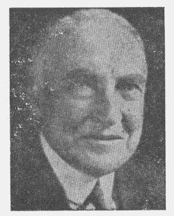
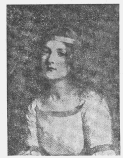
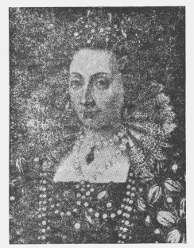
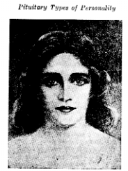
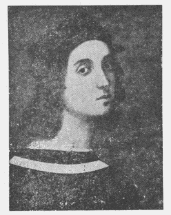

<h1 id="the-mystery-of-the-ductless-glands">O mistério das glândulas endócrinas</h1>

Por um Estudante

THE ROSICRUCIAN FELLOWSHIP  
MOUNT ECCLESIA  
P.O. BOX 713  
OCEANSIDE, CALIFORNIA, 92054, USA  

### <h3 id="dedication">Dedicatória</h3>

Este pequeno e modesto livro dedico ao meu bem-amado mestre, Max Heindel, cujas instruções espirituais o autor tem um débito de gratidão que não pode ser expresso em palavras.

### <h3 id="foreword">Prefácio da edição Norte‑Americana</h3>

O conteúdo deste livreto foi enviado pela Fraternidade Rosacruz (The Rosicrucian Fellowship) na forma de lições mensais. Depois de terem se esgotado, inúmeros pedidos foram endereçados à nossa Sede Mundial, razão pela qual a Diretoria resolveu reimprimi-Ias, juntando-as num só volume, a fim de que se tornasse acessível a todos aqueles que se interessassem pela estrutura, função e significado espiritual das sete glândulas endócrinas aqui estudadas. A função espiritual das glândulas tal como está exposta neste volume, baseia-se nas extraordinárias informações dadas por Max Heindel. Em relação à estrutura fisiológica e funções das glândulas endócrinas, baseou-se nas valiosas informações contidas no livro escrito pelo Dr. Louis Berman, a quem o autor deseja estender seus agradecimentos.

\- Junho de 1940.

### <h3 id="contents">Índice</h3>

- [Dedicatória](#dedication)
- [Prefácio da edição Norte‑Americana](#foreword)
- [Capítulo I: O Desenvolvimento do Homem](#chapter-1)
    - [O trabalho individual do espírito](#the-individual-work-of-the-spirit)
    - [As supra-renais](#the-adrenals)
- [Capítulo II: Tipos de Personalidades Produzidos pelas Glândulas Endócrinas](#chapter-2)
    - [A personalidade do tipo supra-renal](#adrenal-type-of-personality)
- [Capítulo III: O Baço](#chapter-3)
    - [Tipo de personalidade](#personality-type)
- [Capítulo IV: A Glândula Timo](#chapter-4)
    - [A Glândula do Desenvolvimento da Criança](#the-gland-of-child-development)
    - [Tipo de personalidade tímica](#thymus-type-of-personality)
- [Capítulo V: A Glândula Tiróide](#chapter-5)
    - [A Glândula da Energia](#the-gland-of-energy)
    - [Comparação da Tireóide e da Pituitária](#comparison-of-thyroid-and-pituitary)
    - [Personalidade de Tipo Tiróide](#thyroid-type-of-personality)
- [Capítulo VI: O Corpo Pituitário](#chapter-6)
    - [Tipo de Personalidade Pituitária](#pituitary-types-of-personality)
- [Capítulo VII: A Glândula Pineal](#chapter-7)
    - [Tipo de Personalidade Pineal](#pineal-type-of-personality)
- [Capítulo VIII: Correspondências Espirituais](#chapter-8)
    - [As Glândulas e os seus Planetas Regentes](#ductless-glands-and-their-rulers)
    - [As Supra-Renais e o Mundo Físico](#adrenal-glands--physical-world--jupiter)
    - [O Baço e a Região Etérica](#spleen--etheric-region--sun)
    - [A Glândula Timo e o Mundo de Desejos](#thymus--desire-world--venus)
    - [A Glândula Tiróide e o Mundo do Pensamento](#thyroid--world-of-thought--mercury)
    - [O Corpo Pituitário e o Mundo do Espírito de Vida](#pituitary--world-of-life-spirit--uranus)
    - [A Glândula Pineal e o Mundo do Espírito Divino](#pineal--world-of-divine-spirit--neptune)

### <h3 id="Illustrations">ILLUSTRATIONS</h3>

- [Adrenal Type](#adrenal-type)
- [Thymus Type](#thymus-type)
- [Thyroid Type](#thyroid-type)
- [Pituitary Type](#pituitary-type)
- [Pineal Type](#pineal-type)
- [Ductless Glands and Their Rulers](#ductless-glands-and-their-rulers)

<h2 id="the-mystery-of-the-ductless-glands-h2">O mistério das glândulas endócrinas</h2>

### <h3 id="chapter-1">Capítulo I: O Desenvolvimento do Homem</h3>

```
Quando vejo os teus céus, a obra dos teus dedos e a Lua e as estrelas que preparastes; Que é o homem mortal para que te lembres dele? e o filho do homem, para que o visites?  

Salmo: - 8,4  
```

Antes de iniciarmos estas lições sobre as glândulas de secreção interna, será bom revermos rapidamente a origem e a constituição do homem.

Nunca houve nem há nada no Universo além de espírito puro. Porém, existem duas formas ou pólos do Espírito: um positivo, ativo, dirigente e o outro negativo, passivo, receptor, assimilador. Essa substância-espírito, com seus dois pólos positivo e negativo trabalhando em conjunto, é tudo e produziu tudo que há, desde a terra até Deus. Toda a criação está em modificação constante e tem por meta a perfeição. O pólo positivo do Espírito manifesta-se como energia, o negativo age como condutor daquela e os dois produzem a vida e a forma. A forma é produto do Espírito e traduz a sua ais baixa vibração. Ambos, forma e espírito, evoluem lado a lado.

Deus, o criador do nosso Sistema Solar, tem em Si três grandes poderes dinâmicos que, por falta de melhor nome, designamos como: Vontade, AmorSabedoria e Atividade. Quando pôs em ação essas f orças e as ordenou, Deus criou nosso Sistema Solar e tudo que nele contém. O fim último a ser atingido pela Suas criaturas é a reintegração na Divindade. Cada indivíduo trazido à existência por este poderoso Ser, tem, em s~ potencialmente, todos os poderes do seu Criador, inclusive a Epigênese, o poder do Espírito para fazer algo inteiramente novo. O trabalho de cada um consiste em expandir essas potencialidades em forças dinâmicas como as do nosso Grande Progenitor. No homem falamos dessas potencialidades como Espírito Divino, Espírito de Vida e Espírito Humano, o que não significa que o indivíduo tenha três espíritos, mas que o homem como puro espírito tem em si três grandes poderes-espírito.

Esses poderes latentes podem ser desenvolvidos por duas maneiras: por meio dos seus próprios esforços e pelo auxílio dos outros, principalmente daqueles Grandes Seres que estão além do homem no caminho da evolução.

Tal como é necessário alimento para manter e desenvolver o corpo físico, também é preciso alimentar os corpos vital e de desejos. o corpo vital toma seu alimento diretamente do Sol: pelo Baço etérico de cada indivíduo é normalmente atraída tanta força vital do Sol quanta seja necessária. No mundo de Desejos há uma essência correspondente ao fluido vital que sustém o corpo vital; desse elixir de vida o corpo de desejos satura-se enquanto o corpo denso dorme.

#### <h4 id="the-individual-work-of-the-spirit">O trabalho individual do espírito</h4>

Não foi possível o Espírito desenvolver seus poderes enquanto não construiu seus três veículos inferiores, os Corpos denso, vital e de desejos. É deles que o Espírito obtém o alimento com o qual nutrirá e desenvolverá seus poderes potenciais. Este alimento-essência é chamado alma. 

Do corpo denso, o Espírito extrai, automaticamente, a alma consciente mediante a ação reta em relação aos impactos externos, pelas experiências e observações. Este pânulo ou alimento desenvolve as potencialidades latentes do Espírito Divino em poderes dinâmicos que se manifestam como vontade, inteligência, conhecimento, a força positiva do seu ser, o princípio paterno, o poder fazer.

Pela discriminação em relação ao importante, o essencial, e as coisas reais da vida e o que não é importante, não é essencial nem real, o Espírito extrai automaticamente o alimento essência do corpo vital, a Alma Intelectual, com a qual alimentará e desenvolverá, em poderes dinâmicos, as potencialidades do Espírito de Vida que são imaginação, intuição, poder receptor, poder de assimilar, o poder maternal e a natureza do amor.

Pelo domínio dos instintos animais, por meio da devoção guiada por sentimentos elevados e sublimes e pelas emoções geradas pela reta ação e experiências purificadoras o Espírito extrai automaticamente a Alma Emocional - o alimento essência do corpo de desejos para em seguida nutrir e desenvolver as potencialidades do Espírito Humano, que são poder criador (físico e mental), fecundação, expansão, germinação e crescimento, desenvolvendo-se em forças dinâmicas sob o domínio da vontade.

Muita ajuda vem sendo dada ao indivíduo pelos Grandes Seres através das glândulas endócrinas a respeito das quais vamos estudar. Uma glândula é formada por uma massa celular; esta é composta por uma substância densa, incolor, gelatinosa, chamada protoplasma. Cada glândula pode ser comparada a um laboratório no qual as células são os operários, e o produto do laboratório é a secreção.

As glândulas endócrinas não têm aberturas, tubos, nem condutos para excretar suas secreções. Descarregam-nas diretamente no sangue e nos vasos linfáticos que as permeiam. As glândulas de secreção interna são chamadas glândulas endócrinas ou glândulas produtoras de hormônio. Endócrina é, com efeito, a palavra mais conveniente, por referir-se tanto à secreção como para a glândula, mas a palavra hormônio refere-se especificamente à secreção interna e não à glândula. O hormônio é uma substância formada em um órgão do corpo que é levada por intermédio do sangue a outro órgão onde produz um efeito estimulante. A palavra deriva-se do verbo grego, cujo significado é estirnular ou pôr em movimento. Sem suprimento do fósforo endócrino, fornecido pela glândula Tiróide, nenhum cérebro funcionaria. A pulsação do coração cessaria no momento em que deixasse de ser suprido com a secreção das Supra-Renais. Tem havido casos de pessoas com corações considerados mortos e que, depois de estimulados por hormônios das supra-renais, pulsaram novamente com ritmo regular.

O estudo científico das glândulas de secreção interna foi iniciado há menos de cinqüenta anos, e a maior parte dos conhecimentos que delas temos foi adquirido durante os últimos vinte anos. Todavia, o que os cientistas ainda não descobriram é que as glândulas de secreção interna, em principio, não pertencem ao corpo físico. São expressões do corpo vital, diferenciadas e cristalizadas até a densidade apropriada para desempenharem certa espécie de trabalho. As glândulas e o sangue são manifestações especiais do corpo vital. Embora cada uma das glândulas tenha um trabalho específico a realizar, todas elas trabalham em perfeita harmonia quando normais e em boa saúde. As glândulas de secreção interna são de interesse particular para os estudantes do ocultismo, porque podem ser chamadas em certo sentido, as sete Rosas na cruz do corpo e por estarem intimamente relacionadas com o desenvolvimento oculto da humanidade.

As principais glândulas de secreção interna são: a Pineal, a Pituitária, a Tiróide, a Timo, o Baço e as duas Supra-renais. As Supra-renais, o Baço e a Timo pertencem à personalidade ao passo que a Pituitária e a Pineal se relacionam com o lado espiritual da natureza humana. A Tiróide constitui o elo entre os dois grupos de glândulas.

#### <h4 id="the-adrenals">As supra-renais</h4>

Iniciaremos o estudo das glândulas com as supra-renais. São duas glândulas com o formato aproximado de barrete frígio cobrindo a parte superior dos rins. Identificam-se facilmente pela sua gordura amarelada. Por séculos essas importantes glândulas não foram reconhecidas como partes ou órgãos separados dos rins. Na infância e na juventude são relativamente maiores, mais proeminentes que no adulto. Em qualquer idade, a quantidade de sangue que passa pelas supra-renais é muito grande comparada com o seu tamanho. O grande valor dessas glândulas não pode ser subestimado, a sua importância na economia do corpo será melhor compreendida quando verificamos que a morte ocorre imediatamente após a possível ablação.

Cada supra-renal é dupla, composta de um córtex ou camada exterior e uma medula ou camada interna. o córtex é constituído do mesmo tecido existente nos órgãos masculinos e femininos de reprodução. O mesoderma que forma a camada média da célula embrionária é o folheto ancestral comum, o que demonstra quão intimamente estão relacionadas as supra-renais e os órgãos de reprodução. A medula ou porção interior dessas glândulas é desenvolvida a partir do ectoderma, camada ou folheto exterior da célula que forma o embrião. Esse é o mesmo tecido que forma o sistema nervoso simpático. o tamanho das supra-renais é variável, porém de um modo geral em relação a sua dimensão é de mais ou menos 7 centímetros e meio de comprimento, 3,75 em de largura com um peso de sete gramas. Em relação aos seres humanos o seu córtex (camada exterior) é maior do que a dos animais.

O córtex da supra-renais contém bastante substâncias geradoras de fósforo da mesma espécie existente no sistema nervoso cérebro-espinal, mais do que em qualquer outra glândula ou tecido não nervoso do corpo. Durante a vida intra-uterina as supra-renais são maiores e distintas. Na primeira metade do segundo mês são duas vezes maiores do que os rins. Esse tamanho relativamente grande (que se verifica apenas no feto humano e não nos animais) é devido a expansão do córtex. Se essa predominância do córtex sobre a porção medular não ocorresse no feto humano, isto é, se a proporção permanecesse como nos animais, o cérebro não se desenvolveria convenientemente e seria gerado um monstro sem nenhuma capacidade de entendimento.

A secreção do córtex é chamada cortina ou corticoesterona.1 Esta secreção estimula um crescimento sadio do cérebro e das células sexuais, desenvolve grande concentração mental e vigor físico, gerando uma vigorosa constituição muscular e nervosa. Atua sobre a pigmentação da pele diminuindo sua sensibilidade à luz. Em certas doenças do córtex das supra-renais a pele torna-se escura, pigmentada ou bronzeada, o que caracteriza a conhecida enfermidade de Addison. A cortina neutraliza os ácidos formados no corpo durante a digestão. Se tais ácidos não fossem neutralizados a vida dos tecidos terminaria rapidamente.

A remoção do córtex de supra-renal influi profundamente na química do sangue , notadamente no conteúdo dos cloretos do ácido fosfórico solúvel e íons ácidos (um íon compõe-se de um ou mais átomos e transporta uma carga unitária de eletricidade ou força vital).

O córtex supra-renal tem íntima relação com a massa cinzenta do cérebro, com o sexo e a química do sangue. Um córtex defeituoso significa um cérebro e um sistema nervoso deficientemente desenvolvidos. Tão íntima é a relação entre o cérebro e o córtex que nunca se desenvolve um cérebro humano normal sem um córtex supra-renal normal. Note-se que o córtex está também correlacionado ao sistema nervoso voluntário.

A medula ou parte interna das glândulas supra-renais, contém numerosas células idênticas às do sistema nervoso involuntário ou simpático. A secreção da medula é uma substância nitrogenada chamada Adrenalina, que é um poderoso estimulante do coração com efeitos restauradores sobre o corpo. 

A porção da Adrenalina contida na medula, no sangue saldo das supra-renais e na circulação em geral é mínima, na proporção de uma para vinte milhões, ao passo que a porção armazenada nas glândulas em reserva, é cerca de cem mil vezes maior. As emoções, profundas causam abaixamento da adrenalina nas glândulas e aumento no sangue. O desgosto, a irritação, especialmente o medo e a cólera, ocasionam uma descarga das glândulas na circulação. O aumento de Adrenalina no sangue determina um enorme aumento de vigor e tensão do sistema nervoso. As células nervosas tornam-se mais sensíveis ao estímulo, o fígado envia mais açúcar ao sangue, e maior número de glóbulos vermelhos no sangue entram na circulação vindo do fígado e do baço. Provoca também uma redistribuição de toda massa sangüínea; grande quantidade de sangue é retirado das vísceras e mandada ao cérebro e aos músculos ligados ao esqueleto. O coração pulsa mais forte, os olhos podem ver melhor, a audição se apura, a respiração fica mais rápida, a temperatura sobe e a pele fica úmida e gordurosa. Em caso de medo os pelos se eriçam e os cabelos ficam em pé.

Esta Adrenalina extra no sangue produz uma ação reforçadora das propriedades nutritivas do sangue, do tônus dos músculos e da atividade do cérebro e do sistema nervoso simpático.

Enquanto as supra-renais estimulam os músculos externos, produz-se efeito oposto nos órgãos digestivos: a digestão paralisa-se, porque toda atenção do Ego fica inteiramente concentrada em outra linha de ação. Aliás, é suspensa a atividade de tudo que não tenha relação com aquilo em que, nesses momentos, o Ego se focaliza.

Em certas pessoas de meia idade uma elevada pressão sangüínea acompanhada de grande capacidade para o trabalho são conseqüências de um superdesenvolvimento do córtex da supra-renal. As glândulas supra-renais, também chamadas as Glândulas de combate são masculinas nas suas manifestações. Na mulher em que se desenvolveu excessivamente o córtex da supra-renal há certo grau de masculinidade que, em maior ou menor grau, neutraliza a influência especificamente feminina da secreção interna dos ovários. Tais mulheres tem vigor e energia acima do normal e dominam posições de responsabilidade na sociedade, não apenas entre as mulheres, mas também entre os homens. Têm probabilidade de se tornarem políticos profissionais, advogados, banqueiros, capitães de indústria e diretores de negócios.

Em presença de uma crise, as supra-renais funcionam como glândulas de combate. Quanto mais combativo for o indivíduo ou o animal, tanto maior atividade supra-renal terá. As supra-renais são glândulas da energia, das emergências, da disposição. A Adrenalina, a secreção da medula, é substância muito usada para a mobilização imediata da energia do corpo. Tem ação reforçadora sobre toda a organização física: aumenta o vigor, o estado de alerta, as atividades físicas e mentais, dá força no combate e rapidez no ataque.

A ação da Adrenalina é tão poderosa que em solução de 1 por 1 milhão, produz reação fisiológica. Seu efeito nos pequenos vasos sangüíneos é tão intenso que uma solução fraca, aplicada localmente, faz parar rapidamente uma hemorragia. É usada freqüentemente em pequena cirurgia para prevenir excessiva perda de sangue, devendo as injeções ser repetidas por ser passageiro o seu efeito. Sendo a atividade da Adrenalina regulada pelo sistema nervoso simpático ou involuntário, a estimulação daqueles nervos ao longo da coluna vertebral aumenta a sua secreção. 

A repetida excitação, emoção, cólera, etc. podem exaurir a reserva de Adrenalina. Se, ante uma secreção insuficiente, não houver para as glândulas se recuperarem um intervalo de tempo entre as solicitações de secreção, resultará deficiência temporária ou crônica das glândulas. Em pessoa assim afetada, aparece a fadiga, sensibilidade ao frio, mãos e pés frios (alguns pontilhados de vermelho-azulado) perda de apetite, de gosto pela vida e instabilidade caracterizada por indecisão, tendência a inquietação e para chorar à menor provocação.

A deficiência nervosa pode, algumas vezes, ser atribuída à falta de resposta das supra-renais às necessidades da vida diária. Em certos casos, perde-se totalmente a elasticidade mental e física, e o menor esforço em qualquer direção causa tanto cansaço que se torna inútil. Algumas vezes em tais sofredores, obcecados pela idéia de que perderam completamente seus nervos, os acontecimentos mais triviais causam-lhes enorme temor. Este estado vacilante da mente é tão penoso que às vezes traz pensamentos de suicídio.

Em determinadas perturbações das glândulas supra-renais, especialmente quando existem tumores que abastecem o sangue com doses maciças de secreção, aparecem fenômenos sexuais peculiares bem como anomalias e irregularidades no desenvolvimento geral. Se a doença está presente no feto, manifestando-se antes do nascimento, pode desenvolver-se a condição de pseudo-hermafroditismo (a pessoa, aparentemente, não realmente é hermafrodita. ]Isto se observa nos animais que têm glândulas de um sexo enquanto os caracteres genitais opostos, no todo ou em parte, estão presentes). O indivíduo pseudo-hermafrodita, se mulher, apresenta em maior ou menor extensão, caracteres físicos e hábitos de outro sexo, o que faz ser tomado por um homem, embora, na realidade, seus órgãos geradores sejam os ovários, muitas vezes são só descobertos quando examinados durante uma operação ou autópsia.

Se o processo mórbido do córtex da supra-renal surge depois do nascimento, a simetria e harmonia dos órgãos sexuais primários e das características sexuais secundárias não são afetadas. Dá-se, porém, uma curiosa aceleração da maturidade do corpo e da mente provocando uma puberdade precoce e outros espantosos efeitos. Uma menina de dois, três ou quatro anos de idade, dentro de poucos meses após o aparecimento da doença, começa a manifestar crescimento e aparência de uma moça de 14 ou 15 anos. Desenvolvem-se o físico, as qualidades mentais e os atributos de uma adolescente - uma criança enfeitiçada em púbere, por assim dizer. Um garoto de 6 ou sete anos pode tornar-se rapidamente um homenzinho no decorrer de poucas semanas ou meses. Robusto, embora pequeno e atarracado, com bigode, com força muscular e capacidade sexual de um homem, com pensamentos de adulto. 

Um caso desses sucedeu com o menino Clarence Kehr de Toledo, Ohio. As Glândulas tiróide e supra-renais entraram em atividade da noite para o dia e transformaram-no de um menino comum em um jovem Sansão. Clarence nasceu em setembro de 1924 e até os 3 anos de idade foi aparentemente normal. Então, de um dia para outro, sua voz mudou de agudo infantil para barítono roufenho e seu corpinho começou a tomar aparência madura. Em breve tempo, começou a considerar como crianças seu irmão de 7 anos e sua irmã de 8, e procurava na vizinhança a companhia de rapazes de 14 e 15 anos. Clarence tinha enorme prazer por ter assim crescido, ter de se barbear, ser anormalmente forte a ponto de levantar 200 libras (90 quilos) de peso. Os psiquiatras da Universidade de Michigan fizeram um estudo meticuloso do caso desse menino. Depois de lhe radiografarem a cabeça mais de uma dúzia de vezes e de sujeitá-lo à mais rigorosa observação durante vários dias, os cientistas chegaram à conclusão de que o estado do rapaz era devido a alguma perturbação das glândulas de secreção interna. Eis o resumo do estudo feito pelo Dr. Gordon Manac:

Clarence Kehr, de 4 anos de idade, foi observado em nossa clínica e concluímos que esta criança é uma rara anomalia... Os estudos radiográficos revelam que seu ossos têm a estrutura dos de um rapaz bem mais velho. Suas condições físicas aparentemente são excelentes. De acordo com nossos psiquiatras, tem inteligência acima da média... Acreditamos que o estado desse rapaz é devido a alguma perturbação das glândulas de secreção interna.

Durante a reunião dos doutores, Clarence estava no anfiteatro da Academia de Medicina. Para mostrar sua força, levantava facilmente grandes pesos e, enquanto os cientistas discutiam, distraia-se empurrando um grande piano no anfiteatro.

O Dr. Louis Berman discutindo casos semelhantes disse:

Tudo se passa como se em um meio ou solução fermentescível, deixássemos cair um pouco de levedo que transformasse a calma quietude da sua superfície em uma agitação borbulhante, efervescente.)Parece, ao mesmo tempo, que a transformação da criança em homem ou mulher pode ser devida ao derramamento, no sangue e nos fluidos do corpo, de alguma substância que atue como o fermento na solução fermentescível. O córtex supra-renal é uma fonte de secreções internas produtoras de maturidade. Seja agora o caso da perturbação das supra-renais começar depois da puberdade. Aparecem fenômenos semelhantes aos descritos mas de ordem diferente. Se, por exemplo, uma mulher de 3O anos for afetada, lenta ou rapidamente seu corpo cobre-se com abundantes cabelos; no rosto aparecem barba e bigode; a voz torna-se grave e profunda; os músculos endurecem e mostrará capacidade para trabalhos físicos pesados. A menstruação cessa. Parece ter mudado de sexo, predominando em seu todo a masculinidade. Terá de barbear-se regularmente e não se incomodará pela perda dos atrativos femininos porque a mudança da sua organização física tornou-a imune aos desejos femininos. A causa de tal transformação, em uma mulher antes normal, pode ser devida a tumor no córtex das supra-renais.

### <h3 id="chapter-2">Capítulo II: Tipos de Personalidades Produzidos pelas Glândulas Endócrinas</h3>

No caso do tipo puro, uma glândula particular exerce influência dominante nos traços do indivíduo, seja em virtude de uma atividade insuficiente ou excessiva da mesma. Devido a esse fato, dita glândula convertem-se em agente diretor, de maneira que todas as outras se acomodam sob seu domínio. Como é a principal entre todas, ela determina o crescimento e desenvolvimento das funções normais, sustentando o equilíbrio da energia; apresenta-se em dominante em cada emergência por sua fortaleza ou debilidade, criando desta maneira o tipo próprio de indivíduo com as características e atributos que correspondem a si mesmo. As glândulas chamadas do tipo puro são: as Supra-renais, a Tiróide, a Pituitária, a Pineal e a Timo.

Com um pouco de prática pode-se identificar um tipo glandular com facilidade, observando-se o cabelo, o temperamento, o peso, suas inclinações sociais e a tendência para uma determinada enfermidade. Os vários tipos diferem entre si da mesma forma em que diferem os aspectos de animais de uma mesma espécie, pois ninguém confundirá um mastin com um bul-dog ou um fox-terrier com um dachshund. Cada um tem um tamanho e forma distintos, traços característicos, constituídos e dispostos da mais eficiente maneira no sentido de desempenhar seu próprio destino. Graças a isso é legítimo falar-se de pessoas de um tipo glandular.

A diferenças são menos acentuadas entre os tipos mistos e, por essa razão, mais difíceis de classificar-se. Neles há como que um conflito e, naturalmente, a ação conjunta das diferentes glândulas dá origem a uma considerável modificação das características primárias. Em alguns casos não somente duas mas mesmo três glândulas de secreção interna esforçam-se pela supremacia, cujas atividades conjuntas determinam uma modificação na aparência glandular primitiva. Uma acomodação então torna-se necessária. Também é possível que um indivíduo esteja sob a regência de uma glândula durante um período de sua vida e, mais tarde, sob o domínio de outra. Em tais casos a glândula que regeu primeiramente deixará seus traços em desenvolvimentos posteriores, ao passo que novos indícios mostrarão a influência mais recente. Algumas combinações glandulares são possíveis, a saber: tipo supra-renal, tiróide, tipo pituitário, supra-renal, etc.

#### <h4 id="adrenal-type-of-personality">A personalidade do tipo supra-renal</h4>

O rosto supra-renal é amiúde escuro com sardas, tendendo a largo e irregular e a cabeça quadrada. Em virtude da linha da região dos cabelos ser baixa a fronte aparece baixa, sendo considerável a quantidade de pelos que crescem nas maçãs. A pele é uma das principais características da personalidade supra-renal. A epiderme é sempre mais ou menos pigmentada em virtude da existência de matéria marrom escura existente na pele de intensidade variável. É fato bem conhecido que a pele pigmentada tem uma relação com a reação que a luz exerce sobre o organismo, especialmente em raios ultravioletas e a radiação do calor e, portanto, com a produção e dispêndio fundamentais de energia pelas células. O cabelo do tipo supra-renal é profuso, espesso, duro e grosseiro, mais proeminente no peito, no abdômen, e nas costas com tendência a carapinha, tendo muitas vezes cores incomuns, isto é, num italiano pode ser amarela, num norueguês preto azeviche. os indivíduos do tipo supra-renal têm dentes marcadamente caninos. Com uma cooperação acentuada da Tiróide e Pituitária, a personalidade supra-renal estará de posse de um vigor surpreendente, de energia e persistência, chegando por isso a possuir uma personalidade progressiva e um lutador triunfante que raramente deixa de atingir seus objetivos.



<p><cite>Adrenal Type</cite></p>

Entre as mulheres o tipo supra-renal é sempre masculinizado. Se uma dessas mulheres é fisicamente feminina, devido reações femininas adequadas da parte de outras glândulas, demonstrará pelo menos qualidades viris de domínio. Há algumas poucas décadas passadas tais mulheres teriam reprimido seus desejos inerentes de ocupar posições públicas, porém, atualmente, estão elas começando a desempenhar cargos de responsabilidade que lhes proporcionam salários elevados, eis porque o Dr. Berman sugere que a primeira mulher a tornar-se presidente será provavelmente uma do tipo supra-renal. Certamente os indivíduos desse tipo são bons trabalhadores, diretores eficientes. São bem sucedidos pela razão de que têm dentro de si uma força que os impele, que os incita a avançar em direção daquilo que desejam. O Presidente Harding foi tipicamente um supra-renal masculino e Carrie Nation um exemplo excelente do tipo feminino.

O tipo supra-renal insuficiente é formado ao largo das mesmas linhas que o supra-renal normal e facilmente pode ser confundido com este, porém contrasta e difere notavelmente sob a superfície ou aparência. É talvez a mais freqüente variedade do neurastênico. É débil, preguiçoso e irritadiço, pouco desejo de alimentar-se e carente de reações a toda a espécie de estímulo. A indecisão crônica é um dos traços proeminentes. Entre seus principais dissabores situam-se a fadiga proveniente da baixa pressão sangüínea e insuficiente temperatura corporal acrescidos da incapacidade subnormal de utilização do açúcar para fins de combustão interna. As crianças que têm suprimento insuficiente das supra-renais não podem aprender com facilidade, seu crescimento é lento, não podendo ser impelidas ou apressadas. Muitas vezes aqueles que carecem da secreção da supra-renal antes da puberdade, despertam a boa energia quando as outras glândulas endócrinas desenvolvem-se, especialmente as glândulas sexuais. Portanto, as perspectivas para esses desafortunados não são desesperançadas.

O temor e a ira excitam as glândulas endócrinas desnecessariamente e a indulgência freqüente, em relação a qualquer dessas emoções, debilita a eficiência delas. Dai, então, se um esforço não se fizer a fim de dar-lhes uma oportunidade para recuperação, essa condição anormal eventualmente desenvolver-se-á num estado de insuficiência supra-renal permanente, ficando o indivíduo na mais penosa condição física e mental. o otimismo, o bom humor e a fé em Deus vivificará e fortalecerá as glândulas supra-renais imbuindo-as de poder e suficiência.

Em relação à atividade das glândulas endócrinas, Max Heindel diz:

A ciência está gradualmente aprendendo as verdades que previamente foram ensinadas pela ciência oculta. Sua atenção está sendo mais e mais dirigida para as glândulas endócrinas, as quais dar-lhe-ão a solução para muitos mistérios. Porém, não parece que esteja ainda consciente da existência de uma conexão física entre o corpo pituitário, o órgão principal de assimilação e, portanto, do crescimento e as supra-renais que eliminam o supérfluo e assimilam as proteínas. Estas estão também conectadas com o Baço, a Timo e a Tiróide. Sob o ponto de vista astrológico é significativo que o corpo pituitário é regido por Urano que é a oitava superior de Vênus, o regente do plexo solar, onde está localizado o átomo-semente do corpo vital. Dessa maneira, Vênus guarda o portal do fluido vital que vem diretamente do Sol através do Baço, ao passo que Urano é a sentinela do portal onde penetra o alimento físico. É a fusão dessas duas correntes que produz o poder latente que está armazenado em nosso corpo vital até converter-se em energia dinâmica pelo desejo marciano natural.

### <h3 id="chapter-3">Capítulo III: O Baço</h3>

O Baço é a maior das glândulas endócrinas. Está situado do lado esquerdo ao lado da grande curvatura do estômago, entre este e o diafragma. Tem o formato de uma fava de cor vermelho-azulado escuro. Têm 180 a 200 grs. de peso, uns 13 cm de comprimento e 8 cm de largura. É macio, esponjoso e frágil. Normalmente, com os movimentos da respiração desloca-se dentro de certos limites. Pode aumentar muito de tamanho em certas doenças como febre tifóide ou malária, ou em doenças do próprio órgão como a leucemia, afecção em que o número de corpúsculos brancos do sangue aumenta enormemente bem como o baço. 0 aumento do Baço nas crianças é devido à sífilis, o que se dá, muitas vezes, na idade de dois a três meses. 0 Baço sempre se dilata durante a digestão. Essa glândula é alimentada pela artéria esplênica e sua veias desembocam na veia porta que por sua vez descarrega no fígado.

No embrião, o Baço forma-se mais ou menos na 51 semana, a partir do mesoderma, ou o folheto médio da célula embriônica. É quase inteiramente circundado pela membrana do peritônio e é mantido em posição por dois envoltórios desse tecido. É envolvido por duas membranas, uma externa úmida e fibrosa e outra interna, elástica. A membrana externa é delgada e lisa. A secreção do Baço é chamada hemolisina, que é a controladora da destruição dos elementos do sangue e tem efeito estimulante no movimento normal dos intestinos, havendo casos de constipação crônica que se curam pelo uso dessa secreção. os vasos sangüíneos, linfáticos e os nervos entram e saem de uma depressão da parte interna do Baço, chamada hilo.

O Baço fabrica os corpúsculos brancos do sangue, armazena o ferro e tem grande influência no sistema nervoso (controla a absorção do fluido vital do açúcar que percorre os nervos), auxilia a digestão absorvendo o fluido vital do Sol durante esse processo. A remoção do Baço não é fatal. Depois da remoção realiza-se um desenvolvimento das glândulas linfáticas que tomam a si o trabalho físico do Baço. o Baço etérico não se desintegra simultaneamente com o órgão físico amputado, mas permanece e desempenha suas funções vitais como antes. 0 Baço é a porta de entrada das forças solares que vitalizam o corpo denso. Sem esse elixir da vida nenhum ser pode viver. 

Do Baço essa força solar é enviada ao plexo solar, onde se encontra com o éter que foi extraído do sangue no coração, o qual tão logo tenha sido extraído flui ao longo do cordão prateado para o plexo solar onde o átomo-semente do corpo vital está localizado. Esse átomo-semente parece ter o mesmo efeito sobre o éter como um prisma tem em relação à luz, porque o fluxo etérico refrata-se nas três cores primárias: o vermelho, amarelo e o azul. Nas pessoas que vivem apenas a vida material predomina o vermelho, mas à medida que o indivíduo avança espiritualmente toma-se notável o amarelo e, depois, o azul. O fluxo vermelho mistura-se com o fluxo solar incolor que constantemente aflui para ao plexo solar por intermédio do Baço. É o agente que muda esse fluido solar incolor naquela cor rosa-pálido que dá ao corpo vital esse tom delicado da flor do pessegueiro recém aberta. Do plexo solar esse fluido energético flui ao longo dos filamentos que compõem o sistema nervoso e desse modo ele permeia cada parte do corpo físico, energizando cada uma das células com a sua vida-força.

Quando uma pessoa está com boa saúde, essa vida-energia é especializada pelo baço e extraída do sangue em tão grande quantidade que, não podendo ser usada pelo organismo, irradia-se pelos poros da pele em linhas retas. Essa força irradiante excessiva arrasta consigo os gases venenosos, os micróbios inimigos e as substâncias inúteis, contribuindo, dessa maneira, para a conservação da saúde do corpo físico, evitando, ainda que exércitos de germes de enfermidades que enxameiam a atmosfera penetrem no corpo denso. Assim o fluido etérico cumpre um alto e benéfico propósito mesmo após ter sido usado ao retomar a seu estado primitivo.

O clarividente treinado muitas vezes observa uma curiosa e surpreendente visão quando, ao observar as partes expostas do corpo, tais como o rosto e as mãos, vê começar a fluir por elas um facho de estrelas, cubos, pirâmides e grande variedade de Outras figuras geométricas. Cada uma dessas figuras afasta-se a pouca distância do indivíduo e logo desaparece. Sua cor é azul ametista (arroxeado).

Após às refeições a força vital atraída pelo Baço é consumida pelo organismo em grandes quantidades. Os dois éteres inferiores, o químico e vital, contêm o elemento estruturador que as forças da natureza (os espíritos da Natureza), os chamados mortos, os espíritos Lucíferos e os Mestres das mais elevadas Hierarquias Criadoras empregam no processo de assimilação do alimento pelo Corpo.

Quando a alimentação é pesada ou excessiva, o fluxo do fluido vital diminui perceptivelmente. Então a limpeza do veículo denso não é feita tão apropriadamente como quando a alimentação foi completamente digerida, nem o fluxo vital que se liberta do corpo é suficientemente poderoso para evitar o ataque de germes de enfermidades, o que explica por que as refeições copiosas tornam a pessoa mais sujeita a resfriar-se ou a adoecer. Na doença, o Baço fornece ao corpo vital muito pouca energia solar. Nesse estado parece que o corpo físico alimenta-se do corpo vital, tornando-o mais transparente e extenuado, resultando para o corpo físico um estado de fraqueza e emaciação. É fácil aparecerem complicações doentias, pois as condições vitais de limpeza estão quase inteiramente ausentes durante a enfermidade.

Quando alguma parte do corpo ou qualquer órgão são removidos, deixando de haver uso da contraparte etérica, desintegra-se gradualmente essa parte do corpo vital. Entretanto, no caso da ablação do Baço, tal conseqüência não se dá, cabendo a essa glândula a tarefa de cumprir um grande trabalho. Por isso, se o corpo físico deve viver, o Baço etérico precisa permanecer intacto a fim de continuar o seu serviço, isto é, atrair força ou energia solar para o veículo denso.

As glândulas são produtos do corpo vital, mas o corpo de desejos apropriou-se do Baço e nele produz os corpúsculos brancos. Esses corpúsculos brancos são destruidores, e são usados pelo corpo de desejos, levando-os por intermédio do sangue por todo o corpo físico. Ao atravessarem as paredes das artérias e das veias nos momentos de aborrecimento e especialmente nos de grande irritação, a impetuosidade das forças no corpo de desejos dilata as artérias e as veias, abrindo caminho aos corpúsculos brancos, através das finas paredes desses vasos sangüíneos dilatados, para os tecidos do corpo, onde formam bases de matéria terrosa destruidoras do veículo denso. 

o corpo de desejos constantemente está destruindo os tecidos do corpo físico que o corpo vital reconstrói. Dessa luta entre eles resulta a consciência no mundo físico. As forças etéricas no corpo vital, agem de modo a converter, tanto quanto seja possível, o alimento em sangue, o mais elevado produto do corpo vital. Os corpúsculos vermelhos do sangue são discos, côncavos em ambos os lados, não tendo núcleos. Têm a missão de oxigenar todo o organismo, ao passo que os corpúsculos brancos são de formato irregular, nucleados, com movimento parecido ao das amebas.

A forma pela qual o corpo de desejos opera na formação dos corpúsculos brancos do sangue, no Baço, é a seguinte: maus pensamentos, o medo e a cólera interferem na atividade evaporizadora no Baço, daí então o Corpo de Desejos aproveita a oportunidade para formar uma partícula de plasma, material viscoso de uma célula animal, a qual se torna o fundamento do corpúsculo branco. Este é imediatamente atraído por um pensamento elemental que dele se apropria, forma um núcleo e nele se incorpora. Depois, o elemental inicia uma vida de destruição, unindo-se a produtos nocivos e a elementos em decomposição onde quer que se encontre no corpo, fazendo dele um cemitério ao em vez do templo de um Espírito interno. Cada corpúsculo branco formado e apossado por uma entidade exterior, é, para nosso Espírito, uma oportunidade perdida. Quanto mais oportunidades perdidas existam no corpo físico, tanto menos esse veículo estará sob o controle do Ego. Os corpúsculos brancos estão sempre presentes em grande número em todas as enfermidades.

#### <h4 id="personality-type">Tipo de personalidade</h4>

O Baço não tem uma personalidade típica. Mas considerando-se o fato que às refeições é atraída uma considerável quantidade de força solar, bem como durante a digestão, o gourmand pesadão e gordo, poderia ser tomado como um tipo representativo a desenvolver-se se o apetite não for controlado. Contudo, se houver controle do apetite por parte da pessoa, um tipo superior, forte e potente, poderá desenvolver-se.

### <h3 id="chapter-4">Capítulo IV: A Glândula Timo</h3>

#### <h4 id="the-gland-of-child-development">A Glândula do Desenvolvimento da Criança</h4>

A Glândula Timo está situada no peito entre os dois pulmões e por trás do esterno. Projeta-se para baixo cobrindo a parte superior do coração e envolvendo os grandes vasos na parte de cima. É uma massa pardacenta que ocasionalmente, quando é cortada, tem a aparência de uma moela. Situa-se sobre a traquéia, aparecendo como um crescimento da terceira bolsa da faringe (uma cavidade tubular no canal alimentício que começa na parte anterior da boca). Alcança seu maior tamanho no início da puberdade, pesando na ocasião do nascimento 14 g. Sua largura é de 3,75 em e o comprimento é de 5 em. Atinge o ponto de dissecação aos vinte e um anos. Seu desaparecimento gradual, subseqüentemente, é assinalado pela perda da estrutura glandular que é substituída por um tecido fibroso e adiposo. Vestígios do tecido característico da Timo, entretanto, persiste bem como certas células segregadoras que assim permanecem durante toda a vida.

No passado, acreditava-se que a glândula Timo atrofiava-se na puberdade, porém atualmente sabe-se que suas células segregadoras continuam em manifestação durante toda a vida. Quando essas células são muito numerosas a glândula se torna de cinco a dez vezes maior do que a normal e um número de outros aspectos faz-se proeminente, dotando o indivíduo com características extraordinárias, fazendo-o vítima do estado timico. Tal fato será exposto nas séries de lições que trata da personalidade Timo. É exato que o Timo é a glândula que faz as crianças pueris e, por vezes, os adultos infantis. Entre as artérias que nutrem a glândula Timo há ramos das artérias mamárias, o que indica a estreita relação existente entre a mãe e o filho. Os minúsculos nervos vêm do sistema nervoso simpático e do 10º nervo craniano ou nervo pneumogástrico.

Durante a infância, o Timo é o órgão que promove o crescimento dos ossos, porém na puberdade o decrescimento inicia-se, admitindo-se que as glândulas sexuais despertadas nesse período, exerçam sobre o Timo uma influência refreadora.

A secreção da Timo que chama-se Timovidina crê-se que seja responsável pelo crescimento das crianças. Quando a timo com um tamanho acima do normal apresenta-se num recém nascido, o processo de respiração, isto é, a introdução do oxigênio contido no ar, na criança, torna-se algo difícil e prolongado. Tais crianças nascem azuis, como se diz. Durante dias a respiração é ruidosa, com um tom sibilante, normalizando por algum tempo, paira posteriormente surgirem espasmos respiratórios ou sintomas de asfixia, acompanhados de manchas azuis na pele e ameaça de morte. Há casos em que esses espasmos aparecem depois de a criança parecer perfeitamente saudável. Tal situação prende-se ao fato de a Timo avolumar-se, o que poderá ser aliviada pela aplicação de Raio X ou pela ablação cirúrgica de uma de suas partes.

Quando o corpo de uma criança sofre de desnutrição, produz-se um rápido declínio no peso do Timo, o que prova que o tamanho e demais particularidades do Timo de uma criança são índice do seu estado de nutrição. Nesse sentido provou-se que mantendo a subalimentação durante 4 semanas, o Timo se reduziu de 1/3 do seu tamanho normal.Esta glândula parece agir como um órgão de armazenagem e reserva, oferecendo alguma proteção contra a limitação do crescimento devido à falta de alimentação. É fato interessante que no caso de enfermidades esgotadoras e depauperadoras, o peso dessas glândulas desce muito mais rapidamente que o de qualquer outra glândula. Há casos comprovados de crianças que crescem alguns centímetros e expandiram suas condições mentais ao serem tratadas com Timovidina, quando outras providências falharam. Na França foi feito um estudo em mais de quatrocentas crianças idiotas possuidoras de glândulas Tiróides normais. Verificou-se que mais de 3/4 do número desses infelizes não tinham glândulas Timo.

A secreção de Timo controla de forma definida, o crescimento dos ossos e o metabolismo muscular durante o período infantil. Esta glândula tem influência particular no desenvolvimento do córtex da supra-renal (a parte exterior dela) na glândula Pineal, a Tiróide e na Próstata. A injeção de Timovidina alivia notoriamente a fadiga dos músculos voluntários.

A remoção da glândula Timo de um animal jovem e pequeno interfere em seu crescimento normal, surgindo um anão e conseqüente alteração no desenvolvimento do esqueleto idêntica à que caracteriza o raquitismo. os ossos ficam moles, vergadiços e fraturam-se facilmente. Entretanto, no caso de se regenerarem pequenos pedaços da Timo que tenha ficado da operação, esses sintomas desaparecem e o animal volta à normalidade.

O Timo cresce rapidamente durante os primeiros dois anos de vida da criança. Razão disso é que a criança é então amamentada e o Éter de Vida contido no leite materno especialmente favorece o crescimento desse órgão. A glândula Timo das crianças amamentadas com leite humano é sempre de maior tamanho do que a das crianças amamentadas com leite animal. Aquelas crianças respondem mais ao controle da sua nutriz do que ao controle de qualquer outra pessoa. Após o desmame, os átomos da glândula Timo que se desintegram circulam na corrente sangüínea, e como estão impregnados pelo Éter de Vida da mãe, obtido durante a amamentação, a íntima ligação entre eles permanece até que se dê a diminuição sensível na glândula. As crianças alimentadas com leite humano têm maior vitalidade do que as alimentadas com leite animal, porque o Éter animal não é absorvido permanentemente pela glândula Timo tal como é o Éter humano.

A criança não fabrica os próprios corpúsculos vermelhos de sangue, como fazem os adultos. A razão disso é que o pólo positivo ou a energia do corpo de desejos da criança é comparativamente inativo; conseqüentemente, esse veículo não atua como uma via para as forças (Marcianas) que tomando o ferro do sangue transformam-no em Hemoglobina (a substância de coloração vermelha dos corpúsculos sangüíneos). Para compensar essa inatividade, existe na glândula Timo da criança uma essência espiritual que é tomada dos pais no ato da concepção. Essa substância completa a alquimia do sangue temporariamente para a criança até que o seu Corpo de Desejos se torne dinamicamente ativo, o que se dá por volta dos quatorze anos de idade.

A glândula Timo controla o crescimento físico das crianças, cujo máximo é atingido aproximadamente aos 14 anos. Durante este tempo, esta glândula mantém as outras glândulas inativas, retarda a puberdade e estimula o desenvolvimento normal do cérebro. Há casos, contudo, em que, devido à enfermidade das supra-renais, o cérebro e os órgãos geradores amadurecem em poucas semanas ou meses, antes que o corpo desenvolva-se normalmente. A paralisação do crescimento deixa o corpo pequeno, de pequena estatura, todavia simétrico. Podem surgir casos excepcionais, entretanto a glândula Timo evita o aparecimento de tais fenômenos.

Quando a ação da glândula Timo persiste depois da puberdade em tempo demasiado, chegando a ser de 5 a 10 vezes maior do que o normal, estamos perante uma caso de status thymicus que é uma condição interessante em que a pessoa, se masculina, tende a exteriorizar a expressão feminina e, se feminina, a expressão masculina. Em outras palavras, causa uma suspensão da masculinidade ou da feminilidade, conforme seja o caso, algumas vezes resultando o peculiar complexo do homem desejar mais a associação com homens do que com mulheres e, vice-versa, as mulheres preferirem a associação com mulheres, em vez de homens. Isto levado a extremos pode converter-se em narcisismo, o amor por si mesmo. Tais pessoas usam continuamente o pronome eu, gostam de se mirar nos espelhos, deleitam-se em admirar suas mãos, seus pés e todo seu corpo, podendo ser vistas, com freqüência, acariciando-se ternamente e sorrindo docemente para sua própria imagem refletida. 

Por vezes, têm irresistível desejo de vestir roupas do sexo oposto. Algumas satisfazem-se com uma ou outra peça de vestuário, mas outras substituem todos os seus trajes e passam como membros do sexo oposto. Essas pessoas não são pseudo-hermafrodítas porque têm desenvolvimento sexual perfeitamente normal. Cita-se o caso de um homem que, tendo vivido 48 anos vestido com vestes masculinas, mudou para vestes femininas até sua morte, 35 anos depois. Durante todo este segundo tempo de sua vida foi aceito na sociedade como mulher. Somente a autopsia revelou que, sexualmente, ela era realmente ele, um homem.

Esse tipo de indivíduo é incompreendido e mal julgado. São geralmente desajustados na sociedade, de que resulta tornarem-se muitas vezes desanimados e sem coragem, entregando-se ao uso do álcool ou aos entorpecentes e eventualmente praticam o suicídio. Entretanto, há indivíduos desse tipo que depois de uma vida tempestuosa pela casa dos vinte anos, adaptam-se ao seu ambiente pelos trinta anos, porque a pituitária e a Tiróide tornaram-se mais predominantes, dando maior estabilidade mental e equilíbrio. Em alguns em que o Timo é o centro de direção, combinam o brilho com a instabilidade, tornando-se aventureiros famosos e incansáveis experimentadores.

O coração do tipo timico é pequeno e os vasos sangüíneos notadamente frágeis. Isto, numa emergência, pode limitar o afluxo do sangue e, em conseqüência, tais pessoas podem morrer subitamente de ruptura de vasos, causada pelo excessivo afluxo do sangue a vasos débeis. Um choque súbito, um susto, a administração de um anestésico podem produzir um colapso que, as mais das vezes, termina em morte.

#### <h4 id="thymus-type-of-personality">Tipo de personalidade tímica</h4>

Ao tempo do aparecimento dos dentes permanentes, o Timo é a glândula dominante e é de notar que a forma física das crianças, em ambos os sexos, é muito semelhante. Depois disso há uma diferenciação gradual, sem distinção física acentuada até a puberdade. Iniciada esta a função do Timo diminue gradativamente e outras glândulas aumentam de atividade. Porém, muitas vezes, a ação da glândula não cessa, casos em que os indivíduos têm toda a vida dominada por essa glândula. Tais pessoas pertencem ao tipo tímico centralizado. Suas formas continuam redondas e infantis. As crianças pertencentes a esse tipo são bem proporcionadas, perfeitamente formadas com feições delicadas. A pele é transparente e cora com facilidade; o cabelo é longo e sedoso. Tais crianças são a incorporação da beleza. Crianças angelicais admiradas por todos, mas, não estando aptas para enfrentar os ásperos conflitos da vida, geralmente morrem jovens.



<p><cite>Thymus Type</cite></p>

O tipo tímico é essencialmente feminino. O corpo, algumas vezes de estatura média e outras vezes alta, é todo graciosamente conformado, de membros roliços. A pele é fina, delicada e aveludada, cabelos macios e sedosos. Pouca ou nenhuma barba, feições delicadíssimas, magnificamente proporcionadas, olhos azuis ou castanhos, longas pestanas, lábios finos e o rosto oval. Por vezes, no adulto, o queixo não é bem formado, os dentes têm a brancura do leite, são finos e translúcidos com bordos serrilhados ou com a forma de crescente lunar.

Este tipo de indivíduo, reiteramos, não tem grande resistência, e, portanto, deve ter o máximo cuidado com seu corpo físico.

### <h3 id="chapter-5">Capítulo V: A Glândula Tiróide</h3>

#### <h4 id="the-gland-of-energy">A Glândula da Energia</h4>

A glândula Tiróide consiste de duas massas de cor marrom situada na parte superior da traquéia e junto à laringe, ligada logo abaixo ao pomo de Adão por um estreito istmo do mesmo tecido. A Tiróide surge do mesmo tecido e quase do mesmo ponto que o lóbulo anterior do corpo pituitário, pesando mais ou menos 28,4 g. Cada lóbulo da Tiróide tem mais ou menos 5 em de comprimento, de 2,5 em a 3,75 em de largura e 1,9 em de espessura. Esta glândula é um dos primeiros órgãos em distinguir-se no embrião humano, começando primeiramente como um sulco no fundo da boca por volta da terceira semana de vida do feto. Ao alcançar 0,62 em no embrião, o tecido da Tiróide se separa e o sulco fecha-se.

A importância da Tiróide é acentuada pela riqueza de sua circulação. Essa glândula recebe mais ou menos quatro vezes mais sangue, em proporção ao seu tamanho, do que os rins, os quais destacam-se pelo seu alto grau de atividade funcional. É mais pesada na mulher do que no homerr4 tornando-se maior durante a excitação sexual, na menstruação e na gravidez. De acordo com uma notável autoridade, Gaskill, a Tiróide foi uma glândula sexual. O Dr. Berman diz: Tanto nos vertebrados inferiores como nos invertebrados superiores os tecidos dessa glândula estão intimamente conectados com os condutos dos órgãos sexuais. São na verdade órgãos sexuais acessórios, glândulas uterinas, satélites do processo sexual. Do Petromyzon (lampreia) para cima, seu relacionamento se perde. A Tiróide emigra mais e mais para a região da cabeça, a fim de tornar-se o grande elo entre o sexo e o cérebro.

Max Heindel diz: Durante os primeiros estágios da Época Hiperbórea, quando a Terra ainda estava unida ao Sol, as forças solares eram o suprimento do homem, o qual inconscientemente irradiava o excesso dessas forças recebidas, para fins de propagação.

Quando o Ego entrou em seus veículos, tornou-se necessário usar uma parte dessa força para construir o cérebro e a laringe que era originalmente uma parte dos órgãos geradores. A laringe foi construída enquanto o corpo denso era encurvado numa forma de bolsa como já foi descrita, a qual é ainda a forma do embrião humano. Quando o corpo denso tornou-se reto, parte do órgão criador permaneceu na parte superior do corpo tornando-se mais tarde a laringe.

Assim a força criativa dual que num determinado tempo foi usada somente numa direção, para criar um outro ser, dividiu-se. Uma parte dirigiu-se para cima para criar o cérebro e a laringe por meio dos quais o Ego é capaz de pensar e comunicar seus pensamentos a outros seres.

Como resultado dessa transformação, somente uma parte da força essencial para a criação de outro ser ficou de posse para um indivíduo, daí a necessidade de cada indivíduo procurar a cooperação de outro que possuísse a parte da força procriativa que carecia.

Assim, a entidade em evolução obteve a consciência cerebral do mundo exterior à custa da metade de seu poder criador. Anteriormente a esse tempo ela usava internamente ambas as metades ou partes desse poder para exteriorizar outro ser, porém, como resultado dessa modificação, desenvolveu o poder de criar e expressar o pensamento. Antes disso ela era um criador no mundo físico somente, desde então tornou-se apta a criar nos três mundos.

Uma comparação das descobertas feitas pelos modernos cientistas e daquelas realizadas pelos investigadores ocultistas acima expostas, revelam uma pasmosa corroboração relativa à recente formação dos órgãos procriadores da raça humana. Max Heindel disse no Conceito Rosacruz do Cosmos que o ocultista acolhe com júbilo as descobertas da ciência moderna, porque invariavelmente corroboram o que a ciência oculta há longo tempo vem ensinando, sendo um fato digno de nota que quase diariamente um estudante esmerado lê algo a respeito de uma descoberta científica que vem provar uma afirmação particular registrada há longo tempo nos escritos dos nossos mais adiantados cientistas ocultistas.

É crença dos mais eminentes biologistas que a Tiróide desempenhou uma parte importantíssima na transformação das criaturas marítimas e em animais terrestres. Experimentalmente a Tiróide foi usada para transformar uns em outros. Há uma pequena Salamandra que vive n'água e que respira por meio de guelras. Alimentando-se esse animal com glândula Tiróide, opera-se uma mudança rapidamente - surge de uma Salamandra da água, uma Salamandra terrestre.

Tanto a Tiróide como sua secreção são usadas na medicina. A secreção dessa glândula é chamada Tiroxina. Trata-se de uma substância gelatinosa contendo uma grande porcentagem de Iodina, bem como Arsênico e Fósforo. A Tiroxina depende da Iodina para sua atividade. Há outras substâncias na secreção da Tiróide com funções próprias, porém suas atividades são secundárias e obscuras. A Tiroxina produz resultados em pacientes em doses extremamente pequenas comparadas com a quantidade da glândula toda. Além disso, uma dose de Tiroxina parece permanecer num organismo necessitado dela, por um período de tempo maior, ao passo que a totalidade da glândula tem de ser administrada continuamente.

A Tiróide é uma glândula de energia. Sua secreção é a controladora do ritmo do viver, de tal modo que quanto menor seja a quantidade de secreção tanto menor será o nível de atividade. E, por assim dizer, a rapidez com que se produzem as reações químicas que constituem os processos da vida, dependem da Tiróide. Quando as reações se aceleram, o oxigênio e a matéria alimentar se oxidam, portanto, libertam mais energia e o indivíduo pode pensar, sentir, ver e atuar mais rapidamente. A Tiróide parece mesclar mais oxigênio com as células alimentares e ao mesmo tempo libertar energia para ser usada como calor, movimento e outras necessidades. 

O Dr. Plummer demonstrou que um aumento de Tiroxina dobra o aumento de energia numa determinada unidade de tempo. Isso nos dá uma idéia do poder dessa secreção interna e de sua importância para a vida normal. Para ser exato, uma miligrama de Tiroxina aumenta a ação do metabolismo em dois por cento. Quando a Tiroxina é administrada em apenas uma dose, observa-se uma diminuição lenta de absorção da mesma pelos tecidos, assim mesmo não alcança o máximo efeito senão no décimo dia. Seu efeito continua por mais dez dias, mais ou menos. Dai então haverá uma diminuição de intensidade por outros dez dias. De acordo com a extensão do tempo uma simples dose de Tiroxina atua no organismo, aproximadamente, durante três semanas. Qualquer perturbação na secreção da Tiróide em quantidade maior ou menor ou ainda em relação à qualidade, isto é, uma mudança anormal em sua composição química, produz severos transtornos, os quais se tornam uma carga para si mesmo e para os outros.

Não é somente o grau de tensão da energia nu células do organismo que é controlado pela Tiróide, mas a mobilidade dessa energia, pois sem a secreção dessa glândula, o rendimento de grandes e rápidas flutuações de energia, a sua elasticidade, flexibilidade e mobilização para a execução de um rápido ato muscular, numa emergência, seria completamente impossível.

A Glândula Tiróide é a mais importante glândula do corpo, pela razão de que ela controla o crescimento do veículo denso, o desenvolvimento mental e está intimamente relacionada com as outras seis glândulas que estamos considerando. É o grande elo entre o cérebro e os órgãos geradores, nela se processando a secreção necessária ao equilíbrio do cérebro.

Duas das principais doenças relacionadas com a glândula Tiróide são o cretinismo e o mixedema. Ambas são causadas por conexão imperfeita entre o cérebro e o corpo vital, a qual impede a Tiróide de secretar a Tiroxina que a conectaria com o cérebro e os órgãos geradores. o cretinismo é o idiotismo infantil. A mesma doença é chamada no adulto, mixedema.

Uma criança pode nascer cretina como resultante de uma deficiência de Tiroxina ou pode desenvolvê-la em qualquer tempo depois do nascimento. Uma criança pode nascer aparentemente normal, com exceção do nariz que será um pouco mais achatado do que o comum. Pode ter sonolência anormal, maior do que as crianças, normais durante o primeiro ou segundo mês e não acordar espontaneamente para comer. Depois de alguns meses, nota-se que não acompanha o crescimento normal, física e mentalmente. Ao exame, revela-se um curioso engrossamento dos rebordos dos dentes. Então a língua se torna anormalmente espessa e proeminente, sobressaindo da boca continuamente, dificultando a respiração quando a criança está deitada. A boca está sempre cheia de saliva, a pele adquire um amarelado ou cor de cera, é seca, áspera escamosa e tumefeita. Os olhos lacrimejam e as pálpebras engrossam, o achatamento do nariz se pronuncia e suas asas engrossam; as orelhas são grandes e erectas; o cabelo afina; as sobrancelhas e as pestanas escasseiam e, por vezes desaparecem; as unhas ficam curtas, finas e quebradiças; os dentes demoram a aparecer, limitando-se, por vezes, a meras e poucas pontas curtas, e irregulares que rapidamente caem. Todo o crescimento é lento e desproporcionado. o tronco, bem pequeno se comparado com a cabeça, parece maciço se comparado com as diminutas dimensões das extremidades. As costas se acorcovam, arqueando-se na região lombar; o abdômen salienta-se como um pequeno balão, havendo às vezes hérnia umbilical. Os pés e as mãos são desajeitados, largos e grossos, os dedos rijos, curtos e finos, e os artelhos recobertos de sólida pele e separados. 

Esses desafortunados manifestam fome e sede por meio de grunhidos, de sons inarticulados ou gritos. Não sorriem nem tossem. A circulação é pobre, o corpo frio, a pressão sanguínea é baixa, porém nem todos os cretinos têm as mesmas peculiaridades; há muitos graus e variedades de acordo com a severidade da doença. 

Note-se que no cretino ou no mixodematoso, estando fechada a porta da Tiróide que fornece a força criadora para o cérebro e os órgãos geradores, ambos começam a atrofiar-se. Em ambos os casos, a vítima é apática, indiferente, suja e desalinhada - um lastimável idiota.

Num adulto poderia se suspeitar alguma causa para tão abominável enfermidade, mas numa inocente criança, por que razão surge?

Para encontrar-se a causa da aflição, devemos observar os órgãos afetados - o cérebro e os órgãos geradores. A força criadora, a força que produz o crescimento está praticamente ausente.

O abuso da força criadora, usada para gratificação dos sentidos é o pecado contra o Espírito Santo, que não é perdoado, mas que deve ser expiado pelo viver em veículos deficientes, como, por exemplo, o acabado de descrever. É uma terrível lição a aprender, uma lição que se é dada a um Espírito quando não seja possível dar-lhe de outra maneira.

Os cientistas, ao retirarem a Tiroxina do desamparado reino animal para aplicá-la ao homem doente, estão, ignorantemente, tentando burlar o trabalho que a grande Lei de Causa e Efeito realiza por meio do renascimento. Mas Deus não pode ser ludibriado: o que um homem semeia, isso colherá. A Tiroxina animal aplicada num cretino ou num mixedematoso jamais efetuará uma cura real, apenas retarda a aplicação da Lei até outra oportunidade. O caso é análogo ao emprego do hipnotismo para curar alcoólatras da atração pelas bebidas. o que o hipnotizador faz é apenas sobrepor a própria vontade à do alcoólatra. Enquanto os dois viverem - o hipnotizador e o hipnotizado - a cura parece ter sido completa; mas se o hipnotizador morre antes do viciado, como o poder da vontade deste último, não é mais controlado, o apetite desperta e o viciado retorna ao antigo e infeliz hábito. É somente quando nos sobrepomos a um mau hábito pelo poder da própria vontade, passamos a ter domínio sobre ele. o mesmo sucede no cretinismo e no mixodema. A vítima pode tomar tiroxina durante toda a vida que jamais ficará curada. Apenas retardada até outra vida o pagamento de uma divida do destino. Quando voltarem a Lei cobrará o débito.

O primeiro êxito aparente na cura do mixodema deu-se com uma mulher inglesa de 42 anos de idade. A doença produziu-lhe crescimento do rosto e das mãos e tornou-se lenta no falar e no andar, sensível ao frio, de espírito lânguida, fisicamente deprimida a ponto de não poder andar sozinha. A injeção hipodérmica do extrato de glândula Tiróide de carneiro duas vezes por semana, produziu uma melhora imediata, maravilhosa e contínua. Verificou-se que a melhora pode ser mantida usando a glândula por via oral. As feições e a pele retornaram ao normal e a mulher pôde voltar a andar por seu próprios meios. Viveu até a idade de 74 anos. Entre os 42 e 74 anos foi necessário administrar-lhe Tiroxina regularmente. A mulher consumiu 270 gramas de Tiroxina, extraída das glândulas de 870 carneiros.

Quando se dá Tiroxina a uma criança cretina, a circulação melhora e o calor do corpo aumenta. Em cerca de uma semana o estado de embrutecimento desaparece. A pequena criatura começa a sentir suas melhoras, logo reconhece seus pais, sorri e brinca. A face pálida toma a aparência normal e todo o corpo começa a crescer. Surgem todos os maravilhosos efeitos do crescimento. Por exemplo, podem aparecer 2O dentes dentro de 6 meses. O cabelo áspero e seco torna-se fino, macio, sedoso e, às vezes, ondulado. A pele fica úmida, macia e rosada A altura, cada mês, poderá aumentar de alguns centímetros. A criança torna-se alegre e ativa., e começa a falar. Deu-se uma evidente transformação. Mas, apenas cesse a administração da secreção da Tiróide é inevitável, quase imediatamente, a reversão às condições primitivas. Pouco tempo depois de diminuída a administração do medicamento a criança falará somente quando falarem com ela, ficará sentada quieta durante todo o dia e agirá como se estivesse semi-anestesiada. A pele e o cabelo, gradualmente, retornam ao estado primitivo e o completo tipo do cretino se desenvolverá. Se de novo aplicamos a secreção, a transformação rapidamente se repetirá. 

Os médicos estão atônitos em relação a qual será o destino dessas criaturas recuperadas, uma vez que a administração de Tiroxina foi feita apenas a uma geração, pelo que não há dados sobre o caracter dos filhos ou netos. Os casos que a medicina conseguiu registrar parecem normais, as crianças nas escolas e os adultos como trabalhadores ativos aos interesses comuns da infância, nu ocupações adultas ou nos círculos sociais. Intelectualmente, a única dificuldade é a matemática. Normalmente, fora da família, ninguém sabe que são cretinos. Em dez casos, o observador mais sagaz de nada suspeita em nove.

Além das anomalias por insuficiência, no sangue e nos tecidos, da secreção da Tiróide, também há casos de sofrimento por excesso. Quando a superatividade da Tiróide atinge o estado patológico, tal condição manifesta-se como Bócio Exoftálmico. De modo geral, esta enfermidade é acompanhada pelo aumento da glândula, podendo manifestar-se de forma aguda ou crônica.

Os casos agudos, na maioria das vezes, são provocados por grande desgosto ou grande medo. Freqüentemente, desaparecem em poucos dias sem tratamento. Na forma crônica, a enfermidade é séria, é preciso prestar-se ao paciente o melhor cuidado. Entre os principais sintomas estão: movimentos cardíacos excessivamente rápidos, pulsações entre 90 e 100, hiper-excitabilidade nervosa, aumento da pressão sanguínea, respiração rápida e pouco profunda, traduzindo uma hiper-reação de todo organismo. Os olhos, brilhantes e proeminentes, parecem saltar das órbitas e as pálpebras muito abertas conferem uma expressão espantada, assustada.

A pessoa afligida por essa enfermidade tem uma coloração viva, quente, não repousa, dorme mal. Emagrece e permanece magra, por muito que coma, chegando, em alguns casos a extrema emaciação. o bócio pode ser muito grande, por vezes é moderado. São conhecidas 21 espécies de Bócio. O Bócio exoftálmico é curável na maioria dos casos, sem operação, mas há casos que requerem o uso do bisturi.

A causa do Bócio é a carência de lodo na secreção da Tiróide. Há abundante Iodo na água do mar e em pequenas quantidades nas fontes e vertentes de algumas regiões. Porém, em alguns lugares montanhosos e em outras regiões bastante afastadas do mar, não há, praticamente, presença de Iodo para suprir a Tiróide. Ela então, na tentativa de produzir adequadamente a secreção, aumenta de tamanho, em conseqüência do esforço funcional desenvolvido para adaptar-se às condições existentes, isto é, a falta de lodo. 

Iodo na forma de iodato de sódio em pequenas doses, é preventivo do Bócio. Todavia ' os meios mais eficientes para curar essa enfermidade são o descanso prolongado físico, mental e emocional, e a supressão de toda a inquietação e excitação. Em último recurso, só a operação cirúrgica valeria, mas em nenhuma hipótese a Tiróide pode ser totalmente removida: a morte seria certa.

Esta misteriosa glândula que dá equilíbrio ao cérebro, auxilia a digestão, mescla o ferro com as substâncias alimentares, segrega o Iodo que combate os venenos do corpo, coopera também no controle da quantidade de gordura no organismo e de forma algo misteriosa previne e cura o Bócio. Quanto mais Tiróide, mais enérgica é a pessoa; quanto menos Tiróide menos enérgica e mais preguiçosa a pessoa é.

Foi quase que definitivamente provado que os prisioneiros recolhidos na prisão de San Qüentin, por crime de assassinato, têm glândulas Tiróide anormais. Isto foi demonstrado pelo Dr. Ralph Arthur Reynolds, que, com a cooperação do Dr. Leo Stanley, médico da prisão, estudou durante dois meses tais prisioneiros.

Disse o Dr. Reynolcls que seus estudos convenceram-no de três fatos fundamentais: 1º todo assassino, potencial ou atual, mostra super-secreção da glândula Tiróide; 2º uma assassino mostra subsecreção da glândula pituitária e 3º todo o desajustado social apresenta perturbação da secreção de alguma glândula. Falou de um assassino jovem que, sem razão aparente, atacou outros prisioneiros com qualquer objeto que tivesse à mão e, como conseqüência disso, passou 18O dias no calabouço. Sobre o jovem, que tinha uma glândula Tiróide anormal, o Dr. Reynolds disse: operamo-lo e reduzimo-la ao que pensamos ser normal. Hoje é um prisioneiro completamente tratável. Em outros 16 casos que tratou pessoalmente, os resultados foram ótimos.

O que se segue faz parte de interessantes conclusões feitas pelo Dr. Louis Berman que mostra assim notáveis conhecimentos sobre m glândulas endócrinas e suas funções no corpo humano.

Se um crime é uma anormalidade cientificamente estudável e controlável como o sarampo, devem ser radicalmente transformados os tribunais e as prisões. Há, agora, espalhado por todo o mundo, um grupo de pessoas que estuda e aplica métodos científicos para diagnosticar e tratar crime. São eles os pioneiros que a história lembrará como companheiros daqueles outros que transformaram o comportamento do mundo para com os loucos e o modo de os tratar, outrora condenados e tratados como criminosos mesmo nos países mais civilizados. Os laboratórios de criminologia adjuntos às Cortes de Justiça, como já existe em várias cidades, tendem a tornar-se universais. 

Como já foi demonstrado, a maior parte dos criminosos são mental e moralmente anormais (deficiência de secreção da Tiróide). Para explicar esta anormalidade, os criminologistas fizeram e continuam fazendo investigações sobre a hereditariedade e o ambiente passado do criminoso, sua educação e ocupação, as influências sociais e religiosas às quais esteve sujeito e os testes do quociente intelectual. As condições do Sistema Vegetativo (involuntário ou simpático) e o estado endócrino do prisioneiro ocuparão, sem dúvida, lugar proeminente em qualquer interpretação do crime.

A observação introspectiva do estado mental pré-criminal nas chamadas pessoas normais revela uma diminuição da razão e do poder da vontade; em outros, uma exaltação enorme, quase histérica. O que é isso senão estados endócrinos de células, experimentalmente reproduzíveis pelo aumento e decréscimo da influência da Tiróide, das Supra-renais e da Pituitária? Os crimes passionais podem ser atribuídos, em não poucos casos, a distúrbio da Tiróide. Um psicólogo de um tribunal de Pittsbburg (Pennsylvânia), interessado no assunto, encontrou Tiróide aumentada em mais de 90% de moças delinqüentes.

Antes de o homem assumir a posição vertical, era bissexual e toda a força criadora estava centralizada nos órgãos de reprodução. Nesse tempo, a tiróide era pura e simplesmente uma glândula sexual. Max Heindel disse que quando os sexos foram separados, metade da força criadora de cada indivíduo foi dirigida para cima, a fim de construir o cérebro e a laringe. O cérebro foi construído para dar ao Ego um instrumento para adquirir o conhecimento e criar no mundo físico; é a mesma força que ainda hoje o alimenta e o constrói. A laringe foi feita, por sua vez, a fim de que o homem pudesse ter um órgão para expressar seus pensamentos em palavras.

A perversão ou o sexo maníaco é uma prova da afirmação dos ocultistas de que uma parte da força sexual construiu e sustenta o cérebro e a laringe e que há uma conexão entre esses órgãos e a força expressa pelos órgãos geradores inferiores. O infortunado pervertido torna-se um idiota, incapaz de pensar, porque desperdiça a parte negativa ou positiva da força sexual (conforme seja homem ou mulher) normalmente utilizada pelos órgãos de reprodução para a propagação, e também porque dissipa sexualmente a parte da força sexual que deveria ascender e ser usada na construção do cérebro, impedindo o pensar. Daí sua deficiência mental. Pelo contrário, se o indivíduo é dado a pensamentos espirituais, a tendência para usar a força geradora para a propagação é pouca. Portanto, toda a força não utilizada sexualmente ascende e é transfigurada em poder espiritual.

#### <h4 id="comparison-of-thyroid-and-pituitary">Comparação da Tireóide e da Pituitária</h4>

Novamente é interessante notar que essa mesma glândula Tiróide, que uma vez foi uma glândula sexual, surge no embrião do mesmo tecido e quase no mesmo ponto em que aparece o lóbulo anterior do corpo pituitário, sendo a Tiróide uma excrescência do tecido e a pituitária o desenvolvimento posterior do mesmo. O lóbulo anterior do corpo pituitário é chamado a glândula da intelectualidade, significando a capacidade da mente em controlar em seu meio ambiente conceitos e idéias abstratas. Tudo isto confirma as declarações feitas por Max Heindel que a natureza da força geradora é tal que tanto pode manifestar-se por meio do cérebro como pelos órgãos de reprodução.

A glândula Tiróide está mais diretamente vinculada com as paredes internas e externas do corpo - a pele - a coberta externa das glândulas, o cabelo, as membranas mucosas e a sensibilidade nervosa. A Pituitária atua mais sobre a estrutura do corpo - o esqueleto - e dos mecanismos de sustentação e de movimentos do corpo. A Tiróide alteia o nível energético do cérebro e de todo o sistema nervoso. A Pituitária estimula as células cerebrais mais diretamente. A Tiróide facilita a produção de energia ao passo que a Pituitária, o seu consumo. A Tiróide ocupa-se especialmente com a regulação da forma ou contornos e terminações dos órgãos, de acordo com seus arquétipos.

A força vital, indispensável para criar, tanto o pensamento como as formas físicas, vem do Sol e da Força Crística anual que vêm à Terra, Essa força é atraída ao indivíduo pela glândula Tiróide e a força solar espiritual contida na Tiroxina é que proporciona o equilíbrio cerebral e da vida nos órgãos de reprodução. A secreção dessa glândula é tão necessária à própria atividade mental e à reprodução das espécies como o Éter o é para a transmissão da eletricidade. Sem essa essência espiritual não poderia haver formação de hábitos, energia respondente para definir situações, complexidades de pensamentos, nenhuma possibilidade de aprendizado e, conseqüentemente, de educação, bem como nenhum desenvolvimento de faculdades e funções físicas. Não haveria ainda reprodução de qualquer espécie, nenhum indício de adolescência na idade apropriada e, subseqüentemente, nenhuma demonstração de tendências sexuais.

#### <h4 id="thyroid-type-of-personality">Personalidade de Tipo Tiróide</h4>

Durante a infância normal esse tipo individual de Tiróide é saudável, delgado, robusto, enérgico, ativo, bem conformado, olhos grandes e algo salientes, nariz reto e bem talhado, dentes firmes e bem talhados com um translúcido e nacarado esmalte. 

As crianças normais desse tipo estão sempre ativas, nunca parecem cansadas e, por isso, não precisam dormir muito. São singularmente imunes às doenças. Contrairão sarampo, possivelmente, mas, em geral, nenhuma das outras doenças da infância. Sua adolescência é vibrante, apaixonada, cheia de episódios, mas eles se ajustam às mudanças consideráveis que se processam no seu íntimo e que, muitas vezes, se apresentam como um intenso peregrinar, isso, naturalmente, em virtude de que as células de seus corpos estão tão carregadas de energia vital que deve expandir-se em qualquer forma de atividade ou então explode.

O jovem desse tipo é como um circuito carregado de eletricidade irradiando vitalidade e magnetismo em qualquer grupo. Contudo, ele é facilmente abalado por acontecimentos súbitos e inesperados, a morte de um parente amado, ou o malogro de uma ambição afagada. Nesses casos um desequilíbrio em outras glândulas poderá advir rapidamente e, daí, fraqueza e, até, invalidez estacionária ou curável, mas que, em alguns casos, pode transformar-se na pior forma de deficiência tiróideana. Estas atrativas e agradáveis crianças de tipo tiróide necessitam ter o mais cuidadoso amparo.



<p><cite>Thyroid Type</cite></p>

Durante a maturidade, o tipo tiróide caracteriza-se por um corpo delgado. Seus traços são bem conformados, cútis clara, cabelos abundantes, feições levemente coradas, sobrancelhas largas e longas, os olhos grandes brilhantes, penetrantes, a boca bem conformada com dentes regulares e bem desenvolvidos. O rosto de Shelley é um bom exemplo do tipo tiróide masculino, a sua forma oval, bela configuração de traços, sobrancelhas espessas e altas, grandes olhos vivos e salientes, ativa vitalidade, boca sensível - tudo pertence a esse tipo. Dele disse Matthew Arnold: Um belo e ineficaz anjo que em vão bate no vácuo suas asas luminosas. A rainha Elizabeth da Inglaterra foi um exemplo excelente da mulher tipo tiróide.

Sexualmente esse é bem diferenciado e impressionável. Emotividade notável, percepção pronta e vontade rápida, impulsividade e tendência a crises de expressão explosiva fazem partes de seus traços característicos. Sua energia aparentemente inesgotável faz deles trabalhadores infatigáveis. Levantam-se cedo, deitam-se tarde da noite, planejam o seu trabalho e o de outros para o dia seguinte e queixam se de insônia.

Shelley tinha apenas 30 anos quando se afogou, mas o número de suas obras literárias era maior do que o de muitos escritores que passaram a vida entregues a essa mesma espécie de trabalho. O reinado da Rainha Elizabeth foi caracterizado pela atividade intelectual e pelos empreendimentos comerciais. A humanidade deve muito a essas pessoas incansáveis e enérgicas; em certo sentido, elas são o fermento que energiza o mundo.

### <h3 id="chapter-6">Capítulo VI: O Corpo Pituitário</h3>

O corpo pituitário ou hipófise é uma massa de tecido do tamanho aproximado de um grão de ervilha, quase exatamente situado no centro da cabeça, na base do cérebro, para trás da raiz do nariz. Pende, suspenso, da parte inferior do cérebro tal como uma cereja pende do galho da cerejeira. É de cor cinza-amarela, aumentando em tamanho até a idade dos trinta anos, pesando no adulto cerca de 5 gramas. Durante a gravidez a glândula aumenta em tamanho. Ela situa-se numa depressão parecida com uma sela no osso esfenóide chamada sela túrcica, envolvida por um tecido membranoso chamado dura-mater. O corpo pituitário pode ser assinalado desde as mais primitivas formas de vida até o homem. Em seu desenvolvimento da água do mar, a humanidade trouxe consigo esta glândula e o sal do sangue até o estado atual.

O corpo pituitário é um veterano do sistema de glândulas endócrinas. Seu nome deriva-se da palavra latina pituitária. Foi-lhe dado esse nome porque supunha-se que a glândula segregava um fluido que lubrificava a garganta. Cria-se que a secreção filtrava-se através do poroso osso etnóide que situa-se entre a pituitária e a cavidade nasal.

Se a sela túrcica ou berço desta glândula é demasiada pequena, haverá um subdesenvolvimento do senso moral e intelectual. As pessoas afetadas dessa forma podem ser chamadas mentirosos patológicos. Tais infortunados não têm senso da verdade, portanto são absolutamente inconscientes de que dizem mentiras. Tal aflição é muitas vezes encontrada nos débeis mentais.

O corpo pituitário é composto de duas partes aparentemente independentes, distintas em sua origem, história, função e secreção. No estudo do embrião humano encontramos o início da manifestação pituitária como uma saliência na cavidade bocal na área dos sentidos do gosto e do olfato. Esse crescimento adquire a forma de uma bolsa que gradualmente estende-se para o cérebro. No final da quarta semana essa bolsa contata um crescimento do cérebro chamado infundíbulo. Dai então essas duas partes desenvolvem-se, constituindo a glândula Pituitária adulta. o crescimento da cavidade da boca forma o lóbulo anterior da Pituitária e a parte do infundibulum representa o crescimento da parte mais antiga do sistema nervoso, involuntário ou simpático e desenvolve-se no lóbulo posterior ou post-pituitário da glândula. Há um espaço entre as paredes das partes anterior e posterior da glândula o qual persiste durante toda a vida como uma fissura da glândula.

Em certo estágio da vida do embrião, a glândula Pineal projeta-se através do cérebro e o corpo Pituitário forma uma abertura na boca, ligando-se também com ela a cavidade do canal espinhal. Por este meio, o Espírito prestes a nascer no mundo físico, está ainda em íntimo contato com o mundo espiritual, enquanto está sendo construída a casa prisão de carne ao seu redor. Quando outras aberturas do corpo se fecham, notadamente o foramen ovale, a corrente sanguínea fetal é desviada do seu primitivo caminho livre, através das aurículas do coração, diretamente para os centros espirituais da cabeça, já mencionados, e o sangue é forçado pelos ventrículos do coração para os pulmões onde entra em contato com o Éter no ar. Este Éter contém um acurado e detalhado retrato de tudo que cerca o Ego, não somente das coisas materiais, mas de todas as condições existentes em cada momento dentro da aura do indivíduo. Todos esses quadros são injetados e, por isso, ocasionam uma obstrução dos centros espirituais, perda da visão espiritual e, daí, a consciência do Ego gradualmente vai se enfocando no mundo físico.

No início do estudo sério da glândula Pituitária, cria-se que ela era apenas uma glândula que produzia somente um hormônio ou substância. Posteriormente verificou-se que ela tinha duas partes distintas e cada uma delas produzia hormônios diferentes, descobrindo-se ainda que aquilo que se considerava ser um hormônio consistia em dois ou mais hormônios diferentes. Atualmente, crê-se que a Pituitária produz nada menos do que oito hormônios diferentes.

O lóbulo anterior da Pituitária, chamado pré-pituitária, é composto de uma coleção de sólidas colunas rodeadas por espaços sangüíneos, nos quais, indubitavelmente, a secreção celular é lançada diretamente. O lóbulo posterior consiste de células secretoras que produzem uma substância vítrea que junta-se ao fluido espinhal que banha o sistema nervoso.

Há uma substância química na secreção da pré-pituitária que estimula o crescimento dos tecidos, particularmente do ósseo e outros e que influencia os órgãos sexuais e a atividade sexual. Um dos extratos da pré-pituitária tem efeito definido sobre a massa vermelho-amarelada que preenche a bolsa de óvulos nos ovários, estimulando-lhes o crescimento excessivo. Um cientista que enxertou pequenos pedaços da pré-pituitária em animais jovens e imaturos, despertava-lhes a puberdade, sexualidade e acasalamento e todos os instintos reprodutores.

À luz do que ficou exposto, torna-se evidente que a pré-pituitária não é somente uma das principais controladoras do crescimento, mas também controladora do misterioso processo que, no desenvolvimento humano, é chamado puberdade.

Provou-se pela experimentação que o funcionamento normal da pré-pituitária é necessário durante o período de crescimento e desenvolvimento e provavelmente durante o período de maturidade para que evoluam e funcionem apropriadamente as glândulas Tiróide e Supra-renais. Quando a pré-pituitária é prejudicada em animais jovens e em desenvolvimento, ocorre um retardamento do crescimento e da atividade da Tiróide e das Supra-renais bem como das glândulas sexuais. Substituindo-se artificialmente a secreção interna da pré-pituitária, ativam-se as glândulas Tiróide, Supra-renais e sexuais.

As secreções internas da Pituitária indubitavelmente têm efeito sobre a produção de energia, especialmente a energia do Sistema nervoso central, a matéria cinzenta do cérebro e a da medula espinhal. Uma hiperprodução de energia no corpo pode ser devido a uma quantidade excessiva de secreção interna da Pituitária circulando no sangue e nos tecidos.

Sumarizando: O lóbulo anterior ou pré-pituitária que produz o crescimento do esqueleto e dos tecidos conjuntivos, causa o desenvolvimento normal dos órgãos criadores e da atividade sexual, estimulando o bem-estar e a ação da Tiróide e das Supra-renais. A secreção do lóbulo anterior da pituitária, chamada Prolactina, é essencial para a produção do leite nos animais fêmeas.

O lóbulo posterior do Corpo Pituitário segrega vários hormônios importantes, dois dos quais são de uso freqüente. Um deles, chamado Pitucina tem poderoso efeito estimulante sobre o útero grávido e é usado freqüentemente no parto lento e ineficaz. O outro hormônio chamado Pituitrina controla a tonicidade dos tecidos da musculatura lisa e involuntária dos vasos sangüíneos e dos órgãos contráteis do corpo, tais como os intestinos, a bexiga e o útero. Injetado, eleva lentamente a pressão Sangüínea, mantendo-a elevada por certo tempo, aumenta o fluxo de urina dos rins e o leite dos seios. Produz intensa e contínua contração da bexiga e do útero. Parece controlar o conteúdo do sal do sangue, do qual dependem sua condutividade elétrica e outras propriedades. Normalmente, há certa proporção de sais no sangue, mantida inalterável como sucede na água do mar. Recentemente foi provado que a elevação da pressão sanguínea é devida a uma secreção interna da post-pituitária e a propensão contrátil é devido a outro constituinte da secreção.

Entre a Pituitária anterior e a posterior há uma estrutura intermediária que segrega um hormônio chamado intermedina. Essa secreção tem efeito definido no tratamento da diabetes insípida.

A importância vital da Pituitária é demonstrada pela posição extraordinariamente bem protegida da glândula, sua persistência durante a vida e seu abundante suprimento de sangue. Nenhuma outra glândula de secreção interna é capaz de substitui-la adequadamente. A ablação total da glândula significa a morte em dois ou três dias, com uma peculiar letargia, insegurança no andar, perda de apetite, emaciação e queda da temperatura tão acentuada que o animal fica com o sangue frio, à mesma temperatura do ambiente em que se encontra. Se é retirada apenas parte do lóbulo anterior, ocorre uma acentuada degeneração do indivíduo. Obesidade, com tendência a inversão sexual, sonolência invencível, pele seca, queda de cabelo, mentalidade obtusa, por vezes manifestações epiléticas e notável desejo por doces.

A remoção de parte do lóbulo anterior de um cachorrinho dá origem a retardamento acentuado do crescimento (os cachorros anões são criados artificialmente). Os patologistas vêm demonstrando que, em inúmeros anões humanos verdadeiros, a Pituitária é rudimentar ou mal desenvolvida. Tudo isso evidencia que o esqueleto está diretamente subordinado à Pituitária.

Notam-se efeitos singulares relacionados com a Pituitária e fenômenos periódicos do organismo, tais como a hibernação, o sono e a insônia. Uma Pituitária ativa produz estado de alerta, enquanto a cansada ou esgotada produz sonolência e indolência geral. Na hibernação ou sono de inverno, o animal passa a um estado cataléptico no qual passa a respirar mais profundamente, porém mais vagarosamente do que desperto, não mostrando indício algum de vida consciente. Nesse estado é baixa a pressão arterial e existe insensibilidade à dor e aos estímulos emocionais. Preliminarmente a esse estado, há um armazenamento de amido no fígado e de gordura nos depósitos de amido do corpo. Tudo isto acontece quando é removida parte do corpo pituitário, o que torna inevitável a comparação dos dois estados. A queda do metabolismo comum às duas situações, pode ser sanada por meio da injeção de um extrato pituitário. A elevação da temperatura é imediata.

Nos animais que hibernam, há mudanças em todas as secreções internas das glândulas, mas a mudança é mais acentuada na Pituitária, cujas células amortecem como se também estivessem dormindo ou descansando. Quando despertam, no equinócio vernal (Primavera), as células da glândula Pituitária voltam a ser normalmente ativas. Alguns cientistas admitem que a hibernação pode ser atribuída à inatividade periódica da Pituitária. Em certas partes da Rússia, onde há escassez de alimentação durante os meses do inverno, os camponeses passam semanas inteiras em sonolência profunda, levantando-se apenas uma vez por dia para fazer escassa refeição.

Atualmente há no mundo numerosas pessoas parcialmente hibernadoras. Muitas delas estão realmente num estado que poderíamos chamar de subpituitarismo, que traduz algo de anormal em suas glândulas pituitárias: são lentas, obtusas, sexualmente inativas e, por vezes, estéreis. As vezes são altas, mas muito mais freqüentemente, são anãs e parece serem sujeitas à epilepsia.

A hiper-atividade do Corpo Pituitário manifesta-se em todos os graus, tendo o poder peculiar de agir como estimulante do crescimento dos ossos e dos tecidos conectivos, tais como os tendões e ligamentos.

Se o excesso de secreção da Pituitária começa antes da puberdade, ocasiona o aumento dos ossos, onde resulta o gigantismo. Gigantes normais, pessoas excepcionais em estatura e livres de qualquer deformidade física ou mental são raras. Entretanto, há pessoas portadoras de hiper-pré-pituitarismo que possuem os mais elevados poderes mentais, eis que em tais indivíduos há um aumento da atividade do lóbulo posterior associado com aumento e hiper-funcionamento do lóbulo anterior. Seu crescimento é menos marcante, são magros e têm acuidade mental. O gigante comum é o que tem a Pituitária em degeneração depois de demasiada ação do lóbulo anterior e pequena atividade do lóbulo posterior. Freqüentemente, é responsável por isso algum tumor ou outro processo doentio da glândula.

Se a hiperatividade da Pituitária vem depois da puberdade, depois dos ossos terem atingido o máximo de tamanho, um crescimento anormal do rosto e de algumas partes do corpo ocorre, especialmente das mãos, dos pés e da cabeça. O nariz, as orelhas, a língua, os lábios e os olhos ficam maiores e mais grosseiros. Sendo tais pessoas grandes e pesadas, seu aspecto é agressivo, sobrancelhas caídas, queixo largo, volumosas, balofas, sofrendo, por vezes, lancinantes dores de cabeça, grande desalento e um sentimento de infelicidade que tira todo o prazer pela vida. Até certo ponto, são notavelmente alertas e muito capazes. Quando conscientes da enfermidade que sofrem, enfrentam-na com corajoso otimismo; entretanto, em relação a mulheres, tal aflição leva-as ocasionalmente ao suicídio. Nos semi-hibernados que lembram a atitude do gado, ou no tipo gigante, que lembra o antropóide, dá-se uma acentuada diminuição da vida sexual.

A hiper-secreção ou a subsecreção do lóbulo anterior, pode interferir no próprio funcionamento do lóbulo posterior, cuja secreção é a tônica tanto para o cérebro como para as células sexuais. Nos casos em que a cavidade óssea é ou se torna demasiada pequena para conter a Pituitária anormalmente aumentada, além da obesidade, da pequena estatura, etc., desenvolve-se uma notória inferioridade moral e intelectual. As pessoas sofrem de falta de controle próprio e desejos impulsores de agir de acordo com qualquer idéia que penetre em sua mente, seja boa ou má. Têm pouco ou nenhuma iniciativa e são instintivamente imorais. Devem ser tratadas com cuidado.

A secreções da Pituitária agem sobre a estrutura dos ossos, dos ligamentos, dos músculos e dos tendões, difundindo-se diretamente no fluido que banha o sistema nervoso, estimulam beneficamente e ajudam o organismo a remover os resíduos daninhos. A secreção da Pituitária estimula as células cerebrais direta, natural e normalmente, de forma análoga ao estímulo artificial da cafeína ou da cocaína. 

A Pituitária colabora na conversão e consumo da energia, particularmente do sistema cerebral e sexual. Trabalha diretamente com as forças criadoras, tanto no cérebro como nos órgãos reprodutores, facilitando-lhes o surto da energia. É a glândula do esforço continuado. A incapacidade de manter um esforço é sinal de que a glândula está destruída ou há insuficiência de hormônio para desempenhar seu trabalho normal. o crescimento do corpo, normal e acima ou abaixo do normal, dependem do funcionamento normal da pituitária, relativamente ao cérebro e aos órgãos reprodutores.

A pré-pituitária: 1 - estimula o crescimento do esqueleto e tecidos suportadores; 2 - influenciam os órgãos reprodutores e sua atividade;3 - estimula o crescimento excessivo dos óvulos nos ovários; 4 - promove a puberdade; 5 - retarda o crescimento na juventude, quando de algum modo afetada;

A post-pituitária: 1 - Segrega a Pituitrina, que controla o tônus (vigor) da musculatura lisa da bexiga e do útero; 2 - Eleva a pressão sanguínea; 3 - aumenta o fluxo da urina e do leite; 4 - tonifica as células cerebrais e sexuais; 5 - aumenta a contração cardíaca mas diminui a força da sístole.

#### <h4 id="pituitary-types-of-personality">Tipo de Personalidade Pituitária</h4>



<p><cite>Pituitary Type</cite></p>

O corpo pituitário é uma glândula feminino-masculina. O tipo feminino pituitário é dominado pelo lóbulo post-pituitário da glândula e o masculino pelo lóbulo anterior da mesma glândula. O tipo pituitário feminino expressa emoções ternas e sentimentos refinados, A pele é suave, úmida, rosada ou cremosa, com ausência de pelos, enrubescendo facilmente. As sobrancelhas são altas, os olhos grandes e proeminentes. Essas pessoas são carinhosas com as crianças e de modo feminis. São de estatura mediana, bem formadas, mãos e pés de tamanho médio, voz bem modulada, amantes da boa poesia e da música, face sensitiva, demonstrando, ainda, grande interesse pelo bem estar da humanidade. São femininas sugerindo, porém, influência varonil. Maria, mãe de Jesus, é um ótimo exemplo do tipo feminino pituitário bem equilibrado, bem como Florence Nightingale que também pertence a essa classe.

Uma glândula post-pituitária superpredominante numa mulher, determina uma pessoa que anela o excitamento, as mudanças contínuas e novos prazeres a cada instante. Essas mulheres são dementes pela excitação e descontroladas emocionalmente.

O tipo masculino pituitário tem um cérebro superlativo pelo seu tônus e atividade, um bom desenvolvimento mental e habilidade para dirigir. Geralmente é alto, com mais ou menos seis pés de altura, tipo viril ideal, com um sistema ósseo forte e bem desenvolvido, músculos fortes, mãos e pés bem proporcionados. A cabeça é grande, a face aguda e bem delineada, as sobrancelhas espessas, os olhos proeminentes e separados, algo, um do outro, o nariz algo espesso e comprido, o queixo proeminente e firme bem como as maçãs. Tais pessoas têm grande poder cerebral, grande facilidade em aprender e autocontrole. São eles os senhores de seus instintos inferiores, regendo-os, bem como ao seus ambientes. A esse grupo pertencem os homens cerebrais, práticos e teóricas, os filósofos e criadores de novo pensamento. Homens como Lincoln, Júlio César e George Bernard Shaw pertencem a essa classe.

Quando ocorre a predominância da post-pituitária no homem, produz-se um tipo curto, atarracado e forte, a cabeça aparecendo maior em proporção ao corpo, com uma distribuição escassa de pelos nas extremidades e no tronco, mas abundante no crânio e na face. Cedo, no adulto, uma bolsa abdominal. Exibem tendências femininas e com freqüência demonstram interesse quase mórbido pela poesia e pela música. Na verdade, um grande número de poetas e musicistas classificam-se como tipos pituitários femininos. Freqüentemente são excelentes caracteres, porém de um modo geral faltam-lhes firmeza e se deixam dominar pela esposa. São maridos que devem ser compreendidos e não intimidados.

Se o lóbulo pituitário anterior é dominante na mulher, produz-se um tipo masculino que obstaculiza a tendência feminina natural, inclinando-a a ser de estatura alta, delgada e ossuda. Dá-lhe queixo proeminente, dentes largos, pele espessa, pelos no corpo e mãos e pés amplos. Contudo, isso lhes dá um intelecto brilhante, que, muitas vezes, causa perturbações nas mentes de seus associados masculinos. Tais mulheres tornam-se tipo agressivo, substituindo o homem nos negócios do mundo. Elas necessitam compreensão e não a ridicularização e o sarcasmo que usualmente lhes são dirigidos.

Três vezes sejam abençoados os homens e mulheres que têm as glândulas Pituitárias normais e equilibradas.

### <h3 id="chapter-7">Capítulo VII: A Glândula Pineal</h3>

A glândula Pineal por sua natureza é a mais surpreendente. Como está implícito em seu nome, é um corpo cônico, em forma de pinha (Conarium pinealis, cone de pinha). É de cor avermelhada, com mais ou menos 1,2 em de comprimento, isto é, pouco maior do que um grão de trigo. Está situada na parte inferior do terceiro ventrículo do cérebro. Pesa cerca de O,13 gramas. Está oculta na base do cérebro (ao qual se acha ligada por uma haste oca pineal) numa diminuta cavidade atrás e acima do corpo pituitário. Está composta, em parte, de células nervosas, que contêm um pigmento idêntico ao das células da retina que é uma expressão do nervo ótico, o que sustenta o argumento em favor da antiga função de ter sido um olho. A parte inferior da glândula aponta para trás. 

A secreção da glândula Pineal, chamada Pinealina, age como restritor em todas as glândulas de secreção interna. Sua atividade moderadora sobre as outras glândulas endócrinas, dá à criança, durante os dois primeiros anos de existência, condições para crescimento. Durante esse período a criança quadruplica seu peso de nascimento. A Pineal age como uma espécie de supervisora em relação a outras glândulas.

Os anatomistas do século 19, não acreditando em qualquer finalidade da glândula Pinea4 admitiam que fosse vestígio de alguma estrutura outrora importante. Durante longos tempos, realmente, até há poucas décadas, não havendo nenhum conhecimento de nenhuma função, não se lhe admitia nenhum papel. Todos repeliam a idéia de que fosse uma glândula endócrina. Observações posteriores relacionaram a pineal à função muscular. Há uma doença deformadora dos músculos conhecida como distrofia progressiva, cuja causa vem sendo um mistério insolúvel para a classe médica. Mas estudos realizados por meio de Raios X, mostraram que, nessa doença, a Pineal se apresenta com calcificações, isto é, incrustada de sais de cálcio, o que significa que no caso da glândula enfraquecer ou deixar de funcionar, os músculos não recebem a quantidade necessária de nutrição.

Mais tarde, descobriu-se que a Pineal regula a cor da pele, fazendo variar o grau de reação aos raios luminosos, isto é, controla a ação da luz sobre o pigmento da pele. É a luz interna que reflete a luz externa.

A Pineal também contribui para o desenvolvimento normal físico e mental das células cerebrais e das células dos órgãos de reprodução. o abundante suprimento de sangue que a Pineal recebe indica mais o índice de seu funcionamento ativo do que apenas a sua presença como vestígio de um órgão que durante a evolução perdeu seu uso original.

Resumindo, a secreção da pineal: 1 - evita, na criança, o desenvolvimento sexual prematuro, promovendo uma puberdade normal; 2 - favorece a atividade da força criadora, que tende a desenvolver normalmente tanto o cérebro como os órgãos de reprodução; 3 - dá vigor e tonaliza os músculos; 4 - influi sobre o corpo variando o grau de reação aos raios de luz, isto é, controla a sensibilidade da cor à luz; 5 - influi no pigmento da pele provocando sua transparência devido à contração das células pigmentadas.

#### <h4 id="pineal-type-of-personality">Tipo de Personalidade Pineal</h4>

Geralmente falando, a glândula Pineal é masculina, mas algumas mulheres estão sob sua regência, como veremos quando fizermos o estudo das atividades espirituais desse órgão.



<p><cite>Pineal Type</cite></p>

O tipo pineal espiritual típico é alto, é bem modelado. Ombros largos, o corpo afinando gradualmente para os pés. A testa é alta e grande, as sobrancelhas são quase retas, mas bem conformadas. Os olhos, grandes, expressivos, bem abertos, são comumente azuis escuros, e, não obstante a cor, emitem um clarão de fogo divino. O nariz é quase o de perfil grego. Os lábios, meio carnudos, têm ligeira curvatura. o queixo é bem formado, bastante proeminente, mostra real força de caráter, o que harmoniza bem com outros aspectos. O pescoço é médio, sobre ombros fortes e bem modelados. O cabelo, em geral castanho claro, é abundante e possui brilho acentuado. Como um todo, o rosto é varonil com algo de encanto feminino.

O artista Rafael foi um perfeito exemplo do tipo pineal espiritualmente desenvolvido. Era tão grande sua beleza, diz-se, com um quase imperceptível traço feminino, que, ao passar pelas ruas, os que o viam paravam para admirá-lo. Em pessoa era tão bonito como um anjo. Sua disposição era amável, bondosa doce e gentil. Nos modos e na palestra era encantador. Foi célebre pela nobreza e generosidade de sua natureza.

O nome deste homem invulgar ainda permanece o maior na arte da pintura. No seu quadro A Transfiguração, os olhares discernidores descobrem o mistério da sua grandeza. Esta ai, plenamente revelado, seu conhecimento e seu contato direto com os reinos sobrenaturais. Esse quadro maravilhoso, cuja beleza deve ser não só vista mas sentida, é para o pintor o canto do cisne de Rafael. Ele o pintou enquanto morria. Ao observarmos esse maravilhoso quadro, ficamos maravilhados e pensando que talvez ele tenha pintado aquele belo, feliz e compassivo rosto de Cristo exatamente da maneira como o estava vendo, no Éter, aguardando para levar ao paraíso o Espírito desse nobre homem que tanto fez pela glória do Cristianismo, quer pelas felizes e não ultrapassadas telas que pintou, quer pela vida nobre e altruísta que levou.

### <h3 id="chapter-8">Capítulo VIII: Correspondências Espirituais</h3>

Consideremos agora a conexão espiritual que as glândulas endócrinas têm com o desenvolvimento das potencialidades latentes do Ego. Lembremos que as principais glândulas endócrinas são sete, a saber: duas Supra-renais, o Baço, o Timo, a Tiróide, a Pituitária e a Pineal. Max Heindel nos informa que essas glândulas têm um interesse muito grande e particular para o estudante esotérico, uma vez que elas podem ser chamadas as Sete Rosas na Cruz do Corpo Vital, porque estão elas intimamente relacionadas com o desenvolvimento oculto da Humanidade.

Tudo o que vemos ao nosso redor, em nosso Sistema Solar, foi criado pelo Verbo, o qual é Som-Música, a Voz de Deus. Foi essa Palavra primordial que levou ou falou à existência, na matéria mais sutil, todos os diferentes mundos com suas miriades de formas, as quais, desde então, vem sendo reproduzidas e trabalhadas detalhadamente por inumeráveis Hierarquias criadoras, principalmente por aquelas que mais se relacionam com nosso Sistema Solar - os Sete Espíritos Planetários ante o Trono, isto é, Urano, Saturno, Júpiter, Terra, Marte, Vênus e Mercúrio.

A Palavra de Deus soa por intermédio dos Sete Espíritos Planetários, formando todos variadíssimos tipos que mais tarde se cristalizam nas inúmeras coisas que existem no Mundo Físico. Assim, vemos que o Verbo manifesta-se em sete grandes tons soados pelos Sete Espíritos Planetários. Cada planeta tem sua própria nota-chave, emitindo um som que difere dos outros. Estes tons são construtores. Toda a música no mundo está baseada nesses sete tons, emitidos pelos sete Espíritos Planetários e todas as formas são criadas por eles, as quais depois de criadas eles assistem o Ego interno em seu trabalho de desenvolvimento de suas potencialidades latentes que nesse princípio são aqueles poderes Divinos em embrião, assistência essa que se processa amplamente por intermédio das glândulas de secreção interna.

#### <h4 id="the-ductless-glands-and-their-rulers">THE DUCTLESS GLANDS AND THEIR RULERS</h4>


<p><cite>The Ductless Glands and Their Rulers</cite></p>

Cada glândula de secreção interna possui uma nota-chave que está adormecida dentro de si mesma. Quando despertada, desenvolverá certas potencialidades do Ego. Cada uma dessas notas-chaves está tonalizada com um dos Espíritos Planetários. O soar da nota-chave de um determinado Espírito Planetário, gradualmente irá despertando a nota-chave da glândula correspondente. Quando a nota-chave da glândula é despertada, desenvolvem-se no Ego energias especificas que o Espírito Planetário expressa. Essas energias são forças que o Ego deverá aprender a controlar e dirigir que, com forme sejam usadas, manifestam-se como bem ou como mal. Lembremos que todo mal é um bem mal dirigido.

#### <h4 id="adrenal-glands--physical-world--jupiter">As Supra-Renais e o Mundo Físico</h4>

As glândulas Supra-renais são regidas por Júpiter. A energia expressa por Júpiter manifesta-se principalmente como benevolência, visão, expansão, otimismo, filantropia, cortesia, generosidade, cordialidade, habilidade para compreender o funcionamento da lei cósmica, a ideação, ou seja o poder de formar e relacionar idéias e o entendimento religioso.

Quando alguém se põe em contato com a nota-chave de Júpiter sente-se claro, pleno, inequívoco e expansivo. Parece que todo o seu poder envolvente toma conta do indivíduo, despertando-lhe um senso de confiança, segurança, a possibilidade e o desejo de sair ao mundo para transformar os abomináveis deslizes da semi-adormecida humanidade em criações de beleza e de valor intrínseco. Com sua visão iluminada observa com alegria as alturas a serem escaladas, os maiores poderes espirituais a serem desenvolvidos; reconhecendo em cada um de seus semelhantes outra parte de si mesmo, procurando e lutando para obter uma compreensão verdadeira do enigma da vida; inflama-se, desejoso de proporcionar urgentemente àquelas crianças desafortunadas, filhas do grande Pai, o serviço desinteressado e altruísta que lhes revelará, desde o mais elevado ao mais inferior, que o real propósito da vida em relação a cada indivíduo é o desenvolvimento de suas potencialidades latentes em poderes divinos dinâmicos.

Uma vez obtido esses poderes, torna-se possível para o indivíduo fazer mau uso deles, o que representa um dos maiores crimes que poderá ser cometido. O mau uso do poder espiritual é magia negra que poderá levar o indivíduo a tal ponto, que o elo (a mente) que liga o Espírito com sua personalidade, rompe-se. Daí, depois de algum tempo, o Espírito automaticamente gravitará em direção ao Planeta Saturno, onde deixará um registro de suas vidas passadas e, depois de dissolução de seus veículos, será propelido para o Caos, através de uma das luas de Saturno, onde aguardará a aurora de um novo dia de criação para recomeçar seu trabalho.

O mau uso dessas energias manifesta-se principalmente por meio da excessiva confiança, da extravagância, da auto-indulgência, da prodigalidade, do exibicionismo, fatuosidade, dissipação, morosidade e libertinagem. Tudo isso submerge o Ego em profunda aflição, dores e sofrimentos, porém, no devido tempo, a lição do uso reto dos poderes espirituais será aprendida. Quando esta lição for dominada, por meio das dores e das lidas, o Ego na verdade estará apto para dar mais um passo no caminho da evolução. Correspondentemente às Supra-renais, as Duas Rosas na Cruz do Corpo Vital desabrocharão.

A energia que as Supra-renais subministravam para expressar-se em beligerância, agressão e luta, doravante manifestar-se-á - nascida do poder espiritual puro e contrito - em benevolência, visão, expansão e filantropia.

O conhecimento que o bem de todos é o bem de cada um, desenvolve-se na consciência do Ego, essa chispa individualizada de Deus. Será reconhecida a unidade que existe entre todos os seres criados e a união com o grande Criador do nosso Sistema Solar. Em conformidade com isso, a fraternidade entre os homens será uma realidade.

Presentemente, o trabalho de Júpiter em relação a nossa humanidade diz respeito ao plano físico. Por intermédio do poder espiritual gerado pelas Supra-renais, o Ego aprovisiona-se com a força necessária para aperfeiçoar seu corpo denso e conquistar o mundo físico, completando assim sua evolução dentro da esfera mundana. O centro espiritual das Supra-renais vibra em azul.
 
#### <h4 id="spleen--etheric-region--sun">O Baço e a Região Etérica</h4>

O Baço é a porta de entrada das forças solares, especializadas pelo indivíduo. Essas forças circulam pelo corpo físico como um fluido vital, sem o qual nenhum ser pode viver. O Baço é regido pelo Sol, que é a origem de toda vitalidade. As energias desse grande planeta manifestam-se como vontade, vitalidade, individualidade, autoridade, coragem, generosidade, dignidade, lealdade, fidelidade, instinto paternal, liderança e responsabilidade.

Quando a grande nota-chave do Espírito Planetário do Sol que contém em si todas as tonalidades planetárias, põe em ação a nota-chave correspondente no Baço, a Terceira Rosa na Cruz do Corpo Vital floresce.

O desenvolvimento dessa Rosa eleva a tal ponto a consciência do indivíduo que o torna apto a entrar em contato com a Região Etérica, a qual é uma corrente de vida de fluxo vibrante. Aí, ele vê realmente a atividade que é levada a efeito por uma classe de entidades invisíveis que trabalham por meio dos Éteres químico, de vida, luminoso e refletor. Vê as forças vitais que dão vida às formas minerais, vegetais, animais e humanas, realmente fluindo em suas formas.

Vê o trabalho das forças que produzem a assimilação no corpo, o processo extrativo dos diferentes elementos nutritivos do alimento e sua incorporação nos corpos da planta, dos animais e do homem. Observa também como essas forças expelem do corpo as matérias incapazes de serem usadas. Aprende, assim, que esses processos independentes da vontade do homem, como muitos outros, são sábios e seletivos.

Vê como as atividades das forças da natureza agem no Éter de vida tornando possível aos pais trazerem crianças a este mundo. Entra em contato com a grande onda de vida dos Anjos e observa como eles trabalham com esta mesma força vital criadora ' o modo de colocarem o átomo-semente do corpo denso dos Egos em vias de nascerem, em novos corpos físicos, na força criadora dos respectivos pais.

Aprende como as forças da natureza no Éter Luminoso produzem o calor do sangue e como dirigem os órgãos dos sentidos tornando-se capazes da visão, da audição, do tato, do gosto e do olfato.

O desenvolvimento em questão habilita o indivíduo a entrar em contato com o Éter Refletor e assim ver as imagens nele contidas. Em contato com esse Éter descobre que é por meio da atividade de certa classe de espíritos da natureza que o Ego é capaz de fazer a impressão do pensamento sobre o cérebro humano. No exame desse Éter, entra ainda em contato com aqueles poderes sutis do Espírito conhecidos como mentes consciente e subconsciente e, com o tempo, aprenderá como fortificar a primeira e ler os registros contidos na segunda.

Enquanto explora a Região Etérica, o indivíduo entra em contato com os Egos que fazem a revisão do seu panorama do após morte aprendendo, de maneira definida, esse processo de revisão.

Os novos poderes desenvolvidos pelo indivíduo capacitam-no a ver os gnomos que trabalham com o solo, as fadas que trabalham com as flores, vê como essas pequenas criaturas extraem a substância corante do Éter Luminoso e a depositam nas várias flores um instante antes de que elas estejam prontas a desabrochar. Vê também os silfos no ar e acompanham o processo que usam para fazer as brisas e as ventanias. Vê as Salamandras, que ateiam todos os fogos, e observa como produzem relâmpagos e como estes são lançados em ziguezagues flamejantes nos céus.

Resumindo: os poderes desenvolvidos por influência do Sol sobre o Baço abrem ao indivíduo toda a Região Etérica, permitem-lhe entrar em contato consciente com todos os habitantes desse plano e ver o trabalho que ali fazem, bem como o que eles estão fazendo na Terra.

Os indivíduos que desenvolvem esses poderes tanto podem usá-los para o bem como para o mal. Algum pode ficar de tal modo enamorado de si mesmo que se torne arrogante, ostentador, altivo, soberbo, dominador, um verdadeiro déspota. Se assim fizer, colherá o pior: tristeza, sofrimento sem fim, até que humilde e arrependido, se transforme em um valioso servidor, desejoso e pronto para utilizar seus conhecimentos no melhoramento do mundo. O centro espiritual do Baço vibra em amarelo-ouro.
 
#### <h4 id="thymus--desire-world--venus">A Glândula Timo e o Mundo de Desejos</h4>

Vênus controla a glândula Timo. As emoções são desenvolvidas pelo raio amoroso de Vênus. A sede das emoções é o corpo de desejos e este liga o indivíduo com o Mundo de Desejos. Quando a nota-chave de Vênus põe em atividade a nota-chave da glândula Timo, o indivíduo desenvolve a mais alta forma de amor, habilidade artística, alegria, atração, cooperação e união.

O mau uso desses poderes exprime-se como sensualidade, dissolução, vulgaridade, preguiça, sentimentalismo, vaidade e inconstância.

Novamente avisamos que os poderes espirituais, uma vez desenvolvidos, podem ser usados para o mal, e que o resultado disso é sempre infalível desastre. A tentação para usar os poderes espirituais em benefício próprio é muito sutil e quase imperceptível.

A nota-chave do espírito Planetário de Vênus é suave e clara. Traz, ao que com ela se sintoniza, um sentimento de inexplicável felicidade, semelhante à experimentada em uma reunião familiar onde toda discórdia foi esquecida e somente prevalece a alegria da renovada companhia. Parece, em tal pessoa, que os anos se afastam, sente-se jovem, alegre e feliz.

A gradual vibração da nota-chave de Venus enfocada na nota-chave da glândula Timo, desperta seus poderes, fazendo florescer esta Quarta Rosa na cruz do corpo vital. Tal vibração, rapidíssima, põe o indivíduo em contato com as mais elevadas regiões do Mundo do Desejo, onde a vida anímica se exprime na beleza das cores vivas, nas formas perfeitas, na harmonia do movimento, na primorosa harmonia do som: onde a luz anímica revela ao amor a sua oitava superior: o altruísmo, e onde o poder anímico se manifesta em atividades filantrópicas.

Aí, o indivíduo também entra em contato com a onda de vida dos Arcanjos, que tem Cristo como o mais elevado iniciado. Aprende a conhecer suas atividades, particularmente as relativas ao trabalho dos diferentes espíritos-grupo e espíritos de raça que, embora invisíveis, são íntimos participantes das atividades do animal e do homem. Vê em ação as duas grandes forças de atração e de repulsão, o poder ativo do interesse e o efeito desvitalizante da indiferença. Aí, aprende uma verdade de valor inapreciável: nada sobreviverá, a não ser o bem. Isto é, toda energia despendida em qualquer propósito que não seja o bem, não é só desperdiçada na própria ação, como também reage desastrosamente sobre que se atreve a utilizá-la para o mal. O centro espiritual na glândula Timo vibra em amarelo.
 
#### <h4 id="thyroid--world-of-thought--mercury">A Glândula Tiróide e o Mundo do Pensamento</h4>

A glândula Tiróide é regida pelo Espírito Planetário de Mercúrio. Quando os poderes deste Grande Ser são despertados no homem, manifestam-se principalmente como razão, raciocínio, intelecto, meditação profunda, boa memória aplicação ao estudo, inteligência rápida, eloqüência, destreza, expressão própria, oral e escrita, riqueza de conhecimento por meio do raciocínio, e domínio próprio. O mau uso desses poderes exprime-se principalmente em astúcia, falta de escrúpulo, falta de cuidado, de princípios, preconceito, fanfarronice, desonestidade, indecisão, nervosismo.

Quando a nota-chave de Mercúrio soa clara e forte no indivíduo, desperta anseio cie saber a razão de tudo: - por que estamos aqui? - de onde viemos?- para onde vamos? - quem é Deus? - quais são os segredos referentes às Suas poderosas Criações? A Tiróide é a Quinta Rosa na cruz do corpo vital. Ao ser despertada, o indivíduo entra em contato com o Mundo do Pensamento, em harmonia com a música das esferas. Vê, conscientemente, os arquétipos de tudo que existe no mundo físico, e aprende como a sua vida futura é traçada pelos Anjos Arquivistas. Obtém informações definidas sobre os Senhores da Mente de cuja onda de vida o Pai é o mais alto iniciado. Aprende a natureza da ideia germinal que produz a forma dos reinos mineral, vegetal, animal e humano; descobre a idéia germinal da vida que se manifesta nas plantas, nos animais e no homem, e, outrossim, a idéia germinal que origina os desejos e emoções dos animais e do homem. Vê o modo como todas as idéias germinais se constituem em arquétipos ou modelos na Região do Pensamento Concreto, de tudo quanto existe no Mundo Físico. Nada se manifesta no mundo antes da criação do seu arquétipo no Mundo do Pensamento, pelo poder rítmico da música das esferas. Aprendendo o valor real do pensamento, recebe clara demonstração do seu poder para o bem ou para o mal. Verifica, enfim, como é necessário ao Espírito obter o controle da mente para dirigir suas atividades de acordo com o plano divino que dirige a evolução.

Constata plenamente que a própria força criadora é um poder de Deus, nele implantado pelo divino Criador, e que toda parte dessa essência espiritual não usada na construção de corpos para Egos que estejam para renascerem deverá ser dirigida conscientemente para o cérebro e aí consumida na formação de idéias germinais que, tornadas realidades concretas, são de eterno valor: seus amigos, seus semelhantes, as aproveitarão para transmutarem seus próprios poderes divinos em energia espiritual dinâmica tão necessária à conquista do mal e à promoção do bem.

Neste ponto o indivíduo adquiriu o controle de sua mente e equilibrou seu poder nos órgãos de geração e no cérebro. O Espírito rege agora o eu inferior, estando apto a dirigir todas as atividades para empreendimentos produtores de verdadeiro crescimento espiritual. O centro espiritual na glândula Tiróide vibra em violeta.
 
#### <h4 id="pituitary--world-of-life-spirit--uranus">O Corpo Pituitário e o Mundo do Espírito de Vida</h4>

O corpo Pituitário está sob a regência de Urano. A nota-chave deste Grande Espírito Planetário expressa-se no plano físico como originalidade, universalidade, amor à liberdade, compaixão, engenho, independência, reforma, progresso, inventiva, decisão, clarividência, misticismo e altruísmo.

Todas estas expressões se prostituem na excentricidade, na boêmia, fanatismo, licenciosidade, irresponsabilidade, inconstância, ação espasmódica, anarquia, perversão e impaciência.

A celestial nota-chave de Urano - de maior elevação do que a de Vênus - desperta a Sexta Rosa na cruz do corpo vital, abrindo suas pétalas douradas. A elevada vibração desta glândula exalta a consciência do indivíduo até o elevado Reino do Espírito de Vida onde todos os filhos de Deus algum dia formarão unia unidade com Ele e vê estas Forças de Vida de Deus penetrando toda a criação e unindo cada um com todos. Esta é a Região do puro altruísmo.

Neste elevado Reino encontra-se um registro de tudo o que aconteceu desde a aurora da criação e a esse grande armazém de conhecimento o indivíduo está apto a ter acesso. Dele o indivíduo poderá obter informações definidas sobre a evolução do nosso próprio mundo e também de todos os outros planetas do nosso sistema solar. Também entra em contato consciente com sua mente supraconsciente a qual lhe revelará a história de todas as suas vidas passadas, desde o tempo que foi concebido no grande corpo do Deus Pai-Mãe, até o dia presente.

Neste Reino o indivíduo se relaciona com os grandes Senhores da Forma que têm sob especiais cuidados a evolução durante nosso Período Terrestre e deles aprendemos o verdadeiro significado da dinâmica energia espiritual e como usá-la para criar formas.

O corpo Pituitário é um dos elos que une a cadeia espiritual que conecta o homem com o Grande Espírito de Cristo que comumente funciona em seu veículo Espírito de Vida. Todos os órgãos e elementos que são usados pelo Espírito de Vida para sua manifestação neste plano físico, como o coração, o corpo pituitário, o éter luminoso e o próprio planeta Urano, bem como a Alma Intelectual, são utilizados pelo indivíduo em seu esforço para desenvolver o Cristo Interno que é o seu verdadeiro Espírito de Vida. o corpo pituitário é o primeiro assento do Espírito de Vida e o coração o segundo. Estes apoios constituem o meio pelos quais o homem trabalha no desenvolvimento das potencialidades latentes de seu próprio Espírito de Vida, o qual é o pólo feminino de seu ser - a energia de seu Espírito que é imaginativa, nutritiva e a sua energia-mãe protetora. A cor do Espírito de Vida é amarela, que também é a de Urano. A cor do Éter Luminoso é amarela, que é também de um amarelo brilhante quando o corpo pituitário desperta.

O corpo pituitário está intimamente relacionado com o principal caminho que conduz à Iniciação.

Assim está perfeitamente claro que o despertar do corpo pituitário é um dos mais importantes processos que há de levar a cabo para desenvolver os poderes femininos Amor-Sabedoria do Espírito.
 
#### <h4 id="pineal--world-of-divine-spirit--neptune">A Glândula Pineal e o Mundo do Espírito Divino</h4>

A glândula Pineal é regida por Netuno, o portador do Sol espiritual que é o Pai. A natureza deste planeta é oculta, profética e espiritual. 

A intelectualidade regida por Mercúrio sobrepõe o homem à condição, animal e fez dele o homem. Mas a espiritualidade regida por Netuno o elevará do estado humano ao divino.

Em sua manifestação no plano físico, Netuno se revela como sabedoria e governa os contatos com entidades suprafísicas de todos os graus, a espiritualidade, a inspiração, a clarividência, a profecia, a devoção, a habilidade de sintonia com a música das esferas, a ideação, a vontade, o ocultismo em geral, a filosofia, a divindade; enfim, ele pode ser considerado como o iniciador.

Mas, se a sua expressão normal é prostituída, passará a manifestar-se como condição mental caótica, ilusão, morbidez, incoerência, insegurança, vazio, obsessão, intriga, magia negra, etc.

Quando a nota-chave do Planeta Netuno é sentida pelo indivíduo, sua indescritível formosura e poder despertam-lhe uma verdadeira sabedoria em relação a Deus e Seu propósito. Ele vê seu divino poder em ação.

A glândula Pineal é a Sétima Rosa sobre a cruz do corpo vital. Quando sua nota-chave se desperta pela vibração do Espírito de Netuno, a consciência do indivíduo se eleva ao Mundo do Espírito Divino, onde entra em contato com os Grandes Seres conhecidos como os Senhores da Individualidade, que nos assistiram em nosso trabalho involuntário durante o Período Lunar e que agora estão operando com o Espírito de Vida do homem. Pelo Mundo do Espírito Divino o homem se relaciona com outros Sistemas Solares e alguma coisa aprende a respeito de outros Deuses, dos mundos e seres que têm sido criado por Eles.

O Mundo do Espírito Divino é a região da pura Vontade. Ali a energia positiva de Deus expressa-se como motivo-poder que mantém toda a criação em ação.

O caminho oculto do desenvolvimento está intimamente ligado com a atividade intelectual desenvolvida pela Lua e por Mercúrio, a glândula pineal e Netuno. O raio de Netuno leva aquilo que os ocultistas conhecem como o Fogo do Pai, a luz e a vida do Espírito Divino, que expressa a si mesmo como Vontade. A cor do Fogo do Pai é azul; a Luz de Netuno é azul - o Éter Refletor relacionado com o Pai é azul translúcido. Quando a glândula Pineal entra em ação, sua cor vibra num azul deslumbrante.

O despertar dessa glândula é da maior importância para o desenvolvimento positivo do poder masculino do Espírito.

O despertar das notas-chaves das glândulas de secreção interna está intimamente associado com a Iniciação e é um dos valiosos auxílios para o Espírito em sua preparação para receber o trabalho iniciático.

Três grandes lições foram dadas ao homem para ajudá-lo em sua evolução. A primeira foi-lhe dada na forma de imagens e quadros que representavam a natureza dos poderes físicos a serem desenvolvidos pela humanidade, a fim de conquistar o mundo material. A segunda foi dada por Jeová Deus ao povo por intermédio de Moisés que corporificando-a em leis na forma dos Dez Mandamentos que operavam diretamente sobre o corpo de desejos, a fim de ajudar o homem a obter controle sobre ele. A terceira lição é a Iniciação que nos veio por intermédio do Espírito de Cristo, o Senhor do Amor. o trabalho que conduz à Iniciação é feito sobre o corpo vital que é o veículo do amor. As glândulas de secreção interna pertencem ao corpo vital e suas atividades espirituais são uma poderosíssima ajuda para o indivíduo na sua preparação para alcançar os vários graus de iniciação.

Para o progresso espiritual, toma-se imperativo que o indivíduo obtenha controle sobre a mente, o que somente poderá ser conseguido por meio da eterna vigilância. Sabemos que na maioria das pessoas a mente e o corpo de desejos estão intimamente relacionados. Porém, a mente deveria estar sob controle do Espírito e assisti-lo no domínio dos desejos; então tornar-se-ia uma poderosa força para o bem. A concentração persistente é o poder que o indivíduo deverá usar para controlar a mente. Quando concentrado, o Espírito tem seu poder de vontade focalizado na mente, dirigindo-a para um certo ideal. Quanto mais o Espírito possa manter a mente centralizada, mais controle o indivíduo mantém sobre ela e, conseqüentemente, mais prontamente ela seguirá seus ditames.

Quando a mente não está ocupada no trabalho cotidiano, deve ser constantemente vigiada e dirigida para coisas que tenham valor espiritual, tal como a análise do que constitui a beleza, o que realmente é a caridade, o que é a bondade, a gentileza, a justiça e a verdade. Porém, o Espírito não poderá controlar a mente simplesmente por meio de um pequeno esforço; trata-se de uma batalha generalizada com o corpo de desejos, a fim de conquistá-lo. Porém, o Espírito é o mais forte e o mais sábio dos dois, e, assim sendo, ele pode vencer.

A mente é o elo entre o Espírito e seus veículos e por meio dela ele obtém o alimento espiritual necessário para desenvolver suas potencialidades Ia, tentes. Por isso, enquanto o Espírito não obtiver controle sobre a mente, não Poderá haver verdadeiro progresso espiritual.

No futuro, as glândulas de secreção interna estão destinadas a desempenhar um importante papel, pois seu desenvolvimento acelerará grandemente a evolução, porque, embora seus efeitos sejam muito Importantes fisicamente, serão da mais alta importância mental e fisicamente.

FIM